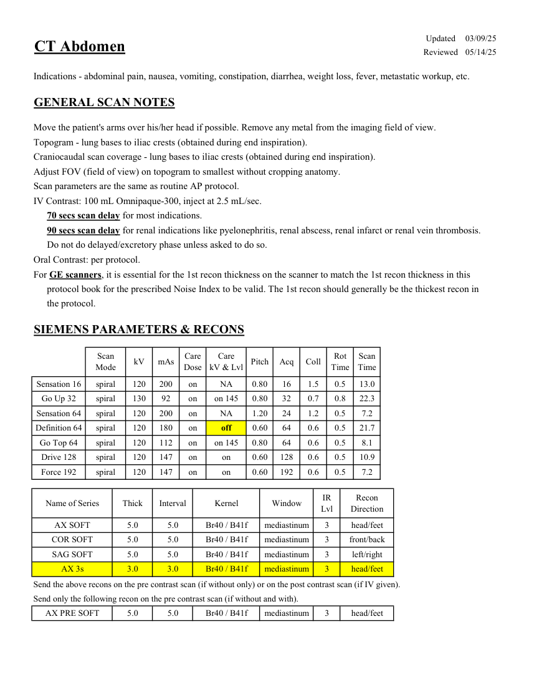
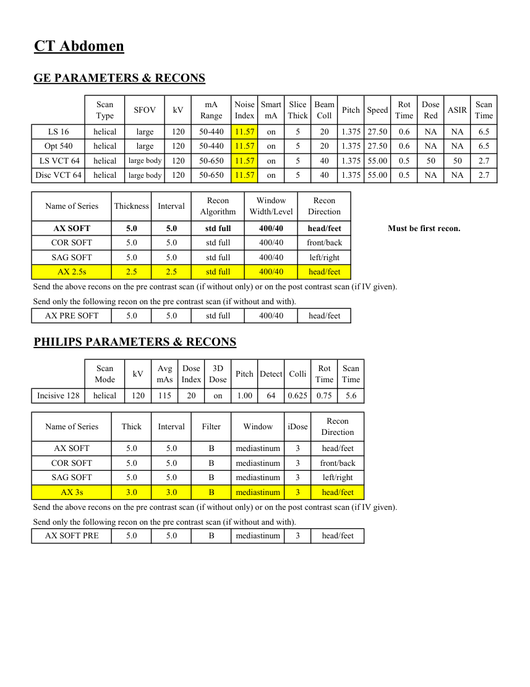

# CT — Abdomen de rutină (MCB)

## Documentul original MCB — Abdomen de rutină

**Protocol · 2 pagini · consultat la 2026-09-27.**

[Descarcă PDF-ul integral](../../assets/mcb-modalities/ct-abdomen-de-rutina-mcb/document.pdf) · [Sursa MCB](https://ref.mcbradiology.com/Protocols,%20Policies,%20Worksheets%20&%20Forms/CT/Protocols/Body/2%20Routine%20A.pdf) · [Catalogul MCB pentru această modalitate](../mcb/index.md)

Instrucțiunile, valorile și ilustrațiile din documentul original sunt păstrate în **engleză**. Titlul și navigarea sunt în română.

### Pagina 1

{ loading=lazy }

### Pagina 2

{ loading=lazy }

## Textul documentului original

??? abstract "Pagina 1 — text în engleză"

    
Updated
    03/09/25
    CT Abdomen
    Reviewed
    05/14/25
    Indications - abdominal pain, nausea, vomiting, constipation, diarrhea, weight loss, fever, metastatic workup, etc.
    GENERAL SCAN NOTES
    Move the patient&#x27;s arms over his/her head if possible. Remove any metal from the imaging field of view.
    Topogram - lung bases to iliac crests (obtained during end inspiration).
    Craniocaudal scan coverage - lung bases to iliac crests (obtained during end inspiration).
    Adjust FOV (field of view) on topogram to smallest without cropping anatomy.
    Scan parameters are the same as routine AP protocol.
    IV Contrast: 100 mL Omnipaque-300, inject at 2.5 mL/sec.
    70 secs scan delay for most indications.
    90 secs scan delay for renal indications like pyelonephritis, renal abscess, renal infarct or renal vein thrombosis.
    Do not do delayed/excretory phase unless asked to do so.
    Oral Contrast: per protocol.
    For GE scanners, it is essential for the 1st recon thickness on the scanner to match the 1st recon thickness in this
    protocol book for the prescribed Noise Index to be valid. The 1st recon should generally be the thickest recon in 
    the protocol.
    SIEMENS PARAMETERS &amp; RECONS
    Scan                           
    Care                            
    Care                                          
    Scan                 
    Mode
    kV
    mAs
    Dose
    kV &amp; Lvl
    Pitch
    Acq
    Coll
    Rot 
    Time
    Time
    on
    Sensation 16
    spiral
    120
    200
    NA
    0.80
    16
    1.5
    0.5
    13.0
    Go Up 32
    spiral
    130
    92
    on
    on 145
    0.80
    32
    0.7
    0.8
    22.3
    Sensation 64
    spiral
    120
    200
    on
    NA
    1.20
    24
    1.2
    0.5
    7.2
    Definition 64
    spiral
    120
    180
    on
    0.60
    64
    0.6
    0.5
    21.7
    off
    Go Top 64
    spiral
    120
    112
    on
    on 145
    0.80
    64
    0.6
    0.5
    8.1
    Drive 128
    spiral
    120
    147
    on
    on
    0.60
    128
    0.6
    0.5
    10.9
    Force 192
    spiral
    120
    147
    on
    on
    0.60
    192
    0.6
    0.5
    7.2
    IR                       
    Recon                     
    Name of Series
    Thick
    Interval
    Kernel
    Window
    Lvl
    Direction
    AX SOFT
    Br40 / B41f
    5.0
    5.0
    mediastinum
    3
    head/feet
    COR SOFT
    5.0
    5.0
    Br40 / B41f
    mediastinum
    3
    front/back
    SAG SOFT
    5.0
    Br40 / B41f
    5.0
    mediastinum
    3
    left/right
    AX 3s
    3.0
    3.0
    Br40 / B41f
    mediastinum
    3
    head/feet
    Send the above recons on the pre contrast scan (if without only) or on the post contrast scan (if IV given).
    Send only the following recon on the pre contrast scan (if without and with).
    AX PRE SOFT
    Br40 / B41f
    5.0
    5.0
    head/feet
    3
    mediastinum
    

??? abstract "Pagina 2 — text în engleză"

    
CT Abdomen
    GE PARAMETERS &amp; RECONS
    Scan               
    Smart             
    Slice                       
    Beam                                 
    Dose                                          
    Scan                 
    SFOV
    kV
    mA                          
    Speed
    Rot                                
    ASIR
    Type
    Range
    Noise                    
    Index
    mA
    Thick
    Coll
    Pitch
    Time
    Red
    Time
    11.57
    LS 16
    helical
    large
    120
    50-440
    on
    20
    5
    1.375 27.50
    0.6
    NA
    NA
    6.5
    Opt 540
    helical
    large
    120
    50-440
    11.57
    on
    5
    1.375
    20
    27.50
    0.6
    NA
    NA
    6.5
     LS VCT 64
    5
    helical
    large body
    120
    50-650
    11.57
    on
    2.7
    40
    0.5
    50
    50
    1.375 55.00
    Disc VCT 64
    helical
    large body
    120
    50-650
    11.57
    on
    5
    40
    1.375 55.00
    0.5
    NA
    NA
    2.7
    Window                                   
    Recon                                     
    Name of Series
    Thickness
    Interval
    Recon                                     
    Algorithm
    Width/Level
    Direction
    AX SOFT
    5.0
    5.0
    head/feet
    std full
    400/40
    Must be first recon.
    COR SOFT
    5.0
    5.0
    std full
    400/40
    front/back
    SAG SOFT
    5.0
    5.0
    std full
    400/40
    left/right
    AX 2.5s
    2.5
    2.5
    std full
    400/40
    head/feet
    Send the above recons on the pre contrast scan (if without only) or on the post contrast scan (if IV given).
    Send only the following recon on the pre contrast scan (if without and with).
    AX PRE SOFT
    5.0
    5.0
    std full
    400/40
    head/feet
    PHILIPS PARAMETERS &amp; RECONS
    Scan                           
    Avg                      
    Dose                                          
    3D            
    Rot 
    Scan                 
    kV
    Pitch Detect
    Colli
    Mode
    mAs
    Index
    Dose
    Time
    Time
    Incisive 128
    helical
    120
    115
    20
    on
    1.00
    64
    0.625
    0.75
    5.6
    Recon                     
    Name of Series
    Thick
    Interval
    Filter
    Window
    iDose
    Direction
    AX SOFT
    5.0
    5.0
    B
    mediastinum
    3
    head/feet
    COR SOFT
    5.0
    5.0
    B
    mediastinum
    3
    front/back
    SAG SOFT
    5.0
    5.0
    B
    mediastinum
    3
    left/right
    AX 3s
    3.0
    3.0
    B
    mediastinum
    3
    head/feet
    Send the above recons on the pre contrast scan (if without only) or on the post contrast scan (if IV given).
    Send only the following recon on the pre contrast scan (if without and with).
    AX SOFT PRE
    5.0
    5.0
    B
    mediastinum
    3
    head/feet
    

