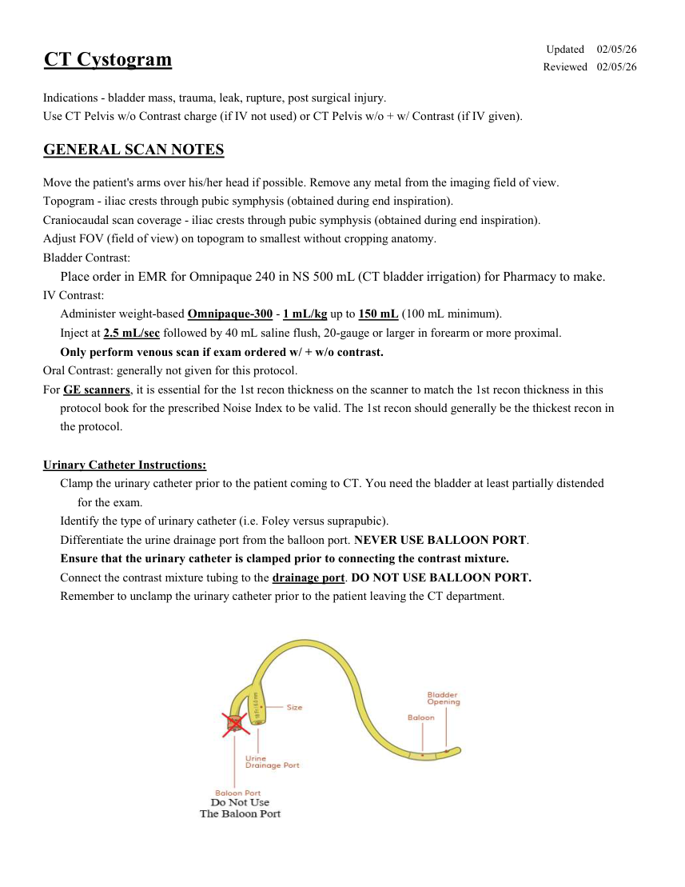
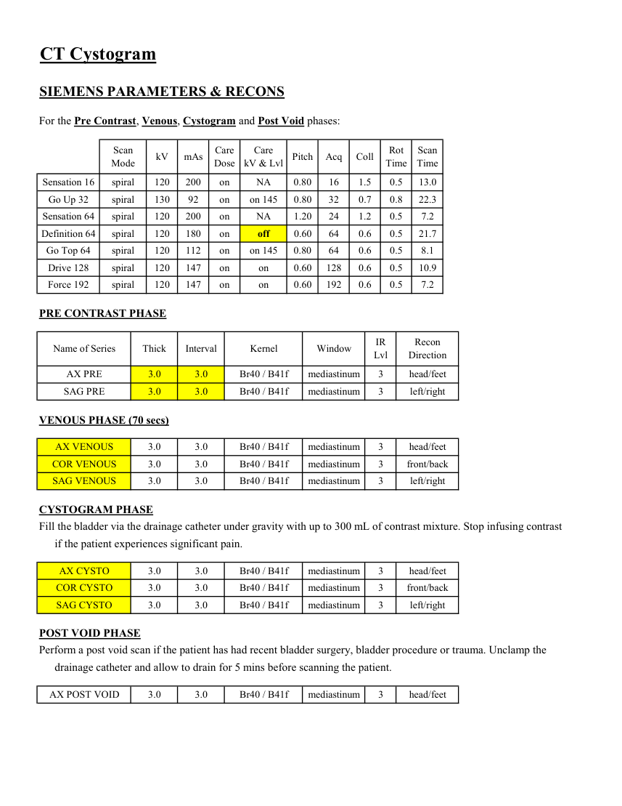
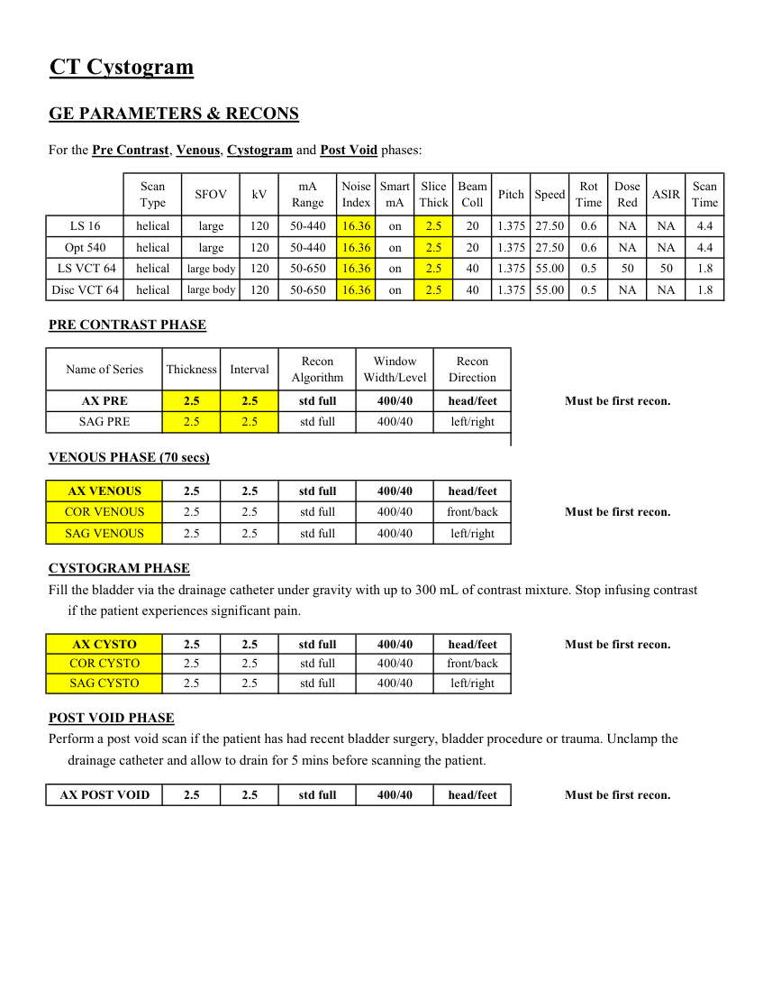
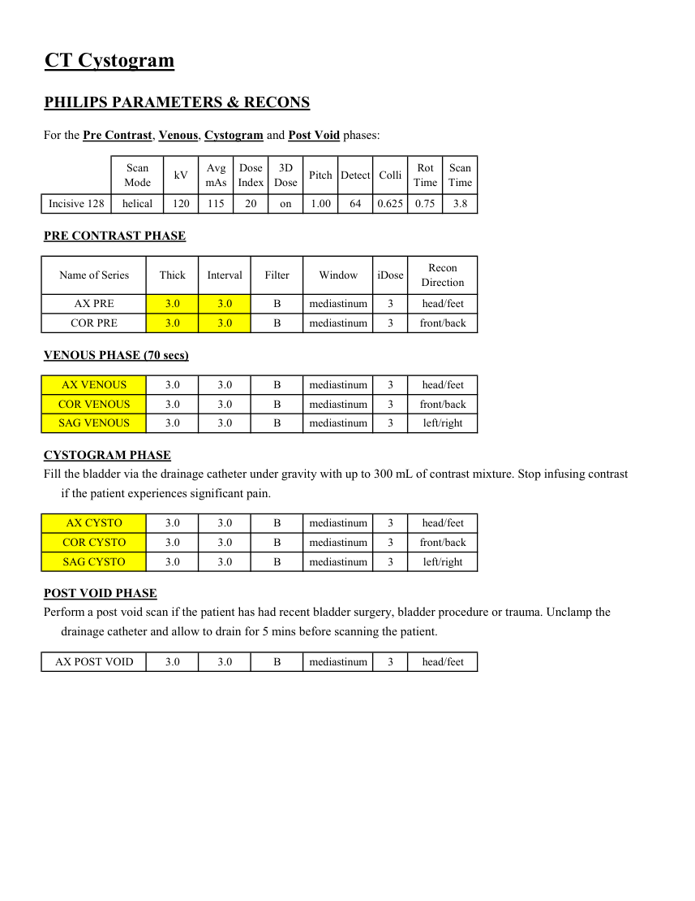

# CT — Cistografie (MCB)

## Documentul original MCB — Cistografie

**Protocol · 4 pagini · consultat la 2026-09-27.**

[Descarcă PDF-ul integral](../../assets/mcb-modalities/ct-cistografie-mcb/document.pdf) · [Sursa MCB](https://ref.mcbradiology.com/Protocols,%20Policies,%20Worksheets%20&%20Forms/CT/Protocols/Body/19%20Cystogram.pdf) · [Catalogul MCB pentru această modalitate](../mcb/index.md)

Instrucțiunile, valorile și ilustrațiile din documentul original sunt păstrate în **engleză**. Titlul și navigarea sunt în română.

### Pagina 1

{ loading=lazy }

### Pagina 2

{ loading=lazy }

### Pagina 3

{ loading=lazy }

### Pagina 4

{ loading=lazy }

## Textul documentului original

??? abstract "Pagina 1 — text în engleză"

    
Updated
    02/05/26
    CT Cystogram
    Reviewed
    02/05/26
    Indications - bladder mass, trauma, leak, rupture, post surgical injury.
    Use CT Pelvis w/o Contrast charge (if IV not used) or CT Pelvis w/o + w/ Contrast (if IV given).
    GENERAL SCAN NOTES
    Move the patient&#x27;s arms over his/her head if possible. Remove any metal from the imaging field of view.
    Topogram - iliac crests through pubic symphysis (obtained during end inspiration).
    Craniocaudal scan coverage - iliac crests through pubic symphysis (obtained during end inspiration).
    Adjust FOV (field of view) on topogram to smallest without cropping anatomy.
    Bladder Contrast:
    Place order in EMR for Omnipaque 240 in NS 500 mL (CT bladder irrigation) for Pharmacy to make.
    IV Contrast:
    Administer weight-based Omnipaque-300 - 1 mL/kg up to 150 mL (100 mL minimum).
    Inject at 2.5 mL/sec followed by 40 mL saline flush, 20-gauge or larger in forearm or more proximal.
    Only perform venous scan if exam ordered w/ + w/o contrast.
    Oral Contrast: generally not given for this protocol.
    For GE scanners, it is essential for the 1st recon thickness on the scanner to match the 1st recon thickness in this
    protocol book for the prescribed Noise Index to be valid. The 1st recon should generally be the thickest recon in 
    the protocol.
    Urinary Catheter Instructions:
    Clamp the urinary catheter prior to the patient coming to CT. You need the bladder at least partially distended
    for the exam.
    Identify the type of urinary catheter (i.e. Foley versus suprapubic).
    Differentiate the urine drainage port from the balloon port. NEVER USE BALLOON PORT.
    Ensure that the urinary catheter is clamped prior to connecting the contrast mixture.
    Connect the contrast mixture tubing to the drainage port. DO NOT USE BALLOON PORT.
    Remember to unclamp the urinary catheter prior to the patient leaving the CT department.
    

??? abstract "Pagina 2 — text în engleză"

    
CT Cystogram
    SIEMENS PARAMETERS &amp; RECONS
    For the Pre Contrast, Venous, Cystogram and Post Void phases:
    Scan                           
    Care                                          
    Rot 
    Scan                 
    Mode
    kV
    mAs
    Care                            
    Dose
    kV &amp; Lvl
    Pitch
    Acq
    Coll
    Time
    Time
    Sensation 16
    spiral
    120
    200
    on
    NA
    0.80
    16
    1.5
    0.5
    13.0
    Go Up 32
    spiral
    130
    92
    on
    on 145
    0.80
    32
    0.7
    0.8
    22.3
    Sensation 64
    spiral
    120
    200
    on
    NA
    1.20
    24
    1.2
    0.5
    7.2
    Definition 64
    spiral
    120
    180
    on
    0.5
    21.7
    off
    0.60
    64
    0.6
    Go Top 64
    spiral
    120
    112
    on
    on 145
    0.80
    64
    0.6
    0.5
    8.1
    Drive 128
    spiral
    120
    147
    on
    on
    0.60
    128
    0.6
    0.5
    10.9
    Force 192
    spiral
    120
    147
    on
    on
    0.60
    192
    0.6
    0.5
    7.2
    PRE CONTRAST PHASE
    IR                       
    Name of Series
    Thick
    Interval
    Window
    Recon                     
    Direction
    Kernel
    Lvl
    AX PRE
    3.0
    3.0
    mediastinum
    head/feet
    Br40 / B41f
    3
    SAG PRE
    3.0
    3.0
    mediastinum
    left/right
    Br40 / B41f
    3
    VENOUS PHASE (70 secs)
    AX VENOUS
    3.0
    3.0
    mediastinum
    head/feet
    Br40 / B41f
    3
    COR VENOUS
    3.0
    3.0
    mediastinum
    front/back
    Br40 / B41f
    3
    SAG VENOUS
    3.0
    3.0
    Br40 / B41f
    mediastinum
    left/right
    3
    CYSTOGRAM PHASE
    Fill the bladder via the drainage catheter under gravity with up to 300 mL of contrast mixture. Stop infusing contrast
    if the patient experiences significant pain.
    AX CYSTO
    3.0
    3.0
    mediastinum
    head/feet
    Br40 / B41f
    3
    COR CYSTO
    3.0
    3.0
    mediastinum
    front/back
    Br40 / B41f
    3
    SAG CYSTO
    3.0
    3.0
    mediastinum
    left/right
    Br40 / B41f
    3
    POST VOID PHASE
    Perform a post void scan if the patient has had recent bladder surgery, bladder procedure or trauma. Unclamp the 
    drainage catheter and allow to drain for 5 mins before scanning the patient.
    3
    AX POST VOID
    3.0
    3.0
    mediastinum
    head/feet
    Br40 / B41f
    

??? abstract "Pagina 3 — text în engleză"

    
CT Cystogram
    GE PARAMETERS &amp; RECONS
    For the Pre Contrast, Venous, Cystogram and Post Void phases:
    Scan               
    Smart             
    Slice                       
    Beam                                 
    Dose                                          
    Scan                 
    Speed
    Rot                                
    Type
    SFOV
    kV
    mA                          
    Range
    Noise                    
    Index
    mA
    Thick
    Coll
    Pitch
    Time
    Red
    ASIR
    Time
    LS 16
    helical
    large
    120
    50-440
    16.36
    on
    2.5
    20
    1.375 27.50
    0.6
    NA
    NA
    4.4
    Opt 540
    helical
    large
    120
    50-440
    16.36
    on
    2.5
    20
    1.375 27.50
    0.6
    NA
    NA
    4.4
     LS VCT 64
    helical
    large body
    120
    50-650
    16.36
    on
    2.5
    40
    1.375 55.00
    0.5
    50
    50
    1.8
    Disc VCT 64
    helical
    large body
    120
    50-650
    16.36
    on
    2.5
    40
    1.375 55.00
    0.5
    NA
    NA
    1.8
    PRE CONTRAST PHASE
    Window                                   
    Recon                                     
    Name of Series
    Thickness
    Interval
    Recon                                     
    Algorithm
    Width/Level
    Direction
    AX PRE
    2.5
    2.5
    std full
    400/40
    head/feet
    Must be first recon.
    SAG PRE
    2.5
    2.5
    std full
    400/40
    left/right
    VENOUS PHASE (70 secs)
    AX VENOUS
    2.5
    2.5
    std full
    400/40
    head/feet
    COR VENOUS
    2.5
    2.5
    std full
    400/40
    front/back
    Must be first recon.
    SAG VENOUS
    2.5
    2.5
    std full
    400/40
    left/right
    CYSTOGRAM PHASE
    Fill the bladder via the drainage catheter under gravity with up to 300 mL of contrast mixture. Stop infusing contrast
    if the patient experiences significant pain.
    AX CYSTO
    2.5
    2.5
    std full
    400/40
    head/feet
    Must be first recon.
    COR CYSTO
    2.5
    2.5
    std full
    400/40
    front/back
    SAG CYSTO
    2.5
    2.5
    std full
    400/40
    left/right
    POST VOID PHASE
    Perform a post void scan if the patient has had recent bladder surgery, bladder procedure or trauma. Unclamp the 
    drainage catheter and allow to drain for 5 mins before scanning the patient.
    AX POST VOID
    2.5
    2.5
    std full
    400/40
    head/feet
    Must be first recon.
    

??? abstract "Pagina 4 — text în engleză"

    
CT Cystogram
    PHILIPS PARAMETERS &amp; RECONS
    For the Pre Contrast, Venous, Cystogram and Post Void phases:
    Scan                           
    Dose                                          
    3D            
    Scan                 
    Mode
    kV
    Avg                      
    mAs
    Index
    Dose
    Pitch Detect Colli
    Rot 
    Time
    Time
    Incisive 128
    helical
    120
    115
    20
    on
    1.00
    64
    0.625
    0.75
    3.8
    PRE CONTRAST PHASE
    Name of Series
    Thick
    Interval
    Filter
    Window
    iDose
    Recon                     
    Direction
    AX PRE
    3.0
    3.0
    B
    mediastinum
    3
    head/feet
    COR PRE
    3.0
    3.0
    B
    mediastinum
    3
    front/back
    VENOUS PHASE (70 secs)
    AX VENOUS
    3.0
    3.0
    B
    mediastinum
    3
    head/feet
    COR VENOUS
    3.0
    3.0
    B
    mediastinum
    3
    front/back
    3.0
    3.0
    B
    mediastinum
    3
    left/right
    SAG VENOUS
    CYSTOGRAM PHASE
    Fill the bladder via the drainage catheter under gravity with up to 300 mL of contrast mixture. Stop infusing contrast
    if the patient experiences significant pain.
    AX CYSTO
    3.0
    3.0
    B
    mediastinum
    3
    head/feet
    COR CYSTO
    3.0
    3.0
    B
    mediastinum
    3
    front/back
    SAG CYSTO
    3.0
    3.0
    B
    mediastinum
    3
    left/right
    POST VOID PHASE
    Perform a post void scan if the patient has had recent bladder surgery, bladder procedure or trauma. Unclamp the 
    drainage catheter and allow to drain for 5 mins before scanning the patient.
    3.0
    3.0
    B
    mediastinum
    3
    head/feet
    AX POST VOID
    

