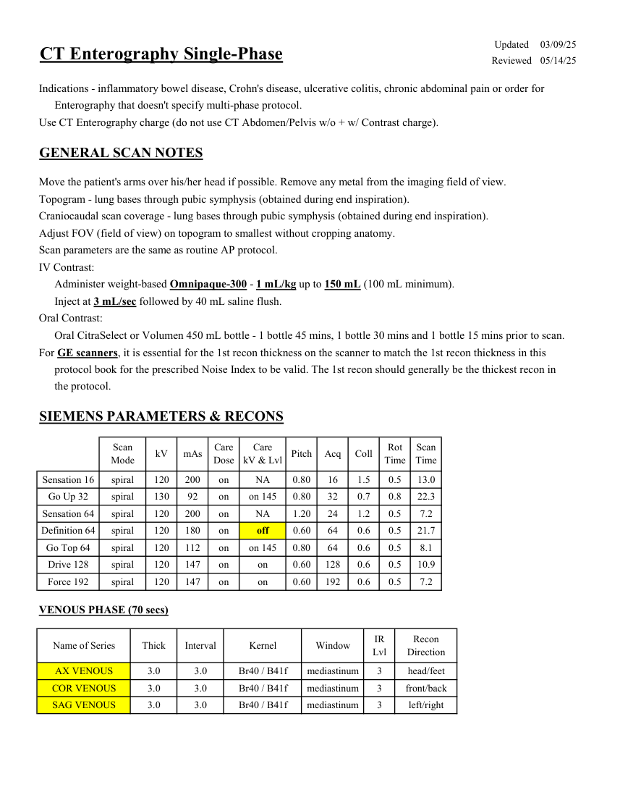
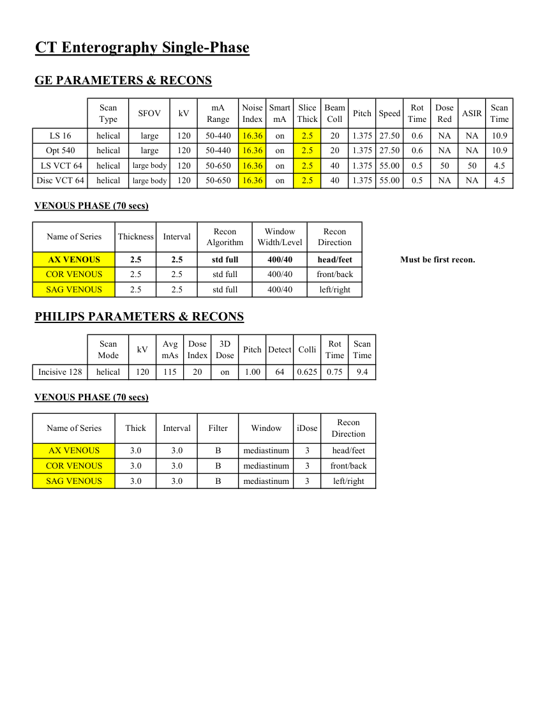

# CT — Enterografie monofazică (MCB)

## Documentul original MCB — Enterografie monofazică

**Protocol · 2 pagini · consultat la 2026-09-27.**

[Descarcă PDF-ul integral](../../assets/mcb-modalities/ct-enterografie-monofazica-mcb/document.pdf) · [Sursa MCB](https://ref.mcbradiology.com/Protocols,%20Policies,%20Worksheets%20&%20Forms/CT/Protocols/Body/6%20Enterography%20Single-Phase.pdf) · [Catalogul MCB pentru această modalitate](../mcb/index.md)

Instrucțiunile, valorile și ilustrațiile din documentul original sunt păstrate în **engleză**. Titlul și navigarea sunt în română.

### Pagina 1

{ loading=lazy }

### Pagina 2

{ loading=lazy }

## Textul documentului original

??? abstract "Pagina 1 — text în engleză"

    
Updated
    03/09/25
    CT Enterography Single-Phase
    Reviewed
    05/14/25
    Indications - inflammatory bowel disease, Crohn&#x27;s disease, ulcerative colitis, chronic abdominal pain or order for 
    Enterography that doesn&#x27;t specify multi-phase protocol.
    Use CT Enterography charge (do not use CT Abdomen/Pelvis w/o + w/ Contrast charge).
    GENERAL SCAN NOTES
    Move the patient&#x27;s arms over his/her head if possible. Remove any metal from the imaging field of view.
    Topogram - lung bases through pubic symphysis (obtained during end inspiration).
    Craniocaudal scan coverage - lung bases through pubic symphysis (obtained during end inspiration).
    Adjust FOV (field of view) on topogram to smallest without cropping anatomy.
    Scan parameters are the same as routine AP protocol.
    IV Contrast:
    Administer weight-based Omnipaque-300 - 1 mL/kg up to 150 mL (100 mL minimum).
    Inject at 3 mL/sec followed by 40 mL saline flush.
    Oral Contrast: 
    Oral CitraSelect or Volumen 450 mL bottle - 1 bottle 45 mins, 1 bottle 30 mins and 1 bottle 15 mins prior to scan.
    For GE scanners, it is essential for the 1st recon thickness on the scanner to match the 1st recon thickness in this
    protocol book for the prescribed Noise Index to be valid. The 1st recon should generally be the thickest recon in 
    the protocol.
    SIEMENS PARAMETERS &amp; RECONS
    Scan                           
    Care                                          
    Scan                 
    Mode
    kV
    mAs
    Care                            
    Dose
    kV &amp; Lvl
    Pitch
    Acq
    Coll
    Rot 
    Time
    Time
    Sensation 16
    spiral
    120
    200
    on
    NA
    0.80
    16
    1.5
    0.5
    13.0
    Go Up 32
    spiral
    130
    92
    on
    on 145
    0.80
    32
    0.7
    0.8
    22.3
    Sensation 64
    spiral
    120
    200
    on
    NA
    1.20
    24
    1.2
    0.5
    7.2
    Definition 64
    spiral
    120
    180
    on
    off
    0.60
    64
    0.6
    0.5
    21.7
    Go Top 64
    spiral
    120
    112
    on
    on 145
    0.80
    64
    0.6
    0.5
    8.1
    Drive 128
    spiral
    120
    147
    on
    on
    0.60
    128
    0.6
    0.5
    10.9
    Force 192
    spiral
    120
    147
    on
    on
    0.60
    192
    0.6
    0.5
    7.2
    VENOUS PHASE (70 secs)
    Recon                     
    Name of Series
    Thick
    Interval
    Kernel
    Window
    IR                       
    Lvl
    Direction
    AX VENOUS
    3.0
    3.0
    Br40 / B41f
    mediastinum
    3
    head/feet
    COR VENOUS
    3.0
    3.0
    Br40 / B41f
    mediastinum
    3
    front/back
    SAG VENOUS
    3.0
    3.0
    Br40 / B41f
    mediastinum
    3
    left/right
    

??? abstract "Pagina 2 — text în engleză"

    
CT Enterography Single-Phase
    GE PARAMETERS &amp; RECONS
    Scan               
    Smart             
    Slice                       
    Beam                                 
    Rot                                
    Dose                                          
    Scan                 
    Type
    SFOV
    kV
    mA                          
    Range
    Speed
    Noise                    
    Index
    mA
    Thick
    Coll
    Pitch
    Time
    Red
    ASIR
    Time
    LS 16
    helical
    large
    120
    50-440
    16.36
    on
    2.5
    20
    1.375 27.50
    0.6
    NA
    NA
    10.9
    Opt 540
    helical
    large
    120
    50-440
    16.36
    on
    2.5
    20
    1.375 27.50
    0.6
    NA
    NA
    10.9
     LS VCT 64
    helical
    large body
    120
    50-650
    16.36
    on
    2.5
    40
    1.375 55.00
    0.5
    50
    50
    4.5
    Disc VCT 64
    helical
    large body
    120
    50-650
    16.36
    on
    2.5
    40
    1.375 55.00
    0.5
    NA
    NA
    4.5
    VENOUS PHASE (70 secs)
    Recon                                     
    Window                                   
    Recon                                     
    Name of Series
    Thickness
    Interval
    Algorithm
    Width/Level
    Direction
    AX VENOUS
    2.5
    2.5
    std full
    400/40
    head/feet
    Must be first recon.
    COR VENOUS
    2.5
    2.5
    std full
    400/40
    front/back
    std full
    400/40
    left/right
    SAG VENOUS
    2.5
    2.5
    PHILIPS PARAMETERS &amp; RECONS
    Scan                           
    Dose                                          
    3D            
    Rot 
    Scan                 
    Pitch Detect Colli
    Mode
    kV
    Avg                      
    mAs
    Index
    Dose
    Time
    Time
    Incisive 128
    helical
    120
    115
    20
    on
    1.00
    64
    0.625
    0.75
    9.4
    VENOUS PHASE (70 secs)
    Recon                     
    Direction
    Name of Series
    Thick
    Interval
    Filter
    Window
    iDose
    AX VENOUS
    3.0
    3.0
    B
    mediastinum
    3
    head/feet
    COR VENOUS
    3.0
    3.0
    B
    mediastinum
    3
    front/back
    left/right
    SAG VENOUS
    3.0
    3.0
    B
    mediastinum
    3
    

