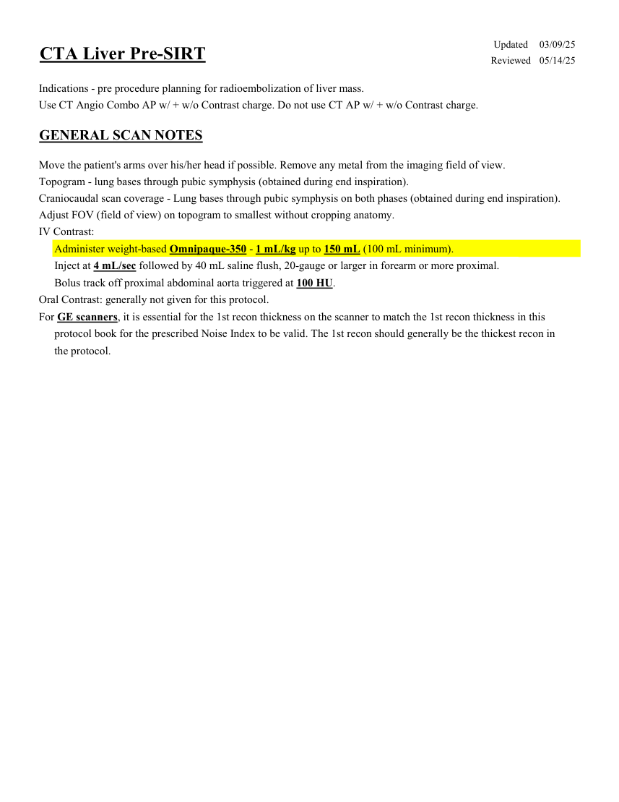
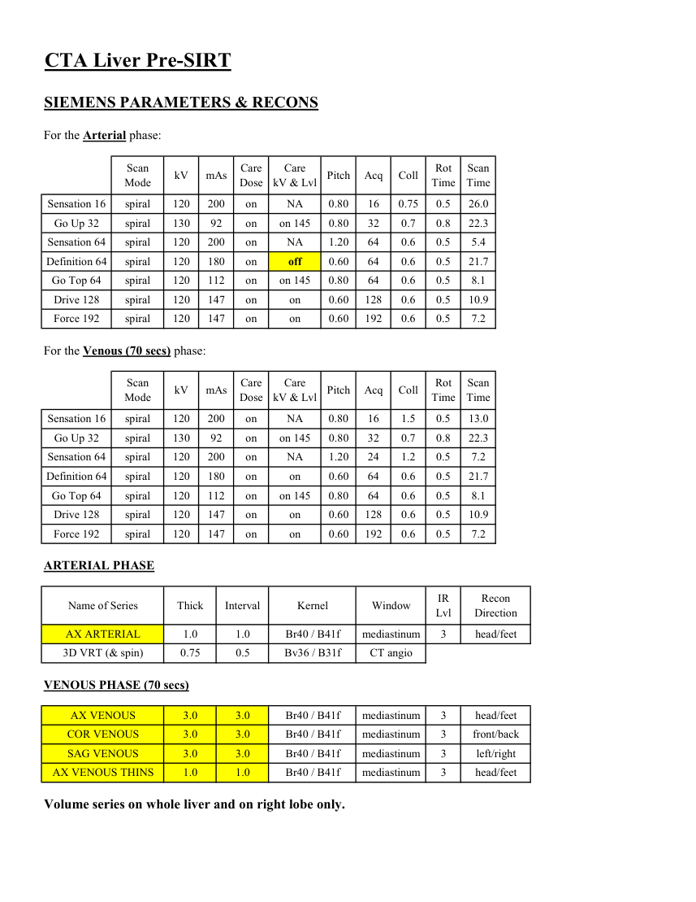
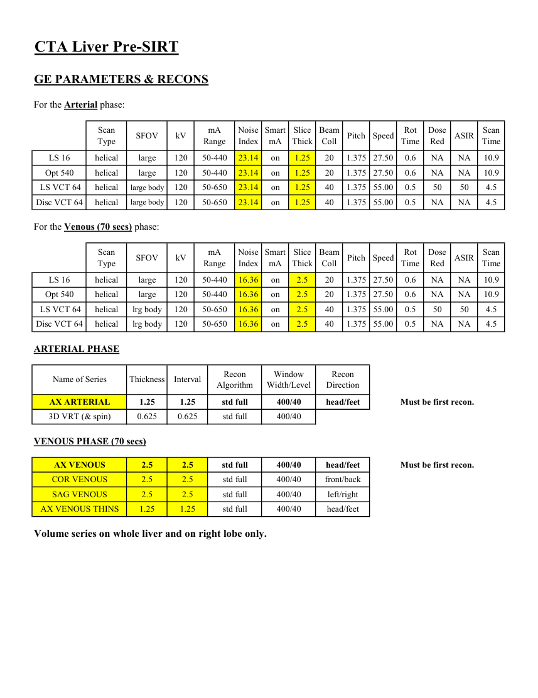
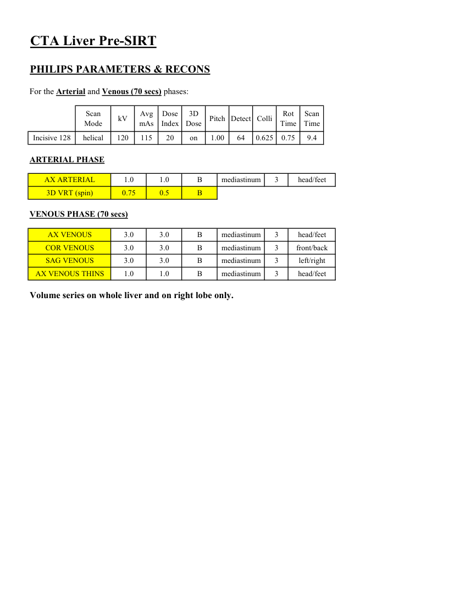

# CT — Ficat înainte de SIRT (MCB)

## Documentul original MCB — Ficat înainte de SIRT

**Protocol · 4 pagini · consultat la 2026-09-27.**

[Descarcă PDF-ul integral](../../assets/mcb-modalities/ct-ficat-inainte-de-sirt-mcb/document.pdf) · [Sursa MCB](https://ref.mcbradiology.com/Protocols,%20Policies,%20Worksheets%20&%20Forms/CT/Protocols/Body/11%20Liver%20Pre-SIRT.pdf) · [Catalogul MCB pentru această modalitate](../mcb/index.md)

Instrucțiunile, valorile și ilustrațiile din documentul original sunt păstrate în **engleză**. Titlul și navigarea sunt în română.

### Pagina 1

{ loading=lazy }

### Pagina 2

{ loading=lazy }

### Pagina 3

{ loading=lazy }

### Pagina 4

{ loading=lazy }

## Textul documentului original

??? abstract "Pagina 1 — text în engleză"

    
Updated
    03/09/25
    CTA Liver Pre-SIRT
    Reviewed
    05/14/25
    Indications - pre procedure planning for radioembolization of liver mass.
    Use CT Angio Combo AP w/ + w/o Contrast charge. Do not use CT AP w/ + w/o Contrast charge.
    GENERAL SCAN NOTES
    Move the patient&#x27;s arms over his/her head if possible. Remove any metal from the imaging field of view.
    Topogram - lung bases through pubic symphysis (obtained during end inspiration).
    Craniocaudal scan coverage - Lung bases through pubic symphysis on both phases (obtained during end inspiration).
    Adjust FOV (field of view) on topogram to smallest without cropping anatomy.
    IV Contrast:
    Administer weight-based Omnipaque-350 - 1 mL/kg up to 150 mL (100 mL minimum).
    Inject at 4 mL/sec followed by 40 mL saline flush, 20-gauge or larger in forearm or more proximal.
    Bolus track off proximal abdominal aorta triggered at 100 HU.
    Oral Contrast: generally not given for this protocol.
    For GE scanners, it is essential for the 1st recon thickness on the scanner to match the 1st recon thickness in this
    protocol book for the prescribed Noise Index to be valid. The 1st recon should generally be the thickest recon in 
    the protocol.
    

??? abstract "Pagina 2 — text în engleză"

    
CTA Liver Pre-SIRT
    SIEMENS PARAMETERS &amp; RECONS
    For the Arterial phase:
    Scan                           
    Rot 
    Scan                 
    Mode
    kV
    mAs
    Care                            
    Dose
    Pitch
    Acq
    Coll
    Care                                          
    kV &amp; Lvl
    Time
    Time
    Sensation 16
    spiral
    120
    200
    on
    0.80
    16
    0.75
    NA
    0.5
    26.0
    Go Up 32
    spiral
    130
    92
    on
    0.80
    on 145
    32
    0.7
    0.8
    22.3
    Sensation 64
    spiral
    120
    200
    on
    1.20
    64
    0.6
    0.5
    NA
    5.4
    0.5
    21.7
    Definition 64
    spiral
    120
    180
    on
    0.60
    64
    0.6
    off
    Go Top 64
    spiral
    120
    112
    on
    0.80
    64
    0.6
    0.5
    on 145
    8.1
    Drive 128
    spiral
    120
    147
    on
    0.60
    128
    0.6
    on
    0.5
    10.9
    Force 192
    spiral
    120
    147
    on
    0.60
    192
    0.6
    0.5
    on
    7.2
    For the Venous (70 secs) phase:
    Scan                           
    Rot 
    Scan                 
    Mode
    kV
    mAs
    Care                            
    Dose
    Pitch
    Acq
    Coll
    Care                                          
    kV &amp; Lvl
    Time
    Time
    Sensation 16
    spiral
    120
    200
    on
    0.80
    16
    1.5
    0.5
    NA
    13.0
    Go Up 32
    spiral
    130
    92
    on
    0.80
    32
    0.7
    on 145
    0.8
    22.3
    Sensation 64
    spiral
    120
    200
    on
    1.20
    24
    1.2
    0.5
    NA
    7.2
    Definition 64
    spiral
    120
    180
    on
    0.60
    64
    0.6
    on
    0.5
    21.7
    Go Top 64
    spiral
    120
    112
    on
    0.80
    64
    0.6
    0.5
    on 145
    8.1
    Drive 128
    spiral
    120
    147
    on
    0.60
    128
    0.6
    0.5
    on
    10.9
    Force 192
    spiral
    120
    147
    on
    0.60
    192
    0.6
    on
    0.5
    7.2
    ARTERIAL PHASE
    IR                       
    Name of Series
    Thick
    Interval
    Kernel
    Window
    Recon                     
    Lvl
    Direction
    AX ARTERIAL
    Br40 / B41f
    1.0
    1.0
    mediastinum
    head/feet
    3
    3D VRT (&amp; spin)
    0.75
    0.5
    Bv36 / B31f
    CT angio
    VENOUS PHASE (70 secs)
    AX VENOUS
    3.0
    3.0
    Br40 / B41f
    mediastinum
    3
    head/feet
    COR VENOUS
    3.0
    3.0
    Br40 / B41f
    mediastinum
    3
    front/back
    SAG VENOUS
    3.0
    3.0
    Br40 / B41f
    mediastinum
    3
    left/right
    AX VENOUS THINS
    1.0
    1.0
    Br40 / B41f
    mediastinum
    3
    head/feet
    Volume series on whole liver and on right lobe only.
    

??? abstract "Pagina 3 — text în engleză"

    
CTA Liver Pre-SIRT
    GE PARAMETERS &amp; RECONS
    For the Arterial phase:
    Scan               
    Smart             
    Slice                       
    Beam                                 
    Rot                                
    Scan                 
    kV
    mA                          
    ASIR
    Dose                                          
    Type
    SFOV
    Range
    Noise                    
    Index
    mA
    Thick
    Coll
    Pitch
    Time
    Speed
    Red
    Time
    LS 16
    helical
    large
    120
    50-440
    23.14
    on
    1.25
    20
    1.375
    10.9
    NA
    NA
    0.6
    27.50
    23.14
    on
    1.25
    20
    1.375
    Opt 540
    helical
    large
    120
    50-440
    NA
    NA
    0.6
    27.50
    10.9
     LS VCT 64
    helical
    large body
    120
    50-650
    23.14
    on
    1.25
    40
    1.375 55.00
    0.5
    50
    50
    4.5
    Disc VCT 64
    helical
    large body
    120
    50-650
    23.14
    on
    1.25
    40
    1.375 55.00
    0.5
    NA
    NA
    4.5
    For the Venous (70 secs) phase:
    Scan               
    Smart             
    Slice                       
    Beam                                 
    Dose                                          
    Scan                 
    Speed
    Rot                                
    Type
    SFOV
    kV
    mA                          
    Range
    Noise                    
    Index
    mA
    Thick
    Coll
    Pitch
    Time
    Red
    ASIR
    Time
    LS 16
    helical
    large
    120
    50-440
    16.36
    on
    2.5
    20
    1.375 27.50
    0.6
    NA
    NA
    10.9
    Opt 540
    helical
    large
    120
    50-440
    16.36
    on
    2.5
    20
    1.375 27.50
    0.6
    NA
    NA
    10.9
     LS VCT 64
    helical
    lrg body
    120
    50-650
    16.36
    on
    2.5
    40
    1.375 55.00
    0.5
    50
    50
    4.5
    Disc VCT 64
    helical
    0.5
    NA
    NA
    lrg body
    120
    50-650
    16.36
    on
    2.5
    40
    1.375 55.00
    4.5
    ARTERIAL PHASE
    Window                                   
    Recon                                     
    Name of Series
    Thickness
    Interval
    Recon                                     
    Algorithm
    Width/Level
    Direction
    AX ARTERIAL
    1.25
    1.25
    std full
    400/40
    head/feet
    Must be first recon.
    3D VRT (&amp; spin)
    0.625
    0.625
    std full
    400/40
    VENOUS PHASE (70 secs)
    AX VENOUS
    2.5
    2.5
    std full
    400/40
    head/feet
    Must be first recon.
    COR VENOUS
    2.5
    2.5
    std full
    400/40
    front/back
    2.5
    2.5
    std full
    400/40
    left/right
    SAG VENOUS
    AX VENOUS THINS
    1.25
    1.25
    std full
    400/40
    head/feet
    Volume series on whole liver and on right lobe only.
    

??? abstract "Pagina 4 — text în engleză"

    
CTA Liver Pre-SIRT
    PHILIPS PARAMETERS &amp; RECONS
    For the Arterial and Venous (70 secs) phases:
    Scan                           
    Dose                                          
    3D            
    Rot 
    Scan                 
    Mode
    kV
    Avg                      
    mAs
    Index
    Dose
    Pitch Detect Colli
    Time
    Time
    Incisive 128
    helical
    120
    115
    20
    on
    1.00
    64
    0.625
    9.4
    0.75
    ARTERIAL PHASE
    AX ARTERIAL
    1.0
    1.0
    B
    mediastinum
    3
    head/feet
    3D VRT (spin)
    0.75
    0.5
    B
    VENOUS PHASE (70 secs)
    AX VENOUS
    3.0
    3.0
    B
    mediastinum
    3
    head/feet
    COR VENOUS
    3.0
    3.0
    B
    mediastinum
    3
    front/back
    SAG VENOUS
    3.0
    3.0
    B
    mediastinum
    3
    left/right
    AX VENOUS THINS
    1.0
    1.0
    B
    mediastinum
    3
    head/feet
    Volume series on whole liver and on right lobe only.
    

