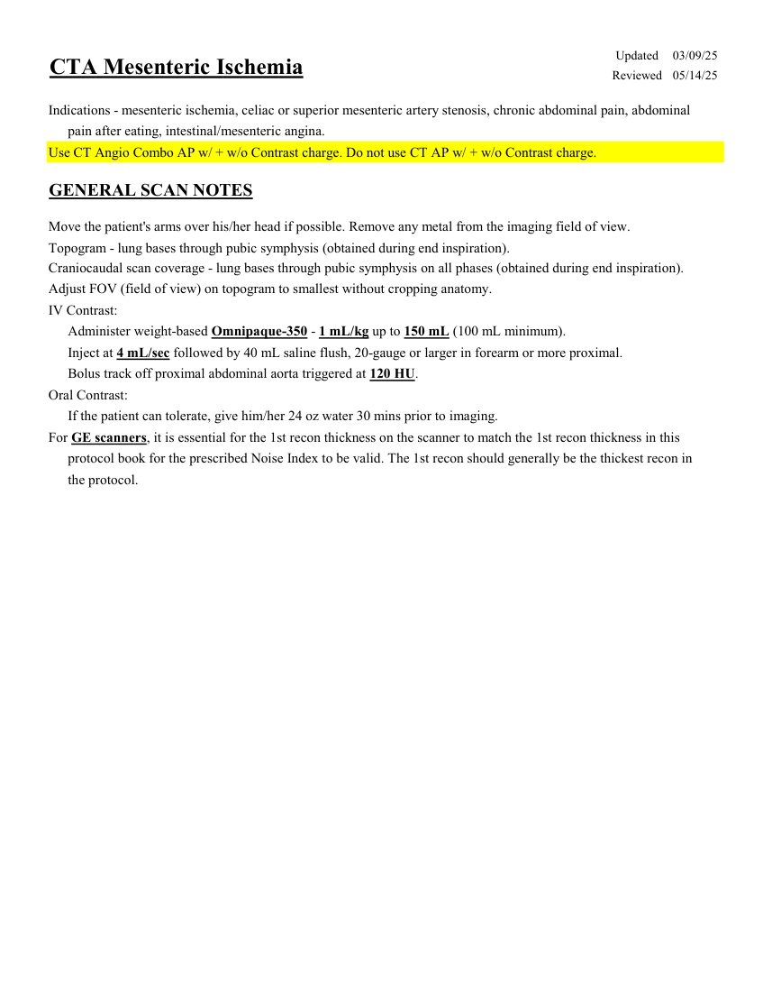
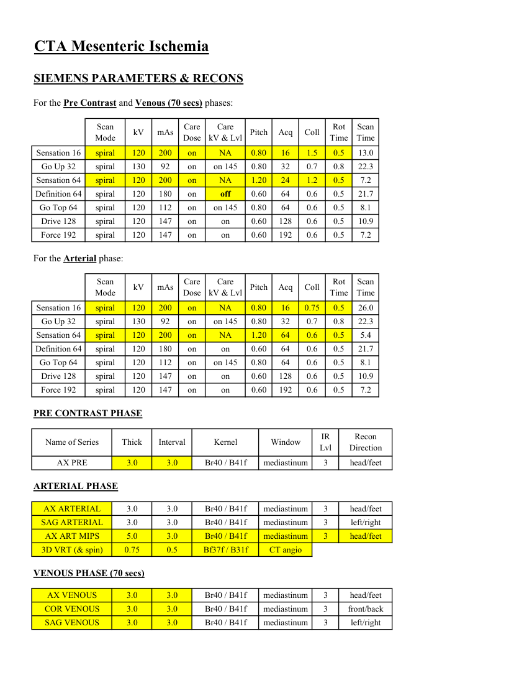
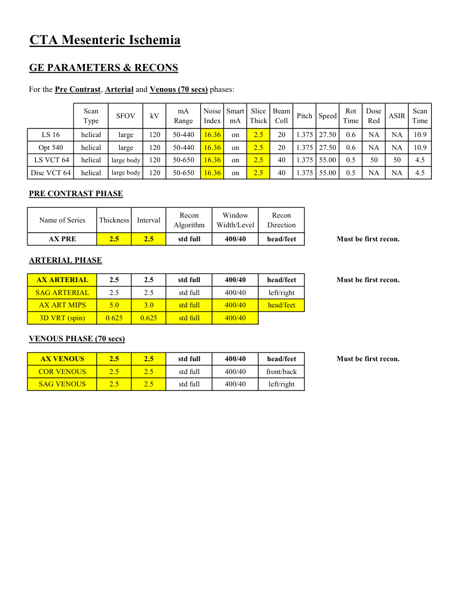
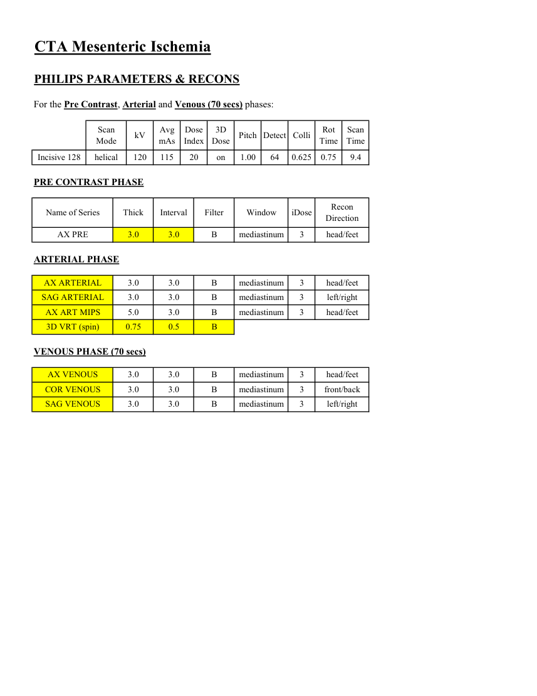

# CT — Ischemie mezenterică (MCB)

## Documentul original MCB — Ischemie mezenterică

**Protocol · 4 pagini · consultat la 2026-09-27.**

[Descarcă PDF-ul integral](../../assets/mcb-modalities/ct-ischemie-mezenterica-mcb/document.pdf) · [Sursa MCB](https://ref.mcbradiology.com/Protocols,%20Policies,%20Worksheets%20&%20Forms/CT/Protocols/Body/8%20Mesenteric%20Ischemia.pdf) · [Catalogul MCB pentru această modalitate](../mcb/index.md)

Instrucțiunile, valorile și ilustrațiile din documentul original sunt păstrate în **engleză**. Titlul și navigarea sunt în română.

### Pagina 1

{ loading=lazy }

### Pagina 2

{ loading=lazy }

### Pagina 3

{ loading=lazy }

### Pagina 4

{ loading=lazy }

## Textul documentului original

??? abstract "Pagina 1 — text în engleză"

    
Updated
    03/09/25
    CTA Mesenteric Ischemia
    Reviewed
    05/14/25
    Indications - mesenteric ischemia, celiac or superior mesenteric artery stenosis, chronic abdominal pain, abdominal
    pain after eating, intestinal/mesenteric angina.
    Use CT Angio Combo AP w/ + w/o Contrast charge. Do not use CT AP w/ + w/o Contrast charge.
    GENERAL SCAN NOTES
    Move the patient&#x27;s arms over his/her head if possible. Remove any metal from the imaging field of view.
    Topogram - lung bases through pubic symphysis (obtained during end inspiration).
    Craniocaudal scan coverage - lung bases through pubic symphysis on all phases (obtained during end inspiration).
    Adjust FOV (field of view) on topogram to smallest without cropping anatomy.
    IV Contrast:
    Administer weight-based Omnipaque-350 - 1 mL/kg up to 150 mL (100 mL minimum).
    Inject at 4 mL/sec followed by 40 mL saline flush, 20-gauge or larger in forearm or more proximal.
    Bolus track off proximal abdominal aorta triggered at 120 HU.
    Oral Contrast: 
    If the patient can tolerate, give him/her 24 oz water 30 mins prior to imaging.
    For GE scanners, it is essential for the 1st recon thickness on the scanner to match the 1st recon thickness in this
    protocol book for the prescribed Noise Index to be valid. The 1st recon should generally be the thickest recon in 
    the protocol.
    

??? abstract "Pagina 2 — text în engleză"

    
CTA Mesenteric Ischemia
    SIEMENS PARAMETERS &amp; RECONS
    For the Pre Contrast and Venous (70 secs) phases:
    Scan                           
    Care                                          
    Scan                 
    Mode
    kV
    mAs
    Care                            
    Dose
    Pitch
    Acq
    Coll
    Rot 
    kV &amp; Lvl
    Time
    Time
    Sensation 16
    spiral
    120
    200
    on
    0.80
    16
    1.5
    NA
    0.5
    13.0
    Go Up 32
    spiral
    130
    92
    on
    0.80
    32
    0.7
    0.8
    on 145
    22.3
    Sensation 64
    spiral
    120
    200
    on
    1.20
    24
    1.2
    NA
    0.5
    7.2
    Definition 64
    spiral
    120
    180
    on
    0.60
    64
    0.6
    0.5
    21.7
    off
    Go Top 64
    spiral
    120
    112
    on
    0.80
    64
    0.6
    on 145
    0.5
    8.1
    Drive 128
    spiral
    120
    147
    on
    0.60
    128
    0.6
    0.5
    on
    10.9
    Force 192
    spiral
    120
    147
    on
    0.60
    192
    0.6
    on
    0.5
    7.2
    For the Arterial phase:
    Scan                           
    Care                                          
    Scan                 
    Mode
    kV
    mAs
    Care                            
    Dose
    Pitch
    Acq
    Coll
    Rot 
    kV &amp; Lvl
    Time
    Time
    Sensation 16
    spiral
    120
    200
    on
    0.80
    16
    0.75
    NA
    0.5
    26.0
    Go Up 32
    spiral
    130
    92
    on
    0.80
    32
    0.7
    0.8
    on 145
    22.3
    Sensation 64
    spiral
    120
    200
    on
    1.20
    64
    0.6
    NA
    0.5
    5.4
    Definition 64
    spiral
    120
    180
    on
    0.60
    64
    0.6
    0.5
    on
    21.7
    Go Top 64
    spiral
    120
    112
    on
    0.80
    64
    0.6
    on 145
    0.5
    8.1
    Drive 128
    spiral
    120
    147
    on
    0.60
    128
    0.6
    0.5
    on
    10.9
    Force 192
    spiral
    120
    147
    on
    on
    0.60
    192
    0.6
    0.5
    7.2
    PRE CONTRAST PHASE
    Recon                     
    Name of Series
    Thick
    Interval
    Kernel
    Window
    IR                       
    Lvl
    Direction
    AX PRE
    3.0
    3.0
    Br40 / B41f
    mediastinum
    3
    head/feet
    ARTERIAL PHASE
    AX ARTERIAL
    3.0
    3.0
    Br40 / B41f
    mediastinum
    3
    head/feet
    SAG ARTERIAL
    3
    3.0
    3.0
    Br40 / B41f
    mediastinum
    left/right
    AX ART MIPS
    5.0
    3.0
    mediastinum
    head/feet
    Br40 / B41f
    3
    3D VRT (&amp; spin)
    0.75
    0.5
    CT angio
    Bf37f / B31f
    VENOUS PHASE (70 secs)
    AX VENOUS
    3.0
    3.0
    Br40 / B41f
    mediastinum
    3
    head/feet
    COR VENOUS
    3.0
    3.0
    Br40 / B41f
    mediastinum
    3
    front/back
    SAG VENOUS
    3.0
    3.0
    Br40 / B41f
    mediastinum
    3
    left/right
    

??? abstract "Pagina 3 — text în engleză"

    
CTA Mesenteric Ischemia
    GE PARAMETERS &amp; RECONS
    For the Pre Contrast, Arterial and Venous (70 secs) phases:
    Scan               
    Smart             
    Slice                       
    Beam                                 
    Dose                                          
    Scan                 
    Type
    SFOV
    kV
    mA                          
    Range
    Noise                    
    Index
    mA
    Thick
    Coll
    Pitch
    Speed
    Rot                                
    Time
    Red
    ASIR
    Time
    LS 16
    16.36
    helical
    large
    120
    50-440
    on
    2.5
    20
    1.375
    27.50
    0.6
    NA
    NA
    10.9
    Opt 540
    helical
    on
    2.5
    20
    1.375
    large
    120
    50-440
    16.36
    27.50
    0.6
    NA
    NA
    10.9
     LS VCT 64
    helical
    large body
    120
    50-650
    16.36
    on
    2.5
    40
    1.375 55.00
    0.5
    50
    50
    4.5
    Disc VCT 64
    helical
    large body
    120
    50-650
    16.36
    on
    2.5
    1.375 55.00
    0.5
    NA
    NA
    40
    4.5
    PRE CONTRAST PHASE
    Window                                   
    Recon                                     
    Name of Series
    Thickness
    Interval
    Recon                                     
    Algorithm
    Width/Level
    Direction
    AX PRE
    2.5
    2.5
    std full
    400/40
    head/feet
    Must be first recon.
    ARTERIAL PHASE
    AX ARTERIAL
    2.5
    2.5
    std full
    400/40
    head/feet
    Must be first recon.
    SAG ARTERIAL
    2.5
    2.5
    std full
    400/40
    left/right
    AX ART MIPS
    5.0
    3.0
    std full
    400/40
    head/feet
    3D VRT (spin)
    0.625
    0.625
    std full
    400/40
    VENOUS PHASE (70 secs)
    AX VENOUS
    2.5
    2.5
    std full
    400/40
    head/feet
    Must be first recon.
    COR VENOUS
    2.5
    2.5
    std full
    400/40
    front/back
    SAG VENOUS
    2.5
    2.5
    std full
    400/40
    left/right
    

??? abstract "Pagina 4 — text în engleză"

    
CTA Mesenteric Ischemia
    PHILIPS PARAMETERS &amp; RECONS
    For the Pre Contrast, Arterial and Venous (70 secs) phases:
    Scan                           
    Dose                                          
    3D            
    Scan                 
    Mode
    kV
    Avg                      
    mAs
    Index
    Dose
    Pitch Detect Colli
    Rot 
    Time
    Time
    Incisive 128
    helical
    20
    on
    1.00
    64
    0.625
    0.75
    120
    115
    9.4
    PRE CONTRAST PHASE
    Name of Series
    Thick
    Interval
    Filter
    Window
    iDose
    Recon                     
    Direction
    AX PRE
    3.0
    3.0
    B
    mediastinum
    3
    head/feet
    ARTERIAL PHASE
    AX ARTERIAL
    3.0
    3.0
    B
    mediastinum
    3
    head/feet
    SAG ARTERIAL
    3.0
    3.0
    B
    mediastinum
    3
    left/right
    AX ART MIPS
    5.0
    3.0
    B
    mediastinum
    3
    head/feet
    3D VRT (spin)
    0.75
    0.5
    B
    VENOUS PHASE (70 secs)
    AX VENOUS
    3.0
    3.0
    B
    mediastinum
    3
    head/feet
    COR VENOUS
    3.0
    3.0
    B
    mediastinum
    3
    front/back
    SAG VENOUS
    3.0
    3.0
    B
    mediastinum
    3
    left/right
    

