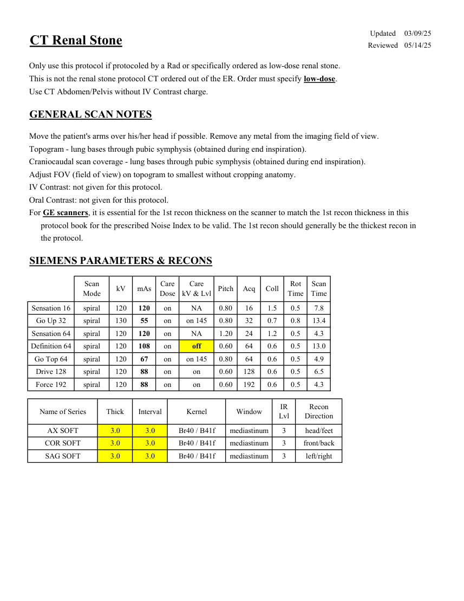
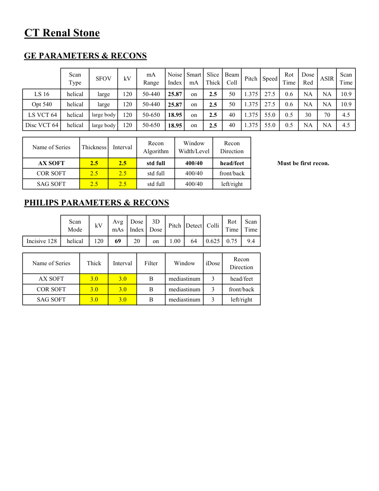

# CT — Litiază renală (MCB)

## Documentul original MCB — Litiază renală

**Protocol · 2 pagini · consultat la 2026-09-27.**

[Descarcă PDF-ul integral](../../assets/mcb-modalities/ct-litiaza-renala-mcb/document.pdf) · [Sursa MCB](https://ref.mcbradiology.com/Protocols,%20Policies,%20Worksheets%20&%20Forms/CT/Protocols/Body/16%20Renal%20Stone.pdf) · [Catalogul MCB pentru această modalitate](../mcb/index.md)

Instrucțiunile, valorile și ilustrațiile din documentul original sunt păstrate în **engleză**. Titlul și navigarea sunt în română.

### Pagina 1

{ loading=lazy }

### Pagina 2

{ loading=lazy }

## Textul documentului original

??? abstract "Pagina 1 — text în engleză"

    
Updated
    03/09/25
    CT Renal Stone
    Reviewed
    05/14/25
    Only use this protocol if protocoled by a Rad or specifically ordered as low-dose renal stone.
    This is not the renal stone protocol CT ordered out of the ER. Order must specify low-dose.
    Use CT Abdomen/Pelvis without IV Contrast charge.
    GENERAL SCAN NOTES
    Move the patient&#x27;s arms over his/her head if possible. Remove any metal from the imaging field of view.
    Topogram - lung bases through pubic symphysis (obtained during end inspiration).
    Craniocaudal scan coverage - lung bases through pubic symphysis (obtained during end inspiration).
    Adjust FOV (field of view) on topogram to smallest without cropping anatomy.
    IV Contrast: not given for this protocol.
    Oral Contrast: not given for this protocol.
    For GE scanners, it is essential for the 1st recon thickness on the scanner to match the 1st recon thickness in this
    protocol book for the prescribed Noise Index to be valid. The 1st recon should generally be the thickest recon in 
    the protocol.
    SIEMENS PARAMETERS &amp; RECONS
    Scan                           
    Care                                          
    Scan                 
    Mode
    kV
    mAs
    Care                            
    Dose
    Pitch
    Acq
    Coll
    Rot 
    kV &amp; Lvl
    Time
    Time
    7.8
    spiral
    120
    0.80
    16
    Sensation 16
    0.5
    120
    on
    1.5
    NA
    0.8
    13.4
    Go Up 32
    spiral
    130
    55
    on
    0.80
    32
    0.7
    on 145
    4.3
    Sensation 64
    spiral
    120
    120
    on
    1.20
    24
    1.2
    0.5
    NA
    0.5
    13.0
    Definition 64
    spiral
    120
    108
    on
    0.60
    64
    0.6
    off
    4.9
    Go Top 64
    spiral
    120
    67
    on
    0.80
    64
    0.6
    0.5
    on 145
    128
    0.6
    0.5
    6.5
    Drive 128
    spiral
    120
    88
    on
    0.60
    on
    on
    0.5
    4.3
    Force 192
    spiral
    120
    88
    on
    0.60
    192
    0.6
    Recon                     
    Name of Series
    Thick
    Interval
    Kernel
    Window
    IR                       
    Lvl
    Direction
    AX SOFT
    3.0
    3.0
    Br40 / B41f
    mediastinum
    3
    head/feet
    COR SOFT
    3.0
    3.0
    Br40 / B41f
    mediastinum
    3
    front/back
    SAG SOFT
    3.0
    3.0
    Br40 / B41f
    mediastinum
    3
    left/right
    

??? abstract "Pagina 2 — text în engleză"

    
CT Renal Stone
    GE PARAMETERS &amp; RECONS
    Smart             
    Slice                       
    Beam                                 
    Rot                                
    Dose                                          
    Scan                 
    Speed
    Type
    SFOV
    kV
    mA                          
    Red
    ASIR
    Scan               
    Range
    Noise                    
    Index
    mA
    Thick
    Coll
    Pitch
    Time
    Time
    10.9
    1.375
    27.5
    0.6
    NA
    NA
    LS 16
    helical
    large
    120
    50-440
    25.87
    on
    2.5
    50
    Opt 540
    1.375
    27.5
    0.6
    NA
    NA
    10.9
    helical
    large
    120
    50-440
    25.87
    on
    2.5
    50
    50-650
     LS VCT 64
    helical
    large body
    120
    1.375
    55.0
    0.5
    30
    70
    4.5
    18.95
    on
    2.5
    40
    Disc VCT 64
    helical
    large body
    120
    50-650
    1.375
    55.0
    0.5
    NA
    NA
    4.5
    18.95
    on
    2.5
    40
    Window                                   
    Recon                                     
    Name of Series
    Thickness
    Interval
    Recon                                     
    Algorithm
    Width/Level
    Direction
    AX SOFT
    2.5
    2.5
    std full
    400/40
    head/feet
    Must be first recon.
    COR SOFT
    2.5
    2.5
    std full
    400/40
    front/back
    SAG SOFT
    2.5
    400/40
    left/right
    2.5
    std full
    PHILIPS PARAMETERS &amp; RECONS
    Scan                           
    Dose                                          
    3D            
    Scan                 
    Pitch Detect Colli
    Rot 
    Mode
    kV
    Avg                      
    mAs
    Index
    Dose
    Time
    Time
    on
    9.4
    Incisive 128
    helical
    120
    1.00
    64
    0.625
    0.75
    69
    20
    Recon                     
    Name of Series
    Thick
    Interval
    Filter
    Window
    iDose
    Direction
    AX SOFT
    3.0
    3.0
    B
    mediastinum
    3
    head/feet
    COR SOFT
    3.0
    3.0
    B
    mediastinum
    3
    front/back
    SAG SOFT
    3.0
    3.0
    B
    mediastinum
    3
    left/right
    

