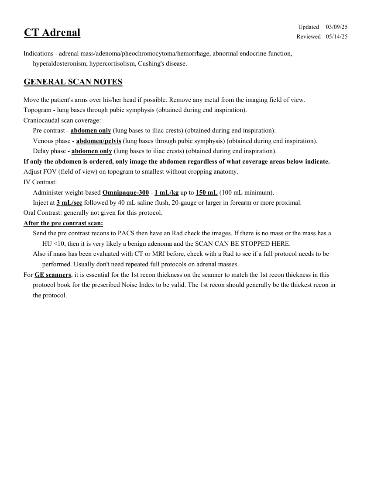
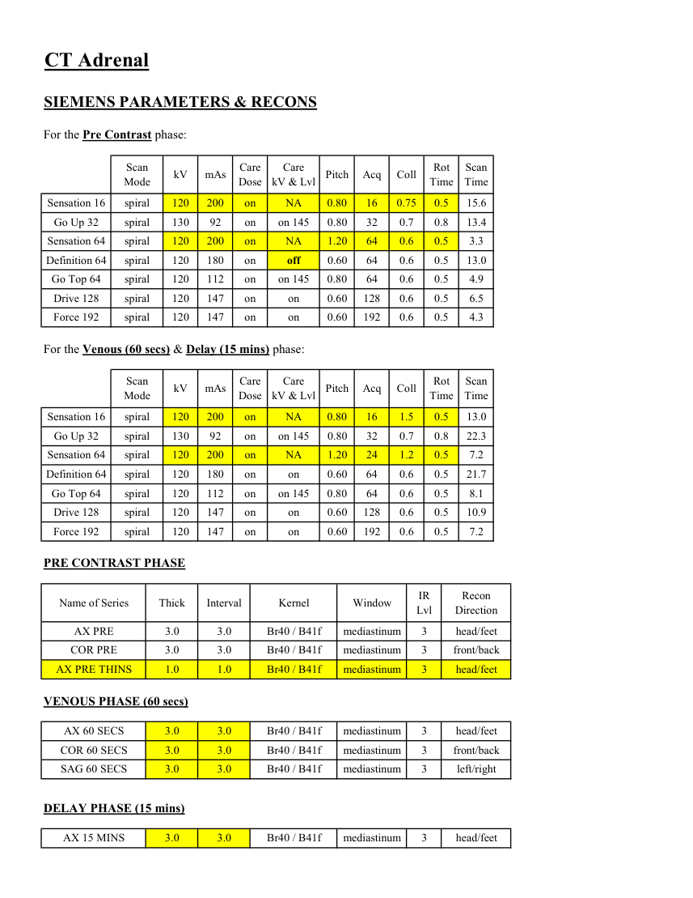
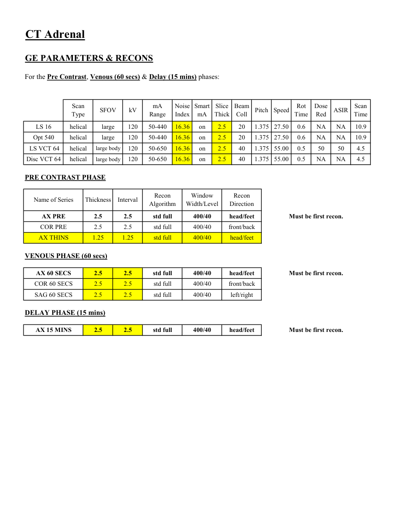
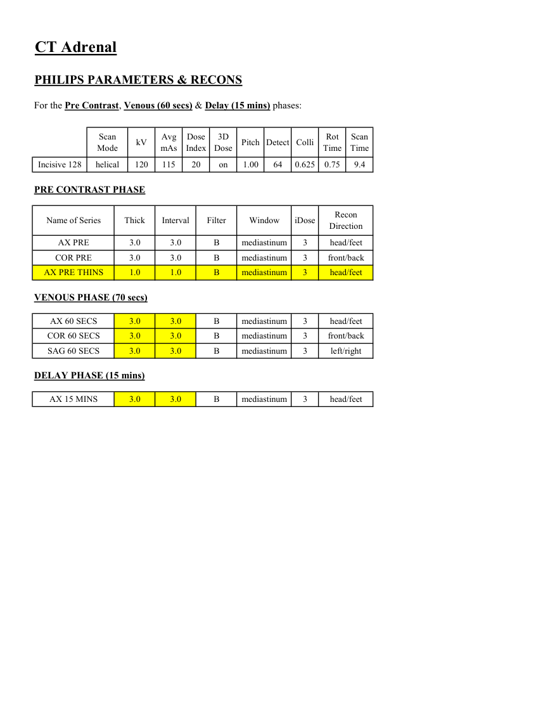

# CT — Suprarenale (MCB)

## Documentul original MCB — Suprarenale

**Protocol · 4 pagini · consultat la 2026-09-27.**

[Descarcă PDF-ul integral](../../assets/mcb-modalities/ct-suprarenale-mcb/document.pdf) · [Sursa MCB](https://ref.mcbradiology.com/Protocols,%20Policies,%20Worksheets%20&%20Forms/CT/Protocols/Body/14%20Adrenal.pdf) · [Catalogul MCB pentru această modalitate](../mcb/index.md)

Instrucțiunile, valorile și ilustrațiile din documentul original sunt păstrate în **engleză**. Titlul și navigarea sunt în română.

### Pagina 1

{ loading=lazy }

### Pagina 2

{ loading=lazy }

### Pagina 3

{ loading=lazy }

### Pagina 4

{ loading=lazy }

## Textul documentului original

??? abstract "Pagina 1 — text în engleză"

    
Updated
    03/09/25
    CT Adrenal
    Reviewed
    05/14/25
    Indications - adrenal mass/adenoma/pheochromocytoma/hemorrhage, abnormal endocrine function, 
    hyperaldosteronism, hypercortisolism, Cushing&#x27;s disease.
    GENERAL SCAN NOTES
    Move the patient&#x27;s arms over his/her head if possible. Remove any metal from the imaging field of view.
    Topogram - lung bases through pubic symphysis (obtained during end inspiration).
    Craniocaudal scan coverage:
    Pre contrast - abdomen only (lung bases to iliac crests) (obtained during end inspiration).
    Venous phase - abdomen/pelvis (lung bases through pubic symphysis) (obtained during end inspiration).
    Delay phase - abdomen only (lung bases to iliac crests) (obtained during end inspiration).
    If only the abdomen is ordered, only image the abdomen regardless of what coverage areas below indicate.
    Adjust FOV (field of view) on topogram to smallest without cropping anatomy.
    IV Contrast:
    Administer weight-based Omnipaque-300 - 1 mL/kg up to 150 mL (100 mL minimum).
    Inject at 3 mL/sec followed by 40 mL saline flush, 20-gauge or larger in forearm or more proximal.
    Oral Contrast: generally not given for this protocol.
    After the pre contrast scan:
    Send the pre contrast recons to PACS then have an Rad check the images. If there is no mass or the mass has a 
    HU &lt;10, then it is very likely a benign adenoma and the SCAN CAN BE STOPPED HERE.
    Also if mass has been evaluated with CT or MRI before, check with a Rad to see if a full protocol needs to be 
    performed. Usually don&#x27;t need repeated full protocols on adrenal masses.
    For GE scanners, it is essential for the 1st recon thickness on the scanner to match the 1st recon thickness in this
    protocol book for the prescribed Noise Index to be valid. The 1st recon should generally be the thickest recon in 
    the protocol.
    

??? abstract "Pagina 2 — text în engleză"

    
CT Adrenal
    SIEMENS PARAMETERS &amp; RECONS
    For the Pre Contrast phase:
    Scan                           
    Care                                          
    Scan                 
    Mode
    kV
    mAs
    Care                            
    Dose
    Pitch
    Acq
    Coll
    Rot 
    kV &amp; Lvl
    Time
    Time
    Sensation 16
    spiral
    120
    200
    on
    0.80
    16
    0.75
    NA
    0.5
    15.6
    Go Up 32
    spiral
    130
    92
    on
    0.80
    32
    0.7
    0.8
    on 145
    13.4
    Sensation 64
    spiral
    120
    200
    on
    1.20
    64
    0.6
    0.5
    NA
    3.3
    Definition 64
    spiral
    120
    180
    on
    0.60
    64
    0.6
    0.5
    13.0
    off
    Go Top 64
    spiral
    120
    112
    on
    on 145
    0.80
    64
    0.6
    0.5
    4.9
    Drive 128
    spiral
    120
    147
    on
    0.60
    128
    0.6
    on
    0.5
    6.5
    Force 192
    spiral
    120
    147
    on
    0.60
    192
    0.6
    0.5
    on
    4.3
    For the Venous (60 secs) &amp; Delay (15 mins) phase:
    Scan                           
    Care                                          
    Rot 
    Scan                 
    Pitch
    Acq
    Coll
    Mode
    kV
    mAs
    Care                            
    Dose
    kV &amp; Lvl
    Time
    Time
    Sensation 16
    spiral
    120
    200
    on
    0.80
    16
    1.5
    NA
    0.5
    13.0
    Go Up 32
    spiral
    130
    92
    on
    on 145
    0.80
    32
    0.7
    0.8
    22.3
    Sensation 64
    spiral
    120
    200
    on
    NA
    1.20
    24
    1.2
    0.5
    7.2
    Definition 64
    spiral
    120
    180
    on
    0.60
    64
    0.6
    on
    0.5
    21.7
    Go Top 64
    spiral
    120
    112
    on
    on 145
    0.80
    64
    0.6
    0.5
    8.1
    Drive 128
    spiral
    120
    147
    on
    0.60
    128
    0.6
    on
    0.5
    10.9
    Force 192
    on
    spiral
    120
    147
    on
    0.60
    192
    0.6
    0.5
    7.2
    PRE CONTRAST PHASE
    IR                       
    Name of Series
    Thick
    Interval
    Window
    Recon                     
    Direction
    Kernel
    Lvl
    AX PRE
    3.0
    3.0
    Br40 / B41f
    mediastinum
    head/feet
    3
    COR PRE
    3.0
    3.0
    mediastinum
    Br40 / B41f
    3
    front/back
    AX PRE THINS
    1.0
    1.0
    mediastinum
    head/feet
    Br40 / B41f
    3
    VENOUS PHASE (60 secs)
    AX 60 SECS
    3.0
    3.0
    mediastinum
    head/feet
    Br40 / B41f
    3
    COR 60 SECS
    3.0
    3.0
    mediastinum
    Br40 / B41f
    3
    front/back
    SAG 60 SECS
    3.0
    3.0
    mediastinum
    Br40 / B41f
    3
    left/right
    DELAY PHASE (15 mins)
    AX 15 MINS
    3.0
    3.0
    mediastinum
    Br40 / B41f
    3
    head/feet
    

??? abstract "Pagina 3 — text în engleză"

    
CT Adrenal
    GE PARAMETERS &amp; RECONS
    For the Pre Contrast, Venous (60 secs) &amp; Delay (15 mins) phases:
    Scan               
    Smart             
    Slice                       
    Beam                                 
    Rot                                
    Dose                                          
    Scan                 
    Type
    SFOV
    kV
    mA                          
    Range
    Noise                    
    Index
    mA
    Thick
    Coll
    Pitch
    Time
    Speed
    Time
    Red
    ASIR
    LS 16
    helical
    large
    120
    50-440
    16.36
    on
    2.5
    20
    1.375 27.50
    10.9
    0.6
    NA
    NA
    Opt 540
    helical
    large
    120
    50-440
    16.36
    on
    2.5
    20
    1.375
    27.50
    0.6
    NA
    NA
    10.9
     LS VCT 64
    helical
    large body
    120
    50-650
    16.36
    on
    2.5
    40
    1.375 55.00
    0.5
    50
    50
    4.5
    Disc VCT 64
    helical
    large body
    120
    50-650
    16.36
    on
    2.5
    40
    1.375
    55.00
    0.5
    NA
    NA
    4.5
    PRE CONTRAST PHASE
    Window                                   
    Recon                                     
    Name of Series
    Thickness
    Interval
    Recon                                     
    Algorithm
    Width/Level
    Direction
    AX PRE
    2.5
    2.5
    std full
    400/40
    head/feet
    Must be first recon.
    COR PRE
    2.5
    2.5
    std full
    400/40
    front/back
    AX THINS
    1.25
    1.25
    std full
    400/40
    head/feet
    VENOUS PHASE (60 secs)
    AX 60 SECS
    2.5
    2.5
    std full
    400/40
    head/feet
    Must be first recon.
    COR 60 SECS
    2.5
    2.5
    std full
    400/40
    front/back
    SAG 60 SECS
    2.5
    2.5
    std full
    400/40
    left/right
    DELAY PHASE (15 mins)
    AX 15 MINS
    2.5
    2.5
    std full
    400/40
    head/feet
    Must be first recon.
    

??? abstract "Pagina 4 — text în engleză"

    
CT Adrenal
    PHILIPS PARAMETERS &amp; RECONS
    For the Pre Contrast, Venous (60 secs) &amp; Delay (15 mins) phases:
    Scan                           
    Dose                                          
    3D            
    Rot 
    Scan                 
    Mode
    kV
    Avg                      
    mAs
    Index
    Dose
    Pitch Detect Colli
    Time
    Time
    9.4
    Incisive 128
    helical
    120
    115
    20
    on
    1.00
    64
    0.625
    0.75
    PRE CONTRAST PHASE
    Name of Series
    Thick
    Interval
    Filter
    Window
    iDose
    Recon                     
    Direction
    AX PRE
    3.0
    3.0
    B
    mediastinum
    3
    head/feet
    COR PRE
    3.0
    3.0
    B
    mediastinum
    3
    front/back
    AX PRE THINS
    1.0
    1.0
    B
    mediastinum
    3
    head/feet
    VENOUS PHASE (70 secs)
    AX 60 SECS
    3.0
    3.0
    B
    mediastinum
    3
    head/feet
    COR 60 SECS
    3.0
    3.0
    B
    mediastinum
    3
    front/back
    SAG 60 SECS
    3.0
    3.0
    B
    mediastinum
    3
    left/right
    DELAY PHASE (15 mins)
    AX 15 MINS
    3.0
    3.0
    B
    mediastinum
    3
    head/feet
    

