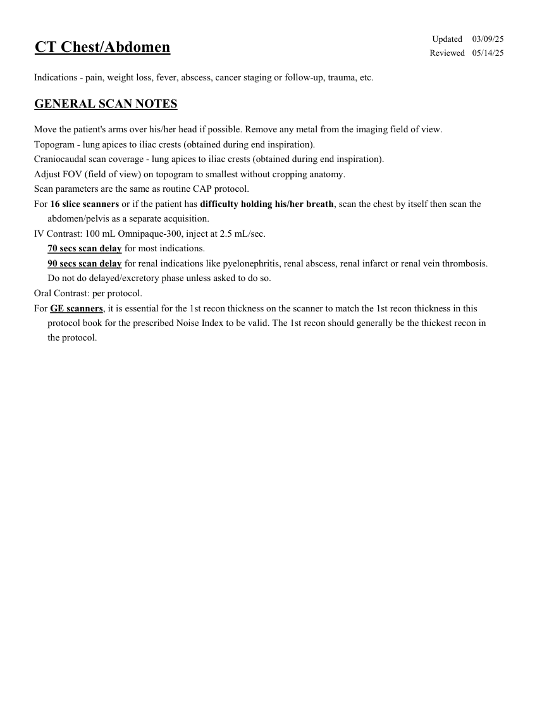
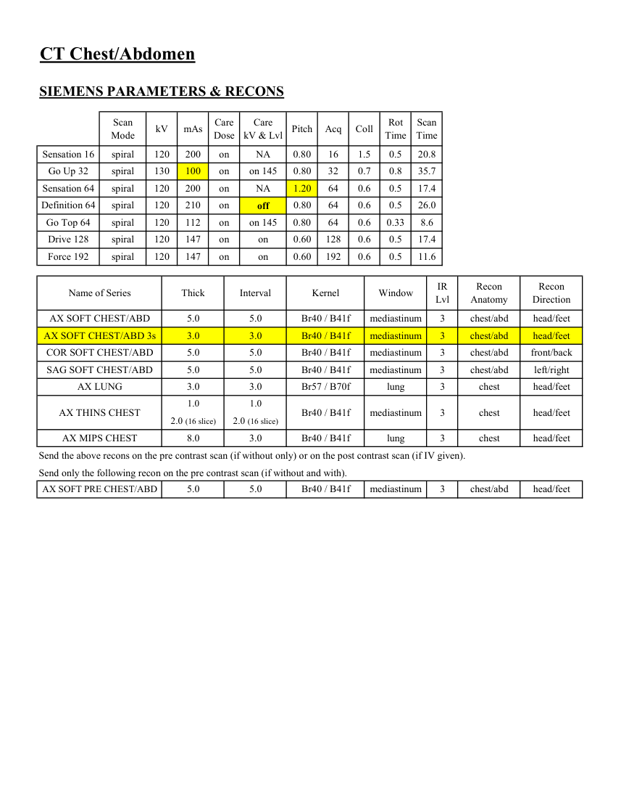
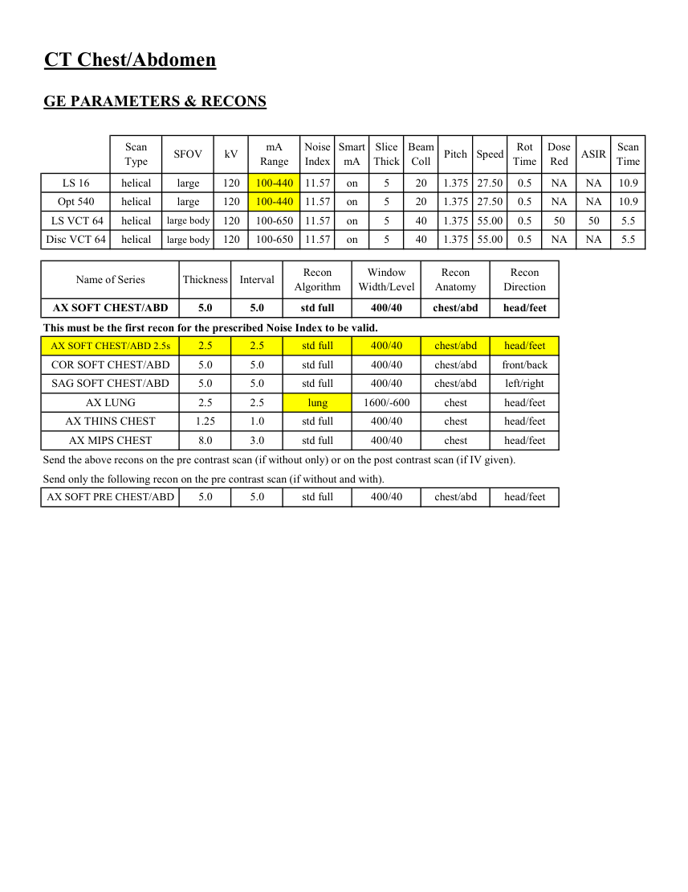
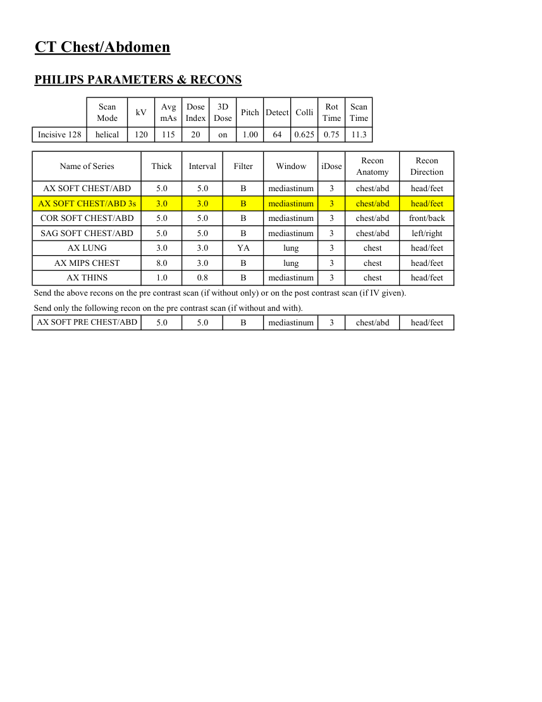

# CT — Torace și abdomen de rutină (MCB)

## Documentul original MCB — Torace și abdomen de rutină

**Protocol · 4 pagini · consultat la 2026-09-27.**

[Descarcă PDF-ul integral](../../assets/mcb-modalities/ct-torace-si-abdomen-de-rutina-mcb/document.pdf) · [Sursa MCB](https://ref.mcbradiology.com/Protocols,%20Policies,%20Worksheets%20&%20Forms/CT/Protocols/Body/5%20Routine%20CA.pdf) · [Catalogul MCB pentru această modalitate](../mcb/index.md)

Instrucțiunile, valorile și ilustrațiile din documentul original sunt păstrate în **engleză**. Titlul și navigarea sunt în română.

### Pagina 1

{ loading=lazy }

### Pagina 2

{ loading=lazy }

### Pagina 3

{ loading=lazy }

### Pagina 4

{ loading=lazy }

## Textul documentului original

??? abstract "Pagina 1 — text în engleză"

    
Updated
    03/09/25
    CT Chest/Abdomen
    Reviewed
    05/14/25
    Indications - pain, weight loss, fever, abscess, cancer staging or follow-up, trauma, etc.
    GENERAL SCAN NOTES
    Move the patient&#x27;s arms over his/her head if possible. Remove any metal from the imaging field of view.
    Topogram - lung apices to iliac crests (obtained during end inspiration).
    Craniocaudal scan coverage - lung apices to iliac crests (obtained during end inspiration).
    Adjust FOV (field of view) on topogram to smallest without cropping anatomy.
    Scan parameters are the same as routine CAP protocol.
    For 16 slice scanners or if the patient has difficulty holding his/her breath, scan the chest by itself then scan the
    abdomen/pelvis as a separate acquisition.
    IV Contrast: 100 mL Omnipaque-300, inject at 2.5 mL/sec.
    70 secs scan delay for most indications.
    90 secs scan delay for renal indications like pyelonephritis, renal abscess, renal infarct or renal vein thrombosis.
    Do not do delayed/excretory phase unless asked to do so.
    Oral Contrast: per protocol.
    For GE scanners, it is essential for the 1st recon thickness on the scanner to match the 1st recon thickness in this
    protocol book for the prescribed Noise Index to be valid. The 1st recon should generally be the thickest recon in 
    the protocol.
    

??? abstract "Pagina 2 — text în engleză"

    
CT Chest/Abdomen
    SIEMENS PARAMETERS &amp; RECONS
    Scan                           
    Care                                          
    Scan                 
    Mode
    kV
    mAs
    Care                            
    Dose
    kV &amp; Lvl
    Pitch
    Acq
    Coll
    Rot 
    Time
    Time
    Sensation 16
    spiral
    120
    200
    on
    NA
    0.80
    16
    1.5
    0.5
    20.8
    Go Up 32
    spiral
    130
    100
    on
    on 145
    0.80
    32
    0.7
    0.8
    35.7
    Sensation 64
    spiral
    120
    200
    on
    NA
    1.20
    64
    0.6
    0.5
    17.4
    Definition 64
    spiral
    120
    210
    on
    off
    0.80
    64
    0.6
    0.5
    26.0
    Go Top 64
    spiral
    120
    112
    on
    on 145
    0.80
    64
    0.6
    0.33
    8.6
    Drive 128
    spiral
    120
    147
    on
    on
    0.60
    128
    0.6
    0.5
    17.4
    Force 192
    spiral
    120
    147
    on
    on
    0.60
    192
    0.6
    0.5
    11.6
    Recon                       
    Recon                     
    Name of Series
    Kernel
    Window
    IR                       
    Thick
    Interval
    Lvl
    Anatomy
    Direction
    AX SOFT CHEST/ABD
    Br40 / B41f
    mediastinum
    3
    chest/abd
    head/feet
    5.0
    5.0
    AX SOFT CHEST/ABD 3s
    Br40 / B41f
    mediastinum
    3
    chest/abd
    head/feet
    3.0
    3.0
    COR SOFT CHEST/ABD
    Br40 / B41f
    mediastinum
    3
    5.0
    5.0
    chest/abd
    front/back
    SAG SOFT CHEST/ABD
    Br40 / B41f
    mediastinum
    3
    5.0
    5.0
    chest/abd
    left/right
    head/feet
    AX LUNG
    Br57 / B70f
    lung
    3
    3.0
    3.0
    chest
    1.0
    1.0
    AX THINS CHEST
    Br40 / B41f
    mediastinum
    3
    chest
    head/feet
    2.0 (16 slice)
    2.0 (16 slice)
    AX MIPS CHEST
    Br40 / B41f
    lung
    3
    8.0
    3.0
    chest
    head/feet
    Send the above recons on the pre contrast scan (if without only) or on the post contrast scan (if IV given).
    Send only the following recon on the pre contrast scan (if without and with).
    AX SOFT PRE CHEST/ABD
    Br40 / B41f
    mediastinum
    3
    chest/abd
    head/feet
    5.0
    5.0
    

??? abstract "Pagina 3 — text în engleză"

    
CT Chest/Abdomen
    GE PARAMETERS &amp; RECONS
    Scan               
    Smart             
    Slice                       
    Beam                                 
    Dose                                          
    Scan                 
    Speed
    Rot                                
    Type
    SFOV
    kV
    mA                          
    Range
    Noise                    
    Index
    mA
    Thick
    Coll
    Pitch
    Time
    Red
    ASIR
    Time
    LS 16
    helical
    large
    120
    100-440
    11.57
    on
    5
    20
    NA
    1.375 27.50
    0.5
    NA
    10.9
    Opt 540
    helical
    large
    120
    100-440
    11.57
    on
    5
    20
    1.375 27.50
    0.5
    NA
    NA
    10.9
     LS VCT 64
    helical
    large body
    120
    100-650
    11.57
    on
    5
    40
    1.375 55.00
    0.5
    50
    50
    5.5
    Disc VCT 64
    helical
    large body
    120
    100-650
    11.57
    on
    5
    40
    1.375 55.00
    0.5
    NA
    NA
    5.5
    Window                                   
    Recon                                     
    Recon                                     
    Name of Series
    Thickness
    Interval
    Recon                                     
    Algorithm
    Width/Level
    Anatomy
    Direction
    AX SOFT CHEST/ABD
    5.0
    5.0
    std full
    400/40
    chest/abd
    head/feet
    This must be the first recon for the prescribed Noise Index to be valid.
    AX SOFT CHEST/ABD 2.5s
    2.5
    2.5
    std full
    400/40
    chest/abd
    head/feet
    COR SOFT CHEST/ABD
    5.0
    5.0
    std full
    400/40
    chest/abd
    front/back
    SAG SOFT CHEST/ABD
    5.0
    5.0
    std full
    400/40
    chest/abd
    left/right
    AX LUNG
    2.5
    2.5
    lung
    1600/-600
    chest
    head/feet
    AX THINS CHEST
    1.25
    1.0
    std full
    400/40
    chest
    head/feet
    AX MIPS CHEST
    8.0
    3.0
    std full
    400/40
    chest
    head/feet
    Send the above recons on the pre contrast scan (if without only) or on the post contrast scan (if IV given).
    Send only the following recon on the pre contrast scan (if without and with).
    AX SOFT PRE CHEST/ABD
    5.0
    5.0
    std full
    400/40
    chest/abd
    head/feet
    

??? abstract "Pagina 4 — text în engleză"

    
CT Chest/Abdomen
    PHILIPS PARAMETERS &amp; RECONS
    Scan                           
    Dose                                          
    3D            
    Scan                 
    Pitch Detect Colli
    Rot 
    Mode
    kV
    Avg                      
    mAs
    Index
    Dose
    Time
    Time
    Incisive 128
    helical
    120
    115
    20
    on
    1.00
    64
    0.625
    0.75
    11.3
    Recon                     
    Name of Series
    Thick
    Interval
    Filter
    Window
    iDose
    Recon                                     
    Anatomy
    Direction
    AX SOFT CHEST/ABD
    5.0
    5.0
    B
    mediastinum
    3
    chest/abd
    head/feet
    AX SOFT CHEST/ABD 3s
    3.0
    3.0
    B
    mediastinum
    3
    chest/abd
    head/feet
    COR SOFT CHEST/ABD
    5.0
    5.0
    B
    mediastinum
    3
    chest/abd
    front/back
    chest/abd
    left/right
    SAG SOFT CHEST/ABD
    5.0
    5.0
    B
    mediastinum
    3
    AX LUNG
    3.0
    3.0
    YA
    lung
    3
    chest
    head/feet
    AX MIPS CHEST
    8.0
    3.0
    B
    lung
    3
    chest
    head/feet
    AX THINS
    1.0
    0.8
    B
    mediastinum
    3
    chest
    head/feet
    Send the above recons on the pre contrast scan (if without only) or on the post contrast scan (if IV given).
    Send only the following recon on the pre contrast scan (if without and with).
    chest/abd
    head/feet
    AX SOFT PRE CHEST/ABD
    5.0
    5.0
    B
    mediastinum
    3
    

