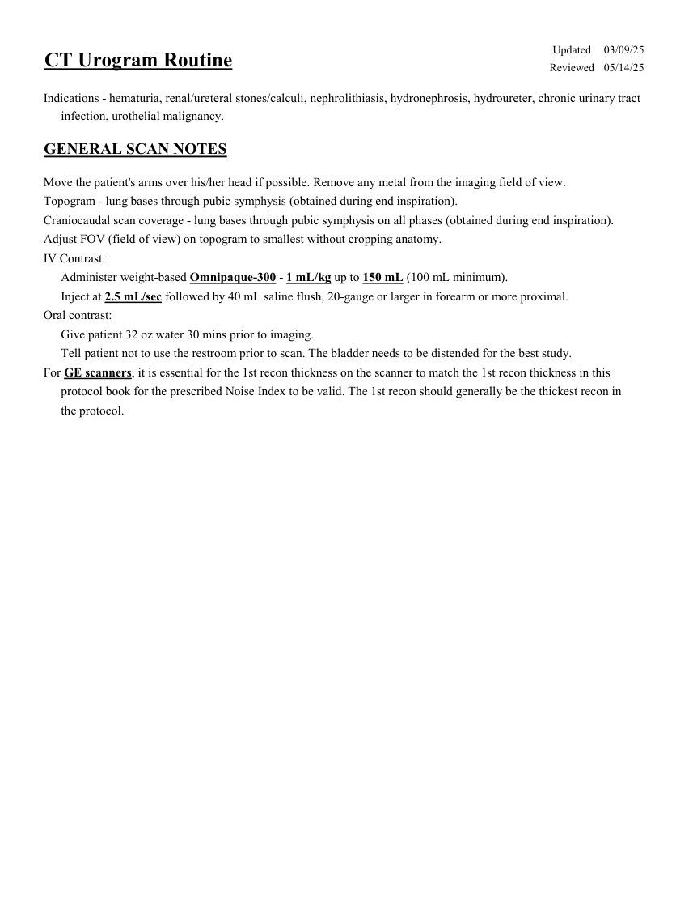
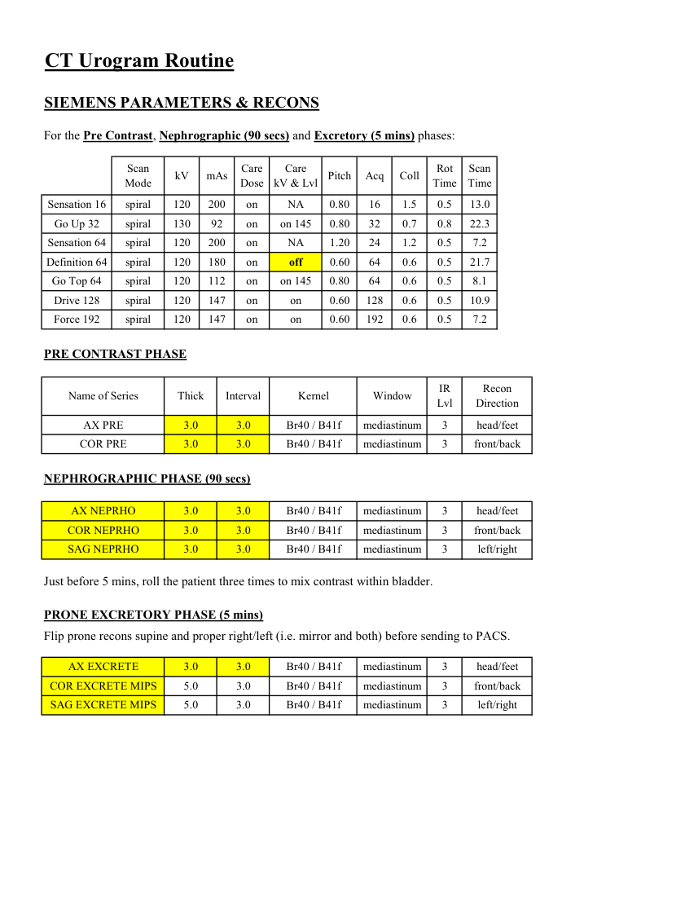
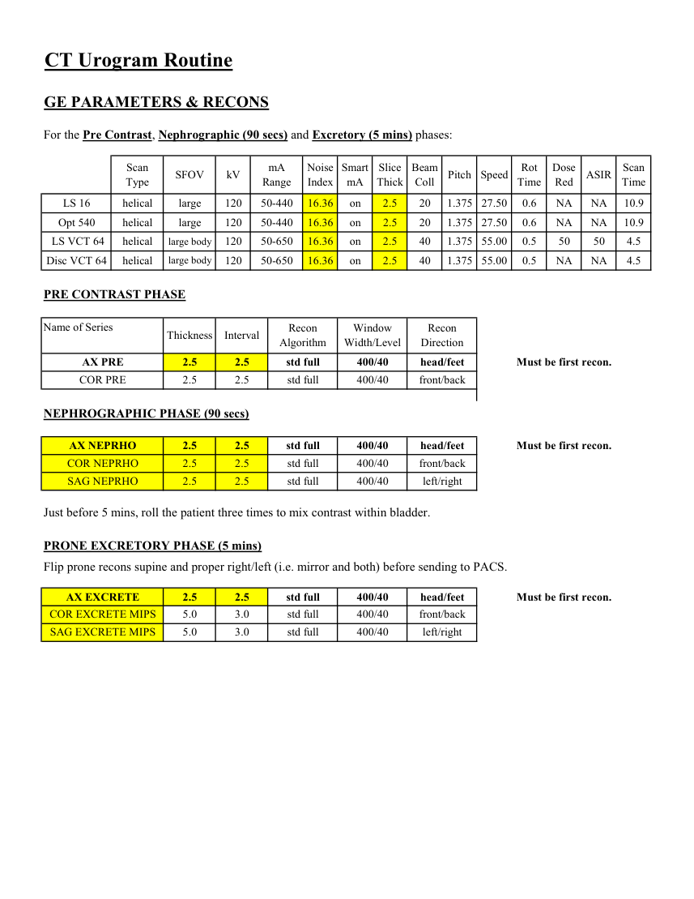
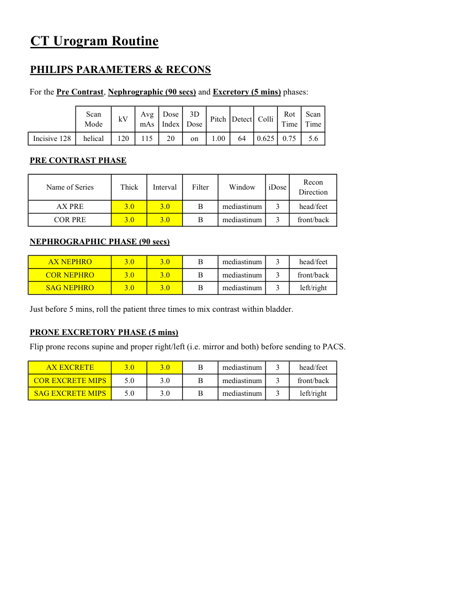

# CT — Urografie de rutină (MCB)

## Documentul original MCB — Urografie de rutină

**Protocol · 4 pagini · consultat la 2026-09-27.**

[Descarcă PDF-ul integral](../../assets/mcb-modalities/ct-urografie-de-rutina-mcb/document.pdf) · [Sursa MCB](https://ref.mcbradiology.com/Protocols,%20Policies,%20Worksheets%20&%20Forms/CT/Protocols/Body/17%20Urography%20Routine.pdf) · [Catalogul MCB pentru această modalitate](../mcb/index.md)

Instrucțiunile, valorile și ilustrațiile din documentul original sunt păstrate în **engleză**. Titlul și navigarea sunt în română.

### Pagina 1

{ loading=lazy }

### Pagina 2

{ loading=lazy }

### Pagina 3

{ loading=lazy }

### Pagina 4

{ loading=lazy }

## Textul documentului original

??? abstract "Pagina 1 — text în engleză"

    
Updated
    03/09/25
    CT Urogram Routine
    Reviewed
    05/14/25
    Indications - hematuria, renal/ureteral stones/calculi, nephrolithiasis, hydronephrosis, hydroureter, chronic urinary tract
    infection, urothelial malignancy.
    GENERAL SCAN NOTES
    Move the patient&#x27;s arms over his/her head if possible. Remove any metal from the imaging field of view.
    Topogram - lung bases through pubic symphysis (obtained during end inspiration).
    Craniocaudal scan coverage - lung bases through pubic symphysis on all phases (obtained during end inspiration).
    Adjust FOV (field of view) on topogram to smallest without cropping anatomy.
    IV Contrast:
    Administer weight-based Omnipaque-300 - 1 mL/kg up to 150 mL (100 mL minimum).
    Inject at 2.5 mL/sec followed by 40 mL saline flush, 20-gauge or larger in forearm or more proximal.
    Oral contrast:
    Give patient 32 oz water 30 mins prior to imaging. 
    Tell patient not to use the restroom prior to scan. The bladder needs to be distended for the best study.
    For GE scanners, it is essential for the 1st recon thickness on the scanner to match the 1st recon thickness in this
    protocol book for the prescribed Noise Index to be valid. The 1st recon should generally be the thickest recon in 
    the protocol.
    

??? abstract "Pagina 2 — text în engleză"

    
CT Urogram Routine
    SIEMENS PARAMETERS &amp; RECONS
    For the Pre Contrast, Nephrographic (90 secs) and Excretory (5 mins) phases:
    Scan                           
    Care                                          
    Scan                 
    Mode
    kV
    mAs
    Care                            
    Dose
    kV &amp; Lvl
    Pitch
    Acq
    Coll
    Rot 
    Time
    Time
    Sensation 16
    spiral
    120
    200
    on
    NA
    0.80
    16
    1.5
    0.5
    13.0
    Go Up 32
    spiral
    130
    92
    on
    on 145
    0.80
    32
    0.7
    0.8
    22.3
    Sensation 64
    spiral
    120
    200
    on
    NA
    1.20
    24
    1.2
    0.5
    7.2
    Definition 64
    spiral
    120
    180
    on
    off
    0.60
    64
    0.6
    0.5
    21.7
    Go Top 64
    spiral
    120
    112
    on
    on 145
    0.80
    64
    0.6
    0.5
    8.1
    on
    0.60
    128
    0.6
    Drive 128
    spiral
    120
    147
    on
    0.5
    10.9
    Force 192
    spiral
    120
    147
    on
    on
    0.60
    192
    0.6
    0.5
    7.2
    PRE CONTRAST PHASE
    IR                       
    Name of Series
    Thick
    Interval
    Window
    Recon                     
    Kernel
    Lvl
    Direction
    AX PRE
    3.0
    3.0
    mediastinum
    head/feet
    Br40 / B41f
    3
    COR PRE
    3.0
    3.0
    mediastinum
    front/back
    Br40 / B41f
    3
    NEPHROGRAPHIC PHASE (90 secs)
    AX NEPRHO
    3.0
    3.0
    mediastinum
    head/feet
    Br40 / B41f
    3
    COR NEPRHO
    3.0
    3.0
    mediastinum
    front/back
    Br40 / B41f
    3
    SAG NEPRHO
    3.0
    3.0
    mediastinum
    left/right
    Br40 / B41f
    3
    Just before 5 mins, roll the patient three times to mix contrast within bladder.
    PRONE EXCRETORY PHASE (5 mins)
    Flip prone recons supine and proper right/left (i.e. mirror and both) before sending to PACS.
    AX EXCRETE
    3.0
    3.0
    mediastinum
    head/feet
    Br40 / B41f
    3
    COR EXCRETE MIPS
    5.0
    3.0
    mediastinum
    front/back
    Br40 / B41f
    3
    SAG EXCRETE MIPS
    5.0
    3.0
    mediastinum
    left/right
    Br40 / B41f
    3
    

??? abstract "Pagina 3 — text în engleză"

    
CT Urogram Routine
    GE PARAMETERS &amp; RECONS
    For the Pre Contrast, Nephrographic (90 secs) and Excretory (5 mins) phases:
    Scan               
    Smart             
    Slice                       
    Beam                                 
    Dose                                          
    Scan                 
    Type
    SFOV
    kV
    mA                          
    Range
    Noise                    
    Index
    mA
    Thick
    Coll
    Pitch
    Speed
    Rot                                
    Time
    Red
    ASIR
    Time
    LS 16
    helical
    large
    120
    50-440
    16.36
    on
    2.5
    20
    1.375 27.50
    0.6
    10.9
    NA
    NA
    Opt 540
    helical
    large
    120
    50-440
    16.36
    on
    2.5
    20
    1.375 27.50
    0.6
    NA
    NA
    10.9
     LS VCT 64
    helical
    large body
    120
    50-650
    16.36
    on
    2.5
    40
    1.375 55.00
    0.5
    50
    50
    4.5
    4.5
    Disc VCT 64
    helical
    large body
    120
    50-650
    16.36
    on
    2.5
    40
    1.375
    NA
    55.00
    0.5
    NA
    PRE CONTRAST PHASE
    Name of Series
    Recon                                     
    Window                                   
    Recon                                     
    Thickness
    Interval
    Algorithm
    Width/Level
    Direction
    AX PRE
    2.5
    2.5
    std full
    400/40
    head/feet
    Must be first recon.
    COR PRE
    2.5
    2.5
    std full
    400/40
    front/back
    NEPHROGRAPHIC PHASE (90 secs)
    AX NEPRHO
    2.5
    2.5
    std full
    400/40
    head/feet
    Must be first recon.
    COR NEPRHO
    2.5
    2.5
    std full
    400/40
    front/back
    SAG NEPRHO
    2.5
    2.5
    std full
    400/40
    left/right
    Just before 5 mins, roll the patient three times to mix contrast within bladder.
    PRONE EXCRETORY PHASE (5 mins)
    Flip prone recons supine and proper right/left (i.e. mirror and both) before sending to PACS.
    AX EXCRETE
    2.5
    2.5
    std full
    400/40
    head/feet
    Must be first recon.
    COR EXCRETE MIPS
    5.0
    3.0
    std full
    400/40
    front/back
    SAG EXCRETE MIPS
    5.0
    3.0
    std full
    400/40
    left/right
    

??? abstract "Pagina 4 — text în engleză"

    
CT Urogram Routine
    PHILIPS PARAMETERS &amp; RECONS
    For the Pre Contrast, Nephrographic (90 secs) and Excretory (5 mins) phases:
    Scan                           
    Dose                                          
    3D            
    Rot 
    Colli
    Mode
    kV
    Avg                      
    mAs
    Index
    Dose
    Pitch Detect
    Scan                 
    Time
    Time
    Incisive 128
    helical
    120
    115
    20
    on
    1.00
    64
    0.625
    0.75
    5.6
    PRE CONTRAST PHASE
    Name of Series
    Thick
    Interval
    Filter
    Window
    iDose
    Recon                     
    Direction
    AX PRE
    3.0
    3.0
    B
    mediastinum
    3
    head/feet
    COR PRE
    3.0
    3.0
    B
    mediastinum
    3
    front/back
    NEPHROGRAPHIC PHASE (90 secs)
    AX NEPHRO
    3.0
    3.0
    B
    mediastinum
    3
    head/feet
    COR NEPHRO
    3.0
    3.0
    B
    mediastinum
    3
    front/back
    SAG NEPHRO
    3.0
    3.0
    B
    mediastinum
    3
    left/right
    Just before 5 mins, roll the patient three times to mix contrast within bladder.
    PRONE EXCRETORY PHASE (5 mins)
    Flip prone recons supine and proper right/left (i.e. mirror and both) before sending to PACS.
    AX EXCRETE
    3.0
    3.0
    B
    mediastinum
    3
    head/feet
    COR EXCRETE MIPS
    5.0
    3.0
    B
    mediastinum
    3
    front/back
    SAG EXCRETE MIPS
    5.0
    3.0
    B
    mediastinum
    3
    left/right
    

