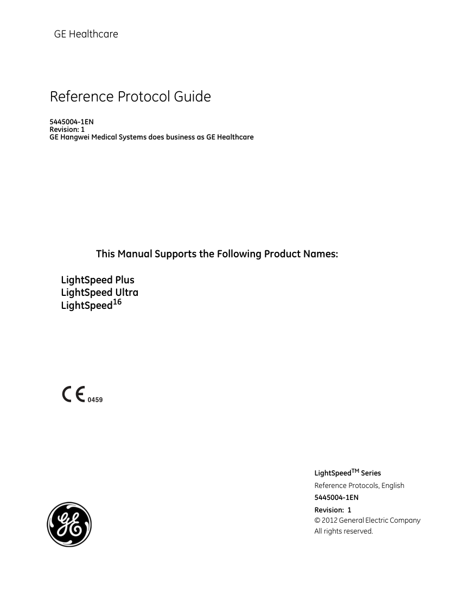
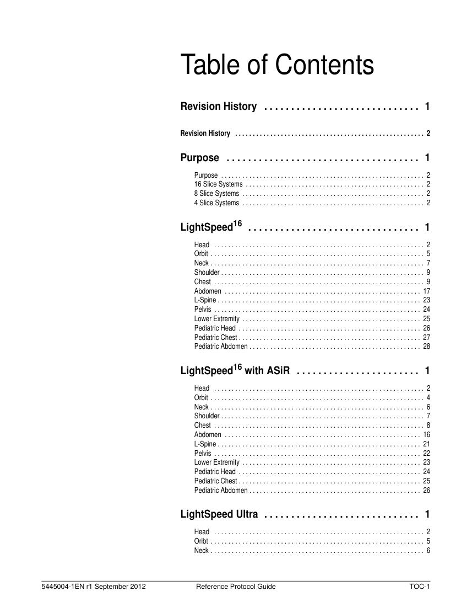

# CT — Parametri aparat: GE LightSpeed 16 Protocols (MCB)

## Documentul original MCB — Parametri aparat: GE LightSpeed 16 Protocols

**Manual de aparat · 134 pagini · consultat la 2026-09-27.**

[Descarcă PDF-ul integral](../../assets/mcb-modalities/ct-parametri-aparat-ge-lightspeed-16-protocols-mcb/document.pdf) · [Sursa MCB](https://ref.mcbradiology.com/Protocols,%20Policies,%20Worksheets%20&%20Forms/CT/Protocols/Default/GE%20LightSpeed%2016%20Protocols.pdf) · [Catalogul MCB pentru această modalitate](../mcb/index.md)

Instrucțiunile, valorile și ilustrațiile din documentul original sunt păstrate în **engleză**. Titlul și navigarea sunt în română.

Previzualizarea de mai jos prezintă primele 3 pagini. **PDF-ul descărcabil conține toate cele 134 de pagini.**

### Pagina 1

{ loading=lazy }

### Pagina 2

{ loading=lazy }

### Pagina 3

{ loading=lazy }

## Textul documentului original

??? abstract "Pagina 1 — text în engleză"

    
GE Healthcare
    Reference Protocol Guide
    5445004-1EN
    Revision: 1
    GE Hangwei Medical Systems does business as GE Healthcare
    This Manual Supports the Following Product Names:
    LightSpeed Plus
    LightSpeed Ultra
    LightSpeed16
    LightSpeedTM Series
    Reference Protocols, English
    5445004-1EN
    Revision:  1
    © 2012 General Electric Company
    All rights reserved.
    

Pagina 2: document scanat; conținutul se consultă în PDF-ul original.

??? abstract "Pagina 3 — text în engleză"

    
Table of Contents
    Revision History  . . . . . . . . . . . . . . . . . . . . . . . . . . . . .  1
    Revision History  . . . . . . . . . . . . . . . . . . . . . . . . . . . . . . . . . . . . . . . . . . . . . . . . . . . . . . 2
    Purpose  . . . . . . . . . . . . . . . . . . . . . . . . . . . . . . . . . . . .  1
    Purpose  . . . . . . . . . . . . . . . . . . . . . . . . . . . . . . . . . . . . . . . . . . . . . . . . . . . . . . . . . . 2
    16 Slice Systems . . . . . . . . . . . . . . . . . . . . . . . . . . . . . . . . . . . . . . . . . . . . . . . . . . . 2
    8 Slice Systems . . . . . . . . . . . . . . . . . . . . . . . . . . . . . . . . . . . . . . . . . . . . . . . . . . . . 2
    4 Slice Systems . . . . . . . . . . . . . . . . . . . . . . . . . . . . . . . . . . . . . . . . . . . . . . . . . . . . 2
    LightSpeed16  . . . . . . . . . . . . . . . . . . . . . . . . . . . . . . . .  1
    Head  . . . . . . . . . . . . . . . . . . . . . . . . . . . . . . . . . . . . . . . . . . . . . . . . . . . . . . . . . . . . 2
    Orbit . . . . . . . . . . . . . . . . . . . . . . . . . . . . . . . . . . . . . . . . . . . . . . . . . . . . . . . . . . . . . 5
    Neck . . . . . . . . . . . . . . . . . . . . . . . . . . . . . . . . . . . . . . . . . . . . . . . . . . . . . . . . . . . . . 7
    Shoulder . . . . . . . . . . . . . . . . . . . . . . . . . . . . . . . . . . . . . . . . . . . . . . . . . . . . . . . . . . 9
    Chest  . . . . . . . . . . . . . . . . . . . . . . . . . . . . . . . . . . . . . . . . . . . . . . . . . . . . . . . . . . . . 9
    Abdomen  . . . . . . . . . . . . . . . . . . . . . . . . . . . . . . . . . . . . . . . . . . . . . . . . . . . . . . . . 17
    L-Spine . . . . . . . . . . . . . . . . . . . . . . . . . . . . . . . . . . . . . . . . . . . . . . . . . . . . . . . . . . 23
    Pelvis . . . . . . . . . . . . . . . . . . . . . . . . . . . . . . . . . . . . . . . . . . . . . . . . . . . . . . . . . . . 24
    Lower Extremity . . . . . . . . . . . . . . . . . . . . . . . . . . . . . . . . . . . . . . . . . . . . . . . . . . . 25
    Pediatric Head . . . . . . . . . . . . . . . . . . . . . . . . . . . . . . . . . . . . . . . . . . . . . . . . . . . . 26
    Pediatric Chest . . . . . . . . . . . . . . . . . . . . . . . . . . . . . . . . . . . . . . . . . . . . . . . . . . . . 27
    Pediatric Abdomen . . . . . . . . . . . . . . . . . . . . . . . . . . . . . . . . . . . . . . . . . . . . . . . . . 28
    LightSpeed16 with ASiR  . . . . . . . . . . . . . . . . . . . . . . .  1
    Head  . . . . . . . . . . . . . . . . . . . . . . . . . . . . . . . . . . . . . . . . . . . . . . . . . . . . . . . . . . . . 2
    Orbit . . . . . . . . . . . . . . . . . . . . . . . . . . . . . . . . . . . . . . . . . . . . . . . . . . . . . . . . . . . . . 4
    Neck . . . . . . . . . . . . . . . . . . . . . . . . . . . . . . . . . . . . . . . . . . . . . . . . . . . . . . . . . . . . . 6
    Shoulder . . . . . . . . . . . . . . . . . . . . . . . . . . . . . . . . . . . . . . . . . . . . . . . . . . . . . . . . . . 7
    Chest  . . . . . . . . . . . . . . . . . . . . . . . . . . . . . . . . . . . . . . . . . . . . . . . . . . . . . . . . . . . . 8
    Abdomen  . . . . . . . . . . . . . . . . . . . . . . . . . . . . . . . . . . . . . . . . . . . . . . . . . . . . . . . . 16
    L-Spine . . . . . . . . . . . . . . . . . . . . . . . . . . . . . . . . . . . . . . . . . . . . . . . . . . . . . . . . . . 21
    Pelvis . . . . . . . . . . . . . . . . . . . . . . . . . . . . . . . . . . . . . . . . . . . . . . . . . . . . . . . . . . . 22
    Lower Extremity . . . . . . . . . . . . . . . . . . . . . . . . . . . . . . . . . . . . . . . . . . . . . . . . . . . 23
    Pediatric Head . . . . . . . . . . . . . . . . . . . . . . . . . . . . . . . . . . . . . . . . . . . . . . . . . . . . 24
    Pediatric Chest . . . . . . . . . . . . . . . . . . . . . . . . . . . . . . . . . . . . . . . . . . . . . . . . . . . . 25
    Pediatric Abdomen . . . . . . . . . . . . . . . . . . . . . . . . . . . . . . . . . . . . . . . . . . . . . . . . . 26
    LightSpeed Ultra  . . . . . . . . . . . . . . . . . . . . . . . . . . . . .  1
    Head  . . . . . . . . . . . . . . . . . . . . . . . . . . . . . . . . . . . . . . . . . . . . . . . . . . . . . . . . . . . . 2
    Oribt . . . . . . . . . . . . . . . . . . . . . . . . . . . . . . . . . . . . . . . . . . . . . . . . . . . . . . . . . . . . . 5
    Neck . . . . . . . . . . . . . . . . . . . . . . . . . . . . . . . . . . . . . . . . . . . . . . . . . . . . . . . . . . . . . 6
    5445004-1EN r1 September 2012
    Reference Protocol Guide
    TOC-1
    

??? abstract "Pagina 4 — text în engleză"

    
Shoulder . . . . . . . . . . . . . . . . . . . . . . . . . . . . . . . . . . . . . . . . . . . . . . . . . . . . . . . . . . 7
    Chest  . . . . . . . . . . . . . . . . . . . . . . . . . . . . . . . . . . . . . . . . . . . . . . . . . . . . . . . . . . . . 8
    Abdomen  . . . . . . . . . . . . . . . . . . . . . . . . . . . . . . . . . . . . . . . . . . . . . . . . . . . . . . . . 12
    L-Spine . . . . . . . . . . . . . . . . . . . . . . . . . . . . . . . . . . . . . . . . . . . . . . . . . . . . . . . . . . 19
    Pelvis . . . . . . . . . . . . . . . . . . . . . . . . . . . . . . . . . . . . . . . . . . . . . . . . . . . . . . . . . . . 20
    Lower Extremity . . . . . . . . . . . . . . . . . . . . . . . . . . . . . . . . . . . . . . . . . . . . . . . . . . . 21
    Pediatric Head . . . . . . . . . . . . . . . . . . . . . . . . . . . . . . . . . . . . . . . . . . . . . . . . . . . . 22
    Pediatric Chest . . . . . . . . . . . . . . . . . . . . . . . . . . . . . . . . . . . . . . . . . . . . . . . . . . . . 23
    Pediatric Abodmen . . . . . . . . . . . . . . . . . . . . . . . . . . . . . . . . . . . . . . . . . . . . . . . . . 24
    LightSpeed Plus 90kVA  . . . . . . . . . . . . . . . . . . . . . . .  1
    Head  . . . . . . . . . . . . . . . . . . . . . . . . . . . . . . . . . . . . . . . . . . . . . . . . . . . . . . . . . . . . 2
    Orbit . . . . . . . . . . . . . . . . . . . . . . . . . . . . . . . . . . . . . . . . . . . . . . . . . . . . . . . . . . . . . 5
    Neck . . . . . . . . . . . . . . . . . . . . . . . . . . . . . . . . . . . . . . . . . . . . . . . . . . . . . . . . . . . . . 6
    Shoulder . . . . . . . . . . . . . . . . . . . . . . . . . . . . . . . . . . . . . . . . . . . . . . . . . . . . . . . . . . 8
    Chest  . . . . . . . . . . . . . . . . . . . . . . . . . . . . . . . . . . . . . . . . . . . . . . . . . . . . . . . . . . . . 8
    Abdomen  . . . . . . . . . . . . . . . . . . . . . . . . . . . . . . . . . . . . . . . . . . . . . . . . . . . . . . . . 13
    L-Spine . . . . . . . . . . . . . . . . . . . . . . . . . . . . . . . . . . . . . . . . . . . . . . . . . . . . . . . . . . 18
    Pelvis . . . . . . . . . . . . . . . . . . . . . . . . . . . . . . . . . . . . . . . . . . . . . . . . . . . . . . . . . . . 20
    Lower Extremity . . . . . . . . . . . . . . . . . . . . . . . . . . . . . . . . . . . . . . . . . . . . . . . . . . . 20
    Pediatric Head . . . . . . . . . . . . . . . . . . . . . . . . . . . . . . . . . . . . . . . . . . . . . . . . . . . . 22
    Pediatric Chest . . . . . . . . . . . . . . . . . . . . . . . . . . . . . . . . . . . . . . . . . . . . . . . . . . . . 23
    Pediatric Abdomen . . . . . . . . . . . . . . . . . . . . . . . . . . . . . . . . . . . . . . . . . . . . . . . . . 24
    LightSpeed Plus 75kVA  . . . . . . . . . . . . . . . . . . . . . . .  1
    Head  . . . . . . . . . . . . . . . . . . . . . . . . . . . . . . . . . . . . . . . . . . . . . . . . . . . . . . . . . . . . 2
    Orbit . . . . . . . . . . . . . . . . . . . . . . . . . . . . . . . . . . . . . . . . . . . . . . . . . . . . . . . . . . . . . 5
    Neck . . . . . . . . . . . . . . . . . . . . . . . . . . . . . . . . . . . . . . . . . . . . . . . . . . . . . . . . . . . . . 6
    Shoulder . . . . . . . . . . . . . . . . . . . . . . . . . . . . . . . . . . . . . . . . . . . . . . . . . . . . . . . . . . 7
    Chest  . . . . . . . . . . . . . . . . . . . . . . . . . . . . . . . . . . . . . . . . . . . . . . . . . . . . . . . . . . . . 8
    Abdomen  . . . . . . . . . . . . . . . . . . . . . . . . . . . . . . . . . . . . . . . . . . . . . . . . . . . . . . . . 11
    L-Spine . . . . . . . . . . . . . . . . . . . . . . . . . . . . . . . . . . . . . . . . . . . . . . . . . . . . . . . . . . 16
    Pelvis . . . . . . . . . . . . . . . . . . . . . . . . . . . . . . . . . . . . . . . . . . . . . . . . . . . . . . . . . . . 18
    Lower Extremity . . . . . . . . . . . . . . . . . . . . . . . . . . . . . . . . . . . . . . . . . . . . . . . . . . . 19
    Pediatric Head . . . . . . . . . . . . . . . . . . . . . . . . . . . . . . . . . . . . . . . . . . . . . . . . . . . . 20
    Pediatric Chest . . . . . . . . . . . . . . . . . . . . . . . . . . . . . . . . . . . . . . . . . . . . . . . . . . . . 21
    Pediatric Abdomen . . . . . . . . . . . . . . . . . . . . . . . . . . . . . . . . . . . . . . . . . . . . . . . . . 22
    5445004-1EN r1 September 2012
    Reference Protocol Guide
    TOC-2
    

??? abstract "Pagina 5 — text în engleză"

    
Revision History
    5445004-1EN r1 September 2012
    Reference Protocol Guide
    i-1
    

??? abstract "Pagina 6 — text în engleză"

    
Revision History
    Revision History
    REV
    DATE
    REASON FOR CHANGE
    1
    September 2012
    First Release
    i-2
    Reference Protocol Guide
    5445004-1EN r1 September 2012
    

??? abstract "Pagina 7 — text în engleză"

    
Purpose
    5445004-1EN r1 September 2012
    Reference Protocol Guide
    1-1
    

??? abstract "Pagina 8 — text în engleză"

    
Purpose
    Purpose
    This document provides a listing of the parameters provided in the reference protocols 
    contained under the GE tab selector. Each table lists the Protocol Number, Protocol Name, Post 
    Processing software associated with, Scan Type, SFOV, Pitch/Table Speed/Row, Gantry 
    Rotation Time, Slice Thickness, Beam Collimation, kV, mA/AVG mA/Min-Max mA/Noise Index, 
    CTDIvol, Recon Algorithm Type used, Scan Length, DLP (mGy-cm) and Phantom type used.
    If the ASiR option is installed on the system, then there will be a % ASiR column listed in the 
    table indicating the ASiR value in the reference protocol.
    Manual mA mode allows you to scan without enabling AutomA mode. When building 
    protocols, make sure the mA value field contains a reasonable mA value in the event that 
    AutomA is turned off. In the GE reference protocols, the Average (Avg) mA provided in the 
    tables within this document are what is used in calculating the CTDI and DLP for protocols 
    using AutomA or SmartmA. The Avg mA value provided in the table is an estimate based on an 
    average patient size (32- 36 cm). The actual average mA for each image is calculated by using 
    all of the mA values for each scan rotation, as determined by AutomA for the patient. The 
    AutomA Theory section in the Learning and Reference Guide, Building Protocols Chapter and 
    in the Technical Reference Manual, General Information Chapter details how AutomA does 
    this calculation.
    16 Slice Systems
    
    LightSpeed16
    
    LightSpeed16 with ASiR
    8 Slice Systems
    
    LightSpeed Ultra
    4 Slice Systems
    
    LightSpeed Plus 90kVA
    
    LightSpeed Plus 75kVA
    1-2
    Reference Protocol Guide
    5445004-1EN r1 September 2012
    

??? abstract "Pagina 9 — text în engleză"

    
LightSpeed16
    5445004-1ENr1 September 2012
    Reference Protocol Guide
    2-1
    

??? abstract "Pagina 10 — text în engleză"

    
LIGHTSPEED16
    Routine Head 
    protocol for the brain 
    abnormalities 
    evaluation.
    Routine Head 
    protocol for the brain 
    abnormalities 
    evaluation
    Routine Head 
    protocol for the brain 
    abnormalities 
    evaluation with 
    SmartmA.
    Routine Head 
    protocol for the brain 
    abnormalities 
    evaluation with 
    SmartmA.
    Emergency head 
    protocol for  the brain 
    and cranium 
    abnormalities 
    evaluation.
    Phantom 
    (cm)
    Description
    Scan 
    Length 
    (mm)
    DLP(mGy
    -cm) w/o 
    ASiR
    CTDIvol 
    (mGy) 
    w/o 
    ASiR
    Std
    91.20
    364.81
    37.50 
    Head 16
    Std
    79.80
    638.41
    75.00 
    Head 16
    Recon 
     
    Type
    mA
    Min-Max, NI
    Avg mA
    SmartmA
    50-200mA
    NI=2.80
    Avg mA= 160
    SmartmA
    50-200mA
    NI=2.80
    Avg mA= 140
    kV
    Beam 
    Collimation 
    (mm) 
    (mm)
    Thickness
    Rotation
    time
    (Seconds)
    Pitch
    Table Speed
    Row
    Scan 
    Type
    SFOV
    Post 
    Process
    GE Protocol 
    Name
    21.1
    Routine Head
    Axial
    Head
    2i
    2.00
    5
    10.00 
    140
    140
    Std
    79.80
    638.41
    75.00 
    Head 16
    21.1
    Routine Head
    Axial
    Head
    4i
    2.00
    2.5
    10.00 
    140
    160
    Std
    91.20
    364.81
    37.50
    Head 16
    21.2
    Routine Head 
    SmartmA
    Axial
    Head
    4i
    2.00
    2.5
    10.00 
    140
    21.2
    Routine Head 
    SmartmA
    Axial
    Head
    2i
    2.00
    5
    10.00 
    140
    21.3
    Trauma Head
    Axial
    Head
    2i
    1.00
    5
    10.00 
    140
    180
    Std
    55.96
    671.53
    115.00 Head 16
    Head
    Table 2-1 
    Protocol 
    Number 
     
     
     
     
     
     
     
     
     
     
     
     
     
     
     
     
     
     
     
     
     
     
     
     
     
     
     
     
     
     
     
     
     
     
     
     
     
     
     
     
     
     
     
     
     
     
     
     
     
     
     
     
     
     
     
     
     
     
     
     
     
     
     
     
     
     
     
     
     
     
     
     
     
     
     
     
     
     
     
     
     
     
     
     
     
     
     
     
     
     
     
     
    5445004-1ENr1 September 2012   
    Reference Protocol Guide
    2-2
    

??? abstract "Pagina 11 — text în engleză"

    
LIGHTSPEED16
    Non-Enhance Skull 
    Base region scan , 
    Evaluation for 
    hemorrhage or 
    infarction
    Non-Enhance Skull 
    Base region scan , 
    Evaluation for 
    hemorrhage or 
    infarction
    Emergency head 
    protocol for  the brain 
    and cranium 
    abnormalities 
    evaluation with 
    SmartmA.
    CT angiography of the 
    Circle of Willis using 
    SmartmA for cerebral 
    vascular evaluation
    CT angiography of the 
    Circle of Willis using 
    SmartmA for cerebral 
    vascular evaluation
    Phantom 
    (cm)
    Description
    Scan 
    Length 
    (mm)
    DLP(mGy
    -cm) w/o 
    ASiR
    CTDIvol 
    (mGy) 
    w/o 
    ASiR
    Std
    55.96
    671.53
    115.00 Head 16
    Recon 
     
    Type
    mA
    Min-Max, NI
    Avg mA
    SmartmA
    100-380mA
    NI=2.80
    Avg mA= 180
    kV
    Beam 
    Collimation 
    (mm) 
    (mm)
    Thickness
    Rotation
    time
    (Seconds)
    Pitch
    Table Speed
    Row
    Scan 
    Type
    SFOV
    Post 
    Process
    GE Protocol 
    Name
    21.5
    Circle of Willis 
    0.8 sec.
    Helical Head
    0.562
    5.625
    0.80
    0.625
    10.00 
    120
    340
    Std
    110.28
    1017.03
    80.00 
    Head 16
    21.6
    Circle of Willis 
    0.6 sec.
    Helical Head
    0.562
    5.625
    0.60
    0.625
    10.00 
    120
    420
    Std
    102.17
    942.43
    80.00 
    Head 16
    21.4
    Trauma Head 
    SmartmA
    Axial
    Head
    2i
    1.00
    5
    10.00 
    140
    21.7
    CT Perfusion 
    300 Strength
    CT 
    Perfusion
    Axial
    Head
    2i
    2.00
    5
    10.00 
    120
    140
    Std
    60.08
    300.42
    45.00 
    Head 16
    21.7
    CT Perfusion 
    300 Strength
    CT 
    Perfusion
    Cine
    Head
    4i
    1.00
    5
    20.00 
    80
    200
    Std
    636.28
    1272.56
    15.00 
    Head 16
    Cerebral blood flow 
    perfusion evaluation. 
    21.8
    CT Perfusion 
    370 Strength
    CT 
    Perfusion
    Axial
    Head
    2i
    2.00
    5
    10.00 
    120
    140
    Std
    60.08
    300.42
    45.00 
    Head 16
    21.8
    CT Perfusion 
    370 Strength
    CT 
    Perfusion
    Cine
    Head
    4i
    1.00
    5
    20.00 
    80
    200
    Std
    572.66
    1145.33
    15.00 
    Head 16
    Cerebral blood flow 
    perfusion evaluation. 
    Protocol 
    Number 
     
     
     
     
     
     
     
     
     
     
     
     
     
     
     
     
     
     
     
     
     
     
     
     
     
     
     
     
     
     
     
     
     
     
     
     
     
     
     
     
     
     
     
     
     
     
     
     
     
     
     
     
     
     
     
     
     
     
     
     
     
     
     
     
     
     
     
     
     
     
     
     
     
     
     
     
     
     
     
     
     
     
     
     
     
     
     
     
     
     
     
     
    5445004-1ENr1 September 2012   
    Reference Protocol Guide
    2-3
    

??? abstract "Pagina 12 — text în engleză"

    
LIGHTSPEED16
    Helical scan mode 
    protocol for the brain 
    abnormalities 
    evaluation
    Phantom 
    (cm)
    Description
    Scan 
    Length 
    (mm)
    DLP(mGy
    -cm) w/o 
    ASiR
    CTDIvol 
    (mGy) 
    w/o 
    ASiR
    Recon 
     
    Type
    mA
    Min-Max, NI
    Avg mA
    kV
    Beam 
    Collimation 
    (mm) 
    (mm)
    Thickness
    Rotation
    time
    (Seconds)
    Pitch
    Table Speed
    Row
    Scan 
    Type
    SFOV
    Post 
    Process
    GE Protocol 
    Name
    21.9
    CT Perfusion 
    Brain Tumor
    CT 
    Perfusion
    Axial
    Head
    2i
    2.00
    5
    10.00 
    120
    140
    Std
    60.08
    300.42
    45.00 
    Head 16
    Non-Enhance Skull 
    Base region scan , 
    Evaluation for tumor.
    21.9
    CT Perfusion 
    Brain Tumor
    CT 
    Perfusion
    Cine
    Head
    4i
    1.00
    5
    20.00 
    80
    200
    Std
    636.28
    1272.56
    15.00 
    Head 16
    Cerebral blood flow 
    perfusion evaluation 
    for tumor. 
    21.10
    Helical Head
    Helical Head
    0.562
    5.625
    1.00
    5
    10.00 
    120
    340
    Std
    137.85
    878.42
    45.00 
    Head 16
    Protocol 
    Number 
     
     
     
     
     
     
     
     
     
     
     
     
     
     
     
     
     
     
     
     
     
     
     
     
     
     
     
     
     
     
     
     
     
     
     
     
     
     
     
     
     
     
     
     
     
     
     
     
     
     
     
     
     
     
     
     
     
     
     
     
     
     
     
     
     
     
     
     
     
     
     
     
     
     
     
     
     
     
     
     
     
     
     
     
     
     
     
     
     
     
     
     
    5445004-1ENr1 September 2012   
    Reference Protocol Guide
    2-4
    

??? abstract "Pagina 13 — text în engleză"

    
LIGHTSPEED16
    Evaluation for 
    abnormality of 
    paranasal sinus soft 
    tissues and bone 
    structures, Prone 
    scan
    Evaluation for 
    abnormality of 
    paranasal sinus soft 
    tissues and bone 
    structures, Supine 
    scan.
    Evaluation for 
    abnormality of orbit 
    soft tissues
    and bone structures
    Phantom 
    (cm)
    Description
    Scan 
    Length 
    (mm)
    DLP(mGy
    -cm) w/o 
    ASiR
    CTDIvol 
    (mGy) 
    w/o 
    ASiR
    Recon 
     
    Type
    mA
    Min-Max, NI
    Avg mA
    kV
    Beam 
    Collimation 
    (mm) 
    (mm)
    Thickness
    Rotation
    time
    (Seconds)
    Pitch
    Table Speed
    Row
    Axial
    Head
    16i
    2.00
    0.625
    10.00 
    120
    150
    Std
    62.72
    250.88
    39.38 
    Head 16
    Evaluation for Inner 
    Auditory Canal 
    abnormalities.
    Axial
    Head
    16i
    2.00
    0.625
    10.00 
    120
    150
    Std
    62.72
    250.88
    39.38 
    Head 16
    Evaluation for Inner 
    Auditory Canal 
    abnormalities.
    Scan 
    Type
    SFOV
    Helical Head
    0.562
    5.625
    1.00
    0.625
    10.00 
    140
    260
    Std
    143.70
    732.27
    38.75 
    Head 16
    Evaluation for Inner 
    Auditory Canal 
    abnormalities.
    Post 
    Process
    GE Protocol 
    Name
    Helical IAC 
    0.625mm (Cor 
    &amp; Axial 
    Planes)
    Axial IAC 
    0.625mm (Cor 
    &amp; Axial 
    Planes)
    Axial IAC 
    0.625mm (Cor 
    &amp; Axial 
    Planes)
    22.5
    22.4
    22.2
    Sinus Prone 
    Helical Head
    0.562
    11.25
    0.60
    2.5
    20.00 
    120
    250
    Std
    49.04
    605.32
    97.50 
    Head 16
    22.3
    Orbits Helical
    Helical Head
    0.562
    5.625
    0.80
    2.5
    10.00 
    120
    160
    Std
    47.57
    451.08
    80.00 
    Head 16
    22.4
    22.1
    Sinus Supine 
    Helical Head
    0.562
    5.625
    1.00
    2.5
    10.00 
    120
    150
    Bone
    55.75
    723.64
    115.00 Head 16
    Orbit
    Table 2-2 
    Protocol 
    Number 
     
     
     
     
     
     
     
     
     
     
     
     
     
     
     
     
     
     
     
     
     
     
     
     
     
     
     
     
     
     
     
     
     
     
     
     
     
     
     
     
     
     
     
     
     
     
     
     
     
     
     
     
     
     
     
     
     
     
     
     
     
     
     
     
     
     
     
     
     
     
     
     
     
     
     
     
     
     
     
     
     
     
     
     
     
     
     
     
     
     
     
     
    5445004-1ENr1 September 2012   
    Reference Protocol Guide
    2-5
    

??? abstract "Pagina 14 — text în engleză"

    
LIGHTSPEED16
    Phantom 
    (cm)
    Description
    Scan 
    Length 
    (mm)
    DLP(mGy
    -cm) w/o 
    ASiR
    CTDIvol 
    (mGy) 
    w/o 
    ASiR
    Recon 
     
    Type
    mA
    Min-Max, NI
    Avg mA
    kV
    Beam 
    Collimation 
    (mm) 
    (mm)
    Thickness
    Rotation
    time
    (Seconds)
    Pitch
    Table Speed
    Row
    Scan 
    Type
    SFOV
    Helical Head
    0.562
    5.625
    1.00
    1.25
    10.00 
    140
    120
    Std
    60.80
    316.5
    38.75 
    Head 16
    Evaluation for Inner 
    Auditory Canal 
    abnormalities.
    Helical Head
    0.562
    5.625
    1.00
    0.625
    10.00 
    140
    260
    Std
    143.7
    732.27
    38.75 
    Head 16
    Evaluation for Inner 
    Auditory Canal 
    abnormalities.
    Helical Head
    0.562
    5.625
    1.00
    0.625
    10.00 
    140
    260
    Std
    143.70
    714.31
    37.50 
    Head 16
    Evaluation for Inner 
    Auditory Canal 
    abnormalities.
    Post 
    Process
    GE Protocol 
    Name
    Helical IAC 
    1.25mm Axial 
    only use 
    Reformat for 
    Coronal
    Helical IAC 
    0.625mm 
    Axial only use 
    Reformat for 
    Coronal
    Helical IAC 
    0.625mm (Cor 
    &amp; Axial 
    Planes)
    22.7
    22.6
    22.5
    Protocol 
    Number 
     
     
     
     
     
     
     
     
     
     
     
     
     
     
     
     
     
     
     
     
     
     
     
     
     
     
     
     
     
     
     
     
     
     
     
     
     
     
     
     
     
     
     
     
     
     
     
     
     
     
     
     
     
     
     
     
     
     
     
     
     
     
     
     
     
     
     
     
     
     
     
     
     
     
     
     
     
     
     
     
     
     
     
     
     
     
     
     
     
     
     
     
    5445004-1ENr1 September 2012   
    Reference Protocol Guide
    2-6
    

??? abstract "Pagina 15 — text în engleză"

    
LIGHTSPEED16
    Evaluation for C5-C7 
    Cervical Spine area 
    soft tissue, 
    intervertebral disc 
    and bone 
    abnormalities with 
    SmartmA.
    Evaluation for C1-C4 
    Cervical Spine area 
    soft tissue, 
    intervertebral disc 
    and bone 
    abnormalities.
    Evaluation for C1-C4 
    Cervical Spine area 
    soft tissue, 
    intervertebral disc 
    and bone 
    abnormalities  with 
    SmartmA.
    CT angiography 
    evaluation of Carotid 
    Artery and the Circle 
    of Willis. 
    CT angiography 
    evaluation of Carotid 
    Artery and the Circle 
    of Willis. 
    Phantom 
    (cm)
    Description
    Scan 
    Length 
    (mm)
    DLP(mGy
    -cm) w/o 
    ASiR
    CTDIvol 
    (mGy) 
    w/o 
    ASiR
    Std
    22.42
    179.39
    77.50 
    Body 32
    Recon 
     
    Type
    mA
    Min-Max, NI
    Avg mA
    SmartmA
    50-200mA
    NI=9.10
    Avg mA= 120
    kV
    Beam 
    Collimation 
    (mm) 
    (mm)
    Thickness
    Rotation
    time
    (Seconds)
    Pitch
    Table Speed
    Row
    Scan 
    Type
    SFOV
    Post 
    Process
    GE Protocol 
    Name
    23.1
    C-Spine C5-C7
    Axial
    Large
    8i
    2.00
    2.5
    20.00 
    140
    170
    Std
    43.70
    611.79
    137.50 Body 32
    23.2
    C-Spine C1-C4
    Axial
    Large
    8i
    2.00
    2.5
    20.00 
    120
    120
    Std
    22.42
    179.39
    77.50 
    Body 32
    23.3
    C-Spine C1-C4 
    SmartmA
    Axial
    Large
    8i
    2.00
    2.5
    20.00 
    120
    23.5
    Carotid/CoW 
    0.6 sec.
    Helical Large
    1.375
    13.75
    0.60
    1.25
    10.00 
    120
    325
    Std
    16.29
    301.75
    170.00 Body 32
    23.4
    Carotid/CoW 
    0.8 sec. 
    Helical Large
    1.375
    13.75
    0.80
    1.25
    10.00 
    120
    245
    Std
    16.38
    303.23
    170.00 Body 32
    Neck
    Table 2-3 
    Protocol 
    Number 
     
     
     
     
     
     
     
     
     
     
     
     
     
     
     
     
     
     
     
     
     
     
     
     
     
     
     
     
     
     
     
     
     
     
     
     
     
     
     
     
     
     
     
     
     
     
     
     
     
     
     
     
     
     
     
     
     
     
     
     
     
     
     
     
     
     
     
     
     
     
     
     
     
     
     
     
     
     
     
     
     
     
     
     
     
     
     
     
     
     
     
     
    5445004-1ENr1 September 2012   
    Reference Protocol Guide
    2-7
    

??? abstract "Pagina 16 — text în engleză"

    
LIGHTSPEED16
    Evaluation of the 
    cervical soft tissue 
    abnormality with 
    SmartmA.
    CT angiography 
    evaluation of Carotid 
    Artery and the Circle 
    of Willis. 
    Phantom 
    (cm)
    Description
    Scan 
    Length 
    (mm)
    DLP(mGy
    -cm) w/o 
    ASiR
    CTDIvol 
    (mGy) 
    w/o 
    ASiR
    Std
    19.05
    323.42
    150.00 Body 32
    Recon 
     
    Type
    mA
    Min-Max, NI
    Avg mA
    SmartmA
    100-440mA
    NI=7.02
    Avg mA= 380
    kV
    Beam 
    Collimation 
    (mm) 
    (mm)
    Thickness
    Rotation
    time
    (Seconds)
    Pitch
    Table Speed
    Row
    Scan 
    Type
    SFOV
    Helical Large
    1.375
    13.75
    0.60
    3.75
    10.00 
    120
    Post 
    Process
    Soft Tissue 
    Neck Plus 
    Mode 0.6 
    SmartmA
    GE Protocol 
    Name
    23.6
    Carotid/CoW 
    0.625mm 0.6 
    sec.
    Helical Large
    1.375
    13.75
    0.60
    0.625
    10.00 
    140
    315
    Std
    21.73
    399.98
    170.00 Body 32
    23.7
    Soft Tissue 
    Neck Plus 
    Mode
    Helical Large
    1.375
    13.75
    0.80
    3.75
    10.00 
    120
    290
    Std
    19.39
    329.01
    150.00 Body 32
    Evaluation of the 
    cervical soft tissue 
    abnormality.
    23.8
    23.9
    Soft Tissue 
    Neck 0.8 sec. 
    Full Mode
    Helical Large
    1.375
    13.75
    0.80
    3.75
    10.00 
    120
    310
    Std
    20.72
    349.27
    150.00 Body 32
    Evaluation of the 
    cervical soft tissue 
    abnormality.
    23.10
    Soft Tissue 
    Neck 0.6 sec. 
    Full Mode
    Helical Large
    1.375
    13.75
    0.60
    3.75
    10.00 
    120
    410
    Std
    20.55
    346.54
    150.00 Body 32
    Evaluation of the 
    cervical soft tissue 
    abnormality 
    Protocol 
    Number 
     
     
     
     
     
     
     
     
     
     
     
     
     
     
     
     
     
     
     
     
     
     
     
     
     
     
     
     
     
     
     
     
     
     
     
     
     
     
     
     
     
     
     
     
     
     
     
     
     
     
     
     
     
     
     
     
     
     
     
     
     
     
     
     
     
     
     
     
     
     
     
     
     
     
     
     
     
     
     
     
     
     
     
     
     
     
     
     
     
     
     
     
    5445004-1ENr1 September 2012   
    Reference Protocol Guide
    2-8
    

??? abstract "Pagina 17 — text în engleză"

    
LIGHTSPEED16
    Evaluation of lung 
    tissue with routine 
    and high resolution 
    mode.
    Evaluation of lung 
    tissue with routine 
    and high resolution 
    mode.
    Routine Evaluation of 
    mediastinum and 
    lungs, 0.5sec with 
    SmartmA. 
    Phantom 
    (cm)
    Description
    Phantom 
    (cm)
    Description
    Scan 
    Length 
    (mm)
    Scan 
    Length 
    (mm)
    DLP(mGy
    -cm) w/o 
    ASiR
    DLP(mGy
    -cm) w/o 
    ASiR
    CTDIvol 
    (mGy) 
    w/o 
    ASiR
    CTDIvol 
    (mGy) 
    w/o 
    ASiR
    Std
    8.75
    204.39
    200.00 Body 32
    Recon 
     
    Type
    Recon 
     
    Type
    mA
    Min-Max, NI
    Avg mA
    SmartmA
    100-440mA
    NI=11.57
    Avg mA= 260
    mA
    Min-Max, NI
    Avg mA
    kV
    kV
    Beam 
    Collimation 
    (mm) 
    Beam 
    Collimation 
    (mm) 
    (mm)
    Thickness
    (mm)
    Thickness
    Rotation
    time
    (Seconds)
    Rotation
    time
    (Seconds)
    Pitch
    Table Speed
    Row
    Pitch
    Table Speed
    Row
    Scan 
    Type
    SFOV
    Scan 
    Type
    SFOV
    Post 
    Process
    Post 
    Process
    GE Protocol 
    Name
    GE Protocol 
    Name
    24.1
    Shoulder Plus 
    Mode
    Helical Large
    0.562
    11.25
    1.00
    2.5
    20.00 
    120
    280
    Std
    46.05
    583.60
    100.00 Body 32
    Evaluation of soft 
    tissue and bone 
    structure of shoulder .
    Shoulder
    Table 2-4 
    Chest
    Table 2-5 
    Protocol 
    Number 
     
     
     
     
     
     
     
     
     
     
     
     
     
     
     
     
     
     
     
     
     
     
     
     
     
     
     
     
     
     
     
     
     
     
     
     
     
     
     
     
     
     
     
     
     
     
     
     
     
     
     
     
     
     
     
     
     
     
     
     
     
     
     
     
     
     
     
     
     
     
     
     
     
     
     
     
     
     
     
     
     
     
     
     
     
     
     
     
     
     
     
     
    25.4
    Chest with 
    HiRes 0.8 sec.
    Helical
    Large
    1.375
    13.75
    0.80
    5
    10.00 
    120
    200
    Chest
    /bone 
    plus
    12.16
    268.29
    200.00 Body 32
    25.5
    Chest with 
    HiRes 0.5 sec.
    Helical
    Large
    1.375
    13.75
    0.50
    5
    10.00 
    120
    260
    Chest
    /bone 
    plus
    10.86
    239.67
    200.00 Body 32
    25.1
    Routine Chest 
    0.8 sec.
    Helical
    Large
    1.375
    27.5
    0.80
    5
    20.00 
    120
    170
    Std
    9.24
    215.81
    200.00 Body 32
    Routine Evaluation of 
    mediastinum and 
    lungs, 0.8sec. 
    25.2
    Routine Chest 
    0.5 sec.
    Helical
    Large
    1.375
    27.5
    0.50
    5
    20.00 
    120
    260
    Std
    8.75
    204.39
    200.00 Body 32
    Routine Evaluation of 
    mediastinum and 
    lungs, 0.5sec. 
    25.3
    Routine Chest 
    0.5 sec. 
    SmartmA
    Helical
    Large
    1.375
    27.5
    0.50
    5
    20.00 
    120
    Protocol 
    Number 
     
     
     
     
     
     
     
     
     
     
     
     
     
     
     
     
     
     
     
     
     
     
     
     
     
     
     
     
     
     
     
     
     
     
     
     
     
     
     
     
     
     
     
     
     
     
     
     
     
     
     
     
     
     
     
     
     
     
     
     
     
     
     
     
     
     
     
     
     
     
     
     
     
     
     
     
     
     
     
     
     
     
     
     
     
     
     
     
     
     
     
     
    5445004-1ENr1 September 2012   
    Reference Protocol Guide
    2-9
    

??? abstract "Pagina 18 — text în engleză"

    
LIGHTSPEED16
    Evaluation of lung 
    tissue in high 
    resolution mode, 
    1.0sec.
    Multigroup helical 
    scan for Chest, 
    Abdomen,
    Pelvis (0.8sec). 
    Evaluation 
    abnormalities of 
    chest, abdomen and 
    pelvis.
    Multigroup helical 
    scan for Chest, 
    Abdomen,
    Pelvis (0.8sec). 
    Evaluation 
    abnormalities of 
    chest, abdomen and 
    pelvis.
    Multigroup helical 
    scan for Chest, 
    Abdomen,
    Pelvis (0.8sec). 
    Evaluation 
    abnormalities of 
    chest, abdomen and 
    pelvis.
    Multigroup helical 
    scan for Chest, 
    Abdomen,
    Pelvis (0.8sec). 
    Evaluation 
    abnormalities of 
    chest, abdomen and 
    pelvis.
    Evaluation of lung 
    tissue with routine 
    and high resolution 
    mode with SmartmA.
    Phantom 
    (cm)
    Description
    Scan 
    Length 
    (mm)
    DLP(mGy
    -cm) w/o 
    ASiR
    CTDIvol 
    (mGy) 
    w/o 
    ASiR
    Chest
    /bone 
    plus
    10.86
    239.67
    200.00 Body 32
    Recon 
     
    Type
    mA
    Min-Max, NI
    Avg mA
    SmartmA
    100-440mA
    NI=10.41
    Avg mA= 260
    kV
    Beam 
    Collimation 
    (mm) 
    (mm)
    Thickness
    Rotation
    time
    (Seconds)
    Pitch
    Table Speed
    Row
    Scan 
    Type
    SFOV
    Post 
    Process
    GE Protocol 
    Name
    25.6
    Chest with 
    HiRes 0.5 sec. 
    SmartmA
    Helical
    Large
    1.375
    13.75
    0.50
    5
    10.00 
    120
    25.7
    Hi Res Chest 
    1.0 Sec.
    Axial
    Large
    1i
    1.00
    1.25
    1.25 
    120
    200
    Bone
    Plus
    2.93
    73.33
    240.00 Body 32
    25.8
    Chest Abd 
    Pelvis 0.8 sec. 
    Full Mode
    Helical
    Large
    1.375
    27.5
    0.80
    5
    20.00 
    120
    130
    Std
    7.07
    129.69
    150.00 Body 32
    25.8
    Chest Abd 
    Pelvis 0.8 sec. 
    Full Mode
    Helical
    Large
    1.375
    27.5
    0.80
    5
    20.00 
    120
    155
    Std
    8.43
    276.81
    295.00 Body 32
    25.9
    Chest Abd 
    Pelvis 0.5 sec. 
    Full Mode
    Helical
    Large
    1.375
    27.5
    0.50
    5
    20.00 
    120
    200
    Std
    6.80
    124.82
    150.00 Body 32
    25.9
    Chest Abd 
    Pelvis 0.5 sec. 
    Full Mode
    Helical
    Large
    1.375
    27.5
    0.50
    5
    20.00 
    120
    245
    Std
    8.24
    270.89
    295.00 Body 32
    Protocol 
    Number 
     
     
     
     
     
     
     
     
     
     
     
     
     
     
     
     
     
     
     
     
     
     
     
     
     
     
     
     
     
     
     
     
     
     
     
     
     
     
     
     
     
     
     
     
     
     
     
     
     
     
     
     
     
     
     
     
     
     
     
     
     
     
     
     
     
     
     
     
     
     
     
     
     
     
     
     
     
     
     
     
     
     
     
     
     
     
     
     
     
     
     
     
    5445004-1ENr1 September 2012   
    Reference Protocol Guide
    2-10
    

??? abstract "Pagina 19 — text în engleză"

    
LIGHTSPEED16
    Multigroup helical 
    scan for Chest, 
    Abdomen,
    Pelvis (0.8sec). 
    Evaluation 
    abnormalities of 
    chest, abdomen and 
    pelvis with SmartmA.
    Multigroup helical 
    scan for Chest, 
    Abdomen,
    Pelvis (0.8sec). 
    Evaluation 
    abnormalities of 
    chest, abdomen and 
    pelvis with SmartmA.
    Multigroup helical 
    scan for Chest, 
    Abdomen,
    Pelvis (0.5sec). 
    Evaluation 
    abnormalities of 
    chest, abdomen and 
    pelvis with SmartmA.
    Multigroup helical 
    scan for Chest, 
    Abdomen, Pelvis 
    (0.5sec). Evaluation 
    abnormalities of 
    chest, abdomen and 
    pelvis with SmartmA.
    Multigroup helical 
    scan for Chest, 
    Abdomen,
    Pelvis (0.8sec). 
    Evaluation 
    abnormalities of 
    chest, abdomen and 
    pelvis with SmartmA.
    Phantom 
    (cm)
    Description
    Scan 
    Length 
    (mm)
    DLP(mGy
    -cm) w/o 
    ASiR
    CTDIvol 
    (mGy) 
    w/o 
    ASiR
    Std
    7.07
    129.69
    150.00 Body 32
    Std
    7.07
    232.16
    295.00 Body 32
    Std
    7.06
    129.76
    150.00 Body 32
    Std
    7.06
    232.19
    295.00 Body 32
    Std
    9.73
    465.04
    450.00 Body 32
    Recon 
     
    Type
    mA
    Min-Max, NI
    Avg mA
    SmartmA
    100-440mA
    NI=11.57
    Avg mA= 130
    SmartmA
    100-440mA
    NI=11.57
    Avg mA= 130
    SmartmA
    100-440mA
    NI=11.57
    Avg mA= 210
    SmartmA
    100-440mA
    NI=11.57
    Avg mA= 210
    SmartmA
    100-440mA
    NI=23.14
    Avg mA= 230
    kV
    Beam 
    Collimation 
    (mm) 
    (mm)
    Thickness
    Rotation
    time
    (Seconds)
    Pitch
    Table Speed
    Row
    Scan 
    Type
    SFOV
    Helical
    Large
    1.75
    35
    0.80
    1.25
    20.00 
    120
    Post 
    Process
    GE Protocol 
    Name
    Chest Abd 
    Pelvis 0.8 sec. 
    SmartmA 
    1.25mm IQE/
    DMPR
    25.10
    Chest Abd 
    Pelvis 0.8 sec. 
    SmartmA
    Helical
    Large
    1.375
    27.5
    0.80
    5
    20.00 
    120
    25.10
    Chest Abd 
    Pelvis 0.8 sec. 
    SmartmA
    Helical
    Large
    1.375
    27.5
    0.80
    5
    20.00 
    120
    25.11
    Chest Abd 
    Pelvis 0.5 sec. 
    SmartmA
    Helical
    Large
    1.375
    27.5
    0.50
    5
    20.00 
    120
    25.11
    Chest Abd 
    Pelvis 0.5 sec. 
    SmartmA
    Helical
    Large
    1.375
    27.5
    0.50
    5
    20.00 
    120
    25.12
    Protocol 
    Number 
     
     
     
     
     
     
     
     
     
     
     
     
     
     
     
     
     
     
     
     
     
     
     
     
     
     
     
     
     
     
     
     
     
     
     
     
     
     
     
     
     
     
     
     
     
     
     
     
     
     
     
     
     
     
     
     
     
     
     
     
     
     
     
     
     
     
     
     
     
     
     
     
     
     
     
     
     
     
     
     
     
     
     
     
     
     
     
     
     
     
     
     
    5445004-1ENr1 September 2012   
    Reference Protocol Guide
    2-11
    

??? abstract "Pagina 20 — text în engleză"

    
LIGHTSPEED16
    Multigroup helical 
    scan for Chest, 
    Abdomen,
    Pelvis (0.8sec). 
    Evaluation 
    abnormalities of 
    chest, abdomen and 
    pelvis .
    Multigroup helical 
    scan for Chest, 
    Abdomen,
    Pelvis (0.8sec). 
    Evaluation 
    abnormalities of 
    chest, abdomen and 
    pelvis .
    Multigroup helical 
    scan for Chest, 
    Abdomen,
    Pelvis (0.5sec). 
    Evaluation 
    abnormalities of 
    chest, abdomen and 
    pelvis .
    Multigroup helical 
    scan for Chest, 
    Abdomen,
    Pelvis (0.5sec). 
    Evaluation 
    abnormalities of 
    chest, abdomen and 
    pelvis .
    Multigroup helical 
    scan for Chest, 
    Abdomen,
    Pelvis (0.5sec). 
    Evaluation 
    abnormalities of 
    chest, abdomen and 
    pelvis with SmartmA.
    Phantom 
    (cm)
    Description
    Scan 
    Length 
    (mm)
    DLP(mGy
    -cm) w/o 
    ASiR
    CTDIvol 
    (mGy) 
    w/o 
    ASiR
    Std
    9.52
    455.13
    450.00 Body 32
    Recon 
     
    Type
    mA
    Min-Max, NI
    Avg mA
    SmartmA
    100-440mA
    NI=23.14
    Avg mA= 360
    kV
    Beam 
    Collimation 
    (mm) 
    (mm)
    Thickness
    Rotation
    time
    (Seconds)
    Pitch
    Table Speed
    Row
    Scan 
    Type
    SFOV
    Helical
    Large
    1.75
    35
    0.50
    1.25
    20.00 
    120
    Post 
    Process
    GE Protocol 
    Name
    Chest Abd 
    Pelvis 0.5 sec. 
    SmartmA 
    1.25mm IQE/
    DMPR
    25.13
    25.14
    Chest Abd 
    Pelvis 0.8 sec. 
    Plus Mode
    Helical
    Large
    1.375
    27.5
    0.80
    5
    20.00 
    120
    175
    Std
    9.51
    313.83
    295.00 Body 32
    25.15
    Chest Abd 
    Pelvis 0.5 sec. 
    Plus Mode
    Helical
    Large
    1.375
    27.5
    0.50
    5
    20.00 
    120
    210
    Std
    7.06
    130.73
    150.00 Body 32
    25.15
    Chest Abd 
    Pelvis 0.5 sec. 
    Plus Mode
    Helical
    Large
    1.375
    27.5
    0.50
    5
    20.00 
    120
    280
    Std
    9.42
    310.88
    295.00 Body 32
    25.14
    Chest Abd 
    Pelvis 0.8 sec. 
    Plus Mode
    Helical
    Large
    1.375
    27.5
    0.80
    5
    20.00 
    120
    130
    Std
    7.07
    130.66
    150.00 Body 32
    Protocol 
    Number 
     
     
     
     
     
     
     
     
     
     
     
     
     
     
     
     
     
     
     
     
     
     
     
     
     
     
     
     
     
     
     
     
     
     
     
     
     
     
     
     
     
     
     
     
     
     
     
     
     
     
     
     
     
     
     
     
     
     
     
     
     
     
     
     
     
     
     
     
     
     
     
     
     
     
     
     
     
     
     
     
     
     
     
     
     
     
     
     
     
     
     
     
    5445004-1ENr1 September 2012   
    Reference Protocol Guide
    2-12
    

??? abstract "Pagina 21 — text în engleză"

    
LIGHTSPEED16
    Multigroup helical 
    scan for Chest, 
    Abdomen,
    Pelvis (0.5sec). 
    Evaluation 
    abnormalities of 
    chest, abdomen and 
    pelvis .
    Multigroup helical 
    scan for Chest, 
    Abdomen,
    Pelvis (0.5sec). 
    Evaluation 
    abnormalities of 
    chest, abdomen and 
    pelvis .
    Phantom 
    (cm)
    Description
    Scan 
    Length 
    (mm)
    DLP(mGy
    -cm) w/o 
    ASiR
    CTDIvol 
    (mGy) 
    w/o 
    ASiR
    Recon 
     
    Type
    mA
    Min-Max, NI
    Avg mA
    kV
    Beam 
    Collimation 
    (mm) 
    (mm)
    Thickness
    Rotation
    time
    (Seconds)
    Pitch
    Table Speed
    Row
    Scan 
    Type
    SFOV
    Helical
    Large
    1.375
    13.75
    0.60
    0.625
    10.00 
    140
    290
    Std
    20.00
    525.48
    248.62 Body 32
    Evaluation for aortic 
    dissection with 
    SmartPrep, 0.625mm.
    Helical
    Large
    1.375
    27.5
    0.60
    1.25
    20.00 
    140
    340
    Std
    18.88
    520.11
    248.75 Body 32
    Evaluation for aortic 
    dissection with 
    SmartPrep, 1.25mm.
    Helical
    Large
    1.375
    13.75
    0.60
    1.25
    10.00 
    140
    340
    Std
    23.45
    617.76
    248.75 Body 32
    Evaluation for aortic 
    dissection with 
    SmartPrep, 1.25mm.
    Helical
    Large
    1.375
    13.75
    0.60
    0.625
    10.00 
    140
    360
    Std
    26.21
    686.62
    248.62 Body 32
    Evaluation for aortic 
    dissection with 
    SmartPrep, 0.625mm.
    Helical
    Large
    1.375
    13.75
    0.50
    5
    10.00 
    120
    240
    Std
    10.03
    171.10
    150.00 Body 32
    Helical
    Large
    1.375
    13.75
    0.50
    5
    10.00 
    120
    325
    Std
    13.58
    428.58
    295.00 Body 32
    Post 
    Process
    GE Protocol 
    Name
    Aortic 
    Dissection 
    1.25mm Full 
    Mode
    Aortic 
    Dissection 
    1.25mm Fast 
    Full Mode
    Aortic 
    Dissection 
    0.625mm Full 
    Mode
    Aortic 
    Dissection 
    0.625mm Plus 
    Mode
    Chest Abd 
    Pelvis 
    0.625mm Retro 
    0.5 sec. Full 
    Mode
    Chest Abd 
    Pelvis 
    0.625mm Retro 
    0.5 sec. Full 
    Mode
    25.22
    25.21
    25.20
    25.18
    Pulmonary 
    Embolis 0.5 
    sec. Plus Mode
    Helical
    Large
    1.375
    13.75
    0.50
    1.25
    10.00 
    120
    360
    Std
    15.04
    293.64
    180.00 Body 32
    Evaluation  for 
    pulmonary embolism, 
    0.5sec.
    25.19
    25.16
    25.16
    25.17
    Pulmonary 
    Embolis 0.8 sec
    Helical
    Large
    1.375
    13.75
    0.80
    1.25
    10.00 
    120
    340
    Std
    22.73
    442.39
    180.00 Body 32
    Evaluation  for 
    pulmonary embolism, 
    0.8sec.
    Protocol 
    Number 
     
     
     
     
     
     
     
     
     
     
     
     
     
     
     
     
     
     
     
     
     
     
     
     
     
     
     
     
     
     
     
     
     
     
     
     
     
     
     
     
     
     
     
     
     
     
     
     
     
     
     
     
     
     
     
     
     
     
     
     
     
     
     
     
     
     
     
     
     
     
     
     
     
     
     
     
     
     
     
     
     
     
     
     
     
     
     
     
     
     
     
     
    5445004-1ENr1 September 2012   
    Reference Protocol Guide
    2-13
    

??? abstract "Pagina 22 — text în engleză"

    
LIGHTSPEED16
    ECG gated scan for 
    cardiovascular 
    calcification 
    evaluation. 
    no-enhanceed scan 
    for Evaluation of 
    heart and coronary 
    vessels abnormalities 
    in 0.625mm.
    Evaluation for
    heart and coronary 
    vessels abnormalities 
    in 0.625mm.
    no-enhanceed scan 
    for Evaluation of 
    heart and coronary 
    vessels abnormalities 
    in 1.25mm.
    Helical scan mode for 
    acquisiton of data for 
    lung
    nodule assessment 
    with Advanced Lung 
    Analysis (ALA)
    Phantom 
    (cm)
    Description
    Scan 
    Length 
    (mm)
    DLP(mGy
    -cm) w/o 
    ASiR
    CTDIvol 
    (mGy) 
    w/o 
    ASiR
    Recon 
     
    Type
    mA
    Min-Max, NI
    Avg mA
    kV
    Beam 
    Collimation 
    (mm) 
    (mm)
    Thickness
    Rotation
    time
    (Seconds)
    Pitch
    Table Speed
    Row
    Scan 
    Type
    SFOV
    Helical
    Large
    1.375
    27.5
    0.60
    1.25
    20.00 
    140
    300
    Std
    16.66
    461.38
    248.75 Body 32
    Evaluation for aortic 
    dissection with 
    SmartPrep, 1.25mm.
    Helical
    Large
    1.375
    13.75
    0.60
    1.25
    10.00 
    140
    280
    Std
    19.31
    509.72
    248.75 Body 32
    Evaluation for aortic 
    dissection with 
    SmartPrep, 1.25mm.
    Cardiac 
    Segment Large
    0.25
    2.5
    0.50
    0.625
    10.00 
    120
    370
    Std
    85.02
    924.57
    100.00 Body 32
    Post 
    Process
    GE Protocol 
    Name
    Aortic 
    Dissection 
    1.25mm Plus 
    Mode
    Aortic 
    Dissection 
    1.25mm Fast 
    Plus Mode
    25.25
    Lung 
    Assessment
    Helical
    Large
    0.562
    5.625
    0.50
    0.625
    10.00 
    120
    155
    Bone
    14.40
    304.24
    200.00 Body 32
    25.26
    SmartScore 
    Gated 0.5 Sec
    Cine 
    Large
    8i
    0.50
    2.5
    20.00 
    120
    300
    Std
    9.44
    113.23
    117.50 Body 32
    25.27
    SnapShot 
    Segment 
    0.625mm
    Helical
    Large
    1.75
    17.5
    0.50
    3.75
    10.00 
    120
    150
    Std
    4.48
    97.71
    198.75 Body 32
    25.27
    SnapShot 
    Segment 
    0.625mm
    Axial
    Large
    1i
    0.80
    10
    10.00 
    120
    40
    Std
    40.92
    40.92
    0.00 
    Body 32
    test bonus to test the 
    diagnostic delay
    25.27
    SnapShot 
    Segment 
    0.625mm
    25.28
    SnapShot 
    Segment 
    1.25mm
    Helical
    Large
    1.75
    17.5
    0.50
    3.75
    10.00 
    120
    150
    Std
    4.48
    23.79
    33.75 
    Body 32
    25.24
    25.23
    Protocol 
    Number 
     
     
     
     
     
     
     
     
     
     
     
     
     
     
     
     
     
     
     
     
     
     
     
     
     
     
     
     
     
     
     
     
     
     
     
     
     
     
     
     
     
     
     
     
     
     
     
     
     
     
     
     
     
     
     
     
     
     
     
     
     
     
     
     
     
     
     
     
     
     
     
     
     
     
     
     
     
     
     
     
     
     
     
     
     
     
     
     
     
     
     
     
    5445004-1ENr1 September 2012   
    Reference Protocol Guide
    2-14
    

??? abstract "Pagina 23 — text în engleză"

    
LIGHTSPEED16
    Evaluation for heart 
    and coronary vessels 
    abnormalities in 
    1.25mm.
    Evaluation for heart 
    and coronary vessels 
    abnormalities in 
    0.625mm.
    Evaluation for heart 
    and coronary vessels 
    abnormalities in 
    1.25mm.
    no-enhanceed scan 
    for Evaluation of  
    heart and coronary 
    vessels abnormalities 
    in 0.625mm.
    no-enhanceed scan 
    for Evaluation of 
    heart and coronary 
    vessels abnormalities 
    in 1.25mm.
    no-enhanceed scan 
    for Evaluation of 
    heart and coronary 
    vessels abnormalities 
    in 0.625mm.
    Phantom 
    (cm)
    Description
    Scan 
    Length 
    (mm)
    DLP(mGy
    -cm) w/o 
    ASiR
    CTDIvol 
    (mGy) 
    w/o 
    ASiR
    Recon 
     
    Type
    mA
    Min-Max, NI
    Avg mA
    kV
    Beam 
    Collimation 
    (mm) 
    (mm)
    Thickness
    Rotation
    time
    (Seconds)
    Pitch
    Table Speed
    Row
    Scan 
    Type
    SFOV
    Cardiac 
    Segment Large
    0.25
    5
    0.50
    1.25
    10.00 
    120
    300
    Std
    55.50
    652.18
    100.00 Body 32
    Post 
    Process
    GE Protocol 
    Name
    25.28
    SnapShot 
    Segment 
    1.25mm
    25.29
    SnapShot Burst 
    0.625mm
    Helical
    Large
    1.75
    17.5
    0.50
    3.75
    10.00 
    120
    150
    Std
    4.48
    23.79
    33.75 
    Body 32
    25.28
    SnapShot 
    Segment 
    1.25mm
    Axial
    Large
    1i
    0.80
    10
    10.00 
    120
    40
    Std
    40.92
    40.92
    0.00 
    Body 32
    test bonus to test the 
    diagnostic delay
    25.29
    SnapShot Burst 
    0.625mm
    Axial
    Large
    1i
    0.80
    10
    10.00 
    120
    40
    Std
    40.92
    40.92
    0.00 
    Body 32
    test bonus to test the 
    diagnostic delay
    25.29
    SnapShot Burst 
    0.625mm
    Cardiac 
    Burst 
    Large
    0.3
    3
    0.50
    0.625
    10.00 
    120
    370
    Std
    70.85
    770.48
    100.00 Body 32
    25.30
    SnapShot Burst 
    1.25mm
    Helical
    Large
    1.75
    17.5
    0.50
    3.75
    10.00 
    120
    150
    Std
    4.48
    23.79
    33.75 
    Body 32
    25.30
    SnapShot Burst 
    1.25mm
    Axial
    Large
    1i
    0.80
    10
    10.00 
    120
    40
    Std
    40.92
    40.92
    0.00 
    Body 32
    test bonus to test the 
    diagnostic delay
    25.30
    SnapShot Burst 
    1.25mm
    Cardiac 
    Burst 
    Large
    0.3
    6
    0.50
    1.25
    10.00 
    120
    300
    Std
    46.25
    543.48
    100.00 Body 32
    25.31
    SnapShot Burst 
    Plus 0.625mm
    Helical
    Large
    1.75
    17.5
    0.50
    3.75
    10.00 
    120
    150
    Std
    4.48
    23.79
    33.75 
    Body 32
    Protocol 
    Number 
     
     
     
     
     
     
     
     
     
     
     
     
     
     
     
     
     
     
     
     
     
     
     
     
     
     
     
     
     
     
     
     
     
     
     
     
     
     
     
     
     
     
     
     
     
     
     
     
     
     
     
     
     
     
     
     
     
     
     
     
     
     
     
     
     
     
     
     
     
     
     
     
     
     
     
     
     
     
     
     
     
     
     
     
     
     
     
     
     
     
     
     
    5445004-1ENr1 September 2012   
    Reference Protocol Guide
    2-15
    

??? abstract "Pagina 24 — text în engleză"

    
LIGHTSPEED16
    cine scan of lesion 
    localization for 
    radiology theraphy 
    plan.
    helical scan of lesion 
    localization for 
    radiology theraphy 
    plan.
    Evaluation for heart 
    and coronary vessels 
    abnormalities in 
    0.625mm.
    Evaluation for heart 
    and coronary vessels 
    abnormalities in 
    1.25mm.
    no-enhanceed scan 
    for Evaluation of 
    heart and coronary 
    vessels abnormalities 
    in 1.25mm.
    Phantom 
    (cm)
    Description
    Scan 
    Length 
    (mm)
    DLP(mGy
    -cm) w/o 
    ASiR
    CTDIvol 
    (mGy) 
    w/o 
    ASiR
    Recon 
     
    Type
    mA
    Min-Max, NI
    Avg mA
    kV
    Beam 
    Collimation 
    (mm) 
    (mm)
    Thickness
    Rotation
    time
    (Seconds)
    Pitch
    Table Speed
    Row
    Scan 
    Type
    SFOV
    Post 
    Process
    GE Protocol 
    Name
    25.31
    SnapShot Burst 
    Plus 0.625mm
    Axial
    Large
    1i
    0.80
    10
    10.00 
    120
    40
    Std
    40.92
    40.92
    0.00 
    Body 32
    test bonus to test the 
    diagnostic delay
    25.31
    SnapShot Burst 
    Plus 0.625mm
    Cardiac 
    Burst +
    Large
    0.3
    3
    0.50
    0.625
    10.00 
    120
    370
    Std
    70.85
    1124.72
    150.00 Body 32
    25.32
    SnapShot Burst 
    Plus 1.25mm
    Axial
    Large
    1i
    0.80
    10
    10.00 
    120
    40
    Std
    40.92
    40.92
    0.00 
    Body 32
    test bonus to test the 
    diagnostic delay
    25.32
    SnapShot Burst 
    Plus 1.25mm
    Cardiac 
    Burst +
    Large
    0.3
    6
    0.50
    1.25
    10.00 
    120
    300
    Std
    46.25
    774.75
    150.00 Body 32
    25.34
    Advantage 4D
    Advantage 
    4D
    Helical
    Large
    1.375
    27.5
    1.00
    5
    20.00 
    120
    170
    Std
    11.55
    269.66
    200.00 Body 32
    25.34
    Advantage 4D
    Advantage 
    4D
    Cine Full Large
    4i
    1.00
    2.5
    10.00 
    120
    100
    Std
    21.01
    315.17
    147.50 Body 32
    25.32
    SnapShot Burst 
    Plus 1.25mm
    Helical
    Large
    1.75
    17.5
    0.50
    3.75
    10.00 
    120
    150
    Std
    4.48
    23.79
    33.75 
    Body 32
    25.33
    SmartScore 
    Ungated 0.5sec SmartScore
    Cine 
    Segment Large
    8i
    0.50
    2.5
    20.00 
    120
    300
    Std
    28.86
    346.35
    117.50 Body 32
    Cardiovascular 
    calcification 
    evaluation. 
    Protocol 
    Number 
     
     
     
     
     
     
     
     
     
     
     
     
     
     
     
     
     
     
     
     
     
     
     
     
     
     
     
     
     
     
     
     
     
     
     
     
     
     
     
     
     
     
     
     
     
     
     
     
     
     
     
     
     
     
     
     
     
     
     
     
     
     
     
     
     
     
     
     
     
     
     
     
     
     
     
     
     
     
     
     
     
     
     
     
     
     
     
     
     
     
     
     
    5445004-1ENr1 September 2012   
    Reference Protocol Guide
    2-16
    

??? abstract "Pagina 25 — text în engleză"

    
LIGHTSPEED16
    Evaluation for 
    abdominal 
    abnormalities with 
    SmartmA.
    Evaluation for 
    abdominal 
    abnormalities with 
    SmartmA.
    Evaluation for 
    abdominal 
    abnormalities with 
    SmartmA.
    Evaluation for 
    abdominal 
    abnormalities with 
    SmartmA.
    Evaluation for 
    abdominal 
    abnormalities with 
    SmartmA.
    Evaluation for 
    abdominal 
    abnormalities with 
    SmartmA.
    Phantom 
    (cm)
    Description
    Scan 
    Length 
    (mm)
    DLP(mG
    y-cm) 
    w/o 
    ASiR
    CTDIvol 
    (mGy) 
    w/o 
    ASiR
    Std
    12.11
    525.1
    400.00 
    Body 32
    Std
    12.11
    525
    400.00 
    Body 32
    Std
    9.52
    407.36
    400.00 
    Body 32
    Std
    9.52
    407.46
    400.00 
    Body 32
    Recon 
     
    Type
    mA
    Min-Max, NI
    Avg mA
    SmartmA
    50-440mA
    NI=11.57
    Avg mA=225
    SmartmA
    50-440mA
    NI=23.14
    Avg mA=225
    SmartmA
    50-440mA
    NI=11.57
    Avg mA= 300
    SmartmA
    50-440mA
    NI=23.14
    Avg mA= 300
    kV
    Beam 
    Collimation 
    (mm) 
    (mm)
    Thickness
    Rotation
    time
    (Seconds)
    Pitch
    Table Speed
    Row
    Scan 
    Type
    SFOV
    Helical Large
    1.75
    35
    0.8
    1.25
    20.00 
    120
    Helical Large
    1.75
    35
    0.6
    1.25
    20.00 
    120
    Post 
    Process
    GE Protocol 
    Name
    Abdomen 
    Pelvis 0.8sec. 
    SmartmA 
    1.25mm IQE/
    DMPR
    Abdomen 
    Pelvis 0.6sec. 
    SmartmA 
    1.25mm IQE/
    DMPR
    Abdomen
    Table 2-6 
    26.4
    Abdomen 
    Pelvis 0.6 sec. 
    SmartmA 
    Helical Large
    1.375
    27.5
    0.6
    5
    20.00 
    120
    26.5
    26.2
    Abdomen 
    Pelvis 0.8 sec. 
    SmartmA 
    Helical Large
    1.375
    27.5
    0.8
    5
    20.00 
    120
    26.3
    Abdomen 
    Pelvis 0.6sec. 
    Helical Large
    1.375
    27.5
    0.6
    5
    20.00 
    120
    300.00
    Std
    12.11
    525.1
    400.00 
    Body 32
    26.1
    Abdomen 
    Pelvis 0.8sec.  
    Helical Large
    1.375
    27.5
    0.8
    5
    20.00 
    120
    225.00
    Std
    12.11
    525
    400.00 
    Body 32
    26.6
    Protocol 
    Number 
     
     
     
     
     
     
     
     
     
     
     
     
     
     
     
     
     
     
     
     
     
     
     
     
     
     
     
     
     
     
     
     
     
     
     
     
     
     
     
     
     
     
     
     
     
     
     
     
     
     
     
     
     
     
     
     
     
     
     
     
     
     
     
     
     
     
     
     
     
     
     
     
     
     
     
     
     
     
     
     
     
     
     
     
     
     
     
     
     
     
     
     
    5445004-1ENr1 September 2012   
    Reference Protocol Guide
    2-17
    

??? abstract "Pagina 26 — text în engleză"

    
LIGHTSPEED16
    Phantom 
    (cm)
    Description
    Scan 
    Length 
    (mm)
    DLP(mG
    y-cm) 
    w/o 
    ASiR
    CTDIvol 
    (mGy) 
    w/o 
    ASiR
    Std
    9.51
    413.72
    400.00 
    Body 32
    Evaluation for 
    abdominal 
    abnormalities.
    Std
    9.08
    393.83
    400.00 
    Body 32
    Evaluation for 
    abdominal 
    abnormalities.
    Std
    12.11
    525
    400.00 
    Body 32
    Evaluation for 
    abdominal 
    abnormalities.
    Recon 
     
    Type
    mA
    Min-Max, NI
    Avg mA
    SmartmA
    50-440mA
    NI=23.14
    Avg mA=175
    SmartmA
    50-440mA
    NI=23.14
    Avg mA=225
    SmartmA
    50-440mA
    NI=23.14
    Avg mA=225
    kV
    Beam 
    Collimation 
    (mm) 
    (mm)
    Thickness
    Rotation
    time
    (Seconds)
    Pitch
    Table Speed
    Row
    Scan 
    Type
    SFOV
    Helical Large
    1.375
    27.5
    0.8
    5
    20.00 
    120
    Helical Large
    1.375
    27.5
    0.6
    5
    20.00 
    120
    Helical Large
    1.375
    27.5
    0.8
    5
    20.00 
    120
    Post 
    Process
    GE Protocol 
    Name
    Abdomen 
    Pelvis 0.8 sec. 
    Plus Mode 
    SmartmA
    Abdomen 
    Pelvis 0.6 sec. 
    Full Mode 
    SmartmA
    Abdomen 
    Pelvis 0.8 sec. 
    Full Mode 
    SmartmA
    26.9
    Abdomen 
    Pelvis 0.6 sec. 
    Full Mode
    Helical Large
    1.375
    27.5
    0.6
    5
    20.00 
    120
    300
    Std
    12.11
    525.1
    400.00 
    Body 32
    Evaluation for 
    abdominal 
    abnormalities.
    26.8
    26.7
    Abdomen 
    Pelvis 0.8 sec. 
    Full Mode 
    Helical Large
    1.375
    27.5
    0.8
    5
    20.00 
    120
    225.00
    Std
    12.11
    525
    400.00 
    Body 32
    Evaluation for 
    abdominal 
    abnormalities.
    26.12
    26.11
    Abdomen 
    Pelvis 0.8 sec. 
    Plus Mode 
    Helical Large
    1.375
    27.5
    0.8
    5
    20.00 
    120
    175
    Std
    9.51
    413.72
    400.00 
    Body 32
    Evaluation for 
    abdominal 
    abnormalities.
    26.10
    Protocol 
    Number 
     
     
     
     
     
     
     
     
     
     
     
     
     
     
     
     
     
     
     
     
     
     
     
     
     
     
     
     
     
     
     
     
     
     
     
     
     
     
     
     
     
     
     
     
     
     
     
     
     
     
     
     
     
     
     
     
     
     
     
     
     
     
     
     
     
     
     
     
     
     
     
     
     
     
     
     
     
     
     
     
     
     
     
     
     
     
     
     
     
     
     
     
    5445004-1ENr1 September 2012   
    Reference Protocol Guide
    2-18
    

??? abstract "Pagina 27 — text în engleză"

    
LIGHTSPEED16
    Phantom 
    (cm)
    Description
    Scan 
    Length 
    (mm)
    DLP(mG
    y-cm) 
    w/o 
    ASiR
    CTDIvol 
    (mGy) 
    w/o 
    ASiR
    Std
    12.11
    525.10
    400.00 
    Body 32
    Evaluation of kidney 
    for renal stones with 
    SmartmA.
    Std
    11.84
    513.33
    400.00 
    Body 32
    Evaluation of kidney 
    for renal stones with 
    SmartmA.
    Std
    9.28
    403.85
    400.00 
    Body 32
    Evaluation for 
    abdominal 
    abnormalities.
    Recon 
     
    Type
    mA
    Min-Max, NI
    Avg mA
    SmartmA
    50-440mA
    NI=23.14
    Avg mA=230
    SmartmA
    50-440mA
    NI=11.57
    Avg mA= 300
    SmartmA
    50-440mA
    NI=11.57
    Avg mA= 220
    kV
    Beam 
    Collimation 
    (mm) 
    (mm)
    Thickness
    Rotation
    time
    (Seconds)
    Pitch
    Table Speed
    Row
    Scan 
    Type
    SFOV
    Helical Large
    1.375
    27.5
    0.8
    5
    20.00 
    120
    Post 
    Process
    GE Protocol 
    Name
    Abdomen 
    Pelvis 0.6 sec. 
    Plus Mode 
    SmartmA
    26.20
    Renal Stone 0.6 
    sec. Plus Mode
    Helical Large
    1.375
    27.5
    0.60
    5
    20.00 
    120
    260
    Std
    10.50
    456.52
    400.00 
    Body 32
    Evaluation of kidney 
    for renal stones.
    26.19
    Renal Stone 0.8 
    sec. Plus Mode
    Helical Large
    1.375
    27.5
    0.80
    5
    20.00 
    120
    200
    Std
    10.87
    472.82
    400.00 
    Body 32
    Evaluation of kidney 
    for renal stones.
    26.18
    Renal Stone 0.6 
    sec. Full Mode
    Helical Large
    1.375
    27.5
    0.60
    5
    20.00 
    120
    300
    Std
    12.11
    525.10
    400.00 
    Body 32
    Evaluation of kidney 
    for renal stones.
    26.17
    Renal Stone 0.8 
    sec. Full Mode
    Helical Large
    1.375
    27.5
    0.80
    5
    20.00 
    120
    210
    Std
    11.30
    490.00
    400.00 
    Body 32
    Evaluation of kidney 
    for renal stones.
    26.16
    Renal Stone 0.6 
    sec. SmartmA 
    Helical Large
    1.375
    27.5
    0.60
    5
    20.00 
    120
    26.15
    Renal Stone 0.8 
    sec. SmartmA 
    Helical Large
    1.375
    27.5
    0.80
    5
    20.00 
    120
    26.14
    26.13
    Abdomen 
    Pelvis 0.6 sec. 
    Plus Mode 
    Helical Large
    1.375
    27.5
    0.6
    5
    20.00 
    120
    230
    Std
    9.28
    403.85
    400.00 
    Body 32
    Evaluation for 
    abdominal 
    abnormalities.
    Protocol 
    Number 
     
     
     
     
     
     
     
     
     
     
     
     
     
     
     
     
     
     
     
     
     
     
     
     
     
     
     
     
     
     
     
     
     
     
     
     
     
     
     
     
     
     
     
     
     
     
     
     
     
     
     
     
     
     
     
     
     
     
     
     
     
     
     
     
     
     
     
     
     
     
     
     
     
     
     
     
     
     
     
     
     
     
     
     
     
     
     
     
     
     
     
     
    5445004-1ENr1 September 2012   
    Reference Protocol Guide
    2-19
    

??? abstract "Pagina 28 — text în engleză"

    
LIGHTSPEED16
    Emergency  protocol 
    for  the abdominal 
    trauma
    abnormalities 
    evaluation.
    Emergency  protocol 
    for  the abdominal 
    trauma
    abnormalities 
    evaluation with 
    SmartmA.
    Arterial phase for the 
    evaluation of liver 
    with contrast medium 
    enhancement.
    Venous phase for the 
    evaluation of liver 
    with contrast medium 
    enhancement.
    Phantom 
    (cm)
    Description
    Scan 
    Length 
    (mm)
    DLP(mG
    y-cm) 
    w/o 
    ASiR
    CTDIvol 
    (mGy) 
    w/o 
    ASiR
    Std
    10.90
    636.46
    551.25 
    Body 32
    Recon 
     
    Type
    mA
    Min-Max, NI
    Avg mA
    SmartmA
    50-440mA
    NI=11.73
    Avg mA= 270
    kV
    Beam 
    Collimation 
    (mm) 
    (mm)
    Thickness
    Rotation
    time
    (Seconds)
    Pitch
    Table Speed
    Row
    Scan 
    Type
    SFOV
    Post 
    Process
    GE Protocol 
    Name
    26.26
    Dual Liver
    Helical Large
    1.375
    13.75
    0.60
    2.5
    10.00 
    120
    330
    Std
    16.54
    242.62
    130.00 
    Body 32
    26.26
    Dual Liver
    Helical Large
    1.375
    27.5
    0.80
    5
    20.00 
    120
    200
    Std
    10.87
    179.27
    130.00 
    Body 32
    Non contrast of 
    uppper abdominal 
    structures for liver.
    26.26
    Dual Liver
    Helical Large
    1.375
    13.75
    0.60
    5
    10.00 
    120
    250
    Std
    12.53
    527.16
    400.00 
    Body 32
    26.25
    AAA 1.25mm 
    Fast IQE/D3D
    Helical Large
    1.75
    35
    0.60
    1.25
    20.00 
    140
    345
    Std
    15.05
    644.58
    400.00 
    Body 32
    Evaluation for 
    abdominal
    aortic aneurysm.
    26.24
    AAA 1.25mm 
    D3D
    Helical Large
    1.375
    27.5
    0.60
    1.25
    20.00 
    140
    300
    Std
    16.66
    710.88
    400.00 
    Body 32
    Evaluation for 
    abdominal
    aortic aneurysm.
    26.23
    AAA 0.625mm 
    D3D
    Helical Large
    1.375
    13.75
    0.60
    0.625
    10.00 
    140
    380
    Std
    26.21
    845.85
    309.38 
    Body 32
    Evaluation for 
    abdominal
    aortic aneurysm.
    26.21
    Grand Trauma 
    SmartmA Plus 
    Mode
    Helical Large
    1.375
    27.5
    0.60
    3.75
    20.00 
    120
    26.22
    Grand Trauma 
    Plus Mode
    Helical Large
    1.375
    27.5
    0.60
    3.75
    20.00 
    120
    270
    Std
    10.90
    636.46
    551.25 
    Body 32
    Protocol 
    Number 
     
     
     
     
     
     
     
     
     
     
     
     
     
     
     
     
     
     
     
     
     
     
     
     
     
     
     
     
     
     
     
     
     
     
     
     
     
     
     
     
     
     
     
     
     
     
     
     
     
     
     
     
     
     
     
     
     
     
     
     
     
     
     
     
     
     
     
     
     
     
     
     
     
     
     
     
     
     
     
     
     
     
     
     
     
     
     
     
     
     
     
     
    5445004-1ENr1 September 2012   
    Reference Protocol Guide
    2-20
    

??? abstract "Pagina 29 — text în engleză"

    
LIGHTSPEED16
    Non contrast of 
    uppper abdominal 
    structures for 
    pancreas.
    Helical scan mode 
    Supine acquistion for 
    using in CT
    Colonography for 
    evaluation of the 
    colon.
    Helical scan mode 
    Supine acquistion for 
    using in CT
    Colonography for 
    evaluation of the 
    colon.
    Arterial phase for the 
    evaluation of 
    pancreas with 
    contrast medium 
    enhancement.
    CT Perfusion using 
    Cine scan mode, 
    evaluation of 
    abdominal perfusion.
    Venous phase for the 
    evaluation of 
    pancreas with 
    contrast medium 
    enhancement.
    Phantom 
    (cm)
    Description
    Scan 
    Length 
    (mm)
    DLP(mG
    y-cm) 
    w/o 
    ASiR
    CTDIvol 
    (mGy) 
    w/o 
    ASiR
    Recon 
     
    Type
    mA
    Min-Max, NI
    Avg mA
    kV
    Beam 
    Collimation 
    (mm) 
    (mm)
    Thickness
    Rotation
    time
    (Seconds)
    Pitch
    Table Speed
    Row
    Scan 
    Type
    SFOV
    Post 
    Process
    GE Protocol 
    Name
    26.29
    CT 
    Colonography
    Advantage 
    CTC
    Helical Large
    1.375
    27.5
    0.50
    1.25
    20.00 
    120
    120
    Std
    4.08
    174.01
    400.00 
    Body 32
    26.27
    Dual Pancreas
    Helical Large
    1.375
    13.75
    0.80
    5
    10.00 
    120
    220
    Std
    14.71
    134.91
    70.00 
    Body 32
    26.27
    Dual Pancreas
    Helical Large
    1.375
    13.75
    0.80
    2.5
    10.00 
    120
    330
    Std
    22.06
    367.52
    150.00 
    Body 32
    26.29
    CT 
    Colonography
    Advantage 
    CTC
    Helical Large
    1.375
    27.5
    0.50
    1.25
    20.00 
    120
    120
    Std
    4.08
    174.01
    400.00 
    Body 32
    26.27
    Dual Pancreas
    Helical Large
    1.375
    13.75
    0.80
    5
    10.00 
    120
    260
    Std
    17.38
    591.89
    320.00 
    Body 32
    26.28
    CT Perfusion 
    Body Tumor
    CT 
    Perfusion
    Helical Large
    1.35
    13.5
    0.80
    5
    10.00 
    120
    140
    Std
    8.84
    107.72
    100.00 
    Body 32
    Non-Enhance 
    abdominal scan.
    26.28
    CT Perfusion 
    Body Tumor
    CT 
    Perfusion
    Cine
    Large
    4i
    1.00
    5
    20.00 
    120
    200
    Std
    890.05
    1780.11
    15.00 
    Body 32
    Protocol 
    Number 
     
     
     
     
     
     
     
     
     
     
     
     
     
     
     
     
     
     
     
     
     
     
     
     
     
     
     
     
     
     
     
     
     
     
     
     
     
     
     
     
     
     
     
     
     
     
     
     
     
     
     
     
     
     
     
     
     
     
     
     
     
     
     
     
     
     
     
     
     
     
     
     
     
     
     
     
     
     
     
     
     
     
     
     
     
     
     
     
     
     
     
     
    5445004-1ENr1 September 2012   
    Reference Protocol Guide
    2-21
    

??? abstract "Pagina 30 — text în engleză"

    
LIGHTSPEED16
    Helical scan mode 
    2.5mm, Evaluation of 
    vasucular structures 
    of abdomen, femurs 
    and lower extremities
    Helical scan mode 
    1.25mm, Evaluation 
    of vasucular 
    structures of 
    abdomen, femurs and 
    lower extremities
    Helical scan mode 
    1.25mm, Evaluation 
    of vasucular 
    structures of 
    abdomen, femurs and 
    lower extremities with 
    SmartmA.
    Phantom 
    (cm)
    Description
    Scan 
    Length 
    (mm)
    DLP(mG
    y-cm) 
    w/o 
    ASiR
    CTDIvol 
    (mGy) 
    w/o 
    ASiR
    Std
    15.27
    1568.24
    998.75 
    Body 32
    Recon 
     
    Type
    mA
    Min-Max, NI
    Avg mA
    SmartmA
    50-380mA
    NI=23.14
    Avg mA= 350
    kV
    Beam 
    Collimation 
    (mm) 
    (mm)
    Thickness
    Rotation
    time
    (Seconds)
    Pitch
    Table Speed
    Row
    Scan 
    Type
    SFOV
    Post 
    Process
    GE Protocol 
    Name
    26.31
    Runoff 1.25mm
    Helical Large
    1.375
    27.5
    0.60
    1.25
    20.00 
    140
    350
    Std
    19.44
    1995.92
    998.75 
    Body 32
    26.32
    Runoff 
    SmartmA 
    1.25mm IQE
    Helical Large
    1.75
    35
    0.60
    1.25
    20.00 
    140
    26.30
    Runoff 2.5mm
    Helical Large
    1.375
    27.5
    0.60
    2.5
    20.00 
    140
    290
    Std
    16.10
    1657.98 1000.00
    Body 32
    Protocol 
    Number 
     
     
     
     
     
     
     
     
     
     
     
     
     
     
     
     
     
     
     
     
     
     
     
     
     
     
     
     
     
     
     
     
     
     
     
     
     
     
     
     
     
     
     
     
     
     
     
     
     
     
     
     
     
     
     
     
     
     
     
     
     
     
     
     
     
     
     
     
     
     
     
     
     
     
     
     
     
     
     
     
     
     
     
     
     
     
     
     
     
     
     
     
    5445004-1ENr1 September 2012   
    Reference Protocol Guide
    2-22
    

??? abstract "Pagina 31 — text în engleză"

    
LIGHTSPEED16
    Axial scan mode, 
    Evaluation of soft 
    tissue and bone 
    structures lumbar 
    spine.
    Axial scan mode, 
    Evaluation of soft 
    tissue and bone 
    structures lumbar 
    spine.
    Axial scan mode, 
    Evaluation of soft 
    tissue and bone 
    structures lumbar 
    spine.
    Axial scan mode with 
    SmartmA, Evaluation 
    of soft tissue and 
    bone structures 
    lumbar spine.
    Axial scan mode with 
    SmartmA, Evaluation 
    of soft tissue and 
    bone structures 
    lumbar spine.
    Axial scan mode with 
    SmartmA, Evaluation 
    of soft tissue and 
    bone structures 
    lumbar spine.
    Phantom 
    (cm)
    Description
    Scan 
    Length 
    (mm)
    DLP(mGy
    -cm) w/o 
    ASiR
    CTDIvol 
    (mGy) 
    w/o 
    ASiR
    Std
    73.53
    220.59
    27.50 
    Body 32
    Std
    73.53
    220.59
    27.50 
    Body 32
    Std
    113.80
    341.40
    27.50 
    Body 32
    Recon 
     
    Type
    mA
    Min-Max, NI
    Avg mA
    SmartmA
    80-380mA
    NI=14.27
    Avg mA= 320
    SmartmA
    80-380mA
    NI=14.27
    Avg mA= 320
    SmartmA
    80-380mA
    NI=14.27
    Avg mA= 360
    kV
    Beam 
    Collimation 
    (mm) 
    (mm)
    Thickness
    Rotation
    time
    (Seconds)
    Pitch
    Table Speed
    Row
    Scan 
    Type
    SFOV
    Post 
    Process
    GE Protocol 
    Name
    27.2
    L-Spine 3 Level 
    SmartmA 
    Axial
    Large
    4i
    2.00
    2.5
    10.00 
    120
    27.1
    L-Spine 3 Level
    Axial
    Large
    2i
    2.00
    5
    10.00 
    140
    180
    Std
    57.36
    172.07
    25.00 
    Body 32
    27.2
    L-Spine 3 Level 
    SmartmA 
    Axial
    Large
    4i
    2.00
    2.5
    10.00 
    120
    27.1
    L-Spine 3 Level
    Axial
    Large
    2i
    2.00
    5
    10.00 
    120
    160
    Std
    34.10
    102.30
    25.00 
    Body 32
    27.1
    L-Spine 3 Level
    Axial
    Large
    2i
    2.00
    5
    10.00 
    120
    160
    Std
    34.10
    102.30
    25.00 
    Body 32
    27.2
    L-Spine 3 Level 
    SmartmA 
    Axial
    Large
    4i
    2.00
    2.5
    10.00 
    140
    L-Spine
    Table 2-7 
    Protocol 
    Number 
     
     
     
     
     
     
     
     
     
     
     
     
     
     
     
     
     
     
     
     
     
     
     
     
     
     
     
     
     
     
     
     
     
     
     
     
     
     
     
     
     
     
     
     
     
     
     
     
     
     
     
     
     
     
     
     
     
     
     
     
     
     
     
     
     
     
     
     
     
     
     
     
     
     
     
     
     
     
     
     
     
     
     
     
     
     
     
     
     
     
     
     
    5445004-1ENr1 September 2012   
    Reference Protocol Guide
    2-23
    

??? abstract "Pagina 32 — text în engleză"

    
LIGHTSPEED16
    Helical scan mode 
    2.5mm (1sec) with 
    SmartmA,  imited 
    evaluation of lumbar 
    spine
    Helical scan mode 
    2.5mm (1sec), Limited 
    evaluation of lumbar 
    spine
    Evaluation of pelvis bone 
    structures for fracture 
    with 
    SmartmA,3.75mm(1sec).
    Phantom 
    (cm)
    Description
    Phantom 
    (cm)
    Description
    Scan 
    Length 
    (mm)
    Scan 
    Length 
    (mm)
    DLP(mGy
    -cm) w/o 
    ASiR
    DLP(mGy
    -cm) w/o 
    ASiR
    CTDIvol 
    (mGy) 
    w/o 
    ASiR
    CTDIvol 
    (mGy) 
    w/o 
    ASiR
    Std
    49.34
    990.97
    17.50 
    Body 32
    Recon 
     
    Type
    Bone
    23.40
    278.99
    10.07 
    Body 32
    Recon 
     
    Type
    mA
    Min-Max, NI
    Avg mA
    SmartmA
    100-440mA
    NI=14.27
    Avg mA= 300
    mA
    Min-Max, NI
    Avg mA
    SmartmA
    100-440mA
    NI=12.35
    Avg mA= 350
    kV
    kV
    Beam 
    Collimation 
    (mm) 
    Beam 
    Collimation 
    (mm) 
    (mm)
    Thickness
    (mm)
    Thickness
    Rotation
    time
    (Seconds)
    Rotation
    time
    (Seconds)
    Pitch
    Table Speed
    Row
    Pitch
    Table Speed
    Row
    Scan 
    Type
    SFOV
    Scan 
    Type
    SFOV
    Post 
    Process
    Post 
    Process
    GE Protocol 
    Name
    GE Protocol 
    Name
    27.3
    L-Spine Survey
    Helical Large
    0.562
    11.25
    1.00
    2.5
    20.00 
    120
    300
    Std
    49.34
    990.97
    175.00 Body 32
    27.4
    L-Spine Survey 
    SmartmA
    Helical Large
    0.562
    11.25
    1.00
    2.5
    20.00 
    120
    Pelvis
    Table 2-8 
    28.2
    Pelvis for 
    Fracture 
    SmartmA
    Helical Large
    1.375
    13.75
    0.80
    3.75
    10.00 
    120
    28.1
    Pelvis for 
    Fracture
    Helical Large
    1.375
    13.75
    0.80
    3.75
    10.00 
    120
    350
    Bone
    23.40
    278.99
    100.70 Body 32
    Evaluation of pelvis bone 
    structures for 
    fracture,3.75mm(1sec).
    Protocol 
    Number 
     
     
     
     
     
     
     
     
     
     
     
     
     
     
     
     
     
     
     
     
     
     
     
     
     
     
     
     
     
     
     
     
     
     
     
     
     
     
     
     
     
     
     
     
     
     
     
     
     
     
     
     
     
     
     
     
     
     
     
     
     
     
     
     
     
     
     
     
     
     
     
     
     
     
     
     
     
     
     
     
     
     
     
     
     
     
     
     
     
     
     
     
    Protocol 
    Number 
     
     
     
     
     
     
     
     
     
     
     
     
     
     
     
     
     
     
     
     
     
     
     
     
     
     
     
     
     
     
     
     
     
     
     
     
     
     
     
     
     
     
     
     
     
     
     
     
     
     
     
     
     
     
     
     
     
     
     
     
     
     
     
     
     
     
     
     
     
     
     
     
     
     
     
     
     
     
     
     
     
     
     
     
     
     
     
     
     
     
     
     
    5445004-1ENr1 September 2012   
    Reference Protocol Guide
    2-24
    

??? abstract "Pagina 33 — text în engleză"

    
LIGHTSPEED16
    Helical scan mode 
    1.25 mm, Evaluation 
    of soft tissue and 
    bone anatomy of the 
    ankle.
    Helical scan mode 
    1.25 mm, Evaluation 
    of soft tissue and 
    bone anatomy of the 
    ankle with SmartmA.
    Helical scan mode in 
    0.625mm, evaluation 
    of lower
    extremity for 
    abmoralities.
    Helical scan mode 
    0.625 mm, Evaluation 
    of soft tissue and 
    bone anatomy of the 
    ankle.
    Helical scan mode 
    0.625 mm, Evaluation 
    of soft tissue and 
    bone anatomy of the 
    ankle with SmartmA.
    Phantom 
    (cm)
    Description
    Scan 
    Length 
    (mm)
    DLP(mGy
    -cm) w/o 
    ASiR
    CTDIvol 
    (mGy) 
    w/o 
    ASiR
    Std
    11.15
    53.34
    35.00 
    Body 32
    Std
    33.45
    154.51
    35.00 
    Body 32
    Recon 
     
    Type
    SmartmA
    50-200mA
    NI=19.30
    Avg mA= 60
    mA
    Min-Max, NI
    Avg mA
    SmartmA
    50-200mA
    NI=19.89
    Avg mA=180
    kV
    Beam 
    Collimation 
    (mm) 
    (mm)
    Thickness
    Rotation
    time
    (Seconds)
    Pitch
    Table Speed
    Row
    Scan 
    Type
    SFOV
    Post 
    Process
    GE Protocol 
    Name
    29.1
    Lower 
    Extremity
    Helical Large
    0.562
    5.625
    1.00
    0.625
    10.00 
    120
    240
    Std
    49.02
    226.42
    35.00 
    Body 32
    29.2
    Ankle 1.25 mm
    Helical Large
    0.562
    5.625
    0.80
    1.25
    10.00 
    120
    60
    Std
    11.15
    53.34
    35.00 
    Body 32
    29.3
    Ankle 1.25 mm 
    SmartmA
    Helical Large
    0.562
    5.625
    0.80
    1.25
    10.00 
    120
    29.4
    Ankle 0.625 
    mm
    Helical Large
    0.562
    5.625
    1.00
    0.625
    10.00 
    120
    180
    Std
    33.45
    154.51
    35.00 
    Body 32
    29.5
    Ankle 0.625 
    mm SmartmA
    Helical Large
    0.562
    5.625
    1.00
    0.625
    10.00 
    120
    Lower Extremity
    Table 2-9 
    Protocol 
    Number 
     
     
     
     
     
     
     
     
     
     
     
     
     
     
     
     
     
     
     
     
     
     
     
     
     
     
     
     
     
     
     
     
     
     
     
     
     
     
     
     
     
     
     
     
     
     
     
     
     
     
     
     
     
     
     
     
     
     
     
     
     
     
     
     
     
     
     
     
     
     
     
     
     
     
     
     
     
     
     
     
     
     
     
     
     
     
     
     
     
     
     
     
    5445004-1ENr1 September 2012   
    Reference Protocol Guide
    2-25
    

??? abstract "Pagina 34 — text în engleză"

    
LIGHTSPEED16
    Routine head (1.0sec) 
    for children (18 
    months to 5 years) 
    3.75mm
    Phantom 
    (cm)
    Description
    Scan 
    Length 
    (mm)
    DLP(mGy
    -cm) w/o 
    ASiR
    CTDIvol 
    (mGy) 
    w/o 
    ASiR
    Recon 
     
    Type
    mA
    Min-Max, NI
    Avg mA
    kV
    Beam 
    Collimation 
    (mm) 
    (mm)
    Thickness
    Rotation
    time
    (Seconds)
    Pitch
    Table Speed
    Row
    Scan 
    Type
    SFOV
    Post 
    Process
    GE Protocol 
    Name
    31.3
    PED HEAD TO 
    5YRS TO 18 YRS
    Axial
    Head
    4i
    1.00
    2.5
    10.00 
    120
    230
    Std
    53.59
    107.17
    17.50 
    Head 16
    Routine head (1.0sec) 
    for children (5 years 
    to 18 years) 2.5mm
    31.1
    PED HEAD TO 
    18 MONTHS
    Axial
    Ped
    2i
    1.00
    5
    10.00 
    120
    120
    Std
    25.75
    309.01
    115.00 Head 16
    Routine head for 
    infant (up to 18 
    months)5mm
    31.2
    PED HEAD 18 
    MOS TO 5YRS
    Axial
    Head
    4i
    1.00
    3.75
    15.00 
    120
    170
    Std
    33.77
    405.20
    116.25 Head 16
    31.3
    PED HEAD TO 
    5YRS TO 18 YRS
    Axial
    Head
    2i
    1.00
    5
    10.00 
    120
    160
    Std
    34.33
    240.34
    65.00 
    Head 16
    Routine head (1.0sec) 
    for children (5 years 
    to 18 years) 7.5mm
    Pediatric Head
    Table 2-10 
    Protocol 
    Number 
     
     
     
     
     
     
     
     
     
     
     
     
     
     
     
     
     
     
     
     
     
     
     
     
     
     
     
     
     
     
     
     
     
     
     
     
     
     
     
     
     
     
     
     
     
     
     
     
     
     
     
     
     
     
     
     
     
     
     
     
     
     
     
     
     
     
     
     
     
     
     
     
     
     
     
     
     
     
     
     
     
     
     
     
     
     
     
     
     
     
     
     
    5445004-1ENr1 September 2012   
    Reference Protocol Guide
    2-26
    

??? abstract "Pagina 35 — text în engleză"

    
LIGHTSPEED16
    Phantom 
    (cm)
    Description
    Scan 
    Length 
    (mm)
    DLP(mGy-
    cm) w/o 
    ASiR
    CTDIvol 
    (mGy) 
    w/o 
    ASiR
    Recon 
     
    Type
    mA
    Min-Max, NI
    Avg mA
    kV
    Beam 
    Collimation 
    (mm) 
    (mm)
    Thickness
    Rotation
    time
    (Seconds)
    Pitch
    Table Speed
    Row
    Scan 
    Type
    SFOV
    Post 
    Process
    GE Protocol 
    Name
    Pediatric Chest
    Table 2-11 
    35.9.1
    RC 40.5-
    55.0kg(89.3-
    121.3lbs)
    Helical Large
    1.375
    27.5
    0.50
    5
    20.00 
    120
    140
    Std
    4.76
    88.02
    150.00 Body 32
    Weight and height 
    based routine chest 
    protocol.
    35.8.1
    RC 31.5-40.5kg 
    (69.5-89.3lbs)
    Helical Large
    1.375
    27.5
    0.50
    5
    20.00 
    120
    130
    Std
    4.42
    68.49
    120.00 Body 32
    Weight and height 
    based routine chest 
    protocol.
    35.7.1
    RC 22.5-31.5kg 
    (49.6-69.5lbs)
    Helical Large
    1.375
    27.5
    0.50
    5
    20.00 
    120
    125
    Std
    4.25
    50.99
    85.00 
    Body 32
    Weight and height 
    based routine chest 
    protocol.
    35.6.1
    RC 18.5-22.5kg 
    (40.8-49.6lbs)
    Helical Large
    1.375
    27.5
    0.50
    5
    20.00 
    120
    115
    Std
    3.91
    48.86
    90.00 
    Body 32
    Weight and height 
    based routine chest 
    protocol.
    35.5.1
    RC 14.5-18.5kg 
    (32.0-40.8lbs)
    Helical Large
    1.375
    27.5
    0.50
    5
    20.00 
    120
    95
    Std
    3.23
    40.37
    90.00 
    Body 32
    Weight and height 
    based routine chest 
    protocol.
    35.2.1
    RC 7.5-9.5 kg 
    (16.5-20.9lbs)
    Helical Small
    1.375
    27.5
    0.50
    3.75
    20.00 
    120
    125
    Std
    8.44
    91.02
    75.00 
    Head 16
    Weight and height 
    based routine chest 
    protocol.
    35.3.1
    RC 9.5-11.5 kg 
    (20.9-25.4lbs)
    Helical Small
    1.375
    27.5
    0.50
    3.75
    20.00 
    120
    135
    Std
    9.12
    101.72
    78.75 
    Head 16
    Weight and height 
    based routine chest 
    protocol.
    35.4.1
    RC 11.5-14.5kg 
    (25.4-32.0lbs)
    Helical Large
    1.375
    27.5
    0.50
    5
    20.00 
    120
    90
    Std
    3.06
    38.24
    90.00 
    Body 32
    Weight and height 
    based routine chest 
    protocol.
    35.1.1
    RC 6.0-7.5 kg 
    (13.2-16.5 lbs)
    Helical Small
    1.375
    27.5
    0.50
    3.75
    20.00 
    120
    115
    Std
    7.77
    83.74
    75.00 
    Head 16
    Weight and height 
    based routine chest 
    protocol.
    Protocol 
    Number 
     
     
     
     
     
     
     
     
     
     
     
     
     
     
     
     
     
     
     
     
     
     
     
     
     
     
     
     
     
     
     
     
     
     
     
     
     
     
     
     
     
     
     
     
     
     
     
     
     
     
     
     
     
     
     
     
     
     
     
     
     
     
     
     
     
     
     
     
     
     
     
     
     
     
     
     
     
     
     
     
     
     
     
     
     
     
     
     
     
     
     
     
    5445004-1ENr1 September 2012   
    Reference Protocol Guide
    2-27
    

??? abstract "Pagina 36 — text în engleză"

    
LIGHTSPEED16
    Phantom 
    (cm)
    Description
    Scan 
    Length 
    (mm)
    DLP(mGy
    -cm) w/o 
    ASiR
    CTDIvol 
    (mGy) 
    w/o 
    ASiR
    Recon 
     
    Type
    mA
    Min-Max, NI
    Avg mA
    kV
    Beam 
    Collimation 
    (mm) 
    (mm)
    Thickness
    Rotation
    time
    (Seconds)
    Pitch
    Table Speed
    Row
    Scan 
    Type
    SFOV
    Post 
    Process
    GE Protocol 
    Name
    Pediatric Abdomen
    Table 2-12 
    36.9.1
    Abd 40.5-
    55.0kg(89.3-
    121.3lbs)
    Helical Large
    1.375
    27.5
    0.5
    5
    20.00 
    120
    160
    Std
    5.44
    127.78
    200.00 Body 32
    Weight and height 
    based routine 
    abdominal protocol.
    36.8.1
    Abd 31.5-
    40.5kg (69.5-
    89.3lbs)
    Helical Large
    1.375
    27.5
    0.50
    5
    20.00 
    120
    150
    Std
    5.10
    94.31
    150.00 Body 32
    Weight and height 
    based routine 
    abdominal protocol.
    36.7.1
    Abd 22.5-
    31.5kg (49.6-
    69.5lbs)
    Helical Large
    1.375
    27.5
    0.50
    5
    20.00 
    120
    140
    Std
    4.76
    88.02
    150.00 Body 32
    Weight and height 
    based routine 
    abdominal protocol.
    36.6.1
    Abd 18.5-
    22.5kg (40.8-
    49.6lbs)
    Helical Large
    1.375
    27.5
    0.50
    5
    20.00 
    120
    130
    Std
    4.42
    72.90
    130.00 Body 32
    Weight and height 
    based routine 
    abdominal protocol.
    36.5.1
    Abd 14.5-
    18.5kg (32.0-
    40.8lbs)
    Helical Large
    1.375
    27.5
    0.50
    5
    20.00 
    120
    125
    Std
    4.25
    61.61
    110.00 Body 32
    Weight and height 
    based routine 
    abdominal protocol.
    36.3.1
    Abd 9.5-11.5 kg 
    (20.9-25.4lbs)
    Helical Small
    1.375
    27.5
    0.50
    3.75
    20.00 
    120
    180
    Std
    12.16
    162.98
    101.25 Body 32
    Weight and height 
    based routine 
    abdominal protocol.
    36.4.1
    Abd 11.5-
    14.5kg (25.4-
    32.0lbs)
    Helical Large
    1.375
    27.5
    0.50
    5
    20.00 
    120
    125
    Std
    4.25
    61.61
    110.00 Body 32
    Weight and height 
    based routine 
    abdominal protocol.
    36.2.1
    Abd 7.5-9.5 kg 
    (16.5-20.9lbs)
    Helical Small
    1.375
    27.5
    0.50
    3.75
    20.00 
    120
    170
    Std
    11.48
    141.01
    90.00 
    Body 32
    Weight and height 
    based routine 
    abdominal protocol.
    36.1.1
    Abd 6.0-7.5 kg 
    (13.2-16.5 lbs)
    Helical Small
    1.375
    27.5
    0.50
    3.75
    20.00 
    120
    160
    Std
    10.81
    120.55
    78.75 
    Body 32
    Weight and height 
    based routine 
    abdominal protocol.
    Protocol 
    Number 
     
     
     
     
     
     
     
     
     
     
     
     
     
     
     
     
     
     
     
     
     
     
     
     
     
     
     
     
     
     
     
     
     
     
     
     
     
     
     
     
     
     
     
     
     
     
     
     
     
     
     
     
     
     
     
     
     
     
     
     
     
     
     
     
     
     
     
     
     
     
     
     
     
     
     
     
     
     
     
     
     
     
     
     
     
     
     
     
     
     
     
     
    5445004-1ENr1 September 2012   
    Reference Protocol Guide
    2-28
    

??? abstract "Pagina 37 — text în engleză"

    
LightSpeed16 with ASiR
    5445004-1ENr1 September 2012
    Reference Protocol Guide
    3-1
    

??? abstract "Pagina 38 — text în engleză"

    
LIGHTSPEED16 with ASiR
    Routine Head 
    protocol for the 
    brain 
    abnormalities 
    evaluation
    Routine Head 
    protocol for the 
    brain 
    abnormalities 
    evaluation.
    Routine Head 
    protocol for the 
    brain 
    abnormalities 
    evaluation with 
    SmartmA.
    Routine Head 
    protocol for the 
    brain 
    abnormalities 
    evaluation with 
    SmartmA.
    Emergency head 
    protocol for  the 
    brain and 
    cranium 
    abnormalities 
    evaluation.
    Emergency head 
    protocol for  the 
    brain and 
    cranium 
    abnormalities 
    evaluation with 
    SmartmA.
    Phantom 
    (cm)
    Description 
    Scan 
    Length 
    (mm)
    DLP(mG
    y-cm) w/
    ASiR
    CTDIvol 
    (mGy) w/ 
    ASiR
    ASiR 
    (%)
    Std
    SS40: 
    Slice
    57.00
    228.01
    37.50 
    Head 16
    Std
    SS40: 
    Slice
    48.45
    387.61
    75.00 
    Head 16
    Std
    SS40: 
    Slice
    31.35
    376.21
    115.00 
    Head 16
    Recon  
    Type
    SmartmA
    50-200mA
    NI=3.52
    Avg mA= 
    100
    SmartmA
    100-380mA
    NI=3.52
    Avg mA= 
    110
    SmartmA
    50-200mA
    NI=3.52
    Avg mA= 85
    mA
    Min-Max, NI
    Avg mA
    kV
    Beam 
    Collimation 
    (mm) 
    (mm)
    Thickness
    Rotation
    time
    (Seconds)
    Pitch
    Table 
    Speed
    Row
    Scan 
    Type
    SFOV
    Post 
    Process
    GE Protocol 
    Name
    21.1
    Routine 
    Head
    Axial
    Head
    4i
    2.00
    2.5
    10.00 
    140
    100
    Std
    SS40: 
    Slice
    57.00
    228.01
    37.50 
    Head 16
    21.1
    Routine 
    Head
    Axial
    Head
    2i
    2.00
    5
    10.00 
    140
    85
    Std
    SS40: 
    Slice
    48.45
    387.61
    75.00 
    Head 16
    21.2
    Routine 
    Head 
    SmartmA
    Axial
    Head
    4i
    2.00
    2.5
    10.00 
    140
    21.2
    Routine 
    Head 
    SmartmA
    Axial
    Head
    2i
    2.00
    5
    10.00 
    140
    21.3
    Trauma 
    Head
    Axial
    Head
    2i
    1.00
    5
    10.00 
    140
    110
    Std
    SS40: 
    Slice
    31.35
    376.21
    115.00 
    Head 16
    21.4
    Trauma 
    Head 
    SmartmA
    Axial
    Head
    2i
    1.00
    5
    10.00 
    140
    Head
    Table 3-1 
    Protocol 
    Number 
     
     
     
     
     
     
     
     
     
     
     
     
     
     
     
     
     
     
     
     
     
     
     
     
     
     
     
     
     
     
     
     
     
     
     
     
     
     
     
     
     
     
     
     
     
     
     
     
     
     
     
     
     
     
     
     
     
     
     
     
     
     
     
     
     
     
     
     
     
     
     
     
     
     
     
     
     
     
     
     
     
     
     
     
     
     
     
     
     
     
     
     
    5445004-1ENr1 September 2012   
    Reference Protocol Guide
    3-2
    

??? abstract "Pagina 39 — text în engleză"

    
LIGHTSPEED16 with ASiR
    Non-Enhance 
    Skull Base region 
    scan ,
    Evaluation for 
    hemorrhage
    or infarction
    Non-Enhance 
    Skull Base region 
    scan ,
    Evaluation for 
    hemorrhage
    or infarction
    Non-Enhance 
    Skull Base region 
    scan ,
    Evaluation for 
    tumor.
    CT angiography of 
    the Circle of Willis 
    using SmartmA 
    for cerebral 
    vascular 
    evaluation
    CT angiography of 
    the Circle of Willis 
    using SmartmA 
    for cerebral 
    vascular 
    evaluation
    Phantom 
    (cm)
    Description 
    Scan 
    Length 
    (mm)
    DLP(mG
    y-cm) w/
    ASiR
    CTDIvol 
    (mGy) w/ 
    ASiR
    ASiR 
    (%)
    Recon  
    Type
    mA
    Min-Max, NI
    Avg mA
    kV
    Beam 
    Collimation 
    (mm) 
    (mm)
    Thickness
    Rotation
    time
    (Seconds)
    Pitch
    Table 
    Speed
    Row
    Scan 
    Type
    SFOV
    Post 
    Process
    GE Protocol 
    Name
    21.7
    CT Perfusion 
    300 Strength
    CT 
    Perfusion
    Axial
    Head
    2i
    2.00
    5
    10.00 
    120
    85
    Std
    SS40: 
    Slice
    36.48
    182.40
    45.00 
    Head 16
    21.6
    Circle of 
    Willis 0.6 sec.
    Helical Head
    0.562
    5.625
    0.60
    0.625
    10.00 
    120
    255
    Std
    SS40: 
    Slice
    62.03
    572.19
    80.00 
    Head 16
    21.7
    CT Perfusion 
    300 Strength
    CT 
    Perfusion
    Cine
    Head
    4i
    1.00
    5
    20.00 
    80
    120
    Std
    SS40: 
    Slice
    381.77
    763.53
    15.00 
    Head 16
    Cerebral blood 
    flow perfusion 
    evaluation. 
    21.5
    Circle of 
    Willis 0.8 sec.
    Helical Head
    0.562
    5.625
    0.80
    0.625
    10.00 
    120
    205
    Std
    SS40: 
    Slice
    66.48
    613.21
    80.00 
    Head 16
    21.8
    CT Perfusion 
    370 Strength
    CT 
    Perfusion
    Axial
    Head
    2i
    2.00
    5
    10.00 
    120
    85
    Std
    SS40: 
    Slice
    36.48
    182.40
    45.00 
    Head 16
    21.8
    CT Perfusion 
    370 Strength
    CT 
    Perfusion
    Cine
    Head
    4i
    1.00
    5
    20.00 
    80
    120
    Std
    SS40: 
    Slice
    343.60
    678.20
    15.00 
    Head 16
    Cerebral blood 
    flow perfusion 
    evaluation. 
    21.9
    CT Perfusion 
    Brain Tumor
    CT 
    Perfusion
    Axial
    Head
    2i
    2.00
    5
    10.00 
    120
    85
    Std
    SS40: 
    Slice
    36.48
    182.40
    45.00 
    Head 16
    Protocol 
    Number 
     
     
     
     
     
     
     
     
     
     
     
     
     
     
     
     
     
     
     
     
     
     
     
     
     
     
     
     
     
     
     
     
     
     
     
     
     
     
     
     
     
     
     
     
     
     
     
     
     
     
     
     
     
     
     
     
     
     
     
     
     
     
     
     
     
     
     
     
     
     
     
     
     
     
     
     
     
     
     
     
     
     
     
     
     
     
     
     
     
     
     
     
    5445004-1ENr1 September 2012   
    Reference Protocol Guide
    3-3
    

??? abstract "Pagina 40 — text în engleză"

    
LIGHTSPEED16 with ASiR
    Cerebral blood 
    flow perfusion 
    evaluation for 
    tumor. 
    Evaluation for
    abnormality of 
    paranasal sinus 
    soft tissues and 
    bone structures, 
    Supine scan.
    Evaluation for
    abnormality of 
    paranasal sinus 
    soft tissues and 
    bone structures, 
    Prone scan
    Evaluation for
    abnormality of 
    orbit soft tissues
    and bone 
    structures
    Helical scan mode 
    protocol for the 
    brain 
    abnormalities 
    evaluation
    Phantom 
    (cm)
    Description 
    Phantom 
    (cm)
    Description 
    Scan 
    Length 
    (mm)
    Scan 
    Length 
    (mm)
    DLP(mG
    y-cm) w/
    ASiR
    DLP(mG
    y-cm) w/
    ASiR
    CTDIvol 
    (mGy) w/ 
    ASiR
    CTDIvol 
    (mGy) w/ 
    ASiR
    ASiR 
    (%)
    ASiR 
    (%)
    Recon  
    Type
    Recon  
    Type
    mA
    Min-Max, NI
    Avg mA
    mA
    Min-Max, NI
    Avg mA
    kV
    kV
    Beam 
    Collimation 
    (mm) 
    Beam 
    Collimation 
    (mm) 
    (mm)
    (mm)
    Thickness
    Thickness
    Rotation
    time
    Rotation
    time
    (Seconds)
    (Seconds)
    Pitch
    Table 
    Speed
    Row
    Pitch
    Table 
    Speed
    Row
    Scan 
    Type
    SFOV
    Scan 
    Type
    SFOV
    Post 
    Process
    Post 
    Process
    GE Protocol 
    Name
    GE Protocol 
    Name
    21.9
    CT Perfusion 
    Brain Tumor
    CT 
    Perfusion
    Cine
    Head
    4i
    1.00
    5
    20.00 
    80
    120
    Std
    SS40: 
    Slice
    381.77
    763.53
    15.00 
    Head 16
    22.1
    Sinus Supine 
    Helical Head
    0.562
    5.625
    1.00
    2.5
    10.00 
    120
    90
    Bone
    SS40: 
    Slice
    33.45
    434.19
    115.00 
    Head 16
    22.2
    Sinus Prone 
    Helical Head
    0.562
    11.25
    0.60
    2.5
    20.00 
    120
    150
    Std
    SS40: 
    Slice
    29.72
    366.83
    97.50 
    Head 16
    22.3
    Orbits 
    Helical
    Helical Head
    0.562
    5.625
    0.80
    2.5
    10.00 
    120
    100
    Std
    SS40: 
    Slice
    29.73
    281.92
    80.00 
    Head 16
    Orbit
    Table 3-2 
    21.10
    Helical Head
    Helical Head
    0.562
    5.625
    1.00
    5
    10.00 
    120
    205
    Std
    SS40: 
    Slice
    83.11
    529.64
    45.00 
    Head 16
    Protocol 
    Number 
     
     
     
     
     
     
     
     
     
     
     
     
     
     
     
     
     
     
     
     
     
     
     
     
     
     
     
     
     
     
     
     
     
     
     
     
     
     
     
     
     
     
     
     
     
     
     
     
     
     
     
     
     
     
     
     
     
     
     
     
     
     
     
     
     
     
     
     
     
     
     
     
     
     
     
     
     
     
     
     
     
     
     
     
     
     
     
     
     
     
     
     
    Protocol 
    Number 
     
     
     
     
     
     
     
     
     
     
     
     
     
     
     
     
     
     
     
     
     
     
     
     
     
     
     
     
     
     
     
     
     
     
     
     
     
     
     
     
     
     
     
     
     
     
     
     
     
     
     
     
     
     
     
     
     
     
     
     
     
     
     
     
     
     
     
     
     
     
     
     
     
     
     
     
     
     
     
     
     
     
     
     
     
     
     
     
     
     
     
     
    5445004-1ENr1 September 2012   
    Reference Protocol Guide
    3-4
    

??? abstract "Pagina 41 — text în engleză"

    
LIGHTSPEED16 with ASiR
    Evaluation for 
    Inner Auditory 
    Canal 
    abnormalities.
    Evaluation for 
    Inner Auditory 
    Canal 
    abnormalities.
    Evaluation for 
    Inner Auditory 
    Canal 
    abnormalities.
    Evaluation for 
    Inner Auditory 
    Canal 
    abnormalities.
    Evaluation for 
    Inner Auditory 
    Canal 
    abnormalities.
    Evaluation for 
    Inner Auditory 
    Canal 
    abnormalities.
    Phantom 
    (cm)
    Description 
    Scan 
    Length 
    (mm)
    DLP(mG
    y-cm) w/
    ASiR
    CTDIvol 
    (mGy) w/ 
    ASiR
    ASiR 
    (%)
    Recon  
    Type
    mA
    Min-Max, NI
    Avg mA
    kV
    Beam 
    Collimation 
    (mm) 
    (mm)
    Thickness
    Rotation
    time
    (Seconds)
    Pitch
    Table 
    Speed
    Row
    Axial
    Head
    16i
    2.00
    0.625
    10.00 
    120
    90
    Std
    SS40: 
    Slice
    37.63
    150.53
    39.38 
    Head 16
    Axial
    Head
    16i
    2.00
    0.625
    10.00 
    120
    90
    Std
    SS40: 
    Slice
    37.63
    150.53
    39.38 
    Head 16
    Scan 
    Type
    SFOV
    Helical Head
    0.562
    5.625
    1.00
    0.625
    10.00 
    140
    160
    Std
    SS40: 
    Slice
    81.07
    413.11
    38.75 
    Head 16
    Helical Head
    0.562
    5.625
    1.00
    0.625
    10.00 
    140
    160
    Std
    SS40: 
    Slice
    81.07
    413.11
    38.75 
    Head 16
    Helical Head
    0.562
    5.625
    1.00
    0.625
    10.00 
    140
    160
    Std
    SS40: 
    Slice
    81.07
    402.97
    37.50 
    Head 16
    Helical Head
    0.562
    5.625
    1.00
    1.25
    10.00 
    140
    70
    Std
    SS40: 
    Slice
    35.47
    184.63
    38.75 
    Head 16
    Post 
    Process
    Axial IAC 
    0.625mm 
    (Cor &amp; Axial 
    Planes)
    Axial IAC 
    0.625mm 
    (Cor &amp; Axial 
    Planes)
    Helical IAC 
    0.625mm 
    (Cor &amp; Axial 
    Planes)
    Helical IAC 
    0.625mm 
    (Cor &amp; Axial 
    Planes)
    GE Protocol 
    Name
    Helical IAC 
    0.625mm 
    Axial only 
    use 
    Reformat for 
    Coronal
    Helical IAC 
    1.25mm 
    Axial only 
    use 
    Reformat for 
    Coronal
    22.4
    22.4
    22.5
    22.5
    22.7
    22.6
    Protocol 
    Number 
     
     
     
     
     
     
     
     
     
     
     
     
     
     
     
     
     
     
     
     
     
     
     
     
     
     
     
     
     
     
     
     
     
     
     
     
     
     
     
     
     
     
     
     
     
     
     
     
     
     
     
     
     
     
     
     
     
     
     
     
     
     
     
     
     
     
     
     
     
     
     
     
     
     
     
     
     
     
     
     
     
     
     
     
     
     
     
     
     
     
     
     
    5445004-1ENr1 September 2012   
    Reference Protocol Guide
    3-5
    

??? abstract "Pagina 42 — text în engleză"

    
LIGHTSPEED16 with ASiR
    Evaluation of
    the cervical soft 
    tissue 
    abnormality.
    Evaluation for C1-
    C4 Cervical Spine 
    area soft tissue, 
    intervertebral disc 
    and bone
    abnormalities  
    with SmartmA.
    Evaluation for C5-
    C7 Cervical Spine 
    area soft tissue, 
    intervertebral disc 
    and bone
    abnormalities 
    with SmartmA.
    Evaluation for C1-
    C4 Cervical Spine 
    area soft tissue, 
    intervertebral disc 
    and bone
    abnormalities.
    CT angiography 
    evaluation of 
    Carotid Artery and 
    the Circle of Willis. 
    CT angiography 
    evaluation of 
    Carotid Artery and 
    the Circle of Willis. 
    CT angiography 
    evaluation of 
    Carotid Artery and 
    the Circle of Willis. 
    Phantom 
    (cm)
    Description 
    Scan 
    Length 
    (mm)
    DLP(mG
    y-cm) w/
    ASiR
    CTDIvol 
    (mGy) w/ 
    ASiR
    ASiR 
    (%)
    Std
    SS40: 
    Slice
    14.01
    112.12
    77.50 
    Body 32
    Recon  
    Type
    SmartmA
    50-200mA
    NI=11.52
    Avg mA= 75
    mA
    Min-Max, NI
    Avg mA
    kV
    Beam 
    Collimation 
    (mm) 
    (mm)
    Thickness
    Rotation
    time
    (Seconds)
    Pitch
    Table 
    Speed
    Row
    Scan 
    Type
    SFOV
    Post 
    Process
    GE Protocol 
    Name
    23.4
    Carotid/CoW 
    0.8 sec. 
    Helical Large
    1.375
    13.75
    0.80
    1.25
    10.00 
    120
    150
    Std
    SS40: 
    Slice
    9.12
    168.91
    170.00 
    Body 32
    23.1
    C-Spine 
    C5-C7
    Axial
    Large
    8i
    2.00
    2.5
    20.00 
    140
    105
    Std
    SS40: 
    Slice
    26.99
    377.87
    137.50 
    Body 32
    23.2
    C-Spine
    C1-C4
    Axial
    Large
    8i
    2.00
    2.5
    20.00 
    120
    75
    Std
    SS40: 
    Slice
    14.01
    112.12
    77.50 
    Body 32
    23.5
    Carotid/CoW 
    0.6 sec.
    Helical Large
    1.375
    13.75
    0.6
    1.25
    10.00 
    120
    195
    Std
    SS40: 
    Slice
    8.89
    164.73
    170.00 
    Body 32
    23.3
    C-Spine C1-
    C4 SmartmA
    Axial
    Large
    8i
    2.00
    2.5
    20.00 
    120
    23.6
    Carotid/CoW 
    0.625mm 0.6 
    sec.
    Helical Large
    1.375
    13.75
    0.6
    0.625
    10.00 
    140
    190
    Std
    SS40: 
    Slice
    13.1
    241.26
    170.00 
    Body 32
    23.7
    Soft Tissue 
    Neck Plus 
    Mode
    Helical Large
    1.375
    13.75
    0.80
    3.75
    10.00 
    120
    175
    Std
    SS40: 
    Slice
    10.64
    180.64
    150.00 
    Body 32
    Neck
    Table 3-3 
    Protocol 
    Number 
     
     
     
     
     
     
     
     
     
     
     
     
     
     
     
     
     
     
     
     
     
     
     
     
     
     
     
     
     
     
     
     
     
     
     
     
     
     
     
     
     
     
     
     
     
     
     
     
     
     
     
     
     
     
     
     
     
     
     
     
     
     
     
     
     
     
     
     
     
     
     
     
     
     
     
     
     
     
     
     
     
     
     
     
     
     
     
     
     
     
     
     
    5445004-1ENr1 September 2012   
    Reference Protocol Guide
    3-6
    

??? abstract "Pagina 43 — text în engleză"

    
LIGHTSPEED16 with ASiR
    Evaluation of
    the cervical soft 
    tissue 
    abnormality.
    Evaluation of
    the cervical soft 
    tissue 
    abnormality 
    Evaluation of
    the cervical soft 
    tissue 
    abnormality with 
    SmartmA.
    Evaluation of soft 
    tissue and bone 
    structure of 
    shoulder .
    Phantom 
    (cm)
    Description 
    Phantom 
    (cm)
    Description 
    Scan 
    Length 
    (mm)
    Scan 
    Length 
    (mm)
    DLP(mG
    y-cm) w/
    ASiR
    DLP(mG
    y-cm) w/
    ASiR
    CTDIvol 
    (mGy) w/ 
    ASiR
    CTDIvol 
    (mGy) w/ 
    ASiR
    ASiR 
    (%)
    ASiR 
    (%)
    Std
    SS40: 
    Slice
    11.53
    195.75
    150.00 
    Body 32
    Recon  
    Type
    Recon  
    Type
    SmartmA
    100-440mA
    NI=8.89
    Avg mA= 
    230
    mA
    Min-Max, NI
    Avg mA
    mA
    Min-Max, NI
    Avg mA
    kV
    kV
    Beam 
    Collimation 
    (mm) 
    Beam 
    Collimation 
    (mm) 
    (mm)
    (mm)
    Thickness
    Thickness
    Rotation
    time
    Rotation
    time
    (Seconds)
    (Seconds)
    Pitch
    Table 
    Speed
    Row
    Pitch
    Table 
    Speed
    Row
    Scan 
    Type
    SFOV
    Scan 
    Type
    SFOV
    Helical Large
    1.375
    13.75
    0.60
    3.75
    10.00 
    120
    Post 
    Process
    Post 
    Process
    Soft Tissue 
    Neck Plus 
    Mode 0.6 
    SmartmA
    GE Protocol 
    Name
    GE Protocol 
    Name
    23.8
    24.1
    Shoulder 
    Plus Mode
    Helical Large
    0.562
    11.25
    1.00
    2.5
    20.00 
    120
    170
    Std
    SS40: 
    Slice
    28.24
    357.87
    100.00 
    Body 32
    23.9
    Soft Tissue 
    Neck 0.8 sec. 
    Full Mode
    Helical Large
    1.375
    13.75
    0.80
    3.75
    10.00 
    120
    190
    Std
    SS40: 
    Slice
    11.56
    194.77
    150.00 
    Body 32
    Shoulder
    Table 3-4 
    23.10
    Soft Tissue 
    Neck 0.6 sec. 
    Full Mode
    Helical Large
    1.375
    13.75
    0.60
    3.75
    10.00 
    120
    250
    Std
    SS40: 
    Slice
    12.53
    211.30
    150.00 
    Body 32
    Protocol 
    Number 
     
     
     
     
     
     
     
     
     
     
     
     
     
     
     
     
     
     
     
     
     
     
     
     
     
     
     
     
     
     
     
     
     
     
     
     
     
     
     
     
     
     
     
     
     
     
     
     
     
     
     
     
     
     
     
     
     
     
     
     
     
     
     
     
     
     
     
     
     
     
     
     
     
     
     
     
     
     
     
     
     
     
     
     
     
     
     
     
     
     
     
     
    Protocol 
    Number 
     
     
     
     
     
     
     
     
     
     
     
     
     
     
     
     
     
     
     
     
     
     
     
     
     
     
     
     
     
     
     
     
     
     
     
     
     
     
     
     
     
     
     
     
     
     
     
     
     
     
     
     
     
     
     
     
     
     
     
     
     
     
     
     
     
     
     
     
     
     
     
     
     
     
     
     
     
     
     
     
     
     
     
     
     
     
     
     
     
     
     
     
    5445004-1ENr1 September 2012   
    Reference Protocol Guide
    3-7
    

??? abstract "Pagina 44 — text în engleză"

    
LIGHTSPEED16 with ASiR
    Routine 
    Evaluation of
    mediastinum and 
    lungs, 0.8sec. 
    Routine 
    Evaluation of
    mediastinum and 
    lungs, 0.5sec. 
    Routine 
    Evaluation of
    mediastinum and 
    lungs, 0.5sec with 
    SmartmA. 
    Multigroup helical 
    scan for Chest, 
    Abdomen,
    Pelvis (0.8sec). 
    Evaluation
    abnormalities of 
    chest, abdomen 
    and pelvis.
    Evaluation of lung 
    tissue in high 
    resolution mode, 
    1.0sec.
    Evaluation of lung 
    tissue with routine 
    and high 
    resolution mode.
    Evaluation of lung 
    tissue with routine 
    and high 
    resolution mode.
    Evaluation of lung 
    tissue with routine 
    and high 
    resolution mode 
    with SmartmA.
    Phantom 
    (cm)
    Description 
    Scan 
    Length 
    (mm)
    DLP(mG
    y-cm) w/
    ASiR
    CTDIvol 
    (mGy) w/ 
    ASiR
    ASiR 
    (%)
    Std
    SS40: 
    Slice
    5.44
    127.04
    200.00 
    Body 32
    Recon  
    Type
    Chest/
    bone plus
    SS40: 
    Slice
    6.08
    134.20
    200.00 
    Body 32
    SmartmA
    50-440mA
    NI=14.65
    Avg mA= 
    160
    SmartmA
    100-440mA
    NI=13.01
    Avg 
    mA=160
    mA
    Min-Max, NI
    Avg mA
    kV
    Beam 
    Collimation 
    (mm) 
    (mm)
    Thickness
    Rotation
    time
    (Seconds)
    Pitch
    Table 
    Speed
    Row
    Helical
    Large
    1.375
    27.5
    0.80
    5
    20.00 
    120
    80
    Std
    SS40: 
    Slice
    4.35
    79.81
    150.00 
    Body 32
    Helical
    Large
    1.375
    13.75
    0.50
    5
    10.00 
    120
    Helical
    Large
    1.375
    27.5
    0.50
    5
    20.00 
    120
    Post 
    Process
    Scan Type SFOV
    Routine 
    Chest 0.5 
    sec. 
    SmartmA
    Chest Abd 
    Pelvis 0.8 
    sec. Full 
    Mode
    Chest with 
    HiRes 0.5 
    sec. 
    SmartmA
    GE Protocol 
    Name
    Chest
    Table 3-5 
    25.8
    25.1
    Routine 
    Chest 0.8 
    sec.
    Helical
    Large
    1.375
    27.5
    0.80
    5
    20.00 
    120
    105
    Std
    SS40: 
    Slice
    5.71
    133.29
    200.00 
    Body 32
    25.2
    Routine 
    Chest 0.5 
    sec.
    Helical
    Large
    1.375
    27.5
    0.50
    5
    20.00 
    120
    160
    Std
    SS40: 
    Slice
    5.44
    127.04
    200.00 
    Body 32
    25.6
    25.3
    25.5
    Chest with 
    HiRes 0.5 
    sec.
    Helical
    Large
    1.375
    13.75
    0.50
    5
    10.00 
    120
    160
    Chest/
    bone plus
    SS40: 
    Slice
    6.08
    134.20
    200.00 
    Body 32
    25.4
    Chest with 
    HiRes 0.8 
    sec.
    Helical
    Large
    1.375
    13.75
    0.80
    5
    10.00 
    120
    120
    Chest/
    bone plus
    SS40: 
    Slice
    7.30
    160.97
    200.00 
    Body 32
    25.7
    Hi Res Chest 
    1.0 Sec.
    Axial
    Large
    1i
    1.00
    1.25
    1.25 
    120
    120
    BonePlus
    SS40: 
    Slice
    1.76
    44.00
    240.00 
    Body 32
    Protocol 
    Number 
     
     
     
     
     
     
     
     
     
     
     
     
     
     
     
     
     
     
     
     
     
     
     
     
     
     
     
     
     
     
     
     
     
     
     
     
     
     
     
     
     
     
     
     
     
     
     
     
     
     
     
     
     
     
     
     
     
     
     
     
     
     
     
     
     
     
     
     
     
     
     
     
     
     
     
     
     
     
     
     
     
     
     
     
     
     
     
     
     
     
     
     
    5445004-1ENr1 September 2012   
    Reference Protocol Guide
    3-8
    

??? abstract "Pagina 45 — text în engleză"

    
LIGHTSPEED16 with ASiR
    Multigroup helical 
    scan for Chest, 
    Abdomen,
    Pelvis (0.8sec). 
    Evaluation
    abnormalities of 
    chest, abdomen 
    and pelvis with 
    SmartmA.
    Multigroup helical 
    scan for Chest, 
    Abdomen,
    Pelvis (0.8sec). 
    Evaluation
    abnormalities of 
    chest, abdomen 
    and pelvis.
    Multigroup helical 
    scan for Chest, 
    Abdomen,
    Pelvis (0.8sec). 
    Evaluation
    abnormalities of 
    chest, abdomen 
    and pelvis.
    Multigroup helical 
    scan for Chest, 
    Abdomen,
    Pelvis (0.8sec). 
    Evaluation
    abnormalities of 
    chest, abdomen 
    and pelvis.
    Multigroup helical 
    scan for Chest, 
    Abdomen,
    Pelvis (0.8sec). 
    Evaluation
    abnormalities of 
    chest, abdomen 
    and pelvis with 
    SmartmA.
    Phantom 
    (cm)
    Description 
    Scan 
    Length 
    (mm)
    DLP(mG
    y-cm) w/
    ASiR
    CTDIvol 
    (mGy) w/ 
    ASiR
    ASiR 
    (%)
    Std
    SS40: 
    Slice
    4.35
    142.87
    295.00 
    Body 32
    Std
    SS40: 
    Slice
    4.35
    79.81
    150.00 
    Body 32
    Recon  
    Type
    SmartmA
    50-440mA
    NI=14.65
    Avg mA=80
    SmartmA
    50-440mA
    NI=14.65
    Avg mA= 80
    mA
    Min-Max, NI
    Avg mA
    kV
    Beam 
    Collimation 
    (mm) 
    (mm)
    Thickness
    Rotation
    time
    (Seconds)
    Pitch
    Table 
    Speed
    Row
    Helical
    Large
    1.375
    27.5
    0.80
    5
    20.00 
    120
    Helical
    Large
    1.375
    27.5
    0.80
    5
    20.00 
    120
    Helical
    Large
    1.375
    27.5
    0.80
    5
    20.00 
    120
    95
    Std
    SS40: 
    Slice
    5.16
    169.66
    295.00 
    Body 32
    Helical
    Large
    1.375
    27.5
    0.50
    5
    20.00 
    120
    160
    Std
    SS40: 
    Slice
    4.08
    74.89
    150.00 
    Body 32
    Helical
    Large
    1.375
    27.5
    0.50
    5
    20.00 
    120
    210
    Std
    SS40: 
    Slice
    5.10
    167.51
    295.00 
    Body 32
    Post 
    Process
    Scan Type SFOV
    Chest Abd 
    Pelvis 0.8 
    sec. 
    SmartmA
    Chest Abd 
    Pelvis 0.8 
    sec. 
    SmartmA
    Chest Abd 
    Pelvis 0.8 
    sec. Full 
    Mode
    Chest Abd 
    Pelvis 0.5 
    sec. Full 
    Mode
    Chest Abd 
    Pelvis 0.5 
    sec. Full 
    Mode
    GE Protocol 
    Name
    25.8
    25.9
    25.9
    25.10
    25.10
    Protocol 
    Number 
     
     
     
     
     
     
     
     
     
     
     
     
     
     
     
     
     
     
     
     
     
     
     
     
     
     
     
     
     
     
     
     
     
     
     
     
     
     
     
     
     
     
     
     
     
     
     
     
     
     
     
     
     
     
     
     
     
     
     
     
     
     
     
     
     
     
     
     
     
     
     
     
     
     
     
     
     
     
     
     
     
     
     
     
     
     
     
     
     
     
     
     
    5445004-1ENr1 September 2012   
    Reference Protocol Guide
    3-9
    

??? abstract "Pagina 46 — text în engleză"

    
LIGHTSPEED16 with ASiR
    Multigroup helical 
    scan for Chest, 
    Abdomen,
    Pelvis (0.5sec). 
    Evaluation
    abnormalities of 
    chest, abdomen 
    and pelvis with 
    SmartmA.
    Multigroup helical 
    scan for Chest, 
    Abdomen,
    Pelvis (0.8sec). 
    Evaluation
    abnormalities of 
    chest, abdomen 
    and pelvis .
    Multigroup helical 
    scan for Chest, 
    Abdomen,
    Pelvis (0.5sec). 
    Evaluation
    abnormalities of 
    chest, abdomen 
    and pelvis with 
    SmartmA.
    Multigroup helical 
    scan for Chest, 
    Abdomen,
    Pelvis (0.8sec). 
    Evaluation
    abnormalities of 
    chest, abdomen 
    and pelvis with 
    SmartmA.
    Multigroup helical 
    scan for Chest, 
    Abdomen,
    Pelvis (0.5sec). 
    Evaluation
    abnormalities of 
    chest, abdomen 
    and pelvis with 
    SmartmA.
    Phantom 
    (cm)
    Description 
    Scan 
    Length 
    (mm)
    DLP(mG
    y-cm) w/
    ASiR
    CTDIvol 
    (mGy) w/ 
    ASiR
    ASiR 
    (%)
    Std
    SS40: 
    Slice
    4.42
    145.18
    295.00 
    Body 32
    Std
    SS40: 
    Slice
    4.42
    81.83
    150.00 
    Body 32
    Std
    SS40: 
    Slice
    6.19
    296.11
    450.00 
    Body 32
    Std
    SS40: 
    Slice
    5.81
    278.14
    450.00 
    Body 32
    Recon  
    Type
    SmartmA
    50-440mA
    NI=14.65
    Avg 
    mA=130
    SmartmA
    50-440mA
    NI=29.29
    Avg mA= 
    145
    SmartmA
    50-440mA
    NI=14.65
    Avg 
    mA= 130
    SmartmA
    50-440mA
    NI=29.29
    Avg mA= 
    220
    mA
    Min-Max, NI
    Avg mA
    kV
    Beam 
    Collimation 
    (mm) 
    (mm)
    Thickness
    Rotation
    time
    (Seconds)
    Pitch
    Table 
    Speed
    Row
    Helical
    Large
    1.375
    27.5
    0.50
    5
    20.00 
    120
    Helical
    Large
    1.75
    35
    0.80
    1.25
    20.00 
    120
    Helical
    Large
    1.375
    27.5
    0.80
    5
    20.00 
    120
    80
    Std
    SS40: 
    Slice
    4.35
    80.41
    150.00 
    Body 32
    Helical
    Large
    1.375
    27.5
    0.50
    5
    20.00 
    120
    Helical
    Large
    1.75
    35
    0.50
    1.25
    20.00 
    120
    Post 
    Process
    Scan Type SFOV
    Chest Abd 
    Pelvis 0.5 
    sec. 
    SmartmA
    Chest Abd 
    Pelvis 0.8 
    sec. Plus 
    Mode
    Chest Abd 
    Pelvis 0.5 
    sec. 
    SmartmA
    GE Protocol 
    Name
    Chest Abd 
    Pelvis 0.8 
    sec. 
    SmartmA 
    1.25mm IQE/
    DMPR
    Chest Abd 
    Pelvis 0.5 
    sec. 
    SmartmA 
    1.25mm IQE/
    DMPR
    25.12
    25.11
    25.13
    25.14
    25.11
    Protocol 
    Number 
     
     
     
     
     
     
     
     
     
     
     
     
     
     
     
     
     
     
     
     
     
     
     
     
     
     
     
     
     
     
     
     
     
     
     
     
     
     
     
     
     
     
     
     
     
     
     
     
     
     
     
     
     
     
     
     
     
     
     
     
     
     
     
     
     
     
     
     
     
     
     
     
     
     
     
     
     
     
     
     
     
     
     
     
     
     
     
     
     
     
     
     
    5445004-1ENr1 September 2012   
    Reference Protocol Guide
    3-10
    

??? abstract "Pagina 47 — text în engleză"

    
LIGHTSPEED16 with ASiR
    Multigroup helical 
    scan for Chest, 
    Abdomen,
    Pelvis (0.5sec). 
    Evaluation
    abnormalities of 
    chest, abdomen 
    and pelvis .
    Multigroup helical 
    scan for Chest, 
    Abdomen,
    Pelvis (0.5sec). 
    Evaluation
    abnormalities of 
    chest, abdomen 
    and pelvis .
    Multigroup helical 
    scan for Chest, 
    Abdomen,
    Pelvis (0.5sec). 
    Evaluation
    abnormalities of 
    chest, abdomen 
    and pelvis .
    Multigroup helical 
    scan for Chest, 
    Abdomen,
    Pelvis (0.5sec). 
    Evaluation
    abnormalities of 
    chest, abdomen 
    and pelvis .
    Multigroup helical 
    scan for Chest, 
    Abdomen,
    Pelvis (0.8sec). 
    Evaluation
    abnormalities of 
    chest, abdomen 
    and pelvis .
    Phantom 
    (cm)
    Description 
    Scan 
    Length 
    (mm)
    DLP(mG
    y-cm) w/
    ASiR
    CTDIvol 
    (mGy) w/ 
    ASiR
    ASiR 
    (%)
    Recon  
    Type
    mA
    Min-Max, NI
    Avg mA
    kV
    Beam 
    Collimation 
    (mm) 
    (mm)
    Thickness
    Rotation
    time
    (Seconds)
    Pitch
    Table 
    Speed
    Row
    Helical
    Large
    1.375
    13.75
    0.50
    5
    10.00 
    120
    195
    Std
    SS40: 
    Slice
    7.41
    233.97
    295.00 
    Body 32
    Helical
    Large
    1.375
    13.75
    0.50
    5
    10.00 
    120
    145
    Std
    SS40: 
    Slice
    5.51
    94.06
    150.00 
    Body 32
    Helical
    Large
    1.375
    27.5
    0.50
    5
    20.00 
    120
    170
    Std
    SS40: 
    Slice
    5.78
    190.64
    295.00 
    Body 32
    Helical
    Large
    1.375
    27.5
    0.50
    5
    20.00 
    120
    125
    Std
    SS40: 
    Slice
    4.25
    78.59
    150.00 
    Body 32
    Helical
    Large
    1.375
    27.5
    0.80
    5
    20.00 
    120
    105
    Std
    SS40: 
    Slice
    5.71
    188.30
    295.00 
    Body 32
    Post 
    Process
    Scan Type SFOV
    Chest Abd 
    Pelvis 
    0.625mm 
    Retro 0.5 
    sec. Full 
    Mode
    Chest Abd 
    Pelvis 
    0.625mm 
    Retro 0.5 
    sec. Full 
    Mode
    Chest Abd 
    Pelvis 0.5 
    sec. Plus 
    Mode
    Chest Abd 
    Pelvis 0.5 
    sec. Plus 
    Mode
    Chest Abd 
    Pelvis 0.8 
    sec. Plus 
    Mode
    GE Protocol 
    Name
    25.16
    25.16
    25.15
    25.15
    25.17
    Pulmonary 
    Embolis 0.8 
    sec
    Helical
    Large
    1.375
    13.75
    0.80
    1.25
    10.00 
    120
    205
    Std
    SS40: 
    Slice
    13.70
    266.73
    180.00 
    Body 32
    Evaluation  for
    pulmonary 
    embolism, 0.8sec.
    25.14
    Protocol 
    Number 
     
     
     
     
     
     
     
     
     
     
     
     
     
     
     
     
     
     
     
     
     
     
     
     
     
     
     
     
     
     
     
     
     
     
     
     
     
     
     
     
     
     
     
     
     
     
     
     
     
     
     
     
     
     
     
     
     
     
     
     
     
     
     
     
     
     
     
     
     
     
     
     
     
     
     
     
     
     
     
     
     
     
     
     
     
     
     
     
     
     
     
     
    5445004-1ENr1 September 2012   
    Reference Protocol Guide
    3-11
    

??? abstract "Pagina 48 — text în engleză"

    
LIGHTSPEED16 with ASiR
    Evaluation for 
    aortic dissection 
    with SmartPrep, 
    1.25mm.
    Evaluation for 
    aortic dissection 
    with SmartPrep, 
    0.625mm.
    Evaluation for 
    aortic dissection 
    with SmartPrep, 
    1.25mm.
    Evaluation for 
    aortic dissection 
    with SmartPrep, 
    1.25mm.
    Evaluation for 
    aortic dissection 
    with SmartPrep, 
    0.625mm.
    Evaluation for 
    aortic dissection 
    with SmartPrep, 
    1.25mm.
    ECG gated scan 
    for cardiovascular 
    calcification 
    evaluation. 
    Helical scan mode 
    for acquisiton of 
    data for lung
    nodule 
    assessment with
    Advanced Lung
    Analysis (ALA)
    Phantom 
    (cm)
    Description 
    Scan 
    Length 
    (mm)
    DLP(mG
    y-cm) w/
    ASiR
    CTDIvol 
    (mGy) w/ 
    ASiR
    ASiR 
    (%)
    Recon  
    Type
    mA
    Min-Max, NI
    Avg mA
    kV
    Beam 
    Collimation 
    (mm) 
    (mm)
    Thickness
    Rotation
    time
    (Seconds)
    Pitch
    Table 
    Speed
    Row
    Helical
    Large
    1.375
    27.5
    0.60
    1.25
    20.00 
    140
    180
    Std
    SS40: 
    Slice
    10.00
    276.83
    248.75 
    Body 32
    Helical
    Large
    1.375
    27.5
    0.60
    1.25
    20.00 
    140
    205
    Std
    SS40: 
    Slice
    11.38
    313.59
    248.75 
    Body 32
    Helical
    Large
    1.375
    13.75
    0.60
    0.625
    10.00 
    140
    175
    Std
    SS40: 
    Slice
    12.07
    317.10
    248.62 
    Body 32
    Helical
    Large
    1.375
    13.75
    0.60
    1.25
    10.00 
    140
    170
    Std
    SS40: 
    Slice
    10.67
    281.55
    248.75 
    Body 32
    Helical
    Large
    1.375
    13.75
    0.60
    1.25
    10.00 
    140
    205
    Std
    SS40: 
    Slice
    14.14
    372.47
    248.75 
    Body 32
    Helical
    Large
    1.375
    13.75
    0.60
    0.625
    10.00 
    140
    230
    Std
    SS40: 
    Slice
    15.86
    415.59
    248.62 
    Body 32
    Helical
    Large
    1.375
    13.75
    0.50
    1.25
    10.00 
    120
    220
    Std
    SS40: 
    Slice
    9.19
    179.45
    180.00 
    Body 32
    Evaluation  for
    pulmonary 
    embolism, 0.5sec.
    Post 
    Process
    Scan Type SFOV
    Aortic 
    Dissection 
    0.625mm 
    Plus Mode
    Aortic 
    Dissection 
    0.625mm 
    Full Mode
    Pulmonary 
    Embolis 0.5 
    sec. Plus 
    Mode
    GE Protocol 
    Name
    Aortic 
    Dissection 
    1.25mm Full 
    Mode
    Aortic 
    Dissection 
    1.25mm Plus 
    Mode
    Aortic 
    Dissection 
    1.25mm Fast 
    Plus Mode
    Aortic 
    Dissection 
    1.25mm Fast 
    Full Mode
    25.22
    25.23
    25.24
    25.21
    25.19
    25.20
    25.25
    Lung 
    Assessment
    Helical
    Large
    0.562
    5.625
    0.50
    0.625
    10.00 
    120
    95
    Bone
    SS40: 
    Slice
    8.83
    186.47
    200.00 
    Body 32
    25.26
    SmartScore 
    Gated 0.5 
    Sec
    Cine 
    Large
    8i
    0.50
    2.5
    20.00 
    120
    180
    Std
    SS40: 
    Slice
    5.72
    68.62
    117.50 
    Body 32
    25.18
    Protocol 
    Number 
     
     
     
     
     
     
     
     
     
     
     
     
     
     
     
     
     
     
     
     
     
     
     
     
     
     
     
     
     
     
     
     
     
     
     
     
     
     
     
     
     
     
     
     
     
     
     
     
     
     
     
     
     
     
     
     
     
     
     
     
     
     
     
     
     
     
     
     
     
     
     
     
     
     
     
     
     
     
     
     
     
     
     
     
     
     
     
     
     
     
     
     
    5445004-1ENr1 September 2012   
    Reference Protocol Guide
    3-12
    

??? abstract "Pagina 49 — text în engleză"

    
LIGHTSPEED16 with ASiR
    Evaluation for
    heart and 
    coronary vessels 
    abnormalities in 
    1.25mm.
    no-enhanceed 
    scan for 
    Evaluation of 
    heart and 
    coronary vessels 
    abnormalities in 
    1.25mm.
    Evaluation for
    heart and 
    coronary vessels 
    abnormalities in 
    0.625mm.
    no-enhanceed 
    scan for 
    Evaluation of 
    heart and 
    coronary vessels 
    abnormalities in 
    0.625mm.
    no-enhanceed 
    scan for 
    Evaluation of 
    heart and 
    coronary vessels 
    abnormalities in 
    0.625mm.
    Phantom 
    (cm)
    Description 
    Scan 
    Length 
    (mm)
    DLP(mG
    y-cm) w/
    ASiR
    CTDIvol 
    (mGy) w/ 
    ASiR
    ASiR 
    (%)
    Recon  
    Type
    mA
    Min-Max, NI
    Avg mA
    kV
    Beam 
    Collimation 
    (mm) 
    (mm)
    Thickness
    Rotation
    time
    (Seconds)
    Pitch
    Table 
    Speed
    Row
    Cardiac 
    Segment Large
    0.325
    6.5
    0.50
    1.25
    10.00 
    120
    180
    Std
    SS40: 
    Slice
    33.64
    395.22
    100.00 
    Body 32
    Cardiac 
    Segment Large
    0.25
    2.5
    0.50
    0.625
    10.00 
    120
    225
    Std
    SS40: 
    Slice
    51.70
    562.24
    100.00 
    Body 32
    Post 
    Process
    Scan Type SFOV
    GE Protocol 
    Name
    25.29
    SnapShot 
    Burst 
    0.625mm
    Helical
    Large
    1.75
    17.5
    0.50
    3.75
    10.00 
    120
    90
    Std
    SS40: 
    Slice
    2.69
    14.28
    33.75 
    Body 32
    25.28
    SnapShot 
    Segment 
    1.25mm
    25.28
    SnapShot 
    Segment 
    1.25mm
    Axial
    Large
    1i
    0.80
    10
    10.00 
    120
    40
    Std
    None
    40.92
    40.92
    0.00 
    Body 32
    test bonus to test 
    the diagnostic 
    delay
    25.28
    SnapShot 
    Segment 
    1.25mm
    Helical
    Large
    1.75
    17.5
    0.50
    3.75
    10.00 
    120
    90
    Std
    SS40: 
    Slice
    2.69
    14.28
    33.75 
    Body 32
    25.27
    SnapShot 
    Segment 
    0.625mm
    Axial
    Large
    1i
    0.80
    10
    10.00 
    120
    40
    Std
    None
    40.92
    40.92
    0.00 
    Body 32
    test bonus to test 
    the diagnostic 
    delay
    25.27
    SnapShot 
    Segment 
    0.625mm
    25.29
    SnapShot 
    Burst 
    0.625mm
    Axial
    Large
    1i
    0.80
    10
    10.00 
    120
    40
    Std
    None
    40.92
    40.92
    0.00 
    Body 32
    test bonus to test 
    the diagnostic 
    delay
    25.27
    SnapShot 
    Segment 
    0.625mm
    Helical
    Large
    1.75
    17.5
    0.50
    3.75
    10.00 
    120
    90
    Std
    SS40: 
    Slice
    2.69
    58.63
    198.75 
    Body 32
    Protocol 
    Number 
     
     
     
     
     
     
     
     
     
     
     
     
     
     
     
     
     
     
     
     
     
     
     
     
     
     
     
     
     
     
     
     
     
     
     
     
     
     
     
     
     
     
     
     
     
     
     
     
     
     
     
     
     
     
     
     
     
     
     
     
     
     
     
     
     
     
     
     
     
     
     
     
     
     
     
     
     
     
     
     
     
     
     
     
     
     
     
     
     
     
     
     
    5445004-1ENr1 September 2012   
    Reference Protocol Guide
    3-13
    

??? abstract "Pagina 50 — text în engleză"

    
LIGHTSPEED16 with ASiR
    no-enhanceed 
    scan for 
    Evaluation of 
    heart and 
    coronary vessels 
    abnormalities in 
    0.625mm.
    no-enhanceed 
    scan for 
    Evaluation of 
    heart and 
    coronary vessels 
    abnormalities in 
    1.25mm.
    Evaluation for
    heart and 
    coronary vessels 
    abnormalities in 
    0.625mm.
    no-enhanceed 
    scan for 
    Evaluation of 
    heart and 
    coronary vessels 
    abnormalities in 
    1.25mm.
    Evaluation for
    heart and 
    coronary vessels 
    abnormalities in 
    1.25mm.
    Evaluation for
    heart and 
    coronary vessels 
    abnormalities in 
    0.625mm.
    Phantom 
    (cm)
    Description 
    Scan 
    Length 
    (mm)
    DLP(mG
    y-cm) w/
    ASiR
    CTDIvol 
    (mGy) w/ 
    ASiR
    ASiR 
    (%)
    Recon  
    Type
    mA
    Min-Max, NI
    Avg mA
    kV
    Beam 
    Collimation 
    (mm) 
    (mm)
    Thickness
    Rotation
    time
    (Seconds)
    Pitch
    Table 
    Speed
    Row
    Cardiac 
    Burst +
    Large
    0.3
    3
    0.50
    0.625
    10.00 
    120
    225
    Std
    SS40: 
    Slice
    43.08
    683.95
    150.00 
    Body 32
    Cardiac 
    Burst 
    Large
    0.3
    3
    0.50
    0.625
    10.00 
    120
    225
    Std
    SS40: 
    Slice
    43.08
    468.53
    100.00 
    Body 32
    Cardiac 
    Burst 
    Large
    0.3
    6
    0.50
    1.25
    10.00 
    120
    180
    Std
    SS40: 
    Slice
    28.03
    329.35
    100.00 
    Body 32
    Post 
    Process
    Scan Type SFOV
    GE Protocol 
    Name
    25.31
    SnapShot 
    Burst Plus 
    0.625mm
    Axial
    Large
    1i
    0.80
    10
    10.00 
    120
    40
    Std
    None
    40.92
    40.92
    0.00 
    Body 32
    test bonus to test 
    the diagnostic 
    delay
    25.31
    SnapShot 
    Burst Plus 
    0.625mm
    25.30
    SnapShot 
    Burst 
    1.25mm
    25.30
    SnapShot 
    Burst 
    1.25mm
    Axial
    Large
    1i
    0.80
    10
    10.00 
    120
    40
    Std
    None
    40.92
    40.92
    0.00 
    Body 32
    test bonus to test 
    the diagnostic 
    delay
    25.31
    SnapShot 
    Burst Plus 
    0.625mm
    Helical
    Large
    1.75
    17.5
    0.50
    3.75
    10.00 
    120
    90
    Std
    SS40: 
    Slice
    2.69
    14.28
    33.75 
    Body 32
    25.29
    SnapShot 
    Burst 
    0.625mm
    25.30
    SnapShot 
    Burst 
    1.25mm
    Helical
    Large
    1.75
    17.5
    0.50
    3.75
    10.00 
    120
    90
    Std
    SS40: 
    Slice
    2.69
    14.28
    33.75 
    Body 32
    25.32
    SnapShot 
    Burst Plus 
    1.25mm
    Helical
    Large
    1.75
    17.5
    0.50
    3.75
    10.00 
    120
    90
    Std
    SS40: 
    Slice
    2.69
    14.28
    33.75 
    Body 32
    Protocol 
    Number 
     
     
     
     
     
     
     
     
     
     
     
     
     
     
     
     
     
     
     
     
     
     
     
     
     
     
     
     
     
     
     
     
     
     
     
     
     
     
     
     
     
     
     
     
     
     
     
     
     
     
     
     
     
     
     
     
     
     
     
     
     
     
     
     
     
     
     
     
     
     
     
     
     
     
     
     
     
     
     
     
     
     
     
     
     
     
     
     
     
     
     
     
    5445004-1ENr1 September 2012   
    Reference Protocol Guide
    3-14
    

??? abstract "Pagina 51 — text în engleză"

    
LIGHTSPEED16 with ASiR
    Evaluation for
    heart and 
    coronary vessels 
    abnormalities in 
    1.25mm.
    helical scan of 
    lesion localization 
    for radiology 
    theraphy plan.
    cine scan of lesion 
    localization for 
    radiology 
    theraphy plan.
    Phantom 
    (cm)
    Description 
    Scan 
    Length 
    (mm)
    DLP(mG
    y-cm) w/
    ASiR
    CTDIvol 
    (mGy) w/ 
    ASiR
    ASiR 
    (%)
    Recon  
    Type
    mA
    Min-Max, NI
    Avg mA
    kV
    Beam 
    Collimation 
    (mm) 
    (mm)
    Thickness
    Rotation
    time
    (Seconds)
    Pitch
    Table 
    Speed
    Row
    Cardiac 
    Burst +
    Large
    0.3
    6
    0.50
    1.25
    10.00 
    120
    180
    Std
    SS40: 
    Slice
    28.03
    469.50
    150.00 
    Body 32
    Post 
    Process
    Scan Type SFOV
    GE Protocol 
    Name
    25.33
    SmartScore 
    Ungated 
    0.5sec
    SmartScore
    Cine 
    Segment
    Large
    8i
    0.50
    2.5
    20.00 
    120
    180
    Std
    SS40: 
    Slice
    17.49
    209.89
    117.50 
    Body 32
    Cardiovascular 
    calcification 
    evaluation. 
    25.34
    Advantage 
    4D
    Advantage 
    4D
    Helical
    Large
    1.375
    27.5
    1.00
    5
    20.00 
    120
    105
    Std
    SS40: 
    Slice
    7.13
    166.55
    200.00 
    Body 32
    25.34
    Advantage 
    4D
    Advantage 
    4D
    Cine Full
    Large
    4i
    1.00
    2.5
    10.00 
    120
    60
    Std
    SS40: 
    Slice
    12.61
    189.1
    147.50 
    Body 32
    25.32
    SnapShot 
    Burst Plus 
    1.25mm
    25.32
    SnapShot 
    Burst Plus 
    1.25mm
    Axial
    Large
    1i
    0.80
    10
    10.00 
    120
    40
    Std
    None
    40.92
    40.92
    0.00 
    Body 32
    test bonus to test 
    the diagnostic 
    delay
    Protocol 
    Number 
     
     
     
     
     
     
     
     
     
     
     
     
     
     
     
     
     
     
     
     
     
     
     
     
     
     
     
     
     
     
     
     
     
     
     
     
     
     
     
     
     
     
     
     
     
     
     
     
     
     
     
     
     
     
     
     
     
     
     
     
     
     
     
     
     
     
     
     
     
     
     
     
     
     
     
     
     
     
     
     
     
     
     
     
     
     
     
     
     
     
     
     
    5445004-1ENr1 September 2012   
    Reference Protocol Guide
    3-15
    

??? abstract "Pagina 52 — text în engleză"

    
LIGHTSPEED16 with ASiR
    Evaluation for 
    abdominal 
    abnormalities 
    with SmartmA.
    Evaluation for 
    abdominal 
    abnormalities 
    with SmartmA.
    Evaluation for 
    abdominal 
    abnormalities 
    with SmartmA.
    Evaluation for 
    abdominal 
    abnormalities 
    with SmartmA.
    Phantom 
    (cm)
    Description 
    Scan 
    Length 
    (mm)
    DLP(mG
    y-cm) w/
    ASiR
    CTDIvol 
    (mGy) w/ 
    ASiR
    ASiR 
    (%)
    Std
    SS40: 
    Slice
    5.98
    256
    400.00 
    Body 32
    Std
    SS40: 
    Slice
    7.34
    318.21
    400.00 
    Body 32
    Std
    SS40: 
    Slice
    7.34
    318.15
    400.00 
    Body 32
    Evaluation for 
    abdominal 
    abnormalities.
    Std
    SS40: 
    Slice
    7.61
    329.93
    400.00 
    Body 32
    Std
    SS40: 
    Slice
    5.77
    246.92
    400.00 
    Body 32
    Recon  
    Type
    SmartmA
    50-440mA
    NI=29.29
    Avg mA= 
    140
    SmartmA
    50-440mA
    NI=14.65
    Avg mA= 
    180
    SmartmA
    50-440mA
    NI=11.57
    Avg mA= 
    135
    SmartmA
    50-440mA
    NI=14.65
    Avg mA= 
    140
    SmartmA
    50-440mA
    NI=29.29
    Avg mA= 
    180
    mA
    Min-Max, NI
    Avg mA
    kV
    Beam 
    Collimation 
    (mm) 
    (mm)
    Thickness
    Rotation
    time
    (Seconds)
    Pitch
    Table 
    Speed
    Row
    Scan 
    Type
    SFOV
    Helical Large
    1.75
    35
    0.60
    1.25
    20.00 
    120
    Helical Large
    1.75
    35
    0.80
    1.25
    20.00 
    120
    Post 
    Process
    GE Protocol 
    Name
    Abdomen 
    Pelvis 0.6sec. 
    SmartmA 
    1.25mm IQE/
    DMPR
    Abdomen 
    Pelvis 0.8sec. 
    SmartmA 
    1.25mm IQE/
    DMPR
    Abdomen
    Table 3-6 
    26.6
    26.5
    26.4
    Abdomen 
    Pelvis 0.6 sec. 
    SmartmA 
    Helical Large
    1.375
    27.5
    0.60
    5
    20.00 
    120
    26.9
    Abdomen 
    Pelvis 0.6 sec. 
    Full Mode 
    Helical Large
    1.375
    27.5
    0.60
    5
    20.00 
    120
    180
    Std
    SS40: 
    Slice
    7.34
    318.21
    400.00 
    Body 32
    Evaluation for 
    abdominal 
    abnormalities.
    26.3
    Abdomen 
    Pelvis 0.6sec. 
    Helical Large
    1.375
    27.5
    0.60
    5
    20.00 
    120
    180.00
    Std
    SS40: 
    Slice
    7.34
    318.21
    400.00 
    Body 32
    Evaluation for 
    abdominal 
    abnormalities 
    26.8
    Abdomen 
    Pelvis 0.8 sec. 
    Full Mode 
    Helical Large
    1.375
    27.5
    0.80
    5
    20.00 
    120
    26.2
    Abdomen 
    Pelvis 0.8 sec. 
    SmartmA 
    Helical Large
    1.375
    27.5
    0.80
    5
    20.00 
    120
    26.7
    Abdomen 
    Pelvis 0.8 sec. 
    Full Mode 
    Helical Large
    1.375
    27.5
    0.80
    5
    20.00 
    120
    135
    Std
    SS40: 
    Slice
    7.34
    318.15
    400.00 
    Body 32
    Evaluation for 
    abdominal 
    abnormalities.
    26.1
    Abdomen 
    Pelvis 0.8sec. 
    Helical Large
    1.375
    27.5
    0.80
    5
    20.00 
    120
    140.00
    Std
    SS40: 
    Slice
    7.61
    329.93
    400.00 
    Body 32
    Evaluation for 
    abdominal 
    abnormalities .
    Protocol 
    Number 
     
     
     
     
     
     
     
     
     
     
     
     
     
     
     
     
     
     
     
     
     
     
     
     
     
     
     
     
     
     
     
     
     
     
     
     
     
     
     
     
     
     
     
     
     
     
     
     
     
     
     
     
     
     
     
     
     
     
     
     
     
     
     
     
     
     
     
     
     
     
     
     
     
     
     
     
     
     
     
     
     
     
     
     
     
     
     
     
     
     
     
     
    5445004-1ENr1 September 2012   
    Reference Protocol Guide
    3-16
    

??? abstract "Pagina 53 — text în engleză"

    
LIGHTSPEED16 with ASiR
    Evaluation
    of kidney for renal 
    stones with 
    SmartmA.
    Evaluation
    of kidney for renal 
    stones with 
    SmartmA.
    Phantom 
    (cm)
    Description 
    Scan 
    Length 
    (mm)
    DLP(mG
    y-cm) w/
    ASiR
    CTDIvol 
    (mGy) w/ 
    ASiR
    ASiR 
    (%)
    Std
    SS40: 
    Slice
    5.71
    248.28
    400.00 
    Body 32
    Evaluation for 
    abdominal 
    abnormalities.
    Std
    SS40: 
    Slice
    5.71
    248.23
    400.00 
    Body 32
    Evaluation for 
    abdominal 
    abnormalities.
    Std
    SS40: 
    Slice
    7.34
    318.21
    400.00 
    Body 32
    Evaluation for 
    abdominal 
    abnormalities.
    Std
    SS40: 
    Slice
    7.07
    306.37
    400.00 
    Body 32
    Std
    SS40: 
    Slice
    7.34
    318.21
    400.00 
    Body 32
    Recon  
    Type
    SmartmA
    50-440mA
    NI=14.65
    Avg mA= 
    130
    SmartmA
    50-440mA
    NI=11.57
    Avg mA= 
    140
    SmartmA
    50-440mA
    NI=11.57
    Avg mA= 
    105
    SmartmA
    50-440mA
    NI=11.57
    Avg mA= 
    180
    SmartmA
    50-440mA
    NI=14.65
    Avg mA= 
    180
    mA
    Min-Max, NI
    Avg mA
    kV
    Beam 
    Collimation 
    (mm) 
    (mm)
    Thickness
    Rotation
    time
    (Seconds)
    Pitch
    Table 
    Speed
    Row
    Scan 
    Type
    SFOV
    Helical Large
    1.375
    27.5
    0.80
    5
    20.00 
    120
    Helical Large
    1.375
    27.5
    0.80
    5
    20.00 
    120
    Helical Large
    1.375
    27.5
    0.60
    5
    20.00 
    120
    Post 
    Process
    GE Protocol 
    Name
    Abdomen 
    Pelvis 0.6 sec. 
    Plus Mode 
    SmartmA 
    Abdomen 
    Pelvis 0.8 sec. 
    Plus Mode 
    SmartmA
    Abdomen 
    Pelvis 0.6 sec. 
    Full Mode 
    SmartmA
    26.15
    Renal Stone 
    0.8 sec. 
    SmartmA 
    Helical Large
    1.375
    27.5
    0.80
    5
    20.00 
    120
    26.14
    26.13
    Abdomen 
    Pelvis 0.6 sec. 
    Plus Mode 
    Helical Large
    1.375
    27.5
    0.60
    5
    20.00 
    120
    140
    Std
    SS40: 
    Slice
    5.71
    248.28
    400.00 
    Body 32
    Evaluation for 
    abdominal 
    abnormalities.
    26.12
    26.20
    Renal Stone 
    0.6 sec. Plus 
    Mode
    Helical Large
    1.375
    27.5
    0.80
    5
    20.00 
    120
    160
    Std
    SS40: 
    Slice
    6.52
    283.75
    400.00 
    Body 32
    Evaluation
    of kidney for renal 
    stones.
    26.19
    Renal Stone 
    0.8 sec. Plus 
    Mode
    Helical Large
    1.375
    27.5
    0.80
    5
    20.00 
    120
    120
    Std
    SS40: 
    Slice
    6.52
    283.69
    400.00 
    Body 32
    Evaluation
    of kidney for renal 
    stones.
    26.11
    Abdomen 
    Pelvis 0.8 sec. 
    Plus 
    Helical Large
    1.375
    27.5
    0.80
    5
    20.00 
    120
    105
    Std
    SS40: 
    Slice
    5.71
    248.23
    400.00 
    Body 32
    Evaluation for 
    abdominal 
    abnormalities.
    26.18
    Renal Stone 
    0.6 sec. Full 
    Mode
    Helical Large
    1.375
    27.5
    0.60
    5
    20.00 
    120
    180
    Std
    SS40: 
    Slice
    7.34
    318.21
    400.00 
    Body 32
    Evaluation
    of kidney for renal 
    stones.
    26.10
    26.16
    Renal Stone 
    0.6 sec. 
    SmartmA 
    Helical Large
    1.375
    27.5
    0.60
    5
    20.00 
    120
    26.17
    Renal Stone 
    0.8 sec. Full 
    Mode
    Helical Large
    1.375
    27.5
    0.80
    5
    20.00 
    120
    130
    Std
    SS40: 
    Slice
    7.07
    306.37
    400.00 
    Body 32
    Evaluation
    of kidney for renal 
    stones.
    Protocol 
    Number 
     
     
     
     
     
     
     
     
     
     
     
     
     
     
     
     
     
     
     
     
     
     
     
     
     
     
     
     
     
     
     
     
     
     
     
     
     
     
     
     
     
     
     
     
     
     
     
     
     
     
     
     
     
     
     
     
     
     
     
     
     
     
     
     
     
     
     
     
     
     
     
     
     
     
     
     
     
     
     
     
     
     
     
     
     
     
     
     
     
     
     
     
    5445004-1ENr1 September 2012   
    Reference Protocol Guide
    3-17
    

??? abstract "Pagina 54 — text în engleză"

    
LIGHTSPEED16 with ASiR
    Non contrast of 
    uppper 
    abdominal 
    structures for 
    liver.
    Non contrast of 
    uppper 
    abdominal 
    structures for 
    pancreas.
    Emergency  
    protocol for  the 
    abdominal 
    trauma
    abnormalities 
    evaluation with 
    SmartmA.
    Emergency  
    protocol for  the 
    abdominal 
    trauma
    abnormalities 
    evaluation.
    Arterial phase for 
    the evaluation of 
    liver with contrast 
    medium 
    enhancement.
    Venous phase for 
    the evaluation of 
    liver with contrast 
    medium 
    enhancement.
    Phantom 
    (cm)
    Description 
    Scan 
    Length 
    (mm)
    DLP(mG
    y-cm) w/
    ASiR
    CTDIvol 
    (mGy) w/ 
    ASiR
    ASiR 
    (%)
    Std
    SS40: 
    Slice
    6.52
    380.94
    551.25 
    Body 32
    Recon  
    Type
    SmartmA
    50-440mA
    NI=14.85
    Avg mA= 
    160
    mA
    Min-Max, NI
    Avg mA
    kV
    Beam 
    Collimation 
    (mm) 
    (mm)
    Thickness
    Rotation
    time
    (Seconds)
    Pitch
    Table 
    Speed
    Row
    Scan 
    Type
    SFOV
    Post 
    Process
    GE Protocol 
    Name
    26.26
    Dual Liver
    Helical Large
    1.375
    13.75
    0.60
    2.5
    10.00 
    120
    200
    Std
    SS40: 
    Slice
    9.12
    133.79
    130.00 
    Body 32
    26.26
    Dual Liver
    Helical Large
    1.375
    27.5
    0.80
    5
    20.00 
    120
    120
    Std
    SS40: 
    Slice
    6.52
    107.56
    130.00 
    Body 32
    26.25
    AAA 1.25mm 
    Fast IQE/D3D
    Helical Large
    1.75
    35
    0.60
    1.25
    20.00 
    140
    210
    Std
    SS40: 
    Slice
    9.16
    392.35
    400.00 
    Body 32
    Evaluation for 
    abdominal
    aortic aneurysm.
    26.27
    Dual Pancreas
    Helical Large
    1.375
    13.75
    0.80
    5
    10.00 
    120
    135
    Std
    SS40: 
    Slice
    8.21
    75.32
    70.00 
    Body 32
    26.24
    AAA 1.25mm 
    D3D
    Helical Large
    1.375
    27.5
    0.60
    1.25
    20.00 
    140
    180
    Std
    SS40: 
    Slice
    10.00
    426.53
    400.00 
    Body 32
    Evaluation for 
    abdominal
    aortic aneurysm.
    26.21
    Grand Trauma 
    SmartmA Plus 
    Mode
    Helical Large
    1.375
    27.5
    0.60
    3.75
    20.00 
    120
    26.26
    Dual Liver
    Helical Large
    1.375
    13.75
    0.60
    5
    10.00 
    120
    150
    Std
    SS40: 
    Slice
    6.84
    287.78
    400.00 
    Body 32
    26.22
    Grand Trauma 
    Plus Mode
    Helical Large
    1.375
    27.5
    0.60
    3.75
    20.00 
    120
    165
    Std
    SS40: 
    Slice
    6.73
    392.84
    551.25 
    Body 32
    26.23
    AAA 0.625mm 
    D3D
    Helical Large
    1.375
    13.75
    0.60
    0.625
    10.00 
    140
    230
    Std
    SS40: 
    Slice
    15.86
    511.96
    309.38 
    Body 32
    Evaluation for 
    abdominal
    aortic aneurysm.
    Protocol 
    Number 
     
     
     
     
     
     
     
     
     
     
     
     
     
     
     
     
     
     
     
     
     
     
     
     
     
     
     
     
     
     
     
     
     
     
     
     
     
     
     
     
     
     
     
     
     
     
     
     
     
     
     
     
     
     
     
     
     
     
     
     
     
     
     
     
     
     
     
     
     
     
     
     
     
     
     
     
     
     
     
     
     
     
     
     
     
     
     
     
     
     
     
     
    5445004-1ENr1 September 2012   
    Reference Protocol Guide
    3-18
    

??? abstract "Pagina 55 — text în engleză"

    
LIGHTSPEED16 with ASiR
    Arterial phase for 
    the evaluation of 
    pancreas with 
    contrast medium 
    enhancement.
    Venous phase for 
    the evaluation of 
    pancreas with 
    contrast medium 
    enhancement.
    Helical scan mode
    2.5mm, 
    Evaluation of
    vasucular 
    structures of
    abdomen, femurs 
    and
    lower extremities
    Helical scan mode
    Supine acquistion 
    for
    using in CT
    Colonography for
    evaluation of the 
    colon.
    CT Perfusion using 
    Cine
    scan mode, 
    evaluation of
    abdominal 
    perfusion.
    Helical scan mode
    Supine acquistion 
    for
    using in CT
    Colonography for
    evaluation of the 
    colon.
    Phantom 
    (cm)
    Description 
    Scan 
    Length 
    (mm)
    DLP(mG
    y-cm) w/
    ASiR
    CTDIvol 
    (mGy) w/ 
    ASiR
    ASiR 
    (%)
    Recon  
    Type
    mA
    Min-Max, NI
    Avg mA
    kV
    Beam 
    Collimation 
    (mm) 
    (mm)
    Thickness
    Rotation
    time
    (Seconds)
    Pitch
    Table 
    Speed
    Row
    Scan 
    Type
    SFOV
    Post 
    Process
    GE Protocol 
    Name
    26.30
    Runoff 2.5mm
    Helical Large
    1.375
    27.5
    0.60
    2.5
    20.00 
    140
    175
    Std
    SS40: 
    Slice
    9.72
    1000.50
    1000.00 
    Body 32
    26.29
    CT 
    Colonography
    Advantage 
    CTC
    Helical Large
    1.375
    27.5
    0.50
    1.25
    20.00 
    120
    80
    Std
    SS40: 
    Slice
    2.72
    116.01
    400.00 
    Body 32
    26.27
    Dual Pancreas
    Helical Large
    1.375
    13.75
    0.80
    2.5
    10.00 
    120
    200
    Std
    SS40: 
    Slice
    12.16
    202.66
    150.00 
    Body 32
    26.27
    Dual Pancreas
    Helical Large
    1.375
    13.75
    0.80
    5
    10.00 
    120
    160
    Std
    SS40: 
    Slice
    9.73
    331.40
    320.00 
    Body 32
    26.28
    CT Perfusion 
    Body Tumor
    CT 
    Perfusion
    Helical Large
    1.35
    13.5
    0.80
    5
    10.00 
    120
    85
    Std
    SS40: 
    Slice
    5.37
    65.40
    100.00 
    Body 32
    Non-Enhance 
    abdominal scan.
    26.28
    CT Perfusion 
    Body Tumor
    CT 
    Perfusion
    Cine
    Large
    4i
    1.00
    5
    20.00 
    120
    120
    Std
    SS40: 
    Slice
    534.03
    1068.06
    15.00 
    Body 32
    26.29
    CT 
    Colonography
    Advantage 
    CTC
    Helical Large
    1.375
    13.75
    0.50
    1.25
    10.00 
    120
    80
    Std
    SS40: 
    Slice
    3.04
    126.12
    400.00 
    Body 32
    Protocol 
    Number 
     
     
     
     
     
     
     
     
     
     
     
     
     
     
     
     
     
     
     
     
     
     
     
     
     
     
     
     
     
     
     
     
     
     
     
     
     
     
     
     
     
     
     
     
     
     
     
     
     
     
     
     
     
     
     
     
     
     
     
     
     
     
     
     
     
     
     
     
     
     
     
     
     
     
     
     
     
     
     
     
     
     
     
     
     
     
     
     
     
     
     
     
    5445004-1ENr1 September 2012   
    Reference Protocol Guide
    3-19
    

??? abstract "Pagina 56 — text în engleză"

    
LIGHTSPEED16 with ASiR
    Helical scan mode
    1.25mm, 
    evaluation of
    vasucular 
    structures of
    abdomen, femurs 
    and lower 
    extremities with 
    SmartmA.
    Helical scan mode
    1.25mm, 
    evaluation of
    vasucular 
    structures of
    abdomen, femurs 
    and
    lower extremities
    Phantom 
    (cm)
    Description 
    Scan 
    Length 
    (mm)
    DLP(mG
    y-cm) w/
    ASiR
    CTDIvol 
    (mGy) w/ 
    ASiR
    ASiR 
    (%)
    Std
    SS40: 
    Slice
    9.16
    940.94
    998.75 
    Body 32
    Recon  
    Type
    SmartmA
    50-380mA
    NI=29.29
    Avg 
    mA=210
    mA
    Min-Max, NI
    Avg mA
    kV
    Beam 
    Collimation 
    (mm) 
    (mm)
    Thickness
    Rotation
    time
    (Seconds)
    Pitch
    Table 
    Speed
    Row
    Scan 
    Type
    SFOV
    Post 
    Process
    GE Protocol 
    Name
    26.32
    Runoff 
    SmartmA 
    1.25mm IQE
    Helical Large
    1.75
    35
    0.60
    1.25
    20.00 
    140
    26.31
    Runoff 
    1.25mm
    Helical Large
    1.375
    27.5
    0.60
    1.25
    20.00 
    140
    210
    Std
    SS40: 
    Slice
    11.66
    1197.55
    998.75 
    Body 32
    Protocol 
    Number 
     
     
     
     
     
     
     
     
     
     
     
     
     
     
     
     
     
     
     
     
     
     
     
     
     
     
     
     
     
     
     
     
     
     
     
     
     
     
     
     
     
     
     
     
     
     
     
     
     
     
     
     
     
     
     
     
     
     
     
     
     
     
     
     
     
     
     
     
     
     
     
     
     
     
     
     
     
     
     
     
     
     
     
     
     
     
     
     
     
     
     
     
    5445004-1ENr1 September 2012   
    Reference Protocol Guide
    3-20
    

??? abstract "Pagina 57 — text în engleză"

    
LIGHTSPEED16 with ASiR
    Axial scan mode,
    Evaluation of soft 
    tissue and bone 
    structures
    lumbar spine.
    Axial scan mode,
    Evaluation of soft 
    tissue and bone 
    structures
    lumbar spine.
    Axial scan mode,
    Evaluation of soft 
    tissue and bone 
    structures
    lumbar spine.
    Axial scan mode 
    with SmartmA,
    Evaluation of soft 
    tissue and bone 
    structures
    lumbar spine.
    Axial scan mode 
    with SmartmA,
    Evaluation of soft 
    tissue and bone 
    structures
    lumbar spine.
    Axial scan mode 
    with SmartmA,
    Evaluation of soft 
    tissue and bone 
    structures
    lumbar spine.
    Helical scan mode
    2.5mm (1sec), 
    Limited evaluation 
    of lumbar spine
    Phantom 
    (cm)
    Description 
    Scan 
    Length 
    (mm)
    DLP(mG
    y-cm) w/
    ASiR
    CTDIvol 
    (mGy) w/ 
    ASiR
    ASiR 
    (%)
    Std
    SS40: 
    Slice
    39.72
    119.17
    27.50 
    Body 32
    Std
    SS40: 
    Slice
    39.72
    119.17
    27.50 
    Body 32
    Std
    SS40: 
    Slice
    67.96
    203.89
    27.50 
    Body 32
    Recon  
    Type
    SmartmA
    80-380mA
    NI=18.03
    Avg mA= 
    190
    SmartmA
    80-380mA
    NI=18.03
    Avg mA= 
    190
    SmartmA
    80-380mA
    NI=18.03
    Avg mA= 
    215
    mA
    Min-Max, NI
    Avg mA
    kV
    Beam 
    Collimation 
    (mm) 
    (mm)
    Thickness
    Rotation
    time
    (Seconds)
    Pitch
    Table 
    Speed
    Row
    Scan 
    Type
    SFOV
    Post 
    Process
    GE Protocol 
    Name
    L-Spine
    Table 3-7 
    27.1
    L-Spine 3 
    Level
    Axial
    Large
    2i
    2.00
    5
    10.00 
    120
    100
    Std
    SS40: 
    Slice
    21.31
    63.94
    25.00 
    Body 32
    27.1
    L-Spine 3 
    Level
    Axial
    Large
    2i
    2.00
    5
    10.00 
    120
    100
    Std
    SS40: 
    Slice
    21.31
    63.94
    25.00 
    Body 32
    27.1
    L-Spine 3 
    Level
    Axial
    Large
    2i
    2.00
    5
    10.00 
    140
    110
    Std
    SS40: 
    Slice
    32.25
    96.76
    25.00 
    Body 32
    27.2
    L-Spine 3 
    Level 
    SmartmA 
    Axial
    Large
    4i
    2.00
    2.5
    10.00 
    120
    27.2
    L-Spine 3 
    Level 
    SmartmA 
    Axial
    Large
    4i
    2.00
    2.5
    10.00 
    120
    27.2
    L-Spine 3 
    Level 
    SmartmA 
    Axial
    Large
    4i
    2.00
    2.5
    10.00 
    140
    27.3
    L-Spine 
    Survey
    Helical Large
    0.562
    11.25
    1.00
    2.5
    20.00 
    120
    180
    Std
    SS40: 
    Slice
    29.90
    600.53
    175.00 
    Body 32
    Protocol 
    Number 
     
     
     
     
     
     
     
     
     
     
     
     
     
     
     
     
     
     
     
     
     
     
     
     
     
     
     
     
     
     
     
     
     
     
     
     
     
     
     
     
     
     
     
     
     
     
     
     
     
     
     
     
     
     
     
     
     
     
     
     
     
     
     
     
     
     
     
     
     
     
     
     
     
     
     
     
     
     
     
     
     
     
     
     
     
     
     
     
     
     
     
     
    5445004-1ENr1 September 2012   
    Reference Protocol Guide
    3-21
    

??? abstract "Pagina 58 — text în engleză"

    
LIGHTSPEED16 with ASiR
    Evaluation of 
    pelvis bone
    structures for 
    fracture,3.75mm
    (1sec).
    Evaluation of 
    pelvis bone
    structures for 
    fracture with 
    SmartmA,3.75mm
    (1sec).
    Helical scan mode
    2.5mm (1sec) with 
    SmartmA, Limited
    evaluation of 
    lumbar spine
    Phantom 
    (cm)
    Description 
    Phantom 
    (cm)
    Description 
    Scan 
    Length 
    (mm)
    Scan 
    Length 
    (mm)
    DLP(mG
    y-cm) w/
    ASiR
    DLP(mG
    y-cm) w/
    ASiR
    CTDIvol 
    (mGy) w/ 
    ASiR
    CTDIvol 
    (mGy) w/ 
    ASiR
    ASiR 
    (%)
    ASiR 
    (%)
    Std
    SS40: 
    Slice
    29.90
    600.53
    17.50 
    Body 32
    Bone
    SS40: 
    Slice
    14.04
    167.40
    100.70 
    Body 32
    Recon  
    Type
    Recon  
    Type
    SmartmA
    100-440mA
    NI=15.64
    Avg mA= 
    210
    mA
    Min-Max, NI
    Avg mA
    SmartmA
    100-440mA
    NI=18.06
    Avg mA= 
    180
    mA
    Min-Max, NI
    Avg mA
    kV
    kV
    Beam 
    Collimation 
    (mm) 
    Beam 
    Collimation 
    (mm) 
    (mm)
    (mm)
    Thickness
    Thickness
    Rotation
    time
    (Seconds)
    Rotation
    time
    (Seconds)
    Pitch
    Table 
    Speed
    Row
    Pitch
    Table 
    Speed
    Row
    Scan 
    Type
    SFOV
    Scan 
    Type
    SFOV
    Post 
    Process
    Post 
    Process
    GE Protocol 
    Name
    GE Protocol 
    Name
    28.1
    Pelvis for 
    Fracture
    Helical Large
    1.375
    13.75
    0.80
    3.75
    10.00 
    120
    210
    Bone
    SS40: 
    Slice
    14.04
    167.40
    100.70 
    Body 32
    28.2
    Pelvis for 
    Fracture 
    SmartmA
    Helical Large
    1.375
    13.75
    0.80
    3.75
    10.00 
    120
    Pelvis
    Table 3-8 
    27.4
    L-Spine 
    Survey 
    SmartmA
    Helical Large
    0.562
    11.25
    1.00
    2.5
    20.00 
    120
    Protocol 
    Number 
     
     
     
     
     
     
     
     
     
     
     
     
     
     
     
     
     
     
     
     
     
     
     
     
     
     
     
     
     
     
     
     
     
     
     
     
     
     
     
     
     
     
     
     
     
     
     
     
     
     
     
     
     
     
     
     
     
     
     
     
     
     
     
     
     
     
     
     
     
     
     
     
     
     
     
     
     
     
     
     
     
     
     
     
     
     
     
     
     
     
     
     
    Protocol 
    Number 
     
     
     
     
     
     
     
     
     
     
     
     
     
     
     
     
     
     
     
     
     
     
     
     
     
     
     
     
     
     
     
     
     
     
     
     
     
     
     
     
     
     
     
     
     
     
     
     
     
     
     
     
     
     
     
     
     
     
     
     
     
     
     
     
     
     
     
     
     
     
     
     
     
     
     
     
     
     
     
     
     
     
     
     
     
     
     
     
     
     
     
     
    5445004-1ENr1 September 2012   
    Reference Protocol Guide
    3-22
    

??? abstract "Pagina 59 — text în engleză"

    
LIGHTSPEED16 with ASiR
    Helical scan mode 
    in 0.625mm, 
    evaluation of 
    lower extremity 
    for abmoralities.
    Helical scan mode 
    1.25 mm, 
    Evaluation of soft 
    tissue and bone 
    anatomy of the 
    ankle.
    Helical scan mode 
    0.625 mm, 
    Evaluation of soft 
    tissue and bone 
    anatomy of the 
    ankle.
    Helical scan mode 
    0.625 mm, 
    Evaluation of soft 
    tissue and bone 
    anatomy of the 
    ankle with 
    SmartmA.
    Helical scan mode 
    1.25 mm, 
    Evaluation of soft 
    tissue and bone 
    anatomy of the 
    ankle with 
    SmartmA.
    Phantom 
    (cm)
    Description 
    Scan 
    Length 
    (mm)
    DLP(mG
    y-cm) w/
    ASiR
    CTDIvol 
    (mGy) w/ 
    ASiR
    ASiR 
    (%)
    Std
    SS40: 
    Slice
    16.35
    75.57
    35.00 
    Body 32
    Std
    SS40: 
    Slice
    5.95
    28.46
    35.00 
    Body 32
    Recon  
    Type
    SmartmA
    50-200mA
    NI=25.18
    Avg 
    mA=110
    SmartmA
    50-200mA
    NI=24.43
    Avg mA=40
    mA
    Min-Max, NI
    Avg mA
    kV
    Beam 
    Collimation 
    (mm) 
    (mm)
    Thickness
    Rotation
    time
    (Seconds)
    Pitch
    Table 
    Speed
    Row
    Scan 
    Type
    SFOV
    Post 
    Process
    GE Protocol 
    Name
    29.1
    Lower 
    Extremity
    Helical Large
    0.562
    5.625
    1.00
    0.625
    10.00 
    120
    145
    Std
    SS40: 
    Slice
    26.95
    124.47
    35.00 
    Body 32
    29.2
    Ankle 1.25 
    mm
    Helical Large
    0.562
    5.625
    0.80
    1.25
    10.00 
    120
    40
    Std
    SS40: 
    Slice
    5.95
    28.46
    35.00 
    Body 32
    29.3
    Ankle 1.25 
    mm 
    SmartmA
    Helical Large
    0.562
    5.625
    0.80
    1.25
    10.00 
    120
    29.4
    Ankle 0.625 
    mm
    Helical Large
    0.562
    5.625
    0.80
    0.625
    10.00 
    120
    110
    Std
    SS40: 
    Slice
    16.35
    75.57
    35.00 
    Body 32
    29.5
    Ankle 0.625 
    mm 
    SmartmA
    Helical Large
    0.562
    5.625
    0.80
    0.625
    10.00 
    120
    Lower Extremity
    Table 3-9 
    Protocol 
    Number 
     
     
     
     
     
     
     
     
     
     
     
     
     
     
     
     
     
     
     
     
     
     
     
     
     
     
     
     
     
     
     
     
     
     
     
     
     
     
     
     
     
     
     
     
     
     
     
     
     
     
     
     
     
     
     
     
     
     
     
     
     
     
     
     
     
     
     
     
     
     
     
     
     
     
     
     
     
     
     
     
     
     
     
     
     
     
     
     
     
     
     
     
    5445004-1ENr1 September 2012   
    Reference Protocol Guide
    3-23
    

??? abstract "Pagina 60 — text în engleză"

    
LIGHTSPEED16 with ASiR
    Routine head 
    (1.0sec) for
    children (18 
    months to 5
    years) 3.75mm
    Routine head 
    (1.0sec) for
    children (5 years 
    to 18 years) 
    2.5mm
    Routine head 
    (1.0sec) for
    children (5 years 
    to 18 years) 
    7.5mm
    Phantom 
    (cm)
    Description 
    Scan 
    Length 
    (mm)
    DLP(mG
    y-cm) w/
    ASiR
    CTDIvol 
    (mGy) w/ 
    ASiR
    ASiR 
    (%)
    Recon  
    Type
    mA
    Min-Max, NI
    Avg mA
    kV
    Beam 
    Collimation 
    (mm) 
    (mm)
    Thickness
    Rotation
    time
    (Seconds)
    Pitch
    Table 
    Speed
    Row
    Axial
    Ped
    2i
    1.00
    5
    10.00 
    120
    75
    Std
    SS40: 
    Slice
    16.09
    193.13
    115.00 
    Head 16
    Routine head for 
    infant (up to 18 
    months)5mm
    Axial
    Head
    4i
    1.00
    3.75
    15.00 
    120
    105
    Std
    SS40: 
    Slice
    20.86
    250.27
    116.25 
    Head 16
    Scan 
    Type
    SFOV
    Post 
    Process
    GE Protocol 
    Name
    31.1
    PED HEAD 
    TO 18 
    MONTHS
    31.2
    PED HEAD 
    18 MOS TO 
    5YRS
    31.3
    PED HEAD 
    TO 5YRS TO 
    18 YRS
    Axial
    Head
    4i
    1.00
    2.5
    10.00 
    120
    200
    Std
    SS40: 
    Slice
    42.92
    85.83
    17.50 
    Head 16
    31.3
    PED HEAD 
    TO 5YRS TO 
    18 YRS
    Axial
    Head
    2i
    1.00
    5
    10.00 
    120
    100
    Std
    SS40: 
    Slice
    21.46
    150.21
    65.00 
    Head 16
    Pediatric Head
    Table 3-10 
    Protocol 
    Number 
     
     
     
     
     
     
     
     
     
     
     
     
     
     
     
     
     
     
     
     
     
     
     
     
     
     
     
     
     
     
     
     
     
     
     
     
     
     
     
     
     
     
     
     
     
     
     
     
     
     
     
     
     
     
     
     
     
     
     
     
     
     
     
     
     
     
     
     
     
     
     
     
     
     
     
     
     
     
     
     
     
     
     
     
     
     
     
     
     
     
     
     
    5445004-1ENr1 September 2012   
    Reference Protocol Guide
    3-24
    

??? abstract "Pagina 61 — text în engleză"

    
LIGHTSPEED16 with ASiR
    Phantom 
    (cm)
    Description 
    Scan 
    Length 
    (mm)
    DLP(mG
    y-cm) w/
    ASiR
    CTDIvol 
    (mGy) w/ 
    ASiR
    ASiR 
    (%)
    Recon  
    Type
    mA
    Min-Max, NI
    Avg mA
    kV
    Beam 
    Collimation 
    (mm) 
    (mm)
    Thickness
    Rotation
    time
    (Seconds)
    Pitch
    Table 
    Speed
    Row
    Scan 
    Type
    SFOV
    Post 
    Process
    GE Protocol 
    Name
    Pediatric Chest
    Table 3-11 
    35.6.1
    RC 18.5-
    22.5kg (40.8-
    49.6lbs)
    Helical Large
    1.375
    27.5
    0.50
    5
    20.00 
    120
    70
    Std
    SS40: 
    Slice
    2.38
    29.74
    90.00 
    Body 32
    Weight and height 
    based routine 
    chest protocol.
    35.7.1
    RC 22.5-
    31.5kg (49.6-
    69.5lbs)
    Helical Large
    1.375
    27.5
    0.50
    5
    20.00 
    120
    75
    Std
    SS40: 
    Slice
    2.55
    30.59
    85.00 
    Body 32
    Weight and height 
    based routine 
    chest protocol.
    35.8.1
    RC 31.5-
    40.5kg (69.5-
    89.3lbs)
    Helical Large
    1.375
    27.5
    0.50
    5
    20.00 
    120
    80
    Std
    SS40: 
    Slice
    2.72
    42.15
    120.00 
    Body 32
    Weight and height 
    based routine 
    chest protocol.
    35.5.1
    RC 14.5-
    18.5kg (32.0-
    40.8lbs)
    Helical Large
    1.375
    27.5
    0.50
    5
    20.00 
    120
    60
    Std
    SS40: 
    Slice
    2.04
    25.49
    90.00 
    Body 32
    Weight and height 
    based routine 
    chest protocol.
    35.3.1
    RC 9.5-11.5 
    kg (20.9-
    25.4lbs)
    Helical Small
    1.375
    27.5
    0.50
    3.75
    20.00 
    120
    85
    Std
    SS40: 
    Slice
    5.74
    64.04
    78.75 
    Head 16
    Weight and height 
    based routine 
    chest protocol.
    35.4.1
    RC 11.5-
    14.5kg (25.4-
    32.0lbs)
    Helical Large
    1.375
    27.5
    0.50
    5
    20.00 
    120
    55
    Std
    SS40: 
    Slice
    1.87
    23.37
    90.00 
    Body 32
    Weight and height 
    based routine 
    chest protocol.
    35.2.1
    RC 7.5-9.5 kg 
    (16.5-
    20.9lbs)
    Helical Small
    1.375
    27.5
    0.50
    3.75
    20.00 
    120
    75
    Std
    SS40: 
    Slice
    5.07
    54.61
    75.00 
    Head 16
    Weight and height 
    based routine 
    chest protocol.
    35.9.1
    RC 40.5-
    55.0kg(89.3-
    121.3lbs)
    Helical Large
    1.375
    27.5
    0.50
    5
    20.00 
    120
    85
    Std
    SS40: 
    Slice
    2.89
    53.44
    150.00 
    Body 32
    Weight and height 
    based routine 
    chest protocol.
    35.1.1
    RC 6.0-7.5 kg 
    (13.2-16.5 
    lbs)
    Helical Small
    1.375
    27.5
    0.50
    3.75
    20.00 
    120
    70
    Std
    SS40: 
    Slice
    4.73
    50.97
    75.00 
    Head 16
    Weight and height 
    based routine 
    chest protocol.
    Protocol 
    Number 
     
     
     
     
     
     
     
     
     
     
     
     
     
     
     
     
     
     
     
     
     
     
     
     
     
     
     
     
     
     
     
     
     
     
     
     
     
     
     
     
     
     
     
     
     
     
     
     
     
     
     
     
     
     
     
     
     
     
     
     
     
     
     
     
     
     
     
     
     
     
     
     
     
     
     
     
     
     
     
     
     
     
     
     
     
     
     
     
     
     
     
     
    5445004-1ENr1 September 2012   
    Reference Protocol Guide
    3-25
    

??? abstract "Pagina 62 — text în engleză"

    
LIGHTSPEED16 with ASiR
    Phantom 
    (cm)
    Description 
    Scan 
    Length 
    (mm)
    DLP(mG
    y-cm) w/
    ASiR
    CTDIvol 
    (mGy) w/ 
    ASiR
    ASiR 
    (%)
    Recon  
    Type
    mA
    Min-Max, NI
    Avg mA
    kV
    Beam 
    Collimation 
    (mm) 
    (mm)
    Thickness
    Rotation
    time
    (Seconds)
    Pitch
    Table 
    Speed
    Row
    Scan 
    Type
    SFOV
    Post 
    Process
    GE Protocol 
    Name
    Pediatric Abdomen
    Table 3-12 
    36.1.1
    Abd 6.0-7.5 
    kg (13.2-16.5 
    lbs)
    Helical Small
    1.375
    27.5
    0.50
    3.75
    20.00 
    120
    100
    Std
    SS40: 
    Slice
    6.75
    75.35
    78.75 
    Body 32
    Weight and height 
    based routine 
    abdominal protocol.
    36.2.1
    Abd 7.5-9.5 
    kg (16.5-
    20.9lbs)
    Helical Small
    1.375
    27.5
    0.50
    3.75
    20.00 
    120
    105
    Std
    SS40: 
    Slice
    7.09
    87.09
    90.00 
    Body 32
    Weight and height 
    based routine 
    abdominal protocol.
    36.9.1
    Abd 40.5-
    55.0kg(89.3-
    121.3lbs)
    Helical Large
    1.375
    27.5
    0.5
    5
    20.00 
    120
    100
    Std
    SS40: 
    Slice
    3.40
    79.86
    200.00 
    Body 32
    Weight and height 
    based routine 
    abdominal protocol.
    36.3.1
    Abd 9.5-11.5 
    kg (20.9-
    25.4lbs)
    Helical Small
    1.375
    27.5
    0.50
    3.75
    20.00 
    120
    110
    Std
    SS40: 
    Slice
    7.43
    99.60
    101.25 
    Body 32
    Weight and height 
    based routine 
    abdominal protocol.
    36.4.1
    Abd 11.5-
    14.5kg (25.4-
    32.0lbs)
    Helical Large
    1.375
    27.5
    0.50
    5
    20.00 
    120
    75
    Std
    SS40: 
    Slice
    2.55
    36.96
    110.00 
    Body 32
    Weight and height 
    based routine 
    abdominal protocol.
    36.5.1
    Abd 14.5-
    18.5kg (32.0-
    40.8lbs)
    Helical Large
    1.375
    27.5
    0.50
    5
    20.00 
    120
    75
    Std
    SS40: 
    Slice
    2.55
    36.96
    110.00 
    Body 32
    Weight and height 
    based routine 
    abdominal protocol.
    36.6.1
    Abd 18.5-
    22.5kg (40.8-
    49.6lbs)
    Helical Large
    1.375
    27.5
    0.50
    5
    20.00 
    120
    80
    Std
    SS40: 
    Slice
    2.72
    44.86
    130.00 
    Body 32
    Weight and height 
    based routine 
    abdominal protocol.
    36.7.1
    Abd 22.5-
    31.5kg (49.6-
    69.5lbs)
    Helical Large
    1.375
    27.5
    0.50
    5
    20.00 
    120
    85
    Std
    SS40: 
    Slice
    2.89
    53.44
    150.00 
    Body 32
    Weight and height 
    based routine 
    abdominal protocol.
    36.8.1
    Abd 31.5-
    40.5kg (69.5-
    89.3lbs)
    Helical Large
    1.375
    27.5
    0.50
    5
    20.00 
    120
    90
    Std
    SS40: 
    Slice
    3.06
    56.59
    150.00 
    Body 32
    Weight and height 
    based routine 
    abdominal protocol.
    Protocol 
    Number 
     
     
     
     
     
     
     
     
     
     
     
     
     
     
     
     
     
     
     
     
     
     
     
     
     
     
     
     
     
     
     
     
     
     
     
     
     
     
     
     
     
     
     
     
     
     
     
     
     
     
     
     
     
     
     
     
     
     
     
     
     
     
     
     
     
     
     
     
     
     
     
     
     
     
     
     
     
     
     
     
     
     
     
     
     
     
     
     
     
     
     
     
    5445004-1ENr1 September 2012   
    Reference Protocol Guide
    3-26
    

??? abstract "Pagina 63 — text în engleză"

    
LightSpeed Ultra
    5445004-1ENr1 September 2012
    Reference Protocol Guide
    4-1
    

??? abstract "Pagina 64 — text în engleză"

    
LIGHTSPEED ULTRA
    Routine Head 
    protocol for the brain 
    abnormalities 
    evaluation
    Routine Head 
    protocol for the brain 
    abnormalities 
    evaluation
    Routine Head 
    protocol for the brain 
    abnormalities 
    evaluation
    Routine Head 
    protocol for the brain 
    abnormalities 
    evaluation 
    Routine Head 
    protocol for the brain 
    abnormalities 
    evaluation with Auto 
    mA
    Routine Head 
    protocol for the brain 
    abnormalities 
    evaluation with Auto 
    mA
    Routine Head 5mm 
    protocol for the brain 
    abnormalities 
    evaluation with Auto 
    mA
    Routine Head 5mm 
    protocol for the brain 
    abnormalities 
    evaluation with Auto 
    mA
    Phantom 
    (cm)
    Description
    Scan 
    Length 
    (mm)
    DLP
    (mGy-cm) 
    CTDIvol 
    (mGy) 
    Std
    75.16
    375.82
    47.500 Head 16
    Std
    44.28
    332.11
    67.500 Head 16
    Std
    76.85
    384.27
    45.000 Head 16
    Std
    63.77
    446.36
    65.000 Head 16
    Recon 
     
    Type
    mA
    Min-Max, NI
    Avg mA
    AutomA
    50-200mA
    NI=3.80
    Avg mA= 160
    AutomA
    50-200mA
    NI=2.40
    Avg mA= 120
    AutomA
    50-170mA
    NI=2.80
    Avg mA= 120
    AutomA
    50-200mA
    NI=2.80
    Avg mA= 170
    kV
    Beam 
    Collimation 
    (mm) 
    (mm)
    Thickness
    Rotation
    time
    (Seconds)
    Pitch
    Table Speed
    Row
    Scan 
    Type
    SFOV
    Post 
    Process
    GE Protocol 
    Name
    21.1
    Routine head 
    2.5&amp;7.5mm 
    120kvp
    Axial
    Head
    2i
    2.00
    2.5
    5.00
    120
    160
    Std
    75.16
    375.82
    47.500 Head 16
    21.1
    Routine head 
    2.5&amp;7.5mm 
    120kvp
    Axial
    Head
    2i
    2.00
    7.5
    15.00
    120
    120
    Std
    44.28
    332.11
    67.500 Head 16
    21.2
    Routine head 
    2.5&amp;7.5mm 
    140kvp
    Axial
    Head
    2i
    2.00
    2.5
    5.00
    140
    150
    Std
    96.07
    480.33
    47.500 Head 16
    21.2
    Routine head 
    2.5&amp;7.5mm 
    140kvp
    Axial
    Head
    2i
    2.00
    7.5
    15.00
    140
    90
    Std
    45.28
    339.57
    67.500 Head 16
    21.3
    Routine head 
    2.5 &amp; 7.5mm - 
    AutomA
    Axial
    Head
    2i
    2.00
    2.5
    5.00
    120
    21.3
    Routine head 
    2.5 &amp; 7.5mm - 
    AutomA
    Axial
    Head
    2i
    2.00
    7.5
    15.00
    120
    21.4
    Routine head 5 
    mm - AutomA
    Axial
    Head
    1i
    2.00
    5
    5.00
    140
    21.4
    Routine head 5 
    mm - AutomA
    Axial
    Head
    2i
    2.00
    5
    10.00
    120
    Head
    Table 4-1 
    Protocol 
    Number 
     
     
     
     
     
     
     
     
     
     
     
     
     
     
     
     
     
     
     
     
     
     
     
     
     
     
     
     
     
     
     
     
     
     
     
     
     
     
     
     
     
     
     
     
     
     
     
     
     
     
     
     
     
     
     
     
     
     
     
     
     
     
     
     
     
     
     
     
     
     
     
     
     
     
     
     
     
     
     
     
     
     
     
     
     
     
     
     
     
     
     
     
    5445004-1ENr1 September 2012   
    Reference Protocol Guide
    4-2
    

??? abstract "Pagina 65 — text în engleză"

    
LIGHTSPEED ULTRA
    Non-Enhance Skull 
    Base region scan , 
    Evaluation for 
    hemorrhage or 
    infarction
    Non-Enhance Skull 
    Base region scan , 
    Evaluation for 
    hemorrhage or 
    infarction
    Emergency head 
    protocol for  the brain 
    and cranium 
    abnormalities 
    evaluation.
    Emergency head 
    protocol for  the brain 
    and cranium 
    abnormalities 
    evaluation.
    Emergency head 
    protocol for  the brain 
    and cranium 
    abnormalities 
    evaluation with Auto 
    mA.
    Emergency head 
    protocol for  the brain 
    and cranium 
    abnormalities 
    evaluation with Auto 
    mA.
    CT angiography of the 
    Circle of Willis using 
    SmartmA for cerebral 
    vascular evaluation
    CT angiography of the 
    Circle of Willis using 
    SmartmA for cerebral 
    vascular evaluation
    Phantom 
    (cm)
    Description
    Scan 
    Length 
    (mm)
    DLP
    (mGy-cm) 
    CTDIvol 
    (mGy) 
    Std
    20.10
    160.82
    70.000 Head 16
    Std
    40.91
    204.54
    45.000 Head 16
    Recon 
     
    Type
    mA
    Min-Max, NI
    Avg mA
    AutomA
    50-200mA
    NI=2.20
    Avg mA= 120
    AutomA
    50-200mA
    NI=2.80
    Avg mA= 160
    kV
    Beam 
    Collimation 
    (mm) 
    (mm)
    Thickness
    Rotation
    time
    (Seconds)
    Pitch
    Table Speed
    Row
    Scan 
    Type
    SFOV
    Post 
    Process
    CT 
    Perfusion
    Axial
    Head
    2i
    2.00
    2.5
    5.00
    140
    160
    Std
    102.47
    512.35
    47.500 Head 16
    CT 
    Perfusion
    Axial
    Head
    2i
    2.00
    7.5
    15.00
    120
    120
    Std
    44.28
    332.11
    67.500 Head 16
    GE Protocol 
    Name
    21.6
    Trauma Head  - 
    AutomA
    Axial
    Head
    2i
    1.00
    10
    20.00
    120
    21.7
    Circle of Wills 
    0.8sec
    Helical Head
    0.625
    6.25
    0.80
    1.25
    10.00
    120
    170
    Std
    43.19
    399.29
    79.800 Head 16
    21.5
    Trauma Head 
    5/10mm
    Axial
    Head
    2i
    1.00
    10
    20.00
    120
    160
    Std
    26.80
    214.42
    70.000 Head 16
    21.6
    Trauma Head  - 
    AutomA
    Axial
    Head
    2i
    1.00
    5
    10.00
    140
    21.5
    Trauma Head 
    5/10mm
    Axial
    Head
    2i
    1.00
    5
    10.00
    140
    180
    Std
    48.85
    244.26
    45.000 Head 16
    21.8
    Circle of Wills 
    0.6sec
    Helical Head
    0.625
    6.25
    0.60
    1.25
    10.00
    120
    290
    Std
    58.97
    545.32
    79.800 Head 16
    21.9
    CT Perfusion 
    370/350 
    Strength
    21.9
    CT Perfusion 
    370/350 
    Strength
    Protocol 
    Number 
     
     
     
     
     
     
     
     
     
     
     
     
     
     
     
     
     
     
     
     
     
     
     
     
     
     
     
     
     
     
     
     
     
     
     
     
     
     
     
     
     
     
     
     
     
     
     
     
     
     
     
     
     
     
     
     
     
     
     
     
     
     
     
     
     
     
     
     
     
     
     
     
     
     
     
     
     
     
     
     
     
     
     
     
     
     
     
     
     
     
     
     
    5445004-1ENr1 September 2012   
    Reference Protocol Guide
    4-3
    

??? abstract "Pagina 66 — text în engleză"

    
LIGHTSPEED ULTRA
    Non-Enhance Skull 
    Base region scan , 
    Evaluation for 
    hemorrhage or 
    infarction
    Non-Enhance Skull 
    Base region scan , 
    Evaluation for 
    hemorrhage or 
    infarction
    Non-Enhance Skull 
    Base region scan , 
    Evaluation for 
    hemorrhage or 
    infarction
    Non-Enhance Skull 
    Base region scan , 
    Evaluation for 
    hemorrhage or 
    infarction
    Phantom 
    (cm)
    Description
    Scan 
    Length 
    (mm)
    DLP
    (mGy-cm) 
    CTDIvol 
    (mGy) 
    Recon 
     
    Type
    mA
    Min-Max, NI
    Avg mA
    kV
    Beam 
    Collimation 
    (mm) 
    (mm)
    Thickness
    Rotation
    time
    (Seconds)
    Pitch
    Table Speed
    Row
    Scan 
    Type
    SFOV
    Post 
    Process
    CT 
    Perfusion
    Axial
    Head
    2i
    2.00
    2.5
    5.00
    140
    170
    Std
    108.88
    544.38
    47.500 Head 16
    CT 
    Perfusion
    Axial
    Head
    2i
    2.00
    7.5
    15.00
    120
    120
    Std
    44.28
    332.11
    67.500 Head 16
    CT 
    Perfusion
    Cine
    Head
    4i
    1.00
    5
    20.00
    80
    200
    Std
    603.41
    1206.82
    15.000 Head 16
    CT 
    Perfusion
    Cine
    Head
    4i
    1.00
    5
    20.00
    80
    200
    Std
    543.08
    1086.16
    15.000 Head 16
    GE Protocol 
    Name
    21.9
    CT Perfusion 
    370/350 
    Strength
    21.10
    CT Perfusion 
    300/320 
    Strength
    21.10
    CT Perfusion 
    300/320 
    Strength
    21.10
    CT Perfusion 
    300/320 
    Strength
    Protocol 
    Number 
     
     
     
     
     
     
     
     
     
     
     
     
     
     
     
     
     
     
     
     
     
     
     
     
     
     
     
     
     
     
     
     
     
     
     
     
     
     
     
     
     
     
     
     
     
     
     
     
     
     
     
     
     
     
     
     
     
     
     
     
     
     
     
     
     
     
     
     
     
     
     
     
     
     
     
     
     
     
     
     
     
     
     
     
     
     
     
     
     
     
     
     
    5445004-1ENr1 September 2012   
    Reference Protocol Guide
    4-4
    

??? abstract "Pagina 67 — text în engleză"

    
LIGHTSPEED ULTRA
    Evaluation for 
    abnormality of orbit 
    soft tissues
    and bone structures
    Evaluation for 
    abnormality of orbit 
    soft tissues
    and bone structures
    Evaluation for 
    abnormality of 
    paranasal sinus soft 
    tissues and bone 
    structures, Prone scan
    Evaluation for 
    abnormality of 
    paranasal sinus soft 
    tissues and bone 
    structures, Supine scan.
    Evaluation for 
    abnormality of 
    paranasal sinus soft 
    tissues and bone 
    structures, Supine scan.
    Phantom 
    (cm)
    Description
    Scan 
    Length 
    (mm)
    DLP
    (mGy-
    cm) 
    CTDIvol 
    (mGy) 
    Std
    45.73
    441.67
    80.000 
    Head 16
    Recon 
     
    Type
    mA
    Min-Max, NI
    Avg mA
    AutomA
    50-200mA
    NI=3.80
    Avg mA= 180
    kV
    Beam 
    Collimation 
    (mm) 
    (mm)
    Thickness
    Rotation
    time
    (Seconds)
    Pitch
    Table Speed
    Row
    Scan 
    Type
    SFOV
    Helical Head
    0.625
    6.25
    1.00
    2.5
    10.00
    120
    150
    Std
    47.63
    543.34
    97.500 
    Head 16
    Post 
    Process
    GE Protocol 
    Name
    Sinus Prone 
    Helical Tilted 
    2.5mm - Plus 
    Mode
    Oribt
    Table 4-2 
    22.4
    IAC Cor &amp; Axial 
    1.25/8i
    Axial
    Head
    8i
    2.00
    1.25
    10.00
    120
    120
    Std
    47.63
    190.53
    38.750 
    Head 16
    Evaluation for Inner 
    Auditory Canal 
    abnormalities.
    22.4
    IAC Cor &amp; Axial 
    1.25/8i
    Axial
    Head
    8i
    2.00
    1.25
    10.00
    120
    120
    Std
    47.63
    190.53
    38.750 
    Head 16
    Evaluation for Inner 
    Auditory Canal 
    abnormalities.
    22.5
    Orbits Helical 
    2.5mm
    Helical Head
    0.625
    6.25
    0.80
    2.5
    10.00
    120
    180
    Std
    45.73
    441.67
    80.000 
    Head 16
    22.7
    IAC Cor &amp; Axial 
    0.63/2i
    Axial
    Head
    2i
    2.00
    0.625
    1.25
    140
    150
    Std
    109.84
    415.20
    37.165 
    Head 16
    Evaluation for Inner 
    Auditory Canal 
    abnormalities.
    22.8
    IAC Cor &amp;Axial 
    0.63/Helical
    Helical Head
    1
    1.25
    1.00
    0.625
    1.25
    140
    150
    Std
    55.36
    213.34
    36.875 
    Head 16
    Evaluation for Inner 
    Auditory Canal 
    abnormalities.
    22.3
    22.1
    Sinus Supine 
    Helical 5mm - 
    Plus Mode
    Helical Head
    0.625
    6.25
    1.00
    2.5
    10.00
    120
    100
    Bone
    31.76
    425.74
    117.500 Head 16
    22.6
    Orbits Helical 
    2.5mm - Plus 
    Mode AutomA
    Helical Head
    0.625
    6.25
    0.80
    2.5
    10.00
    120
    22.7
    IAC Cor &amp; Axial 
    0.63/2i
    Axial
    Head
    2i
    2.00
    0.625
    1.25
    140
    150
    Std
    109.84
    429.04
    38.425 
    Head 16
    Evaluation for Inner 
    Auditory Canal 
    abnormalities.
    22.2
    Sinus Supine 
    Axial Tilted
    Axial
    Head
    4i
    1.00
    2.5
    10.00
    120
    200
    Std
    39.69
    396.94
    97.500 
    Head 16
    Protocol 
    Number 
     
     
     
     
     
     
     
     
     
     
     
     
     
     
     
     
     
     
     
     
     
     
     
     
     
     
     
     
     
     
     
     
     
     
     
     
     
     
     
     
     
     
     
     
     
     
     
     
     
     
     
     
     
     
     
     
     
     
     
     
     
     
     
     
     
     
     
     
     
     
     
     
     
     
     
     
     
     
     
     
     
     
     
     
     
     
     
     
     
     
     
     
    5445004-1ENr1 September 2012   
    Reference Protocol Guide
    4-5
    

??? abstract "Pagina 68 — text în engleză"

    
LIGHTSPEED ULTRA
    Evaluation for C1-C4 
    Cervical Spine area 
    soft tissue, 
    intervertebral disc 
    and bone 
    abnormalities.
    Evaluation for C1-C4 
    Cervical Spine area 
    soft tissue, 
    intervertebral disc 
    and bone 
    abnormalities with 
    AutomA.
    Evaluation for C5-C7 
    Cervical Spine area 
    soft tissue, 
    intervertebral disc 
    and bone 
    abnormalities
    Evaluation for C5-C7 
    Cervical Spine area 
    soft tissue, 
    intervertebral disc 
    and bone 
    abnormalities with 
    AutomA.
    Phantom 
    (cm)
    Description
    Phantom 
    (cm)
    Description
    Scan 
    Length 
    (mm)
    Scan 
    Length 
    (mm)
    DLP
    (mGy-
    cm) 
    DLP
    (mGy-
    cm) 
    CTDIvol 
    (mGy) 
    CTDIvol 
    (mGy) 
    Std
    47.33
    709.89
    147.500 
    Body 32
    Std
    24.28
    218.53
    87.500 
    Body 32
    Recon 
     
    Type
    Recon 
     
    Type
    mA
    Min-Max, NI
    Avg mA
    AutomA
    50-380mA
    NI=9.10
    Avg mA= 170
    AutomA
    50-200mA
    NI=9.10
    Avg mA= 120
    mA
    Min-Max, NI
    Avg mA
    kV
    kV
    Beam 
    Collimation 
    (mm) 
    Beam 
    Collimation 
    (mm) 
    (mm)
    (mm)
    Thickness
    Thickness
    Rotation
    time
    (Seconds)
    Rotation
    time
    (Seconds)
    Pitch
    Table Speed
    Row
    Pitch
    Table Speed
    Row
    Scan 
    Type
    SFOV
    Scan 
    Type
    SFOV
    Helical Head
    1
    1.25
    1.00
    0.625
    1.25
    120
    200
    Std
    54.15
    208.66
    36.875 
    Head 16
    Evaluation for Inner 
    Auditory Canal 
    abnormalities.
    Post 
    Process
    Post 
    Process
    GE Protocol 
    Name
    GE Protocol 
    Name
    IAC Axial 0.63/
    Helical - 
    Reformat 
    Coronal
    23.1
    C-Spine C5-C7
    Axial
    Large
    4i
    2.00
    2.5
    10.00
    140
    170
    Std
    47.33
    709.89
    147.500 
    Body 32
    23.2
    C-Spine C1-C4
    Axial
    Large
    4i
    2.00
    2.5
    10.00
    120
    120
    Std
    24.28
    242.81
    97.500 
    Body 32
    23.3
    C-Spine C5-C7 
    - AutomA
    Axial
    Large
    4i
    2.00
    2.5
    10.00
    140
    23.4
    C-Spine C1-C4 
    - AutomA
    Axial
    Large
    4i
    2.00
    2.5
    10.00
    120
    Neck
    Table 4-3 
    22.9
    22.8
    IAC Cor &amp;Axial 
    0.63/Helical
    Helical Head
    1
    1.25
    1.00
    0.625
    1.25
    120
    150
    Std
    40.61
    156.49
    36.875 
    Head 16
    Evaluation for Inner 
    Auditory Canal 
    abnormalities.
    Protocol 
    Number 
     
     
     
     
     
     
     
     
     
     
     
     
     
     
     
     
     
     
     
     
     
     
     
     
     
     
     
     
     
     
     
     
     
     
     
     
     
     
     
     
     
     
     
     
     
     
     
     
     
     
     
     
     
     
     
     
     
     
     
     
     
     
     
     
     
     
     
     
     
     
     
     
     
     
     
     
     
     
     
     
     
     
     
     
     
     
     
     
     
     
     
     
    Protocol 
    Number 
     
     
     
     
     
     
     
     
     
     
     
     
     
     
     
     
     
     
     
     
     
     
     
     
     
     
     
     
     
     
     
     
     
     
     
     
     
     
     
     
     
     
     
     
     
     
     
     
     
     
     
     
     
     
     
     
     
     
     
     
     
     
     
     
     
     
     
     
     
     
     
     
     
     
     
     
     
     
     
     
     
     
     
     
     
     
     
     
     
     
     
     
    5445004-1ENr1 September 2012   
    Reference Protocol Guide
    4-6
    

??? abstract "Pagina 69 — text în engleză"

    
LIGHTSPEED ULTRA
    Evaluation of the 
    cervical soft tissue 
    abnormality with 
    AutomA.
    Evaluation of the 
    cervical soft tissue 
    abnormality with 
    AutomA.
    Evaluation of soft 
    tissue and bone 
    structure of shoulder 
    with AutomA.
    CT angiography 
    evaluation of Carotid 
    Artery and the Circle 
    of Willis. 
    CT angiography 
    evaluation of Carotid 
    Artery and the Circle 
    of Willis. 
    Phantom 
    (cm)
    Description
    Phantom 
    (cm)
    Description
    Scan 
    Length 
    (mm)
    Scan 
    Length 
    (mm)
    DLP
    (mGy-
    cm) 
    DLP
    (mGy-
    cm) 
    CTDIvol 
    (mGy) 
    CTDIvol 
    (mGy) 
    Std
    20.28
    341.62
    150.000 
    Body 32
    Std
    16.48
    282.81
    150.000 
    Body 32
    Std
    51.81
    603.90
    100.000 
    Body 32
    Recon 
     
    Type
    Recon 
     
    Type
    mA
    Min-Max, NI
    Avg mA
    mA
    Min-Max, NI
    Avg mA
    AutomA
    80-440mA
    NI=7.02
    Avg mA= 320
    AutomA
    80-440mA
    NI=7.02
    Avg mA= 260
    SmartmA
    80-380mA
    NI=14.27
    Avg mA= 220
    kV
    kV
    Beam 
    Collimation 
    (mm) 
    Beam 
    Collimation 
    (mm) 
    (mm)
    (mm)
    Thickness
    Thickness
    Rotation
    time
    Rotation
    time
    (Seconds)
    (Seconds)
    Pitch
    Table Speed
    Row
    Pitch
    Table Speed
    Row
    Scan 
    Type
    SFOV
    Scan 
    Type
    SFOV
    Post 
    Process
    Post 
    Process
    GE Protocol 
    Name
    GE Protocol 
    Name
    23.9
    Soft Tissue 
    Neck - Full 
    Mode
    Helical Large
    1.35
    13.5
    0.80
    3.75
    10.00
    120
    320
    Std
    20.28
    341.62
    150.000 
    Body 32
    Evaluation of the 
    cervical soft tissue 
    abnormality.
    23.8
    Soft Tissue 
    Neck - Plus 
    Mode AutomA
    Helical Large
    1.35
    13.5
    0.80
    3.75
    10.00
    120
    23.6
    Carotid/CoW 
    0.5 sec
    Helical Large
    0.625
    6.25
    0.60
    1.25
    10.00
    120
    350
    Std
    35.94
    656.54
    170.000 
    Body 32
    23.7
    Soft Tissue 
    Neck - Plus 
    Mode
    Helical Large
    1.35
    13.5
    0.80
    3.75
    10.00
    120
    260
    Std
    16.48
    282.81
    150.000 
    Body 32
    Evaluation of the 
    cervical soft tissue 
    abnormality.
    24.2
    Shoulder - Plus 
    Mode AutomA
    Helical Large
    0.625
    6.25
    1.00
    2.5
    10.00
    140
    23.5
    Carotid/CoW 
    0.8 sec
    Helical Large
    1.35
    13.5
    0.80
    1.25
    10.00
    120
    310
    Std
    19.65
    363.74
    170.000 
    Body 32
    24.1
    Shoulder - Plus 
    Mode
    Helical Large
    0.625
    6.25
    1.00
    2.5
    10.00
    140
    250
    Std
    58.87
    686.25
    100.000 
    Body 32
    Evaluation of soft 
    tissue and bone 
    structure of shoulder .
    Shoulder
    Table 4-4 
    23.10
    Soft Tissue 
    Neck - Full 
    Mode AutomA
    Helical Large
    1.35
    13.5
    0.80
    3.75
    10.00
    120
    Protocol 
    Number 
     
     
     
     
     
     
     
     
     
     
     
     
     
     
     
     
     
     
     
     
     
     
     
     
     
     
     
     
     
     
     
     
     
     
     
     
     
     
     
     
     
     
     
     
     
     
     
     
     
     
     
     
     
     
     
     
     
     
     
     
     
     
     
     
     
     
     
     
     
     
     
     
     
     
     
     
     
     
     
     
     
     
     
     
     
     
     
     
     
     
     
     
    Protocol 
    Number 
     
     
     
     
     
     
     
     
     
     
     
     
     
     
     
     
     
     
     
     
     
     
     
     
     
     
     
     
     
     
     
     
     
     
     
     
     
     
     
     
     
     
     
     
     
     
     
     
     
     
     
     
     
     
     
     
     
     
     
     
     
     
     
     
     
     
     
     
     
     
     
     
     
     
     
     
     
     
     
     
     
     
     
     
     
     
     
     
     
     
     
     
    5445004-1ENr1 September 2012   
    Reference Protocol Guide
    4-7
    

??? abstract "Pagina 70 — text în engleză"

    
LIGHTSPEED ULTRA
    Evaluation of lung 
    tissue with routine 
    and high 
    resolution mode.
    Evaluation of lung 
    tissue with routine 
    and high 
    resolution mode.
    Routine Evaluation 
    of mediastinum 
    and lungs, 0.8sec 
    with AutomA. 
    Routine Evaluation 
    of mediastinum 
    and lungs, 0.5sec 
    with AutomA. 
    Routine Evaluation 
    of mediastinum 
    and lungs, 0.8sec 
    with AutomA. 
    Routine Evaluation 
    of mediastinum 
    and lungs, 0.5sec 
    with AutomA. 
    Phantom 
    (cm)
    Description
    Scan 
    Length 
    (mm)
    DLP
    (mGy-
    cm) 
    CTDIvol 
    (mGy) 
    std
    11.88
    263.76
    200.000 
    Body 32
    std
    11.39
    248.86
    200.000 
    Body 32
    std
    13.47
    294.39
    200.000 
    Body 32
    std
    11.39
    252.71
    200.000 
    Body 32
    Recon 
     
    Type
    mA
    Min-Max, NI
    Avg mA
    SmartmA
    50-440mA
    NI=11.57
    Avg mA= 300
    SmartmA
    50-440mA
    NI=11.57
    Avg mA= 190
    SmartmA
    50-440mA
    NI=11.57
    Avg mA= 340
    SmartmA
    50-440mA
    NI=11.57
    Avg mA= 190
    kV
    Beam 
    Collimation 
    (mm) 
    (mm)
    Thickness
    Rotation
    time
    (Seconds)
    Pitch
    Table Speed
    Row
    Scan 
    Type
    SFOV
    Post 
    Process
    GE Protocol 
    Name
    25.6
    Routine Chest 
    0.5sec - Plus 
    Mode AutomA
    Helical
    Large
    1.35
    13.5
    0.50
    5
    10.00
    120
    25.7
    Routine Chest 
    0.8sec - Full 
    Mode AutomA
    Helical
    Large
    1.35
    13.5
    0.80
    5
    10.00
    120
    25.8
    Routine Chest 
    0.5sec - Full 
    Mode AutomA
    Helical
    Large
    1.35
    13.5
    0.50
    5
    10.00
    120
    25.9
    Chest with 
    HiRes 0.8sec - 
    Plus Mode
    Helical
    Large
    1.35
    13.5
    0.80
    5
    10.00
    120
    220
    std
    13.95
    309.37
    200.000 
    Body 32
    25.1
    Routine Chest 
    0.8sec - Plus 
    Mode
    Helical
    Large
    1.35
    13.5
    0.80
    5
    10.00
    120
    190
    std
    11.39
    252.71
    200.000 
    Body 32
    Routine Evaluation 
    of mediastinum 
    and lungs, 0.8sec. 
    25.2
    Routine Chest 
    0.5sec - Plus 
    Mode
    Helical
    Large
    1.35
    13.5
    0.50
    5
    10.00
    120
    300
    std
    11.88
    263.76
    200.000 
    Body 32
    Routine Evaluation 
    of mediastinum 
    and lungs, 0.5sec. 
    25.3
    Routine Chest 
    0.8sec - Full 
    Mode
    Helical
    Large
    1.35
    13.5
    0.80
    5
    10.00
    120
    220
    std
    13.95
    304.66
    200.000 
    Body 32
    Routine Evaluation 
    of mediastinum 
    and lungs, 0.8sec. 
    25.4
    Routine Chest 
    0.5sec - Full 
    Mode
    Helical
    Large
    1.35
    13.5
    0.50
    5
    10.00
    120
    340
    std
    13.47
    294.39
    200.000 
    Body 32
    Routine Evaluation 
    of mediastinum 
    and lungs, 0.5sec. 
    25.5
    Routine Chest 
    0.8sec - Plus 
    Mode AutomA
    Helical
    Large
    1.35
    13.5
    0.80
    5
    10.00
    120
    Chest
    Table 4-5 
    25.10
    Chest with 
    HiRes 0.5sec - 
    Plus Mode
    Helical
    Large
    1.35
    13.5
    0.50
    5
    10.00
    120
    300
    std
    11.88
    263.76
    200.000 
    Body 32
    Protocol 
    Number 
     
     
     
     
     
     
     
     
     
     
     
     
     
     
     
     
     
     
     
     
     
     
     
     
     
     
     
     
     
     
     
     
     
     
     
     
     
     
     
     
     
     
     
     
     
     
     
     
     
     
     
     
     
     
     
     
     
     
     
     
     
     
     
     
     
     
     
     
     
     
     
     
     
     
     
     
     
     
     
     
     
     
     
     
     
     
     
     
     
     
     
     
    5445004-1ENr1 September 2012   
    Reference Protocol Guide
    4-8
    

??? abstract "Pagina 71 — text în engleză"

    
LIGHTSPEED ULTRA
    Evaluation of lung 
    tissue with routine 
    and high 
    resolution mode.
    Evaluation of lung 
    tissue with routine 
    and high 
    resolution mode.
     Multigroup helical 
    scan for Chest, 
    Abdomen,
    Pelvis (0.8sec). 
    Evaluation 
    abnormalities of 
    chest, abdomen 
    and pelvis. 
     Multigroup helical 
    scan for Chest, 
    Abdomen,
    Pelvis (0.8sec). 
    Evaluation 
    abnormalities of 
    chest, abdomen 
    and pelvis. 
     Evaluation of lung 
    tissue in high 
    resolution mode, 
    0.8sec. 
     Evaluation of lung 
    tissue in high 
    resolution mode, 
    0.5sec. 
    Phantom 
    (cm)
    Description
    Scan 
    Length 
    (mm)
    DLP
    (mGy-
    cm) 
    CTDIvol 
    (mGy) 
    Recon 
     
    Type
    mA
    Min-Max, NI
    Avg mA
    kV
    Beam 
    Collimation 
    (mm) 
    (mm)
    Thickness
    Rotation
    time
    (Seconds)
    Pitch
    Table Speed
    Row
    Scan 
    Type
    SFOV
    Helical
    Large
    1.35
    13.5
    0.80
    1.25
    10.00
    120
    400
    std
    25.35
    494.70
    180.000 
    Body 32
    Evaluation  for 
    pulmonary 
    embolism, 0.8sec.
    Helical
    Large
    1.35
    13.5
    0.70
    2.5
    10.00
    120
    310
    std
    17.19
    339.91
    180.000 
    Body 32
    Evaluation  for 
    pulmonary 
    embolism, 0.7sec.
    Post 
    Process
    GE Protocol 
    Name
    Pulmonary 
    Emoblis 
    1.25mm 0.8s - 
    Plus Mode
    Pulmonary 
    Emoblis 2.5mm 
    0.7s - Plus 
    Mode
    25.14
    Hi Res chest 
    0.5s - Full Mode
    Axial
    Large
    1i
    0.50
    1.25
    1.25
    120
    350
    Bone
    7.16
    178.98
    240.000 
    Body 32
    25.15
    25.16
    25.17
    Chest Abd 
    Pelvis 0.8s - 
    Plus Mode
    Helical
    Large
    1.35
    13.5
    0.80
    5
    10.00
    120
    190
    std
    11.39
    195.75
    150.000 
    Body 32
    25.17
    Chest Abd 
    Pelvis 0.8s - 
    Plus Mode
    Helical
    Large
    1.35
    13.5
    0.80
    5
    10.00
    120
    220
    std
    13.95
    455.79
    305.000 
    Body 32
    25.11
    Chest with 
    HiRes 0.8sec - 
    Full Mode
    Helical
    Large
    1.35
    13.5
    0.80
    5
    10.00
    120
    250
    std
    15.85
    346.21
    200.000 
    Body 32
    25.12
    Chest with 
    HiRes 0.5sec - 
    Full Mode
    Helical
    Large
    1.35
    13.5
    0.50
    5
    10.00
    120
    330
    std
    13.07
    285.73
    200.000 
    Body 32
    25.13
    Hi Res chest 
    0.8s - Full Mode
    Axial
    Large
    1i
    0.80
    1.25
    1.25
    120
    220
    Bone
    7.20
    180.00
    240.000 
    Body 32
    Protocol 
    Number 
     
     
     
     
     
     
     
     
     
     
     
     
     
     
     
     
     
     
     
     
     
     
     
     
     
     
     
     
     
     
     
     
     
     
     
     
     
     
     
     
     
     
     
     
     
     
     
     
     
     
     
     
     
     
     
     
     
     
     
     
     
     
     
     
     
     
     
     
     
     
     
     
     
     
     
     
     
     
     
     
     
     
     
     
     
     
     
     
     
     
     
     
    5445004-1ENr1 September 2012   
    Reference Protocol Guide
    4-9
    

??? abstract "Pagina 72 — text în engleză"

    
LIGHTSPEED ULTRA
     Multigroup helical 
    scan for Chest, 
    Abdomen, Pelvis 
    (0.6sec). 
    Evaluation 
    abnormalities of 
    chest, abdomen 
    and pelvis. 
     Multigroup helical 
    scan for Chest, 
    Abdomen,
    Pelvis (0.6sec). 
    Evaluation 
    abnormalities of 
    chest, abdomen 
    and pelvis. 
     Multigroup helical 
    scan for Chest, 
    Abdomen,
    Pelvis (0.8sec). 
    Evaluation 
    abnormalities of 
    chest, abdomen 
    and pelvis with 
    AutomA. 
     Multigroup helical 
    scan for Chest, 
    Abdomen,
    Pelvis (0.8sec). 
    Evaluation 
    abnormalities of 
    chest, abdomen 
    and pelvis with 
    AutomA. 
     Multigroup helical 
    scan for Chest, 
    Abdomen,
    Pelvis (0.6sec). 
    Evaluation 
    abnormalities of 
    chest, abdomen 
    and pelvis with 
    AutomA. 
    Phantom 
    (cm)
    Description
    Scan 
    Length 
    (mm)
    DLP
    (mGy-
    cm) 
    CTDIvol 
    (mGy) 
    Recon 
     
    Type
    mA
    Min-Max, NI
    Avg mA
    kV
    Beam 
    Collimation 
    (mm) 
    (mm)
    Thickness
    Rotation
    time
    (Seconds)
    Pitch
    Table Speed
    Row
    Scan 
    Type
    SFOV
    Helical
    Large
    1.35
    13.5
    0.80
    5
    10.00
    120
    190
    std
    11.39
    195.75
    150.000 
    Body 32
    Helical
    Large
    1.35
    13.5
    0.80
    5
    10.00
    120
    250
    std
    15.85
    502.10
    295.000 
    Body 32
    Helical
    Large
    1.35
    13.5
    0.60
    5
    10.00
    120
    250
    std
    11.88
    204.29
    150.000 
    Body 32
    Post 
    Process
    Chest Abd 
    Pelvis 0.8s - 
    Plus Mode 
    AutomA
    Chest Abd 
    Pelvis 0.8s - 
    Plus Mode 
    AutomA
    Chest Abd 
    Pelvis 0.6s - 
    Plus Mode 
    AutomA
    GE Protocol 
    Name
    25.18
    Chest Abd 
    Pelvis 0.6s - 
    Plus Mode
    Helical
    Large
    1.35
    13.5
    0.60
    5
    10.00
    120
    300
    std
    14.26
    451.95
    295.000 
    Body 32
    25.19
    25.19
    25.20
    25.18
    Chest Abd 
    Pelvis 0.6s - 
    Plus Mode
    Helical
    Large
    1.35
    13.5
    0.60
    5
    10.00
    120
    250
    std
    11.88
    204.29
    150.000 
    Body 32
    Protocol 
    Number 
     
     
     
     
     
     
     
     
     
     
     
     
     
     
     
     
     
     
     
     
     
     
     
     
     
     
     
     
     
     
     
     
     
     
     
     
     
     
     
     
     
     
     
     
     
     
     
     
     
     
     
     
     
     
     
     
     
     
     
     
     
     
     
     
     
     
     
     
     
     
     
     
     
     
     
     
     
     
     
     
     
     
     
     
     
     
     
     
     
     
     
     
    5445004-1ENr1 September 2012   
    Reference Protocol Guide
    4-10
    

??? abstract "Pagina 73 — text în engleză"

    
LIGHTSPEED ULTRA
    Evaluation for 
    aortic dissection 
    with SmartPrep, 
    0.8s.
    Evaluation for 
    aortic dissection 
    with SmartPrep, 
    0.7s.
    no-enhanceed 
    scan for 
    Evaluation of 
    heart and 
    coronary vessels 
    abnormalities.
    no-enhanceed 
    scan for 
    Evaluation of  
    heart and 
    coronary vessels 
    abnormalities
    no-enhanceed 
    scan for 
    Evaluation of 
    heart and 
    coronary vessels 
    abnormalities.
    no-enhanceed 
    scan for 
    Evaluation of  
    heart and 
    coronary vessels 
    abnormalities
    ECG gated scan 
    for cardiovascular 
    calcification 
    evaluation. 
     Multigroup helical 
    scan for Chest, 
    Abdomen,
    Pelvis (0.6sec). 
    Evaluation 
    abnormalities of 
    chest, abdomen 
    and pelvis with 
    AutomA. 
    Phantom 
    (cm)
    Description
    Scan 
    Length 
    (mm)
    DLP
    (mGy-
    cm) 
    CTDIvol 
    (mGy) 
    Recon 
     
    Type
    mA
    Min-Max, NI
    Avg mA
    kV
    Beam 
    Collimation 
    (mm) 
    (mm)
    Thickness
    Rotation
    time
    (Seconds)
    Pitch
    Table Speed
    Row
    Scan 
    Type
    SFOV
    Helical
    Large
    1.35
    13.5
    0.60
    5
    10.00
    120
    300
    std
    14.26
    451.95
    295.000 
    Body 32
    Post 
    Process
    Chest Abd 
    Pelvis 0.6s - 
    Plus Mode 
    AutomA
    GE Protocol 
    Name
    25.21
    Aortic 
    Dissection 0.8s 
    - Plus Mode
    Helical
    Large
    1.35
    13.5
    0.80
    1.25
    10.00
    140
    340
    std
    29.65
    782.45
    248.750 
    Body 32
    25.22
    Aortic 
    Dissection 0.7s 
    - Plus Mode
    Helical
    Large
    1.35
    13.5
    0.70
    1.25
    10.00
    140
    380
    std
    29.00
    765.21
    248.750 
    Body 32
    25.23
    SmartScore 
    Gated 0.5s
    Cine
    Large
    8i
    0.50
    2.5
    20.00
    120
    300
    std
    9.54
    114.45
    117.500 
    Body 32
    25.20
    25.24
    SnapShot 
    Segment
    Cardiac
    Segment Large
    0.25
    2.5
    0.50
    1.25
    120
    300
    std
    64.18
    766.94
    110.000 
    Body 32
    25.25
    SnapShot Burst
    Cardiac
    Burst
    Large
    0.3
    3
    0.50
    1.25
    120
    300
    std
    53.48
    639.12
    110.000 
    Body 32
    25.24
    SnapShot 
    Segment
    Axial
    Large
    1i
    0.80
    5
    5.00
    120
    40
    std
    46.32
    23.16
    0.000 
    Body 32
    25.25
    SnapShot Burst
    Axial
    Large
    1i
    0.80
    5
    5.00
    120
    40
    std
    46.32
    23.16
    0.000 
    Body 32
    Protocol 
    Number 
     
     
     
     
     
     
     
     
     
     
     
     
     
     
     
     
     
     
     
     
     
     
     
     
     
     
     
     
     
     
     
     
     
     
     
     
     
     
     
     
     
     
     
     
     
     
     
     
     
     
     
     
     
     
     
     
     
     
     
     
     
     
     
     
     
     
     
     
     
     
     
     
     
     
     
     
     
     
     
     
     
     
     
     
     
     
     
     
     
     
     
     
    5445004-1ENr1 September 2012   
    Reference Protocol Guide
    4-11
    

??? abstract "Pagina 74 — text în engleză"

    
LIGHTSPEED ULTRA
    Evaluation for 
    abdominal 
    abnormalities
    Evaluation for 
    abdominal 
    abnormalities
    Evaluation for 
    abdominal 
    abnormalities
    Evaluation for 
    abdominal 
    abnormalities
    no-enhanceed 
    scan for 
    Evaluation of  
    heart and 
    coronary vessels 
    abnormalities
    no-enhanceed 
    scan for 
    Evaluation of  
    heart and 
    coronary vessels 
    abnormalities
    Phantom 
    (cm)
    Description
    Phantom 
    (cm)
    Description
    Scan 
    Length 
    (mm)
    Scan 
    Length 
    (mm)
    DLP
    (mGy-
    cm) 
    DLP
    (mGy-
    cm) 
    CTDIvol 
    (mGy) 
    CTDIvol 
    (mGy) 
    Recon 
     
    Type
    Recon 
     
    Type
    mA
    Min-Max, NI
    Avg mA
    mA
    Min-Max, NI
    Avg mA
    kV
    kV
    Beam 
    Collimation 
    (mm) 
    Beam 
    Collimation 
    (mm) 
    (mm)
    Thickness
    (mm)
    Thickness
    Rotation
    time
    (Seconds)
    Rotation
    time
    (Seconds)
    Pitch
    Table Speed
    Row
    Pitch
    Table Speed
    Row
    Scan 
    Type
    SFOV
    Scan 
    Type
    SFOV
    Post 
    Process
    Post 
    Process
    GE Protocol 
    Name
    GE Protocol 
    Name
    Abdomen
    Table 4-6 
    25.28
    SmartScore 
    Ungated 0.5s
    Cine 
    Segment Large
    8i
    0.50
    2.5
    20.00
    120
    300
    Stnd
    29.17
    350.09
    117.500 
    Body 32
    Cardiovascular 
    calcification 
    evaluation. 
    25.26
    SnapShot Burst 
    Plus
    Axial
    Large
    1i
    0.80
    5
    5.00
    120
    40
    std
    46.32
    23.16
    0.000 
    Body 32
    25.26
    SnapShot Burst 
    Plus
    Cardiac
    Burst
    Large
    0.275
    2.75
    0.60
    1.25
    120
    300
    std
    70.01
    836.66
    110.000 
    Body 32
    25.27
    Lung 
    Assesment - 
    Plus Mode
    Helical
    Large
    0.625
    6.25
    0.50
    1.25
    10.00
    120
    90
    Bone
    7.28
    154.93
    200.000 
    Body 32
    Lung Assesment - 
    Plus Mode
    26.2
    Abdomen 
    Pelvis 0.6s - 
    Plus Mode
    Helical Large
    1.35
    13.5
    0.60
    5
    10.00
    120
    360.00
    Stnd
    17.11
    722.04
    400.000 
    Body 32
    26.3
    Abdomen 
    Pelvis 0.8s - Full 
    Mode
    Helical Large
    1.35
    13.5
    0.80
    5
    10.00
    140
    260.00
    Stnd
    22.68
    948.94
    400.000 
    Body 32
    26.4
    Abdomen 
    Pelvis 0.6s - Full 
    Mode
    Helical Large
    1.35
    13.5
    0.60
    5
    10.00
    140
    340.00
    Stnd
    22.24
    930.79
    400.000 
    Body 32
    26.1
    Abdomen 
    Pelvis 0.8s - 
    Plus Mode
    Helical Large
    1.35
    13.5
    0.80
    5
    10.00
    120
    270.00
    Stnd
    17.11
    721.97
    400.000 
    Body 32
    Protocol 
    Number 
     
     
     
     
     
     
     
     
     
     
     
     
     
     
     
     
     
     
     
     
     
     
     
     
     
     
     
     
     
     
     
     
     
     
     
     
     
     
     
     
     
     
     
     
     
     
     
     
     
     
     
     
     
     
     
     
     
     
     
     
     
     
     
     
     
     
     
     
     
     
     
     
     
     
     
     
     
     
     
     
     
     
     
     
     
     
     
     
     
     
     
     
    Protocol 
    Number 
     
     
     
     
     
     
     
     
     
     
     
     
     
     
     
     
     
     
     
     
     
     
     
     
     
     
     
     
     
     
     
     
     
     
     
     
     
     
     
     
     
     
     
     
     
     
     
     
     
     
     
     
     
     
     
     
     
     
     
     
     
     
     
     
     
     
     
     
     
     
     
     
     
     
     
     
     
     
     
     
     
     
     
     
     
     
     
     
     
     
     
     
    5445004-1ENr1 September 2012   
    Reference Protocol Guide
    4-12
    

??? abstract "Pagina 75 — text în engleză"

    
LIGHTSPEED ULTRA
    abnormalities 
    evaluation.
    Evaluation of 
    kidney for renal 
    stones.
    Evaluation of 
    kidney for renal 
    stones.
    Evaluation of 
    kidney for renal 
    stones with 
    AutomA.
    Evaluation of 
    kidney for renal 
    stones with 
    AutomA.
    Emergency  
    protocol for  the 
    abdominal 
    trauma
    Non contrast of 
    uppper abdominal 
    structures for 
    pancreas.
    Non contrast of 
    uppper abdominal 
    structures for 
    pancreas.
    Evaluation for 
    abdominal 
    abnormalities with 
    AutomA
    Evaluation for 
    abdominal 
    abnormalities with 
    AutomA
    Evaluation for 
    abdominal 
    abnormalities with 
    AutomA
    Evaluation for 
    abdominal 
    abnormalities with 
    AutomA
    Phantom 
    (cm)
    Description
    Scan 
    Length 
    (mm)
    DLP
    (mGy-
    cm) 
    CTDIvol 
    (mGy) 
    Stnd
    13.85
    604.19
    400.000 
    Body 32
    Stnd
    13.30
    580.13
    400.000 
    Body 32
    Stnd
    18.38
    775.45
    400.000 
    Body 32
    Stnd
    17.11
    722.04
    400.000 
    Body 32
    Stnd
    22.68
    948.94
    400.000 
    Body 32
    Stnd
    22.24
    930.79
    400.000 
    Body 32
    Recon 
     
    Type
    mA
    Min-Max, NI
    Avg mA
    AutomA
    50-440mA
    NI=12.73
    Avg mA= 250
    AutomA
    50-440mA
    NI=12.73
    Avg mA= 320
    AutomA
    50-440mA
    NI=11.57
    Avg mA= 290
    AutomA
    50-440mA
    NI=11.57
    Avg mA= 360
    AutomA
    80-380mA
    NI=11.57
    Avg mA= 260
    AutomA
    80-380mA
    NI=11.57
    Avg mA= 340
    kV
    Beam 
    Collimation 
    (mm) 
    (mm)
    Thickness
    Rotation
    time
    (Seconds)
    Pitch
    Table Speed
    Row
    Scan 
    Type
    SFOV
    Helical Large
    1.35
    13.5
    0.80
    5
    10.00
    120
    Helical Large
    1.35
    13.5
    0.60
    5
    10.00
    120
    Post 
    Process
    Abdomen 
    Pelvis 0.8s - 
    Plus Mode 
    AutomA
    Abdomen 
    Pelvis 0.6s - 
    Plus Mode 
    AutomA
    GE Protocol 
    Name
    26.5
    26.6
    26.7
    Abdomen 
    Pelvis 0.8s - Full 
    Mode AutomA
    Helical Large
    1.35
    13.5
    0.80
    5
    10.00
    140
    26.8
    Abdomen 
    Pelvis 0.6s - Full 
    Mode AutomA
    Helical Large
    1.35
    13.5
    0.60
    5
    10.00
    140
    26.9
    Grand Trauma 
    - Plus Mode
    Helical Large
    1.675
    16.75
    0.70
    3.75
    10.00
    120
    330.00
    Stnd
    14.75
    845.09
    551.250 
    Body 32
    26.10
    Renal Stone 
    0.8s - Plus 
    Mode
    Helical Large
    1.35
    27
    0.80
    5
    20.00
    120
    250.00
    Stnd
    13.85
    604.19
    400.000 
    Body 32
    26.11
    Renal Stone 
    0.6s - Plus 
    Mode
    Helical Large
    1.35
    27
    0.60
    5
    20.00
    120
    320.00
    Stnd
    13.30
    580.13
    400.000 
    Body 32
    26.12
    Renal Stone 
    0.8s - Plus 
    Mode AutomA
    Helical Large
    1.35
    27
    0.80
    5
    20.00
    120
    26.13
    Renal Stone 
    0.6s - Plus 
    Mode AutomA
    Helical Large
    1.35
    27
    0.60
    5
    20.00
    120
    26.14
    Dual Pancreas 
    0.8s - Plus 
    Mode
    Helical Large
    1.35
    13.5
    0.80
    5
    10.00
    120
    190
    Stnd
    11.39
    104.63
    70.000 
    Body 32
    26.14
    Dual Pancreas 
    0.8s - Plus 
    Mode
    Helical Large
    1.35
    13.5
    0.80
    2.5
    10.00
    120
    300
    Stnd
    19.02
    318.88
    150.000 
    Body 32
    Protocol 
    Number 
     
     
     
     
     
     
     
     
     
     
     
     
     
     
     
     
     
     
     
     
     
     
     
     
     
     
     
     
     
     
     
     
     
     
     
     
     
     
     
     
     
     
     
     
     
     
     
     
     
     
     
     
     
     
     
     
     
     
     
     
     
     
     
     
     
     
     
     
     
     
     
     
     
     
     
     
     
     
     
     
     
     
     
     
     
     
     
     
     
     
     
     
    5445004-1ENr1 September 2012   
    Reference Protocol Guide
    4-13
    

??? abstract "Pagina 76 — text în engleză"

    
LIGHTSPEED ULTRA
    Non contrast of 
    uppper abdominal 
    structures for 
    pancreas.
    Non contrast of 
    uppper abdominal 
    structures for 
    pancreas.
    Non contrast of 
    uppper abdominal 
    structures for 
    pancreas.
    Non contrast of 
    uppper abdominal 
    structures for 
    pancreas.
    Non contrast of 
    uppper abdominal 
    structures for 
    pancreas.
    Non contrast of 
    uppper abdominal 
    structures for 
    pancreas.
    Non contrast of 
    uppper abdominal 
    structures for 
    pancreas.
    Non contrast of 
    uppper abdominal 
    structures for 
    pancreas.
    Non contrast of 
    uppper abdominal 
    structures for 
    pancreas.
    Non contrast of 
    uppper abdominal 
    structures for 
    pancreas.
    Phantom 
    (cm)
    Description
    Scan 
    Length 
    (mm)
    DLP
    (mGy-
    cm) 
    CTDIvol 
    (mGy) 
    Recon 
     
    Type
    mA
    Min-Max, NI
    Avg mA
    kV
    Beam 
    Collimation 
    (mm) 
    (mm)
    Thickness
    Rotation
    time
    (Seconds)
    Pitch
    Table Speed
    Row
    Scan 
    Type
    SFOV
    Post 
    Process
    GE Protocol 
    Name
    26.14
    Dual Pancreas 
    0.8s - Plus 
    Mode
    Helical Large
    1.35
    13.5
    0.80
    5
    10.00
    120
    200
    Stnd
    11.99
    409.90
    320.000 
    Body 32
    26.15
    Dual Pancreas 
    0.6s - Plus 
    Mode
    Helical Large
    1.35
    13.5
    0.80
    5
    10.00
    120
    190
    Stnd
    11.39
    104.63
    70.000 
    Body 32
    26.15
    Dual Pancreas 
    0.6s - Plus 
    Mode
    Helical Large
    1.35
    13.5
    0.60
    2.5
    10.00
    120
    370
    Stnd
    17.59
    295.04
    150.000 
    Body 32
    26.15
    Dual Pancreas 
    0.6s - Plus 
    Mode
    Helical Large
    1.35
    13.5
    0.60
    5
    10.00
    120
    260
    Stnd
    12.36
    422.59
    320.000 
    Body 32
    26.16
    Dual Pancreas 
    0.8s - Full Mode
    Helical Large
    1.35
    13.5
    0.80
    5
    10.00
    120
    190
    Stnd
    11.39
    104.63
    70.000 
    Body 32
    26.16
    Dual Pancreas 
    0.8s - Full Mode
    Helical Large
    1.35
    13.5
    0.80
    2.5
    10.00
    120
    300
    Stnd
    19.02
    318.49
    150.000 
    Body 32
    26.16
    Dual Pancreas 
    0.8s - Full Mode
    Helical Large
    1.35
    13.5
    0.80
    5
    10.00
    120
    220
    Stnd
    13.95
    472.00
    320.000 
    Body 32
    26.17
    Dual Pancreas 
    0.6s - Full Mode
    Helical Large
    1.35
    13.5
    0.80
    5
    10.00
    120
    190
    Stnd
    11.39
    104.63
    70.000 
    Body 32
    26.17
    Dual Pancreas 
    0.6s - Full Mode
    Helical Large
    1.35
    13.5
    0.60
    2.5
    10.00
    140
    300
    Stnd
    19.62
    328.75
    150.000 
    Body 32
    26.17
    Dual Pancreas 
    0.6s - Full Mode
    Helical Large
    1.35
    13.5
    0.60
    5
    10.00
    140
    220
    Stnd
    14.39
    487.15
    320.000 
    Body 32
    Protocol 
    Number 
     
     
     
     
     
     
     
     
     
     
     
     
     
     
     
     
     
     
     
     
     
     
     
     
     
     
     
     
     
     
     
     
     
     
     
     
     
     
     
     
     
     
     
     
     
     
     
     
     
     
     
     
     
     
     
     
     
     
     
     
     
     
     
     
     
     
     
     
     
     
     
     
     
     
     
     
     
     
     
     
     
     
     
     
     
     
     
     
     
     
     
     
    5445004-1ENr1 September 2012   
    Reference Protocol Guide
    4-14
    

??? abstract "Pagina 77 — text în engleză"

    
LIGHTSPEED ULTRA
    Non contrast of 
    uppper abdominal 
    structures for 
    pancreas with 
    AutomA.
    Non contrast of 
    uppper abdominal 
    structures for 
    pancreas with 
    AutomA.
    Non contrast of 
    uppper abdominal 
    structures for 
    pancreas with 
    AutomA.
    Non contrast of 
    uppper abdominal 
    structures for 
    pancreas with 
    AutomA.
    Non contrast of 
    uppper abdominal 
    structures for 
    pancreas with 
    AutomA.
    Non contrast of 
    uppper abdominal 
    structures for 
    pancreas with 
    AutomA.
    Non contrast of 
    uppper abdominal 
    structures for 
    pancreas with 
    AutomA.
    Non contrast of 
    uppper abdominal 
    structures for 
    pancreas with 
    AutomA.
    Phantom 
    (cm)
    Description
    Scan 
    Length 
    (mm)
    DLP
    (mGy-
    cm) 
    CTDIvol 
    (mGy) 
    Stnd
    11..39
    104.63
    70.000 
    Body 32
    Stnd
    26.16
    438.23
    150.000 
    Body 32
    Stnd
    11.39
    104.63
    70.000 
    Body 32
    Stnd
    19.02
    318.88
    150.000 
    Body 32
    Stnd
    11.99
    409.90
    320.000 
    Body 32
    Stnd
    11.39
    104.63
    70.000 
    Body 32
    Stnd
    17.59
    295.04
    150.000 
    Body 32
    Stnd
    12.36
    422.59
    320.000 
    Body 32
    Recon 
     
    Type
    mA
    Min-Max, NI
    Avg mA
    AutomA
    50-440mA
    NI=12.73
    Avg mA= 190
    AutomA
    80-380mA
    NI=14.27
    Avg mA= 300
    AutomA
    50-440mA
    NI=12.73
    Avg mA= 190
    AutomA
    50-440mA
    NI=14.27
    Avg mA= 300
    AutomA
    50-440mA
    NI=10.41
    Avg mA= 200
    AutomA
    50-440mA
    NI=12.73
    Avg mA= 190
    AutomA
    50-440mA
    NI=14.27
    Avg mA= 370
    AutomA
    80-440mA
    NI=10.41
    Avg mA= 260
    kV
    Beam 
    Collimation 
    (mm) 
    (mm)
    Thickness
    Rotation
    time
    (Seconds)
    Pitch
    Table Speed
    Row
    Scan 
    Type
    SFOV
    Post 
    Process
    GE Protocol 
    Name
    26.18
    Dual Pancreas 
    0.8s - Plus 
    Mode AutomA
    Helical Large
    1.35
    13.5
    0.80
    5
    10.00
    120
    26.18
    Dual Pancreas 
    0.8s - Plus 
    Mode AutomA
    Helical Large
    1.35
    13.5
    0.80
    2.5
    10.00
    120
    26.18
    Dual Pancreas 
    0.8s - Plus 
    Mode AutomA
    Helical Large
    1.35
    13.5
    0.80
    5
    10.00
    120
    26.19
    Dual Pancreas 
    0.6s - Plus 
    Mode AutomA
    Helical Large
    1.35
    13.5
    0.80
    5
    10.00
    120
    26.19
    Dual Pancreas 
    0.6s - Plus 
    Mode AutomA
    Helical Large
    1.35
    13.5
    0.60
    2.5
    10.00
    120
    26.19
    Dual Pancreas 
    0.6s - Plus 
    Mode AutomA
    Helical Large
    1.35
    13.5
    0.60
    5
    10.00
    120
    26.20
    Dual Pancreas 
    0.8s - Full Mode 
    AutomA
    Helical Large
    1.35
    13.5
    0.80
    5
    10.00
    120
    26.20
    Dual Pancreas 
    0.8s - Full Mode 
    AutomA
    Helical Large
    1.35
    13.5
    0.80
    2.5
    10.00
    140
    Protocol 
    Number 
     
     
     
     
     
     
     
     
     
     
     
     
     
     
     
     
     
     
     
     
     
     
     
     
     
     
     
     
     
     
     
     
     
     
     
     
     
     
     
     
     
     
     
     
     
     
     
     
     
     
     
     
     
     
     
     
     
     
     
     
     
     
     
     
     
     
     
     
     
     
     
     
     
     
     
     
     
     
     
     
     
     
     
     
     
     
     
     
     
     
     
     
    5445004-1ENr1 September 2012   
    Reference Protocol Guide
    4-15
    

??? abstract "Pagina 78 — text în engleză"

    
LIGHTSPEED ULTRA
    Non contrast of 
    uppper abdominal 
    structures for 
    pancreas with 
    AutomA.
    Non contrast of 
    uppper abdominal 
    structures for 
    pancreas with 
    AutomA.
    Non contrast of 
    uppper abdominal 
    structures for 
    pancreas with 
    AutomA.
    Non contrast of 
    uppper abdominal 
    structures for 
    pancreas with 
    AutomA.
    Non contrast of 
    uppper abdominal 
    structures for liver.
    Non contrast of 
    uppper abdominal 
    structures for liver.
    Non contrast of 
    uppper abdominal 
    structures for liver.
    Non contrast of 
    uppper abdominal 
    structures for liver.
    Non contrast of 
    uppper abdominal 
    structures for liver.
    Non contrast of 
    uppper abdominal 
    structures for liver.
    Non contrast of 
    uppper abdominal 
    structures for liver.
    Non contrast of 
    uppper abdominal 
    structures for liver.
    Phantom 
    (cm)
    Description
    Scan 
    Length 
    (mm)
    DLP
    (mGy-
    cm) 
    CTDIvol 
    (mGy) 
    Stnd
    19.19
    649.45
    320.000 
    Body 32
    Stnd
    11.39
    104.63
    70.000 
    Body 32
    Stnd
    19.62
    328.75
    150.000 
    Body 32
    Stnd
    14.39
    487.15
    320.000 
    Body 32
    Recon 
     
    Type
    mA
    Min-Max, NI
    Avg mA
    AutomA
    50-380mA
    NI=10.41
    Avg mA= 220
    AutomA
    80-440mA
    NI=12.73
    Avg mA= 190
    AutomA
    80-380mA
    NI=14.27
    Avg mA= 300
    AutomA
    80-380mA
    NI=10.41
    Avg mA= 220
    kV
    Beam 
    Collimation 
    (mm) 
    (mm)
    Thickness
    Rotation
    time
    (Seconds)
    Pitch
    Table Speed
    Row
    Scan 
    Type
    SFOV
    Post 
    Process
    GE Protocol 
    Name
    26.20
    Dual Pancreas 
    0.8s - Full Mode 
    AutomA
    Helical Large
    1.35
    13.5
    0.80
    5
    10.00
    140
    26.21
    Dual Pancreas 
    0.6s - Full Mode 
    AutomA
    Helical Large
    1.35
    13.5
    0.80
    5
    10.00
    120
    26.21
    Dual Pancreas 
    0.6s - Full Mode 
    AutomA
    Helical Large
    1.35
    13.5
    0.60
    2.5
    10.00
    140
    26.21
    Dual Pancreas 
    0.6s - Full Mode 
    AutomA
    Helical Large
    1.35
    13.5
    0.60
    5
    10.00
    140
    26.22
    Dual Liver 0.8s 
    - Plus Mode
    Helical Large
    1.35
    13.5
    0.80
    5
    10.00
    120
    190
    Stnd
    11.39
    172.97
    130.000 
    Body 32
    26.22
    Dual Liver 0.8s 
    - Plus Mode
    Helical Large
    1.35
    13.5
    0.80
    2.5
    10.00
    120
    300
    Stnd
    19.02
    280.85
    130.000 
    Body 32
    26.22
    Dual Liver 0.8s 
    - Plus Mode
    Helical Large
    1.35
    13.5
    0.80
    5
    10.00
    120
    220
    Stnd
    13.95
    588.27
    400.000 
    Body 32
    26.23
    Dual Liver 0.6s 
    - Plus Mode
    Helical Large
    1.35
    13.5
    0.80
    5
    10.00
    120
    190
    Stnd
    11.39
    172.97
    130.000 
    Body 32
    26.23
    Dual Liver 0.6s 
    - Plus Mode
    Helical Large
    1.35
    13.5
    0.60
    2.5
    10.00
    140
    350
    Stnd
    22.89
    338.22
    130.000 
    Body 32
    26.23
    Dual Liver 0.6s 
    - Plus Mode
    Helical Large
    1.35
    13.5
    0.60
    5
    10.00
    140
    230
    Stnd
    15.04
    634.73
    400.000 
    Body 32
    26.24
    Dual Liver 0.8s 
    - Full Mode
    Helical Large
    1.35
    13.5
    0.80
    5
    10.00
    120
    190
    Stnd
    11.39
    169.13
    130.000 
    Body 32
    26.24
    Dual Liver 0.8s 
    - Full Mode
    Helical Large
    1.35
    13.5
    0.80
    2.5
    10.00
    120
    350
    Stnd
    22.19
    327.20
    130.000 
    Body 32
    Protocol 
    Number 
     
     
     
     
     
     
     
     
     
     
     
     
     
     
     
     
     
     
     
     
     
     
     
     
     
     
     
     
     
     
     
     
     
     
     
     
     
     
     
     
     
     
     
     
     
     
     
     
     
     
     
     
     
     
     
     
     
     
     
     
     
     
     
     
     
     
     
     
     
     
     
     
     
     
     
     
     
     
     
     
     
     
     
     
     
     
     
     
     
     
     
     
    5445004-1ENr1 September 2012   
    Reference Protocol Guide
    4-16
    

??? abstract "Pagina 79 — text în engleză"

    
LIGHTSPEED ULTRA
    Non contrast of 
    uppper abdominal 
    structures for liver 
    AutomA.
    Non contrast of 
    uppper abdominal 
    structures for liver 
    AutomA.
    Non contrast of 
    uppper abdominal 
    structures for liver 
    AutomA.
    Non contrast of 
    uppper abdominal 
    structures for liver 
    AutomA.
    Non contrast of 
    uppper abdominal 
    structures for liver 
    AutomA.
    Non contrast of 
    uppper abdominal 
    structures for liver 
    AutomA.
    Non contrast of 
    uppper abdominal 
    structures for liver 
    AutomA.
    Non contrast of 
    uppper abdominal 
    structures for liver 
    AutomA.
    Non contrast of 
    uppper abdominal 
    structures for liver.
    Non contrast of 
    uppper abdominal 
    structures for liver.
    Non contrast of 
    uppper abdominal 
    structures for liver.
    Non contrast of 
    uppper abdominal 
    structures for liver.
    Phantom 
    (cm)
    Description
    Scan 
    Length 
    (mm)
    DLP
    (mGy-
    cm) 
    CTDIvol 
    (mGy) 
    Stnd
    19.02
    280.85
    130.000 
    Body 32
    Stnd
    22.89
    338.22
    130.000 
    Body 32
    Stnd
    15.04
    634.73
    400.000 
    Body 32
    Stnd
    11.39
    172.97
    130.000 
    Body 32
    Stnd
    22.19
    327.20
    130.000 
    Body 32
    Recon 
     
    Type
    mA
    Min-Max, NI
    Avg mA
    AutomA
    80-440mA
    NI=14.27
    Avg mA= 300
    AutomA
    80-380mA
    NI=14.27
    Avg mA= 350
    AutomA
    80-380mA
    NI=10.41
    Avg mA= 230
    AutomA
    80-440mA
    NI=12.73
    Avg mA= 190
    AutomA
    80-440mA
    NI=14.27
    Avg mA= 350
    kV
    Beam 
    Collimation 
    (mm) 
    (mm)
    Thickness
    Rotation
    time
    (Seconds)
    Pitch
    Table Speed
    Row
    Scan 
    Type
    SFOV
    Post 
    Process
    GE Protocol 
    Name
    26.24
    Dual Liver 0.8s 
    - Full Mode
    Helical Large
    1.35
    13.5
    0.80
    5
    10.00
    120
    270
    Stnd
    17.11
    716.19
    400.000 
    Body 32
    26.25
    Dual Liver 0.6s 
    - Full Mode
    Helical Large
    1.35
    13.5
    0.80
    5
    10.00
    120
    190
    Stnd
    11.39
    172.97
    130.000 
    Body 32
    26.25
    Dual Liver 0.6s 
    - Full Mode
    Helical Large
    1.35
    13.5
    0.60
    2.5
    10.00
    140
    350
    Stnd
    22.89
    337.75
    130.000 
    Body 32
    26.25
    Dual Liver 0.6s 
    - Full Mode
    Helical Large
    1.35
    13.5
    0.60
    5
    10.00
    140
    240
    Stnd
    15.70
    657.03
    400.000 
    Body 32
    26.26
    Dual Liver 0.8s 
    - Plus Mode 
    AutomA
    Helical Large
    1.35
    13.5
    0.80
    5
    10.00
    120
    190
    Stnd
    11.39
    172.97
    130.000 
    Body 32
    26.26
    Dual Liver 0.8s 
    - Plus Mode 
    AutomA
    Helical Large
    1.35
    13.5
    0.80
    2.5
    10.00
    120
    26.26
    Dual Liver 0.8s 
    - Plus Mode 
    AutomA
    Helical Large
    1.35
    13.5
    0.80
    5
    10.00
    120
    220
    Stnd
    13.95
    588.27
    400.000 
    Body 32
    26.27
    Dual Liver 0.6s 
    - Plus Mode 
    AutomA
    Helical Large
    1.35
    13.5
    0.80
    5
    10.00
    120
    190
    Stnd
    11.39
    172.97
    130.000 
    Body 32
    26.27
    Dual Liver 0.6s 
    - Plus Mode 
    AutomA
    Helical Large
    1.35
    13.5
    0.60
    2.5
    10.00
    140
    26.27
    Dual Liver 0.6s 
    - Plus Mode 
    AutomA
    Helical Large
    1.35
    13.5
    0.60
    5
    10.00
    140
    26.28
    Dual Liver 0.8s 
    - Full Mode 
    AutomA
    Helical Large
    1.35
    13.5
    0.8
    5
    10.00
    120
    26.28
    Dual Liver 0.8s 
    - Full Mode 
    AutomA
    Helical Large
    1.35
    13.5
    0.8
    2.5
    10.00
    120
    Protocol 
    Number 
     
     
     
     
     
     
     
     
     
     
     
     
     
     
     
     
     
     
     
     
     
     
     
     
     
     
     
     
     
     
     
     
     
     
     
     
     
     
     
     
     
     
     
     
     
     
     
     
     
     
     
     
     
     
     
     
     
     
     
     
     
     
     
     
     
     
     
     
     
     
     
     
     
     
     
     
     
     
     
     
     
     
     
     
     
     
     
     
     
     
     
     
    5445004-1ENr1 September 2012   
    Reference Protocol Guide
    4-17
    

??? abstract "Pagina 80 — text în engleză"

    
LIGHTSPEED ULTRA
    Evaluation of 
    aorta with 
    peripheral
    Evaluation of 
    colonography
    Evaluation of 
    colonography
    Evaluation for 
    abdominal
    Evaluation for 
    abdominal
    aortic aneurysm.
    aortic aneurysm.
    CT Perfusion using 
    Cine scan mode, 
    evaluation of 
    abdominal 
    perfusion.
    CT Perfusion using 
    Cine scan mode, 
    evaluation of 
    abdominal 
    perfusion.
    Non contrast of 
    uppper abdominal 
    structures for liver 
    AutomA.
    Non contrast of 
    uppper abdominal 
    structures for liver 
    AutomA.
    Non contrast of 
    uppper abdominal 
    structures for liver 
    AutomA.
    Non contrast of 
    uppper abdominal 
    structures for liver 
    AutomA.
    Phantom 
    (cm)
    Description
    Scan 
    Length 
    (mm)
    DLP
    (mGy-
    cm) 
    CTDIvol 
    (mGy) 
    Stnd
    17.11
    716.19
    400.000 
    Body 32
    Stnd
    11.39
    172.97
    130.000 
    Body 32
    Stnd
    22.89
    337.75
    130.000 
    Body 32
    Stnd
    15.70
    657.03
    400.000 
    Body 32
    Recon 
     
    Type
    mA
    Min-Max, NI
    Avg mA
    AutomA
    80-440mA
    NI=10.41
    Avg mA= 270
    AutomA
    80-440mA
    NI=12.73
    Avg mA= 190
    AutomA
    80-440mA
    NI=14.27
    Avg mA= 350
    AutomA
    80-380mA
    NI=10.41
    Avg mA= 240
    kV
    Beam 
    Collimation 
    (mm) 
    (mm)
    Thickness
    Rotation
    time
    (Seconds)
    Pitch
    Table Speed
    Row
    Scan 
    Type
    SFOV
    Post 
    Process
    GE Protocol 
    Name
    26.28
    Dual Liver 0.8s 
    - Full Mode 
    AutomA
    Helical Large
    1.35
    13.5
    0.8
    5
    10.00
    120
    26.29
    Dual Liver 0.6s 
    - Full Mode 
    AutomA
    Helical Large
    1.35
    13.5
    0.80
    5
    10.00
    120
    26.29
    Dual Liver 0.6s 
    - Full Mode 
    AutomA
    Helical Large
    1.35
    13.5
    0.60
    2.5
    10.00
    140
    26.29
    Dual Liver 0.6s 
    - Full Mode 
    AutomA
    Helical Large
    1.35
    13.5
    0.60
    5
    10.00
    140
    26.30
    AAA 0.8S - Plus 
    Mode
    Helical Large
    1.35
    13.5
    0.80
    1.25
    10.00
    140
    360
    Stnd
    31.40
    1303.37
    400.000 
    Body 32
    26.31
    AAA 0.6S - Plus 
    Mode
    Helical Large
    1.35
    13.5
    0.60
    2.5
    10.00
    140
    360
    Stnd
    23.55
    983.70
    400.000 
    Body 32
    26.32
    CT Perfusion 
    Body Tumor
    Helical Large
    1.5
    15
    0.80
    5
    10.00
    120
    200
    Stnd
    10.17
    125.42
    100.000 
    Body 32
    26.32
    CT Perfusion 
    Body Tumor
    Cine
    Large
    4i
    1.00
    5
    20.00
    120
    60
    Stnd
    227.77
    455.53
    15.000 
    Body 32
    26.33
    Colonography
    Helical Large
    1.35
    13.5
    0.50
    1.25
    10.00
    120
    100
    Stnd
    3.75
    191.17
    495.000 
    Body 32
    26.33
    Colonography
    Helical Large
    1.35
    13.5
    0.50
    1.25
    10.00
    120
    100
    Stnd
    3.75
    193.05
    500.000 
    Body 32
    26.34
    Aorta with 
    Peripheral 0.6s 
    - Plus Mode
    Helical Large
    1.35
    13.5
    0.60
    2.5
    10.00
    140
    320
    Soft
    20.93
    2130.32
    1000.000 
    Body 32
    Protocol 
    Number 
     
     
     
     
     
     
     
     
     
     
     
     
     
     
     
     
     
     
     
     
     
     
     
     
     
     
     
     
     
     
     
     
     
     
     
     
     
     
     
     
     
     
     
     
     
     
     
     
     
     
     
     
     
     
     
     
     
     
     
     
     
     
     
     
     
     
     
     
     
     
     
     
     
     
     
     
     
     
     
     
     
     
     
     
     
     
     
     
     
     
     
     
    5445004-1ENr1 September 2012   
    Reference Protocol Guide
    4-18
    

??? abstract "Pagina 81 — text în engleză"

    
LIGHTSPEED ULTRA
    Axial scan mode, 
    Evaluation of soft 
    tissue and bone 
    structures lumbar 
    spine.
    Axial scan mode, 
    Evaluation of soft 
    tissue and bone 
    structures lumbar 
    spine.
    Axial scan mode, 
    Evaluation of soft 
    tissue and bone 
    structures lumbar 
    spine.
    Axial scan mode, 
    Evaluation of soft 
    tissue and bone 
    structures lumbar 
    spine with AutomA.
    Axial scan mode, 
    Evaluation of soft 
    tissue and bone 
    structures lumbar 
    spine with AutomA.
    Axial scan mode, 
    Evaluation of soft 
    tissue and bone 
    structures lumbar 
    spine with AutomA.
     Axial Scan mode. 
    Limited evaluation of 
    lumbar spine with 
    AutomA
    Phantom 
    (cm)
    Description
    Scan 
    Length 
    (mm)
    DLP
    (mGy-
    cm) 
    CTDIvol 
    (mGy) 
    Std
    9.54
    171.68
    175.000 
    Body 32
    Std
    38.60
    115.80
    27.500 
    Body 32
    Std
    38.60
    115.80
    27.500 
    Body 32
    Std
    67.24
    201.37
    27.500 
    Body 32
    Recon 
     
    Type
    mA
    Min-Max, NI
    Avg mA
    AutomA
    80-440mA
    NI=11.57
    Avg mA= 100
    AutomA
    100-440mA
    NI=14.27
    Avg mA= 160
    AutomA
    100-440mA
    NI=14.27
    Avg mA= 160
    AutomA
    100-380mA
    NI=14.27
    Avg mA= 180
    kV
    Beam 
    Collimation 
    (mm) 
    (mm)
    Thickness
    Rotation
    time
    (Seconds)
    Pitch
    Table Speed
    Row
    Axial
    Large
    2i
    1.00
    5
    10.00
    120
    Scan 
    Type
    SFOV
    Post 
    Process
    GE Protocol 
    Name
    L-Spine Survey 
    Axial 5mm - 
    Plus Mode - 
    AutomA
    L-Spine
    Table 4-7 
    27.1
    L-Spine 3 Level 
    Axial
    Axial
    Large
    2i
    2.00
    2.5
    5.00
    120
    160
    Std
    38.60
    115.80
    27.500 
    Body 32
    27.4
    27.1
    L-Spine 3 Level 
    Axial
    Axial
    Large
    2i
    2.00
    2.5
    5.00
    120
    160
    Std
    38.60
    115.80
    27.500 
    Body 32
    27.1
    L-Spine 3 Level 
    Axial
    Axial
    Large
    2i
    2.00
    2.5
    5.00
    140
    180
    Std
    67.24
    201.73
    27.500 
    Body 32
    27.2
    L-Spine 3 Level 
    Axial - AutomA
    Axial
    Large
    2i
    2.00
    2.5
    5.00
    120
    27.2
    L-Spine 3 Level 
    Axial - AutomA
    Axial
    Large
    2i
    2.00
    2.5
    5.00
    120
    27.2
    L-Spine 3 Level 
    Axial - AutomA
    Axial
    Large
    2i
    2.00
    2.5
    5.00
    140
    27.3
    L-Spine Survey 
    Axial 5mm - 
    Plus Mode
    Axial
    Large
    2i
    2.00
    5
    10.00
    120
    100
    Std
    19.08
    343.36
    175.000 
    Body 32
    Axial Scan mode.  
    Limited evaluation of 
    lumbar spine
    Protocol 
    Number 
     
     
     
     
     
     
     
     
     
     
     
     
     
     
     
     
     
     
     
     
     
     
     
     
     
     
     
     
     
     
     
     
     
     
     
     
     
     
     
     
     
     
     
     
     
     
     
     
     
     
     
     
     
     
     
     
     
     
     
     
     
     
     
     
     
     
     
     
     
     
     
     
     
     
     
     
     
     
     
     
     
     
     
     
     
     
     
     
     
     
     
     
    5445004-1ENr1 September 2012   
    Reference Protocol Guide
    4-19
    

??? abstract "Pagina 82 — text în engleză"

    
LIGHTSPEED ULTRA
     Helical scan mode 
    with 2.5mm. Limited 
    evaluation of lumbar 
    spine with AutomA
     Helical scan mode 
    with 2.5mm. Limited 
    evaluation of lumbar 
    spine with AutomA
    Helical scan mode 
    with 2.5mm. Limited 
    evaluation of lumbar 
    spine
    Helical scan mode 
    with 2.5mm. Limited 
    evaluation of lumbar 
    spine
    Evaluation of pelvis 
    bone structures for 
    fracture,2.5mm(1sec) 
    with AutomA.
    Evaluation of pelvis 
    bone structures for 
    fracture,3.75mm(1sec) 
    with AutomA.
    Phantom 
    (cm)
    Description
    Phantom 
    (cm)
    Description
    Scan 
    Length 
    (mm)
    Scan 
    Length 
    (mm)
    DLP
    (mGy-
    cm) 
    DLP
    (mGy-
    cm) 
    CTDIvol 
    (mGy) 
    CTDIvol 
    (mGy) 
    Std
    70.65
    1353.34
    175.000 
    Body 32
    Std
    84.77
    1609.42
    175.000 
    Body 32
    Bone
    47.92
    558.60 100.000 Body 32
    Bone
    27.73
    339.05 100.700 Body 32
    Recon 
     
    Type
    Recon 
     
    Type
    mA
    Min-Max, NI
    Avg mA
    AutomA
    80-440mA
    NI=14.27
    Avg mA= 280
    AutomA
    80-440mA
    NI=12.35
    Avg mA= 350
    mA
    Min-Max, NI
    Avg mA
    AutomA
    100-380mA
    NI=14.27
    Avg mA= 300
    AutomA
    100-380mA
    NI=14.27
    Avg mA= 360
    kV
    kV
    Beam 
    Collimation 
    (mm) 
    Beam 
    Collimation 
    (mm) 
    (mm)
    (mm)
    Thickness
    Thickness
    Rotation
    time
    (Seconds)
    Rotation
    time
    (Seconds)
    Pitch
    Table Speed
    Row
    Pitch
    Table Speed
    Row
    Scan 
    Type
    SFOV
    Scan 
    Type
    SFOV
    Helical Large
    1.35
    13.5
    1.00
    3.75
    10.00
    120
    Helical Large
    0.625
    6.25
    1.00
    2.5
    10.00
    120
    Post 
    Process
    Post 
    Process
    GE Protocol 
    Name
    Pelvis for 
    Fracture 
    2.5mm - Plus 
    AutomA
    GE Protocol 
    Name
    Pelvis for 
    Fracture 
    3.75mm - Plus 
    AutomA
    28.3
    Pelvis for 
    Fracture 
    2.5mm - Plus
    Helical Large
    0.625
    6.25
    1.00
    2.5
    10.00
    120
    280
    Bone
    47.92
    558.60 100.000 Body 32
    Evaluation of pelvis 
    bone structures for 
    fracture,2.5mm(1sec).
    28.4
    28.1
    Pelvis for 
    Fracture 
    3.75mm Plus
    Helical Large
    1.35
    13.5
    1.00
    3.75
    10.00
    120
    350
    Bone
    27.73
    339.05 100.700 Body 32
    Evaluation of pelvis 
    bone structures for 
    fracture,3.75mm(1sec).
    28.2
    Pelvis
    Table 4-8 
    27.6
    L-Spine Survey 
    Helical - Full 
    Mode
    Helical Large
    0.625
    6.25
    1.00
    2.5
    10.00
    140
    360
    Std
    84.77
    1609.42
    175.000 
    Body 32
    27.7
    L-Spine Survey 
    Helical - Plus 
    Mode AutomA
    Helical Large
    0.625
    6.25
    1.00
    2.5
    10.00
    140
    27.5
    L-Spine Survey 
    Helical - Plus 
    Mode
    Helical Large
    0.625
    6.25
    1.00
    2.5
    10.00
    140
    300
    Std
    70.65
    1353.34
    175.000 
    Body 32
    27.8
    L-Spine Survey 
    Helical - Full 
    Mode AutomA
    Helical Large
    0.625
    6.25
    1.00
    2.5
    10.00
    140
    Protocol 
    Number 
     
     
     
     
     
     
     
     
     
     
     
     
     
     
     
     
     
     
     
     
     
     
     
     
     
     
     
     
     
     
     
     
     
     
     
     
     
     
     
     
     
     
     
     
     
     
     
     
     
     
     
     
     
     
     
     
     
     
     
     
     
     
     
     
     
     
     
     
     
     
     
     
     
     
     
     
     
     
     
     
     
     
     
     
     
     
     
     
     
     
     
     
    Protocol 
    Number 
     
     
     
     
     
     
     
     
     
     
     
     
     
     
     
     
     
     
     
     
     
     
     
     
     
     
     
     
     
     
     
     
     
     
     
     
     
     
     
     
     
     
     
     
     
     
     
     
     
     
     
     
     
     
     
     
     
     
     
     
     
     
     
     
     
     
     
     
     
     
     
     
     
     
     
     
     
     
     
     
     
     
     
     
     
     
     
     
     
     
     
     
    5445004-1ENr1 September 2012   
    Reference Protocol Guide
    4-20
    

??? abstract "Pagina 83 — text în engleză"

    
LIGHTSPEED ULTRA
    Helical scan mode 1.25 
    mm, Evaluation of soft 
    tissue and bone 
    anatomy of the ankle.
    Helical scan mode 1.25 
    mm, Evaluation of soft 
    tissue and bone 
    anatomy of the ankle.
    Helical scan mode 1.25 
    mm, Evaluation of soft 
    tissue and bone 
    anatomy of the ankle 
    with AutomA.
    Helical scan mode 1.25 
    mm, Evaluation of soft 
    tissue and bone 
    anatomy of the ankle 
    with AutomA.
    Helical scan mode in 
    0.625mm, evaluation of 
    lower extremity for 
    abmoralities.
    Helical scan mode in 
    0.625mm, evaluation of 
    lower extremity for 
    abmoralities with 
    AutomA.
    Helical scan mode 0.625 
    mm, Evaluation of soft 
    tissue and bone 
    anatomy of the ankle.
    Helical scan mode 0.625 
    mm, Evaluation of soft 
    tissue and bone 
    anatomy of the ankle 
    with AutomA .
    Phantom 
    (cm)
    Description
    Scan 
    Length 
    (mm)
    DLP
    (mGy-
    cm) 
    CTDIvol 
    (mGy) 
    Std
    19.42
    102.63 40.200 Body 32
    Std
    24.28
    127.07 40.200 Body 32
    Std
    25.90
    133.61 35.000 Body 32
    Std
    22.23
    114.87 50.000 Body 32
    Recon 
     
    Type
    mA
    Min-Max, NI
    Avg mA
    AutomA
    50-200mA
    NI=18.34
    Avg mA= 120
    AutomA
    50-200mA
    NI=18.34
    Avg mA= 150
    AutomA
    50-200mA
    NI=14.27
    Avg mA= 200
    AutomA
    50-200mA
    NI=18.34
    Avg mA= 200
    kV
    Beam 
    Collimation 
    (mm) 
    (mm)
    Thickness
    Rotation
    time
    (Seconds)
    Pitch
    Table Speed
    Row
    Scan 
    Type
    SFOV
    Helical Large
    1
    1.25
    0.80
    0.625
    1.25
    120
    Post 
    Process
    GE Protocol 
    Name
    Ankle 0.625mm 
    Helical - 
    AutomA Single 
    Joint
    29.1
    Lower 
    Extremity - Plus
    Helical Large
    0.625
    6.25
    0.80
    2.5
    10.00
    120
    200
    Std
    25.90
    133.61 35.000 Body 32
    29.4
    Ankle 1.25mm 
    Helical - Full 
    Single Joint
    Helical Large
    0.625
    6.25
    1.00
    1.25
    10.00
    120
    150
    Std
    24.28
    127.07 40.200 Body 32
    29.5
    Ankle 1.25mm 
    Helical - Plus 
    AutomA 
    Helical Large
    0.625
    6.25
    1.00
    1.25
    10.00
    120
    29.2
    Lower 
    Extremity - Plus 
    AutomA
    Helical Large
    0.625
    6.25
    0.80
    2.5
    10.00
    120
    29.6
    Ankle 1.25mm 
    Helical - Full 
    AutomA
    Helical Large
    0.625
    6.25
    1.00
    1.25
    10.00
    120
    29.7
    Ankle 0.625mm 
    Helical Single 
    Joint
    Helical Large
    1
    1.25
    0.80
    0.625
    1.25
    120
    200
    Std
    22.23
    114.87 50.000 Body 32
    29.8
    29.3
    Ankle 1.25mm 
    Helical - Plus 
    Single Joint
    Helical Large
    0.625
    6.25
    1.00
    1.25
    10.00
    120
    120
    Std
    19.42
    102.63 40.200 Body 32
    Lower Extremity
    Table 4-9 
    Protocol 
    Number 
     
     
     
     
     
     
     
     
     
     
     
     
     
     
     
     
     
     
     
     
     
     
     
     
     
     
     
     
     
     
     
     
     
     
     
     
     
     
     
     
     
     
     
     
     
     
     
     
     
     
     
     
     
     
     
     
     
     
     
     
     
     
     
     
     
     
     
     
     
     
     
     
     
     
     
     
     
     
     
     
     
     
     
     
     
     
     
     
     
     
     
     
    5445004-1ENr1 September 2012   
    Reference Protocol Guide
    4-21
    

??? abstract "Pagina 84 — text în engleză"

    
LIGHTSPEED ULTRA
    Phantom 
    (cm)
    Description
    Scan 
    Length 
    (mm)
    DLP
    (mGy-
    cm) 
    CTDIvol 
    (mGy) 
    Recon 
     
    Type
    mA
    Min-Max, NI
    Avg mA
    kV
    Beam 
    Collimation 
    (mm) 
    (mm)
    Thickness
    Rotation
    time
    (Seconds)
    Pitch
    Table Speed
    Row
    Scan 
    Type
    SFOV
    Post 
    Process
    GE Protocol 
    Name
    31.3
    PED HEAD TO 
    5YRS TO 18 YRS
    Axial
    Head
    2i
    1.00
    2.5
    5.00
    120
    230
    Std
    61.28
    153.20 22.500 Head 16
    Routine head (1.0sec) 
    for children (5 years 
    to 18 years) 2.5mm
    31.3
    PED HEAD TO 
    5YRS TO 18 YRS
    Axial
    Head
    2i
    1.00
    7.5
    15.00
    120
    120
    Std
    22.14
    166.05 67.500 Head 16
    Routine head (1.0sec) 
    for children (5 years 
    to 18 years) 7.5mm
    31.1
    PED HEAD TO 
    18 MONTHS
    Axial
    Ped
    2i
    1.00
    5
    10.00
    120
    120
    Std
    22.51
    135.03 55.000 Head 16
    Routine head for 
    infant (up to 18 
    months)5mm
    31.1
    PED HEAD TO 
    18 MONTHS
    Axial
    Ped
    2i
    1.00
    5
    10.00
    120
    100
    Std
    18.75
    112.53 55.000 Head 16
    Routine head for 
    infant (up to 18 
    months)5mm
    31.2
    PED HEAD 18 
    MOS TO 5YRS
    Axial
    Head
    4i
    1.00
    3.75
    15.00
    120
    170
    Std
    31.37
    94.10
    26.250 Head 16
    Routine head (1.0sec) 
    for children (5 years 
    to 18 years) 3.75mm
    31.2
    PED HEAD 18 
    MOS TO 5YRS
    Axial
    Head
    2i
    1.00
    7.5
    15.00
    120
    90
    Std
    16.61
    124.54 67.500 Head 16
    Routine head (1.0sec) 
    for children (5 years 
    to 18 years) 7.5mm
    Pediatric Head
    Table 4-10 
    Protocol 
    Number 
     
     
     
     
     
     
     
     
     
     
     
     
     
     
     
     
     
     
     
     
     
     
     
     
     
     
     
     
     
     
     
     
     
     
     
     
     
     
     
     
     
     
     
     
     
     
     
     
     
     
     
     
     
     
     
     
     
     
     
     
     
     
     
     
     
     
     
     
     
     
     
     
     
     
     
     
     
     
     
     
     
     
     
     
     
     
     
     
     
     
     
     
    5445004-1ENr1 September 2012   
    Reference Protocol Guide
    4-22
    

??? abstract "Pagina 85 — text în engleză"

    
LIGHTSPEED ULTRA
    Phantom 
    (cm)
    Description
    Scan 
    Length 
    (mm)
    DLP
    (mGy-
    cm) 
    CTDIvol 
    (mGy) 
    Recon 
     
    Type
    mA
    Min-Max, NI
    Avg mA
    kV
    Beam 
    Collimation 
    (mm) 
    (mm)
    Thickness
    Rotation
    time
    (Seconds)
    Pitch
    Table Speed
    Row
    Scan 
    Type
    SFOV
    Post 
    Process
    GE Protocol 
    Name
    35.8.1
    RC 31.5-40.5kg 
    (69.5 - 89.3lbs)
    Helical Large
    1.35
    13.5
    0.50
    5
    10.00
    120
    150
    Std
    5.62
    79.77
    120.000 Body 32
    Weight and height 
    based routine 
    chest protocol.
    35.9.1
    RC 40.5-55.0kg 
    (89.3 - 121.3lbs)
    Helical Large
    1.35
    13.5
    0.50
    5
    10.00
    120
    160
    Std
    6.00
    103.08 150.000 Body 32
    Weight and height 
    based routine 
    chest protocol.
    35.1.1
    RC 6.0-7.5kg 
    (13.2 - 16.5lbs)
    Helical Large
    1.35
    13.5
    0.50
    3.75
    10.00
    120
    120
    Std
    4.50
    43.47
    75.000 
    Body 32
    Weight and height 
    based routine 
    chest protocol.
    35.2.1
    RC 7.5-9.5kg 
    (16.5 - 20.9lbs)
    Helical Large
    1.35
    13.5
    0.50
    3.75
    10.00
    120
    130
    Std
    4.87
    47.10
    75.000 
    Body 32
    Weight and height 
    based routine 
    chest protocol.
    35.3.1
    RC 9.5-11.5kg 
    (20.9 - 25.4lbs)
    Helical Large
    1.35
    13.5
    0.50
    3.75
    10.00
    120
    140
    Std
    5.25
    52.69
    78.750 
    Body 32
    Weight and height 
    based routine 
    chest protocol.
    35.4.1
    RC 11.5-14.5kg 
    (25.4 - 32.0lbs)
    Helical Large
    1.35
    13.5
    0.50
    5
    10.00
    120
    100
    Std
    3.75
    41.94
    90.000 
    Body 32
    Weight and height 
    based routine 
    chest protocol.
    35.5.1
    RC 14.5-18.5kg 
    (31.5 - 40.5lbs)
    Helical Large
    1.35
    13.5
    0.50
    5
    10.00
    120
    110
    Std
    4.12
    46.14
    90.000 
    Body 32
    Weight and height 
    based routine 
    chest protocol.
    35.6.1
    RC 18.5-22.5kg 
    (40.8 - 49.6lbs)
    Helical Large
    1.35
    13.5
    0.50
    5
    10.00
    120
    130
    Std
    4.87
    54.52
    90.000 
    Body 32
    Weight and height 
    based routine 
    chest protocol.
    35.7.1
    RC 22.5-31.5kg 
    (49.6 - 69.5lbs)
    Helical Large
    1.35
    13.5
    0.50
    5
    10.00
    120
    140
    Std
    5.25
    63.96
    100.000 Body 32
    Weight and height 
    based routine 
    chest protocol.
    Protocol 
    Number 
     
     
     
     
     
     
     
     
     
     
     
     
     
     
     
     
     
     
     
     
     
     
     
     
     
     
     
     
     
     
     
     
     
     
     
     
     
     
     
     
     
     
     
     
     
     
     
     
     
     
     
     
     
     
     
     
     
     
     
     
     
     
     
     
     
     
     
     
     
     
     
     
     
     
     
     
     
     
     
     
     
     
     
     
     
     
     
     
     
     
     
     
    Pediatric Chest
    Table 4-11 
    5445004-1ENr1 September 2012   
    Reference Protocol Guide
    4-23
    

??? abstract "Pagina 86 — text în engleză"

    
LIGHTSPEED ULTRA
    Phantom 
    (cm)
    Description
    Scan 
    Length 
    (mm)
    DLP
    (mGy-
    cm) 
    CTDIvol 
    (mGy) 
    Recon 
     
    Type
    mA
    Min-Max, NI
    Avg mA
    kV
    Beam 
    Collimation 
    (mm) 
    (mm)
    Thickness
    Rotation
    time
    (Seconds)
    Pitch
    Table Speed
    Row
    Scan 
    Type
    SFOV
    Post 
    Process
    GE Protocol 
    Name
    36.4.1
    Abd 11.5-
    14.5kg (25.4 - 
    32.0 lbs)
    Helical Large
    1.35
    13.5
    0.50
    5
    10.00
    120
    140
    Std
    5.25
    69.21
    110.000 
    Body 32
    Weight and height 
    based routine 
    abdominal protocol.
    36.5.1
    Abd 14.5-
    18.5kg (32.0 - 
    40.8 lbs)
    Helical Large
    1.35
    13.5
    0.50
    5
    10.00
    120
    140
    Std
    5.25
    74.46
    120.000 
    Body 32
    Weight and height 
    based routine 
    abdominal protocol.
    36.6.1
    Abd 18.5-
    22.5kg (40.8 - 
    49.6 lbs)
    Helical Large
    1.35
    13.5
    0.50
    5
    10.00
    120
    150
    Std
    5.62
    85.39
    130.000 
    Body 32
    Weight and height 
    based routine 
    abdominal protocol.
    36.7.1
    Abd 22.5-
    31.5kg (49.6 - 
    69.5 lbs)
    Helical Large
    1.35
    13.5
    0.50
    5
    10.00
    120
    160
    Std
    6.00
    103.08
    150.000 
    Body 32
    Weight and height 
    based routine 
    abdominal protocol.
    36.8.1
    Abd 31.5-
    40.5kg (69.5 - 
    89.3 lbs)
    Helical Large
    1.35
    13.5
    0.50
    5
    10.00
    120
    170
    Std
    6.37
    109.52
    150.000 
    Body 32
    Weight and height 
    based routine 
    abdominal protocol.
    36.9.1
    Abd 40.5-
    55.0kg (89.3 - 
    121.3 lbs)
    Helical Large
    1.35
    13.5
    0.50
    5
    10.00
    120
    180
    Std
    6.74
    149.69
    200.000 
    Body 32
    Weight and height 
    based routine 
    abdominal protocol.
    36.1.1
    Abd 6.0-7.5kg 
    (13.2 - 16.5 lbs)
    Helical Large
    1.35
    13.5
    0.50
    3.75
    10.00
    120
    170
    Std
    6.37
    63.98
    78.750 
    Body 32
    Weight and height 
    based routine 
    abdominal protocol.
    36.2.1
    Abd 7.5-9.5kg 
    (16.5 - 20.9 lbs)
    Helical Large
    1.35
    13.5
    0.50
    3.75
    10.00
    120
    180
    Std
    6.74
    75.33
    90.000 
    Body 32
    Weight and height 
    based routine 
    abdominal protocol.
    36.3.1
    Abd 9.5-11.5kg 
    (20.9 - 25.4 lbs)
    Helical Large
    1.35
    13.5
    0.50
    3.75
    10.00
    120
    180
    Std
    6.74
    82.92
    101.250 
    Body 32
    Weight and height 
    based routine 
    abdominal protocol.
    Pediatric Abodmen
    Table 4-12 
    Protocol 
    Number 
     
     
     
     
     
     
     
     
     
     
     
     
     
     
     
     
     
     
     
     
     
     
     
     
     
     
     
     
     
     
     
     
     
     
     
     
     
     
     
     
     
     
     
     
     
     
     
     
     
     
     
     
     
     
     
     
     
     
     
     
     
     
     
     
     
     
     
     
     
     
     
     
     
     
     
     
     
     
     
     
     
     
     
     
     
     
     
     
     
     
     
     
    5445004-1ENr1 September 2012   
    Reference Protocol Guide
    4-24
    

??? abstract "Pagina 87 — text în engleză"

    
LightSpeed Plus 90kVA
    5445004-1ENr1 September 2012
    Reference Protocol Guide
    5-1
    

??? abstract "Pagina 88 — text în engleză"

    
LIGHTSPEED PLUS 90KVA
    Routine Head 5mm 
    protocol for the brain 
    abnormalities evaluation 
    with Auto mA
    Routine Head protocol for 
    the brain abnormalities 
    evaluation
    Routine Head protocol for 
    the brain abnormalities 
    evaluation
    Routine Head protocol for 
    the brain abnormalities 
    evaluation 140kvp
    Routine Head protocol for 
    the brain abnormalities 
    evaluation 140kvp
    Routine Head protocol for 
    the brain abnormalities 
    evaluation with Auto mA
    Routine Head protocol for 
    the brain abnormalities 
    evaluation with Auto mA
    Phantom 
    (cm)
    Description
    Scan 
    Length 
    (mm)
    DLP
    (mGy-cm) 
    CTDIvol 
    (mGy) 
    Std
    102.47
    512.35
    47.500 Head 16
    Std
    44.28
    332.11
    67.500 Head 16
    Std
    96.07
    480.33
    45.000 Head 16
    Recon 
     
    Type
    mA
    Min-Max, NI
    Avg mA
    AutomA
    50-170mA
    NI=3.80
    Avg mA= 160
    AutomA
    50-200mA
    NI=2.40
    Avg mA= 120
    AutomA
    10-170mA
    NI=2.80
    Avg mA= 150
    kV
    Beam 
    Collimation 
    (mm) 
    (mm)
    Thickness
    Rotation
    time
    (Seconds)
    Pitch
    Table Speed
    Row
    Scan 
    Type
    SFOV
    Post 
    Process
    GE Protocol 
    Name
    Head
    Table 5-1 
    21.1
    Routine head 
    2.5&amp;7.5mm 
    120kvp
    Axial
    Head
    2i
    2.00
    2.5
    5.00
    120
    160
    Std
    75.16
    375.82
    47.500 Head 16
    21.1
    Routine head 
    2.5&amp;7.5mm 
    120kvp
    Axial
    Head
    2i
    2.00
    7.5
    15.00
    120
    120
    Std
    44.28
    332.11
    67.500 Head 16
    21.2
    Routine head 
    2.5&amp;7.5mm 
    140kvp
    Axial
    Head
    2i
    2.00
    2.5
    5.00
    140
    140
    Std
    89.66
    448.31
    47.500 Head 16
    21.2
    Routine head 
    2.5&amp;7.5mm 
    140kvp
    Axial
    Head
    2i
    2.00
    7.5
    15.00
    140
    80
    Std
    40.25
    301.84
    67.500 Head 16
    21.3
    Routine head 
    2.5 &amp; 7.5mm - 
    AutomA
    Axial
    Head
    2i
    2.00
    2.5
    5.00
    140
    21.3
    Routine head 
    2.5 &amp; 7.5mm - 
    AutomA
    Axial
    Head
    2i
    2.00
    7.5
    15.00
    120
    21.4
    Routine head 5 
    mm - AutomA
    Axial
    Head
    1i
    2.00
    5
    5.00
    140
    Protocol 
    Number 
     
     
     
     
     
     
     
     
     
     
     
     
     
     
     
     
     
     
     
     
     
     
     
     
     
     
     
     
     
     
     
     
     
     
     
     
     
     
     
     
     
     
     
     
     
     
     
     
     
     
     
     
     
     
     
     
     
     
     
     
     
     
     
     
     
     
     
     
     
     
     
     
     
     
     
     
     
     
     
     
     
     
     
     
     
     
     
     
     
     
     
     
    5445004-1ENr1 September 2012   
    Reference Protocol Guide
    5-2
    

??? abstract "Pagina 89 — text în engleză"

    
LIGHTSPEED PLUS 90KVA
    CT angiography of the 
    Circle of Willis using 
    SmartmA for cerebral 
    vascular evaluation
    CT angiography of the 
    Circle of Willis using 
    SmartmA for cerebral 
    vascular evaluation
    Non-Enhance Skull Base 
    region scan , Evaluation 
    for hemorrhage or 
    infarction
    abnormalities evaluation 
    with Auto mA.
    abnormalities evaluation 
    with Auto mA.
    Routine Head 5mm 
    protocol for the brain 
    abnormalities evaluation 
    with Auto mA
    abnormalities evaluation.
    abnormalities evaluation.
    Emergency head protocol 
    for  the brain and cranium 
    Emergency head protocol 
    for  the brain and cranium 
    Emergency head protocol 
    for  the brain and cranium 
    Emergency head protocol 
    for  the brain and cranium 
    Phantom 
    (cm)
    Description
    Scan 
    Length 
    (mm)
    DLP
    (mGy-cm) 
    CTDIvol 
    (mGy) 
    Std
    30.01
    150.04
    45.000 Head 16
    Std
    45.01
    315.08
    65.000 Head 16
    Std
    14.24
    113.91
    70.000 Head 16
    Recon 
     
    Type
    AutomA
    50-200mA
    NI=2.20
    Avg mA= 85
    mA
    Min-Max, NI
    Avg mA
    AutomA
    50-200mA
    NI=2.80
    Avg mA= 160
    AutomA
    50-200mA
    NI=2.80
    Avg mA= 120
    kV
    Beam 
    Collimation 
    (mm) 
    (mm)
    Thickness
    Rotation
    time
    (Seconds)
    Pitch
    Table Speed
    Row
    Scan 
    Type
    SFOV
    Post 
    Process
    CT 
    Perfusion
    Axial
    Head
    2i
    2.00
    2.5
    5.00
    140
    160
    Std
    102.47
    512.35
    47.500 Head 16
    GE Protocol 
    Name
    21.4
    Routine head 5 
    mm - AutomA
    Axial
    Head
    2i
    2.00
    5
    10.00
    120
    21.5
    Trauma Head 
    5&amp;10mm/2i
    Axial
    Head
    2i
    1.00
    5
    10.00
    120
    160
    Std
    30.01
    150.04
    45.000 Head 16
    21.5
    Trauma Head 
    5&amp;10mm/2i
    Axial
    Head
    2i
    1.00
    10
    20.00
    120
    80
    Std
    13.40
    107.21
    70.000 Head 16
    21.6
    Trauma Head  - 
    AutomA
    Axial
    Head
    2i
    1.00
    5
    10.00
    120
    21.6
    Trauma Head  - 
    AutomA
    Axial
    Head
    2i
    1.00
    10
    20.00
    120
    21.7
    Circle of Wills 
    0.8sec
    Helical Head
    0.75
    3.75
    0.80
    1.25
    5.00
    120
    230
    Std
    65.37
    571.29
    79.800 Head 16
    21.8
    Circle of Wills 
    0.6sec
    Helical Head
    0.75
    3.75
    0.60
    1.25
    5.00
    120
    315
    Std
    67.14
    586.89
    79.800 Head 16
    21.9
    CT Perfusion 
    370/350 
    Strength
    Protocol 
    Number 
     
     
     
     
     
     
     
     
     
     
     
     
     
     
     
     
     
     
     
     
     
     
     
     
     
     
     
     
     
     
     
     
     
     
     
     
     
     
     
     
     
     
     
     
     
     
     
     
     
     
     
     
     
     
     
     
     
     
     
     
     
     
     
     
     
     
     
     
     
     
     
     
     
     
     
     
     
     
     
     
     
     
     
     
     
     
     
     
     
     
     
     
    5445004-1ENr1 September 2012   
    Reference Protocol Guide
    5-3
    

??? abstract "Pagina 90 — text în engleză"

    
LIGHTSPEED PLUS 90KVA
    Non-Enhance Skull Base 
    region scan , Evaluation 
    for hemorrhage or 
    infarction
    Non-Enhance Skull Base 
    region scan , Evaluation 
    for hemorrhage or 
    infarction
    Non-Enhance Skull Base 
    region scan , Evaluation 
    for hemorrhage or 
    infarction
    Non-Enhance Skull Base 
    region scan , Evaluation 
    for hemorrhage or 
    infarction
    Non-Enhance Skull Base 
    region scan , Evaluation 
    for hemorrhage or 
    infarction
    Non-Enhance Skull Base 
    region scan , Evaluation 
    for tumor.
    Non-Enhance Skull Base 
    region scan , Evaluation 
    for tumor.
    Non-Enhance Skull Base 
    region scan , Evaluation 
    for tumor.
    Phantom 
    (cm)
    Description
    Scan 
    Length 
    (mm)
    DLP
    (mGy-cm) 
    CTDIvol 
    (mGy) 
    Recon 
     
    Type
    mA
    Min-Max, NI
    Avg mA
    kV
    Beam 
    Collimation 
    (mm) 
    (mm)
    Thickness
    Rotation
    time
    (Seconds)
    Pitch
    Table Speed
    Row
    Scan 
    Type
    SFOV
    Post 
    Process
    CT 
    Perfusion
    Axial
    Head
    2i
    2.00
    2.5
    5.00
    140
    170
    Std
    108.88
    544.38
    47.500 Head 16
    CT 
    Perfusion
    Axial
    Head
    2i
    2.00
    7.5
    15.00
    120
    120
    Std
    44.28
    332.11
    67.500 Head 16
    CT 
    Perfusion
    Cine
    Head
    4i
    1.00
    5
    20.00
    80
    200
    Std
    603.41
    1206.82
    15.000 Head 16
    CT 
    Perfusion
    Axial
    Head
    2i
    2.00
    7.5
    15.00
    120
    120
    Std
    44.28
    332.11
    67.500 Head 16
    CT 
    Perfusion
    Cine
    Head
    4i
    1.00
    5
    20.00
    80
    200
    Std
    543.08
    1086.16
    15.000 Head 16
    GE Protocol 
    Name
    21.9
    CT Perfusion 
    370/350 
    Strength
    21.9
    CT Perfusion 
    370/350 
    Strength
    21.10
    CT Perfusion 
    300/320 
    Strength
    21.10
    CT Perfusion 
    300/320 
    Strength
    21.10
    CT Perfusion 
    300/320 
    Strength
    21.11
    CT Perfusion 
    Brain Tumor
    CT 
    Perfusion
    Axial
    Head
    2i
    2.00
    2.5
    5.00
    120
    170
    Std
    79.86
    399.31
    47.500 Head 16
    21.11
    CT Perfusion 
    Brain Tumor
    CT 
    Perfusion
    Axial
    Head
    2i
    2.00
    7.5
    15.00
    120
    120
    Std
    44.28
    332.11
    67.500 Head 16
    21.11
    CT Perfusion 
    Brain Tumor
    CT 
    Perfusion
    Cine
    Head
    4i
    1.00
    5
    20.00
    80
    200
    Std
    603.41
    1206.82
    15.000 Head 16
    Protocol 
    Number 
     
     
     
     
     
     
     
     
     
     
     
     
     
     
     
     
     
     
     
     
     
     
     
     
     
     
     
     
     
     
     
     
     
     
     
     
     
     
     
     
     
     
     
     
     
     
     
     
     
     
     
     
     
     
     
     
     
     
     
     
     
     
     
     
     
     
     
     
     
     
     
     
     
     
     
     
     
     
     
     
     
     
     
     
     
     
     
     
     
     
     
     
    5445004-1ENr1 September 2012   
    Reference Protocol Guide
    5-4
    

??? abstract "Pagina 91 — text în engleză"

    
LIGHTSPEED PLUS 90KVA
    Evaluation for 
    abnormality of 
    paranasal sinus soft 
    tissues and bone 
    structures, Supine 
    scan.
    Evaluation for 
    abnormality of 
    paranasal sinus soft 
    tissues and bone 
    structures, Prone 
    scan
    Evaluation for 
    abnormality of 
    paranasal sinus soft 
    tissues and bone 
    structures, Supine 
    scan.
    Evaluation for 
    abnormality of orbit 
    soft tissues
    and bone structures
    Evaluation for 
    abnormality of orbit 
    soft tissues
    and bone structures
    Phantom 
    (cm)
    Description
    Scan 
    Length 
    (mm)
    DLP
    (mGy-cm) 
    CTDIvol 
    (mGy) 
    Std
    53.24
    481.64
    80.000 
    Head 16
    Recon 
     
    Type
    mA
    Min-Max, NI
    Avg mA
    AutomA
    40-200mA
    NI=3.80
    Avg mA= 170
    kV
    Beam 
    Collimation 
    (mm) 
    (mm)
    Thickness
    Rotation
    time
    (Seconds)
    Pitch
    Table Speed
    Row
    Scan 
    Type
    SFOV
    Post 
    Process
    GE Protocol 
    Name
    Orbit
    Table 5-2 
    22.2
    Sinus Prone 
    Tilted Axial 
    Axial
    Head
    2i
    1.00
    2.5
    5.00
    120
    240
    Std
    63.95
    639.46
    97.500 
    Head 16
    22.3
    Sinus Prone 
    Tilted Helical 
    3.75mm
    Helical Head
    0.75
    7.5
    1.00
    3.75
    10.00
    120
    200
    Bone
    50.01
    673.55
    116.250 
    Head 16
    22.4
    IAC Cor &amp; Axial 
    1.25/4i
    Axial
    Head
    4i
    2.00
    1.25
    5.00
    120
    120
    Std
    56.37
    225.49
    38.750 
    Head 16
    Evaluation for Inner 
    Auditory Canal 
    abnormalities.
    22.5
    Orbits Helical 
    2.5mm
    Helical Head
    0.75
    3.75
    1.00
    2.5
    5.00
    120
    170
    Std
    53.24
    481.64
    80.000 
    Head 16
    22.4
    IAC Cor &amp; Axial 
    1.25/4i
    Axial
    Head
    4i
    2.00
    1.25
    5.00
    120
    120
    Std
    56.37
    225.49
    38.750 
    Head 16
    Evaluation for Inner 
    Auditory Canal 
    abnormalities.
    22.1
    Sinus Supine 
    Helical 5mm 
    Helical Head
    0.75
    7.5
    1.00
    5
    10.00
    120
    150
    Bone
    37.51
    509.85
    115.000 
    Head 16
    22.6
    Orbits Helical 
    2.5mm - 
    AutomA
    Helical Head
    0.75
    3.75
    1.00
    2.5
    5.00
    120
    22.7
    IAC Cor &amp; Axial 
    0.63/2i
    Axial
    Head
    2i
    2.00
    0.625
    1.25
    140
    150
    Std
    109.84
    429.04
    38.425 
    Head 16
    Evaluation for Inner 
    Auditory Canal 
    abnormalities.
    Protocol 
    Number 
     
     
     
     
     
     
     
     
     
     
     
     
     
     
     
     
     
     
     
     
     
     
     
     
     
     
     
     
     
     
     
     
     
     
     
     
     
     
     
     
     
     
     
     
     
     
     
     
     
     
     
     
     
     
     
     
     
     
     
     
     
     
     
     
     
     
     
     
     
     
     
     
     
     
     
     
     
     
     
     
     
     
     
     
     
     
     
     
     
     
     
     
    5445004-1ENr1 September 2012   
    Reference Protocol Guide
    5-5
    

??? abstract "Pagina 92 — text în engleză"

    
LIGHTSPEED PLUS 90KVA
    Evaluation for C5-C7 
    Cervical Spine area 
    soft tissue, 
    intervertebral disc 
    and bone 
    abnormalities
    Evaluation for C5-C7 
    Cervical Spine area 
    soft tissue, 
    intervertebral disc 
    and bone 
    abnormalities with 
    AutomA.
    Evaluation for C1-C4 
    Cervical Spine area 
    soft tissue, 
    intervertebral disc 
    and bone 
    abnormalities.
    Phantom 
    (cm)
    Description
    Phantom 
    (cm)
    Description
    Scan 
    Length 
    (mm)
    Scan 
    Length 
    (mm)
    DLP
    (mGy-cm) 
    DLP
    (mGy-cm) 
    CTDIvol 
    (mGy) 
    CTDIvol 
    (mGy) 
    Std
    56.42
    874.53
    152.500 
    Body 32
    Recon 
     
    Type
    Recon 
     
    Type
    mA
    Min-Max, NI
    Avg mA
    mA
    Min-Max, NI
    Avg mA
    AutomA
    50-300mA
    NI=9.10
    Avg mA= 170
    kV
    kV
    Beam 
    Collimation 
    (mm) 
    Beam 
    Collimation 
    (mm) 
    (mm)
    (mm)
    Thickness
    Thickness
    Rotation
    time
    Rotation
    time
    (Seconds)
    (Seconds)
    Pitch
    Table Speed
    Row
    Pitch
    Table Speed
    Row
    Scan 
    Type
    SFOV
    Scan 
    Type
    SFOV
    Post 
    Process
    Post 
    Process
    GE Protocol 
    Name
    GE Protocol 
    Name
    Neck
    Table 5-3 
    22.8
    IAC Cor &amp;Axial 
    0.63/Helical
    Helical Head
    1
    1.25
    1.00
    0.625
    1.25
    120
    200
    Std
    54.15
    210.26
    37.170 
    Head 16
    Evaluation for Inner 
    Auditory Canal 
    abnormalities.
    22.8
    IAC Cor &amp;Axial 
    0.63/Helical
    Helical Head
    1
    1.25
    1.00
    0.625
    1.25
    120
    200
    Std
    54.15
    210.26
    37.170 
    Head 16
    Evaluation for Inner 
    Auditory Canal 
    abnormalities.
    22.7
    IAC Cor &amp; Axial 
    0.63/2i
    Axial
    Head
    2i
    2.00
    0.625
    1.25
    140
    150
    Std
    109.84
    415.20
    37.165 
    Head 16
    Evaluation for Inner 
    Auditory Canal 
    abnormalities.
    23.2
    C-Spine C1-C4
    Axial
    Large
    2i
    2.00
    2.5
    5.00
    120
    120
    Std
    28.95
    260.55
    87.500 
    Body 32
    23.1
    C-Spine C5-C7
    Axial
    Large
    2i
    2.00
    2.5
    5.00
    140
    170
    Std
    56.42
    874.53
    152.500 
    Body 32
    23.3
    C-Spine C5-C7 
    - AutomA
    Axial
    Large
    2i
    2.00
    2.5
    5.00
    140
    Protocol 
    Number 
     
     
     
     
     
     
     
     
     
     
     
     
     
     
     
     
     
     
     
     
     
     
     
     
     
     
     
     
     
     
     
     
     
     
     
     
     
     
     
     
     
     
     
     
     
     
     
     
     
     
     
     
     
     
     
     
     
     
     
     
     
     
     
     
     
     
     
     
     
     
     
     
     
     
     
     
     
     
     
     
     
     
     
     
     
     
     
     
     
     
     
     
    Protocol 
    Number 
     
     
     
     
     
     
     
     
     
     
     
     
     
     
     
     
     
     
     
     
     
     
     
     
     
     
     
     
     
     
     
     
     
     
     
     
     
     
     
     
     
     
     
     
     
     
     
     
     
     
     
     
     
     
     
     
     
     
     
     
     
     
     
     
     
     
     
     
     
     
     
     
     
     
     
     
     
     
     
     
     
     
     
     
     
     
     
     
     
     
     
     
    5445004-1ENr1 September 2012   
    Reference Protocol Guide
    5-6
    

??? abstract "Pagina 93 — text în engleză"

    
LIGHTSPEED PLUS 90KVA
    Evaluation of the 
    cervical soft tissue 
    abnormality with 
    AutomA.
    Evaluation of the 
    cervical soft tissue 
    abnormality with 
    AutomA.
    Evaluation for C1-C4 
    Cervical Spine area 
    soft tissue, 
    intervertebral disc 
    and bone 
    abnormalities with 
    AutomA.
    CT angiography 
    evaluation of Carotid 
    Artery and the Circle 
    of Willis. 
    CT angiography 
    evaluation of Carotid 
    Artery and the Circle 
    of Willis. 
    Phantom 
    (cm)
    Description
    Scan 
    Length 
    (mm)
    DLP
    (mGy-cm) 
    CTDIvol 
    (mGy) 
    Std
    28.95
    260.55
    87.500 
    Body 32
    Std
    25.43
    438.72
    150.000 
    Body 32
    Std
    25.43
    438.54
    150.000 
    Body 32
    Recon 
     
    Type
    mA
    Min-Max, NI
    Avg mA
    AutomA
    80-200mA
    NI=9.10
    Avg mA= 120
    AutomA
    80-440mA
    NI=7.02
    Avg mA= 400
    AutomA
    80-440mA
    NI=7.02
    Avg mA= 250
    kV
    Beam 
    Collimation 
    (mm) 
    (mm)
    Thickness
    Rotation
    time
    (Seconds)
    Pitch
    Table Speed
    Row
    Scan 
    Type
    SFOV
    Post 
    Process
    GE Protocol 
    Name
    23.6
    Carotid/CoW 
    0.6 sec
    Helical Large
    1.5
    7.5
    0.60
    1.25
    5.00
    140
    380
    Std
    28.39
    504.80
    170.000 
    Body 32
    23.7
    Soft Tissue 
    Neck 0.8s
    Helical Large
    0.75
    11.25
    0.80
    3.75
    15.00
    120
    250
    Std
    25.43
    438.54
    150.000 
    Body 32
    Evaluation of the 
    cervical soft tissue 
    abnormality.
    23.4
    C-Spine C1-C4 
    - AutomA
    Axial
    Large
    2i
    2.00
    2.5
    5.00
    120
    23.8
    Soft Tissue 
    Neck 0.5s
    Helical Large
    0.75
    11.25
    0.50
    3.75
    15.00
    120
    400.00
    Std
    25.43
    438.72
    150.000 
    Body 32
    Evaluation of the 
    cervical soft tissue 
    abnormality.
    23.9
    Soft Tissue 
    Neck 0.8s - 
    AutomA
    Helical Large
    0.75
    11.25
    0.80
    3.75
    15.00
    120
    23.5
    Carotid/CoW 
    0.8 sec
    Helical Large
    1.5
    7.5
    0.80
    1.25
    5.00
    120
    320
    Std
    23.17
    411.91
    170.000 
    Body 32
    23.10
    Soft Tissue 
    Neck 0.5s - 
    AutomA
    Helical Large
    0.75
    11.25
    0.50
    3.75
    15.00
    120
    Protocol 
    Number 
     
     
     
     
     
     
     
     
     
     
     
     
     
     
     
     
     
     
     
     
     
     
     
     
     
     
     
     
     
     
     
     
     
     
     
     
     
     
     
     
     
     
     
     
     
     
     
     
     
     
     
     
     
     
     
     
     
     
     
     
     
     
     
     
     
     
     
     
     
     
     
     
     
     
     
     
     
     
     
     
     
     
     
     
     
     
     
     
     
     
     
     
    5445004-1ENr1 September 2012   
    Reference Protocol Guide
    5-7
    

??? abstract "Pagina 94 — text în engleză"

    
LIGHTSPEED PLUS 90KVA
    Routine Evaluation 
    of mediastinum and 
    lungs, 0.8sec 
    AutomA. 
    Routine Evaluation 
    of mediastinum and 
    lungs, 0.5sec 
    AutomA. 
    Evaluation of soft 
    tissue and bone 
    structure of shoulder 
    with AutomA.
    Phantom 
    (cm)
    Description
    Phantom 
    (cm)
    Description
    Scan 
    Length 
    (mm)
    Scan 
    Length 
    (mm)
    DLP
    (mGy-cm) 
    DLP
    (mGy-cm) 
    CTDIvol 
    (mGy) 
    CTDIvol 
    (mGy) 
    std
    11.87
    268.93
    200.000 
    Body 32
    std
    11.99
    271.68
    200.000 
    Body 32
    Recon 
     
    Type
    Std
    62.26
    687.79
    100.000 
    Body 32
    Recon 
     
    Type
    mA
    Min-Max, NI
    Avg mA
    SmartmA
    50-440mA
    NI=11.57
    Avg mA= 190
    SmartmA
    50-440mA
    NI=11.57
    Avg mA= 120
    mA
    Min-Max, NI
    Avg mA
    SmartmA
    50-380mA
    NI=14.27
    Avg mA= 250
    kV
    kV
    Beam 
    Collimation 
    (mm) 
    Beam 
    Collimation 
    (mm) 
    (mm)
    (mm)
    Thickness
    Thickness
    Rotation
    time
    (Seconds)
    Rotation
    time
    (Seconds)
    Pitch
    Table Speed
    Row
    Pitch
    Table Speed
    Row
    Scan 
    Type
    SFOV
    Scan 
    Type
    SFOV
    Post 
    Process
    Post 
    Process
    GE Protocol 
    Name
    GE Protocol 
    Name
    Shoulder
    Table 5-4 
    Chest
    Table 5-5 
    24.2
    Shoulder - 
    AutomA
    Helical Large
    0.75
    3.75
    1.00
    2.5
    5.00
    140
    24.1
    Shoulder 
    Helical Large
    0.75
    11.25
    1.00
    3.75
    15.00
    140
    240
    Std
    41.99
    519.14
    101.250 
    Body 32
    Evaluation of soft 
    tissue and bone 
    structure of shoulder .
    25.4
    Routine Chest 
    0.5sec - 
    AutomA
    Helical
    Large
    0.75
    11.25
    0.50
    5
    15.00
    120
    25.1
    Routine Chest 
    0.8s
    Helical
    Large
    0.75
    11.25
    0.80
    5
    15.00
    120
    120
    std
    11.99
    271.68
    200.000 
    Body 32
    Routine Evaluation 
    of mediastinum and 
    lungs, 0.8sec. 
    25.2
    Routine Chest 
    0.5s
    Helical
    Large
    0.75
    11.25
    0.50
    5
    15.00
    120
    190
    std
    11.87
    268.93
    200.000 
    Body 32
    Routine Evaluation 
    of mediastinum and 
    lungs, 0.5sec. 
    25.3
    Routine Chest 
    0.8s - AutomA
    Helical
    Large
    0.75
    11.25
    0.80
    5
    15.00
    120
    Protocol 
    Number 
     
     
     
     
     
     
     
     
     
     
     
     
     
     
     
     
     
     
     
     
     
     
     
     
     
     
     
     
     
     
     
     
     
     
     
     
     
     
     
     
     
     
     
     
     
     
     
     
     
     
     
     
     
     
     
     
     
     
     
     
     
     
     
     
     
     
     
     
     
     
     
     
     
     
     
     
     
     
     
     
     
     
     
     
     
     
     
     
     
     
     
     
    Protocol 
    Number 
     
     
     
     
     
     
     
     
     
     
     
     
     
     
     
     
     
     
     
     
     
     
     
     
     
     
     
     
     
     
     
     
     
     
     
     
     
     
     
     
     
     
     
     
     
     
     
     
     
     
     
     
     
     
     
     
     
     
     
     
     
     
     
     
     
     
     
     
     
     
     
     
     
     
     
     
     
     
     
     
     
     
     
     
     
     
     
     
     
     
     
     
    5445004-1ENr1 September 2012   
    Reference Protocol Guide
    5-8
    

??? abstract "Pagina 95 — text în engleză"

    
LIGHTSPEED PLUS 90KVA
    Multigroup helical 
    scan for Chest, 
    Abdomen,
    Pelvis (0.8sec). 
    Evaluation 
    abnormalities of 
    chest, abdomen 
    and pelvis.
    Multigroup helical 
    scan for Chest, 
    Abdomen,
    Pelvis (0.8sec). 
    Evaluation 
    abnormalities of 
    chest, abdomen 
    and pelvis.
    Multigroup helical 
    scan for Chest, 
    Abdomen,
    Pelvis (0.6sec). 
    Evaluation 
    abnormalities of 
    chest, abdomen 
    and pelvis.
    Multigroup helical 
    scan for Chest, 
    Abdomen,
    Pelvis (0.6sec). 
    Evaluation 
    abnormalities of 
    chest, abdomen 
    and pelvis.
    Phantom 
    (cm)
    Description
    Scan 
    Length 
    (mm)
    DLP
    (mGy-cm) 
    CTDIvol 
    (mGy) 
    Recon 
     
    Type
    mA
    Min-Max, NI
    Avg mA
    kV
    Beam 
    Collimation 
    (mm) 
    (mm)
    Thickness
    Rotation
    time
    (Seconds)
    Pitch
    Table Speed
    Row
    Scan 
    Type
    SFOV
    Post 
    Process
    GE Protocol 
    Name
    25.7
    Chest Abd 
    Pelvis 0.8s
    Helical
    Large
    0.75
    15
    0.80
    5
    20.00
    120
    190.00
    std
    17.09
    554.49
    295.000 
    Body 32
    25.8
    Chest Abd 
    Pelvis 0.6s
    Helical
    Large
    0.75
    15
    0.60
    5
    20.00
    120
    210.00
    std
    15.71
    281.89
    150.000 
    Body 32
    25.8
    Chest Abd 
    Pelvis 0.6s
    Helical
    Large
    0.75
    15
    0.60
    5
    20.00
    120
    260.00
    std
    19.45
    631.02
    295.000 
    Body 32
    25.5
    Chest Fast 0.8s
    Helical
    Large
    1.5
    30
    0.80
    7.5
    20.00
    120
    230.00
    std
    11.47
    277.54
    202.500 
    Body 32
    Routine Evaluation 
    of mediastinum and 
    lungs, 0.8sec. 
    25.6
    Chest Fast 0.6s
    Helical
    Large
    1.5
    22.5
    0.60
    7.5
    15.00
    120
    310.00
    std
    11.83
    281.10
    202.500 
    Body 32
    Routine Evaluation 
    of mediastinum and 
    lungs. 
    25.7
    Chest Abd 
    Pelvis 0.8s
    Helical
    Large
    0.75
    15
    0.80
    5
    20.00
    120
    150.00
    std
    13.49
    242.09
    150.000 
    Body 32
    Protocol 
    Number 
     
     
     
     
     
     
     
     
     
     
     
     
     
     
     
     
     
     
     
     
     
     
     
     
     
     
     
     
     
     
     
     
     
     
     
     
     
     
     
     
     
     
     
     
     
     
     
     
     
     
     
     
     
     
     
     
     
     
     
     
     
     
     
     
     
     
     
     
     
     
     
     
     
     
     
     
     
     
     
     
     
     
     
     
     
     
     
     
     
     
     
     
    5445004-1ENr1 September 2012   
    Reference Protocol Guide
    5-9
    

??? abstract "Pagina 96 — text în engleză"

    
LIGHTSPEED PLUS 90KVA
    Multigroup helical 
    scan for Chest, 
    Abdomen,
    Pelvis (0.8sec). 
    Evaluation 
    abnormalities of 
    chest, abdomen 
    and pelvis with 
    AutomA.
    Multigroup helical 
    scan for Chest, 
    Abdomen,
    Pelvis (0.8sec). 
    Evaluation 
    abnormalities of 
    chest, abdomen 
    and pelvis with 
    AutomA.
    Multigroup helical 
    scan for Chest, 
    Abdomen,
    Pelvis (0.6sec). 
    Evaluation 
    abnormalities of 
    chest, abdomen 
    and pelvis with 
    AutomA.
    Multigroup helical 
    scan for Chest, 
    Abdomen,
    Pelvis (0.6sec). 
    Evaluation 
    abnormalities of 
    chest, abdomen 
    and pelvis with 
    AutomA.
    Evaluation of lung 
    tissue in high 
    resolution mode, 
    0.8sec.
    Evaluation of lung 
    tissue in high 
    resolution mode, 
    0.6sec.
    Phantom 
    (cm)
    Description
    Scan 
    Length 
    (mm)
    DLP
    (mGy-cm) 
    CTDIvol 
    (mGy) 
    std
    17.09
    554.49
    295.000 
    Body 32
    std
    15.71
    281.89
    150.000 
    Body 32
    std
    19.45
    631.02
    295.000 
    Body 32
    std
    13.49
    242.09
    150.000 
    Body 32
    Recon 
     
    Type
    mA
    Min-Max, NI
    Avg mA
    SmartmA
    50-440mA
    NI=10.99
    Avg mA= 190
    SmartmA
    50-440mA
    NI=11.57
    Avg mA= 210
    SmartmA
    80-440mA
    NI=10.99
    Avg mA= 260
    SmartmA
    50-440mA
    NI=11.57
    Avg mA= 150
    kV
    Beam 
    Collimation 
    (mm) 
    (mm)
    Thickness
    Rotation
    time
    (Seconds)
    Pitch
    Table Speed
    Row
    Scan 
    Type
    SFOV
    Post 
    Process
    GE Protocol 
    Name
    25.9
    Chest Abd 
    Pelvis 0.8s - 
    AutomA
    Helical
    Large
    0.75
    15
    0.80
    5
    20.00
    120
    25.9
    Chest Abd 
    Pelvis 0.8s - 
    AutomA
    Helical
    Large
    0.75
    15
    0.80
    5
    20.00
    120
    25.10
    Chest Abd 
    Pelvis 0.6s - 
    AutomA
    Helical
    Large
    0.75
    15
    0.60
    5
    20.00
    120
    25.10
    Chest Abd 
    Pelvis 0.6s - 
    AutomA
    Helical
    Large
    0.75
    15
    0.60
    5
    20.00
    120
    25.11
    Hi Res chest 
    0.8s
    Axial
    Large
    1i
    0.80
    1.25
    1.25
    120
    220
    Bone
    7.20
    180.00
    240.000 
    Body 32
    25.12
    Hi Res chest 
    0.6s
    Axial
    Large
    1i
    0.60
    1.25
    1.25
    120
    300
    Bone
    7.36
    184.09
    240.000 
    Body 32
    Protocol 
    Number 
     
     
     
     
     
     
     
     
     
     
     
     
     
     
     
     
     
     
     
     
     
     
     
     
     
     
     
     
     
     
     
     
     
     
     
     
     
     
     
     
     
     
     
     
     
     
     
     
     
     
     
     
     
     
     
     
     
     
     
     
     
     
     
     
     
     
     
     
     
     
     
     
     
     
     
     
     
     
     
     
     
     
     
     
     
     
     
     
     
     
     
     
    5445004-1ENr1 September 2012   
    Reference Protocol Guide
    5-10
    

??? abstract "Pagina 97 — text în engleză"

    
LIGHTSPEED PLUS 90KVA
     Evaluation for 
    aortic dissection 
    with SmartPrep, 
    0.8s. 
     Evaluation for 
    aortic dissection 
    with SmartPrep, 
    0.6s. 
     Evaluation for 
    aortic dissection 
    with SmartPrep, 
    0.8s with AutomA. 
     Evaluation for 
    aortic dissection 
    with SmartPrep, 
    0.6s with AutomA. 
     ECG gated scan for 
    cardiovascular 
    calcification 
    evaluation. 
     ECG gated scan for 
    cardiovascular 
    calcification 
    evaluation. 
    no-enhanceed scan 
    for Evaluation of 
    heart and coronary 
    vessels 
    abnormalities.
    Phantom 
    (cm)
    Description
    Scan 
    Length 
    (mm)
    DLP
    (mGy-cm) 
    CTDIvol 
    (mGy) 
    std
    28.39
    739.38
    248.750 
    Body 32
    std
    23.17
    603.36
    248.750 
    Body 32
    Recon 
     
    Type
    mA
    Min-Max, NI
    Avg mA
    SmartmA
    100-380mA
    NI=12.84
    Avg mA= 380
    SmartmA
    100-440mA
    NI=12.84
    Avg mA= 320
    kV
    Beam 
    Collimation 
    (mm) 
    (mm)
    Thickness
    Rotation
    time
    (Seconds)
    Pitch
    Table Speed
    Row
    Scan 
    Type
    SFOV
    Post 
    Process
    GE Protocol 
    Name
    25.14
    PE 0.6s
    Helical
    Large
    1.5
    7.5
    0.60
    2.5
    5.00
    140
    380
    std
    28.39
    544.18
    180.000 
    Body 32
     Evaluation of PE 
    0.6S 
    25.15
    Aortic 
    Dissection 0.8s
    Helical
    Large
    1.5
    7.5
    0.80
    2.5
    5.00
    120
    320
    std
    23.17
    603.36
    248.750 
    Body 32
    25.18
    Aortic 
    Dissection 0.6s 
    AutomA
    Helical
    Large
    1.5
    7.5
    0.60
    2.5
    5.00
    140
    25.19
    SmartScore 
    Gated 0.8s
    Cine
    Segment Large
    4i
    0.80
    2.5
    10.00
    120
    230
    std
    14.89
    178.71
    117.500 
    Body 32
    25.13
    PE 0.8S
    Helical
    Large
    1.5
    7.5
    0.80
    2.5
    5.00
    120
    320
    std
    23.17
    444.06
    180.000 
    Body 32
     Evaluation of PE 
    0.8S 
    25.21
    SnapShot 
    Segment
    Cardiac
    Segment Large
    0.25
    1.25
    0.50
    1.25
    120
    300
    std
    81.46
    857.38
    100.000 
    Body 32
    Evaluation for aortic 
    dissection with 
    SmartPrep, 0.7s.
    25.20
    SmartScore 
    Gated 0.5s
    Cine
    Segment Large
    4i
    0.50
    2.5
    10.00
    120
    370
    std
    16.47
    197.65
    117.500 
    Body 32
    25.21
    SnapShot 
    Segment
    Axial
    Large
    1i
    0.80
    5
    5.00
    120
    40
    std
    46.32
    23.16
    0.000 
    Body 32
    25.16
    Aortic 
    Dissection 0.6s
    Helical
    Large
    1.5
    7.5
    0.60
    2.5
    5.00
    140
    380
    std
    28.39
    739.38
    248.750 
    Body 32
    25.17
    Aortic 
    Dissection 0.8s 
    AutomA
    Helical
    Large
    1.5
    7.5
    0.80
    2.5
    5.00
    120
    Protocol 
    Number 
     
     
     
     
     
     
     
     
     
     
     
     
     
     
     
     
     
     
     
     
     
     
     
     
     
     
     
     
     
     
     
     
     
     
     
     
     
     
     
     
     
     
     
     
     
     
     
     
     
     
     
     
     
     
     
     
     
     
     
     
     
     
     
     
     
     
     
     
     
     
     
     
     
     
     
     
     
     
     
     
     
     
     
     
     
     
     
     
     
     
     
     
    5445004-1ENr1 September 2012   
    Reference Protocol Guide
    5-11
    

??? abstract "Pagina 98 — text în engleză"

    
LIGHTSPEED PLUS 90KVA
    ECG gated scan for 
    cardiovascular 
    calcification 
    evaluation. 
    no-enhanceed scan 
    for Evaluation of 
    heart and coronary 
    vessels 
    abnormalities.
    no-enhanceed scan 
    for Evaluation of 
    heart and coronary 
    vessels 
    abnormalities.
    no-enhanceed scan 
    for Evaluation of  
    heart and coronary 
    vessels 
    abnormalities
    Phantom 
    (cm)
    Description
    Scan 
    Length 
    (mm)
    DLP
    (mGy-cm) 
    CTDIvol 
    (mGy) 
    Recon 
     
    Type
    mA
    Min-Max, NI
    Avg mA
    kV
    Beam 
    Collimation 
    (mm) 
    (mm)
    Thickness
    Rotation
    time
    (Seconds)
    Pitch
    Table Speed
    Row
    Scan 
    Type
    SFOV
    Cardiac
    Burst+
    Large
    0.275
    1.37
    0.60
    1.25
    120
    300
    std
    88.87
    935.32
    100.000 
    Body 32
    Cine
    Segment Large
    4i
    0.80
    2.5
    10.00
    120
    230
    std
    40.49
    323.91
    77.500 
    Body 32
    Cardiovascular 
    calcification 
    evaluation. 
    Cine
    Segment Large
    4i
    0.80
    2.5
    5.00
    120
    230
    std
    35.83
    322.51
    87.500 
    Body 32
    Cardiovascular 
    calcification 
    evaluation. 
    Post 
    Process
    GE Protocol 
    Name
    25.22
    SnapShot 
    Segment Burst
    Axial
    Large
    1i
    0.80
    5
    5.00
    120
    40
    std
    46.32
    23.16
    0.000 
    Body 32
    25.22
    SnapShot 
    Segment Burst
    Cardiac
    Burst
    Large
    0.3
    1.5
    0.50
    1.25
    120
    300
    std
    67.88
    714.48
    100.000 
    Body 32
    25.23
    SnapShot 
    Segment Burst 
    Plus
    25.23
    SnapShot 
    Segment Burst 
    Plus
    Axial
    Large
    1i
    0.80
    5
    5.00
    120
    40
    std
    46.32
    23.16
    0.000 
    Body 32
    25.28
    Lung 
    Assesment 
    2.5mm 0.5s
    Helical
    Large
    0.75
    3.75
    0.50
    1.25
    5.00
    120
    90
    std
    7.24
    150.26
    200.000 
    Body 32
    Lung Assesment - 
    Plus Mode
    25.24
    SmartScore 
    Ungated 60 
    BPM or less
    25.25
    SmartScore 
    Ungated 
    Greater 60BPM
    25.26
    SmartScore 
    Ungated 0.5s
    Cine 
    Segment Large
    4i
    0.50
    2.5
    10.00
    120
    340
    Stnd
    35.77
    357.74
    97.500 
    Body 32
    Cardiovascular 
    calcification 
    evaluation. 
    25.27
    Lung 
    Assesment 
    2.5mm 0.8s
    Helical
    Large
    0.75
    3.75
    0.80
    1.25
    5.00
    120
    60
    std
    7.72
    160.26
    200.000 
    Body 32
    Lung Assesment - 
    Plus Mode
    Protocol 
    Number 
     
     
     
     
     
     
     
     
     
     
     
     
     
     
     
     
     
     
     
     
     
     
     
     
     
     
     
     
     
     
     
     
     
     
     
     
     
     
     
     
     
     
     
     
     
     
     
     
     
     
     
     
     
     
     
     
     
     
     
     
     
     
     
     
     
     
     
     
     
     
     
     
     
     
     
     
     
     
     
     
     
     
     
     
     
     
     
     
     
     
     
     
    5445004-1ENr1 September 2012   
    Reference Protocol Guide
    5-12
    

??? abstract "Pagina 99 — text în engleză"

    
LIGHTSPEED PLUS 90KVA
    Evaluation for 
    abdominal 
    abnormalities with 
    AutomA
    Evaluation for 
    abdominal 
    abnormalities with 
    AutomA
    Phantom 
    (cm)
    Description
    Phantom 
    (cm)
    Description
    Scan 
    Length 
    (mm)
    Scan 
    Length 
    (mm)
    DLP
    (mGy-cm) 
    DLP
    (mGy-cm) 
    CTDIvol 
    (mGy) 
    CTDIvol 
    (mGy) 
    Stnd
    19.84
    846.25
    400.000 
    Body 32
    Stnd
    18.99
    809.91
    400.000 
    Body 32
    Recon 
     
    Type
    Recon 
     
    Type
    mA
    Min-Max, NI
    Avg mA
    mA
    Min-Max, NI
    Avg mA
    AutomA
    50-440mA
    NI=10.41
    Avg mA= 260
    AutomA
    50-440mA
    NI=10.41
    Avg mA= 190
    kV
    kV
    Beam 
    Collimation 
    (mm) 
    Beam 
    Collimation 
    (mm) 
    (mm)
    (mm)
    Thickness
    Thickness
    Rotation
    time
    (Seconds)
    Rotation
    time
    (Seconds)
    Pitch
    Table 
    Speed
    Row
    Pitch
    Table Speed
    Row
    Scan 
    Type
    SFOV
    Scan 
    Type
    SFOV
    Post 
    Process
    GE Protocol 
    Name
    Abdomen
    Table 5-6 
    25.30
    Lung Analysis 
    (ALA) 1.25mm 
    0.5s
    Helical
    Large
    1.5
    7.5
    0.50
    1.25
    5.00
    120
    100
    std
    4.02
    83.56
    200.000 
    Body 32
    Lung Analysis
    25.29
    Lung Analysis 
    (ALA) 1.25mm 
    0.8s
    Helical
    Large
    1.5
    7.5
    0.80
    1.25
    5.00
    120
    80
    std
    5.15
    106.93
    200.000 
    Body 32
    Lung Analysis
    26.4
    Abdomen Pelvis 0.6s 
    - AutomA
    Helical Large
    0.75
    11.25
    0.60
    5
    15.00
    120
    26.2
    Abdomen Pelvis 0.6s
    Helical Large
    0.75
    11.25
    0.60
    5
    15.00
    120
    260.00
    Stnd
    19.84
    846.25
    400.000 
    Body 32
    Evaluation for 
    abdominal 
    abnormalities
    26.3
    Abdomen Pelvis 0.8s 
    - AutomA
    Helical Large
    0.75
    11.25
    0.80
    5
    15.00
    120
    26.1
    Abdomen Pelvis 0.8s
    Helical Large
    0.75
    11.25
    0.80
    5
    15.00
    120
    190.00
    Stnd
    18.99
    809.91
    400.000 
    Body 32
    Evaluation for 
    abdominal 
    abnormalities
    Protocol 
    Number 
     
     
     
     
     
     
     
     
     
     
     
     
     
     
     
     
     
     
     
     
     
     
     
     
     
     
     
     
     
     
     
     
     
     
     
     
     
     
     
     
     
     
     
     
     
     
     
     
     
     
     
     
     
     
     
     
     
     
     
     
     
     
     
     
     
     
     
     
     
     
     
     
     
     
     
     
     
     
     
     
     
     
     
     
     
     
     
     
     
     
     
     
    Protocol 
    Number 
     
     
     
     
     
     
     
     
     
     
     
     
     
     
     
     
     
     
     
     
     
     
     
     
     
     
     
     
     
     
     
     
     
     
     
     
     
     
     
     
     
     
     
     
     
     
     
     
     
     
     
     
     
     
     
     
     
     
     
     
     
     
     
     
     
     
     
     
     
     
     
     
     
     
     
     
     
     
     
     
     
     
     
     
     
     
     
     
     
     
     
     GE Protocol Name
    Post 
    Process
    5445004-1ENr1 September 2012   
    Reference Protocol Guide
    5-13
    

??? abstract "Pagina 100 — text în engleză"

    
LIGHTSPEED PLUS 90KVA
    Non contrast of 
    uppper abdominal 
    structures for 
    pancreas.
    Evaluation for 
    abdominal 
    abnormalities with 
    AutomA.
    Evaluation for 
    abdominal 
    abnormalities with 
    AutomA.
    Phantom 
    (cm)
    Description
    Scan 
    Length 
    (mm)
    DLP
    (mGy-cm) 
    CTDIvol 
    (mGy) 
    Stnd
    13.23
    565.30
    400.000 
    Body 32
    Stnd
    13.35
    570.82
    400.000 
    Body 32
    Stnd
    22.44
    963.74
    400.000 
    Body 32
    Evaluation of kidney 
    for renal stones with 
    AutomA.
    Stnd
    21.94
    942.22
    400.000 
    Body 32
    Evaluation of kidney 
    for renal stones with 
    AutomA.
    Recon 
     
    Type
    mA
    Min-Max, NI
    Avg mA
    AutomA
    50-440mA
    NI=11.57
    Avg mA= 260
    AutomA
    50-440mA
    NI=11.57
    Avg mA= 350
    AutomA
    50-440mA
    NI=12.73
    Avg mA= 300
    AutomA
    50-440mA
    NI=12.73
    Avg mA= 220
    kV
    Beam 
    Collimation 
    (mm) 
    (mm)
    Thickness
    Rotation
    time
    (Seconds)
    Pitch
    Table 
    Speed
    Row
    Scan 
    Type
    SFOV
    26.6
    Abdomen Pelvis Fast 
    0.6s
    Helical Large
    1.5
    22.5
    0.60
    5
    15.00
    120
    350.00
    Stnd
    13.35
    570.82
    400.000 
    Body 32
    Evaluation for 
    abdominal 
    abnormalities.
    26.7
    Abdomen Pelvis Fast 
    0.8s - AutomA
    Helical Large
    1.5
    22.5
    0.80
    5
    15.00
    120
    26.8
    Abdomen Pelvis Fast 
    0.6s - AutomA
    Helical Large
    1.5
    22.5
    0.60
    5
    15.00
    120
    26.9
    Renal Stone 0.8s
    Helical Large
    0.75
    15
    0.80
    5
    20.00
    120
    220.00
    Stnd
    21.94
    942.22
    400.000 
    Body 32
    Evaluation of kidney 
    for renal stones.
    26.5
    Abdomen Pelvis Fast 
    0.8s
    Helical Large
    1.5
    22.5
    0.80
    5
    15.00
    120
    260.00
    Stnd
    13.23
    565.30
    400.000 
    Body 32
    Evaluation for 
    abdominal 
    abnormalities.
    26.12
    Renal Stone 0.6s - 
    AutomA
    Helical Large
    0.75
    15
    0.60
    5
    20.00
    120
    26.13
    Dual Pancreas 0.8s
    Helical Large
    0.75
    15
    0.80
    5
    20.00
    120
    150
    Stnd
    13.49
    134.13
    70.000 
    Body 32
    26.10
    Renal Stone 0.6s 
    Helical Large
    0.75
    15
    0.60
    5
    20.00
    120
    300.00
    Stnd
    22.44
    963.74
    400.000 
    Body 32
    Evaluation of kidney 
    for renal stones.
    26.11
    Renal Stone 0.8s - 
    AutomA
    Helical Large
    0.75
    15
    0.80
    5
    20.00
    120
    Protocol 
    Number 
     
     
     
     
     
     
     
     
     
     
     
     
     
     
     
     
     
     
     
     
     
     
     
     
     
     
     
     
     
     
     
     
     
     
     
     
     
     
     
     
     
     
     
     
     
     
     
     
     
     
     
     
     
     
     
     
     
     
     
     
     
     
     
     
     
     
     
     
     
     
     
     
     
     
     
     
     
     
     
     
     
     
     
     
     
     
     
     
     
     
     
     GE Protocol Name
    Post 
    Process
    5445004-1ENr1 September 2012   
    Reference Protocol Guide
    5-14
    

??? abstract "Pagina 101 — text în engleză"

    
LIGHTSPEED PLUS 90KVA
    Non contrast of 
    uppper abdominal 
    structures for 
    pancreas.
    Non contrast of 
    uppper abdominal 
    structures for 
    pancreas.
    Non contrast of 
    uppper abdominal 
    structures for 
    pancreas.
    Non contrast of 
    uppper abdominal 
    structures for 
    pancreas.
    Non contrast of 
    uppper abdominal 
    structures for 
    pancreas with 
    AutomA.
    Non contrast of 
    uppper abdominal 
    structures for 
    pancreas with 
    AutomA.
    Non contrast of 
    uppper abdominal 
    structures for 
    pancreas.
    Non contrast of 
    uppper abdominal 
    structures for 
    pancreas with 
    AutomA.
    Phantom 
    (cm)
    Description
    Scan 
    Length 
    (mm)
    DLP
    (mGy-cm) 
    CTDIvol 
    (mGy) 
    Stnd
    13.49
    134.13
    70.000 
    Body 32
    Stnd
    20.27
    327.73
    150.000 
    Body 32
    Stnd
    21.94
    766.68
    320.000 
    Body 32
    Recon 
     
    Type
    mA
    Min-Max, NI
    Avg mA
    AutomA
    50-440mA
    NI=12.73
    Avg mA= 150
    AutomA
    50-440mA
    NI=12.84
    Avg mA= 280
    AutomA
    50-440mA
    NI=10.41
    Avg mA= 220
    kV
    Beam 
    Collimation 
    (mm) 
    (mm)
    Thickness
    Rotation
    time
    (Seconds)
    Pitch
    Table 
    Speed
    Row
    Scan 
    Type
    SFOV
    26.13
    Dual Pancreas 0.8s
    Helical Large
    0.75
    15
    0.80
    2.5
    5.00
    120
    280
    Stnd
    20.27
    327.73
    150.000 
    Body 32
    26.15
    Dual Pancreas 0.8s - 
    AutomA
    Helical Large
    0.75
    15
    0.80
    5
    20.00
    120
    26.15
    Dual Pancreas 0.8s - 
    AutomA
    Helical Large
    1.5
    7.5
    0.80
    2.5
    5.00
    120
    26.15
    Dual Pancreas 0.8s - 
    AutomA
    Helical Large
    0.75
    15
    0.80
    5
    20.00
    120
    26.13
    Dual Pancreas 0.8s
    Helical Large
    0.75
    15
    0.80
    5
    20.00
    120
    220
    Stnd
    21.94
    766.68
    320.000 
    Body 32
    26.14
    Dual Pancreas 0.6s
    Helical Large
    0.75
    15
    0.80
    5
    20.00
    120
    150
    Stnd
    13.49
    134.13
    70.000 
    Body 32
    26.14
    Dual Pancreas 0.6s
    Helical Large
    0.75
    15
    0.60
    5
    20.00
    120
    300
    Stnd
    22.44
    784.21
    320.000 
    Body 32
    26.14
    Dual Pancreas 0.6s
    Helical Large
    1.5
    7.5
    0.60
    2.5
    5.00
    120
    380
    Stnd
    20.64
    333.62
    150.000 
    Body 32
    Protocol 
    Number 
     
     
     
     
     
     
     
     
     
     
     
     
     
     
     
     
     
     
     
     
     
     
     
     
     
     
     
     
     
     
     
     
     
     
     
     
     
     
     
     
     
     
     
     
     
     
     
     
     
     
     
     
     
     
     
     
     
     
     
     
     
     
     
     
     
     
     
     
     
     
     
     
     
     
     
     
     
     
     
     
     
     
     
     
     
     
     
     
     
     
     
     GE Protocol Name
    Post 
    Process
    5445004-1ENr1 September 2012   
    Reference Protocol Guide
    5-15
    

??? abstract "Pagina 102 — text în engleză"

    
LIGHTSPEED PLUS 90KVA
    Non contrast of 
    uppper abdominal 
    structures for 
    pancreas with 
    AutomA.
    Non contrast of 
    uppper abdominal 
    structures for 
    pancreas with 
    AutomA.
    Non contrast of 
    uppper abdominal 
    structures for liver 
    with AutomA.
    Non contrast of 
    uppper abdominal 
    structures for 
    pancreas with 
    AutomA.
    Phantom 
    (cm)
    Description
    Scan 
    Length 
    (mm)
    DLP
    (mGy-cm) 
    CTDIvol 
    (mGy) 
    Stnd
    13.49
    215.10
    130.000 
    Body 32
    Stnd
    13.49
    134.13
    70.000 
    Body 32
    Stnd
    20.64
    333.62
    150.000 
    Body 32
    Stnd
    22.44
    784.21
    320.000 
    Body 32
    Recon 
     
    Type
    mA
    Min-Max, NI
    Avg mA
    AutomA
    50-440mA
    NI=12.73
    Avg mA= 150
    AutomA
    50-440mA
    NI=12.73
    Avg mA= 150
    AutomA
    50-440mA
    NI=14.43
    Avg mA= 380
    AutomA
    50-440mA
    NI=11.57
    Avg mA= 300
    kV
    Beam 
    Collimation 
    (mm) 
    (mm)
    Thickness
    Rotation
    time
    (Seconds)
    Pitch
    Table 
    Speed
    Row
    Scan 
    Type
    SFOV
    26.19
    Dual Liver 0.8s - 
    AutomA
    Helical Large
    0.75
    15
    0.80
    5
    20.00
    120
    26.16
    Dual Pancreas 0.6s - 
    AutomA
    Helical Large
    0.75
    15
    0.80
    5
    20.00
    120
    26.16
    Dual Pancreas 0.6s - 
    AutomA
    Helical Large
    1.5
    7.5
    0.60
    2.5
    5.00
    120
    26.16
    Dual Pancreas 0.6s - 
    AutomA
    Helical Large
    0.75
    15
    0.60
    5
    20.00
    120
    26.17
    Dual Liver 0.8S
    Helical Large
    0.75
    15
    0.80
    5
    20.00
    120
    150
    Stnd
    13.49
    215.10
    130.000 
    Body 32
    Non contrast of 
    uppper abdominal 
    structures for liver.
    26.17
    Dual Liver 0.8S
    Helical Large
    0.75
    15
    0.80
    5
    20.00
    120
    190
    Stnd
    17.09
    272.46
    130.000 
    Body 32
    Non contrast of 
    uppper abdominal 
    structures for liver.
    26.17
    Dual Liver 0.8S
    Helical Large
    1.5
    22.5
    0.80
    5
    15.00
    120
    230
    Stnd
    11.70
    500.07
    400.000 
    Body 32
    Non contrast of 
    uppper abdominal 
    structures for liver.
    26.18
    Dual Liver 0.6S
    Helical Large
    0.75
    15
    0.60
    5
    20.00
    120
    150
    Stnd
    13.49
    215.10
    130.000 
    Body 32
    Non contrast of 
    uppper abdominal 
    structures for liver.
    26.18
    Dual Liver 0.6S
    Helical Large
    0.75
    15
    0.60
    5
    20.00
    120
    260
    Stnd
    19.45
    310.11
    130.000 
    Body 32
    Non contrast of 
    uppper abdominal 
    structures for liver.
    26.18
    Dual Liver 0.6S
    Helical Large
    1.5
    22.5
    0.60
    5
    15.00
    120
    310
    Stnd
    11.83
    505.59
    400.000 
    Body 32
    Non contrast of 
    uppper abdominal 
    structures for liver.
    Protocol 
    Number 
     
     
     
     
     
     
     
     
     
     
     
     
     
     
     
     
     
     
     
     
     
     
     
     
     
     
     
     
     
     
     
     
     
     
     
     
     
     
     
     
     
     
     
     
     
     
     
     
     
     
     
     
     
     
     
     
     
     
     
     
     
     
     
     
     
     
     
     
     
     
     
     
     
     
     
     
     
     
     
     
     
     
     
     
     
     
     
     
     
     
     
     GE Protocol Name
    Post 
    Process
    5445004-1ENr1 September 2012   
    Reference Protocol Guide
    5-16
    

??? abstract "Pagina 103 — text în engleză"

    
LIGHTSPEED PLUS 90KVA
    Non contrast of 
    uppper abdominal 
    structures for liver 
    with AutomA.
    Non contrast of 
    uppper abdominal 
    structures for liver 
    with AutomA.
    Non contrast of 
    uppper abdominal 
    structures for liver 
    with AutomA.
    Non contrast of 
    uppper abdominal 
    structures for liver 
    with AutomA.
    Non contrast of 
    uppper abdominal 
    structures for liver 
    with AutomA.
    CT Perfusion using 
    Cine scan mode, 
    evaluation of 
    abdominal perfusion.
    Phantom 
    (cm)
    Description
    Scan 
    Length 
    (mm)
    DLP
    (mGy-cm) 
    CTDIvol 
    (mGy) 
    Stnd
    13.49
    215.10
    130.000 
    Body 32
    Stnd
    19.45
    310.11
    130.000 
    Body 32
    Stnd
    11.70
    500.07
    400.000 
    Body 32
    Stnd
    11.83
    505.59
    400.000 
    Body 32
    Stnd
    17.09
    272.46
    130.000 
    Body 32
    Recon 
     
    Type
    mA
    Min-Max, NI
    Avg mA
    AutomA
    50-440mA
    NI=12.73
    Avg mA= 150
    AutomA
    50-440mA
    NI=11.57
    Avg mA= 260
    AutomA
    50-440mA
    NI=11.57
    Avg mA= 230
    AutomA
    50-440mA
    NI=11.57
    Avg mA= 310
    AutomA
    50-440mA
    NI=11.57
    Avg mA= 190
    kV
    Beam 
    Collimation 
    (mm) 
    (mm)
    Thickness
    Rotation
    time
    (Seconds)
    Pitch
    Table 
    Speed
    Row
    Scan 
    Type
    SFOV
    26.19
    Dual Liver 0.8s - 
    AutomA
    Helical Large
    1.5
    22.5
    0.80
    5
    15.00
    120
    26.20
    Dual Liver 0.6s - 
    AutomA
    Helical Large
    0.75
    15
    0.80
    5
    20.00
    120
    26.20
    Dual Liver 0.6s - 
    AutomA
    Helical Large
    0.75
    15
    0.60
    5
    20.00
    120
    26.20
    Dual Liver 0.6s - 
    AutomA
    Helical Large
    1.5
    22.5
    0.60
    5
    15.00
    120
    26.21
    AAA 0.8S 
    Helical Large
    1.5
    7.5
    0.80
    2.5
    5.00
    120
    300
    Stnd
    21.72
    894.21
    400.000 
    Body 32
    Evaluation for 
    abdominal
    aortic aneurysm.
    26.22
    AAA 0.6S 
    Helical Large
    1.5
    7.5
    0.60
    2.5
    5.00
    140
    350
    Stnd
    26.15
    1076.54
    400.000 
    Body 32
    Evaluation for 
    abdominal
    aortic aneurysm.
    26.23
    CT Perfusion Body 
    Tumor
    Helical Large
    1.5
    15
    0.80
    5
    10.00
    120
    200
    Stnd
    10.17
    125.42
    100.000 
    Body 32
    26.19
    Dual Liver 0.8s - 
    AutomA
    Helical Large
    0.75
    15
    0.80
    5
    20.00
    120
    Protocol 
    Number 
     
     
     
     
     
     
     
     
     
     
     
     
     
     
     
     
     
     
     
     
     
     
     
     
     
     
     
     
     
     
     
     
     
     
     
     
     
     
     
     
     
     
     
     
     
     
     
     
     
     
     
     
     
     
     
     
     
     
     
     
     
     
     
     
     
     
     
     
     
     
     
     
     
     
     
     
     
     
     
     
     
     
     
     
     
     
     
     
     
     
     
     GE Protocol Name
    Post 
    Process
    5445004-1ENr1 September 2012   
    Reference Protocol Guide
    5-17
    

??? abstract "Pagina 104 — text în engleză"

    
LIGHTSPEED PLUS 90KVA
    CT Perfusion using 
    Cine scan mode, 
    evaluation of 
    abdominal perfusion.
    Axial scan mode, 
    Evaluation of soft 
    tissue and bone 
    structures lumbar 
    spine.
    Axial scan mode, 
    Evaluation of soft 
    tissue and bone 
    structures lumbar 
    spine.
    Axial scan mode, 
    Evaluation of soft 
    tissue and bone 
    structures lumbar 
    spine.
    Phantom 
    (cm)
    Description
    Phantom 
    (cm)
    Description
    Scan 
    Length 
    (mm)
    Scan 
    Length 
    (mm)
    DLP
    (mGy-cm) 
    DLP
    (mGy-cm) 
    CTDIvol 
    (mGy) 
    CTDIvol 
    (mGy) 
    Recon 
     
    Type
    Recon 
     
    Type
    mA
    Min-Max, NI
    Avg mA
    mA
    Min-Max, NI
    Avg mA
    kV
    kV
    Beam 
    Collimation 
    (mm) 
    Beam 
    Collimation 
    (mm) 
    (mm)
    (mm)
    Thickness
    Thickness
    Rotation
    time
    (Seconds)
    Rotation
    time
    (Seconds)
    Pitch
    Table 
    Speed
    Row
    Pitch
    Table Speed
    Row
    Scan 
    Type
    SFOV
    Scan 
    Type
    SFOV
    Post 
    Process
    GE Protocol 
    Name
    L-Spine
    Table 5-7 
    27.1
    L-Spine 3 Level 
    Axial
    Axial
    Large
    2i
    2.00
    2.5
    5.00
    120
    160
    Std
    38.60
    115.80
    27.500 
    Body 32
    27.1
    L-Spine 3 Level 
    Axial
    Axial
    Large
    2i
    2.00
    2.5
    5.00
    120
    160
    Std
    38.60
    115.80
    27.500 
    Body 32
    27.1
    L-Spine 3 Level 
    Axial
    Axial
    Large
    2i
    2.00
    2.5
    5.00
    140
    180
    Std
    67.24
    201.73
    27.500 
    Body 32
    Protocol 
    Number 
     
     
     
     
     
     
     
     
     
     
     
     
     
     
     
     
     
     
     
     
     
     
     
     
     
     
     
     
     
     
     
     
     
     
     
     
     
     
     
     
     
     
     
     
     
     
     
     
     
     
     
     
     
     
     
     
     
     
     
     
     
     
     
     
     
     
     
     
     
     
     
     
     
     
     
     
     
     
     
     
     
     
     
     
     
     
     
     
     
     
     
     
    26.25
    Colonography0.5s
    Helical Large
    1.5
    15
    0.50
    2.5
    10.00
    120
    100
    Stnd
    3.82
    196.72
    500.000 
    Body 32
    Evaluation of 
    colonography
    26.26
    Aorta with 
    Peripheral 0.6s
    Helical Large
    1.5
    15
    0.60
    2.5
    10.00
    140
    360
    Soft
    20.04
    1634.77
    800.000 
    Body 32
    Evaluation of aorta 
    with peripheral
    26.23
    CT Perfusion Body 
    Tumor
    Cine
    Large
    4i
    1.00
    5
    20.00
    120
    60
    Stnd
    227.77
    455.53
    15.000 
    Body 32
    26.24
    Colonography0.8s
    Helical Large
    1.5
    15
    0.80
    2.5
    10.00
    120
    100
    Stnd
    5.09
    262.24
    500.000 
    Body 32
    Evaluation of 
    colonography
    Protocol 
    Number 
     
     
     
     
     
     
     
     
     
     
     
     
     
     
     
     
     
     
     
     
     
     
     
     
     
     
     
     
     
     
     
     
     
     
     
     
     
     
     
     
     
     
     
     
     
     
     
     
     
     
     
     
     
     
     
     
     
     
     
     
     
     
     
     
     
     
     
     
     
     
     
     
     
     
     
     
     
     
     
     
     
     
     
     
     
     
     
     
     
     
     
     GE Protocol Name
    Post 
    Process
    5445004-1ENr1 September 2012   
    Reference Protocol Guide
    5-18
    

??? abstract "Pagina 105 — text în engleză"

    
LIGHTSPEED PLUS 90KVA
    Axial scan mode, 
    Evaluation of soft 
    tissue and bone 
    structures lumbar 
    spine with AutomA.
    Axial scan mode, 
    Evaluation of soft 
    tissue and bone 
    structures lumbar 
    spine with AutomA.
    Axial scan mode, 
    Evaluation of soft 
    tissue and bone 
    structures lumbar 
    spine with AutomA.
    Helical scan mode 
    with 2.5mm. Limited 
    evaluation of lumbar 
    spine
    Helical scan mode 
    with 2.5mm. Limited 
    evaluation of lumbar 
    spine with AutomA
    Axial scan mode  
    Limited evaluation of 
    lumbar spine with 
    AutomA
    Phantom 
    (cm)
    Description
    Scan 
    Length 
    (mm)
    DLP
    (mGy-cm) 
    CTDIvol 
    (mGy) 
    Std
    38.60
    115.80
    73.860 
    Body 32
    Std
    38.60
    115.80
    73.860 
    Body 32
    Std
    67.24
    201.37
    65.930 
    Body 32
    Std
    19.08
    343.36
    75.000 
    Body 32
    Std
    66.81
    1268.11
    75.000 
    Body 32
    Recon 
     
    Type
    mA
    Min-Max, NI
    Avg mA
    AutomA
    100-440mA
    NI=14.27
    Avg mA= 160
    AutomA
    100-440mA
    NI=14.27
    Avg mA= 160
    AutomA
    100-380mA
    NI=14.27
    Avg mA= 180
    AutomA
    80-440mA
    NI=12.73
    Avg mA= 100
    AutomA
    80-440mA
    NI=14.27
    Avg mA= 360
    kV
    Beam 
    Collimation 
    (mm) 
    (mm)
    Thickness
    Rotation
    time
    (Seconds)
    Pitch
    Table Speed
    Row
    Axial
    Large
    2i
    2.00
    5
    10.00
    120
    Scan 
    Type
    SFOV
    Post 
    Process
    GE Protocol 
    Name
    L-Spine Survey 
    Axial 5mm - 
    AutomA
    27.2
    L-Spine Survey 
    Axial 5mm
    Axial
    Large
    2i
    2.00
    5
    10.00
    120
    100
    Std
    19.08
    343.36
    75.000 
    Body 32
    Axial scan mode, 
    Limited evaluation of 
    lumbar spine
    27.4
    L-Spine 3 Level 
    Axial - AutomA
    Axial
    Large
    2i
    2.00
    2.5
    5.00
    120
    27.4
    L-Spine 3 Level 
    Axial - AutomA
    Axial
    Large
    2i
    2.00
    2.5
    5.00
    120
    27.4
    L-Spine 3 Level 
    Axial - AutomA
    Axial
    Large
    2i
    2.00
    2.5
    5.00
    140
    27.5
    27.6
    L-Spine Helical 
    - AutomA
    Helical Large
    0.75
    7.5
    1.00
    2.5
    10.00
    140
    27.3
    L-Spine Helical
    Helical Large
    0.75
    7.5
    1.00
    2.5
    10.00
    140
    360.00
    Std
    66.81
    1268.11
    75.000 
    Body 32
    Protocol 
    Number 
     
     
     
     
     
     
     
     
     
     
     
     
     
     
     
     
     
     
     
     
     
     
     
     
     
     
     
     
     
     
     
     
     
     
     
     
     
     
     
     
     
     
     
     
     
     
     
     
     
     
     
     
     
     
     
     
     
     
     
     
     
     
     
     
     
     
     
     
     
     
     
     
     
     
     
     
     
     
     
     
     
     
     
     
     
     
     
     
     
     
     
     
    5445004-1ENr1 September 2012   
    Reference Protocol Guide
    5-19
    

??? abstract "Pagina 106 — text în engleză"

    
LIGHTSPEED PLUS 90KVA
    Helical scan mode 
    1.25 mm, Evaluation 
    of soft tissue and 
    bone anatomy of the 
    ankle.
    Helical scan mode in 
    0.625mm, evaluation 
    of lower
    extremity for 
    abmoralities.
    Evaluation of pelvis 
    bone structures for 
    fracture,3.75mm(1sec) 
    with AutomA.
    Evaluation of pelvis 
    bone structures for 
    fracture,5mm(1sec) with 
    AutomA.
    Phantom 
    (cm)
    Description
    Phantom 
    (cm)
    Description
    Scan 
    Length 
    (mm)
    Scan 
    Length 
    (mm)
    DLP
    (mGy-cm) 
    DLP
    (mGy-cm) 
    CTDIvol 
    (mGy) 
    CTDIvol 
    (mGy) 
    Recon 
     
    Type
    Bone
    37.12
    442.18
    100.700 
    Body 32
    Bone
    25.37
    306.76
    100.000 
    Body 32
    Recon 
     
    Type
    mA
    Min-Max, NI
    Avg mA
    mA
    Min-Max, NI
    Avg mA
    AutomA
    80-440mA
    NI=12.35
    Avg mA= 200
    AutomA
    80-440mA
    NI=11.18
    Avg mA= 145
    kV
    kV
    Beam 
    Collimation 
    (mm) 
    Beam 
    Collimation 
    (mm) 
    (mm)
    (mm)
    Thickness
    Thickness
    Rotation
    time
    (Seconds)
    Rotation
    time
    (Seconds)
    Pitch
    Table Speed
    Row
    Pitch
    Table Speed
    Row
    Scan 
    Type
    SFOV
    Scan 
    Type
    SFOV
    Helical Large
    0.75
    7.5
    1.00
    3.75
    10.00
    140
    Post 
    Process
    Post 
    Process
    Pelvis for 
    Fracture 
    3.75mm - 
    AutomA
    GE Protocol 
    Name
    GE Protocol 
    Name
    Pelvis
    Table 5-8 
    Lower Extremity
    Table 5-9 
    29.1
    Lower 
    Extremity 
    3.75mm
    Helical Large
    0.75
    7.5
    1.00
    3.75
    10.00
    120
    150
    Std
    19.08
    99.53
    33.750 
    Body 32
    29.2
    Ankle 1.25mm
    Helical Large
    0.75
    3.75
    1.00
    1.25
    5.00
    120
    180
    Std
    28.95
    159.18
    47.400 
    Body 32
    28.3
    Pelvis for 
    Fracture 5mm 
    - AutomA
    Helical Large
    0.75
    7.5
    1.00
    5
    10.00
    140
    28.1
    Pelvis for 
    Fracture
    Helical Large
    0.75
    7.5
    1.00
    3.75
    10.00
    120
    200
    Bone
    25.43
    302.98
    100.700 
    Body 32
    Evaluation of pelvis 
    bone structures for 
    fracture,3.75mm(1sec).
    28.2
    Protocol 
    Number 
     
     
     
     
     
     
     
     
     
     
     
     
     
     
     
     
     
     
     
     
     
     
     
     
     
     
     
     
     
     
     
     
     
     
     
     
     
     
     
     
     
     
     
     
     
     
     
     
     
     
     
     
     
     
     
     
     
     
     
     
     
     
     
     
     
     
     
     
     
     
     
     
     
     
     
     
     
     
     
     
     
     
     
     
     
     
     
     
     
     
     
     
    Protocol 
    Number 
     
     
     
     
     
     
     
     
     
     
     
     
     
     
     
     
     
     
     
     
     
     
     
     
     
     
     
     
     
     
     
     
     
     
     
     
     
     
     
     
     
     
     
     
     
     
     
     
     
     
     
     
     
     
     
     
     
     
     
     
     
     
     
     
     
     
     
     
     
     
     
     
     
     
     
     
     
     
     
     
     
     
     
     
     
     
     
     
     
     
     
     
    5445004-1ENr1 September 2012   
    Reference Protocol Guide
    5-20
    

??? abstract "Pagina 107 — text în engleză"

    
LIGHTSPEED PLUS 90KVA
    Helical scan mode 
    1.25 mm, Evaluation 
    of soft tissue and 
    bone anatomy of the 
    ankle.
    Helical scan mode in 
    0.625mm, evaluation 
    of lower extremity for 
    abmoralities.
    Phantom 
    (cm)
    Description
    Scan 
    Length 
    (mm)
    DLP
    (mGy-cm) 
    CTDIvol 
    (mGy) 
    Std
    27.79
    136.62
    47.500 
    Body 32
    Evaluation of soft 
    tissue and bone 
    anatomy of the ankle.
    Std
    19.08
    99.53
    33.750 
    Body 32
    Std
    28.95
    159.18
    47.400 
    Body 32
    Recon 
     
    Type
    mA
    Min-Max, NI
    Avg mA
    AutomA
    40-200mA
    NI=17.90
    Avg mA= 150
    AutomA
    40-200mA
    NI=12.35
    Avg mA= 150
    AutomA
    40-200mA
    NI=17.37
    Avg mA= 180
    kV
    Beam 
    Collimation 
    (mm) 
    (mm)
    Thickness
    Rotation
    time
    (Seconds)
    Pitch
    Table Speed
    Row
    Scan 
    Type
    SFOV
    Helical Large
    0.75
    7.5
    1.00
    3.75
    10.00
    120
    Post 
    Process
    Lower 
    Extremity 
    3.75mm - 
    AutomA
    GE Protocol 
    Name
    29.6
    Ankle 0.63mm -  
    AutomA
    Helical Large
    1
    1.25
    1.00
    0.625
    1.25
    120
    29.3
    Ankle 0.63mm
    Helical Large
    1
    1.25
    1.00
    0.625
    1.25
    120
    200
    Std
    27.79
    136.62
    47.500 
    Body 32
    Evaluation of soft 
    tissue and bone 
    anatomy of the ankle.
    29.4
    29.5
    Ankle 1.25mm - 
    AutomA
    Helical Large
    0.75
    3.75
    1.00
    1.25
    5.00
    120
    Protocol 
    Number 
     
     
     
     
     
     
     
     
     
     
     
     
     
     
     
     
     
     
     
     
     
     
     
     
     
     
     
     
     
     
     
     
     
     
     
     
     
     
     
     
     
     
     
     
     
     
     
     
     
     
     
     
     
     
     
     
     
     
     
     
     
     
     
     
     
     
     
     
     
     
     
     
     
     
     
     
     
     
     
     
     
     
     
     
     
     
     
     
     
     
     
     
    5445004-1ENr1 September 2012   
    Reference Protocol Guide
    5-21
    

??? abstract "Pagina 108 — text în engleză"

    
LIGHTSPEED PLUS 90KVA
    Routine head (1.0sec) 
    for children (5 years 
    to 18
    years) 3.75mm
    Routine head (1.0sec) 
    for children (5 years 
    to 18
    years) 7.5mm
    Routine head (1.0sec) 
    for children (5 years 
    to 18
    years) 2.5mm
    Routine head (1.0sec) 
    for children (5 years 
    to 18
    years) 7.5mm
    Phantom 
    (cm)
    Description
    Scan 
    Length 
    (mm)
    DLP
    (mGy-cm) 
    CTDIvol 
    (mGy) 
    Recon 
     
    Type
    mA
    Min-Max, NI
    Avg mA
    kV
    Beam 
    Collimation 
    (mm) 
    (mm)
    Thickness
    Rotation
    time
    (Seconds)
    Pitch
    Table Speed
    Row
    Scan 
    Type
    SFOV
    Post 
    Process
    GE Protocol 
    Name
    Pediatric Head
    Table 5-10 
    31.1
    PED HEAD TO 
    18 Months
    Axial
    Ped
    2i
    1.00
    5
    10.00
    120
    100
    Std
    18.75
    131.28
    65.000 
    Head 16
    Routine head for 
    infant (up to 18 
    months)5mm
    31.1
    PED HEAD TO 
    18 Months
    Axial
    Ped
    2i
    1.00
    5
    10.00
    120
    120
    Std
    22.51
    45.01
    15.000 
    Head 16
    Routine head for 
    infant (up to 18 
    months)5mm
    31.2
    PED HEAD 18 
    Months to 5 
    Years
    Axial
    Head
    4i
    1.00
    3.75
    15.00
    120
    170
    Std
    31.37
    94.10
    26.250 
    Head 16
    31.2
    PED HEAD 18 
    Months to 5 
    Years
    Axial
    Head
    2i
    1.00
    7.5
    15.00
    120
    90
    Std
    16.61
    124.54
    67.500 
    Head 16
    31.3
    PED HEAD 5 
    Years TO 18 
    Years
    Axial
    Head
    2i
    1.00
    2.5
    5.00
    120
    230
    Std
    61.28
    153.20
    22.500 
    Head 16
    31.3
    PED HEAD 5 
    Years TO 18 
    Years
    Axial
    Head
    2i
    1.00
    7.5
    15.00
    120
    120
    Std
    22.14
    166.05
    67.500 
    Head 16
    Protocol 
    Number 
     
     
     
     
     
     
     
     
     
     
     
     
     
     
     
     
     
     
     
     
     
     
     
     
     
     
     
     
     
     
     
     
     
     
     
     
     
     
     
     
     
     
     
     
     
     
     
     
     
     
     
     
     
     
     
     
     
     
     
     
     
     
     
     
     
     
     
     
     
     
     
     
     
     
     
     
     
     
     
     
     
     
     
     
     
     
     
     
     
     
     
     
    5445004-1ENr1 September 2012   
    Reference Protocol Guide
    5-22
    

??? abstract "Pagina 109 — text în engleză"

    
LIGHTSPEED PLUS 90KVA
    Phantom 
    (cm)
    Description
    Scan 
    Length 
    (mm)
    DLP
    (mGy-cm) 
    CTDIvol 
    (mGy) 
    Recon 
     
    Type
    mA
    Min-Max, NI
    Avg mA
    kV
    Beam 
    Collimation 
    (mm) 
    (mm)
    Thickness
    Rotation
    time
    (Seconds)
    Pitch
    Table Speed
    Row
    Scan 
    Type
    SFOV
    Post 
    Process
    GE Protocol 
    Name
    Pediatric Chest
    Table 5-11 
    35.8.1
    RC 31.5-40.5kg 
    (69.5 - 89.3lbs)
    Helical Large
    0.75
    15
    0.80
    7.5
    20.00
    120
    110
    Std
    9.90
    155.51
    120.000 
    Body 32
    Weight and height 
    based routine chest 
    protocol.
    35.9.1
    RC 40.5-55.0kg 
    (89.3 - 121.3lbs)
    Helical Large
    0.75
    15
    0.80
    7.5
    20.00
    120
    120
    Std
    10.80
    202.03
    150.000 
    Body 32
    Weight and height 
    based routine chest 
    protocol.
    35.1.1
    RC 6.0-7.5kg 
    (13.2 - 16.5lbs)
    Helical Large
    0.75
    7.5
    0.80
    3.75
    10.00
    120
    60
    Std
    6.10
    57.04
    75.000 
    Body 32
    Weight and height 
    based routine chest 
    protocol.
    35.2.1
    RC 7.5-9.5kg 
    (16.5 - 20.9lbs)
    Helical Large
    0.75
    11.25
    0.80
    3.75
    15.00
    120
    70
    Std
    7.00
    68.15
    75.000 
    Body 32
    Weight and height 
    based routine chest 
    protocol.
    35.3.1
    RC 9.5-11.5kg 
    (20.9 - 25.4lbs)
    Helical Large
    0.75
    11.25
    0.80
    3.75
    15.00
    120
    75
    Std
    7.50
    75.83
    78.750 
    Body 32
    Weight and height 
    based routine chest 
    protocol.
    35.4.1
    RC 11.5-14.5kg 
    (25.4 - 32.0lbs)
    Helical Large
    0.75
    15
    0.80
    5
    20.00
    120
    80
    Std
    7.20
    85.93
    90.000 
    Body 32
    Weight and height 
    based routine chest 
    protocol.
    35.5.1
    RC 14.5-18.5kg 
    (31.5 - 40.5lbs)
    Helical Large
    0.75
    15
    0.80
    5
    20.00
    120
    85
    Std
    7.65
    91.30
    90.000 
    Body 32
    Weight and height 
    based routine chest 
    protocol.
    35.6.1
    RC 18.5-22.5kg 
    (40.8 - 49.6lbs)
    Helical Large
    0.75
    15
    0.80
    5
    20.00
    120
    90
    Std
    8.10
    96.67
    90.000 
    Body 32
    Weight and height 
    based routine chest 
    protocol.
    35.7.1
    RC 22.5-31.5kg 
    (49.6 - 69.5lbs)
    Helical Large
    0.75
    15
    0.80
    5
    20.00
    120
    100
    Std
    9.00
    116.41
    100.000 
    Body 32
    Weight and height 
    based routine chest 
    protocol.
    Protocol 
    Number 
     
     
     
     
     
     
     
     
     
     
     
     
     
     
     
     
     
     
     
     
     
     
     
     
     
     
     
     
     
     
     
     
     
     
     
     
     
     
     
     
     
     
     
     
     
     
     
     
     
     
     
     
     
     
     
     
     
     
     
     
     
     
     
     
     
     
     
     
     
     
     
     
     
     
     
     
     
     
     
     
     
     
     
     
     
     
     
     
     
     
     
     
    5445004-1ENr1 September 2012   
    Reference Protocol Guide
    5-23
    

??? abstract "Pagina 110 — text în engleză"

    
LIGHTSPEED PLUS 90KVA
    Phantom 
    (cm)
    Description
    Scan 
    Length 
    (mm)
    DLP
    (mGy-cm) 
    CTDIvol 
    (mGy) 
    Recon 
     
    Type
    mA
    Min-Max, NI
    Avg mA
    kV
    Beam 
    Collimation 
    (mm) 
    (mm)
    Thickness
    Rotation
    time
    (Seconds)
    Pitch
    Table Speed
    Row
    Scan 
    Type
    SFOV
    Post 
    Process
    GE Protocol 
    Name
    Pediatric Abdomen
    Table 5-12 
    36.4.1
    Abd 11.5-
    14.5kg (25.4 - 
    32.0 lbs)
    Helical Large
    0.75
    15
    0.80
    5
    20.00
    120
    100
    Std
    9.00
    125.41
    110.000 
    Body 32
    Weight and height 
    based routine 
    abdominal protocol.
    36.5.1
    Abd 14.5-
    18.5kg (32.0 - 
    40.5 lbs)
    Helical Large
    0.75
    15
    0.80
    5
    20.00
    120
    100
    Std
    9.00
    134.40
    120.000 
    Body 32
    Weight and height 
    based routine 
    abdominal protocol.
    36.6.1
    Abd 18.5-
    22.5kg (40.8 - 
    49.6 lbs)
    Helical Large
    0.75
    11.25
    0.80
    5
    15.00
    120
    110
    Std
    10.99
    172.09
    130.000 
    Body 32
    Weight and height 
    based routine 
    abdominal protocol.
    36.7.1
    Abd 22.5-
    31.5kg (49.6 - 
    69.5 lbs)
    Helical Large
    0.75
    15
    0.80
    5
    20.00
    120
    120
    Std
    10.80
    193.67
    150.000 
    Body 32
    Weight and height 
    based routine 
    abdominal protocol.
    36.8.1
    Abd 31.5-
    40.5kg (69.5 - 
    89.3 lbs)
    Helical Large
    0.75
    15
    0.80
    7.5
    20.00
    120
    140
    Std
    12.59
    235.70
    150.000 
    Body 32
    Weight and height 
    based routine 
    abdominal protocol.
    36.9.1
    Abd 40.5-
    55.0kg (89.3 - 
    121.3 lbs)
    Helical Large
    0.75
    15
    0.80
    7.5
    20.00
    120
    150
    Std
    13.49
    323.38
    202.500 
    Body 32
    Weight and height 
    based routine 
    abdominal protocol.
    36.2.1
    Abd 7.5-9.5kg 
    (16.5 - 20.9 lbs)
    Helical Large
    0.75
    11.25
    0.80
    3.75
    15.00
    120
    90
    Std
    8.99
    101.12
    90.000 
    Body 32
    Weight and height 
    based routine 
    abdominal protocol.
    36.3.1
    Abd 9.5-11.5kg 
    (20.9 - 25.4 lbs)
    Helical Large
    0.75
    11.25
    0.80
    3.75
    15.00
    120
    90
    Std
    8.99
    111.24
    101.250 
    Body 32
    Weight and height 
    based routine 
    abdominal protocol.
    36.1.1
    Abd 6.0-7.5kg 
    (13.2 - 16.5 lbs)
    Helical Large
    0.75
    7.5
    0.80
    3.75
    10.00
    120
    80
    Std
    8.14
    79.11
    78.750 
    Body 32
    Weight and height 
    based routine 
    abdominal protocol.
    Protocol 
    Number 
     
     
     
     
     
     
     
     
     
     
     
     
     
     
     
     
     
     
     
     
     
     
     
     
     
     
     
     
     
     
     
     
     
     
     
     
     
     
     
     
     
     
     
     
     
     
     
     
     
     
     
     
     
     
     
     
     
     
     
     
     
     
     
     
     
     
     
     
     
     
     
     
     
     
     
     
     
     
     
     
     
     
     
     
     
     
     
     
     
     
     
     
    5445004-1ENr1 September 2012   
    Reference Protocol Guide
    5-24
    

??? abstract "Pagina 111 — text în engleză"

    
LightSpeed Plus 75kVA
    5445004-1ENr1 September 2012
    Reference Protocol Guide
    6-1
    

??? abstract "Pagina 112 — text în engleză"

    
LIGHTSPEED PLUS 75KVA
    Routine Head 
    protocol for the brain 
    abnormalities 
    evaluation
    Routine Head 
    protocol for the brain 
    abnormalities 
    evaluation.
    Routine Head 
    protocol for the brain 
    abnormalities 
    evaluation.
    Routine Head 
    protocol for the brain 
    abnormalities 
    evaluation.
    Routine Head 
    protocol for the brain 
    abnormalities 
    evaluation with 
    AutomA.
    Routine Head 
    protocol for the brain 
    abnormalities 
    evaluation with 
    AutomA.
    Routine Head 
    protocol for the brain 
    abnormalities 
    evaluation with 
    AutomA.
    Routine Head 
    protocol for the brain 
    abnormalities 
    evaluation with 
    AutomA.
    Phantom 
    (cm)
    Description
    Scan 
    Length 
    (mm)
    DLP
    (mGy-cm) 
    CTDIvol 
    (mGy) 
    Std
    102.47
    512.35
    47.50 
    Head 16
    Std
    44.28
    332.11
    67.50 
    Head 16
    Std
    67.52
    472.62
    65.00 
    Head 16
    Std
    51.24
    256.18
    45.00 
    Head 16
    Recon 
     
    Type
    AutomA
    10-170mA
    NI=2.8
    Avg mA= 80
    mA
    Min-Max, NI
    Avg mA
    AutomA
    50-170mA
    NI=3.8
    Avg mA= 160
    AutomA
    50-220mA
    NI=2.4
    Avg mA= 120
    AutomA
    10-200mA
    NI=2.8
    Avg mA= 180
    kV
    Beam 
    Collimation 
    (mm) 
    (mm)
    Thickness
    Rotation
    time
    (Seconds)
    Pitch
    Table Speed
    Row
    Axial
    Head
    2i
    2
    2.5
    5.00 
    120
    160 
    Std
    75.16
    375.82
    47.50 
    Head 16
    Scan 
    Type
    SFOV
    Post 
    Process
    GE Protocol 
    Name
    Routine Head 
    2.5 &amp; 7.5mm/2i 
    120kvp
    Routine Head 
    2.5 &amp; 7.5mm/2i 
    120kvp
    Axial
    Head
    2i
    2
    7.5
    15.00 
    120
    120
    Std
    44.28
    332.11
    67.50 
    Head 16
    Routine Head 
    2.5 &amp; 7.5mm/2i 
    140kvp
    Axial
    Head
    2i
    2
    2.5
    5.00 
    140
    140
    Std
    89.66
    448.31
    47.50 
    Head 16
    Routine Head 
    2.5 &amp; 7.5mm/2i 
    140kvp
    Axial
    Head
    2i
    2
    7.5
    15.00 
    140
    80
    Std
    40.25
    301.84
    67.50 
    Head 16
    Head
    Table 6-1 
    21.1
    21.1
    21.2
    21.2
    21.3
    Routine Head 
    2.5 &amp; 7.5 - 
    AutomA
    Axial
    Head
    2i
    2
    2.5
    5.00 
    140
    21.3
    Routine Head 
    2.5 &amp; 7.5 - 
    AutomA
    Axial
    Head
    2i
    2
    7.5
    15.00 
    120
    21.4
    Routine Head 
    5mm - AutomA
    Axial
    Head
    1i
    2
    5
    5.00 
    140
    21.4
    Routine Head 
    5mm - AutomA
    Axial
    Head
    2i
    2
    5
    10.00 
    120
    Protocol 
    Number 
     
     
     
     
     
     
     
     
     
     
     
     
     
     
     
     
     
     
     
     
     
     
     
     
     
     
     
     
     
     
     
     
     
     
     
     
     
     
     
     
     
     
     
     
     
     
     
     
     
     
     
     
     
     
     
     
     
     
     
     
     
     
     
     
     
     
     
     
     
     
     
     
     
     
     
     
     
     
     
     
     
     
     
     
     
     
     
     
     
     
     
     
    5445004-1ENr1 September 2012   
    Reference Protocol Guide
    6-2
    

??? abstract "Pagina 113 — text în engleză"

    
LIGHTSPEED PLUS 75KVA
    Non-Enhance Skull 
    Base region scan ,
    Evaluation for 
    hemorrhage or 
    infarction
    Non-Enhance Skull 
    Base region scan ,
    Evaluation for 
    hemorrhage or 
    infarction
    Emergency head 
    protocol for  the brain 
    and cranium 
    abnormalities 
    evaluation with 
    AutomA.
    Emergency head 
    protocol for  the brain 
    and cranium 
    abnormalities 
    evaluation.
    Emergency head 
    protocol for  the brain 
    and cranium 
    abnormalities 
    evaluation.
    Emergency head 
    protocol for  the brain 
    and cranium 
    abnormalities 
    evaluation with 
    AutomA.
    CT angiography of the 
    Circle of Willis  for 
    cerebral vascular 
    evaluation
    CT angiography of the 
    Circle of Willis  for 
    cerebral vascular 
    evaluation
    Phantom 
    (cm)
    Description
    Scan 
    Length 
    (mm)
    DLP
    (mGy-cm) 
    CTDIvol 
    (mGy) 
    Std
    30.01
    150.04
    45.00 
    Head 16
    Std
    13.4
    107.21
    70.00 
    Head 16
    Recon 
     
    Type
    AutomA
    50-200mA
    NI=2.2
    Avg mA= 80
    mA
    Min-Max, NI
    Avg mA
    AutomA
    50-200mA
    NI=2.8
    Avg mA= 160
    kV
    Beam 
    Collimation 
    (mm) 
    (mm)
    Thickness
    Rotation
    time
    (Seconds)
    Pitch
    Table Speed
    Row
    Scan 
    Type
    SFOV
    Post 
    Process
    CT 
    Perfusion 
    Axial
    Head
    2i
    2
    2.5
    5.00 
    140
    160
    Std
    102.47
    512.35
    47.50 
    Head 16
    CT 
    Perfusion 
    Axial
    Head
    2i
    2
    7.5
    15.00 
    120
    120
    Std
    44.28
    332.11
    67.50 
    Head 16
    GE Protocol 
    Name
    21.5
    Trauma Head 5 
    &amp; 10mm/2i
    Axial
    Head
    2i
    1
    5
    10.00 
    120
    160
    Std
    30.01
    150.04
    45.00 
    Head 16
    21.5
    Trauma Head 5 
    &amp; 10mm/2i
    Axial
    Head
    2i
    1
    10
    20.00 
    120
    80
    Std
    13.4
    107.21
    70.00 
    Head 16
    21.6
    Trauma Head -
    AutomA
    Axial
    Head
    2i
    1
    5
    10.00 
    120
    21.6
    Trauma Head -
    AutomA
    Axial
    Head
    2i
    1
    10
    20.00 
    120
    21.7
    Circle of Willis 
    0.7s
    Helical Head
    0.75
    3.75
    0.7
    1.25
    5.00 
    120
    265
    Std
    65.9
    576.00
    79.80 
    Head 16
    21.8
    Circle of Willis 
    1.0 s
    Helical Head
    0.75
    3.75
    1
    1.25
    5.00 
    120
    190
    Std
    59.51
    519.99
    79.80 
    Head 16
    21.9
    CT Perfusion 
    370/350 
    Strength
    21.9
    CT Perfusion 
    370/350 
    Strength
    Protocol 
    Number 
     
     
     
     
     
     
     
     
     
     
     
     
     
     
     
     
     
     
     
     
     
     
     
     
     
     
     
     
     
     
     
     
     
     
     
     
     
     
     
     
     
     
     
     
     
     
     
     
     
     
     
     
     
     
     
     
     
     
     
     
     
     
     
     
     
     
     
     
     
     
     
     
     
     
     
     
     
     
     
     
     
     
     
     
     
     
     
     
     
     
     
     
    5445004-1ENr1 September 2012   
    Reference Protocol Guide
    6-3
    

??? abstract "Pagina 114 — text în engleză"

    
LIGHTSPEED PLUS 75KVA
    Non-Enhance Skull 
    Base region scan ,
    Evaluation for 
    hemorrhage or 
    infarction
    Non-Enhance Skull 
    Base region scan ,
    Evaluation for 
    hemorrhage or 
    infarction
    Non-Enhance Skull 
    Base region scan ,
    Evaluation for 
    hemorrhage or 
    infarction
    Phantom 
    (cm)
    Description
    Scan 
    Length 
    (mm)
    DLP
    (mGy-cm) 
    CTDIvol 
    (mGy) 
    Recon 
     
    Type
    mA
    Min-Max, NI
    Avg mA
    kV
    Beam 
    Collimation 
    (mm) 
    (mm)
    Thickness
    Rotation
    time
    (Seconds)
    Pitch
    Table Speed
    Row
    Scan 
    Type
    SFOV
    Post 
    Process
    CT 
    Perfusion 
    Cine
    Head
    4i
    1
    5
    20.00 
    80
    200
    Std
    603.41
    1206.82
    15.00 
    Head 16
    Cerebral blood flow 
    perfusion evaluation. 
    CT 
    Perfusion 
    Axial
    Head
    2i
    2
    7.5
    15.00 
    120
    120
    Std
    44.28
    332.11
    67.50 
    Head 16
    CT 
    Perfusion 
    Axial
    Head
    2i
    2
    2.5
    5.00 
    140
    170
    Std
    108.88
    544.38
    47.50 
    Head 16
    CT 
    Perfusion 
    Axial
    Head
    2i
    2
    2.5
    5.00 
    120
    170
    Std
    79.86
    399.21
    47.50 
    Head 16
    Cerebral blood flow 
    perfusion evaluation 
    for tumor. 
    CT 
    Perfusion 
    Axial
    Head
    2i
    2
    7.5
    15.00 
    120
    120
    Std
    44.28
    332.11
    67.50 
    Head 16
    Cerebral blood flow 
    perfusion evaluation 
    for tumor. 
    CT 
    Perfusion 
    Cine
    Head
    4i
    1
    5
    20.00 
    80
    200
    Std
    603.41
    1206.82
    15.00 
    Head 16
    Cerebral blood flow 
    perfusion evaluation 
    for tumor. 
    CT 
    Perfusion 
    Cine
    Head
    4i
    1
    5
    20.00 
    80
    200
    Std
    543.08
    1086.16
    15.00 
    Head 16
    GE Protocol 
    Name
    21.9
    CT Perfusion 
    370/350 
    Strength
    21.10
    CT Perfusion 
    300/320 
    Strength
    21.10
    CT Perfusion 
    300/320 
    Strength
    21.10
    CT Perfusion 
    300/320 
    Strength
    21.11
    CT Perfusion 
    Brain Tumor
    21.11
    CT Perfusion 
    Brain Tumor
    21.11
    CT Perfusion 
    Brain Tumor
    Protocol 
    Number 
     
     
     
     
     
     
     
     
     
     
     
     
     
     
     
     
     
     
     
     
     
     
     
     
     
     
     
     
     
     
     
     
     
     
     
     
     
     
     
     
     
     
     
     
     
     
     
     
     
     
     
     
     
     
     
     
     
     
     
     
     
     
     
     
     
     
     
     
     
     
     
     
     
     
     
     
     
     
     
     
     
     
     
     
     
     
     
     
     
     
     
     
    5445004-1ENr1 September 2012   
    Reference Protocol Guide
    6-4
    

??? abstract "Pagina 115 — text în engleză"

    
LIGHTSPEED PLUS 75KVA
    Evaluation for 
    abnormality of 
    paranasal sinus soft 
    tissues and bone 
    structures, Supine 
    scan.
    Evaluation for 
    abnormality of 
    paranasal sinus soft 
    tissues and bone 
    structures, Prone 
    scan
    Evaluation for 
    abnormality of orbit 
    soft tissues
    and bone structures
    Phantom 
    (cm)
    Description
    Scan 
    Length 
    (mm)
    DLP
    (mGy-cm) 
    CTDIvol 
    (mGy) 
    Std
    53.24
    481.64
    80.00 
    Head 16
    Evaluation for Inner 
    Auditory Canal 
    abnormalities.
    Recon 
     
    Type
    mA
    Min-Max, NI
    Avg mA
    AutomA
    40-200mA
    NI=3.8
    Avg mA= 170
    kV
    Beam 
    Collimation 
    (mm) 
    (mm)
    Thickness
    Rotation
    time
    (Seconds)
    Pitch
    Table Speed
    Row
    Scan 
    Type
    SFOV
    Post 
    Process
    GE Protocol 
    Name
    Orbit
    Table 6-2 
    22.2
    Sinus Prone 
    Tilted Axial
    Axial
    Head
    2i
    1.00
    2.5
    5.00 
    120
    240
    Std
    63.95
    639.46
    97.50 
    Head 16
    22.8
    IAC Cor &amp;Axial 
    0.63/Helical
    Helical Head
    1
    1.25
    1.00
    0.625
    1.25 
    120
    200
    Std
    54.15
    210.26
    37.17 
    Head 16
    Evaluation for Inner 
    Auditory Canal 
    abnormalities.
    22.8
    IAC Cor &amp;Axial 
    0.63/Helical
    Helical Head
    1
    1.25
    1.00
    0.625
    1.25 
    120
    200
    Std
    54.15
    210.26
    37.17 
    Head 16
    Evaluation for Inner 
    Auditory Canal 
    abnormalities.
    22.1
    Sinus Supine 
    Helical 5mm
    Helical Head
    0.75
    7.5
    1.00
    5
    10.00 
    120
    150
    Bone
    37.51
    509.85
    115.00 
    Head 16
    22.3
    Sinus Prone 
    Tilted  Helical 
    3.75mm
    Helical Head
    0.75
    7.5
    1.00
    3.75
    10.00 
    120
    200
    Std
    50.01
    673.55
    116.25 
    Head 16
    22.7
    IAC Cor &amp;Axial 
    0.63/2i
    Axial
    Head
    2i
    2.00
    0.625
    1.25 
    140
    150
    Std
    109.84
    429.04
    38.43 
    Head 16
    Evaluation for Inner 
    Auditory Canal 
    abnormalities.
    22.5
    Orbits Helical 
    2.5mm
    Helical Head
    0.75
    73.75
    1.00
    2.5
    5.00 
    120
    170
    Std
    53.24
    481.64
    80.00 
    Head 16
    Evaluation for Inner 
    Auditory Canal 
    abnormalities.
    22.6
    Orbits Helical 
    2.5mm - 
    AutomA
    Helical Head
    0.75
    73.75
    1.00
    2.5
    5.00 
    120
    22.4
    IAC Cor &amp;Axial 
    1.25/4i
    Axial
    Head
    4i
    2.00
    1.25
    5.00 
    120
    120
    Std
    56.37
    225.49
    38.75 
    Head 16
    Evaluation for Inner 
    Auditory Canal 
    abnormalities.
    Protocol 
    Number 
     
     
     
     
     
     
     
     
     
     
     
     
     
     
     
     
     
     
     
     
     
     
     
     
     
     
     
     
     
     
     
     
     
     
     
     
     
     
     
     
     
     
     
     
     
     
     
     
     
     
     
     
     
     
     
     
     
     
     
     
     
     
     
     
     
     
     
     
     
     
     
     
     
     
     
     
     
     
     
     
     
     
     
     
     
     
     
     
     
     
     
     
    5445004-1ENr1 September 2012   
    Reference Protocol Guide
    6-5
    

??? abstract "Pagina 116 — text în engleză"

    
LIGHTSPEED PLUS 75KVA
    Evaluation for C1-C4 
    Cervical Spine area 
    soft tissue, 
    intervertebral disc 
    and bone 
    abnormalities.
    Evaluation for C1-C4 
    Cervical Spine area 
    soft tissue, 
    intervertebral disc 
    and bone 
    abnormalities  with 
    SmartmA.
    CT angiography 
    evaluation of Carotid 
    Artery and the Circle 
    of Willis. 
    CT angiography 
    evaluation of Carotid 
    Artery and the Circle 
    of Willis. 
    Evaluation for C5-
    C7Cervical Spine area 
    soft tissue, 
    intervertebral disc 
    and bone 
    abnormalities .
    Evaluation for C5-
    C7Cervical Spine area 
    soft tissue, 
    intervertebral disc 
    and bone 
    abnormalities .
    Phantom 
    (cm)
    Description
    Scan 
    Length 
    (mm)
    DLP
    (mGy-cm) 
    CTDIvol 
    (mGy) 
    Std
    56.42
    874.53
    152.50 
    Body 32
    Std
    28.95
    260.55
    88.50 
    Body 32
    Recon 
     
    Type
    mA
    Min-Max, NI
    Avg mA
    AutomA
    50-300mA
    NI=9.10
    Avg mA= 170
    AutomA
    80-200mA
    NI=9.10
    Avg mA= 120
    kV
    Beam 
    Collimation 
    (mm) 
    (mm)
    Thickness
    Rotation
    time
    (Seconds)
    Pitch
    Table Speed
    Row
    Scan 
    Type
    SFOV
    Post 
    Process
    GE Protocol 
    Name
    Neck
    Table 6-3 
    23.7
    Soft Tissue 
    Neck 0.7s
    Helical Large
    0.75
    11.25
    0.70
    3.75
    15.00 
    120
    285
    Std
    25.37
    437.47
    150.00 
    Body 32
    Evaluation of
    the cervical soft 
    tissue abnormality.
    23.2
    C-Spine C1-C4
    Axial
    Large
    2i
    2.00
    2.5
    5.00 
    120
    120
    Std
    28.95
    260.55
    88.50 
    Body 32
    23.3
    C-Spine C5-C7 
    -AutomA
    Axial
    Large
    2i
    2.00
    2.5
    5.00 
    140
    23.4
    C-Spine C1-C4 
    AutomA
    Axial
    Large
    2i
    2.00
    2.5
    5.00 
    120
    23.6
    Carotid/CoW 
    1.0 s
    Helical Large
    1.5
    7.5
    1.00
    1.25
    5.00 
    140
    230
    Std
    28.64
    509.09
    170.00 
    Body 32
    23.1
    C-Spine C5-C7
    Axial
    Large
    2i
    2.00
    2.5
    5.00 
    140
    170
    Std
    56.42
    874.53
    152.50 
    Body 32
    23.5
    Carotid/CoW 
    0.7 s 
    Helical Large
    1.5
    7.5
    0.70
    1.25
    5.00 
    120
    350
    Std
    22.18
    394.23
    170.00 
    Body 32
    23.8
    Soft Tissue 
    Neck 1.0 s
    Helical Large
    0.75
    11.25
    1.00
    3.75
    15.00 
    120
    200
    Std
    24.98
    430.70
    150.00 
    Body 32
    Evaluation of
    the cervical soft 
    tissue abnormality.
    Protocol 
    Number 
     
     
     
     
     
     
     
     
     
     
     
     
     
     
     
     
     
     
     
     
     
     
     
     
     
     
     
     
     
     
     
     
     
     
     
     
     
     
     
     
     
     
     
     
     
     
     
     
     
     
     
     
     
     
     
     
     
     
     
     
     
     
     
     
     
     
     
     
     
     
     
     
     
     
     
     
     
     
     
     
     
     
     
     
     
     
     
     
     
     
     
     
    5445004-1ENr1 September 2012   
    Reference Protocol Guide
    6-6
    

??? abstract "Pagina 117 — text în engleză"

    
LIGHTSPEED PLUS 75KVA
    Phantom 
    (cm)
    Description
    Phantom 
    (cm)
    Description
    Scan 
    Length 
    (mm)
    Scan 
    Length 
    (mm)
    DLP
    (mGy-cm) 
    DLP
    (mGy-cm) 
    CTDIvol 
    (mGy) 
    CTDIvol 
    (mGy) 
    Std
    73.47
    811.59
    100.00 
    Body 32
    Evaluation of soft 
    tissue and bone 
    structure of shoulder .
    Std
    24.98
    430.70
    150.00 
    Body 32
    Evaluation of
    the cervical soft 
    tissue abnormality.
    Std
    25.37
    437.47
    150.00 
    Body 32
    Evaluation of
    the cervical soft 
    tissue abnormality.
    Recon 
     
    Type
    Recon 
     
    Type
    mA
    Min-Max, NI
    Avg mA
    mA
    Min-Max, NI
    Avg mA
    AutomA
    50-300mA
    NI=14.27
    Avg mA= 295
    AutomA
    80-350mA
    NI=7.02
    Avg mA= 200
    AutomA
    80-350mA
    NI=7.02
    Avg mA= 285
    kV
    kV
    Beam 
    Collimation 
    (mm) 
    Beam 
    Collimation 
    (mm) 
    (mm)
    (mm)
    Thickness
    Thickness
    Rotation
    time
    Rotation
    time
    (Seconds)
    (Seconds)
    Pitch
    Table Speed
    Row
    Pitch
    Table Speed
    Row
    Scan 
    Type
    SFOV
    Scan 
    Type
    SFOV
    Post 
    Process
    Post 
    Process
    GE Protocol 
    Name
    GE Protocol 
    Name
    Shoulder
    Table 6-4 
    24.2
    Shoulder - 
    AutomA
    Helical Large
    0.75
    3.75
    1.00
    2.5
    5.00 
    140
    23.9
    Soft Tissue 
    Neck 0.7s - 
    AutomA
    Helical Large
    0.75
    11.25
    0.70
    3.75
    15.00 
    120
    24.1
    Shoulder
    Helical Large
    0.75
    11.25
    1.00
    3.75
    15.00 
    140
    240
    Std
    41.99
    519.14
    101.25 
    Body 32
    Evaluation of soft 
    tissue and bone 
    structure of shoulder .
    23.10
    Soft Tissue 
    Neck 1.0 s - 
    AutomA
    Helical Large
    0.75
    11.25
    1.00
    3.75
    15.00 
    120
    Protocol 
    Number 
     
     
     
     
     
     
     
     
     
     
     
     
     
     
     
     
     
     
     
     
     
     
     
     
     
     
     
     
     
     
     
     
     
     
     
     
     
     
     
     
     
     
     
     
     
     
     
     
     
     
     
     
     
     
     
     
     
     
     
     
     
     
     
     
     
     
     
     
     
     
     
     
     
     
     
     
     
     
     
     
     
     
     
     
     
     
     
     
     
     
     
     
    Protocol 
    Number 
     
     
     
     
     
     
     
     
     
     
     
     
     
     
     
     
     
     
     
     
     
     
     
     
     
     
     
     
     
     
     
     
     
     
     
     
     
     
     
     
     
     
     
     
     
     
     
     
     
     
     
     
     
     
     
     
     
     
     
     
     
     
     
     
     
     
     
     
     
     
     
     
     
     
     
     
     
     
     
     
     
     
     
     
     
     
     
     
     
     
     
     
    5445004-1ENr1 September 2012   
    Reference Protocol Guide
    6-7
    

??? abstract "Pagina 118 — text în engleză"

    
LIGHTSPEED PLUS 75KVA
    Evaluation of lung 
    tissue in high 
    resolution mode, 
    0.8sec 1.25mm 
    AutomA.
    Evaluation of lung 
    tissue with routine 
    and high resolution 
    mode.
    Evaluation of lung 
    tissue with routine 
    and high resolution 
    mode.
    Evaluation of lung 
    tissue with routine 
    and high resolution 
    mode with AutomA.
    Multigroup helical 
    scan for Chest, 
    Abdomen,
    Pelvis (1.0sec, 
    AutomA) . Evaluation 
    abnormalities of 
    chest, abdomen and 
    pelvis.
    Phantom 
    (cm)
    Description
    Scan 
    Length 
    (mm)
    DLP
    (mGy-cm) 
    CTDIvol 
    (mGy) 
    std
    11.80
    267.45
    200.00
    Body 32
    Routine Evaluation of
    mediastinum and 
    lungs with AutomA
    std
    11.87
    268.81
    200.00
    Body 32
    Recon 
     
    Type
    SmartmA
    50-350mA
    NI=11.57
    Avg mA= 95
    mA
    Min-Max, NI
    Avg mA
    SmartmA
    50-350mA
    NI=11.57
    Avg mA= 135
    kV
    Beam 
    Collimation 
    (mm) 
    (mm)
    Thickness
    Rotation
    time
    (Seconds)
    Pitch
    Table Speed
    Row
    Post 
    Process
    Scan Type SFOV
    GE Protocol 
    Name
    Chest
    Table 6-5 
    25.7
    Chest Abd 
    Pelvis 0.7s
    Helical
    Large
    0.75
    15
    0.70
    5
    20.00
    120
    215.00
    std
    18.76
    608.71
    96.97
    Body 32
    25.6
    Chest Fast 1.0 s
    Helical
    Large
    1.5
    22.5
    1.00
    7.5
    15.00
    120
    185.00
    std
    11.56
    274.48
    202.50
    Body 32
    25.7
    Chest Abd 
    Pelvis 0.7s
    Helical
    Large
    0.75
    15
    0.70
    5
    20.00
    120
    170.00
    std
    13.38
    240.09
    150.00
    Body 32
    25.3
    Routine Chest 
    0.7s - AutomA
    Helical
    Large
    0.75
    11.25
    0.70
    5
    15.00
    120
    25.5
    Chest Fast 0.7s
    Helical
    Large
    1.5
    30
    0.70
    7.5
    20.00
    120
    265.00
    std
    11.56
    279.81
    202.50
    Body 32
    25.1
    Routine Chest 
    0.7s
    Helical
    Large
    0.75
    11.25
    0.70
    5
    15.00
    120
    135
    std
    11.80
    267.45
    200.00
    Body 32
    Routine Evaluation of
    mediastinum and 
    lungs 
    25.2
    Routine Chest 
    1.0s
    Helical
    Large
    0.75
    11.25
    1.00
    5
    15.00
    120
    95
    std
    11.87
    268.81
    200.00
    Body 32
    Routine Evaluation of
    mediastinum and 
    lungs.
    25.4
    Routine Chest 
    1.0 sec - 
    AutomA
    Helical
    Large
    0.75
    11.25
    1.00
    5
    15.00
    120
    Protocol 
    Number 
     
     
     
     
     
     
     
     
     
     
     
     
     
     
     
     
     
     
     
     
     
     
     
     
     
     
     
     
     
     
     
     
     
     
     
     
     
     
     
     
     
     
     
     
     
     
     
     
     
     
     
     
     
     
     
     
     
     
     
     
     
     
     
     
     
     
     
     
     
     
     
     
     
     
     
     
     
     
     
     
     
     
     
     
     
     
     
     
     
     
     
     
    5445004-1ENr1 September 2012   
    Reference Protocol Guide
    6-8
    

??? abstract "Pagina 119 — text în engleză"

    
LIGHTSPEED PLUS 75KVA
    Evaluation of lung 
    tissue in high 
    resolution mode, 
    0.8sec 1.25mm 
    AutomA.
    Multigroup helical 
    scan for Chest, 
    Abdomen, Pelvis 
    (1.0sec, AutomA) . 
    Evaluation 
    abnormalities of 
    chest, abdomen and 
    pelvis.
    Multigroup helical 
    scan for Chest, 
    Abdomen, Pelvis 
    (1.0sec, AutomA) . 
    Evaluation 
    abnormalities of 
    chest, abdomen and 
    pelvis.
    Multigroup helical 
    scan for Chest, 
    Abdomen,
    Pelvis (0.8sec) with 
    AutomA. Evaluation 
    abnormalities of 
    chest, abdomen and 
    Pelvis.
    Multigroup helical 
    scan for Chest, 
    Abdomen, Pelvis 
    (1.0sec, AutomA) . 
    Evaluation 
    abnormalities of 
    chest, abdomen and 
    pelvis.
    Multigroup helical 
    scan for Chest, 
    Abdomen, Pelvis 
    (0.8sec) with AutomA. 
    Evaluation 
    abnormalities of 
    chest, abdomen and 
    Pelvis.
    Phantom 
    (cm)
    Description
    Scan 
    Length 
    (mm)
    DLP
    (mGy-cm) 
    CTDIvol 
    (mGy) 
    std
    14.06
    252.11
    150.00
    Body 32
    std
    13.38
    240.09
    150.00
    Body 32
    std
    18.76
    608.71
    96.97
    Body 32
    std
    17.43
    565.35
    295.00
    Body 32
    Recon 
     
    Type
    mA
    Min-Max, NI
    Avg mA
    SmartmA
    50-350mA
    NI=11.57
    Avg mA= 125
    SmartmA
    50-350mA
    NI=11.57
    Avg mA= 170
    SmartmA
    50-350mA
    NI=10.99
    Avg mA= 215
    SmartmA
    80-350mA
    NI=10.99
    Avg mA= 155
    kV
    Beam 
    Collimation 
    (mm) 
    (mm)
    Thickness
    Rotation
    time
    (Seconds)
    Pitch
    Table Speed
    Row
    Post 
    Process
    Scan Type SFOV
    GE Protocol 
    Name
    25.9
    Chest Abd 
    Pelvis 0.7s - 
    AutomA
    Helical
    Large
    0.75
    15
    0.70
    5
    20.00
    120
    25.9
    Chest Abd 
    Pelvis 0.7s - 
    AutomA
    Helical
    Large
    0.75
    15
    0.70
    5
    20.00
    120
    25.8
    Chest Abd 
    Pelvis 1.0s
    Helical
    Large
    0.75
    15
    0.60
    5
    20.00
    120
    155.00
    std
    17.43
    565.35
    295.00
    Body 32
    25.8
    Chest Abd 
    Pelvis 1.0s
    Helical
    Large
    0.75
    15
    0.60
    5
    20.00
    120
    125.00
    std
    14.06
    252.11
    150.00
    Body 32
    25.10 
    Chest Abd 
    Pelvis 1.0s - 
    AutomA
    Helical
    Large
    0.75
    15
    0.60
    5
    20.00
    120
    25.10 
    Chest Abd 
    Pelvis 1.0s - 
    AutomA
    Helical
    Large
    0.75
    15
    0.60
    5
    20.00
    120
    Protocol 
    Number 
     
     
     
     
     
     
     
     
     
     
     
     
     
     
     
     
     
     
     
     
     
     
     
     
     
     
     
     
     
     
     
     
     
     
     
     
     
     
     
     
     
     
     
     
     
     
     
     
     
     
     
     
     
     
     
     
     
     
     
     
     
     
     
     
     
     
     
     
     
     
     
     
     
     
     
     
     
     
     
     
     
     
     
     
     
     
     
     
     
     
     
     
    5445004-1ENr1 September 2012   
    Reference Protocol Guide
    6-9
    

??? abstract "Pagina 120 — text în engleză"

    
LIGHTSPEED PLUS 75KVA
    Multigroup helical 
    scan for Chest, 
    Abdomen, Pelvis 
    (0.8sec). Evaluation 
    abnormalities of 
    chest, abdomen and 
    pelvis.
    Phantom 
    (cm)
    Description
    Scan 
    Length 
    (mm)
    DLP
    (mGy-cm) 
    CTDIvol 
    (mGy) 
    std
    28.64
    745.73
    248.75
    Body 32
    Evaluation for aortic
    dissection with 
    SmartPrep, 1.25mm.
    std
    22.18
    577.44
    248.75
    Body 32
    Evaluation for aortic
    dissection with 
    SmartPrep, 0.625mm.
    Recon 
     
    Type
    mA
    Min-Max, NI
    Avg mA
    SmartmA
    100-300mA
    NI=12.84
    Avg mA= 230
    SmartmA
    100-350mA
    NI=12.84
    Avg mA= 350
    kV
    Beam 
    Collimation 
    (mm) 
    (mm)
    Thickness
    Rotation
    time
    (Seconds)
    Pitch
    Table Speed
    Row
    Cine
    Segment
    Large
    4i
    0.70
    2.5
    10.00
    120
    265
    std
    42.09
    378.83
    87.50
    Body 32
    Evaluation for aortic
    dissection with 
    SmartPrep, 1.25mm.
    Cine
    Segment
    Large
    4i
    0.70
    2.5
    10.00
    120
    265
    std
    47.45
    379.63
    77.50
    Body 32
    Evaluation for aortic
    dissection with 
    SmartPrep, 1.25mm.
    Post 
    Process
    Scan Type SFOV
    GE Protocol 
    Name
    25.11
    Hi Res chest 
    0.7s
    Axial
    Large
    1i
    0.70
    1.25
    1.25
    120
    200
    Bone
    4.83
    120.68
    240.00
    Body 32
    25.25
    SmartScore 
    Ungated 
    Greater 60BPM
    25.12
    Hi Res chest 
    1.0s
    Axial
    Large
    1i
    1.00
    1.25
    1.25
    120
    180
    Bone
    6.21
    155.16
    240.00
    Body 32
    Evaluation Chest for
    pulmonary embolism, 
    1.0sec.
    25.13
    PE 0.7S
    Helical
    Large
    1.5
    7.5
    0.70
    2.5
    5.00
    120
    350
    std
    22.18
    424.98
    180.00
    Body 32
    Evaluation Chest for
    pulmonary embolism, 
    0.8sec.
    25.27
    Lung 
    Assesment 
    2.5mm 0.7s
    Helical
    Large
    0.75
    3.75
    0.70
    1.25
    5.00
    120
    65
    Bone
    7.32
    151.92
    200.00
    Body 32
    Evaluation for aortic
    dissection with 
    SmartPrep, 1.25mm.
    25.14
    PE 1.0s
    Helical
    Large
    1.5
    7.5
    1.00
    2.5
    5.00
    140
    230
    std
    28.64
    548.82
    180.00
    Body 32
    Evaluation for aortic
    dissection with 
    SmartPrep, 1.25mm.
    25.18
    Aortic 
    Dissection 1.0s 
    AutomA
    Helical
    Large
    1.5
    7.5
    1.00
    2.5
    5.00
    140
    25.19
    SmartScore 
    Gated 0.7s
    Cine
    Large
    4i
    0.70
    2.5
    10.00 
    120
    265
    Std
    15.28
    183.38
    117.50 
    Body 32
    Evaluation for aortic
    dissection with 
    SmartPrep, 1.25mm.
    25.15
    Aortic 
    Dissection 0.7s
    Helical
    Large
    1.5
    7.5
    0.70
    2.5
    5.00
    120
    350
    std
    22.18
    577.44
    248.75
    Body 32
    Evaluation for aortic
    dissection with 
    SmartPrep, 1.25mm.
    25.16
    Aortic 
    Dissection 1.0s
    Helical
    Large
    1.5
    7.5
    1.00
    2.5
    5.00
    140
    230
    std
    28.64
    745.73
    248.75
    Body 32
    Evaluation for aortic
    dissection with 
    SmartPrep, 1.25mm.
    25.17
    Aortic 
    Dissection 0.7s 
    AutomA
    Helical
    Large
    1.5
    7.5
    0.70
    2.5
    5.00
    120
    25.24
    SmartScore 
    Ungated 60 
    BPM or less
    Protocol 
    Number 
     
     
     
     
     
     
     
     
     
     
     
     
     
     
     
     
     
     
     
     
     
     
     
     
     
     
     
     
     
     
     
     
     
     
     
     
     
     
     
     
     
     
     
     
     
     
     
     
     
     
     
     
     
     
     
     
     
     
     
     
     
     
     
     
     
     
     
     
     
     
     
     
     
     
     
     
     
     
     
     
     
     
     
     
     
     
     
     
     
     
     
     
    5445004-1ENr1 September 2012   
    Reference Protocol Guide
    6-10
    

??? abstract "Pagina 121 — text în engleză"

    
LIGHTSPEED PLUS 75KVA
    Evaluation for 
    abdominal 
    abnormalities with 
    AutomA.
    Evaluation for 
    abdominal 
    abnormalities with 
    AutomA.
    Evaluation for 
    abdominal 
    abnormalities with 
    AutomA.
    Phantom 
    (cm)
    Description
    Phantom 
    (cm)
    Description
    Scan 
    Length 
    (mm)
    Scan 
    Length 
    (mm)
    DLP
    (mGy-cm) 
    DLP
    (mGy-cm) 
    CTDIvol 
    (mGy) 
    CTDIvol 
    (mGy) 
    Stnd
    19.14
    816.38
    400.00
    Body 32
    Stnd
    19.36
    825.83
    400.00
    Body 32
    Evaluation for 
    abdominal 
    abnormalities.
    Recon 
     
    Type
    Recon 
     
    Type
    mA
    Min-Max, NI
    Avg mA
    AutomA
    50-350mA
    NI=10.41
    Avg mA= 215
    AutomA
    50-350mA
    NI=10.41
    Avg mA= 155
    mA
    Min-Max, NI
    Avg mA
    kV
    kV
    Beam 
    Collimation 
    (mm) 
    Beam 
    Collimation 
    (mm) 
    (mm)
    (mm)
    Thickness
    Thickness
    Rotation
    time
    (Seconds)
    Rotation
    time
    (Seconds)
    Pitch
    Table Speed
    Row
    Pitch
    Table Speed
    Row
    Scan 
    Type
    SFOV
    Post 
    Process
    Scan Type SFOV
    GE Protocol 
    Name
    Abdomen
    Table 6-6 
    26.3
    Abdomen Pelvis 0.7s 
    - AutomA
    Helical Large
    0.75
    11.25
    0.70
    5
    15.00
    120
    26.2
    Abdomen Pelvis 1.0s
    Helical Large
    0.75
    11.25
    0.60
    5
    15.00
    120
    155.00
    Stnd
    19.36
    825.83
    400.00
    Body 32
    26.1
    Abdomen Pelvis 0.7s
    Helical Large
    0.75
    11.25
    0.70
    5
    15.00
    120
    215.00
    Stnd
    19.14
    816.38
    400.00
    Body 32
    26.6
    Abdomen Pelvis 
    Fast 1.0s
    Helical Large
    1.5
    22.5
    1.00
    5
    15.00
    120
    210.00
    Stnd
    13.35
    570.64
    400.00
    Body 32
    Evaluation for 
    abdominal 
    abnormalities 
    26.4
    Abdomen Pelvis 1.0s 
    - AutomA
    Helical Large
    0.75
    11.25
    0.60
    5
    15.00
    120
    26.5
    Abdomen Pelvis 
    Fast 0.7s
    Helical Large
    1.5
    22.5
    0.70
    5
    15.00
    120
    295.00
    Stnd
    13.13
    561.25
    400.00
    Body 32
    Evaluation for 
    abdominal 
    abnormalities 
    25.28
    Lung 
    Assesment 
    2.5mm 0.5s
    Helical
    Large
    0.75
    3.75
    0.50
    1.25
    5.00
    120
    90
    std
    7.24
    150.26
    200.00
    Body 32
    Evaluation for aortic
    dissection with 
    SmartPrep, 1.25mm.
    25.29
    Lung Analysis 
    (ALA) 1.25mm 
    0.7s
    Helical
    Large
    1.5
    7.5
    0.70
    1.25
    5.00
    120
    90
    std
    5.07
    105.26
    200.00
    Body 32
    Evaluation for aortic
    dissection with 
    SmartPrep, 1.25mm.
    25.30
    Lung Analysis 
    (ALA) 1.25mm 
    1.0s
    Helical
    Large
    1.5
    7.5
    0.50
    1.25
    5.00
    120
    50
    std
    4.02
    83.56
    200.00
    Body 32
    Evaluation for aortic
    dissection with 
    SmartPrep, 1.25mm.
    Protocol 
    Number 
     
     
     
     
     
     
     
     
     
     
     
     
     
     
     
     
     
     
     
     
     
     
     
     
     
     
     
     
     
     
     
     
     
     
     
     
     
     
     
     
     
     
     
     
     
     
     
     
     
     
     
     
     
     
     
     
     
     
     
     
     
     
     
     
     
     
     
     
     
     
     
     
     
     
     
     
     
     
     
     
     
     
     
     
     
     
     
     
     
     
     
     GE Protocol Name
    Post 
    Process
    Protocol 
    Number 
     
     
     
     
     
     
     
     
     
     
     
     
     
     
     
     
     
     
     
     
     
     
     
     
     
     
     
     
     
     
     
     
     
     
     
     
     
     
     
     
     
     
     
     
     
     
     
     
     
     
     
     
     
     
     
     
     
     
     
     
     
     
     
     
     
     
     
     
     
     
     
     
     
     
     
     
     
     
     
     
     
     
     
     
     
     
     
     
     
     
     
     
    5445004-1ENr1 September 2012   
    Reference Protocol Guide
    6-11
    

??? abstract "Pagina 122 — text în engleză"

    
LIGHTSPEED PLUS 75KVA
    Emergency  protocol 
    for  the abdominal 
    trauma abnormalities 
    evaluation.
    Emergency  protocol 
    for  the abdominal 
    trauma abnormalities 
    evaluation.
    Arterial phase for the 
    evaluation of liver 
    with contrast medium 
    enhancement.
    Venous phase for the 
    evaluation of liver 
    with contrast medium 
    enhancement.
    Phantom 
    (cm)
    Description
    Scan 
    Length 
    (mm)
    DLP
    (mGy-cm) 
    CTDIvol 
    (mGy) 
    Stnd
    20.24
    869.07
    400.00
    Body 32
    Evaluation of kidney, 
    ureters and bladder 
    for renal stones
    Stnd
    21.82
    936.90
    400.00
    Body 32
    Evaluation of kidney, 
    ureters and bladder 
    for renal stones
    Stnd
    13.35
    570.64
    400.00
    Body 32
    Evaluation for 
    abdominal 
    abnormalities 
    Stnd
    13.13
    561.25
    400.00
    Body 32
    Evaluation for 
    abdominal 
    abnormalities 
    Recon 
     
    Type
    mA
    Min-Max, NI
    Avg mA
    AutomA
    50-350mA
    NI=12.73
    Avg mA= 180
    AutomA
    50-350mA
    NI=12.73
    Avg mA= 250
    AutomA
    50-350mA
    NI=11.57
    Avg mA= 210
    AutomA
    50-350mA
    NI=11.57
    Avg mA= 295
    kV
    Beam 
    Collimation 
    (mm) 
    (mm)
    Thickness
    Rotation
    time
    (Seconds)
    Pitch
    Table Speed
    Row
    Scan 
    Type
    SFOV
    26.9
    Renal Stone 0.7s
    Helical Large
    0.75
    15
    0.70
    5
    20.00
    120
    250.00
    Stnd
    21.82
    936.90
    400.00
    Body 32
    Evaluation
    of kidney for renal 
    stones with AutomA.
    26.8
    Abdomen Pelvis 
    Fast 1.0s - AutomA
    Helical Large
    1.5
    22.5
    1.00
    5
    15.00
    120
    26.7
    Abdomen Pelvis 
    Fast 0.7s - AutomA
    Helical Large
    1.5
    22.5
    0.70
    5
    15.00
    120
    26.14
    Dual Pancreas 1.0s
    Helical Large
    0.75
    15
    1.00
    5
    20.00
    120
    170
    Stnd
    13.38
    133.03
    70.00
    Body 32
    Non contrast of 
    uppper abdominal 
    structures for liver.
    26.12
    Renal Stone 1.0s - 
    AutomA
    Helical Large
    0.75
    15
    1.00
    5
    20.00
    120
    26.13
    Dual Pancreas 0.7s
    Helical Large
    0.75
    15
    0.70
    5
    20.00
    120
    170
    Stnd
    13.38
    133.03
    70.00
    Body 32
    26.10
    Renal Stone 1.0s 
    Helical Large
    0.75
    15
    1.00
    5
    20.00
    120
    180.00
    Stnd
    20.24
    869.07
    400.00
    Body 32
    Evaluation
    of kidney for renal 
    stones with AutomA.
    26.11
    Renal Stone 0.7s - 
    AutomA
    Helical Large
    0.75
    15
    0.70
    5
    20.00
    120
    26.13
    Dual Pancreas 0.7s
    Helical Large
    0.75
    15
    0.70
    2.5
    5.00
    120
    320
    Stnd
    20.27
    327.73
    150.00
    Body 32
    26.13
    Dual Pancreas 0.7s
    Helical Large
    0.75
    15
    0.70
    5
    20.00
    120
    250
    Stnd
    21.82
    762.35
    320.00
    Body 32
    Evaluation for 
    abdominal aortic 
    aneurysm.
    26.14
    Dual Pancreas 1.0s
    Helical Large
    1.5
    7.5
    1.00
    2.5
    5.00
    120
    230
    Stnd
    20.82
    336.46
    150.00
    Body 32
    26.14
    Dual Pancreas 1.0s
    Helical Large
    0.75
    15
    1.00
    5
    20.00
    120
    180
    Stnd
    20.24
    707.14
    320.00
    Body 32
    Protocol 
    Number 
     
     
     
     
     
     
     
     
     
     
     
     
     
     
     
     
     
     
     
     
     
     
     
     
     
     
     
     
     
     
     
     
     
     
     
     
     
     
     
     
     
     
     
     
     
     
     
     
     
     
     
     
     
     
     
     
     
     
     
     
     
     
     
     
     
     
     
     
     
     
     
     
     
     
     
     
     
     
     
     
     
     
     
     
     
     
     
     
     
     
     
     GE Protocol Name
    Post 
    Process
    5445004-1ENr1 September 2012   
    Reference Protocol Guide
    6-12
    

??? abstract "Pagina 123 — text în engleză"

    
LIGHTSPEED PLUS 75KVA
    CT Perfusion using 
    Cine scan mode, 
    Evaluation of
    abdominal tumor.
    Non contrast of 
    uppper abdominal 
    structures for 
    pancreas.
    Helical scan mode,
    prone acquistion 
     for evaluation of the 
    colon with 
    colonogaphy.
    Helical scan mode,
    Supine acquistion 
     for evaluation of the 
    colon with 
    colonogaphy.
    Arterial phase for the 
    evaluation of 
    pancreas with 
    contrast medium 
    enhancement.
    Venous phase for the 
    evaluation of 
    pancreas with 
    contrast medium 
    enhancement.
    Helical scan mode
    2.5mm, Evaluation of
    vasucular structures 
    of abdomen, femurs 
    and lower extremities
    Helical scan mode
    1.25mm, Evaluation 
    of vasucular 
    structures of 
    abdomen, femurs and
    lower extremities
    Phantom 
    (cm)
    Description
    Scan 
    Length 
    (mm)
    DLP
    (mGy-cm) 
    CTDIvol 
    (mGy) 
    Stnd
    13.38
    133.03
    70.00
    Body 32
    Stnd
    20.27
    327.73
    150.00
    Body 32
    Stnd
    21.82
    762.35
    320.00
    Body 32
    Stnd
    13.49
    134.07
    70.00
    Body 32
    Non-Enhance 
    abdominal scan.
    Stnd
    20.24
    707.14
    320.00
    Body 32
    Stnd
    20.82
    336.46
    150.00
    Body 32
    Recon 
     
    Type
    mA
    Min-Max, NI
    Avg mA
    AutomA
    50-350mA
    NI=12.73
    Avg mA= 170
    AutomA
    50-350mA
    NI=12.84
    Avg mA= 320
    AutomA
    50-350mA
    NI=10.41
    Avg mA= 250
    AutomA
    50-350mA
    NI=12.73
    Avg mA= 120
    AutomA
    50-350mA
    NI=11.57
    Avg mA= 180
    AutomA
    50-350mA
    NI=12.84
    Avg mA= 230
    kV
    Beam 
    Collimation 
    (mm) 
    (mm)
    Thickness
    Rotation
    time
    (Seconds)
    Pitch
    Table Speed
    Row
    Scan 
    Type
    SFOV
    26.15
    Dual Pancreas 0.7s - 
    AutomA
    Helical Large
    0.75
    15
    0.70
    5
    20.00
    120
    26.15
    Dual Pancreas 0.7s - 
    AutomA
    Helical Large
    0.75
    15
    0.70
    2.5
    5.00
    120
    26.15
    Dual Pancreas 0.7s - 
    AutomA
    Helical Large
    0.75
    15
    0.70
    5
    20.00
    120
    26.16
    Dual Pancreas 1.0s - 
    AutomA
    Helical Large
    0.75
    15
    1.00
    5
    20.00
    120
    26.16
    Dual Pancreas 1.0s - 
    AutomA
    Helical Large
    1.5
    7.5
    1.00
    2.5
    5.00
    120
    26.16
    Dual Pancreas 1.0s - 
    AutomA
    Helical Large
    0.75
    15
    1.00
    5
    20.00
    120
    26.17
    Dual Liver 0.7S
    Helical Large
    0.75
    15
    0.70
    5
    20.00
    120
    170
    Stnd
    13.38
    213.32
    130.00
    Body 32
    26.17
    Dual Liver 0.7S
    Helical Large
    0.75
    15
    0.70
    5
    20.00
    120
    215
    Stnd
    18.76
    299.11
    130.00
    Body 32
    26.17
    Dual Liver 0.7S
    Helical Large
    1.5
    22.5
    0.70
    5
    15.00
    120
    265
    Stnd
    11.79
    504.17
    400.00
    Body 32
    Protocol 
    Number 
     
     
     
     
     
     
     
     
     
     
     
     
     
     
     
     
     
     
     
     
     
     
     
     
     
     
     
     
     
     
     
     
     
     
     
     
     
     
     
     
     
     
     
     
     
     
     
     
     
     
     
     
     
     
     
     
     
     
     
     
     
     
     
     
     
     
     
     
     
     
     
     
     
     
     
     
     
     
     
     
     
     
     
     
     
     
     
     
     
     
     
     GE Protocol Name
    Post 
    Process
    5445004-1ENr1 September 2012   
    Reference Protocol Guide
    6-13
    

??? abstract "Pagina 124 — text în engleză"

    
LIGHTSPEED PLUS 75KVA
    Helical scan mode,
    prone acquistion 
     for evaluation of the 
    colon with 
    colonogaphy.
    Helical scan mode,
    prone acquistion 
     for evaluation of the 
    colon with 
    colonogaphy.
    Helical scan mode,
    prone acquistion 
     for evaluation of the 
    colon with 
    colonogaphy.
    Helical scan mode
    2.5mm, Evaluation of
    vasucular structures 
    of abdomen, femurs 
    and lower extremities
    Helical scan mode
    2.5mm, Evaluation of
    vasucular structures 
    of abdomen, femurs 
    and lower extremities
    Helical scan mode
    2.5mm, Evaluation of
    vasucular structures 
    of abdomen, femurs 
    and lower extremities
    Helical scan mode
    1.25mm, Evaluation 
    of vasucular 
    structures of
    abdomen, femurs and
    lower extremities
    Helical scan mode
    1.25mm, Evaluation 
    of vasucular 
    structures of
    abdomen, femurs and
    lower extremities
    Phantom 
    (cm)
    Description
    Scan 
    Length 
    (mm)
    DLP
    (mGy-cm) 
    CTDIvol 
    (mGy) 
    Stnd
    16.87
    268.79
    130.00
    Body 32
    Stnd
    17.43
    277.75
    130.00
    Body 32
    Stnd
    11.79
    504.17
    400.00
    Body 32
    Stnd
    18.76
    299.11
    130.00
    Body 32
    Stnd
    18.76
    299.11
    130.00
    Body 32
    Recon 
     
    Type
    mA
    Min-Max, NI
    Avg mA
    AutomA
    50-350mA
    NI=12.73
    Avg mA= 150
    AutomA
    50-350mA
    NI=11.57
    Avg mA= 155
    AutomA
    50-350mA
    NI=11.57
    Avg mA= 265
    AutomA
    50-350mA
    NI=12.73
    Avg mA= 215
    AutomA
    50-350mA
    NI=11.57
    Avg mA= 215
    kV
    Beam 
    Collimation 
    (mm) 
    (mm)
    Thickness
    Rotation
    time
    (Seconds)
    Pitch
    Table Speed
    Row
    Scan 
    Type
    SFOV
    26.20
    Dual Liver 1.0s - 
    AutomA
    Helical Large
    0.75
    15
    1.00
    5
    20.00
    120
    26.20
    Dual Liver 1.0s - 
    AutomA
    Helical Large
    0.75
    15
    1.00
    5
    20.00
    120
    26.19
    Dual Liver 0.7s - 
    AutomA
    Helical Large
    1.5
    22.5
    0.70
    5
    15.00
    120
    26.19
    Dual Liver 0.7s - 
    AutomA
    Helical Large
    0.75
    15
    0.70
    5
    20.00
    120
    26.19
    Dual Liver 0.7s - 
    AutomA
    Helical Large
    0.75
    15
    0.70
    5
    20.00
    120
    26.18
    Dual Liver 1.0S
    Helical Large
    0.75
    15
    1.00
    5
    20.00
    120
    150
    Stnd
    16.87
    268.79
    130.00
    Body 32
    26.18
    Dual Liver 1.0S
    Helical Large
    0.75
    15
    1.00
    5
    20.00
    120
    155
    Stnd
    17.43
    277.75
    130.00
    Body 32
    26.18
    Dual Liver 1.0S
    Helical Large
    1.5
    22.5
    1.00
    5
    15.00
    120
    185
    Stnd
    11.56
    493.82
    400.00
    Body 32
    Protocol 
    Number 
     
     
     
     
     
     
     
     
     
     
     
     
     
     
     
     
     
     
     
     
     
     
     
     
     
     
     
     
     
     
     
     
     
     
     
     
     
     
     
     
     
     
     
     
     
     
     
     
     
     
     
     
     
     
     
     
     
     
     
     
     
     
     
     
     
     
     
     
     
     
     
     
     
     
     
     
     
     
     
     
     
     
     
     
     
     
     
     
     
     
     
     GE Protocol Name
    Post 
    Process
    5445004-1ENr1 September 2012   
    Reference Protocol Guide
    6-14
    

??? abstract "Pagina 125 — text în engleză"

    
LIGHTSPEED PLUS 75KVA
    Helical scan mode,
    prone acquistion 
     for evaluation of the 
    colon with 
    colonogaphy.
    Helical scan mode,
    prone acquistion 
     for evaluation of the 
    colon with 
    colonogaphy.
    Helical scan mode
    2.5mm, Evaluation of
    vasucular structures 
    of abdomen, femurs 
    and lower extremities
    Helical scan mode
    1.25mm, Evaluation 
    of vasucular 
    structures of
    abdomen, femurs and
    lower extremities
    Helical scan mode
    1.25mm, Evaluation 
    of vasucular 
    structures of
    abdomen, femurs and
    lower extremities
    Helical scan mode
    1.25mm, Evaluation 
    of vasucular 
    structures of
    abdomen, femurs and
    lower extremities
    Helical scan mode
    1.25mm, Evaluation 
    of vasucular 
    structures of
    abdomen, femurs and
    lower extremities
    Helical scan mode
    1.25mm, Evaluation 
    of vasucular 
    structures of
    abdomen, femurs and
    lower extremities
    Phantom 
    (cm)
    Description
    Scan 
    Length 
    (mm)
    DLP
    (mGy-cm) 
    CTDIvol 
    (mGy) 
    Stnd
    11.56
    493.82
    400.00
    Body 32
    Recon 
     
    Type
    mA
    Min-Max, NI
    Avg mA
    AutomA
    50-350mA
    NI=11.57
    Avg mA= 185
    kV
    Beam 
    Collimation 
    (mm) 
    (mm)
    Thickness
    Rotation
    time
    (Seconds)
    Pitch
    Table Speed
    Row
    Scan 
    Type
    SFOV
    26.25
    Colonography1.0s
    Helical Large
    1.5
    15
    1.00
    2.5
    10.00
    120
    60
    Stnd
    3.82
    196.66
    500.00
    Body 32
    26.24
    Colonography0.7s
    Helical Large
    1.5
    15
    0.70
    2.5
    10.00
    120
    115
    Stnd
    5.12
    263.89
    500.00
    Body 32
    26.24
    Colonography0.7s
    Helical Large
    1.5
    15
    0.70
    2.5
    10.00
    120
    115
    Stnd
    5.12
    263.89
    500.00
    Body 32
    26.23
    CT Perfusion Body 
    Tumor
    Cine
    Large
    4i
    1.00
    5
    20.00
    120
    60
    Stnd
    227.77
    455.53
    15.00
    Body 32
    26.22
    AAA 1.0S 
    Helical Large
    1.5
    7.5
    1.00
    2.5
    5.00
    140
    210
    Stnd
    26.15
    1076.42
    400.00
    Body 32
    26.23
    CT Perfusion Body 
    Tumor
    Helical Large
    1.5
    15
    0.70
    5
    10.00
    120
    230
    Stnd
    10.86
    133.88
    100.00
    Body 32
    26.21
    AAA 0.7S 
    Helical Large
    1.5
    7.5
    0.70
    2.5
    5.00
    120
    345
    Stnd
    21.86
    899.80
    400.00
    Body 32
    26.20
    Dual Liver 1.0s - 
    AutomA
    Helical Large
    1.5
    22.5
    1.00
    5
    15.00
    120
    Protocol 
    Number 
     
     
     
     
     
     
     
     
     
     
     
     
     
     
     
     
     
     
     
     
     
     
     
     
     
     
     
     
     
     
     
     
     
     
     
     
     
     
     
     
     
     
     
     
     
     
     
     
     
     
     
     
     
     
     
     
     
     
     
     
     
     
     
     
     
     
     
     
     
     
     
     
     
     
     
     
     
     
     
     
     
     
     
     
     
     
     
     
     
     
     
     GE Protocol Name
    Post 
    Process
    5445004-1ENr1 September 2012   
    Reference Protocol Guide
    6-15
    

??? abstract "Pagina 126 — text în engleză"

    
LIGHTSPEED PLUS 75KVA
    Helical scan mode,
    prone acquistion 
     for evaluation of the 
    colon with 
    colonogaphy.
    Axial scan mode,
    Evaluation of soft 
    tissue and bone 
    structures lumbar 
    spine.
    Axial scan mode,
    Evaluation of soft 
    tissue and bone 
    structures lumbar 
    spine.
    Axial scan mode,
    Evaluation of soft 
    tissue and bone 
    structures lumbar 
    spine.
    Helical scan mode
    2.5mm, Evaluation of
    vasucular structures 
    of abdomen, femurs 
    and lower extremities
    Axial scan mode with 
    AutomA, Evaluation of 
    soft tissue and bone 
    structures lumbar 
    spine.
    Phantom 
    (cm)
    Description
    Phantom 
    (cm)
    Description
    Scan 
    Length 
    (mm)
    Scan 
    Length 
    (mm)
    DLP
    (mGy-cm) 
    DLP
    (mGy-cm) 
    CTDIvol 
    (mGy) 
    CTDIvol 
    (mGy) 
    Recon 
     
    Type
    Recon 
     
    Type
    mA
    Min-Max, NI
    Avg mA
    mA
    Min-Max, NI
    Avg mA
    kV
    kV
    Beam 
    Collimation 
    (mm) 
    Beam 
    Collimation 
    (mm) 
    (mm)
    Thickness
    (mm)
    Thickness
    Rotation
    time
    (Seconds)
    Rotation
    time
    (Seconds)
    Pitch
    Table Speed
    Row
    Pitch
    Table Speed
    Row
    Scan 
    Type
    SFOV
    Axial
    Large
    2i
    2.00
    5
    10.00
    120
    100
    Std
    19.08
    343.36
    75.00
    Body 32
    Scan 
    Type
    SFOV
    Post 
    Process
    GE Protocol 
    Name
    L-Spine
    Table 6-7 
    27.2
    L-Spine Survey 
    Axial 5mm
    27.1
    L-Spine 3 Level 
    Axial
    Axial
    Large
    2i
    2.00
    2.5
    5.00
    120
    160
    Std
    38.60
    115.80
    27.50
    Body 32
    27.1
    L-Spine 3 Level 
    Axial
    Axial
    Large
    2i
    2.00
    2.5
    5.00
    120
    160
    Std
    38.60
    115.80
    27.50
    Body 32
    27.1
    L-Spine 3 Level 
    Axial
    Axial
    Large
    2i
    2.00
    2.5
    5.00
    140
    180
    Std
    67.24
    201.73
    27.50
    Body 32
    26.25
    Colonography1.0s
    Helical Large
    1.5
    15
    1.00
    2.5
    10.00
    120
    60
    Stnd
    3.82
    196.66
    500.00
    Body 32
    Protocol 
    Number 
     
     
     
     
     
     
     
     
     
     
     
     
     
     
     
     
     
     
     
     
     
     
     
     
     
     
     
     
     
     
     
     
     
     
     
     
     
     
     
     
     
     
     
     
     
     
     
     
     
     
     
     
     
     
     
     
     
     
     
     
     
     
     
     
     
     
     
     
     
     
     
     
     
     
     
     
     
     
     
     
     
     
     
     
     
     
     
     
     
     
     
     
    26.26
    Aorta with 
    Peripheral 0.7s
    Helical Large
    1.5
    15
    0.60
    2.5
    10.00
    140
    300
    Soft
    19.49
    1589.30
    800.00
    Body 32
    Protocol 
    Number 
     
     
     
     
     
     
     
     
     
     
     
     
     
     
     
     
     
     
     
     
     
     
     
     
     
     
     
     
     
     
     
     
     
     
     
     
     
     
     
     
     
     
     
     
     
     
     
     
     
     
     
     
     
     
     
     
     
     
     
     
     
     
     
     
     
     
     
     
     
     
     
     
     
     
     
     
     
     
     
     
     
     
     
     
     
     
     
     
     
     
     
     GE Protocol Name
    Post 
    Process
    5445004-1ENr1 September 2012   
    Reference Protocol Guide
    6-16
    

??? abstract "Pagina 127 — text în engleză"

    
LIGHTSPEED PLUS 75KVA
    Axial scan mode with 
    AutomA,
    Evaluation of soft 
    tissue and bone 
    structures lumbar 
    spine.
    Axial scan mode with 
    AutomA,
    Evaluation of soft 
    tissue and bone 
    structures lumbar 
    spine.
    Axial scan mode with 
    AutomA,
    Evaluation of soft 
    tissue and bone 
    structures lumbar 
    spine.
    Axial scan mode with 
    AutomA,
    Evaluation of soft 
    tissue and bone 
    structures lumbar 
    spine.
    Axial scan mode with 
    AutomA,
    Evaluation of soft 
    tissue and bone 
    structures lumbar 
    spine.
    Axial scan mode with 
    AutomA, Evaluation of 
    soft tissue and bone 
    structures lumbar 
    spine.
    Phantom 
    (cm)
    Description
    Scan 
    Length 
    (mm)
    DLP
    (mGy-cm) 
    CTDIvol 
    (mGy) 
    Std
    55.68
    1056.76
    75.00
    Body 32
    Std
    43.42
    130.27
    27.50
    Body 32
    Std
    43.42
    130.27
    27.50
    Body 32
    Std
    67.24
    201.37
    27.50
    Body 32
    Std
    19.08
    343.36
    75.00
    Body 32
    Recon 
     
    Type
    mA
    Min-Max, NI
    Avg mA
    AutomA
    80-350mA
    NI=14.27
    Avg mA= 180
    AutomA
    80-350mA
    NI=14.27
    Avg mA= 180
    AutomA
    80-300mA
    NI=14.27
    Avg mA= 180
    AutomA
    80-350mA
    NI=12.73
    Avg mA= 100
    AutomA
    80-300mA
    NI=14.27
    Avg mA= 300
    kV
    Beam 
    Collimation 
    (mm) 
    (mm)
    Thickness
    Rotation
    time
    (Seconds)
    Pitch
    Table Speed
    Row
    Axial
    Large
    2i
    2.00
    5
    10.00
    120
    Scan 
    Type
    SFOV
    Post 
    Process
    GE Protocol 
    Name
    L-Spine Survey 
    Axial 5mm - 
    AutomA
    27.6
    L-Spine Helical 
    - AutomA
    Helical Large
    0.75
    7.5
    1.00
    2.5
    10.00
    140
    27.3
    L-Spine Helical
    Helical Large
    0.75
    7.5
    1.00
    2.5
    10.00
    140
    300.00
    Std
    55.68
    1056.76
    75.00
    Body 32
    27.4
    L-Spine 3 Level 
    Axial - AutomA
    Axial
    Large
    2i
    2.00
    2.5
    5.00
    120
    27.4
    L-Spine 3 Level 
    Axial - AutomA
    Axial
    Large
    2i
    2.00
    2.5
    5.00
    120
    27.4
    L-Spine 3 Level 
    Axial - AutomA
    Axial
    Large
    2i
    2.00
    2.5
    5.00
    140
    27.5
    Protocol 
    Number 
     
     
     
     
     
     
     
     
     
     
     
     
     
     
     
     
     
     
     
     
     
     
     
     
     
     
     
     
     
     
     
     
     
     
     
     
     
     
     
     
     
     
     
     
     
     
     
     
     
     
     
     
     
     
     
     
     
     
     
     
     
     
     
     
     
     
     
     
     
     
     
     
     
     
     
     
     
     
     
     
     
     
     
     
     
     
     
     
     
     
     
     
    5445004-1ENr1 September 2012   
    Reference Protocol Guide
    6-17
    

??? abstract "Pagina 128 — text în engleză"

    
LIGHTSPEED PLUS 75KVA
    Evaluation of pelvis 
    bone structures for 
    fracture with 
    AutomA,3.75mm(1sec)
    .
    Evaluation of pelvis 
    bone structures for 
    fracture,3.75mm(1sec)
    .
    Evaluation of pelvis 
    bone structures for 
    fracture with 
    AutomA,3.75mm(1sec)
    .
    Phantom 
    (cm)
    Description
    Scan 
    Length 
    (mm)
    DLP
    (mGy-cm) 
    CTDIvol 
    (mGy) 
    Bone
    25.37
    306.76
    100.00
    Body 32
    Bone
    37.12
    442.18
    100.70
    Body 32
    Recon 
     
    Type
    mA
    Min-Max, NI
    Avg mA
    AutomA
    80-300mA
    NI=10.41
    Avg mA= 145
    AutomA
    80-300mA
    NI=12.35
    Avg mA= 200
    kV
    Beam 
    Collimation 
    (mm) 
    (mm)
    Thickness
    Rotation
    time
    (Seconds)
    Pitch
    Table Speed
    Row
    Scan 
    Type
    SFOV
    Helical Large
    0.75
    7.5
    1.00
    3.75
    10.00
    140
    Post 
    Process
    Pelvis for 
    Fracture 
    3.75mm - 
    AutomA
    GE Protocol 
    Name
    Pelvis
    Table 6-8 
    28.1
    Pelvis for 
    Fracture
    Helical Large
    0.75
    7.5
    1.00
    3.75
    10.00
    120
    200
    Bone
    25.43
    302.98
    100.70
    Body 32
    28.2
    28.3
    Pelvis for 
    Fracture 5mm 
    - AutomA
    Helical Large
    0.75
    7.5
    1.00
    5
    10.00
    140
    Protocol 
    Number 
     
     
     
     
     
     
     
     
     
     
     
     
     
     
     
     
     
     
     
     
     
     
     
     
     
     
     
     
     
     
     
     
     
     
     
     
     
     
     
     
     
     
     
     
     
     
     
     
     
     
     
     
     
     
     
     
     
     
     
     
     
     
     
     
     
     
     
     
     
     
     
     
     
     
     
     
     
     
     
     
     
     
     
     
     
     
     
     
     
     
     
     
    5445004-1ENr1 September 2012   
    Reference Protocol Guide
    6-18
    

??? abstract "Pagina 129 — text în engleză"

    
LIGHTSPEED PLUS 75KVA
    Helical scan mode in 
    0.625mm,  evaluation 
    of lower extremity for 
    abmoralities.
    Helical scan mode 
    1.25 mm, Evaluation 
    of soft tissue and bone 
    anatomy of the ankle 
    with AutomA.
    Helical scan mode 
    1.25 mm, Evaluation 
    of soft tissue and bone 
    anatomy of the ankle 
    with AutomA.
    Helical scan mode 
    0.625 mm, Evaluation 
    of soft tissue and bone 
    anatomy of the ankle.
    Helical scan mode 
    0.625 mm, Evaluation 
    of soft tissue and bone 
    anatomy of the ankle 
    with AutomA.
    Helical scan mode 
    0.625 mm, Evaluation 
    of soft tissue and bone 
    anatomy of the ankle 
    with AutomA.
    Phantom 
    (cm)
    Description
    Scan 
    Length 
    (mm)
    DLP
    (mGy-cm) 
    CTDIvol 
    (mGy) 
    Std
    19.08
    99.53
    33.75
    Body 32
    Std
    28.95
    159.18
    47.40
    Body 32
    Std
    32.17
    177.19
    47.50
    Body 32
    Recon 
     
    Type
    mA
    Min-Max, NI
    Avg mA
    AutomA
    40-200mA
    NI=12.35
    Avg mA= 150
    AutomA
    40-200mA
    NI=17.37
    Avg mA= 180
    AutomA
    40-200mA
    NI=17.37
    Avg mA= 200
    kV
    Beam 
    Collimation 
    (mm) 
    (mm)
    Thickness
    Rotation
    time
    (Seconds)
    Pitch
    Table Speed
    Row
    Scan 
    Type
    SFOV
    Helical Large
    0.75
    7.5
    1.00
    3.75
    10.00
    120
    Post 
    Process
    Lower 
    Extremity 
    3.75mm - 
    AutomA
    GE Protocol 
    Name
    Lower Extremity
    Table 6-9 
    29.4
    29.1
    Lower 
    Extremity 
    3.75mm
    Helical Large
    0.75
    7.5
    1.00
    3.75
    10.00
    120
    150
    Std
    19.08
    99.53
    33.75
    Body 32
    29.2
    Ankle 1.25mm
    Helical Large
    0.75
    3.75
    1.00
    1.25
    5.00
    120
    180
    Std
    28.95
    159.18
    47.40
    Body 32
    29.3
    Ankle 0.63mm
    Helical Large
    0.75
    3.75
    1.00
    1.25
    5.00
    120
    200
    Std
    32.17
    177.19
    47.50
    Body 32
    29.6
    Ankle 0.63mm -  
    AutomA
    Helical Large
    0.75
    3.75
    1.00
    1.25
    5.00
    120
    29.5
    Ankle 1.25mm - 
    AutomA
    Helical Large
    0.75
    3.75
    1.00
    1.25
    5.00
    120
    Protocol 
    Number 
     
     
     
     
     
     
     
     
     
     
     
     
     
     
     
     
     
     
     
     
     
     
     
     
     
     
     
     
     
     
     
     
     
     
     
     
     
     
     
     
     
     
     
     
     
     
     
     
     
     
     
     
     
     
     
     
     
     
     
     
     
     
     
     
     
     
     
     
     
     
     
     
     
     
     
     
     
     
     
     
     
     
     
     
     
     
     
     
     
     
     
     
    5445004-1ENr1 September 2012   
    Reference Protocol Guide
    6-19
    

??? abstract "Pagina 130 — text în engleză"

    
LIGHTSPEED PLUS 75KVA
    Routine head (1.0sec) 
    for children (18 
    months to 5 years) 
    3.75mm
    Phantom 
    (cm)
    Description
    Scan 
    Length 
    (mm)
    DLP
    (mGy-cm) 
    CTDIvol 
    (mGy) 
    Recon 
     
    Type
    mA
    Min-Max, NI
    Avg mA
    kV
    Beam 
    Collimation 
    (mm) 
    (mm)
    Thickness
    Rotation
    time
    (Seconds)
    Pitch
    Table Speed
    Row
    Scan 
    Type
    SFOV
    Post 
    Process
    GE Protocol 
    Name
    Pediatric Head
    Table 6-10 
    31.2
    PED HEAD 18 
    Months to 5 
    Years
    Axial
    Head
    4i
    1.00
    3.75
    15.00
    120
    170
    Std
    31.37
    94.10
    26.25
    Head 16
    Routine head (1.0sec) 
    for children (5 years to 
    18 years) 2.5mm
    31.1
    PED HEAD TO 
    18 Months
    Axial
    Ped
    2i
    1.00
    5
    10.00
    120
    120
    Std
    22.51
    45.01
    15.00
    Head 16
    Routine head for 
    infant (up to 18 
    months)5mm
    31.1
    PED HEAD TO 
    18 Months
    Axial
    Ped
    2i
    1.00
    5
    10.00
    120
    100
    Std
    18.75
    131.28
    65.00
    Head 16
    31.2
    PED HEAD 18 
    Months to 5 
    Years
    Axial
    Head
    2i
    1.00
    7.5
    15.00
    120
    90
    Std
    16.61
    124.54
    67.50
    Head 16
    Routine head (1.0sec) 
    for children (5 years to 
    18 years) 7.5mm
    31.3
    PED HEAD 5 
    Years TO 18 
    Years
    Axial
    Head
    2i
    1.00
    2.5
    5.00
    120
    230
    Std
    61.28
    153.20
    22.50
    Head 16
    Routine head (1.0sec) 
    for children (5 years to 
    18 years) 2.5mm
    31.3
    PED HEAD 5 
    Years TO 18 
    Years
    Axial
    Head
    2i
    1.00
    7.5
    15.00
    120
    120
    Std
    22.14
    166.05
    67.50
    Head 16
    Routine head (1.0sec) 
    for children (5 years to 
    18 years) 7.5mm
    Protocol 
    Number 
     
     
     
     
     
     
     
     
     
     
     
     
     
     
     
     
     
     
     
     
     
     
     
     
     
     
     
     
     
     
     
     
     
     
     
     
     
     
     
     
     
     
     
     
     
     
     
     
     
     
     
     
     
     
     
     
     
     
     
     
     
     
     
     
     
     
     
     
     
     
     
     
     
     
     
     
     
     
     
     
     
     
     
     
     
     
     
     
     
     
     
     
    5445004-1ENr1 September 2012   
    Reference Protocol Guide
    6-20
    

??? abstract "Pagina 131 — text în engleză"

    
LIGHTSPEED PLUS 75KVA
    Phantom 
    (cm)
    Description
    Scan 
    Length 
    (mm)
    DLP
    (mGy-cm) 
    CTDIvol 
    (mGy) 
    Recon 
     
    Type
    mA
    Min-Max, NI
    Avg mA
    kV
    Beam 
    Collimation 
    (mm) 
    (mm)
    Thickness
    Rotation
    time
    (Seconds)
    Pitch
    Table Speed
    Row
    Scan 
    Type
    SFOV
    Post 
    Process
    GE Protocol 
    Name
    Pediatric Chest
    Table 6-11 
    35.1.1
    RC 6.0-7.5kg 
    (13.2 - 16.5lbs)
    Helical Large
    0.75
    7.5
    0.70
    3.75
    10.00
    120
    70
    Std
    6.23
    58.23
    75.00
    Body 32
    Weight and height 
    based
    routine chest protocol.
    35.2.1
    RC 7.5-9.5kg 
    (16.5 - 20.9lbs)
    Helical Large
    0.75
    11.25
    0.70
    3.75
    15.00
    120
    80
    Std
    7.00
    68.16
    75.00
    Body 32
    Weight and height 
    based
    routine chest protocol.
    35.3.1
    RC 9.5-11.5kg 
    (20.9 - 25.4lbs)
    Helical Large
    0.75
    11.25
    0.70
    3.75
    15.00
    120
    85
    Std
    7.43
    75.21
    78.75
    Body 32
    Weight and height 
    based
    routine chest protocol.
    35.4.1
    RC 11.5-14.5kg 
    (25.4 - 32.0lbs)
    Helical Large
    0.75
    15
    0.70
    5
    20.00
    120
    90
    Std
    7.08
    84.60
    90.00
    Body 32
    Weight and height 
    based
    routine chest protocol.
    35.5.1
    RC 14.5-18.5kg 
    (31.5 - 40.5lbs)
    Helical Large
    0.75
    15
    0.70
    5
    20.00
    120
    95
    Std
    7.48
    89.30
    90.00
    Body 32
    Weight and height 
    based
    routine chest protocol.
    35.6.1
    RC 18.5-22.5kg 
    (40.8 - 49.6lbs)
    Helical Large
    0.75
    15
    0.70
    5
    20.00
    120
    105
    Std
    8.27
    98.70
    90.00
    Body 32
    Weight and height 
    based
    routine chest protocol.
    35.7.1
    RC 22.5-31.5kg 
    (49.6 - 69.5lbs)
    Helical Large
    0.75
    15
    0.70
    5
    20.00
    120
    115
    Std
    9.05
    117.15
    100.00
    Body 32
    Weight and height 
    based
    routine chest protocol.
    35.8.1
    RC 31.5-40.5kg 
    (69.5 - 89.3lbs)
    Helical Large
    0.75
    15
    0.70
    7.5
    20.00
    120
    125
    Std
    9.84
    154.64
    120.00
    Body 32
    Weight and height 
    based
    routine chest protocol.
    35.9.1
    RC 40.5-55.0kg 
    (89.3 - 121.3lbs)
    Helical Large
    0.75
    15
    0.70
    7.5
    20.00
    120
    135
    Std
    10.63
    198.89
    150.00
    Body 32
    Weight and height 
    based
    routine chest protocol.
    Protocol 
    Number 
     
     
     
     
     
     
     
     
     
     
     
     
     
     
     
     
     
     
     
     
     
     
     
     
     
     
     
     
     
     
     
     
     
     
     
     
     
     
     
     
     
     
     
     
     
     
     
     
     
     
     
     
     
     
     
     
     
     
     
     
     
     
     
     
     
     
     
     
     
     
     
     
     
     
     
     
     
     
     
     
     
     
     
     
     
     
     
     
     
     
     
     
    5445004-1ENr1 September 2012   
    Reference Protocol Guide
    6-21
    

??? abstract "Pagina 132 — text în engleză"

    
LIGHTSPEED PLUS 75KVA
    Phantom 
    (cm)
    Description
    Scan 
    Length 
    (mm)
    DLP
    (mGy-cm) 
    CTDIvol 
    (mGy) 
    Recon 
     
    Type
    mA
    Min-Max, NI
    Avg mA
    kV
    Beam 
    Collimation 
    (mm) 
    (mm)
    Thickness
    Rotation
    time
    (Seconds)
    Pitch
    Table Speed
    Row
    Scan 
    Type
    SFOV
    Post 
    Process
    GE Protocol 
    Name
    Pediatric Abdomen
    Table 6-12 
    36.4.1
    Abd 11.5-
    14.5kg (25.4 - 
    32.0 lbs)
    Helical Large
    0.75
    15
    0.70
    5
    20.00
    120
    115
    Std
    9.05
    126.20
    110.00
    Body 32
    Weight and height 
    based routine 
    abdominal protocol.
    36.5.1
    Abd 14.5-
    18.5kg (32.0 - 
    40.5 lbs)
    Helical Large
    0.75
    15
    0.70
    5
    20.00
    120
    115
    Std
    0.05
    135.25
    120.00
    Body 32
    Weight and height 
    based routine 
    abdominal protocol.
    36.6.1
    Abd 18.5-
    22.5kg (40.8 - 
    49.6 lbs)
    Helical Large
    0.75
    11.25
    0.70
    5
    15.00
    120
    125
    Std
    10.93
    171.13
    130.00
    Body 32
    Weight and height 
    based routine 
    abdominal protocol.
    36.7.1
    Abd 22.5-
    31.5kg (49.6 - 
    69.5 lbs)
    Helical Large
    0.75
    15
    0.70
    5
    20.00
    120
    135
    Std
    10.63
    190.66
    150.00
    Body 32
    Weight and height 
    based routine 
    abdominal protocol.
    36.8.1
    Abd 31.5-
    40.5kg (69.5 - 
    89.3 lbs)
    Helical Large
    0.75
    15
    0.70
    7.5
    20.00
    120
    160
    Std
    12.59
    235.72
    150.00
    Body 32
    Weight and height 
    based routine 
    abdominal protocol.
    36.9.1
    Abd 40.5-
    55.0kg (89.3 - 
    121.3 lbs)
    Helical Large
    0.75
    15
    0.70
    7.5
    20.00
    120
    170
    Std
    13.38
    320.70
    202.50
    Body 32
    Weight and height 
    based routine 
    abdominal protocol.
    36.3.1
    Abd 9.5-11.5kg 
    (20.9 - 25.4 lbs)
    Helical Large
    0.75
    11.25
    0.70
    3.75
    15.00
    120
    105
    Std
    9.18
    113.56
    101.25
    Body 32
    Weight and height 
    based routine 
    abdominal protocol.
    36.2.1
    Abd 7.5-9.5kg 
    (16.5 - 20.9 lbs)
    Helical Large
    0.75
    11.25
    0.70
    3.75
    15.00
    120
    105
    Std
    9.18
    103.24
    90.00
    Body 32
    Weight and height 
    based routine 
    abdominal protocol.
    36.1.1
    Abd 6.0-7.5kg 
    (13.2 - 16.5 lbs)
    Helical Large
    0.75
    7.5
    0.70
    3.75
    10.00
    120
    90
    Std
    8.01
    77.88
    78.75
    Body 32
    Weight and height 
    based routine 
    abdominal protocol.
    Protocol 
    Number 
     
     
     
     
     
     
     
     
     
     
     
     
     
     
     
     
     
     
     
     
     
     
     
     
     
     
     
     
     
     
     
     
     
     
     
     
     
     
     
     
     
     
     
     
     
     
     
     
     
     
     
     
     
     
     
     
     
     
     
     
     
     
     
     
     
     
     
     
     
     
     
     
     
     
     
     
     
     
     
     
     
     
     
     
     
     
     
     
     
     
     
     
    5445004-1ENr1 September 2012   
    Reference Protocol Guide
    6-22
    

Pagina 133: document scanat; conținutul se consultă în PDF-ul original.

??? abstract "Pagina 134 — text în engleză"

    
www.gehealthcare.com
    Imagination at work 
     
     
    

