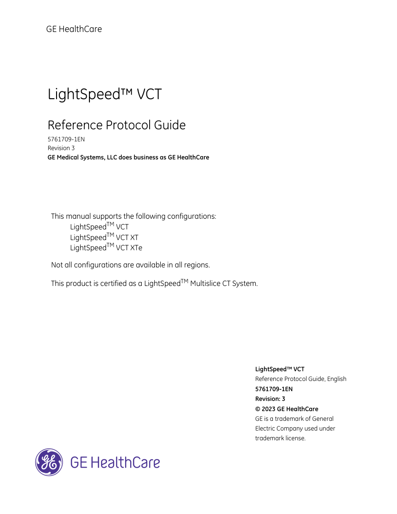
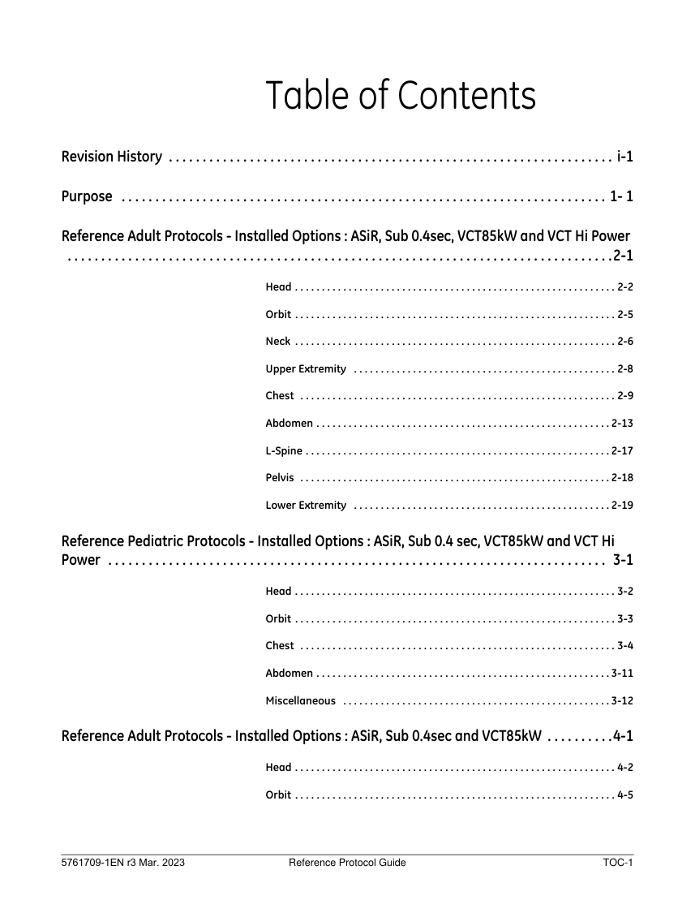

# CT — Parametri aparat: GE LS VCT 64 Protocols (MCB)

## Documentul original MCB — Parametri aparat: GE LS VCT 64 Protocols

**Manual de aparat · 356 pagini · consultat la 2026-09-27.**

[Descarcă PDF-ul integral](../../assets/mcb-modalities/ct-parametri-aparat-ge-ls-vct-64-protocols-mcb/document.pdf) · [Sursa MCB](https://ref.mcbradiology.com/Protocols,%20Policies,%20Worksheets%20&%20Forms/CT/Protocols/Default/GE%20LS%20VCT%2064%20Protocols.pdf) · [Catalogul MCB pentru această modalitate](../mcb/index.md)

Instrucțiunile, valorile și ilustrațiile din documentul original sunt păstrate în **engleză**. Titlul și navigarea sunt în română.

Previzualizarea de mai jos prezintă primele 3 pagini. **PDF-ul descărcabil conține toate cele 356 de pagini.**

### Pagina 1

{ loading=lazy }

### Pagina 2

{ loading=lazy }

### Pagina 3

{ loading=lazy }

## Textul documentului original

??? abstract "Pagina 1 — text în engleză"

    
GE HealthCare
    LightSpeed™ VCT 
    Reference Protocol Guide
    5761709-1EN
    Revision 3
    GE Medical Systems, LLC does business as GE HealthCare
    This manual supports the following configurations:
    LightSpeedTM VCT
    LightSpeedTM VCT XT
    LightSpeedTM VCT XTe
    Not all configurations are available in all regions.
    This product is certified as a LightSpeedTM Multislice CT System.
    LightSpeed™ VCT
    Reference Protocol Guide, English 
    5761709-1EN
    Revision: 3
    © 2023 GE HealthCare
    GE is a trademark of General 
    Electric Company used under 
    trademark license.
    

??? abstract "Pagina 2 — text în engleză"

    
Reference Protocol Guide
    5761709-1EN r3 Mar. 2023
    

??? abstract "Pagina 3 — text în engleză"

    
Table of Contents
    Revision History  . . . . . . . . . . . . . . . . . . . . . . . . . . . . . . . . . . . . . . . . . . . . . . . . . . . . . . . . . . . . . . . . . . i-1
    Purpose  . . . . . . . . . . . . . . . . . . . . . . . . . . . . . . . . . . . . . . . . . . . . . . . . . . . . . . . . . . . . . . . . . . . . . . . . 1- 1
    Reference Adult Protocols - Installed Options : ASiR, Sub 0.4sec, VCT85kW and VCT Hi Power  
     . . . . . . . . . . . . . . . . . . . . . . . . . . . . . . . . . . . . . . . . . . . . . . . . . . . . . . . . . . . . . . . . . . . . . . . . . . . . . . . . .2-1
    Head . . . . . . . . . . . . . . . . . . . . . . . . . . . . . . . . . . . . . . . . . . . . . . . . . . . . . . . . . . . . 2-2
    Orbit . . . . . . . . . . . . . . . . . . . . . . . . . . . . . . . . . . . . . . . . . . . . . . . . . . . . . . . . . . . . 2-5
    Neck . . . . . . . . . . . . . . . . . . . . . . . . . . . . . . . . . . . . . . . . . . . . . . . . . . . . . . . . . . . . 2-6
    Upper Extremity  . . . . . . . . . . . . . . . . . . . . . . . . . . . . . . . . . . . . . . . . . . . . . . . . . 2-8
    Chest  . . . . . . . . . . . . . . . . . . . . . . . . . . . . . . . . . . . . . . . . . . . . . . . . . . . . . . . . . . . 2-9
    Abdomen . . . . . . . . . . . . . . . . . . . . . . . . . . . . . . . . . . . . . . . . . . . . . . . . . . . . . . . 2-13
    L-Spine . . . . . . . . . . . . . . . . . . . . . . . . . . . . . . . . . . . . . . . . . . . . . . . . . . . . . . . . . 2-17
    Pelvis  . . . . . . . . . . . . . . . . . . . . . . . . . . . . . . . . . . . . . . . . . . . . . . . . . . . . . . . . . . 2-18
    Lower Extremity  . . . . . . . . . . . . . . . . . . . . . . . . . . . . . . . . . . . . . . . . . . . . . . . . 2-19
    Reference Pediatric Protocols - Installed Options : ASiR, Sub 0.4 sec, VCT85kW and VCT Hi 
    Power  . . . . . . . . . . . . . . . . . . . . . . . . . . . . . . . . . . . . . . . . . . . . . . . . . . . . . . . . . . . . . . . . . . . . . . . . . .  3-1
    Head . . . . . . . . . . . . . . . . . . . . . . . . . . . . . . . . . . . . . . . . . . . . . . . . . . . . . . . . . . . . 3-2
    Orbit . . . . . . . . . . . . . . . . . . . . . . . . . . . . . . . . . . . . . . . . . . . . . . . . . . . . . . . . . . . . 3-3
    Chest  . . . . . . . . . . . . . . . . . . . . . . . . . . . . . . . . . . . . . . . . . . . . . . . . . . . . . . . . . . . 3-4
    Abdomen . . . . . . . . . . . . . . . . . . . . . . . . . . . . . . . . . . . . . . . . . . . . . . . . . . . . . . . 3-11
    Miscellaneous  . . . . . . . . . . . . . . . . . . . . . . . . . . . . . . . . . . . . . . . . . . . . . . . . . . 3-12
    Reference Adult Protocols - Installed Options : ASiR, Sub 0.4sec and VCT85kW . . . . . . . . . .4-1
    Head . . . . . . . . . . . . . . . . . . . . . . . . . . . . . . . . . . . . . . . . . . . . . . . . . . . . . . . . . . . . 4-2
    Orbit . . . . . . . . . . . . . . . . . . . . . . . . . . . . . . . . . . . . . . . . . . . . . . . . . . . . . . . . . . . . 4-5
    5761709-1EN r3 Mar. 2023
    Reference Protocol Guide
    TOC-1
    

??? abstract "Pagina 4 — text în engleză"

    
Neck . . . . . . . . . . . . . . . . . . . . . . . . . . . . . . . . . . . . . . . . . . . . . . . . . . . . . . . . . . . . 4-6
    Upper Extremity  . . . . . . . . . . . . . . . . . . . . . . . . . . . . . . . . . . . . . . . . . . . . . . . . . 4-8
    Chest  . . . . . . . . . . . . . . . . . . . . . . . . . . . . . . . . . . . . . . . . . . . . . . . . . . . . . . . . . . . 4-9
    Abdomen . . . . . . . . . . . . . . . . . . . . . . . . . . . . . . . . . . . . . . . . . . . . . . . . . . . . . . . 4-13
    L-Spine . . . . . . . . . . . . . . . . . . . . . . . . . . . . . . . . . . . . . . . . . . . . . . . . . . . . . . . . . 4-17
    Pelvis  . . . . . . . . . . . . . . . . . . . . . . . . . . . . . . . . . . . . . . . . . . . . . . . . . . . . . . . . . . 4-18
    Lower Extremity  . . . . . . . . . . . . . . . . . . . . . . . . . . . . . . . . . . . . . . . . . . . . . . . . 4-19
    Reference Pediatric Protocols - Installed Options : ASiR, Sub 0.4 sec and VCT85kW  . . . . .  5-1
    Head . . . . . . . . . . . . . . . . . . . . . . . . . . . . . . . . . . . . . . . . . . . . . . . . . . . . . . . . . . . . 5-2
    Orbit . . . . . . . . . . . . . . . . . . . . . . . . . . . . . . . . . . . . . . . . . . . . . . . . . . . . . . . . . . . . 5-3
    Chest  . . . . . . . . . . . . . . . . . . . . . . . . . . . . . . . . . . . . . . . . . . . . . . . . . . . . . . . . . . . 5-4
    Abdomen . . . . . . . . . . . . . . . . . . . . . . . . . . . . . . . . . . . . . . . . . . . . . . . . . . . . . . . 5-11
    Miscellaneous  . . . . . . . . . . . . . . . . . . . . . . . . . . . . . . . . . . . . . . . . . . . . . . . . . . 5-12
    Reference Adult Protocols - Installed Options : ASiR and Sub 0.4sec . . . . . . . . . . . . . . . . . . .  6-1
    Head . . . . . . . . . . . . . . . . . . . . . . . . . . . . . . . . . . . . . . . . . . . . . . . . . . . . . . . . . . . . 6-2
    Orbit . . . . . . . . . . . . . . . . . . . . . . . . . . . . . . . . . . . . . . . . . . . . . . . . . . . . . . . . . . . . 6-5
    Neck . . . . . . . . . . . . . . . . . . . . . . . . . . . . . . . . . . . . . . . . . . . . . . . . . . . . . . . . . . . . 6-6
    Upper Extremity  . . . . . . . . . . . . . . . . . . . . . . . . . . . . . . . . . . . . . . . . . . . . . . . . . 6-8
    Chest  . . . . . . . . . . . . . . . . . . . . . . . . . . . . . . . . . . . . . . . . . . . . . . . . . . . . . . . . . . . 6-9
    Abdomen . . . . . . . . . . . . . . . . . . . . . . . . . . . . . . . . . . . . . . . . . . . . . . . . . . . . . . . 6-13
    L-Spine . . . . . . . . . . . . . . . . . . . . . . . . . . . . . . . . . . . . . . . . . . . . . . . . . . . . . . . . . 6-17
    Pelvis  . . . . . . . . . . . . . . . . . . . . . . . . . . . . . . . . . . . . . . . . . . . . . . . . . . . . . . . . . . 6-18
    Lower Extremity  . . . . . . . . . . . . . . . . . . . . . . . . . . . . . . . . . . . . . . . . . . . . . . . . 6-19
    Reference Pediatric Protocols - Installed Options : ASiR and Sub 0.4 sec . . . . . . . . . . . . . . .  7-1
    Head . . . . . . . . . . . . . . . . . . . . . . . . . . . . . . . . . . . . . . . . . . . . . . . . . . . . . . . . . . . . 7-2
    Orbit . . . . . . . . . . . . . . . . . . . . . . . . . . . . . . . . . . . . . . . . . . . . . . . . . . . . . . . . . . . . 7-3
    5761709-1EN r3 Mar. 2023
    Reference Protocol Guide
    TOC-2
    

??? abstract "Pagina 5 — text în engleză"

    
Chest  . . . . . . . . . . . . . . . . . . . . . . . . . . . . . . . . . . . . . . . . . . . . . . . . . . . . . . . . . . . 7-4
    Abdomen . . . . . . . . . . . . . . . . . . . . . . . . . . . . . . . . . . . . . . . . . . . . . . . . . . . . . . . 7-11
    Miscellaneous  . . . . . . . . . . . . . . . . . . . . . . . . . . . . . . . . . . . . . . . . . . . . . . . . . . 7-12
    Reference Adult Protocols - Installed Options : Sub 0.4sec, VCT85kW and VCT Hi Power .  8-1
    Head . . . . . . . . . . . . . . . . . . . . . . . . . . . . . . . . . . . . . . . . . . . . . . . . . . . . . . . . . . . . 8-2
    Orbit . . . . . . . . . . . . . . . . . . . . . . . . . . . . . . . . . . . . . . . . . . . . . . . . . . . . . . . . . . . . 8-5
    Neck . . . . . . . . . . . . . . . . . . . . . . . . . . . . . . . . . . . . . . . . . . . . . . . . . . . . . . . . . . . . 8-6
    Upper Extremity  . . . . . . . . . . . . . . . . . . . . . . . . . . . . . . . . . . . . . . . . . . . . . . . . . 8-8
    Chest  . . . . . . . . . . . . . . . . . . . . . . . . . . . . . . . . . . . . . . . . . . . . . . . . . . . . . . . . . . . 8-9
    Abdomen . . . . . . . . . . . . . . . . . . . . . . . . . . . . . . . . . . . . . . . . . . . . . . . . . . . . . . . 8-13
    L-Spine . . . . . . . . . . . . . . . . . . . . . . . . . . . . . . . . . . . . . . . . . . . . . . . . . . . . . . . . . 8-17
    Pelvis  . . . . . . . . . . . . . . . . . . . . . . . . . . . . . . . . . . . . . . . . . . . . . . . . . . . . . . . . . . 8-18
    Lower Extremity  . . . . . . . . . . . . . . . . . . . . . . . . . . . . . . . . . . . . . . . . . . . . . . . . 8-19
    Reference Pediatric Protocols - Installed Options : Sub 0.4 sec, VCT85kW and VCT Hi Power .
     . . . . . . . . . . . . . . . . . . . . . . . . . . . . . . . . . . . . . . . . . . . . . . . . . . . . . . . . . . . . . . . . . . . . . . . . . . . . . . . . .9-1
    Head . . . . . . . . . . . . . . . . . . . . . . . . . . . . . . . . . . . . . . . . . . . . . . . . . . . . . . . . . . . . 9-2
    Orbit . . . . . . . . . . . . . . . . . . . . . . . . . . . . . . . . . . . . . . . . . . . . . . . . . . . . . . . . . . . . 9-3
    Chest  . . . . . . . . . . . . . . . . . . . . . . . . . . . . . . . . . . . . . . . . . . . . . . . . . . . . . . . . . . . 9-4
    Abdomen . . . . . . . . . . . . . . . . . . . . . . . . . . . . . . . . . . . . . . . . . . . . . . . . . . . . . . . 9-11
    Miscellaneous  . . . . . . . . . . . . . . . . . . . . . . . . . . . . . . . . . . . . . . . . . . . . . . . . . . 9-12
    Reference Adult Protocols - Installed Options : Sub 0.4sec and VCT85kW . . . . . . . . . . . . .  10-1
    Head . . . . . . . . . . . . . . . . . . . . . . . . . . . . . . . . . . . . . . . . . . . . . . . . . . . . . . . . . . . 10-2
    Orbit . . . . . . . . . . . . . . . . . . . . . . . . . . . . . . . . . . . . . . . . . . . . . . . . . . . . . . . . . . . 10-5
    Neck . . . . . . . . . . . . . . . . . . . . . . . . . . . . . . . . . . . . . . . . . . . . . . . . . . . . . . . . . . . 10-6
    Upper Extremity  . . . . . . . . . . . . . . . . . . . . . . . . . . . . . . . . . . . . . . . . . . . . . . . . 10-8
    Chest  . . . . . . . . . . . . . . . . . . . . . . . . . . . . . . . . . . . . . . . . . . . . . . . . . . . . . . . . . . 10-9
    5761709-1EN r3 Mar. 2023
    Reference Protocol Guide
    TOC-3
    

??? abstract "Pagina 6 — text în engleză"

    
Abdomen . . . . . . . . . . . . . . . . . . . . . . . . . . . . . . . . . . . . . . . . . . . . . . . . . . . . . .10-13
    L-Spine . . . . . . . . . . . . . . . . . . . . . . . . . . . . . . . . . . . . . . . . . . . . . . . . . . . . . . . .10-17
    Pelvis  . . . . . . . . . . . . . . . . . . . . . . . . . . . . . . . . . . . . . . . . . . . . . . . . . . . . . . . . .10-18
    Lower Extremity  . . . . . . . . . . . . . . . . . . . . . . . . . . . . . . . . . . . . . . . . . . . . . . .10-19
    Reference Pediatric Protocols - Installed Options : Sub 0.4 sec and VCT85kW  . . . . . . . . .  11-1
    Head . . . . . . . . . . . . . . . . . . . . . . . . . . . . . . . . . . . . . . . . . . . . . . . . . . . . . . . . . . . 11-2
    Orbit . . . . . . . . . . . . . . . . . . . . . . . . . . . . . . . . . . . . . . . . . . . . . . . . . . . . . . . . . . . 11-3
    Chest  . . . . . . . . . . . . . . . . . . . . . . . . . . . . . . . . . . . . . . . . . . . . . . . . . . . . . . . . . . 11-4
    Abdomen . . . . . . . . . . . . . . . . . . . . . . . . . . . . . . . . . . . . . . . . . . . . . . . . . . . . . .11-11
    Miscellaneous  . . . . . . . . . . . . . . . . . . . . . . . . . . . . . . . . . . . . . . . . . . . . . . . . .11-12
    Reference Adult Protocols - Installed Options : Sub 0.4sec  . . . . . . . . . . . . . . . . . . . . . . . . . .  12-1
    Head . . . . . . . . . . . . . . . . . . . . . . . . . . . . . . . . . . . . . . . . . . . . . . . . . . . . . . . . . . . 12-2
    Orbit . . . . . . . . . . . . . . . . . . . . . . . . . . . . . . . . . . . . . . . . . . . . . . . . . . . . . . . . . . . 12-5
    Neck . . . . . . . . . . . . . . . . . . . . . . . . . . . . . . . . . . . . . . . . . . . . . . . . . . . . . . . . . . . 12-6
    Upper Extremity  . . . . . . . . . . . . . . . . . . . . . . . . . . . . . . . . . . . . . . . . . . . . . . . . 12-8
    Chest  . . . . . . . . . . . . . . . . . . . . . . . . . . . . . . . . . . . . . . . . . . . . . . . . . . . . . . . . . . 12-9
    Abdomen . . . . . . . . . . . . . . . . . . . . . . . . . . . . . . . . . . . . . . . . . . . . . . . . . . . . . .12-13
    L-Spine . . . . . . . . . . . . . . . . . . . . . . . . . . . . . . . . . . . . . . . . . . . . . . . . . . . . . . . .12-17
    Pelvis  . . . . . . . . . . . . . . . . . . . . . . . . . . . . . . . . . . . . . . . . . . . . . . . . . . . . . . . . .12-18
    Lower Extremity  . . . . . . . . . . . . . . . . . . . . . . . . . . . . . . . . . . . . . . . . . . . . . . .12-19
    Reference Pediatric Protocols - Installed Options : Sub 0.4 sec  . . . . . . . . . . . . . . . . . . . . . .  13-1
    Head . . . . . . . . . . . . . . . . . . . . . . . . . . . . . . . . . . . . . . . . . . . . . . . . . . . . . . . . . . . 13-2
    Orbit . . . . . . . . . . . . . . . . . . . . . . . . . . . . . . . . . . . . . . . . . . . . . . . . . . . . . . . . . . . 13-3
    Chest  . . . . . . . . . . . . . . . . . . . . . . . . . . . . . . . . . . . . . . . . . . . . . . . . . . . . . . . . . . 13-4
    Abdomen . . . . . . . . . . . . . . . . . . . . . . . . . . . . . . . . . . . . . . . . . . . . . . . . . . . . . .13-11
    Miscellaneous  . . . . . . . . . . . . . . . . . . . . . . . . . . . . . . . . . . . . . . . . . . . . . . . . .13-12
    TOC-4
    Reference Protocol Guide
    5761709-1EN r3 Mar. 2023
    

??? abstract "Pagina 7 — text în engleză"

    
Reference Adult Protocols - Installed Options : ASiR, VCT85kW and VCT Hi Power  . . . . .  14-1
    Head . . . . . . . . . . . . . . . . . . . . . . . . . . . . . . . . . . . . . . . . . . . . . . . . . . . . . . . . . . . 14-2
    Orbit . . . . . . . . . . . . . . . . . . . . . . . . . . . . . . . . . . . . . . . . . . . . . . . . . . . . . . . . . . . 14-5
    Neck . . . . . . . . . . . . . . . . . . . . . . . . . . . . . . . . . . . . . . . . . . . . . . . . . . . . . . . . . . . 14-6
    Upper Extremity  . . . . . . . . . . . . . . . . . . . . . . . . . . . . . . . . . . . . . . . . . . . . . . . . 14-8
    Chest  . . . . . . . . . . . . . . . . . . . . . . . . . . . . . . . . . . . . . . . . . . . . . . . . . . . . . . . . . . 14-9
    Abdomen . . . . . . . . . . . . . . . . . . . . . . . . . . . . . . . . . . . . . . . . . . . . . . . . . . . . . .14-12
    L-Spine . . . . . . . . . . . . . . . . . . . . . . . . . . . . . . . . . . . . . . . . . . . . . . . . . . . . . . . .14-16
    Pelvis  . . . . . . . . . . . . . . . . . . . . . . . . . . . . . . . . . . . . . . . . . . . . . . . . . . . . . . . . .14-17
    Lower Extremity  . . . . . . . . . . . . . . . . . . . . . . . . . . . . . . . . . . . . . . . . . . . . . . .14-18
    Reference Pediatric Protocols - Installed Options : ASiR, VCT85kW and VCT Hi Power  . .  15-1
    Head . . . . . . . . . . . . . . . . . . . . . . . . . . . . . . . . . . . . . . . . . . . . . . . . . . . . . . . . . . . 15-2
    Orbit . . . . . . . . . . . . . . . . . . . . . . . . . . . . . . . . . . . . . . . . . . . . . . . . . . . . . . . . . . . 15-3
    Chest  . . . . . . . . . . . . . . . . . . . . . . . . . . . . . . . . . . . . . . . . . . . . . . . . . . . . . . . . . . 15-4
    Abdomen . . . . . . . . . . . . . . . . . . . . . . . . . . . . . . . . . . . . . . . . . . . . . . . . . . . . . .15-11
    Miscellaneous  . . . . . . . . . . . . . . . . . . . . . . . . . . . . . . . . . . . . . . . . . . . . . . . . .15-12
    Reference Adult Protocols - Installed Options : ASiR . . . . . . . . . . . . . . . . . . . . . . . . . . . . . . . .  16-1
    Head . . . . . . . . . . . . . . . . . . . . . . . . . . . . . . . . . . . . . . . . . . . . . . . . . . . . . . . . . . . 16-2
    Orbit . . . . . . . . . . . . . . . . . . . . . . . . . . . . . . . . . . . . . . . . . . . . . . . . . . . . . . . . . . . 16-5
    Neck . . . . . . . . . . . . . . . . . . . . . . . . . . . . . . . . . . . . . . . . . . . . . . . . . . . . . . . . . . . 16-6
    Upper Extremity  . . . . . . . . . . . . . . . . . . . . . . . . . . . . . . . . . . . . . . . . . . . . . . . . 16-8
    Chest  . . . . . . . . . . . . . . . . . . . . . . . . . . . . . . . . . . . . . . . . . . . . . . . . . . . . . . . . . . 16-9
    Abdomen . . . . . . . . . . . . . . . . . . . . . . . . . . . . . . . . . . . . . . . . . . . . . . . . . . . . . .16-12
    L-Spine . . . . . . . . . . . . . . . . . . . . . . . . . . . . . . . . . . . . . . . . . . . . . . . . . . . . . . . .16-16
    Pelvis  . . . . . . . . . . . . . . . . . . . . . . . . . . . . . . . . . . . . . . . . . . . . . . . . . . . . . . . . .16-17
    Lower Extremity  . . . . . . . . . . . . . . . . . . . . . . . . . . . . . . . . . . . . . . . . . . . . . . .16-18
    5761709-1EN r3 Mar. 2023
    Reference Protocol Guide
    TOC-5
    

??? abstract "Pagina 8 — text în engleză"

    
Reference Pediatric Protocols - Installed Options : ASiR . . . . . . . . . . . . . . . . . . . . . . . . . . . . .  17-1
    Head . . . . . . . . . . . . . . . . . . . . . . . . . . . . . . . . . . . . . . . . . . . . . . . . . . . . . . . . . . . 17-2
    Orbit . . . . . . . . . . . . . . . . . . . . . . . . . . . . . . . . . . . . . . . . . . . . . . . . . . . . . . . . . . . 17-3
    Chest  . . . . . . . . . . . . . . . . . . . . . . . . . . . . . . . . . . . . . . . . . . . . . . . . . . . . . . . . . . 17-4
    Abdomen . . . . . . . . . . . . . . . . . . . . . . . . . . . . . . . . . . . . . . . . . . . . . . . . . . . . . .17-11
    Miscellaneous  . . . . . . . . . . . . . . . . . . . . . . . . . . . . . . . . . . . . . . . . . . . . . . . . .17-12
    Reference Adult Protocols - Installed Options : VCT85kW and/or VCT Hi Power . . . . . . . .  18-1
    Head . . . . . . . . . . . . . . . . . . . . . . . . . . . . . . . . . . . . . . . . . . . . . . . . . . . . . . . . . . . 18-2
    Orbit . . . . . . . . . . . . . . . . . . . . . . . . . . . . . . . . . . . . . . . . . . . . . . . . . . . . . . . . . . . 18-5
    Neck . . . . . . . . . . . . . . . . . . . . . . . . . . . . . . . . . . . . . . . . . . . . . . . . . . . . . . . . . . . 18-6
    Upper Extremity  . . . . . . . . . . . . . . . . . . . . . . . . . . . . . . . . . . . . . . . . . . . . . . . . 18-8
    Chest  . . . . . . . . . . . . . . . . . . . . . . . . . . . . . . . . . . . . . . . . . . . . . . . . . . . . . . . . . . 18-9
    Abdomen . . . . . . . . . . . . . . . . . . . . . . . . . . . . . . . . . . . . . . . . . . . . . . . . . . . . . .18-12
    L-Spine . . . . . . . . . . . . . . . . . . . . . . . . . . . . . . . . . . . . . . . . . . . . . . . . . . . . . . . .18-16
    Pelvis  . . . . . . . . . . . . . . . . . . . . . . . . . . . . . . . . . . . . . . . . . . . . . . . . . . . . . . . . .18-17
    Lower Extremity  . . . . . . . . . . . . . . . . . . . . . . . . . . . . . . . . . . . . . . . . . . . . . . .18-18
    Reference Pediatric Protocols - Installed Options : VCT85kW and/or VCT Hi Power  . . . .  19-1
    Head . . . . . . . . . . . . . . . . . . . . . . . . . . . . . . . . . . . . . . . . . . . . . . . . . . . . . . . . . . . 19-2
    Orbit . . . . . . . . . . . . . . . . . . . . . . . . . . . . . . . . . . . . . . . . . . . . . . . . . . . . . . . . . . . 19-3
    Chest  . . . . . . . . . . . . . . . . . . . . . . . . . . . . . . . . . . . . . . . . . . . . . . . . . . . . . . . . . . 19-4
    Abdomen . . . . . . . . . . . . . . . . . . . . . . . . . . . . . . . . . . . . . . . . . . . . . . . . . . . . . .19-11
    Miscellaneous  . . . . . . . . . . . . . . . . . . . . . . . . . . . . . . . . . . . . . . . . . . . . . . . . .19-12
    Reference Adult Protocols - Installed Options : 72kW . . . . . . . . . . . . . . . . . . . . . . . . . . . . . . .  20-1
    Head . . . . . . . . . . . . . . . . . . . . . . . . . . . . . . . . . . . . . . . . . . . . . . . . . . . . . . . . . . . 20-2
    Orbit . . . . . . . . . . . . . . . . . . . . . . . . . . . . . . . . . . . . . . . . . . . . . . . . . . . . . . . . . . . 20-5
    Neck . . . . . . . . . . . . . . . . . . . . . . . . . . . . . . . . . . . . . . . . . . . . . . . . . . . . . . . . . . . 20-6
    TOC-6
    Reference Protocol Guide
    5761709-1EN r3 Mar. 2023
    

??? abstract "Pagina 9 — text în engleză"

    
Upper Extremity  . . . . . . . . . . . . . . . . . . . . . . . . . . . . . . . . . . . . . . . . . . . . . . . . 20-8
    Chest  . . . . . . . . . . . . . . . . . . . . . . . . . . . . . . . . . . . . . . . . . . . . . . . . . . . . . . . . . . 20-9
    Abdomen . . . . . . . . . . . . . . . . . . . . . . . . . . . . . . . . . . . . . . . . . . . . . . . . . . . . . .20-12
    L-Spine . . . . . . . . . . . . . . . . . . . . . . . . . . . . . . . . . . . . . . . . . . . . . . . . . . . . . . . .20-16
    Pelvis  . . . . . . . . . . . . . . . . . . . . . . . . . . . . . . . . . . . . . . . . . . . . . . . . . . . . . . . . .20-17
    Lower Extremity  . . . . . . . . . . . . . . . . . . . . . . . . . . . . . . . . . . . . . . . . . . . . . . .20-18
    Reference Pediatric Protocols - Installed Options : 72kW . . . . . . . . . . . . . . . . . . . . . . . . . . . .  21-1
    Head . . . . . . . . . . . . . . . . . . . . . . . . . . . . . . . . . . . . . . . . . . . . . . . . . . . . . . . . . . . 21-2
    Orbit . . . . . . . . . . . . . . . . . . . . . . . . . . . . . . . . . . . . . . . . . . . . . . . . . . . . . . . . . . . 21-3
    Chest  . . . . . . . . . . . . . . . . . . . . . . . . . . . . . . . . . . . . . . . . . . . . . . . . . . . . . . . . . . 21-4
    Abdomen . . . . . . . . . . . . . . . . . . . . . . . . . . . . . . . . . . . . . . . . . . . . . . . . . . . . . .21-11
    Miscellaneous  . . . . . . . . . . . . . . . . . . . . . . . . . . . . . . . . . . . . . . . . . . . . . . . . .21-12
    Lexicon . . . . . . . . . . . . . . . . . . . . . . . . . . . . . . . . . . . . . . . . . . . . . . . . . . . . . . . . . . . . . . . . . . . . . . . .  22-1
    5761709-1EN r3 Mar. 2023
    Reference Protocol Guide
    TOC-7
    

??? abstract "Pagina 10 — text în engleză"

    
TOC-8
    Reference Protocol Guide
    5761709-1EN r3 Mar. 2023
    

??? abstract "Pagina 11 — text în engleză"

    
Revision History
    i-1
    

??? abstract "Pagina 12 — text în engleză"

    
Revision History
    REV
    DATE
    REASON FOR CHANGE
    1
    Nov. 2016
    Initial Release
    Dec. 2016
    2
    Typo
    3
    Mar. 2023
    Typo
    i-2
    

??? abstract "Pagina 13 — text în engleză"

    
Purpose
    1-1
    

??? abstract "Pagina 14 — text în engleză"

    
Purpose
    This document provides a listing of the parameters provided in the reference protocols contained 
    under the GE tab selector. Each table lists the Protocol Number, Protocol Name, Post Processing 
    software associated with, Scan Type, SFOV, Pitch/Table Speed/Row, Gantry Rotation Time, Slice 
    Thickness, Beam Collimation, kV, mA/Min-Max/Noise Index/Average mA, Recon Algorithm Type 
    used, CTDIvol, DLP (mGy-cm), Scan Length, and Phantom Type used and Description.
    If the ASiR option is installed on the system, there will be a % Dose Reduction column and % ASiR 
    column listed in the table indicating the % Dose Reduction and % ASiR value in the reference 
    protocol. For protocols with manual mA, the mA listed is the actual mA used for the scan. The 
    Reference mA is calculated as:
    Manual mA mode allows you to scan without enabling Auto mA mode. When building protocols, 
    make sure the mA value field contains a reasonable mA value in the event that AutomA is turned 
    off. In the GE reference protocols, the Average (Avg) mA provided in the tables within this 
    document are what is used in calculating the CTDI and DLP for protocols using AutomA or 
    SmartmA.  The Avg mA value provided in the table is an estimate based on an average patient 
    size (32- 36 cm) .  The actual average mA for each image is calculated by using all of the mA 
    values for each scan rotation, as determined by Auto mA for the patient. The Auto mA Theory 
    section in the User Manual,  Scan Chapter and in the Technical Reference Manual, General 
    Information Chapter details how Auto mA does this calculation.
    1-2
    

??? abstract "Pagina 15 — text în engleză"

    
Reference Adult Protocols - Installed
    Options : ASiR, Sub 0.4sec,
    VCT85kW and VCT Hi Power
    2-1
    

??? abstract "Pagina 16 — text în engleză"

    
Phantom 
    (cm)
    Description
    Scan 
    Length 
    (mm)
    DLP 
    (mGy·cm)
    ASiR
    CTDI
    vol
    (mGy) 
    ASiR
    ASiR 
    (%)
    50
    26.02
    252.82
    80
    16
    CT angiography of the 
    head for evaluation of 
    carotid and cerebral 
    vasculature.
    40
    61.66
    1155.86
    170
    16
    CT angiography of the 
    head for evaluation of 
    carotid and cerebral 
    vasculature.
    40
    32.52
    527.31
    145
    16
    Helical scan mode for 
    evaluation of the brain for 
    cerebral abnormality.
    Recon 
    Type
    Dose 
    Reduction 
    (%)
    30
    Stnd
    Plus 
    IQE
    NI
    mA
    Avg mA
    Min-Max
    kV
    Beam 
    Collimation 
    (mm)
    Slice 
    Thickness 
    (mm)
    [Interval]*
    (mm)
    Rotation 
    Time (s)
    Row
    Pitch
    Table 
    Speed
    Axial
    Head
    4i
    1
    5
    20
    140
    120
    40
    Stnd
    40
    32.00
    192.01
    55
    16
    Routine head protocol for 
    evaluation of the brain for 
    abnormalities.
    Axial
    Head
    4i
    2
    5
    20
    140
    60
    40
    Stnd
    40
    32.00
    192.01
    55
    16
    Routine head protocol for 
    evaluation of the brain for 
    abnormalities.
    Axial
    Head
    8i
    0.5
    2.5
    20
    140
    335
    40
    Stnd
    40
    44.67
    625.37
    137.5
    16
    Emergency head protocol 
    for evaluation of the brain 
    and cranium for 
    abnormalities.
    Axial
    Head
    4i
    0.5
    5
    20
    140
    240
    40
    Stnd
    40
    32.00
    192.01
    55
    16
    Routine head protocol for 
    evaluation of the brain for 
    abnormalities.
    Helical
    Head
    0.531:1
    10.625 
    0.4
    0.625
    20
    120
    180
    40
    Stnd
    Plus 
    IQE
    Helical
    Head
    0.531:1
    10.625 
    0.4
    0.625
    20
    120
    SmartmA
    100-650mA
    NI=8
    Avg mA 415
    Post 
    Process
    Scan Type
    SFOV
    MIROI
    Axial
    Head
    1i
    1
    5
    [0]
    5
    120
    80
    0
    Stnd
    0
    180.84
    90.42
    0
    16
    Test bolus for 
    CTangiography of the 
    head for evaluation of 
    carotid and cerebral 
    vasculature.
    Protocol 
    Name
    Group2
    Axial
    Head
    4i
    1
    5
    20
    120
    190
    40
    Stnd
    40
    36.47
    291.78
    75
    16
    Group2
    Axial
    Head
    4i
    2
    5
    20
    120
    95
    40
    Stnd
    40
    36.47
    291.78
    75
    16
    Group2
    Axial
    Head
    4i
    0.5
    5
    20
    120
    360
    40
    Stnd
    40
    35.52
    284.17
    75
    16
    Head
    Table 2-1 
    [Interval]* - For Helical acquisitions, Interval unless otherwise indicated is equal to the slice thickness.
    For Axial and Cine acquisitions, Interval unless otherwise indicated is equal to the Beam Collimation/Detector Coverage.
    Protocol 
    Number
    21.1
    Routine 
    Head 1s
    Group1
    21.2
    Routine 
    Head 2s
    Group1
    21.3
    Trauma 
    Head 
    2.5mm
    21.4
    Routine 
    Head 0.5s
    Group1
    21.5
    Circle of 
    Willis 0.4s.
    MIROI
    Axial
    Head
    1i
    1
    5
    [0]
    5
    120
    50
    0
    Stnd
    0
    125.58
    62.79
    0
    16
    Test bolus for 
    CTangiography of the 
    head for evaluation of 
    carotid and cerebral 
    vasculature.
    21.6
    CoW/
    Carotid 
    0.625mm 
    0.4s.Smart
    mA
    21.8
    Helical 
    Head
    DMPR
    Helical
    Head
    0.531:1
    10.625 
    0.5
    0.625
    20
    120
    180
    40
    Stnd
    Plus
    IQE
    21.10
    VHS Head 
    4D CTA
    MIROI
    Axial
    Head
    1i
    1
    5
    [0]
    5
    120
    50
    0
    Stnd
    0
    125.58
    62.79
    0
    16
    Test bolus for 
    CTangiography of the 
    head for evaluation of 
    carotid and cerebral 
    vasculature.
    2-2
    

??? abstract "Pagina 17 — text în engleză"

    
Phantom 
    (cm)
    Description
    Scan 
    Length 
    (mm)
    DLP 
    (mGy·cm)
    ASiR
    CTDI
    vol
    (mGy) 
    ASiR
    ASiR 
    (%)
    Recon 
    Type
    Dose 
    Reduction 
    (%)
    NI
    mA
    Avg mA
    Min-Max
    kV
    Beam 
    Collimation 
    (mm)
    Slice 
    Thickness 
    (mm)
    [Interval]*
    (mm)
    Rotation 
    Time (s)
    0.4
    5
    [10]
    40
    120
    150
    50
    Stnd
    Plus
    50
    248.10
    3101.19
    110
    16
    CT angiography of the 
    head using Volume 
    Helical scan mode for 
    evaluation of cerebral 
    vasculature.
    0.4
    5
    40
    80
    200
    0
    Stnd
    50
    186.02
    2325.25
    110
    16
    CT Perfusion using 
    Volume Helical scan 
    mode for evaluation of 
    cerebral perfusion over 
    time.
    Row
    Pitch
    Table 
    Speed
    Helical-S
    Head
    0.984:1
    39.375
    18 pass
    Axial
    Head
    4i
    1
    5
    20
    120
    200
    40
    Stnd
    40
    38.39
    537.48
    135
    16
    Non-Enhance Brain, 
    evaluation for 
    hemorrhage or infarction.
    Axial
    Head
    4i
    1
    5
    20
    120
    200
    40
    Stnd
    40
    38.39
    537.48
    135
    16
    Non-Enhance Brain, 
    evaluation for 
    hemorrhage or infarction.
    Axial
    Head
    4i
    1
    5
    20
    120
    200
    40
    Stnd
    40
    38.39
    537.48
    135
    16
    Non-Enhance Brain, 
    evaluation for 
    hemorrhage or infarction.
    Axial
    Head
    4i
    1
    5
    20
    120
    200
    40
    Stnd
    40
    38.39
    537.48
    135
    16
    Non-Enhance Brain, 
    evaluation for 
    hemorrhage or infarction.
    Axial
    Head
    4i
    1
    5
    20
    120
    200
    40
    Stnd
    40
    38.39
    537.48
    135
    16
    Post Contrast Brain, 
    Evaluation for residual 
    tissue enhancement.
    Axial
    Head
    4i
    1
    5
    20
    120
    200
    40
    Stnd
    40
    38.39
    537.48
    135
    16
    Non-Enhance Brain, 
    evaluation for 
    hemorrhage or infarction.
    Axial
    Head
    4i
    1
    5
    20
    120
    200
    40
    Stnd
    40
    38.39
    537.48
    135
    16
    Post Contrast Brain, 
    Evaluation for residual 
    tissue enhancement.
    Post 
    Process
    Scan Type
    SFOV
    Perfusion
    Helical-S/P
    Head
    0.984:1
    39.375
    28 pass
    Perfusion
    Cine
    Head
    8i
    1
    5
    [0]
    40
    80
    200
    0
    Stnd
    0
    652.82
    2611.27
    35
    16
    CT Perfusion using Cine 
    scan mode for evaluation 
    of cerebral perfusion over 
    time.
    Perfusion
    Cine
    Head
    8i
    1
    5
    [0]
    40
    80
    200
    0
    Stnd
    0
    587.55
    2350.19
    35
    16
    CT Perfusion using Cine 
    scan mode for evaluation 
    of cerebral perfusion over 
    time.
    Protocol 
    Name
    Group 1
    Perfusion
    Cine
    Head
    8i
    1
    5
    [0]
    40
    80
    200
    0
    Stnd
    0
    587.55
    2350.19
    35
    16
    CT Perfusion using Cine 
    scan mode for evaluation 
    of cerebral perfusion over 
    time.
    Group 2
    Perfusion
    Axial
    Head
    8i
    1
    5
    [0]
    40
    80
    200
    0
    Stnd
    0
    130.54
    522.15
    35
    16
    Delayed phase CT 
    Perfusion using Axial 
    scan mode for evaluation 
    of Brain tumor 
    permeability.
    Protocol 
    Number
    21.11
    VHS 
    Perfusion 
    350-370 
    Strength
    Contrast 
    21.12
    CT 
    Perfusion 
    300-320 
    Strength
    Contrast
    21.13
    CT 
    Perfusion 
    350-370 
    Strength
    Contrast 
    21.14
    CT 
    Perfusion 
    Brain Tumor 
    - Dual 
    Phase
    2-3
    

??? abstract "Pagina 18 — text în engleză"

    
Phantom 
    (cm)
    Description
    Scan 
    Length 
    (mm)
    DLP 
    (mGy·cm)
    ASiR
    CTDI
    vol
    (mGy) 
    ASiR
    ASiR 
    (%)
    Recon 
    Type
    Dose 
    Reduction 
    (%)
    NI
    mA
    Avg mA
    Min-Max
    kV
    Beam 
    Collimation 
    (mm)
    Slice 
    Thickness 
    (mm)
    [Interval]*
    (mm)
    Rotation 
    Time (s)
    Row
    Pitch
    Table 
    Speed
    Axial
    Head
    4i
    1
    5
    20
    120
    200
    40
    Stnd
    40
    38.39
    537.48
    135
    16
    Post Contrast Brain, 
    Evaluation for residual 
    tissue enhancement.
    Axial
    Head
    4i
    1
    5
    20
    120
    200
    40
    Stnd
    40
    38.39
    537.48
    135
    16
    Non-Enhance Brain, 
    evaluation for 
    hemorrhage or infarction.
    Axial
    Head
    4i
    1
    5
    20
    120
    200
    40
    Stnd
    40
    38.39
    537.48
    135
    16
    Post Contrast Brain, 
    Evaluation for residual 
    tissue enhancement.
    Axial
    Head
    4i
    1
    5
    20
    120
    200
    40
    Stnd
    40
    38.39
    537.48
    135
    16
    Non-Enhance Brain, 
    evaluation for 
    hemorrhage or infarction.
    Axial
    Head
    4i
    1
    5
    20
    120
    200
    40
    Stnd
    40
    38.39
    537.48
    135
    16
    Post Contrast Brain, 
    Evaluation for residual 
    tissue enhancement.
    Post 
    Process
    Scan Type
    SFOV
    Perfusion
    Axial
    Head
    8i
    1
    5
    [0]
    40
    80
    200
    0
    Stnd
    0
    287.18
    1148.73
    35
    16
    CT Perfusion using Axial 
    scan mode for evaluation 
    of cerebral perfusion over 
    time.
    Perfusion
    Axial-S
    Head
    8i
    17 pass
    0.4
    5
    40
    80
    500
    0
    Stnd
    0
    221.91
    1775.31
    75
    16
    CT Perfusion using 
    Volume Shuttle (Axial) 
    scan mode for evaluation 
    of cerebral perfusion over 
    time.
    Protocol 
    Name
    Protocol 
    Number
    21.15
    CT 
    Perfusion 
    350-370 
    Strength
    Contrast 
    (Axial)
    21.16
    CT 
    Perfusion 
    350-370 
    Strength
    Contrast 
    (Axial 
    Shuttle 
    Mode)
    2-4
    

??? abstract "Pagina 19 — text în engleză"

    
Phantom 
    (cm)
    Description
    Scan 
    Length 
    (cm)
    DLP 
    (mGy·cm) 
    ASiR
    CTDI
    vol (mGy) 
    ASiR
    ASiR 
    (%)
    50
    12.29
    112.48
    74.375
    16
    Routine Helical Sinus 
    protocol, Evaluation for 
    any abnormality
    40
    28.00
    221.29
    61.875
    16
    Routine Helical Orbit 
    protocol, Evaluation for 
    abnormality soft tissues 
    and bone structures of 
    the face.
    40
    57.23
    319.79
    38.75
    16
    Axial scan mode, 
    Evaluation for inner ear 
    abnormalities in Axial 
    plane
    Recon 
    Type
    Dose 
    Reduction 
    (%)
    NI
    mA
    Avg mA
    Min-Max
    kV
    Beam 
    Collimation 
    (mm)
    Slice 
    Thickness 
    (mm)
    [Interval]*
    (mm)
    Rotation 
    Time 
    (second
    s)
    Row
    Pitch
    Table 
    Speed
    Helical
    Head
    0.531:1
    10.625
    0.6
    0.625
    20
    140
    190
    30
    Stnd
    Plus
    IQE
    Axial
    Head
    16i
    1
    1.25
    20
    140
    235
    30
    Stnd
    40
    62.67
    250.68
    38.75
    16
    Helical scan mode, 
    Evaluation for inner ear 
    abnormalities in Coronal 
    plane
    Post 
    Process
    Scan Type
    SFOV
    DMPR
    Helical
    Head
    0.531:1
    10.625
    0.4
    0.625
    20
    120
    85
    30
    Bone
    Plus
    IQE
    DMPR
    Helical
    Head
    0.531:1
    10.625
    0.5
    0.625
    20
    120
    155
    30
    Stnd
    Plus
    IQE
    Protocol 
    Name
    Orbit
    Table 2-2 
    [Interval]* - For Helical acquisitions, Interval unless otherwise indicated is equal to the slice thickness.
    For Axial and Cine acquisitions, Interval unless otherwise indicated is equal to the Beam Collimation/Detector Coverage.
    ProtocolN
    umber
    22.1
    Sinus 
    Supine 
    Helical + 
    DMPR
    22.3
    Orbits 
    Helical + 
    DMPR
    22.6
    Helical IAC 
    0.625mm 
    Axial mode 
    - Use 
    Reformat 
    for Coronal
    22.8
    Axial and 
    Coronal IAC 
    Axial
    Head
    16i
    1
    1.25
    20
    140
    195
    30
    Stnd
    40
    52.00
    208.01
    38.75
    16
    Helical scan mode, 
    Evaluation for inner ear 
    abnormalities in Axial 
    plane
    2-5
    

??? abstract "Pagina 20 — text în engleză"

    
Phantom 
    (cm)
    Description
    Scan 
    Length 
    (cm)
    DLP 
    (mGy·c
    m) ASiR
    CTDI
    vol 
    (mGy) 
    ASiR
    ASiR 
    (%)
    50
    17.51
    330.81
    170
    32
    Carotid CTA (pitch 0.9:1) 
    with SmartmA and 
    SmartPrep, Evaluation of 
    carotid and cerebral 
    vasculature.
    50
    27.61
    565.06
    170
    32
    Carotid and Brain CTA 
    (pitch 0.5:1) with 
    AutomA, Evaluation of 
    carotid and cerebral 
    vasculature.
    40
    29.20
    421.46
    110
    32
    C-Spine Helical mode 
    with DMPR, Evaluation 
    for soft tissue, disc and 
    bone abnormalitities.
    40
    27.04
    390.24
    110
    32
    C-Spine Helical mode 
    with DMPR and 
    SmartmA, Evaluation for 
    soft tissue, disc and bone 
    abnormalitities.
    50
    26.46
    541.51
    170
    32
    Carotid CTA (pitch 0.5:1) 
    with SmartmA and 
    SmartPrep, Evaluation of 
    carotid vasculature.
    50
    10.62
    215.89
    170
    32
    Carotid CTA (pitch 0.9:1) 
    with SmartmA and 
    SmartPrep, Evaluation of 
    carotid vasculature.
    Recon 
    Type
    Dose 
    Reduction 
    (%)
    30
    Stnd
    Plus
    30
    6.20
    113.26
    150
    32
    Neck with AutomA, 
    Evaluation of soft tissue 
    structures for abnormality
    40
    Stnd
    Plus
    IQE
    40
    Stnd
    Plus
    IQE
    20
    Bone
    Plus
    IQE
    40
    Stnd
    Plus
    IQE
    40
    Stnd
    Plus
    IQE
    NI
    mA
    Avg mA
    Min-Max
    kV
    Beam 
    Collimation 
    (mm)
    Slice 
    Thickness 
    (mm)
    [Interval]*
    (mm)
    Rotation 
    Time 
    (seconds)
    Row
    Pitch
    Table 
    Speed
    Helical
    SmallBody
    0.984:1
    39.375
    0.5
    2.5
    40
    120
    AutomA
    100-335mA
    NI=9.1
    Avg mA 175
    Helical
    SmallBody
    0.969:1
    19.375
    0.4
    0.625
    20
    140
    SmartmA
    100-650mA
    NI=11
    Avg mA 390
    Helical
    SmallBody
    0.516:1
    20.625
    0.4
    0.625
    40
    140
    AutomA
    80-650mA
    NI=11
    Avg mA 360
    Helical
    SmallBody
    0.516:1
    20.625
    0.4
    0.625
    40
    140
    SmartmA
    100-650mA
    NI=11
    Avg mA 345
    Helical
    SmallBody
    0.984:1
    39.375
    0.4
    0.625
    40
    120
    SmartmA
    80-700mA
    NI=11
    Avg mA 375
    Post 
    Process
    Scan Type
    SFOV
    DMPR
    Helical
    SmallBody
    0.516:1
    20.625
    0.8
    0.625
    40
    120
    270
    20
    Bone
    Plus
    IQE
    DMPR
    Helical
    SmallBody
    0.516:1
    20.625
    0.8
    0.625
    40
    120
    SmartmA
    100-650mA
    NI=11.34
    Avg mA 250
    MIROI
    Axial
    SmallBody
    1i
    1
    5
    [0]
    5
    120
    80
    0
    Stnd
    0
    99.00
    49.50
    0
    32
    Test bolus for Carotid 
    CTA (pitch 0.5:1) of the 
    head for evaluation of 
    carotid and cerebral 
    vasculature.
    Protocol 
    Name
    Neck
    Table 2-3 
    [Interval]* - For Helical acquisitions, Interval unless otherwise indicated is equal to the slice thickness.
    For Axial and Cine acquisitions, Interval unless otherwise indicated is equal to the Beam Collimation/Detector Coverage.
    Protocol 
    Number
    23.12
    Soft Tissue 
    Neck 
    2.5mm 
    AutomA
    23.11
    Carotid/
    CoW 
    0.625mm 
    0.4s.Smart
    mA/
    SmartPrep
    23.3
    C-Spine 
    Helical + 
    DMPR
    23.4
    C-Spine 
    Helical + 
    DMPR/
    SmartmA
    23.8
    Carotid 
    0.625mm 
    0.4s. 0.5:1 
    SmartmA/
    SmartPrep
    23.10
    Carotid/
    CoW 
    0.625mm 
    0.4s. 
    AutomA
    23.9
    Carotid 
    0.625mm 
    0.4s. 0.9:1 
    SmartmA/
    SmartPrep
    23.2
    C-Spine
    C1-C4 Axial
    Axial
    SmallBody
    8i
    1
    2.5
    20
    120
    190
    20
    Stnd
    40
    14.17
    113.36
    77.5
    32
    C-Spine C1-C4 area 
    Axial mode, Evaluation 
    for soft tissue, disc and 
    bone abnormalitities.
    23.1
    C-Spine C5-
    C7 Axial
    Axial
    SmallBody
    8i
    0.5
    2.5
    20
    140
    520
    20
    Stnd
    40
    28.28
    395.86
    137.5
    32
    C-Spine C5-C7 area 
    Axial mode, Evaluation 
    for soft tissue, disc and 
    bone abnormalitities.
    2-6
    

??? abstract "Pagina 21 — text în engleză"

    
Phantom 
    (cm)
    Description
    Scan 
    Length 
    (cm)
    DLP 
    (mGy·c
    m) ASiR
    CTDI
    vol 
    (mGy) 
    ASiR
    ASiR 
    (%)
    50
    9.82
    165.46
    150
    32
    Neck with DMPR and 
    SmartmA, Evaluation of 
    soft tissue structures for 
    abnormality
    Recon 
    Type
    Dose 
    Reduction 
    (%)
    40
    Stnd
    Plus
    IQE
    NI
    mA
    Avg mA
    Min-Max
    kV
    Beam 
    Collimation 
    (mm)
    Slice 
    Thickness 
    (mm)
    [Interval]*
    (mm)
    Rotation 
    Time 
    (seconds)
    Row
    Pitch
    Table 
    Speed
    Post 
    Process
    Scan Type
    SFOV
    DMPR
    Helical
    SmallBody
    0.969:1
    19.375
    0.5
    0.625
    20
    120
    SmartmA
    100-600mA
    NI=12.6
    Avg mA 255
    Protocol 
    Name
    Protocol 
    Number
    23.13
    Soft Tissue 
    Neck + 
    DMPR/
    SmartmA
    2-7
    

??? abstract "Pagina 22 — text în engleză"

    
Phantom 
    (cm)
    Description
    Scan 
    Length 
    (cm)
    DLP 
    (mGy·c
    m) ASiR
    CTDI
    vol 
    (mGy) 
    ASiR
    ASiR 
    (%)
    40
    47.03
    632.79
    100
    32
    Shoulder with DMPR, 
    Evaluation of soft tissue 
    and bone of shoulder 
    area
    40
    46.37
    624.00
    100
    32
    Shoulder with DMPR and 
    SmartmA, Evaluation of 
    soft tissue and bone of 
    shoulder area
    Recon 
    Type
    Dose 
    Reduction 
    (%)
    40
    Stnd
    Plus
    IQE
    NI
    mA
    Avg mA
    Min-Max
    kV
    Beam 
    Collimat
    ion 
    (mm)
    Slice 
    Thickne
    ss (mm)
    [Interval
    ]*
    (mm)
    Rotation 
    Time 
    (second
    s)
    Row
    Pitch
    Table 
    Speed
    Post 
    Process
    Scan Type
    SFOV
    DMPR
    Helical
    LargeBody
    0.516:1
    20.625
    0.6
    1.25
    [0.625]
    40
    140
    360
    40
    Stnd
    Plus
    IQE
    DMPR
    Helical
    LargeBody
    0.516:1
    20.625
    0.6
    1.25
    [0.625]
    40
    140
    SmartmA
    100-650mA
    NI=20
    Avg mA 355
    Protocol 
    Name
    Upper Extremity
    Table 2-4 
    [Interval]* - For Helical acquisitions, Interval unless otherwise indicated is equal to the slice thickness.
    For Axial and Cine acquisitions, Interval unless otherwise indicated is equal to the Beam Collimation/Detector Coverage.
    Protocol 
    Number
    24.1
    Shoulder 
    1.25mm + 
    DMPR
    24.2
    Shoulder 
    1.25mm + 
    DMPR/
    SmartmA
    2-8
    

??? abstract "Pagina 23 — text în engleză"

    
Phantom 
    (cm)
    Description
    Scan 
    Length 
    (cm)
    DLP 
    (mGy·c
    m) ASiR
    CTDI
    vol 
    (mGy) 
    ASiR
    ASiR 
    (%)
    Recon 
    Type
    Dose 
    Reduction 
    (%)
    50
    Stnd
    Plus
    50
    5.33
    182.72
    295
    32
    50
    Stnd
    Plus
    50
    7.78
    387.24
    450
    32
    Helical scan mode 
    (0.5sec) with SmartmA, 
    Evaluation of chest and 
    abdominal anatomy for 
    abnormalities
    50
    Stnd
    Plus
    50
    5.96
    108.95
    150
    32
    Multi group scan for 
    Chest, Abdomen, Pelvis 
    (0.4/0.5sec) with 
    SmartmA, Evaluation of 
    chest and abdominal 
    anatomy for 
    abnormalities
    40
    Chest
    Plus
    40
    10.50
    229.59
    200
    32
    Chest with SmartmA, 
    Evaluation of 
    mediastinum and lung 
    fields with higher 
    resolution images of the 
    lungs
    50
    Stnd
    Plus
    50
    9.98
    232.46
    200
    32
    Chest with SmartmA and 
    DMPR, Evaluation of 
    mediastinum and lungs 
    fields
    50
    Stnd
    Plus
    50
    5.76
    142.87
    200
    32
    Chest with SmartmA, 
    Evaluation of 
    mediastinum and lungs 
    fields
    NI
    mA
    Avg mA
    Min-Max
    kV
    Beam 
    Collimat
    ion 
    (mm)
    Slice 
    Thickne
    ss (mm)
    [Interval
    ]*
    (mm)
    Rotation 
    Time 
    (second
    s)
    Row
    Pitch
    Table 
    Speed
    Axial
    LargeBody
    1i
    0.5
    1.25
    [10]
    1.25
    120
    190
    50
    Bone+
    50
    2.22
    53.35
    230
    32
    Axial scan mode, 
    Evaluation of 
    mediastinum and lung 
    fields in high resolution 
    mode
    Helical
    LargeBody
    0.984:1
    39.375
    0.4
    5
    40
    120
    SmartmA
    100-650mA
    NI=13
    Avg mA 185
    Helical
    LargeBody
    0.969:1
    19.375
    0.4
    5
    20
    120
    SmartmA
    80-650mA
    NI=12
    Avg mA 300
    Helical
    LargeBody
    0.984:1
    39.375
    0.5
    1.25
    40
    120
    350
    40
    Stnd
    40
    14.09
    300.25
    180
    32
    Helical scan mode 
    1.25mm thickness and 
    helical pitch of 0.9:1, 
    Evaluation Chest for 
    pulmonary embolism
    Helical
    LargeBody
    1.375:1
    55.0
    0.4
    5
    40
    120
    SmartmA
    100-650mA
    NI=13
    Avg mA 250
    Post 
    Process
    Scan Type
    SFOV
    DMPR
    Helical
    LargeBody
    1.375:1
    55.0
    0.5
    0.625
    40
    120
    SmartmA
    100-750mA
    NI=22
    Avg mA 270
    MIROI
    Axial
    LargeBody
    1i
    1
    5
    [0]
    5
    120
    80
    0
    Stnd
    0
    93.89
    46.95
    0
    32
    Timing Bolus for Helical 
    scan mode 1.25mm 
    thickness and helical 
    pitch of 0.9:1, evaluation 
    of Chest for pulmonary 
    embolism
    DMPR
    Helical
    LargeBody
    0.984:1
    39.375
    0.4
    0.625
    40
    120
    SmartmA
    100-750mA
    NI=22
    Avg mA 310
    Protocol 
    Name
    Group2
    Helical
    LargeBody
    1.375:1
    55.0
    0.5
    5
    40
    120
    SmartmA
    100-650mA
    NI=13
    Avg mA 185
    Group1
    Chest
    Table 2-5 
    [Interval]* - For Helical acquisitions, Interval unless otherwise indicated is equal to the slice thickness.
    For Axial and Cine acquisitions, Interval unless otherwise indicated is equal to the Beam Collimation/Detector Coverage.
    Protocol 
    Number
    25.7
    Pulmonary 
    Embolis 
    0.5s.
    25.4
    Hi Res 
    Chest 0.5s. 
    Axial
    25.5
    Chest Abd 
    Pelvis 0.4/
    0.5s. 
    SmartmA 
    5mm (2 
    groups)
    25.6
    Chest Abd 
    Pelvis 0.5s 
    + DMPR 
    SmartPrep
    25.3
    Chest with 
    HiRes 0.4s. 
    SmartmA
    25.2
    Routine 
    Chest 
    0.4s.+ 
    DMPR/
    SmartmA
    25.1
    Routine 
    Chest 0.4s. 
    5mm 
    SmartmA
    2-9
    

??? abstract "Pagina 24 — text în engleză"

    
Phantom 
    (cm)
    Description
    Scan 
    Length 
    (cm)
    DLP 
    (mGy·c
    m) ASiR
    CTDI
    vol 
    (mGy) 
    ASiR
    ASiR 
    (%)
    Recon 
    Type
    Dose 
    Reduction 
    (%)
    40
    Stnd
    SS Seg
    40
    30.98
    1037.93
    300
    32
    Helical Gated scan for 
    evaluation of thoracic 
    vasculature
    40
    Stnd
    Plus
    40
    9.51
    330.68
    300
    32
    Helical scan mode 
    1.25mm thickness and 
    helical pitch of 1.375:1 
    with SmartmA, 
    SmartPrep and DMPR, 
    Evaluation for aortic 
    dissection
    40
    Stnd
    40
    12.07
    256.93
    180
    32
    Helical scan mode 
    1.25mm thickness and 
    helical pitch of 0.9:1 with 
    SmartmA, Evaluation 
    Chest for pulmonary 
    embolism
    40
    Stnd
    Plus
    40
    10.37
    361.20
    300
    32
    Helical scan mode 
    0.625mm thickness and 
    helical pitch of 1.375:1 
    with SmartmA, 
    SmartPrep and DMPR,   
    Evaluation for aortic 
    dissection
    NI
    mA
    Avg mA
    Min-Max
    kV
    Beam 
    Collimat
    ion 
    (mm)
    Slice 
    Thickne
    ss (mm)
    [Interval
    ]*
    (mm)
    Rotation 
    Time 
    (second
    s)
    Row
    Pitch
    Table 
    Speed
    Helical
    LargeBody
    1.375:1
    55.0
    0.4
    5
    40
    120
    60
    0
    Stnd 
    Plus
    0
    1.38
    13.55
    50
    32
    Localizer scan for Cine 
    Gated scan for evaluation 
    of thoracic vasculature
    Helical
    LargeBody
    0.969:1
    19.375
    0.5
    1.25
    20
    120
    120
    0
    Bone
    0
    5.25
    114.77
    200
    32
    Helical scan mode for 
    acquisition of data for 
    Advanced Lung Analysis 
    (ALA) software for lung 
    nodule assessment
    Helical
    LargeBody
    1.375:1
    55.0
    0.4
    5
    40
    120
    60
    0
    Stnd 
    Plus
    0
    1.38
    13.55
    50
    32
    Localizer scan for Helical 
    Gated scan for evaluation 
    of thoracic vasculature
    Cardiac 
    SEG
    CardiacLar
    ge
    0.160:1
    6.4
    0.35
    0.625
    40
    120
    ECG Mod
    110-270mA
    Phase 70-80
    Avg mA 270
    Cardiac 
    Pulse Cine
    CardiacLar
    ge
    56i
    0.35
    0.625
    [35]
    40
    120
    270
    40
    Stnd SS 
    Seg
    40
    14.42
    454.39
    314.375
    32
    Cine Gated scan for 
    evaluation of thoracic 
    vasculature
    Helical
    LargeBody
    0.984:1
    39.375
    0.5
    1.25
    40
    120
    SmartmA
    100-750mA
    NI=20
    Avg mA 300
    Post 
    Process
    Scan Type
    SFOV
    DMPR
    Helical
    LargeBody
    1.375:1
    55.0
    0.5
    1.25
    [0.8]
    40
    120
    SmartmA
    100-750mA
    NI=20
    Avg mA 330
    MIROI
    Axial
    LargeBody
    1i
    1
    5
    [0]
    5
    120
    60
    0
    Stnd
    0
    98.59
    49.29
    0
    32
    Timing bolus scan for 
    Helical Gated scan for 
    evaluation of thoracic 
    vasculature
    Smart 
    Score
    Cine
    LargeBody
    8i
    0.35
    2.5
    20
    120
    430
    0
    Stnd 
    Segment
    0
    8.99
    89.95
    97.5
    32
    Cine gated scan mode for 
    acquisition of data for 
    coronary artery 
    calcification analysis
    DMPR
    Helical
    LargeBody
    1.375:1
    55.0
    0.5
    0.625
    40
    120
    SmartmA
    100-750mA
    NI=22
    Avg mA 360
    MIROI
    Axial
    LargeBody
    1i
    1
    5
    [0]
    5
    120
    60
    0
    Stnd
    0
    98.59
    49.29
    0
    32
    Timing bolus scan for 
    Cine Gated scan for 
    evaluation of thoracic 
    vasculature
    MIROI
    Axial
    LargeBody
    1i
    1
    5
    [0]
    5
    120
    80
    0
    Stnd
    0
    93.89
    46.95
    0
    32
    Timing Bolus for Helical 
    scan mode 1.25mm 
    thickness and helical 
    pitch of 0.9:1 with 
    SmartmA, evaluation of 
    Chest for pulmonary 
    embolism
    Protocol 
    Name
    Protocol 
    Number
    25.13
    Gated 
    Chest 
    SnapShot 
    Pulse
    25.10
    Aortic 
    Dissection 
    1.25mm + 
    DMPR/
    SmartmA/
    SmartPrep
    25.11
    Lung 
    Assessment
    Advanced 
    Lung 
    Analysis
    25.12
    Gated 
    Chest 
    Cardiac 
    Helical
    25.14
    SmartScore 
    - Gated 
    0.35s
    25.8
    Pulmonary 
    Embolis 
    0.5s. 
    SmartmA
    25.9
    Aortic 
    Dissection 
    0.625mm + 
    DMPR/
    SmartmA/
    SmartPrep
    2-10
    

??? abstract "Pagina 25 — text în engleză"

    
Phantom 
    (cm)
    Description
    Scan 
    Length 
    (cm)
    DLP 
    (mGy·c
    m) ASiR
    CTDI
    vol 
    (mGy) 
    ASiR
    ASiR 
    (%)
    Recon 
    Type
    Dose 
    Reduction 
    (%)
    40
    Stnd
    SSB
    40
    33.25
    448.83
    100
    32
    Retrospectively gated 
    Cardiac Helical scan for 
    evaluation of coronary 
    arteries, intended for 
    heart rates 75-113 bpm
    40
    Stnd
    SS Seg
    40
    33.25
    448.83
    100
    32
    Retrospectively gated 
    Cardiac Helical scan for 
    evaluation of coronary 
    arteries, intended for 
    heart rates 30-74 bpm
    NI
    mA
    Avg mA
    Min-Max
    kV
    Beam 
    Collimat
    ion 
    (mm)
    Slice 
    Thickne
    ss (mm)
    [Interval
    ]*
    (mm)
    Rotation 
    Time 
    (second
    s)
    Row
    Pitch
    Table 
    Speed
    Helical
    LargeBody
    1.375:1
    55.0
    0.4
    5
    40
    120
    60
    0
    Stnd 
    Plus
    0
    1.38
    13.55
    50
    32
    Localizer scan for 
    Retrospectively gated 
    Cardiac Helical scan for 
    evaluation of coronary 
    arteries, intended for 
    heart rates 75-113 bpm
    Cardiac 
    SSB
    CardiacLar
    ge
    0.160:1
    6.4
    0.35
    0.625
    40
    120
    ECG Mod
    120-270mA
    Phase 70-80
    Avg mA 270
    Cardiac 
    Pulse Cine
    CardiacSm
    all
    56i
    0.35
    0.625
    [35]
    40
    120
    270
    40
    Stnd SS 
    Seg
    40
    12.69
    133.24
    104.375
    32
    Prospectively gated 
    Cardiac Cine scan for 
    evaluation of coronary 
    arteries, intended for 
    stable heart rates 30-65 
    bpm
    Helical
    LargeBody
    1.375:1
    55.0
    0.4
    5
    40
    120
    60
    0
    Stnd 
    Plus
    0
    1.38
    13.55
    50
    32
    Localizer scan for 
    Retrospectively gated 
    Cardiac Helical scan for 
    evaluation of coronary 
    arteries, intended for 
    heart rates 30-74 bpm
    Cardiac 
    SEG
    CardiacLar
    ge
    0.160:1
    6.4
    0.35
    0.625
    40
    120
    ECG Mod
    120-270mA
    Phase 70-80
    Avg mA 270
    Helical
    LargeBody
    1.375:1
    55.0
    0.4
    5
    40
    120
    60
    0
    Stnd 
    Plus
    0
    1.38
    13.55
    50
    32
    Localizer scan for 
    Retrospectively gated 
    Cardiac Helical scan for 
    evaluation of coronary 
    arteries, intended for 
    heart rates over 113 bpm
    Helical
    LargeBody
    1.375:1
    55.0
    0.4
    5
    40
    120
    60
    0
    Stnd 
    Plus
    0
    1.38
    13.55
    50
    32
    Localizer scan for 
    Prospectively gated 
    Cardiac Cine scan for 
    evaluation of coronary 
    arteries, intended for 
    stable heart rates 30-65 
    bpm
    Post 
    Process
    Scan Type
    SFOV
    MIROI
    Axial
    LargeBody
    1i
    1
    5
    [0]
    5
    120
    60
    0
    Stnd
    0
    98.59
    49.29
    0
    32
    Timing bolus scan for 
    Retrospectively gated 
    Cardiac Helical scan for 
    evaluation of coronary 
    arteries, intended for 
    heart rates 75-113 bpm
    MIROI
    Axial
    LargeBody
    1i
    1
    5
    [0]
    5
    120
    60
    0
    Stnd
    0
    98.59
    49.29
    0
    32
    Timing bolus scan for 
    Prospectively gated 
    Cardiac Cine scan for 
    evaluation of coronary 
    arteries, intended for 
    stable heart rates 30-65 
    bpm
    MIROI
    Axial
    LargeBody
    1i
    1
    5
    [0]
    5
    120
    60
    0
    Stnd
    0
    98.59
    49.29
    0
    32
    Timing bolus scan for 
    Retrospectively gated 
    Cardiac Helical scan for 
    evaluation of coronary 
    arteries, intended for 
    heart rates 30-74 bpm
    Protocol 
    Name
    Protocol 
    Number
    25.18
    SnapShot 
    Burst Plus 
    114+ BPM
    25.17
    SnapShot 
    Burst 75-
    113 BPM
    25.15
    SnapShot 
    Pulse 30-65 
    BPM
    25.16
    SnapShot 
    Segment 
    30-74 BPM
    2-11
    

??? abstract "Pagina 26 — text în engleză"

    
Phantom 
    (cm)
    Description
    Scan 
    Length 
    (cm)
    DLP 
    (mGy·c
    m) ASiR
    CTDI
    vol 
    (mGy) 
    ASiR
    ASiR 
    (%)
    Recon 
    Type
    Dose 
    Reduction 
    (%)
    40
    Stnd
    SSB
    40
    33.25
    448.83
    100
    32
    Retrospectively gated 
    Cardiac Helical scan for 
    evaluation of coronary 
    arteries, intended for 
    heart rates over 113 bpm
    40
    Stnd
    Plus
    40
    67.29
    2119.57
    300
    32
    Volume Helical scan 
    mode with SmartPrep for 
    timr resolved CT 
    angiography of chest 
    vasculature
    NI
    mA
    Avg mA
    Min-Max
    kV
    Beam 
    Collimat
    ion 
    (mm)
    Slice 
    Thickne
    ss (mm)
    [Interval
    ]*
    (mm)
    Rotation 
    Time 
    (second
    s)
    0.4
    5
    [10]
    40
    120
    SmartmA
    150-500mA
    NI=14
    Avg mA 210
    Row
    Pitch
    Table 
    Speed
    Cardiac 
    SSBP
    CardiacLar
    ge
    0.160:1
    6.4
    0.35
    0.625
    40
    120
    ECG Mod
    120-270mA
    Phase 70-80
    Avg mA 270
    Helical-S
    LargeBody
    1.375:1
    55.0
    11 pass
    Post 
    Process
    Scan Type
    SFOV
    Advantage 
    4D
    Cine
    LargeBody
    8i
    1
    2.5
    20
    120
    70
    30
    Stnd
    30
    35.67
    570.67
    157.5
    32
    Cine scan mode for 
    acquisition data for 
    Advantage 4D for 
    retrospective gating
    MIROI
    Axial
    LargeBody
    1i
    1
    5
    [0]
    5
    120
    60
    0
    Stnd
    0
    98.59
    49.29
    0
    32
    Timing bolus scan for 
    Retrospectively gated 
    Cardiac Helical scan for 
    evaluation of coronary 
    arteries, intended for 
    heart rates over 113 bpm
    Protocol 
    Name
    Protocol 
    Number
    25.19
    Advantage 
    4D
    Helical
    LargeBody
    1.375:1
    55.0
    0.6
    5
    40
    120
    170
    40
    Stnd 
    Plus
    40
    5.88
    145.59
    200
    32
    Localizer scan for 
    Advantage 4D sereis
    25.20
    VHS Chest 
    4D CTA 
    SmartPrep
    2-12
    

??? abstract "Pagina 27 — text în engleză"

    
Phantom 
    (cm)
    Description
    Scan 
    Length 
    (cm)
    DLP 
    (mGy·c
    m) ASiR
    CTDI
    vol 
    (mGy) 
    ASiR
    ASiR 
    (%)
    Recon 
    Type
    Dose 
    Reduction 
    (%)
    50
    Stnd
    Plus
    50
    9.51
    339.51
    309.375
    32
    Helical scan with DMPR, 
    Smart mA and 
    SmartPrep, Evaluation 
    for abdominal aortic 
    aneurysm
    50
    Stnd
    Plus
    50
    5.47
    245.13
    400
    32
    Helical scan with 
    SmartmA, Evaluationof 
    kidney, ureters 
    andbladder for renal 
    stones
    50
    Stnd
    Plus
    50
    12.56
    543.37
    400
    32
    Basic Abdomen Pelvis 
    (0.6sec) with Smart mA, 
    SmartPrep and DMPR, 
    Evaluation for 
    abnormalities of 
    abdominal and pelvic 
    structures
    50
    Stnd
    Plus
    50
    7.2
    322.54
    400
    32
    Basic Abdomen Pelvis 
    (0.5sec) with Smart mA,
    Evaluation for 
    abnormalities of 
    abdominal and pelvic 
    structures
    NI
    mA
    Avg mA
    Min-Max
    kV
    Beam 
    Collimat
    ion 
    (mm)
    Slice 
    Thickne
    ss (mm)
    [Interval
    ]*
    (mm)
    Rotation 
    Time 
    (second
    s)
    Row
    Pitch
    Table 
    Speed
    Helical
    LargeBody
    1.375:1
    55.0
    0.5
    5
    40
    120
    SmartmA
    50-650mA
    NI=12
    Avg mA 190
    Helical
    LargeBody
    1.375:1
    55.0
    0.5
    5
    40
    120
    SmartmA
    50-650mA
    NI=11.57
    Avg mA 250
    Post 
    Process
    Scan Type
    SFOV
    MIROI
    Axial
    LargeBody
    1i
    1
    5
    [0]
    5
    120
    80
    0
    Stnd
    0
    112.67
    56.34
    0
    32
    Timing bolus for Multi-
    Group acquisition for 
    early arterial and potal 
    venous phase of the liver
    MIROI
    Axial
    LargeBody
    1i
    1
    5
    [0]
    5
    120
    80
    0
    Stnd
    0
    112.67
    56.34
    0
    32
    Timing bolus for Helical 
    scan with DMPR, 
    Evaluation for abdominal 
    aortic aneurysm
    DMPR
    Helical
    LargeBody
    1.375:1
    55.0
    0.5
    0.625
    40
    140
    340
    50
    Stnd
    Plus
    50
    13.88
    496.35
    309.375
    32
    Helical scan with DMPR, 
    Evaluation for abdominal 
    aortic aneurysm
    DMPR
    Helical
    LargeBody
    1.375:1
    55.0
    0.6
    0.625
    40
    120
    SmartmA
    100-700mA
    NI=19
    Avg mA 275
    DMPR
    Helical
    LargeBody
    0.984:1
    39.375
    0.6
    0.625
    40
    120
    SmartmA
    80-750mA
    NI=18
    Avg mA 260
    Protocol 
    Name
    Group2
    Helical
    LargeBody
    1.375:1
    55.0
    0.5
    5
    40
    120
    210
    50
    Stnd
    Plus
    50
    6.05
    270.94
    400
    32
    Acquisition for portal 
    venous phase of the liver
    Group1
    Helical
    LargeBody
    1.375:1
    55.0
    0.5
    2.5
    40
    120
    275
    50
    Stnd
    Plus
    50
    7.92
    140.87
    130
    32
    Acquisition for early 
    arterial phase of the liver
    Abdomen
    Table 2-6 
    [Interval]* - For Helical acquisitions, Interval unless otherwise indicated is equal to the slice thickness.
    For Axial and Cine acquisitions, Interval unless otherwise indicated is equal to the Beam Collimation/Detector Coverage.
    Protocol 
    Number
    26.10
    Dual Phase 
    Liver
    Helical
    LargeBody
    1.375:1
    55.0
    0.6
    5
    40
    120
    150
    50
    Stnd
    Plus
    50
    5.19
    92.16
    130
    32
    Non contrast evaluation 
    of upper abdominal 
    structures including liver
    26.7
    AAA 0.5s. + 
    DMPR 
    0.625mm
    26.8
    AAA 0.6s. + 
    DMPR 
    0.625mm 
    SmartmA/
    SmartPrep
    26.4
    Renal 
    Stone 
    0.5s. 5mm
    Helical
    LargeBody
    1.375:1
    55.0
    0.5
    5
    40
    120
    190
    50
    Stnd
    Plus
    50
    5.47
    245.13
    400
    32
    Helical scan, 
    Evaluationof kidney, 
    ureters andbladder for 
    renal stones
    26.5
    Renal 
    Stone 
    0.5s. 5mm 
    SmartmA
    26.2
    Abdomen 
    Pelvis 0.6s. 
    5mm + 
    DMPR 
    SmartmA/
    SmartPrep
    26.1
    Abdomen 
    Pelvis 0.5s. 
    5mm 
    SmartmA
    2-13
    

??? abstract "Pagina 28 — text în engleză"

    
Phantom 
    (cm)
    Description
    Scan 
    Length 
    (cm)
    DLP 
    (mGy·c
    m) ASiR
    CTDI
    vol 
    (mGy) 
    ASiR
    ASiR 
    (%)
    Recon 
    Type
    Dose 
    Reduction 
    (%)
    50
    Stnd
    Plus
    50
    7.92
    140.87
    130
    32
    Acquisition with SmartmA 
    and SmartPrep for early 
    arterial phase of the liver
    50
    Stnd
    Plus
    50
    9.06
    391.91
    400
    32
    Acquisition with SmartmA 
    and SmartPrep for portal 
    venous phase of the liver
    50
    Stnd
    Plus
    50
    4.61
    81.96
    130
    32
    Non contrast evaluation 
    of upper abdominal 
    structures including liver
    50
    Stnd
    Plus
    50
    10.46
    191.28
    150
    32
    Acquisition with SmartmA 
    and SmartPrep for 
    arterial phase of the 
    pancreas
    50
    Stnd
    Plus
    50
    9.06
    319.47
    320
    32
    Acquisition for venous 
    phase of the pancreas
    50
    Stnd
    Plus
    50
    8.05
    82.74
    70
    32
    Non contrast evaluation 
    of upper abdominal 
    structures including 
    pancreas
    50
    Stnd
    Plus
    50
    8.05
    131.04
    130
    32
    Non contrast evaluation 
    of upper abdominal 
    structures including liver
    50
    Stnd
    Plus
    50
    7.92
    140.87
    130
    32
    Acquisition with SmartmA 
    and SmartPrep for early 
    arterial phase of the liver
    50
    Stnd
    Plus
    50
    6.48
    290.29
    400
    32
    Acquisition with SmartmA 
    and SmartPrep for late 
    arterial phase of the liver
    50
    Stnd
    Plus
    50
    6.48
    290.29
    400
    32
    Acquisition with SmartmA 
    and SmartPrep for portal 
    venous phase of the liver
    NI
    mA
    Avg mA
    Min-Max
    kV
    Beam 
    Collimat
    ion 
    (mm)
    Slice 
    Thickne
    ss (mm)
    [Interval
    ]*
    (mm)
    Rotation 
    Time 
    (second
    s)
    Row
    Pitch
    Table 
    Speed
    Helical
    LargeBody
    0.984:1
    39.375
    0.5
    5
    40
    120
    SmartmA
    80-500mA
    NI=12
    Avg mA 200
    Helical
    LargeBody
    1.375:1
    55.0
    0.5
    5
    40
    120
    SmartmA
    80-500mA
    NI=12
    Avg mA 160
    Helical
    LargeBody
    0.984:1
    39.375
    0.5
    5
    40
    120
    SmartmA
    80-650mA
    NI=12
    Avg mA 200
    Post 
    Process
    Scan Type
    SFOV
    MIROI
    Axial
    LargeBody
    1i
    1
    5
    [0]
    5
    120
    80
    0
    Stnd
    0
    112.67
    56.34
    0
    32
    Timing bolus for Multi-
    Group acquisition for 
    early arterial, late arterial 
    and potal venous phase 
    of the liver
    Protocol 
    Name
    Group1
    Helical
    LargeBody
    1.375:1
    55.0
    0.5
    2.5
    40
    120
    SmartmA
    50-700mA
    NI=15
    Avg mA 275
    Group2
    Helical
    LargeBody
    0.984:1
    39.375
    0.5
    5
    40
    120
    SmartmA
    50-700mA
    NI=11
    Avg mA 225
    Group1
    Helical
    LargeBody
    0.984:1
    39.375
    0.5
    2.5
    40
    120
    SmartmA
    50-700mA
    NI=15
    Avg mA 260
    Group2
    Helical
    LargeBody
    0.984:1
    39.375
    0.5
    5
    40
    120
    SmartmA
    50-700mA
    NI=15
    Avg mA 225
    Group1
    Helical
    LargeBody
    1.375:1
    55.0
    0.5
    2.5
    40
    120
    275
    50
    Stnd
    Plus
    50
    7.92
    140.87
    130
    32
    Acquisition for early 
    arterial phase of the liver
    Group2
    Helical
    LargeBody
    1.375:1
    55.0
    0.5
    5
    40
    120
    225
    50
    Stnd
    Plus
    50
    6.48
    290.29
    400
    32
    Acquisition for late 
    arterial phase of the liver
    Group3
    Helical
    LargeBody
    1.375:1
    55.0
    0.5
    5
    40
    120
    225
    50
    Stnd
    Plus
    50
    6.48
    290.29
    400
    32
    Acquisition for portal 
    venous phase of the liver
    Group1
    Helical
    LargeBody
    1.375:1
    55.0
    0.5
    2.5
    40
    120
    SmartmA
    50-700mA
    NI=15
    Avg mA 275
    Group2
    Helical
    LargeBody
    1.375:1
    55.0
    0.5
    5
    40
    120
    SmartmA
    50-700mA
    NI=11
    Avg mA 225
    Group3
    Helical
    LargeBody
    1.375:1
    55.0
    0.5
    5
    40
    120
    SmartmA
    50-700mA
    NI=11
    Avg mA 225
    Protocol 
    Number
    26.14
    Tri Phase 
    Liver 
    SmartmA/
    SmartPrep
    26.13
    Dual Phase 
    Liver 
    SmartmA/
    SmartPrep
    26.11
    Tri Phase 
    Liver
    Helical
    LargeBody
    1.375:1
    55.0
    0.6
    5
    40
    120
    150
    50
    Stnd
    Plus
    50
    5.19
    92.16
    130
    32
    Non contrast evaluation 
    of upper abdominal 
    structures including liver
    26.12
    Dual Phase 
    Pancreas 
    SmartmA/
    SmartPrep
    26.15
    VHS Liver 
    Perfusion
    Helical
    LargeBody
    0.984:1
    39.375
    0.6
    5
    40
    120
    85
    50
    Stnd
    50
    4.11
    66.80
    130
    32
    Non contrast evaluation 
    of upper abdominal 
    structures including liver
    2-14
    

??? abstract "Pagina 29 — text în engleză"

    
Phantom 
    (cm)
    Description
    Scan 
    Length 
    (cm)
    DLP 
    (mGy·c
    m) ASiR
    CTDI
    vol 
    (mGy) 
    ASiR
    ASiR 
    (%)
    Recon 
    Type
    Dose 
    Reduction 
    (%)
    40
    Stnd
    Plus
    40
    14.70
    1538.87
    998.9
    32
    Helical scanmode 
    1.25mm with SmartmA 
    and SmartPrep, 
    Evaluation of vascular 
    stracture of abdomen, 
    femurs and lower 
    extremities (Runoff)
    40
    Stnd
    Plus
    40
    13.47
    1326.48
    936.875
    32
    Helical scanmode 
    0.625mm with SmartmA 
    and SmartPrep, 
    Evaluation of vascular 
    stracture of abdomen, 
    femurs and lower 
    extremities (Runoff)
    50
    Stnd
    Plus
    50
    162.84
    3175.35
    180
    32
    Volume Helical Shuttle 
    scan mode for time 
    resolved CT angiography 
    of abdominal vasculature
    NI
    mA
    Avg mA
    Min-Max
    kV
    Beam 
    Collimat
    ion 
    (mm)
    Slice 
    Thickne
    ss (mm)
    [Interval
    ]*
    (mm)
    Rotation 
    Time 
    (second
    s)
    0.5
    5
    [10]
    40
    140
    SmartmA
    150-650mA
    NI=12
    Avg mA 175
    0.4
    5
    40
    120
    150
    50
    Stnd
    Plus
    50
    109.99
    1704.89
    140
    32
    Volume Helical scan 
    mode for evaluation of 
    liver tomor perfusion over 
    time
    Row
    Pitch
    Table 
    Speed
    Helical
    LargeBody
    1.375:1
    55.0
    0.5
    1.25
    [0.7]
    40
    140
    SmartmA
    100-700mA
    NI=20
    Avg mA 360
    Helical-S
    LargeBody
    1.375:1
    55.0
    18 pass
    Helical
    LargeBody
    1.375:1
    55.0
    0.5
    0.625
    40
    140
    410
    40
    Stnd 
    Plus
    40
    16.74
    1648.79
    936.875
    32
    Helical scanmode 
    0.625mm, Evaluation of 
    vascular stracture of 
    abdomen, femurs and 
    lower extremities (Runoff)
    Helical
    LargeBody
    1.375:1
    55.0
    0.5
    1.25
    [0.7]
    40
    140
    350
    40
    Stnd 
    Plus
    40
    14.29
    1496.13
    998.9
    32
    Helical scanmode 
    1.25mm, Evaluation of 
    vascular stracture of 
    abdomen, femurs and 
    lower extremities (Runoff)
    Helical
    LargeBody
    1.375:1
    55.0
    0.5
    0.625
    40
    140
    SmartmA
    100-700mA
    NI=19
    Avg mA 330
    Post 
    Process
    Scan Type
    SFOV
    Advantage 
    CTC Pro
    Helical
    LargeBody
    1.375:1
    55.0
    0.5
    1.25
    40
    120
    100
    50
    Stnd 
    Plus
    50
    2.88
    129.02
    400
    32
    Helical scan mode prone 
    acquisition for using 
    Advantage CTC Pro for 
    evaluation of the colon
    MIROI
    Axial
    LargeBody
    1i
    1
    5
    [0]
    5
    120
    80
    0
    Stnd
    0
    112.67
    56.34
    0
    32
    Timing bolus scan for 
    Volume Helical Shuttle 
    scan mode for evaluation 
    of abdominal vasculature
    Perfusion
    Helical-S/P
    LargeBody
    1.375:1
    55.0
    21 pass
    Advantage 
    CTC Pro
    Helical
    LargeBody
    1.375:1
    55.0
    0.5
    1.25
    40
    120
    100
    50
    Stnd 
    Plus
    50
    2.88
    129.02
    400
    32
    Helical scan mode supine 
    acquisition for using 
    Advantage CTC Pro for 
    evaluation of the colon
    Protocol 
    Name
    Protocol 
    Number
    26.20
    Runoff 
    1.25mm 
    SmartmA/
    SmartPrep
    26.22
    CT 
    Colonograp
    hy 1.25mm
    26.16
    VHS 4D 
    CTA
    Helical
    LargeBody
    0.984:1
    39.375
    0.6
    5
    40
    120
    170
    50
    Stnd
    50
    8.21
    133.61
    130
    32
    Localizer scan for 
    Volume Helical Shuttle 
    scan mode for evaluation 
    of abdominal vasculature
    26.17
    Runoff 
    0.625mm
    MIROI
    Axial
    LargeBody
    1i
    1
    5
    [0]
    5
    120
    80
    0
    Stnd
    0
    112.67
    56.34
    0
    32
    Timing bolus scan for 
    evaluation of vascular 
    stracture of abdomen, 
    femurs and lower 
    extremities (Runoff)
    26.18
    Runoff 
    1.25mm
    MIROI
    Axial
    LargeBody
    1i
    1
    5
    [0]
    5
    120
    80
    0
    Stnd
    0
    112.67
    56.34
    0
    32
    Timing bolus scan for 
    evaluation of vascular 
    stracture of abdomen, 
    femurs and lower 
    extremities (Runoff)
    26.19
    Runoff 
    0.625mm 
    SmartmA/
    SmartPrep
    2-15
    

??? abstract "Pagina 30 — text în engleză"

    
Phantom 
    (cm)
    Description
    Scan 
    Length 
    (cm)
    DLP 
    (mGy·c
    m) ASiR
    CTDI
    vol 
    (mGy) 
    ASiR
    ASiR 
    (%)
    Recon 
    Type
    Dose 
    Reduction 
    (%)
    0
    Stnd
    0
    11.41
    251.58
    195
    32
    Localization scan for CT 
    interventional scan
    0
    Stnd
    0
    11.41
    251.58
    195
    32
    Localization scan for CT 
    interventional scan
    NI
    mA
    Avg mA
    Min-Max
    kV
    Beam 
    Collimat
    ion 
    (mm)
    Slice 
    Thickne
    ss (mm)
    [Interval
    ]*
    (mm)
    Rotation 
    Time 
    (second
    s)
    Row
    Pitch
    Table 
    Speed
    SmartView 
    SEG
    LargeBody
    3i
    0.4
    5
    10
    120
    80
    0
    Stnd 
    Segment
    0
    684.58
    684.58
    0
    32
    CT Fluoro scan for 
    interventional scan
    Helical
    LargeBody
    1.375:1
    27.50
    0.5
    5
    20
    120
    SmartmA
    50-650mA
    NI=11.57
    Avg mA 360
    SmartView 
    SEG
    LargeBody
    1i
    0.4
    5
    5
    120
    80
    0
    Stnd 
    Segment
    0
    845.04
    422.52
    0
    32
    CT Fluoro scan for 
    interventional scan
    Helical
    LargeBody
    1.375:1
    27.50
    0.5
    5
    20
    120
    SmartmA
    50-650mA
    NI=11.57
    Avg mA 360
    Post 
    Process
    Scan Type
    SFOV
    Protocol 
    Name
    Protocol 
    Number
    26.41
    Body 
    Intervention
    al 5mm/3i
    26.42
    Body 
    Intervention
    al 5mm/1i
    2-16
    

??? abstract "Pagina 31 — text în engleză"

    
Phantom 
    (cm)
    Description
    Scan 
    Length 
    (cm)
    DLP 
    (mGy·c
    m) ASiR
    CTDI
    vol 
    (mGy) 
    ASiR
    ASiR 
    (%)
    Recon 
    Type
    Dose 
    Reduction 
    (%)
    30
    Stnd 
    Plus
    40
    63.57
    1332.02
    175
    32
    Helical scan mode 
    2.5mm (0.8sec), Limted 
    evaluation of lumbar 
    spine
    30
    Stnd 
    Plus IQE
    40
    63.36
    1327.68
    175
    32
    Helical scan mode 
    0.625mm with DMPR and 
    SmartmA, Evaluation of 
    soft tissue and boney 
    structures lumbar spine
    30
    Stnd 
    Plus
    40
    106.68
    2234.87
    175
    32
    Helical scan mode 
    1.25mm with DMPR and 
    SmartmA, Evaluation of 
    soft tissue and boney 
    structures lumbar spine
    30
    Stnd 
    Plus
    40
    49.64
    1040.25
    175
    32
    Helical scan mode 
    2.5mm (0.6sec), Limted 
    evaluation of lumbar 
    spine
    NI
    mA
    Avg mA
    Min-Max
    kV
    Beam 
    Collimat
    ion 
    (mm)
    Slice 
    Thickne
    ss (mm)
    [Interval
    ]*
    (mm)
    Rotation 
    Time 
    (second
    s)
    Row
    Pitch
    Table 
    Speed
    Axial
    LargeBody
    8i
    1
    2.5
    20
    120
    225
    30
    Stnd
    40
    19.08
    38.15
    17.5
    32
    Axial scan mode, 
    Evaluation of soft tissue 
    and boney structures 
    lumbar spine
    Helical
    LargeBody
    0.516:1
    20.625
    0.8
    2.5
    40
    140
    SmartmA
    100-700mA
    NI=14
    Avg mA 365
    Helical
    LargeBody
    0.516:1
    20.625
    0.6
    2.5
    40
    140
    SmartmA
    100-700mA
    NI=14
    Avg mA 380
    Post 
    Process
    Scan Type
    SFOV
    DMPR
    Helical
    LargeBody
    0.516:1
    20.625
    0.6
    0.625
    40
    140
    SmartmA
    100-715mA
    NI=20
    Avg mA 485
    DMPR
    Helical
    LargeBody
    0.516:1
    20.625
    1
    1.25
    40
    140
    SmartmA
    100-715mA
    NI=18
    Avg mA 490
    Protocol 
    Name
    Group2
    Axial
    LargeBody
    8i
    1
    2.5
    20
    120
    225
    30
    Stnd
    40
    19.08
    38.15
    17.5
    32
    Axial scan mode, 
    Evaluation of soft tissue 
    and boney structures 
    lumbar spine
    Group3
    Axial
    LargeBody
    8i
    1
    2.5
    20
    140
    250
    30
    Stnd
    40
    30.03
    60.06
    17.5
    32
    Axial scan mode, 
    Evaluation of soft tissue 
    and boney structures 
    lumbar spine
    L-Spine
    Table 2-7 
    [Interval]* - For Helical acquisitions, Interval unless otherwise indicated is equal to the slice thickness.
    For Axial and Cine acquisitions, Interval unless otherwise indicated is equal to the Beam Collimation/Detector Coverage.
    Protocol 
    Number
    27.1
    L-Spine 3 
    Level Axial
    Group1
    27.4
    L-Spine 
    Survey 
    Helical
    2.5mm
    0.8s. 
    SmartmA
    27.6
    L-Spine 
    Helical 
    0.625mm + 
    DMPR/
    SmartmA
    27.7
    L-Spine 
    Helical 
    1.25mm + 
    DMPR/
    SmartmA - 
    Large 
    Patient
    27.3
    L-Spine 
    Survey 
    Helical
    2.5mm
    0.6s. 
    SmartmA
    2-17
    

??? abstract "Pagina 32 — text în engleză"

    
Phantom 
    (cm)
    Description
    Scan 
    Length 
    (cm)
    DLP 
    (mGy·c
    m) ASiR
    CTDI
    vol 
    (mGy) 
    ASiR
    ASiR 
    (%)
    Recon 
    Type
    Dose 
    Reduction 
    (%)
    40
    Bone 
    Plus IQE
    40
    19.32
    258.70
    101.25
    32
    Helical scan with DMPR 
    and SmartmA, Evaluation 
    of pelvis bony structures 
    for fracture
    NI
    mA
    Avg mA
    Min-Max
    kV
    Beam 
    Collimat
    ion 
    (mm)
    Slice 
    Thickne
    ss (mm)
    [Interval
    ]*
    (mm)
    Rotation 
    Time 
    (second
    s)
    Row
    Pitch
    Table 
    Speed
    Post 
    Process
    Scan Type
    SFOV
    DMPR
    Helical
    LargeBody
    0.984:1
    39.375
    0.8
    1.25
    [0.625]
    40
    120
    SmartmA
    100-700mA
    NI=20
    Avg mA 300
    Protocol 
    Name
    Pelvis
    Table 2-8 
    [Interval]* - For Helical acquisitions, Interval unless otherwise indicated is equal to the slice thickness.
    For Axial and Cine acquisitions, Interval unless otherwise indicated is equal to the Beam Collimation/Detector Coverage.
    Protocol 
    Number
    28.1
    Pelvis for 
    Fracture + 
    DMPR/
    SmartmA
    2-18
    

??? abstract "Pagina 33 — text în engleză"

    
Phantom 
    (cm)
    Description
    Scan 
    Length 
    (cm)
    DLP 
    (mGy·c
    m) ASiR
    CTDI
    vol 
    (mGy) 
    ASiR
    ASiR 
    (%)
    Recon 
    Type
    Dose 
    Reduction 
    (%)
    30
    Stnd 
    Plus IQE
    30
    18.19
    94.84
    35
    32
    Helical scan mode 
    0.625mm, Evaluation of 
    soft tissue and bony 
    anatomy of both knees
    NI
    mA
    Avg mA
    Min-Max
    kV
    Beam 
    Collimat
    ion 
    (mm)
    Slice 
    Thickne
    ss (mm)
    [Interval
    ]*
    (mm)
    Rotation 
    Time 
    (second
    s)
    Row
    Pitch
    Table 
    Speed
    Helical
    LargeBody
    0.516:1
    20.625
    0.5
    2.5
    40
    120
    175
    30
    Stnd 
    Plus
    30
    13.45
    126.94
    60
    32
    Helical scan mode 
    2.5mm, Limited 
    evaluation of lower 
    extremity for 
    abnormalities
    Helical
    MediumBod
    y
    0.531:1
    10.625
    0.5
    0.625
    20
    120
    175
    30
    Stnd 
    Plus IQE
    40
    14.50
    75.64
    35
    32
    Helical scan mode 
    0.625mm, Evaluation of 
    soft tissue and bony 
    anatomy of the ankle 
    area
    Helical
    LargeBody
    0.531:1
    10.625
    0.5
    0.625
    20
    120
    210
    30
    Stnd 
    Plus IQE
    30
    16.76
    87.38
    35
    32
    Helical scan mode 
    0.625mm, Evaluation of 
    soft tissue and bony 
    anatomy of the ankle 
    area
    Helical
    LargeBody
    0.531:1
    10.625
    0.6
    0.625
    20
    120
    AutomA
    100-335mA
    NI=20
    Avg mA 190
    Post 
    Process
    Scan Type
    SFOV
    Protocol 
    Name
    Lower Extremity
    Table 2-9 
    [Interval]* - For Helical acquisitions, Interval unless otherwise indicated is equal to the slice thickness.
    For Axial and Cine acquisitions, Interval unless otherwise indicated is equal to the Beam Collimation/Detector Coverage.
    Protocol 
    Number
    29.1
    Lower 
    Extremity 
    Survey 
    2.5mm
    29.2
    Ankle 0.625 
    mm Single 
    Joint
    29.3
    Ankle 0.625 
    mm Both 
    Joints
    29.4
    Knee 0.625 
    mm Both 
    Joints
    2-19
    

??? abstract "Pagina 34 — text în engleză"

    
2-20
    

??? abstract "Pagina 35 — text în engleză"

    
Reference Pediatric Protocols -
    Installed Options : ASiR, Sub 0.4
    sec, VCT85kW and VCT Hi Power
    3-1
    

??? abstract "Pagina 36 — text în engleză"

    
Phantom 
    (cm)
    Description
    Scan 
    Length 
    (mm)
    DLP 
    (mGy·c
    m) ASiR
    CTDI
    vol 
    (mGy) 
    ASiR
    ASiR 
    (%)
    Recon 
    Type
    Dose 
    Reduction 
    (%)
    NI
    mA
    Avg mA
    Min-Max
    kV
    Beam 
    Collimat
    ion 
    (mm)
    Slice 
    Thickne
    ss (mm)
    [Interval
    ]*
    (mm)
    Rotation 
    Time 
    (second
    s)
    Row
    Pitch
    Table 
    Speed
    Scan 
    Type
    SFOV
    Axial
    SmallHe
    ad
    8i
    1
    2.5
    20
    120
    170
    30
    Stnd
    30
    28.95
    115.79
    37.5
    16
    Routine head (1.0s) for 
    children (5 years to 18 years) 
    2.5mm
    Group2
    Axial
    SmallHe
    ad
    4i
    1
    5
    20
    120
    125
    30
    Stnd
    30
    21.28
    170.27
    75
    16
    Routine head (1.0s) for 
    children (5 years to 18 years) 
    5mm
    Head
    Table 3-1 
    [Interval]* - For Helical acquisitions, Interval unless otherwise indicated is equal to the slice thickness.
    For Axial and Cine acquisitions, Interval unless otherwise indicated is equal to the Beam Collimation/Detector Coverage.
    Protocol 
    Number
    Protocol Name
    Post 
    Process
    31.2
    PED HEAD 18 
    MOS TO 5YRS
    Axial
    SmallHe
    ad
    4i
    0.5
    5
    20
    120
    235
    30
    Stnd
    30
    20.01
    240.08
    115
    16
    Routine head (0.5s) for 
    children (18 months to 5 years) 
    5mm
    31.3
    PED HEAD TO 
    5YRS TO 18YRS
    Group1
    31.1
    PED HEAD TO 18 
    Months
    Axial
    Ped 
    Head
    4i
    0.5
    5
    20
    120
    170
    30
    Stnd
    30
    14.47
    173.68
    115
    16
    Routine head (0.5s) for infant 
    (up to 18 months) 5mm
    3-2
    

??? abstract "Pagina 37 — text în engleză"

    
Phantom 
    (cm)
    Description
    Scan 
    Length 
    (mm)
    DLP 
    (mGy·c
    m) ASiR
    CTDI
    vol 
    (mGy) 
    ASiR
    ASiR 
    (%)
    Recon 
    Type
    Dose 
    Reduction 
    (%)
    NI
    mA
    Avg mA
    Min-Max
    kV
    Beam 
    Collimat
    ion 
    (mm)
    Slice 
    Thickne
    ss (mm)
    [Interval
    ]*
    (mm)
    Rotation 
    Time 
    (second
    s)
    Row
    Pitch
    Table 
    Speed
    Scan 
    Type
    SFOV
    Helical
    SmallHe
    ad
    0.531:1
    10.625
    0.4
    0.625
    20
    120
    130
    20
    Stnd 
    Plus IQE
    30
    16.67
    93.21
    38.75
    16
    Helical scan mode, Evaluation 
    of inner ear structures for 
    abnormality in pediatric 
    patients
    Orbit
    Table 3-2 
    [Interval]* - For Helical acquisitions, Interval unless otherwise indicated is equal to the slice thickness.
    For Axial and Cine acquisitions, Interval unless otherwise indicated is equal to the Beam Collimation/Detector Coverage.
    Protocol 
    Number
    Protocol Name
    Post 
    Process
    32.3
    Orbits Helical
    DMPR
    Helical
    SmallHe
    ad
    0.531:1
    10.625
    0.4
    0.625
    20
    120
    145
    20
    Stnd 
    Plus IQE
    30
    18.59
    146.96
    61.875
    16
    Helical scan mode, Evaluation 
    of orbital and face structures 
    for abnormality in pediatric 
    patients
    32.6
    Helical IAC 
    0.625mm Axial 
    mode - Use 
    Reformat for 
    Coronal
    32.1
    Sinus Supine 
    Helical + DMPR
    DMPR
    Helical
    SmallHe
    ad
    0.531:1
    10.625
    0.4
    0.625
    20
    120
    65
    20
    Bone 
    Plus IQE
    30
    8.33
    76.29
    74.375
    16
    Routine Helical scan mode 
    with DMPR, Evaluation of 
    sinus area for abnormality in 
    pediatric patients
    3-3
    

??? abstract "Pagina 38 — text în engleză"

    
Phantom 
    (cm)
    Description
    Scan 
    Length 
    (mm)
    DLP 
    (mGy·c
    m) ASiR
    CTDI
    vol 
    (mGy) 
    ASiR
    ASiR 
    (%)
    Recon 
    Type
    Dose 
    Reduction 
    (%)
    30
    Stnd 
    Plus
    30
    1.36
    14.70
    75
    32
    Weight and height based non 
    ECG gated protocol for cardiac 
    with SmartmA 
    30
    Stnd
    SS Seg
    40
    8.51
    93.56
    75
    32
    Weight and height based 
    cardiac protocol with ECG 
    modulated mA (30-74 bpm)
    30
    Stnd
    SSB
    40
    8.51
    93.56
    75
    32
    Weight and height based 
    cardiac protocol with ECG 
    modulated mA (75-104 bpm)
    30
    Stnd
    SSB
    40
    9.13
    100.42
    75
    32
    Weight and height based 
    cardiac protocol with ECG 
    modulated mA (&gt;105 bpm)
    NI
    mA
    Avg mA
    Min-Max
    kV
    Beam 
    Collimat
    ion 
    (mm)
    Slice 
    Thickne
    ss (mm)
    [Interval
    ]*
    (mm)
    Rotation 
    Time 
    (second
    s)
    Row
    Pitch
    Table 
    Speed
    Scan 
    Type
    SFOV
    Helical
    SmallBo
    dy
    1.375:1
    55.0
    0.4
    2.5
    40
    80
    85
    30
    Stnd 
    Plus
    30
    0.59
    5.80
    50
    32
    Weight and height based 
    protocol for localization
    Helical
    SmallBo
    dy
    1.375:1
    55.0
    0.4
    2.5
    40
    80
    85
    30
    Stnd 
    Plus
    30
    0.59
    5.80
    50
    32
    Weight and height based 
    protocol for localization
    Helical
    SmallBo
    dy
    1.375:1
    55.0
    0.4
    2.5
    40
    80
    85
    30
    Stnd 
    Plus
    30
    0.59
    5.80
    50
    32
    Weight and height based 
    protocol for localization
    Helical
    SmallBo
    dy
    1.375:1
    55.0
    0.4
    2.5
    40
    80
    85
    30
    Stnd 
    Plus
    30
    0.59
    5.80
    50
    32
    Weight and height based 
    protocol for localization
    Cardiac 
    SEG
    CardiacS
    mall
    0.160:1
    6.4
    0.35
    0.625
    40
    80
    ECG Mod
    55-195mA
    Phase 40-80
    AvgmA195
    Cardiac 
    SSB
    CardiacS
    mall
    0.160:1
    6.4
    0.35
    0.625
    40
    80
    ECG Mod
    55-195mA
    Phase 40-80
    AvgmA195
    Cardiac 
    SSBP
    CardiacS
    mall
    0.160:1
    6.4
    0.35
    0.625
    40
    80
    ECG Mod
    55-195mA
    Phase 35-85
    AvgmA195
    Post 
    Process
    MIROI
    Axial
    SmallBo
    dy
    1i
    1
    5
    [0]
    5
    80
    50
    0
    Stnd
    0
    21.31
    10.66
    0
    32
    Timing bolus for Weight and 
    height based cardiac protocol 
    with ECG modulated mA (30-
    74 bpm)
    MIROI
    Axial
    SmallBo
    dy
    1i
    1
    5
    [0]
    5
    80
    50
    0
    Stnd
    0
    21.31
    10.66
    0
    32
    Timing bolus for Weight and 
    height based cardiac protocol 
    with ECG modulated mA (75-
    104 bpm)
    MIROI
    Axial
    SmallBo
    dy
    1i
    1
    5
    [0]
    5
    80
    50
    0
    Stnd
    0
    21.31
    10.66
    0
    32
    Timing bolus for Weight and 
    height based cardiac protocol 
    with ECG modulated mA (&gt;105 
    bpm)
    Protocol 
    Name
    Chest
    Table 3-3 
    [Interval]* - For Helical acquisitions, Interval unless otherwise indicated is equal to the slice thickness.
    For Axial and Cine acquisitions, Interval unless otherwise indicated is equal to the Beam Collimation/Detector Coverage.
    Protocol 
    Number
    35.2.3
    SnapShot 
    Segment 30-
    74 BPM 
    35.1.7
    Non ECG 
    Gated 
    Helical
    PedBody 0.984:1
    39.375
    0.4
    0.625
    40
    80
    SmartmA
    50-200mA
    NI=18
    AvgmA140
    35.2.1
    RC 7.5-9.5 kg 
    (16.5-20.9lbs)
    Helical
    PedBody 1.375:1
    27.5
    0.4
    3.75
    20
    100
    85
    30
    Stnd 
    Plus
    30
    1.18
    11.77
    75
    32
    Weight and height based 
    routine chest protocol
    35.1.1
    RC 6.0-7.5 kg 
    (13.2-16.5 lbs)
    Helical
    PedBody 1.375:1
    27.5
    0.4
    3.75
    20
    100
    55
    30
    Stnd 
    Plus
    30
    0.76
    7.62
    75
    32
    Weight and height based 
    routine chest protocol
    35.1.3
    SnapShot 
    Segment 30-
    74 BPM 
    35.1.4
    SnapShot 
    Burst 75-104 
    BPM 
    35.1.5
    SnapShot 
    Burst+ &gt;105 
    BPM
    3-4
    

??? abstract "Pagina 39 — text în engleză"

    
Phantom 
    (cm)
    Description
    Scan 
    Length 
    (mm)
    DLP 
    (mGy·c
    m) ASiR
    CTDI
    vol 
    (mGy) 
    ASiR
    ASiR 
    (%)
    Recon 
    Type
    Dose 
    Reduction 
    (%)
    30
    Stnd
    SS Seg
    40
    9.88
    108.64
    75
    32
    Weight and height based 
    cardiac protocol with ECG 
    modulated mA (30-74 bpm)
    30
    Stnd 
    Plus
    30
    1.51
    16.28
    75
    32
    Weight and height based non 
    ECG gated protocol for cardiac 
    with SmartmA 
    30
    Stnd
    SS Seg
    40
    9.13
    100.39
    75
    32
    Weight and height based 
    cardiac protocol with ECG 
    modulated mA (30-74 bpm)
    30
    Stnd
    SSB
    40
    9.13
    100.39
    75
    32
    Weight and height based 
    cardiac protocol with ECG 
    modulated mA (75-104 bpm)
    30
    Stnd
    SSB
    40
    9.82
    107.99
    75
    32
    Weight and height based 
    cardiac protocol with ECG 
    modulated mA (&gt;105 bpm)
    NI
    mA
    Avg mA
    Min-Max
    kV
    Beam 
    Collimat
    ion 
    (mm)
    Slice 
    Thickne
    ss (mm)
    [Interval
    ]*
    (mm)
    Rotation 
    Time 
    (second
    s)
    Row
    Pitch
    Table 
    Speed
    Scan 
    Type
    SFOV
    Helical
    SmallBo
    dy
    1.375:1
    55.0
    0.4
    2.5
    40
    80
    85
    30
    Stnd 
    Plus
    30
    0.59
    5.80
    50
    32
    Weight and height based 
    protocol for localization
    Cardiac 
    SEG
    CardiacS
    mall
    0.160:1
    6.4
    0.35
    0.625
    40
    80
    ECG Mod
    70-225mA
    Phase 40-80
    AvgmA225
    Helical
    SmallBo
    dy
    1.375:1
    55.0
    0.4
    2.5
    40
    80
    85
    30
    Stnd 
    Plus
    30
    0.59
    5.80
    50
    32
    Weight and height based 
    protocol for localization
    Helical
    SmallBo
    dy
    1.375:1
    55.0
    0.4
    2.5
    40
    80
    85
    30
    Stnd 
    Plus
    30
    0.59
    5.80
    50
    32
    Weight and height based 
    protocol for localization
    Helical
    SmallBo
    dy
    1.375:1
    27.5
    0.4
    3.75
    20
    120
    70
    30
    Stnd 
    Plus
    30
    1.52
    15.77
    78.75
    32
    Weight and height based 
    routine chest protocol
    Cardiac 
    SEG
    CardiacS
    mall
    0.160:1
    6.4
    0.35
    0.625
    40
    80
    ECG Mod
    55-210mA
    Phase 40-80
    AvgmA210
    Cardiac 
    SSB
    CardiacS
    mall
    0.160:1
    6.4
    0.35
    0.625
    40
    80
    ECG Mod
    55-210mA
    Phase 40-80
    AvgmA210
    Cardiac 
    SSBP
    CardiacS
    mall
    0.160:1
    6.4
    0.35
    0.625
    40
    80
    ECG Mod
    55-210mA
    Phase 35-85
    AvgmA210
    Helical
    SmallBo
    dy
    1.375:1
    55.0
    0.4
    2.5
    40
    80
    85
    30
    Stnd 
    Plus
    30
    0.59
    5.80
    50
    32
    Weight and height based 
    protocol for localization
    Post 
    Process
    MIROI
    Axial
    SmallBo
    dy
    1i
    1
    5
    [0]
    5
    80
    50
    0
    Stnd
    0
    21.31
    10.66
    0
    32
    Timing bolus for Weight and 
    height based cardiac protocol 
    with ECG modulated mA (75-
    104 bpm)
    MIROI
    Axial
    SmallBo
    dy
    1i
    1
    5
    [0]
    5
    80
    50
    0
    Stnd
    0
    21.31
    10.66
    0
    32
    Timing bolus for Weight and 
    height based cardiac protocol 
    with ECG modulated mA (30-
    74 bpm)
    MIROI
    Axial
    SmallBo
    dy
    1i
    1
    5
    [0]
    5
    80
    50
    0
    Stnd
    0
    21.31
    10.66
    0
    32
    Timing bolus for Weight and 
    height based cardiac protocol 
    with ECG modulated mA (75-
    104 bpm)
    MIROI
    Axial
    SmallBo
    dy
    1i
    1
    5
    [0]
    5
    80
    50
    0
    Stnd
    0
    21.31
    10.66
    0
    32
    Timing bolus for Weight and 
    height based cardiac protocol 
    with ECG modulated mA (&gt;105 
    bpm)
    MIROI
    Axial
    SmallBo
    dy
    1i
    1
    5
    [0]
    5
    80
    50
    0
    Stnd
    0
    21.31
    10.66
    0
    32
    Timing bolus for Weight and 
    height based cardiac protocol 
    with ECG modulated mA (30-
    74 bpm)
    Protocol 
    Name
    Protocol 
    Number
    35.3.4
    SnapShot 
    Burst 75-104 
    BPM
    35.2.4
    SnapShot 
    Burst 75-104 
    BPM 
    35.2.5
    SnapShot 
    Burst+ &gt;105 
    BPM
    35.2.7
    Non ECG 
    Gated 
    Helical
    PedBody 0.984:1
    39.375
    0.4
    0.625
    40
    80
    SmartmA
    50-220mA
    NI=18
    AvgmA155
    35.3.1
    RC 9.5-11.5 
    kg (20.9-
    25.4lbs)
    35.3.3
    SnapShot 
    Segment 30-
    74 BPM
    3-5
       
    

??? abstract "Pagina 40 — text în engleză"

    
Phantom 
    (cm)
    Description
    Scan 
    Length 
    (mm)
    DLP 
    (mGy·c
    m) ASiR
    CTDI
    vol 
    (mGy) 
    ASiR
    ASiR 
    (%)
    Recon 
    Type
    Dose 
    Reduction 
    (%)
    30
    Stnd
    SSB
    40
    11.25
    123.79
    75
    32
    Weight and height based 
    cardiac protocol with ECG 
    modulated mA (&gt;105 bpm)
    30
    Stnd
    SSB
    40
    10.50
    115.46
    75
    32
    Weight and height based 
    cardiac protocol with ECG 
    modulated mA (75-104 bpm)
    30
    Stnd 
    Plus
    30
    1.65
    17.85
    75
    32
    Weight and height based non 
    ECG gated protocol for cardiac 
    with SmartmA 
    30
    Stnd
    SSB
    40
    9.88
    108.64
    75
    32
    Weight and height based 
    cardiac protocol with ECG 
    modulated mA (75-104 bpm)
    30
    Stnd
    SSB
    40
    10.57
    116.23
    75
    32
    Weight and height based 
    cardiac protocol with ECG 
    modulated mA (&gt;105 bpm)
    30
    Stnd
    SS Seg
    40
    10.50
    115.46
    75
    32
    Weight and height based 
    cardiac protocol with ECG 
    modulated mA (30-74 bpm)
    NI
    mA
    Avg mA
    Min-Max
    kV
    Beam 
    Collimat
    ion 
    (mm)
    Slice 
    Thickne
    ss (mm)
    [Interval
    ]*
    (mm)
    Rotation 
    Time 
    (second
    s)
    Row
    Pitch
    Table 
    Speed
    Scan 
    Type
    SFOV
    Cardiac 
    SSBP
    CardiacS
    mall
    0.160:1
    6.4
    0.35
    0.625
    40
    80
    ECG Mod
    70-240mA
    Phase 35-85
    AvgmA240
    Helical
    SmallBo
    dy
    1.375:1
    55.0
    0.4
    2.5
    40
    80
    85
    30
    Stnd 
    Plus
    30
    0.59
    5.80
    50
    32
    Weight and height based 
    protocol for localization
    Cardiac 
    SSB
    CardiacS
    mall
    0.160:1
    6.4
    0.35
    0.625
    40
    80
    ECG Mod
    70-240mA
    Phase 40-80
    AvgmA240
    Helical
    SmallBo
    dy
    1.375:1
    55.0
    0.4
    2.5
    40
    80
    85
    30
    Stnd 
    Plus
    30
    0.59
    5.80
    50
    32
    Weight and height based 
    protocol for localization
    Helical
    SmallBo
    dy
    1.375:1
    27.5
    0.4
    5
    20
    120
    65
    30
    Stnd 
    Plus
    30
    1.41
    16.23
    90
    32
    Weight and height based 
    routine chest protocol
    Helical
    SmallBo
    dy
    1.375:1
    55.0
    0.4
    2.5
    40
    80
    85
    30
    Stnd 
    Plus
    30
    0.59
    5.80
    50
    32
    Weight and height based 
    protocol for localization
    Cardiac 
    SSB
    CardiacS
    mall
    0.160:1
    6.4
    0.35
    0.625
    40
    80
    ECG Mod
    70-225mA
    Phase 40-80
    AvgmA225
    Cardiac 
    SSBP
    CardiacS
    mall
    0.160:1
    6.4
    0.35
    0.625
    40
    80
    ECG Mod
    70-225mA
    Phase 35-85
    AvgmA225
    Cardiac 
    SEG
    CardiacS
    mall
    0.160:1
    6.4
    0.35
    0.625
    40
    80
    ECG Mod
    70-240mA
    Phase 40-80
    AvgmA240
    Helical
    SmallBo
    dy
    1.375:1
    55.0
    0.4
    2.5
    40
    80
    85
    30
    Stnd 
    Plus
    30
    0.59
    5.80
    50
    32
    Weight and height based 
    protocol for localization
    Post 
    Process
    MIROI
    Axial
    SmallBo
    dy
    1i
    1
    5
    [0]
    5
    80
    50
    0
    Stnd
    0
    21.31
    10.66
    0
    32
    Timing bolus for Weight and 
    height based cardiac protocol 
    with ECG modulated mA (&gt;105 
    bpm)
    MIROI
    Axial
    SmallBo
    dy
    1i
    1
    5
    [0]
    5
    80
    50
    0
    Stnd
    0
    21.31
    10.66
    0
    32
    Timing bolus for Weight and 
    height based cardiac protocol 
    with ECG modulated mA (&gt;105 
    bpm)
    MIROI
    Axial
    SmallBo
    dy
    1i
    1
    5
    [0]
    5
    80
    50
    0
    Stnd
    0
    21.31
    10.66
    0
    32
    Timing bolus for Weight and 
    height based cardiac protocol 
    with ECG modulated mA (30-
    74 bpm)
    MIROI
    Axial
    SmallBo
    dy
    1i
    1
    5
    [0]
    5
    80
    50
    0
    Stnd
    0
    21.31
    10.66
    0
    32
    Timing bolus for Weight and 
    height based cardiac protocol 
    with ECG modulated mA (75-
    104 bpm)
    Protocol 
    Name
    Protocol 
    Number
    35.4.5
    SnapShot 
    Burst+ &gt;105 
    BPM
    35.3.5
    SnapShot 
    Burst+ &gt;105 
    BPM
    35.3.7
    Non ECG 
    Gated
    Helical
    PedBody 0.984:1
    39.375
    0.4
    0.625
    40
    80
    SmartmA
    50-240mA
    NI=18
    AvgmA170
    35.4.1
    RC 11.5-
    14.5kg (25.4-
    32.0lbs)
    35.4.3
    SnapShot 
    Segment 30-
    74 BPM 
    35.4.4
    SnapShot 
    Burst 75-104 
    BPM
    3-6
       
    

??? abstract "Pagina 41 — text în engleză"

    
Phantom 
    (cm)
    Description
    Scan 
    Length 
    (mm)
    DLP 
    (mGy·c
    m) ASiR
    CTDI
    vol 
    (mGy) 
    ASiR
    ASiR 
    (%)
    Recon 
    Type
    Dose 
    Reduction 
    (%)
    30
    Stnd
    SSB
    40
    12.40
    136.37
    75
    32
    Weight and height based 
    cardiac protocol with ECG 
    modulated mA (&gt;105 bpm)
    30
    Stnd 
    Plus
    30
    2.04
    22.05
    75
    32
    Weight and height based non 
    ECG gated protocol for cardiac 
    with SmartmA 
    30
    Stnd
    SS Seg
    40
    11.53
    126.82
    75
    32
    Weight and height based 
    cardiac protocol with ECG 
    modulated mA (30-74 bpm)
    30
    Stnd
    SSB
    40
    11.53
    126.82
    75
    32
    Weight and height based 
    cardiac protocol with ECG 
    modulated mA (75-104 bpm)
    30
    Stnd 
    Plus
    30
    1.90
    20.48
    75
    32
    Weight and height based non 
    ECG gated protocol for cardiac 
    with SmartmA 
    NI
    mA
    Avg mA
    Min-Max
    kV
    Beam 
    Collimat
    ion 
    (mm)
    Slice 
    Thickne
    ss (mm)
    [Interval
    ]*
    (mm)
    Rotation 
    Time 
    (second
    s)
    Row
    Pitch
    Table 
    Speed
    Scan 
    Type
    SFOV
    Cardiac 
    SSBP
    CardiacS
    mall
    0.160:1
    6.4
    0.35
    0.625
    40
    80
    ECG Mod
    70-265mA
    Phase 35-85
    AvgmA265
    Helical
    SmallBo
    dy
    1.375:1
    27.5
    0.4
    5
    20
    120
    75
    30
    Stnd 
    Plus
    30
    1.63
    18.73
    90
    32
    Weight and height based 
    routine chest protocol
    Helical
    SmallBo
    dy
    1.375:1
    55.0
    0.4
    2.5
    40
    80
    85
    30
    Stnd 
    Plus
    30
    0.59
    5.80
    50
    32
    Weight and height based 
    protocol for localization
    Helical
    SmallBo
    dy
    1.375:1
    27.5
    0.4
    5
    20
    120
    70
    30
    Stnd 
    Plus
    30
    1.52
    17.48
    90
    32
    Weight and height based 
    routine chest protocol
    Helical
    SmallBo
    dy
    1.375:1
    55.0
    0.4
    2.5
    40
    80
    85
    30
    Stnd 
    Plus
    30
    0.59
    5.80
    50
    32
    Weight and height based 
    protocol for localization
    Helical
    SmallBo
    dy
    1.375:1
    55.0
    0.4
    2.5
    40
    80
    85
    30
    Stnd 
    Plus
    30
    0.59
    5.80
    50
    32
    Weight and height based 
    protocol for localization
    Helical
    SmallBo
    dy
    1.375:1
    55.0
    0.4
    2.5
    40
    80
    85
    30
    Stnd 
    Plus
    30
    0.59
    5.80
    50
    32
    Weight and height based 
    protocol for localization
    Cardiac 
    SEG
    CardiacS
    mall
    0.160:1
    6.4
    0.35
    0.625
    40
    80
    ECG Mod
    70-265mA
    Phase 40-80
    AvgmA265
    Cardiac 
    SSB
    CardiacS
    mall
    0.160:1
    6.4
    0.35
    0.625
    40
    80
    ECG Mod
    70-265mA
    Phase 40-80
    AvgmA265
    Post 
    Process
    MIROI
    Axial
    SmallBo
    dy
    1i
    1
    5
    [0]
    5
    80
    50
    0
    Stnd
    0
    21.31
    10.66
    0
    32
    Timing bolus for Weight and 
    height based cardiac protocol 
    with ECG modulated mA (30-
    74 bpm)
    MIROI
    Axial
    SmallBo
    dy
    1i
    1
    5
    [0]
    5
    80
    50
    0
    Stnd
    0
    21.31
    10.66
    0
    32
    Timing bolus for Weight and 
    height based cardiac protocol 
    with ECG modulated mA (30-
    74 bpm)
    MIROI
    Axial
    SmallBo
    dy
    1i
    1
    5
    [0]
    5
    80
    50
    0
    Stnd
    0
    21.31
    10.66
    0
    32
    Timing bolus for Weight and 
    height based cardiac protocol 
    with ECG modulated mA (75-
    104 bpm)
    MIROI
    Axial
    SmallBo
    dy
    1i
    1
    5
    [0]
    5
    80
    50
    0
    Stnd
    0
    21.31
    10.66
    0
    32
    Timing bolus for Weight and 
    height based cardiac protocol 
    with ECG modulated mA (&gt;105 
    bpm)
    Protocol 
    Name
    Protocol 
    Number
    35.5.7
    Non ECG 
    Gated
    Helical
    PedBody 0.984:1
    39.375
    0.4
    0.625
    40
    80
    SmartmA
    50-300mA
    NI=18
    AvgmA210
    35.6.1
    RC 18.5-
    22.5kg (40.8-
    49.6lbs)
    35.6.3
    SnapShot 
    Segment 30-
    74 BPM
    35.5.1
    RC 14.5-
    18.5kg (32.0-
    40.8lbs)
    35.5.3
    SnapShot 
    Segment 30-
    74 BPM
    35.5.4
    SnapShot 
    Burst 75-104 
    BPM
    35.5.5
    SnapShot 
    Burst+ &gt;105 
    BPM
    35.4.7
    Non ECG 
    Gated 
    Helical
    PedBody 0.984:1
    39.375
    0.4
    0.625
    40
    80
    SmartmA
    50-280mA
    NI=18
    AvgmA195
    3-7
    

??? abstract "Pagina 42 — text în engleză"

    
Phantom 
    (cm)
    Description
    Scan 
    Length 
    (mm)
    DLP 
    (mGy·c
    m) ASiR
    CTDI
    vol 
    (mGy) 
    ASiR
    ASiR 
    (%)
    Recon 
    Type
    Dose 
    Reduction 
    (%)
    30
    Stnd
    SSB
    40
    12.81
    140.96
    75
    32
    Weight and height based 
    cardiac protocol with ECG 
    modulated mA (75-104 bpm)
    30
    Stnd
    SS Seg
    40
    12.81
    140.96
    75
    32
    Weight and height based 
    cardiac protocol with ECG 
    modulated mA (30-74 bpm)
    30
    Stnd 
    Plus
    30
    2.19
    23.63
    75
    32
    Weight and height based non 
    ECG gated protocol for cardiac 
    with SmartmA
    30
    Stnd
    SS Seg
    40
    12.16
    133.72
    75
    32
    Weight and height based 
    cardiac protocol with ECG 
    modulated mA (30-74 bpm)
    30
    Stnd
    SSB
    40
    12.16
    133.72
    75
    32
    Weight and height based 
    cardiac protocol with ECG 
    modulated mA (75-104 bpm)
    30
    Stnd
    SSB
    40
    13.09
    144.01
    75
    32
    Weight and height based 
    cardiac protocol with ECG 
    modulated mA (&gt;105 bpm)
    NI
    mA
    Avg mA
    Min-Max
    kV
    Beam 
    Collimat
    ion 
    (mm)
    Slice 
    Thickne
    ss (mm)
    [Interval
    ]*
    (mm)
    Rotation 
    Time 
    (second
    s)
    Row
    Pitch
    Table 
    Speed
    Scan 
    Type
    SFOV
    Cardiac 
    SSB
    CardiacS
    mall
    0.160:1
    6.4
    0.35
    0.625
    40
    80
    ECG Mod
    75-295mA
    Phase 40-80
    AvgmA295
    Cardiac 
    SEG
    CardiacS
    mall
    0.160:1
    6.4
    0.35
    0.625
    40
    80
    ECG Mod
    75-295mA
    Phase 40-80
    AvgmA295
    Helical
    SmallBo
    dy
    1.375:1
    55.0
    0.4
    2.5
    40
    80
    85
    30
    Stnd 
    Plus
    30
    0.59
    5.80
    50
    32
    Weight and height based 
    protocol for localization
    Helical
    SmallBo
    dy
    1.375:1
    55.0
    0.4
    2.5
    40
    80
    85
    30
    Stnd 
    Plus
    30
    0.59
    5.80
    50
    32
    Weight and height based 
    protocol for localization
    Helical
    SmallBo
    dy
    1.375:1
    55.0
    0.4
    2.5
    40
    80
    85
    30
    Stnd 
    Plus
    30
    0.59
    5.80
    50
    32
    Weight and height based 
    protocol for localization
    Helical
    LargeBo
    dy
    1.375:1
    55.0
    0.4
    5
    40
    120
    75
    30
    Stnd 
    Plus
    30
    1.73
    22.98
    85
    32
    Weight and height based 
    routine chest protocol
    Cardiac 
    SEG
    CardiacS
    mall
    0.160:1
    6.4
    0.35
    0.625
    40
    80
    ECG Mod
    70-280mA
    Phase 40-80
    AvgmA280
    Cardiac 
    SSB
    CardiacS
    mall
    0.160:1
    6.4
    0.35
    0.625
    40
    80
    ECG Mod
    70-280mA
    Phase 40-80
    AvgmA280
    Cardiac 
    SSBP
    CardiacS
    mall
    0.160:1
    6.4
    0.35
    0.625
    40
    80
    ECG Mod
    70-280mA
    Phase 35-85
    AvgmA280
    Helical
    SmallBo
    dy
    1.375:1
    55.0
    0.4
    2.5
    40
    80
    85
    30
    Stnd 
    Plus
    30
    0.59
    5.80
    50
    32
    Weight and height based 
    protocol for localization
    Post 
    Process
    MIROI
    Axial
    SmallBo
    dy
    1i
    1
    5
    [0]
    5
    80
    50
    0
    Stnd
    0
    21.31
    10.66
    0
    32
    Timing bolus for Weight and 
    height based cardiac protocol 
    with ECG modulated mA (75-
    104 bpm)
    MIROI
    Axial
    SmallBo
    dy
    1i
    1
    5
    [0]
    5
    80
    50
    0
    Stnd
    0
    21.31
    10.66
    0
    32
    Timing bolus for Weight and 
    height based cardiac protocol 
    with ECG modulated mA (75-
    104 bpm)
    MIROI
    Axial
    SmallBo
    dy
    1i
    1
    5
    [0]
    5
    80
    50
    0
    Stnd
    0
    21.31
    10.66
    0
    32
    Timing bolus for Weight and 
    height based cardiac protocol 
    with ECG modulated mA (&gt;105 
    bpm)
    MIROI
    Axial
    SmallBo
    dy
    1i
    1
    5
    [0]
    5
    80
    50
    0
    Stnd
    0
    21.31
    10.66
    0
    32
    Timing bolus for Weight and 
    height based cardiac protocol 
    with ECG modulated mA (30-
    74 bpm)
    Protocol 
    Name
    Protocol 
    Number
    35.7.4
    SnapShot 
    Burst 75-104 
    BPM
    35.6.4
    SnapShot 
    Burst 75-104 
    BPM
    35.6.5
    SnapShot 
    Burst+ &gt;105 
    BPM
    35.6.7
    Non ECG 
    Gated 
    Helical
    PedBody 0.984:1
    39.375
    0.4
    0.625
    40
    80
    SmartmA
    100-320mA
    NI=18
    AvgmA225
    35.7.1
    RC 22.5-
    31.5kg (49.6-
    69.5lbs)
    35.7.3
    SnapShot 
    Segment 30-
    74 BPM 
    3-8
       
    

??? abstract "Pagina 43 — text în engleză"

    
Phantom 
    (cm)
    Description
    Scan 
    Length 
    (mm)
    DLP 
    (mGy·c
    m) ASiR
    CTDI
    vol 
    (mGy) 
    ASiR
    ASiR 
    (%)
    Recon 
    Type
    Dose 
    Reduction 
    (%)
    30
    Stnd
    SSB
    40
    23.01
    253.11
    75
    32
    Weight and height based 
    cardiac protocol with ECG 
    modulated mA (&gt;105 bpm)
    30
    Stnd 
    Plus
    30
    5.06
    54.57
    75
    32
    Weight and height based non 
    ECG gated protocol for cardiac 
    with SmartmA
    30
    Stnd
    SS Seg
    30
    21.40
    235.37
    75
    32
    Weight and height based 
    cardiac protocol with ECG 
    modulated mA (30-74 bpm)
    30
    Stnd 
    Plus
    30
    2.43
    26.25
    75
    32
    Weight and height based non 
    ECG gated protocol for cardiac 
    with SmartmA 
    30
    Stnd
    SSB
    40
    13.79
    151.74
    75
    32
    Weight and height based 
    cardiac protocol with ECG 
    modulated mA (&gt;105 bpm)
    30
    Stnd
    SSB
    30
    21.40
    235.37
    75
    32
    Weight and height based 
    cardiac protocol with ECG 
    modulated mA (75-104 bpm)
    NI
    mA
    Avg mA
    Min-Max
    kV
    Beam 
    Collimat
    ion 
    (mm)
    Slice 
    Thickne
    ss (mm)
    [Interval
    ]*
    (mm)
    Rotation 
    Time 
    (second
    s)
    Row
    Pitch
    Table 
    Speed
    Scan 
    Type
    SFOV
    Cardiac 
    SSBP
    CardiacS
    mall
    0.160:1
    6.4
    0.35
    0.625
    40
    100
    ECG Mod
    70-265mA
    Phase 35-85
    AvgmA265
    Helical
    LargeBo
    dy
    1.375:1
    55.0
    0.4
    5
    40
    120
    85
    30
    Stnd 
    Plus
    30
    1.96
    32.90
    120
    32
    Weight and height based 
    routine chest protocol
    Helical
    SmallBo
    dy
    1.375:1
    55.0
    0.4
    2.5
    40
    100
    85
    30
    Stnd 
    Plus
    30
    1.10
    10.76
    50
    32
    Weight and height based 
    protocol for localization
    Helical
    SmallBo
    dy
    1.375:1
    55.0
    0.4
    2.5
    40
    100
    85
    30
    Stnd 
    Plus
    30
    1.10
    10.76
    50
    32
    Weight and height based 
    protocol for localization
    Cardiac 
    SEG
    CardiacS
    mall
    0.160:1
    6.4
    0.35
    0.625
    40
    100
    ECG Mod
    70-265mA
    Phase 40-80
    AvgmA265
    Helical
    SmallBo
    dy
    1.375:1
    55.0
    0.4
    2.5
    40
    80
    85
    30
    Stnd 
    Plus
    30
    0.59
    5.80
    50
    32
    Weight and height based 
    protocol for localization
    Cardiac 
    SSBP
    CardiacS
    mall
    0.160:1
    6.4
    0.35
    0.625
    40
    80
    ECG Mod
    75-295mA
    Phase 35-85
    AvgmA295
    Cardiac 
    SSB
    CardiacS
    mall
    0.160:1
    6.4
    0.35
    0.625
    40
    100
    ECG Mod
    70-265mA
    Phase 40-80
    AvgmA265
    Helical
    SmallBo
    dy
    1.375:1
    55.0
    0.4
    2.5
    40
    100
    85
    30
    Stnd 
    Plus
    30
    1.10
    10.76
    50
    32
    Weight and height based 
    protocol for localization
    Post 
    Process
    MIROI
    Axial
    SmallBo
    dy
    1i
    1
    5
    [0]
    5
    100
    50
    0
    Stnd
    0
    39.50
    19.75
    0
    32
    Timing bolus for Weight and 
    height based cardiac protocol 
    with ECG modulated mA (30-
    74 bpm)
    MIROI
    Axial
    SmallBo
    dy
    1i
    1
    5
    [0]
    5
    100
    50
    0
    Stnd
    0
    39.50
    19.75
    0
    32
    Timing bolus for Weight and 
    height based cardiac protocol 
    with ECG modulated mA (75-
    104 bpm)
    MIROI
    Axial
    SmallBo
    dy
    1i
    1
    5
    [0]
    5
    80
    50
    0
    Stnd
    0
    21.31
    10.66
    0
    32
    Timing bolus for Weight and 
    height based cardiac protocol 
    with ECG modulated mA (&gt;105 
    bpm)
    MIROI
    Axial
    SmallBo
    dy
    1i
    1
    5
    [0]
    5
    100
    50
    0
    Stnd
    0
    39.50
    19.75
    0
    32
    Timing bolus for Weight and 
    height based cardiac protocol 
    with ECG modulated mA (&gt;105 
    bpm)
    Protocol 
    Name
    Protocol 
    Number
    35.8.7
    Non ECG 
    Gated 
    Helical
    SmallBo
    dy
    0.984:1
    39.375
    0.4
    0.625
    40
    100
    SmartmA
    100-400mA
    NI=16
    AvgmA280
    35.8.1
    RC 31.5-
    40.5kg (69.5-
    89.3lbs)
    35.8.3
    SnapShot 
    Segment 30-
    74 BPM
    35.8.4
    SnapShot 
    Burst 75-104 
    BPM
    35.7.5
    SnapShot 
    Burst+ &gt;105 
    BPM
    35.7.7
    Non ECG 
    Gated 
    Helical
    PedBody 0.984:1
    39.375
    0.4
    0.625
    40
    80
    SmartmA
    100-360mA
    NI=18
    AvgmA250
    35.8.5
    SnapShot 
    Burst+ &gt;105 
    BPM
    3-9
       
    

??? abstract "Pagina 44 — text în engleză"

    
Phantom 
    (cm)
    Description
    Scan 
    Length 
    (mm)
    DLP 
    (mGy·c
    m) ASiR
    CTDI
    vol 
    (mGy) 
    ASiR
    ASiR 
    (%)
    Recon 
    Type
    Dose 
    Reduction 
    (%)
    30
    Stnd 
    Plus
    30
    5.60
    60.42
    75
    32
    Weight and height based non 
    ECG gated protocol for cardiac 
    with SmartmA
    30
    Stnd
    SS Seg
    30
    23.71
    260.86
    75
    32
    Weight and height based 
    cardiac protocol with ECG 
    modulated mA (30-74 bpm)
    30
    Stnd
    SSB
    30
    23.71
    260.86
    75
    32
    Weight and height based 
    cardiac protocol with ECG 
    modulated mA (75-104 bpm)
    30
    Stnd
    SSB
    40
    25.57
    281.32
    75
    32
    Weight and height based 
    cardiac protocol with ECG 
    modulated mA (&gt;105 bpm)
    NI
    mA
    Avg mA
    Min-Max
    kV
    Beam 
    Collimat
    ion 
    (mm)
    Slice 
    Thickne
    ss (mm)
    [Interval
    ]*
    (mm)
    Rotation 
    Time 
    (second
    s)
    Row
    Pitch
    Table 
    Speed
    Scan 
    Type
    SFOV
    Helical
    LargeBo
    dy
    1.375:1
    55.0
    0.4
    5
    40
    120
    90
    30
    Stnd 
    Plus
    30
    2.07
    41.06
    150
    32
    Weight and height based 
    routine chest protocol
    Helical
    SmallBo
    dy
    1.375:1
    55.0
    0.4
    2.5
    40
    100
    85
    30
    Stnd 
    Plus
    30
    1.10
    10.76
    50
    32
    Weight and height based 
    protocol for localization
    Cardiac 
    SEG
    CardiacS
    mall
    0.160:1
    6.4
    0.35
    0.625
    40
    100
    ECG Mod
    70-295mA
    Phase 40-80
    AvgmA295
    Helical
    SmallBo
    dy
    1.375:1
    55.0
    0.4
    2.5
    40
    100
    85
    30
    Stnd 
    Plus
    30
    1.10
    10.76
    50
    32
    Weight and height based 
    protocol for localization
    Cardiac 
    SSB
    CardiacS
    mall
    0.160:1
    6.4
    0.35
    0.625
    40
    100
    ECG Mod
    70-295mA
    Phase 40-80
    AvgmA295
    Helical
    SmallBo
    dy
    1.375:1
    55.0
    0.4
    2.5
    40
    100
    85
    30
    Stnd 
    Plus
    30
    1.10
    10.76
    50
    32
    Weight and height based 
    protocol for localization
    Cardiac 
    SSBP
    CardiacS
    mall
    0.160:1
    6.4
    0.35
    0.625
    40
    100
    ECG Mod
    70-295mA
    Phase 35-85
    AvgmA295
    Post 
    Process
    MIROI
    Axial
    SmallBo
    dy
    1i
    1
    5
    [0]
    5
    100
    50
    0
    Stnd
    0
    39.50
    19.75
    0
    32
    Timing bolus for Weight and 
    height based cardiac protocol 
    with ECG modulated mA (30-
    74 bpm)
    MIROI
    Axial
    SmallBo
    dy
    1i
    1
    5
    [0]
    5
    100
    50
    0
    Stnd
    0
    39.50
    19.75
    0
    32
    Timing bolus for Weight and 
    height based cardiac protocol 
    with ECG modulated mA (75-
    104 bpm)
    MIROI
    Axial
    SmallBo
    dy
    1i
    1
    5
    [0]
    5
    100
    50
    0
    Stnd
    0
    39.50
    19.75
    0
    32
    Timing bolus for Weight and 
    height based cardiac protocol 
    with ECG modulated mA (&gt;105 
    bpm)
    Protocol 
    Name
    Protocol 
    Number
    35.9.1
    RC 40.5-
    55.0kg(89.3-
    121.3lbs)
    35.9.3
    SnapShot 
    Segment 30-
    74 BPM
    35.9.4
    SnapShot 
    Burst 75-104 
    BPM
    35.9.5
    SnapShot 
    Burst+ &gt;105 
    BPM
    35.9.7
    Non ECG 
    Gated
    Helical
    SmallBo
    dy
    0.984:1
    39.375
    0.4
    0.625
    40
    100
    SmartmA
    100-440mA
    NI=16
    AvgmA310
    3-10
    

??? abstract "Pagina 45 — text în engleză"

    
Phantom 
    (cm)
    Description
    Scan 
    Length 
    (mm)
    DLP 
    (mGy·c
    m) ASiR
    CTDI
    vol 
    (mGy) 
    ASiR
    ASiR 
    (%)
    Recon 
    Type
    Dose 
    Reduction 
    (%)
    NI
    mA
    Avg mA
    Min-Max
    kV
    Beam 
    Collimat
    ion 
    (mm)
    Slice 
    Thickne
    ss (mm)
    [Interval
    ]*
    (mm)
    Rotation 
    Time 
    (second
    s)
    Row
    Pitch
    Table 
    Speed
    Scan 
    Type
    SFOV
    Helical
    LargeBo
    dy
    1.375:1
    55.0
    0.4
    5
    40
    120
    105
    30
    Stnd 
    Plus
    30
    2.42
    47.91
    150
    32
    Weight and height based 
    routine abdomen protocol
    Helical
    LargeBo
    dy
    1.375:1
    55.0
    0.4
    5
    40
    120
    120
    30
    Stnd 
    Plus
    30
    2.77
    54.75
    150
    32
    Weight and height based 
    routine abdomen protocol
    Helical
    LargeBo
    dy
    1.375:1
    55.0
    0.4
    5
    40
    120
    140
    30
    Stnd 
    Plus
    30
    3.23
    80.01
    200
    32
    Weight and height based 
    routine abdomen protocol
    Abdomen
    Table 3-4 
    [Interval]* - For Helical acquisitions, Interval unless otherwise indicated is equal to the slice thickness.
    For Axial and Cine acquisitions, Interval unless otherwise indicated is equal to the Beam Collimation/Detector Coverage.
    Protocol 
    Number
    Protocol Name
    Post 
    Process
    36.1.1
    Abd 6.0-7.5kg 
    (13.2-16.5lbs)
    Helical
    PedBody 1.375:1
    27.5
    0.4
    3.75
    20
    120
    70
    30
    Stnd 
    Plus
    30
    1.52
    15.77
    78.75
    32
    Weight and height based 
    routine abdomen protocol
    36.2.1
    Abd 7.5-9.5kg 
    (16.5-20.9lbs)
    Helical
    PedBody 1.375:1
    27.5
    0.4
    3.75
    20
    120
    110
    30
    Stnd 
    Plus
    30
    2.39
    27.47
    90
    32
    Weight and height based 
    routine abdomen protocol
    36.3.1
    Abd 9.5-11.5kg 
    (20.9-25.4lbs)
    Helical
    PedBody 1.375:1
    27.5
    0.4
    3.75
    20
    120
    125
    30
    Stnd 
    Plus
    30
    2.71
    34.26
    101.25
    32
    Weight and height based 
    routine abdomen protocol
    36.4.1
    Abd 11.5-14.5kg 
    (25.4-32.0lbs)
    Helical
    SmallBo
    dy
    1.375:1
    27.5
    0.4
    5
    20
    120
    85
    30
    Stnd 
    Plus
    30
    1.84
    24.91
    110
    32
    Weight and height based 
    routine abdomen protocol
    36.5.1
    Abd 14.5-18.5kg 
    (32.0-40.8lbs)
    Helical
    SmallBo
    dy
    1.375:1
    27.5
    0.4
    5
    20
    120
    95
    30
    Stnd 
    Plus
    30
    2.06
    27.84
    110
    32
    Weight and height based 
    routine abdomen protocol
    36.6.1
    Abd 18.5-22.5kg 
    (40.8-49.6lbs)
    Helical
    Medium
    Body
    1.375:1
    27.5
    0.4
    5
    20
    120
    85
    30
    Stnd 
    Plus
    30
    2.18
    33.77
    130
    32
    Weight and height based 
    routine abdomen protocol
    36.7.1
    Abd 22.5-
    31.5kg(49.6-
    69.5lbs)
    36.8.1
    Abd 31.5-
    40.5kg(69.5-
    89.3lbs)
    36.9.1
    Abd 40.5-
    55.0kg(89.3-
    121.3lbs)
    3-11
    

??? abstract "Pagina 46 — text în engleză"

    
Phantom 
    (cm)
    Description
    Scan 
    Length 
    (mm)
    DLP 
    (mGy·c
    m) ASiR
    CTDI
    vol 
    (mGy) 
    ASiR
    ASiR 
    (%)
    Recon 
    Type
    Dose 
    Reduction 
    (%)
    0
    Stnd
    0
    0.61
    8.70
    95
    32
    Pediatric and Small 
    patient Routine 
    procedure based 
    protocols
    0
    Stnd
    0
    1.13
    27.47
    195
    32
    Pediatric and Small 
    patient Routine 
    procedure based 
    protocols
    0
    Stnd
    0
    2.09
    71.81
    295
    32
    Pediatric and Small 
    patient Routine 
    procedure based 
    protocols
    0
    Stnd
    0
    2.02
    89.30
    395
    32
    Pediatric and Small 
    patient Routine 
    procedure based 
    protocols
    0
    Stnd
    0
    2.02
    89.30
    395
    32
    Pediatric and Small 
    patient Routine 
    procedure based 
    protocols
    0
    Stnd
    0
    0.61
    8.70
    95
    32
    Pediatric and Small 
    patient Lower Dose 
    procedure based 
    protocols
    0
    Stnd
    0
    1.13
    27.47
    195
    32
    Pediatric and Small 
    patient Lower Dose 
    procedure based 
    protocols
    0
    Stnd
    0
    2.09
    71.81
    295
    32
    Pediatric and Small 
    patient Lower Dose 
    procedure based 
    protocols
    0
    Stnd
    0
    2.02
    89.30
    395
    32
    Pediatric and Small 
    patient Lower Dose 
    procedure based 
    protocols
    0
    Stnd
    0
    2.02
    89.30
    395
    32
    Pediatric and Small 
    patient Lower Dose 
    procedure based 
    protocols
    0
    Stnd
    0
    1.22
    17.71
    97.5
    32
    Pediatric and Small 
    patient Angio procedure 
    based protocols
    NI
    mA
    Avg mA
    Min-Max
    kV
    Beam 
    Collimat
    ion 
    (mm)
    Slice 
    Thickne
    ss (mm)
    [Interval
    ]*
    (mm)
    Rotation 
    Time 
    (second
    s)
    Row
    Pitch
    Table 
    Speed
    Scan 
    Type
    SFOV
    Helical
    PedBody 1.375:1
    55.0
    0.5
    5
    40
    100
    SmartmA
    80-160mA
    NI=7 
    Avg mA 70
    Helical
    Medium
    Body
    1.375:1
    55.0
    0.5
    5
    40
    120
    SmartmA
    95-190mA
    NI=10 
    Avg mA 70
    Helical
    LargeBo
    dy
    1.375:1
    55.0
    0.5
    5
    40
    120
    SmartmA
    110-220mA
    NI=12 
    Avg mA 70
    Helical
    PedBody 1.375:1
    55.0
    0.5
    5
    40
    80
    SmartmA
    50-100mA
    NI=7 
    Avg mA 70
    Helical
    PedBody 1.375:1
    55.0
    0.5
    5
    40
    100
    SmartmA
    60-120mA
    NI=9 
    Avg mA 70
    Helical
    Medium
    Body
    1.375:1
    55.0
    0.5
    5
    40
    120
    SmartmA
    70-140mA
    NI=11 
    Avg mA 70
    Helical
    LargeBo
    dy
    1.375:1
    55.0
    0.5
    5
    40
    120
    SmartmA
    80-160mA
    NI=13 
    Avg mA 70
    Helical
    LargeBo
    dy
    1.375:1
    55.0
    0.5
    5
    40
    120
    SmartmA
    90-240mA
    NI=16 
    Avg mA 70
    Helical
    PedBody 1.375:1
    55.0
    0.5
    2.5
    40
    80
    SmartmA
    100-200mA
    NI=5 
    Avg mA 140
    Miscellaneous
    Table 3-5 
    [Interval]* - For Helical acquisitions, Interval unless otherwise indicated is equal to the slice thickness.
    For Axial and Cine acquisitions, Interval unless otherwise indicated is equal to the Beam Collimation/Detector Coverage.
    Protocol 
    Number
    Protocol Name
    Post 
    Process
    40.1
    Pink Zone Routine 
    0-20 lbs/0-9 kg
    Helical
    PedBody 1.375:1
    55.0
    0.5
    5
    40
    80
    SmartmA
    65-130mA
    NI=5 
    Avg mA 70
    40.2
    Pink Zone Routine 
    21-60 lbs/9.1-27.2 
    kg
    40.3
    Pink Zone Routine 
    61-100 lbs/27.3-
    45.4 kg
    40.4
    Pink Zone Routine 
    101-200 lbs/45.4-
    90.7 kg
    40.5
    Pink Zone Routine 
    &gt;200 lbs/&gt;90.8 kg
    Helical
    LargeBo
    dy
    1.375:1
    55.0
    0.5
    5
    40
    120
    SmartmA
    125-300mA
    NI=15 
    Avg mA 70
    40.7
    Green Zone Lower 
    Dose 0-20 lbs/0-9 
    kg
    40.8
    Green Zone Lower 
    Dose 21-60 lbs/9.1-
    27.2 kg
    40.9
    Green Zone Lower 
    Dose 61-100 lbs/
    27.3-45.4 kg
    40.10
    Green Zone Lower 
    Dose 101-200 lbs/
    45.4-90.7 kg
    40.11
    Green Zone Lower 
    Dose &gt;200 lbs/
    &gt;90.8 kg 
    40.13
    Grey Zone CT 
    Angio 0-20 lbs/0-9 
    kg
    3-12
       
    

??? abstract "Pagina 47 — text în engleză"

    
Phantom 
    (cm)
    Description
    Scan 
    Length 
    (mm)
    DLP 
    (mGy·c
    m) ASiR
    CTDI
    vol 
    (mGy) 
    ASiR
    ASiR 
    (%)
    Recon 
    Type
    Dose 
    Reduction 
    (%)
    0
    Stnd
    0
    2.26
    55.50
    197.5
    32
    Pediatric and Small 
    patient Angio procedure 
    based protocols
    0
    Stnd
    0
    4.03
    139.28
    297.5
    32
    Pediatric and Small 
    patient Angio procedure 
    based protocols
    0
    Stnd
    0
    4.03
    179.62
    397.5
    32
    Pediatric and Small 
    patient Angio procedure 
    based protocols
    0
    Stnd
    0
    4.03
    179.62
    397.5
    32
    Pediatric and Small 
    patient Angio procedure 
    based protocols
    NI
    mA
    Avg mA
    Min-Max
    kV
    Beam 
    Collimat
    ion 
    (mm)
    Slice 
    Thickne
    ss (mm)
    [Interval
    ]*
    (mm)
    Rotation 
    Time 
    (second
    s)
    Row
    Pitch
    Table 
    Speed
    Scan 
    Type
    SFOV
    Helical
    SmallBo
    dy
    1.375:1
    55.0
    0.5
    2.5
    40
    100
    SmartmA
    120-240mA
    NI=9.9
    Avg mA 140
    Helical
    LargeBo
    dy
    1.375:1
    55.0
    0.5
    2.5
    40
    120
    SmartmA
    120-240mA
    NI=10 
    Avg mA 140
    Helical
    LargeBo
    dy
    1.375:1
    55.0
    0.5
    2.5
    40
    120
    SmartmA
    120-240mA
    NI=12 
    Avg mA 140
    Helical
    LargeBo
    dy
    1.375:1
    55.0
    0.5
    2.5
    40
    120
    SmartmA
    120-300mA
    NI=15 
    Avg mA 140
    Protocol 
    Number
    Protocol Name
    Post 
    Process
    40.14
    Grey Zone CT 
    Angio 21-60 lbs/9.1-
    27.2 kg
    40.15
    Grey Zone CT 
    Angio 61-100 lbs/
    27.3-45.4 kg
    40.16
    Grey Zone CT 
    Angio 101-200 lbs/
    45.4-90.7 kg
    40.17
    Grey Zone CT 
    Angio &gt;200 lbs/
    &gt;90.8 kg
    3-13
       
    

??? abstract "Pagina 48 — text în engleză"

    
3-14
       
    

??? abstract "Pagina 49 — text în engleză"

    
Reference Adult Protocols - Installed
    Options : ASiR, Sub 0.4sec and
    VCT85kW
    4-1
    

??? abstract "Pagina 50 — text în engleză"

    
Phantom 
    (cm)
    Description
    Scan 
    Length 
    (mm)
    DLP 
    (mGy·cm) 
    ASiR
    CTDI
    vol 
    (mGy) 
    ASiR
    ASiR 
    (%)
    50
    26.02
    252.82
    80
    16
    CT angiography of the 
    head for evaluation of 
    carotid and cerebral 
    vasculature.
    40
    61.66
    1155.86
    170
    16
    CT angiography of the 
    head for evaluation of 
    carotid and cerebral 
    vasculature.
    40
    32.52
    527.31
    145
    16
    Helical scan mode for 
    evaluation of the brain for 
    cerebral abnormality.
    Recon 
    Type
    Dose 
    Reductio
    n (%)
    30
    Stnd
    Plus
    IQE
    NI
    mA
    Avg mA
    Min-Max
    kV
    Beam 
    Collimat
    ion 
    (mm)
    Slice 
    Thickne
    ss (mm)
    [Interval
    ]*
    (mm)
    Rotation 
    Time (s)
    Row
    Pitch
    Table 
    Speed
    Axial
    Head
    4i
    1
    5
    20
    140
    120
    40
    Stnd
    40
    32.00
    192.01
    55
    16
    Routine head protocol for 
    evaluation of the brain for 
    abnormalities.
    Axial
    Head
    4i
    2
    5
    20
    140
    60
    40
    Stnd
    40
    32.00
    192.01
    55
    16
    Routine head protocol for 
    evaluation of the brain for 
    abnormalities.
    Axial
    Head
    4i
    0.5
    5
    20
    140
    240
    40
    Stnd
    40
    32.00
    192.01
    55
    16
    Routine head protocol for 
    evaluation of the brain for 
    abnormalities.
    Axial
    Head
    8i
    0.5
    2.5
    20
    140
    335
    40
    Stnd
    40
    44.67
    625.37
    137.5
    16
    Emergency head protocol 
    for evaluation of the brain 
    and cranium for 
    abnormalities.
    Helical
    Head
    0.531:1
    10.625 
    0.4
    0.625
    20
    120
    180
    40
    Stnd
    Plus
    IQE
    Helical
    Head
    0.531:1
    10.625 
    0.4
    0.625
    20
    120
    SmartmA
    100-650mA
    NI=8
    Avg mA 415
    Post 
    Process
    Scan Type
    SFOV
    MIROI
    Axial
    Head
    1i
    1
    5
    [0]
    5
    120
    80
    0
    Stnd
    0
    180.84
    90.42
    0
    16
    Test bolus for 
    CTangiography of the 
    head for evaluation of 
    carotid and cerebral 
    vasculature.
    Protocol 
    Name
    Group2
    Axial
    Head
    4i
    1
    5
    20
    120
    190
    40
    Stnd
    40
    36.47
    291.78
    75
    16
    Group2
    Axial
    Head
    4i
    2
    5
    20
    120
    95
    40
    Stnd
    40
    36.47
    291.78
    75
    16
    Group2
    Axial
    Head
    4i
    0.5
    5
    20
    120
    360
    40
    Stnd
    40
    35.52
    284.17
    75
    16
    Head
    Table 4-1 
    [Interval]* - For Helical acquisitions, Interval unless otherwise indicated is equal to the slice thickness.
    For Axial and Cine acquisitions, Interval unless otherwise indicated is equal to the Beam Collimation/Detector Coverage.
    Protocol 
    Number
    21.1
    Routine 
    Head 1s
    Group1
    21.2
    Routine 
    Head 2s
    Group1
    21.3
    Trauma 
    Head 
    2.5mm
    21.4
    Routine 
    Head 0.5s
    Group1
    21.5
    Circle of 
    Willis 0.4s
    MIROI
    Axial
    Head
    1i
    1
    5
    [0]
    5
    120
    50
    0
    Stnd
    0
    125.58
    62.79
    0
    16
    Test bolus for 
    CTangiography of the 
    head for evaluation of 
    carotid and cerebral 
    vasculature.
    21.6
    CoW/
    Carotid 
    0.625mm 
    0.4s.Smart
    mA
    21.8
    Helical 
    Head
    DMPR
    Helical
    Head
    0.531:1
    10.625 
    0.5
    0.625
    20
    120
    180
    40
    Stnd
    Plus
    IQE
    21.10
    VHS Head 
    4D CTA
    MIROI
    Axial
    Head
    1i
    1
    5
    [0]
    5
    120
    50
    0
    Stnd
    0
    125.58
    62.79
    0
    16
    Test bolus for 
    CTangiography of the 
    head for evaluation of 
    carotid and cerebral 
    vasculature.
    4-2
    

??? abstract "Pagina 51 — text în engleză"

    
Phantom 
    (cm)
    Description
    Scan 
    Length 
    (mm)
    DLP 
    (mGy·cm) 
    ASiR
    CTDI
    vol 
    (mGy) 
    ASiR
    ASiR 
    (%)
    Recon 
    Type
    Dose 
    Reductio
    n (%)
    NI
    mA
    Avg mA
    Min-Max
    kV
    Beam 
    Collimat
    ion 
    (mm)
    Slice 
    Thickne
    ss (mm)
    [Interval
    ]*
    (mm)
    Rotation 
    Time (s)
    0.4
    5
    [10]
    40
    120
    150
    50
    Stnd
    Plus
    50
    248.10
    3101.19
    110
    16
    CT angiography of the 
    head using Volume 
    Helical scan mode for 
    evaluation of cerebral 
    vasculature.
    0.4
    5
    40
    80
    200
    0
    Stnd
    50
    186.02
    2325.25
    110
    16
    CT Perfusion using 
    Volume Helical scan 
    mode for evaluation of 
    cerebral perfusion over 
    time.
    Row
    Pitch
    Table 
    Speed
    Helical-S
    Head
    0.984:1
    39.375
    18 pass
    Axial
    Head
    4i
    1
    5
    20
    120
    200
    40
    Stnd
    40
    38.39
    537.48
    135
    16
    Non-Enhance Brain, 
    evaluation for 
    hemorrhage or infarction.
    Axial
    Head
    4i
    1
    5
    20
    120
    200
    40
    Stnd
    40
    38.39
    537.48
    135
    16
    Post Contrast Brain, 
    Evaluation for residual 
    tissue enhancement.
    Axial
    Head
    4i
    1
    5
    20
    120
    200
    40
    Stnd
    40
    38.39
    537.48
    135
    16
    Non-Enhance Brain, 
    evaluation for 
    hemorrhage or infarction.
    Axial
    Head
    4i
    1
    5
    20
    120
    200
    40
    Stnd
    40
    38.39
    537.48
    135
    16
    Non-Enhance Brain, 
    evaluation for 
    hemorrhage or infarction.
    Axial
    Head
    4i
    1
    5
    20
    120
    200
    40
    Stnd
    40
    38.39
    537.48
    135
    16
    Non-Enhance Brain, 
    evaluation for 
    hemorrhage or infarction.
    Axial
    Head
    4i
    1
    5
    20
    120
    200
    40
    Stnd
    40
    38.39
    537.48
    135
    16
    Post Contrast Brain, 
    Evaluation for residual 
    tissue enhancement.
    Axial
    Head
    4i
    1
    5
    20
    120
    200
    40
    Stnd
    40
    38.39
    537.48
    135
    16
    Non-Enhance Brain, 
    evaluation for 
    hemorrhage or infarction.
    Post 
    Process
    Scan Type
    SFOV
    Perfusion
    Helical-S/P
    Head
    0.984:1
    39.375
    28 pass
    Perfusion
    Cine
    Head
    8i
    1
    5
    [0]
    40
    80
    200
    0
    Stnd
    0
    652.82
    2611.27
    35
    16
    CT Perfusion using Cine 
    scan mode for evaluation 
    of cerebral perfusion over 
    time.
    Perfusion
    Cine
    Head
    8i
    1
    5
    [0]
    40
    80
    200
    0
    Stnd
    0
    587.55
    2350.19
    35
    16
    CT Perfusion using Cine 
    scan mode for evaluation 
    of cerebral perfusion over 
    time.
    Protocol 
    Name
    Group 1
    Perfusion
    Cine
    Head
    8i
    1
    5
    [0]
    40
    80
    200
    0
    Stnd
    0
    587.55
    2350.19
    35
    16
    CT Perfusion using Cine 
    scan mode for evaluation 
    of cerebral perfusion over 
    time.
    Group 2
    Perfusion
    Axial
    Head
    8i
    1
    5
    [0]
    40
    80
    200
    0
    Stnd
    0
    130.54
    522.15
    35
    16
    Delayed phase CT 
    Perfusion using Axial 
    scan mode for evaluation 
    of Brain tumor 
    permeability.
    Protocol 
    Number
    21.11
    VHS 
    Perfusion 
    350-370 
    Strength 
    Contrast 
    21.12
    CT 
    Perfusion 
    300-320 
    Strength 
    Contrast
    21.13
    CT 
    Perfusion 
    350-370 
    Strength 
    Contrast 
    21.14
    CT 
    Perfusion 
    Brain Tumor 
    - Dual 
    Phase
    4-3
       
    

??? abstract "Pagina 52 — text în engleză"

    
Phantom 
    (cm)
    Description
    Scan 
    Length 
    (mm)
    DLP 
    (mGy·cm) 
    ASiR
    CTDI
    vol 
    (mGy) 
    ASiR
    ASiR 
    (%)
    Recon 
    Type
    Dose 
    Reductio
    n (%)
    NI
    mA
    Avg mA
    Min-Max
    kV
    Beam 
    Collimat
    ion 
    (mm)
    Slice 
    Thickne
    ss (mm)
    [Interval
    ]*
    (mm)
    Rotation 
    Time (s)
    Row
    Pitch
    Table 
    Speed
    Axial
    Head
    4i
    1
    5
    20
    120
    200
    40
    Stnd
    40
    38.39
    537.48
    135
    16
    Post Contrast Brain, 
    Evaluation for residual 
    tissue enhancement.
    Axial
    Head
    4i
    1
    5
    20
    120
    200
    40
    Stnd
    40
    38.39
    537.48
    135
    16
    Post Contrast Brain, 
    Evaluation for residual 
    tissue enhancement.
    Axial
    Head
    4i
    1
    5
    20
    120
    200
    40
    Stnd
    40
    38.39
    537.48
    135
    16
    Post Contrast Brain, 
    Evaluation for residual 
    tissue enhancement.
    Axial
    Head
    4i
    1
    5
    20
    120
    200
    40
    Stnd
    40
    38.39
    537.48
    135
    16
    Non-Enhance Brain, 
    evaluation for 
    hemorrhage or infarction.
    Axial
    Head
    4i
    1
    5
    20
    120
    200
    40
    Stnd
    40
    38.39
    537.48
    135
    16
    Non-Enhance Brain, 
    evaluation for 
    hemorrhage or infarction.
    Post 
    Process
    Scan Type
    SFOV
    Perfusion
    Axial
    Head
    8i
    1
    5
    [0]
    40
    80
    200
    0
    Stnd
    0
    287.18
    1148.73
    35
    16
    CT Perfusion using Axial 
    scan mode for evaluation 
    of cerebral perfusion over 
    time.
    Perfusion
    Axial-S
    Head
    8i
    17 pass
    0.4
    5
    40
    80
    500
    0
    Stnd
    0
    221.91
    1775.31
    75
    16
    CT Perfusion using 
    Volume Shuttle (Axial) 
    scan mode for evaluation 
    of cerebral perfusion over 
    time.
    Protocol 
    Name
    Protocol 
    Number
    21.15
    CT 
    Perfusion 
    350-370 
    Strength 
    Contrast 
    (Axial)
    21.16
    CT 
    Perfusion 
    350-370 
    Strength 
    Contrast 
    (Axial 
    Shuttle 
    Mode)
    4-4
       
    

??? abstract "Pagina 53 — text în engleză"

    
Phantom 
    (cm)
    Description
    Scan 
    Length 
    (cm)
    DLP 
    (mGy·c
    m) ASiR
    CTDI
    vol 
    (mGy) 
    ASiR
    ASiR 
    (%)
    40
    57.23
    319.79
    38.75
    16
    Axial scan mode, 
    Evaluation for inner ear 
    abnormalities in Axial 
    plane
    40
    28.00
    221.29
    61.875
    16
    Routine Helical Orbit 
    protocol, Evaluation for 
    abnormality soft tissues 
    and bone structures of 
    the face.
    50
    12.29
    112.48
    74.375
    16
    Routine Helical Sinus 
    protocol, Evaluation for 
    any abnormality
    Recon 
    Type
    Dose 
    Reduction 
    (%)
    NI
    mA
    Avg mA
    Min-Max
    kV
    Beam 
    Collimat
    ion 
    (mm)
    Slice 
    Thickne
    ss (mm)
    [Interval
    ]*
    (mm)
    Rotation 
    Time 
    (second
    s)
    Row
    Pitch
    Table 
    Speed
    Axial
    Head
    16i
    1
    1.25
    20
    140
    235
    30
    Stnd
    40
    62.67
    250.68
    38.75
    16
    Helical scan mode, 
    Evaluation for inner ear 
    abnormalities in Coronal 
    plane
    Helical
    Head
    0.531:1
    10.625
    0.6
    0.625
    20
    140
    190
    30
    Stnd
    Plus
    IQE
    Post 
    Process
    Scan Type
    SFOV
    DMPR
    Helical
    Head
    0.531:1
    10.625
    0.5
    0.625
    20
    120
    155
    30
    Stnd
    Plus
    IQE
    DMPR
    Helical
    Head
    0.531:1
    10.625
    0.4
    0.625
    20
    120
    85
    30
    Bone
    Plus
    IQE
    Protocol 
    Name
    Orbit
    Table 4-2 
    [Interval]* - For Helical acquisitions, Interval unless otherwise indicated is equal to the slice thickness.
    For Axial and Cine acquisitions, Interval unless otherwise indicated is equal to the Beam Collimation/Detector Coverage.
    ProtocolNu
    mber
    22.8
    Axial and 
    Coronal IAC 
    Axial
    Head
    16i
    1
    1.25
    20
    140
    195
    30
    Stnd
    40
    52.00
    208.01
    38.75
    16
    Helical scan mode, 
    Evaluation for inner ear 
    abnormalities in Axial 
    plane
    22.6
    Helical IAC 
    0.625mm 
    Axial mode 
    - Use 
    Reformat 
    for Coronal
    22.3
    Orbits 
    Helical + 
    DMPR
    22.1
    Sinus 
    Supine 
    Helical + 
    DMPR
    4-5
       
    

??? abstract "Pagina 54 — text în engleză"

    
Phantom 
    (cm)
    Description
    Scan 
    Length 
    (cm)
    DLP 
    (mGy·c
    m) ASiR
    CTDI
    vol 
    (mGy) 
    ASiR
    ASiR 
    (%)
    50
    27.61
    565.06
    170
    32
    Carotid and Brain CTA 
    (pitch 0.5:1) with 
    AutomA, Evaluation of 
    carotid and cerebral 
    vasculature.
    50
    10.62
    215.89
    170
    32
    Carotid CTA (pitch 0.9:1) 
    with SmartmA and 
    SmartPrep, Evaluation of 
    carotid vasculature.
    50
    26.46
    541.51
    170
    32
    Carotid CTA (pitch 0.5:1) 
    with SmartmA and 
    SmartPrep, Evaluation of 
    carotid vasculature.
    40
    27.04
    390.24
    110
    32
    C-Spine Helical mode 
    with DMPR and 
    SmartmA, Evaluation for 
    soft tissue, disc and bone 
    abnormalitities.
    50
    16.39
    309.60
    170
    32
    Carotid CTA (pitch 0.9:1) 
    with SmartmA and 
    SmartPrep, Evaluation of 
    carotid and cerebral 
    vasculature.
    40
    29.20
    421.46
    110
    32
    C-Spine Helical mode 
    with DMPR, Evaluation 
    for soft tissue, disc and 
    bone abnormalitities.
    Recon 
    Type
    Dose 
    Reduction 
    (%)
    40
    Stnd
    Plus
    IQE
    40
    Stnd
    Plus
    IQE
    40
    Stnd
    Plus
    IQE
    40
    Stnd
    Plus
    IQE
    30
    Stnd
    Plus
    30
    6.20
    113.26
    150
    32
    Neck with AutomA, 
    Evaluation of soft tissue 
    structures for abnormality
    20
    Bone
    Plus
    IQE
    NI
    mA
    Avg mA
    Min-Max
    kV
    Beam 
    Collimat
    ion 
    (mm)
    Slice 
    Thickne
    ss (mm)
    [Interval
    ]*
    (mm)
    Rotation 
    Time 
    (second
    s)
    Row
    Pitch
    Table 
    Speed
    Helical
    SmallBody
    0.969:1
    19.375
    0.4
    0.625
    20
    140
    SmartmA
    100-610mA
    NI=11
    Avg mA 365
    Helical
    SmallBody
    0.516:1
    20.625
    0.4
    0.625
    40
    140
    AutomA
    80-610mA
    NI=11
    Avg mA 360
    Helical
    SmallBody
    0.984:1
    39.375
    0.4
    0.625
    40
    120
    SmartmA
    80-700mA
    NI=11
    Avg mA 375
    Helical
    SmallBody
    0.516:1
    20.625
    0.4
    0.625
    40
    140
    SmartmA
    100-610mA
    NI=11
    Avg mA 345
    Helical
    SmallBody
    0.984:1
    39.375
    0.5
    2.5
    40
    120
    AutomA
    100-335mA
    NI=9.1
    Avg mA 175
    Post 
    Process
    Scan Type
    SFOV
    MIROI
    Axial
    SmallBody
    1i
    1
    5
    [0]
    5
    120
    80
    0
    Stnd
    0
    99.00
    49.50
    0
    32
    Test bolus for Carotid 
    CTA (pitch 0.5:1) of the 
    head for evaluation of 
    carotid and cerebral 
    vasculature.
    DMPR
    Helical
    SmallBody
    0.516:1
    20.625
    0.8
    0.625
    40
    120
    270
    20
    Bone
    Plus
    IQE
    DMPR
    Helical
    SmallBody
    0.516:1
    20.625
    0.8
    0.625
    40
    120
    SmartmA
    100-650mA
    NI=11.34
    Avg mA 250
    Protocol 
    Name
    Neck
    Table 4-3 
    [Interval]* - For Helical acquisitions, Interval unless otherwise indicated is equal to the slice thickness.
    For Axial and Cine acquisitions, Interval unless otherwise indicated is equal to the Beam Collimation/Detector Coverage.
    Protocol 
    Number
    23.11
    Carotid/
    CoW 
    0.625mm 
    0.4s.Smart
    mA/
    SmartPrep
    23.10
    Carotid/
    CoW 
    0.625mm 
    0.4s. 
    AutomA
    23.9
    Carotid 
    0.625mm 
    0.4s. 0.9:1 
    SmartmA/
    SmartPrep
    23.8
    Carotid 
    0.625mm 
    0.4s. 0.5:1 
    SmartmA/
    SmartPrep
    23.12
    Soft Tissue 
    Neck 
    2.5mm 
    AutomA
    23.1
    C-Spine C5-
    C7 Axial
    Axial
    SmallBody
    8i
    0.5
    2.5
    20
    140
    490
    20
    Stnd
    40
    26.64
    373.03
    137.5
    32
    C-Spine C5-C7 area 
    Axial mode, Evaluation 
    for soft tissue, disc and 
    bone abnormalitities.
    23.2
    C-Spine  
    C1-C4 Axial
    Axial
    SmallBody
    8i
    1
    2.5
    20
    120
    190
    20
    Stnd
    40
    14.17
    113.36
    77.5
    32
    C-Spine C1-C4 area 
    Axial mode, Evaluation 
    for soft tissue, disc and 
    bone abnormalitities.
    23.3
    C-Spine 
    Helical + 
    DMPR
    23.4
    C-Spine 
    Helical + 
    DMPR/
    SmartmA
    4-6
       
    

??? abstract "Pagina 55 — text în engleză"

    
Phantom 
    (cm)
    Description
    Scan 
    Length 
    (cm)
    DLP 
    (mGy·c
    m) ASiR
    CTDI
    vol 
    (mGy) 
    ASiR
    ASiR 
    (%)
    50
    9.82
    165.46
    150
    32
    Neck with DMPR and 
    SmartmA, Evaluation of 
    soft tissue structures for 
    abnormality
    Recon 
    Type
    Dose 
    Reduction 
    (%)
    40
    Stnd
    Plus
    IQE
    NI
    mA
    Avg mA
    Min-Max
    kV
    Beam 
    Collimat
    ion 
    (mm)
    Slice 
    Thickne
    ss (mm)
    [Interval
    ]*
    (mm)
    Rotation 
    Time 
    (second
    s)
    Row
    Pitch
    Table 
    Speed
    Post 
    Process
    Scan Type
    SFOV
    DMPR
    Helical
    SmallBody
    0.969:1
    19.375
    0.5
    0.625
    20
    120
    SmartmA
    100-600mA
    NI=12.6
    Avg mA 255
    Protocol 
    Name
    Protocol 
    Number
    23.13
    Soft Tissue 
    Neck + 
    DMPR/
    SmartmA
    4-7
       
    

??? abstract "Pagina 56 — text în engleză"

    
Phantom 
    (cm)
    Description
    Scan 
    Length 
    (cm)
    DLP 
    (mGy·c
    m) ASiR
    CTDI
    vol 
    (mGy) 
    ASiR
    ASiR 
    (%)
    40
    47.03
    632.79
    100
    32
    Shoulder with DMPR, 
    Evaluation of soft tissue 
    and bone of shoulder 
    area
    40
    46.37
    624.00
    100
    32
    Shoulder with DMPR and 
    SmartmA, Evaluation of 
    soft tissue and bone of 
    shoulder area
    Recon 
    Type
    Dose 
    Reduction 
    (%)
    40
    Stnd
    Plus
    IQE
    NI
    mA
    Avg mA
    Min-Max
    kV
    Beam 
    Collimat
    ion 
    (mm)
    Slice 
    Thickne
    ss (mm)
    [Interval
    ]*
    (mm)
    Rotation 
    Time 
    (second
    s)
    Row
    Pitch
    Table 
    Speed
    Post 
    Process
    Scan Type
    SFOV
    DMPR
    Helical
    LargeBody
    0.516:1
    20.625
    0.6
    1.25
    [0.625]
    40
    140
    360
    40
    Stnd
    Plus
    IQE
    DMPR
    Helical
    LargeBody
    0.516:1
    20.625
    0.6
    1.25
    [0.625]
    40
    140
    SmartmA
    100-610mA
    NI=20
    Avg mA 355
    Protocol 
    Name
    Upper Extremity
    Table 4-4 
    [Interval]* - For Helical acquisitions, Interval unless otherwise indicated is equal to the slice thickness.
    For Axial and Cine acquisitions, Interval unless otherwise indicated is equal to the Beam Collimation/Detector Coverage.
    Protocol 
    Number
    24.1
    Shoulder 
    1.25mm + 
    DMPR
    24.2
    Shoulder 
    1.25mm + 
    DMPR/
    SmartmA
    4-8
       
    

??? abstract "Pagina 57 — text în engleză"

    
Phantom 
    (cm)
    Description
    Scan 
    Length 
    (cm)
    DLP 
    (mGy·c
    m) ASiR
    CTDI
    vol 
    (mGy) 
    ASiR
    ASiR 
    (%)
    Recon 
    Type
    Dose 
    Reduction 
    (%)
    50
    Stnd
    Plus
    50
    5.33
    182.72
    295
    32
    50
    Stnd
    Plus
    50
    7.78
    387.24
    450
    32
    Helical scan mode 
    (0.5sec) with SmartmA, 
    Evaluation of chest and 
    abdominal anatomy for 
    abnormalities
    50
    Stnd
    Plus
    50
    5.96
    108.95
    150
    32
    Multi group scan for 
    Chest, Abdomen, Pelvis 
    (0.4/0.5 sec) with 
    SmartmA, Evaluation of 
    chest and abdominal 
    anatomy for 
    abnormalities
    40
    Chest
    Plus
    40
    10.50
    229.59
    200
    32
    Chest with SmartmA, 
    Evaluation of 
    mediastinum and lung 
    fields with higher 
    resolution images of the 
    lungs
    50
    Stnd
    Plus
    50
    9.98
    232.46
    200
    32
    Chest with SmartmA and 
    DMPR, Evaluation of 
    mediastinum and lungs 
    fields
    50
    Stnd
    Plus
    50
    5.76
    142.87
    200
    32
    Chest with SmartmA, 
    Evaluation of 
    mediastinum and lungs 
    fields
    NI
    mA
    Avg mA
    Min-Max
    kV
    Beam 
    Collimat
    ion 
    (mm)
    Slice 
    Thickne
    ss (mm)
    [Interval
    ]*
    (mm)
    Rotation 
    Time 
    (second
    s)
    Row
    Pitch
    Table 
    Speed
    Axial
    LargeBody
    1i
    0.5
    1.25
    [10]
    1.25
    120
    190
    50
    Bone+
    50
    2.22
    53.35
    230
    32
    Axial scan mode, 
    Evaluation of 
    mediastinum and lung 
    fields in high resolution 
    mode
    Helical
    LargeBody
    0.984:1
    39.375
    0.4
    5
    40
    120
    SmartmA
    100-650mA
    NI=13
    Avg mA 185
    Helical
    LargeBody
    0.969:1
    19.375
    0.4
    5
    20
    120
    SmartmA
    80-650mA
    NI=12
    Avg mA 300
    Helical
    LargeBody
    0.984:1
    39.375
    0.5
    1.25
    40
    120
    350
    40
    Stnd
    40
    14.09
    300.25
    180
    32
    Helical scan mode 
    1.25mm thickness and 
    helical pitch of 0.9:1, 
    Evaluation Chest for 
    pulmonary embolism
    Helical
    LargeBody
    1.375:1
    55.0
    0.4
    5
    40
    120
    SmartmA
    100-650mA
    NI=13
    Avg mA 250
    Post 
    Process
    Scan Type
    SFOV
    DMPR
    Helical
    LargeBody
    1.375:1
    55.0
    0.5
    0.625
    40
    120
    SmartmA
    100-700mA
    NI=22
    Avg mA 270
    MIROI
    Axial
    LargeBody
    1i
    1
    5
    [0]
    5
    120
    80
    0
    Stnd
    0
    93.89
    46.95
    0
    32
    Timing Bolus for Helical 
    scan mode 1.25mm 
    thickness and helical 
    pitch of 0.9:1, evaluation 
    of Chest for pulmonary 
    embolism
    DMPR
    Helical
    LargeBody
    0.984:1
    39.375
    0.4
    0.625
    40
    120
    SmartmA
    100-700mA
    NI=22
    Avg mA 310
    Protocol 
    Name
    Group2
    Helical
    LargeBody
    1.375:1
    55.0
    0.5
    5
    40
    120
    SmartmA
    100-650mA
    NI=13
    Avg mA 185
    Group1
    Chest
    Table 4-5 
    [Interval]* - For Helical acquisitions, Interval unless otherwise indicated is equal to the slice thickness.
    For Axial and Cine acquisitions, Interval unless otherwise indicated is equal to the Beam Collimation/Detector Coverage.
    Protocol 
    Number
    25.7
    Pulmonary 
    Embolis 
    0.5s.
    25.4
    Hi Res 
    Chest 0.5s. 
    Axial
    25.5
    Chest Abd 
    Pelvis 0.4/
    0.5s. 
    SmartmA 
    5mm (2 
    groups)
    25.6
    Chest Abd 
    Pelvis 0.5s 
    + DMPR 
    SmartPrep
    25.3
    Chest with 
    HiRes 0.4s. 
    SmartmA
    25.2
    Routine 
    Chest 
    0.4s.+ 
    DMPR/
    SmartmA
    25.1
    Routine 
    Chest 0.4s. 
    5mm 
    SmartmA
    4-9
       
    

??? abstract "Pagina 58 — text în engleză"

    
Phantom 
    (cm)
    Description
    Scan 
    Length 
    (cm)
    DLP 
    (mGy·c
    m) ASiR
    CTDI
    vol 
    (mGy) 
    ASiR
    ASiR 
    (%)
    Recon 
    Type
    Dose 
    Reduction 
    (%)
    40
    Stnd
    SS Seg
    40
    30.98
    1037.93
    300
    32
    Helical Gated scan for 
    evaluation of thoracic 
    vasculature
    40
    Stnd
    Plus
    40
    9.51
    330.68
    300
    32
    Helical scan mode 
    1.25mm thickness and 
    helical pitch of 1.375:1 
    with SmartmA, 
    SmartPrep and DMPR, 
    Evaluation for aortic 
    dissection
    40
    Stnd
    40
    12.07
    256.93
    180
    32
    Helical scan mode 
    1.25mm thickness and 
    helical pitch of 0.9:1 with 
    SmartmA, Evaluation 
    Chest for pulmonary 
    embolism
    40
    Stnd
    Plus
    40
    10.37
    361.20
    300
    32
    Helical scan mode 
    0.625mm thickness and 
    helical pitch of 1.375:1 
    with SmartmA, 
    SmartPrep and DMPR,   
    Evaluation for aortic 
    dissection
    NI
    mA
    Avg mA
    Min-Max
    kV
    Beam 
    Collimat
    ion 
    (mm)
    Slice 
    Thickne
    ss (mm)
    [Interval
    ]*
    (mm)
    Rotation 
    Time 
    (second
    s)
    Row
    Pitch
    Table 
    Speed
    Helical
    LargeBody
    0.969:1
    19.375
    0.5
    1.25
    20
    120
    120
    0
    Bone
    0
    5.25
    114.77
    200
    32
    Helical scan mode for 
    acquisition of data for 
    Advanced Lung Analysis 
    (ALA) software for lung 
    nodule assessment
    Helical
    LargeBody
    1.375:1
    55.0
    0.4
    5
    40
    120
    60
    0
    Stnd 
    Plus
    0
    1.38
    13.55
    50
    32
    Localizer scan for Helical 
    Gated scan for evaluation 
    of thoracic vasculature
    Cardiac 
    SEG
    CardiacLar
    ge
    0.160:1
    6.4
    0.35
    0.625
    40
    120
    ECG Mod
    110-270mA
    Phase 70-80
    Avg mA 270
    Cardiac 
    Pulse Cine
    CardiacLar
    ge
    56i
    0.35
    0.625
    [35]
    40
    120
    270
    40
    Stnd SS 
    Seg
    40
    14.42
    454.39
    314.375
    32
    Cine Gated scan for 
    evaluation of thoracic 
    vasculature
    Helical
    LargeBody
    0.984:1
    39.375
    0.5
    1.25
    40
    120
    SmartmA
    100-700mA
    NI=20
    Avg mA 300
    Helical
    LargeBody
    1.375:1
    55.0
    0.4
    5
    40
    120
    60
    0
    Stnd 
    Plus
    0
    1.38
    13.55
    50
    32
    Localizer scan for Cine 
    Gated scan for evaluation 
    of thoracic vasculature
    Post 
    Process
    Scan Type
    SFOV
    DMPR
    Helical
    LargeBody
    1.375:1
    55.0
    0.5
    1.25
    [0.8]
    40
    120
    SmartmA
    100-700mA
    NI=20
    Avg mA 330
    MIROI
    Axial
    LargeBody
    1i
    1
    5
    [0]
    5
    120
    60
    0
    Stnd
    0
    98.59
    49.29
    0
    32
    Timing bolus scan for 
    Helical Gated scan for 
    evaluation of thoracic 
    vasculature
    Smart 
    Score
    Cine
    LargeBody
    8i
    0.35
    2.5
    20
    120
    430
    0
    Stnd 
    Segment
    0
    8.99
    89.95
    97.5
    32
    Cine gated scan mode for 
    acquisition of data for 
    coronary artery 
    calcification analysis
    DMPR
    Helical
    LargeBody
    1.375:1
    55.0
    0.5
    0.625
    40
    120
    SmartmA
    100-700mA
    NI=22
    Avg mA 360
    MIROI
    Axial
    LargeBody
    1i
    1
    5
    [0]
    5
    120
    60
    0
    Stnd
    0
    98.59
    49.29
    0
    32
    Timing bolus scan for 
    Cine Gated scan for 
    evaluation of thoracic 
    vasculature
    MIROI
    Axial
    LargeBody
    1i
    1
    5
    [0]
    5
    120
    80
    0
    Stnd
    0
    93.89
    46.95
    0
    32
    Timing Bolus for Helical 
    scan mode 1.25mm 
    thickness and helical 
    pitch of 0.9:1 with 
    SmartmA, evaluation of 
    Chest for pulmonary 
    embolism
    Protocol 
    Name
    Protocol 
    Number
    25.13
    Gated 
    Chest 
    SnapShot 
    Pulse
    25.10
    Aortic 
    Dissection 
    1.25mm + 
    DMPR/
    SmartmA/
    SmartPrep
    25.11
    Lung 
    Assessment
    Advanced 
    Lung 
    Analysis
    25.12
    Gated 
    Chest 
    Cardiac 
    Helical
    25.14
    SmartScore 
    - Gated 
    0.35s
    25.8
    Pulmonary 
    Embolis 
    0.5s. 
    SmartmA
    25.9
    Aortic 
    Dissection 
    0.625mm + 
    DMPR/
    SmartmA/
    SmartPrep
    4-10
       
    

??? abstract "Pagina 59 — text în engleză"

    
Phantom 
    (cm)
    Description
    Scan 
    Length 
    (cm)
    DLP 
    (mGy·c
    m) ASiR
    CTDI
    vol 
    (mGy) 
    ASiR
    ASiR 
    (%)
    Recon 
    Type
    Dose 
    Reduction 
    (%)
    40
    Stnd
    SSB
    40
    33.25
    448.83
    100
    32
    Retrospectively gated 
    Cardiac Helical scan for 
    evaluation of coronary 
    arteries, intended for 
    heart rates 75-113 bpm
    40
    Stnd
    SS Seg
    40
    33.25
    448.83
    100
    32
    Retrospectively gated 
    Cardiac Helical scan for 
    evaluation of coronary 
    arteries, intended for 
    heart rates 30-74 bpm
    NI
    mA
    Avg mA
    Min-Max
    kV
    Beam 
    Collimat
    ion 
    (mm)
    Slice 
    Thickne
    ss (mm)
    [Interval
    ]*
    (mm)
    Rotation 
    Time 
    (second
    s)
    Row
    Pitch
    Table 
    Speed
    Helical
    LargeBody
    1.375:1
    55.0
    0.4
    5
    40
    120
    60
    0
    Stnd 
    Plus
    0
    1.38
    13.55
    50
    32
    Localizer scan for 
    Retrospectively gated 
    Cardiac Helical scan for 
    evaluation of coronary 
    arteries, intended for 
    heart rates 75-113 bpm
    Cardiac 
    SSB
    CardiacLar
    ge
    0.160:1
    6.4
    0.35
    0.625
    40
    120
    ECG Mod
    120-270mA
    Phase 70-80
    Avg mA 270
    Cardiac 
    Pulse Cine
    CardiacSm
    all
    56i
    0.35
    0.625
    [35]
    40
    120
    270
    40
    Stnd SS 
    Seg
    40
    12.69
    133.24
    104.375
    32
    Prospectively gated 
    Cardiac Cine scan for 
    evaluation of coronary 
    arteries, intended for 
    stable heart rates 30-65 
    bpm
    Helical
    LargeBody
    1.375:1
    55.0
    0.4
    5
    40
    120
    60
    0
    Stnd 
    Plus
    0
    1.38
    13.55
    50
    32
    Localizer scan for 
    Retrospectively gated 
    Cardiac Helical scan for 
    evaluation of coronary 
    arteries, intended for 
    heart rates 30-74 bpm
    Cardiac 
    SEG
    CardiacLar
    ge
    0.160:1
    6.4
    0.35
    0.625
    40
    120
    ECG Mod
    120-270mA
    Phase 70-80
    Avg mA 270
    Helical
    LargeBody
    1.375:1
    55.0
    0.4
    5
    40
    120
    60
    0
    Stnd 
    Plus
    0
    1.38
    13.55
    50
    32
    Localizer scan for 
    Retrospectively gated 
    Cardiac Helical scan for 
    evaluation of coronary 
    arteries, intended for 
    heart rates over 113 bpm
    Helical
    LargeBody
    1.375:1
    55.0
    0.4
    5
    40
    120
    60
    0
    Stnd 
    Plus
    0
    1.38
    13.55
    50
    32
    Localizer scan for 
    Prospectively gated 
    Cardiac Cine scan for 
    evaluation of coronary 
    arteries, intended for 
    stable heart rates 30-65 
    bpm
    Post 
    Process
    Scan Type
    SFOV
    MIROI
    Axial
    LargeBody
    1i
    1
    5
    [0]
    5
    120
    60
    0
    Stnd
    0
    98.59
    49.29
    0
    32
    Timing bolus scan for 
    Retrospectively gated 
    Cardiac Helical scan for 
    evaluation of coronary 
    arteries, intended for 
    heart rates 75-113 bpm
    MIROI
    Axial
    LargeBody
    1i
    1
    5
    [0]
    5
    120
    60
    0
    Stnd
    0
    98.59
    49.29
    0
    32
    Timing bolus scan for 
    Prospectively gated 
    Cardiac Cine scan for 
    evaluation of coronary 
    arteries, intended for 
    stable heart rates 30-65 
    bpm
    MIROI
    Axial
    LargeBody
    1i
    1
    5
    [0]
    5
    120
    60
    0
    Stnd
    0
    98.59
    49.29
    0
    32
    Timing bolus scan for 
    Retrospectively gated 
    Cardiac Helical scan for 
    evaluation of coronary 
    arteries, intended for 
    heart rates 30-74 bpm
    Protocol 
    Name
    Protocol 
    Number
    25.18
    SnapShot 
    Burst Plus 
    114+ BPM
    25.17
    SnapShot 
    Burst 75-
    113 BPM
    25.15
    SnapShot 
    Pulse 30-65 
    BPM
    25.16
    SnapShot 
    Segment 
    30-74 BPM 
    4-11
       
    

??? abstract "Pagina 60 — text în engleză"

    
Phantom 
    (cm)
    Description
    Scan 
    Length 
    (cm)
    DLP 
    (mGy·c
    m) ASiR
    CTDI
    vol 
    (mGy) 
    ASiR
    ASiR 
    (%)
    Recon 
    Type
    Dose 
    Reduction 
    (%)
    40
    Stnd
    SSB
    40
    33.25
    448.83
    100
    32
    Retrospectively gated 
    Cardiac Helical scan for 
    evaluation of coronary 
    arteries, intended for 
    heart rates over 113 bpm
    40
    Stnd
    Plus
    40
    67.29
    2119.57
    300
    32
    Volume Helical scan 
    mode with SmartPrep for 
    timr resolved CT 
    angiography of chest 
    vasculature
    NI
    mA
    Avg mA
    Min-Max
    kV
    Beam 
    Collimat
    ion 
    (mm)
    Slice 
    Thickne
    ss (mm)
    [Interval
    ]*
    (mm)
    Rotation 
    Time 
    (second
    s)
    0.4
    5
    [10]
    40
    120
    SmartmA
    150-500mA
    NI=14
    Avg mA 210
    Row
    Pitch
    Table 
    Speed
    Cardiac 
    SSBP
    CardiacLar
    ge
    0.160:1
    6.4
    0.35
    0.625
    40
    120
    ECG Mod
    120-270mA
    Phase 70-80
    Avg mA 270
    Helical-S
    LargeBody
    1.375:1
    55.0
    11 pass
    Post 
    Process
    Scan Type
    SFOV
    Advantage 
    4D
    Cine
    LargeBody
    8i
    1
    2.5
    20
    120
    70
    30
    Stnd
    30
    35.67
    570.67
    157.5
    32
    Cine scan mode for 
    acquisition data for 
    Advantage 4D for 
    retrospective gating
    MIROI
    Axial
    LargeBody
    1i
    1
    5
    [0]
    5
    120
    60
    0
    Stnd
    0
    98.59
    49.29
    0
    32
    Timing bolus scan for 
    Retrospectively gated 
    Cardiac Helical scan for 
    evaluation of coronary 
    arteries, intended for 
    heart rates over 113 bpm
    Protocol 
    Name
    Protocol 
    Number
    25.19
    Advantage 
    4D
    Helical
    LargeBody
    1.375:1
    55.0
    0.6
    5
    40
    120
    170
    40
    Stnd 
    Plus
    40
    5.88
    145.59
    200
    32
    Localizer scan for 
    Advantage 4D sereis
    25.20
    VHS Chest 
    4D CTA 
    SmartPrep
    4-12
       
    

??? abstract "Pagina 61 — text în engleză"

    
Phantom 
    (cm)
    Description
    Scan 
    Length 
    (cm)
    DLP 
    (mGy·c
    m) ASiR
    CTDI
    vol 
    (mGy) 
    ASiR
    ASiR 
    (%)
    Recon 
    Type
    Dose 
    Reduction 
    (%)
    50
    Stnd
    Plus
    50
    9.51
    339.51
    309.375
    32
    Helical scan with DMPR, 
    Smart mA and 
    SmartPrep, Evaluation 
    for abdominal aortic 
    aneurysm
    50
    Stnd
    Plus
    50
    5.47
    245.13
    400
    32
    Helical scan with 
    SmartmA, Evaluationof 
    kidney, ureters 
    andbladder for renal 
    stones
    50
    Stnd
    Plus
    50
    12.56
    543.37
    400
    32
    Basic Abdomen Pelvis 
    (0.6sec) with Smart mA, 
    SmartPrep and DMPR, 
    Evaluation for 
    abnormalities of 
    abdominal and pelvic 
    structures
    50
    Stnd
    Plus
    50
    7.20
    322.54
    400
    32
    Basic Abdomen Pelvis 
    (0.5sec) with Smart mA,
    Evaluation for 
    abnormalities of 
    abdominal and pelvic 
    structures
    NI
    mA
    Avg mA
    Min-Max
    kV
    Beam 
    Collimat
    ion 
    (mm)
    Slice 
    Thickne
    ss (mm)
    [Interval
    ]*
    (mm)
    Rotation 
    Time 
    (second
    s)
    Row
    Pitch
    Table 
    Speed
    Helical
    LargeBody
    1.375:1
    55.0
    0.5
    5
    40
    120
    SmartmA
    50-650mA
    NI=12
    Avg mA 190
    Helical
    LargeBody
    1.375:1
    55.0
    0.5
    5
    40
    120
    SmartmA
    50-650mA
    NI=11.57
    Avg mA 250
    Post 
    Process
    Scan Type
    SFOV
    MIROI
    Axial
    LargeBody
    1i
    1
    5
    [0]
    5
    120
    80
    0
    Stnd
    0
    112.67
    56.34
    0
    32
    Timing bolus for Multi-
    Group acquisition for 
    early arterial and potal 
    venous phase of the liver
    MIROI
    Axial
    LargeBody
    1i
    1
    5
    [0]
    5
    120
    80
    0
    Stnd
    0
    112.67
    56.34
    0
    32
    Timing bolus for Helical 
    scan with DMPR, 
    Evaluation for abdominal 
    aortic aneurysm
    DMPR
    Helical
    LargeBody
    1.375:1
    55.0
    0.5
    0.625
    40
    140
    305
    50
    Stnd
    Plus
    50
    12.45
    444.70
    309.375
    32
    Helical scan with DMPR, 
    Evaluation for abdominal 
    aortic aneurysm
    DMPR
    Helical
    LargeBody
    1.375:1
    55.0
    0.6
    0.625
    40
    120
    SmartmA
    100-700mA
    NI=19
    Avg mA 275
    DMPR
    Helical
    LargeBody
    0.984:1
    39.375
    0.6
    0.625
    40
    120
    SmartmA
    80-700mA
    NI=18
    Avg mA 260
    Protocol 
    Name
    Group2
    Helical
    LargeBody
    1.375:1
    55.0
    0.5
    5
    40
    120
    210
    50
    Stnd
    Plus
    50
    6.05
    270.94
    400
    32
    Acquisition for portal 
    venous phase of the liver
    Group1
    Helical
    LargeBody
    1.375:1
    55.0
    0.5
    2.5
    40
    120
    275
    50
    Stnd
    Plus
    50
    7.92
    140.87
    130
    32
    Acquisition for early 
    arterial phase of the liver
    Abdomen
    Table 4-6 
    [Interval]* - For Helical acquisitions, Interval unless otherwise indicated is equal to the slice thickness.
    For Axial and Cine acquisitions, Interval unless otherwise indicated is equal to the Beam Collimation/Detector Coverage.
    Protocol 
    Number
    26.10
    Dual Phase 
    Liver
    Helical
    LargeBody
    1.375:1
    55.0
    0.6
    5
    40
    120
    150
    50
    Stnd
    Plus
    50
    5.19
    92.16
    130
    32
    Non contrast evaluation 
    of upper abdominal 
    structures including liver
    26.7
    AAA 0.5s. + 
    DMPR 
    0.625mm
    26.8
    AAA 0.5s. + 
    DMPR 
    0.625mm 
    SmartmA/
    SmartPrep
    26.4
    Renal 
    Stone 
    0.5s. 5mm
    Helical
    LargeBody
    1.375:1
    55.0
    0.5
    5
    40
    120
    190
    50
    Stnd
    Plus
    50
    5.47
    245.13
    400
    32
    Helical scan, 
    Evaluationof kidney, 
    ureters andbladder for 
    renal stones
    26.5
    Renal 
    Stone 
    0.5s. 5mm 
    SmartmA
    26.2
    Abdomen 
    Pelvis 0.6s. 
    5mm + 
    DMPR 
    SmartmA/
    SmartPrep
    26.1
    Abdomen 
    Pelvis 0.5s. 
    5mm 
    SmartmA
    4-13
       
    

??? abstract "Pagina 62 — text în engleză"

    
Phantom 
    (cm)
    Description
    Scan 
    Length 
    (cm)
    DLP 
    (mGy·c
    m) ASiR
    CTDI
    vol 
    (mGy) 
    ASiR
    ASiR 
    (%)
    Recon 
    Type
    Dose 
    Reduction 
    (%)
    50
    Stnd
    Plus
    50
    7.92
    140.87
    130
    32
    Acquisition with SmartmA 
    and SmartPrep for early 
    arterial phase of the liver
    50
    Stnd
    Plus
    50
    9.06
    391.91
    400
    32
    Acquisition with SmartmA 
    and SmartPrep for portal 
    venous phase of the liver
    50
    Stnd
    Plus
    50
    4.61
    81.96
    130
    32
    Non contrast evaluation 
    of upper abdominal 
    structures including liver
    50
    Stnd
    Plus
    50
    10.46
    191.28
    150
    32
    Acquisition with SmartmA 
    and SmartPrep for 
    arterial phase of the 
    pancreas
    50
    Stnd
    Plus
    50
    9.06
    319.47
    320
    32
    Acquisition for venous 
    phase of the pancreas
    50
    Stnd
    Plus
    50
    8.05
    82.74
    70
    32
    Non contrast evaluation 
    of upper abdominal 
    structures including 
    pancreas
    50
    Stnd
    Plus
    50
    8.05
    131.04
    130
    32
    Non contrast evaluation 
    of upper abdominal 
    structures including liver
    50
    Stnd
    Plus
    50
    7.92
    140.87
    130
    32
    Acquisition with SmartmA 
    and SmartPrep for early 
    arterial phase of the liver
    50
    Stnd
    Plus
    50
    6.48
    290.29
    400
    32
    Acquisition with SmartmA 
    and SmartPrep for late 
    arterial phase of the liver
    50
    Stnd
    Plus
    50
    6.48
    290.29
    400
    32
    Acquisition with SmartmA 
    and SmartPrep for portal 
    venous phase of the liver
    NI
    mA
    Avg mA
    Min-Max
    kV
    Beam 
    Collimat
    ion 
    (mm)
    Slice 
    Thickne
    ss (mm)
    [Interval
    ]*
    (mm)
    Rotation 
    Time 
    (second
    s)
    Row
    Pitch
    Table 
    Speed
    Helical
    LargeBody
    0.984:1
    39.375
    0.5
    5
    40
    120
    SmartmA
    80-500mA
    NI=12
    Avg mA 200
    Helical
    LargeBody
    1.375:1
    55.0
    0.5
    5
    40
    120
    SmartmA
    80-500mA
    NI=12
    Avg mA 160
    Helical
    LargeBody
    0.984:1
    39.375
    0.5
    5
    40
    120
    SmartmA
    80-650mA
    NI=12
    Avg mA 200
    Post 
    Process
    Scan Type
    SFOV
    MIROI
    Axial
    LargeBody
    1i
    1
    5
    [0]
    5
    120
    80
    0
    Stnd
    0
    112.67
    56.34
    0
    32
    Timing bolus for Multi-
    Group acquisition for 
    early arterial, late arterial 
    and potal venous phase 
    of the liver
    Protocol 
    Name
    Group1
    Helical
    LargeBody
    1.375:1
    55.0
    0.5
    2.5
    40
    120
    SmartmA
    50-700mA
    NI=15
    Avg mA 275
    Group2
    Helical
    LargeBody
    0.984:1
    39.375
    0.5
    5
    40
    120
    SmartmA
    50-700mA
    NI=11
    Avg mA 225
    Group1
    Helical
    LargeBody
    0.984:1
    39.375
    0.5
    2.5
    40
    120
    SmartmA
    50-700mA
    NI=15
    Avg mA 260
    Group2
    Helical
    LargeBody
    0.984:1
    39.375
    0.5
    5
    40
    120
    SmartmA
    50-700mA
    NI=15
    Avg mA 225
    Group1
    Helical
    LargeBody
    1.375:1
    55.0
    0.5
    2.5
    40
    120
    275
    50
    Stnd
    Plus
    50
    7.92
    140.87
    130
    32
    Acquisition for early 
    arterial phase of the liver
    Group2
    Helical
    LargeBody
    1.375:1
    55.0
    0.5
    5
    40
    120
    225
    50
    Stnd
    Plus
    50
    6.48
    290.29
    400
    32
    Acquisition for late 
    arterial phase of the liver
    Group3
    Helical
    LargeBody
    1.375:1
    55.0
    0.5
    5
    40
    120
    225
    50
    Stnd
    Plus
    50
    6.48
    290.29
    400
    32
    Acquisition for portal 
    venous phase of the liver
    Group1
    Helical
    LargeBody
    1.375:1
    55.0
    0.5
    2.5
    40
    120
    SmartmA
    50-700mA
    NI=15
    Avg mA 275
    Group2
    Helical
    LargeBody
    1.375:1
    55.0
    0.5
    5
    40
    120
    SmartmA
    50-700mA
    NI=11
    Avg mA 225
    Group3
    Helical
    LargeBody
    1.375:1
    55.0
    0.5
    5
    40
    120
    SmartmA
    50-700mA
    NI=11
    Avg mA 225
    Protocol 
    Number
    26.14
    Tri Phase 
    Liver 
    SmartmA/
    SmartPrep
    26.13
    Dual Phase 
    Liver 
    SmartmA/
    SmartPrep
    26.11
    Tri Phase 
    Liver
    Helical
    LargeBody
    1.375:1
    55.0
    0.6
    5
    40
    120
    150
    50
    Stnd
    Plus
    50
    5.19
    92.16
    130
    32
    Non contrast evaluation 
    of upper abdominal 
    structures including liver
    26.12
    Dual Phase 
    Pancreas 
    SmartmA/
    SmartPrep
    26.15
    VHS Liver 
    Perfusion
    Helical
    LargeBody
    0.984:1
    39.375
    0.6
    5
    40
    120
    85
    50
    Stnd
    50
    4.11
    66.80
    130
    32
    Non contrast evaluation 
    of upper abdominal 
    structures including liver
    4-14
    

??? abstract "Pagina 63 — text în engleză"

    
Phantom 
    (cm)
    Description
    Scan 
    Length 
    (cm)
    DLP 
    (mGy·c
    m) ASiR
    CTDI
    vol 
    (mGy) 
    ASiR
    ASiR 
    (%)
    Recon 
    Type
    Dose 
    Reduction 
    (%)
    40
    Stnd
    Plus
    40
    14.70
    1538.87
    998.9
    32
    Helical scanmode 
    1.25mm with SmartmA 
    and SmartPrep, 
    Evaluation of vascular 
    stracture of abdomen, 
    femurs and lower 
    extremities (Runoff)
    40
    Stnd
    Plus
    40
    13.47
    1326.48
    936.875
    32
    Helical scanmode 
    0.625mm with SmartmA 
    and SmartPrep, 
    Evaluation of vascular 
    stracture of abdomen, 
    femurs and lower 
    extremities (Runoff)
    50
    Stnd
    Plus
    50
    162.84
    3175.35
    180
    32
    Volume Helical Shuttle 
    scan mode for time 
    resolved CT angiography 
    of abdominal vasculature
    NI
    mA
    Avg mA
    Min-Max
    kV
    Beam 
    Collimat
    ion 
    (mm)
    Slice 
    Thickne
    ss (mm)
    [Interval
    ]*
    (mm)
    Rotation 
    Time 
    (second
    s)
    0.5
    5
    [10]
    40
    140
    SmartmA
    150-610mA
    NI=12
    Avg mA 175
    0.4
    5
    40
    120
    150
    50
    Stnd
    Plus
    50
    109.99
    1704.89
    140
    32
    Volume Helical scan 
    mode for evaluation of 
    liver tomor perfusion over 
    time
    Row
    Pitch
    Table 
    Speed
    Helical
    LargeBody
    1.375:1
    55.0
    0.5
    1.25
    [0.7]
    40
    140
    SmartmA
    100-610mA
    NI=20
    Avg mA 360
    Helical-S
    LargeBody
    1.375:1
    55.0
    18 pass
    Helical
    LargeBody
    1.375:1
    55.0
    0.5
    0.625
    40
    140
    365
    40
    Stnd 
    Plus
    40
    14.90
    1467.83
    936.875
    32
    Helical scanmode 
    0.625mm, Evaluation of 
    vascular stracture of 
    abdomen, femurs and 
    lower extremities (Runoff)
    Helical
    LargeBody
    1.375:1
    55.0
    0.5
    1.25
    [0.7]
    40
    140
    350
    40
    Stnd 
    Plus
    40
    14.29
    1496.13
    998.9
    32
    Helical scanmode 
    1.25mm, Evaluation of 
    vascular stracture of 
    abdomen, femurs and 
    lower extremities (Runoff)
    Helical
    LargeBody
    1.375:1
    55.0
    0.5
    0.625
    40
    140
    SmartmA
    100-610mA
    NI=19
    Avg mA 330
    Post 
    Process
    Scan Type
    SFOV
    Advantage 
    CTC Pro
    Helical
    LargeBody
    1.375:1
    55.0
    0.5
    1.25
    40
    120
    100
    50
    Stnd 
    Plus
    50
    2.88
    129.02
    400
    32
    Helical scan mode prone 
    acquisition for using 
    Advantage CTC Pro for 
    evaluation of the colon
    MIROI
    Axial
    LargeBody
    1i
    1
    5
    [0]
    5
    120
    80
    0
    Stnd
    0
    112.67
    56.34
    0
    32
    Timing bolus scan for 
    Volume Helical Shuttle 
    scan mode for evaluation 
    of abdominal vasculature
    Perfusion
    Helical-S/P
    LargeBody
    1.375:1
    55.0
    21 pass
    Advantage 
    CTC Pro
    Helical
    LargeBody
    1.375:1
    55.0
    0.5
    1.25
    40
    120
    100
    50
    Stnd 
    Plus
    50
    2.88
    129.02
    400
    32
    Helical scan mode supine 
    acquisition for using 
    Advantage CTC Pro for 
    evaluation of the colon
    Protocol 
    Name
    Protocol 
    Number
    26.20
    Runoff 
    1.25mm 
    SmartmA/
    SmartPrep
    26.22
    CT 
    Colonograp
    hy 1.25mm
    26.16
    VHS 4D 
    CTA
    Helical
    LargeBody
    0.984:1
    39.375
    0.6
    5
    40
    120
    170
    50
    Stnd
    50
    8.21
    133.61
    130
    32
    Localizer scan for 
    Volume Helical Shuttle 
    scan mode for evaluation 
    of abdominal vasculature
    26.17
    Runoff 
    0.625mm
    MIROI
    Axial
    LargeBody
    1i
    1
    5
    [0]
    5
    120
    80
    0
    Stnd
    0
    112.67
    56.34
    0
    32
    Timing bolus scan for 
    evaluation of vascular 
    stracture of abdomen, 
    femurs and lower 
    extremities (Runoff)
    26.18
    Runoff 
    1.25mm
    MIROI
    Axial
    LargeBody
    1i
    1
    5
    [0]
    5
    120
    80
    0
    Stnd
    0
    112.67
    56.34
    0
    32
    Timing bolus scan for 
    evaluation of vascular 
    stracture of abdomen, 
    femurs and lower 
    extremities (Runoff)
    26.19
    Runoff 
    0.625mm 
    SmartmA/
    SmartPrep
    4-15
    

??? abstract "Pagina 64 — text în engleză"

    
Phantom 
    (cm)
    Description
    Scan 
    Length 
    (cm)
    DLP 
    (mGy·c
    m) ASiR
    CTDI
    vol 
    (mGy) 
    ASiR
    ASiR 
    (%)
    Recon 
    Type
    Dose 
    Reduction 
    (%)
    0
    Stnd
    0
    11.41
    251.58
    195
    32
    Localization scan for CT 
    interventional scan
    0
    Stnd
    0
    11.41
    251.58
    195
    32
    Localization scan for CT 
    interventional scan
    NI
    mA
    Avg mA
    Min-Max
    kV
    Beam 
    Collimat
    ion 
    (mm)
    Slice 
    Thickne
    ss (mm)
    [Interval
    ]*
    (mm)
    Rotation 
    Time 
    (second
    s)
    Row
    Pitch
    Table 
    Speed
    SmartView 
    SEG
    LargeBody
    3i
    0.4
    5
    10
    120
    80
    0
    Stnd 
    Segment
    0
    684.58
    684.58
    0
    32
    CT Fluoro scan for 
    interventional scan
    Helical
    LargeBody
    1.375:1
    27.50
    0.5
    5
    20
    120
    SmartmA
    50-650mA
    NI=11.57
    Avg mA 360
    SmartView 
    SEG
    LargeBody
    1i
    0.4
    5
    5
    120
    80
    0
    Stnd 
    Segment
    0
    845.04
    422.52
    0
    32
    CT Fluoro scan for 
    interventional scan
    Helical
    LargeBody
    1.375:1
    27.50
    0.5
    5
    20
    120
    SmartmA
    50-650mA
    NI=11.57
    Avg mA 360
    Post 
    Process
    Scan Type
    SFOV
    Protocol 
    Name
    Protocol 
    Number
    26.41
    Body 
    Intervention
    al 5mm/3i
    26.42
    Body 
    Intervention
    al 5mm/1i
    4-16
       
    

??? abstract "Pagina 65 — text în engleză"

    
Phantom 
    (cm)
    Description
    Scan 
    Length 
    (cm)
    DLP 
    (mGy·c
    m) ASiR
    CTDI
    vol 
    (mGy) 
    ASiR
    ASiR 
    (%)
    Recon 
    Type
    Dose 
    Reduction 
    (%)
    30
    Stnd 
    Plus
    40
    92.53
    1938.41
    75
    32
    Helical scan mode 
    1.25mm with DMPR and 
    SmartmA, Evaluation of 
    soft tissue and boney 
    structures lumbar spine
    30
    Stnd 
    Plus IQE
    40
    55.52
    1163.43
    75
    32
    Helical scan mode 
    0.625mm with DMPR and 
    SmartmA, Evaluation of 
    soft tissue and boney 
    structures lumbar spine
    30
    Stnd 
    Plus
    40
    63.57
    1332.02
    75
    32
    Helical scan mode 
    2.5mm (0.8sec), Limted 
    evaluation of lumbar 
    spine
    30
    Stnd 
    Plus
    40
    49.64
    1040.25
    75
    32
    Helical scan mode 
    2.5mm (0.6sec), Limted 
    evaluation of lumbar 
    spine
    NI
    mA
    Avg mA
    Min-Max
    kV
    Beam 
    Collimat
    ion 
    (mm)
    Slice 
    Thickne
    ss (mm)
    [Interval
    ]*
    (mm)
    Rotation 
    Time 
    (second
    s)
    Row
    Pitch
    Table 
    Speed
    Helical
    LargeBody
    0.516:1
    20.625
    0.8
    2.5
    40
    140
    SmartmA
    100-610mA
    NI=14
    Avg mA 365
    Axial
    LargeBody
    8i
    1
    2.5
    20
    120
    225
    30
    Stnd
    40
    19.08
    38.15
    17.5
    32
    Axial scan mode, 
    Evaluation of soft tissue 
    and boney structures 
    lumbar spine
    Helical
    LargeBody
    0.516:1
    20.625
    0.6
    2.5
    40
    140
    SmartmA
    100-610mA
    NI=14
    Avg mA 380
    Post 
    Process
    Scan Type
    SFOV
    DMPR
    Helical
    LargeBody
    0.516:1
    20.625
    1
    1.25
    40
    140
    SmartmA
    100-610mA
    NI=18
    Avg mA 425
    DMPR
    Helical
    LargeBody
    0.516:1
    20.625
    0.6
    0.625
    40
    140
    SmartmA
    100-610mA
    NI=20
    Avg mA 425
    Protocol 
    Name
    Group2
    Axial
    LargeBody
    8i
    1
    2.5
    20
    120
    225
    30
    Stnd
    40
    19.08
    38.15
    17.5
    32
    Axial scan mode, 
    Evaluation of soft tissue 
    and boney structures 
    lumbar spine
    Group3
    Axial
    LargeBody
    8i
    1
    2.5
    20
    140
    250
    30
    Stnd
    40
    30.03
    60.06
    17.5
    32
    Axial scan mode, 
    Evaluation of soft tissue 
    and boney structures 
    lumbar spine
    L-Spine
    Table 4-7 
    [Interval]* - For Helical acquisitions, Interval unless otherwise indicated is equal to the slice thickness.
    For Axial and Cine acquisitions, Interval unless otherwise indicated is equal to the Beam Collimation/Detector Coverage.
    Protocol 
    Number
    27.7
    L-Spine 
    Helical 
    1.25mm + 
    DMPR/
    SmartmA - 
    Large 
    Patient
    27.6
    L-Spine 
    Helical 
    0.625mm + 
    DMPR/
    SmartmA
    27.4
    L-Spine 
    Survey 
    Helical  
    2.5mm  
    0.8s. 
    SmartmA
    27.1
    L-Spine 3 
    Level Axial
    Group1
    27.3
    L-Spine 
    Survey 
    Helical  
    2.5mm  
    0.6s. 
    SmartmA
    4-17
       
    

??? abstract "Pagina 66 — text în engleză"

    
Phantom 
    (cm)
    Description
    Scan 
    Length 
    (cm)
    DLP 
    (mGy·c
    m) ASiR
    CTDI
    vol 
    (mGy) 
    ASiR
    ASiR 
    (%)
    Recon 
    Type
    Dose 
    Reduction 
    (%)
    40
    Bone 
    Plus IQE
    40
    19.32
    258.70
    101.25
    32
    Helical scan with DMPR 
    and SmartmA, Evaluation 
    of pelvis bony structures 
    for fracture
    NI
    mA
    Avg mA
    Min-Max
    kV
    Beam 
    Collimat
    ion 
    (mm)
    Slice 
    Thickne
    ss (mm)
    [Interval
    ]*
    (mm)
    Rotation 
    Time 
    (second
    s)
    Row
    Pitch
    Table 
    Speed
    Post 
    Process
    Scan Type
    SFOV
    DMPR
    Helical
    LargeBody
    0.984:1
    39.375
    0.8
    1.25
    [0.625]
    40
    120
    SmartmA
    100-700mA
    NI=20
    Avg mA 300
    Protocol 
    Name
    Pelvis
    Table 4-8 
    [Interval]* - For Helical acquisitions, Interval unless otherwise indicated is equal to the slice thickness.
    For Axial and Cine acquisitions, Interval unless otherwise indicated is equal to the Beam Collimation/Detector Coverage.
    Protocol 
    Number
    28.1
    Pelvis for 
    Fracture + 
    DMPR/
    SmartmA
    4-18
    

??? abstract "Pagina 67 — text în engleză"

    
Phantom 
    (cm)
    Description
    Scan 
    Length 
    (cm)
    DLP 
    (mGy·c
    m) ASiR
    CTDI
    vol 
    (mGy) 
    ASiR
    ASiR 
    (%)
    Recon 
    Type
    Dose 
    Reduction 
    (%)
    30
    Stnd 
    Plus IQE
    30
    18.19
    94.84
    35
    32
    Helical scan mode 
    0.625mm, Evaluation of 
    soft tissue and bony 
    anatomy of both knees
    NI
    mA
    Avg mA
    Min-Max
    kV
    Beam 
    Collimat
    ion 
    (mm)
    Slice 
    Thickne
    ss (mm)
    [Interval
    ]*
    (mm)
    Rotation 
    Time 
    (second
    s)
    Row
    Pitch
    Table 
    Speed
    Helical
    LargeBody
    0.516:1
    20.625
    0.5
    2.5
    40
    120
    175
    30
    Stnd 
    Plus
    30
    13.45
    126.94
    60
    32
    Helical scan mode 
    2.5mm, Limited 
    evaluation of lower 
    extremity for 
    abnormalities
    Helical
    MediumBod
    y
    0.531:1
    10.625
    0.5
    0.625
    20
    120
    175
    30
    Stnd 
    Plus IQE
    40
    14.50
    75.64
    35
    32
    Helical scan mode 
    0.625mm, Evaluation of 
    soft tissue and bony 
    anatomy of the ankle 
    area
    Helical
    LargeBody
    0.531:1
    10.625
    0.5
    0.625
    20
    120
    210
    30
    Stnd 
    Plus IQE
    30
    16.76
    87.38
    35
    32
    Helical scan mode 
    0.625mm, Evaluation of 
    soft tissue and bony 
    anatomy of the ankle 
    area
    Helical
    LargeBody
    0.531:1
    10.625
    0.6
    0.625
    20
    120
    AutomA
    100-335mA
    NI=20
    Avg mA 190
    Post 
    Process
    Scan Type
    SFOV
    Protocol 
    Name
    Lower Extremity
    Table 4-9 
    [Interval]* - For Helical acquisitions, Interval unless otherwise indicated is equal to the slice thickness.
    For Axial and Cine acquisitions, Interval unless otherwise indicated is equal to the Beam Collimation/Detector Coverage.
    Protocol 
    Number
    29.1
    Lower 
    Extremity 
    Survey 
    2.5mm
    29.2
    Ankle 0.625 
    mm Single 
    Joint
    29.3
    Ankle 0.625 
    mm Both 
    Joints
    29.4
    Knee 0.625 
    mm Both 
    Joints
    4-19
       
    

??? abstract "Pagina 68 — text în engleză"

    
4-20
       
    

??? abstract "Pagina 69 — text în engleză"

    
Reference Pediatric Protocols -
    Installed Options : ASiR, Sub 0.4 sec
    and VCT85kW
       
    5-1
    

??? abstract "Pagina 70 — text în engleză"

    
Phantom 
    (cm)
    Description
    Scan 
    Length 
    (mm)
    DLP 
    (mGy·c
    m) ASiR
    CTDI
    vol 
    (mGy) 
    ASiR
    ASiR 
    (%)
    Recon 
    Type
    Dose 
    Reduction 
    (%)
    NI
    mA
    Avg mA
    Min-Max
    kV
    Beam 
    Collimat
    ion 
    (mm)
    Slice 
    Thickne
    ss (mm)
    [Interval
    ]*
    (mm)
    Rotation 
    Time 
    (second
    s)
    Row
    Pitch
    Table 
    Speed
    Scan 
    Type
    SFOV
    Axial
    SmallHe
    ad
    8i
    1
    2.5
    20
    120
    170
    30
    Stnd
    30
    28.95
    115.79
    37.5
    16
    Routine head (1.0s) for 
    children (5 years to 18 years) 
    2.5mm
    Group2
    Axial
    SmallHe
    ad
    4i
    1
    5
    20
    120
    125
    30
    Stnd
    30
    21.28
    170.27
    75
    16
    Routine head (1.0s) for 
    children (5 years to 18 years) 
    5mm
    Head
    Table 5-1 
    [Interval]* - For Helical acquisitions, Interval unless otherwise indicated is equal to the slice thickness.
    For Axial and Cine acquisitions, Interval unless otherwise indicated is equal to the Beam Collimation/Detector Coverage.
    Protocol 
    Number
    Protocol Name
    Post 
    Process
    31.2
    PED HEAD 18 
    MOS TO 5YRS
    Axial
    SmallHe
    ad
    4i
    0.5
    5
    20
    120
    235
    30
    Stnd
    30
    20.01
    240.08
    115
    16
    Routine head (0.5s) for 
    children (18 months to 5 years) 
    5mm
    31.3
    PED HEAD TO 
    5YRS TO 18YRS
    Group1
    31.1
    PED HEAD TO 18 
    Months
    Axial
    Ped 
    Head
    4i
    0.5
    5
    20
    120
    170
    30
    Stnd
    30
    14.47
    173.68
    115
    16
    Routine head (0.5s) for infant 
    (up to 18 months) 5mm
    5-2
       
    

??? abstract "Pagina 71 — text în engleză"

    
Phantom 
    (cm)
    Description
    Scan 
    Length 
    (mm)
    DLP 
    (mGy·c
    m) ASiR
    CTDI
    vol 
    (mGy) 
    ASiR
    ASiR 
    (%)
    Recon 
    Type
    Dose 
    Reduction 
    (%)
    NI
    mA
    Avg mA
    Min-Max
    kV
    Beam 
    Collimat
    ion 
    (mm)
    Slice 
    Thickne
    ss (mm)
    [Interval
    ]*
    (mm)
    Rotation 
    Time 
    (second
    s)
    Row
    Pitch
    Table 
    Speed
    Scan 
    Type
    SFOV
    Helical
    SmallHe
    ad
    0.531:1
    10.625
    0.4
    0.625
    20
    120
    130
    20
    Stnd 
    Plus IQE
    30
    16.67
    93.21
    38.75
    16
    Helical scan mode, Evaluation 
    of inner ear structures for 
    abnormality in pediatric 
    patients
    Orbit
    Table 5-2 
    [Interval]* - For Helical acquisitions, Interval unless otherwise indicated is equal to the slice thickness.
    For Axial and Cine acquisitions, Interval unless otherwise indicated is equal to the Beam Collimation/Detector Coverage.
    Protocol 
    Number
    Protocol Name
    Post 
    Process
    32.3
    Orbits Helical
    DMPR
    Helical
    SmallHe
    ad
    0.531:1
    10.625
    0.4
    0.625
    20
    120
    145
    20
    Stnd 
    Plus IQE
    30
    18.59
    146.96
    61.875
    16
    Helical scan mode, Evaluation 
    of orbital and face structures 
    for abnormality in pediatric 
    patients
    32.6
    Helical IAC 
    0.625mm Axial 
    mode - Use 
    Reformat for 
    Coronal
    32.1
    Sinus Supine 
    Helical + DMPR
    DMPR
    Helical
    SmallHe
    ad
    0.531:1
    10.625
    0.4
    0.625
    20
    120
    65
    20
    Bone 
    Plus IQE
    30
    8.33
    76.29
    74.375
    16
    Routine Helical scan mode 
    with DMPR, Evaluation of 
    sinus area for abnormality in 
    pediatric patients
    5-3
       
    

??? abstract "Pagina 72 — text în engleză"

    
Phantom 
    (cm)
    Description
    Scan 
    Length 
    (mm)
    DLP 
    (mGy·c
    m) ASiR
    CTDI
    vol 
    (mGy) 
    ASiR
    ASiR 
    (%)
    Recon 
    Type
    Dose 
    Reduction 
    (%)
    30
    Stnd 
    Plus
    30
    1.36
    14.70
    75
    32
    Weight and height based non 
    ECG gated protocol for cardiac 
    with SmartmA 
    30
    Stnd
    SS Seg
    40
    8.51
    93.56
    75
    32
    Weight and height based 
    cardiac protocol with ECG 
    modulated mA (30-74 bpm)
    30
    Stnd
    SSB
    40
    8.51
    93.56
    75
    32
    Weight and height based 
    cardiac protocol with ECG 
    modulated mA (75-104 bpm)
    30
    Stnd
    SSB
    40
    9.13
    100.42
    75
    32
    Weight and height based 
    cardiac protocol with ECG 
    modulated mA (&gt;105 bpm)
    NI
    mA
    Avg mA
    Min-Max
    kV
    Beam 
    Collimat
    ion 
    (mm)
    Slice 
    Thickne
    ss (mm)
    [Interval
    ]*
    (mm)
    Rotation 
    Time 
    (second
    s)
    Row
    Pitch
    Table 
    Speed
    Scan 
    Type
    SFOV
    Helical
    SmallBo
    dy
    1.375:1
    55.0
    0.4
    2.5
    40
    80
    85
    30
    Stnd 
    Plus
    30
    0.59
    5.80
    50
    32
    Weight and height based 
    protocol for localization
    Helical
    SmallBo
    dy
    1.375:1
    55.0
    0.4
    2.5
    40
    80
    85
    30
    Stnd 
    Plus
    30
    0.59
    5.80
    50
    32
    Weight and height based 
    protocol for localization
    Helical
    SmallBo
    dy
    1.375:1
    55.0
    0.4
    2.5
    40
    80
    85
    30
    Stnd 
    Plus
    30
    0.59
    5.80
    50
    32
    Weight and height based 
    protocol for localization
    Helical
    SmallBo
    dy
    1.375:1
    55.0
    0.4
    2.5
    40
    80
    85
    30
    Stnd 
    Plus
    30
    0.59
    5.80
    50
    32
    Weight and height based 
    protocol for localization
    Cardiac 
    SEG
    CardiacS
    mall
    0.160:1
    6.4
    0.35
    0.625
    40
    80
    ECG Mod
    55-195mA
    Phase 40-80
    AvgmA195
    Cardiac 
    SSB
    CardiacS
    mall
    0.160:1
    6.4
    0.35
    0.625
    40
    80
    ECG Mod
    55-195mA
    Phase 40-80
    AvgmA195
    Cardiac 
    SSBP
    CardiacS
    mall
    0.160:1
    6.4
    0.35
    0.625
    40
    80
    ECG Mod
    55-195mA
    Phase 35-85
    AvgmA195
    Post 
    Process
    MIROI
    Axial
    SmallBo
    dy
    1i
    1
    5
    [0]
    5
    80
    50
    0
    Stnd
    0
    21.31
    10.66
    0
    32
    Timing bolus for Weight and 
    height based cardiac protocol 
    with ECG modulated mA (30-
    74 bpm)
    MIROI
    Axial
    SmallBo
    dy
    1i
    1
    5
    [0]
    5
    80
    50
    0
    Stnd
    0
    21.31
    10.66
    0
    32
    Timing bolus for Weight and 
    height based cardiac protocol 
    with ECG modulated mA (75-
    104 bpm)
    MIROI
    Axial
    SmallBo
    dy
    1i
    1
    5
    [0]
    5
    80
    50
    0
    Stnd
    0
    21.31
    10.66
    0
    32
    Timing bolus for Weight and 
    height based cardiac protocol 
    with ECG modulated mA (&gt;105 
    bpm)
    Protocol 
    Name
    Chest
    Table 5-3 
    [Interval]* - For Helical acquisitions, Interval unless otherwise indicated is equal to the slice thickness.
    For Axial and Cine acquisitions, Interval unless otherwise indicated is equal to the Beam Collimation/Detector Coverage.
    Protocol 
    Number
    35.2.3
    SnapShot 
    Segment 30-
    74 BPM 
    35.1.7
    Non ECG 
    Gated 
    Helical
    PedBody 0.984:1
    39.375
    0.4
    0.625
    40
    80
    SmartmA
    50-200mA
    NI=18
    AvgmA140
    35.2.1
    RC 7.5-9.5 kg 
    (16.5-20.9lbs)
    Helical
    PedBody 1.375:1
    27.5
    0.4
    3.75
    20
    100
    85
    30
    Stnd 
    Plus
    30
    1.18
    11.77
    75
    32
    Weight and height based 
    routine chest protocol
    35.1.1
    RC 6.0-7.5 kg 
    (13.2-16.5 lbs)
    Helical
    PedBody 1.375:1
    27.5
    0.4
    3.75
    20
    100
    55
    30
    Stnd 
    Plus
    30
    0.76
    7.62
    75
    32
    Weight and height based 
    routine chest protocol
    35.1.3
    SnapShot 
    Segment 30-
    74 BPM 
    35.1.4
    SnapShot 
    Burst 75-104 
    BPM 
    35.1.5
    SnapShot 
    Burst+ &gt;105 
    BPM
    5-4
       
    

??? abstract "Pagina 73 — text în engleză"

    
Phantom 
    (cm)
    Description
    Scan 
    Length 
    (mm)
    DLP 
    (mGy·c
    m) ASiR
    CTDI
    vol 
    (mGy) 
    ASiR
    ASiR 
    (%)
    Recon 
    Type
    Dose 
    Reduction 
    (%)
    30
    Stnd
    SS Seg
    40
    9.88
    108.64
    75
    32
    Weight and height based 
    cardiac protocol with ECG 
    modulated mA (30-74 bpm)
    30
    Stnd 
    Plus
    30
    1.51
    16.28
    75
    32
    Weight and height based non 
    ECG gated protocol for cardiac 
    with SmartmA 
    30
    Stnd
    SS Seg
    40
    9.13
    100.39
    75
    32
    Weight and height based 
    cardiac protocol with ECG 
    modulated mA (30-74 bpm)
    30
    Stnd
    SSB
    40
    9.13
    100.39
    75
    32
    Weight and height based 
    cardiac protocol with ECG 
    modulated mA (75-104 bpm)
    30
    Stnd
    SSB
    40
    9.82
    107.99
    75
    32
    Weight and height based 
    cardiac protocol with ECG 
    modulated mA (&gt;105 bpm)
    NI
    mA
    Avg mA
    Min-Max
    kV
    Beam 
    Collimat
    ion 
    (mm)
    Slice 
    Thickne
    ss (mm)
    [Interval
    ]*
    (mm)
    Rotation 
    Time 
    (second
    s)
    Row
    Pitch
    Table 
    Speed
    Scan 
    Type
    SFOV
    Helical
    SmallBo
    dy
    1.375:1
    55.0
    0.4
    2.5
    40
    80
    85
    30
    Stnd 
    Plus
    30
    0.59
    5.80
    50
    32
    Weight and height based 
    protocol for localization
    Cardiac 
    SEG
    CardiacS
    mall
    0.160:1
    6.4
    0.35
    0.625
    40
    80
    ECG Mod
    70-225mA
    Phase 40-80
    AvgmA225
    Helical
    SmallBo
    dy
    1.375:1
    55.0
    0.4
    2.5
    40
    80
    85
    30
    Stnd 
    Plus
    30
    0.59
    5.80
    50
    32
    Weight and height based 
    protocol for localization
    Helical
    SmallBo
    dy
    1.375:1
    55.0
    0.4
    2.5
    40
    80
    85
    30
    Stnd 
    Plus
    30
    0.59
    5.80
    50
    32
    Weight and height based 
    protocol for localization
    Helical
    SmallBo
    dy
    1.375:1
    27.5
    0.4
    3.75
    20
    120
    70
    30
    Stnd 
    Plus
    30
    1.52
    15.77
    78.75
    32
    Weight and height based 
    routine chest protocol
    Cardiac 
    SEG
    CardiacS
    mall
    0.160:1
    6.4
    0.35
    0.625
    40
    80
    ECG Mod
    55-210mA
    Phase 40-80
    AvgmA210
    Cardiac 
    SSB
    CardiacS
    mall
    0.160:1
    6.4
    0.35
    0.625
    40
    80
    ECG Mod
    55-210mA
    Phase 40-80
    AvgmA210
    Cardiac 
    SSBP
    CardiacS
    mall
    0.160:1
    6.4
    0.35
    0.625
    40
    80
    ECG Mod
    55-210mA
    Phase 35-85
    AvgmA210
    Helical
    SmallBo
    dy
    1.375:1
    55.0
    0.4
    2.5
    40
    80
    85
    30
    Stnd 
    Plus
    30
    0.59
    5.80
    50
    32
    Weight and height based 
    protocol for localization
    Post 
    Process
    MIROI
    Axial
    SmallBo
    dy
    1i
    1
    5
    [0]
    5
    80
    50
    0
    Stnd
    0
    21.31
    10.66
    0
    32
    Timing bolus for Weight and 
    height based cardiac protocol 
    with ECG modulated mA (75-
    104 bpm)
    MIROI
    Axial
    SmallBo
    dy
    1i
    1
    5
    [0]
    5
    80
    50
    0
    Stnd
    0
    21.31
    10.66
    0
    32
    Timing bolus for Weight and 
    height based cardiac protocol 
    with ECG modulated mA (30-
    74 bpm)
    MIROI
    Axial
    SmallBo
    dy
    1i
    1
    5
    [0]
    5
    80
    50
    0
    Stnd
    0
    21.31
    10.66
    0
    32
    Timing bolus for Weight and 
    height based cardiac protocol 
    with ECG modulated mA (75-
    104 bpm)
    MIROI
    Axial
    SmallBo
    dy
    1i
    1
    5
    [0]
    5
    80
    50
    0
    Stnd
    0
    21.31
    10.66
    0
    32
    Timing bolus for Weight and 
    height based cardiac protocol 
    with ECG modulated mA (&gt;105 
    bpm)
    MIROI
    Axial
    SmallBo
    dy
    1i
    1
    5
    [0]
    5
    80
    50
    0
    Stnd
    0
    21.31
    10.66
    0
    32
    Timing bolus for Weight and 
    height based cardiac protocol 
    with ECG modulated mA (30-
    74 bpm)
    Protocol 
    Name
    Protocol 
    Number
    35.3.4
    SnapShot 
    Burst 75-104 
    BPM
    35.2.4
    SnapShot 
    Burst 75-104 
    BPM 
    35.2.5
    SnapShot 
    Burst+ &gt;105 
    BPM
    35.2.7
    Non ECG 
    Gated 
    Helical
    PedBody 0.984:1
    39.375
    0.4
    0.625
    40
    80
    SmartmA
    50-220mA
    NI=18
    AvgmA155
    35.3.1
    RC 9.5-11.5 
    kg (20.9-
    25.4lbs)
    35.3.3
    SnapShot 
    Segment 30-
    74 BPM
    5-5
       
    

??? abstract "Pagina 74 — text în engleză"

    
Phantom 
    (cm)
    Description
    Scan 
    Length 
    (mm)
    DLP 
    (mGy·c
    m) ASiR
    CTDI
    vol 
    (mGy) 
    ASiR
    ASiR 
    (%)
    Recon 
    Type
    Dose 
    Reduction 
    (%)
    30
    Stnd
    SSB
    40
    11.25
    123.79
    75
    32
    Weight and height based 
    cardiac protocol with ECG 
    modulated mA (&gt;105 bpm)
    30
    Stnd
    SSB
    40
    10.50
    115.46
    75
    32
    Weight and height based 
    cardiac protocol with ECG 
    modulated mA (75-104 bpm)
    30
    Stnd 
    Plus
    30
    1.65
    17.85
    75
    32
    Weight and height based non 
    ECG gated protocol for cardiac 
    with SmartmA 
    30
    Stnd
    SSB
    40
    9.88
    108.64
    75
    32
    Weight and height based 
    cardiac protocol with ECG 
    modulated mA (75-104 bpm)
    30
    Stnd
    SSB
    40
    10.57
    116.23
    75
    32
    Weight and height based 
    cardiac protocol with ECG 
    modulated mA (&gt;105 bpm)
    30
    Stnd
    SS Seg
    40
    10.50
    115.46
    75
    32
    Weight and height based 
    cardiac protocol with ECG 
    modulated mA (30-74 bpm)
    NI
    mA
    Avg mA
    Min-Max
    kV
    Beam 
    Collimat
    ion 
    (mm)
    Slice 
    Thickne
    ss (mm)
    [Interval
    ]*
    (mm)
    Rotation 
    Time 
    (second
    s)
    Row
    Pitch
    Table 
    Speed
    Scan 
    Type
    SFOV
    Cardiac 
    SSBP
    CardiacS
    mall
    0.160:1
    6.4
    0.35
    0.625
    40
    80
    ECG Mod
    70-240mA
    Phase 35-85
    AvgmA240
    Helical
    SmallBo
    dy
    1.375:1
    55.0
    0.4
    2.5
    40
    80
    85
    30
    Stnd 
    Plus
    30
    0.59
    5.80
    50
    32
    Weight and height based 
    protocol for localization
    Cardiac 
    SSB
    CardiacS
    mall
    0.160:1
    6.4
    0.35
    0.625
    40
    80
    ECG Mod
    70-240mA
    Phase 40-80
    AvgmA240
    Helical
    SmallBo
    dy
    1.375:1
    55.0
    0.4
    2.5
    40
    80
    85
    30
    Stnd 
    Plus
    30
    0.59
    5.80
    50
    32
    Weight and height based 
    protocol for localization
    Helical
    SmallBo
    dy
    1.375:1
    27.5
    0.4
    5
    20
    120
    65
    30
    Stnd 
    Plus
    30
    1.41
    16.23
    90
    32
    Weight and height based 
    routine chest protocol
    Helical
    SmallBo
    dy
    1.375:1
    55.0
    0.4
    2.5
    40
    80
    85
    30
    Stnd 
    Plus
    30
    0.59
    5.80
    50
    32
    Weight and height based 
    protocol for localization
    Cardiac 
    SSB
    CardiacS
    mall
    0.160:1
    6.4
    0.35
    0.625
    40
    80
    ECG Mod
    70-225mA
    Phase 40-80
    AvgmA225
    Cardiac 
    SSBP
    CardiacS
    mall
    0.160:1
    6.4
    0.35
    0.625
    40
    80
    ECG Mod
    70-225mA
    Phase 35-85
    AvgmA225
    Cardiac 
    SEG
    CardiacS
    mall
    0.160:1
    6.4
    0.35
    0.625
    40
    80
    ECG Mod
    70-240mA
    Phase 40-80
    AvgmA240
    Helical
    SmallBo
    dy
    1.375:1
    55.0
    0.4
    2.5
    40
    80
    85
    30
    Stnd 
    Plus
    30
    0.59
    5.80
    50
    32
    Weight and height based 
    protocol for localization
    Post 
    Process
    MIROI
    Axial
    SmallBo
    dy
    1i
    1
    5
    [0]
    5
    80
    50
    0
    Stnd
    0
    21.31
    10.66
    0
    32
    Timing bolus for Weight and 
    height based cardiac protocol 
    with ECG modulated mA (&gt;105 
    bpm)
    MIROI
    Axial
    SmallBo
    dy
    1i
    1
    5
    [0]
    5
    80
    50
    0
    Stnd
    0
    21.31
    10.66
    0
    32
    Timing bolus for Weight and 
    height based cardiac protocol 
    with ECG modulated mA (&gt;105 
    bpm)
    MIROI
    Axial
    SmallBo
    dy
    1i
    1
    5
    [0]
    5
    80
    50
    0
    Stnd
    0
    21.31
    10.66
    0
    32
    Timing bolus for Weight and 
    height based cardiac protocol 
    with ECG modulated mA (30-
    74 bpm)
    MIROI
    Axial
    SmallBo
    dy
    1i
    1
    5
    [0]
    5
    80
    50
    0
    Stnd
    0
    21.31
    10.66
    0
    32
    Timing bolus for Weight and 
    height based cardiac protocol 
    with ECG modulated mA (75-
    104 bpm)
    Protocol 
    Name
    Protocol 
    Number
    35.4.5
    SnapShot 
    Burst+ &gt;105 
    BPM
    35.3.5
    SnapShot 
    Burst+ &gt;105 
    BPM
    35.3.7
    Non ECG 
    Gated
    Helical
    PedBody 0.984:1
    39.375
    0.4
    0.625
    40
    80
    SmartmA
    50-240mA
    NI=18
    AvgmA170
    35.4.1
    RC 11.5-
    14.5kg (25.4-
    32.0lbs)
    35.4.3
    SnapShot 
    Segment 30-
    74 BPM 
    35.4.4
    SnapShot 
    Burst 75-104 
    BPM
    5-6
       
    

??? abstract "Pagina 75 — text în engleză"

    
Phantom 
    (cm)
    Description
    Scan 
    Length 
    (mm)
    DLP 
    (mGy·c
    m) ASiR
    CTDI
    vol 
    (mGy) 
    ASiR
    ASiR 
    (%)
    Recon 
    Type
    Dose 
    Reduction 
    (%)
    30
    Stnd
    SSB
    40
    12.40
    136.37
    75
    32
    Weight and height based 
    cardiac protocol with ECG 
    modulated mA (&gt;105 bpm)
    30
    Stnd 
    Plus
    30
    2.04
    22.05
    75
    32
    Weight and height based non 
    ECG gated protocol for cardiac 
    with SmartmA 
    30
    Stnd
    SS Seg
    40
    11.53
    126.82
    75
    32
    Weight and height based 
    cardiac protocol with ECG 
    modulated mA (30-74 bpm)
    30
    Stnd
    SSB
    40
    11.53
    126.82
    75
    32
    Weight and height based 
    cardiac protocol with ECG 
    modulated mA (75-104 bpm)
    30
    Stnd 
    Plus
    30
    1.90
    20.48
    75
    32
    Weight and height based non 
    ECG gated protocol for cardiac 
    with SmartmA 
    NI
    mA
    Avg mA
    Min-Max
    kV
    Beam 
    Collimat
    ion 
    (mm)
    Slice 
    Thickne
    ss (mm)
    [Interval
    ]*
    (mm)
    Rotation 
    Time 
    (second
    s)
    Row
    Pitch
    Table 
    Speed
    Scan 
    Type
    SFOV
    Cardiac 
    SSBP
    CardiacS
    mall
    0.160:1
    6.4
    0.35
    0.625
    40
    80
    ECG Mod
    70-265mA
    Phase 35-85
    AvgmA265
    Helical
    SmallBo
    dy
    1.375:1
    27.5
    0.4
    5
    20
    120
    75
    30
    Stnd 
    Plus
    30
    1.63
    18.73
    90
    32
    Weight and height based 
    routine chest protocol
    Helical
    SmallBo
    dy
    1.375:1
    55.0
    0.4
    2.5
    40
    80
    85
    30
    Stnd 
    Plus
    30
    0.59
    5.80
    50
    32
    Weight and height based 
    protocol for localization
    Helical
    SmallBo
    dy
    1.375:1
    27.5
    0.4
    5
    20
    120
    70
    30
    Stnd 
    Plus
    30
    1.52
    17.48
    90
    32
    Weight and height based 
    routine chest protocol
    Helical
    SmallBo
    dy
    1.375:1
    55.0
    0.4
    2.5
    40
    80
    85
    30
    Stnd 
    Plus
    30
    0.59
    5.80
    50
    32
    Weight and height based 
    protocol for localization
    Helical
    SmallBo
    dy
    1.375:1
    55.0
    0.4
    2.5
    40
    80
    85
    30
    Stnd 
    Plus
    30
    0.59
    5.80
    50
    32
    Weight and height based 
    protocol for localization
    Helical
    SmallBo
    dy
    1.375:1
    55.0
    0.4
    2.5
    40
    80
    85
    30
    Stnd 
    Plus
    30
    0.59
    5.80
    50
    32
    Weight and height based 
    protocol for localization
    Cardiac 
    SEG
    CardiacS
    mall
    0.160:1
    6.4
    0.35
    0.625
    40
    80
    ECG Mod
    70-265mA
    Phase 40-80
    AvgmA265
    Cardiac 
    SSB
    CardiacS
    mall
    0.160:1
    6.4
    0.35
    0.625
    40
    80
    ECG Mod
    70-265mA
    Phase 40-80
    AvgmA265
    Post 
    Process
    MIROI
    Axial
    SmallBo
    dy
    1i
    1
    5
    [0]
    5
    80
    50
    0
    Stnd
    0
    21.31
    10.66
    0
    32
    Timing bolus for Weight and 
    height based cardiac protocol 
    with ECG modulated mA (30-
    74 bpm)
    MIROI
    Axial
    SmallBo
    dy
    1i
    1
    5
    [0]
    5
    80
    50
    0
    Stnd
    0
    21.31
    10.66
    0
    32
    Timing bolus for Weight and 
    height based cardiac protocol 
    with ECG modulated mA (30-
    74 bpm)
    MIROI
    Axial
    SmallBo
    dy
    1i
    1
    5
    [0]
    5
    80
    50
    0
    Stnd
    0
    21.31
    10.66
    0
    32
    Timing bolus for Weight and 
    height based cardiac protocol 
    with ECG modulated mA (75-
    104 bpm)
    MIROI
    Axial
    SmallBo
    dy
    1i
    1
    5
    [0]
    5
    80
    50
    0
    Stnd
    0
    21.31
    10.66
    0
    32
    Timing bolus for Weight and 
    height based cardiac protocol 
    with ECG modulated mA (&gt;105 
    bpm)
    Protocol 
    Name
    Protocol 
    Number
    35.5.7
    Non ECG 
    Gated
    Helical
    PedBody 0.984:1
    39.375
    0.4
    0.625
    40
    80
    SmartmA
    50-300mA
    NI=18
    AvgmA210
    35.6.1
    RC 18.5-
    22.5kg (40.8-
    49.6lbs)
    35.6.3
    SnapShot 
    Segment 30-
    74 BPM
    35.5.1
    RC 14.5-
    18.5kg (32.0-
    40.8lbs)
    35.5.3
    SnapShot 
    Segment 30-
    74 BPM
    35.5.4
    SnapShot 
    Burst 75-104 
    BPM
    35.5.5
    SnapShot 
    Burst+ &gt;105 
    BPM
    35.4.7
    Non ECG 
    Gated 
    Helical
    PedBody 0.984:1
    39.375
    0.4
    0.625
    40
    80
    SmartmA
    50-280mA
    NI=18
    AvgmA195
    5-7
    

??? abstract "Pagina 76 — text în engleză"

    
Phantom 
    (cm)
    Description
    Scan 
    Length 
    (mm)
    DLP 
    (mGy·c
    m) ASiR
    CTDI
    vol 
    (mGy) 
    ASiR
    ASiR 
    (%)
    Recon 
    Type
    Dose 
    Reduction 
    (%)
    30
    Stnd
    SSB
    40
    12.81
    140.96
    75
    32
    Weight and height based 
    cardiac protocol with ECG 
    modulated mA (75-104 bpm)
    30
    Stnd
    SS Seg
    40
    12.81
    140.96
    75
    32
    Weight and height based 
    cardiac protocol with ECG 
    modulated mA (30-74 bpm)
    30
    Stnd 
    Plus
    30
    2.19
    23.63
    75
    32
    Weight and height based non 
    ECG gated protocol for cardiac 
    with SmartmA
    30
    Stnd
    SS Seg
    40
    12.16
    133.72
    75
    32
    Weight and height based 
    cardiac protocol with ECG 
    modulated mA (30-74 bpm)
    30
    Stnd
    SSB
    40
    12.16
    133.72
    75
    32
    Weight and height based 
    cardiac protocol with ECG 
    modulated mA (75-104 bpm)
    30
    Stnd
    SSB
    40
    13.09
    144.01
    75
    32
    Weight and height based 
    cardiac protocol with ECG 
    modulated mA (&gt;105 bpm)
    NI
    mA
    Avg mA
    Min-Max
    kV
    Beam 
    Collimat
    ion 
    (mm)
    Slice 
    Thickne
    ss (mm)
    [Interval
    ]*
    (mm)
    Rotation 
    Time 
    (second
    s)
    Row
    Pitch
    Table 
    Speed
    Scan 
    Type
    SFOV
    Cardiac 
    SSB
    CardiacS
    mall
    0.160:1
    6.4
    0.35
    0.625
    40
    80
    ECG Mod
    75-295mA
    Phase 40-80
    AvgmA295
    Cardiac 
    SEG
    CardiacS
    mall
    0.160:1
    6.4
    0.35
    0.625
    40
    80
    ECG Mod
    75-295mA
    Phase 40-80
    AvgmA295
    Helical
    SmallBo
    dy
    1.375:1
    55.0
    0.4
    2.5
    40
    80
    85
    30
    Stnd 
    Plus
    30
    0.59
    5.80
    50
    32
    Weight and height based 
    protocol for localization
    Helical
    SmallBo
    dy
    1.375:1
    55.0
    0.4
    2.5
    40
    80
    85
    30
    Stnd 
    Plus
    30
    0.59
    5.80
    50
    32
    Weight and height based 
    protocol for localization
    Helical
    SmallBo
    dy
    1.375:1
    55.0
    0.4
    2.5
    40
    80
    85
    30
    Stnd 
    Plus
    30
    0.59
    5.80
    50
    32
    Weight and height based 
    protocol for localization
    Helical
    LargeBo
    dy
    1.375:1
    55.0
    0.4
    5
    40
    120
    75
    30
    Stnd 
    Plus
    30
    1.73
    22.98
    85
    32
    Weight and height based 
    routine chest protocol
    Cardiac 
    SEG
    CardiacS
    mall
    0.160:1
    6.4
    0.35
    0.625
    40
    80
    ECG Mod
    70-280mA
    Phase 40-80
    AvgmA280
    Cardiac 
    SSB
    CardiacS
    mall
    0.160:1
    6.4
    0.35
    0.625
    40
    80
    ECG Mod
    70-280mA
    Phase 40-80
    AvgmA280
    Cardiac 
    SSBP
    CardiacS
    mall
    0.160:1
    6.4
    0.35
    0.625
    40
    80
    ECG Mod
    70-280mA
    Phase 35-85
    AvgmA280
    Helical
    SmallBo
    dy
    1.375:1
    55.0
    0.4
    2.5
    40
    80
    85
    30
    Stnd 
    Plus
    30
    0.59
    5.80
    50
    32
    Weight and height based 
    protocol for localization
    Post 
    Process
    MIROI
    Axial
    SmallBo
    dy
    1i
    1
    5
    [0]
    5
    80
    50
    0
    Stnd
    0
    21.31
    10.66
    0
    32
    Timing bolus for Weight and 
    height based cardiac protocol 
    with ECG modulated mA (75-
    104 bpm)
    MIROI
    Axial
    SmallBo
    dy
    1i
    1
    5
    [0]
    5
    80
    50
    0
    Stnd
    0
    21.31
    10.66
    0
    32
    Timing bolus for Weight and 
    height based cardiac protocol 
    with ECG modulated mA (75-
    104 bpm)
    MIROI
    Axial
    SmallBo
    dy
    1i
    1
    5
    [0]
    5
    80
    50
    0
    Stnd
    0
    21.31
    10.66
    0
    32
    Timing bolus for Weight and 
    height based cardiac protocol 
    with ECG modulated mA (&gt;105 
    bpm)
    MIROI
    Axial
    SmallBo
    dy
    1i
    1
    5
    [0]
    5
    80
    50
    0
    Stnd
    0
    21.31
    10.66
    0
    32
    Timing bolus for Weight and 
    height based cardiac protocol 
    with ECG modulated mA (30-
    74 bpm)
    Protocol 
    Name
    Protocol 
    Number
    35.7.4
    SnapShot 
    Burst 75-104 
    BPM
    35.6.4
    SnapShot 
    Burst 75-104 
    BPM
    35.6.5
    SnapShot 
    Burst+ &gt;105 
    BPM
    35.6.7
    Non ECG 
    Gated 
    Helical
    PedBody 0.984:1
    39.375
    0.4
    0.625
    40
    80
    SmartmA
    100-320mA
    NI=18
    AvgmA225
    35.7.1
    RC 22.5-
    31.5kg (49.6-
    69.5lbs)
    35.7.3
    SnapShot 
    Segment 30-
    74 BPM 
    5-8
       
    

??? abstract "Pagina 77 — text în engleză"

    
Phantom 
    (cm)
    Description
    Scan 
    Length 
    (mm)
    DLP 
    (mGy·c
    m) ASiR
    CTDI
    vol 
    (mGy) 
    ASiR
    ASiR 
    (%)
    Recon 
    Type
    Dose 
    Reduction 
    (%)
    30
    Stnd
    SSB
    40
    23.01
    253.11
    75
    32
    Weight and height based 
    cardiac protocol with ECG 
    modulated mA (&gt;105 bpm)
    30
    Stnd 
    Plus
    30
    5.06
    54.57
    75
    32
    Weight and height based non 
    ECG gated protocol for cardiac 
    with SmartmA
    30
    Stnd
    SS Seg
    30
    21.40
    235.37
    75
    32
    Weight and height based 
    cardiac protocol with ECG 
    modulated mA (30-74 bpm)
    30
    Stnd 
    Plus
    30
    2.43
    26.25
    75
    32
    Weight and height based non 
    ECG gated protocol for cardiac 
    with SmartmA 
    30
    Stnd
    SSB
    40
    13.79
    151.74
    75
    32
    Weight and height based 
    cardiac protocol with ECG 
    modulated mA (&gt;105 bpm)
    30
    Stnd
    SSB
    30
    21.40
    235.37
    75
    32
    Weight and height based 
    cardiac protocol with ECG 
    modulated mA (75-104 bpm)
    NI
    mA
    Avg mA
    Min-Max
    kV
    Beam 
    Collimat
    ion 
    (mm)
    Slice 
    Thickne
    ss (mm)
    [Interval
    ]*
    (mm)
    Rotation 
    Time 
    (second
    s)
    Row
    Pitch
    Table 
    Speed
    Scan 
    Type
    SFOV
    Cardiac 
    SSBP
    CardiacS
    mall
    0.160:1
    6.4
    0.35
    0.625
    40
    100
    ECG Mod
    70-265mA
    Phase 35-85
    AvgmA265
    Helical
    LargeBo
    dy
    1.375:1
    55.0
    0.4
    5
    40
    120
    85
    30
    Stnd 
    Plus
    30
    1.96
    32.90
    120
    32
    Weight and height based 
    routine chest protocol
    Helical
    SmallBo
    dy
    1.375:1
    55.0
    0.4
    2.5
    40
    100
    85
    30
    Stnd 
    Plus
    30
    1.10
    10.76
    50
    32
    Weight and height based 
    protocol for localization
    Helical
    SmallBo
    dy
    1.375:1
    55.0
    0.4
    2.5
    40
    100
    85
    30
    Stnd 
    Plus
    30
    1.10
    10.76
    50
    32
    Weight and height based 
    protocol for localization
    Cardiac 
    SEG
    CardiacS
    mall
    0.160:1
    6.4
    0.35
    0.625
    40
    100
    ECG Mod
    70-265mA
    Phase 40-80
    AvgmA265
    Helical
    SmallBo
    dy
    1.375:1
    55.0
    0.4
    2.5
    40
    80
    85
    30
    Stnd 
    Plus
    30
    0.59
    5.80
    50
    32
    Weight and height based 
    protocol for localization
    Cardiac 
    SSBP
    CardiacS
    mall
    0.160:1
    6.4
    0.35
    0.625
    40
    80
    ECG Mod
    75-295mA
    Phase 35-85
    AvgmA295
    Cardiac 
    SSB
    CardiacS
    mall
    0.160:1
    6.4
    0.35
    0.625
    40
    100
    ECG Mod
    70-265mA
    Phase 40-80
    AvgmA265
    Helical
    SmallBo
    dy
    1.375:1
    55.0
    0.4
    2.5
    40
    100
    85
    30
    Stnd 
    Plus
    30
    1.10
    10.76
    50
    32
    Weight and height based 
    protocol for localization
    Post 
    Process
    MIROI
    Axial
    SmallBo
    dy
    1i
    1
    5
    [0]
    5
    100
    50
    0
    Stnd
    0
    39.50
    19.75
    0
    32
    Timing bolus for Weight and 
    height based cardiac protocol 
    with ECG modulated mA (30-
    74 bpm)
    MIROI
    Axial
    SmallBo
    dy
    1i
    1
    5
    [0]
    5
    100
    50
    0
    Stnd
    0
    39.50
    19.75
    0
    32
    Timing bolus for Weight and 
    height based cardiac protocol 
    with ECG modulated mA (75-
    104 bpm)
    MIROI
    Axial
    SmallBo
    dy
    1i
    1
    5
    [0]
    5
    80
    50
    0
    Stnd
    0
    21.31
    10.66
    0
    32
    Timing bolus for Weight and 
    height based cardiac protocol 
    with ECG modulated mA (&gt;105 
    bpm)
    MIROI
    Axial
    SmallBo
    dy
    1i
    1
    5
    [0]
    5
    100
    50
    0
    Stnd
    0
    39.50
    19.75
    0
    32
    Timing bolus for Weight and 
    height based cardiac protocol 
    with ECG modulated mA (&gt;105 
    bpm)
    Protocol 
    Name
    Protocol 
    Number
    35.8.7
    Non ECG 
    Gated 
    Helical
    SmallBo
    dy
    0.984:1
    39.375
    0.4
    0.625
    40
    100
    SmartmA
    100-400mA
    NI=16
    AvgmA280
    35.8.1
    RC 31.5-
    40.5kg (69.5-
    89.3lbs)
    35.8.3
    SnapShot 
    Segment 30-
    74 BPM
    35.8.4
    SnapShot 
    Burst 75-104 
    BPM
    35.7.5
    SnapShot 
    Burst+ &gt;105 
    BPM
    35.7.7
    Non ECG 
    Gated 
    Helical
    PedBody 0.984:1
    39.375
    0.4
    0.625
    40
    80
    SmartmA
    100-360mA
    NI=18
    AvgmA250
    35.8.5
    SnapShot 
    Burst+ &gt;105 
    BPM
    5-9
       
    

??? abstract "Pagina 78 — text în engleză"

    
Phantom 
    (cm)
    Description
    Scan 
    Length 
    (mm)
    DLP 
    (mGy·c
    m) ASiR
    CTDI
    vol 
    (mGy) 
    ASiR
    ASiR 
    (%)
    Recon 
    Type
    Dose 
    Reduction 
    (%)
    30
    Stnd 
    Plus
    30
    5.60
    60.42
    75
    32
    Weight and height based non 
    ECG gated protocol for cardiac 
    with SmartmA
    30
    Stnd
    SS Seg
    30
    23.71
    260.86
    75
    32
    Weight and height based 
    cardiac protocol with ECG 
    modulated mA (30-74 bpm)
    30
    Stnd
    SSB
    30
    23.71
    260.86
    75
    32
    Weight and height based 
    cardiac protocol with ECG 
    modulated mA (75-104 bpm)
    30
    Stnd
    SSB
    40
    25.57
    281.32
    75
    32
    Weight and height based 
    cardiac protocol with ECG 
    modulated mA (&gt;105 bpm)
    NI
    mA
    Avg mA
    Min-Max
    kV
    Beam 
    Collimat
    ion 
    (mm)
    Slice 
    Thickne
    ss (mm)
    [Interval
    ]*
    (mm)
    Rotation 
    Time 
    (second
    s)
    Row
    Pitch
    Table 
    Speed
    Scan 
    Type
    SFOV
    Helical
    LargeBo
    dy
    1.375:1
    55.0
    0.4
    5
    40
    120
    90
    30
    Stnd 
    Plus
    30
    2.07
    41.06
    150
    32
    Weight and height based 
    routine chest protocol
    Helical
    SmallBo
    dy
    1.375:1
    55.0
    0.4
    2.5
    40
    100
    85
    30
    Stnd 
    Plus
    30
    1.10
    10.76
    50
    32
    Weight and height based 
    protocol for localization
    Cardiac 
    SEG
    CardiacS
    mall
    0.160:1
    6.4
    0.35
    0.625
    40
    100
    ECG Mod
    70-295mA
    Phase 40-80
    AvgmA295
    Helical
    SmallBo
    dy
    1.375:1
    55.0
    0.4
    2.5
    40
    100
    85
    30
    Stnd 
    Plus
    30
    1.10
    10.76
    50
    32
    Weight and height based 
    protocol for localization
    Cardiac 
    SSB
    CardiacS
    mall
    0.160:1
    6.4
    0.35
    0.625
    40
    100
    ECG Mod
    70-295mA
    Phase 40-80
    AvgmA295
    Helical
    SmallBo
    dy
    1.375:1
    55.0
    0.4
    2.5
    40
    100
    85
    30
    Stnd 
    Plus
    30
    1.10
    10.76
    50
    32
    Weight and height based 
    protocol for localization
    Cardiac 
    SSBP
    CardiacS
    mall
    0.160:1
    6.4
    0.35
    0.625
    40
    100
    ECG Mod
    70-295mA
    Phase 35-85
    AvgmA295
    Post 
    Process
    MIROI
    Axial
    SmallBo
    dy
    1i
    1
    5
    [0]
    5
    100
    50
    0
    Stnd
    0
    39.50
    19.75
    0
    32
    Timing bolus for Weight and 
    height based cardiac protocol 
    with ECG modulated mA (30-
    74 bpm)
    MIROI
    Axial
    SmallBo
    dy
    1i
    1
    5
    [0]
    5
    100
    50
    0
    Stnd
    0
    39.50
    19.75
    0
    32
    Timing bolus for Weight and 
    height based cardiac protocol 
    with ECG modulated mA (75-
    104 bpm)
    MIROI
    Axial
    SmallBo
    dy
    1i
    1
    5
    [0]
    5
    100
    50
    0
    Stnd
    0
    39.50
    19.75
    0
    32
    Timing bolus for Weight and 
    height based cardiac protocol 
    with ECG modulated mA (&gt;105 
    bpm)
    Protocol 
    Name
    Protocol 
    Number
    35.9.1
    RC 40.5-
    55.0kg(89.3-
    121.3lbs)
    35.9.3
    SnapShot 
    Segment 30-
    74 BPM
    35.9.4
    SnapShot 
    Burst 75-104 
    BPM
    35.9.5
    SnapShot 
    Burst+ &gt;105 
    BPM
    35.9.7
    Non ECG 
    Gated
    Helical
    SmallBo
    dy
    0.984:1
    39.375
    0.4
    0.625
    40
    100
    SmartmA
    100-440mA
    NI=16
    AvgmA310
    5-10
    

??? abstract "Pagina 79 — text în engleză"

    
Phantom 
    (cm)
    Description
    Scan 
    Length 
    (mm)
    DLP 
    (mGy·c
    m) ASiR
    CTDI
    vol 
    (mGy) 
    ASiR
    ASiR 
    (%)
    Recon 
    Type
    Dose 
    Reduction 
    (%)
    NI
    mA
    Avg mA
    Min-Max
    kV
    Beam 
    Collimat
    ion 
    (mm)
    Slice 
    Thickne
    ss (mm)
    [Interval
    ]*
    (mm)
    Rotation 
    Time 
    (second
    s)
    Row
    Pitch
    Table 
    Speed
    Scan 
    Type
    SFOV
    Helical
    LargeBo
    dy
    1.375:1
    55.0
    0.4
    5
    40
    120
    105
    30
    Stnd 
    Plus
    30
    2.42
    47.91
    150
    32
    Weight and height based 
    routine abdomen protocol
    Helical
    LargeBo
    dy
    1.375:1
    55.0
    0.4
    5
    40
    120
    120
    30
    Stnd 
    Plus
    30
    2.77
    54.75
    150
    32
    Weight and height based 
    routine abdomen protocol
    Helical
    LargeBo
    dy
    1.375:1
    55.0
    0.4
    5
    40
    120
    140
    30
    Stnd 
    Plus
    30
    3.23
    80.01
    200
    32
    Weight and height based 
    routine abdomen protocol
    Abdomen
    Table 5-4 
    [Interval]* - For Helical acquisitions, Interval unless otherwise indicated is equal to the slice thickness.
    For Axial and Cine acquisitions, Interval unless otherwise indicated is equal to the Beam Collimation/Detector Coverage.
    Protocol 
    Number
    Protocol Name
    Post 
    Process
    36.1.1
    Abd 6.0-7.5kg 
    (13.2-16.5lbs)
    Helical
    PedBody 1.375:1
    27.5
    0.4
    3.75
    20
    120
    70
    30
    Stnd 
    Plus
    30
    1.52
    15.77
    78.75
    32
    Weight and height based 
    routine abdomen protocol
    36.2.1
    Abd 7.5-9.5kg 
    (16.5-20.9lbs)
    Helical
    PedBody 1.375:1
    27.5
    0.4
    3.75
    20
    120
    110
    30
    Stnd 
    Plus
    30
    2.39
    27.47
    90
    32
    Weight and height based 
    routine abdomen protocol
    36.3.1
    Abd 9.5-11.5kg 
    (20.9-25.4lbs)
    Helical
    PedBody 1.375:1
    27.5
    0.4
    3.75
    20
    120
    125
    30
    Stnd 
    Plus
    30
    2.71
    34.26
    101.25
    32
    Weight and height based 
    routine abdomen protocol
    36.4.1
    Abd 11.5-14.5kg 
    (25.4-32.0lbs)
    Helical
    SmallBo
    dy
    1.375:1
    27.5
    0.4
    5
    20
    120
    85
    30
    Stnd 
    Plus
    30
    1.84
    24.91
    110
    32
    Weight and height based 
    routine abdomen protocol
    36.5.1
    Abd 14.5-18.5kg 
    (32.0-40.8lbs)
    Helical
    SmallBo
    dy
    1.375:1
    27.5
    0.4
    5
    20
    120
    95
    30
    Stnd 
    Plus
    30
    2.06
    27.84
    110
    32
    Weight and height based 
    routine abdomen protocol
    36.6.1
    Abd 18.5-22.5kg 
    (40.8-49.6lbs)
    Helical
    Medium
    Body
    1.375:1
    27.5
    0.4
    5
    20
    120
    85
    30
    Stnd 
    Plus
    30
    2.18
    33.77
    130
    32
    Weight and height based 
    routine abdomen protocol
    36.7.1
    Abd 22.5-
    31.5kg(49.6-
    69.5lbs)
    36.8.1
    Abd 31.5-
    40.5kg(69.5-
    89.3lbs)
    36.9.1
    Abd 40.5-
    55.0kg(89.3-
    121.3lbs)
    5-11
       
    

??? abstract "Pagina 80 — text în engleză"

    
Phantom 
    (cm)
    Description
    Scan 
    Length 
    (mm)
    DLP 
    (mGy·c
    m) ASiR
    CTDI
    vol 
    (mGy) 
    ASiR
    ASiR 
    (%)
    Recon 
    Type
    Dose 
    Reduction 
    (%)
    0
    Stnd
    0
    0.61
    8.70
    95
    32
    Pediatric and Small 
    patient Routine 
    procedure based 
    protocols
    0
    Stnd
    0
    1.13
    27.47
    195
    32
    Pediatric and Small 
    patient Routine 
    procedure based 
    protocols
    0
    Stnd
    0
    2.09
    71.81
    295
    32
    Pediatric and Small 
    patient Routine 
    procedure based 
    protocols
    0
    Stnd
    0
    2.02
    89.30
    395
    32
    Pediatric and Small 
    patient Routine 
    procedure based 
    protocols
    0
    Stnd
    0
    2.02
    89.30
    395
    32
    Pediatric and Small 
    patient Routine 
    procedure based 
    protocols
    0
    Stnd
    0
    0.61
    8.70
    95
    32
    Pediatric and Small 
    patient Lower Dose 
    procedure based 
    protocols
    0
    Stnd
    0
    1.13
    27.47
    195
    32
    Pediatric and Small 
    patient Lower Dose 
    procedure based 
    protocols
    0
    Stnd
    0
    2.09
    71.81
    295
    32
    Pediatric and Small 
    patient Lower Dose 
    procedure based 
    protocols
    0
    Stnd
    0
    2.02
    89.30
    395
    32
    Pediatric and Small 
    patient Lower Dose 
    procedure based 
    protocols
    0
    Stnd
    0
    2.02
    89.30
    395
    32
    Pediatric and Small 
    patient Lower Dose 
    procedure based 
    protocols
    0
    Stnd
    0
    1.22
    17.71
    97.5
    32
    Pediatric and Small 
    patient Angio procedure 
    based protocols
    NI
    mA
    Avg mA
    Min-Max
    kV
    Beam 
    Collimat
    ion 
    (mm)
    Slice 
    Thickne
    ss (mm)
    [Interval
    ]*
    (mm)
    Rotation 
    Time 
    (second
    s)
    Row
    Pitch
    Table 
    Speed
    Scan 
    Type
    SFOV
    Helical
    PedBody 1.375:1
    55.0
    0.5
    5
    40
    100
    SmartmA
    80-160mA
    NI=7 
    Avg mA 70
    Helical
    Medium
    Body
    1.375:1
    55.0
    0.5
    5
    40
    120
    SmartmA
    95-190mA
    NI=10 
    Avg mA 70
    Helical
    LargeBo
    dy
    1.375:1
    55.0
    0.5
    5
    40
    120
    SmartmA
    110-220mA
    NI=12 
    Avg mA 70
    Helical
    PedBody 1.375:1
    55.0
    0.5
    5
    40
    80
    SmartmA
    50-100mA
    NI=7 
    Avg mA 70
    Helical
    PedBody 1.375:1
    55.0
    0.5
    5
    40
    100
    SmartmA
    60-120mA
    NI=9 
    Avg mA 70
    Helical
    Medium
    Body
    1.375:1
    55.0
    0.5
    5
    40
    120
    SmartmA
    70-140mA
    NI=11 
    Avg mA 70
    Helical
    LargeBo
    dy
    1.375:1
    55.0
    0.5
    5
    40
    120
    SmartmA
    80-160mA
    NI=13 
    Avg mA 70
    Helical
    LargeBo
    dy
    1.375:1
    55.0
    0.5
    5
    40
    120
    SmartmA
    90-240mA
    NI=16 
    Avg mA 70
    Helical
    PedBody 1.375:1
    55.0
    0.5
    2.5
    40
    80
    SmartmA
    100-200mA
    NI=5 
    Avg mA 140
    Miscellaneous
    Table 5-5 
    [Interval]* - For Helical acquisitions, Interval unless otherwise indicated is equal to the slice thickness.
    For Axial and Cine acquisitions, Interval unless otherwise indicated is equal to the Beam Collimation/Detector Coverage.
    Protocol 
    Number
    Protocol Name
    Post 
    Process
    40.1
    Pink Zone Routine 
    0-20 lbs/0-9 kg
    Helical
    PedBody 1.375:1
    55.0
    0.5
    5
    40
    80
    SmartmA
    65-130mA
    NI=5 
    Avg mA 70
    40.2
    Pink Zone Routine 
    21-60 lbs/9.1-27.2 
    kg
    40.3
    Pink Zone Routine 
    61-100 lbs/27.3-
    45.4 kg
    40.4
    Pink Zone Routine 
    101-200 lbs/45.4-
    90.7 kg
    40.5
    Pink Zone Routine 
    &gt;200 lbs/&gt;90.8 kg
    Helical
    LargeBo
    dy
    1.375:1
    55.0
    0.5
    5
    40
    120
    SmartmA
    125-300mA
    NI=15 
    Avg mA 70
    40.7
    Green Zone Lower 
    Dose 0-20 lbs/0-9 
    kg
    40.8
    Green Zone Lower 
    Dose 21-60 lbs/9.1-
    27.2 kg
    40.9
    Green Zone Lower 
    Dose 61-100 lbs/
    27.3-45.4 kg
    40.10
    Green Zone Lower 
    Dose 101-200 lbs/
    45.4-90.7 kg
    40.11
    Green Zone Lower 
    Dose &gt;200 lbs/
    &gt;90.8 kg 
    40.13
    Grey Zone CT 
    Angio 0-20 lbs/0-9 
    kg
    5-12
    

??? abstract "Pagina 81 — text în engleză"

    
Phantom 
    (cm)
    Description
    Scan 
    Length 
    (mm)
    DLP 
    (mGy·c
    m) ASiR
    CTDI
    vol 
    (mGy) 
    ASiR
    ASiR 
    (%)
    Recon 
    Type
    Dose 
    Reduction 
    (%)
    0
    Stnd
    0
    2.26
    55.50
    197.5
    32
    Pediatric and Small 
    patient Angio procedure 
    based protocols
    0
    Stnd
    0
    4.03
    139.28
    297.5
    32
    Pediatric and Small 
    patient Angio procedure 
    based protocols
    0
    Stnd
    0
    4.03
    179.62
    397.5
    32
    Pediatric and Small 
    patient Angio procedure 
    based protocols
    0
    Stnd
    0
    4.03
    179.62
    397.5
    32
    Pediatric and Small 
    patient Angio procedure 
    based protocols
    NI
    mA
    Avg mA
    Min-Max
    kV
    Beam 
    Collimat
    ion 
    (mm)
    Slice 
    Thickne
    ss (mm)
    [Interval
    ]*
    (mm)
    Rotation 
    Time 
    (second
    s)
    Row
    Pitch
    Table 
    Speed
    Scan 
    Type
    SFOV
    Helical
    SmallBo
    dy
    1.375:1
    55.0
    0.5
    2.5
    40
    100
    SmartmA
    120-240mA
    NI=9.9
    Avg mA 140
    Helical
    LargeBo
    dy
    1.375:1
    55.0
    0.5
    2.5
    40
    120
    SmartmA
    120-240mA
    NI=10 
    Avg mA 140
    Helical
    LargeBo
    dy
    1.375:1
    55.0
    0.5
    2.5
    40
    120
    SmartmA
    120-240mA
    NI=12 
    Avg mA 140
    Helical
    LargeBo
    dy
    1.375:1
    55.0
    0.5
    2.5
    40
    120
    SmartmA
    120-300mA
    NI=15 
    Avg mA 140
    Protocol 
    Number
    Protocol Name
    Post 
    Process
    40.14
    Grey Zone CT 
    Angio 21-60 lbs/9.1-
    27.2 kg
    40.15
    Grey Zone CT 
    Angio 61-100 lbs/
    27.3-45.4 kg
    40.16
    Grey Zone CT 
    Angio 101-200 lbs/
    45.4-90.7 kg
    40.17
    Grey Zone CT 
    Angio &gt;200 lbs/
    &gt;90.8 kg
    5-13
       
    

??? abstract "Pagina 82 — text în engleză"

    
5-14
    

??? abstract "Pagina 83 — text în engleză"

    
Reference Adult Protocols - Installed
    Options : ASiR and Sub 0.4sec
       
    6-1
    

??? abstract "Pagina 84 — text în engleză"

    
Phantom 
    (cm)
    Description
    Scan 
    Length 
    (mm)
    DLP 
    (mGy·cm) 
    ASiR
    CTDI
    vol 
    (mGy) 
    ASiR
    ASiR 
    (%)
    50
    26.02
    252.82
    80
    16
    CT angiography of the 
    head for evaluation of 
    carotid and cerebral 
    vasculature.
    40
    61.66
    1155.86
    170
    16
    CT angiography of the 
    head for evaluation of 
    carotid and cerebral 
    vasculature.
    40
    32.52
    527.31
    145
    16
    Helical scan mode for 
    evaluation of the brain for 
    cerebral abnormality.
    Recon 
    Type
    Dose 
    Reductio
    n (%)
    30
    Stnd
    Plus
    IQE
    NI
    mA
    Avg mA
    Min-Max
    kV
    Beam 
    Collimat
    ion 
    (mm)
    Slice 
    Thickne
    ss (mm)
    [Interval
    ]*
    (mm)
    Rotation 
    Time (s)
    Row
    Pitch
    Table 
    Speed
    Axial
    Head
    4i
    1
    5
    20
    140
    120
    40
    Stnd
    40
    32.00
    192.01
    55
    16
    Routine head protocol for 
    evaluation of the brain for 
    abnormalities.
    Axial
    Head
    4i
    2
    5
    20
    140
    60
    40
    Stnd
    40
    32.00
    192.01
    55
    16
    Routine head protocol for 
    evaluation of the brain for 
    abnormalities.
    Axial
    Head
    4i
    0.5
    5
    20
    140
    240
    40
    Stnd
    40
    32.00
    192.01
    55
    16
    Routine head protocol for 
    evaluation of the brain for 
    abnormalities.
    Axial
    Head
    8i
    0.5
    2.5
    20
    140
    310
    40
    Stnd
    40
    41.34
    578.70
    137.5
    16
    Emergency head protocol 
    for evaluation of the brain 
    and cranium for 
    abnormalities.
    Helical
    Head
    0.531:1
    10.625 
    0.4
    0.625
    20
    120
    180
    40
    Stnd
    Plus
    IQE
    Helical
    Head
    0.531:1
    10.625 
    0.4
    0.625
    20
    120
    SmartmA
    100-600mA
    NI=8
    Avg mA 415
    Post 
    Process
    Scan Type
    SFOV
    MIROI
    Axial
    Head
    1i
    1
    5
    [0]
    5
    120
    80
    0
    Stnd
    0
    180.84
    90.42
    0
    16
    Test bolus for 
    CTangiography of the 
    head for evaluation of 
    carotid and cerebral 
    vasculature.
    Protocol 
    Name
    Group2
    Axial
    Head
    4i
    1
    5
    20
    120
    190
    40
    Stnd
    40
    36.47
    291.78
    75
    16
    Group2
    Axial
    Head
    4i
    2
    5
    20
    120
    95
    40
    Stnd
    40
    36.47
    291.78
    75
    16
    Group2
    Axial
    Head
    4i
    0.5
    5
    20
    120
    360
    40
    Stnd
    40
    35.52
    284.17
    75
    16
    Head
    Table 6-1 
    [Interval]* - For Helical acquisitions, Interval unless otherwise indicated is equal to the slice thickness.
    For Axial and Cine acquisitions, Interval unless otherwise indicated is equal to the Beam Collimation/Detector Coverage.
    Protocol 
    Number
    21.1
    Routine 
    Head 1s
    Group1
    21.2
    Routine 
    Head 2s
    Group1
    21.3
    Trauma 
    Head 
    2.5mm
    21.4
    Routine 
    Head 0.5s
    Group1
    21.5
    Circle of 
    Willis 0.4s
    MIROI
    Axial
    Head
    1i
    1
    5
    [0]
    5
    120
    50
    0
    Stnd
    0
    125.28
    62.79
    0
    16
    Test bolus for 
    CTangiography of the 
    head for evaluation of 
    carotid and cerebral 
    vasculature.
    21.6
    CoW/
    Carotid 
    0.625mm 
    0.4s.Smart
    mA
    21.8
    Helical 
    Head
    DMPR
    Helical
    Head
    0.531:1
    10.625 
    0.5
    0.625
    20
    120
    180
    40
    Stnd
    Plus
    IQE
    21.10
    VHS Head 
    4D CTA
    MIROI
    Axial
    Head
    1i
    1
    5
    [0]
    5
    120
    50
    0
    Stnd
    0
    125.58
    62.79
    0
    16
    Test bolus for 
    CTangiography of the 
    head for evaluation of 
    carotid and cerebral 
    vasculature.
    6-2
    

??? abstract "Pagina 85 — text în engleză"

    
Phantom 
    (cm)
    Description
    Scan 
    Length 
    (mm)
    DLP 
    (mGy·cm) 
    ASiR
    CTDI
    vol 
    (mGy) 
    ASiR
    ASiR 
    (%)
    Recon 
    Type
    Dose 
    Reductio
    n (%)
    NI
    mA
    Avg mA
    Min-Max
    kV
    Beam 
    Collimat
    ion 
    (mm)
    Slice 
    Thickne
    ss (mm)
    [Interval
    ]*
    (mm)
    Rotation 
    Time (s)
    0.4
    5
    [10]
    40
    120
    150
    50
    Stnd
    Plus
    50
    248.10
    3101.19
    110
    16
    CT angiography of the 
    head using Volume 
    Helical scan mode for 
    evaluation of cerebral 
    vasculature.
    0.4
    5
    40
    80
    200
    0
    Stnd
    50
    186.02
    2325.25
    110
    16
    CT Perfusion using 
    Volume Helical scan 
    mode for evaluation of 
    cerebral perfusion over 
    time.
    Row
    Pitch
    Table 
    Speed
    Helical-S
    Head
    0.984:1
    39.375
    18 pass
    Axial
    Head
    4i
    1
    5
    20
    120
    200
    40
    Stnd
    40
    38.39
    537.48
    135
    16
    Non-Enhance Brain, 
    evaluation for 
    hemorrhage or infarction.
    Axial
    Head
    4i
    1
    5
    20
    120
    200
    40
    Stnd
    40
    38.39
    537.48
    135
    16
    Post Contrast Brain, 
    Evaluation for residual 
    tissue enhancement.
    Axial
    Head
    4i
    1
    5
    20
    120
    200
    40
    Stnd
    40
    38.39
    537.48
    135
    16
    Non-Enhance Brain, 
    evaluation for 
    hemorrhage or infarction.
    Axial
    Head
    4i
    1
    5
    20
    120
    200
    40
    Stnd
    40
    38.39
    537.48
    135
    16
    Non-Enhance Brain, 
    evaluation for 
    hemorrhage or infarction.
    Axial
    Head
    4i
    1
    5
    20
    120
    200
    40
    Stnd
    40
    38.39
    537.48
    135
    16
    Non-Enhance Brain, 
    evaluation for 
    hemorrhage or infarction.
    Axial
    Head
    4i
    1
    5
    20
    120
    200
    40
    Stnd
    40
    38.39
    537.48
    135
    16
    Post Contrast Brain, 
    Evaluation for residual 
    tissue enhancement.
    Axial
    Head
    4i
    1
    5
    20
    120
    200
    40
    Stnd
    40
    38.39
    537.48
    135
    16
    Non-Enhance Brain, 
    evaluation for 
    hemorrhage or infarction.
    Post 
    Process
    Scan Type
    SFOV
    Perfusion
    Helical-S/P
    Head
    0.984:1
    39.375
    28 pass
    Perfusion
    Cine
    Head
    8i
    1
    5
    [0]
    40
    80
    200
    0
    Stnd
    0
    652.82
    2611.27
    35
    16
    CT Perfusion using Cine 
    scan mode for evaluation 
    of cerebral perfusion over 
    time.
    Perfusion
    Cine
    Head
    8i
    1
    5
    [0]
    40
    80
    200
    0
    Stnd
    0
    587.55
    2350.19
    35
    16
    CT Perfusion using Cine 
    scan mode for evaluation 
    of cerebral perfusion over 
    time.
    Protocol 
    Name
    Group 1
    Perfusion
    Cine
    Head
    8i
    1
    5
    [0]
    40
    80
    200
    0
    Stnd
    0
    587.55
    2350.19
    35
    16
    CT Perfusion using Cine 
    scan mode for evaluation 
    of cerebral perfusion over 
    time.
    Group 2
    Perfusion
    Axial
    Head
    8i
    1
    5
    [0]
    40
    80
    200
    0
    Stnd
    0
    130.54
    522.15
    35
    16
    Delayed phase CT 
    Perfusion using Axial 
    scan mode for evaluation 
    of Brain tumor 
    permeability.
    Protocol 
    Number
    21.11
    VHS 
    Perfusion 
    350-370 
    Strength 
    Contrast 
    21.12
    CT 
    Perfusion 
    300-320 
    Strength 
    Contrast
    21.13
    CT 
    Perfusion 
    350-370 
    Strength 
    Contrast 
    21.14
    CT 
    Perfusion 
    Brain Tumor 
    - Dual 
    Phase
    6-3
    

??? abstract "Pagina 86 — text în engleză"

    
Phantom 
    (cm)
    Description
    Scan 
    Length 
    (mm)
    DLP 
    (mGy·cm) 
    ASiR
    CTDI
    vol 
    (mGy) 
    ASiR
    ASiR 
    (%)
    Recon 
    Type
    Dose 
    Reductio
    n (%)
    NI
    mA
    Avg mA
    Min-Max
    kV
    Beam 
    Collimat
    ion 
    (mm)
    Slice 
    Thickne
    ss (mm)
    [Interval
    ]*
    (mm)
    Rotation 
    Time (s)
    Row
    Pitch
    Table 
    Speed
    Axial
    Head
    4i
    1
    5
    20
    120
    200
    40
    Stnd
    40
    38.39
    537.48
    135
    16
    Post Contrast Brain, 
    Evaluation for residual 
    tissue enhancement.
    Axial
    Head
    4i
    1
    5
    20
    120
    200
    40
    Stnd
    40
    38.39
    537.48
    135
    16
    Post Contrast Brain, 
    Evaluation for residual 
    tissue enhancement.
    Axial
    Head
    4i
    1
    5
    20
    120
    200
    40
    Stnd
    40
    38.39
    537.48
    135
    16
    Post Contrast Brain, 
    Evaluation for residual 
    tissue enhancement.
    Axial
    Head
    4i
    1
    5
    20
    120
    200
    40
    Stnd
    40
    38.39
    537.48
    135
    16
    Non-Enhance Brain, 
    evaluation for 
    hemorrhage or infarction.
    Axial
    Head
    4i
    1
    5
    20
    120
    200
    40
    Stnd
    40
    38.39
    537.48
    135
    16
    Non-Enhance Brain, 
    evaluation for 
    hemorrhage or infarction.
    Post 
    Process
    Scan Type
    SFOV
    Perfusion
    Axial
    Head
    8i
    1
    5
    [0]
    40
    80
    200
    0
    Stnd
    0
    287.18
    1148.73
    35
    16
    CT Perfusion using Axial 
    scan mode for evaluation 
    of cerebral perfusion over 
    time.
    Perfusion
    Axial-S
    Head
    8i
    17 pass
    0.4
    5
    40
    80
    500
    0
    Stnd
    0
    221.91
    1775.31
    75
    16
    CT Perfusion using 
    Volume Shuttle (Axial) 
    scan mode for evaluation 
    of cerebral perfusion over 
    time.
    Protocol 
    Name
    Protocol 
    Number
    21.15
    CT 
    Perfusion 
    350-370 
    Strength 
    Contrast 
    (Axial)
    21.16
    CT 
    Perfusion 
    350-370 
    Strength 
    Contrast 
    (Axial 
    Shuttle 
    Mode)
    6-4
       
    

??? abstract "Pagina 87 — text în engleză"

    
Phantom 
    (cm)
    Description
    Scan 
    Length 
    (cm)
    DLP 
    (mGy·c
    m) ASiR
    CTDI
    vol 
    (mGy) 
    ASiR
    ASiR 
    (%)
    40
    57.23
    319.79
    38.75
    16
    Axial scan mode, 
    Evaluation for inner ear 
    abnormalities in Axial 
    plane
    40
    28.00
    221.29
    61.875
    16
    Routine Helical Orbit 
    protocol, Evaluation for 
    abnormality soft tissues 
    and bone structures of 
    the face.
    50
    12.29
    112.48
    74.375
    16
    Routine Helical Sinus 
    protocol, Evaluation for 
    any abnormality
    Recon 
    Type
    Dose 
    Reduction 
    (%)
    NI
    mA
    Avg mA
    Min-Max
    kV
    Beam 
    Collimat
    ion 
    (mm)
    Slice 
    Thickne
    ss (mm)
    [Interval
    ]*
    (mm)
    Rotation 
    Time 
    (second
    s)
    Row
    Pitch
    Table 
    Speed
    Axial
    Head
    16i
    1
    1.25
    20
    140
    235
    30
    Stnd
    40
    62.67
    250.68
    38.75
    16
    Helical scan mode, 
    Evaluation for inner ear 
    abnormalities in Coronal 
    plane
    Helical
    Head
    0.531:1
    10.625
    0.6
    0.625
    20
    140
    190
    30
    Stnd
    Plus
    IQE
    Post 
    Process
    Scan Type
    SFOV
    DMPR
    Helical
    Head
    0.531:1
    10.625
    0.5
    0.625
    20
    120
    155
    30
    Stnd
    Plus
    IQE
    DMPR
    Helical
    Head
    0.531:1
    10.625
    0.4
    0.625
    20
    120
    85
    30
    Bone
    Plus
    IQE
    Protocol 
    Name
    Orbit
    Table 6-2 
    [Interval]* - For Helical acquisitions, Interval unless otherwise indicated is equal to the slice thickness.
    For Axial and Cine acquisitions, Interval unless otherwise indicated is equal to the Beam Collimation/Detector Coverage.
    ProtocolNu
    mber
    22.8
    Axial and 
    Coronal IAC 
    Axial
    Head
    16i
    1
    1.25
    20
    140
    195
    30
    Stnd
    40
    52.00
    208.01
    38.75
    16
    Helical scan mode, 
    Evaluation for inner ear 
    abnormalities in Axial 
    plane
    22.6
    Helical IAC 
    0.625mm 
    Axial mode 
    - Use 
    Reformat 
    for Coronal
    22.3
    Orbits 
    Helical + 
    DMPR
    22.1
    Sinus 
    Supine 
    Helical + 
    DMPR
    6-5
       
    

??? abstract "Pagina 88 — text în engleză"

    
Phantom 
    (cm)
    Description
    Scan 
    Length 
    (cm)
    DLP 
    (mGy·c
    m) ASiR
    CTDI
    vol 
    (mGy) 
    ASiR
    ASiR 
    (%)
    50
    23.78
    486.15
    170
    32
    Carotid and Brain CTA 
    (pitch 0.5:1) with 
    AutomA, Evaluation of 
    carotid and cerebral 
    vasculature.
    50
    10.20
    207.25
    170
    32
    Carotid CTA (pitch 0.9:1) 
    with SmartmA and 
    SmartPrep, Evaluation of 
    carotid vasculature.
    50
    23.78
    486.15
    170
    32
    Carotid CTA (pitch 0.5:1) 
    with SmartmA and 
    SmartPrep, Evaluation of 
    carotid vasculature.
    40
    27.04
    390.24
    110
    32
    C-Spine Helical mode 
    with DMPR and 
    SmartmA, Evaluation for 
    soft tissue, disc and bone 
    abnormalitities.
    50
    13.54
    255.40
    170
    32
    Carotid CTA (pitch 0.9:1) 
    with SmartmA and 
    SmartPrep, Evaluation of 
    carotid and cerebral 
    vasculature.
    40
    29.20
    421.46
    110
    32
    C-Spine Helical mode 
    with DMPR, Evaluation 
    for soft tissue, disc and 
    bone abnormalitities.
    Recon 
    Type
    Dose 
    Reduction 
    (%)
    40
    Stnd
    Plus
    IQE
    40
    Stnd
    Plus
    IQE
    40
    Stnd
    Plus
    IQE
    40
    Stnd
    Plus
    IQE
    30
    Stnd
    Plus
    30
    6.20
    113.26
    150
    32
    Neck with AutomA, 
    Evaluation of soft tissue 
    structures for abnormality
    20
    Bone
    Plus
    IQE
    NI
    mA
    Avg mA
    Min-Max
    kV
    Beam 
    Collimat
    ion 
    (mm)
    Slice 
    Thickne
    ss (mm)
    [Interval
    ]*
    (mm)
    Rotation 
    Time 
    (second
    s)
    Row
    Pitch
    Table 
    Speed
    Helical
    SmallBody
    0.969:1
    19.375
    0.4
    0.625
    20
    140
    SmartmA
    100-515mA
    NI=11
    Avg mA 310
    Helical
    SmallBody
    0.516:1
    20.625
    0.4
    0.625
    40
    140
    AutomA
    80-515mA
    NI=11
    Avg mA 310
    Helical
    SmallBody
    0.984:1
    39.375
    0.4
    0.625
    40
    120
    SmartmA
    80-600mA
    NI=11
    Avg mA 360
    Helical
    SmallBody
    0.516:1
    20.625
    0.4
    0.625
    40
    140
    SmartmA
    100-515mA
    NI=11
    Avg mA 310
    Helical
    SmallBody
    0.984:1
    39.375
    0.5
    2.5
    40
    120
    AutomA
    100-335mA
    NI=9.1
    Avg mA 175
    Post 
    Process
    Scan Type
    SFOV
    MIROI
    Axial
    SmallBody
    1i
    1
    5
    [0]
    5
    120
    80
    0
    Stnd
    0
    99.00
    49.50
    0
    32
    Test bolus for Carotid 
    CTA (pitch 0.5:1) of the 
    head for evaluation of 
    carotid and cerebral 
    vasculature.
    DMPR
    Helical
    SmallBody
    0.516:1
    20.625
    0.8
    0.625
    40
    120
    270
    20
    Bone
    Plus
    IQE
    DMPR
    Helical
    SmallBody
    0.516:1
    20.625
    0.8
    0.625
    40
    120
    SmartmA
    100-600mA
    NI=11.34
    Avg mA 250
    Protocol 
    Name
    Neck
    Table 6-3 
    [Interval]* - For Helical acquisitions, Interval unless otherwise indicated is equal to the slice thickness.
    For Axial and Cine acquisitions, Interval unless otherwise indicated is equal to the Beam Collimation/Detector Coverage.
    Protocol 
    Number
    23.11
    Carotid/
    CoW 
    0.625mm 
    0.4s.Smart
    mA/
    SmartPrep
    23.10
    Carotid/
    CoW 
    0.625mm 
    0.4s. 
    AutomA
    23.9
    Carotid 
    0.625mm 
    0.4s. 0.9:1 
    SmartmA/
    SmartPrep
    23.8
    Carotid 
    0.625mm 
    0.4s. 0.5:1 
    SmartmA/
    SmartPrep
    23.12
    Soft Tissue 
    Neck 
    2.5mm 
    AutomA
    23.1
    C-Spine C5-
    C7 Axial
    Axial
    SmallBody
    8i
    0.5
    2.5
    20
    140
    410
    20
    Stnd
    40
    22.29
    312.12
    137.5
    32
    C-Spine C5-C7 area 
    Axial mode, Evaluation 
    for soft tissue, disc and 
    bone abnormalitities.
    23.2
    C-Spine  
    C1-C4 Axial
    Axial
    SmallBody
    8i
    1
    2.5
    20
    120
    190
    20
    Stnd
    40
    14.17
    113.36
    77.5
    32
    C-Spine C1-C4 area 
    Axial mode, Evaluation 
    for soft tissue, disc and 
    bone abnormalitities.
    23.3
    C-Spine 
    Helical + 
    DMPR
    23.4
    C-Spine 
    Helical + 
    DMPR/
    SmartmA
    6-6
       
    

??? abstract "Pagina 89 — text în engleză"

    
Phantom 
    (cm)
    Description
    Scan 
    Length 
    (cm)
    DLP 
    (mGy·c
    m) ASiR
    CTDI
    vol 
    (mGy) 
    ASiR
    ASiR 
    (%)
    50
    9.82
    165.46
    150
    32
    Neck with DMPR and 
    SmartmA, Evaluation of 
    soft tissue structures for 
    abnormality
    Recon 
    Type
    Dose 
    Reduction 
    (%)
    40
    Stnd
    Plus
    IQE
    NI
    mA
    Avg mA
    Min-Max
    kV
    Beam 
    Collimat
    ion 
    (mm)
    Slice 
    Thickne
    ss (mm)
    [Interval
    ]*
    (mm)
    Rotation 
    Time 
    (second
    s)
    Row
    Pitch
    Table 
    Speed
    Post 
    Process
    Scan Type
    SFOV
    DMPR
    Helical
    SmallBody
    0.969:1
    19.375
    0.5
    0.625
    20
    120
    SmartmA
    100-600mA
    NI=12.6
    Avg mA 255
    Protocol 
    Name
    Protocol 
    Number
    23.13
    Soft Tissue 
    Neck + 
    DMPR/
    SmartmA
    6-7
       
    

??? abstract "Pagina 90 — text în engleză"

    
Phantom 
    (cm)
    Description
    Scan 
    Length 
    (cm)
    DLP 
    (mGy·c
    m) ASiR
    CTDI
    vol 
    (mGy) 
    ASiR
    ASiR 
    (%)
    40
    40.50
    544.18
    100
    32
    Shoulder with DMPR, 
    Evaluation of soft tissue 
    and bone of shoulder 
    area
    40
    40.50
    544.18
    100
    32
    Shoulder with DMPR and 
    SmartmA, Evaluation of 
    soft tissue and bone of 
    shoulder area
    Recon 
    Type
    Dose 
    Reduction 
    (%)
    40
    Stnd
    Plus
    IQE
    NI
    mA
    Avg mA
    Min-Max
    kV
    Beam 
    Collimat
    ion 
    (mm)
    Slice 
    Thickne
    ss (mm)
    [Interval
    ]*
    (mm)
    Rotation 
    Time 
    (second
    s)
    Row
    Pitch
    Table 
    Speed
    Post 
    Process
    Scan Type
    SFOV
    DMPR
    Helical
    LargeBody
    0.516:1
    20.625
    0.6
    1.25
    [0.625]
    40
    140
    310
    40
    Stnd
    Plus
    IQE
    DMPR
    Helical
    LargeBody
    0.516:1
    20.625
    0.6
    1.25
    [0.625]
    40
    140
    SmartmA
    100-515mA
    NI=20
    Avg mA 310
    Protocol 
    Name
    Upper Extremity
    Table 6-4 
    [Interval]* - For Helical acquisitions, Interval unless otherwise indicated is equal to the slice thickness.
    For Axial and Cine acquisitions, Interval unless otherwise indicated is equal to the Beam Collimation/Detector Coverage.
    Protocol 
    Number
    24.1
    Shoulder 
    1.25mm + 
    DMPR
    24.2
    Shoulder 
    1.25mm + 
    DMPR/
    SmartmA
    6-8
    

??? abstract "Pagina 91 — text în engleză"

    
Phantom 
    (cm)
    Description
    Scan 
    Length 
    (cm)
    DLP 
    (mGy·c
    m) ASiR
    CTDI
    vol 
    (mGy) 
    ASiR
    ASiR 
    (%)
    Recon 
    Type
    Dose 
    Reduction 
    (%)
    50
    Stnd
    Plus
    50
    5.33
    182.72
    295
    32
    50
    Stnd
    Plus
    50
    7.78
    387.24
    450
    32
    Helical scan mode 
    (0.5sec) with SmartmA, 
    Evaluation of chest and 
    abdominal anatomy for 
    abnormalities
    50
    Stnd
    Plus
    50
    5.96
    108.95
    150
    32
    Multi group scan for 
    Chest, Abdomen, Pelvis 
    (0.4/0.5 sec) with 
    SmartmA, Evaluation of 
    chest and abdominal 
    anatomy for 
    abnormalities
    40
    Chest
    Plus
    40
    10.50
    229.59
    200
    32
    Chest with SmartmA, 
    Evaluation of 
    mediastinum and lung 
    fields with higher 
    resolution images of the 
    lungs
    50
    Stnd
    Plus
    50
    9.66
    224.97
    200
    32
    Chest with SmartmA and 
    DMPR, Evaluation of 
    mediastinum and lungs 
    fields
    50
    Stnd
    Plus
    50
    5.76
    142.87
    200
    32
    Chest with SmartmA, 
    Evaluation of 
    mediastinum and lungs 
    fields
    NI
    mA
    Avg mA
    Min-Max
    kV
    Beam 
    Collimat
    ion 
    (mm)
    Slice 
    Thickne
    ss (mm)
    [Interval
    ]*
    (mm)
    Rotation 
    Time 
    (second
    s)
    Row
    Pitch
    Table 
    Speed
    Axial
    LargeBody
    1i
    0.5
    1.25
    [10]
    1.25
    120
    190
    50
    Bone+
    50
    2.22
    53.35
    230
    32
    Axial scan mode, 
    Evaluation of 
    mediastinum and lung 
    fields in high resolution 
    mode
    Helical
    LargeBody
    0.984:1
    39.375
    0.4
    5
    40
    120
    SmartmA
    100-600mA
    NI=13
    Avg mA 185
    Helical
    LargeBody
    0.969:1
    19.375
    0.4
    5
    20
    120
    SmartmA
    80-600mA
    NI=12
    Avg mA 300
    Helical
    LargeBody
    0.984:1
    39.375
    0.5
    1.25
    40
    120
    350
    40
    Stnd
    40
    14.09
    300.25
    180
    32
    Helical scan mode 
    1.25mm thickness and 
    helical pitch of 0.9:1, 
    Evaluation Chest for 
    pulmonary embolism
    Helical
    LargeBody
    1.375:1
    55.0
    0.4
    5
    40
    120
    SmartmA
    100-600mA
    NI=13
    Avg mA 250
    Post 
    Process
    Scan Type
    SFOV
    DMPR
    Helical
    LargeBody
    1.375:1
    55.0
    0.5
    0.625
    40
    120
    SmartmA
    100-600mA
    NI=22
    Avg mA 270
    MIROI
    Axial
    LargeBody
    1i
    1
    5
    [0]
    5
    120
    80
    0
    Stnd
    0
    93.89
    46.95
    0
    32
    Timing Bolus for Helical 
    scan mode 1.25mm 
    thickness and helical 
    pitch of 0.9:1, evaluation 
    of Chest for pulmonary 
    embolism
    DMPR
    Helical
    LargeBody
    0.984:1
    39.375
    0.4
    0.625
    40
    120
    SmartmA
    100-600mA
    NI=22
    Avg mA 300
    Protocol 
    Name
    Group2
    Helical
    LargeBody
    1.375:1
    55.0
    0.5
    5
    40
    120
    SmartmA
    100-600mA
    NI=13
    Avg mA 185
    Group1
    Chest
    Table 6-5 
    [Interval]* - For Helical acquisitions, Interval unless otherwise indicated is equal to the slice thickness.
    For Axial and Cine acquisitions, Interval unless otherwise indicated is equal to the Beam Collimation/Detector Coverage.
    Protocol 
    Number
    25.7
    Pulmonary 
    Embolis 
    0.5s.
    25.4
    Hi Res 
    Chest 0.5s. 
    Axial
    25.5
    Chest Abd 
    Pelvis 0.4/
    0.5s. 
    SmartmA 
    5mm (2 
    groups)
    25.6
    Chest Abd 
    Pelvis 0.5s 
    + DMPR 
    SmartPrep
    25.3
    Chest with 
    HiRes 0.4s. 
    SmartmA
    25.2
    Routine 
    Chest 
    0.4s.+ 
    DMPR/
    SmartmA
    25.1
    Routine 
    Chest 0.4s. 
    5mm 
    SmartmA
    6-9
    

??? abstract "Pagina 92 — text în engleză"

    
Phantom 
    (cm)
    Description
    Scan 
    Length 
    (cm)
    DLP 
    (mGy·c
    m) ASiR
    CTDI
    vol 
    (mGy) 
    ASiR
    ASiR 
    (%)
    Recon 
    Type
    Dose 
    Reduction 
    (%)
    40
    Stnd
    SS Seg
    40
    30.98
    1037.93
    300
    32
    Helical Gated scan for 
    evaluation of thoracic 
    vasculature
    40
    Stnd
    Plus
    40
    9.51
    330.68
    300
    32
    Helical scan mode 
    1.25mm thickness and 
    helical pitch of 1.375:1 
    with SmartmA, 
    SmartPrep and DMPR, 
    Evaluation for aortic 
    dissection
    40
    Stnd
    40
    12.07
    256.93
    180
    32
    Helical scan mode 
    1.25mm thickness and 
    helical pitch of 0.9:1 with 
    SmartmA, Evaluation 
    Chest for pulmonary 
    embolism
    40
    Stnd
    Plus
    40
    10.37
    361.20
    300
    32
    Helical scan mode 
    0.625mm thickness and 
    helical pitch of 1.375:1 
    with SmartmA, 
    SmartPrep and DMPR,   
    Evaluation for aortic 
    dissection
    NI
    mA
    Avg mA
    Min-Max
    kV
    Beam 
    Collimat
    ion 
    (mm)
    Slice 
    Thickne
    ss (mm)
    [Interval
    ]*
    (mm)
    Rotation 
    Time 
    (second
    s)
    Row
    Pitch
    Table 
    Speed
    Helical
    LargeBody
    0.969:1
    19.375
    0.5
    1.25
    20
    120
    120
    0
    Bone
    0
    5.25
    114.77
    200
    32
    Helical scan mode for 
    acquisition of data for 
    Advanced Lung Analysis 
    (ALA) software for lung 
    nodule assessment
    Helical
    LargeBody
    1.375:1
    55.0
    0.4
    5
    40
    120
    60
    0
    Stnd 
    Plus
    0
    1.38
    13.55
    50
    32
    Localizer scan for Helical 
    Gated scan for evaluation 
    of thoracic vasculature
    Cardiac 
    SEG
    CardiacLar
    ge
    0.160:1
    6.4
    0.35
    0.625
    40
    120
    ECG Mod
    110-270mA
    Phase 70-80
    Avg mA 270
    Cardiac 
    Pulse Cine
    CardiacLar
    ge
    56i
    0.35
    0.625
    [35]
    40
    120
    270
    40
    Stnd SS 
    Seg
    40
    14.42
    454.39
    314.375
    32
    Cine Gated scan for 
    evaluation of thoracic 
    vasculature
    Helical
    LargeBody
    0.984:1
    39.375
    0.5
    1.25
    40
    120
    SmartmA
    100-600mA
    NI=20
    Avg mA 300
    Helical
    LargeBody
    1.375:1
    55.0
    0.4
    5
    40
    120
    60
    0
    Stnd 
    Plus
    0
    1.38
    13.55
    50
    32
    Localizer scan for Cine 
    Gated scan for evaluation 
    of thoracic vasculature
    Post 
    Process
    Scan Type
    SFOV
    DMPR
    Helical
    LargeBody
    1.375:1
    55.0
    0.5
    1.25
    [0.8]
    40
    120
    SmartmA
    100-600mA
    NI=20
    Avg mA 330
    MIROI
    Axial
    LargeBody
    1i
    1
    5
    [0]
    5
    120
    60
    0
    Stnd
    0
    98.59
    49.29
    0
    32
    Timing bolus scan for 
    Helical Gated scan for 
    evaluation of thoracic 
    vasculature
    Smart 
    Score
    Cine
    LargeBody
    8i
    0.35
    2.5
    20
    120
    430
    0
    Stnd 
    Segment
    0
    8.99
    89.95
    97.5
    32
    Cine gated scan mode for 
    acquisition of data for 
    coronary artery 
    calcification analysis
    DMPR
    Helical
    LargeBody
    1.375:1
    55.0
    0.5
    0.625
    40
    120
    SmartmA
    100-600mA
    NI=22
    Avg mA 360
    MIROI
    Axial
    LargeBody
    1i
    1
    5
    [0]
    5
    120
    60
    0
    Stnd
    0
    98.59
    49.29
    0
    32
    Timing bolus scan for 
    Cine Gated scan for 
    evaluation of thoracic 
    vasculature
    MIROI
    Axial
    LargeBody
    1i
    1
    5
    [0]
    5
    120
    80
    0
    Stnd
    0
    93.89
    46.95
    0
    32
    Timing Bolus for Helical 
    scan mode 1.25mm 
    thickness and helical 
    pitch of 0.9:1 with 
    SmartmA, evaluation of 
    Chest for pulmonary 
    embolism
    Protocol 
    Name
    Protocol 
    Number
    25.13
    Gated 
    Chest 
    SnapShot 
    Pulse
    25.10
    Aortic 
    Dissection 
    1.25mm + 
    DMPR/
    SmartmA/
    SmartPrep
    25.11
    Lung 
    Assessment
    Advanced 
    Lung 
    Analysis
    25.12
    Gated 
    Chest 
    Cardiac 
    Helical
    25.14
    SmartScore 
    - Gated 
    0.35s
    25.8
    Pulmonary 
    Embolis 
    0.5s. 
    SmartmA
    25.9
    Aortic 
    Dissection 
    0.625mm + 
    DMPR/
    SmartmA/
    SmartPrep
    6-10
       
    

??? abstract "Pagina 93 — text în engleză"

    
Phantom 
    (cm)
    Description
    Scan 
    Length 
    (cm)
    DLP 
    (mGy·c
    m) ASiR
    CTDI
    vol 
    (mGy) 
    ASiR
    ASiR 
    (%)
    Recon 
    Type
    Dose 
    Reduction 
    (%)
    40
    Stnd
    SSB
    40
    33.25
    448.83
    100
    32
    Retrospectively gated 
    Cardiac Helical scan for 
    evaluation of coronary 
    arteries, intended for 
    heart rates 75-113 bpm
    40
    Stnd
    SS Seg
    40
    33.25
    448.83
    100
    32
    Retrospectively gated 
    Cardiac Helical scan for 
    evaluation of coronary 
    arteries, intended for 
    heart rates 30-74 bpm
    NI
    mA
    Avg mA
    Min-Max
    kV
    Beam 
    Collimat
    ion 
    (mm)
    Slice 
    Thickne
    ss (mm)
    [Interval
    ]*
    (mm)
    Rotation 
    Time 
    (second
    s)
    Row
    Pitch
    Table 
    Speed
    Helical
    LargeBody
    1.375:1
    55.0
    0.4
    5
    40
    120
    60
    0
    Stnd 
    Plus
    0
    1.38
    13.55
    50
    32
    Localizer scan for 
    Retrospectively gated 
    Cardiac Helical scan for 
    evaluation of coronary 
    arteries, intended for 
    heart rates 75-113 bpm
    Cardiac 
    SSB
    CardiacLar
    ge
    0.160:1
    6.4
    0.35
    0.625
    40
    120
    ECG Mod
    120-270mA
    Phase 70-80
    Avg mA 270
    Cardiac 
    Pulse Cine
    CardiacSm
    all
    56i
    0.35
    0.625
    [35]
    40
    120
    270
    40
    Stnd SS 
    Seg
    40
    12.69
    133.24
    104.375
    32
    Prospectively gated 
    Cardiac Cine scan for 
    evaluation of coronary 
    arteries, intended for 
    stable heart rates 30-65 
    bpm
    Helical
    LargeBody
    1.375:1
    55.0
    0.4
    5
    40
    120
    60
    0
    Stnd 
    Plus
    0
    1.38
    13.55
    50
    32
    Localizer scan for 
    Retrospectively gated 
    Cardiac Helical scan for 
    evaluation of coronary 
    arteries, intended for 
    heart rates 30-74 bpm
    Cardiac 
    SEG
    CardiacLar
    ge
    0.160:1
    6.4
    0.35
    0.625
    40
    120
    ECG Mod
    120-270mA
    Phase 70-80
    Avg mA 270
    Helical
    LargeBody
    1.375:1
    55.0
    0.4
    5
    40
    120
    60
    0
    Stnd 
    Plus
    0
    1.38
    13.55
    50
    32
    Localizer scan for 
    Retrospectively gated 
    Cardiac Helical scan for 
    evaluation of coronary 
    arteries, intended for 
    heart rates over 113 bpm
    Helical
    LargeBody
    1.375:1
    55.0
    0.4
    5
    40
    120
    60
    0
    Stnd 
    Plus
    0
    1.38
    13.55
    50
    32
    Localizer scan for 
    Prospectively gated 
    Cardiac Cine scan for 
    evaluation of coronary 
    arteries, intended for 
    stable heart rates 30-65 
    bpm
    Post 
    Process
    Scan Type
    SFOV
    MIROI
    Axial
    LargeBody
    1i
    1
    5
    [0]
    5
    120
    60
    0
    Stnd
    0
    98.59
    49.29
    0
    32
    Timing bolus scan for 
    Retrospectively gated 
    Cardiac Helical scan for 
    evaluation of coronary 
    arteries, intended for 
    heart rates 75-113 bpm
    MIROI
    Axial
    LargeBody
    1i
    1
    5
    [0]
    5
    120
    60
    0
    Stnd
    0
    98.59
    49.29
    0
    32
    Timing bolus scan for 
    Prospectively gated 
    Cardiac Cine scan for 
    evaluation of coronary 
    arteries, intended for 
    stable heart rates 30-65 
    bpm
    MIROI
    Axial
    LargeBody
    1i
    1
    5
    [0]
    5
    120
    60
    0
    Stnd
    0
    98.59
    49.29
    0
    32
    Timing bolus scan for 
    Retrospectively gated 
    Cardiac Helical scan for 
    evaluation of coronary 
    arteries, intended for 
    heart rates 30-74 bpm
    Protocol 
    Name
    Protocol 
    Number
    25.18
    SnapShot 
    Burst Plus 
    114+ BPM
    25.17
    SnapShot 
    Burst 75-
    113 BPM
    25.15
    SnapShot 
    Pulse 30-65 
    BPM
    25.16
    SnapShot 
    Segment 
    30-74 BPM
    6-11
       
    

??? abstract "Pagina 94 — text în engleză"

    
Phantom 
    (cm)
    Description
    Scan 
    Length 
    (cm)
    DLP 
    (mGy·c
    m) ASiR
    CTDI
    vol 
    (mGy) 
    ASiR
    ASiR 
    (%)
    Recon 
    Type
    Dose 
    Reduction 
    (%)
    40
    Stnd
    SSB
    40
    33.25
    448.83
    100
    32
    Retrospectively gated 
    Cardiac Helical scan for 
    evaluation of coronary 
    arteries, intended for 
    heart rates over 113 bpm
    40
    Stnd
    Plus
    40
    67.29
    2119.57
    300
    32
    Volume Helical scan 
    mode with SmartPrep for 
    timr resolved CT 
    angiography of chest 
    vasculature
    NI
    mA
    Avg mA
    Min-Max
    kV
    Beam 
    Collimat
    ion 
    (mm)
    Slice 
    Thickne
    ss (mm)
    [Interval
    ]*
    (mm)
    Rotation 
    Time 
    (second
    s)
    0.4
    5
    [10]
    40
    120
    SmartmA
    150-500mA
    NI=14
    Avg mA 210
    Row
    Pitch
    Table 
    Speed
    Cardiac 
    SSBP
    CardiacLar
    ge
    0.160:1
    6.4
    0.35
    0.625
    40
    120
    ECG Mod
    120-270mA
    Phase 70-80
    Avg mA 270
    Helical-S
    LargeBody
    1.375:1
    55.0
    11 pass
    Post 
    Process
    Scan Type
    SFOV
    Advantage 
    4D
    Cine
    LargeBody
    8i
    1
    2.5
    20
    120
    70
    30
    Stnd
    30
    35.67
    570.67
    157.5
    32
    Cine scan mode for 
    acquisition data for 
    Advantage 4D for 
    retrospective gating
    MIROI
    Axial
    LargeBody
    1i
    1
    5
    [0]
    5
    120
    60
    0
    Stnd
    0
    98.59
    49.29
    0
    32
    Timing bolus scan for 
    Retrospectively gated 
    Cardiac Helical scan for 
    evaluation of coronary 
    arteries, intended for 
    heart rates over 113 bpm
    Protocol 
    Name
    Protocol 
    Number
    25.19
    Advantage 
    4D
    Helical
    LargeBody
    1.375:1
    55.0
    0.6
    5
    40
    120
    170
    40
    Stnd 
    Plus
    40
    5.88
    145.59
    200
    32
    Localizer scan for 
    Advantage 4D sereis
    25.20
    VHS Chest 
    4D CTA 
    SmartPrep
    6-12
    

??? abstract "Pagina 95 — text în engleză"

    
Phantom 
    (cm)
    Description
    Scan 
    Length 
    (cm)
    DLP 
    (mGy·c
    m) ASiR
    CTDI
    vol 
    (mGy) 
    ASiR
    ASiR 
    (%)
    Recon 
    Type
    Dose 
    Reduction 
    (%)
    50
    Stnd
    Plus
    50
    9.51
    339.51
    309.375
    32
    Helical scan with DMPR, 
    Smart mA and 
    SmartPrep, Evaluation 
    for abdominal aortic 
    aneurysm
    50
    Stnd
    Plus
    50
    5.47
    245.13
    400
    32
    Helical scan with 
    SmartmA, Evaluationof 
    kidney, ureters 
    andbladder for renal 
    stones
    50
    Stnd
    Plus
    50
    12.56
    543.37
    400
    32
    Basic Abdomen Pelvis 
    (0.6sec) with Smart mA, 
    SmartPrep and DMPR, 
    Evaluation for 
    abnormalities of 
    abdominal and pelvic 
    structures
    50
    Stnd
    Plus
    50
    7.2
    322.54
    400
    32
    Basic Abdomen Pelvis 
    (0.5sec) with Smart mA,
    Evaluation for 
    abnormalities of 
    abdominal and pelvic 
    structures
    NI
    mA
    Avg mA
    Min-Max
    kV
    Beam 
    Collimat
    ion 
    (mm)
    Slice 
    Thickne
    ss (mm)
    [Interval
    ]*
    (mm)
    Rotation 
    Time 
    (second
    s)
    Row
    Pitch
    Table 
    Speed
    Helical
    LargeBody
    1.375:1
    55.0
    0.5
    5
    40
    120
    SmartmA
    50-600mA
    NI=12
    Avg mA 190
    Helical
    LargeBody
    1.375:1
    55.0
    0.5
    5
    40
    120
    SmartmA
    50-600mA
    NI=11.57
    Avg mA 250
    Post 
    Process
    Scan Type
    SFOV
    MIROI
    Axial
    LargeBody
    1i
    1
    5
    [0]
    5
    120
    80
    0
    Stnd
    0
    112.67
    56.34
    0
    32
    Timing bolus for Multi-
    Group acquisition for 
    early arterial and potal 
    venous phase of the liver
    MIROI
    Axial
    LargeBody
    1i
    1
    5
    [0]
    5
    120
    80
    0
    Stnd
    0
    112.67
    56.34
    0
    32
    Timing bolus for Helical 
    scan with DMPR, 
    Evaluation for abdominal 
    aortic aneurysm
    DMPR
    Helical
    LargeBody
    1.375:1
    55.0
    0.5
    0.625
    40
    140
    255
    50
    Stnd
    Plus
    50
    10.41
    371.80
    309.375
    32
    Helical scan with DMPR, 
    Evaluation for abdominal 
    aortic aneurysm
    DMPR
    Helical
    LargeBody
    1.375:1
    55.0
    0.6
    0.625
    40
    120
    SmartmA
    100-600mA
    NI=19
    Avg mA 275
    DMPR
    Helical
    LargeBody
    0.984:1
    39.375
    0.6
    0.625
    40
    120
    SmartmA
    80-600mA
    NI=18
    Avg mA 260
    Protocol 
    Name
    Group2
    Helical
    LargeBody
    1.375:1
    55.0
    0.5
    5
    40
    120
    210
    50
    Stnd
    Plus
    50
    6.05
    270.94
    400
    32
    Acquisition for portal 
    venous phase of the liver
    Group1
    Helical
    LargeBody
    1.375:1
    55.0
    0.5
    2.5
    40
    120
    275
    50
    Stnd
    Plus
    50
    7.92
    140.87
    130
    32
    Acquisition for early 
    arterial phase of the liver
    Abdomen
    Table 6-6 
    [Interval]* - For Helical acquisitions, Interval unless otherwise indicated is equal to the slice thickness.
    For Axial and Cine acquisitions, Interval unless otherwise indicated is equal to the Beam Collimation/Detector Coverage.
    Protocol 
    Number
    26.10
    Dual Phase 
    Liver
    Helical
    LargeBody
    1.375:1
    55.0
    0.6
    5
    40
    120
    150
    50
    Stnd
    Plus
    50
    5.19
    92.16
    130
    32
    Non contrast evaluation 
    of upper abdominal 
    structures including liver
    26.7
    AAA 0.5s. + 
    DMPR 
    0.625mm
    26.8
    AAA 0.5s. + 
    DMPR 
    0.625mm 
    SmartmA/
    SmartPrep
    26.4
    Renal 
    Stone 
    0.5s. 5mm
    Helical
    LargeBody
    1.375:1
    55.0
    0.5
    5
    40
    120
    190
    50
    Stnd
    Plus
    50
    5.47
    245.13
    400
    32
    Helical scan, 
    Evaluationof kidney, 
    ureters andbladder for 
    renal stones
    26.5
    Renal 
    Stone 
    0.5s. 5mm 
    SmartmA
    26.2
    Abdomen 
    Pelvis 0.6s. 
    5mm + 
    DMPR 
    SmartmA/
    SmartPrep
    26.1
    Abdomen 
    Pelvis 0.5s. 
    5mm 
    SmartmA
    6-13
       
    

??? abstract "Pagina 96 — text în engleză"

    
Phantom 
    (cm)
    Description
    Scan 
    Length 
    (cm)
    DLP 
    (mGy·c
    m) ASiR
    CTDI
    vol 
    (mGy) 
    ASiR
    ASiR 
    (%)
    Recon 
    Type
    Dose 
    Reduction 
    (%)
    50
    Stnd
    Plus
    50
    7.92
    140.87
    130
    32
    Acquisition with SmartmA 
    and SmartPrep for early 
    arterial phase of the liver
    50
    Stnd
    Plus
    50
    9.06
    391.91
    400
    32
    Acquisition with SmartmA 
    and SmartPrep for portal 
    venous phase of the liver
    50
    Stnd
    Plus
    50
    4.61
    81.96
    130
    32
    Non contrast evaluation 
    of upper abdominal 
    structures including liver
    50
    Stnd
    Plus
    50
    10.46
    191.28
    150
    32
    Acquisition with SmartmA 
    and SmartPrep for 
    arterial phase of the 
    pancreas
    50
    Stnd
    Plus
    50
    9.06
    319.47
    320
    32
    Acquisition for venous 
    phase of the pancreas
    50
    Stnd
    Plus
    50
    8.05
    82.74
    70
    32
    Non contrast evaluation 
    of upper abdominal 
    structures including 
    pancreas
    50
    Stnd
    Plus
    50
    8.05
    131.04
    130
    32
    Non contrast evaluation 
    of upper abdominal 
    structures including liver
    50
    Stnd
    Plus
    50
    7.92
    140.87
    130
    32
    Acquisition with SmartmA 
    and SmartPrep for early 
    arterial phase of the liver
    50
    Stnd
    Plus
    50
    6.48
    290.29
    400
    32
    Acquisition with SmartmA 
    and SmartPrep for late 
    arterial phase of the liver
    50
    Stnd
    Plus
    50
    6.48
    290.29
    400
    32
    Acquisition with SmartmA 
    and SmartPrep for portal 
    venous phase of the liver
    NI
    mA
    Avg mA
    Min-Max
    kV
    Beam 
    Collimat
    ion 
    (mm)
    Slice 
    Thickne
    ss (mm)
    [Interval
    ]*
    (mm)
    Rotation 
    Time 
    (second
    s)
    Row
    Pitch
    Table 
    Speed
    Helical
    LargeBody
    0.984:1
    39.375
    0.5
    5
    40
    120
    SmartmA
    80-500mA
    NI=12
    Avg mA 200
    Helical
    LargeBody
    1.375:1
    55.0
    0.5
    5
    40
    120
    SmartmA
    80-500mA
    NI=12
    Avg mA 160
    Helical
    LargeBody
    0.984:1
    39.375
    0.5
    5
    40
    120
    SmartmA
    80-600mA
    NI=12
    Avg mA 200
    Post 
    Process
    Scan Type
    SFOV
    MIROI
    Axial
    LargeBody
    1i
    1
    5
    [0]
    5
    120
    80
    0
    Stnd
    0
    112.67
    56.34
    0
    32
    Timing bolus for Multi-
    Group acquisition for 
    early arterial, late arterial 
    and potal venous phase 
    of the liver
    Protocol 
    Name
    Group1
    Helical
    LargeBody
    1.375:1
    55.0
    0.5
    2.5
    40
    120
    SmartmA
    50-600mA
    NI=15
    Avg mA 275
    Group2
    Helical
    LargeBody
    0.984:1
    39.375
    0.5
    5
    40
    120
    SmartmA
    50-600mA
    NI=11
    Avg mA 225
    Group1
    Helical
    LargeBody
    0.984:1
    39.375
    0.5
    2.5
    40
    120
    SmartmA
    50-600mA
    NI=15
    Avg mA 260
    Group2
    Helical
    LargeBody
    0.984:1
    39.375
    0.5
    5
    40
    120
    SmartmA
    50-600mA
    NI=15
    Avg mA 225
    Group1
    Helical
    LargeBody
    1.375:1
    55.0
    0.5
    2.5
    40
    120
    275
    50
    Stnd
    Plus
    50
    7.92
    140.87
    130
    32
    Acquisition for early 
    arterial phase of the liver
    Group2
    Helical
    LargeBody
    1.375:1
    55.0
    0.5
    5
    40
    120
    225
    50
    Stnd
    Plus
    50
    6.48
    290.29
    400
    32
    Acquisition for late 
    arterial phase of the liver
    Group3
    Helical
    LargeBody
    1.375:1
    55.0
    0.5
    5
    40
    120
    225
    50
    Stnd
    Plus
    50
    6.48
    290.29
    400
    32
    Acquisition for portal 
    venous phase of the liver
    Group1
    Helical
    LargeBody
    1.375:1
    55.0
    0.5
    2.5
    40
    120
    SmartmA
    50-600mA
    NI=15
    Avg mA 275
    Group2
    Helical
    LargeBody
    1.375:1
    55.0
    0.5
    5
    40
    120
    SmartmA
    50-600mA
    NI=11
    Avg mA 225
    Group3
    Helical
    LargeBody
    1.375:1
    55.0
    0.5
    5
    40
    120
    SmartmA
    50-600mA
    NI=11
    Avg mA 225
    Protocol 
    Number
    26.14
    Tri Phase 
    Liver 
    SmartmA/
    SmartPrep
    26.13
    Dual Phase 
    Liver 
    SmartmA/
    SmartPrep
    26.11
    Tri Phase 
    Liver
    Helical
    LargeBody
    1.375:1
    55.0
    0.6
    5
    40
    120
    150
    50
    Stnd
    Plus
    50
    5.19
    92.16
    130
    32
    Non contrast evaluation 
    of upper abdominal 
    structures including liver
    26.12
    Dual Phase 
    Pancreas 
    SmartmA/
    SmartPrep
    26.15
    VHS Liver 
    Perfusion
    Helical
    LargeBody
    0.984:1
    39.375
    0.6
    5
    40
    120
    85
    50
    Stnd
    50
    4.11
    66.80
    130
    32
    Non contrast evaluation 
    of upper abdominal 
    structures including liver
    6-14
       
    

??? abstract "Pagina 97 — text în engleză"

    
Phantom 
    (cm)
    Description
    Scan 
    Length 
    (cm)
    DLP 
    (mGy·c
    m) ASiR
    CTDI
    vol 
    (mGy) 
    ASiR
    ASiR 
    (%)
    Recon 
    Type
    Dose 
    Reduction 
    (%)
    40
    Stnd
    Plus
    40
    12.65
    1324.58
    998.9
    32
    Helical scanmode 
    1.25mm with SmartmA 
    and SmartPrep, 
    Evaluation of vascular 
    stracture of abdomen, 
    femurs and lower 
    extremities (Runoff)
    40
    Stnd
    Plus
    40
    12.65
    1246.09
    936.875
    32
    Helical scanmode 
    0.625mm with SmartmA 
    and SmartPrep, 
    Evaluation of vascular 
    stracture of abdomen, 
    femurs and lower 
    extremities (Runoff)
    50
    Stnd
    Plus
    50
    162.84
    3175.35
    180
    32
    Volume Helical Shuttle 
    scan mode for time 
    resolved CT angiography 
    of abdominal vasculature
    NI
    mA
    Avg mA
    Min-Max
    kV
    Beam 
    Collimat
    ion 
    (mm)
    Slice 
    Thickne
    ss (mm)
    [Interval
    ]*
    (mm)
    Rotation 
    Time 
    (second
    s)
    0.5
    5
    [10]
    40
    140
    SmartmA
    150-515mA
    NI=12
    Avg mA 175
    0.4
    5
    40
    120
    150
    50
    Stnd
    Plus
    50
    109.99
    1704.89
    140
    32
    Volume Helical scan 
    mode for evaluation of 
    liver tomor perfusion over 
    time
    Row
    Pitch
    Table 
    Speed
    Helical
    LargeBody
    1.375:1
    55.0
    0.5
    1.25
    [0.7]
    40
    140
    SmartmA
    100-515mA
    NI=20
    Avg mA 310
    Helical-S
    LargeBody
    1.375:1
    55.0
    18 pass
    Helical
    LargeBody
    1.375:1
    55.0
    0.5
    0.625
    40
    140
    310
    40
    Stnd 
    Plus
    40
    12.65
    1246.09
    936.875
    32
    Helical scanmode 
    0.625mm, Evaluation of 
    vascular stracture of 
    abdomen, femurs and 
    lower extremities (Runoff)
    Helical
    LargeBody
    1.375:1
    55.0
    0.5
    1.25
    [0.7]
    40
    140
    310
    40
    Stnd 
    Plus
    40
    12.65
    1324.58
    998.9
    32
    Helical scanmode 
    1.25mm, Evaluation of 
    vascular stracture of 
    abdomen, femurs and 
    lower extremities (Runoff)
    Helical
    LargeBody
    1.375:1
    55.0
    0.5
    0.625
    40
    140
    SmartmA
    100-515mA
    NI=19
    Avg mA 310
    Post 
    Process
    Scan Type
    SFOV
    Advantage 
    CTC Pro
    Helical
    LargeBody
    1.375:1
    55.0
    0.5
    1.25
    40
    120
    100
    50
    Stnd 
    Plus
    50
    2.88
    129.02
    400
    32
    Helical scan mode prone 
    acquisition for using 
    Advantage CTC Pro for 
    evaluation of the colon
    MIROI
    Axial
    LargeBody
    1i
    1
    5
    [0]
    5
    120
    80
    0
    Stnd
    0
    112.67
    56.34
    0
    32
    Timing bolus scan for 
    Volume Helical Shuttle 
    scan mode for evaluation 
    of abdominal vasculature
    Perfusion
    Helical-S/P
    LargeBody
    1.375:1
    55.0
    21 pass
    Advantage 
    CTC Pro
    Helical
    LargeBody
    1.375:1
    55.0
    0.5
    1.25
    40
    120
    100
    50
    Stnd 
    Plus
    50
    2.88
    129.02
    400
    32
    Helical scan mode supine 
    acquisition for using 
    Advantage CTC Pro for 
    evaluation of the colon
    Protocol 
    Name
    Protocol 
    Number
    26.20
    Runoff 
    1.25mm 
    SmartmA/
    SmartPrep
    26.22
    CT 
    Colonograp
    hy 1.25mm
    26.16
    VHS 4D 
    CTA
    Helical
    LargeBody
    0.984:1
    39.375
    0.6
    5
    40
    120
    170
    50
    Stnd
    50
    8.21
    133.61
    130
    32
    Localizer scan for 
    Volume Helical Shuttle 
    scan mode for evaluation 
    of abdominal vasculature
    26.17
    Runoff 
    0.625mm
    MIROI
    Axial
    LargeBody
    1i
    1
    5
    [0]
    5
    120
    80
    0
    Stnd
    0
    112.67
    56.34
    0
    32
    Timing bolus scan for 
    evaluation of vascular 
    stracture of abdomen, 
    femurs and lower 
    extremities (Runoff)
    26.18
    Runoff 
    1.25mm
    MIROI
    Axial
    LargeBody
    1i
    1
    5
    [0]
    5
    120
    80
    0
    Stnd
    0
    112.67
    56.34
    0
    32
    Timing bolus scan for 
    evaluation of vascular 
    stracture of abdomen, 
    femurs and lower 
    extremities (Runoff)
    26.19
    Runoff 
    0.625mm 
    SmartmA/
    SmartPrep
    6-15
    

??? abstract "Pagina 98 — text în engleză"

    
Phantom 
    (cm)
    Description
    Scan 
    Length 
    (cm)
    DLP 
    (mGy·c
    m) ASiR
    CTDI
    vol 
    (mGy) 
    ASiR
    ASiR 
    (%)
    Recon 
    Type
    Dose 
    Reduction 
    (%)
    0
    Stnd
    0
    11.41
    251.58
    195
    32
    Localization scan for CT 
    interventional scan
    0
    Stnd
    0
    11.41
    251.58
    195
    32
    Localization scan for CT 
    interventional scan
    NI
    mA
    Avg mA
    Min-Max
    kV
    Beam 
    Collimat
    ion 
    (mm)
    Slice 
    Thickne
    ss (mm)
    [Interval
    ]*
    (mm)
    Rotation 
    Time 
    (second
    s)
    Row
    Pitch
    Table 
    Speed
    SmartView 
    SEG
    LargeBody
    3i
    0.4
    5
    10
    120
    80
    0
    Stnd 
    Segment
    0
    684.58
    684.58
    0
    32
    CT Fluoro scan for 
    interventional scan
    Helical
    LargeBody
    1.375:1
    27.50
    0.5
    5
    20
    120
    SmartmA
    50-600mA
    NI=11.57
    Avg mA 360
    SmartView 
    SEG
    LargeBody
    1i
    0.4
    5
    5
    120
    80
    0
    Stnd 
    Segment
    0
    845.04
    422.52
    0
    32
    CT Fluoro scan for 
    interventional scan
    Helical
    LargeBody
    1.375:1
    27.50
    0.5
    5
    20
    120
    SmartmA
    50-600mA
    NI=11.57
    Avg mA 360
    Post 
    Process
    Scan Type
    SFOV
    Protocol 
    Name
    Protocol 
    Number
    26.41
    Body 
    Intervention
    al 5mm/3i
    26.42
    Body 
    Intervention
    al 5mm/1i
    6-16
       
    

??? abstract "Pagina 99 — text în engleză"

    
Phantom 
    (cm)
    Description
    Scan 
    Length 
    (cm)
    DLP 
    (mGy·c
    m) ASiR
    CTDI
    vol 
    (mGy) 
    ASiR
    ASiR 
    (%)
    Recon 
    Type
    Dose 
    Reduction 
    (%)
    30
    Stnd 
    Plus
    40
    78.38
    1641.95
    75
    32
    Helical scan mode 
    1.25mm with DMPR and 
    SmartmA, Evaluation of 
    soft tissue and boney 
    structures lumbar spine
    30
    Stnd 
    Plus IQE
    40
    47.03
    985.50
    75
    32
    Helical scan mode 
    0.625mm with DMPR and 
    SmartmA, Evaluation of 
    soft tissue and boney 
    structures lumbar spine
    30
    Stnd 
    Plus
    40
    62.70
    1313.78
    75
    32
    Helical scan mode 
    2.5mm (0.8sec), Limted 
    evaluation of lumbar 
    spine
    30
    Stnd 
    Plus
    40
    47.03
    985.50
    75
    32
    Helical scan mode 
    2.5mm (0.6sec), Limted 
    evaluation of lumbar 
    spine
    NI
    mA
    Avg mA
    Min-Max
    kV
    Beam 
    Collimat
    ion 
    (mm)
    Slice 
    Thickne
    ss (mm)
    [Interval
    ]*
    (mm)
    Rotation 
    Time 
    (second
    s)
    Row
    Pitch
    Table 
    Speed
    Helical
    LargeBody
    0.516:1
    20.625
    0.8
    2.5
    40
    140
    SmartmA
    100-515mA
    NI=14
    Avg mA 360
    Axial
    LargeBody
    8i
    1
    2.5
    20
    120
    225
    30
    Stnd
    40
    19.08
    38.15
    17.5
    32
    Axial scan mode, 
    Evaluation of soft tissue 
    and boney structures 
    lumbar spine
    Helical
    LargeBody
    0.516:1
    20.625
    0.6
    2.5
    40
    140
    SmartmA
    100-515mA
    NI=14
    Avg mA 360
    Post 
    Process
    Scan Type
    SFOV
    DMPR
    Helical
    LargeBody
    0.516:1
    20.625
    1
    1.25
    40
    140
    SmartmA
    100-515mA
    NI=18
    Avg mA 360
    DMPR
    Helical
    LargeBody
    0.516:1
    20.625
    0.6
    0.625
    40
    140
    SmartmA
    100-515mA
    NI=20
    Avg mA 360
    Protocol 
    Name
    Group2
    Axial
    LargeBody
    8i
    1
    2.5
    20
    120
    225
    30
    Stnd
    40
    19.08
    38.15
    17.5
    32
    Axial scan mode, 
    Evaluation of soft tissue 
    and boney structures 
    lumbar spine
    Group3
    Axial
    LargeBody
    8i
    1
    2.5
    20
    140
    250
    30
    Stnd
    40
    30.03
    60.06
    17.5
    32
    Axial scan mode, 
    Evaluation of soft tissue 
    and boney structures 
    lumbar spine
    L-Spine
    Table 6-7 
    [Interval]* - For Helical acquisitions, Interval unless otherwise indicated is equal to the slice thickness.
    For Axial and Cine acquisitions, Interval unless otherwise indicated is equal to the Beam Collimation/Detector Coverage.
    Protocol 
    Number
    27.7
    L-Spine 
    Helical 
    1.25mm + 
    DMPR/
    SmartmA - 
    Large 
    Patient
    27.6
    L-Spine 
    Helical 
    0.625mm + 
    DMPR/
    SmartmA
    27.4
    L-Spine 
    Survey 
    Helical  
    2.5mm  
    0.8s. 
    SmartmA
    27.1
    L-Spine 3 
    Level Axial
    Group1
    27.3
    L-Spine 
    Survey 
    Helical  
    2.5mm  
    0.6s. 
    SmartmA
    6-17
       
    

??? abstract "Pagina 100 — text în engleză"

    
Phantom 
    (cm)
    Description
    Scan 
    Length 
    (cm)
    DLP 
    (mGy·c
    m) ASiR
    CTDI
    vol 
    (mGy) 
    ASiR
    ASiR 
    (%)
    Recon 
    Type
    Dose 
    Reduction 
    (%)
    40
    Bone 
    Plus IQE
    40
    19.32
    258.70
    101.25
    32
    Helical scan with DMPR 
    and SmartmA, Evaluation 
    of pelvis bony structures 
    for fracture
    NI
    mA
    Avg mA
    Min-Max
    kV
    Beam 
    Collimat
    ion 
    (mm)
    Slice 
    Thickne
    ss (mm)
    [Interval
    ]*
    (mm)
    Rotation 
    Time 
    (second
    s)
    Row
    Pitch
    Table 
    Speed
    Post 
    Process
    Scan Type
    SFOV
    DMPR
    Helical
    LargeBody
    0.984:1
    39.375
    0.8
    1.25
    [0.625]
    40
    120
    SmartmA
    100-600mA
    NI=20
    Avg mA 300
    Protocol 
    Name
    Pelvis
    Table 6-8 
    [Interval]* - For Helical acquisitions, Interval unless otherwise indicated is equal to the slice thickness.
    For Axial and Cine acquisitions, Interval unless otherwise indicated is equal to the Beam Collimation/Detector Coverage.
    Protocol 
    Number
    28.1
    Pelvis for 
    Fracture + 
    DMPR/
    SmartmA
    6-18
       
    

??? abstract "Pagina 101 — text în engleză"

    
Phantom 
    (cm)
    Description
    Scan 
    Length 
    (cm)
    DLP 
    (mGy·c
    m) ASiR
    CTDI
    vol 
    (mGy) 
    ASiR
    ASiR 
    (%)
    Recon 
    Type
    Dose 
    Reduction 
    (%)
    30
    Stnd 
    Plus IQE
    30
    18.19
    94.84
    35
    32
    Helical scan mode 
    0.625mm, Evaluation of 
    soft tissue and bony 
    anatomy of both knees
    NI
    mA
    Avg mA
    Min-Max
    kV
    Beam 
    Collimat
    ion 
    (mm)
    Slice 
    Thickne
    ss (mm)
    [Interval
    ]*
    (mm)
    Rotation 
    Time 
    (second
    s)
    Row
    Pitch
    Table 
    Speed
    Helical
    LargeBody
    0.516:1
    20.625
    0.5
    2.5
    40
    120
    175
    30
    Stnd 
    Plus
    30
    13.45
    126.94
    60
    32
    Helical scan mode 
    2.5mm, Limited 
    evaluation of lower 
    extremity for 
    abnormalities
    Helical
    MediumBod
    y
    0.531:1
    10.625
    0.5
    0.625
    20
    120
    175
    30
    Stnd 
    Plus IQE
    40
    14.50
    75.64
    35
    32
    Helical scan mode 
    0.625mm, Evaluation of 
    soft tissue and bony 
    anatomy of the ankle 
    area
    Helical
    LargeBody
    0.531:1
    10.625
    0.5
    0.625
    20
    120
    210
    30
    Stnd 
    Plus IQE
    30
    16.76
    87.38
    35
    32
    Helical scan mode 
    0.625mm, Evaluation of 
    soft tissue and bony 
    anatomy of the ankle 
    area
    Helical
    LargeBody
    0.531:1
    10.625
    0.6
    0.625
    20
    120
    AutomA
    100-335mA
    NI=20
    Avg mA 190
    Post 
    Process
    Scan Type
    SFOV
    Protocol 
    Name
    Lower Extremity
    Table 6-9 
    [Interval]* - For Helical acquisitions, Interval unless otherwise indicated is equal to the slice thickness.
    For Axial and Cine acquisitions, Interval unless otherwise indicated is equal to the Beam Collimation/Detector Coverage.
    Protocol 
    Number
    29.1
    Lower 
    Extremity 
    Survey 
    2.5mm
    29.2
    Ankle 0.625 
    mm Single 
    Joint
    29.3
    Ankle 0.625 
    mm Both 
    Joints
    29.4
    Knee 0.625 
    mm Both 
    Joints
    6-19
       
    

??? abstract "Pagina 102 — text în engleză"

    
6-20
    

??? abstract "Pagina 103 — text în engleză"

    
Reference Pediatric Protocols -
    Installed Options : ASiR and Sub 0.4
    sec
    7-1
    

??? abstract "Pagina 104 — text în engleză"

    
Phantom 
    (cm)
    Description
    Scan 
    Length 
    (mm)
    DLP 
    (mGy·c
    m) ASiR
    CTDI
    vol 
    (mGy) 
    ASiR
    ASiR 
    (%)
    Recon 
    Type
    Dose 
    Reduction 
    (%)
    NI
    mA
    Avg mA
    Min-Max
    kV
    Beam 
    Collimat
    ion 
    (mm)
    Slice 
    Thickne
    ss (mm)
    [Interval
    ]*
    (mm)
    Rotation 
    Time 
    (second
    s)
    Row
    Pitch
    Table 
    Speed
    Scan 
    Type
    SFOV
    Axial
    SmallHe
    ad
    8i
    1
    2.5
    20
    120
    170
    30
    Stnd
    30
    28.95
    115.79
    37.5
    16
    Routine head (1.0s) for 
    children (5 years to 18 years) 
    2.5mm
    Group2
    Axial
    SmallHe
    ad
    4i
    1
    5
    20
    120
    125
    30
    Stnd
    30
    21.28
    170.27
    75
    16
    Routine head (1.0s) for 
    children (5 years to 18 years) 
    5mm
    Head
    Table 7-1 
    [Interval]* - For Helical acquisitions, Interval unless otherwise indicated is equal to the slice thickness.
    For Axial and Cine acquisitions, Interval unless otherwise indicated is equal to the Beam Collimation/Detector Coverage.
    Protocol 
    Number
    Protocol Name
    Post 
    Process
    31.2
    PED HEAD 18 
    MOS TO 5YRS
    Axial
    SmallHe
    ad
    4i
    0.5
    5
    20
    120
    235
    30
    Stnd
    30
    20.01
    240.08
    115
    16
    Routine head (0.5s) for 
    children (18 months to 5 years) 
    5mm
    31.3
    PED HEAD TO 
    5YRS TO 18YRS
    Group1
    31.1
    PED HEAD TO 18 
    Months
    Axial
    Ped 
    Head
    4i
    0.5
    5
    20
    120
    170
    30
    Stnd
    30
    14.47
    173.68
    115
    16
    Routine head (0.5s) for infant 
    (up to 18 months) 5mm
    7-2
       
    

??? abstract "Pagina 105 — text în engleză"

    
Phantom 
    (cm)
    Description
    Scan 
    Length 
    (mm)
    DLP 
    (mGy·c
    m) ASiR
    CTDI
    vol 
    (mGy) 
    ASiR
    ASiR 
    (%)
    Recon 
    Type
    Dose 
    Reduction 
    (%)
    NI
    mA
    Avg mA
    Min-Max
    kV
    Beam 
    Collimat
    ion 
    (mm)
    Slice 
    Thickne
    ss (mm)
    [Interval
    ]*
    (mm)
    Rotation 
    Time 
    (second
    s)
    Row
    Pitch
    Table 
    Speed
    Scan 
    Type
    SFOV
    Helical
    SmallHe
    ad
    0.531:1
    10.625
    0.4
    0.625
    20
    120
    130
    20
    Stnd 
    Plus IQE
    30
    16.67
    93.21
    38.75
    16
    Helical scan mode, Evaluation 
    of inner ear structures for 
    abnormality in pediatric 
    patients
    Orbit
    Table 7-2 
    [Interval]* - For Helical acquisitions, Interval unless otherwise indicated is equal to the slice thickness.
    For Axial and Cine acquisitions, Interval unless otherwise indicated is equal to the Beam Collimation/Detector Coverage.
    Protocol 
    Number
    Protocol Name
    Post 
    Process
    32.3
    Orbits Helical
    DMPR
    Helical
    SmallHe
    ad
    0.531:1
    10.625
    0.4
    0.625
    20
    120
    145
    20
    Stnd 
    Plus IQE
    30
    18.59
    146.96
    61.875
    16
    Helical scan mode, Evaluation 
    of orbital and face structures 
    for abnormality in pediatric 
    patients
    32.6
    Helical IAC 
    0.625mm Axial 
    mode - Use 
    Reformat for 
    Coronal
    32.1
    Sinus Supine 
    Helical + DMPR
    DMPR
    Helical
    SmallHe
    ad
    0.531:1
    10.625
    0.4
    0.625
    20
    120
    65
    20
    Bone 
    Plus IQE
    30
    8.33
    76.29
    74.375
    16
    Routine Helical scan mode 
    with DMPR, Evaluation of 
    sinus area for abnormality in 
    pediatric patients
    7-3
    

??? abstract "Pagina 106 — text în engleză"

    
Phantom 
    (cm)
    Description
    Scan 
    Length 
    (mm)
    DLP 
    (mGy·c
    m) ASiR
    CTDI
    vol 
    (mGy) 
    ASiR
    ASiR 
    (%)
    Recon 
    Type
    Dose 
    Reduction 
    (%)
    30
    Stnd 
    Plus
    30
    1.36
    14.70
    75
    32
    Weight and height based non 
    ECG gated protocol for cardiac 
    with SmartmA 
    30
    Stnd
    SS Seg
    40
    8.51
    93.56
    75
    32
    Weight and height based 
    cardiac protocol with ECG 
    modulated mA (30-74 bpm)
    30
    Stnd
    SSB
    40
    8.51
    93.56
    75
    32
    Weight and height based 
    cardiac protocol with ECG 
    modulated mA (75-104 bpm)
    30
    Stnd
    SSB
    40
    9.13
    100.42
    75
    32
    Weight and height based 
    cardiac protocol with ECG 
    modulated mA (&gt;105 bpm)
    NI
    mA
    Avg mA
    Min-Max
    kV
    Beam 
    Collimat
    ion 
    (mm)
    Slice 
    Thickne
    ss (mm)
    [Interval
    ]*
    (mm)
    Rotation 
    Time 
    (second
    s)
    Row
    Pitch
    Table 
    Speed
    Scan 
    Type
    SFOV
    Helical
    SmallBo
    dy
    1.375:1
    55.0
    0.4
    2.5
    40
    80
    85
    30
    Stnd 
    Plus
    30
    0.59
    5.80
    50
    32
    Weight and height based 
    protocol for localization
    Helical
    SmallBo
    dy
    1.375:1
    55.0
    0.4
    2.5
    40
    80
    85
    30
    Stnd 
    Plus
    30
    0.59
    5.80
    50
    32
    Weight and height based 
    protocol for localization
    Helical
    SmallBo
    dy
    1.375:1
    55.0
    0.4
    2.5
    40
    80
    85
    30
    Stnd 
    Plus
    30
    0.59
    5.80
    50
    32
    Weight and height based 
    protocol for localization
    Helical
    SmallBo
    dy
    1.375:1
    55.0
    0.4
    2.5
    40
    80
    85
    30
    Stnd 
    Plus
    30
    0.59
    5.80
    50
    32
    Weight and height based 
    protocol for localization
    Cardiac 
    SEG
    CardiacS
    mall
    0.160:1
    6.4
    0.35
    0.625
    40
    80
    ECG Mod
    55-195mA
    Phase 40-80
    AvgmA195
    Cardiac 
    SSB
    CardiacS
    mall
    0.160:1
    6.4
    0.35
    0.625
    40
    80
    ECG Mod
    55-195mA
    Phase 40-80
    AvgmA195
    Cardiac 
    SSBP
    CardiacS
    mall
    0.160:1
    6.4
    0.35
    0.625
    40
    80
    ECG Mod
    55-195mA
    Phase 35-85
    AvgmA195
    Post 
    Process
    MIROI
    Axial
    SmallBo
    dy
    1i
    1
    5
    [0]
    5
    80
    50
    0
    Stnd
    0
    21.31
    10.66
    0
    32
    Timing bolus for Weight and 
    height based cardiac protocol 
    with ECG modulated mA (30-
    74 bpm)
    MIROI
    Axial
    SmallBo
    dy
    1i
    1
    5
    [0]
    5
    80
    50
    0
    Stnd
    0
    21.31
    10.66
    0
    32
    Timing bolus for Weight and 
    height based cardiac protocol 
    with ECG modulated mA (75-
    104 bpm)
    MIROI
    Axial
    SmallBo
    dy
    1i
    1
    5
    [0]
    5
    80
    50
    0
    Stnd
    0
    21.31
    10.66
    0
    32
    Timing bolus for Weight and 
    height based cardiac protocol 
    with ECG modulated mA (&gt;105 
    bpm)
    Protocol 
    Name
    Chest
    Table 7-3 
    [Interval]* - For Helical acquisitions, Interval unless otherwise indicated is equal to the slice thickness.
    For Axial and Cine acquisitions, Interval unless otherwise indicated is equal to the Beam Collimation/Detector Coverage.
    Protocol 
    Number
    35.2.3
    SnapShot 
    Segment 30-
    74 BPM 
    35.1.7
    Non ECG 
    Gated 
    Helical
    PedBody 0.984:1
    39.375
    0.4
    0.625
    40
    80
    SmartmA
    50-200mA
    NI=18
    AvgmA140
    35.2.1
    RC 7.5-9.5 kg 
    (16.5-20.9lbs)
    Helical
    PedBody 1.375:1
    27.5
    0.4
    3.75
    20
    100
    85
    30
    Stnd 
    Plus
    30
    1.18
    11.77
    75
    32
    Weight and height based 
    routine chest protocol
    35.1.1
    RC 6.0-7.5 kg 
    (13.2-16.5 lbs)
    Helical
    PedBody 1.375:1
    27.5
    0.4
    3.75
    20
    100
    55
    30
    Stnd 
    Plus
    30
    0.76
    7.62
    75
    32
    Weight and height based 
    routine chest protocol
    35.1.3
    SnapShot 
    Segment 30-
    74 BPM 
    35.1.4
    SnapShot 
    Burst 75-104 
    BPM 
    35.1.5
    SnapShot 
    Burst+ &gt;105 
    BPM
    7-4
    

??? abstract "Pagina 107 — text în engleză"

    
Phantom 
    (cm)
    Description
    Scan 
    Length 
    (mm)
    DLP 
    (mGy·c
    m) ASiR
    CTDI
    vol 
    (mGy) 
    ASiR
    ASiR 
    (%)
    Recon 
    Type
    Dose 
    Reduction 
    (%)
    30
    Stnd
    SS Seg
    40
    9.88
    108.64
    75
    32
    Weight and height based 
    cardiac protocol with ECG 
    modulated mA (30-74 bpm)
    30
    Stnd 
    Plus
    30
    1.51
    16.28
    75
    32
    Weight and height based non 
    ECG gated protocol for cardiac 
    with SmartmA 
    30
    Stnd
    SS Seg
    40
    9.13
    100.39
    75
    32
    Weight and height based 
    cardiac protocol with ECG 
    modulated mA (30-74 bpm)
    30
    Stnd
    SSB
    40
    9.13
    100.39
    75
    32
    Weight and height based 
    cardiac protocol with ECG 
    modulated mA (75-104 bpm)
    30
    Stnd
    SSB
    40
    9.82
    107.99
    75
    32
    Weight and height based 
    cardiac protocol with ECG 
    modulated mA (&gt;105 bpm)
    NI
    mA
    Avg mA
    Min-Max
    kV
    Beam 
    Collimat
    ion 
    (mm)
    Slice 
    Thickne
    ss (mm)
    [Interval
    ]*
    (mm)
    Rotation 
    Time 
    (second
    s)
    Row
    Pitch
    Table 
    Speed
    Scan 
    Type
    SFOV
    Helical
    SmallBo
    dy
    1.375:1
    55.0
    0.4
    2.5
    40
    80
    85
    30
    Stnd 
    Plus
    30
    0.59
    5.80
    50
    32
    Weight and height based 
    protocol for localization
    Cardiac 
    SEG
    CardiacS
    mall
    0.160:1
    6.4
    0.35
    0.625
    40
    80
    ECG Mod
    70-225mA
    Phase 40-80
    AvgmA225
    Helical
    SmallBo
    dy
    1.375:1
    55.0
    0.4
    2.5
    40
    80
    85
    30
    Stnd 
    Plus
    30
    0.59
    5.80
    50
    32
    Weight and height based 
    protocol for localization
    Helical
    SmallBo
    dy
    1.375:1
    55.0
    0.4
    2.5
    40
    80
    85
    30
    Stnd 
    Plus
    30
    0.59
    5.80
    50
    32
    Weight and height based 
    protocol for localization
    Helical
    SmallBo
    dy
    1.375:1
    27.5
    0.4
    3.75
    20
    120
    70
    30
    Stnd 
    Plus
    30
    1.52
    15.77
    78.75
    32
    Weight and height based 
    routine chest protocol
    Cardiac 
    SEG
    CardiacS
    mall
    0.160:1
    6.4
    0.35
    0.625
    40
    80
    ECG Mod
    55-210mA
    Phase 40-80
    AvgmA210
    Cardiac 
    SSB
    CardiacS
    mall
    0.160:1
    6.4
    0.35
    0.625
    40
    80
    ECG Mod
    55-210mA
    Phase 40-80
    AvgmA210
    Cardiac 
    SSBP
    CardiacS
    mall
    0.160:1
    6.4
    0.35
    0.625
    40
    80
    ECG Mod
    55-210mA
    Phase 35-85
    AvgmA210
    Helical
    SmallBo
    dy
    1.375:1
    55.0
    0.4
    2.5
    40
    80
    85
    30
    Stnd 
    Plus
    30
    0.59
    5.80
    50
    32
    Weight and height based 
    protocol for localization
    Post 
    Process
    MIROI
    Axial
    SmallBo
    dy
    1i
    1
    5
    [0]
    5
    80
    50
    0
    Stnd
    0
    21.31
    10.66
    0
    32
    Timing bolus for Weight and 
    height based cardiac protocol 
    with ECG modulated mA (75-
    104 bpm)
    MIROI
    Axial
    SmallBo
    dy
    1i
    1
    5
    [0]
    5
    80
    50
    0
    Stnd
    0
    21.31
    10.66
    0
    32
    Timing bolus for Weight and 
    height based cardiac protocol 
    with ECG modulated mA (30-
    74 bpm)
    MIROI
    Axial
    SmallBo
    dy
    1i
    1
    5
    [0]
    5
    80
    50
    0
    Stnd
    0
    21.31
    10.66
    0
    32
    Timing bolus for Weight and 
    height based cardiac protocol 
    with ECG modulated mA (75-
    104 bpm)
    MIROI
    Axial
    SmallBo
    dy
    1i
    1
    5
    [0]
    5
    80
    50
    0
    Stnd
    0
    21.31
    10.66
    0
    32
    Timing bolus for Weight and 
    height based cardiac protocol 
    with ECG modulated mA (&gt;105 
    bpm)
    MIROI
    Axial
    SmallBo
    dy
    1i
    1
    5
    [0]
    5
    80
    50
    0
    Stnd
    0
    21.31
    10.66
    0
    32
    Timing bolus for Weight and 
    height based cardiac protocol 
    with ECG modulated mA (30-
    74 bpm)
    Protocol 
    Name
    Protocol 
    Number
    35.3.4
    SnapShot 
    Burst 75-104 
    BPM
    35.2.4
    SnapShot 
    Burst 75-104 
    BPM 
    35.2.5
    SnapShot 
    Burst+ &gt;105 
    BPM
    35.2.7
    Non ECG 
    Gated 
    Helical
    PedBody 0.984:1
    39.375
    0.4
    0.625
    40
    80
    SmartmA
    50-220mA
    NI=18
    AvgmA155
    35.3.1
    RC 9.5-11.5 
    kg (20.9-
    25.4lbs)
    35.3.3
    SnapShot 
    Segment 30-
    74 BPM
    7-5
    

??? abstract "Pagina 108 — text în engleză"

    
Phantom 
    (cm)
    Description
    Scan 
    Length 
    (mm)
    DLP 
    (mGy·c
    m) ASiR
    CTDI
    vol 
    (mGy) 
    ASiR
    ASiR 
    (%)
    Recon 
    Type
    Dose 
    Reduction 
    (%)
    30
    Stnd
    SSB
    40
    11.25
    123.79
    75
    32
    Weight and height based 
    cardiac protocol with ECG 
    modulated mA (&gt;105 bpm)
    30
    Stnd
    SSB
    40
    10.50
    115.46
    75
    32
    Weight and height based 
    cardiac protocol with ECG 
    modulated mA (75-104 bpm)
    30
    Stnd 
    Plus
    30
    1.65
    17.85
    75
    32
    Weight and height based non 
    ECG gated protocol for cardiac 
    with SmartmA 
    30
    Stnd
    SSB
    40
    9.88
    108.64
    75
    32
    Weight and height based 
    cardiac protocol with ECG 
    modulated mA (75-104 bpm)
    30
    Stnd
    SSB
    40
    10.57
    116.23
    75
    32
    Weight and height based 
    cardiac protocol with ECG 
    modulated mA (&gt;105 bpm)
    30
    Stnd
    SS Seg
    40
    10.50
    115.46
    75
    32
    Weight and height based 
    cardiac protocol with ECG 
    modulated mA (30-74 bpm)
    NI
    mA
    Avg mA
    Min-Max
    kV
    Beam 
    Collimat
    ion 
    (mm)
    Slice 
    Thickne
    ss (mm)
    [Interval
    ]*
    (mm)
    Rotation 
    Time 
    (second
    s)
    Row
    Pitch
    Table 
    Speed
    Scan 
    Type
    SFOV
    Cardiac 
    SSBP
    CardiacS
    mall
    0.160:1
    6.4
    0.35
    0.625
    40
    80
    ECG Mod
    70-240mA
    Phase 35-85
    AvgmA240
    Helical
    SmallBo
    dy
    1.375:1
    55.0
    0.4
    2.5
    40
    80
    85
    30
    Stnd 
    Plus
    30
    0.59
    5.80
    50
    32
    Weight and height based 
    protocol for localization
    Cardiac 
    SSB
    CardiacS
    mall
    0.160:1
    6.4
    0.35
    0.625
    40
    80
    ECG Mod
    70-240mA
    Phase 40-80
    AvgmA240
    Helical
    SmallBo
    dy
    1.375:1
    55.0
    0.4
    2.5
    40
    80
    85
    30
    Stnd 
    Plus
    30
    0.59
    5.80
    50
    32
    Weight and height based 
    protocol for localization
    Helical
    SmallBo
    dy
    1.375:1
    27.5
    0.4
    5
    20
    120
    65
    30
    Stnd 
    Plus
    30
    1.41
    16.23
    90
    32
    Weight and height based 
    routine chest protocol
    Helical
    SmallBo
    dy
    1.375:1
    55.0
    0.4
    2.5
    40
    80
    85
    30
    Stnd 
    Plus
    30
    0.59
    5.80
    50
    32
    Weight and height based 
    protocol for localization
    Cardiac 
    SSB
    CardiacS
    mall
    0.160:1
    6.4
    0.35
    0.625
    40
    80
    ECG Mod
    70-225mA
    Phase 40-80
    AvgmA225
    Cardiac 
    SSBP
    CardiacS
    mall
    0.160:1
    6.4
    0.35
    0.625
    40
    80
    ECG Mod
    70-225mA
    Phase 35-85
    AvgmA225
    Cardiac 
    SEG
    CardiacS
    mall
    0.160:1
    6.4
    0.35
    0.625
    40
    80
    ECG Mod
    70-240mA
    Phase 40-80
    AvgmA240
    Helical
    SmallBo
    dy
    1.375:1
    55.0
    0.4
    2.5
    40
    80
    85
    30
    Stnd 
    Plus
    30
    0.59
    5.80
    50
    32
    Weight and height based 
    protocol for localization
    Post 
    Process
    MIROI
    Axial
    SmallBo
    dy
    1i
    1
    5
    [0]
    5
    80
    50
    0
    Stnd
    0
    21.31
    10.66
    0
    32
    Timing bolus for Weight and 
    height based cardiac protocol 
    with ECG modulated mA (&gt;105 
    bpm)
    MIROI
    Axial
    SmallBo
    dy
    1i
    1
    5
    [0]
    5
    80
    50
    0
    Stnd
    0
    21.31
    10.66
    0
    32
    Timing bolus for Weight and 
    height based cardiac protocol 
    with ECG modulated mA (&gt;105 
    bpm)
    MIROI
    Axial
    SmallBo
    dy
    1i
    1
    5
    [0]
    5
    80
    50
    0
    Stnd
    0
    21.31
    10.66
    0
    32
    Timing bolus for Weight and 
    height based cardiac protocol 
    with ECG modulated mA (30-
    74 bpm)
    MIROI
    Axial
    SmallBo
    dy
    1i
    1
    5
    [0]
    5
    80
    50
    0
    Stnd
    0
    21.31
    10.66
    0
    32
    Timing bolus for Weight and 
    height based cardiac protocol 
    with ECG modulated mA (75-
    104 bpm)
    Protocol 
    Name
    Protocol 
    Number
    35.4.5
    SnapShot 
    Burst+ &gt;105 
    BPM
    35.3.5
    SnapShot 
    Burst+ &gt;105 
    BPM
    35.3.7
    Non ECG 
    Gated
    Helical
    PedBody 0.984:1
    39.375
    0.4
    0.625
    40
    80
    SmartmA
    50-240mA
    NI=18
    AvgmA170
    35.4.1
    RC 11.5-
    14.5kg (25.4-
    32.0lbs)
    35.4.3
    SnapShot 
    Segment 30-
    74 BPM 
    35.4.4
    SnapShot 
    Burst 75-104 
    BPM
    7-6
    

??? abstract "Pagina 109 — text în engleză"

    
Phantom 
    (cm)
    Description
    Scan 
    Length 
    (mm)
    DLP 
    (mGy·c
    m) ASiR
    CTDI
    vol 
    (mGy) 
    ASiR
    ASiR 
    (%)
    Recon 
    Type
    Dose 
    Reduction 
    (%)
    30
    Stnd
    SSB
    40
    12.40
    136.37
    75
    32
    Weight and height based 
    cardiac protocol with ECG 
    modulated mA (&gt;105 bpm)
    30
    Stnd 
    Plus
    30
    2.04
    22.05
    75
    32
    Weight and height based non 
    ECG gated protocol for cardiac 
    with SmartmA 
    30
    Stnd
    SS Seg
    40
    11.53
    126.82
    75
    32
    Weight and height based 
    cardiac protocol with ECG 
    modulated mA (30-74 bpm)
    30
    Stnd
    SSB
    40
    11.53
    126.82
    75
    32
    Weight and height based 
    cardiac protocol with ECG 
    modulated mA (75-104 bpm)
    30
    Stnd 
    Plus
    30
    1.90
    20.48
    75
    32
    Weight and height based non 
    ECG gated protocol for cardiac 
    with SmartmA 
    NI
    mA
    Avg mA
    Min-Max
    kV
    Beam 
    Collimat
    ion 
    (mm)
    Slice 
    Thickne
    ss (mm)
    [Interval
    ]*
    (mm)
    Rotation 
    Time 
    (second
    s)
    Row
    Pitch
    Table 
    Speed
    Scan 
    Type
    SFOV
    Cardiac 
    SSBP
    CardiacS
    mall
    0.160:1
    6.4
    0.35
    0.625
    40
    80
    ECG Mod
    70-265mA
    Phase 35-85
    AvgmA265
    Helical
    SmallBo
    dy
    1.375:1
    27.5
    0.4
    5
    20
    120
    75
    30
    Stnd 
    Plus
    30
    1.63
    18.73
    90
    32
    Weight and height based 
    routine chest protocol
    Helical
    SmallBo
    dy
    1.375:1
    55.0
    0.4
    2.5
    40
    80
    85
    30
    Stnd 
    Plus
    30
    0.59
    5.80
    50
    32
    Weight and height based 
    protocol for localization
    Helical
    SmallBo
    dy
    1.375:1
    27.5
    0.4
    5
    20
    120
    70
    30
    Stnd 
    Plus
    30
    1.52
    17.48
    90
    32
    Weight and height based 
    routine chest protocol
    Helical
    SmallBo
    dy
    1.375:1
    55.0
    0.4
    2.5
    40
    80
    85
    30
    Stnd 
    Plus
    30
    0.59
    5.80
    50
    32
    Weight and height based 
    protocol for localization
    Helical
    SmallBo
    dy
    1.375:1
    55.0
    0.4
    2.5
    40
    80
    85
    30
    Stnd 
    Plus
    30
    0.59
    5.80
    50
    32
    Weight and height based 
    protocol for localization
    Helical
    SmallBo
    dy
    1.375:1
    55.0
    0.4
    2.5
    40
    80
    85
    30
    Stnd 
    Plus
    30
    0.59
    5.80
    50
    32
    Weight and height based 
    protocol for localization
    Cardiac 
    SEG
    CardiacS
    mall
    0.160:1
    6.4
    0.35
    0.625
    40
    80
    ECG Mod
    70-265mA
    Phase 40-80
    AvgmA265
    Cardiac 
    SSB
    CardiacS
    mall
    0.160:1
    6.4
    0.35
    0.625
    40
    80
    ECG Mod
    70-265mA
    Phase 40-80
    AvgmA265
    Post 
    Process
    MIROI
    Axial
    SmallBo
    dy
    1i
    1
    5
    [0]
    5
    80
    50
    0
    Stnd
    0
    21.31
    10.66
    0
    32
    Timing bolus for Weight and 
    height based cardiac protocol 
    with ECG modulated mA (30-
    74 bpm)
    MIROI
    Axial
    SmallBo
    dy
    1i
    1
    5
    [0]
    5
    80
    50
    0
    Stnd
    0
    21.31
    10.66
    0
    32
    Timing bolus for Weight and 
    height based cardiac protocol 
    with ECG modulated mA (30-
    74 bpm)
    MIROI
    Axial
    SmallBo
    dy
    1i
    1
    5
    [0]
    5
    80
    50
    0
    Stnd
    0
    21.31
    10.66
    0
    32
    Timing bolus for Weight and 
    height based cardiac protocol 
    with ECG modulated mA (75-
    104 bpm)
    MIROI
    Axial
    SmallBo
    dy
    1i
    1
    5
    [0]
    5
    80
    50
    0
    Stnd
    0
    21.31
    10.66
    0
    32
    Timing bolus for Weight and 
    height based cardiac protocol 
    with ECG modulated mA (&gt;105 
    bpm)
    Protocol 
    Name
    Protocol 
    Number
    35.5.7
    Non ECG 
    Gated
    Helical
    PedBody 0.984:1
    39.375
    0.4
    0.625
    40
    80
    SmartmA
    50-300mA
    NI=18
    AvgmA210
    35.6.1
    RC 18.5-
    22.5kg (40.8-
    49.6lbs)
    35.6.3
    SnapShot 
    Segment 30-
    74 BPM
    35.5.1
    RC 14.5-
    18.5kg (32.0-
    40.8lbs)
    35.5.3
    SnapShot 
    Segment 30-
    74 BPM
    35.5.4
    SnapShot 
    Burst 75-104 
    BPM
    35.5.5
    SnapShot 
    Burst+ &gt;105 
    BPM
    35.4.7
    Non ECG 
    Gated 
    Helical
    PedBody 0.984:1
    39.375
    0.4
    0.625
    40
    80
    SmartmA
    50-280mA
    NI=18
    AvgmA195
    7-7
       
    

??? abstract "Pagina 110 — text în engleză"

    
Phantom 
    (cm)
    Description
    Scan 
    Length 
    (mm)
    DLP 
    (mGy·c
    m) ASiR
    CTDI
    vol 
    (mGy) 
    ASiR
    ASiR 
    (%)
    Recon 
    Type
    Dose 
    Reduction 
    (%)
    30
    Stnd
    SSB
    40
    12.81
    140.96
    75
    32
    Weight and height based 
    cardiac protocol with ECG 
    modulated mA (75-104 bpm)
    30
    Stnd
    SS Seg
    40
    12.81
    140.96
    75
    32
    Weight and height based 
    cardiac protocol with ECG 
    modulated mA (30-74 bpm)
    30
    Stnd 
    Plus
    30
    2.19
    23.63
    75
    32
    Weight and height based non 
    ECG gated protocol for cardiac 
    with SmartmA
    30
    Stnd
    SS Seg
    40
    12.16
    133.72
    75
    32
    Weight and height based 
    cardiac protocol with ECG 
    modulated mA (30-74 bpm)
    30
    Stnd
    SSB
    40
    12.16
    133.72
    75
    32
    Weight and height based 
    cardiac protocol with ECG 
    modulated mA (75-104 bpm)
    30
    Stnd
    SSB
    40
    13.09
    144.01
    75
    32
    Weight and height based 
    cardiac protocol with ECG 
    modulated mA (&gt;105 bpm)
    NI
    mA
    Avg mA
    Min-Max
    kV
    Beam 
    Collimat
    ion 
    (mm)
    Slice 
    Thickne
    ss (mm)
    [Interval
    ]*
    (mm)
    Rotation 
    Time 
    (second
    s)
    Row
    Pitch
    Table 
    Speed
    Scan 
    Type
    SFOV
    Cardiac 
    SSB
    CardiacS
    mall
    0.160:1
    6.4
    0.35
    0.625
    40
    80
    ECG Mod
    75-295mA
    Phase 40-80
    AvgmA295
    Cardiac 
    SEG
    CardiacS
    mall
    0.160:1
    6.4
    0.35
    0.625
    40
    80
    ECG Mod
    75-295mA
    Phase 40-80
    AvgmA295
    Helical
    SmallBo
    dy
    1.375:1
    55.0
    0.4
    2.5
    40
    80
    85
    30
    Stnd 
    Plus
    30
    0.59
    5.80
    50
    32
    Weight and height based 
    protocol for localization
    Helical
    SmallBo
    dy
    1.375:1
    55.0
    0.4
    2.5
    40
    80
    85
    30
    Stnd 
    Plus
    30
    0.59
    5.80
    50
    32
    Weight and height based 
    protocol for localization
    Helical
    SmallBo
    dy
    1.375:1
    55.0
    0.4
    2.5
    40
    80
    85
    30
    Stnd 
    Plus
    30
    0.59
    5.80
    50
    32
    Weight and height based 
    protocol for localization
    Helical
    LargeBo
    dy
    1.375:1
    55.0
    0.4
    5
    40
    120
    75
    30
    Stnd 
    Plus
    30
    1.73
    22.98
    85
    32
    Weight and height based 
    routine chest protocol
    Cardiac 
    SEG
    CardiacS
    mall
    0.160:1
    6.4
    0.35
    0.625
    40
    80
    ECG Mod
    70-280mA
    Phase 40-80
    AvgmA280
    Cardiac 
    SSB
    CardiacS
    mall
    0.160:1
    6.4
    0.35
    0.625
    40
    80
    ECG Mod
    70-280mA
    Phase 40-80
    AvgmA280
    Cardiac 
    SSBP
    CardiacS
    mall
    0.160:1
    6.4
    0.35
    0.625
    40
    80
    ECG Mod
    70-280mA
    Phase 35-85
    AvgmA280
    Helical
    SmallBo
    dy
    1.375:1
    55.0
    0.4
    2.5
    40
    80
    85
    30
    Stnd 
    Plus
    30
    0.59
    5.80
    50
    32
    Weight and height based 
    protocol for localization
    Post 
    Process
    MIROI
    Axial
    SmallBo
    dy
    1i
    1
    5
    [0]
    5
    80
    50
    0
    Stnd
    0
    21.31
    10.66
    0
    32
    Timing bolus for Weight and 
    height based cardiac protocol 
    with ECG modulated mA (75-
    104 bpm)
    MIROI
    Axial
    SmallBo
    dy
    1i
    1
    5
    [0]
    5
    80
    50
    0
    Stnd
    0
    21.31
    10.66
    0
    32
    Timing bolus for Weight and 
    height based cardiac protocol 
    with ECG modulated mA (75-
    104 bpm)
    MIROI
    Axial
    SmallBo
    dy
    1i
    1
    5
    [0]
    5
    80
    50
    0
    Stnd
    0
    21.31
    10.66
    0
    32
    Timing bolus for Weight and 
    height based cardiac protocol 
    with ECG modulated mA (&gt;105 
    bpm)
    MIROI
    Axial
    SmallBo
    dy
    1i
    1
    5
    [0]
    5
    80
    50
    0
    Stnd
    0
    21.31
    10.66
    0
    32
    Timing bolus for Weight and 
    height based cardiac protocol 
    with ECG modulated mA (30-
    74 bpm)
    Protocol 
    Name
    Protocol 
    Number
    35.7.4
    SnapShot 
    Burst 75-104 
    BPM
    35.6.4
    SnapShot 
    Burst 75-104 
    BPM
    35.6.5
    SnapShot 
    Burst+ &gt;105 
    BPM
    35.6.7
    Non ECG 
    Gated 
    Helical
    PedBody 0.984:1
    39.375
    0.4
    0.625
    40
    80
    SmartmA
    100-320mA
    NI=18
    AvgmA225
    35.7.1
    RC 22.5-
    31.5kg (49.6-
    69.5lbs)
    35.7.3
    SnapShot 
    Segment 30-
    74 BPM 
    7-8
       
    

??? abstract "Pagina 111 — text în engleză"

    
Phantom 
    (cm)
    Description
    Scan 
    Length 
    (mm)
    DLP 
    (mGy·c
    m) ASiR
    CTDI
    vol 
    (mGy) 
    ASiR
    ASiR 
    (%)
    Recon 
    Type
    Dose 
    Reduction 
    (%)
    30
    Stnd
    SSB
    40
    23.01
    253.11
    75
    32
    Weight and height based 
    cardiac protocol with ECG 
    modulated mA (&gt;105 bpm)
    30
    Stnd 
    Plus
    30
    5.06
    54.57
    75
    32
    Weight and height based non 
    ECG gated protocol for cardiac 
    with SmartmA
    30
    Stnd
    SS Seg
    30
    21.40
    235.37
    75
    32
    Weight and height based 
    cardiac protocol with ECG 
    modulated mA (30-74 bpm)
    30
    Stnd 
    Plus
    30
    2.43
    26.25
    75
    32
    Weight and height based non 
    ECG gated protocol for cardiac 
    with SmartmA 
    30
    Stnd
    SSB
    40
    13.79
    151.74
    75
    32
    Weight and height based 
    cardiac protocol with ECG 
    modulated mA (&gt;105 bpm)
    30
    Stnd
    SSB
    30
    21.40
    235.37
    75
    32
    Weight and height based 
    cardiac protocol with ECG 
    modulated mA (75-104 bpm)
    NI
    mA
    Avg mA
    Min-Max
    kV
    Beam 
    Collimat
    ion 
    (mm)
    Slice 
    Thickne
    ss (mm)
    [Interval
    ]*
    (mm)
    Rotation 
    Time 
    (second
    s)
    Row
    Pitch
    Table 
    Speed
    Scan 
    Type
    SFOV
    Cardiac 
    SSBP
    CardiacS
    mall
    0.160:1
    6.4
    0.35
    0.625
    40
    100
    ECG Mod
    70-265mA
    Phase 35-85
    AvgmA265
    Helical
    LargeBo
    dy
    1.375:1
    55.0
    0.4
    5
    40
    120
    85
    30
    Stnd 
    Plus
    30
    1.96
    32.90
    120
    32
    Weight and height based 
    routine chest protocol
    Helical
    SmallBo
    dy
    1.375:1
    55.0
    0.4
    2.5
    40
    100
    85
    30
    Stnd 
    Plus
    30
    1.10
    10.76
    50
    32
    Weight and height based 
    protocol for localization
    Helical
    SmallBo
    dy
    1.375:1
    55.0
    0.4
    2.5
    40
    100
    85
    30
    Stnd 
    Plus
    30
    1.10
    10.76
    50
    32
    Weight and height based 
    protocol for localization
    Cardiac 
    SEG
    CardiacS
    mall
    0.160:1
    6.4
    0.35
    0.625
    40
    100
    ECG Mod
    70-265mA
    Phase 40-80
    AvgmA265
    Helical
    SmallBo
    dy
    1.375:1
    55.0
    0.4
    2.5
    40
    80
    85
    30
    Stnd 
    Plus
    30
    0.59
    5.80
    50
    32
    Weight and height based 
    protocol for localization
    Cardiac 
    SSBP
    CardiacS
    mall
    0.160:1
    6.4
    0.35
    0.625
    40
    80
    ECG Mod
    75-295mA
    Phase 35-85
    AvgmA295
    Cardiac 
    SSB
    CardiacS
    mall
    0.160:1
    6.4
    0.35
    0.625
    40
    100
    ECG Mod
    70-265mA
    Phase 40-80
    AvgmA265
    Helical
    SmallBo
    dy
    1.375:1
    55.0
    0.4
    2.5
    40
    100
    85
    30
    Stnd 
    Plus
    30
    1.10
    10.76
    50
    32
    Weight and height based 
    protocol for localization
    Post 
    Process
    MIROI
    Axial
    SmallBo
    dy
    1i
    1
    5
    [0]
    5
    100
    50
    0
    Stnd
    0
    39.50
    19.75
    0
    32
    Timing bolus for Weight and 
    height based cardiac protocol 
    with ECG modulated mA (30-
    74 bpm)
    MIROI
    Axial
    SmallBo
    dy
    1i
    1
    5
    [0]
    5
    100
    50
    0
    Stnd
    0
    39.50
    19.75
    0
    32
    Timing bolus for Weight and 
    height based cardiac protocol 
    with ECG modulated mA (75-
    104 bpm)
    MIROI
    Axial
    SmallBo
    dy
    1i
    1
    5
    [0]
    5
    80
    50
    0
    Stnd
    0
    21.31
    10.66
    0
    32
    Timing bolus for Weight and 
    height based cardiac protocol 
    with ECG modulated mA (&gt;105 
    bpm)
    MIROI
    Axial
    SmallBo
    dy
    1i
    1
    5
    [0]
    5
    100
    50
    0
    Stnd
    0
    39.50
    19.75
    0
    32
    Timing bolus for Weight and 
    height based cardiac protocol 
    with ECG modulated mA (&gt;105 
    bpm)
    Protocol 
    Name
    Protocol 
    Number
    35.8.7
    Non ECG 
    Gated 
    Helical
    SmallBo
    dy
    0.984:1
    39.375
    0.4
    0.625
    40
    100
    SmartmA
    100-400mA
    NI=16
    AvgmA280
    35.8.1
    RC 31.5-
    40.5kg (69.5-
    89.3lbs)
    35.8.3
    SnapShot 
    Segment 30-
    74 BPM
    35.8.4
    SnapShot 
    Burst 75-104 
    BPM
    35.7.5
    SnapShot 
    Burst+ &gt;105 
    BPM
    35.7.7
    Non ECG 
    Gated 
    Helical
    PedBody 0.984:1
    39.375
    0.4
    0.625
    40
    80
    SmartmA
    100-360mA
    NI=18
    AvgmA250
    35.8.5
    SnapShot 
    Burst+ &gt;105 
    BPM
    7-9
       
    

??? abstract "Pagina 112 — text în engleză"

    
Phantom 
    (cm)
    Description
    Scan 
    Length 
    (mm)
    DLP 
    (mGy·c
    m) ASiR
    CTDI
    vol 
    (mGy) 
    ASiR
    ASiR 
    (%)
    Recon 
    Type
    Dose 
    Reduction 
    (%)
    30
    Stnd 
    Plus
    30
    5.60
    60.42
    75
    32
    Weight and height based non 
    ECG gated protocol for cardiac 
    with SmartmA
    30
    Stnd
    SS Seg
    30
    23.71
    260.86
    75
    32
    Weight and height based 
    cardiac protocol with ECG 
    modulated mA (30-74 bpm)
    30
    Stnd
    SSB
    30
    23.71
    260.86
    75
    32
    Weight and height based 
    cardiac protocol with ECG 
    modulated mA (75-104 bpm)
    30
    Stnd
    SSB
    40
    25.57
    281.32
    75
    32
    Weight and height based 
    cardiac protocol with ECG 
    modulated mA (&gt;105 bpm)
    NI
    mA
    Avg mA
    Min-Max
    kV
    Beam 
    Collimat
    ion 
    (mm)
    Slice 
    Thickne
    ss (mm)
    [Interval
    ]*
    (mm)
    Rotation 
    Time 
    (second
    s)
    Row
    Pitch
    Table 
    Speed
    Scan 
    Type
    SFOV
    Helical
    LargeBo
    dy
    1.375:1
    55.0
    0.4
    5
    40
    120
    90
    30
    Stnd 
    Plus
    30
    2.07
    41.06
    150
    32
    Weight and height based 
    routine chest protocol
    Helical
    SmallBo
    dy
    1.375:1
    55.0
    0.4
    2.5
    40
    100
    85
    30
    Stnd 
    Plus
    30
    1.10
    10.76
    50
    32
    Weight and height based 
    protocol for localization
    Cardiac 
    SEG
    CardiacS
    mall
    0.160:1
    6.4
    0.35
    0.625
    40
    100
    ECG Mod
    70-295mA
    Phase 40-80
    AvgmA295
    Helical
    SmallBo
    dy
    1.375:1
    55.0
    0.4
    2.5
    40
    100
    85
    30
    Stnd 
    Plus
    30
    1.10
    10.76
    50
    32
    Weight and height based 
    protocol for localization
    Cardiac 
    SSB
    CardiacS
    mall
    0.160:1
    6.4
    0.35
    0.625
    40
    100
    ECG Mod
    70-295mA
    Phase 40-80
    AvgmA295
    Helical
    SmallBo
    dy
    1.375:1
    55.0
    0.4
    2.5
    40
    100
    85
    30
    Stnd 
    Plus
    30
    1.10
    10.76
    50
    32
    Weight and height based 
    protocol for localization
    Cardiac 
    SSBP
    CardiacS
    mall
    0.160:1
    6.4
    0.35
    0.625
    40
    100
    ECG Mod
    70-295mA
    Phase 35-85
    AvgmA295
    Post 
    Process
    MIROI
    Axial
    SmallBo
    dy
    1i
    1
    5
    [0]
    5
    100
    50
    0
    Stnd
    0
    39.50
    19.75
    0
    32
    Timing bolus for Weight and 
    height based cardiac protocol 
    with ECG modulated mA (30-
    74 bpm)
    MIROI
    Axial
    SmallBo
    dy
    1i
    1
    5
    [0]
    5
    100
    50
    0
    Stnd
    0
    39.50
    19.75
    0
    32
    Timing bolus for Weight and 
    height based cardiac protocol 
    with ECG modulated mA (75-
    104 bpm)
    MIROI
    Axial
    SmallBo
    dy
    1i
    1
    5
    [0]
    5
    100
    50
    0
    Stnd
    0
    39.50
    19.75
    0
    32
    Timing bolus for Weight and 
    height based cardiac protocol 
    with ECG modulated mA (&gt;105 
    bpm)
    Protocol 
    Name
    Protocol 
    Number
    35.9.1
    RC 40.5-
    55.0kg(89.3-
    121.3lbs)
    35.9.3
    SnapShot 
    Segment 30-
    74 BPM
    35.9.4
    SnapShot 
    Burst 75-104 
    BPM
    35.9.5
    SnapShot 
    Burst+ &gt;105 
    BPM
    35.9.7
    Non ECG 
    Gated
    Helical
    SmallBo
    dy
    0.984:1
    39.375
    0.4
    0.625
    40
    100
    SmartmA
    100-440mA
    NI=16
    AvgmA310
    7-10
       
    

??? abstract "Pagina 113 — text în engleză"

    
Phantom 
    (cm)
    Description
    Scan 
    Length 
    (mm)
    DLP 
    (mGy·c
    m) ASiR
    CTDI
    vol 
    (mGy) 
    ASiR
    ASiR 
    (%)
    Recon 
    Type
    Dose 
    Reduction 
    (%)
    NI
    mA
    Avg mA
    Min-Max
    kV
    Beam 
    Collimat
    ion 
    (mm)
    Slice 
    Thickne
    ss (mm)
    [Interval
    ]*
    (mm)
    Rotation 
    Time 
    (second
    s)
    Row
    Pitch
    Table 
    Speed
    Scan 
    Type
    SFOV
    Helical
    LargeBo
    dy
    1.375:1
    55.0
    0.4
    5
    40
    120
    105
    30
    Stnd 
    Plus
    30
    2.42
    47.91
    150
    32
    Weight and height based 
    routine abdomen protocol
    Helical
    LargeBo
    dy
    1.375:1
    55.0
    0.4
    5
    40
    120
    120
    30
    Stnd 
    Plus
    30
    2.77
    54.75
    150
    32
    Weight and height based 
    routine abdomen protocol
    Helical
    LargeBo
    dy
    1.375:1
    55.0
    0.4
    5
    40
    120
    140
    30
    Stnd 
    Plus
    30
    3.23
    80.01
    200
    32
    Weight and height based 
    routine abdomen protocol
    Abdomen
    Table 7-4 
    [Interval]* - For Helical acquisitions, Interval unless otherwise indicated is equal to the slice thickness.
    For Axial and Cine acquisitions, Interval unless otherwise indicated is equal to the Beam Collimation/Detector Coverage.
    Protocol 
    Number
    Protocol Name
    Post 
    Process
    36.1.1
    Abd 6.0-7.5kg 
    (13.2-16.5lbs)
    Helical
    PedBody 1.375:1
    27.5
    0.4
    3.75
    20
    120
    70
    30
    Stnd 
    Plus
    30
    1.52
    15.77
    78.75
    32
    Weight and height based 
    routine abdomen protocol
    36.2.1
    Abd 7.5-9.5kg 
    (16.5-20.9lbs)
    Helical
    PedBody 1.375:1
    27.5
    0.4
    3.75
    20
    120
    110
    30
    Stnd 
    Plus
    30
    2.39
    27.47
    90
    32
    Weight and height based 
    routine abdomen protocol
    36.3.1
    Abd 9.5-11.5kg 
    (20.9-25.4lbs)
    Helical
    PedBody 1.375:1
    27.5
    0.4
    3.75
    20
    120
    125
    30
    Stnd 
    Plus
    30
    2.71
    34.26
    101.25
    32
    Weight and height based 
    routine abdomen protocol
    36.4.1
    Abd 11.5-14.5kg 
    (25.4-32.0lbs)
    Helical
    SmallBo
    dy
    1.375:1
    27.5
    0.4
    5
    20
    120
    85
    30
    Stnd 
    Plus
    30
    1.84
    24.91
    110
    32
    Weight and height based 
    routine abdomen protocol
    36.5.1
    Abd 14.5-18.5kg 
    (32.0-40.8lbs)
    Helical
    SmallBo
    dy
    1.375:1
    27.5
    0.4
    5
    20
    120
    95
    30
    Stnd 
    Plus
    30
    2.06
    27.84
    110
    32
    Weight and height based 
    routine abdomen protocol
    36.6.1
    Abd 18.5-22.5kg 
    (40.8-49.6lbs)
    Helical
    Medium
    Body
    1.375:1
    27.5
    0.4
    5
    20
    120
    85
    30
    Stnd 
    Plus
    30
    2.18
    33.77
    130
    32
    Weight and height based 
    routine abdomen protocol
    36.7.1
    Abd 22.5-
    31.5kg(49.6-
    69.5lbs)
    36.8.1
    Abd 31.5-
    40.5kg(69.5-
    89.3lbs)
    36.9.1
    Abd 40.5-
    55.0kg(89.3-
    121.3lbs)
    7-11
       
    

??? abstract "Pagina 114 — text în engleză"

    
Phantom 
    (cm)
    Description
    Scan 
    Length 
    (mm)
    DLP 
    (mGy·c
    m) ASiR
    CTDI
    vol 
    (mGy) 
    ASiR
    ASiR 
    (%)
    Recon 
    Type
    Dose 
    Reduction 
    (%)
    0
    Stnd
    0
    0.61
    8.70
    95
    32
    Pediatric and Small 
    patient Routine 
    procedure based 
    protocols
    0
    Stnd
    0
    1.13
    27.47
    195
    32
    Pediatric and Small 
    patient Routine 
    procedure based 
    protocols
    0
    Stnd
    0
    2.09
    71.81
    295
    32
    Pediatric and Small 
    patient Routine 
    procedure based 
    protocols
    0
    Stnd
    0
    2.02
    89.30
    395
    32
    Pediatric and Small 
    patient Routine 
    procedure based 
    protocols
    0
    Stnd
    0
    2.02
    89.30
    395
    32
    Pediatric and Small 
    patient Routine 
    procedure based 
    protocols
    0
    Stnd
    0
    0.61
    8.70
    95
    32
    Pediatric and Small 
    patient Lower Dose 
    procedure based 
    protocols
    0
    Stnd
    0
    1.13
    27.47
    195
    32
    Pediatric and Small 
    patient Lower Dose 
    procedure based 
    protocols
    0
    Stnd
    0
    2.09
    71.81
    295
    32
    Pediatric and Small 
    patient Lower Dose 
    procedure based 
    protocols
    0
    Stnd
    0
    2.02
    89.30
    395
    32
    Pediatric and Small 
    patient Lower Dose 
    procedure based 
    protocols
    0
    Stnd
    0
    2.02
    89.30
    395
    32
    Pediatric and Small 
    patient Lower Dose 
    procedure based 
    protocols
    0
    Stnd
    0
    1.22
    17.71
    97.5
    32
    Pediatric and Small 
    patient Angio procedure 
    based protocols
    NI
    mA
    Avg mA
    Min-Max
    kV
    Beam 
    Collimat
    ion 
    (mm)
    Slice 
    Thickne
    ss (mm)
    [Interval
    ]*
    (mm)
    Rotation 
    Time 
    (second
    s)
    Row
    Pitch
    Table 
    Speed
    Scan 
    Type
    SFOV
    Helical
    PedBody 1.375:1
    55.0
    0.5
    5
    40
    100
    SmartmA
    80-160mA
    NI=7 
    Avg mA 70
    Helical
    Medium
    Body
    1.375:1
    55.0
    0.5
    5
    40
    120
    SmartmA
    95-190mA
    NI=10 
    Avg mA 70
    Helical
    LargeBo
    dy
    1.375:1
    55.0
    0.5
    5
    40
    120
    SmartmA
    110-220mA
    NI=12 
    Avg mA 70
    Helical
    PedBody 1.375:1
    55.0
    0.5
    5
    40
    80
    SmartmA
    50-100mA
    NI=7 
    Avg mA 70
    Helical
    PedBody 1.375:1
    55.0
    0.5
    5
    40
    100
    SmartmA
    60-120mA
    NI=9 
    Avg mA 70
    Helical
    Medium
    Body
    1.375:1
    55.0
    0.5
    5
    40
    120
    SmartmA
    70-140mA
    NI=11 
    Avg mA 70
    Helical
    LargeBo
    dy
    1.375:1
    55.0
    0.5
    5
    40
    120
    SmartmA
    80-160mA
    NI=13 
    Avg mA 70
    Helical
    LargeBo
    dy
    1.375:1
    55.0
    0.5
    5
    40
    120
    SmartmA
    90-240mA
    NI=16 
    Avg mA 70
    Helical
    PedBody 1.375:1
    55.0
    0.5
    2.5
    40
    80
    SmartmA
    100-200mA
    NI=5 
    Avg mA 140
    Miscellaneous
    Table 7-5 
    [Interval]* - For Helical acquisitions, Interval unless otherwise indicated is equal to the slice thickness.
    For Axial and Cine acquisitions, Interval unless otherwise indicated is equal to the Beam Collimation/Detector Coverage.
    Protocol 
    Number
    Protocol Name
    Post 
    Process
    40.1
    Pink Zone Routine 
    0-20 lbs/0-9 kg
    Helical
    PedBody 1.375:1
    55.0
    0.5
    5
    40
    80
    SmartmA
    65-130mA
    NI=5 
    Avg mA 70
    40.2
    Pink Zone Routine 
    21-60 lbs/9.1-27.2 
    kg
    40.3
    Pink Zone Routine 
    61-100 lbs/27.3-
    45.4 kg
    40.4
    Pink Zone Routine 
    101-200 lbs/45.4-
    90.7 kg
    40.5
    Pink Zone Routine 
    &gt;200 lbs/&gt;90.8 kg
    Helical
    LargeBo
    dy
    1.375:1
    55.0
    0.5
    5
    40
    120
    SmartmA
    125-300mA
    NI=15 
    Avg mA 70
    40.7
    Green Zone Lower 
    Dose 0-20 lbs/0-9 
    kg
    40.8
    Green Zone Lower 
    Dose 21-60 lbs/9.1-
    27.2 kg
    40.9
    Green Zone Lower 
    Dose 61-100 lbs/
    27.3-45.4 kg
    40.10
    Green Zone Lower 
    Dose 101-200 lbs/
    45.4-90.7 kg
    40.11
    Green Zone Lower 
    Dose &gt;200 lbs/
    &gt;90.8 kg 
    40.13
    Grey Zone CT 
    Angio 0-20 lbs/0-9 
    kg
    7-12
       
    

??? abstract "Pagina 115 — text în engleză"

    
Phantom 
    (cm)
    Description
    Scan 
    Length 
    (mm)
    DLP 
    (mGy·c
    m) ASiR
    CTDI
    vol 
    (mGy) 
    ASiR
    ASiR 
    (%)
    Recon 
    Type
    Dose 
    Reduction 
    (%)
    0
    Stnd
    0
    2.26
    55.50
    197.5
    32
    Pediatric and Small 
    patient Angio procedure 
    based protocols
    0
    Stnd
    0
    4.03
    139.28
    297.5
    32
    Pediatric and Small 
    patient Angio procedure 
    based protocols
    0
    Stnd
    0
    4.03
    179.62
    397.5
    32
    Pediatric and Small 
    patient Angio procedure 
    based protocols
    0
    Stnd
    0
    4.03
    179.62
    397.5
    32
    Pediatric and Small 
    patient Angio procedure 
    based protocols
    NI
    mA
    Avg mA
    Min-Max
    kV
    Beam 
    Collimat
    ion 
    (mm)
    Slice 
    Thickne
    ss (mm)
    [Interval
    ]*
    (mm)
    Rotation 
    Time 
    (second
    s)
    Row
    Pitch
    Table 
    Speed
    Scan 
    Type
    SFOV
    Helical
    SmallBo
    dy
    1.375:1
    55.0
    0.5
    2.5
    40
    100
    SmartmA
    120-240mA
    NI=9.9
    Avg mA 140
    Helical
    LargeBo
    dy
    1.375:1
    55.0
    0.5
    2.5
    40
    120
    SmartmA
    120-240mA
    NI=10 
    Avg mA 140
    Helical
    LargeBo
    dy
    1.375:1
    55.0
    0.5
    2.5
    40
    120
    SmartmA
    120-240mA
    NI=12 
    Avg mA 140
    Helical
    LargeBo
    dy
    1.375:1
    55.0
    0.5
    2.5
    40
    120
    SmartmA
    120-300mA
    NI=15 
    Avg mA 140
    Protocol 
    Number
    Protocol Name
    Post 
    Process
    40.14
    Grey Zone CT 
    Angio 21-60 lbs/9.1-
    27.2 kg
    40.15
    Grey Zone CT 
    Angio 61-100 lbs/
    27.3-45.4 kg
    40.16
    Grey Zone CT 
    Angio 101-200 lbs/
    45.4-90.7 kg
    40.17
    Grey Zone CT 
    Angio &gt;200 lbs/
    &gt;90.8 kg
    7-13
       
    

??? abstract "Pagina 116 — text în engleză"

    
7-14
       
    

??? abstract "Pagina 117 — text în engleză"

    
Reference Adult Protocols - Installed
    Options : Sub 0.4sec, VCT85kW and
    VCT Hi Power
       
    8-1
    

??? abstract "Pagina 118 — text în engleză"

    
Phantom 
    (cm)
    Description
    Scan 
    Length 
    (mm)
    DLP 
    (mGy·cm) 
    CTDI
    vol 
    (mGy)
    43.36
    421.37
    80
    16
    CT angiography of the 
    head for evaluation of 
    carotid and cerebral 
    vasculature.
    88.41
    1657.19
    170
    16
    CT angiography of the 
    head for evaluation of 
    carotid and cerebral 
    vasculature.
    54.20
    878.85
    145
    16
    Helical scan mode for 
    evaluation of the brain for 
    cerebral abnormality.
    Recon 
    Type
    Stnd
    Plus
    IQE
    NI
    mA
    Avg mA
    Min-Max
    kV
    Beam 
    Collimat
    ion 
    (mm)
    Slice 
    Thickne
    ss (mm)
    [Interval
    ]*
    (mm)
    Rotation 
    Time (s)
    Row
    Pitch
    Table 
    Speed
    Axial
    Head
    4i
    1
    5
    20
    140
    200
    Stnd
    53.34
    320.02
    55
    16
    Routine head protocol for 
    evaluation of the brain for 
    abnormalities.
    Axial
    Head
    4i
    2
    5
    20
    140
    100
    Stnd
    53.34
    320.02
    55
    16
    Routine head protocol for 
    evaluation of the brain for 
    abnormalities.
    Axial
    Head
    8i
    0.5
    2.5
    20
    140
    560
    Stnd
    76.76
    1074.71
    137.5
    16
    Emergency head protocol 
    for evaluation of the brain 
    and cranium for 
    abnormalities.
    Axial
    Head
    4i
    0.5
    5
    20
    140
    400
    Stnd
    54.83
    328.99
    55
    16
    Routine head protocol for 
    evaluation of the brain for 
    abnormalities.
    Helical
    Head
    0.531:1
    10.625 
    0.4
    0.625
    20
    120
    300
    Stnd
    Plus
    IQE
    Helical
    Head
    0.531:1
    10.625 
    0.4
    0.625
    20
    120
    SmartmA
    100-650mA
    NI=8
    Avg mA 595
    Post 
    Process
    Scan Type
    SFOV
    MIROI
    Axial
    Head
    1i
    1
    5
    [0]
    5
    120
    80
    Stnd
    180.84
    90.42
    0
    16
    Test bolus for 
    CTangiography of the 
    head for evaluation of 
    carotid and cerebral 
    vasculature.
    Protocol 
    Name
    Group2
    Axial
    Head
    4i
    1
    5
    20
    120
    320
    Stnd
    61.43
    491.41
    75
    16
    Group2
    Axial
    Head
    4i
    2
    5
    20
    120
    160
    Stnd
    61.43
    491.41
    75
    16
    Group2
    Axial
    Head
    4i
    0.5
    5
    20
    120
    600
    Stnd
    59.20
    473.62
    75
    16
    Protocol 
    Number
    21.1
    Routine 
    Head 1s
    Group1
    21.2
    Routine 
    Head 2s
    Group1
    21.3
    Trauma 
    Head 
    2.5mm
    21.4
    Routine 
    Head 0.5s
    Group1
    21.5
    Circle of 
    Willis 0.4s.
    MIROI
    Axial
    Head
    1i
    1
    5
    [0]
    5
    120
    50
    Stnd
    125.28
    62.79
    0
    16
    Test bolus for 
    CTangiography of the 
    head for evaluation of 
    carotid and cerebral 
    vasculature.
    21.6
    CoW/
    Carotid 
    0.625mm 
    0.4s.Smart
    mA
    21.8
    Helical 
    Head
    DMPR
    Helical
    Head
    0.531:1
    10.625 
    0.5
    0.625
    20
    120
    300
    Stnd
    Plus
    IQE
    21.10
    VHS Head 
    4D CTA
    MIROI
    Axial
    Head
    1i
    1
    5
    [0]
    5
    120
    50
    Stnd
    125.58
    62.79
    0
    16
    Test bolus for 
    CTangiography of the 
    head for evaluation of 
    carotid and cerebral 
    vasculature.
    Head
    Table 8-1 
    [Interval]* - For Helical acquisitions, Interval unless otherwise indicated is equal to the slice thickness.
    For Axial and Cine acquisitions, Interval unless otherwise indicated is equal to the Beam Collimation/Detector Coverage.
    8-2
       
    

??? abstract "Pagina 119 — text în engleză"

    
Phantom 
    (cm)
    Description
    Scan 
    Length 
    (mm)
    DLP 
    (mGy·cm) 
    CTDI
    vol 
    (mGy)
    Recon 
    Type
    NI
    mA
    Avg mA
    Min-Max
    kV
    Beam 
    Collimat
    ion 
    (mm)
    Slice 
    Thickne
    ss (mm)
    [Interval
    ]*
    (mm)
    Rotation 
    Time (s)
    0.4
    5
    [10]
    40
    120
    300
    Stnd
    Plus
    496.19
    6202.39
    110
    16
    CT angiography of the 
    head using Volume 
    Helical scan mode for 
    evaluation of cerebral 
    vasculature.
    0.4
    5
    40
    80
    200
    Stnd
    186.02
    2325.25
    110
    16
    CT Perfusion using 
    Volume Helical scan 
    mode for evaluation of 
    cerebral perfusion over 
    time.
    Row
    Pitch
    Table 
    Speed
    Helical-S
    Head
    0.984:1
    39.375
    18 pass
    Axial
    Head
    4i
    1
    5
    20
    120
    335
    Stnd
    64.31
    900.28
    135
    16
    Post Contrast Brain, 
    Evaluation for residual 
    tissue enhancement.
    Axial
    Head
    4i
    1
    5
    20
    120
    335
    Stnd
    64.31
    900.28
    135
    16
    Non-Enhance Brain, 
    evaluation for 
    hemorrhage or infarction.
    Axial
    Head
    4i
    1
    5
    20
    120
    335
    Stnd
    64.31
    900.28
    135
    16
    Non-Enhance Brain, 
    evaluation for 
    hemorrhage or infarction.
    Axial
    Head
    4i
    1
    5
    20
    120
    335
    Stnd
    64.31
    900.28
    135
    16
    Non-Enhance Brain, 
    evaluation for 
    hemorrhage or infarction.
    Axial
    Head
    4i
    1
    5
    20
    120
    335
    Stnd
    64.31
    900.28
    135
    16
    Non-Enhance Brain, 
    evaluation for 
    hemorrhage or infarction.
    Axial
    Head
    4i
    1
    5
    20
    120
    335
    Stnd
    64.31
    900.28
    135
    16
    Post Contrast Brain, 
    Evaluation for residual 
    tissue enhancement.
    Axial
    Head
    4i
    1
    5
    20
    120
    335
    Stnd
    64.31
    900.28
    135
    16
    Non-Enhance Brain, 
    evaluation for 
    hemorrhage or infarction.
    Post 
    Process
    Scan Type
    SFOV
    Perfusion
    Helical-S/P
    Head
    0.984:1
    39.375
    28 pass
    Perfusion
    Cine
    Head
    8i
    1
    5
    [0]
    40
    80
    200
    Stnd
    652.82
    2611.27
    35
    16
    CT Perfusion using Cine 
    scan mode for evaluation 
    of cerebral perfusion over 
    time.
    Perfusion
    Cine
    Head
    8i
    1
    5
    [0]
    40
    80
    200
    Stnd
    587.55
    2350.19
    35
    16
    CT Perfusion using Cine 
    scan mode for evaluation 
    of cerebral perfusion over 
    time.
    Protocol 
    Name
    Group 1
    Perfusion
    Cine
    Head
    8i
    1
    5
    [0]
    40
    80
    200
    Stnd
    587.55
    2350.19
    35
    16
    CT Perfusion using Cine 
    scan mode for evaluation 
    of cerebral perfusion over 
    time.
    Group 2
    Perfusion
    Axial
    Head
    8i
    1
    5
    [0]
    40
    80
    200
    Stnd
    130.54
    522.15
    35
    16
    Delayed phase CT 
    Perfusion using Axial 
    scan mode for evaluation 
    of Brain tumor 
    permeability.
    Protocol 
    Number
    21.11
    VHS 
    Perfusion 
    350-370 
    Strength 
    Contrast 
    21.12
    CT 
    Perfusion 
    300-320 
    Strength 
    Contrast
    21.13
    CT 
    Perfusion 
    350-370 
    Strength 
    Contrast 
    21.14
    CT 
    Perfusion 
    Brain Tumor 
    - Dual 
    Phase
    8-3
       
    

??? abstract "Pagina 120 — text în engleză"

    
Phantom 
    (cm)
    Description
    Scan 
    Length 
    (mm)
    DLP 
    (mGy·cm) 
    CTDI
    vol 
    (mGy)
    Recon 
    Type
    NI
    mA
    Avg mA
    Min-Max
    kV
    Beam 
    Collimat
    ion 
    (mm)
    Slice 
    Thickne
    ss (mm)
    [Interval
    ]*
    (mm)
    Rotation 
    Time (s)
    Row
    Pitch
    Table 
    Speed
    Axial
    Head
    4i
    1
    5
    20
    120
    335
    Stnd
    64.31
    900.28
    135
    16
    Post Contrast Brain, 
    Evaluation for residual 
    tissue enhancement.
    Axial
    Head
    4i
    1
    5
    20
    120
    335
    Stnd
    64.31
    900.28
    135
    16
    Post Contrast Brain, 
    Evaluation for residual 
    tissue enhancement.
    Axial
    Head
    4i
    1
    5
    20
    120
    335
    Stnd
    64.31
    900.28
    135
    16
    Post Contrast Brain, 
    Evaluation for residual 
    tissue enhancement.
    Axial
    Head
    4i
    1
    5
    20
    120
    335
    Stnd
    64.31
    900.28
    135
    16
    Non-Enhance Brain, 
    evaluation for 
    hemorrhage or infarction.
    Axial
    Head
    4i
    1
    5
    20
    120
    335
    Stnd
    64.31
    900.28
    135
    16
    Non-Enhance Brain, 
    evaluation for 
    hemorrhage or infarction.
    Post 
    Process
    Scan Type
    SFOV
    Perfusion
    Axial
    Head
    8i
    1
    5
    [0]
    40
    80
    200
    Stnd
    287.18
    1148.73
    35
    16
    CT Perfusion using Axial 
    scan mode for evaluation 
    of cerebral perfusion over 
    time.
    Perfusion
    Axial-S
    Head
    8i
    17 pass
    0.4
    5
    40
    80
    500
    Stnd
    221.91
    1775.31
    75
    16
    CT Perfusion using 
    Volume Shuttle (Axial) 
    scan mode for evaluation 
    of cerebral perfusion over 
    time.
    Protocol 
    Name
    Protocol 
    Number
    21.15
    CT 
    Perfusion 
    350-370 
    Strength 
    Contrast 
    (Axial)
    21.16
    CT 
    Perfusion 
    350-370 
    Strength 
    Contrast 
    (Axial 
    Shuttle 
    Mode)
    8-4
       
    

??? abstract "Pagina 121 — text în engleză"

    
Phantom 
    (cm)
    Description
    Scan 
    Length 
    (cm)
    DLP 
    (mGy·c
    m)
    CTDI
    vol 
    (mGy) 
    17.34
    158.79
    74.375
    16
    Routine Helical Sinus 
    protocol, Evaluation for 
    any abnormality
    39.75
    314.09
    61.875
    16
    Routine Helical Orbit 
    protocol, Evaluation for 
    abnormality soft tissues 
    and bone structures of 
    the face.
    81.32
    454.44
    38.75
    16
    Axial scan mode, 
    Evaluation for inner ear 
    abnormalities in Axial 
    plane
    Recon 
    Type
    NI
    mA
    Avg mA
    Min-Max
    kV
    Beam 
    Collimat
    ion 
    (mm)
    Slice 
    Thickne
    ss (mm)
    [Interval
    ]*
    (mm)
    Rotation 
    Time 
    (second
    s)
    Row
    Pitch
    Table 
    Speed
    Helical
    Head
    0.531:1
    10.625
    0.6
    0.625
    20
    140
    270
    Stnd
    Plus
    IQE
    Axial
    Head
    16i
    1
    1.25
    20
    140
    335
    Stnd
    89.34
    357.35
    38.75
    16
    Helical scan mode, 
    Evaluation for inner ear 
    abnormalities in Coronal 
    plane
    Post 
    Process
    Scan Type
    SFOV
    DMPR
    Helical
    Head
    0.531:1
    10.625
    0.4
    0.625
    20
    120
    120
    Bone
    Plus
    IQE
    DMPR
    Helical
    Head
    0.531:1
    10.625
    0.5
    0.625
    20
    120
    220
    Stnd
    Plus
    IQE
    Protocol 
    Name
    ProtocolNu
    mber
    22.1
    Sinus 
    Supine 
    Helical + 
    DMPR
    22.3
    Orbits 
    Helical + 
    DMPR
    22.6
    Helical IAC 
    0.625mm 
    Axial mode 
    - Use 
    Reformat 
    for Coronal
    22.8
    Axial and 
    Coronal IAC 
    Axial
    Head
    16i
    1
    1.25
    20
    140
    280
    Stnd
    74.67
    298.68
    38.75
    16
    Helical scan mode, 
    Evaluation for inner ear 
    abnormalities in Axial 
    plane
    Orbit
    Table 8-2 
    [Interval]* - For Helical acquisitions, Interval unless otherwise indicated is equal to the slice thickness.
    For Axial and Cine acquisitions, Interval unless otherwise indicated is equal to the Beam Collimation/Detector Coverage.
    8-5
    

??? abstract "Pagina 122 — text în engleză"

    
Phantom 
    (cm)
    Description
    Scan 
    Length 
    (cm)
    DLP 
    (mGy·c
    m)
    CTDI
    vol 
    (mGy)
    36.23
    522.92
    110
    32
    C-Spine Helical mode 
    with DMPR, Evaluation 
    for soft tissue, disc and 
    bone abnormalitities.
    33.52
    483.89
    110
    32
    C-Spine Helical mode 
    with DMPR and 
    SmartmA, Evaluation for 
    soft tissue, disc and bone 
    abnormalitities.
    44.10
    902.52
    170
    32
    Carotid CTA (pitch 0.5:1) 
    with SmartmA and 
    SmartPrep, Evaluation of 
    carotid vasculature.
    17.70
    359.81
    170
    32
    Carotid CTA (pitch 0.9:1) 
    with SmartmA and 
    SmartPrep, Evaluation of 
    carotid vasculature.
    46.02
    941.76
    170
    32
    Carotid and Brain CTA 
    (pitch 0.5:1) with 
    AutomA, Evaluation of 
    carotid and cerebral 
    vasculature.
    29.19
    551.35
    170
    32
    Carotid CTA (pitch 0.9:1) 
    with SmartmA and 
    SmartPrep, Evaluation of 
    carotid and cerebral 
    vasculature.
    Recon 
    Type
    Bone
    Plus
    IQE
    Stnd 
    Plus
    IQE
    Stnd 
    Plus
    IQE
    Stnd
    Plus
    IQE
    Stnd
    Plus
    IQE
    Stnd
    Plus
    8.85
    161.79
    150
    32
    Neck with AutomA, 
    Evaluation of soft tissue 
    structures for abnormality
    NI
    mA
    Avg mA
    Min-Max
    kV
    Beam 
    Collimat
    ion 
    (mm)
    Slice 
    Thickne
    ss (mm)
    [Interval
    ]*
    (mm)
    Rotation 
    Time 
    (second
    s)
    Row
    Pitch
    Table 
    Speed
    Helical
    SmallBody
    0.516:1
    20.625
    0.4
    0.625
    40
    140
    SmartmA
    100-650mA
    NI=11
    Avg mA 575
    Helical
    SmallBody
    0.984:1
    39.375
    0.4
    0.625
    40
    120
    SmartmA
    80-700mA
    NI=11
    Avg mA 625
    Helical
    SmallBody
    0.516:1
    20.625
    0.4
    0.625
    40
    140
    AutomA
    80-650mA
    NI=11
    Avg mA 600
    Helical
    SmallBody
    0.969:1
    19.375
    0.4
    0.625
    20
    140
    SmartmA
    100-650mA
    NI=11
    Avg mA 650
    Helical
    SmallBody
    0.984:1
    39.375
    0.5
    2.5
    40
    120
    AutomA
    100-335mA
    NI=9.1
    Avg mA 250
    Post 
    Process
    Scan Type
    SFOV
    DMPR
    Helical
    SmallBody
    0.516:1
    20.625
    0.8
    0.625
    40
    120
    335
    Bone
    Plus
    IQE
    DMPR
    Helical
    SmallBody
    0.516:1
    20.625
    0.8
    0.625
    40
    120
    SmartmA
    100-650mA
    NI=11.34
    Avg mA 310
    MIROI
    Axial
    SmallBody
    1i
    1
    5
    [0]
    5
    120
    80
    Stnd
    99.00
    49.50
    0
    32
    Test bolus for Carotid 
    CTA (pitch 0.5:1) of the 
    head for evaluation of 
    carotid and cerebral 
    vasculature.
    Protocol 
    Name
    Protocol 
    Number
    23.1
    C-Spine C5-
    C7 Axial
    Axial
    SmallBody
    8i
    0.5
    2.5
    20
    140
    650
    Stnd
    35.34
    494.83
    137.5
    32
    C-Spine C5-C7 area 
    Axial mode, Evaluation 
    for soft tissue, disc and 
    bone abnormalitities.
    23.2
    C-Spine  
    C1-C4 Axial
    Axial
    SmallBody
    8i
    1
    2.5
    20
    120
    240
    Stnd
    17.90
    143.19
    77.5
    32
    C-Spine C1-C4 area 
    Axial mode, Evaluation 
    for soft tissue, disc and 
    bone abnormalitities.
    23.3
    C-Spine 
    Helical + 
    DMPR
    23.4
    C-Spine 
    Helical + 
    DMPR/
    SmartmA
    23.8
    Carotid 
    0.625mm 
    0.4s. 0.5:1 
    SmartmA/
    SmartPrep
    23.9
    Carotid 
    0.625mm 
    0.4s. 0.9:1 
    SmartmA/
    SmartPrep
    23.10
    Carotid/
    CoW 
    0.625mm 
    0.4s. 
    AutomA
    23.11
    Carotid/
    CoW 
    0.625mm 
    0.4s.Smart
    mA/
    SmartPrep
    23.12
    Soft Tissue 
    Neck 
    2.5mm 
    AutomA
    Neck
    Table 8-3 
    [Interval]* - For Helical acquisitions, Interval unless otherwise indicated is equal to the slice thickness.
    For Axial and Cine acquisitions, Interval unless otherwise indicated is equal to the Beam Collimation/Detector Coverage.
    8-6
       
    

??? abstract "Pagina 123 — text în engleză"

    
Phantom 
    (cm)
    Description
    Scan 
    Length 
    (cm)
    DLP 
    (mGy·c
    m)
    CTDI
    vol 
    (mGy)
    16.82
    283.95
    150
    32
    Neck with DMPR and 
    SmartmA, Evaluation of 
    soft tissue structures for 
    abnormality
    Recon 
    Type
    Stnd
    Plus
    IQE
    NI
    mA
    Avg mA
    Min-Max
    kV
    Beam 
    Collimat
    ion 
    (mm)
    Slice 
    Thickne
    ss (mm)
    [Interval
    ]*
    (mm)
    Rotation 
    Time 
    (second
    s)
    Row
    Pitch
    Table 
    Speed
    Post 
    Process
    Scan Type
    SFOV
    DMPR
    Helical
    SmallBody
    0.969:1
    19.375
    0.5
    0.625
    20
    120
    SmartmA
    100-600mA
    NI=12.6
    Avg mA 425
    Protocol 
    Name
    Protocol 
    Number
    23.13
    Soft Tissue 
    Neck + 
    DMPR/
    SmartmA
    8-7
       
    

??? abstract "Pagina 124 — text în engleză"

    
Phantom 
    (cm)
    Description
    Scan 
    Length 
    (cm)
    DLP 
    (mGy·c
    m)
    CTDI
    vol 
    (mGy) 
    78.38
    1054.65
    100
    32
    Shoulder with DMPR, 
    Evaluation of soft tissue 
    and bone of shoulder 
    area
    77.73
    1045.86
    100
    32
    Shoulder with DMPR and 
    SmartmA, Evaluation of 
    soft tissue and bone of 
    shoulder area
    Recon 
    Type
    Stnd
    Plus
    IQE
    NI
    mA
    Avg mA
    Min-Max
    kV
    Beam 
    Collimat
    ion 
    (mm)
    Slice 
    Thickne
    ss (mm)
    [Interval
    ]*
    (mm)
    Rotation 
    Time 
    (second
    s)
    Row
    Pitch
    Table 
    Speed
    Post 
    Process
    Scan Type
    SFOV
    DMPR
    Helical
    LargeBody
    0.516:1
    20.625
    0.6
    1.25
    [0.625]
    40
    140
    600
    Stnd
    Plus
    IQE
    DMPR
    Helical
    LargeBody
    0.516:1
    20.625
    0.6
    1.25
    [0.625]
    40
    140
    SmartmA
    100-650mA
    NI=20
    Avg mA 595
    Protocol 
    Name
    Protocol 
    Number
    24.1
    Shoulder 
    1.25mm + 
    DMPR
    24.2
    Shoulder 
    1.25mm + 
    DMPR/
    SmartmA
    Upper Extremity
    Table 8-4 
    [Interval]* - For Helical acquisitions, Interval unless otherwise indicated is equal to the slice thickness.
    For Axial and Cine acquisitions, Interval unless otherwise indicated is equal to the Beam Collimation/Detector Coverage.
    8-8
       
    

??? abstract "Pagina 125 — text în engleză"

    
Phantom 
    (cm)
    Description
    Scan 
    Length 
    (cm)
    DLP 
    (mGy·c
    m)
    CTDI
    vol 
    (mGy)
    Recon 
    Type
    Stnd
    Plus
    11.52
    286.26
    200
    32
    Chest with SmartmA, 
    Evaluation of 
    mediastinum and lungs 
    fields
    Stnd
    Plus
    19.96
    465.64
    200
    32
    Chest with SmartmA and 
    DMPR, Evaluation of 
    mediastinum and lungs 
    fields
    Chest
    Plus
    17.99
    393.87
    200
    32
    Chest with SmartmA, 
    Evaluation of 
    mediastinum and lung 
    fields with higher 
    resolution images of the 
    lungs
    Stnd
    Plus
    11.91
    218.32
    150
    32
    Multi group scan for 
    Chest, Abdomen, Pelvis 
    (0.4/0.5sec) with 
    SmartmA, Evaluation of 
    chest and abdominal 
    anatomy for 
    abnormalities
    Stnd
    Plus
    10.66
    365.90
    295
    32
    Stnd
    Plus
    15.56
    775.18
    450
    32
    Helical scan mode 
    (0.5sec) with SmartmA, 
    Evaluation of chest and 
    abdominal anatomy for 
    abnormalities
    NI
    mA
    Avg mA
    Min-Max
    kV
    Beam 
    Collimat
    ion 
    (mm)
    Slice 
    Thickne
    ss (mm)
    [Interval
    ]*
    (mm)
    Rotation 
    Time 
    (second
    s)
    Row
    Pitch
    Table 
    Speed
    Helical
    LargeBody
    1.375:1
    55.0
    0.4
    5
    40
    120
    SmartmA
    100-650mA
    NI=13
    Avg mA 500
    Helical
    LargeBody
    0.969:1
    19.375
    0.4
    5
    20
    120
    SmartmA
    80-650mA
    NI=12
    Avg mA 500
    Axial
    LargeBody
    1i
    0.5
    1.25
    [10]
    1.25
    120
    380
    Bone+
    4.48
    107.55
    230
    32
    Axial scan mode, 
    Evaluation of 
    mediastinum and lung 
    fields in high resolution 
    mode
    Helical
    LargeBody
    0.984:1
    39.375
    0.4
    5
    40
    120
    SmartmA
    100-650mA
    NI=13
    Avg mA 370
    Helical
    LargeBody
    0.984:1
    39.375
    0.5
    1.25
    40
    120
    580
    Stnd
    23.34
    497.55
    180
    32
    Helical scan mode 
    1.25mm thickness and 
    helical pitch of 0.9:1, 
    Evaluation Chest for 
    pulmonary embolism
    Post 
    Process
    Scan Type
    SFOV
    DMPR
    Helical
    LargeBody
    0.984:1
    39.375
    0.4
    0.625
    40
    120
    SmartmA
    100-750mA
    NI=22
    Avg mA 620
    DMPR
    Helical
    LargeBody
    1.375:1
    55.0
    0.5
    0.625
    40
    120
    SmartmA
    100-750mA
    NI=22
    Avg mA 540
    MIROI
    Axial
    LargeBody
    1i
    1
    5
    [0]
    5
    120
    80
    Stnd
    93.89
    46.95
    0
    32
    Timing Bolus for Helical 
    scan mode 1.25mm 
    thickness and helical 
    pitch of 0.9:1, evaluation 
    of Chest for pulmonary 
    embolism
    Protocol 
    Name
    Group1
    Group2
    Helical
    LargeBody
    1.375:1
    55.0
    0.5
    5
    40
    120
    SmartmA
    100-650mA
    NI=13
    Avg mA 370
    Protocol 
    Number
    25.1
    Routine 
    Chest 0.4s. 
    5mm 
    SmartmA
    25.2
    Routine 
    Chest 
    0.4s.+ 
    DMPR/
    SmartmA
    25.3
    Chest with 
    HiRes 0.4s. 
    SmartmA
    25.4
    Hi Res 
    Chest 0.5s. 
    Axial
    25.5
    Chest Abd 
    Pelvis 0.4/
    0.5s. 
    SmartmA 
    5mm (2 
    groups)
    25.6
    Chest Abd 
    Pelvis 0.5s 
    + DMPR 
    SmartPrep
    25.7
    Pulmonary 
    Embolis 
    0.5s.
    Chest
    Table 8-5 
    [Interval]* - For Helical acquisitions, Interval unless otherwise indicated is equal to the slice thickness.
    For Axial and Cine acquisitions, Interval unless otherwise indicated is equal to the Beam Collimation/Detector Coverage.
    8-9
    

??? abstract "Pagina 126 — text în engleză"

    
Phantom 
    (cm)
    Description
    Scan 
    Length 
    (cm)
    DLP 
    (mGy·c
    m)
    CTDI
    vol 
    (mGy)
    Recon 
    Type
    Stnd
    20.12
    428.92
    180
    32
    Helical scan mode 
    1.25mm thickness and 
    helical pitch of 0.9:1 with 
    SmartmA, Evaluation 
    Chest for pulmonary 
    embolism
    Stnd
    Plus
    17.29
    602.00
    300
    32
    Helical scan mode 
    0.625mm thickness and 
    helical pitch of 1.375:1 
    with SmartmA, 
    SmartPrep and DMPR,   
    Evaluation for aortic 
    dissection
    Stnd
    SS Seg
    51.77
    1734.24
    300
    32
    Helical Gated scan for 
    evaluation of thoracic 
    vasculature
    Stnd
    Plus
    15.85
    551.83
    300
    32
    Helical scan mode 
    1.25mm thickness and 
    helical pitch of 1.375:1 
    with SmartmA, 
    SmartPrep and DMPR, 
    Evaluation for aortic 
    dissection
    NI
    mA
    Avg mA
    Min-Max
    kV
    Beam 
    Collimat
    ion 
    (mm)
    Slice 
    Thickne
    ss (mm)
    [Interval
    ]*
    (mm)
    Rotation 
    Time 
    (second
    s)
    Row
    Pitch
    Table 
    Speed
    Helical
    LargeBody
    0.984:1
    39.375
    0.5
    1.25
    40
    120
    SmartmA
    100-750mA
    NI=20
    Avg mA 500
    Helical
    LargeBody
    0.969:1
    19.375
    0.5
    1.25
    20
    120
    120
    Bone
    5.25
    114.77
    200
    32
    Helical scan mode for 
    acquisition of data for 
    Advanced Lung Analysis 
    (ALA) software for lung 
    nodule assessment
    Helical
    LargeBody
    1.375:1
    55.0
    0.4
    5
    40
    120
    60
    Stnd 
    Plus
    1.38
    13.55
    50
    32
    Localizer scan for Helical 
    Gated scan for evaluation 
    of thoracic vasculature
    Cardiac 
    SEG
    CardiacLar
    ge
    0.160:1
    6.4
    0.35
    0.625
    40
    120
    ECG Mod
    185-450mA
    Phase 70-80
    Avg mA 450
    Helical
    LargeBody
    1.375:1
    55.0
    0.4
    5
    40
    120
    60
    Stnd 
    Plus
    1.38
    13.55
    50
    32
    Localizer scan for Cine 
    Gated scan for evaluation 
    of thoracic vasculature
    Cardiac 
    Pulse Cine
    CardiacLar
    ge
    56i
    0.35
    0.625
    [35]
    40
    120
    450
    Stnd SS 
    Seg
    24.04
    757.31
    314.375
    32
    Cine Gated scan for 
    evaluation of thoracic 
    vasculature
    Post 
    Process
    Scan Type
    SFOV
    MIROI
    Axial
    LargeBody
    1i
    1
    5
    [0]
    5
    120
    80
    Stnd
    93.89
    46.95
    0
    32
    Timing Bolus for Helical 
    scan mode 1.25mm 
    thickness and helical 
    pitch of 0.9:1 with 
    SmartmA, evaluation of 
    Chest for pulmonary 
    embolism
    DMPR
    Helical
    LargeBody
    1.375:1
    55.0
    0.5
    0.625
    40
    120
    SmartmA
    100-750mA
    NI=22
    Avg mA 600
    DMPR
    Helical
    LargeBody
    1.375:1
    55.0
    0.5
    1.25
    [0.8]
    40
    120
    SmartmA
    100-750mA
    NI=20
    Avg mA 550
    MIROI
    Axial
    LargeBody
    1i
    1
    5
    [0]
    5
    120
    60
    Stnd
    98.59
    49.29
    0
    32
    Timing bolus scan for 
    Helical Gated scan for 
    evaluation of thoracic 
    vasculature
    MIROI
    Axial
    LargeBody
    1i
    1
    5
    [0]
    5
    120
    60
    Stnd
    98.59
    49.29
    0
    32
    Timing bolus scan for 
    Cine Gated scan for 
    evaluation of thoracic 
    vasculature
    Smart 
    Score
    Cine
    LargeBody
    8i
    0.35
    2.5
    20
    120
    430
    Stnd 
    Segment
    8.99
    89.95
    97.5
    32
    Cine gated scan mode for 
    acquisition of data for 
    coronary artery 
    calcification analysis
    Protocol 
    Name
    Protocol 
    Number
    25.8
    Pulmonary 
    Embolis 
    0.5s. 
    SmartmA
    25.9
    Aortic 
    Dissection 
    0.625mm + 
    DMPR/
    SmartmA/
    SmartPrep
    25.10
    Aortic 
    Dissection 
    1.25mm + 
    DMPR/
    SmartmA/
    SmartPrep
    25.11
    Lung 
    Assessment
    Advanced 
    Lung 
    Analysis
    25.12
    Gated 
    Chest 
    Cardiac 
    Helical
    25.13
    Gated 
    Chest 
    SnapShot 
    Pulse
    25.14
    SmartScore 
    - Gated 
    0.35s
    8-10
       
    

??? abstract "Pagina 127 — text în engleză"

    
Phantom 
    (cm)
    Description
    Scan 
    Length 
    (cm)
    DLP 
    (mGy·c
    m)
    CTDI
    vol 
    (mGy)
    Recon 
    Type
    Stnd
    SS Seg
    55.39
    747.80
    100
    32
    Retrospectively gated 
    Cardiac Helical scan for 
    evaluation of coronary 
    arteries, intended for 
    heart rates 30-74 bpm
    Stnd
    SSB
    55.39
    747.80
    100
    32
    Retrospectively gated 
    Cardiac Helical scan for 
    evaluation of coronary 
    arteries, intended for 
    heart rates 75-113 bpm
    NI
    mA
    Avg mA
    Min-Max
    kV
    Beam 
    Collimat
    ion 
    (mm)
    Slice 
    Thickne
    ss (mm)
    [Interval
    ]*
    (mm)
    Rotation 
    Time 
    (second
    s)
    Row
    Pitch
    Table 
    Speed
    Helical
    LargeBody
    1.375:1
    55.0
    0.4
    5
    40
    120
    60
    Stnd 
    Plus
    1.38
    13.55
    50
    32
    Localizer scan for 
    Prospectively gated 
    Cardiac Cine scan for 
    evaluation of coronary 
    arteries, intended for 
    stable heart rates 30-65 
    bpm
    Cardiac 
    Pulse Cine
    CardiacSm
    all
    56i
    0.35
    0.625
    [35]
    40
    120
    450
    Stnd
    SS Seg
    21.15
    222.06
    104.375
    32
    Prospectively gated 
    Cardiac Cine scan for 
    evaluation of coronary 
    arteries, intended for 
    stable heart rates 30-65 
    bpm
    Helical
    LargeBody
    1.375:1
    55.0
    0.4
    5
    40
    120
    60
    Stnd 
    Plus
    1.38
    13.55
    50
    32
    Localizer scan for 
    Retrospectively gated 
    Cardiac Helical scan for 
    evaluation of coronary 
    arteries, intended for 
    heart rates 30-74 bpm
    Cardiac 
    SEG
    CardiacLar
    ge
    0.160:1
    6.4
    0.35
    0.625
    40
    120
    ECG Mod
    200-450mA
    Phase 70-80
    Avg mA 450
    Helical
    LargeBody
    1.375:1
    55.0
    0.4
    5
    40
    120
    60
    Stnd 
    Plus
    1.38
    13.55
    50
    32
    Localizer scan for 
    Retrospectively gated 
    Cardiac Helical scan for 
    evaluation of coronary 
    arteries, intended for 
    heart rates 75-113 bpm
    Cardiac 
    SSB
    CardiacLar
    ge
    0.160:1
    6.4
    0.35
    0.625
    40
    120
    ECG Mod
    200-450mA
    Phase 70-80
    Avg mA 450
    Helical
    LargeBody
    1.375:1
    55.0
    0.4
    5
    40
    120
    60
    Stnd 
    Plus
    1.38
    13.55
    50
    32
    Localizer scan for 
    Retrospectively gated 
    Cardiac Helical scan for 
    evaluation of coronary 
    arteries, intended for 
    heart rates over 113 bpm
    Post 
    Process
    Scan Type
    SFOV
    MIROI
    Axial
    LargeBody
    1i
    1
    5
    [0]
    5
    120
    60
    Stnd
    98.59
    49.29
    0
    32
    Timing bolus scan for 
    Prospectively gated 
    Cardiac Cine scan for 
    evaluation of coronary 
    arteries, intended for 
    stable heart rates 30-65 
    bpm
    MIROI
    Axial
    LargeBody
    1i
    1
    5
    [0]
    5
    120
    60
    Stnd
    98.59
    49.29
    0
    32
    Timing bolus scan for 
    Retrospectively gated 
    Cardiac Helical scan for 
    evaluation of coronary 
    arteries, intended for 
    heart rates 30-74 bpm
    MIROI
    Axial
    LargeBody
    1i
    1
    5
    [0]
    5
    120
    60
    Stnd
    98.59
    49.29
    0
    32
    Timing bolus scan for 
    Retrospectively gated 
    Cardiac Helical scan for 
    evaluation of coronary 
    arteries, intended for 
    heart rates 75-113 bpm
    Protocol 
    Name
    Protocol 
    Number
    25.15
    SnapShot 
    Pulse 30-65 
    BPM
    25.16
    SnapShot 
    Segment 
    30-74 BPM
    25.17
    SnapShot 
    Burst 75-
    113 BPM
    25.18
    SnapShot 
    Burst Plus 
    114+ BPM
    8-11
       
    

??? abstract "Pagina 128 — text în engleză"

    
Phantom 
    (cm)
    Description
    Scan 
    Length 
    (cm)
    DLP 
    (mGy·c
    m)
    CTDI
    vol 
    (mGy)
    Recon 
    Type
    Stnd
    Plus
    112.15
    3532.61
    300
    32
    Volume Helical scan 
    mode with SmartPrep for 
    timr resolved CT 
    angiography of chest 
    vasculature
    Stnd
    SSB
    55.39
    747.80
    100
    32
    Retrospectively gated 
    Cardiac Helical scan for 
    evaluation of coronary 
    arteries, intended for 
    heart rates over 113 bpm
    NI
    mA
    Avg mA
    Min-Max
    kV
    Beam 
    Collimat
    ion 
    (mm)
    Slice 
    Thickne
    ss (mm)
    [Interval
    ]*
    (mm)
    Rotation 
    Time 
    (second
    s)
    0.4
    5
    [10]
    40
    120
    SmartmA
    150-500mA
    NI=14
    Avg mA 350
    Row
    Pitch
    Table 
    Speed
    Helical-S
    LargeBody
    1.375:1
    55.0
    11 pass
    Cardiac 
    SSBP
    CardiacLar
    ge
    0.160:1
    6.4
    0.35
    0.625
    40
    120
    ECG Mod
    200-450mA
    Phase 70-80
    Avg mA 450
    Post 
    Process
    Scan Type
    SFOV
    MIROI
    Axial
    LargeBody
    1i
    1
    5
    [0]
    5
    120
    60
    Stnd
    98.59
    49.29
    0
    32
    Timing bolus scan for 
    Retrospectively gated 
    Cardiac Helical scan for 
    evaluation of coronary 
    arteries, intended for 
    heart rates over 113 bpm
    Advantage 
    4D
    Cine
    LargeBody
    8i
    1
    2.5
    20
    120
    100
    Stnd
    50.95
    815.24
    157.5
    32
    Cine scan mode for 
    acquisition data for 
    Advantage 4D for 
    retrospective gating
    Protocol 
    Name
    Protocol 
    Number
    25.20
    VHS Chest 
    4D CTA 
    SmartPrep
    25.19
    Advantage 
    4D
    Helical
    LargeBody
    1.375:1
    55.0
    0.6
    5
    40
    120
    285
    Stnd 
    Plus
    9.85
    244.08
    200
    32
    Localizer scan for 
    Advantage 4D sereis
    8-12
       
    

??? abstract "Pagina 129 — text în engleză"

    
Phantom 
    (cm)
    Description
    Scan 
    Length 
    (cm)
    DLP 
    (mGy·c
    m)
    CTDI
    vol 
    (mGy)
    Recon 
    Type
    Stnd
    Plus
    14.41
    645.73
    400
    32
    Basic Abdomen Pelvis 
    (0.5sec) with Smart mA,
    Evaluation for 
    abnormalities of 
    abdominal and pelvic 
    structures
    Stnd
    Plus
    25.11
    1087.62
    400
    32
    Basic Abdomen Pelvis 
    (0.5sec) with Smart mA, 
    SmartPrep and DMPR, 
    Evaluation for 
    abnormalities of 
    abdominal and pelvic 
    structures
    Stnd
    Plus
    10.95
    490.75
    400
    32
    Helical scan with 
    SmartmA, Evaluationof 
    kidney, ureters 
    andbladder for renal 
    stones
    Stnd
    Plus
    19.02
    679.85
    309.375
    32
    Helical scan with DMPR, 
    Smart mA and 
    SmartPrep, Evaluation 
    for abdominal aortic 
    aneurysm
    NI
    mA
    Avg mA
    Min-Max
    kV
    Beam 
    Collimat
    ion 
    (mm)
    Slice 
    Thickne
    ss (mm)
    [Interval
    ]*
    (mm)
    Rotation 
    Time 
    (second
    s)
    Row
    Pitch
    Table 
    Speed
    Helical
    LargeBody
    1.375:1
    55.0
    0.5
    5
    40
    120
    SmartmA
    50-650mA
    NI=11.57
    Avg mA 500
    Helical
    LargeBody
    1.375:1
    55.0
    0.5
    5
    40
    120
    SmartmA
    50-650mA
    NI=12
    Avg mA 380
    Post 
    Process
    Scan Type
    SFOV
    DMPR
    Helical
    LargeBody
    0.984:1
    39.375
    0.6
    0.625
    40
    120
    SmartmA
    80-750mA
    NI=18
    Avg mA 520
    MIROI
    Axial
    LargeBody
    1i
    1
    5
    [0]
    5
    120
    80
    Stnd
    112.67
    56.34
    0
    32
    Timing bolus for Helical 
    scan with DMPR, 
    Evaluation for abdominal 
    aortic aneurysm
    DMPR
    Helical
    LargeBody
    1.375:1
    55.0
    0.5
    0.625
    40
    140
    680
    Stnd
    Plus
    27.76
    992.69
    309.375
    32
    Helical scan with DMPR, 
    Evaluation for abdominal 
    aortic aneurysm
    DMPR
    Helical
    LargeBody
    1.375:1
    55.0
    0.6
    0.625
    40
    120
    SmartmA
    100-700mA
    NI=19
    Avg mA 550
    MIROI
    Axial
    LargeBody
    1i
    1
    5
    [0]
    5
    120
    80
    Stnd
    112.67
    56.34
    0
    32
    Timing bolus for Multi-
    Group acquisition for 
    early arterial and potal 
    venous phase of the liver
    Protocol 
    Name
    Group1
    Helical
    LargeBody
    1.375:1
    55.0
    0.5
    2.5
    40
    120
    550
    Stnd
    Plus
    15.85
    282.44
    130
    32
    Acquisition for early 
    arterial phase of the liver
    Group2
    Helical
    LargeBody
    1.375:1
    55.0
    0.5
    5
    40
    120
    420
    Stnd
    Plus
    12.10
    542.41
    400
    32
    Acquisition for portal 
    venous phase of the liver
    Protocol 
    Number
    26.1
    Abdomen 
    Pelvis 0.5s. 
    5mm 
    SmartmA
    26.2
    Abdomen 
    Pelvis 0.5s. 
    5mm + 
    DMPR 
    SmartmA/
    SmartPrep
    26.4
    Renal 
    Stone 
    0.5s. 5mm
    Helical
    LargeBody
    1.375:1
    55.0
    0.5
    5
    40
    120
    380
    Stnd
    Plus
    10.95
    490.75
    400
    32
    Helical scan, 
    Evaluationof kidney, 
    ureters andbladder for 
    renal stones
    26.5
    Renal 
    Stone 
    0.5s. 5mm 
    SmartmA
    26.7
    AAA 0.5s. + 
    DMPR 
    0.625mm
    26.8
    AAA 0.6s. + 
    DMPR 
    0.625mm 
    SmartmA/
    SmartPrep
    26.10
    Dual Phase 
    Liver
    Helical
    LargeBody
    1.375:1
    55.0
    0.6
    5
    40
    120
    300
    Stnd
    Plus
    10.37
    184.32
    130
    32
    Non contrast evaluation 
    of upper abdominal 
    structures including liver
    Abdomen
    Table 8-6 
    [Interval]* - For Helical acquisitions, Interval unless otherwise indicated is equal to the slice thickness.
    For Axial and Cine acquisitions, Interval unless otherwise indicated is equal to the Beam Collimation/Detector Coverage.
    8-13
       
    

??? abstract "Pagina 130 — text în engleză"

    
Phantom 
    (cm)
    Description
    Scan 
    Length 
    (cm)
    DLP 
    (mGy·c
    m)
    CTDI
    vol 
    (mGy)
    Recon 
    Type
    Stnd
    Plus
    12.97
    581.15
    400
    32
    Acquisition with SmartmA 
    and SmartPrep for portal 
    venous phase of the liver
    Stnd
    Plus
    16.10
    166.06
    70
    32
    Non contrast evaluation 
    of upper abdominal 
    structures including 
    pancreas
    Stnd
    Plus
    20.93
    383.30
    150
    32
    Acquisition with SmartmA 
    and SmartPrep for 
    arterial phase of the 
    pancreas
    Stnd
    Plus
    18.11
    639.58
    320
    32
    Acquisition for venous 
    phase of the pancreas
    Stnd
    Plus
    9.22
    163.92
    130
    32
    Non contrast evaluation 
    of upper abdominal 
    structures including liver
    Stnd
    Plus
    15.85
    282.44
    130
    32
    Acquisition with SmartmA 
    and SmartPrep for early 
    arterial phase of the liver
    Stnd
    Plus
    18.11
    784.46
    400
    32
    Acquisition with SmartmA 
    and SmartPrep for portal 
    venous phase of the liver
    Stnd
    Plus
    16.10
    262.65
    130
    32
    Non contrast evaluation 
    of upper abdominal 
    structures including liver
    Stnd
    Plus
    15.85
    282.44
    130
    32
    Acquisition with SmartmA 
    and SmartPrep for early 
    arterial phase of the liver
    Stnd
    Plus
    12.97
    581.15
    400
    32
    Acquisition with SmartmA 
    and SmartPrep for late 
    arterial phase of the liver
    NI
    mA
    Avg mA
    Min-Max
    kV
    Beam 
    Collimat
    ion 
    (mm)
    Slice 
    Thickne
    ss (mm)
    [Interval
    ]*
    (mm)
    Rotation 
    Time 
    (second
    s)
    Row
    Pitch
    Table 
    Speed
    Helical
    LargeBody
    0.984:1
    39.375
    0.5
    5
    40
    120
    SmartmA
    80-650mA
    NI=12
    Avg mA 400
    Helical
    LargeBody
    1.375:1
    55.0
    0.5
    5
    40
    120
    SmartmA
    80-500mA
    NI=12
    Avg mA 320
    Helical
    LargeBody
    0.984:1
    39.375
    0.5
    5
    40
    120
    SmartmA
    80-500mA
    NI=12
    Avg mA 400
    Post 
    Process
    Scan Type
    SFOV
    MIROI
    Axial
    LargeBody
    1i
    1
    5
    [0]
    5
    120
    80
    Stnd
    112.67
    56.34
    0
    32
    Timing bolus for Multi-
    Group acquisition for 
    early arterial, late arterial 
    and potal venous phase 
    of the liver
    Protocol 
    Name
    Group3
    Helical
    LargeBody
    1.375:1
    55.0
    0.5
    5
    40
    120
    SmartmA
    50-700mA
    NI=11
    Avg mA 450
    Group1
    Helical
    LargeBody
    1.375:1
    55.0
    0.5
    2.5
    40
    120
    550
    Stnd
    Plus
    15.85
    282.44
    130
    32
    Acquisition for early 
    arterial phase of the liver
    Group2
    Helical
    LargeBody
    1.375:1
    55.0
    0.5
    5
    40
    120
    450
    Stnd
    Plus
    12.97
    581.15
    400
    32
    Acquisition for late 
    arterial phase of the liver
    Group3
    Helical
    LargeBody
    1.375:1
    55.0
    0.5
    5
    40
    120
    450
    Stnd
    Plus
    12.97
    581.15
    400
    32
    Acquisition for portal 
    venous phase of the liver
    Group1
    Helical
    LargeBody
    0.984:1
    39.375
    0.5
    2.5
    40
    120
    SmartmA
    50-700mA
    NI=15
    Avg mA 520
    Group2
    Helical
    LargeBody
    0.984:1
    39.375
    0.5
    5
    40
    120
    SmartmA
    50-700mA
    NI=15
    Avg mA 450
    Group1
    Helical
    LargeBody
    1.375:1
    55.0
    0.5
    2.5
    40
    120
    SmartmA
    50-700mA
    NI=15
    Avg mA 550
    Group2
    Helical
    LargeBody
    0.984:1
    39.375
    0.5
    5
    40
    120
    SmartmA
    50-700mA
    NI=11
    Avg mA 450
    Group1
    Helical
    LargeBody
    1.375:1
    55.0
    0.5
    2.5
    40
    120
    SmartmA
    50-700mA
    NI=15
    Avg mA 550
    Group2
    Helical
    LargeBody
    1.375:1
    55.0
    0.5
    5
    40
    120
    SmartmA
    50-700mA
    NI=11
    Avg mA 450
    Protocol 
    Number
    26.15
    VHS Liver 
    Perfusion
    Helical
    LargeBody
    0.984:1
    39.375
    0.6
    5
    40
    120
    170
    Stnd
    8.21
    133.61
    130
    32
    Non contrast evaluation 
    of upper abdominal 
    structures including liver
    26.11
    Tri Phase 
    Liver
    Helical
    LargeBody
    1.375:1
    55.0
    0.6
    5
    40
    120
    300
    Stnd
    Plus
    10.37
    184.32
    130
    32
    Non contrast evaluation 
    of upper abdominal 
    structures including liver
    26.12
    Dual Phase 
    Pancreas 
    SmartmA/
    SmartPrep
    26.13
    Dual Phase 
    Liver 
    SmartmA/
    SmartPrep
    26.14
    Tri Phase 
    Liver 
    SmartmA/
    SmartPrep
    8-14
       
    

??? abstract "Pagina 131 — text în engleză"

    
Phantom 
    (cm)
    Description
    Scan 
    Length 
    (cm)
    DLP 
    (mGy·c
    m)
    CTDI
    vol 
    (mGy)
    Recon 
    Type
    Stnd
    Plus
    22.45
    2211.80
    936.875
    32
    Helical scanmode 
    0.625mm with SmartmA 
    and SmartPrep, 
    Evaluation of vascular 
    stracture of abdomen, 
    femurs and lower 
    extremities (Runoff)
    Stnd
    Plus
    325.68
    6350.70
    180
    32
    Volume Helical Shuttle 
    scan mode for time 
    resolved CT angiography 
    of abdominal vasculature
    Stnd
    Plus
    24.49
    2564.79
    998.9
    32
    Helical scanmode 
    1.25mm with SmartmA 
    and SmartPrep, 
    Evaluation of vascular 
    stracture of abdomen, 
    femurs and lower 
    extremities (Runoff)
    NI
    mA
    Avg mA
    Min-Max
    kV
    Beam 
    Collimat
    ion 
    (mm)
    Slice 
    Thickne
    ss (mm)
    [Interval
    ]*
    (mm)
    Rotation 
    Time 
    (second
    s)
    0.4
    5
    40
    120
    300
    Stnd
    Plus
    219.99
    3409.79
    140
    32
    Volume Helical scan 
    mode for evaluation of 
    liver tomor perfusion over 
    time
    0.5
    5
    [10]
    40
    140
    SmartmA
    150-650mA
    NI=12
    Avg mA 350
    Row
    Pitch
    Table 
    Speed
    Helical-S
    LargeBody
    1.375:1
    55.0
    18 pass
    Helical
    LargeBody
    1.375:1
    55.0
    0.5
    0.625
    40
    140
    680
    Stnd 
    Plus
    27.76
    2734.59
    936.875
    32
    Helical scanmode 
    0.625mm, Evaluation of 
    vascular stracture of 
    abdomen, femurs and 
    lower extremities (Runoff)
    Helical
    LargeBody
    1.375:1
    55.0
    0.5
    1.25
    [0.7]
    40
    140
    580
    Stnd 
    Plus
    23.68
    2479.30
    998.9
    32
    Helical scanmode 
    1.25mm, Evaluation of 
    vascular stracture of 
    abdomen, femurs and 
    lower extremities (Runoff)
    Helical
    LargeBody
    1.375:1
    55.0
    0.5
    0.625
    40
    140
    SmartmA
    100-700mA
    NI=19
    Avg mA 550
    Helical
    LargeBody
    1.375:1
    55.0
    0.5
    1.25
    [0.7]
    40
    140
    SmartmA
    100-700mA
    NI=20
    Avg mA 600
    Post 
    Process
    Scan Type
    SFOV
    Perfusion
    Helical-S/P
    LargeBody
    1.375:1
    55.0
    21 pass
    MIROI
    Axial
    LargeBody
    1i
    1
    5
    [0]
    5
    120
    80
    Stnd
    112.67
    56.34
    0
    32
    Timing bolus scan for 
    Volume Helical Shuttle 
    scan mode for evaluation 
    of abdominal vasculature
    Advantage 
    CTC Pro
    Helical
    LargeBody
    1.375:1
    55.0
    0.5
    1.25
    40
    120
    200
    Stnd 
    Plus
    5.76
    258.04
    400
    32
    Helical scan mode supine 
    acquisition for using 
    Advantage CTC Pro for 
    evaluation of the colon
    Advantage 
    CTC Pro
    Helical
    LargeBody
    1.375:1
    55.0
    0.5
    1.25
    40
    120
    200
    Stnd 
    Plus
    5.76
    258.04
    400
    32
    Helical scan mode prone 
    acquisition for using 
    Advantage CTC Pro for 
    evaluation of the colon
    Protocol 
    Name
    Protocol 
    Number
    26.16
    VHS 4D 
    CTA
    Helical
    LargeBody
    0.984:1
    39.375
    0.6
    5
    40
    120
    340
    Stnd
    16.42
    267.79
    130
    32
    Localizer scan for 
    Volume Helical Shuttle 
    scan mode for evaluation 
    of abdominal vasculature
    26.17
    Runoff 
    0.625mm
    MIROI
    Axial
    LargeBody
    1i
    1
    5
    [0]
    5
    120
    80
    Stnd
    112.67
    56.34
    0
    32
    Timing bolus scan for 
    evaluation of vascular 
    stracture of abdomen, 
    femurs and lower 
    extremities (Runoff)
    26.18
    Runoff 
    1.25mm
    MIROI
    Axial
    LargeBody
    1i
    1
    5
    [0]
    5
    120
    80
    Stnd
    112.67
    56.34
    0
    32
    Timing bolus scan for 
    evaluation of vascular 
    stracture of abdomen, 
    femurs and lower 
    extremities (Runoff)
    26.19
    Runoff 
    0.625mm 
    SmartmA/
    SmartPrep
    26.20
    Runoff 
    1.25mm 
    SmartmA/
    SmartPrep
    26.22
    CT 
    Colonograp
    hy 1.25mm
    8-15
       
    

??? abstract "Pagina 132 — text în engleză"

    
Phantom 
    (cm)
    Description
    Scan 
    Length 
    (cm)
    DLP 
    (mGy·c
    m)
    CTDI
    vol 
    (mGy)
    Recon 
    Type
    Stnd
    11.41
    251.58
    195
    32
    Localization scan for CT 
    interventional scan
    Stnd
    11.41
    251.58
    195
    32
    Localization scan for CT 
    interventional scan
    NI
    mA
    Avg mA
    Min-Max
    kV
    Beam 
    Collimat
    ion 
    (mm)
    Slice 
    Thickne
    ss (mm)
    [Interval
    ]*
    (mm)
    Rotation 
    Time 
    (second
    s)
    Row
    Pitch
    Table 
    Speed
    Helical
    LargeBody
    1.375:1
    27.50
    0.5
    5
    20
    120
    SmartmA
    50-650mA
    NI=11.57
    Avg mA 360
    SmartView 
    SEG
    LargeBody
    3i
    0.4
    5
    10
    120
    80
    Stnd 
    Segment
    684.58
    684.58
    0
    32
    CT Fluoro scan for 
    interventional scan
    Helical
    LargeBody
    1.375:1
    27.50
    0.5
    5
    20
    120
    SmartmA
    50-650mA
    NI=11.57
    Avg mA 360
    SmartView 
    SEG
    LargeBody
    1i
    0.4
    5
    5
    120
    80
    Stnd 
    Segment
    845.04
    422.52
    0
    32
    CT Fluoro scan for 
    interventional scan
    Post 
    Process
    Scan Type
    SFOV
    Protocol 
    Name
    Protocol 
    Number
    26.41
    Body 
    Intervention
    al 5mm/3i
    26.42
    Body 
    Intervention
    al 5mm/1i
    8-16
    

??? abstract "Pagina 133 — text în engleză"

    
Phantom 
    (cm)
    Description
    Scan 
    Length 
    (cm)
    DLP 
    (mGy·c
    m)
    CTDI
    vol 
    (mGy)
    Recon 
    Type
    Stnd 
    Plus
    70.54
    1478.24
    75
    32
    Helical scan mode 
    2.5mm (0.6sec), Limted 
    evaluation of lumbar 
    spine
    Stnd 
    Plus
    91.44
    1915.92
    75
    32
    Helical scan mode 
    2.5mm (0.8sec), Limted 
    evaluation of lumbar 
    spine
    Stnd 
    Plus IQE
    90.79
    1902.55
    75
    32
    Helical scan mode 
    0.625mm with DMPR and 
    SmartmA, Evaluation of 
    soft tissue and boney 
    structures lumbar spine
    Stnd 
    Plus
    152.40
    3192.68
    75
    32
    Helical scan mode 
    1.25mm with DMPR and 
    SmartmA, Evaluation of 
    soft tissue and boney 
    structures lumbar spine
    NI
    mA
    Avg mA
    Min-Max
    kV
    Beam 
    Collimat
    ion 
    (mm)
    Slice 
    Thickne
    ss (mm)
    [Interval
    ]*
    (mm)
    Rotation 
    Time 
    (second
    s)
    Row
    Pitch
    Table 
    Speed
    Axial
    LargeBody
    8i
    1
    2.5
    20
    120
    320
    Stnd
    27.13
    54.26
    17.5
    32
    Axial scan mode, 
    Evaluation of soft tissue 
    and boney structures 
    lumbar spine
    Helical
    LargeBody
    0.516:1
    20.625
    0.6
    2.5
    40
    140
    SmartmA
    100-700mA
    NI=14
    Avg mA 540
    Helical
    LargeBody
    0.516:1
    20.625
    0.8
    2.5
    40
    140
    SmartmA
    100-700mA
    NI=14
    Avg mA 525
    Post 
    Process
    Scan Type
    SFOV
    DMPR
    Helical
    LargeBody
    0.516:1
    20.625
    0.6
    0.625
    40
    140
    SmartmA
    100-715mA
    NI=20
    Avg mA 695
    DMPR
    Helical
    LargeBody
    0.516:1
    20.625
    1
    1.25
    40
    140
    SmartmA
    100-715mA
    NI=18
    Avg mA 700
    Protocol 
    Name
    Group2
    Axial
    LargeBody
    8i
    1
    2.5
    20
    120
    320
    Stnd
    27.13
    54.26
    17.5
    32
    Axial scan mode, 
    Evaluation of soft tissue 
    and boney structures 
    lumbar spine
    Group3
    Axial
    LargeBody
    8i
    1
    2.5
    20
    140
    360
    Stnd
    44.46
    88.91
    17.5
    32
    Axial scan mode, 
    Evaluation of soft tissue 
    and boney structures 
    lumbar spine
    Protocol 
    Number
    27.1
    L-Spine 3 
    Level Axial
    Group1
    27.3
    L-Spine 
    Survey 
    Helical  
    2.5mm  
    0.6s. 
    SmartmA
    27.4
    L-Spine 
    Survey 
    Helical  
    2.5mm  
    0.8s. 
    SmartmA
    27.6
    L-Spine 
    Helical 
    0.625mm + 
    DMPR/
    SmartmA
    27.7
    L-Spine 
    Helical 
    1.25mm + 
    DMPR/
    SmartmA - 
    Large 
    Patient
    L-Spine
    Table 8-7 
    [Interval]* - For Helical acquisitions, Interval unless otherwise indicated is equal to the slice thickness.
    For Axial and Cine acquisitions, Interval unless otherwise indicated is equal to the Beam Collimation/Detector Coverage.
    8-17
       
    

??? abstract "Pagina 134 — text în engleză"

    
Phantom 
    (cm)
    Description
    Scan 
    Length 
    (cm)
    DLP 
    (mGy·c
    m)
    CTDI
    vol 
    (mGy)
    Recon 
    Type
    Bone 
    Plus IQE
    32.20
    432.30
    101.25
    32
    Helical scan with DMPR 
    and SmartmA, Evaluation 
    of pelvis bony structures 
    for fracture
    NI
    mA
    Avg mA
    Min-Max
    kV
    Beam 
    Collimat
    ion 
    (mm)
    Slice 
    Thickne
    ss (mm)
    [Interval
    ]*
    (mm)
    Rotation 
    Time 
    (second
    s)
    Row
    Pitch
    Table 
    Speed
    Post 
    Process
    Scan Type
    SFOV
    DMPR
    Helical
    LargeBody
    0.984:1
    39.375
    0.8
    1.25
    [0.625]
    40
    120
    SmartmA
    100-700mA
    NI=20
    Avg mA 500
    Protocol 
    Name
    Protocol 
    Number
    28.1
    Pelvis for 
    Fracture + 
    DMPR/
    SmartmA
    Pelvis
    Table 8-8 
    [Interval]* - For Helical acquisitions, Interval unless otherwise indicated is equal to the slice thickness.
    For Axial and Cine acquisitions, Interval unless otherwise indicated is equal to the Beam Collimation/Detector Coverage.
    8-18
       
    

??? abstract "Pagina 135 — text în engleză"

    
Phantom 
    (cm)
    Description
    Scan 
    Length 
    (cm)
    DLP 
    (mGy·c
    m)
    CTDI
    vol 
    (mGy)
    Recon 
    Type
    Stnd 
    Plus IQE
    26.33
    137.27
    35
    32
    Helical scan mode 
    0.625mm, Evaluation of 
    soft tissue and bony 
    anatomy of both knees
    NI
    mA
    Avg mA
    Min-Max
    kV
    Beam 
    Collimat
    ion 
    (mm)
    Slice 
    Thickne
    ss (mm)
    [Interval
    ]*
    (mm)
    Rotation 
    Time 
    (second
    s)
    Row
    Pitch
    Table 
    Speed
    Helical
    LargeBody
    0.516:1
    20.625
    0.5
    2.5
    40
    120
    250
    Stnd 
    Plus
    19.21
    181.35
    60
    32
    Helical scan mode 
    2.5mm, Limited 
    evaluation of lower 
    extremity for 
    abnormalities
    Helical
    MediumBod
    y
    0.531:1
    10.625
    0.5
    0.625
    20
    120
    250
    Stnd 
    Plus IQE
    20.72
    108.05
    35
    32
    Helical scan mode 
    0.625mm, Evaluation of 
    soft tissue and bony 
    anatomy of the ankle 
    area
    Helical
    LargeBody
    0.531:1
    10.625
    0.5
    0.625
    20
    120
    300
    Stnd 
    Plus IQE
    23.94
    124.83
    35
    32
    Helical scan mode 
    0.625mm, Evaluation of 
    soft tissue and bony 
    anatomy of the ankle 
    area
    Helical
    LargeBody
    0.531:1
    10.625
    0.6
    0.625
    20
    120
    AutomA
    100-335mA
    NI=20
    Avg mA 275
    Post 
    Process
    Scan Type
    SFOV
    Protocol 
    Name
    Protocol 
    Number
    29.1
    Lower 
    Extremity 
    Survey 
    2.5mm
    29.2
    Ankle 0.625 
    mm Single 
    Joint
    29.3
    Ankle 0.625 
    mm Both 
    Joints
    29.4
    Knee 0.625 
    mm Both 
    Joints
    Lower Extremity
    Table 8-9 
    [Interval]* - For Helical acquisitions, Interval unless otherwise indicated is equal to the slice thickness.
    For Axial and Cine acquisitions, Interval unless otherwise indicated is equal to the Beam Collimation/Detector Coverage.
    8-19
       
    

??? abstract "Pagina 136 — text în engleză"

    
8-20
    

??? abstract "Pagina 137 — text în engleză"

    
Reference Pediatric Protocols -
    Installed Options : Sub 0.4 sec,
    VCT85kW and VCT Hi Power
       
    9-1
    

??? abstract "Pagina 138 — text în engleză"

    
Phantom 
    (cm)
    Description
    Scan 
    Length 
    (mm)
    DLP 
    (mGy·c
    m)
    CTDI
    vol 
    (mGy)
    Recon 
    Type
    NI
    mA
    Avg mA
    Min-Max
    kV
    Beam 
    Collimat
    ion 
    (mm)
    Slice 
    Thickne
    ss (mm)
    [Interval
    ]*
    (mm)
    Rotation 
    Time 
    (second
    s)
    Row
    Pitch
    Table 
    Speed
    Scan 
    Type
    SFOV
    Axial
    SmallHe
    ad
    8i
    1
    2.5
    20
    120
    240
    Stnd
    40.87
    163.46
    37.5
    16
    Routine head (1.0s) for 
    children (5 years to 18 years) 
    2.5mm
    Group2
    Axial
    SmallHe
    ad
    4i
    1
    5
    20
    120
    180
    Stnd
    30.65
    245.19
    75
    16
    Routine head (1.0s) for 
    children (5 years to 18 years) 
    5mm
    Protocol 
    Number
    Protocol Name
    Post 
    Process
    31.2
    PED HEAD 18 
    MOS TO 5YRS
    Axial
    SmallHe
    ad
    4i
    0.5
    5
    20
    120
    335
    Stnd
    28.52
    342.25
    115
    16
    Routine head (0.5s) for 
    children (18 months to 5 years) 
    5mm
    31.3
    PED HEAD TO 
    5YRS TO 18YRS
    Group1
    31.1
    PED HEAD TO 18 
    Months
    Axial
    Ped 
    Head
    4i
    0.5
    5
    20
    120
    240
    Stnd
    20.43
    245.19
    115
    16
    Routine head (0.5s) for infant 
    (up to 18 months) 5mm
    Head
    Table 9-1 
    [Interval]* - For Helical acquisitions, Interval unless otherwise indicated is equal to the slice thickness.
    For Axial and Cine acquisitions, Interval unless otherwise indicated is equal to the Beam Collimation/Detector Coverage.
    9-2
       
    

??? abstract "Pagina 139 — text în engleză"

    
Phantom 
    (cm)
    Description
    Scan 
    Length 
    (mm)
    DLP 
    (mGy·c
    m)
    CTDI
    vol 
    (mGy)
    Recon 
    Type
    NI
    mA
    Avg mA
    Min-Max
    kV
    Beam 
    Collimat
    ion 
    (mm)
    Slice 
    Thickne
    ss (mm)
    [Interval
    ]*
    (mm)
    Rotation 
    Time 
    (second
    s)
    Row
    Pitch
    Table 
    Speed
    Scan 
    Type
    SFOV
    Helical
    SmallHe
    ad
    0.531:1
    10.625
    0.4
    0.625
    20
    120
    160
    Stnd 
    Plus IQE
    20.51
    114.73
    38.75
    16
    Helical scan mode, Evaluation 
    of inner ear structures for 
    abnormality in pediatric 
    patients
    Protocol 
    Number
    Protocol Name
    Post 
    Process
    32.1
    Sinus Supine 
    Helical + DMPR
    DMPR
    Helical
    SmallHe
    ad
    0.531:1
    10.625
    0.4
    0.625
    20
    120
    80
    Bone 
    Plus IQE
    10.26
    93.90
    74.375
    16
    Routine Helical scan mode 
    with DMPR, Evaluation of 
    sinus area for abnormality in 
    pediatric patients
    32.3
    Orbits Helical
    DMPR
    Helical
    SmallHe
    ad
    0.531:1
    10.625
    0.4
    0.625
    20
    120
    180
    Stnd 
    Plus IQE
    23.08
    182.43
    61.875
    16
    Helical scan mode, Evaluation 
    of orbital and face structures 
    for abnormality in pediatric 
    patients
    32.6
    Helical IAC 
    0.625mm Axial 
    mode - Use 
    Reformat for 
    Coronal
    Orbit
    Table 9-2 
    [Interval]* - For Helical acquisitions, Interval unless otherwise indicated is equal to the slice thickness.
    For Axial and Cine acquisitions, Interval unless otherwise indicated is equal to the Beam Collimation/Detector Coverage.
    9-3
       
    

??? abstract "Pagina 140 — text în engleză"

    
Phantom 
    (cm)
    Description
    Scan 
    Length 
    (mm)
    DLP 
    (mGy·c
    m)
    CTDI
    vol 
    (mGy)
    Recon 
    Type
    Stnd 
    Plus
    1.95
    21.00
    75
    32
    Weight and height based non 
    ECG gated protocol for cardiac 
    with SmartmA 
    Stnd
    SS Seg
    12.23
    134.55
    75
    32
    Weight and height based 
    cardiac protocol with ECG 
    modulated mA (30-74 bpm)
    Stnd
    SSB
    12.23
    134.55
    75
    32
    Weight and height based 
    cardiac protocol with ECG 
    modulated mA (75-104 bpm)
    Stnd
    SSB
    13.12
    144.35
    75
    32
    Weight and height based 
    cardiac protocol with ECG 
    modulated mA (&gt;105 bpm)
    NI
    mA
    Avg mA
    Min-Max
    kV
    Beam 
    Collimat
    ion 
    (mm)
    Slice 
    Thickne
    ss (mm)
    [Interval
    ]*
    (mm)
    Rotation 
    Time 
    (second
    s)
    Row
    Pitch
    Table 
    Speed
    Scan 
    Type
    SFOV
    Helical
    SmallBo
    dy
    1.375:1
    55.0
    0.4
    2.5
    40
    80
    120
    Stnd 
    Plus
    0.84
    8.19
    50
    32
    Weight and height based 
    protocol for localization
    Helical
    SmallBo
    dy
    1.375:1
    55.0
    0.4
    2.5
    40
    80
    120
    Stnd 
    Plus
    0.84
    8.19
    50
    32
    Weight and height based 
    protocol for localization
    Cardiac 
    SEG
    CardiacS
    mall
    0.160:1
    6.4
    0.35
    0.625
    40
    80
    ECG Mod
    80-280mA
    Phase 40-80
    AvgmA280
    Helical
    SmallBo
    dy
    1.375:1
    55.0
    0.4
    2.5
    40
    80
    120
    Stnd 
    Plus
    0.84
    8.19
    50
    32
    Weight and height based 
    protocol for localization
    Cardiac 
    SSB
    CardiacS
    mall
    0.160:1
    6.4
    0.35
    0.625
    40
    80
    ECG Mod
    80-280mA
    Phase 40-80
    AvgmA280
    Helical
    SmallBo
    dy
    1.375:1
    55.0
    0.4
    2.5
    40
    80
    120
    Stnd 
    Plus
    0.84
    8.19
    50
    32
    Weight and height based 
    protocol for localization
    Cardiac 
    SSBP
    CardiacS
    mall
    0.160:1
    6.4
    0.35
    0.625
    40
    80
    ECG Mod
    80-280mA
    Phase 35-85
    AvgmA280
    Post 
    Process
    MIROI
    Axial
    SmallBo
    dy
    1i
    1
    5
    [0]
    5
    80
    50
    Stnd
    21.31
    10.66
    0
    32
    Timing bolus for Weight and 
    height based cardiac protocol 
    with ECG modulated mA (30-
    74 bpm)
    MIROI
    Axial
    SmallBo
    dy
    1i
    1
    5
    [0]
    5
    80
    50
    Stnd
    21.31
    10.66
    0
    32
    Timing bolus for Weight and 
    height based cardiac protocol 
    with ECG modulated mA (75-
    104 bpm)
    MIROI
    Axial
    SmallBo
    dy
    1i
    1
    5
    [0]
    5
    80
    50
    Stnd
    21.31
    10.66
    0
    32
    Timing bolus for Weight and 
    height based cardiac protocol 
    with ECG modulated mA (&gt;105 
    bpm)
    Protocol 
    Name
    Protocol 
    Number
    35.1.7
    Non ECG 
    Gated 
    Helical
    PedBody 0.984:1
    39.375
    0.4
    0.625
    40
    80
    SmartmA
    50-200mA
    NI=18
    AvgmA200
    35.2.1
    RC 7.5-9.5 kg 
    (16.5-20.9lbs)
    Helical
    PedBody 1.375:1
    27.5
    0.4
    3.75
    20
    100
    120
    Stnd 
    Plus
    1.66
    16.62
    75
    32
    Weight and height based 
    routine chest protocol
    35.2.3
    SnapShot 
    Segment 30-
    74 BPM 
    35.1.1
    RC 6.0-7.5 kg 
    (13.2-16.5 lbs)
    Helical
    PedBody 1.375:1
    27.5
    0.4
    3.75
    20
    100
    80
    Stnd 
    Plus
    1.11
    11.08
    75
    32
    Weight and height based 
    routine chest protocol
    35.1.3
    SnapShot 
    Segment 30-
    74 BPM 
    35.1.4
    SnapShot 
    Burst 75-104 
    BPM 
    35.1.5
    SnapShot 
    Burst+ &gt;105 
    BPM
    Chest
    Table 9-3 
    [Interval]* - For Helical acquisitions, Interval unless otherwise indicated is equal to the slice thickness.
    For Axial and Cine acquisitions, Interval unless otherwise indicated is equal to the Beam Collimation/Detector Coverage.
    9-4
       
    

??? abstract "Pagina 141 — text în engleză"

    
Phantom 
    (cm)
    Description
    Scan 
    Length 
    (mm)
    DLP 
    (mGy·c
    m)
    CTDI
    vol 
    (mGy)
    Recon 
    Type
    Stnd
    SS Seg
    13.06
    143.68
    75
    32
    Weight and height based 
    cardiac protocol with ECG 
    modulated mA (30-74 bpm)
    Stnd
    SSB
    13.06
    143.68
    75
    32
    Weight and height based 
    cardiac protocol with ECG 
    modulated mA (75-104 bpm)
    Stnd
    SSB
    14.04
    154.46
    75
    32
    Weight and height based 
    cardiac protocol with ECG 
    modulated mA (&gt;105 bpm)
    Stnd 
    Plus
    2.14
    23.10
    75
    32
    Weight and height based non 
    ECG gated protocol for cardiac 
    with SmartmA 
    Stnd
    SS Seg
    14.05
    154.52
    75
    32
    Weight and height based 
    cardiac protocol with ECG 
    modulated mA (30-74 bpm)
    NI
    mA
    Avg mA
    Min-Max
    kV
    Beam 
    Collimat
    ion 
    (mm)
    Slice 
    Thickne
    ss (mm)
    [Interval
    ]*
    (mm)
    Rotation 
    Time 
    (second
    s)
    Row
    Pitch
    Table 
    Speed
    Scan 
    Type
    SFOV
    Helical
    SmallBo
    dy
    1.375:1
    55.0
    0.4
    2.5
    40
    80
    120
    Stnd 
    Plus
    0.84
    8.19
    50
    32
    Weight and height based 
    protocol for localization
    Cardiac 
    SEG
    CardiacS
    mall
    0.160:1
    6.4
    0.35
    0.625
    40
    80
    ECG Mod
    80-300mA
    Phase 40-80
    AvgmA300
    Helical
    SmallBo
    dy
    1.375:1
    55.0
    0.4
    2.5
    40
    80
    120
    Stnd 
    Plus
    0.84
    8.19
    50
    32
    Weight and height based 
    protocol for localization
    Cardiac 
    SSB
    CardiacS
    mall
    0.160:1
    6.4
    0.35
    0.625
    40
    80
    ECG Mod
    80-300mA
    Phase 40-80
    AvgmA300
    Helical
    SmallBo
    dy
    1.375:1
    55.0
    0.4
    2.5
    40
    80
    120
    Stnd 
    Plus
    0.84
    8.19
    50
    32
    Weight and height based 
    protocol for localization
    Cardiac 
    SSBP
    CardiacS
    mall
    0.160:1
    6.4
    0.35
    0.625
    40
    80
    ECG Mod
    80-300mA
    Phase 35-85
    AvgmA300
    Helical
    SmallBo
    dy
    1.375:1
    27.5
    0.4
    3.75
    20
    120
    100
    Stnd 
    Plus
    2.17
    22.53
    78.75
    32
    Weight and height based 
    routine chest protocol
    Helical
    SmallBo
    dy
    1.375:1
    55.0
    0.4
    2.5
    40
    80
    120
    Stnd 
    Plus
    0.84
    8.19
    50
    32
    Weight and height based 
    protocol for localization
    Cardiac 
    SEG
    CardiacS
    mall
    0.160:1
    6.4
    0.35
    0.625
    40
    80
    ECG Mod
    100-320mA
    Phase 40-80
    AvgmA320
    Post 
    Process
    MIROI
    Axial
    SmallBo
    dy
    1i
    1
    5
    [0]
    5
    80
    50
    Stnd
    21.31
    10.66
    0
    32
    Timing bolus for Weight and 
    height based cardiac protocol 
    with ECG modulated mA (30-
    74 bpm)
    MIROI
    Axial
    SmallBo
    dy
    1i
    1
    5
    [0]
    5
    80
    50
    Stnd
    21.31
    10.66
    0
    32
    Timing bolus for Weight and 
    height based cardiac protocol 
    with ECG modulated mA (30-
    74 bpm)
    MIROI
    Axial
    SmallBo
    dy
    1i
    1
    5
    [0]
    5
    80
    50
    Stnd
    21.31
    10.66
    0
    32
    Timing bolus for Weight and 
    height based cardiac protocol 
    with ECG modulated mA (75-
    104 bpm)
    MIROI
    Axial
    SmallBo
    dy
    1i
    1
    5
    [0]
    5
    80
    50
    Stnd
    21.31
    10.66
    0
    32
    Timing bolus for Weight and 
    height based cardiac protocol 
    with ECG modulated mA (&gt;105 
    bpm)
    MIROI
    Axial
    SmallBo
    dy
    1i
    1
    5
    [0]
    5
    80
    50
    Stnd
    21.31
    10.66
    0
    32
    Timing bolus for Weight and 
    height based cardiac protocol 
    with ECG modulated mA (75-
    104 bpm)
    Protocol 
    Name
    Protocol 
    Number
    35.3.3
    SnapShot 
    Segment 30-
    74 BPM
    35.2.4
    SnapShot 
    Burst 75-104 
    BPM 
    35.2.5
    SnapShot 
    Burst+ &gt;105 
    BPM
    35.2.7
    Non ECG 
    Gated 
    Helical
    PedBody 0.984:1
    39.375
    0.4
    0.625
    40
    80
    SmartmA
    50-220mA
    NI=18
    AvgmA220
    35.3.1
    RC 9.5-11.5 
    kg (20.9-
    25.4lbs)
    35.3.4
    SnapShot 
    Burst 75-104 
    BPM
    9-5
       
    

??? abstract "Pagina 142 — text în engleză"

    
Phantom 
    (cm)
    Description
    Scan 
    Length 
    (mm)
    DLP 
    (mGy·c
    m)
    CTDI
    vol 
    (mGy)
    Recon 
    Type
    Stnd
    SSB
    14.05
    154.52
    75
    32
    Weight and height based 
    cardiac protocol with ECG 
    modulated mA (75-104 bpm)
    Stnd
    SSB
    15.03
    165.30
    75
    32
    Weight and height based 
    cardiac protocol with ECG 
    modulated mA (&gt;105 bpm)
    Stnd 
    Plus
    2.34
    25.20
    75
    32
    Weight and height based non 
    ECG gated protocol for cardiac 
    with SmartmA 
    Stnd
    SS Seg
    14.87
    163.52
    75
    32
    Weight and height based 
    cardiac protocol with ECG 
    modulated mA (30-74 bpm)
    Stnd
    SSB
    14.87
    163.52
    75
    32
    Weight and height based 
    cardiac protocol with ECG 
    modulated mA (75-104 bpm)
    Stnd
    SSB
    15.93
    175.28
    75
    32
    Weight and height based 
    cardiac protocol with ECG 
    modulated mA (&gt;105 bpm)
    NI
    mA
    Avg mA
    Min-Max
    kV
    Beam 
    Collimat
    ion 
    (mm)
    Slice 
    Thickne
    ss (mm)
    [Interval
    ]*
    (mm)
    Rotation 
    Time 
    (second
    s)
    Row
    Pitch
    Table 
    Speed
    Scan 
    Type
    SFOV
    Cardiac 
    SSB
    CardiacS
    mall
    0.160:1
    6.4
    0.35
    0.625
    40
    80
    ECG Mod
    100-320mA
    Phase 40-80
    AvgmA320
    Helical
    SmallBo
    dy
    1.375:1
    55.0
    0.4
    2.5
    40
    80
    120
    Stnd 
    Plus
    0.84
    8.19
    50
    32
    Weight and height based 
    protocol for localization
    Helical
    SmallBo
    dy
    1.375:1
    55.0
    0.4
    2.5
    40
    80
    120
    Stnd 
    Plus
    0.84
    8.19
    50
    32
    Weight and height based 
    protocol for localization
    Cardiac 
    SSBP
    CardiacS
    mall
    0.160:1
    6.4
    0.35
    0.625
    40
    80
    ECG Mod
    100-320mA
    Phase 35-85
    AvgmA320
    Helical
    SmallBo
    dy
    1.375:1
    27.5
    0.4
    5
    20
    120
    90
    Stnd 
    Plus
    1.95
    22.47
    90
    32
    Weight and height based 
    routine chest protocol
    Helical
    SmallBo
    dy
    1.375:1
    55.0
    0.4
    2.5
    40
    80
    120
    Stnd 
    Plus
    0.84
    8.19
    50
    32
    Weight and height based 
    protocol for localization
    Cardiac 
    SEG
    CardiacS
    mall
    0.160:1
    6.4
    0.35
    0.625
    40
    80
    ECG Mod
    100-340mA
    Phase 40-80
    AvgmA340
    Helical
    SmallBo
    dy
    1.375:1
    55.0
    0.4
    2.5
    40
    80
    120
    Stnd 
    Plus
    0.84
    8.19
    50
    32
    Weight and height based 
    protocol for localization
    Cardiac 
    SSB
    CardiacS
    mall
    0.160:1
    6.4
    0.35
    0.625
    40
    80
    ECG Mod
    100-340mA
    Phase 40-80
    AvgmA340
    Cardiac 
    SSBP
    CardiacS
    mall
    0.160:1
    6.4
    0.35
    0.625
    40
    80
    ECG Mod
    100-340mA
    Phase 35-85
    AvgmA340
    Post 
    Process
    MIROI
    Axial
    SmallBo
    dy
    1i
    1
    5
    [0]
    5
    80
    50
    Stnd
    21.31
    10.66
    0
    32
    Timing bolus for Weight and 
    height based cardiac protocol 
    with ECG modulated mA (75-
    104 bpm)
    MIROI
    Axial
    SmallBo
    dy
    1i
    1
    5
    [0]
    5
    80
    50
    Stnd
    21.31
    10.66
    0
    32
    Timing bolus for Weight and 
    height based cardiac protocol 
    with ECG modulated mA (&gt;105 
    bpm)
    MIROI
    Axial
    SmallBo
    dy
    1i
    1
    5
    [0]
    5
    80
    50
    Stnd
    21.31
    10.66
    0
    32
    Timing bolus for Weight and 
    height based cardiac protocol 
    with ECG modulated mA (30-
    74 bpm)
    MIROI
    Axial
    SmallBo
    dy
    1i
    1
    5
    [0]
    5
    80
    50
    Stnd
    21.31
    10.66
    0
    32
    Timing bolus for Weight and 
    height based cardiac protocol 
    with ECG modulated mA (&gt;105 
    bpm)
    Protocol 
    Name
    Protocol 
    Number
    35.3.5
    SnapShot 
    Burst+ &gt;105 
    BPM
    35.3.7
    Non ECG 
    Gated
    Helical
    PedBody 0.984:1
    39.375
    0.4
    0.625
    40
    80
    SmartmA
    50-240mA
    NI=18
    AvgmA240
    35.4.1
    RC 11.5-
    14.5kg (25.4-
    32.0lbs)
    35.4.3
    SnapShot 
    Segment 30-
    74 BPM 
    35.4.4
    SnapShot 
    Burst 75-104 
    BPM
    35.4.5
    SnapShot 
    Burst+ &gt;105 
    BPM
    9-6
       
    

??? abstract "Pagina 143 — text în engleză"

    
Phantom 
    (cm)
    Description
    Scan 
    Length 
    (mm)
    DLP 
    (mGy·c
    m)
    CTDI
    vol 
    (mGy)
    Recon 
    Type
    Stnd 
    Plus
    2.72
    29.40
    75
    32
    Weight and height based non 
    ECG gated protocol for cardiac 
    with SmartmA 
    Stnd
    SS Seg
    16.52
    181.73
    75
    32
    Weight and height based 
    cardiac protocol with ECG 
    modulated mA (30-74 bpm)
    Stnd
    SSB
    16.52
    181.73
    75
    32
    Weight and height based 
    cardiac protocol with ECG 
    modulated mA (75-104 bpm)
    Stnd 
    Plus
    2.92
    31.50
    75
    32
    Weight and height based non 
    ECG gated protocol for cardiac 
    with SmartmA 
    Stnd
    SSB
    17.77
    195.45
    75
    32
    Weight and height based 
    cardiac protocol with ECG 
    modulated mA (&gt;105 bpm)
    NI
    mA
    Avg mA
    Min-Max
    kV
    Beam 
    Collimat
    ion 
    (mm)
    Slice 
    Thickne
    ss (mm)
    [Interval
    ]*
    (mm)
    Rotation 
    Time 
    (second
    s)
    Row
    Pitch
    Table 
    Speed
    Scan 
    Type
    SFOV
    Helical
    SmallBo
    dy
    1.375:1
    27.5
    0.4
    5
    20
    120
    100
    Stnd 
    Plus
    2.17
    24.97
    90
    32
    Weight and height based 
    routine chest protocol
    Helical
    SmallBo
    dy
    1.375:1
    55.0
    0.4
    2.5
    40
    80
    120
    Stnd 
    Plus
    0.84
    8.19
    50
    32
    Weight and height based 
    protocol for localization
    Cardiac 
    SEG
    CardiacS
    mall
    0.160:1
    6.4
    0.35
    0.625
    40
    80
    ECG Mod
    100-380mA
    Phase 40-80
    AvgmA380
    Helical
    SmallBo
    dy
    1.375:1
    55.0
    0.4
    2.5
    40
    80
    120
    Stnd 
    Plus
    0.84
    8.19
    50
    32
    Weight and height based 
    protocol for localization
    Cardiac 
    SSB
    CardiacS
    mall
    0.160:1
    6.4
    0.35
    0.625
    40
    80
    ECG Mod
    100-380mA
    Phase 40-80
    AvgmA380
    Helical
    SmallBo
    dy
    1.375:1
    55.0
    0.4
    2.5
    40
    80
    120
    Stnd 
    Plus
    0.84
    8.19
    50
    32
    Weight and height based 
    protocol for localization
    Helical
    SmallBo
    dy
    1.375:1
    27.5
    0.4
    5
    20
    120
    110
    Stnd 
    Plus
    2.39
    27.47
    90
    32
    Weight and height based 
    routine chest protocol
    Helical
    SmallBo
    dy
    1.375:1
    55.0
    0.4
    2.5
    40
    80
    120
    Stnd 
    Plus
    0.84
    8.19
    50
    32
    Weight and height based 
    protocol for localization
    Cardiac 
    SSBP
    CardiacS
    mall
    0.160:1
    6.4
    0.35
    0.625
    40
    80
    ECG Mod
    100-380mA
    Phase 35-85
    AvgmA380
    Post 
    Process
    MIROI
    Axial
    SmallBo
    dy
    1i
    1
    5
    [0]
    5
    80
    50
    Stnd
    21.31
    10.66
    0
    32
    Timing bolus for Weight and 
    height based cardiac protocol 
    with ECG modulated mA (30-
    74 bpm)
    MIROI
    Axial
    SmallBo
    dy
    1i
    1
    5
    [0]
    5
    80
    50
    Stnd
    21.31
    10.66
    0
    32
    Timing bolus for Weight and 
    height based cardiac protocol 
    with ECG modulated mA (75-
    104 bpm)
    MIROI
    Axial
    SmallBo
    dy
    1i
    1
    5
    [0]
    5
    80
    50
    Stnd
    21.31
    10.66
    0
    32
    Timing bolus for Weight and 
    height based cardiac protocol 
    with ECG modulated mA (&gt;105 
    bpm)
    MIROI
    Axial
    SmallBo
    dy
    1i
    1
    5
    [0]
    5
    80
    50
    Stnd
    21.31
    10.66
    0
    32
    Timing bolus for Weight and 
    height based cardiac protocol 
    with ECG modulated mA (30-
    74 bpm)
    Protocol 
    Name
    Protocol 
    Number
    35.4.7
    Non ECG 
    Gated 
    Helical
    PedBody 0.984:1
    39.375
    0.4
    0.625
    40
    80
    SmartmA
    50-280mA
    NI=18
    AvgmA280
    35.5.1
    RC 14.5-
    18.5kg (32.0-
    40.8lbs)
    35.5.3
    SnapShot 
    Segment 30-
    74 BPM
    35.5.4
    SnapShot 
    Burst 75-104 
    BPM
    35.5.5
    SnapShot 
    Burst+ &gt;105 
    BPM
    35.5.7
    Non ECG 
    Gated
    Helical
    PedBody 0.984:1
    39.375
    0.4
    0.625
    40
    80
    SmartmA
    50-300mA
    NI=18
    AvgmA300
    35.6.1
    RC 18.5-
    22.5kg (40.8-
    49.6lbs)
    35.6.3
    SnapShot 
    Segment 30-
    74 BPM
    9-7
       
    

??? abstract "Pagina 144 — text în engleză"

    
Phantom 
    (cm)
    Description
    Scan 
    Length 
    (mm)
    DLP 
    (mGy·c
    m)
    CTDI
    vol 
    (mGy)
    Recon 
    Type
    Stnd
    SS Seg
    17.35
    190.80
    75
    32
    Weight and height based 
    cardiac protocol with ECG 
    modulated mA (30-74 bpm)
    Stnd
    SSB
    17.35
    190.80
    75
    32
    Weight and height based 
    cardiac protocol with ECG 
    modulated mA (75-104 bpm)
    Stnd
    SSB
    18.68
    205.51
    75
    32
    Weight and height based 
    cardiac protocol with ECG 
    modulated mA (&gt;105 bpm)
    Stnd 
    Plus
    3.11
    33.71
    75
    32
    Weight and height based non 
    ECG gated protocol for cardiac 
    with SmartmA
    Stnd
    SS Seg
    18.25
    200.78
    75
    32
    Weight and height based 
    cardiac protocol with ECG 
    modulated mA (30-74 bpm)
    Stnd
    SSB
    18.25
    200.78
    75
    32
    Weight and height based 
    cardiac protocol with ECG 
    modulated mA (75-104 bpm)
    NI
    mA
    Avg mA
    Min-Max
    kV
    Beam 
    Collimat
    ion 
    (mm)
    Slice 
    Thickne
    ss (mm)
    [Interval
    ]*
    (mm)
    Rotation 
    Time 
    (second
    s)
    Row
    Pitch
    Table 
    Speed
    Scan 
    Type
    SFOV
    Cardiac 
    SEG
    CardiacS
    mall
    0.160:1
    6.4
    0.35
    0.625
    40
    80
    ECG Mod
    100-400mA
    Phase 40-80
    AvgmA400
    Helical
    SmallBo
    dy
    1.375:1
    55.0
    0.4
    2.5
    40
    80
    120
    Stnd 
    Plus
    0.84
    8.19
    50
    32
    Weight and height based 
    protocol for localization
    Helical
    SmallBo
    dy
    1.375:1
    55.0
    0.4
    2.5
    40
    80
    120
    Stnd 
    Plus
    0.84
    8.19
    50
    32
    Weight and height based 
    protocol for localization
    Cardiac 
    SSB
    CardiacS
    mall
    0.160:1
    6.4
    0.35
    0.625
    40
    80
    ECG Mod
    100-400mA
    Phase 40-80
    AvgmA400
    Helical
    SmallBo
    dy
    1.375:1
    55.0
    0.4
    2.5
    40
    80
    120
    Stnd 
    Plus
    0.84
    8.19
    50
    32
    Weight and height based 
    protocol for localization
    Cardiac 
    SSBP
    CardiacS
    mall
    0.160:1
    6.4
    0.35
    0.625
    40
    80
    ECG Mod
    100-400mA
    Phase 35-85
    AvgmA400
    Helical
    LargeBo
    dy
    1.375:1
    55.0
    0.4
    5
    40
    120
    110
    Stnd 
    Plus
    2.54
    33.71
    85
    32
    Weight and height based 
    routine chest protocol
    Helical
    SmallBo
    dy
    1.375:1
    55.0
    0.4
    2.5
    40
    80
    120
    Stnd 
    Plus
    0.84
    8.19
    50
    32
    Weight and height based 
    protocol for localization
    Cardiac 
    SEG
    CardiacS
    mall
    0.160:1
    6.4
    0.35
    0.625
    40
    80
    ECG Mod
    110-420mA
    Phase 40-80
    AvgmA420
    Cardiac 
    SSB
    CardiacS
    mall
    0.160:1
    6.4
    0.35
    0.625
    40
    80
    ECG Mod
    110-420mA
    Phase 40-80
    AvgmA420
    Post 
    Process
    MIROI
    Axial
    SmallBo
    dy
    1i
    1
    5
    [0]
    5
    80
    50
    Stnd
    21.31
    10.66
    0
    32
    Timing bolus for Weight and 
    height based cardiac protocol 
    with ECG modulated mA (30-
    74 bpm)
    MIROI
    Axial
    SmallBo
    dy
    1i
    1
    5
    [0]
    5
    80
    50
    Stnd
    21.31
    10.66
    0
    32
    Timing bolus for Weight and 
    height based cardiac protocol 
    with ECG modulated mA (75-
    104 bpm)
    MIROI
    Axial
    SmallBo
    dy
    1i
    1
    5
    [0]
    5
    80
    50
    Stnd
    21.31
    10.66
    0
    32
    Timing bolus for Weight and 
    height based cardiac protocol 
    with ECG modulated mA (&gt;105 
    bpm)
    MIROI
    Axial
    SmallBo
    dy
    1i
    1
    5
    [0]
    5
    80
    50
    Stnd
    21.31
    10.66
    0
    32
    Timing bolus for Weight and 
    height based cardiac protocol 
    with ECG modulated mA (75-
    104 bpm)
    Protocol 
    Name
    Protocol 
    Number
    35.6.4
    SnapShot 
    Burst 75-104 
    BPM
    35.6.5
    SnapShot 
    Burst+ &gt;105 
    BPM
    35.6.7
    Non ECG 
    Gated 
    Helical
    PedBody 0.984:1
    39.375
    0.4
    0.625
    40
    80
    SmartmA
    100-320mA
    NI=18
    AvgmA320
    35.7.1
    RC 22.5-
    31.5kg (49.6-
    69.5lbs)
    35.7.3
    SnapShot 
    Segment 30-
    74 BPM 
    35.7.4
    SnapShot 
    Burst 75-104 
    BPM
    9-8
       
    

??? abstract "Pagina 145 — text în engleză"

    
Phantom 
    (cm)
    Description
    Scan 
    Length 
    (mm)
    DLP 
    (mGy·c
    m)
    CTDI
    vol 
    (mGy)
    Recon 
    Type
    Stnd
    SSB
    30.66
    337.28
    75
    32
    Weight and height based 
    cardiac protocol with ECG 
    modulated mA (75-104 bpm)
    Stnd
    SSB
    19.63
    215.97
    75
    32
    Weight and height based 
    cardiac protocol with ECG 
    modulated mA (&gt;105 bpm)
    Stnd 
    Plus
    3.50
    37.93
    75
    32
    Weight and height based non 
    ECG gated protocol for cardiac 
    with SmartmA 
    Stnd
    SSB
    32.98
    362.75
    75
    32
    Weight and height based 
    cardiac protocol with ECG 
    modulated mA (&gt;105 bpm)
    Stnd 
    Plus
    7.22
    78.21
    75
    32
    Weight and height based non 
    ECG gated protocol for cardiac 
    with SmartmA
    Stnd
    SS Seg
    30.66
    337.28
    75
    32
    Weight and height based 
    cardiac protocol with ECG 
    modulated mA (30-74 bpm)
    NI
    mA
    Avg mA
    Min-Max
    kV
    Beam 
    Collimat
    ion 
    (mm)
    Slice 
    Thickne
    ss (mm)
    [Interval
    ]*
    (mm)
    Rotation 
    Time 
    (second
    s)
    Row
    Pitch
    Table 
    Speed
    Scan 
    Type
    SFOV
    Helical
    SmallBo
    dy
    1.375:1
    55.0
    0.4
    2.5
    40
    80
    120
    Stnd 
    Plus
    0.84
    8.19
    50
    32
    Weight and height based 
    protocol for localization
    Cardiac 
    SSB
    CardiacS
    mall
    0.160:1
    6.4
    0.35
    0.625
    40
    100
    ECG Mod
    100-380mA
    Phase 40-80
    AvgmA380
    Helical
    SmallBo
    dy
    1.375:1
    55.0
    0.4
    2.5
    40
    100
    120
    Stnd 
    Plus
    1.55
    15.20
    50
    32
    Weight and height based 
    protocol for localization
    Cardiac 
    SSBP
    CardiacS
    mall
    0.160:1
    6.4
    0.35
    0.625
    40
    80
    ECG Mod
    110-420mA
    Phase 35-85
    AvgmA420
    Helical
    LargeBo
    dy
    1.375:1
    55.0
    0.4
    5
    40
    120
    120
    Stnd 
    Plus
    2.77
    46.45
    120
    32
    Weight and height based 
    routine chest protocol
    Helical
    SmallBo
    dy
    1.375:1
    55.0
    0.4
    2.5
    40
    100
    120
    Stnd 
    Plus
    1.55
    15.20
    50
    32
    Weight and height based 
    protocol for localization
    Cardiac 
    SSBP
    CardiacS
    mall
    0.160:1
    6.4
    0.35
    0.625
    40
    100
    ECG Mod
    100-380mA
    Phase 35-85
    AvgmA380
    Cardiac 
    SEG
    CardiacS
    mall
    0.160:1
    6.4
    0.35
    0.625
    40
    100
    ECG Mod
    100-380mA
    Phase 40-80
    AvgmA380
    Helical
    SmallBo
    dy
    1.375:1
    55.0
    0.4
    2.5
    40
    100
    120
    Stnd 
    Plus
    1.55
    15.20
    50
    32
    Weight and height based 
    protocol for localization
    Post 
    Process
    MIROI
    Axial
    SmallBo
    dy
    1i
    1
    5
    [0]
    5
    80
    50
    Stnd
    21.31
    10.66
    0
    32
    Timing bolus for Weight and 
    height based cardiac protocol 
    with ECG modulated mA (&gt;105 
    bpm)
    MIROI
    Axial
    SmallBo
    dy
    1i
    1
    5
    [0]
    5
    100
    50
    Stnd
    39.50
    19.75
    0
    32
    Timing bolus for Weight and 
    height based cardiac protocol 
    with ECG modulated mA (&gt;105 
    bpm)
    MIROI
    Axial
    SmallBo
    dy
    1i
    1
    5
    [0]
    5
    100
    50
    Stnd
    39.50
    19.75
    0
    32
    Timing bolus for Weight and 
    height based cardiac protocol 
    with ECG modulated mA (30-
    74 bpm)
    MIROI
    Axial
    SmallBo
    dy
    1i
    1
    5
    [0]
    5
    100
    50
    Stnd
    39.50
    19.75
    0
    32
    Timing bolus for Weight and 
    height based cardiac protocol 
    with ECG modulated mA (75-
    104 bpm)
    Protocol 
    Name
    Protocol 
    Number
    35.7.5
    SnapShot 
    Burst+ &gt;105 
    BPM
    35.8.5
    SnapShot 
    Burst+ &gt;105 
    BPM
    35.7.7
    Non ECG 
    Gated 
    Helical
    PedBody 0.984:1
    39.375
    0.4
    0.625
    40
    80
    SmartmA
    100-360mA
    NI=18
    AvgmA360
    35.8.1
    RC 31.5-
    40.5kg (69.5-
    89.3lbs)
    35.8.3
    SnapShot 
    Segment 30-
    74 BPM
    35.8.7
    Non ECG 
    Gated 
    Helical
    SmallBo
    dy
    0.984:1
    39.375
    0.4
    0.625
    40
    100
    SmartmA
    100-400mA
    NI=16
    AvgmA400
    35.8.4
    SnapShot 
    Burst 75-104 
    BPM
    9-9
       
    

??? abstract "Pagina 146 — text în engleză"

    
Phantom 
    (cm)
    Description
    Scan 
    Length 
    (mm)
    DLP 
    (mGy·c
    m)
    CTDI
    vol 
    (mGy)
    Recon 
    Type
    Stnd 
    Plus
    7.95
    86.03
    75
    32
    Weight and height based non 
    ECG gated protocol for cardiac 
    with SmartmA
    Stnd
    SS Seg
    33.73
    371.05
    75
    32
    Weight and height based 
    cardiac protocol with ECG 
    modulated mA (30-74 bpm)
    Stnd
    SSB
    33.73
    371.05
    75
    32
    Weight and height based 
    cardiac protocol with ECG 
    modulated mA (75-104 bpm)
    Stnd
    SSB
    36.38
    400.15
    75
    32
    Weight and height based 
    cardiac protocol with ECG 
    modulated mA (&gt;105 bpm)
    NI
    mA
    Avg mA
    Min-Max
    kV
    Beam 
    Collimat
    ion 
    (mm)
    Slice 
    Thickne
    ss (mm)
    [Interval
    ]*
    (mm)
    Rotation 
    Time 
    (second
    s)
    Row
    Pitch
    Table 
    Speed
    Scan 
    Type
    SFOV
    Helical
    LargeBo
    dy
    1.375:1
    55.0
    0.4
    5
    40
    120
    130
    Stnd 
    Plus
    3.00
    59.31
    150
    32
    Weight and height based 
    routine chest protocol
    Helical
    SmallBo
    dy
    1.375:1
    55.0
    0.4
    2.5
    40
    100
    120
    Stnd 
    Plus
    1.55
    15.20
    50
    32
    Weight and height based 
    protocol for localization
    Cardiac 
    SEG
    CardiacS
    mall
    0.160:1
    6.4
    0.35
    0.625
    40
    100
    ECG Mod
    100-420mA
    Phase 40-80
    AvgmA420
    Helical
    SmallBo
    dy
    1.375:1
    55.0
    0.4
    2.5
    40
    100
    120
    Stnd 
    Plus
    1.55
    15.20
    50
    32
    Weight and height based 
    protocol for localization
    Cardiac 
    SSB
    CardiacS
    mall
    0.160:1
    6.4
    0.35
    0.625
    40
    100
    ECG Mod
    100-420mA
    Phase 40-80
    AvgmA420
    Helical
    SmallBo
    dy
    1.375:1
    55.0
    0.4
    2.5
    40
    100
    120
    Stnd 
    Plus
    1.55
    15.20
    50
    32
    Weight and height based 
    protocol for localization
    Cardiac 
    SSBP
    CardiacS
    mall
    0.160:1
    6.4
    0.35
    0.625
    40
    100
    ECG Mod
    100-420mA
    Phase 35-85
    AvgmA420
    Post 
    Process
    MIROI
    Axial
    SmallBo
    dy
    1i
    1
    5
    [0]
    5
    100
    50
    Stnd
    39.50
    19.75
    0
    32
    Timing bolus for Weight and 
    height based cardiac protocol 
    with ECG modulated mA (30-
    74 bpm)
    MIROI
    Axial
    SmallBo
    dy
    1i
    1
    5
    [0]
    5
    100
    50
    Stnd
    39.50
    19.75
    0
    32
    Timing bolus for Weight and 
    height based cardiac protocol 
    with ECG modulated mA (75-
    104 bpm)
    MIROI
    Axial
    SmallBo
    dy
    1i
    1
    5
    [0]
    5
    100
    50
    Stnd
    39.50
    19.75
    0
    32
    Timing bolus for Weight and 
    height based cardiac protocol 
    with ECG modulated mA (&gt;105 
    bpm)
    Protocol 
    Name
    Protocol 
    Number
    35.9.1
    RC 40.5-
    55.0kg(89.3-
    121.3lbs)
    35.9.3
    SnapShot 
    Segment 30-
    74 BPM
    35.9.7
    Non ECG 
    Gated
    Helical
    SmallBo
    dy
    0.984:1
    39.375
    0.4
    0.625
    40
    100
    SmartmA
    100-440mA
    NI=16
    AvgmA440
    35.9.4
    SnapShot 
    Burst 75-104 
    BPM
    35.9.5
    SnapShot 
    Burst+ &gt;105 
    BPM
    9-10
       
    

??? abstract "Pagina 147 — text în engleză"

    
Phantom 
    (cm)
    Description
    Scan 
    Length 
    (mm)
    DLP 
    (mGy·c
    m)
    CTDI
    vol 
    (mGy)
    Recon 
    Type
    NI
    mA
    Avg mA
    Min-Max
    kV
    Beam 
    Collimat
    ion 
    (mm)
    Slice 
    Thickne
    ss (mm)
    [Interval
    ]*
    (mm)
    Rotation 
    Time 
    (second
    s)
    Row
    Pitch
    Table 
    Speed
    Scan 
    Type
    SFOV
    Helical
    LargeBo
    dy
    1.375:1
    55.0
    0.4
    5
    40
    120
    150
    Stnd 
    Plus
    3.46
    68.44
    150
    32
    Weight and height based 
    routine abdomen protocol
    Helical
    LargeBo
    dy
    1.375:1
    55.0
    0.4
    5
    40
    120
    170
    Stnd 
    Plus
    3.92
    77.56
    150
    32
    Weight and height based 
    routine abdomen protocol
    Helical
    LargeBo
    dy
    1.375:1
    55.0
    0.4
    5
    40
    120
    200
    Stnd 
    Plus
    4.61
    114.30
    200
    32
    Weight and height based 
    routine abdomen protocol
    Protocol 
    Number
    Protocol Name
    Post 
    Process
    36.1.1
    Abd 6.0-7.5kg 
    (13.2-16.5lbs)
    Helical
    PedBody 1.375:1
    27.5
    0.4
    3.75
    20
    120
    100
    Stnd 
    Plus
    2.17
    22.53
    78.75
    32
    Weight and height based 
    routine abdomen protocol
    36.2.1
    Abd 7.5-9.5kg 
    (16.5-20.9lbs)
    Helical
    PedBody 1.375:1
    27.5
    0.4
    3.75
    20
    120
    160
    Stnd 
    Plus
    3.47
    39.95
    90
    32
    Weight and height based 
    routine abdomen protocol
    36.3.1
    Abd 9.5-11.5kg 
    (20.9-25.4lbs)
    Helical
    PedBody 1.375:1
    27.5
    0.4
    3.75
    20
    120
    180
    Stnd 
    Plus
    3.91
    49.34
    101.25
    32
    Weight and height based 
    routine abdomen protocol
    36.4.1
    Abd 11.5-14.5kg 
    (25.4-32.0lbs)
    Helical
    SmallBo
    dy
    1.375:1
    27.5
    0.4
    5
    20
    120
    125
    Stnd 
    Plus
    2.71
    36.64
    110
    32
    Weight and height based 
    routine abdomen protocol
    36.5.1
    Abd 14.5-18.5kg 
    (32.0-40.8lbs)
    Helical
    SmallBo
    dy
    1.375:1
    27.5
    0.4
    5
    20
    120
    135
    Stnd 
    Plus
    2.93
    39.57
    110
    32
    Weight and height based 
    routine abdomen protocol
    36.6.1
    Abd 18.5-22.5kg 
    (40.8-49.6lbs)
    Helical
    Medium
    Body
    1.375:1
    27.5
    0.4
    5
    20
    120
    120
    Stnd 
    Plus
    3.07
    47.68
    130
    32
    Weight and height based 
    routine abdomen protocol
    36.7.1
    Abd 22.5-
    31.5kg(49.6-
    69.5lbs)
    36.8.1
    Abd 31.5-
    40.5kg(69.5-
    89.3lbs)
    36.9.1
    Abd 40.5-
    55.0kg(89.3-
    121.3lbs)
    Abdomen
    Table 9-4 
    [Interval]* - For Helical acquisitions, Interval unless otherwise indicated is equal to the slice thickness.
    For Axial and Cine acquisitions, Interval unless otherwise indicated is equal to the Beam Collimation/Detector Coverage.
    9-11
       
    

??? abstract "Pagina 148 — text în engleză"

    
Phantom 
    (cm)
    Description
    Scan 
    Length 
    (mm)
    DLP 
    (mGy·c
    m)
    CTDI
    vol 
    (mGy)
    Recon 
    Type
    Stnd
    1.22
    17.71
    97.5
    32
    Pediatric and Small 
    patient Angio procedure 
    based protocols
    Stnd
    1.13
    27.47
    195
    32
    Pediatric and Small 
    patient Routine 
    procedure based 
    protocols
    Stnd
    2.09
    71.81
    295
    32
    Pediatric and Small 
    patient Routine 
    procedure based 
    protocols
    Stnd
    2.02
    89.30
    395
    32
    Pediatric and Small 
    patient Routine 
    procedure based 
    protocols
    Stnd
    2.02
    89.30
    395
    32
    Pediatric and Small 
    patient Routine 
    procedure based 
    protocols
    Stnd
    0.61
    8.70
    95
    32
    Pediatric and Small 
    patient Lower Dose 
    procedure based 
    protocols
    Stnd
    1.13
    27.47
    195
    32
    Pediatric and Small 
    patient Lower Dose 
    procedure based 
    protocols
    Stnd
    2.09
    71.81
    295
    32
    Pediatric and Small 
    patient Lower Dose 
    procedure based 
    protocols
    Stnd
    2.02
    89.30
    395
    32
    Pediatric and Small 
    patient Lower Dose 
    procedure based 
    protocols
    Stnd
    2.02
    89.30
    395
    32
    Pediatric and Small 
    patient Lower Dose 
    procedure based 
    protocols
    Stnd
    0.61
    8.70
    95
    32
    Pediatric and Small 
    patient Routine 
    procedure based 
    protocols
    NI
    mA
    Avg mA
    Min-Max
    kV
    Beam 
    Collimat
    ion 
    (mm)
    Slice 
    Thickne
    ss (mm)
    [Interval
    ]*
    (mm)
    Rotation 
    Time 
    (second
    s)
    Row
    Pitch
    Table 
    Speed
    Scan 
    Type
    SFOV
    Helical
    PedBody 1.375:1
    55.0
    0.5
    2.5
    40
    80
    SmartmA
    100-200mA
    NI=5 
    Avg mA 140
    Helical
    PedBody 1.375:1
    55.0
    0.5
    5
    40
    100
    SmartmA
    80-160mA
    NI=7 
    Avg mA 70
    Helical
    Medium
    Body
    1.375:1
    55.0
    0.5
    5
    40
    120
    SmartmA
    95-190mA
    NI=10 
    Avg mA 70
    Helical
    LargeBo
    dy
    1.375:1
    55.0
    0.5
    5
    40
    120
    SmartmA
    110-220mA
    NI=12 
    Avg mA 70
    Helical
    PedBody 1.375:1
    55.0
    0.5
    5
    40
    80
    SmartmA
    50-100mA
    NI=7 
    Avg mA 70
    Helical
    PedBody 1.375:1
    55.0
    0.5
    5
    40
    100
    SmartmA
    60-120mA
    NI=9 
    Avg mA 70
    Helical
    Medium
    Body
    1.375:1
    55.0
    0.5
    5
    40
    120
    SmartmA
    70-140mA
    NI=11 
    Avg mA 70
    Helical
    LargeBo
    dy
    1.375:1
    55.0
    0.5
    5
    40
    120
    SmartmA
    80-160mA
    NI=13 
    Avg mA 70
    Helical
    LargeBo
    dy
    1.375:1
    55.0
    0.5
    5
    40
    120
    SmartmA
    90-240mA
    NI=16 
    Avg mA 70
    Protocol 
    Number
    Protocol Name
    Post 
    Process
    40.13
    Grey Zone CT 
    Angio 0-20 lbs/0-9 
    kg
    40.2
    Pink Zone Routine 
    21-60 lbs/9.1-27.2 
    kg
    40.3
    Pink Zone Routine 
    61-100 lbs/27.3-
    45.4 kg
    40.4
    Pink Zone Routine 
    101-200 lbs/45.4-
    90.7 kg
    40.5
    Pink Zone Routine 
    &gt;200 lbs/&gt;90.8 kg
    Helical
    LargeBo
    dy
    1.375:1
    55.0
    0.5
    5
    40
    120
    SmartmA
    125-300mA
    NI=15 
    Avg mA 70
    40.7
    Green Zone Lower 
    Dose 0-20 lbs/0-9 
    kg
    40.8
    Green Zone Lower 
    Dose 21-60 lbs/9.1-
    27.2 kg
    40.9
    Green Zone Lower 
    Dose 61-100 lbs/
    27.3-45.4 kg
    40.10
    Green Zone Lower 
    Dose 101-200 lbs/
    45.4-90.7 kg
    40.11
    Green Zone Lower 
    Dose &gt;200 lbs/
    &gt;90.8 kg 
    40.1
    Pink Zone Routine 
    0-20 lbs/0-9 kg
    Helical
    PedBody 1.375:1
    55.0
    0.5
    5
    40
    80
    SmartmA
    65-130mA
    NI=5 
    Avg mA 70
    Miscellaneous
    Table 9-5 
    [Interval]* - For Helical acquisitions, Interval unless otherwise indicated is equal to the slice thickness.
    For Axial and Cine acquisitions, Interval unless otherwise indicated is equal to the Beam Collimation/Detector Coverage.
    9-12
       
    

??? abstract "Pagina 149 — text în engleză"

    
Phantom 
    (cm)
    Description
    Scan 
    Length 
    (mm)
    DLP 
    (mGy·c
    m)
    CTDI
    vol 
    (mGy)
    Recon 
    Type
    Stnd
    4.03
    139.28
    297.5
    32
    Pediatric and Small 
    patient Angio procedure 
    based protocols
    Stnd
    4.03
    179.62
    397.5
    32
    Pediatric and Small 
    patient Angio procedure 
    based protocols
    Stnd
    4.03
    179.62
    397.5
    32
    Pediatric and Small 
    patient Angio procedure 
    based protocols
    Stnd
    2.26
    55.50
    197.5
    32
    Pediatric and Small 
    patient Angio procedure 
    based protocols
    NI
    mA
    Avg mA
    Min-Max
    kV
    Beam 
    Collimat
    ion 
    (mm)
    Slice 
    Thickne
    ss (mm)
    [Interval
    ]*
    (mm)
    Rotation 
    Time 
    (second
    s)
    Row
    Pitch
    Table 
    Speed
    Scan 
    Type
    SFOV
    Helical
    SmallBo
    dy
    1.375:1
    55.0
    0.5
    2.5
    40
    100
    SmartmA
    120-240mA
    NI=9.9
    Avg mA 140
    Helical
    LargeBo
    dy
    1.375:1
    55.0
    0.5
    2.5
    40
    120
    SmartmA
    120-240mA
    NI=10 
    Avg mA 140
    Helical
    LargeBo
    dy
    1.375:1
    55.0
    0.5
    2.5
    40
    120
    SmartmA
    120-240mA
    NI=12 
    Avg mA 140
    Helical
    LargeBo
    dy
    1.375:1
    55.0
    0.5
    2.5
    40
    120
    SmartmA
    120-300mA
    NI=15 
    Avg mA 140
    Protocol 
    Number
    Protocol Name
    Post 
    Process
    40.14
    Grey Zone CT 
    Angio 21-60 lbs/9.1-
    27.2 kg
    40.15
    Grey Zone CT 
    Angio 61-100 lbs/
    27.3-45.4 kg
    40.16
    Grey Zone CT 
    Angio 101-200 lbs/
    45.4-90.7 kg
    40.17
    Grey Zone CT 
    Angio &gt;200 lbs/
    &gt;90.8 kg
    9-13
    

??? abstract "Pagina 150 — text în engleză"

    
9-14
       
    

??? abstract "Pagina 151 — text în engleză"

    
Reference Adult Protocols - Installed
    Options : Sub 0.4sec and VCT85kW
       
    10-1
    

??? abstract "Pagina 152 — text în engleză"

    
Phantom 
    (cm)
    Description
    Scan 
    Length 
    (mm)
    DLP 
    (mGy·cm)
    CTDI
    vol 
    (mGy)
    43.36
    421.37
    80
    16
    CT angiography of the 
    head for evaluation of 
    carotid and cerebral 
    vasculature.
    88.41
    1657.19
    170
    16
    CT angiography of the 
    head for evaluation of 
    carotid and cerebral 
    vasculature.
    54.20
    878.85
    145
    16
    Helical scan mode for 
    evaluation of the brain for 
    cerebral abnormality.
    Recon 
    Type
    Stnd
    Plus
    IQE
    NI
    mA
    Avg mA
    Min-Max
    kV
    Beam 
    Collimat
    ion 
    (mm)
    Slice 
    Thickne
    ss (mm)
    [Interval
    ]*
    (mm)
    Rotation 
    Time (s)
    Row
    Pitch
    Table 
    Speed
    Axial
    Head
    4i
    1
    5
    20
    140
    200
    Stnd
    53.34
    320.02
    55
    16
    Routine head protocol for 
    evaluation of the brain for 
    abnormalities.
    Axial
    Head
    4i
    2
    5
    20
    140
    100
    Stnd
    53.34
    320.02
    55
    16
    Routine head protocol for 
    evaluation of the brain for 
    abnormalities.
    Axial
    Head
    8i
    0.5
    2.5
    20
    140
    560
    Stnd
    76.76
    1074.71
    137.5
    16
    Emergency head protocol 
    for evaluation of the brain 
    and cranium for 
    abnormalities.
    Axial
    Head
    4i
    0.5
    5
    20
    140
    400
    Stnd
    54.83
    328.99
    55
    16
    Routine head protocol for 
    evaluation of the brain for 
    abnormalities.
    Helical
    Head
    0.531:1
    10.625 
    0.4
    0.625
    20
    120
    300
    Stnd
    Plus
    IQE
    Helical
    Head
    0.531:1
    10.625 
    0.4
    0.625
    20
    120
    SmartmA
    100-650mA
    NI=8
    Avg mA 595
    Post 
    Process
    Scan Type
    SFOV
    MIROI
    Axial
    Head
    1i
    1
    5
    [0]
    5
    120
    80
    Stnd
    180.84
    90.42
    0
    16
    Test bolus for 
    CTangiography of the 
    head for evaluation of 
    carotid and cerebral 
    vasculature.
    Protocol 
    Name
    Group2
    Axial
    Head
    4i
    1
    5
    20
    120
    320
    Stnd
    61.43
    491.41
    75
    16
    Group2
    Axial
    Head
    4i
    2
    5
    20
    120
    160
    Stnd
    61.43
    491.41
    75
    16
    Group2
    Axial
    Head
    4i
    0.5
    5
    20
    120
    600
    Stnd
    59.20
    473.62
    75
    16
    Protocol 
    Number
    21.1
    Routine 
    Head 1s
    Group1
    21.2
    Routine 
    Head 2s
    Group1
    21.3
    Trauma 
    Head 
    2.5mm
    21.4
    Routine 
    Head 0.5s
    Group1
    21.5
    Circle of 
    Willis 0.4s
    MIROI
    Axial
    Head
    1i
    1
    5
    [0]
    5
    120
    50
    Stnd
    125.58
    62.79
    0
    16
    Test bolus for 
    CTangiography of the 
    head for evaluation of 
    carotid and cerebral 
    vasculature.
    21.6
    CoW/
    Carotid 
    0.625mm 
    0.4s.Smart
    mA
    21.8
    Helical 
    Head
    DMPR
    Helical
    Head
    0.531:1
    10.625 
    0.5
    0.625
    20
    120
    300
    Stnd
    Plus
    IQE
    21.10
    VHS Head 
    4D CTA
    MIROI
    Axial
    Head
    1i
    1
    5
    [0]
    5
    120
    50
    Stnd
    125.58
    62.79
    0
    16
    Test bolus for 
    CTangiography of the 
    head for evaluation of 
    carotid and cerebral 
    vasculature.
    Head
    Table 10-1 
    [Interval]* - For Helical acquisitions, Interval unless otherwise indicated is equal to the slice thickness.
    For Axial and Cine acquisitions, Interval unless otherwise indicated is equal to the Beam Collimation/Detector Coverage.
    10-2
       
    

??? abstract "Pagina 153 — text în engleză"

    
Phantom 
    (cm)
    Description
    Scan 
    Length 
    (mm)
    DLP 
    (mGy·cm)
    CTDI
    vol 
    (mGy)
    Recon 
    Type
    NI
    mA
    Avg mA
    Min-Max
    kV
    Beam 
    Collimat
    ion 
    (mm)
    Slice 
    Thickne
    ss (mm)
    [Interval
    ]*
    (mm)
    Rotation 
    Time (s)
    0.4
    5
    [10]
    40
    120
    300
    Stnd
    Plus
    496.19
    6202.39
    110
    16
    CT angiography of the 
    head using Volume 
    Helical scan mode for 
    evaluation of cerebral 
    vasculature.
    0.4
    5
    40
    80
    200
    Stnd
    186.02
    2325.25
    110
    16
    CT Perfusion using 
    Volume Helical scan 
    mode for evaluation of 
    cerebral perfusion over 
    time.
    Row
    Pitch
    Table 
    Speed
    Helical-S
    Head
    0.984:1
    39.375
    18 pass
    Axial
    Head
    4i
    1
    5
    20
    120
    335
    Stnd
    64.31
    900.28
    135
    16
    Post Contrast Brain, 
    Evaluation for residual 
    tissue enhancement.
    Axial
    Head
    4i
    1
    5
    20
    120
    335
    Stnd
    64.31
    900.28
    135
    16
    Non-Enhance Brain, 
    evaluation for 
    hemorrhage or infarction.
    Axial
    Head
    4i
    1
    5
    20
    120
    335
    Stnd
    64.31
    900.28
    135
    16
    Non-Enhance Brain, 
    evaluation for 
    hemorrhage or infarction.
    Axial
    Head
    4i
    1
    5
    20
    120
    335
    Stnd
    64.31
    900.28
    135
    16
    Non-Enhance Brain, 
    evaluation for 
    hemorrhage or infarction.
    Axial
    Head
    4i
    1
    5
    20
    120
    335
    Stnd
    64.31
    900.28
    135
    16
    Non-Enhance Brain, 
    evaluation for 
    hemorrhage or infarction.
    Axial
    Head
    4i
    1
    5
    20
    120
    335
    Stnd
    64.31
    900.28
    135
    16
    Post Contrast Brain, 
    Evaluation for residual 
    tissue enhancement.
    Axial
    Head
    4i
    1
    5
    20
    120
    335
    Stnd
    64.31
    900.28
    135
    16
    Non-Enhance Brain, 
    evaluation for 
    hemorrhage or infarction.
    Post 
    Process
    Scan Type
    SFOV
    Perfusion
    Helical-S/P
    Head
    0.984:1
    39.375
    28 pass
    Perfusion
    Cine
    Head
    8i
    1
    5
    [0]
    40
    80
    200
    Stnd
    652.82
    2611.27
    35
    16
    CT Perfusion using Cine 
    scan mode for evaluation 
    of cerebral perfusion over 
    time.
    Perfusion
    Cine
    Head
    8i
    1
    5
    [0]
    40
    80
    200
    Stnd
    587.55
    2350.19
    35
    16
    CT Perfusion using Cine 
    scan mode for evaluation 
    of cerebral perfusion over 
    time.
    Protocol 
    Name
    Group 1
    Perfusion
    Cine
    Head
    8i
    1
    5
    [0]
    40
    80
    200
    Stnd
    587.55
    2350.19
    35
    16
    CT Perfusion using Cine 
    scan mode for evaluation 
    of cerebral perfusion over 
    time.
    Group 2
    Perfusion
    Axial
    Head
    8i
    1
    5
    [0]
    40
    80
    200
    Stnd
    130.54
    522.15
    35
    16
    Delayed phase CT 
    Perfusion using Axial 
    scan mode for evaluation 
    of Brain tumor 
    permeability.
    Protocol 
    Number
    21.11
    VHS 
    Perfusion 
    350-370 
    Strength 
    Contrast 
    21.12
    CT 
    Perfusion 
    300-320 
    Strength 
    Contrast
    21.13
    CT 
    Perfusion 
    350-370 
    Strength 
    Contrast 
    21.14
    CT 
    Perfusion 
    Brain Tumor 
    - Dual 
    Phase
    10-3
       
    

??? abstract "Pagina 154 — text în engleză"

    
Phantom 
    (cm)
    Description
    Scan 
    Length 
    (mm)
    DLP 
    (mGy·cm)
    CTDI
    vol 
    (mGy)
    Recon 
    Type
    NI
    mA
    Avg mA
    Min-Max
    kV
    Beam 
    Collimat
    ion 
    (mm)
    Slice 
    Thickne
    ss (mm)
    [Interval
    ]*
    (mm)
    Rotation 
    Time (s)
    Row
    Pitch
    Table 
    Speed
    Axial
    Head
    4i
    1
    5
    20
    120
    335
    Stnd
    64.31
    900.28
    135
    16
    Post Contrast Brain, 
    Evaluation for residual 
    tissue enhancement.
    Axial
    Head
    4i
    1
    5
    20
    120
    335
    Stnd
    64.31
    900.28
    135
    16
    Post Contrast Brain, 
    Evaluation for residual 
    tissue enhancement.
    Axial
    Head
    4i
    1
    5
    20
    120
    335
    Stnd
    64.31
    900.28
    135
    16
    Post Contrast Brain, 
    Evaluation for residual 
    tissue enhancement.
    Axial
    Head
    4i
    1
    5
    20
    120
    335
    Stnd
    64.31
    900.28
    135
    16
    Non-Enhance Brain, 
    evaluation for 
    hemorrhage or infarction.
    Axial
    Head
    4i
    1
    5
    20
    120
    335
    Stnd
    64.31
    900.28
    135
    16
    Non-Enhance Brain, 
    evaluation for 
    hemorrhage or infarction.
    Post 
    Process
    Scan Type
    SFOV
    Perfusion
    Axial
    Head
    8i
    1
    5
    [0]
    40
    80
    200
    Stnd
    287.18
    1148.73
    35
    16
    CT Perfusion using Axial 
    scan mode for evaluation 
    of cerebral perfusion over 
    time.
    Perfusion
    Axial-S
    Head
    8i
    17 pass
    0.4
    5
    40
    80
    500
    Stnd
    221.91
    1775.31
    75
    16
    CT Perfusion using 
    Volume Shuttle (Axial) 
    scan mode for evaluation 
    of cerebral perfusion over 
    time.
    Protocol 
    Name
    Protocol 
    Number
    21.15
    CT 
    Perfusion 
    350-370 
    Strength 
    Contrast 
    (Axial)
    21.16
    CT 
    Perfusion 
    350-370 
    Strength 
    Contrast 
    (Axial 
    Shuttle 
    Mode)
    10-4
    

??? abstract "Pagina 155 — text în engleză"

    
Phantom 
    (cm)
    Description
    Scan 
    Length 
    (cm)
    DLP 
    (mGy·c
    m)
    CTDI
    vol 
    (mGy)
    17.34
    158.79
    74.375
    16
    Routine Helical Sinus 
    protocol, Evaluation for 
    any abnormality
    39.75
    314.09
    61.875
    16
    Routine Helical Orbit 
    protocol, Evaluation for 
    abnormality soft tissues 
    and bone structures of 
    the face.
    81.32
    454.44
    38.75
    16
    Axial scan mode, 
    Evaluation for inner ear 
    abnormalities in Axial 
    plane
    Recon 
    Type
    NI
    mA
    Avg mA
    Min-Max
    kV
    Beam 
    Collimat
    ion 
    (mm)
    Slice 
    Thickne
    ss (mm)
    [Interval
    ]*
    (mm)
    Rotation 
    Time 
    (second
    s)
    Row
    Pitch
    Table 
    Speed
    Helical
    Head
    0.531:1
    10.625
    0.6
    0.625
    20
    140
    270
    Stnd
    Plus
    IQE
    Axial
    Head
    16i
    1
    1.25
    20
    140
    335
    Stnd
    89.34
    357.35
    38.75
    16
    Helical scan mode, 
    Evaluation for inner ear 
    abnormalities in Coronal 
    plane
    Post 
    Process
    Scan Type
    SFOV
    DMPR
    Helical
    Head
    0.531:1
    10.625
    0.4
    0.625
    20
    120
    120
    Bone
    Plus
    IQE
    DMPR
    Helical
    Head
    0.531:1
    10.625
    0.5
    0.625
    20
    120
    220
    Stnd
    Plus
    IQE
    Protocol 
    Name
    ProtocolNu
    mber
    22.1
    Sinus 
    Supine 
    Helical + 
    DMPR
    22.3
    Orbits 
    Helical + 
    DMPR
    22.6
    Helical IAC 
    0.625mm 
    Axial mode 
    - Use 
    Reformat 
    for Coronal
    22.8
    Axial and 
    Coronal IAC 
    Axial
    Head
    16i
    1
    1.25
    20
    140
    280
    Stnd
    74.67
    298.68
    38.75
    16
    Helical scan mode, 
    Evaluation for inner ear 
    abnormalities in Axial 
    plane
    Orbit
    Table 10-2 
    [Interval]* - For Helical acquisitions, Interval unless otherwise indicated is equal to the slice thickness.
    For Axial and Cine acquisitions, Interval unless otherwise indicated is equal to the Beam Collimation/Detector Coverage.
    10-5
    

??? abstract "Pagina 156 — text în engleză"

    
Phantom 
    (cm)
    Description
    Scan 
    Length 
    (cm)
    DLP 
    (mGy·c
    m)
    CTDI
    vol 
    (mGy)
    36.23
    522.92
    110
    32
    C-Spine Helical mode 
    with DMPR, Evaluation 
    for soft tissue, disc and 
    bone abnormalitities.
    33.52
    483.89
    110
    32
    C-Spine Helical mode 
    with DMPR and 
    SmartmA, Evaluation for 
    soft tissue, disc and bone 
    abnormalitities.
    44.10
    902.52
    170
    32
    Carotid CTA (pitch 0.5:1) 
    with SmartmA and 
    SmartPrep, Evaluation of 
    carotid vasculature.
    17.70
    359.81
    170
    32
    Carotid CTA (pitch 0.9:1) 
    with SmartmA and 
    SmartPrep, Evaluation of 
    carotid vasculature.
    46.02
    941.76
    170
    32
    Carotid and Brain CTA 
    (pitch 0.5:1) with 
    AutomA, Evaluation of 
    carotid and cerebral 
    vasculature.
    27.39
    517.42
    170
    32
    Carotid CTA (pitch 0.9:1) 
    with SmartmA and 
    SmartPrep, Evaluation of 
    carotid and cerebral 
    vasculature.
    Recon 
    Type
    Bone
    Plus
    IQE
    Stnd
    Plus
    IQE
    Stnd
    Plus
    IQE
    Stnd
    Plus
    IQE
    Stnd
    Plus
    IQE
    Stnd
    Plus
    8.85
    161.79
    150
    32
    Neck with AutomA, 
    Evaluation of soft tissue 
    structures for abnormality
    NI
    mA
    Avg mA
    Min-Max
    kV
    Beam 
    Collimat
    ion 
    (mm)
    Slice 
    Thickne
    ss (mm)
    [Interval
    ]*
    (mm)
    Rotation 
    Time 
    (second
    s)
    Row
    Pitch
    Table 
    Speed
    Helical
    SmallBody
    0.516:1
    20.625
    0.4
    0.625
    40
    140
    SmartmA
    100-610mA
    NI=11
    Avg mA 575
    Helical
    SmallBody
    0.984:1
    39.375
    0.4
    0.625
    40
    120
    SmartmA
    80-700mA
    NI=11
    Avg mA 625
    Helical
    SmallBody
    0.516:1
    20.625
    0.4
    0.625
    40
    140
    AutomA
    80-610mA
    NI=11
    Avg mA 600
    Helical
    SmallBody
    0.969:1
    19.375
    0.4
    0.625
    20
    140
    SmartmA
    100-610mA
    NI=11
    Avg mA 610
    Helical
    SmallBody
    0.984:1
    39.375
    0.5
    2.5
    40
    120
    AutomA
    100-335mA
    NI=9.1
    Avg mA 250
    Post 
    Process
    Scan Type
    SFOV
    DMPR
    Helical
    SmallBody
    0.516:1
    20.625
    0.8
    0.625
    40
    120
    335
    Bone
    Plus
    IQE
    DMPR
    Helical
    SmallBody
    0.516:1
    20.625
    0.8
    0.625
    40
    120
    SmartmA
    100-650mA
    NI=11.34
    Avg mA 310
    MIROI
    Axial
    SmallBody
    1i
    1
    5
    [0]
    5
    120
    80
    Stnd
    99.00
    49.50
    0
    32
    Test bolus for Carotid 
    CTA (pitch 0.5:1) of the 
    head for evaluation of 
    carotid and cerebral 
    vasculature.
    Protocol 
    Name
    Protocol 
    Number
    23.1
    C-Spine C5-
    C7 Axial
    Axial
    SmallBody
    8i
    0.5
    2.5
    20
    140
    610
    Stnd
    33.17
    464.38
    137.5
    32
    C-Spine C5-C7 area 
    Axial mode, Evaluation 
    for soft tissue, disc and 
    bone abnormalitities.
    23.2
    C-Spine
    C1-C4 Axial
    Axial
    SmallBody
    8i
    1
    2.5
    20
    120
    240
    Stnd
    17.90
    143.19
    77.5
    32
    C-Spine C1-C4 area 
    Axial mode, Evaluation 
    for soft tissue, disc and 
    bone abnormalitities.
    23.3
    C-Spine 
    Helical + 
    DMPR
    23.4
    C-Spine 
    Helical + 
    DMPR/
    SmartmA
    23.8
    Carotid 
    0.625mm 
    0.4s. 0.5:1 
    SmartmA/
    SmartPrep
    23.9
    Carotid 
    0.625mm 
    0.4s. 0.9:1 
    SmartmA/
    SmartPrep
    23.10
    Carotid/
    CoW 
    0.625mm 
    0.4s. 
    AutomA
    23.11
    Carotid/
    CoW 
    0.625mm 
    0.4s.Smart
    mA/
    SmartPrep
    23.12
    Soft Tissue 
    Neck 
    2.5mm 
    AutomA
    Neck
    Table 10-3 
    [Interval]* - For Helical acquisitions, Interval unless otherwise indicated is equal to the slice thickness.
    For Axial and Cine acquisitions, Interval unless otherwise indicated is equal to the Beam Collimation/Detector Coverage.
    10-6
    

??? abstract "Pagina 157 — text în engleză"

    
Phantom 
    (cm)
    Description
    Scan 
    Length 
    (cm)
    DLP 
    (mGy·c
    m)
    CTDI
    vol 
    (mGy)
    16.82
    283.95
    150
    32
    Neck with DMPR and 
    SmartmA, Evaluation of 
    soft tissue structures for 
    abnormality
    Recon 
    Type
    Stnd
    Plus
    IQE
    NI
    mA
    Avg mA
    Min-Max
    kV
    Beam 
    Collimat
    ion 
    (mm)
    Slice 
    Thickne
    ss (mm)
    [Interval
    ]*
    (mm)
    Rotation 
    Time 
    (second
    s)
    Row
    Pitch
    Table 
    Speed
    Post 
    Process
    Scan Type
    SFOV
    DMPR
    Helical
    SmallBody
    0.969:1
    19.375
    0.5
    0.625
    20
    120
    SmartmA
    100-600mA
    NI=12.6
    Avg mA 425
    Protocol 
    Name
    Protocol 
    Number
    23.13
    Soft Tissue 
    Neck + 
    DMPR/
    SmartmA
    10-7
    

??? abstract "Pagina 158 — text în engleză"

    
Phantom 
    (cm)
    Description
    Scan 
    Length 
    (cm)
    DLP 
    (mGy·c
    m)
    CTDI
    vol 
    (mGy)
    78.38
    1054.65
    100
    32
    Shoulder with DMPR, 
    Evaluation of soft tissue 
    and bone of shoulder 
    area
    77.73
    1045.86
    100
    32
    Shoulder with DMPR and 
    SmartmA, Evaluation of 
    soft tissue and bone of 
    shoulder area
    Recon 
    Type
    Stnd
    Plus
    IQE
    NI
    mA
    Avg mA
    Min-Max
    kV
    Beam 
    Collimat
    ion 
    (mm)
    Slice 
    Thickne
    ss (mm)
    [Interval
    ]*
    (mm)
    Rotation 
    Time 
    (second
    s)
    Row
    Pitch
    Table 
    Speed
    Post 
    Process
    Scan Type
    SFOV
    DMPR
    Helical
    LargeBody
    0.516:1
    20.625
    0.6
    1.25
    [0.625]
    40
    140
    600
    Stnd
    Plus
    IQE
    DMPR
    Helical
    LargeBody
    0.516:1
    20.625
    0.6
    1.25
    [0.625]
    40
    140
    SmartmA
    100-650mA
    NI=20
    Avg mA 595
    Protocol 
    Name
    Protocol 
    Number
    24.1
    Shoulder 
    1.25mm + 
    DMPR
    24.2
    Shoulder 
    1.25mm + 
    DMPR/
    SmartmA
    Upper Extremity
    Table 10-4 
    [Interval]* - For Helical acquisitions, Interval unless otherwise indicated is equal to the slice thickness.
    For Axial and Cine acquisitions, Interval unless otherwise indicated is equal to the Beam Collimation/Detector Coverage.
    10-8
       
    

??? abstract "Pagina 159 — text în engleză"

    
Phantom 
    (cm)
    Description
    Scan 
    Length 
    (cm)
    DLP 
    (mGy·c
    m)
    CTDI
    vol 
    (mGy)
    Recon 
    Type
    Stnd
    Plus
    11.52
    286.26
    200
    32
    Chest with SmartmA, 
    Evaluation of 
    mediastinum and lungs 
    fields
    Stnd
    Plus
    19.96
    465.64
    200
    32
    Chest with SmartmA and 
    DMPR, Evaluation of 
    mediastinum and lungs 
    fields
    Chest
    Plus
    17.99
    393.87
    200
    32
    Chest with SmartmA, 
    Evaluation of 
    mediastinum and lung 
    fields with higher 
    resolution images of the 
    lungs
    Stnd
    Plus
    11.91
    218.32
    150
    32
    Multi group scan for 
    Chest, Abdomen, Pelvis 
    (0.4/0.5 sec) with 
    SmartmA, Evaluation of 
    chest and abdominal 
    anatomy for 
    abnormalities
    Stnd
    Plus
    10.66
    365.90
    295
    32
    Stnd
    Plus
    15.56
    775.18
    450
    32
    Helical scan mode 
    (0.5sec) with SmartmA, 
    Evaluation of chest and 
    abdominal anatomy for 
    abnormalities
    NI
    mA
    Avg mA
    Min-Max
    kV
    Beam 
    Collimat
    ion 
    (mm)
    Slice 
    Thickne
    ss (mm)
    [Interval
    ]*
    (mm)
    Rotation 
    Time 
    (second
    s)
    Row
    Pitch
    Table 
    Speed
    Helical
    LargeBody
    1.375:1
    55.0
    0.4
    5
    40
    120
    SmartmA
    100-650mA
    NI=13
    Avg mA 500
    Helical
    LargeBody
    0.969:1
    19.375
    0.4
    5
    20
    120
    SmartmA
    80-650mA
    NI=12
    Avg mA 500
    Axial
    LargeBody
    1i
    0.5
    1.25
    [10]
    1.25
    120
    380
    Bone+
    4.48
    107.55
    230
    32
    Axial scan mode, 
    Evaluation of 
    mediastinum and lung 
    fields in high resolution 
    mode
    Helical
    LargeBody
    0.984:1
    39.375
    0.4
    5
    40
    120
    SmartmA
    100-650mA
    NI=13
    Avg mA 370
    Helical
    LargeBody
    0.984:1
    39.375
    0.5
    1.25
    40
    120
    580
    Stnd
    23.34
    497.55
    180
    32
    Helical scan mode 
    1.25mm thickness and 
    helical pitch of 0.9:1, 
    Evaluation Chest for 
    pulmonary embolism
    Post 
    Process
    Scan Type
    SFOV
    DMPR
    Helical
    LargeBody
    0.984:1
    39.375
    0.4
    0.625
    40
    120
    SmartmA
    100-700mA
    NI=22
    Avg mA 620
    DMPR
    Helical
    LargeBody
    1.375:1
    55.0
    0.5
    0.625
    40
    120
    SmartmA
    100-700mA
    NI=22
    Avg mA 540
    MIROI
    Axial
    LargeBody
    1i
    1
    5
    [0]
    5
    120
    80
    Stnd
    93.89
    46.95
    0
    32
    Timing Bolus for Helical 
    scan mode 1.25mm 
    thickness and helical 
    pitch of 0.9:1, evaluation 
    of Chest for pulmonary 
    embolism
    Protocol 
    Name
    Group1
    Group2
    Helical
    LargeBody
    1.375:1
    55.0
    0.5
    5
    40
    120
    SmartmA
    100-650mA
    NI=13
    Avg mA 370
    Protocol 
    Number
    25.1
    Routine 
    Chest 0.4s. 
    5mm 
    SmartmA
    25.2
    Routine 
    Chest 
    0.4s.+ 
    DMPR/
    SmartmA
    25.3
    Chest with 
    HiRes 0.4s. 
    SmartmA
    25.4
    Hi Res 
    Chest 0.5s. 
    Axial
    25.5
    Chest Abd 
    Pelvis 0.4/
    0.5s. 
    SmartmA 
    5mm (2 
    groups)
    25.6
    Chest Abd 
    Pelvis 0.5s 
    + DMPR 
    SmartPrep
    25.7
    Pulmonary 
    Embolis 
    0.5s.
    Chest
    Table 10-5 
    [Interval]* - For Helical acquisitions, Interval unless otherwise indicated is equal to the slice thickness.
    For Axial and Cine acquisitions, Interval unless otherwise indicated is equal to the Beam Collimation/Detector Coverage.
    10-9
    

??? abstract "Pagina 160 — text în engleză"

    
Phantom 
    (cm)
    Description
    Scan 
    Length 
    (cm)
    DLP 
    (mGy·c
    m)
    CTDI
    vol 
    (mGy)
    Recon 
    Type
    Stnd
    20.12
    428.92
    180
    32
    Helical scan mode 
    1.25mm thickness and 
    helical pitch of 0.9:1 with 
    SmartmA, Evaluation 
    Chest for pulmonary 
    embolism
    Stnd
    Plus
    17.29
    602.00
    300
    32
    Helical scan mode 
    0.625mm thickness and 
    helical pitch of 1.375:1 
    with SmartmA, 
    SmartPrep and DMPR,   
    Evaluation for aortic 
    dissection
    Stnd
    SS Seg
    51.77
    1734.24
    300
    32
    Helical Gated scan for 
    evaluation of thoracic 
    vasculature
    Stnd
    Plus
    15.85
    551.83
    300
    32
    Helical scan mode 
    1.25mm thickness and 
    helical pitch of 1.375:1 
    with SmartmA, 
    SmartPrep and DMPR, 
    Evaluation for aortic 
    dissection
    NI
    mA
    Avg mA
    Min-Max
    kV
    Beam 
    Collimat
    ion 
    (mm)
    Slice 
    Thickne
    ss (mm)
    [Interval
    ]*
    (mm)
    Rotation 
    Time 
    (second
    s)
    Row
    Pitch
    Table 
    Speed
    Helical
    LargeBody
    0.984:1
    39.375
    0.5
    1.25
    40
    120
    SmartmA
    100-700mA
    NI=20
    Avg mA 500
    Helical
    LargeBody
    0.969:1
    19.375
    0.5
    1.25
    20
    120
    120
    Bone
    5.25
    114.77
    200
    32
    Helical scan mode for 
    acquisition of data for 
    Advanced Lung Analysis 
    (ALA) software for lung 
    nodule assessment
    Helical
    LargeBody
    1.375:1
    55.0
    0.4
    5
    40
    120
    60
    Stnd 
    Plus
    1.38
    13.55
    50
    32
    Localizer scan for Helical 
    Gated scan for evaluation 
    of thoracic vasculature
    Cardiac 
    SEG
    CardiacLar
    ge
    0.160:1
    6.4
    0.35
    0.625
    40
    120
    ECG Mod
    185-450mA
    Phase 70-80
    Avg mA 450
    Helical
    LargeBody
    1.375:1
    55.0
    0.4
    5
    40
    120
    60
    Stnd 
    Plus
    1.38
    13.55
    50
    32
    Localizer scan for Cine 
    Gated scan for evaluation 
    of thoracic vasculature
    Cardiac 
    Pulse Cine
    CardiacLar
    ge
    56i
    0.35
    0.625
    [35]
    40
    120
    450
    Stnd SS 
    Seg
    24.04
    757.31
    314.375
    32
    Cine Gated scan for 
    evaluation of thoracic 
    vasculature
    Post 
    Process
    Scan Type
    SFOV
    MIROI
    Axial
    LargeBody
    1i
    1
    5
    [0]
    5
    120
    80
    Stnd
    93.89
    46.95
    0
    32
    Timing Bolus for Helical 
    scan mode 1.25mm 
    thickness and helical 
    pitch of 0.9:1 with 
    SmartmA, evaluation of 
    Chest for pulmonary 
    embolism
    DMPR
    Helical
    LargeBody
    1.375:1
    55.0
    0.5
    0.625
    40
    120
    SmartmA
    100-700mA
    NI=22
    Avg mA 600
    DMPR
    Helical
    LargeBody
    1.375:1
    55.0
    0.5
    1.25
    [0.8]
    40
    120
    SmartmA
    100-700mA
    NI=20
    Avg mA 550
    MIROI
    Axial
    LargeBody
    1i
    1
    5
    [0]
    5
    120
    60
    Stnd
    98.59
    49.29
    0
    32
    Timing bolus scan for 
    Helical Gated scan for 
    evaluation of thoracic 
    vasculature
    MIROI
    Axial
    LargeBody
    1i
    1
    5
    [0]
    5
    120
    60
    Stnd
    98.59
    49.29
    0
    32
    Timing bolus scan for 
    Cine Gated scan for 
    evaluation of thoracic 
    vasculature
    Smart 
    Score
    Cine
    LargeBody
    8i
    0.35
    2.5
    20
    120
    430
    Stnd 
    Segment
    8.99
    89.95
    97.5
    32
    Cine gated scan mode for 
    acquisition of data for 
    coronary artery 
    calcification analysis
    Protocol 
    Name
    Protocol 
    Number
    25.8
    Pulmonary 
    Embolis 
    0.5s. 
    SmartmA
    25.9
    Aortic 
    Dissection 
    0.625mm + 
    DMPR/
    SmartmA/
    SmartPrep
    25.10
    Aortic 
    Dissection 
    1.25mm + 
    DMPR/
    SmartmA/
    SmartPrep
    25.11
    Lung 
    Assessment
    Advanced 
    Lung 
    Analysis
    25.12
    Gated 
    Chest 
    Cardiac 
    Helical
    25.13
    Gated 
    Chest 
    SnapShot 
    Pulse
    25.14
    SmartScore 
    - Gated 
    0.35s
    10-10
       
    

??? abstract "Pagina 161 — text în engleză"

    
Phantom 
    (cm)
    Description
    Scan 
    Length 
    (cm)
    DLP 
    (mGy·c
    m)
    CTDI
    vol 
    (mGy)
    Recon 
    Type
    Stnd
    SS Seg
    55.39
    747.80
    100
    32
    Retrospectively gated 
    Cardiac Helical scan for 
    evaluation of coronary 
    arteries, intended for 
    heart rates 30-74 bpm
    Stnd
    SSB
    55.39
    747.80
    100
    32
    Retrospectively gated 
    Cardiac Helical scan for 
    evaluation of coronary 
    arteries, intended for 
    heart rates 75-113 bpm
    NI
    mA
    Avg mA
    Min-Max
    kV
    Beam 
    Collimat
    ion 
    (mm)
    Slice 
    Thickne
    ss (mm)
    [Interval
    ]*
    (mm)
    Rotation 
    Time 
    (second
    s)
    Row
    Pitch
    Table 
    Speed
    Helical
    LargeBody
    1.375:1
    55.0
    0.4
    5
    40
    120
    60
    Stnd 
    Plus
    1.38
    13.55
    50
    32
    Localizer scan for 
    Prospectively gated 
    Cardiac Cine scan for 
    evaluation of coronary 
    arteries, intended for 
    stable heart rates 30-65 
    bpm
    Cardiac 
    Pulse Cine
    CardiacSm
    all
    56i
    0.35
    0.625
    [35]
    40
    120
    450
    Stnd SS 
    Seg
    21.15
    222.06
    104.375
    32
    Prospectively gated 
    Cardiac Cine scan for 
    evaluation of coronary 
    arteries, intended for 
    stable heart rates 30-65 
    bpm
    Helical
    LargeBody
    1.375:1
    55.0
    0.4
    5
    40
    120
    60
    Stnd 
    Plus
    1.38
    13.55
    50
    32
    Localizer scan for 
    Retrospectively gated 
    Cardiac Helical scan for 
    evaluation of coronary 
    arteries, intended for 
    heart rates 30-74 bpm
    Cardiac 
    SEG
    CardiacLar
    ge
    0.160:1
    6.4
    0.35
    0.625
    40
    120
    ECG Mod
    200-450mA
    Phase 70-80
    Avg mA 450
    Helical
    LargeBody
    1.375:1
    55.0
    0.4
    5
    40
    120
    60
    Stnd 
    Plus
    1.38
    13.55
    50
    32
    Localizer scan for 
    Retrospectively gated 
    Cardiac Helical scan for 
    evaluation of coronary 
    arteries, intended for 
    heart rates 75-113 bpm
    Cardiac 
    SSB
    CardiacLar
    ge
    0.160:1
    6.4
    0.35
    0.625
    40
    120
    ECG Mod
    200-450mA
    Phase 70-80
    Avg mA 450
    Helical
    LargeBody
    1.375:1
    55.0
    0.4
    5
    40
    120
    60
    Stnd 
    Plus
    1.38
    13.55
    50
    32
    Localizer scan for 
    Retrospectively gated 
    Cardiac Helical scan for 
    evaluation of coronary 
    arteries, intended for 
    heart rates over 113 bpm
    Post 
    Process
    Scan Type
    SFOV
    MIROI
    Axial
    LargeBody
    1i
    1
    5
    [0]
    5
    120
    60
    Stnd
    98.59
    49.29
    0
    32
    Timing bolus scan for 
    Prospectively gated 
    Cardiac Cine scan for 
    evaluation of coronary 
    arteries, intended for 
    stable heart rates 30-65 
    bpm
    MIROI
    Axial
    LargeBody
    1i
    1
    5
    [0]
    5
    120
    60
    Stnd
    98.59
    49.29
    0
    32
    Timing bolus scan for 
    Retrospectively gated 
    Cardiac Helical scan for 
    evaluation of coronary 
    arteries, intended for 
    heart rates 30-74 bpm
    MIROI
    Axial
    LargeBody
    1i
    1
    5
    [0]
    5
    120
    60
    Stnd
    98.59
    49.29
    0
    32
    Timing bolus scan for 
    Retrospectively gated 
    Cardiac Helical scan for 
    evaluation of coronary 
    arteries, intended for 
    heart rates 75-113 bpm
    Protocol 
    Name
    Protocol 
    Number
    25.15
    SnapShot 
    Pulse 30-65 
    BPM
    25.16
    SnapShot 
    Segment 
    30-74 BPM 
    25.17
    SnapShot 
    Burst 75-
    113 BPM
    25.18
    SnapShot 
    Burst Plus 
    114+ BPM
    10-11
       
    

??? abstract "Pagina 162 — text în engleză"

    
Phantom 
    (cm)
    Description
    Scan 
    Length 
    (cm)
    DLP 
    (mGy·c
    m)
    CTDI
    vol 
    (mGy)
    Recon 
    Type
    Stnd
    Plus
    112.15
    3532.61
    300
    32
    Volume Helical scan 
    mode with SmartPrep for 
    timr resolved CT 
    angiography of chest 
    vasculature
    Stnd
    SSB
    55.39
    747.80
    100
    32
    Retrospectively gated 
    Cardiac Helical scan for 
    evaluation of coronary 
    arteries, intended for 
    heart rates over 113 bpm
    NI
    mA
    Avg mA
    Min-Max
    kV
    Beam 
    Collimat
    ion 
    (mm)
    Slice 
    Thickne
    ss (mm)
    [Interval
    ]*
    (mm)
    Rotation 
    Time 
    (second
    s)
    0.4
    5
    [10]
    40
    120
    SmartmA
    150-500mA
    NI=14
    Avg mA 350
    Row
    Pitch
    Table 
    Speed
    Helical-S
    LargeBody
    1.375:1
    55.0
    11 pass
    Cardiac 
    SSBP
    CardiacLar
    ge
    0.160:1
    6.4
    0.35
    0.625
    40
    120
    ECG Mod
    200-450mA
    Phase 70-80
    Avg mA 450
    Post 
    Process
    Scan Type
    SFOV
    MIROI
    Axial
    LargeBody
    1i
    1
    5
    [0]
    5
    120
    60
    Stnd
    98.59
    49.29
    0
    32
    Timing bolus scan for 
    Retrospectively gated 
    Cardiac Helical scan for 
    evaluation of coronary 
    arteries, intended for 
    heart rates over 113 bpm
    Advantage 
    4D
    Cine
    LargeBody
    8i
    1
    2.5
    20
    120
    100
    Stnd
    50.95
    815.24
    157.5
    32
    Cine scan mode for 
    acquisition data for 
    Advantage 4D for 
    retrospective gating
    Protocol 
    Name
    Protocol 
    Number
    25.20
    VHS Chest 
    4D CTA 
    SmartPrep
    25.19
    Advantage 
    4D
    Helical
    LargeBody
    1.375:1
    55.0
    0.6
    5
    40
    120
    285
    Stnd 
    Plus
    9.85
    244.08
    200
    32
    Localizer scan for 
    Advantage 4D sereis
    10-12
       
    

??? abstract "Pagina 163 — text în engleză"

    
Phantom 
    (cm)
    Description
    Scan 
    Length 
    (cm)
    DLP 
    (mGy·c
    m)
    CTDI
    vol 
    (mGy)
    Recon 
    Type
    Stnd
    Plus
    14.41
    645.73
    400
    32
    Basic Abdomen Pelvis 
    (0.5sec) with Smart mA,
    Evaluation for 
    abnormalities of 
    abdominal and pelvic 
    structures
    Stnd
    Plus
    25.11
    1087.62
    400
    32
    Basic Abdomen Pelvis 
    (0.5sec) with Smart mA, 
    SmartPrep and DMPR, 
    Evaluation for 
    abnormalities of 
    abdominal and pelvic 
    structures
    Stnd
    Plus
    10.95
    490.75
    400
    32
    Helical scan with 
    SmartmA, Evaluationof 
    kidney, ureters 
    andbladder for renal 
    stones
    Stnd
    Plus
    19.02
    679.85
    309.375
    32
    Helical scan with DMPR, 
    Smart mA and 
    SmartPrep, Evaluation 
    for abdominal aortic 
    aneurysm
    NI
    mA
    Avg mA
    Min-Max
    kV
    Beam 
    Collimat
    ion 
    (mm)
    Slice 
    Thickne
    ss (mm)
    [Interval
    ]*
    (mm)
    Rotation 
    Time 
    (second
    s)
    Row
    Pitch
    Table 
    Speed
    Helical
    LargeBody
    1.375:1
    55.0
    0.5
    5
    40
    120
    SmartmA
    50-650mA
    NI=11.57
    Avg mA 500
    Helical
    LargeBody
    1.375:1
    55.0
    0.5
    5
    40
    120
    SmartmA
    50-650mA
    NI=12
    Avg mA 380
    Post 
    Process
    Scan Type
    SFOV
    DMPR
    Helical
    LargeBody
    0.984:1
    39.375
    0.6
    0.625
    40
    120
    SmartmA
    80-700mA
    NI=18
    Avg mA 520
    MIROI
    Axial
    LargeBody
    1i
    1
    5
    [0]
    5
    120
    80
    Stnd
    112.67
    56.34
    0
    32
    Timing bolus for Helical 
    scan with DMPR, 
    Evaluation for abdominal 
    aortic aneurysm
    DMPR
    Helical
    LargeBody
    1.375:1
    55.0
    0.5
    0.625
    40
    140
    610
    Stnd
    Plus
    24.90
    890.50
    309.375
    32
    Helical scan with DMPR, 
    Evaluation for abdominal 
    aortic aneurysm
    DMPR
    Helical
    LargeBody
    1.375:1
    55.0
    0.6
    0.625
    40
    120
    SmartmA
    100-700mA
    NI=19
    Avg mA 550
    MIROI
    Axial
    LargeBody
    1i
    1
    5
    [0]
    5
    120
    80
    Stnd
    112.67
    56.34
    0
    32
    Timing bolus for Multi-
    Group acquisition for 
    early arterial and potal 
    venous phase of the liver
    Protocol 
    Name
    Group1
    Helical
    LargeBody
    1.375:1
    55.0
    0.5
    2.5
    40
    120
    550
    Stnd
    Plus
    15.85
    282.44
    130
    32
    Acquisition for early 
    arterial phase of the liver
    Group2
    Helical
    LargeBody
    1.375:1
    55.0
    0.5
    5
    40
    120
    420
    Stnd
    Plus
    12.10
    542.41
    400
    32
    Acquisition for portal 
    venous phase of the liver
    Protocol 
    Number
    26.1
    Abdomen 
    Pelvis 0.5s. 
    5mm 
    SmartmA
    26.2
    Abdomen 
    Pelvis 0.5s. 
    5mm + 
    DMPR 
    SmartmA/
    SmartPrep
    26.4
    Renal 
    Stone 
    0.5s. 5mm
    Helical
    LargeBody
    1.375:1
    55.0
    0.5
    5
    40
    120
    380
    Stnd
    Plus
    10.95
    490.75
    400
    32
    Helical scan, 
    Evaluationof kidney, 
    ureters andbladder for 
    renal stones
    26.5
    Renal 
    Stone 
    0.5s. 5mm 
    SmartmA
    26.7
    AAA 0.5s. + 
    DMPR 
    0.625mm
    26.8
    AAA 0.5s. + 
    DMPR 
    0.625mm 
    SmartmA/
    SmartPrep
    26.10
    Dual Phase 
    Liver
    Helical
    LargeBody
    1.375:1
    55.0
    0.6
    5
    40
    120
    300
    Stnd
    Plus
    10.37
    184.32
    130
    32
    Non contrast evaluation 
    of upper abdominal 
    structures including liver
    Abdomen
    Table 10-6 
    [Interval]* - For Helical acquisitions, Interval unless otherwise indicated is equal to the slice thickness.
    For Axial and Cine acquisitions, Interval unless otherwise indicated is equal to the Beam Collimation/Detector Coverage.
    10-13
       
    

??? abstract "Pagina 164 — text în engleză"

    
Phantom 
    (cm)
    Description
    Scan 
    Length 
    (cm)
    DLP 
    (mGy·c
    m)
    CTDI
    vol 
    (mGy)
    Recon 
    Type
    Stnd
    Plus
    12.97
    581.15
    400
    32
    Acquisition with SmartmA 
    and SmartPrep for portal 
    venous phase of the liver
    Stnd
    Plus
    16.10
    166.06
    70
    32
    Non contrast evaluation 
    of upper abdominal 
    structures including 
    pancreas
    Stnd
    Plus
    20.93
    383.30
    150
    32
    Acquisition with SmartmA 
    and SmartPrep for 
    arterial phase of the 
    pancreas
    Stnd
    Plus
    18.11
    639.58
    320
    32
    Acquisition for venous 
    phase of the pancreas
    Stnd
    Plus
    9.22
    163.92
    130
    32
    Non contrast evaluation 
    of upper abdominal 
    structures including liver
    Stnd
    Plus
    15.85
    282.44
    130
    32
    Acquisition with SmartmA 
    and SmartPrep for early 
    arterial phase of the liver
    Stnd
    Plus
    18.11
    784.46
    400
    32
    Acquisition with SmartmA 
    and SmartPrep for portal 
    venous phase of the liver
    Stnd
    Plus
    16.10
    262.65
    130
    32
    Non contrast evaluation 
    of upper abdominal 
    structures including liver
    Stnd
    Plus
    15.85
    282.44
    130
    32
    Acquisition with SmartmA 
    and SmartPrep for early 
    arterial phase of the liver
    Stnd
    Plus
    12.97
    581.15
    400
    32
    Acquisition with SmartmA 
    and SmartPrep for late 
    arterial phase of the liver
    NI
    mA
    Avg mA
    Min-Max
    kV
    Beam 
    Collimat
    ion 
    (mm)
    Slice 
    Thickne
    ss (mm)
    [Interval
    ]*
    (mm)
    Rotation 
    Time 
    (second
    s)
    Row
    Pitch
    Table 
    Speed
    Helical
    LargeBody
    0.984:1
    39.375
    0.5
    5
    40
    120
    SmartmA
    80-650mA
    NI=12
    Avg mA 400
    Helical
    LargeBody
    1.375:1
    55.0
    0.5
    5
    40
    120
    SmartmA
    80-500mA
    NI=12
    Avg mA 320
    Helical
    LargeBody
    0.984:1
    39.375
    0.5
    5
    40
    120
    SmartmA
    80-500mA
    NI=12
    Avg mA 400
    Post 
    Process
    Scan Type
    SFOV
    MIROI
    Axial
    LargeBody
    1i
    1
    5
    [0]
    5
    120
    80
    Stnd
    112.67
    56.34
    0
    32
    Timing bolus for Multi-
    Group acquisition for 
    early arterial, late arterial 
    and potal venous phase 
    of the liver
    Protocol 
    Name
    Group3
    Helical
    LargeBody
    1.375:1
    55.0
    0.5
    5
    40
    120
    SmartmA
    50-700mA
    NI=11
    Avg mA 450
    Group1
    Helical
    LargeBody
    1.375:1
    55.0
    0.5
    2.5
    40
    120
    550
    Stnd
    Plus
    15.85
    282.44
    130
    32
    Acquisition for early 
    arterial phase of the liver
    Group2
    Helical
    LargeBody
    1.375:1
    55.0
    0.5
    5
    40
    120
    450
    Stnd
    Plus
    12.97
    581.15
    400
    32
    Acquisition for late 
    arterial phase of the liver
    Group3
    Helical
    LargeBody
    1.375:1
    55.0
    0.5
    5
    40
    120
    450
    Stnd
    Plus
    12.97
    581.15
    400
    32
    Acquisition for portal 
    venous phase of the liver
    Group1
    Helical
    LargeBody
    0.984:1
    39.375
    0.5
    2.5
    40
    120
    SmartmA
    50-700mA
    NI=15
    Avg mA 520
    Group2
    Helical
    LargeBody
    0.984:1
    39.375
    0.5
    5
    40
    120
    SmartmA
    50-700mA
    NI=15
    Avg mA 450
    Group1
    Helical
    LargeBody
    1.375:1
    55.0
    0.5
    2.5
    40
    120
    SmartmA
    50-700mA
    NI=15
    Avg mA 550
    Group2
    Helical
    LargeBody
    0.984:1
    39.375
    0.5
    5
    40
    120
    SmartmA
    50-700mA
    NI=11
    Avg mA 450
    Group1
    Helical
    LargeBody
    1.375:1
    55.0
    0.5
    2.5
    40
    120
    SmartmA
    50-700mA
    NI=15
    Avg mA 550
    Group2
    Helical
    LargeBody
    1.375:1
    55.0
    0.5
    5
    40
    120
    SmartmA
    50-700mA
    NI=11
    Avg mA 450
    Protocol 
    Number
    26.15
    VHS Liver 
    Perfusion
    Helical
    LargeBody
    0.984:1
    39.375
    0.6
    5
    40
    120
    170
    Stnd
    8.21
    133.61
    130
    32
    Non contrast evaluation 
    of upper abdominal 
    structures including liver
    26.11
    Tri Phase 
    Liver
    Helical
    LargeBody
    1.375:1
    55.0
    0.6
    5
    40
    120
    300
    Stnd
    Plus
    10.37
    184.32
    130
    32
    Non contrast evaluation 
    of upper abdominal 
    structures including liver
    26.12
    Dual Phase 
    Pancreas 
    SmartmA/
    SmartPrep
    26.13
    Dual Phase 
    Liver 
    SmartmA/
    SmartPrep
    26.14
    Tri Phase 
    Liver 
    SmartmA/
    SmartPrep
    10-14
       
    

??? abstract "Pagina 165 — text în engleză"

    
Phantom 
    (cm)
    Description
    Scan 
    Length 
    (cm)
    DLP 
    (mGy·c
    m)
    CTDI
    vol 
    (mGy)
    Recon 
    Type
    Stnd
    Plus
    22.45
    2211.80
    936.875
    32
    Helical scanmode 
    0.625mm with SmartmA 
    and SmartPrep, 
    Evaluation of vascular 
    stracture of abdomen, 
    femurs and lower 
    extremities (Runoff)
    Stnd
    Plus
    325.68
    6350.70
    180
    32
    Volume Helical Shuttle 
    scan mode for time 
    resolved CT angiography 
    of abdominal vasculature
    Stnd
    Plus
    24.49
    2564.79
    998.9
    32
    Helical scanmode 
    1.25mm with SmartmA 
    and SmartPrep, 
    Evaluation of vascular 
    stracture of abdomen, 
    femurs and lower 
    extremities (Runoff)
    NI
    mA
    Avg mA
    Min-Max
    kV
    Beam 
    Collimat
    ion 
    (mm)
    Slice 
    Thickne
    ss (mm)
    [Interval
    ]*
    (mm)
    Rotation 
    Time 
    (second
    s)
    0.4
    5
    40
    120
    300
    Stnd
    Plus
    219.99
    3409.79
    140
    32
    Volume Helical scan 
    mode for evaluation of 
    liver tomor perfusion over 
    time
    0.5
    5
    [10]
    40
    140
    SmartmA
    150-610mA
    NI=12
    Avg mA 350
    Row
    Pitch
    Table 
    Speed
    Helical-S
    LargeBody
    1.375:1
    55.0
    18 pass
    Helical
    LargeBody
    1.375:1
    55.0
    0.5
    0.625
    40
    140
    610
    Stnd 
    Plus
    24.90
    2453.08
    936.875
    32
    Helical scanmode 
    0.625mm, Evaluation of 
    vascular stracture of 
    abdomen, femurs and 
    lower extremities (Runoff)
    Helical
    LargeBody
    1.375:1
    55.0
    0.5
    1.25
    [0.7]
    40
    140
    580
    Stnd 
    Plus
    23.68
    2479.30
    998.9
    32
    Helical scanmode 
    1.25mm, Evaluation of 
    vascular stracture of 
    abdomen, femurs and 
    lower extremities (Runoff)
    Helical
    LargeBody
    1.375:1
    55.0
    0.5
    0.625
    40
    140
    SmartmA
    100-610mA
    NI=19
    Avg mA 550
    Helical
    LargeBody
    1.375:1
    55.0
    0.5
    1.25
    [0.7]
    40
    140
    SmartmA
    100-610mA
    NI=20
    Avg mA 600
    Post 
    Process
    Scan Type
    SFOV
    Perfusion
    Helical-S/P
    LargeBody
    1.375:1
    55.0
    21 pass
    MIROI
    Axial
    LargeBody
    1i
    1
    5
    [0]
    5
    120
    80
    Stnd
    112.67
    56.34
    0
    32
    Timing bolus scan for 
    Volume Helical Shuttle 
    scan mode for evaluation 
    of abdominal vasculature
    Advantage 
    CTC Pro
    Helical
    LargeBody
    1.375:1
    55.0
    0.5
    1.25
    40
    120
    200
    Stnd 
    Plus
    5.76
    258.04
    400
    32
    Helical scan mode supine 
    acquisition for using 
    Advantage CTC Pro for 
    evaluation of the colon
    Advantage 
    CTC Pro
    Helical
    LargeBody
    1.375:1
    55.0
    0.5
    1.25
    40
    120
    200
    Stnd 
    Plus
    5.76
    258.04
    400
    32
    Helical scan mode prone 
    acquisition for using 
    Advantage CTC Pro for 
    evaluation of the colon
    Protocol 
    Name
    Protocol 
    Number
    26.16
    VHS 4D 
    CTA
    Helical
    LargeBody
    0.984:1
    39.375
    0.6
    5
    40
    120
    340
    Stnd
    16.42
    267.79
    130
    32
    Localizer scan for 
    Volume Helical Shuttle 
    scan mode for evaluation 
    of abdominal vasculature
    26.17
    Runoff 
    0.625mm
    MIROI
    Axial
    LargeBody
    1i
    1
    5
    [0]
    5
    120
    80
    Stnd
    112.67
    56.34
    0
    32
    Timing bolus scan for 
    evaluation of vascular 
    stracture of abdomen, 
    femurs and lower 
    extremities (Runoff)
    26.18
    Runoff 
    1.25mm
    MIROI
    Axial
    LargeBody
    1i
    1
    5
    [0]
    5
    120
    80
    Stnd
    112.67
    56.34
    0
    32
    Timing bolus scan for 
    evaluation of vascular 
    stracture of abdomen, 
    femurs and lower 
    extremities (Runoff)
    26.19
    Runoff 
    0.625mm 
    SmartmA/
    SmartPrep
    26.20
    Runoff 
    1.25mm 
    SmartmA/
    SmartPrep
    26.22
    CT 
    Colonograp
    hy 1.25mm
    10-15
       
    

??? abstract "Pagina 166 — text în engleză"

    
Phantom 
    (cm)
    Description
    Scan 
    Length 
    (cm)
    DLP 
    (mGy·c
    m)
    CTDI
    vol 
    (mGy)
    Recon 
    Type
    Stnd
    11.41
    251.58
    195
    32
    Localization scan for CT 
    interventional scan
    Stnd
    11.41
    251.58
    195
    32
    Localization scan for CT 
    interventional scan
    NI
    mA
    Avg mA
    Min-Max
    kV
    Beam 
    Collimat
    ion 
    (mm)
    Slice 
    Thickne
    ss (mm)
    [Interval
    ]*
    (mm)
    Rotation 
    Time 
    (second
    s)
    Row
    Pitch
    Table 
    Speed
    Helical
    LargeBody
    1.375:1
    27.50
    0.5
    5
    20
    120
    SmartmA
    50-650mA
    NI=11.57
    Avg mA 360
    SmartView 
    SEG
    LargeBody
    3i
    0.4
    5
    10
    120
    80
    Stnd 
    Segment
    684.58
    684.58
    0
    32
    CT Fluoro scan for 
    interventional scan
    Helical
    LargeBody
    1.375:1
    27.50
    0.5
    5
    20
    120
    SmartmA
    50-650mA
    NI=11.57
    Avg mA 360
    SmartView 
    SEG
    LargeBody
    1i
    0.4
    5
    5
    120
    80
    Stnd 
    Segment
    845.04
    422.52
    0
    32
    CT Fluoro scan for 
    interventional scan
    Post 
    Process
    Scan Type
    SFOV
    Protocol 
    Name
    Protocol 
    Number
    26.41
    Body 
    Intervention
    al 5mm/3i
    26.42
    Body 
    Intervention
    al 5mm/1i
    10-16
       
    

??? abstract "Pagina 167 — text în engleză"

    
Phantom 
    (cm)
    Description
    Scan 
    Length 
    (cm)
    DLP 
    (mGy·c
    m)
    CTDI
    vol 
    (mGy)
    Recon 
    Type
    Stnd 
    Plus
    70.54
    1478.24
    75
    32
    Helical scan mode 
    2.5mm (0.6sec), Limted 
    evaluation of lumbar 
    spine
    Stnd 
    Plus
    91.44
    1915.92
    75
    32
    Helical scan mode 
    2.5mm (0.8sec), Limted 
    evaluation of lumbar 
    spine
    Stnd 
    Plus IQE
    79.69
    1669.87
    75
    32
    Helical scan mode 
    0.625mm with DMPR and 
    SmartmA, Evaluation of 
    soft tissue and boney 
    structures lumbar spine
    Stnd 
    Plus
    132.81
    2782.19
    75
    32
    Helical scan mode 
    1.25mm with DMPR and 
    SmartmA, Evaluation of 
    soft tissue and boney 
    structures lumbar spine
    NI
    mA
    Avg mA
    Min-Max
    kV
    Beam 
    Collimat
    ion 
    (mm)
    Slice 
    Thickne
    ss (mm)
    [Interval
    ]*
    (mm)
    Rotation 
    Time 
    (second
    s)
    Row
    Pitch
    Table 
    Speed
    Axial
    LargeBody
    8i
    1
    2.5
    20
    120
    320
    Stnd
    27.13
    54.26
    17.5
    32
    Axial scan mode, 
    Evaluation of soft tissue 
    and boney structures 
    lumbar spine
    Helical
    LargeBody
    0.516:1
    20.625
    0.6
    2.5
    40
    140
    SmartmA
    100-610mA
    NI=14
    Avg mA 540
    Helical
    LargeBody
    0.516:1
    20.625
    0.8
    2.5
    40
    140
    SmartmA
    100-610mA
    NI=14
    Avg mA 525
    Post 
    Process
    Scan Type
    SFOV
    DMPR
    Helical
    LargeBody
    0.516:1
    20.625
    0.6
    0.625
    40
    140
    SmartmA
    100-610mA
    NI=20
    Avg mA 610
    DMPR
    Helical
    LargeBody
    0.516:1
    20.625
    1
    1.25
    40
    140
    SmartmA
    100-610mA
    NI=18
    Avg mA 610
    Protocol 
    Name
    Group2
    Axial
    LargeBody
    8i
    1
    2.5
    20
    120
    320
    Stnd
    27.13
    54.26
    17.5
    32
    Axial scan mode, 
    Evaluation of soft tissue 
    and boney structures 
    lumbar spine
    Group3
    Axial
    LargeBody
    8i
    1
    2.5
    20
    140
    360
    Stnd
    44.46
    88.91
    17.5
    32
    Axial scan mode, 
    Evaluation of soft tissue 
    and boney structures 
    lumbar spine
    Protocol 
    Number
    27.1
    L-Spine 3 
    Level Axial
    Group1
    27.3
    L-Spine 
    Survey 
    Helical
    2.5mm
    0.6s. 
    SmartmA
    27.4
    L-Spine 
    Survey 
    Helical
    2.5mm
    0.8s. 
    SmartmA
    27.6
    L-Spine 
    Helical 
    0.625mm + 
    DMPR/
    SmartmA
    27.7
    L-Spine 
    Helical 
    1.25mm + 
    DMPR/
    SmartmA - 
    Large 
    Patient
    L-Spine
    Table 10-7 
    [Interval]* - For Helical acquisitions, Interval unless otherwise indicated is equal to the slice thickness.
    For Axial and Cine acquisitions, Interval unless otherwise indicated is equal to the Beam Collimation/Detector Coverage.
    10-17
    

??? abstract "Pagina 168 — text în engleză"

    
Phantom 
    (cm)
    Description
    Scan 
    Length 
    (cm)
    DLP 
    (mGy·c
    m)
    CTDI
    vol 
    (mGy)
    Recon 
    Type
    Bone 
    Plus IQE
    32.20
    432.30
    101.25
    32
    Helical scan with DMPR 
    and SmartmA, Evaluation 
    of pelvis bony structures 
    for fracture
    NI
    mA
    Avg mA
    Min-Max
    kV
    Beam 
    Collimat
    ion 
    (mm)
    Slice 
    Thickne
    ss (mm)
    [Interval
    ]*
    (mm)
    Rotation 
    Time 
    (second
    s)
    Row
    Pitch
    Table 
    Speed
    Post 
    Process
    Scan Type
    SFOV
    DMPR
    Helical
    LargeBody
    0.984:1
    39.375
    0.8
    1.25
    [0.625]
    40
    120
    SmartmA
    100-700mA
    NI=20
    Avg mA 500
    Protocol 
    Name
    Protocol 
    Number
    28.1
    Pelvis for 
    Fracture + 
    DMPR/
    SmartmA
    Pelvis
    Table 10-8 
    [Interval]* - For Helical acquisitions, Interval unless otherwise indicated is equal to the slice thickness.
    For Axial and Cine acquisitions, Interval unless otherwise indicated is equal to the Beam Collimation/Detector Coverage.
    10-18
    

??? abstract "Pagina 169 — text în engleză"

    
Phantom 
    (cm)
    Description
    Scan 
    Length 
    (cm)
    DLP 
    (mGy·c
    m)
    CTDI
    vol 
    (mGy)
    20.72
    108.05
    35
    32
    Helical scan mode 
    0.625mm, Evaluation of 
    soft tissue and bony 
    anatomy of the ankle 
    area
    23.94
    124.83
    35
    32
    Helical scan mode 
    0.625mm, Evaluation of 
    soft tissue and bony 
    anatomy of the ankle 
    area
    26.33
    137.27
    35
    32
    Helical scan mode 
    0.625mm, Evaluation of 
    soft tissue and bony 
    anatomy of both knees
    Recon 
    Type
    Stnd 
    Plus
    IQE
    NI
    mA
    Avg mA
    Min-Max
    kV
    Beam 
    Collimat
    ion 
    (mm)
    Slice 
    Thickne
    ss (mm)
    [Interval
    ]*
    (mm)
    Rotation 
    Time 
    (second
    s)
    Row
    Pitch
    Table 
    Speed
    Helical
    LargeBody
    0.516:1
    20.625
    0.5
    2.5
    40
    120
    250
    Stnd 
    Plus
    19.21
    181.35
    60
    32
    Helical scan mode 
    2.5mm, Limited 
    evaluation of lower 
    extremity for 
    abnormalities
    Helical
    MediumBod
    y
    0.531:1
    10.625
    0.5
    0.625
    20
    120
    250
    Stnd 
    Plus
    IQE
    Helical
    LargeBody
    0.531:1
    10.625
    0.5
    0.625
    20
    120
    300
    Stnd 
    Plus
    IQE
    Helical
    LargeBody
    0.531:1
    10.625
    0.6
    0.625
    20
    120
    AutomA
    100-335mA
    NI=20
    Avg mA 275
    Post 
    Process
    Scan Type
    SFOV
    Protocol 
    Name
    Protocol 
    Number
    29.1
    Lower 
    Extremity 
    Survey 
    2.5mm
    29.2
    Ankle 0.625 
    mm Single 
    Joint
    29.3
    Ankle 0.625 
    mm Both 
    Joints
    29.4
    Knee 0.625 
    mm Both 
    Joints
    Lower Extremity
    Table 10-9 
    [Interval]* - For Helical acquisitions, Interval unless otherwise indicated is equal to the slice thickness.
    For Axial and Cine acquisitions, Interval unless otherwise indicated is equal to the Beam Collimation/Detector Coverage.
    10-19
       
    

??? abstract "Pagina 170 — text în engleză"

    
10-20
    

??? abstract "Pagina 171 — text în engleză"

    
Reference Pediatric Protocols -
    Installed Options : Sub 0.4 sec and
    VCT85kW
       
    11-1
    

??? abstract "Pagina 172 — text în engleză"

    
Phantom 
    (cm)
    Description
    Scan 
    Length 
    (mm)
    DLP 
    (mGy·c
    m)
    CTDI
    vol 
    (mGy)
    Recon 
    Type
    NI
    mA
    Avg mA
    Min-Max
    kV
    Beam 
    Collimat
    ion 
    (mm)
    Slice 
    Thickne
    ss (mm)
    [Interval
    ]*
    (mm)
    Rotation 
    Time 
    (second
    s)
    Row
    Pitch
    Table 
    Speed
    Scan 
    Type
    SFOV
    Axial
    SmallHe
    ad
    8i
    1
    2.5
    20
    120
    240
    Stnd
    40.87
    163.46
    37.5
    16
    Routine head (1.0s) for 
    children (5 years to 18 years) 
    2.5mm
    Group2
    Axial
    SmallHe
    ad
    4i
    1
    5
    20
    120
    180
    Stnd
    30.65
    245.19
    75
    16
    Routine head (1.0s) for 
    children (5 years to 18 years) 
    5mm
    Protocol 
    Number
    Protocol Name
    Post 
    Process
    31.2
    PED HEAD 18 
    MOS TO 5YRS
    Axial
    SmallHe
    ad
    4i
    0.5
    5
    20
    120
    335
    Stnd
    28.52
    342.25
    115
    16
    Routine head (0.5s) for 
    children (18 months to 5 years) 
    5mm
    31.3
    PED HEAD TO 
    5YRS TO 18YRS
    Group1
    31.1
    PED HEAD TO 18 
    Months
    Axial
    Ped 
    Head
    4i
    0.5
    5
    20
    120
    240
    Stnd
    20.43
    245.19
    115
    16
    Routine head (0.5s) for infant 
    (up to 18 months) 5mm
    Head
    Table 11-1 
    [Interval]* - For Helical acquisitions, Interval unless otherwise indicated is equal to the slice thickness.
    For Axial and Cine acquisitions, Interval unless otherwise indicated is equal to the Beam Collimation/Detector Coverage.
    11-2
       
    

??? abstract "Pagina 173 — text în engleză"

    
Phantom 
    (cm)
    Description
    Scan 
    Length 
    (mm)
    DLP 
    (mGy·c
    m)
    CTDI
    vol 
    (mGy)
    Recon 
    Type
    NI
    mA
    Avg mA
    Min-Max
    kV
    Beam 
    Collimat
    ion 
    (mm)
    Slice 
    Thickne
    ss (mm)
    [Interval
    ]*
    (mm)
    Rotation 
    Time 
    (second
    s)
    Row
    Pitch
    Table 
    Speed
    Scan 
    Type
    SFOV
    Helical
    SmallHe
    ad
    0.531:1
    10.625
    0.4
    0.625
    20
    120
    160
    Stnd 
    Plus IQE
    20.51
    114.73
    38.75
    16
    Helical scan mode, Evaluation 
    of inner ear structures for 
    abnormality in pediatric 
    patients
    Protocol 
    Number
    Protocol Name
    Post 
    Process
    32.1
    Sinus Supine 
    Helical + DMPR
    DMPR
    Helical
    SmallHe
    ad
    0.531:1
    10.625
    0.4
    0.625
    20
    120
    80
    Bone 
    Plus IQE
    10.26
    93.90
    74.375
    16
    Routine Helical scan mode 
    with DMPR, Evaluation of 
    sinus area for abnormality in 
    pediatric patients
    32.3
    Orbits Helical
    DMPR
    Helical
    SmallHe
    ad
    0.531:1
    10.625
    0.4
    0.625
    20
    120
    180
    Stnd 
    Plus IQE
    23.08
    182.43
    61.875
    16
    Helical scan mode, Evaluation 
    of orbital and face structures 
    for abnormality in pediatric 
    patients
    32.6
    Helical IAC 
    0.625mm Axial 
    mode - Use 
    Reformat for 
    Coronal
    Orbit
    Table 11-2 
    [Interval]* - For Helical acquisitions, Interval unless otherwise indicated is equal to the slice thickness.
    For Axial and Cine acquisitions, Interval unless otherwise indicated is equal to the Beam Collimation/Detector Coverage.
    11-3
       
    

??? abstract "Pagina 174 — text în engleză"

    
Phantom 
    (cm)
    Description
    Scan 
    Length 
    (mm)
    DLP 
    (mGy·c
    m)
    CTDI
    vol 
    (mGy)
    Recon 
    Type
    Stnd 
    Plus
    1.95
    21.00
    75
    32
    Weight and height based non 
    ECG gated protocol for cardiac 
    with SmartmA 
    Stnd
    SS Seg
    12.23
    134.55
    75
    32
    Weight and height based 
    cardiac protocol with ECG 
    modulated mA (30-74 bpm)
    Stnd
    SSB
    12.23
    134.55
    75
    32
    Weight and height based 
    cardiac protocol with ECG 
    modulated mA (75-104 bpm)
    Stnd
    SSB
    13.12
    144.35
    75
    32
    Weight and height based 
    cardiac protocol with ECG 
    modulated mA (&gt;105 bpm)
    NI
    mA
    Avg mA
    Min-Max
    kV
    Beam 
    Collimat
    ion 
    (mm)
    Slice 
    Thickne
    ss (mm)
    [Interval
    ]*
    (mm)
    Rotation 
    Time 
    (second
    s)
    Row
    Pitch
    Table 
    Speed
    Scan 
    Type
    SFOV
    Helical
    SmallBo
    dy
    1.375:1
    55.0
    0.4
    2.5
    40
    80
    120
    Stnd 
    Plus
    0.84
    8.19
    50
    32
    Weight and height based 
    protocol for localization
    Helical
    SmallBo
    dy
    1.375:1
    55.0
    0.4
    2.5
    40
    80
    120
    Stnd 
    Plus
    0.84
    8.19
    50
    32
    Weight and height based 
    protocol for localization
    Cardiac 
    SEG
    CardiacS
    mall
    0.160:1
    6.4
    0.35
    0.625
    40
    80
    ECG Mod
    80-280mA
    Phase 40-80
    AvgmA280
    Helical
    SmallBo
    dy
    1.375:1
    55.0
    0.4
    2.5
    40
    80
    120
    Stnd 
    Plus
    0.84
    8.19
    50
    32
    Weight and height based 
    protocol for localization
    Cardiac 
    SSB
    CardiacS
    mall
    0.160:1
    6.4
    0.35
    0.625
    40
    80
    ECG Mod
    80-280mA
    Phase 40-80
    AvgmA280
    Helical
    SmallBo
    dy
    1.375:1
    55.0
    0.4
    2.5
    40
    80
    120
    Stnd 
    Plus
    0.84
    8.19
    50
    32
    Weight and height based 
    protocol for localization
    Cardiac 
    SSBP
    CardiacS
    mall
    0.160:1
    6.4
    0.35
    0.625
    40
    80
    ECG Mod
    80-280mA
    Phase 35-85
    AvgmA280
    Post 
    Process
    MIROI
    Axial
    SmallBo
    dy
    1i
    1
    5
    [0]
    5
    80
    50
    Stnd
    21.31
    10.66
    0
    32
    Timing bolus for Weight and 
    height based cardiac protocol 
    with ECG modulated mA (30-
    74 bpm)
    MIROI
    Axial
    SmallBo
    dy
    1i
    1
    5
    [0]
    5
    80
    50
    Stnd
    21.31
    10.66
    0
    32
    Timing bolus for Weight and 
    height based cardiac protocol 
    with ECG modulated mA (75-
    104 bpm)
    MIROI
    Axial
    SmallBo
    dy
    1i
    1
    5
    [0]
    5
    80
    50
    Stnd
    21.31
    10.66
    0
    32
    Timing bolus for Weight and 
    height based cardiac protocol 
    with ECG modulated mA (&gt;105 
    bpm)
    Protocol 
    Name
    Protocol 
    Number
    35.1.7
    Non ECG 
    Gated 
    Helical
    PedBody 0.984:1
    39.375
    0.4
    0.625
    40
    80
    SmartmA
    50-200mA
    NI=18
    AvgmA200
    35.2.1
    RC 7.5-9.5 kg 
    (16.5-20.9lbs)
    Helical
    PedBody 1.375:1
    27.5
    0.4
    3.75
    20
    100
    120
    Stnd 
    Plus
    1.66
    16.62
    75
    32
    Weight and height based 
    routine chest protocol
    35.2.3
    SnapShot 
    Segment 30-
    74 BPM 
    35.1.1
    RC 6.0-7.5 kg 
    (13.2-16.5 lbs)
    Helical
    PedBody 1.375:1
    27.5
    0.4
    3.75
    20
    100
    80
    Stnd 
    Plus
    1.11
    11.08
    75
    32
    Weight and height based 
    routine chest protocol
    35.1.3
    SnapShot 
    Segment 30-
    74 BPM 
    35.1.4
    SnapShot 
    Burst 75-104 
    BPM 
    35.1.5
    SnapShot 
    Burst+ &gt;105 
    BPM
    Chest
    Table 11-3 
    [Interval]* - For Helical acquisitions, Interval unless otherwise indicated is equal to the slice thickness.
    For Axial and Cine acquisitions, Interval unless otherwise indicated is equal to the Beam Collimation/Detector Coverage.
    11-4
       
    

??? abstract "Pagina 175 — text în engleză"

    
Phantom 
    (cm)
    Description
    Scan 
    Length 
    (mm)
    DLP 
    (mGy·c
    m)
    CTDI
    vol 
    (mGy)
    Recon 
    Type
    Stnd
    SS Seg
    13.06
    143.68
    75
    32
    Weight and height based 
    cardiac protocol with ECG 
    modulated mA (30-74 bpm)
    Stnd
    SSB
    13.06
    143.68
    75
    32
    Weight and height based 
    cardiac protocol with ECG 
    modulated mA (75-104 bpm)
    Stnd
    SSB
    14.04
    154.46
    75
    32
    Weight and height based 
    cardiac protocol with ECG 
    modulated mA (&gt;105 bpm)
    Stnd 
    Plus
    2.14
    23.10
    75
    32
    Weight and height based non 
    ECG gated protocol for cardiac 
    with SmartmA 
    Stnd
    SS Seg
    14.05
    154.52
    75
    32
    Weight and height based 
    cardiac protocol with ECG 
    modulated mA (30-74 bpm)
    NI
    mA
    Avg mA
    Min-Max
    kV
    Beam 
    Collimat
    ion 
    (mm)
    Slice 
    Thickne
    ss (mm)
    [Interval
    ]*
    (mm)
    Rotation 
    Time 
    (second
    s)
    Row
    Pitch
    Table 
    Speed
    Scan 
    Type
    SFOV
    Helical
    SmallBo
    dy
    1.375:1
    55.0
    0.4
    2.5
    40
    80
    120
    Stnd 
    Plus
    0.84
    8.19
    50
    32
    Weight and height based 
    protocol for localization
    Cardiac 
    SEG
    CardiacS
    mall
    0.160:1
    6.4
    0.35
    0.625
    40
    80
    ECG Mod
    80-300mA
    Phase 40-80
    AvgmA300
    Helical
    SmallBo
    dy
    1.375:1
    55.0
    0.4
    2.5
    40
    80
    120
    Stnd 
    Plus
    0.84
    8.19
    50
    32
    Weight and height based 
    protocol for localization
    Cardiac 
    SSB
    CardiacS
    mall
    0.160:1
    6.4
    0.35
    0.625
    40
    80
    ECG Mod
    80-300mA
    Phase 40-80
    AvgmA300
    Helical
    SmallBo
    dy
    1.375:1
    55.0
    0.4
    2.5
    40
    80
    120
    Stnd 
    Plus
    0.84
    8.19
    50
    32
    Weight and height based 
    protocol for localization
    Cardiac 
    SSBP
    CardiacS
    mall
    0.160:1
    6.4
    0.35
    0.625
    40
    80
    ECG Mod
    80-300mA
    Phase 35-85
    AvgmA300
    Helical
    SmallBo
    dy
    1.375:1
    27.5
    0.4
    3.75
    20
    120
    100
    Stnd 
    Plus
    2.17
    22.53
    78.75
    32
    Weight and height based 
    routine chest protocol
    Helical
    SmallBo
    dy
    1.375:1
    55.0
    0.4
    2.5
    40
    80
    120
    Stnd 
    Plus
    0.84
    8.19
    50
    32
    Weight and height based 
    protocol for localization
    Cardiac 
    SEG
    CardiacS
    mall
    0.160:1
    6.4
    0.35
    0.625
    40
    80
    ECG Mod
    100-320mA
    Phase 40-80
    AvgmA320
    Post 
    Process
    MIROI
    Axial
    SmallBo
    dy
    1i
    1
    5
    [0]
    5
    80
    50
    Stnd
    21.31
    10.66
    0
    32
    Timing bolus for Weight and 
    height based cardiac protocol 
    with ECG modulated mA (30-
    74 bpm)
    MIROI
    Axial
    SmallBo
    dy
    1i
    1
    5
    [0]
    5
    80
    50
    Stnd
    21.31
    10.66
    0
    32
    Timing bolus for Weight and 
    height based cardiac protocol 
    with ECG modulated mA (30-
    74 bpm)
    MIROI
    Axial
    SmallBo
    dy
    1i
    1
    5
    [0]
    5
    80
    50
    Stnd
    21.31
    10.66
    0
    32
    Timing bolus for Weight and 
    height based cardiac protocol 
    with ECG modulated mA (75-
    104 bpm)
    MIROI
    Axial
    SmallBo
    dy
    1i
    1
    5
    [0]
    5
    80
    50
    Stnd
    21.31
    10.66
    0
    32
    Timing bolus for Weight and 
    height based cardiac protocol 
    with ECG modulated mA (&gt;105 
    bpm)
    MIROI
    Axial
    SmallBo
    dy
    1i
    1
    5
    [0]
    5
    80
    50
    Stnd
    21.31
    10.66
    0
    32
    Timing bolus for Weight and 
    height based cardiac protocol 
    with ECG modulated mA (75-
    104 bpm)
    Protocol 
    Name
    Protocol 
    Number
    35.3.3
    SnapShot 
    Segment 30-
    74 BPM
    35.2.4
    SnapShot 
    Burst 75-104 
    BPM 
    35.2.5
    SnapShot 
    Burst+ &gt;105 
    BPM
    35.2.7
    Non ECG 
    Gated 
    Helical
    PedBody 0.984:1
    39.375
    0.4
    0.625
    40
    80
    SmartmA
    50-220mA
    NI=18
    AvgmA220
    35.3.1
    RC 9.5-11.5 
    kg (20.9-
    25.4lbs)
    35.3.4
    SnapShot 
    Burst 75-104 
    BPM
    11-5
       
    

??? abstract "Pagina 176 — text în engleză"

    
Phantom 
    (cm)
    Description
    Scan 
    Length 
    (mm)
    DLP 
    (mGy·c
    m)
    CTDI
    vol 
    (mGy)
    Recon 
    Type
    Stnd
    SSB
    14.05
    154.52
    75
    32
    Weight and height based 
    cardiac protocol with ECG 
    modulated mA (75-104 bpm)
    Stnd
    SSB
    15.03
    165.30
    75
    32
    Weight and height based 
    cardiac protocol with ECG 
    modulated mA (&gt;105 bpm)
    Stnd 
    Plus
    2.34
    25.20
    75
    32
    Weight and height based non 
    ECG gated protocol for cardiac 
    with SmartmA 
    Stnd
    SS Seg
    14.87
    163.52
    75
    32
    Weight and height based 
    cardiac protocol with ECG 
    modulated mA (30-74 bpm)
    Stnd
    SSB
    14.87
    163.52
    75
    32
    Weight and height based 
    cardiac protocol with ECG 
    modulated mA (75-104 bpm)
    Stnd
    SSB
    15.93
    175.28
    75
    32
    Weight and height based 
    cardiac protocol with ECG 
    modulated mA (&gt;105 bpm)
    NI
    mA
    Avg mA
    Min-Max
    kV
    Beam 
    Collimat
    ion 
    (mm)
    Slice 
    Thickne
    ss (mm)
    [Interval
    ]*
    (mm)
    Rotation 
    Time 
    (second
    s)
    Row
    Pitch
    Table 
    Speed
    Scan 
    Type
    SFOV
    Cardiac 
    SSB
    CardiacS
    mall
    0.160:1
    6.4
    0.35
    0.625
    40
    80
    ECG Mod
    100-320mA
    Phase 40-80
    AvgmA320
    Helical
    SmallBo
    dy
    1.375:1
    55.0
    0.4
    2.5
    40
    80
    120
    Stnd 
    Plus
    0.84
    8.19
    50
    32
    Weight and height based 
    protocol for localization
    Helical
    SmallBo
    dy
    1.375:1
    55.0
    0.4
    2.5
    40
    80
    120
    Stnd 
    Plus
    0.84
    8.19
    50
    32
    Weight and height based 
    protocol for localization
    Cardiac 
    SSBP
    CardiacS
    mall
    0.160:1
    6.4
    0.35
    0.625
    40
    80
    ECG Mod
    100-320mA
    Phase 35-85
    AvgmA320
    Helical
    SmallBo
    dy
    1.375:1
    27.5
    0.4
    5
    20
    120
    90
    Stnd 
    Plus
    1.95
    22.47
    90
    32
    Weight and height based 
    routine chest protocol
    Helical
    SmallBo
    dy
    1.375:1
    55.0
    0.4
    2.5
    40
    80
    120
    Stnd 
    Plus
    0.84
    8.19
    50
    32
    Weight and height based 
    protocol for localization
    Cardiac 
    SEG
    CardiacS
    mall
    0.160:1
    6.4
    0.35
    0.625
    40
    80
    ECG Mod
    100-340mA
    Phase 40-80
    AvgmA340
    Helical
    SmallBo
    dy
    1.375:1
    55.0
    0.4
    2.5
    40
    80
    120
    Stnd 
    Plus
    0.84
    8.19
    50
    32
    Weight and height based 
    protocol for localization
    Cardiac 
    SSB
    CardiacS
    mall
    0.160:1
    6.4
    0.35
    0.625
    40
    80
    ECG Mod
    100-340mA
    Phase 40-80
    AvgmA340
    Cardiac 
    SSBP
    CardiacS
    mall
    0.160:1
    6.4
    0.35
    0.625
    40
    80
    ECG Mod
    100-340mA
    Phase 35-85
    AvgmA340
    Post 
    Process
    MIROI
    Axial
    SmallBo
    dy
    1i
    1
    5
    [0]
    5
    80
    50
    Stnd
    21.31
    10.66
    0
    32
    Timing bolus for Weight and 
    height based cardiac protocol 
    with ECG modulated mA (75-
    104 bpm)
    MIROI
    Axial
    SmallBo
    dy
    1i
    1
    5
    [0]
    5
    80
    50
    Stnd
    21.31
    10.66
    0
    32
    Timing bolus for Weight and 
    height based cardiac protocol 
    with ECG modulated mA (&gt;105 
    bpm)
    MIROI
    Axial
    SmallBo
    dy
    1i
    1
    5
    [0]
    5
    80
    50
    Stnd
    21.31
    10.66
    0
    32
    Timing bolus for Weight and 
    height based cardiac protocol 
    with ECG modulated mA (30-
    74 bpm)
    MIROI
    Axial
    SmallBo
    dy
    1i
    1
    5
    [0]
    5
    80
    50
    Stnd
    21.31
    10.66
    0
    32
    Timing bolus for Weight and 
    height based cardiac protocol 
    with ECG modulated mA (&gt;105 
    bpm)
    Protocol 
    Name
    Protocol 
    Number
    35.3.5
    SnapShot 
    Burst+ &gt;105 
    BPM
    35.3.7
    Non ECG 
    Gated
    Helical
    PedBody 0.984:1
    39.375
    0.4
    0.625
    40
    80
    SmartmA
    50-240mA
    NI=18
    AvgmA240
    35.4.1
    RC 11.5-
    14.5kg (25.4-
    32.0lbs)
    35.4.3
    SnapShot 
    Segment 30-
    74 BPM 
    35.4.4
    SnapShot 
    Burst 75-104 
    BPM
    35.4.5
    SnapShot 
    Burst+ &gt;105 
    BPM
    11-6
       
    

??? abstract "Pagina 177 — text în engleză"

    
Phantom 
    (cm)
    Description
    Scan 
    Length 
    (mm)
    DLP 
    (mGy·c
    m)
    CTDI
    vol 
    (mGy)
    Recon 
    Type
    Stnd 
    Plus
    2.72
    29.40
    75
    32
    Weight and height based non 
    ECG gated protocol for cardiac 
    with SmartmA 
    Stnd
    SS Seg
    16.52
    181.73
    75
    32
    Weight and height based 
    cardiac protocol with ECG 
    modulated mA (30-74 bpm)
    Stnd
    SSB
    16.52
    181.73
    75
    32
    Weight and height based 
    cardiac protocol with ECG 
    modulated mA (75-104 bpm)
    Stnd 
    Plus
    2.92
    31.50
    75
    32
    Weight and height based non 
    ECG gated protocol for cardiac 
    with SmartmA 
    Stnd
    SSB
    17.77
    195.45
    75
    32
    Weight and height based 
    cardiac protocol with ECG 
    modulated mA (&gt;105 bpm)
    NI
    mA
    Avg mA
    Min-Max
    kV
    Beam 
    Collimat
    ion 
    (mm)
    Slice 
    Thickne
    ss (mm)
    [Interval
    ]*
    (mm)
    Rotation 
    Time 
    (second
    s)
    Row
    Pitch
    Table 
    Speed
    Scan 
    Type
    SFOV
    Helical
    SmallBo
    dy
    1.375:1
    27.5
    0.4
    5
    20
    120
    100
    Stnd 
    Plus
    2.17
    24.97
    90
    32
    Weight and height based 
    routine chest protocol
    Helical
    SmallBo
    dy
    1.375:1
    55.0
    0.4
    2.5
    40
    80
    120
    Stnd 
    Plus
    0.84
    8.19
    50
    32
    Weight and height based 
    protocol for localization
    Cardiac 
    SEG
    CardiacS
    mall
    0.160:1
    6.4
    0.35
    0.625
    40
    80
    ECG Mod
    100-380mA
    Phase 40-80
    AvgmA380
    Helical
    SmallBo
    dy
    1.375:1
    55.0
    0.4
    2.5
    40
    80
    120
    Stnd 
    Plus
    0.84
    8.19
    50
    32
    Weight and height based 
    protocol for localization
    Cardiac 
    SSB
    CardiacS
    mall
    0.160:1
    6.4
    0.35
    0.625
    40
    80
    ECG Mod
    100-380mA
    Phase 40-80
    AvgmA380
    Helical
    SmallBo
    dy
    1.375:1
    55.0
    0.4
    2.5
    40
    80
    120
    Stnd 
    Plus
    0.84
    8.19
    50
    32
    Weight and height based 
    protocol for localization
    Helical
    SmallBo
    dy
    1.375:1
    27.5
    0.4
    5
    20
    120
    110
    Stnd 
    Plus
    2.39
    27.47
    90
    32
    Weight and height based 
    routine chest protocol
    Helical
    SmallBo
    dy
    1.375:1
    55.0
    0.4
    2.5
    40
    80
    120
    Stnd 
    Plus
    0.84
    8.19
    50
    32
    Weight and height based 
    protocol for localization
    Cardiac 
    SSBP
    CardiacS
    mall
    0.160:1
    6.4
    0.35
    0.625
    40
    80
    ECG Mod
    100-380mA
    Phase 35-85
    AvgmA380
    Post 
    Process
    MIROI
    Axial
    SmallBo
    dy
    1i
    1
    5
    [0]
    5
    80
    50
    Stnd
    21.31
    10.66
    0
    32
    Timing bolus for Weight and 
    height based cardiac protocol 
    with ECG modulated mA (30-
    74 bpm)
    MIROI
    Axial
    SmallBo
    dy
    1i
    1
    5
    [0]
    5
    80
    50
    Stnd
    21.31
    10.66
    0
    32
    Timing bolus for Weight and 
    height based cardiac protocol 
    with ECG modulated mA (75-
    104 bpm)
    MIROI
    Axial
    SmallBo
    dy
    1i
    1
    5
    [0]
    5
    80
    50
    Stnd
    21.31
    10.66
    0
    32
    Timing bolus for Weight and 
    height based cardiac protocol 
    with ECG modulated mA (&gt;105 
    bpm)
    MIROI
    Axial
    SmallBo
    dy
    1i
    1
    5
    [0]
    5
    80
    50
    Stnd
    21.31
    10.66
    0
    32
    Timing bolus for Weight and 
    height based cardiac protocol 
    with ECG modulated mA (30-
    74 bpm)
    Protocol 
    Name
    Protocol 
    Number
    35.4.7
    Non ECG 
    Gated 
    Helical
    PedBody 0.984:1
    39.375
    0.4
    0.625
    40
    80
    SmartmA
    50-280mA
    NI=18
    AvgmA280
    35.5.1
    RC 14.5-
    18.5kg (32.0-
    40.8lbs)
    35.5.3
    SnapShot 
    Segment 30-
    74 BPM
    35.5.4
    SnapShot 
    Burst 75-104 
    BPM
    35.5.5
    SnapShot 
    Burst+ &gt;105 
    BPM
    35.5.7
    Non ECG 
    Gated
    Helical
    PedBody 0.984:1
    39.375
    0.4
    0.625
    40
    80
    SmartmA
    50-300mA
    NI=18
    AvgmA300
    35.6.1
    RC 18.5-
    22.5kg (40.8-
    49.6lbs)
    35.6.3
    SnapShot 
    Segment 30-
    74 BPM
    11-7
       
    

??? abstract "Pagina 178 — text în engleză"

    
Phantom 
    (cm)
    Description
    Scan 
    Length 
    (mm)
    DLP 
    (mGy·c
    m)
    CTDI
    vol 
    (mGy)
    Recon 
    Type
    Stnd
    SS Seg
    17.35
    190.80
    75
    32
    Weight and height based 
    cardiac protocol with ECG 
    modulated mA (30-74 bpm)
    Stnd
    SSB
    17.35
    190.80
    75
    32
    Weight and height based 
    cardiac protocol with ECG 
    modulated mA (75-104 bpm)
    Stnd
    SSB
    18.68
    205.51
    75
    32
    Weight and height based 
    cardiac protocol with ECG 
    modulated mA (&gt;105 bpm)
    Stnd 
    Plus
    3.11
    33.71
    75
    32
    Weight and height based non 
    ECG gated protocol for cardiac 
    with SmartmA
    Stnd
    SS Seg
    18.25
    200.78
    75
    32
    Weight and height based 
    cardiac protocol with ECG 
    modulated mA (30-74 bpm)
    Stnd
    SSB
    18.25
    200.78
    75
    32
    Weight and height based 
    cardiac protocol with ECG 
    modulated mA (75-104 bpm)
    NI
    mA
    Avg mA
    Min-Max
    kV
    Beam 
    Collimat
    ion 
    (mm)
    Slice 
    Thickne
    ss (mm)
    [Interval
    ]*
    (mm)
    Rotation 
    Time 
    (second
    s)
    Row
    Pitch
    Table 
    Speed
    Scan 
    Type
    SFOV
    Cardiac 
    SEG
    CardiacS
    mall
    0.160:1
    6.4
    0.35
    0.625
    40
    80
    ECG Mod
    100-400mA
    Phase 40-80
    AvgmA400
    Helical
    SmallBo
    dy
    1.375:1
    55.0
    0.4
    2.5
    40
    80
    120
    Stnd 
    Plus
    0.84
    8.19
    50
    32
    Weight and height based 
    protocol for localization
    Helical
    SmallBo
    dy
    1.375:1
    55.0
    0.4
    2.5
    40
    80
    120
    Stnd 
    Plus
    0.84
    8.19
    50
    32
    Weight and height based 
    protocol for localization
    Cardiac 
    SSB
    CardiacS
    mall
    0.160:1
    6.4
    0.35
    0.625
    40
    80
    ECG Mod
    100-400mA
    Phase 40-80
    AvgmA400
    Helical
    SmallBo
    dy
    1.375:1
    55.0
    0.4
    2.5
    40
    80
    120
    Stnd 
    Plus
    0.84
    8.19
    50
    32
    Weight and height based 
    protocol for localization
    Cardiac 
    SSBP
    CardiacS
    mall
    0.160:1
    6.4
    0.35
    0.625
    40
    80
    ECG Mod
    100-400mA
    Phase 35-85
    AvgmA400
    Helical
    LargeBo
    dy
    1.375:1
    55.0
    0.4
    5
    40
    120
    110
    Stnd 
    Plus
    2.54
    33.71
    85
    32
    Weight and height based 
    routine chest protocol
    Helical
    SmallBo
    dy
    1.375:1
    55.0
    0.4
    2.5
    40
    80
    120
    Stnd 
    Plus
    0.84
    8.19
    50
    32
    Weight and height based 
    protocol for localization
    Cardiac 
    SEG
    CardiacS
    mall
    0.160:1
    6.4
    0.35
    0.625
    40
    80
    ECG Mod
    110-420mA
    Phase 40-80
    AvgmA420
    Cardiac 
    SSB
    CardiacS
    mall
    0.160:1
    6.4
    0.35
    0.625
    40
    80
    ECG Mod
    110-420mA
    Phase 40-80
    AvgmA420
    Post 
    Process
    MIROI
    Axial
    SmallBo
    dy
    1i
    1
    5
    [0]
    5
    80
    50
    Stnd
    21.31
    10.66
    0
    32
    Timing bolus for Weight and 
    height based cardiac protocol 
    with ECG modulated mA (30-
    74 bpm)
    MIROI
    Axial
    SmallBo
    dy
    1i
    1
    5
    [0]
    5
    80
    50
    Stnd
    21.31
    10.66
    0
    32
    Timing bolus for Weight and 
    height based cardiac protocol 
    with ECG modulated mA (75-
    104 bpm)
    MIROI
    Axial
    SmallBo
    dy
    1i
    1
    5
    [0]
    5
    80
    50
    Stnd
    21.31
    10.66
    0
    32
    Timing bolus for Weight and 
    height based cardiac protocol 
    with ECG modulated mA (&gt;105 
    bpm)
    MIROI
    Axial
    SmallBo
    dy
    1i
    1
    5
    [0]
    5
    80
    50
    Stnd
    21.31
    10.66
    0
    32
    Timing bolus for Weight and 
    height based cardiac protocol 
    with ECG modulated mA (75-
    104 bpm)
    Protocol 
    Name
    Protocol 
    Number
    35.6.4
    SnapShot 
    Burst 75-104 
    BPM
    35.6.5
    SnapShot 
    Burst+ &gt;105 
    BPM
    35.6.7
    Non ECG 
    Gated 
    Helical
    PedBody 0.984:1
    39.375
    0.4
    0.625
    40
    80
    SmartmA
    100-320mA
    NI=18
    AvgmA320
    35.7.1
    RC 22.5-
    31.5kg (49.6-
    69.5lbs)
    35.7.3
    SnapShot 
    Segment 30-
    74 BPM 
    35.7.4
    SnapShot 
    Burst 75-104 
    BPM
    11-8
       
    

??? abstract "Pagina 179 — text în engleză"

    
Phantom 
    (cm)
    Description
    Scan 
    Length 
    (mm)
    DLP 
    (mGy·c
    m)
    CTDI
    vol 
    (mGy)
    Recon 
    Type
    Stnd
    SSB
    30.66
    337.28
    75
    32
    Weight and height based 
    cardiac protocol with ECG 
    modulated mA (75-104 bpm)
    Stnd
    SSB
    19.63
    215.97
    75
    32
    Weight and height based 
    cardiac protocol with ECG 
    modulated mA (&gt;105 bpm)
    Stnd 
    Plus
    3.50
    37.93
    75
    32
    Weight and height based non 
    ECG gated protocol for cardiac 
    with SmartmA 
    Stnd
    SSB
    32.98
    362.75
    75
    32
    Weight and height based 
    cardiac protocol with ECG 
    modulated mA (&gt;105 bpm)
    Stnd 
    Plus
    7.22
    78.21
    75
    32
    Weight and height based non 
    ECG gated protocol for cardiac 
    with SmartmA
    Stnd
    SS Seg
    30.66
    337.28
    75
    32
    Weight and height based 
    cardiac protocol with ECG 
    modulated mA (30-74 bpm)
    NI
    mA
    Avg mA
    Min-Max
    kV
    Beam 
    Collimat
    ion 
    (mm)
    Slice 
    Thickne
    ss (mm)
    [Interval
    ]*
    (mm)
    Rotation 
    Time 
    (second
    s)
    Row
    Pitch
    Table 
    Speed
    Scan 
    Type
    SFOV
    Helical
    SmallBo
    dy
    1.375:1
    55.0
    0.4
    2.5
    40
    80
    120
    Stnd 
    Plus
    0.84
    8.19
    50
    32
    Weight and height based 
    protocol for localization
    Cardiac 
    SSB
    CardiacS
    mall
    0.160:1
    6.4
    0.35
    0.625
    40
    100
    ECG Mod
    100-380mA
    Phase 40-80
    AvgmA380
    Helical
    SmallBo
    dy
    1.375:1
    55.0
    0.4
    2.5
    40
    100
    120
    Stnd 
    Plus
    1.55
    15.20
    50
    32
    Weight and height based 
    protocol for localization
    Cardiac 
    SSBP
    CardiacS
    mall
    0.160:1
    6.4
    0.35
    0.625
    40
    80
    ECG Mod
    110-420mA
    Phase 35-85
    AvgmA420
    Helical
    LargeBo
    dy
    1.375:1
    55.0
    0.4
    5
    40
    120
    120
    Stnd 
    Plus
    2.77
    46.45
    120
    32
    Weight and height based 
    routine chest protocol
    Helical
    SmallBo
    dy
    1.375:1
    55.0
    0.4
    2.5
    40
    100
    120
    Stnd 
    Plus
    1.55
    15.20
    50
    32
    Weight and height based 
    protocol for localization
    Cardiac 
    SSBP
    CardiacS
    mall
    0.160:1
    6.4
    0.35
    0.625
    40
    100
    ECG Mod
    100-380mA
    Phase 35-85
    AvgmA380
    Cardiac 
    SEG
    CardiacS
    mall
    0.160:1
    6.4
    0.35
    0.625
    40
    100
    ECG Mod
    100-380mA
    Phase 40-80
    AvgmA380
    Helical
    SmallBo
    dy
    1.375:1
    55.0
    0.4
    2.5
    40
    100
    120
    Stnd 
    Plus
    1.55
    15.20
    50
    32
    Weight and height based 
    protocol for localization
    Post 
    Process
    MIROI
    Axial
    SmallBo
    dy
    1i
    1
    5
    [0]
    5
    80
    50
    Stnd
    21.31
    10.66
    0
    32
    Timing bolus for Weight and 
    height based cardiac protocol 
    with ECG modulated mA (&gt;105 
    bpm)
    MIROI
    Axial
    SmallBo
    dy
    1i
    1
    5
    [0]
    5
    100
    50
    Stnd
    39.50
    19.75
    0
    32
    Timing bolus for Weight and 
    height based cardiac protocol 
    with ECG modulated mA (&gt;105 
    bpm)
    MIROI
    Axial
    SmallBo
    dy
    1i
    1
    5
    [0]
    5
    100
    50
    Stnd
    39.50
    19.75
    0
    32
    Timing bolus for Weight and 
    height based cardiac protocol 
    with ECG modulated mA (30-
    74 bpm)
    MIROI
    Axial
    SmallBo
    dy
    1i
    1
    5
    [0]
    5
    100
    50
    Stnd
    39.50
    19.75
    0
    32
    Timing bolus for Weight and 
    height based cardiac protocol 
    with ECG modulated mA (75-
    104 bpm)
    Protocol 
    Name
    Protocol 
    Number
    35.7.5
    SnapShot 
    Burst+ &gt;105 
    BPM
    35.8.5
    SnapShot 
    Burst+ &gt;105 
    BPM
    35.7.7
    Non ECG 
    Gated 
    Helical
    PedBody 0.984:1
    39.375
    0.4
    0.625
    40
    80
    SmartmA
    100-360mA
    NI=18
    AvgmA360
    35.8.1
    RC 31.5-
    40.5kg (69.5-
    89.3lbs)
    35.8.3
    SnapShot 
    Segment 30-
    74 BPM
    35.8.7
    Non ECG 
    Gated 
    Helical
    SmallBo
    dy
    0.984:1
    39.375
    0.4
    0.625
    40
    100
    SmartmA
    100-400mA
    NI=16
    AvgmA400
    35.8.4
    SnapShot 
    Burst 75-104 
    BPM
    11-9
    

??? abstract "Pagina 180 — text în engleză"

    
Phantom 
    (cm)
    Description
    Scan 
    Length 
    (mm)
    DLP 
    (mGy·c
    m)
    CTDI
    vol 
    (mGy)
    Recon 
    Type
    Stnd 
    Plus
    7.95
    86.03
    75
    32
    Weight and height based non 
    ECG gated protocol for cardiac 
    with SmartmA
    Stnd
    SS Seg
    33.73
    371.05
    75
    32
    Weight and height based 
    cardiac protocol with ECG 
    modulated mA (30-74 bpm)
    Stnd
    SSB
    33.73
    371.05
    75
    32
    Weight and height based 
    cardiac protocol with ECG 
    modulated mA (75-104 bpm)
    Stnd
    SSB
    36.38
    400.15
    75
    32
    Weight and height based 
    cardiac protocol with ECG 
    modulated mA (&gt;105 bpm)
    NI
    mA
    Avg mA
    Min-Max
    kV
    Beam 
    Collimat
    ion 
    (mm)
    Slice 
    Thickne
    ss (mm)
    [Interval
    ]*
    (mm)
    Rotation 
    Time 
    (second
    s)
    Row
    Pitch
    Table 
    Speed
    Scan 
    Type
    SFOV
    Helical
    LargeBo
    dy
    1.375:1
    55.0
    0.4
    5
    40
    120
    130
    Stnd 
    Plus
    3.00
    59.31
    150
    32
    Weight and height based 
    routine chest protocol
    Helical
    SmallBo
    dy
    1.375:1
    55.0
    0.4
    2.5
    40
    100
    120
    Stnd 
    Plus
    1.55
    15.20
    50
    32
    Weight and height based 
    protocol for localization
    Cardiac 
    SEG
    CardiacS
    mall
    0.160:1
    6.4
    0.35
    0.625
    40
    100
    ECG Mod
    100-420mA
    Phase 40-80
    AvgmA420
    Helical
    SmallBo
    dy
    1.375:1
    55.0
    0.4
    2.5
    40
    100
    120
    Stnd 
    Plus
    1.55
    15.20
    50
    32
    Weight and height based 
    protocol for localization
    Cardiac 
    SSB
    CardiacS
    mall
    0.160:1
    6.4
    0.35
    0.625
    40
    100
    ECG Mod
    100-420mA
    Phase 40-80
    AvgmA420
    Helical
    SmallBo
    dy
    1.375:1
    55.0
    0.4
    2.5
    40
    100
    120
    Stnd 
    Plus
    1.55
    15.20
    50
    32
    Weight and height based 
    protocol for localization
    Cardiac 
    SSBP
    CardiacS
    mall
    0.160:1
    6.4
    0.35
    0.625
    40
    100
    ECG Mod
    100-420mA
    Phase 35-85
    AvgmA420
    Post 
    Process
    MIROI
    Axial
    SmallBo
    dy
    1i
    1
    5
    [0]
    5
    100
    50
    Stnd
    39.50
    19.75
    0
    32
    Timing bolus for Weight and 
    height based cardiac protocol 
    with ECG modulated mA (30-
    74 bpm)
    MIROI
    Axial
    SmallBo
    dy
    1i
    1
    5
    [0]
    5
    100
    50
    Stnd
    39.50
    19.75
    0
    32
    Timing bolus for Weight and 
    height based cardiac protocol 
    with ECG modulated mA (75-
    104 bpm)
    MIROI
    Axial
    SmallBo
    dy
    1i
    1
    5
    [0]
    5
    100
    50
    Stnd
    39.50
    19.75
    0
    32
    Timing bolus for Weight and 
    height based cardiac protocol 
    with ECG modulated mA (&gt;105 
    bpm)
    Protocol 
    Name
    Protocol 
    Number
    35.9.1
    RC 40.5-
    55.0kg(89.3-
    121.3lbs)
    35.9.3
    SnapShot 
    Segment 30-
    74 BPM
    35.9.7
    Non ECG 
    Gated
    Helical
    SmallBo
    dy
    0.984:1
    39.375
    0.4
    0.625
    40
    100
    SmartmA
    100-440mA
    NI=16
    AvgmA440
    35.9.4
    SnapShot 
    Burst 75-104 
    BPM
    35.9.5
    SnapShot 
    Burst+ &gt;105 
    BPM
    11-10
       
    

??? abstract "Pagina 181 — text în engleză"

    
Phantom 
    (cm)
    Description
    Scan 
    Length 
    (mm)
    DLP 
    (mGy·c
    m)
    CTDI
    vol 
    (mGy)
    Recon 
    Type
    NI
    mA
    Avg mA
    Min-Max
    kV
    Beam 
    Collimat
    ion 
    (mm)
    Slice 
    Thickne
    ss (mm)
    [Interval
    ]*
    (mm)
    Rotation 
    Time 
    (second
    s)
    Row
    Pitch
    Table 
    Speed
    Scan 
    Type
    SFOV
    Helical
    LargeBo
    dy
    1.375:1
    55.0
    0.4
    5
    40
    120
    150
    Stnd 
    Plus
    3.46
    68.44
    150
    32
    Weight and height based 
    routine abdomen protocol
    Helical
    LargeBo
    dy
    1.375:1
    55.0
    0.4
    5
    40
    120
    170
    Stnd 
    Plus
    3.92
    77.56
    150
    32
    Weight and height based 
    routine abdomen protocol
    Helical
    LargeBo
    dy
    1.375:1
    55.0
    0.4
    5
    40
    120
    200
    Stnd 
    Plus
    4.61
    114.30
    200
    32
    Weight and height based 
    routine abdomen protocol
    Protocol 
    Number
    Protocol Name
    Post 
    Process
    36.1.1
    Abd 6.0-7.5kg 
    (13.2-16.5lbs)
    Helical
    PedBody 1.375:1
    27.5
    0.4
    3.75
    20
    120
    100
    Stnd 
    Plus
    2.17
    22.53
    78.75
    32
    Weight and height based 
    routine abdomen protocol
    36.2.1
    Abd 7.5-9.5kg 
    (16.5-20.9lbs)
    Helical
    PedBody 1.375:1
    27.5
    0.4
    3.75
    20
    120
    160
    Stnd 
    Plus
    3.47
    39.95
    90
    32
    Weight and height based 
    routine abdomen protocol
    36.3.1
    Abd 9.5-11.5kg 
    (20.9-25.4lbs)
    Helical
    PedBody 1.375:1
    27.5
    0.4
    3.75
    20
    120
    180
    Stnd 
    Plus
    3.91
    49.34
    101.25
    32
    Weight and height based 
    routine abdomen protocol
    36.4.1
    Abd 11.5-14.5kg 
    (25.4-32.0lbs)
    Helical
    SmallBo
    dy
    1.375:1
    27.5
    0.4
    5
    20
    120
    125
    Stnd 
    Plus
    2.71
    36.64
    110
    32
    Weight and height based 
    routine abdomen protocol
    36.5.1
    Abd 14.5-18.5kg 
    (32.0-40.8lbs)
    Helical
    SmallBo
    dy
    1.375:1
    27.5
    0.4
    5
    20
    120
    135
    Stnd 
    Plus
    2.93
    39.57
    110
    32
    Weight and height based 
    routine abdomen protocol
    36.6.1
    Abd 18.5-22.5kg 
    (40.8-49.6lbs)
    Helical
    Medium
    Body
    1.375:1
    27.5
    0.4
    5
    20
    120
    120
    Stnd 
    Plus
    3.07
    47.68
    130
    32
    Weight and height based 
    routine abdomen protocol
    36.7.1
    Abd 22.5-
    31.5kg(49.6-
    69.5lbs)
    36.8.1
    Abd 31.5-
    40.5kg(69.5-
    89.3lbs)
    36.9.1
    Abd 40.5-
    55.0kg(89.3-
    121.3lbs)
    Abdomen
    Table 11-4 
    [Interval]* - For Helical acquisitions, Interval unless otherwise indicated is equal to the slice thickness.
    For Axial and Cine acquisitions, Interval unless otherwise indicated is equal to the Beam Collimation/Detector Coverage.
    11-11
       
    

??? abstract "Pagina 182 — text în engleză"

    
Phantom 
    (cm)
    Description
    Scan 
    Length 
    (mm)
    DLP 
    (mGy·c
    m)
    CTDI
    vol 
    (mGy)
    Recon 
    Type
    Stnd
    1.22
    17.71
    97.5
    32
    Pediatric and Small 
    patient Angio procedure 
    based protocols
    Stnd
    1.13
    27.47
    195
    32
    Pediatric and Small 
    patient Routine 
    procedure based 
    protocols
    Stnd
    2.09
    71.81
    295
    32
    Pediatric and Small 
    patient Routine 
    procedure based 
    protocols
    Stnd
    2.02
    89.30
    395
    32
    Pediatric and Small 
    patient Routine 
    procedure based 
    protocols
    Stnd
    2.02
    89.30
    395
    32
    Pediatric and Small 
    patient Routine 
    procedure based 
    protocols
    Stnd
    0.61
    8.70
    95
    32
    Pediatric and Small 
    patient Lower Dose 
    procedure based 
    protocols
    Stnd
    1.13
    27.47
    195
    32
    Pediatric and Small 
    patient Lower Dose 
    procedure based 
    protocols
    Stnd
    2.09
    71.81
    295
    32
    Pediatric and Small 
    patient Lower Dose 
    procedure based 
    protocols
    Stnd
    2.02
    89.30
    395
    32
    Pediatric and Small 
    patient Lower Dose 
    procedure based 
    protocols
    Stnd
    2.02
    89.30
    395
    32
    Pediatric and Small 
    patient Lower Dose 
    procedure based 
    protocols
    Stnd
    0.61
    8.70
    95
    32
    Pediatric and Small 
    patient Routine 
    procedure based 
    protocols
    NI
    mA
    Avg mA
    Min-Max
    kV
    Beam 
    Collimat
    ion 
    (mm)
    Slice 
    Thickne
    ss (mm)
    [Interval
    ]*
    (mm)
    Rotation 
    Time 
    (second
    s)
    Row
    Pitch
    Table 
    Speed
    Scan 
    Type
    SFOV
    Helical
    PedBody 1.375:1
    55.0
    0.5
    2.5
    40
    80
    SmartmA
    100-200mA
    NI=5 
    Avg mA 140
    Helical
    PedBody 1.375:1
    55.0
    0.5
    5
    40
    100
    SmartmA
    80-160mA
    NI=7 
    Avg mA 70
    Helical
    Medium
    Body
    1.375:1
    55.0
    0.5
    5
    40
    120
    SmartmA
    95-190mA
    NI=10 
    Avg mA 70
    Helical
    LargeBo
    dy
    1.375:1
    55.0
    0.5
    5
    40
    120
    SmartmA
    110-220mA
    NI=12 
    Avg mA 70
    Helical
    PedBody 1.375:1
    55.0
    0.5
    5
    40
    80
    SmartmA
    50-100mA
    NI=7 
    Avg mA 70
    Helical
    PedBody 1.375:1
    55.0
    0.5
    5
    40
    100
    SmartmA
    60-120mA
    NI=9 
    Avg mA 70
    Helical
    Medium
    Body
    1.375:1
    55.0
    0.5
    5
    40
    120
    SmartmA
    70-140mA
    NI=11 
    Avg mA 70
    Helical
    LargeBo
    dy
    1.375:1
    55.0
    0.5
    5
    40
    120
    SmartmA
    80-160mA
    NI=13 
    Avg mA 70
    Helical
    LargeBo
    dy
    1.375:1
    55.0
    0.5
    5
    40
    120
    SmartmA
    90-240mA
    NI=16 
    Avg mA 70
    Protocol 
    Number
    Protocol Name
    Post 
    Process
    40.13
    Grey Zone CT 
    Angio 0-20 lbs/0-9 
    kg
    40.2
    Pink Zone Routine 
    21-60 lbs/9.1-27.2 
    kg
    40.3
    Pink Zone Routine 
    61-100 lbs/27.3-
    45.4 kg
    40.4
    Pink Zone Routine 
    101-200 lbs/45.4-
    90.7 kg
    40.5
    Pink Zone Routine 
    &gt;200 lbs/&gt;90.8 kg
    Helical
    LargeBo
    dy
    1.375:1
    55.0
    0.5
    5
    40
    120
    SmartmA
    125-300mA
    NI=15 
    Avg mA 70
    40.7
    Green Zone Lower 
    Dose 0-20 lbs/0-9 
    kg
    40.8
    Green Zone Lower 
    Dose 21-60 lbs/9.1-
    27.2 kg
    40.9
    Green Zone Lower 
    Dose 61-100 lbs/
    27.3-45.4 kg
    40.10
    Green Zone Lower 
    Dose 101-200 lbs/
    45.4-90.7 kg
    40.11
    Green Zone Lower 
    Dose &gt;200 lbs/
    &gt;90.8 kg 
    40.1
    Pink Zone Routine 
    0-20 lbs/0-9 kg
    Helical
    PedBody 1.375:1
    55.0
    0.5
    5
    40
    80
    SmartmA
    65-130mA
    NI=5 
    Avg mA 70
    Miscellaneous
    Table 11-5 
    [Interval]* - For Helical acquisitions, Interval unless otherwise indicated is equal to the slice thickness.
    For Axial and Cine acquisitions, Interval unless otherwise indicated is equal to the Beam Collimation/Detector Coverage.
    11-12
       
    

??? abstract "Pagina 183 — text în engleză"

    
Phantom 
    (cm)
    Description
    Scan 
    Length 
    (mm)
    DLP 
    (mGy·c
    m)
    CTDI
    vol 
    (mGy)
    Recon 
    Type
    Stnd
    4.03
    139.28
    297.5
    32
    Pediatric and Small 
    patient Angio procedure 
    based protocols
    Stnd
    4.03
    179.62
    397.5
    32
    Pediatric and Small 
    patient Angio procedure 
    based protocols
    Stnd
    4.03
    179.62
    397.5
    32
    Pediatric and Small 
    patient Angio procedure 
    based protocols
    Stnd
    2.26
    55.50
    197.5
    32
    Pediatric and Small 
    patient Angio procedure 
    based protocols
    NI
    mA
    Avg mA
    Min-Max
    kV
    Beam 
    Collimat
    ion 
    (mm)
    Slice 
    Thickne
    ss (mm)
    [Interval
    ]*
    (mm)
    Rotation 
    Time 
    (second
    s)
    Row
    Pitch
    Table 
    Speed
    Scan 
    Type
    SFOV
    Helical
    SmallBo
    dy
    1.375:1
    55.0
    0.5
    2.5
    40
    100
    SmartmA
    120-240mA
    NI=9.9
    Avg mA 140
    Helical
    LargeBo
    dy
    1.375:1
    55.0
    0.5
    2.5
    40
    120
    SmartmA
    120-240mA
    NI=10 
    Avg mA 140
    Helical
    LargeBo
    dy
    1.375:1
    55.0
    0.5
    2.5
    40
    120
    SmartmA
    120-240mA
    NI=12 
    Avg mA 140
    Helical
    LargeBo
    dy
    1.375:1
    55.0
    0.5
    2.5
    40
    120
    SmartmA
    120-300mA
    NI=15 
    Avg mA 140
    Protocol 
    Number
    Protocol Name
    Post 
    Process
    40.14
    Grey Zone CT 
    Angio 21-60 lbs/9.1-
    27.2 kg
    40.15
    Grey Zone CT 
    Angio 61-100 lbs/
    27.3-45.4 kg
    40.16
    Grey Zone CT 
    Angio 101-200 lbs/
    45.4-90.7 kg
    40.17
    Grey Zone CT 
    Angio &gt;200 lbs/
    &gt;90.8 kg
    11-13
    

??? abstract "Pagina 184 — text în engleză"

    
11-14
       
    

??? abstract "Pagina 185 — text în engleză"

    
Reference Adult Protocols - Installed
    Options : Sub 0.4sec
       
    12-1
    

??? abstract "Pagina 186 — text în engleză"

    
Phantom 
    (cm)
    Description
    Scan 
    Length 
    (mm)
    DLP 
    (mGy·cm)
    CTDI
    vol 
    (mGy)
    43.36
    421.37
    80
    16
    CT angiography of the 
    head for evaluation of 
    carotid and cerebral 
    vasculature.
    88.41
    1657.19
    170
    16
    CT angiography of the 
    head for evaluation of 
    carotid and cerebral 
    vasculature.
    54.20
    878.85
    145
    16
    Helical scan mode for 
    evaluation of the brain for 
    cerebral abnormality.
    Recon 
    Type
    Stnd
    Plus
    IQE
    NI
    mA
    Avg mA
    Min-Max
    kV
    Beam 
    Collimat
    ion 
    (mm)
    Slice 
    Thickne
    ss (mm)
    [Interval
    ]*
    (mm)
    Rotation 
    Time (s)
    Row
    Pitch
    Table 
    Speed
    Axial
    Head
    4i
    1
    5
    20
    140
    200
    Stnd
    53.34
    320.02
    55
    16
    Routine head protocol for 
    evaluation of the brain for 
    abnormalities.
    Axial
    Head
    4i
    2
    5
    20
    140
    100
    Stnd
    53.34
    320.02
    55
    16
    Routine head protocol for 
    evaluation of the brain for 
    abnormalities.
    Axial
    Head
    8i
    0.5
    2.5
    20
    140
    515
    Stnd
    70.60
    988.35
    137.5
    16
    Emergency head protocol 
    for evaluation of the brain 
    and cranium for 
    abnormalities.
    Axial
    Head
    4i
    0.5
    5
    20
    140
    400
    Stnd
    54.83
    328.99
    55
    16
    Routine head protocol for 
    evaluation of the brain for 
    abnormalities.
    Helical
    Head
    0.531:1
    10.625 
    0.4
    0.625
    20
    120
    300
    Stnd
    Plus
    IQE
    Helical
    Head
    0.531:1
    10.625 
    0.4
    0.625
    20
    120
    SmartmA
    100-600mA
    NI=8
    Avg mA 595
    Post 
    Process
    Scan Type
    SFOV
    MIROI
    Axial
    Head
    1i
    1
    5
    [0]
    5
    120
    80
    Stnd
    180.84
    90.42
    0
    16
    Test bolus for 
    CTangiography of the 
    head for evaluation of 
    carotid and cerebral 
    vasculature.
    Protocol 
    Name
    Group2
    Axial
    Head
    4i
    1
    5
    20
    120
    320
    Stnd
    61.43
    491.41
    75
    16
    Group2
    Axial
    Head
    4i
    2
    5
    20
    120
    160
    Stnd
    61.43
    491.41
    75
    16
    Group2
    Axial
    Head
    4i
    0.5
    5
    20
    120
    600
    Stnd
    59.20
    473.62
    75
    16
    Protocol 
    Number
    21.1
    Routine 
    Head 1s
    Group1
    21.2
    Routine 
    Head 2s
    Group1
    21.3
    Trauma 
    Head 
    2.5mm
    21.4
    Routine 
    Head 0.5s
    Group1
    21.5
    Circle of 
    Willis 0.4s
    MIROI
    Axial
    Head
    1i
    1
    5
    [0]
    5
    120
    50
    Stnd
    125.58
    62.79
    0
    16
    Test bolus for 
    CTangiography of the 
    head for evaluation of 
    carotid and cerebral 
    vasculature.
    21.6
    CoW/
    Carotid 
    0.625mm 
    0.4s.Smart
    mA
    21.8
    Helical 
    Head
    DMPR
    Helical
    Head
    0.531:1
    10.625 
    0.5
    0.625
    20
    120
    300
    Stnd
    Plus
    IQE
    21.10
    VHS Head 
    4D CTA
    MIROI
    Axial
    Head
    1i
    1
    5
    [0]
    5
    120
    50
    Stnd
    125.58
    62.79
    0
    16
    Test bolus for 
    CTangiography of the 
    head for evaluation of 
    carotid and cerebral 
    vasculature.
    Head
    Table 12-1 
    [Interval]* - For Helical acquisitions, Interval unless otherwise indicated is equal to the slice thickness.
    For Axial and Cine acquisitions, Interval unless otherwise indicated is equal to the Beam Collimation/Detector Coverage.
    12-2
       
    

??? abstract "Pagina 187 — text în engleză"

    
Phantom 
    (cm)
    Description
    Scan 
    Length 
    (mm)
    DLP 
    (mGy·cm)
    CTDI
    vol 
    (mGy)
    Recon 
    Type
    NI
    mA
    Avg mA
    Min-Max
    kV
    Beam 
    Collimat
    ion 
    (mm)
    Slice 
    Thickne
    ss (mm)
    [Interval
    ]*
    (mm)
    Rotation 
    Time (s)
    0.4
    5
    [10]
    40
    120
    300
    Stnd
    Plus
    496.19
    6202.39
    110
    16
    CT angiography of the 
    head using Volume 
    Helical scan mode for 
    evaluation of cerebral 
    vasculature.
    0.4
    5
    [10]
    40
    80
    200
    Stnd
    186.02
    2325.25
    110
    16
    CT Perfusion using 
    Volume Helical scan 
    mode for evaluation of 
    cerebral perfusion over 
    time.
    Row
    Pitch
    Table 
    Speed
    Helical-S
    Head
    0.984:1
    39.375
    18 pass
    Axial
    Head
    4i
    1
    5
    20
    120
    335
    Stnd
    64.31
    900.28
    135
    16
    Non-Enhance Brain, 
    evaluation for 
    hemorrhage or infarction.
    Axial
    Head
    4i
    1
    5
    20
    120
    335
    Stnd
    64.31
    900.28
    135
    16
    Post Contrast Brain, 
    Evaluation for residual 
    tissue enhancement.
    Axial
    Head
    4i
    1
    5
    20
    120
    335
    Stnd
    64.31
    900.28
    135
    16
    Non-Enhance Brain, 
    evaluation for 
    hemorrhage or infarction.
    Axial
    Head
    4i
    1
    5
    20
    120
    335
    Stnd
    64.31
    900.28
    135
    16
    Non-Enhance Brain, 
    evaluation for 
    hemorrhage or infarction.
    Axial
    Head
    4i
    1
    5
    20
    120
    335
    Stnd
    64.31
    900.28
    135
    16
    Non-Enhance Brain, 
    evaluation for 
    hemorrhage or infarction.
    Axial
    Head
    4i
    1
    5
    20
    120
    335
    Stnd
    64.31
    900.28
    135
    16
    Post Contrast Brain, 
    Evaluation for residual 
    tissue enhancement.
    Axial
    Head
    4i
    1
    5
    20
    120
    335
    Stnd
    64.31
    900.28
    135
    16
    Non-Enhance Brain, 
    evaluation for 
    hemorrhage or infarction.
    Post 
    Process
    Scan Type
    SFOV
    Perfusion
    Helical-S/P
    Head
    0.984:1
    39.375
    28 pass
    Perfusion
    Cine
    Head
    8i
    1
    5
    [0]
    40
    80
    200
    Stnd
    652.82
    2611.27
    35
    16
    CT Perfusion using Cine 
    scan mode for evaluation 
    of cerebral perfusion over 
    time.
    Perfusion
    Cine
    Head
    8i
    1
    5
    [0]
    40
    80
    200
    Stnd
    587.55
    2350.19
    35
    16
    CT Perfusion using Cine 
    scan mode for evaluation 
    of cerebral perfusion over 
    time.
    Protocol 
    Name
    Group 1
    Perfusion
    Cine
    Head
    8i
    1
    5
    [0]
    40
    80
    200
    Stnd
    587.55
    2350.19
    35
    16
    CT Perfusion using Cine 
    scan mode for evaluation 
    of cerebral perfusion over 
    time.
    Group 2
    Perfusion
    Axial
    Head
    8i
    1
    5
    [0]
    40
    80
    200
    Stnd
    130.54
    522.15
    35
    16
    Delayed phase CT 
    Perfusion using Axial 
    scan mode for evaluation 
    of Brain tumor 
    permeability.
    Protocol 
    Number
    21.11
    VHS 
    Perfusion 
    350-370 
    Strength 
    Contrast 
    21.12
    CT 
    Perfusion 
    300-320 
    Strength 
    Contrast
    21.13
    CT 
    Perfusion 
    350-370 
    Strength 
    Contrast 
    21.14
    CT 
    Perfusion 
    Brain Tumor 
    - Dual 
    Phase
    12-3
       
    

??? abstract "Pagina 188 — text în engleză"

    
Phantom 
    (cm)
    Description
    Scan 
    Length 
    (mm)
    DLP 
    (mGy·cm)
    CTDI
    vol 
    (mGy)
    Recon 
    Type
    NI
    mA
    Avg mA
    Min-Max
    kV
    Beam 
    Collimat
    ion 
    (mm)
    Slice 
    Thickne
    ss (mm)
    [Interval
    ]*
    (mm)
    Rotation 
    Time (s)
    Row
    Pitch
    Table 
    Speed
    Axial
    Head
    4i
    1
    5
    20
    120
    335
    Stnd
    64.31
    900.28
    135
    16
    Post Contrast Brain, 
    Evaluation for residual 
    tissue enhancement.
    Axial
    Head
    4i
    1
    5
    20
    120
    335
    Stnd
    64.31
    900.28
    135
    16
    Post Contrast Brain, 
    Evaluation for residual 
    tissue enhancement.
    Axial
    Head
    4i
    1
    5
    20
    120
    335
    Stnd
    64.31
    900.28
    135
    16
    Post Contrast Brain, 
    Evaluation for residual 
    tissue enhancement.
    Axial
    Head
    4i
    1
    5
    20
    120
    335
    Stnd
    64.31
    900.28
    135
    16
    Non-Enhance Brain, 
    evaluation for 
    hemorrhage or infarction.
    Axial
    Head
    4i
    1
    5
    20
    120
    335
    Stnd
    64.31
    900.28
    135
    16
    Non-Enhance Brain, 
    evaluation for 
    hemorrhage or infarction.
    Post 
    Process
    Scan Type
    SFOV
    Perfusion
    Axial
    Head
    8i
    1
    5
    [0]
    40
    80
    200
    Stnd
    287.18
    1148.73
    35
    16
    CT Perfusion using Axial 
    scan mode for evaluation 
    of cerebral perfusion over 
    time.
    Perfusion
    Axial-S
    Head
    8i
    17 pass
    0.4
    5
    40
    80
    500
    Stnd
    221.91
    1775.31
    75
    16
    CT Perfusion using 
    Volume Shuttle (Axial) 
    scan mode for evaluation 
    of cerebral perfusion over 
    time.
    Protocol 
    Name
    Protocol 
    Number
    21.15
    CT 
    Perfusion 
    350-370 
    Strength 
    Contrast 
    (Axial)
    21.16
    CT 
    Perfusion 
    350-370 
    Strength 
    Contrast 
    (Axial 
    Shuttle 
    Mode)
    12-4
       
    

??? abstract "Pagina 189 — text în engleză"

    
Phantom 
    (cm)
    Description
    Scan 
    Length 
    (cm)
    DLP 
    (mGy·c
    m)
    CTDI
    vol 
    (mGy) 
    17.34
    158.79
    74.375
    16
    Routine Helical Sinus 
    protocol, Evaluation for 
    any abnormality
    39.75
    314.09
    61.875
    16
    Routine Helical Orbit 
    protocol, Evaluation for 
    abnormality soft tissues 
    and bone structures of 
    the face.
    81.32
    454.44
    38.75
    16
    Axial scan mode, 
    Evaluation for inner ear 
    abnormalities in Axial 
    plane
    Recon 
    Type
    NI
    mA
    Avg mA
    Min-Max
    kV
    Beam 
    Collimat
    ion 
    (mm)
    Slice 
    Thickne
    ss (mm)
    [Interval
    ]*
    (mm)
    Rotation 
    Time 
    (second
    s)
    Row
    Pitch
    Table 
    Speed
    Helical
    Head
    0.531:1
    10.625
    0.6
    0.625
    20
    140
    270
    Stnd
    Plus
    IQE
    Axial
    Head
    16i
    1
    1.25
    20
    140
    335
    Stnd
    89.34
    357.35
    38.75
    16
    Helical scan mode, 
    Evaluation for inner ear 
    abnormalities in Coronal 
    plane
    Post 
    Process
    Scan Type
    SFOV
    DMPR
    Helical
    Head
    0.531:1
    10.625
    0.4
    0.625
    20
    120
    120
    Bone
    Plus
    IQE
    DMPR
    Helical
    Head
    0.531:1
    10.625
    0.5
    0.625
    20
    120
    220
    Stnd
    Plus
    IQE
    Protocol 
    Name
    ProtocolNu
    mber
    22.1
    Sinus 
    Supine 
    Helical + 
    DMPR
    22.3
    Orbits 
    Helical + 
    DMPR
    22.6
    Helical IAC 
    0.625mm 
    Axial mode 
    - Use 
    Reformat 
    for Coronal
    22.8
    Axial and 
    Coronal IAC 
    Axial
    Head
    16i
    1
    1.25
    20
    140
    280
    Stnd
    74.67
    298.68
    38.75
    16
    Helical scan mode, 
    Evaluation for inner ear 
    abnormalities in Axial 
    plane
    Orbit
    Table 12-2 
    [Interval]* - For Helical acquisitions, Interval unless otherwise indicated is equal to the slice thickness.
    For Axial and Cine acquisitions, Interval unless otherwise indicated is equal to the Beam Collimation/Detector Coverage.
    12-5
       
    

??? abstract "Pagina 190 — text în engleză"

    
Phantom 
    (cm)
    Description
    Scan 
    Length 
    (cm)
    DLP 
    (mGy·c
    m)
    CTDI
    vol 
    (mGy) 
    36.23
    522.92
    110
    32
    C-Spine Helical mode 
    with DMPR, Evaluation 
    for soft tissue, disc and 
    bone abnormalitities.
    33.52
    483.89
    110
    32
    C-Spine Helical mode 
    with DMPR and 
    SmartmA, Evaluation for 
    soft tissue, disc and bone 
    abnormalitities.
    39.50
    808.35
    170
    32
    Carotid CTA (pitch 0.5:1) 
    with SmartmA and 
    SmartPrep, Evaluation of 
    carotid vasculature.
    16.99
    345.42
    170
    32
    Carotid CTA (pitch 0.9:1) 
    with SmartmA and 
    SmartPrep, Evaluation of 
    carotid vasculature.
    39.50
    808.35
    170
    32
    Carotid and Brain CTA 
    (pitch 0.5:1) with 
    AutomA, Evaluation of 
    carotid and cerebral 
    vasculature.
    23.13
    436.84
    170
    32
    Carotid CTA (pitch 0.9:1) 
    with SmartmA and 
    SmartPrep, Evaluation of 
    carotid and cerebral 
    vasculature.
    Recon 
    Type
    Bone
    Plus
    IQE
    Stnd
    Plus
    IQE
    Stnd
    Plus
    IQE
    Stnd
    Plus
    IQE
    Stnd
    Plus
    IQE
    Stnd
    Plus
    8.85
    161.79
    150
    32
    Neck with AutomA, 
    Evaluation of soft tissue 
    structures for abnormality
    NI
    mA
    Avg mA
    Min-Max
    kV
    Beam 
    Collimat
    ion 
    (mm)
    Slice 
    Thickne
    ss (mm)
    [Interval
    ]*
    (mm)
    Rotation 
    Time 
    (second
    s)
    Row
    Pitch
    Table 
    Speed
    Helical
    SmallBody
    0.516:1
    20.625
    0.4
    0.625
    40
    140
    SmartmA
    100-515mA
    NI=11
    Avg mA 515
    Helical
    SmallBody
    0.984:1
    39.375
    0.4
    0.625
    40
    120
    SmartmA
    80-600mA
    NI=11
    Avg mA 600
    Helical
    SmallBody
    0.516:1
    20.625
    0.4
    0.625
    40
    140
    AutomA
    80-515mA
    NI=11
    Avg mA 515
    Helical
    SmallBody
    0.969:1
    19.375
    0.4
    0.625
    20
    140
    SmartmA
    100-515mA
    NI=11
    Avg mA 515
    Helical
    SmallBody
    0.984:1
    39.375
    0.5
    2.5
    40
    120
    AutomA
    100-335mA
    NI=9.1
    Avg mA 250
    Post 
    Process
    Scan Type
    SFOV
    DMPR
    Helical
    SmallBody
    0.516:1
    20.625
    0.8
    0.625
    40
    120
    335
    Bone
    Plus
    IQE
    DMPR
    Helical
    SmallBody
    0.516:1
    20.625
    0.8
    0.625
    40
    120
    SmartmA
    100-600mA
    NI=11.34
    Avg mA 310
    MIROI
    Axial
    SmallBody
    1i
    1
    5
    [0]
    5
    120
    80
    Stnd
    99.00
    49.50
    0
    32
    Test bolus for Carotid 
    CTA (pitch 0.5:1) of the 
    head for evaluation of 
    carotid and cerebral 
    vasculature.
    Protocol 
    Name
    Protocol 
    Number
    23.1
    C-Spine C5-
    C7 Axial
    Axial
    SmallBody
    8i
    0.5
    2.5
    20
    140
    515
    Stnd
    28.00
    392.06
    137.5
    32
    C-Spine C5-C7 area 
    Axial mode, Evaluation 
    for soft tissue, disc and 
    bone abnormalitities.
    23.2
    C-Spine  
    C1-C4 Axial
    Axial
    SmallBody
    8i
    1
    2.5
    20
    120
    240
    Stnd
    17.90
    143.19
    77.5
    32
    C-Spine C1-C4 area 
    Axial mode, Evaluation 
    for soft tissue, disc and 
    bone abnormalitities.
    23.3
    C-Spine 
    Helical + 
    DMPR
    23.4
    C-Spine 
    Helical + 
    DMPR/
    SmartmA
    23.8
    Carotid 
    0.625mm 
    0.4s. 0.5:1 
    SmartmA/
    SmartPrep
    23.9
    Carotid 
    0.625mm 
    0.4s. 0.9:1 
    SmartmA/
    SmartPrep
    23.10
    Carotid/
    CoW 
    0.625mm 
    0.4s. 
    AutomA
    23.11
    Carotid/
    CoW 
    0.625mm 
    0.4s.Smart
    mA/
    SmartPrep
    23.12
    Soft Tissue 
    Neck 
    2.5mm 
    AutomA
    Neck
    Table 12-3 
    [Interval]* - For Helical acquisitions, Interval unless otherwise indicated is equal to the slice thickness.
    For Axial and Cine acquisitions, Interval unless otherwise indicated is equal to the Beam Collimation/Detector Coverage.
    12-6
       
    

??? abstract "Pagina 191 — text în engleză"

    
Phantom 
    (cm)
    Description
    Scan 
    Length 
    (cm)
    DLP 
    (mGy·c
    m)
    CTDI
    vol 
    (mGy) 
    16.82
    283.95
    150
    32
    Neck with DMPR and 
    SmartmA, Evaluation of 
    soft tissue structures for 
    abnormality
    Recon 
    Type
    Stnd
    Plus
    IQE
    NI
    mA
    Avg mA
    Min-Max
    kV
    Beam 
    Collimat
    ion 
    (mm)
    Slice 
    Thickne
    ss (mm)
    [Interval
    ]*
    (mm)
    Rotation 
    Time 
    (second
    s)
    Row
    Pitch
    Table 
    Speed
    Post 
    Process
    Scan Type
    SFOV
    DMPR
    Helical
    SmallBody
    0.969:1
    19.375
    0.5
    0.625
    20
    120
    SmartmA
    100-600mA
    NI=12.6
    Avg mA 425
    Protocol 
    Name
    Protocol 
    Number
    23.13
    Soft Tissue 
    Neck + 
    DMPR/
    SmartmA
    12-7
    

??? abstract "Pagina 192 — text în engleză"

    
Phantom 
    (cm)
    Description
    Scan 
    Length 
    (cm)
    DLP 
    (mGy·c
    m)
    CTDI
    vol 
    (mGy)
    67.28
    905.24
    100
    32
    Shoulder with DMPR, 
    Evaluation of soft tissue 
    and bone of shoulder 
    area
    67.28
    905.24
    100
    32
    Shoulder with DMPR and 
    SmartmA, Evaluation of 
    soft tissue and bone of 
    shoulder area
    Recon 
    Type
    Stnd
    Plus
    IQE
    NI
    mA
    Avg mA
    Min-Max
    kV
    Beam 
    Collimat
    ion 
    (mm)
    Slice 
    Thickne
    ss (mm)
    [Interval
    ]*
    (mm)
    Rotation 
    Time 
    (second
    s)
    Row
    Pitch
    Table 
    Speed
    Post 
    Process
    Scan Type
    SFOV
    DMPR
    Helical
    LargeBody
    0.516:1
    20.625
    0.6
    1.25
    [0.625]
    40
    140
    515
    Stnd
    Plus
    IQE
    DMPR
    Helical
    LargeBody
    0.516:1
    20.625
    0.6
    1.25
    [0.625]
    40
    140
    SmartmA
    100-515mA
    NI=20
    Avg mA 515
    Protocol 
    Name
    Protocol 
    Number
    24.1
    Shoulder 
    1.25mm + 
    DMPR
    24.2
    Shoulder 
    1.25mm + 
    DMPR/
    SmartmA
    Upper Extremity
    Table 12-4 
    [Interval]* - For Helical acquisitions, Interval unless otherwise indicated is equal to the slice thickness.
    For Axial and Cine acquisitions, Interval unless otherwise indicated is equal to the Beam Collimation/Detector Coverage.
    12-8
    

??? abstract "Pagina 193 — text în engleză"

    
Phantom 
    (cm)
    Description
    Scan 
    Length 
    (cm)
    DLP 
    (mGy·c
    m)
    CTDI
    vol 
    (mGy)
    Recon 
    Type
    Stnd
    Plus
    11.52
    286.26
    200
    32
    Chest with SmartmA, 
    Evaluation of 
    mediastinum and lungs 
    fields
    Stnd
    Plus
    19.32
    450.62
    200
    32
    Chest with SmartmA and 
    DMPR, Evaluation of 
    mediastinum and lungs 
    fields
    Chest
    Plus
    17.99
    393.87
    200
    32
    Chest with SmartmA, 
    Evaluation of 
    mediastinum and lung 
    fields with higher 
    resolution images of the 
    lungs
    Stnd
    Plus
    11.91
    218.32
    150
    32
    Multi group scan for 
    Chest, Abdomen, Pelvis 
    (0.4/0.5 sec) with 
    SmartmA, Evaluation of 
    chest and abdominal 
    anatomy for 
    abnormalities
    Stnd
    Plus
    10.66
    365.90
    295
    32
    Stnd
    Plus
    15.56
    775.18
    450
    32
    Helical scan mode 
    (0.5sec) with SmartmA, 
    Evaluation of chest and 
    abdominal anatomy for 
    abnormalities
    NI
    mA
    Avg mA
    Min-Max
    kV
    Beam 
    Collimat
    ion 
    (mm)
    Slice 
    Thickne
    ss (mm)
    [Interval
    ]*
    (mm)
    Rotation 
    Time 
    (second
    s)
    Row
    Pitch
    Table 
    Speed
    Helical
    LargeBody
    1.375:1
    55.0
    0.4
    5
    40
    120
    SmartmA
    100-600mA
    NI=13
    Avg mA 500
    Helical
    LargeBody
    0.969:1
    19.375
    0.4
    5
    20
    120
    SmartmA
    80-600mA
    NI=12
    Avg mA 500
    Axial
    LargeBody
    1i
    0.5
    1.25
    [10]
    1.25
    120
    380
    Bone+
    4.48
    107.55
    230
    32
    Axial scan mode, 
    Evaluation of 
    mediastinum and lung 
    fields in high resolution 
    mode
    Helical
    LargeBody
    0.984:1
    39.375
    0.4
    5
    40
    120
    SmartmA
    100-600mA
    NI=13
    Avg mA 370
    Helical
    LargeBody
    0.984:1
    39.375
    0.5
    1.25
    40
    120
    580
    Stnd
    23.34
    497.55
    180
    32
    Helical scan mode 
    1.25mm thickness and 
    helical pitch of 0.9:1, 
    Evaluation Chest for 
    pulmonary embolism
    Post 
    Process
    Scan Type
    SFOV
    DMPR
    Helical
    LargeBody
    0.984:1
    39.375
    0.4
    0.625
    40
    120
    SmartmA
    100-600mA
    NI=22
    Avg mA 600
    DMPR
    Helical
    LargeBody
    1.375:1
    55.0
    0.5
    0.625
    40
    120
    SmartmA
    100-600mA
    NI=22
    Avg mA 540
    MIROI
    Axial
    LargeBody
    1i
    1
    5
    [0]
    5
    120
    80
    Stnd
    93.89
    46.95
    0
    32
    Timing Bolus for Helical 
    scan mode 1.25mm 
    thickness and helical 
    pitch of 0.9:1, evaluation 
    of Chest for pulmonary 
    embolism
    Protocol 
    Name
    Group1
    Group2
    Helical
    LargeBody
    1.375:1
    55.0
    0.5
    5
    40
    120
    SmartmA
    100-600mA
    NI=13
    Avg mA 370
    Protocol 
    Number
    25.1
    Routine 
    Chest 0.4s. 
    5mm 
    SmartmA
    25.2
    Routine 
    Chest 
    0.4s.+ 
    DMPR/
    SmartmA
    25.3
    Chest with 
    HiRes 0.4s. 
    SmartmA
    25.4
    Hi Res 
    Chest 0.5s. 
    Axial
    25.5
    Chest Abd 
    Pelvis 0.4/
    0.5s. 
    SmartmA 
    5mm (2 
    groups)
    25.6
    Chest Abd 
    Pelvis 0.5s 
    + DMPR 
    SmartPrep
    25.7
    Pulmonary 
    Embolis 
    0.5s.
    Chest
    Table 12-5 
    [Interval]* - For Helical acquisitions, Interval unless otherwise indicated is equal to the slice thickness.
    For Axial and Cine acquisitions, Interval unless otherwise indicated is equal to the Beam Collimation/Detector Coverage.
    12-9
    

??? abstract "Pagina 194 — text în engleză"

    
Phantom 
    (cm)
    Description
    Scan 
    Length 
    (cm)
    DLP 
    (mGy·c
    m)
    CTDI
    vol 
    (mGy)
    Recon 
    Type
    Stnd
    20.12
    428.92
    180
    32
    Helical scan mode 
    1.25mm thickness and 
    helical pitch of 0.9:1 with 
    SmartmA, Evaluation 
    Chest for pulmonary 
    embolism
    Stnd
    Plus
    17.29
    602.00
    300
    32
    Helical scan mode 
    0.625mm thickness and 
    helical pitch of 1.375:1 
    with SmartmA, 
    SmartPrep and DMPR,   
    Evaluation for aortic 
    dissection
    Stnd
    SS Seg
    51.77
    1734.24
    300
    32
    Helical Gated scan for 
    evaluation of thoracic 
    vasculature
    Stnd
    Plus
    15.85
    551.83
    300
    32
    Helical scan mode 
    1.25mm thickness and 
    helical pitch of 1.375:1 
    with SmartmA, 
    SmartPrep and DMPR, 
    Evaluation for aortic 
    dissection
    NI
    mA
    Avg mA
    Min-Max
    kV
    Beam 
    Collimat
    ion 
    (mm)
    Slice 
    Thickne
    ss (mm)
    [Interval
    ]*
    (mm)
    Rotation 
    Time 
    (second
    s)
    Row
    Pitch
    Table 
    Speed
    Helical
    LargeBody
    0.984:1
    39.375
    0.5
    1.25
    40
    120
    SmartmA
    100-600mA
    NI=20
    Avg mA 500
    Helical
    LargeBody
    0.969:1
    19.375
    0.5
    1.25
    20
    120
    120
    Bone
    5.25
    114.77
    200
    32
    Helical scan mode for 
    acquisition of data for 
    Advanced Lung Analysis 
    (ALA) software for lung 
    nodule assessment
    Helical
    LargeBody
    1.375:1
    55.0
    0.4
    5
    40
    120
    60
    Stnd 
    Plus
    1.38
    13.55
    50
    32
    Localizer scan for Helical 
    Gated scan for evaluation 
    of thoracic vasculature
    Cardiac 
    SEG
    CardiacLar
    ge
    0.160:1
    6.4
    0.35
    0.625
    40
    120
    ECG Mod
    185-450mA
    Phase 70-80
    Avg mA 450
    Helical
    LargeBody
    1.375:1
    55.0
    0.4
    5
    40
    120
    60
    Stnd 
    Plus
    1.38
    13.55
    50
    32
    Localizer scan for Cine 
    Gated scan for evaluation 
    of thoracic vasculature
    Cardiac 
    Pulse Cine
    CardiacLar
    ge
    56i
    0.35
    0.625
    [35]
    40
    120
    450
    Stnd SS 
    Seg
    24.04
    757.31
    314.375
    32
    Cine Gated scan for 
    evaluation of thoracic 
    vasculature
    Post 
    Process
    Scan Type
    SFOV
    MIROI
    Axial
    LargeBody
    1i
    1
    5
    [0]
    5
    120
    80
    Stnd
    93.89
    46.95
    0
    32
    Timing Bolus for Helical 
    scan mode 1.25mm 
    thickness and helical 
    pitch of 0.9:1 with 
    SmartmA, evaluation of 
    Chest for pulmonary 
    embolism
    DMPR
    Helical
    LargeBody
    1.375:1
    55.0
    0.5
    0.625
    40
    120
    SmartmA
    100-600mA
    NI=22
    Avg mA 600
    DMPR
    Helical
    LargeBody
    1.375:1
    55.0
    0.5
    1.25
    [0.8]
    40
    120
    SmartmA
    100-600mA
    NI=20
    Avg mA 550
    MIROI
    Axial
    LargeBody
    1i
    1
    5
    [0]
    5
    120
    60
    Stnd
    98.59
    49.29
    0
    32
    Timing bolus scan for 
    Helical Gated scan for 
    evaluation of thoracic 
    vasculature
    MIROI
    Axial
    LargeBody
    1i
    1
    5
    [0]
    5
    120
    60
    Stnd
    98.59
    49.29
    0
    32
    Timing bolus scan for 
    Cine Gated scan for 
    evaluation of thoracic 
    vasculature
    Smart 
    Score
    Cine
    LargeBody
    8i
    0.35
    2.5
    20
    120
    430
    Stnd 
    Segment
    8.99
    89.95
    97.5
    32
    Cine gated scan mode for 
    acquisition of data for 
    coronary artery 
    calcification analysis
    Protocol 
    Name
    Protocol 
    Number
    25.8
    Pulmonary 
    Embolis 
    0.5s. 
    SmartmA
    25.9
    Aortic 
    Dissection 
    0.625mm + 
    DMPR/
    SmartmA/
    SmartPrep
    25.10
    Aortic 
    Dissection 
    1.25mm + 
    DMPR/
    SmartmA/
    SmartPrep
    25.11
    Lung 
    Assessment
    Advanced 
    Lung 
    Analysis
    25.12
    Gated 
    Chest 
    Cardiac 
    Helical
    25.13
    Gated 
    Chest 
    SnapShot 
    Pulse
    25.14
    SmartScore 
    - Gated 
    0.35s
    12-10
    

??? abstract "Pagina 195 — text în engleză"

    
Phantom 
    (cm)
    Description
    Scan 
    Length 
    (cm)
    DLP 
    (mGy·c
    m)
    CTDI
    vol 
    (mGy)
    21.15
    222.06
    104.375
    32
    Prospectively gated 
    Cardiac Cine scan for 
    evaluation of coronary 
    arteries, intended for 
    stable heart rates 30-65 
    bpm
    Recon 
    Type
    Stnd
    SS Seg
    55.39
    747.80
    100
    32
    Retrospectively gated 
    Cardiac Helical scan for 
    evaluation of coronary 
    arteries, intended for 
    heart rates 30-74 bpm
    Stnd
    SSB
    55.39
    747.80
    100
    32
    Retrospectively gated 
    Cardiac Helical scan for 
    evaluation of coronary 
    arteries, intended for 
    heart rates 75-113 bpm
    NI
    mA
    Avg mA
    Min-Max
    kV
    Beam 
    Collimat
    ion 
    (mm)
    Slice 
    Thickne
    ss (mm)
    [Interval
    ]*
    (mm)
    Rotation 
    Time 
    (second
    s)
    Row
    Pitch
    Table 
    Speed
    Helical
    LargeBody
    1.375:1
    55.0
    0.4
    5
    40
    120
    60
    Stnd 
    Plus
    1.38
    13.55
    50
    32
    Localizer scan for 
    Retrospectively gated 
    Cardiac Helical scan for 
    evaluation of coronary 
    arteries, intended for 
    heart rates 30-74 bpm
    Helical
    LargeBody
    1.375:1
    55.0
    0.4
    5
    40
    120
    60
    Stnd 
    Plus
    1.38
    13.55
    50
    32
    Localizer scan for 
    Prospectively gated 
    Cardiac Cine scan for 
    evaluation of coronary 
    arteries, intended for 
    stable heart rates 30-65 
    bpm
    Cardiac 
    SEG
    CardiacLar
    ge
    0.160:1
    6.4
    0.35
    0.625
    40
    120
    ECG Mod
    200-450mA
    Phase 70-80
    Avg mA 450
    Helical
    LargeBody
    1.375:1
    55.0
    0.4
    5
    40
    120
    60
    Stnd 
    Plus
    1.38
    13.55
    50
    32
    Localizer scan for 
    Retrospectively gated 
    Cardiac Helical scan for 
    evaluation of coronary 
    arteries, intended for 
    heart rates 75-113 bpm
    Cardiac 
    Pulse Cine
    CardiacSm
    all
    56i
    0.35
    0.625
    [35]
    40
    120
    450
    Stnd SS 
    Seg
    Cardiac 
    SSB
    CardiacLar
    ge
    0.160:1
    6.4
    0.35
    0.625
    40
    120
    ECG Mod
    200-450mA
    Phase 70-80
    Avg mA 450
    Helical
    LargeBody
    1.375:1
    55.0
    0.4
    5
    40
    120
    60
    Stnd 
    Plus
    1.38
    13.55
    50
    32
    Localizer scan for 
    Retrospectively gated 
    Cardiac Helical scan for 
    evaluation of coronary 
    arteries, intended for 
    heart rates over 113 bpm
    Post 
    Process
    Scan Type
    SFOV
    MIROI
    Axial
    LargeBody
    1i
    1
    5
    [0]
    5
    120
    60
    Stnd
    98.59
    49.29
    0
    32
    Timing bolus scan for 
    Retrospectively gated 
    Cardiac Helical scan for 
    evaluation of coronary 
    arteries, intended for 
    heart rates 30-74 bpm
    MIROI
    Axial
    LargeBody
    1i
    1
    5
    [0]
    5
    120
    60
    Stnd
    98.59
    49.29
    0
    32
    Timing bolus scan for 
    Prospectively gated 
    Cardiac Cine scan for 
    evaluation of coronary 
    arteries, intended for 
    stable heart rates 30-65 
    bpm
    MIROI
    Axial
    LargeBody
    1i
    1
    5
    [0]
    5
    120
    60
    Stnd
    98.59
    49.29
    0
    32
    Timing bolus scan for 
    Retrospectively gated 
    Cardiac Helical scan for 
    evaluation of coronary 
    arteries, intended for 
    heart rates 75-113 bpm
    Protocol 
    Name
    Protocol 
    Number
    25.16
    SnapShot 
    Segment 
    30-74 BPM
    25.15
    SnapShot 
    Pulse 30-65 
    BPM
    25.17
    SnapShot 
    Burst 75-
    113 BPM
    25.18
    SnapShot 
    Burst Plus 
    114+ BPM
    12-11
    

??? abstract "Pagina 196 — text în engleză"

    
Phantom 
    (cm)
    Description
    Scan 
    Length 
    (cm)
    DLP 
    (mGy·c
    m)
    CTDI
    vol 
    (mGy)
    Recon 
    Type
    Stnd
    Plus
    112.15
    3532.61
    300
    32
    Volume Helical scan 
    mode with SmartPrep for 
    timr resolved CT 
    angiography of chest 
    vasculature
    Stnd
    SSB
    55.39
    747.80
    100
    32
    Retrospectively gated 
    Cardiac Helical scan for 
    evaluation of coronary 
    arteries, intended for 
    heart rates over 113 bpm
    NI
    mA
    Avg mA
    Min-Max
    kV
    Beam 
    Collimat
    ion 
    (mm)
    Slice 
    Thickne
    ss (mm)
    [Interval
    ]*
    (mm)
    Rotation 
    Time 
    (second
    s)
    0.4
    5
    [10]
    40
    120
    SmartmA
    150-500mA
    NI=14
    Avg mA 350
    Row
    Pitch
    Table 
    Speed
    Helical-S
    LargeBody
    1.375:1
    55.0
    11 pass
    Cardiac 
    SSBP
    CardiacLar
    ge
    0.160:1
    6.4
    0.35
    0.625
    40
    120
    ECG Mod
    200-450mA
    Phase 70-80
    Avg mA 450
    Post 
    Process
    Scan Type
    SFOV
    MIROI
    Axial
    LargeBody
    1i
    1
    5
    [0]
    5
    120
    60
    Stnd
    98.59
    49.29
    0
    32
    Timing bolus scan for 
    Retrospectively gated 
    Cardiac Helical scan for 
    evaluation of coronary 
    arteries, intended for 
    heart rates over 113 bpm
    Advantage 
    4D
    Cine
    LargeBody
    8i
    1
    2.5
    20
    120
    100
    Stnd
    50.95
    815.24
    157.5
    32
    Cine scan mode for 
    acquisition data for 
    Advantage 4D for 
    retrospective gating
    Protocol 
    Name
    Protocol 
    Number
    25.20
    VHS Chest 
    4D CTA 
    SmartPrep
    25.19
    Advantage 
    4D
    Helical
    LargeBody
    1.375:1
    55.0
    0.6
    5
    40
    120
    285
    Stnd 
    Plus
    9.85
    244.08
    200
    32
    Localizer scan for 
    Advantage 4D sereis
    12-12
    

??? abstract "Pagina 197 — text în engleză"

    
Phantom 
    (cm)
    Description
    Scan 
    Length 
    (cm)
    DLP 
    (mGy·c
    m)
    CTDI
    vol 
    (mGy)
    Recon 
    Type
    Stnd
    Plus
    14.41
    645.73
    400
    32
    Basic Abdomen Pelvis 
    (0.5sec) with Smart mA,
    Evaluation for 
    abnormalities of 
    abdominal and pelvic 
    structures
    Stnd
    Plus
    25.11
    1087.62
    400
    32
    Basic Abdomen Pelvis 
    (0.5sec) with Smart mA, 
    SmartPrep and DMPR, 
    Evaluation for 
    abnormalities of 
    abdominal and pelvic 
    structures
    Stnd
    Plus
    10.95
    490.75
    400
    32
    Helical scan with 
    SmartmA, Evaluationof 
    kidney, ureters 
    andbladder for renal 
    stones
    Stnd
    Plus
    19.02
    679.85
    309.375
    32
    Helical scan with DMPR, 
    Smart mA and 
    SmartPrep, Evaluation 
    for abdominal aortic 
    aneurysm
    NI
    mA
    Avg mA
    Min-Max
    kV
    Beam 
    Collimat
    ion 
    (mm)
    Slice 
    Thickne
    ss (mm)
    [Interval
    ]*
    (mm)
    Rotation 
    Time 
    (second
    s)
    Row
    Pitch
    Table 
    Speed
    Helical
    LargeBody
    1.375:1
    55.0
    0.5
    5
    40
    120
    SmartmA
    50-600mA
    NI=11.57
    Avg mA 500
    Helical
    LargeBody
    1.375:1
    55.0
    0.5
    5
    40
    120
    SmartmA
    50-600mA
    NI=12
    Avg mA 380
    Post 
    Process
    Scan Type
    SFOV
    DMPR
    Helical
    LargeBody
    0.984:1
    39.375
    0.6
    0.625
    40
    120
    SmartmA
    80-600mA
    NI=18
    Avg mA 520
    MIROI
    Axial
    LargeBody
    1i
    1
    5
    [0]
    5
    120
    80
    Stnd
    112.67
    56.34
    0
    32
    Timing bolus for Helical 
    scan with DMPR, 
    Evaluation for abdominal 
    aortic aneurysm
    DMPR
    Helical
    LargeBody
    1.375:1
    55.0
    0.5
    0.625
    40
    140
    515
    Stnd
    Plus
    21.02
    751.82
    309.375
    32
    Helical scan with DMPR, 
    Evaluation for abdominal 
    aortic aneurysm
    DMPR
    Helical
    LargeBody
    1.375:1
    55.0
    0.6
    0.625
    40
    120
    SmartmA
    100-600mA
    NI=19
    Avg mA 550
    MIROI
    Axial
    LargeBody
    1i
    1
    5
    [0]
    5
    120
    80
    Stnd
    112.67
    56.34
    0
    32
    Timing bolus for Multi-
    Group acquisition for 
    early arterial and potal 
    venous phase of the liver
    Protocol 
    Name
    Group1
    Helical
    LargeBody
    1.375:1
    55.0
    0.5
    2.5
    40
    120
    550
    Stnd
    Plus
    15.85
    282.44
    130
    32
    Acquisition for early 
    arterial phase of the liver
    Group2
    Helical
    LargeBody
    1.375:1
    55.0
    0.5
    5
    40
    120
    420
    Stnd
    Plus
    12.10
    542.41
    400
    32
    Acquisition for portal 
    venous phase of the liver
    Protocol 
    Number
    26.1
    Abdomen 
    Pelvis 0.5s. 
    5mm 
    SmartmA
    26.2
    Abdomen 
    Pelvis 0.5s. 
    5mm + 
    DMPR 
    SmartmA/
    SmartPrep
    26.4
    Renal 
    Stone 
    0.5s. 5mm
    Helical
    LargeBody
    1.375:1
    55.0
    0.5
    5
    40
    120
    380
    Stnd
    Plus
    10.95
    490.75
    400
    32
    Helical scan, 
    Evaluationof kidney, 
    ureters andbladder for 
    renal stones
    26.5
    Renal 
    Stone 
    0.5s. 5mm 
    SmartmA
    26.7
    AAA 0.5s. + 
    DMPR 
    0.625mm
    26.8
    AAA 0.6s. + 
    DMPR 
    0.625mm 
    SmartmA/
    SmartPrep
    26.10
    Dual Phase 
    Liver
    Helical
    LargeBody
    1.375:1
    55.0
    0.6
    5
    40
    120
    300
    Stnd
    Plus
    10.37
    184.32
    130
    32
    Non contrast evaluation 
    of upper abdominal 
    structures including liver
    Abdomen
    Table 12-6 
    [Interval]* - For Helical acquisitions, Interval unless otherwise indicated is equal to the slice thickness.
    For Axial and Cine acquisitions, Interval unless otherwise indicated is equal to the Beam Collimation/Detector Coverage.
    12-13
    

??? abstract "Pagina 198 — text în engleză"

    
Phantom 
    (cm)
    Description
    Scan 
    Length 
    (cm)
    DLP 
    (mGy·c
    m)
    CTDI
    vol 
    (mGy)
    Recon 
    Type
    Stnd
    Plus
    12.97
    581.15
    400
    32
    Acquisition with SmartmA 
    and SmartPrep for portal 
    venous phase of the liver
    Stnd
    Plus
    16.10
    166.06
    70
    32
    Non contrast evaluation 
    of upper abdominal 
    structures including 
    pancreas
    Stnd
    Plus
    20.93
    383.30
    150
    32
    Acquisition with SmartmA 
    and SmartPrep for 
    arterial phase of the 
    pancreas
    Stnd
    Plus
    18.11
    639.58
    320
    32
    Acquisition for venous 
    phase of the pancreas
    Stnd
    Plus
    9.22
    163.92
    130
    32
    Non contrast evaluation 
    of upper abdominal 
    structures including liver
    Stnd
    Plus
    15.85
    282.44
    130
    32
    Acquisition with SmartmA 
    and SmartPrep for early 
    arterial phase of the liver
    Stnd
    Plus
    18.11
    784.46
    400
    32
    Acquisition with SmartmA 
    and SmartPrep for portal 
    venous phase of the liver
    Stnd
    Plus
    16.10
    262.65
    130
    32
    Non contrast evaluation 
    of upper abdominal 
    structures including liver
    Stnd
    Plus
    15.85
    282.44
    130
    32
    Acquisition with SmartmA 
    and SmartPrep for early 
    arterial phase of the liver
    Stnd
    Plus
    12.97
    581.15
    400
    32
    Acquisition with SmartmA 
    and SmartPrep for late 
    arterial phase of the liver
    NI
    mA
    Avg mA
    Min-Max
    kV
    Beam 
    Collimat
    ion 
    (mm)
    Slice 
    Thickne
    ss (mm)
    [Interval
    ]*
    (mm)
    Rotation 
    Time 
    (second
    s)
    Row
    Pitch
    Table 
    Speed
    Helical
    LargeBody
    0.984:1
    39.375
    0.5
    5
    40
    120
    SmartmA
    80-600mA
    NI=12
    Avg mA 400
    Helical
    LargeBody
    1.375:1
    55.0
    0.5
    5
    40
    120
    SmartmA
    80-500mA
    NI=12
    Avg mA 320
    Helical
    LargeBody
    0.984:1
    39.375
    0.5
    5
    40
    120
    SmartmA
    80-500mA
    NI=12
    Avg mA 400
    Post 
    Process
    Scan Type
    SFOV
    MIROI
    Axial
    LargeBody
    1i
    1
    5
    [0]
    5
    120
    80
    Stnd
    112.67
    56.34
    0
    32
    Timing bolus for Multi-
    Group acquisition for 
    early arterial, late arterial 
    and potal venous phase 
    of the liver
    Protocol 
    Name
    Group3
    Helical
    LargeBody
    1.375:1
    55.0
    0.5
    5
    40
    120
    SmartmA
    50-600mA
    NI=11
    Avg mA 450
    Group1
    Helical
    LargeBody
    1.375:1
    55.0
    0.5
    2.5
    40
    120
    550
    Stnd
    Plus
    15.85
    282.44
    130
    32
    Acquisition for early 
    arterial phase of the liver
    Group2
    Helical
    LargeBody
    1.375:1
    55.0
    0.5
    5
    40
    120
    450
    Stnd
    Plus
    12.97
    581.15
    400
    32
    Acquisition for late 
    arterial phase of the liver
    Group3
    Helical
    LargeBody
    1.375:1
    55.0
    0.5
    5
    40
    120
    450
    Stnd
    Plus
    12.97
    581.15
    400
    32
    Acquisition for portal 
    venous phase of the liver
    Group1
    Helical
    LargeBody
    0.984:1
    39.375
    0.5
    2.5
    40
    120
    SmartmA
    50-600mA
    NI=15
    Avg mA 520
    Group2
    Helical
    LargeBody
    0.984:1
    39.375
    0.5
    5
    40
    120
    SmartmA
    50-600mA
    NI=15
    Avg mA 450
    Group1
    Helical
    LargeBody
    1.375:1
    55.0
    0.5
    2.5
    40
    120
    SmartmA
    50-600mA
    NI=15
    Avg mA 550
    Group2
    Helical
    LargeBody
    0.984:1
    39.375
    0.5
    5
    40
    120
    SmartmA
    50-600mA
    NI=11
    Avg mA 450
    Group1
    Helical
    LargeBody
    1.375:1
    55.0
    0.5
    2.5
    40
    120
    SmartmA
    50-600mA
    NI=15
    Avg mA 550
    Group2
    Helical
    LargeBody
    1.375:1
    55.0
    0.5
    5
    40
    120
    SmartmA
    50-600mA
    NI=11
    Avg mA 450
    Protocol 
    Number
    26.15
    VHS Liver 
    Perfusion
    Helical
    LargeBody
    0.984:1
    39.375
    0.6
    5
    40
    120
    170
    Stnd
    8.21
    133.61
    130
    32
    Non contrast evaluation 
    of upper abdominal 
    structures including liver
    26.11
    Tri Phase 
    Liver
    Helical
    LargeBody
    1.375:1
    55.0
    0.6
    5
    40
    120
    300
    Stnd
    Plus
    10.37
    184.32
    130
    32
    Non contrast evaluation 
    of upper abdominal 
    structures including liver
    26.12
    Dual Phase 
    Pancreas 
    SmartmA/
    SmartPrep
    26.13
    Dual Phase 
    Liver 
    SmartmA/
    SmartPrep
    26.14
    Tri Phase 
    Liver 
    SmartmA/
    SmartPrep
    12-14
    

??? abstract "Pagina 199 — text în engleză"

    
Phantom 
    (cm)
    Description
    Scan 
    Length 
    (cm)
    DLP 
    (mGy·c
    m)
    CTDI
    vol 
    (mGy)
    Recon 
    Type
    Stnd
    Plus
    21.02
    2071.05
    936.875
    32
    Helical scanmode 
    0.625mm with SmartmA 
    and SmartPrep, 
    Evaluation of vascular 
    stracture of abdomen, 
    femurs and lower 
    extremities (Runoff)
    Stnd
    Plus
    325.68
    6350.70
    180
    32
    Volume Helical Shuttle 
    scan mode for time 
    resolved CT angiography 
    of abdominal vasculature
    Stnd
    Plus
    21.02
    2201.44
    998.9
    32
    Helical scanmode 
    1.25mm with SmartmA 
    and SmartPrep, 
    Evaluation of vascular 
    stracture of abdomen, 
    femurs and lower 
    extremities (Runoff)
    NI
    mA
    Avg mA
    Min-Max
    kV
    Beam 
    Collimat
    ion 
    (mm)
    Slice 
    Thickne
    ss (mm)
    [Interval
    ]*
    (mm)
    Rotation 
    Time 
    (second
    s)
    0.4
    5
    40
    120
    300
    Stnd
    Plus
    219.99
    3409.79
    140
    32
    Volume Helical scan 
    mode for evaluation of 
    liver tomor perfusion over 
    time
    0.5
    5
    [10]
    40
    140
    SmartmA
    150-515mA
    NI=12
    Avg mA 350
    Row
    Pitch
    Table 
    Speed
    Helical-S
    LargeBody
    1.375:1
    55.0
    18 pass
    Helical
    LargeBody
    1.375:1
    55.0
    0.5
    0.625
    40
    140
    515
    Stnd 
    Plus
    21.02
    2071.05
    936.875
    32
    Helical scanmode 
    0.625mm, Evaluation of 
    vascular stracture of 
    abdomen, femurs and 
    lower extremities (Runoff)
    Helical
    LargeBody
    1.375:1
    55.0
    0.5
    1.25
    [0.7]
    40
    140
    515
    Stnd 
    Plus
    21.02
    2201.44
    998.9
    32
    Helical scanmode 
    1.25mm, Evaluation of 
    vascular stracture of 
    abdomen, femurs and 
    lower extremities (Runoff)
    Helical
    LargeBody
    1.375:1
    55.0
    0.5
    0.625
    40
    140
    SmartmA
    100-515mA
    NI=19
    Avg mA 515
    Helical
    LargeBody
    1.375:1
    55.0
    0.5
    1.25
    [0.7]
    40
    140
    SmartmA
    100-515mA
    NI=20
    Avg mA 515
    Post 
    Process
    Scan Type
    SFOV
    Perfusion
    Helical-S/P
    LargeBody
    1.375:1
    55.0
    21 pass
    MIROI
    Axial
    LargeBody
    1i
    1
    5
    [0]
    5
    120
    80
    Stnd
    112.67
    56.34
    0
    32
    Timing bolus scan for 
    Volume Helical Shuttle 
    scan mode for evaluation 
    of abdominal vasculature
    Advantage 
    CTC Pro
    Helical
    LargeBody
    1.375:1
    55.0
    0.5
    1.25
    40
    120
    200
    Stnd 
    Plus
    5.76
    258.04
    400
    32
    Helical scan mode supine 
    acquisition for using 
    Advantage CTC Pro for 
    evaluation of the colon
    Advantage 
    CTC Pro
    Helical
    LargeBody
    1.375:1
    55.0
    0.5
    1.25
    40
    120
    200
    Stnd 
    Plus
    5.76
    258.04
    400
    32
    Helical scan mode prone 
    acquisition for using 
    Advantage CTC Pro for 
    evaluation of the colon
    Protocol 
    Name
    Protocol 
    Number
    26.16
    VHS 4D 
    CTA
    Helical
    LargeBody
    0.984:1
    39.375
    0.6
    5
    40
    120
    340
    Stnd
    16.42
    267.79
    130
    32
    Localizer scan for 
    Volume Helical Shuttle 
    scan mode for evaluation 
    of abdominal vasculature
    26.17
    Runoff 
    0.625mm
    MIROI
    Axial
    LargeBody
    1i
    1
    5
    [0]
    5
    120
    80
    Stnd
    112.67
    56.34
    0
    32
    Timing bolus scan for 
    evaluation of vascular 
    stracture of abdomen, 
    femurs and lower 
    extremities (Runoff)
    26.18
    Runoff 
    1.25mm
    MIROI
    Axial
    LargeBody
    1i
    1
    5
    [0]
    5
    120
    80
    Stnd
    112.67
    56.34
    0
    32
    Timing bolus scan for 
    evaluation of vascular 
    stracture of abdomen, 
    femurs and lower 
    extremities (Runoff)
    26.19
    Runoff 
    0.625mm 
    SmartmA/
    SmartPrep
    26.20
    Runoff 
    1.25mm 
    SmartmA/
    SmartPrep
    26.22
    CT 
    Colonograp
    hy 1.25mm
    12-15
    

??? abstract "Pagina 200 — text în engleză"

    
Phantom 
    (cm)
    Description
    Scan 
    Length 
    (cm)
    DLP 
    (mGy·c
    m)
    CTDI
    vol 
    (mGy)
    Recon 
    Type
    Stnd
    11.41
    251.58
    195
    32
    Localization scan for CT 
    interventional scan
    Stnd
    11.41
    251.58
    195
    32
    Localization scan for CT 
    interventional scan
    NI
    mA
    Avg mA
    Min-Max
    kV
    Beam 
    Collimat
    ion 
    (mm)
    Slice 
    Thickne
    ss (mm)
    [Interval
    ]*
    (mm)
    Rotation 
    Time 
    (second
    s)
    Row
    Pitch
    Table 
    Speed
    Helical
    LargeBody
    1.375:1
    27.50
    0.5
    5
    20
    120
    SmartmA
    50-600mA
    NI=11.57
    Avg mA 360
    SmartView 
    SEG
    LargeBody
    3i
    0.4
    5
    10
    120
    80
    Stnd 
    Segment
    684.58
    684.58
    0
    32
    CT Fluoro scan for 
    interventional scan
    Helical
    LargeBody
    1.375:1
    27.50
    0.5
    5
    20
    120
    SmartmA
    50-600mA
    NI=11.57
    Avg mA 360
    SmartView 
    SEG
    LargeBody
    1i
    0.4
    5
    5
    120
    80
    Stnd 
    Segment
    845.04
    422.52
    0
    32
    CT Fluoro scan for 
    interventional scan
    Post 
    Process
    Scan Type
    SFOV
    Protocol 
    Name
    Protocol 
    Number
    26.41
    Body 
    Intervention
    al 5mm/3i
    26.42
    Body 
    Intervention
    al 5mm/1i
    12-16
    

??? abstract "Pagina 201 — text în engleză"

    
Phantom 
    (cm)
    Description
    Scan 
    Length 
    (cm)
    DLP 
    (mGy·c
    m)
    CTDI
    vol 
    (mGy)
    Recon 
    Type
    Stnd 
    Plus
    67.28
    1409.81
    75
    32
    Helical scan mode 
    2.5mm (0.6sec), Limted 
    evaluation of lumbar 
    spine
    Stnd 
    Plus
    89.70
    1879.43
    75
    32
    Helical scan mode 
    2.5mm (0.8sec), Limted 
    evaluation of lumbar 
    spine
    Stnd 
    Plus IQE
    67.28
    1409.81
    75
    32
    Helical scan mode 
    0.625mm with DMPR and 
    SmartmA, Evaluation of 
    soft tissue and boney 
    structures lumbar spine
    Stnd 
    Plus
    112.13
    2348.90
    75
    32
    Helical scan mode 
    1.25mm with DMPR and 
    SmartmA, Evaluation of 
    soft tissue and boney 
    structures lumbar spine
    NI
    mA
    Avg mA
    Min-Max
    kV
    Beam 
    Collimat
    ion 
    (mm)
    Slice 
    Thickne
    ss (mm)
    [Interval
    ]*
    (mm)
    Rotation 
    Time 
    (second
    s)
    Row
    Pitch
    Table 
    Speed
    Axial
    LargeBody
    8i
    1
    2.5
    20
    120
    320
    Stnd
    27.13
    54.26
    17.5
    32
    Axial scan mode, 
    Evaluation of soft tissue 
    and boney structures 
    lumbar spine
    Helical
    LargeBody
    0.516:1
    20.625
    0.6
    2.5
    40
    140
    SmartmA
    100-515mA
    NI=14
    Avg mA 515
    Helical
    LargeBody
    0.516:1
    20.625
    0.8
    2.5
    40
    140
    SmartmA
    100-515mA
    NI=14
    Avg mA 515
    Post 
    Process
    Scan Type
    SFOV
    DMPR
    Helical
    LargeBody
    0.516:1
    20.625
    0.6
    0.625
    40
    140
    SmartmA
    100-515mA
    NI=20
    Avg mA 515
    DMPR
    Helical
    LargeBody
    0.516:1
    20.625
    1
    1.25
    40
    140
    SmartmA
    100-515mA
    NI=18
    Avg mA 515
    Protocol 
    Name
    Group2
    Axial
    LargeBody
    8i
    1
    2.5
    20
    120
    320
    Stnd
    27.13
    54.26
    17.5
    32
    Axial scan mode, 
    Evaluation of soft tissue 
    and boney structures 
    lumbar spine
    Group3
    Axial
    LargeBody
    8i
    1
    2.5
    20
    140
    360
    Stnd
    44.46
    88.91
    17.5
    32
    Axial scan mode, 
    Evaluation of soft tissue 
    and boney structures 
    lumbar spine
    Protocol 
    Number
    27.1
    L-Spine 3 
    Level Axial
    Group1
    27.3
    L-Spine 
    Survey 
    Helical  
    2.5mm  
    0.6s. 
    SmartmA
    27.4
    L-Spine 
    Survey 
    Helical  
    2.5mm  
    0.8s. 
    SmartmA
    27.6
    L-Spine 
    Helical 
    0.625mm + 
    DMPR/
    SmartmA
    27.7
    L-Spine 
    Helical 
    1.25mm + 
    DMPR/
    SmartmA - 
    Large 
    Patient
    L-Spine
    Table 12-7 
    [Interval]* - For Helical acquisitions, Interval unless otherwise indicated is equal to the slice thickness.
    For Axial and Cine acquisitions, Interval unless otherwise indicated is equal to the Beam Collimation/Detector Coverage.
    12-17
       
    

??? abstract "Pagina 202 — text în engleză"

    
Phantom 
    (cm)
    Description
    Scan 
    Length 
    (cm)
    DLP 
    (mGy·c
    m)
    CTDI
    vol 
    (mGy)
    Recon 
    Type
    Bone 
    Plus IQE
    32.20
    432.30
    101.25
    32
    Helical scan with DMPR 
    and SmartmA, Evaluation 
    of pelvis bony structures 
    for fracture
    NI
    mA
    Avg mA
    Min-Max
    kV
    Beam 
    Collimat
    ion 
    (mm)
    Slice 
    Thickne
    ss (mm)
    [Interval
    ]*
    (mm)
    Rotation 
    Time 
    (second
    s)
    Row
    Pitch
    Table 
    Speed
    Post 
    Process
    Scan Type
    SFOV
    DMPR
    Helical
    LargeBody
    0.984:1
    39.375
    0.8
    1.25
    [0.625]
    40
    120
    SmartmA
    100-600mA
    NI=20
    Avg mA 500
    Protocol 
    Name
    Protocol 
    Number
    28.1
    Pelvis for 
    Fracture + 
    DMPR/
    SmartmA
    Pelvis
    Table 12-8 
    [Interval]* - For Helical acquisitions, Interval unless otherwise indicated is equal to the slice thickness.
    For Axial and Cine acquisitions, Interval unless otherwise indicated is equal to the Beam Collimation/Detector Coverage.
    12-18
    

??? abstract "Pagina 203 — text în engleză"

    
Phantom 
    (cm)
    Description
    Scan 
    Length 
    (cm)
    DLP 
    (mGy·c
    m)
    CTDI
    vol 
    (mGy)
    Recon 
    Type
    Stnd 
    Plus IQE
    26.33
    137.27
    35
    32
    Helical scan mode 
    0.625mm, Evaluation of 
    soft tissue and bony 
    anatomy of both knees
    NI
    mA
    Avg mA
    Min-Max
    kV
    Beam 
    Collimat
    ion 
    (mm)
    Slice 
    Thickne
    ss (mm)
    [Interval
    ]*
    (mm)
    Rotation 
    Time 
    (second
    s)
    Row
    Pitch
    Table 
    Speed
    Helical
    LargeBody
    0.516:1
    20.625
    0.5
    2.5
    40
    120
    250
    Stnd 
    Plus
    19.21
    181.35
    60
    32
    Helical scan mode 
    2.5mm, Limited 
    evaluation of lower 
    extremity for 
    abnormalities
    Helical
    MediumBod
    y
    0.531:1
    10.625
    0.5
    0.625
    20
    120
    250
    Stnd 
    Plus IQE
    20.72
    108.05
    35
    32
    Helical scan mode 
    0.625mm, Evaluation of 
    soft tissue and bony 
    anatomy of the ankle 
    area
    Helical
    LargeBody
    0.531:1
    10.625
    0.5
    0.625
    20
    120
    300
    Stnd 
    Plus IQE
    23.94
    124.83
    35
    32
    Helical scan mode 
    0.625mm, Evaluation of 
    soft tissue and bony 
    anatomy of the ankle 
    area
    Helical
    LargeBody
    0.531:1
    10.625
    0.6
    0.625
    20
    120
    AutomA
    100-335mA
    NI=20
    Avg mA 275
    Post 
    Process
    Scan Type
    SFOV
    Protocol 
    Name
    Protocol 
    Number
    29.1
    Lower 
    Extremity 
    Survey 
    2.5mm
    29.2
    Ankle 0.625 
    mm Single 
    Joint
    29.3
    Ankle 0.625 
    mm Both 
    Joints
    29.4
    Knee 0.625 
    mm Both 
    Joints
    Lower Extremity
    Table 12-9 
    [Interval]* - For Helical acquisitions, Interval unless otherwise indicated is equal to the slice thickness.
    For Axial and Cine acquisitions, Interval unless otherwise indicated is equal to the Beam Collimation/Detector Coverage.
    12-19
    

??? abstract "Pagina 204 — text în engleză"

    
12-20
    

??? abstract "Pagina 205 — text în engleză"

    
Reference Pediatric Protocols -
    Installed Options : Sub 0.4 sec
    13-1
    

??? abstract "Pagina 206 — text în engleză"

    
Phantom 
    (cm)
    Description
    Scan 
    Length 
    (mm)
    DLP 
    (mGy·c
    m)
    CTDI
    vol 
    (mGy)
    Recon 
    Type
    NI
    mA
    Avg mA
    Min-Max
    kV
    Beam 
    Collimat
    ion 
    (mm)
    Slice 
    Thickne
    ss (mm)
    [Interval
    ]*
    (mm)
    Rotation 
    Time 
    (second
    s)
    Row
    Pitch
    Table 
    Speed
    Scan 
    Type
    SFOV
    Axial
    SmallHe
    ad
    8i
    1
    2.5
    20
    120
    240
    Stnd
    40.87
    163.46
    37.5
    16
    Routine head (1.0s) for 
    children (5 years to 18 years) 
    2.5mm
    Group2
    Axial
    SmallHe
    ad
    4i
    1
    5
    20
    120
    180
    Stnd
    30.65
    245.19
    75
    16
    Routine head (1.0s) for 
    children (5 years to 18 years) 
    5mm
    Protocol 
    Number
    Protocol Name
    Post 
    Process
    31.2
    PED HEAD 18 
    MOS TO 5YRS
    Axial
    SmallHe
    ad
    4i
    0.5
    5
    20
    120
    335
    Stnd
    28.52
    342.25
    115
    16
    Routine head (0.5s) for 
    children (18 months to 5 years) 
    5mm
    31.3
    PED HEAD TO 
    5YRS TO 18YRS
    Group1
    31.1
    PED HEAD TO 18 
    Months
    Axial
    Ped 
    Head
    4i
    0.5
    5
    20
    120
    240
    Stnd
    20.43
    245.19
    115
    16
    Routine head (0.5s) for infant 
    (up to 18 months) 5mm
    Head
    Table 13-1 
    [Interval]* - For Helical acquisitions, Interval unless otherwise indicated is equal to the slice thickness.
    For Axial and Cine acquisitions, Interval unless otherwise indicated is equal to the Beam Collimation/Detector Coverage.
    13-2
    

??? abstract "Pagina 207 — text în engleză"

    
Phantom 
    (cm)
    Description
    Scan 
    Length 
    (mm)
    DLP 
    (mGy·c
    m)
    CTDI
    vol 
    (mGy)
    Recon 
    Type
    NI
    mA
    Avg mA
    Min-Max
    kV
    Beam 
    Collimat
    ion 
    (mm)
    Slice 
    Thickne
    ss (mm)
    [Interval
    ]*
    (mm)
    Rotation 
    Time 
    (second
    s)
    Row
    Pitch
    Table 
    Speed
    Scan 
    Type
    SFOV
    Helical
    SmallHe
    ad
    0.531:1
    10.625
    0.4
    0.625
    20
    120
    160
    Stnd 
    Plus IQE
    20.51
    114.73
    38.75
    16
    Helical scan mode, Evaluation 
    of inner ear structures for 
    abnormality in pediatric 
    patients
    Protocol 
    Number
    Protocol Name
    Post 
    Process
    32.1
    Sinus Supine 
    Helical + DMPR
    DMPR
    Helical
    SmallHe
    ad
    0.531:1
    10.625
    0.4
    0.625
    20
    120
    80
    Bone 
    Plus IQE
    10.26
    93.90
    74.375
    16
    Routine Helical scan mode 
    with DMPR, Evaluation of 
    sinus area for abnormality in 
    pediatric patients
    32.3
    Orbits Helical
    DMPR
    Helical
    SmallHe
    ad
    0.531:1
    10.625
    0.4
    0.625
    20
    120
    180
    Stnd 
    Plus IQE
    23.08
    182.43
    61.875
    16
    Helical scan mode, Evaluation 
    of orbital and face structures 
    for abnormality in pediatric 
    patients
    32.6
    Helical IAC 
    0.625mm Axial 
    mode - Use 
    Reformat for 
    Coronal
    Orbit
    Table 13-2 
    [Interval]* - For Helical acquisitions, Interval unless otherwise indicated is equal to the slice thickness.
    For Axial and Cine acquisitions, Interval unless otherwise indicated is equal to the Beam Collimation/Detector Coverage.
    13-3
    

??? abstract "Pagina 208 — text în engleză"

    
Phantom 
    (cm)
    Description
    Scan 
    Length 
    (mm)
    DLP 
    (mGy·c
    m)
    CTDI
    vol 
    (mGy)
    Recon 
    Type
    Stnd 
    Plus
    1.95
    21.00
    75
    32
    Weight and height based non 
    ECG gated protocol for cardiac 
    with SmartmA 
    Stnd
    SS Seg
    12.23
    134.55
    75
    32
    Weight and height based 
    cardiac protocol with ECG 
    modulated mA (30-74 bpm)
    Stnd
    SSB
    12.23
    134.55
    75
    32
    Weight and height based 
    cardiac protocol with ECG 
    modulated mA (75-104 bpm)
    Stnd
    SSB
    13.12
    144.35
    75
    32
    Weight and height based 
    cardiac protocol with ECG 
    modulated mA (&gt;105 bpm)
    NI
    mA
    Avg mA
    Min-Max
    kV
    Beam 
    Collimat
    ion 
    (mm)
    Slice 
    Thickne
    ss (mm)
    [Interval
    ]*
    (mm)
    Rotation 
    Time 
    (second
    s)
    Row
    Pitch
    Table 
    Speed
    Scan 
    Type
    SFOV
    Helical
    SmallBo
    dy
    1.375:1
    55.0
    0.4
    2.5
    40
    80
    120
    Stnd 
    Plus
    0.84
    8.19
    50
    32
    Weight and height based 
    protocol for localization
    Helical
    SmallBo
    dy
    1.375:1
    55.0
    0.4
    2.5
    40
    80
    120
    Stnd 
    Plus
    0.84
    8.19
    50
    32
    Weight and height based 
    protocol for localization
    Cardiac 
    SEG
    CardiacS
    mall
    0.160:1
    6.4
    0.35
    0.625
    40
    80
    ECG Mod
    80-280mA
    Phase 40-80
    AvgmA280
    Helical
    SmallBo
    dy
    1.375:1
    55.0
    0.4
    2.5
    40
    80
    120
    Stnd 
    Plus
    0.84
    8.19
    50
    32
    Weight and height based 
    protocol for localization
    Cardiac 
    SSB
    CardiacS
    mall
    0.160:1
    6.4
    0.35
    0.625
    40
    80
    ECG Mod
    80-280mA
    Phase 40-80
    AvgmA280
    Helical
    SmallBo
    dy
    1.375:1
    55.0
    0.4
    2.5
    40
    80
    120
    Stnd 
    Plus
    0.84
    8.19
    50
    32
    Weight and height based 
    protocol for localization
    Cardiac 
    SSBP
    CardiacS
    mall
    0.160:1
    6.4
    0.35
    0.625
    40
    80
    ECG Mod
    80-280mA
    Phase 35-85
    AvgmA280
    Post 
    Process
    MIROI
    Axial
    SmallBo
    dy
    1i
    1
    5
    [0]
    5
    80
    50
    Stnd
    21.31
    10.66
    0
    32
    Timing bolus for Weight and 
    height based cardiac protocol 
    with ECG modulated mA (30-
    74 bpm)
    MIROI
    Axial
    SmallBo
    dy
    1i
    1
    5
    [0]
    5
    80
    50
    Stnd
    21.31
    10.66
    0
    32
    Timing bolus for Weight and 
    height based cardiac protocol 
    with ECG modulated mA (75-
    104 bpm)
    MIROI
    Axial
    SmallBo
    dy
    1i
    1
    5
    [0]
    5
    80
    50
    Stnd
    21.31
    10.66
    0
    32
    Timing bolus for Weight and 
    height based cardiac protocol 
    with ECG modulated mA (&gt;105 
    bpm)
    Protocol 
    Name
    Protocol 
    Number
    35.1.7
    Non ECG 
    Gated 
    Helical
    PedBody 0.984:1
    39.375
    0.4
    0.625
    40
    80
    SmartmA
    50-200mA
    NI=18
    AvgmA200
    35.2.1
    RC 7.5-9.5 kg 
    (16.5-20.9lbs)
    Helical
    PedBody 1.375:1
    27.5
    0.4
    3.75
    20
    100
    120
    Stnd 
    Plus
    1.66
    16.62
    75
    32
    Weight and height based 
    routine chest protocol
    35.2.3
    SnapShot 
    Segment 30-
    74 BPM 
    35.1.1
    RC 6.0-7.5 kg 
    (13.2-16.5 lbs)
    Helical
    PedBody 1.375:1
    27.5
    0.4
    3.75
    20
    100
    80
    Stnd 
    Plus
    1.11
    11.08
    75
    32
    Weight and height based 
    routine chest protocol
    35.1.3
    SnapShot 
    Segment 30-
    74 BPM 
    35.1.4
    SnapShot 
    Burst 75-104 
    BPM 
    35.1.5
    SnapShot 
    Burst+ &gt;105 
    BPM
    Chest
    Table 13-3 
    [Interval]* - For Helical acquisitions, Interval unless otherwise indicated is equal to the slice thickness.
    For Axial and Cine acquisitions, Interval unless otherwise indicated is equal to the Beam Collimation/Detector Coverage.
    13-4
       
    

??? abstract "Pagina 209 — text în engleză"

    
Phantom 
    (cm)
    Description
    Scan 
    Length 
    (mm)
    DLP 
    (mGy·c
    m)
    CTDI
    vol 
    (mGy)
    Recon 
    Type
    Stnd
    SS Seg
    13.06
    143.68
    75
    32
    Weight and height based 
    cardiac protocol with ECG 
    modulated mA (30-74 bpm)
    Stnd
    SSB
    13.06
    143.68
    75
    32
    Weight and height based 
    cardiac protocol with ECG 
    modulated mA (75-104 bpm)
    Stnd
    SSB
    14.04
    154.46
    75
    32
    Weight and height based 
    cardiac protocol with ECG 
    modulated mA (&gt;105 bpm)
    Stnd 
    Plus
    2.14
    23.10
    75
    32
    Weight and height based non 
    ECG gated protocol for cardiac 
    with SmartmA 
    Stnd
    SS Seg
    14.05
    154.52
    75
    32
    Weight and height based 
    cardiac protocol with ECG 
    modulated mA (30-74 bpm)
    NI
    mA
    Avg mA
    Min-Max
    kV
    Beam 
    Collimat
    ion 
    (mm)
    Slice 
    Thickne
    ss (mm)
    [Interval
    ]*
    (mm)
    Rotation 
    Time 
    (second
    s)
    Row
    Pitch
    Table 
    Speed
    Scan 
    Type
    SFOV
    Helical
    SmallBo
    dy
    1.375:1
    55.0
    0.4
    2.5
    40
    80
    120
    Stnd 
    Plus
    0.84
    8.19
    50
    32
    Weight and height based 
    protocol for localization
    Cardiac 
    SEG
    CardiacS
    mall
    0.160:1
    6.4
    0.35
    0.625
    40
    80
    ECG Mod
    80-300mA
    Phase 40-80
    AvgmA300
    Helical
    SmallBo
    dy
    1.375:1
    55.0
    0.4
    2.5
    40
    80
    120
    Stnd 
    Plus
    0.84
    8.19
    50
    32
    Weight and height based 
    protocol for localization
    Cardiac 
    SSB
    CardiacS
    mall
    0.160:1
    6.4
    0.35
    0.625
    40
    80
    ECG Mod
    80-300mA
    Phase 40-80
    AvgmA300
    Helical
    SmallBo
    dy
    1.375:1
    55.0
    0.4
    2.5
    40
    80
    120
    Stnd 
    Plus
    0.84
    8.19
    50
    32
    Weight and height based 
    protocol for localization
    Cardiac 
    SSBP
    CardiacS
    mall
    0.160:1
    6.4
    0.35
    0.625
    40
    80
    ECG Mod
    80-300mA
    Phase 35-85
    AvgmA300
    Helical
    SmallBo
    dy
    1.375:1
    27.5
    0.4
    3.75
    20
    120
    100
    Stnd 
    Plus
    2.17
    22.53
    78.75
    32
    Weight and height based 
    routine chest protocol
    Helical
    SmallBo
    dy
    1.375:1
    55.0
    0.4
    2.5
    40
    80
    120
    Stnd 
    Plus
    0.84
    8.19
    50
    32
    Weight and height based 
    protocol for localization
    Cardiac 
    SEG
    CardiacS
    mall
    0.160:1
    6.4
    0.35
    0.625
    40
    80
    ECG Mod
    100-320mA
    Phase 40-80
    AvgmA320
    Post 
    Process
    MIROI
    Axial
    SmallBo
    dy
    1i
    1
    5
    [0]
    5
    80
    50
    Stnd
    21.31
    10.66
    0
    32
    Timing bolus for Weight and 
    height based cardiac protocol 
    with ECG modulated mA (30-
    74 bpm)
    MIROI
    Axial
    SmallBo
    dy
    1i
    1
    5
    [0]
    5
    80
    50
    Stnd
    21.31
    10.66
    0
    32
    Timing bolus for Weight and 
    height based cardiac protocol 
    with ECG modulated mA (30-
    74 bpm)
    MIROI
    Axial
    SmallBo
    dy
    1i
    1
    5
    [0]
    5
    80
    50
    Stnd
    21.31
    10.66
    0
    32
    Timing bolus for Weight and 
    height based cardiac protocol 
    with ECG modulated mA (75-
    104 bpm)
    MIROI
    Axial
    SmallBo
    dy
    1i
    1
    5
    [0]
    5
    80
    50
    Stnd
    21.31
    10.66
    0
    32
    Timing bolus for Weight and 
    height based cardiac protocol 
    with ECG modulated mA (&gt;105 
    bpm)
    MIROI
    Axial
    SmallBo
    dy
    1i
    1
    5
    [0]
    5
    80
    50
    Stnd
    21.31
    10.66
    0
    32
    Timing bolus for Weight and 
    height based cardiac protocol 
    with ECG modulated mA (75-
    104 bpm)
    Protocol 
    Name
    Protocol 
    Number
    35.3.3
    SnapShot 
    Segment 30-
    74 BPM
    35.2.4
    SnapShot 
    Burst 75-104 
    BPM 
    35.2.5
    SnapShot 
    Burst+ &gt;105 
    BPM
    35.2.7
    Non ECG 
    Gated 
    Helical
    PedBody 0.984:1
    39.375
    0.4
    0.625
    40
    80
    SmartmA
    50-220mA
    NI=18
    AvgmA220
    35.3.1
    RC 9.5-11.5 
    kg (20.9-
    25.4lbs)
    35.3.4
    SnapShot 
    Burst 75-104 
    BPM
    13-5
       
    

??? abstract "Pagina 210 — text în engleză"

    
Phantom 
    (cm)
    Description
    Scan 
    Length 
    (mm)
    DLP 
    (mGy·c
    m)
    CTDI
    vol 
    (mGy)
    Recon 
    Type
    Stnd
    SSB
    14.05
    154.52
    75
    32
    Weight and height based 
    cardiac protocol with ECG 
    modulated mA (75-104 bpm)
    Stnd
    SSB
    15.03
    165.30
    75
    32
    Weight and height based 
    cardiac protocol with ECG 
    modulated mA (&gt;105 bpm)
    Stnd 
    Plus
    2.34
    25.20
    75
    32
    Weight and height based non 
    ECG gated protocol for cardiac 
    with SmartmA 
    Stnd
    SS Seg
    14.87
    163.52
    75
    32
    Weight and height based 
    cardiac protocol with ECG 
    modulated mA (30-74 bpm)
    Stnd
    SSB
    14.87
    163.52
    75
    32
    Weight and height based 
    cardiac protocol with ECG 
    modulated mA (75-104 bpm)
    Stnd
    SSB
    15.93
    175.28
    75
    32
    Weight and height based 
    cardiac protocol with ECG 
    modulated mA (&gt;105 bpm)
    NI
    mA
    Avg mA
    Min-Max
    kV
    Beam 
    Collimat
    ion 
    (mm)
    Slice 
    Thickne
    ss (mm)
    [Interval
    ]*
    (mm)
    Rotation 
    Time 
    (second
    s)
    Row
    Pitch
    Table 
    Speed
    Scan 
    Type
    SFOV
    Cardiac 
    SSB
    CardiacS
    mall
    0.160:1
    6.4
    0.35
    0.625
    40
    80
    ECG Mod
    100-320mA
    Phase 40-80
    AvgmA320
    Helical
    SmallBo
    dy
    1.375:1
    55.0
    0.4
    2.5
    40
    80
    120
    Stnd 
    Plus
    0.84
    8.19
    50
    32
    Weight and height based 
    protocol for localization
    Helical
    SmallBo
    dy
    1.375:1
    55.0
    0.4
    2.5
    40
    80
    120
    Stnd 
    Plus
    0.84
    8.19
    50
    32
    Weight and height based 
    protocol for localization
    Cardiac 
    SSBP
    CardiacS
    mall
    0.160:1
    6.4
    0.35
    0.625
    40
    80
    ECG Mod
    100-320mA
    Phase 35-85
    AvgmA320
    Helical
    SmallBo
    dy
    1.375:1
    27.5
    0.4
    5
    20
    120
    90
    Stnd 
    Plus
    1.95
    22.47
    90
    32
    Weight and height based 
    routine chest protocol
    Helical
    SmallBo
    dy
    1.375:1
    55.0
    0.4
    2.5
    40
    80
    120
    Stnd 
    Plus
    0.84
    8.19
    50
    32
    Weight and height based 
    protocol for localization
    Cardiac 
    SEG
    CardiacS
    mall
    0.160:1
    6.4
    0.35
    0.625
    40
    80
    ECG Mod
    100-340mA
    Phase 40-80
    AvgmA340
    Helical
    SmallBo
    dy
    1.375:1
    55.0
    0.4
    2.5
    40
    80
    120
    Stnd 
    Plus
    0.84
    8.19
    50
    32
    Weight and height based 
    protocol for localization
    Cardiac 
    SSB
    CardiacS
    mall
    0.160:1
    6.4
    0.35
    0.625
    40
    80
    ECG Mod
    100-340mA
    Phase 40-80
    AvgmA340
    Cardiac 
    SSBP
    CardiacS
    mall
    0.160:1
    6.4
    0.35
    0.625
    40
    80
    ECG Mod
    100-340mA
    Phase 35-85
    AvgmA340
    Post 
    Process
    MIROI
    Axial
    SmallBo
    dy
    1i
    1
    5
    [0]
    5
    80
    50
    Stnd
    21.31
    10.66
    0
    32
    Timing bolus for Weight and 
    height based cardiac protocol 
    with ECG modulated mA (75-
    104 bpm)
    MIROI
    Axial
    SmallBo
    dy
    1i
    1
    5
    [0]
    5
    80
    50
    Stnd
    21.31
    10.66
    0
    32
    Timing bolus for Weight and 
    height based cardiac protocol 
    with ECG modulated mA (&gt;105 
    bpm)
    MIROI
    Axial
    SmallBo
    dy
    1i
    1
    5
    [0]
    5
    80
    50
    Stnd
    21.31
    10.66
    0
    32
    Timing bolus for Weight and 
    height based cardiac protocol 
    with ECG modulated mA (30-
    74 bpm)
    MIROI
    Axial
    SmallBo
    dy
    1i
    1
    5
    [0]
    5
    80
    50
    Stnd
    21.31
    10.66
    0
    32
    Timing bolus for Weight and 
    height based cardiac protocol 
    with ECG modulated mA (&gt;105 
    bpm)
    Protocol 
    Name
    Protocol 
    Number
    35.3.5
    SnapShot 
    Burst+ &gt;105 
    BPM
    35.3.7
    Non ECG 
    Gated
    Helical
    PedBody 0.984:1
    39.375
    0.4
    0.625
    40
    80
    SmartmA
    50-240mA
    NI=18
    AvgmA240
    35.4.1
    RC 11.5-
    14.5kg (25.4-
    32.0lbs)
    35.4.3
    SnapShot 
    Segment 30-
    74 BPM 
    35.4.4
    SnapShot 
    Burst 75-104 
    BPM
    35.4.5
    SnapShot 
    Burst+ &gt;105 
    BPM
    13-6
    

??? abstract "Pagina 211 — text în engleză"

    
Phantom 
    (cm)
    Description
    Scan 
    Length 
    (mm)
    DLP 
    (mGy·c
    m)
    CTDI
    vol 
    (mGy)
    Recon 
    Type
    Stnd 
    Plus
    2.72
    29.40
    75
    32
    Weight and height based non 
    ECG gated protocol for cardiac 
    with SmartmA 
    Stnd
    SS Seg
    16.52
    181.73
    75
    32
    Weight and height based 
    cardiac protocol with ECG 
    modulated mA (30-74 bpm)
    Stnd
    SSB
    16.52
    181.73
    75
    32
    Weight and height based 
    cardiac protocol with ECG 
    modulated mA (75-104 bpm)
    Stnd 
    Plus
    2.92
    31.50
    75
    32
    Weight and height based non 
    ECG gated protocol for cardiac 
    with SmartmA 
    Stnd
    SSB
    17.77
    195.45
    75
    32
    Weight and height based 
    cardiac protocol with ECG 
    modulated mA (&gt;105 bpm)
    NI
    mA
    Avg mA
    Min-Max
    kV
    Beam 
    Collimat
    ion 
    (mm)
    Slice 
    Thickne
    ss (mm)
    [Interval
    ]*
    (mm)
    Rotation 
    Time 
    (second
    s)
    Row
    Pitch
    Table 
    Speed
    Scan 
    Type
    SFOV
    Helical
    SmallBo
    dy
    1.375:1
    27.5
    0.4
    5
    20
    120
    100
    Stnd 
    Plus
    2.17
    24.97
    90
    32
    Weight and height based 
    routine chest protocol
    Helical
    SmallBo
    dy
    1.375:1
    55.0
    0.4
    2.5
    40
    80
    120
    Stnd 
    Plus
    0.84
    8.19
    50
    32
    Weight and height based 
    protocol for localization
    Cardiac 
    SEG
    CardiacS
    mall
    0.160:1
    6.4
    0.35
    0.625
    40
    80
    ECG Mod
    100-380mA
    Phase 40-80
    AvgmA380
    Helical
    SmallBo
    dy
    1.375:1
    55.0
    0.4
    2.5
    40
    80
    120
    Stnd 
    Plus
    0.84
    8.19
    50
    32
    Weight and height based 
    protocol for localization
    Cardiac 
    SSB
    CardiacS
    mall
    0.160:1
    6.4
    0.35
    0.625
    40
    80
    ECG Mod
    100-380mA
    Phase 40-80
    AvgmA380
    Helical
    SmallBo
    dy
    1.375:1
    55.0
    0.4
    2.5
    40
    80
    120
    Stnd 
    Plus
    0.84
    8.19
    50
    32
    Weight and height based 
    protocol for localization
    Helical
    SmallBo
    dy
    1.375:1
    27.5
    0.4
    5
    20
    120
    110
    Stnd 
    Plus
    2.39
    27.47
    90
    32
    Weight and height based 
    routine chest protocol
    Helical
    SmallBo
    dy
    1.375:1
    55.0
    0.4
    2.5
    40
    80
    120
    Stnd 
    Plus
    0.84
    8.19
    50
    32
    Weight and height based 
    protocol for localization
    Cardiac 
    SSBP
    CardiacS
    mall
    0.160:1
    6.4
    0.35
    0.625
    40
    80
    ECG Mod
    100-380mA
    Phase 35-85
    AvgmA380
    Post 
    Process
    MIROI
    Axial
    SmallBo
    dy
    1i
    1
    5
    [0]
    5
    80
    50
    Stnd
    21.31
    10.66
    0
    32
    Timing bolus for Weight and 
    height based cardiac protocol 
    with ECG modulated mA (30-
    74 bpm)
    MIROI
    Axial
    SmallBo
    dy
    1i
    1
    5
    [0]
    5
    80
    50
    Stnd
    21.31
    10.66
    0
    32
    Timing bolus for Weight and 
    height based cardiac protocol 
    with ECG modulated mA (75-
    104 bpm)
    MIROI
    Axial
    SmallBo
    dy
    1i
    1
    5
    [0]
    5
    80
    50
    Stnd
    21.31
    10.66
    0
    32
    Timing bolus for Weight and 
    height based cardiac protocol 
    with ECG modulated mA (&gt;105 
    bpm)
    MIROI
    Axial
    SmallBo
    dy
    1i
    1
    5
    [0]
    5
    80
    50
    Stnd
    21.31
    10.66
    0
    32
    Timing bolus for Weight and 
    height based cardiac protocol 
    with ECG modulated mA (30-
    74 bpm)
    Protocol 
    Name
    Protocol 
    Number
    35.4.7
    Non ECG 
    Gated 
    Helical
    PedBody 0.984:1
    39.375
    0.4
    0.625
    40
    80
    SmartmA
    50-280mA
    NI=18
    AvgmA280
    35.5.1
    RC 14.5-
    18.5kg (32.0-
    40.8lbs)
    35.5.3
    SnapShot 
    Segment 30-
    74 BPM
    35.5.4
    SnapShot 
    Burst 75-104 
    BPM
    35.5.5
    SnapShot 
    Burst+ &gt;105 
    BPM
    35.5.7
    Non ECG 
    Gated
    Helical
    PedBody 0.984:1
    39.375
    0.4
    0.625
    40
    80
    SmartmA
    50-300mA
    NI=18
    AvgmA300
    35.6.1
    RC 18.5-
    22.5kg (40.8-
    49.6lbs)
    35.6.3
    SnapShot 
    Segment 30-
    74 BPM
    13-7
    

??? abstract "Pagina 212 — text în engleză"

    
Phantom 
    (cm)
    Description
    Scan 
    Length 
    (mm)
    DLP 
    (mGy·c
    m)
    CTDI
    vol 
    (mGy)
    Recon 
    Type
    Stnd
    SS Seg
    17.35
    190.80
    75
    32
    Weight and height based 
    cardiac protocol with ECG 
    modulated mA (30-74 bpm)
    Stnd
    SSB
    17.35
    190.80
    75
    32
    Weight and height based 
    cardiac protocol with ECG 
    modulated mA (75-104 bpm)
    Stnd
    SSB
    18.68
    205.51
    75
    32
    Weight and height based 
    cardiac protocol with ECG 
    modulated mA (&gt;105 bpm)
    Stnd 
    Plus
    3.11
    33.71
    75
    32
    Weight and height based non 
    ECG gated protocol for cardiac 
    with SmartmA
    Stnd
    SS Seg
    18.25
    200.78
    75
    32
    Weight and height based 
    cardiac protocol with ECG 
    modulated mA (30-74 bpm)
    Stnd
    SSB
    18.25
    200.78
    75
    32
    Weight and height based 
    cardiac protocol with ECG 
    modulated mA (75-104 bpm)
    NI
    mA
    Avg mA
    Min-Max
    kV
    Beam 
    Collimat
    ion 
    (mm)
    Slice 
    Thickne
    ss (mm)
    [Interval
    ]*
    (mm)
    Rotation 
    Time 
    (second
    s)
    Row
    Pitch
    Table 
    Speed
    Scan 
    Type
    SFOV
    Cardiac 
    SEG
    CardiacS
    mall
    0.160:1
    6.4
    0.35
    0.625
    40
    80
    ECG Mod
    100-400mA
    Phase 40-80
    AvgmA400
    Helical
    SmallBo
    dy
    1.375:1
    55.0
    0.4
    2.5
    40
    80
    120
    Stnd 
    Plus
    0.84
    8.19
    50
    32
    Weight and height based 
    protocol for localization
    Helical
    SmallBo
    dy
    1.375:1
    55.0
    0.4
    2.5
    40
    80
    120
    Stnd 
    Plus
    0.84
    8.19
    50
    32
    Weight and height based 
    protocol for localization
    Cardiac 
    SSB
    CardiacS
    mall
    0.160:1
    6.4
    0.35
    0.625
    40
    80
    ECG Mod
    100-400mA
    Phase 40-80
    AvgmA400
    Helical
    SmallBo
    dy
    1.375:1
    55.0
    0.4
    2.5
    40
    80
    120
    Stnd 
    Plus
    0.84
    8.19
    50
    32
    Weight and height based 
    protocol for localization
    Cardiac 
    SSBP
    CardiacS
    mall
    0.160:1
    6.4
    0.35
    0.625
    40
    80
    ECG Mod
    100-400mA
    Phase 35-85
    AvgmA400
    Helical
    LargeBo
    dy
    1.375:1
    55.0
    0.4
    5
    40
    120
    110
    Stnd 
    Plus
    2.54
    33.71
    85
    32
    Weight and height based 
    routine chest protocol
    Helical
    SmallBo
    dy
    1.375:1
    55.0
    0.4
    2.5
    40
    80
    120
    Stnd 
    Plus
    0.84
    8.19
    50
    32
    Weight and height based 
    protocol for localization
    Cardiac 
    SEG
    CardiacS
    mall
    0.160:1
    6.4
    0.35
    0.625
    40
    80
    ECG Mod
    110-420mA
    Phase 40-80
    AvgmA420
    Cardiac 
    SSB
    CardiacS
    mall
    0.160:1
    6.4
    0.35
    0.625
    40
    80
    ECG Mod
    110-420mA
    Phase 40-80
    AvgmA420
    Post 
    Process
    MIROI
    Axial
    SmallBo
    dy
    1i
    1
    5
    [0]
    5
    80
    50
    Stnd
    21.31
    10.66
    0
    32
    Timing bolus for Weight and 
    height based cardiac protocol 
    with ECG modulated mA (30-
    74 bpm)
    MIROI
    Axial
    SmallBo
    dy
    1i
    1
    5
    [0]
    5
    80
    50
    Stnd
    21.31
    10.66
    0
    32
    Timing bolus for Weight and 
    height based cardiac protocol 
    with ECG modulated mA (75-
    104 bpm)
    MIROI
    Axial
    SmallBo
    dy
    1i
    1
    5
    [0]
    5
    80
    50
    Stnd
    21.31
    10.66
    0
    32
    Timing bolus for Weight and 
    height based cardiac protocol 
    with ECG modulated mA (&gt;105 
    bpm)
    MIROI
    Axial
    SmallBo
    dy
    1i
    1
    5
    [0]
    5
    80
    50
    Stnd
    21.31
    10.66
    0
    32
    Timing bolus for Weight and 
    height based cardiac protocol 
    with ECG modulated mA (75-
    104 bpm)
    Protocol 
    Name
    Protocol 
    Number
    35.6.4
    SnapShot 
    Burst 75-104 
    BPM
    35.6.5
    SnapShot 
    Burst+ &gt;105 
    BPM
    35.6.7
    Non ECG 
    Gated 
    Helical
    PedBody 0.984:1
    39.375
    0.4
    0.625
    40
    80
    SmartmA
    100-320mA
    NI=18
    AvgmA320
    35.7.1
    RC 22.5-
    31.5kg (49.6-
    69.5lbs)
    35.7.3
    SnapShot 
    Segment 30-
    74 BPM 
    35.7.4
    SnapShot 
    Burst 75-104 
    BPM
    13-8
       
    

??? abstract "Pagina 213 — text în engleză"

    
Phantom 
    (cm)
    Description
    Scan 
    Length 
    (mm)
    DLP 
    (mGy·c
    m)
    CTDI
    vol 
    (mGy)
    Recon 
    Type
    Stnd
    SSB
    30.66
    337.28
    75
    32
    Weight and height based 
    cardiac protocol with ECG 
    modulated mA (75-104 bpm)
    Stnd
    SSB
    19.63
    215.97
    75
    32
    Weight and height based 
    cardiac protocol with ECG 
    modulated mA (&gt;105 bpm)
    Stnd 
    Plus
    3.50
    37.93
    75
    32
    Weight and height based non 
    ECG gated protocol for cardiac 
    with SmartmA 
    Stnd
    SSB
    32.98
    362.75
    75
    32
    Weight and height based 
    cardiac protocol with ECG 
    modulated mA (&gt;105 bpm)
    Stnd 
    Plus
    7.22
    78.21
    75
    32
    Weight and height based non 
    ECG gated protocol for cardiac 
    with SmartmA
    Stnd
    SS Seg
    30.66
    337.28
    75
    32
    Weight and height based 
    cardiac protocol with ECG 
    modulated mA (30-74 bpm)
    NI
    mA
    Avg mA
    Min-Max
    kV
    Beam 
    Collimat
    ion 
    (mm)
    Slice 
    Thickne
    ss (mm)
    [Interval
    ]*
    (mm)
    Rotation 
    Time 
    (second
    s)
    Row
    Pitch
    Table 
    Speed
    Scan 
    Type
    SFOV
    Helical
    SmallBo
    dy
    1.375:1
    55.0
    0.4
    2.5
    40
    80
    120
    Stnd 
    Plus
    0.84
    8.19
    50
    32
    Weight and height based 
    protocol for localization
    Cardiac 
    SSB
    CardiacS
    mall
    0.160:1
    6.4
    0.35
    0.625
    40
    100
    ECG Mod
    100-380mA
    Phase 40-80
    AvgmA380
    Helical
    SmallBo
    dy
    1.375:1
    55.0
    0.4
    2.5
    40
    100
    120
    Stnd 
    Plus
    1.55
    15.20
    50
    32
    Weight and height based 
    protocol for localization
    Cardiac 
    SSBP
    CardiacS
    mall
    0.160:1
    6.4
    0.35
    0.625
    40
    80
    ECG Mod
    110-420mA
    Phase 35-85
    AvgmA 420
    Helical
    LargeBo
    dy
    1.375:1
    55.0
    0.4
    5
    40
    120
    120
    Stnd 
    Plus
    2.77
    46.45
    120
    32
    Weight and height based 
    routine chest protocol
    Helical
    SmallBo
    dy
    1.375:1
    55.0
    0.4
    2.5
    40
    100
    120
    Stnd 
    Plus
    1.55
    15.20
    50
    32
    Weight and height based 
    protocol for localization
    Cardiac 
    SSBP
    CardiacS
    mall
    0.160:1
    6.4
    0.35
    0.625
    40
    100
    ECG Mod
    100-380mA
    Phase 35-85
    AvgmA380
    Cardiac 
    SEG
    CardiacS
    mall
    0.160:1
    6.4
    0.35
    0.625
    40
    100
    ECG Mod
    100-380mA
    Phase 40-80
    AvgmA380
    Helical
    SmallBo
    dy
    1.375:1
    55.0
    0.4
    2.5
    40
    100
    120
    Stnd 
    Plus
    1.55
    15.20
    50
    32
    Weight and height based 
    protocol for localization
    Post 
    Process
    MIROI
    Axial
    SmallBo
    dy
    1i
    1
    5
    [0]
    5
    80
    50
    Stnd
    21.31
    10.66
    0
    32
    Timing bolus for Weight and 
    height based cardiac protocol 
    with ECG modulated mA (&gt;105 
    bpm)
    MIROI
    Axial
    SmallBo
    dy
    1i
    1
    5
    [0]
    5
    100
    50
    Stnd
    39.50
    19.75
    0
    32
    Timing bolus for Weight and 
    height based cardiac protocol 
    with ECG modulated mA (&gt;105 
    bpm)
    MIROI
    Axial
    SmallBo
    dy
    1i
    1
    5
    [0]
    5
    100
    50
    Stnd
    39.50
    19.75
    0
    32
    Timing bolus for Weight and 
    height based cardiac protocol 
    with ECG modulated mA (30-
    74 bpm)
    MIROI
    Axial
    SmallBo
    dy
    1i
    1
    5
    [0]
    5
    100
    50
    Stnd
    39.50
    19.75
    0
    32
    Timing bolus for Weight and 
    height based cardiac protocol 
    with ECG modulated mA (75-
    104 bpm)
    Protocol 
    Name
    Protocol 
    Number
    35.7.5
    SnapShot 
    Burst+ &gt;105 
    BPM
    35.8.5
    SnapShot 
    Burst+ &gt;105 
    BPM
    35.7.7
    Non ECG 
    Gated 
    Helical
    PedBody 0.984:1
    39.375
    0.4
    0.625
    40
    80
    SmartmA
    100-360mA
    NI=18
    AvgmA360
    35.8.1
    RC 31.5-
    40.5kg (69.5-
    89.3lbs)
    35.8.3
    SnapShot 
    Segment 30-
    74 BPM
    35.8.7
    Non ECG 
    Gated 
    Helical
    SmallBo
    dy
    0.984:1
    39.375
    0.4
    0.625
    40
    100
    SmartmA
    100-400mA
    NI=16
    AvgmA400
    35.8.4
    SnapShot 
    Burst 75-104 
    BPM
    13-9
    

??? abstract "Pagina 214 — text în engleză"

    
Phantom 
    (cm)
    Description
    Scan 
    Length 
    (mm)
    DLP 
    (mGy·c
    m)
    CTDI
    vol 
    (mGy)
    Recon 
    Type
    Stnd 
    Plus
    7.95
    86.03
    75
    32
    Weight and height based non 
    ECG gated protocol for cardiac 
    with SmartmA
    Stnd
    SS Seg
    33.73
    371.05
    75
    32
    Weight and height based 
    cardiac protocol with ECG 
    modulated mA (30-74 bpm)
    Stnd
    SSB
    33.73
    371.05
    75
    32
    Weight and height based 
    cardiac protocol with ECG 
    modulated mA (75-104 bpm)
    Stnd
    SSB
    36.38
    400.15
    75
    32
    Weight and height based 
    cardiac protocol with ECG 
    modulated mA (&gt;105 bpm)
    NI
    mA
    Avg mA
    Min-Max
    kV
    Beam 
    Collimat
    ion 
    (mm)
    Slice 
    Thickne
    ss (mm)
    [Interval
    ]*
    (mm)
    Rotation 
    Time 
    (second
    s)
    Row
    Pitch
    Table 
    Speed
    Scan 
    Type
    SFOV
    Helical
    LargeBo
    dy
    1.375:1
    55.0
    0.4
    5
    40
    120
    130
    Stnd 
    Plus
    3.00
    59.31
    150
    32
    Weight and height based 
    routine chest protocol
    Helical
    SmallBo
    dy
    1.375:1
    55.0
    0.4
    2.5
    40
    100
    120
    Stnd 
    Plus
    1.55
    15.20
    50
    32
    Weight and height based 
    protocol for localization
    Cardiac 
    SEG
    CardiacS
    mall
    0.160:1
    6.4
    0.35
    0.625
    40
    100
    ECG Mod
    100-420mA
    Phase 40-80
    AvgmA420
    Helical
    SmallBo
    dy
    1.375:1
    55.0
    0.4
    2.5
    40
    100
    120
    Stnd 
    Plus
    1.55
    15.20
    50
    32
    Weight and height based 
    protocol for localization
    Cardiac 
    SSB
    CardiacS
    mall
    0.160:1
    6.4
    0.35
    0.625
    40
    100
    ECG Mod
    100-420mA
    Phase 40-80
    AvgmA420
    Helical
    SmallBo
    dy
    1.375:1
    55.0
    0.4
    2.5
    40
    100
    120
    Stnd 
    Plus
    1.55
    15.20
    50
    32
    Weight and height based 
    protocol for localization
    Cardiac 
    SSBP
    CardiacS
    mall
    0.160:1
    6.4
    0.35
    0.625
    40
    100
    ECG Mod
    100-420mA
    Phase 35-85
    AvgmA420
    Post 
    Process
    MIROI
    Axial
    SmallBo
    dy
    1i
    1
    5
    [0]
    5
    100
    50
    Stnd
    39.50
    19.75
    0
    32
    Timing bolus for Weight and 
    height based cardiac protocol 
    with ECG modulated mA (30-
    74 bpm)
    MIROI
    Axial
    SmallBo
    dy
    1i
    1
    5
    [0]
    5
    100
    50
    Stnd
    39.50
    19.75
    0
    32
    Timing bolus for Weight and 
    height based cardiac protocol 
    with ECG modulated mA (75-
    104 bpm)
    MIROI
    Axial
    SmallBo
    dy
    1i
    1
    5
    [0]
    5
    100
    50
    Stnd
    39.50
    19.75
    0
    32
    Timing bolus for Weight and 
    height based cardiac protocol 
    with ECG modulated mA (&gt;105 
    bpm)
    Protocol 
    Name
    Protocol 
    Number
    35.9.1
    RC 40.5-
    55.0kg(89.3-
    121.3lbs)
    35.9.7
    Non ECG 
    Gated
    Helical
    SmallBo
    dy
    0.984:1
    39.375
    0.4
    0.625
    40
    100
    SmartmA
    100-440mA
    NI=16
    AvgmA440
    35.9.3
    SnapShot 
    Segment 30-
    74 BPM
    35.9.4
    SnapShot 
    Burst 75-104 
    BPM
    35.9.5
    SnapShot 
    Burst+ &gt;105 
    BPM
    13-10
    

??? abstract "Pagina 215 — text în engleză"

    
Phantom 
    (cm)
    Description
    Scan 
    Length 
    (mm)
    DLP 
    (mGy·c
    m)
    CTDI
    vol 
    (mGy)
    Recon 
    Type
    NI
    mA
    Avg mA
    Min-Max
    kV
    Beam 
    Collimat
    ion 
    (mm)
    Slice 
    Thickne
    ss (mm)
    [Interval
    ]*
    (mm)
    Rotation 
    Time 
    (second
    s)
    Row
    Pitch
    Table 
    Speed
    Scan 
    Type
    SFOV
    Helical
    LargeBo
    dy
    1.375:1
    55.0
    0.4
    5
    40
    120
    150
    Stnd 
    Plus
    3.46
    68.44
    150
    32
    Weight and height based 
    routine abdomen protocol
    Helical
    LargeBo
    dy
    1.375:1
    55.0
    0.4
    5
    40
    120
    170
    Stnd 
    Plus
    3.92
    77.56
    150
    32
    Weight and height based 
    routine abdomen protocol
    Helical
    LargeBo
    dy
    1.375:1
    55.0
    0.4
    5
    40
    120
    200
    Stnd 
    Plus
    4.61
    114.30
    200
    32
    Weight and height based 
    routine abdomen protocol
    Protocol 
    Number
    Protocol Name
    Post 
    Process
    36.1.1
    Abd 6.0-7.5kg 
    (13.2-16.5lbs)
    Helical
    PedBody 1.375:1
    27.5
    0.4
    3.75
    20
    120
    100
    Stnd 
    Plus
    2.17
    22.53
    78.75
    32
    Weight and height based 
    routine abdomen protocol
    36.2.1
    Abd 7.5-9.5kg 
    (16.5-20.9lbs)
    Helical
    PedBody 1.375:1
    27.5
    0.4
    3.75
    20
    120
    160
    Stnd 
    Plus
    3.47
    39.95
    90
    32
    Weight and height based 
    routine abdomen protocol
    36.3.1
    Abd 9.5-11.5kg 
    (20.9-25.4lbs)
    Helical
    PedBody 1.375:1
    27.5
    0.4
    3.75
    20
    120
    180
    Stnd 
    Plus
    3.91
    49.34
    101.25
    32
    Weight and height based 
    routine abdomen protocol
    36.4.1
    Abd 11.5-14.5kg 
    (25.4-32.0lbs)
    Helical
    SmallBo
    dy
    1.375:1
    27.5
    0.4
    5
    20
    120
    125
    Stnd 
    Plus
    2.71
    36.64
    110
    32
    Weight and height based 
    routine abdomen protocol
    36.5.1
    Abd 14.5-18.5kg 
    (32.0-40.8lbs)
    Helical
    SmallBo
    dy
    1.375:1
    27.5
    0.4
    5
    20
    120
    135
    Stnd 
    Plus
    2.93
    39.57
    110
    32
    Weight and height based 
    routine abdomen protocol
    36.6.1
    Abd 18.5-22.5kg 
    (40.8-49.6lbs)
    Helical
    Medium
    Body
    1.375:1
    27.5
    0.4
    5
    20
    120
    120
    Stnd 
    Plus
    3.07
    47.68
    130
    32
    Weight and height based 
    routine abdomen protocol
    36.7.1
    Abd 22.5-
    31.5kg(49.6-
    69.5lbs)
    36.8.1
    Abd 31.5-
    40.5kg(69.5-
    89.3lbs)
    36.9.1
    Abd 40.5-
    55.0kg(89.3-
    121.3lbs)
    Abdomen
    Table 13-4 
    [Interval]* - For Helical acquisitions, Interval unless otherwise indicated is equal to the slice thickness.
    For Axial and Cine acquisitions, Interval unless otherwise indicated is equal to the Beam Collimation/Detector Coverage.
    13-11
    

??? abstract "Pagina 216 — text în engleză"

    
Phantom 
    (cm)
    Description
    Scan 
    Length 
    (mm)
    DLP 
    (mGy·c
    m)
    CTDI
    vol 
    (mGy)
    Recon 
    Type
    Stnd
    1.22
    17.71
    97.5
    32
    Pediatric and Small 
    patient Angio procedure 
    based protocols
    Stnd
    1.13
    27.47
    195
    32
    Pediatric and Small 
    patient Routine 
    procedure based 
    protocols
    Stnd
    2.09
    71.81
    295
    32
    Pediatric and Small 
    patient Routine 
    procedure based 
    protocols
    Stnd
    2.02
    89.30
    395
    32
    Pediatric and Small 
    patient Routine 
    procedure based 
    protocols
    Stnd
    2.02
    89.30
    395
    32
    Pediatric and Small 
    patient Routine 
    procedure based 
    protocols
    Stnd
    0.61
    8.70
    95
    32
    Pediatric and Small 
    patient Lower Dose 
    procedure based 
    protocols
    Stnd
    1.13
    27.47
    195
    32
    Pediatric and Small 
    patient Lower Dose 
    procedure based 
    protocols
    Stnd
    2.09
    71.81
    295
    32
    Pediatric and Small 
    patient Lower Dose 
    procedure based 
    protocols
    Stnd
    2.02
    89.30
    395
    32
    Pediatric and Small 
    patient Lower Dose 
    procedure based 
    protocols
    Stnd
    2.02
    89.30
    395
    32
    Pediatric and Small 
    patient Lower Dose 
    procedure based 
    protocols
    Stnd
    0.61
    8.70
    95
    32
    Pediatric and Small 
    patient Routine 
    procedure based 
    protocols
    NI
    mA
    Avg mA
    Min-Max
    kV
    Beam 
    Collimat
    ion 
    (mm)
    Slice 
    Thickne
    ss (mm)
    [Interval
    ]*
    (mm)
    Rotation 
    Time 
    (second
    s)
    Row
    Pitch
    Table 
    Speed
    Scan 
    Type
    SFOV
    Helical
    PedBody 1.375:1
    55.0
    0.5
    2.5
    40
    80
    SmartmA
    100-200mA
    NI=5 
    Avg mA 140
    Helical
    PedBody 1.375:1
    55.0
    0.5
    5
    40
    100
    SmartmA
    80-160mA
    NI=7 
    Avg mA 70
    Helical
    Medium
    Body
    1.375:1
    55.0
    0.5
    5
    40
    120
    SmartmA
    95-190mA
    NI=10 
    Avg mA 70
    Helical
    LargeBo
    dy
    1.375:1
    55.0
    0.5
    5
    40
    120
    SmartmA
    110-220mA
    NI=12 
    Avg mA 70
    Helical
    PedBody 1.375:1
    55.0
    0.5
    5
    40
    80
    SmartmA
    50-100mA
    NI=7 
    Avg mA 70
    Helical
    PedBody 1.375:1
    55.0
    0.5
    5
    40
    100
    SmartmA
    60-120mA
    NI=9 
    Avg mA 70
    Helical
    Medium
    Body
    1.375:1
    55.0
    0.5
    5
    40
    120
    SmartmA
    70-140mA
    NI=11 
    Avg mA 70
    Helical
    LargeBo
    dy
    1.375:1
    55.0
    0.5
    5
    40
    120
    SmartmA
    80-160mA
    NI=13 
    Avg mA 70
    Helical
    LargeBo
    dy
    1.375:1
    55.0
    0.5
    5
    40
    120
    SmartmA
    90-240mA
    NI=16 
    Avg mA 70
    Protocol 
    Number
    Protocol Name
    Post 
    Process
    40.13
    Grey Zone CT 
    Angio 0-20 lbs/0-9 
    kg
    40.2
    Pink Zone Routine 
    21-60 lbs/9.1-27.2 
    kg
    40.3
    Pink Zone Routine 
    61-100 lbs/27.3-
    45.4 kg
    40.4
    Pink Zone Routine 
    101-200 lbs/45.4-
    90.7 kg
    40.5
    Pink Zone Routine 
    &gt;200 lbs/&gt;90.8 kg
    Helical
    LargeBo
    dy
    1.375:1
    55.0
    0.5
    5
    40
    120
    SmartmA
    125-300mA
    NI=15 
    Avg mA 70
    40.7
    Green Zone Lower 
    Dose 0-20 lbs/0-9 
    kg
    40.8
    Green Zone Lower 
    Dose 21-60 lbs/9.1-
    27.2 kg
    40.9
    Green Zone Lower 
    Dose 61-100 lbs/
    27.3-45.4 kg
    40.10
    Green Zone Lower 
    Dose 101-200 lbs/
    45.4-90.7 kg
    40.11
    Green Zone Lower 
    Dose &gt;200 lbs/
    &gt;90.8 kg 
    40.1
    Pink Zone Routine 
    0-20 lbs/0-9 kg
    Helical
    PedBody 1.375:1
    55.0
    0.5
    5
    40
    80
    SmartmA
    65-130mA
    NI=5 
    Avg mA 70
    Miscellaneous
    Table 13-5 
    [Interval]* - For Helical acquisitions, Interval unless otherwise indicated is equal to the slice thickness.
    For Axial and Cine acquisitions, Interval unless otherwise indicated is equal to the Beam Collimation/Detector Coverage.
    13-12
    

??? abstract "Pagina 217 — text în engleză"

    
Phantom 
    (cm)
    Description
    Scan 
    Length 
    (mm)
    DLP 
    (mGy·c
    m)
    CTDI
    vol 
    (mGy)
    Recon 
    Type
    Stnd
    4.03
    139.28
    297.5
    32
    Pediatric and Small 
    patient Angio procedure 
    based protocols
    Stnd
    4.03
    179.62
    397.5
    32
    Pediatric and Small 
    patient Angio procedure 
    based protocols
    Stnd
    4.03
    179.62
    397.5
    32
    Pediatric and Small 
    patient Angio procedure 
    based protocols
    Stnd
    2.26
    55.50
    197.5
    32
    Pediatric and Small 
    patient Angio procedure 
    based protocols
    NI
    mA
    Avg mA
    Min-Max
    kV
    Beam 
    Collimat
    ion 
    (mm)
    Slice 
    Thickne
    ss (mm)
    [Interval
    ]*
    (mm)
    Rotation 
    Time 
    (second
    s)
    Row
    Pitch
    Table 
    Speed
    Scan 
    Type
    SFOV
    Helical
    SmallBo
    dy
    1.375:1
    55.0
    0.5
    2.5
    40
    100
    SmartmA
    120-240mA
    NI=9.9
    Avg mA 140
    Helical
    LargeBo
    dy
    1.375:1
    55.0
    0.5
    2.5
    40
    120
    SmartmA
    120-240mA
    NI=10 
    Avg mA 140
    Helical
    LargeBo
    dy
    1.375:1
    55.0
    0.5
    2.5
    40
    120
    SmartmA
    120-240mA
    NI=12 
    Avg mA 140
    Helical
    LargeBo
    dy
    1.375:1
    55.0
    0.5
    2.5
    40
    120
    SmartmA
    120-300mA
    NI=15 
    Avg mA 140
    Protocol 
    Number
    Protocol Name
    Post 
    Process
    40.14
    Grey Zone CT 
    Angio 21-60 lbs/9.1-
    27.2 kg
    40.15
    Grey Zone CT 
    Angio 61-100 lbs/
    27.3-45.4 kg
    40.16
    Grey Zone CT 
    Angio 101-200 lbs/
    45.4-90.7 kg
    40.17
    Grey Zone CT 
    Angio &gt;200 lbs/
    &gt;90.8 kg
    13-13
    

??? abstract "Pagina 218 — text în engleză"

    
13-14
    

??? abstract "Pagina 219 — text în engleză"

    
Reference Adult Protocols - Installed
    Options : ASiR, VCT85kW and VCT
    Hi Power
    14-1
    

??? abstract "Pagina 220 — text în engleză"

    
Phantom 
    (cm)
    Description
    Scan 
    Length 
    (mm)
    DLP 
    (mGy·cm) 
    ASiR
    CTDI
    vol 
    (mGy) 
    ASiR
    ASiR 
    (%)
    50
    26.02
    252.82
    80
    16
    CT angiography of the 
    head for evaluation of 
    carotid and cerebral 
    vasculature.
    40
    61.66
    1155.86
    170
    16
    CT angiography of the 
    head for evaluation of 
    carotid and cerebral 
    vasculature.
    40
    32.52
    527.31
    145
    16
    Helical scan mode for 
    evaluation of the brain for 
    cerebral abnormality.
    Recon 
    Type
    Dose 
    Reductio
    n (%)
    30
    Stnd
    Plus
    IQE
    NI
    mA
    Avg mA
    Min-Max
    kV
    Beam 
    Collimat
    ion 
    (mm)
    Slice 
    Thickne
    ss (mm)
    [Interval
    ]*
    (mm)
    Rotation 
    Time (s)
    Row
    Pitch
    Table 
    Speed
    Axial
    Head
    4i
    1
    5
    20
    140
    120
    40
    Stnd
    40
    32.00
    192.01
    55
    16
    Routine head protocol for 
    evaluation of the brain for 
    abnormalities.
    Axial
    Head
    4i
    2
    5
    20
    140
    60
    40
    Stnd
    40
    32.00
    192.01
    55
    16
    Routine head protocol for 
    evaluation of the brain for 
    abnormalities.
    Axial
    Head
    4i
    0.5
    5
    20
    140
    240
    40
    Stnd
    40
    32.00
    192.01
    55
    16
    Routine head protocol for 
    evaluation of the brain for 
    abnormalities.
    Axial
    Head
    8i
    0.5
    2.5
    20
    140
    335
    40
    Stnd
    40
    44.67
    625.37
    137.5
    16
    Emergency head protocol 
    for evaluation of the brain 
    and cranium for 
    abnormalities.
    Helical
    Head
    0.531:1
    10.625 
    0.4
    0.625
    20
    120
    180
    40
    Stnd
    Plus
    IQE
    Helical
    Head
    0.531:1
    10.625 
    0.4
    0.625
    20
    120
    SmartmA
    100-600mA
    NI=8
    Avg mA 415
    Post 
    Process
    Scan Type
    SFOV
    MIROI
    Axial
    Head
    1i
    1
    5
    [0]
    5
    120
    80
    0
    Stnd
    0
    180.84
    90.42
    0
    16
    Test bolus for 
    CTangiography of the 
    head for evaluation of 
    carotid and cerebral 
    vasculature.
    Protocol 
    Name
    Group2
    Axial
    Head
    4i
    1
    5
    20
    120
    190
    40
    Stnd
    40
    36.47
    291.78
    75
    16
    Group2
    Axial
    Head
    4i
    2
    5
    20
    120
    95
    40
    Stnd
    40
    36.47
    291.78
    75
    16
    Group2
    Axial
    Head
    4i
    0.5
    5
    20
    120
    360
    40
    Stnd
    40
    35.52
    284.17
    75
    16
    Head
    Table 14-1 
    [Interval]* - For Helical acquisitions, Interval unless otherwise indicated is equal to the slice thickness.
    For Axial and Cine acquisitions, Interval unless otherwise indicated is equal to the Beam Collimation/Detector Coverage.
    Protocol 
    Number
    21.1
    Routine 
    Head 1s
    Group1
    21.2
    Routine 
    Head 2s
    Group1
    21.3
    Trauma 
    Head 
    2.5mm
    21.4
    Routine 
    Head 0.5s
    Group1
    21.5
    Circle of 
    Willis 0.4s.
    MIROI
    Axial
    Head
    1i
    1
    5
    [0]
    5
    120
    50
    0
    Stnd
    0
    125.58
    62.79
    0
    16
    Test bolus for 
    CTangiography of the 
    head for evaluation of 
    carotid and cerebral 
    vasculature.
    21.6
    CoW/
    Carotid 
    0.625mm 
    0.4s.Smart
    mA
    21.8
    Helical 
    Head
    DMPR
    Helical
    Head
    0.531:1
    10.625 
    0.5
    0.625
    20
    120
    180
    40
    Stnd
    Plus
    IQE
    21.10
    VHS Head 
    4D CTA
    MIROI
    Axial
    Head
    1i
    1
    5
    [0]
    5
    120
    50
    0
    Stnd
    0
    125.58
    62.79
    0
    16
    Test bolus for 
    CTangiography of the 
    head for evaluation of 
    carotid and cerebral 
    vasculature.
    14-2
    

??? abstract "Pagina 221 — text în engleză"

    
Phantom 
    (cm)
    Description
    Scan 
    Length 
    (mm)
    DLP 
    (mGy·cm) 
    ASiR
    CTDI
    vol 
    (mGy) 
    ASiR
    ASiR 
    (%)
    Recon 
    Type
    Dose 
    Reductio
    n (%)
    NI
    mA
    Avg mA
    Min-Max
    kV
    Beam 
    Collimat
    ion 
    (mm)
    Slice 
    Thickne
    ss (mm)
    [Interval
    ]*
    (mm)
    Rotation 
    Time (s)
    0.4
    5
    [10]
    40
    120
    150
    50
    Stnd
    Plus
    50
    248.10
    3101.19
    110
    16
    CT angiography of the 
    head using Volume 
    Helical scan mode for 
    evaluation of cerebral 
    vasculature.
    0.4
    5
    40
    80
    200
    0
    Stnd
    50
    186.02
    2325.25
    110
    16
    CT Perfusion using 
    Volume Helical scan 
    mode for evaluation of 
    cerebral perfusion over 
    time.
    Row
    Pitch
    Table 
    Speed
    Helical-S
    Head
    0.984:1
    39.375
    18 pass
    Axial
    Head
    4i
    1
    5
    20
    120
    200
    40
    Stnd
    40
    38.39
    537.48
    135
    16
    Non-Enhance Brain, 
    evaluation for 
    hemorrhage or infarction.
    Axial
    Head
    4i
    1
    5
    20
    120
    200
    40
    Stnd
    40
    38.39
    537.48
    135
    16
    Post Contrast Brain, 
    Evaluation for residual 
    tissue enhancement.
    Axial
    Head
    4i
    1
    5
    20
    120
    200
    40
    Stnd
    40
    38.39
    537.48
    135
    16
    Non-Enhance Brain, 
    evaluation for 
    hemorrhage or infarction.
    Axial
    Head
    4i
    1
    5
    20
    120
    200
    40
    Stnd
    40
    38.39
    537.48
    135
    16
    Non-Enhance Brain, 
    evaluation for 
    hemorrhage or infarction.
    Axial
    Head
    4i
    1
    5
    20
    120
    200
    40
    Stnd
    40
    38.39
    537.48
    135
    16
    Non-Enhance Brain, 
    evaluation for 
    hemorrhage or infarction.
    Axial
    Head
    4i
    1
    5
    20
    120
    200
    40
    Stnd
    40
    38.39
    537.48
    135
    16
    Post Contrast Brain, 
    Evaluation for residual 
    tissue enhancement.
    Axial
    Head
    4i
    1
    5
    20
    120
    200
    40
    Stnd
    40
    38.39
    537.48
    135
    16
    Non-Enhance Brain, 
    evaluation for 
    hemorrhage or infarction.
    Post 
    Process
    Scan Type
    SFOV
    Perfusion
    Helical-S/P
    Head
    0.984:1
    39.375
    28 pass
    Perfusion
    Cine
    Head
    8i
    1
    5
    [0]
    40
    80
    200
    0
    Stnd
    0
    652.82
    2611.27
    35
    16
    CT Perfusion using Cine 
    scan mode for evaluation 
    of cerebral perfusion over 
    time.
    Perfusion
    Cine
    Head
    8i
    1
    5
    40
    80
    200
    0
    Stnd
    0
    587.55
    2350.19
    35
    16
    CT Perfusion using Cine 
    scan mode for evaluation 
    of cerebral perfusion over 
    time.
    Protocol 
    Name
    Group 1
    Perfusion
    Cine
    Head
    8i
    1
    5
    [0]
    40
    80
    200
    0
    Stnd
    0
    587.55
    2350.19
    35
    16
    CT Perfusion using Cine 
    scan mode for evaluation 
    of cerebral perfusion over 
    time.
    Group 2
    Perfusion
    Axial
    Head
    8i
    1
    5
    [0]
    40
    80
    200
    0
    Stnd
    0
    130.54
    522.15
    35
    16
    Delayed phase CT 
    Perfusion using Axial 
    scan mode for evaluation 
    of Brain tumor 
    permeability.
    Protocol 
    Number
    21.11
    VHS 
    Perfusion 
    350-370 
    Strength 
    Contrast 
    21.12
    CT 
    Perfusion 
    300-320 
    Strength 
    Contrast
    21.13
    CT 
    Perfusion 
    350-370 
    Strength 
    Contrast 
    21.14
    CT 
    Perfusion 
    Brain Tumor 
    - Dual 
    Phase
    14-3
    

??? abstract "Pagina 222 — text în engleză"

    
Phantom 
    (cm)
    Description
    Scan 
    Length 
    (mm)
    DLP 
    (mGy·cm) 
    ASiR
    CTDI
    vol 
    (mGy) 
    ASiR
    ASiR 
    (%)
    Recon 
    Type
    Dose 
    Reductio
    n (%)
    NI
    mA
    Avg mA
    Min-Max
    kV
    Beam 
    Collimat
    ion 
    (mm)
    Slice 
    Thickne
    ss (mm)
    [Interval
    ]*
    (mm)
    Rotation 
    Time (s)
    Row
    Pitch
    Table 
    Speed
    Axial
    Head
    4i
    1
    5
    20
    120
    200
    40
    Stnd
    40
    38.39
    537.48
    135
    16
    Post Contrast Brain, 
    Evaluation for residual 
    tissue enhancement.
    Axial
    Head
    4i
    1
    5
    20
    120
    200
    40
    Stnd
    40
    38.39
    537.48
    135
    16
    Post Contrast Brain, 
    Evaluation for residual 
    tissue enhancement.
    Axial
    Head
    4i
    1
    5
    20
    120
    200
    40
    Stnd
    40
    38.39
    537.48
    135
    16
    Non-Enhance Brain, 
    evaluation for 
    hemorrhage or infarction.
    Axial
    Head
    4i
    1
    5
    20
    120
    200
    40
    Stnd
    40
    38.39
    537.48
    135
    16
    Post Contrast Brain, 
    Evaluation for residual 
    tissue enhancement.
    Axial
    Head
    4i
    1
    5
    20
    120
    200
    40
    Stnd
    40
    38.39
    537.48
    135
    16
    Non-Enhance Brain, 
    evaluation for 
    hemorrhage or infarction.
    Post 
    Process
    Scan Type
    SFOV
    Perfusion
    Axial
    Head
    8i
    1
    5
    40
    80
    200
    0
    Stnd
    0
    287.18
    1148.73
    35
    16
    CT Perfusion using Axial 
    scan mode for evaluation 
    of cerebral perfusion over 
    time.
    Perfusion
    Axial-S
    Head
    8i
    17 pass
    0.4
    5
    40
    80
    500
    0
    Stnd
    0
    221.91
    1775.31
    75
    16
    CT Perfusion using 
    Volume Shuttle (Axial) 
    scan mode for evaluation 
    of cerebral perfusion over 
    time.
    Protocol 
    Name
    Protocol 
    Number
    21.15
    CT 
    Perfusion 
    350-370 
    Strength 
    Contrast 
    (Axial)
    21.16
    CT 
    Perfusion 
    350-370 
    Strength 
    Contrast 
    (Axial 
    Shuttle 
    Mode)
    14-4
    

??? abstract "Pagina 223 — text în engleză"

    
Phantom 
    (cm)
    Description
    Scan 
    Length 
    (cm)
    DLP 
    (mGy·c
    m) ASiR
    CTDI
    vol 
    (mGy) 
    ASiR
    ASiR 
    (%)
    40
    57.23
    319.79
    38.75
    16
    Axial scan mode, 
    Evaluation for inner ear 
    abnormalities in Axial 
    plane
    40
    28.00
    221.29
    61.875
    16
    Routine Helical Orbit 
    protocol, Evaluation for 
    abnormality soft tissues 
    and bone structures of 
    the face.
    50
    12.29
    112.48
    74.375
    16
    Routine Helical Sinus 
    protocol, Evaluation for 
    any abnormality
    Recon 
    Type
    Dose 
    Reduction 
    (%)
    NI
    mA
    Avg mA
    Min-Max
    kV
    Beam 
    Collimat
    ion 
    (mm)
    Slice 
    Thickne
    ss (mm)
    [Interval
    ]*
    (mm)
    Rotation 
    Time 
    (second
    s)
    Row
    Pitch
    Table 
    Speed
    Axial
    Head
    16i
    1
    1.25
    20
    140
    235
    30
    Stnd
    40
    62.67
    250.68
    38.75
    16
    Helical scan mode, 
    Evaluation for inner ear 
    abnormalities in Coronal 
    plane
    Helical
    Head
    0.531:1
    10.625
    0.6
    0.625
    20
    140
    190
    30
    Stnd
    Plus
    IQE
    Post 
    Process
    Scan Type
    SFOV
    DMPR
    Helical
    Head
    0.531:1
    10.625
    0.5
    0.625
    20
    120
    155
    30
    Stnd
    Plus
    IQE
    DMPR
    Helical
    Head
    0.531:1
    10.625
    0.4
    0.625
    20
    120
    85
    30
    Bone
    Plus
    IQE
    Protocol 
    Name
    Orbit
    Table 14-2 
    [Interval]* - For Helical acquisitions, Interval unless otherwise indicated is equal to the slice thickness.
    For Axial and Cine acquisitions, Interval unless otherwise indicated is equal to the Beam Collimation/Detector Coverage.
    ProtocolNu
    mber
    22.8
    Axial and 
    Coronal IAC 
    Axial
    Head
    16i
    1
    1.25
    20
    140
    195
    30
    Stnd
    40
    52.00
    208.01
    38.75
    16
    Helical scan mode, 
    Evaluation for inner ear 
    abnormalities in Axial 
    plane
    22.6
    Helical IAC 
    0.625mm 
    Axial mode 
    - Use 
    Reformat 
    for Coronal
    22.3
    Orbits 
    Helical + 
    DMPR
    22.1
    Sinus 
    Supine 
    Helical + 
    DMPR
    14-5
       
    

??? abstract "Pagina 224 — text în engleză"

    
Phantom 
    (cm)
    Description
    Scan 
    Length 
    (cm)
    DLP 
    (mGy·c
    m) ASiR
    CTDI
    vol 
    (mGy) 
    ASiR
    ASiR 
    (%)
    50
    23.78
    486.15
    170
    32
    Carotid and Brain CTA 
    (pitch 0.5:1) with 
    AutomA, Evaluation of 
    carotid and cerebral 
    vasculature.
    50
    10.62
    215.89
    170
    32
    Carotid CTA (pitch 0.9:1) 
    with SmartmA and 
    SmartPrep, Evaluation of 
    carotid vasculature.
    50
    24.46
    541.51
    170
    32
    Carotid CTA (pitch 0.5:1) 
    with SmartmA and 
    SmartPrep, Evaluation of 
    carotid vasculature.
    40
    27.04
    390.24
    110
    32
    C-Spine Helical mode 
    with DMPR and 
    SmartmA, Evaluation for 
    soft tissue, disc and bone 
    abnormalitities.
    50
    16.17
    305.36
    170
    32
    Carotid CTA (pitch 0.9:1) 
    with SmartmA and 
    SmartPrep, Evaluation of 
    carotid and cerebral 
    vasculature.
    40
    29.20
    421.46
    110
    32
    C-Spine Helical mode 
    with DMPR, Evaluation 
    for soft tissue, disc and 
    bone abnormalitities.
    Recon 
    Type
    Dose 
    Reduction 
    (%)
    40
    Stnd
    Plus
    IQE
    40
    Stnd
    Plus
    IQE
    40
    Stnd
    Plus
    IQE
    40
    Stnd
    Plus
    IQE
    30
    Stnd
    Plus
    30
    6.20
    113.26
    150
    32
    Neck with AutomA, 
    Evaluation of soft tissue 
    structures for abnormality
    20
    Bone
    Plus
    IQE
    NI
    mA
    Avg mA
    Min-Max
    kV
    Beam 
    Collimat
    ion 
    (mm)
    Slice 
    Thickne
    ss (mm)
    [Interval
    ]*
    (mm)
    Rotation 
    Time 
    (second
    s)
    Row
    Pitch
    Table 
    Speed
    Helical
    SmallBody
    0.969:1
    19.375
    0.4
    0.625
    20
    140
    SmartmA
    100-610mA
    NI=11
    Avg mA 360
    Helical
    SmallBody
    0.516:1
    20.625
    0.4
    0.625
    40
    140
    AutomA
    80-515mA
    NI=11
    Avg mA 310
    Helical
    SmallBody
    0.984:1
    39.375
    0.4
    0.625
    40
    120
    SmartmA
    80-610mA
    NI=11
    Avg mA 375
    Helical
    SmallBody
    0.516:1
    20.625
    0.4
    0.625
    40
    140
    SmartmA
    100-610mA
    NI=11
    Avg mA 345
    Helical
    SmallBody
    0.984:1
    39.375
    0.5
    2.5
    40
    120
    AutomA
    100-335mA
    NI=9.1
    Avg mA 175
    Post 
    Process
    Scan Type
    SFOV
    MIROI
    Axial
    SmallBody
    1i
    1
    5
    [0]
    5
    120
    80
    0
    Stnd
    0
    99.00
    49.50
    0
    32
    Test bolus for Carotid 
    CTA (pitch 0.5:1) of the 
    head for evaluation of 
    carotid and cerebral 
    vasculature.
    DMPR
    Helical
    SmallBody
    0.516:1
    20.625
    0.8
    0.625
    40
    120
    270
    20
    Bone
    Plus
    IQE
    DMPR
    Helical
    SmallBody
    0.516:1
    20.625
    0.8
    0.625
    40
    120
    SmartmA
    100-600mA
    NI=11.34
    Avg mA 250
    Protocol 
    Name
    Neck
    Table 14-3 
    [Interval]* - For Helical acquisitions, Interval unless otherwise indicated is equal to the slice thickness.
    For Axial and Cine acquisitions, Interval unless otherwise indicated is equal to the Beam Collimation/Detector Coverage.
    Protocol 
    Number
    23.11
    Carotid/
    CoW 
    0.625mm 
    0.4s.Smart
    mA/
    SmartPrep
    23.10
    Carotid/
    CoW 
    0.625mm 
    0.4s. 
    AutomA
    23.9
    Carotid 
    0.625mm 
    0.4s. 0.9:1 
    SmartmA/
    SmartPrep
    23.8
    Carotid 
    0.625mm 
    0.4s. 0.5:1 
    SmartmA/
    SmartPrep
    23.12
    Soft Tissue 
    Neck 
    2.5mm 
    AutomA
    23.1
    C-Spine C5-
    C7 Axial
    Axial
    SmallBody
    8i
    0.5
    2.5
    20
    140
    490
    20
    Stnd
    40
    26.64
    373.03
    137.5
    32
    C-Spine C5-C7 area 
    Axial mode, Evaluation 
    for soft tissue, disc and 
    bone abnormalitities.
    23.2
    C-Spine  
    C1-C4 Axial
    Axial
    SmallBody
    8i
    1
    2.5
    20
    120
    190
    20
    Stnd
    40
    14.17
    113.36
    77.5
    32
    C-Spine C1-C4 area 
    Axial mode, Evaluation 
    for soft tissue, disc and 
    bone abnormalitities.
    23.3
    C-Spine 
    Helical + 
    DMPR
    23.4
    C-Spine 
    Helical + 
    DMPR/
    SmartmA
    14-6
       
    

??? abstract "Pagina 225 — text în engleză"

    
Phantom 
    (cm)
    Description
    Scan 
    Length 
    (cm)
    DLP 
    (mGy·c
    m) ASiR
    CTDI
    vol 
    (mGy) 
    ASiR
    ASiR 
    (%)
    50
    9.82
    165.46
    150
    32
    Neck with DMPR and 
    SmartmA, Evaluation of 
    soft tissue structures for 
    abnormality
    Recon 
    Type
    Dose 
    Reduction 
    (%)
    40
    Stnd
    Plus
    IQE
    NI
    mA
    Avg mA
    Min-Max
    kV
    Beam 
    Collimat
    ion 
    (mm)
    Slice 
    Thickne
    ss (mm)
    [Interval
    ]*
    (mm)
    Rotation 
    Time 
    (second
    s)
    Row
    Pitch
    Table 
    Speed
    Post 
    Process
    Scan Type
    SFOV
    DMPR
    Helical
    SmallBody
    0.969:1
    19.375
    0.5
    0.625
    20
    120
    SmartmA
    100-600mA
    NI=12.6
    Avg mA 255
    Protocol 
    Name
    Protocol 
    Number
    23.13
    Soft Tissue 
    Neck + 
    DMPR/
    SmartmA
    14-7
    

??? abstract "Pagina 226 — text în engleză"

    
Phantom 
    (cm)
    Description
    Scan 
    Length 
    (cm)
    DLP 
    (mGy·c
    m) ASiR
    CTDI
    vol 
    (mGy) 
    ASiR
    ASiR 
    (%)
    40
    28.09
    377.41
    100
    32
    Shoulder with DMPR, 
    Evaluation of soft tissue 
    and bone of shoulder 
    area
    40
    35.27
    473.96
    100
    32
    Shoulder with DMPR and 
    SmartmA, Evaluation of 
    soft tissue and bone of 
    shoulder area
    Recon 
    Type
    Dose 
    Reduction 
    (%)
    40
    Stnd
    Plus
    IQE
    NI
    mA
    Avg mA
    Min-Max
    kV
    Beam 
    Collimat
    ion 
    (mm)
    Slice 
    Thickne
    ss (mm)
    [Interval
    ]*
    (mm)
    Rotation 
    Time 
    (second
    s)
    Row
    Pitch
    Table 
    Speed
    Post 
    Process
    Scan Type
    SFOV
    DMPR
    Helical
    LargeBody
    0.516:1
    20.625
    0.6
    1.25
    [0.625]
    40
    140
    215
    40
    Stnd
    Plus
    IQE
    DMPR
    Helical
    LargeBody
    0.516:1
    20.625
    0.6
    1.25
    [0.625]
    40
    140
    SmartmA
    100-610mA
    NI=20
    Avg mA 270
    Protocol 
    Name
    Upper Extremity
    Table 14-4 
    [Interval]* - For Helical acquisitions, Interval unless otherwise indicated is equal to the slice thickness.
    For Axial and Cine acquisitions, Interval unless otherwise indicated is equal to the Beam Collimation/Detector Coverage.
    Protocol 
    Number
    24.1
    Shoulder 
    1.25mm + 
    DMPR
    24.2
    Shoulder 
    1.25mm + 
    DMPR/
    SmartmA
    14-8
    

??? abstract "Pagina 227 — text în engleză"

    
Phantom 
    (cm)
    Description
    Scan 
    Length 
    (cm)
    DLP 
    (mGy·c
    m) ASiR
    CTDI
    vol 
    (mGy) 
    ASiR
    ASiR 
    (%)
    Recon 
    Type
    Dose 
    Reduction 
    (%)
    50
    Stnd
    Plus
    50
    5.33
    182.72
    295
    32
    50
    Stnd
    Plus
    50
    7.78
    387.24
    450
    32
    Helical scan mode 
    (0.5sec) with SmartmA, 
    Evaluation of chest and 
    abdominal anatomy for 
    abnormalities
    50
    Stnd
    Plus
    50
    5.96
    108.95
    150
    32
    Multi group scan for 
    Chest, Abdomen, Pelvis 
    (0.4/0.5 sec) with 
    SmartmA, Evaluation of 
    chest and abdominal 
    anatomy for 
    abnormalities
    40
    Chest
    Plus
    40
    10.50
    229.59
    200
    32
    Chest with SmartmA, 
    Evaluation of 
    mediastinum and lung 
    fields with higher 
    resolution images of the 
    lungs
    50
    Stnd
    Plus
    50
    9.98
    232.46
    200
    32
    Chest with SmartmA and 
    DMPR, Evaluation of 
    mediastinum and lungs 
    fields
    50
    Stnd
    Plus
    50
    5.76
    142.87
    200
    32
    Chest with SmartmA, 
    Evaluation of 
    mediastinum and lungs 
    fields
    NI
    mA
    Avg mA
    Min-Max
    kV
    Beam 
    Collimat
    ion 
    (mm)
    Slice 
    Thickne
    ss (mm)
    [Interval
    ]*
    (mm)
    Rotation 
    Time 
    (second
    s)
    Row
    Pitch
    Table 
    Speed
    Axial
    LargeBody
    1i
    0.5
    1.25
    [10]
    1.25
    120
    190
    50
    Bone+
    50
    2.22
    53.35
    230
    32
    Axial scan mode, 
    Evaluation of 
    mediastinum and lung 
    fields in high resolution 
    mode
    Helical
    LargeBody
    0.984:1
    39.375
    0.4
    5
    40
    120
    SmartmA
    100-650mA
    NI=13
    Avg mA 185
    Helical
    LargeBody
    0.969:1
    19.375
    0.4
    5
    20
    120
    SmartmA
    80-650mA
    NI=12
    Avg mA 300
    Helical
    LargeBody
    0.984:1
    39.375
    0.5
    1.25
    40
    120
    350
    40
    Stnd
    40
    14.09
    300.25
    180
    32
    Helical scan mode 
    1.25mm thickness and 
    helical pitch of 0.9:1, 
    Evaluation Chest for 
    pulmonary embolism
    Helical
    LargeBody
    1.375:1
    55.0
    0.4
    5
    40
    120
    SmartmA
    100-650mA
    NI=13
    Avg mA 250
    Post 
    Process
    Scan Type
    SFOV
    DMPR
    Helical
    LargeBody
    1.375:1
    55.0
    0.5
    0.625
    40
    120
    SmartmA
    100-700mA
    NI=22
    Avg mA 270
    MIROI
    Axial
    LargeBody
    1i
    1
    5
    [0]
    5
    120
    80
    0
    Stnd
    0
    93.89
    46.95
    0
    32
    Timing Bolus for Helical 
    scan mode 1.25mm 
    thickness and helical 
    pitch of 0.9:1, evaluation 
    of Chest for pulmonary 
    embolism
    DMPR
    Helical
    LargeBody
    0.984:1
    39.375
    0.4
    0.625
    40
    120
    SmartmA
    100-700mA
    NI=22
    Avg mA 310
    Protocol 
    Name
    Group2
    Helical
    LargeBody
    1.375:1
    55.0
    0.5
    5
    40
    120
    SmartmA
    100-650mA
    NI=13
    Avg mA 185
    Group1
    Chest
    Table 14-5 
    [Interval]* - For Helical acquisitions, Interval unless otherwise indicated is equal to the slice thickness.
    For Axial and Cine acquisitions, Interval unless otherwise indicated is equal to the Beam Collimation/Detector Coverage.
    Protocol 
    Number
    25.7
    Pulmonary 
    Embolis 
    0.5s.
    25.4
    Hi Res 
    Chest 0.5s. 
    Axial
    25.5
    Chest Abd 
    Pelvis 0.4/
    0.5s. 
    SmartmA 
    5mm (2 
    groups)
    25.6
    Chest Abd 
    Pelvis 0.5s 
    + DMPR 
    SmartPrep
    25.3
    Chest with 
    HiRes 0.4s. 
    SmartmA
    25.2
    Routine 
    Chest 
    0.4s.+ 
    DMPR/
    SmartmA
    25.1
    Routine 
    Chest 0.4s. 
    5mm 
    SmartmA
    14-9
    

??? abstract "Pagina 228 — text în engleză"

    
Phantom 
    (cm)
    Description
    Scan 
    Length 
    (cm)
    DLP 
    (mGy·c
    m) ASiR
    CTDI
    vol 
    (mGy) 
    ASiR
    ASiR 
    (%)
    Recon 
    Type
    Dose 
    Reduction 
    (%)
    40
    Stnd
    SS Seg
    40
    30.28
    1014.47
    300
    32
    Helical Gated scan for 
    evaluation of thoracic 
    vasculature
    40
    Stnd
    Plus
    40
    9.51
    330.68
    300
    32
    Helical scan mode 
    1.25mm thickness and 
    helical pitch of 1.375:1 
    with SmartmA, 
    SmartPrep and DMPR, 
    Evaluation for aortic 
    dissection
    40
    Stnd
    40
    12.07
    256.93
    180
    32
    Helical scan mode 
    1.25mm thickness and 
    helical pitch of 0.9:1 with 
    SmartmA, Evaluation 
    Chest for pulmonary 
    embolism
    40
    Stnd
    Plus
    40
    10.37
    361.20
    300
    32
    Helical scan mode 
    0.625mm thickness and 
    helical pitch of 1.375:1 
    with SmartmA, 
    SmartPrep and DMPR,   
    Evaluation for aortic 
    dissection
    NI
    mA
    Avg mA
    Min-Max
    kV
    Beam 
    Collimat
    ion 
    (mm)
    Slice 
    Thickne
    ss (mm)
    [Interval
    ]*
    (mm)
    Rotation 
    Time 
    (second
    s)
    Row
    Pitch
    Table 
    Speed
    Helical
    LargeBody
    0.969:1
    19.375
    0.5
    1.25
    20
    120
    120
    0
    Bone
    0
    5.25
    114.77
    200
    32
    Helical scan mode for 
    acquisition of data for 
    Advanced Lung Analysis 
    (ALA) software for lung 
    nodule assessment
    Helical
    LargeBody
    1.375:1
    55.0
    0.4
    5
    40
    120
    60
    0
    Stnd 
    Plus
    0
    1.38
    13.55
    50
    32
    Localizer scan for Helical 
    Gated scan for evaluation 
    of thoracic vasculature
    Cardiac 
    SEG
    CardiacLar
    ge
    0.180:1
    7.2
    0.4
    0.625
    40
    120
    ECG Mod
    120-235mA
    Phase 70-80
    Avg mA 235
    Helical
    LargeBody
    0.984:1
    39.375
    0.5
    1.25
    40
    120
    SmartmA
    100-600mA
    NI=20
    Avg mA 300
    Helical
    LargeBody
    1.375:1
    55.0
    0.4
    5
    40
    120
    60
    0
    Stnd 
    Plus
    0
    1.38
    13.55
    50
    32
    Localizer scan for 
    Retrospectively gated 
    Cardiac Helical scan for 
    evaluation of coronary 
    arteries, intended for 
    heart rates 30-74 bpm
    Post 
    Process
    Scan Type
    SFOV
    DMPR
    Helical
    LargeBody
    1.375:1
    55.0
    0.5
    1.25
    [0.8]
    40
    120
    SmartmA
    100-700mA
    NI=20
    Avg mA 330
    MIROI
    Axial
    LargeBody
    1i
    1
    5
    [0]
    5
    120
    60
    0
    Stnd
    0
    98.59
    49.29
    0
    32
    Timing bolus scan for 
    Helical Gated scan for 
    evaluation of thoracic 
    vasculature
    DMPR
    Helical
    LargeBody
    1.375:1
    55.0
    0.5
    0.625
    40
    120
    SmartmA
    100-700mA
    NI=22
    Avg mA 360
    MIROI
    Axial
    LargeBody
    1i
    1
    5
    [0]
    5
    120
    80
    0
    Stnd
    0
    93.89
    46.95
    0
    32
    Timing Bolus for Helical 
    scan mode 1.25mm 
    thickness and helical 
    pitch of 0.9:1 with 
    SmartmA, evaluation of 
    Chest for pulmonary 
    embolism
    Protocol 
    Name
    Protocol 
    Number
    25.13
    SmartScore 
    - Gated 0.4s
    Smart 
    Score
    Cine
    LargeBody
    8i
    0.4
    2.5
    20
    120
    375
    0
    Stnd 
    Segment
    0
    9.15
    91.51
    97.5
    32
    Cine gated scan mode for 
    acquisition of data for 
    coronary artery 
    calcification analysis
    25.10
    Aortic 
    Dissection 
    1.25mm + 
    DMPR/
    SmartmA/
    SmartPrep
    25.11
    Lung 
    Assessment
    Advanced 
    Lung 
    Analysis
    25.12
    Gated 
    Chest 
    Cardiac 
    Helical
    25.8
    Pulmonary 
    Embolis 
    0.5s. 
    SmartmA
    25.9
    Aortic 
    Dissection 
    0.625mm + 
    DMPR/
    SmartmA/
    SmartPrep
    25.14
    SnapShot 
    Segment 
    30-74 BPM
    14-10
       
    

??? abstract "Pagina 229 — text în engleză"

    
Phantom 
    (cm)
    Description
    Scan 
    Length 
    (cm)
    DLP 
    (mGy·c
    m) ASiR
    CTDI
    vol 
    (mGy) 
    ASiR
    ASiR 
    (%)
    Recon 
    Type
    Dose 
    Reduction 
    (%)
    40
    Stnd
    SSB
    40
    31.29
    422.36
    100
    32
    Retrospectively gated 
    Cardiac Helical scan for 
    evaluation of coronary 
    arteries, intended for 
    heart rates over 113 bpm
    40
    Stnd
    SSB
    40
    31.29
    422.36
    100
    32
    Retrospectively gated 
    Cardiac Helical scan for 
    evaluation of coronary 
    arteries, intended for 
    heart rates 75-113 bpm
    40
    Stnd
    Plus
    40
    115.35
    3633.55
    300
    32
    Volume Helical scan 
    mode with SmartPrep for 
    timr resolved CT 
    angiography of chest 
    vasculature
    40
    Stnd
    SS Seg
    40
    31.29
    422.36
    100
    32
    Retrospectively gated 
    Cardiac Helical scan for 
    evaluation of coronary 
    arteries, intended for 
    heart rates 30-74 bpm
    NI
    mA
    Avg mA
    Min-Max
    kV
    Beam 
    Collimat
    ion 
    (mm)
    Slice 
    Thickne
    ss (mm)
    [Interval
    ]*
    (mm)
    Rotation 
    Time 
    (second
    s)
    0.4
    5
    [10]
    40
    120
    SmartmA
    100-600mA
    NI=12
    Avg mA 360
    Row
    Pitch
    Table 
    Speed
    Cardiac 
    SSBP
    CardiacLar
    ge
    0.180:1
    7.2
    0.4
    0.625
    40
    120
    ECG Mod
    120-235mA
    Phase 70-80
    Avg mA 235
    Helical
    LargeBody
    1.375:1
    55.0
    0.4
    5
    40
    120
    60
    0
    Stnd 
    Plus
    0
    1.38
    13.55
    50
    32
    Localizer scan for 
    Retrospectively gated 
    Cardiac Helical scan for 
    evaluation of coronary 
    arteries, intended for 
    heart rates over 113 bpm
    Cardiac 
    SSB
    CardiacLar
    ge
    0.180:1
    7.2
    0.4
    0.625
    40
    120
    ECG Mod
    120-235mA
    Phase 70-80
    Avg mA 235
    Helical
    LargeBody
    1.375:1
    55.0
    0.4
    5
    40
    120
    60
    0
    Stnd 
    Plus
    0
    1.38
    13.55
    50
    32
    Localizer scan for 
    Retrospectively gated 
    Cardiac Helical scan for 
    evaluation of coronary 
    arteries, intended for 
    heart rates 75-113 bpm
    Helical-S
    LargeBody
    1.375:1
    55.0
    11 pass
    Cardiac 
    SEG
    CardiacLar
    ge
    0.180:1
    7.2
    0.4
    0.625
    40
    120
    ECG Mod
    120-235mA
    Phase 70-80
    Avg mA 235
    Post 
    Process
    Scan Type
    SFOV
    Advantage 
    4D
    Cine
    LargeBody
    8i
    1
    2.5
    20
    120
    70
    30
    Stnd
    30
    35.67
    570.67
    157.5
    32
    Cine scan mode for 
    acquisition data for 
    Advantage 4D for 
    retrospective gating
    MIROI
    Axial
    LargeBody
    1i
    1
    5
    [0]
    5
    120
    60
    0
    Stnd
    0
    98.59
    49.29
    0
    32
    Timing bolus scan for 
    Retrospectively gated 
    Cardiac Helical scan for 
    evaluation of coronary 
    arteries, intended for 
    heart rates over 113 bpm
    MIROI
    Axial
    LargeBody
    1i
    1
    5
    [0]
    5
    120
    60
    0
    Stnd
    0
    98.59
    49.29
    0
    32
    Timing bolus scan for 
    Retrospectively gated 
    Cardiac Helical scan for 
    evaluation of coronary 
    arteries, intended for 
    heart rates 75-113 bpm
    MIROI
    Axial
    LargeBody
    1i
    1
    5
    [0]
    5
    120
    60
    0
    Stnd
    0
    98.59
    49.29
    0
    32
    Timing bolus scan for 
    Retrospectively gated 
    Cardiac Helical scan for 
    evaluation of coronary 
    arteries, intended for 
    heart rates 30-74 bpm
    Protocol 
    Name
    Protocol 
    Number
    25.17
    Advantage 
    4D
    Helical
    LargeBody
    1.375:1
    55.0
    0.6
    5
    40
    120
    170
    40
    Stnd 
    Plus
    40
    5.88
    145.59
    200
    32
    Localizer scan for 
    Advantage 4D sereis
    25.16
    SnapShot 
    Burst Plus 
    114+ BPM
    25.15
    SnapShot 
    Burst 75-
    113 BPM
    25.18
    VHS Chest 
    4D CTA 
    SmartPrep
    14-11
    

??? abstract "Pagina 230 — text în engleză"

    
Phantom 
    (cm)
    Description
    Scan 
    Length 
    (cm)
    DLP 
    (mGy·c
    m) ASiR
    CTDI
    vol 
    (mGy) 
    ASiR
    ASiR 
    (%)
    Recon 
    Type
    Dose 
    Reduction 
    (%)
    50
    Stnd
    Plus
    50
    9.51
    339.51
    309.375
    32
    Helical scan with DMPR, 
    Smart mA and 
    SmartPrep, Evaluation 
    for abdominal aortic 
    aneurysm
    50
    Stnd
    Plus
    50
    5.47
    245.13
    400
    32
    Helical scan with 
    SmartmA, Evaluationof 
    kidney, ureters 
    andbladder for renal 
    stones
    50
    Stnd
    Plus
    50
    12.56
    543.37
    400
    32
    Basic Abdomen Pelvis 
    (0.5sec) with Smart mA, 
    SmartPrep and DMPR, 
    Evaluation for 
    abnormalities of 
    abdominal and pelvic 
    structures
    50
    Stnd
    Plus
    50
    7.20
    322.54
    400
    32
    Basic Abdomen Pelvis 
    (0.5sec) with Smart mA,
    Evaluation for 
    abnormalities of 
    abdominal and pelvic 
    structures
    NI
    mA
    Avg mA
    Min-Max
    kV
    Beam 
    Collimat
    ion 
    (mm)
    Slice 
    Thickne
    ss (mm)
    [Interval
    ]*
    (mm)
    Rotation 
    Time 
    (second
    s)
    Row
    Pitch
    Table 
    Speed
    Helical
    LargeBody
    1.375:1
    55.0
    0.5
    5
    40
    120
    SmartmA
    50-650mA
    NI=12
    Avg mA 190
    Helical
    LargeBody
    1.375:1
    55.0
    0.5
    5
    40
    120
    SmartmA
    50-650mA
    NI=11.57
    Avg mA 250
    Post 
    Process
    Scan Type
    SFOV
    MIROI
    Axial
    LargeBody
    1i
    1
    5
    [0]
    5
    120
    80
    0
    Stnd
    0
    112.67
    56.34
    0
    32
    Timing bolus for Multi-
    Group acquisition for 
    early arterial and potal 
    venous phase of the liver
    MIROI
    Axial
    LargeBody
    1i
    1
    5
    [0]
    5
    120
    80
    0
    Stnd
    0
    112.67
    56.34
    0
    32
    Timing bolus for Helical 
    scan with DMPR, 
    Evaluation for abdominal 
    aortic aneurysm
    DMPR
    Helical
    LargeBody
    1.375:1
    55.0
    0.5
    0.625
    40
    140
    255
    50
    Stnd
    Plus
    50
    10.41
    371.80
    309.375
    32
    Helical scan with DMPR, 
    Evaluation for abdominal 
    aortic aneurysm
    DMPR
    Helical
    LargeBody
    1.375:1
    55.0
    0.6
    0.625
    40
    120
    SmartmA
    100-700mA
    NI=19
    Avg mA 275
    DMPR
    Helical
    LargeBody
    0.984:1
    39.375
    0.6
    0.625
    40
    120
    SmartmA
    80-700mA
    NI=18
    Avg mA 260
    Protocol 
    Name
    Group2
    Helical
    LargeBody
    1.375:1
    55.0
    0.5
    5
    40
    120
    210
    50
    Stnd
    Plus
    50
    6.05
    270.94
    400
    32
    Acquisition for portal 
    venous phase of the liver
    Group1
    Helical
    LargeBody
    1.375:1
    55.0
    0.5
    2.5
    40
    120
    275
    50
    Stnd
    Plus
    50
    7.92
    140.87
    130
    32
    Acquisition for early 
    arterial phase of the liver
    Abdomen
    Table 14-6 
    [Interval]* - For Helical acquisitions, Interval unless otherwise indicated is equal to the slice thickness.
    For Axial and Cine acquisitions, Interval unless otherwise indicated is equal to the Beam Collimation/Detector Coverage.
    Protocol 
    Number
    26.10
    Dual Phase 
    Liver
    Helical
    LargeBody
    1.375:1
    55.0
    0.6
    5
    40
    120
    150
    50
    Stnd
    Plus
    50
    5.19
    92.16
    130
    32
    Non contrast evaluation 
    of upper abdominal 
    structures including liver
    26.7
    AAA 0.5s. + 
    DMPR 
    0.625mm
    26.8
    AAA 0.6s. + 
    DMPR 
    0.625mm 
    SmartmA/
    SmartPrep
    26.4
    Renal 
    Stone 
    0.5s. 5mm
    Helical
    LargeBody
    1.375:1
    55.0
    0.5
    5
    40
    120
    190
    50
    Stnd
    Plus
    50
    5.47
    245.13
    400
    32
    Helical scan, 
    Evaluationof kidney, 
    ureters andbladder for 
    renal stones
    26.5
    Renal 
    Stone 
    0.5s. 5mm 
    SmartmA
    26.2
    Abdomen 
    Pelvis 0.5s. 
    5mm + 
    DMPR 
    SmartmA/
    SmartPrep
    26.1
    Abdomen 
    Pelvis 0.5s. 
    5mm 
    SmartmA
    14-12
       
    

??? abstract "Pagina 231 — text în engleză"

    
Phantom 
    (cm)
    Description
    Scan 
    Length 
    (cm)
    DLP 
    (mGy·c
    m) ASiR
    CTDI
    vol 
    (mGy) 
    ASiR
    ASiR 
    (%)
    Recon 
    Type
    Dose 
    Reduction 
    (%)
    50
    Stnd
    Plus
    50
    7.92
    140.87
    130
    32
    Acquisition with SmartmA 
    and SmartPrep for early 
    arterial phase of the liver
    50
    Stnd
    Plus
    50
    9.06
    391.91
    400
    32
    Acquisition with SmartmA 
    and SmartPrep for portal 
    venous phase of the liver
    50
    Stnd
    Plus
    50
    4.61
    81.96
    130
    32
    Non contrast evaluation 
    of upper abdominal 
    structures including liver
    50
    Stnd
    Plus
    50
    10.46
    191.28
    150
    32
    Acquisition with SmartmA 
    and SmartPrep for 
    arterial phase of the 
    pancreas
    50
    Stnd
    Plus
    50
    9.06
    319.47
    320
    32
    Acquisition for venous 
    phase of the pancreas
    50
    Stnd
    Plus
    50
    8.05
    82.74
    70
    32
    Non contrast evaluation 
    of upper abdominal 
    structures including 
    pancreas
    50
    Stnd
    Plus
    50
    8.05
    131.04
    130
    32
    Non contrast evaluation 
    of upper abdominal 
    structures including liver
    50
    Stnd
    Plus
    50
    7.92
    140.87
    130
    32
    Acquisition with SmartmA 
    and SmartPrep for early 
    arterial phase of the liver
    50
    Stnd
    Plus
    50
    6.48
    290.29
    400
    32
    Acquisition with SmartmA 
    and SmartPrep for late 
    arterial phase of the liver
    50
    Stnd
    Plus
    50
    6.48
    290.29
    400
    32
    Acquisition with SmartmA 
    and SmartPrep for portal 
    venous phase of the liver
    NI
    mA
    Avg mA
    Min-Max
    kV
    Beam 
    Collimat
    ion 
    (mm)
    Slice 
    Thickne
    ss (mm)
    [Interval
    ]*
    (mm)
    Rotation 
    Time 
    (second
    s)
    Row
    Pitch
    Table 
    Speed
    Helical
    LargeBody
    0.984:1
    39.375
    0.5
    5
    40
    120
    SmartmA
    80-500mA
    NI=12
    Avg mA 200
    Helical
    LargeBody
    1.375:1
    55.0
    0.5
    5
    40
    120
    SmartmA
    80-500mA
    NI=12
    Avg mA 160
    Helical
    LargeBody
    0.984:1
    39.375
    0.5
    5
    40
    120
    SmartmA
    80-650mA
    NI=12
    Avg mA 200
    Post 
    Process
    Scan Type
    SFOV
    MIROI
    Axial
    LargeBody
    1i
    1
    5
    [0]
    5
    120
    80
    0
    Stnd
    0
    112.67
    56.34
    0
    32
    Timing bolus for Multi-
    Group acquisition for 
    early arterial, late arterial 
    and potal venous phase 
    of the liver
    Protocol 
    Name
    Group1
    Helical
    LargeBody
    1.375:1
    55.0
    0.5
    2.5
    40
    120
    SmartmA
    50-700mA
    NI=15
    Avg mA 275
    Group2
    Helical
    LargeBody
    0.984:1
    39.375
    0.5
    5
    40
    120
    SmartmA
    50-700mA
    NI=11
    Avg mA 225
    Group1
    Helical
    LargeBody
    0.984:1
    39.375
    0.5
    2.5
    40
    120
    SmartmA
    50-700mA
    NI=15
    Avg mA 260
    Group2
    Helical
    LargeBody
    0.984:1
    39.375
    0.5
    5
    40
    120
    SmartmA
    50-700mA
    NI=15
    Avg mA 225
    Group1
    Helical
    LargeBody
    1.375:1
    55.0
    0.5
    2.5
    40
    120
    275
    50
    Stnd
    Plus
    50
    7.92
    140.87
    130
    32
    Acquisition for early 
    arterial phase of the liver
    Group2
    Helical
    LargeBody
    1.375:1
    55.0
    0.5
    5
    40
    120
    225
    50
    Stnd
    Plus
    50
    6.48
    290.29
    400
    32
    Acquisition for late 
    arterial phase of the liver
    Group3
    Helical
    LargeBody
    1.375:1
    55.0
    0.5
    5
    40
    120
    225
    50
    Stnd
    Plus
    50
    6.48
    290.29
    400
    32
    Acquisition for portal 
    venous phase of the liver
    Group1
    Helical
    LargeBody
    1.375:1
    55.0
    0.5
    2.5
    40
    120
    SmartmA
    50-700mA
    NI=15
    Avg mA 275
    Group2
    Helical
    LargeBody
    1.375:1
    55.0
    0.5
    5
    40
    120
    SmartmA
    50-700mA
    NI=11
    Avg mA 225
    Group3
    Helical
    LargeBody
    1.375:1
    55.0
    0.5
    5
    40
    120
    SmartmA
    50-700mA
    NI=11
    Avg mA 225
    Protocol 
    Number
    26.14
    Tri Phase 
    Liver 
    SmartmA/
    SmartPrep
    26.13
    Dual Phase 
    Liver 
    SmartmA/
    SmartPrep
    26.11
    Tri Phase 
    Liver
    Helical
    LargeBody
    1.375:1
    55.0
    0.6
    5
    40
    120
    150
    50
    Stnd
    Plus
    50
    5.19
    92.16
    130
    32
    Non contrast evaluation 
    of upper abdominal 
    structures including liver
    26.12
    Dual Phase 
    Pancreas 
    SmartmA/
    SmartPrep
    26.15
    VHS Liver 
    Perfusion
    Helical
    LargeBody
    0.984:1
    39.375
    0.6
    5
    40
    120
    85
    50
    Stnd
    50
    4.11
    66.80
    130
    32
    Non contrast evaluation 
    of upper abdominal 
    structures including liver
    14-13
    

??? abstract "Pagina 232 — text în engleză"

    
Phantom 
    (cm)
    Description
    Scan 
    Length 
    (cm)
    DLP 
    (mGy·c
    m) ASiR
    CTDI
    vol 
    (mGy) 
    ASiR
    ASiR 
    (%)
    Recon 
    Type
    Dose 
    Reduction 
    (%)
    40
    Stnd
    Plus
    40
    9.80
    1025.48
    998.9
    32
    Helical scanmode 
    1.25mm with SmartmA 
    and SmartPrep, 
    Evaluation of vascular 
    stracture of abdomen, 
    femurs and lower 
    extremities (Runoff)
    40
    Stnd
    Plus
    40
    12.65
    1246.09
    936.875
    32
    Helical scanmode 
    0.625mm with SmartmA 
    and SmartPrep, 
    Evaluation of vascular 
    stracture of abdomen, 
    femurs and lower 
    extremities (Runoff)
    50
    Stnd
    Plus
    50
    162.84
    3175.35
    180
    32
    Volume Helical Shuttle 
    scan mode for time 
    resolved CT angiography 
    of abdominal vasculature
    NI
    mA
    Avg mA
    Min-Max
    kV
    Beam 
    Collimat
    ion 
    (mm)
    Slice 
    Thickne
    ss (mm)
    [Interval
    ]*
    (mm)
    Rotation 
    Time 
    (second
    s)
    0.5
    5
    [10]
    40
    140
    SmartmA
    150-515mA
    NI=12
    Avg mA 175
    0.4
    5
    40
    120
    150
    50
    Stnd
    Plus
    50
    109.99
    1704.89
    140
    32
    Volume Helical scan 
    mode for evaluation of 
    liver tomor perfusion over 
    time
    Row
    Pitch
    Table 
    Speed
    Helical-S
    LargeBody
    1.375:1
    55.0
    18 pass
    Helical
    LargeBody
    1.375:1
    55.0
    0.5
    1.25
    40
    140
    SmartmA
    100-515mA
    NI=20
    Avg mA 240
    Helical
    LargeBody
    1.375:1
    55.0
    0.5
    0.625
    40
    140
    310
    40
    Stnd 
    Plus
    40
    12.65
    1246.09
    936.875
    32
    Helical scanmode 
    0.625mm, Evaluation of 
    vascular stracture of 
    abdomen, femurs and 
    lower extremities (Runoff)
    Helical
    LargeBody
    1.375:1
    55.0
    0.5
    1.25
    [0.7]
    40
    140
    240
    40
    Stnd 
    Plus
    40
    9.80
    1025.48
    998.9
    32
    Helical scanmode 
    1.25mm, Evaluation of 
    vascular stracture of 
    abdomen, femurs and 
    lower extremities (Runoff)
    Helical
    LargeBody
    1.375:1
    55.0
    0.5
    0.625
    40
    140
    SmartmA
    100-515mA
    NI=19
    Avg mA 310
    Post 
    Process
    Scan Type
    SFOV
    MIROI
    Axial
    LargeBody
    1i
    1
    5
    [0]
    5
    120
    80
    0
    Stnd
    0
    112.67
    56.34
    0
    32
    Timing bolus scan for 
    Volume Helical Shuttle 
    scan mode for evaluation 
    of abdominal vasculature
    Perfusion
    Helical-S/P
    LargeBody
    1.375:1
    55.0
    21 pass
    Advantage 
    CTC Pro
    Helical
    LargeBody
    1.375:1
    55.0
    0.5
    1.25
    40
    120
    100
    50
    Stnd 
    Plus
    50
    2.88
    129.02
    400
    32
    Helical scan mode prone 
    acquisition for using 
    Advantage CTC Pro for 
    evaluation of the colon
    Advantage 
    CTC Pro
    Helical
    LargeBody
    1.375:1
    55.0
    0.5
    1.25
    40
    120
    100
    50
    Stnd 
    Plus
    50
    2.88
    129.02
    400
    32
    Helical scan mode supine 
    acquisition for using 
    Advantage CTC Pro for 
    evaluation of the colon
    Protocol 
    Name
    Protocol 
    Number
    26.16
    VHS 4D 
    CTA
    Helical
    LargeBody
    0.984:1
    39.375
    0.6
    5
    40
    120
    170
    50
    Stnd
    50
    8.21
    133.61
    130
    32
    Localizer scan for 
    Volume Helical Shuttle 
    scan mode for evaluation 
    of abdominal vasculature
    26.22
    CT 
    Colonograp
    hy 1.25mm
    26.20
    Runoff 
    1.25mm 
    SmartmA/
    SmartPrep
    26.17
    Runoff 
    0.625mm
    MIROI
    Axial
    LargeBody
    1i
    1
    5
    [0]
    5
    120
    80
    0
    Stnd
    0
    112.67
    56.34
    0
    32
    Timing bolus scan for 
    evaluation of vascular 
    stracture of abdomen, 
    femurs and lower 
    extremities (Runoff)
    26.18
    Runoff 
    1.25mm
    MIROI
    Axial
    LargeBody
    1i
    1
    5
    [0]
    5
    120
    80
    0
    Stnd
    0
    112.67
    56.34
    0
    32
    Timing bolus scan for 
    evaluation of vascular 
    stracture of abdomen, 
    femurs and lower 
    extremities (Runoff)
    26.19
    Runoff 
    0.625mm 
    SmartmA/
    SmartPrep
    14-14
    

??? abstract "Pagina 233 — text în engleză"

    
Phantom 
    (cm)
    Description
    Scan 
    Length 
    (cm)
    DLP 
    (mGy·c
    m) ASiR
    CTDI
    vol 
    (mGy) 
    ASiR
    ASiR 
    (%)
    Recon 
    Type
    Dose 
    Reduction 
    (%)
    0
    Stnd
    0
    11.41
    251.58
    195
    32
    Localization scan for CT 
    interventional scan
    0
    Stnd
    0
    11.41
    251.58
    195
    32
    Localization scan for CT 
    interventional scan
    NI
    mA
    Avg mA
    Min-Max
    kV
    Beam 
    Collimat
    ion 
    (mm)
    Slice 
    Thickne
    ss (mm)
    [Interval
    ]*
    (mm)
    Rotation 
    Time 
    (second
    s)
    Row
    Pitch
    Table 
    Speed
    SmartView 
    SEG
    LargeBody
    3i
    0.8
    5
    10
    120
    80
    0
    Stnd 
    Segment
    0
    684.58
    684.58
    0
    32
    CT Fluoro scan for 
    interventional scan
    Helical
    LargeBody
    1.375:1
    27.50
    0.5
    5
    20
    120
    SmartmA
    50-650mA
    NI=11.57
    Avg mA 360
    SmartView 
    SEG
    LargeBody
    1i
    0.8
    5
    5
    120
    80
    0
    Stnd 
    Segment
    0
    845.04
    422.52
    0
    32
    CT Fluoro scan for 
    interventional scan
    Helical
    LargeBody
    1.375:1
    27.5
    0.5
    5
    20
    120
    SmartmA
    50-650mA
    NI=11.57
    Avg mA 360
    Post 
    Process
    Scan Type
    SFOV
    Protocol 
    Name
    Protocol 
    Number
    26.41
    Body 
    Intervention
    al 5mm/3i
    26.42
    Body 
    Intervention
    al 5mm/1i
    14-15
    

??? abstract "Pagina 234 — text în engleză"

    
Phantom 
    (cm)
    Description
    Scan 
    Length 
    (cm)
    DLP 
    (mGy·c
    m) ASiR
    CTDI
    vol 
    (mGy) 
    ASiR
    ASiR 
    (%)
    Recon 
    Type
    Dose 
    Reduction 
    (%)
    30
    Stnd 
    Plus
    40
    91.44
    1915.61
    175
    32
    Helical scan mode 
    1.25mm with DMPR and 
    SmartmA, Evaluation of 
    soft tissue and boney 
    structures lumbar spine
    30
    Stnd 
    Plus
    40
    63.57
    1332.02
    175
    32
    Helical scan mode 
    2.5mm (0.8sec), Limted 
    evaluation of lumbar 
    spine
    30
    Stnd 
    Plus IQE
    40
    55.52
    1163.43
    175
    32
    Helical scan mode 
    0.625mm with DMPR and 
    SmartmA, Evaluation of 
    soft tissue and boney 
    structures lumbar spine
    30
    Stnd 
    Plus
    40
    49.64
    1040.25
    175
    32
    Helical scan mode 
    2.5mm (0.6sec), Limted 
    evaluation of lumbar 
    spine
    NI
    mA
    Avg mA
    Min-Max
    kV
    Beam 
    Collimat
    ion 
    (mm)
    Slice 
    Thickne
    ss (mm)
    [Interval
    ]*
    (mm)
    Rotation 
    Time 
    (second
    s)
    Row
    Pitch
    Table 
    Speed
    Axial
    LargeBody
    8i
    1
    2.5
    20
    120
    225
    30
    Stnd
    40
    19.08
    38.15
    17.5
    32
    Axial scan mode, 
    Evaluation of soft tissue 
    and boney structures 
    lumbar spine
    Helical
    LargeBody
    0.516:1
    20.625
    0.8
    2.5
    40
    140
    SmartmA
    100-600mA
    NI=14
    Avg mA 365
    Helical
    LargeBody
    0.516:1
    20.625
    0.6
    0.625
    40
    140
    SmartmA
    100-600mA
    NI=20
    Avg mA 425
    Helical
    LargeBody
    0.516:1
    20.625
    0.6
    2.5
    40
    140
    SmartmA
    100-600mA
    NI=14
    Avg mA 380
    Post 
    Process
    Scan Type
    SFOV
    DMPR
    Helical
    LargeBody
    0.516:1
    20.625
    1
    1.25
    40
    140
    SmartmA
    100-600mA
    NI=18
    Avg mA 420
    Protocol 
    Name
    Group2
    Axial
    LargeBody
    8i
    1
    2.5
    20
    120
    225
    30
    Stnd
    40
    19.08
    38.15
    17.5
    32
    Axial scan mode, 
    Evaluation of soft tissue 
    and boney structures 
    lumbar spine
    Group3
    Axial
    LargeBody
    8i
    1
    2.5
    20
    140
    250
    30
    Stnd
    40
    30.03
    60.06
    17.5
    32
    Axial scan mode, 
    Evaluation of soft tissue 
    and boney structures 
    lumbar spine
    L-Spine
    Table 14-7 
    [Interval]* - For Helical acquisitions, Interval unless otherwise indicated is equal to the slice thickness.
    For Axial and Cine acquisitions, Interval unless otherwise indicated is equal to the Beam Collimation/Detector Coverage.
    Protocol 
    Number
    27.1
    L-Spine 3 
    Level Axial
    Group1
    27.7
    L-Spine 
    Helical 
    1.25mm + 
    DMPR/
    SmartmA - 
    Large 
    Patient
    27.4
    L-Spine 
    Survey 
    Helical
    2.5mm
    0.8s. 
    SmartmA
    27.6
    L-Spine 
    Helical 
    0.625mm + 
    DMPR/
    SmartmA
    27.3
    L-Spine 
    Survey 
    Helical
    2.5mm
    0.6s. 
    SmartmA
    14-16
    

??? abstract "Pagina 235 — text în engleză"

    
Phantom 
    (cm)
    Description
    Scan 
    Length 
    (cm)
    DLP 
    (mGy·c
    m) ASiR
    CTDI
    vol 
    (mGy) 
    ASiR
    ASiR 
    (%)
    Recon 
    Type
    Dose 
    Reduction 
    (%)
    40
    Bone 
    Plus IQE
    40
    19.32
    258.70
    101.25
    32
    Helical scan with DMPR 
    and SmartmA, Evaluation 
    of pelvis bony structures 
    for fracture
    NI
    mA
    Avg mA
    Min-Max
    kV
    Beam 
    Collimat
    ion 
    (mm)
    Slice 
    Thickne
    ss (mm)
    [Interval
    ]*
    (mm)
    Rotation 
    Time 
    (second
    s)
    Row
    Pitch
    Table 
    Speed
    Post 
    Process
    Scan Type
    SFOV
    DMPR
    Helical
    LargeBody
    0.984:1
    39.375
    0.8
    1.25
    [0.625]
    40
    120
    SmartmA
    100-700mA
    NI=20
    Avg mA 300
    Protocol 
    Name
    Pelvis
    Table 14-8 
    [Interval]* - For Helical acquisitions, Interval unless otherwise indicated is equal to the slice thickness.
    For Axial and Cine acquisitions, Interval unless otherwise indicated is equal to the Beam Collimation/Detector Coverage.
    Protocol 
    Number
    28.1
    Pelvis for 
    Fracture + 
    DMPR/
    SmartmA
    14-17
    

??? abstract "Pagina 236 — text în engleză"

    
Phantom 
    (cm)
    Description
    Scan 
    Length 
    (cm)
    DLP 
    (mGy·c
    m) ASiR
    CTDI
    vol 
    (mGy) 
    ASiR
    ASiR 
    (%)
    Recon 
    Type
    Dose 
    Reduction 
    (%)
    30
    Stnd 
    Plus IQE
    30
    18.19
    94.84
    35
    32
    Helical scan mode 
    0.625mm, Evaluation of 
    soft tissue and bony 
    anatomy of both knees
    NI
    mA
    Avg mA
    Min-Max
    kV
    Beam 
    Collimat
    ion 
    (mm)
    Slice 
    Thickne
    ss (mm)
    [Interval
    ]*
    (mm)
    Rotation 
    Time 
    (second
    s)
    Row
    Pitch
    Table 
    Speed
    Helical
    LargeBody
    0.531:1
    10.625
    0.5
    0.625
    20
    120
    175
    30
    Stnd 
    Plus IQE
    30
    13.96
    72.82
    35
    32
    Helical scan mode 
    0.625mm, Evaluation of 
    soft tissue and bony 
    anatomy of the ankle 
    area
    Helical
    LargeBody
    0.516:1
    20.625
    0.5
    2.5
    40
    120
    175
    30
    Stnd 
    Plus
    30
    13.45
    126.94
    60
    32
    Helical scan mode 
    2.5mm, Limited 
    evaluation of lower 
    extremity for 
    abnormalities
    Helical
    MediumBod
    y
    0.531:1
    10.625
    0.5
    0.625
    20
    120
    175
    30
    Stnd 
    Plus IQE
    40
    14.50
    75.64
    35
    32
    Helical scan mode 
    0.625mm, Evaluation of 
    soft tissue and bony 
    anatomy of the ankle 
    area
    Helical
    LargeBody
    0.531:1
    10.625
    0.6
    0.625
    20
    120
    AutomA
    100-335mA
    NI=20
    Avg mA 190
    Post 
    Process
    Scan Type
    SFOV
    Protocol 
    Name
    Lower Extremity
    Table 14-9 
    [Interval]* - For Helical acquisitions, Interval unless otherwise indicated is equal to the slice thickness.
    For Axial and Cine acquisitions, Interval unless otherwise indicated is equal to the Beam Collimation/Detector Coverage.
    Protocol 
    Number
    29.3
    Ankle 0.625 
    mm Both 
    Joints
    29.1
    Lower 
    Extremity 
    Survey 
    2.5mm
    29.2
    Ankle 0.625 
    mm Single 
    Joint
    29.4
    Knee 0.625 
    mm Both 
    Joints
    14-18
    

??? abstract "Pagina 237 — text în engleză"

    
Reference Pediatric Protocols -
    Installed Options : ASiR, VCT85kW
    and VCT Hi Power
    15-1
    

??? abstract "Pagina 238 — text în engleză"

    
Phantom 
    (cm)
    Description
    Scan 
    Length 
    (mm)
    DLP 
    (mGy·c
    m) ASiR
    CTDI
    vol 
    (mGy) 
    ASiR
    ASiR 
    (%)
    Recon 
    Type
    Dose 
    Reduction 
    (%)
    NI
    mA
    Avg mA
    Min-Max
    kV
    Beam 
    Collimat
    ion 
    (mm)
    Slice 
    Thickne
    ss (mm)
    [Interval
    ]*
    (mm)
    Rotation 
    Time 
    (second
    s)
    Row
    Pitch
    Table 
    Speed
    Scan 
    Type
    SFOV
    Axial
    SmallHe
    ad
    8i
    1
    2.5
    20
    120
    170
    30
    Stnd
    30
    28.95
    115.79
    37.5
    16
    Routine head (1.0s) for 
    children (5 years to 18 years) 
    2.5mm
    Group2
    Axial
    SmallHe
    ad
    4i
    1
    5
    20
    120
    125
    30
    Stnd
    30
    21.28
    170.27
    75
    16
    Routine head (1.0s) for 
    children (5 years to 18 years) 
    5mm
    Head
    Table 15-1 
    [Interval]* - For Helical acquisitions, Interval unless otherwise indicated is equal to the slice thickness.
    For Axial and Cine acquisitions, Interval unless otherwise indicated is equal to the Beam Collimation/Detector Coverage.
    Protocol 
    Number
    Protocol Name
    Post 
    Process
    31.2
    PED HEAD 18 
    MOS TO 5YRS
    Axial
    SmallHe
    ad
    4i
    0.5
    5
    20
    120
    235
    30
    Stnd
    30
    20.01
    240.08
    115
    16
    Routine head (0.5s) for 
    children (18 months to 5 years) 
    5mm
    31.3
    PED HEAD TO 
    5YRS TO 18YRS
    Group1
    31.1
    PED HEAD TO 18 
    Months
    Axial
    Ped 
    Head
    4i
    0.5
    5
    20
    120
    170
    30
    Stnd
    30
    14.47
    173.68
    115
    16
    Routine head (0.5s) for infant 
    (up to 18 months) 5mm
    15-2
    

??? abstract "Pagina 239 — text în engleză"

    
Phantom 
    (cm)
    Description
    Scan 
    Length 
    (mm)
    DLP 
    (mGy·c
    m) ASiR
    CTDI
    vol 
    (mGy) 
    ASiR
    ASiR 
    (%)
    Recon 
    Type
    Dose 
    Reduction 
    (%)
    NI
    mA
    Avg mA
    Min-Max
    kV
    Beam 
    Collimat
    ion 
    (mm)
    Slice 
    Thickne
    ss (mm)
    [Interval
    ]*
    (mm)
    Rotation 
    Time 
    (second
    s)
    Row
    Pitch
    Table 
    Speed
    Scan 
    Type
    SFOV
    Helical
    SmallHe
    ad
    0.531:1
    10.625
    0.4
    0.625
    20
    120
    130
    20
    Stnd 
    Plus IQE
    30
    16.67
    93.21
    38.75
    16
    Helical scan mode, Evaluation 
    of inner ear structures for 
    abnormality in pediatric 
    patients
    Orbit
    Table 15-2 
    [Interval]* - For Helical acquisitions, Interval unless otherwise indicated is equal to the slice thickness.
    For Axial and Cine acquisitions, Interval unless otherwise indicated is equal to the Beam Collimation/Detector Coverage.
    Protocol 
    Number
    Protocol Name
    Post 
    Process
    32.3
    Orbits Helical
    DMPR
    Helical
    SmallHe
    ad
    0.531:1
    10.625
    0.4
    0.625
    20
    120
    145
    20
    Stnd 
    Plus IQE
    30
    18.59
    146.96
    61.875
    16
    Helical scan mode, Evaluation 
    of orbital and face structures 
    for abnormality in pediatric 
    patients
    32.6
    Helical IAC 
    0.625mm Axial 
    mode - Use 
    Reformat for 
    Coronal
    32.1
    Sinus Supine 
    Helical + DMPR
    DMPR
    Helical
    SmallHe
    ad
    0.531:1
    10.625
    0.4
    0.625
    20
    120
    65
    20
    Bone 
    Plus IQE
    30
    8.33
    76.29
    74.375
    16
    Routine Helical scan mode 
    with DMPR, Evaluation of 
    sinus area for abnormality in 
    pediatric patients
    15-3
    

??? abstract "Pagina 240 — text în engleză"

    
Phantom 
    (cm)
    Description
    Scan 
    Length 
    (mm)
    DLP 
    (mGy·c
    m) ASiR
    CTDI
    vol 
    (mGy) 
    ASiR
    ASiR 
    (%)
    Recon 
    Type
    Dose 
    Reduction 
    (%)
    30
    Stnd 
    Plus
    30
    1.36
    14.70
    75
    32
    Weight and height based non 
    ECG gated protocol for cardiac 
    with SmartmA 
    30
    Stnd
    SS Seg
    40
    8.88
    97.72
    75
    32
    Weight and height based 
    cardiac protocol with ECG 
    modulated mA (30-74 bpm)
    30
    Stnd
    SSB
    40
    8.88
    97.72
    75
    32
    Weight and height based 
    cardiac protocol with ECG 
    modulated mA (75-104 bpm)
    30
    Stnd
    SSB
    40
    9.50
    104.47
    75
    32
    Weight and height based 
    cardiac protocol with ECG 
    modulated mA (&gt;105 bpm)
    NI
    mA
    Avg mA
    Min-Max
    kV
    Beam 
    Collimat
    ion 
    (mm)
    Slice 
    Thickne
    ss (mm)
    [Interval
    ]*
    (mm)
    Rotation 
    Time 
    (second
    s)
    Row
    Pitch
    Table 
    Speed
    Scan 
    Type
    SFOV
    Helical
    SmallBo
    dy
    1.375:1
    55.0
    0.4
    2.5
    40
    80
    85
    30
    Stnd 
    Plus
    30
    0.59
    5.80
    50
    32
    Weight and height based 
    protocol for localization
    Helical
    SmallBo
    dy
    1.375:1
    55.0
    0.4
    2.5
    40
    80
    85
    30
    Stnd 
    Plus
    30
    0.59
    5.80
    50
    32
    Weight and height based 
    protocol for localization
    Helical
    SmallBo
    dy
    1.375:1
    55.0
    0.4
    2.5
    40
    80
    85
    30
    Stnd 
    Plus
    30
    0.59
    5.80
    50
    32
    Weight and height based 
    protocol for localization
    Helical
    SmallBo
    dy
    1.375:1
    55.0
    0.4
    2.5
    40
    80
    85
    30
    Stnd 
    Plus
    30
    0.59
    5.80
    50
    32
    Weight and height based 
    protocol for localization
    Cardiac 
    SEG
    CardiacS
    mall
    0.180:1
    7.2
    0.4
    0.625
    40
    80
    ECG Mod
    60-195mA
    Phase 40-80
    AvgmA195
    Cardiac 
    SSB
    CardiacS
    mall
    0.180:1
    7.2
    0.4
    0.625
    40
    80
    ECG Mod
    60-195mA
    Phase 40-80
    AvgmA195
    Cardiac 
    SSBP
    CardiacS
    mall
    0.180:1
    7.2
    0.4
    0.625
    40
    80
    ECG Mod
    60-195mA
    Phase 35-85
    AvgmA195
    Post 
    Process
    MIROI
    Axial
    SmallBo
    dy
    1i
    1
    5
    [0]
    5
    80
    50
    0
    Stnd
    0
    21.31
    10.66
    0
    32
    Timing bolus for Weight and 
    height based cardiac protocol 
    with ECG modulated mA (30-
    74 bpm)
    MIROI
    Axial
    SmallBo
    dy
    1i
    1
    5
    [0]
    5
    80
    50
    0
    Stnd
    0
    21.31
    10.66
    0
    32
    Timing bolus for Weight and 
    height based cardiac protocol 
    with ECG modulated mA (75-
    104 bpm)
    MIROI
    Axial
    SmallBo
    dy
    1i
    1
    5
    [0]
    5
    80
    50
    0
    Stnd
    0
    21.31
    10.66
    0
    32
    Timing bolus for Weight and 
    height based cardiac protocol 
    with ECG modulated mA (&gt;105 
    bpm)
    Protocol 
    Name
    Chest
    Table 15-3 
    [Interval]* - For Helical acquisitions, Interval unless otherwise indicated is equal to the slice thickness.
    For Axial and Cine acquisitions, Interval unless otherwise indicated is equal to the Beam Collimation/Detector Coverage.
    Protocol 
    Number
    35.2.3
    SnapShot 
    Segment 30-
    74 BPM 
    35.1.7
    Non ECG 
    Gated 
    Helical
    PedBody 0.984:1
    39.375
    0.4
    0.625
    40
    80
    SmartmA
    50-200mA
    NI=18
    AvgmA140
    35.2.1
    RC 7.5-9.5 kg 
    (16.5-20.9lbs)
    Helical
    PedBody 1.375:1
    27.5
    0.4
    3.75
    20
    100
    85
    30
    Stnd 
    Plus
    30
    1.18
    11.77
    75
    32
    Weight and height based 
    routine chest protocol
    35.1.1
    RC 6.0-7.5 kg 
    (13.2-16.5 lbs)
    Helical
    PedBody 1.375:1
    27.5
    0.4
    3.75
    20
    100
    55
    30
    Stnd 
    Plus
    30
    0.76
    7.62
    75
    32
    Weight and height based 
    routine chest protocol
    35.1.3
    SnapShot 
    Segment 30-
    74 BPM 
    35.1.4
    SnapShot 
    Burst 75-104 
    BPM 
    35.1.5
    SnapShot 
    Burst+ &gt;105 
    BPM
    15-4
    

??? abstract "Pagina 241 — text în engleză"

    
Phantom 
    (cm)
    Description
    Scan 
    Length 
    (mm)
    DLP 
    (mGy·c
    m) ASiR
    CTDI
    vol 
    (mGy) 
    ASiR
    ASiR 
    (%)
    Recon 
    Type
    Dose 
    Reduction 
    (%)
    30
    Stnd
    SS Seg
    40
    10.26
    112.87
    75
    32
    Weight and height based 
    cardiac protocol with ECG 
    modulated mA (30-74 bpm)
    30
    Stnd 
    Plus
    30
    1.51
    16.28
    75
    32
    Weight and height based non 
    ECG gated protocol for cardiac 
    with SmartmA 
    30
    Stnd
    SS Seg
    40
    9.54
    104.90
    75
    32
    Weight and height based 
    cardiac protocol with ECG 
    modulated mA (30-74 bpm)
    30
    Stnd
    SSB
    40
    9.54
    104.90
    75
    32
    Weight and height based 
    cardiac protocol with ECG 
    modulated mA (75-104 bpm)
    30
    Stnd
    SSB
    40
    10.22
    112.39
    75
    32
    Weight and height based 
    cardiac protocol with ECG 
    modulated mA (&gt;105 bpm)
    NI
    mA
    Avg mA
    Min-Max
    kV
    Beam 
    Collimat
    ion 
    (mm)
    Slice 
    Thickne
    ss (mm)
    [Interval
    ]*
    (mm)
    Rotation 
    Time 
    (second
    s)
    Row
    Pitch
    Table 
    Speed
    Scan 
    Type
    SFOV
    Helical
    SmallBo
    dy
    1.375:1
    55.0
    0.4
    2.5
    40
    80
    85
    30
    Stnd 
    Plus
    30
    0.59
    5.80
    50
    32
    Weight and height based 
    protocol for localization
    Cardiac 
    SEG
    CardiacS
    mall
    0.180:1
    7.2
    0.4
    0.625
    40
    80
    ECG Mod
    70-225mA
    Phase 40-80
    AvgmA225
    Helical
    SmallBo
    dy
    1.375:1
    55.0
    0.4
    2.5
    40
    80
    85
    30
    Stnd 
    Plus
    30
    0.59
    5.80
    50
    32
    Weight and height based 
    protocol for localization
    Helical
    SmallBo
    dy
    1.375:1
    55.0
    0.4
    2.5
    40
    80
    85
    30
    Stnd 
    Plus
    30
    0.59
    5.80
    50
    32
    Weight and height based 
    protocol for localization
    Helical
    SmallBo
    dy
    1.375:1
    27.5
    0.4
    3.75
    20
    120
    70
    30
    Stnd 
    Plus
    30
    1.52
    15.77
    78.75
    32
    Weight and height based 
    routine chest protocol
    Cardiac 
    SEG
    CardiacS
    mall
    0.180:1
    7.2
    0.4
    0.625
    40
    80
    ECG Mod
    60-210mA
    Phase 40-80
    AvgmA210
    Cardiac 
    SSB
    CardiacS
    mall
    0.180:1
    7.2
    0.4
    0.625
    40
    80
    ECG Mod
    60-210mA
    Phase 40-80
    AvgmA210
    Cardiac 
    SSBP
    CardiacS
    mall
    0.180:1
    7.2
    0.4
    0.625
    40
    80
    ECG Mod
    60-210mA
    Phase 35-85
    AvgmA210
    Helical
    SmallBo
    dy
    1.375:1
    55.0
    0.4
    2.5
    40
    80
    85
    30
    Stnd 
    Plus
    30
    0.59
    5.80
    50
    32
    Weight and height based 
    protocol for localization
    Post 
    Process
    MIROI
    Axial
    SmallBo
    dy
    1i
    1
    5
    [0]
    5
    80
    50
    0
    Stnd
    0
    21.31
    10.66
    0
    32
    Timing bolus for Weight and 
    height based cardiac protocol 
    with ECG modulated mA (75-
    104 bpm)
    MIROI
    Axial
    SmallBo
    dy
    1i
    1
    5
    [0]
    5
    80
    50
    0
    Stnd
    0
    21.31
    10.66
    0
    32
    Timing bolus for Weight and 
    height based cardiac protocol 
    with ECG modulated mA (30-
    74 bpm)
    MIROI
    Axial
    SmallBo
    dy
    1i
    1
    5
    [0]
    5
    80
    50
    0
    Stnd
    0
    21.31
    10.66
    0
    32
    Timing bolus for Weight and 
    height based cardiac protocol 
    with ECG modulated mA (75-
    104 bpm)
    MIROI
    Axial
    SmallBo
    dy
    1i
    1
    5
    [0]
    5
    80
    50
    0
    Stnd
    0
    21.31
    10.66
    0
    32
    Timing bolus for Weight and 
    height based cardiac protocol 
    with ECG modulated mA (&gt;105 
    bpm)
    MIROI
    Axial
    SmallBo
    dy
    1i
    1
    5
    [0]
    5
    80
    50
    0
    Stnd
    0
    21.31
    10.66
    0
    32
    Timing bolus for Weight and 
    height based cardiac protocol 
    with ECG modulated mA (30-
    74 bpm)
    Protocol 
    Name
    Protocol 
    Number
    35.3.4
    SnapShot 
    Burst 75-104 
    BPM
    35.2.4
    SnapShot 
    Burst 75-104 
    BPM 
    35.2.5
    SnapShot 
    Burst+ &gt;105 
    BPM
    35.2.7
    Non ECG 
    Gated 
    Helical
    PedBody 0.984:1
    39.375
    0.4
    0.625
    40
    80
    SmartmA
    50-220mA
    NI=18
    AvgmA155
    35.3.1
    RC 9.5-11.5 
    kg (20.9-
    25.4lbs)
    35.3.3
    SnapShot 
    Segment 30-
    74 BPM
    15-5
    

??? abstract "Pagina 242 — text în engleză"

    
Phantom 
    (cm)
    Description
    Scan 
    Length 
    (mm)
    DLP 
    (mGy·c
    m) ASiR
    CTDI
    vol 
    (mGy) 
    ASiR
    ASiR 
    (%)
    Recon 
    Type
    Dose 
    Reduction 
    (%)
    30
    Stnd
    SSB
    40
    11.68
    128.53
    75
    32
    Weight and height based 
    cardiac protocol with ECG 
    modulated mA (&gt;105 bpm)
    30
    Stnd
    SSB
    40
    10.91
    120.04
    75
    32
    Weight and height based 
    cardiac protocol with ECG 
    modulated mA (75-104 bpm)
    30
    Stnd 
    Plus
    30
    1.65
    17.85
    75
    32
    Weight and height based non 
    ECG gated protocol for cardiac 
    with SmartmA 
    30
    Stnd
    SSB
    40
    10.26
    112.87
    75
    32
    Weight and height based 
    cardiac protocol with ECG 
    modulated mA (75-104 bpm)
    30
    Stnd
    SSB
    40
    10.96
    120.61
    75
    32
    Weight and height based 
    cardiac protocol with ECG 
    modulated mA (&gt;105 bpm)
    30
    Stnd
    SS Seg
    40
    10.91
    120.04
    75
    32
    Weight and height based 
    cardiac protocol with ECG 
    modulated mA (30-74 bpm)
    NI
    mA
    Avg mA
    Min-Max
    kV
    Beam 
    Collimat
    ion 
    (mm)
    Slice 
    Thickne
    ss (mm)
    [Interval
    ]*
    (mm)
    Rotation 
    Time 
    (second
    s)
    Row
    Pitch
    Table 
    Speed
    Scan 
    Type
    SFOV
    Cardiac 
    SSBP
    CardiacS
    mall
    0.180:1
    7.2
    0.4
    0.625
    40
    80
    ECG Mod
    70-240mA
    Phase 35-85
    AvgmA240
    Cardiac 
    SSB
    CardiacS
    mall
    0.180:1
    7.2
    0.4
    0.625
    40
    80
    ECG Mod
    70-240mA
    Phase 40-80
    AvgmA240
    Helical
    SmallBo
    dy
    1.375:1
    55.0
    0.4
    2.5
    40
    80
    85
    30
    Stnd 
    Plus
    30
    0.59
    5.80
    50
    32
    Weight and height based 
    protocol for localization
    Helical
    SmallBo
    dy
    1.375:1
    55.0
    0.4
    2.5
    40
    80
    85
    30
    Stnd 
    Plus
    30
    0.59
    5.80
    50
    32
    Weight and height based 
    protocol for localization
    Helical
    SmallBo
    dy
    1.375:1
    27.5
    0.4
    5
    20
    120
    65
    30
    Stnd 
    Plus
    30
    1.41
    16.23
    90
    32
    Weight and height based 
    routine chest protocol
    Helical
    SmallBo
    dy
    1.375:1
    55.0
    0.4
    2.5
    40
    80
    85
    30
    Stnd 
    Plus
    30
    0.59
    5.80
    50
    32
    Weight and height based 
    protocol for localization
    Cardiac 
    SSB
    CardiacS
    mall
    0.180:1
    7.2
    0.4
    0.625
    40
    80
    ECG Mod
    70-225mA
    Phase 40-80
    AvgmA225
    Cardiac 
    SSBP
    CardiacS
    mall
    0.180:1
    7.2
    0.4
    0.625
    40
    80
    ECG Mod
    70-225mA
    Phase 35-85
    AvgmA225
    Cardiac 
    SEG
    CardiacS
    mall
    0.180:1
    7.2
    0.4
    0.625
    40
    80
    ECG Mod
    70-240mA
    Phase 40-80
    AvgmA240
    Helical
    SmallBo
    dy
    1.375:1
    55.0
    0.4
    2.5
    40
    80
    85
    30
    Stnd 
    Plus
    30
    0.59
    5.80
    50
    32
    Weight and height based 
    protocol for localization
    Post 
    Process
    MIROI
    Axial
    SmallBo
    dy
    1i
    1
    5
    [0]
    5
    80
    50
    0
    Stnd
    0
    21.31
    10.66
    0
    32
    Timing bolus for Weight and 
    height based cardiac protocol 
    with ECG modulated mA (&gt;105 
    bpm)
    MIROI
    Axial
    SmallBo
    dy
    1i
    1
    5
    [0]
    5
    80
    50
    0
    Stnd
    0
    21.31
    10.66
    0
    32
    Timing bolus for Weight and 
    height based cardiac protocol 
    with ECG modulated mA (&gt;105 
    bpm)
    MIROI
    Axial
    SmallBo
    dy
    1i
    1
    5
    [0]
    5
    80
    50
    0
    Stnd
    0
    21.31
    10.66
    0
    32
    Timing bolus for Weight and 
    height based cardiac protocol 
    with ECG modulated mA (30-
    74 bpm)
    MIROI
    Axial
    SmallBo
    dy
    1i
    1
    5
    [0]
    5
    80
    50
    0
    Stnd
    0
    21.31
    10.66
    0
    32
    Timing bolus for Weight and 
    height based cardiac protocol 
    with ECG modulated mA (75-
    104 bpm)
    Protocol 
    Name
    Protocol 
    Number
    35.4.5
    SnapShot 
    Burst+ &gt;105 
    BPM
    35.3.5
    SnapShot 
    Burst+ &gt;105 
    BPM
    35.3.7
    Non ECG 
    Gated
    Helical
    PedBody 0.984:1
    39.375
    0.4
    0.625
    40
    80
    SmartmA
    50-240mA
    NI=18
    AvgmA170
    35.4.1
    RC 11.5-
    14.5kg (25.4-
    32.0lbs)
    35.4.3
    SnapShot 
    Segment 30-
    74 BPM 
    35.4.4
    SnapShot 
    Burst 75-104 
    BPM
    15-6
    

??? abstract "Pagina 243 — text în engleză"

    
Phantom 
    (cm)
    Description
    Scan 
    Length 
    (mm)
    DLP 
    (mGy·c
    m) ASiR
    CTDI
    vol 
    (mGy) 
    ASiR
    ASiR 
    (%)
    Recon 
    Type
    Dose 
    Reduction 
    (%)
    30
    Stnd
    SSB
    40
    12.91
    142.02
    75
    32
    Weight and height based 
    cardiac protocol with ECG 
    modulated mA (&gt;105 bpm)
    30
    Stnd 
    Plus
    30
    2.04
    22.05
    75
    32
    Weight and height based non 
    ECG gated protocol for cardiac 
    with SmartmA 
    30
    Stnd
    SS Seg
    40
    12.07
    132.78
    75
    32
    Weight and height based 
    cardiac protocol with ECG 
    modulated mA (30-74 bpm)
    30
    Stnd
    SSB
    40
    12.07
    132.78
    75
    32
    Weight and height based 
    cardiac protocol with ECG 
    modulated mA (75-104 bpm)
    30
    Stnd 
    Plus
    30
    1.90
    20.48
    75
    32
    Weight and height based non 
    ECG gated protocol for cardiac 
    with SmartmA 
    NI
    mA
    Avg mA
    Min-Max
    kV
    Beam 
    Collimat
    ion 
    (mm)
    Slice 
    Thickne
    ss (mm)
    [Interval
    ]*
    (mm)
    Rotation 
    Time 
    (second
    s)
    Row
    Pitch
    Table 
    Speed
    Scan 
    Type
    SFOV
    Cardiac 
    SSBP
    CardiacS
    mall
    0.180:1
    7.2
    0.4
    0.625
    40
    80
    ECG Mod
    80-265mA
    Phase 35-85
    AvgmA265
    Helical
    SmallBo
    dy
    1.375:1
    27.5
    0.4
    5
    20
    120
    75
    30
    Stnd 
    Plus
    30
    1.63
    18.73
    90
    32
    Weight and height based 
    routine chest protocol
    Helical
    SmallBo
    dy
    1.375:1
    55.0
    0.4
    2.5
    40
    80
    85
    30
    Stnd 
    Plus
    30
    0.59
    5.80
    50
    32
    Weight and height based 
    protocol for localization
    Helical
    SmallBo
    dy
    1.375:1
    27.5
    0.4
    5
    20
    120
    70
    30
    Stnd 
    Plus
    30
    1.52
    17.48
    90
    32
    Weight and height based 
    routine chest protocol
    Helical
    SmallBo
    dy
    1.375:1
    55.0
    0.4
    2.5
    40
    80
    85
    30
    Stnd 
    Plus
    30
    0.59
    5.80
    50
    32
    Weight and height based 
    protocol for localization
    Helical
    SmallBo
    dy
    1.375:1
    55.0
    0.4
    2.5
    40
    80
    85
    30
    Stnd 
    Plus
    30
    0.59
    5.80
    50
    32
    Weight and height based 
    protocol for localization
    Helical
    SmallBo
    dy
    1.375:1
    55.0
    0.4
    2.5
    40
    80
    85
    30
    Stnd 
    Plus
    30
    0.59
    5.80
    50
    32
    Weight and height based 
    protocol for localization
    Cardiac 
    SEG
    CardiacS
    mall
    0.180:1
    7.2
    0.4
    0.625
    40
    80
    ECG Mod
    80-265mA
    Phase 40-80
    AvgmA265
    Cardiac 
    SSB
    CardiacS
    mall
    0.180:1
    7.2
    0.4
    0.625
    40
    80
    ECG Mod
    80-265mA
    Phase 40-80
    AvgmA265
    Post 
    Process
    MIROI
    Axial
    SmallBo
    dy
    1i
    1
    5
    [0]
    5
    80
    50
    0
    Stnd
    0
    21.31
    10.66
    0
    32
    Timing bolus for Weight and 
    height based cardiac protocol 
    with ECG modulated mA (30-
    74 bpm)
    MIROI
    Axial
    SmallBo
    dy
    1i
    1
    5
    [0]
    5
    80
    50
    0
    Stnd
    0
    21.31
    10.66
    0
    32
    Timing bolus for Weight and 
    height based cardiac protocol 
    with ECG modulated mA (30-
    74 bpm)
    MIROI
    Axial
    SmallBo
    dy
    1i
    1
    5
    [0]
    5
    80
    50
    0
    Stnd
    0
    21.31
    10.66
    0
    32
    Timing bolus for Weight and 
    height based cardiac protocol 
    with ECG modulated mA (75-
    104 bpm)
    MIROI
    Axial
    SmallBo
    dy
    1i
    1
    5
    [0]
    5
    80
    50
    0
    Stnd
    0
    21.31
    10.66
    0
    32
    Timing bolus for Weight and 
    height based cardiac protocol 
    with ECG modulated mA (&gt;105 
    bpm)
    Protocol 
    Name
    Protocol 
    Number
    35.5.7
    Non ECG 
    Gated
    Helical
    PedBody 0.984:1
    39.375
    0.4
    0.625
    40
    80
    SmartmA
    50-300mA
    NI=18
    AvgmA210
    35.6.1
    RC 18.5-
    22.5kg (40.8-
    49.6lbs)
    35.6.3
    SnapShot 
    Segment 30-
    74 BPM
    35.5.1
    RC 14.5-
    18.5kg (32.0-
    40.8lbs)
    35.5.3
    SnapShot 
    Segment 30-
    74 BPM
    35.5.4
    SnapShot 
    Burst 75-104 
    BPM
    35.5.5
    SnapShot 
    Burst+ &gt;105 
    BPM
    35.4.7
    Non ECG 
    Gated 
    Helical
    PedBody 0.984:1
    39.375
    0.4
    0.625
    40
    80
    SmartmA
    50-280mA
    NI=18
    AvgmA195
    15-7
    

??? abstract "Pagina 244 — text în engleză"

    
Phantom 
    (cm)
    Description
    Scan 
    Length 
    (mm)
    DLP 
    (mGy·c
    m) ASiR
    CTDI
    vol 
    (mGy) 
    ASiR
    ASiR 
    (%)
    Recon 
    Type
    Dose 
    Reduction 
    (%)
    30
    Stnd
    SSB
    40
    13.41
    147.51
    75
    32
    Weight and height based 
    cardiac protocol with ECG 
    modulated mA (75-104 bpm)
    30
    Stnd
    SS Seg
    40
    13.41
    147.51
    75
    32
    Weight and height based 
    cardiac protocol with ECG 
    modulated mA (30-74 bpm)
    30
    Stnd 
    Plus
    30
    2.19
    23.63
    75
    32
    Weight and height based non 
    ECG gated protocol for cardiac 
    with SmartmA
    30
    Stnd
    SS Seg
    40
    12.72
    139.92
    75
    32
    Weight and height based 
    cardiac protocol with ECG 
    modulated mA (30-74 bpm)
    30
    Stnd
    SSB
    40
    12.72
    139.92
    75
    32
    Weight and height based 
    cardiac protocol with ECG 
    modulated mA (75-104 bpm)
    30
    Stnd
    SSB
    40
    13.63
    149.91
    75
    32
    Weight and height based 
    cardiac protocol with ECG 
    modulated mA (&gt;105 bpm)
    NI
    mA
    Avg mA
    Min-Max
    kV
    Beam 
    Collimat
    ion 
    (mm)
    Slice 
    Thickne
    ss (mm)
    [Interval
    ]*
    (mm)
    Rotation 
    Time 
    (second
    s)
    Row
    Pitch
    Table 
    Speed
    Scan 
    Type
    SFOV
    Cardiac 
    SSB
    CardiacS
    mall
    0.180:1
    7.2
    0.4
    0.625
    40
    80
    ECG Mod
    85-295mA
    Phase 40-80
    AvgmA295
    Cardiac 
    SEG
    CardiacS
    mall
    0.180:1
    7.2
    0.4
    0.625
    40
    80
    ECG Mod
    85-295mA
    Phase 40-80
    AvgmA295
    Helical
    SmallBo
    dy
    1.375:1
    55.0
    0.4
    2.5
    40
    80
    85
    30
    Stnd 
    Plus
    30
    0.59
    5.80
    50
    32
    Weight and height based 
    protocol for localization
    Helical
    SmallBo
    dy
    1.375:1
    55.0
    0.4
    2.5
    40
    80
    85
    30
    Stnd 
    Plus
    30
    0.59
    5.80
    50
    32
    Weight and height based 
    protocol for localization
    Helical
    SmallBo
    dy
    1.375:1
    55.0
    0.4
    2.5
    40
    80
    85
    30
    Stnd 
    Plus
    30
    0.59
    5.80
    50
    32
    Weight and height based 
    protocol for localization
    Helical
    LargeBo
    dy
    1.375:1
    55.0
    0.4
    5
    40
    120
    75
    30
    Stnd 
    Plus
    30
    1.73
    22.98
    85
    32
    Weight and height based 
    routine chest protocol
    Cardiac 
    SEG
    CardiacS
    mall
    0.180:1
    7.2
    0.4
    0.625
    40
    80
    ECG Mod
    80-280mA
    Phase 40-80
    AvgmA280
    Cardiac 
    SSB
    CardiacS
    mall
    0.180:1
    7.2
    0.4
    0.625
    40
    80
    ECG Mod
    80-280mA
    Phase 40-80
    AvgmA280
    Cardiac 
    SSBP
    CardiacS
    mall
    0.180:1
    7.2
    0.4
    0.625
    40
    80
    ECG Mod
    80-280mA
    Phase 35-85
    AvgmA280
    Helical
    SmallBo
    dy
    1.375:1
    55.0
    0.4
    2.5
    40
    80
    85
    30
    Stnd 
    Plus
    30
    0.59
    5.80
    50
    32
    Weight and height based 
    protocol for localization
    Post 
    Process
    MIROI
    Axial
    SmallBo
    dy
    1i
    1
    5
    [0]
    5
    80
    50
    0
    Stnd
    0
    21.31
    10.66
    0
    32
    Timing bolus for Weight and 
    height based cardiac protocol 
    with ECG modulated mA (75-
    104 bpm)
    MIROI
    Axial
    SmallBo
    dy
    1i
    1
    5
    [0]
    5
    80
    50
    0
    Stnd
    0
    21.31
    10.66
    0
    32
    Timing bolus for Weight and 
    height based cardiac protocol 
    with ECG modulated mA (75-
    104 bpm)
    MIROI
    Axial
    SmallBo
    dy
    1i
    1
    5
    [0]
    5
    80
    50
    0
    Stnd
    0
    21.31
    10.66
    0
    32
    Timing bolus for Weight and 
    height based cardiac protocol 
    with ECG modulated mA (&gt;105 
    bpm)
    MIROI
    Axial
    SmallBo
    dy
    1i
    1
    5
    [0]
    5
    80
    50
    0
    Stnd
    0
    21.31
    10.66
    0
    32
    Timing bolus for Weight and 
    height based cardiac protocol 
    with ECG modulated mA (30-
    74 bpm)
    Protocol 
    Name
    Protocol 
    Number
    35.7.4
    SnapShot 
    Burst 75-104 
    BPM
    35.6.4
    SnapShot 
    Burst 75-104 
    BPM
    35.6.5
    SnapShot 
    Burst+ &gt;105 
    BPM
    35.6.7
    Non ECG 
    Gated 
    Helical
    PedBody 0.984:1
    39.375
    0.4
    0.625
    40
    80
    SmartmA
    100-320mA
    NI=18
    AvgmA225
    35.7.1
    RC 22.5-
    31.5kg (49.6-
    69.5lbs)
    35.7.3
    SnapShot 
    Segment 30-
    74 BPM 
    15-8
       
    

??? abstract "Pagina 245 — text în engleză"

    
Phantom 
    (cm)
    Description
    Scan 
    Length 
    (mm)
    DLP 
    (mGy·c
    m) ASiR
    CTDI
    vol 
    (mGy) 
    ASiR
    ASiR 
    (%)
    Recon 
    Type
    Dose 
    Reduction 
    (%)
    30
    Stnd
    SSB
    40
    23.96
    263.58
    75
    32
    Weight and height based 
    cardiac protocol with ECG 
    modulated mA (&gt;105 bpm)
    30
    Stnd 
    Plus
    30
    5.06
    54.57
    75
    32
    Weight and height based non 
    ECG gated protocol for cardiac 
    with SmartmA
    30
    Stnd
    SS Seg
    30
    22.40
    246.43
    75
    32
    Weight and height based 
    cardiac protocol with ECG 
    modulated mA (30-74 bpm)
    30
    Stnd 
    Plus
    30
    2.43
    26.25
    75
    32
    Weight and height based non 
    ECG gated protocol for cardiac 
    with SmartmA 
    30
    Stnd
    SSB
    40
    14.36
    158.00
    75
    32
    Weight and height based 
    cardiac protocol with ECG 
    modulated mA (&gt;105 bpm)
    30
    Stnd
    SSB
    30
    22.40
    246.43
    75
    32
    Weight and height based 
    cardiac protocol with ECG 
    modulated mA (75-104 bpm)
    NI
    mA
    Avg mA
    Min-Max
    kV
    Beam 
    Collimat
    ion 
    (mm)
    Slice 
    Thickne
    ss (mm)
    [Interval
    ]*
    (mm)
    Rotation 
    Time 
    (second
    s)
    Row
    Pitch
    Table 
    Speed
    Scan 
    Type
    SFOV
    Cardiac 
    SSBP
    CardiacS
    mall
    0.180:1
    7.2
    0.4
    0.625
    40
    100
    ECG Mod
    80-265mA
    Phase 35-85
    AvgmA265
    Helical
    LargeBo
    dy
    1.375:1
    55.0
    0.4
    5
    40
    120
    85
    30
    Stnd 
    Plus
    30
    1.96
    32.90
    120
    32
    Weight and height based 
    routine chest protocol
    Helical
    SmallBo
    dy
    1.375:1
    55.0
    0.4
    2.5
    40
    100
    85
    30
    Stnd 
    Plus
    30
    1.10
    10.76
    50
    32
    Weight and height based 
    protocol for localization
    Helical
    SmallBo
    dy
    1.375:1
    55.0
    0.4
    2.5
    40
    100
    85
    30
    Stnd 
    Plus
    30
    1.10
    10.76
    50
    32
    Weight and height based 
    protocol for localization
    Cardiac 
    SEG
    CardiacS
    mall
    0.180:1
    7.2
    0.4
    0.625
    40
    100
    ECG Mod
    80-265mA
    Phase 40-80
    AvgmA265
    Helical
    SmallBo
    dy
    1.375:1
    55.0
    0.4
    2.5
    40
    80
    85
    30
    Stnd 
    Plus
    30
    0.59
    5.80
    50
    32
    Weight and height based 
    protocol for localization
    Cardiac 
    SSBP
    CardiacS
    mall
    0.180:1
    7.2
    0.4
    0.625
    40
    80
    ECG Mod
    85-295mA
    Phase 35-85
    AvgmA295
    Cardiac 
    SSB
    CardiacS
    mall
    0.180:1
    7.2
    0.4
    0.625
    40
    100
    ECG Mod
    80-265mA
    Phase 40-80
    AvgmA265
    Helical
    SmallBo
    dy
    1.375:1
    55.0
    0.4
    2.5
    40
    100
    85
    30
    Stnd 
    Plus
    30
    1.10
    10.76
    50
    32
    Weight and height based 
    protocol for localization
    Post 
    Process
    MIROI
    Axial
    SmallBo
    dy
    1i
    1
    5
    [0]
    5
    100
    50
    0
    Stnd
    0
    39.50
    19.75
    0
    32
    Timing bolus for Weight and 
    height based cardiac protocol 
    with ECG modulated mA (30-
    74 bpm)
    MIROI
    Axial
    SmallBo
    dy
    1i
    1
    5
    [0]
    5
    100
    50
    0
    Stnd
    0
    39.50
    19.75
    0
    32
    Timing bolus for Weight and 
    height based cardiac protocol 
    with ECG modulated mA (75-
    104 bpm)
    MIROI
    Axial
    SmallBo
    dy
    1i
    1
    5
    [0]
    5
    80
    50
    0
    Stnd
    0
    21.31
    10.66
    0
    32
    Timing bolus for Weight and 
    height based cardiac protocol 
    with ECG modulated mA (&gt;105 
    bpm)
    MIROI
    Axial
    SmallBo
    dy
    1i
    1
    5
    [0]
    5
    100
    50
    0
    Stnd
    0
    39.50
    19.75
    0
    32
    Timing bolus for Weight and 
    height based cardiac protocol 
    with ECG modulated mA (&gt;105 
    bpm)
    Protocol 
    Name
    Protocol 
    Number
    35.8.7
    Non ECG 
    Gated 
    Helical
    SmallBo
    dy
    0.984:1
    39.375
    0.4
    0.625
    40
    100
    SmartmA
    100-400mA
    NI=16
    AvgmA280
    35.8.1
    RC 31.5-
    40.5kg (69.5-
    89.3lbs)
    35.8.3
    SnapShot 
    Segment 30-
    74 BPM
    35.8.4
    SnapShot 
    Burst 75-104 
    BPM
    35.7.5
    SnapShot 
    Burst+ &gt;105 
    BPM
    35.7.7
    Non ECG 
    Gated 
    Helical
    PedBody 0.984:1
    39.375
    0.4
    0.625
    40
    80
    SmartmA
    100-360mA
    NI=18
    AvgmA250
    35.8.5
    SnapShot 
    Burst+ &gt;105 
    BPM
    15-9
       
    

??? abstract "Pagina 246 — text în engleză"

    
Phantom 
    (cm)
    Description
    Scan 
    Length 
    (mm)
    DLP 
    (mGy·c
    m) ASiR
    CTDI
    vol 
    (mGy) 
    ASiR
    ASiR 
    (%)
    Recon 
    Type
    Dose 
    Reduction 
    (%)
    30
    Stnd 
    Plus
    30
    5.60
    60.42
    75
    32
    Weight and height based non 
    ECG gated protocol for cardiac 
    with SmartmA
    30
    Stnd
    SS Seg
    30
    24.89
    273.78
    75
    32
    Weight and height based 
    cardiac protocol with ECG 
    modulated mA (30-74 bpm)
    30
    Stnd
    SSB
    30
    24.89
    273.78
    75
    32
    Weight and height based 
    cardiac protocol with ECG 
    modulated mA (75-104 bpm)
    30
    Stnd
    SSB
    40
    26.66
    293.24
    75
    32
    Weight and height based 
    cardiac protocol with ECG 
    modulated mA (&gt;105 bpm)
    NI
    mA
    Avg mA
    Min-Max
    kV
    Beam 
    Collimat
    ion 
    (mm)
    Slice 
    Thickne
    ss (mm)
    [Interval
    ]*
    (mm)
    Rotation 
    Time 
    (second
    s)
    Row
    Pitch
    Table 
    Speed
    Scan 
    Type
    SFOV
    Helical
    LargeBo
    dy
    1.375:1
    55.0
    0.4
    5
    40
    120
    90
    30
    Stnd 
    Plus
    30
    2.07
    41.06
    150
    32
    Weight and height based 
    routine chest protocol
    Helical
    SmallBo
    dy
    1.375:1
    55.0
    0.4
    2.5
    40
    100
    85
    30
    Stnd 
    Plus
    30
    1.10
    10.76
    50
    32
    Weight and height based 
    protocol for localization
    Cardiac 
    SEG
    CardiacS
    mall
    0.180:1
    7.2
    0.4
    0.625
    40
    100
    ECG Mod
    85-295mA
    Phase 40-80
    AvgmA295
    Helical
    SmallBo
    dy
    1.375:1
    55.0
    0.4
    2.5
    40
    100
    85
    30
    Stnd 
    Plus
    30
    1.10
    10.76
    50
    32
    Weight and height based 
    protocol for localization
    Cardiac 
    SSB
    CardiacS
    mall
    0.180:1
    7.2
    0.4
    0.625
    40
    100
    ECG Mod
    85-295mA
    Phase 40-80
    AvgmA295
    Helical
    SmallBo
    dy
    1.375:1
    55.0
    0.4
    2.5
    40
    100
    85
    30
    Stnd 
    Plus
    30
    1.10
    10.76
    50
    32
    Weight and height based 
    protocol for localization
    Cardiac 
    SSBP
    CardiacS
    mall
    0.180:1
    7.2
    0.4
    0.625
    40
    100
    ECG Mod
    85-295mA
    Phase 35-85
    AvgmA295
    Post 
    Process
    MIROI
    Axial
    SmallBo
    dy
    1i
    1
    5
    [0]
    5
    100
    50
    0
    Stnd
    0
    39.50
    19.75
    0
    32
    Timing bolus for Weight and 
    height based cardiac protocol 
    with ECG modulated mA (30-
    74 bpm)
    MIROI
    Axial
    SmallBo
    dy
    1i
    1
    5
    [0]
    5
    100
    50
    0
    Stnd
    0
    39.50
    19.75
    0
    32
    Timing bolus for Weight and 
    height based cardiac protocol 
    with ECG modulated mA (75-
    104 bpm)
    MIROI
    Axial
    SmallBo
    dy
    1i
    1
    5
    [0]
    5
    100
    50
    0
    Stnd
    0
    39.50
    19.75
    0
    32
    Timing bolus for Weight and 
    height based cardiac protocol 
    with ECG modulated mA (&gt;105 
    bpm)
    Protocol 
    Name
    Protocol 
    Number
    35.9.1
    RC 40.5-
    55.0kg(89.3-
    121.3lbs)
    35.9.3
    SnapShot 
    Segment 30-
    74 BPM
    35.9.4
    SnapShot 
    Burst 75-104 
    BPM
    35.9.5
    SnapShot 
    Burst+ &gt;105 
    BPM
    35.9.7
    Non ECG 
    Gated
    Helical
    SmallBo
    dy
    0.984:1
    39.375
    0.4
    0.625
    40
    100
    SmartmA
    100-440mA
    NI=16
    AvgmA310
    15-10
    

??? abstract "Pagina 247 — text în engleză"

    
Phantom 
    (cm)
    Description
    Scan 
    Length 
    (mm)
    DLP 
    (mGy·c
    m) ASiR
    CTDI
    vol 
    (mGy) 
    ASiR
    ASiR 
    (%)
    Recon 
    Type
    Dose 
    Reduction 
    (%)
    NI
    mA
    Avg mA
    Min-Max
    kV
    Beam 
    Collimat
    ion 
    (mm)
    Slice 
    Thickne
    ss (mm)
    [Interval
    ]*
    (mm)
    Rotation 
    Time 
    (second
    s)
    Row
    Pitch
    Table 
    Speed
    Scan 
    Type
    SFOV
    Helical
    LargeBo
    dy
    1.375:1
    55.0
    0.4
    5
    40
    120
    105
    30
    Stnd 
    Plus
    30
    2.42
    47.91
    150
    32
    Weight and height based 
    routine abdomen protocol
    Helical
    LargeBo
    dy
    1.375:1
    55.0
    0.4
    5
    40
    120
    120
    30
    Stnd 
    Plus
    30
    2.77
    54.75
    150
    32
    Weight and height based 
    routine abdomen protocol
    Helical
    LargeBo
    dy
    1.375:1
    55.0
    0.4
    5
    40
    120
    140
    30
    Stnd 
    Plus
    30
    3.23
    80.01
    200
    32
    Weight and height based 
    routine abdomen protocol
    Abdomen
    Table 15-4 
    [Interval]* - For Helical acquisitions, Interval unless otherwise indicated is equal to the slice thickness.
    For Axial and Cine acquisitions, Interval unless otherwise indicated is equal to the Beam Collimation/Detector Coverage.
    Protocol 
    Number
    Protocol Name
    Post 
    Process
    36.1.1
    Abd 6.0-7.5kg 
    (13.2-16.5lbs)
    Helical
    PedBody 1.375:1
    27.5
    0.4
    3.75
    20
    120
    70
    30
    Stnd 
    Plus
    30
    1.52
    15.77
    78.75
    32
    Weight and height based 
    routine abdomen protocol
    36.2.1
    Abd 7.5-9.5kg 
    (16.5-20.9lbs)
    Helical
    PedBody 1.375:1
    27.5
    0.4
    3.75
    20
    120
    110
    30
    Stnd 
    Plus
    30
    2.39
    27.47
    90
    32
    Weight and height based 
    routine abdomen protocol
    36.3.1
    Abd 9.5-11.5kg 
    (20.9-25.4lbs)
    Helical
    PedBody 1.375:1
    27.5
    0.4
    3.75
    20
    120
    125
    30
    Stnd 
    Plus
    30
    2.71
    34.26
    101.25
    32
    Weight and height based 
    routine abdomen protocol
    36.4.1
    Abd 11.5-14.5kg 
    (25.4-32.0lbs)
    Helical
    SmallBo
    dy
    1.375:1
    27.5
    0.4
    5
    20
    120
    85
    30
    Stnd 
    Plus
    30
    1.84
    24.91
    110
    32
    Weight and height based 
    routine abdomen protocol
    36.5.1
    Abd 14.5-18.5kg 
    (32.0-40.8lbs)
    Helical
    SmallBo
    dy
    1.375:1
    27.5
    0.4
    5
    20
    120
    95
    30
    Stnd 
    Plus
    30
    2.06
    27.84
    110
    32
    Weight and height based 
    routine abdomen protocol
    36.6.1
    Abd 18.5-22.5kg 
    (40.8-49.6lbs)
    Helical
    Medium
    Body
    1.375:1
    27.5
    0.4
    5
    20
    120
    85
    30
    Stnd 
    Plus
    30
    2.18
    33.77
    130
    32
    Weight and height based 
    routine abdomen protocol
    36.7.1
    Abd 22.5-
    31.5kg(49.6-
    69.5lbs)
    36.8.1
    Abd 31.5-
    40.5kg(69.5-
    89.3lbs)
    36.9.1
    Abd 40.5-
    55.0kg(89.3-
    121.3lbs)
    15-11
       
    

??? abstract "Pagina 248 — text în engleză"

    
Phantom 
    (cm)
    Description
    Scan 
    Length 
    (mm)
    DLP 
    (mGy·c
    m) ASiR
    CTDI
    vol 
    (mGy) 
    ASiR
    ASiR 
    (%)
    Recon 
    Type
    Dose 
    Reduction 
    (%)
    0
    Stnd
    0
    0.61
    8.70
    95
    32
    Pediatric and Small 
    patient Routine 
    procedure based 
    protocols
    0
    Stnd
    0
    1.13
    27.47
    195
    32
    Pediatric and Small 
    patient Routine 
    procedure based 
    protocols
    0
    Stnd
    0
    2.09
    71.81
    295
    32
    Pediatric and Small 
    patient Routine 
    procedure based 
    protocols
    0
    Stnd
    0
    2.02
    89.30
    395
    32
    Pediatric and Small 
    patient Routine 
    procedure based 
    protocols
    0
    Stnd
    0
    2.02
    89.30
    395
    32
    Pediatric and Small 
    patient Routine 
    procedure based 
    protocols
    0
    Stnd
    0
    0.61
    8.70
    95
    32
    Pediatric and Small 
    patient Lower Dose 
    procedure based 
    protocols
    0
    Stnd
    0
    1.13
    27.47
    195
    32
    Pediatric and Small 
    patient Lower Dose 
    procedure based 
    protocols
    0
    Stnd
    0
    2.09
    71.81
    295
    32
    Pediatric and Small 
    patient Lower Dose 
    procedure based 
    protocols
    0
    Stnd
    0
    2.02
    89.30
    395
    32
    Pediatric and Small 
    patient Lower Dose 
    procedure based 
    protocols
    0
    Stnd
    0
    2.02
    89.30
    395
    32
    Pediatric and Small 
    patient Lower Dose 
    procedure based 
    protocols
    0
    Stnd
    0
    1.22
    17.71
    97.5
    32
    Pediatric and Small 
    patient Angio procedure 
    based protocols
    NI
    mA
    Avg mA
    Min-Max
    kV
    Beam 
    Collimat
    ion 
    (mm)
    Slice 
    Thickne
    ss (mm)
    [Interval
    ]*
    (mm)
    Rotation 
    Time 
    (second
    s)
    Row
    Pitch
    Table 
    Speed
    Scan 
    Type
    SFOV
    Helical
    PedBody 1.375:1
    55.0
    0.5
    5
    40
    100
    SmartmA
    80-160mA
    NI=7 
    Avg mA 70
    Helical
    Medium
    Body
    1.375:1
    55.0
    0.5
    5
    40
    120
    SmartmA
    95-190mA
    NI=10 
    Avg mA 70
    Helical
    LargeBo
    dy
    1.375:1
    55.0
    0.5
    5
    40
    120
    SmartmA
    110-220mA
    NI=12 
    Avg mA 70
    Helical
    PedBody 1.375:1
    55.0
    0.5
    5
    40
    80
    SmartmA
    50-100mA
    NI=7 
    Avg mA 70
    Helical
    PedBody 1.375:1
    55.0
    0.5
    5
    40
    100
    SmartmA
    60-120mA
    NI=9 
    Avg mA 70
    Helical
    Medium
    Body
    1.375:1
    55.0
    0.5
    5
    40
    120
    SmartmA
    70-140mA
    NI=11 
    Avg mA 70
    Helical
    LargeBo
    dy
    1.375:1
    55.0
    0.5
    5
    40
    120
    SmartmA
    80-160mA
    NI=13 
    Avg mA 70
    Helical
    LargeBo
    dy
    1.375:1
    55.0
    0.5
    5
    40
    120
    SmartmA
    90-240mA
    NI=16 
    Avg mA 70
    Helical
    PedBody 1.375:1
    55.0
    0.5
    2.5
    40
    80
    SmartmA
    100-200mA
    NI=5 
    Avg mA 140
    Miscellaneous
    Table 15-5 
    [Interval]* - For Helical acquisitions, Interval unless otherwise indicated is equal to the slice thickness.
    For Axial and Cine acquisitions, Interval unless otherwise indicated is equal to the Beam Collimation/Detector Coverage.
    Protocol 
    Number
    Protocol Name
    Post 
    Process
    40.1
    Pink Zone Routine 
    0-20 lbs/0-9 kg
    Helical
    PedBody 1.375:1
    55.0
    0.5
    5
    40
    80
    SmartmA
    65-130mA
    NI=5 
    Avg mA 70
    40.2
    Pink Zone Routine 
    21-60 lbs/9.1-27.2 
    kg
    40.3
    Pink Zone Routine 
    61-100 lbs/27.3-
    45.4 kg
    40.4
    Pink Zone Routine 
    101-200 lbs/45.4-
    90.7 kg
    40.5
    Pink Zone Routine 
    &gt;200 lbs/&gt;90.8 kg
    Helical
    LargeBo
    dy
    1.375:1
    55.0
    0.5
    5
    40
    120
    SmartmA
    125-300mA
    NI=15 
    Avg mA 70
    40.7
    Green Zone Lower 
    Dose 0-20 lbs/0-9 
    kg
    40.8
    Green Zone Lower 
    Dose 21-60 lbs/9.1-
    27.2 kg
    40.9
    Green Zone Lower 
    Dose 61-100 lbs/
    27.3-45.4 kg
    40.10
    Green Zone Lower 
    Dose 101-200 lbs/
    45.4-90.7 kg
    40.11
    Green Zone Lower 
    Dose &gt;200 lbs/
    &gt;90.8 kg 
    40.13
    Grey Zone CT 
    Angio 0-20 lbs/0-9 
    kg
    15-12
    

??? abstract "Pagina 249 — text în engleză"

    
Phantom 
    (cm)
    Description
    Scan 
    Length 
    (mm)
    DLP 
    (mGy·c
    m) ASiR
    CTDI
    vol 
    (mGy) 
    ASiR
    ASiR 
    (%)
    Recon 
    Type
    Dose 
    Reduction 
    (%)
    0
    Stnd
    0
    2.26
    55.50
    197.5
    32
    Pediatric and Small 
    patient Angio procedure 
    based protocols
    0
    Stnd
    0
    4.03
    139.28
    297.5
    32
    Pediatric and Small 
    patient Angio procedure 
    based protocols
    0
    Stnd
    0
    4.03
    179.62
    397.5
    32
    Pediatric and Small 
    patient Angio procedure 
    based protocols
    0
    Stnd
    0
    4.03
    179.62
    397.5
    32
    Pediatric and Small 
    patient Angio procedure 
    based protocols
    NI
    mA
    Avg mA
    Min-Max
    kV
    Beam 
    Collimat
    ion 
    (mm)
    Slice 
    Thickne
    ss (mm)
    [Interval
    ]*
    (mm)
    Rotation 
    Time 
    (second
    s)
    Row
    Pitch
    Table 
    Speed
    Scan 
    Type
    SFOV
    Helical
    SmallBo
    dy
    1.375:1
    55.0
    0.5
    2.5
    40
    100
    SmartmA
    120-240mA
    NI=9.9
    Avg mA 140
    Helical
    LargeBo
    dy
    1.375:1
    55.0
    0.5
    2.5
    40
    120
    SmartmA
    120-240mA
    NI=10 
    Avg mA 140
    Helical
    LargeBo
    dy
    1.375:1
    55.0
    0.5
    2.5
    40
    120
    SmartmA
    120-240mA
    NI=12 
    Avg mA 140
    Helical
    LargeBo
    dy
    1.375:1
    55.0
    0.5
    2.5
    40
    120
    SmartmA
    120-300mA
    NI=15 
    Avg mA 140
    Protocol 
    Number
    Protocol Name
    Post 
    Process
    40.14
    Grey Zone CT 
    Angio 21-60 lbs/9.1-
    27.2 kg
    40.15
    Grey Zone CT 
    Angio 61-100 lbs/
    27.3-45.4 kg
    40.16
    Grey Zone CT 
    Angio 101-200 lbs/
    45.4-90.7 kg
    40.17
    Grey Zone CT 
    Angio &gt;200 lbs/
    &gt;90.8 kg
    15-13
       
    

??? abstract "Pagina 250 — text în engleză"

    
15-14
    

??? abstract "Pagina 251 — text în engleză"

    
Reference Adult Protocols - Installed
    Options : ASiR
    16-1
    

??? abstract "Pagina 252 — text în engleză"

    
Phantom 
    (cm)
    Description
    Scan 
    Length 
    (mm)
    DLP 
    (mGy·cm) 
    ASiR
    CTDI
    vol 
    (mGy) 
    ASiR
    ASiR 
    (%)
    50
    26.02
    252.82
    80
    16
    CT angiography of the 
    head for evaluation of 
    carotid and cerebral 
    vasculature.
    40
    61.66
    1155.86
    170
    16
    CT angiography of the 
    head for evaluation of 
    carotid and cerebral 
    vasculature.
    40
    32.52
    527.31
    145
    16
    Helical scan mode for 
    evaluation of the brain for 
    cerebral abnormality.
    Recon 
    Type
    Dose 
    Reductio
    n (%)
    30
    Stnd
    Plus
    IQE
    NI
    mA
    Avg mA
    Min-Max
    kV
    Beam 
    Collimat
    ion 
    (mm)
    Slice 
    Thickne
    ss (mm)
    [Interval
    ]*
    (mm)
    Rotation 
    Time (s)
    Row
    Pitch
    Table 
    Speed
    Axial
    Head
    4i
    1
    5
    20
    140
    120
    40
    Stnd
    40
    32.00
    192.01
    55
    16
    Routine head protocol for 
    evaluation of the brain for 
    abnormalities.
    Axial
    Head
    4i
    2
    5
    20
    140
    60
    40
    Stnd
    40
    32.00
    192.01
    55
    16
    Routine head protocol for 
    evaluation of the brain for 
    abnormalities.
    Axial
    Head
    4i
    0.5
    5
    20
    140
    240
    40
    Stnd
    40
    32.00
    192.01
    55
    16
    Routine head protocol for 
    evaluation of the brain for 
    abnormalities.
    Axial
    Head
    8i
    0.5
    2.5
    20
    140
    310
    40
    Stnd
    40
    41.34
    578.70
    137.5
    16
    Emergency head protocol 
    for evaluation of the brain 
    and cranium for 
    abnormalities.
    Helical
    Head
    0.531:1
    10.625 
    0.4
    0.625
    20
    120
    180
    40
    Stnd
    Plus
    IQE
    Helical
    Head
    0.531:1
    10.625 
    0.4
    0.625
    20
    120
    SmartmA
    100-600mA
    NI=8
    Avg mA 415
    Post 
    Process
    Scan Type
    SFOV
    MIROI
    Axial
    Head
    1i
    1
    5
    [0]
    5
    120
    80
    0
    Stnd
    0
    180.84
    90.42
    0
    16
    Test bolus for 
    CTangiography of the 
    head for evaluation of 
    carotid and cerebral 
    vasculature.
    Protocol 
    Name
    Group2
    Axial
    Head
    4i
    1
    5
    20
    120
    190
    40
    Stnd
    40
    36.47
    291.78
    75
    16
    Group2
    Axial
    Head
    4i
    2
    5
    20
    120
    95
    40
    Stnd
    40
    36.47
    291.78
    75
    16
    Group2
    Axial
    Head
    4i
    0.5
    5
    20
    120
    360
    40
    Stnd
    40
    35.52
    284.17
    75
    16
    Head
    Table 16-1 
    [Interval]* - For Helical acquisitions, Interval unless otherwise indicated is equal to the slice thickness.
    For Axial and Cine acquisitions, Interval unless otherwise indicated is equal to the Beam Collimation/Detector Coverage.
    Protocol 
    Number
    21.1
    Routine 
    Head 1s
    Group1
    21.2
    Routine 
    Head 2s
    Group1
    21.3
    Trauma 
    Head 
    2.5mm
    21.4
    Routine 
    Head 0.5s
    Group1
    21.5
    Circle of 
    Willis 0.4s
    MIROI
    Axial
    Head
    1i
    1
    5
    [0]
    5
    120
    50
    0
    Stnd
    0
    125.58
    62.79
    0
    16
    Test bolus for 
    CTangiography of the 
    head for evaluation of 
    carotid and cerebral 
    vasculature.
    21.6
    CoW/
    Carotid 
    0.625mm 
    0.4s.Smart
    mA
    21.8
    Helical 
    Head
    DMPR
    Helical
    Head
    0.531:1
    10.625 
    0.5
    0.625
    20
    120
    180
    40
    Stnd
    Plus
    IQE
    21.10
    VHS Head 
    4D CTA
    MIROI
    Axial
    Head
    1i
    1
    5
    [0]
    5
    120
    50
    0
    Stnd
    0
    125.58
    62.79
    0
    16
    Test bolus for 
    CTangiography of the 
    head for evaluation of 
    carotid and cerebral 
    vasculature.
    16-2
    

??? abstract "Pagina 253 — text în engleză"

    
Phantom 
    (cm)
    Description
    Scan 
    Length 
    (mm)
    DLP 
    (mGy·cm) 
    ASiR
    CTDI
    vol 
    (mGy) 
    ASiR
    ASiR 
    (%)
    Recon 
    Type
    Dose 
    Reductio
    n (%)
    NI
    mA
    Avg mA
    Min-Max
    kV
    Beam 
    Collimat
    ion 
    (mm)
    Slice 
    Thickne
    ss (mm)
    [Interval
    ]*
    (mm)
    Rotation 
    Time (s)
    0.4
    5
    [10]
    40
    120
    150
    50
    Stnd
    Plus
    50
    248.10
    3101.19
    110
    16
    CT angiography of the 
    head using Volume 
    Helical scan mode for 
    evaluation of cerebral 
    vasculature.
    0.4
    5
    40
    80
    200
    0
    Stnd
    50
    186.02
    2325.25
    110
    16
    CT Perfusion using 
    Volume Helical scan 
    mode for evaluation of 
    cerebral perfusion over 
    time.
    Row
    Pitch
    Table 
    Speed
    Helical-S
    Head
    0.984:1
    39.375
    18 pass
    Axial
    Head
    4i
    1
    5
    20
    120
    200
    40
    Stnd
    40
    38.39
    537.48
    135
    16
    Non-Enhance Brain, 
    evaluation for 
    hemorrhage or infarction.
    Axial
    Head
    4i
    1
    5
    20
    120
    200
    40
    Stnd
    40
    38.39
    537.48
    135
    16
    Post Contrast Brain, 
    Evaluation for residual 
    tissue enhancement.
    Axial
    Head
    4i
    1
    5
    20
    120
    200
    40
    Stnd
    40
    38.39
    537.48
    135
    16
    Non-Enhance Brain, 
    evaluation for 
    hemorrhage or infarction.
    Axial
    Head
    4i
    1
    5
    20
    120
    200
    40
    Stnd
    40
    38.39
    537.48
    135
    16
    Non-Enhance Brain, 
    evaluation for 
    hemorrhage or infarction.
    Axial
    Head
    4i
    1
    5
    20
    120
    200
    40
    Stnd
    40
    38.39
    537.48
    135
    16
    Non-Enhance Brain, 
    evaluation for 
    hemorrhage or infarction.
    Axial
    Head
    4i
    1
    5
    20
    120
    200
    40
    Stnd
    40
    38.39
    537.48
    135
    16
    Post Contrast Brain, 
    Evaluation for residual 
    tissue enhancement.
    Axial
    Head
    4i
    1
    5
    20
    120
    200
    40
    Stnd
    40
    38.39
    537.48
    135
    16
    Non-Enhance Brain, 
    evaluation for 
    hemorrhage or infarction.
    Post 
    Process
    Scan Type
    SFOV
    Perfusion
    Helical-S/P
    Head
    0.984:1
    39.375
    28 pass
    Perfusion
    Cine
    Head
    8i
    1
    5
    [0]
    40
    80
    200
    0
    Stnd
    0
    652.82
    2611.27
    35
    16
    CT Perfusion using Cine 
    scan mode for evaluation 
    of cerebral perfusion over 
    time.
    Perfusion
    Cine
    Head
    8i
    1
    5
    [0]
    40
    80
    200
    0
    Stnd
    0
    587.55
    2350.19
    35
    16
    CT Perfusion using Cine 
    scan mode for evaluation 
    of cerebral perfusion over 
    time.
    Protocol 
    Name
    Group 1
    Perfusion
    Cine
    Head
    8i
    1
    5
    [0]
    40
    80
    200
    0
    Stnd
    0
    587.55
    2350.19
    35
    16
    CT Perfusion using Cine 
    scan mode for evaluation 
    of cerebral perfusion over 
    time.
    Group 2
    Perfusion
    Axial
    Head
    8i
    1
    5
    [0]
    40
    80
    200
    0
    Stnd
    0
    130.54
    522.15
    35
    16
    Delayed phase CT 
    Perfusion using Axial 
    scan mode for evaluation 
    of Brain tumor 
    permeability.
    Protocol 
    Number
    21.11
    VHS 
    Perfusion 
    350-370 
    Strength 
    Contrast 
    21.12
    CT 
    Perfusion 
    300-320 
    Strength 
    Contrast
    21.13
    CT 
    Perfusion 
    350-370 
    Strength 
    Contrast 
    21.14
    CT 
    Perfusion 
    Brain Tumor 
    - Dual 
    Phase
    16-3
       
    

??? abstract "Pagina 254 — text în engleză"

    
Phantom 
    (cm)
    Description
    Scan 
    Length 
    (mm)
    DLP 
    (mGy·cm) 
    ASiR
    CTDI
    vol 
    (mGy) 
    ASiR
    ASiR 
    (%)
    Recon 
    Type
    Dose 
    Reductio
    n (%)
    NI
    mA
    Avg mA
    Min-Max
    kV
    Beam 
    Collimat
    ion 
    (mm)
    Slice 
    Thickne
    ss (mm)
    [Interval
    ]*
    (mm)
    Rotation 
    Time (s)
    Row
    Pitch
    Table 
    Speed
    Axial
    Head
    4i
    1
    5
    20
    120
    200
    40
    Stnd
    40
    38.39
    537.48
    135
    16
    Post Contrast Brain, 
    Evaluation for residual 
    tissue enhancement.
    Axial
    Head
    4i
    1
    5
    20
    120
    200
    40
    Stnd
    40
    38.39
    537.48
    135
    16
    Post Contrast Brain, 
    Evaluation for residual 
    tissue enhancement.
    Axial
    Head
    4i
    1
    5
    20
    120
    200
    40
    Stnd
    40
    38.39
    537.48
    135
    16
    Post Contrast Brain, 
    Evaluation for residual 
    tissue enhancement.
    Axial
    Head
    4i
    1
    5
    20
    120
    200
    40
    Stnd
    40
    38.39
    537.48
    135
    16
    Non-Enhance Brain, 
    evaluation for 
    hemorrhage or infarction.
    Axial
    Head
    4i
    1
    5
    20
    120
    200
    40
    Stnd
    40
    38.39
    537.48
    135
    16
    Non-Enhance Brain, 
    evaluation for 
    hemorrhage or infarction.
    Post 
    Process
    Scan Type
    SFOV
    Perfusion
    Axial
    Head
    8i
    1
    5
    [0]
    40
    80
    200
    0
    Stnd
    0
    287.18
    1148.73
    35
    16
    CT Perfusion using Axial 
    scan mode for evaluation 
    of cerebral perfusion over 
    time.
    Perfusion
    Axial-S
    Head
    8i
    17 pass
    0.4
    5
    40
    80
    500
    0
    Stnd
    0
    221.91
    1775.31
    75
    16
    CT Perfusion using 
    Volume Shuttle (Axial) 
    scan mode for evaluation 
    of cerebral perfusion over 
    time.
    Protocol 
    Name
    Protocol 
    Number
    21.15
    CT 
    Perfusion 
    350-370 
    Strength 
    Contrast 
    (Axial)
    21.16
    CT 
    Perfusion 
    350-370 
    Strength 
    Contrast 
    (Axial 
    Shuttle 
    Mode)
    16-4
    

??? abstract "Pagina 255 — text în engleză"

    
Phantom 
    (cm)
    Description
    Scan 
    Length 
    (cm)
    DLP 
    (mGy·c
    m) ASiR
    CTDI
    vol 
    (mGy) 
    ASiR
    ASiR 
    (%)
    40
    57.23
    319.79
    38.75
    16
    Axial scan mode, 
    Evaluation for inner ear 
    abnormalities in Axial 
    plane
    40
    28.00
    221.29
    61.875
    16
    Routine Helical Orbit 
    protocol, Evaluation for 
    abnormality soft tissues 
    and bone structures of 
    the face.
    50
    12.29
    112.48
    74.375
    16
    Routine Helical Sinus 
    protocol, Evaluation for 
    any abnormality
    Recon 
    Type
    Dose 
    Reduction 
    (%)
    NI
    mA
    Avg mA
    Min-Max
    kV
    Beam 
    Collimat
    ion 
    (mm)
    Slice 
    Thickne
    ss (mm)
    [Interval
    ]*
    (mm)
    Rotation 
    Time 
    (second
    s)
    Row
    Pitch
    Table 
    Speed
    Axial
    Head
    16i
    1
    1.25
    20
    140
    235
    30
    Stnd
    40
    62.67
    250.68
    38.75
    16
    Helical scan mode, 
    Evaluation for inner ear 
    abnormalities in Coronal 
    plane
    Helical
    Head
    0.531:1
    10.625
    0.6
    0.625
    20
    140
    190
    30
    Stnd
    Plus
    IQE
    Post 
    Process
    Scan Type
    SFOV
    DMPR
    Helical
    Head
    0.531:1
    10.625
    0.5
    0.625
    20
    120
    155
    30
    Stnd
    Plus
    IQE
    DMPR
    Helical
    Head
    0.531:1
    10.625
    0.4
    0.625
    20
    120
    85
    30
    Bone
    Plus
    IQE
    Protocol 
    Name
    Orbit
    Table 16-2 
    [Interval]* - For Helical acquisitions, Interval unless otherwise indicated is equal to the slice thickness.
    For Axial and Cine acquisitions, Interval unless otherwise indicated is equal to the Beam Collimation/Detector Coverage.
    ProtocolNu
    mber
    22.8
    Axial and 
    Coronal IAC 
    Axial
    Head
    16i
    1
    1.25
    20
    140
    195
    30
    Stnd
    40
    52.00
    208.01
    38.75
    16
    Helical scan mode, 
    Evaluation for inner ear 
    abnormalities in Axial 
    plane
    22.6
    Helical IAC 
    0.625mm 
    Axial mode 
    - Use 
    Reformat 
    for Coronal
    22.3
    Orbits 
    Helical + 
    DMPR
    22.1
    Sinus 
    Supine 
    Helical + 
    DMPR
    16-5
       
    

??? abstract "Pagina 256 — text în engleză"

    
Phantom 
    (cm)
    Description
    Scan 
    Length 
    (cm)
    DLP 
    (mGy·c
    m) ASiR
    CTDI
    vol 
    (mGy) 
    ASiR
    ASiR 
    (%)
    50
    23.78
    486.15
    170
    32
    Carotid and Brain CTA 
    (pitch 0.5:1) with 
    AutomA, Evaluation of 
    carotid and cerebral 
    vasculature.
    50
    10.20
    207.25
    170
    32
    Carotid CTA (pitch 0.9:1) 
    with SmartmA and 
    SmartPrep, Evaluation of 
    carotid vasculature.
    50
    23.78
    486.15
    170
    32
    Carotid CTA (pitch 0.5:1) 
    with SmartmA and 
    SmartPrep, Evaluation of 
    carotid vasculature.
    40
    27.04
    390.24
    110
    32
    C-Spine Helical mode 
    with DMPR and 
    SmartmA, Evaluation for 
    soft tissue, disc and bone 
    abnormalitities.
    50
    13.54
    255.40
    170
    32
    Carotid CTA (pitch 0.9:1) 
    with SmartmA and 
    SmartPrep, Evaluation of 
    carotid and cerebral 
    vasculature.
    40
    29.20
    421.46
    110
    32
    C-Spine Helical mode 
    with DMPR, Evaluation 
    for soft tissue, disc and 
    bone abnormalitities.
    Recon 
    Type
    Dose 
    Reduction 
    (%)
    40
    Stnd
    Plus
    IQE
    40
    Stnd
    Plus
    IQE
    40
    Stnd
    Plus
    IQE
    40
    Stnd
    Plus
    IQE
    30
    Stnd
    Plus
    30
    6.20
    113.26
    150
    32
    Neck with AutomA, 
    Evaluation of soft tissue 
    structures for abnormality
    20
    Bone
    Plus
    IQE
    NI
    mA
    Avg mA
    Min-Max
    kV
    Beam 
    Collimat
    ion 
    (mm)
    Slice 
    Thickne
    ss (mm)
    [Interval
    ]*
    (mm)
    Rotation 
    Time 
    (second
    s)
    Row
    Pitch
    Table 
    Speed
    Helical
    SmallBody
    0.969:1
    19.375
    0.4
    0.625
    20
    140
    SmartmA
    100-515mA
    NI=11
    Avg mA 310
    Helical
    SmallBody
    0.516:1
    20.625
    0.4
    0.625
    40
    140
    AutomA
    80-515mA
    NI=11
    Avg mA 310
    Helical
    SmallBody
    0.984:1
    39.375
    0.4
    0.625
    40
    120
    SmartmA
    80-600mA
    NI=11
    Avg mA 360
    Helical
    SmallBody
    0.516:1
    20.625
    0.4
    0.625
    40
    140
    SmartmA
    100-515mA
    NI=11
    Avg mA 310
    Helical
    SmallBody
    0.984:1
    39.375
    0.5
    2.5
    40
    120
    AutomA
    100-335mA
    NI=9.1
    Avg mA 175
    Post 
    Process
    Scan Type
    SFOV
    MIROI
    Axial
    SmallBody
    1i
    1
    5
    [0]
    5
    120
    80
    0
    Stnd
    0
    99.00
    49.50
    0
    32
    Test bolus for Carotid 
    CTA (pitch 0.5:1) of the 
    head for evaluation of 
    carotid and cerebral 
    vasculature.
    DMPR
    Helical
    SmallBody
    0.516:1
    20.625
    0.8
    0.625
    40
    120
    270
    20
    Bone
    Plus
    IQE
    DMPR
    Helical
    SmallBody
    0.516:1
    20.625
    0.8
    0.625
    40
    120
    SmartmA
    100-600mA
    NI=11.34
    Avg mA 250
    Protocol 
    Name
    Neck
    Table 16-3 
    [Interval]* - For Helical acquisitions, Interval unless otherwise indicated is equal to the slice thickness.
    For Axial and Cine acquisitions, Interval unless otherwise indicated is equal to the Beam Collimation/Detector Coverage.
    Protocol 
    Number
    23.11
    Carotid/
    CoW 
    0.625mm 
    0.4s.Smart
    mA/
    SmartPrep
    23.10
    Carotid/
    CoW 
    0.625mm 
    0.4s. 
    AutomA
    23.9
    Carotid 
    0.625mm 
    0.4s. 0.9:1 
    SmartmA/
    SmartPrep
    23.8
    Carotid 
    0.625mm 
    0.4s. 0.5:1 
    SmartmA/
    SmartPrep
    23.12
    Soft Tissue 
    Neck 
    2.5mm 
    AutomA
    23.1
    C-Spine C5-
    C7 Axial
    Axial
    SmallBody
    8i
    0.5
    2.5
    20
    140
    410
    20
    Stnd
    40
    22.29
    312.12
    137.5
    32
    C-Spine C5-C7 area 
    Axial mode, Evaluation 
    for soft tissue, disc and 
    bone abnormalitities.
    23.2
    C-Spine  
    C1-C4 Axial
    Axial
    SmallBody
    8i
    1
    2.5
    20
    120
    190
    20
    Stnd
    40
    14.17
    113.36
    77.5
    32
    C-Spine C1-C4 area 
    Axial mode, Evaluation 
    for soft tissue, disc and 
    bone abnormalitities.
    23.3
    C-Spine 
    Helical + 
    DMPR
    23.4
    C-Spine 
    Helical + 
    DMPR/
    SmartmA
    16-6
       
    

??? abstract "Pagina 257 — text în engleză"

    
Phantom 
    (cm)
    Description
    Scan 
    Length 
    (cm)
    DLP 
    (mGy·c
    m) ASiR
    CTDI
    vol 
    (mGy) 
    ASiR
    ASiR 
    (%)
    50
    9.82
    165.46
    150
    32
    Neck with DMPR and 
    SmartmA, Evaluation of 
    soft tissue structures for 
    abnormality
    Recon 
    Type
    Dose 
    Reduction 
    (%)
    40
    Stnd
    Plus
    IQE
    NI
    mA
    Avg mA
    Min-Max
    kV
    Beam 
    Collimat
    ion 
    (mm)
    Slice 
    Thickne
    ss (mm)
    [Interval
    ]*
    (mm)
    Rotation 
    Time 
    (second
    s)
    Row
    Pitch
    Table 
    Speed
    Post 
    Process
    Scan Type
    SFOV
    DMPR
    Helical
    SmallBody
    0.969:1
    19.375
    0.5
    0.625
    20
    120
    SmartmA
    100-600mA
    NI=12.6
    Avg mA 255
    Protocol 
    Name
    Protocol 
    Number
    23.13
    Soft Tissue 
    Neck + 
    DMPR/
    SmartmA
    16-7
    

??? abstract "Pagina 258 — text în engleză"

    
Phantom 
    (cm)
    Description
    Scan 
    Length 
    (cm)
    DLP 
    (mGy·c
    m) ASiR
    CTDI
    vol 
    (mGy) 
    ASiR
    ASiR 
    (%)
    40
    28.09
    377.41
    100
    32
    Shoulder with DMPR, 
    Evaluation of soft tissue 
    and bone of shoulder 
    area
    40
    35.27
    473.96
    100
    32
    Shoulder with DMPR and 
    SmartmA, Evaluation of 
    soft tissue and bone of 
    shoulder area
    Recon 
    Type
    Dose 
    Reduction 
    (%)
    40
    Stnd
    Plus
    IQE
    NI
    mA
    Avg mA
    Min-Max
    kV
    Beam 
    Collimat
    ion 
    (mm)
    Slice 
    Thickne
    ss (mm)
    [Interval
    ]*
    (mm)
    Rotation 
    Time 
    (second
    s)
    Row
    Pitch
    Table 
    Speed
    Post 
    Process
    Scan Type
    SFOV
    DMPR
    Helical
    LargeBody
    0.516:1
    20.625
    0.6
    1.25
    [0.625]
    40
    140
    215
    40
    Stnd
    Plus
    IQE
    DMPR
    Helical
    LargeBody
    0.516:1
    20.625
    0.6
    1.25
    [0.625]
    40
    140
    SmartmA
    100-515mA
    NI=20
    Avg mA 270
    Protocol 
    Name
    Upper Extremity
    Table 16-4 
    [Interval]* - For Helical acquisitions, Interval unless otherwise indicated is equal to the slice thickness.
    For Axial and Cine acquisitions, Interval unless otherwise indicated is equal to the Beam Collimation/Detector Coverage.
    Protocol 
    Number
    24.1
    Shoulder 
    1.25mm + 
    DMPR
    24.2
    Shoulder 
    1.25mm + 
    DMPR/
    SmartmA
    16-8
       
    

??? abstract "Pagina 259 — text în engleză"

    
Phantom 
    (cm)
    Description
    Scan 
    Length 
    (cm)
    DLP 
    (mGy·c
    m) ASiR
    CTDI
    vol 
    (mGy) 
    ASiR
    ASiR 
    (%)
    Recon 
    Type
    Dose 
    Reduction 
    (%)
    50
    Stnd
    Plus
    50
    5.33
    182.72
    295
    32
    50
    Stnd
    Plus
    50
    7.78
    387.24
    450
    32
    Helical scan mode 
    (0.5sec) with SmartmA, 
    Evaluation of chest and 
    abdominal anatomy for 
    abnormalities
    50
    Stnd
    Plus
    50
    5.96
    108.95
    150
    32
    Multi group scan for 
    Chest, Abdomen, Pelvis 
    (0.4/0.5 sec) with 
    SmartmA, Evaluation of 
    chest and abdominal 
    anatomy for 
    abnormalities
    40
    Chest
    Plus
    40
    10.50
    229.59
    200
    32
    Chest with SmartmA, 
    Evaluation of 
    mediastinum and lung 
    fields with higher 
    resolution images of the 
    lungs
    50
    Stnd
    Plus
    50
    9.66
    224.97
    200
    32
    Chest with SmartmA and 
    DMPR, Evaluation of 
    mediastinum and lungs 
    fields
    50
    Stnd
    Plus
    50
    5.76
    142.87
    200
    32
    Chest with SmartmA, 
    Evaluation of 
    mediastinum and lungs 
    fields
    NI
    mA
    Avg mA
    Min-Max
    kV
    Beam 
    Collimat
    ion 
    (mm)
    Slice 
    Thickne
    ss (mm)
    [Interval
    ]*
    (mm)
    Rotation 
    Time 
    (second
    s)
    Row
    Pitch
    Table 
    Speed
    Axial
    LargeBody
    1i
    0.5
    1.25
    [10]
    1.25
    120
    190
    50
    Bone+
    50
    2.22
    53.35
    230
    32
    Axial scan mode, 
    Evaluation of 
    mediastinum and lung 
    fields in high resolution 
    mode
    Helical
    LargeBody
    0.984:1
    39.375
    0.4
    5
    40
    120
    SmartmA
    100-600mA
    NI=13
    Avg mA 185
    Helical
    LargeBody
    0.969:1
    19.375
    0.4
    5
    20
    120
    SmartmA
    80-600mA
    NI=12
    Avg mA 300
    Helical
    LargeBody
    0.984:1
    39.375
    0.5
    1.25
    40
    120
    350
    40
    Stnd
    40
    14.09
    300.25
    180
    32
    Helical scan mode 
    1.25mm thickness and 
    helical pitch of 0.9:1, 
    Evaluation Chest for 
    pulmonary embolism
    Helical
    LargeBody
    1.375:1
    55.0
    0.4
    5
    40
    120
    SmartmA
    100-600mA
    NI=13
    Avg mA 250
    Post 
    Process
    Scan Type
    SFOV
    DMPR
    Helical
    LargeBody
    1.375:1
    55.0
    0.5
    0.625
    40
    120
    SmartmA
    100-600mA
    NI=22
    Avg mA 270
    MIROI
    Axial
    LargeBody
    1i
    1
    5
    [0]
    5
    120
    80
    0
    Stnd
    0
    93.89
    46.95
    0
    32
    Timing Bolus for Helical 
    scan mode 1.25mm 
    thickness and helical 
    pitch of 0.9:1, evaluation 
    of Chest for pulmonary 
    embolism
    DMPR
    Helical
    LargeBody
    0.984:1
    39.375
    0.4
    0.625
    40
    120
    SmartmA
    100-600mA
    NI=22
    Avg mA 300
    Protocol 
    Name
    Group2
    Helical
    LargeBody
    1.375:1
    55.0
    0.5
    5
    40
    120
    SmartmA
    100-600mA
    NI=13
    Avg mA 185
    Group1
    Chest
    Table 16-5 
    [Interval]* - For Helical acquisitions, Interval unless otherwise indicated is equal to the slice thickness.
    For Axial and Cine acquisitions, Interval unless otherwise indicated is equal to the Beam Collimation/Detector Coverage.
    Protocol 
    Number
    25.7
    Pulmonary 
    Embolis 
    0.5s.
    25.4
    Hi Res 
    Chest 0.5s. 
    Axial
    25.5
    Chest Abd 
    Pelvis 0.4/
    0.5s. 
    SmartmA 
    5mm (2 
    groups)
    25.6
    Chest Abd 
    Pelvis 0.5s 
    + DMPR 
    SmartPrep
    25.3
    Chest with 
    HiRes 0.4s. 
    SmartmA
    25.2
    Routine 
    Chest 
    0.4s.+ 
    DMPR/
    SmartmA
    25.1
    Routine 
    Chest 0.4s. 
    5mm 
    SmartmA
    16-9
       
    

??? abstract "Pagina 260 — text în engleză"

    
Phantom 
    (cm)
    Description
    Scan 
    Length 
    (cm)
    DLP 
    (mGy·c
    m) ASiR
    CTDI
    vol 
    (mGy) 
    ASiR
    ASiR 
    (%)
    Recon 
    Type
    Dose 
    Reduction 
    (%)
    40
    Stnd
    SS Seg
    40
    30.28
    1014.47
    300
    32
    Helical Gated scan for 
    evaluation of thoracic 
    vasculature
    40
    Stnd
    Plus
    40
    9.51
    330.68
    300
    32
    Helical scan mode 
    1.25mm thickness and 
    helical pitch of 1.375:1 
    with SmartmA, 
    SmartPrep and DMPR, 
    Evaluation for aortic 
    dissection
    40
    Stnd
    40
    12.07
    256.93
    180
    32
    Helical scan mode 
    1.25mm thickness and 
    helical pitch of 0.9:1 with 
    SmartmA, Evaluation 
    Chest for pulmonary 
    embolism
    40
    Stnd
    Plus
    40
    10.37
    361.20
    300
    32
    Helical scan mode 
    0.625mm thickness and 
    helical pitch of 1.375:1 
    with SmartmA, 
    SmartPrep and DMPR,   
    Evaluation for aortic 
    dissection
    NI
    mA
    Avg mA
    Min-Max
    kV
    Beam 
    Collimat
    ion 
    (mm)
    Slice 
    Thickne
    ss (mm)
    [Interval
    ]*
    (mm)
    Rotation 
    Time 
    (second
    s)
    Row
    Pitch
    Table 
    Speed
    Helical
    LargeBody
    0.969:1
    19.375
    0.5
    1.25
    20
    120
    120
    0
    Bone
    0
    5.25
    114.77
    200
    32
    Helical scan mode for 
    acquisition of data for 
    Advanced Lung Analysis 
    (ALA) software for lung 
    nodule assessment
    Helical
    LargeBody
    1.375:1
    55.0
    0.4
    5
    40
    120
    60
    0
    Stnd 
    Plus
    0
    1.38
    13.55
    50
    32
    Localizer scan for Helical 
    Gated scan for evaluation 
    of thoracic vasculature
    Cardiac 
    SEG
    CardiacLar
    ge
    0.180:1
    7.2
    0.4
    0.625
    40
    120
    ECG Mod
    120-235mA
    Phase 70-80
    Avg mA 235
    Helical
    LargeBody
    0.984:1
    39.375
    0.5
    1.25
    40
    120
    SmartmA
    100-600mA
    NI=20
    Avg mA 300
    Helical
    LargeBody
    1.375:1
    55.0
    0.4
    5
    40
    120
    60
    0
    Stnd 
    Plus
    0
    1.38
    13.55
    50
    32
    Localizer scan for 
    Retrospectively gated 
    Cardiac Helical scan for 
    evaluation of coronary 
    arteries, intended for 
    heart rates 30-74 bpm
    Post 
    Process
    Scan Type
    SFOV
    DMPR
    Helical
    LargeBody
    1.375:1
    55.0
    0.5
    1.25
    [0.8]
    40
    120
    SmartmA
    100-600mA
    NI=20
    Avg mA 330
    MIROI
    Axial
    LargeBody
    1i
    1
    5
    [0]
    5
    120
    60
    0
    Stnd
    0
    98.59
    49.29
    0
    32
    Timing bolus scan for 
    Helical Gated scan for 
    evaluation of thoracic 
    vasculature
    DMPR
    Helical
    LargeBody
    1.375:1
    55.0
    0.5
    0.625
    40
    120
    SmartmA
    100-600mA
    NI=22
    Avg mA 360
    MIROI
    Axial
    LargeBody
    1i
    1
    5
    [0]
    5
    120
    80
    0
    Stnd
    0
    93.89
    46.95
    0
    32
    Timing Bolus for Helical 
    scan mode 1.25mm 
    thickness and helical 
    pitch of 0.9:1 with 
    SmartmA, evaluation of 
    Chest for pulmonary 
    embolism
    Protocol 
    Name
    Protocol 
    Number
    25.13
    SmartScore 
    - Gated 0.4s
    Smart 
    Score
    Cine
    LargeBody
    8i
    0.4
    2.5
    20
    120
    375
    0
    Stnd 
    Segment
    0
    9.15
    91.51
    97.5
    32
    Cine gated scan mode for 
    acquisition of data for 
    coronary artery 
    calcification analysis
    25.10
    Aortic 
    Dissection 
    1.25mm + 
    DMPR/
    SmartmA/
    SmartPrep
    25.11
    Lung 
    Assessment
    Advanced 
    Lung 
    Analysis
    25.12
    Gated 
    Chest 
    Cardiac 
    Helical
    25.8
    Pulmonary 
    Embolis 
    0.5s. 
    SmartmA
    25.9
    Aortic 
    Dissection 
    0.625mm + 
    DMPR/
    SmartmA/
    SmartPrep
    25.14
    SnapShot 
    Segment 
    30-74 BPM
    16-10
       
    

??? abstract "Pagina 261 — text în engleză"

    
Phantom 
    (cm)
    Description
    Scan 
    Length 
    (cm)
    DLP 
    (mGy·c
    m) ASiR
    CTDI
    vol 
    (mGy) 
    ASiR
    ASiR 
    (%)
    Recon 
    Type
    Dose 
    Reduction 
    (%)
    40
    Stnd
    SSB
    40
    31.29
    422.36
    100
    32
    Retrospectively gated 
    Cardiac Helical scan for 
    evaluation of coronary 
    arteries, intended for 
    heart rates over 113 bpm
    40
    Stnd
    SSB
    40
    31.29
    422.36
    100
    32
    Retrospectively gated 
    Cardiac Helical scan for 
    evaluation of coronary 
    arteries, intended for 
    heart rates 75-113 bpm
    40
    Stnd
    Plus
    40
    115.35
    3633.55
    300
    32
    Volume Helical scan 
    mode with SmartPrep for 
    timr resolved CT 
    angiography of chest 
    vasculature
    40
    Stnd
    SS Seg
    40
    31.29
    422.36
    100
    32
    Retrospectively gated 
    Cardiac Helical scan for 
    evaluation of coronary 
    arteries, intended for 
    heart rates 30-74 bpm
    NI
    mA
    Avg mA
    Min-Max
    kV
    Beam 
    Collimat
    ion 
    (mm)
    Slice 
    Thickne
    ss (mm)
    [Interval
    ]*
    (mm)
    Rotation 
    Time 
    (second
    s)
    0.4
    5
    [10]
    40
    120
    SmartmA
    100-600mA
    NI=12
    Avg mA 360
    Row
    Pitch
    Table 
    Speed
    Cardiac 
    SSBP
    CardiacLar
    ge
    0.180:1
    7.2
    0.4
    0.625
    40
    120
    ECG Mod
    120-235mA
    Phase 70-80
    Avg mA 235
    Helical
    LargeBody
    1.375:1
    55.0
    0.4
    5
    40
    120
    60
    0
    Stnd 
    Plus
    0
    1.38
    13.55
    50
    32
    Localizer scan for 
    Retrospectively gated 
    Cardiac Helical scan for 
    evaluation of coronary 
    arteries, intended for 
    heart rates over 113 bpm
    Cardiac 
    SSB
    CardiacLar
    ge
    0.180:1
    7.2
    0.4
    0.625
    40
    120
    ECG Mod
    120-235mA
    Phase 70-80
    Avg mA 235
    Helical
    LargeBody
    1.375:1
    55.0
    0.4
    5
    40
    120
    60
    0
    Stnd 
    Plus
    0
    1.38
    13.55
    50
    32
    Localizer scan for 
    Retrospectively gated 
    Cardiac Helical scan for 
    evaluation of coronary 
    arteries, intended for 
    heart rates 75-113 bpm
    Helical-S
    LargeBody
    1.375:1
    55.0
    11 pass
    Cardiac 
    SEG
    CardiacLar
    ge
    0.180:1
    7.2
    0.4
    0.625
    40
    120
    ECG Mod
    120-235mA
    Phase 70-80
    Avg mA 235
    Post 
    Process
    Scan Type
    SFOV
    Advantage 
    4D
    Cine
    LargeBody
    8i
    1
    2.5
    20
    120
    70
    30
    Stnd
    30
    35.67
    570.67
    157.5
    32
    Cine scan mode for 
    acquisition data for 
    Advantage 4D for 
    retrospective gating
    MIROI
    Axial
    LargeBody
    1i
    1
    5
    [0]
    5
    120
    60
    0
    Stnd
    0
    98.59
    49.29
    0
    32
    Timing bolus scan for 
    Retrospectively gated 
    Cardiac Helical scan for 
    evaluation of coronary 
    arteries, intended for 
    heart rates over 113 bpm
    MIROI
    Axial
    LargeBody
    1i
    1
    5
    [0]
    5
    120
    60
    0
    Stnd
    0
    98.59
    49.29
    0
    32
    Timing bolus scan for 
    Retrospectively gated 
    Cardiac Helical scan for 
    evaluation of coronary 
    arteries, intended for 
    heart rates 75-113 bpm
    MIROI
    Axial
    LargeBody
    1i
    1
    5
    [0]
    5
    120
    60
    0
    Stnd
    0
    98.59
    49.29
    0
    32
    Timing bolus scan for 
    Retrospectively gated 
    Cardiac Helical scan for 
    evaluation of coronary 
    arteries, intended for 
    heart rates 30-74 bpm
    Protocol 
    Name
    Protocol 
    Number
    25.17
    Advantage 
    4D
    Helical
    LargeBody
    1.375:1
    55.0
    0.6
    5
    40
    120
    170
    40
    Stnd 
    Plus
    40
    5.88
    145.59
    200
    32
    Localizer scan for 
    Advantage 4D sereis
    25.16
    SnapShot 
    Burst Plus 
    114+ BPM
    25.15
    SnapShot 
    Burst 75-
    113 BPM
    25.18
    VHS Chest 
    4D CTA 
    SmartPrep
    16-11
    

??? abstract "Pagina 262 — text în engleză"

    
Phantom 
    (cm)
    Description
    Scan 
    Length 
    (cm)
    DLP 
    (mGy·c
    m) ASiR
    CTDI
    vol 
    (mGy) 
    ASiR
    ASiR 
    (%)
    Recon 
    Type
    Dose 
    Reduction 
    (%)
    50
    Stnd
    Plus
    50
    9.51
    339.51
    309.375
    32
    Helical scan with DMPR, 
    Smart mA and 
    SmartPrep, Evaluation 
    for abdominal aortic 
    aneurysm
    50
    Stnd
    Plus
    50
    5.47
    245.13
    400
    32
    Helical scan with 
    SmartmA, Evaluationof 
    kidney, ureters 
    andbladder for renal 
    stones
    50
    Stnd
    Plus
    50
    12.56
    543.37
    400
    32
    Basic Abdomen Pelvis 
    (0.5sec) with Smart mA, 
    SmartPrep and DMPR, 
    Evaluation for 
    abnormalities of 
    abdominal and pelvic 
    structures
    50
    Stnd
    Plus
    50
    7.20
    322.54
    400
    32
    Basic Abdomen Pelvis 
    (0.5sec) with Smart mA,
    Evaluation for 
    abnormalities of 
    abdominal and pelvic 
    structures
    NI
    mA
    Avg mA
    Min-Max
    kV
    Beam 
    Collimat
    ion 
    (mm)
    Slice 
    Thickne
    ss (mm)
    [Interval
    ]*
    (mm)
    Rotation 
    Time 
    (second
    s)
    Row
    Pitch
    Table 
    Speed
    Helical
    LargeBody
    1.375:1
    55.0
    0.5
    5
    40
    120
    SmartmA
    50-600mA
    NI=12
    Avg mA 190
    Helical
    LargeBody
    1.375:1
    55.0
    0.5
    5
    40
    120
    SmartmA
    50-600mA
    NI=11.57
    Avg mA 250
    Post 
    Process
    Scan Type
    SFOV
    MIROI
    Axial
    LargeBody
    1i
    1
    5
    [0]
    5
    120
    80
    0
    Stnd
    0
    112.67
    56.34
    0
    32
    Timing bolus for Multi-
    Group acquisition for 
    early arterial and potal 
    venous phase of the liver
    MIROI
    Axial
    LargeBody
    1i
    1
    5
    [0]
    5
    120
    80
    0
    Stnd
    0
    112.67
    56.34
    0
    32
    Timing bolus for Helical 
    scan with DMPR, 
    Evaluation for abdominal 
    aortic aneurysm
    DMPR
    Helical
    LargeBody
    1.375:1
    55.0
    0.5
    0.625
    40
    140
    255
    50
    Stnd
    Plus
    50
    10.41
    371.80
    309.375
    32
    Helical scan with DMPR, 
    Evaluation for abdominal 
    aortic aneurysm
    DMPR
    Helical
    LargeBody
    1.375:1
    55.0
    0.6
    0.625
    40
    120
    SmartmA
    100-600mA
    NI=19
    Avg mA 275
    DMPR
    Helical
    LargeBody
    0.984:1
    39.375
    0.6
    0.625
    40
    120
    SmartmA
    80-600mA
    NI=18
    Avg mA 260
    Protocol 
    Name
    Group2
    Helical
    LargeBody
    1.375:1
    55.0
    0.5
    5
    40
    120
    210
    50
    Stnd
    Plus
    50
    6.05
    270.94
    400
    32
    Acquisition for portal 
    venous phase of the liver
    Group1
    Helical
    LargeBody
    1.375:1
    55.0
    0.5
    2.5
    40
    120
    275
    50
    Stnd
    Plus
    50
    7.92
    140.87
    130
    32
    Acquisition for early 
    arterial phase of the liver
    Abdomen
    Table 16-6 
    [Interval]* - For Helical acquisitions, Interval unless otherwise indicated is equal to the slice thickness.
    For Axial and Cine acquisitions, Interval unless otherwise indicated is equal to the Beam Collimation/Detector Coverage.
    Protocol 
    Number
    26.10
    Dual Phase 
    Liver
    Helical
    LargeBody
    1.375:1
    55.0
    0.6
    5
    40
    120
    150
    50
    Stnd
    Plus
    50
    5.19
    92.16
    130
    32
    Non contrast evaluation 
    of upper abdominal 
    structures including liver
    26.7
    AAA 0.5s. + 
    DMPR 
    0.625mm
    26.8
    AAA 0.5s. + 
    DMPR 
    0.625mm 
    SmartmA/
    SmartPrep
    26.4
    Renal 
    Stone 
    0.5s. 5mm
    Helical
    LargeBody
    1.375:1
    55.0
    0.5
    5
    40
    120
    190
    50
    Stnd
    Plus
    50
    5.47
    245.13
    400
    32
    Helical scan, 
    Evaluationof kidney, 
    ureters andbladder for 
    renal stones
    26.5
    Renal 
    Stone 
    0.5s. 5mm 
    SmartmA
    26.2
    Abdomen 
    Pelvis 0.5s. 
    5mm + 
    DMPR 
    SmartmA/
    SmartPrep
    26.1
    Abdomen 
    Pelvis 0.5s. 
    5mm 
    SmartmA
    16-12
       
    

??? abstract "Pagina 263 — text în engleză"

    
Phantom 
    (cm)
    Description
    Scan 
    Length 
    (cm)
    DLP 
    (mGy·c
    m) ASiR
    CTDI
    vol 
    (mGy) 
    ASiR
    ASiR 
    (%)
    Recon 
    Type
    Dose 
    Reduction 
    (%)
    50
    Stnd
    Plus
    50
    7.92
    140.87
    130
    32
    Acquisition with SmartmA 
    and SmartPrep for early 
    arterial phase of the liver
    50
    Stnd
    Plus
    50
    9.06
    391.91
    400
    32
    Acquisition with SmartmA 
    and SmartPrep for portal 
    venous phase of the liver
    50
    Stnd
    Plus
    50
    4.61
    81.96
    130
    32
    Non contrast evaluation 
    of upper abdominal 
    structures including liver
    50
    Stnd
    Plus
    50
    10.46
    191.28
    150
    32
    Acquisition with SmartmA 
    and SmartPrep for 
    arterial phase of the 
    pancreas
    50
    Stnd
    Plus
    50
    9.06
    319.47
    320
    32
    Acquisition for venous 
    phase of the pancreas
    50
    Stnd
    Plus
    50
    8.05
    82.74
    70
    32
    Non contrast evaluation 
    of upper abdominal 
    structures including 
    pancreas
    50
    Stnd
    Plus
    50
    8.05
    131.04
    130
    32
    Non contrast evaluation 
    of upper abdominal 
    structures including liver
    50
    Stnd
    Plus
    50
    7.92
    140.87
    130
    32
    Acquisition with SmartmA 
    and SmartPrep for early 
    arterial phase of the liver
    50
    Stnd
    Plus
    50
    6.48
    290.29
    400
    32
    Acquisition with SmartmA 
    and SmartPrep for late 
    arterial phase of the liver
    50
    Stnd
    Plus
    50
    6.48
    290.29
    400
    32
    Acquisition with SmartmA 
    and SmartPrep for portal 
    venous phase of the liver
    NI
    mA
    Avg mA
    Min-Max
    kV
    Beam 
    Collimat
    ion 
    (mm)
    Slice 
    Thickne
    ss (mm)
    [Interval
    ]*
    (mm)
    Rotation 
    Time 
    (second
    s)
    Row
    Pitch
    Table 
    Speed
    Helical
    LargeBody
    0.984:1
    39.375
    0.5
    5
    40
    120
    SmartmA
    80-500mA
    NI=12
    Avg mA 200
    Helical
    LargeBody
    1.375:1
    55.0
    0.5
    5
    40
    120
    SmartmA
    80-500mA
    NI=12
    Avg mA 160
    Helical
    LargeBody
    0.984:1
    39.375
    0.5
    5
    40
    120
    SmartmA
    80-600mA
    NI=12
    Avg mA 200
    Post 
    Process
    Scan Type
    SFOV
    MIROI
    Axial
    LargeBody
    1i
    1
    5
    [0]
    5
    120
    80
    0
    Stnd
    0
    112.67
    56.34
    0
    32
    Timing bolus for Multi-
    Group acquisition for 
    early arterial, late arterial 
    and potal venous phase 
    of the liver
    Protocol 
    Name
    Group1
    Helical
    LargeBody
    1.375:1
    55.0
    0.5
    2.5
    40
    120
    SmartmA
    50-600mA
    NI=15
    Avg mA 275
    Group2
    Helical
    LargeBody
    0.984:1
    39.375
    0.5
    5
    40
    120
    SmartmA
    50-600mA
    NI=11
    Avg mA 225
    Group1
    Helical
    LargeBody
    0.984:1
    39.375
    0.5
    2.5
    40
    120
    SmartmA
    50-600mA
    NI=15
    Avg mA 260
    Group2
    Helical
    LargeBody
    0.984:1
    39.375
    0.5
    5
    40
    120
    SmartmA
    50-600mA
    NI=15
    Avg mA 225
    Group1
    Helical
    LargeBody
    1.375:1
    55.0
    0.5
    2.5
    40
    120
    275
    50
    Stnd
    Plus
    50
    7.92
    140.87
    130
    32
    Acquisition for early 
    arterial phase of the liver
    Group2
    Helical
    LargeBody
    1.375:1
    55.0
    0.5
    5
    40
    120
    225
    50
    Stnd
    Plus
    50
    6.48
    290.29
    400
    32
    Acquisition for late 
    arterial phase of the liver
    Group3
    Helical
    LargeBody
    1.375:1
    55.0
    0.5
    5
    40
    120
    225
    50
    Stnd
    Plus
    50
    6.48
    290.29
    400
    32
    Acquisition for portal 
    venous phase of the liver
    Group1
    Helical
    LargeBody
    1.375:1
    55.0
    0.5
    2.5
    40
    120
    SmartmA
    50-600mA
    NI=15
    Avg mA 275
    Group2
    Helical
    LargeBody
    1.375:1
    55.0
    0.5
    5
    40
    120
    SmartmA
    50-600mA
    NI=11
    Avg mA 225
    Group3
    Helical
    LargeBody
    1.375:1
    55.0
    0.5
    5
    40
    120
    SmartmA
    50-600mA
    NI=11
    Avg mA 225
    Protocol 
    Number
    26.14
    Tri Phase 
    Liver 
    SmartmA/
    SmartPrep
    26.13
    Dual Phase 
    Liver 
    SmartmA/
    SmartPrep
    26.11
    Tri Phase 
    Liver
    Helical
    LargeBody
    1.375:1
    55.0
    0.6
    5
    40
    120
    150
    50
    Stnd
    Plus
    50
    5.19
    92.16
    130
    32
    Non contrast evaluation 
    of upper abdominal 
    structures including liver
    26.12
    Dual Phase 
    Pancreas 
    SmartmA/
    SmartPrep
    26.15
    VHS Liver 
    Perfusion
    Helical
    LargeBody
    0.984:1
    39.375
    0.6
    5
    40
    120
    85
    50
    Stnd
    50
    4.11
    66.80
    130
    32
    Non contrast evaluation 
    of upper abdominal 
    structures including liver
    16-13
    

??? abstract "Pagina 264 — text în engleză"

    
Phantom 
    (cm)
    Description
    Scan 
    Length 
    (cm)
    DLP 
    (mGy·c
    m) ASiR
    CTDI
    vol 
    (mGy) 
    ASiR
    ASiR 
    (%)
    Recon 
    Type
    Dose 
    Reduction 
    (%)
    40
    Stnd
    Plus
    40
    9.80
    1025.48
    998.9
    32
    Helical scanmode 
    1.25mm with SmartmA 
    and SmartPrep, 
    Evaluation of vascular 
    stracture of abdomen, 
    femurs and lower 
    extremities (Runoff)
    40
    Stnd
    Plus
    40
    12.65
    1246.09
    936.875
    32
    Helical scanmode 
    0.625mm with SmartmA 
    and SmartPrep, 
    Evaluation of vascular 
    stracture of abdomen, 
    femurs and lower 
    extremities (Runoff)
    50
    Stnd
    Plus
    50
    162.84
    3175.35
    180
    32
    Volume Helical Shuttle 
    scan mode for time 
    resolved CT angiography 
    of abdominal vasculature
    NI
    mA
    Avg mA
    Min-Max
    kV
    Beam 
    Collimat
    ion 
    (mm)
    Slice 
    Thickne
    ss (mm)
    [Interval
    ]*
    (mm)
    Rotation 
    Time 
    (second
    s)
    0.5
    5
    [10]
    40
    140
    SmartmA
    150-515mA
    NI=12
    Avg mA 175
    0.4
    5
    40
    120
    150
    50
    Stnd
    Plus
    50
    109.99
    1704.89
    140
    32
    Volume Helical scan 
    mode for evaluation of 
    liver tomor perfusion over 
    time
    Row
    Pitch
    Table 
    Speed
    Helical
    LargeBody
    1.375:1
    55.0
    0.5
    1.25
    [0.7]
    40
    140
    SmartmA
    100-515mA
    NI=20
    Avg mA 240
    Helical-S
    LargeBody
    1.375:1
    55.0
    18 pass
    Helical
    LargeBody
    1.375:1
    55.0
    0.5
    0.625
    40
    140
    310
    40
    Stnd 
    Plus
    40
    12.65
    1246.09
    936.875
    32
    Helical scanmode 
    0.625mm, Evaluation of 
    vascular stracture of 
    abdomen, femurs and 
    lower extremities (Runoff)
    Helical
    LargeBody
    1.375:1
    55.0
    0.5
    1.25
    [0.7]
    40
    140
    240
    40
    Stnd 
    Plus
    40
    9.80
    1025.48
    998.9
    32
    Helical scanmode 
    1.25mm, Evaluation of 
    vascular stracture of 
    abdomen, femurs and 
    lower extremities (Runoff)
    Helical
    LargeBody
    1.375:1
    55.0
    0.5
    0.625
    40
    140
    SmartmA
    100-515mA
    NI=19
    Avg mA 310
    Post 
    Process
    Scan Type
    SFOV
    Advantage 
    CTC Pro
    Helical
    LargeBody
    1.375:1
    55.0
    0.5
    1.25
    40
    120
    100
    50
    Stnd 
    Plus
    50
    2.88
    129.02
    400
    32
    Helical scan mode prone 
    acquisition for using 
    Advantage CTC Pro for 
    evaluation of the colon
    MIROI
    Axial
    LargeBody
    1i
    1
    5
    [0]
    5
    120
    80
    0
    Stnd
    0
    112.67
    56.34
    0
    32
    Timing bolus scan for 
    Volume Helical Shuttle 
    scan mode for evaluation 
    of abdominal vasculature
    Perfusion
    Helical-S/P
    LargeBody
    1.375:1
    55.0
    21 pass
    Advantage 
    CTC Pro
    Helical
    LargeBody
    1.375:1
    55.0
    0.5
    1.25
    40
    120
    100
    50
    Stnd 
    Plus
    50
    2.88
    129.02
    400
    32
    Helical scan mode supine 
    acquisition for using 
    Advantage CTC Pro for 
    evaluation of the colon
    Protocol 
    Name
    Protocol 
    Number
    26.20
    Runoff 
    1.25mm 
    SmartmA/
    SmartPrep
    26.22
    CT 
    Colonograp
    hy 1.25mm
    26.16
    VHS 4D 
    CTA
    Helical
    LargeBody
    0.984:1
    39.375
    0.6
    5
    40
    120
    170
    50
    Stnd
    50
    8.21
    133.61
    130
    32
    Localizer scan for 
    Volume Helical Shuttle 
    scan mode for evaluation 
    of abdominal vasculature
    26.17
    Runoff 
    0.625mm
    MIROI
    Axial
    LargeBody
    1i
    1
    5
    [0]
    5
    120
    80
    0
    Stnd
    0
    112.67
    56.34
    0
    32
    Timing bolus scan for 
    evaluation of vascular 
    stracture of abdomen, 
    femurs and lower 
    extremities (Runoff)
    26.18
    Runoff 
    1.25mm
    MIROI
    Axial
    LargeBody
    1i
    1
    5
    [0]
    5
    120
    80
    0
    Stnd
    0
    112.67
    56.34
    0
    32
    Timing bolus scan for 
    evaluation of vascular 
    stracture of abdomen, 
    femurs and lower 
    extremities (Runoff)
    26.19
    Runoff 
    0.625mm 
    SmartmA/
    SmartPrep
    16-14
       
    

??? abstract "Pagina 265 — text în engleză"

    
Phantom 
    (cm)
    Description
    Scan 
    Length 
    (cm)
    DLP 
    (mGy·c
    m) ASiR
    CTDI
    vol 
    (mGy) 
    ASiR
    ASiR 
    (%)
    Recon 
    Type
    Dose 
    Reduction 
    (%)
    0
    Stnd
    0
    11.41
    251.58
    195
    32
    Localization scan for CT 
    interventional scan
    0
    Stnd
    0
    11.41
    251.58
    195
    32
    Localization scan for CT 
    interventional scan
    NI
    mA
    Avg mA
    Min-Max
    kV
    Beam 
    Collimat
    ion 
    (mm)
    Slice 
    Thickne
    ss (mm)
    [Interval
    ]*
    (mm)
    Rotation 
    Time 
    (second
    s)
    Row
    Pitch
    Table 
    Speed
    SmartView 
    SEG
    LargeBody
    3i
    0.8
    5
    10
    120
    80
    0
    Stnd 
    Segment
    0
    684.58
    684.58
    0
    32
    CT Fluoro scan for 
    interventional scan
    Helical
    LargeBody
    1.375:1
    27.50
    0.5
    5
    20
    120
    SmartmA
    50-600mA
    NI=11.57
    Avg mA 360
    SmartView 
    SEG
    LargeBody
    1i
    0.8
    5
    5
    120
    80
    0
    Stnd 
    Segment
    0
    845.04
    422.52
    0
    32
    CT Fluoro scan for 
    interventional scan
    Helical
    LargeBody
    1.375:1
    27.5
    0.5
    5
    20
    120
    SmartmA
    50-600mA
    NI=11.57
    Avg mA 360
    Post 
    Process
    Scan Type
    SFOV
    Protocol 
    Name
    Protocol 
    Number
    26.41
    Body 
    Intervention
    al 5mm/3i
    26.42
    Body 
    Intervention
    al 5mm/1i
    16-15
    

??? abstract "Pagina 266 — text în engleză"

    
Phantom 
    (cm)
    Description
    Scan 
    Length 
    (cm)
    DLP 
    (mGy·c
    m) ASiR
    CTDI
    vol 
    (mGy) 
    ASiR
    ASiR 
    (%)
    Recon 
    Type
    Dose 
    Reduction 
    (%)
    30
    Stnd 
    Plus
    40
    78.38
    1641.95
    75
    32
    Helical scan mode 
    1.25mm with DMPR and 
    SmartmA, Evaluation of 
    soft tissue and boney 
    structures lumbar spine
    30
    Stnd 
    Plus IQE
    40
    47.03
    985.50
    75
    32
    Helical scan mode 
    0.625mm with DMPR and 
    SmartmA, Evaluation of 
    soft tissue and boney 
    structures lumbar spine
    30
    Stnd 
    Plus
    40
    62.70
    1313.78
    75
    32
    Helical scan mode 
    2.5mm (0.8sec), Limted 
    evaluation of lumbar 
    spine
    30
    Stnd 
    Plus
    40
    47.03
    985.50
    75
    32
    Helical scan mode 
    2.5mm (0.6sec), Limted 
    evaluation of lumbar 
    spine
    NI
    mA
    Avg mA
    Min-Max
    kV
    Beam 
    Collimat
    ion 
    (mm)
    Slice 
    Thickne
    ss (mm)
    [Interval
    ]*
    (mm)
    Rotation 
    Time 
    (second
    s)
    Row
    Pitch
    Table 
    Speed
    Helical
    LargeBody
    0.516:1
    20.625
    0.8
    2.5
    40
    140
    SmartmA
    100-515mA
    NI=14
    Avg mA 360
    Axial
    LargeBody
    8i
    1
    2.5
    20
    120
    225
    30
    Stnd
    40
    19.08
    38.15
    17.5
    32
    Axial scan mode, 
    Evaluation of soft tissue 
    and boney structures 
    lumbar spine
    Helical
    LargeBody
    0.516:1
    20.625
    0.6
    2.5
    40
    140
    SmartmA
    100-515mA
    NI=14
    Avg mA 360
    Post 
    Process
    Scan Type
    SFOV
    DMPR
    Helical
    LargeBody
    0.516:1
    20.625
    1
    1.25
    40
    140
    SmartmA
    100-515mA
    NI=18
    Avg mA 360
    DMPR
    Helical
    LargeBody
    0.516:1
    20.625
    0.6
    0.625
    40
    140
    SmartmA
    100-515mA
    NI=20
    Avg mA 360
    Protocol 
    Name
    Group2
    Axial
    LargeBody
    8i
    1
    2.5
    20
    120
    225
    30
    Stnd
    40
    19.08
    38.15
    17.5
    32
    Axial scan mode, 
    Evaluation of soft tissue 
    and boney structures 
    lumbar spine
    Group3
    Axial
    LargeBody
    8i
    1
    2.5
    20
    140
    250
    30
    Stnd
    40
    30.03
    60.06
    17.5
    32
    Axial scan mode, 
    Evaluation of soft tissue 
    and boney structures 
    lumbar spine
    L-Spine
    Table 16-7 
    [Interval]* - For Helical acquisitions, Interval unless otherwise indicated is equal to the slice thickness.
    For Axial and Cine acquisitions, Interval unless otherwise indicated is equal to the Beam Collimation/Detector Coverage.
    Protocol 
    Number
    27.7
    L-Spine 
    Helical 
    1.25mm + 
    DMPR/
    SmartmA - 
    Large 
    Patient
    27.6
    L-Spine 
    Helical 
    0.625mm + 
    DMPR/
    SmartmA
    27.4
    L-Spine 
    Survey 
    Helical  
    2.5mm  
    0.8s. 
    SmartmA
    27.1
    L-Spine 3 
    Level Axial
    Group1
    27.3
    L-Spine 
    Survey 
    Helical  
    2.5mm  
    0.6s. 
    SmartmA
    16-16
       
    

??? abstract "Pagina 267 — text în engleză"

    
Phantom 
    (cm)
    Description
    Scan 
    Length 
    (cm)
    DLP 
    (mGy·c
    m) ASiR
    CTDI
    vol 
    (mGy) 
    ASiR
    ASiR 
    (%)
    Recon 
    Type
    Dose 
    Reduction 
    (%)
    40
    Bone 
    Plus IQE
    40
    19.32
    258.70
    101.25
    32
    Helical scan with DMPR 
    and SmartmA, Evaluation 
    of pelvis bony structures 
    for fracture
    NI
    mA
    Avg mA
    Min-Max
    kV
    Beam 
    Collimat
    ion 
    (mm)
    Slice 
    Thickne
    ss (mm)
    [Interval
    ]*
    (mm)
    Rotation 
    Time 
    (second
    s)
    Row
    Pitch
    Table 
    Speed
    Post 
    Process
    Scan Type
    SFOV
    DMPR
    Helical
    LargeBody
    0.984:1
    39.375
    0.8
    1.25
    [0.625]
    40
    120
    SmartmA
    100-600mA
    NI=20
    Avg mA 300
    Protocol 
    Name
    Pelvis
    Table 16-8 
    [Interval]* - For Helical acquisitions, Interval unless otherwise indicated is equal to the slice thickness.
    For Axial and Cine acquisitions, Interval unless otherwise indicated is equal to the Beam Collimation/Detector Coverage.
    Protocol 
    Number
    28.1
    Pelvis for 
    Fracture + 
    DMPR/
    SmartmA
    16-17
       
    

??? abstract "Pagina 268 — text în engleză"

    
Phantom 
    (cm)
    Description
    Scan 
    Length 
    (cm)
    DLP 
    (mGy·c
    m) ASiR
    CTDI
    vol 
    (mGy) 
    ASiR
    ASiR 
    (%)
    Recon 
    Type
    Dose 
    Reduction 
    (%)
    30
    Stnd 
    Plus IQE
    30
    18.19
    94.84
    35
    32
    Helical scan mode 
    0.625mm, Evaluation of 
    soft tissue and bony 
    anatomy of both knees
    NI
    mA
    Avg mA
    Min-Max
    kV
    Beam 
    Collimat
    ion 
    (mm)
    Slice 
    Thickne
    ss (mm)
    [Interval
    ]*
    (mm)
    Rotation 
    Time 
    (second
    s)
    Row
    Pitch
    Table 
    Speed
    Helical
    LargeBody
    0.516:1
    20.625
    0.5
    2.5
    40
    120
    175
    30
    Stnd 
    Plus
    30
    13.45
    126.94
    60
    32
    Helical scan mode 
    2.5mm, Limited 
    evaluation of lower 
    extremity for 
    abnormalities
    Helical
    MediumBod
    y
    0.531:1
    10.625
    0.5
    0.625
    20
    120
    175
    30
    Stnd 
    Plus IQE
    40
    14.50
    75.64
    35
    32
    Helical scan mode 
    0.625mm, Evaluation of 
    soft tissue and bony 
    anatomy of the ankle 
    area
    Helical
    LargeBody
    0.531:1
    10.625
    0.5
    0.625
    20
    120
    175
    30
    Stnd 
    Plus IQE
    30
    13.96
    72.82
    35
    32
    Helical scan mode 
    0.625mm, Evaluation of 
    soft tissue and bony 
    anatomy of the ankle 
    area
    Helical
    LargeBody
    0.531:1
    10.625
    0.6
    0.625
    20
    120
    AutomA
    100-335mA
    NI=20
    Avg mA 190
    Post 
    Process
    Scan Type
    SFOV
    Protocol 
    Name
    Lower Extremity
    Table 16-9 
    [Interval]* - For Helical acquisitions, Interval unless otherwise indicated is equal to the slice thickness.
    For Axial and Cine acquisitions, Interval unless otherwise indicated is equal to the Beam Collimation/Detector Coverage.
    Protocol 
    Number
    29.1
    Lower 
    Extremity 
    Survey 
    2.5mm
    29.2
    Ankle 0.625 
    mm Single 
    Joint
    29.3
    Ankle 0.625 
    mm Both 
    Joints
    29.4
    Knee 0.625 
    mm Both 
    Joints
    16-18
       
    

??? abstract "Pagina 269 — text în engleză"

    
Reference Pediatric Protocols -
    Installed Options : ASiR
       
    17-1
    

??? abstract "Pagina 270 — text în engleză"

    
Phantom 
    (cm)
    Description
    Scan 
    Length 
    (mm)
    DLP 
    (mGy·c
    m) ASiR
    CTDI
    vol 
    (mGy) 
    ASiR
    ASiR 
    (%)
    Recon 
    Type
    Dose 
    Reduction 
    (%)
    NI
    mA
    Avg mA
    Min-Max
    kV
    Beam 
    Collimat
    ion 
    (mm)
    Slice 
    Thickne
    ss (mm)
    [Interval
    ]*
    (mm)
    Rotation 
    Time 
    (second
    s)
    Row
    Pitch
    Table 
    Speed
    Scan 
    Type
    SFOV
    Axial
    SmallHe
    ad
    8i
    1
    2.5
    20
    120
    170
    30
    Stnd
    30
    28.95
    115.79
    37.5
    16
    Routine head (1.0s) for 
    children (5 years to 18 years) 
    2.5mm
    Group2
    Axial
    SmallHe
    ad
    4i
    1
    5
    20
    120
    125
    30
    Stnd
    30
    21.28
    170.27
    75
    16
    Routine head (1.0s) for 
    children (5 years to 18 years) 
    5mm
    Head
    Table 17-1 
    [Interval]* - For Helical acquisitions, Interval unless otherwise indicated is equal to the slice thickness.
    For Axial and Cine acquisitions, Interval unless otherwise indicated is equal to the Beam Collimation/Detector Coverage.
    Protocol 
    Number
    Protocol Name
    Post 
    Process
    31.2
    PED HEAD 18 
    MOS TO 5YRS
    Axial
    SmallHe
    ad
    4i
    0.5
    5
    20
    120
    235
    30
    Stnd
    30
    20.01
    240.08
    115
    16
    Routine head (0.5s) for 
    children (18 months to 5 years) 
    5mm
    31.3
    PED HEAD TO 
    5YRS TO 18YRS
    Group1
    31.1
    PED HEAD TO 18 
    Months
    Axial
    Ped 
    Head
    4i
    0.5
    5
    20
    120
    170
    30
    Stnd
    30
    14.47
    173.68
    115
    16
    Routine head (0.5s) for infant 
    (up to 18 months) 5mm
    17-2
    

??? abstract "Pagina 271 — text în engleză"

    
Phantom 
    (cm)
    Description
    Scan 
    Length 
    (mm)
    DLP 
    (mGy·c
    m) ASiR
    CTDI
    vol 
    (mGy) 
    ASiR
    ASiR 
    (%)
    Recon 
    Type
    Dose 
    Reduction 
    (%)
    NI
    mA
    Avg mA
    Min-Max
    kV
    Beam 
    Collimat
    ion 
    (mm)
    Slice 
    Thickne
    ss (mm)
    [Interval
    ]*
    (mm)
    Rotation 
    Time 
    (second
    s)
    Row
    Pitch
    Table 
    Speed
    Scan 
    Type
    SFOV
    Helical
    SmallHe
    ad
    0.531:1
    10.625
    0.4
    0.625
    20
    120
    130
    20
    Stnd 
    Plus IQE
    30
    16.67
    93.21
    38.75
    16
    Helical scan mode, Evaluation 
    of inner ear structures for 
    abnormality in pediatric 
    patients
    Orbit
    Table 17-2 
    [Interval]* - For Helical acquisitions, Interval unless otherwise indicated is equal to the slice thickness.
    For Axial and Cine acquisitions, Interval unless otherwise indicated is equal to the Beam Collimation/Detector Coverage.
    Protocol 
    Number
    Protocol Name
    Post 
    Process
    32.3
    Orbits Helical
    DMPR
    Helical
    SmallHe
    ad
    0.531:1
    10.625
    0.4
    0.625
    20
    120
    145
    20
    Stnd 
    Plus IQE
    30
    18.59
    146.96
    61.875
    16
    Helical scan mode, Evaluation 
    of orbital and face structures 
    for abnormality in pediatric 
    patients
    32.6
    Helical IAC 
    0.625mm Axial 
    mode - Use 
    Reformat for 
    Coronal
    32.1
    Sinus Supine 
    Helical + DMPR
    DMPR
    Helical
    SmallHe
    ad
    0.531:1
    10.625
    0.4
    0.625
    20
    120
    65
    20
    Bone 
    Plus IQE
    30
    8.33
    76.29
    74.375
    16
    Routine Helical scan mode 
    with DMPR, Evaluation of 
    sinus area for abnormality in 
    pediatric patients
    17-3
       
    

??? abstract "Pagina 272 — text în engleză"

    
Phantom 
    (cm)
    Description
    Scan 
    Length 
    (mm)
    DLP 
    (mGy·c
    m) ASiR
    CTDI
    vol 
    (mGy) 
    ASiR
    ASiR 
    (%)
    Recon 
    Type
    Dose 
    Reduction 
    (%)
    30
    Stnd 
    Plus
    30
    1.36
    14.70
    75
    32
    Weight and height based non 
    ECG gated protocol for cardiac 
    with SmartmA 
    30
    Stnd
    SS Seg
    40
    8.88
    97.72
    75
    32
    Weight and height based 
    cardiac protocol with ECG 
    modulated mA (30-74 bpm)
    30
    Stnd
    SSB
    40
    8.88
    97.72
    75
    32
    Weight and height based 
    cardiac protocol with ECG 
    modulated mA (75-104 bpm)
    30
    Stnd
    SSB
    40
    9.50
    104.47
    75
    32
    Weight and height based 
    cardiac protocol with ECG 
    modulated mA (&gt;105 bpm)
    NI
    mA
    Avg mA
    Min-Max
    kV
    Beam 
    Collimat
    ion 
    (mm)
    Slice 
    Thickne
    ss (mm)
    [Interval
    ]*
    (mm)
    Rotation 
    Time 
    (second
    s)
    Row
    Pitch
    Table 
    Speed
    Scan 
    Type
    SFOV
    Helical
    SmallBo
    dy
    1.375:1
    55.0
    0.4
    2.5
    40
    80
    85
    30
    Stnd 
    Plus
    30
    0.59
    5.80
    50
    32
    Weight and height based 
    protocol for localization
    Helical
    SmallBo
    dy
    1.375:1
    55.0
    0.4
    2.5
    40
    80
    85
    30
    Stnd 
    Plus
    30
    0.59
    5.80
    50
    32
    Weight and height based 
    protocol for localization
    Helical
    SmallBo
    dy
    1.375:1
    55.0
    0.4
    2.5
    40
    80
    85
    30
    Stnd 
    Plus
    30
    0.59
    5.80
    50
    32
    Weight and height based 
    protocol for localization
    Helical
    SmallBo
    dy
    1.375:1
    55.0
    0.4
    2.5
    40
    80
    85
    30
    Stnd 
    Plus
    30
    0.59
    5.80
    50
    32
    Weight and height based 
    protocol for localization
    Cardiac 
    SEG
    CardiacS
    mall
    0.180:1
    7.2
    0.4
    0.625
    40
    80
    ECG Mod
    60-195mA
    Phase 40-80
    AvgmA195
    Cardiac 
    SSB
    CardiacS
    mall
    0.180:1
    7.2
    0.4
    0.625
    40
    80
    ECG Mod
    60-195mA
    Phase 40-80
    AvgmA195
    Cardiac 
    SSBP
    CardiacS
    mall
    0.180:1
    7.2
    0.4
    0.625
    40
    80
    ECG Mod
    60-195mA
    Phase 35-85
    AvgmA195
    Post 
    Process
    MIROI
    Axial
    SmallBo
    dy
    1i
    1
    5
    [0]
    5
    80
    50
    0
    Stnd
    0
    21.31
    10.66
    0
    32
    Timing bolus for Weight and 
    height based cardiac protocol 
    with ECG modulated mA (30-
    74 bpm)
    MIROI
    Axial
    SmallBo
    dy
    1i
    1
    5
    [0]
    5
    80
    50
    0
    Stnd
    0
    21.31
    10.66
    0
    32
    Timing bolus for Weight and 
    height based cardiac protocol 
    with ECG modulated mA (75-
    104 bpm)
    MIROI
    Axial
    SmallBo
    dy
    1i
    1
    5
    [0]
    5
    80
    50
    0
    Stnd
    0
    21.31
    10.66
    0
    32
    Timing bolus for Weight and 
    height based cardiac protocol 
    with ECG modulated mA (&gt;105 
    bpm)
    Protocol 
    Name
    Chest
    Table 17-3 
    [Interval]* - For Helical acquisitions, Interval unless otherwise indicated is equal to the slice thickness.
    For Axial and Cine acquisitions, Interval unless otherwise indicated is equal to the Beam Collimation/Detector Coverage.
    Protocol 
    Number
    35.2.3
    SnapShot 
    Segment 30-
    74 BPM 
    35.1.7
    Non ECG 
    Gated 
    Helical
    PedBody 0.984:1
    39.375
    0.4
    0.625
    40
    80
    SmartmA
    50-200mA
    NI=18
    AvgmA140
    35.2.1
    RC 7.5-9.5 kg 
    (16.5-20.9lbs)
    Helical
    PedBody 1.375:1
    27.5
    0.4
    3.75
    20
    100
    85
    30
    Stnd 
    Plus
    30
    1.18
    11.77
    75
    32
    Weight and height based 
    routine chest protocol
    35.1.1
    RC 6.0-7.5 kg 
    (13.2-16.5 lbs)
    Helical
    PedBody 1.375:1
    27.5
    0.4
    3.75
    20
    100
    55
    30
    Stnd 
    Plus
    30
    0.76
    7.62
    75
    32
    Weight and height based 
    routine chest protocol
    35.1.3
    SnapShot 
    Segment 30-
    74 BPM 
    35.1.4
    SnapShot 
    Burst 75-104 
    BPM 
    35.1.5
    SnapShot 
    Burst+ &gt;105 
    BPM
    17-4
    

??? abstract "Pagina 273 — text în engleză"

    
Phantom 
    (cm)
    Description
    Scan 
    Length 
    (mm)
    DLP 
    (mGy·c
    m) ASiR
    CTDI
    vol 
    (mGy) 
    ASiR
    ASiR 
    (%)
    Recon 
    Type
    Dose 
    Reduction 
    (%)
    30
    Stnd
    SS Seg
    40
    10.26
    112.87
    75
    32
    Weight and height based 
    cardiac protocol with ECG 
    modulated mA (30-74 bpm)
    30
    Stnd 
    Plus
    30
    1.51
    16.28
    75
    32
    Weight and height based non 
    ECG gated protocol for cardiac 
    with SmartmA 
    30
    Stnd
    SS Seg
    40
    9.54
    104.90
    75
    32
    Weight and height based 
    cardiac protocol with ECG 
    modulated mA (30-74 bpm)
    30
    Stnd
    SSB
    40
    9.54
    104.90
    75
    32
    Weight and height based 
    cardiac protocol with ECG 
    modulated mA (75-104 bpm)
    30
    Stnd
    SSB
    40
    10.22
    112.39
    75
    32
    Weight and height based 
    cardiac protocol with ECG 
    modulated mA (&gt;105 bpm)
    NI
    mA
    Avg mA
    Min-Max
    kV
    Beam 
    Collimat
    ion 
    (mm)
    Slice 
    Thickne
    ss (mm)
    [Interval
    ]*
    (mm)
    Rotation 
    Time 
    (second
    s)
    Row
    Pitch
    Table 
    Speed
    Scan 
    Type
    SFOV
    Helical
    SmallBo
    dy
    1.375:1
    55.0
    0.4
    2.5
    40
    80
    85
    30
    Stnd 
    Plus
    30
    0.59
    5.80
    50
    32
    Weight and height based 
    protocol for localization
    Cardiac 
    SEG
    CardiacS
    mall
    0.180:1
    7.2
    0.4
    0.625
    40
    80
    ECG Mod
    70-225mA
    Phase 40-80
    AvgmA225
    Helical
    SmallBo
    dy
    1.375:1
    55.0
    0.4
    2.5
    40
    80
    85
    30
    Stnd 
    Plus
    30
    0.59
    5.80
    50
    32
    Weight and height based 
    protocol for localization
    Helical
    SmallBo
    dy
    1.375:1
    55.0
    0.4
    2.5
    40
    80
    85
    30
    Stnd 
    Plus
    30
    0.59
    5.80
    50
    32
    Weight and height based 
    protocol for localization
    Helical
    SmallBo
    dy
    1.375:1
    27.5
    0.4
    3.75
    20
    120
    70
    30
    Stnd 
    Plus
    30
    1.52
    15.77
    78.75
    32
    Weight and height based 
    routine chest protocol
    Cardiac 
    SEG
    CardiacS
    mall
    0.180:1
    7.2
    0.4
    0.625
    40
    80
    ECG Mod
    60-210mA
    Phase 40-80
    AvgmA210
    Cardiac 
    SSB
    CardiacS
    mall
    0.180:1
    7.2
    0.4
    0.625
    40
    80
    ECG Mod
    60-210mA
    Phase 40-80
    AvgmA210
    Cardiac 
    SSBP
    CardiacS
    mall
    0.180:1
    7.2
    0.4
    0.625
    40
    80
    ECG Mod
    60-210mA
    Phase 35-85
    AvgmA210
    Helical
    SmallBo
    dy
    1.375:1
    55.0
    0.4
    2.5
    40
    80
    85
    30
    Stnd 
    Plus
    30
    0.59
    5.80
    50
    32
    Weight and height based 
    protocol for localization
    Post 
    Process
    MIROI
    Axial
    SmallBo
    dy
    1i
    1
    5
    [0]
    5
    80
    50
    0
    Stnd
    0
    21.31
    10.66
    0
    32
    Timing bolus for Weight and 
    height based cardiac protocol 
    with ECG modulated mA (75-
    104 bpm)
    MIROI
    Axial
    SmallBo
    dy
    1i
    1
    5
    [0]
    5
    80
    50
    0
    Stnd
    0
    21.31
    10.66
    0
    32
    Timing bolus for Weight and 
    height based cardiac protocol 
    with ECG modulated mA (30-
    74 bpm)
    MIROI
    Axial
    SmallBo
    dy
    1i
    1
    5
    [0]
    5
    80
    50
    0
    Stnd
    0
    21.31
    10.66
    0
    32
    Timing bolus for Weight and 
    height based cardiac protocol 
    with ECG modulated mA (75-
    104 bpm)
    MIROI
    Axial
    SmallBo
    dy
    1i
    1
    5
    [0]
    5
    80
    50
    0
    Stnd
    0
    21.31
    10.66
    0
    32
    Timing bolus for Weight and 
    height based cardiac protocol 
    with ECG modulated mA (&gt;105 
    bpm)
    MIROI
    Axial
    SmallBo
    dy
    1i
    1
    5
    [0]
    5
    80
    50
    0
    Stnd
    0
    21.31
    10.66
    0
    32
    Timing bolus for Weight and 
    height based cardiac protocol 
    with ECG modulated mA (30-
    74 bpm)
    Protocol 
    Name
    Protocol 
    Number
    35.3.4
    SnapShot 
    Burst 75-104 
    BPM
    35.2.4
    SnapShot 
    Burst 75-104 
    BPM 
    35.2.5
    SnapShot 
    Burst+ &gt;105 
    BPM
    35.2.7
    Non ECG 
    Gated 
    Helical
    PedBody 0.984:1
    39.375
    0.4
    0.625
    40
    80
    SmartmA
    50-220mA
    NI=18
    AvgmA155
    35.3.1
    RC 9.5-11.5 
    kg (20.9-
    25.4lbs)
    35.3.3
    SnapShot 
    Segment 30-
    74 BPM
    17-5
       
    

??? abstract "Pagina 274 — text în engleză"

    
Phantom 
    (cm)
    Description
    Scan 
    Length 
    (mm)
    DLP 
    (mGy·c
    m) ASiR
    CTDI
    vol 
    (mGy) 
    ASiR
    ASiR 
    (%)
    Recon 
    Type
    Dose 
    Reduction 
    (%)
    30
    Stnd
    SSB
    40
    11.68
    128.53
    75
    32
    Weight and height based 
    cardiac protocol with ECG 
    modulated mA (&gt;105 bpm)
    30
    Stnd
    SSB
    40
    10.91
    120.04
    75
    32
    Weight and height based 
    cardiac protocol with ECG 
    modulated mA (75-104 bpm)
    30
    Stnd 
    Plus
    30
    1.65
    17.85
    75
    32
    Weight and height based non 
    ECG gated protocol for cardiac 
    with SmartmA 
    30
    Stnd
    SSB
    40
    10.26
    112.87
    75
    32
    Weight and height based 
    cardiac protocol with ECG 
    modulated mA (75-104 bpm)
    30
    Stnd
    SSB
    40
    10.96
    120.61
    75
    32
    Weight and height based 
    cardiac protocol with ECG 
    modulated mA (&gt;105 bpm)
    30
    Stnd
    SS Seg
    40
    10.91
    120.04
    75
    32
    Weight and height based 
    cardiac protocol with ECG 
    modulated mA (30-74 bpm)
    NI
    mA
    Avg mA
    Min-Max
    kV
    Beam 
    Collimat
    ion 
    (mm)
    Slice 
    Thickne
    ss (mm)
    [Interval
    ]*
    (mm)
    Rotation 
    Time 
    (second
    s)
    Row
    Pitch
    Table 
    Speed
    Scan 
    Type
    SFOV
    Cardiac 
    SSBP
    CardiacS
    mall
    0.180:1
    7.2
    0.4
    0.625
    40
    80
    ECG Mod
    70-240mA
    Phase 35-85
    AvgmA240
    Cardiac 
    SSB
    CardiacS
    mall
    0.180:1
    7.2
    0.4
    0.625
    40
    80
    ECG Mod
    70-240mA
    Phase 40-80
    AvgmA240
    Helical
    SmallBo
    dy
    1.375:1
    55.0
    0.4
    2.5
    40
    80
    85
    30
    Stnd 
    Plus
    30
    0.59
    5.80
    50
    32
    Weight and height based 
    protocol for localization
    Helical
    SmallBo
    dy
    1.375:1
    55.0
    0.4
    2.5
    40
    80
    85
    30
    Stnd 
    Plus
    30
    0.59
    5.80
    50
    32
    Weight and height based 
    protocol for localization
    Helical
    SmallBo
    dy
    1.375:1
    27.5
    0.4
    5
    20
    120
    65
    30
    Stnd 
    Plus
    30
    1.41
    16.23
    90
    32
    Weight and height based 
    routine chest protocol
    Helical
    SmallBo
    dy
    1.375:1
    55.0
    0.4
    2.5
    40
    80
    85
    30
    Stnd 
    Plus
    30
    0.59
    5.80
    50
    32
    Weight and height based 
    protocol for localization
    Cardiac 
    SSB
    CardiacS
    mall
    0.180:1
    7.2
    0.4
    0.625
    40
    80
    ECG Mod
    70-225mA
    Phase 40-80
    AvgmA225
    Cardiac 
    SSBP
    CardiacS
    mall
    0.180:1
    7.2
    0.4
    0.625
    40
    80
    ECG Mod
    70-225mA
    Phase 35-85
    AvgmA225
    Cardiac 
    SEG
    CardiacS
    mall
    0.180:1
    7.2
    0.4
    0.625
    40
    80
    ECG Mod
    70-240mA
    Phase 40-80
    AvgmA240
    Helical
    SmallBo
    dy
    1.375:1
    55.0
    0.4
    2.5
    40
    80
    85
    30
    Stnd 
    Plus
    30
    0.59
    5.80
    50
    32
    Weight and height based 
    protocol for localization
    Post 
    Process
    MIROI
    Axial
    SmallBo
    dy
    1i
    1
    5
    [0]
    5
    80
    50
    0
    Stnd
    0
    21.31
    10.66
    0
    32
    Timing bolus for Weight and 
    height based cardiac protocol 
    with ECG modulated mA (&gt;105 
    bpm)
    MIROI
    Axial
    SmallBo
    dy
    1i
    1
    5
    [0]
    5
    80
    50
    0
    Stnd
    0
    21.31
    10.66
    0
    32
    Timing bolus for Weight and 
    height based cardiac protocol 
    with ECG modulated mA (&gt;105 
    bpm)
    MIROI
    Axial
    SmallBo
    dy
    1i
    1
    5
    [0]
    5
    80
    50
    0
    Stnd
    0
    21.31
    10.66
    0
    32
    Timing bolus for Weight and 
    height based cardiac protocol 
    with ECG modulated mA (30-
    74 bpm)
    MIROI
    Axial
    SmallBo
    dy
    1i
    1
    5
    [0]
    5
    80
    50
    0
    Stnd
    0
    21.31
    10.66
    0
    32
    Timing bolus for Weight and 
    height based cardiac protocol 
    with ECG modulated mA (75-
    104 bpm)
    Protocol 
    Name
    Protocol 
    Number
    35.4.5
    SnapShot 
    Burst+ &gt;105 
    BPM
    35.3.5
    SnapShot 
    Burst+ &gt;105 
    BPM
    35.3.7
    Non ECG 
    Gated
    Helical
    PedBody 0.984:1
    39.375
    0.4
    0.625
    40
    80
    SmartmA
    50-240mA
    NI=18
    AvgmA170
    35.4.1
    RC 11.5-
    14.5kg (25.4-
    32.0lbs)
    35.4.3
    SnapShot 
    Segment 30-
    74 BPM 
    35.4.4
    SnapShot 
    Burst 75-104 
    BPM
    17-6
       
    

??? abstract "Pagina 275 — text în engleză"

    
Phantom 
    (cm)
    Description
    Scan 
    Length 
    (mm)
    DLP 
    (mGy·c
    m) ASiR
    CTDI
    vol 
    (mGy) 
    ASiR
    ASiR 
    (%)
    Recon 
    Type
    Dose 
    Reduction 
    (%)
    30
    Stnd
    SSB
    40
    12.91
    142.02
    75
    32
    Weight and height based 
    cardiac protocol with ECG 
    modulated mA (&gt;105 bpm)
    30
    Stnd 
    Plus
    30
    2.04
    22.05
    75
    32
    Weight and height based non 
    ECG gated protocol for cardiac 
    with SmartmA 
    30
    Stnd
    SS Seg
    40
    12.07
    132.78
    75
    32
    Weight and height based 
    cardiac protocol with ECG 
    modulated mA (30-74 bpm)
    30
    Stnd
    SSB
    40
    12.07
    132.78
    75
    32
    Weight and height based 
    cardiac protocol with ECG 
    modulated mA (75-104 bpm)
    30
    Stnd 
    Plus
    30
    1.90
    20.48
    75
    32
    Weight and height based non 
    ECG gated protocol for cardiac 
    with SmartmA 
    NI
    mA
    Avg mA
    Min-Max
    kV
    Beam 
    Collimat
    ion 
    (mm)
    Slice 
    Thickne
    ss (mm)
    [Interval
    ]*
    (mm)
    Rotation 
    Time 
    (second
    s)
    Row
    Pitch
    Table 
    Speed
    Scan 
    Type
    SFOV
    Cardiac 
    SSBP
    CardiacS
    mall
    0.180:1
    7.2
    0.4
    0.625
    40
    80
    ECG Mod
    80-265mA
    Phase 35-85
    AvgmA265
    Helical
    SmallBo
    dy
    1.375:1
    27.5
    0.4
    5
    20
    120
    75
    30
    Stnd 
    Plus
    30
    1.63
    18.73
    90
    32
    Weight and height based 
    routine chest protocol
    Helical
    SmallBo
    dy
    1.375:1
    55.0
    0.4
    2.5
    40
    80
    85
    30
    Stnd 
    Plus
    30
    0.59
    5.80
    50
    32
    Weight and height based 
    protocol for localization
    Helical
    SmallBo
    dy
    1.375:1
    27.5
    0.4
    5
    20
    120
    70
    30
    Stnd 
    Plus
    30
    1.52
    17.48
    90
    32
    Weight and height based 
    routine chest protocol
    Helical
    SmallBo
    dy
    1.375:1
    55.0
    0.4
    2.5
    40
    80
    85
    30
    Stnd 
    Plus
    30
    0.59
    5.80
    50
    32
    Weight and height based 
    protocol for localization
    Helical
    SmallBo
    dy
    1.375:1
    55.0
    0.4
    2.5
    40
    80
    85
    30
    Stnd 
    Plus
    30
    0.59
    5.80
    50
    32
    Weight and height based 
    protocol for localization
    Helical
    SmallBo
    dy
    1.375:1
    55.0
    0.4
    2.5
    40
    80
    85
    30
    Stnd 
    Plus
    30
    0.59
    5.80
    50
    32
    Weight and height based 
    protocol for localization
    Cardiac 
    SEG
    CardiacS
    mall
    0.180:1
    7.2
    0.4
    0.625
    40
    80
    ECG Mod
    80-265mA
    Phase 40-80
    AvgmA265
    Cardiac 
    SSB
    CardiacS
    mall
    0.180:1
    7.2
    0.4
    0.625
    40
    80
    ECG Mod
    80-265mA
    Phase 40-80
    AvgmA265
    Post 
    Process
    MIROI
    Axial
    SmallBo
    dy
    1i
    1
    5
    [0]
    5
    80
    50
    0
    Stnd
    0
    21.31
    10.66
    0
    32
    Timing bolus for Weight and 
    height based cardiac protocol 
    with ECG modulated mA (30-
    74 bpm)
    MIROI
    Axial
    SmallBo
    dy
    1i
    1
    5
    [0]
    5
    80
    50
    0
    Stnd
    0
    21.31
    10.66
    0
    32
    Timing bolus for Weight and 
    height based cardiac protocol 
    with ECG modulated mA (30-
    74 bpm)
    MIROI
    Axial
    SmallBo
    dy
    1i
    1
    5
    [0]
    5
    80
    50
    0
    Stnd
    0
    21.31
    10.66
    0
    32
    Timing bolus for Weight and 
    height based cardiac protocol 
    with ECG modulated mA (75-
    104 bpm)
    MIROI
    Axial
    SmallBo
    dy
    1i
    1
    5
    [0]
    5
    80
    50
    0
    Stnd
    0
    21.31
    10.66
    0
    32
    Timing bolus for Weight and 
    height based cardiac protocol 
    with ECG modulated mA (&gt;105 
    bpm)
    Protocol 
    Name
    Protocol 
    Number
    35.5.7
    Non ECG 
    Gated
    Helical
    PedBody 0.984:1
    39.375
    0.4
    0.625
    40
    80
    SmartmA
    50-300mA
    NI=18
    AvgmA210
    35.6.1
    RC 18.5-
    22.5kg (40.8-
    49.6lbs)
    35.6.3
    SnapShot 
    Segment 30-
    74 BPM
    35.5.1
    RC 14.5-
    18.5kg (32.0-
    40.8lbs)
    35.5.3
    SnapShot 
    Segment 30-
    74 BPM
    35.5.4
    SnapShot 
    Burst 75-104 
    BPM
    35.5.5
    SnapShot 
    Burst+ &gt;105 
    BPM
    35.4.7
    Non ECG 
    Gated 
    Helical
    PedBody 0.984:1
    39.375
    0.4
    0.625
    40
    80
    SmartmA
    50-280mA
    NI=18
    AvgmA195
    17-7
       
    

??? abstract "Pagina 276 — text în engleză"

    
Phantom 
    (cm)
    Description
    Scan 
    Length 
    (mm)
    DLP 
    (mGy·c
    m) ASiR
    CTDI
    vol 
    (mGy) 
    ASiR
    ASiR 
    (%)
    Recon 
    Type
    Dose 
    Reduction 
    (%)
    30
    Stnd
    SSB
    40
    13.41
    147.51
    75
    32
    Weight and height based 
    cardiac protocol with ECG 
    modulated mA (75-104 bpm)
    30
    Stnd
    SS Seg
    40
    13.41
    147.51
    75
    32
    Weight and height based 
    cardiac protocol with ECG 
    modulated mA (30-74 bpm)
    30
    Stnd 
    Plus
    30
    2.19
    23.63
    75
    32
    Weight and height based non 
    ECG gated protocol for cardiac 
    with SmartmA
    30
    Stnd
    SS Seg
    40
    12.72
    139.92
    75
    32
    Weight and height based 
    cardiac protocol with ECG 
    modulated mA (30-74 bpm)
    30
    Stnd
    SSB
    40
    12.72
    139.92
    75
    32
    Weight and height based 
    cardiac protocol with ECG 
    modulated mA (75-104 bpm)
    30
    Stnd
    SSB
    40
    13.63
    149.91
    75
    32
    Weight and height based 
    cardiac protocol with ECG 
    modulated mA (&gt;105 bpm)
    NI
    mA
    Avg mA
    Min-Max
    kV
    Beam 
    Collimat
    ion 
    (mm)
    Slice 
    Thickne
    ss (mm)
    [Interval
    ]*
    (mm)
    Rotation 
    Time 
    (second
    s)
    Row
    Pitch
    Table 
    Speed
    Scan 
    Type
    SFOV
    Cardiac 
    SSB
    CardiacS
    mall
    0.180:1
    7.2
    0.4
    0.625
    40
    80
    ECG Mod
    85-295mA
    Phase 40-80
    AvgmA295
    Cardiac 
    SEG
    CardiacS
    mall
    0.180:1
    7.2
    0.4
    0.625
    40
    80
    ECG Mod
    85-295mA
    Phase 40-80
    AvgmA295
    Helical
    SmallBo
    dy
    1.375:1
    55.0
    0.4
    2.5
    40
    80
    85
    30
    Stnd 
    Plus
    30
    0.59
    5.80
    50
    32
    Weight and height based 
    protocol for localization
    Helical
    SmallBo
    dy
    1.375:1
    55.0
    0.4
    2.5
    40
    80
    85
    30
    Stnd 
    Plus
    30
    0.59
    5.80
    50
    32
    Weight and height based 
    protocol for localization
    Helical
    SmallBo
    dy
    1.375:1
    55.0
    0.4
    2.5
    40
    80
    85
    30
    Stnd 
    Plus
    30
    0.59
    5.80
    50
    32
    Weight and height based 
    protocol for localization
    Helical
    LargeBo
    dy
    1.375:1
    55.0
    0.4
    5
    40
    120
    75
    30
    Stnd 
    Plus
    30
    1.73
    22.98
    85
    32
    Weight and height based 
    routine chest protocol
    Cardiac 
    SEG
    CardiacS
    mall
    0.180:1
    7.2
    0.4
    0.625
    40
    80
    ECG Mod
    80-280mA
    Phase 40-80
    AvgmA280
    Cardiac 
    SSB
    CardiacS
    mall
    0.180:1
    7.2
    0.4
    0.625
    40
    80
    ECG Mod
    80-280mA
    Phase 40-80
    AvgmA280
    Cardiac 
    SSBP
    CardiacS
    mall
    0.180:1
    7.2
    0.4
    0.625
    40
    80
    ECG Mod
    80-280mA
    Phase 35-85
    AvgmA280
    Helical
    SmallBo
    dy
    1.375:1
    55.0
    0.4
    2.5
    40
    80
    85
    30
    Stnd 
    Plus
    30
    0.59
    5.80
    50
    32
    Weight and height based 
    protocol for localization
    Post 
    Process
    MIROI
    Axial
    SmallBo
    dy
    1i
    1
    5
    [0]
    5
    80
    50
    0
    Stnd
    0
    21.31
    10.66
    0
    32
    Timing bolus for Weight and 
    height based cardiac protocol 
    with ECG modulated mA (75-
    104 bpm)
    MIROI
    Axial
    SmallBo
    dy
    1i
    1
    5
    [0]
    5
    80
    50
    0
    Stnd
    0
    21.31
    10.66
    0
    32
    Timing bolus for Weight and 
    height based cardiac protocol 
    with ECG modulated mA (75-
    104 bpm)
    MIROI
    Axial
    SmallBo
    dy
    1i
    1
    5
    [0]
    5
    80
    50
    0
    Stnd
    0
    21.31
    10.66
    0
    32
    Timing bolus for Weight and 
    height based cardiac protocol 
    with ECG modulated mA (&gt;105 
    bpm)
    MIROI
    Axial
    SmallBo
    dy
    1i
    1
    5
    [0]
    5
    80
    50
    0
    Stnd
    0
    21.31
    10.66
    0
    32
    Timing bolus for Weight and 
    height based cardiac protocol 
    with ECG modulated mA (30-
    74 bpm)
    Protocol 
    Name
    Protocol 
    Number
    35.7.4
    SnapShot 
    Burst 75-104 
    BPM
    35.6.4
    SnapShot 
    Burst 75-104 
    BPM
    35.6.5
    SnapShot 
    Burst+ &gt;105 
    BPM
    35.6.7
    Non ECG 
    Gated 
    Helical
    PedBody 0.984:1
    39.375
    0.4
    0.625
    40
    80
    SmartmA
    100-320mA
    NI=18
    AvgmA225
    35.7.1
    RC 22.5-
    31.5kg (49.6-
    69.5lbs)
    35.7.3
    SnapShot 
    Segment 30-
    74 BPM 
    17-8
    

??? abstract "Pagina 277 — text în engleză"

    
Phantom 
    (cm)
    Description
    Scan 
    Length 
    (mm)
    DLP 
    (mGy·c
    m) ASiR
    CTDI
    vol 
    (mGy) 
    ASiR
    ASiR 
    (%)
    Recon 
    Type
    Dose 
    Reduction 
    (%)
    30
    Stnd
    SSB
    40
    23.96
    263.58
    75
    32
    Weight and height based 
    cardiac protocol with ECG 
    modulated mA (&gt;105 bpm)
    30
    Stnd 
    Plus
    30
    5.06
    54.57
    75
    32
    Weight and height based non 
    ECG gated protocol for cardiac 
    with SmartmA
    30
    Stnd
    SS Seg
    30
    22.40
    246.43
    75
    32
    Weight and height based 
    cardiac protocol with ECG 
    modulated mA (30-74 bpm)
    30
    Stnd 
    Plus
    30
    2.43
    26.25
    75
    32
    Weight and height based non 
    ECG gated protocol for cardiac 
    with SmartmA 
    30
    Stnd
    SSB
    40
    14.36
    158.00
    75
    32
    Weight and height based 
    cardiac protocol with ECG 
    modulated mA (&gt;105 bpm)
    30
    Stnd
    SSB
    30
    22.40
    246.43
    75
    32
    Weight and height based 
    cardiac protocol with ECG 
    modulated mA (75-104 bpm)
    NI
    mA
    Avg mA
    Min-Max
    kV
    Beam 
    Collimat
    ion 
    (mm)
    Slice 
    Thickne
    ss (mm)
    [Interval
    ]*
    (mm)
    Rotation 
    Time 
    (second
    s)
    Row
    Pitch
    Table 
    Speed
    Scan 
    Type
    SFOV
    Cardiac 
    SSBP
    CardiacS
    mall
    0.180:1
    7.2
    0.4
    0.625
    40
    100
    ECG Mod
    80-265mA
    Phase 35-85
    AvgmA265
    Helical
    LargeBo
    dy
    1.375:1
    55.0
    0.4
    5
    40
    120
    85
    30
    Stnd 
    Plus
    30
    1.96
    32.90
    120
    32
    Weight and height based 
    routine chest protocol
    Helical
    SmallBo
    dy
    1.375:1
    55.0
    0.4
    2.5
    40
    100
    85
    30
    Stnd 
    Plus
    30
    1.10
    10.76
    50
    32
    Weight and height based 
    protocol for localization
    Helical
    SmallBo
    dy
    1.375:1
    55.0
    0.4
    2.5
    40
    100
    85
    30
    Stnd 
    Plus
    30
    1.10
    10.76
    50
    32
    Weight and height based 
    protocol for localization
    Cardiac 
    SEG
    CardiacS
    mall
    0.180:1
    7.2
    0.4
    0.625
    40
    100
    ECG Mod
    80-265mA
    Phase 40-80
    AvgmA265
    Helical
    SmallBo
    dy
    1.375:1
    55.0
    0.4
    2.5
    40
    80
    85
    30
    Stnd 
    Plus
    30
    0.59
    5.80
    50
    32
    Weight and height based 
    protocol for localization
    Cardiac 
    SSBP
    CardiacS
    mall
    0.180:1
    7.2
    0.4
    0.625
    40
    80
    ECG Mod
    85-295mA
    Phase 35-85
    AvgmA295
    Cardiac 
    SSB
    CardiacS
    mall
    0.180:1
    7.2
    0.4
    0.625
    40
    100
    ECG Mod
    80-265mA
    Phase 40-80
    AvgmA265
    Helical
    SmallBo
    dy
    1.375:1
    55.0
    0.4
    2.5
    40
    100
    85
    30
    Stnd 
    Plus
    30
    1.10
    10.76
    50
    32
    Weight and height based 
    protocol for localization
    Post 
    Process
    MIROI
    Axial
    SmallBo
    dy
    1i
    1
    5
    [0]
    5
    100
    50
    0
    Stnd
    0
    39.50
    19.75
    0
    32
    Timing bolus for Weight and 
    height based cardiac protocol 
    with ECG modulated mA (30-
    74 bpm)
    MIROI
    Axial
    SmallBo
    dy
    1i
    1
    5
    [0]
    5
    100
    50
    0
    Stnd
    0
    39.50
    19.75
    0
    32
    Timing bolus for Weight and 
    height based cardiac protocol 
    with ECG modulated mA (75-
    104 bpm)
    MIROI
    Axial
    SmallBo
    dy
    1i
    1
    5
    [0]
    5
    80
    50
    0
    Stnd
    0
    21.31
    10.66
    0
    32
    Timing bolus for Weight and 
    height based cardiac protocol 
    with ECG modulated mA (&gt;105 
    bpm)
    MIROI
    Axial
    SmallBo
    dy
    1i
    1
    5
    [0]
    5
    100
    50
    0
    Stnd
    0
    39.50
    19.75
    0
    32
    Timing bolus for Weight and 
    height based cardiac protocol 
    with ECG modulated mA (&gt;105 
    bpm)
    Protocol 
    Name
    Protocol 
    Number
    35.8.7
    Non ECG 
    Gated 
    Helical
    SmallBo
    dy
    0.984:1
    39.375
    0.4
    0.625
    40
    100
    SmartmA
    100-400mA
    NI=16
    AvgmA280
    35.8.1
    RC 31.5-
    40.5kg (69.5-
    89.3lbs)
    35.8.3
    SnapShot 
    Segment 30-
    74 BPM
    35.8.4
    SnapShot 
    Burst 75-104 
    BPM
    35.7.5
    SnapShot 
    Burst+ &gt;105 
    BPM
    35.7.7
    Non ECG 
    Gated 
    Helical
    PedBody 0.984:1
    39.375
    0.4
    0.625
    40
    80
    SmartmA
    100-360mA
    NI=18
    AvgmA250
    35.8.5
    SnapShot 
    Burst+ &gt;105 
    BPM
    17-9
       
    

??? abstract "Pagina 278 — text în engleză"

    
Phantom 
    (cm)
    Description
    Scan 
    Length 
    (mm)
    DLP 
    (mGy·c
    m) ASiR
    CTDI
    vol 
    (mGy) 
    ASiR
    ASiR 
    (%)
    Recon 
    Type
    Dose 
    Reduction 
    (%)
    30
    Stnd 
    Plus
    30
    5.60
    60.42
    75
    32
    Weight and height based non 
    ECG gated protocol for cardiac 
    with SmartmA
    30
    Stnd
    SS Seg
    30
    24.89
    273.78
    75
    32
    Weight and height based 
    cardiac protocol with ECG 
    modulated mA (30-74 bpm)
    30
    Stnd
    SSB
    30
    24.89
    273.78
    75
    32
    Weight and height based 
    cardiac protocol with ECG 
    modulated mA (75-104 bpm)
    30
    Stnd
    SSB
    40
    26.66
    293.24
    75
    32
    Weight and height based 
    cardiac protocol with ECG 
    modulated mA (&gt;105 bpm)
    NI
    mA
    Avg mA
    Min-Max
    kV
    Beam 
    Collimat
    ion 
    (mm)
    Slice 
    Thickne
    ss (mm)
    [Interval
    ]*
    (mm)
    Rotation 
    Time 
    (second
    s)
    Row
    Pitch
    Table 
    Speed
    Scan 
    Type
    SFOV
    Helical
    LargeBo
    dy
    1.375:1
    55.0
    0.4
    5
    40
    120
    90
    30
    Stnd 
    Plus
    30
    2.07
    41.06
    150
    32
    Weight and height based 
    routine chest protocol
    Helical
    SmallBo
    dy
    1.375:1
    55.0
    0.4
    2.5
    40
    100
    85
    30
    Stnd 
    Plus
    30
    1.10
    10.76
    50
    32
    Weight and height based 
    protocol for localization
    Cardiac 
    SEG
    CardiacS
    mall
    0.180:1
    7.2
    0.4
    0.625
    40
    100
    ECG Mod
    85-295mA
    Phase 40-80
    AvgmA295
    Helical
    SmallBo
    dy
    1.375:1
    55.0
    0.4
    2.5
    40
    100
    85
    30
    Stnd 
    Plus
    30
    1.10
    10.76
    50
    32
    Weight and height based 
    protocol for localization
    Cardiac 
    SSB
    CardiacS
    mall
    0.180:1
    7.2
    0.4
    0.625
    40
    100
    ECG Mod
    85-295mA
    Phase 40-80
    AvgmA295
    Helical
    SmallBo
    dy
    1.375:1
    55.0
    0.4
    2.5
    40
    100
    85
    30
    Stnd 
    Plus
    30
    1.10
    10.76
    50
    32
    Weight and height based 
    protocol for localization
    Cardiac 
    SSBP
    CardiacS
    mall
    0.180:1
    7.2
    0.4
    0.625
    40
    100
    ECG Mod
    85-295mA
    Phase 35-85
    AvgmA295
    Post 
    Process
    MIROI
    Axial
    SmallBo
    dy
    1i
    1
    5
    [0]
    5
    100
    50
    0
    Stnd
    0
    39.50
    19.75
    0
    32
    Timing bolus for Weight and 
    height based cardiac protocol 
    with ECG modulated mA (30-
    74 bpm)
    MIROI
    Axial
    SmallBo
    dy
    1i
    1
    5
    [0]
    5
    100
    50
    0
    Stnd
    0
    39.50
    19.75
    0
    32
    Timing bolus for Weight and 
    height based cardiac protocol 
    with ECG modulated mA (75-
    104 bpm)
    MIROI
    Axial
    SmallBo
    dy
    1i
    1
    5
    [0]
    5
    100
    50
    0
    Stnd
    0
    39.50
    19.75
    0
    32
    Timing bolus for Weight and 
    height based cardiac protocol 
    with ECG modulated mA (&gt;105 
    bpm)
    Protocol 
    Name
    Protocol 
    Number
    35.9.1
    RC 40.5-
    55.0kg(89.3-
    121.3lbs)
    35.9.3
    SnapShot 
    Segment 30-
    74 BPM
    35.9.4
    SnapShot 
    Burst 75-104 
    BPM
    35.9.5
    SnapShot 
    Burst+ &gt;105 
    BPM
    35.9.7
    Non ECG 
    Gated
    Helical
    SmallBo
    dy
    0.984:1
    39.375
    0.4
    0.625
    40
    100
    SmartmA
    100-440mA
    NI=16
    AvgmA310
    17-10
    

??? abstract "Pagina 279 — text în engleză"

    
Phantom 
    (cm)
    Description
    Scan 
    Length 
    (mm)
    DLP 
    (mGy·c
    m) ASiR
    CTDI
    vol 
    (mGy) 
    ASiR
    ASiR 
    (%)
    Recon 
    Type
    Dose 
    Reduction 
    (%)
    NI
    mA
    Avg mA
    Min-Max
    kV
    Beam 
    Collimat
    ion 
    (mm)
    Slice 
    Thickne
    ss (mm)
    [Interval
    ]*
    (mm)
    Rotation 
    Time 
    (second
    s)
    Row
    Pitch
    Table 
    Speed
    Scan 
    Type
    SFOV
    Helical
    LargeBo
    dy
    1.375:1
    55.0
    0.4
    5
    40
    120
    105
    30
    Stnd 
    Plus
    30
    2.42
    47.91
    150
    32
    Weight and height based 
    routine abdomen protocol
    Helical
    LargeBo
    dy
    1.375:1
    55.0
    0.4
    5
    40
    120
    120
    30
    Stnd 
    Plus
    30
    2.77
    54.75
    150
    32
    Weight and height based 
    routine abdomen protocol
    Helical
    LargeBo
    dy
    1.375:1
    55.0
    0.4
    5
    40
    120
    140
    30
    Stnd 
    Plus
    30
    3.23
    80.01
    200
    32
    Weight and height based 
    routine abdomen protocol
    Abdomen
    Table 17-4 
    [Interval]* - For Helical acquisitions, Interval unless otherwise indicated is equal to the slice thickness.
    For Axial and Cine acquisitions, Interval unless otherwise indicated is equal to the Beam Collimation/Detector Coverage.
    Protocol 
    Number
    Protocol Name
    Post 
    Process
    36.1.1
    Abd 6.0-7.5kg 
    (13.2-16.5lbs)
    Helical
    PedBody 1.375:1
    27.5
    0.4
    3.75
    20
    120
    70
    30
    Stnd 
    Plus
    30
    1.52
    15.77
    78.75
    32
    Weight and height based 
    routine abdomen protocol
    36.2.1
    Abd 7.5-9.5kg 
    (16.5-20.9lbs)
    Helical
    PedBody 1.375:1
    27.5
    0.4
    3.75
    20
    120
    110
    30
    Stnd 
    Plus
    30
    2.39
    27.47
    90
    32
    Weight and height based 
    routine abdomen protocol
    36.3.1
    Abd 9.5-11.5kg 
    (20.9-25.4lbs)
    Helical
    PedBody 1.375:1
    27.5
    0.4
    3.75
    20
    120
    125
    30
    Stnd 
    Plus
    30
    2.71
    34.26
    101.25
    32
    Weight and height based 
    routine abdomen protocol
    36.4.1
    Abd 11.5-14.5kg 
    (25.4-32.0lbs)
    Helical
    SmallBo
    dy
    1.375:1
    27.5
    0.4
    5
    20
    120
    85
    30
    Stnd 
    Plus
    30
    1.84
    24.91
    110
    32
    Weight and height based 
    routine abdomen protocol
    36.5.1
    Abd 14.5-18.5kg 
    (32.0-40.8lbs)
    Helical
    SmallBo
    dy
    1.375:1
    27.5
    0.4
    5
    20
    120
    95
    30
    Stnd 
    Plus
    30
    2.06
    27.84
    110
    32
    Weight and height based 
    routine abdomen protocol
    36.6.1
    Abd 18.5-22.5kg 
    (40.8-49.6lbs)
    Helical
    Medium
    Body
    1.375:1
    27.5
    0.4
    5
    20
    120
    85
    30
    Stnd 
    Plus
    30
    2.18
    33.77
    130
    32
    Weight and height based 
    routine abdomen protocol
    36.7.1
    Abd 22.5-
    31.5kg(49.6-
    69.5lbs)
    36.8.1
    Abd 31.5-
    40.5kg(69.5-
    89.3lbs)
    36.9.1
    Abd 40.5-
    55.0kg(89.3-
    121.3lbs)
    17-11
    

??? abstract "Pagina 280 — text în engleză"

    
Phantom 
    (cm)
    Description
    Scan 
    Length 
    (mm)
    DLP 
    (mGy·c
    m) ASiR
    CTDI
    vol 
    (mGy) 
    ASiR
    ASiR 
    (%)
    Recon 
    Type
    Dose 
    Reduction 
    (%)
    0
    Stnd
    0
    0.61
    8.70
    95
    32
    Pediatric and Small 
    patient Routine 
    procedure based 
    protocols
    0
    Stnd
    0
    1.13
    27.47
    195
    32
    Pediatric and Small 
    patient Routine 
    procedure based 
    protocols
    0
    Stnd
    0
    2.09
    71.81
    295
    32
    Pediatric and Small 
    patient Routine 
    procedure based 
    protocols
    0
    Stnd
    0
    2.02
    89.30
    395
    32
    Pediatric and Small 
    patient Routine 
    procedure based 
    protocols
    0
    Stnd
    0
    2.02
    89.30
    395
    32
    Pediatric and Small 
    patient Routine 
    procedure based 
    protocols
    0
    Stnd
    0
    0.61
    8.70
    95
    32
    Pediatric and Small 
    patient Lower Dose 
    procedure based 
    protocols
    0
    Stnd
    0
    1.13
    27.47
    195
    32
    Pediatric and Small 
    patient Lower Dose 
    procedure based 
    protocols
    0
    Stnd
    0
    2.09
    71.81
    295
    32
    Pediatric and Small 
    patient Lower Dose 
    procedure based 
    protocols
    0
    Stnd
    0
    2.02
    89.30
    395
    32
    Pediatric and Small 
    patient Lower Dose 
    procedure based 
    protocols
    0
    Stnd
    0
    2.02
    89.30
    395
    32
    Pediatric and Small 
    patient Lower Dose 
    procedure based 
    protocols
    0
    Stnd
    0
    1.22
    17.71
    97.5
    32
    Pediatric and Small 
    patient Angio procedure 
    based protocols
    NI
    mA
    Avg mA
    Min-Max
    kV
    Beam 
    Collimat
    ion 
    (mm)
    Slice 
    Thickne
    ss (mm)
    [Interval
    ]*
    (mm)
    Rotation 
    Time 
    (second
    s)
    Row
    Pitch
    Table 
    Speed
    Scan 
    Type
    SFOV
    Helical
    PedBody 1.375:1
    55.0
    0.5
    5
    40
    100
    SmartmA
    80-160mA
    NI=7 
    Avg mA 70
    Helical
    Medium
    Body
    1.375:1
    55.0
    0.5
    5
    40
    120
    SmartmA
    95-190mA
    NI=10 
    Avg mA 70
    Helical
    LargeBo
    dy
    1.375:1
    55.0
    0.5
    5
    40
    120
    SmartmA
    110-220mA
    NI=12 
    Avg mA 70
    Helical
    PedBody 1.375:1
    55.0
    0.5
    5
    40
    80
    SmartmA
    50-100mA
    NI=7 
    Avg mA 70
    Helical
    PedBody 1.375:1
    55.0
    0.5
    5
    40
    100
    SmartmA
    60-120mA
    NI=9 
    Avg mA 70
    Helical
    Medium
    Body
    1.375:1
    55.0
    0.5
    5
    40
    120
    SmartmA
    70-140mA
    NI=11 
    Avg mA 70
    Helical
    LargeBo
    dy
    1.375:1
    55.0
    0.5
    5
    40
    120
    SmartmA
    80-160mA
    NI=13 
    Avg mA 70
    Helical
    LargeBo
    dy
    1.375:1
    55.0
    0.5
    5
    40
    120
    SmartmA
    90-240mA
    NI=16 
    Avg mA 70
    Helical
    PedBody 1.375:1
    55.0
    0.5
    2.5
    40
    80
    SmartmA
    100-200mA
    NI=5 
    Avg mA 140
    Miscellaneous
    Table 17-5 
    [Interval]* - For Helical acquisitions, Interval unless otherwise indicated is equal to the slice thickness.
    For Axial and Cine acquisitions, Interval unless otherwise indicated is equal to the Beam Collimation/Detector Coverage.
    Protocol 
    Number
    Protocol Name
    Post 
    Process
    40.1
    Pink Zone Routine 
    0-20 lbs/0-9 kg
    Helical
    PedBody 1.375:1
    55.0
    0.5
    5
    40
    80
    SmartmA
    65-130mA
    NI=5 
    Avg mA 70
    40.2
    Pink Zone Routine 
    21-60 lbs/9.1-27.2 
    kg
    40.3
    Pink Zone Routine 
    61-100 lbs/27.3-
    45.4 kg
    40.4
    Pink Zone Routine 
    101-200 lbs/45.4-
    90.7 kg
    40.5
    Pink Zone Routine 
    &gt;200 lbs/&gt;90.8 kg
    Helical
    LargeBo
    dy
    1.375:1
    55.0
    0.5
    5
    40
    120
    SmartmA
    125-300mA
    NI=15 
    Avg mA 70
    40.7
    Green Zone Lower 
    Dose 0-20 lbs/0-9 
    kg
    40.8
    Green Zone Lower 
    Dose 21-60 lbs/9.1-
    27.2 kg
    40.9
    Green Zone Lower 
    Dose 61-100 lbs/
    27.3-45.4 kg
    40.10
    Green Zone Lower 
    Dose 101-200 lbs/
    45.4-90.7 kg
    40.11
    Green Zone Lower 
    Dose &gt;200 lbs/
    &gt;90.8 kg 
    40.13
    Grey Zone CT 
    Angio 0-20 lbs/0-9 
    kg
    17-12
       
    

??? abstract "Pagina 281 — text în engleză"

    
Phantom 
    (cm)
    Description
    Scan 
    Length 
    (mm)
    DLP 
    (mGy·c
    m) ASiR
    CTDI
    vol 
    (mGy) 
    ASiR
    ASiR 
    (%)
    Recon 
    Type
    Dose 
    Reduction 
    (%)
    0
    Stnd
    0
    2.26
    55.50
    197.5
    32
    Pediatric and Small 
    patient Angio procedure 
    based protocols
    0
    Stnd
    0
    4.03
    139.28
    297.5
    32
    Pediatric and Small 
    patient Angio procedure 
    based protocols
    0
    Stnd
    0
    4.03
    179.62
    397.5
    32
    Pediatric and Small 
    patient Angio procedure 
    based protocols
    0
    Stnd
    0
    4.03
    179.62
    397.5
    32
    Pediatric and Small 
    patient Angio procedure 
    based protocols
    NI
    mA
    Avg mA
    Min-Max
    kV
    Beam 
    Collimat
    ion 
    (mm)
    Slice 
    Thickne
    ss (mm)
    [Interval
    ]*
    (mm)
    Rotation 
    Time 
    (second
    s)
    Row
    Pitch
    Table 
    Speed
    Scan 
    Type
    SFOV
    Helical
    SmallBo
    dy
    1.375:1
    55.0
    0.5
    2.5
    40
    100
    SmartmA
    120-240mA
    NI=9.9
    Avg mA 140
    Helical
    LargeBo
    dy
    1.375:1
    55.0
    0.5
    2.5
    40
    120
    SmartmA
    120-240mA
    NI=10 
    Avg mA 140
    Helical
    LargeBo
    dy
    1.375:1
    55.0
    0.5
    2.5
    40
    120
    SmartmA
    120-240mA
    NI=12 
    Avg mA 140
    Helical
    LargeBo
    dy
    1.375:1
    55.0
    0.5
    2.5
    40
    120
    SmartmA
    120-300mA
    NI=15 
    Avg mA 140
    Protocol 
    Number
    Protocol Name
    Post 
    Process
    40.14
    Grey Zone CT 
    Angio 21-60 lbs/9.1-
    27.2 kg
    40.15
    Grey Zone CT 
    Angio 61-100 lbs/
    27.3-45.4 kg
    40.16
    Grey Zone CT 
    Angio 101-200 lbs/
    45.4-90.7 kg
    40.17
    Grey Zone CT 
    Angio &gt;200 lbs/
    &gt;90.8 kg
    17-13
    

??? abstract "Pagina 282 — text în engleză"

    
17-14
       
    

??? abstract "Pagina 283 — text în engleză"

    
Reference Adult Protocols - Installed
    Options : VCT85kW and/or VCT Hi
    Power
    18-1
    

??? abstract "Pagina 284 — text în engleză"

    
Phantom 
    (cm)
    Description
    Scan 
    Length 
    (mm)
    DLP 
    (mGy·cm)
    CTDI
    vol 
    (mGy)
    43.36
    421.37
    80
    16
    CT angiography of the 
    head for evaluation of 
    carotid and cerebral 
    vasculature.
    88.41
    1657.19
    170
    16
    CT angiography of the 
    head for evaluation of 
    carotid and cerebral 
    vasculature.
    54.20
    878.85
    145
    16
    Helical scan mode for 
    evaluation of the brain for 
    cerebral abnormality.
    Recon 
    Type
    Stnd
    Plus
    IQE
    NI
    mA
    Avg mA
    Min-Max
    kV
    Beam 
    Collimat
    ion 
    (mm)
    Slice 
    Thickne
    ss (mm)
    [Interval
    ]*
    (mm)
    Rotation 
    Time (s)
    Row
    Pitch
    Table 
    Speed
    Axial
    Head
    4i
    1
    5
    20
    140
    200
    Stnd
    53.34
    320.02
    55
    16
    Routine head protocol for 
    evaluation of the brain for 
    abnormalities.
    Axial
    Head
    4i
    2
    5
    20
    140
    100
    Stnd
    53.34
    320.02
    55
    16
    Routine head protocol for 
    evaluation of the brain for 
    abnormalities.
    Axial
    Head
    8i
    0.5
    2.5
    20
    140
    560
    Stnd
    76.76
    1074.71
    137.5
    16
    Emergency head protocol 
    for evaluation of the brain 
    and cranium for 
    abnormalities.
    Axial
    Head
    4i
    0.5
    5
    20
    140
    400
    Stnd
    54.83
    328.99
    55
    16
    Routine head protocol for 
    evaluation of the brain for 
    abnormalities.
    Helical
    Head
    0.531:1
    10.625 
    0.4
    0.625
    20
    120
    300
    Stnd
    Plus
    IQE
    Helical
    Head
    0.531:1
    10.625 
    0.4
    0.625
    20
    120
    SmartmA
    100-600mA
    NI=8
    Avg mA 595
    Post 
    Process
    Scan Type
    SFOV
    MIROI
    Axial
    Head
    1i
    1
    5
    [0]
    5
    120
    80
    Stnd
    180.84
    90.42
    0
    16
    Test bolus for 
    CTangiography of the 
    head for evaluation of 
    carotid and cerebral 
    vasculature.
    Protocol 
    Name
    Group2
    Axial
    Head
    4i
    1
    5
    20
    120
    320
    Stnd
    61.43
    491.41
    75
    16
    Group2
    Axial
    Head
    4i
    2
    5
    20
    120
    160
    Stnd
    61.43
    491.41
    75
    16
    Group2
    Axial
    Head
    4i
    0.5
    5
    20
    120
    600
    Stnd
    59.20
    473.62
    75
    16
    Protocol 
    Number
    21.1
    Routine 
    Head 1s
    Group1
    21.2
    Routine 
    Head 2s
    Group1
    21.3
    Trauma 
    Head 
    2.5mm
    21.4
    Routine 
    Head 0.5s
    Group1
    21.5
    Circle of 
    Willis 0.4s
    MIROI
    Axial
    Head
    1i
    1
    5
    [0]
    5
    120
    50
    Stnd
    125.58
    62.79
    0
    16
    Test bolus for 
    CTangiography of the 
    head for evaluation of 
    carotid and cerebral 
    vasculature.
    21.6
    CoW/
    Carotid 
    0.625mm 
    0.4s.Smart
    mA
    21.8
    Helical 
    Head
    DMPR
    Helical
    Head
    0.531:1
    10.625 
    0.5
    0.625
    20
    120
    300
    Stnd
    Plus
    IQE
    21.10
    VHS Head 
    4D CTA
    MIROI
    Axial
    Head
    1i
    1
    5
    [0]
    5
    120
    50
    Stnd
    125.58
    62.79
    0
    16
    Test bolus for 
    CTangiography of the 
    head for evaluation of 
    carotid and cerebral 
    vasculature.
    Head
    Table 18-1 
    [Interval]* - For Helical acquisitions, Interval unless otherwise indicated is equal to the slice thickness.
    For Axial and Cine acquisitions, Interval unless otherwise indicated is equal to the Beam Collimation/Detector Coverage.
    18-2
       
    

??? abstract "Pagina 285 — text în engleză"

    
Phantom 
    (cm)
    Description
    Scan 
    Length 
    (mm)
    DLP 
    (mGy·cm)
    CTDI
    vol 
    (mGy)
    Recon 
    Type
    NI
    mA
    Avg mA
    Min-Max
    kV
    Beam 
    Collimat
    ion 
    (mm)
    Slice 
    Thickne
    ss (mm)
    [Interval
    ]*
    (mm)
    Rotation 
    Time (s)
    0.4
    5
    [10]
    40
    120
    300
    Stnd
    Plus
    496.19
    6202.39
    110
    16
    CT angiography of the 
    head using Volume 
    Helical scan mode for 
    evaluation of cerebral 
    vasculature.
    0.4
    5
    40
    80
    200
    Stnd
    186.02
    2325.25
    110
    16
    CT Perfusion using 
    Volume Helical scan 
    mode for evaluation of 
    cerebral perfusion over 
    time.
    Row
    Pitch
    Table 
    Speed
    Helical-S
    Head
    0.984:1
    39.375
    18 pass
    Axial
    Head
    4i
    1
    5
    20
    120
    335
    Stnd
    64.31
    900.28
    135
    16
    Post Contrast Brain, 
    Evaluation for residual 
    tissue enhancement.
    Axial
    Head
    4i
    1
    5
    20
    120
    335
    Stnd
    64.31
    900.28
    135
    16
    Non-Enhance Brain, 
    evaluation for 
    hemorrhage or infarction.
    Axial
    Head
    4i
    1
    5
    20
    120
    335
    Stnd
    64.31
    900.28
    135
    16
    Non-Enhance Brain, 
    evaluation for 
    hemorrhage or infarction.
    Axial
    Head
    4i
    1
    5
    20
    120
    335
    Stnd
    64.31
    900.28
    135
    16
    Non-Enhance Brain, 
    evaluation for 
    hemorrhage or infarction.
    Axial
    Head
    4i
    1
    5
    20
    120
    335
    Stnd
    64.31
    900.28
    135
    16
    Non-Enhance Brain, 
    evaluation for 
    hemorrhage or infarction.
    Axial
    Head
    4i
    1
    5
    20
    120
    335
    Stnd
    64.31
    900.28
    135
    16
    Post Contrast Brain, 
    Evaluation for residual 
    tissue enhancement.
    Axial
    Head
    4i
    1
    5
    20
    120
    335
    Stnd
    64.31
    900.28
    135
    16
    Non-Enhance Brain, 
    evaluation for 
    hemorrhage or infarction.
    Post 
    Process
    Scan Type
    SFOV
    Perfusion
    Helical-S/P
    Head
    0.984:1
    39.375
    28 pass
    Perfusion
    Cine
    Head
    8i
    1
    5
    [0]
    40
    80
    200
    Stnd
    652.82
    2611.27
    35
    16
    CT Perfusion using Cine 
    scan mode for evaluation 
    of cerebral perfusion over 
    time.
    Perfusion
    Cine
    Head
    8i
    1
    5
    [0]
    40
    80
    200
    Stnd
    587.55
    2350.19
    35
    16
    CT Perfusion using Cine 
    scan mode for evaluation 
    of cerebral perfusion over 
    time.
    Protocol 
    Name
    Group 1
    Perfusion
    Cine
    Head
    8i
    1
    5
    [0]
    40
    80
    200
    Stnd
    587.55
    2350.19
    35
    16
    CT Perfusion using Cine 
    scan mode for evaluation 
    of cerebral perfusion over 
    time.
    Group 2
    Perfusion
    Axial
    Head
    8i
    1
    5
    [0]
    40
    80
    200
    Stnd
    130.54
    522.15
    35
    16
    Delayed phase CT 
    Perfusion using Axial 
    scan mode for evaluation 
    of Brain tumor 
    permeability.
    Protocol 
    Number
    21.11
    VHS 
    Perfusion 
    350-370 
    Strength 
    Contrast 
    21.12
    CT 
    Perfusion 
    300-320 
    Strength 
    Contrast
    21.13
    CT 
    Perfusion 
    350-370 
    Strength 
    Contrast 
    21.14
    CT 
    Perfusion 
    Brain Tumor 
    - Dual 
    Phase
    18-3
       
    

??? abstract "Pagina 286 — text în engleză"

    
Phantom 
    (cm)
    Description
    Scan 
    Length 
    (mm)
    DLP 
    (mGy·cm)
    CTDI
    vol 
    (mGy)
    Recon 
    Type
    NI
    mA
    Avg mA
    Min-Max
    kV
    Beam 
    Collimat
    ion 
    (mm)
    Slice 
    Thickne
    ss (mm)
    [Interval
    ]*
    (mm)
    Rotation 
    Time (s)
    Row
    Pitch
    Table 
    Speed
    Axial
    Head
    4i
    1
    5
    20
    120
    335
    Stnd
    64.31
    900.28
    135
    16
    Post Contrast Brain, 
    Evaluation for residual 
    tissue enhancement.
    Axial
    Head
    4i
    1
    5
    20
    120
    335
    Stnd
    64.31
    900.28
    135
    16
    Post Contrast Brain, 
    Evaluation for residual 
    tissue enhancement.
    Axial
    Head
    4i
    1
    5
    20
    120
    335
    Stnd
    64.31
    900.28
    135
    16
    Post Contrast Brain, 
    Evaluation for residual 
    tissue enhancement.
    Axial
    Head
    4i
    1
    5
    20
    120
    335
    Stnd
    64.31
    900.28
    135
    16
    Non-Enhance Brain, 
    evaluation for 
    hemorrhage or infarction.
    Axial
    Head
    4i
    1
    5
    20
    120
    335
    Stnd
    64.31
    900.28
    135
    16
    Non-Enhance Brain, 
    evaluation for 
    hemorrhage or infarction.
    Post 
    Process
    Scan Type
    SFOV
    Perfusion
    Axial
    Head
    8i
    1
    5
    [0]
    40
    80
    200
    Stnd
    287.18
    1148.73
    35
    16
    CT Perfusion using Axial 
    scan mode for evaluation 
    of cerebral perfusion over 
    time.
    Perfusion
    Axial-S
    Head
    8i
    17 pass
    0.4
    5
    40
    80
    500
    Stnd
    221.91
    1775.31
    75
    16
    CT Perfusion using 
    Volume Shuttle (Axial) 
    scan mode for evaluation 
    of cerebral perfusion over 
    time.
    Protocol 
    Name
    Protocol 
    Number
    21.15
    CT 
    Perfusion 
    350-370 
    Strength 
    Contrast 
    (Axial)
    21.16
    CT 
    Perfusion 
    350-370 
    Strength 
    Contrast 
    (Axial 
    Shuttle 
    Mode)
    18-4
    

??? abstract "Pagina 287 — text în engleză"

    
Phantom 
    (cm)
    Description
    Scan 
    Length 
    (cm)
    DLP 
    (mGy·c
    m)
    CTDI
    vol 
    (mGy)
    17.34
    158.79
    74.375
    16
    Routine Helical Sinus 
    protocol, Evaluation for 
    any abnormality
    39.75
    314.09
    61.875
    16
    Routine Helical Orbit 
    protocol, Evaluation for 
    abnormality soft tissues 
    and bone structures of 
    the face.
    81.32
    454.44
    38.75
    16
    Axial scan mode, 
    Evaluation for inner ear 
    abnormalities in Axial 
    plane
    Recon 
    Type
    NI
    mA
    Avg mA
    Min-Max
    kV
    Beam 
    Collimat
    ion 
    (mm)
    Slice 
    Thickne
    ss (mm)
    [Interval
    ]*
    (mm)
    Rotation 
    Time 
    (second
    s)
    Row
    Pitch
    Table 
    Speed
    Helical
    Head
    0.531:1
    10.625
    0.6
    0.625
    20
    140
    270
    Stnd
    Plus
    IQE
    Axial
    Head
    16i
    1
    1.25
    20
    140
    335
    Stnd
    89.34
    357.35
    38.75
    16
    Helical scan mode, 
    Evaluation for inner ear 
    abnormalities in Coronal 
    plane
    Post 
    Process
    Scan Type
    SFOV
    DMPR
    Helical
    Head
    0.531:1
    10.625
    0.4
    0.625
    20
    120
    120
    Bone
    Plus
    IQE
    DMPR
    Helical
    Head
    0.531:1
    10.625
    0.5
    0.625
    20
    120
    220
    Stnd
    Plus
    IQE
    Protocol 
    Name
    ProtocolNu
    mber
    22.1
    Sinus 
    Supine 
    Helical + 
    DMPR
    22.3
    Orbits 
    Helical + 
    DMPR
    22.6
    Helical IAC 
    0.625mm 
    Axial mode 
    - Use 
    Reformat 
    for Coronal
    22.8
    Axial and 
    Coronal IAC 
    Axial
    Head
    16i
    1
    1.25
    20
    140
    280
    Stnd
    74.67
    298.68
    38.75
    16
    Helical scan mode, 
    Evaluation for inner ear 
    abnormalities in Axial 
    plane
    Orbit
    Table 18-2 
    [Interval]* - For Helical acquisitions, Interval unless otherwise indicated is equal to the slice thickness.
    For Axial and Cine acquisitions, Interval unless otherwise indicated is equal to the Beam Collimation/Detector Coverage.
    18-5
       
    

??? abstract "Pagina 288 — text în engleză"

    
Phantom 
    (cm)
    Description
    Scan 
    Length 
    (cm)
    DLP 
    (mGy·c
    m)
    CTDI
    vol 
    (mGy)
    36.23
    522.92
    110
    32
    C-Spine Helical mode 
    with DMPR, Evaluation 
    for soft tissue, disc and 
    bone abnormalitities.
    33.52
    483.89
    110
    32
    C-Spine Helical mode 
    with DMPR and 
    SmartmA, Evaluation for 
    soft tissue, disc and bone 
    abnormalitities.
    44.10
    902.52
    170
    32
    Carotid CTA (pitch 0.5:1) 
    with SmartmA and 
    SmartPrep, Evaluation of 
    carotid vasculature.
    17.70
    359.81
    170
    32
    Carotid CTA (pitch 0.9:1) 
    with SmartmA and 
    SmartPrep, Evaluation of 
    carotid vasculature.
    39.50
    808.35
    170
    32
    Carotid and Brain CTA 
    (pitch 0.5:1) with 
    AutomA, Evaluation of 
    carotid and cerebral 
    vasculature.
    26.94
    508.94
    170
    32
    Carotid CTA (pitch 0.9:1) 
    with SmartmA and 
    SmartPrep, Evaluation of 
    carotid and cerebral 
    vasculature.
    Recon 
    Type
    Bone
    Plus
    IQE
    Stnd
    Plus
    IQE
    Stnd
    Plus
    IQE
    Stnd
    Plus
    IQE
    Stnd
    Plus
    IQE
    Stnd
    Plus
    8.85
    161.79
    150
    32
    Neck with AutomA, 
    Evaluation of soft tissue 
    structures for abnormality
    NI
    mA
    Avg mA
    Min-Max
    kV
    Beam 
    Collimat
    ion 
    (mm)
    Slice 
    Thickne
    ss (mm)
    [Interval
    ]*
    (mm)
    Rotation 
    Time 
    (second
    s)
    Row
    Pitch
    Table 
    Speed
    Helical
    SmallBody
    0.516:1
    20.625
    0.4
    0.625
    40
    140
    SmartmA
    100-610mA
    NI=11
    Avg mA 575
    Helical
    SmallBody
    0.984:1
    39.375
    0.4
    0.625
    40
    120
    SmartmA
    80-610mA
    NI=11
    Avg mA 625
    Helical
    SmallBody
    0.516:1
    20.625
    0.4
    0.625
    40
    140
    AutomA
    80-515mA
    NI=11
    Avg mA 515
    Helical
    SmallBody
    0.969:1
    19.375
    0.4
    0.625
    20
    140
    SmartmA
    100-610mA
    NI=11
    Avg mA 600
    Helical
    SmallBody
    0.984:1
    39.375
    0.5
    2.5
    40
    120
    AutomA
    100-335mA
    NI=9.1
    Avg mA 250
    Post 
    Process
    Scan Type
    SFOV
    DMPR
    Helical
    SmallBody
    0.516:1
    20.625
    0.8
    0.625
    40
    120
    335
    Bone
    Plus
    IQE
    DMPR
    Helical
    SmallBody
    0.516:1
    20.625
    0.8
    0.625
    40
    120
    SmartmA
    100-600mA
    NI=11.34
    Avg mA 310
    MIROI
    Axial
    SmallBody
    1i
    1
    5
    [0]
    5
    120
    80
    Stnd
    99.00
    49.50
    0
    32
    Test bolus for Carotid 
    CTA (pitch 0.5:1) of the 
    head for evaluation of 
    carotid and cerebral 
    vasculature.
    Protocol 
    Name
    Protocol 
    Number
    23.1
    C-Spine C5-
    C7 Axial
    Axial
    SmallBody
    8i
    0.5
    2.5
    20
    140
    610
    Stnd
    33.17
    464.38
    137.5
    32
    C-Spine C5-C7 area 
    Axial mode, Evaluation 
    for soft tissue, disc and 
    bone abnormalitities.
    23.2
    C-Spine  
    C1-C4 Axial
    Axial
    SmallBody
    8i
    1
    2.5
    20
    120
    240
    Stnd
    17.90
    143.19
    77.5
    32
    C-Spine C1-C4 area 
    Axial mode, Evaluation 
    for soft tissue, disc and 
    bone abnormalitities.
    23.3
    C-Spine 
    Helical + 
    DMPR
    23.4
    C-Spine 
    Helical + 
    DMPR/
    SmartmA
    23.8
    Carotid 
    0.625mm 
    0.4s. 0.5:1 
    SmartmA/
    SmartPrep
    23.9
    Carotid 
    0.625mm 
    0.4s. 0.9:1 
    SmartmA/
    SmartPrep
    23.10
    Carotid/
    CoW 
    0.625mm 
    0.4s. 
    AutomA
    23.11
    Carotid/
    CoW 
    0.625mm 
    0.4s.Smart
    mA/
    SmartPrep
    23.12
    Soft Tissue 
    Neck 
    2.5mm 
    AutomA
    Neck
    Table 18-3 
    [Interval]* - For Helical acquisitions, Interval unless otherwise indicated is equal to the slice thickness.
    For Axial and Cine acquisitions, Interval unless otherwise indicated is equal to the Beam Collimation/Detector Coverage.
    18-6
       
    

??? abstract "Pagina 289 — text în engleză"

    
Phantom 
    (cm)
    Description
    Scan 
    Length 
    (cm)
    DLP 
    (mGy·c
    m)
    CTDI
    vol 
    (mGy)
    16.82
    283.95
    150
    32
    Neck with DMPR and 
    SmartmA, Evaluation of 
    soft tissue structures for 
    abnormality
    Recon 
    Type
    Stnd
    Plus
    IQE
    NI
    mA
    Avg mA
    Min-Max
    kV
    Beam 
    Collimat
    ion 
    (mm)
    Slice 
    Thickne
    ss (mm)
    [Interval
    ]*
    (mm)
    Rotation 
    Time 
    (second
    s)
    Row
    Pitch
    Table 
    Speed
    Post 
    Process
    Scan Type
    SFOV
    DMPR
    Helical
    SmallBody
    0.969:1
    19.375
    0.5
    0.625
    20
    120
    SmartmA
    100-600mA
    NI=12.6
    Avg mA 425
    Protocol 
    Name
    Protocol 
    Number
    23.13
    Soft Tissue 
    Neck + 
    DMPR/
    SmartmA
    18-7
       
    

??? abstract "Pagina 290 — text în engleză"

    
Phantom 
    (cm)
    Description
    Scan 
    Length 
    (cm)
    DLP 
    (mGy·c
    m)
    CTDI
    vol 
    (mGy)
    47.03
    632.79
    100
    32
    Shoulder with DMPR, 
    Evaluation of soft tissue 
    and bone of shoulder 
    area
    58.78
    790.99
    100
    32
    Shoulder with DMPR and 
    SmartmA, Evaluation of 
    soft tissue and bone of 
    shoulder area
    Recon 
    Type
    Stnd
    Plus
    IQE
    NI
    mA
    Avg mA
    Min-Max
    kV
    Beam 
    Collimat
    ion 
    (mm)
    Slice 
    Thickne
    ss (mm)
    [Interval
    ]*
    (mm)
    Rotation 
    Time 
    (second
    s)
    Row
    Pitch
    Table 
    Speed
    Post 
    Process
    Scan Type
    SFOV
    DMPR
    Helical
    LargeBody
    0.516:1
    20.625
    0.6
    1.25
    [0.625]
    40
    140
    360
    Stnd
    Plus
    IQE
    DMPR
    Helical
    LargeBody
    0.516:1
    20.625
    0.6
    1.25
    [0.625]
    40
    140
    SmartmA
    100-610mA
    NI=20
    Avg mA 450
    Protocol 
    Name
    Protocol 
    Number
    24.1
    Shoulder 
    1.25mm + 
    DMPR
    24.2
    Shoulder 
    1.25mm + 
    DMPR/
    SmartmA
    Upper Extremity
    Table 18-4 
    [Interval]* - For Helical acquisitions, Interval unless otherwise indicated is equal to the slice thickness.
    For Axial and Cine acquisitions, Interval unless otherwise indicated is equal to the Beam Collimation/Detector Coverage.
    18-8
    

??? abstract "Pagina 291 — text în engleză"

    
Phantom 
    (cm)
    Description
    Scan 
    Length 
    (cm)
    DLP 
    (mGy·c
    m)
    CTDI
    vol 
    (mGy)
    Recon 
    Type
    Stnd
    Plus
    11.52
    286.26
    200
    32
    Chest with SmartmA, 
    Evaluation of 
    mediastinum and lungs 
    fields
    Stnd
    Plus
    19.96
    465.64
    200
    32
    Chest with SmartmA and 
    DMPR, Evaluation of 
    mediastinum and lungs 
    fields
    Chest
    Plus
    17.99
    393.87
    200
    32
    Chest with SmartmA, 
    Evaluation of 
    mediastinum and lung 
    fields with higher 
    resolution images of the 
    lungs
    Stnd
    Plus
    11.91
    218.32
    150
    32
    Multi group scan for 
    Chest, Abdomen, Pelvis 
    (0.4/0.5 sec) with 
    SmartmA, Evaluation of 
    chest and abdominal 
    anatomy for 
    abnormalities
    Stnd
    Plus
    10.66
    365.90
    295
    32
    Stnd
    Plus
    15.56
    775.18
    450
    32
    Helical scan mode 
    (0.5sec) with SmartmA, 
    Evaluation of chest and 
    abdominal anatomy for 
    abnormalities
    NI
    mA
    Avg mA
    Min-Max
    kV
    Beam 
    Collimat
    ion 
    (mm)
    Slice 
    Thickne
    ss (mm)
    [Interval
    ]*
    (mm)
    Rotation 
    Time 
    (second
    s)
    Row
    Pitch
    Table 
    Speed
    Helical
    LargeBody
    1.375:1
    55.0
    0.4
    5
    40
    120
    SmartmA
    100-650mA
    NI=13
    Avg mA 500
    Helical
    LargeBody
    0.969:1
    19.375
    0.4
    5
    20
    120
    SmartmA
    80-650mA
    NI=12
    Avg mA 500
    Axial
    LargeBody
    1i
    0.5
    1.25
    [10]
    1.25
    120
    380
    Bone+
    4.48
    107.55
    230
    32
    Axial scan mode, 
    Evaluation of 
    mediastinum and lung 
    fields in high resolution 
    mode
    Helical
    LargeBody
    0.984:1
    39.375
    0.4
    5
    40
    120
    SmartmA
    100-650mA
    NI=13
    Avg mA 370
    Helical
    LargeBody
    0.984:1
    39.375
    0.5
    1.25
    40
    120
    580
    Stnd
    23.34
    497.55
    180
    32
    Helical scan mode 
    1.25mm thickness and 
    helical pitch of 0.9:1, 
    Evaluation Chest for 
    pulmonary embolism
    Post 
    Process
    Scan Type
    SFOV
    DMPR
    Helical
    LargeBody
    0.984:1
    39.375
    0.4
    0.625
    40
    120
    SmartmA
    100-700mA
    NI=22
    Avg mA 620
    DMPR
    Helical
    LargeBody
    1.375:1
    55.0
    0.5
    0.625
    40
    120
    SmartmA
    100-700mA
    NI=22
    Avg mA 540
    MIROI
    Axial
    LargeBody
    1i
    1
    5
    [0]
    5
    120
    80
    Stnd
    93.89
    46.95
    0
    32
    Timing Bolus for Helical 
    scan mode 1.25mm 
    thickness and helical 
    pitch of 0.9:1, evaluation 
    of Chest for pulmonary 
    embolism
    Protocol 
    Name
    Group1
    Group2
    Helical
    LargeBody
    1.375:1
    55.0
    0.5
    5
    40
    120
    SmartmA
    100-650mA
    NI=13
    Avg mA 370
    Protocol 
    Number
    25.1
    Routine 
    Chest 0.4s. 
    5mm 
    SmartmA
    25.2
    Routine 
    Chest 
    0.4s.+ 
    DMPR/
    SmartmA
    25.3
    Chest with 
    HiRes 0.4s. 
    SmartmA
    25.4
    Hi Res 
    Chest 0.5s. 
    Axial
    25.5
    Chest Abd 
    Pelvis 0.4/
    0.5s. 
    SmartmA 
    5mm (2 
    groups)
    25.6
    Chest Abd 
    Pelvis 0.5s 
    + DMPR 
    SmartPrep
    25.7
    Pulmonary 
    Embolis 
    0.5s.
    Chest
    Table 18-5 
    [Interval]* - For Helical acquisitions, Interval unless otherwise indicated is equal to the slice thickness.
    For Axial and Cine acquisitions, Interval unless otherwise indicated is equal to the Beam Collimation/Detector Coverage.
    18-9
       
    

??? abstract "Pagina 292 — text în engleză"

    
Phantom 
    (cm)
    Description
    Scan 
    Length 
    (cm)
    DLP 
    (mGy·c
    m)
    CTDI
    vol 
    (mGy)
    Recon 
    Type
    Stnd
    20.12
    428.92
    180
    32
    Helical scan mode 
    1.25mm thickness and 
    helical pitch of 0.9:1 with 
    SmartmA, Evaluation 
    Chest for pulmonary 
    embolism
    Stnd
    Plus
    17.29
    602.00
    300
    32
    Helical scan mode 
    0.625mm thickness and 
    helical pitch of 1.375:1 
    with SmartmA, 
    SmartPrep and DMPR,   
    Evaluation for aortic 
    dissection
    Stnd
    SS Seg
    50.74
    1699.82
    300
    32
    Helical Gated scan for 
    evaluation of thoracic 
    vasculature
    Stnd
    Plus
    15.85
    551.83
    300
    32
    Helical scan mode 
    1.25mm thickness and 
    helical pitch of 1.375:1 
    with SmartmA, 
    SmartPrep and DMPR, 
    Evaluation for aortic 
    dissection
    NI
    mA
    Avg mA
    Min-Max
    kV
    Beam 
    Collimat
    ion 
    (mm)
    Slice 
    Thickne
    ss (mm)
    [Interval
    ]*
    (mm)
    Rotation 
    Time 
    (second
    s)
    Row
    Pitch
    Table 
    Speed
    Helical
    LargeBody
    0.984:1
    39.375
    0.5
    1.25
    40
    120
    SmartmA
    100-600mA
    NI=20
    Avg mA 500
    Helical
    LargeBody
    0.969:1
    19.375
    0.5
    1.25
    20
    120
    120
    Bone
    5.25
    114.77
    200
    32
    Helical scan mode for 
    acquisition of data for 
    Advanced Lung Analysis 
    (ALA) software for lung 
    nodule assessment
    Helical
    LargeBody
    1.375:1
    55.0
    0.4
    5
    40
    120
    60
    Stnd 
    Plus
    1.38
    13.55
    50
    32
    Localizer scan for Helical 
    Gated scan for evaluation 
    of thoracic vasculature
    Cardiac 
    SEG
    CardiacLar
    ge
    0.180:1
    7.2
    0.4
    0.625
    40
    120
    ECG Mod
    200-395mA
    Phase 70-80
    Avg mA 395
    Helical
    LargeBody
    1.375:1
    55.0
    0.4
    5
    40
    120
    60
    Stnd 
    Plus
    1.38
    13.55
    50
    32
    Localizer scan for 
    Retrospectively gated 
    Cardiac Helical scan for 
    evaluation of coronary 
    arteries, intended for 
    heart rates 30-74 bpm
    Post 
    Process
    Scan Type
    SFOV
    MIROI
    Axial
    LargeBody
    1i
    1
    5
    [0]
    5
    120
    80
    Stnd
    93.89
    46.95
    0
    32
    Timing Bolus for Helical 
    scan mode 1.25mm 
    thickness and helical 
    pitch of 0.9:1 with 
    SmartmA, evaluation of 
    Chest for pulmonary 
    embolism
    DMPR
    Helical
    LargeBody
    1.375:1
    55.0
    0.5
    0.625
    40
    120
    SmartmA
    100-700mA
    NI=22
    Avg mA 600
    DMPR
    Helical
    LargeBody
    1.375:1
    55.0
    0.5
    1.25
    [0.8]
    40
    120
    SmartmA
    100-700mA
    NI=20
    Avg mA 550
    MIROI
    Axial
    LargeBody
    1i
    1
    5
    [0]
    5
    120
    60
    Stnd
    98.59
    49.29
    0
    32
    Timing bolus scan for 
    Helical Gated scan for 
    evaluation of thoracic 
    vasculature
    Protocol 
    Name
    Protocol 
    Number
    25.8
    Pulmonary 
    Embolis 
    0.5s. 
    SmartmA
    25.9
    Aortic 
    Dissection 
    0.625mm + 
    DMPR/
    SmartmA/
    SmartPrep
    25.10
    Aortic 
    Dissection 
    1.25mm + 
    DMPR/
    SmartmA/
    SmartPrep
    25.11
    Lung 
    Assessment
    Advanced 
    Lung 
    Analysis
    25.12
    Gated 
    Chest 
    Cardiac 
    Helical
    25.13
    SmartScore 
    - Gated 0.4s
    Smart 
    Score
    Cine
    LargeBody
    8i
    0.4
    2.5
    20
    120
    375
    Stnd 
    Segment
    9.15
    91.51
    97.5
    32
    Cine gated scan mode for 
    acquisition of data for 
    coronary artery 
    calcification analysis
    25.14
    SnapShot 
    Segment 
    30-74 BPM
    18-10
    

??? abstract "Pagina 293 — text în engleză"

    
Phantom 
    (cm)
    Description
    Scan 
    Length 
    (cm)
    DLP 
    (mGy·c
    m)
    CTDI
    vol 
    (mGy)
    Recon 
    Type
    Stnd
    Plus
    192.25
    6055.91
    300
    32
    Volume Helical scan 
    mode with SmartPrep for 
    timr resolved CT 
    angiography of chest 
    vasculature
    Stnd
    SS Seg
    52.44
    707.94
    100
    32
    Retrospectively gated 
    Cardiac Helical scan for 
    evaluation of coronary 
    arteries, intended for 
    heart rates 30-74 bpm
    Stnd
    SSB
    52.44
    707.94
    100
    32
    Retrospectively gated 
    Cardiac Helical scan for 
    evaluation of coronary 
    arteries, intended for 
    heart rates 75-113 bpm
    Stnd
    SSB
    52.44
    707.94
    100
    32
    Retrospectively gated 
    Cardiac Helical scan for 
    evaluation of coronary 
    arteries, intended for 
    heart rates over 113 bpm
    NI
    mA
    Avg mA
    Min-Max
    kV
    Beam 
    Collimat
    ion 
    (mm)
    Slice 
    Thickne
    ss (mm)
    [Interval
    ]*
    (mm)
    Rotation 
    Time 
    (second
    s)
    0.4
    5
    [10]
    40
    120
    SmartmA
    100-600mA
    NI=12
    Avg mA 600
    Row
    Pitch
    Table 
    Speed
    Helical-S
    LargeBody
    1.375:1
    55.0
    11 pass
    Cardiac 
    SEG
    CardiacLar
    ge
    0.180:1
    7.2
    0.4
    0.625
    40
    120
    ECG Mod
    200-395mA
    Phase 70-80
    Avg mA 395
    Helical
    LargeBody
    1.375:1
    55.0
    0.4
    5
    40
    120
    60
    Stnd 
    Plus
    1.38
    13.55
    50
    32
    Localizer scan for 
    Retrospectively gated 
    Cardiac Helical scan for 
    evaluation of coronary 
    arteries, intended for 
    heart rates 75-113 bpm
    Cardiac 
    SSB
    CardiacLar
    ge
    0.180:1
    7.2
    0.4
    0.625
    40
    120
    ECG Mod
    200-395mA
    Phase 70-80
    Avg mA 395
    Helical
    LargeBody
    1.375:1
    55.0
    0.4
    5
    40
    120
    60
    Stnd 
    Plus
    1.38
    13.55
    50
    32
    Localizer scan for 
    Retrospectively gated 
    Cardiac Helical scan for 
    evaluation of coronary 
    arteries, intended for 
    heart rates over 113 bpm
    Cardiac 
    SSBP
    CardiacLar
    ge
    0.180:1
    7.2
    0.4
    0.625
    40
    120
    ECG Mod
    200-395mA
    Phase 70-80
    Avg mA 395
    Post 
    Process
    Scan Type
    SFOV
    MIROI
    Axial
    LargeBody
    1i
    1
    5
    [0]
    5
    120
    60
    Stnd
    98.59
    49.29
    0
    32
    Timing bolus scan for 
    Retrospectively gated 
    Cardiac Helical scan for 
    evaluation of coronary 
    arteries, intended for 
    heart rates 30-74 bpm
    MIROI
    Axial
    LargeBody
    1i
    1
    5
    [0]
    5
    120
    60
    Stnd
    98.59
    49.29
    0
    32
    Timing bolus scan for 
    Retrospectively gated 
    Cardiac Helical scan for 
    evaluation of coronary 
    arteries, intended for 
    heart rates 75-113 bpm
    MIROI
    Axial
    LargeBody
    1i
    1
    5
    [0]
    5
    120
    60
    Stnd
    98.59
    49.29
    0
    32
    Timing bolus scan for 
    Retrospectively gated 
    Cardiac Helical scan for 
    evaluation of coronary 
    arteries, intended for 
    heart rates over 113 bpm
    Advantage 
    4D
    Cine
    LargeBody
    8i
    1
    2.5
    20
    120
    100
    Stnd
    50.95
    815.24
    157.5
    32
    Cine scan mode for 
    acquisition data for 
    Advantage 4D for 
    retrospective gating
    Protocol 
    Name
    Protocol 
    Number
    25.18
    VHS Chest 
    4D CTA 
    SmartPrep
    25.15
    SnapShot 
    Burst 75-
    113 BPM
    25.16
    SnapShot 
    Burst Plus 
    114+ BPM
    25.17
    Advantage 
    4D
    Helical
    LargeBody
    1.375:1
    55.0
    0.6
    5
    40
    120
    285
    Stnd 
    Plus
    9.85
    244.08
    200
    32
    Localizer scan for 
    Advantage 4D sereis
    18-11
    

??? abstract "Pagina 294 — text în engleză"

    
Phantom 
    (cm)
    Description
    Scan 
    Length 
    (cm)
    DLP 
    (mGy·c
    m)
    CTDI
    vol 
    (mGy)
    Recon 
    Type
    Stnd
    Plus
    14.41
    645.73
    400
    32
    Basic Abdomen Pelvis 
    (0.5sec) with Smart mA,
    Evaluation for 
    abnormalities of 
    abdominal and pelvic 
    structures
    Stnd
    Plus
    25.11
    1087.62
    400
    32
    Basic Abdomen Pelvis 
    (0.5sec) with Smart mA, 
    SmartPrep and DMPR, 
    Evaluation for 
    abnormalities of 
    abdominal and pelvic 
    structures
    Stnd
    Plus
    10.95
    490.75
    400
    32
    Helical scan with 
    SmartmA, Evaluationof 
    kidney, ureters 
    andbladder for renal 
    stones
    Stnd
    Plus
    19.02
    679.85
    309.375
    32
    Helical scan with DMPR, 
    Smart mA and 
    SmartPrep, Evaluation 
    for abdominal aortic 
    aneurysm
    NI
    mA
    Avg mA
    Min-Max
    kV
    Beam 
    Collimat
    ion 
    (mm)
    Slice 
    Thickne
    ss (mm)
    [Interval
    ]*
    (mm)
    Rotation 
    Time 
    (second
    s)
    Row
    Pitch
    Table 
    Speed
    Helical
    LargeBody
    1.375:1
    55.0
    0.5
    5
    40
    120
    SmartmA
    50-650mA
    NI=11.57
    Avg mA 500
    Helical
    LargeBody
    1.375:1
    55.0
    0.5
    5
    40
    120
    SmartmA
    50-650mA
    NI=12
    Avg mA 380
    Post 
    Process
    Scan Type
    SFOV
    DMPR
    Helical
    LargeBody
    0.984:1
    39.375
    0.6
    0.625
    40
    120
    SmartmA
    80-700mA
    NI=18
    Avg mA 520
    MIROI
    Axial
    LargeBody
    1i
    1
    5
    [0]
    5
    120
    80
    Stnd
    112.67
    56.34
    0
    32
    Timing bolus for Helical 
    scan with DMPR, 
    Evaluation for abdominal 
    aortic aneurysm
    DMPR
    Helical
    LargeBody
    1.375:1
    55.0
    0.5
    0.625
    40
    140
    515
    Stnd
    Plus
    21.02
    751.82
    309.375
    32
    Helical scan with DMPR, 
    Evaluation for abdominal 
    aortic aneurysm
    DMPR
    Helical
    LargeBody
    1.375:1
    55.0
    0.6
    0.625
    40
    120
    SmartmA
    100-700mA
    NI=19
    Avg mA 550
    MIROI
    Axial
    LargeBody
    1i
    1
    5
    [0]
    5
    120
    80
    Stnd
    112.67
    56.34
    0
    32
    Timing bolus for Multi-
    Group acquisition for 
    early arterial and potal 
    venous phase of the liver
    Protocol 
    Name
    Group1
    Helical
    LargeBody
    1.375:1
    55.0
    0.5
    2.5
    40
    120
    550
    Stnd
    Plus
    15.85
    282.44
    130
    32
    Acquisition for early 
    arterial phase of the liver
    Group2
    Helical
    LargeBody
    1.375:1
    55.0
    0.5
    5
    40
    120
    420
    Stnd
    Plus
    12.10
    542.41
    400
    32
    Acquisition for portal 
    venous phase of the liver
    Protocol 
    Number
    26.1
    Abdomen 
    Pelvis 0.5s. 
    5mm 
    SmartmA
    26.2
    Abdomen 
    Pelvis 0.5s. 
    5mm + 
    DMPR 
    SmartmA/
    SmartPrep
    26.4
    Renal 
    Stone 
    0.5s. 5mm
    Helical
    LargeBody
    1.375:1
    55.0
    0.5
    5
    40
    120
    380
    Stnd
    Plus
    10.95
    490.75
    400
    32
    Helical scan, 
    Evaluationof kidney, 
    ureters andbladder for 
    renal stones
    26.5
    Renal 
    Stone 
    0.5s. 5mm 
    SmartmA
    26.7
    AAA 0.5s. + 
    DMPR 
    0.625mm
    26.8
    AAA 0.6s. + 
    DMPR 
    0.625mm 
    SmartmA/
    SmartPrep
    26.10
    Dual Phase 
    Liver
    Helical
    LargeBody
    1.375:1
    55.0
    0.6
    5
    40
    120
    300
    Stnd
    Plus
    10.37
    184.32
    130
    32
    Non contrast evaluation 
    of upper abdominal 
    structures including liver
    Abdomen
    Table 18-6 
    [Interval]* - For Helical acquisitions, Interval unless otherwise indicated is equal to the slice thickness.
    For Axial and Cine acquisitions, Interval unless otherwise indicated is equal to the Beam Collimation/Detector Coverage.
    18-12
       
    

??? abstract "Pagina 295 — text în engleză"

    
Phantom 
    (cm)
    Description
    Scan 
    Length 
    (cm)
    DLP 
    (mGy·c
    m)
    CTDI
    vol 
    (mGy)
    Recon 
    Type
    Stnd
    Plus
    12.97
    581.15
    400
    32
    Acquisition with SmartmA 
    and SmartPrep for portal 
    venous phase of the liver
    Stnd
    Plus
    16.10
    166.06
    70
    32
    Non contrast evaluation 
    of upper abdominal 
    structures including 
    pancreas
    Stnd
    Plus
    20.93
    383.30
    150
    32
    Acquisition with SmartmA 
    and SmartPrep for 
    arterial phase of the 
    pancreas
    Stnd
    Plus
    18.11
    639.58
    320
    32
    Acquisition for venous 
    phase of the pancreas
    Stnd
    Plus
    9.22
    163.92
    130
    32
    Non contrast evaluation 
    of upper abdominal 
    structures including liver
    Stnd
    Plus
    15.85
    282.44
    130
    32
    Acquisition with SmartmA 
    and SmartPrep for early 
    arterial phase of the liver
    Stnd
    Plus
    18.11
    784.46
    400
    32
    Acquisition with SmartmA 
    and SmartPrep for portal 
    venous phase of the liver
    Stnd
    Plus
    16.10
    262.65
    130
    32
    Non contrast evaluation 
    of upper abdominal 
    structures including liver
    Stnd
    Plus
    15.85
    282.44
    130
    32
    Acquisition with SmartmA 
    and SmartPrep for early 
    arterial phase of the liver
    Stnd
    Plus
    12.97
    581.15
    400
    32
    Acquisition with SmartmA 
    and SmartPrep for late 
    arterial phase of the liver
    NI
    mA
    Avg mA
    Min-Max
    kV
    Beam 
    Collimat
    ion 
    (mm)
    Slice 
    Thickne
    ss (mm)
    [Interval
    ]*
    (mm)
    Rotation 
    Time 
    (second
    s)
    Row
    Pitch
    Table 
    Speed
    Helical
    LargeBody
    0.984:1
    39.375
    0.5
    5
    40
    120
    SmartmA
    80-650mA
    NI=12
    Avg mA 400
    Helical
    LargeBody
    1.375:1
    55.0
    0.5
    5
    40
    120
    SmartmA
    80-500mA
    NI=12
    Avg mA 320
    Helical
    LargeBody
    0.984:1
    39.375
    0.5
    5
    40
    120
    SmartmA
    80-500mA
    NI=12
    Avg mA 400
    Post 
    Process
    Scan Type
    SFOV
    MIROI
    Axial
    LargeBody
    1i
    1
    5
    [0]
    5
    120
    80
    Stnd
    112.67
    56.34
    0
    32
    Timing bolus for Multi-
    Group acquisition for 
    early arterial, late arterial 
    and potal venous phase 
    of the liver
    Protocol 
    Name
    Group3
    Helical
    LargeBody
    1.375:1
    55.0
    0.5
    5
    40
    120
    SmartmA
    50-700mA
    NI=11
    Avg mA 450
    Group1
    Helical
    LargeBody
    1.375:1
    55.0
    0.5
    2.5
    40
    120
    550
    Stnd
    Plus
    15.85
    282.44
    130
    32
    Acquisition for early 
    arterial phase of the liver
    Group2
    Helical
    LargeBody
    1.375:1
    55.0
    0.5
    5
    40
    120
    450
    Stnd
    Plus
    12.97
    581.15
    400
    32
    Acquisition for late 
    arterial phase of the liver
    Group3
    Helical
    LargeBody
    1.375:1
    55.0
    0.5
    5
    40
    120
    450
    Stnd
    Plus
    12.97
    581.15
    400
    32
    Acquisition for portal 
    venous phase of the liver
    Group1
    Helical
    LargeBody
    0.984:1
    39.375
    0.5
    2.5
    40
    120
    SmartmA
    50-700mA
    NI=15
    Avg mA 520
    Group2
    Helical
    LargeBody
    0.984:1
    39.375
    0.5
    5
    40
    120
    SmartmA
    50-700mA
    NI=15
    Avg mA 450
    Group1
    Helical
    LargeBody
    1.375:1
    55.0
    0.5
    2.5
    40
    120
    SmartmA
    50-700mA
    NI=15
    Avg mA 550
    Group2
    Helical
    LargeBody
    0.984:1
    39.375
    0.5
    5
    40
    120
    SmartmA
    50-700mA
    NI=11
    Avg mA 450
    Group1
    Helical
    LargeBody
    1.375:1
    55.0
    0.5
    2.5
    40
    120
    SmartmA
    50-700mA
    NI=15
    Avg mA 550
    Group2
    Helical
    LargeBody
    1.375:1
    55.0
    0.5
    5
    40
    120
    SmartmA
    50-700mA
    NI=11
    Avg mA 450
    Protocol 
    Number
    26.15
    VHS Liver 
    Perfusion
    Helical
    LargeBody
    0.984:1
    39.375
    0.6
    5
    40
    120
    170
    Stnd
    8.21
    133.61
    130
    32
    Non contrast evaluation 
    of upper abdominal 
    structures including liver
    26.11
    Tri Phase 
    Liver
    Helical
    LargeBody
    1.375:1
    55.0
    0.6
    5
    40
    120
    300
    Stnd
    Plus
    10.37
    184.32
    130
    32
    Non contrast evaluation 
    of upper abdominal 
    structures including liver
    26.12
    Dual Phase 
    Pancreas 
    SmartmA/
    SmartPrep
    26.13
    Dual Phase 
    Liver 
    SmartmA/
    SmartPrep
    26.14
    Tri Phase 
    Liver 
    SmartmA/
    SmartPrep
    18-13
       
    

??? abstract "Pagina 296 — text în engleză"

    
Phantom 
    (cm)
    Description
    Scan 
    Length 
    (cm)
    DLP 
    (mGy·c
    m)
    CTDI
    vol 
    (mGy)
    Recon 
    Type
    Stnd
    Plus
    21.02
    2071.05
    936.875
    32
    Helical scanmode 
    0.625mm with SmartmA 
    and SmartPrep, 
    Evaluation of vascular 
    stracture of abdomen, 
    femurs and lower 
    extremities (Runoff)
    Stnd
    Plus
    325.68
    6350.70
    180
    32
    Volume Helical Shuttle 
    scan mode for time 
    resolved CT angiography 
    of abdominal vasculature
    Stnd
    Plus
    16.33
    1709.86
    998.9
    32
    Helical scanmode 
    1.25mm with SmartmA 
    and SmartPrep, 
    Evaluation of vascular 
    stracture of abdomen, 
    femurs and lower 
    extremities (Runoff)
    NI
    mA
    Avg mA
    Min-Max
    kV
    Beam 
    Collimat
    ion 
    (mm)
    Slice 
    Thickne
    ss (mm)
    [Interval
    ]*
    (mm)
    Rotation 
    Time 
    (second
    s)
    0.4
    5
    40
    120
    300
    Stnd
    Plus
    219.99
    3409.79
    140
    32
    Volume Helical scan 
    mode for evaluation of 
    liver tomor perfusion over 
    time
    0.5
    5
    [10]
    40
    140
    SmartmA
    150-515mA
    NI=12
    Avg mA 350
    Row
    Pitch
    Table 
    Speed
    Helical-S
    LargeBody
    1.375:1
    55.0
    18 pass
    Helical
    LargeBody
    1.375:1
    55.0
    0.5
    0.625
    40
    140
    515
    Stnd 
    Plus
    21.02
    2071.05
    936.875
    32
    Helical scanmode 
    0.625mm, Evaluation of 
    vascular stracture of 
    abdomen, femurs and 
    lower extremities (Runoff)
    Helical
    LargeBody
    1.375:1
    55.0
    0.5
    1.25
    [0.7]
    40
    140
    400
    Stnd 
    Plus
    16.33
    1709.86
    998.9
    32
    Helical scanmode 
    1.25mm, Evaluation of 
    vascular stracture of 
    abdomen, femurs and 
    lower extremities (Runoff)
    Helical
    LargeBody
    1.375:1
    55.0
    0.5
    0.625
    40
    140
    SmartmA
    100-515mA
    NI=19
    Avg mA 515
    Helical
    LargeBody
    1.375:1
    55.0
    0.5
    1.25
    [0.7]
    40
    140
    SmartmA
    100-515mA
    NI=20
    Avg mA 400
    Post 
    Process
    Scan Type
    SFOV
    Perfusion
    Helical-S/P
    LargeBody
    1.375:1
    55.0
    21 pass
    MIROI
    Axial
    LargeBody
    1i
    1
    5
    [0]
    5
    120
    80
    Stnd
    112.67
    56.34
    0
    32
    Timing bolus scan for 
    Volume Helical Shuttle 
    scan mode for evaluation 
    of abdominal vasculature
    Advantage 
    CTC Pro
    Helical
    LargeBody
    1.375:1
    55.0
    0.5
    1.25
    40
    120
    200
    Stnd 
    Plus
    5.76
    258.04
    400
    32
    Helical scan mode supine 
    acquisition for using 
    Advantage CTC Pro for 
    evaluation of the colon
    Advantage 
    CTC Pro
    Helical
    LargeBody
    1.375:1
    55.0
    0.5
    1.25
    40
    120
    200
    Stnd 
    Plus
    5.76
    258.04
    400
    32
    Helical scan mode prone 
    acquisition for using 
    Advantage CTC Pro for 
    evaluation of the colon
    Protocol 
    Name
    Protocol 
    Number
    26.16
    VHS 4D 
    CTA
    Helical
    LargeBody
    0.984:1
    39.375
    0.6
    5
    40
    120
    340
    Stnd
    16.42
    267.79
    130
    32
    Localizer scan for 
    Volume Helical Shuttle 
    scan mode for evaluation 
    of abdominal vasculature
    26.17
    Runoff 
    0.625mm
    MIROI
    Axial
    LargeBody
    1i
    1
    5
    [0]
    5
    120
    80
    Stnd
    112.67
    56.34
    0
    32
    Timing bolus scan for 
    evaluation of vascular 
    stracture of abdomen, 
    femurs and lower 
    extremities (Runoff)
    26.18
    Runoff 
    1.25mm
    MIROI
    Axial
    LargeBody
    1i
    1
    5
    [0]
    5
    120
    80
    Stnd
    112.67
    56.34
    0
    32
    Timing bolus scan for 
    evaluation of vascular 
    stracture of abdomen, 
    femurs and lower 
    extremities (Runoff)
    26.19
    Runoff 
    0.625mm 
    SmartmA/
    SmartPrep
    26.20
    Runoff 
    1.25mm 
    SmartmA/
    SmartPrep
    26.22
    CT 
    Colonograp
    hy 1.25mm
    18-14
       
    

??? abstract "Pagina 297 — text în engleză"

    
Phantom 
    (cm)
    Description
    Scan 
    Length 
    (cm)
    DLP 
    (mGy·c
    m)
    CTDI
    vol 
    (mGy)
    Recon 
    Type
    Stnd
    11.41
    251.58
    195
    32
    Localization scan for CT 
    interventional scan
    Stnd
    11.41
    251.58
    195
    32
    Localization scan for CT 
    interventional scan
    NI
    mA
    Avg mA
    Min-Max
    kV
    Beam 
    Collimat
    ion 
    (mm)
    Slice 
    Thickne
    ss (mm)
    [Interval
    ]*
    (mm)
    Rotation 
    Time 
    (second
    s)
    Row
    Pitch
    Table 
    Speed
    Helical
    LargeBody
    1.375:1
    27.5
    0.5
    5
    20
    120
    SmartmA
    50-650mA
    NI=11.57
    Avg mA 360
    SmartView 
    SEG
    LargeBody
    3i
    0.8
    5
    10
    120
    80
    Stnd 
    Segment
    684.58
    684.58
    0
    32
    CT Fluoro scan for 
    interventional scan
    Helical
    LargeBody
    1.375:1
    27.50
    0.5
    5
    20
    120
    SmartmA
    50-650mA
    NI=11.57
    Avg mA 360
    SmartView 
    SEG
    LargeBody
    1i
    0.8
    5
    5
    120
    80
    Stnd 
    Segment
    845.04
    422.52
    0
    32
    CT Fluoro scan for 
    interventional scan
    Post 
    Process
    Scan Type
    SFOV
    Protocol 
    Name
    Protocol 
    Number
    26.41
    Body 
    Intervention
    al 5mm/3i
    26.42
    Body 
    Intervention
    al 5mm/1i
    18-15
       
    

??? abstract "Pagina 298 — text în engleză"

    
Phantom 
    (cm)
    Description
    Scan 
    Length 
    (cm)
    DLP 
    (mGy·c
    m)
    CTDI
    vol 
    (mGy)
    79.69
    1669.87
    75
    32
    Helical scan mode 
    0.625mm with DMPR and 
    SmartmA, Evaluation of 
    soft tissue and boney 
    structures lumbar spine
    Recon 
    Type
    Stnd 
    Plus
    70.54
    1478.24
    75
    32
    Helical scan mode 
    2.5mm (0.6sec), Limted 
    evaluation of lumbar 
    spine
    Stnd 
    Plus
    91.44
    1915.92
    75
    32
    Helical scan mode 
    2.5mm (0.8sec), Limted 
    evaluation of lumbar 
    spine
    Stnd 
    Plus
    IQE
    Stnd 
    Plus
    130.63
    2736.58
    75
    32
    Helical scan mode 
    1.25mm with DMPR and 
    SmartmA, Evaluation of 
    soft tissue and boney 
    structures lumbar spine
    NI
    mA
    Avg mA
    Min-Max
    kV
    Beam 
    Collimat
    ion 
    (mm)
    Slice 
    Thickne
    ss (mm)
    [Interval
    ]*
    (mm)
    Rotation 
    Time 
    (second
    s)
    Row
    Pitch
    Table 
    Speed
    Axial
    LargeBody
    8i
    1
    2.5
    20
    120
    320
    Stnd
    27.13
    54.26
    17.5
    32
    Axial scan mode, 
    Evaluation of soft tissue 
    and boney structures 
    lumbar spine
    Helical
    LargeBody
    0.516:1
    20.625
    0.6
    2.5
    40
    140
    SmartmA
    100-600mA
    NI=14
    Avg mA 540
    Helical
    LargeBody
    0.516:1
    20.625
    0.8
    2.5
    40
    140
    SmartmA
    100-600mA
    NI=14
    Avg mA 525
    Post 
    Process
    Scan Type
    SFOV
    DMPR
    Helical
    LargeBody
    0.516:1
    20.625
    0.6
    0.625
    40
    140
    SmartmA
    100-600mA
    NI=20
    Avg mA 610
    DMPR
    Helical
    LargeBody
    0.516:1
    20.625
    1
    1.25
    40
    140
    SmartmA
    100-600mA
    NI=18
    Avg mA 600
    Protocol 
    Name
    Group2
    Axial
    LargeBody
    8i
    1
    2.5
    20
    120
    320
    Stnd
    27.13
    54.26
    17.5
    32
    Axial scan mode, 
    Evaluation of soft tissue 
    and boney structures 
    lumbar spine
    Group3
    Axial
    LargeBody
    8i
    1
    2.5
    20
    140
    360
    Stnd
    44.46
    88.91
    17.5
    32
    Axial scan mode, 
    Evaluation of soft tissue 
    and boney structures 
    lumbar spine
    Protocol 
    Number
    27.1
    L-Spine 3 
    Level Axial
    Group1
    27.3
    L-Spine 
    Survey 
    Helical
    2.5mm
    0.6s. 
    SmartmA
    27.4
    L-Spine 
    Survey 
    Helical
    2.5mm
    0.8s. 
    SmartmA
    27.6
    L-Spine 
    Helical 
    0.625mm + 
    DMPR/
    SmartmA
    27.7
    L-Spine 
    Helical 
    1.25mm + 
    DMPR/
    SmartmA - 
    Large 
    Patient
    L-Spine
    Table 18-7 
    [Interval]* - For Helical acquisitions, Interval unless otherwise indicated is equal to the slice thickness.
    For Axial and Cine acquisitions, Interval unless otherwise indicated is equal to the Beam Collimation/Detector Coverage.
    18-16
    

??? abstract "Pagina 299 — text în engleză"

    
Phantom 
    (cm)
    Description
    Scan 
    Length 
    (cm)
    DLP 
    (mGy·c
    m)
    CTDI
    vol 
    (mGy)
    32.20
    432.30
    101.25
    32
    Helical scan with DMPR 
    and SmartmA, Evaluation 
    of pelvis bony structures 
    for fracture
    Recon 
    Type
    Bone 
    Plus
    IQE
    NI
    mA
    Avg mA
    Min-Max
    kV
    Beam 
    Collimat
    ion 
    (mm)
    Slice 
    Thickne
    ss (mm)
    [Interval
    ]*
    (mm)
    Rotation 
    Time 
    (second
    s)
    Row
    Pitch
    Table 
    Speed
    Post 
    Process
    Scan Type
    SFOV
    DMPR
    Helical
    LargeBody
    0.984:1
    39.375
    0.8
    1.25
    [0.625]
    40
    120
    SmartmA
    100-700mA
    NI=20
    Avg mA 500
    Protocol 
    Name
    Protocol 
    Number
    28.1
    Pelvis for 
    Fracture + 
    DMPR/
    SmartmA
    Pelvis
    Table 18-8 
    [Interval]* - For Helical acquisitions, Interval unless otherwise indicated is equal to the slice thickness.
    For Axial and Cine acquisitions, Interval unless otherwise indicated is equal to the Beam Collimation/Detector Coverage.
    18-17
       
    

??? abstract "Pagina 300 — text în engleză"

    
Phantom 
    (cm)
    Description
    Scan 
    Length 
    (cm)
    DLP 
    (mGy·c
    m)
    CTDI
    vol 
    (mGy)
    20.72
    108.05
    35
    32
    Helical scan mode 
    0.625mm, Evaluation of 
    soft tissue and bony 
    anatomy of the ankle 
    area
    19.95
    104.03
    35
    32
    Helical scan mode 
    0.625mm, Evaluation of 
    soft tissue and bony 
    anatomy of the ankle 
    area
    26.33
    137.27
    35
    32
    Helical scan mode 
    0.625mm, Evaluation of 
    soft tissue and bony 
    anatomy of both knees
    Recon 
    Type
    Stnd 
    Plus
    IQE
    NI
    mA
    Avg mA
    Min-Max
    kV
    Beam 
    Collimat
    ion 
    (mm)
    Slice 
    Thickne
    ss (mm)
    [Interval
    ]*
    (mm)
    Rotation 
    Time 
    (second
    s)
    Row
    Pitch
    Table 
    Speed
    Helical
    LargeBody
    0.516:1
    20.625
    0.5
    2.5
    40
    120
    250
    Stnd 
    Plus
    19.21
    181.35
    60
    32
    Helical scan mode 
    2.5mm, Limited 
    evaluation of lower 
    extremity for 
    abnormalities
    Helical
    MediumBod
    y
    0.531:1
    10.625
    0.5
    0.625
    20
    120
    250
    Stnd 
    Plus
    IQE
    Helical
    LargeBody
    0.531:1
    10.625
    0.5
    0.625
    20
    120
    250
    Stnd 
    Plus
    IQE
    Helical
    LargeBody
    0.531:1
    10.625
    0.6
    0.625
    20
    120
    AutomA
    100-335mA
    NI=20
    Avg mA 275
    Post 
    Process
    Scan Type
    SFOV
    Protocol 
    Name
    Protocol 
    Number
    29.1
    Lower 
    Extremity 
    Survey 
    2.5mm
    29.2
    Ankle 0.625 
    mm Single 
    Joint
    29.3
    Ankle 0.625 
    mm Both 
    Joints
    29.4
    Knee 0.625 
    mm Both 
    Joints
    Lower Extremity
    Table 18-9 
    [Interval]* - For Helical acquisitions, Interval unless otherwise indicated is equal to the slice thickness.
    For Axial and Cine acquisitions, Interval unless otherwise indicated is equal to the Beam Collimation/Detector Coverage.
    18-18
    

??? abstract "Pagina 301 — text în engleză"

    
Reference Pediatric Protocols -
    Installed Options : VCT85kW and/or
    VCT Hi Power
    19-1
    

??? abstract "Pagina 302 — text în engleză"

    
Phantom 
    (cm)
    Description
    Scan 
    Length 
    (mm)
    DLP 
    (mGy·c
    m)
    CTDI
    vol 
    (mGy)
    Recon 
    Type
    NI
    mA
    Avg mA
    Min-Max
    kV
    Beam 
    Collimat
    ion 
    (mm)
    Slice 
    Thickne
    ss (mm)
    [Interval
    ]*
    (mm)
    Rotation 
    Time 
    (second
    s)
    Row
    Pitch
    Table 
    Speed
    Scan 
    Type
    SFOV
    Axial
    SmallHe
    ad
    8i
    1
    2.5
    20
    120
    240
    Stnd
    40.87
    163.46
    37.5
    16
    Routine head (1.0s) for 
    children (5 years to 18 years) 
    2.5mm
    Group2
    Axial
    SmallHe
    ad
    4i
    1
    5
    20
    120
    180
    Stnd
    30.65
    245.19
    75
    16
    Routine head (1.0s) for 
    children (5 years to 18 years) 
    5mm
    Protocol 
    Number
    Protocol Name
    Post 
    Process
    31.2
    PED HEAD 18 
    MOS TO 5YRS
    Axial
    SmallHe
    ad
    4i
    0.5
    5
    20
    120
    335
    Stnd
    28.52
    342.25
    115
    16
    Routine head (0.5s) for 
    children (18 months to 5 years) 
    5mm
    31.3
    PED HEAD TO 
    5YRS TO 18YRS
    Group1
    31.1
    PED HEAD TO 18 
    Months
    Axial
    Ped 
    Head
    4i
    0.5
    5
    20
    120
    240
    Stnd
    20.43
    245.19
    115
    16
    Routine head (0.5s) for infant 
    (up to 18 months) 5mm
    Head
    Table 19-1 
    [Interval]* - For Helical acquisitions, Interval unless otherwise indicated is equal to the slice thickness.
    For Axial and Cine acquisitions, Interval unless otherwise indicated is equal to the Beam Collimation/Detector Coverage.
    19-2
       
    

??? abstract "Pagina 303 — text în engleză"

    
Phantom 
    (cm)
    Description
    Scan 
    Length 
    (mm)
    DLP 
    (mGy·c
    m)
    CTDI
    vol 
    (mGy)
    Recon 
    Type
    NI
    mA
    Avg mA
    Min-Max
    kV
    Beam 
    Collimat
    ion 
    (mm)
    Slice 
    Thickne
    ss (mm)
    [Interval
    ]*
    (mm)
    Rotation 
    Time 
    (second
    s)
    Row
    Pitch
    Table 
    Speed
    Scan 
    Type
    SFOV
    Helical
    SmallHe
    ad
    0.531:1
    10.625
    0.4
    0.625
    20
    120
    160
    Stnd 
    Plus IQE
    20.51
    114.73
    38.75
    16
    Helical scan mode, Evaluation 
    of inner ear structures for 
    abnormality in pediatric 
    patients
    Protocol 
    Number
    Protocol Name
    Post 
    Process
    32.1
    Sinus Supine 
    Helical + DMPR
    DMPR
    Helical
    SmallHe
    ad
    0.531:1
    10.625
    0.4
    0.625
    20
    120
    80
    Bone 
    Plus IQE
    10.26
    93.90
    74.375
    16
    Routine Helical scan mode 
    with DMPR, Evaluation of 
    sinus area for abnormality in 
    pediatric patients
    32.3
    Orbits Helical
    DMPR
    Helical
    SmallHe
    ad
    0.531:1
    10.625
    0.4
    0.625
    20
    120
    180
    Stnd 
    Plus IQE
    23.08
    182.43
    61.875
    16
    Helical scan mode, Evaluation 
    of orbital and face structures 
    for abnormality in pediatric 
    patients
    32.6
    Helical IAC 
    0.625mm Axial 
    mode - Use 
    Reformat for 
    Coronal
    Orbit
    Table 19-2 
    [Interval]* - For Helical acquisitions, Interval unless otherwise indicated is equal to the slice thickness.
    For Axial and Cine acquisitions, Interval unless otherwise indicated is equal to the Beam Collimation/Detector Coverage.
    19-3
       
    

??? abstract "Pagina 304 — text în engleză"

    
Phantom 
    (cm)
    Description
    Scan 
    Length 
    (mm)
    DLP 
    (mGy·c
    m)
    CTDI
    vol 
    (mGy)
    Recon 
    Type
    Stnd 
    Plus
    1.95
    21.00
    75
    32
    Weight and height based non 
    ECG gated protocol for cardiac 
    with SmartmA 
    Stnd
    SS Seg
    12.76
    140.31
    75
    32
    Weight and height based 
    cardiac protocol with ECG 
    modulated mA (30-74 bpm)
    Stnd
    SSB
    12.76
    140.31
    75
    32
    Weight and height based 
    cardiac protocol with ECG 
    modulated mA (75-104 bpm)
    Stnd
    SSB
    13.64
    150.05
    75
    32
    Weight and height based 
    cardiac protocol with ECG 
    modulated mA (&gt;105 bpm)
    NI
    mA
    Avg mA
    Min-Max
    kV
    Beam 
    Collimat
    ion 
    (mm)
    Slice 
    Thickne
    ss (mm)
    [Interval
    ]*
    (mm)
    Rotation 
    Time 
    (second
    s)
    Row
    Pitch
    Table 
    Speed
    Scan 
    Type
    SFOV
    Helical
    SmallBo
    dy
    1.375:1
    55.0
    0.4
    2.5
    40
    80
    120
    Stnd 
    Plus
    0.84
    8.19
    50
    32
    Weight and height based 
    protocol for localization
    Helical
    SmallBo
    dy
    1.375:1
    55.0
    0.4
    2.5
    40
    80
    120
    Stnd 
    Plus
    0.84
    8.19
    50
    32
    Weight and height based 
    protocol for localization
    Cardiac 
    SEG
    CardiacS
    mall
    0.180:1
    7.2
    0.4
    0.625
    40
    80
    ECG Mod
    85-280mA
    Phase 40-80
    AvgmA280
    Helical
    SmallBo
    dy
    1.375:1
    55.0
    0.4
    2.5
    40
    80
    120
    Stnd 
    Plus
    0.84
    8.19
    50
    32
    Weight and height based 
    protocol for localization
    Cardiac 
    SSB
    CardiacS
    mall
    0.180:1
    7.2
    0.4
    0.625
    40
    80
    ECG Mod
    85-280mA
    Phase 40-80
    AvgmA280
    Helical
    SmallBo
    dy
    1.375:1
    55.0
    0.4
    2.5
    40
    80
    120
    Stnd 
    Plus
    0.84
    8.19
    50
    32
    Weight and height based 
    protocol for localization
    Cardiac 
    SSBP
    CardiacS
    mall
    0.180:1
    7.2
    0.4
    0.625
    40
    80
    ECG Mod
    85-280mA
    Phase 35-85
    AvgmA280
    Post 
    Process
    MIROI
    Axial
    SmallBo
    dy
    1i
    1
    5
    [0]
    5
    80
    50
    Stnd
    21.31
    10.66
    0
    32
    Timing bolus for Weight and 
    height based cardiac protocol 
    with ECG modulated mA (30-
    74 bpm)
    MIROI
    Axial
    SmallBo
    dy
    1i
    1
    5
    [0]
    5
    80
    50
    Stnd
    21.31
    10.66
    0
    32
    Timing bolus for Weight and 
    height based cardiac protocol 
    with ECG modulated mA (75-
    104 bpm)
    MIROI
    Axial
    SmallBo
    dy
    1i
    1
    5
    [0]
    5
    80
    50
    Stnd
    21.31
    10.66
    0
    32
    Timing bolus for Weight and 
    height based cardiac protocol 
    with ECG modulated mA (&gt;105 
    bpm)
    Protocol 
    Name
    Protocol 
    Number
    35.1.7
    Non ECG 
    Gated 
    Helical
    PedBody 0.984:1
    39.375
    0.4
    0.625
    40
    80
    SmartmA
    50-200mA
    NI=18
    AvgmA200
    35.2.1
    RC 7.5-9.5 kg 
    (16.5-20.9lbs)
    Helical
    PedBody 1.375:1
    27.5
    0.4
    3.75
    20
    100
    120
    Stnd 
    Plus
    1.66
    16.62
    75
    32
    Weight and height based 
    routine chest protocol
    35.2.3
    SnapShot 
    Segment 30-
    74 BPM 
    35.1.1
    RC 6.0-7.5 kg 
    (13.2-16.5 lbs)
    Helical
    PedBody 1.375:1
    27.5
    0.4
    3.75
    20
    100
    80
    Stnd 
    Plus
    1.11
    11.08
    75
    32
    Weight and height based 
    routine chest protocol
    35.1.3
    SnapShot 
    Segment 30-
    74 BPM 
    35.1.4
    SnapShot 
    Burst 75-104 
    BPM 
    35.1.5
    SnapShot 
    Burst+ &gt;105 
    BPM
    Chest
    Table 19-3 
    [Interval]* - For Helical acquisitions, Interval unless otherwise indicated is equal to the slice thickness.
    For Axial and Cine acquisitions, Interval unless otherwise indicated is equal to the Beam Collimation/Detector Coverage.
    19-4
    

??? abstract "Pagina 305 — text în engleză"

    
Phantom 
    (cm)
    Description
    Scan 
    Length 
    (mm)
    DLP 
    (mGy·c
    m)
    CTDI
    vol 
    (mGy)
    Recon 
    Type
    Stnd
    SS Seg
    13.63
    149.92
    75
    32
    Weight and height based 
    cardiac protocol with ECG 
    modulated mA (30-74 bpm)
    Stnd
    SSB
    13.63
    149.92
    75
    32
    Weight and height based 
    cardiac protocol with ECG 
    modulated mA (75-104 bpm)
    Stnd
    SSB
    14.61
    160.66
    75
    32
    Weight and height based 
    cardiac protocol with ECG 
    modulated mA (&gt;105 bpm)
    Stnd 
    Plus
    2.14
    23.10
    75
    32
    Weight and height based non 
    ECG gated protocol for cardiac 
    with SmartmA 
    Stnd
    SS Seg
    14.59
    160.53
    75
    32
    Weight and height based 
    cardiac protocol with ECG 
    modulated mA (30-74 bpm)
    NI
    mA
    Avg mA
    Min-Max
    kV
    Beam 
    Collimat
    ion 
    (mm)
    Slice 
    Thickne
    ss (mm)
    [Interval
    ]*
    (mm)
    Rotation 
    Time 
    (second
    s)
    Row
    Pitch
    Table 
    Speed
    Scan 
    Type
    SFOV
    Helical
    SmallBo
    dy
    1.375:1
    55.0
    0.4
    2.5
    40
    80
    120
    Stnd 
    Plus
    0.84
    8.19
    50
    32
    Weight and height based 
    protocol for localization
    Cardiac 
    SEG
    CardiacS
    mall
    0.180:1
    7.2
    0.4
    0.625
    40
    80
    ECG Mod
    85-300mA
    Phase 40-80
    AvgmA300
    Helical
    SmallBo
    dy
    1.375:1
    55.0
    0.4
    2.5
    40
    80
    120
    Stnd 
    Plus
    0.84
    8.19
    50
    32
    Weight and height based 
    protocol for localization
    Cardiac 
    SSB
    CardiacS
    mall
    0.180:1
    7.2
    0.4
    0.625
    40
    80
    ECG Mod
    85-300mA
    Phase 40-80
    AvgmA300
    Helical
    SmallBo
    dy
    1.375:1
    55.0
    0.4
    2.5
    40
    80
    120
    Stnd 
    Plus
    0.84
    8.19
    50
    32
    Weight and height based 
    protocol for localization
    Cardiac 
    SSBP
    CardiacS
    mall
    0.180:1
    7.2
    0.4
    0.625
    40
    80
    ECG Mod
    85-300mA
    Phase 35-85
    AvgmA300
    Helical
    SmallBo
    dy
    1.375:1
    27.5
    0.4
    3.75
    20
    120
    100
    Stnd 
    Plus
    2.17
    22.53
    78.75
    32
    Weight and height based 
    routine chest protocol
    Helical
    SmallBo
    dy
    1.375:1
    55.0
    0.4
    2.5
    40
    80
    120
    Stnd 
    Plus
    0.84
    8.19
    50
    32
    Weight and height based 
    protocol for localization
    Cardiac 
    SEG
    CardiacS
    mall
    0.180:1
    7.2
    0.4
    0.625
    40
    80
    ECG Mod
    100-320mA
    Phase 40-80
    AvgmA320
    Post 
    Process
    MIROI
    Axial
    SmallBo
    dy
    1i
    1
    5
    [0]
    5
    80
    50
    Stnd
    21.31
    10.66
    0
    32
    Timing bolus for Weight and 
    height based cardiac protocol 
    with ECG modulated mA (30-
    74 bpm)
    MIROI
    Axial
    SmallBo
    dy
    1i
    1
    5
    [0]
    5
    80
    50
    Stnd
    21.31
    10.66
    0
    32
    Timing bolus for Weight and 
    height based cardiac protocol 
    with ECG modulated mA (30-
    74 bpm)
    MIROI
    Axial
    SmallBo
    dy
    1i
    1
    5
    [0]
    5
    80
    50
    Stnd
    21.31
    10.66
    0
    32
    Timing bolus for Weight and 
    height based cardiac protocol 
    with ECG modulated mA (75-
    104 bpm)
    MIROI
    Axial
    SmallBo
    dy
    1i
    1
    5
    [0]
    5
    80
    50
    Stnd
    21.31
    10.66
    0
    32
    Timing bolus for Weight and 
    height based cardiac protocol 
    with ECG modulated mA (&gt;105 
    bpm)
    MIROI
    Axial
    SmallBo
    dy
    1i
    1
    5
    [0]
    5
    80
    50
    Stnd
    21.31
    10.66
    0
    32
    Timing bolus for Weight and 
    height based cardiac protocol 
    with ECG modulated mA (75-
    104 bpm)
    Protocol 
    Name
    Protocol 
    Number
    35.3.3
    SnapShot 
    Segment 30-
    74 BPM
    35.2.4
    SnapShot 
    Burst 75-104 
    BPM 
    35.2.5
    SnapShot 
    Burst+ &gt;105 
    BPM
    35.2.7
    Non ECG 
    Gated 
    Helical
    PedBody 0.984:1
    39.375
    0.4
    0.625
    40
    80
    SmartmA
    50-220mA
    NI=18
    AvgmA220
    35.3.1
    RC 9.5-11.5 
    kg (20.9-
    25.4lbs)
    35.3.4
    SnapShot 
    Burst 75-104 
    BPM
    19-5
    

??? abstract "Pagina 306 — text în engleză"

    
Phantom 
    (cm)
    Description
    Scan 
    Length 
    (mm)
    DLP 
    (mGy·c
    m)
    CTDI
    vol 
    (mGy)
    Recon 
    Type
    Stnd
    SSB
    14.59
    160.53
    75
    32
    Weight and height based 
    cardiac protocol with ECG 
    modulated mA (75-104 bpm)
    Stnd
    SS Seg
    15.45
    169.99
    75
    32
    Weight and height based 
    cardiac protocol with ECG 
    modulated mA (30-74 bpm)
    Stnd 
    Plus
    2.34
    25.20
    75
    32
    Weight and height based non 
    ECG gated protocol for cardiac 
    with SmartmA 
    Stnd
    SSB
    15.59
    171.51
    75
    32
    Weight and height based 
    cardiac protocol with ECG 
    modulated mA (&gt;105 bpm)
    Stnd
    SSB
    15.45
    169.99
    75
    32
    Weight and height based 
    cardiac protocol with ECG 
    modulated mA (75-104 bpm)
    Stnd
    SSB
    16.54
    181.98
    75
    32
    Weight and height based 
    cardiac protocol with ECG 
    modulated mA (&gt;105 bpm)
    NI
    mA
    Avg mA
    Min-Max
    kV
    Beam 
    Collimat
    ion 
    (mm)
    Slice 
    Thickne
    ss (mm)
    [Interval
    ]*
    (mm)
    Rotation 
    Time 
    (second
    s)
    Row
    Pitch
    Table 
    Speed
    Scan 
    Type
    SFOV
    Helical
    SmallBo
    dy
    1.375:1
    27.5
    0.4
    5
    20
    120
    90
    Stnd 
    Plus
    1.95
    22.47
    90
    32
    Weight and height based 
    routine chest protocol
    Helical
    SmallBo
    dy
    1.375:1
    55.0
    0.4
    2.5
    40
    80
    120
    Stnd 
    Plus
    0.84
    8.19
    50
    32
    Weight and height based 
    protocol for localization
    Cardiac 
    SSB
    CardiacS
    mall
    0.180:1
    7.2
    0.4
    0.625
    40
    80
    ECG Mod
    100-320mA
    Phase 40-80
    AvgmA320
    Helical
    SmallBo
    dy
    1.375:1
    55.0
    0.4
    2.5
    40
    80
    120
    Stnd 
    Plus
    0.84
    8.19
    50
    32
    Weight and height based 
    protocol for localization
    Helical
    SmallBo
    dy
    1.375:1
    55.0
    0.4
    2.5
    40
    80
    120
    Stnd 
    Plus
    0.84
    8.19
    50
    32
    Weight and height based 
    protocol for localization
    Cardiac 
    SEG
    CardiacS
    mall
    0.180:1
    7.2
    0.4
    0.625
    40
    80
    ECG Mod
    100-340mA
    Phase 40-80
    AvgmA340
    Cardiac 
    SSBP
    CardiacS
    mall
    0.180:1
    7.2
    0.4
    0.625
    40
    80
    ECG Mod
    100-320mA
    Phase 35-85
    AvgmA320
    Helical
    SmallBo
    dy
    1.375:1
    55.0
    0.4
    2.5
    40
    80
    120
    Stnd 
    Plus
    0.84
    8.19
    50
    32
    Weight and height based 
    protocol for localization
    Cardiac 
    SSB
    CardiacS
    mall
    0.180:1
    7.2
    0.4
    0.625
    40
    80
    ECG Mod
    100-340mA
    Phase 40-80
    AvgmA340
    Cardiac 
    SSBP
    CardiacS
    mall
    0.180:1
    7.2
    0.4
    0.625
    40
    80
    ECG Mod
    100-340mA
    Phase 35-85
    AvgmA340
    Post 
    Process
    MIROI
    Axial
    SmallBo
    dy
    1i
    1
    5
    [0]
    5
    80
    50
    Stnd
    21.31
    10.66
    0
    32
    Timing bolus for Weight and 
    height based cardiac protocol 
    with ECG modulated mA (30-
    74 bpm)
    MIROI
    Axial
    SmallBo
    dy
    1i
    1
    5
    [0]
    5
    80
    50
    Stnd
    21.31
    10.66
    0
    32
    Timing bolus for Weight and 
    height based cardiac protocol 
    with ECG modulated mA (&gt;105 
    bpm)
    MIROI
    Axial
    SmallBo
    dy
    1i
    1
    5
    [0]
    5
    80
    50
    Stnd
    21.31
    10.66
    0
    32
    Timing bolus for Weight and 
    height based cardiac protocol 
    with ECG modulated mA (75-
    104 bpm)
    MIROI
    Axial
    SmallBo
    dy
    1i
    1
    5
    [0]
    5
    80
    50
    Stnd
    21.31
    10.66
    0
    32
    Timing bolus for Weight and 
    height based cardiac protocol 
    with ECG modulated mA (&gt;105 
    bpm)
    Protocol 
    Name
    Protocol 
    Number
    35.4.1
    RC 11.5-
    14.5kg (25.4-
    32.0lbs)
    35.4.3
    SnapShot 
    Segment 30-
    74 BPM 
    35.3.5
    SnapShot 
    Burst+ &gt;105 
    BPM
    35.4.4
    SnapShot 
    Burst 75-104 
    BPM
    35.3.7
    Non ECG 
    Gated
    Helical
    PedBody 0.984:1
    39.375
    0.4
    0.625
    40
    80
    SmartmA
    50-240mA
    NI=18
    AvgmA240
    35.4.5
    SnapShot 
    Burst+ &gt;105 
    BPM
    19-6
    

??? abstract "Pagina 307 — text în engleză"

    
Phantom 
    (cm)
    Description
    Scan 
    Length 
    (mm)
    DLP 
    (mGy·c
    m)
    CTDI
    vol 
    (mGy)
    Recon 
    Type
    Stnd 
    Plus
    2.72
    29.40
    75
    32
    Weight and height based non 
    ECG gated protocol for cardiac 
    with SmartmA 
    Stnd
    SS Seg
    17.30
    190.30
    75
    32
    Weight and height based 
    cardiac protocol with ECG 
    modulated mA (30-74 bpm)
    Stnd
    SSB
    17.30
    190.30
    75
    32
    Weight and height based 
    cardiac protocol with ECG 
    modulated mA (75-104 bpm)
    Stnd 
    Plus
    2.92
    31.50
    75
    32
    Weight and height based non 
    ECG gated protocol for cardiac 
    with SmartmA 
    Stnd
    SSB
    18.50
    203.54
    75
    32
    Weight and height based 
    cardiac protocol with ECG 
    modulated mA (&gt;105 bpm)
    NI
    mA
    Avg mA
    Min-Max
    kV
    Beam 
    Collimat
    ion 
    (mm)
    Slice 
    Thickne
    ss (mm)
    [Interval
    ]*
    (mm)
    Rotation 
    Time 
    (second
    s)
    Row
    Pitch
    Table 
    Speed
    Scan 
    Type
    SFOV
    Helical
    SmallBo
    dy
    1.375:1
    27.5
    0.4
    5
    20
    120
    100
    Stnd 
    Plus
    2.17
    24.97
    90
    32
    Weight and height based 
    routine chest protocol
    Helical
    SmallBo
    dy
    1.375:1
    55.0
    0.4
    2.5
    40
    80
    120
    Stnd 
    Plus
    0.84
    8.19
    50
    32
    Weight and height based 
    protocol for localization
    Cardiac 
    SEG
    CardiacS
    mall
    0.180:1
    7.2
    0.4
    0.625
    40
    80
    ECG Mod
    115-380mA
    Phase 40-80
    AvgmA380
    Helical
    SmallBo
    dy
    1.375:1
    55.0
    0.4
    2.5
    40
    80
    120
    Stnd 
    Plus
    0.84
    8.19
    50
    32
    Weight and height based 
    protocol for localization
    Cardiac 
    SSB
    CardiacS
    mall
    0.180:1
    7.2
    0.4
    0.625
    40
    80
    ECG Mod
    115-380mA
    Phase 40-80
    AvgmA380
    Helical
    SmallBo
    dy
    1.375:1
    55.0
    0.4
    2.5
    40
    80
    120
    Stnd 
    Plus
    0.84
    8.19
    50
    32
    Weight and height based 
    protocol for localization
    Helical
    SmallBo
    dy
    1.375:1
    27.5
    0.4
    5
    20
    120
    110
    Stnd 
    Plus
    2.39
    27.47
    90
    32
    Weight and height based 
    routine chest protocol
    Helical
    SmallBo
    dy
    1.375:1
    55.0
    0.4
    2.5
    40
    80
    120
    Stnd 
    Plus
    0.84
    8.19
    50
    32
    Weight and height based 
    protocol for localization
    Cardiac 
    SSBP
    CardiacS
    mall
    0.180:1
    7.2
    0.4
    0.625
    40
    80
    ECG Mod
    115-380mA
    Phase 35-85
    AvgmA380
    Post 
    Process
    MIROI
    Axial
    SmallBo
    dy
    1i
    1
    5
    [0]
    5
    80
    50
    Stnd
    21.31
    10.66
    0
    32
    Timing bolus for Weight and 
    height based cardiac protocol 
    with ECG modulated mA (30-
    74 bpm)
    MIROI
    Axial
    SmallBo
    dy
    1i
    1
    5
    [0]
    5
    80
    50
    Stnd
    21.31
    10.66
    0
    32
    Timing bolus for Weight and 
    height based cardiac protocol 
    with ECG modulated mA (75-
    104 bpm)
    MIROI
    Axial
    SmallBo
    dy
    1i
    1
    5
    [0]
    5
    80
    50
    Stnd
    21.31
    10.66
    0
    32
    Timing bolus for Weight and 
    height based cardiac protocol 
    with ECG modulated mA (&gt;105 
    bpm)
    MIROI
    Axial
    SmallBo
    dy
    1i
    1
    5
    [0]
    5
    80
    50
    Stnd
    21.31
    10.66
    0
    32
    Timing bolus for Weight and 
    height based cardiac protocol 
    with ECG modulated mA (30-
    74 bpm)
    Protocol 
    Name
    Protocol 
    Number
    35.4.7
    Non ECG 
    Gated 
    Helical
    PedBody 0.984:1
    39.375
    0.4
    0.625
    40
    80
    SmartmA
    50-280mA
    NI=18
    AvgmA280
    35.5.1
    RC 14.5-
    18.5kg (32.0-
    40.8lbs)
    35.5.3
    SnapShot 
    Segment 30-
    74 BPM
    35.5.4
    SnapShot 
    Burst 75-104 
    BPM
    35.5.5
    SnapShot 
    Burst+ &gt;105 
    BPM
    35.5.7
    Non ECG 
    Gated
    Helical
    PedBody 0.984:1
    39.375
    0.4
    0.625
    40
    80
    SmartmA
    50-300mA
    NI=18
    AvgmA300
    35.6.1
    RC 18.5-
    22.5kg (40.8-
    49.6lbs)
    35.6.3
    SnapShot 
    Segment 30-
    74 BPM
    19-7
    

??? abstract "Pagina 308 — text în engleză"

    
Phantom 
    (cm)
    Description
    Scan 
    Length 
    (mm)
    DLP 
    (mGy·c
    m)
    CTDI
    vol 
    (mGy)
    Recon 
    Type
    Stnd
    SS Seg
    18.17
    199.84
    75
    32
    Weight and height based 
    cardiac protocol with ECG 
    modulated mA (30-74 bpm)
    Stnd
    SSB
    18.17
    199.84
    75
    32
    Weight and height based 
    cardiac protocol with ECG 
    modulated mA (75-104 bpm)
    Stnd
    SSB
    19.46
    214.07
    75
    32
    Weight and height based 
    cardiac protocol with ECG 
    modulated mA (&gt;105 bpm)
    Stnd 
    Plus
    3.11
    33.71
    75
    32
    Weight and height based non 
    ECG gated protocol for cardiac 
    with SmartmA
    Stnd
    SS Seg
    19.07
    209.80
    75
    32
    Weight and height based 
    cardiac protocol with ECG 
    modulated mA (30-74 bpm)
    Stnd
    SSB
    19.07
    209.80
    75
    32
    Weight and height based 
    cardiac protocol with ECG 
    modulated mA (75-104 bpm)
    NI
    mA
    Avg mA
    Min-Max
    kV
    Beam 
    Collimat
    ion 
    (mm)
    Slice 
    Thickne
    ss (mm)
    [Interval
    ]*
    (mm)
    Rotation 
    Time 
    (second
    s)
    Row
    Pitch
    Table 
    Speed
    Scan 
    Type
    SFOV
    Cardiac 
    SEG
    CardiacS
    mall
    0.180:1
    7.2
    0.4
    0.625
    40
    80
    ECG Mod
    115-400mA
    Phase 40-80
    AvgmA400
    Helical
    SmallBo
    dy
    1.375:1
    55.0
    0.4
    2.5
    40
    80
    120
    Stnd 
    Plus
    0.84
    8.19
    50
    32
    Weight and height based 
    protocol for localization
    Helical
    SmallBo
    dy
    1.375:1
    55.0
    0.4
    2.5
    40
    80
    120
    Stnd 
    Plus
    0.84
    8.19
    50
    32
    Weight and height based 
    protocol for localization
    Cardiac 
    SSB
    CardiacS
    mall
    0.180:1
    7.2
    0.4
    0.625
    40
    80
    ECG Mod
    115-400mA
    Phase 40-80
    AvgmA400
    Helical
    SmallBo
    dy
    1.375:1
    55.0
    0.4
    2.5
    40
    80
    120
    Stnd 
    Plus
    0.84
    8.19
    50
    32
    Weight and height based 
    protocol for localization
    Cardiac 
    SSBP
    CardiacS
    mall
    0.180:1
    7.2
    0.4
    0.625
    40
    80
    ECG Mod
    115-400mA
    Phase 35-85
    AvgmA400
    Helical
    LargeBo
    dy
    1.375:1
    55.0
    0.4
    5
    40
    120
    110
    Stnd 
    Plus
    2.54
    33.71
    85
    32
    Weight and height based 
    routine chest protocol
    Helical
    SmallBo
    dy
    1.375:1
    55.0
    0.4
    2.5
    40
    80
    120
    Stnd 
    Plus
    0.84
    8.19
    50
    32
    Weight and height based 
    protocol for localization
    Cardiac 
    SEG
    CardiacS
    mall
    0.180:1
    7.2
    0.4
    0.625
    40
    80
    ECG Mod
    120-420mA
    Phase 40-80
    AvgmA420
    Cardiac 
    SSB
    CardiacS
    mall
    0.180:1
    7.2
    0.4
    0.625
    40
    80
    ECG Mod
    120-420mA
    Phase 40-80
    AvgmA420
    Post 
    Process
    MIROI
    Axial
    SmallBo
    dy
    1i
    1
    5
    [0]
    5
    80
    50
    Stnd
    21.31
    10.66
    0
    32
    Timing bolus for Weight and 
    height based cardiac protocol 
    with ECG modulated mA (30-
    74 bpm)
    MIROI
    Axial
    SmallBo
    dy
    1i
    1
    5
    [0]
    5
    80
    50
    Stnd
    21.31
    10.66
    0
    32
    Timing bolus for Weight and 
    height based cardiac protocol 
    with ECG modulated mA (75-
    104 bpm)
    MIROI
    Axial
    SmallBo
    dy
    1i
    1
    5
    [0]
    5
    80
    50
    Stnd
    21.31
    10.66
    0
    32
    Timing bolus for Weight and 
    height based cardiac protocol 
    with ECG modulated mA (&gt;105 
    bpm)
    MIROI
    Axial
    SmallBo
    dy
    1i
    1
    5
    [0]
    5
    80
    50
    Stnd
    21.31
    10.66
    0
    32
    Timing bolus for Weight and 
    height based cardiac protocol 
    with ECG modulated mA (75-
    104 bpm)
    Protocol 
    Name
    Protocol 
    Number
    35.6.4
    SnapShot 
    Burst 75-104 
    BPM
    35.6.5
    SnapShot 
    Burst+ &gt;105 
    BPM
    35.6.7
    Non ECG 
    Gated 
    Helical
    PedBody 0.984:1
    39.375
    0.4
    0.625
    40
    80
    SmartmA
    100-320mA
    NI=18
    AvgmA320
    35.7.1
    RC 22.5-
    31.5kg (49.6-
    69.5lbs)
    35.7.3
    SnapShot 
    Segment 30-
    74 BPM 
    35.7.4
    SnapShot 
    Burst 75-104 
    BPM
    19-8
    

??? abstract "Pagina 309 — text în engleză"

    
Phantom 
    (cm)
    Description
    Scan 
    Length 
    (mm)
    DLP 
    (mGy·c
    m)
    CTDI
    vol 
    (mGy)
    Recon 
    Type
    Stnd
    SSB
    32.11
    353.20
    75
    32
    Weight and height based 
    cardiac protocol with ECG 
    modulated mA (75-104 bpm)
    Stnd
    SSB
    20.44
    224.79
    75
    32
    Weight and height based 
    cardiac protocol with ECG 
    modulated mA (&gt;105 bpm)
    Stnd 
    Plus
    3.50
    37.93
    75
    32
    Weight and height based non 
    ECG gated protocol for cardiac 
    with SmartmA 
    Stnd
    SSB
    34.34
    377.76
    75
    32
    Weight and height based 
    cardiac protocol with ECG 
    modulated mA (&gt;105 bpm)
    Stnd 
    Plus
    7.22
    78.21
    75
    32
    Weight and height based non 
    ECG gated protocol for cardiac 
    with SmartmA
    Stnd
    SS Seg
    32.11
    353.20
    75
    32
    Weight and height based 
    cardiac protocol with ECG 
    modulated mA (30-74 bpm)
    NI
    mA
    Avg mA
    Min-Max
    kV
    Beam 
    Collimat
    ion 
    (mm)
    Slice 
    Thickne
    ss (mm)
    [Interval
    ]*
    (mm)
    Rotation 
    Time 
    (second
    s)
    Row
    Pitch
    Table 
    Speed
    Scan 
    Type
    SFOV
    Helical
    SmallBo
    dy
    1.375:1
    55.0
    0.4
    2.5
    40
    80
    120
    Stnd 
    Plus
    0.84
    8.19
    50
    32
    Weight and height based 
    protocol for localization
    Cardiac 
    SSB
    CardiacS
    mall
    0.180:1
    7.2
    0.4
    0.625
    40
    100
    ECG Mod
    115-380mA
    Phase 40-80
    AvgmA380
    Helical
    SmallBo
    dy
    1.375:1
    55.0
    0.4
    2.5
    40
    100
    120
    Stnd 
    Plus
    1.55
    15.20
    50
    32
    Weight and height based 
    protocol for localization
    Cardiac 
    SSBP
    CardiacS
    mall
    0.180:1
    7.2
    0.4
    0.625
    40
    80
    ECG Mod
    120-420mA
    Phase 35-85
    AvgmA420
    Helical
    LargeBo
    dy
    1.375:1
    55.0
    0.4
    5
    40
    120
    120
    Stnd 
    Plus
    2.77
    46.45
    120
    32
    Weight and height based 
    routine chest protocol
    Helical
    SmallBo
    dy
    1.375:1
    55.0
    0.4
    2.5
    40
    100
    120
    Stnd 
    Plus
    1.55
    15.20
    50
    32
    Weight and height based 
    protocol for localization
    Cardiac 
    SSBP
    CardiacS
    mall
    0.180:1
    7.2
    0.4
    0.625
    40
    100
    ECG Mod
    115-380mA
    Phase 35-85
    AvgmA380
    Cardiac 
    SEG
    CardiacS
    mall
    0.180:1
    7.2
    0.4
    0.625
    40
    100
    ECG Mod
    115-380mA
    Phase 40-80
    AvgmA380
    Helical
    SmallBo
    dy
    1.375:1
    55.0
    0.4
    2.5
    40
    100
    120
    Stnd 
    Plus
    1.55
    15.20
    50
    32
    Weight and height based 
    protocol for localization
    Post 
    Process
    MIROI
    Axial
    SmallBo
    dy
    1i
    1
    5
    [0]
    5
    80
    50
    Stnd
    21.31
    10.66
    0
    32
    Timing bolus for Weight and 
    height based cardiac protocol 
    with ECG modulated mA (&gt;105 
    bpm)
    MIROI
    Axial
    SmallBo
    dy
    1i
    1
    5
    [0]
    5
    100
    50
    Stnd
    39.50
    19.75
    0
    32
    Timing bolus for Weight and 
    height based cardiac protocol 
    with ECG modulated mA (&gt;105 
    bpm)
    MIROI
    Axial
    SmallBo
    dy
    1i
    1
    5
    [0]
    5
    100
    50
    Stnd
    39.50
    19.75
    0
    32
    Timing bolus for Weight and 
    height based cardiac protocol 
    with ECG modulated mA (30-
    74 bpm)
    MIROI
    Axial
    SmallBo
    dy
    1i
    1
    5
    [0]
    5
    100
    50
    Stnd
    39.50
    19.75
    0
    32
    Timing bolus for Weight and 
    height based cardiac protocol 
    with ECG modulated mA (75-
    104 bpm)
    Protocol 
    Name
    Protocol 
    Number
    35.7.5
    SnapShot 
    Burst+ &gt;105 
    BPM
    35.8.5
    SnapShot 
    Burst+ &gt;105 
    BPM
    35.7.7
    Non ECG 
    Gated 
    Helical
    PedBody 0.984:1
    39.375
    0.4
    0.625
    40
    80
    SmartmA
    100-360mA
    NI=18
    AvgmA360
    35.8.1
    RC 31.5-
    40.5kg (69.5-
    89.3lbs)
    35.8.3
    SnapShot 
    Segment 30-
    74 BPM
    35.8.7
    Non ECG 
    Gated 
    Helical
    SmallBo
    dy
    0.984:1
    39.375
    0.4
    0.625
    40
    100
    SmartmA
    100-400mA
    NI=16
    AvgmA400
    35.8.4
    SnapShot 
    Burst 75-104 
    BPM
    19-9
       
    

??? abstract "Pagina 310 — text în engleză"

    
Phantom 
    (cm)
    Description
    Scan 
    Length 
    (mm)
    DLP 
    (mGy·c
    m)
    CTDI
    vol 
    (mGy)
    Recon 
    Type
    Stnd 
    Plus
    7.95
    86.03
    75
    32
    Weight and height based non 
    ECG gated protocol for cardiac 
    with SmartmA
    Stnd
    SS Seg
    35.40
    389.39
    75
    32
    Weight and height based 
    cardiac protocol with ECG 
    modulated mA (30-74 bpm)
    Stnd
    SSB
    35.40
    389.39
    75
    32
    Weight and height based 
    cardiac protocol with ECG 
    modulated mA (75-104 bpm)
    Stnd
    SSB
    37.93
    417.20
    75
    32
    Weight and height based 
    cardiac protocol with ECG 
    modulated mA (&gt;105 bpm)
    NI
    mA
    Avg mA
    Min-Max
    kV
    Beam 
    Collimat
    ion 
    (mm)
    Slice 
    Thickne
    ss (mm)
    [Interval
    ]*
    (mm)
    Rotation 
    Time 
    (second
    s)
    Row
    Pitch
    Table 
    Speed
    Scan 
    Type
    SFOV
    Helical
    LargeBo
    dy
    1.375:1
    55.0
    0.4
    5
    40
    120
    130
    Stnd 
    Plus
    3.00
    59.31
    150
    32
    Weight and height based 
    routine chest protocol
    Helical
    SmallBo
    dy
    1.375:1
    55.0
    0.4
    2.5
    40
    100
    120
    Stnd 
    Plus
    1.55
    15.20
    50
    32
    Weight and height based 
    protocol for localization
    Cardiac 
    SEG
    CardiacS
    mall
    0.180:1
    7.2
    0.4
    0.625
    40
    100
    ECG Mod
    120-420mA
    Phase 40-80
    AvgmA420
    Helical
    SmallBo
    dy
    1.375:1
    55.0
    0.4
    2.5
    40
    100
    120
    Stnd 
    Plus
    1.55
    15.20
    50
    32
    Weight and height based 
    protocol for localization
    Cardiac 
    SSB
    CardiacS
    mall
    0.180:1
    7.2
    0.4
    0.625
    40
    100
    ECG Mod
    120-420mA
    Phase 40-80
    AvgmA420
    Helical
    SmallBo
    dy
    1.375:1
    55.0
    0.4
    2.5
    40
    100
    120
    Stnd 
    Plus
    1.55
    15.20
    50
    32
    Weight and height based 
    protocol for localization
    Cardiac 
    SSBP
    CardiacS
    mall
    0.180:1
    7.2
    0.4
    0.625
    40
    100
    ECG Mod
    120-420mA
    Phase 35-85
    AvgmA420
    Post 
    Process
    MIROI
    Axial
    SmallBo
    dy
    1i
    1
    5
    [0]
    5
    100
    50
    Stnd
    39.50
    19.75
    0
    32
    Timing bolus for Weight and 
    height based cardiac protocol 
    with ECG modulated mA (30-
    74 bpm)
    MIROI
    Axial
    SmallBo
    dy
    1i
    1
    5
    [0]
    5
    100
    50
    Stnd
    39.50
    19.75
    0
    32
    Timing bolus for Weight and 
    height based cardiac protocol 
    with ECG modulated mA (75-
    104 bpm)
    MIROI
    Axial
    SmallBo
    dy
    1i
    1
    5
    [0]
    5
    100
    50
    Stnd
    39.50
    19.75
    0
    32
    Timing bolus for Weight and 
    height based cardiac protocol 
    with ECG modulated mA (&gt;105 
    bpm)
    Protocol 
    Name
    Protocol 
    Number
    35.9.1
    RC 40.5-
    55.0kg(89.3-
    121.3lbs)
    35.9.7
    Non ECG 
    Gated
    Helical
    SmallBo
    dy
    0.984:1
    39.375
    0.4
    0.625
    40
    100
    SmartmA
    100-440mA
    NI=16
    AvgmA440
    35.9.3
    SnapShot 
    Segment 30-
    74 BPM
    35.9.4
    SnapShot 
    Burst 75-104 
    BPM
    35.9.5
    SnapShot 
    Burst+ &gt;105 
    BPM
    19-10
    

??? abstract "Pagina 311 — text în engleză"

    
Phantom 
    (cm)
    Description
    Scan 
    Length 
    (mm)
    DLP 
    (mGy·c
    m)
    CTDI
    vol 
    (mGy)
    Recon 
    Type
    NI
    mA
    Avg mA
    Min-Max
    kV
    Beam 
    Collimat
    ion 
    (mm)
    Slice 
    Thickne
    ss (mm)
    [Interval
    ]*
    (mm)
    Rotation 
    Time 
    (second
    s)
    Row
    Pitch
    Table 
    Speed
    Scan 
    Type
    SFOV
    Helical
    LargeBo
    dy
    1.375:1
    55.0
    0.4
    5
    40
    120
    150
    Stnd 
    Plus
    3.46
    68.44
    150
    32
    Weight and height based 
    routine abdomen protocol
    Helical
    LargeBo
    dy
    1.375:1
    55.0
    0.4
    5
    40
    120
    170
    Stnd 
    Plus
    3.92
    77.56
    150
    32
    Weight and height based 
    routine abdomen protocol
    Helical
    LargeBo
    dy
    1.375:1
    55.0
    0.4
    5
    40
    120
    200
    Stnd 
    Plus
    4.61
    114.30
    200
    32
    Weight and height based 
    routine abdomen protocol
    Protocol 
    Number
    Protocol Name
    Post 
    Process
    36.1.1
    Abd 6.0-7.5kg 
    (13.2-16.5lbs)
    Helical
    PedBody 1.375:1
    27.5
    0.4
    3.75
    20
    120
    100
    Stnd 
    Plus
    2.17
    22.53
    78.75
    32
    Weight and height based 
    routine abdomen protocol
    36.2.1
    Abd 7.5-9.5kg 
    (16.5-20.9lbs)
    Helical
    PedBody 1.375:1
    27.5
    0.4
    3.75
    20
    120
    160
    Stnd 
    Plus
    3.47
    39.95
    90
    32
    Weight and height based 
    routine abdomen protocol
    36.3.1
    Abd 9.5-11.5kg 
    (20.9-25.4lbs)
    Helical
    PedBody 1.375:1
    27.5
    0.4
    3.75
    20
    120
    180
    Stnd 
    Plus
    3.91
    49.34
    101.25
    32
    Weight and height based 
    routine abdomen protocol
    36.4.1
    Abd 11.5-14.5kg 
    (25.4-32.0lbs)
    Helical
    SmallBo
    dy
    1.375:1
    27.5
    0.4
    5
    20
    120
    125
    Stnd 
    Plus
    2.71
    36.64
    110
    32
    Weight and height based 
    routine abdomen protocol
    36.5.1
    Abd 14.5-18.5kg 
    (32.0-40.8lbs)
    Helical
    SmallBo
    dy
    1.375:1
    27.5
    0.4
    5
    20
    120
    135
    Stnd 
    Plus
    2.93
    39.57
    110
    32
    Weight and height based 
    routine abdomen protocol
    36.6.1
    Abd 18.5-22.5kg 
    (40.8-49.6lbs)
    Helical
    Medium
    Body
    1.375:1
    27.5
    0.4
    5
    20
    120
    120
    Stnd 
    Plus
    3.07
    47.68
    130
    32
    Weight and height based 
    routine abdomen protocol
    36.7.1
    Abd 22.5-
    31.5kg(49.6-
    69.5lbs)
    36.8.1
    Abd 31.5-
    40.5kg(69.5-
    89.3lbs)
    36.9.1
    Abd 40.5-
    55.0kg(89.3-
    121.3lbs)
    Abdomen
    Table 19-4 
    [Interval]* - For Helical acquisitions, Interval unless otherwise indicated is equal to the slice thickness.
    For Axial and Cine acquisitions, Interval unless otherwise indicated is equal to the Beam Collimation/Detector Coverage.
    19-11
       
    

??? abstract "Pagina 312 — text în engleză"

    
Phantom 
    (cm)
    Description
    Scan 
    Length 
    (mm)
    DLP 
    (mGy·c
    m)
    CTDI
    vol 
    (mGy)
    Recon 
    Type
    Stnd
    1.22
    17.71
    97.5
    32
    Pediatric and Small 
    patient Angio procedure 
    based protocols
    Stnd
    1.13
    27.47
    195
    32
    Pediatric and Small 
    patient Routine 
    procedure based 
    protocols
    Stnd
    2.09
    71.81
    295
    32
    Pediatric and Small 
    patient Routine 
    procedure based 
    protocols
    Stnd
    2.02
    89.30
    395
    32
    Pediatric and Small 
    patient Routine 
    procedure based 
    protocols
    Stnd
    2.02
    89.30
    395
    32
    Pediatric and Small 
    patient Routine 
    procedure based 
    protocols
    Stnd
    0.61
    8.70
    95
    32
    Pediatric and Small 
    patient Lower Dose 
    procedure based 
    protocols
    Stnd
    1.13
    27.47
    195
    32
    Pediatric and Small 
    patient Lower Dose 
    procedure based 
    protocols
    Stnd
    2.09
    71.81
    295
    32
    Pediatric and Small 
    patient Lower Dose 
    procedure based 
    protocols
    Stnd
    2.02
    89.30
    395
    32
    Pediatric and Small 
    patient Lower Dose 
    procedure based 
    protocols
    Stnd
    2.02
    89.30
    395
    32
    Pediatric and Small 
    patient Lower Dose 
    procedure based 
    protocols
    Stnd
    0.61
    8.70
    95
    32
    Pediatric and Small 
    patient Routine 
    procedure based 
    protocols
    NI
    mA
    Avg mA
    Min-Max
    kV
    Beam 
    Collimat
    ion 
    (mm)
    Slice 
    Thickne
    ss (mm)
    [Interval
    ]*
    (mm)
    Rotation 
    Time 
    (second
    s)
    Row
    Pitch
    Table 
    Speed
    Scan 
    Type
    SFOV
    Helical
    PedBody 1.375:1
    55.0
    0.5
    2.5
    40
    80
    SmartmA
    100-200mA
    NI=5 
    Avg mA 140
    Helical
    PedBody 1.375:1
    55.0
    0.5
    5
    40
    100
    SmartmA
    80-160mA
    NI=7 
    Avg mA 70
    Helical
    Medium
    Body
    1.375:1
    55.0
    0.5
    5
    40
    120
    SmartmA
    95-190mA
    NI=10 
    Avg mA 70
    Helical
    LargeBo
    dy
    1.375:1
    55.0
    0.5
    5
    40
    120
    SmartmA
    110-220mA
    NI=12 
    Avg mA 70
    Helical
    PedBody 1.375:1
    55.0
    0.5
    5
    40
    80
    SmartmA
    50-100mA
    NI=7 
    Avg mA 70
    Helical
    PedBody 1.375:1
    55.0
    0.5
    5
    40
    100
    SmartmA
    60-120mA
    NI=9 
    Avg mA 70
    Helical
    Medium
    Body
    1.375:1
    55.0
    0.5
    5
    40
    120
    SmartmA
    70-140mA
    NI=11 
    Avg mA 70
    Helical
    LargeBo
    dy
    1.375:1
    55.0
    0.5
    5
    40
    120
    SmartmA
    80-160mA
    NI=13 
    Avg mA 70
    Helical
    LargeBo
    dy
    1.375:1
    55.0
    0.5
    5
    40
    120
    SmartmA
    90-240mA
    NI=16 
    Avg mA 70
    Protocol 
    Number
    Protocol Name
    Post 
    Process
    40.13
    Grey Zone CT 
    Angio 0-20 lbs/0-9 
    kg
    40.2
    Pink Zone Routine 
    21-60 lbs/9.1-27.2 
    kg
    40.3
    Pink Zone Routine 
    61-100 lbs/27.3-
    45.4 kg
    40.4
    Pink Zone Routine 
    101-200 lbs/45.4-
    90.7 kg
    40.5
    Pink Zone Routine 
    &gt;200 lbs/&gt;90.8 kg
    Helical
    LargeBo
    dy
    1.375:1
    55.0
    0.5
    5
    40
    120
    SmartmA
    125-300mA
    NI=15 
    Avg mA 70
    40.7
    Green Zone Lower 
    Dose 0-20 lbs/0-9 
    kg
    40.8
    Green Zone Lower 
    Dose 21-60 lbs/9.1-
    27.2 kg
    40.9
    Green Zone Lower 
    Dose 61-100 lbs/
    27.3-45.4 kg
    40.10
    Green Zone Lower 
    Dose 101-200 lbs/
    45.4-90.7 kg
    40.11
    Green Zone Lower 
    Dose &gt;200 lbs/
    &gt;90.8 kg 
    40.1
    Pink Zone Routine 
    0-20 lbs/0-9 kg
    Helical
    PedBody 1.375:1
    55.0
    0.5
    5
    40
    80
    SmartmA
    65-130mA
    NI=5 
    Avg mA 70
    Miscellaneous
    Table 19-5 
    [Interval]* - For Helical acquisitions, Interval unless otherwise indicated is equal to the slice thickness.
    For Axial and Cine acquisitions, Interval unless otherwise indicated is equal to the Beam Collimation/Detector Coverage.
    19-12
       
    

??? abstract "Pagina 313 — text în engleză"

    
Phantom 
    (cm)
    Description
    Scan 
    Length 
    (mm)
    DLP 
    (mGy·c
    m)
    CTDI
    vol 
    (mGy)
    Recon 
    Type
    Stnd
    4.03
    139.28
    297.5
    32
    Pediatric and Small 
    patient Angio procedure 
    based protocols
    Stnd
    4.03
    179.62
    397.5
    32
    Pediatric and Small 
    patient Angio procedure 
    based protocols
    Stnd
    4.03
    179.62
    397.5
    32
    Pediatric and Small 
    patient Angio procedure 
    based protocols
    Stnd
    2.26
    55.50
    197.5
    32
    Pediatric and Small 
    patient Angio procedure 
    based protocols
    NI
    mA
    Avg mA
    Min-Max
    kV
    Beam 
    Collimat
    ion 
    (mm)
    Slice 
    Thickne
    ss (mm)
    [Interval
    ]*
    (mm)
    Rotation 
    Time 
    (second
    s)
    Row
    Pitch
    Table 
    Speed
    Scan 
    Type
    SFOV
    Helical
    SmallBo
    dy
    1.375:1
    55.0
    0.5
    2.5
    40
    100
    SmartmA
    120-240mA
    NI=9.9
    Avg mA 140
    Helical
    LargeBo
    dy
    1.375:1
    55.0
    0.5
    2.5
    40
    120
    SmartmA
    120-240mA
    NI=10 
    Avg mA 140
    Helical
    LargeBo
    dy
    1.375:1
    55.0
    0.5
    2.5
    40
    120
    SmartmA
    120-240mA
    NI=12 
    Avg mA 140
    Helical
    LargeBo
    dy
    1.375:1
    55.0
    0.5
    2.5
    40
    120
    SmartmA
    120-300mA
    NI=15 
    Avg mA 140
    Protocol 
    Number
    Protocol Name
    Post 
    Process
    40.14
    Grey Zone CT 
    Angio 21-60 lbs/9.1-
    27.2 kg
    40.15
    Grey Zone CT 
    Angio 61-100 lbs/
    27.3-45.4 kg
    40.16
    Grey Zone CT 
    Angio 101-200 lbs/
    45.4-90.7 kg
    40.17
    Grey Zone CT 
    Angio &gt;200 lbs/
    &gt;90.8 kg
    19-13
       
    

??? abstract "Pagina 314 — text în engleză"

    
19-14
       
    

??? abstract "Pagina 315 — text în engleză"

    
Reference Adult Protocols - Installed
    Options : 72kW
       
    20-1
    

??? abstract "Pagina 316 — text în engleză"

    
Phantom 
    (cm)
    Description
    Scan 
    Length 
    (mm)
    DLP 
    (mGy·cm)
    CTDI
    vol 
    (mGy)
    43.36
    421.37
    80
    16
    CT angiography of the 
    head for evaluation of 
    carotid and cerebral 
    vasculature.
    88.41
    1657.19
    170
    16
    CT angiography of the 
    head for evaluation of 
    carotid and cerebral 
    vasculature.
    54.20
    878.85
    145
    16
    Helical scan mode for 
    evaluation of the brain for 
    cerebral abnormality.
    Recon 
    Type
    Stnd
    Plus
    IQE
    NI
    mA
    Avg mA
    Min-Max
    kV
    Beam 
    Collimat
    ion 
    (mm)
    Slice 
    Thickne
    ss (mm)
    [Interval
    ]*
    (mm)
    Rotation 
    Time (s)
    0.4
    5
    [10]
    40
    120
    300
    Stnd
    Plus
    496.19
    6202.39
    110
    16
    CT angiography of the 
    head using Volume 
    Helical scan mode for 
    evaluation of cerebral 
    vasculature.
    Row
    Pitch
    Table 
    Speed
    Axial
    Head
    4i
    1
    5
    20
    140
    200
    Stnd
    53.34
    320.02
    55
    16
    Routine head protocol for 
    evaluation of the brain for 
    abnormalities.
    Axial
    Head
    4i
    2
    5
    20
    140
    100
    Stnd
    53.34
    320.02
    55
    16
    Routine head protocol for 
    evaluation of the brain for 
    abnormalities.
    Axial
    Head
    8i
    0.5
    2.5
    20
    140
    515
    Stnd
    70.60
    988.35
    137.5
    16
    Emergency head protocol 
    for evaluation of the brain 
    and cranium for 
    abnormalities.
    Axial
    Head
    4i
    0.5
    5
    20
    140
    400
    Stnd
    54.83
    328.99
    55
    16
    Routine head protocol for 
    evaluation of the brain for 
    abnormalities.
    Helical
    Head
    0.531:1
    10.625 
    0.4
    0.625
    20
    120
    300
    Stnd
    Plus
    IQE
    Helical
    Head
    0.531:1
    10.625 
    0.4
    0.625
    20
    120
    SmartmA
    100-600mA
    NI=8
    Avg mA 595
    Helical-S
    Head
    0.984:1
    39.375
    18 pass
    Post 
    Process
    Scan Type
    SFOV
    MIROI
    Axial
    Head
    1i
    1
    5
    [0]
    5
    120
    80
    Stnd
    180.84
    90.42
    0
    16
    Test bolus for CT 
    angiography of the head 
    for evaluation of carotid 
    and cerebral vasculature.
    Protocol 
    Name
    Group2
    Axial
    Head
    4i
    1
    5
    20
    120
    320
    Stnd
    61.43
    491.41
    75
    16
    Group2
    Axial
    Head
    4i
    2
    5
    20
    120
    160
    Stnd
    61.43
    491.41
    75
    16
    Group2
    Axial
    Head
    4i
    0.5
    5
    20
    120
    600
    Stnd
    59.20
    473.62
    75
    16
    Protocol 
    Number
    21.1
    Routine 
    Head 1s
    Group1
    21.2
    Routine 
    Head 2s
    Group1
    21.3
    Trauma 
    Head 
    2.5mm
    21.4
    Routine 
    Head 0.5s
    Group1
    21.5
    Circle of 
    Willis 0.4s
    MIROI
    Axial
    Head
    1i
    1
    5
    [0]
    5
    120
    50
    Stnd
    125.58
    62.79
    0
    16
    Test bolus for CT 
    angiography of the head 
    for evaluation of carotid 
    and cerebral vasculature.
    21.6
    CoW/
    Carotid 
    0.625mm 
    0.4s.Smart
    mA
    21.8
    Helical 
    Head
    DMPR
    Helical
    Head
    0.531:1
    10.625 
    0.5
    0.625
    20
    120
    300
    Stnd
    Plus
    IQE
    21.10
    VHS Head 
    4D CTA
    MIROI
    Axial
    Head
    1i
    1
    5
    [0]
    5
    120
    50
    Stnd
    125.58
    62.79
    0
    16
    Test bolus for 
    CTangiography of the 
    head for evaluation of 
    carotid and cerebral 
    vasculature.
    Head
    Table 20-1 
    [Interval]* - For Helical acquisitions, Interval unless otherwise indicated is equal to the slice thickness.
    For Axial and Cine acquisitions, Interval unless otherwise indicated is equal to the Beam Collimation/Detector Coverage.
    20-2
    

??? abstract "Pagina 317 — text în engleză"

    
Phantom 
    (cm)
    Description
    Scan 
    Length 
    (mm)
    DLP 
    (mGy·cm)
    CTDI
    vol 
    (mGy)
    Recon 
    Type
    NI
    mA
    Avg mA
    Min-Max
    kV
    Beam 
    Collimat
    ion 
    (mm)
    Slice 
    Thickne
    ss (mm)
    [Interval
    ]*
    (mm)
    Rotation 
    Time (s)
    0.4
    5
    40
    80
    200
    Stnd
    186.02
    2325.25
    110
    16
    CT Perfusion using 
    Volume Helical scan 
    mode for evaluation of 
    cerebral perfusion over 
    time.
    Row
    Pitch
    Table 
    Speed
    Axial
    Head
    4i
    1
    5
    20
    120
    335
    Stnd
    64.31
    900.28
    135
    16
    Non-Enhance Brain, 
    evaluation for 
    hemorrhage or infarction.
    Axial
    Head
    4i
    1
    5
    20
    120
    335
    Stnd
    64.31
    900.28
    135
    16
    Post Contrast Brain, 
    Evaluation for residual 
    tissue enhancement.
    Axial
    Head
    4i
    1
    5
    20
    120
    335
    Stnd
    64.31
    900.28
    135
    16
    Non-Enhance Brain, 
    evaluation for 
    hemorrhage or infarction.
    Axial
    Head
    4i
    1
    5
    20
    120
    335
    Stnd
    64.31
    900.28
    135
    16
    Non-Enhance Brain, 
    evaluation for 
    hemorrhage or infarction.
    Axial
    Head
    4i
    1
    5
    20
    120
    335
    Stnd
    64.31
    900.28
    135
    16
    Non-Enhance Brain, 
    evaluation for 
    hemorrhage or infarction.
    Axial
    Head
    4i
    1
    5
    20
    120
    335
    Stnd
    64.31
    900.28
    135
    16
    Post Contrast Brain, 
    Evaluation for residual 
    tissue enhancement.
    Axial
    Head
    4i
    1
    5
    20
    120
    335
    Stnd
    64.31
    900.28
    135
    16
    Non-Enhance Brain, 
    evaluation for 
    hemorrhage or infarction.
    Axial
    Head
    4i
    1
    5
    20
    120
    335
    Stnd
    64.31
    900.28
    135
    16
    Post Contrast Brain, 
    Evaluation for residual 
    tissue enhancement.
    Post 
    Process
    Scan Type
    SFOV
    Perfusion
    Helical-S/P
    Head
    0.984:1
    39.375
    28 pass
    Perfusion
    Cine
    Head
    8i
    1
    5
    [0]
    40
    80
    200
    Stnd
    652.82
    2611.27
    35
    16
    CT Perfusion using Cine 
    scan mode for evaluation 
    of cerebral perfusion over 
    time.
    Perfusion
    Cine
    Head
    8i
    1
    5
    [0]
    40
    80
    200
    Stnd
    587.55
    2350.19
    35
    16
    CT Perfusion using Cine 
    scan mode for evaluation 
    of cerebral perfusion over 
    time.
    Protocol 
    Name
    Group1
    Perfusion
    Cine
    Head
    8i
    1
    5
    [0]
    40
    80
    200
    Stnd
    587.55
    2350.19
    35
    16
    CT Perfusion using Cine 
    scan mode for evaluation 
    of cerebral perfusion over 
    time.
    Group2
    Perfusion
    Axial
    Head
    8i
    1
    5
    [0]
    40
    80
    200
    Stnd
    130.54
    522.15
    35
    16
    Delayed phase CT 
    Perfusion using Axial 
    scan mode for evaluation 
    of Brain tumor 
    permeability.
    Protocol 
    Number
    21.11
    VHS 
    Perfusion 
    350-370 
    Strength 
    Contrast 
    21.12
    CT 
    Perfusion 
    300-320 
    Strength 
    Contrast
    21.13
    CT 
    Perfusion 
    350-370 
    Strength 
    Contrast 
    21.14
    CT 
    Perfusion 
    Brain Tumor 
    - Dual 
    Phase
    20-3
       
    

??? abstract "Pagina 318 — text în engleză"

    
Phantom 
    (cm)
    Description
    Scan 
    Length 
    (mm)
    DLP 
    (mGy·cm)
    CTDI
    vol 
    (mGy)
    Recon 
    Type
    NI
    mA
    Avg mA
    Min-Max
    kV
    Beam 
    Collimat
    ion 
    (mm)
    Slice 
    Thickne
    ss (mm)
    [Interval
    ]*
    (mm)
    Rotation 
    Time (s)
    Row
    Pitch
    Table 
    Speed
    Axial
    Head
    4i
    1
    5
    20
    120
    335
    Stnd
    64.31
    900.28
    135
    16
    Non-Enhance Brain, 
    evaluation for 
    hemorrhage or infarction.
    Axial
    Head
    4i
    1
    5
    20
    120
    335
    Stnd
    64.31
    900.28
    135
    16
    Post Contrast Brain, 
    Evaluation for residual 
    tissue enhancement.
    Axial
    Head
    4i
    1
    5
    20
    120
    335
    Stnd
    64.31
    900.28
    135
    16
    Post Contrast Brain, 
    Evaluation for residual 
    tissue enhancement.
    Axial
    Head
    4i
    1
    5
    20
    120
    335
    Stnd
    64.31
    900.28
    135
    16
    Non-Enhance Brain, 
    evaluation for 
    hemorrhage or infarction.
    Post 
    Process
    Scan Type
    SFOV
    Perfusion
    Axial
    Head
    8i
    1
    5
    [0]
    40
    80
    200
    Stnd
    287.18
    1148.73
    35
    16
    CT Perfusion using Axial 
    scan mode for evaluation 
    of cerebral perfusion over 
    time.
    Perfusion
    Axial-S
    Head
    8i
    17 pass
    0.4
    5
    40
    80
    500
    Stnd
    221.91
    1775.31
    75
    16
    CT Perfusion using 
    Volume Shuttle (Axial) 
    scan mode for evaluation 
    of cerebral perfusion over 
    time.
    Protocol 
    Name
    Protocol 
    Number
    21.15
    CT 
    Perfusion 
    350-370 
    Strength 
    Contrast 
    (Axial)
    21.16
    CT 
    Perfusion 
    350-370 
    Strength 
    Contrast 
    (Axial 
    Shuttle 
    Mode)
    20-4
    

??? abstract "Pagina 319 — text în engleză"

    
Phantom 
    (cm)
    Description
    Scan 
    Length 
    (cm)
    DLP 
    (mGy·c
    m)
    CTDI
    vol 
    (mGy)
    17.34
    158.79
    74.375
    16
    Routine Helical Sinus 
    protocol, Evaluation for 
    any abnormality
    39.75
    314.09
    61.875
    16
    Routine Helical Orbit 
    protocol, Evaluation for 
    abnormality soft tissues 
    and bone structures of 
    the face.
    81.32
    454.44
    38.75
    16
    Axial scan mode, 
    Evaluation for inner ear 
    abnormalities in Axial 
    plane
    Recon 
    Type
    NI
    mA
    Avg mA
    Min-Max
    kV
    Beam 
    Collimat
    ion 
    (mm)
    Slice 
    Thickne
    ss (mm)
    [Interval
    ]*
    (mm)
    Rotation 
    Time 
    (second
    s)
    Row
    Pitch
    Table 
    Speed
    Helical
    Head
    0.531:1
    10.625
    0.6
    0.625
    20
    140
    270
    Stnd
    Plus
    IQE
    Axial
    Head
    16i
    1
    1.25
    20
    140
    335
    Stnd
    89.34
    357.35
    38.75
    16
    Helical scan mode, 
    Evaluation for inner ear 
    abnormalities in Coronal 
    plane
    Post 
    Process
    Scan Type
    SFOV
    DMPR
    Helical
    Head
    0.531:1
    10.625
    0.4
    0.625
    20
    120
    120
    Bone
    Plus
    IQE
    DMPR
    Helical
    Head
    0.531:1
    10.625
    0.5
    0.625
    20
    120
    220
    Stnd
    Plus
    IQE
    Protocol 
    Name
    ProtocolNu
    mber
    22.1
    Sinus 
    Supine 
    Helical + 
    DMPR
    22.3
    Orbits 
    Helical + 
    DMPR
    22.6
    Helical IAC 
    0.625mm 
    Axial mode 
    - Use 
    Reformat 
    for Coronal
    22.8
    Axial and 
    Coronal IAC 
    Axial
    Head
    16i
    1
    1.25
    20
    140
    280
    Stnd
    74.67
    298.68
    38.75
    16
    Helical scan mode, 
    Evaluation for inner ear 
    abnormalities in Axial 
    plane
    Orbit
    Table 20-2 
    [Interval]* - For Helical acquisitions, Interval unless otherwise indicated is equal to the slice thickness.
    For Axial and Cine acquisitions, Interval unless otherwise indicated is equal to the Beam Collimation/Detector Coverage.
    20-5
       
    

??? abstract "Pagina 320 — text în engleză"

    
Phantom 
    (cm)
    Description
    Scan 
    Length 
    (cm)
    DLP 
    (mGy·c
    m)
    CTDI
    vol 
    (mGy)
    36.23
    522.92
    110
    32
    C-Spine Helical mode 
    with DMPR, Evaluation 
    for soft tissue, disc and 
    bone abnormalitities.
    33.52
    483.89
    110
    32
    C-Spine Helical mode 
    with DMPR and 
    SmartmA, Evaluation for 
    soft tissue, disc and bone 
    abnormalitities.
    39.50
    808.35
    170
    32
    Carotid CTA (pitch 0.5:1) 
    with SmartmA and 
    SmartPrep, Evaluation of 
    carotid vasculature.
    16.99
    345.42
    170
    32
    Carotid CTA (pitch 0.9:1) 
    with SmartmA and 
    SmartPrep, Evaluation of 
    carotid vasculature.
    39.50
    808.35
    170
    32
    Carotid and Brain CTA 
    (pitch 0.5:1) with 
    AutomA, Evaluation of 
    carotid and cerebral 
    vasculature.
    23.13
    436.84
    170
    32
    Carotid CTA (pitch 0.9:1) 
    with SmartmA and 
    SmartPrep, Evaluation of 
    carotid and cerebral 
    vasculature.
    Recon 
    Type
    Bone
    Plus
    IQE
    Stnd
    Plus
    IQE
    Stnd
    Plus
    IQE
    Stnd
    Plus
    IQE
    Stnd
    Plus
    IQE
    Stnd
    Plus
    8.85
    161.79
    150
    32
    Neck with AutomA, 
    Evaluation of soft tissue 
    structures for abnormality
    NI
    mA
    Avg mA
    Min-Max
    kV
    Beam 
    Collimat
    ion 
    (mm)
    Slice 
    Thickne
    ss (mm)
    [Interval
    ]*
    (mm)
    Rotation 
    Time 
    (second
    s)
    Row
    Pitch
    Table 
    Speed
    Helical
    SmallBody
    0.516:1
    20.625
    0.4
    0.625
    40
    140
    SmartmA
    100-515mA
    NI=11
    Avg mA 515
    Helical
    SmallBody
    0.984:1
    39.375
    0.4
    0.625
    40
    120
    SmartmA
    80-600mA
    NI=11
    Avg mA 600
    Helical
    SmallBody
    0.516:1
    20.625
    0.4
    0.625
    40
    140
    AutomA
    80-515mA
    NI=11
    Avg mA 515
    Helical
    SmallBody
    0.969:1
    19.375
    0.4
    0.625
    20
    140
    SmartmA
    100-515mA
    NI=11
    Avg mA 515
    Helical
    SmallBody
    0.984:1
    39.375
    0.5
    2.5
    40
    120
    AutomA
    100-335mA
    NI=9.1
    Avg mA 250
    Post 
    Process
    Scan Type
    SFOV
    DMPR
    Helical
    SmallBody
    0.516:1
    20.625
    0.8
    0.625
    40
    120
    335
    Bone
    Plus
    IQE
    DMPR
    Helical
    SmallBody
    0.516:1
    20.625
    0.8
    0.625
    40
    120
    SmartmA
    100-600mA
    NI=11.34
    Avg mA 310
    MIROI
    Axial
    SmallBody
    1i
    1
    5
    [0]
    5
    120
    80
    Stnd
    99.00
    49.50
    0
    32
    Test bolus for Carotid 
    CTA (pitch 0.5:1) of the 
    head for evaluation of 
    carotid and cerebral 
    vasculature.
    Protocol 
    Name
    Protocol 
    Number
    23.1
    C-Spine C5-
    C7 Axial
    Axial
    SmallBody
    8i
    0.5
    2.5
    20
    140
    515
    Stnd
    28.00
    392.06
    137.5
    32
    C-Spine C5-C7 area 
    Axial mode, Evaluation 
    for soft tissue, disc and 
    bone abnormalitities.
    23.2
    C-Spine
    C1-C4 Axial
    Axial
    SmallBody
    8i
    1
    2.5
    20
    120
    240
    Stnd
    17.90
    143.19
    77.5
    32
    C-Spine C1-C4 area 
    Axial mode, Evaluation 
    for soft tissue, disc and 
    bone abnormalitities.
    23.3
    C-Spine 
    Helical + 
    DMPR
    23.4
    C-Spine 
    Helical + 
    DMPR/
    SmartmA
    23.8
    Carotid 
    0.625mm 
    0.4s. 0.5:1 
    SmartmA/
    SmartPrep
    23.9
    Carotid 
    0.625mm 
    0.4s. 0.9:1 
    SmartmA/
    SmartPrep
    23.10
    Carotid/
    CoW 
    0.625mm 
    0.4s. 
    AutomA
    23.11
    Carotid/
    CoW 
    0.625mm 
    0.4s.Smart
    mA/
    SmartPrep
    23.12
    Soft Tissue 
    Neck 
    2.5mm 
    AutomA
    Neck
    Table 20-3 
    [Interval]* - For Helical acquisitions, Interval unless otherwise indicated is equal to the slice thickness.
    For Axial and Cine acquisitions, Interval unless otherwise indicated is equal to the Beam Collimation/Detector Coverage.
    20-6
    

??? abstract "Pagina 321 — text în engleză"

    
Phantom 
    (cm)
    Description
    Scan 
    Length 
    (cm)
    DLP 
    (mGy·c
    m)
    CTDI
    vol 
    (mGy)
    16.82
    283.95
    150
    32
    Neck with DMPR and 
    SmartmA, Evaluation of 
    soft tissue structures for 
    abnormality
    Recon 
    Type
    Stnd
    Plus
    IQE
    NI
    mA
    Avg mA
    Min-Max
    kV
    Beam 
    Collimat
    ion 
    (mm)
    Slice 
    Thickne
    ss (mm)
    [Interval
    ]*
    (mm)
    Rotation 
    Time 
    (second
    s)
    Row
    Pitch
    Table 
    Speed
    Post 
    Process
    Scan Type
    SFOV
    DMPR
    Helical
    SmallBody
    0.969:1
    19.375
    0.5
    0.625
    20
    120
    SmartmA
    100-600mA
    NI=12.6
    Avg mA 425
    Protocol 
    Name
    Protocol 
    Number
    23.13
    Soft Tissue 
    Neck + 
    DMPR/
    SmartmA
    20-7
       
    

??? abstract "Pagina 322 — text în engleză"

    
Phantom 
    (cm)
    Description
    Scan 
    Length 
    (cm)
    DLP 
    (mGy·c
    m)
    CTDI
    vol 
    (mGy)
    47.03
    632.79
    100
    32
    Shoulder with DMPR, 
    Evaluation of soft tissue 
    and bone of shoulder 
    area
    58.78
    790.99
    100
    32
    Shoulder with DMPR and 
    SmartmA, Evaluation of 
    soft tissue and bone of 
    shoulder area
    Recon 
    Type
    Stnd
    Plus
    IQE
    NI
    mA
    Avg mA
    Min-Max
    kV
    Beam 
    Collimat
    ion 
    (mm)
    Slice 
    Thickne
    ss (mm)
    [Interval
    ]*
    (mm)
    Rotation 
    Time 
    (second
    s)
    Row
    Pitch
    Table 
    Speed
    Post 
    Process
    Scan Type
    SFOV
    DMPR
    Helical
    LargeBody
    0.516:1
    20.625
    0.6
    1.25
    [0.625]
    40
    140
    360
    Stnd
    Plus
    IQE
    DMPR
    Helical
    LargeBody
    0.516:1
    20.625
    0.6
    1.25
    [0.625]
    40
    140
    SmartmA
    100-515mA
    NI=20
    Avg mA 450
    Protocol 
    Name
    Protocol 
    Number
    24.1
    Shoulder 
    1.25mm + 
    DMPR
    24.2
    Shoulder 
    1.25mm + 
    DMPR/
    SmartmA
    Upper Extremity
    Table 20-4 
    [Interval]* - For Helical acquisitions, Interval unless otherwise indicated is equal to the slice thickness.
    For Axial and Cine acquisitions, Interval unless otherwise indicated is equal to the Beam Collimation/Detector Coverage.
    20-8
       
    

??? abstract "Pagina 323 — text în engleză"

    
Phantom 
    (cm)
    Description
    Scan 
    Length 
    (cm)
    DLP 
    (mGy·c
    m)
    CTDI
    vol 
    (mGy)
    Recon 
    Type
    Stnd
    Plus
    11.52
    286.26
    200
    32
    Chest with SmartmA, 
    Evaluation of 
    mediastinum and lungs 
    fields
    Stnd
    Plus
    19.32
    450.62
    200
    32
    Chest with SmartmA and 
    DMPR, Evaluation of 
    mediastinum and lungs 
    fields
    Chest
    Plus
    17.99
    393.87
    200
    32
    Chest with SmartmA, 
    Evaluation of 
    mediastinum and lung 
    fields with higher 
    resolution images of the 
    lungs
    Stnd
    Plus
    11.91
    218.32
    150
    32
    Multi group scan for 
    Chest, Abdomen, Pelvis 
    (0.4/0.5sec) with 
    SmartmA, Evaluation of 
    chest and abdominal 
    anatomy for 
    abnormalities
    Stnd
    Plus
    10.66
    365.90
    295
    32
    Stnd
    Plus
    15.56
    775.18
    450
    32
    Helical scan mode 
    (0.5sec) with SmartmA, 
    Evaluation of chest and 
    abdominal anatomy for 
    abnormalities
    NI
    mA
    Avg mA
    Min-Max
    kV
    Beam 
    Collimat
    ion 
    (mm)
    Slice 
    Thickne
    ss (mm)
    [Interval
    ]*
    (mm)
    Rotation 
    Time 
    (second
    s)
    Row
    Pitch
    Table 
    Speed
    Helical
    LargeBody
    1.375:1
    55.0
    0.4
    5
    40
    120
    SmartmA
    100-600mA
    NI=13
    Avg mA 500
    Helical
    LargeBody
    0.969:1
    19.375
    0.4
    5
    20
    120
    SmartmA
    80-600mA
    NI=12
    Avg mA 500
    Axial
    LargeBody
    1i
    0.5
    1.25
    [10]
    1.25
    120
    380
    Bone+
    4.48
    107.55
    230
    32
    Axial scan mode, 
    Evaluation of 
    mediastinum and lung 
    fields in high resolution 
    mode
    Helical
    LargeBody
    0.984:1
    39.375
    0.4
    5
    40
    120
    SmartmA
    100-600mA
    NI=13
    Avg mA 370
    Helical
    LargeBody
    0.984:1
    39.375
    0.5
    1.25
    40
    120
    580
    Stnd
    23.34
    497.55
    180
    32
    Helical scan mode 
    1.25mm thickness and 
    helical pitch of 0.9:1, 
    Evaluation Chest for 
    pulmonary embolism
    Post 
    Process
    Scan Type
    SFOV
    DMPR
    Helical
    LargeBody
    0.984:1
    39.375
    0.4
    0.625
    40
    120
    SmartmA
    100-600mA
    NI=22
    Avg mA 600
    DMPR
    Helical
    LargeBody
    1.375:1
    55.0
    0.5
    0.625
    40
    120
    SmartmA
    100-600mA
    NI=22
    Avg mA 540
    MIROI
    Axial
    LargeBody
    1i
    1
    5
    [0]
    5
    120
    80
    Stnd
    93.89
    46.95
    0
    32
    Timing Bolus for Helical 
    scan mode 1.25mm 
    thickness and helical 
    pitch of 0.9:1, evaluation 
    of Chest for pulmonary 
    embolism
    Protocol 
    Name
    Group1
    Group2
    Helical
    LargeBody
    1.375:1
    55.0
    0.5
    5
    40
    120
    SmartmA
    100-600mA
    NI=13
    Avg mA 370
    Protocol 
    Number
    25.1
    Routine 
    Chest 0.4s. 
    5mm 
    SmartmA
    25.2
    Routine 
    Chest 
    0.4s.+ 
    DMPR/
    SmartmA
    25.3
    Chest with 
    HiRes 0.4s. 
    SmartmA
    25.4
    Hi Res 
    Chest 0.5s. 
    Axial
    25.5
    Chest Abd 
    Pelvis 0.4/
    0.5s. 
    SmartmA 
    5mm (2 
    groups)
    25.6
    Chest Abd 
    Pelvis 0.5s 
    + DMPR 
    SmartPrep
    25.7
    Pulmonary 
    Embolis 
    0.5s.
    Chest
    Table 20-5 
    [Interval]* - For Helical acquisitions, Interval unless otherwise indicated is equal to the slice thickness.
    For Axial and Cine acquisitions, Interval unless otherwise indicated is equal to the Beam Collimation/Detector Coverage.
    20-9
    

??? abstract "Pagina 324 — text în engleză"

    
Phantom 
    (cm)
    Description
    Scan 
    Length 
    (cm)
    DLP 
    (mGy·c
    m)
    CTDI
    vol 
    (mGy)
    Recon 
    Type
    Stnd
    20.12
    428.92
    180
    32
    Helical scan mode 
    1.25mm thickness and 
    helical pitch of 0.9:1 with 
    SmartmA, Evaluation 
    Chest for pulmonary 
    embolism
    Stnd
    Plus
    17.29
    602.00
    300
    32
    Helical scan mode 
    0.625mm thickness and 
    helical pitch of 1.375:1 
    with SmartmA, 
    SmartPrep and DMPR,   
    Evaluation for aortic 
    dissection
    Stnd
    SS Seg
    50.74
    1699.82
    300
    32
    Helical Gated scan for 
    evaluation of thoracic 
    vasculature
    Stnd
    Plus
    15.85
    551.83
    300
    32
    Helical scan mode 
    1.25mm thickness and 
    helical pitch of 1.375:1 
    with SmartmA, 
    SmartPrep and DMPR, 
    Evaluation for aortic 
    dissection
    NI
    mA
    Avg mA
    Min-Max
    kV
    Beam 
    Collimat
    ion 
    (mm)
    Slice 
    Thickne
    ss (mm)
    [Interval
    ]*
    (mm)
    Rotation 
    Time 
    (second
    s)
    Row
    Pitch
    Table 
    Speed
    Helical
    LargeBody
    0.984:1
    39.375
    0.5
    1.25
    40
    120
    SmartmA
    100-600mA
    NI=20
    Avg mA 500
    Helical
    LargeBody
    0.969:1
    19.375
    0.5
    1.25
    20
    120
    120
    Bone
    5.25
    114.77
    200
    32
    Helical scan mode for 
    acquisition of data for 
    Advanced Lung Analysis 
    (ALA) software for lung 
    nodule assessment
    Helical
    LargeBody
    1.375:1
    55.0
    0.4
    5
    40
    120
    60
    Stnd 
    Plus
    1.38
    13.55
    50
    32
    Localizer scan for Helical 
    Gated scan for evaluation 
    of thoracic vasculature
    Cardiac 
    SEG
    CardiacLar
    ge
    0.180:1
    7.2
    0.4
    0.625
    40
    120
    ECG Mod
    200-395mA
    Phase 70-80
    Avg mA 395
    Helical
    LargeBody
    1.375:1
    55.0
    0.4
    5
    40
    120
    60
    Stnd 
    Plus
    1.38
    13.55
    50
    32
    Localizer scan for 
    Retrospectively gated 
    Cardiac Helical scan for 
    evaluation of coronary 
    arteries, intended for 
    heart rates 30-74 bpm
    Post 
    Process
    Scan Type
    SFOV
    MIROI
    Axial
    LargeBody
    1i
    1
    5
    [0]
    5
    120
    80
    Stnd
    93.89
    46.95
    0
    32
    Timing Bolus for Helical 
    scan mode 1.25mm 
    thickness and helical 
    pitch of 0.9:1 with 
    SmartmA, evaluation of 
    Chest for pulmonary 
    embolism
    DMPR
    Helical
    LargeBody
    1.375:1
    55.0
    0.5
    0.625
    40
    120
    SmartmA
    100-600mA
    NI=22
    Avg mA 600
    DMPR
    Helical
    LargeBody
    1.375:1
    55.0
    0.5
    1.25
    [0.8]
    40
    120
    SmartmA
    100-600mA
    NI=20
    Avg mA 550
    MIROI
    Axial
    LargeBody
    1i
    1
    5
    [0]
    5
    120
    60
    Stnd
    98.59
    49.29
    0
    32
    Timing bolus scan for 
    Helical Gated scan for 
    evaluation of thoracic 
    vasculature
    Protocol 
    Name
    Protocol 
    Number
    25.8
    Pulmonary 
    Embolis 
    0.5s. 
    SmartmA
    25.9
    Aortic 
    Dissection 
    0.625mm + 
    DMPR/
    SmartmA/
    SmartPrep
    25.10
    Aortic 
    Dissection 
    1.25mm + 
    DMPR/
    SmartmA/
    SmartPrep
    25.11
    Lung 
    Assessment
    Advanced 
    Lung 
    Analysis
    25.12
    Gated 
    Chest 
    Cardiac 
    Helical
    25.13
    SmartScore 
    - Gated 0.4s
    Smart 
    Score
    Cine
    LargeBody
    8i
    0.4
    2.5
    20
    120
    375
    Stnd 
    Segment
    9.15
    91.51
    97.5
    32
    Cine gated scan mode for 
    acquisition of data for 
    coronary artery 
    calcification analysis
    25.14
    SnapShot 
    Segment 
    30-74 BPM
    20-10
    

??? abstract "Pagina 325 — text în engleză"

    
Phantom 
    (cm)
    Description
    Scan 
    Length 
    (cm)
    DLP 
    (mGy·c
    m)
    CTDI
    vol 
    (mGy)
    Recon 
    Type
    Stnd
    Plus
    192.25
    6055.91
    300
    32
    Volume Helical scan 
    mode with SmartPrep for 
    timr resolved CT 
    angiography of chest 
    vasculature
    Stnd
    SS Seg
    52.44
    707.94
    100
    32
    Retrospectively gated 
    Cardiac Helical scan for 
    evaluation of coronary 
    arteries, intended for 
    heart rates 30-74 bpm
    Stnd
    SSB
    52.44
    707.94
    100
    32
    Retrospectively gated 
    Cardiac Helical scan for 
    evaluation of coronary 
    arteries, intended for 
    heart rates 75-113 bpm
    Stnd
    SSB
    52.44
    707.94
    100
    32
    Retrospectively gated 
    Cardiac Helical scan for 
    evaluation of coronary 
    arteries, intended for 
    heart rates over 113 bpm
    NI
    mA
    Avg mA
    Min-Max
    kV
    Beam 
    Collimat
    ion 
    (mm)
    Slice 
    Thickne
    ss (mm)
    [Interval
    ]*
    (mm)
    Rotation 
    Time 
    (second
    s)
    0.4
    5
    [10]
    40
    120
    SmartmA
    100-600mA
    NI=12
    Avg mA 600
    Row
    Pitch
    Table 
    Speed
    Helical-S
    LargeBody
    1.375:1
    55.0
    11 pass
    Cardiac 
    SEG
    CardiacLar
    ge
    0.180:1
    7.2
    0.4
    0.625
    40
    120
    ECG Mod
    200-395mA
    Phase 70-80
    Avg mA 395
    Helical
    LargeBody
    1.375:1
    55.0
    0.4
    5
    40
    120
    60
    Stnd 
    Plus
    1.38
    13.55
    50
    32
    Localizer scan for 
    Retrospectively gated 
    Cardiac Helical scan for 
    evaluation of coronary 
    arteries, intended for 
    heart rates 75-113 bpm
    Cardiac 
    SSB
    CardiacLar
    ge
    0.180:1
    7.2
    0.4
    0.625
    40
    120
    ECG Mod
    200-395mA
    Phase 70-80
    Avg mA 395
    Helical
    LargeBody
    1.375:1
    55.0
    0.4
    5
    40
    120
    60
    Stnd 
    Plus
    1.38
    13.55
    50
    32
    Localizer scan for 
    Retrospectively gated 
    Cardiac Helical scan for 
    evaluation of coronary 
    arteries, intended for 
    heart rates over 113 bpm
    Cardiac 
    SSBP
    CardiacLar
    ge
    0.180:1
    7.2
    0.4
    0.625
    40
    120
    ECG Mod
    200-395mA
    Phase 70-80
    Avg mA 395
    Post 
    Process
    Scan Type
    SFOV
    MIROI
    Axial
    LargeBody
    1i
    1
    5
    [0]
    5
    120
    60
    Stnd
    98.59
    49.29
    0
    32
    Timing bolus scan for 
    Retrospectively gated 
    Cardiac Helical scan for 
    evaluation of coronary 
    arteries, intended for 
    heart rates 30-74 bpm
    MIROI
    Axial
    LargeBody
    1i
    1
    5
    [0]
    5
    120
    60
    Stnd
    98.59
    49.29
    0
    32
    Timing bolus scan for 
    Retrospectively gated 
    Cardiac Helical scan for 
    evaluation of coronary 
    arteries, intended for 
    heart rates 75-113 bpm
    MIROI
    Axial
    LargeBody
    1i
    1
    5
    [0]
    5
    120
    60
    Stnd
    98.59
    49.29
    0
    32
    Timing bolus scan for 
    Retrospectively gated 
    Cardiac Helical scan for 
    evaluation of coronary 
    arteries, intended for 
    heart rates over 113 bpm
    Advantage 
    4D
    Cine
    LargeBody
    8i
    1
    2.5
    20
    120
    100
    Stnd
    50.95
    815.24
    157.5
    32
    Cine scan mode for 
    acquisition data for 
    Advantage 4D for 
    retrospective gating
    Protocol 
    Name
    Protocol 
    Number
    25.18
    VHS Chest 
    4D CTA 
    SmartPrep
    25.15
    SnapShot 
    Burst 75-
    113 BPM
    25.16
    SnapShot 
    Burst Plus 
    114+ BPM
    25.17
    Advantage 
    4D
    Helical
    LargeBody
    1.375:1
    55.0
    0.6
    5
    40
    120
    285
    Stnd 
    Plus
    9.85
    244.08
    200
    32
    Localizer scan for 
    Advantage 4D sereis
    20-11
    

??? abstract "Pagina 326 — text în engleză"

    
Phantom 
    (cm)
    Description
    Scan 
    Length 
    (cm)
    DLP 
    (mGy·c
    m)
    CTDI
    vol 
    (mGy)
    Recon 
    Type
    Stnd
    Plus
    14.41
    645.73
    400
    32
    Basic Abdomen Pelvis 
    (0.5sec) with Smart mA,
    Evaluation for 
    abnormalities of 
    abdominal and pelvic 
    structures
    Stnd
    Plus
    25.11
    1087.62
    400
    32
    Basic Abdomen Pelvis 
    (0.5sec) with Smart mA, 
    SmartPrep and DMPR, 
    Evaluation for 
    abnormalities of 
    abdominal and pelvic 
    structures
    Stnd
    Plus
    10.95
    490.75
    400
    32
    Helical scan with 
    SmartmA, Evaluationof 
    kidney, ureters 
    andbladder for renal 
    stones
    Stnd
    Plus
    19.02
    679.85
    309.375
    32
    Helical scan with DMPR, 
    Smart mA and 
    SmartPrep, Evaluation 
    for abdominal aortic 
    aneurysm
    NI
    mA
    Avg mA
    Min-Max
    kV
    Beam 
    Collimat
    ion 
    (mm)
    Slice 
    Thickne
    ss (mm)
    [Interval
    ]*
    (mm)
    Rotation 
    Time 
    (second
    s)
    Row
    Pitch
    Table 
    Speed
    Helical
    LargeBody
    1.375:1
    55.0
    0.5
    5
    40
    120
    SmartmA
    50-600mA
    NI=11.57
    Avg mA 500
    Helical
    LargeBody
    1.375:1
    55.0
    0.5
    5
    40
    120
    SmartmA
    50-600mA
    NI=12
    Avg mA 380
    Post 
    Process
    Scan Type
    SFOV
    DMPR
    Helical
    LargeBody
    0.984:1
    39.375
    0.6
    0.625
    40
    120
    SmartmA
    80-600mA
    NI=18
    Avg mA 520
    MIROI
    Axial
    LargeBody
    1i
    1
    5
    [0]
    5
    120
    80
    Stnd
    112.67
    56.34
    0
    32
    Timing bolus for Helical 
    scan with DMPR, 
    Evaluation for abdominal 
    aortic aneurysm
    DMPR
    Helical
    LargeBody
    1.375:1
    55.0
    0.5
    0.625
    40
    140
    515
    Stnd
    Plus
    21.02
    751.82
    309.375
    32
    Helical scan with DMPR, 
    Evaluation for abdominal 
    aortic aneurysm
    DMPR
    Helical
    LargeBody
    1.375:1
    55.0
    0.6
    0.625
    40
    120
    SmartmA
    100-600mA
    NI=19
    Avg mA 550
    MIROI
    Axial
    LargeBody
    1i
    1
    5
    [0]
    5
    120
    80
    Stnd
    112.67
    56.34
    0
    32
    Timing bolus for Multi-
    Group acquisition for 
    early arterial and potal 
    venous phase of the liver
    Protocol 
    Name
    Group1
    Helical
    LargeBody
    1.375:1
    55.0
    0.5
    2.5
    40
    120
    550
    Stnd
    Plus
    15.85
    282.44
    130
    32
    Acquisition for early 
    arterial phase of the liver
    Group2
    Helical
    LargeBody
    1.375:1
    55.0
    0.5
    5
    40
    120
    420
    Stnd
    Plus
    12.10
    542.41
    400
    32
    Acquisition for portal 
    venous phase of the liver
    Protocol 
    Number
    26.1
    Abdomen 
    Pelvis 0.5s. 
    5mm 
    SmartmA
    26.2
    Abdomen 
    Pelvis 0.5s. 
    5mm + 
    DMPR 
    SmartmA/
    SmartPrep
    26.4
    Renal 
    Stone 
    0.5s. 5mm
    Helical
    LargeBody
    1.375:1
    55.0
    0.5
    5
    40
    120
    380
    Stnd
    Plus
    10.95
    490.75
    400
    32
    Helical scan, 
    Evaluationof kidney, 
    ureters andbladder for 
    renal stones
    26.5
    Renal 
    Stone 
    0.5s. 5mm 
    SmartmA
    26.7
    AAA 0.5s. + 
    DMPR 
    0.625mm
    26.8
    AAA 0.5s. + 
    DMPR 
    0.625mm 
    SmartmA/
    SmartPrep
    26.10
    Dual Phase 
    Liver
    Helical
    LargeBody
    1.375:1
    55.0
    0.6
    5
    40
    120
    300
    Stnd
    Plus
    10.37
    184.32
    130
    32
    Non contrast evaluation 
    of upper abdominal 
    structures including liver
    Abdomen
    Table 20-6 
    [Interval]* - For Helical acquisitions, Interval unless otherwise indicated is equal to the slice thickness.
    For Axial and Cine acquisitions, Interval unless otherwise indicated is equal to the Beam Collimation/Detector Coverage.
    20-12
       
    

??? abstract "Pagina 327 — text în engleză"

    
Phantom 
    (cm)
    Description
    Scan 
    Length 
    (cm)
    DLP 
    (mGy·c
    m)
    CTDI
    vol 
    (mGy)
    Recon 
    Type
    Stnd
    Plus
    12.97
    581.15
    400
    32
    Acquisition with SmartmA 
    and SmartPrep for portal 
    venous phase of the liver
    Stnd
    Plus
    16.10
    166.06
    70
    32
    Non contrast evaluation 
    of upper abdominal 
    structures including 
    pancreas
    Stnd
    Plus
    20.93
    383.30
    150
    32
    Acquisition with SmartmA 
    and SmartPrep for 
    arterial phase of the 
    pancreas
    Stnd
    Plus
    18.11
    639.58
    320
    32
    Acquisition for venous 
    phase of the pancreas
    Stnd
    Plus
    9.22
    163.92
    130
    32
    Non contrast evaluation 
    of upper abdominal 
    structures including liver
    Stnd
    Plus
    15.85
    282.44
    130
    32
    Acquisition with SmartmA 
    and SmartPrep for early 
    arterial phase of the liver
    Stnd
    Plus
    18.11
    784.46
    400
    32
    Acquisition with SmartmA 
    and SmartPrep for portal 
    venous phase of the liver
    Stnd
    Plus
    16.10
    262.65
    130
    32
    Non contrast evaluation 
    of upper abdominal 
    structures including liver
    Stnd
    Plus
    15.85
    282.44
    130
    32
    Acquisition with SmartmA 
    and SmartPrep for early 
    arterial phase of the liver
    Stnd
    Plus
    12.97
    581.15
    400
    32
    Acquisition with SmartmA 
    and SmartPrep for late 
    arterial phase of the liver
    NI
    mA
    Avg mA
    Min-Max
    kV
    Beam 
    Collimat
    ion 
    (mm)
    Slice 
    Thickne
    ss (mm)
    [Interval
    ]*
    (mm)
    Rotation 
    Time 
    (second
    s)
    Row
    Pitch
    Table 
    Speed
    Helical
    LargeBody
    0.984:1
    39.375
    0.5
    5
    40
    120
    SmartmA
    80-600mA
    NI=12
    Avg mA 400
    Helical
    LargeBody
    1.375:1
    55.0
    0.5
    5
    40
    120
    SmartmA
    80-500mA
    NI=12
    Avg mA 320
    Helical
    LargeBody
    0.984:1
    39.375
    0.5
    5
    40
    120
    SmartmA
    80-500mA
    NI=12
    Avg mA 400
    Post 
    Process
    Scan Type
    SFOV
    MIROI
    Axial
    LargeBody
    1i
    1
    5
    [0]
    5
    120
    80
    Stnd
    112.67
    56.34
    0
    32
    Timing bolus for Multi-
    Group acquisition for 
    early arterial, late arterial 
    and potal venous phase 
    of the liver
    Protocol 
    Name
    Group3
    Helical
    LargeBody
    1.375:1
    55.0
    0.5
    5
    40
    120
    SmartmA
    50-600mA
    NI=11
    Avg mA 450
    Group1
    Helical
    LargeBody
    1.375:1
    55.0
    0.5
    2.5
    40
    120
    550
    Stnd
    Plus
    15.85
    282.44
    130
    32
    Acquisition for early 
    arterial phase of the liver
    Group2
    Helical
    LargeBody
    1.375:1
    55.0
    0.5
    5
    40
    120
    450
    Stnd
    Plus
    12.97
    581.15
    400
    32
    Acquisition for late 
    arterial phase of the liver
    Group3
    Helical
    LargeBody
    1.375:1
    55.0
    0.5
    5
    40
    120
    450
    Stnd
    Plus
    12.97
    581.15
    400
    32
    Acquisition for portal 
    venous phase of the liver
    Group1
    Helical
    LargeBody
    0.984:1
    39.375
    0.5
    2.5
    40
    120
    SmartmA
    50-600mA
    NI=15
    Avg mA 520
    Group2
    Helical
    LargeBody
    0.984:1
    39.375
    0.5
    5
    40
    120
    SmartmA
    50-600mA
    NI=15
    Avg mA 450
    Group1
    Helical
    LargeBody
    1.375:1
    55.0
    0.5
    2.5
    40
    120
    SmartmA
    50-600mA
    NI=15
    Avg mA 550
    Group2
    Helical
    LargeBody
    0.984:1
    39.375
    0.5
    5
    40
    120
    SmartmA
    50-600mA
    NI=11
    Avg mA 450
    Group1
    Helical
    LargeBody
    1.375:1
    55.0
    0.5
    2.5
    40
    120
    SmartmA
    50-600mA
    NI=15
    Avg mA 550
    Group2
    Helical
    LargeBody
    1.375:1
    55.0
    0.5
    5
    40
    120
    SmartmA
    50-600mA
    NI=11
    Avg mA 450
    Protocol 
    Number
    26.15
    VHS Liver 
    Perfusion
    Helical
    LargeBody
    0.984:1
    39.375
    0.6
    5
    40
    120
    170
    Stnd
    8.21
    133.61
    130
    32
    Non contrast evaluation 
    of upper abdominal 
    structures including liver
    26.11
    Tri Phase 
    Liver
    Helical
    LargeBody
    1.375:1
    55.0
    0.6
    5
    40
    120
    300
    Stnd
    Plus
    10.37
    184.32
    130
    32
    Non contrast evaluation 
    of upper abdominal 
    structures including liver
    26.12
    Dual Phase 
    Pancreas 
    SmartmA/
    SmartPrep
    26.13
    Dual Phase 
    Liver 
    SmartmA/
    SmartPrep
    26.14
    Tri Phase 
    Liver 
    SmartmA/
    SmartPrep
    20-13
       
    

??? abstract "Pagina 328 — text în engleză"

    
Phantom 
    (cm)
    Description
    Scan 
    Length 
    (cm)
    DLP 
    (mGy·c
    m)
    CTDI
    vol 
    (mGy)
    Recon 
    Type
    Stnd
    Plus
    21.02
    2071.05
    936.875
    32
    Helical scanmode 
    0.625mm with SmartmA 
    and SmartPrep, 
    Evaluation of vascular 
    stracture of abdomen, 
    femurs and lower 
    extremities (Runoff)
    Stnd
    Plus
    325.68
    6350.70
    180
    32
    Volume Helical Shuttle 
    scan mode for time 
    resolved CT angiography 
    of abdominal vasculature
    Stnd
    Plus
    16.33
    1709.86
    998.9
    32
    Helical scanmode 
    1.25mm with SmartmA 
    and SmartPrep, 
    Evaluation of vascular 
    stracture of abdomen, 
    femurs and lower 
    extremities (Runoff)
    NI
    mA
    Avg mA
    Min-Max
    kV
    Beam 
    Collimat
    ion 
    (mm)
    Slice 
    Thickne
    ss (mm)
    [Interval
    ]*
    (mm)
    Rotation 
    Time 
    (second
    s)
    0.4
    5
    40
    120
    300
    Stnd
    Plus
    219.99
    3409.79
    140
    32
    Volume Helical scan 
    mode for evaluation of 
    liver tomor perfusion over 
    time
    0.5
    5
    [10]
    40
    140
    SmartmA
    150-515mA
    NI=12
    Avg mA 350
    Row
    Pitch
    Table 
    Speed
    Helical-S
    LargeBody
    1.375:1
    55.0
    18 pass
    Helical
    LargeBody
    1.375:1
    55.0
    0.5
    0.625
    40
    140
    515
    Stnd 
    Plus
    21.02
    2071.05
    936.875
    32
    Helical scanmode 
    0.625mm, Evaluation of 
    vascular stracture of 
    abdomen, femurs and 
    lower extremities (Runoff)
    Helical
    LargeBody
    1.375:1
    55.0
    0.5
    1.25
    [0.7]
    40
    140
    400
    Stnd 
    Plus
    16.33
    1709.86
    998.9
    32
    Helical scanmode 
    1.25mm, Evaluation of 
    vascular stracture of 
    abdomen, femurs and 
    lower extremities (Runoff)
    Helical
    LargeBody
    1.375:1
    55.0
    0.5
    0.625
    40
    140
    SmartmA
    100-515mA
    NI=19
    Avg mA 515
    Helical
    LargeBody
    1.375:1
    55.0
    0.5
    1.25
    [0.7]
    40
    140
    SmartmA
    100-515mA
    NI=20
    Avg mA 400
    Post 
    Process
    Scan Type
    SFOV
    Perfusion
    Helical-S/P
    LargeBody
    1.375:1
    55.0
    21 pass
    MIROI
    Axial
    LargeBody
    1i
    1
    5
    [0]
    5
    120
    80
    Stnd
    112.67
    56.34
    0
    32
    Timing bolus scan for 
    Volume Helical Shuttle 
    scan mode for evaluation 
    of abdominal vasculature
    Advantage 
    CTC Pro
    Helical
    LargeBody
    1.375:1
    55.0
    0.5
    1.25
    40
    120
    200
    Stnd 
    Plus
    5.76
    258.04
    400
    32
    Helical scan mode supine 
    acquisition for using 
    Advantage CTC Pro for 
    evaluation of the colon
    Advantage 
    CTC Pro
    Helical
    LargeBody
    1.375:1
    55.0
    0.5
    1.25
    40
    120
    200
    Stnd 
    Plus
    5.76
    258.04
    400
    32
    Helical scan mode prone 
    acquisition for using 
    Advantage CTC Pro for 
    evaluation of the colon
    Protocol 
    Name
    Protocol 
    Number
    26.16
    VHS 4D 
    CTA
    Helical
    LargeBody
    0.984:1
    39.375
    0.6
    5
    40
    120
    340
    Stnd
    16.42
    267.79
    130
    32
    Localizer scan for 
    Volume Helical Shuttle 
    scan mode for evaluation 
    of abdominal vasculature
    26.17
    Runoff 
    0.625mm
    MIROI
    Axial
    LargeBody
    1i
    1
    5
    [0]
    5
    120
    80
    Stnd
    112.67
    56.34
    0
    32
    Timing bolus scan for 
    evaluation of vascular 
    stracture of abdomen, 
    femurs and lower 
    extremities (Runoff)
    26.18
    Runoff 
    1.25mm
    MIROI
    Axial
    LargeBody
    1i
    1
    5
    [0]
    5
    120
    80
    Stnd
    112.67
    56.34
    0
    32
    Timing bolus scan for 
    evaluation of vascular 
    stracture of abdomen, 
    femurs and lower 
    extremities (Runoff)
    26.19
    Runoff 
    0.625mm 
    SmartmA/
    SmartPrep
    26.20
    Runoff 
    1.25mm 
    SmartmA/
    SmartPrep
    26.22
    CT 
    Colonograp
    hy 1.25mm
    20-14
    

??? abstract "Pagina 329 — text în engleză"

    
Phantom 
    (cm)
    Description
    Scan 
    Length 
    (cm)
    DLP 
    (mGy·c
    m)
    CTDI
    vol 
    (mGy)
    Recon 
    Type
    Stnd
    11.41
    251.58
    195
    32
    Localization scan for CT 
    interventional scan
    Stnd
    11.41
    251.58
    195
    32
    Localization scan for CT 
    interventional scan
    NI
    mA
    Avg mA
    Min-Max
    kV
    Beam 
    Collimat
    ion 
    (mm)
    Slice 
    Thickne
    ss (mm)
    [Interval
    ]*
    (mm)
    Rotation 
    Time 
    (second
    s)
    Row
    Pitch
    Table 
    Speed
    Helical
    LargeBody
    1.375:1
    27.5
    0.5
    5
    20
    120
    SmartmA
    50-600mA
    NI=11.57
    Avg mA 360
    SmartView 
    SEG
    LargeBody
    3i
    0.8
    5
    10
    120
    80
    Stnd 
    Segment
    684.58
    684.58
    0
    32
    CT Fluoro scan for 
    interventional scan
    Helical
    LargeBody
    1.375:1
    27.50
    0.5
    5
    20
    120
    SmartmA
    50-600mA
    NI=11.57
    Avg mA 360
    SmartView 
    SEG
    LargeBody
    1i
    0.8
    5
    5
    120
    80
    Stnd 
    Segment
    845.04
    422.52
    0
    32
    CT Fluoro scan for 
    interventional scan
    Post 
    Process
    Scan Type
    SFOV
    Protocol 
    Name
    Protocol 
    Number
    26.41
    Body 
    Intervention
    al 5mm/3i
    26.42
    Body 
    Intervention
    al 5mm/1i
    20-15
    

??? abstract "Pagina 330 — text în engleză"

    
Phantom 
    (cm)
    Description
    Scan 
    Length 
    (cm)
    DLP 
    (mGy·c
    m)
    CTDI
    vol 
    (mGy)
    67.28
    1409.81
    75
    32
    Helical scan mode 
    0.625mm with DMPR and 
    SmartmA, Evaluation of 
    soft tissue and boney 
    structures lumbar spine
    Recon 
    Type
    Stnd 
    Plus
    67.28
    1409.81
    75
    32
    Helical scan mode 
    2.5mm (0.6sec), Limted 
    evaluation of lumbar 
    spine
    Stnd 
    Plus
    89.70
    1879.43
    75
    32
    Helical scan mode 
    2.5mm (0.8sec), Limted 
    evaluation of lumbar 
    spine
    Stnd 
    Plus
    IQE
    Stnd 
    Plus
    112.13
    2348.90
    75
    32
    Helical scan mode 
    1.25mm with DMPR and 
    SmartmA, Evaluation of 
    soft tissue and boney 
    structures lumbar spine
    NI
    mA
    Avg mA
    Min-Max
    kV
    Beam 
    Collimat
    ion 
    (mm)
    Slice 
    Thickne
    ss (mm)
    [Interval
    ]*
    (mm)
    Rotation 
    Time 
    (second
    s)
    Row
    Pitch
    Table 
    Speed
    Axial
    LargeBody
    8i
    1
    2.5
    20
    120
    320
    Stnd
    27.13
    54.26
    17.5
    32
    Axial scan mode, 
    Evaluation of soft tissue 
    and boney structures 
    lumbar spine
    Helical
    LargeBody
    0.516:1
    20.625
    0.6
    2.5
    40
    140
    SmartmA
    100-515mA
    NI=14
    Avg mA 515
    Helical
    LargeBody
    0.516:1
    20.625
    0.8
    2.5
    40
    140
    SmartmA
    100-515mA
    NI=14
    Avg mA 515
    Post 
    Process
    Scan Type
    SFOV
    DMPR
    Helical
    LargeBody
    0.516:1
    20.625
    0.6
    0.625
    40
    140
    SmartmA
    100-515mA
    NI=20
    Avg mA 515
    DMPR
    Helical
    LargeBody
    0.516:1
    20.625
    1
    1.25
    40
    140
    SmartmA
    100-515mA
    NI=18
    Avg mA 515
    Protocol 
    Name
    Group2
    Axial
    LargeBody
    8i
    1
    2.5
    20
    120
    320
    Stnd
    27.13
    54.26
    17.5
    32
    Axial scan mode, 
    Evaluation of soft tissue 
    and boney structures 
    lumbar spine
    Group3
    Axial
    LargeBody
    8i
    1
    2.5
    20
    140
    360
    Stnd
    44.46
    88.91
    17.5
    32
    Axial scan mode, 
    Evaluation of soft tissue 
    and boney structures 
    lumbar spine
    Protocol 
    Number
    27.1
    L-Spine 3 
    Level Axial
    Group1
    27.3
    L-Spine 
    Survey 
    Helical  
    2.5mm  
    0.6s. 
    SmartmA
    27.4
    L-Spine 
    Survey 
    Helical  
    2.5mm  
    0.8s. 
    SmartmA
    27.6
    L-Spine 
    Helical 
    0.625mm + 
    DMPR/
    SmartmA
    27.7
    L-Spine 
    Helical 
    1.25mm + 
    DMPR/
    SmartmA - 
    Large 
    Patient
    L-Spine
    Table 20-7 
    [Interval]* - For Helical acquisitions, Interval unless otherwise indicated is equal to the slice thickness.
    For Axial and Cine acquisitions, Interval unless otherwise indicated is equal to the Beam Collimation/Detector Coverage.
    20-16
       
    

??? abstract "Pagina 331 — text în engleză"

    
Phantom 
    (cm)
    Description
    Scan 
    Length 
    (cm)
    DLP 
    (mGy·c
    m)
    CTDI
    vol 
    (mGy)
    32.20
    432.30
    101.25
    32
    Helical scan with DMPR 
    and SmartmA, Evaluation 
    of pelvis bony structures 
    for fracture
    Recon 
    Type
    Bone 
    Plus
    IQE
    NI
    mA
    Avg mA
    Min-Max
    kV
    Beam 
    Collimat
    ion 
    (mm)
    Slice 
    Thickne
    ss (mm)
    [Interval
    ]*
    (mm)
    Rotation 
    Time 
    (second
    s)
    Row
    Pitch
    Table 
    Speed
    Post 
    Process
    Scan Type
    SFOV
    DMPR
    Helical
    LargeBody
    0.984:1
    39.375
    0.8
    1.25
    [0.625]
    40
    120
    SmartmA
    100-600mA
    NI=20
    Avg mA 500
    Protocol 
    Name
    Protocol 
    Number
    28.1
    Pelvis for 
    Fracture + 
    DMPR/
    SmartmA
    Pelvis
    Table 20-8 
    [Interval]* - For Helical acquisitions, Interval unless otherwise indicated is equal to the slice thickness.
    For Axial and Cine acquisitions, Interval unless otherwise indicated is equal to the Beam Collimation/Detector Coverage.
    20-17
       
    

??? abstract "Pagina 332 — text în engleză"

    
Phantom 
    (cm)
    Description
    Scan 
    Length 
    (cm)
    DLP 
    (mGy·c
    m)
    CTDI
    vol 
    (mGy)
    20.72
    108.05
    35
    32
    Helical scan mode 
    0.625mm, Evaluation of 
    soft tissue and bony 
    anatomy of the ankle 
    area
    19.95
    104.03
    35
    32
    Helical scan mode 
    0.625mm, Evaluation of 
    soft tissue and bony 
    anatomy of the ankle 
    area
    26.33
    137.27
    35
    32
    Helical scan mode 
    0.625mm, Evaluation of 
    soft tissue and bony 
    anatomy of both knees
    Recon 
    Type
    Stnd 
    Plus
    IQE
    NI
    mA
    Avg mA
    Min-Max
    kV
    Beam 
    Collimat
    ion 
    (mm)
    Slice 
    Thickne
    ss (mm)
    [Interval
    ]*
    (mm)
    Rotation 
    Time 
    (second
    s)
    Row
    Pitch
    Table 
    Speed
    Helical
    LargeBody
    0.516:1
    20.625
    0.5
    2.5
    40
    120
    250
    Stnd 
    Plus
    19.21
    181.35
    60
    32
    Helical scan mode 
    2.5mm, Limited 
    evaluation of lower 
    extremity for 
    abnormalities
    Helical
    MediumBod
    y
    0.531:1
    10.625
    0.5
    0.625
    20
    120
    250
    Stnd 
    Plus
    IQE
    Helical
    LargeBody
    0.531:1
    10.625
    0.5
    0.625
    20
    120
    250
    Stnd 
    Plus
    IQE
    Helical
    LargeBody
    0.531:1
    10.625
    0.6
    0.625
    20
    120
    AutomA
    100-335mA
    NI=20
    Avg mA 275
    Post 
    Process
    Scan Type
    SFOV
    Protocol 
    Name
    Protocol 
    Number
    29.1
    Lower 
    Extremity 
    Survey 
    2.5mm
    29.2
    Ankle 0.625 
    mm Single 
    Joint
    29.3
    Ankle 0.625 
    mm Both 
    Joints
    29.4
    Knee 0.625 
    mm Both 
    Joints
    Lower Extremity
    Table 20-9 
    [Interval]* - For Helical acquisitions, Interval unless otherwise indicated is equal to the slice thickness.
    For Axial and Cine acquisitions, Interval unless otherwise indicated is equal to the Beam Collimation/Detector Coverage.
    20-18
       
    

??? abstract "Pagina 333 — text în engleză"

    
Reference Pediatric Protocols -
    Installed Options : 72kW
    21-1
    

??? abstract "Pagina 334 — text în engleză"

    
Phantom 
    (cm)
    Description
    Scan 
    Length 
    (mm)
    DLP 
    (mGy·c
    m)
    CTDI
    vol 
    (mGy)
    Recon 
    Type
    NI
    mA
    Avg mA
    Min-Max
    kV
    Beam 
    Collimat
    ion 
    (mm)
    Slice 
    Thickne
    ss (mm)
    [Interval
    ]*
    (mm)
    Rotation 
    Time 
    (second
    s)
    Row
    Pitch
    Table 
    Speed
    Scan 
    Type
    SFOV
    Axial
    SmallHe
    ad
    8i
    1
    2.5
    20
    120
    240
    Stnd
    40.87
    163.46
    37.5
    16
    Routine head (1.0s) for 
    children (5 years to 18 years) 
    2.5mm
    Group2
    Axial
    SmallHe
    ad
    4i
    1
    5
    20
    120
    180
    Stnd
    30.65
    245.19
    75
    16
    Routine head (1.0s) for 
    children (5 years to 18 years) 
    5mm
    Protocol 
    Number
    Protocol Name
    Post 
    Process
    31.2
    PED HEAD 18 
    MOS TO 5YRS
    Axial
    SmallHe
    ad
    4i
    0.5
    5
    20
    120
    335
    Stnd
    28.52
    342.25
    115
    16
    Routine head (0.5s) for 
    children (18 months to 5 years) 
    5mm
    31.3
    PED HEAD TO 
    5YRS TO 18YRS
    Group1
    31.1
    PED HEAD TO 18 
    Months
    Axial
    Ped 
    Head
    4i
    0.5
    5
    20
    120
    240
    Stnd
    20.43
    245.19
    115
    16
    Routine head (0.5s) for infant 
    (up to 18 months) 5mm
    Head
    Table 21-1 
    [Interval]* - For Helical acquisitions, Interval unless otherwise indicated is equal to the slice thickness.
    For Axial and Cine acquisitions, Interval unless otherwise indicated is equal to the Beam Collimation/Detector Coverage.
    21-2
    

??? abstract "Pagina 335 — text în engleză"

    
Phantom 
    (cm)
    Description
    Scan 
    Length 
    (mm)
    DLP 
    (mGy·c
    m)
    CTDI
    vol 
    (mGy)
    Recon 
    Type
    NI
    mA
    Avg mA
    Min-Max
    kV
    Beam 
    Collimat
    ion 
    (mm)
    Slice 
    Thickne
    ss (mm)
    [Interval
    ]*
    (mm)
    Rotation 
    Time 
    (second
    s)
    Row
    Pitch
    Table 
    Speed
    Scan 
    Type
    SFOV
    Helical
    SmallHe
    ad
    0.531:1
    10.625
    0.4
    0.625
    20
    120
    160
    Stnd 
    Plus IQE
    20.51
    114.73
    38.75
    16
    Helical scan mode, Evaluation 
    of inner ear structures for 
    abnormality in pediatric 
    patients
    Protocol 
    Number
    Protocol Name
    Post 
    Process
    32.1
    Sinus Supine 
    Helical + DMPR
    DMPR
    Helical
    SmallHe
    ad
    0.531:1
    10.625
    0.4
    0.625
    20
    120
    80
    Bone 
    Plus IQE
    10.26
    93.90
    74.375
    16
    Routine Helical scan mode 
    with DMPR, Evaluation of 
    sinus area for abnormality in 
    pediatric patients
    32.3
    Orbits Helical
    DMPR
    Helical
    SmallHe
    ad
    0.531:1
    10.625
    0.4
    0.625
    20
    120
    180
    Stnd 
    Plus IQE
    23.08
    182.43
    61.875
    16
    Helical scan mode, Evaluation 
    of orbital and face structures 
    for abnormality in pediatric 
    patients
    32.6
    Helical IAC 
    0.625mm Axial 
    mode - Use 
    Reformat for 
    Coronal
    Orbit
    Table 21-2 
    [Interval]* - For Helical acquisitions, Interval unless otherwise indicated is equal to the slice thickness.
    For Axial and Cine acquisitions, Interval unless otherwise indicated is equal to the Beam Collimation/Detector Coverage.
    21-3
    

??? abstract "Pagina 336 — text în engleză"

    
Phantom 
    (cm)
    Description
    Scan 
    Length 
    (mm)
    DLP 
    (mGy·c
    m)
    CTDI
    vol 
    (mGy)
    Recon 
    Type
    Stnd 
    Plus
    1.95
    21.00
    75
    32
    Weight and height based non 
    ECG gated protocol for cardiac 
    with SmartmA 
    Stnd
    SS Seg
    12.76
    140.31
    75
    32
    Weight and height based 
    cardiac protocol with ECG 
    modulated mA (30-74 bpm)
    Stnd
    SSB
    12.76
    140.31
    75
    32
    Weight and height based 
    cardiac protocol with ECG 
    modulated mA (75-104 bpm)
    Stnd
    SSB
    13.64
    150.05
    75
    32
    Weight and height based 
    cardiac protocol with ECG 
    modulated mA (&gt;105 bpm)
    NI
    mA
    Avg mA
    Min-Max
    kV
    Beam 
    Collimat
    ion 
    (mm)
    Slice 
    Thickne
    ss (mm)
    [Interval
    ]*
    (mm)
    Rotation 
    Time 
    (second
    s)
    Row
    Pitch
    Table 
    Speed
    Scan 
    Type
    SFOV
    Helical
    SmallBo
    dy
    1.375:1
    55.0
    0.4
    2.5
    40
    80
    120
    Stnd 
    Plus
    0.84
    8.19
    50
    32
    Weight and height based 
    protocol for localization
    Helical
    SmallBo
    dy
    1.375:1
    55.0
    0.4
    2.5
    40
    80
    120
    Stnd 
    Plus
    0.84
    8.19
    50
    32
    Weight and height based 
    protocol for localization
    Cardiac 
    SEG
    CardiacS
    mall
    0.180:1
    7.2
    0.4
    0.625
    40
    80
    ECG Mod
    85-280mA
    Phase 40-80
    AvgmA280
    Helical
    SmallBo
    dy
    1.375:1
    55.0
    0.4
    2.5
    40
    80
    120
    Stnd 
    Plus
    0.84
    8.19
    50
    32
    Weight and height based 
    protocol for localization
    Cardiac 
    SSB
    CardiacS
    mall
    0.180:1
    7.2
    0.4
    0.625
    40
    80
    ECG Mod
    85-280mA
    Phase 40-80
    AvgmA280
    Helical
    SmallBo
    dy
    1.375:1
    55.0
    0.4
    2.5
    40
    80
    120
    Stnd 
    Plus
    0.84
    8.19
    50
    32
    Weight and height based 
    protocol for localization
    Cardiac 
    SSBP
    CardiacS
    mall
    0.180:1
    7.2
    0.4
    0.625
    40
    80
    ECG Mod
    85-280mA
    Phase 35-85
    AvgmA280
    Post 
    Process
    MIROI
    Axial
    SmallBo
    dy
    1i
    1
    5
    [0]
    5
    80
    50
    Stnd
    21.31
    10.66
    0
    32
    Timing bolus for Weight and 
    height based cardiac protocol 
    with ECG modulated mA (30-
    74 bpm)
    MIROI
    Axial
    SmallBo
    dy
    1i
    1
    5
    [0]
    5
    80
    50
    Stnd
    21.31
    10.66
    0
    32
    Timing bolus for Weight and 
    height based cardiac protocol 
    with ECG modulated mA (75-
    104 bpm)
    MIROI
    Axial
    SmallBo
    dy
    1i
    1
    5
    [0]
    5
    80
    50
    Stnd
    21.31
    10.66
    0
    32
    Timing bolus for Weight and 
    height based cardiac protocol 
    with ECG modulated mA (&gt;105 
    bpm)
    Protocol 
    Name
    Protocol 
    Number
    35.1.7
    Non ECG 
    Gated 
    Helical
    PedBody 0.984:1
    39.375
    0.4
    0.625
    40
    80
    SmartmA
    50-200mA
    NI=18
    AvgmA200
    35.2.1
    RC 7.5-9.5 kg 
    (16.5-20.9lbs)
    Helical
    PedBody 1.375:1
    27.5
    0.4
    3.75
    20
    100
    120
    Stnd 
    Plus
    1.66
    16.62
    75
    32
    Weight and height based 
    routine chest protocol
    35.2.3
    SnapShot 
    Segment 30-
    74 BPM 
    35.1.1
    RC 6.0-7.5 kg 
    (13.2-16.5 lbs)
    Helical
    PedBody 1.375:1
    27.5
    0.4
    3.75
    20
    100
    80
    Stnd 
    Plus
    1.11
    11.08
    75
    32
    Weight and height based 
    routine chest protocol
    35.1.3
    SnapShot 
    Segment 30-
    74 BPM 
    35.1.4
    SnapShot 
    Burst 75-104 
    BPM 
    35.1.5
    SnapShot 
    Burst+ &gt;105 
    BPM
    Chest
    Table 21-3 
    [Interval]* - For Helical acquisitions, Interval unless otherwise indicated is equal to the slice thickness.
    For Axial and Cine acquisitions, Interval unless otherwise indicated is equal to the Beam Collimation/Detector Coverage.
    21-4
    

??? abstract "Pagina 337 — text în engleză"

    
Phantom 
    (cm)
    Description
    Scan 
    Length 
    (mm)
    DLP 
    (mGy·c
    m)
    CTDI
    vol 
    (mGy)
    Recon 
    Type
    Stnd
    SS Seg
    13.63
    149.92
    75
    32
    Weight and height based 
    cardiac protocol with ECG 
    modulated mA (30-74 bpm)
    Stnd
    SSB
    13.63
    149.92
    75
    32
    Weight and height based 
    cardiac protocol with ECG 
    modulated mA (75-104 bpm)
    Stnd
    SSB
    14.61
    160.66
    75
    32
    Weight and height based 
    cardiac protocol with ECG 
    modulated mA (&gt;105 bpm)
    Stnd 
    Plus
    2.14
    23.10
    75
    32
    Weight and height based non 
    ECG gated protocol for cardiac 
    with SmartmA 
    Stnd
    SS Seg
    14.59
    160.53
    75
    32
    Weight and height based 
    cardiac protocol with ECG 
    modulated mA (30-74 bpm)
    NI
    mA
    Avg mA
    Min-Max
    kV
    Beam 
    Collimat
    ion 
    (mm)
    Slice 
    Thickne
    ss (mm)
    [Interval
    ]*
    (mm)
    Rotation 
    Time 
    (second
    s)
    Row
    Pitch
    Table 
    Speed
    Scan 
    Type
    SFOV
    Helical
    SmallBo
    dy
    1.375:1
    55.0
    0.4
    2.5
    40
    80
    120
    Stnd 
    Plus
    0.84
    8.19
    50
    32
    Weight and height based 
    protocol for localization
    Cardiac 
    SEG
    CardiacS
    mall
    0.180:1
    7.2
    0.4
    0.625
    40
    80
    ECG Mod
    85-300mA
    Phase 40-80
    AvgmA300
    Helical
    SmallBo
    dy
    1.375:1
    55.0
    0.4
    2.5
    40
    80
    120
    Stnd 
    Plus
    0.84
    8.19
    50
    32
    Weight and height based 
    protocol for localization
    Cardiac 
    SSB
    CardiacS
    mall
    0.180:1
    7.2
    0.4
    0.625
    40
    80
    ECG Mod
    85-300mA
    Phase 40-80
    AvgmA300
    Helical
    SmallBo
    dy
    1.375:1
    55.0
    0.4
    2.5
    40
    80
    120
    Stnd 
    Plus
    0.84
    8.19
    50
    32
    Weight and height based 
    protocol for localization
    Cardiac 
    SSBP
    CardiacS
    mall
    0.180:1
    7.2
    0.4
    0.625
    40
    80
    ECG Mod
    85-300mA
    Phase 35-85
    AvgmA300
    Helical
    SmallBo
    dy
    1.375:1
    27.5
    0.4
    3.75
    20
    120
    100
    Stnd 
    Plus
    2.17
    22.53
    78.75
    32
    Weight and height based 
    routine chest protocol
    Helical
    SmallBo
    dy
    1.375:1
    55.0
    0.4
    2.5
    40
    80
    120
    Stnd 
    Plus
    0.84
    8.19
    50
    32
    Weight and height based 
    protocol for localization
    Cardiac 
    SEG
    CardiacS
    mall
    0.180:1
    7.2
    0.4
    0.625
    40
    80
    ECG Mod
    100-320mA
    Phase 40-80
    AvgmA320
    Post 
    Process
    MIROI
    Axial
    SmallBo
    dy
    1i
    1
    5
    [0]
    5
    80
    50
    Stnd
    21.31
    10.66
    0
    32
    Timing bolus for Weight and 
    height based cardiac protocol 
    with ECG modulated mA (30-
    74 bpm)
    MIROI
    Axial
    SmallBo
    dy
    1i
    1
    5
    [0]
    5
    80
    50
    Stnd
    21.31
    10.66
    0
    32
    Timing bolus for Weight and 
    height based cardiac protocol 
    with ECG modulated mA (30-
    74 bpm)
    MIROI
    Axial
    SmallBo
    dy
    1i
    1
    5
    [0]
    5
    80
    50
    Stnd
    21.31
    10.66
    0
    32
    Timing bolus for Weight and 
    height based cardiac protocol 
    with ECG modulated mA (75-
    104 bpm)
    MIROI
    Axial
    SmallBo
    dy
    1i
    1
    5
    [0]
    5
    80
    50
    Stnd
    21.31
    10.66
    0
    32
    Timing bolus for Weight and 
    height based cardiac protocol 
    with ECG modulated mA (&gt;105 
    bpm)
    MIROI
    Axial
    SmallBo
    dy
    1i
    1
    5
    [0]
    5
    80
    50
    Stnd
    21.31
    10.66
    0
    32
    Timing bolus for Weight and 
    height based cardiac protocol 
    with ECG modulated mA (75-
    104 bpm)
    Protocol 
    Name
    Protocol 
    Number
    35.3.3
    SnapShot 
    Segment 30-
    74 BPM
    35.2.4
    SnapShot 
    Burst 75-104 
    BPM 
    35.2.5
    SnapShot 
    Burst+ &gt;105 
    BPM
    35.2.7
    Non ECG 
    Gated 
    Helical
    PedBody 0.984:1
    39.375
    0.4
    0.625
    40
    80
    SmartmA
    50-220mA
    NI=18
    AvgmA220
    35.3.1
    RC 9.5-11.5 
    kg (20.9-
    25.4lbs)
    35.3.4
    SnapShot 
    Burst 75-104 
    BPM
    21-5
    

??? abstract "Pagina 338 — text în engleză"

    
Phantom 
    (cm)
    Description
    Scan 
    Length 
    (mm)
    DLP 
    (mGy·c
    m)
    CTDI
    vol 
    (mGy)
    Recon 
    Type
    Stnd
    SSB
    14.59
    160.53
    75
    32
    Weight and height based 
    cardiac protocol with ECG 
    modulated mA (75-104 bpm)
    Stnd
    SSB
    15.59
    171.51
    75
    32
    Weight and height based 
    cardiac protocol with ECG 
    modulated mA (&gt;105 bpm)
    Stnd 
    Plus
    2.34
    25.20
    75
    32
    Weight and height based non 
    ECG gated protocol for cardiac 
    with SmartmA 
    Stnd
    SS Seg
    15.45
    169.99
    75
    32
    Weight and height based 
    cardiac protocol with ECG 
    modulated mA (30-74 bpm)
    Stnd
    SSB
    15.45
    169.99
    75
    32
    Weight and height based 
    cardiac protocol with ECG 
    modulated mA (75-104 bpm)
    Stnd
    SSB
    16.54
    181.98
    75
    32
    Weight and height based 
    cardiac protocol with ECG 
    modulated mA (&gt;105 bpm)
    NI
    mA
    Avg mA
    Min-Max
    kV
    Beam 
    Collimat
    ion 
    (mm)
    Slice 
    Thickne
    ss (mm)
    [Interval
    ]*
    (mm)
    Rotation 
    Time 
    (second
    s)
    Row
    Pitch
    Table 
    Speed
    Scan 
    Type
    SFOV
    Cardiac 
    SSB
    CardiacS
    mall
    0.180:1
    7.2
    0.4
    0.625
    40
    80
    ECG Mod
    100-320mA
    Phase 40-80
    AvgmA320
    Helical
    SmallBo
    dy
    1.375:1
    55.0
    0.4
    2.5
    40
    80
    120
    Stnd 
    Plus
    0.84
    8.19
    50
    32
    Weight and height based 
    protocol for localization
    Helical
    SmallBo
    dy
    1.375:1
    55.0
    0.4
    2.5
    40
    80
    120
    Stnd 
    Plus
    0.84
    8.19
    50
    32
    Weight and height based 
    protocol for localization
    Cardiac 
    SSBP
    CardiacS
    mall
    0.180:1
    7.2
    0.4
    0.625
    40
    80
    ECG Mod
    100-320mA
    Phase 35-85
    AvgmA320
    Helical
    SmallBo
    dy
    1.375:1
    27.5
    0.4
    5
    20
    120
    90
    Stnd 
    Plus
    1.95
    22.47
    90
    32
    Weight and height based 
    routine chest protocol
    Helical
    SmallBo
    dy
    1.375:1
    55.0
    0.4
    2.5
    40
    80
    120
    Stnd 
    Plus
    0.84
    8.19
    50
    32
    Weight and height based 
    protocol for localization
    Cardiac 
    SEG
    CardiacS
    mall
    0.180:1
    7.2
    0.4
    0.625
    40
    80
    ECG Mod
    100-340mA
    Phase 40-80
    AvgmA340
    Helical
    SmallBo
    dy
    1.375:1
    55.0
    0.4
    2.5
    40
    80
    120
    Stnd 
    Plus
    0.84
    8.19
    50
    32
    Weight and height based 
    protocol for localization
    Cardiac 
    SSB
    CardiacS
    mall
    0.180:1
    7.2
    0.4
    0.625
    40
    80
    ECG Mod
    100-340mA
    Phase 40-80
    AvgmA340
    Cardiac 
    SSBP
    CardiacS
    mall
    0.180:1
    7.2
    0.4
    0.625
    40
    80
    ECG Mod
    100-340mA
    Phase 35-85
    AvgmA340
    Post 
    Process
    MIROI
    Axial
    SmallBo
    dy
    1i
    1
    5
    [0]
    5
    80
    50
    Stnd
    21.31
    10.66
    0
    32
    Timing bolus for Weight and 
    height based cardiac protocol 
    with ECG modulated mA (75-
    104 bpm)
    MIROI
    Axial
    SmallBo
    dy
    1i
    1
    5
    [0]
    5
    80
    50
    Stnd
    21.31
    10.66
    0
    32
    Timing bolus for Weight and 
    height based cardiac protocol 
    with ECG modulated mA (&gt;105 
    bpm)
    MIROI
    Axial
    SmallBo
    dy
    1i
    1
    5
    [0]
    5
    80
    50
    Stnd
    21.31
    10.66
    0
    32
    Timing bolus for Weight and 
    height based cardiac protocol 
    with ECG modulated mA (30-
    74 bpm)
    MIROI
    Axial
    SmallBo
    dy
    1i
    1
    5
    [0]
    5
    80
    50
    Stnd
    21.31
    10.66
    0
    32
    Timing bolus for Weight and 
    height based cardiac protocol 
    with ECG modulated mA (&gt;105 
    bpm)
    Protocol 
    Name
    Protocol 
    Number
    35.3.5
    SnapShot 
    Burst+ &gt;105 
    BPM
    35.3.7
    Non ECG 
    Gated
    Helical
    PedBody 0.984:1
    39.375
    0.4
    0.625
    40
    80
    SmartmA
    50-240mA
    NI=18
    AvgmA240
    35.4.1
    RC 11.5-
    14.5kg (25.4-
    32.0lbs)
    35.4.3
    SnapShot 
    Segment 30-
    74 BPM 
    35.4.4
    SnapShot 
    Burst 75-104 
    BPM
    35.4.5
    SnapShot 
    Burst+ &gt;105 
    BPM
    21-6
    

??? abstract "Pagina 339 — text în engleză"

    
Phantom 
    (cm)
    Description
    Scan 
    Length 
    (mm)
    DLP 
    (mGy·c
    m)
    CTDI
    vol 
    (mGy)
    Recon 
    Type
    Stnd 
    Plus
    2.72
    29.40
    75
    32
    Weight and height based non 
    ECG gated protocol for cardiac 
    with SmartmA 
    Stnd
    SS Seg
    17.30
    190.30
    75
    32
    Weight and height based 
    cardiac protocol with ECG 
    modulated mA (30-74 bpm)
    Stnd
    SSB
    17.30
    190.30
    75
    32
    Weight and height based 
    cardiac protocol with ECG 
    modulated mA (75-104 bpm)
    Stnd 
    Plus
    2.92
    31.50
    75
    32
    Weight and height based non 
    ECG gated protocol for cardiac 
    with SmartmA 
    Stnd
    SSB
    18.50
    203.54
    75
    32
    Weight and height based 
    cardiac protocol with ECG 
    modulated mA (&gt;105 bpm)
    NI
    mA
    Avg mA
    Min-Max
    kV
    Beam 
    Collimat
    ion 
    (mm)
    Slice 
    Thickne
    ss (mm)
    [Interval
    ]*
    (mm)
    Rotation 
    Time 
    (second
    s)
    Row
    Pitch
    Table 
    Speed
    Scan 
    Type
    SFOV
    Helical
    SmallBo
    dy
    1.375:1
    27.5
    0.4
    5
    20
    120
    100
    Stnd 
    Plus
    2.17
    24.97
    90
    32
    Weight and height based 
    routine chest protocol
    Helical
    SmallBo
    dy
    1.375:1
    55.0
    0.4
    2.5
    40
    80
    120
    Stnd 
    Plus
    0.84
    8.19
    50
    32
    Weight and height based 
    protocol for localization
    Cardiac 
    SEG
    CardiacS
    mall
    0.180:1
    7.2
    0.4
    0.625
    40
    80
    ECG Mod
    115-380mA
    Phase 40-80
    AvgmA380
    Helical
    SmallBo
    dy
    1.375:1
    55.0
    0.4
    2.5
    40
    80
    120
    Stnd 
    Plus
    0.84
    8.19
    50
    32
    Weight and height based 
    protocol for localization
    Cardiac 
    SSB
    CardiacS
    mall
    0.180:1
    7.2
    0.4
    0.625
    40
    80
    ECG Mod
    115-380mA
    Phase 40-80
    AvgmA380
    Helical
    SmallBo
    dy
    1.375:1
    55.0
    0.4
    2.5
    40
    80
    120
    Stnd 
    Plus
    0.84
    8.19
    50
    32
    Weight and height based 
    protocol for localization
    Helical
    SmallBo
    dy
    1.375:1
    27.5
    0.4
    5
    20
    120
    110
    Stnd 
    Plus
    2.39
    27.47
    90
    32
    Weight and height based 
    routine chest protocol
    Helical
    SmallBo
    dy
    1.375:1
    55.0
    0.4
    2.5
    40
    80
    120
    Stnd 
    Plus
    0.84
    8.19
    50
    32
    Weight and height based 
    protocol for localization
    Cardiac 
    SSBP
    CardiacS
    mall
    0.180:1
    7.2
    0.4
    0.625
    40
    80
    ECG Mod
    115-380mA
    Phase 35-85
    AvgmA380
    Post 
    Process
    MIROI
    Axial
    SmallBo
    dy
    1i
    1
    5
    [0]
    5
    80
    50
    Stnd
    21.31
    10.66
    0
    32
    Timing bolus for Weight and 
    height based cardiac protocol 
    with ECG modulated mA (30-
    74 bpm)
    MIROI
    Axial
    SmallBo
    dy
    1i
    1
    5
    [0]
    5
    80
    50
    Stnd
    21.31
    10.66
    0
    32
    Timing bolus for Weight and 
    height based cardiac protocol 
    with ECG modulated mA (75-
    104 bpm)
    MIROI
    Axial
    SmallBo
    dy
    1i
    1
    5
    [0]
    5
    80
    50
    Stnd
    21.31
    10.66
    0
    32
    Timing bolus for Weight and 
    height based cardiac protocol 
    with ECG modulated mA (&gt;105 
    bpm)
    MIROI
    Axial
    SmallBo
    dy
    1i
    1
    5
    [0]
    5
    80
    50
    Stnd
    21.31
    10.66
    0
    32
    Timing bolus for Weight and 
    height based cardiac protocol 
    with ECG modulated mA (30-
    74 bpm)
    Protocol 
    Name
    Protocol 
    Number
    35.4.7
    Non ECG 
    Gated 
    Helical
    PedBody 0.984:1
    39.375
    0.4
    0.625
    40
    80
    SmartmA
    50-280mA
    NI=18
    AvgmA280
    35.5.1
    RC 14.5-
    18.5kg (32.0-
    40.8lbs)
    35.5.3
    SnapShot 
    Segment 30-
    74 BPM
    35.5.4
    SnapShot 
    Burst 75-104 
    BPM
    35.5.5
    SnapShot 
    Burst+ &gt;105 
    BPM
    35.5.7
    Non ECG 
    Gated
    Helical
    PedBody 0.984:1
    39.375
    0.4
    0.625
    40
    80
    SmartmA
    50-300mA
    NI=18
    AvgmA300
    35.6.1
    RC 18.5-
    22.5kg (40.8-
    49.6lbs)
    35.6.3
    SnapShot 
    Segment 30-
    74 BPM
    21-7
    

??? abstract "Pagina 340 — text în engleză"

    
Phantom 
    (cm)
    Description
    Scan 
    Length 
    (mm)
    DLP 
    (mGy·c
    m)
    CTDI
    vol 
    (mGy)
    Recon 
    Type
    Stnd
    SS Seg
    18.17
    199.84
    75
    32
    Weight and height based 
    cardiac protocol with ECG 
    modulated mA (30-74 bpm)
    Stnd
    SSB
    18.17
    199.84
    75
    32
    Weight and height based 
    cardiac protocol with ECG 
    modulated mA (75-104 bpm)
    Stnd
    SSB
    19.46
    214.07
    75
    32
    Weight and height based 
    cardiac protocol with ECG 
    modulated mA (&gt;105 bpm)
    Stnd 
    Plus
    3.11
    33.71
    75
    32
    Weight and height based non 
    ECG gated protocol for cardiac 
    with SmartmA
    Stnd
    SS Seg
    19.07
    209.80
    75
    32
    Weight and height based 
    cardiac protocol with ECG 
    modulated mA (30-74 bpm)
    Stnd
    SSB
    19.07
    209.80
    75
    32
    Weight and height based 
    cardiac protocol with ECG 
    modulated mA (75-104 bpm)
    NI
    mA
    Avg mA
    Min-Max
    kV
    Beam 
    Collimat
    ion 
    (mm)
    Slice 
    Thickne
    ss (mm)
    [Interval
    ]*
    (mm)
    Rotation 
    Time 
    (second
    s)
    Row
    Pitch
    Table 
    Speed
    Scan 
    Type
    SFOV
    Cardiac 
    SEG
    CardiacS
    mall
    0.180:1
    7.2
    0.4
    0.625
    40
    80
    ECG Mod
    115-400mA
    Phase 40-80
    AvgmA400
    Helical
    SmallBo
    dy
    1.375:1
    55.0
    0.4
    2.5
    40
    80
    120
    Stnd 
    Plus
    0.84
    8.19
    50
    32
    Weight and height based 
    protocol for localization
    Helical
    SmallBo
    dy
    1.375:1
    55.0
    0.4
    2.5
    40
    80
    120
    Stnd 
    Plus
    0.84
    8.19
    50
    32
    Weight and height based 
    protocol for localization
    Cardiac 
    SSB
    CardiacS
    mall
    0.180:1
    7.2
    0.4
    0.625
    40
    80
    ECG Mod
    115-400mA
    Phase 40-80
    AvgmA400
    Helical
    SmallBo
    dy
    1.375:1
    55.0
    0.4
    2.5
    40
    80
    120
    Stnd 
    Plus
    0.84
    8.19
    50
    32
    Weight and height based 
    protocol for localization
    Cardiac 
    SSBP
    CardiacS
    mall
    0.180:1
    7.2
    0.4
    0.625
    40
    80
    ECG Mod
    115-400mA
    Phase 35-85
    AvgmA400
    Helical
    LargeBo
    dy
    1.375:1
    55.0
    0.4
    5
    40
    120
    110
    Stnd 
    Plus
    2.54
    33.71
    85
    32
    Weight and height based 
    routine chest protocol
    Helical
    SmallBo
    dy
    1.375:1
    55.0
    0.4
    2.5
    40
    80
    120
    Stnd 
    Plus
    0.84
    8.19
    50
    32
    Weight and height based 
    protocol for localization
    Cardiac 
    SEG
    CardiacS
    mall
    0.180:1
    7.2
    0.4
    0.625
    40
    80
    ECG Mod
    120-420mA
    Phase 40-80
    AvgmA420
    Cardiac 
    SSB
    CardiacS
    mall
    0.180:1
    7.2
    0.4
    0.625
    40
    80
    ECG Mod
    120-420mA
    Phase 40-80
    AvgmA420
    Post 
    Process
    MIROI
    Axial
    SmallBo
    dy
    1i
    1
    5
    [0]
    5
    80
    50
    Stnd
    21.31
    10.66
    0
    32
    Timing bolus for Weight and 
    height based cardiac protocol 
    with ECG modulated mA (30-
    74 bpm)
    MIROI
    Axial
    SmallBo
    dy
    1i
    1
    5
    [0]
    5
    80
    50
    Stnd
    21.31
    10.66
    0
    32
    Timing bolus for Weight and 
    height based cardiac protocol 
    with ECG modulated mA (75-
    104 bpm)
    MIROI
    Axial
    SmallBo
    dy
    1i
    1
    5
    [0]
    5
    80
    50
    Stnd
    21.31
    10.66
    0
    32
    Timing bolus for Weight and 
    height based cardiac protocol 
    with ECG modulated mA (&gt;105 
    bpm)
    MIROI
    Axial
    SmallBo
    dy
    1i
    1
    5
    [0]
    5
    80
    50
    Stnd
    21.31
    10.66
    0
    32
    Timing bolus for Weight and 
    height based cardiac protocol 
    with ECG modulated mA (75-
    104 bpm)
    Protocol 
    Name
    Protocol 
    Number
    35.6.4
    SnapShot 
    Burst 75-104 
    BPM
    35.6.5
    SnapShot 
    Burst+ &gt;105 
    BPM
    35.6.7
    Non ECG 
    Gated 
    Helical
    PedBody 0.984:1
    39.375
    0.4
    0.625
    40
    80
    SmartmA
    100-320mA
    NI=18
    AvgmA320
    35.7.1
    RC 22.5-
    31.5kg (49.6-
    69.5lbs)
    35.7.3
    SnapShot 
    Segment 30-
    74 BPM 
    35.7.4
    SnapShot 
    Burst 75-104 
    BPM
    21-8
    

??? abstract "Pagina 341 — text în engleză"

    
Phantom 
    (cm)
    Description
    Scan 
    Length 
    (mm)
    DLP 
    (mGy·c
    m)
    CTDI
    vol 
    (mGy)
    Recon 
    Type
    Stnd
    SSB
    32.11
    353.20
    75
    32
    Weight and height based 
    cardiac protocol with ECG 
    modulated mA (75-104 bpm)
    Stnd
    SSB
    20.44
    224.79
    75
    32
    Weight and height based 
    cardiac protocol with ECG 
    modulated mA (&gt;105 bpm)
    Stnd 
    Plus
    3.50
    37.93
    75
    32
    Weight and height based non 
    ECG gated protocol for cardiac 
    with SmartmA 
    Stnd
    SSB
    34.34
    377.76
    75
    32
    Weight and height based 
    cardiac protocol with ECG 
    modulated mA (&gt;105 bpm)
    Stnd 
    Plus
    7.22
    78.21
    75
    32
    Weight and height based non 
    ECG gated protocol for cardiac 
    with SmartmA
    Stnd
    SS Seg
    32.11
    353.20
    75
    32
    Weight and height based 
    cardiac protocol with ECG 
    modulated mA (30-74 bpm)
    NI
    mA
    Avg mA
    Min-Max
    kV
    Beam 
    Collimat
    ion 
    (mm)
    Slice 
    Thickne
    ss (mm)
    [Interval
    ]*
    (mm)
    Rotation 
    Time 
    (second
    s)
    Row
    Pitch
    Table 
    Speed
    Scan 
    Type
    SFOV
    Helical
    SmallBo
    dy
    1.375:1
    55.0
    0.4
    2.5
    40
    80
    120
    Stnd 
    Plus
    0.84
    8.19
    50
    32
    Weight and height based 
    protocol for localization
    Cardiac 
    SSB
    CardiacS
    mall
    0.180:1
    7.2
    0.4
    0.625
    40
    100
    ECG Mod
    115-380mA
    Phase 40-80
    AvgmA380
    Helical
    SmallBo
    dy
    1.375:1
    55.0
    0.4
    2.5
    40
    100
    120
    Stnd 
    Plus
    1.55
    15.20
    50
    32
    Weight and height based 
    protocol for localization
    Cardiac 
    SSBP
    CardiacS
    mall
    0.180:1
    7.2
    0.4
    0.625
    40
    80
    ECG Mod
    120-420mA
    Phase 35-85
    AvgmA420
    Helical
    LargeBo
    dy
    1.375:1
    55.0
    0.4
    5
    40
    120
    120
    Stnd 
    Plus
    2.77
    46.45
    120
    32
    Weight and height based 
    routine chest protocol
    Helical
    SmallBo
    dy
    1.375:1
    55.0
    0.4
    2.5
    40
    100
    120
    Stnd 
    Plus
    1.55
    15.20
    50
    32
    Weight and height based 
    protocol for localization
    Cardiac 
    SSBP
    CardiacS
    mall
    0.180:1
    7.2
    0.4
    0.625
    40
    100
    ECG Mod
    115-380mA
    Phase 35-85
    AvgmA380
    Cardiac 
    SEG
    CardiacS
    mall
    0.180:1
    7.2
    0.4
    0.625
    40
    100
    ECG Mod
    115-380mA
    Phase 40-80
    AvgmA380
    Helical
    SmallBo
    dy
    1.375:1
    55.0
    0.4
    2.5
    40
    100
    120
    Stnd 
    Plus
    1.55
    15.20
    50
    32
    Weight and height based 
    protocol for localization
    Post 
    Process
    MIROI
    Axial
    SmallBo
    dy
    1i
    1
    5
    [0]
    5
    80
    50
    Stnd
    21.31
    10.66
    0
    32
    Timing bolus for Weight and 
    height based cardiac protocol 
    with ECG modulated mA (&gt;105 
    bpm)
    MIROI
    Axial
    SmallBo
    dy
    1i
    1
    5
    [0]
    5
    100
    50
    Stnd
    39.50
    19.75
    0
    32
    Timing bolus for Weight and 
    height based cardiac protocol 
    with ECG modulated mA (&gt;105 
    bpm)
    MIROI
    Axial
    SmallBo
    dy
    1i
    1
    5
    [0]
    5
    100
    50
    Stnd
    39.50
    19.75
    0
    32
    Timing bolus for Weight and 
    height based cardiac protocol 
    with ECG modulated mA (30-
    74 bpm)
    MIROI
    Axial
    SmallBo
    dy
    1i
    1
    5
    [0]
    5
    100
    50
    Stnd
    39.50
    19.75
    0
    32
    Timing bolus for Weight and 
    height based cardiac protocol 
    with ECG modulated mA (75-
    104 bpm)
    Protocol 
    Name
    Protocol 
    Number
    35.7.5
    SnapShot 
    Burst+ &gt;105 
    BPM
    35.8.5
    SnapShot 
    Burst+ &gt;105 
    BPM
    35.7.7
    Non ECG 
    Gated 
    Helical
    PedBody 0.984:1
    39.375
    0.4
    0.625
    40
    80
    SmartmA
    100-360mA
    NI=18
    AvgmA360
    35.8.1
    RC 31.5-
    40.5kg (69.5-
    89.3lbs)
    35.8.3
    SnapShot 
    Segment 30-
    74 BPM
    35.8.7
    Non ECG 
    Gated 
    Helical
    SmallBo
    dy
    0.984:1
    39.375
    0.4
    0.625
    40
    100
    SmartmA
    100-400mA
    NI=16
    AvgmA400
    35.8.4
    SnapShot 
    Burst 75-104 
    BPM
    21-9
    

??? abstract "Pagina 342 — text în engleză"

    
Phantom 
    (cm)
    Description
    Scan 
    Length 
    (mm)
    DLP 
    (mGy·c
    m)
    CTDI
    vol 
    (mGy)
    Recon 
    Type
    Stnd 
    Plus
    7.95
    86.03
    75
    32
    Weight and height based non 
    ECG gated protocol for cardiac 
    with SmartmA
    Stnd
    SS Seg
    35.40
    389.39
    75
    32
    Weight and height based 
    cardiac protocol with ECG 
    modulated mA (30-74 bpm)
    Stnd
    SSB
    35.40
    389.39
    75
    32
    Weight and height based 
    cardiac protocol with ECG 
    modulated mA (75-104 bpm)
    Stnd
    SSB
    37.93
    417.20
    75
    32
    Weight and height based 
    cardiac protocol with ECG 
    modulated mA (&gt;105 bpm)
    NI
    mA
    Avg mA
    Min-Max
    kV
    Beam 
    Collimat
    ion 
    (mm)
    Slice 
    Thickne
    ss (mm)
    [Interval
    ]*
    (mm)
    Rotation 
    Time 
    (second
    s)
    Row
    Pitch
    Table 
    Speed
    Scan 
    Type
    SFOV
    Helical
    LargeBo
    dy
    1.375:1
    55.0
    0.4
    5
    40
    120
    130
    Stnd 
    Plus
    3.00
    59.31
    150
    32
    Weight and height based 
    routine chest protocol
    Helical
    SmallBo
    dy
    1.375:1
    55.0
    0.4
    2.5
    40
    100
    120
    Stnd 
    Plus
    1.55
    15.20
    50
    32
    Weight and height based 
    protocol for localization
    Cardiac 
    SEG
    CardiacS
    mall
    0.180:1
    7.2
    0.4
    0.625
    40
    100
    ECG Mod
    120-420mA
    Phase 40-80
    AvgmA420
    Helical
    SmallBo
    dy
    1.375:1
    55.0
    0.4
    2.5
    40
    100
    120
    Stnd 
    Plus
    1.55
    15.20
    50
    32
    Weight and height based 
    protocol for localization
    Cardiac 
    SSB
    CardiacS
    mall
    0.180:1
    7.2
    0.4
    0.625
    40
    100
    ECG Mod
    120-420mA
    Phase 40-80
    AvgmA420
    Helical
    SmallBo
    dy
    1.375:1
    55.0
    0.4
    2.5
    40
    100
    120
    Stnd 
    Plus
    1.55
    15.20
    50
    32
    Weight and height based 
    protocol for localization
    Cardiac 
    SSBP
    CardiacS
    mall
    0.180:1
    7.2
    0.4
    0.625
    40
    100
    ECG Mod
    120-420mA
    Phase 35-85
    AvgmA420
    Post 
    Process
    MIROI
    Axial
    SmallBo
    dy
    1i
    1
    5
    [0]
    5
    100
    50
    Stnd
    39.50
    19.75
    0
    32
    Timing bolus for Weight and 
    height based cardiac protocol 
    with ECG modulated mA (30-
    74 bpm)
    MIROI
    Axial
    SmallBo
    dy
    1i
    1
    5
    [0]
    5
    100
    50
    Stnd
    39.50
    19.75
    0
    32
    Timing bolus for Weight and 
    height based cardiac protocol 
    with ECG modulated mA (75-
    104 bpm)
    MIROI
    Axial
    SmallBo
    dy
    1i
    1
    5
    [0]
    5
    100
    50
    Stnd
    39.50
    19.75
    0
    32
    Timing bolus for Weight and 
    height based cardiac protocol 
    with ECG modulated mA (&gt;105 
    bpm)
    Protocol 
    Name
    Protocol 
    Number
    35.9.1
    RC 40.5-
    55.0kg(89.3-
    121.3lbs)
    35.9.7
    Non ECG 
    Gated
    Helical
    SmallBo
    dy
    0.984:1
    39.375
    0.4
    0.625
    40
    100
    SmartmA
    100-440mA
    NI=16
    AvgmA440
    35.9.3
    SnapShot 
    Segment 30-
    74 BPM
    35.9.4
    SnapShot 
    Burst 75-104 
    BPM
    35.9.5
    SnapShot 
    Burst+ &gt;105 
    BPM
    21-10
    

??? abstract "Pagina 343 — text în engleză"

    
Phantom 
    (cm)
    Description
    Scan 
    Length 
    (mm)
    DLP 
    (mGy·c
    m)
    CTDI
    vol 
    (mGy)
    Recon 
    Type
    NI
    mA
    Avg mA
    Min-Max
    kV
    Beam 
    Collimat
    ion 
    (mm)
    Slice 
    Thickne
    ss (mm)
    [Interval
    ]*
    (mm)
    Rotation 
    Time 
    (second
    s)
    Row
    Pitch
    Table 
    Speed
    Scan 
    Type
    SFOV
    Helical
    LargeBo
    dy
    1.375:1
    55.0
    0.4
    5
    40
    120
    150
    Stnd 
    Plus
    3.46
    68.44
    150
    32
    Weight and height based 
    routine abdomen protocol
    Helical
    LargeBo
    dy
    1.375:1
    55.0
    0.4
    5
    40
    120
    170
    Stnd 
    Plus
    3.92
    77.56
    150
    32
    Weight and height based 
    routine abdomen protocol
    Helical
    LargeBo
    dy
    1.375:1
    55.0
    0.4
    5
    40
    120
    200
    Stnd 
    Plus
    4.61
    114.30
    200
    32
    Weight and height based 
    routine abdomen protocol
    Protocol 
    Number
    Protocol Name
    Post 
    Process
    36.1.1
    Abd 6.0-7.5kg 
    (13.2-16.5lbs)
    Helical
    PedBody 1.375:1
    27.5
    0.4
    3.75
    20
    120
    100
    Stnd 
    Plus
    2.17
    22.53
    78.75
    32
    Weight and height based 
    routine abdomen protocol
    36.2.1
    Abd 7.5-9.5kg 
    (16.5-20.9lbs)
    Helical
    PedBody 1.375:1
    27.5
    0.4
    3.75
    20
    120
    160
    Stnd 
    Plus
    3.47
    39.95
    90
    32
    Weight and height based 
    routine abdomen protocol
    36.3.1
    Abd 9.5-11.5kg 
    (20.9-25.4lbs)
    Helical
    PedBody 1.375:1
    27.5
    0.4
    3.75
    20
    120
    180
    Stnd 
    Plus
    3.91
    49.34
    101.25
    32
    Weight and height based 
    routine abdomen protocol
    36.4.1
    Abd 11.5-14.5kg 
    (25.4-32.0lbs)
    Helical
    SmallBo
    dy
    1.375:1
    27.5
    0.4
    5
    20
    120
    125
    Stnd 
    Plus
    2.71
    36.64
    110
    32
    Weight and height based 
    routine abdomen protocol
    36.5.1
    Abd 14.5-18.5kg 
    (32.0-40.8lbs)
    Helical
    SmallBo
    dy
    1.375:1
    27.5
    0.4
    5
    20
    120
    135
    Stnd 
    Plus
    2.93
    39.57
    110
    32
    Weight and height based 
    routine abdomen protocol
    36.6.1
    Abd 18.5-22.5kg 
    (40.8-49.6lbs)
    Helical
    Medium
    Body
    1.375:1
    27.5
    0.4
    5
    20
    120
    120
    Stnd 
    Plus
    3.07
    47.68
    130
    32
    Weight and height based 
    routine abdomen protocol
    36.7.1
    Abd 22.5-
    31.5kg(49.6-
    69.5lbs)
    36.8.1
    Abd 31.5-
    40.5kg(69.5-
    89.3lbs)
    36.9.1
    Abd 40.5-
    55.0kg(89.3-
    121.3lbs)
    Abdomen
    Table 21-4 
    [Interval]* - For Helical acquisitions, Interval unless otherwise indicated is equal to the slice thickness.
    For Axial and Cine acquisitions, Interval unless otherwise indicated is equal to the Beam Collimation/Detector Coverage.
    21-11
    

??? abstract "Pagina 344 — text în engleză"

    
Phantom 
    (cm)
    Description
    Scan 
    Length 
    (mm)
    DLP 
    (mGy·c
    m)
    CTDI
    vol 
    (mGy)
    Recon 
    Type
    Stnd
    1.22
    17.71
    97.5
    32
    Pediatric and Small 
    patient Angio procedure 
    based protocols
    Stnd
    1.13
    27.47
    195
    32
    Pediatric and Small 
    patient Routine 
    procedure based 
    protocols
    Stnd
    2.09
    71.81
    295
    32
    Pediatric and Small 
    patient Routine 
    procedure based 
    protocols
    Stnd
    2.02
    89.30
    395
    32
    Pediatric and Small 
    patient Routine 
    procedure based 
    protocols
    Stnd
    2.02
    89.30
    395
    32
    Pediatric and Small 
    patient Routine 
    procedure based 
    protocols
    Stnd
    0.61
    8.70
    95
    32
    Pediatric and Small 
    patient Lower Dose 
    procedure based 
    protocols
    Stnd
    1.13
    27.47
    195
    32
    Pediatric and Small 
    patient Lower Dose 
    procedure based 
    protocols
    Stnd
    2.09
    71.81
    295
    32
    Pediatric and Small 
    patient Lower Dose 
    procedure based 
    protocols
    Stnd
    2.02
    89.30
    395
    32
    Pediatric and Small 
    patient Lower Dose 
    procedure based 
    protocols
    Stnd
    2.02
    89.30
    395
    32
    Pediatric and Small 
    patient Lower Dose 
    procedure based 
    protocols
    Stnd
    0.61
    8.70
    95
    32
    Pediatric and Small 
    patient Routine 
    procedure based 
    protocols
    NI
    mA
    Avg mA
    Min-Max
    kV
    Beam 
    Collimat
    ion 
    (mm)
    Slice 
    Thickne
    ss (mm)
    [Interval
    ]*
    (mm)
    Rotation 
    Time 
    (second
    s)
    Row
    Pitch
    Table 
    Speed
    Scan 
    Type
    SFOV
    Helical
    PedBody 1.375:1
    55.0
    0.5
    2.5
    40
    80
    SmartmA
    100-200mA
    NI=5 
    Avg mA 140
    Helical
    PedBody 1.375:1
    55.0
    0.5
    5
    40
    100
    SmartmA
    80-160mA
    NI=7 
    Avg mA 70
    Helical
    Medium
    Body
    1.375:1
    55.0
    0.5
    5
    40
    120
    SmartmA
    95-190mA
    NI=10 
    Avg mA 70
    Helical
    LargeBo
    dy
    1.375:1
    55.0
    0.5
    5
    40
    120
    SmartmA
    110-220mA
    NI=12 
    Avg mA 70
    Helical
    PedBody 1.375:1
    55.0
    0.5
    5
    40
    80
    SmartmA
    50-100mA
    NI=7 
    Avg mA 70
    Helical
    PedBody 1.375:1
    55.0
    0.5
    5
    40
    100
    SmartmA
    60-120mA
    NI=9 
    Avg mA 70
    Helical
    Medium
    Body
    1.375:1
    55.0
    0.5
    5
    40
    120
    SmartmA
    70-140mA
    NI=11 
    Avg mA 70
    Helical
    LargeBo
    dy
    1.375:1
    55.0
    0.5
    5
    40
    120
    SmartmA
    80-160mA
    NI=13 
    Avg mA 70
    Helical
    LargeBo
    dy
    1.375:1
    55.0
    0.5
    5
    40
    120
    SmartmA
    90-240mA
    NI=16 
    Avg mA 70
    Protocol 
    Number
    Protocol Name
    Post 
    Process
    40.13
    Grey Zone CT 
    Angio 0-20 lbs/0-9 
    kg
    40.2
    Pink Zone Routine 
    21-60 lbs/9.1-27.2 
    kg
    40.3
    Pink Zone Routine 
    61-100 lbs/27.3-
    45.4 kg
    40.4
    Pink Zone Routine 
    101-200 lbs/45.4-
    90.7 kg
    40.5
    Pink Zone Routine 
    &gt;200 lbs/&gt;90.8 kg
    Helical
    LargeBo
    dy
    1.375:1
    55.0
    0.5
    5
    40
    120
    SmartmA
    125-300mA
    NI=15 
    Avg mA 70
    40.7
    Green Zone Lower 
    Dose 0-20 lbs/0-9 
    kg
    40.8
    Green Zone Lower 
    Dose 21-60 lbs/9.1-
    27.2 kg
    40.9
    Green Zone Lower 
    Dose 61-100 lbs/
    27.3-45.4 kg
    40.10
    Green Zone Lower 
    Dose 101-200 lbs/
    45.4-90.7 kg
    40.11
    Green Zone Lower 
    Dose &gt;200 lbs/
    &gt;90.8 kg 
    40.1
    Pink Zone Routine 
    0-20 lbs/0-9 kg
    Helical
    PedBody 1.375:1
    55.0
    0.5
    5
    40
    80
    SmartmA
    65-130mA
    NI=5 
    Avg mA 70
    Miscellaneous
    Table 21-5 
    [Interval]* - For Helical acquisitions, Interval unless otherwise indicated is equal to the slice thickness.
    For Axial and Cine acquisitions, Interval unless otherwise indicated is equal to the Beam Collimation/Detector Coverage.
    21-12
    

??? abstract "Pagina 345 — text în engleză"

    
Phantom 
    (cm)
    Description
    Scan 
    Length 
    (mm)
    DLP 
    (mGy·c
    m)
    CTDI
    vol 
    (mGy)
    Recon 
    Type
    Stnd
    4.03
    139.28
    297.5
    32
    Pediatric and Small 
    patient Angio procedure 
    based protocols
    Stnd
    4.03
    179.62
    397.5
    32
    Pediatric and Small 
    patient Angio procedure 
    based protocols
    Stnd
    4.03
    179.62
    397.5
    32
    Pediatric and Small 
    patient Angio procedure 
    based protocols
    Stnd
    2.26
    55.50
    197.5
    32
    Pediatric and Small 
    patient Angio procedure 
    based protocols
    NI
    mA
    Avg mA
    Min-Max
    kV
    Beam 
    Collimat
    ion 
    (mm)
    Slice 
    Thickne
    ss (mm)
    [Interval
    ]*
    (mm)
    Rotation 
    Time 
    (second
    s)
    Row
    Pitch
    Table 
    Speed
    Scan 
    Type
    SFOV
    Helical
    SmallBo
    dy
    1.375:1
    55.0
    0.5
    2.5
    40
    100
    SmartmA
    120-240mA
    NI=9.9
    Avg mA 140
    Helical
    LargeBo
    dy
    1.375:1
    55.0
    0.5
    2.5
    40
    120
    SmartmA
    120-240mA
    NI=10 
    Avg mA 140
    Helical
    LargeBo
    dy
    1.375:1
    55.0
    0.5
    2.5
    40
    120
    SmartmA
    120-240mA
    NI=12 
    Avg mA 140
    Helical
    LargeBo
    dy
    1.375:1
    55.0
    0.5
    2.5
    40
    120
    SmartmA
    120-300mA
    NI=15 
    Avg mA 140
    Protocol 
    Number
    Protocol Name
    Post 
    Process
    40.14
    Grey Zone CT 
    Angio 21-60 lbs/9.1-
    27.2 kg
    40.15
    Grey Zone CT 
    Angio 61-100 lbs/
    27.3-45.4 kg
    40.16
    Grey Zone CT 
    Angio 101-200 lbs/
    45.4-90.7 kg
    40.17
    Grey Zone CT 
    Angio &gt;200 lbs/
    &gt;90.8 kg
    21-13
    

??? abstract "Pagina 346 — text în engleză"

    
21-14
    

??? abstract "Pagina 347 — text în engleză"

    
Lexicon
    22-1
    

??? abstract "Pagina 348 — text în engleză"

    
Lexicon
    For the CT technologist who operates multiple scanner models, perhaps from multiple 
    manufacturers, the variability in names for important scan acquisition and reconstruction 
    parameters can lead to confusion, reduced comfort and an increased potential for error. The intent 
    of this CT terminology lexicon is to allow users to translate important CT acquisition and 
    reconstruction terms between different manufacturers&#x27; systems.
    The following tables provide the CT terminology for GE and is a result of the AAPM CT 
    Terminology working group. It identifies relevant terms from established lexicon (e.g., Radlex and 
    DICOM) and other relevant literature published.
    The AAPM website will provide updates when changes in standardization of terminology occur. 
    Visit www.aapm.org, search CT Protocols, and select Lexicon for full listing of terminology across 
    various manufactures of CT equipment.
    The generic descriptions or terms in the first column are intended to orient the user to the relevant 
    concepts; they are not consensus &quot;preferred terms.&quot; The generic descriptions are not based on 
    any single existing or pending terminology standard; however the references cited below were 
    consulted in developing the generic descriptions.
    A number of individuals and groups have advocated for terminology standardization in CT, 
    including at a March 30-31, 2010 FDA public meeting entitled &quot;Device Improvements to Reduce 
    Unnecessary Radiation Exposure from Medical Imaging&quot; (transcripts available at the FDA website: 
    www.fda.gov in Medical Devices). Participants proposed a cooperative effort among professional 
    organizations (AAPM, ASRT, ACR, etc.), industry, and the FDA.
    Scan Acquisition and User Interface Basics
    Table 22-1 Scan acquisition and user interface terms
    Generic Description
    GE Name
    The portion of the user interface where scans are prescribed
    Exam Rx
    Other portions of the user interface, such as were reconstructed images are 
    viewed
    Desktop
    Scout
    CT localizer radiograph (i.e. the scanned projection radiograph, often acquired 
    by the CT system to allow the user to prescribe the start and end locations of the 
    scan range)
    Axial
    Axial scan mode: Data acquisition while the patient table remains stationary; 
    the table position may be incremented between X-ray exposures to collect data 
    over a longer z axis range.
    Helical or Spiral scan mode: Data acquisition while the patient table is 
    continuously moving along the z axis.
    Helical
    Cine or zero interval Axial
    Dynamic scan mode - single detector width: Data acquisition at multiple time 
    points over the same anatomic location(s) while the patient table remains 
    stationary; X-ray exposure can be continuous or intermittent
    Shuttle
    Dynamic scan mode - multiple detector widths: Data acquisition at multiple 
    time points over the same anatomic location(s) while the patient table cycles 
    back and forth between designated start and end locations in order image a 
    region wider than the detector
    Interventional CT - Intermittent X-ray exposures
    SmartStep
    Interventional CT - Continuous X-ray exposures 
    SmartView
    22-2
    

??? abstract "Pagina 349 — text în engleză"

    
Generic Description
    GE Name
    Table increment (mm) per 360 degree rotation of the X-ray tube (axial scan 
    mode) 
    Interval
    Table feed per 360 degree rotation of the X-ray tube (helical scan mode) 
    Speed (mm/rot)
    Scan Field of View (SFOV, 
    cm)
    Field of measurement: Diameter of the circular region within the scan plane 
    over which projection data are collected. Nominally equal to the diameter of the 
    primary beam at isocenter in the axial plane.
    Tube current: Number of electrons accelerated across an X-ray tube per unit 
    time, expressed in units of milliampere (mA)
    mA
    Not used on this system
    Tube current-time product: The product of tube current and exposure time per 
    rotation, expressed in units of milliampere • seconds (mAs). In axial scan mode, 
    this is equal to tube current × (scan angle ÷ 360) × rotation time. In helical scan 
    mode, this is equal to tube current × rotation time.
    Not used on this system
    Effective tube current-time product: In helical scan mode, this is the product 
    of tube current and rotation time (expressed in units of milliampere • seconds 
    (mAs) ÷ pitch)
    Tube potential: The electric potential applied across an X-ray tube to accelerate 
    electrons towards a target material, expressed in units of kilovolts (kV)
    kV
    Pitch: Unitless parameter used to describe the table travel during helical CT; 
    equal to table travel (mm) per gantry rotation ÷ total nominal beam width (mm)
    Pitch
    Automated patient instructions
    AutoVoice
    Dose Modulation and Reduction Tools
    Table 22-2 Dose modulation and reduction tool terms
    Generic Description
    GE Name
    Available in AutomA and 
    SmartmA
    Automatic exposure control (AEC): A scanner feature that automatically 
    adapts the X-ray tube current to the overall patient size to achieve a specified 
    level of image quality
    Angular tube current modulation
    SmartScan (CT/i only)
    Longitudinal tube current modulation
    AutomA
    Angular and longitudinal tube current modulation
    SmartmA (x, y, z)
    ECG-based tube current modulation
    ECG Modulated mA
    Image quality reference parameter for AEC
    Noise Index
    Multi-slice Detector Geometry
    Table 22-3 Multi-slice detector geometry terms
    Generic Description
    GE Name
    Multi-slice detector array design
    Fixed
    Detector configuration
    Detector Configuration
    22-3
    

??? abstract "Pagina 350 — text în engleză"

    
Figure 22-1 Detector Coverage and Slice Thickness - Detector rows (N) and slice 
    thickness (T) selection console screen image
    Image Reconstruction and Display
    Table 22-4 Image reconstruction and display terms
    Generic Description
    GE Name
    Window width: Range of CT numbers (maximum - minimum) that are 
    distributed over the viewable grey scale of the display device or film
    Window Width
    Window center: The CT number in the center of the viewable grey scale
    Window Level
    Reconstruction field of view: Width of the square region mapped to the 
    reconstructed image matrix
    Display Field of View (DFOV)
    (cm)
    Prescribing the reconstruction parameters prior to scan acquisition
    Prospective recon
    Prescribing the reconstruction parameters after scan acquisition
    Retrospective recon
    Reconstruction property that determines sharpness or smoothness of image in 
    the axial plane
    Algorithm
    Helical interpolation options to achieve a wider or narrower section sensitivity 
    profile
    Full (narrower) or Plus 
    (wider)
    mode
    Nominal width of reconstructed image along the z axis
    Thickness (mm)
    Distance between two consecutive reconstructed images
    Interval
    Fast but lower-quality reconstructed images for rapid review of entire exam
    Image Check
    Off-center reconstruction coordinates are called
    RL Center
    AP Center
    Flip or rotate the image orientation is called
    Flip/rotate
    Image modifications to alter sharpness or smoothness (done in image space 
    without reconstructing images)
    Image Filters
    Contrast Media Tools
    Table 22-5 Contrast media tool terms
    Generic Description
    GE Name
    Smart Prep
    Bolus tracking: Scanner feature to automatically initiate a prescribed axial, 
    helical or dynamic scan when a threshold level of contrast enhancement is 
    reached at a specified region of interest
    Test Bolus: Scan mode used to measure the contrast transit time using a small 
    injection of contrast media
    Take axial scans at zero table 
    feed and process with MIROI
    22-4
    

??? abstract "Pagina 351 — text în engleză"

    
Generic Description
    GE Name
    Time-attenuation curve (TAC): Graph of the contrast enhancement versus time Smart Prep graph or MIROI 
    graph
    Threshold: CT number (HU) where bolus tracking tool will trigger the system to 
    begin the scan
    Transition ROI Threshold
    Scanner feature used to quantitatively evaluate the TAC
    MIROI (multiple image region 
    of interest)
    Monitoring delay: Time from injection to the start of monitoring scans (Time 1 in 
    figure below)
    Monitoring Delay
    Monitoring interval: Time between consecutive monitoring scans to (Time 2 in 
    figure below)
    Monitor ISD (InterScan 
    Delay)
    Scan delay: Time from when threshold is reached and prescribed axial, helical 
    or dynamic scan begins (Time 3 in figure below)
    Diagnostic delay
    Figure 22-2 
    Multi-planar Formats and 3D Processing
    Table 22-6 Multi-planar formats and 3D processing terms
    Generic Description
    GE Name
    Reformatted image at an oblique plane (not an axial, coronal, or sagittal)
    Oblique reformat
    Saving images at various viewing angles about a volume or surface rendered 
    object
    Batch Loop
    Saving images at various planes through a volume
    Batch Reformat
    Surface-rendered object
    3D
    Volume-rendered object
    Volume Rendered image 
    (VR)
    Service and Application Tools
    Table 22-7 Service and application tool terms
    Generic Description
    GE Name
    X-ray tube warm up
    Tube Warm-up (tube warm 
    up)
    Daily calibrations
    Fast Cals (done in daily prep)
    Application information
    Learning Solutions or User 
    Manual
    Application support assistance
    Insite or Ilinq
    22-5
    

??? abstract "Pagina 352 — text în engleză"

    
Workflow
    Table 22-8 Workflow terms
    Generic Description
    GE Name
    Scheduled (but not yet scanned) patient list is called
    Patient Schedule
    Already scanned patient list is called
    List/Select
    User comments or text added to an image is called
    User annotation
    Filming tools are called
    Auto/manual film composer
    Data page summarizing scan parameters, CTDIvol and DLP
    Exam Text Page or Series 
    Text Page
    Sorting patient list
    Sort
    References
    IEC 60601-2-44 ed3.0 (2009-02) Medical electrical equipment – Part 2-44: Particular requirements 
    for the basic safety and essential performance of X-ray equipment for computed tomography.
    Kalra, M. K. and S. Saini. 2006. Standardized nomenclature and description of CT scanning 
    techniques. Radiology 241, 657-660.
    National Electrical Manufacturer&#x27;s Organization. 2009. Digital Imaging and Communications in 
    Medicine (DICOM). (Downloadable from: www.nema.org)
    RadLex Tree Browser (www.radlex.org)
    Weber, N. M., C. L. Siegle, J. E. Miller, M. K. Hudson, J. M. Kofler, M. R. Bruesewitz, and C. H. 
    McCollough. How to be a &quot;multi-lingual&quot; CT technologist: understanding scan parameters from 
    different manufacturer&#x27;s equipment. 2004 RSNA Annual Meeting poster (www.mayo.edu in 
    Research).
    Weigold, W.G., et al. 2011. Standardized Medical Terminology for Cardiac Computed Tomography: 
    A Report of the Society of Cardiovascular Computed Tomography. Journal of Cardiovascular 
    Computed Tomography (Downloadable from: www.scct.org in Documents).
    22-6
    

??? abstract "Pagina 353 — text în engleză"

    
Index
    12, 17-12, 19-12, 21-12
    A
    Abdomen 2-13, 3-11, 4-13, 5-11, 6-13, 7-11, 8-13, 9-11, 
    10-13, 11-11, 12-13, 13-11, 14-12, 15-11, 16-
    12, 17-11, 18-12, 19-11, 20-12, 21-11
    N
    Neck 2-6, 4-6, 6-6, 8-6, 10-6, 12-6, 14-6, 16-6, 18-6, 20-
    6
    C
    Chest.  2-9, 3-4, 4-9, 5-4, 6-9, 7-4, 8-9, 9-4, 10-9, 11-4, 
    12-9, 13-4, 14-9, 15-4, 16-9, 17-4, 18-9, 19-4,
    20-9, 21-4
    O
    Orbit 2-5, 3-3, 4-5, 5-3, 6-5, 7-3, 8-5, 9-3, 10-5, 11-3, 12-
    5, 13-3, 14-5, 15-3, 16-5, 17-3, 18-5, 19-3, 20-
    5, 21-3
    H
    Head .  2-2, 3-2, 4-2, 5-2, 6-2, 7-2, 8-2, 9-2, 10-2, 11-2, 
    12-2, 13-2, 14-2, 15-2, 16-2, 17-2, 18-2, 19-2,
    20-2, 21-2
    P
    Pelvis. 2-18, 4-18, 6-18, 8-18, 10-18, 12-18, 14-17, 16-
    17, 18-17, 20-17
    Purpose.......................................................... 1-2, 22-2
    R
    Revision History .................................................  i-1, i-2
    L
    Lower Extremity .  2-19, 4-19, 6-19, 8-19, 10-19, 12-19, 
    14-18, 16-18, 18-18, 20-18
    L-Spine 2-17, 4-17, 6-17, 8-17, 10-17, 12-17, 14-16, 16-
    16, 18-16, 20-16
    U
    Upper Extremity 2-8, 4-8, 6-8, 8-8, 10-8, 12-8, 14-8, 16-
    8, 18-8, 20-8
    M
    Miscellaneous 3-12, 5-12, 7-12, 9-12, 11-12, 13-12, 15-
    5761709-1EN r3 Mar. 2023
    Reference Protocol Guide
    Index-1
    

??? abstract "Pagina 354 — text în engleză"

    
5761709-1EN r3 Mar. 2023
    Reference Protocol Guide
    Index-2
    

??? abstract "Pagina 355 — text în engleză"

    
Reference Protocol Guide
    5761709-1EN r3 Mar. 2023
    

??? abstract "Pagina 356 — text în engleză"

    
www.gehealthcare.com
    

