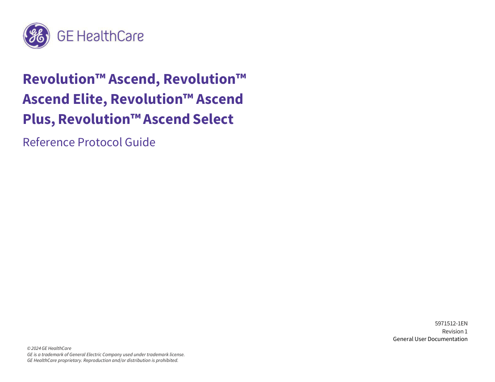
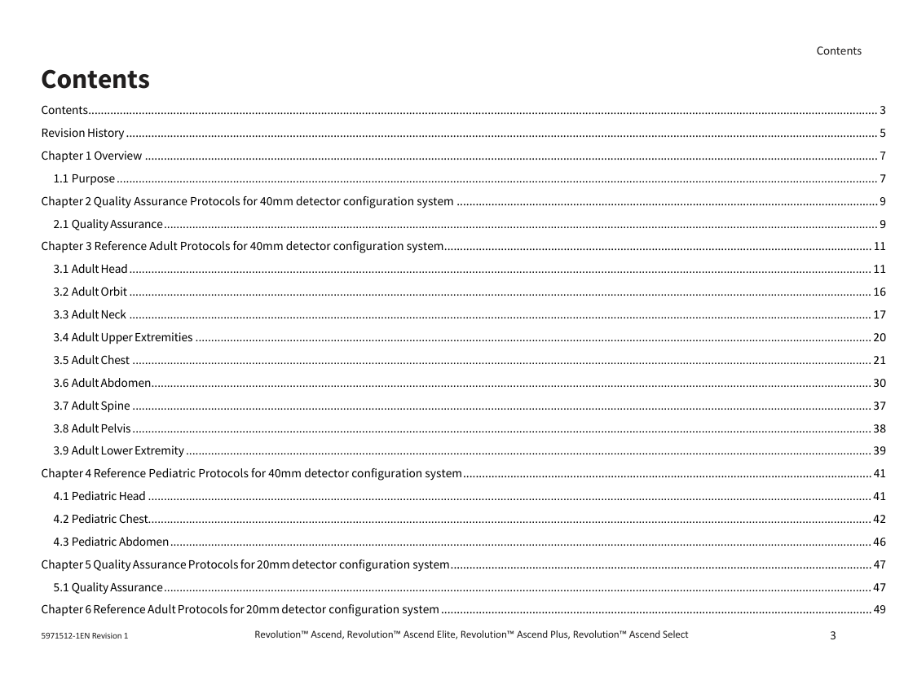

# CT — Parametri aparat: GE Revolution Ascend Plus 128 Protocols (MCB)

## Documentul original MCB — Parametri aparat: GE Revolution Ascend Plus 128 Protocols

**Manual de aparat · 82 pagini · consultat la 2026-09-27.**

[Descarcă PDF-ul integral](../../assets/mcb-modalities/ct-parametri-aparat-ge-revolution-ascend-plus-128-protocols-mcb/document.pdf) · [Sursa MCB](https://ref.mcbradiology.com/Protocols,%20Policies,%20Worksheets%20&%20Forms/CT/Protocols/Default/GE%20Revolution%20Ascend%20Plus%20128%20Protocols.pdf) · [Catalogul MCB pentru această modalitate](../mcb/index.md)

Instrucțiunile, valorile și ilustrațiile din documentul original sunt păstrate în **engleză**. Titlul și navigarea sunt în română.

Previzualizarea de mai jos prezintă primele 3 pagini. **PDF-ul descărcabil conține toate cele 82 de pagini.**

### Pagina 1

{ loading=lazy }

### Pagina 2

{ loading=lazy }

### Pagina 3

{ loading=lazy }

## Textul documentului original

??? abstract "Pagina 1 — text în engleză"

    
 
     
     
    Revolution™ Ascend, Revolution™ 
    Ascend Elite, Revolution™ Ascend 
    Plus, Revolution™ Ascend Select 
    Reference Protocol Guide 
     
     
     
     
     
     
     
     
     
     
     
     
     
     
     
     
     
     
     
     
     
    5971512-1EN 
    Revision 1 
    General User Documentation 
                  © 2024 GE HealthCare 
    GE is a trademark of General Electric Company used under trademark license.  
    GE HealthCare proprietary. Reproduction and/or distribution is prohibited. 
    

??? abstract "Pagina 2 — text în engleză"

    
 
    Page intentionally left blank
    

??? abstract "Pagina 3 — text în engleză"

    
 
    Contents 
    Contents 
    Contents 
    ........................................................................................................................................................................................................................................................... 3 
    Revision History ............................................................................................................................................................................................................................................... 5 
    Chapter 1 Overview ......................................................................................................................................................................................................................................... 7 
    1.1 Purpose .................................................................................................................................................................................................................................................. 7 
    Chapter 2 Quality Assurance Protocols for 40mm detector configuration system ...................................................................................................................................... 9 
    2.1 Quality Assurance ................................................................................................................................................................................................................................... 9 
    Chapter 3 Reference Adult Protocols for 40mm detector configuration system 
    ........................................................................................................................................ 11 
    3.1 Adult Head ............................................................................................................................................................................................................................................ 11 
    3.2 Adult Orbit ............................................................................................................................................................................................................................................ 16 
    3.3 Adult Neck ............................................................................................................................................................................................................................................ 17 
    3.4 Adult Upper Extremities ....................................................................................................................................................................................................................... 20 
    3.5 Adult Chest ........................................................................................................................................................................................................................................... 21 
    3.6 Adult Abdomen 
    ..................................................................................................................................................................................................................................... 30 
    3.7 Adult Spine ........................................................................................................................................................................................................................................... 37 
    3.8 Adult Pelvis ........................................................................................................................................................................................................................................... 38 
    3.9 Adult Lower Extremity .......................................................................................................................................................................................................................... 39 
    Chapter 4 Reference Pediatric Protocols for 40mm detector configuration system .................................................................................................................................. 41 
    4.1 Pediatric Head ...................................................................................................................................................................................................................................... 41 
    4.2 Pediatric Chest 
    ...................................................................................................................................................................................................................................... 42 
    4.3 Pediatric Abdomen ............................................................................................................................................................................................................................... 46 
    Chapter 5 Quality Assurance Protocols for 20mm detector configuration system 
    ...................................................................................................................................... 47 
    5.1 Quality Assurance ................................................................................................................................................................................................................................. 
    47 
    Chapter 6 Reference Adult Protocols for 20mm detector configuration system ......................................................................................................................................... 49 
     
    3 
    5971512-1EN Revision 1 
    Revolution™ Ascend, Revolution™ Ascend Elite, Revolution™ Ascend Plus, Revolution™ Ascend Select 
     
    

??? abstract "Pagina 4 — text în engleză"

    
 
    Contents 
    6.1 Adult Head ............................................................................................................................................................................................................................................ 49 
    6.2 Adult Orbit ............................................................................................................................................................................................................................................ 53 
    6.3 Adult Neck ............................................................................................................................................................................................................................................ 54 
    6.4 Adult Upper Extremities ....................................................................................................................................................................................................................... 57 
    6.5 Adult Chest ........................................................................................................................................................................................................................................... 58 
    6.6 Adult Abdomen 
    ..................................................................................................................................................................................................................................... 65 
    6.7 Adult Spine ........................................................................................................................................................................................................................................... 71 
    6.8 Adult Pelvis ........................................................................................................................................................................................................................................... 72 
    6.9 Adult Lower Extremity .......................................................................................................................................................................................................................... 73 
    Chapter 7 Reference Pediatric Protocols for 20mm detector configuration system ................................................................................................................................... 75 
    7.1 Pediatric Head ...................................................................................................................................................................................................................................... 75 
    7.2 Pediatric Chest 
    ...................................................................................................................................................................................................................................... 76 
    7.3 Pediatric Abdomen ............................................................................................................................................................................................................................... 80 
    5971512-1EN Revision 1 
     
    4 
    Revolution™ Ascend, Revolution™ Ascend Elite, Revolution™ Ascend Plus, Revolution™ Ascend Select 
     
    

??? abstract "Pagina 5 — text în engleză"

    
 
    Revision History 
     
    Revision History 
     
     
     
     
    Revision 
    Date 
    Reason For Change 
     
     
     
    1 
    August 2024 
    Initial Release. 
    The original language of this document is English, Direction Number 5971512-1EN, Revision 1, and is applicable to Revolution Ascend 1.0 software 24MW10.xx for Revolution™ Ascend, 
    Revolution™ Ascend Elite, Revolution™ Ascend Plus, Revolution™ Ascend Select. 
     
     
     
    5 
    5971512-1EN Revision 1 
    Revolution™ Ascend, Revolution™ Ascend Elite, Revolution™ Ascend Plus, Revolution™ Ascend Select 
     
    

??? abstract "Pagina 6 — text în engleză"

    
 
    Revision History 
     
    Page intentionally left blank
    5971512-1EN Revision 1 
     
    6 
    Revolution™ Ascend, Revolution™ Ascend Elite, Revolution™ Ascend Plus, Revolution™ Ascend Select 
     
    

??? abstract "Pagina 7 — text în engleză"

    
 
    Overview 
    Chapter 1 Overview 
    1.1 Purpose 
    This document provides a list of parameters provided in the GE Reference Adult and GE Reference Pediatric protocol selector. The protocols in Reference 
    Adult Protocols are based on the parameters needed to scan an average-sized adult, and factor in the clinical aim of the protocols. The protocols in Reference 
    Pediatric Protocols are based on age in the Head area, and in the rest of the body, use Color Coding for Kids. These protocols are designed as a starting point. 
    They should be reviewed with your Radiologist, Physicist, and Radiation Safety Officer and revised as needed to meet the clinical needs of your department. 
    The document is divided into protocol categories available on the system. 
    The table for each category lists the Protocol Number, Protocol Name, Post Processing software associated with the protocol, Scan Type, SFOV, Pitch/Table 
    Speed in mm/rotation, Rotation Time, Detector Coverage, kV, mA, SmartmA with Min/Max mA and Noise Index, Recon Type, ASiR-V Level in %, CTDIvol (mGy), 
    DLP (mGycm), Scan Length, Phantom Type used for dose calculations and Description. 
    Manual mA mode allows you to scan without enabling SmartmA mode. When building protocols, make sure the mA value field contains a reasonable mA 
    value in the event that SmartmA is turned off. In GE Reference Adult Protocols, the Average (Avg) mA provided in the tables within this document are what is 
    used in calculating the CTDI and DLP for protocols using SmartmA. The Avg mA value provided in the table is an estimate based on an average patient size 
    (32 - 36 cm). The actual Avg mA for each image is calculated using all of the mA values for each scan rotation, as determined by SmartmA for the patient.  
    All dose information described is based on NG1700 Elite, NG2000 Elite, VT1700 and VT2000 table. Use CTDI Adjustment Factors below to covert CTDI for 
    VT2000x table.  
     
    CTDI Adjustment Factors for VT2000x table 
    Ped Body 
    Ped Head 
    Large Body 
    Small Body 
    Head 
    Cardiac Large 
    Cardiac Small 
    0.977 
    0.985 
    0.983 
      
    NOTE 
    The mA and dose information described in all protocols is based on a system with the 0.35 second option. If the fastest rotation time for your system is 0.4sec, 
    0.5 sec or 0.7 sec, the mA and dose information is automatically adjusted according to the fastest rotation time available on your system for all protocols where 
    there is a rotation mismatch. If your system is 55.3kW or 5.5MHU tube, Max mA is changed to maximum mA value of each system. 
     
     
    7 
    5971512-1EN Revision 1 
    Revolution™ Ascend, Revolution™ Ascend Elite, Revolution™ Ascend Plus, Revolution™ Ascend Select 
     
    

??? abstract "Pagina 8 — text în engleză"

    
 
    Overview 
     
    NOTE 
    ** These protocols are installed options. As a result, the numbering is a function of when and where the option is installed. 
    NOTE 
    Some protocols are restricted by detector configuration. Therefore, protocol numbers that do not fit the 20mm configuration will be left blank. 
    5971512-1EN Revision 1 
     
    8 
    Revolution™ Ascend, Revolution™ Ascend Elite, Revolution™ Ascend Plus, Revolution™ Ascend Select 
     
    

??? abstract "Pagina 9 — text în engleză"

    
 
    Reference Protocol Guide 
    Chapter 2 Quality Assurance Protocols for 40mm detector 
    configuration system 
    2.1 Quality Assurance 
    Interval* 
    • For Helical acquisitions, Interval is equal to Slice Thickness, unless otherwise indicated. 
    • For Axial and Cine acquisitions, Interval is equal to Detector Coverage, unless otherwise indicated. 
     
     
     
    Slice 
     
     
     
     
     
     
     
     
     
     
    Pitch 
    mA 
     
     
     
     
     
     
     
     
     
     
     
     
     
     
    Rotation 
    Detector 
    Recon 
    Thickness 
    % 
    DLP 
     
     
     
     
     
     
     
     
     
    Protocol 
    Protocol 
    Post 
    Scan 
    Recon 
    CTDIVOI 
    Phantom 
    SFOV 
    kV 
    Description 
    Time 
    Coverage 
    Range 
    (mm) 
    Table 
    Speed 
    Min- 
    Max 
    (mGy) 
    Number 
    Name 
    Process 
    Type 
    Type 
    (cm) 
    ASiR- 
    V 
    (mGy- 
    cm) 
    (seconds) 
    (mm) 
    (mm) 
    Interval* 
    (mm/s) 
    NI 
    (mm) 
    30.1 
    Example 
    ACR 
    Protocols 
     
    Axial 
    Large 
    Body 
     
    0.5 
    5 
    40 
    120 
    270 
    STD 
    50 
    11.32 
    135.84 
    120 
    Body 32 
    Example protocols for 
    ACR accreditation 
    scans 
     
     
     
    Axial 
    Head 
     
    1 
    5 
    20 
    120 
    170 
    STD 
    50 
    28.76 
    402.67 
    140 
    Head 16 
    Example protocols for 
    ACR accreditation 
    scans 
    0.984 
     
     
     
    Helical 
    Large 
    Body 
    78.75 
    0.5 
    5 
    40 
    120 
    220 
    STD 
    50 
    9.37 
    178.72 
    160 
    Body 32 
    Example protocols for 
    ACR accreditation 
    scans 
     
     
     
    Axial 
    Ped 
    Body 
     
    0.35 
    5 
    40 
    120 
    90 
    STD 
    50 
    2.31 
    27.73 
    120 
    Body 32 
    Example protocols for 
    ACR accreditation 
    scans 
     
     
     
    Axial 
    Ped 
    Head 
     
    0.5 
    5 
    20 
    120 
    190 
    STD 
    50 
    16.07 
    225.02 
    140 
    Head 16 
    Example protocols for 
    ACR accreditation 
    scans 
    0.984 
     
     
     
    Helical 
    Ped 
    Body 
    112.5 
    0.35 
    5 
    40 
    120 
    80 
    STD 
    50 
    2.09 
    39.7 
    160 
    Body 32 
    Example protocols for 
    ACR accreditation 
    scans 
     
    9 
    5971512-1EN Revision 1 
    Revolution™ Ascend, Revolution™ Ascend Elite, Revolution™ Ascend Plus, Revolution™ Ascend Select 
     
    

??? abstract "Pagina 10 — text în engleză"

    
 
    Reference Protocol Guide 
    Page intentionally left blank 
     
     
    5971512-1EN Revision 1 
     
    10 
    Revolution™ Ascend, Revolution™ Ascend Elite, Revolution™ Ascend Plus, Revolution™ Ascend Select 
     
    

??? abstract "Pagina 11 — text în engleză"

    
 
    Reference Protocol Guide 
    Chapter 3 Reference Adult Protocols for 40mm detector configuration 
    system 
    3.1 Adult Head 
    Interval* 
    • For Helical acquisitions, Interval is equal to Slice Thickness, unless otherwise indicated. 
    • For Axial and Cine acquisitions, Interval is equal to Detector Coverage, unless otherwise indicated. 
    NOTE 
    ** These protocols are installed options. As a result the numbering is a function of when and where the option is installed. 
     
     
     
     
     
     
     
     
     
     
     
     
     
     
     
     
     
     
     
     
     
    SFOV 
    kV 
    Description 
    CTDIvol 
    (mGy) 
    Protocol 
    Number 
    Protocol 
    Name 
    Post 
    Process 
    Scan 
    Type 
    Recon 
    Type 
    Phantom 
    (cm) 
    mA 
    Min-Max 
    NI 
    DLP 
    (mGy- 
    cm) 
    Rotation 
    Time 
    (seconds) 
    Detector 
    Coverage 
    (mm) 
    % 
    ASiR- 
    V 
    Recon 
    Range 
    (mm) 
    Pitch 
    Table 
    Speed 
    (mm/s) 
    Slice 
    Thickness 
    (mm) 
    Interval* 
    (mm) 
    21.1 
    CT HEAD 
     
    Axial 
    Head  
    1 
    5 
    20 
    120 200 
    STD# 
    50 
    33.84 
    473.73 
    140 
    Head 16 
    Routine head for evaluation of 
    brain for abnormalities 
     
     
     
     
     
     
     
     
     
     
     
     
     
     
     
     
     
     
     
     
     
     
     
     
     
     
     
     
     
     
    21.2 
    Axial 
    Head 
    1 
    5 
    20 
    120 
    STD# 
    50 
    33.84 
    473.73 
    140 
    Head 16 
    CT HEAD 
    with ODM 
    Routine head for evaluation of 
    brain for abnormalities 
    SmartmA &amp; 
    ODM  
    100–340 mA 
    NI=2.8 
    Avg mA 200 
     
    Helical Head 
    0.531 
    21.3 
    CT HEAD 
    Helical 
    0.8 
    0.625 
    20 
    120 90 
    STD# 
    50 
    22.93 
    223.08 
    80.625 
    Head 16 
    Routine head for evaluation of 
    brain for abnormalities 
    13.28 
     
     
     
     
     
     
     
     
     
     
     
     
     
     
     
    21.4 
    MIROI 
    Axial 
    Head 
    5 
    120 
    50 
    STD 
    0 
    117.09 
    58.54 
    5 
    1 
    5 
    0 
    Head 16 
    Test bolus for determining 
    prep delay 
    CT HEAD 
    ANGIO CIRC 
    WILLIS 
     
     
     
     
     
     
     
     
     
     
     
     
     
     
     
     
    Helical 
    Head 
    0.531 
    0.5 
    0.625 
    20 
    120 
    120 
    STD 
    50 
    19.11 
    185.97 
    80.625 
    Head 16 
    21.25 
    CT angiography of the head for 
    evaluation of cerebral 
    vasculature 
     
     
     
     
     
     
     
     
     
     
     
     
     
     
     
     
     
    21.5 
    MIROI 
    Axial 
    Head 
    1 
    5 
    120 
    50 
    STD 
    0 
    117.09 
    58.54 
    5 
    Head 16 
    5 
    0 
    Test bolus for determining 
    prep delay 
    CT HEAD 
    ANGIO CIRC 
    WILLIS with 
    ODM 
    Revolution™ Ascend, Revolution™ Ascend Elite, Revolution™ Ascend Plus, Revolution™ Ascend Select 
     
    11 
    5971512-1EN Revision 1 
     
    

??? abstract "Pagina 12 — text în engleză"

    
 
    Reference Protocol Guide 
     
     
     
     
     
     
     
     
     
     
     
     
     
     
     
     
     
     
     
     
    SFOV 
    kV 
    Description 
    CTDIvol 
    (mGy) 
    Protocol 
    Number 
    Protocol 
    Name 
    Post 
    Process 
    Scan 
    Type 
    Recon 
    Type 
    Phantom 
    (cm) 
    mA 
    Min-Max 
    NI 
    DLP 
    (mGy- 
    cm) 
    Rotation 
    Time 
    (seconds) 
    Detector 
    Coverage 
    (mm) 
    % 
    ASiR- 
    V 
    Recon 
    Range 
    (mm) 
    Pitch 
    Table 
    Speed 
    (mm/s) 
    Slice 
    Thickness 
    (mm) 
    Interval* 
    (mm) 
     
     
     
     
     
     
     
     
     
     
     
     
     
     
     
     
     
     
     
     
     
     
     
     
     
     
     
     
     
    0.531 
    Helical 
    Head 
    0.5 
    0.625 
    20 
    120 
    STD 
    50 
    19.11 
    185.97 
    80.625 
    Head 16 
    21.25 
    CT angiography of the head for 
    evaluation of cerebral 
    vasculature 
    SmartmA &amp; 
    ODM  
    50–400 mA  
    NI=7 
    Avg mA 120 
     
     
     
     
     
     
     
     
     
     
     
     
     
     
     
     
     
     
     
     
     
     
     
     
     
     
     
     
     
    21.6 
    Axial 
    Head 
    1 
    5 
    20 
    120 
    STD# 
    50 
    28.76 
    402.67 
    140 
    Head 16 
    Routine head for evaluation of 
    brain for abnormalities 
    CT HEAD 
    PERFUS WO 
    &amp; W PREFUS 
    Cine 
    SmartmA &amp; 
    ODM  
    100–340 mA 
    NI=2.8 
    Avg mA 170 
     
     
     
     
     
     
     
     
     
     
     
     
     
     
     
     
     
     
     
     
     
     
     
     
     
     
     
     
     
    Perfusion 
    Cine 
    Head 
    1 
    40 
    80 
    STD 
    50 
    255.15 
    1020.6 
    40 
    Head 16 
    5 
    0 
    CT Perfusion using Cine scan 
    mode for evaluation of cerebral 
    perfusion over time 
    SmartmA &amp; 
    ODM  
    100–200 mA 
    NI=8.0 
    Avg mA 100 
     
     
     
     
     
     
     
     
     
     
     
     
     
     
     
     
     
     
     
     
     
     
     
     
     
     
     
     
     
    Axial 
    Head 
    1 
    5 
    20 
    120 
    STD# 
    50 
    28.76 
    402.67 
    140 
    Head 16 
    Post Contrast Brain, Evaluation 
    for residual tissue 
    enhancement 
    SmartmA &amp; 
    ODM  
    100–340 mA 
    NI=2.8 
    Avg mA 170 
     
     
     
     
     
     
     
     
     
     
     
     
     
     
     
     
     
     
     
     
     
     
     
     
     
     
     
     
     
    21.7 
    Axial 
    Head 
    1 
    5 
    20 
    120 
    STD# 
    50 
    28.76 
    402.67 
    140 
    Head 16 
    Routine head for evaluation of 
    brain for abnormalities 
    CT HEAD 
    PERFUS WO 
    &amp; W PREFUS 
    Axial 
    SmartmA &amp; 
    ODM  
    100–340 mA 
    NI=2.8 
    Avg mA 170 
     
     
     
     
     
     
     
     
     
     
     
     
     
     
     
     
     
     
     
     
     
     
     
     
     
     
     
     
     
    Perfusion 
    Axial 
    Head 
    1 
    40 
    80 
    STD 
    50 
    125.71 
    502.84 
    40 
    Head 16 
    5 
    0 
    CT Perfusion using Axial scan 
    mode for evaluation of cerebral 
    perfusion over time 
    SmartmA &amp; 
    ODM mA 100–
    200 mA NI=8.0 
    Avg mA 100 
     
     
     
     
     
     
     
     
     
     
     
     
     
     
     
     
     
     
     
     
     
     
     
     
     
     
     
     
     
    Axial 
    Head 
    1 
    5 
    20 
    120 
    STD# 
    50 
    28.76 
    402.67 
    140 
    Head 16 
    Post Contrast Brain, Evaluation 
    for residual tissue 
    enhancement 
    SmartmA &amp; 
    ODM  
    100–340 mA 
    NI=2.8 
    Avg mA 170 
    5971512-1EN Revision 1 
     
    12 
    Revolution™ Ascend, Revolution™ Ascend Elite, Revolution™ Ascend Plus, Revolution™ Ascend Select 
     
    

??? abstract "Pagina 13 — text în engleză"

    
 
    Reference Protocol Guide 
     
     
     
     
     
     
     
     
     
     
     
     
     
     
     
     
     
     
     
     
    SFOV 
    kV 
    Description 
    CTDIvol 
    (mGy) 
    Protocol 
    Number 
    Protocol 
    Name 
    Post 
    Process 
    Scan 
    Type 
    Recon 
    Type 
    Phantom 
    (cm) 
    mA 
    Min-Max 
    NI 
    DLP 
    (mGy- 
    cm) 
    Rotation 
    Time 
    (seconds) 
    Detector 
    Coverage 
    (mm) 
    % 
    ASiR- 
    V 
    Recon 
    Range 
    (mm) 
    Pitch 
    Table 
    Speed 
    (mm/s) 
    Slice 
    Thickness 
    (mm) 
    Interval* 
    (mm) 
     
     
     
     
     
     
     
     
     
     
     
     
     
     
     
     
     
     
     
     
     
     
     
     
     
     
     
     
     
     
    21.8 
    Axial 
    Head 
    1 
    5 
    20 
    120 
    STD# 
    50 
    28.76 
    402.67 
    140 
    Head 16 
    Routine head for evaluation of 
    brain for abnormalities 
    SmartmA &amp; 
    ODM  
    100–340 mA 
    NI=2.8 
    Avg mA 170 
    CT HEAD 
    PERFUS WO 
    4PHASE 
    mCTA 
    PREFUS Cine 
     
     
     
     
     
     
     
     
     
     
     
     
     
     
     
     
     
     
     
     
     
     
     
     
     
     
     
     
     
     
     
     
    0.984 
    Group 1 
    DMPR 
    Helical 
    0.5 
    0.625 
    40 
    120 
    STD 
    50 
    15.27 
    619.74 
    370.625 
    Body 32 
    Small 
    Body 
    78.75 
    CT angiography of the neck and 
    head evaluation of carotid and 
    cerebral vasculature 
    SmartmA &amp; 
    ODM  
    50-500 mA 
    NI=13.8 
    Avg mA 410 
     
     
     
     
     
     
     
     
     
     
     
     
     
     
     
     
     
     
     
     
     
     
     
     
     
     
     
     
     
     
     
     
    0.984 
    Group 2 
    DMPR 
    Helical 
    0.5 
    0.625 
    40 
    120 
    STD 
    50 
    15.27 
    253.15 
    130.625 
    Body 32 
    Small 
    Body 
    78.75 
    CT angiography of the head 
    evaluation of cerebral 
    vasculature 
    SmartmA &amp; 
    ODM  
    50-500 mA 
    NI=13.8 
    Avg mA 410 
     
     
     
     
     
     
     
     
     
     
     
     
     
     
     
     
     
     
     
     
     
     
     
     
     
     
     
     
     
     
     
     
    0.984 
    Group 3 
    DMPR 
    Helical 
    0.5 
    0.625 
    40 
    120 
    STD 
    50 
    15.27 
    253.15 
    130.625 
    Body 32 
    Small 
    Body 
    78.75 
    Delayed CT angiography of the 
    head evaluation of cerebral 
    vasculature 
    SmartmA &amp; 
    ODM  
    50-500 mA 
    NI=13.8 
    Avg mA 410 
     
     
     
     
     
     
     
     
     
     
     
     
     
     
     
     
     
     
     
     
     
     
     
     
     
     
     
     
     
     
     
     
    0.984 
    Group 4 
    DMPR 
    Helical 
    0.5 
    0.625 
    40 
    120 
    STD 
    50 
    15.27 
    253.15 
    130.625 
    Body 32 
    Small 
    Body 
    78.75 
    Delayed CT angiography of the 
    head evaluation of cerebral 
    vasculature 
    SmartmA &amp; 
    ODM  
    50-500 mA 
    NI=13.8 
    Avg mA 410 
     
     
     
     
     
     
     
     
     
     
     
     
     
     
     
     
     
     
     
     
     
     
     
     
     
     
     
     
     
    Perfusion 
    Cine 
    Head 
    1 
    40 
    80 
    STD 
    50 
    255.15 
    1020.6 
    40 
    Head 16 
    5 
    0 
    CT Perfusion using Cine scan 
    mode for evaluation of cerebral 
    perfusion over time 
    SmartmA &amp; 
    ODM  
    100–200 mA 
    NI=8.0 
    Avg mA 100 
     
     
     
     
     
     
     
     
     
     
     
     
     
     
     
     
     
    0.531 
    21.9** 
    Helical 
    Head 
    0.8 
    0.625 
    20 
    120 
    90 
    STD # 
    50 
    22.93 
    223.08 
    80.625 
    Head 16 
    CT HEAD 
    Helical MAR 
    13.28 
    Routine head for evaluation of 
    brain for abnormalities with 
    Metal Artifact Reduction 
    Reconstructions included 
     
    13 
    5971512-1EN Revision 1 
    Revolution™ Ascend, Revolution™ Ascend Elite, Revolution™ Ascend Plus, Revolution™ Ascend Select 
     
    

??? abstract "Pagina 14 — text în engleză"

    
 
    Reference Protocol Guide 
     
     
     
     
     
     
     
     
     
     
     
     
     
     
     
     
     
     
     
     
    SFOV 
    kV 
    Description 
    CTDIvol 
    (mGy) 
    Protocol 
    Number 
    Protocol 
    Name 
    Post 
    Process 
    Scan 
    Type 
    Recon 
    Type 
    Phantom 
    (cm) 
    mA 
    Min-Max 
    NI 
    DLP 
    (mGy- 
    cm) 
    Rotation 
    Time 
    (seconds) 
    Detector 
    Coverage 
    (mm) 
    % 
    ASiR- 
    V 
    Recon 
    Range 
    (mm) 
    Pitch 
    Table 
    Speed 
    (mm/s) 
    Slice 
    Thickness 
    (mm) 
    Interval* 
    (mm) 
     21.10** 
    5 
    120 
    50 
     STD 
    0 
    117.09 
    58.54  5 
    Head 16 
    Test bolus for determining prep 
    delay 
     MIROI 
     Axial 
    Head  
    1 
    5 
    0 
    CT HEAD 
    ANGIO CIRC 
    WILLIS MAR 
    0.5 
    0.625 
    20 
    120 
    120 
    STD 
    50 
    19.11 
    185.97 
    80.625 
    Head 16 
     
     
     
     Helical Head 
    0.531 
    21.25 
    CT angiography of the head for 
    evaluation of cerebral 
    vasculature with Metal Artifact 
    Reduction Reconstructions 
    included 
    21.11** 
     
    Axial 
    Head  
    1 
    5 
    20 
    120 
    STD# 
    50 
    28.76 
    402.67 
    140 
     Head 16 
    Routine head for evaluation of 
    brain for abnormalities 
    CT HEAD 
    PERFUS WO 
    &amp; W PREFUS 
    Axial Shuttle 
    SmartmA &amp; 
    ODM  
    100–340 mA 
    NI=2.8 
    Avg mA 170 
    SmartmA  
    17 pass 
    STD 
    50 
    97.14 
    777.11 
    80 
    Head 16 
     
     
    Perfusion Axial 
    Head 
    0.5 
    5 
    40 
    80 
    2 positions 
    CT Perfusion using Axial Shuttle 
    scan mode for evaluation of 
    cerebral perfusion over time 
    100–400 mA 
    NI=8.0 
    Avg mA 200 
    STD# 
    50 
    28.76 
    402.67 
    140 
    Head 16 
     
     
     
    Axial 
    Head  
    1 
    5 
    20 
    120 
    Post Contrast Brain, Evaluation 
    for residual tissue 
    enhancement 
    SmartmA &amp; 
    ODM  
    100–340 mA 
    NI=2.8 
    Avg mA 170 
    21.12** 
    CT HEAD DLIR  
    Axial 
    Head  
    1 
    5 
    20 
    120 200 
    STD# 
    50 
    33.84 
    473.73 
    140 
    Head 16 
    Routine head for evaluation of 
    brain for abnormalities with 
    DLIR 
    STD# 
    50 
    33.84 
    473.73 
    140 
    Head 16 
    21.13** 
    CT HEAD with 
    ODM DLIR 
     
    Axial 
    Head 
     
    1 
    5 
    20 
    120 
    Routine head for evaluation of 
    brain for abnormalities with 
    DLIR 
    SmartmA &amp;   
    ODM                
    100–340 mA 
    NI=2.8                   
    Avg mA 200 
    0.531 
    0.8 
    0.625 
    20 
    120 90 
    STD# 
    50 
    22.93 
    223.08 
    80.625 
    Head 16 
    21.14** 
    CT HEAD 
    Helical DLIR 
     
    Helical Head 
    13.28 
    Routine head for evaluation of 
    brain for abnormalities with 
    DLIR 
    5 
    21.15** 
    MIROI 
    Axial 
    Head 
     
    1 
    5 
    120 50 
    STD 
    0 
    117.09 
    58.54 
    5 
    Head 16 
    Test bolus for determining 
    prep delay 
    0 
    CT HEAD 
    ANGIO CIRC 
    WILLIS DLIR 
     
    5971512-1EN Revision 1 
     
    14 
    Revolution™ Ascend, Revolution™ Ascend Elite, Revolution™ Ascend Plus, Revolution™ Ascend Select 
     
    

??? abstract "Pagina 15 — text în engleză"

    
 
    Reference Protocol Guide 
     
     
     
     
     
     
     
     
     
     
     
     
     
     
     
     
     
     
     
     
    SFOV 
    kV 
    Description 
    CTDIvol 
    (mGy) 
    Protocol 
    Number 
    Protocol 
    Name 
    Post 
    Process 
    Scan 
    Type 
    Recon 
    Type 
    Phantom 
    (cm) 
    mA 
    Min-Max 
    NI 
    DLP 
    (mGy- 
    cm) 
    Rotation 
    Time 
    (seconds) 
    Detector 
    Coverage 
    (mm) 
    % 
    ASiR- 
    V 
    Recon 
    Range 
    (mm) 
    Pitch 
    Table 
    Speed 
    (mm/s) 
    Slice 
    Thickness 
    (mm) 
    Interval* 
    (mm) 
     
     
      
     Helical Head 
    0.531 
    21.25 
    0.5 
    0.625 
    20 
    120 120 
     STD 
    50 
    19.11 
    185.97 
    80.625 
    Head 16 
    CT angiography of the head for 
    evaluation of cerebral vasculature 
    with DLIR 
    21.16** 
    MIROI 
     Axial 
    Head 
     
    1 
    5 
    0 
    5 
    120 50 
    STD 
    0 
    117.09 
    58.54 
    5 
    Head 16 
    Test bolus for determining prep 
    delay 
    CT HEAD 
    ANGIO CIRC 
    WILLIS  with 
    ODM DLIR 
    STD 
    50 
    19.11 
    185.97 
    80.625 
     Head 16 
     
     
     
    Helical Head 
    0.531 
    21.25 
    0.5 
    0.625 
    20 
    120 
    CT angiography of the head for 
    evaluation of cerebral vasculature 
    with DLIR 
    SmartmA  &amp;    
    ODM 
    50–400 mA      
    NI=7 
    Avg mA 120 
     
    15 
    5971512-1EN Revision 1 
    Revolution™ Ascend, Revolution™ Ascend Elite, Revolution™ Ascend Plus, Revolution™ Ascend Select 
     
    

??? abstract "Pagina 16 — text în engleză"

    
 
    Reference Protocol Guide 
    3.2 Adult Orbit 
    Interval* 
    • For Helical acquisitions, Interval is equal to Slice Thickness, unless otherwise indicated. 
    • For Axial and Cine acquisitions, Interval is equal to Detector Coverage, unless otherwise indicated. 
     
     
     
     
     
     
     
     
     
     
     
     
     
     
     
     
     
     
     
    SFOV 
    kV 
    Description 
    CTDIvol 
    (mGy) 
    Protocol 
    Number 
    Protocol 
    Name 
    Post 
    Process 
    Scan 
    Type 
    Recon 
    Type 
    Phantom 
    (cm) 
    DLP 
    (mGy- 
    cm) 
    Rotation 
    Time 
    (seconds) 
    Detector 
    Coverage 
    (mm) 
    % 
    ASiR- 
    V 
    Recon 
    Range 
    (mm) 
    Pitch 
    Table 
    Speed 
    (mm/s) 
    mA 
    Min- 
    Max 
    NI 
    Slice 
    Thickness 
    (mm) 
    Interval* 
    (mm) 
     
     
     
     
     
     
     
     
     
     
     
     
     
     
     
    Helical 
    Head 0.531 
    1 
    0.625 
    20 
    120 
    75 
    BONE 
    50 
    23.89 
    232.33 
    80.625 
    22.1 
    CT HEAD SINUSES 
    Supine 
    Head 16 
    Axial Sinus protocol, Evaluation for any 
    abnormality 
    10.63 
     
     
     
     
     
     
     
     
     
     
     
     
     
     
     
     
     
    0.969 
    22.2 
    CT HEAD ORBITS 
    Helical 
    Head 
    0.5 
    0.625 
    20 
    120 
    110 
    STD 
    50 
    9.61 
    36.01 
    19.375 
    Head 16 
    38.75 
    Axial Orbit protocol, Evaluation for 
    abnormality soft tissues and bone 
    structures of the orbit and face 
     
     
     
     
     
     
     
     
     
     
     
     
     
     
     
    22.3 
    CT HEAD FACL BNS 
    Helical 
    Head 0.969 
    1 
    0.625 
    20 
    120 
    50 
    13.97 
    129.96 
    75 
    80 
    BONE 
    PLUS 
    Head 16 
    Axial Facial Bone protocol, Evaluation for 
    soft tissue and bone structures of the face 
    19.38 
     
     
     
     
     
     
     
     
     
     
     
     
     
     
     
     
    22.4 
    CT HEAD IAC 140 kV 
    Axial 
    Head 
    2 
    1.25 
    20 
    140 
    50 
    38.08 
    152.32 
    40 
    80 
    BONE 
    PLUS 
    Head 16 
    Axial scan mode, Evaluation for inner ear 
    abnormalities 
     
     
     
     
     
     
     
     
     
     
     
     
     
     
    Helical 
    Head 0.531 
    1 
    0.625 
    20 
    140 
    50 
    38.08 
    213.35 
    39.375 
    22.5 
    CT HEAD IAC Helical 
    140 kV 
    85 
    BONE 
    PLUS 
    Head 16 
    Helical scan mode, Evaluation for inner ear 
    abnormalities 
    10.63 
    5971512-1EN Revision 1 
     
    16 
    Revolution™ Ascend, Revolution™ Ascend Elite, Revolution™ Ascend Plus, Revolution™ Ascend Select 
     
    

??? abstract "Pagina 17 — text în engleză"

    
 
    Reference Protocol Guide 
     
    3.3 Adult Neck 
    Interval* 
    • For Helical acquisitions, Interval is equal to Slice Thickness, unless otherwise indicated. 
    • For Axial and Cine acquisitions, Interval is equal to Detector Coverage, unless otherwise indicated. 
    NOTE 
    ** These protocols are installed options. As a result the numbering is a function of when and where the option is installed. 
     
     
    Slice 
     
     
     
     
     
     
     
     
     
     
     
     
    Pitch 
     
     
     
     
     
     
     
     
     
     
     
     
     
     
    Rotation 
    Detector 
    mA 
    Recon 
    Thickness 
    % 
    DLP 
     
     
     
     
     
     
     
     
     
    CTDIvol 
    Protocol 
    Protocol 
    Post 
    Scan 
    Recon 
    Phantom 
    SFOV 
    kV 
    Description 
    Min-Max 
    Time 
    Coverage 
    Range 
    (mm) 
    Table 
    Speed 
    (mGy) 
    Number 
    Name 
    Process 
    Type 
    Type 
    (cm) 
    ASiR- 
    V 
    (mGy- 
    cm) 
    NI 
    (seconds) 
    (mm) 
    (mm) 
    Interval* 
    (mm/s) 
    (mm) 
    0.516 
    0.8 
    0.625 
    40 
    120 
    BONE 
    PLUS 
    50 
    20.17 
    290.55 
    110.625 
    Body 32 
    23.1 
    CT CERVICAL 
    SPINE DMPR 
    DMPR 
    Helical 
    Large 
    Body 
    25.78 
    C-Spine Helical mode with 
    DMPR, Evaluation for bone, disc 
    and soft tissue abnormalities 
    SmartmA &amp; 
    ODM  
    50–500 mA 
    NI=12.6 
    Avg mA 155 
    0.984 
    STD 
    50 
    8.52 
    157.71 
    150.625 
    Body 32 
    0.5 
    0.625 
    40 
    120 
    23.2 
    DMPR 
    Helical 
    Large 
    Body 
    78.75 
    Soft Tissue Neck Evaluation of 
    soft tissue structures for 
    abnormality 
    CT NECK SFT 
    TISS NECK 
    DMPR 
    SmartmA &amp; 
    ODM  
    50–500 mA 
    NI=12.6 
    Avg mA 200 
    0.516 
    23.3 
    0.5 
    0.625 
    40 
    120 
    STD 
    50 
    12.2 
    249.0 
    170.625 
    Body 32 
    Carotid CTA Evaluation of 
    carotid vasculature 
    DMPR 
    Helical 
    Large 
    Body 
    41.25 
    CT NECK ANGIO 
    SmartPrep 
    DMPR 
    SmartmA &amp; 
    ODM  
    80–500 mA 
    NI=11 
    Avg mA 150 
     
     
     
     
     
     
     
     
     
     
     
     
     
     
     
     
     
    5 
    23.4 
    MIROI 
    Axial 
    Head 
    1.0 
    5 
    120 
    60 
    STD 
    0 
    140.5 
    70.25 
    5 
    Head 16 
    Test bolus for determining prep 
    delay 
    0 
    CT HEAD NECK 
    CIRC WILLIS 
    CAR ART 
     
    17 
    5971512-1EN Revision 1 
    Revolution™ Ascend, Revolution™ Ascend Elite, Revolution™ Ascend Plus, Revolution™ Ascend Select 
     
    

??? abstract "Pagina 18 — text în engleză"

    
 
    Reference Protocol Guide 
     
    Slice 
     
     
     
     
     
     
     
     
     
     
     
     
    Pitch 
     
     
     
     
     
     
     
     
     
     
     
     
     
     
    Rotation 
    Detector 
    mA 
    Recon 
    Thickness 
    % 
    DLP 
     
     
     
     
     
     
     
     
     
    Protocol 
    Protocol 
    Post 
    Scan 
    Recon 
    CTDIvol 
    Phantom 
    SFOV 
    kV 
    Description 
    Min-Max 
    Time 
    Coverage 
    Range 
    (mm) 
    Table 
    Speed 
    (mGy) 
    Number 
    Name 
    Process 
    Type 
    Type 
    (cm) 
    ASiR- 
    V 
    (mGy- 
    cm) 
    NI 
    (seconds) 
    (mm) 
    (mm) 
    Interval* 
    (mm/s) 
    (mm) 
    0.516 
    STD 
    50 
    12.2 
    249.0 
    170.625 
    Body 32 
    0.5 
    0.625 
    40 
    120 
     
     
     
    Helical 
    Large 
    Body 
    41.25 
    CT angiography of the neck and 
    head evaluation of carotid and 
    cerebral vasculature 
    Smart mA 
    &amp; ODM  
    80–500 mA 
    NI=11 
    Avg mA 150 
    5 
    23.5 
    MIROI 
    Axial 
    Head 
     
    1 
    5 
    120 
    60 
    STD 
    0 
    140.5 
    70.25 
    5 
    Head 16 
    Test bolus for determining prep 
    delay 
    0 
    CT HEAD NECK 
    CIRC WILLIS 
    CAR ART Hi Res 
    0.516 
    DTL 
    50 
    12.2 
    249.0 
    170.625 
    Body 32 
    0.5 
    0.625 
    40 
    120 
     
     
     
    Helical 
    Large 
    Body 
    41.25 
    CT angiography of the neck and 
    head evaluation of carotid and 
    cerebral vasculature 
    Smart mA 
    &amp; ODM 
    80–500 mA 
    NI=11 
    Avg mA 150 
    0.516 
    0.8 
    0.625 
    40 
    120 
    23.6** 
    BONE 
    PLUS 
    50 
    20.17 
    290.55 
    110.625 
    Body 32 
    DMPR 
    Helical 
    Large 
    Body 
    25.78 
    CT CERVICAL 
    SPINE DMPR 
    MAR 
    SmartmA 
    50–500 mA 
    NI=12.6 
    Avg mA 155 
    C-Spine Helical mode with 
    DMPR, Evaluation for soft 
    tissue, disc and bone 
    abnormalities with Metal 
    artifact reduction 
    reconstruction 
    0.984 
    STD 
    50 
    8.52 
    157.71 
    150.625 
    Body 32 
    23.7** 
    0.5 
    0.625 
    40 
    120 
    DMPR 
    Helical 
    Large 
    Body 
    78.75 
    CT NECK SFT 
    TISS NECK 
    DMPR MAR 
    Soft Tissue Neck Evaluation of 
    soft tissue structures for 
    abnormality with metal artifact 
    reductions. 
    SmartmA 
    50–500 mA 
    NI=12.6 
    Avg mA 200 
    5 
    23.8** 
    MIROI 
    Axial 
    Head 
     
    1.0 
    5 
    120 
    60 
    STD 
    0 
    140.5 
    70.25 
    5.0 
    Head 16 
    Test bolus for determining prep 
    delay 
    0 
    CT HEAD NECK 
    CIRC WILLIS 
    CAR ART MAR 
    5971512-1EN Revision 1 
     
    18 
    Revolution™ Ascend, Revolution™ Ascend Elite, Revolution™ Ascend Plus, Revolution™ Ascend Select 
     
    

??? abstract "Pagina 19 — text în engleză"

    
 
    Reference Protocol Guide 
     
    Slice 
     
     
     
     
     
     
     
     
     
     
     
     
    Pitch 
     
     
     
     
     
     
     
     
     
     
     
     
     
     
    Rotation 
    Detector 
    mA 
    Recon 
    Thickness 
    % 
    DLP 
     
     
     
     
     
     
     
     
     
    Protocol 
    Protocol 
    Post 
    Scan 
    Recon 
    CTDIvol 
    Phantom 
    SFOV 
    kV 
    Description 
    Min-Max 
    Time 
    Coverage 
    Range 
    (mm) 
    Table 
    Speed 
    (mGy) 
    Number 
    Name 
    Process 
    Type 
    Type 
    (cm) 
    ASiR- 
    V 
    (mGy- 
    cm) 
    NI 
    (seconds) 
    (mm) 
    (mm) 
    Interval* 
    (mm/s) 
    (mm) 
    0.516 
    STD 
    50 
    12.2 
    249.0 
    170.625 
    Body 32 
    0.5 
    0.625 
    40 
    120 
     
     
     
    Helical 
    Large 
    Body 
    41.25 
    ODM  
    80–500 mA 
    NI=11 
    Avg mA 150 
    CT angiography of the neck and 
    head evaluation of carotid and 
    cerebral vasculature with metal 
    artifact reduction 
    reconstructions included 
    23.9** 
    BONE 
    PLUS 
    50 
    20.17 
    290.55 
    110.625 
    Body 32 
    DMPR 
    Helical 
    Large 
    Body 
    0.516 
    25.78 
    0.8 
    0.625 
    40 
    120 
    CT CERVICAL 
    SPINE DMPR 
    DLIR 
    C-Spine Helical mode with 
    DMPR, Evaluation for bone, disc 
    and soft tissue abnormalities 
    with DLIR 
    SmartmA &amp; 
    ODM 
    50–500 mA 
    NI=12.6 
    Avg mA 155 
    STD 
    50 
    8.52 
    157.71 
    150.625 
    Body 32 
    23.10** 
    DMPR 
    Helical 
    Large 
    Body 
    0.984 
    78.75 
    0.5 
    0.625 
    40 
    120 
    Soft Tissue Neck Evaluation of 
    soft tissue structures for 
    abnormality with DLIR 
    CT NECK SFT 
    TISS NECK 
    DMPR DLIR 
    SmartmA &amp; 
    ODM 
    50–500 mA 
    NI=12.6 
    Avg mA 200 
    23.11** 
    DMPR 
    Helical 
    Large 
    Body 
    0.516 
    41.25 
    0.5 
    0.625 
    40 
    120 
    STD 
    50 
    12.2 
    249.0 
    170.625 
    Body 32 
    Carotid CTA Evaluation of carotid 
    vasculature with DLIR 
    CT NECK ANGIO 
    SmartPrep 
    DMPR DLIR 
    SmartmA &amp; 
    ODM 
    80–500 mA 
    NI=11  
    Avg mA 150 
    23.12** 
    MIROI 
    Axial 
    Head 
     
    1.0 
    5 
    0 
    5 
    120 
    60 
    STD 
    0 
    140.5 
    70.25 
    5 
    Head 16 
    CT HEAD NECK 
    CIRC WILLIS CAR 
    ART DLIR 
     
    Test bolus for determining prep 
    delay 
    STD 
    50 
    12.2 
    249.0 
    170.625 
    Body 32 
     
     
     
    Helical 
    Large 
    Body 
    0.516 
    41.25 
    0.5 
    0.625 
    40 
    120 
    CT angiography of the neck and 
    head evaluation of carotid and 
    cerebral vasculature with DLIR 
    Smart mA 
    &amp; ODM 
    80–500 mA 
    NI=11 
    Avg mA 150 
     
     
     
     
    19 
    5971512-1EN Revision 1 
    Revolution™ Ascend, Revolution™ Ascend Elite, Revolution™ Ascend Plus, Revolution™ Ascend Select 
     
    

??? abstract "Pagina 20 — text în engleză"

    
 
    Reference Protocol Guide 
     
    3.4 Adult Upper Extremities 
    Interval* 
    • For Helical acquisitions, Interval is equal to Slice Thickness, unless otherwise indicated. 
    • For Axial and Cine acquisitions, Interval is equal to Detector Coverage, unless otherwise indicated. 
    NOTE 
    ** These protocols are installed options. As a result the numbering is a function of when and where the option is installed. 
     
    Slice 
     
     
     
     
     
     
     
     
     
     
     
    Pitch 
     
     
     
     
     
     
     
     
     
     
     
     
     
     
     
     
    Thickness 
    Rotation 
    Detector 
    mA 
    Recon 
    DLP 
     
     
     
     
     
     
     
     
     
    CTDIvol 
    Protocol 
    Protocol 
    Post 
    Scan 
    Recon 
    % 
    Phant
    (mm) 
    SFOV 
    kV 
    Description 
    Min-Max NI 
    Time 
    Coverage 
    Range 
    Table 
    Speed 
    (mGy) 
    Number 
    Name 
    Process 
    Type 
    Type 
    ASiR-V 
    om 
    Interval* 
    (mGy- 
    cm) 
    (seconds) 
    (mm) 
    (mm) 
    (mm/s) 
    (cm) 
    (mm) 
    0.516 
    1.25 
    24.1 
    1 
    40 
    140 
    STD 
    50 
    25.87 
    346.8 
    101.25 
    Body 32 
    ODM  
    80–500 mA 
    NI=21.4 
    DMPR 
    Helical 
    Large 
    Body 
    20.63 
    0.625 
    CT UPPER 
    EXTREMITY 
    SHOULDER 
      Avg mA 110 
    Shoulder with DMPR, 
    Evaluation of soft tissue 
    and bone of shoulder 
    area 
    0.516 
    1.25 
    24.2** 
    1 
    40 
    140 
    STD 
    50 
    25.87 
    346.8 
    101.25 
    Body 32 
    DMPR 
    Helical 
    Large 
    Body 
    0.625 
    20.63 
    ODM  
    80–500 mA 
    NI=21.4 
    Avg mA 110 
    CT UPPER 
    EXTREMITY 
    SHOULDER 
    MAR 
    Shoulder with DMPR, 
    Evaluation of soft tissue 
    and bone of shoulder 
    area with Metal Artifact 
    reduction reconstructions 
    included 
    STD 
    50 
    25.87 
    346.8 
    101.25 
    Body 32 
    24.3** 
    DMPR 
    Helical 
    Large 
    Body 
    0.516 
    20.63 
    1 
    1.25 
    0.625 
    40 
    140 
    ODM 
    80–500 mA       
    NI=21.4 
    Avg mA  110 
    Shoulder with DMPR, 
    Evaluation of soft tissue 
    and bone of shoulder area 
    with DLIR 
    CT UPPER 
    EXTREMITY 
    SHOULDER 
    DLIR 
    5971512-1EN Revision 1 
     
    20 
    Revolution™ Ascend, Revolution™ Ascend Elite, Revolution™ Ascend Plus, Revolution™ Ascend Select 
     
    

??? abstract "Pagina 21 — text în engleză"

    
 
    Reference Protocol Guide 
    3.5 Adult Chest 
    Interval* 
    • For Helical acquisitions, Interval is equal to Slice Thickness, unless otherwise indicated. 
    • For Axial and Cine acquisitions, Interval is equal to Detector Coverage, unless otherwise indicated. 
    NOTE 
    ** These protocols are installed options. As a result the numbering is a function of when and where the option is installed. 
     
    Slice 
     
     
     
     
     
     
     
     
     
     
     
     
     
     
     
     
     
     
     
     
     
     
     
     
     
     
     
     
    Pitch 
    mA 
    Rotation 
    Detector 
    Recon 
    Thickness 
     
     
     
     
     
     
     
     
     
    DLP 
     
     
    Protocol 
    Protocol 
    Post 
    Scan 
    Recon 
    % 
    CTDIvol 
    Phantom 
     
    SFOV 
    kV 
    Description 
    Table 
    Min-Max NI 
    Time 
    Coverage 
    Range 
    (mm) 
    Number 
    Name 
    Process 
    Type 
    Type 
    ASiR-V 
    (mGy) 
    (cm) 
    (mGy-
    cm) 
    Speed 
    (seconds) 
    (mm) 
    (mm) 
    Interval* 
    (mm/s) 
    (mm) 
    SmartmA  
    1.375 
    STD 
    50 
    3.81 
    139.94 
    322.5 
    Body 32 
    0.5 
    2.5 
    40 
    120 
    25.1 
    CT CHEST 
    SmartPrep 
    DMPR 
    Helical 
    Large 
    Body 
    110 
    Evaluation of chest region 
    for abnormalities with 
    SmartPrep and DMPR 
    50-500 mA 
    NI=18 
    Avg mA 125 
    SmartmA 
    1.375 
    0.5 
    5.0 
    40 
    120 
    STD 
    50 
    3.81 
    114.92 
    255.00 
    Body 32 
    Evaluation of chest region 
    for abnormalities 
    25.2 
    CT CHST ABD 
    PEL 
     
    Helical 
    Large 
    Body 
    110 
    50-500 mA 
    NI=13 
    Avg mA 125 
    SmartmA  
    0.984 
    STD 
    50 
    5.75 
    166.47 
    255.00 
    Body 32 
    0.5 
    5.0 
    40 
    120 
     
    Group 2 
     
    Helical 
    Large 
    Body 
    78.75 
    Evaluation of abdominal 
    pelvic region for 
    abnormalities 
    50-500 mA 
    NI=12 
    Avg mA 135 
    SmartmA 
    0.984 
    50–500 mA  
    0.5 
    0.625 
    40 
    120 
    25.3 
    CT NECK CHST 
    ABD PEL 
    DMPR 
    Helical 
    Large 
    Body 
    STD 
    50 
    8.52 
    221.07 
    225 
    Body 32 
    Evaluation of Neck region for 
    abnormalities 
    78.75 
    NI=12.6 
    Avg mA 200 
     
    21 
    5971512-1EN Revision 1 
    Revolution™ Ascend, Revolution™ Ascend Elite, Revolution™ Ascend Plus, Revolution™ Ascend Select 
     
    

??? abstract "Pagina 22 — text în engleză"

    
 
    Reference Protocol Guide 
    Slice 
     
     
     
     
     
     
     
     
     
     
     
     
     
     
     
     
     
     
     
     
     
     
     
    Pitch 
    mA 
    Rotation 
    Detector 
    Recon 
    Thickness 
     
     
     
     
     
     
     
     
     
     
     
    CTDIvol 
    DLP 
    Protocol 
    Protocol 
    Post 
    Scan 
    Recon 
    % 
    Phantom 
     
    SFOV 
    kV 
    Description 
    Table 
    Min-Max NI 
    Time 
    Coverage 
    Range 
    (mm) 
    Number 
    Name 
    Process 
    Type 
    Type 
    ASiR-V 
    (cm) 
    (mGy) 
    (mGy-
    cm) 
    Speed 
    (seconds) 
    (mm) 
    (mm) 
    Interval* 
    (mm/s) 
    (mm) 
     
    Group 2 
    DMPR 
    Helical 
    Large 
    Body 
    1.531 
    122.5 
    0.5 
    0.625 
    40 
    120 
    STD 
    50 
    5.48 
    193.37 
    300 
    Body 32 
    Evaluation of Chest region 
    for abnormalities 
    SmartmA 
    50-500 mA 
    NI=22.0 
    Avg mA 200 
    STD 
    50 
    13.97 
    614.65 
    405 
    Body 32 
     
    Group 3 
    DMPR 
    Helical 
    Large 
    Body 
    0.984 
    49.22 
    0.8 
    0.625 
    40 
    120 
    Evaluation of abdominal  
    and pelvic region for 
    abnormalities 
    SmartmA 
    50-500mA  
    NI=18 
    Avg mA 205 
    25.4 
    CT CHST ANGIO  
    Helical 
    Large 
    Body 
    0.984 
    78.75 
    0.5 
    0.625 
    40 
    120 
    STD 
    50 
    7.67 
    256.94 
    300.625 
    Body 32 
    Evaluation of thoracic 
    aortic aneurysm 
    SmartmA 
    50-500 mA 
    NI=22.1 
    Avg mA 180 
    STD 
    50 
    12.35 
    414.68 
    301.25 
    Body 32 
    25.5 
     
    Helical 
    Large 
    Body 
    0.984 
    78.75 
    0.5 
    1.25 
    40 
    120 
    CT CHST ANGIO 
    PULM ARTS 
    SmartPrep 
    Evaluation of thoracic 
    vasculature for 
    abnormalities. 
    SmartmA 
    50-500 mA 
    NI=21.4 
    Avg mA 290 
    25.6 
    Helical 
    Large 
    Body 
    0.969 
    38.75 
    0.5 
    1.25 
    20 
    120 120 
    BONE 50 
    5.45 
    119.3 
    201.25 
    Body 32 
    CT CHST LO 
    DOSE 
    Assessment 
    Advanced 
    Lung 
    Analysis 
    Acquisition of data for 
    Advanced Lung Analysis 
    (ALA) software for lung 
    nodule assessment 
    5971512-1EN Revision 1 
     
    22 
    Revolution™ Ascend, Revolution™ Ascend Elite, Revolution™ Ascend Plus, Revolution™ Ascend Select 
     
    

??? abstract "Pagina 23 — text în engleză"

    
 
    Reference Protocol Guide 
    Slice 
     
     
     
     
     
     
     
     
     
     
     
     
     
     
     
     
     
     
     
     
     
     
     
    Pitch 
    mA 
    Rotation 
    Detector 
    Recon 
    Thickness 
     
     
     
     
     
     
     
     
     
     
     
    CTDIvol 
    DLP 
    Protocol 
    Protocol 
    Post 
    Scan 
    Recon 
    % 
    Phantom 
     
    SFOV 
    kV 
    Description 
    Table 
    Min-Max NI 
    Time 
    Coverage 
    Range 
    (mm) 
    Number 
    Name 
    Process 
    Type 
    Type 
    ASiR-V 
    (cm) 
    (mGy) 
    (mGy-
    cm) 
    Speed 
    (seconds) 
    (mm) 
    (mm) 
    Interval* 
    (mm/s) 
    (mm) 
    25.7 
    CT CHST Hi Res 
     
    Axial 
    Large 
    Body 
     
    0.5 
    1.25 
    10 
    1.25 
    120 190 
    Bone 
    Plus 
    50 
    2.65 
    13.26 
    41.25 
    Body 32 
    Axial scan mode, 
    Evaluation of lung fields in 
    high resolution mode 
     
     
     
    Axial 
    Large 
    Body 
     
    0.5 
    1.25 
    10 
    1.25 
    120 190 
    Bone 
    Plus 
    50 
    2.65 
    13.26 
    41.25 
    Body 32 
    Axial scan mode, 
    Evaluation of lung fields in 
    high resolution mode 
     
     
     
    Axial 
    Large 
    Body 
     
    0.5 
    1.25 
    10 
    1.25 
    120 190 
    Bone 
    Plus 
    50 
    2.65 
    13.26 
    41.25 
    Body 32 
    Axial scan mode, 
    Evaluation of lung fields in 
    high resolution mode 
    STD 
    50 
      4.85 
      67.88 
    140 
    Body 32 
    25.8** 
    COR ARTS CALC 
    SCORE 
     SmartScore 
    Cardiac 
    Large 
     
    0.35 
    2.5 
    40 
    120 
    Cardiac 
    SmartSc
    ore 
    Prospectively gated Cardiac 
    Cine scan for acquisition of 
    data for coronary artery 
    calcification analysis 
    SmartmA 
    50–400 mA 
    NI=20 
    Avg mA 215 
    STD 
    50 
    22.55 
    393.13 
    140 
    Body 32 
    Cardiac 
    Large 
    0.22 
    25.14 
    0.35 
    0.625 
    40 
    120 
    25.9** 
    COR ARTS CCTA 
    SmartPrep 
     
    Cardiac 
    SSSeg 
    Retrospectively gated 
    Cardiac Helical scan for 
    evaluation of coronary 
    arteries 
    SmartmA 
    50-500 mA 
    NI=30 
    Avg mA 169 
     
    ECG mA 
    Phase 70-80 
    62-310 mA 
     
    23 
    5971512-1EN Revision 1 
    Revolution™ Ascend, Revolution™ Ascend Elite, Revolution™ Ascend Plus, Revolution™ Ascend Select 
     
    

??? abstract "Pagina 24 — text în engleză"

    
 
    Reference Protocol Guide 
    Slice 
     
     
     
     
     
     
     
     
     
     
     
     
     
     
     
     
     
     
     
     
     
     
     
    Pitch 
    mA 
    Rotation 
    Detector 
    Recon 
    Thickness 
     
     
     
     
     
     
     
     
     
     
     
    CTDIvol 
    DLP 
    Protocol 
    Protocol 
    Post 
    Scan 
    Recon 
    % 
    Phantom 
     
    SFOV 
    kV 
    Description 
    Table 
    Min-Max NI 
    Time 
    Coverage 
    Range 
    (mm) 
    Number 
    Name 
    Process 
    Type 
    Type 
    ASiR-V 
    (cm) 
    (mGy) 
    (mGy-
    cm) 
    Speed 
    (seconds) 
    (mm) 
    (mm) 
    Interval* 
    (mm/s) 
    (mm) 
    25.10** 
    COR ARTS CCTA 
    MIROI 
    Axial 
    Large 
    Body 
     
    1 
    5 
    0 
    5 
    120 40 
    STD 
    0 
    49.17 
    24.59 
    5 
    Body 32 
    Timing bolus scan for 
    Retrospectively gated 
    Cardiac Helical scan for 
    evaluation of coronary 
    arteries 
    SmartmA  
    50-500 mA 
    NI=30 
    Avg mA 169 
    STD 
    50 
    22.55 
    393.13 
    140 
    Body 32 
    Cardiac 
    Large 
    0.22 
    25.14 
    0.35 
    0.625 
    40 
    120 
     
     
     
    Cardiac 
    SSSeg 
    Retrospectively gated 
    Cardiac Helical scan for 
    evaluation of coronary 
    arteries 
    ECG mA 
    Phase 70-80 
    62-310 mA 
      0 
    5 
    120 40 
    STD 
    0 
    49.17 
    24.59 
    5 
    Body 32 
    25.11** 
    COR ARTS CCTA 
    Low Dose 
    MIROI 
    Axial 
    Large 
    Body 
     
    1 
    5 
    Timing bolus scan for 
    Prospectively gated Cardiac 
    Cine scan for evaluation of 
    coronary arteries 
    SmartmA  
    STD 
    50 
    5.42 
    75.95 
    140 
    Body 32 
     
     
     
    Cardiac 
    SSP 
    Cardiac 
    Small 
     
    0.35 
    0.625 
    40 
    120 
    Prospectively gated Cardiac 
    Cine scan for evaluation of 
    coronary function 
    50–500mA 
    NI=30 
    Avg mA 275 
    Phase 70-80 
    25.12** 
    COR ARTS CCTA 
     Hi Res 
    MIROI 
    Axial 
    Large 
    Body 
     
    1 
    5 
    0 
    5 
    120 40 
    STD 
    0 
    49.17 
    24.59 
    5 
    Body 32 
    Timing bolus scan for 
    Retrospectively gated 
    Cardiac Helical scan for 
    evaluation of coronary 
    arteries 
    5971512-1EN Revision 1 
     
    24 
    Revolution™ Ascend, Revolution™ Ascend Elite, Revolution™ Ascend Plus, Revolution™ Ascend Select 
     
    

??? abstract "Pagina 25 — text în engleză"

    
 
    Reference Protocol Guide 
    Slice 
     
     
     
     
     
     
     
     
     
     
     
     
     
     
     
     
     
     
     
     
     
     
     
    Pitch 
    mA 
    Rotation 
    Detector 
    Recon 
    Thickness 
     
     
     
     
     
     
     
     
     
     
     
    CTDIvol 
    DLP 
    Protocol 
    Protocol 
    Post 
    Scan 
    Recon 
    % 
    Phantom 
     
    SFOV 
    kV 
    Description 
    Table 
    Min-Max NI 
    Time 
    Coverage 
    Range 
    (mm) 
    Number 
    Name 
    Process 
    Type 
    Type 
    ASiR-V 
    (cm) 
    (mGy) 
    (mGy-
    cm) 
    Speed 
    (seconds) 
    (mm) 
    (mm) 
    Interval* 
    (mm/s) 
    (mm) 
    SmartmA  
    50-500mA 
    NI=30 
    Avg mA 169 
    DTL 
    50 
    22.55 
    393.13 
    140 
    Body 32 
     
     
     
    Cardiac 
    SSSeg 
    Cardiac 
    Large 
    0.22 
    25.14 
    0.35 
    0.625 
    40 
    120 
    Retrospectively gated 
    Cardiac Helical scan using 
    Detail for evaluation of 
    coronary arteries 
    ECG mA 
    Phase 70-80 
    62-310mA 
    25.13** 
    COR ARTS CCTA 
    Function 
    MIROI 
    Axial 
    Large 
    Body 
     
    1 
    5 
    0 
    5 
    120 40 
    STD 
    0 
    49.17 
    24.59 
    5 
    Body 32 
    Timing bolus scan for 
    Retrospectively gated 
    Cardiac Helical scan for 
    evaluation of coronary 
    function 
    SmartmA  
    STD 
    50 
    36.17 
    630.77 
    140 
    Body 32 
     
     
     
    Cardiac 
    SSSeg 
    Cardiac 
    Small 
    0.22 
    25.14 
    0.35 
    0.625 
    40 
    120 
    Retrospectively gated 
    Cardiac Helical scan for 
    evaluation of coronary 
    function 
    50-500 mA 
    NI=30 
    Avg mA 310 
    SmartmA  
    0.22 
    50–500mA 
    NI=30 
    Avg mA 285 
    STD 
    50 
    38.02 
    665.35 
    140.625 
    Body 32 
    25.14** 
    ANGIO HEART 
    TAVI TAVR 
     
    Cardiac 
    SSSeg   
    Cardiac 
    Large 
     25.14 
    0.35 
    0.625 
    40 
    120 
    Retrospectively gated 
    Cardiac Helical scan for 
    evaluation of coronary 
    function, valve implantation 
    planning and valve 
    replacement planning 
    ECG mA 
    Phase 25-80 
    62-310 mA 
    SmartmA  
    STD 
    50 
    3.73 
    199.5 
    500.625 
    Body 32 
    Helical scan for valve 
    planning 
     
    Group 2 
     
    Helical 
    Large 
    Body 
    0.984 
    112.5 
    0.35 
    0.625 
    40 
    120 
    50–500mA 
    NI=30 
    Avg mA 125 
     
    25 
    5971512-1EN Revision 1 
    Revolution™ Ascend, Revolution™ Ascend Elite, Revolution™ Ascend Plus, Revolution™ Ascend Select 
     
    

??? abstract "Pagina 26 — text în engleză"

    
 
    Reference Protocol Guide 
    Slice 
     
     
     
     
     
     
     
     
     
     
     
     
     
     
     
     
     
     
     
     
     
     
     
    Pitch 
    mA 
    Rotation 
    Detector 
    Recon 
    Thickness 
     
     
     
     
     
     
     
     
     
     
     
    CTDIvol 
    DLP 
    Protocol 
    Protocol 
    Post 
    Scan 
    Recon 
    % 
    Phantom 
     
    SFOV 
    kV 
    Description 
    Table 
    Min-Max NI 
    Time 
    Coverage 
    Range 
    (mm) 
    Number 
    Name 
    Process 
    Type 
    Type 
    ASiR-V 
    (cm) 
    (mGy) 
    (mGy-
    cm) 
    Speed 
    (seconds) 
    (mm) 
    (mm) 
    Interval* 
    (mm/s) 
    (mm) 
    25.15 
    CT CHEST for 
    Advantage 4D 
    Advantage 
    4D 
    Cine 
    Large 
    Body 
     
    0.5 
    2.5 
    0 
    40 
    120 160 
    STD 
    50 
    72.75 
    2327.93 320 
    Body 32 
    Cine scan mode for 
    acquisition data for 
    Advantage 4D for 
    retrospective gating 
      SmartmA  
    STD 
    50 
    3.81 
    139.94 
    320.625 Body 32 
    1.375 
    110.00 
    0.5 
    0.625 
    40 
    120 
    25.16** 
    CT CHEST 
    SmartPrep MAR 
    DMPR 
    Helical 
    Large 
    Body 
    50-500 mA        
    NI=22 
    Avg mA 125 
    Evaluation of Neck region for 
    abnormalities with 
    SmartPrep and DMPR with 
    Metal Artifact reduction 
    reconstructions included 
    25.17** 
    STD 
    50 
    12.35 
    414.68 
    301.25 
    Body 32 
     
    Helical 
    Large 
    Body 
    0.984 
    78.75 
    0.5 
    1.25 
    40 
    120 
    CT CHST ANGIO 
    PULM ARTS 
    SmartPrep MAR 
    Evaluation of thoracic 
    vasculature for 
    abnormalities. 
    SmartmA  
    50-500 mA 
    NI=21.4 
    Avg mA 290 
    25.18** 
     
    Helical 
    Large 
    Body 
    0.984 
    78.75 
    0.5 
    2.5 
    2.0 
    40 
    120 30 
    STD 
    0 
    Optional 1.28 
    36.43 
    252.5 
    Body 32 
    Low dose helical scan for 
    evaluation of Lung Cancer 
    Screening 
    CT Low Dose 
    Lung Cancer 
    Screening 50-70 
    kg (110-155 lbs) 
    25.19** 
     
    Helical 
    Large 
    Body 
    0.984 
    78.75 
    0.5 
    2.5 
    2.0 
    40 
    120 50 
    STD 
    0 
    Optional 2.13 
    60.72 
    252.5 
    Body 32 
    Low dose helical scan for 
    evaluation of Lung Cancer 
    Screening 
    CT Low Dose 
    Lung Cancer 
    Screening 70-90 
    kg (155-200 lbs) 
    25.20** 
     
    Helical 
    Large 
    Body 
    0.984 
    78.75 
    0.5 
    2.5 
    2.0 
    40 
    120 80 
    STD 
    0 
    Optional 3.41 
    97.16 
    252.5 
    Body 32 
    Low dose helical scan for 
    evaluation of Lung Cancer 
    Screening 
    CT Low Dose 
    Lung Cancer 
    Screening 90- 
    120 kg (200-265 
    lbs) 
    5971512-1EN Revision 1 
     
    26 
    Revolution™ Ascend, Revolution™ Ascend Elite, Revolution™ Ascend Plus, Revolution™ Ascend Select 
     
    

??? abstract "Pagina 27 — text în engleză"

    
 
    Reference Protocol Guide 
    Slice 
     
     
     
     
     
     
     
     
     
     
     
     
     
     
     
     
     
     
     
     
     
     
     
    Pitch 
    mA 
    Rotation 
    Detector 
    Recon 
    Thickness 
     
     
     
     
     
     
     
     
     
     
     
    CTDIvol 
    DLP 
    Protocol 
    Protocol 
    Post 
    Scan 
    Recon 
    % 
    Phantom 
     
    SFOV 
    kV 
    Description 
    Table 
    Min-Max NI 
    Time 
    Coverage 
    Range 
    (mm) 
    Number 
    Name 
    Process 
    Type 
    Type 
    ASiR-V 
    (cm) 
    (mGy) 
    (mGy-
    cm) 
    Speed 
    (seconds) 
    (mm) 
    (mm) 
    Interval* 
    (mm/s) 
    (mm) 
    SmartmA  
    STD 
    50 
    3.21 
    117.84 
    322.5 
    Body 32 
    25.21** 
    DMPR 
    Helical 
    Large 
    Body 
    1.375 
    110.00 
    0.5 
    2.5 
    40 
    100 
    Evaluation of chest region 
    for abnormalities with 
    SmartPrep and DMPR 
    CT CHEST 
    SmartPrep Auto 
    Prescription 
    70-480 mA 
    NI=19.4 
    Avg mA 170 
    SmartmA  
    25.22** 
    CT CHST ANGIO 
    Auto Prescription  
    Helical 
    Large 
    Body 
    0.984 
    78.75 
    0.5 
    0.625 
    40 
    100 
    STD 
    50 
    6.46 
    216.92 
    300.625 Body 32 
    Evaluation of thoracic aortic 
    aneurysm 
    70-480 mA   
    NI=23.8 
    Avg mA 245 
     
    0.22 
    25.23** 
    0.35 
    0.625 
    40 
    100 
    STD 
    50 
    19.0 
    331.29 
    140 
    Body 32 
    Cardiac 
    Large 
     
    Cardiac 
    SSSeg 
    25.14 
    COR ARTS CCTA 
    SmartPrep Auto 
    Prescription 
    Retrospectively gated 
    Cardiac Helical scan for 
    evaluation of coronary 
    arteries 
    SmartmA  
    50-480 mA 
    NI=32.4 
    Avg mA 230 
     
    ECG mA 
    Phase 70-80  
    84-420 mA 
    25.24** 
    STD 
    50 
    3.81 
    139.94 
    322.5 
    Body 32 
    DMPR 
    Helical 
    Large 
    Body 
    1.375 
    110 
    0.5 
    2.5 
    40 
    120 
    CT CHEST 
    SmartPrep 
    True Enhance DL 
    Evaluation of chest region 
    for abnormalities with 
    SmartPrep and DMPR with 
    True Enhance DL 
    SmartmA  
    50-500 mA   
    NI=18 
    Avg mA 125 
    STD 
    50 
    7.67 
    256.94 
    300.625 Body 32 
    25.25** 
    CT CHST ANGIO 
    True Enhance DL  
     
    Helical 
    Large 
    Body 
    0.984 
    78.75 
    0.5 
    0.625 
    40 
    120 
    Evaluation of thoracic aortic 
    aneurysm with True 
    Enhance DL  
    SmartmA 
    50-500 mA 
    NI=22.1 
    Avg mA 180 
    STD 
    50 
    12.35 
    414.68 
    301.25 
    Body 32 
    25.26** 
     
    Helical 
    Large 
    Body 
    0.984 
    78.75 
    0.5 
    1.25 
    40 
    120 
    Evaluation of thoracic 
    vasculature for abnormalities 
    with True Enhance DL 
    SmartmA  
    50-500 mA 
    NI=21.4 
    Avg mA 290 
    CT CHST ANGIO 
    PULM ARTS 
    SmartPrep  
    True Enhance DL 
      
     
    27 
    5971512-1EN Revision 1 
    Revolution™ Ascend, Revolution™ Ascend Elite, Revolution™ Ascend Plus, Revolution™ Ascend Select 
     
    

??? abstract "Pagina 28 — text în engleză"

    
 
    Reference Protocol Guide 
     
    Slice 
     
     
     
     
     
     
     
     
     
     
     
     
     
     
     
     
     
     
     
     
     
     
     
    Pitch 
    mA 
    Rotation 
    Detector 
    Recon 
    Thickness 
     
     
     
     
     
     
     
     
     
     
     
    CTDIvol 
    DLP 
    Protocol 
    Protocol 
    Post 
    Scan 
    Recon 
    % 
    Phantom 
     
    SFOV 
    kV 
    Description 
    Table 
    Min-Max NI 
    Time 
    Coverage 
    Range 
    (mm) 
    Number 
    Name 
    Process 
    Type 
    Type 
    ASiR-V 
    (cm) 
    (mGy) 
    (mGy-
    cm) 
    Speed 
    (seconds) 
    (mm) 
    (mm) 
    Interval* 
    (mm/s) 
    (mm) 
    25.27** 
    STD 
    50 
    3.81 
    139.94 
    322.5 
    Body 32 
    DMPR 
    Helical 
    Large 
    Body 
    1.375 
    110 
    0.5 
    2.5 
    40 
    120 
    CT CHEST 
    SmartPrep 
    DLIR 
    Evaluation of chest region for 
    abnormalities with 
    SmartPrep and DMPR with 
    DLIR 
    SmartmA 
    50-500 mA    
    NI=18                  
    Avg mA 125 
    25.28** 
    STD 
    50 
    12.35 
    414.68 
    301.25 
    Body 32 
     
    Helical 
    Large 
    Body 
    0.984 
    78.75 
    0.5 
    1.25 
    40 
    120 
    Evaluation of thoracic 
    vasculature for 
    abnormalities with DLIR 
     
    CT CHST ANGIO 
    PULM ARTS 
    SmartPrep  DLIR 
    SmartmA 
    50-500 mA 
    NI=21.4 
    Avg mA 290 
    STD 
    50 
    22.55 
    393.13 
    140 
    Body 32 
    Cardiac 
    Large 
    0.22 
    25.14 
    0.35 
    0.625 
    40 
    120 
    25.29** 
    COR ARTS CCTA 
    SmartPrep DLIR 
     
    Cardiac 
    SSSeg 
    Retrospectively gated 
    Cardiac Helical scan for 
    evaluation of coronary 
    arteries with DLIR 
    SmartmA 
    50-500 mA 
    NI=30 
    Avg mA 169 
     
    ECG mA       
    Phase 70-80 
    62-310 mA 
    25.30** 
    COR ARTS CCTA 
    Hi Res DLIR 
    MIROI 
    Axial 
    Large 
    Body 
     
    1 
    5 
    0 
    5 
    120 40 
    STD 
    0 
    49.17 
    24.59 
    5 
    Body 32 
    Timing bolus scan for 
    Retrospectively gated 
    Cardiac Helical scan for 
    evaluation of coronary 
    arteries 
    DTL 
    50 
    22.55 
    393.13 
    140 
    Body 32 
     
     
     
    Cardiac 
    SSSeg 
    Cardiac 
    Large 
    0.22 
    25.14 
    0.35 
    0.625 
    40 
    120 
    Retrospectively gated 
    Cardiac Helical scan using 
    Detail for evaluation of 
    coronary arteries with DLIR 
    SmartmA 
    50-500 mA    
    NI=30 
    Avg mA 169 
     
    ECG mA         
    Phase 70-80 
    62-310 mA 
      
    5971512-1EN Revision 1 
     
    28 
    Revolution™ Ascend, Revolution™ Ascend Elite, Revolution™ Ascend Plus, Revolution™ Ascend Select 
     
    

??? abstract "Pagina 29 — text în engleză"

    
 
    Reference Protocol Guide 
    Slice 
     
     
     
     
     
     
     
     
     
     
     
     
     
     
     
     
     
     
     
     
     
     
     
    Pitch 
    mA 
    Rotation 
    Detector 
    Recon 
    Thickness 
     
     
     
     
     
     
     
     
     
     
     
    CTDIvol 
    DLP 
    Protocol 
    Protocol 
    Post 
    Scan 
    Recon 
    % 
    Phantom 
     
    SFOV 
    kV 
    Description 
    Table 
    Min-Max NI 
    Time 
    Coverage 
    Range 
    (mm) 
    Number 
    Name 
    Process 
    Type 
    Type 
    ASiR-V 
    (cm) 
    (mGy) 
    (mGy-
    cm) 
    Speed 
    (seconds) 
    (mm) 
    (mm) 
    Interval* 
    (mm/s) 
    (mm) 
    SmartmA 
    50–500 mA 
    NI=30 
    Avg mA 285 
    STD 
    50 
    38.02 
    665.35 
    140.625 
    Body 32 
    25.31** 
    ANGIO HEART 
    TAVI TAVR DLIR 
     
    Cardiac 
    SSSeg  
    Cardiac 
    Large 
    0.22 
    25.14 
    0.35 
    0.625 
    40 
    120 
     
    Retrospectively gated 
    Cardiac Helical scan for 
    evaluation of coronary 
    function, valve implantation 
    planning and valve 
    replacement  planning with 
    DLIR 
    ECG mA       
    Phase 25-80 
    62-310 mA 
    SmartmA 
     
    Group 2 
     
    Helical 
    Large 
    Body 
    0.984 
    112.5 
    0.35 
    0.625 
    40 
    120 
    STD 
    50 
    3.73 
    199.5 
    500.625 
    Body 32 
    Helical scan for valve 
    planning with DLIR  
    50–500 mA 
    NI=30 
    Avg mA 125 
     
    29 
    5971512-1EN Revision 1 
    Revolution™ Ascend, Revolution™ Ascend Elite, Revolution™ Ascend Plus, Revolution™ Ascend Select 
     
    

??? abstract "Pagina 30 — text în engleză"

    
 
    Reference Protocol Guide 
    3.6 Adult Abdomen 
    Interval* 
    • For Helical acquisitions, Interval is equal to Slice Thickness, unless otherwise indicated. 
    • For Axial and Cine acquisitions, Interval is equal to Detector Coverage, unless otherwise indicated. 
    NOTE 
    ** These protocols are installed options. As a result the numbering is a function of when and where the option is installed. 
     
     
     
     
     
     
     
     
     
     
     
     
     
     
     
     
     
     
     
     
     
    SFOV 
    kV 
    Description 
    Protocol 
    Number 
    Protocol 
    Name 
    Post 
    Process 
    Scan 
    Type 
    Recon 
    Type 
    CTDIvol 
    (mGy) 
    Phantom 
    (cm) 
    mA 
    Min-Max 
    NI 
    Rotation 
    Time 
    (seconds) 
    Detector 
    Coverage 
    (mm) 
    % 
    ASiR- 
    V 
    Recon 
    Range 
    (mm) 
    DLP 
    (mGy-
    cm) 
    Pitch 
    Table 
    Speed 
    (mm/s) 
    Slice 
    Thickness 
    (mm) 
    Interval* 
    (mm) 
    STD 
    50 
    13.29 
    710.97 
    500.625 
    Body 32 
    26.1 
    DMPR 
    Helical 
    Large 
    Body 
    0.984 
    49.22 
    0.8 
    0.625 
    40 
    120 
    CT ABD PELVIS 
    SmartPrep 
    DMPR 
    SmartmA   
    50-500 mA 
    NI=18 
    Avg mA 195 
    Basic Abdomen Pelvis and 
    SmartPrep Evaluation for 
    abnormalities of abdominal 
    and pelvic structures 
    26.2 
    STD 
    50 
    7.5 
    401.06 
    505 
    Body 32 
    DMPR 
    Helical 
    Large 
    Body 
    0.984 
    49.22 
    0.8 
    5 
    40 
    120 
    CT ABD 
    PELVIS 5mm 
    SmartPrep 
    DMPR 
    SmartmA   
    50-500 mA 
    NI=12 
    Avg mA 110 
    Basic Abdomen Pelvis and 
    SmartPrep Evaluation for 
    abnormalities of abdominal 
    and pelvic structures and 
    DMPR 
    26.3 
    STD 
    50 
    13.29 
    710.97 
    500.625 
    Body 32 
    DMPR 
    Helical 
    Large 
    Body 
    0.984 
    49.22 
    0.8 
    0.625 
    40 
    120 
    CT ABD 
    PELVIS URO 
    DMPR Helical 
    Helical scan for evaluation of 
    kidney, ureters and bladder 
    for renal stone 
    SmartmA   
    50-500 mA 
    NI=18 
    Avg mA 195 
    26.4 
    MIROI 
    Axial 
    Large 
    Body 
     
    1 
    5 
    0 
    5 
    120 
    80 
    STD 
    0 
    98.34 
    49.17 
    5 
    Body 32 
    Timing Bolus for Evaluation 
    multi phase liver 
    CT ABD 
    MULTIPH 
    LIVER 
     
    Group 1 
     
    Helical 
    Large 
    Body 
    STD 
    50 
    6.39 
    137.45 
    185 
    Body 32 
    Acquisition for early arterial, 
    phase of the liver 
    0.984 
    78.75 
    0.5 
    5 
    40 
    120 
    SmartmA 
    50–500 mA 
    NI=12 
    Avg mA 150 
    5971512-1EN Revision 1 
     
    30 
    Revolution™ Ascend, Revolution™ Ascend Elite, Revolution™ Ascend Plus, Revolution™ Ascend Select 
     
    

??? abstract "Pagina 31 — text în engleză"

    
 
    Reference Protocol Guide 
     
     
     
     
     
     
     
     
     
     
     
     
     
     
     
     
     
     
     
    SFOV 
    kV 
    Description 
    Protocol 
    Number 
    Protocol 
    Name 
    Post 
    Process 
    Scan 
    Type 
    Recon 
    Type 
    CTDIvol 
    (mGy) 
    Phantom 
    (cm) 
    Rotation 
    Time 
    (seconds) 
    Detector 
    Coverage 
    (mm) 
    mA 
    Min-Max 
    NI 
    % 
    ASiR- 
    V 
    Recon 
    Range 
    (mm) 
    DLP 
    (mGy-
    cm) 
    Pitch 
    Table 
    Speed 
    (mm/s) 
    Slice 
    Thickness 
    (mm) 
    Interval* 
    (mm) 
    STD 
    50 
    6.39 
    137.45 
    185 
    Body 32 
    Acquisition for late arterial 
    phase of the liver 
     
    Group 2 
     
    Helical 
    Large 
    Body 
    0.984 
    78.75 
    0.5 
    5 
    40 
    120 
    SmartmA 
    50–500 mA 
    NI=12 
    Avg mA 150 
    STD 
    50 
    6.39 
    278.0 
    405 
    Body 32 
    Acquisition for portal venous 
    phase of the liver 
     
    Group 3 
     
    Helical 
    Large 
    Body 
    0.984 
    78.75 
    0.5 
    5 
    40 
    120 
    SmartmA 
    50–500 mA 
    NI=12 
    Avg mA 150 
    STD 
    50 
    8.73 
    380.45 
    400.625 
    Body 32 
    26.5 
    DMPR 
    Helical 
    Large 
    Body 
    0.984 
    78.75 
    0.5 
    0.625 
    40 
    120 
    CT ABD 
    PELVIS ANGIO 
    SmartPrep 
    Axial scan with DMPR and 
    SmartPrep Evaluation for 
    abdominal aortic aneurysm 
    SmartmA  
    50-500 mA 
    NI=22.1 
    Avg mA 205 
    26.6 
    CT ABD PEL LE 
    ANGIO 
    MIROI 
    Axial 
    Large 
    Body 
     
    1 
    5 
    0 
    5 
    120 
    80 
    STD 
    0 
    98.34 
    49.17 
    5 
    Body 32 
    Timing Bolus for Evaluation 
    of vascular structures 
    STD 
    50 
    13.03 
    1349.8 
    1000.625 Body 32 
     
     
     
    Helical 
    Large 
    Body 
    0.984 
    65.63 
    0.6 
    0.625 
    40 
    120 
    SmartmA  
    50-500 mA 
    NI=22.1 
    Avg mA 255 
    Evaluation of vascular 
    structures of abdomen, 
    femurs and lower 
    extremities (Runoff) 
    26.7 
    CT Colon 
    Pro 3D 
    Helical 
    Large 
    Body 
    0.984 
    78.75 
    0.5 
    1.25 
    0.625 
    40 
    120 
    75 
    STD 
    50 
    3.19 
    139.00 
    401.25 
    Body 32 
    Helical scan mode Supine 
    acquisition for using 
    Advantage CTC Pro for 
    evaluation of the colon 
    CT ABD 
    PELVIS 
    COLONOGRA 
    PHY 
    0.984 
     
     
    CT Colon 
    Pro 3D 
    Helical 
    Large 
    Body 
      78.75 
    0.5 
    1.25 
    0.625 
      40 
    120 
    75 
    STD 
    50 
    3.19 
    139.00 
    401.25 
    Body 32 
    Helical scan mode Prone 
    acquisition for using 
    Advantage CTC Pro for 
    evaluation of the colon 
     
    31 
    5971512-1EN Revision 1 
    Revolution™ Ascend, Revolution™ Ascend Elite, Revolution™ Ascend Plus, Revolution™ Ascend Select 
     
    

??? abstract "Pagina 32 — text în engleză"

    
 
    Reference Protocol Guide 
     
     
     
     
     
     
     
     
     
     
     
     
     
     
     
     
     
     
     
    SFOV 
    kV 
    Description 
    Protocol 
    Number 
    Protocol 
    Name 
    Post 
    Process 
    Scan 
    Type 
    Recon 
    Type 
    CTDIvol 
    (mGy) 
    Phantom 
    (cm) 
    Rotation 
    Time 
    (seconds) 
    Detector 
    Coverage 
    (mm) 
    mA 
    Min-Max 
    NI 
    % 
    ASiR- 
    V 
    Recon 
    Range 
    (mm) 
    DLP 
    (mGy-
    cm) 
    Pitch 
    Table 
    Speed 
    (mm/s) 
    Slice 
    Thickness 
    (mm) 
    Interval* 
    (mm) 
    26.8 
    Trauma Full 
    Body DMPR 
     
    Axial 
    Head 
     
    1 
    5 
    20 
    120 
    200 
    STD# 
    50 
    33.84 
    473.73 
    140 
    Head 16 
    Routine head for evaluation 
    of brain for abnormalities 
    STD 
    50 
    5.68 
    152.68 
    252.5 
    Body 32 
     
     
    DMPR 
    Helical 
    Large 
    Body 
    0.969 
    38.75 
    0.5 
    2.5 
    20 
    120 
    SmartmA 
    80–500 mA 
    NI=9.1 
    Avg mA 125 
    C-Spine Helical mode with 
    DMPR, Evaluation for soft 
    tissue, disc and bone 
    abnormalities 
     
    Group 1 
    DMPR 
    Helical 
    Large 
    Body 
    1.531 
    122.50 
    0.5 
    5 
    40 
    120 
    STD 
    50 
    3.83 
    133.68 
    300 
    Body 32 
    Evaluation of chest region 
    for abnormalities. 
    SmartmA   
    80-500 mA 
    NI=13 
    Avg mA 140 
    STD 
    50 
    7.45 
    320.61 
    400 
    Body 32 
     
    Group 2 
    DMPR 
    Helical 
    Large 
    Body 
    0.984 
    78.75 
    0.5 
    5 
    40 
    120 
    Evaluation of abdominal and 
    pelvic region for 
    abnormalities. 
    SmartmA   
    80-500 mA 
    NI=12 
    Avg mA 175 
    26.9** 
    STD 
    50 
    27.32 
    1460.18 505 
    Body32 
    DMPR 
    Helical 
    Large 
    Body 
    0.516 
    25.78 
    0.8 
    5 
    40 
    120 
    Evaluation of abdominal and 
    pelvic region for 
    abnormalities. 
    CT ABD PELVIS 
    XXL Pt. 
    5mm Smart 
    Prep 
    SmartmA 
    50-500 mA 
    NI= 12 
    Avg mA 210 
    26.10** 
    CT GUIDE BX 
    DRAIN 5mm 
     
    Helical 
    Large 
    Body 
    STD 
    50 
    4.69 
    250.72 
    505 
    Body32 
    Localization scan for CT 
    interventional scan 
    0.984 
    78.75 
    0.5 
    5 
    40 
    120 
    SmartmA   
    50-500 mA 
    NI= 12 
    Avg mA 110 
     
     
     
    Smart   
    Step 
    Large 
    Body 
     
    0.8 
    5 
    10 
    120 
    60 
    STD 
    0 
    364.66 
    364.66 
    10 
    Body32 
    Step and Shoot scan for 
    interventional scan 
    5971512-1EN Revision 1 
     
    32 
    Revolution™ Ascend, Revolution™ Ascend Elite, Revolution™ Ascend Plus, Revolution™ Ascend Select 
     
    

??? abstract "Pagina 33 — text în engleză"

    
 
    Reference Protocol Guide 
     
     
     
     
     
     
     
     
     
     
     
    Protocol Name 
     
     
     
     
     
     
     
    Protocol 
    Number 
     
    Post 
    Process 
    Scan 
    Type 
    Recon 
    Type 
    CTDIvol 
    (mGy) 
    Phantom 
    (cm) 
    mA 
    Min-Max NI 
    SFOV 
    kV 
    Description 
    Pitch 
    Table 
    Speed 
    (mm/s) 
    Rotation 
    Time 
    (seconds) 
    Detector 
    Coverage 
    (mm) 
    % 
    ASiR- 
    V 
    Recon 
    Range 
    (mm) 
    DLP 
    (mGy-
    cm) 
    Slice 
    Thickness 
    (mm) 
    Interval* 
    (mm) 
    26.11** 
     
    Helical 
    Large 
    Body 
    STD 
    50 
    4.69 
    250.72 
    505 
    Body32 
    Localization scan for CT 
    interventional scan 
    0.984 
    78.75 
    0.5 
    5 
    40 
    120 
    CT GUIDE BX 
    DRAIN 3D 
    Guidance 
    2.5mm/17i 
    SmartmA 
    50-500 mA 
    NI= 12 
    Avg mA 110 
     
     
     
    Large 
    Body 
     
    0.8 
    2.5 
    40 
    120 
    60 
    STD 
    0 
    296.74 
    1186.97 40 
    Body32 
    Step and Shoot scan for 
    interventional scan 
    3D 
    Guidan 
    ce 
    26.12** 
     
    Helical 
    Large 
    Body 
    STD 
    50 
    4.69 
    250.72 
    505 
    Body32 
    Localization scan for CT 
    interventional scan 
    0.984 
    78.75 
    0.5 
    5 
    40 
    120 
    CT GUIDE BX 
    DRAIN 3D 
    Guidance 
    2.5mm/9i 
    SmartmA 
    50-500 mA 
    NI= 12 
    Avg mA 110 
     
     
     
    Lage 
    Body 
     
    0.8 
    2.5 
    20 
    120 
    60 
    STD 
    0 
    311.58 
    623.16 
    20 
    Body32 
    Step and Shoot scan for 
    interventional scan 
    3D 
    Guidan 
    ce 
    26.13** 
    STD 
    50 
    7.5 
    401.06 
    505 
    Body 32 
    DMPR 
    Helical 
    Large 
    Body 
    0.984 
    49.22 
    0.8 
    5 
    40 
    120 
    SmartmA 
    50-500 mA 
    NI= 12 
    Avg mA 110 
    CT ABD 
    PELVIS 5mm 
    SmartPrep 
    DMPR MAR 
    Basic Abdomen Pelvis and 
    SmartPrep Evaluation for 
    abnormalities of abdominal 
    and pelvic structures with 
    MAR reconstructions 
    included 
    26.14** 
    STD 
    50 
    8.73 
    380.45 
    400.625 
    Body 32 
    DMPR 
    Helical 
    Large 
    Body 
    0.984 
    78.75 
    0.5 
    0.625 
    40 
    120 
    Axial scan with DMPR and 
    Smart- Prep Evaluation for 
    abdominal aortic aneurysm 
    with MAR reconstructions 
    SmartmA 
    50-500 mA 
    NI= 22.1  
    Avg mA 205 
    CT ABD 
    PELVIS ANGIO 
    SmartPrep 
    MAR 
    26.15** 
    STD 
    50 
    7.5 
    401.06 
    505 
    Body 32 
    DMPR 
    Helical 
    Large 
    Body 
    0.984 
    49.22 
    0.8 
    5 
    40 
    120 
    SmartmA 
    50-500 mA 
    NI=12 
    Avg mA 110 
    Basic Abdomen Pelvis and 
    SmartPrep Evaluation for 
    abnormalities of abdominal 
    and pelvic structures and 
    DMPR 
    CT ABD 
    PELVIS 5mm 
    SmartPrep 
    DMPR 
    Auto 
    Prescription 
     
     
     
    33 
    5971512-1EN Revision 1 
    Revolution™ Ascend, Revolution™ Ascend Elite, Revolution™ Ascend Plus, Revolution™ Ascend Select 
     
    

??? abstract "Pagina 34 — text în engleză"

    
 
    Reference Protocol Guide 
     
     
     
     
     
     
     
     
     
     
     
     
     
     
     
     
     
     
     
    SFOV 
    kV 
    Description 
    Protocol 
    Number 
    Protocol 
    Name 
    Post 
    Process 
    Scan 
    Type 
    Recon 
    Type 
    CTDIvol 
    (mGy) 
    Phantom 
    (cm) 
    Rotation 
    Time 
    (seconds) 
    Detector 
    Coverage 
    (mm) 
    mA 
    Min-Max 
    NI 
    % 
    ASiR- 
    V 
    Recon 
    Range 
    (mm) 
    DLP 
    (mGy-
    cm) 
    Pitch 
    Table 
    Speed 
    (mm/s) 
    Slice 
    Thickness 
    (mm) 
    Interval* 
    (mm) 
    STD 
    50 
    6.2 
    269.68 
    400.625 
    Body 32 
    26.16** 
    DMPR 
    Helical 
    Large 
    Body 
    0.984 
    78.75 
    0.5 
    0.625 
    40 
    100 
    Axial scan with DMPR and 
    SmartPrep Evaluation for 
    abdominal aortic aneurysm 
    SmartmA  
    70-480 mA 
    NI=25.8 
    Avg mA 235 
    CT ABD 
    PELVIS ANGIO 
    SmartPrep 
    Auto 
    Prescription 
    26.17** 
    MIROI 
    Axial 
    Large 
    Body 
     
    1 
    5 
    0 
    5 
    120 
    80 
    STD 
    0 
    98.34 
    49.17 
    5 
    Body 32 
    Timing Bolus for Evaluation 
    of vascular structures 
    CT ABD PEL LE 
    ANGIO 
    Auto 
    Prescription 
    STD 
    50 
    13.03 
    1349.8 
    1000.625 Body 32 
     
     
     
    Helical 
    Large 
    Body 
    0.984 
    65.63 
    0.6 
    0.625 
    40 
    120 
    SmartmA  
    50-500 mA 
    NI=22.1 
    Avg mA 255 
    Evaluation of vascular 
    structures of abdomen, 
    femurs and lower 
    extremities (Runoff) 
    STD 
    50 
    13.29 
    710.97 
    500.625 
    Body 32 
    26.18** 
    DMPR 
    Helical 
    Large 
    Body 
    0.984 
    49.22 
    0.8 
    0.625 
    40 
    120 
    SmartmA  
    50-500 mA 
    NI= 18 
    Avg mA 195 
    Basic Abdomen Pelvis and 
    SmartPrep Evaluation for 
    abnormalities of abdominal 
    and pelvic structures with 
    True Enhance DL 
     
    CT ABD PELVIS 
    SmartPrep 
    DMPR True 
    Enhance DL 
    STD 
    50 
    7.5 
    401.06 
    505 
    Body 32 
    26.19** 
    DMPR 
    Helical 
    Large 
    Body 
    0.984 
    49.22 
    0.8 
    5 
    40 
    120 
    SmartmA  
    50-500 mA 
    NI= 12 
    Avg mA 110 
    Basic Abdomen Pelvis and 
    SmartPrep Evaluation for 
    abnormalities of abdominal 
    and pelvic structures and 
    DMPR with True Enhance DL 
     
    CT ABD PELVIS 
    5mm 
    SmartPrep 
    DMPR True 
    Enhance DL 
    26.20** 
    STD 
    50 
    13.29 
    710.97 
    500.625 
    Body 32 
    DMPR 
    Helical 
    Large 
    Body 
    0.984 
    49.22 
    0.8 
    0.625 
    40 
    120 
    CT ABD PELVIS 
    URO DMPR 
    Helical True 
    Enhance DL 
    Helical scan for evaluation of 
    kidney, ureters and bladder 
    for renal stone with True 
    Enhance DL 
    SmartmA  
    50-500 mA 
    NI= 18 
    Avg mA 195 
     
     
     
    5971512-1EN Revision 1 
     
    34 
    Revolution™ Ascend, Revolution™ Ascend Elite, Revolution™ Ascend Plus, Revolution™ Ascend Select 
     
    

??? abstract "Pagina 35 — text în engleză"

    
 
    Reference Protocol Guide 
     
     
     
     
     
     
     
     
     
     
     
     
     
     
     
     
     
     
     
     
     
    SFOV 
    kV 
    Description 
    Protocol 
    Number 
    Protocol 
    Name 
    Post 
    Process 
    Scan 
    Type 
    Recon 
    Type 
    CTDIvol 
    (mGy) 
    Phantom 
    (cm) 
    mA 
    Min-Max 
    NI 
    Rotation 
    Time 
    (seconds) 
    Detector 
    Coverage 
    (mm) 
    % 
    ASiR- 
    V 
    Recon 
    Range 
    (mm) 
    DLP 
    (mGy-
    cm) 
    Pitch 
    Table 
    Speed 
    (mm/s) 
    Slice 
    Thickness 
    (mm) 
    Interval* 
    (mm) 
     
     
     
    26.21** 
    1 
    5 
    0 
    5 
    120 
    80 
    STD 
    0 
    98.34 
    49.17 
    5 
    Body 32 
    Timing Bolus for Evaluation 
    multi phase liver 
    MIROI 
    Axial 
    Large 
    Body 
     
    CT ABD 
    MULTIPH 
    LIVER True 
    Enhance DL 
     
    SmartmA  
     
    STD 
    50 
    6.39 
    137.45 
    185 
    Body32 
    Group 1 
     
     
    Helical 
    Large 
    Body 
    0.984 
    78.75 
    0.5 
    5 
    40 
    120 
     
    Acquisition for early 
    arterial, phase of the liver 
    with True Enhance DL  
    50-500 mA 
    NI= 12 
    Avg mA 150 
     
    Group 2 
    STD 
    50 
    6.39 
    137.45 
    185 
    Body32 
    0.984 
    78.75 
    0.5 
    5 
    40 
    120 
     
     
    Helical 
    Large 
    Body 
    Acquisition for late arterial 
    phase of the liver with True 
    Enhance DL 
    SmartmA  
    50-500 mA 
    NI= 12 
    Avg mA 150 
     
    STD 
    50 
    6.39 
    278.0 
    405 
    Body32 
    Group 3 
     
     
    Helical 
    Large 
    Body 
    0.984 
    78.75 
    0.5 
    5 
    40 
    120 
     
    Acquisition for portal venous 
    phase of the liver with True 
    Enhance DL 
    SmartmA  
    50-500 mA 
    NI= 12 
    Avg mA 150 
     SmartmA  
    STD 
    50 
    8.73 
    380.45 
    400.625 
    Body 32 
    26.22** 
    DMPR 
    Helical 
    Large 
    Body 
    0.984 
    78.75 
    0.5 
    0.625 
    40 
    120 
    Axial scan with DMPR and 
    SmartPrep Evaluation for 
    abdominal aortic aneurysm 
    with True Enhance DL 
    50-500 mA 
    NI= 22.1 
    Avg mA 205 
    CT ABD 
    PELVIS ANGIO 
    SmartPrep 
    True Enhance 
    DL 
    5 
     
     
    1 
    26.23** 
    MIROI 
    Axial 
    Large 
    Body 
    0 
    5 
    120 
    80 
    STD 
    0 
    98.34 
    49.17 
    5 
    Body 32 
    Timing Bolus for Evaluation 
    of vascular structures 
    CT ABD PEL LE 
    ANGIO True 
    Enhance DL 
     
    SmartmA  
     
     
    0.984 
    STD 
    50 
    13.03 
    1349.8 
    1000.625 Body 32 
     
    Helical 
    Large 
    Body 
      65.63 
    0.6 
    0.625 
    40 
    120 
     
     
     
    50-500 mA 
    NI= 22.1  
    Avg mA 255 
    Evaluation of vascular 
    structures of abdomen, 
    femurs and lower 
    extremities (Runoff) with 
    True Enhance DL 
      
     
    35 
    5971512-1EN Revision 1 
    Revolution™ Ascend, Revolution™ Ascend Elite, Revolution™ Ascend Plus, Revolution™ Ascend Select 
     
    

??? abstract "Pagina 36 — text în engleză"

    
 
    Reference Protocol Guide 
     
     
     
     
     
     
     
     
     
     
     
     
     
     
     
     
     
     
     
     
     
    SFOV 
    kV 
    Description 
    Protocol 
    Number 
    Protocol 
    Name 
    Post 
    Process 
    Scan 
    Type 
    Recon 
    Type 
    CTDIvol 
    (mGy) 
    Phantom 
    (cm) 
    mA 
    Min-Max 
    NI 
    Rotation 
    Time 
    (seconds) 
    Detector 
    Coverage 
    (mm) 
    % 
    ASiR- 
    V 
    Recon 
    Range 
    (mm) 
    DLP 
    (mGy-
    cm) 
    Pitch 
    Table 
    Speed 
    (mm/s) 
    Slice 
    Thickness 
    (mm) 
    Interval* 
    (mm) 
     
     
    26.24** 
    MIROI 
    Axial 
    Large 
    Body 
    1 
    5 
    0 
    5 
    120 
    80 
    STD 
    0 
    98.34 
    49.17 
    5 
    Body 32 
    Timing Bolus for Evaluation 
    multi phase liver 
    CT ABD 
    MULTIPH 
    LIVER DLIR 
     
    SmartmA  
     
    Acquisition for early arterial, 
    phase of the liver with DLIR 
    STD 
    50 
    6.39 
    137.45 
    185 
    Body32 
    Group 1 
     
    Helical 
    Large 
    Body 
    0.984 
    78.75 
    0.5 
    5 
    40 
    120 
     
     
    50-500 mA 
    NI= 12 
    Avg mA 150 
    Acquisition for late 
    STD 
    50 
    6.39 
    137.45 
    185 
    Body32 
     
    Group 2 
     
    Helical 
    Large 
    Body 
    0.984 
    78.75 
    0.5 
    5 
    40 
    120 
    arterial phase of the liver 
    with DLIR 
    SmartmA  
    50-500 mA 
    NI= 12 
    Avg mA 150 
     
    STD 
    50 
    6.39 
    278.0 
    405 
    Body32 
    Acquisition for portal venous 
    phase of the liver with DLIR 
    Group 3 
     
    Helical 
    Large 
    Body 
    0.984 
    78.75 
    0.5 
    5 
    40 
    120 
     
    SmartmA  
    50-500 mA 
    NI= 12 
    Avg mA 150 
     SmartmA  
    STD 
    50 
    8.73 
    380.45 
    400.625 
    Body 32 
    26.25** 
    DMPR 
    Helical 
    Large 
    Body 
    0.984 
    78.75 
    0.5 
    0.625 
    40 
    120 
    CT ABD 
    PELVIS ANGIO 
    SmartPrep 
    DLIR 
    Axial scan with DMPR and 
    SmartPrep Evaluation for 
    abdominal aortic aneurysm 
    with DLIR 
    50-500 mA 
    NI= 22.1 
    Avg mA 205 
     
     
    1 
    5 
    20 
    120 
    200 
    STD# 
    50 
    33.84 
    473.73 
    140 
    Head 16 
     
    Axial 
    Head 
    26.26** 
    Trauma Full 
    Body DMPR 
    DLIR 
    Routine head for evaluation 
    of brain for abnormalities 
    with DLIR 
     
    SmartmA 
     
     
    STD 
    50 
    5.68 
    152.68 
    252.5 
    Body 32 
    DMPR 
    Helical 
    Large 
    Body 
    0.969 
    38.75 
    0.5 
    2.5 
    20 
    120 
     
     
     
    C-Spine Helical mode with 
    DMPR, Evaluation for soft 
    tissue, disc and bone 
    abnormalities with DLIR 
    80–500 mA 
    NI=9.1 
    Avg mA 125 
     
    Group 1 
    DMPR 
    Helical 
    Large 
    Body 
    1.531 
    122.50 
    0.5 
    5 
    40 
    120 
    STD 
    50 
    3.83 
    133.68 
    300 
    Body 32 
    Evaluation of chest region 
    for abnormalities with DLIR 
    SmartmA  
    80-500 mA 
    NI= 13 
    Avg mA 140 
    STD 
    50 
    7.45 
    320.61 
    400 
    Body 32 
     
    Group 2 
    DMPR 
    Helical 
    Large 
    Body 
    0.984 
    78.75 
    0.5 
    5 
    40 
    120 
    SmartmA  
    80-500 mA 
    NI= 12 
    Evaluation of abdominal 
    and pelvic region for 
    abnormalities with DLIR 
    Avg mA 175 
    5971512-1EN Revision 1 
     
    36 
    Revolution™ Ascend, Revolution™ Ascend Elite, Revolution™ Ascend Plus, Revolution™ Ascend Select 
     
    

??? abstract "Pagina 37 — text în engleză"

    
 
    Reference Protocol Guide 
    3.7 Adult Spine 
    Interval* 
    • For Helical acquisitions, Interval is equal to Slice Thickness, unless otherwise indicated. 
    • For Axial and Cine acquisitions, Interval is equal to Detector Coverage, unless otherwise indicated. 
    NOTE 
    ** These protocols are installed options. As a result the numbering is a function of when and where the option is installed. 
     
     
     
     
     
     
     
     
     
     
     
     
     
     
     
     
     
     
     
     
     
     
     
     
     
     
     
     
    Pitch 
    Rotation 
    mA 
    Recon 
    SFOV 
    kV 
    Description 
    Min-Max NI 
    Protocol 
    Number 
    Protocol 
    Name 
    Post 
    Process 
    Scan 
    Type 
    Recon 
    Type 
    Phantom 
    (cm) 
    CTDIvol 
    (mGy) 
    Detector 
    Coverage 
    (mm) 
    DLP 
    (mGy- 
    cm) 
    % 
    ASiR- 
    V 
    Time 
    (seconds) 
    Range 
    (mm) 
    Slice 
    Thickness 
    (mm) 
    Interval* 
    (mm) 
    Table 
    Speed 
    (mm/s) 
    Smart-mA  
    0.516 
    20.63 
    1 
    0.625 
    40 
    120 
    27.1 
    CT L SPINE 
    DMPR 
    DMPR 
    Helical Large 
    Body 
    BONE 
    PLUS 
    50 
    43.1 
    902.51 
    175.625 Body 32 
    Evaluation of soft tissue and 
    bony structures of lumbar 
    spine with DMPR 
    50-500 mA 
    NI=20 
    Avg mA 265 
    Smart-mA  
    0.516 
    20.63 
    1 
    0.625 
    40 
    120 
    27.2** 
    CT L SPINE 
    DMPR MAR 
    DMPR 
    Helical Large 
    Body 
    BONE 
    PLUS 
    50 
    43.1 
    902.51 
    175.625 Body 32 
    50-500 mA 
    NI=20 
    Avg mA 265 
    Evaluation of soft tissue and 
    bony structures of lumbar 
    spine with DMPR with metal 
    artifact reductions 
    reconstructions included 
    Smart-mA  
    27.3** 
    DMPR 
    Helical Large 
    Body 
    0.516 
    20.63 
    1 
    0.625 
    40 
    120 
    BONE 
    PLUS 
    50 
    43.1 
    902.51 
    175.625 Body 32 
    Evaluation of soft tissue and 
    bony structures of lumbar 
    spine with DMPR 
    CT L SPINE 
    DMPR 
    Auto 
    Prescription 
    50-500 mA 
    NI=18 
    Avg mA 265 
    Smart-mA  
    0.516 
    20.63 
    1 
    0.625 
    40 
    120 
    27.4** 
    CT L SPINE 
    DLIR 
    DMPR 
    Helical Large 
    Body 
    BONE 
    PLUS 
    50 
    43.1 
    902.51 
    175.625 Body 32 
    Evaluation of soft tissue and 
    bony structures of lumbar 
    spine with DMPR 
    50-500 mA 
    NI=20             
    Avg mA 265 
    Smart-mA  
    27.5** 
    DMPR 
    Helical Large 
    Body 
    0.516 
    20.63 
    1 
    0.625 
    40 
    120 
    BONE 
    PLUS 
    50 
    43.1 
    902.51 
    175.625 Body 32 
    CT L SPINE 
    DMPR MAR 
    DLIR 
    50-500 mA 
    NI=20             
    Avg mA 265 
    Evaluation of soft tissue and 
    bony structures of lumbar 
    spine with DMPR with metal 
    artifact reductions 
    reconstructions Included 
    with DLIR 
     
    37 
    5971512-1EN Revision 1 
    Revolution™ Ascend, Revolution™ Ascend Elite, Revolution™ Ascend Plus, Revolution™ Ascend Select 
     
    

??? abstract "Pagina 38 — text în engleză"

    
 
    Reference Protocol Guide 
     
    3.8 Adult Pelvis 
    Interval* 
    • For Helical acquisitions, Interval is equal to Slice Thickness, unless otherwise indicated. 
    • For Axial and Cine acquisitions, Interval is equal to Detector Coverage, unless otherwise indicated. 
    NOTE 
    ** These protocols are installed options. As a result the numbering is a function of when and where the option is installed. 
     
     
     
     
     
     
     
     
     
     
     
     
     
     
    Pitch 
    Rotation 
    Recon 
    mA 
    % 
    DLP 
     
     
     
     
     
     
    Protocol 
    Protocol 
    Post 
    Scan 
    Recon 
    Phantom 
    CTDIvol 
    Detector  
    Coverage 
    SFOV 
    kV 
    Description 
    Time 
    Range 
    Table 
    Speed 
    Number 
    Name 
    Process 
    Type 
    Type 
    (mGy) 
    (cm) 
    (mm) 
    Min-Max 
    NI 
    ASiR- 
    V 
    (mGy
    - cm) 
    (seconds) 
    (mm) 
    (mm/s) 
    Slice 
    Thickness 
    (mm) 
    Interval* 
    (mm) 
    0.984 
    39.38 
    1 
    1.25 
    40 
    120 
    BONE 
    PLUS 
    50 
    14.06 
    400.51 
    251.25 
    Body 32 
    28.1 
    CT PELVIS 
    DMPR 
    DMPR 
    Helical Large 
    Body 
    Evaluation of pelvis bony 
    structures for fracture with 
    DMPR 
    SmartmA   
    50–500 mA 
    NI=20 
    Avg mA 165 
    BONE 
    PLUS 
    50 
    14.06 
    400.51 
    251.25 
    Body 32 
    28.2** 
    CT PELVIS 
    DMPR MAR 
    DMPR 
    Helical Large 
    Body 
    0.984 
    39.38 
    1 
    1.25 
    40 
    120 
    SmartmA  
    50–500 mA 
    NI=20 
    Avg mA 165 
    Evaluation of pelvis bony 
    structures for fracture with 
    DMPR with metal artifact 
    reductions reconstructions 
    included 
    BONE 
    PLUS 
    50 
    14.06 
    400.51 
    251.25 
    Body 32 
    28.3** 
    CT PELVIS 
    DMPR DILR 
    DMPR 
    Helical Large 
    Body 
    0.984 
    39.38 
    1 
    1.25 
    40 
    120 
    Evaluation of pelvis bony 
    structures for fracture with 
    DMPR with DLIR 
    SmartmA  
    50–500 mA 
    NI=20           
    Avg mA 165 
    5971512-1EN Revision 1 
     
    38 
    Revolution™ Ascend, Revolution™ Ascend Elite, Revolution™ Ascend Plus, Revolution™ Ascend Select 
     
    

??? abstract "Pagina 39 — text în engleză"

    
 
    Reference Protocol Guide 
     
    3.9 Adult Lower Extremity 
    Interval* 
    • For Helical acquisitions, Interval is equal to Slice Thickness, unless otherwise indicated. 
    • For Axial and Cine acquisitions, Interval is equal to Detector Coverage, unless otherwise indicated. 
    NOTE 
    ** These protocols are installed options. As a result the numbering is a function of when and where the option is installed. 
     
     
     
     
     
     
     
     
     
     
     
     
     
     
    Pitch 
    Rotation 
    Recon 
    mA 
    % 
    DLP 
     
     
     
     
     
     
    Protocol 
    Protocol 
    Post 
    Scan 
    Recon 
    Phantom 
    CTDIvol 
    Detector 
    Coverage 
    SFOV 
    kV 
    Description 
    Min-Max 
    Time 
    Range 
    ASiR- V 
    Table 
    Speed 
    Number 
    Name 
    Process 
    Type 
    Type 
    (mGy) 
    (cm) 
    (mm) 
    (mGy- 
    cm) 
    NI 
    (seconds) 
    (mm) 
    (mm/s) 
    Slice 
    Thickness 
    (mm) 
    Interval* 
    (mm) 
    0.531 
    10.63 
    1 
    0.625 
    20 
    120 
    29.1 
    CT LE 
    ANKLE 
     
    Helical 
    Large 
    Body 
    STD 
    50 
    9.94 
    136.54 
    120.625 Body 32 
    Evaluation of soft tissue and bony 
    anatomy of ankle area 
    SmartmA   
    50–200 mA 
    NI=22.1 
    Avg mA 60 
    29.2** 
    STD 
    50 
    9.94 
    136.54 
    120.625 Body 32 
    0.531 
    10.63 
    1 
    0.625 
    20 
    120 
     
    Helical 
    Large 
    Body 
    CT LE 
    ANKLE 
    MAR 
    Evaluation of soft tissue and 
    bony anatomy of ankle area with 
    metal artifact reductions 
    reconstructions included 
    SmartmA   
    50–200 mA 
    NI=22.1 
    Avg mA 60 
     
    39 
    5971512-1EN Revision 1 
    Revolution™ Ascend, Revolution™ Ascend Elite, Revolution™ Ascend Plus, Revolution™ Ascend Select 
     
    

??? abstract "Pagina 40 — text în engleză"

    
 
    Reference Protocol Guide 
     
    Page intentionally left blank 
     
     
    5971512-1EN Revision 1 
     
    40 
    Revolution™ Ascend, Revolution™ Ascend Elite, Revolution™ Ascend Plus, Revolution™ Ascend Select 
     
    

??? abstract "Pagina 41 — text în engleză"

    
 
    Reference Protocol Guide 
    Chapter 4 Reference Pediatric Protocols for 40mm detector 
    configuration system 
    4.1 Pediatric Head 
    Interval* 
    • For Helical acquisitions, Interval is equal to Slice Thickness, unless otherwise indicated. 
    • For Axial and Cine acquisitions, Interval is equal to Detector Coverage, unless otherwise indicated. 
     
     
     
     
     
     
     
     
     
     
     
     
     
     
    Pitch 
    Rotation 
    mA 
    Recon 
    % 
    DLP 
     
     
     
     
     
     
    Protocol 
    Protocol 
    Post 
    Scan 
    Recon 
    Phantom 
    CTDIvol 
    Min-Max 
    Detector 
    Coverage 
    SFOV 
    kV 
    Description 
    Time 
    Range 
    Table 
    Speed 
    Number 
    Name 
    Process 
    Type 
    Type 
    (mGy) 
    (cm) 
    NI 
    (mm) 
    ASiR- 
    V 
    (mGy- 
    cm) 
    (seconds) 
    (mm) 
    (mm/s) 
    Slice 
    Thickness 
    (mm) 
    Interval* 
    (mm) 
     
     
     
     
     
     
     
     
     
     
     
     
     
     
     
     
     
    CT HEAD Ped 
    31.1 
    Axial 
    Head 
    1 
    5 
    20 
    120 
    110 
    STD 
    50 
    18.61 
    223.33 
    120 
    Head 16 
    Routine head for children (5 
    years to 18 years) 
    5 years to 18 
    years 
     
     
     
     
     
     
     
     
     
     
     
     
     
     
     
     
     
    CT HEAD Ped 
    31.2 
    Axial 
    Head 
    0.5 
    5 
    20 
    120 
    200 
    STD 
    50 
    16.92 
    203.03 
    120 
    Head 16 
    Routine head for children (18 
    months to 5 years) 
    18 months to 5 
    years 
     
     
     
     
     
     
     
     
     
     
     
     
     
     
     
     
     
    CT HEAD Ped 
    31.3 
    Axial 
    0.5 
    5 
    20 
    120 
    145 
    STD 
    50 
    12.27 
    147.2 
    120 
    Head 16 
    Ped 
    Head 
    Routine head for infant (up to 
    18 months) 
    to 18 months 
     
    41 
    5971512-1EN Revision 1 
    Revolution™ Ascend, Revolution™ Ascend Elite, Revolution™ Ascend Plus, Revolution™ Ascend Select 
     
    

??? abstract "Pagina 42 — text în engleză"

    
 
    Reference Protocol Guide 
    4.2 Pediatric Chest 
    Interval* 
    • For Helical acquisitions, Interval is equal to Slice Thickness, unless otherwise indicated. 
    • For Axial and Cine acquisitions, Interval is equal to Detector Coverage, unless otherwise indicated. 
    NOTE 
    ** These protocols are installed options. As a result the numbering is a function of when and where the option is installed. 
     
     
     
     
     
     
     
     
     
     
     
     
     
     
     
     
     
    Pitch 
     
     
     
     
     
     
     
     
     
     
     
     
     
     
    Rotation 
    mA 
    Recon 
    Protocol Name 
    SFOV 
    kV 
    Description 
    Protocol 
    Number 
    Post 
    Process 
    Scan 
    Type 
    Recon 
    Type 
    CTDIvol 
    (mGy) 
    Phantom 
    (cm) 
    Detector 
    Coverage 
    (mm) 
    % 
    ASiR 
    -V 
    DLP 
    (mGy- 
    cm) 
    Min-Max 
    NI 
    Range 
    (mm) 
    Table 
    Speed 
    (mm/s) 
    Slice 
    Thickness 
    (mm) 
    Interval* 
    (mm) 
    Time 
    (seconds
    ) 
    CT CHEST 
    35.1.1 
    6.0-7.5 kg  
     
    Helical 
    Ped 
    Body 
    1.375 
    68.75 
    0.4 
    3.75 
    20 
    120 
    50 
    STD 
    50 
    1.12 
    11.25 
    78.75 
    Body 32 
    Weight and height based 
    routine chest protocol 
    (13.2-16.5 lbs) 
    35.1.2** 
    MIROI 
    Axial 
    Small 
    Body 
     
    1 
    5 
    0 
    5 
    80 
    50 
    STD 
    0 
    21.29 
    10.65 
    5 
    Body 32 
    Timing bolus for Weight and 
    height based cardiac protocol 
    CT CHST HEART 
    Vascular 
    Assessment  
    6.0-7.5 kg  
    (13.2-16.5 lbs) 
    STD 
    50 
    5.39 
    59.3 
    75.625 
    Body 32 
     
     
     
    Cardiac 
    SSSeg 
    Cardiac 
    Small 
    0.22 
    25.14 
    0.35 
    0.625 
    40 
    80 
    Weight and height based 
    cardiac vascular assessment 
    protocol 
    ECG mA  
    34-170 mA 
    Phase 40-80 
    Avg mA 140 
    CT CHEST  
    35.2.1 
    7.5-9.5kg  
     
    Helical 
    Ped 
    Body 
    1.375 
    68.75 
    0.4 
    3.75 
    20 
    120 
    70 
    STD 
    50 
    1.57 
    15.76 
    78.75 
    Body 32 
    Weight and height based 
    routine chest protocol 
    (16.5-20.9 lbs) 
    35.2.2** 
    MIROI 
    Axial 
    Small 
    Body 
     
    1 
    5 
    0 
    5 
    80 
    50 
    STD 
    0 
    21.29 
    10.65 
    5 
    Body 32 
    Timing bolus for weight and 
    height based cardiac protocol 
    CT CHST HEART 
    Vascular 
    Assessment  
    7.5-9.5 kg  
    (16.5-20.9 lbs) 
    STD 
    50 
    5.7 
    62.68 
    75.625 
    Body 32 
     
     
     
    Cardiac 
    SSSeg 
    Cardiac 
    Small 
    0.22 
    25.14 
    0.35 
    0.625 
    40 
    80 
    Weight and height based 
    cardiac vascular assessment 
    protocol 
    ECG 
    36-180 mA 
    Phase 40-80 
    Avg mA=148 
    5971512-1EN Revision 1 
     
    42 
    Revolution™ Ascend, Revolution™ Ascend Elite, Revolution™ Ascend Plus, Revolution™ Ascend Select 
     
    

??? abstract "Pagina 43 — text în engleză"

    
 
    Reference Protocol Guide 
     
     
     
     
     
     
     
     
     
     
     
     
     
     
     
    Pitch 
     
     
     
     
     
     
     
     
     
     
     
     
     
     
    Rotation 
    mA 
    Recon 
    Protocol Name 
    SFOV 
    kV 
    Description 
    Min-Max NI 
    Protocol 
    Number 
    Post 
    Process 
    Scan 
    Type 
    Recon 
    Type 
    CTDIvol 
    (mGy) 
    Phanto
    m (cm) 
    Detector 
    Coverage 
    (mm) 
    % 
    ASiR 
    -V 
    DLP 
    (mGy- 
    cm) 
    Range 
    (mm) 
    Table 
    Speed 
    (mm/s) 
    Slice 
    Thickness 
    (mm) 
    Interval* 
    (mm) 
    Time 
    (seconds
    ) 
    35.3.1 
     
    Helical 
    Small 
    Body 
    1.375 
    55.00 
    0.5 
    3.75 
    20 
    120 
    75 
    STD 
    50 
    2.1 
    21.87 
    82.5 
    Body 32 
    Weight and height based 
    routine chest protocol 
    CT CHEST 
    9.5-11.5 kg  
    (20.9-25.4 lbs) 
    35.3.2** 
    MIROI 
    Axial 
    Small 
    Body 
     
    1 
    5 
    0 
    5 
    80 
    50 
    STD 
    0 
    21.29 
    10.65 
    5 
    Body 32 
    Timing bolus for weight and 
    height based cardiac protocol 
    CT CHST HEART 
    Vascular 
    Assessment 
    9.5-11.5 kg  
    (20.9-25.4 lbs) 
    STD 
    50 
    6.01 
    66.07 
    75.625 
    Body 32 
     
     
     
    Cardiac 
    SSSeg 
    Cardiac 
    Small 
    0.22 
    25.14 
    0.35 
    0.625 
    40 
    80 
    Weight and height based 
    cardiac vascular assessment 
    protocol 
    ECG 
    38-190 mA 
    Phase 40-80 
    Avg mA 156 
    35.4.1 
     
    Helical 
    Small 
    Body 
    1.375 
    55.00 
    0.5 
    5 
    20 
    120 
    70 
    STD 
    50 
    1.96 
    22.62 
    95.0 
    Body 32 
    Weight and height based 
    routine chest protocol 
    CT CHEST  
    11.5-14.5 kg 
    (25.4-32.0 lbs) 
    35.4.2** 
    MIROI 
    Axial 
    Small 
    Body 
     
    1 
    5 
    0 
    5 
    80 
    50 
    STD 
    0 
    21.29 
    10.65 
    5 
    Body 32 
    Timing bolus for Weight and 
    height based cardiac protocol 
    CT CHST HEART 
    Vascular 
    Assessment   
    11.5-14.5 kg 
    (25.4-32.0 lbs) 
    STD 
    50 
    6.47 
    71.15 
    75.625 
    Body 32 
     
     
     
    Cardiac 
    SSSeg 
    Cardiac 
    Small 
    0.22 
    25.14 
    0.35 
    0.625 
    40 
    80 
    Weight and height based 
    cardiac vascular assessment 
    protocol 
    ECG 
    41-205 mA 
    Phase 40-80 
    Avg mA 168 
    35.5.1 
     
    Helical 
    Small 
    Body 
    1.375 
    55.00 
    0.5 
    5 
    20 
    120 
    75 
    STD 
    50 
    2.1 
    24.24 
    95.0 
    Body 32 
    Weight and height based 
    routine chest protocol 
    CT CHEST  
    14.5-18.5 kg 
    (32.0-40.8 lbs) 
    35.5.2** 
    MIROI 
    Axial 
    Small 
    Body 
     
    1 
    5 
    0 
    5 
    80 
    50 
    STD 
    0 
    21.29 
    10.65 
    5 
    Body 32 
    Timing bolus for weight and 
    height based cardiac protocol 
    CT CHST HEART 
    Vascular 
    Assessment 
    14.5-18.5 kg 
    (32.0-40.8 lbs) 
    43 
    5971512-1EN Revision 1 
     
    Revolution™ Ascend, Revolution™ Ascend Elite, Revolution™ Ascend Plus, Revolution™ Ascend Select 
     
    

??? abstract "Pagina 44 — text în engleză"

    
 
    Reference Protocol Guide 
     
     
     
     
     
     
     
     
     
     
     
     
     
     
     
    Pitch 
     
     
     
     
     
     
     
     
     
     
     
     
     
     
    Rotation 
    mA 
    Recon 
    Protocol Name 
    SFOV 
    kV 
    Description 
    Protocol 
    Number 
    Post 
    Process 
    Scan 
    Type 
    Recon 
    Type 
    CTDIvol 
    (mGy) 
    Phanto
    m (cm) 
    Detector  
    Coverage 
    (mm) 
    % 
    ASiR 
    -V 
    DLP 
    (mGy- 
    cm) 
    Min-Max 
    NI 
    Range 
    (mm) 
    Table 
    Speed 
    (mm/s) 
    Slice 
    Thickness 
    (mm) 
    Interval* 
    (mm) 
    Time 
    (seconds
    ) 
    STD 
    50 
    7.16 
    78.78 
    75.625 
    Body 32 
     
     
     
    Cardiac 
    SSSeg 
    Cardiac 
    Small 
    0.22 
    25.14 
    0.35 
    0.625 
    40 
    80 
    Weight and height based 
    cardiac vascular assessment 
    protocol 
    ECG 
    46-230 mA 
    Phase 40-80 
    Avg mA 186 
    35.6.1 
     
    Helical 
    Small 
    Body 
    1.375 
    55.00 
    0.5 
    5 
    20 
    120 
    80 
    STD 
    50 
    2.24 
    25.85 
    95.0 
     Body 32 
    Weight and height based 
    routine chest protocol 
    CT CHEST  
    18.5-22.5 kg 
    (40.8-49.6 lbs) 
    35.6.2** 
    MIROI 
    Axial 
    Small 
    Body 
     
    1 
    5 
    0 
    5 
    80 
    50 
    STD 
    0 
    21.29 
    10.65 
    5 
    Body 32 
    Timing bolus for Weight and 
    height based cardiac protocol 
    CT CHST HEART 
    Vascular 
    Assessment 
    18.5-22.5 kg 
    (40.8-49.6 lbs) 
    STD 
    50 
    7.47 
    82.17 
    75.625 
    Body 32 
     
     
     
    Cardiac 
    SSSeg 
    Cardiac 
    Small 
    0.22 
    25.14 
    0.35 
    0.625 
    40 
    80 
    Weight and height based 
    cardiac vascular assessment 
    protocol 
    ECG 
    48-240 mA 
    Phase 40-80 
    Avg mA 194 
    35.7.1 
     
    Helical 
    Large 
    Body 
    1.375 
    110.00 
    0.5 
    5 
    40 
    120 
    80 
    STD 
    50 
    2.44 
    35.89 
    105.0 
    Body 32 
    Weight and height based 
    routine chest protocol 
    CT CHEST  
    22.5-31.5kg 
    (49.6-69.5 lbs) 
    35.7.2** 
    MIROI 
    Axial 
    Small 
    Body 
     
    1 
    5 
    0 
    5 
    100 
    50 
    STD 
    0 
    40.53 
    20.26 
    5 
    Body 32 
    Timing bolus for Weight and 
    height based cardiac protocol 
    CT CHST HEART 
    Vascular 
    Assessment 
    22.5-31.5 kg 
    (49.6-69.5 lbs) 
    STD 
    50 
    12.54 
    137.9 
    75.625 
    Body 32 
     
     
     
    Cardiac 
    SSSeg 
    Cardiac 
    Small 
    0.22 
    25.14 
    0.35 
    0.625 
    40 
    100 
    Weight and height based 
    cardiac vascular assessment 
    protocol 
    ECG 
    42-210 mA 
    Phase 40-80 
    Avg mA 171 
    35.8.1 
     
    Helical 
    Large 
    Body 
    1.375 
    110.00 
    0.5 
    5 
    40 
    120 
    85 
    STD 
    50 
    2.59 
    43.32 
    125.00 
    Body 32 
    Weight and height based 
    routine chest protocol 
    CT CHEST  
    31.5-40.5 kg 
    (69.5-89.3 lbs) 
    5971512-1EN Revision 1 
     
    44 
    Revolution™ Ascend, Revolution™ Ascend Elite, Revolution™ Ascend Plus, Revolution™ Ascend Select 
     
    

??? abstract "Pagina 45 — text în engleză"

    
 
    Reference Protocol Guide 
     
     
     
     
     
     
     
     
     
     
     
     
     
     
     
    Pitch 
     
     
     
     
     
     
     
     
     
     
     
     
     
     
    Rotation 
    mA 
    Recon 
    Protocol Name 
    SFOV 
    kV 
    Description 
    Protocol 
    Number 
    Post 
    Process 
    Scan 
    Type 
    Recon 
    Type 
    CTDIvol 
    (mGy) 
    Phantom 
    (cm) 
    Detector 
    Coverage 
    (mm) 
    % 
    ASiR 
    -V 
    DLP 
    (mGy- 
    cm) 
    Min-Max 
    NI 
    Range 
    (mm) 
    Table 
    Speed 
    (mm/s) 
    Slice 
    Thickness 
    (mm) 
    Interval* 
    (mm) 
    Time 
    (seconds
    ) 
    35.8.2** 
    CT CHST HEART 
    Vascular 
    Assessment  
    MIROI 
    Axial 
    Small 
    Body 
     
    1 
    5 
    0 
    5 
    100 
    50 
    STD 
    0 
    40.53 
    20.26 
    5 
    Body 32 
    Timing bolus for Weight and 
    height based cardiac protocol 
    31.5-40.5 kg 
    (69.5-89.3 lbs) 
    STD 
    50 
    13.64 
    149.99 
    75.625 
    Body 32 
     
     
     
    Cardiac 
    SSSeg 
    Cardiac 
    Small 
    0.22 
    25.14 
    0.35 
    0.625 
    40 
    100 
    Weight and height based 
    cardiac vascular assessment 
    protocol 
    ECG 
    46-230 mA 
    Phase 40-80 
    Avg mA 186 
    35.9.1 
     
    Helical 
    Large 
    Body 
    1.375 
    110.00 
    0.5 
    5 
    40 
    120 
    95 
    STD 
    50 
    2.9 
    57.11 
    155.0 
    Body 32 
    Weight and height based 
    routine chest protocol 
    CT CHEST  
    40.5-55.0 kg 
    (89.3-121.3 lbs) 
    35.9.2** 
    CT CHST HEART 
    Vascular 
    Assessment  
    MIROI 
    Axial 
    Small 
    Body 
     
    1 
    5 
    0 
    5 
    100 
    50 
    STD 
    0 
    40.53 
    20.26 
    5 
    Body 32 
    Timing bolus for Weight and 
    height based cardiac protocol 
    40.5-55.0 kg 
    (89.3-121.3 lbs) 
    STD 
    50 
    14.44 
    158.86 
    75.625 
    Body 32 
     
     
     
    Cardiac 
    SSSeg 
    Cardiac 
    Small 
    0.22 
    25.14 
    0.35 
    0.625 
    40 
    100 
    Weight and height based 
    cardiac vascular assessment 
    protocol 
    ECG 
    50-250 mA 
    Phase 40-80 
    Avg mA 197 
     
     
     
     
     
     
    45 
    5971512-1EN Revision 1 
     
    Revolution™ Ascend, Revolution™ Ascend Elite, Revolution™ Ascend Plus, Revolution™ Ascend Select 
     
    

??? abstract "Pagina 46 — text în engleză"

    
 
    Reference Protocol Guide 
    4.3 Pediatric Abdomen 
    Interval* 
    • For Helical acquisitions, Interval is equal to Slice Thickness, unless otherwise indicated. 
    • For Axial and Cine acquisitions, Interval is equal to Detector Coverage, unless otherwise indicated. 
     
     
     
     
     
     
     
     
    Pitch 
     
     
     
     
     
     
     
     
     
     
     
     
     
     
    Rotation 
    Recon 
    % 
    DLP 
     
     
     
     
     
     
     mA 
    Protocol 
    Protocol 
    Post 
    Scan 
    Recon 
    CTDIvol 
    Phantom 
    Slice 
    Thickness 
    (mm) 
    SFOV 
    kV 
    Description 
    Time 
    Range 
    Table 
    Speed 
    (mGy) 
    Number 
    Name 
    Process 
    Type 
    Type 
    (cm) 
    Detector 
    Coverage 
    (mm) 
    ASiR- 
    V 
    (mGy- 
    cm) 
    (seconds
    (mm) 
    Min-Max 
    NI 
    (mm/s) 
    Interval* 
    (mm) 
    ) 
    36.1.1 
    CT ABDOMEN 6.0-7.5 kg 
    (13.2-16.5 lbs) 
     
    Helical 
    Ped Body 
    1.375 
    68.75 
    0.4 
    3.75 
    20 
    120 60 
    STD 
    50 
    1.34 
    14.01 
    82.5 
    Body 32 
    Weight and height based 
    routine abdomen protocol 
    36.2.1 
    CT ABDOMEN 7.5-9.5 kg 
    (16.5-20.9 lbs) 
     
    Helical 
    Ped Body 
    1.375 
    68.75 
    0.4 
    3.75 
    20 
    120 95 
    STD 
    50 
    2.13 
    24.58 
    93.75 
    Body 32 
    Weight and height based 
    routine abdomen protocol 
    36.3.1 
    CT ABDOMEN 9.5-11.5 kg 
    (20.9-25.4 lbs) 
     
    Helical 
    Ped Body 
    1.375 
    68.75 
    0.4 
    3.75 
    20 
    120 110 
    STD 
    50 
    2.46 
    31.23 
    105 
    Body 32 
    Weight and height based 
    routine abdomen protocol 
    1.375 
    55.00 
    0.5 
    5 
    20 
    120 75 
    STD 
    50 
    2.1 
    28.44 
    115 
    Body 32 
    Weight and height based 
    routine abdomen protocol 
    36.4.1 
    CT ABDOMEN 11.5-14.5 
    kg (25.4-32.0 lbs) 
     
    Helical 
    Small 
    Body 
    1.375 
    55.00 
    0.5 
    5 
    20 
    120 80 
    STD 
    50 
    2.24 
    30.33 
    115 
    Body 32 
    Weight and height based 
    routine abdomen protocol 
    36.5.1 
    CT ABDOMEN 14.5-18.5 
    kg (32.0-40.8 lbs) 
     
    Helical 
    Small 
    Body 
    36.6.1 
    CT ABDOMEN 18.5-22.5 
    kg (40.8-49.6 lbs) 
     
    Helical 
    Large 
    Body 
    1.375 
    55.00 
    0.5 
    5 
    20 
    120 70 
    STD 
    50 
    2.24 
    34.83 
    135 
    Body 32 
    Weight and height based 
    routine abdomen protocol 
    1.375 
    110.00 
    0.5 
    5 
    40 
    120 90 
    STD 
    50 
    2.74 
    54.1 
    155 
    Body 32 
    Weight and height based 
    routine abdomen protocol 
    36.7.1 
    CT ABDOMEN 22.5-31.5 
    kg (49.6-69.5 lbs) 
     
    Helical 
    Large 
    Body 
    1.375 
    110.00 
    0.5 
    5 
    40 
    120 100 
    STD 
    50 
    3.05 
    60.11 
    155 
    Body 32 
    Weight and height based 
    routine abdomen protocol 
    36.8.1 
    CT ABDOMEN 31.5-40.5 
    kg (69.5-89.3 lbs) 
     
    Helical 
    Large 
    Body 
    1.375 
    110.00 
    0.5 
    5 
    40 
    120 120 
    STD 
    50 
    3.66 
    90.43 
    205 
    Body 32 
    Weight and height based 
    routine abdomen protocol 
    36.9.1 
    CT ABDOMEN 40.5-55.0 
    kg (89.3-121.3 lbs) 
     
    Helical 
    Large 
    Body 
    5971512-1EN Revision 1 
     
    46 
    Revolution™ Ascend, Revolution™ Ascend Elite, Revolution™ Ascend Plus, Revolution™ Ascend Select 
     
    

??? abstract "Pagina 47 — text în engleză"

    
 
    Reference Protocol Guide 
    Chapter 5 Quality Assurance Protocols for 20mm detector 
    configuration system 
    5.1 Quality Assurance 
    Interval* 
    • For Helical acquisitions, Interval is equal to Slice Thickness, unless otherwise indicated. 
    • For Axial and Cine acquisitions, Interval is equal to Detector Coverage, unless otherwise indicated. 
     
     
     
     
     
     
     
     
     
     
     
     
     
    Pitch 
    mA 
     
     
     
     
     
     
     
     
     
     
     
     
     
     
    Rotation 
    Detector 
    Recon 
    % 
    DLP 
     
     
     
     
     
     
     
     
     
    Protocol 
    Protocol 
    Post 
    Scan 
    Recon 
    CTDIVOI 
    Phantom 
    SFOV 
    kV 
    Description 
    Time 
    Coverage 
    Range 
    Min- 
    Max 
    Table 
    Speed 
    (mGy) 
    Number 
    Name 
    Process 
    Type 
    Type 
    (cm) 
    ASiR- 
    V 
    (mGy- 
    cm) 
    (seconds) 
    (mm) 
    (mm) 
    Slice 
    Thicknes
    s (mm) 
    Interval* 
    (mm) 
    NI 
    (mm/s) 
    30.1 
     
    Axial 
    Large 
    Body 
     
    0.5 
    5 
    20 
    120 270 
    STD 
    50 
    12.47 
    174.65 
    140 
    Body 32 
    Example protocols for ACR 
    accreditation scans 
    Example 
    ACR 
    Protocols 
     
     
     
    Axial 
    Head 
     
    1 
    5 
    20 
    120 170 
    STD 
    50 
    28.76 
    402.67 
    140 
    Head 16 
    Example protocols for ACR 
    accreditation scans 
    0.969 
    0.5 
    5 
    20 
    120 220 
    STD 
    50 
    10.49 
    182.52 
    160 
    Body 32 
    Example protocols for ACR 
    accreditation scans 
     
     
     
    Helical Large 
    Body 
    38.75 
     
     
     
    Axial 
    Ped 
    Body 
     
    0.35 
    5 
    20 
    120 90 
    STD 
    50 
    2.43 
    33.96 
    140 
    Body 32 
    Example protocols for ACR 
    accreditation scans 
     
     
    Axial 
    Ped 
    Head 
     
    0.5 
    5 
    20 
    120 190 
    STD 
    50 
    16.07 
    225.02 
    140 
    Head 16 
    Example protocols for ACR 
    accreditation scans 
     
     
     
     
     
    47 
    5971512-1EN Revision 1 
     
    Revolution™ Ascend, Revolution™ Ascend Elite, Revolution™ Ascend Plus, Revolution™ Ascend Select 
     
    

??? abstract "Pagina 48 — text în engleză"

    
 
    Reference Protocol Guide 
     
     
     
     
     
     
     
     
     
    Pitch 
    mA 
     
     
     
     
     
     
     
     
     
     
     
     
     
     
    Rotation 
    Detector 
    Recon 
    % 
    DLP 
     
     
     
     
     
     
     
     
     
    CTDIVOI 
    Protocol 
    Protocol 
    Post 
    Scan 
    Recon 
    Phantom 
    SFOV 
    kV 
    Description 
    Time 
    Coverage 
    Range 
    Table 
    Speed 
    Min- 
    Max 
    (mGy) 
    Number 
    Name 
    Process 
    Type 
    Type 
    (cm) 
    ASiR- 
    V 
    (mGy- 
    cm) 
    (seconds) 
    (mm) 
    (mm) 
    Slice 
    Thickness 
    (mm) 
    Interval* 
    (mm) 
    (mm/s) 
    NI 
    0.969 
    0.35 
    5 
    20 
    120 80 
    STD 
    50 
    2.23 
    38.7 
    160 
    Body 32 
    Example protocols for ACR 
    accreditation scans 
     
     
     
    Helical Ped 
    Body 
    55.36 
    5971512-1EN Revision 1 
    48 
     
    Revolution™ Ascend, Revolution™ Ascend Elite, Revolution™ Ascend Plus, Revolution™ Ascend Select 
     
    

??? abstract "Pagina 49 — text în engleză"

    
 
    Reference Protocol Guide 
     
    Chapter 6 Reference Adult Protocols for 20mm detector configuration 
    system 
    6.1 Adult Head 
    Interval* 
    • For Helical acquisitions, Interval is equal to Slice Thickness, unless otherwise indicated. 
    • For Axial and Cine acquisitions, Interval is equal to Detector Coverage, unless otherwise indicated. 
    NOTE 
    ** These protocols are installed options. As a result the numbering is a function of when and where the option is installed. 
     
     
     
     
     
     
     
     
     
     
     
     
     
     
     
     
     
     
     
     
     
     
    SFOV 
    kV 
    Description 
    Recon 
    Type 
    CTDIvol 
    (mGy) 
    DLP 
    (mGy-cm) 
    Protocol 
    Number 
    Protocol 
    Name 
    Post 
    Process 
    Scan 
    Type 
    Phantom 
    (cm) 
    mA 
    Min-Max 
    NI 
    Rotation 
    Time 
    (seconds) 
    Detector 
    Coverage 
    (mm) 
    % 
    ASiR- 
    V 
    Recon 
    Range 
    (mm) 
    Pitch 
    Table 
    Speed 
    (mm/s) 
    Slice 
    Thickness 
    (mm) 
    Interval* 
    (mm) 
    21.1 
    CT HEAD  
    Axial 
    Head  
    1 
    5 
    20 
    120 
    200 
    STD# 
    50 
    33.84 
    473.73 
    140 
    Head 16 
    Routine head for evaluation of 
    brain for abnormalities 
    SmartmA &amp; 
    ODM  
    21.2 
     
    Axial 
    Head  
    1 
    5 
    20 
    120 
    STD# 
    50 
    33.84 
    473.73 
    140 
    Head 16 
    Routine head for evaluation of 
    brain for abnormalities 
    CT HEAD 
    with 
    ODM 
    100–340 mA 
    NI=2.8 
    Avg mA 200 
    0.8 
    0.625 
    20 
    120 
    90 
    STD# 
    50 
    22.93 
    223.08 
    80.625 
    Head 16 
    Routine head for evaluation of 
    brain for abnormalities 
    21.3 
    CT HEAD 
    Helical 
     
    Helical Head 
    0.531 
    13.28 
    21.4 
    MIROI 
    Axial 
    Head  
    1 
    Test bolus for determining 
    prep delay 
    5 
    0 
    5 
    120 
    50 
    STD 
    0 
    117.09 
    58.54 
    5 
    Head 16 
    CT HEAD 
    ANGIO 
    CIRC 
    WILLIS 
    49 
    5971512-1EN Revision 1 
     
    Revolution™ Ascend, Revolution™ Ascend Elite, Revolution™ Ascend Plus, Revolution™ Ascend Select 
     
    

??? abstract "Pagina 50 — text în engleză"

    
 
    Reference Protocol Guide 
     
     
     
     
     
     
     
     
     
     
     
     
     
     
     
     
     
     
     
     
    SFOV 
    kV 
    Description 
    Protocol 
    Number 
    Protocol 
    Name 
    Post 
    Process 
    Scan 
    Type 
    Recon 
    Type 
    CTDIvol 
    (mGy) 
    Phantom 
    (cm) 
    Pitch 
    Table Speed 
    (mm/s) 
    mA 
    Min-Max 
    NI 
    Rotation 
    Time 
    (seconds) 
    Detector 
    Coverage 
    (mm) 
    % 
    ASiR- 
    V 
    Recon 
    Range 
    (mm) 
    DLP 
    (mGy-
    cm) 
    Slice 
    Thickness 
    (mm) 
    Interval* 
    (mm) 
     
     
     
    Helical Head 
    0.531 
    21.25 
    0.5 
    0.625 
    20 
    120 120 
    STD 
    50 
    19.11 
    185.97 
    80.625 
    Head 16 
    CT angiography of the head 
    for evaluation of cerebral 
    vasculature 
    21.5 
    MIROI 
    Axial 
    Head  
    1 
    5 
    0 
    5 
    120 50 
    STD 
    0 
    117.09 
    58.54 
    5 
    Head 16 
    Test bolus for determining prep 
    delay 
    CT HEAD 
    ANGIO 
    CIRC 
    WILLIS 
    with 
    ODM 
     
    STD 
    50 
    19.11 
    185.97 
    80.625 
    Head 16 
     
     
     
    Helical Head 
    0.531 
    21.25 
    0.5 
    0.625 
    20 
    120 
    CT angiography of the head 
    for evaluation of cerebral 
    vasculature 
    SmartmA &amp; 
    ODM  
    50–400 mA 
    NI=7 
    Avg mA 120 
    21.6 
     
    Axial 
    Head  
    1 
    5 
    20 
    120 
    STD# 
    50 
    28.76 
    402.67 
    140 
    Head 16 
    Routine head for evaluation of 
    brain for abnormalities 
    SmartmA &amp; 
    ODM  
    100–340 mA 
    NI=2.8 
    Avg mA 170 
    CT HEAD 
    PERFUS 
    WO &amp; W 
    PREFUS 
    Cine 
    STD 
    50 
    267.91 
    535.81 
    20 
    Head 16 
     
     
    Perfusion Cine 
    Head  
    1 
    5 
    0 
    20 
    80 
    CT Perfusion using Cine scan 
    mode for evaluation of cerebral 
    perfusion over time 
    SmartmA &amp; 
    ODM  
    100–200 mA 
    NI=8.0 
    Avg mA 100 
     
     
     
    Axial 
    Head  
    1 
    5 
    20 
    120 
    STD# 
    50 
    28.76 
    402.67 
    140 
    Head 16 
    Post Contrast Brain, Evaluation 
    for residual tissue enhancement 
    SmartmA &amp; 
    ODM  
    100-340mA 
    NI=2.8 
    Avg mA 170 
    21.7 
     
    Axial 
    Head  
    1 
    5 
    20 
    120 
    STD# 
    50 
    28.76 
    402.67 
    140 
    Head 16 
    Routine head for evaluation of 
    brain for abnormalities 
    SmartmA &amp; 
    ODM  
    100–340 mA 
    NI=2.8 
    Avg mA 170 
    CT HEAD 
    PERFUS 
    WO &amp; W 
    PREFUS 
    Axial 
    Revolution™ Ascend, Revolution™ Ascend Elite, Revolution™ Ascend Plus, Revolution™ Ascend Select 
     
    5971512-1EN Revision 1 
    50 
     
    

??? abstract "Pagina 51 — text în engleză"

    
 
    Reference Protocol Guide 
     
     
     
     
     
     
     
     
     
     
     
     
     
     
     
     
     
     
     
     
    SFOV 
    kV 
    Description 
    Protocol 
    Number 
    Protocol 
    Name 
    Post 
    Process 
    Scan 
    Type 
    Recon 
    Type 
    CTDIvol 
    (mGy) 
    Phantom 
    (cm) 
    mA 
    Min-Max 
    NI 
    Rotation 
    Time 
    (seconds) 
    Detector 
    Coverage 
    (mm) 
    % 
    ASiR- 
    V 
    Recon 
    Range 
    (mm) 
    DLP 
    (mGy-
    cm) 
    Pitch 
    Table 
    Speed 
    (mm/s) 
    Slice 
    Thickness 
    (mm) 
    Interval* 
    (mm) 
    STD 
    50 
    132.0 
    263.99 
    20 
    Head 16 
     
     
    Perfusion Axial 
    Head  
    1 
    5 
    0 
    20 
    80 
    CT Perfusion using Axial scan 
    mode for evaluation of cerebral 
    perfusion over time 
    SmartmA &amp; 
    ODM     
    100–200 mA 
    NI=8.0 
    Avg mA 100 
     
     
    Axial 
    Head  
    1 
    5 
    20 
    120 
    STD# 
    50 
    28.76 
    402.67 
    140 
    Head 16 
    Post Contrast Brain, Evaluation 
    for residual tissue enhancement 
     
     
     
    SmartmA &amp; 
    ODM  
    100–340 mA 
    NI=2.8 
    Avg mA 170 
    21.9** 
    CT HEAD 
    Helical MAR  
    Helical Head 
    0.531 
    13.28 
    0.8 
    0.625 
    20 
    120 
    90 
    STD # 
    50 
    22.93 
    223.08 
    80.625 
    Head 16 
    Routine head for evaluation of 
    brain for abnormalities with 
    Metal Artifact Reduction 
    Reconstructions included 
    21.10** 
    MIROI 
    Axial 
    Head  
    1 
    5 
    0 
    5 
    120 
    50 
    STD 
    0 
    117.09 
    58.54 
    5 
    Head 16 
    Test bolus for determining prep 
    delay 
    CT HEAD 
    ANGIO CIRC 
    WILLIS MAR 
     
     
     
    Helical Head 
    0.531 
    0.5 
    0.625 
    20 
    120 
    120 
    STD 
    50 
    19.11 
    185.97 
    80.625 
    Head 16 
      21.25 
    CT angiography of the head for 
    evaluation of cerebral 
    vasculature with Metal Artifact 
    Reduction Reconstructions 
    included 
    21.11** 
     
    Axial 
    Head  
    1 
    5 
    20 
    120 
    STD# 
    50 
    28.76 
    402.67 
    140 
    Head 16 
    Routine head for evaluation of 
    brain for abnormalities 
    CT HEAD 
    PERFUS WO 
    &amp; W PREFUS 
    Axial Shuttle 
    SmartmA &amp; 
    ODM  
    100–340 mA 
    NI=2.8 
    Avg mA 170 
    0.5 
    5 
    20 
    80 
    STD 
    50 
    102.0 
    407.99 
    40 
    Head 16 
     
     
    Perfusion Axial 
    Head 
    CT Perfusion using Axial Shuttle 
    scan mode for evaluation of 
    cerebral perfusion over time 
    17 pass 
    2 positio 
    ns 
    SmartmA  
    100–400 mA 
    NI=8.0 
    Avg mA 200 
    51 
    5971512-1EN Revision 1 
    Revolution™ Ascend, Revolution™ Ascend Elite, Revolution™ Ascend Plus, Revolution™ Ascend Select 
     
     
    

??? abstract "Pagina 52 — text în engleză"

    
 
    Reference Protocol Guide 
     
     
     
     
     
     
     
     
     
     
     
     
     
     
     
     
     
     
     
     
     
    SFOV 
    kV 
    Description 
    Protocol 
    Number 
    Protocol 
    Name 
    Post 
    Process 
    Scan 
    Type 
    Recon 
    Type 
    CTDIvol 
    (mGy) 
    Phantom 
    (cm) 
    Rotation 
    Time 
    (seconds) 
    Detector 
    Coverage 
    (mm) 
    mA 
    Min-Max 
    NI 
    % 
    ASiR- 
    V 
    Recon 
    Range 
    (mm) 
    DLP 
    (mGy-
    cm) 
    Pitch 
    Table 
    Speed 
    (mm/s) 
    Slice 
    Thickness 
    (mm) 
    Interval* 
    (mm) 
     
     
     
      Axial 
      Head 
     
      1 
      5 
      20 
      120 
    STD# 
      50 
      28.76 
      402.67   140 
      Head 16 
    Post Contrast Brain, Evaluation 
    for residual tissue enhancement 
    SmartmA &amp; 
    ODM  
    100–340 mA 
    NI=2.8 
    Avg mA 170 
    21.12** 
    CT HEAD 
    DLIR 
     
    Axial 
    Head 
     
    1 
    5 
    20 
    120 
    200 
    STD# 
    50 
    33.84 
    473.73 
    140 
    Head 16 
    Routine head for evaluation of 
    brain for abnormalities with DLIR 
    21.13** 
     
    Axial 
    Head 
     
    1 
    5 
    20 
    120 
    STD# 
    50 
    33.84 
    473.73 
    140 
    Head 16 
    Routine head for evaluation of 
    brain for abnormalities with DLIR 
    CT HEAD 
    with ODM 
    DLIR 
    SmartmA &amp; 
    ODM 
    100–340 mA 
    NI=2.8 
    Avg mA 200 
    21.14** 
    CT HEAD 
    Helical DLIR 
     
    Helical Head 
    0.531     
    13.28 
    0.8 
    0.625 
    20 
    120 
    90 
    STD# 
    50 
    22.93 
    223.08 
    80.625 
    Head 16 
    Routine head for evaluation of 
    brain for abnormalities with DLIR 
    21.15** 
    MIROI 
    Axial 
    Head 
     
    1 
    5 
    0 
    5 
    120 
    50 
    STD 
    0 
    117.09 
    58.54 
    5 
    Head 16 
    Test bolus for determining prep 
    delay 
    CT HEAD 
    ANGIO CIRC 
    WILLIS DLIR 
     
     
     
    Helical Head 
    0.531      
    21.25 
    0.5 
    0.625 
    20 
    120 
    120 
    STD 
    50 
    19.11 
    185.97 
    80.625 
    Head 16 
    CT angiography of the head for 
    evaluation of cerebral vasculature 
    with DLIR 
    21.16** 
    MIROI 
    Axial 
    Head 
     
    1 
    5 
    0 
    5 
    120 
    50 
    STD 
    0 
    117.09 
    58.54 
    5 
    Head 16 
    Test bolus for determining prep 
    delay 
    CT HEAD 
    ANGIO CIRC 
    WILLIS with 
    ODM DLIR 
    STD 
    50 
    19.11 
    185.97 
    80.625 
    Head 16 
     
     
     
    Helical Head 
    0.531      
    21.25 
    0.5 
    0.625 
    20 
    120 
    CT angiography of the head for 
    evaluation of cerebral vasculature 
    with DLIR 
    SmartmA  &amp; 
    ODM 
    50–400 mA 
    NI=7 
    Avg mA 120 
    5971512-1EN Revision 1 
    52 
     
    Revolution™ Ascend, Revolution™ Ascend Elite, Revolution™ Ascend Plus, Revolution™ Ascend Select 
     
    

??? abstract "Pagina 53 — text în engleză"

    
 
    Reference Protocol Guide 
    6.2 Adult Orbit 
    Interval* 
    • For Helical acquisitions, Interval is equal to Slice Thickness, unless otherwise indicated. 
    • For Axial and Cine acquisitions, Interval is equal to Detector Coverage, unless otherwise indicated. 
     
     
     
     
     
     
     
     
     
     
     
     
     
     
     
     
     
     
     
    SFOV 
    kV 
    Description 
    CTDIvol 
    (mGy) 
    Protocol 
    Number 
    Protocol 
    Name 
    Post 
    Process 
    Scan 
    Type 
    Recon 
    Type 
    Phantom 
    (cm) 
    DLP 
    (mGy- 
    cm) 
    Rotation 
    Time 
    (seconds) 
    Detector 
    Coverage 
    (mm) 
    % 
    ASiR- 
    V 
    Recon 
    Range 
    (mm) 
    Pitch 
    Table 
    Speed 
    (mm/s) 
    mA 
    Min- 
    Max 
    NI 
    Slice 
    Thickness 
    (mm) 
    Interval* 
    (mm) 
    22.1 
    CT HEAD SINUSES 
    Supine 
     
    Helical Head 0.531 
    10.63 
    1 
    0.625 
    20 
    120 75 
    BONE 
    50 
    23.89 
    232.33 
    80.625 Head 16 
    Axial Sinus protocol, Evaluation for any 
    abnormality 
    22.2 
    CT HEAD ORBITS 
     
    Helical Head 0.969 
    38.75 
    0.5 
    0.625 
    20 
    120 110 
    STD 
    50 
    9.61 
    36.01 
    19.375 Head 16 
    Axial Orbit protocol, Evaluation for 
    abnormality soft tissues and bone 
    structures of the orbit and face 
    22.3 
    CT HEAD FACL BNS 
     
    Helical Head 0.969 
    19.38 
    1 
    0.625 
    20 
    120 80 
    BONE 
    PLUS 
    50 
    13.97 
    129.96 
    75 
    Head 16 
    Axial Facial Bone protocol, Evaluation for 
    soft tissue and bone structures of the face 
    22.4 
    CT HEAD IAC 140 kV 
     
    Axial 
    Head  
    2 
    1.25 
    20 
    140 80 
    BONE 
    PLUS 
    50 
    38.08 
    152.32 
    40 
    Head 16 
    Axial scan mode, Evaluation for inner ear 
    abnormalities 
    22.5 
    CT HEAD IAC Helical 
    140 kV 
     
    Helical Head 0.531 
    10.63 
    1 
    0.625 
    20 
    140 85 
    BONE 
    PLUS 
    50 
    38.08 
    213.35 
    39.375 Head 16 
    Helical scan mode, Evaluation for inner ear 
    abnormalities 
    53 
    5971512-1EN Revision 1 
     
    Revolution™ Ascend, Revolution™ Ascend Elite, Revolution™ Ascend Plus, Revolution™ Ascend Select 
     
    

??? abstract "Pagina 54 — text în engleză"

    
 
    Reference Protocol Guide 
    6.3 Adult Neck 
    Interval* 
    • For Helical acquisitions, Interval is equal to Slice Thickness, unless otherwise indicated. 
    • For Axial and Cine acquisitions, Interval is equal to Detector Coverage, unless otherwise indicated. 
    NOTE 
    ** These protocols are installed options. As a result the numbering is a function of when and where the option is installed. 
     
     
    Slice 
     
     
     
     
     
     
     
     
     
     
     
     
    Pitch 
     
     
     
     
     
     
     
     
     
     
     
     
     
     
    Rotation 
    Detector 
    Recon 
    mA 
    Thickness 
    % 
    DLP 
     
     
     
     
     
     
     
     
     
    CTDIvol 
    Protocol 
    Protocol 
    Post 
    Scan 
    Recon 
    Phantom 
    SFOV 
    kV 
    Description 
    Min-Max 
    Time 
    Coverage 
    Range 
    (mm) 
    Table 
    Speed 
    (mGy) 
    Number 
    Name 
    Process 
    Type 
    Type 
    (cm) 
    ASiR- 
    V 
    (mGy- 
    cm) 
    NI 
    (seconds) 
    (mm) 
    (mm) 
    Interval* 
    (mm/s) 
    (mm) 
    0.531 
    13.28 
    0.8 
    0.625 
    20 
    120 
    BONE 
    PLUS 
    50 
    20.55 
    261.66 
    110.625 
    Body 32 
    23.1 
    CT CERVICAL 
    SPINE DMPR 
    DMPR 
    Helical 
    Large 
    Body 
    C-Spine Helical mode with 
    DMPR, Evaluation for bone, disc 
    and soft tissue abnormalities 
    SmartmA &amp; 
    ODM  
    50–500 mA 
    NI=12.6 
    Avg mA 155 
    23.2 
    STD 
    50 
    9.09 
    153.4 
    150.625 
    Body 32 
    DMPR 
    Helical 
    Large 
    Body 
    0.969 
    38.75 
    0.5 
    0.625 
    20 
    120 
    CT NECK SFT 
    TISS NECK 
    DMPR 
    Soft Tissue Neck Evaluation of 
    soft tissue structures for 
    abnormality 
    SmartmA &amp; 
    ODM  
    50–500 mA 
    NI=12.6 
    Avg mA 200 
    23.3 
    0.531 
    21.25 
    0.5 
    0.625 
    20 
    120 
    STD 
    50 
    12.43 
    232.89 
    170.625 
    Body 32 
    Carotid CTA Evaluation of 
    carotid vasculature 
    DMPR 
    Helical 
    Large 
    Body 
    CT NECK 
    ANGIO 
    SmartPrep 
    DMPR 
    SmartmA &amp; 
    ODM  
    80–500 mA 
    NI=11 
    Avg mA 150 
     
    5 
    23.4 
    MIROI 
    Axial 
    Head 
     
    1 
    5 
    120 
    60 
    STD 
    0 
    140.5 
    70.25 
    5 
    Head 16 
    Test bolus for determining prep 
    delay 
    CT HEAD NECK 
    CIRC WILLIS 
    CAR ART 
    0 
    STD 
    50 
    12.43 
    232.89 
    170.625 
    Body 32 
    0.531 
    21.25 
    0.5 
    0.625 
    20 
    120 
     
     
     
    Helical Large 
    Body 
    CT angiography of the neck and 
    head evaluation of carotid and 
    cerebral vasculature 
    SmartmA  
    &amp; ODM  
    80–500 mA 
    NI=11 
    Avg mA 150 
    5971512-1EN Revision 1 
    54 
     
    Revolution™ Ascend, Revolution™ Ascend Elite, Revolution™ Ascend Plus, Revolution™ Ascend Select 
     
    

??? abstract "Pagina 55 — text în engleză"

    
 
    Reference Protocol Guide 
     
    Slice 
     
     
     
     
     
     
     
     
     
     
     
     
    Pitch 
     
     
     
     
     
     
     
     
     
     
     
     
     
     
    Rotation 
    Detector 
    mA 
    Recon 
    Thickness 
    % 
    DLP 
     
     
     
     
     
     
     
     
     
    Protocol 
    Protocol 
    Post 
    Scan 
    Recon 
    CTDIvol 
    Phantom 
    SFOV 
    kV 
    Description 
    Min-Max 
    Time 
    Coverage 
    Range 
    (mm) 
    Table 
    Speed 
    (mGy) 
    Number 
    Name 
    Process 
    Type 
    Type 
    (cm) 
    ASiR- 
    V 
    (mGy- 
    cm) 
    NI 
    (seconds) 
    (mm) 
    (mm) 
    Interval* 
    (mm/s) 
    (mm) 
     
    5 
    23.5 
    MIROI 
    Axial 
    Head  
    1 
    5 
    120 
    60 
    STD 
    0 
    140.5 
    70.25 
    5 
    Head 16 
    Test bolus for determining prep 
    delay 
    CT HEAD NECK 
    CIRC WILLIS 
    CAR ART Hi Res 
    0 
    DTL 
    50 
    12.43 
    232.89 
    170.625 
    Body 32 
    0.531 
    21.25 
    0.5 
    0.625 
    20 
    120 
     
     
     
    Helical 
    Large 
    Body 
    CT angiography of the neck and 
    head evaluation of carotid and 
    cerebral vasculature 
    SmartmA  
    &amp; ODM 
    80–500 mA 
    NI=11 
    Avg mA 150 
    23.6** 
    0.531 
    13.28 
    0.8 
    0.625 
    20 
    120 
    BONE 
    PLUS 
    50 
    20.55 
    261.66 
    110.625 
    Body 32 
    DMPR 
    Helical 
    Large 
    Body 
    CT CERVICAL 
    SPINE DMPR 
    MAR 
    SmartmA 
    50–500 mA 
    NI=12.6 
    Avg mA 155 
    C-Spine Helical mode with 
    DMPR, Evaluation for soft 
    tissue, disc and bone 
    abnormalities with Metal 
    artifact reduction 
    reconstruction 
    STD 
    50 
    9.09 
    153.4 
    150.625 
    Body 32 
    23.7** 
    DMPR 
    Helical 
    Large 
    Body 
    0.969 
    38.75 
    0.5 
    0.625 
    20 
    120 
    CT NECK SFT 
    TISS NECK 
    DMPR MAR 
    Soft Tissue Neck Evaluation of 
    soft tissue structures for 
    abnormality with metal artifact 
    reductions. 
    SmartmA 
    50–500 mA 
    NI=12.6 
    Avg mA 200 
    5 
    23.8** 
    MIROI 
    Axial 
    Head  
    1 
    5 
    120 
    60 
    STD 
    0 
    140.5 
    70.25 
    5.0 
    Head 16 
    Test bolus for determining prep 
    delay 
    0 
    CT HEAD NECK 
    CIRC WILLIS 
    CAR ART MAR 
    STD 
    50 
    12.43 
    232.89 
    170.625 
    Body 32 
     
     
     
    Helical 
    Large 
    Body 
    0.531 
    21.25 
    0.5 
    0.625 
    20 
    120 
    CT angiography of the neck and 
    head evaluation of carotid and 
    cerebral vasculature with metal 
    artifact reduction 
    reconstructions included 
    SmartmA  
    &amp; ODM  
    80–500 mA 
    NI=11 
    Avg mA 150 
      
     
     
     
    Revolution™ Ascend, Revolution™ Ascend Elite, Revolution™ Ascend Plus, Revolution™ Ascend Select 
     
    55 
    5971512-1EN Revision 1 
     
    

??? abstract "Pagina 56 — text în engleză"

    
 
    Reference Protocol Guide 
     
     
     
    Slice 
     
     
     
     
     
     
     
     
     
     
     
     
    Pitch 
     
     
     
     
     
     
     
     
     
     
     
     
     
     
    Rotation 
    Detector 
    Recon 
    mA 
    Thickness 
    % 
    DLP 
     
     
     
     
     
     
     
     
     
    CTDIvol 
    Protocol 
    Protocol 
    Post 
    Scan 
    Recon 
    Phantom 
    SFOV 
    kV 
    Description 
    Min-Max 
    Time 
    Coverage 
    Range 
    (mm) 
    Table 
    Speed 
    (mGy) 
    Number 
    Name 
    Process 
    Type 
    Type 
    (cm) 
    ASiR- 
    V 
    (mGy- 
    cm) 
    NI 
    (seconds) 
    (mm) 
    (mm) 
    Interval* 
    (mm/s) 
    (mm) 
    23.9** 
    0.531 
    13.28 
    0.8 
    0.625 
    20 
    120 
    BONE 
    PLUS 
    50 
    20.55 
    261.66 
    110.625 
    Body 32 
    DMPR 
    Helical 
    Large 
    Body 
    CT CERVICAL 
    SPINE DMPR 
    DILR 
    C-Spine Helical mode with 
    DMPR, Evaluation for bone, disc 
    and soft tissue abnormalities 
    with DLIR 
    SmartmA  
    &amp; ODM 
    80–500 mA 
    NI=12.6 
    Avg mA 155 
    23.10** 
    STD 
    50 
    9.09 
    153.4 
    150.625 
    Body 32 
    0.969 
    38.75 
    0.5 
    0.625 
    20 
    120 
    DMPR 
    Helical 
    Large 
    Body 
    CT NECK SFT 
    TISS NECK 
    DMPR DLIR 
    Soft Tissue Neck Evaluation of 
    soft tissue structures for  
    abnormality with DLIR 
    SmartmA &amp; 
    ODM 
    50–500 mA 
    NI=12.6 
    Avg mA 200 
    23.11** 
    STD 
    50 
    12.43 
    232.89 
    170.625 
    Body 32 
    Carotid CTA Evaluation of 
    carotid vasculature with DLIR 
    DMPR 
    Helical 
    Large 
    Body 
    0.531 
    21.25 
    0.5 
    0.625 
    20 
    120 
    CT NECK ANGIO 
    SmartPrep 
    DMPR DLIR 
    SmartmA &amp; 
    ODM 
    80–500 mA 
    NI=11         
    Avg mA 150 
    5 
    23.12** 
    MIROI 
    Axial 
    Head  
    1 
    5 
    120 
    60 
    STD 
    0 
    140.5 
    70.25 
    5 
    Head 16 
    Test bolus for determining prep 
    delay 
    0 
    CT HEAD NECK 
    CIRC WILLIS CAR 
    ART DLIR 
    STD 
    50 
    12.43 
    232.89 
    170.625 
    Body 32 
     
     
     
    Helical 
    Large 
    Body 
    0.531 
    21.25 
    0.5 
    0.625 
    20 
    120 
    CT angiography of the neck and 
    head evaluation of carotid and 
    cerebral vasculature with DLIR 
    SmartmA  
    &amp; ODM  
    80–500 mA 
    NI=11 
    Avg mA 150 
     
     
    Revolution™ Ascend, Revolution™ Ascend Elite, Revolution™ Ascend Plus, Revolution™ Ascend Select 
     
    5971512-1EN Revision 1 
    56 
     
    

??? abstract "Pagina 57 — text în engleză"

    
 
    Reference Protocol Guide 
    6.4 Adult Upper Extremities 
    Interval* 
    • For Helical acquisitions, Interval is equal to Slice Thickness, unless otherwise indicated. 
    • For Axial and Cine acquisitions, Interval is equal to Detector Coverage, unless otherwise indicated. 
    NOTE 
    ** These protocols are installed options. As a result the numbering is a function of when and where the option is installed. 
     
     
    Slice 
     
     
     
     
     
     
     
     
     
     
    Pitch 
     
     
     
     
     
     
     
     
     
     
     
     
     
     
     
     
    Rotation 
    Detector 
    mA 
    Recon 
    Thickness 
    DLP 
     
     
     
     
     
     
     
     
     
    Protocol 
    Protocol 
    Post 
    Scan 
    Recon 
    % 
    CTDIvol 
    Phantom 
    SFOV 
    kV 
    Description 
    Min-Max 
    Time 
    Coverage 
    Range 
    (mm) 
    Table 
    Speed 
    (mGy) 
    Number 
    Name 
    Process 
    Type 
    Type 
    ASiR
    (cm) 
    (mGy- 
    cm) 
    NI 
    (seconds) 
    (mm) 
    (mm) 
    Interval* 
    (mm/s) 
    -V 
    (mm) 
    1.25 
    20 
    140 
    24.1 
    STD 
    50 
    27.56 
    323.31 
    101.25 Body 32 
    DMPR 
    Helical 
    Large 
    Body 
    0.531 
    10.63 
    1 
    0.625 
    CT UPPER 
    EXTREMITY 
    SHOULDER 
    Shoulder with DMPR, Evaluation 
    of soft tissue and bone of 
    shoulder area 
    SmartmA 
    80–500 mA 
    NI=21.4 
    Avg mA 115 
    1.25 
    24.2** 
    20 
    140 
    STD 
    50 
    27.56 
    323.31 
    101.25 Body 32 
    0.531 
    10.63 
    1 
    DMPR 
    Helical 
    Large 
    Body 
    0.625 
    SmartmA   
    80–500 mA 
    NI=21.4 
    Avg mA 115 
    CT UPPER 
    EXTREMITY 
    SHOULDER 
    MAR 
    Shoulder with DMPR, Evaluation 
    of soft tissue and bone of 
    shoulder area with Metal 
    Artifact reduction 
    reconstructions included 
    STD 
    50 
    26.36 
    309.26 
    101.25 Body 32 
    24.3** 
    DMPR 
    Helical 
    Large 
    Body 
    0.531 
    10.63 
    1 
    1.25 
    0.625 
    20 
    140 
    Shoulder with DMPR, Evaluation 
    of soft tissue and bone of 
    shoulder area with DLIR 
    SmartmA   
    80–500 mA 
    NI=21.4 
    Avg mA 110 
    CT UPPER 
    EXTREMITY 
    SHOULDER 
    DLIR 
     
     
     
    57 
    5971512-1EN Revision 1 
     
    Revolution™ Ascend, Revolution™ Ascend Elite, Revolution™ Ascend Plus, Revolution™ Ascend Select 
     
    

??? abstract "Pagina 58 — text în engleză"

    
 
    Reference Protocol Guide 
    6.5 Adult Chest 
    Interval* 
    • For Helical acquisitions, Interval is equal to Slice Thickness, unless otherwise indicated. 
    • For Axial and Cine acquisitions, Interval is equal to Detector Coverage, unless otherwise indicated. 
    NOTE 
    ** These protocols are installed options. As a result the numbering is a function of when and where the option is installed. 
     
    Slice 
     
     
     
     
     
     
     
     
     
     
     
     
     
     
     
     
     
     
     
     
     
     
     
     
     
     
     
     
    Pitch 
    mA 
    Rotation 
    Detector 
    Recon 
    Thickness 
     
     
     
     
     
     
     
     
     
    Protocol 
    Protocol 
    Post 
    Scan 
    Recon 
    % 
    Phantom 
     
     
    CTDIvol 
    DLP 
     
    SFOV 
    kV 
    Description 
    Table 
    Min-Max 
    Time 
    Coverage 
    Range 
    (mm) 
    Number 
    Name 
    Process 
    Type 
    Type 
    ASiR-
    (mGy) 
    (cm) 
    (mGy-
    cm) 
    Speed 
    NI 
    (seconds) 
    (mm) 
    (mm) 
    Interval* 
    V 
    (mm/s) 
    (mm) 
    STD 
    50 
    4.0 
    138.23 
    322.5 
    Body 32 
    1.375 
    55.00 
    0.5 
    2.5 
    20 
    120 
    25.1 
    CT CHEST 
    SmartPrep 
    DMPR 
    Helical 
    Large 
    Body 
    SmartmA 
    50-500 mA 
    NI=18 
    Evaluation of chest region for 
    abnormalities with SmartPrep 
    and DMPR 
    Avg mA 125 
    SmartmA 
    25.2 
    CT CHST 
    ABD PEL 
     
    Helical 
    Large 
    Body 
    1.375  
    55.00 
    0.5 
    5.0 
    20 
    120 
    STD 
    50 
    4.0 
    111.97 
    255.00 
    Body 32 
    Evaluation of chest region for 
    abnormalities 
    50-500 mA 
    NI=13 
    Avg mA 125 
    SmartmA 
     
    Group 2 
     
    Helical 
    Large 
    Body 
    0.969  
    38.75 
    0.5 
    5.0 
    20 
    120 
    STD 
    50 
    6.13 
    167.58 
    255.00 
    Body 32 
    Evaluation of abdominal pelvic 
    region for abnormalities 
    50-500 mA 
    NI=12 
    Avg mA 135 
    SmartmA 
    25.3 
    DMPR 
    Helical 
    Large 
    Body 
    0.969  
    38.75 
    0.5 
    0.625 
    20 
    120 
    STD 
    50 
    9.09 
    220.99 
    225 
    Body 32 
    Evaluation of Neck region for 
    abnormalities 
    CT NECK 
    CHST ABD 
    PEL 
    50–500 mA 
    NI=12.6 
    Avg mA 200 
    SmartmA 
     
    Group 2 
    DMPR 
    Helical 
    Large 
    Body 
    1.531  
    61.25 
    0.5 
    0.625 
    20 
    120 
    STD 
    50 
    5.75 
    188.19 
    300 
    Body 32 
    Evaluation of Chest region for 
    abnormalities 
    50-500 mA 
    NI=22.0 
    Avg mA 200 
    5971512-1EN Revision 1 
    58 
     
    Revolution™ Ascend, Revolution™ Ascend Elite, Revolution™ Ascend Plus, Revolution™ Ascend Select 
     
    

??? abstract "Pagina 59 — text în engleză"

    
 
    Reference Protocol Guide 
    Slice 
     
     
     
     
     
     
     
     
     
     
     
     
     
     
     
     
     
     
     
     
     
     
     
     
     
     
     
     
    Pitch 
    Rotation 
    Detector 
    mA 
    Recon 
    Thickness 
     
     
     
     
     
     
     
     
     
    Protocol 
    Protocol 
    Post 
    Scan 
    Recon 
    % 
    CTDIvol 
    Phantom 
     
     
    DLP 
     
    SFOV 
    kV 
    Description 
    Table 
    Min-Max 
    Time 
    Coverage 
    Range 
    (mm) 
    Number 
    Name 
    Process 
    Type 
    Type 
    ASiR-
    (mGy) 
    (cm) 
    (mGy-
    cm) 
    Speed 
    NI 
    (seconds) 
    (mm) 
    (mm) 
    Interval* 
    V 
    (mm/s) 
    (mm) 
    SmartmA 
    STD 
    50 
    14.54 
    615.25 
    405 
    Body 32 
    Evaluation of abdominal and  
    pelvic region for abnormalities 
     
    Group 3 
    DMPR 
    Helical 
    Large 
    Body 
    0.969  
    24.22 
    0.8 
    0.625 
    20 
    120 
    50-500 mA 
    NI=18 
    Avg mA 200 
    SmartmA 
    25.4 
    CT CHST 
    ANGIO 
     
    Helical 
    Large 
    Body 
    0.969  
    38.75 
    0.5 
    0.625 
    20 
    120 
    STD 
    50 
    8.18 
    260.75 
    300.625 
    Body 32 
    Evaluation of thoracic aortic 
    aneurysm 
    50-500 mA 
    NI=22.1 
    Avg mA 180 
    25.5 
     
    Helical 
    Large 
    Body 
    0.969  
    38.75 
    0.5 
    1.25 
    20 
    120 
    STD 
    50 
    13.83 
    441.15 
    301.25 
    Body 32 
    Evaluation of thoracic 
    vasculature for abnormalities. 
    SmartmA 
    50-500 mA 
    NI=21.4 
    Avg mA 290 
    CT CHST 
    ANGIO 
    PULM ARTS 
    SmartPrep 
    25.6 
    Helical 
    Large 
    Body 
    0.969  
    38.75 
    0.5 
    1.25 
    20 
    120 
    120 
    BONE 50 
    5.45 
    119.3 
    201.25 
    Body 32 
    Advanced 
    Lung 
    Analysis 
    CT CHST LO 
    DOSE 
    Assessment 
    Acquisition of data for Advanced 
    Lung Analysis (ALA) software for 
    lung nodule assessment 
    25.7 
    CT CHST Hi 
    Res 
     
    Axial 
    Large 
    Body 
     
    0.5 
    1.25 
    10 
    1.25 
    120 
    190 
    Bone 
    Plus 
    50 
    2.65 
    13.26 
    41.25 
    Body 32 
    Axial scan mode, Evaluation of 
    lung fields in high resolution 
    mode 
     
     
     
    Axial 
    Large 
    Body 
     
    0.5 
    1.25 
    10 
    1.25 
    120 
    190 
    Bone 
    Plus 
    50 
    2.65 
    13.26 
    41.25 
    Body 32 
    Axial scan mode, Evaluation of 
    lung fields in high resolution 
    mode 
     
     
     
    Axial 
    Large 
    Body 
     
    0.5 
    1.25 
    10 
    1.25 
    120 
    190 
    Bone 
    Plus 
    50 
    2.65 
    13.26 
    41.25 
    Body 32 
    Axial scan mode, Evaluation of 
    lung fields in high resolution 
    mode 
    59 
    5971512-1EN Revision 1 
     
    Revolution™ Ascend, Revolution™ Ascend Elite, Revolution™ Ascend Plus, Revolution™ Ascend Select 
     
    

??? abstract "Pagina 60 — text în engleză"

    
 
    Reference Protocol Guide 
    Slice 
     
     
     
     
     
     
     
     
     
     
     
     
     
     
     
     
     
     
     
     
     
     
     
    Pitch 
    mA 
    Rotation 
    Detector 
    Recon 
    Thickness 
     
     
     
     
     
     
     
     
     
     
     
    Protocol 
    Protocol 
    Post 
    Scan 
    Recon 
    % 
    CTDIvol 
    DLP 
    Phantom 
     
    SFOV 
    kV 
    Description 
    Table 
    Min-Max 
    Time 
    Coverage 
    Range 
    (mm) 
    Number 
    Name 
    Process 
    Type 
    Type 
    ASiR-
    (cm) 
    (mGy) 
    (mGy-
    cm) 
    Speed 
    NI 
    (seconds) 
    (mm) 
    (mm) 
    Interval* 
    V 
    (mm/s) 
    (mm) 
    STD 
    50 
    4.68 
    65.46 
    140 
    Body 32 
    Cardiac 
    Large 
     
    0.35 
    2.5 
    20 
    120 
    25.8** 
    COR ARTS 
    CALC SCORE SmartScore 
    Cardiac 
    SmartSc
    ore 
    SmartmA 
    50–400 mA 
    NI=20 
    Avg mA 215 
    Prospectively gated Cardiac 
    Cine scan for acquisition of data 
    for coronary artery calcification 
    analysis 
    SmartmA 
    50-500 mA 
    NI=30 
    25.9** 
    STD 
    50 
    24.84 
    389.75 
    140 
    Body 32 
    Avg mA 169 
     
     
    Cardiac 
    SSSeg 
    Cardiac 
    Large 
    0.22  
    12.57 
    0.35 
    0.625 
    20 
    120 
    COR ARTS 
    CCTA 
    SmartPrep 
    Retrospectively gated Cardiac 
    Helical scan for evaluation of 
    coronary arteries 
    ECG mA 
    Phase70-80 
    62-310 mA 
    5 
    5 
    120 
    40 
    STD 
    0 
    49.17 
    24.59 
    5 
    Body 32 
     
    25.10** 
    COR ARTS 
    CCTA 
    MIROI 
    Axial 
    Large 
    Body 
     
    1 
    0 
    Timing bolus scan for 
    Retrospectively gated Cardiac 
    Helical scan for evaluation of 
    coronary arteries 
    0.35 
    0.625 
    20 
    120 
    STD 
    50 
    24.84 
    389.75 
    140 
    Body 32 
    SmartmA 
    50-500 mA 
    NI=30 
    Avg mA 169 
     
     
     
     
    Cardiac 
    SSSeg 
    Cardiac 
    Large 
    0.22  
    12.57 
    Retrospectively gated Cardiac 
    Helical scan for evaluation of 
    coronary arteries 
    ECG mA 
    Phase 70-80 
    62-310 mA 
    5 
    25.12** 
    5 
    120 
    40 
    STD 
    0 
    49.17 
    24.59 
    5 
    Body 32 
     
    MIROI 
    Axial 
    Large 
    Body 
     
    1 
    COR ARTS 
    CCTA Hi 
    Res 
    0 
    Timing bolus scan for 
    Retrospectively gated Cardiac 
    Helical scan for evaluation of 
    coronary arteries 
     
     
    5971512-1EN Revision 1 
    60 
     
    Revolution™ Ascend, Revolution™ Ascend Elite, Revolution™ Ascend Plus, Revolution™ Ascend Select 
     
    

??? abstract "Pagina 61 — text în engleză"

    
 
    Reference Protocol Guide 
    Slice 
     
     
     
     
     
     
     
     
     
     
     
     
     
     
     
     
     
     
     
     
     
     
     
    Pitch 
    mA 
    Rotation 
    Detector 
    Recon 
    Thickness 
     
     
     
     
     
     
     
     
     
     
     
    CTDIvol 
    DLP 
    Protocol 
    Protocol 
    Post 
    Scan 
    Recon 
    % 
    Phantom 
     
    SFOV 
    kV 
    Description 
    Table 
    Min-Max 
    Time 
    Coverage 
    Range 
    (mm) 
    Number 
    Name 
    Process 
    Type 
    Type 
    ASiR-
    (cm) 
    (mGy) 
    (mGy-
    cm) 
    Speed 
    NI 
    (seconds) 
    (mm) 
    (mm) 
    Interval* 
    V 
    (mm/s) 
    (mm) 
    SmartmA 
    50-500 mA 
    NI=30 
    Avg mA 169 
    DTL 
    50 
    24.84 
    389.75 
    140 
    Body 32 
     
     
     
    Cardiac 
    SSSeg 
    Cardiac 
    Large 
    0.22  
    12.57 
    0.35 
    0.625 
    20 
    120 
    Retrospectively gated Cardiac 
    Helical scan using Detail for 
    evaluation of coronary arteries 
    ECG mA 
    Phase 70-80 
    62-310 mA 
    25.13** 
    5 
    120 
    40 
    STD 
    0 
    49.17 
    24.59 
    5 
    Body 32 
     
    MIROI 
    Axial 
    Large 
    Body 
     
    1 
    5 
    COR ARTS 
    CCTA 
    Function 
    0 
    Timing bolus scan for 
    Retrospectively gated Cardiac 
    Helical scan for evaluation of 
    coronary function 
    STD 
    50 
    39.87 
    625.46 
    140 
    Body 32 
    0.22  
    12.57 
    0.35 
    0.625 
    20 
    120 
     
     
     
    Cardiac 
    SSSeg 
    Cardiac 
    Small 
    Retrospectively gated Cardiac 
    Helical scan for evaluation of 
    coronary function 
    SmartmA 
    50-500 mA 
    NI=30 
    Avg mA 310 
    SmartmA 
    50–500 mA 
    NI=30 
    Avg mA 285 
    25.14** 
    STD 
    50 
    41.9 
    659.89 
    140.625 
    Body 32 
     
    Cardiac 
    SSSeg  
    Cardiac 
    Large 
    0.22  
    12.57 
    0.35 
    0.625 
    20 
    120 
    ANGIO 
    HEART TAVI 
    TAVR 
    Retrospectively gated Cardiac 
    Helical scan for evaluation of 
    coronary function, valve 
    implantation planning and valve 
    replacement planning 
    ECG mA 
    Phase 25-80 
    62-310mA 
    STD 
    50 
    3.92 
    207.23 
    500.625 
    Body 32 
    Helical scan for valve planning 
     
    Group 2 
     
    Helical 
    Large 
    Body 
    1.531  
    87.5 
    0.35 
    0.625 
    20 
    120 
    SmartmA 
    50–500 mA 
    NI=30 
    Avg mA 195 
    25.15 
    Advantage 
    4D 
    Cine 
    Large 
    Body 
     
    0.5 
    2.5 
    20 
    120 
    160 
    STD 
    50 
    76.39 
    2444.33 320 
    Body 32 
    Cine scan mode for acquisition 
    data for Advantage 4D for 
    retrospective gating 
    CT CHEST 
    for 
    Advantage 
    4D 
    61 
    5971512-1EN Revision 1 
     
    Revolution™ Ascend, Revolution™ Ascend Elite, Revolution™ Ascend Plus, Revolution™ Ascend Select 
     
    

??? abstract "Pagina 62 — text în engleză"

    
 
    Reference Protocol Guide 
    Slice 
     
     
     
     
     
     
     
     
     
     
     
     
     
     
     
     
     
     
     
     
     
     
     
    Pitch 
    mA 
    Rotation 
    Detector 
    Recon 
    Thickness 
     
     
     
     
     
     
     
     
     
     
     
    CTDIvol 
    DLP 
    Protocol 
    Protocol 
    Post 
    Scan 
    Recon 
    % 
    Phantom 
     
    SFOV 
    kV 
    Description 
    Table 
    Min-Max 
    Time 
    Coverage 
    Range 
    (mm) 
    Number 
    Name 
    Process 
    Type 
    Type 
    ASiR-V 
    (cm) 
    (mGy) 
    (mGy-
    cm) 
    Speed 
    NI 
    (seconds) 
    (mm) 
    (mm) 
    Interval* 
    (mm/s) 
    (mm) 
    1.375 
    25.16** 
    STD 
    50 
    4 
    138.23 
    320.625 Body 32 
    DMPR 
    Helical 
    Large 
    Body 
      55.00 
    0.5 
    0.625 
    20 
    120 
    CT CHEST 
    SmartPrep 
    MAR 
    SmartmA 
    50-500 mA 
    NI=22 
    Avg mA 125 
    Evaluation of chest region for 
    abnormalities with SmartPrep 
    and DMPR with Metal Artifact 
    reduction reconstructions 
    included 
    25.17** 
     
    Helical 
    Large 
    Body 
    0.969  
    38.75 
    0.5 
    1.25 
    20 
    120 
    STD 
    50 
    13.83 
    441.15 
    301.25 
    Body 32 
    Evaluation of thoracic 
    vasculature for abnormalities. 
    SmartmA 
    50-500 mA 
    NI=21.4 
    Avg mA 290 
    CT CHST 
    ANGIO 
    PULM ARTS 
    SmartPrep 
    MAR 
    0 
    2.5 
    25.18** 
    1.36 
    36.64 
    252.5 
    Body 32 
    20 
    120 
    30 
    STD 
     
     
    Helical 
    Large 
    Body 
    0.969  
    38.75 
    0.5 
    CT Low 
    Dose Lung 
    Cancer 
    Screening 
    50-70 kg 
    2.0 
     
     Optional 
    Low dose helical scan for 
    evaluation of Lung Cancer 
    Screening 
    (110-155 
    lbs) 
    0 
    2.5 
    20 
    120 
    50 
    STD 
    25.19** 
    2.27 
    61.07 
    252.5 
    Body 32 
     
     
    Helical 
    Large 
    Body 
    0.969  
    38.75 
    0.5 
    2.0 
     
     Optional 
    Low dose helical scan for 
    evaluation of Lung Cancer 
    Screening 
    CT Low 
    Dose Lung 
    Cancer 
    Screening 
    70-90 kg 
    (155-200 
    lbs) 
    0 
    2.5 
    25.20** 
    3.64 
    97.71 
    252.5 
    Body 32 
    20 
    120 
    80 
    STD 
     
     
    Helical 
    Large 
    Body 
    0.969  
    38.75 
    0.5 
    2.0 
     
     Optional 
    Low dose helical scan for 
    evaluation of Lung Cancer 
    Screening 
    CT Low 
    Dose Lung 
    Cancer 
    Screening 
    90-120 kg 
    (200-265 
    lbs) 
    5971512-1EN Revision 1 
    62 
     
    Revolution™ Ascend, Revolution™ Ascend Elite, Revolution™ Ascend Plus, Revolution™ Ascend Select 
     
    

??? abstract "Pagina 63 — text în engleză"

    
 
    Reference Protocol Guide 
    Slice 
     
     
     
     
     
     
     
     
     
     
     
     
     
     
     
     
     
     
     
     
     
     
     
    Pitch 
    mA 
    Rotation 
    Detector 
    Recon 
    Thickness 
     
     
     
     
     
     
     
     
     
     
     
    CTDIvol 
    DLP 
    Protocol 
    Protocol 
    Post 
    Scan 
    Recon 
    % 
    Phantom 
     
    SFOV 
    kV 
    Description 
    Table 
    Min-Max 
    Time 
    Coverage 
    Range 
    (mm) 
    Number 
    Name 
    Process 
    Type 
    Type 
    ASiR-
    (cm) 
    (mGy) 
    (mGy-
    cm) 
    Speed 
    NI 
    (seconds) 
    (mm) 
    (mm) 
    Interval* 
    V 
    (mm/s) 
    (mm) 
    1.375 
    25.21** 
    STD 
    50 
    3.37 
    116.4 
    322.5 
    Body 32 
    DMPR 
    Helical 
    Large 
    Body 
      55.00 
    0.5 
    2.5 
    20 
    100 
    Evaluation of chest region for 
    abnormalities with SmartPrep 
    and DMPR 
    CT CHEST 
    SmartPrep 
    Auto 
    Prescription 
    SmartmA 
    70-480 mA 
    NI=19.4 
    Avg mA 170 
    25.22** 
     
    Helical 
    Large 
    Body 
    0.969  
    38.75 
    0.5 
    0.625 
    20 
    100 
    STD 
    50 
    7.23 
    230.74 
    300.625 
    Body 32 
    Evaluation of thoracic aortic 
    aneurysm 
    CT CHST 
    ANGIO 
    Auto 
    Prescription 
    SmartmA 
    70-480 mA 
    NI=23.8 
    Avg mA 245 
    SmartmA 
    50-480 mA 
    NI=32.4 
    Avg mA 230 
    25.23** 
    STD 
    50 
    20.93 
    328.4 
    140 
    Body 32 
     
    Cardiac 
    SSSeg 
    Cardiac 
    Large 
    0.22  
    12.57 
    0.35 
    0.625 
    20 
    100 
    Retrospectively gated Cardiac 
    Helical scan for evaluation of 
    coronary arteries 
    COR ARTS 
    CCTA 
    SmartPrep 
    Auto 
    Prescription 
    ECG mA 
    Phase 70-80 
    84-420 mA 
    25.24** 
    STD 
    50 
    4.0 
    138.23 
    322.5 
    Body 32 
    DMPR 
    Helical 
    Large 
    Body 
    1.375 
     55.00 
    0.5 
    2.5 
    20 
    120 
    CT CHEST 
    SmartPrep 
    True 
    Enhance DL 
    SmartmA 
    50-500 mA      
    NI=18 
    Avg mA 125 
    Evaluation of chest region for 
    abnormalities with SmartPrep 
    and DMPR with True Enhance 
    DL 
    25.25** 
    STD 
    50 
    8..18 
    260.75 
    300.625 
    Body 32 
     
    Helical 
    Large 
    Body 
    0.969  
    38.75 
    0.5 
    0.625 
    20 
    120 
    Evaluation of thoracic aortic 
    aneurysm with True Enhance 
    DL 
    CT CHST 
    ANGIO 
    True 
    Enhance DL 
    SmartmA 
    50-500 mA 
    NI=22.1 
    Avg mA 180 
    25.26** 
    STD 
    50 
    13.83 
    441.15 
    301.25 
    Body 32 
     
    Helical 
    Large 
    Body 
    0.969  
    38.75 
    0.5 
    1.25 
    20 
    120 
    Evaluation of thoracic 
    vasculature for abnormalities 
    with True Enhance DL 
    SmartmA 
    50-500 mA 
    NI=21.4 
    Avg mA 290 
    CT CHST 
    ANGIO PULM 
    ARTS 
    SmartPrep 
    True 
    Enhance DL 
    25.27** 
    STD 
    50 
    4.0 
    138.23 
    322.5 
    Body 32 
    Evaluation of chest region for 
    abnormalities with SmartPrep 
    1.375 
     55.00 
    0.5 
    2.5 
    20 
    120 
    DMPR 
    Helical 
    Large 
    Body 
    CT CHEST 
    SmartPrep 
    DLIR 
    SmartmA 
    50-500 mA      
    NI=18 
    Avg mA 125 
    and DMPR with DLIR 
      
     
    63 
    5971512-1EN Revision 1 
     
    Revolution™ Ascend, Revolution™ Ascend Elite, Revolution™ Ascend Plus, Revolution™ Ascend Select 
     
    

??? abstract "Pagina 64 — text în engleză"

    
 
    Reference Protocol Guide 
     
     
    Slice 
     
     
     
     
     
     
     
     
     
     
     
     
     
     
     
     
     
     
     
     
     
     
     
    Pitch 
    Rotation 
    Detector 
    mA 
    Recon 
    Thickness 
     
     
     
     
     
     
     
     
     
     
     
    CTDIvol 
    DLP 
    Protocol 
    Protocol 
    Post 
    Scan 
    Recon 
    % 
    Phantom 
     
    SFOV 
    kV 
    Description 
    Table 
    Min-Max 
    Time 
    Coverage 
    Range 
    (mm) 
    Number 
    Name 
    Process 
    Type 
    Type 
    ASiR-
    (cm) 
    (mGy) 
    (mGy-
    cm) 
    Speed 
    NI 
    (seconds) 
    (mm) 
    (mm) 
    Interval* 
    V 
    (mm/s) 
    (mm) 
    25.28** 
    STD 
    50 
    13.83 
    441.15 
    301.25 
    Body 32 
     
    Helical 
    Large 
    Body 
    0.969  
    38.75 
    0.5 
    1.25 
    20 
    120 
    Evaluation of thoracic 
    vasculature for abnormalities 
    with DLIR 
    SmartmA 
    50-500 mA 
    NI=21.4 
    Avg mA 290 
    CT CHST 
    ANGIO PULM 
    ARTS 
    SmartPrep 
    DLIR 
    25.29** 
    STD 
    50 
    24.84 
    389.75 
    140 
    Body 32 
     
    Cardiac 
    SSSeg 
    Cardiac 
    Large 
    0.22  
    12.57 
    0.35 
    0.625 
    20 
    120 
    Retrospectively gated Cardiac 
    Helical scan for evaluation of 
    coronary arteries with DLIR 
    COR ARTS 
    CCTA 
    SmartPrep 
    DLIR 
    SmartmA 
    50-500 mA 
    NI=30 
    Avg mA 169 
     
    ECG mA 
    Phase70-80 
    62-310 mA 
    25.30** 
    MIROI 
    Axial 
    Large 
    Body 
     
    1 
    5 
    0 
    5 
    120 
    40 
    STD 
    0 
    49.17 
    24.59 
    5 
    Body 32 
    COR ARTS 
    CCTA Hi Res 
    DLIR 
    Timing bolus scan for 
    Retrospectively gated Cardiac 
    Helical scan for evaluation of 
    coronary arteries 
    DTL 
    50 
    24.84 
    389.75 
    140 
    Body 32 
     
     
     
    Cardiac 
    SSSeg 
    Cardiac 
    Large 
    0.22 
    12.57 
    0.35 
    0.625 
    20 
    120 
    Retrospectively gated Cardiac 
    evaluation of coronary arteries 
    with DLIR 
    SmartmA 
    50-500 mA 
    NI=30 
    Avg mA 169 
     
    ECG mA 
    Phase70-80 
    62-310 mA 
    25.31** 
    STD 
    50 
    41.9 
    659.89 
    140.625 
    Body 32 
     
    Cardiac  
    SSSeg  
    Cardiac 
    Large 
    0.22 
    12.57 
    0.35 
    0.625 
    20 
    120 
    ANGIO  
    HEART TAVI  
    TAVR DLIR 
    Retrospectively gated Cardiac 
    Helical scan for evaluation of 
    coronary function, valve 
    implantation planning and 
    valve replacement planning 
    with DLIR 
    SmartmA 
    50-500 mA 
    NI=30 
    Avg mA 285 
     
    ECG mA 
    Phase25-80 
    62-310 mA 
     
    Group 2 
     
    Helical 
    Large 
    Body 
    1.531 
    87.5 
    0.35 
    0.625 
    20 
    120 
    STD 
    50 
    3.92 
    207.23 
    500.625 
    Body 32 
    Helical scan for valve planning 
    with DLIR 
    SmartmA 
    50–500 mA  
    NI=30 
    Avg mA 195 
    5971512-1EN Revision 1 
    64 
     
    Revolution™ Ascend, Revolution™ Ascend Elite, Revolution™ Ascend Plus, Revolution™ Ascend Select 
     
    

??? abstract "Pagina 65 — text în engleză"

    
 
    Reference Protocol Guide 
    6.6 Adult Abdomen 
    Interval* 
    • For Helical acquisitions, Interval is equal to Slice Thickness, unless otherwise indicated. 
    • For Axial and Cine acquisitions, Interval is equal to Detector Coverage, unless otherwise indicated. 
    NOTE 
    ** These protocols are installed options. As a result the numbering is a function of when and where the option is installed. 
     
     
     
     
     
     
     
     
     
     
     
     
     
     
     
     
     
     
     
     
     
    SFOV 
    kV 
    Description 
    Protocol 
    Number 
    Protocol 
    Name 
    Post 
    Process 
    Scan 
    Type 
    Recon 
    Type 
    CTDIvol 
    (mGy) 
    Phantom 
    (cm) 
    mA 
    Min-Max 
    NI 
    Rotation 
    Time 
    (seconds) 
    Detector 
    Coverage 
    (mm) 
    % 
    ASiR- 
    V 
    Recon 
    Range 
    (mm) 
    DLP 
    (mGy-
    cm) 
    Slice 
    Thickness 
    (mm) 
    Interval* 
    (mm) 
    Pitch 
    Table 
    Speed 
    (mm/s
    ) 
    26.1 
    STD 
    50 
    13.81 
    716.59 
    500.625 
    Body 32 
    DMPR 
    Helical 
    Large 
    Body 
    0.969 
    24.22 
    0.8 
    0.625 
    20 
    120 
    CT ABD 
    PELVIS 
    SmartPrep 
    DMPR 
    Basic Abdomen Pelvis and 
    SmartPrep Evaluation for 
    abnormalities of abdominal 
    and pelvic structures 
    SmartmA 
    50-500 mA 
    NI=18 
    Avg mA 190 
    26.2 
    STD 
    50 
    8.0 
    414.87 
    505 
    Body 32 
    DMPR 
    Helical 
    Large 
    Body 
    0.969 
    24.22 
    0.8 
    5 
    20 
    120 
    CT ABD 
    PELVIS 5mm 
    SmartPrep 
    DMPR 
    SmartmA 
    50-500 mA 
    NI=12 
    Avg mA 110 
    Basic Abdomen Pelvis and 
    SmartPrep Evaluation for 
    abnormalities of abdominal 
    and pelvic structures and 
    DMPR 
    26.3 
    STD 
    50 
    13.81 
    716.59 
    500.625 
    Body 32 
    DMPR 
    Helical 
    Large 
    Body 
    0.969 
    24.22 
    0.8 
    0.625 
    20 
    120 
    Helical scan for evaluation of 
    kidney, ureters and bladder 
    for renal stone 
    CT ABD 
    PELVIS URO 
    DMPR Helical 
    SmartmA 
    50-500 mA 
    NI=18 
    Avg mA 190 
    26.4 
    MIROI 
    Axial 
    Large 
    Body 
     
    1 
    5 
    0 
    5 
    120 
    80 
    STD 
    0 
    98.34 
    49.17 
    5 
    Body 32 
    Timing Bolus for Evaluation 
    multi phase liver 
    CT ABD 
    MULTIPH 
    LIVER 
     
    Group 1 
     
    Helical 
    Large 
    Body 
    STD 
    50 
    6.82 
    135.5 
    185 
    Body 32 
    Acquisition for early arterial, 
    phase of the liver 
    0.969 
    38.75 
    0.5 
    5 
    20 
    120 
    SmartmA 
    50–500 mA 
    NI=12 
    Avg mA 150 
     
    Group 2 
     
    Helical 
    Large 
    Body 
    STD 
    50 
    6.82 
    135.5 
    185 
    Body 32 
    Acquisition for late arterial 
    phase of the liver 
    0.969 
    38.75 
    0.5 
    5 
    20 
    120 
    SmartmA 
    50–500 mA 
    NI=12 
    Avg mA 150 
    65 
    5971512-1EN Revision 1 
     
    Revolution™ Ascend, Revolution™ Ascend Elite, Revolution™ Ascend Plus, Revolution™ Ascend Select 
     
    

??? abstract "Pagina 66 — text în engleză"

    
 
    Reference Protocol Guide 
     
     
     
     
     
     
     
     
     
     
     
     
     
     
     
     
     
     
     
    SFOV 
    kV 
    Description 
    Protocol 
    Number 
    Protocol 
    Name 
    Post 
    Process 
    Scan 
    Type 
    Recon 
    Type 
    CTDIvol 
    (mGy) 
    Phantom 
    (cm) 
    Rotation 
    Time 
    (seconds) 
    Detector 
    Coverage 
    (mm) 
    mA 
    Min-Max 
    NI 
    % 
    ASiR- 
    V 
    Recon 
    Range 
    (mm) 
    DLP 
    (mGy-
    cm) 
    Slice 
    Thickness 
    (mm) 
    Interval* 
    (mm) 
    Pitch 
    Table 
    Speed 
    (mm/s
    ) 
     
    Group 3 
     
    Helical 
    Large 
    Body 
    STD 
    50 
    6.82 
    285.46 
    405 
    Body 32 
    Acquisition for portal venous 
    phase of the liver 
    0.969 
    38.75 
    0.5 
    5 
    20 
    120 
    SmartmA 
    50–500 mA 
    NI=12 
    Avg mA 150 
    26.5 
    STD 
    50 
    9.09 
    380.61 
    400.625 
    Body 32 
    DMPR 
    Helical 
    Large 
    Body 
    0.969 
    38.75 
    0.5 
    0.625 
    20 
    120 
    Axial scan with DMPR and 
    SmartPrep Evaluation for 
    abdominal aortic aneurysm 
    CT ABD 
    PELVIS ANGIO 
    SmartPrep 
    SmartmA 
    50-500 mA 
    NI=22.1 
    Avg mA 200 
    26.6 
    CT ABD PEL 
    LE ANGIO 
    MIROI 
    Axial 
    Large 
    Body 
     
    1 
    5 
    0 
    5 
    120 
    80 
    STD 
    0 
    98.34 
    49.17 
    5 
    Body 32 
    Timing Bolus for Evaluation 
    of vascular structures 
    STD 
    50 
    14.31 
    1468.17 1000.625 Body 32 
     
     
     
    Helical 
    Large 
    Body 
    1.375 
    45.83 
    0.6 
    0.625 
    20 
    120 
    Evaluation of vascular 
    structures of abdomen, 
    femurs and lower extremities 
    (Runoff) 
    SmartmA 
    50-500 mA 
    NI=22.1 
    Avg mA 355 
    26.7 
    CT Colon 
    Pro 3D 
    Helical 
    Large 
    Body 
    0.969 
    38.75 
    0.5 
    1.25 
    0.625 
    20 
    120 
    75 
    STD 
    50 
    3.41 
    142.73 
    401.25 
    Body 32 
    CT ABD 
    PELVIS 
    COLONOGRA 
    PHY 
    Helical scan mode Supine 
    acquisition for using 
    Advantage CTC Pro for 
    evaluation of the colon 
     
     
    CT Colon 
    Pro 3D 
    Helical 
    Large 
    Body 
    0.969 
    38.75 
    0.5 
    1.25 
    0.625 
    20 
    120 
    75 
    STD 
    50 
    3.41 
    142.73 
    401.25 
    Body 32 
    Helical scan mode Prone 
    acquisition for using 
    Advantage CTC Pro for 
    evaluation of the colon 
    26.8 
    Trauma Full 
    Body DMPR 
     
    Axial 
    Head 
     
    1 
    5 
    20 
    120 
    200 
    STD# 
    50 
    33.84 
    473.73 
    140 
    Head 16 
    Routine head for evaluation 
    of brain for abnormalities 
    STD 
    50 
    5.68 
    152.68 
    252.5 
    Body 32 
     
     
    DMPR 
    Helical 
    Large 
    Body 
    0.969 
    38.75 
    0.5 
    2.5 
    20 
    120 
    C-Spine Helical mode with 
    DMPR, Evaluation for soft 
    tissue, disc and bone 
    abnormalities 
    SmartmA 
    80–500 mA 
    NI=9.1 
    Avg mA 125 
    5971512-1EN Revision 1 
    66 
     
    Revolution™ Ascend, Revolution™ Ascend Elite, Revolution™ Ascend Plus, Revolution™ Ascend Select 
     
    

??? abstract "Pagina 67 — text în engleză"

    
 
    Reference Protocol Guide 
     
     
     
     
     
     
     
     
     
     
     
     
     
     
     
     
     
     
     
    SFOV 
    kV 
    Description 
    Protocol 
    Number 
    Protocol 
    Name 
    Post 
    Process 
    Scan 
    Type 
    Recon 
    Type 
    CTDIvol 
    (mGy) 
    Phantom 
    (cm) 
    Rotation 
    Time 
    (seconds) 
    Detector 
    Coverage 
    (mm) 
    mA 
    Min-Max 
    NI 
    % 
    ASiR- 
    V 
    Recon 
    Range 
    (mm) 
    DLP 
    (mGy-
    cm) 
    Pitch 
    Table 
    Speed 
    (mm/s) 
    Slice 
    Thickness 
    (mm) 
    Interval* 
    (mm) 
     
    Group 1 
    DMPR 
    Helical 
    Large 
    Body 
    STD 
    50 
    4.02 
    129.97 
    300 
    Body 32 
    Evaluation of chest region for 
    abnormalities. 
    1.531 
    61.25 
    0.5 
    5 
    20 
    120 
    SmartmA 
    80-500 mA 
    NI=13 
    Avg mA 140 
    STD 
    50 
    7.73 
    319.66 
    400 
    Body 32 
     
    Group 2 
    DMPR 
    Helical 
    Large 
    Body 
    0.969 
    38.75 
    0.5 
    5 
    20 
    120 
    Evaluation of abdominal and 
    pelvic region for 
    abnormalities. 
    SmartmA 
    80-500 mA 
    NI=12 
    Avg mA 170 
    26.10** 
    CT GUIDE BX 
    DRAIN 5mm 
     
    Helical 
    Large 
    Body 
    STD 
    50 
    5.0 
    259.32 
    505 
    Body32 
    Localization scan for CT 
    interventional scan 
    0.969 
    38.75 
    0.5 
    5 
    20 
    120 
    SmartmA 
    50-500 
    NI= 12 
    Avg mA 110 
     
     
     
    Smart
    Step 
    Large 
    Body 
     
    0.8 
    5 
    10 
    120 
    60 
    STD 
    0 
    364.66 
    364.66 
    10 
    Body32 
    Step and Shoot scan for 
    interventional scan 
    26.12** 
    STD 
    50 
    5.0 
    259.32 
    505 
    Body32 
    Localization scan for CT 
    interventional scan 
     
    Helical 
    Large 
    Body 
    0.969 
    38.75 
    0.5 
    5 
    20 
    120 
    CT GUIDE BX 
    DRAIN 3D 
    Guidance 
    2.5mm/9i 
    SmartmA 
    50-500 
    NI= 12 
    Avg mA 110 
     
     
     
    Large 
    Body 
     
    0.8 
    2.5 
    20 
    120 
    60 
    STD 
    0 
    311.58 
    623.16 
    20 
    Body32 
    Step and Shoot scan for 
    interventional scan 
    3D 
    Guidan 
    ce 
    26.13** 
    STD 
    50 
    8.0 
    414.87 
    505 
    Body 32 
    DMPR 
    Helical 
    Large 
    Body 
    0.969 
    24.22 
    0.8 
    5 
    20 
    120 
    CT ABD 
    PELVIS 5mm 
    SmartPrep 
    DMPR MAR 
    SmartmA 
    50-500 
    NI= 12 
    Avg mA 110 
    Basic Abdomen Pelvis and 
    SmartPrep Evaluation for 
    abnormalities of abdominal 
    and pelvic structures with 
    MAR reconstructions 
    included 
    26.14** 
    STD 
    50 
    9.09 
    380.61 
    400.625 Body 32 
    DMPR 
    Helical 
    Large 
    Body 
    0.969 
    38.75 
    0.5 
    0.625 
    20 
    120 
    Axial scan with DMPR and 
    Smart- Prep Evaluation for 
    abdominal aortic aneurysm 
    with MAR reconstructions 
    CT ABD 
    PELVIS ANGIO 
    SmartPrep 
    MAR 
    SmartmA 
    50-500 
    NI= 22.1 
    Avg mA 200 
    67 
    5971512-1EN Revision 1 
     
    Revolution™ Ascend, Revolution™ Ascend Elite, Revolution™ Ascend Plus, Revolution™ Ascend Select 
     
    

??? abstract "Pagina 68 — text în engleză"

    
 
    Reference Protocol Guide 
     
     
     
     
     
     
     
     
     
     
     
     
     
     
     
     
     
     
     
    Protocol Name 
    SFOV 
    kV 
    Description 
    Protocol 
    Number 
    Post 
    Process 
    Scan 
    Type 
    Recon 
    Type 
    CTDIvol 
    (mGy) 
    Phantom 
    (cm) 
    Rotation 
    Time 
    (seconds) 
    Detector 
    Coverage 
    (mm) 
    mA 
    Min-Max 
    NI 
    % 
    ASiR- 
    V 
    Recon 
    Range 
    (mm) 
    DLP 
    (mGy-
    cm) 
    Pitch 
    Table 
    Speed 
    (mm/s) 
    Slice 
    Thickness 
    (mm) 
    Interval* 
    (mm) 
    26.15** 
    STD 
    50 
    8.0 
    414.87 
    505 
    Body 32 
    DMPR 
    Helical 
    Large 
    Body 
    0.969 
    24.22 
    0.8 
    5 
    20 
    120 
    SmartmA 
    50-500 mA 
    NI=12 
    Avg mA 110 
    Basic Abdomen Pelvis and 
    SmartPrep Evaluation for 
    abnormalities of abdominal 
    and pelvic structures and 
    DMPR 
    CT ABD PELVIS 
    5mm 
    SmartPrep 
    DMPR 
    Auto 
    Prescription 
    26.16** 
    STD 
    50 
    6.61 
    276.91 
    400.625 
    Body 32 
    DMPR 
    Helical 
    Large 
    Body 
    0.969 
    38.75 
    0.5 
    0.625 
    20 
    100 
    Axial scan with DMPR and 
    SmartPrep Evaluation for 
    abdominal aortic aneurysm 
    SmartmA 
    70-480 mA 
    NI=25.8 
    Avg mA 235 
    CT ABD PELVIS 
    ANGIO 
    SmartPrep 
    Auto 
    Prescription 
    26.17** 
    MIROI 
    Axial 
    Large 
    Body 
     
    1 
    5 
    0 
    5 
    120 
    80 
    STD 
    0 
    98.34 
    49.17 
    5 
    Body 32 
    Timing Bolus for Evaluation of 
    vascular structures 
    CT ABD PEL 
    LE ANGIO 
    Auto 
    Prescription 
    STD 
    50 
    14.59 
    1487.04 1000.625 Body 32 
     
     
     
    Helical 
    Large 
    Body 
    0.969 
    32.29 
    0.6 
    0.625 
    20 
    120 
    Evaluation of vascular 
    structures of abdomen, 
    femurs, and lower extremities 
    (Runoff) 
    SmartmA 
    50-500 mA 
    NI=22.1 
    Avg mA 255 
     
     
     
     
     
     
     
     
     
     
     
     
     
     
    26.18** 
     
    DMPR 
     
    Helical 
     
    0.8 
     
    0.625 
     
    20 
     
    120 
     
    STD 
     
    50 
     
    13.81 
     
    716.59 
     
    500.625 
     
    Body 32 
     
    Large 
    Body 
     
    0.969 
    24.22 
    SmartmA   
    50-500 mA 
    NI=18 
    Avg mA 190 
    CT ABD 
    PELVIS 
    SmartPrep 
    DMPR True 
    Enhance DL 
    Basic Abdomen Pelvis and 
    SmartPrep Evaluation for 
    abnormalities of abdominal 
    and pelvic structures with True 
    Enhance DL 
     
     
     
     
     
     
     
     
     
     
     
     
     
     
    26.19** 
     
    DMPR 
     
    Helical 
     
    0.8 
     
    5 
     
    20 
     
    120 
     
    STD 
     
    50 
     
    8.0 
     
    414.87 
     
    505 
     
    Body 32 
     
    Large 
    Body 
     
    0.969 
    24.22 
    SmartmA   
    50-500 mA 
    NI=12 
    Avg mA 110 
    Basic Abdomen Pelvis and 
    SmartPrep Evaluation for 
    abnormalities of abdominal 
    and pelvic structures and 
    DMPR with True Enhance DL 
    CT ABD 
    PELVIS 5mm 
    SmartPrep 
    DMPR True 
    Enhance DL 
     
     
     
     
     
     
     
     
     
     
     
     
     
     
     
    26.20** 
     
    DMPR 
     
    Helical 
     
    0.8 
     
    0.625 
     
    20 
     
    120 
     
    STD 
     
    50 
     
    13.81 
     
    716.59 
     
    500.625 
     
    Body 32 
     
    0.969 
    24.22 
     
    Large 
    Body 
    SmartmA   
    50-500 mA 
    NI=18 
    Avg mA 190 
     
    Helical scan for evaluation of 
    kidney, ureters, and bladder 
    for renal stone with True 
    Enhance DL 
    CT ABD 
    PELVIS URO 
    DMPR Helical 
    True Enhance 
    DL 
      
     
    5971512-1EN Revision 1 
    68 
     
    Revolution™ Ascend, Revolution™ Ascend Elite, Revolution™ Ascend Plus, Revolution™ Ascend Select 
     
    

??? abstract "Pagina 69 — text în engleză"

    
 
    Reference Protocol Guide 
     
     
     
     
     
     
     
     
     
     
     
     
     
     
     
     
     
     
     
     
     
    SFOV 
    kV 
    Description 
    Protocol 
    Number 
    Protocol 
    Name 
    Post 
    Process 
    Scan 
    Type 
    Recon 
    Type 
    CTDIvol 
    (mGy) 
    Phantom 
    (cm) 
    mA 
    Min-Max 
    NI 
    Rotation 
    Time 
    (seconds) 
    Detector 
    Coverage 
    (mm) 
    % 
    ASiR- 
    V 
    Recon 
    Range 
    (mm) 
    DLP 
    (mGy-
    cm) 
    Pitch 
    Table 
    Speed 
    (mm/s) 
    Slice 
    Thickness 
    (mm) 
    Interval* 
    (mm) 
    26.21** 
    MIROI 
    Axial 
    Large 
    Body 
     
    1 
    5 
    0 
    5 
    120 
    80 
    STD 
    0 
    98.34 
    49.17 
    5 
    Body 32 
    Timing Bolus for Evaluation 
    multi phase liver 
    CT ABD 
    MULTIPH 
    LIVER 
    True Enhance 
    DL 
    STD 
    50 
    6.82 
    135.5 
    185 
    Body 32 
     
    Group 1 
     
    Helical 
    Large 
    Body 
    0.969 
    38.75 
    0.5 
    5 
    20 
    120 
    Acquisition for early arterial, 
    phase of the liver with 
    True Enhance DL 
    SmartmA 
    50–500 mA 
    NI=12 
    Avg mA 150 
    STD 
    50 
    6.82 
    135.5 
    185 
    Body 32 
     
    Group 2 
     
    Helical 
    Large 
    Body 
    0.969 
    38.75 
    0.5 
    5 
    20 
    120 
    Acquisition for late arterial 
    phase of the liver with True 
    Enhance DL 
    SmartmA 
    50–500 mA 
    NI=12 
    Avg mA 150 
    STD 
    50 
    6.82 
    285.46 
    405 
    Body 32 
     
    Group 3 
     
    Helical 
    Large 
    Body 
    0.969 
    38.75 
    0.5 
    5 
    20 
    120 
    Acquisition for portal venous 
    phase of the liver with True 
    Enhance DL 
    SmartmA 
    50–500 mA 
    NI=12 
    Avg mA 150 
    STD 
    50 
    9.09 
    380.61 
    400.625 
    Body 32 
    26.22** 
    DMPR 
    Helical 
    Large 
    Body 
    0.969 
    38.75 
    0.5 
    0.625 
    20 
    120 
    SmartmA   
    50-500 mA 
    NI=22.1 
    Avg mA 200 
    Axial scan with DMPR and 
    SmartPrep Evaluation for 
    abdominal aortic aneurysm 
    with True Enhance DL 
    CTABD PELVIS 
    ANGIO 
    SmartPrep 
    True Enhance 
    DL 
    26.23** 
    MIROI 
    Axial 
    Large 
    Body 
     
    1 
    5 
    0 
    5 
    120 
    80 
    STD 
    0 
    98.34 
    49.17 
    5 
    Body 32 
    Timing Bolus for Evaluation of 
    vascular structures 
    CT ABD PEL LE 
    ANGIO True 
    Enhance DL 
     
     
     
    Helical 
    Large 
    Body 
    1.375 
    45.83 
    0.6 
    0.625 
    20 
    120 
    STD 
    50 
    14.31 
    1468.1 
    7 
    1000.625 Body 32 
    SmartmA      
    50-500 mA 
    NI=22.1 
    Avg mA 355 
    Evaluation of vascular 
    structures of abdomen, 
    femurs and lower extremities 
    (Runoff) with True Enhance DL 
       
    69 
    5971512-1EN Revision 1 
     
    Revolution™ Ascend, Revolution™ Ascend Elite, Revolution™ Ascend Plus, Revolution™ Ascend Select 
     
    

??? abstract "Pagina 70 — text în engleză"

    
 
    Reference Protocol Guide 
     
     
     
     
     
     
     
     
     
     
     
     
     
     
     
     
     
     
     
     
     
    SFOV 
    kV 
    Description 
    Protocol 
    Number 
    Protocol 
    Name 
    Post 
    Process 
    Scan 
    Type 
    Recon 
    Type 
    CTDIvol 
    (mGy) 
    Phantom 
    (cm) 
    mA 
    Min-Max 
    NI 
    Rotation 
    Time 
    (seconds) 
    Detector 
    Coverage 
    (mm) 
    % 
    ASiR- 
    V 
    Recon 
    Range 
    (mm) 
    DLP 
    (mGy-
    cm) 
    Pitch 
    Table 
    Speed 
    (mm/s) 
    Slice 
    Thickness 
    (mm) 
    Interval* 
    (mm) 
    26.24** 
    MIROI 
    Axial 
    Large 
    Body 
     
    1 
    5 
    0 
    5 
    120 
    80 
    STD 
    0 
    98.34 
    49.17 
    5 
    Body 32 
    Timing Bolus for Evaluation 
    multi phase liver 
    CT ABD 
    MULTIPH 
    LIVER DLIR 
    STD 
    50 
    6.82 
    135.5 
    185 
    Body 32 
    Acquisition for early arterial, 
    phase of the liver with DLIR 
     
    Group 1 
     
    Helical 
    Large 
    Body 
    0.969 
    38.75 
    0.5 
    5 
    20 
    120 
    SmartmA 
    50–500 mA 
    NI=12 
    Avg mA 150 
     
    Group 2 
     
    Helical 
    Large 
    Body 
    0.969 
    38.75 
    0.5 
    5 
    20 
    120 
    STD 
    50 
    6.82 
    135.5 
    185 
    Body 32 
    Acquisition for late arterial 
    phase of the liver with DLIR 
    SmartmA 
    50–500 mA 
    NI=12 
    Avg mA 150 
     
    Group 3 
     
    Helical 
    Large 
    Body 
    0.969 
    38.75 
    0.5 
    5 
    20 
    120 
    STD 
    50 
    6.82 
    285.46 
    405 
    Body 32 
    Acquisition for portal venous 
    phase of the liver with DLIR 
    SmartmA 
    50–500 mA 
    NI=12 
    Avg mA 150 
    26.25** 
    STD 
    50 
    9.09 
    380.61 
    400.625 
    Body 32 
    DMPR 
    Helical 
    Large 
    Body 
    0.969 
    38.75 
    0.5 
    0.625 
    20 
    120 
    CTABD PELVIS 
    ANGIO 
    SmartPrep 
    DLIR 
    SmartmA   
    50-500 mA 
    NI=22.1 
    Avg mA 200 
     
    Axial scan with DMPR and 
    SmartPrep Evaluation for 
    abdominal aortic aneurysm 
    with DLIR 
    26.26** 
     
    Axial 
    Head 
     
    1 
    5 
    20 
    120 
    200 
    STD# 
    50 
    33.84 
    473.73 
    140 
    Head 16 
    Routine head for evaluation of 
    brain for abnormalities DLIR 
    Trauma Full 
    Body DMPR 
    DILR 
    STD 
    50 
    5.68 
    152.68 
    252.5 
    Body 32 
     
     
    DMPR 
    Helical 
    Large 
    Body 
    0.969 
    38.75 
    0.5 
    2.5 
    20 
    120 
    SmartmA 
    80–500 mA 
    NI=9.1 
    Avg mA 125 
    C-Spine Helical mode with 
    DMPR, Evaluation for soft 
    tissue, disc and bone 
    Abnormalities with DLIR 
     
    Group 1 
    DMPR 
    Helical 
    Large 
    Body 
    1.531 
    61.25 
    0.5 
    5 
    20 
    120 
    STD 
    50 
    4.02 
    129.97 
    300 
    Body 32 
    Evaluation of chest region for 
    Abnormalities with DLIR 
    SmartmA   
    80-500 mA 
    NI=13 
    Avg mA 140 
    STD 
    50 
    7.73 
    319.66 
    400 
    Body 32 
     
    Group 2 
    DMPR 
    Helical 
    Large 
    Body 
    0.969 
    38.75 
    0.5 
    5 
    20 
    120 
    Evaluation of abdominal and 
    pelvic region for abnormalities 
    with DLIR 
    SmartmA   
    80-500 mA 
    NI=12 
    Avg mA 170 
    5971512-1EN Revision 1 
    70 
     
    Revolution™ Ascend, Revolution™ Ascend Elite, Revolution™ Ascend Plus, Revolution™ Ascend Select 
     
    

??? abstract "Pagina 71 — text în engleză"

    
 
    Reference Protocol Guide 
    6.7 Adult Spine 
    Interval* 
    • For Helical acquisitions, Interval is equal to Slice Thickness, unless otherwise indicated. 
    • For Axial and Cine acquisitions, Interval is equal to Detector Coverage, unless otherwise indicated. 
    NOTE 
    ** These protocols are installed options. As a result the numbering is a function of when and where the option is installed. 
     
     
     
     
     
     
     
    mA 
     
     
     
     
     
     
     
     
     
     
     
     
     
     
     
     
     
     
     
     
     
     
    Pitch 
    Rotation 
    Recon 
    SFOV 
    kV 
    Description 
    Protocol 
    Number 
    Protocol 
    Name 
    Post 
    Process 
    Scan 
    Type 
    Recon 
    Type 
    Phantom 
    (cm) 
    CTDIvol 
    (mGy) 
    Detector  
    Coverage 
    (mm) 
    Min- Max 
    NI 
    Range 
    (mm) 
    % 
    ASiR- 
    V 
    Table Speed 
    (mm/s) 
    Time 
    (seconds) 
    DLP 
    (mGy-
    cm) 
    Slice 
    Thickness 
    (mm) 
    Interval* 
    (mm) 
    0.531 
    0.8 
    0.625 
    20 
    120 
    27.1 
    CT L SPINE 
    DMPR 
    DMPR 
    Helical Large 
    Body 
    BONE 
    PLUS 
    50 
    45.92 
    883.92 
    175.625 
    Body 32 
    13.28 
    Smart-mA 
    50-500 mA 
    NI=20 
    Evaluation of soft tissue and 
    bony structures of lumbar spine 
    with DMPR 
    Avg mA 330 
    0.531 
    0.8 
    0.625 
    20 
    120 
    27.2** 
    CT L SPINE 
    DMPR MAR 
    DMPR 
    Helical Large 
    Body 
    BONE 
    PLUS 
    50 
    45.92 
    883.92 
    175.625 
    Body 32 
    13.28 
    Smart-mA 
    50-500 mA 
    NI=20 
    Avg mA 330 
    Evaluation of soft tissue and 
    bony structures of lumbar spine 
    with DMPR with metal artifact 
    reductions reconstructions 
    included 
    0.531 
    27.3** 
    1 
    0.625 
    20 
    120 
    DMPR 
    Helical Large 
    Body 
    BONE 
    PLUS 
    50 
    46.09 
    887.18 
    175.625 
    Body 32 
    10.63 
    Smart-mA 
    50-500 mA 
    NI=18 
    Evaluation of soft tissue and 
    bony structures of lumbar spine 
    with DMPR 
    CT L SPINE 
    DMPR 
    Auto 
    Prescription 
    Avg mA 265 
    0.531 
    13.28 
    0.8 
    0.625 
    20 
    120 
    27.4** 
    CTLSPINE 
    DMPR DLIR 
    DMPR 
    Helical Large 
    Body 
    Smart-mA 
    50-500 mA 
    NI=20 
    BONE 
    PLUS 
    50 
    45.92 
    883.92 
    175.625 
    Body 32 
    Evaluation of soft tissue and  
    bony structures of lumbar spine 
    with DMPR with DLIR 
    Avg mA 330 
    27.5** 
    0.531 
    13.28 
    0.8 
    0.625 
    20 
    120 
    DMPR 
    Helical Large 
    Body 
    Smart-mA 
    50-500 mA 
    NI=20 
    BONE 
    PLUS 
    50 
    45.92 
    883.92 
    175.625 
    Body 32 
    CTLSPINE 
    DMPR MAR 
    DLIR 
    Avg mA 330 
    Evaluation of soft tissue and 
    bony structures of lumbar spine 
    with DMPR with metal artifact 
    reductions reconstructions 
    included with DLIR 
    71 
    5971512-1EN Revision 1 
     
    Revolution™ Ascend, Revolution™ Ascend Elite, Revolution™ Ascend Plus, Revolution™ Ascend Select 
     
    

??? abstract "Pagina 72 — text în engleză"

    
 
    Reference Protocol Guide 
    6.8 Adult Pelvis 
    Interval* 
    • For Helical acquisitions, Interval is equal to Slice Thickness, unless otherwise indicated. 
    • For Axial and Cine acquisitions, Interval is equal to Detector Coverage, unless otherwise indicated. 
    NOTE 
    ** These protocols are installed options. As a result the numbering is a function of when and where the option is installed. 
     
     
     
     
     
     
     
     
     
     
     
     
     
     
     
    Rotation 
    Recon 
    Pitch 
    mA 
    % 
     
     
     
     
     
     
    Protocol 
    Protocol 
    Post 
    Scan 
    Recon 
    Phantom 
    CTDIvol 
    DLP 
    Detector 
    Coverage 
    SFOV 
    kV 
    Description 
    Table Speed 
    Min-Max NI 
    Time 
    Range 
    (mm) 
    Number 
    Name 
    Process 
    Type 
    Type 
    (mGy) 
    (cm) 
    ASiR- 
    V 
    (mm/s) 
    (seconds) 
    (mm) 
    (mGy-
    cm) 
    Slice 
    Thickness 
    (mm) 
    Interval* 
    (mm) 
    SmartmA 
    50–500 mA 
    28.1 
    CT PELVIS 
    DMPR 
    DMPR 
    Helical Large 
    Body 
    BONE 
    PLUS 
    50 
    15.00 
    402.92 
    251.25 Body 32 
    0.969  
    19.38 
    1 
    1.25 
    20 
    120 
    Evaluation of pelvis bony 
    structures for fracture with 
    DMPR 
    NI=20 
    Avg mA 165 
    28.2** 
    CT PELVIS 
    DMPR MAR 
    DMPR 
    Helical Large 
    Body 
    BONE 
    PLUS 
    50 
    15.00 
    402.92 
    251.25 Body 32 
    0.969  
    19.38 
    1 
    1.25 
    20 
    120 
    SmartmA 
    50–500 mA 
    NI=20 
    Avg mA 165 
    Evaluation of pelvis bony 
    structures for fracture with 
    DMPR with metal artifact 
    reductions reconstructions 
    included 
    28.3** 
    CTPELVIS 
    DMPR DLIR 
    DMPR 
    Helical Large 
    Body 
    0.969  
    19.38 
    1 
    1.25 
    20 
    120 
    BONE 
    PLUS 
    50 
    15.00 
    402.92 
    251.25 Body 32 
    Evaluation of pelvis bony 
    structures for fracture with 
    DMPR with DLIR 
    SmartmA 
    50–500 mA 
    NI=20 
    Avg mA 165 
    5971512-1EN Revision 1 
    72 
     
    Revolution™ Ascend, Revolution™ Ascend Elite, Revolution™ Ascend Plus, Revolution™ Ascend Select 
     
    

??? abstract "Pagina 73 — text în engleză"

    
 
    Reference Protocol Guide 
     
    6.9 Adult Lower Extremity 
    Interval* 
    • For Helical acquisitions, Interval is equal to Slice Thickness, unless otherwise indicated. 
    • For Axial and Cine acquisitions, Interval is equal to Detector Coverage, unless otherwise indicated. 
    NOTE 
    ** These protocols are installed options. As a result the numbering is a function of when and where the option is installed. 
     
     
     
     
     
     
     
     
     
     
     
     
     
     
    Pitch 
    Rotation 
    Recon 
    mA 
    % 
    DLP 
     
     
     
     
     
     
    Protocol 
    Protocol 
    Post 
    Scan 
    Recon 
    Phantom 
    CTDIvol 
    Detector  
    Coverage 
    SFOV 
    kV 
    Description 
    Min-Max 
    Time 
    Range 
    Table 
    Speed 
    Number 
    Name 
    Process 
    Type 
    Type 
    (mGy) 
    (cm) 
    (mm) 
    ASiR- 
    V 
    (mGy- 
    cm) 
    NI 
    (seconds) 
    (mm) 
    (mm/s) 
    Slice 
    Thickness 
    (mm) 
    Interval* 
    (mm) 
    29.1 
    CT LE 
    ANKLE 
     
    Helical Large 
    Body 
    STD 
    50 
    9.94 
    136.54 
    120.625 
    Body 32 
    Evaluation of soft tissue and bony 
    anatomy of ankle area 
    0.531 
    10.63 
    1 
    0.625 
    20 
    120 
    SmartmA 
    50–200 mA 
    NI=22.1 
    Avg mA 60 
    STD 
    50 
    9.94 
    136.54 
    120.625 
    Body 32 
    29.2** 
     
    Helical Large 
    Body 
    0.531 
    10.63 
    1 
    0.625 
    20 
    120 
    CT LE 
    ANKLE  
    MAR 
    Evaluation of soft tissue and bony 
    anatomy of ankle area with metal 
    artifact reductions reconstructions 
    included 
    SmartmA 
    50–200 mA 
    NI=22.1 
    Avg mA 60 
    73 
    5971512-1EN Revision 1 
     
    Revolution™ Ascend, Revolution™ Ascend Elite, Revolution™ Ascend Plus, Revolution™ Ascend Select 
     
    

??? abstract "Pagina 74 — text în engleză"

    
 
    Reference Protocol Guide 
    Page intentionally left blank 
     
     
    5971512-1EN Revision 1 
    74 
     
    Revolution™ Ascend, Revolution™ Ascend Elite, Revolution™ Ascend Plus, Revolution™ Ascend Select 
     
    

??? abstract "Pagina 75 — text în engleză"

    
 
    Reference Protocol Guide 
    Chapter 7 Reference Pediatric Protocols for 20mm detector 
    configuration system 
    7.1 Pediatric Head 
    Interval* 
    • For Helical acquisitions, Interval is equal to Slice Thickness, unless otherwise indicated. 
    • For Axial and Cine acquisitions, Interval is equal to Detector Coverage, unless otherwise indicated. 
     
     
     
     
     
     
     
     
     
     
     
     
     
    Pitch 
    mA 
    Rotation 
    Recon 
    % 
    DLP 
     
     
     
     
     
     
    Protocol 
    Protocol 
    Post 
    Scan 
    Recon 
    Phantom 
    CTDIvol 
    Detector  
    Coverage 
    SFOV 
    kV 
    Description 
    Time 
    Range 
    Table 
    Speed 
    Min- 
    Max 
    Number 
    Name 
    Process 
    Type 
    Type 
    (mGy) 
    (cm) 
    (mm) 
    ASiR- 
    V 
    (mGy- 
    cm) 
    (seconds) 
    (mm) 
    (mm/s) 
    NI 
    Slice 
    Thickness 
    (mm) 
    Interval* 
    (mm) 
    31.1 
     
    Axial 
    Head 
     
    1 
    5 
    20 
    120 
    110 
    STD 
    50 
    18.61 
    223.33 
    120 
    Head 16 
    Routine head for children (5 
    years to 18 years) 
    CT HEAD Ped 
    5 years to 18 
    years 
    31.2 
     
    Axial 
    Head 
     
    0.5 
    5 
    20 
    120 
    200 
    STD 
    50 
    16.92 
    203.03 
    120 
    Head 16 
    Routine head for children (18 
    months to 5 years) 
    CT HEAD Ped 
    18 months to 5 
    years 
    31.3 
    CT HEAD Ped 
    to 18 months 
     
    Axial 
    Ped 
    Head 
     
    0.5 
    5 
    20 
    120 
    145 
    STD 
    50 
    12.27 
    147.2 
    120 
    Head 16 
    Routine head for infant (up to 
    18 months) 
    75 
    5971512-1EN Revision 1 
     
    Revolution™ Ascend, Revolution™ Ascend Elite, Revolution™ Ascend Plus, Revolution™ Ascend Select 
     
    

??? abstract "Pagina 76 — text în engleză"

    
 
    Reference Protocol Guide 
    7.2 Pediatric Chest 
    Interval* 
    • For Helical acquisitions, Interval is equal to Slice Thickness, unless otherwise indicated. 
    • For Axial and Cine acquisitions, Interval is equal to Detector Coverage, unless otherwise indicated. 
    NOTE 
    ** These protocols are installed options. As a result the numbering is a function of when and where the option is installed. 
     
     
     
     
     
     
     
     
     
     
     
     
     
     
     
     
     
     
    Pitch 
     
     
     
     
     
     
     
     
     
     
     
     
    Rotation 
    mA 
    Recon 
    Phantom 
    Protocol Name 
    SFOV 
    kV 
    Description 
    (cm) 
    Protocol 
    Number 
    Post 
    Process 
    Scan 
    Type 
    Recon 
    Type 
    CTDIvol 
    (mGy) 
    Detector  
    Coverage 
    (mm) 
    % 
    ASiR 
    -V 
    DLP 
    (mGy- 
    cm) 
    Time 
    (seconds) 
    Min-Max 
    NI 
    Range 
    (mm) 
    Table 
    Speed 
    (mm/s) 
    Slice 
    Thickness 
    (mm) 
    Interval* 
    (mm) 
    35.1.1 
     
    Helical 
    Ped 
    Body 
    1.375 
    68.75 
    0.4 
    3.75 
    20 
    120 
    50 
    STD 
    50 
    1.12 
    11.25 
    78.75 
    Body 32 
    Weight and height based 
    routine chest protocol 
    CT CHEST 
    6.0-7.5 kg 
     (13.2-16.5 lbs) 
     
     
     
     
     
     
     
     
     
    35.1.2** 
    MIROI 
    Axial 
    Small 
    Body 
     
    1 
    5 
    0 
    Timing bolus for Weight and 
    height based cardiac protocol 
    5 
    80 
    50 
    STD 
    0 
    21.29 
    10.65 
    5 
    Body 32 
    CT CHST HEART 
    Vascular 
    Assessment  
    6.0-7.5 kg  
    (13.2-16.5 lbs) 
    STD 
    50 
    5.66 
    52.35 
    75.625 
    Body 32 
     
     
     
    Cardiac 
    SSSeg 
    Cardiac 
    Small 
    0.22 
    12.57 
    0.35 
    0.625 
    20 
    80 
    Weight and height based 
    cardiac vascular assessment 
    protocol 
    ECG       
    34-170 mA 
    Phase 40-80 
    Avg mA 140 
    35.2.1 
     
    Helical 
    Ped 
    Body 
    1.375 
    68.75 
    0.4 
    3.75 
    20 
    120 
    70 
    STD 
    50 
    1.57 
    15.76 
    78.75 
    Body 32 
    Weight and height based 
    routine chest protocol 
    CT CHEST  
    7.5-9.5kg  
    (16.5-20.9 lbs) 
    35.2.2** 
    MIROI 
    Axial 
    Small 
    Body 
     
    1 
    5 
    0 
    5 
    80 
    50 
    STD 
    0 
    21.29 
    10.65 
    5 
    Body 32 
    Timing bolus for weight and 
    height based cardiac protocol 
    CT CHST HEART 
    Vascular 
    Assessment  
    7.5-9.5 kg  
    (16.5-20.9 lbs) 
    STD 
    50 
    5.98 
    55.35 
    75.625 
    Body 32 
     
     
     
    Cardiac 
    SSSeg 
    Cardiac 
    Small 
    0.22 
    12.57 
    0.35 
    0.625 
    20 
    80 
    Weight and height based 
    cardiac vascular assessment 
    protocol 
    ECG 
    36-180 mA 
    Phase 40-80 
    Avg mA=148 
    5971512-1EN Revision 1 
    76 
     
    Revolution™ Ascend, Revolution™ Ascend Elite, Revolution™ Ascend Plus, Revolution™ Ascend Select 
     
    

??? abstract "Pagina 77 — text în engleză"

    
 
    Reference Protocol Guide 
     
     
     
     
     
     
     
     
     
     
     
     
     
     
     
     
    Pitch 
     
     
     
     
     
     
     
     
     
     
     
     
    Rotation 
    mA 
    Recon 
    Phantom 
    Protocol Name 
    SFOV 
    kV 
    Description 
    (cm) 
    Protocol 
    Number 
    Post 
    Process 
    Scan 
    Type 
    Recon 
    Type 
    CTDIvol 
    (mGy) 
    Detector  
    Coverage 
    (mm) 
    % 
    ASiR 
    -V 
    DLP 
    (mGy- 
    cm) 
    Time 
    (seconds) 
    Min-Max 
    NI 
    Range 
    (mm) 
    Table 
    Speed 
    (mm/s) 
    Slice 
    Thickness 
    (mm) 
    Interval* 
    (mm) 
    35.3.1 
     
    Helical 
    Small 
    Body 
    1.375 
    55.00 
    0.5 
    3.75 
    20 
    120 
    75 
    STD 
    50 
    2.1 
    21.87 
    82.5 
    Body 32 
    Weight and height based 
    routine chest protocol 
    CT CHEST 
    9.5-11.5 kg  
    (20.9-25.4 lbs) 
    35.3.2** 
    5 
    80 
    50 
    STD 
    0 
    21.29 
    10.65 
    5 
    Body 32 
    MIROI 
    Axial 
    Small 
    Body 
     
    1 
    5 
    0 
    Timing bolus for weight and 
    height based cardiac 
    protocol 
    CT CHST HEART 
    Vascular 
    Assessment 
    9.5-11.5 kg  
    (20.9-25.4 lbs) 
    STD 
    50 
    6.31 
    58.34 
    75.625 
    Body 32 
     
     
     
    Cardiac 
    SSSeg 
    Cardiac 
    Small 
    0.22 
    12.57 
    0.35 
    0.625 
    20 
    80 
    Weight and height based 
    cardiac vascular 
    assessment protocol 
    ECG 
    38-190 mA 
    Phase 40-80 
    Avg mA 156 
     
     
    Helical 
    Small 
    Body 
    1.375 
    55.00 
    0.5 
    5 
    20 
    120 
    70 
    STD 
    50 
    1.96 
    22.62 
    95.0 
    Body 32 
    Weight and height based 
    routine chest protocol 
    35.4.1 
    CT CHEST  
    11.5-14.5 kg 
    (25.4-32.0 lbs) 
    35.4.2** 
    5 
    80 
    50 
    STD 
    0 
    21.29 
    10.65 
    5 
    Body 32 
    MIROI 
    Axial 
    Small 
    Body 
     
    1 
    5 
    0 
    Timing bolus for Weight and 
    height based cardiac 
    protocol 
    CT CHST HEART 
    Vascular 
    Assessment 
    11.5-14.5 kg 
    (25.4-32.0 lbs) 
    STD 
    50 
    6.79 
    62.83 
    75.625 
    Body 32 
     
     
     
    Cardiac 
    SSSeg 
    Cardiac 
    Small 
    0.22 
    12.57 
    0.35 
    0.625 
    20 
    80 
    Weight and height based 
    cardiac vascular 
    assessment protocol 
    ECG 
    41-205 mA 
    Phase 40-80 
    Avg mA 168 
    35.5.1 
     
    Helical 
    Small 
    Body 
    1.375 
    55.00 
    0.5 
    5 
    20 
    120 
    75 
    STD 
    50 
    2.1 
    24.24 
    95.0 
    Body 32 
    Weight and height based 
    routine chest protocol 
    CT CHEST  
    14.5-18.5 kg 
    (32.0-40.8 lbs) 
    35.5.2** 
    MIROI 
    Axial 
    Small 
    Body 
     
    1 
    5 
    0 
    5 
    80 
    50 
    STD 
    0 
    21.29 
    10.65 
    5 
    Body 32 
    Timing bolus for weight and 
    height based cardiac 
    protocol 
    CT CHST HEART 
    Vascular 
    Assessment 
    14.5-18.5 kg 
    (32.0-40.8 lbs) 
    77 
    5971512-1EN Revision 1 
     
    Revolution™ Ascend, Revolution™ Ascend Elite, Revolution™ Ascend Plus, Revolution™ Ascend Select 
     
    

??? abstract "Pagina 78 — text în engleză"

    
 
    Reference Protocol Guide 
     
     
     
     
     
     
     
     
     
     
     
     
     
     
     
    Pitch 
     
     
     
     
     
     
     
     
     
     
     
     
     
     
    Rotation 
    mA 
    Recon 
    SFOV 
    kV 
    Description 
    Protocol 
    Number 
    Protocol 
    Name 
    Post 
    Process 
    Scan 
    Type 
    Recon 
    Type 
    CTDIvol 
    (mGy) 
    Phantom 
    (cm) 
    Detector 
    Coverage 
    (mm) 
    % 
    ASiR 
    -V 
    DLP 
    (mGy- 
    cm) 
    Time 
    (seconds) 
    Min-Max 
    NI 
    Range 
    (mm) 
    Table 
    Speed 
    (mm/s) 
    Slice 
    Thickness 
    (mm) 
    Interval* 
    (mm) 
    STD 
    50 
    7.52 
    69.56 
    75.625 
    Body 32 
     
     
     
    Cardiac 
    SSSeg 
    Cardiac 
    Small 
    0.22 
    12.57 
    0.35 
    0.625 
    20 
    80 
    Weight and height based 
    cardiac vascular assessment 
    protocol 
    ECG 
    46-230 mA 
    Phase 40-80 
    Avg mA 186 
    35.6.1 
     
    Helical 
    Small 
    Body 
    1.375 
    55.00 
    0.5 
    5 
    20 
    120 
    80 
    STD 
    50 
    2.24 
    25.85 
    95.0 
    Body 32 
    Weight and height based 
    routine chest protocol 
    CT CHEST  
    18.5-22.5 kg 
    (40.8-49.6 lbs) 
    35.6.2** 
    MIROI 
    Axial 
    Small 
    Body 
     
    1 
    5 
    0 
    5 
    80 
    50 
    STD 
    0 
    21.29 
    10.65 
    5 
    Body 32 
    Timing bolus for Weight and 
    height based cardiac 
    protocol 
    CT CHST HEART 
    Vascular 
    Assessment   
    18.5-22.5 kg 
    (40.8-49.6 lbs) 
    STD 
    50 
    7.84 
    72.55 
    75.625 
    Body 32 
     
     
     
    Cardiac 
    SSSeg 
    Cardiac 
    Small 
    0.22 
    12.57 
    0.35 
    0.625 
    20 
    80 
    Weight and height based 
    cardiac vascular assessment 
    protocol 
    ECG 
    48-240 mA 
    Phase 40-80 
    Avg mA 194 
    35.7.1 
     
    Helical 
    Large 
    Body 
    1.375 
    55.00 
    0.5 
    5 
    20 
    120 
    80 
    STD 
    50 
    2.56 
    32.12 
    105.0 
    Body 32 
    Weight and height based 
    routine chest protocol 
    CT CHEST  
    22.5-31.5 kg 
    (49.6-69.5 lbs) 
    35.7.2** 
    MIROI 
    Axial 
    Small 
    Body 
     
    1 
    5 
    0 
    5 
    100 
    50 
    STD 
    0 
    40.53 
    20.26 
    5 
    Body 32 
    Timing bolus for Weight and 
    height based cardiac 
    protocol 
    CT CHST HEART 
    Vascular 
    Assessment   
    22.5-31.5 kg 
    (49.6-69.5 lbs) 
    STD 
    50 
    13.16 
    121.76 
    75.625 
    Body 32 
     
     
     
    Cardiac 
    SSSeg 
    Cardiac 
    Small 
    0.22 
    12.57 
    0.35 
    0.625 
    20 
    100 
    Weight and height based 
    cardiac vascular assessment 
    protocol 
    ECG 
    42-210 mA 
    Phase 40-80 
    Avg mA 171 
    35.8.1 
     
    Helical 
    Large 
    Body 
    1.375 
    55.00 
    0.5 
    5 
    20 
    120 
    85 
    STD 
    50 
    2.72 
    39.57 
    125.00 
    Body 32 
    Weight and height based 
    routine chest protocol 
    CT CHEST  
    31.5-40.5 kg 
    (69.5-89.3 lbs) 
    5971512-1EN Revision 1 
    78 
     
    Revolution™ Ascend, Revolution™ Ascend Elite, Revolution™ Ascend Plus, Revolution™ Ascend Select 
     
    

??? abstract "Pagina 79 — text în engleză"

    
 
    Reference Protocol Guide 
     
     
     
     
     
     
     
     
     
     
     
     
     
     
     
     
     
     
     
     
     
     
     
     
     
     
     
     
     
    mA 
    Recon 
    SFOV 
    kV 
    Description 
    Protocol 
    Number 
    Protocol 
    Name 
    Post 
    Process 
    Scan 
    Type 
    Recon 
    Type 
    CTDIvol 
    (mGy) 
    Phantom 
    (cm) 
    Detector 
    Coverage 
    (mm) 
    Rotation 
    Time 
    (seconds) 
    % 
    ASiR 
    -V 
    DLP 
    (mGy- 
    cm) 
    Min-Max 
    NI 
    Range 
    (mm) 
    Pitch 
    Table 
    Speed 
    (mm/s) 
    Slice 
    Thickness 
    (mm) 
    Interval* 
    (mm) 
    35.8.2** 
    MIROI 
    Axial 
    Small 
    Body 
     
    1 
    5 
    0 
    5 
    100 
    50 
    STD 
    0 
    40.53 
    20.26 
    5 
    Body 32 
    Timing bolus for Weight and 
    height based cardiac 
    protocol 
    CT CHST HEART 
    Vascular 
    Assessment  
    31.5-40.5 kg 
    (69.5-89.3 lbs) 
    STD 
    50 
    14.32 
    132.44 
    75.625 
    Body 32 
    Cardiac 
    Small 
    0.22 
    12.57 
    0.35 
    0.625 
    20 
    100 
     
     
     
    Cardiac 
    SSSeg 
    Weight and height based 
    cardiac vascular assessment 
    protocol 
    ECG 
    46-230 mA 
    Phase 40-80 
    Avg mA 186 
    35.9.1 
     
    Helical 
    Large 
    Body 
    1.375 
    55.00 
    0.5 
    5 
    20 
    120 
    95 
    STD 
    50 
    3.04 
    53.35 
    155.0 
    Body 32 
    Weight and height based 
    routine chest protocol 
    CT CHEST  
    40.5-55.0 kg 
    (89.3-121.3 lbs) 
    35.9.2** 
    MIROI 
    Axial 
    Small 
    Body 
     
    1 
    5 
    0 
    5 
    100 
    50 
    STD 
    0 
    40.53 
    20.26 
    5 
    Body 32 
    Timing bolus for Weight and 
    height based cardiac 
    protocol 
    CT CHST HEART 
    Vascular 
    Assessment  
    40.5-55.0 kg 
    (89.3-121.3 lbs) 
    STD 
    50 
    15.92 
    147.22 
    75.625 
    Body 32 
     
     
     
    Cardiac 
    SSSeg 
    Cardiac 
    Small 
    0.22 
    12.57 
    0.35 
    0.625 
    20 
    100 
    Weight and height based 
    cardiac vascular assessment 
    protocol 
    ECG 
    50-250 mA 
    Phase 40-80 
    Avg mA 197 
    79 
    5971512-1EN Revision 1 
     
    Revolution™ Ascend, Revolution™ Ascend Elite, Revolution™ Ascend Plus, Revolution™ Ascend Select 
     
    

??? abstract "Pagina 80 — text în engleză"

    
 
    Reference Protocol Guide 
     
     
    7.3 Pediatric Abdomen 
    Interval* 
    • For Helical acquisitions, Interval is equal to Slice Thickness, unless otherwise indicated. 
    • For Axial and Cine acquisitions, Interval is equal to Detector Coverage, unless otherwise indicated. 
     
     
     
     
     
     
     
     
    Pitch 
    mA 
     
     
     
     
     
     
     
     
     
     
     
     
     
     
    Recon 
    % 
    DLP 
     
     
     
     
     
     
    Protocol 
    Protocol 
    Post 
    Scan 
    Recon 
    CTDIvol 
    Phantom 
    Slice 
    Thickness 
    (mm) 
    SFOV 
    kV 
    Description 
    Range 
    Table 
    Speed 
    Detector 
    Coverage 
    (mm) 
    Min- 
    Max 
    Rotation 
    Time 
    (seconds) 
    Number 
    Name 
    Process 
    Type 
    Type 
    (cm) 
    (mGy) 
    ASiR- 
    V 
    (mGy- 
    cm) 
    (mm/s) 
    (mm) 
    NI 
    Interval* 
    (mm) 
    36.1.1 
    CT ABDOMEN 6.0-7.5 kg 
    (13.2-16.5 lbs) 
     
    Helical 
    Ped 
    Body 
    1.375 
    68.75 
    0.4 
    3.75 
    20 
    120 
    60 
    STD 
    50 
    1.34 
    14.01 
    82.5 
    Body 32 
    Weight and height based routine 
    abdomen protocol 
    36.2.1 
    CT ABDOMEN 7.5-9.5 kg 
    (16.5-20.9 lbs) 
     
    Helical 
    Ped 
    Body 
    1.375 
    68.75 
    0.4 
    3.75 
    20 
    120 
    95 
    STD 
    50 
    2.13 
    24.58 
    93.75 Body 32 
    Weight and height based routine 
    abdomen protocol 
    36.3.1 
    CT ABDOMEN 9.5-11.5 kg 
    (20.9-25.4 lbs) 
     
    Helical 
    Ped 
    Body 
    1.375 
    68.75 
    0.4 
    3.75 
    20 
    120 
    110 
    STD 
    50 
    2.46 
    31.23 
    105 
    Body 32 
    Weight and height based routine 
    abdomen protocol 
    36.4.1 
    CT ABDOMEN 11.5-14.5 
    kg (25.4-32.0 lbs) 
     
    Helical 
    Small 
    Body 
    1.375 
    55.00 
    0.5 
    5 
    20 
    120 
    75 
    STD 
    50 
    2.1 
    28.44 
    115 
    Body 32 
    Weight and height based routine 
    abdomen protocol 
    36.5.1 
    CT ABDOMEN 14.5-18.5 
    kg (32.0-40.8 lbs) 
     
    Helical 
    Small 
    Body 
    1.375 
    55.00 
    0.5 
    5 
    20 
    120 
    80 
    STD 
    50 
    2.24 
    30.33 
    115 
    Body 32 
    Weight and height based routine 
    abdomen protocol 
    36.6.1 
    CT ABDOMEN 18.5-22.5 
    kg (40.8-49.6 lbs) 
     
    Helical 
    Large 
    Body 
    1.375 
    55.00 
    0.5 
    5 
    20 
    120 
    70 
    STD 
    50 
    2.24 
    34.83 
    135 
    Body 32 
    Weight and height based routine 
    abdomen protocol 
    36.7.1 
    CT ABDOMEN 22.5-31.5 
    kg (49.6-69.5 lbs) 
     
    Helical 
    Large 
    Body 
    1.375 
    55.00 
    0.5 
    5 
    20 
    120 
    90 
    STD 
    50 
    2.88 
    50.54 
    155 
    Body 32 
    Weight and height based routine 
    abdomen protocol 
    36.8.1 
    CT ABDOMEN 31.5-40.5 
    kg (69.5-89.3 lbs) 
     
    Helical 
    Large 
    Body 
    1.375 
    55.00 
    0.5 
    5 
    20 
    120 
    100 
    STD 
    50 
    3.2 
    56.15 
    155 
    Body 32 
    Weight and height based routine 
    abdomen protocol 
    1.375 
    36.9.1 
    CT ABDOMEN 40.5-55.0 
      55.00 
    0.5 
    5 
    20 
    120 
    120 
    STD 
    50 
    3.84 
    86.6 
    205 
    Body 32 
    Weight and height based routine 
    abdomen protocol 
      kg (89.3-121.3 lbs) 
     
    Helical 
    Large 
    Body 
    5971512-1EN Revision 1 
    80 
     
    Revolution™ Ascend, Revolution™ Ascend Elite, Revolution™ Ascend Plus, Revolution™ Ascend Select 
     
    

??? abstract "Pagina 81 — text în engleză"

    
 
    Page intentionally left blank  
     
    81 
    5971512-1EN Revision 1 
     
    R
    l ti
    ™A
    d R
    l ti
    ™A
    d Elit
    R
    l ti
    ™A
    d Pl
    R
    l ti
    ™A
    d S l
    t
    

??? abstract "Pagina 82 — text în engleză"

    
 
     
     
     
     
     
     
     
     
     
     
     
     
     
     
     
     
     
     
     
     
     
     
     
     
     
     
     
     
     
     
     
     
     
     
     
     
    www.gehealthcare.com 
    

