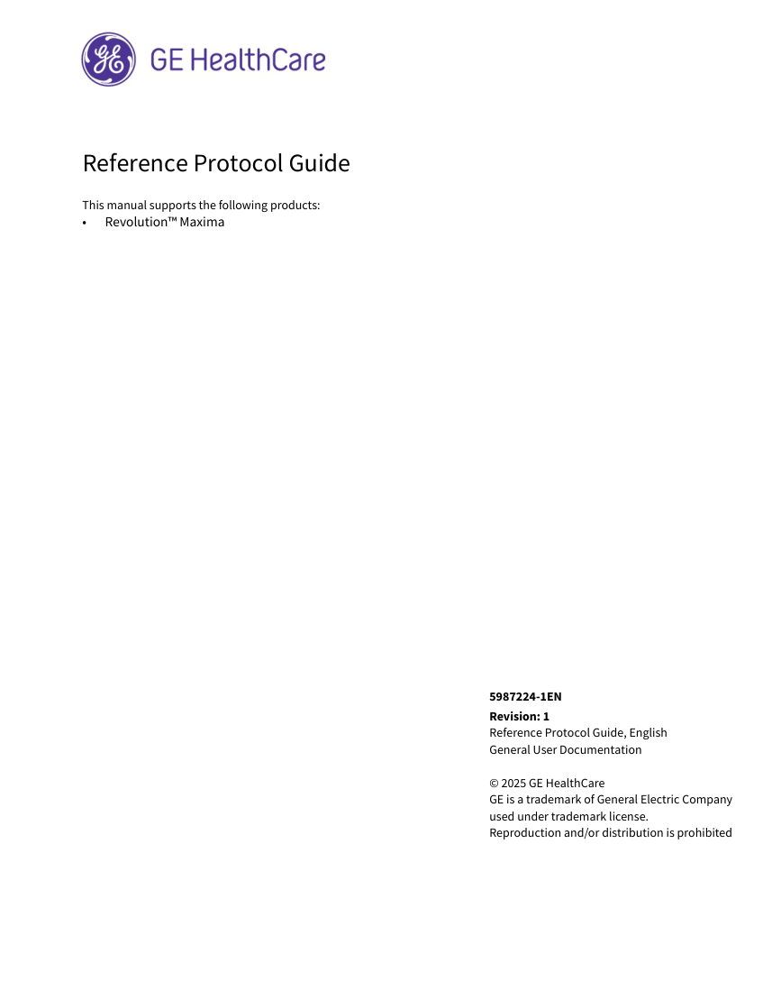
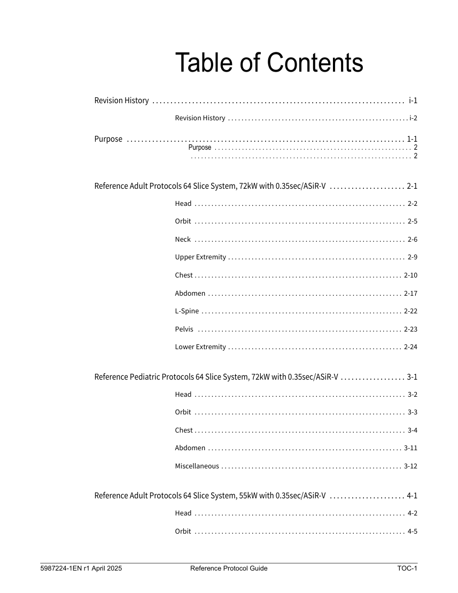

# CT — Parametri aparat: GE Revolution Maxima 64 Protocols (MCB)

## Documentul original MCB — Parametri aparat: GE Revolution Maxima 64 Protocols

**Manual de aparat · 300 pagini · consultat la 2026-09-27.**

[Descarcă PDF-ul integral](../../assets/mcb-modalities/ct-parametri-aparat-ge-revolution-maxima-64-protocols-mcb/document.pdf) · [Sursa MCB](https://ref.mcbradiology.com/Protocols,%20Policies,%20Worksheets%20&%20Forms/CT/Protocols/Default/GE%20Revolution%20Maxima%2064%20Protocols.pdf) · [Catalogul MCB pentru această modalitate](../mcb/index.md)

Instrucțiunile, valorile și ilustrațiile din documentul original sunt păstrate în **engleză**. Titlul și navigarea sunt în română.

Previzualizarea de mai jos prezintă primele 3 pagini. **PDF-ul descărcabil conține toate cele 300 de pagini.**

### Pagina 1

{ loading=lazy }

### Pagina 2

{ loading=lazy }

### Pagina 3

{ loading=lazy }

## Textul documentului original

??? abstract "Pagina 1 — text în engleză"

    
Reference Protocol Guide 
    This manual supports the following products:
    •
    Revolution™ Maxima
    5987224-1EN
    Revision: 1
    Reference Protocol Guide, English 
    General User Documentation
    © 2025 GE HealthCare 
    GE is a trademark of General Electric Company 
    used under trademark license.
    Reproduction and/or distribution is prohibited
    

Pagina 2: document scanat; conținutul se consultă în PDF-ul original.

??? abstract "Pagina 3 — text în engleză"

    
Table of Contents
    Revision History  . . . . . . . . . . . . . . . . . . . . . . . . . . . . . . . . . . . . . . . . . . . . . . . . . . . . . . . . . . . . . . . . . . . . . .  i-1
    Revision History . . . . . . . . . . . . . . . . . . . . . . . . . . . . . . . . . . . . . . . . . . . . . . . . . . . . . . i-2
    Purpose  . . . . . . . . . . . . . . . . . . . . . . . . . . . . . . . . . . . . . . . . . . . . . . . . . . . . . . . . . . . . . . . . . . . . . . . . . . . . . 1-1
    Purpose  . . . . . . . . . . . . . . . . . . . . . . . . . . . . . . . . . . . . . . . . . . . . . . . . . . . . . . . . . . 2
     . . . . . . . . . . . . . . . . . . . . . . . . . . . . . . . . . . . . . . . . . . . . . . . . . . . . . . . . . . . . . . . . . 2
    Reference Adult Protocols 64 Slice System, 72kW with 0.35sec/ASiR-V  . . . . . . . . . . . . . . . . . . . . . 2-1
    Head  . . . . . . . . . . . . . . . . . . . . . . . . . . . . . . . . . . . . . . . . . . . . . . . . . . . . . . . . . . . . . . . 2-2
    Orbit  . . . . . . . . . . . . . . . . . . . . . . . . . . . . . . . . . . . . . . . . . . . . . . . . . . . . . . . . . . . . . . . 2-5
    Neck  . . . . . . . . . . . . . . . . . . . . . . . . . . . . . . . . . . . . . . . . . . . . . . . . . . . . . . . . . . . . . . . 2-6
    Upper Extremity . . . . . . . . . . . . . . . . . . . . . . . . . . . . . . . . . . . . . . . . . . . . . . . . . . . . . 2-9
    Chest . . . . . . . . . . . . . . . . . . . . . . . . . . . . . . . . . . . . . . . . . . . . . . . . . . . . . . . . . . . . . . 2-10
    Abdomen . . . . . . . . . . . . . . . . . . . . . . . . . . . . . . . . . . . . . . . . . . . . . . . . . . . . . . . . . . 2-17
    L-Spine . . . . . . . . . . . . . . . . . . . . . . . . . . . . . . . . . . . . . . . . . . . . . . . . . . . . . . . . . . . . 2-22
    Pelvis  . . . . . . . . . . . . . . . . . . . . . . . . . . . . . . . . . . . . . . . . . . . . . . . . . . . . . . . . . . . . . 2-23
    Lower Extremity . . . . . . . . . . . . . . . . . . . . . . . . . . . . . . . . . . . . . . . . . . . . . . . . . . . . 2-24
    Reference Pediatric Protocols 64 Slice System, 72kW with 0.35sec/ASiR-V . . . . . . . . . . . . . . . . . . 3-1
    Head  . . . . . . . . . . . . . . . . . . . . . . . . . . . . . . . . . . . . . . . . . . . . . . . . . . . . . . . . . . . . . . . 3-2
    Orbit  . . . . . . . . . . . . . . . . . . . . . . . . . . . . . . . . . . . . . . . . . . . . . . . . . . . . . . . . . . . . . . . 3-3
    Chest . . . . . . . . . . . . . . . . . . . . . . . . . . . . . . . . . . . . . . . . . . . . . . . . . . . . . . . . . . . . . . . 3-4
    Abdomen . . . . . . . . . . . . . . . . . . . . . . . . . . . . . . . . . . . . . . . . . . . . . . . . . . . . . . . . . . 3-11
    Miscellaneous . . . . . . . . . . . . . . . . . . . . . . . . . . . . . . . . . . . . . . . . . . . . . . . . . . . . . . 3-12
    Reference Adult Protocols 64 Slice System, 55kW with 0.35sec/ASiR-V  . . . . . . . . . . . . . . . . . . . . . 4-1
    Head  . . . . . . . . . . . . . . . . . . . . . . . . . . . . . . . . . . . . . . . . . . . . . . . . . . . . . . . . . . . . . . . 4-2
    Orbit  . . . . . . . . . . . . . . . . . . . . . . . . . . . . . . . . . . . . . . . . . . . . . . . . . . . . . . . . . . . . . . . 4-5
    5987224-1EN r1 April 2025
    Reference Protocol Guide
    TOC-1
    

??? abstract "Pagina 4 — text în engleză"

    
Neck  . . . . . . . . . . . . . . . . . . . . . . . . . . . . . . . . . . . . . . . . . . . . . . . . . . . . . . . . . . . . . . . 4-6
    Upper Extremity . . . . . . . . . . . . . . . . . . . . . . . . . . . . . . . . . . . . . . . . . . . . . . . . . . . . . 4-9
    Chest . . . . . . . . . . . . . . . . . . . . . . . . . . . . . . . . . . . . . . . . . . . . . . . . . . . . . . . . . . . . . . 4-10
    Abdomen . . . . . . . . . . . . . . . . . . . . . . . . . . . . . . . . . . . . . . . . . . . . . . . . . . . . . . . . . . 4-16
    L-Spine . . . . . . . . . . . . . . . . . . . . . . . . . . . . . . . . . . . . . . . . . . . . . . . . . . . . . . . . . . . . 4-21
    Pelvis  . . . . . . . . . . . . . . . . . . . . . . . . . . . . . . . . . . . . . . . . . . . . . . . . . . . . . . . . . . . . . 4-22
    Lower Extremity . . . . . . . . . . . . . . . . . . . . . . . . . . . . . . . . . . . . . . . . . . . . . . . . . . . . 4-23
    Reference Pediatric Protocols 64 Slice System, 55kW with 0.35sec/ASiR-V . . . . . . . . . . . . . . . . . . 5-1
    Head  . . . . . . . . . . . . . . . . . . . . . . . . . . . . . . . . . . . . . . . . . . . . . . . . . . . . . . . . . . . . . . . 5-2
    Orbit  . . . . . . . . . . . . . . . . . . . . . . . . . . . . . . . . . . . . . . . . . . . . . . . . . . . . . . . . . . . . . . . 5-3
    Chest . . . . . . . . . . . . . . . . . . . . . . . . . . . . . . . . . . . . . . . . . . . . . . . . . . . . . . . . . . . . . . . 5-4
    Abdomen . . . . . . . . . . . . . . . . . . . . . . . . . . . . . . . . . . . . . . . . . . . . . . . . . . . . . . . . . . 5-11
    Miscellaneous . . . . . . . . . . . . . . . . . . . . . . . . . . . . . . . . . . . . . . . . . . . . . . . . . . . . . . 5-12
    Reference Adult Protocols 64 Slice System, 72kW with 0.35sec/ASiR  . . . . . . . . . . . . . . . . . . . . . . . 6-1
    Head  . . . . . . . . . . . . . . . . . . . . . . . . . . . . . . . . . . . . . . . . . . . . . . . . . . . . . . . . . . . . . . . 6-2
    Orbit  . . . . . . . . . . . . . . . . . . . . . . . . . . . . . . . . . . . . . . . . . . . . . . . . . . . . . . . . . . . . . . . 6-4
    Neck  . . . . . . . . . . . . . . . . . . . . . . . . . . . . . . . . . . . . . . . . . . . . . . . . . . . . . . . . . . . . . . . 6-5
    Upper Extremity . . . . . . . . . . . . . . . . . . . . . . . . . . . . . . . . . . . . . . . . . . . . . . . . . . . . . 6-7
    Chest . . . . . . . . . . . . . . . . . . . . . . . . . . . . . . . . . . . . . . . . . . . . . . . . . . . . . . . . . . . . . . . 6-8
    Abdomen . . . . . . . . . . . . . . . . . . . . . . . . . . . . . . . . . . . . . . . . . . . . . . . . . . . . . . . . . . 6-13
    L-Spine . . . . . . . . . . . . . . . . . . . . . . . . . . . . . . . . . . . . . . . . . . . . . . . . . . . . . . . . . . . . 6-17
    Pelvis  . . . . . . . . . . . . . . . . . . . . . . . . . . . . . . . . . . . . . . . . . . . . . . . . . . . . . . . . . . . . . 6-18
    Lower Extremity . . . . . . . . . . . . . . . . . . . . . . . . . . . . . . . . . . . . . . . . . . . . . . . . . . . . 6-19
    Reference Pediatric Protocols 64 Slice System, 72kW with 0.35sec/ASiR . . . . . . . . . . . . . . . . . . . . 7-1
    Head  . . . . . . . . . . . . . . . . . . . . . . . . . . . . . . . . . . . . . . . . . . . . . . . . . . . . . . . . . . . . . . . 7-2
    5987224-1EN r1 April 2025
    Reference Protocol Guide
    TOC-2
    

??? abstract "Pagina 5 — text în engleză"

    
Orbit  . . . . . . . . . . . . . . . . . . . . . . . . . . . . . . . . . . . . . . . . . . . . . . . . . . . . . . . . . . . . . . . 7-3
    Chest . . . . . . . . . . . . . . . . . . . . . . . . . . . . . . . . . . . . . . . . . . . . . . . . . . . . . . . . . . . . . . . 7-4
    Abdomen . . . . . . . . . . . . . . . . . . . . . . . . . . . . . . . . . . . . . . . . . . . . . . . . . . . . . . . . . . 7-11
    Miscellaneous . . . . . . . . . . . . . . . . . . . . . . . . . . . . . . . . . . . . . . . . . . . . . . . . . . . . . . 7-12
    Reference Adult Protocols 64 Slice System, 55kW with 0.35sec/ASiR  . . . . . . . . . . . . . . . . . . . . . . . 8-1
    Head  . . . . . . . . . . . . . . . . . . . . . . . . . . . . . . . . . . . . . . . . . . . . . . . . . . . . . . . . . . . . . . . 8-2
    Orbit  . . . . . . . . . . . . . . . . . . . . . . . . . . . . . . . . . . . . . . . . . . . . . . . . . . . . . . . . . . . . . . . 8-4
    Neck  . . . . . . . . . . . . . . . . . . . . . . . . . . . . . . . . . . . . . . . . . . . . . . . . . . . . . . . . . . . . . . . 8-5
    Upper Extremity . . . . . . . . . . . . . . . . . . . . . . . . . . . . . . . . . . . . . . . . . . . . . . . . . . . . . 8-7
    Chest . . . . . . . . . . . . . . . . . . . . . . . . . . . . . . . . . . . . . . . . . . . . . . . . . . . . . . . . . . . . . . . 8-8
    Abdomen . . . . . . . . . . . . . . . . . . . . . . . . . . . . . . . . . . . . . . . . . . . . . . . . . . . . . . . . . . 8-12
    L-Spine . . . . . . . . . . . . . . . . . . . . . . . . . . . . . . . . . . . . . . . . . . . . . . . . . . . . . . . . . . . . 8-16
    Pelvis  . . . . . . . . . . . . . . . . . . . . . . . . . . . . . . . . . . . . . . . . . . . . . . . . . . . . . . . . . . . . . 8-17
    Lower Extremity . . . . . . . . . . . . . . . . . . . . . . . . . . . . . . . . . . . . . . . . . . . . . . . . . . . . 8-18
    Reference Pediatric Protocols 64 Slice System, 55kW with 0.35sec/ASiR . . . . . . . . . . . . . . . . . . . . 9-1
    Head  . . . . . . . . . . . . . . . . . . . . . . . . . . . . . . . . . . . . . . . . . . . . . . . . . . . . . . . . . . . . . . . 9-2
    Orbit  . . . . . . . . . . . . . . . . . . . . . . . . . . . . . . . . . . . . . . . . . . . . . . . . . . . . . . . . . . . . . . . 9-3
    Chest . . . . . . . . . . . . . . . . . . . . . . . . . . . . . . . . . . . . . . . . . . . . . . . . . . . . . . . . . . . . . . . 9-4
    Abdomen . . . . . . . . . . . . . . . . . . . . . . . . . . . . . . . . . . . . . . . . . . . . . . . . . . . . . . . . . . 9-11
    Miscellaneous . . . . . . . . . . . . . . . . . . . . . . . . . . . . . . . . . . . . . . . . . . . . . . . . . . . . . . 9-12
    Reference Adult Protocols 32 Slice System, 72kW with 0.35sec/ASiR-V  . . . . . . . . . . . . . . . . . . . . 10-1
    Head  . . . . . . . . . . . . . . . . . . . . . . . . . . . . . . . . . . . . . . . . . . . . . . . . . . . . . . . . . . . . . . 10-2
    Orbit  . . . . . . . . . . . . . . . . . . . . . . . . . . . . . . . . . . . . . . . . . . . . . . . . . . . . . . . . . . . . . . 10-4
    Neck  . . . . . . . . . . . . . . . . . . . . . . . . . . . . . . . . . . . . . . . . . . . . . . . . . . . . . . . . . . . . . . 10-5
    Upper Extremity . . . . . . . . . . . . . . . . . . . . . . . . . . . . . . . . . . . . . . . . . . . . . . . . . . . . 10-8
    5987224-1EN r1 April 2025
    Reference Protocol Guide
    TOC-3
    

??? abstract "Pagina 6 — text în engleză"

    
Chest . . . . . . . . . . . . . . . . . . . . . . . . . . . . . . . . . . . . . . . . . . . . . . . . . . . . . . . . . . . . . . 10-9
    Abdomen . . . . . . . . . . . . . . . . . . . . . . . . . . . . . . . . . . . . . . . . . . . . . . . . . . . . . . . . . 10-14
    L-Spine . . . . . . . . . . . . . . . . . . . . . . . . . . . . . . . . . . . . . . . . . . . . . . . . . . . . . . . . . . . 10-18
    Pelvis  . . . . . . . . . . . . . . . . . . . . . . . . . . . . . . . . . . . . . . . . . . . . . . . . . . . . . . . . . . . . 10-19
    Lower Extremity . . . . . . . . . . . . . . . . . . . . . . . . . . . . . . . . . . . . . . . . . . . . . . . . . . . 10-20
    Reference Pediatric Protocols 32 Slice System, 72kW with 0.35sec/ASiR-V . . . . . . . . . . . . . . . . . 11-1
    Head  . . . . . . . . . . . . . . . . . . . . . . . . . . . . . . . . . . . . . . . . . . . . . . . . . . . . . . . . . . . . . . 11-2
    Orbit  . . . . . . . . . . . . . . . . . . . . . . . . . . . . . . . . . . . . . . . . . . . . . . . . . . . . . . . . . . . . . . 11-3
    Chest . . . . . . . . . . . . . . . . . . . . . . . . . . . . . . . . . . . . . . . . . . . . . . . . . . . . . . . . . . . . . . 11-4
    Abdomen . . . . . . . . . . . . . . . . . . . . . . . . . . . . . . . . . . . . . . . . . . . . . . . . . . . . . . . . . 11-11
    Miscellaneous . . . . . . . . . . . . . . . . . . . . . . . . . . . . . . . . . . . . . . . . . . . . . . . . . . . . . 11-12
    Reference Adult Protocols 32 Slice System, 55kW with 0.35sec/ASiR-V  . . . . . . . . . . . . . . . . . . . . 12-1
    Head  . . . . . . . . . . . . . . . . . . . . . . . . . . . . . . . . . . . . . . . . . . . . . . . . . . . . . . . . . . . . . . 12-2
    Orbit  . . . . . . . . . . . . . . . . . . . . . . . . . . . . . . . . . . . . . . . . . . . . . . . . . . . . . . . . . . . . . . 12-4
    Neck  . . . . . . . . . . . . . . . . . . . . . . . . . . . . . . . . . . . . . . . . . . . . . . . . . . . . . . . . . . . . . . 12-5
    Upper Extremity . . . . . . . . . . . . . . . . . . . . . . . . . . . . . . . . . . . . . . . . . . . . . . . . . . . . 12-8
    Chest . . . . . . . . . . . . . . . . . . . . . . . . . . . . . . . . . . . . . . . . . . . . . . . . . . . . . . . . . . . . . . 12-9
    Abdomen . . . . . . . . . . . . . . . . . . . . . . . . . . . . . . . . . . . . . . . . . . . . . . . . . . . . . . . . . 12-14
    L-Spine . . . . . . . . . . . . . . . . . . . . . . . . . . . . . . . . . . . . . . . . . . . . . . . . . . . . . . . . . . . 12-18
    Pelvis  . . . . . . . . . . . . . . . . . . . . . . . . . . . . . . . . . . . . . . . . . . . . . . . . . . . . . . . . . . . . 12-19
    Lower Extremity . . . . . . . . . . . . . . . . . . . . . . . . . . . . . . . . . . . . . . . . . . . . . . . . . . . 12-20
    Reference Pediatric Protocols 32 Slice System, 55kW with 0.35sec/ASiR-V . . . . . . . . . . . . . . . . . 13-1
    Head  . . . . . . . . . . . . . . . . . . . . . . . . . . . . . . . . . . . . . . . . . . . . . . . . . . . . . . . . . . . . . . 13-2
    Orbit  . . . . . . . . . . . . . . . . . . . . . . . . . . . . . . . . . . . . . . . . . . . . . . . . . . . . . . . . . . . . . . 13-3
    Chest . . . . . . . . . . . . . . . . . . . . . . . . . . . . . . . . . . . . . . . . . . . . . . . . . . . . . . . . . . . . . . 13-4
    TOC-4
    Reference Protocol Guide
    5987224-1EN r1 April 2025
    

??? abstract "Pagina 7 — text în engleză"

    
Abdomen . . . . . . . . . . . . . . . . . . . . . . . . . . . . . . . . . . . . . . . . . . . . . . . . . . . . . . . . . 13-11
    Miscellaneous . . . . . . . . . . . . . . . . . . . . . . . . . . . . . . . . . . . . . . . . . . . . . . . . . . . . . 13-12
    Reference Adult Protocols 32 Slice System, 72kW with 0.35sec/ASiR  . . . . . . . . . . . . . . . . . . . . . . 14-1
    Head  . . . . . . . . . . . . . . . . . . . . . . . . . . . . . . . . . . . . . . . . . . . . . . . . . . . . . . . . . . . . . . 14-2
    Orbit  . . . . . . . . . . . . . . . . . . . . . . . . . . . . . . . . . . . . . . . . . . . . . . . . . . . . . . . . . . . . . . 14-4
    Neck  . . . . . . . . . . . . . . . . . . . . . . . . . . . . . . . . . . . . . . . . . . . . . . . . . . . . . . . . . . . . . . 14-5
    Upper Extremity . . . . . . . . . . . . . . . . . . . . . . . . . . . . . . . . . . . . . . . . . . . . . . . . . . . . 14-7
    Chest . . . . . . . . . . . . . . . . . . . . . . . . . . . . . . . . . . . . . . . . . . . . . . . . . . . . . . . . . . . . . . 14-8
    Abdomen . . . . . . . . . . . . . . . . . . . . . . . . . . . . . . . . . . . . . . . . . . . . . . . . . . . . . . . . . 14-12
    L-Spine . . . . . . . . . . . . . . . . . . . . . . . . . . . . . . . . . . . . . . . . . . . . . . . . . . . . . . . . . . . 14-16
    Pelvis  . . . . . . . . . . . . . . . . . . . . . . . . . . . . . . . . . . . . . . . . . . . . . . . . . . . . . . . . . . . . 14-17
    Lower Extremity . . . . . . . . . . . . . . . . . . . . . . . . . . . . . . . . . . . . . . . . . . . . . . . . . . . 14-18
    Reference Pediatric Protocols 32 Slice System, 72kW with 0.35sec/ASiR . . . . . . . . . . . . . . . . . . . 15-1
    Head  . . . . . . . . . . . . . . . . . . . . . . . . . . . . . . . . . . . . . . . . . . . . . . . . . . . . . . . . . . . . . . 15-2
    Orbit  . . . . . . . . . . . . . . . . . . . . . . . . . . . . . . . . . . . . . . . . . . . . . . . . . . . . . . . . . . . . . . 15-3
    Chest . . . . . . . . . . . . . . . . . . . . . . . . . . . . . . . . . . . . . . . . . . . . . . . . . . . . . . . . . . . . . . 15-4
    Abdomen . . . . . . . . . . . . . . . . . . . . . . . . . . . . . . . . . . . . . . . . . . . . . . . . . . . . . . . . . 15-11
    Miscellaneous . . . . . . . . . . . . . . . . . . . . . . . . . . . . . . . . . . . . . . . . . . . . . . . . . . . . . 15-12
    Reference Adult Protocols 32 Slice System, 55kW with 0.35sec/ASiR  . . . . . . . . . . . . . . . . . . . . . . 16-1
    Head  . . . . . . . . . . . . . . . . . . . . . . . . . . . . . . . . . . . . . . . . . . . . . . . . . . . . . . . . . . . . . . 16-2
    Orbit  . . . . . . . . . . . . . . . . . . . . . . . . . . . . . . . . . . . . . . . . . . . . . . . . . . . . . . . . . . . . . . 16-4
    Neck  . . . . . . . . . . . . . . . . . . . . . . . . . . . . . . . . . . . . . . . . . . . . . . . . . . . . . . . . . . . . . . 16-5
    Upper Extremity . . . . . . . . . . . . . . . . . . . . . . . . . . . . . . . . . . . . . . . . . . . . . . . . . . . . 16-7
    Chest . . . . . . . . . . . . . . . . . . . . . . . . . . . . . . . . . . . . . . . . . . . . . . . . . . . . . . . . . . . . . . 16-8
    Abdomen . . . . . . . . . . . . . . . . . . . . . . . . . . . . . . . . . . . . . . . . . . . . . . . . . . . . . . . . . 16-12
    5987224-1EN r1 April 2025
    Reference Protocol Guide
    TOC-5
    

??? abstract "Pagina 8 — text în engleză"

    
L-Spine . . . . . . . . . . . . . . . . . . . . . . . . . . . . . . . . . . . . . . . . . . . . . . . . . . . . . . . . . . . 16-16
    Pelvis  . . . . . . . . . . . . . . . . . . . . . . . . . . . . . . . . . . . . . . . . . . . . . . . . . . . . . . . . . . . . 16-17
    Lower Extremity . . . . . . . . . . . . . . . . . . . . . . . . . . . . . . . . . . . . . . . . . . . . . . . . . . . 16-18
    Reference Pediatric Protocols 32 Slice System, 55kW with 0.35sec/ASiR . . . . . . . . . . . . . . . . . . . 17-1
    Head  . . . . . . . . . . . . . . . . . . . . . . . . . . . . . . . . . . . . . . . . . . . . . . . . . . . . . . . . . . . . . . 17-2
    Orbit  . . . . . . . . . . . . . . . . . . . . . . . . . . . . . . . . . . . . . . . . . . . . . . . . . . . . . . . . . . . . . . 17-3
    Chest . . . . . . . . . . . . . . . . . . . . . . . . . . . . . . . . . . . . . . . . . . . . . . . . . . . . . . . . . . . . . . 17-4
    Abdomen . . . . . . . . . . . . . . . . . . . . . . . . . . . . . . . . . . . . . . . . . . . . . . . . . . . . . . . . . 17-11
    Miscellaneous . . . . . . . . . . . . . . . . . . . . . . . . . . . . . . . . . . . . . . . . . . . . . . . . . . . . . 17-12
    Lung Cancer Screening . . . . . . . . . . . . . . . . . . . . . . . . . . . . . . . . . . . . . . . . . . . . . . . . . . . . . . . . . . . . . . . 18-1
     
     . . . . . . . . . . . . . . . . . . . . . . . . . . . . . . . . . . . . . . . . . . . . . . . . . . . . . . . . . . . . . . . 18-4
    Lexicon . . . . . . . . . . . . . . . . . . . . . . . . . . . . . . . . . . . . . . . . . . . . . . . . . . . . . . . . . . . . . . . . . . . . . . . . . . . . . 19-1
     
     . . . . . . . . . . . . . . . . . . . . . . . . . . . . . . . . . . . . . . . . . . . . . . . . . . . . . . . . . . . . . . . 19-2
    Lexicon . . . . . . . . . . . . . . . . . . . . . . . . . . . . . . . . . . . . . . . . . . . . . . . . . . . . . . . . . . . 2
    Scan Acquisition and User Interface Basics  . . . . . . . . . . . . . . . . . . . . . . . . . . . . . . 2
    Dose Modulation and Reduction Tools  . . . . . . . . . . . . . . . . . . . . . . . . . . . . . . . . . . 3
    Multi-slice Detector Geometry  . . . . . . . . . . . . . . . . . . . . . . . . . . . . . . . . . . . . . . . . . 3
    Image Reconstruction and Display  . . . . . . . . . . . . . . . . . . . . . . . . . . . . . . . . . . . . . 4
    Contrast Media Tools . . . . . . . . . . . . . . . . . . . . . . . . . . . . . . . . . . . . . . . . . . . . . . . . 4
    Multi-planar Formats and 3D Processing . . . . . . . . . . . . . . . . . . . . . . . . . . . . . . . . . 5
    Service and Application Tools  . . . . . . . . . . . . . . . . . . . . . . . . . . . . . . . . . . . . . . . . . 5
    Workflow  . . . . . . . . . . . . . . . . . . . . . . . . . . . . . . . . . . . . . . . . . . . . . . . . . . . . . . . . . 6
    References . . . . . . . . . . . . . . . . . . . . . . . . . . . . . . . . . . . . . . . . . . . . . . . . . . . . . . . . 6
    TOC-6
    Reference Protocol Guide
    5987224-1EN r1 April 2025
    

??? abstract "Pagina 9 — text în engleză"

    
Revision History
    5987224-1EN_r1 April 2025
    Reference Protocol Guide
    i-1
    

??? abstract "Pagina 10 — text în engleză"

    
Revision History
    Revision History
    REV
    DATE
    REASON FOR CHANGE
    1
    April 2025
    Initial Release
    i-2
    Reference Protocol Guide
    5987224-1EN r1 April 2025
    

??? abstract "Pagina 11 — text în engleză"

    
Purpose
    5987224-1EN r1 April 2025
    Reference Protocol Guide
    1-1
    

??? abstract "Pagina 12 — text în engleză"

    
Purpose
    Purpose
    This document provides a listing of the parameters provided in the reference protocols 
    contained under the GE tab selector. The protocols in Adult are based on parameters needed 
    to scan an average sized adult and take the clinical aim of the protocol into consideration. The 
    protocols in Pediatric are based on age in the Head and Orbit area, and in the rest of the body, 
    use Color Coding for Kids or the Feather Light patient sizing scheme. These protocols are 
    designed as a starting point. They should be reviewed with your Radiologist, Physicist, and 
    Radiation Safety Officer and revised as needed to meet the clinical needs of your department. 
    The document is divided into protocol categories available on the system. Each table lists the 
    Protocol Number, Protocol Name, Post Processing software associated with, Scan Type, SFOV, 
    Pitch/Table Speed/Row, Gantry Speed, Slice Thickness, kV, mA/AVG mA/Min-Max mA/Noise 
    Index, CTDIvol, Recon Algorithm Type used and Phantom type used.
    Manual mA mode allows you to scan without enabling Auto mA mode. When building 
    protocols, make sure the mA value field contains a reasonable mA value in the event that 
    AutomA is turned off. The Avrage (Avg) mA has been provided in the tables where Auto mA or 
    Smart mA is used in the protocol so that the dose can be calculated while building protocols. 
    The Avg mA value provided in the table is an estimate based on an average patient size (32- 36 
    cm). The actual average mA for each image is calculated by using all of the mA values for each 
    scan rotation, as determined by Auto mA for the patient. The Auto mA Theory section in the 
    Learning and Reference Guide, Building Protocols Chapter and in the Technical Reference 
    Manual, General Information Chapter details how Auto mA does this calculation.
    1-2
    Reference Protocol Guide
    5987224-1EN r1 April 2025
    

??? abstract "Pagina 13 — text în engleză"

    
Reference Adult Protocols 64 Slice
    System, 72kW with 0.35sec/ASiR-V
    5987224-1EN r1 April 2025
    Reference Protocol Guide
    2-1
    

??? abstract "Pagina 14 — text în engleză"

    
Phantom 
    (cm)
    Description
    Scan 
    Length 
    (cm)
    DLP 
    (mGy·cm)
    CTDI
    vol 
    (mGy) 
    ASiR-V 
    (%)
    AR40
    20.22
    196.56
    8.00
    Head 16
    CT angiography of the 
    head for evaluation of 
    carotid and cerebral 
    vasculature
    AR40
    40.44
    757.12
    17.00
    Head 16
    CT angiography of the 
    neck and head using 
    SmartmA with ODM for 
    evaluation of cerebral 
    vasculature
    AR40
    20.22
    196.56
    8.00
    Head 16
    CT angiography of the 
    head for evaluation of 
    carotid and cerebral 
    vasculature
    Recon 
    Type
    Dose 
    Reductio
    n (%)
    50
    STND
    PLUS
    IQE+
    NI
    mA
    Avg mA
    Min-Max
    50-500mA
    NI=8
    Avg mA=200
    kV
    Beam 
    Collimat
    ion 
    (mm)
    Slice 
    Thickness 
    (mm)
    [Interval]*
    (mm)
    Rotation 
    Time 
    (second
    s)
    Row
    Pitch
    Table 
    Speed
    Axial
    Head
    2i
    2
    10
    20
    120
    50
    50
    STND
    AR50
    17.90
    143.24
    7.00
    Head 16
    Routine head protocol for 
    evaluation of the brain for 
    abnormalities
    Helical
    Head
    10.62 
    0.531
    0.6
    0.625
    20
    120
    100
    50
    STND
    PLUS
    IQE+
    Helical
    Head
    10.62 
    0.531
    0.6
    0.625
    20
    120
    SmartmA
    Helical
    Head
    10.62 
    0.531
    0.6
    0.625
    20
    120
    100
    50
    DETL
    PLUS
    IQE+
    Post 
    Process
    Scan Type
    SFOV
    MIROI
    Axial
    Head
    1i
    1
    5
    [0]
    5
    120
    50
    0
    STND
    NONE
    106.42
    53.21
    0
    Head 16
    Timing Bolus for CT 
    angiography of the neck 
    and head using SmartmA 
    with ODM for evaluation 
    of carotid and cerebral 
    vasculature
    MIROI
    Axial
    Head
    1i
    1
    5
    [0]
    5
    120
    50
    0
    STND
    NONE
    118.25
    59.12
    0
    Head 16
    Timing bolus for CT 
    angiography of the head 
    for evaluation of carotid 
    and cerebral vasculature
    MIROI
    Axial
    Head
    1i
    1
    5
    [0]
    5
    120
    50
    0
    STND
    NONE
    106.42
    53.21
    0
    Head 16
    Timing Bolus for CT 
    angiography of the neck 
    and head using SmartmA 
    with ODM for evaluation 
    of carotid and cerebral 
    vasculature
    Protocol 
    Name
    Head
    Table 2-1 
    [Interval]*- For Helical acquisitions, Interval unless otherwise indicated is equal to the slice thickness. 
    For Axial and Cine acquisitions, Interval unless otherwise indicated is equal to the Beam Collimation/Detector Coverage.
    Protocol 
    Number
    21.1
    Routine 
    Head
    Axial
    Head
    4i
    2
    5
    20
    120
    100
    50
    STND
    AR50
    35.81
    214.86
    5.50
    Head 16
    Routine head protocol for 
    evaluation of the brain for 
    abnormalities
    21.2
    Trauma 
    Head
    Axial
    Head
    4i
    1
    5
    20
    120
    200
    50
    STND
    AR50
    35.81
    501.33
    13.50
    Head 16
    Emergency head protocol 
    for evaluation of the brain 
    and cranium for 
    abnormalities.
    21.4
    Circle of 
    Willis
    MIROI
    Axial
    Head
    1i
    1
    5
    [0]
    5
    120
    50
    0
    STND
    NONE
    118.25
    59.12
    0
    Head 16
    Timing bolus for CT 
    angiography of the head 
    for evaluation of carotid 
    and cerebral vasculature
    21.5
    CoW/
    Carotid 
    0.625mm 
    SmartmA
    21.6
    Hi Res 
    Circle of 
    Willis
    21.7
    Hi Res 
    CoW/
    Carotid 
    0.625mm 
    SmartmA
    2-2
    Reference Protocol Guide
    5987224-1EN r1 April 2025
    

??? abstract "Pagina 15 — text în engleză"

    
Phantom 
    (cm)
    Description
    Scan 
    Length 
    (cm)
    DLP 
    (mGy·cm)
    CTDI
    vol 
    (mGy) 
    ASiR-V 
    (%)
    AR40
    40.44
    757.12
    17.00
    Head 16
    CT angiography of the 
    neck and head using 
    SmartmA with ODM for 
    evaluation of cerebral 
    vasculature
    AR40
    24.27
    393.56
    14.50
    Head 16
    Helical scan mode for 
    evaluation of the brain for 
    cerebral abnormality
    AR40
    24.27
    393.56
    14.50
    Head 16
    Helical scan mode with 
    SmartMAR for evaluation 
    of the brain for cerebral 
    abnormality
    Recon 
    Type
    Dose 
    Reductio
    n (%)
    50
    DETL
    PLUS
    IQE+
    NI
    mA
    Avg mA
    Min-Max
    50-500mA
    NI=8
    Avg mA=200
    kV
    Beam 
    Collimat
    ion 
    (mm)
    Slice 
    Thickness 
    (mm)
    [Interval]*
    (mm)
    Rotation 
    Time 
    (second
    s)
    0.4
    5
    40
    120
    150
    50
    STND
    PLUS
    AR50
    231.41
    2892.60
    11.00
    Head 16
    CT angiography of the 
    head using Volume 
    Helical scan mode for 
    evaluation of cerebral 
    vasculature.
    Row
    Pitch
    Table 
    Speed
    Helical
    Head
    10.62 
    0.531
    0.6
    0.625
    20
    120
    SmartmA
    Helical-S
    Head
    0.984
    39.37
    18 pass
    Axial
    Head
    4i
    2
    5
    20
    120
    85
    50
    STND
    AR50
    30.44
    426.13
    13.50
    Head 16
    Non-Enhance Brain, 
    Evaluation for 
    hemorrhage or infarction
    Axial
    Head
    4i
    2
    5
    20
    120
    85
    50
    STND
    AR50
    30.44
    426.13
    13.50
    Head 16
    Post Contrast Brain, 
    Evaluation for residual 
    tissue enhancement
    Axial
    Head
    4i
    2
    5
    20
    120
    85
    50
    STND
    AR50
    30.44
    426.13
    13.50
    Head 16
    Non-Enhance Brain, 
    Evaluation for 
    hemorrhage or infarction
    Axial
    Head
    4i
    2
    5
    20
    120
    85
    50
    STND
    AR50
    30.44
    426.13
    13.50
    Head 16
    Post Contrast Brain, 
    Evaluation for residual 
    tissue enhancement
    Axial
    Head
    4i
    2
    5
    20
    120
    85
    50
    STND
    AR50
    30.44
    426.13
    13.50
    Head 16
    Non-Enhance Brain, 
    Evaluation for 
    hemorrhage or infarction
    Post 
    Process
    Scan Type
    SFOV
    Perfusion
    Cine
    Head
    8i
    1
    5
    [0]
    40
    80
    180
    0
    STND
    NONE
    478.96
    1915.83
    3.50
    Head 16
    CT Perfusion using Cine 
    scan mode for evaluation 
    of cerebral perfusion over 
    time
    Perfusion
    Axial
    Head
    8i
    1
    5
    [0]
    40
    80
    200
    0
    STND
    NONE
    260.12
    1040.47
    3.50
    Head 16
    CT Perfusion using Axial 
    scan mode for evaluation 
    of cerebral perfusion over 
    time
    Protocol 
    Name
    Protocol 
    Number
    21.9
    Helical 
    Head 
    DMPR
    Helical
    Head
    10.62 
    0.531
    0.8
    0.625
    20
    120
    90
    50
    STND
    PLUS
    IQE+
    21.10
    Helical 
    Head MAR
    DMPR
    Helical
    Head
    10.62 
    0.531
    0.8
    0.625
    20
    120
    90
    50
    STND
    PLUS
    IQE+
    21.11
    VHS Head 
    4D CTA
    MIROI
    Axial
    Head
    1i
    1
    5
    [0]
    5
    120
    50
    0
    STND
    NONE
    118.25
    59.12
    0
    Head 16
    Timing bolus for CT 
    angiography of the head 
    for evaluation of carotid 
    and cerebral vasculature.
    21.13
    CT 
    Perfusion 
    350-370 
    Strength 
    Contrast
    21.14
    CT 
    Perfusion 
    350-370 
    Strength 
    Contrast 
    (Axial)
    21.15
    CT 
    Perfusion 
    350-370 
    Strength 
    Contrast 
    (Axial 
    Shuttle 
    Mode)
    2-3
    Reference Protocol Guide
    5987224-1EN r1 April 2025
    

??? abstract "Pagina 16 — text în engleză"

    
Phantom 
    (cm)
    Description
    Scan 
    Length 
    (cm)
    DLP 
    (mGy·cm)
    CTDI
    vol 
    (mGy) 
    ASiR-V 
    (%)
    Recon 
    Type
    Dose 
    Reductio
    n (%)
    NI
    mA
    Avg mA
    Min-Max
    kV
    Beam 
    Collimat
    ion 
    (mm)
    Slice 
    Thickness 
    (mm)
    [Interval]*
    (mm)
    Rotation 
    Time 
    (second
    s)
    Row
    Pitch
    Table 
    Speed
    Axial
    Head
    4i
    2
    5
    20
    120
    85
    50
    STND
    AR50
    30.44
    426.13
    13.50
    Head 16
    Post Contrast Brain, 
    Evaluation for residual 
    tissue enhancement
    Post 
    Process
    Scan Type
    SFOV
    Perfusion
    Axial-S
    Head
    8i
    17 pass
    0.5
    5
    40
    80
    400
    0
    STND
    NONE
    201.00
    1607.99
    7.50
    Head 16
    CT Perfusion using Axial 
    Shuttle scan mode for 
    evaluation of cerebral 
    perfusion over time
    Protocol 
    Name
    Protocol 
    Number
    2-4
    Reference Protocol Guide
    5987224-1EN r1 April 2025
    

??? abstract "Pagina 17 — text în engleză"

    
Phantom 
    (cm)
    Description
    Scan 
    Length 
    (cm)
    DLP 
    (mGy·c
    m)
    CTDI
    vol 
    (mGy) 
    ASiR-V 
    (%)
    AR50
    25.28
    231.40
    7.44
    Head 16
    Routine Helical Sinus 
    protocol, Evaluation for 
    any abnormality
    AR40
    18.20
    143.92
    6.19
    Head 16
    Routine Helical Orbit 
    protocol, Evaluation for 
    abnormality soft tissues 
    and bone structures of 
    the face
    AR40
    40.49
    226.41
    3.88
    Head 16
    Helical scan mode, 
    Evaluation for inner ear 
    abnormalities in Axial 
    plane
    Recon 
    Type
    Dose 
    Reduction 
    (%)
    NI
    mA
    Avg mA
    Min-Max
    kV
    Beam 
    Collimat
    ion 
    (mm)
    Slice 
    Thickness 
    (mm)
    [Interval]*
    (mm)
    Rotation 
    Time 
    (second
    s)
    Row
    Pitch
    Table 
    Speed
    Axial
    Head
    16i
    2
    1.25
    20
    140
    80
    50
    STND
    AR60
    40.49
    161.96
    3.88
    Head 16
    Axial scan mode, 
    Evaluation for inner ear 
    abnormalities in Coronal 
    Plane
    Post 
    Process
    Scan Type
    SFOV
    DMPR
    Helical
    Head
    10.62 
    0.531
    1
    0.625
    20
    120
    75
    50
    STND
    PLUS
    IQE+
    DMPR
    Helical
    Head
    10.62 
    0.531
    0.6
    0.625
    20
    120
    90
    50
    STND
    PLUS
    IQE+
    Reformat
    Helical
    Head
    10.62 
    0.531
    1
    0.625
    20
    140
    85
    50
    STND
    PLUS
    IQE+
    Protocol 
    Name
    Orbit
    Table 2-2 
    [Interval]*- For Helical acquisitions, Interval unless otherwise indicated is equal to the slice thickness. 
    For Axial and Cine acquisitions, Interval unless otherwise indicated is equal to the Beam Collimation/Detector Coverage.
    Protocol 
    Number
    22.1
    Sinus 
    Supine 
    Helical + 
    DMPR
    22.3
    Orbits 
    Helical + 
    DMPR
    22.5
    Helical IAC 
    0.625mm 
    Axial mode 
    - Use 
    Reformat 
    for Coronal
    22.7
    Axial and 
    Coronal IAC
    Axial
    Head
    16i
    2
    1.25
    20
    140
    80
    50
    STND
    AR60
    40.49
    161.96
    3.88
    Head 16
    Axial scan mode, 
    Evaluation for inner ear 
    abnormalities in Axial 
    plane
    2-5
    Reference Protocol Guide
    5987224-1EN r1 April 2025
    

??? abstract "Pagina 18 — text în engleză"

    
Phantom 
    (cm)
    Description
    Scan 
    Length 
    (cm)
    DLP 
    (mGy·c
    m)
    CTDI
    vol 
    (mGy) 
    ASiR-V 
    (%)
    AR50
    18.32
    264.39
    11.00
    Body 32
    C-Spine Helical mode 
    with DMPR, Evaluation 
    for soft tissue, disc and 
    bone abnormalitities
    AR50
    18.32
    264.39
    11.00
    Body 32
    C-Spine Helical mide with 
    DMPR and SmartmA, 
    Evaluation for soft tissue, 
    disc and bone 
    abnormalities
    AR50
    18.32
    264.39
    11.00
    Body 32
    C-Spine Helical mide with 
    DMPR, SmartmA and 
    SmartMAR, Evaluation 
    for soft tissue, disc and 
    bone abnormalities
    AR40
    11.08
    226.43
    17.00
    Body 32
    Carotid CTA (Pitch 0.5:1) 
    with SmartmA.Evaluation 
    of carotid vasculature
    Recon 
    Type
    Dose 
    Reduction 
    (%)
    50
    BONE
    PLUS
    IQE+
    50
    BONE
    PLUS
    IQE+
    50
    STND
    PLUS
    IQE+
    NI
    mA
    Avg mA
    Min-Max
    50-500mA
    NI=12.6
    Avg mA=155
    50-500mA
    NI=12.6
    Avg mA=155
    80-500mA
    NI=11 
    Avg mA=125
    kV
    Beam 
    Collimat
    ion 
    (mm)
    Slice 
    Thickness 
    (mm)
    [Interval]*
    (mm)
    Rotation 
    Time 
    (second
    s)
    Row
    Pitch
    Table 
    Speed
    Helical
    SmallBody
    20.62 
    0.516
    0.6
    0.625
    40
    120
    SmartmA
    Post 
    Process
    Scan Type
    SFOV
    DMPR
    Helical
    SmallBody
    20.62 
    0.516
    0.8
    0.625
    40
    120
    155
    50
    BONE
    PLUS
    IQE+
    DMPR
    Helical
    SmallBody
    20.62 
    0.516
    0.8
    0.625
    40
    120
    SmartmA
    DMPR
    Helical
    SmallBody
    20.62 
    0.516
    0.8
    0.625
    40
    120
    SmartmA
    MIROI
    Axial
    SmallBody
    1i
    1
    5
    [0]
    5
    120
    60
    0
    STND
    NONE
    97.04
    48.52
    0
    Body 32
    Timing bolus for Carotid 
    CTA (Pitch 0.5:1) with 
    SmartmA Evaluation of 
    carotid vasculature
    MIROI
    Axial
    SmallBody
    1i
    1
    5
    [0]
    5
    120
    60
    0
    STND
    NONE
    64.69
    32.35
    0
    Body 32
    Timing bolus for Carotid 
    CTA (Pitch 0.9:1) with 
    SmartmA Evaluation of 
    carotid vasculature
    Protocol 
    Name
    Neck
    Table 2-3 
    [Interval]*- For Helical acquisitions, Interval unless otherwise indicated is equal to the slice thickness. 
    For Axial and Cine acquisitions, Interval unless otherwise indicated is equal to the Beam Collimation/Detector Coverage.
    Protocol 
    Number
    23.1
    C-Spine C5-
    C7 Axial
    Axial
    SmallBody
    8i
    1
    2.5
    20
    140
    150
    50
    STND
    AR70
    17.41
    243.78
    13.75
    Body 32
    C-Spine C5-C7 area  
    Axial mode, Evaluation 
    for soft tissue, disc and 
    bone abnormalities
    23.2
    C-Spine C1-
    C4 Axial
    Axial
    SmallBody
    8i
    1
    2.5
    20
    120
    120
    50
    STND
    AR70
    9.78
    78.24
    7.75
    Body 32
    C-Spine C1-C4 area 
    Axial mode, Evaluation 
    for soft tissue, disc and 
    bone abnormalities 
    23.3
    C-Spine 
    Helical + 
    DMPR
    23.4
    C-Spine 
    Helical + 
    DMPR/
    SmartmA
    23.5
    C-Spine 
    Helical + 
    DMPR/
    SmartmA/
    MAR
    23.7
    Carotid 
    0.625mm 
    0.5:1 
    SmartmA/
    Test Bolus
    23.8
    Carotid 
    0.625mm 
    0.9:1 
    SmartmA/
    Test Bolus
    2-6
    Reference Protocol Guide
    5987224-1EN r1 April 2025
    

??? abstract "Pagina 19 — text în engleză"

    
Phantom 
    (cm)
    Description
    Scan 
    Length 
    (cm)
    DLP 
    (mGy·c
    m)
    CTDI
    vol 
    (mGy) 
    ASiR-V 
    (%)
    AR40
    9.52
    195.59
    17.00
    Body 32
    Carotid CTA (Pitch 0.9:1) 
    with SmartmA.Evaluation 
    of carotid vasculature
    AR40
    11.08
    226.43
    17.00
    Body 32
    Carotid CTA (Pitch0.5:1) 
    with SmartmA and 
    SmartPrep. Evaluation of 
    carotid vasculature
    AR40
    9.52
    195.59
    17.00
    Body 32
    Carotid CTA (Pitch0.9:1) 
    with SmartmA and 
    SmartPrep. Evaluation of 
    carotid vasculature
    AR40
    11.08
    226.43
    17.00
    Body 32
    Carotid CTA (Pitch0.5:1) 
    with SmartmA and 
    SmartPrep. Evaluation of 
    carotid vasculature
    AR40
    9.52
    195.59
    17.00
    Body 32
    Carotid CTA (Pitch0.9:1) 
    with SmartmA and 
    SmartPrep. Evaluation of 
    carotid vasculature
    AR40
    11.08
    226.43
    17.00
    Body 32
    Carotid and brain CTA 
    (Pitch 0.5:1) with 
    SmartmA.Evaluation of 
    carotid and cerebral 
    vasculature
    AR40
    11.08
    226.43
    17.00
    Body 32
    Carotid and brain CTA 
    (Pitch 0.5:1) with 
    SmartmA and SmartPrep 
    Evaluation of carotid and 
    cerebral vasculature
    AR40
    11.08
    226.43
    17.00
    Body 32
    Carotid and brain CTA 
    (Pitch 0.5:1) with 
    SmartmA and 
    SmartPrep. Evaluation of 
    carotid and cerebral 
    vasculature
    Recon 
    Type
    Dose 
    Reduction 
    (%)
    50
    STND
    PLUS
    IQE+
    50
    STND
    PLUS
    IQE+
    50
    STND
    PLUS
    IQE+
    50
    DETL
    PLUS
    IQE+
    50
    DETL
    PLUS
    IQE+
    50
    STND
    PLUS
    IQE+
    50
    STND
    PLUS
    IQE+
    50
    DETL
    PLUS
    IQE+
    NI
    mA
    Avg mA
    Min-Max
    80-500mA
    NI=11 
    Avg mA=205
    80-500mA
    NI=11 
    Avg mA=125
    80-500mA
    NI=11 
    Avg mA=205
    80-500mA
    NI=11 
    Avg mA=125
    80-500mA
    NI=11 
    Avg mA=205
    80-500mA
    NI=11 
    Avg mA=125
    80-500mA
    NI=11 
    Avg mA=125
    80-500mA
    NI=11 
    Avg mA=125
    kV
    Beam 
    Collimat
    ion 
    (mm)
    Slice 
    Thickness 
    (mm)
    [Interval]*
    (mm)
    Rotation 
    Time 
    (second
    s)
    Row
    Pitch
    Table 
    Speed
    Helical
    SmallBody
    39.37 
    0.984
    0.6
    0.625
    40
    120
    SmartmA
    Helical
    SmallBody
    20.62 
    0.516
    0.6
    0.625
    40
    120
    SmartmA
    Helical
    SmallBody
    39.37 
    0.984
    0.6
    0.625
    40
    120
    SmartmA
    Helical
    SmallBody
    20.62 
    0.516
    0.6
    0.625
    40
    120
    SmartmA
    Helical
    SmallBody
    20.62 
    0.516
    0.6
    0.625
    40
    120
    SmartmA
    Post 
    Process
    Scan Type
    SFOV
    Prep
    Helical
    SmallBody
    0.516
    20.62
    0.6
    0.625
    40
    120
    SmartmA
    Prep
    Helical
    SmallBody
    0.984
    39.37
    0.6
    0.625
    40
    120
    SmartmA
    MIROI
    Axial
    SmallBody
    1i
    1
    10
    [0]
    10
    120
    60
    0
    STND
    NONE
    66.78
    66.78
    0
    Body 32
    Timing bolus for Carotid 
    and brain CTA (Pitch 
    0.5:1) with SmartmA 
    Evaluation of carotid and 
    cerebral vasculature
    Prep
    Helical
    SmallBody
    0.516
    20.62
    0.6
    0.625
    40
    120
    SmartmA
    Protocol 
    Name
    Protocol 
    Number
    23.9
    Carotid 
    0.625mm 
    0.5:1 
    SmartmA/
    SmartPrep
    23.10
    Carotid 
    0.625mm 
    0.9:1 
    SmartmA/
    SmartPrep
    23.11
    Hi Res 
    Carotid 
    0.625mm 
    0.5:1 
    SmartmA/
    SmartPrep
    23.12
    Hi Res 
    Carotid 
    0.625mm 
    0.9:1 
    SmartmA/
    SmartPrep
    23.14
    Carotid/
    CoW 
    0.625mm 
    SmartmA/
    Test Bolus
    23.15
    Carotid/
    CoW 
    0.625mm 
    SmartmA/
    SmartPrep
    23.16
    Hi Res 
    Carotid/
    CoW 
    0.625mm 
    SmartmA/
    SmartPrep
    2-7
    Reference Protocol Guide
    5987224-1EN r1 April 2025
    

??? abstract "Pagina 20 — text în engleză"

    
Phantom 
    (cm)
    Description
    Scan 
    Length 
    (cm)
    DLP 
    (mGy·c
    m)
    CTDI
    vol 
    (mGy) 
    ASiR-V 
    (%)
    AR40
    7.66
    142.09
    15.00
    Body 32
    Neck with DMPR and 
    SmartmA, Evaluation for 
    soft tissue abnormalities
    Recon 
    Type
    Dose 
    Reduction 
    (%)
    50
    STND
    PLUS
    AR50
    4.87
    90.42
    15.00
    Body 32
    Neck 2.5mm and 
    SmartmA, Evaluation of 
    soft tissue structures for 
    abnormality
    50
    STND
    PLUS
    IQE+
    NI
    mA
    Avg mA
    Min-Max
    80-500mA
    NI=9.10 
    Avg mA=105
    80-500mA
    NI=12.60
    Avg mA=165
    kV
    Beam 
    Collimat
    ion 
    (mm)
    Slice 
    Thickness 
    (mm)
    [Interval]*
    (mm)
    Rotation 
    Time 
    (second
    s)
    Row
    Pitch
    Table 
    Speed
    Helical
    SmallBody
    39.37 
    0.984
    0.6
    2.5
    40
    120
    SmartmA
    Post 
    Process
    Scan Type
    SFOV
    DMPR
    Helical
    SmallBody
    39.37 
    0.984
    0.6
    0.625
    40
    120
    SmartmA
    Protocol 
    Name
    Protocol 
    Number
    23.18
    Soft Tissue 
    Neck 
    2.5mm 
    SmartmA
    23.19
    Soft Tissue 
    Neck + 
    DMPR/
    SmartmA
    2-8
    Reference Protocol Guide
    5987224-1EN r1 April 2025
    

??? abstract "Pagina 21 — text în engleză"

    
Phantom 
    (cm)
    Description
    Scan 
    Length 
    (cm)
    DLP 
    (mGy·c
    m)
    CTDI
    vol 
    (mGy) 
    ASiR-V 
    (%)
    AR50
    27.02
    362.87
    10.00
    Body 32
    Shoulder with DMPR, 
    Evaluation of soft tissue 
    and bone of shoulder 
    area
    AR50
    27.02
    362.87
    10.00
    Body 32
    Shoulder with DMPR and 
    Smart mA, Evaluation of 
    soft tisue and bone of 
    shoulder area
    AR50
    27.02
    362.87
    10.00
    Body 32
    Shoulder with DMPR, 
    SmartmA and 
    SmartMAR, Evaluation of 
    soft tisue and bone of 
    shoulder area
    Recon 
    Type
    Dose 
    Reduction 
    (%)
    50
    STND
    PLUS
    IQE
    50
    STND
    PLUS
    IQE
    NI
    mA
    Avg mA
    Min-Max
    100-440mA
    NI=21.45 
    Avg mA=110
    100-440mA
    NI=21.45 
    Avg mA=110
    kV
    Beam 
    Collimat
    ion 
    (mm)
    Slice 
    Thickness 
    (mm)
    [Interval]*
    (mm)
    Rotation 
    Time 
    (second
    s)
    Row
    Pitch
    Table 
    Speed
    Post 
    Process
    Scan Type
    SFOV
    DMPR
    Helical
    LargeBody
    20.62 
    0.516
    1
    1.25
    [0.625]
    40
    140
    110
    50
    STND
    PLUS
    IQE
    DMPR
    Helical
    LargeBody
    20.62 
    0.516
    1
    1.25
    [0.625]
    40
    140
    SmartmA
    DMPR
    Helical
    LargeBody
    20.62 
    0.516
    1
    1.25
    [0.625]
    40
    140
    SmartmA
    Protocol 
    Name
    Upper Extremity
    Table 2-4 
    [Interval]*- For Helical acquisitions, Interval unless otherwise indicated is equal to the slice thickness. 
    For Axial and Cine acquisitions, Interval unless otherwise indicated is equal to the Beam Collimation/Detector Coverage.
    Protocol 
    Number
    24.1
    Shoulder 
    1.25mm + 
    DMPR
    24.2
    Shoulder 
    1.25mm + 
    DMPR/
    SmartmA
    24.3
    Shoulder 
    1.25mm + 
    DMPR/
    SmartmA/
    MAR
    2-9
    Reference Protocol Guide
    5987224-1EN r1 April 2025
    

??? abstract "Pagina 22 — text în engleză"

    
Phantom 
    (cm)
    Description
    Scan 
    Length 
    (cm)
    DLP 
    (mGy·c
    m)
    CTDI
    vol 
    (mGy) 
    ASiR-V 
    (%)
    Recon 
    Type
    Dose 
    Reduction 
    (%)
    50
    STND
    PLUS
    AR50
    3.99
    98.85
    20.00
    Body 32
    Chest with Smart mA, 
    Evaluation of 
    mediastinum and lungs 
    fields
    50
    STND
    PLUS
    AR40
    3.99
    98.85
    20.00
    Body 32
    Chest with SmartmA, 
    DMPR and SmartPrep, 
    Evaluation of 
    mediastinum and lung 
    fields
    50
    CHEST
    PLUS
    AR50
    4.27
    96.13
    20.00
    Body 32
    Chest with Smart mA, 
    Evaluation of 
    mediastinum and lung 
    fields with higher 
    resolution images of the 
    lungs
    50
    STND
    PLUS
    AR50
    3.99
    118.80
    25.00
    Body 32
    Multi group scan for 
    Chest, Abdomen, Pelvis 
    (0.6sec) with SmartmA 
    and ODM, Evaluation of 
    chest and abdominal 
    anatomy for 
    abnormalities
    50
    STND
    PLUS
    AR50
    5.84
    134.60
    19.50
    Body 32
    50
    STND
    PLUS
    AR40
    5.69
    286.81
    45.00
    Body 32
    Helical scan mode  
    (0.8sec) with Smart mA, 
    SmartPrep and DMPR, 
    Evaluation of chest and 
    abdominal pelvic region 
    for abdnormalites
    NI
    mA
    Avg mA
    Min-Max
    50-500mA
    NI=13 
    Avg mA=105
    50-500mA
    NI=22 
    Avg mA=105
    50-500mA
    NI=12
    Avg mA=105
    50-500mA
    NI=13 
    Avg mA=105
    50-500mA
    NI=12 
    Avg mA=110
    50-500mA
    NI=22 
    Avg mA=125
    kV
    Beam 
    Collimat
    ion 
    (mm)
    Slice 
    Thickness 
    (mm)
    [Interval]*
    (mm)
    Rotation 
    Time 
    (second
    s)
    Row
    Pitch
    Table 
    Speed
    Helical
    LargeBody
    55.00 
    1.375
    0.6
    5
    40
    120
    SmartmA
    Helical
    LargeBody
    27.50 
    1.375
    0.6
    5
    20
    120
    SmartmA
    Axial
    LargeBody
    1i
    0.5
    1.25
    [10]
    1.25
    120
    190
    50
    BONE+
    AR50
    2.54
    60.92
    23.00
    Body 32
    Axial scan mode, 
    Evaluation of lung fields 
    in high resolution mode
    Helical
    LargeBody
    55.00 
    1.375
    0.6
    5
    40
    120
    SmartmA
    Helical
    LargeBody
    39.37 
    0.984
    0.6
    5
    40
    120
    SmartmA
    Post 
    Process
    Scan Type
    SFOV
    DMPR
    Helical
    LargeBody
    55.00 
    1.375
    0.6
    0.625
    40
    120
    SmartmA
    DMPR
    Helical
    LargeBody
    61.25 
    1.531
    0.8
    0.625
    40
    120
    SmartmA
    Protocol 
    Name
    Chest
    Table 2-5 
    [Interval]*- For Helical acquisitions, Interval unless otherwise indicated is equal to the slice thickness. 
    For Axial and Cine acquisitions, Interval unless otherwise indicated is equal to the Beam Collimation/Detector Coverage.
    Protocol 
    Number
    25.1
    Routine 
    Chest 5mm 
    SmartmA
    25.2
    Routine 
    Chest + 
    DMPR/
    SmartmA/
    SmartPrep
    25.4
    Chest with 
    HiRes 
    SmartmA
    25.5
    Hi Res 
    Chest 
    Axial
    25.7
    Chest Abd 
    Pelvis 
    SmartmA
    25.8
    Chest Abd 
    Pelvis + 
    DMPR/
    SmartmA/
    SmartPrep
    2-10
    Reference Protocol Guide
    5987224-1EN r1 April 2025
    

??? abstract "Pagina 23 — text în engleză"

    
Phantom 
    (cm)
    Description
    Scan 
    Length 
    (cm)
    DLP 
    (mGy·c
    m)
    CTDI
    vol 
    (mGy) 
    ASiR-V 
    (%)
    Recon 
    Type
    Dose 
    Reduction 
    (%)
    50
    STND
    AR50
    12.74
    274.59
    18.00
    Body 32
    Helical scan 
    mode1.25mm thickness 
    and helical pitch of 0.9:1 
    with SmartmA, 
    Evaluation of Chest for 
    pulmonary embolism
    50
    STND
    PLUS
    AR40
    9.56
    320.60
    30.00
    Body 32
    Helical scan mode 
    0.625mm thickness and 
    helical pitch of 0.9:1 with 
    SmartmA, SmartPrep 
    and DMPR, Evaluation 
    for aortic dissection
    50
    STND
    PLUS
    AR50
    8.76
    293.88
    30.00
    Body 32
    Helical scan of 1.25mm 
    thickness and helical 
    pitch of 0.9 with 
    SmartmA, SmartPrep 
    and DMPR for evaluation 
    aortic dissection
    50
    DETL
    PLUS
    AR40
    9.56
    320.60
    30.00
    Body 32
    Helical scan mode 
    0.625mm thickness and 
    helical pitch of 0.5:1 with 
    SmartmA, SmartPrep 
    and DMPR, Evaluation 
    for aortic dissection.
    50
    DETL
    PLUS
    AR50
    8.76
    293.88
    30.00
    Body 32
    Helical scan mode 
    0.625mm thickness and 
    helical pitch of 0.9:1 with 
    SmartmA, SmartPrep 
    and DMPR, Evaluation 
    for aortic dissection.
    NI
    mA
    Avg mA
    Min-Max
    50-500mA
    NI=21.45 
    Avg mA=240
    50-500mA
    NI=22 
    Avg mA=180
    50-500mA
    NI=20 
    Avg mA=165
    50-500mA
    NI=22
    Avg mA=180
    50-500mA
    NI=20
    Avg mA=165
    kV
    Beam 
    Collimat
    ion 
    (mm)
    Slice 
    Thickness 
    (mm)
    [Interval]*
    (mm)
    Rotation 
    Time 
    (second
    s)
    Row
    Pitch
    Table 
    Speed
    Helical
    LargeBody
    39.37 
    0.984
    0.6
    1.25
    40
    120
    240
    50
    STND
    AR50
    12.74
    274.59
    18.00
    Body 32
    Helical scan mode 
    1.25mm thickness and 
    helical pitch of 0.9:1, 
    Evaluation of Chest for 
    pulmonary embolism
    Helical
    LargeBody
    39.37 
    0.984
    0.6
    1.25
    40
    120
    SmartmA
    Post 
    Process
    Scan Type
    SFOV
    MIROI
    Axial
    LargeBody
    1i
    1
    10
    [0]
    10
    120
    40
    0
    STND
    NONE
    42.44
    42.44
    0
    Body 32
    Timing Bolus for Helical 
    scan mode1.25mm 
    thickness and helical 
    pitch of 0.9:1 with 
    SmartmA, Evaluation of 
    Chest for pulmonary 
    embolism
    DMPR
    Helical
    LargeBody
    39.37 
    0.984
    0.6
    0.625
    40
    120
    SmartmA
    DMPR
    Helical
    LargeBody
    39.37 
    0.984
    0.6
    1.25
    40
    120
    SmartmA
    DMPR
    Helical
    LargeBody
    39.37 
    0.984
    0.6
    0.625
    40
    120
    SmartmA
    DMPR
    Helical
    LargeBody
    39.37 
    0.984
    0.6
    1.25
    40
    120
    SmartmA
    Advantage 
    4D
    Cine
    LargeBody
    8i
    1
    2.5
    20
    120
    50
    50
    STND
    AR50
    28.01
    448.09
    15.75
    Body 32
    Cine scan mode for 
    acquisition dara for 
    Advantage 4D for 
    retrospective gating
    Protocol 
    Name
    Protocol 
    Number
    25.10
    Pulmonary 
    Embolis
    MIROI
    Axial
    LargeBody
    1i
    1
    10
    [0]
    10
    120
    40
    0
    STND
    NONE
    42.44
    42.44
    0
    Body 32
    Timing Bolus for Helical 
    scan mode1.25mm 
    thickness and helical 
    pitch of 0.9:1, Evaluation 
    of Chest for pulmonary 
    embolism
    25.11
    Pulmonary 
    Embolis 
    SmartmA
    25.13
    Aortic 
    Dissection  
    0.625mm + 
    DMPR/
    SmartmA/
    SmartPrep
    25.14
    Aortic 
    Dissection  
    1.25mm + 
    DMPR/
    SmartmA/
    SmartPrep
    25.16
    Hi Res 
    Aortic 
    Dissection 
    0.625mm + 
    DMPR/
    SmartmA/
    SmartPrep
    25.17
    Hi Res 
    Aortic 
    Dissection 
    1.25mm + 
    DMPR/
    SmartmA/
    SmartPrep
    25.19
    Advantage 
    4D
    Helical
    LargeBody
    55.00 
    1.375
    0.6
    5
    40
    120
    110
    50
    STND
    PLUS
    AR50
    4.18
    103.56
    20.00
    Body 32
    Localization scan for 
    Advantage 4D series
    2-11
    Reference Protocol Guide
    5987224-1EN r1 April 2025
    

??? abstract "Pagina 24 — text în engleză"

    
Phantom 
    (cm)
    Description
    Scan 
    Length 
    (cm)
    DLP 
    (mGy·c
    m)
    CTDI
    vol 
    (mGy) 
    ASiR-V 
    (%)
    Recon 
    Type
    Dose 
    Reduction 
    (%)
    50
    STND
    PLUS
    AR50
    61.64
    1941.68
    30.00
    Body 32
    Volume Helical scan 
    mode with SmartPrep for 
    time resolved CT 
    angiography of chest 
    vasculature
    50
    STND
    SSSEG
    AR40
    32.04
    1073.36
    30.00
    Body 32
    Gated Chest scan for 
    evaluation of thoracic 
    vasculature
    50
    STND 
    SSSEG
    AR40
    32.16
    916.53
    25.00
    Body 32
    Retrospectively gated 
    Cardiac helical scan with 
    ECG modulated mA for 
    evaluation of coronary 
    arteries intended for 
    heart rates 30-74 bpm 
    and helical scan for the 
    entire aorta.
    50
    STND 
    PLUS
    AR40
    3.87
    207.17
    49.94
    Body 32
    NI
    mA
    Avg mA
    Min-Max
    50-500mA
    NI=14
    Avg mA=175
    kV
    Beam 
    Collimat
    ion 
    (mm)
    Slice 
    Thickness 
    (mm)
    [Interval]*
    (mm)
    Rotation 
    Time 
    (second
    s)
    0.4
    5
    40
    120
    SmartmA
    Row
    Pitch
    Table 
    Speed
    Helical
    LargeBody
    19.37 
    0.969
    0.5
    1.25
    20
    120
    120
    0
    BONE
    NONE
    5.77
    126.21
    20.00
    Body 32
    Helical scan mode for 
    acquisiton of data for 
    Advanced Lung Analysis 
    (ALA) software for lung 
    nodule assessment.
    Helical-S
    LargeBody
    1.375 
    55.0
    11 pass
    Helical
    LargeBody
    55.00 
    1.375
    0.6
    5
    40
    120
    40
    0
    STND
    PLUS
    NONE
    1.52
    14.85
    5.00
    Body 32
    Localizer scan for Gated 
    Chest scan for evaluation 
    of thoracic vasculature
    Cardiac 
    SEG
    CardiacLar
    ge
    6.40 
    0.16
    0.35
    0.625
    40
    120
    ECG
    125-225mA
    Phase 70-80
    Avg mA=225
    Cardiac 
    SEG
    CardiacLar
    ge
    6.40 
    0.16
    0.35
    0.625
    40
    120
    ECG
    125-225mA
    Phase 70-80
    Avg mA=225
    Helical
    LargeBody
    39.37
    0.984
    0.35
    0.625
    40
    120
    SmartmA
    50-500mA
    NI=22
    Avg mA=125
    Post 
    Process
    Scan Type
    SFOV
    MIROI
    Axial
    LargeBody
    1i
    1
    10
    [0]
    10
    120
    40
    0
    STND
    NONE
    59.41
    59.41
    0
    Body 32
    Timing bolus scan for 
    Gated Chest scan for 
    evaluation of thoracic 
    vascular
    MIROI
    Axial
    LargeBody
    1i
    1
    10
    [0]
    10
    120
    40
    0
    STND
    NONE
    59.41
    59.41
    0
    Body 32
    Timing bolus scan for 
    retrospectively gated 
    Cardiac helical scan for 
    evaluation of coronary 
    arteries intended for 
    heart rates 30-74 bpm
    Protocol 
    Name
    Protocol 
    Number
    25.20
    Lung 
    Assessment
    Advanced 
    Lung 
    Analysis
    25.22
    VHS Chest 
    4D CTA 
    SmartPrep
    25.24
    Gated 
    Chest 
    Cardiac 
    Helical
    25.25
    SmartScore 
    - Gated
    SmartScore Cine
    LargeBody
    8i
    0.35
    2.5
    20
    120
    215
    50
    STND
    SEGM
    AR50
    4.84
    48.45
    9.75
    Body 32
    Cine gated mode for 
    acquisition of data for 
    coronary artery 
    calcification analysis
    25.27
    TAVI
    MIROI
    Axial
    LargeBody
    1i
    1
    10
    [0]
    10
    120
    40
    0
    STND
    NONE
    59.41
    59.41
    0
    Body 32
    Timing bolus scan for 
    TAVI scan for evaluation 
    of coronary arteries 
    intended for heart rates 
    30-74 bpm and the entire 
    aorta.
    25.31
    SnapShot 
    Segment
    Helical
    LargeBody
    55.00 
    1.375
    0.6
    5
    40
    120
    40
    0
    STND
    PLUS
    NONE
    1.52
    14.85
    5.00
    Body 32
    Localizer scan for 
    retrospectively gated 
    Cardiac helical scan for 
    evaluation of coronary 
    arteries intended for 
    heart rates 30-74 bpm
    2-12
    Reference Protocol Guide
    5987224-1EN r1 April 2025
    

??? abstract "Pagina 25 — text în engleză"

    
Phantom 
    (cm)
    Description
    Scan 
    Length 
    (cm)
    DLP 
    (mGy·c
    m)
    CTDI
    vol 
    (mGy) 
    ASiR-V 
    (%)
    Recon 
    Type
    Dose 
    Reduction 
    (%)
    50
    STND
    SSSEG
    AR40
    33.04
    446.04
    10.00
    Body 32
    Retrospectively gated 
    Cardiac helical scan with 
    ECG modulated mA for 
    evaluation of coronary 
    arteries intended for 
    heart rates 30-74 bpm
    50
    STND
    SSB
    AR40
    33.04
    446.04
    10.00
    Body 32
    Retrospectively gated 
    Cardiac helical scan with 
    ECG modulated mA for 
    evaluation of coronary 
    arteries intended for 
    heart rates 75-113 bpm
    50
    STND
    SSB
    AR40
    33.04
    446.04
    10.00
    Body 32
    Retrospectively gated 
    Cardiac helical scan with 
    ECG modulated mA for 
    evaluation of coronary 
    arteries intended for 
    heart rates 114+ bpm
    NI
    mA
    Avg mA
    Min-Max
    kV
    Beam 
    Collimat
    ion 
    (mm)
    Slice 
    Thickness 
    (mm)
    [Interval]*
    (mm)
    Rotation 
    Time 
    (second
    s)
    Row
    Pitch
    Table 
    Speed
    Cardiac 
    SEG
    CardiacLar
    ge
    6.40 
    0.16
    0.35
    0.625
    40
    120
    ECG
    125-225mA
    Phase 70-80
    Avg mA=225
    Cardiac 
    SSB
    CardiacLar
    ge
    6.40 
    0.16
    0.35
    0.625
    40
    120
    ECG
    125-225mA
    Phase 70-80
    Avg mA=225
    Cardiac 
    SSBP
    CardiacLar
    ge
    6.40 
    0.16
    0.35
    0.625
    40
    120
    ECG
    125-225mA
    Phase 70-80
    Avg mA=225
    Post 
    Process
    Scan Type
    SFOV
    MIROI
    Axial
    LargeBody
    1i
    1
    10
    [0]
    10
    120
    40
    0
    STND
    NONE
    59.41
    59.41
    0
    Body 32
    Timing bolus scan for 
    retrospectively gated 
    Cardiac helical scan for 
    evaluation of coronary 
    arteries intended for 
    heart rates 75-113 bpm
    MIROI
    Axial
    LargeBody
    1i
    1
    10
    [0]
    10
    120
    40
    0
    STND
    NONE
    59.41
    59.41
    0
    Body 32
    Timing bolus scan for 
    retrospectively gated 
    Cardiac helical scan for 
    evaluation of coronary 
    arteries intended for 
    heart rates 114+ bpm
    MIROI
    Axial
    LargeBody
    1i
    1
    10
    [0]
    10
    120
    40
    0
    STND
    NONE
    59.41
    59.41
    0
    Body 32
    Timing bolus scan for 
    Prospectively gated 
    Cardiac Cine scan for 
    evaluation of coronary 
    arteries Intended for 
    stable heart rates 30-65 
    bpm
    Protocol 
    Name
    Protocol 
    Number
    25.32
    SnapShot 
    Burst
    Helical
    LargeBody
    55.00 
    1.375
    0.6
    5
    40
    120
    40
    0
    STND
    PLUS
    NONE
    1.52
    14.85
    5.00
    Body 32
    Localizer scan for 
    retrospectively gated 
    Cardiac helical scan for 
    evaluation of coronary 
    arteries intended for 
    heart rates 75-113 bpm
    25.33
    SnapShot 
    Burst
    Helical
    LargeBody
    55.00 
    1.375
    0.6
    5
    40
    120
    40
    0
    STND
    PLUS
    NONE
    1.52
    14.85
    5.00
    Body 32
    Localizer scan for 
    retrospectively gated 
    Cardiac helical scan for 
    evaluation of coronary 
    arteries intended for 
    heart rates 114+ bpm
    25.34
    SnapShot 
    Pulse
    Helical
    LargeBody
    55.00 
    1.375
    0.6
    5
    40
    120
    40
    0
    STND
    PLUS
    NONE
    1.52
    14.85
    5.00
    Body 32
    Localizer scan for 
    Prospectively gated 
    Cardiac Cine scan for 
    evaluation of coronary 
    arteries. Intended for 
    stable heart rates 30-65 
    bpm
    2-13
    Reference Protocol Guide
    5987224-1EN r1 April 2025
    

??? abstract "Pagina 26 — text în engleză"

    
Phantom 
    (cm)
    Description
    Scan 
    Length 
    (cm)
    DLP 
    (mGy·c
    m)
    CTDI
    vol 
    (mGy) 
    ASiR-V 
    (%)
    Recon 
    Type
    Dose 
    Reduction 
    (%)
    50
    DETL
    SSSEG
    AR40
    33.04
    446.04
    10.00
    Body 32
    Retrospectively gated 
    Cardiac helical scan with 
    ECG modulated mA for 
    evaluation of coronary 
    arteries intended for 
    heart rates 30- 74 bpm
    50
    DETL 
    SSB
    AR40
    33.04
    446.04
    10.00
    Body 32
    Retrospectively gated 
    Cardiac helical scan with 
    ECG modulated mA for 
    evaluation of coronary 
    arteries intended for 
    heart rates 75-113 bpm
    NI
    mA
    Avg mA
    Min-Max
    kV
    Beam 
    Collimat
    ion 
    (mm)
    Slice 
    Thickness 
    (mm)
    [Interval]*
    (mm)
    Rotation 
    Time 
    (second
    s)
    Row
    Pitch
    Table 
    Speed
    Cine
    CardiacLar
    ge
    56i
    0.35
    0.625
    [35]
    40
    120
    275
    50
    STND
    SSSEG
    AR40
    12.04
    168.63
    13.94
    Body 32
    Prospectively gated 
    Cardiac Cine scan for 
    evaluation of coronary 
    arteries. Intended for 
    stable heart rates 30-65 
    bpm
    Helical
    LargeBody
    55.00 
    1.375
    0.6
    5
    40
    120
    40
    0
    STND
    PLUS
    NONE
    1.52
    14.85
    5.00
    Body 32
    Localizer scan for 
    retrospectively gated 
    Cardiac helical scan for 
    evaluation of coronary 
    arteries intended for 
    heart rates 30-74 bpm
    Cardiac 
    SEG
    CardiacLar
    ge
    6.40 
    0.16
    0.35
    0.625
    40
    120
    ECG
    125-225mA
    Phase 70-80
    Avg mA=225
    Helical
    LargeBody
    55.00 
    1.375
    0.6
    5
    40
    120
    40
    0
    STND
    PLUS
    NONE
    1.52
    14.85
    5.00
    Body 32
    Localizer scan for 
    retrospectively gated 
    Cardiac helical scan for 
    evaluation of coronary 
    arteries intended for 
    heart rates 75-113 bpm
    Cardiac 
    SSB
    CardiacLar
    ge
    6.40 
    0.16
    0.35
    0.625
    40
    120
    ECG
    125-225mA
    Phase 70-80
    Avg mA=225
    Helical
    LargeBody
    55.00 
    1.375
    0.6
    5
    40
    120
    40
    0
    STND
    PLUS
    NONE
    1.52
    14.85
    5.00
    Body 32
    Localizer scan for 
    retrospectively gated 
    Cardiac helical scan for 
    evaluation of coronary 
    arteries intended for 
    heart rates 114+ bpm
    Post 
    Process
    Scan Type
    SFOV
    MIROI
    Axial
    LargeBody
    1i
    1
    10
    [0]
    10
    120
    40
    0
    STND
    NONE
    59.41
    59.41
    0
    Body 32
    Timing bolus scan for 
    retrospectively gated 
    Cardiac helical scan for 
    evaluation of coronary 
    arteries intended for 
    heart rates 30-74 bpm
    MIROI
    Axial
    LargeBody
    1i
    1
    10
    [0]
    10
    120
    40
    0
    STND
    NONE
    59.41
    59.41
    0
    Body 32
    Timing bolus scan for 
    retrospectively gated 
    Cardiac helical scan for 
    ev luation of coron ry 
    arteries intended for 
    heart rates 75-113 bpm
    MIROI
    Axial
    LargeBody
    1i
    1
    10
    [0]
    10
    120
    40
    0
    STND
    NONE
    59.41
    59.41
    0
    Body 32
    Timing bolus scan for 
    retrospectively gated 
    Cardiac helical scan for 
    evaluation of coronary 
    arteries intended for 
    heart rates 114+ bpm
    Protocol 
    Name
    Protocol 
    Number
    25.35
    Hi Res 
    SnapShot 
    Segment
    25.36
    Hi Res 
    SnapShot 
    Burst
    25.37
    Hi Res 
    SnapShot 
    Burst Plus
    2-14
    Reference Protocol Guide
    5987224-1EN r1 April 2025
    

??? abstract "Pagina 27 — text în engleză"

    
coronary arteries with 
    SnapShot Assist.
    Phantom 
    (cm)
    Description
    Scan 
    Length 
    (cm)
    DLP 
    (mGy·c
    m)
    CTDI
    vol 
    (mGy) 
    ASiR-V 
    (%)
    Recon 
    Type
    Dose 
    Reduction 
    (%)
    50
    DETL 
    SSB
    AR40
    33.04
    446.04
    10.00
    Body 32
    Retrospectively gated 
    Cardiac helical scan with 
    ECG modulated mA for 
    evaluation of coronary 
    arteries intended for 
    heart rates 114+ bpm
    0
    STND
    SSSEG
    NONE
    66.11
    892.54
    10.00
    Body 32
    Retrospectively gated 
    Cardiac helical scan with 
    ECG modulated mA for 
    evaluation of coronary 
    arteries with SnapShot 
    Assist.
    NI
    mA
    Avg mA
    Min-Max
    kV
    Beam 
    Collimat
    ion 
    (mm)
    Slice 
    Thickness 
    (mm)
    [Interval]*
    (mm)
    Rotation 
    Time 
    (second
    s)
    Row
    Pitch
    Table 
    Speed
    Cardiac 
    SSBP
    CardiacLar
    ge
    6.40 
    0.16
    0.35
    0.625
    40
    120
    ECG
    125-225mA
    Phase 70-80
    Avg mA=225
    Helical
    LargeBody
    55.00 
    1.375
    0.6
    5
    40
    120
    40
    0
    STND
    PLUS
    NONE
    1.52
    14.85
    5.00
    Body 32
    Localizer scan for 
    Prospectively gated 
    Cardiac Cine scan for 
    evaluation of coronary 
    arteries. Intended for 
    stable heart rates 30-65 
    bpm
    Cine
    CardiacLar
    ge
    56i
    0.35
    0.625
    [35]
    40
    120
    275
    50
    DETL 
    SSSEG
    AR40
    12.04
    168.63
    13.94
    Body 32
    Prospectively gated 
    Cardiac Cine scan for 
    evaluation of coronary 
    arteries. Intended for 
    stable heart rates 30-65 
    bpm
    Helical
    LargeBody
    55.0 
    1.375
    0.6
    5
    40
    120
    40
    0
    STND
    PLUS
    NONE
    1.52
    14.85
    5.00
    Body 32
    Localizer scan for 
    retrospectively gated 
    Cardiac helical scan for 
    evaluation of coronary 
    arteries with SnapShot 
    Assist.
    Cardiac 
    SEG
    CardiacLar
    ge
    6.4
    0.16
    0.35
    0.625
    40
    120
    ECG
    250-450mA
    Phase 70-80
    Avg mA=450
    Helical
    LargeBody
    55.0 
    1.375
    0.6
    5
    40
    120
    40
    0
    STND
    PLUS
    NONE
    1.52
    14.85
    5.00
    Body 32
    Localizer scan for 
    retrospectively gated 
    Cardiac helical scan for 
    evaluation of cardiac 
    function with SnapShot 
    Assist.
    Post 
    Process
    Scan Type
    SFOV
    MIROI
    Axial
    LargeBody
    1i
    1
    10
    [0]
    10
    120
    40
    0
    STND
    NONE
    59.41
    59.41
    0
    Body 32
    Timing bolus scan for 
    Prospectively gated 
    Cardiac Cine scan for 
    evaluation of coronary 
    arteries Intended for 
    stable heart rates 30-65 
    bpm
    MIROI
    Axial
    LargeBody
    1i
    1
    10
    [0]
    10
    120
    40
    0
    STND
    NONE
    59.41
    59.41
    0
    Body 32
    Timing bolus scan for 
    retrospectively gated 
    Cardiac helical scan for 
    evaluation of 
    MIROI
    Axial
    LargeBody
    1i
    1
    10
    [0]
    10
    120
    40
    0
    STND
    NONE
    59.41
    59.41
    0
    Body 32
    Timing bolus scan for 
    retrospectively gated 
    Cardiac helical scan for 
    evaluation of cadiac 
    function with SnapShot 
    Assist.
    Protocol 
    Name
    Protocol 
    Number
    25.38
    Hi Res 
    SnapShot 
    Pulse
    25.40
    SnapShot 
    Assist 
    Coronary
    25.41
    SnapShot 
    Assist 
    Function
    2-15
    Reference Protocol Guide
    5987224-1EN r1 April 2025
    

??? abstract "Pagina 28 — text în engleză"

    
Phantom 
    (cm)
    Description
    Scan 
    Length 
    (cm)
    DLP 
    (mGy·c
    m)
    CTDI
    vol 
    (mGy) 
    ASiR-V 
    (%)
    Recon 
    Type
    Dose 
    Reduction 
    (%)
    NI
    mA
    Avg mA
    Min-Max
    kV
    Beam 
    Collimat
    ion 
    (mm)
    Slice 
    Thickness 
    (mm)
    [Interval]*
    (mm)
    Rotation 
    Time 
    (second
    s)
    Row
    Pitch
    Table 
    Speed
    Cardiac 
    SEG
    CardiacLar
    ge
    6.4
    0.16
    0.35
    0.625
    40
    120
    450
    0
    STND
    SSSEG
    NONE
    85.74
    1157.48
    10.00
    Body 32
    Retrospectively gated 
    Cardiac helical scan with 
    ECG modulated mA for 
    evaluation of cardiac 
    function with SnapShot 
    Assist.
    Post 
    Process
    Scan Type
    SFOV
    Protocol 
    Name
    Protocol 
    Number
    2-16
    Reference Protocol Guide
    5987224-1EN r1 April 2025
    

??? abstract "Pagina 29 — text în engleză"

    
Phantom 
    (cm)
    Description
    Scan 
    Length 
    (cm)
    DLP 
    (mGy·c
    m)
    CTDI
    vol 
    (mGy) 
    ASiR-V 
    (%)
    Recon 
    Type
    Dose 
    Reduction 
    (%)
    50
    STND
    PLUS
    AR50
    7.79
    339.04
    40.00
    Body 32
    Basic Abdomen Pelvis  
    (0.8sec) with Smart mA, 
    Evaluation for 
    abnormalities of 
    abdominal and pelvic 
    structures
    50
    STND
    PLUS
    AR50
    7.79
    339.04
    40.00
    Body 32
    Basic Abdomen Pelvis 
    (0.8sec) with SmartmA 
    and SmartMAR, 
    Evaluation for 
    abnormalities of 
    abdominal and pelvic 
    structures
    50
    STND
    PLUS
    AR40
    13.80
    601.03
    40.00
    Body 32
    Basic Abdomen/Pelvis 
    (0.8sec) with Smart mA, 
    SmartPrep and DMPR, 
    Evaluation for 
    abnormalities for 
    abdominal and pelvic 
    structures
    50
    DETL
    PLUS
    AR40
    13.80
    601.03
    40.00
    Body 32
    Basic Abdomen/Pelvis 
    (0.8sec) with Smart mA, 
    SmartPrep and DMPR, 
    Evaluation for 
    abnormalities for 
    abdominal and pelvic 
    structures
    50
    STND
    PLUS
    AR50
    7.79
    339.04
    40.00
    Body 32
    Helical scan with 
    SmartmA, Evaluation of 
    kidney, ureters and 
    bladder for renal stones
    NI
    mA
    Avg mA
    Min-Max
    50-500mA
    NI=12
    Avg mA=110
    50-500mA
    NI=12
    Avg mA=110
    50-500mA
    NI=18 
    Avg mA=195
    50-500mA
    NI=18 
    Avg mA=195
    50-500mA
    NI=12 
    Avg mA=110
    kV
    Beam 
    Collimat
    ion 
    (mm)
    Slice 
    Thickness 
    (mm)
    [Interval]*
    (mm)
    Rotation 
    Time 
    (second
    s)
    Row
    Pitch
    Table 
    Speed
    Helical
    LargeBody
    39.37 
    0.984
    0.8
    5
    40
    120
    SmartmA
    Helical
    LargeBody
    39.37 
    0.984
    0.8
    5
    40
    120
    SmartmA
    Helical
    LargeBody
    39.37 
    0.984
    0.8
    5
    40
    120
    SmartmA
    Post 
    Process
    Scan Type
    SFOV
    DMPR
    Helical
    LargeBody
    39.37 
    0.984
    0.8
    0.625
    40
    120
    SmartmA
    DMPR
    Helical
    LargeBody
    39.37 
    0.984
    0.8
    0.625
    40
    120
    SmartmA
    MIROI
    Axial
    LargeBody
    1i
    1
    10
    [0]
    10
    120
    40
    0
    STND
    NONE
    50.92
    50.92
    0
    Body 32
    Timing Bolus for helical 
    scan with DMPR, 
    Evaluation for abdominal 
    aortic aneurysm
    DMPR
    Helical
    LargeBody
    39.37 
    0.984
    0.6
    0.625
    40
    140
    140
    50
    STND
    PLUS
    AR40
    10.81
    470.63
    40.00
    Body 32
    Helical scan with DMPR, 
    Evaluation for abdominal 
    aortic aneurysm
    Protocol 
    Name
    Abdomen
    Table 2-6 
    [Interval]*- For Helical acquisitions, Interval unless otherwise indicated is equal to the slice thickness. 
    For Axial and Cine acquisitions, Interval unless otherwise indicated is equal to the Beam Collimation/Detector Coverage.
    Protocol 
    Number
    26.1
    Abdomen 
    Pelvis 
    5mm 
    SmartmA
    26.2
    Abdomen 
    Pelvis 
    5mm 
    SmartmA/
    MAR
    26.3
    Abdomen 
    Pelvis + 
    DMPR 
    0.625mm 
    SmartmA/
    SmartPrep
    26.4
    Hi Res 
    Abdomen 
    Pelvis 
    +DMPR 
    0.625mm 
    SmartmA/
    SmartPrep
    26.6
    Renal 
    Stone 
    5mm
    Helical
    LargeBody
    39.37 
    0.984
    0.8
    5
    40
    120
    110
    50
    STND
    PLUS
    AR50
    7.79
    339.04
    40.00
    Body 32
    Helical scan, Evaluation 
    of kidney, ureters and 
    bladder for renal stones
    26.7
    Renal 
    Stone 
    5mm 
    SmartmA
    26.9
    AAA + 
    DMPR 
    0.625mm
    2-17
    Reference Protocol Guide
    5987224-1EN r1 April 2025
    

??? abstract "Pagina 30 — text în engleză"

    
Phantom 
    (cm)
    Description
    Scan 
    Length 
    (cm)
    DLP 
    (mGy·c
    m)
    CTDI
    vol 
    (mGy) 
    ASiR-V 
    (%)
    Recon 
    Type
    Dose 
    Reduction 
    (%)
    50
    STND
    PLUS
    AR50
    5.66
    189.95
    30.00
    Body 32
    Non contrast evaluation 
    of upper abdominal 
    structures including 
    pancreas
    50
    STND
    PLUS
    AR40
    10.81
    470.63
    40.00
    Body 32
    Helical scan with DMPR, 
    Smart mA and 
    SmartPrep, Evaluation 
    for abdominal aortic 
    aneurysm
    50
    DETL
    PLUS
    AR40
    10.81
    470.63
    40.00
    Body 32
    Helical scan with DMPR, 
    Smart mA and 
    SmartPrep, Evaluation 
    for abdominal aortic 
    aneurysm
    NI
    mA
    Avg mA
    Min-Max
    50-500mA
    NI=12 
    Avg mA=80
    50-440mA
    NI=22.1 
    Avg mA=140
    50-440mA
    NI=22.1 
    Avg mA=140
    kV
    Beam 
    Collimat
    ion 
    (mm)
    Slice 
    Thickness 
    (mm)
    [Interval]*
    (mm)
    Rotation 
    Time 
    (second
    s)
    Row
    Pitch
    Table 
    Speed
    Helical
    LargeBody
    39.37 
    0.984
    0.8
    5
    40
    120
    SmartmA
    Helical
    LargeBody
    39.37 
    0.984
    0.6
    5
    40
    120
    125
    50
    STND
    PLUS
    AR50
    6.64
    156.27
    20.00
    Body 32
    Acquisition for early 
    arterial, phase of the liver.
    Helical
    LargeBody
    39.37 
    0.984
    0.6
    5
    40
    120
    125
    50
    STND
    PLUS
    AR50
    6.64
    289.00
    40.00
    Body 32
    Acquisition for portal 
    venous phase of the liver.
    Helical
    LargeBody
    39.37 
    0.984
    0.6
    5
    40
    120
    125
    50
    STND
    PLUS
    AR50
    6.64
    156.27
    20.00
    Body 32
    Acquisition for early 
    arterial, phase of the liver.
    Helical
    LargeBody
    39.37 
    0.984
    0.6
    5
    40
    120
    125
    50
    STND
    PLUS
    AR50
    6.64
    156.27
    20.00
    Body 32
    Acquisition for late 
    arterial phase of the liver.
    Helical
    LargeBody
    39.37 
    0.984
    0.6
    5
    40
    120
    125
    50
    STND
    PLUS
    AR50
    6.64
    289.00
    40.00
    Body 32
    Acquisition for portal 
    venous phase of the liver.
    Post 
    Process
    Scan Type
    SFOV
    DMPR
    Helical
    LargeBody
    39.37 
    0.984
    0.6
    0.625
    40
    140
    SmartmA
    MIROI
    Axial
    LargeBody
    1i
    1
    10
    [0]
    10
    120
    40
    0
    STND
    NONE
    50.92
    50.92
    0
    Body 32
    Timing Bolus for helical 
    scan with DMPR, 
    Evaluation for abdominal 
    aortic aneurysm
    DMPR
    Helical
    LargeBody
    39.37 
    0.984
    0.6
    0.625
    40
    140
    140
    50
    DETL
    PLUS
    AR40
    10.81
    470.63
    40.00
    Body 32
    Helical scan with DMPR, 
    Evaluation for abdominal 
    aortic aneurysm
    DMPR
    Helical
    LargeBody
    39.37 
    0.984
    0.6
    0.625
    40
    140
    SmartmA
    MIROI
    Axial
    LargeBody
    1i
    1
    10
    [0]
    10
    120
    40
    0
    STND
    NONE
    50.92
    50.92
    0
    Body 32
    Timing Bolus for Multi-
    group acquisition for 
    early arterial and portal 
    venous phase of the liver.
    MIROI
    Axial
    LargeBody
    1i
    1
    10
    [0]
    10
    120
    40
    0
    STND
    NONE
    50.92
    50.92
    0
    Body 32
    Timing Bolus for Multi-
    group acquisition for 
    early arterial, late arterial 
    and portal venous phase 
    of the liver.
    Protocol 
    Name
    Protocol 
    Number
    26.16
    Dual Phase 
    Pancreas   
    SmartmA/
    SmartPrep
    26.10
    AAA + 
    DMPR 
    0.625mm 
    SmartmA/
    SmartPrep
    26.11
    Hi Res AAA 
    + DMPR 
    0.625mm
    26.12
    Hi Res AAA 
    + DMPR 
    0.625mm 
    SmartmA/
    SmartPrep
    26.14
    Dual Phase 
    Liver
    Helical
    LargeBody
    39.37 
    0.984
    0.8
    5
    40
    120
    80
    50
    STND
    PLUS
    AR50
    5.66
    246.57
    40.00
    Body 32
    Non contrast evaluation 
    of upper abdominal 
    structures including liver
    26.15
    Tri Phase 
    Liver
    Helical
    LargeBody
    39.37 
    0.984
    0.8
    5
    40
    120
    80
    50
    STND
    PLUS
    AR50
    5.66
    246.57
    40.00
    Body 32
    Non contrast evaluation 
    of upper abdominal 
    structures including liver
    2-18
    Reference Protocol Guide
    5987224-1EN r1 April 2025
    

??? abstract "Pagina 31 — text în engleză"

    
Phantom 
    (cm)
    Description
    Scan 
    Length 
    (cm)
    DLP 
    (mGy·c
    m)
    CTDI
    vol 
    (mGy) 
    ASiR-V 
    (%)
    Recon 
    Type
    Dose 
    Reduction 
    (%)
    50
    STND
    PLUS
    AR50
    7.96
    107.89
    10.00
    Body 32
    Acquisition with SmartmA 
    and SmartPrep for early 
    arterial phase of the 
    pancreas.
    50
    STND
    PLUS
    AR50
    6.64
    222.64
    30.00
    Body 32
    Acquisition with SmartmA 
    and SmartPrep for portal 
    venous phase of the 
    pancreas
    50
    STND
    PLUS
    AR50
    5.66
    246.57
    40.00
    Body 32
    Non contrast evaluation 
    of upper abdominal 
    structures including liver
    50
    STND
    PLUS
    AR50
    6.64
    156.27
    20.00
    Body 32
    Acquisition with SmartmA 
    and SmartPrep for early 
    arterial, phase of the liver.
    50
    STND
    PLUS
    AR50
    6.64
    289.00
    40.00
    Body 32
    Acquisition with SmartmA 
    and SmartPrep portal 
    venous phase of the liver
    50
    STND
    PLUS
    AR50
    5.66
    246.57
    40.00
    Body 32
    Non contrast evaluation 
    of upper abdominal 
    structures including liver
    50
    STND
    PLUS
    AR50
    6.64
    156.27
    20.00
    Body 32
    Acquisition with SmartmA 
    and SmartPrep for early 
    arterial, phase of the liver.
    50
    STND
    PLUS
    AR50
    6.64
    156.27
    20.00
    Body 32
    Acquisition with SmartmA 
    and SmartPrep for late 
    arterial phase of the liver.
    50
    STND
    PLUS
    AR50
    6.64
    289.00
    40.00
    Body 32
    Acquisition with SmartmA 
    and SmartPrep portal 
    venous phase of the liver
    NI
    mA
    Avg mA
    Min-Max
    50-500mA
    NI=15 
    Avg mA=150
    50-500mA
    NI=12 
    Avg mA=125
    80-500mA
    NI=12 
    Avg mA=80
    50-500mA
    NI=12 
    Avg mA=125
    50-500mA
    NI=12 
    Avg mA=125
    50-500mA
    NI=12 
    Avg mA=80
    50-500mA
    NI=12 
    Avg mA=125
    50-500mA
    NI=12 
    Avg mA=125
    50-500mA
    NI=12 
    Avg mA=125
    kV
    Beam 
    Collimat
    ion 
    (mm)
    Slice 
    Thickness 
    (mm)
    [Interval]*
    (mm)
    Rotation 
    Time 
    (second
    s)
    Row
    Pitch
    Table 
    Speed
    Helical
    LargeBody
    39.37 
    0.984
    0.6
    2.5
    40
    120
    SmartmA
    Helical
    LargeBody
    39.37 
    0.984
    0.6
    5
    40
    120
    SmartmA
    Helical
    LargeBody
    39.37 
    0.984
    0.8
    5
    40
    120
    SmartmA
    Helical
    LargeBody
    39.37 
    0.984
    0.6
    5
    40
    120
    SmartmA
    Helical
    LargeBody
    39.37 
    0.984
    0.6
    5
    40
    120
    SmartmA
    Helical
    LargeBody
    39.37 
    0.984
    0.8
    5
    40
    120
    SmartmA
    Helical
    LargeBody
    39.37 
    0.984
    0.6
    5
    40
    120
    SmartmA
    Helical
    LargeBody
    39.37 
    0.984
    0.6
    5
    40
    120
    SmartmA
    Helical
    LargeBody
    39.37 
    0.984
    0.6
    5
    40
    120
    SmartmA
    Post 
    Process
    Scan Type
    SFOV
    Protocol 
    Name
    Protocol 
    Number
    26.17
    Dual Phase 
    Liver 
    SmartmA/
    SmartPrep
    26.18
    Tri Phase 
    Liver 
    SmartmA/
    SmartPrep
    2-19
    Reference Protocol Guide
    5987224-1EN r1 April 2025
    

??? abstract "Pagina 32 — text în engleză"

    
Phantom 
    (cm)
    Description
    Scan 
    Length 
    (cm)
    DLP 
    (mGy·c
    m)
    CTDI
    vol 
    (mGy) 
    ASiR-V 
    (%)
    Recon 
    Type
    Dose 
    Reduction 
    (%)
    50
    STND
    PLUS
    AR50
    112.73
    2198.32
    18.00
    Body 32
    Volume Helical Shuttle 
    scan mode for time 
    resolved CT angiography 
    of abdominal vasculature
    50
    STND
    PLUS
    AR40
    13.51
    1398.84
    100.00
    Body 32
    Helical scan mode 
    0.625mm with SmartmA 
    and SmartPrep, 
    Evaluation of vasular  
    structures of abdomen, 
    feumrs and lower 
    extremities (Runoff)
    50
    STND
    PLUS
    AR50
    9.65
    999.15
    100.00
    Body 32
    Helical scan mode 
    1.25mm with SmartmA 
    and SmartPrep, 
    Evvaluation of vasucular 
    structures of abdomen, 
    femurs and lower 
    extremities (Runoff)
    NI
    mA
    Avg mA
    Min-Max
    50-500mA
    NI=13
    Avg mA=175
    50-440mA
    NI=22.1 
    Avg mA=175
    50-440mA
    NI=21.45 
    Avg mA=125
    kV
    Beam 
    Collimat
    ion 
    (mm)
    Slice 
    Thickness 
    (mm)
    [Interval]*
    (mm)
    Rotation 
    Time 
    (second
    s)
    0.4
    5
    40
    120
    150
    50
    STND
    PLUS
    AR50
    126.99
    1714.31
    12.00
    Body 32
    Volume Helical scan 
    mode for evaluation of 
    liver tumor perfusion over 
    time
    0.4
    5
    40
    120
    SmartmA
    Row
    Pitch
    Table 
    Speed
    Helical-S
    LargeBody
    55.0 
    1.375
    18 pass
    Helical
    LargeBody
    39.37 
    0.984
    0.6
    0.625
    40
    140
    175
    50
    STND
    PLUS
    AR40
    13.51
    1398.84
    100.00
    Body 32
    Helical scan mode 
    0.625mm, Evaluation of 
    vasular  structures of 
    abdomen, feumrs and 
    lower extremities (Runoff)
    Helical
    LargeBody
    39.37 
    0.984
    0.6
    1.25
    40
    140
    125
    50
    STND
    PLUS
    AR50
    9.65
    999.15
    100.00
    Body 32
    Helical scan mode 
    1.25mm, Evvaluation of 
    vasucular structures of 
    abdomen, femurs and 
    lower extremities (Runoff)
    Helical
    LargeBody
    39.37 
    0.984
    0.6
    0.625
    40
    140
    SmartmA
    Helical
    LargeBody
    39.37 
    0.984
    0.6
    1.25
    40
    140
    SmartmA
    Post 
    Process
    Scan Type
    SFOV
    Perfusion
    Helical-S/P
    LargeBody
    55.0 
    1.375
    21 pass
    MIROI
    Axial
    LargeBody
    1i
    1
    5
    [0]
    5
    120
    80
    0
    STND
    NONE
    118.40
    59.20
    0.00
    Body 32
    Timing bolus scan for 
    Volume Helical Shuttle 
    scan mode for evaluation 
    of abdominal vasculature
    Protocol 
    Name
    Protocol 
    Number
    26.20
    VHS Liver 
    Perfusion
    Helical
    LargeBody
    39.37 
    0.984
    0.6
    5
    40
    120
    85
    50
    STND
    PLUS
    AR50
    4.51
    74.68
    13.00
    Body 32
    Non contrast evaluation 
    of upper abdominal 
    structures including liver
    26.21
    VHS 4D 
    CTA
    Helical
    LargeBody
    39.37 
    0.984
    0.6
    5
    40
    120
    85
    50
    STND
    PLUS
    AR50
    4.51
    74.68
    13.00
    Body 32
    Localizer scan for 
    Volume Helical Shuttle 
    scan mode for evaluation 
    of abdominal vasculature
    26.23
    Runoff 
    0.625mm
    MIROI
    Axial
    LargeBody
    1i
    1
    10
    [0]
    10
    120
    40
    0
    STND
    NONE
    50.92
    50.92
    0
    Body 32
    Timing bolus scan for 
    evaluation of vascular 
    structures of abdomen, 
    femurs and lower 
    extremities (Runoff)
    26.24
    Runoff 
    1.25mm
    MIROI
    Axial
    LargeBody
    1i
    1
    10
    [0]
    10
    120
    40
    0
    STND
    NONE
    50.92
    50.92
    0
    Body 32
    Timing bolus scan for 
    evaluation of vascular 
    structures of abdomen, 
    femurs and lower 
    extremities (Runoff)
    26.25
    Runoff 
    0.625mm 
    SmartmA/
    SmartPrep
    26.26
    Runoff 
    1.25mm 
    SmartmA/
    SmartPrep
    2-20
    Reference Protocol Guide
    5987224-1EN r1 April 2025
    

??? abstract "Pagina 33 — text în engleză"

    
Phantom 
    (cm)
    Description
    Scan 
    Length 
    (cm)
    DLP 
    (mGy·c
    m)
    CTDI
    vol 
    (mGy) 
    ASiR-V 
    (%)
    Recon 
    Type
    Dose 
    Reduction 
    (%)
    50
    DETL
    PLUS
    AR40
    13.51
    1398.84
    100.00
    Body 32
    Helical scan mode 
    0.625mm with SmartmA 
    and SmartPrep, 
    Evaluation of vasular 
    structures of abdomen, 
    feumrs and lower 
    extremities (Runoff)
    50
    DETL
    PLUS
    AR50
    9.65
    999.15
    100.00
    Body 32
    Helical scan mode 
    1.25mm with SmartmA 
    and SmartPrep, 
    Evaluation of vasucular 
    structures of abdomen, 
    femurs and lower 
    extremities (Runoff)
    NI
    mA
    Avg mA
    Min-Max
    50-440mA
    NI=22.1
    Avg mA=175
    50-440mA
    NI=21.45
    Avg mA=125
    kV
    Beam 
    Collimat
    ion 
    (mm)
    Slice 
    Thickness 
    (mm)
    [Interval]*
    (mm)
    Rotation 
    Time 
    (second
    s)
    Row
    Pitch
    Table 
    Speed
    Helical
    LargeBody
    39.37 
    0.984
    0.6
    0.625
    40
    140
    SmartmA
    Helical
    LargeBody
    39.37 
    0.984
    0.6
    1.25
    40
    140
    SmartmA
    Post 
    Process
    Scan Type
    SFOV
    Advantage 
    CTC Pro
    Helical
    LargeBody
    39.37 
    0.984
    0.6
    1.25
    [0.625]
    40
    120
    60
    50
    STND
    PLUS
    AR50
    3.19
    138.72
    40.00
    Body 32
    Helical scan mode 
    Supine acquisition for 
    using Advantage CTC 
    Pro for evaluation of the 
    colon
    Advantage 
    CTC Pro
    Helical
    LargeBody
    39.37 
    0.984
    0.6
    1.25
    [0.625]
    40
    120
    60
    50
    STND
    PLUS
    AR50
    3.19
    138.72
    40.00
    Body 32
    Helical scan mode Prone 
    acquisition for using 
    Advantage CTC Pro for 
    evaluation of the colon
    Protocol 
    Name
    Protocol 
    Number
    26.27
    Hi Res 
    Runoff 
    0.625mm 
    SmartmA/
    SmartPrep
    26.28
    Hi Res 
    Runoff 
    1.25mm 
    SmartmA/
    SmartPrep
    26.30
    CT 
    Colonograp
    hy 1.25mm
    2-21
    Reference Protocol Guide
    5987224-1EN r1 April 2025
    

??? abstract "Pagina 34 — text în engleză"

    
Phantom 
    (cm)
    Description
    Scan 
    Length 
    (cm)
    DLP 
    (mGy·c
    m)
    CTDI
    vol 
    (mGy) 
    ASiR-V 
    (%)
    AR50
    44.21
    925.44
    17.50
    Body 32
    Helical scan mode 
    0.625mm with DMPR and 
    SmartmA, Evaluation of 
    soft tissue and bony 
    structures of lumar spine
    AR50
    22.11
    462.69
    17.50
    Body 32
    Helical scan mode 
    1.25mm with DMPR and 
    SmartmA, Evaluation of 
    soft tissue and bony 
    structures of lumbar 
    spine
    AR50
    44.21
    925.44
    17.50
    Body 32
    Helical scan mode 
    0.625mm with DMPR, 
    SmartmA and 
    SmartMAR, Evaluation of 
    soft tissue and bony 
    structures of lumar spine
    Recon 
    Type
    Dose 
    Reduction 
    (%)
    50
    BONE
    PLUS
    AR50
    25.54
    534.75
    17.50
    Body 32
    Helical scan mode 
    2.5mm (0.8sec), Limted 
    evaluation of lumbar 
    spine
    50
    BONE
    PLUS
    IQE+
    50
    BONE
    PLUS
    IQE
    50
    BONE
    PLUS
    IQE+
    NI
    mA
    Avg mA
    Min-Max
    50-440mA
    NI=14 
    Avg mA=130
    50-440mA
    NI=20 
    Avg mA=180
    50-440mA
    NI=18 
    Avg mA=90
    50-440mA
    NI=20 
    Avg mA=180
    kV
    Beam 
    Collimat
    ion 
    (mm)
    Slice 
    Thickness 
    (mm)
    [Interval]*
    (mm)
    Rotation 
    Time 
    (second
    s)
    Row
    Pitch
    Table 
    Speed
    Axial
    LargeBody
    8i
    2
    2.5
    20
    120
    80
    50
    STND
    AR60
    14.91
    29.82
    1.75
    Body 32
    Axial scan mode, 
    Evaluation of soft tissue 
    and boney structures 
    lumbar spine
    Axial
    LargeBody
    8i
    2
    2.5
    20
    140
    90
    50
    STND
    AR60
    24.39
    48.78
    1.75
    Body 32
    Axial scan mode, 
    Evaluation of soft tissue 
    and boney structures 
    lumbar spine
    Helical
    LargeBody
    20.62 
    0.516
    0.8
    2.5
    40
    140
    SmartmA
    Post 
    Process
    Scan Type
    SFOV
    DMPR
    Helical
    LargeBody
    20.62 
    0.516
    1
    0.625
    40
    140
    SmartmA
    DMPR
    Helical
    LargeBody
    20.62 
    0.516
    1
    1.25
    40
    140
    SmartmA
    DMPR
    Helical
    LargeBody
    20.62 
    0.516
    1
    0.625
    40
    140
    SmartmA
    Protocol 
    Name
    L-Spine
    Table 2-7 
    [Interval]*- For Helical acquisitions, Interval unless otherwise indicated is equal to the slice thickness. 
    For Axial and Cine acquisitions, Interval unless otherwise indicated is equal to the Beam Collimation/Detector Coverage.
    Protocol 
    Number
    27.1
    L-Spine 3 
    Level Axial
    Axial
    LargeBody
    8i
    2
    2.5
    20
    120
    80
    50
    STND
    AR60
    14.91
    29.82
    1.75
    Body 32
    Axial scan mode, 
    Evaluation of soft tissue 
    and boney structures 
    lumbar spine
    27.3
    L-Spine 
    Survey 
    Helical 
    2.5mm 
    SmartmA
    27.5
    L-Spine 
    Helical 
    0.625mm + 
    DMPR/
    SmartmA
    27.6
    L-Spine 
    Helical 
    1.25mm + 
    DMPR/
    SmartmA
    27.7
    L-Spine 
    Helical 
    0.625mm + 
    DMPR/
    SmartmA/
    MAR
    2-22
    Reference Protocol Guide
    5987224-1EN r1 April 2025
    

??? abstract "Pagina 35 — text în engleză"

    
Phantom 
    (cm)
    Description
    Scan 
    Length 
    (cm)
    DLP 
    (mGy·c
    m)
    CTDI
    vol 
    (mGy) 
    ASiR-V 
    (%)
    AR50
    14.60
    199.44
    10.13
    Body 32
    Helical scan with DMPR 
    and SmartmA,  
    Evaluation of pelvis bony 
    structures for fracture
    Recon 
    Type
    Dose 
    Reduction 
    (%)
    50
    BONE
    PLUS
    IQE
    50
    STND
    PLUS
    AR50
    8.85
    252.55
    25.00
    Body 32
    Helical scan with 
    SmartmA, Evaluation of 
    sott tissue structures of 
    pelvic area for 
    abnormality
    NI
    mA
    Avg mA
    Min-Max
    50-500mA
    NI=20 
    Avg mA=165
    50-500mA
    NI=12 
    Avg mA=125
    kV
    Beam 
    Collimat
    ion 
    (mm)
    Slice 
    Thickness 
    (mm)
    [Interval]*
    (mm)
    Rotation 
    Time 
    (second
    s)
    Row
    Pitch
    Table 
    Speed
    Helical
    LargeBody
    39.37 
    0.984
    0.8
    5
    40
    120
    SmartmA
    Post 
    Process
    Scan Type
    SFOV
    DMPR
    Helical
    LargeBody
    39.37 
    0.984
    1
    1.25
    40
    120
    SmartmA
    Protocol 
    Name
    Pelvis
    Table 2-8 
    [Interval]*- For Helical acquisitions, Interval unless otherwise indicated is equal to the slice thickness. 
    For Axial and Cine acquisitions, Interval unless otherwise indicated is equal to the Beam Collimation/Detector Coverage.
    Protocol 
    Number
    28.1
    Pelvis for 
    Fracture + 
    DMPR/
    SmartmA
    28.3
    Pelvis Soft 
    Tissue 
    SmartmA
    2-23
    Reference Protocol Guide
    5987224-1EN r1 April 2025
    

??? abstract "Pagina 36 — text în engleză"

    
Phantom 
    (cm)
    Description
    Scan 
    Length 
    (cm)
    DLP 
    (mGy·c
    m)
    CTDI
    vol 
    (mGy) 
    ASiR-V 
    (%)
    AR40
    14.03
    73.22
    3.50
    Body 32
    Helical scan mode 0.625, 
    Evaluation of soft tissue 
    and bony anatomy of 
    both knees
    AR30
    8.77
    45.76
    3.50
    Body 32
    Helical scan mode 
    0.625mm, Evaluation of 
    soft tissue and bony 
    anatomy of the ankle 
    area
    AR40
    10.53
    54.92
    3.50
    Body 32
    Helical scan mode 
    0.625mm , Evaluation of 
    soft tissue and bony 
    anatomy of the ankle 
    area
    AR30
    8.77
    45.76
    3.50
    Body 32
    Helical scan mode 
    0.625mm with 
    SmartMAR, Evaluation of 
    soft tissue and bony 
    anatomy of the ankle 
    area
    Recon 
    Type
    Dose 
    Reduction 
    (%)
    NI
    mA
    Avg mA
    Min-Max
    kV
    Beam 
    Collimat
    ion 
    (mm)
    Slice 
    Thickness 
    (mm)
    [Interval]*
    (mm)
    Rotation 
    Time 
    (second
    s)
    Row
    Pitch
    Table 
    Speed
    Helical
    LargeBody
    20.62 
    0.516
    1
    2.5
    40
    120
    60
    50
    STND
    PLUS
    AR50
    10.14
    95.59
    6.00
    Body 32
    Helical scan mode 
    2.5mm, Limited 
    evaluation of lower 
    extremity for 
    abnormalities
    Helical
    LargeBody
    10.62 
    0.531
    1
    0.625
    20
    120
    80
    50
    STND
    PLUS
    IQE+
    Helical
    LargeBody
    10.62 
    0.531
    1
    0.625
    20
    120
    50
    30
    STND
    PLUS
    IQE+
    Helical
    LargeBody
    10.62 
    0.531
    1
    0.625
    20
    120
    60
    50
    STND
    PLUS
    IQE+
    Helical
    LargeBody
    10.62 
    0.531
    1
    0.625
    20
    120
    50
    30
    STND
    PLUS
    IQE+
    Post 
    Process
    Scan Type
    SFOV
    Protocol 
    Name
    Lower Extremity
    Table 2-9 
    [Interval]*- For Helical acquisitions, Interval unless otherwise indicated is equal to the slice thickness. 
    For Axial and Cine acquisitions, Interval unless otherwise indicated is equal to the Beam Collimation/Detector Coverage.
    Protocol 
    Number
    29.1
    Lower 
    Extremity 
    Survey 
    2.5mm
    29.3
    Knee 
    0.625mm 
    Both Joints
    29.5
    Ankle 
    0.625mm 
    Single Joint
    29.6
    Ankle 
    0.625mm 
    Both Joints
    29.7
    Ankle 
    0.625mm 
    Single Joint 
    MAR
    2-24
    Reference Protocol Guide
    5987224-1EN r1 April 2025
    

??? abstract "Pagina 37 — text în engleză"

    
Reference Pediatric Protocols 64
    Slice System, 72kW with 0.35sec/
    ASiR-V
    5987224-1EN r1 April 2025
    Reference Protocol Guide
    3-1
    

??? abstract "Pagina 38 — text în engleză"

    
Phantom 
    (cm)
    Description
    Scan 
    Length 
    (cm)
    DLP 
    (mGy·c
    m)
    CTDI
    vol 
    (mGy) 
    ASiR-V 
    (%)
    Recon 
    Type
    Dose 
    Reduction 
    (%)
    NI
    mA
    Avg mA
    Min-Max
    kV
    Beam 
    Collimat
    ion 
    (mm)
    Slice 
    Thickness 
    (mm)
    [Interval]*
    (mm)
    Rotation 
    Time 
    (second
    s)
    Row
    Pitch
    Table 
    Speed
    Scan 
    Type
    SFOV
    Head
    Table 3-1 
    [Interval]*- For Helical acquisitions, Interval unless otherwise indicated is equal to the slice thickness. 
    For Axial and Cine acquisitions, Interval unless otherwise indicated is equal to the Beam Collimation/Detector Coverage.
    Protocol 
    Number
    Protocol Name
    Post 
    Process
    31.2
    PED HEAD 18 
    MOS TO 5YRS
    Axial
    Head
    4i
    0.5
    5
    20
    120
    200
    0
    STND
    AR40
    17.90
    214.86
    11.50
    Head 16
    Routine head  (0.5sec) for 
    children (18 months to 5 years) 
    5mm
    31.3
    PED HEAD 5YRS 
    TO 18YRS
    Axial
    Head
    4i
    1
    5
    20
    120
    110
    0
    STND
    AR40
    19.70
    236.34
    11.50
    Head 16
    Routine head  (1.0sec) for 
    children (5 years to 18 years) 
    5mm
    31.1
    PED HEAD TO 18 
    Months
    Axial
    Ped 
    Head
    4i
    0.5
    5
    20
    120
    145
    0
    STND
    AR40
    12.98
    155.77
    11.50
    Head 16
    Routine head (0.5sec) for 
    infant (up to 18 months) 5mm
    3-2
    Reference Protocol Guide
    5987224-1EN r1 April 2025
    

??? abstract "Pagina 39 — text în engleză"

    
Phantom 
    (cm)
    Description
    Scan 
    Length 
    (cm)
    DLP 
    (mGy·c
    m)
    CTDI
    vol 
    (mGy) 
    ASiR-V 
    (%)
    AR20
    8.43
    77.18
    7.44
    Head 16
    Routine Helical scan mode 
    with DMPR, Evaluation of 
    sinus area for abnormality in 
    pediatric patient
    AR40
    15.17
    119.96
    6.19
    Head 16
    Helical scan mode, Evaluation 
    of oribital and face structures 
    for abnormality in pediatric 
    patient
    AR40
    14.32
    80.17
    3.88
    Head 16
    Helical scan mode, Evaluation 
    of inner ear structures for 
    abnormality in pediatric patient
    Recon 
    Type
    Dose 
    Reduction 
    (%)
    NI
    mA
    Avg mA
    Min-Max
    kV
    Beam 
    Collimat
    ion 
    (mm)
    Slice 
    Thickness 
    (mm)
    [Interval]*
    (mm)
    Rotation 
    Time 
    (second
    s)
    Row
    Pitch
    Table 
    Speed
    Scan 
    Type
    SFOV
    Reformat Helical
    Head
    10.62 
    0.531
    0.5
    0.625
    20
    120
    85
    0
    STND
    PLUS
    IQE+
    Orbit
    Table 3-2 
    [Interval]*- For Helical acquisitions, Interval unless otherwise indicated is equal to the slice thickness. 
    For Axial and Cine acquisitions, Interval unless otherwise indicated is equal to the Beam Collimation/Detector Coverage.
    Protocol 
    Number
    Protocol Name
    Post 
    Process
    32.1
    Sinus Supine 
    Helical + DMPR
    DMPR
    Helical
    Head
    10.62 
    0.531
    0.5
    0.625
    20
    120
    50
    0
    BONE
    PLUS
    IQE+
    32.3
    Orbits Helical
    DMPR
    Helical
    Head
    10.62 
    0.531
    0.5
    0.625
    20
    120
    90
    0
    STND
    PLUS
    IQE+
    32.5
    Helical IAC 
    0.625mm Axial 
    mode - Use 
    Reformat for 
    Coronal
    3-3
    Reference Protocol Guide
    5987224-1EN r1 April 2025
    

??? abstract "Pagina 40 — text în engleză"

    
Phantom 
    (cm)
    Description
    Scan 
    Length 
    (cm)
    DLP 
    (mGy·c
    m)
    CTDI
    vol 
    (mGy) 
    ASiR-V 
    (%)
    Recon 
    Type
    Dose 
    Reduction 
    (%)
    40
    STND
    PLUS
    AR30
    1.24
    13.75
    7.50
    Body 32
    Weight and height based non 
    ECG gated protocol for cardiac 
    with SmartmA
    0
    STND
    SSSEG
    AR30
    8.00
    88.01
    7.50
    Body 32
    Weight and height based 
    cardiac protocol with ECG 
    modulated mA (30-74 BPM)
    0
    STND
    SSB
    AR30
    8.00
    88.01
    7.50
    Body 32
    Weight and height based 
    cardiac protocol with ECG 
    modulated mA (75-104 BPM)
    0
    STND
    SSB
    AR30
    8.57
    94.27
    7.50
    Body 32
    Weight and height based 
    cardiac protocol with ECG 
    modulated mA (&gt; 105 BPM)
    NI
    mA
    Avg mA
    Min-Max
    50-200mA
    NI=18 
    Avg mA=120
    kV
    Beam 
    Collimat
    ion 
    (mm)
    Slice 
    Thickness 
    (mm)
    [Interval]*
    (mm)
    Rotation 
    Time 
    (second
    s)
    Row
    Pitch
    Table 
    Speed
    Scan 
    Type
    SFOV
    Cardiac 
    SEG
    CardiacS
    mall
    6.40
    0.16
    0.35
    0.625
    40
    80
    ECG
    50-170mA
    Phase 40-80
    Avg mA=170
    Cardiac 
    SSB
    CardiacS
    mall
    6.40
    0.16
    0.35
    0.625
    40
    80
    ECG
    50-170mA
    Phase 40-80
    Avg mA=170
    Cardiac 
    SSBP
    CardiacS
    mall
    6.40 
    0.16
    0.35
    0.625
    40
    80
    ECG
    50-170mA
    Phase 35-85
    Avg mA=170
    Post 
    Process
    MIROI
    Axial
    SmallBo
    dy
    1i
    1
    5
    [0]
    5
    80
    50
    0
    STND
    NONE
    21.66
    10.83
    0
    Body 32
    Timing bolus for Weight and 
    height based cardiac protocol 
    with ECG modulated mA (30-
    74 BPM) 
    MIROI
    Axial
    SmallBo
    dy
    1i
    1
    5
    [0]
    5
    80
    50
    0
    STND
    NONE
    21.66
    10.83
    0
    Body 32
    Timing bolus for Weight and 
    height based cardiac protocol 
    with ECG modulated mA (75-
    104 BPM)
    MIROI
    Axial
    SmallBo
    dy
    1i
    1
    5
    [0]
    5
    80
    50
    0
    STND
    NONE
    21.66
    10.83
    0
    Body 32
    Timing bolus for Weight and 
    height based cardiac protocol 
    with ECG modulated mA (&gt; 
    105 BPM) 
    Protocol 
    Name
    Chest
    Table 3-3 
    [Interval]*- For Helical acquisitions, Interval unless otherwise indicated is equal to the slice thickness. 
    For Axial and Cine acquisitions, Interval unless otherwise indicated is equal to the Beam Collimation/Detector Coverage.
    Protocol 
    Number
    35.1.7
    Non ECG 
    Gated
    Helical
    PedBody 39.37 
    0.984
    0.4
    0.625
    40
    80
    SmartmA
    35.2.1
    RC 7.5-9.5kg 
    (16.5-20.9lbs)
    Helical
    PedBody 27.50 
    1.375
    0.4
    3.75
    20
    120
    70
    0
    STND
    PLUS
    AR40
    1.66
    16.64
    7.50
    Body 32
    Weight and height based 
    routine chest protocol
    35.2.3
    SnapShot 
    Segment
    Helical
    SmallBo
    dy
    55.00 
    1.375
    0.6
    2.5
    40
    80
    70
    0
    STND
    PLUS
    AR40
    0.78
    7.61
    5.00
    Body 32
    Weight and height based 
    protocol for localization
    35.1.1
    RC 6.0-7.5kg 
    (13.2-16.5lbs)
    Helical
    PedBody 27.50 
    1.375
    0.4
    3.75
    20
    120
    50
    0
    STND
    PLUS
    AR40
    1.19
    11.88
    7.50
    Body 32
    Weight and height based 
    routine chest protocol
    35.1.3
    SnapShot 
    Segment
    Helical
    SmallBo
    dy
    55.00 
    1.375
    0.6
    2.5
    40
    80
    50
    0
    STND
    PLUS
    AR40
    0.56
    5.43
    5.00
    Body 32
    Weight and height based 
    protocol for localization
    35.1.4
    SnapShot 
    Burst
    Helical
    SmallBo
    dy
    55.00 
    1.375
    0.6
    2.5
    40
    80
    50
    0
    STND
    PLUS
    AR40
    0.56
    5.43
    5.00
    Body 32
    Weight and height based 
    protocol for localization
    35.1.5
    SnapShot 
    Burst+
    Helical
    SmallBo
    dy
    55.00 
    1.375
    0.6
    2.5
    40
    80
    50
    0
    STND
    PLUS
    AR40
    0.56
    5.43
    5.00
    Body 32
    Weight and height based 
    protocol for localization
    3-4
    Reference Protocol Guide
    5987224-1EN r1 April 2025
    

??? abstract "Pagina 41 — text în engleză"

    
Phantom 
    (cm)
    Description
    Scan 
    Length 
    (cm)
    DLP 
    (mGy·c
    m)
    CTDI
    vol 
    (mGy) 
    ASiR-V 
    (%)
    Recon 
    Type
    Dose 
    Reduction 
    (%)
    0
    STND
    SSSEG
    AR30
    8.45
    92.91
    7.50
    Body 32
    Weight and height based 
    cardiac protocol with ECG 
    modulated mA (30-74 BPM)
    0
    STND
    SSB
    AR30
    8.45
    92.91
    7.50
    Body 32
    Weight and height based 
    cardiac protocol with ECG 
    modulated mA (75-104 BPM)
    0
    STND
    SSB
    AR30
    9.06
    99.69
    7.50
    Body 32
    Weight and height based 
    cardiac protocol with ECG 
    modulated mA (&gt; 105 BPM)
    40
    STND
    PLUS
    AR30
    1.35
    14.90
    7.50
    Body 32
    Weight and height based non 
    ECG gated protocol for cardiac 
    with SmartmA
    0
    STND
    SSSEG
    AR30
    8.98
    98.76
    7.50
    Body 32
    Weight and height based 
    cardiac protocol with ECG 
    modulated mA (30-74 BPM)
    0
    STND
    SSB
    AR30
    8.98
    98.76
    7.50
    Body 32
    Weight and height based 
    cardiac protocol with ECG 
    modulated mA (75-104 BPM)
    NI
    mA
    Avg mA
    Min-Max
    50-220mA
    NI=18 
    Avg mA=130
    kV
    Beam 
    Collimat
    ion 
    (mm)
    Slice 
    Thickness 
    (mm)
    [Interval]*
    (mm)
    Rotation 
    Time 
    (second
    s)
    Row
    Pitch
    Table 
    Speed
    Scan 
    Type
    SFOV
    Cardiac 
    SEG
    CardiacS
    mall
    6.40
    0.16
    0.35
    0.625
    40
    80
    ECG
    50-180mA
    Phase 40-80
    Avg mA=180
    Cardiac 
    SSB
    CardiacS
    mall
    6.40
    0.16
    0.35
    0.625
    40
    80
    ECG
    50-180mA
    Phase 40-80
    Avg mA=180
    Cardiac 
    SSBP
    CardiacS
    mall
    6.40 
    0.16
    0.35
    0.625
    40
    80
    ECG
    50-180mA
    Phase 35-85
    Avg mA=180
    Cardiac 
    SEG
    CardiacS
    mall
    6.40
    0.16
    0.35
    0.625
    40
    80
    ECG
    60-190mA
    Phase 40-80
    Avg mA=190
    Cardiac 
    SSB
    CardiacS
    mall
    6.40
    0.16
    0.35
    0.625
    40
    80
    ECG
    60-190mA
    Phase 40-80
    Avg mA=190
    Post 
    Process
    MIROI
    Axial
    SmallBo
    dy
    1i
    1
    5
    [0]
    5
    80
    50
    0
    STND
    NONE
    21.66
    10.83
    0
    Body 32
    Timing bolus for Weight and 
    height based cardiac protocol 
    with ECG modulated mA (30-
    74 BPM) 
    MIROI
    Axial
    SmallBo
    dy
    1i
    1
    5
    [0]
    5
    80
    50
    0
    STND
    NONE
    21.66
    10.83
    0
    Body 32
    Timing bolus for Weight and 
    height based cardiac protocol 
    with ECG modulated mA (75-
    104 BPM) 
    MIROI
    Axial
    SmallBo
    dy
    1i
    1
    5
    [0]
    5
    80
    50
    0
    STND
    NONE
    21.66
    10.83
    0
    Body 32
    Timing bolus for Weight and 
    height based cardiac protocol 
    with ECG modulated mA (&gt; 
    105 BPM) 
    MIROI
    Axial
    SmallBo
    dy
    1i
    1
    5
    [0]
    5
    80
    50
    0
    STND
    NONE
    21.66
    10.83
    0
    Body 32
    Timing bolus for Weight and 
    height based cardiac protocol 
    with ECG modulated mA (30-
    74 BPM)
    MIROI
    Axial
    SmallBo
    dy
    1i
    1
    5
    [0]
    5
    80
    50
    0
    STND
    NONE
    21.66
    10.83
    0
    Body 32
    Timing bolus for Weight and 
    height based cardiac protocol 
    with ECG modulated mA (75-
    104 BPM) 
    Protocol 
    Name
    Protocol 
    Number
    35.2.4
    SnapShot 
    Burst
    Helical
    SmallBo
    dy
    55.00 
    1.375
    0.6
    2.5
    40
    80
    70
    0
    STND
    PLUS
    AR40
    0.78
    7.61
    5.00
    Body 32
    Weight and height based 
    protocol for localization
    35.2.5
    SnapShot 
    Burst+
    Helical
    SmallBo
    dy
    55.00 
    1.375
    0.6
    2.5
    40
    80
    70
    0
    STND
    PLUS
    AR40
    0.78
    7.61
    5.00
    Body 32
    Weight and height based 
    protocol for localization
    35.2.7
    Non ECG 
    Gated
    Helical
    PedBody 39.37 
    0.984
    0.4
    0.625
    40
    80
    SmartmA
    35.3.1
    RC 9.5-11.5kg 
    (20.9-25.4lbs)
    Helical
    SmallBo
    dy
    27.50 
    1.375
    0.6
    3.75
    20
    120
    60
    0
    STND
    PLUS
    AR40
    2.13
    22.16
    7.88
    Body 32
    Weight and height based 
    routine chest protocol
    35.3.3
    SnapShot 
    Segment
    Helical
    SmallBo
    dy
    55.00 
    1.375
    0.6
    2.5
    40
    80
    70
    0
    STND
    PLUS
    AR40
    0.78
    7.61
    5.00
    Body 32
    Weight and height based 
    protocol for localization
    35.3.4
    SnapShot 
    Burst
    Helical
    SmallBo
    dy
    55.00 
    1.375
    0.6
    2.5
    40
    80
    70
    0
    STND
    PLUS
    AR40
    0.78
    7.61
    5.00
    Body 32
    Weight and height based 
    protocol for localization
    3-5
    Reference Protocol Guide
    5987224-1EN r1 April 2025
    

??? abstract "Pagina 42 — text în engleză"

    
Phantom 
    (cm)
    Description
    Scan 
    Length 
    (cm)
    DLP 
    (mGy·c
    m)
    CTDI
    vol 
    (mGy) 
    ASiR-V 
    (%)
    Recon 
    Type
    Dose 
    Reduction 
    (%)
    0
    STND
    SSB
    AR30
    9.59
    105.54
    7.50
    Body 32
    Weight and height based 
    cardiac protocol with ECG 
    modulated mA (&gt; 105 BPM)
    40
    STND
    PLUS
    AR30
    1.50
    16.62
    7.50
    Body 32
    Weight and height based non 
    ECG gated protocol for cardiac 
    with SmartmA
    0
    STND
    SSSEG
    AR30
    9.65
    106.16
    7.50
    Body 32
    Weight and height based 
    cardiac protocol with ECG 
    modulated mA (30-74 BPM)
    0
    STND
    SSB
    AR30
    9.65
    106.16
    7.50
    Body 32
    Weight and height based 
    cardiac protocol with ECG 
    modulated mA (75-104 BPM)
    0
    STND
    SSB
    AR30
    10.34
    113.72
    7.50
    Body 32
    Weight and height based 
    cardiac protocol with ECG 
    modulated mA (&gt; 105 BPM)
    40
    STND
    PLUS
    AR30
    1.55
    17.19
    7.50
    Body 32
    Weight and height based non 
    ECG gated protocol for cardiac 
    with SmartmA
    NI
    mA
    Avg mA
    Min-Max
    50-240mA
    NI=18 
    Avg mA=145
    50-280mA
    NI=18 
    Avg mA=150
    kV
    Beam 
    Collimat
    ion 
    (mm)
    Slice 
    Thickness 
    (mm)
    [Interval]*
    (mm)
    Rotation 
    Time 
    (second
    s)
    Row
    Pitch
    Table 
    Speed
    Scan 
    Type
    SFOV
    Cardiac 
    SSBP
    CardiacS
    mall
    6.40 
    0.16
    0.35
    0.625
    40
    80
    ECG
    60-190mA
    Phase 35-85
    Avg mA=190
    Helical
    SmallBo
    dy
    27.50 
    1.375
    0.6
    5
    20
    120
    55
    0
    STND
    PLUS
    AR40
    1.96
    22.52
    9.00
    Body 32
    Weight and height based 
    routine chest protocol
    Cardiac 
    SEG
    CardiacS
    mall
    6.40
    0.16
    0.35
    0.625
    40
    80
    ECG
    60-205mA
    Phase 40-80
    Avg mA=205
    Cardiac 
    SSB
    CardiacS
    mall
    6.40
    0.16
    0.35
    0.625
    40
    80
    ECG
    60-205mA
    Phase 40-80
    Avg mA=205
    Cardiac 
    SSBP
    CardiacS
    mall
    6.40 
    0.16
    0.35
    0.625
    40
    80
    ECG
    60-205mA
    Phase 35-85
    Avg mA=205
    Post 
    Process
    MIROI
    Axial
    SmallBo
    dy
    1i
    1
    5
    [0]
    5
    80
    50
    0
    STND
    NONE
    21.66
    10.83
    0
    Body 32
    Timing bolus for Weight and 
    height based cardiac protocol 
    with ECG modulated mA (&gt; 
    105 BPM) 
    MIROI
    Axial
    SmallBo
    dy
    1i
    1
    5
    [0]
    5
    80
    50
    0
    STND
    NONE
    21.66
    10.83
    0
    Body 32
    Timing bolus for Weight and 
    height based cardiac protocol 
    with ECG modulated mA (30-
    74 BPM)
    MIROI
    Axial
    SmallBo
    dy
    1i
    1
    5
    [0]
    5
    80
    50
    0
    STND
    NONE
    21.66
    10.83
    0
    Body 32
    Timing bolus for Weight and 
    height based cardiac protocol 
    with ECG modulated mA (75-
    104 BPM) 
    MIROI
    Axial
    SmallBo
    dy
    1i
    1
    5
    [0]
    5
    80
    50
    0
    STND
    NONE
    21.66
    10.83
    0
    Body 32
    Timing bolus for Weight and 
    height based cardiac protocol 
    with ECG modulated mA (&gt; 
    105 BPM) 
    Protocol 
    Name
    Protocol 
    Number
    35.3.5
    SnapShot 
    Burst+
    Helical
    SmallBo
    dy
    55.00 
    1.375
    0.6
    2.5
    40
    80
    70
    0
    STND
    PLUS
    AR40
    0.78
    7.61
    5.00
    Body 32
    Weight and height based 
    protocol for localization
    35.3.7
    Non ECG 
    Gated
    Helical
    PedBody 39.37 
    0.984
    0.4
    0.625
    40
    80
    SmartmA
    35.4.1
    RC 11.5-
    14.5kg (25.4-
    32.0lbs)
    35.4.3
    SnapShot 
    Segment
    Helical
    SmallBo
    dy
    55.00 
    1.375
    0.6
    2.5
    40
    80
    70
    0
    STND
    PLUS
    AR40
    0.78
    7.61
    5.00
    Body 32
    Weight and height based 
    protocol for localization
    35.4.4
    SnapShot 
    Burst
    Helical
    SmallBo
    dy
    55.00 
    1.375
    0.6
    2.5
    40
    80
    70
    0
    STND
    PLUS
    AR40
    0.78
    7.61
    5.00
    Body 32
    Weight and height based 
    protocol for localization
    35.4.5
    SnapShot 
    Burst+
    Helical
    SmallBo
    dy
    55.00 
    1.375
    0.6
    2.5
    40
    80
    70
    0
    STND
    PLUS
    AR40
    0.78
    7.61
    5.00
    Body 32
    Weight and height based 
    protocol for localization
    35.4.7
    Non ECG 
    Gated
    Helical
    PedBody 39.37 
    0.984
    0.4
    0.625
    40
    80
    SmartmA
    3-6
    Reference Protocol Guide
    5987224-1EN r1 April 2025
    

??? abstract "Pagina 43 — text în engleză"

    
Phantom 
    (cm)
    Description
    Scan 
    Length 
    (cm)
    DLP 
    (mGy·c
    m)
    CTDI
    vol 
    (mGy) 
    ASiR-V 
    (%)
    Recon 
    Type
    Dose 
    Reduction 
    (%)
    0
    STND
    SSSEG
    AR30
    10.77
    118.48
    7.50
    Body 32
    Weight and height based 
    cardiac protocol with ECG 
    modulated mA (30-74 BPM)
    0
    STND
    SSB
    AR30
    10.77
    118.48
    7.50
    Body 32
    Weight and height based 
    cardiac protocol with ECG 
    modulated mA (75-104 BPM)
    0
    STND
    SSB
    AR30
    11.58
    127.35
    7.50
    Body 32
    Weight and height based 
    cardiac protocol with ECG 
    modulated mA (&gt; 105 BPM)
    40
    STND
    PLUS
    AR30
    1.86
    20.63
    7.50
    Body 32
    Weight and height based non 
    ECG gated protocol for cardiac 
    with SmartmA
    0
    STND
    SSSEG
    AR30
    11.23
    123.48
    7.50
    Body 32
    Weight and height based 
    cardiac protocol with ECG 
    modulated mA (30-74 BPM)
    NI
    mA
    Avg mA
    Min-Max
    50-300mA
    NI=18 
    Avg mA=180
    kV
    Beam 
    Collimat
    ion 
    (mm)
    Slice 
    Thickness 
    (mm)
    [Interval]*
    (mm)
    Rotation 
    Time 
    (second
    s)
    Row
    Pitch
    Table 
    Speed
    Scan 
    Type
    SFOV
    Helical
    SmallBo
    dy
    27.50 
    1.375
    0.6
    5
    20
    120
    60
    0
    STND
    PLUS
    AR40
    2.13
    24.56
    9.00
    Body 32
    Weight and height based 
    routine chest protocol
    Cardiac 
    SEG
    CardiacS
    mall
    6.40
    0.16
    0.35
    0.625
    40
    80
    ECG
    60-230mA
    Phase 40-80
    Avg mA=230
    Cardiac 
    SSB
    CardiacS
    mall
    6.40
    0.16
    0.35
    0.625
    40
    80
    ECG
    60-230mA
    Phase 40-80
    Avg mA=230
    Cardiac 
    SSBP
    CardiacS
    mall
    6.40 
    0.16
    0.35
    0.625
    40
    80
    ECG
    60-230mA
    Phase 35-85
    Avg mA=230
    Helical
    SmallBo
    dy
    27.50 
    1.375
    0.6
    5
    20
    120
    65
    0
    STND
    PLUS
    AR40
    2.31
    26.61
    9.00
    Body 32
    Weight and height based 
    routine chest protocol
    Cardiac 
    SEG
    CardiacS
    mall
    6.40
    0.16
    0.35
    0.625
    40
    80
    ECG
    60-240mA
    Phase 40-80
    Avg mA=240
    Post 
    Process
    MIROI
    Axial
    SmallBo
    dy
    1i
    1
    5
    [0]
    5
    80
    50
    0
    STND
    NONE
    21.66
    10.83
    0
    Body 32
    Timing bolus for Weight and 
    height based cardiac protocol 
    with ECG modulated mA (30-
    74 BPM) 
    MIROI
    Axial
    SmallBo
    dy
    1i
    1
    5
    [0]
    5
    80
    50
    0
    STND
    NONE
    21.66
    10.83
    0
    Body 32
    Timing bolus for Weight and 
    height based cardiac protocol 
    with ECG modulated mA (75-
    104 BPM)
    MIROI
    Axial
    SmallBo
    dy
    1i
    1
    5
    [0]
    5
    80
    50
    0
    STND
    NONE
    21.66
    10.83
    0
    Body 32
    Timing bolus for Weight and 
    height based cardiac protocol 
    with ECG modulated mA (&gt; 
    105 BPM)
    MIROI
    Axial
    SmallBo
    dy
    1i
    1
    5
    [0]
    5
    80
    50
    0
    STND
    NONE
    21.66
    10.83
    0
    Body 32
    Timing bolus for Weight and 
    height based cardiac protocol 
    with ECG modulated mA (30-
    74 BPM) 
    Protocol 
    Name
    Protocol 
    Number
    35.5.1
    RC 14.5-
    18.5kg (32.0-
    40.8lbs)
    35.5.3
    SnapShot 
    Segment
    Helical
    SmallBo
    dy
    55.00 
    1.375
    0.6
    2.5
    40
    80
    70
    0
    STND
    PLUS
    AR40
    0.78
    7.61
    5.00
    Body 32
    Weight and height based 
    protocol for localization
    35.5.4
    SnapShot 
    Burst
    Helical
    SmallBo
    dy
    55.00 
    1.375
    0.6
    2.5
    40
    80
    70
    0
    STND
    PLUS
    AR40
    0.78
    7.61
    5.00
    Body 32
    Weight and height based 
    protocol for localization
    35.5.5
    SnapShot 
    Burst+
    Helical
    SmallBo
    dy
    55.00 
    1.375
    0.6
    2.5
    40
    80
    70
    0
    STND
    PLUS
    AR40
    0.78
    7.61
    5.00
    Body 32
    Weight and height based 
    protocol for localization
    35.5.7
    Non ECG 
    Gated
    Helical
    PedBody 39.37 
    0.984
    0.4
    0.625
    40
    80
    SmartmA
    35.6.1
    RC 18.5-
    22.5kg (40.8-
    49.6lbs)
    35.6.3
    SnapShot 
    Segment
    Helical
    SmallBo
    dy
    55.00 
    1.375
    0.6
    2.5
    40
    80
    70
    0
    STND
    PLUS
    AR40
    0.78
    7.61
    5.00
    Body 32
    Weight and height based 
    protocol for localization
    35.6.4
    SnapShot 
    Burst
    Helical
    SmallBo
    dy
    55.00 
    1.375
    0.6
    2.5
    40
    80
    70
    0
    STND
    PLUS
    AR40
    0.78
    7.61
    5.00
    Body 32
    Weight and height based 
    protocol for localization
    3-7
    Reference Protocol Guide
    5987224-1EN r1 April 2025
    

??? abstract "Pagina 44 — text în engleză"

    
Phantom 
    (cm)
    Description
    Scan 
    Length 
    (cm)
    DLP 
    (mGy·c
    m)
    CTDI
    vol 
    (mGy) 
    ASiR-V 
    (%)
    Recon 
    Type
    Dose 
    Reduction 
    (%)
    0
    STND
    SSB
    AR30
    11.23
    123.48
    7.50
    Body 32
    Weight and height based 
    cardiac protocol with ECG 
    modulated mA (75-104 BPM)
    0
    STND
    SSB
    AR30
    12.08
    132.87
    7.50
    Body 32
    Weight and height based 
    cardiac protocol with ECG 
    modulated mA (&gt; 105 BPM)
    40
    STND
    PLUS
    AR30
    2.12
    23.50
    7.50
    Body 32
    Weight and height based non 
    ECG gated protocol for cardiac 
    with SmartmA
    0
    STND
    SSSEG
    AR30
    18.64
    205.06
    7.50
    Body 32
    Weight and height based 
    cardiac protocol with ECG 
    modulated mA (30-74 BPM)
    0
    STND
    SSB
    AR30
    18.64
    205.06
    7.50
    Body 32
    Weight and height based 
    cardiac protocol with ECG 
    modulated mA (75-104 BPM)
    0
    STND
    SSB
    AR30
    20.09
    220.94
    7.50
    Body 32
    Weight and height based 
    cardiac protocol with ECG 
    modulated mA (&gt; 105 BPM)
    NI
    mA
    Avg mA
    Min-Max
    100-340mA
    NI=18 
    Avg mA=205
    kV
    Beam 
    Collimat
    ion 
    (mm)
    Slice 
    Thickness 
    (mm)
    [Interval]*
    (mm)
    Rotation 
    Time 
    (second
    s)
    Row
    Pitch
    Table 
    Speed
    Scan 
    Type
    SFOV
    Cardiac 
    SSB
    CardiacS
    mall
    6.40
    0.16
    0.35
    0.625
    40
    80
    ECG
    60-240mA
    Phase 40-80
    Avg mA=240
    Cardiac 
    SSBP
    CardiacS
    mall
    6.40 
    0.16
    0.35
    0.625
    40
    80
    ECG
    60-240mA
    Phase 35-85
    Avg mA=240
    Helical
    LargeBo
    dy
    55.00 
    1.375
    0.6
    5
    40
    120
    65
    0
    STND
    PLUS
    AR40
    2.47
    36.49
    10.00
    Body 32
    Weight and height based 
    routine chest protocol
    Cardiac 
    SEG
    CardiacS
    mall
    6.40
    0.16
    0.35
    0.625
    40
    100
    ECG
    50-210mA
    Phase 40-80
    Avg mA=210
    Cardiac 
    SSB
    CardiacS
    mall
    6.40
    0.16
    0.35
    0.625
    40
    100
    ECG
    50-210mA
    Phase 40-80
    Avg mA=210
    Cardiac 
    SSBP
    CardiacS
    mall
    6.40 
    0.16
    0.35
    0.625
    40
    100
    ECG
    50-210mA
    Phase 35-85
    Avg mA=210
    Post 
    Process
    MIROI
    Axial
    SmallBo
    dy
    1i
    1
    5
    [0]
    5
    80
    50
    0
    STND
    NONE
    21.66
    10.83
    0
    Body 32
    Timing bolus for Weight and 
    height based cardiac protocol 
    with ECG modulated mA (75-
    104 BPM) 
    MIROI
    Axial
    SmallBo
    dy
    1i
    1
    5
    [0]
    5
    80
    50
    0
    STND
    NONE
    21.66
    10.83
    0
    Body 32
    Timing bolus for Weight and 
    height based cardiac protocol 
    with ECG modulated mA (&gt; 
    105 BPM) 
    MIROI
    Axial
    SmallBo
    dy
    1i
    1
    5
    [0]
    5
    100
    50
    0
    STND
    NONE
    41.21
    20.60
    0
    Body 32
    Timing bolus for Weight and 
    height based cardiac protocol 
    with ECG modulated mA (30-
    74 BPM) 
    MIROI
    Axial
    SmallBo
    dy
    1i
    1
    5
    [0]
    5
    100
    50
    0
    STND
    NONE
    41.21
    20.60
    0
    Body 32
    Timing bolus for Weight and 
    height based cardiac protocol 
    with ECG modulated mA (75-
    104 BPM) 
    MIROI
    Axial
    SmallBo
    dy
    1i
    1
    5
    [0]
    5
    100
    50
    0
    STND
    NONE
    41.21
    20.60
    0
    Body 32
    Timing bolus for Weight and 
    height based cardiac protocol 
    with ECG modulated mA (&gt; 
    105 BPM)
    Protocol 
    Name
    Protocol 
    Number
    35.6.5
    SnapShot 
    Burst+
    Helical
    SmallBo
    dy
    55.00 
    1.375
    0.6
    2.5
    40
    80
    70
    0
    STND
    PLUS
    AR40
    0.78
    7.61
    5.00
    Body 32
    Weight and height based 
    protocol for localization
    35.6.7
    Non ECG 
    Gated
    Helical
    PedBody 39.37 
    0.984
    0.4
    0.625
    40
    80
    SmartmA
    35.7.1
    RC 22.5-
    31.5kg(49.6-
    69.5lbs)
    35.7.3
    SnapShot 
    Segment
    Helical
    SmallBo
    dy
    55.00 
    1.375
    0.6
    2.5
    40
    100
    70
    0
    STND
    PLUS
    AR40
    1.48
    14.48
    5.00
    Body 32
    Weight and height based 
    protocol for localization
    35.7.4
    SnapShot 
    Burst
    Helical
    SmallBo
    dy
    55.00 
    1.375
    0.6
    2.5
    40
    100
    70
    0
    STND
    PLUS
    AR40
    1.48
    14.48
    5.00
    Body 32
    Weight and height based 
    protocol for localization
    35.7.5
    SnapShot 
    Burst+
    Helical
    SmallBo
    dy
    55.00 
    1.375
    0.6
    2.5
    40
    100
    70
    0
    STND
    PLUS
    AR40
    1.48
    14.48
    5.00
    Body 32
    Weight and height based 
    protocol for localization
    3-8
    Reference Protocol Guide
    5987224-1EN r1 April 2025
    

??? abstract "Pagina 45 — text în engleză"

    
Phantom 
    (cm)
    Description
    Scan 
    Length 
    (cm)
    DLP 
    (mGy·c
    m)
    CTDI
    vol 
    (mGy) 
    ASiR-V 
    (%)
    Recon 
    Type
    Dose 
    Reduction 
    (%)
    40
    STND
    PLUS
    AR30
    4.04
    44.71
    7.50
    Body 32
    Weight and height based non 
    ECG gated protocol for cardiac 
    with SmartmA
    0
    STND
    SSSEG
    AR30
    20.50
    225.47
    7.50
    Body 32
    Weight and height based 
    cardiac protocol with ECG 
    modulated mA (30-74 BPM)
    0
    STND
    SSB
    AR30
    20.50
    225.47
    7.50
    Body 32
    Weight and height based 
    cardiac protocol with ECG 
    modulated mA (75-104 BPM)
    0
    STND
    SSB
    AR30
    22.03
    242.34
    7.50
    Body 32
    Weight and height based 
    cardiac protocol with ECG 
    modulated mA (&gt; 105 BPM)
    40
    STND
    PLUS
    AR30
    5.91
    65.37
    7.50
    Body 32
    Weight and height based non 
    ECG gated protocol for cardiac 
    with SmartmA
    NI
    mA
    Avg mA
    Min-Max
    100-360mA
    NI=18 
    Avg mA=205
    100-400mA
    NI=16 
    Avg mA=240
    kV
    Beam 
    Collimat
    ion 
    (mm)
    Slice 
    Thickness 
    (mm)
    [Interval]*
    (mm)
    Rotation 
    Time 
    (second
    s)
    Row
    Pitch
    Table 
    Speed
    Scan 
    Type
    SFOV
    Helical
    LargeBo
    dy
    55.00 
    1.375
    0.6
    5
    40
    120
    70
    0
    STND
    PLUS
    AR40
    2.66
    44.62
    12.00
    Body 32
    Weight and height based 
    routine chest protocol
    Cardiac 
    SEG
    CardiacS
    mall
    6.40
    0.16
    0.35
    0.625
    40
    100
    ECG
    60-230mA
    Phase 40-80
    Avg mA=230
    Cardiac 
    SSB
    CardiacS
    mall
    6.40
    0.16
    0.35
    0.625
    40
    100
    ECG
    60-230mA
    Phase 40-80
    Avg mA=230
    Cardiac 
    SSBP
    CardiacS
    mall
    6.40 
    0.16
    0.35
    0.625
    40
    100
    ECG
    60-230mA
    Phase 35-85
    Avg mA=230
    Helical
    LargeBo
    dy
    55.00 
    1.375
    0.6
    5
    40
    120
    80
    0
    STND
    PLUS
    AR40
    3.04
    60.11
    15.00
    Body 32
    Weight and height based 
    routine chest protocol
    Post 
    Process
    MIROI
    Axial
    SmallBo
    dy
    1i
    1
    5
    [0]
    5
    100
    50
    0
    STND
    NONE
    41.21
    20.60
    0
    Body 32
    Timing bolus for Weight and 
    height based cardiac protocol 
    with ECG modulated mA (30-
    74 BPM)
    MIROI
    Axial
    SmallBo
    dy
    1i
    1
    5
    [0]
    5
    100
    50
    0
    STND
    NONE
    41.21
    20.60
    0
    Body 32
    Timing bolus for Weight and 
    height based cardiac protocol 
    with ECG modulated mA (75-
    104 BPM) 
    MIROI
    Axial
    SmallBo
    dy
    1i
    1
    5
    [0]
    5
    100
    50
    0
    STND
    NONE
    41.21
    20.60
    0
    Body 32
    Timing bolus for Weight and 
    height based cardiac protocol 
    with ECG modulated mA (&gt; 
    105 BPM) 
    MIROI
    Axial
    SmallBo
    dy
    1i
    1
    5
    [0]
    5
    100
    50
    0
    STND
    NONE
    41.21
    20.60
    0
    Body 32
    Timing bolus for Weight and 
    height based cardiac protocol 
    with ECG modulated mA (30-
    74 BPM) 
    Protocol 
    Name
    Protocol 
    Number
    35.7.7
    Non ECG 
    Gated
    Helical
    SmallBo
    dy
    39.37 
    0.984
    0.4
    0.625
    40
    100
    SmartmA
    35.8.1
    RC 31.5-
    40.5kg(69.5-
    89.3lbs)
    35.8.3
    SnapShot 
    Segment
    Helical
    SmallBo
    dy
    55.00 
    1.375
    0.6
    2.5
    40
    100
    70
    0
    STND
    PLUS
    AR40
    1.48
    14.48
    5.00
    Body 32
    Weight and height based 
    protocol for localization
    35.8.4
    SnapShot 
    Burst
    Helical
    SmallBo
    dy
    55.00 
    1.375
    0.6
    2.5
    40
    100
    70
    0
    STND
    PLUS
    AR40
    1.48
    14.48
    5.00
    Body 32
    Weight and height based 
    protocol for localization
    35.8.5
    SnapShot 
    Burst+
    Helical
    SmallBo
    dy
    55.00 
    1.375
    0.6
    2.5
    40
    100
    70
    0
    STND
    PLUS
    AR40
    1.48
    14.48
    5.00
    Body 32
    Weight and height based 
    protocol for localization
    35.8.7
    Non ECG 
    Gated
    Helical
    SmallBo
    dy
    39.37 
    0.984
    0.5
    0.625
    40
    100
    SmartmA
    35.9.1
    RC 40.5-
    55.0kg(89.3-
    121.3lbs)
    35.9.3
    SnapShot 
    Segment
    Helical
    SmallBo
    dy
    55.00 
    1.375
    0.6
    2.5
    40
    100
    70
    0
    STND
    PLUS
    AR40
    1.48
    14.48
    5.00
    Body 32
    Weight and height based 
    protocol for localization
    3-9
    Reference Protocol Guide
    5987224-1EN r1 April 2025
    

??? abstract "Pagina 46 — text în engleză"

    
Phantom 
    (cm)
    Description
    Scan 
    Length 
    (cm)
    DLP 
    (mGy·c
    m)
    CTDI
    vol 
    (mGy) 
    ASiR-V 
    (%)
    Recon 
    Type
    Dose 
    Reduction 
    (%)
    0
    STND
    SSSEG
    AR30
    22.85
    251.32
    7.50
    Body 32
    Weight and height based 
    cardiac protocol with ECG 
    modulated mA (30-74 BPM)
    0
    STND
    SSB
    AR30
    22.85
    251.32
    7.50
    Body 32
    Weight and height based 
    cardiac protocol with ECG 
    modulated mA (75-104 BPM)
    0
    STND
    SSB
    AR30
    24.20
    266.21
    7.50
    Body 32
    Weight and height based 
    cardiac protocol with ECG 
    modulated mA (&gt; 105 BPM)
    40
    STND
    PLUS
    AR30
    5.91
    65.37
    7.50
    Body 32
    Weight and height based non 
    ECG gated protocol for cardiac 
    with SmartmA
    NI
    mA
    Avg mA
    Min-Max
    100-440mA
    NI=16 
    Avg mA=240
    kV
    Beam 
    Collimat
    ion 
    (mm)
    Slice 
    Thickness 
    (mm)
    [Interval]*
    (mm)
    Rotation 
    Time 
    (second
    s)
    Row
    Pitch
    Table 
    Speed
    Scan 
    Type
    SFOV
    Cardiac 
    SEG
    CardiacS
    mall
    6.40
    0.16
    0.35
    0.625
    40
    100
    ECG
    100-250mA
    Phase 40-80
    Avg mA=250
    Cardiac 
    SSB
    CardiacS
    mall
    6.40
    0.16
    0.35
    0.625
    40
    100
    ECG
    100-250mA
    Phase 40-80
    Avg mA=250
    Cardiac 
    SSBP
    CardiacS
    mall
    6.40 
    0.16
    0.35
    0.625
    40
    100
    ECG
    100-250mA
    Phase 35-85
    Avg mA=250
    Post 
    Process
    MIROI
    Axial
    SmallBo
    dy
    1i
    1
    5
    [0]
    5
    100
    50
    0
    STND
    NONE
    41.21
    20.60
    0
    Body 32
    Timing bolus for Weight and 
    height based cardiac protocol 
    with ECG modulated mA (75-
    104 BPM) 
    MIROI
    Axial
    SmallBo
    dy
    1i
    1
    5
    [0]
    5
    100
    50
    0
    STND
    NONE
    41.21
    20.60
    0
    Body 32
    Timing bolus for Weight and 
    height based cardiac protocol 
    with ECG modulated mA (&gt; 
    105 BPM) 
    Protocol 
    Name
    Protocol 
    Number
    35.9.4
    SnapShot 
    Burst
    Helical
    SmallBo
    dy
    55.00 
    1.375
    0.6
    2.5
    40
    100
    70
    0
    STND
    PLUS
    AR40
    1.48
    14.48
    5.00
    Body 32
    Weight and height based 
    protocol for localization
    35.9.5
    SnapShot 
    Burst+
    Helical
    SmallBo
    dy
    55.00 
    1.375
    0.6
    2.5
    40
    100
    70
    0
    STND
    PLUS
    AR40
    1.48
    14.48
    5.00
    Body 32
    Weight and height based 
    protocol for localization
    35.9.7
    Non ECG 
    Gated
    Helical
    SmallBo
    dy
    39.37 
    0.984
    0.5
    0.625
    40
    100
    SmartmA
    3-10
    Reference Protocol Guide
    5987224-1EN r1 April 2025
    

??? abstract "Pagina 47 — text în engleză"

    
Phantom 
    (cm)
    Description
    Scan 
    Length 
    (cm)
    DLP 
    (mGy·c
    m)
    CTDI
    vol 
    (mGy) 
    ASiR-V 
    (%)
    Recon 
    Type
    Dose 
    Reduction 
    (%)
    NI
    mA
    Avg mA
    Min-Max
    kV
    Beam 
    Collimat
    ion 
    (mm)
    Slice 
    Thickne
    ss (mm)
    [Interval
    ]*
    (mm)
    Rotation 
    Time 
    (second
    s)
    Row
    Pitch
    Table 
    Speed
    Scan 
    Type
    SFOV
    Helical
    LargeBo
    dy
    55.00 
    1.375
    0.5
    5
    40
    120
    90
    0
    STND
    PLUS
    AR40
    2.85
    56.38
    15.00
    Body 32
    Weight and height based 
    routine abdomen protocol
    Helical
    LargeBo
    dy
    55.00 
    1.375
    0.5
    5
    40
    120
    100
    0
    STND
    PLUS
    AR40
    3.17
    62.65
    15.00
    Body 32
    Weight and height based 
    routine abdomen protocol
    Helical
    LargeBo
    dy
    55.00 
    1.375
    0.5
    5
    40
    120
    120
    0
    STND
    PLUS
    AR40
    3.80
    94.18
    20.00
    Body 32
    Weight and height based 
    routine abdomen protocol
    Abdomen
    Table 3-4 
    [Interval]*- For Helical acquisitions, Interval unless otherwise indicated is equal to the slice thickness. 
    For Axial and Cine acquisitions, Interval unless otherwise indicated is equal to the Beam Collimation/Detector Coverage.
    Protocol 
    Number
    Protocol Name
    Post 
    Process
    36.1.1
    Abd 6.0-7.5kg 
    (13.2-16.5lbs)
    Helical
    PedBody 27.50 
    1.375
    0.4
    3.75
    20
    120
    60
    0
    STND
    PLUS
    AR40
    1.42
    14.79
    7.88
    Body 32
    Weight and height based 
    routine abdomen protocol
    36.2.1
    Abd 7.5-9.5kg 
    (16.5-20.9lbs)
    Helical
    PedBody 27.50 
    1.375
    0.4
    3.75
    20
    120
    95
    0
    STND
    PLUS
    AR40
    2.25
    25.95
    9.00
    Body 32
    Weight and height based 
    routine abdomen protocol
    36.3.1
    Abd 9.5-11.5kg 
    (20.9-25.4lbs)
    Helical
    PedBody 27.50 
    1.375
    0.4
    3.75
    20
    120
    110
    0
    STND
    PLUS
    AR40
    2.61
    32.99
    10.13
    Body 32
    Weight and height based 
    routine abdomen protocol
    36.4.1
    Abd 11.5-14.5kg 
    (25.4-32.0lbs)
    Helical
    SmallBo
    dy
    27.50 
    1.375
    0.5
    5
    20
    120
    75
    0
    STND
    PLUS
    AR40
    2.22
    30.04
    11.00
    Body 32
    Weight and height based 
    routine abdomen protocol
    36.5.1
    Abd 14.5-18.5kg 
    (32.0-40.8lbs)
    Helical
    SmallBo
    dy
    27.50 
    1.375
    0.5
    5
    20
    120
    80
    0
    STND
    PLUS
    AR40
    2.37
    32.04
    11.00
    Body 32
    Weight and height based 
    routine abdomen protocol
    36.6.1
    Abd 18.5-22.5kg 
    (40.8-49.6lbs)
    Helical
    LargeBo
    dy
    27.50 
    1.375
    0.5
    5
    20
    120
    70
    0
    STND
    PLUS
    AR40
    2.37
    36.81
    13.00
    Body 32
    Weight and height based 
    routine abdomen protocol
    36.7.1
    Abd 22.5-
    31.5kg(49.6-
    69.5lbs)
    36.8.1
    Abd 31.5-
    40.5kg(69.5-
    89.3lbs)
    36.9.1
    Abd 40.5-
    55.0kg(89.3-
    121.3lbs)
    3-11
    Reference Protocol Guide
    5987224-1EN r1 April 2025
    

??? abstract "Pagina 48 — text în engleză"

    
Phantom 
    (cm)
    Description
    Scan 
    Length 
    (cm)
    DLP 
    (mGy·c
    m)
    CTDI
    vol 
    (mGy) 
    ASiR-V 
    (%)
    Recon 
    Type
    Dose 
    Reduction 
    (%)
    0
    STND
    NONE
    0.67
    9.52
    9.50
    Body 32
    Pediatric and Small 
    patient Routine 
    procedure based 
    protocols
    0
    STND
    NONE
    1.27
    30.82
    19.50
    Body 32
    Pediatric and Small 
    patient Routine 
    procedure based 
    protocols
    0
    STND
    NONE
    2.28
    78.15
    29.50
    Body 32
    Pediatric and Small 
    patient Routine 
    procedure based 
    protocols
    0
    STND
    NONE
    2.28
    100.95
    39.50
    Body 32
    Pediatric and Small 
    patient Routine 
    procedure based 
    protocols
    0
    STND
    NONE
    2.28
    100.95
    39.50
    Body 32
    Pediatric and Small 
    patient Routine 
    procedure based 
    protocols
    0
    STND
    NONE
    0.67
    9.52
    9.50
    Body 32
    Pediatric and Small 
    patient Lower Dose 
    procedure based 
    protocols
    0
    STND
    NONE
    1.27
    30.82
    19.50
    Body 32
    Pediatric and Small 
    patient Lower Dose 
    procedure based 
    protocols
    NI
    mA
    Avg mA
    Min-Max
    65-130mA
    NI=5 
    Avg mA=60
    80-160mA
    NI=7 
    Avg mA=60
    95-190mA
    NI=10 
    Avg mA=60
    110-220mA
    NI=12 
    Avg mA=60
    125-300mA
    NI=15 
    Avg mA=60
    50-100mA
    NI=7 
    Avg mA=60
    60-120mA
    NI=9 
    Avg mA=60
    kV
    Beam 
    Collimat
    ion 
    (mm)
    Slice 
    Thickne
    ss (mm)
    [Interval
    ]*
    (mm)
    Rotation 
    Time 
    (second
    s)
    Row
    Pitch
    Table 
    Speed
    Scan 
    Type
    SFOV
    Helical
    PedBody 55.00 
    1.375
    0.6
    5
    40
    100
    SmartmA
    Helical
    LargeBo
    dy
    55.00 
    1.375
    0.6
    5
    40
    120
    SmartmA
    Helical
    LargeBo
    dy
    55.00 
    1.375
    0.6
    5
    40
    120
    SmartmA
    Helical
    PedBody 55.00 
    1.375
    0.6
    5
    40
    80
    SmartmA
    Helical
    PedBody 55.00 
    1.375
    0.6
    5
    40
    100
    SmartmA
    Miscellaneous
    Table 3-5 
    [Interval]*- For Helical acquisitions, Interval unless otherwise indicated is equal to the slice thickness. 
    For Axial and Cine acquisitions, Interval unless otherwise indicated is equal to the Beam Collimation/Detector Coverage.
    Protocol 
    Number
    Protocol Name
    Post 
    Process
    40.1
    Pink Zone Routine 
    0-20 lbs/0-9 kg
    Helical
    PedBody 55.00 
    1.375
    0.6
    5
    40
    80
    SmartmA
    40.2
    Pink Zone Routine 
    21-60 lbs/9.1-27.2 
    kg
    40.3
    Pink Zone Routine 
    61-100 lbs/27.3-
    45.4 kg
    40.4
    Pink Zone Routine 
    101-200 lbs/45.4-
    90.7 kg
    40.5
    Pink Zone Routine 
    &gt;200 lbs/&gt;90.8 kg
    Helical
    LargeBo
    dy
    55.00 
    1.375
    0.6
    5
    40
    120
    SmartmA
    40.7
    Green Zone Lower 
    Dose 0-20 lbs/0-9 
    kg
    40.8
    Green Zone Lower 
    Dose 21-60 lbs/9.1-
    27.2 kg
    3-12
    Reference Protocol Guide
    5987224-1EN r1 April 2025
    

??? abstract "Pagina 49 — text în engleză"

    
Phantom 
    (cm)
    Description
    Scan 
    Length 
    (cm)
    DLP 
    (mGy·c
    m)
    CTDI
    vol 
    (mGy) 
    ASiR-V 
    (%)
    Recon 
    Type
    Dose 
    Reduction 
    (%)
    0
    STND
    NONE
    2.28
    78.15
    29.50
    Body 32
    Pediatric and Small 
    patient Lower Dose 
    procedure based 
    protocols
    0
    STND
    NONE
    2.28
    100.95
    39.50
    Body 32
    Pediatric and Small 
    patient Lower Dose 
    procedure based 
    protocols
    0
    STND
    NONE
    2.28
    100.95
    39.50
    Body 32
    Pediatric and Small 
    patient Lower Dose 
    procedure based 
    protocols
    0
    STND
    NONE
    1.33
    19.38
    9.75
    Body 32
    Pediatric and Small 
    patient Angio procedure 
    based protocols
    0
    STND
    NONE
    2.54
    62.28
    19.75
    Body 32
    Pediatric and Small 
    patient Angio procedure 
    based protocols
    0
    STND
    NONE
    4.56
    157.44
    29.75
    Body 32
    Pediatric and Small 
    patient Angio procedure 
    based protocols
    0
    STND
    NONE
    4.56
    203.05
    39.75
    Body 32
    Pediatric and Small 
    patient Angio procedure 
    based protocols
    0
    STND
    NONE
    4.56
    203.05
    39.75
    Body 32
    Pediatric and Small 
    patient Angio procedure 
    based protocols
    NI
    mA
    Avg mA
    Min-Max
    70-140mA
    NI=11 
    Avg mA=60
    80-160mA
    NI=13 
    Avg mA=60
    90-240mA
    NI=16 
    Avg mA=60
    100-200mA
    NI=5 
    Avg mA=120
    120-240mA
    NI=8 
    Avg mA=120
    120-240mA
    NI=10 
    Avg mA=120
    120-240mA
    NI=12 
    Avg mA=120
    120-300mA
    NI=15 
    Avg mA=120
    kV
    Beam 
    Collimat
    ion 
    (mm)
    Slice 
    Thickne
    ss (mm)
    [Interval
    ]*
    (mm)
    Rotation 
    Time 
    (second
    s)
    Row
    Pitch
    Table 
    Speed
    Scan 
    Type
    SFOV
    Helical
    LargeBo
    dy
    55.00 
    1.375
    0.6
    5
    40
    120
    SmartmA
    Helical
    LargeBo
    dy
    55.00 
    1.375
    0.6
    5
    40
    120
    SmartmA
    Helical
    LargeBo
    dy
    55.00 
    1.375
    0.6
    5
    40
    120
    SmartmA
    Helical
    PedBody 55.00 
    1.375
    0.6
    2.5
    40
    80
    SmartmA
    Helical
    SmallBo
    dy
    55.00 
    1.375
    0.6
    2.5
    40
    100
    SmartmA
    Helical
    LargeBo
    dy
    55.00 
    1.375
    0.6
    2.5
    40
    120
    SmartmA
    Helical
    LargeBo
    dy
    55.00 
    1.375
    0.6
    2.5
    40
    120
    SmartmA
    Helical
    LargeBo
    dy
    55.00 
    1.375
    0.6
    2.5
    40
    120
    SmartmA
    Protocol 
    Number
    Protocol Name
    Post 
    Process
    40.9
    Green Zone Lower 
    Dose 61-100 lbs/
    27.3-45.4 kg
    40.10
    Green Zone Lower 
    Dose 101-200 lbs/
    45.4-90.7 kg
    40.11
    Green Zone Lower 
    Dose &gt;200 lbs/
    &gt;90.8 kg 
    40.13
    Grey Zone CT 
    Angio 0-20 lbs/0-9 
    kg
    40.14
    Grey Zone CT 
    Angio 21-60 lbs/9.1-
    27.2 kg
    40.15
    Grey Zone CT 
    Angio 61-100 lbs/
    27.3-45.4 kg
    40.16
    Grey Zone CT 
    Angio 101-200 lbs/
    45.4-90.7 kg
    40.17
    Grey Zone CT 
    Angio &gt;200 lbs/
    &gt;90.8 kg
    3-13
    Reference Protocol Guide
    5987224-1EN r1 April 2025
    

??? abstract "Pagina 50 — text în engleză"

    
3-14
    Reference Protocol Guide
    5987224-1EN r1 April 2025
    

??? abstract "Pagina 51 — text în engleză"

    
Reference Adult Protocols 64 Slice
    System, 55kW with 0.35sec/ASiR-V
    5987224-1EN r1 April 2025
    Reference Protocol Guide
    4-1
    

??? abstract "Pagina 52 — text în engleză"

    
Phantom 
    (cm)
    Description
    Scan 
    Length 
    (cm)
    DLP 
    (mGy·cm)
    CTDI
    vol 
    (mGy) 
    ASiR-V 
    (%)
    AR40
    20.22
    196.56
    8.00
    Head 16
    CT angiography of the 
    head for evaluation of 
    carotid and cerebral 
    vasculature
    AR40
    40.44
    757.12
    17.00
    Head 16
    CT angiography of the 
    neck and head using 
    SmartmA with ODM for 
    evaluation of cerebral 
    vasculature
    AR40
    20.22
    196.56
    8.00
    Head 16
    CT angiography of the 
    head for evaluation of 
    carotid and cerebral 
    vasculature
    Recon 
    Type
    Dose 
    Reduction 
    (%)
    50
    STND 
    PLUS 
    IQE+
    NI
    mA
    Avg mA
    Min-Max
    50-400mA
    NI=8
    Avg mA=200
    kV
    Beam 
    Collimat
    ion 
    (mm)
    Slice 
    Thickness 
    (mm)
    [Interval]*
    (mm)
    Rotation 
    Time 
    (second
    s)
    Row
    Pitch
    Table 
    Speed
    Axial
    Head
    2i
    2
    10
    20
    120
    50
    50
    STND
    AR50
    17.90
    143.24
    7.00
    Head 16
    Routine head protocol for 
    evaluation of the brain for 
    abnormalities
    Helical
    Head
    10.62 
    0.531
    0.6
    0.625
    20
    120
    100
    50
    STND 
    PLUS 
    IQE+
    Helical
    Head
    10.62 
    0.531
    0.6
    0.625
    20
    120
    SmartmA
    Helical
    Head
    10.62 
    0.531
    0.6
    0.625
    20
    120
    100
    50
    DETL 
    PLUS 
    IQE+
    Post 
    Process
    Scan Type
    SFOV
    MIROI
    Axial
    Head
    1i
    1
    5
    [0]
    5
    120
    50
    0
    STND
    NONE
    106.42
    53.21
    0
    Head 16
    Timing Bolus for CT 
    angiography of the neck 
    and head using SmartmA 
    with ODM for evaluation 
    of carotid and cerebral 
    vasculature
    MIROI
    Axial
    Head
    1i
    1
    5
    [0]
    5
    120
    50
    0
    STND
    NONE
    118.25
    59.12
    0
    Head 16
    Timing bolus for CT 
    angiography of the head 
    for evaluation of carotid 
    and cerebral vasculature
    MIROI
    Axial
    Head
    1i
    1
    5
    [0]
    5
    120
    50
    0
    STND
    NONE
    106.42
    53.21
    0
    Head 16
    Timing Bolus for CT 
    angiography of the neck 
    and head using SmartmA 
    with ODM for evaluation 
    of carotid and cerebral 
    vasculature
    Protocol 
    Name
    Head
    Table 4-1 
    [Interval]*- For Helical acquisitions, Interval unless otherwise indicated is equal to the slice thickness. 
    For Axial and Cine acquisitions, Interval unless otherwise indicated is equal to the Beam Collimation/Detector Coverage.
    Protocol 
    Number
    21.1
    Routine 
    Head
    Axial
    Head
    4i
    2
    5
    20
    120
    100
    50
    STND
    AR50
    35.81
    214.86
    5.50
    Head 16
    Routine head protocol for 
    evaluation of the brain for 
    abnormalities
    21.2
    Trauma 
    Head 
    Axial
    Head
    4i
    1
    5
    20
    120
    200
    50
    STND
    AR50
    35.81
    501.33
    13.50
    Head 16
    Emergency head protocol 
    for evaluation of the brain 
    and cranium for 
    abnormalities.
    21.4
    Circle of 
    Willis 
    MIROI
    Axial
    Head
    1i
    1
    5
    [0]
    5
    120
    50
    0
    STND
    NONE
    118.25
    59.12
    0
    Head 16
    Timing bolus for CT 
    angiography of the head 
    for evaluation of carotid 
    and cerebral vasculature
    21.5
    CoW/
    Carotid 
    0.625mm 
    SmartmA
    21.6
    Hi Res 
    Circle of 
    Willis 
    21.7
    Hi Res 
    CoW/
    Carotid 
    0.625mm 
    SmartmA
    4-2
    Reference Protocol Guide
    5987224-1EN r1 April 2025
    

??? abstract "Pagina 53 — text în engleză"

    
Phantom 
    (cm)
    Description
    Scan 
    Length 
    (cm)
    DLP 
    (mGy·cm)
    CTDI
    vol 
    (mGy) 
    ASiR-V 
    (%)
    AR40
    40.44
    757.12
    17.00
    Head 16
    CT angiography of the 
    neck and head using 
    SmartmA with ODM for 
    evaluation of cerebral 
    vasculature
    AR40
    24.27
    393.56
    14.50
    Head 16
    Helical scan mode for 
    evaluation of the brain for 
    cerebral abnormality
    AR40
    24.27
    393.56
    14.50
    Head 16
    Helical scan mode with 
    SmartMAR for evaluation 
    of the brain for cerebral 
    abnormality
    Recon 
    Type
    Dose 
    Reduction 
    (%)
    50
    DETL 
    PLUS 
    IQE+
    NI
    mA
    Avg mA
    Min-Max
    50-400mA
    NI=8
    Avg mA=200
    kV
    Beam 
    Collimat
    ion 
    (mm)
    Slice 
    Thickness 
    (mm)
    [Interval]*
    (mm)
    Rotation 
    Time 
    (second
    s)
    0.5
    5
    40
    120
    120
    50
    STND 
    PLUS
    AR50
    208.65
    2608.18
    11.00
    Head 16
    CT angiography of the 
    head using Volume 
    Helical scan mode for 
    evaluation of cerebral 
    vasculature.
    Row
    Pitch
    Table 
    Speed
    Helical
    Head
    10.62 
    0.531
    0.6
    0.625
    20
    120
    SmartmA
    Helical-S
    Head
    0.984 
    39.37
    18 pass
    Axial
    Head
    4i
    2
    5
    20
    120
    85
    50
    STND
    AR50
    30.44
    426.13
    13.50
    Head 16
    Non-Enhance Brain, 
    Evaluation for 
    hemorrhage or infarction
    Axial
    Head
    4i
    2
    5
    20
    120
    85
    50
    STND
    AR50
    30.44
    426.13
    13.50
    Head 16
    Post Contrast Brain, 
    Evaluation for residual 
    tissue enhancement
    Axial
    Head
    4i
    2
    5
    20
    120
    85
    50
    STND
    AR50
    30.44
    426.13
    13.50
    Head 16
    Non-Enhance Brain, 
    Evaluation for 
    hemorrhage or infarction
    Axial
    Head
    4i
    2
    5
    20
    120
    85
    50
    STND
    AR50
    30.44
    426.13
    13.50
    Head 16
    Post Contrast Brain, 
    Evaluation for residual 
    tissue enhancement
    Axial
    Head
    4i
    2
    5
    20
    120
    85
    50
    STND
    AR50
    30.44
    426.13
    13.50
    Head 16
    Non-Enhance Brain, 
    Evaluation for 
    hemorrhage or infarction
    Post 
    Process
    Scan Type
    SFOV
    Perfusion
    Cine
    Head
    8i
    1
    5
    [0]
    40
    80
    180
    0
    STND
    NONE
    478.96
    1915.83
    3.50
    Head 16
    CT Perfusion using Cine 
    scan mode for evaluation 
    of cerebral perfusion over 
    time
    Perfusion
    Axial
    Head
    8i
    1
    5
    [0]
    40
    80
    200
    0
    STND
    NONE
    260.12
    1040.47
    3.50
    Head 16
    CT Perfusion using Axial 
    scan mode for evaluation 
    of cerebral perfusion over 
    time
    Protocol 
    Name
    Protocol 
    Number
    21.9
    Helical 
    Head 
    DMPR
    Helical
    Head
    10.62 
    0.531
    0.8
    0.625
    20
    120
    90
    50
    STND 
    PLUS 
    IQE+
    21.10
    Helical 
    Head MAR
    DMPR
    Helical
    Head
    10.62 
    0.531
    0.8
    0.625
    20
    120
    90
    50
    STND 
    PLUS 
    IQE+
    21.11
    VHS Head 
    4D CTA
    MIROI
    Axial
    Head
    1i
    1
    5
    [0]
    5
    120
    50
    0
    STND
    NONE
    118.25
    59.12
    0
    Head 16
    Timing bolus for CT 
    angiography of the head 
    for evaluation of carotid 
    and cerebral vasculature.
    21.13
    CT 
    Perfusion 
    350-370 
    Strength 
    Contrast
    21.14
    CT 
    Perfusion 
    350-370 
    Strength 
    Contrast 
    (Axial)
    21.15
    CT 
    Perfusion 
    350-370 
    Strength 
    Contrast 
    (Axial 
    Shuttle 
    Mode)
    4-3
    Reference Protocol Guide
    5987224-1EN r1 April 2025
    

??? abstract "Pagina 54 — text în engleză"

    
Phantom 
    (cm)
    Description
    Scan 
    Length 
    (cm)
    DLP 
    (mGy·cm)
    CTDI
    vol 
    (mGy) 
    ASiR-V 
    (%)
    Recon 
    Type
    Dose 
    Reduction 
    (%)
    NI
    mA
    Avg mA
    Min-Max
    kV
    Beam 
    Collimat
    ion 
    (mm)
    Slice 
    Thickness 
    (mm)
    [Interval]*
    (mm)
    Rotation 
    Time 
    (second
    s)
    Row
    Pitch
    Table 
    Speed
    Axial
    Head
    4i
    2
    5
    20
    120
    85
    50
    STND
    AR50
    30.44
    426.13
    13.50
    Head 16
    Post Contrast Brain, 
    Evaluation for residual 
    tissue enhancement
    Post 
    Process
    Scan Type
    SFOV
    Perfusion
    Axial-S
    Head
    8i
    17 pass
    0.5
    5
    40
    80
    400
    0
    STND
    NONE
    201.00
    1607.99
    7.50
    Head 16
    CT Perfusion using Axial 
    Shuttle scan mode for 
    evaluation of cerebral 
    perfusion over time
    Protocol 
    Name
    Protocol 
    Number
    4-4
    Reference Protocol Guide
    5987224-1EN r1 April 2025
    

??? abstract "Pagina 55 — text în engleză"

    
Phantom 
    (cm)
    Description
    Scan 
    Length 
    (cm)
    DLP 
    (mGy·c
    m)
    CTDI
    vol 
    (mGy) 
    ASiR-V 
    (%)
    AR50
    25.28
    231.40
    7.44
    Head 16
    Routine Helical Sinus 
    protocol, Evaluation for 
    any abnormality
    AR40
    18.20
    143.92
    6.19
    Head 16
    Routine Helical Orbit 
    protocol, Evaluation for 
    abnormality soft tissues 
    and bone structures of 
    the face
    AR40
    40.49
    226.41
    3.88
    Head 16
    Helical scan mode, 
    Evaluation for inner ear 
    abnormalities in Axial 
    plane
    Recon 
    Type
    Dose 
    Reduction 
    (%)
    NI
    mA
    Avg mA
    Min-Max
    kV
    Beam 
    Collimat
    ion 
    (mm)
    Slice 
    Thickness 
    (mm)
    [Interval]*
    (mm)
    Rotation 
    Time 
    (second
    s)
    Row
    Pitch
    Table 
    Speed
    Axial
    Head
    16i
    2
    1.25
    20
    140
    80
    50
    STND
    AR60
    40.49
    161.96
    3.88
    Head 16
    Axial scan mode, 
    Evaluation for inner ear 
    abnormalities in Coronal 
    Plane
    Post 
    Process
    Scan Type
    SFOV
    DMPR
    Helical
    Head
    10.62 
    0.531
    1
    0.625
    20
    120
    75
    50
    STND 
    PLUS 
    IQE+
    DMPR
    Helical
    Head
    10.62 
    0.531
    0.6
    0.625
    20
    120
    90
    50
    STND 
    PLUS 
    IQE+
    Reformat
    Helical
    Head
    10.62 
    0.531
    1
    0.625
    20
    140
    85
    50
    STND 
    PLUS 
    IQE+
    Protocol 
    Name
    Orbit
    Table 4-2 
    [Interval]*- For Helical acquisitions, Interval unless otherwise indicated is equal to the slice thickness. 
    For Axial and Cine acquisitions, Interval unless otherwise indicated is equal to the Beam Collimation/Detector Coverage.
    Protocol 
    Number
    22.1
    Sinus 
    Supine 
    Helical + 
    DMPR
    22.3
    Orbits 
    Helical + 
    DMPR
    22.5
    Helical IAC 
    0.625mm 
    Axial mode 
    - Use 
    Reformat 
    for Coronal
    22.7
    Axial and 
    Coronal IAC
    Axial
    Head
    16i
    2
    1.25
    20
    140
    80
    50
    STND
    AR60
    40.49
    161.96
    3.88
    Head 16
    Axial scan mode, 
    Evaluation for inner ear 
    abnormalities in Axial 
    plane
    4-5
    Reference Protocol Guide
    5987224-1EN r1 April 2025
    

??? abstract "Pagina 56 — text în engleză"

    
Phantom 
    (cm)
    Description
    Scan 
    Length 
    (cm)
    DLP 
    (mGy·c
    m)
    CTDI
    vol 
    (mGy) 
    ASiR-V 
    (%)
    AR50
    18.32
    264.39
    11.00
    Body 32
    C-Spine Helical mode 
    with DMPR, Evaluation 
    for soft tissue, disc and 
    bone abnormalitities
    AR50
    18.32
    264.39
    11.00
    Body 32
    C-Spine Helical mide with 
    DMPR and SmartmA, 
    Evaluation for soft tissue, 
    disc and bone 
    abnormalities
    AR50
    18.32
    264.39
    11.00
    Body 32
    C-Spine Helical mide with 
    DMPR, SmartmA and 
    SmartMAR, Evaluation 
    for soft tissue, disc and 
    bone abnormalities
    AR40
    11.23
    229.41
    17.00
    Body 32
    Carotid CTA (Pitch 0.5:1) 
    with SmartmA.Evaluation 
    of carotid vasculature
    Recon 
    Type
    Dose 
    Reduction 
    (%)
    50
    BONE 
    PLUS 
    IQE+
    50
    BONE 
    PLUS 
    IQE+
    50
    STND 
    PLUS 
    IQE+
    NI
    mA
    Avg mA
    Min-Max
    50-400mA
    NI=12.6 
    Avg mA=155
    50-400mA
    NI=12.6 
    Avg mA=155
    80-400mA
    NI=11 
    Avg mA=95
    kV
    Beam 
    Collimat
    ion 
    (mm)
    Slice 
    Thickness 
    (mm)
    [Interval]*
    (mm)
    Rotation 
    Time 
    (second
    s)
    Row
    Pitch
    Table 
    Speed
    Helical
    SmallBody 20.62 
    0.516
    0.8
    0.625
    40
    120
    SmartmA
    Post 
    Process
    Scan Type
    SFOV
    DMPR
    Helical
    SmallBody 20.62 
    0.516
    0.8
    0.625
    40
    120
    155
    50
    BONE 
    PLUS 
    IQE+
    DMPR
    Helical
    SmallBody 20.62 
    0.516
    0.8
    0.625
    40
    120
    SmartmA
    DMPR
    Helical
    SmallBody 20.62 
    0.516
    0.8
    0.625
    40
    120
    SmartmA
    MIROI
    Axial
    SmallBody 1i
    1
    5
    [0]
    5
    120
    60
    0
    STND
    NONE
    97.04
    48.52
    0
    Body 32
    Timing bolus for Carotid 
    CTA (Pitch 0.5:1) with 
    SmartmA Evaluation of 
    carotid vasculature
    MIROI
    Axial
    SmallBody 1i
    1
    5
    [0]
    5
    120
    60
    0
    STND
    NONE
    64.69
    32.35
    0
    Body 32
    Timing bolus for Carotid 
    CTA (Pitch 0.9:1) with 
    SmartmA Evaluation of 
    carotid vasculature
    Protocol 
    Name
    Neck
    Table 4-3 
    [Interval]*- For Helical acquisitions, Interval unless otherwise indicated is equal to the slice thickness. 
    For Axial and Cine acquisitions, Interval unless otherwise indicated is equal to the Beam Collimation/Detector Coverage.
    Protocol 
    Number
    23.2
    C-Spine C1-
    C4 Axial
    Axial
    SmallBody 8i
    1
    2.5
    20
    120
    120
    50
    STND
    AR70
    9.78
    78.24
    7.75
    Body 32
    C-Spine C1-C4 area 
    Axial mode, Evaluation 
    for soft tissue, disc and 
    bone abnormalities 
    23.3
    C-Spine 
    Helical + 
    DMPR
    23.4
    C-Spine 
    Helical + 
    DMPR/
    SmartmA
    23.5
    C-Spine 
    Helical + 
    DMPR/
    SmartmA/
    MAR
    23.7
    Carotid 
    0.625mm 
    0.5:1 
    SmartmA/
    Test Bolus
    23.8
    Carotid 
    0.625mm 
    0.9:1 
    SmartmA/
    Test Bolus
    23.1
    C-Spine C5-
    C7 Axial
    Axial
    SmallBody 8i
    1
    2.5
    20
    140
    150
    50
    STND
    AR70
    17.41
    243.78
    13.75
    Body 32
    C-Spine C5-C7 area  
    Axial mode, Evaluation 
    for soft tissue, disc and 
    bone abnormalities
    4-6
    Reference Protocol Guide
    5987224-1EN r1 April 2025
    

??? abstract "Pagina 57 — text în engleză"

    
Phantom 
    (cm)
    Description
    Scan 
    Length 
    (cm)
    DLP 
    (mGy·c
    m)
    CTDI
    vol 
    (mGy) 
    ASiR-V 
    (%)
    AR40
    9.59
    197.09
    17.00
    Body 32
    Carotid CTA (Pitch 0.9:1) 
    with SmartmA.Evaluation 
    of carotid vasculature
    AR40
    11.08
    226.43
    17.00
    Body 32
    Carotid and brain CTA 
    (Pitch 0.5:1) with 
    SmartmA and SmartPrep 
    Evaluation of carotid and 
    cerebral vasculature
    AR40
    11.23
    229.41
    17.00
    Body 32
    Carotid CTA (Pitch0.5:1) 
    with SmartmA and 
    SmartPrep. Evaluation of 
    carotid vasculature
    AR40
    9.59
    197.09
    17.00
    Body 32
    Carotid CTA (Pitch0.9:1) 
    with SmartmA and 
    SmartPrep. Evaluation of 
    carotid vasculature
    AR40
    11.23
    229.41
    17.00
    Body 32
    Carotid CTA (Pitch0.5:1) 
    with SmartmA and 
    SmartPrep. Evaluation of 
    carotid vasculature
    AR40
    9.59
    197.09
    17.00
    Body 32
    Carotid CTA (Pitch0.9:1) 
    with SmartmA and 
    SmartPrep. Evaluation of 
    carotid vasculature
    AR40
    11.08
    226.43
    17.00
    Body 32
    Carotid and brain CTA 
    (Pitch 0.5:1) with 
    SmartmA.Evaluation of 
    carotid and cerebral 
    vasculature
    AR40
    11.08
    226.43
    17.00
    Body 32
    Carotid and brain CTA 
    (Pitch 0.5:1) with 
    SmartmA and 
    SmartPrep. Evaluation of 
    carotid and cerebral 
    vasculature
    Recon 
    Type
    Dose 
    Reduction 
    (%)
    50
    STND 
    PLUS 
    IQE+
    50
    STND 
    PLUS 
    IQE+
    50
    STND 
    PLUS 
    IQE+
    50
    STND 
    PLUS 
    IQE+
    50
    DETL 
    PLUS 
    IQE+
    50
    DETL 
    PLUS 
    IQE+
    50
    DETL 
    PLUS 
    IQE+
    50
    STND 
    PLUS 
    IQE+
    NI
    mA
    Avg mA
    Min-Max
    80-400mA
    NI=11 
    Avg mA=155
    80-400mA
    NI=11 
    Avg mA=125
    80-400mA
    NI=11 
    Avg mA=95
    80-400mA
    NI=11 
    Avg mA=155
    80-400mA
    NI=11 
    Avg mA=95
    80-400mA
    NI=11 
    Avg mA=155
    80-400mA
    NI=11 
    Avg mA=125
    80-400mA
    NI=11 
    Avg mA=125
    kV
    Beam 
    Collimat
    ion 
    (mm)
    Slice 
    Thickness 
    (mm)
    [Interval]*
    (mm)
    Rotation 
    Time 
    (second
    s)
    Row
    Pitch
    Table 
    Speed
    Helical
    SmallBody 39.37 
    0.984
    0.8
    0.625
    40
    120
    SmartmA
    Helical
    SmallBody 20.62 
    0.516
    0.8
    0.625
    40
    120
    SmartmA
    Helical
    SmallBody 39.37 
    0.984
    0.8
    0.625
    40
    120
    SmartmA
    Helical
    SmallBody 20.62 
    0.516
    0.8
    0.625
    40
    120
    SmartmA
    Helical
    SmallBody 39.37 
    0.984
    0.8
    0.625
    40
    120
    SmartmA
    Helical
    SmallBody 20.62 
    0.516
    0.6
    0.625
    40
    120
    SmartmA
    Helical
    SmallBody 20.62 
    0.516
    0.6
    0.625
    40
    120
    SmartmA
    Helical
    SmallBody 20.62 
    0.516
    0.6
    0.625
    40
    120
    SmartmA
    Post 
    Process
    Scan Type
    SFOV
    MIROI
    Axial
    SmallBody 1i
    1
    10
    [0]
    10
    120
    60
    0
    STND
    NONE
    66.78
    66.78
    0
    Body 32
    Timing bolus for Carotid 
    and brain CTA (Pitch 
    0.5:1) with SmartmA 
    Evaluation of carotid and 
    cerebral vasculature
    Protocol 
    Name
    Protocol 
    Number
    23.9
    Carotid 
    0.625mm 
    0.5:1 
    SmartmA/
    SmartPrep
    23.10
    Carotid 
    0.625mm 
    0.9:1 
    SmartmA/
    SmartPrep
    23.11
    Hi Res 
    Carotid 
    0.625mm 
    0.5:1 
    SmartmA/
    SmartPrep
    23.12
    Hi Res 
    Carotid 
    0.625mm 
    0.9:1 
    SmartmA/
    SmartPrep
    23.14
    Carotid/
    CoW 
    0.625mm 
    SmartmA/
    Test Bolus
    23.15
    Carotid/
    CoW 
    0.625mm 
    SmartmA/
    SmartPrep
    23.16
    Hi Res 
    Carotid/
    CoW 
    0.625mm 
    SmartmA/
    SmartPrep
    4-7
    Reference Protocol Guide
    5987224-1EN r1 April 2025
    

??? abstract "Pagina 58 — text în engleză"

    
Phantom 
    (cm)
    Description
    Scan 
    Length 
    (cm)
    DLP 
    (mGy·c
    m)
    CTDI
    vol 
    (mGy) 
    ASiR-V 
    (%)
    AR40
    7.74
    143.47
    15.00
    Body 32
    Neck with DMPR and 
    SmartmA, Evaluation for 
    soft tissue abnormalities
    Recon 
    Type
    Dose 
    Reduction 
    (%)
    50
    STND 
    PLUS
    AR50
    4.95
    91.82
    15.00
    Body 32
    Neck 2.5mm and 
    SmartmA, Evaluation of 
    soft tissue structures for 
    abnormality
    50
    STND 
    PLUS 
    IQE+
    NI
    mA
    Avg mA
    Min-Max
    80-400mA
    NI=9.1 
    Avg mA=80
    80-400mA
    NI=12.6 
    Avg mA=125
    kV
    Beam 
    Collimat
    ion 
    (mm)
    Slice 
    Thickness 
    (mm)
    [Interval]*
    (mm)
    Rotation 
    Time 
    (second
    s)
    Row
    Pitch
    Table 
    Speed
    Helical
    SmallBody 39.37 
    0.984
    0.8
    2.5
    40
    120
    SmartmA
    Post 
    Process
    Scan Type
    SFOV
    DMPR
    Helical
    SmallBody 39.37 
    0.984
    0.8
    0.625
    40
    120
    SmartmA
    Protocol 
    Name
    Protocol 
    Number
    23.18
    Soft Tissue 
    Neck 
    2.5mm 
    SmartmA
    23.19
    Soft Tissue 
    Neck + 
    DMPR/
    SmartmA
    4-8
    Reference Protocol Guide
    5987224-1EN r1 April 2025
    

??? abstract "Pagina 59 — text în engleză"

    
Phantom 
    (cm)
    Description
    Scan 
    Length 
    (cm)
    DLP 
    (mGy·c
    m)
    CTDI
    vol 
    (mGy) 
    ASiR-V 
    (%)
    Recon 
    Type
    Dose 
    Reduction 
    (%)
    50
    STND 
    PLUS
    AR50
    22.11
    299.66
    10.00
    Body 32
    Shoulder with DMPR and 
    SmartmA, Evaluation of 
    soft tisue and bone of 
    shoulder area
    50
    STND 
    PLUS
    AR50
    22.11
    299.66
    10.00
    Body 32
    Shoulder with DMPR, 
    SmartmA and 
    SmartMAR, Evaluation of 
    soft tisue and bone of 
    shoulder area
    NI
    mA
    Avg mA
    Min-Max
    50-340mA
    NI=21.45 
    Avg mA=90
    50-340mA
    NI=21.45 
    Avg mA=90
    kV
    Beam 
    Collimat
    ion 
    (mm)
    Slice 
    Thickness 
    (mm)
    [Interval]*
    (mm)
    Rotation 
    Time 
    (second
    s)
    Row
    Pitch
    Table 
    Speed
    Post 
    Process
    Scan Type
    SFOV
    DMPR
    Helical
    LargeBo
    dy
    20.62 
    0.516
    1
    2.5
    [1.25]
    40
    140
    90
    50
    STND 
    PLUS
    AR50
    22.11
    299.66
    10.00
    Body 32
    Shoulder with DMPR, 
    Evaluation of soft tissue 
    and bone of shoulder 
    area
    DMPR
    Helical
    LargeBo
    dy
    20.62 
    0.516
    1
    2.5
    [1.25]
    40
    140
    SmartmA
    DMPR
    Helical
    LargeBo
    dy
    20.62 
    0.516
    1
    2.5
    [1.25]
    40
    140
    SmartmA
    Protocol 
    Name
    Upper Extremity
    Table 4-4 
    [Interval]*- For Helical acquisitions, Interval unless otherwise indicated is equal to the slice thickness. 
    For Axial and Cine acquisitions, Interval unless otherwise indicated is equal to the Beam Collimation/Detector Coverage.
    Protocol 
    Number
    24.1
    Shoulder 
    2.5mm + 
    DMPR
    24.2
    Shoulder 
    2.5mm + 
    DMPR/
    SmartmA
    24.3
    Shoulder 
    2.5mm + 
    DMPR/
    SmartmA/
    MAR
    4-9
    Reference Protocol Guide
    5987224-1EN r1 April 2025
    

??? abstract "Pagina 60 — text în engleză"

    
Phantom 
    (cm)
    Description
    Scan 
    Length 
    (cm)
    DLP 
    (mGy·c
    m)
    CTDI
    vol 
    (mGy) 
    ASiR-V 
    (%)
    Recon 
    Type
    Dose 
    Reduction 
    (%)
    50
    STND 
    PLUS
    AR50
    3.99
    98.85
    20.00
    Body 32
    Chest with Smart mA, 
    Evaluation of 
    mediastinum and lungs 
    fields
    50
    STND 
    PLUS
    AR40
    3.99
    98.85
    20.00
    Body 32
    Chest with SmartmA, 
    DMPR and SmartPrep, 
    Evaluation of 
    mediastinum and lung 
    fields
    50
    CHEST 
    PLUS
    AR50
    4.27
    96.13
    20.00
    Body 32
    Chest with Smart mA, 
    Evaluation of 
    mediastinum and lung 
    fields with higher 
    resolution images of the 
    lungs
    50
    STND 
    PLUS
    AR50
    3.99
    118.80
    25.00
    Body 32
    Multi group scan for 
    Chest, Abdomen, Pelvis 
    (0.6sec) with SmartmA 
    and ODM, Evaluation of 
    chest and abdominal 
    anatomy for 
    abnormalities
    50
    STND 
    PLUS
    AR50
    5.84
    134.60
    19.50
    Body 32
    50
    STND 
    PLUS
    AR40
    5.69
    286.81
    45.00
    Body 32
    Helical scan mode  
    (0.8sec) with Smart mA, 
    SmartPrep and DMPR, 
    Evaluation of chest and 
    abdominal pelvic region 
    for abdnormalites
    NI
    mA
    Avg mA
    Min-Max
    50-400mA
    NI=13 
    Avg mA=105
    50-400mA
    NI=22 
    Avg mA=105
    50-400mA
    NI=12 
    Avg mA=105
    50-400mA
    NI=13 
    Avg mA=105
    50-400mA
    NI=12 
    Avg mA=110
    50-400mA
    NI=22 
    Avg mA=125
    kV
    Beam 
    Collimat
    ion 
    (mm)
    Slice 
    Thickness 
    (mm)
    [Interval]*
    (mm)
    Rotation 
    Time 
    (second
    s)
    Row
    Pitch
    Table 
    Speed
    Helical
    LargeBody
    55.00 
    1.375
    0.6
    5
    40
    120
    SmartmA
    Helical
    LargeBody
    27.50 
    1.375
    0.6
    5
    20
    120
    SmartmA
    Helical
    LargeBody
    55.00 
    1.375
    0.6
    5
    40
    120
    SmartmA
    Helical
    LargeBody
    39.37 
    0.984
    0.6
    5
    40
    120
    SmartmA
    Post 
    Process
    Scan Type
    SFOV
    DMPR
    Helical
    LargeBody
    55.00 
    1.375
    0.6
    0.625
    40
    120
    SmartmA
    DMPR
    Helical
    LargeBody
    61.25 
    1.531
    0.8
    0.625
    40
    120
    SmartmA
    Protocol 
    Name
    Chest
    Table 4-5 
    [Interval]*- For Helical acquisitions, Interval unless otherwise indicated is equal to the slice thickness. 
    For Axial and Cine acquisitions, Interval unless otherwise indicated is equal to the Beam Collimation/Detector Coverage.
    Protocol 
    Number
    25.1
    Routine 
    Chest 5mm 
    SmartmA
    25.2
    Routine 
    Chest + 
    DMPR/
    SmartmA/
    SmartPrep
    25.4
    Chest with 
    HiRes 
    SmartmA
    25.5
    Hi Res 
    Chest Axial
    Axial
    LargeBody
    1i
    0.5
    1.25
    [10]
    1.25
    120
    190
    50
    BONE+
    AR50
    2.54
    60.92
    23.00
    Body 32
    Axial scan mode, 
    Evaluation of lung fields 
    in high resolution mode
    25.7
    Chest Abd 
    Pelvis 
    SmartmA
    25.8
    Chest Abd 
    Pelvis + 
    DMPR/
    SmartmA/
    SmartPrep
    4-10
    Reference Protocol Guide
    5987224-1EN r1 April 2025
    

??? abstract "Pagina 61 — text în engleză"

    
Phantom 
    (cm)
    Description
    Scan 
    Length 
    (cm)
    DLP 
    (mGy·c
    m)
    CTDI
    vol 
    (mGy) 
    ASiR-V 
    (%)
    Recon 
    Type
    Dose 
    Reduction 
    (%)
    50
    STND
    AR50
    12.74
    274.48
    18.00
    Body 32
    Helical scan 
    mode1.25mm thickness 
    and helical pitch of 0.9:1 
    with SmartmA, 
    Evaluation of Chest for 
    pulmonary embolism
    50
    STND 
    PLUS
    AR40
    9.56
    320.60
    30.00
    Body 32
    Helical scan mode 
    0.625mm thickness and 
    helical pitch of 0.9:1 with 
    SmartmA, SmartPrep 
    and DMPR, Evaluation 
    for aortic dissection
    50
    STND 
    PLUS
    AR50
    8.76
    293.88
    30.00
    Body 32
    Helical scan of 1.25mm 
    thickness and helical 
    pitch of 0.9 with 
    SmartmA, SmartPrep 
    and DMPR for evaluation 
    aortic dissection
    50
    DETL 
    PLUS
    AR40
    9.56
    320.60
    30.00
    Body 32
    Helical scan mode 
    0.625mm thickness and 
    helical pitch of 0.5:1 with 
    SmartmA, SmartPrep 
    and DMPR, Evaluation 
    for aortic dissection
    50
    DETL 
    PLUS
    AR50
    8.76
    293.88
    30.00
    Body 32
    Helical scan mode 
    0.625mm thickness and 
    helical pitch of 0.9:1 with 
    SmartmA, SmartPrep 
    and DMPR, Evaluation 
    for aortic dissection
    NI
    mA
    Avg mA
    Min-Max
    50-400mA
    NI=21.45 
    Avg mA=180
    50-400mA
    NI=22 
    Avg mA=180
    50-400mA
    NI=20 
    Avg mA=165
    50-400mA
    NI=22 
    Avg mA=180
    50-400mA
    NI=20 
    Avg mA=165
    kV
    Beam 
    Collimat
    ion 
    (mm)
    Slice 
    Thickness 
    (mm)
    [Interval]*
    (mm)
    Rotation 
    Time 
    (second
    s)
    Row
    Pitch
    Table 
    Speed
    Helical
    LargeBody
    39.37 
    0.984
    0.8
    1.25
    40
    120
    SmartmA
    Helical
    LargeBody
    39.37 
    0.984
    0.8
    1.25
    40
    120
    180
    50
    STND
    AR50
    12.74
    274.48
    18.00
    Body 32
    Helical scan mode 
    1.25mm thickness and 
    helical pitch of 0.9:1, 
    Evaluation of Chest for 
    pulmonary embolism
    Post 
    Process
    Scan Type
    SFOV
    DMPR
    Helical
    LargeBody
    39.37 
    0.984
    0.6
    0.625
    40
    120
    SmartmA
    DMPR
    Helical
    LargeBody
    39.37 
    0.984
    0.6
    1.25
    40
    120
    SmartmA
    DMPR
    Helical
    LargeBody
    39.37 
    0.984
    0.6
    0.625
    40
    120
    SmartmA
    DMPR
    Helical
    LargeBody
    39.37 
    0.984
    0.6
    1.25
    40
    120
    SmartmA
    MIROI
    Axial
    LargeBody
    1i
    1
    10
    [0]
    10
    120
    40
    0
    STND
    NONE
    42.44
    42.44
    0
    Body 32
    Timing Bolus for Helical 
    scan mode1.25mm 
    thickness and helical 
    pitch of 0.9:1 with 
    SmartmA, Evaluation of 
    Chest for pulmonary 
    embolism
    Advantage 
    4D
    Cine
    LargeBody
    8i
    1
    2.5
    20
    120
    50
    50
    STND
    AR50
    28.01
    448.09
    15.75
    Body 32
    Cine scan mode for 
    acquisition dara for 
    Advantage 4D for 
    retrospective gating
    Protocol 
    Name
    Protocol 
    Number
    25.13
    Aortic 
    Dissection  
    0.625mm + 
    DMPR/
    SmartmA/
    SmartPrep
    25.14
    Aortic 
    Dissection  
    1.25mm + 
    DMPR/
    SmartmA/
    SmartPrep
    25.16
    Hi Res 
    Aortic 
    Dissection 
    0.625mm + 
    DMPR/
    SmartmA/
    SmartPrep
    25.17
    Hi Res 
    Aortic 
    Dissection 
    1.25mm + 
    DMPR/
    SmartmA/
    SmartPrep
    25.11
    Pulmonary 
    Embolis 
    SmartmA
    25.19
    Advantage 
    4D
    Helical
    LargeBody
    55.00 
    1.375
    0.6
    5
    40
    120
    110
    50
    STND 
    PLUS
    AR50
    4.18
    103.56
    20.00
    Body 32
    Localization scan for 
    Advantage 4D series
    25.10
    Pulmonary 
    Embolis 
    MIROI
    Axial
    LargeBody
    1i
    1
    10
    [0]
    10
    120
    40
    0
    STND
    NONE
    42.44
    42.44
    0
    Body 32
    Timing Bolus for Helical 
    scan mode1.25mm 
    thickness and helical 
    pitch of 0.9:1, Evaluation 
    of Chest for pulmonary 
    embolism
    4-11
    Reference Protocol Guide
    5987224-1EN r1 April 2025
    

??? abstract "Pagina 62 — text în engleză"

    
Phantom 
    (cm)
    Description
    Scan 
    Length 
    (cm)
    DLP 
    (mGy·c
    m)
    CTDI
    vol 
    (mGy) 
    ASiR-V 
    (%)
    Recon 
    Type
    Dose 
    Reduction 
    (%)
    50
    STND 
    PLUS
    AR50
    57.22
    1802.55
    30.00
    Body 32
    Volume Helical scan 
    mode with SmartPrep for 
    time resolved CT 
    angiography of chest 
    vasculature
    0
    STND 
    SSSEG
    AR40
    32.04
    1073.36
    30.00
    Body 32
    Gated Chest scan for 
    evaluation of thoracic 
    vasculature
    0
    STND 
    SSSEG
    AR40
    32.16
    916.53
    25.00
    Body 32
    Retrospectively gated 
    Cardiac helical scan with 
    ECG modulated mA for 
    evaluation of coronary 
    arteries intended for 
    heart rates 30-74 bpm 
    and helical scan for the 
    entire aorta. 
    50
    STND 
    PLUS
    AR40
    3.87
    207.17
    49.94
    Body 32
    NI
    mA
    Avg mA
    Min-Max
    50-400mA
    NI=14 
    Avg mA=140
    kV
    Beam 
    Collimat
    ion 
    (mm)
    Slice 
    Thickness 
    (mm)
    [Interval]*
    (mm)
    Rotation 
    Time 
    (second
    s)
    0.5
    5
    40
    120
    SmartmA
    Row
    Pitch
    Table 
    Speed
    Helical
    LargeBody
    19.37 
    0.969
    0.5
    1.25
    20
    120
    120
    0
    BONE
    NONE
    5.77
    126.21
    20.00
    Body 32
    Helical scan mode for 
    acquisiton of data for 
    Advanced Lung Analysis 
    (ALA) software for lung 
    nodule assessment.
    Helical-S
    LargeBody
    55.00 
    1.375
    11 pass
    Helical
    LargeBody
    55.00 
    1.375
    0.6
    5
    40
    120
    40
    0
    STND 
    PLUS
    NONE
    1.52
    14.85
    5.00
    Body 32
    Localizer scan for Gated 
    Chest scan for evaluation 
    of thoracic vasculature
    Cardiac 
    SEG
    CardiacLar
    ge
    6.40 
    0.16
    0.35
    0.625
    40
    120
    ECG
    125-225mA
    Phase 70-80
    Avg mA=225
    Cardiac 
    SEG
    CardiacLar
    ge
    6.40 
    0.16
    0.35
    0.625
    40
    120
    ECG
    125-225mA
    Phase 70-80
    Avg mA=225
    Helical
    LargeBody
    39.37
    0.984
    0.35
    0.625
    40
    120
    SmartmA
    50-400mA
    NI=22
    Avg mA=125
    Post 
    Process
    Scan Type
    SFOV
    MIROI
    Axial
    LargeBody
    1i
    1
    10
    [0]
    10
    120
    40
    0
    STND
    NONE
    59.41
    59.41
    0
    Body 32
    Timing bolus scan for 
    retrospectively gated 
    Cardiac helical scan for 
    evaluation of coronary 
    arteries intended for 
    heart rates 30-74 bpm
    MIROI
    Axial
    LargeBody
    1i
    1
    10
    [0]
    10
    120
    40
    0
    STND
    NONE
    59.41
    59.41
    0
    Body 32
    Timing bolus scan for 
    Gated Chest scan for 
    evaluation of thoracic 
    vascular
    Protocol 
    Name
    Protocol 
    Number
    25.20
    Lung 
    Assessment
    Advanced 
    Lung 
    Analysis
    25.22
    VHS Chest 
    4D CTA 
    SmartPrep
    25.24
    Gated 
    Chest 
    Cardiac 
    Helical
    25.25
    SmartScore 
    - Gated 
    SmartScore Cine
    LargeBody
    8i
    0.35
    2.5
    20
    120
    215
    0
    STND 
    SEGM
    AR50
    4.84
    48.45
    9.75
    Body 32
    Cine gated mode for 
    acquisition of data for 
    coronary artery 
    calcification analysis
    25.27
    TAVI
    MIROI
    Axial
    LargeBody
    1i
    1
    10
    [0]
    10
    120
    40
    0
    STND
    NONE
    59.41
    59.41
    0
    Body 32
    Timing bolus scan for 
    TAVI scan for evaluation 
    of coronary arteries 
    intended for heart rates 
    30-74 bpm and the entire 
    aorta.
    25.31
    SnapShot 
    Segment
    Helical
    LargeBody
    55.00 
    1.375
    0.6
    5
    40
    120
    40
    0
    STND 
    PLUS
    NONE
    1.52
    14.85
    5.00
    Body 32
    Localizer scan for 
    retrospectively gated 
    Cardiac helical scan for 
    evaluation of coronary 
    arteries intended for 
    heart rates 30-74 bpm
    4-12
    Reference Protocol Guide
    5987224-1EN r1 April 2025
    

??? abstract "Pagina 63 — text în engleză"

    
Phantom 
    (cm)
    Description
    Scan 
    Length 
    (cm)
    DLP 
    (mGy·c
    m)
    CTDI
    vol 
    (mGy) 
    ASiR-V 
    (%)
    Recon 
    Type
    Dose 
    Reduction 
    (%)
    0
    STND 
    SSSEG
    AR40
    33.04
    446.04
    10.00
    Body 32
    Retrospectively gated 
    Cardiac helical scan with 
    ECG modulated mA for 
    evaluation of coronary 
    arteries intended for 
    heart rates 30-74 bpm
    0
    STND 
    SSB
    AR40
    33.04
    446.04
    10.00
    Body 32
    Retrospectively gated 
    Cardiac helical scan with 
    ECG modulated mA for 
    evaluation of coronary 
    arteries intended for 
    heart rates 75-113 bpm
    0
    STND 
    SSB
    AR40
    33.04
    446.04
    10.00
    Body 32
    Retrospectively gated 
    Cardiac helical scan with 
    ECG modulated mA for 
    evaluation of coronary 
    arteries intended for 
    heart rates 114+ bpm
    NI
    mA
    Avg mA
    Min-Max
    kV
    Beam 
    Collimat
    ion 
    (mm)
    Slice 
    Thickness 
    (mm)
    [Interval]*
    (mm)
    Rotation 
    Time 
    (second
    s)
    Row
    Pitch
    Table 
    Speed
    Cardiac 
    SEG
    CardiacLar
    ge
    6.40 
    0.16
    0.35
    0.625
    40
    120
    ECG
    125-225mA
    Phase 70-80
    Avg mA=225
    Cardiac 
    SSB
    CardiacLar
    ge
    6.40 
    0.16
    0.35
    0.625
    40
    120
    ECG
    125-225mA
    Phase 70-80
    Avg mA=225
    Cardiac 
    SSBP
    CardiacLar
    ge
    6.40 
    0.16
    0.35
    0.625
    40
    120
    ECG
    125-225mA
    Phase 70-80
    Avg mA=225
    Post 
    Process
    Scan Type
    SFOV
    MIROI
    Axial
    LargeBody
    1i
    1
    10
    [0]
    10
    120
    40
    0
    STND
    NONE
    59.41
    59.41
    0
    Body 32
    Timing bolus scan for 
    retrospectively gated 
    Cardiac helical scan for 
    evaluation of coronary 
    arteries intended for 
    heart rates 75-113 bpm
    MIROI
    Axial
    LargeBody
    1i
    1
    10
    [0]
    10
    120
    40
    0
    STND
    NONE
    59.41
    59.41
    0
    Body 32
    Timing bolus scan for 
    retrospectively gated 
    Cardiac helical scan for 
    evaluation of coronary 
    arteries intended for 
    heart rates 114+ bpm
    MIROI
    Axial
    LargeBody
    1i
    1
    10
    [0]
    10
    120
    40
    0
    STND
    NONE
    59.41
    59.41
    0
    Body 32
    Timing bolus scan for 
    Prospectively gated 
    Cardiac Cine scan for 
    evaluation of coronary 
    arteries Intended for 
    stable heart rates 30-65 
    bpm
    Protocol 
    Name
    Protocol 
    Number
    25.32
    SnapShot 
    Burst
    Helical
    LargeBody
    55.00 
    1.375
    0.6
    5
    40
    120
    40
    0
    STND 
    PLUS
    NONE
    1.52
    14.85
    5.00
    Body 32
    Localizer scan for 
    retrospectively gated 
    Cardiac helical scan for 
    evaluation of coronary 
    arteries intended for 
    heart rates 75-113 bpm
    25.33
    SnapShot 
    Burst Plus
    Helical
    LargeBody
    55.00 
    1.375
    0.6
    5
    40
    120
    40
    0
    STND 
    PLUS
    NONE
    1.52
    14.85
    5.00
    Body 32
    Localizer scan for 
    retrospectively gated 
    Cardiac helical scan for 
    evaluation of coronary 
    arteries intended for 
    heart rates 114+ bpm
    25.34
    SnapShot 
    Pulse
    Helical
    LargeBody
    55.00 
    1.375
    0.6
    5
    40
    120
    40
    0
    STND 
    PLUS
    NONE
    1.52
    14.85
    5.00
    Body 32
    Localizer scan for 
    Prospectively gated 
    Cardiac Cine scan for 
    evaluation of coronary 
    arteries. Intended for 
    stable heart rates 30-65 
    bpm
    4-13
    Reference Protocol Guide
    5987224-1EN r1 April 2025
    

??? abstract "Pagina 64 — text în engleză"

    
Phantom 
    (cm)
    Description
    Scan 
    Length 
    (cm)
    DLP 
    (mGy·c
    m)
    CTDI
    vol 
    (mGy) 
    ASiR-V 
    (%)
    Recon 
    Type
    Dose 
    Reduction 
    (%)
    0
    DETL 
    SSSEG
    AR40
    33.04
    446.04
    10.00
    Body 32
    Retrospectively gated 
    Cardiac helical scan with 
    ECG modulated mA for 
    evaluation of coronary 
    arteries intended for 
    heart rates 30-74 bpm
    0
    DETL 
    SSB
    AR40
    33.04
    446.04
    10.00
    Body 32
    Retrospectively gated 
    Cardiac helical scan with 
    ECG modulated mA for 
    evaluation of coronary 
    arteries intended for 
    heart rates 75-113 bpm
    0
    DETL 
    SSB
    AR40
    33.04
    446.04
    10.00
    Body 32
    Retrospectively gated 
    Cardiac helical scan with 
    ECG modulated mA for 
    evaluation of coronary 
    arteries intended for 
    heart rates 114+ bpm
    NI
    mA
    Avg mA
    Min-Max
    kV
    Beam 
    Collimat
    ion 
    (mm)
    Slice 
    Thickness 
    (mm)
    [Interval]*
    (mm)
    Rotation 
    Time 
    (second
    s)
    Row
    Pitch
    Table 
    Speed
    Cine
    CardiacLar
    ge
    56i
    0.35
    0.625
    [35]
    40
    120
    275
    0
    STND 
    SSSEG
    AR40
    12.04
    168.63
    13.94
    Body 32
    Prospectively gated 
    Cardiac Cine scan for 
    evaluation of coronary 
    arteries. Intended for 
    stable heart rates 30-65 
    bpm
    Helical
    LargeBody
    55.00 
    1.375
    0.6
    5
    40
    120
    40
    0
    STND 
    PLUS
    NONE
    1.52
    14.85
    5.00
    Body 32
    Localizer scan for 
    retrospectively gated 
    Cardiac helical scan for 
    evaluation of coronary 
    arteries intended for 
    heart rates 30-74 bpm
    Cardiac 
    SEG
    CardiacLar
    ge
    6.40 
    0.16
    0.35
    0.625
    40
    120
    ECG
    125-225mA
    Phase 70-80
    Avg mA=225
    Helical
    LargeBody
    55.00 
    1.375
    0.6
    5
    40
    120
    40
    0
    STND 
    PLUS
    NONE
    1.52
    14.85
    5.00
    Body 32
    Localizer scan for 
    retrospectively gated 
    Cardiac helical scan for 
    evaluation of coronary 
    arteries intended for 
    heart rates 75-113 bpm
    Cardiac 
    SSB
    CardiacLar
    ge
    6.40 
    0.16
    0.35
    0.625
    40
    120
    ECG
    125-225mA
    Phase 70-80
    Avg mA=225
    Helical
    LargeBody
    55.00 
    1.375
    0.6
    5
    40
    120
    40
    0
    STND 
    PLUS
    NONE
    1.52
    14.85
    5.00
    Body 32
    Localizer scan for 
    retrospectively gated 
    Cardiac helical scan for 
    evaluation of coronary 
    arteries intended for 
    heart rates 114+ bpm
    Cardiac 
    SSBP
    CardiacLar
    ge
    6.40 
    0.16
    0.35
    0.625
    40
    120
    ECG
    125-225mA
    Phase 70-80
    Avg mA=225
    Post 
    Process
    Scan Type
    SFOV
    MIROI
    Axial
    LargeBody
    1i
    1
    10
    [0]
    10
    120
    40
    0
    STND
    NONE
    59.41
    59.41
    0
    Body 32
    Timing bolus scan for 
    retrospectively gated 
    Cardiac helical scan for 
    evaluation of coronary 
    arteries intended for 
    heart rates 30-74 bpm
    MIROI
    Axial
    LargeBody
    1i
    1
    10
    [0]
    10
    120
    40
    0
    STND
    NONE
    59.41
    59.41
    0
    Body 32
    Timing bolus scan for 
    retrospectively gated 
    Cardiac helical scan for 
    evaluation of coronary 
    arteries intended for 
    heart rates 75-113 bpm
    MIROI
    Axial
    LargeBody
    1i
    1
    10
    [0]
    10
    120
    40
    0
    STND
    NONE
    59.41
    59.41
    0
    Body 32
    Timing bolus scan for 
    retrospectively gated 
    Cardiac helical scan for 
    evaluation of coronary 
    arteries intended for 
    heart rates 114+ bpm
    Protocol 
    Name
    Protocol 
    Number
    25.35
    Hi Res 
    SnapShot 
    Segment
    25.36
    Hi Res 
    SnapShot 
    Burst
    25.37
    Hi Res 
    SnapShot 
    Burst Plus
    4-14
    Reference Protocol Guide
    5987224-1EN r1 April 2025
    

??? abstract "Pagina 65 — text în engleză"

    
Phantom 
    (cm)
    Description
    Scan 
    Length 
    (cm)
    DLP 
    (mGy·c
    m)
    CTDI
    vol 
    (mGy) 
    ASiR-V 
    (%)
    Recon 
    Type
    Dose 
    Reduction 
    (%)
    NI
    mA
    Avg mA
    Min-Max
    kV
    Beam 
    Collimat
    ion 
    (mm)
    Slice 
    Thickness 
    (mm)
    [Interval]*
    (mm)
    Rotation 
    Time 
    (second
    s)
    Row
    Pitch
    Table 
    Speed
    Helical
    LargeBody
    55.00 
    1.375
    0.6
    5
    40
    120
    40
    0
    STND 
    PLUS
    NONE
    1.52
    14.85
    5.00
    Body 32
    Localizer scan for 
    Prospectively gated 
    Cardiac Cine scan for 
    evaluation of coronary 
    arteries. Intended for 
    stable heart rates 30-65 
    bpm
    Cine
    CardiacLar
    ge
    56i
    0.35
    0.625
    [35]
    40
    120
    275
    0
    DETL 
    SSSEG
    AR40
    12.04
    168.63
    13.94
    Body 32
    Prospectively gated 
    Cardiac Cine scan for 
    evaluation of coronary 
    arteries. Intended for 
    stable heart rates 30-65 
    bpm
    Post 
    Process
    Scan Type
    SFOV
    MIROI
    Axial
    LargeBody
    1i
    1
    10
    [0]
    10
    120
    40
    0
    STND
    NONE
    59.41
    59.41
    0
    Body 32
    Timing bolus scan for 
    Prospectively gated 
    Cardiac Cine scan for 
    evaluation of coronary 
    arteries Intended for 
    stable heart rates 30-65 
    bpm
    Protocol 
    Name
    Protocol 
    Number
    25.38
    Hi Res 
    SnapShot 
    Pulse
    4-15
    Reference Protocol Guide
    5987224-1EN r1 April 2025
    

??? abstract "Pagina 66 — text în engleză"

    
Phantom 
    (cm)
    Description
    Scan 
    Length 
    (cm)
    DLP 
    (mGy·c
    m)
    CTDI
    vol 
    (mGy) 
    ASiR-V 
    (%)
    Recon 
    Type
    Dose 
    Reduction 
    (%)
    50
    STND 
    PLUS
    AR50
    7.79
    339.04
    40.00
    Body 32
    Basic Abdomen Pelvis  
    (0.8sec) with Smart mA, 
    Evaluation for 
    abnormalities of 
    abdominal and pelvic 
    structures
    50
    STND 
    PLUS
    AR50
    7.79
    339.04
    40.00
    Body 32
    Basic Abdomen Pelvis 
    (0.8sec) with SmartmA 
    and SmartMAR, 
    Evaluation for 
    abnormalities of 
    abdominal and pelvic 
    structures
    50
    STND 
    PLUS
    AR40
    13.80
    601.03
    40.00
    Body 32
    Basic Abdomen/Pelvis 
    (0.8sec) with Smart mA, 
    SmartPrep and DMPR, 
    Evaluation for 
    abnormalities for 
    abdominal and pelvic 
    structures
    50
    DETL 
    PLUS
    AR40
    13.80
    601.03
    40.00
    Body 32
    Basic Abdomen/ Pelvis 
    (0.8sec) with Smart mA, 
    SmartPrep and DMPR, 
    Evaluation for 
    abnormalities for 
    abdominal and pelvic 
    structures
    50
    STND 
    PLUS
    AR50
    7.79
    339.04
    40.00
    Body 32
    Helical scan with 
    SmartmA, Evaluation of 
    kidney, ureters and 
    bladder for renal stones
    NI
    mA
    Avg mA
    Min-Max
    50-400mA
    NI=12 
    Avg mA=110
    50-400mA
    NI=12 
    Avg mA=110
    50-400mA
    NI=18 
    Avg mA=195
    50-400mA
    NI=18 
    Avg mA=195
    50-400mA
    NI=12 
    Avg mA=110
    kV
    Beam 
    Collimat
    ion 
    (mm)
    Slice 
    Thickness 
    (mm)
    [Interval]*
    (mm)
    Rotation 
    Time 
    (second
    s)
    Row
    Pitch
    Table 
    Speed
    Helical
    LargeBody
    39.37 
    0.984
    0.8
    5
    40
    120
    SmartmA
    Helical
    LargeBody
    39.37 
    0.984
    0.8
    5
    40
    120
    SmartmA
    Helical
    LargeBody
    39.37 
    0.984
    0.8
    5
    40
    120
    SmartmA
    Post 
    Process
    Scan Type
    SFOV
    DMPR
    Helical
    LargeBody
    39.37 
    0.984
    0.8
    0.625
    40
    120
    SmartmA
    DMPR
    Helical
    LargeBody
    39.37 
    0.984
    0.8
    0.625
    40
    120
    SmartmA
    MIROI
    Axial
    LargeBody
    1i
    1
    10
    [0]
    10
    120
    40
    0
    STND
    NONE
    50.92
    50.92
    0
    Body 32
    Timing Bolus for helical 
    scan with DMPR, 
    Evaluation for abdominal 
    aortic aneurysm
    DMPR
    Helical
    LargeBody
    39.37 
    0.984
    0.8
    0.625
    40
    140
    105
    50
    STND 
    PLUS
    AR40
    10.81
    470.56
    40.00
    Body 32
    Helical scan with DMPR, 
    Evaluation for abdominal 
    aortic aneurysm
    Protocol 
    Name
    Abdomen
    Table 4-6 
    [Interval]*- For Helical acquisitions, Interval unless otherwise indicated is equal to the slice thickness. 
    For Axial and Cine acquisitions, Interval unless otherwise indicated is equal to the Beam Collimation/Detector Coverage.
    Protocol 
    Number
    26.1
    Abdomen 
    Pelvis 5mm 
    SmartmA
    26.2
    Abdomen 
    Pelvis 5mm 
    SmartmA/
    MAR
    26.3
    Abdomen 
    Pelvis + 
    DMPR 
    0.625mm 
    SmartmA/
    SmartPrep
    26.4
    Hi Res 
    Abdomen 
    Pelvis 
    +DMPR 
    0.625mm 
    SmartmA/
    SmartPrep
    26.6
    Renal Stone
    5mm
    Helical
    LargeBody
    39.37 
    0.984
    0.8
    5
    40
    120
    110
    50
    STND 
    PLUS
    AR50
    7.79
    339.04
    40.00
    Body 32
    Helical scan, Evaluation 
    of kidney, ureters and 
    bladder for renal stones
    26.7
    Renal 
    Stone 
    5mm 
    SmartmA
    26.9
    AAA + 
    DMPR 
    0.625mm
    4-16
    Reference Protocol Guide
    5987224-1EN r1 April 2025
    

??? abstract "Pagina 67 — text în engleză"

    
Phantom 
    (cm)
    Description
    Scan 
    Length 
    (cm)
    DLP 
    (mGy·c
    m)
    CTDI
    vol 
    (mGy) 
    ASiR-V 
    (%)
    Recon 
    Type
    Dose 
    Reduction 
    (%)
    50
    STND 
    PLUS
    AR40
    10.81
    470.56
    40.00
    Body 32
    Helical scan with DMPR, 
    Smart mA and 
    SmartPrep, Evaluation 
    for abdominal aortic 
    aneurysm
    50
    DETL 
    PLUS
    AR40
    10.81
    470.56
    40.00
    Body 32
    Helical scan with DMPR, 
    Smart mA and 
    SmartPrep, Evaluation 
    forabdominal aortic 
    aneurysm
    50
    STND 
    PLUS
    AR50
    5.66
    189.95
    30.00
    Body 32
    Non contrast evaluation 
    of upper abdominal 
    structures including 
    pancreas
    NI
    mA
    Avg mA
    Min-Max
    50-340mA
    NI=22.1 
    Avg mA=105
    50-340mA
    NI=22.1 
    Avg mA=105
    50-400mA
    NI=12 
    Avg mA=80
    kV
    Beam 
    Collimat
    ion 
    (mm)
    Slice 
    Thickness 
    (mm)
    [Interval]*
    (mm)
    Rotation 
    Time 
    (second
    s)
    Row
    Pitch
    Table 
    Speed
    Helical
    LargeBody
    39.37 
    0.984
    0.6
    5
    40
    120
    125
    50
    STND 
    PLUS
    AR50
    6.64
    156.27
    20.00
    Body 32
    Acquisition for early 
    arterial, phase of the liver.
    Helical
    LargeBody
    39.37 
    0.984
    0.6
    5
    40
    120
    125
    50
    STND 
    PLUS
    AR50
    6.64
    289.00
    40.00
    Body 32
    Acquisition for portal 
    venous phase of the liver.
    Helical
    LargeBody
    39.37 
    0.984
    0.6
    5
    40
    120
    125
    50
    STND 
    PLUS
    AR50
    6.64
    156.27
    20.00
    Body 32
    Acquisition for early 
    arterial, phase of the liver.
    Helical
    LargeBody
    39.37 
    0.984
    0.6
    5
    40
    120
    125
    50
    STND 
    PLUS
    AR50
    6.64
    156.27
    20.00
    Body 32
    Acquisition for late 
    arterial phase of the liver.
    Helical
    LargeBody
    39.37 
    0.984
    0.6
    5
    40
    120
    125
    50
    STND 
    PLUS
    AR50
    6.64
    289.00
    40.00
    Body 32
    Acquisition for portal 
    venous phase of the liver.
    Helical
    LargeBody
    39.37 
    0.984
    0.8
    5
    40
    120
    SmartmA
    Post 
    Process
    Scan Type
    SFOV
    DMPR
    Helical
    LargeBody
    39.37 
    0.984
    0.8
    0.625
    40
    140
    SmartmA
    MIROI
    Axial
    LargeBody
    1i
    1
    10
    [0]
    10
    120
    40
    0
    STND
    NONE
    50.92
    50.92
    0
    Body 32
    Timing Bolus for helical 
    scan with DMPR, 
    Evaluation for abdominal 
    aortic aneurysm
    DMPR
    Helical
    LargeBody
    39.37 
    0.984
    0.8
    0.625
    40
    140
    105
    50
    DETL 
    PLUS
    AR40
    10.81
    470.56
    40.00
    Body 32
    Helical scan with DMPR, 
    Evaluation for abdominal 
    aortic aneurysm
    DMPR
    Helical
    LargeBody
    39.37 
    0.984
    0.8
    0.625
    40
    140
    SmartmA
    MIROI
    Axial
    LargeBody
    1i
    1
    10
    [0]
    10
    120
    40
    0
    STND
    NONE
    50.92
    50.92
    0
    Body 32
    Timing Bolus for Multi-
    group acquisition for 
    early arterial and portal 
    venous phase of the liver.
    MIROI
    Axial
    LargeBody
    1i
    1
    10
    [0]
    10
    120
    40
    0
    STND
    NONE
    50.92
    50.92
    0
    Body 32
    Timing Bolus for Multi-
    group acquisition for 
    early arterial, late arterial 
    and portal venous phase 
    of the liver.
    Protocol 
    Name
    Protocol 
    Number
    26.10
    AAA + 
    DMPR 
    0.625mm 
    SmartmA/
    SmartPrep
    26.11
    Hi Res AAA 
    + DMPR 
    0.625mm
    26.12
    Hi Res AAA 
    + DMPR 
    0.625mm 
    SmartmA/
    SmartPrep
    26.14
    Dual Phase 
    Liver
    Helical
    LargeBody
    39.37 
    0.984
    0.8
    5
    40
    120
    80
    50
    STND 
    PLUS
    AR50
    5.66
    246.57
    40.00
    Body 32
    Non contrast evaluation 
    of upper abdominal 
    structures including liver
    26.15
    Tri Phase 
    Liver
    Helical
    LargeBody
    39.37 
    0.984
    0.8
    5
    40
    120
    80
    50
    STND 
    PLUS
    AR50
    5.66
    246.57
    40.00
    Body 32
    Non contrast evaluation 
    of upper abdominal 
    structures including liver
    26.16
    Dual Phase 
    Pancreas   
    SmartmA/
    SmartPrep
    4-17
    Reference Protocol Guide
    5987224-1EN r1 April 2025
    

??? abstract "Pagina 68 — text în engleză"

    
Phantom 
    (cm)
    Description
    Scan 
    Length 
    (cm)
    DLP 
    (mGy·c
    m)
    CTDI
    vol 
    (mGy) 
    ASiR-V 
    (%)
    Recon 
    Type
    Dose 
    Reduction 
    (%)
    50
    STND 
    PLUS
    AR50
    7.96
    107.89
    10.00
    Body 32
    Acquisition with SmartmA 
    and SmartPrep for early 
    arterial phase of the 
    pancreas.
    50
    STND 
    PLUS
    AR50
    6.64
    222.64
    30.00
    Body 32
    Acquisition with SmartmA 
    and SmartPrep for portal 
    venous phase of the 
    pancreas
    50
    STND 
    PLUS
    AR50
    6.64
    156.27
    20.00
    Body 32
    Acquisition with SmartmA 
    and SmartPrep for early 
    arterial, phase of the liver.
    50
    STND 
    PLUS
    AR50
    6.64
    289.00
    40.00
    Body 32
    Acquisition with SmartmA 
    and SmartPrep portal 
    venous phase of the liver
    50
    STND 
    PLUS
    AR50
    6.64
    156.27
    20.00
    Body 32
    Acquisition with SmartmA 
    and SmartPrep for early 
    arterial, phase of the liver.
    50
    STND 
    PLUS
    AR50
    6.64
    156.27
    20.00
    Body 32
    Acquisition with SmartmA 
    and SmartPrep for late 
    arterial phase of the liver.
    50
    STND 
    PLUS
    AR50
    6.64
    289.00
    40.00
    Body 32
    Acquisition with SmartmA 
    and SmartPrep portal 
    venous phase of the liver
    50
    STND 
    PLUS
    AR50
    5.66
    246.57
    40.00
    Body 32
    Non contrast evaluation 
    of upper abdominal 
    structures including liver
    50
    STND 
    PLUS
    AR50
    5.66
    246.57
    40.00
    Body 32
    Non contrast evaluation 
    of upper abdominal 
    structures including liver
    NI
    mA
    Avg mA
    Min-Max
    50-400mA
    NI=15 
    Avg mA=150
    50-400mA
    NI=12 
    Avg mA=125
    50-400mA
    NI=12 
    Avg mA=125
    50-400mA
    NI=12 
    Avg mA=125
    50-400mA
    NI=12 
    Avg mA=125
    50-400mA
    NI=12 
    Avg mA=125
    50-400mA
    NI=12 
    Avg mA=125
    80-400mA
    NI=12 
    Avg mA=80
    50-400mA
    NI=12 
    Avg mA=80
    kV
    Beam 
    Collimat
    ion 
    (mm)
    Slice 
    Thickness 
    (mm)
    [Interval]*
    (mm)
    Rotation 
    Time 
    (second
    s)
    Row
    Pitch
    Table 
    Speed
    Helical
    LargeBody
    39.37 
    0.984
    0.6
    2.5
    40
    120
    SmartmA
    Helical
    LargeBody
    39.37 
    0.984
    0.6
    5
    40
    120
    SmartmA
    Helical
    LargeBody
    39.37 
    0.984
    0.8
    5
    40
    120
    SmartmA
    Helical
    LargeBody
    39.37 
    0.984
    0.6
    5
    40
    120
    SmartmA
    Helical
    LargeBody
    39.37 
    0.984
    0.6
    5
    40
    120
    SmartmA
    Helical
    LargeBody
    39.37 
    0.984
    0.8
    5
    40
    120
    SmartmA
    Helical
    LargeBody
    39.37 
    0.984
    0.6
    5
    40
    120
    SmartmA
    Helical
    LargeBody
    39.37 
    0.984
    0.6
    5
    40
    120
    SmartmA
    Helical
    LargeBody
    39.37 
    0.984
    0.6
    5
    40
    120
    SmartmA
    Post 
    Process
    Scan Type
    SFOV
    Protocol 
    Name
    Protocol 
    Number
    26.17
    Dual Phase 
    Liver 
    SmartmA/
    SmartPrep
    26.18
    Tri Phase 
    Liver 
    SmartmA/
    SmartPrep
    4-18
    Reference Protocol Guide
    5987224-1EN r1 April 2025
    

??? abstract "Pagina 69 — text în engleză"

    
Phantom 
    (cm)
    Description
    Scan 
    Length 
    (cm)
    DLP 
    (mGy·c
    m)
    CTDI
    vol 
    (mGy) 
    ASiR-V 
    (%)
    Recon 
    Type
    Dose 
    Reduction 
    (%)
    50
    STND 
    PLUS
    AR50
    101.07
    1970.92
    18.00
    Body 32
    Volume Helical Shuttle 
    scan mode for time 
    resolved CT angiography 
    of abdominal vasculature
    50
    STND 
    PLUS
    AR40
    13.12
    1358.85
    100.00
    Body 32
    Helical scan mode 
    0.625mm with SmartmA 
    and SmartPrep, 
    Evaluation of vasular  
    structures of abdomen, 
    feumrs and lower 
    extremities (Runoff)
    50
    STND 
    PLUS
    AR50
    9.65
    999.15
    100.00
    Body 32
    Helical scan mode 
    1.25mm with SmartmA 
    and SmartPrep, 
    Evvaluation of vasucular 
    structures of abdomen, 
    femurs and lower 
    extremities (Runoff)
    NI
    mA
    Avg mA
    Min-Max
    50-400mA
    NI=13
    Avg mA=140
    50-340mA
    NI=22.1 
    Avg mA=170
    50-340mA
    NI=21.45 
    Avg mA=125
    kV
    Beam 
    Collimat
    ion 
    (mm)
    Slice 
    Thickness 
    (mm)
    [Interval]*
    (mm)
    Rotation 
    Time 
    (second
    s)
    0.5
    5
    40
    120
    120
    50
    STND 
    PLUS
    AR50
    110.15
    1487.04
    12.00
    Body 32
    Volume Helical scan 
    mode for evaluation of 
    liver tumor perfusion over 
    timeVolume Helical scan 
    mode for evaluation of 
    liver tumor perfusion over 
    time
    0.5
    5
    40
    120
    SmartmA
    Row
    Pitch
    Table 
    Speed
    Helical-S
    LargeBody
    55.00 
    1.375
    18 pass
    Helical
    LargeBody
    39.37 
    0.984
    0.6
    0.625
    40
    140
    170
    50
    STND 
    PLUS
    AR40
    13.12
    1358.85
    100.00
    Body 32
    Helical scan mode 
    0.625mm, Evaluation of 
    vasular  structures of 
    abdomen, feumrs and 
    lower extremities (Runoff)
    Helical
    LargeBody
    39.37 
    0.984
    0.6
    1.25
    40
    140
    125
    50
    STND 
    PLUS
    AR50
    9.65
    999.15
    100.00
    Body 32
    Helical scan mode 
    1.25mm, Evvaluation of 
    vasucular structures of 
    abdomen, femurs and 
    lower extremities (Runoff)
    Helical
    LargeBody
    39.37 
    0.984
    0.6
    0.625
    40
    140
    SmartmA
    Helical
    LargeBody
    39.37 
    0.984
    0.6
    1.25
    40
    140
    SmartmA
    Post 
    Process
    Scan Type
    SFOV
    Perfusion
    Helical-S/P
    LargeBody
    55.00 
    1.375
    21 pass
    MIROI
    Axial
    LargeBody
    1i
    1
    5
    [0]
    5
    120
    80
    0
    STND
    NONE
    118.40
    59.20
    0
    Body 32
    Timing bolus scan for 
    Volume Helical Shuttle 
    scan mode for evaluation 
    of abdominal vasculature
    Protocol 
    Name
    Protocol 
    Number
    26.20
    VHS Liver 
    Perfusion
    Helical
    LargeBody
    39.37 
    0.984
    0.6
    5
    40
    120
    85
    50
    STND 
    PLUS
    AR50
    4.51
    74.68
    13.00
    Body 32
    Non contrast evaluation 
    of upper abdominal 
    structures including liver
    26.21
    VHS 4D 
    CTA
    Helical
    LargeBody
    39.37 
    0.984
    0.6
    5
    40
    120
    85
    50
    STND 
    PLUS
    AR50
    4.51
    74.68
    13.00
    Body 32
    Localizer scan for 
    Volume Helical Shuttle 
    scan mode for evaluation 
    of abdominal vasculature
    26.23
    Runoff 
    0.625mm
    MIROI
    Axial
    LargeBody
    1i
    1
    10
    [0]
    10
    120
    40
    0
    STND
    NONE
    50.92
    50.92
    0
    Body 32
    Timing bolus scan for 
    evaluation of vascular 
    structures of abdomen, 
    femurs and lower 
    extremities (Runoff)
    26.24
    Runoff 
    1.25mm
    MIROI
    Axial
    LargeBody
    1i
    1
    10
    [0]
    10
    120
    40
    0
    STND
    NONE
    50.92
    50.92
    0
    Body 32
    Timing bolus scan for 
    evaluation of vascular 
    structures of abdomen, 
    femurs and lower 
    extremities (Runoff)
    26.25
    Runoff 
    0.625mm 
    SmartmA/
    SmartPrep
    26.26
    Runoff 
    1.25mm 
    SmartmA/
    SmartPrep
    4-19
    Reference Protocol Guide
    5987224-1EN r1 April 2025
    

??? abstract "Pagina 70 — text în engleză"

    
Phantom 
    (cm)
    Description
    Scan 
    Length 
    (cm)
    DLP 
    (mGy·c
    m)
    CTDI
    vol 
    (mGy) 
    ASiR-V 
    (%)
    Recon 
    Type
    Dose 
    Reduction 
    (%)
    50
    DETL 
    PLUS
    AR40
    13.12
    1358.85
    100.00
    Body 32
    Helical scan mode 
    0.625mm with SmartmA 
    and SmartPrep, 
    Evaluation of vasular 
    structures of abdomen, 
    feumrs and lower 
    extremities (Runoff)
    50
    DETL 
    PLUS
    AR50
    9.65
    999.15
    100.00
    Body 32
    Helical scan mode 
    1.25mm with SmartmA 
    and SmartPrep, 
    Evvaluation of vasucular 
    structures of abdomen, 
    femurs and lower 
    extremities (Runoff)
    NI
    mA
    Avg mA
    Min-Max
    50-340mA
    NI=22.1 
    Avg mA=170
    50-340mA
    NI=21.45 
    Avg mA=125
    kV
    Beam 
    Collimat
    ion 
    (mm)
    Slice 
    Thickness 
    (mm)
    [Interval]*
    (mm)
    Rotation 
    Time 
    (second
    s)
    Row
    Pitch
    Table 
    Speed
    Helical
    LargeBody
    39.37 
    0.984
    0.6
    0.625
    40
    140
    SmartmA
    Helical
    LargeBody
    39.37 
    0.984
    0.6
    1.25
    40
    140
    SmartmA
    Post 
    Process
    Scan Type
    SFOV
    Advantage 
    CTC Pro
    Helical
    LargeBody
    39.37 
    0.984
    0.6
    1.25
    [0.625]
    40
    120
    60
    50
    STND 
    PLUS
    AR50
    3.19
    138.72
    40.00
    Body 32
    Helical scan mode 
    Supine acquisition for 
    using Advantage CTC 
    Pro for evaluation of the 
    colon
    Advantage 
    CTC Pro
    Helical
    LargeBody
    39.37 
    0.984
    0.6
    1.25
    [0.625]
    40
    120
    60
    50
    STND 
    PLUS
    AR50
    3.19
    138.72
    40.00
    Body 32
    Helical scan mode Prone 
    acquisition for using 
    Advantage CTC Pro for 
    evaluation of the colon
    Protocol 
    Name
    Protocol 
    Number
    26.27
    Hi Res 
    Runoff 
    0.625mm 
    SmartmA/
    SmartPrep
    26.28
    Hi Res 
    Runoff 
    1.25mm 
    SmartmA/
    SmartPrep
    26.30
    CT 
    Colonograp
    hy 1.25mm
    4-20
    Reference Protocol Guide
    5987224-1EN r1 April 2025
    

??? abstract "Pagina 71 — text în engleză"

    
Phantom 
    (cm)
    Description
    Scan 
    Length 
    (cm)
    DLP 
    (mGy·c
    m)
    CTDI
    vol 
    (mGy) 
    ASiR-V 
    (%)
    AR50
    41.75
    873.96
    17.50
    Body 32
    Helical scan mode 
    0.625mm with DMPR and 
    SmartmA, Evaluation of 
    soft tissue and bony 
    structures of lumar spine
    AR50
    22.11
    462.69
    17.50
    Body 32
    Helical scan mode 
    1.25mm with DMPR and 
    SmartmA, Evaluation of 
    soft tissue and bony 
    structures of lumbar 
    spine
    AR50
    41.75
    873.96
    17.50
    Body 32
    Helical scan mode 
    0.625mm with DMPR, 
    SmartmA and 
    SmartMAR, Evaluation of 
    soft tissue and bony 
    structures of lumar spine
    Recon 
    Type
    Dose 
    Reduction 
    (%)
    50
    BONE 
    PLUS 
    IQE+
    50
    BONE 
    PLUS 
    IQE
    50
    BONE 
    PLUS 
    IQE+
    50
    BONE 
    PLUS
    AR50
    25.54
    534.75
    17.50
    Body 32
    Helical scan mode 
    2.5mm (0.8sec), Limted 
    evaluation of lumbar 
    spine
    NI
    mA
    Avg mA
    Min-Max
    50-340mA
    NI=20 
    Avg mA=170
    50-340mA
    NI=18 
    Avg mA=90
    50-340mA
    NI=20 
    Avg mA=170
    50-340mA
    NI=14 
    Avg mA=130
    kV
    Beam 
    Collimat
    ion 
    (mm)
    Slice 
    Thickness 
    (mm)
    [Interval]*
    (mm)
    Rotation 
    Time 
    (second
    s)
    Row
    Pitch
    Table 
    Speed
    Axial
    LargeBod
    y
    8i
    2
    2.5
    20
    120
    80
    50
    STND
    AR60
    14.91
    29.82
    1.75
    Body 32
    Axial scan mode, 
    Evaluation of soft tissue 
    and boney structures 
    lumbar spine
    Axial
    LargeBod
    y
    8i
    2
    2.5
    20
    140
    90
    50
    STND
    AR60
    24.39
    48.78
    1.75
    Body 32
    Axial scan mode, 
    Evaluation of soft tissue 
    and boney structures 
    lumbar spine
    Helical
    LargeBod
    y
    20.62 
    0.516
    0.8
    2.5
    40
    140
    SmartmA
    Post 
    Process
    Scan Type
    SFOV
    DMPR
    Helical
    LargeBod
    y
    20.62 
    0.516
    1
    0.625
    40
    140
    SmartmA
    DMPR
    Helical
    LargeBod
    y
    20.62 
    0.516
    1
    1.25
    40
    140
    SmartmA
    DMPR
    Helical
    LargeBod
    y
    20.62 
    0.516
    1
    0.625
    40
    140
    SmartmA
    Protocol 
    Name
    L-Spine
    Table 4-7 
    [Interval]*- For Helical acquisitions, Interval unless otherwise indicated is equal to the slice thickness. 
    For Axial and Cine acquisitions, Interval unless otherwise indicated is equal to the Beam Collimation/Detector Coverage.
    Protocol 
    Number
    27.5
    L-Spine 
    Helical 
    0.625mm + 
    DMPR/
    SmartmA
    27.6
    L-Spine 
    Helical 
    1.25mm + 
    DMPR/
    SmartmA
    27.7
    L-Spine 
    Helical 
    0.625mm + 
    DMPR/
    SmartmA/
    MAR
    27.1
    L-Spine 3 
    Level Axial 
    Axial
    LargeBod
    y
    8i
    2
    2.5
    20
    120
    80
    50
    STND
    AR60
    14.91
    29.82
    1.75
    Body 32
    Axial scan mode, 
    Evaluation of soft tissue 
    and boney structures 
    lumbar spine
    27.3
    L-Spine 
    Survey 
    Helical 
    2.5mm 
    SmartmA
    4-21
    Reference Protocol Guide
    5987224-1EN r1 April 2025
    

??? abstract "Pagina 72 — text în engleză"

    
Phantom 
    (cm)
    Description
    Scan 
    Length 
    (cm)
    DLP 
    (mGy·c
    m)
    CTDI
    vol 
    (mGy) 
    ASiR-V 
    (%)
    AR50
    14.60
    199.44
    10.13
    Body 32
    Helical scan with DMPR 
    and SmartmA,  
    Evaluation of pelvis bony 
    structures for fracture
    Recon 
    Type
    Dose 
    Reduction 
    (%)
    50
    BONE 
    PLUS 
    IQE
    50
    STND 
    PLUS
    AR50
    8.85
    252.55
    25.00
    Body 32
    Helical scan with 
    SmartmA, Evaluation of 
    sott tissue structures of 
    pelvic area for 
    abnormality
    NI
    mA
    Avg mA
    Min-Max
    50-400mA
    NI=20 
    Avg mA=165
    50-400mA
    NI=12 
    Avg mA=125
    kV
    Beam 
    Collimat
    ion 
    (mm)
    Slice 
    Thickness 
    (mm)
    [Interval]*
    (mm)
    Rotation 
    Time 
    (second
    s)
    Row
    Pitch
    Table 
    Speed
    Helical
    LargeBody
    39.37 
    0.984
    0.8
    5
    40
    120
    SmartmA
    Post 
    Process
    Scan Type
    SFOV
    DMPR
    Helical
    LargeBody
    39.37 
    0.984
    1
    1.25
    40
    120
    SmartmA
    Protocol 
    Name
    Pelvis
    Table 4-8 
    [Interval]*- For Helical acquisitions, Interval unless otherwise indicated is equal to the slice thickness. 
    For Axial and Cine acquisitions, Interval unless otherwise indicated is equal to the Beam Collimation/Detector Coverage.
    Protocol 
    Number
    28.1
    Pelvis for 
    Fracture + 
    DMPR/
    SmartmA
    28.3
    Pelvis Soft 
    Tissue 
    SmartmA
    4-22
    Reference Protocol Guide
    5987224-1EN r1 April 2025
    

??? abstract "Pagina 73 — text în engleză"

    
Phantom 
    (cm)
    Description
    Scan 
    Length 
    (cm)
    DLP 
    (mGy·c
    m)
    CTDI
    vol 
    (mGy) 
    ASiR-V 
    (%)
    AR40
    14.03
    73.22
    3.50
    Body 32
    Helical scan mode 
    0.625mm, Evaluation of 
    soft tissue and bony 
    anatomy of both knees
    AR30
    8.77
    45.76
    3.50
    Body 32
    Helical scan mode 
    0.625mm, Evaluation of 
    soft tissue and bony 
    anatomy of the ankle 
    area
    AR40
    10.53
    54.92
    3.50
    Body 32
    Helical scan mode 
    0.625mm , Evaluation of 
    soft tissue and bony 
    anatomy of the ankle 
    area
    AR30
    8.77
    45.76
    3.50
    Body 32
    Helical scan mode 
    0.625mm with 
    SmartMAR, Evaluation of 
    soft tissue and bony 
    anatomy of the ankle 
    area
    Recon 
    Type
    Dose 
    Reduction 
    (%)
    NI
    mA
    Avg mA
    Min-Max
    kV
    Beam 
    Collimat
    ion 
    (mm)
    Slice 
    Thickness 
    (mm)
    [Interval]*
    (mm)
    Rotation 
    Time 
    (second
    s)
    Row
    Pitch
    Table 
    Speed
    Helical
    LargeBody
    10.62 
    0.531
    1
    0.625
    20
    120
    80
    50
    STND 
    PLUS 
    IQE+
    Helical
    LargeBody
    10.62 
    0.531
    1
    0.625
    20
    120
    50
    30
    STND 
    PLUS 
    IQE+
    Helical
    LargeBody
    10.62 
    0.531
    1
    0.625
    20
    120
    60
    50
    STND 
    PLUS 
    IQE+
    Helical
    LargeBody
    10.62 
    0.531
    1
    0.625
    20
    120
    50
    30
    STND 
    PLUS 
    IQE+
    Helical
    LargeBody
    20.62 
    0.516
    1
    2.5
    40
    120
    60
    50
    STND 
    PLUS
    AR50
    10.14
    95.59
    6.00
    Body 32
    Helical scan mode 
    2.5mm, Limited 
    evaluation of lower 
    extremity for 
    abnormalities
    Post 
    Process
    Scan Type
    SFOV
    Protocol 
    Name
    Lower Extremity
    Table 4-9 
    [Interval]*- For Helical acquisitions, Interval unless otherwise indicated is equal to the slice thickness. 
    For Axial and Cine acquisitions, Interval unless otherwise indicated is equal to the Beam Collimation/Detector Coverage.
    Protocol 
    Number
    29.3
    Knee 
    0.625mm 
    Both Joints
    29.5
    Ankle 
    0.625mm 
    Single Joint
    29.6
    Ankle 
    0.625mm 
    Both Joints
    29.7
    Ankle 
    0.625mm 
    Single Joint 
    MAR
    29.1
    Lower 
    Extremity 
    Survey 
    2.5mm
    4-23
    Reference Protocol Guide
    5987224-1EN r1 April 2025
    

??? abstract "Pagina 74 — text în engleză"

    
4-24
    Reference Protocol Guide
    5987224-1EN r1 April 2025
    

??? abstract "Pagina 75 — text în engleză"

    
Reference Pediatric Protocols 64
    Slice System, 55kW with 0.35sec/
    ASiR-V
    5987224-1EN r1 April 2025
    Reference Protocol Guide
    5-1
    

??? abstract "Pagina 76 — text în engleză"

    
Phantom 
    (cm)
    Description
    Scan 
    Length 
    (cm)
    DLP 
    (mGy·c
    m)
    CTDI
    vol 
    (mGy) 
    ASiR-V 
    (%)
    Recon 
    Type
    Dose 
    Reduction 
    (%)
    NI
    mA
    Avg mA
    Min-Max
    kV
    Beam 
    Collimat
    ion 
    (mm)
    Slice 
    Thickness 
    (mm)
    [Interval]*
    (mm)
    Rotation 
    Time 
    (second
    s)
    Row
    Pitch
    Table 
    Speed
    Axial
    Head
    4i
    0.5
    5
    20
    120
    200
    0
    STND
    AR40
    17.90
    214.86
    11.50
    Head 16
    Routine head  (0.5sec) for 
    children (18 months to 5 years) 
    5mm
    Axial
    Head
    4i
    1
    5
    20
    120
    110
    0
    STND
    AR40
    19.70
    236.34
    11.50
    Head 16
    Routine head  (1.0sec) for 
    children (5 years to 18 years) 
    5mm
    Post 
    Process
    Scan Type
    SFOV
    Protocol 
    Name
    Head
    Table 5-1 
    [Interval]*- For Helical acquisitions, Interval unless otherwise indicated is equal to the slice thickness. 
    For Axial and Cine acquisitions, Interval unless otherwise indicated is equal to the Beam Collimation/Detector Coverage.
    Protocol 
    Number
    31.1
    PED HEAD 
    TO 18 Months
    Axial
    Ped Head
    4i
    0.5
    5
    20
    120
    145
    0
    STND
    AR40
    12.98
    155.77
    11.50
    Head 16
    Routine head (0.5sec) for 
    infant (up to 18 months) 5mm
    31.2
    PED HEAD 18 
    MOS TO 
    5YRS
    31.3
    PED HEAD 
    5YRS TO 
    18YRS
    5-2
    Reference Protocol Guide
    5987224-1EN r1 April 2025
    

??? abstract "Pagina 77 — text în engleză"

    
Phantom 
    (cm)
    Description
    Scan 
    Length 
    (cm)
    DLP 
    (mGy·c
    m)
    CTDI
    vol 
    (mGy) 
    ASiR-V 
    (%)
    AR20
    8.43
    77.18
    7.44
    Head 16
    Routine Helical scan mode 
    with DMPR, Evaluation of 
    sinus area for abnormality in 
    pediatric patient
    AR40
    15.17
    119.96
    6.19
    Head 16
    Helical scan mode, Evaluation 
    of oribital and face structures 
    for abnormality in pediatric 
    patient
    AR40
    14.32
    80.17
    3.88
    Head 16
    Helical scan mode, Evaluation 
    of inner ear structures for 
    abnormality in pediatric patient
    Recon 
    Type
    Dose 
    Reduction 
    (%)
    NI
    mA
    Avg mA
    Min-Max
    kV
    Beam 
    Collimat
    ion 
    (mm)
    Slice 
    Thickness 
    (mm)
    [Interval]*
    (mm)
    Rotation 
    Time 
    (second
    s)
    Row
    Pitch
    Table 
    Speed
    Post 
    Process
    Scan Type
    SFOV
    DMPR
    Helical
    Head
    10.62 
    0.531
    0.5
    0.625
    20
    120
    50
    0
    BONE 
    PLUS 
    IQE+
    Reformat
    Helical
    Head
    10.62 
    0.531
    0.5
    0.625
    20
    120
    85
    0
    STND 
    PLUS 
    IQE+
    Protocol 
    Name
    Orbit
    Table 5-2 
    [Interval]*- For Helical acquisitions, Interval unless otherwise indicated is equal to the slice thickness. 
    For Axial and Cine acquisitions, Interval unless otherwise indicated is equal to the Beam Collimation/Detector Coverage.
    Protocol 
    Number
    32.1
    Sinus Supine 
    Helical + 
    DMPR
    32.3
    Orbits Helical
    DMPR
    Helical
    Head
    10.62 
    0.531
    0.5
    0.625
    20
    120
    90
    0
    STND 
    PLUS 
    IQE+
    32.5
    Helical IAC 
    0.625mm 
    Axial mode - 
    Use Reformat 
    for Coronal
    5-3
    Reference Protocol Guide
    5987224-1EN r1 April 2025
    

??? abstract "Pagina 78 — text în engleză"

    
Phantom 
    (cm)
    Description
    Scan 
    Length 
    (cm)
    DLP 
    (mGy·c
    m)
    CTDI
    vol 
    (mGy) 
    ASiR-V 
    (%)
    Recon 
    Type
    Dose 
    Reduction 
    (%)
    40
    STND 
    PLUS
    AR30
    1.24
    13.75
    7.50
    Body 32
    Weight and height based non 
    ECG gated protocol for cardiac 
    with SmartmA
    0
    STND 
    SSSEG
    AR30
    8.00
    88.01
    7.50
    Body 32
    Weight and height based 
    cardiac protocol with ECG 
    modulated mA (30-74 BPM)
    0
    STND 
    SSB
    AR30
    8.00
    88.01
    7.50
    Body 32
    Weight and height based 
    cardiac protocol with ECG 
    modulated mA (75-104 BPM)
    0
    STND 
    SSB
    AR30
    8.57
    94.27
    7.50
    Body 32
    Weight and height based 
    cardiac protocol with ECG 
    modulated mA (&gt; 105 BPM)
    NI
    mA
    Avg mA
    Min-Max
    50-200mA
    NI=18 
    Avg mA=120
    kV
    Beam 
    Collimat
    ion 
    (mm)
    Slice 
    Thickness 
    (mm)
    [Interval]*
    (mm)
    Rotation 
    Time 
    (second
    s)
    Row
    Pitch
    Table 
    Speed
    Scan 
    Type
    SFOV
    Cardiac 
    SEG
    CardiacS
    mall
    6.40 
    0.16
    0.35
    0.625
    40
    80
    ECG
    50-170mA
    Phase 40-80
    Avg mA=170
    Cardiac 
    SSB
    CardiacS
    mall
    6.40 
    0.16
    0.35
    0.625
    40
    80
    ECG
    50-170mA
    Phase 40-80
    Avg mA=170
    Cardiac 
    SSBP
    CardiacS
    mall
    6.40 
    0.16
    0.35
    0.625
    40
    80
    ECG
    50-170mA
    Phase 35-85
    Avg mA=170
    Post 
    Process
    MIROI
    Axial
    SmallBo
    dy
    1i
    1
    5
    [0]
    5
    80
    50
    0
    STND
    NONE
    21.66
    10.83
    0
    Body 32
    Timing bolus for Weight and 
    height based cardiac protocol 
    with ECG modulated mA (30-
    74 BPM) 
    MIROI
    Axial
    SmallBo
    dy
    1i
    1
    5
    [0]
    5
    80
    50
    0
    STND
    NONE
    21.66
    10.83
    0
    Body 32
    Timing bolus for Weight and 
    height based cardiac protocol 
    with ECG modulated mA (75-
    104 BPM) 
    MIROI
    Axial
    SmallBo
    dy
    1i
    1
    5
    [0]
    5
    80
    50
    0
    STND
    NONE
    21.66
    10.83
    0
    Body 32
    Timing bolus for Weight and 
    height based cardiac protocol 
    with ECG modulated mA (&gt; 
    105 BPM)
    Protocol 
    Name
    Chest
    Table 5-3 
    [Interval]*- For Helical acquisitions, Interval unless otherwise indicated is equal to the slice thickness. 
    For Axial and Cine acquisitions, Interval unless otherwise indicated is equal to the Beam Collimation/Detector Coverage.
    Protocol 
    Number
    35.1.7
    Non ECG 
    Gated
    Helical
    PedBody 39.37 
    0.984
    0.4
    0.625
    40
    80
    SmartmA
    35.2.1
    RC 7.5-9.5kg 
    (16.5-20.9lbs)
    Helical
    PedBody 27.50 
    1.375
    0.4
    3.75
    20
    120
    70
    0
    STND 
    PLUS
    AR40
    1.66
    16.64
    7.50
    Body 32
    Weight and height based 
    routine chest protocol
    35.1.1
    RC 6.0-7.5kg 
    (13.2-16.5lbs)
    Helical
    PedBody 27.50 
    1.375
    0.4
    3.75
    20
    120
    50
    0
    STND 
    PLUS
    AR40
    1.19
    11.88
    7.50
    Body 32
    Weight and height based 
    routine chest protocol
    35.2.3
    SnapShot 
    Segment
    Helical
    SmallBo
    dy
    55.00 
    1.375
    0.6
    2.5
    40
    80
    70
    0
    STND 
    PLUS
    AR40
    0.78
    7.61
    5.00
    Body 32
    Weight and height based 
    protocol for localization
    35.1.3
    SnapShot 
    Segment
    Helical
    SmallBo
    dy
    55.00 
    1.375
    0.6
    2.5
    40
    80
    50
    0
    STND 
    PLUS
    AR40
    0.56
    5.43
    5.00
    Body 32
    Weight and height based 
    protocol for localization
    35.1.4
    SnapShot 
    Burst
    Helical
    SmallBo
    dy
    55.00 
    1.375
    0.6
    2.5
    40
    80
    50
    0
    STND 
    PLUS
    AR40
    0.56
    5.43
    5.00
    Body 32
    Weight and height based 
    protocol for localization
    35.1.5
    SnapShot 
    Burst+
    Helical
    SmallBo
    dy
    55.00 
    1.375
    0.6
    2.5
    40
    80
    50
    0
    STND 
    PLUS
    AR40
    0.56
    5.43
    5.00
    Body 32
    Weight and height based 
    protocol for localization
    5-4
    Reference Protocol Guide
    5987224-1EN r1 April 2025
    

??? abstract "Pagina 79 — text în engleză"

    
Phantom 
    (cm)
    Description
    Scan 
    Length 
    (cm)
    DLP 
    (mGy·c
    m)
    CTDI
    vol 
    (mGy) 
    ASiR-V 
    (%)
    Recon 
    Type
    Dose 
    Reduction 
    (%)
    0
    STND 
    SSSEG
    AR30
    8.45
    92.91
    7.50
    Body 32
    Weight and height based 
    cardiac protocol with ECG 
    modulated mA (30-74 BPM)
    0
    STND 
    SSB
    AR30
    8.45
    92.91
    7.50
    Body 32
    Weight and height based 
    cardiac protocol with ECG 
    modulated mA (75-104 BPM)
    0
    STND 
    SSB
    AR30
    9.06
    99.69
    7.50
    Body 32
    Weight and height based 
    cardiac protocol with ECG 
    modulated mA (&gt; 105 BPM)
    0
    STND 
    SSSEG
    AR30
    8.98
    98.76
    7.50
    Body 32
    Weight and height based 
    cardiac protocol with ECG 
    modulated mA (30-74 BPM)
    40
    STND 
    PLUS
    AR30
    1.35
    14.90
    7.50
    Body 32
    Weight and height based non 
    ECG gated protocol for cardiac 
    with SmartmA
    0
    STND 
    SSB
    AR30
    8.98
    98.76
    7.50
    Body 32
    Weight and height based 
    cardiac protocol with ECG 
    modulated mA (75-104 BPM)
    NI
    mA
    Avg mA
    Min-Max
    50-220mA
    NI=18 
    Avg mA=130
    kV
    Beam 
    Collimat
    ion 
    (mm)
    Slice 
    Thickness 
    (mm)
    [Interval]*
    (mm)
    Rotation 
    Time 
    (second
    s)
    Row
    Pitch
    Table 
    Speed
    Scan 
    Type
    SFOV
    Cardiac 
    SEG
    CardiacS
    mall
    6.40 
    0.16
    0.35
    0.625
    40
    80
    ECG
    50-180mA
    Phase 40-80
    Avg mA=180
    Cardiac 
    SSB
    CardiacS
    mall
    6.40 
    0.16
    0.35
    0.625
    40
    80
    ECG
    50-180mA
    Phase 40-80
    Avg mA=180
    Cardiac 
    SSBP
    CardiacS
    mall
    6.40 
    0.16
    0.35
    0.625
    40
    80
    ECG
    50-180mA
    Phase 35-85
    Avg mA=180
    Cardiac 
    SEG
    CardiacS
    mall
    6.40 
    0.16
    0.35
    0.625
    40
    80
    ECG
    60-190mA
    Phase 40-80
    Avg mA=190
    Cardiac 
    SSB
    CardiacS
    mall
    6.40 
    0.16
    0.35
    0.625
    40
    80
    ECG
    60-190mA
    Phase 40-80
    Avg mA=190
    Post 
    Process
    MIROI
    Axial
    SmallBo
    dy
    1i
    1
    5
    [0]
    5
    80
    50
    0
    STND
    NONE
    21.66
    10.83
    0
    Body 32
    Timing bolus for Weight and 
    height based cardiac protocol 
    with ECG modulated mA (30-
    74 BPM) 
    MIROI
    Axial
    SmallBo
    dy
    1i
    1
    5
    [0]
    5
    80
    50
    0
    STND
    NONE
    21.66
    10.83
    0
    Body 32
    Timing bolus for Weight and 
    height based cardiac protocol 
    with ECG modulated mA (75-
    104 BPM)
    MIROI
    Axial
    SmallBo
    dy
    1i
    1
    5
    [0]
    5
    80
    50
    0
    STND
    NONE
    21.66
    10.83
    0
    Body 32
    Timing bolus for Weight and 
    height based cardiac protocol 
    with ECG modulated mA (&gt; 
    105 BPM) 
    MIROI
    Axial
    SmallBo
    dy
    1i
    1
    5
    [0]
    5
    80
    50
    0
    STND
    NONE
    21.66
    10.83
    0
    Body 32
    Timing bolus for Weight and 
    height based cardiac protocol 
    with ECG modulated mA (30-
    74 BPM)
    MIROI
    Axial
    SmallBo
    dy
    1i
    1
    5
    [0]
    5
    80
    50
    0
    STND
    NONE
    21.66
    10.83
    0
    Body 32
    Timing bolus for Weight and 
    height based cardiac protocol 
    with ECG modulated mA (75-
    104 BPM) 
    Protocol 
    Name
    Protocol 
    Number
    35.2.4
    SnapShot 
    Burst
    Helical
    SmallBo
    dy
    55.00 
    1.375
    0.6
    2.5
    40
    80
    70
    0
    STND 
    PLUS
    AR40
    0.78
    7.61
    5.00
    Body 32
    Weight and height based 
    protocol for localization
    35.2.5
    SnapShot 
    Burst+
    Helical
    SmallBo
    dy
    55.00 
    1.375
    0.6
    2.5
    40
    80
    70
    0
    STND 
    PLUS
    AR40
    0.78
    7.61
    5.00
    Body 32
    Weight and height based 
    protocol for localization
    35.3.3
    SnapShot 
    Segment
    Helical
    SmallBo
    dy
    55.00 
    1.375
    0.6
    2.5
    40
    80
    70
    0
    STND 
    PLUS
    AR40
    0.78
    7.61
    5.00
    Body 32
    Weight and height based 
    protocol for localization
    35.2.7
    Non ECG 
    Gated
    Helical
    PedBody 39.37 
    0.984
    0.4
    0.625
    40
    80
    SmartmA
    35.3.4
    SnapShot 
    Burst
    Helical
    SmallBo
    dy
    55.00 
    1.375
    0.6
    2.5
    40
    80
    70
    0
    STND 
    PLUS
    AR40
    0.78
    7.61
    5.00
    Body 32
    Weight and height based 
    protocol for localization
    35.3.1
    RC 9.5-11.5kg 
    (20.9-25.4lbs)
    Helical
    SmallBo
    dy
    27.50 
    1.375
    0.6
    3.75
    20
    120
    60
    0
    STND 
    PLUS
    AR40
    2.13
    22.16
    7.88
    Body 32
    Weight and height based 
    routine chest protocol
    5-5
    Reference Protocol Guide
    5987224-1EN r1 April 2025
    

??? abstract "Pagina 80 — text în engleză"

    
Phantom 
    (cm)
    Description
    Scan 
    Length 
    (cm)
    DLP 
    (mGy·c
    m)
    CTDI
    vol 
    (mGy) 
    ASiR-V 
    (%)
    Recon 
    Type
    Dose 
    Reduction 
    (%)
    0
    STND 
    SSB
    AR30
    9.59
    105.54
    7.50
    Body 32
    Weight and height based 
    cardiac protocol with ECG 
    modulated mA (&gt; 105 BPM)
    0
    STND 
    SSB
    AR30
    9.65
    106.16
    7.50
    Body 32
    Weight and height based 
    cardiac protocol with ECG 
    modulated mA (75-104 BPM)
    40
    STND 
    PLUS
    AR30
    1.50
    16.62
    7.50
    Body 32
    Weight and height based non 
    ECG gated protocol for cardiac 
    with SmartmA
    0
    STND 
    SSB
    AR30
    10.34
    113.72
    7.50
    Body 32
    Weight and height based 
    cardiac protocol with ECG 
    modulated mA (&gt; 105 BPM)
    40
    STND 
    PLUS
    AR30
    1.55
    17.19
    7.50
    Body 32
    Weight and height based non 
    ECG gated protocol for cardiac 
    with SmartmA
    0
    STND 
    SSSEG
    AR30
    9.65
    106.16
    7.50
    Body 32
    Weight and height based 
    cardiac protocol with ECG 
    modulated mA (30-74 BPM)
    NI
    mA
    Avg mA
    Min-Max
    50-240mA
    NI=18 
    Avg mA=145
    50-280mA
    NI=18 
    Avg mA=150
    kV
    Beam 
    Collimat
    ion 
    (mm)
    Slice 
    Thickness 
    (mm)
    [Interval]*
    (mm)
    Rotation 
    Time 
    (second
    s)
    Row
    Pitch
    Table 
    Speed
    Scan 
    Type
    SFOV
    Cardiac 
    SSBP
    CardiacS
    mall
    6.40 
    0.16
    0.35
    0.625
    40
    80
    ECG
    60-190mA
    Phase 35-85
    Avg mA=190
    Cardiac 
    SSB
    CardiacS
    mall
    6.40 
    0.16
    0.35
    0.625
    40
    80
    ECG
    60-205mA
    Phase 40-80
    Avg mA=205
    Cardiac 
    SSBP
    CardiacS
    mall
    6.40 
    0.16
    0.35
    0.625
    40
    80
    ECG
    60-205mA
    Phase 35-85
    Avg mA=205
    Helical
    SmallBo
    dy
    27.50 
    1.375
    0.6
    5
    20
    120
    55
    0
    STND 
    PLUS
    AR40
    1.96
    22.52
    9.00
    Body 32
    Weight and height based 
    routine chest protocol
    Cardiac 
    SEG
    CardiacS
    mall
    6.40 
    0.16
    0.35
    0.625
    40
    80
    ECG
    60-205mA
    Phase 40-80
    Avg mA=205
    Post 
    Process
    MIROI
    Axial
    SmallBo
    dy
    1i
    1
    5
    [0]
    5
    80
    50
    0
    STND
    NONE
    21.66
    10.83
    0
    Body 32
    Timing bolus for Weight and 
    height based cardiac protocol 
    with ECG modulated mA (&gt; 
    105 BPM) 
    MIROI
    Axial
    SmallBo
    dy
    1i
    1
    5
    [0]
    5
    80
    50
    0
    STND
    NONE
    21.66
    10.83
    0
    Body 32
    Timing bolus for Weight and 
    height based cardiac protocol 
    with ECG modulated mA (&gt; 
    105 BPM)
    MIROI
    Axial
    SmallBo
    dy
    1i
    1
    5
    [0]
    5
    80
    50
    0
    STND
    NONE
    21.66
    10.83
    0
    Body 32
    Timing bolus for Weight and 
    height based cardiac protocol 
    with ECG modulated mA (30-
    74 BPM) 
    MIROI
    Axial
    SmallBo
    dy
    1i
    1
    5
    [0]
    5
    80
    50
    0
    STND
    NONE
    21.66
    10.83
    0
    Body 32
    Timing bolus for Weight and 
    height based cardiac protocol 
    with ECG modulated mA (75-
    104 BPM) 
    Protocol 
    Name
    Protocol 
    Number
    35.3.5
    SnapShot 
    Burst+
    Helical
    SmallBo
    dy
    55.00 
    1.375
    0.6
    2.5
    40
    80
    70
    0
    STND 
    PLUS
    AR40
    0.78
    7.61
    5.00
    Body 32
    Weight and height based 
    protocol for localization
    35.3.7
    Non ECG 
    Gated
    Helical
    PedBody 39.37 
    0.984
    0.4
    0.625
    40
    80
    SmartmA
    35.4.5
    SnapShot 
    Burst+
    Helical
    SmallBo
    dy
    55.00 
    1.375
    0.6
    2.5
    40
    80
    70
    0
    STND 
    PLUS
    AR40
    0.78
    7.61
    5.00
    Body 32
    Weight and height based 
    protocol for localization
    35.4.1
    RC 11.5-
    14.5kg (25.4-
    32.0lbs)
    35.4.7
    Non ECG 
    Gated
    Helical
    PedBody 39.37 
    0.984
    0.4
    0.625
    40
    80
    SmartmA
    35.4.3
    SnapShot 
    Segment
    Helical
    SmallBo
    dy
    55.00 
    1.375
    0.6
    2.5
    40
    80
    70
    0
    STND 
    PLUS
    AR40
    0.78
    7.61
    5.00
    Body 32
    Weight and height based 
    protocol for localization
    35.4.4
    SnapShot 
    Burst
    Helical
    SmallBo
    dy
    55.00 
    1.375
    0.6
    2.5
    40
    80
    70
    0
    STND 
    PLUS
    AR40
    0.78
    7.61
    5.00
    Body 32
    Weight and height based 
    protocol for localization
    5-6
    Reference Protocol Guide
    5987224-1EN r1 April 2025
    

??? abstract "Pagina 81 — text în engleză"

    
Phantom 
    (cm)
    Description
    Scan 
    Length 
    (cm)
    DLP 
    (mGy·c
    m)
    CTDI
    vol 
    (mGy) 
    ASiR-V 
    (%)
    Recon 
    Type
    Dose 
    Reduction 
    (%)
    40
    STND 
    PLUS
    AR30
    1.86
    20.63
    7.50
    Body 32
    Weight and height based non 
    ECG gated protocol for cardiac 
    with SmartmA
    0
    STND 
    SSSEG
    AR30
    10.77
    118.48
    7.50
    Body 32
    Weight and height based 
    cardiac protocol with ECG 
    modulated mA (30-74 BPM)
    0
    STND 
    SSB
    AR30
    10.77
    118.48
    7.50
    Body 32
    Weight and height based 
    cardiac protocol with ECG 
    modulated mA (75-104 BPM)
    0
    STND 
    SSSEG
    AR30
    11.23
    123.48
    7.50
    Body 32
    Weight and height based 
    cardiac protocol with ECG 
    modulated mA (30-74 BPM)
    0
    STND 
    SSB
    AR30
    11.58
    127.35
    7.50
    Body 32
    Weight and height based 
    cardiac protocol with ECG 
    modulated mA (&gt; 105 BPM)
    NI
    mA
    Avg mA
    Min-Max
    50-300mA
    NI=18 
    Avg mA=180
    kV
    Beam 
    Collimat
    ion 
    (mm)
    Slice 
    Thickness 
    (mm)
    [Interval]*
    (mm)
    Rotation 
    Time 
    (second
    s)
    Row
    Pitch
    Table 
    Speed
    Scan 
    Type
    SFOV
    Helical
    SmallBo
    dy
    27.50 
    1.375
    0.6
    5
    20
    120
    60
    0
    STND 
    PLUS
    AR40
    2.13
    24.56
    9.00
    Body 32
    Weight and height based 
    routine chest protocol
    Cardiac 
    SEG
    CardiacS
    mall
    6.40 
    0.16
    0.35
    0.625
    40
    80
    ECG
    60-230mA
    Phase 40-80
    Avg mA=230
    Helical
    SmallBo
    dy
    27.50 
    1.375
    0.6
    5
    20
    120
    65
    0
    STND 
    PLUS
    AR40
    2.31
    26.61
    9.00
    Body 32
    Weight and height based 
    routine chest protocol
    Cardiac 
    SSB
    CardiacS
    mall
    6.40 
    0.16
    0.35
    0.625
    40
    80
    ECG
    60-230mA
    Phase 40-80
    Avg mA=230
    Cardiac 
    SEG
    CardiacS
    mall
    6.40 
    0.16
    0.35
    0.625
    40
    80
    ECG
    60-240mA
    Phase 40-80
    Avg mA=240
    Cardiac 
    SSBP
    CardiacS
    mall
    6.40 
    0.16
    0.35
    0.625
    40
    80
    ECG
    60-230mA
    Phase 35-85
    Avg mA=230
    Post 
    Process
    MIROI
    Axial
    SmallBo
    dy
    1i
    1
    5
    [0]
    5
    80
    50
    0
    STND
    NONE
    21.66
    10.83
    0
    Body 32
    Timing bolus for Weight and 
    height based cardiac protocol 
    with ECG modulated mA (30-
    74 BPM)
    MIROI
    Axial
    SmallBo
    dy
    1i
    1
    5
    [0]
    5
    80
    50
    0
    STND
    NONE
    21.66
    10.83
    0
    Body 32
    Timing bolus for Weight and 
    height based cardiac protocol 
    with ECG modulated mA (75-
    104 BPM)
    MIROI
    Axial
    SmallBo
    dy
    1i
    1
    5
    [0]
    5
    80
    50
    0
    STND
    NONE
    21.66
    10.83
    0
    Body 32
    Timing bolus for Weight and 
    height based cardiac protocol 
    with ECG modulated mA (30-
    74 BPM)
    MIROI
    Axial
    SmallBo
    dy
    1i
    1
    5
    [0]
    5
    80
    50
    0
    STND
    NONE
    21.66
    10.83
    0
    Body 32
    Timing bolus for Weight and 
    height based cardiac protocol 
    with ECG modulated mA (&gt; 
    105 BPM) 
    Protocol 
    Name
    Protocol 
    Number
    35.5.1
    RC 14.5-
    18.5kg (32.0-
    40.8lbs)
    35.5.7
    Non ECG 
    Gated
    Helical
    PedBody 39.37 
    0.984
    0.4
    0.625
    40
    80
    SmartmA
    35.5.3
    SnapShot 
    Segment
    Helical
    SmallBo
    dy
    55.00 
    1.375
    0.6
    2.5
    40
    80
    70
    0
    STND 
    PLUS
    AR40
    0.78
    7.61
    5.00
    Body 32
    Weight and height based 
    protocol for localization
    35.6.1
    RC 18.5-
    22.5kg (40.8-
    49.6lbs)
    35.5.4
    SnapShot 
    Burst
    Helical
    SmallBo
    dy
    55.00 
    1.375
    0.6
    2.5
    40
    80
    70
    0
    STND 
    PLUS
    AR40
    0.78
    7.61
    5.00
    Body 32
    Weight and height based 
    protocol for localization
    35.6.3
    SnapShot 
    Segment
    Helical
    SmallBo
    dy
    55.00 
    1.375
    0.6
    2.5
    40
    80
    70
    0
    STND 
    PLUS
    AR40
    0.78
    7.61
    5.00
    Body 32
    Weight and height based 
    protocol for localization
    35.5.5
    SnapShot 
    Burst+
    Helical
    SmallBo
    dy
    55.00 
    1.375
    0.6
    2.5
    40
    80
    70
    0
    STND 
    PLUS
    AR40
    0.78
    7.61
    5.00
    Body 32
    Weight and height based 
    protocol for localization
    35.6.4
    SnapShot 
    Burst
    Helical
    SmallBo
    dy
    55.00 
    1.375
    0.6
    2.5
    40
    80
    70
    0
    STND 
    PLUS
    AR40
    0.78
    7.61
    5.00
    Body 32
    Weight and height based 
    protocol for localization
    5-7
    Reference Protocol Guide
    5987224-1EN r1 April 2025
    

??? abstract "Pagina 82 — text în engleză"

    
Phantom 
    (cm)
    Description
    Scan 
    Length 
    (cm)
    DLP 
    (mGy·c
    m)
    CTDI
    vol 
    (mGy) 
    ASiR-V 
    (%)
    Recon 
    Type
    Dose 
    Reduction 
    (%)
    0
    STND 
    SSB
    AR30
    11.23
    123.48
    7.50
    Body 32
    Weight and height based 
    cardiac protocol with ECG 
    modulated mA (75-104 BPM)
    0
    STND 
    SSSEG
    AR30
    18.64
    205.06
    7.50
    Body 32
    Weight and height based 
    cardiac protocol with ECG 
    modulated mA (30-74 BPM)
    0
    STND 
    SSB
    AR30
    12.08
    132.87
    7.50
    Body 32
    Weight and height based 
    cardiac protocol with ECG 
    modulated mA (&gt; 105 BPM)
    40
    STND 
    PLUS
    AR30
    2.12
    23.50
    7.50
    Body 32
    Weight and height based non 
    ECG gated protocol for cardiac 
    with SmartmA
    0
    STND 
    SSB
    AR30
    18.64
    205.06
    7.50
    Body 32
    Weight and height based 
    cardiac protocol with ECG 
    modulated mA (75-104 BPM)
    0
    STND 
    SSB
    AR30
    20.09
    220.94
    7.50
    Body 32
    Weight and height based 
    cardiac protocol with ECG 
    modulated mA (&gt; 105 BPM)
    NI
    mA
    Avg mA
    Min-Max
    100-340mA
    NI=18 
    Avg mA=205
    kV
    Beam 
    Collimat
    ion 
    (mm)
    Slice 
    Thickness 
    (mm)
    [Interval]*
    (mm)
    Rotation 
    Time 
    (second
    s)
    Row
    Pitch
    Table 
    Speed
    Scan 
    Type
    SFOV
    Cardiac 
    SSB
    CardiacS
    mall
    6.40 
    0.16
    0.35
    0.625
    40
    80
    ECG
    60-240mA
    Phase 40-80
    Avg mA=240
    Cardiac 
    SSBP
    CardiacS
    mall
    6.40 
    0.16
    0.35
    0.625
    40
    80
    ECG
    60-240mA
    Phase 35-85
    Avg mA=240
    Cardiac 
    SSB
    CardiacS
    mall
    6.40 
    0.16
    0.35
    0.625
    40
    100
    ECG
    50-210mA
    Phase 40-80
    Avg mA=210
    Helical
    LargeBo
    dy
    55.00 
    1.375
    0.6
    5
    40
    120
    65
    0
    STND 
    PLUS
    AR40
    2.47
    36.49
    10.00
    Body 32
    Weight and height based 
    routine chest protocol
    Cardiac 
    SSBP
    CardiacS
    mall
    6.40 
    0.16
    0.35
    0.625
    40
    100
    ECG
    50-210mA
    Phase 35-85
    Avg mA=210
    Cardiac 
    SEG
    CardiacS
    mall
    6.40 
    0.16
    0.35
    0.625
    40
    100
    ECG
    50-210mA
    Phase 40-80
    Avg mA=210
    Post 
    Process
    MIROI
    Axial
    SmallBo
    dy
    1i
    1
    5
    [0]
    5
    80
    50
    0
    STND
    NONE
    21.66
    10.83
    0
    Body 32
    Timing bolus for Weight and 
    height based cardiac protocol 
    with ECG modulated mA (75-
    104 BPM)
    MIROI
    Axial
    SmallBo
    dy
    1i
    1
    5
    [0]
    5
    80
    50
    0
    STND
    NONE
    21.66
    10.83
    0
    Body 32
    Timing bolus for Weight and 
    height based cardiac protocol 
    with ECG modulated mA (&gt; 
    105 BPM)
    MIROI
    Axial
    SmallBo
    dy
    1i
    1
    5
    [0]
    5
    100
    50
    0
    STND
    NONE
    41.21
    20.60
    0
    Body 32
    Timing bolus for Weight and 
    height based cardiac protocol 
    with ECG modulated mA (75-
    104 BPM) 
    MIROI
    Axial
    SmallBo
    dy
    1i
    1
    5
    [0]
    5
    100
    50
    0
    STND
    NONE
    41.21
    20.60
    0
    Body 32
    Timing bolus for Weight and 
    height based cardiac protocol 
    with ECG modulated mA (&gt; 
    105 BPM)
    MIROI
    Axial
    SmallBo
    dy
    1i
    1
    5
    [0]
    5
    100
    50
    0
    STND
    NONE
    41.21
    20.60
    0
    Body 32
    Timing bolus for Weight and 
    height based cardiac protocol 
    with ECG modulated mA (30-
    74 BPM)
    Protocol 
    Name
    Protocol 
    Number
    35.6.5
    SnapShot 
    Burst+
    Helical
    SmallBo
    dy
    55.00 
    1.375
    0.6
    2.5
    40
    80
    70
    0
    STND 
    PLUS
    AR40
    0.78
    7.61
    5.00
    Body 32
    Weight and height based 
    protocol for localization
    35.6.7
    Non ECG 
    Gated
    Helical
    PedBody 39.37 
    0.984
    0.4
    0.625
    40
    80
    SmartmA
    35.7.4
    SnapShot 
    Burst
    Helical
    SmallBo
    dy
    55.00 
    1.375
    0.6
    2.5
    40
    100
    70
    0
    STND 
    PLUS
    AR40
    1.48
    14.48
    5.00
    Body 32
    Weight and height based 
    protocol for localization
    35.7.1
    RC 22.5-
    31.5kg(49.6-
    69.5lbs)
    35.7.5
    SnapShot 
    Burst+
    Helical
    SmallBo
    dy
    55.00 
    1.375
    0.6
    2.5
    40
    100
    70
    0
    STND 
    PLUS
    AR40
    1.48
    14.48
    5.00
    Body 32
    Weight and height based 
    protocol for localization
    35.7.3
    SnapShot 
    Segment
    Helical
    SmallBo
    dy
    55.00 
    1.375
    0.6
    2.5
    40
    100
    70
    0
    STND 
    PLUS
    AR40
    1.48
    14.48
    5.00
    Body 32
    Weight and height based 
    protocol for localization
    5-8
    Reference Protocol Guide
    5987224-1EN r1 April 2025
    

??? abstract "Pagina 83 — text în engleză"

    
Phantom 
    (cm)
    Description
    Scan 
    Length 
    (cm)
    DLP 
    (mGy·c
    m)
    CTDI
    vol 
    (mGy) 
    ASiR-V 
    (%)
    Recon 
    Type
    Dose 
    Reduction 
    (%)
    0
    STND 
    SSB
    AR30
    22.03
    242.34
    7.50
    Body 32
    Weight and height based 
    cardiac protocol with ECG 
    modulated mA (&gt; 105 BPM)
    40
    STND 
    PLUS
    AR30
    4.04
    44.71
    7.50
    Body 32
    Weight and height based non 
    ECG gated protocol for cardiac 
    with SmartmA
    40
    STND 
    PLUS
    AR30
    5.91
    65.37
    7.50
    Body 32
    Weight and height based non 
    ECG gated protocol for cardiac 
    with SmartmA
    0
    STND 
    SSSEG
    AR30
    20.50
    225.47
    7.50
    Body 32
    Weight and height based 
    cardiac protocol with ECG 
    modulated mA (30-74 BPM)
    0
    STND 
    SSB
    AR30
    20.50
    225.47
    7.50
    Body 32
    Weight and height based 
    cardiac protocol with ECG 
    modulated mA (75-104 BPM)
    NI
    mA
    Avg mA
    Min-Max
    100-360mA
    NI=18 
    Avg mA=205
    100-400mA
    NI=16 
    Avg mA=240
    kV
    Beam 
    Collimat
    ion 
    (mm)
    Slice 
    Thickness 
    (mm)
    [Interval]*
    (mm)
    Rotation 
    Time 
    (second
    s)
    Row
    Pitch
    Table 
    Speed
    Scan 
    Type
    SFOV
    Cardiac 
    SSBP
    CardiacS
    mall
    6.40 
    0.16
    0.35
    0.625
    40
    100
    ECG
    60-230mA
    Phase 35-85
    Avg mA=230
    Helical
    LargeBo
    dy
    55.00 
    1.375
    0.6
    5
    40
    120
    70
    0
    STND 
    PLUS
    AR40
    2.66
    44.62
    12.00
    Body 32
    Weight and height based 
    routine chest protocol
    Helical
    LargeBo
    dy
    55.00 
    1.375
    0.6
    5
    40
    120
    80
    0
    STND 
    PLUS
    AR40
    3.04
    60.11
    15.00
    Body 32
    Weight and height based 
    routine chest protocol
    Cardiac 
    SEG
    CardiacS
    mall
    6.40 
    0.16
    0.35
    0.625
    40
    100
    ECG
    60-230mA
    Phase 40-80
    Avg mA=230
    Cardiac 
    SSB
    CardiacS
    mall
    6.40 
    0.16
    0.35
    0.625
    40
    100
    ECG
    60-230mA
    Phase 40-80
    Avg mA=230
    Post 
    Process
    MIROI
    Axial
    SmallBo
    dy
    1i
    1
    5
    [0]
    5
    100
    50
    0
    STND
    NONE
    41.21
    20.60
    0
    Body 32
    Timing bolus for Weight and 
    height based cardiac protocol 
    with ECG modulated mA (30-
    74 BPM) 
    MIROI
    Axial
    SmallBo
    dy
    1i
    1
    5
    [0]
    5
    100
    50
    0
    STND
    NONE
    41.21
    20.60
    0
    Body 32
    Timing bolus for Weight and 
    height based cardiac protocol 
    with ECG modulated mA (30-
    74 BPM) 
    MIROI
    Axial
    SmallBo
    dy
    1i
    1
    5
    [0]
    5
    100
    50
    0
    STND
    NONE
    41.21
    20.60
    0
    Body 32
    Timing bolus for Weight and 
    height based cardiac protocol 
    with ECG modulated mA (75-
    104 BPM)
    MIROI
    Axial
    SmallBo
    dy
    1i
    1
    5
    [0]
    5
    100
    50
    0
    STND
    NONE
    41.21
    20.60
    0
    Body 32
    Timing bolus for Weight and 
    height based cardiac protocol 
    with ECG modulated mA (&gt; 
    105 BPM) 
    Protocol 
    Name
    Protocol 
    Number
    35.7.7
    Non ECG 
    Gated
    Helical
    SmallBo
    dy
    39.37 
    0.984
    0.4
    0.625
    40
    100
    SmartmA
    35.8.7
    Non ECG 
    Gated
    Helical
    SmallBo
    dy
    39.37 
    0.984
    0.5
    0.625
    40
    100
    SmartmA
    35.8.1
    RC 31.5-
    40.5kg(69.5-
    89.3lbs)
    35.9.1
    RC 40.5-
    55.0kg(89.3-
    121.3lbs)
    35.8.3
    SnapShot 
    Segment
    Helical
    SmallBo
    dy
    55.00 
    1.375
    0.6
    2.5
    40
    100
    70
    0
    STND 
    PLUS
    AR40
    1.48
    14.48
    5.00
    Body 32
    Weight and height based 
    protocol for localization
    35.9.3
    SnapShot 
    Segment
    Helical
    SmallBo
    dy
    55.00 
    1.375
    0.6
    2.5
    40
    100
    70
    0
    STND 
    PLUS
    AR40
    1.48
    14.48
    5.00
    Body 32
    Weight and height based 
    protocol for localization
    35.8.4
    SnapShot 
    Burst
    Helical
    SmallBo
    dy
    55.00 
    1.375
    0.6
    2.5
    40
    100
    70
    0
    STND 
    PLUS
    AR40
    1.48
    14.48
    5.00
    Body 32
    Weight and height based 
    protocol for localization
    35.8.5
    SnapShot 
    Burst+
    Helical
    SmallBo
    dy
    55.00 
    1.375
    0.6
    2.5
    40
    100
    70
    0
    STND 
    PLUS
    AR40
    1.48
    14.48
    5.00
    Body 32
    Weight and height based 
    protocol for localization
    5-9
    Reference Protocol Guide
    5987224-1EN r1 April 2025
    

??? abstract "Pagina 84 — text în engleză"

    
Phantom 
    (cm)
    Description
    Scan 
    Length 
    (cm)
    DLP 
    (mGy·c
    m)
    CTDI
    vol 
    (mGy) 
    ASiR-V 
    (%)
    Recon 
    Type
    Dose 
    Reduction 
    (%)
    0
    STND 
    SSSEG
    AR30
    22.85
    251.32
    7.50
    Body 32
    Weight and height based 
    cardiac protocol with ECG 
    modulated mA (30-74 BPM)
    0
    STND 
    SSB
    AR30
    22.85
    251.32
    7.50
    Body 32
    Weight and height based 
    cardiac protocol with ECG 
    modulated mA (75-104 BPM)
    0
    STND 
    SSB
    AR30
    24.20
    266.21
    7.50
    Body 32
    Weight and height based 
    cardiac protocol with ECG 
    modulated mA (&gt; 105 BPM)
    40
    STND 
    PLUS
    AR30
    5.91
    65.37
    7.50
    Body 32
    Weight and height based non 
    ECG gated protocol for cardiac 
    with SmartmA
    NI
    mA
    Avg mA
    Min-Max
    100-440mA
    NI=16 
    Avg mA=240
    kV
    Beam 
    Collimat
    ion 
    (mm)
    Slice 
    Thickness 
    (mm)
    [Interval]*
    (mm)
    Rotation 
    Time 
    (second
    s)
    Row
    Pitch
    Table 
    Speed
    Scan 
    Type
    SFOV
    Cardiac 
    SEG
    CardiacS
    mall
    6.40 
    0.16
    0.35
    0.625
    40
    100
    ECG
    100-250mA
    Phase 40-80
    Avg mA=250
    Cardiac 
    SSB
    CardiacS
    mall
    6.40 
    0.16
    0.35
    0.625
    40
    100
    ECG
    100-250mA
    Phase 40-80
    Avg mA=250
    Cardiac 
    SSBP
    CardiacS
    mall
    6.40 
    0.16
    0.35
    0.625
    40
    100
    ECG
    100-250mA
    Phase 35-85
    Avg mA=250
    Post 
    Process
    MIROI
    Axial
    SmallBo
    dy
    1i
    1
    5
    [0]
    5
    100
    50
    0
    STND
    NONE
    41.21
    20.60
    0
    Body 32
    Timing bolus for Weight and 
    height based cardiac protocol 
    with ECG modulated mA (75-
    104 BPM)
    MIROI
    Axial
    SmallBo
    dy
    1i
    1
    5
    [0]
    5
    100
    50
    0
    STND
    NONE
    41.21
    20.60
    0
    Body 32
    Timing bolus for Weight and 
    height based cardiac protocol 
    with ECG modulated mA (&gt; 
    105 BPM)
    Protocol 
    Name
    Protocol 
    Number
    35.9.4
    SnapShot 
    Burst
    Helical
    SmallBo
    dy
    55.00 
    1.375
    0.6
    2.5
    40
    100
    70
    0
    STND 
    PLUS
    AR40
    1.48
    14.48
    5.00
    Body 32
    Weight and height based 
    protocol for localization
    35.9.5
    SnapShot 
    Burst+
    Helical
    SmallBo
    dy
    55.00 
    1.375
    0.6
    2.5
    40
    100
    70
    0
    STND 
    PLUS
    AR40
    1.48
    14.48
    5.00
    Body 32
    Weight and height based 
    protocol for localization
    35.9.7
    Non ECG 
    Gated
    Helical
    SmallBo
    dy
    39.37 
    0.984
    0.5
    0.625
    40
    100
    SmartmA
    5-10
    Reference Protocol Guide
    5987224-1EN r1 April 2025
    

??? abstract "Pagina 85 — text în engleză"

    
Phantom 
    (cm)
    Description
    Scan 
    Length 
    (cm)
    DLP 
    (mGy·c
    m)
    CTDI
    vol 
    (mGy) 
    ASiR-V 
    (%)
    Recon 
    Type
    Dose 
    Reduction 
    (%)
    NI
    mA
    Avg mA
    Min-Max
    kV
    Beam 
    Collimat
    ion 
    (mm)
    Slice 
    Thickness 
    (mm)
    [Interval]*
    (mm)
    Rotation 
    Time 
    (second
    s)
    Row
    Pitch
    Table 
    Speed
    Scan 
    Type
    SFOV
    Helical
    PedBody 27.50 
    1.375
    0.4
    3.75
    20
    120
    110
    0
    STND 
    PLUS
    AR40
    2.61
    32.99
    10.13
    Body 32
    Weight and height based 
    routine abdomen protocol
    Helical
    SmallBo
    dy
    27.50 
    1.375
    0.5
    5
    20
    120
    75
    0
    STND 
    PLUS
    AR40
    2.22
    30.04
    11.00
    Body 32
    Weight and height based 
    routine abdomen protocol
    Helical
    SmallBo
    dy
    27.50 
    1.375
    0.5
    5
    20
    120
    80
    0
    STND 
    PLUS
    AR40
    2.37
    32.04
    11.00
    Body 32
    Weight and height based 
    routine abdomen protocol
    Helical
    LargeBo
    dy
    27.50 
    1.375
    0.5
    5
    20
    120
    70
    0
    STND 
    PLUS
    AR40
    2.37
    36.81
    13.00
    Body 32
    Weight and height based 
    routine abdomen protocol
    Helical
    LargeBo
    dy
    55.00 
    1.375
    0.5
    5
    40
    120
    90
    0
    STND 
    PLUS
    AR40
    2.85
    56.38
    15.00
    Body 32
    Weight and height based 
    routine abdomen protocol
    Helical
    LargeBo
    dy
    55.00 
    1.375
    0.5
    5
    40
    120
    100
    0
    STND 
    PLUS
    AR40
    3.17
    62.65
    15.00
    Body 32
    Weight and height based 
    routine abdomen protocol
    Helical
    LargeBo
    dy
    55.00 
    1.375
    0.5
    5
    40
    120
    120
    0
    STND 
    PLUS
    AR40
    3.80
    94.18
    20.00
    Body 32
    Weight and height based 
    routine abdomen protocol
    Post 
    Process
    Protocol 
    Name
    Abdomen
    Table 5-4 
    [Interval]*- For Helical acquisitions, Interval unless otherwise indicated is equal to the slice thickness. 
    For Axial and Cine acquisitions, Interval unless otherwise indicated is equal to the Beam Collimation/Detector Coverage.
    Protocol 
    Number
    36.1.1
    Abd 6.0-7.5kg 
    (13.2-16.5lbs)
    Helical
    PedBody 27.50 
    1.375
    0.4
    3.75
    20
    120
    60
    0
    STND 
    PLUS
    AR40
    1.42
    14.79
    7.88
    Body 32
    Weight and height based 
    routine abdomen protocol
    36.2.1
    Abd 7.5-9.5kg 
    (16.5-20.9lbs)
    Helical
    PedBody 27.50 
    1.375
    0.4
    3.75
    20
    120
    95
    0
    STND 
    PLUS
    AR40
    2.25
    25.95
    9.00
    Body 32
    Weight and height based 
    routine abdomen protocol
    36.3.1
    Abd 9.5-
    11.5kg (20.9-
    25.4lbs)
    36.4.1
    Abd 11.5-
    14.5kg (25.4-
    32.0lbs)
    36.5.1
    Abd 14.5-
    18.5kg (32.0-
    40.8lbs)
    36.6.1
    Abd 18.5-
    22.5kg (40.8-
    49.6lbs)
    36.7.1
    Abd 22.5-
    31.5kg(49.6-
    69.5lbs)
    36.8.1
    Abd 31.5-
    40.5kg(69.5-
    89.3lbs)
    36.9.1
    Abd 40.5-
    55.0kg(89.3-
    121.3lbs)
    5-11
    Reference Protocol Guide
    5987224-1EN r1 April 2025
    

??? abstract "Pagina 86 — text în engleză"

    
Phantom 
    (cm)
    Description
    Scan 
    Length 
    (cm)
    DLP 
    (mGy·c
    m)
    CTDI
    vol 
    (mGy) 
    ASiR-V 
    (%)
    Recon 
    Type
    Dose 
    Reduction 
    (%)
    0
    STND
    NONE
    0.67
    9.52
    9.50
    Body 32
    Pediatric and Small 
    patient Routine 
    procedure based 
    protocols
    0
    STND
    NONE
    1.27
    30.82
    19.50
    Body 32
    Pediatric and Small 
    patient Routine 
    procedure based 
    protocols
    0
    STND
    NONE
    2.28
    78.15
    29.50
    Body 32
    Pediatric and Small 
    patient Routine 
    procedure based 
    protocols
    0
    STND
    NONE
    2.28
    100.95
    39.50
    Body 32
    Pediatric and Small 
    patient Routine 
    procedure based 
    protocols
    0
    STND
    NONE
    2.28
    100.95
    39.50
    Body 32
    Pediatric and Small 
    patient Routine 
    procedure based 
    protocols
    0
    STND
    NONE
    0.67
    9.52
    9.50
    Body 32
    Pediatric and Small 
    patient Lower Dose 
    procedure based 
    protocols
    0
    STND
    NONE
    1.27
    30.82
    19.50
    Body 32
    Pediatric and Small 
    patient Lower Dose 
    procedure based 
    protocols
    NI
    mA
    Avg mA
    Min-Max
    65-130mA
    NI=5 
    Avg mA=60
    80-160mA
    NI=7 
    Avg mA=60
    95-190mA
    NI=10 
    Avg mA=60
    110-220mA
    NI=12 
    Avg mA=60
    125-300mA
    NI=15 
    Avg mA=60
    50-100mA
    NI=7 
    Avg mA=60
    60-120mA
    NI=9 
    Avg mA=60
    kV
    Beam 
    Collimat
    ion 
    (mm)
    Slice 
    Thickness 
    (mm)
    [Interval]*
    (mm)
    Rotation 
    Time 
    (second
    s)
    Row
    Pitch
    Table 
    Speed
    Scan 
    Type
    SFOV
    Helical
    PedBody 55.00 
    1.375
    0.6
    5
    40
    100
    SmartmA
    Helical
    LargeBo
    dy
    55.00 
    1.375
    0.6
    5
    40
    120
    SmartmA
    Helical
    LargeBo
    dy
    55.00 
    1.375
    0.6
    5
    40
    120
    SmartmA
    Helical
    PedBody 55.00 
    1.375
    0.6
    5
    40
    80
    SmartmA
    Helical
    PedBody 55.00 
    1.375
    0.6
    5
    40
    100
    SmartmA
    Miscellaneous
    Table 5-5 
    [Interval]*- For Helical acquisitions, Interval unless otherwise indicated is equal to the slice thickness. 
    For Axial and Cine acquisitions, Interval unless otherwise indicated is equal to the Beam Collimation/Detector Coverage.
    Protocol 
    Number
    Protocol Name
    Post 
    Process
    40.1
    Pink Zone Routine 
    0-20 lbs/0-9 kg
    Helical
    PedBody 55.00 
    1.375
    0.6
    5
    40
    80
    SmartmA
    40.2
    Pink Zone Routine 
    21-60 lbs/9.1-27.2 
    kg
    40.3
    Pink Zone Routine 
    61-100 lbs/27.3-
    45.4 kg
    40.4
    Pink Zone Routine 
    101-200 lbs/45.4-
    90.7 kg
    40.5
    Pink Zone Routine 
    &gt;200 lbs/&gt;90.8 kg
    Helical
    LargeBo
    dy
    55.00 
    1.375
    0.6
    5
    40
    120
    SmartmA
    40.7
    Green Zone Lower 
    Dose 0-20 lbs/0-9 
    kg
    40.8
    Green Zone Lower 
    Dose 21-60 lbs/9.1-
    27.2 kg
    5-12
    Reference Protocol Guide
    5987224-1EN r1 April 2025
    

??? abstract "Pagina 87 — text în engleză"

    
Phantom 
    (cm)
    Description
    Scan 
    Length 
    (cm)
    DLP 
    (mGy·c
    m)
    CTDI
    vol 
    (mGy) 
    ASiR-V 
    (%)
    Recon 
    Type
    Dose 
    Reduction 
    (%)
    0
    STND
    NONE
    2.28
    78.15
    29.50
    Body 32
    Pediatric and Small 
    patient Lower Dose 
    procedure based 
    protocols
    0
    STND
    NONE
    2.28
    100.95
    39.50
    Body 32
    Pediatric and Small 
    patient Lower Dose 
    procedure based 
    protocols
    0
    STND
    NONE
    2.28
    100.95
    39.50
    Body 32
    Pediatric and Small 
    patient Lower Dose 
    procedure based 
    protocols
    0
    STND
    NONE
    1.33
    19.38
    9.75
    Body 32
    Pediatric and Small 
    patient Angio procedure 
    based protocols
    0
    STND
    NONE
    2.54
    62.28
    19.75
    Body 32
    Pediatric and Small 
    patient Angio procedure 
    based protocols
    0
    STND
    NONE
    4.56
    157.44
    29.75
    Body 32
    Pediatric and Small 
    patient Angio procedure 
    based protocols
    0
    STND
    NONE
    4.56
    203.05
    39.75
    Body 32
    Pediatric and Small 
    patient Angio procedure 
    based protocols
    0
    STND
    NONE
    4.56
    203.05
    39.75
    Body 32
    Pediatric and Small 
    patient Angio procedure 
    based protocols
    NI
    mA
    Avg mA
    Min-Max
    70-140mA
    NI=11 
    Avg mA=60
    80-160mA
    NI=13 
    Avg mA=60
    90-240mA
    NI=16 
    Avg mA=60
    100-200mA
    NI=5 
    Avg mA=120
    120-240mA
    NI=8 
    Avg mA=120
    120-240mA
    NI=10 
    Avg mA=120
    120-240mA
    NI=12 
    Avg mA=120
    120-300mA
    NI=15 
    Avg mA=120
    kV
    Beam 
    Collimat
    ion 
    (mm)
    Slice 
    Thickness 
    (mm)
    [Interval]*
    (mm)
    Rotation 
    Time 
    (second
    s)
    Row
    Pitch
    Table 
    Speed
    Scan 
    Type
    SFOV
    Helical
    LargeBo
    dy
    55.00 
    1.375
    0.6
    5
    40
    120
    SmartmA
    Helical
    LargeBo
    dy
    55.00 
    1.375
    0.6
    5
    40
    120
    SmartmA
    Helical
    LargeBo
    dy
    55.00 
    1.375
    0.6
    5
    40
    120
    SmartmA
    Helical
    PedBody 55.00 
    1.375
    0.6
    2.5
    40
    80
    SmartmA
    Helical
    SmallBo
    dy
    55.00 
    1.375
    0.6
    2.5
    40
    100
    SmartmA
    Helical
    LargeBo
    dy
    55.00 
    1.375
    0.6
    2.5
    40
    120
    SmartmA
    Helical
    LargeBo
    dy
    55.00 
    1.375
    0.6
    2.5
    40
    120
    SmartmA
    Helical
    LargeBo
    dy
    55.00 
    1.375
    0.6
    2.5
    40
    120
    SmartmA
    Protocol 
    Number
    Protocol Name
    Post 
    Process
    40.9
    Green Zone Lower 
    Dose 61-100 lbs/
    27.3-45.4 kg
    40.10
    Green Zone Lower 
    Dose 101-200 lbs/
    45.4-90.7 kg
    40.11
    Green Zone Lower 
    Dose &gt;200 lbs/
    &gt;90.8 kg 
    40.13
    Grey Zone CT 
    Angio 0-20 lbs/0-9 
    kg
    40.14
    Grey Zone CT 
    Angio 21-60 lbs/9.1-
    27.2 kg
    40.15
    Grey Zone CT 
    Angio 61-100 lbs/
    27.3-45.4 kg
    40.16
    Grey Zone CT 
    Angio 101-200 lbs/
    45.4-90.7 kg
    40.17
    Grey Zone CT 
    Angio &gt;200 lbs/
    &gt;90.8 kg
    5-13
    Reference Protocol Guide
    5987224-1EN r1 April 2025
    

??? abstract "Pagina 88 — text în engleză"

    
5-14
    Reference Protocol Guide
    5987224-1EN r1 April 2025
    

??? abstract "Pagina 89 — text în engleză"

    
Reference Adult Protocols 64 Slice
    System, 72kW with 0.35sec/ASiR
    5987224-1EN r1 April 2025
    Reference Protocol Guide
    6-1
    

??? abstract "Pagina 90 — text în engleză"

    
Phantom 
    (cm)
    Description
    Scan 
    Length 
    (cm)
    DLP 
    (mGy·cm) 
    ASiR
    CTDI
    vol 
    (mGy) 
    ASiR
    ASiR 
    (%)
    SS40:Sli
    ce
    24.27
    235.88
    8.00
    Head 16
    CT angiography of the 
    head for evaluation of 
    carotid and cerebral 
    vasculature
    SS40:Sli
    ce
    48.83
    915.01
    17.00
    Head 16
    CT angiography of the 
    neck and head using 
    SmartmA with ODM for 
    evaluation of cerebral 
    vasculature
    SS40:Sli
    ce
    29.66
    481.02
    14.50
    Head 16
    Helical scan mode for 
    evaluation of the brain for 
    cerebral abnormality
    SS40:Sli
    ce
    29.66
    481.02
    14.50
    Head 16
    Helical scan mode with 
    SmartMAR for evaluation 
    of the brain for cerebral 
    abnormality
    Recon 
    Type
    Dose 
    Reductio
    n (%)
    40
    STND
    PLUS
    IQE+
    NI
    mA
    Avg mA
    Min-Max
    50-500mA
    NI=8
    Avg mA=240
    kV
    Beam 
    Collimat
    ion 
    (mm)
    Slice 
    Thickness 
    (mm)
    [Interval]* 
    (mm)
    Rotation 
    Time 
    (second
    s)
    0.4
    5
    40
    120
    180
    40
    STND 
    PLUS
    SS40
    277.69
    3471.13
    11.00
    Head 16
    CT angiography of the 
    head using Volume 
    Helical scan mode for 
    evaluation of cerebral 
    vasculature.
    Row
    Pitch
    Table 
    Speed
    Axial
    Head
    2i
    2
    10
    20
    120
    60
    40
    STND
    SS40:Sli
    ce
    21.49
    171.88
    7.00
    Head 16
    Routine head protocol for 
    evaluation of the brain for 
    abnormalities
    Helical
    Head
    10.62 
    0.531
    0.6
    0.625
    20
    120
    120
    40
    STND
    PLUS
    IQE+
    Helical
    Head
    10.62 
    0.531
    0.6
    0.625
    20
    120
    SmartmA
    Helical-S
    Head
    0.984
    39.37
    18 pass
    Post 
    Process
    Scan Type
    SFOV
    MIROI
    Axial
    Head
    1i
    1
    5
    [0]
    5
    120
    50
    0
    STND
    NONE
    106.42
    53.21
    0
    Head 16
    Timing Bolus for CT 
    angiography of the neck 
    and head using SmartmA 
    with ODM for evaluation 
    of carotid and cerebral 
    vasculature
    Protocol 
    Name
    Head
    Table 6-1 
    [Interval]*- For Helical acquisitions, Interval unless otherwise indicated is equal to the slice thickness.
    For Axial and Cine acquisitions, Interval unless otherwise indicated is equal to the Beam Collimation/Detector Coverage.
    Protocol 
    Number
    21.1
    Routine 
    Head
    Axial
    Head
    4i
    2
    5
    20
    120
    120
    40
    STND
    SS40:Sli
    ce
    42.97
    257.83
    5.50
    Head 16
    Routine head protocol for 
    evaluation of the brain for 
    abnormalities
    21.2
    Trauma 
    Head
    Axial
    Head
    4i
    1
    5
    20
    120
    240
    40
    STND
    SS40:Sli
    ce
    43.24
    605.33
    13.50
    Head 16
    Emergency head protocol 
    for evaluation of the brain 
    and cranium for 
    abnormalities.
    21.4
    Circle of 
    Willis
    MIROI
    Axial
    Head
    1i
    1
    5
    [0]
    5
    120
    50
    0
    STND
    NONE
    118.25
    59.12
    0
    Head 16
    Timing bolus for CT 
    angiography of the head 
    for evaluation of carotid 
    and cerebral vasculature
    21.5
    CoW/
    Carotid 
    0.625mm 
    SmartmA
    21.7
    Helical 
    Head 
    DMPR
    Helical
    Head
    10.62 
    0.531
    0.8
    0.625
    20
    120
    110
    40
    STND
    PLUS
    IQE+
    21.8
    Helical 
    Head MAR
    DMPR
    Helical
    Head
    10.62 
    0.531
    0.8
    0.625
    20
    120
    110
    40
    STND
    PLUS
    IQE+
    21.9
    VHS Head 
    4D CTA
    MIROI
    Axial
    Head
    1i
    1
    5
    [0]
    5
    120
    50
    0
    STND
    NONE
    118.25
    59.12
    0
    Head 16
    Timing bolus for CT 
    angiography of the head 
    for evaluation of carotid 
    and cerebral vasculature.
    6-2
    Reference Protocol Guide
    5987224-1EN r1 April 2025
    

??? abstract "Pagina 91 — text în engleză"

    
Phantom 
    (cm)
    Description
    Scan 
    Length 
    (cm)
    DLP 
    (mGy·cm) 
    ASiR
    CTDI
    vol 
    (mGy) 
    ASiR
    ASiR 
    (%)
    Recon 
    Type
    Dose 
    Reductio
    n (%)
    NI
    mA
    Avg mA
    Min-Max
    kV
    Beam 
    Collimat
    ion 
    (mm)
    Slice 
    Thickness 
    (mm)
    [Interval]* 
    (mm)
    Rotation 
    Time 
    (second
    s)
    Row
    Pitch
    Table 
    Speed
    Axial
    Head
    4i
    2
    5
    20
    120
    100
    40
    STND
    SS40:Sli
    ce
    35.81
    501.33
    13.50
    Head 16
    Non-Enhance Brain, 
    Evaluation for 
    hemorrhage or infarction
    Axial
    Head
    4i
    2
    5
    20
    120
    100
    40
    STND
    SS40:Sli
    ce
    35.81
    501.33
    13.50
    Head 16
    Post Contrast Brain, 
    Evaluation for residual 
    tissue enhancement
    Axial
    Head
    4i
    2
    5
    20
    120
    100
    40
    STND
    SS40:Sli
    ce
    35.81
    501.33
    13.50
    Head 16
    Non-Enhance Brain, 
    Evaluation for 
    hemorrhage or infarction
    Axial
    Head
    4i
    2
    5
    20
    120
    100
    40
    STND
    SS40:Sli
    ce
    35.81
    501.33
    13.50
    Head 16
    Post Contrast Brain, 
    Evaluation for residual 
    tissue enhancement
    Axial
    Head
    4i
    2
    5
    20
    120
    100
    40
    STND
    SS40:Sli
    ce
    35.81
    501.33
    13.50
    Head 16
    Non-Enhance Brain, 
    Evaluation for 
    hemorrhage or infarction
    Axial
    Head
    4i
    2
    5
    20
    120
    100
    40
    STND
    SS40:Sli
    ce
    35.81
    501.33
    13.50
    Head 16
    Post Contrast Brain, 
    Evaluation for residual 
    tissue enhancement
    Post 
    Process
    Scan Type
    SFOV
    Perfusion
    Cine
    Head
    8i
    1
    5
    [0]
    40
    80
    180
    0
    STND
    NONE
    478.96
    1915.83
    3.50
    Head 16
    CT Perfusion using Cine 
    scan mode for evaluation 
    of cerebral perfusion over 
    time
    Perfusion
    Axial
    Head
    8i
    1
    5
    [0]
    40
    80
    200
    0
    STND
    NONE
    260.12
    1040.47
    3.50
    Head 16
    CT Perfusion using Axial 
    scan mode for evaluation 
    of cerebral perfusion over 
    time
    Perfusion
    Axial-S
    Head
    8i
    17 pass
    0.5
    5
    40
    80
    400
    0
    STND
    NONE
    201.00
    1607.99
    7.50
    Head 16
    CT Perfusion using Axial 
    Shuttle scan mode for 
    evaluation of cerebral 
    perfusion over time
    Protocol 
    Name
    Protocol 
    Number
    21.11
    CT 
    Perfusion 
    350-370 
    Strength 
    Contrast
    21.12
    CT 
    Perfusion 
    350-370 
    Strength 
    Contrast 
    (Axial)
    21.13
    CT 
    Perfusion 
    350-370 
    Strength 
    Contrast 
    (Axial 
    Shuttle 
    Mode)
    6-3
    Reference Protocol Guide
    5987224-1EN r1 April 2025
    

??? abstract "Pagina 92 — text în engleză"

    
Phantom 
    (cm)
    Description
    Scan 
    Length 
    (cm)
    DLP 
    (mGy·c
    m) ASiR
    CTDI
    vol 
    (mGy) 
    ASiR
    ASiR 
    (%)
    SS40:Sli
    ce
    30.33
    277.68
    7.44
    Head 16
    Routine Helical Sinus 
    protocol, Evaluation for 
    any abnormality
    SS40:Sli
    ce
    22.24
    175.90
    6.19
    Head 16
    Routine Helical Orbit 
    protocol, Evaluation for 
    abnormality soft tissues 
    and bone structures of 
    the face
    SS40:Sli
    ce
    47.63
    266.36
    3.88
    Head 16
    Helical scan mode, 
    Evaluation for inner ear 
    abnormalities in Axial 
    plane
    Recon 
    Type
    Dose 
    Reduction 
    (%)
    NI
    mA
    Avg mA
    Min-Max
    kV
    Beam 
    Collimat
    ion 
    (mm)
    Slice 
    Thickness 
    (mm)
    [Interval]* 
    (mm)
    Rotation 
    Time 
    (second
    s)
    Row
    Pitch
    Table 
    Speed
    Post 
    Process
    Scan Type
    SFOV
    DMPR
    Helical
    Head
    10.62 
    0.531
    1
    0.625
    20
    120
    90
    40
    STND
    PLUS
    IQE+
    DMPR
    Helical
    Head
    10.62 
    0.531
    0.6
    0.625
    20
    120
    110
    40
    STND
    PLUS
    IQE+
    Reformat
    Helical
    Head
    10.62 
    0.531
    1
    0.625
    20
    140
    100
    40
    STND
    PLUS
    IQE+
    Protocol 
    Name
    Axial and 
    Coronal IAC
    Axial
    Head
    16i
    2
    1.25
    20
    140
    95
    40
    STND
    SS40:Sli
    ce
    48.08
    192.32
    3.88
    Head 16
    Axial scan mode, 
    Evaluation for inner ear 
    abnormalities in Coronal 
    Plane
    Orbit
    Table 6-2 
    [Interval]*- For Helical acquisitions, Interval unless otherwise indicated is equal to the slice thickness.
    For Axial and Cine acquisitions, Interval unless otherwise indicated is equal to the Beam Collimation/Detector Coverage.
    ProtocolNu
    mber
    22.1
    Sinus 
    Supine 
    Helical + 
    DMPR
    22.3
    Orbits 
    Helical + 
    DMPR
    22.5
    Helical IAC 
    0.625mm 
    Axial mode 
    - Use 
    Reformat 
    for Coronal
    22.7
    Axial and 
    Coronal IAC
    Axial
    Head
    16i
    2
    1.25
    20
    140
    95
    40
    STND
    SS40:Sli
    ce
    48.08
    192.32
    3.88
    Head 16
    Axial scan mode, 
    Evaluation for inner ear 
    abnormalities in Axial 
    plane
    6-4
    Reference Protocol Guide
    5987224-1EN r1 April 2025
    

??? abstract "Pagina 93 — text în engleză"

    
Phantom 
    (cm)
    Description
    Scan 
    Length 
    (cm)
    DLP 
    (mGy·c
    m) ASiR
    CTDI
    vol 
    (mGy) 
    ASiR
    ASiR 
    (%)
    SS40:Sli
    ce
    21.86
    315.57
    11.00
    Body 32
    C-Spine Helical mode 
    with DMPR, Evaluation 
    for soft tissue, disc and 
    bone abnormalitities
    SS40:Sli
    ce
    21.86
    315.57
    11.00
    Body 32
    C-Spine Helical mode 
    with DMPR and 
    SmartmA, Evaluation for 
    soft tissue, disc and bone 
    abnormalities
    SS40:Sli
    ce
    21.86
    315.57
    11.00
    Body 32
    C-Spine Helical mode 
    with DMPR, SmartmA 
    and SmartMAR, 
    Evaluation for soft tissue, 
    disc and bone 
    abnormalities
    SS40:Sli
    ce
    13.29
    271.71
    17.00
    Body 32
    Carotid CTA (Pitch 0.5:1) 
    with SmartmA.Evaluation 
    of carotid vasculature
    Recon 
    Type
    Dose 
    Reduction 
    (%)
    40
    BONE
    PLUS
    IQE+
    40
    BONE
    PLUS
    IQE+
    40
    STND
    PLUS
    IQE+
    NI
    mA
    Avg mA
    Min-Max
    50-500mA
    NI=12.6
    Avg mA=185
    50-500mA
    NI=12.6
    Avg mA=185
    80-500mA
    NI=11 
    Avg mA=150
    kV
    Beam 
    Collimat
    ion 
    (mm)
    Slice 
    Thickness 
    (mm)
    [Interval]* 
    (mm)
    Rotation 
    Time 
    (second
    s)
    Row
    Pitch
    Table 
    Speed
    Helical
    SmallBody
    20.62 
    0.516
    0.6
    0.625
    40
    120
    SmartmA
    Post 
    Process
    Scan Type
    SFOV
    DMPR
    Helical
    SmallBody
    20.62 
    0.516
    0.8
    0.625
    40
    120
    185
    40
    BONE
    PLUS
    IQE+
    DMPR
    Helical
    SmallBody
    20.62 
    0.516
    0.8
    0.625
    40
    120
    SmartmA
    DMPR
    Helical
    SmallBody
    20.62 
    0.516
    0.8
    0.625
    40
    120
    SmartmA
    MIROI
    Axial
    SmallBody
    1i
    1
    5
    [0]
    5
    120
    60
    0
    STND
    NONE
    97.04
    48.52
    0
    Body 32
    Timing bolus for Carotid 
    CTA (Pitch 0.5:1) with 
    SmartmA Evaluation of 
    carotid vasculature
    MIROI
    Axial
    SmallBody
    1i
    1
    5
    [0]
    5
    120
    60
    0
    STND
    NONE
    64.69
    32.35
    0
    Body 32
    Timing bolus for Carotid 
    CTA (Pitch 0.9:1) with 
    SmartmA Evaluation of 
    carotid vasculature
    Protocol 
    Name
    Neck
    Table 6-3 
    [Interval]*- For Helical acquisitions, Interval unless otherwise indicated is equal to the slice thickness.
    For Axial and Cine acquisitions, Interval unless otherwise indicated is equal to the Beam Collimation/Detector Coverage.
    Protocol 
    Number
    23.1
    C-Spine C5-
    C7 Axial
    Axial
    SmallBody
    8i
    1
    2.5
    20
    140
    185
    40
    STND
    SS40:Sli
    ce
    21.63
    302.85
    13.75
    Body 32
    C-Spine C5-C7 area  
    Axial mode, Evaluation 
    for soft tissue, disc and 
    bone abnormalities
    23.2
    C-Spine C1-
    C4 Axial
    Axial
    SmallBody
    8i
    1
    2.5
    20
    120
    145
    40
    STND
    SS40:Sli
    ce
    11.82
    94.54
    7.75
    Body 32
    C-Spine C1-C4 area 
    Axial mode, Evaluation 
    for soft tissue, disc and 
    bone abnormalities 
    23.3
    C-Spine 
    Helical + 
    DMPR
    23.4
    C-Spine 
    Helical + 
    DMPR/
    SmartmA
    23.5
    C-Spine 
    Helical + 
    DMPR/
    SmartmA/
    MAR
    23.7
    Carotid 
    0.625mm 
    0.5:1 
    SmartmA/
    Test Bolus
    23.8
    Carotid 
    0.625mm 
    0.9:1 
    SmartmA/
    Test Bolus
    6-5
    Reference Protocol Guide
    5987224-1EN r1 April 2025
    

??? abstract "Pagina 94 — text în engleză"

    
Phantom 
    (cm)
    Description
    Scan 
    Length 
    (cm)
    DLP 
    (mGy·c
    m) ASiR
    CTDI
    vol 
    (mGy) 
    ASiR
    ASiR 
    (%)
    SS40:Sli
    ce
    11.61
    238.52
    17.00
    Body 32
    Carotid CTA (Pitch 0.9:1) 
    with SmartmA.Evaluation 
    of carotid vasculature
    SS40:Sli
    ce
    13.29
    271.71
    17.00
    Body 32
    Carotid CTA (Pitch0.5:1) 
    with SmartmA and 
    SmartPrep. Evaluation of 
    carotid vasculature
    SS40:Sli
    ce
    11.61
    238.52
    17.00
    Body 32
    Carotid CTA (Pitch0.9:1) 
    with SmartmA and 
    SmartPrep. Evaluation of 
    carotid vasculature
    SS40:Sli
    ce
    13.29
    271.71
    17.00
    Body 32
    Carotid and brain CTA 
    (Pitch 0.5:1) with 
    SmartmA.Evaluation of 
    carotid and cerebral 
    vasculature
    SS40:Sli
    ce
    13.29
    271.71
    17.00
    Body 32
    Carotid and brain CTA 
    (Pitch 0.5:1) with 
    SmartmA and SmartPrep 
    Evaluation of carotid and 
    cerebral vasculature
    SS40:Sli
    ce
    9.29
    172.23
    15.00
    Body 32
    Neck with DMPR and 
    SmartmA, Evaluation for 
    soft tissue abnormalities
    Recon 
    Type
    Dose 
    Reduction 
    (%)
    40
    STND
    PLUS
    IQE+
    40
    STND
    PLUS
    IQE+
    40
    STND
    PLUS
    IQE+
    40
    STND
    PLUS
    IQE+
    40
    STND
    PLUS
    IQE+
    40
    STND
    PLUS
    SS40:Sli
    ce
    5.80
    107.64
    15.00
    Body 32
    Neck 2.5mm and 
    SmartmA, Evaluation of 
    soft tissue structures for 
    abnormality
    40
    STND
    PLUS
    IQE+
    NI
    mA
    Avg mA
    Min-Max
    80-500mA
    NI=11 
    Avg mA=250
    80-500mA
    NI=11 
    Avg mA=150
    80-500mA
    NI=11 
    Avg mA=250
    80-500mA
    NI=11 
    Avg mA=150
    80-500mA
    NI=11 
    Avg mA=150
    80-500mA
    NI=9.1 
    Avg mA=125
    80-500mA
    NI=12.6 
    Avg mA=200
    kV
    Beam 
    Collimat
    ion 
    (mm)
    Slice 
    Thickness 
    (mm)
    [Interval]* 
    (mm)
    Rotation 
    Time 
    (second
    s)
    Row
    Pitch
    Table 
    Speed
    Helical
    SmallBody
    39.37 
    0.984
    0.6
    0.625
    40
    120
    SmartmA
    Helical
    SmallBody
    20.62 
    0.516
    0.6
    0.625
    40
    120
    SmartmA
    Helical
    SmallBody
    39.37 
    0.984
    0.6
    0.625
    40
    120
    SmartmA
    Helical
    SmallBody
    20.62 
    0.516
    0.6
    0.625
    40
    120
    SmartmA
    Helical
    SmallBody
    20.62 
    0.516
    0.6
    0.625
    40
    120
    SmartmA
    Helical
    SmallBody
    39.37 
    0.984
    0.6
    2.5
    40
    120
    SmartmA
    Post 
    Process
    Scan Type
    SFOV
    MIROI
    Axial
    SmallBody
    1i
    1
    10
    [0]
    10
    120
    60
    0
    STND
    NONE
    66.78
    66.78
    0
    Body 32
    Timing bolus for Carotid 
    and brain CTA (Pitch 
    0.5:1) with SmartmA 
    Evaluation of carotid and 
    cerebral vasculature
    DMPR
    Helical
    SmallBody
    39.37 
    0.984
    0.6
    0.625
    40
    120
    SmartmA
    Protocol 
    Name
    Protocol 
    Number
    23.9
    Carotid 
    0.625mm 
    0.5:1 
    SmartmA/
    SmartPrep
    23.10
    Carotid 
    0.625mm 
    0.9:1 
    SmartmA/
    SmartPrep
    23.11
    Carotid/
    CoW 
    0.625mm
    SmartmA/
    Test Bolus
    23.12
    Carotid/
    CoW 
    0.625mm 
    SmartmA/
    SmartPrep
    23.14
    Soft Tissue 
    Neck 
    2.5mm 
    SmartmA
    23.15
    Soft Tissue 
    Neck + 
    DMPR/
    SmartmA
    6-6
    Reference Protocol Guide
    5987224-1EN r1 April 2025
    

??? abstract "Pagina 95 — text în engleză"

    
Phantom 
    (cm)
    Description
    Scan 
    Length 
    (cm)
    DLP 
    (mGy·c
    m) ASiR
    CTDI
    vol 
    (mGy) 
    ASiR
    ASiR 
    (%)
    SS40:Sli
    ce
    31.93
    428.85
    10.00
    Body 32
    Shoulder with DMPR, 
    Evaluation of soft tissue 
    and bone of shoulder 
    area
    SS40:Sli
    ce
    31.93
    428.85
    10.00
    Body 32
    Shoulder with DMPR and 
    Smart mA, Evaluation of 
    soft tisue and bone of 
    shoulder area
    SS40:Sli
    ce
    31.93
    428.85
    10.00
    Body 32
    Shoulder with DMPR, 
    SmartmA and 
    SmartMAR, Evaluation of 
    soft tisue and bone of 
    shoulder area
    Recon 
    Type
    Dose 
    Reduction 
    (%)
    40
    STND
    PLUS
    IQE
    40
    STND
    PLUS
    IQE
    NI
    mA
    Avg mA
    Min-Max
    100-440mA
    NI=21.45 
    Avg mA=130
    100-440mA
    NI=21.45 
    Avg mA=130
    kV
    Beam 
    Collimat
    ion 
    (mm)
    Slice 
    Thickness 
    (mm)
    [Interval]* 
    (mm)
    Rotation 
    Time 
    (second
    s)
    Row
    Pitch
    Table 
    Speed
    Post 
    Process
    Scan Type
    SFOV
    DMPR
    Helical
    LargeBody
    20.62 
    0.516
    1
    1.25
    [0.625]
    40
    140
    130
    40
    STND
    PLUS
    IQE
    DMPR
    Helical
    LargeBody
    20.62 
    0.516
    1
    1.25
    [0.625]
    40
    140
    SmartmA
    DMPR
    Helical
    LargeBody
    20.62 
    0.516
    1
    1.25
    [0.625]
    40
    140
    SmartmA
    Protocol 
    Name
    Upper Extremity
    Table 6-4 
    [Interval]*- For Helical acquisitions, Interval unless otherwise indicated is equal to the slice thickness.
    For Axial and Cine acquisitions, Interval unless otherwise indicated is equal to the Beam Collimation/Detector Coverage.
    Protocol 
    Number
    24.1
    Shoulder 
    1.25mm + 
    DMPR
    24.2
    Shoulder 
    1.25mm + 
    DMPR/
    SmartmA
    24.3
    Shoulder 
    1.25mm + 
    DMPR/
    SmartmA/
    MAR
    6-7
    Reference Protocol Guide
    5987224-1EN r1 April 2025
    

??? abstract "Pagina 96 — text în engleză"

    
Phantom 
    (cm)
    Description
    Scan 
    Length 
    (cm)
    DLP 
    (mGy·c
    m) ASiR
    CTDI
    vol 
    (mGy) 
    ASiR
    ASiR 
    (%)
    Recon 
    Type
    Dose 
    Reduction 
    (%)
    40
    STND
    PLUS
    SS40:Sli
    ce
    4.75
    117.68
    20.00
    Body 32
    Chest with Smart mA, 
    Evaluation of 
    mediastinum and lungs 
    fields
    40
    STND
    PLUS
    SS40:Sli
    ce
    4.75
    117.68
    20.00
    Body 32
    Chest with SmartmA, 
    DMPR and SmartPrep, 
    Evaluation of 
    mediastinum and lung 
    fields
    40
    CHEST
    PLUS
    SS40:Sli
    ce
    5.08
    114.44
    20.00
    Body 32
    Chest with Smart mA, 
    Evaluation of 
    mediastinum and lung 
    fields with higher 
    resolution images of the 
    lungs
    40
    STND
    PLUS
    SS40:Sli
    ce
    4.75
    141.43
    25.00
    Body 32
    Multi group scan for 
    Chest, Abdomen, Pelvis 
    (0.6sec) with SmartmA 
    and ODM, Evaluation of 
    chest and abdominal 
    anatomy for 
    abnormalities
    40
    STND
    PLUS
    SS40:Sli
    ce
    6.90
    159.07
    19.50
    Body 32
    40
    STND
    PLUS
    SS40:Sli
    ce
    7.05
    355.64
    45.00
    Body 32
    Helical scan mode  
    (0.8sec) with Smart mA, 
    SmartPrep and DMPR, 
    Evaluation of chest and 
    abdominal pelvic region 
    for abdnormalites
    NI
    mA
    Avg mA
    Min-Max
    50-500mA
    NI=13 
    Avg mA=125
    50-500mA
    NI=22 
    Avg mA=125
    50-500mA
    NI=12
    Avg mA=125
    50-500mA
    NI=13 
    Avg mA=125
    50-500mA
    NI=12 
    Avg mA=130
    50-500mA
    NI=22 
    Avg mA=155
    kV
    Beam 
    Collimat
    ion 
    (mm)
    Slice 
    Thickness 
    (mm)
    [Interval]* 
    (mm)
    Rotation 
    Time 
    (second
    s)
    Row
    Pitch
    Table 
    Speed
    Helical
    LargeBody
    55.00 
    1.375
    0.6
    5
    40
    120
    SmartmA
    Helical
    LargeBody
    27.50 
    1.375
    0.6
    5
    20
    120
    SmartmA
    Axial
    LargeBody
    1i
    0.5
    1.25
    [10]
    1.25
    120
    230
    40
    BONE+
    SS40:Sli
    ce
    3.10
    74.28
    23.00
    Body 32
    Axial scan mode, 
    Evaluation of lung fields 
    in high resolution mode
    Helical
    LargeBody
    55.00 
    1.375
    0.6
    5
    40
    120
    SmartmA
    Helical
    LargeBody
    39.37 
    0.984
    0.6
    5
    40
    120
    SmartmA
    Post 
    Process
    Scan Type
    SFOV
    DMPR
    Helical
    LargeBody
    55.00 
    1.375
    0.6
    0.625
    40
    120
    SmartmA
    DMPR
    Helical
    LargeBody
    61.25 
    1.531
    0.8
    0.625
    40
    120
    SmartmA
    Protocol 
    Name
    Chest
    Table 6-5 
    [Interval]*- For Helical acquisitions, Interval unless otherwise indicated is equal to the slice thickness.
    For Axial and Cine acquisitions, Interval unless otherwise indicated is equal to the Beam Collimation/Detector Coverage.
    Protocol 
    Number
    25.1
    Routine 
    Chest
    5mm 
    SmartmA
    25.2
    Routine 
    Chest + 
    DMPR/
    SmartmA/
    SmartPrep
    25.4
    Chest with 
    HiRes 
    SmartmA
    25.5
    Hi Res 
    Chest 
    Axial
    25.7
    Chest Abd 
    Pelvis 
    SmartmA
    25.8
    Chest Abd 
    Pelvis + 
    DMPR/
    SmartmA/
    SmartPrep
    6-8
    Reference Protocol Guide
    5987224-1EN r1 April 2025
    

??? abstract "Pagina 97 — text în engleză"

    
Phantom 
    (cm)
    Description
    Scan 
    Length 
    (cm)
    DLP 
    (mGy·c
    m) ASiR
    CTDI
    vol 
    (mGy) 
    ASiR
    ASiR 
    (%)
    Recon 
    Type
    Dose 
    Reduction 
    (%)
    40
    STND
    FULL
    SS40:Sli
    ce
    15.40
    331.80
    18.00
    Body 32
    Helical scan 
    mode1.25mm thickness 
    and helical pitch of 0.9:1 
    with SmartmA, 
    Evaluation of Chest for 
    pulmonary embolism
    40
    STND
    PLUS
    SS40:Sli
    ce
    11.41
    382.96
    30.00
    Body 32
    Helical scan mode 
    0.625mm thickness and 
    helical pitch of 0.9:1 with 
    SmartmA, SmartPrep 
    and DMPR, Evaluation 
    for aortic dissection
    40
    STND
    PLUS
    SS40:Sli
    ce
    10.62
    356.22
    30.00
    Body 32
    Helical scan of 1.25mm 
    thickness and helical 
    pitch of 0.9 with 
    SmartmA, SmartPrep 
    and DMPR for evaluation 
    aortic dissection
    40
    STND
    PLUS
    SS40
    73.97
    2330.01
    30.00
    Body 32
    Volume Helical scan 
    mode with SmartPrep for 
    time resolved CT 
    angiography of chest 
    vasculature
    NI
    mA
    Avg mA
    Min-Max
    50-500mA
    NI=21.45 
    Avg mA=290
    50-500mA
    NI=22 
    Avg mA=215
    50-500mA
    NI=20 
    Avg mA=200
    kV
    Beam 
    Collimat
    ion 
    (mm)
    Slice 
    Thickness 
    (mm)
    [Interval]* 
    (mm)
    Rotation 
    Time 
    (second
    s)
    0.4
    5
    40
    120
    SmartmA
    50-500mA
    NI=14
    Avg mA=210
    Row
    Pitch
    Table 
    Speed
    Helical
    LargeBody
    39.37 
    0.984
    0.6
    1.25
    40
    120
    290
    40
    STND
    FULL
    SS40:Sli
    ce
    15.40
    331.80
    18.00
    Body 32
    Helical scan mode 
    1.25mm thickness and 
    helical pitch of 0.9:1, 
    Evaluation of Chest for 
    pulmonary embolism
    Helical
    LargeBody
    39.37 
    0.984
    0.6
    1.25
    40
    120
    SmartmA
    Helical
    LargeBody
    19.37 
    0.969
    0.5
    1.25
    20
    120
    120
    0
    BONE
    FULL
    NONE
    5.77
    126.21
    20.00
    Body 32
    Helical scan mode for 
    acquisiton of data for 
    Advanced Lung Analysis 
    (ALA) software for lung 
    nodule assessment.
    Helical-S
    LargeBody
    1.375
    55.00
    11 pass
    Helical
    LargeBody
    55.00 
    1.375
    0.6
    5
    40
    120
    40
    0
    STND
    PLUS
    NONE
    1.52
    14.85
    5.00
    Body 32
    Localizer scan for Gated 
    Chest scan for evaluation 
    of thoracic vasculature
    Post 
    Process
    Scan Type
    SFOV
    MIROI
    Axial
    LargeBody
    1i
    1
    10
    [0]
    10
    120
    40
    0
    STND
    NONE
    42.44
    42.44
    0
    Body 32
    Timing Bolus for Helical 
    scan mode1.25mm 
    thickness and helical 
    pitch of 0.9:1 with 
    SmartmA, Evaluation of 
    Chest for pulmonary 
    embolism
    DMPR
    Helical
    LargeBody
    39.37 
    0.984
    0.6
    0.625
    40
    120
    SmartmA
    DMPR
    Helical
    LargeBody
    39.37 
    0.984
    0.6
    1.25
    40
    120
    SmartmA
    Advantage 
    4D
    Cine
    LargeBody
    8i
    1
    2.5
    20
    120
    60
    40
    STND
    SS40:Sli
    ce
    33.61
    537.71
    15.75
    Body 32
    Cine scan mode for 
    acquisition dara for 
    Advantage 4D for 
    retrospective gating
    Protocol 
    Name
    Protocol 
    Number
    25.10
    Pulmonary 
    Embolis
    MIROI
    Axial
    LargeBody
    1i
    1
    10
    [0]
    10
    120
    40
    0
    STND
    NONE
    42.44
    42.44
    0
    Body 32
    Timing Bolus for Helical 
    scan mode1.25mm 
    thickness and helical 
    pitch of 0.9:1, Evaluation 
    of Chest for pulmonary 
    embolism
    25.11
    Pulmonary 
    Embolis 
    SmartmA
    25.13
    Aortic 
    Dissection  
    0.625mm + 
    DMPR/
    SmartmA/
    SmartPrep
    25.14
    Aortic 
    Dissection  
    1.25mm + 
    DMPR/
    SmartmA/
    SmartPrep
    25.16
    Advantage 
    4D
    Helical
    LargeBody
    55.00 
    1.375
    0.6
    5
    40
    120
    130
    40
    STND
    PLUS
    SS40:Sli
    ce
    4.94
    122.39
    20.00
    Body 32
    Localization scan for 
    Advantage 4D series
    25.17
    Lung 
    Assessment
    Advanced 
    Lung 
    Analysis
    25.19
    VHS Chest 
    4D CTA 
    SmartPrep
    25.21
    Gated 
    Chest 
    Cardiac 
    Helical
    6-9
    Reference Protocol Guide
    5987224-1EN r1 April 2025
    

??? abstract "Pagina 98 — text în engleză"

    
Phantom 
    (cm)
    Description
    Scan 
    Length 
    (cm)
    DLP 
    (mGy·c
    m) ASiR
    CTDI
    vol 
    (mGy) 
    ASiR
    ASiR 
    (%)
    Recon 
    Type
    Dose 
    Reduction 
    (%)
    40
    STND
    SSSEG
    SS40:Sli
    ce
    38.46
    1288.40
    30.00
    Body 32
    Gated Chest scan for 
    evaluation of thoracic 
    vasculature
    40
    STND 
    SSSEG
    SS40
    38.60
    1100.15
    25.00
    Body 32
    Retrospectively gated 
    Cardiac helical scan with 
    ECG modulated mA for 
    evaluation of coronary 
    arteries intended for 
    heart rates 30-74 bpm 
    and helical scan for the 
    entire aorta. 
    40
    STND
    PLUS
    SS40
    4.80
    256.89
    49.94
    Body 32
    40
    STND
    SSSEG
    SS40:Sli
    ce
    39.66
    535.39
    10.00
    Body 32
    Retrospectively gated 
    Cardiac helical scan with 
    ECG modulated mA for 
    evaluation of coronary 
    arteries intended for 
    heart rates 30-74 bpm
    NI
    mA
    Avg mA
    Min-Max
    kV
    Beam 
    Collimat
    ion 
    (mm)
    Slice 
    Thickness 
    (mm)
    [Interval]* 
    (mm)
    Rotation 
    Time 
    (second
    s)
    Row
    Pitch
    Table 
    Speed
    Cardiac 
    SEG
    CardiacLar
    ge
    6.40 
    0.16
    0.35
    0.625
    40
    120
    ECG
    150-270mA
    Phase 70-80
    Avg mA=270
    Cardiac 
    SEG
    CardiacLar
    ge
    6.40 
    0.16
    0.35
    0.625
    40
    120
    ECG
    150-270mA
    Phase 70-80
    Avg mA=270
    Helical
    LargeBody
    39.37
    0.984
    0.35
    0.625
    40
    120
    SmartmA
    50-500mA
    NI=22
    Avg mA=155
    Cardiac 
    SEG
    CardiacLar
    ge
    6.40 
    0.16
    0.35
    0.625
    40
    120
    ECG
    150-270mA
    Phase 70-80
    Avg mA=270
    Post 
    Process
    Scan Type
    SFOV
    MIROI
    Axial
    LargeBody
    1i
    1
    10
    [0]
    10
    120
    40
    0
    STND
    NONE
    59.41
    59.41
    0
    Body 32
    Timing bolus scan for 
    Gated Chest scan for 
    evaluation of thoracic 
    vascular
    MIROI
    Axial
    LargeBody
    1i
    1
    10
    [0]
    10
    120
    40
    0
    STND
    NONE
    59.41
    59.41
    0
    Body 32
    Timing bolus scan for 
    retrospectively gated 
    Cardiac helical scan for 
    evaluation of coronary 
    arteries intended for 
    heart rates 30-74 bpm
    MIROI
    Axial
    LargeBody
    1i
    1
    10
    [0]
    10
    120
    40
    0
    STND
    NONE
    59.41
    59.41
    0
    Body 32
    Timing bolus scan for 
    retrospectively gated 
    Cardiac helical scan for 
    evaluation of coronary 
    arteries intended for 
    heart rates 75-113 bpm
    Protocol 
    Name
    Protocol 
    Number
    25.22
    SmartScore 
    - Gated 
    SmartScore Cine
    LargeBody
    8i
    0.35
    2.5
    20
    120
    260
    40
    STND
    SEGM
    SS40:Sli
    ce
    5.86
    58.59
    9.75
    Body 32
    Cine gated mode for 
    acquisition of data for 
    coronary artery 
    calcification analysis
    25.24
    TAVI
    MIROI
    Axial
    LargeBody
    1i
    1
    10
    [0]
    10
    120
    40
    0
    STND
    NONE
    59.41
    59.41
    0
    Body 32
    Timing bolus scan for 
    TAVI scan for evaluation 
    of coronary arteries 
    intended for heart rates 
    30-74 bpm and the entire 
    aorta.
    25.31
    SnapShot 
    Segment
    Helical
    LargeBody
    55.00 
    1.375
    0.6
    5
    40
    120
    40
    0
    STND
    PLUS
    NONE
    1.52
    14.85
    5.00
    Body 32
    Localizer scan for 
    retrospectively gated 
    Cardiac helical scan for 
    evaluation of coronary 
    arteries intended for 
    heart rates 30-74 bpm
    25.32
    SnapShot 
    Burst
    Helical
    LargeBody
    55.00 
    1.375
    0.6
    5
    40
    120
    40
    0
    STND
    PLUS
    NONE
    1.52
    14.85
    5.00
    Body 32
    Localizer scan for 
    retrospectively gated 
    Cardiac helical scan for 
    evaluation of coronary 
    arteries intended for 
    heart rates 75-113 bpm
    6-10
    Reference Protocol Guide
    5987224-1EN r1 April 2025
    

??? abstract "Pagina 99 — text în engleză"

    
coronary arteries with 
    SnapShot Assist.
    Phantom 
    (cm)
    Description
    Scan 
    Length 
    (cm)
    DLP 
    (mGy·c
    m) ASiR
    CTDI
    vol 
    (mGy) 
    ASiR
    ASiR 
    (%)
    Recon 
    Type
    Dose 
    Reduction 
    (%)
    40
    STND
    SSB
    SS40:Sli
    ce
    39.66
    535.39
    10.00
    Body 32
    Retrospectively gated 
    Cardiac helical scan with 
    ECG modulated mA for 
    evaluation of coronary 
    arteries intended for 
    heart rates 75-113 bpm
    40
    STND
    SSB
    SS40:Sli
    ce
    39.66
    535.39
    10.00
    Body 32
    Retrospectively gated 
    Cardiac helical scan with 
    ECG modulated mA for 
    evaluation of coronary 
    arteries intended for 
    heart rates 114+ bpm
    NI
    mA
    Avg mA
    Min-Max
    kV
    Beam 
    Collimat
    ion 
    (mm)
    Slice 
    Thickness 
    (mm)
    [Interval]* 
    (mm)
    Rotation 
    Time 
    (second
    s)
    Row
    Pitch
    Table 
    Speed
    Cardiac 
    SSB
    CardiacLar
    ge
    6.40 
    0.16
    0.35
    0.625
    40
    120
    ECG
    150-270mA
    Phase 70-80
    Avg mA=270
    Cardiac 
    SSBP
    CardiacLar
    ge
    6.40 
    0.16
    0.35
    0.625
    40
    120
    ECG
    150-270mA
    Phase 70-80
    Avg mA=270
    Cine
    CardiacLar
    ge
    56i
    0.35
    0.625
    [35]
    40
    120
    330
    40
    STND
    SSSEG
    SS40:Sli
    ce
    14.45
    202.35
    13.94
    Body 32
    Prospectively gated 
    Cardiac Cine scan for 
    evaluation of coronary 
    arteries. Intended for 
    stable heart rates 30-65 
    bpm
    Helical
    LargeBody
    55.0 
    1.375
    0.6
    5
    40
    120
    40
    0
    STND
    PLUS
    NONE
    1.52
    14.85
    5.00
    Body 32
    Localizer scan for 
    retrospectively gated 
    Cardiac helical scan for 
    evaluation of coronary 
    arteries with SnapShot 
    Assist.
    Post 
    Process
    Scan Type
    SFOV
    MIROI
    Axial
    LargeBody
    1i
    1
    10
    [0]
    10
    120
    40
    0
    STND
    NONE
    59.41
    59.41
    0
    Body 32
    Timing bolus scan for 
    retrospectively gated 
    Cardiac helical scan for 
    evaluation of coronary 
    arteries intended for 
    heart rates 114+ bpm
    MIROI
    Axial
    LargeBody
    1i
    1
    10
    [0]
    10
    120
    40
    0
    STND
    NONE
    59.41
    59.41
    0
    Body 32
    Timing bolus scan for 
    Prospectively gated 
    Cardiac Cine scan for 
    evaluation of coronary 
    arteries Intended for 
    stable heart rates 30-65 
    bpm
    MIROI
    Axial
    LargeBody
    1i
    1
    10
    [0]
    10
    120
    40
    0
    STND
    NONE
    59.41
    59.41
    0
    Body 32
    Timing bolus scan for 
    retrospectively gated 
    Cardiac helical scan for 
    evaluation of 
    Protocol 
    Name
    Protocol 
    Number
    25.33
    SnapShot 
    Burst Plus
    Helical
    LargeBody
    55.00 
    1.375
    0.6
    5
    40
    120
    40
    0
    STND
    PLUS
    NONE
    1.52
    14.85
    5.00
    Body 32
    Localizer scan for 
    retrospectively gated 
    Cardiac helical scan for 
    evaluation of coronary 
    arteries intended for 
    heart rates 114+ bpm
    25.35
    SnapShot 
    Pulse
    Helical
    LargeBody
    55.00 
    1.375
    0.6
    5
    40
    120
    40
    0
    STND
    PLUS
    NONE
    1.52
    14.85
    5.00
    Body 32
    Localizer scan for 
    Prospectively gated 
    Cardiac Cine scan for 
    evaluation of coronary 
    arteries. Intended for 
    stable heart rates 30-65 
    bpm
    25.37
    SnapShot 
    Assist 
    Coronary
    6-11
    Reference Protocol Guide
    5987224-1EN r1 April 2025
    

??? abstract "Pagina 100 — text în engleză"

    
Phantom 
    (cm)
    Description
    Scan 
    Length 
    (cm)
    DLP 
    (mGy·c
    m) ASiR
    CTDI
    vol 
    (mGy) 
    ASiR
    ASiR 
    (%)
    Recon 
    Type
    Dose 
    Reduction 
    (%)
    0
    STND
    SSSEG
    NONE
    66.11
    892.54
    10.00
    Body 32
    Retrospectively gated 
    Cardiac helical scan with 
    ECG modulated mA for 
    evaluation of coronary 
    arteries with SnapShot 
    Assist.
    NI
    mA
    Avg mA
    Min-Max
    kV
    Beam 
    Collimat
    ion 
    (mm)
    Slice 
    Thickness 
    (mm)
    [Interval]* 
    (mm)
    Rotation 
    Time 
    (second
    s)
    Row
    Pitch
    Table 
    Speed
    Cardiac 
    SEG
    CardiacLar
    ge
    6.4
    0.16
    0.35
    0.625
    40
    120
    ECG
    250-450mA
    Phase 70-80
    Avg mA=450
    Helical
    LargeBody
    55.0 
    1.375
    0.6
    5
    40
    120
    40
    0
    STND
    PLUS
    NONE
    1.52
    14.85
    5.00
    Body 32
    Localizer scan for 
    retrospectively gated 
    Cardiac helical scan for 
    evaluation of cardiac 
    function with SnapShot 
    Assist.
    Cardiac 
    SEG
    CardiacLar
    ge
    6.4
    0.16
    0.35
    0.625
    40
    120
    450
    0
    STND
    SSSEG
    NONE
    85.74
    1157.48
    10.00
    Body 32
    Retrospectively gated 
    Cardiac helical scan with 
    ECG modulated mA for 
    evaluation of cardiac 
    function with SnapShot 
    Assist.
    Post 
    Process
    Scan Type
    SFOV
    MIROI
    Axial
    LargeBody
    1i
    1
    10
    [0]
    10
    120
    40
    0
    STND
    NONE
    59.41
    59.41
    0
    Body 32
    Timing bolus scan for 
    retrospectively gated 
    Cardiac helical scan for 
    evaluation of cadiac 
    function with SnapShot 
    Assist.
    Protocol 
    Name
    Protocol 
    Number
    25.38
    SnapShot 
    Assist 
    Function
    6-12
    Reference Protocol Guide
    5987224-1EN r1 April 2025
    

??? abstract "Pagina 101 — text în engleză"

    
Phantom 
    (cm)
    Description
    Scan 
    Length 
    (cm)
    DLP 
    (mGy·c
    m) ASiR
    CTDI
    vol 
    (mGy) 
    ASiR
    ASiR 
    (%)
    Recon 
    Type
    Dose 
    Reduction 
    (%)
    40
    STND
    PLUS
    SS40:Sli
    ce
    9.20
    400.68
    40.00
    Body 32
    Basic Abdomen Pelvis  
    (0.8sec) with Smart mA, 
    Evaluation for 
    abnormalities of 
    abdominal and pelvic 
    structures
    40
    STND
    PLUS
    SS40:Sli
    ce
    9.20
    400.68
    40.00
    Body 32
    Basic Abdomen Pelvis  
    (0.8sec) with Smart mA 
    and SmartMAR, 
    Evaluation for 
    abnormalities of 
    abdominal and pelvic 
    structures
    40
    STND
    PLUS
    SS40:Sli
    ce
    16.63
    724.35
    40.00
    Body 32
    Basic Abdomen/Pelvis 
    (0.8sec) with Smart mA, 
    SmartPrep and DMPR, 
    Evaluation for 
    abnormalities for 
    abdominal and pelvic 
    structures
    40
    STND
    PLUS
    SS40:Sli
    ce
    9.20
    400.68
    40.00
    Body 32
    Helical scan with 
    SmartmA, Evaluation of 
    kidney, ureters and 
    bladder for renal stones
    40
    STND
    PLUS
    SS40:Sli
    ce
    13.12
    571.48
    40.00
    Body 32
    Helical scan with DMPR, 
    Smart mA and 
    SmartPrep, Evaluation 
    for abdominal aortic 
    aneurysm
    NI
    mA
    Avg mA
    Min-Max
    50-500mA
    NI=12
    Avg mA=130
    50-500mA
    NI=12
    Avg mA=130
    50-500mA
    NI=18 
    Avg mA=235
    50-500mA
    NI=12 
    Avg mA=130
    50-440mA
    NI=22.1 
    Avg mA=170
    kV
    Beam 
    Collimat
    ion 
    (mm)
    Slice 
    Thickness 
    (mm)
    [Interval]* 
    (mm)
    Rotation 
    Time 
    (second
    s)
    Row
    Pitch
    Table 
    Speed
    Helical
    LargeBody
    39.37 
    0.984
    0.8
    5
    40
    120
    SmartmA
    Helical
    LargeBody
    39.37 
    0.984
    0.8
    5
    40
    120
    SmartmA
    Helical
    LargeBody
    39.37 
    0.984
    0.8
    5
    40
    120
    SmartmA
    Post 
    Process
    Scan Type
    SFOV
    DMPR
    Helical
    LargeBody
    39.37 
    0.984
    0.8
    0.625
    40
    120
    SmartmA
    MIROI
    Axial
    LargeBody
    1i
    1
    10
    [0]
    10
    120
    40
    0
    STND
    NONE
    50.92
    50.92
    0
    Body 32
    Timing Bolus for helical 
    scan with DMPR, 
    Evaluation for abdominal 
    aortic aneurysm
    DMPR
    Helical
    LargeBody
    39.37 
    0.984
    0.6
    0.625
    40
    140
    170
    40
    STND
    PLUS
    SS40:Sli
    ce
    13.12
    571.48
    40.00
    Body 32
    Helical scan with DMPR, 
    Evaluation for abdominal 
    aortic aneurysm
    DMPR
    Helical
    LargeBody
    39.37 
    0.984
    0.6
    0.625
    40
    140
    SmartmA
    Protocol 
    Name
    Abdomen
    Table 6-6 
    [Interval]*- For Helical acquisitions, Interval unless otherwise indicated is equal to the slice thickness.
    For Axial and Cine acquisitions, Interval unless otherwise indicated is equal to the Beam Collimation/Detector Coverage.
    Protocol 
    Number
    26.1
    Abdomen 
    Pelvis 
    5mm 
    SmartmA
    26.2
    Abdomen 
    Pelvis 
    5mm 
    SmartmA/
    MAR
    26.3
    Abdomen 
    Pelvis + 
    DMPR 
    0.625mm 
    SmartmA/
    SmartPrep
    26.5
    Renal 
    Stone 
    5mm
    Helical
    LargeBody
    39.37 
    0.984
    0.8
    5
    40
    120
    130
    40
    STND
    PLUS
    SS40:Sli
    ce
    9.20
    400.68
    40.00
    Body 32
    Helical scan, Evaluation 
    of kidney, ureters and 
    bladder for renal stones
    26.6
    Renal 
    Stone 
    5mm 
    SmartmA
    26.8
    AAA + 
    DMPR 
    0.625mm
    26.9
    AAA + 
    DMPR 
    0.625mm 
    SmartmA/
    SmartPrep
    26.11
    Dual Phase 
    Liver
    Helical
    LargeBody
    39.37 
    0.984
    0.8
    5
    40
    120
    95
    40
    STND
    PLUS
    SS40:Sli
    ce
    6.72
    292.81
    40.00
    Body 32
    Non contrast evaluation 
    of upper abdominal 
    structures including liver
    6-13
    Reference Protocol Guide
    5987224-1EN r1 April 2025
    

??? abstract "Pagina 102 — text în engleză"

    
Phantom 
    (cm)
    Description
    Scan 
    Length 
    (cm)
    DLP 
    (mGy·c
    m) ASiR
    CTDI
    vol 
    (mGy) 
    ASiR
    ASiR 
    (%)
    Recon 
    Type
    Dose 
    Reduction 
    (%)
    40
    STND
    PLUS
    SS40:Sli
    ce
    6.72
    225.56
    30.00
    Body 32
    Non contrast evaluation 
    of upper abdominal 
    structures including 
    pancreas
    40
    STND
    PLUS
    SS40:Sli
    ce
    9.56
    129.47
    10.00
    Body 32
    Acquisition with SmartmA 
    and SmartPrep for early 
    arterial phase of the 
    pancreas.
    40
    STND
    PLUS
    SS40:Sli
    ce
    7.96
    267.16
    30.00
    Body 32
    Acquisition with SmartmA 
    and SmartPrep for portal 
    venous phase of the 
    pancreas
    40
    STND
    PLUS
    SS40:Sli
    ce
    6.72
    292.81
    40.00
    Body 32
    Non contrast evaluation 
    of upper abdominal 
    structures including liver
    40
    STND
    PLUS
    SS40:Sli
    ce
    7.96
    187.53
    20.00
    Body 32
    Acquisition with SmartmA 
    and SmartPrep for early 
    arterial, phase of the liver.
    NI
    mA
    Avg mA
    Min-Max
    50-500mA
    NI=12 
    Avg mA=95
    50-500mA
    NI=15 
    Avg mA=180
    50-500mA
    NI=12 
    Avg mA=150
    80-500mA
    NI=12 
    Avg mA=95
    50-500mA
    NI=12 
    Avg mA=150
    kV
    Beam 
    Collimat
    ion 
    (mm)
    Slice 
    Thickness 
    (mm)
    [Interval]* 
    (mm)
    Rotation 
    Time 
    (second
    s)
    Row
    Pitch
    Table 
    Speed
    Helical
    LargeBody
    39.37 
    0.984
    0.6
    5
    40
    120
    150
    40
    STND
    PLUS
    SS40:Sli
    ce
    7.96
    187.53
    20.00
    Body 32
    Acquisition for early 
    arterial, phase of the liver.
    Helical
    LargeBody
    39.37 
    0.984
    0.6
    5
    40
    120
    150
    40
    STND
    PLUS
    SS40:Sli
    ce
    7.96
    346.80
    40.00
    Body 32
    Acquisition for portal 
    venous phase of the liver.
    Helical
    LargeBody
    39.37 
    0.984
    0.6
    5
    40
    120
    150
    40
    STND
    PLUS
    SS40:Sli
    ce
    7.96
    187.53
    20.00
    Body 32
    Acquisition for early 
    arterial, phase of the liver.
    Helical
    LargeBody
    39.37 
    0.984
    0.6
    5
    40
    120
    150
    40
    STND
    PLUS
    SS40:Sli
    ce
    7.96
    187.53
    20.00
    Body 32
    Acquisition for late 
    arterial phase of the liver.
    Helical
    LargeBody
    39.37 
    0.984
    0.6
    5
    40
    120
    150
    40
    STND
    PLUS
    SS40:Sli
    ce
    7.96
    346.80
    40.00
    Body 32
    Acquisition for portal 
    venous phase of the liver.
    Helical
    LargeBody
    39.37 
    0.984
    0.8
    5
    40
    120
    SmartmA
    Helical
    LargeBody
    39.37 
    0.984
    0.6
    2.5
    40
    120
    SmartmA
    Helical
    LargeBody
    39.37 
    0.984
    0.6
    5
    40
    120
    SmartmA
    Helical
    LargeBody
    39.37 
    0.984
    0.8
    5
    40
    120
    SmartmA
    Helical
    LargeBody
    39.37 
    0.984
    0.6
    5
    40
    120
    SmartmA
    Post 
    Process
    Scan Type
    SFOV
    MIROI
    Axial
    LargeBody
    1i
    1
    10
    [0]
    10
    120
    40
    0
    STND
    NONE
    50.92
    50.92
    0
    Body 32
    Timing Bolus for Multi-
    group acquisition for 
    early arterial and portal 
    venous phase of the liver.
    MIROI
    Axial
    LargeBody
    1i
    1
    10
    [0]
    10
    120
    40
    0
    STND
    NONE
    50.92
    50.92
    0
    Body 32
    Timing Bolus for Multi-
    group acquisition for 
    early arterial, late arterial 
    and portal venous phase 
    of the liver.
    Protocol 
    Name
    Protocol 
    Number
    26.12
    Tri Phase 
    Liver
    Helical
    LargeBody
    39.37 
    0.984
    0.8
    5
    40
    120
    95
    40
    STND
    PLUS
    SS40:Sli
    ce
    6.72
    292.81
    40.00
    Body 32
    Non contrast evaluation 
    of upper abdominal 
    structures including liver
    26.13
    Dual Phase 
    Pancreas   
    SmartmA/
    SmartPrep
    26.14
    Dual Phase 
    Liver 
    SmartmA/
    SmartPrep
    6-14
    Reference Protocol Guide
    5987224-1EN r1 April 2025
    

??? abstract "Pagina 103 — text în engleză"

    
Phantom 
    (cm)
    Description
    Scan 
    Length 
    (cm)
    DLP 
    (mGy·c
    m) ASiR
    CTDI
    vol 
    (mGy) 
    ASiR
    ASiR 
    (%)
    Recon 
    Type
    Dose 
    Reduction 
    (%)
    40
    STND
    PLUS
    SS40:Sli
    ce
    7.96
    346.80
    40.00
    Body 32
    Acquisition with SmartmA 
    and SmartPrep portal 
    venous phase of the liver
    40
    STND
    PLUS
    SS40:Sli
    ce
    6.72
    292.81
    40.00
    Body 32
    Non contrast evaluation 
    of upper abdominal 
    structures including liver
    40
    STND
    PLUS
    SS40:Sli
    ce
    7.96
    187.53
    20.00
    Body 32
    Acquisition with SmartmA 
    and SmartPrep for early 
    arterial, phase of the liver.
    40
    STND
    PLUS
    SS40:Sli
    ce
    7.96
    187.53
    20.00
    Body 32
    Acquisition with SmartmA 
    and SmartPrep for late 
    arterial phase of the liver.
    40
    STND
    PLUS
    SS40:Sli
    ce
    7.96
    346.80
    40.00
    Body 32
    Acquisition with SmartmA 
    and SmartPrep portal 
    venous phase of the liver
    40
    STND 
    PLUS
    SS40
    135.28
    2637.99
    18.00
    Body 32
    Volume Helical Shuttle 
    scan mode for time 
    resolved CT angiography 
    of abdominal vasculature
    NI
    mA
    Avg mA
    Min-Max
    50-500mA
    NI=12 
    Avg mA=150
    50-500mA
    NI=12 
    Avg mA=95
    50-500mA
    NI=12 
    Avg mA=150
    50-500mA
    NI=12 
    Avg mA=150
    50-500mA
    NI=12 
    Avg mA=150
    50-500mA
    NI=13 
    Avg mA=210
    kV
    Beam 
    Collimat
    ion 
    (mm)
    Slice 
    Thickness 
    (mm)
    [Interval]* 
    (mm)
    Rotation 
    Time 
    (second
    s)
    0.4
    5
    40
    120
    180
    40
    STND 
    PLUS
    SS40
    152.38
    2057.17
    12.00
    Body 32
    Volume Helical scan 
    mode for evaluation of 
    liver tumor perfusion over 
    time
    0.4
    5
    40
    120
    SmartmA
    Row
    Pitch
    Table 
    Speed
    Helical
    LargeBody
    39.37 
    0.984
    0.6
    5
    40
    120
    SmartmA
    Helical
    LargeBody
    39.37 
    0.984
    0.8
    5
    40
    120
    SmartmA
    Helical
    LargeBody
    39.37 
    0.984
    0.6
    5
    40
    120
    SmartmA
    Helical
    LargeBody
    39.37 
    0.984
    0.6
    5
    40
    120
    SmartmA
    Helical
    LargeBody
    39.37 
    0.984
    0.6
    5
    40
    120
    SmartmA
    Helical-S/P
    LargeBody
    1.375
    55.00
    21 pass
    Helical-S
    LargeBody
    1.375
    55.00
    18 pass
    Post 
    Process
    Scan Type
    SFOV
    MIROI
    Axial
    LargeBody
    1i
    1
    5
    [0]
    5
    120
    80
    0
    STND
    NONE
    118.40
    59.20
    0.00
    Body 32
    Timing bolus scan for 
    Volume Helical Shuttle 
    scan mode for evaluation 
    of abdominal vasculature
    Protocol 
    Name
    Protocol 
    Number
    26.15
    Tri Phase 
    Liver 
    SmartmA/
    SmartPrep
    26.16
    VHS Liver 
    Perfusion
    Helical
    LargeBody
    39.37 
    0.984
    0.6
    5
    40
    120
    100
    40
    STND 
    PLUS
    SS40
    5.31
    87.86
    13.00
    Body 32
    Non contrast evaluation 
    of upper abdominal 
    structures including liver
    26.17
    VHS 4D 
    CTA
    Helical
    LargeBody
    39.37 
    0.984
    0.6
    5
    40
    120
    100
    40
    STND 
    PLUS
    SS40
    5.31
    87.86
    13.00
    Body 32
    Localizer scan for 
    Volume Helical Shuttle 
    scan mode for evaluation 
    of abdominal vasculature
    26.19
    Runoff 
    0.625mm
    MIROI
    Axial
    LargeBody
    1i
    1
    10
    [0]
    10
    120
    40
    0
    STND
    NONE
    50.92
    50.92
    0
    Body 32
    Timing bolus scan for 
    evaluation of vascular 
    structures of abdomen, 
    femurs and lower 
    extremities (Runoff)
    6-15
    Reference Protocol Guide
    5987224-1EN r1 April 2025
    

??? abstract "Pagina 104 — text în engleză"

    
Phantom 
    (cm)
    Description
    Scan 
    Length 
    (cm)
    DLP 
    (mGy·c
    m) ASiR
    CTDI
    vol 
    (mGy) 
    ASiR
    ASiR 
    (%)
    Recon 
    Type
    Dose 
    Reduction 
    (%)
    40
    STND
    PLUS
    SS40:Sli
    ce
    16.21
    1678.61
    100.00
    Body 32
    Helical scan mode 
    0.625mm with SmartmA 
    and SmartPrep, 
    Evaluation of vasular  
    structures of abdomen, 
    feumrs and lower 
    extremities (Runoff)
    40
    STND
    PLUS
    SS40:Sli
    ce
    11.58
    1198.98
    100.00
    Body 32
    Helical scan mode 
    1.25mm with SmartmA 
    and SmartPrep, 
    Evvaluation of vasucular 
    structures of abdomen, 
    femurs and lower 
    extremities (Runoff)
    NI
    mA
    Avg mA
    Min-Max
    50-440mA
    NI=22.1 
    Avg mA=210
    50-440mA
    NI=21.45 
    Avg mA=150
    kV
    Beam 
    Collimat
    ion 
    (mm)
    Slice 
    Thickness 
    (mm)
    [Interval]* 
    (mm)
    Rotation 
    Time 
    (second
    s)
    Row
    Pitch
    Table 
    Speed
    Helical
    LargeBody
    39.37 
    0.984
    0.6
    0.625
    40
    140
    210
    40
    STND
    PLUS
    SS40:Sli
    ce
    16.21
    1678.61
    100.00
    Body 32
    Helical scan mode 
    0.625mm, Evaluation of 
    vasular  structures of 
    abdomen, feumrs and 
    lower extremities (Runoff)
    Helical
    LargeBody
    39.37 
    0.984
    0.6
    1.25
    40
    140
    150
    40
    STND
    PLUS
    SS40:Sli
    ce
    11.58
    1198.98
    100.00
    Body 32
    Helical scan mode 
    1.25mm, Evvaluation of 
    vasucular structures of 
    abdomen, femurs and 
    lower extremities (Runoff)
    Helical
    LargeBody
    39.37 
    0.984
    0.6
    0.625
    40
    140
    SmartmA
    Helical
    LargeBody
    39.37 
    0.984
    0.6
    1.25
    40
    140
    SmartmA
    Post 
    Process
    Scan Type
    SFOV
    Advantage 
    CTC Pro
    Helical
    LargeBody
    39.37 
    0.984
    0.6
    1.25
    [0.625]
    40
    120
    70
    40
    STND
    PLUS
    SS40:Sli
    ce
    3.72
    161.84
    40.00
    Body 32
    Helical scan mode 
    Supine acquisition for 
    using Advantage CTC 
    Pro for evaluation of the 
    colon
    Advantage 
    CTC Pro
    Helical
    LargeBody
    39.37 
    0.984
    0.6
    1.25
    [0.625]
    40
    120
    70
    40
    STND
    PLUS
    SS40:Sli
    ce
    3.72
    161.84
    40.00
    Body 32
    Helical scan mode Prone 
    acquisition for using 
    Advantage CTC Pro for 
    evaluation of the colon
    Protocol 
    Name
    Protocol 
    Number
    26.20
    Runoff 
    1.25mm
    MIROI
    Axial
    LargeBody
    1i
    1
    10
    [0]
    10
    120
    40
    0
    STND
    NONE
    50.92
    50.92
    0
    Body 32
    Timing bolus scan for 
    evaluation of vascular 
    structures of abdomen, 
    femurs and lower 
    extremities (Runoff)
    26.21
    Runoff 
    0.625mm 
    SmartmA/
    SmartPrep
    26.22
    Runoff 
    1.25mm 
    SmartmA/
    SmartPrep
    26.24
    CT 
    Colonograp
    hy 1.25mm
    6-16
    Reference Protocol Guide
    5987224-1EN r1 April 2025
    

??? abstract "Pagina 105 — text în engleză"

    
Phantom 
    (cm)
    Description
    Scan 
    Length 
    (cm)
    DLP 
    (mGy·c
    m) ASiR
    CTDI
    vol 
    (mGy) 
    ASiR
    ASiR 
    (%)
    SS40:Sli
    ce
    54.03
    1131.09
    17.50
    Body 32
    Helical scan mode 
    0.625mm with DMPR and 
    SmartmA, Evaluation of 
    soft tissue and bony 
    structures of lumar spine
    SS40:Sli
    ce
    27.02
    565.50
    17.50
    Body 32
    Helical scan mode 
    1.25mm with DMPR and 
    SmartmA, Evaluation of 
    soft tissue and bony 
    structures of lumbar 
    spine
    SS40:Sli
    ce
    54.03
    1131.09
    17.50
    Body 32
    Helical scan mode 
    0.625mm with DMPR, 
    SmartmA and 
    SmartMAR, Evaluation of 
    soft tissue and bony 
    structures of lumar spine
    Recon 
    Type
    Dose 
    Reduction 
    (%)
    40
    BONE
    PLUS
    SS40:Sli
    ce
    30.46
    637.58
    17.50
    Body 32
    Helical scan mode 
    2.5mm (0.8sec), Limted 
    evaluation of lumbar 
    spine
    40
    BONE
    PLUS
    IQE+
    40
    BONE
    PLUS
    IQE
    40
    BONE
    PLUS
    IQE+
    NI
    mA
    Avg mA
    Min-Max
    50-440mA
    NI=14 
    Avg mA=155
    50-440mA
    NI=20 
    Avg mA=220
    50-440mA
    NI=18 
    Avg mA=110
    50-440mA
    NI=20 
    Avg mA=220
    kV
    Beam 
    Collimat
    ion 
    (mm)
    Slice 
    Thickness 
    (mm)
    [Interval]* 
    (mm)
    Rotation 
    Time 
    (second
    s)
    Row
    Pitch
    Table 
    Speed
    Axial
    LargeBody
    8i
    2
    2.5
    20
    120
    95
    40
    STND
    SS40:Sli
    ce
    17.71
    35.41
    1.75
    Body 32
    Axial scan mode, 
    Evaluation of soft tissue 
    and boney structures 
    lumbar spine
    Axial
    LargeBody
    8i
    2
    2.5
    20
    140
    110
    40
    STND
    SS40:Sli
    ce
    29.81
    59.62
    1.75
    Body 32
    Axial scan mode, 
    Evaluation of soft tissue 
    and boney structures 
    lumbar spine
    Helical
    LargeBody
    20.62 
    0.516
    0.8
    2.5
    40
    140
    SmartmA
    Post 
    Process
    Scan Type
    SFOV
    DMPR
    Helical
    LargeBody
    20.62 
    0.516
    1
    0.625
    40
    140
    SmartmA
    DMPR
    Helical
    LargeBody
    20.62 
    0.516
    1
    1.25
    40
    140
    SmartmA
    DMPR
    Helical
    LargeBody
    20.62 
    0.516
    1
    0.625
    40
    140
    SmartmA
    Protocol 
    Name
    L-Spine
    Table 6-7 
    [Interval]*- For Helical acquisitions, Interval unless otherwise indicated is equal to the slice thickness.
    For Axial and Cine acquisitions, Interval unless otherwise indicated is equal to the Beam Collimation/Detector Coverage.
    Protocol 
    Number
    27.1
    L-Spine 3 
    Level Axial
    Axial
    LargeBody
    8i
    2
    2.5
    20
    120
    95
    40
    STND
    SS40:Sli
    ce
    17.71
    35.41
    1.75
    Body 32
    Axial scan mode, 
    Evaluation of soft tissue 
    and boney structures 
    lumbar spine
    27.3
    L-Spine 
    Survey 
    Helical 
    2.5mm 
    SmartmA
    27.5
    L-Spine 
    Helical 
    0.625mm + 
    DMPR/
    SmartmA
    27.6
    L-Spine 
    Helical 
    1.25mm + 
    DMPR/
    SmartmA
    27.7
    L-Spine 
    Helical 
    0.625mm + 
    DMPR/
    SmartmA/
    MAR
    6-17
    Reference Protocol Guide
    5987224-1EN r1 April 2025
    

??? abstract "Pagina 106 — text în engleză"

    
Phantom 
    (cm)
    Description
    Scan 
    Length 
    (cm)
    DLP 
    (mGy·c
    m) ASiR
    CTDI
    vol 
    (mGy) 
    ASiR
    ASiR 
    (%)
    SS40:Sli
    ce
    17.70
    241.74
    10.13
    Body 32
    Helical scan with DMPR 
    and SmartmA,  
    Evaluation of pelvis bony 
    structures for fracture
    Recon 
    Type
    Dose 
    Reduction 
    (%)
    40
    BONE
    PLUS
    IQE
    40
    STND
    PLUS
    SS40:Sli
    ce
    10.62
    303.06
    25.00
    Body 32
    Helical scan with 
    SmartmA, Evaluation of 
    soft tissue structures of 
    pelvic area for 
    abnormality
    NI
    mA
    Avg mA
    Min-Max
    50-500mA
    NI=20 
    Avg mA=200
    50-500mA
    NI=12 
    Avg mA=150
    kV
    Beam 
    Collimat
    ion 
    (mm)
    Slice 
    Thickness 
    (mm)
    [Interval]* 
    (mm)
    Rotation 
    Time 
    (second
    s)
    Row
    Pitch
    Table 
    Speed
    Helical
    LargeBody
    39.37 
    0.984
    0.8
    5
    40
    120
    SmartmA
    Post 
    Process
    Scan Type
    SFOV
    DMPR
    Helical
    LargeBody
    39.37 
    0.984
    1
    1.25
    40
    120
    SmartmA
    Protocol 
    Name
    Pelvis
    Table 6-8 
    [Interval]*- For Helical acquisitions, Interval unless otherwise indicated is equal to the slice thickness.
    For Axial and Cine acquisitions, Interval unless otherwise indicated is equal to the Beam Collimation/Detector Coverage.
    Protocol 
    Number
    28.1
    Pelvis for 
    Fracture + 
    DMPR/
    SmartmA
    28.3
    Pelvis Soft 
    Tissue 
    SmartmA
    6-18
    Reference Protocol Guide
    5987224-1EN r1 April 2025
    

??? abstract "Pagina 107 — text în engleză"

    
Phantom 
    (cm)
    Description
    Scan 
    Length 
    (cm)
    DLP 
    (mGy·c
    m) ASiR
    CTDI
    vol 
    (mGy) 
    ASiR
    ASiR 
    (%)
    SS40:Sli
    ce
    16.67
    86.95
    3.50
    Body 32
    Helical scan mode 0.625, 
    Evaluation of soft tissue 
    and bony anatomy of 
    both knees
    SS30:Sli
    ce
    8.77
    45.76
    3.50
    Body 32
    Helical scan mode 
    0.625mm, Evaluation of 
    soft tissue and bony 
    anatomy of the ankle 
    area
    SS40:Sli
    ce
    13.16
    68.65
    3.50
    Body 32
    Helical scan mode 
    0.625mm , Evaluation of 
    soft tissue and bony 
    anatomy of the ankle 
    area
    SS30:Sli
    ce
    8.77
    45.76
    3.50
    Body 32
    Helical scan mode 
    0.625mm with 
    SmartMAR, Evaluation of 
    soft tissue and bony 
    anatomy of the ankle 
    area
    Recon 
    Type
    Dose 
    Reduction 
    (%)
    NI
    mA
    Avg mA
    Min-Max
    kV
    Beam 
    Collimat
    ion 
    (mm)
    Slice 
    Thickness 
    (mm)
    [Interval]* 
    (mm)
    Rotation 
    Time 
    (second
    s)
    Row
    Pitch
    Table 
    Speed
    Helical
    LargeBody
    20.62 
    0.516
    1
    2.5
    40
    120
    75
    40
    STND
    PLUS
    SS40:Sli
    ce
    12.67
    119.48
    6.00
    Body 32
    Helical scan mode 
    2.5mm, Limited 
    evaluation of lower 
    extremity for 
    abnormalities
    Helical
    LargeBody
    10.62 
    0.531
    1
    0.625
    20
    120
    95
    40
    STND
    PLUS
    IQE+
    Helical
    LargeBody
    10.62 
    0.531
    1
    0.625
    20
    120
    50
    30
    STND
    PLUS
    IQE+
    Helical
    LargeBody
    10.62 
    0.531
    1
    0.625
    20
    120
    75
    40
    STND
    PLUS
    IQE+
    Helical
    LargeBody
    10.62 
    0.531
    1
    0.625
    20
    120
    50
    30
    STND
    PLUS
    IQE+
    Post 
    Process
    Scan Type
    SFOV
    Protocol 
    Name
    Lower Extremity
    Table 6-9 
    [Interval]*- For Helical acquisitions, Interval unless otherwise indicated is equal to the slice thickness.
    For Axial and Cine acquisitions, Interval unless otherwise indicated is equal to the Beam Collimation/Detector Coverage.
    Protocol 
    Number
    29.1
    Lower 
    Extremity 
    Survey 
    2.5mm
    29.3
    Knee 
    0.625mm 
    Both Joints
    29.5
    Ankle 
    0.625mm 
    Single Joint
    29.6
    Ankle 
    0.625mm 
    Both Joints
    29.7
    Ankle 
    0.625mm 
    Single Joint 
    MAR
    6-19
    Reference Protocol Guide
    5987224-1EN r1 April 2025
    

??? abstract "Pagina 108 — text în engleză"

    
6-20
    Reference Protocol Guide
    5987224-1EN r1 April 2025
    

??? abstract "Pagina 109 — text în engleză"

    
Reference Pediatric Protocols 64
    Slice System, 72kW with 0.35sec/
    ASiR
    5987224-1EN r1 April 2025
    Reference Protocol Guide
    7-1
    

??? abstract "Pagina 110 — text în engleză"

    
Phantom 
    (cm)
    Description
    Scan 
    Length 
    (cm)
    DLP 
    (mGy·c
    m) ASiR
    CTDI
    vol 
    (mGy) 
    ASiR
    ASiR 
    (%)
    Recon 
    Type
    Dose 
    Reduction 
    (%)
    NI
    mA
    Avg mA
    Min-Max
    kV
    Beam 
    Collimat
    ion 
    (mm)
    Slice 
    Thickness 
    (mm)
    [Interval]* 
    (mm)
    Rotation 
    Time 
    (second
    s)
    Row
    Pitch
    Table 
    Speed
    Scan 
    Type
    SFOV
    Head
    Table 7-1 
    [Interval]*- For Helical acquisitions, Interval unless otherwise indicated is equal to the slice thickness.
    For Axial and Cine acquisitions, Interval unless otherwise indicated is equal to the Beam Collimation/Detector Coverage.
    Protocol 
    Number
    Protocol Name
    Post 
    Process
    31.2
    PED HEAD 18 
    MOS TO 5YRS
    Axial
    Head
    4i
    0.5
    5
    20
    120
    235
    0
    STND
    SS30:Sli
    ce
    21.17
    254.02
    11.50
    Head 16
    Routine head  (0.5sec) for 
    children (18 months to 5 years) 
    5mm
    31.3
    PED HEAD 5YRS 
    TO 18YRS
    Axial
    Head
    4i
    1
    5
    20
    120
    125
    0
    STND
    SS30:Sli
    ce
    22.38
    268.57
    11.50
    Head 16
    Routine head  (1.0sec) for 
    children (5 years to 18 years) 
    5mm
    31.1
    PED HEAD TO 18 
    Months
    Axial
    Ped 
    Head
    4i
    0.5
    5
    20
    120
    170
    0
    STND
    SS30:Sli
    ce
    15.22
    182.63
    11.50
    Head 16
    Routine head (0.5sec) for 
    infant (up to 18 months) 5mm
    7-2
    Reference Protocol Guide
    5987224-1EN r1 April 2025
    

??? abstract "Pagina 111 — text în engleză"

    
Phantom 
    (cm)
    Description
    Scan 
    Length 
    (cm)
    DLP 
    (mGy·c
    m) ASiR
    CTDI
    vol 
    (mGy) 
    ASiR
    ASiR 
    (%)
    SS30:Sli
    ce
    17.69
    139.95
    6.19
    Head 16
    Helical scan mode, Evaluation 
    of oribital and face structures 
    for abnormality in pediatric 
    patient
    SS30:Sli
    ce
    16.85
    94.32
    3.88
    Head 16
    Helical scan mode, Evaluation 
    of inner ear structures for 
    abnormality in pediatric patient
    SS20:Sli
    ce
    8.43
    77.18
    7.44
    Head 16
    Routine Helical scan mode 
    with DMPR, Evaluation of 
    sinus area for abnormality in 
    pediatric patient
    Recon 
    Type
    Dose 
    Reduction 
    (%)
    NI
    mA
    Avg mA
    Min-Max
    kV
    Beam 
    Collimat
    ion 
    (mm)
    Slice 
    Thickness 
    (mm)
    [Interval]* 
    (mm)
    Rotation 
    Time 
    (second
    s)
    Row
    Pitch
    Table 
    Speed
    Scan 
    Type
    SFOV
    Reformat Helical
    Head
    10.62 
    0.531
    0.5
    0.625
    20
    120
    100
    0
    STND
    PLUS
    IQE+
    Orbit
    Table 7-2 
    [Interval]*- For Helical acquisitions, Interval unless otherwise indicated is equal to the slice thickness.
    For Axial and Cine acquisitions, Interval unless otherwise indicated is equal to the Beam Collimation/Detector Coverage.
    Protocol 
    Number
    Protocol Name
    Post 
    Process
    32.3
    Orbits Helical
    DMPR
    Helical
    Head
    10.62 
    0.531
    0.5
    0.625
    20
    120
    105
    0
    STND
    PLUS
    IQE+
    32.5
    Helical IAC 
    0.625mm Axial 
    mode - Use 
    Reformat for 
    Coronal
    32.1
    Sinus Supine 
    Helical + DMPR
    DMPR
    Helical
    Head
    10.62 
    0.531
    0.5
    0.625
    20
    120
    50
    0
    BONE
    PLUS
    IQE+
    7-3
    Reference Protocol Guide
    5987224-1EN r1 April 2025
    

??? abstract "Pagina 112 — text în engleză"

    
Phantom 
    (cm)
    Description
    Scan 
    Length 
    (cm)
    DLP 
    (mGy·c
    m) ASiR
    CTDI
    vol 
    (mGy) 
    ASiR
    ASiR 
    (%)
    Recon 
    Type
    Dose 
    Reduction 
    (%)
    0
    STND
    SSB
    SS30:Sli
    ce
    9.83
    108.08
    7.50
    Body 32
    Weight and height based 
    cardiac protocol with ECG 
    modulated mA (&gt; 105 BPM)
    30
    STND
    PLUS
    SS30:Sli
    ce
    1.45
    16.05
    7.50
    Body 32
    Weight and height based non 
    ECG gated protocol for cardiac 
    with SmartmA
    0
    STND
    SSSEG
    SS30:Sli
    ce
    9.16
    100.78
    7.50
    Body 32
    Weight and height based 
    cardiac protocol with ECG 
    modulated mA (30-74 BPM)
    0
    STND
    SSB
    SS30:Sli
    ce
    9.16
    100.78
    7.50
    Body 32
    Weight and height based 
    cardiac protocol with ECG 
    modulated mA (75-104 BPM)
    NI
    mA
    Avg mA
    Min-Max
    50-200mA
    NI=18 
    Avg mA=140
    kV
    Beam 
    Collimat
    ion 
    (mm)
    Slice 
    Thickness 
    (mm)
    [Interval]* 
    (mm)
    Rotation 
    Time 
    (second
    s)
    Row
    Pitch
    Table 
    Speed
    Scan 
    Type
    SFOV
    Cardiac 
    SEG
    CardiacS
    mall
    6.40
    0.16
    0.35
    0.625
    40
    80
    ECG
    55-195mA
    Phase 40-80
    Avg mA=195
    Cardiac 
    SSB
    CardiacS
    mall
    6.40
    0.16
    0.35
    0.625
    40
    80
    ECG
    55-195mA
    Phase 40-80
    Avg mA=195
    Cardiac 
    SSBP
    CardiacS
    mall
    6.40 
    0.16
    0.35
    0.625
    40
    80
    ECG
    55-195mA
    Phase 35-85
    Avg mA=195
    Post 
    Process
    MIROI
    Axial
    SmallBo
    dy
    1i
    1
    5
    [0]
    5
    80
    50
    0
    STND
    NONE
    21.66
    10.83
    0
    Body 32
    Timing bolus for Weight and 
    height based cardiac protocol 
    with ECG modulated mA (30-
    74 BPM) 
    MIROI
    Axial
    SmallBo
    dy
    1i
    1
    5
    [0]
    5
    80
    50
    0
    STND
    NONE
    21.66
    10.83
    0
    Body 32
    Timing bolus for Weight and 
    height based cardiac protocol 
    with ECG modulated mA (75-
    104 BPM)
    MIROI
    Axial
    SmallBo
    dy
    1i
    1
    5
    [0]
    5
    80
    50
    0
    STND
    NONE
    21.66
    10.83
    0
    Body 32
    Timing bolus for Weight and 
    height based cardiac protocol 
    with ECG modulated mA (&gt; 
    105 BPM) 
    Protocol 
    Name
    Chest
    Table 7-3 
    [Interval]*- For Helical acquisitions, Interval unless otherwise indicated is equal to the slice thickness.
    For Axial and Cine acquisitions, Interval unless otherwise indicated is equal to the Beam Collimation/Detector Coverage.
    Protocol 
    Number
    35.1.7
    Non ECG 
    Gated
    Helical
    PedBody 39.37 
    0.984
    0.4
    0.625
    40
    80
    SmartmA
    35.2.1
    RC 7.5-9.5kg 
    (16.5-20.9lbs)
    Helical
    PedBody 27.50 
    1.375
    0.4
    3.75
    20
    120
    85
    0
    STND
    PLUS
    SS30:Sli
    ce
    2.02
    20.20
    7.50
    Body 32
    Weight and height based 
    routine chest protocol
    35.2.3
    SnapShot 
    Segment
    Helical
    SmallBo
    dy
    55.00 
    1.375
    0.6
    2.5
    40
    80
    85
    0
    STND
    PLUS
    SS30:Sli
    ce
    0.95
    9.24
    5.00
    Body 32
    Weight and height based 
    protocol for localization
    35.1.1
    RC 6.0-7.5kg 
    (13.2-16.5lbs)
    Helical
    PedBody 27.50 
    1.375
    0.4
    3.75
    20
    120
    55
    0
    STND
    PLUS
    SS30:Sli
    ce
    1.30
    13.07
    7.50
    Body 32
    Weight and height based 
    routine chest protocol
    35.1.3
    SnapShot 
    Segment
    Helical
    SmallBo
    dy
    55.00 
    1.375
    0.6
    2.5
    40
    80
    55
    0
    STND
    PLUS
    SS30:Sli
    ce
    0.61
    5.98
    5.00
    Body 32
    Weight and height based 
    protocol for localization
    35.1.4
    SnapShot 
    Burst
    Helical
    SmallBo
    dy
    55.00 
    1.375
    0.6
    2.5
    40
    80
    55
    0
    STND
    PLUS
    SS30:Sli
    ce
    0.61
    5.98
    5.00
    Body 32
    Weight and height based 
    protocol for localization
    35.1.5
    SnapShot 
    Burst+
    Helical
    SmallBo
    dy
    55.00 
    1.375
    0.6
    2.5
    40
    80
    55
    0
    STND
    PLUS
    SS30:Sli
    ce
    0.61
    5.98
    5.00
    Body 32
    Weight and height based 
    protocol for localization
    7-4
    Reference Protocol Guide
    5987224-1EN r1 April 2025
    

??? abstract "Pagina 113 — text în engleză"

    
Phantom 
    (cm)
    Description
    Scan 
    Length 
    (cm)
    DLP 
    (mGy·c
    m) ASiR
    CTDI
    vol 
    (mGy) 
    ASiR
    ASiR 
    (%)
    Recon 
    Type
    Dose 
    Reduction 
    (%)
    0
    STND
    SSSEG
    SS30:Sli
    ce
    9.83
    108.17
    7.50
    Body 32
    Weight and height based 
    cardiac protocol with ECG 
    modulated mA (30-74 BPM)
    0
    STND
    SSB
    SS30:Sli
    ce
    9.83
    108.17
    7.50
    Body 32
    Weight and height based 
    cardiac protocol with ECG 
    modulated mA (75-104 BPM)
    0
    STND
    SSB
    SS30:Sli
    ce
    10.57
    116.25
    7.50
    Body 32
    Weight and height based 
    cardiac protocol with ECG 
    modulated mA (&gt; 105 BPM)
    30
    STND
    PLUS
    SS30:Sli
    ce
    1.61
    17.77
    7.50
    Body 32
    Weight and height based non 
    ECG gated protocol for cardiac 
    with SmartmA
    0
    STND
    SSSEG
    SS30:Sli
    ce
    10.63
    116.95
    7.50
    Body 32
    Weight and height based 
    cardiac protocol with ECG 
    modulated mA (30-74 BPM)
    0
    STND
    SSB
    SS30:Sli
    ce
    10.63
    116.95
    7.50
    Body 32
    Weight and height based 
    cardiac protocol with ECG 
    modulated mA (75-104 BPM)
    NI
    mA
    Avg mA
    Min-Max
    50-220mA
    NI=18 
    Avg mA=155
    kV
    Beam 
    Collimat
    ion 
    (mm)
    Slice 
    Thickness 
    (mm)
    [Interval]* 
    (mm)
    Rotation 
    Time 
    (second
    s)
    Row
    Pitch
    Table 
    Speed
    Scan 
    Type
    SFOV
    Cardiac 
    SEG
    CardiacS
    mall
    6.40
    0.16
    0.35
    0.625
    40
    80
    ECG
    55-210mA
    Phase 40-80
    Avg mA=210
    Cardiac 
    SSB
    CardiacS
    mall
    6.40
    0.16
    0.35
    0.625
    40
    80
    ECG
    55-210mA
    Phase 40-80
    Avg mA=210
    Cardiac 
    SSBP
    CardiacS
    mall
    6.40 
    0.16
    0.35
    0.625
    40
    80
    ECG
    55-210mA
    Phase 35-85
    Avg mA=210
    Cardiac 
    SEG
    CardiacS
    mall
    6.40
    0.16
    0.35
    0.625
    40
    80
    ECG
    70-225mA
    Phase 40-80
    Avg mA=225
    Cardiac 
    SSB
    CardiacS
    mall
    6.40
    0.16
    0.35
    0.625
    40
    80
    ECG
    70-225mA
    Phase 40-80
    Avg mA=225
    Post 
    Process
    MIROI
    Axial
    SmallBo
    dy
    1i
    1
    5
    [0]
    5
    80
    50
    0
    STND
    NONE
    21.66
    10.83
    0
    Body 32
    Timing bolus for Weight and 
    height based cardiac protocol 
    with ECG modulated mA (30-
    74 BPM) 
    MIROI
    Axial
    SmallBo
    dy
    1i
    1
    5
    [0]
    5
    80
    50
    0
    STND
    NONE
    21.66
    10.83
    0
    Body 32
    Timing bolus for Weight and 
    height based cardiac protocol 
    with ECG modulated mA (75-
    104 BPM) 
    MIROI
    Axial
    SmallBo
    dy
    1i
    1
    5
    [0]
    5
    80
    50
    0
    STND
    NONE
    21.66
    10.83
    0
    Body 32
    Timing bolus for Weight and 
    height based cardiac protocol 
    with ECG modulated mA (&gt; 
    105 BPM) 
    MIROI
    Axial
    SmallBo
    dy
    1i
    1
    5
    [0]
    5
    80
    50
    0
    STND
    NONE
    21.66
    10.83
    0
    Body 32
    Timing bolus for Weight and 
    height based cardiac protocol 
    with ECG modulated mA (30-
    74 BPM)
    MIROI
    Axial
    SmallBo
    dy
    1i
    1
    5
    [0]
    5
    80
    50
    0
    STND
    NONE
    21.66
    10.83
    0
    Body 32
    Timing bolus for Weight and 
    height based cardiac protocol 
    with ECG modulated mA (75-
    104 BPM) 
    Protocol 
    Name
    Protocol 
    Number
    35.2.4
    SnapShot 
    Burst
    Helical
    SmallBo
    dy
    55.00 
    1.375
    0.6
    2.5
    40
    80
    85
    0
    STND
    PLUS
    SS30:Sli
    ce
    0.95
    9.24
    5.00
    Body 32
    Weight and height based 
    protocol for localization
    35.2.5
    SnapShot 
    Burst+
    Helical
    SmallBo
    dy
    55.00 
    1.375
    0.6
    2.5
    40
    80
    85
    0
    STND
    PLUS
    SS30:Sli
    ce
    0.95
    9.24
    5.00
    Body 32
    Weight and height based 
    protocol for localization
    35.2.7
    Non ECG 
    Gated
    Helical
    PedBody 39.37 
    0.984
    0.4
    0.625
    40
    80
    SmartmA
    35.3.1
    RC 9.5-11.5kg 
    (20.9-25.4lbs)
    Helical
    SmallBo
    dy
    27.50 
    1.375
    0.6
    3.75
    20
    120
    70
    0
    STND
    PLUS
    SS30:Sli
    ce
    2.49
    25.86
    7.88
    Body 32
    Weight and height based 
    routine chest protocol
    35.3.3
    SnapShot 
    Segment
    Helical
    SmallBo
    dy
    55.00 
    1.375
    0.6
    2.5
    40
    80
    85
    0
    STND
    PLUS
    SS30:Sli
    ce
    0.95
    9.24
    5.00
    Body 32
    Weight and height based 
    protocol for localization
    35.3.4
    SnapShot 
    Burst
    Helical
    SmallBo
    dy
    55.00 
    1.375
    0.6
    2.5
    40
    80
    85
    0
    STND
    PLUS
    SS30:Sli
    ce
    0.95
    9.24
    5.00
    Body 32
    Weight and height based 
    protocol for localization
    7-5
    Reference Protocol Guide
    5987224-1EN r1 April 2025
    

??? abstract "Pagina 114 — text în engleză"

    
Phantom 
    (cm)
    Description
    Scan 
    Length 
    (cm)
    DLP 
    (mGy·c
    m) ASiR
    CTDI
    vol 
    (mGy) 
    ASiR
    ASiR 
    (%)
    Recon 
    Type
    Dose 
    Reduction 
    (%)
    0
    STND
    SSB
    SS30:Sli
    ce
    11.37
    125.03
    7.50
    Body 32
    Weight and height based 
    cardiac protocol with ECG 
    modulated mA (&gt; 105 BPM)
    30
    STND
    PLUS
    SS30:Sli
    ce
    1.76
    19.48
    7.50
    Body 32
    Weight and height based non 
    ECG gated protocol for cardiac 
    with SmartmA
    0
    STND
    SSSEG
    SS30:Sli
    ce
    11.31
    124.38
    7.50
    Body 32
    Weight and height based 
    cardiac protocol with ECG 
    modulated mA (30-74 BPM)
    0
    STND
    SSB
    SS30:Sli
    ce
    11.31
    124.38
    7.50
    Body 32
    Weight and height based 
    cardiac protocol with ECG 
    modulated mA (75-104 BPM)
    0
    STND
    SSB
    SS30:Sli
    ce
    12.11
    133.25
    7.50
    Body 32
    Weight and height based 
    cardiac protocol with ECG 
    modulated mA (&gt; 105 BPM)
    30
    STND
    PLUS
    SS30:Sli
    ce
    1.81
    20.06
    7.50
    Body 32
    Weight and height based non 
    ECG gated protocol for cardiac 
    with SmartmA
    NI
    mA
    Avg mA
    Min-Max
    50-240mA
    NI=18 
    Avg mA=170
    50-280mA
    NI=18 
    Avg mA=175
    kV
    Beam 
    Collimat
    ion 
    (mm)
    Slice 
    Thickness 
    (mm)
    [Interval]* 
    (mm)
    Rotation 
    Time 
    (second
    s)
    Row
    Pitch
    Table 
    Speed
    Scan 
    Type
    SFOV
    Cardiac 
    SSBP
    CardiacS
    mall
    6.40 
    0.16
    0.35
    0.625
    40
    80
    ECG
    70-225mA
    Phase 35-85
    Avg mA=225
    Helical
    SmallBo
    dy
    27.50 
    1.375
    0.6
    5
    20
    120
    65
    0
    STND
    PLUS
    SS30:Sli
    ce
    2.31
    26.61
    9.00
    Body 32
    Weight and height based 
    routine chest protocol
    Cardiac 
    SEG
    CardiacS
    mall
    6.40
    0.16
    0.35
    0.625
    40
    80
    ECG
    70-240mA
    Phase 40-80
    Avg mA=240
    Cardiac 
    SSB
    CardiacS
    mall
    6.40
    0.16
    0.35
    0.625
    40
    80
    ECG
    70-240mA
    Phase 40-80
    Avg mA=240
    Cardiac 
    SSBP
    CardiacS
    mall
    6.40 
    0.16
    0.35
    0.625
    40
    80
    ECG
    70-240mA
    Phase 35-85
    Avg mA=240
    Post 
    Process
    MIROI
    Axial
    SmallBo
    dy
    1i
    1
    5
    [0]
    5
    80
    50
    0
    STND
    NONE
    21.66
    10.83
    0
    Body 32
    Timing bolus for Weight and 
    height based cardiac protocol 
    with ECG modulated mA (&gt; 
    105 BPM) 
    MIROI
    Axial
    SmallBo
    dy
    1i
    1
    5
    [0]
    5
    80
    50
    0
    STND
    NONE
    21.66
    10.83
    0
    Body 32
    Timing bolus for Weight and 
    height based cardiac protocol 
    with ECG modulated mA (30-
    74 BPM)
    MIROI
    Axial
    SmallBo
    dy
    1i
    1
    5
    [0]
    5
    80
    50
    0
    STND
    NONE
    21.66
    10.83
    0
    Body 32
    Timing bolus for Weight and 
    height based cardiac protocol 
    with ECG modulated mA (75-
    104 BPM) 
    MIROI
    Axial
    SmallBo
    dy
    1i
    1
    5
    [0]
    5
    80
    50
    0
    STND
    NONE
    21.66
    10.83
    0
    Body 32
    Timing bolus for Weight and 
    height based cardiac protocol 
    with ECG modulated mA (&gt; 
    105 BPM) 
    Protocol 
    Name
    Protocol 
    Number
    35.3.5
    SnapShot 
    Burst+
    Helical
    SmallBo
    dy
    55.00 
    1.375
    0.6
    2.5
    40
    80
    85
    0
    STND
    PLUS
    SS30:Sli
    ce
    0.95
    9.24
    5.00
    Body 32
    Weight and height based 
    protocol for localization
    35.3.7
    Non ECG 
    Gated
    Helical
    PedBody 39.37 
    0.984
    0.4
    0.625
    40
    80
    SmartmA
    35.4.1
    RC 11.5-
    14.5kg (25.4-
    32.0lbs)
    35.4.3
    SnapShot 
    Segment
    Helical
    SmallBo
    dy
    55.00 
    1.375
    0.6
    2.5
    40
    80
    85
    0
    STND
    PLUS
    SS30:Sli
    ce
    0.95
    9.24
    5.00
    Body 32
    Weight and height based 
    protocol for localization
    35.4.4
    SnapShot 
    Burst
    Helical
    SmallBo
    dy
    55.00 
    1.375
    0.6
    2.5
    40
    80
    85
    0
    STND
    PLUS
    SS30:Sli
    ce
    0.95
    9.24
    5.00
    Body 32
    Weight and height based 
    protocol for localization
    35.4.5
    SnapShot 
    Burst+
    Helical
    SmallBo
    dy
    55.00 
    1.375
    0.6
    2.5
    40
    80
    85
    0
    STND
    PLUS
    SS30:Sli
    ce
    0.95
    9.24
    5.00
    Body 32
    Weight and height based 
    protocol for localization
    35.4.7
    Non ECG 
    Gated
    Helical
    PedBody 39.37 
    0.984
    0.4
    0.625
    40
    80
    SmartmA
    7-6
    Reference Protocol Guide
    5987224-1EN r1 April 2025
    

??? abstract "Pagina 115 — text în engleză"

    
Phantom 
    (cm)
    Description
    Scan 
    Length 
    (cm)
    DLP 
    (mGy·c
    m) ASiR
    CTDI
    vol 
    (mGy) 
    ASiR
    ASiR 
    (%)
    Recon 
    Type
    Dose 
    Reduction 
    (%)
    0
    STND
    SSSEG
    SS30:Sli
    ce
    12.43
    136.69
    7.50
    Body 32
    Weight and height based 
    cardiac protocol with ECG 
    modulated mA (30-74 BPM)
    0
    STND
    SSB
    SS30:Sli
    ce
    12.43
    136.69
    7.50
    Body 32
    Weight and height based 
    cardiac protocol with ECG 
    modulated mA (75-104 BPM)
    0
    STND
    SSB
    SS30:Sli
    ce
    13.35
    146.86
    7.50
    Body 32
    Weight and height based 
    cardiac protocol with ECG 
    modulated mA (&gt; 105 BPM)
    30
    STND
    PLUS
    SS30:Sli
    ce
    2.18
    24.07
    7.50
    Body 32
    Weight and height based non 
    ECG gated protocol for cardiac 
    with SmartmA
    0
    STND
    SSSEG
    SS30:Sli
    ce
    13.11
    144.17
    7.50
    Body 32
    Weight and height based 
    cardiac protocol with ECG 
    modulated mA (30-74 BPM)
    NI
    mA
    Avg mA
    Min-Max
    50-300mA
    NI=18 
    Avg mA=210
    kV
    Beam 
    Collimat
    ion 
    (mm)
    Slice 
    Thickness 
    (mm)
    [Interval]* 
    (mm)
    Rotation 
    Time 
    (second
    s)
    Row
    Pitch
    Table 
    Speed
    Scan 
    Type
    SFOV
    Helical
    SmallBo
    dy
    27.50 
    1.375
    0.6
    5
    20
    120
    70
    0
    STND
    PLUS
    SS30:Sli
    ce
    2.49
    28.66
    9.00
    Body 32
    Weight and height based 
    routine chest protocol
    Cardiac 
    SEG
    CardiacS
    mall
    6.40
    0.16
    0.35
    0.625
    40
    80
    ECG
    70-265mA
    Phase 40-80
    Avg mA=265
    Cardiac 
    SSB
    CardiacS
    mall
    6.40
    0.16
    0.35
    0.625
    40
    80
    ECG
    70-265mA
    Phase 40-80
    Avg mA=265
    Cardiac 
    SSBP
    CardiacS
    mall
    6.40 
    0.16
    0.35
    0.625
    40
    80
    ECG
    70-265mA
    Phase 35-85
    Avg mA=265
    Helical
    SmallBo
    dy
    27.50 
    1.375
    0.6
    5
    20
    120
    75
    0
    STND
    PLUS
    SS30:Sli
    ce
    2.67
    30.70
    9.00
    Body 32
    Weight and height based 
    routine chest protocol
    Cardiac 
    SEG
    CardiacS
    mall
    6.40
    0.16
    0.35
    0.625
    40
    80
    ECG
    70-280mA
    Phase 40-80
    Avg mA=280
    Post 
    Process
    MIROI
    Axial
    SmallBo
    dy
    1i
    1
    5
    [0]
    5
    80
    50
    0
    STND
    NONE
    21.66
    10.83
    0
    Body 32
    Timing bolus for Weight and 
    height based cardiac protocol 
    with ECG modulated mA (30-
    74 BPM) 
    MIROI
    Axial
    SmallBo
    dy
    1i
    1
    5
    [0]
    5
    80
    50
    0
    STND
    NONE
    21.66
    10.83
    0
    Body32
    Timing bolus for Weight and 
    height based cardiac protocol 
    with ECG modulated mA (75-
    104 BPM)
    MIROI
    Axial
    SmallBo
    dy
    1i
    1
    5
    [0]
    5
    80
    50
    0
    STND
    NONE
    21.66
    10.83
    0
    Body 32
    Timing bolus for Weight and 
    height based cardiac protocol 
    with ECG modulated mA (&gt; 
    105 BPM)
    MIROI
    Axial
    SmallBo
    dy
    1i
    1
    5
    [0]
    5
    80
    50
    0
    STND
    NONE
    21.66
    10.83
    0
    Body 32
    Timing bolus for Weight and 
    height based cardiac protocol 
    with ECG modulated mA (30-
    74 BPM) 
    Protocol 
    Name
    Protocol 
    Number
    35.5.1
    RC 14.5-
    18.5kg (32.0-
    40.8lbs)
    35.5.3
    SnapShot 
    Segment
    Helical
    SmallBo
    dy
    55.00 
    1.375
    0.6
    2.5
    40
    80
    85
    0
    STND
    PLUS
    SS30:Sli
    ce
    0.95
    9.24
    5.00
    Body 32
    Weight and height based 
    protocol for localization
    35.5.4
    SnapShot 
    Burst
    Helical
    SmallBo
    dy
    55.00 
    1.375
    0.6
    2.5
    40
    80
    85
    0
    STND
    PLUS
    SS30:Sli
    ce
    0.95
    9.24
    5.00
    Body 32
    Weight and height based 
    protocol for localization
    35.5.5
    SnapShot 
    Burst+
    Helical
    SmallBo
    dy
    55.00 
    1.375
    0.6
    2.5
    40
    80
    85
    0
    STND
    PLUS
    SS30:Sli
    ce
    0.95
    9.24
    5.00
    Body 32
    Weight and height based 
    protocol for localization
    35.5.7
    Non ECG 
    Gated
    Helical
    PedBody 39.37 
    0.984
    0.4
    0.625
    40
    80
    SmartmA
    35.6.1
    RC 18.5-
    22.5kg (40.8-
    49.6lbs)
    35.6.3
    SnapShot 
    Segment
    Helical
    SmallBo
    dy
    55.00 
    1.375
    0.6
    2.5
    40
    80
    85
    0
    STND
    PLUS
    SS30:Sli
    ce
    0.95
    9.24
    5.00
    Body 32
    Weight and height based 
    protocol for localization
    35.6.4
    SnapShot 
    Burst
    Helical
    SmallBo
    dy
    55.00 
    1.375
    0.6
    2.5
    40
    80
    85
    0
    STND
    PLUS
    SS30:Sli
    ce
    0.95
    9.24
    5.00
    Body 32
    Weight and height based 
    protocol for localization
    7-7
    Reference Protocol Guide
    5987224-1EN r1 April 2025
    

??? abstract "Pagina 116 — text în engleză"

    
Phantom 
    (cm)
    Description
    Scan 
    Length 
    (cm)
    DLP 
    (mGy·c
    m) ASiR
    CTDI
    vol 
    (mGy) 
    ASiR
    ASiR 
    (%)
    Recon 
    Type
    Dose 
    Reduction 
    (%)
    0
    STND
    SSB
    SS30:Sli
    ce
    13.11
    144.17
    7.50
    Body 32
    Weight and height based 
    cardiac protocol with ECG 
    modulated mA (75-104 BPM)
    0
    STND
    SSB
    SS30:Sli
    ce
    14.10
    155.12
    7.50
    Body 32
    Weight and height based 
    cardiac protocol with ECG 
    modulated mA (&gt; 105 BPM)
    30
    STND
    PLUS
    SS30:Sli
    ce
    2.49
    27.51
    7.50
    Body 32
    Weight and height based non 
    ECG gated protocol for cardiac 
    with SmartmA
    0
    STND
    SSSEG
    SS30:Sli
    ce
    21.67
    238.39
    7.50
    Body 32
    Weight and height based 
    cardiac protocol with ECG 
    modulated mA (30-74 BPM)
    0
    STND
    SSB
    SS30:Sli
    ce
    21.67
    238.39
    7.50
    Body 32
    Weight and height based 
    cardiac protocol with ECG 
    modulated mA (75-104 BPM)
    0
    STND
    SSB
    SS30:Sli
    ce
    23.39
    257.25
    7.50
    Body 32
    Weight and height based 
    cardiac protocol with ECG 
    modulated mA (&gt; 105 BPM)
    NI
    mA
    Avg mA
    Min-Max
    100-340mA
    NI=18 
    Avg mA=240
    kV
    Beam 
    Collimat
    ion 
    (mm)
    Slice 
    Thickness 
    (mm)
    [Interval]* 
    (mm)
    Rotation 
    Time 
    (second
    s)
    Row
    Pitch
    Table 
    Speed
    Scan 
    Type
    SFOV
    Cardiac 
    SSB
    CardiacS
    mall
    6.40
    0.16
    0.35
    0.625
    40
    80
    ECG
    70-280mA
    Phase 40-80
    Avg mA=280
    Cardiac 
    SSBP
    CardiacS
    mall
    6.40 
    0.16
    0.35
    0.625
    40
    80
    ECG
    70-280mA
    Phase 35-85
    Avg mA=280
    Helical
    LargeBo
    dy
    55.00 
    1.375
    0.6
    5
    40
    120
    75
    0
    STND
    PLUS
    SS30:Sli
    ce
    2.85
    42.10
    10.00
    Body 32
    Weight and height based 
    routine chest protocol
    Cardiac 
    SEG
    CardiacS
    mall
    6.40
    0.16
    0.35
    0.625
    40
    100
    ECG
    55-245mA
    Phase 40-80
    Avg mA=245
    Cardiac 
    SSB
    CardiacS
    mall
    6.40
    0.16
    0.35
    0.625
    40
    100
    ECG
    55-245mA
    Phase 40-80
    Avg mA=245
    Cardiac 
    SSBP
    CardiacS
    mall
    6.40 
    0.16
    0.35
    0.625
    40
    100
    ECG
    55-245mA
    Phase 35-85
    Avg mA=245
    Post 
    Process
    MIROI
    Axial
    SmallBo
    dy
    1i
    1
    5
    [0]
    5
    80
    50
    0
    STND
    NONE
    21.66
    10.83
    0
    Body 32
    Timing bolus for Weight and 
    height based cardiac protocol 
    with ECG modulated mA (75-
    104 BPM) 
    MIROI
    Axial
    SmallBo
    dy
    1i
    1
    5
    [0]
    5
    80
    50
    0
    STND
    NONE
    21.66
    10.83
    0
    Body 32
    Timing bolus for Weight and 
    height based cardiac protocol 
    with ECG modulated mA (&gt; 
    105 BPM) 
    MIROI
    Axial
    SmallBo
    dy
    1i
    1
    5
    [0]
    5
    100
    50
    0
    STND
    NONE
    41.21
    20.60
    0
    Body 32
    Timing bolus for Weight and 
    height based cardiac protocol 
    with ECG modulated mA (30-
    74 BPM) 
    MIROI
    Axial
    SmallBo
    dy
    1i
    1
    5
    [0]
    5
    100
    50
    0
    STND
    NONE
    41.21
    20.60
    0
    Body 32
    Timing bolus for Weight and 
    height based cardiac protocol 
    with ECG modulated mA (75-
    104 BPM) 
    MIROI
    Axial
    SmallBo
    dy
    1i
    1
    5
    [0]
    5
    100
    50
    0
    STND
    NONE
    41.21
    20.60
    0
    Body 32
    Timing bolus for Weight and 
    height based cardiac protocol 
    with ECG modulated mA (&gt; 
    105 BPM)
    Protocol 
    Name
    Protocol 
    Number
    35.6.5
    SnapShot 
    Burst+
    Helical
    SmallBo
    dy
    55.00 
    1.375
    0.6
    2.5
    40
    80
    85
    0
    STND
    PLUS
    SS30:Sli
    ce
    0.95
    9.24
    5.00
    Body 32
    Weight and height based 
    protocol for localization
    35.6.7
    Non ECG 
    Gated
    Helical
    PedBody 39.37 
    0.984
    0.4
    0.625
    40
    80
    SmartmA
    35.7.1
    RC 22.5-
    31.5kg(49.6-
    69.5lbs)
    35.7.3
    SnapShot 
    Segment
    Helical
    SmallBo
    dy
    55.00 
    1.375
    0.6
    2.5
    40
    100
    85
    0
    STND
    PLUS
    SS30:Sli
    ce
    1.80
    17.58
    5.00
    Body 32
    Weight and height based 
    protocol for localization
    35.7.4
    SnapShot 
    Burst
    Helical
    SmallBo
    dy
    55.00 
    1.375
    0.6
    2.5
    40
    100
    85
    0
    STND
    PLUS
    SS30:Sli
    ce
    1.80
    17.58
    5.00
    Body 32
    Weight and height based 
    protocol for localization
    35.7.5
    SnapShot 
    Burst+
    Helical
    SmallBo
    dy
    55.00 
    1.375
    0.6
    2.5
    40
    100
    85
    0
    STND
    PLUS
    SS30:Sli
    ce
    1.80
    17.58
    5.00
    Body 32
    Weight and height based 
    protocol for localization
    7-8
    Reference Protocol Guide
    5987224-1EN r1 April 2025
    

??? abstract "Pagina 117 — text în engleză"

    
Phantom 
    (cm)
    Description
    Scan 
    Length 
    (cm)
    DLP 
    (mGy·c
    m) ASiR
    CTDI
    vol 
    (mGy) 
    ASiR
    ASiR 
    (%)
    Recon 
    Type
    Dose 
    Reduction 
    (%)
    30
    STND
    PLUS
    SS30:Sli
    ce
    4.68
    51.75
    7.50
    Body 32
    Weight and height based non 
    ECG gated protocol for cardiac 
    with SmartmA
    0
    STND
    SSSEG
    SS30:Sli
    ce
    23.60
    259.64
    7.50
    Body 32
    Weight and height based 
    cardiac protocol with ECG 
    modulated mA (30-74 BPM)
    0
    STND
    SSB
    SS30:Sli
    ce
    23.60
    259.64
    7.50
    Body 32
    Weight and height based 
    cardiac protocol with ECG 
    modulated mA (75-104 BPM)
    0
    STND
    SSB
    SS30:Sli
    ce
    25.36
    278.99
    7.50
    Body 32
    Weight and height based 
    cardiac protocol with ECG 
    modulated mA (&gt; 105 BPM)
    30
    STND
    PLUS
    SS30:Sli
    ce
    6.90
    76.28
    7.50
    Body 32
    Weight and height based non 
    ECG gated protocol for cardiac 
    with SmartmA
    NI
    mA
    Avg mA
    Min-Max
    100-360mA
    NI=18 
    Avg mA=190
    100-400mA
    NI=16 
    Avg mA=280
    kV
    Beam 
    Collimat
    ion 
    (mm)
    Slice 
    Thickness 
    (mm)
    [Interval]* 
    (mm)
    Rotation 
    Time 
    (second
    s)
    Row
    Pitch
    Table 
    Speed
    Scan 
    Type
    SFOV
    Helical
    LargeBo
    dy
    55.00 
    1.375
    0.6
    5
    40
    120
    85
    0
    STND
    PLUS
    SS30:Sli
    ce
    3.23
    54.18
    12.00
    Body 32
    Weight and height based 
    routine chest protocol
    Cardiac 
    SEG
    CardiacS
    mall
    6.40
    0.16
    0.35
    0.625
    40
    100
    ECG
    70-265mA
    Phase 40-80
    Avg mA=265
    Cardiac 
    SSB
    CardiacS
    mall
    6.40
    0.16
    0.35
    0.625
    40
    100
    ECG
    70-265mA
    Phase 40-80
    Avg mA=265
    Cardiac 
    SSBP
    CardiacS
    mall
    6.40 
    0.16
    0.35
    0.625
    40
    100
    ECG
    70-265mA
    Phase 35-85
    Avg mA=265
    Helical
    LargeBo
    dy
    55.00 
    1.375
    0.6
    5
    40
    120
    90
    0
    STND
    PLUS
    SS30:Sli
    ce
    3.42
    67.63
    15.00
    Body 32
    Weight and height based 
    routine chest protocol
    Post 
    Process
    MIROI
    Axial
    SmallBo
    dy
    1i
    1
    5
    [0]
    5
    100
    50
    0
    STND
    NONE
    41.21
    20.60
    0
    Body 32
    Timing bolus for Weight and 
    height based cardiac protocol 
    with ECG modulated mA (30-
    74 BPM)
    MIROI
    Axial
    SmallBo
    dy
    1i
    1
    5
    [0]
    5
    100
    50
    0
    STND
    NONE
    41.21
    20.60
    0
    Body 32
    Timing bolus for Weight and 
    height based cardiac protocol 
    with ECG modulated mA (75-
    104 BPM) 
    MIROI
    Axial
    SmallBo
    dy
    1i
    1
    5
    [0]
    5
    100
    50
    0
    STND
    NONE
    41.21
    20.60
    0
    Body 32
    Timing bolus for Weight and 
    height based cardiac protocol 
    with ECG modulated mA (&gt; 
    105 BPM) 
    MIROI
    Axial
    SmallBo
    dy
    1i
    1
    5
    [0]
    5
    100
    50
    0
    STND
    NONE
    41.21
    20.60
    0
    Body 32
    Timing bolus for Weight and 
    height based cardiac protocol 
    with ECG modulated mA (30-
    74 BPM) 
    Protocol 
    Name
    Protocol 
    Number
    35.7.7
    Non ECG 
    Gated
    Helical
    SmallBo
    dy
    39.37 
    0.984
    0.5
    0.625
    40
    100
    SmartmA
    35.8.1
    RC 31.5-
    40.5kg(69.5-
    89.3lbs)
    35.8.3
    SnapShot 
    Segment
    Helical
    SmallBo
    dy
    55.00 
    1.375
    0.6
    2.5
    40
    100
    85
    0
    STND
    PLUS
    SS30:Sli
    ce
    1.80
    17.58
    5.00
    Body 32
    Weight and height based 
    protocol for localization
    35.8.4
    SnapShot 
    Burst
    Helical
    SmallBo
    dy
    55.00 
    1.375
    0.6
    2.5
    40
    100
    85
    0
    STND
    PLUS
    SS30:Sli
    ce
    1.80
    17.58
    5.00
    Body 32
    Weight and height based 
    protocol for localization
    35.8.5
    SnapShot 
    Burst+
    Helical
    SmallBo
    dy
    55.00 
    1.375
    0.6
    2.5
    40
    100
    85
    0
    STND
    PLUS
    SS30:Sli
    ce
    1.80
    17.58
    5.00
    Body 32
    Weight and height based 
    protocol for localization
    35.8.7
    Non ECG 
    Gated
    Helical
    SmallBo
    dy
    39.37 
    0.984
    0.5
    0.625
    40
    100
    SmartmA
    35.9.1
    RC 40.5-
    55.0kg(89.3-
    121.3lbs)
    35.9.3
    SnapShot 
    Segment
    Helical
    SmallBo
    dy
    55.00 
    1.375
    0.6
    2.5
    40
    100
    85
    0
    STND
    PLUS
    SS30:Sli
    ce
    1.80
    17.58
    5.00
    Body 32
    Weight and height based 
    protocol for localization
    7-9
    Reference Protocol Guide
    5987224-1EN r1 April 2025
    

??? abstract "Pagina 118 — text în engleză"

    
Phantom 
    (cm)
    Description
    Scan 
    Length 
    (cm)
    DLP 
    (mGy·c
    m) ASiR
    CTDI
    vol 
    (mGy) 
    ASiR
    ASiR 
    (%)
    Recon 
    Type
    Dose 
    Reduction 
    (%)
    0
    STND
    SSSEG
    SS30:Sli
    ce
    27.01
    297.09
    7.50
    Body 32
    Weight and height based 
    cardiac protocol with ECG 
    modulated mA (30-74 BPM)
    0
    STND
    SSB
    SS30:Sli
    ce
    27.01
    297.09
    7.50
    Body 32
    Weight and height based 
    cardiac protocol with ECG 
    modulated mA (75-104 BPM)
    0
    STND
    SSB
    SS30:Sli
    ce
    28.59
    314.46
    7.50
    Body 32
    Weight and height based 
    cardiac protocol with ECG 
    modulated mA (&gt; 105 BPM)
    30
    STND
    PLUS
    SS30:Sli
    ce
    6.90
    76.28
    7.50
    Body 32
    Weight and height based non 
    ECG gated protocol for cardiac 
    with SmartmA
    NI
    mA
    Avg mA
    Min-Max
    100-440mA
    NI=16 
    Avg mA=280
    kV
    Beam 
    Collimat
    ion 
    (mm)
    Slice 
    Thickness 
    (mm)
    [Interval]* 
    (mm)
    Rotation 
    Time 
    (second
    s)
    Row
    Pitch
    Table 
    Speed
    Scan 
    Type
    SFOV
    Cardiac 
    SEG
    CardiacS
    mall
    6.40
    0.16
    0.35
    0.625
    40
    100
    ECG
    120-295mA
    Phase 40-80
    Avg mA=295
    Cardiac 
    SSB
    CardiacS
    mall
    6.40
    0.16
    0.35
    0.625
    40
    100
    ECG
    120-295mA
    Phase 40-80
    Avg mA=295
    Cardiac 
    SSBP
    CardiacS
    mall
    6.40 
    0.16
    0.35
    0.625
    40
    100
    ECG
    120-295mA
    Phase 35-85
    Avg mA=295
    Post 
    Process
    MIROI
    Axial
    SmallBo
    dy
    1i
    1
    5
    [0]
    5
    100
    50
    0
    STND
    NONE
    41.21
    20.60
    0
    Body 32
    Timing bolus for Weight and 
    height based cardiac protocol 
    with ECG modulated mA (75-
    104 BPM) 
    MIROI
    Axial
    SmallBo
    dy
    1i
    1
    5
    [0]
    5
    100
    50
    0
    STND
    NONE
    41.21
    20.60
    0
    Body 32
    Timing bolus for Weight and 
    height based cardiac protocol 
    with ECG modulated mA (&gt; 
    105 BPM) 
    Protocol 
    Name
    Protocol 
    Number
    35.9.4
    SnapShot 
    Burst
    Helical
    SmallBo
    dy
    55.00 
    1.375
    0.6
    2.5
    40
    100
    85
    0
    STND
    PLUS
    SS30:Sli
    ce
    1.80
    17.58
    5.00
    Body 32
    Weight and height based 
    protocol for localization
    35.9.5
    SnapShot 
    Burst+
    Helical
    SmallBo
    dy
    55.00 
    1.375
    0.6
    2.5
    40
    100
    85
    0
    STND
    PLUS
    SS30:Sli
    ce
    1.80
    17.58
    5.00
    Body 32
    Weight and height based 
    protocol for localization
    35.9.7
    Non ECG 
    Gated
    Helical
    SmallBo
    dy
    39.37 
    0.984
    0.5
    0.625
    40
    100
    SmartmA
    7-10
    Reference Protocol Guide
    5987224-1EN r1 April 2025
    

??? abstract "Pagina 119 — text în engleză"

    
Phantom 
    (cm)
    Description
    Scan 
    Length 
    (cm)
    DLP 
    (mGy·c
    m) ASiR
    CTDI
    vol 
    (mGy) 
    ASiR
    ASiR 
    (%)
    Recon 
    Type
    Dose 
    Reduction 
    (%)
    NI
    mA
    Avg mA
    Min-Max
    kV
    Beam 
    Collimat
    ion 
    (mm)
    Slice 
    Thickness 
    (mm)
    [Interval]* 
    (mm)
    Rotation 
    Time 
    (second
    s)
    Row
    Pitch
    Table 
    Speed
    Scan 
    Type
    SFOV
    Helical
    LargeBo
    dy
    55.00 
    1.375
    0.5
    5
    40
    120
    105
    0
    STND
    PLUS
    SS30:Sli
    ce
    3.33
    65.78
    15.00
    Body 32
    Weight and height based 
    routine abdomen protocol
    Helical
    LargeBo
    dy
    55.00 
    1.375
    0.5
    5
    40
    120
    120
    0
    STND
    PLUS
    SS30:Sli
    ce
    3.80
    75.17
    15.00
    Body 32
    Weight and height based 
    routine abdomen protocol
    Helical
    LargeBo
    dy
    55.00 
    1.375
    0.5
    5
    40
    120
    140
    0
    STND
    PLUS
    SS30:Sli
    ce
    4.43
    109.87
    20.00
    Body 32
    Weight and height based 
    routine abdomen protocol
    Abdomen
    Table 7-4 
    [Interval]*- For Helical acquisitions, Interval unless otherwise indicated is equal to the slice thickness.
    For Axial and Cine acquisitions, Interval unless otherwise indicated is equal to the Beam Collimation/Detector Coverage.
    Protocol 
    Number
    Protocol Name
    Post 
    Process
    36.1.1
    Abd 6.0-7.5kg 
    (13.2-16.5lbs)
    Helical
    PedBody 27.50 
    1.375
    0.4
    3.75
    20
    120
    70
    0
    STND
    PLUS
    SS30:Sli
    ce
    1.66
    17.26
    7.88
    Body 32
    Weight and height based 
    routine abdomen protocol
    36.2.1
    Abd 7.5-9.5kg 
    (16.5-20.9lbs)
    Helical
    PedBody 27.50 
    1.375
    0.4
    3.75
    20
    120
    110
    0
    STND
    PLUS
    SS30:Sli
    ce
    2.61
    30.05
    9.00
    Body 32
    Weight and height based 
    routine abdomen protocol
    36.3.1
    Abd 9.5-11.5kg 
    (20.9-25.4lbs)
    Helical
    PedBody 27.50 
    1.375
    0.4
    3.75
    20
    120
    125
    0
    STND
    PLUS
    SS30:Sli
    ce
    2.96
    37.48
    10.13
    Body 32
    Weight and height based 
    routine abdomen protocol
    36.4.1
    Abd 11.5-14.5kg 
    (25.4-32.0lbs)
    Helical
    SmallBo
    dy
    27.50 
    1.375
    0.5
    5
    20
    120
    85
    0
    STND
    PLUS
    SS30:Sli
    ce
    2.52
    34.05
    11.00
    Body 32
    Weight and height based 
    routine abdomen protocol
    36.5.1
    Abd 14.5-18.5kg 
    (32.0-40.8lbs)
    Helical
    SmallBo
    dy
    27.50 
    1.375
    0.5
    5
    20
    120
    95
    0
    STND
    PLUS
    SS30:Sli
    ce
    2.82
    38.05
    11.00
    Body 32
    Weight and height based 
    routine abdomen protocol
    36.6.1
    Abd 18.5-22.5kg 
    (40.8-49.6lbs)
    Helical
    LargeBo
    dy
    27.50 
    1.375
    0.5
    5
    20
    120
    85
    0
    STND
    PLUS
    SS30:Sli
    ce
    2.88
    44.70
    13.00
    Body 32
    Weight and height based 
    routine abdomen protocol
    36.7.1
    Abd 22.5-
    31.5kg(49.6-
    69.5lbs)
    36.8.1
    Abd 31.5-
    40.5kg(69.5-
    89.3lbs)
    36.9.1
    Abd 40.5-
    55.0kg(89.3-
    121.3lbs)
    7-11
    Reference Protocol Guide
    5987224-1EN r1 April 2025
    

??? abstract "Pagina 120 — text în engleză"

    
Phantom 
    (cm)
    Description
    Scan 
    Length 
    (cm)
    DLP 
    (mGy·c
    m) ASiR
    CTDI
    vol 
    (mGy) 
    ASiR
    ASiR 
    (%)
    Recon 
    Type
    Dose 
    Reduction 
    (%)
    0
    STND
    FULL
    NONE
    0.67
    9.52
    9.50
    Body 32
    Pediatric and Small 
    patient Routine 
    procedure based 
    protocols
    0
    STND
    FULL
    NONE
    1.27
    30.82
    19.50
    Body 32
    Pediatric and Small 
    patient Routine 
    procedure based 
    protocols
    0
    STND
    FULL
    NONE
    2.28
    78.15
    29.50
    Body 32
    Pediatric and Small 
    patient Routine 
    procedure based 
    protocols
    0
    STND
    FULL
    NONE
    2.28
    100.95
    39.50
    Body 32
    Pediatric and Small 
    patient Routine 
    procedure based 
    protocols
    0
    STND
    FULL
    NONE
    2.28
    100.95
    39.50
    Body 32
    Pediatric and Small 
    patient Routine 
    procedure based 
    protocols
    0
    STND
    FULL
    NONE
    0.67
    9.52
    9.50
    Body 32
    Pediatric and Small 
    patient Lower Dose 
    procedure based 
    protocols
    0
    STND
    FULL
    NONE
    1.27
    30.82
    19.50
    Body 32
    Pediatric and Small 
    patient Lower Dose 
    procedure based 
    protocols
    NI
    mA
    Avg mA
    Min-Max
    65-130mA
    NI=5 
    Avg mA=60
    80-160mA
    NI=7 
    Avg mA=60
    95-190mA
    NI=10 
    Avg mA=60
    110-220mA
    NI=12 
    Avg mA=60
    125-300mA
    NI=15 
    Avg mA=60
    50-100mA
    NI=7 
    Avg mA=60
    60-120mA
    NI=9 
    Avg mA=60
    kV
    Beam 
    Collimat
    ion 
    (mm)
    Slice 
    Thickness 
    (mm)
    [Interval]* 
    (mm)
    Rotation 
    Time 
    (second
    s)
    Row
    Pitch
    Table 
    Speed
    Scan 
    Type
    SFOV
    Helical
    PedBody 55.00 
    1.375
    0.6
    5
    40
    100
    SmartmA
    Helical
    LargeBo
    dy
    55.00 
    1.375
    0.6
    5
    40
    120
    SmartmA
    Helical
    LargeBo
    dy
    55.00 
    1.375
    0.6
    5
    40
    120
    SmartmA
    Helical
    PedBody 55.00 
    1.375
    0.6
    5
    40
    80
    SmartmA
    Helical
    PedBody 55.00 
    1.375
    0.6
    5
    40
    100
    SmartmA
    Miscellaneous
    Table 7-5 
    [Interval]*- For Helical acquisitions, Interval unless otherwise indicated is equal to the slice thickness.
    For Axial and Cine acquisitions, Interval unless otherwise indicated is equal to the Beam Collimation/Detector Coverage.
    Protocol 
    Number
    Protocol Name
    Post 
    Process
    40.1
    Pink Zone Routine 
    0-20 lbs/0-9 kg
    Helical
    PedBody 55.00 
    1.375
    0.6
    5
    40
    80
    SmartmA
    40.2
    Pink Zone Routine 
    21-60 lbs/9.1-27.2 
    kg
    40.3
    Pink Zone Routine 
    61-100 lbs/27.3-
    45.4 kg
    40.4
    Pink Zone Routine 
    101-200 lbs/45.4-
    90.7 kg
    40.5
    Pink Zone Routine 
    &gt;200 lbs/&gt;90.8 kg
    Helical
    LargeBo
    dy
    55.00 
    1.375
    0.6
    5
    40
    120
    SmartmA
    40.7
    Green Zone Lower 
    Dose 0-20 lbs/0-9 
    kg
    40.8
    Green Zone Lower 
    Dose 21-60 lbs/9.1-
    27.2 kg
    7-12
    Reference Protocol Guide
    5987224-1EN r1 April 2025
    

??? abstract "Pagina 121 — text în engleză"

    
Phantom 
    (cm)
    Description
    Scan 
    Length 
    (cm)
    DLP 
    (mGy·c
    m) ASiR
    CTDI
    vol 
    (mGy) 
    ASiR
    ASiR 
    (%)
    Recon 
    Type
    Dose 
    Reduction 
    (%)
    0
    STND
    FULL
    NONE
    2.28
    100.95
    39.50
    Body 32
    Pediatric and Small 
    patient Lower Dose 
    procedure based 
    protocols
    0
    STND
    FULL
    NONE
    2.28
    100.95
    39.50
    Body 32
    Pediatric and Small 
    patient Lower Dose 
    procedure based 
    protocols
    0
    STND
    FULL
    NONE
    1.33
    19.38
    9.75
    Body 32
    Pediatric and Small 
    patient Angio procedure 
    based protocols
    0
    STND
    FULL
    NONE
    2.54
    62.28
    19.75
    Body 32
    Pediatric and Small 
    patient Angio procedure 
    based protocols
    0
    STND
    FULL
    NONE
    4.56
    157.44
    29.75
    Body 32
    Pediatric and Small 
    patient Angio procedure 
    based protocols
    0
    STND
    FULL
    NONE
    4.56
    203.05
    39.75
    Body 32
    Pediatric and Small 
    patient Angio procedure 
    based protocols
    0
    STND
    FULL
    NONE
    4.56
    203.05
    39.75
    Body 32
    Pediatric and Small 
    patient Angio procedure 
    based protocols
    0
    STND
    FULL
    NONE
    2.28
    78.15
    29.50
    Body 32
    Pediatric and Small 
    patient Lower Dose 
    procedure based 
    protocols
    NI
    mA
    Avg mA
    Min-Max
    80-160mA
    NI=13 
    Avg mA=60
    90-240mA
    NI=16 
    Avg mA=60
    100-200mA
    NI=5 
    Avg mA=120
    120-240mA
    NI=8 
    Avg mA=120
    120-240mA
    NI=10 
    Avg mA=120
    120-240mA
    NI=12 
    Avg mA=120
    120-300mA
    NI=15 
    Avg mA=120
    70-140mA
    NI=11 
    Avg mA=60
    kV
    Beam 
    Collimat
    ion 
    (mm)
    Slice 
    Thickness 
    (mm)
    [Interval]* 
    (mm)
    Rotation 
    Time 
    (second
    s)
    Row
    Pitch
    Table 
    Speed
    Scan 
    Type
    SFOV
    Helical
    LargeBo
    dy
    55.00 
    1.375
    0.6
    5
    40
    120
    SmartmA
    Helical
    LargeBo
    dy
    55.00 
    1.375
    0.6
    5
    40
    120
    SmartmA
    Helical
    LargeBo
    dy
    55.00 
    1.375
    0.6
    5
    40
    120
    SmartmA
    Helical
    PedBody 55.00 
    1.375
    0.6
    2.5
    40
    80
    SmartmA
    Helical
    SmallBo
    dy
    55.00 
    1.375
    0.6
    2.5
    40
    100
    SmartmA
    Helical
    LargeBo
    dy
    55.00 
    1.375
    0.6
    2.5
    40
    120
    SmartmA
    Helical
    LargeBo
    dy
    55.00 
    1.375
    0.6
    2.5
    40
    120
    SmartmA
    Helical
    LargeBo
    dy
    55.00 
    1.375
    0.6
    2.5
    40
    120
    SmartmA
    Protocol 
    Number
    Protocol Name
    Post 
    Process
    40.9
    Green Zone Lower 
    Dose 61-100 lbs/
    27.3-45.4 kg
    40.10
    Green Zone Lower 
    Dose 101-200 lbs/
    45.4-90.7 kg
    40.11
    Green Zone Lower 
    Dose &gt;200 lbs/
    &gt;90.8 kg 
    40.13
    Grey Zone CT 
    Angio 0-20 lbs/0-9 
    kg
    40.14
    Grey Zone CT 
    Angio 21-60 lbs/9.1-
    27.2 kg
    40.15
    Grey Zone CT 
    Angio 61-100 lbs/
    27.3-45.4 kg
    40.16
    Grey Zone CT 
    Angio 101-200 lbs/
    45.4-90.7 kg
    40.17
    Grey Zone CT 
    Angio &gt;200 lbs/
    &gt;90.8 kg
    7-13
    Reference Protocol Guide
    5987224-1EN r1 April 2025
    

??? abstract "Pagina 122 — text în engleză"

    
7-14
    Reference Protocol Guide
    5987224-1EN r1 April 2025
    

??? abstract "Pagina 123 — text în engleză"

    
Reference Adult Protocols 64 Slice
    System, 55kW with 0.35sec/ASiR
    5987224-1EN r1 April 2025
    Reference Protocol Guide
    8-1
    

??? abstract "Pagina 124 — text în engleză"

    
Phantom 
    (cm)
    Description
    Scan 
    Length 
    (cm)
    DLP 
    (mGy·cm) 
    ASiR
    CTDI
    vol 
    (mGy) 
    ASiR
    ASiR 
    (%)
    SS40:Sli
    ce
    24.27
    235.88
    8.00
    Head 16
    CT angiography of the 
    head for evaluation of 
    carotid and cerebral 
    vasculature
    SS40:Sli
    ce
    48.83
    915.01
    17.00
    Head 16
    CT angiography of the 
    neck and head using 
    SmartmA with ODM for 
    evaluation of cerebral 
    vasculature
    SS40:Sli
    ce
    29.66
    481.02
    14.50
    Head 16
    Helical scan mode for 
    evaluation of the brain for 
    cerebral abnormality
    SS40:Sli
    ce
    29.66
    481.02
    14.50
    Head 16
    Helical scan mode with 
    SmartMAR for evaluation 
    of the brain for cerebral 
    abnormality
    Recon 
    Type
    Dose 
    Reduction 
    (%)
    40
    STND 
    PLUS 
    IQE+
    NI
    mA
    Avg mA
    Min-Max
    50-400mA
    NI=8
    Avg mA=240
    kV
    Beam 
    Collimat
    ion 
    (mm)
    Slice 
    Thickness 
    (mm)
    [Interval]* 
    (mm)
    Rotation 
    Time 
    (second
    s)
    0.5
    5
    40
    120
    145
    40
    STND 
    PLUS
    SS40
    252.12
    3151.55
    11.00
    Head 16
    CT angiography of the 
    head using Volume 
    Helical scan mode for 
    evaluation of cerebral 
    vasculature.
    Row
    Pitch
    Table 
    Speed
    Axial
    Head
    2i
    2
    10
    20
    120
    60
    40
    STND
    SS40:Sli
    ce
    21.49
    171.88
    7.00
    Head 16
    Routine head protocol for 
    evaluation of the brain for 
    abnormalities
    Helical
    Head
    10.62 
    0.531
    0.6
    0.625
    20
    120
    120
    40
    STND 
    PLUS 
    IQE+
    Helical
    Head
    10.62 
    0.531
    0.6
    0.625
    20
    120
    SmartmA
    Helical-S
    Head
    0.984
    39.37
    18 pass
    Post 
    Process
    Scan Type
    SFOV
    MIROI
    Axial
    Head
    1i
    1
    5
    [0]
    5
    120
    50
    0
    STND
    NONE
    106.42
    53.21
    0
    Head 16
    Timing Bolus for CT 
    angiography of the neck 
    and head using SmartmA 
    with ODM for evaluation 
    of carotid and cerebral 
    vasculature
    Protocol 
    Name
    Head
    Table 8-1 
    [Interval]*- For Helical acquisitions, Interval unless otherwise indicated is equal to the slice thickness.
    For Axial and Cine acquisitions, Interval unless otherwise indicated is equal to the Beam Collimation/Detector Coverage.
    Protocol 
    Number
    21.1
    Routine 
    Head 
    Axial
    Head
    4i
    2
    5
    20
    120
    120
    40
    STND
    SS40:Sli
    ce
    42.97
    257.83
    5.50
    Head 16
    Routine head protocol for 
    evaluation of the brain for 
    abnormalities
    21.2
    Trauma 
    Head 
    Axial
    Head
    4i
    1
    5
    20
    120
    240
    40
    STND
    SS40:Sli
    ce
    43.24
    605.33
    13.50
    Head 16
    Emergency head protocol 
    for evaluation of the brain 
    and cranium for 
    abnormalities.
    21.4
    Circle of 
    Willis 
    MIROI
    Axial
    Head
    1i
    1
    5
    [0]
    5
    120
    50
    0
    STND
    NONE
    118.25
    59.12
    0
    Head 16
    Timing bolus for CT 
    angiography of the head 
    for evaluation of carotid 
    and cerebral vasculature
    21.5
    CoW/
    Carotid 
    0.625mm 
    SmartmA
    21.7
    Helical 
    Head 
    DMPR
    Helical
    Head
    10.62 
    0.531
    0.8
    0.625
    20
    120
    110
    40
    STND 
    PLUS 
    IQE+
    21.8
    Helical 
    Head MAR
    DMPR
    Helical
    Head
    10.62 
    0.531
    0.8
    0.625
    20
    120
    110
    40
    STND 
    PLUS 
    IQE+
    21.9
    VHS Head 
    4D CTA
    MIROI
    Axial
    Head
    1i
    1
    5
    [0]
    5
    120
    50
    0
    STND
    NONE
    118.25
    59.12
    0
    Head 16
    Timing bolus for CT 
    angiography of the head 
    for evaluation of carotid 
    and cerebral vasculature.
    8-2
    Reference Protocol Guide
    5987224-1EN r1 April 2025
    

??? abstract "Pagina 125 — text în engleză"

    
Phantom 
    (cm)
    Description
    Scan 
    Length 
    (cm)
    DLP 
    (mGy·cm) 
    ASiR
    CTDI
    vol 
    (mGy) 
    ASiR
    ASiR 
    (%)
    Recon 
    Type
    Dose 
    Reduction 
    (%)
    NI
    mA
    Avg mA
    Min-Max
    kV
    Beam 
    Collimat
    ion 
    (mm)
    Slice 
    Thickness 
    (mm)
    [Interval]* 
    (mm)
    Rotation 
    Time 
    (second
    s)
    Row
    Pitch
    Table 
    Speed
    Axial
    Head
    4i
    2
    5
    20
    120
    100
    40
    STND
    SS40:Sli
    ce
    35.81
    501.33
    13.50
    Head 16
    Non-Enhance Brain, 
    Evaluation for 
    hemorrhage or infarction
    Axial
    Head
    4i
    2
    5
    20
    120
    100
    40
    STND
    SS40:Sli
    ce
    35.81
    501.33
    13.50
    Head 16
    Post Contrast Brain, 
    Evaluation for residual 
    tissue enhancement
    Axial
    Head
    4i
    2
    5
    20
    120
    100
    40
    STND
    SS40:Sli
    ce
    35.81
    501.33
    13.50
    Head 16
    Non-Enhance Brain, 
    Evaluation for 
    hemorrhage or infarction
    Axial
    Head
    4i
    2
    5
    20
    120
    100
    40
    STND
    SS40:Sli
    ce
    35.81
    501.33
    13.50
    Head 16
    Post Contrast Brain, 
    Evaluation for residual 
    tissue enhancement
    Axial
    Head
    4i
    2
    5
    20
    120
    100
    40
    STND
    SS40:Sli
    ce
    35.81
    501.33
    13.50
    Head 16
    Non-Enhance Brain, 
    Evaluation for 
    hemorrhage or infarction
    Axial
    Head
    4i
    2
    5
    20
    120
    100
    40
    STND
    SS40:Sli
    ce
    35.81
    501.33
    13.50
    Head 16
    Post Contrast Brain, 
    Evaluation for residual 
    tissue enhancement
    Post 
    Process
    Scan Type
    SFOV
    Perfusion
    Cine
    Head
    8i
    1
    5
    [0]
    40
    80
    180
    0
    STND
    NONE
    478.96
    1915.83
    3.50
    Head 16
    CT Perfusion using Cine 
    scan mode for evaluation 
    of cerebral perfusion over 
    time
    Perfusion
    Axial
    Head
    8i
    1
    5
    [0]
    40
    80
    200
    0
    STND
    NONE
    260.12
    1040.47
    3.50
    Head 16
    CT Perfusion using Axial 
    scan mode for evaluation 
    of cerebral perfusion over 
    time
    Perfusion
    Axial-S
    Head
    8i
    17 pass
    0.5
    5
    40
    80
    400
    0
    STND
    NONE
    201.00
    1607.99
    7.50
    Head 16
    CT Perfusion using Axial 
    Shuttle scan mode for 
    evaluation of cerebral 
    perfusion over time
    Protocol 
    Name
    Protocol 
    Number
    21.11
    CT 
    Perfusion 
    350-370 
    Strength 
    Contrast
    21.12
    CT 
    Perfusion 
    350-370 
    Strength 
    Contrast 
    (Axial)
    21.13
    CT 
    Perfusion 
    350-370 
    Strength 
    Contrast 
    (Axial 
    Shuttle 
    Mode)
    8-3
    Reference Protocol Guide
    5987224-1EN r1 April 2025
    

??? abstract "Pagina 126 — text în engleză"

    
Phantom 
    (cm)
    Description
    Scan 
    Length 
    (cm)
    DLP 
    (mGy·c
    m) ASiR
    CTDI
    vol 
    (mGy) 
    ASiR
    ASiR 
    (%)
    SS40:Sli
    ce
    30.33
    277.68
    7.44
    Head 16
    Routine Helical Sinus 
    protocol, Evaluation for 
    any abnormality
    SS40:Sli
    ce
    22.24
    175.90
    6.19
    Head 16
    Routine Helical Orbit 
    protocol, Evaluation for 
    abnormality soft tissues 
    and bone structures of 
    the face
    SS40:Sli
    ce
    47.63
    266.36
    3.88
    Head 16
    Helical scan mode, 
    Evaluation for inner ear 
    abnormalities in Axial 
    plane
    Recon 
    Type
    Dose 
    Reduction 
    (%)
    NI
    mA
    Avg mA
    Min-Max
    kV
    Beam 
    Collimat
    ion 
    (mm)
    Slice 
    Thickness 
    (mm)
    [Interval]* 
    (mm)
    Rotation 
    Time 
    (second
    s)
    Row
    Pitch
    Table 
    Speed
    Axial
    Head
    16i
    2
    1.25
    20
    140
    95
    40
    STND
    SS40:Sli
    ce
    48.08
    192.32
    3.88
    Head 16
    Axial scan mode, 
    Evaluation for inner ear 
    abnormalities in Coronal 
    Plane
    Post 
    Process
    Scan Type
    SFOV
    DMPR
    Helical
    Head
    10.62 
    0.531
    1
    0.625
    20
    120
    90
    40
    STND 
    PLUS 
    IQE+
    DMPR
    Helical
    Head
    10.62 
    0.531
    0.6
    0.625
    20
    120
    110
    40
    STND 
    PLUS 
    IQE+
    Reformat
    Helical
    Head
    10.62 
    0.531
    1
    0.625
    20
    140
    100
    40
    STND 
    PLUS 
    IQE+
    Protocol 
    Name
    Orbit
    Table 8-2 
    [Interval]*- For Helical acquisitions, Interval unless otherwise indicated is equal to the slice thickness.
    For Axial and Cine acquisitions, Interval unless otherwise indicated is equal to the Beam Collimation/Detector Coverage.
    ProtocolNu
    mber
    22.1
    Sinus 
    Supine 
    Helical + 
    DMPR
    22.3
    Orbits 
    Helical + 
    DMPR
    22.5
    Helical IAC 
    0.625mm 
    Axial mode 
    - Use 
    Reformat 
    for Coronal
    22.7
    Axial and 
    Coronal IAC
    Axial
    Head
    16i
    2
    1.25
    20
    140
    95
    40
    STND
    SS40:Sli
    ce
    48.08
    192.32
    3.88
    Head 16
    Axial scan mode, 
    Evaluation for inner ear 
    abnormalities in Axial 
    plane
    8-4
    Reference Protocol Guide
    5987224-1EN r1 April 2025
    

??? abstract "Pagina 127 — text în engleză"

    
Phantom 
    (cm)
    Description
    Scan 
    Length 
    (cm)
    DLP 
    (mGy·c
    m) ASiR
    CTDI
    vol 
    (mGy) 
    ASiR
    ASiR 
    (%)
    SS40:Sli
    ce
    21.86
    315.57
    11.00
    Body 32
    C-Spine Helical mode 
    with DMPR, Evaluation 
    for soft tissue, disc and 
    bone abnormalitities
    SS40:Sli
    ce
    21.86
    315.57
    11.00
    Body 32
    C-Spine Helical mide with 
    DMPR and SmartmA, 
    Evaluation for soft tissue, 
    disc and bone 
    abnormalities
    SS40:Sli
    ce
    21.86
    315.57
    11.00
    Body 32
    C-Spine Helical mide with 
    DMPR, SmartmA and 
    SmartMAR, Evaluation 
    for soft tissue, disc and 
    bone abnormalities
    SS40:Sli
    ce
    13.59
    277.70
    17.00
    Body 32
    Carotid CTA (Pitch 0.5:1) 
    with SmartmA.Evaluation 
    of carotid vasculature
    Recon 
    Type
    Dose 
    Reduction 
    (%)
    40
    BONE 
    PLUS 
    IQE+
    40
    BONE 
    PLUS 
    IQE+
    40
    STND 
    PLUS 
    IQE+
    NI
    mA
    Avg mA
    Min-Max
    50-400mA
    NI=12.6 
    Avg mA=185
    50-400mA
    NI=12.6 
    Avg mA=185
    80-400mA
    NI=11 
    Avg mA=115
    kV
    Beam 
    Collimat
    ion 
    (mm)
    Slice 
    Thickness 
    (mm)
    [Interval]* 
    (mm)
    Rotation 
    Time 
    (second
    s)
    Row
    Pitch
    Table 
    Speed
    Helical
    SmallBody 20.62 
    0.516
    0.8
    0.625
    40
    120
    SmartmA
    Post 
    Process
    Scan Type
    SFOV
    DMPR
    Helical
    SmallBody 20.62 
    0.516
    0.8
    0.625
    40
    120
    185
    40
    BONE 
    PLUS 
    IQE+
    DMPR
    Helical
    SmallBody 20.62 
    0.516
    0.8
    0.625
    40
    120
    SmartmA
    DMPR
    Helical
    SmallBody 20.62 
    0.516
    0.8
    0.625
    40
    120
    SmartmA
    MIROI
    Axial
    SmallBody 1i
    1
    5
    [0]
    5
    120
    60
    0
    STND
    NONE
    97.04
    48.52
    0
    Body 32
    Timing bolus for Carotid 
    CTA (Pitch 0.5:1) with 
    SmartmA Evaluation of 
    carotid vasculature
    MIROI
    Axial
    SmallBody 1i
    1
    5
    [0]
    5
    120
    60
    0
    STND
    NONE
    64.69
    32.35
    0
    Body 32
    Timing bolus for Carotid 
    CTA (Pitch 0.9:1) with 
    SmartmA Evaluation of 
    carotid vasculature
    Protocol 
    Name
    Neck
    Table 8-3 
    [Interval]*- For Helical acquisitions, Interval unless otherwise indicated is equal to the slice thickness.
    For Axial and Cine acquisitions, Interval unless otherwise indicated is equal to the Beam Collimation/Detector Coverage.
    Protocol 
    Number
    23.1
    C-Spine C5-
    C7 Axial
    Axial
    SmallBody 8i
    1
    2.5
    20
    140
    185
    40
    STND
    SS40:Sli
    ce
    21.63
    302.85
    13.75
    Body 32
    C-Spine C5-C7 area  
    Axial mode, Evaluation 
    for soft tissue, disc and 
    bone abnormalities
    23.2
    C-Spine C1-
    C4 Axial
    Axial
    SmallBody 8i
    1
    2.5
    20
    120
    145
    40
    STND
    SS40:Sli
    ce
    11.82
    94.54
    7.75
    Body 32
    C-Spine C1-C4 area 
    Axial mode, Evaluation 
    for soft tissue, disc and 
    bone abnormalities 
    23.3
    C-Spine 
    Helical + 
    DMPR
    23.4
    C-Spine 
    Helical + 
    DMPR/
    SmartmA
    23.5
    C-Spine 
    Helical + 
    DMPR/
    SmartmA/
    MAR
    23.7
    Carotid 
    0.625mm 
    0.5:1 
    SmartmA/
    Test Bolus
    23.8
    Carotid 
    0.625mm 
    0.9:1 
    SmartmA/
    Test Bolus
    8-5
    Reference Protocol Guide
    5987224-1EN r1 April 2025
    

??? abstract "Pagina 128 — text în engleză"

    
Phantom 
    (cm)
    Description
    Scan 
    Length 
    (cm)
    DLP 
    (mGy·c
    m) ASiR
    CTDI
    vol 
    (mGy) 
    ASiR
    ASiR 
    (%)
    SS40:Sli
    ce
    11.45
    235.24
    17.00
    Body 32
    Carotid CTA (Pitch 0.9:1) 
    with SmartmA.Evaluation 
    of carotid vasculature
    SS40:Sli
    ce
    13.59
    277.70
    17.00
    Body 32
    Carotid CTA (Pitch0.5:1) 
    with SmartmA and 
    SmartPrep. Evaluation of 
    carotid vasculature
    SS40:Sli
    ce
    11.45
    235.24
    17.00
    Body 32
    Carotid CTA (Pitch0.9:1) 
    with SmartmA and 
    SmartPrep. Evaluation of 
    carotid vasculature
    SS40:Sli
    ce
    13.29
    271.71
    17.00
    Body 32
    Carotid and brain CTA 
    (Pitch 0.5:1) with 
    SmartmA.Evaluation of 
    carotid and cerebral 
    vasculature
    SS40:Sli
    ce
    13.29
    271.71
    17.00
    Body 32
    Carotid and brain CTA 
    (Pitch 0.5:1) with 
    SmartmA and SmartPrep 
    Evaluation of carotid and 
    cerebral vasculature
    SS40:Sli
    ce
    9.29
    172.17
    15.00
    Body 32
    Neck with DMPR and 
    SmartmA, Evaluation for 
    soft tissue abnormalities
    Recon 
    Type
    Dose 
    Reduction 
    (%)
    40
    STND 
    PLUS 
    IQE+
    40
    STND 
    PLUS 
    IQE+
    40
    STND 
    PLUS 
    IQE+
    40
    STND 
    PLUS 
    IQE+
    40
    STND 
    PLUS
    SS40:Sli
    ce
    5.88
    109.04
    15.00
    Body 32
    Neck 2.5mm and 
    SmartmA, Evaluation of 
    soft tissue structures for 
    abnormality
    40
    STND 
    PLUS 
    IQE+
    40
    STND 
    PLUS 
    IQE+
    NI
    mA
    Avg mA
    Min-Max
    80-400mA
    NI=11 
    Avg mA=185
    80-400mA
    NI=11 
    Avg mA=115
    80-400mA
    NI=11 
    Avg mA=185
    80-400mA
    NI=11 
    Avg mA=150
    80-400mA
    NI=9.1 
    Avg mA=95
    80-400mA
    NI=12.6 
    Avg mA=150
    80-400mA
    NI=11 
    Avg mA=150
    kV
    Beam 
    Collimat
    ion 
    (mm)
    Slice 
    Thickness 
    (mm)
    [Interval]* 
    (mm)
    Rotation 
    Time 
    (second
    s)
    Row
    Pitch
    Table 
    Speed
    Helical
    SmallBody 39.37 
    0.984
    0.8
    0.625
    40
    120
    SmartmA
    Helical
    SmallBody 20.62 
    0.516
    0.8
    0.625
    40
    120
    SmartmA
    Helical
    SmallBody 39.37 
    0.984
    0.8
    0.625
    40
    120
    SmartmA
    Helical
    SmallBody 20.62 
    0.516
    0.6
    0.625
    40
    120
    SmartmA
    Helical
    SmallBody 39.37 
    0.984
    0.8
    2.5
    40
    120
    SmartmA
    Helical
    SmallBody 20.62 
    0.516
    0.6
    0.625
    40
    120
    SmartmA
    Post 
    Process
    Scan Type
    SFOV
    MIROI
    Axial
    SmallBody 1i
    1
    10
    [0]
    10
    120
    60
    0
    STND
    NONE
    66.78
    66.78
    0
    Body 32
    Timing bolus for Carotid 
    and brain CTA (Pitch 
    0.5:1) with SmartmA 
    Evaluation of carotid and 
    cerebral vasculature
    DMPR
    Helical
    SmallBody 39.37 
    0.984
    0.8
    0.625
    40
    120
    SmartmA
    Protocol 
    Name
    Protocol 
    Number
    23.9
    Carotid 
    0.625mm 
    0.5:1 
    SmartmA/
    SmartPrep
    23.10
    Carotid 
    0.625mm 
    0.9:1 
    SmartmA/
    SmartPrep
    23.11
    Carotid/
    CoW 
    0.625mm 
    SmartmA/
    Test Bolus
    23.12
    Carotid/
    CoW 
    0.625mm 
    SmartmA/
    SmartPrep
    23.14
    Soft Tissue 
    Neck 
    2.5mm 
    SmartmA
    23.15
    Soft Tissue 
    Neck + 
    DMPR/
    SmartmA
    8-6
    Reference Protocol Guide
    5987224-1EN r1 April 2025
    

??? abstract "Pagina 129 — text în engleză"

    
Phantom 
    (cm)
    Description
    Scan 
    Length 
    (cm)
    DLP 
    (mGy·c
    m) ASiR
    CTDI
    vol 
    (mGy) 
    ASiR
    ASiR 
    (%)
    Recon 
    Type
    Dose 
    Reduction 
    (%)
    40
    STND 
    PLUS
    SS40:Sli
    ce
    27.02
    366.25
    10.00
    Body 32
    Shoulder with DMPR and 
    SmartmA, Evaluation of 
    soft tisue and bone of 
    shoulder area
    40
    STND 
    PLUS
    SS40:Sli
    ce
    27.02
    366.25
    10.00
    Body 32
    Shoulder with DMPR, 
    SmartmA and 
    SmartMAR, Evaluation of 
    soft tisue and bone of 
    shoulder area
    NI
    mA
    Avg mA
    Min-Max
    50-340mA
    NI=21.45 
    Avg mA=110
    50-340mA
    NI=21.45 
    Avg mA=110
    kV
    Beam 
    Collimat
    ion 
    (mm)
    Slice 
    Thickness 
    (mm)
    [Interval]* 
    (mm)
    Rotation 
    Time 
    (second
    s)
    Row
    Pitch
    Table 
    Speed
    Post 
    Process
    Scan Type
    SFOV
    DMPR
    Helical
    LargeBo
    dy
    20.62 
    0.516
    1
    2.5
    [1.25]
    40
    140
    110
    40
    STND 
    PLUS
    SS40:Sli
    ce
    27.02
    366.25
    10.00
    Body 32
    Shoulder with DMPR, 
    Evaluation of soft tissue 
    and bone of shoulder 
    area
    DMPR
    Helical
    LargeBo
    dy
    20.62 
    0.516
    1
    2.5
    [1.25]
    40
    140
    SmartmA
    DMPR
    Helical
    LargeBo
    dy
    20.62 
    0.516
    1
    2.5
    [1.25]
    40
    140
    SmartmA
    Protocol 
    Name
    Upper Extremity
    Table 8-4 
    [Interval]*- For Helical acquisitions, Interval unless otherwise indicated is equal to the slice thickness.
    For Axial and Cine acquisitions, Interval unless otherwise indicated is equal to the Beam Collimation/Detector Coverage.
    Protocol 
    Number
    24.1
    Shoulder 
    2.5mm + 
    DMPR
    24.2
    Shoulder 
    2.5mm + 
    DMPR/
    SmartmA
    24.3
    Shoulder 
    2.5mm + 
    DMPR/
    SmartmA/
    MAR
    8-7
    Reference Protocol Guide
    5987224-1EN r1 April 2025
    

??? abstract "Pagina 130 — text în engleză"

    
Phantom 
    (cm)
    Description
    Scan 
    Length 
    (cm)
    DLP 
    (mGy·c
    m) ASiR
    CTDI
    vol 
    (mGy) 
    ASiR
    ASiR 
    (%)
    Recon 
    Type
    Dose 
    Reduction 
    (%)
    40
    STND 
    PLUS
    SS40:Sli
    ce
    4.75
    117.68
    20.00
    Body 32
    Chest with Smart mA, 
    Evaluation of 
    mediastinum and lungs 
    fields
    40
    STND 
    PLUS
    SS40:Sli
    ce
    4.75
    117.68
    20.00
    Body 32
    Chest with SmartmA, 
    DMPR and SmartPrep, 
    Evaluation of 
    mediastinum and lung 
    fields
    40
    CHEST 
    PLUS
    SS40:Sli
    ce
    5.08
    114.44
    20.00
    Body 32
    Chest with Smart mA, 
    Evaluation of 
    mediastinum and lung 
    fields with higher 
    resolution images of the 
    lungs
    40
    STND 
    PLUS
    SS40:Sli
    ce
    4.75
    141.43
    25.00
    Body 32
    Multi group scan for 
    Chest, Abdomen, Pelvis 
    (0.6sec) with SmartmA 
    and ODM, Evaluation of 
    chest and abdominal 
    anatomy for 
    abnormalities
    40
    STND 
    PLUS
    SS40:Sli
    ce
    6.90
    159.07
    19.50
    Body 32
    40
    STND 
    PLUS
    SS40:Sli
    ce
    7.05
    355.64
    45.00
    Body 32
    Helical scan mode  
    (0.8sec) with Smart mA, 
    SmartPrep and DMPR, 
    Evaluation of chest and 
    abdominal pelvic region 
    for abdnormalites
    NI
    mA
    Avg mA
    Min-Max
    50-400mA
    NI=13 
    Avg mA=125
    50-400mA
    NI=22 
    Avg mA=125
    50-400mA
    NI=12 
    Avg mA=125
    50-400mA
    NI=13 
    Avg mA=125
    50-400mA
    NI=12 
    Avg mA=130
    50-400mA
    NI=22 
    Avg mA=155
    kV
    Beam 
    Collimat
    ion 
    (mm)
    Slice 
    Thickness 
    (mm)
    [Interval]* 
    (mm)
    Rotation 
    Time 
    (second
    s)
    Row
    Pitch
    Table 
    Speed
    Helical
    LargeBody
    55.00 
    1.375
    0.6
    5
    40
    120
    SmartmA
    Helical
    LargeBody
    27.50 
    1.375
    0.6
    5
    20
    120
    SmartmA
    Axial
    LargeBody
    1i
    0.5
    1.25
    [10]
    1.25
    120
    230
    40
    BONE+
    SS40:Sli
    ce
    3.10
    74.28
    23.00
    Body 32
    Axial scan mode, 
    Evaluation of lung fields 
    in high resolution mode
    Helical
    LargeBody
    55.00 
    1.375
    0.6
    5
    40
    120
    SmartmA
    Helical
    LargeBody
    39.37 
    0.984
    0.6
    5
    40
    120
    SmartmA
    Post 
    Process
    Scan Type
    SFOV
    DMPR
    Helical
    LargeBody
    55.00 
    1.375
    0.6
    0.625
    40
    120
    SmartmA
    DMPR
    Helical
    LargeBody
    61.25 
    1.531
    0.8
    0.625
    40
    120
    SmartmA
    Protocol 
    Name
    Chest
    Table 8-5 
    [Interval]*- For Helical acquisitions, Interval unless otherwise indicated is equal to the slice thickness.
    For Axial and Cine acquisitions, Interval unless otherwise indicated is equal to the Beam Collimation/Detector Coverage.
    Protocol 
    Number
    25.1
    Routine 
    Chest 
    5mm 
    SmartmA
    25.2
    Routine 
    Chest + 
    DMPR/
    SmartmA/
    SmartPrep
    25.4
    Chest with 
    HiRes 
    SmartmA
    25.5
    Hi Res 
    Chest 
    Axial
    25.7
    Chest Abd 
    Pelvis 
    SmartmA
    25.8
    Chest Abd 
    Pelvis + 
    DMPR/
    SmartmA/
    SmartPrep
    8-8
    Reference Protocol Guide
    5987224-1EN r1 April 2025
    

??? abstract "Pagina 131 — text în engleză"

    
Phantom 
    (cm)
    Description
    Scan 
    Length 
    (cm)
    DLP 
    (mGy·c
    m) ASiR
    CTDI
    vol 
    (mGy) 
    ASiR
    ASiR 
    (%)
    Recon 
    Type
    Dose 
    Reduction 
    (%)
    40
    STND 
    FULL
    SS40:Sli
    ce
    15.22
    327.89
    18.00
    Body 32
    Helical scan 
    mode1.25mm thickness 
    and helical pitch of 0.9:1 
    with SmartmA, 
    Evaluation of Chest for 
    pulmonary embolism
    40
    STND 
    PLUS
    SS40:Sli
    ce
    11.41
    382.96
    30.00
    Body 32
    Helical scan mode 
    0.625mm thickness and 
    helical pitch of 0.9:1 with 
    SmartmA, SmartPrep 
    and DMPR, Evaluation 
    for aortic dissection
    40
    STND 
    PLUS
    SS40:Sli
    ce
    10.62
    356.22
    30.00
    Body 32
    Helical scan of 1.25mm 
    thickness and helical 
    pitch of 0.9 with 
    SmartmA, SmartPrep 
    and DMPR for evaluation 
    aortic dissection
    40
    STND
    PLUS
    SS40
    69.49
    2188.81
    30.00
    Body 32
    Volume Helical scan 
    mode with SmartPrep for 
    time resolved CT 
    angiography of chest 
    vasculature
    NI
    mA
    Avg mA
    Min-Max
    50-400mA
    NI=21.45 
    Avg mA=215
    50-400mA
    NI=22 
    Avg mA=215
    50-400mA
    NI=20 
    Avg mA=200
    kV
    Beam 
    Collimat
    ion 
    (mm)
    Slice 
    Thickness 
    (mm)
    [Interval]* 
    (mm)
    Rotation 
    Time 
    (second
    s)
    0.5
    5
    40
    120
    SmartmA
    50-400mA
    NI=14
    Avg mA=170
    Row
    Pitch
    Table 
    Speed
    Helical
    LargeBody
    39.37 
    0.984
    0.8
    1.25
    40
    120
    215
    40
    STND 
    FULL
    SS40:Sli
    ce
    15.22
    327.89
    18.00
    Body 32
    Helical scan mode 
    1.25mm thickness and 
    helical pitch of 0.9:1, 
    Evaluation of Chest for 
    pulmonary embolism
    Helical
    LargeBody
    39.37 
    0.984
    0.8
    1.25
    40
    120
    SmartmA
    Helical
    LargeBody
    19.37 
    0.969
    0.5
    1.25
    20
    120
    120
    0
    BONE 
    FULL
    NONE
    5.77
    126.21
    20.00
    Body 32
    Helical scan mode for 
    acquisiton of data for 
    Advanced Lung Analysis 
    (ALA) software for lung 
    nodule assessment.
    Helical-S
    LargeBody
    1.375
    55.00
    11 pass
    Helical
    LargeBody
    55.00 
    1.375
    0.6
    5
    40
    120
    40
    0
    STND 
    PLUS
    NONE
    1.52
    14.85
    5.00
    Body 32
    Localizer scan for Gated 
    Chest scan for evaluation 
    of thoracic vasculature
    Post 
    Process
    Scan Type
    SFOV
    MIROI
    Axial
    LargeBody
    1i
    1
    10
    [0]
    10
    120
    40
    0
    STND
    NONE
    42.44
    42.44
    0
    Body 32
    Timing Bolus for Helical 
    scan mode1.25mm 
    thickness and helical 
    pitch of 0.9:1 with 
    SmartmA, Evaluation of 
    Chest for pulmonary 
    embolism
    DMPR
    Helical
    LargeBody
    39.37 
    0.984
    0.6
    0.625
    40
    120
    SmartmA
    DMPR
    Helical
    LargeBody
    39.37 
    0.984
    0.6
    1.25
    40
    120
    SmartmA
    Advantage 
    4D
    Cine
    LargeBody
    8i
    1
    2.5
    20
    120
    60
    40
    STND
    SS40:Sli
    ce
    33.61
    537.71
    15.75
    Body 32
    Cine scan mode for 
    acquisition dara for 
    Advantage 4D for 
    retrospective gating
    Protocol 
    Name
    Protocol 
    Number
    25.10
    Pulmonary 
    Embolis 
    MIROI
    Axial
    LargeBody
    1i
    1
    10
    [0]
    10
    120
    40
    0
    STND
    NONE
    42.44
    42.44
    0
    Body 32
    Timing Bolus for Helical 
    scan mode1.25mm 
    thickness and helical 
    pitch of 0.9:1, Evaluation 
    of Chest for pulmonary 
    embolism
    25.11
    Pulmonary 
    Embolis 
    SmartmA
    25.13
    Aortic 
    Dissection  
    0.625mm + 
    DMPR/
    SmartmA/
    SmartPrep
    25.14
    Aortic 
    Dissection  
    1.25mm + 
    DMPR/
    SmartmA/
    SmartPrep
    25.16
    Advantage 
    4D
    Helical
    LargeBody
    55.00 
    1.375
    0.6
    5
    40
    120
    130
    40
    STND 
    PLUS
    SS40:Sli
    ce
    4.94
    122.39
    20.00
    Body 32
    Localization scan for 
    Advantage 4D series
    25.17
    Lung 
    Assessment
    Advanced 
    Lung 
    Analysis
    25.19
    VHS Chest 
    4D CTA 
    SmartPrep
    25.21
    Gated 
    Chest 
    Cardiac 
    Helical
    8-9
    Reference Protocol Guide
    5987224-1EN r1 April 2025
    

??? abstract "Pagina 132 — text în engleză"

    
Phantom 
    (cm)
    Description
    Scan 
    Length 
    (cm)
    DLP 
    (mGy·c
    m) ASiR
    CTDI
    vol 
    (mGy) 
    ASiR
    ASiR 
    (%)
    Recon 
    Type
    Dose 
    Reduction 
    (%)
    0
    STND 
    SSSEG
    SS40:Sli
    ce
    38.46
    1288.40
    30.00
    Body 32
    Gated Chest scan for 
    evaluation of thoracic 
    vasculature
    0
    STND 
    SSSEG
    SS40
    38.60
    1100.15
    25.00
    Body 32
    Retrospectively gated 
    Cardiac helical scan with 
    ECG modulated mA for 
    evaluation of coronary 
    arteries intended for 
    heart rates 30-74 bpm 
    and helical scan for the 
    entire aorta.
    40
    STND 
    PLUS
    SS40
    4.80
    256.89
    49.94
    Body 32
    0
    STND 
    SSSEG
    SS40:Sli
    ce
    39.66
    535.39
    10.00
    Body 32
    Retrospectively gated 
    Cardiac helical scan with 
    ECG modulated mA for 
    evaluation of coronary 
    arteries intended for 
    heart rates 30-74 bpm
    NI
    mA
    Avg mA
    Min-Max
    kV
    Beam 
    Collimat
    ion 
    (mm)
    Slice 
    Thickness 
    (mm)
    [Interval]* 
    (mm)
    Rotation 
    Time 
    (second
    s)
    Row
    Pitch
    Table 
    Speed
    Cardiac 
    SEG
    CardiacLar
    ge
    6.40 
    0.16
    0.35
    0.625
    40
    120
    ECG
    150-270mA
    Phase 70-80
    Avg mA=270
    Cardiac 
    SEG
    CardiacLar
    ge
    6.40 
    0.16
    0.35
    0.625
    40
    120
    ECG
    150-270mA
    Phase 70-80
    Avg mA=270
    Helical
    LargeBody
    39.37
    0.984
    0.35
    0.625
    40
    120
    SmartmA
    50-400mA
    NI=22
    Avg mA=155
    Cardiac 
    SEG
    CardiacLar
    ge
    6.40 
    0.16
    0.35
    0.625
    40
    120
    ECG
    150-270mA
    Phase 70-80
    Avg mA=270
    Post 
    Process
    Scan Type
    SFOV
    MIROI
    Axial
    LargeBody
    1i
    1
    10
    [0]
    10
    120
    40
    0
    STND
    NONE
    59.41
    59.41
    0
    Body 32
    Timing bolus scan for 
    Gated Chest scan for 
    evaluation of thoracic 
    vascular
    MIROI
    Axial
    LargeBody
    1i
    1
    10
    [0]
    10
    120
    40
    0
    STND
    NONE
    59.41
    59.41
    0
    Body 32
    Timing bolus scan for 
    retrospectively gated 
    Cardiac helical scan for 
    evaluation of coronary 
    arteries intended for 
    heart rates 30-74 bpm
    MIROI
    Axial
    LargeBody
    1i
    1
    10
    [0]
    10
    120
    40
    0
    STND
    NONE
    59.41
    59.41
    0
    Body 32
    Timing bolus scan for 
    retrospectively gated 
    Cardiac helical scan for 
    evaluation of coronary 
    arteries intended for 
    heart rates 75-113 bpm
    Protocol 
    Name
    Protocol 
    Number
    25.22
    SmartScore 
    - Gated 
    SmartScore Cine
    LargeBody
    8i
    0.35
    2.5
    20
    120
    260
    0
    STND 
    SEGM
    SS40:Sli
    ce
    5.86
    58.59
    9.75
    Body 32
    Cine gated mode for 
    acquisition of data for 
    coronary artery 
    calcification analysis
    25.24
    TAVI
    MIROI
    Axial
    LargeBody
    1i
    1
    10
    [0]
    10
    120
    40
    0
    STND
    NONE
    59.41
    59.41
    0
    Body 32
    Timing bolus scan for 
    TAVI scan for evaluation 
    of coronary arteries 
    intended for heart rates 
    30-74 bpm and the entire 
    aorta.
    25.26
    SnapShot 
    Segment
    Helical
    LargeBody
    55.00 
    1.375
    0.6
    5
    40
    120
    40
    0
    STND 
    PLUS
    NONE
    1.52
    14.85
    5.00
    Body 32
    Localizer scan for 
    retrospectively gated 
    Cardiac helical scan for 
    evaluation of coronary 
    arteries intended for 
    heart rates 30-74 bpm
    25.27
    SnapShot 
    Burst
    Helical
    LargeBody
    55.00 
    1.375
    0.6
    5
    40
    120
    40
    0
    STND 
    PLUS
    NONE
    1.52
    14.85
    5.00
    Body 32
    Localizer scan for 
    retrospectively gated 
    Cardiac helical scan for 
    evaluation of coronary 
    arteries intended for 
    heart rates 75-113 bpm
    8-10
    Reference Protocol Guide
    5987224-1EN r1 April 2025
    

??? abstract "Pagina 133 — text în engleză"

    
Phantom 
    (cm)
    Description
    Scan 
    Length 
    (cm)
    DLP 
    (mGy·c
    m) ASiR
    CTDI
    vol 
    (mGy) 
    ASiR
    ASiR 
    (%)
    Recon 
    Type
    Dose 
    Reduction 
    (%)
    0
    STND 
    SSB
    SS40:Sli
    ce
    39.66
    535.39
    10.00
    Body 32
    Retrospectively gated 
    Cardiac helical scan with 
    ECG modulated mA for 
    evaluation of coronary 
    arteries intended for 
    heart rates 75-113 bpm
    0
    STND 
    SSB
    SS40:Sli
    ce
    39.66
    535.39
    10.00
    Body 32
    Retrospectively gated 
    Cardiac helical scan with 
    ECG modulated mA for 
    evaluation of coronary 
    arteries intended for 
    heart rates 114+ bpm
    NI
    mA
    Avg mA
    Min-Max
    kV
    Beam 
    Collimat
    ion 
    (mm)
    Slice 
    Thickness 
    (mm)
    [Interval]* 
    (mm)
    Rotation 
    Time 
    (second
    s)
    Row
    Pitch
    Table 
    Speed
    Cardiac 
    SSB
    CardiacLar
    ge
    6.40 
    0.16
    0.35
    0.625
    40
    120
    ECG
    150-270mA
    Phase 70-80
    Avg mA=270
    Cardiac 
    SSBP
    CardiacLar
    ge
    6.40 
    0.16
    0.35
    0.625
    40
    120
    ECG
    150-270mA
    Phase 70-80
    Avg mA=270
    Cine
    CardiacLar
    ge
    56i
    0.35
    0.625
    [35]
    40
    120
    330
    0
    STND 
    SSSEG
    SS40:Sli
    ce
    14.45
    202.35
    13.94
    Body 32
    Prospectively gated 
    Cardiac Cine scan for 
    evaluation of coronary 
    arteries. Intended for 
    stable heart rates 30-65 
    bpm
    Post 
    Process
    Scan Type
    SFOV
    MIROI
    Axial
    LargeBody
    1i
    1
    10
    [0]
    10
    120
    40
    0
    STND
    NONE
    59.41
    59.41
    0
    Body 32
    Timing bolus scan for 
    retrospectively gated 
    Cardiac helical scan for 
    evaluation of coronary 
    arteries intended for 
    heart rates 114+ bpm
    MIROI
    Axial
    LargeBody
    1i
    1
    10
    [0]
    10
    120
    40
    0
    STND
    NONE
    59.41
    59.41
    0
    Body 32
    Timing bolus scan for 
    Prospectively gated 
    Cardiac Cine scan for 
    evaluation of coronary 
    arteries Intended for 
    stable heart rates 30-65 
    bpm
    Protocol 
    Name
    Protocol 
    Number
    25.28
    SnapShot 
    Burst Plus
    Helical
    LargeBody
    55.00 
    1.375
    0.6
    5
    40
    120
    40
    0
    STND 
    PLUS
    NONE
    1.52
    14.85
    5.00
    Body 32
    Localizer scan for 
    retrospectively gated 
    Cardiac helical scan for 
    evaluation of coronary 
    arteries intended for 
    heart rates 114+ bpm
    25.30
    SnapShot 
    Pulse
    Helical
    LargeBody
    55.00 
    1.375
    0.6
    5
    40
    120
    40
    0
    STND 
    PLUS
    NONE
    1.52
    14.85
    5.00
    Body 32
    Localizer scan for 
    Prospectively gated 
    Cardiac Cine scan for 
    evaluation of coronary 
    arteries. Intended for 
    stable heart rates 30-65 
    bpm
    8-11
    Reference Protocol Guide
    5987224-1EN r1 April 2025
    

??? abstract "Pagina 134 — text în engleză"

    
Phantom 
    (cm)
    Description
    Scan 
    Length 
    (cm)
    DLP 
    (mGy·c
    m) ASiR
    CTDI
    vol 
    (mGy) 
    ASiR
    ASiR 
    (%)
    Recon 
    Type
    Dose 
    Reduction 
    (%)
    40
    STND 
    PLUS
    SS40:Sli
    ce
    9.20
    400.68
    40.00
    Body 32
    Basic Abdomen Pelvis  
    (0.8sec) with Smart mA, 
    Evaluation for 
    abnormalities of 
    abdominal and pelvic 
    structures
    40
    STND 
    PLUS
    SS40:Sli
    ce
    9.20
    400.68
    40.00
    Body 32
    Basic Abdomen Pelvis 
    (0.8sec) with SmartmA 
    and SmartMAR, 
    Evaluation for 
    abnormalities of 
    abdominal and pelvic 
    structures
    40
    STND 
    PLUS
    SS40:Sli
    ce
    16.63
    724.35
    40.00
    Body 32
    Basic Abdomen/Pelvis 
    (0.8sec) with Smart mA, 
    SmartPrep and DMPR, 
    Evaluation for 
    abnormalities for 
    abdominal and pelvic 
    structures
    40
    STND 
    PLUS
    SS40:Sli
    ce
    9.20
    400.68
    40.00
    Body 32
    Helical scan with 
    SmartmA, Evaluation of 
    kidney, ureters and 
    bladder for renal stones
    40
    STND 
    PLUS
    SS40:Sli
    ce
    12.87
    560.19
    40.00
    Body 32
    Helical scan with DMPR, 
    Smart mA and 
    SmartPrep, Evaluation 
    for abdominal aortic 
    aneurysm
    NI
    mA
    Avg mA
    Min-Max
    50-400mA
    NI=12 
    Avg mA=130
    50-400mA
    NI=12 
    Avg mA=130
    50-400mA
    NI=18 
    Avg mA=235
    50-400mA
    NI=12 
    Avg mA=130
    50-340mA
    NI=22.1 
    Avg mA=125
    kV
    Beam 
    Collimat
    ion 
    (mm)
    Slice 
    Thickness 
    (mm)
    [Interval]* 
    (mm)
    Rotation 
    Time 
    (second
    s)
    Row
    Pitch
    Table 
    Speed
    Helical
    LargeBody
    39.37 
    0.984
    0.8
    5
    40
    120
    SmartmA
    Helical
    LargeBody
    39.37 
    0.984
    0.8
    5
    40
    120
    SmartmA
    Helical
    LargeBody
    39.37 
    0.984
    0.8
    5
    40
    120
    SmartmA
    Post 
    Process
    Scan Type
    SFOV
    DMPR
    Helical
    LargeBody
    39.37 
    0.984
    0.8
    0.625
    40
    120
    SmartmA
    MIROI
    Axial
    LargeBody
    1i
    1
    10
    [0]
    10
    120
    40
    0
    STND
    NONE
    50.92
    50.92
    0
    Body 32
    Timing Bolus for helical 
    scan with DMPR, 
    Evaluation for abdominal 
    aortic aneurysm
    DMPR
    Helical
    LargeBody
    39.37 
    0.984
    0.8
    0.625
    40
    140
    125
    40
    STND 
    PLUS
    SS40:Sli
    ce
    12.87
    560.19
    40.00
    Body 32
    Helical scan with DMPR, 
    Evaluation for abdominal 
    aortic aneurysm
    DMPR
    Helical
    LargeBody
    39.37 
    0.984
    0.8
    0.625
    40
    140
    SmartmA
    Protocol 
    Name
    Abdomen
    Table 8-6 
    [Interval]*- For Helical acquisitions, Interval unless otherwise indicated is equal to the slice thickness.
    For Axial and Cine acquisitions, Interval unless otherwise indicated is equal to the Beam Collimation/Detector Coverage.
    Protocol 
    Number
    26.1
    Abdomen 
    Pelvis 
    5mm 
    SmartmA
    26.2
    Abdomen 
    Pelvis 
    5mm 
    SmartmA/
    MAR
    26.3
    Abdomen 
    Pelvis + 
    DMPR 
    0.625mm 
    SmartmA/
    SmartPrep
    26.5
    Renal 
    Stone 
    5mm
    Helical
    LargeBody
    39.37 
    0.984
    0.8
    5
    40
    120
    130
    40
    STND 
    PLUS
    SS40:Sli
    ce
    9.20
    400.68
    40.00
    Body 32
    Helical scan, Evaluation 
    of kidney, ureters and 
    bladder for renal stones
    26.6
    Renal 
    Stone 
    5mm 
    SmartmA
    26.8
    AAA + 
    DMPR 
    0.625mm
    26.9
    AAA + 
    DMPR 
    0.625mm 
    SmartmA/
    SmartPrep
    26.11
    Dual Phase 
    Liver
    Helical
    LargeBody
    39.37 
    0.984
    0.8
    5
    40
    120
    95
    40
    STND 
    PLUS
    SS40:Sli
    ce
    6.72
    292.81
    40.00
    Body 32
    Non contrast evaluation 
    of upper abdominal 
    structures including liver
    8-12
    Reference Protocol Guide
    5987224-1EN r1 April 2025
    

??? abstract "Pagina 135 — text în engleză"

    
Phantom 
    (cm)
    Description
    Scan 
    Length 
    (cm)
    DLP 
    (mGy·c
    m) ASiR
    CTDI
    vol 
    (mGy) 
    ASiR
    ASiR 
    (%)
    Recon 
    Type
    Dose 
    Reduction 
    (%)
    40
    STND 
    PLUS
    SS40:Sli
    ce
    7.96
    187.53
    20.00
    Body 32
    Acquisition with SmartmA 
    and SmartPrep for early 
    arterial, phase of the liver.
    40
    STND 
    PLUS
    SS40:Sli
    ce
    6.72
    292.81
    40.00
    Body 32
    Non contrast evaluation 
    of upper abdominal 
    structures including liver
    40
    STND 
    PLUS
    SS40:Sli
    ce
    9.56
    129.47
    10.00
    Body 32
    Acquisition with SmartmA 
    and SmartPrep for early 
    arterial phase of the 
    pancreas.
    40
    STND 
    PLUS
    SS40:Sli
    ce
    7.96
    267.16
    30.00
    Body 32
    Acquisition with SmartmA 
    and SmartPrep for portal 
    venous phase of the 
    pancreas
    40
    STND 
    PLUS
    SS40:Sli
    ce
    6.72
    225.56
    30.00
    Body 32
    Non contrast evaluation 
    of upper abdominal 
    structures including 
    pancreas
    NI
    mA
    Avg mA
    Min-Max
    50-400mA
    NI=12 
    Avg mA=150
    80-400mA
    NI=12 
    Avg mA=95
    50-400mA
    NI=15 
    Avg mA=180
    50-400mA
    NI=12 
    Avg mA=150
    50-400mA
    NI=12 
    Avg mA=95
    kV
    Beam 
    Collimat
    ion 
    (mm)
    Slice 
    Thickness 
    (mm)
    [Interval]* 
    (mm)
    Rotation 
    Time 
    (second
    s)
    Row
    Pitch
    Table 
    Speed
    Helical
    LargeBody
    39.37 
    0.984
    0.8
    5
    40
    120
    SmartmA
    Helical
    LargeBody
    39.37 
    0.984
    0.6
    5
    40
    120
    SmartmA
    Helical
    LargeBody
    39.37 
    0.984
    0.6
    5
    40
    120
    150
    40
    STND 
    PLUS
    SS40:Sli
    ce
    7.96
    187.53
    20.00
    Body 32
    Acquisition for early 
    arterial, phase of the liver.
    Helical
    LargeBody
    39.37 
    0.984
    0.6
    5
    40
    120
    150
    40
    STND 
    PLUS
    SS40:Sli
    ce
    7.96
    346.80
    40.00
    Body 32
    Acquisition for portal 
    venous phase of the liver.
    Helical
    LargeBody
    39.37 
    0.984
    0.6
    5
    40
    120
    150
    40
    STND 
    PLUS
    SS40:Sli
    ce
    7.96
    187.53
    20.00
    Body 32
    Acquisition for early 
    arterial, phase of the liver.
    Helical
    LargeBody
    39.37 
    0.984
    0.6
    5
    40
    120
    150
    40
    STND 
    PLUS
    SS40:Sli
    ce
    7.96
    187.53
    20.00
    Body 32
    Acquisition for late 
    arterial phase of the liver.
    Helical
    LargeBody
    39.37 
    0.984
    0.6
    5
    40
    120
    150
    40
    STND 
    PLUS
    SS40:Sli
    ce
    7.96
    346.80
    40.00
    Body 32
    Acquisition for portal 
    venous phase of the liver.
    Helical
    LargeBody
    39.37 
    0.984
    0.8
    5
    40
    120
    SmartmA
    Helical
    LargeBody
    39.37 
    0.984
    0.6
    2.5
    40
    120
    SmartmA
    Helical
    LargeBody
    39.37 
    0.984
    0.6
    5
    40
    120
    SmartmA
    Post 
    Process
    Scan Type
    SFOV
    MIROI
    Axial
    LargeBody
    1i
    1
    10
    [0]
    10
    120
    40
    0
    STND
    NONE
    50.92
    50.92
    0
    Body 32
    Timing Bolus for Multi-
    group acquisition for 
    early arterial and portal 
    venous phase of the liver.
    MIROI
    Axial
    LargeBody
    1i
    1
    10
    [0]
    10
    120
    40
    0
    STND
    NONE
    50.92
    50.92
    0
    Body 32
    Timing Bolus for Multi-
    group acquisition for 
    early arterial, late arterial 
    and portal venous phase 
    of the liver.
    Protocol 
    Name
    Protocol 
    Number
    26.14
    Dual Phase 
    Liver 
    SmartmA/
    SmartPrep
    26.12
    Tri Phase 
    Liver
    Helical
    LargeBody
    39.37 
    0.984
    0.8
    5
    40
    120
    95
    40
    STND 
    PLUS
    SS40:Sli
    ce
    6.72
    292.81
    40.00
    Body 32
    Non contrast evaluation 
    of upper abdominal 
    structures including liver
    26.13
    Dual Phase 
    Pancreas   
    SmartmA/
    SmartPrep
    8-13
    Reference Protocol Guide
    5987224-1EN r1 April 2025
    

??? abstract "Pagina 136 — text în engleză"

    
Phantom 
    (cm)
    Description
    Scan 
    Length 
    (cm)
    DLP 
    (mGy·c
    m) ASiR
    CTDI
    vol 
    (mGy) 
    ASiR
    ASiR 
    (%)
    Recon 
    Type
    Dose 
    Reduction 
    (%)
    40
    STND 
    PLUS
    SS40:Sli
    ce
    7.96
    346.80
    40.00
    Body 32
    Acquisition with SmartmA 
    and SmartPrep portal 
    venous phase of the liver
    40
    STND 
    PLUS
    SS40
    122.73
    2393.26
    18.00
    Body 32
    Volume Helical Shuttle 
    scan mode for time 
    resolved CT angiography 
    of abdominal vasculature
    40
    STND 
    PLUS
    SS40:Sli
    ce
    7.96
    187.53
    20.00
    Body 32
    Acquisition with SmartmA 
    and SmartPrep for early 
    arterial, phase of the liver.
    40
    STND 
    PLUS
    SS40:Sli
    ce
    7.96
    187.53
    20.00
    Body 32
    Acquisition with SmartmA 
    and SmartPrep for late 
    arterial phase of the liver.
    40
    STND 
    PLUS
    SS40:Sli
    ce
    7.96
    346.80
    40.00
    Body 32
    Acquisition with SmartmA 
    and SmartPrep portal 
    venous phase of the liver
    40
    STND 
    PLUS
    SS40:Sli
    ce
    6.72
    292.81
    40.00
    Body 32
    Non contrast evaluation 
    of upper abdominal 
    structures including liver
    NI
    mA
    Avg mA
    Min-Max
    50-400mA
    NI=12 
    Avg mA=150
    NI=13 
    Avg mA=170
    50-400mA
    NI=12 
    Avg mA=150
    50-400mA
    NI=12 
    Avg mA=150
    50-400mA
    NI=12 
    Avg mA=150
    50-400mA
    50-400mA
    NI=12 
    Avg mA=95
    kV
    Beam 
    Collimat
    ion 
    (mm)
    Slice 
    Thickness 
    (mm)
    [Interval]* 
    (mm)
    Rotation 
    Time 
    (second
    s)
    0.5
    5
    40
    120
    145
    40
    STND 
    PLUS
    SS40
    133.10
    1796.84
    12.00
    Body 32
    Volume Helical scan 
    mode for evaluation of 
    liver tumor perfusion over 
    time
    0.5
    5
    40
    120
    SmartmA
    Row
    Pitch
    Table 
    Speed
    Helical
    LargeBody
    39.37 
    0.984
    0.6
    5
    40
    120
    SmartmA
    Helical
    LargeBody
    39.37 
    0.984
    0.8
    5
    40
    120
    SmartmA
    Helical
    LargeBody
    39.37 
    0.984
    0.6
    5
    40
    120
    SmartmA
    Helical
    LargeBody
    39.37 
    0.984
    0.6
    5
    40
    120
    SmartmA
    Helical
    LargeBody
    39.37 
    0.984
    0.6
    5
    40
    120
    SmartmA
    Helical-S/P
    LargeBody
    1.375
    55.00
    21 pass
    Helical-S
    LargeBody
    1.375
    55.00
    18 pass
    Post 
    Process
    Scan Type
    SFOV
    MIROI
    Axial
    LargeBody
    1i
    1
    5
    [0]
    5
    120
    80
    0
    STND
    NONE
    118.40
    59.20
    0.00
    Body 32
    Timing bolus scan for 
    Volume Helical Shuttle 
    scan mode for evaluation 
    of abdominal vasculature
    Protocol 
    Name
    Protocol 
    Number
    26.15
    Tri Phase 
    Liver 
    SmartmA/
    SmartPrep
    26.16
    VHS Liver 
    Perfusion
    Helical
    LargeBody
    39.37 
    0.984
    0.6
    5
    40
    120
    100
    40
    STND 
    PLUS
    SS40
    5.31
    87.86
    13.00
    Body 32
    Non contrast evaluation 
    of upper abdominal 
    structures including liver
    26.17
    VHS 4D 
    CTA
    Helical
    LargeBody
    39.37 
    0.984
    0.6
    5
    40
    120
    100
    40
    STND 
    PLUS
    SS40
    5.31
    87.86
    13.00
    Body 32
    Localizer scan for 
    Volume Helical Shuttle 
    scan mode for evaluation 
    of abdominal vasculature
    26.19
    Runoff 
    0.625mm
    MIROI
    Axial
    LargeBody
    1i
    1
    10
    [0]
    10
    120
    40
    0
    STND
    NONE
    50.92
    50.92
    0
    Body 32
    Timing bolus scan for 
    evaluation of vascular 
    structures of abdomen, 
    femurs and lower 
    extremities (Runoff)
    8-14
    Reference Protocol Guide
    5987224-1EN r1 April 2025
    

??? abstract "Pagina 137 — text în engleză"

    
Phantom 
    (cm)
    Description
    Scan 
    Length 
    (cm)
    DLP 
    (mGy·c
    m) ASiR
    CTDI
    vol 
    (mGy) 
    ASiR
    ASiR 
    (%)
    Recon 
    Type
    Dose 
    Reduction 
    (%)
    40
    STND 
    PLUS
    SS40:Sli
    ce
    15.82
    1638.65
    100.00
    Body 32
    Helical scan mode 
    0.625mm with SmartmA 
    and SmartPrep, 
    Evaluation of vasular  
    structures of abdomen, 
    feumrs and lower 
    extremities (Runoff)
    40
    STND 
    PLUS
    SS40:Sli
    ce
    11.58
    1198.98
    100.00
    Body 32
    Helical scan mode 
    1.25mm with SmartmA 
    and SmartPrep, 
    Evvaluation of vasucular 
    structures of abdomen, 
    femurs and lower 
    extremities (Runoff)
    NI
    mA
    Avg mA
    Min-Max
    50-340mA
    NI=22.1 
    Avg mA=205
    50-340mA
    NI=21.45 
    Avg mA=150
    kV
    Beam 
    Collimat
    ion 
    (mm)
    Slice 
    Thickness 
    (mm)
    [Interval]* 
    (mm)
    Rotation 
    Time 
    (second
    s)
    Row
    Pitch
    Table 
    Speed
    Helical
    LargeBody
    39.37 
    0.984
    0.6
    0.625
    40
    140
    205
    40
    STND 
    PLUS
    SS40:Sli
    ce
    15.82
    1638.65
    100.00
    Body 32
    Helical scan mode 
    0.625mm, Evaluation of 
    vasular  structures of 
    abdomen, feumrs and 
    lower extremities (Runoff)
    Helical
    LargeBody
    39.37 
    0.984
    0.6
    1.25
    40
    140
    150
    40
    STND 
    PLUS
    SS40:Sli
    ce
    11.58
    1198.98
    100.00
    Body 32
    Helical scan mode 
    1.25mm, Evvaluation of 
    vasucular structures of 
    abdomen, femurs and 
    lower extremities (Runoff)
    Helical
    LargeBody
    39.37 
    0.984
    0.6
    0.625
    40
    140
    SmartmA
    Helical
    LargeBody
    39.37 
    0.984
    0.6
    1.25
    40
    140
    SmartmA
    Post 
    Process
    Scan Type
    SFOV
    Advantage 
    CTC Pro
    Helical
    LargeBody
    39.37 
    0.984
    0.6
    1.25
    [0.625]
    40
    120
    70
    40
    STND 
    PLUS
    SS40:Sli
    ce
    3.72
    161.84
    40.00
    Body 32
    Helical scan mode 
    Supine acquisition for 
    using Advantage CTC 
    Pro for evaluation of the 
    colon
    Advantage 
    CTC Pro
    Helical
    LargeBody
    39.37 
    0.984
    0.6
    1.25
    [0.625]
    40
    120
    70
    40
    STND 
    PLUS
    SS40:Sli
    ce
    3.72
    161.84
    40.00
    Body 32
    Helical scan mode Prone 
    acquisition for using 
    Advantage CTC Pro for 
    evaluation of the colon
    Protocol 
    Name
    Protocol 
    Number
    26.20
    Runoff 
    1.25mm
    MIROI
    Axial
    LargeBody
    1i
    1
    10
    [0]
    10
    120
    40
    0
    STND
    NONE
    50.92
    50.92
    0
    Body 32
    Timing bolus scan for 
    evaluation of vascular 
    structures of abdomen, 
    femurs and lower 
    extremities (Runoff)
    26.21
    Runoff 
    0.625mm 
    SmartmA/
    SmartPrep
    26.22
    Runoff 
    1.25mm 
    SmartmA/
    SmartPrep
    26.24
    CT 
    Colonograp
    hy 1.25mm
    8-15
    Reference Protocol Guide
    5987224-1EN r1 April 2025
    

??? abstract "Pagina 138 — text în engleză"

    
Phantom 
    (cm)
    Description
    Scan 
    Length 
    (cm)
    DLP 
    (mGy·c
    m) ASiR
    CTDI
    vol 
    (mGy) 
    ASiR
    ASiR 
    (%)
    SS40:Sli
    ce
    50.35
    1053.97
    17.50
    Body 32
    Helical scan mode 
    0.625mm with DMPR and 
    SmartmA, Evaluation of 
    soft tissue and bony 
    structures of lumar spine
    SS40:Sli
    ce
    27.02
    565.50
    17.50
    Body 32
    Helical scan mode 
    1.25mm with DMPR and 
    SmartmA, Evaluation of 
    soft tissue and bony 
    structures of lumbar 
    spine
    SS40:Sli
    ce
    50.35
    1053.97
    17.50
    Body 32
    Helical scan mode 
    0.625mm with DMPR, 
    SmartmA and 
    SmartMAR, Evaluation of 
    soft tissue and bony 
    structures of lumar spine
    Recon 
    Type
    Dose 
    Reduction 
    (%)
    40
    BONE 
    PLUS
    SS40:Sli
    ce
    30.46
    637.58
    17.50
    Body 32
    Helical scan mode 
    2.5mm (0.8sec), Limted 
    evaluation of lumbar 
    spine
    40
    BONE 
    PLUS 
    IQE+
    40
    BONE 
    PLUS 
    IQE
    40
    BONE 
    PLUS 
    IQE+
    NI
    mA
    Avg mA
    Min-Max
    50-340mA
    NI=14 
    Avg mA=155
    50-340mA
    NI=20 
    Avg mA=205
    50-340mA
    NI=18 
    Avg mA=110
    50-340mA
    NI=20 
    Avg mA=205
    kV
    Beam 
    Collimat
    ion 
    (mm)
    Slice 
    Thickness 
    (mm)
    [Interval]* 
    (mm)
    Rotation 
    Time 
    (second
    s)
    Row
    Pitch
    Table 
    Speed
    Helical
    LargeBod
    y
    20.62 
    0.516
    0.8
    2.5
    40
    140
    SmartmA
    Axial
    LargeBod
    y
    8i
    2
    2.5
    20
    120
    95
    40
    STND
    SS40:Sli
    ce
    17.71
    35.41
    1.75
    Body 32
    Axial scan mode, 
    Evaluation of soft tissue 
    and boney structures 
    lumbar spine
    Axial
    LargeBod
    y
    8i
    2
    2.5
    20
    140
    110
    40
    STND
    SS40:Sli
    ce
    29.81
    59.62
    1.75
    Body 32
    Axial scan mode, 
    Evaluation of soft tissue 
    and boney structures 
    lumbar spine
    Post 
    Process
    Scan Type
    SFOV
    DMPR
    Helical
    LargeBod
    y
    20.62 
    0.516
    1
    0.625
    40
    140
    SmartmA
    DMPR
    Helical
    LargeBod
    y
    20.62 
    0.516
    1
    1.25
    40
    140
    SmartmA
    DMPR
    Helical
    LargeBod
    y
    20.62 
    0.516
    1
    0.625
    40
    140
    SmartmA
    Protocol 
    Name
    L-Spine
    Table 8-7 
    [Interval]*- For Helical acquisitions, Interval unless otherwise indicated is equal to the slice thickness.
    For Axial and Cine acquisitions, Interval unless otherwise indicated is equal to the Beam Collimation/Detector Coverage.
    Protocol 
    Number
    27.3
    L-Spine 
    Survey 
    Helical 
    2.5mm 
    SmartmA
    27.5
    L-Spine 
    Helical 
    0.625mm + 
    DMPR/
    SmartmA
    27.6
    L-Spine 
    Helical 
    1.25mm + 
    DMPR/
    SmartmA
    27.7
    L-Spine 
    Helical 
    0.625mm + 
    DMPR/
    SmartmA/
    MAR
    27.1
    L-Spine 3 
    Level Axial 
    Axial
    LargeBod
    y
    8i
    2
    2.5
    20
    120
    95
    40
    STND
    SS40:Sli
    ce
    17.71
    35.41
    1.75
    Body 32
    Axial scan mode, 
    Evaluation of soft tissue 
    and boney structures 
    lumbar spine
    8-16
    Reference Protocol Guide
    5987224-1EN r1 April 2025
    

??? abstract "Pagina 139 — text în engleză"

    
Phantom 
    (cm)
    Description
    Scan 
    Length 
    (cm)
    DLP 
    (mGy·c
    m) ASiR
    CTDI
    vol 
    (mGy) 
    ASiR
    ASiR 
    (%)
    SS40:Sli
    ce
    17.70
    241.74
    10.13
    Body 32
    Helical scan with DMPR 
    and SmartmA,  
    Evaluation of pelvis bony 
    structures for fracture
    Recon 
    Type
    Dose 
    Reduction 
    (%)
    40
    BONE 
    PLUS 
    IQE
    40
    STND 
    PLUS
    SS40:Sli
    ce
    10.62
    303.06
    25.00
    Body 32
    Helical scan with 
    SmartmA, Evaluation of 
    sott tissue structures of 
    pelvic area for 
    abnormality
    NI
    mA
    Avg mA
    Min-Max
    50-400mA
    NI=20 
    Avg mA=200
    50-400mA
    NI=12 
    Avg mA=150
    kV
    Beam 
    Collimat
    ion 
    (mm)
    Slice 
    Thickness 
    (mm)
    [Interval]* 
    (mm)
    Rotation 
    Time 
    (second
    s)
    Row
    Pitch
    Table 
    Speed
    Helical
    LargeBody
    39.37 
    0.984
    0.8
    5
    40
    120
    SmartmA
    Post 
    Process
    Scan Type
    SFOV
    DMPR
    Helical
    LargeBody
    39.37 
    0.984
    1
    1.25
    40
    120
    SmartmA
    Protocol 
    Name
    Pelvis
    Table 8-8 
    [Interval]*- For Helical acquisitions, Interval unless otherwise indicated is equal to the slice thickness.
    For Axial and Cine acquisitions, Interval unless otherwise indicated is equal to the Beam Collimation/Detector Coverage.
    Protocol 
    Number
    28.1
    Pelvis for 
    Fracture + 
    DMPR/
    SmartmA
    28.3
    Pelvis Soft 
    Tissue 
    SmartmA
    8-17
    Reference Protocol Guide
    5987224-1EN r1 April 2025
    

??? abstract "Pagina 140 — text în engleză"

    
Phantom 
    (cm)
    Description
    Scan 
    Length 
    (cm)
    DLP 
    (mGy·c
    m) ASiR
    CTDI
    vol 
    (mGy) 
    ASiR
    ASiR 
    (%)
    SS40:Sli
    ce
    16.67
    86.95
    3.50
    Body 32
    Helical scan mode 0.625, 
    Evaluation of soft tissue 
    and bony anatomy of 
    both knees
    SS30:Sli
    ce
    8.77
    45.76
    3.50
    Body 32
    Helical scan mode 
    0.625mm, Evaluation of 
    soft tissue and bony 
    anatomy of the ankle 
    area
    SS40:Sli
    ce
    13.16
    68.65
    3.50
    Body 32
    Helical scan mode 
    0.625mm , Evaluation of 
    soft tissue and bony 
    anatomy of the ankle 
    area
    SS30:Sli
    ce
    8.77
    45.76
    3.50
    Body 32
    Helical scan mode 
    0.625mm with 
    SmartMAR, Evaluation of 
    soft tissue and bony 
    anatomy of the ankle 
    area
    Recon 
    Type
    Dose 
    Reduction 
    (%)
    NI
    mA
    Avg mA
    Min-Max
    kV
    Beam 
    Collimat
    ion 
    (mm)
    Slice 
    Thickness 
    (mm)
    [Interval]* 
    (mm)
    Rotation 
    Time 
    (second
    s)
    Row
    Pitch
    Table 
    Speed
    Helical
    LargeBody
    10.62 
    0.531
    1
    0.625
    20
    120
    95
    40
    STND 
    PLUS 
    IQE+
    Helical
    LargeBody
    10.62 
    0.531
    1
    0.625
    20
    120
    50
    30
    STND 
    PLUS 
    IQE+
    Helical
    LargeBody
    10.62 
    0.531
    1
    0.625
    20
    120
    75
    40
    STND 
    PLUS 
    IQE+
    Helical
    LargeBody
    10.62 
    0.531
    1
    0.625
    20
    120
    50
    30
    STND 
    PLUS 
    IQE+
    Helical
    LargeBody
    20.62 
    0.516
    1
    2.5
    40
    120
    75
    40
    STND 
    PLUS
    SS40:Sli
    ce
    12.67
    119.48
    6.00
    Body 32
    Helical scan mode 
    2.5mm, Limited 
    evaluation of lower 
    extremity for 
    abnormalities
    Post 
    Process
    Scan Type
    SFOV
    Protocol 
    Name
    Lower Extremity
    Table 8-9 
    [Interval]*- For Helical acquisitions, Interval unless otherwise indicated is equal to the slice thickness.
    For Axial and Cine acquisitions, Interval unless otherwise indicated is equal to the Beam Collimation/Detector Coverage.
    Protocol 
    Number
    29.3
    Knee 
    0.625mm 
    Both Joints
    29.5
    Ankle 
    0.625mm 
    Single Joint
    29.6
    Ankle 
    0.625mm 
    Both Joints
    29.7
    Ankle 
    0.625mm 
    Single Joint 
    MAR
    29.1
    Lower 
    Extremity 
    Survey 
    2.5mm
    8-18
    Reference Protocol Guide
    5987224-1EN r1 April 2025
    

??? abstract "Pagina 141 — text în engleză"

    
Reference Pediatric Protocols 64
    Slice System, 55kW with 0.35sec/
    ASiR
    5987224-1EN r1 April 2025
    Reference Protocol Guide
    9-1
    

??? abstract "Pagina 142 — text în engleză"

    
Phantom 
    (cm)
    Description
    Scan 
    Length 
    (cm)
    DLP 
    (mGy·c
    m) ASiR
    CTDI
    vol 
    (mGy) 
    ASiR
    ASiR 
    (%)
    Recon 
    Type
    Dose 
    Reduction 
    (%)
    NI
    mA
    Avg mA
    Min-Max
    kV
    Beam 
    Collimat
    ion 
    (mm)
    Slice 
    Thickness 
    (mm)
    [Interval]* 
    (mm)
    Rotation 
    Time 
    (second
    s)
    Row
    Pitch
    Table 
    Speed
    Axial
    Head
    4i
    0.5
    5
    20
    120
    235
    0
    STND
    SS30:Sli
    ce
    21.17
    254.02
    11.50
    Head 16
    Routine head  (0.5sec) for 
    children (18 months to 5 years) 
    5mm
    Axial
    Head
    4i
    1
    5
    20
    120
    125
    0
    STND
    SS30:Sli
    ce
    22.38
    268.57
    11.50
    Head 16
    Routine head  (1.0sec) for 
    children (5 years to 18 years) 
    5mm
    Post 
    Process
    Scan Type
    SFOV
    Protocol 
    Name
    Head
    Table 9-1 
    [Interval]*- For Helical acquisitions, Interval unless otherwise indicated is equal to the slice thickness.
    For Axial and Cine acquisitions, Interval unless otherwise indicated is equal to the Beam Collimation/Detector Coverage.
    Protocol 
    Number
    31.1
    PED HEAD 
    TO 18 Months
    Axial
    Ped Head
    4i
    0.5
    5
    20
    120
    170
    0
    STND
    SS30:Sli
    ce
    15.22
    182.63
    11.50
    Head 16
    Routine head (0.5sec) for 
    infant (up to 18 months) 5mm
    31.2
    PED HEAD 18 
    MOS TO 
    5YRS
    31.3
    PED HEAD 
    TO 5YRS TO 
    18YRS
    9-2
    Reference Protocol Guide
    5987224-1EN r1 April 2025
    

??? abstract "Pagina 143 — text în engleză"

    
Phantom 
    (cm)
    Description
    Scan 
    Length 
    (cm)
    DLP 
    (mGy·c
    m) ASiR
    CTDI
    vol 
    (mGy) 
    ASiR
    ASiR 
    (%)
    SS30:Sli
    ce
    17.69
    139.95
    6.19
    Head 16
    Helical scan mode, Evaluation 
    of oribital and face structures 
    for abnormality in pediatric 
    patient
    SS30:Sli
    ce
    16.85
    94.32
    3.88
    Head 16
    Helical scan mode, Evaluation 
    of inner ear structures for 
    abnormality in pediatric patient
    SS20:Sli
    ce
    8.43
    77.18
    7.44
    Head 16
    Routine Helical scan mode 
    with DMPR, Evaluation of 
    sinus area for abnormality in 
    pediatric patient
    Recon 
    Type
    Dose 
    Reduction 
    (%)
    NI
    mA
    Avg mA
    Min-Max
    kV
    Beam 
    Collimat
    ion 
    (mm)
    Slice 
    Thickness 
    (mm)
    [Interval]* 
    (mm)
    Rotation 
    Time 
    (second
    s)
    Row
    Pitch
    Table 
    Speed
    Post 
    Process
    Scan Type
    SFOV
    Reformat
    Helical
    Head
    10.62 
    0.531
    0.5
    0.625
    20
    120
    100
    0
    STND 
    PLUS 
    IQE+
    DMPR
    Helical
    Head
    10.62 
    0.531
    0.5
    0.625
    20
    120
    50
    0
    BONE 
    PLUS 
    IQE+
    Protocol 
    Name
    Orbit
    Table 9-2 
    [Interval]*- For Helical acquisitions, Interval unless otherwise indicated is equal to the slice thickness.
    For Axial and Cine acquisitions, Interval unless otherwise indicated is equal to the Beam Collimation/Detector Coverage.
    Protocol 
    Number
    32.3
    Orbits Helical
    DMPR
    Helical
    Head
    10.62 
    0.531
    0.5
    0.625
    20
    120
    105
    0
    STND 
    PLUS 
    IQE+
    32.5
    Helical IAC 
    0.625mm 
    Axial mode - 
    Use Reformat 
    for Coronal
    32.1
    Sinus Supine 
    Helical + 
    DMPR
    9-3
    Reference Protocol Guide
    5987224-1EN r1 April 2025
    

??? abstract "Pagina 144 — text în engleză"

    
Phantom 
    (cm)
    Description
    Scan 
    Length 
    (cm)
    DLP 
    (mGy·c
    m) ASiR
    CTDI
    vol 
    (mGy) 
    ASiR
    ASiR 
    (%)
    Recon 
    Type
    Dose 
    Reduction 
    (%)
    0
    STND 
    SSB
    SS30:Sli
    ce
    9.83
    108.08
    7.50
    Body 32
    Weight and height based 
    cardiac protocol with ECG 
    modulated mA (&gt; 105 BPM)
    0
    STND 
    SSSEG
    SS30:Sli
    ce
    9.16
    100.78
    7.50
    Body 32
    Weight and height based 
    cardiac protocol with ECG 
    modulated mA (30-74 BPM)
    0
    STND 
    SSB
    SS30:Sli
    ce
    9.16
    100.78
    7.50
    Body 32
    Weight and height based 
    cardiac protocol with ECG 
    modulated mA (75-104 BPM)
    30
    STND 
    PLUS
    SS30:Sli
    ce
    1.45
    16.05
    7.50
    Body 32
    Weight and height based non 
    ECG gated protocol for cardiac 
    with SmartmA
    NI
    mA
    Avg mA
    Min-Max
    50-200mA
    NI=18 
    Avg mA=140
    kV
    Beam 
    Collimat
    ion 
    (mm)
    Slice 
    Thickness 
    (mm)
    [Interval]* 
    (mm)
    Rotation 
    Time 
    (second
    s)
    Row
    Pitch
    Table 
    Speed
    Scan 
    Type
    SFOV
    Cardiac 
    SSBP
    CardiacS
    mall
    6.40 
    0.16
    0.35
    0.625
    40
    80
    ECG
    55-195mA
    Phase 35-85
    Avg mA=195
    Cardiac 
    SEG
    CardiacS
    mall
    6.40 
    0.16
    0.35
    0.625
    40
    80
    ECG
    55-195mA
    Phase 40-80
    Avg mA=195
    Cardiac 
    SSB
    CardiacS
    mall
    6.40 
    0.16
    0.35
    0.625
    40
    80
    ECG
    55-195mA
    Phase 40-80
    Avg mA=195
    Post 
    Process
    MIROI
    Axial
    SmallBo
    dy
    1i
    1
    5
    [0]
    5
    80
    50
    0
    STND
    NONE
    21.66
    10.83
    0
    Body 32
    Timing bolus for Weight and 
    height based cardiac protocol 
    with ECG modulated mA (30-
    74 BPM) 
    MIROI
    Axial
    SmallBo
    dy
    1i
    1
    5
    [0]
    5
    80
    50
    0
    STND
    NONE
    21.66
    10.83
    0
    Body 32
    Timing bolus for Weight and 
    height based cardiac protocol 
    with ECG modulated mA (75-
    104 BPM) 
    MIROI
    Axial
    SmallBo
    dy
    1i
    1
    5
    [0]
    5
    80
    50
    0
    STND
    NONE
    21.66
    10.83
    0
    Body 32
    Timing bolus for Weight and 
    height based cardiac protocol 
    with ECG modulated mA (&gt; 
    105 BPM)
    Protocol 
    Name
    Chest
    Table 9-3 
    [Interval]*- For Helical acquisitions, Interval unless otherwise indicated is equal to the slice thickness.
    For Axial and Cine acquisitions, Interval unless otherwise indicated is equal to the Beam Collimation/Detector Coverage.
    Protocol 
    Number
    35.1.1
    RC 6.0-7.5kg 
    (13.2-16.5lbs)
    Helical
    PedBody 27.50 
    1.375
    0.4
    3.75
    20
    120
    55
    0
    STND 
    PLUS
    SS30:Sli
    ce
    1.30
    13.07
    7.50
    Body 32
    Weight and height based 
    routine chest protocol
    35.1.3
    SnapShot 
    Segment
    Helical
    SmallBo
    dy
    55.00 
    1.375
    0.6
    2.5
    40
    80
    55
    0
    STND 
    PLUS
    SS30:Sli
    ce
    0.61
    5.98
    5.00
    Body 32
    Weight and height based 
    protocol for localization
    35.1.4
    SnapShot 
    Burst
    Helical
    SmallBo
    dy
    55.00 
    1.375
    0.6
    2.5
    40
    80
    55
    0
    STND 
    PLUS
    SS30:Sli
    ce
    0.61
    5.98
    5.00
    Body 32
    Weight and height based 
    protocol for localization
    35.1.5
    SnapShot 
    Burst+
    Helical
    SmallBo
    dy
    55.00 
    1.375
    0.6
    2.5
    40
    80
    55
    0
    STND 
    PLUS
    SS30:Sli
    ce
    0.61
    5.98
    5.00
    Body 32
    Weight and height based 
    protocol for localization
    35.1.7
    Non ECG 
    Gated
    Helical
    PedBody 39.37 
    0.984
    0.4
    0.625
    40
    80
    SmartmA
    35.2.1
    RC 7.5-9.5kg 
    (16.5-20.9lbs)
    Helical
    PedBody 27.50 
    1.375
    0.4
    3.75
    20
    120
    85
    0
    STND 
    PLUS
    SS30:Sli
    ce
    2.02
    20.20
    7.50
    Body 32
    Weight and height based 
    routine chest protocol
    35.2.3
    SnapShot 
    Segment
    Helical
    SmallBo
    dy
    55.00 
    1.375
    0.6
    2.5
    40
    80
    85
    0
    STND 
    PLUS
    SS30:Sli
    ce
    0.95
    9.24
    5.00
    Body 32
    Weight and height based 
    protocol for localization
    9-4
    Reference Protocol Guide
    5987224-1EN r1 April 2025
    

??? abstract "Pagina 145 — text în engleză"

    
Phantom 
    (cm)
    Description
    Scan 
    Length 
    (cm)
    DLP 
    (mGy·c
    m) ASiR
    CTDI
    vol 
    (mGy) 
    ASiR
    ASiR 
    (%)
    Recon 
    Type
    Dose 
    Reduction 
    (%)
    0
    STND 
    SSSEG
    SS30:Sli
    ce
    9.83
    108.17
    7.50
    Body 32
    Weight and height based 
    cardiac protocol with ECG 
    modulated mA (30-74 BPM)
    0
    STND 
    SSB
    SS30:Sli
    ce
    9.83
    108.17
    7.50
    Body 32
    Weight and height based 
    cardiac protocol with ECG 
    modulated mA (75-104 BPM)
    0
    STND 
    SSB
    SS30:Sli
    ce
    10.57
    116.25
    7.50
    Body 32
    Weight and height based 
    cardiac protocol with ECG 
    modulated mA (&gt; 105 BPM)
    0
    STND 
    SSSEG
    SS30:Sli
    ce
    10.63
    116.95
    7.50
    Body 32
    Weight and height based 
    cardiac protocol with ECG 
    modulated mA (30-74 BPM)
    0
    STND 
    SSB
    SS30:Sli
    ce
    10.63
    116.95
    7.50
    Body 32
    Weight and height based 
    cardiac protocol with ECG 
    modulated mA (75-104 BPM)
    30
    STND 
    PLUS
    SS30:Sli
    ce
    1.61
    17.77
    7.50
    Body 32
    Weight and height based non 
    ECG gated protocol for cardiac 
    with SmartmA
    NI
    mA
    Avg mA
    Min-Max
    50-220mA
    NI=18 
    Avg mA=155
    kV
    Beam 
    Collimat
    ion 
    (mm)
    Slice 
    Thickness 
    (mm)
    [Interval]* 
    (mm)
    Rotation 
    Time 
    (second
    s)
    Row
    Pitch
    Table 
    Speed
    Scan 
    Type
    SFOV
    Cardiac 
    SEG
    CardiacS
    mall
    6.40 
    0.16
    0.35
    0.625
    40
    80
    ECG
    55-210mA
    Phase 40-80
    Avg mA=210
    Cardiac 
    SSB
    CardiacS
    mall
    6.40 
    0.16
    0.35
    0.625
    40
    80
    ECG
    55-210mA
    Phase 40-80
    Avg mA=210
    Cardiac 
    SSBP
    CardiacS
    mall
    6.40 
    0.16
    0.35
    0.625
    40
    80
    ECG
    55-210mA
    Phase 35-85
    Avg mA=210
    Cardiac 
    SEG
    CardiacS
    mall
    6.40 
    0.16
    0.35
    0.625
    40
    80
    ECG
    70-225mA
    Phase 40-80
    Avg mA=225
    Cardiac 
    SSB
    CardiacS
    mall
    6.40 
    0.16
    0.35
    0.625
    40
    80
    ECG
    70-225mA
    Phase 40-80
    Avg mA=225
    Post 
    Process
    MIROI
    Axial
    SmallBo
    dy
    1i
    1
    5
    [0]
    5
    80
    50
    0
    STND
    NONE
    21.66
    10.83
    0
    Body 32
    Timing bolus for Weight and 
    height based cardiac protocol 
    with ECG modulated mA (30-
    74 BPM) 
    MIROI
    Axial
    SmallBo
    dy
    1i
    1
    5
    [0]
    5
    80
    50
    0
    STND
    NONE
    21.66
    10.83
    0
    Body 32
    Timing bolus for Weight and 
    height based cardiac protocol 
    with ECG modulated mA (75-
    104 BPM)
    MIROI
    Axial
    SmallBo
    dy
    1i
    1
    5
    [0]
    5
    80
    50
    0
    STND
    NONE
    21.66
    10.83
    0
    Body 32
    Timing bolus for Weight and 
    height based cardiac protocol 
    with ECG modulated mA (&gt; 
    105 BPM) 
    MIROI
    Axial
    SmallBo
    dy
    1i
    1
    5
    [0]
    5
    80
    50
    0
    STND
    NONE
    21.66
    10.83
    0
    Body 32
    Timing bolus for Weight and 
    height based cardiac protocol 
    with ECG modulated mA (30-
    74 BPM)
    MIROI
    Axial
    SmallBo
    dy
    1i
    1
    5
    [0]
    5
    80
    50
    0
    STND
    NONE
    21.66
    10.83
    0
    Body 32
    Timing bolus for Weight and 
    height based cardiac protocol 
    with ECG modulated mA (75-
    104 BPM) 
    Protocol 
    Name
    Protocol 
    Number
    35.2.4
    SnapShot 
    Burst
    Helical
    SmallBo
    dy
    55.00 
    1.375
    0.6
    2.5
    40
    80
    85
    0
    STND 
    PLUS
    SS30:Sli
    ce
    0.95
    9.24
    5.00
    Body 32
    Weight and height based 
    protocol for localization
    35.2.5
    SnapShot 
    Burst+
    Helical
    SmallBo
    dy
    55.00 
    1.375
    0.6
    2.5
    40
    80
    85
    0
    STND 
    PLUS
    SS30:Sli
    ce
    0.95
    9.24
    5.00
    Body 32
    Weight and height based 
    protocol for localization
    35.2.7
    Non ECG 
    Gated
    Helical
    PedBody 39.37 
    0.984
    0.4
    0.625
    40
    80
    SmartmA
    35.3.1
    RC 9.5-11.5kg 
    (20.9-25.4lbs)
    Helical
    SmallBo
    dy
    27.50 
    1.375
    0.6
    3.75
    20
    120
    70
    0
    STND 
    PLUS
    SS30:Sli
    ce
    2.49
    25.86
    7.88
    Body 32
    Weight and height based 
    routine chest protocol
    35.3.3
    SnapShot 
    Segment
    Helical
    SmallBo
    dy
    55.00 
    1.375
    0.6
    2.5
    40
    80
    85
    0
    STND 
    PLUS
    SS30:Sli
    ce
    0.95
    9.24
    5.00
    Body 32
    Weight and height based 
    protocol for localization
    35.3.4
    SnapShot 
    Burst
    Helical
    SmallBo
    dy
    55.00 
    1.375
    0.6
    2.5
    40
    80
    85
    0
    STND 
    PLUS
    SS30:Sli
    ce
    0.95
    9.24
    5.00
    Body 32
    Weight and height based 
    protocol for localization
    9-5
    Reference Protocol Guide
    5987224-1EN r1 April 2025
    

??? abstract "Pagina 146 — text în engleză"

    
Phantom 
    (cm)
    Description
    Scan 
    Length 
    (cm)
    DLP 
    (mGy·c
    m) ASiR
    CTDI
    vol 
    (mGy) 
    ASiR
    ASiR 
    (%)
    Recon 
    Type
    Dose 
    Reduction 
    (%)
    0
    STND 
    SSB
    SS30:Sli
    ce
    11.37
    125.03
    7.50
    Body 32
    Weight and height based 
    cardiac protocol with ECG 
    modulated mA (&gt; 105 BPM)
    0
    STND 
    SSSEG
    SS30:Sli
    ce
    11.31
    124.38
    7.50
    Body 32
    Weight and height based 
    cardiac protocol with ECG 
    modulated mA (30-74 BPM)
    0
    STND 
    SSB
    SS30:Sli
    ce
    11.31
    124.38
    7.50
    Body 32
    Weight and height based 
    cardiac protocol with ECG 
    modulated mA (75-104 BPM)
    0
    STND 
    SSB
    SS30:Sli
    ce
    12.11
    133.25
    7.50
    Body 32
    Weight and height based 
    cardiac protocol with ECG 
    modulated mA (&gt; 105 BPM)
    30
    STND 
    PLUS
    SS30:Sli
    ce
    1.76
    19.48
    7.50
    Body 32
    Weight and height based non 
    ECG gated protocol for cardiac 
    with SmartmA
    30
    STND 
    PLUS
    SS30:Sli
    ce
    1.81
    20.06
    7.50
    Body 32
    Weight and height based non 
    ECG gated protocol for cardiac 
    with SmartmA
    NI
    mA
    Avg mA
    Min-Max
    50-240mA
    NI=18 
    Avg mA=170
    50-280mA
    NI=18 
    Avg mA=175
    kV
    Beam 
    Collimat
    ion 
    (mm)
    Slice 
    Thickness 
    (mm)
    [Interval]* 
    (mm)
    Rotation 
    Time 
    (second
    s)
    Row
    Pitch
    Table 
    Speed
    Scan 
    Type
    SFOV
    Cardiac 
    SSBP
    CardiacS
    mall
    6.40 
    0.16
    0.35
    0.625
    40
    80
    ECG
    70-225mA
    Phase 35-85
    Avg mA=225
    Cardiac 
    SEG
    CardiacS
    mall
    6.40 
    0.16
    0.35
    0.625
    40
    80
    ECG
    70-240mA
    Phase 40-80
    Avg mA=240
    Cardiac 
    SSB
    CardiacS
    mall
    6.40 
    0.16
    0.35
    0.625
    40
    80
    ECG
    70-240mA
    Phase 40-80
    Avg mA=240
    Cardiac 
    SSBP
    CardiacS
    mall
    6.40 
    0.16
    0.35
    0.625
    40
    80
    ECG
    70-240mA
    Phase 35-85
    Avg mA=240
    Helical
    SmallBo
    dy
    27.50 
    1.375
    0.6
    5
    20
    120
    65
    0
    STND 
    PLUS
    SS30:Sli
    ce
    2.31
    26.61
    9.00
    Body 32
    Weight and height based 
    routine chest protocol
    Post 
    Process
    MIROI
    Axial
    SmallBo
    dy
    1i
    1
    5
    [0]
    5
    80
    50
    0
    STND
    NONE
    21.66
    10.83
    0
    Body 32
    Timing bolus for Weight and 
    height based cardiac protocol 
    with ECG modulated mA (&gt; 
    105 BPM) 
    MIROI
    Axial
    SmallBo
    dy
    1i
    1
    5
    [0]
    5
    80
    50
    0
    STND
    NONE
    21.66
    10.83
    0
    Body 32
    Timing bolus for Weight and 
    height based cardiac protocol 
    with ECG modulated mA (30-
    74 BPM) 
    MIROI
    Axial
    SmallBo
    dy
    1i
    1
    5
    [0]
    5
    80
    50
    0
    STND
    NONE
    21.66
    10.83
    0
    Body 32
    Timing bolus for Weight and 
    height based cardiac protocol 
    with ECG modulated mA (75-
    104 BPM) 
    MIROI
    Axial
    SmallBo
    dy
    1i
    1
    5
    [0]
    5
    80
    50
    0
    STND
    NONE
    21.66
    10.83
    0
    Body 32
    Timing bolus for Weight and 
    height based cardiac protocol 
    with ECG modulated mA (&gt; 
    105 BPM)
    Protocol 
    Name
    Protocol 
    Number
    35.3.5
    SnapShot 
    Burst+
    Helical
    SmallBo
    dy
    55.00 
    1.375
    0.6
    2.5
    40
    80
    85
    0
    STND 
    PLUS
    SS30:Sli
    ce
    0.95
    9.24
    5.00
    Body 32
    Weight and height based 
    protocol for localization
    35.3.7
    Non ECG 
    Gated
    Helical
    PedBody 39.37 
    0.984
    0.4
    0.625
    40
    80
    SmartmA
    35.4.1
    RC 11.5-
    14.5kg (25.4-
    32.0lbs)
    35.4.3
    SnapShot 
    Segment
    Helical
    SmallBo
    dy
    55.00 
    1.375
    0.6
    2.5
    40
    80
    85
    0
    STND 
    PLUS
    SS30:Sli
    ce
    0.95
    9.24
    5.00
    Body 32
    Weight and height based 
    protocol for localization
    35.4.4
    SnapShot 
    Burst
    Helical
    SmallBo
    dy
    55.00 
    1.375
    0.6
    2.5
    40
    80
    85
    0
    STND 
    PLUS
    SS30:Sli
    ce
    0.95
    9.24
    5.00
    Body 32
    Weight and height based 
    protocol for localization
    35.4.5
    SnapShot 
    Burst+
    Helical
    SmallBo
    dy
    55.00 
    1.375
    0.6
    2.5
    40
    80
    85
    0
    STND 
    PLUS
    SS30:Sli
    ce
    0.95
    9.24
    5.00
    Body 32
    Weight and height based 
    protocol for localization
    35.4.7
    Non ECG 
    Gated
    Helical
    PedBody 39.37 
    0.984
    0.4
    0.625
    40
    80
    SmartmA
    9-6
    Reference Protocol Guide
    5987224-1EN r1 April 2025
    

??? abstract "Pagina 147 — text în engleză"

    
Phantom 
    (cm)
    Description
    Scan 
    Length 
    (cm)
    DLP 
    (mGy·c
    m) ASiR
    CTDI
    vol 
    (mGy) 
    ASiR
    ASiR 
    (%)
    Recon 
    Type
    Dose 
    Reduction 
    (%)
    0
    STND 
    SSSEG
    SS30:Sli
    ce
    12.43
    136.69
    7.50
    Body 32
    Weight and height based 
    cardiac protocol with ECG 
    modulated mA (30-74 BPM)
    0
    STND 
    SSB
    SS30:Sli
    ce
    12.43
    136.69
    7.50
    Body 32
    Weight and height based 
    cardiac protocol with ECG 
    modulated mA (75-104 BPM)
    0
    STND 
    SSB
    SS30:Sli
    ce
    13.35
    146.86
    7.50
    Body 32
    Weight and height based 
    cardiac protocol with ECG 
    modulated mA (&gt; 105 BPM)
    0
    STND 
    SSSEG
    SS30:Sli
    ce
    13.11
    144.17
    7.50
    Body 32
    Weight and height based 
    cardiac protocol with ECG 
    modulated mA (30-74 BPM)
    30
    STND 
    PLUS
    SS30:Sli
    ce
    2.18
    24.07
    7.50
    Body 32
    Weight and height based non 
    ECG gated protocol for cardiac 
    with SmartmA
    NI
    mA
    Avg mA
    Min-Max
    50-300mA
    NI=18 
    Avg mA=210
    kV
    Beam 
    Collimat
    ion 
    (mm)
    Slice 
    Thickness 
    (mm)
    [Interval]* 
    (mm)
    Rotation 
    Time 
    (second
    s)
    Row
    Pitch
    Table 
    Speed
    Scan 
    Type
    SFOV
    Helical
    SmallBo
    dy
    27.50 
    1.375
    0.6
    5
    20
    120
    70
    0
    STND 
    PLUS
    SS30:Sli
    ce
    2.49
    28.66
    9.00
    Body 32
    Weight and height based 
    routine chest protocol
    Cardiac 
    SEG
    CardiacS
    mall
    6.40 
    0.16
    0.35
    0.625
    40
    80
    ECG
    70-265mA
    Phase 40-80
    Avg mA=265
    Cardiac 
    SSB
    CardiacS
    mall
    6.40 
    0.16
    0.35
    0.625
    40
    80
    ECG
    70-265mA
    Phase 40-80
    Avg mA=265
    Cardiac 
    SSBP
    CardiacS
    mall
    6.40 
    0.16
    0.35
    0.625
    40
    80
    ECG
    70-265mA
    Phase 35-85
    Avg mA=265
    Cardiac 
    SEG
    CardiacS
    mall
    6.40 
    0.16
    0.35
    0.625
    40
    80
    ECG
    70-280mA
    Phase 40-80
    Avg mA=280
    Helical
    SmallBo
    dy
    27.50 
    1.375
    0.6
    5
    20
    120
    75
    0
    STND 
    PLUS
    SS30:Sli
    ce
    2.67
    30.70
    9.00
    Body 32
    Weight and height based 
    routine chest protocol
    Post 
    Process
    MIROI
    Axial
    SmallBo
    dy
    1i
    1
    5
    [0]
    5
    80
    50
    0
    STND
    NONE
    21.66
    10.83
    0
    Body 32
    Timing bolus for Weight and 
    height based cardiac protocol 
    with ECG modulated mA (30-
    74 BPM)
    MIROI
    Axial
    SmallBo
    dy
    1i
    1
    5
    [0]
    5
    80
    50
    0
    STND
    NONE
    21.66
    10.83
    0
    Body 32
    Timing bolus for Weight and 
    height based cardiac protocol 
    with ECG modulated mA (75-
    104 BPM)
    MIROI
    Axial
    SmallBo
    dy
    1i
    1
    5
    [0]
    5
    80
    50
    0
    STND
    NONE
    21.66
    10.83
    0
    Body 32
    Timing bolus for Weight and 
    height based cardiac protocol 
    with ECG modulated mA (&gt; 
    105 BPM) 
    MIROI
    Axial
    SmallBo
    dy
    1i
    1
    5
    [0]
    5
    80
    50
    0
    STND
    NONE
    21.66
    10.83
    0
    Body 32
    Timing bolus for Weight and 
    height based cardiac protocol 
    with ECG modulated mA (30-
    74 BPM)
    Protocol 
    Name
    Protocol 
    Number
    35.5.1
    RC 14.5-
    18.5kg (32.0-
    40.8lbs)
    35.5.3
    SnapShot 
    Segment
    Helical
    SmallBo
    dy
    55.00 
    1.375
    0.6
    2.5
    40
    80
    85
    0
    STND 
    PLUS
    SS30:Sli
    ce
    0.95
    9.24
    5.00
    Body 32
    Weight and height based 
    protocol for localization
    35.5.4
    SnapShot 
    Burst
    Helical
    SmallBo
    dy
    55.00 
    1.375
    0.6
    2.5
    40
    80
    85
    0
    STND 
    PLUS
    SS30:Sli
    ce
    0.95
    9.24
    5.00
    Body 32
    Weight and height based 
    protocol for localization
    35.5.5
    SnapShot 
    Burst+
    Helical
    SmallBo
    dy
    55.00 
    1.375
    0.6
    2.5
    40
    80
    85
    0
    STND 
    PLUS
    SS30:Sli
    ce
    0.95
    9.24
    5.00
    Body 32
    Weight and height based 
    protocol for localization
    35.5.7
    Non ECG 
    Gated
    Helical
    PedBody 39.37 
    0.984
    0.4
    0.625
    40
    80
    SmartmA
    35.6.1
    RC 18.5-
    22.5kg (40.8-
    49.6lbs)
    35.6.3
    SnapShot 
    Segment
    Helical
    SmallBo
    dy
    55.00 
    1.375
    0.6
    2.5
    40
    80
    85
    0
    STND 
    PLUS
    SS30:Sli
    ce
    0.95
    9.24
    5.00
    Body 32
    Weight and height based 
    protocol for localization
    35.6.4
    SnapShot 
    Burst
    Helical
    SmallBo
    dy
    55.00 
    1.375
    0.6
    2.5
    40
    80
    85
    0
    STND 
    PLUS
    SS30:Sli
    ce
    0.95
    9.24
    5.00
    Body 32
    Weight and height based 
    protocol for localization
    9-7
    Reference Protocol Guide
    5987224-1EN r1 April 2025
    

??? abstract "Pagina 148 — text în engleză"

    
Phantom 
    (cm)
    Description
    Scan 
    Length 
    (cm)
    DLP 
    (mGy·c
    m) ASiR
    CTDI
    vol 
    (mGy) 
    ASiR
    ASiR 
    (%)
    Recon 
    Type
    Dose 
    Reduction 
    (%)
    0
    STND 
    SSB
    SS30:Sli
    ce
    13.11
    144.17
    7.50
    Body 32
    Weight and height based 
    cardiac protocol with ECG 
    modulated mA (75-104 BPM)
    0
    STND 
    SSB
    SS30:Sli
    ce
    14.10
    155.12
    7.50
    Body 32
    Weight and height based 
    cardiac protocol with ECG 
    modulated mA (&gt; 105 BPM)
    0
    STND 
    SSSEG
    SS30:Sli
    ce
    21.67
    238.39
    7.50
    Body 32
    Weight and height based 
    cardiac protocol with ECG 
    modulated mA (30-74 BPM)
    0
    STND 
    SSB
    SS30:Sli
    ce
    21.67
    238.39
    7.50
    Body 32
    Weight and height based 
    cardiac protocol with ECG 
    modulated mA (75-104 BPM)
    0
    STND 
    SSB
    SS30:Sli
    ce
    23.39
    257.25
    7.50
    Body 32
    Weight and height based 
    cardiac protocol with ECG 
    modulated mA (&gt; 105 BPM)
    30
    STND 
    PLUS
    SS30:Sli
    ce
    2.49
    27.51
    7.50
    Body 32
    Weight and height based non 
    ECG gated protocol for cardiac 
    with SmartmA
    NI
    mA
    Avg mA
    Min-Max
    100-340mA
    NI=18 
    Avg mA=240
    kV
    Beam 
    Collimat
    ion 
    (mm)
    Slice 
    Thickness 
    (mm)
    [Interval]* 
    (mm)
    Rotation 
    Time 
    (second
    s)
    Row
    Pitch
    Table 
    Speed
    Scan 
    Type
    SFOV
    Cardiac 
    SSB
    CardiacS
    mall
    6.40 
    0.16
    0.35
    0.625
    40
    80
    ECG
    70-280mA
    Phase 40-80
    Avg mA=280
    Cardiac 
    SSBP
    CardiacS
    mall
    6.40 
    0.16
    0.35
    0.625
    40
    80
    ECG
    70-280mA
    Phase 35-85
    Avg mA=280
    Cardiac 
    SEG
    CardiacS
    mall
    6.40 
    0.16
    0.35
    0.625
    40
    100
    ECG
    55-245mA
    Phase 40-80
    Avg mA=245
    Cardiac 
    SSB
    CardiacS
    mall
    6.40 
    0.16
    0.35
    0.625
    40
    100
    ECG
    55-245mA
    Phase 40-80
    Avg mA=245
    Cardiac 
    SSBP
    CardiacS
    mall
    6.40 
    0.16
    0.35
    0.625
    40
    100
    ECG
    55-245mA
    Phase 35-85
    Avg mA=245
    Helical
    LargeBo
    dy
    55.00 
    1.375
    0.6
    5
    40
    120
    75
    0
    STND 
    PLUS
    SS30:Sli
    ce
    2.85
    42.10
    10.00
    Body 32
    Weight and height based 
    routine chest protocol
    Post 
    Process
    MIROI
    Axial
    SmallBo
    dy
    1i
    1
    5
    [0]
    5
    80
    50
    0
    STND
    NONE
    21.66
    10.83
    0
    Body 32
    Timing bolus for Weight and 
    height based cardiac protocol 
    with ECG modulated mA (75-
    104 BPM)
    MIROI
    Axial
    SmallBo
    dy
    1i
    1
    5
    [0]
    5
    80
    50
    0
    STND
    NONE
    21.66
    10.83
    0
    Body 32
    Timing bolus for Weight and 
    height based cardiac protocol 
    with ECG modulated mA (&gt; 
    105 BPM)
    MIROI
    Axial
    SmallBo
    dy
    1i
    1
    5
    [0]
    5
    100
    50
    0
    STND
    NONE
    41.21
    20.60
    0
    Body 32
    Timing bolus for Weight and 
    height based cardiac protocol 
    with ECG modulated mA (30-
    74 BPM)
    MIROI
    Axial
    SmallBo
    dy
    1i
    1
    5
    [0]
    5
    100
    50
    0
    STND
    NONE
    41.21
    20.60
    0
    Body 32
    Timing bolus for Weight and 
    height based cardiac protocol 
    with ECG modulated mA (75-
    104 BPM) 
    MIROI
    Axial
    SmallBo
    dy
    1i
    1
    5
    [0]
    5
    100
    50
    0
    STND
    NONE
    41.21
    20.60
    0
    Body 32
    Timing bolus for Weight and 
    height based cardiac protocol 
    with ECG modulated mA (&gt; 
    105 BPM)
    Protocol 
    Name
    Protocol 
    Number
    35.6.5
    SnapShot 
    Burst+
    Helical
    SmallBo
    dy
    55.00 
    1.375
    0.6
    2.5
    40
    80
    85
    0
    STND 
    PLUS
    SS30:Sli
    ce
    0.95
    9.24
    5.00
    Body 32
    Weight and height based 
    protocol for localization
    35.6.7
    Non ECG 
    Gated
    Helical
    PedBody 39.37 
    0.984
    0.4
    0.625
    40
    80
    SmartmA
    35.7.1
    RC 22.5-
    31.5kg(49.6-
    69.5lbs)
    35.7.3
    SnapShot 
    Segment
    Helical
    SmallBo
    dy
    55.00 
    1.375
    0.6
    2.5
    40
    100
    85
    0
    STND 
    PLUS
    SS30:Sli
    ce
    1.80
    17.58
    5.00
    Body 32
    Weight and height based 
    protocol for localization
    35.7.4
    SnapShot 
    Burst
    Helical
    SmallBo
    dy
    55.00 
    1.375
    0.6
    2.5
    40
    100
    85
    0
    STND 
    PLUS
    SS30:Sli
    ce
    1.80
    17.58
    5.00
    Body 32
    Weight and height based 
    protocol for localization
    35.7.5
    SnapShot 
    Burst+
    Helical
    SmallBo
    dy
    55.00 
    1.375
    0.6
    2.5
    40
    100
    85
    0
    STND 
    PLUS
    SS30:Sli
    ce
    1.80
    17.58
    5.00
    Body 32
    Weight and height based 
    protocol for localization
    9-8
    Reference Protocol Guide
    5987224-1EN r1 April 2025
    

??? abstract "Pagina 149 — text în engleză"

    
Phantom 
    (cm)
    Description
    Scan 
    Length 
    (cm)
    DLP 
    (mGy·c
    m) ASiR
    CTDI
    vol 
    (mGy) 
    ASiR
    ASiR 
    (%)
    Recon 
    Type
    Dose 
    Reduction 
    (%)
    0
    STND 
    SSSEG
    SS30:Sli
    ce
    23.60
    259.64
    7.50
    Body 32
    Weight and height based 
    cardiac protocol with ECG 
    modulated mA (30-74 BPM)
    0
    STND 
    SSB
    SS30:Sli
    ce
    23.60
    259.64
    7.50
    Body 32
    Weight and height based 
    cardiac protocol with ECG 
    modulated mA (75-104 BPM)
    0
    STND 
    SSB
    SS30:Sli
    ce
    25.36
    278.99
    7.50
    Body 32
    Weight and height based 
    cardiac protocol with ECG 
    modulated mA (&gt; 105 BPM)
    30
    STND 
    PLUS
    SS30:Sli
    ce
    4.68
    51.75
    7.50
    Body 32
    Weight and height based non 
    ECG gated protocol for cardiac 
    with SmartmA
    30
    STND 
    PLUS
    SS30:Sli
    ce
    6.90
    76.28
    7.50
    Body 32
    Weight and height based non 
    ECG gated protocol for cardiac 
    with SmartmA
    NI
    mA
    Avg mA
    Min-Max
    100-360mA
    NI=18 
    Avg mA=190
    100-400mA
    NI=16 
    Avg mA=280
    kV
    Beam 
    Collimat
    ion 
    (mm)
    Slice 
    Thickness 
    (mm)
    [Interval]* 
    (mm)
    Rotation 
    Time 
    (second
    s)
    Row
    Pitch
    Table 
    Speed
    Scan 
    Type
    SFOV
    Cardiac 
    SEG
    CardiacS
    mall
    6.40 
    0.16
    0.35
    0.625
    40
    100
    ECG
    70-265mA
    Phase 40-80
    Avg mA=265
    Cardiac 
    SSB
    CardiacS
    mall
    6.40 
    0.16
    0.35
    0.625
    40
    100
    ECG
    70-265mA
    Phase 40-80
    Avg mA=265
    Cardiac 
    SSBP
    CardiacS
    mall
    6.40 
    0.16
    0.35
    0.625
    40
    100
    ECG
    70-265mA
    Phase 35-85
    Avg mA=265
    Helical
    LargeBo
    dy
    55.00 
    1.375
    0.6
    5
    40
    120
    85
    0
    STND 
    PLUS
    SS30:Sli
    ce
    3.23
    54.18
    12.00
    Body 32
    Weight and height based 
    routine chest protocol
    Helical
    LargeBo
    dy
    55.00 
    1.375
    0.6
    5
    40
    120
    90
    0
    STND 
    PLUS
    SS30:Sli
    ce
    3.42
    67.63
    15.00
    Body 32
    Weight and height based 
    routine chest protocol
    Post 
    Process
    MIROI
    Axial
    SmallBo
    dy
    1i
    1
    5
    [0]
    5
    100
    50
    0
    STND
    NONE
    41.21
    20.60
    0
    Body 32
    Timing bolus for Weight and 
    height based cardiac protocol 
    with ECG modulated mA (30-
    74 BPM) 
    MIROI
    Axial
    SmallBo
    dy
    1i
    1
    5
    [0]
    5
    100
    50
    0
    STND
    NONE
    41.21
    20.60
    0
    Body 32
    Timing bolus for Weight and 
    height based cardiac protocol 
    with ECG modulated mA (75-
    104 BPM)
    MIROI
    Axial
    SmallBo
    dy
    1i
    1
    5
    [0]
    5
    100
    50
    0
    STND
    NONE
    41.21
    20.60
    0
    Body 32
    Timing bolus for Weight and 
    height based cardiac protocol 
    with ECG modulated mA (&gt; 
    105 BPM) 
    MIROI
    Axial
    SmallBo
    dy
    1i
    1
    5
    [0]
    5
    100
    50
    0
    STND
    NONE
    41.21
    20.60
    0
    Body 32
    Timing bolus for Weight and 
    height based cardiac protocol 
    with ECG modulated mA (30-
    74 BPM) 
    Protocol 
    Name
    Protocol 
    Number
    35.7.7
    Non ECG 
    Gated
    Helical
    SmallBo
    dy
    39.37 
    0.984
    0.5
    0.625
    40
    100
    SmartmA
    35.8.1
    RC 31.5-
    40.5kg(69.5-
    89.3lbs)
    35.8.3
    SnapShot 
    Segment
    Helical
    SmallBo
    dy
    55.00 
    1.375
    0.6
    2.5
    40
    100
    85
    0
    STND 
    PLUS
    SS30:Sli
    ce
    1.80
    17.58
    5.00
    Body 32
    Weight and height based 
    protocol for localization
    35.8.4
    SnapShot 
    Burst
    Helical
    SmallBo
    dy
    55.00 
    1.375
    0.6
    2.5
    40
    100
    85
    0
    STND 
    PLUS
    SS30:Sli
    ce
    1.80
    17.58
    5.00
    Body 32
    Weight and height based 
    protocol for localization
    35.8.5
    SnapShot 
    Burst+
    Helical
    SmallBo
    dy
    55.00 
    1.375
    0.6
    2.5
    40
    100
    85
    0
    STND 
    PLUS
    SS30:Sli
    ce
    1.80
    17.58
    5.00
    Body 32
    Weight and height based 
    protocol for localization
    35.8.7
    Non ECG 
    Gated
    Helical
    SmallBo
    dy
    39.37 
    0.984
    0.5
    0.625
    40
    100
    SmartmA
    35.9.1
    RC 40.5-
    55.0kg(89.3-
    121.3lbs)
    35.9.3
    SnapShot 
    Segment
    Helical
    SmallBo
    dy
    55.00 
    1.375
    0.6
    2.5
    40
    100
    85
    0
    STND 
    PLUS
    SS30:Sli
    ce
    1.80
    17.58
    5.00
    Body 32
    Weight and height based 
    protocol for localization
    9-9
    Reference Protocol Guide
    5987224-1EN r1 April 2025
    

??? abstract "Pagina 150 — text în engleză"

    
Phantom 
    (cm)
    Description
    Scan 
    Length 
    (cm)
    DLP 
    (mGy·c
    m) ASiR
    CTDI
    vol 
    (mGy) 
    ASiR
    ASiR 
    (%)
    Recon 
    Type
    Dose 
    Reduction 
    (%)
    0
    STND 
    SSB
    SS30:Sli
    ce
    27.01
    297.09
    7.50
    Body 32
    Weight and height based 
    cardiac protocol with ECG 
    modulated mA (75-104 BPM)
    0
    STND 
    SSB
    SS30:Sli
    ce
    28.59
    314.46
    7.50
    Body 32
    Weight and height based 
    cardiac protocol with ECG 
    modulated mA (&gt; 105 BPM)
    0
    STND 
    SSSEG
    SS30:Sli
    ce
    27.01
    297.09
    7.50
    Body 32
    Weight and height based 
    cardiac protocol with ECG 
    modulated mA (30-74 BPM)
    30
    STND 
    PLUS
    SS30:Sli
    ce
    6.90
    76.28
    7.50
    Body 32
    Weight and height based non 
    ECG gated protocol for cardiac 
    with SmartmA
    NI
    mA
    Avg mA
    Min-Max
    100-440mA
    NI=16 
    Avg mA=280
    kV
    Beam 
    Collimat
    ion 
    (mm)
    Slice 
    Thickness 
    (mm)
    [Interval]* 
    (mm)
    Rotation 
    Time 
    (second
    s)
    Row
    Pitch
    Table 
    Speed
    Scan 
    Type
    SFOV
    Cardiac 
    SEG
    CardiacS
    mall
    6.40 
    0.16
    0.35
    0.625
    40
    100
    ECG
    120-295mA
    Phase 40-80
    Avg mA=295
    Cardiac 
    SSB
    CardiacS
    mall
    6.40 
    0.16
    0.35
    0.625
    40
    100
    ECG
    120-295mA
    Phase 40-80
    Avg mA=295
    Cardiac 
    SSBP
    CardiacS
    mall
    6.40 
    0.16
    0.35
    0.625
    40
    100
    ECG
    120-295mA
    Phase 35-85
    Avg mA=295
    Post 
    Process
    MIROI
    Axial
    SmallBo
    dy
    1i
    1
    5
    [0]
    5
    100
    50
    0
    STND
    NONE
    41.21
    20.60
    0
    Body 32
    Timing bolus for Weight and 
    height based cardiac protocol 
    with ECG modulated mA (75-
    104 BPM)
    MIROI
    Axial
    SmallBo
    dy
    1i
    1
    5
    [0]
    5
    100
    50
    0
    STND
    NONE
    41.21
    20.60
    0
    Body 32
    Timing bolus for Weight and 
    height based cardiac protocol 
    with ECG modulated mA (&gt; 
    105 BPM)
    Protocol 
    Name
    Protocol 
    Number
    35.9.4
    SnapShot 
    Burst
    Helical
    SmallBo
    dy
    55.00 
    1.375
    0.6
    2.5
    40
    100
    85
    0
    STND 
    PLUS
    SS30:Sli
    ce
    1.80
    17.58
    5.00
    Body 32
    Weight and height based 
    protocol for localization
    35.9.5
    SnapShot 
    Burst+
    Helical
    SmallBo
    dy
    55.00 
    1.375
    0.6
    2.5
    40
    100
    85
    0
    STND 
    PLUS
    SS30:Sli
    ce
    1.80
    17.58
    5.00
    Body 32
    Weight and height based 
    protocol for localization
    35.9.7
    Non ECG 
    Gated
    Helical
    SmallBo
    dy
    39.37 
    0.984
    0.5
    0.625
    40
    100
    SmartmA
    9-10
    Reference Protocol Guide
    5987224-1EN r1 April 2025
    

??? abstract "Pagina 151 — text în engleză"

    
Phantom 
    (cm)
    Description
    Scan 
    Length 
    (cm)
    DLP 
    (mGy·c
    m) ASiR
    CTDI
    vol 
    (mGy) 
    ASiR
    ASiR 
    (%)
    Recon 
    Type
    Dose 
    Reduction 
    (%)
    NI
    mA
    Avg mA
    Min-Max
    kV
    Beam 
    Collimat
    ion 
    (mm)
    Slice 
    Thickness 
    (mm)
    [Interval]* 
    (mm)
    Rotation 
    Time 
    (second
    s)
    Row
    Pitch
    Table 
    Speed
    Scan 
    Type
    SFOV
    Helical
    PedBody 27.50 
    1.375
    0.4
    3.75
    20
    120
    125
    0
    STND 
    PLUS
    SS30:Sli
    ce
    2.96
    37.48
    10.13
    Body 32
    Weight and height based 
    routine abdomen protocol
    Helical
    SmallBo
    dy
    27.50 
    1.375
    0.5
    5
    20
    120
    85
    0
    STND 
    PLUS
    SS30:Sli
    ce
    2.52
    34.05
    11.00
    Body 32
    Weight and height based 
    routine abdomen protocol
    Helical
    SmallBo
    dy
    27.50 
    1.375
    0.5
    5
    20
    120
    95
    0
    STND 
    PLUS
    SS30:Sli
    ce
    2.82
    38.05
    11.00
    Body 32
    Weight and height based 
    routine abdomen protocol
    Helical
    LargeBo
    dy
    27.50 
    1.375
    0.5
    5
    20
    120
    85
    0
    STND 
    PLUS
    SS30:Sli
    ce
    2.88
    44.70
    13.00
    Body 32
    Weight and height based 
    routine abdomen protocol
    Helical
    LargeBo
    dy
    55.00 
    1.375
    0.5
    5
    40
    120
    105
    0
    STND 
    PLUS
    SS30:Sli
    ce
    3.33
    65.78
    15.00
    Body 32
    Weight and height based 
    routine abdomen protocol
    Helical
    LargeBo
    dy
    55.00 
    1.375
    0.5
    5
    40
    120
    120
    0
    STND 
    PLUS
    SS30:Sli
    ce
    3.80
    75.17
    15.00
    Body 32
    Weight and height based 
    routine abdomen protocol
    Helical
    LargeBo
    dy
    55.00 
    1.375
    0.5
    5
    40
    120
    140
    0
    STND 
    PLUS
    SS30:Sli
    ce
    4.43
    109.87
    20.00
    Body 32
    Weight and height based 
    routine abdomen protocol
    Post 
    Process
    Protocol 
    Name
    Abdomen
    Table 9-4 
    [Interval]*- For Helical acquisitions, Interval unless otherwise indicated is equal to the slice thickness.
    For Axial and Cine acquisitions, Interval unless otherwise indicated is equal to the Beam Collimation/Detector Coverage.
    Protocol 
    Number
    36.1.1
    Abd 6.0-7.5kg 
    (13.2-16.5lbs)
    Helical
    PedBody 27.50 
    1.375
    0.4
    3.75
    20
    120
    70
    0
    STND 
    PLUS
    SS30:Sli
    ce
    1.66
    17.26
    7.88
    Body 32
    Weight and height based 
    routine abdomen protocol
    36.2.1
    Abd 7.5-9.5kg 
    (16.5-20.9lbs)
    Helical
    PedBody 27.50 
    1.375
    0.4
    3.75
    20
    120
    110
    0
    STND 
    PLUS
    SS30:Sli
    ce
    2.61
    30.05
    9.00
    Body 32
    Weight and height based 
    routine abdomen protocol
    36.3.1
    Abd 9.5-
    11.5kg (20.9-
    25.4lbs)
    36.4.1
    Abd 11.5-
    14.5kg (25.4-
    32.0lbs)
    36.5.1
    Abd 14.5-
    18.5kg (32.0-
    40.8lbs)
    36.6.1
    Abd 18.5-
    22.5kg (40.8-
    49.6lbs)
    36.7.1
    Abd 22.5-
    31.5kg(49.6-
    69.5lbs)
    36.8.1
    Abd 31.5-
    40.5kg(69.5-
    89.3lbs)
    36.9.1
    Abd 40.5-
    55.0kg(89.3-
    121.3lbs)
    9-11
    Reference Protocol Guide
    5987224-1EN r1 April 2025
    

??? abstract "Pagina 152 — text în engleză"

    
Phantom 
    (cm)
    Description
    Scan 
    Length 
    (cm)
    DLP 
    (mGy·c
    m) ASiR
    CTDI
    vol 
    (mGy) 
    ASiR
    ASiR 
    (%)
    Recon 
    Type
    Dose 
    Reduction 
    (%)
    0
    STND 
    FULL
    NONE
    1.27
    30.82
    19.50
    Body 32
    Pediatric and Small 
    patient Routine 
    procedure based 
    protocols
    0
    STND 
    FULL
    NONE
    2.28
    78.15
    29.50
    Body 32
    Pediatric and Small 
    patient Routine 
    procedure based 
    protocols
    0
    STND 
    FULL
    NONE
    2.28
    100.95
    39.50
    Body 32
    Pediatric and Small 
    patient Routine 
    procedure based 
    protocols
    0
    STND 
    FULL
    NONE
    2.28
    100.95
    39.50
    Body 32
    Pediatric and Small 
    patient Routine 
    procedure based 
    protocols
    0
    STND 
    FULL
    NONE
    0.67
    9.52
    9.50
    Body 32
    Pediatric and Small 
    patient Lower Dose 
    procedure based 
    protocols
    0
    STND 
    FULL
    NONE
    1.27
    30.82
    19.50
    Body 32
    Pediatric and Small 
    patient Lower Dose 
    procedure based 
    protocols
    0
    STND 
    FULL
    NONE
    0.67
    9.52
    9.50
    Body 32
    Pediatric and Small 
    patient Routine 
    procedure based 
    protocols
    NI
    mA
    Avg mA
    Min-Max
    80-160mA
    NI=7 
    Avg mA=60
    95-190mA
    NI=10 
    Avg mA=60
    110-220mA
    NI=12 
    Avg mA=60
    125-300mA
    NI=15 
    Avg mA=60
    50-100mA
    NI=7 
    Avg mA=60
    60-120mA
    NI=9 
    Avg mA=60
    65-130mA
    NI=5 
    Avg mA=60
    kV
    Beam 
    Collimat
    ion 
    (mm)
    Slice 
    Thickness 
    (mm)
    [Interval]* 
    (mm)
    Rotation 
    Time 
    (second
    s)
    Row
    Pitch
    Table 
    Speed
    Scan 
    Type
    SFOV
    Helical
    PedBody 55.00 
    1.375
    0.6
    5
    40
    100
    SmartmA
    Helical
    LargeBo
    dy
    55.00 
    1.375
    0.6
    5
    40
    120
    SmartmA
    Helical
    LargeBo
    dy
    55.00 
    1.375
    0.6
    5
    40
    120
    SmartmA
    Helical
    PedBody 55.00 
    1.375
    0.6
    5
    40
    80
    SmartmA
    Helical
    PedBody 55.00 
    1.375
    0.6
    5
    40
    100
    SmartmA
    Miscellaneous
    Table 9-5 
    [Interval]*- For Helical acquisitions, Interval unless otherwise indicated is equal to the slice thickness.
    For Axial and Cine acquisitions, Interval unless otherwise indicated is equal to the Beam Collimation/Detector Coverage.
    Protocol 
    Number
    Protocol Name
    Post 
    Process
    40.2
    Pink Zone Routine 
    21-60 lbs/9.1-27.2 
    kg
    40.3
    Pink Zone Routine 
    61-100 lbs/27.3-
    45.4 kg
    40.4
    Pink Zone Routine 
    101-200 lbs/45.4-
    90.7 kg
    40.5
    Pink Zone Routine 
    &gt;200 lbs/&gt;90.8 kg
    Helical
    LargeBo
    dy
    55.00 
    1.375
    0.6
    5
    40
    120
    SmartmA
    40.7
    Green Zone Lower 
    Dose 0-20 lbs/0-9 
    kg
    40.8
    Green Zone Lower 
    Dose 21-60 lbs/9.1-
    27.2 kg
    40.1
    Pink Zone Routine 
    0-20 lbs/0-9 kg
    Helical
    PedBody 55.00 
    1.375
    0.6
    5
    40
    80
    SmartmA
    9-12
    Reference Protocol Guide
    5987224-1EN r1 April 2025
    

??? abstract "Pagina 153 — text în engleză"

    
Phantom 
    (cm)
    Description
    Scan 
    Length 
    (cm)
    DLP 
    (mGy·c
    m) ASiR
    CTDI
    vol 
    (mGy) 
    ASiR
    ASiR 
    (%)
    Recon 
    Type
    Dose 
    Reduction 
    (%)
    0
    STND 
    FULL
    NONE
    2.28
    100.95
    39.50
    Body 32
    Pediatric and Small 
    patient Lower Dose 
    procedure based 
    protocols
    0
    STND 
    FULL
    NONE
    2.28
    100.95
    39.50
    Body 32
    Pediatric and Small 
    patient Lower Dose 
    procedure based 
    protocols
    0
    STND 
    FULL
    NONE
    1.33
    19.38
    9.75
    Body 32
    Pediatric and Small 
    patient Angio procedure 
    based protocols
    0
    STND 
    FULL
    NONE
    2.54
    62.28
    19.75
    Body 32
    Pediatric and Small 
    patient Angio procedure 
    based protocols
    0
    STND 
    FULL
    NONE
    4.56
    157.44
    29.75
    Body 32
    Pediatric and Small 
    patient Angio procedure 
    based protocols
    0
    STND 
    FULL
    NONE
    4.56
    203.05
    39.75
    Body 32
    Pediatric and Small 
    patient Angio procedure 
    based protocols
    0
    STND 
    FULL
    NONE
    2.28
    78.15
    29.50
    Body 32
    Pediatric and Small 
    patient Lower Dose 
    procedure based 
    protocols
    0
    STND 
    FULL
    NONE
    4.56
    203.05
    39.75
    Body 32
    Pediatric and Small 
    patient Angio procedure 
    based protocols
    NI
    mA
    Avg mA
    Min-Max
    80-160mA
    NI=13 
    Avg mA=60
    90-240mA
    NI=16 
    Avg mA=60
    100-200mA
    NI=5 
    Avg mA=120
    120-240mA
    NI=8 
    Avg mA=120
    120-240mA
    NI=10 
    Avg mA=120
    120-240mA
    NI=12 
    Avg mA=120
    70-140mA
    NI=11 
    Avg mA=60
    120-300mA
    NI=15 
    Avg mA=120
    kV
    Beam 
    Collimat
    ion 
    (mm)
    Slice 
    Thickness 
    (mm)
    [Interval]* 
    (mm)
    Rotation 
    Time 
    (second
    s)
    Row
    Pitch
    Table 
    Speed
    Scan 
    Type
    SFOV
    Helical
    LargeBo
    dy
    55.00 
    1.375
    0.6
    5
    40
    120
    SmartmA
    Helical
    LargeBo
    dy
    55.00 
    1.375
    0.6
    5
    40
    120
    SmartmA
    Helical
    PedBody 55.00 
    1.375
    0.6
    2.5
    40
    80
    SmartmA
    Helical
    SmallBo
    dy
    55.00 
    1.375
    0.6
    2.5
    40
    100
    SmartmA
    Helical
    LargeBo
    dy
    55.00 
    1.375
    0.6
    2.5
    40
    120
    SmartmA
    Helical
    LargeBo
    dy
    55.00 
    1.375
    0.6
    2.5
    40
    120
    SmartmA
    Helical
    LargeBo
    dy
    55.00 
    1.375
    0.6
    5
    40
    120
    SmartmA
    Helical
    LargeBo
    dy
    55.00 
    1.375
    0.6
    2.5
    40
    120
    SmartmA
    Protocol 
    Number
    Protocol Name
    Post 
    Process
    40.10
    Green Zone Lower 
    Dose 101-200 lbs/
    45.4-90.7 kg
    40.11
    Green Zone Lower 
    Dose &gt;200 lbs/
    &gt;90.8 kg 
    40.13
    Grey Zone CT 
    Angio 0-20 lbs/0-9 
    kg
    40.14
    Grey Zone CT 
    Angio 21-60 lbs/9.1-
    27.2 kg
    40.15
    Grey Zone CT 
    Angio 61-100 lbs/
    27.3-45.4 kg
    40.16
    Grey Zone CT 
    Angio 101-200 lbs/
    45.4-90.7 kg
    40.9
    Green Zone Lower 
    Dose 61-100 lbs/
    27.3-45.4 kg
    40.17
    Grey Zone CT 
    Angio &gt;200 lbs/
    &gt;90.8 kg
    9-13
    Reference Protocol Guide
    5987224-1EN r1 April 2025
    

??? abstract "Pagina 154 — text în engleză"

    
9-14
    Reference Protocol Guide
    5987224-1EN r1 April 2025
    

??? abstract "Pagina 155 — text în engleză"

    
Reference Adult Protocols 32 Slice
    System, 72kW with 0.35sec/ASiR-V
    5987224-1EN r1 April 2025
    Reference Protocol Guide
    10-1
    

??? abstract "Pagina 156 — text în engleză"

    
Phantom 
    (cm)
    Description
    Scan 
    Length 
    (cm)
    DLP 
    (mGy·cm)
    CTDI
    vol 
    (mGy) 
    ASiR-V 
    (%)
    AR40
    20.22
    196.56
    8.00
    Head 16
    CT angiography of the 
    head for evaluation of 
    carotid and cerebral 
    vasculature
    AR40
    40.44
    757.12
    17.00
    Head 16
    CT angiography of the 
    neck and head using 
    SmartmA with ODM for 
    evaluation of cerebral 
    vasculature
    AR40
    20.22
    196.56
    8.00
    Head 16
    CT angiography of the 
    head for evaluation of 
    carotid and cerebral 
    vasculature
    Recon 
    Type
    Dose 
    Reductio
    n (%)
    50
    STND
    PLUS
    IQE+
    NI
    mA
    Avg mA
    Min-Max
    50-500mA
    NI=8
    Avg mA=200
    kV
    Beam 
    Collimat
    ion 
    (mm)
    Slice 
    Thickness 
    (mm)
    [Interval]*
    (mm)
    Rotation 
    Time 
    (second
    s)
    Row
    Pitch
    Table 
    Speed
    Axial
    Head
    2i
    2
    10
    20
    120
    50
    50
    STND
    AR50
    17.90
    143.24
    7.00
    Head 16
    Routine head protocol for 
    evaluation of the brain for 
    abnormalities
    Helical
    Head
    10.62 
    0.531
    0.6
    0.625
    20
    120
    100
    50
    STND
    PLUS
    IQE+
    Helical
    Head
    10.62 
    0.531
    0.6
    0.625
    20
    120
    SmartmA
    Helical
    Head
    10.62 
    0.531
    0.6
    0.625
    20
    120
    100
    50
    DETL
    PLUS
    IQE+
    Post 
    Process
    Scan Type
    SFOV
    MIROI
    Axial
    Head
    1i
    1
    5
    [0]
    5
    120
    50
    0
    STND
    NONE
    106.42
    53.21
    0
    Head 16
    Timing Bolus for CT 
    angiography of the neck 
    and head using SmartmA 
    with ODM for evaluation 
    of carotid and cerebral 
    vasculature
    MIROI
    Axial
    Head
    1i
    1
    5
    [0]
    5
    120
    50
    0
    STND
    NONE
    118.25
    59.12
    0
    Head 16
    Timing bolus for CT 
    angiography of the head 
    for evaluation of carotid 
    and cerebral vasculature
    MIROI
    Axial
    Head
    1i
    1
    5
    [0]
    5
    120
    50
    0
    STND
    NONE
    106.42
    53.21
    0
    Head 16
    Timing Bolus for CT 
    angiography of the neck 
    and head using SmartmA 
    with ODM for evaluation 
    of carotid and cerebral 
    vasculature
    Protocol 
    Name
    Head
    Table 10-1 
    [Interval]*- For Helical acquisitions, Interval unless otherwise indicated is equal to the slice thickness. 
    For Axial and Cine acquisitions, Interval unless otherwise indicated is equal to the Beam Collimation/Detector Coverage.
    Protocol 
    Number
    21.1
    Routine 
    Head
    Axial
    Head
    4i
    2
    5
    20
    120
    100
    50
    STND
    AR50
    35.81
    214.86
    5.50
    Head 16
    Routine head protocol for 
    evaluation of the brain for 
    abnormalities
    21.2
    Trauma 
    Head
    Axial
    Head
    4i
    1
    5
    20
    120
    200
    50
    STND
    AR50
    35.81
    501.33
    13.50
    Head 16
    Emergency head protocol 
    for evaluation of the brain 
    and cranium for 
    abnormalities.
    21.4
    Circle of 
    Willis 
    MIROI
    Axial
    Head
    1i
    1
    5
    [0]
    5
    120
    50
    0
    STND
    NONE
    118.25
    59.12
    0
    Head 16
    Timing bolus for CT 
    angiography of the head 
    for evaluation of carotid 
    and cerebral vasculature
    21.5
    CoW/
    Carotid 
    0.625mm 
    SmartmA
    21.6
    Hi Res 
    Circle of 
    Willis 
    21.7
    Hi Res 
    CoW/
    Carotid 
    0.625mm 
    SmartmA
    10-2
    Reference Protocol Guide
    5987224-1EN r1 April 2025
    

??? abstract "Pagina 157 — text în engleză"

    
Phantom 
    (cm)
    Description
    Scan 
    Length 
    (cm)
    DLP 
    (mGy·cm)
    CTDI
    vol 
    (mGy) 
    ASiR-V 
    (%)
    AR40
    40.44
    757.12
    17.00
    Head 16
    CT angiography of the 
    neck and head using 
    SmartmA with ODM for 
    evaluation of cerebral 
    vasculature
    AR40
    24.27
    393.56
    14.50
    Head 16
    Helical scan mode for 
    evaluation of the brain for 
    cerebral abnormality
    AR40
    24.27
    393.56
    14.50
    Head 16
    Helical scan mode with 
    SmartMAR for evaluation 
    of the brain for cerebral 
    abnormality
    Recon 
    Type
    Dose 
    Reductio
    n (%)
    50
    DETL
    PLUS
    IQE+
    NI
    mA
    Avg mA
    Min-Max
    50-500mA
    NI=8
    Avg mA=200
    kV
    Beam 
    Collimat
    ion 
    (mm)
    Slice 
    Thickness 
    (mm)
    [Interval]*
    (mm)
    Rotation 
    Time 
    (second
    s)
    Row
    Pitch
    Table 
    Speed
    Helical
    Head
    10.62 
    0.531
    0.6
    0.625
    20
    120
    SmartmA
    Axial
    Head
    4i
    2
    5
    20
    120
    85
    50
    STND
    AR50
    30.44
    426.13
    13.50
    Head 16
    Non-Enhance Brain, 
    Evaluation for 
    hemorrhage or infarction
    Axial
    Head
    4i
    2
    5
    20
    120
    85
    50
    STND
    AR50
    30.44
    426.13
    13.50
    Head 16
    Post Contrast Brain, 
    Evaluation for residual 
    tissue enhancement
    Axial
    Head
    4i
    2
    5
    20
    120
    85
    50
    STND
    AR50
    30.44
    426.13
    13.50
    Head 16
    Non-Enhance Brain, 
    Evaluation for 
    hemorrhage or infarction
    Axial
    Head
    4i
    2
    5
    20
    120
    85
    50
    STND
    AR50
    30.44
    426.13
    13.50
    Head 16
    Post Contrast Brain, 
    Evaluation for residual 
    tissue enhancement
    Axial
    Head
    4i
    2
    5
    20
    120
    85
    50
    STND
    AR50
    30.44
    426.13
    13.50
    Head 16
    Non-Enhance Brain, 
    Evaluation for 
    hemorrhage or infarction
    Axial
    Head
    4i
    2
    5
    20
    120
    85
    50
    STND
    AR50
    30.44
    426.13
    13.50
    Head 16
    Post Contrast Brain, 
    Evaluation for residual 
    tissue enhancement
    Post 
    Process
    Scan Type
    SFOV
    Perfusion
    Cine
    Head
    8i
    1
    5
    [0]
    40
    80
    180
    0
    STND
    NONE
    478.96
    1915.83
    3.50
    Head 16
    CT Perfusion using Cine 
    scan mode for evaluation 
    of cerebral perfusion over 
    time
    Perfusion
    Axial
    Head
    8i
    1
    5
    [0]
    40
    80
    200
    0
    STND
    NONE
    260.12
    1040.47
    3.50
    Head 16
    CT Perfusion using Axial 
    scan mode for evaluation 
    of cerebral perfusion over 
    time
    Perfusion
    Axial-S
    Head
    8i
    17 pass
    0.5
    5
    40
    80
    400
    0
    STND
    NONE
    201.00
    1607.99
    7.50
    Head 16
    CT Perfusion using Axial 
    Shuttle scan mode for 
    evaluation of cerebral 
    perfusion over time
    Protocol 
    Name
    Protocol 
    Number
    21.9
    Helical 
    Head 
    DMPR
    Helical
    Head
    10.62 
    0.531
    0.8
    0.625
    20
    120
    90
    50
    STND
    PLUS
    IQE+
    21.10
    Helical 
    Head MAR
    DMPR
    Helical
    Head
    10.62 
    0.531
    0.8
    0.625
    20
    120
    90
    50
    STND
    PLUS
    IQE+
    21.13
    CT 
    Perfusion 
    350-370 
    Strength 
    Contrast
    21.14
    CT 
    Perfusion 
    350-370 
    Strength 
    Contrast 
    (Axial)
    21.15
    CT 
    Perfusion 
    350-370 
    Strength 
    Contrast 
    (Axial 
    Shuttle 
    Mode)
    10-3
    Reference Protocol Guide
    5987224-1EN r1 April 2025
    

??? abstract "Pagina 158 — text în engleză"

    
Phantom 
    (cm)
    Description
    Scan 
    Length 
    (cm)
    DLP 
    (mGy·c
    m)
    CTDI
    vol 
    (mGy) 
    ASiR-V 
    (%)
    AR50
    25.28
    231.40
    7.44
    Head 16
    Routine Helical Sinus 
    protocol, Evaluation for 
    any abnormality
    AR40
    18.20
    143.92
    6.19
    Head 16
    Routine Helical Orbit 
    protocol, Evaluation for 
    abnormality soft tissues 
    and bone structures of 
    the face
    AR40
    40.49
    226.41
    3.88
    Head 16
    Helical scan mode, 
    Evaluation for inner ear 
    abnormalities in Axial 
    plane
    Recon 
    Type
    Dose 
    Reduction 
    (%)
    NI
    mA
    Avg mA
    Min-Max
    kV
    Beam 
    Collimat
    ion 
    (mm)
    Slice 
    Thickness 
    (mm)
    [Interval]*
    (mm)
    Rotation 
    Time 
    (second
    s)
    Row
    Pitch
    Table 
    Speed
    Axial
    Head
    16i
    2
    1.25
    20
    140
    80
    50
    STND
    AR60
    40.49
    161.96
    3.88
    Head 16
    Axial scan mode, 
    Evaluation for inner ear 
    abnormalities in Coronal 
    Plane
    Post 
    Process
    Scan Type
    SFOV
    DMPR
    Helical
    Head
    10.62 
    0.531
    1
    0.625
    20
    120
    75
    50
    STND
    PLUS
    IQE+
    DMPR
    Helical
    Head
    10.62 
    0.531
    0.6
    0.625
    20
    120
    90
    50
    STND
    PLUS
    IQE+
    Reformat
    Helical
    Head
    10.62 
    0.531
    1
    0.625
    20
    140
    85
    50
    STND
    PLUS
    IQE+
    Protocol 
    Name
    Orbit
    Table 10-2 
    [Interval]*- For Helical acquisitions, Interval unless otherwise indicated is equal to the slice thickness. 
    For Axial and Cine acquisitions, Interval unless otherwise indicated is equal to the Beam Collimation/Detector Coverage.
    Protocol 
    Number
    22.1
    Sinus 
    Supine 
    Helical + 
    DMPR
    22.3
    Orbits 
    Helical + 
    DMPR
    22.5
    Helical IAC 
    0.625mm 
    Axial mode 
    - Use 
    Reformat 
    for Coronal
    22.7
    Axial and 
    Coronal IAC
    Axial
    Head
    16i
    2
    1.25
    20
    140
    80
    50
    STND
    AR60
    40.49
    161.96
    3.88
    Head 16
    Axial scan mode, 
    Evaluation for inner ear 
    abnormalities in Axial 
    plane
    10-4
    Reference Protocol Guide
    5987224-1EN r1 April 2025
    

??? abstract "Pagina 159 — text în engleză"

    
Phantom 
    (cm)
    Description
    Scan 
    Length 
    (cm)
    DLP 
    (mGy·c
    m)
    CTDI
    vol 
    (mGy) 
    ASiR-V 
    (%)
    AR50
    19.64
    249.76
    11.00
    Body 32
    C-Spine Helical mode 
    with DMPR, Evaluation 
    for soft tissue, disc and 
    bone abnormalitities
    AR50
    19.64
    249.76
    11.00
    Body 32
    C-Spine Helical mide with 
    DMPR and SmartmA, 
    Evaluation for soft tissue, 
    disc and bone 
    abnormalities
    AR50
    19.64
    249.76
    11.00
    Body 32
    C-Spine Helical mide with 
    DMPR, SmartmA and 
    SmartMAR, Evaluation 
    for soft tissue, disc and 
    bone abnormalities
    AR40
    11.97
    224.01
    17.00
    Body 32
    Carotid CTA (Pitch 0.5:1) 
    with SmartmA.Evaluation 
    of carotid vasculature
    Recon 
    Type
    Dose 
    Reduction 
    (%)
    50
    BONE
    PLUS
    IQE+
    50
    BONE
    PLUS
    IQE+
    50
    STND
    PLUS
    IQE+
    NI
    mA
    Avg mA
    Min-Max
    50-500mA
    NI=12.6
    Avg mA=160
    50-500mA
    NI=12.6
    Avg mA=160
    80-500mA
    NI=11 
    Avg mA=130
    kV
    Beam 
    Collimat
    ion 
    (mm)
    Slice 
    Thickness 
    (mm)
    [Interval]*
    (mm)
    Rotation 
    Time 
    (second
    s)
    Row
    Pitch
    Table 
    Speed
    Helical
    SmallBody
    10.62 
    0.531
    0.6
    0.625
    20
    120
    SmartmA
    Post 
    Process
    Scan Type
    SFOV
    DMPR
    Helical
    SmallBody
    10.62 
    0.531
    0.8
    0.625
    20
    120
    160
    50
    BONE
    PLUS
    IQE+
    DMPR
    Helical
    SmallBody
    10.62 
    0.531
    0.8
    0.625
    20
    120
    SmartmA
    DMPR
    Helical
    SmallBody
    10.62 
    0.531
    0.8
    0.625
    20
    120
    SmartmA
    MIROI
    Axial
    SmallBody
    1i
    1
    5
    [0]
    5
    120
    60
    0
    STND
    NONE
    97.04
    48.52
    0
    Body 32
    Timing bolus for Carotid 
    CTA (Pitch 0.5:1) with 
    SmartmA Evaluation of 
    carotid vasculature
    MIROI
    Axial
    SmallBody
    1i
    1
    5
    [0]
    5
    120
    60
    0
    STND
    NONE
    64.69
    32.35
    0
    Body 32
    Timing bolus for Carotid 
    CTA (Pitch 0.9:1) with 
    SmartmA Evaluation of 
    carotid vasculature
    Protocol 
    Name
    Neck
    Table 10-3 
    [Interval]*- For Helical acquisitions, Interval unless otherwise indicated is equal to the slice thickness. 
    For Axial and Cine acquisitions, Interval unless otherwise indicated is equal to the Beam Collimation/Detector Coverage.
    Protocol 
    Number
    23.1
    C-Spine C5-
    C7 Axial
    Axial
    SmallBody
    8i
    1
    2.5
    20
    140
    150
    50
    STND
    AR70
    17.41
    243.78
    13.75
    Body 32
    C-Spine C5-C7 area  
    Axial mode, Evaluation 
    for soft tissue, disc and 
    bone abnormalities
    23.2
    C-Spine C1-
    C4 Axial
    Axial
    SmallBody
    8i
    1
    2.5
    20
    120
    120
    50
    STND
    AR70
    9.78
    78.24
    7.75
    Body 32
    C-Spine C1-C4 area 
    Axial mode, Evaluation 
    for soft tissue, disc and 
    bone abnormalities 
    23.3
    C-Spine 
    Helical + 
    DMPR
    23.4
    C-Spine 
    Helical + 
    DMPR/
    SmartmA
    23.5
    C-Spine 
    Helical + 
    DMPR/
    SmartmA/
    MAR
    23.7
    Carotid 
    0.625mm 
    0.5:1 
    SmartmA/
    Test Bolus
    23.8
    Carotid 
    0.625mm 
    0.9:1 
    SmartmA/
    Test Bolus
    10-5
    Reference Protocol Guide
    5987224-1EN r1 April 2025
    

??? abstract "Pagina 160 — text în engleză"

    
Phantom 
    (cm)
    Description
    Scan 
    Length 
    (cm)
    DLP 
    (mGy·c
    m)
    CTDI
    vol 
    (mGy) 
    ASiR-V 
    (%)
    AR40
    10.42
    196.77
    17.00
    Body 32
    Carotid CTA (Pitch 0.9:1) 
    with SmartmA.Evaluation 
    of carotid vasculature
    AR40
    11.97
    224.01
    17.00
    Body 32
    Carotid CTA (Pitch0.5:1) 
    with SmartmA and 
    SmartPrep. Evaluation of 
    carotid vasculature
    AR40
    10.42
    196.77
    17.00
    Body 32
    Carotid CTA (Pitch0.9:1) 
    with SmartmA and 
    SmartPrep. Evaluation of 
    carotid vasculature
    AR40
    11.97
    224.01
    17.00
    Body 32
    Carotid CTA (Pitch0.5:1) 
    with SmartmA and 
    SmartPrep. Evaluation of 
    carotid vasculature
    AR40
    10.42
    196.77
    17.00
    Body 32
    Carotid CTA (Pitch0.9:1) 
    with SmartmA and 
    SmartPrep. Evaluation of 
    carotid vasculature
    AR40
    11.97
    224.01
    17.00
    Body 32
    Carotid and brain CTA 
    (Pitch 0.5:1) with 
    SmartmA.Evaluation of 
    carotid and cerebral 
    vasculature
    AR40
    11.97
    224.01
    17.00
    Body 32
    Carotid and brain CTA 
    (Pitch 0.5:1) with 
    SmartmA and SmartPrep 
    Evaluation of carotid and 
    cerebral vasculature
    AR40
    11.97
    224.01
    17.00
    Body 32
    Carotid and brain CTA 
    (Pitch 0.5:1) with 
    SmartmA and 
    SmartPrep. Evaluation of 
    carotid and cerebral 
    vasculature
    Recon 
    Type
    Dose 
    Reduction 
    (%)
    50
    STND
    PLUS
    IQE+
    50
    STND
    PLUS
    IQE+
    50
    STND
    PLUS
    IQE+
    50
    DETL
    PLUS
    IQE+
    50
    DETL
    PLUS
    IQE+
    50
    STND
    PLUS
    IQE+
    50
    STND
    PLUS
    IQE+
    50
    DETL
    PLUS
    IQE+
    NI
    mA
    Avg mA
    Min-Max
    80-500mA
    NI=11 
    Avg mA=205
    80-500mA
    NI=11 
    Avg mA=130
    80-500mA
    NI=11 
    Avg mA=205
    80-500mA
    NI=11 
    Avg mA=130
    80-500mA
    NI=11 
    Avg mA=205
    80-500mA
    NI=11 
    Avg mA=130
    80-500mA
    NI=11 
    Avg mA=130
    80-500mA
    NI=11 
    Avg mA=130
    kV
    Beam 
    Collimat
    ion 
    (mm)
    Slice 
    Thickness 
    (mm)
    [Interval]*
    (mm)
    Rotation 
    Time 
    (second
    s)
    Row
    Pitch
    Table 
    Speed
    Helical
    SmallBody
    19.37 
    0.969
    0.6
    0.625
    20
    120
    SmartmA
    Helical
    SmallBody
    10.62 
    0.531
    0.6
    0.625
    20
    120
    SmartmA
    Helical
    SmallBody
    19.37 
    0.969
    0.6
    0.625
    20
    120
    SmartmA
    Helical
    SmallBody
    10.62 
    0.531
    0.6
    0.625
    20
    120
    SmartmA
    Helical
    SmallBody
    10.62 
    0.531
    0.6
    0.625
    20
    120
    SmartmA
    Post 
    Process
    Scan Type
    SFOV
    Prep
    Helical
    SmallBody
    10.62 
    0.531
    0.6
    0.625
    20
    120
    SmartmA
    Prep
    Helical
    SmallBody
    19.37 
    0.969
    0.6
    0.625
    20
    120
    SmartmA
    MIROI
    Axial
    SmallBody
    1i
    1
    10
    [0]
    10
    120
    60
    0
    STND
    NONE
    66.78
    66.78
    0
    Body 32
    Timing bolus for Carotid 
    and brain CTA (Pitch 
    0.5:1) with SmartmA 
    Evaluation of carotid and 
    cerebral vasculature
    Prep
    Helical
    SmallBody
    10.62 
    0.531
    0.6
    0.625
    20
    120
    SmartmA
    Protocol 
    Name
    Protocol 
    Number
    23.9
    Carotid 
    0.625mm 
    0.5:1 
    SmartmA/
    SmartPrep
    23.10
    Carotid 
    0.625mm 
    0.9:1 
    SmartmA/
    SmartPrep
    23.11
    Hi Res 
    Carotid 
    0.625mm 
    0.5:1 
    SmartmA/
    SmartPrep
    23.12
    Hi Res 
    Carotid 
    0.625mm 
    0.9:1 
    SmartmA/
    SmartPrep
    23.14
    Carotid/
    CoW 
    0.625mm 
    SmartmA/
    Test Bolus
    23.15
    Carotid/
    CoW 
    0.625mm 
    SmartmA/
    SmartPrep
    23.16
    Hi Res 
    Carotid/
    CoW 
    0.625mm 
    SmartmA/
    SmartPrep
    10-6
    Reference Protocol Guide
    5987224-1EN r1 April 2025
    

??? abstract "Pagina 161 — text în engleză"

    
Phantom 
    (cm)
    Description
    Scan 
    Length 
    (cm)
    DLP 
    (mGy·c
    m)
    CTDI
    vol 
    (mGy) 
    ASiR-V 
    (%)
    AR40
    8.33
    140.43
    15.00
    Body 32
    Neck with DMPR and 
    SmartmA, Evaluation for 
    soft tissue abnormalities
    Recon 
    Type
    Dose 
    Reduction 
    (%)
    50
    STND
    PLUS
    AR50
    4.87
    90.42
    15.00
    Body 32
    Neck 2.5mm and 
    SmartmA, Evaluation of 
    soft tissue structures for 
    abnormality
    50
    STND
    PLUS
    IQE+
    NI
    mA
    Avg mA
    Min-Max
    80-500mA
    NI=9.10 
    Avg mA=105
    80-500mA
    NI=12.60
    Avg mA=165
    kV
    Beam 
    Collimat
    ion 
    (mm)
    Slice 
    Thickness 
    (mm)
    [Interval]*
    (mm)
    Rotation 
    Time 
    (second
    s)
    Row
    Pitch
    Table 
    Speed
    Helical
    SmallBody
    39.37 
    0.984
    0.6
    2.5
    40
    120
    SmartmA
    Post 
    Process
    Scan Type
    SFOV
    DMPR
    Helical
    SmallBody
    19.37 
    0.969
    0.6
    0.625
    20
    120
    SmartmA
    Protocol 
    Name
    Protocol 
    Number
    23.18
    Soft Tissue 
    Neck 
    2.5mm 
    SmartmA
    23.19
    Soft Tissue 
    Neck + 
    DMPR/
    SmartmA
    10-7
    Reference Protocol Guide
    5987224-1EN r1 April 2025
    

??? abstract "Pagina 162 — text în engleză"

    
Phantom 
    (cm)
    Description
    Scan 
    Length 
    (cm)
    DLP 
    (mGy·c
    m)
    CTDI
    vol 
    (mGy) 
    ASiR-V 
    (%)
    AR50
    27.02
    362.87
    10.00
    Body 32
    Shoulder with DMPR, 
    Evaluation of soft tissue 
    and bone of shoulder 
    area
    AR50
    27.02
    362.87
    10.00
    Body 32
    Shoulder with DMPR and 
    Smart mA, Evaluation of 
    soft tisue and bone of 
    shoulder area
    AR50
    27.02
    362.87
    10.00
    Body 32
    Shoulder with DMPR, 
    SmartmA and 
    SmartMAR, Evaluation of 
    soft tisue and bone of 
    shoulder area
    Recon 
    Type
    Dose 
    Reduction 
    (%)
    50
    STND
    PLUS
    IQE
    50
    STND
    PLUS
    IQE
    NI
    mA
    Avg mA
    Min-Max
    100-440mA
    NI=21.45 
    Avg mA=110
    100-440mA
    NI=21.45 
    Avg mA=110
    kV
    Beam 
    Collimat
    ion 
    (mm)
    Slice 
    Thickness 
    (mm)
    [Interval]*
    (mm)
    Rotation 
    Time 
    (second
    s)
    Row
    Pitch
    Table 
    Speed
    Post 
    Process
    Scan Type
    SFOV
    DMPR
    Helical
    LargeBody
    20.62 
    0.516
    1
    1.25
    [0.625]
    40
    140
    110
    50
    STND
    PLUS
    IQE
    DMPR
    Helical
    LargeBody
    20.62 
    0.516
    1
    1.25
    [0.625]
    40
    140
    SmartmA
    DMPR
    Helical
    LargeBody
    20.62 
    0.516
    1
    1.25
    [0.625]
    40
    140
    SmartmA
    Protocol 
    Name
    Upper Extremity
    Table 10-4 
    [Interval]*- For Helical acquisitions, Interval unless otherwise indicated is equal to the slice thickness. 
    For Axial and Cine acquisitions, Interval unless otherwise indicated is equal to the Beam Collimation/Detector Coverage.
    Protocol 
    Number
    24.1
    Shoulder 
    1.25mm + 
    DMPR
    24.2
    Shoulder 
    1.25mm + 
    DMPR/
    SmartmA
    24.3
    Shoulder 
    1.25mm + 
    DMPR/
    SmartmA/
    MAR
    10-8
    Reference Protocol Guide
    5987224-1EN r1 April 2025
    

??? abstract "Pagina 163 — text în engleză"

    
Phantom 
    (cm)
    Description
    Scan 
    Length 
    (cm)
    DLP 
    (mGy·c
    m)
    CTDI
    vol 
    (mGy) 
    ASiR-V 
    (%)
    Recon 
    Type
    Dose 
    Reduction 
    (%)
    50
    STND
    PLUS
    AR50
    3.99
    98.85
    20.00
    Body 32
    Chest with Smart mA, 
    Evaluation of 
    mediastinum and lungs 
    fields
    50
    STND
    PLUS
    AR40
    4.27
    96.13
    20.00
    Body 32
    Chest with SmartmA, 
    DMPR and SmartPrep, 
    Evaluation of 
    mediastinum and lung 
    fields
    50
    CHEST
    PLUS
    AR50
    4.27
    96.13
    20.00
    Body 32
    Chest with Smart mA, 
    Evaluation of 
    mediastinum and lung 
    fields with higher 
    resolution images of the 
    lungs
    50
    STND
    PLUS
    AR50
    3.99
    118.80
    25.00
    Body 32
    Multi group scan for 
    Chest, Abdomen, Pelvis 
    (0.6sec) with SmartmA 
    and ODM, Evaluation of 
    chest and abdominal 
    anatomy for 
    abnormalities
    50
    STND
    PLUS
    AR50
    5.84
    134.60
    19.50
    Body 32
    50
    STND
    PLUS
    AR40
    6.09
    290.65
    45.00
    Body 32
    Helical scan mode  
    (0.8sec) with Smart mA, 
    SmartPrep and DMPR, 
    Evaluation of chest and 
    abdominal pelvic region 
    for abdnormalites
    NI
    mA
    Avg mA
    Min-Max
    50-500mA
    NI=13 
    Avg mA=105
    50-500mA
    NI=22 
    Avg mA=105
    50-500mA
    NI=12
    Avg mA=105
    50-500mA
    NI=13 
    Avg mA=105
    50-500mA
    NI=12 
    Avg mA=110
    50-500mA
    NI=22 
    Avg mA=125
    kV
    Beam 
    Collimat
    ion 
    (mm)
    Slice 
    Thickness 
    (mm)
    [Interval]*
    (mm)
    Rotation 
    Time 
    (second
    s)
    Row
    Pitch
    Table 
    Speed
    Helical
    LargeBody
    55.00 
    1.375
    0.6
    5
    40
    120
    SmartmA
    Helical
    LargeBody
    27.50 
    1.375
    0.6
    5
    20
    120
    SmartmA
    Axial
    LargeBody
    1i
    0.5
    1.25
    [10]
    1.25
    120
    190
    50
    BONE+
    AR50
    2.54
    60.92
    23.00
    Body 32
    Axial scan mode, 
    Evaluation of lung fields 
    in high resolution mode
    Helical
    LargeBody
    55.00 
    1.375
    0.6
    5
    40
    120
    SmartmA
    Helical
    LargeBody
    39.37 
    0.984
    0.6
    5
    40
    120
    SmartmA
    Post 
    Process
    Scan Type
    SFOV
    DMPR
    Helical
    LargeBody
    27.50 
    1.375
    0.6
    0.625
    20
    120
    SmartmA
    DMPR
    Helical
    LargeBody
    30.62
    1.531
    0.8
    0.625
    20
    120
    SmartmA
    Protocol 
    Name
    Chest
    Table 10-5 
    [Interval]*- For Helical acquisitions, Interval unless otherwise indicated is equal to the slice thickness. 
    For Axial and Cine acquisitions, Interval unless otherwise indicated is equal to the Beam Collimation/Detector Coverage.
    Protocol 
    Number
    25.1
    Routine 
    Chest 
    5mm 
    SmartmA
    25.2
    Routine 
    Chest + 
    DMPR/
    SmartmA/
    SmartPrep
    25.4
    Chest with 
    HiRes 
    SmartmA
    25.5
    Hi Res 
    Chest 
    Axial
    25.7
    Chest Abd 
    Pelvis 
    SmartmA
    25.8
    Chest Abd 
    Pelvis + 
    DMPR/
    SmartmA/
    SmartPrep
    10-9
    Reference Protocol Guide
    5987224-1EN r1 April 2025
    

??? abstract "Pagina 164 — text în engleză"

    
Phantom 
    (cm)
    Description
    Scan 
    Length 
    (cm)
    DLP 
    (mGy·c
    m)
    CTDI
    vol 
    (mGy) 
    ASiR-V 
    (%)
    Recon 
    Type
    Dose 
    Reduction 
    (%)
    50
    STND
    AR50
    12.74
    274.59
    18.00
    Body 32
    Helical scan 
    mode1.25mm thickness 
    and helical pitch of 0.9:1 
    with SmartmA, 
    Evaluation of Chest for 
    pulmonary embolism
    50
    STND
    PLUS
    AR40
    10.10
    321.84
    30.00
    Body 32
    Helical scan mode 
    0.625mm thickness and 
    helical pitch of 0.9:1 with 
    SmartmA, SmartPrep 
    and DMPR, Evaluation 
    for aortic dissection
    50
    STND
    PLUS
    AR50
    8.76
    293.88
    30.00
    Body 32
    Helical scan of 1.25mm 
    thickness and helical 
    pitch of 0.9 with 
    SmartmA, SmartPrep 
    and DMPR for evaluation 
    aortic dissection
    50
    DETL
    PLUS
    AR40
    10.10
    321.84
    30.00
    Body 32
    Helical scan mode 
    0.625mm thickness and 
    helical pitch of 0.5:1 with 
    SmartmA, SmartPrep 
    and DMPR, Evaluation 
    for aortic dissection.
    50
    DETL
    PLUS
    AR50
    8.76
    293.88
    30.00
    Body 32
    Helical scan mode 
    0.625mm thickness and 
    helical pitch of 0.9:1 with 
    SmartmA, SmartPrep 
    and DMPR, Evaluation 
    for aortic dissection.
    NI
    mA
    Avg mA
    Min-Max
    50-500mA
    NI=21.45 
    Avg mA=240
    50-500mA
    NI=22 
    Avg mA=175
    50-500mA
    NI=20 
    Avg mA=165
    50-500mA
    NI=22
    Avg mA=175
    50-500mA
    NI=20
    Avg mA=165
    kV
    Beam 
    Collimat
    ion 
    (mm)
    Slice 
    Thickness 
    (mm)
    [Interval]*
    (mm)
    Rotation 
    Time 
    (second
    s)
    Row
    Pitch
    Table 
    Speed
    Helical
    LargeBody
    39.37 
    0.984
    0.6
    1.25
    40
    120
    240
    50
    STND
    AR50
    12.74
    274.59
    18.00
    Body 32
    Helical scan mode 
    1.25mm thickness and 
    helical pitch of 0.9:1, 
    Evaluation of Chest for 
    pulmonary embolism
    Helical
    LargeBody
    39.37 
    0.984
    0.6
    1.25
    40
    120
    SmartmA
    Post 
    Process
    Scan Type
    SFOV
    MIROI
    Axial
    LargeBody
    1i
    1
    10
    [0]
    10
    120
    40
    0
    STND
    NONE
    42.44
    42.44
    0
    Body 32
    Timing Bolus for Helical 
    scan mode1.25mm 
    thickness and helical 
    pitch of 0.9:1 with 
    SmartmA, Evaluation of 
    Chest for pulmonary 
    embolism
    DMPR
    Helical
    LargeBody
    19.37 
    0.969
    0.6
    0.625
    20
    120
    SmartmA
    DMPR
    Helical
    LargeBody
    39.37 
    0.984
    0.6
    1.25
    40
    120
    SmartmA
    DMPR
    Helical
    LargeBody
    19.37 
    0.969
    0.6
    0.625
    20
    120
    SmartmA
    DMPR
    Helical
    LargeBody
    39.37 
    0.984
    0.6
    1.25
    40
    120
    SmartmA
    Advantage 
    4D
    Cine
    LargeBody
    8i
    1
    2.5
    20
    120
    50
    50
    STND
    AR50
    28.01
    448.09
    15.75
    Body 32
    Cine scan mode for 
    acquisition dara for 
    Advantage 4D for 
    retrospective gating
    Protocol 
    Name
    Protocol 
    Number
    25.10
    Pulmonary 
    Embolis 
    MIROI
    Axial
    LargeBody
    1i
    1
    10
    [0]
    10
    120
    40
    0
    STND
    NONE
    42.44
    42.44
    0
    Body 32
    Timing Bolus for Helical 
    scan mode1.25mm 
    thickness and helical 
    pitch of 0.9:1, Evaluation 
    of Chest for pulmonary 
    embolism
    25.11
    Pulmonary 
    Embolis 
    SmartmA
    25.13
    Aortic 
    Dissection  
    0.625mm + 
    DMPR/
    SmartmA/
    SmartPrep
    25.14
    Aortic 
    Dissection  
    1.25mm + 
    DMPR/
    SmartmA/
    SmartPrep
    25.16
    Hi Res 
    Aortic 
    Dissection 
    0.625mm + 
    DMPR/
    SmartmA/
    SmartPrep
    25.17
    Hi Res 
    Aortic 
    Dissection 
    1.25mm + 
    DMPR/
    SmartmA/
    SmartPrep
    25.19
    Advantage 
    4D
    Helical
    LargeBody
    55.00 
    1.375
    0.6
    5
    40
    120
    110
    50
    STND
    PLUS
    AR50
    4.18
    103.56
    20.00
    Body 32
    Localization scan for 
    Advantage 4D series
    10-10
    Reference Protocol Guide
    5987224-1EN r1 April 2025
    

??? abstract "Pagina 165 — text în engleză"

    
Phantom 
    (cm)
    Description
    Scan 
    Length 
    (cm)
    DLP 
    (mGy·c
    m)
    CTDI
    vol 
    (mGy) 
    ASiR-V 
    (%)
    Recon 
    Type
    Dose 
    Reduction 
    (%)
    50
    STND
    SSSEG
    AR40
    39.03
    1239.09
    30.00
    Body 32
    Gated Chest scan for 
    evaluation of thoracic 
    vasculature
    50
    STND
    SSSEG
    AR40
    39.10
    1045.88
    25.00
    Body 32
    Retrospectively gated 
    Cardiac helical scan with 
    ECG modulated mA for 
    evaluation of coronary 
    arteries intended for 
    heart rates 30-74 bpm 
    and helical scan for the 
    entire aorta. 
    50
    STND 
    PLUS
    AR40
    4.21
    218.08
    49.94
    Body 32
    50
    STND
    SSSEG
    AR40
    39.68
    466.24
    10.00
    Body 32
    Retrospectively gated 
    Cardiac helical scan with 
    ECG modulated mA for 
    evaluation of coronary 
    arteries intended for 
    heart rates 30-74 bpm
    NI
    mA
    Avg mA
    Min-Max
    kV
    Beam 
    Collimat
    ion 
    (mm)
    Slice 
    Thickness 
    (mm)
    [Interval]*
    (mm)
    Rotation 
    Time 
    (second
    s)
    Row
    Pitch
    Table 
    Speed
    Helical
    LargeBody
    19.37 
    0.969
    0.5
    1.25
    20
    120
    120
    0
    BONE
    NONE
    5.77
    126.21
    20.00
    Body 32
    Helical scan mode for 
    acquisiton of data for 
    Advanced Lung Analysis 
    (ALA) software for lung 
    nodule assessment.
    Helical
    LargeBody
    55.00 
    1.375
    0.6
    5
    40
    120
    40
    0
    STND
    PLUS
    NONE
    1.52
    14.85
    5.00
    Body 32
    Localizer scan for Gated 
    Chest scan for evaluation 
    of thoracic vasculature
    Cardiac 
    SEG
    CardiacLar
    ge
    2.80
    0.14
    0.35
    0.625
    20
    120
    ECG
    125-225mA
    Phase 70-80
    Avg mA=225
    Cardiac 
    SEG
    CardiacLar
    ge
    2.80 
    0.14
    0.35
    0.625
    20
    120
    ECG
    125-225mA
    Phase 70-80
    Avg mA=225
    Helical
    LargeBody
    19.37
    0.969
    0.35
    0.625
    20
    120
    SmartmA
    50-500mA
    NI=22
    Avg mA=125
    Cardiac 
    SEG
    CardiacLar
    ge
    2.80
    0.14
    0.35
    0.625
    20
    120
    ECG
    125-225mA
    Phase 70-80
    Avg mA=225
    Post 
    Process
    Scan Type
    SFOV
    MIROI
    Axial
    LargeBody
    1i
    1
    10
    [0]
    10
    120
    40
    0
    STND
    NONE
    59.41
    59.41
    0
    Body 32
    Timing bolus scan for 
    Gated Chest scan for 
    evaluation of thoracic 
    vascular
    MIROI
    Axial
    LargeBody
    1i
    1
    10
    [0]
    10
    120
    40
    0
    STND
    NONE
    59.41
    59.41
    0
    Body 32
    Timing bolus scan for 
    retrospectively gated 
    Cardiac helical scan for 
    evaluation of coronary 
    arteries intended for 
    heart rates 30-74 bpm
    Protocol 
    Name
    Protocol 
    Number
    25.20
    Lung 
    Assessment
    Advanced 
    Lung 
    Analysis
    25.24
    Gated 
    Chest 
    Cardiac 
    Helical
    25.25
    SmartScore 
    - Gated 
    SmartScore Cine
    LargeBody
    8i
    0.35
    2.5
    20
    120
    215
    50
    STND
    SEGM
    AR50
    4.84
    48.45
    9.75
    Body 32
    Cine gated mode for 
    acquisition of data for 
    coronary artery 
    calcification analysis
    25.27
    TAVI
    MIROI
    Axial
    LargeBody
    1i
    1
    10
    [0]
    10
    120
    40
    0
    STND
    NONE
    59.41
    59.41
    0
    Body 32
    Timing bolus scan for 
    TAVI scan for evaluation 
    of coronary arteries 
    intended for heart rates 
    30-74 bpm and the entire 
    aorta.
    25.31
    SnapShot 
    Segment
    Helical
    LargeBody
    55.00 
    1.375
    0.6
    5
    40
    120
    40
    0
    STND
    PLUS
    NONE
    1.52
    14.85
    5.00
    Body 32
    Localizer scan for 
    retrospectively gated 
    Cardiac helical scan for 
    evaluation of coronary 
    arteries intended for 
    heart rates 30-74 bpm
    25.32
    SnapShot 
    Burst
    Helical
    LargeBody
    55.00 
    1.375
    0.6
    5
    40
    120
    40
    0
    STND
    PLUS
    NONE
    1.52
    14.85
    5.00
    Body 32
    Localizer scan for 
    retrospectively gated 
    Cardiac helical scan for 
    evaluation of coronary 
    arteries intended for 
    heart rates 75-113 bpm
    10-11
    Reference Protocol Guide
    5987224-1EN r1 April 2025
    

??? abstract "Pagina 166 — text în engleză"

    
Phantom 
    (cm)
    Description
    Scan 
    Length 
    (cm)
    DLP 
    (mGy·c
    m)
    CTDI
    vol 
    (mGy) 
    ASiR-V 
    (%)
    Recon 
    Type
    Dose 
    Reduction 
    (%)
    50
    STND
    SSB
    AR40
    39.68
    466.24
    10.00
    Body 32
    Retrospectively gated 
    Cardiac helical scan with 
    ECG modulated mA for 
    evaluation of coronary 
    arteries intended for 
    heart rates 75-113 bpm
    50
    STND
    SSB
    AR40
    39.68
    466.24
    10.00
    Body 32
    Retrospectively gated 
    Cardiac helical scan with 
    ECG modulated mA for 
    evaluation of coronary 
    arteries intended for 
    heart rates 114+ bpm
    50
    DETL
    SSSEG
    AR40
    39.68
    466.24
    10.00
    Body 32
    Retrospectively gated 
    Cardiac helical scan with 
    ECG modulated mA for 
    evaluation of coronary 
    arteries intended for 
    heart rates 30- 74 bpm
    NI
    mA
    Avg mA
    Min-Max
    kV
    Beam 
    Collimat
    ion 
    (mm)
    Slice 
    Thickness 
    (mm)
    [Interval]*
    (mm)
    Rotation 
    Time 
    (second
    s)
    Row
    Pitch
    Table 
    Speed
    Cardiac 
    SSB
    CardiacLar
    ge
    2.80 
    0.14
    0.35
    0.625
    20
    120
    ECG
    125-225mA
    Phase 70-80
    Avg mA=225
    Cardiac 
    SSBP
    CardiacLar
    ge
    2.80 
    0.14
    0.35
    0.625
    20
    120
    ECG
    125-225mA
    Phase 70-80
    Avg mA=225
    Helical
    LargeBody
    55.00 
    1.375
    0.6
    5
    40
    120
    40
    0
    STND
    PLUS
    NONE
    1.52
    14.85
    5.00
    Body 32
    Localizer scan for 
    retrospectively gated 
    Cardiac helical scan for 
    evaluation of coronary 
    arteries intended for 
    heart rates 30-74 bpm
    Cardiac 
    SEG
    CardiacLar
    ge
    2.80 
    0.14
    0.35
    0.625
    20
    120
    ECG
    125-225mA
    Phase 70-80
    Avg mA=225
    Helical
    LargeBody
    55.00 
    1.375
    0.6
    5
    40
    120
    40
    0
    STND
    PLUS
    NONE
    1.52
    14.85
    5.00
    Body 32
    Localizer scan for 
    retrospectively gated 
    Cardiac helical scan for 
    evaluation of coronary 
    arteries intended for 
    heart rates 75-113 bpm
    Post 
    Process
    Scan Type
    SFOV
    MIROI
    Axial
    LargeBody
    1i
    1
    10
    [0]
    10
    120
    40
    0
    STND
    NONE
    59.41
    59.41
    0
    Body 32
    Timing bolus scan for 
    retrospectively gated 
    Cardiac helical scan for 
    evaluation of coronary 
    arteries intended for 
    heart rates 75-113 bpm
    MIROI
    Axial
    LargeBody
    1i
    1
    10
    [0]
    10
    120
    40
    0
    STND
    NONE
    59.41
    59.41
    0
    Body 32
    Timing bolus scan for 
    retrospectively gated 
    Cardiac helical scan for 
    evaluation of coronary 
    arteries intended for 
    heart rates 114+ bpm
    MIROI
    Axial
    LargeBody
    1i
    1
    10
    [0]
    10
    120
    40
    0
    STND
    NONE
    59.41
    59.41
    0
    Body 32
    Timing bolus scan for 
    retrospectively gated 
    Cardiac helical scan for 
    evaluation of coronary 
    arteries intended for 
    heart rates 30-74 bpm
    Protocol 
    Name
    Protocol 
    Number
    25.33
    SnapShot 
    Burst Plus
    Helical
    LargeBody
    55.00 
    1.375
    0.6
    5
    40
    120
    40
    0
    STND
    PLUS
    NONE
    1.52
    14.85
    5.00
    Body 32
    Localizer scan for 
    retrospectively gated 
    Cardiac helical scan for 
    evaluation of coronary 
    arteries intended for 
    heart rates 114+ bpm
    25.35
    Hi Res 
    SnapShot 
    Segment
    25.36
    Hi Res 
    SnapShot 
    Burst
    10-12
    Reference Protocol Guide
    5987224-1EN r1 April 2025
    

??? abstract "Pagina 167 — text în engleză"

    
Phantom 
    (cm)
    Description
    Scan 
    Length 
    (cm)
    DLP 
    (mGy·c
    m)
    CTDI
    vol 
    (mGy) 
    ASiR-V 
    (%)
    Recon 
    Type
    Dose 
    Reduction 
    (%)
    50
    DETL 
    SSB
    AR40
    39.68
    466.24
    10.00
    Body 32
    Retrospectively gated 
    Cardiac helical scan with 
    ECG modulated mA for 
    evaluation of coronary 
    arteries intended for 
    heart rates 75-113 bpm
    50
    DETL 
    SSB
    AR40
    39.68
    466.24
    10.00
    Body 32
    Retrospectively gated 
    Cardiac helical scan with 
    ECG modulated mA for 
    evaluation of coronary 
    arteries intended for 
    heart rates 114+ bpm
    NI
    mA
    Avg mA
    Min-Max
    kV
    Beam 
    Collimat
    ion 
    (mm)
    Slice 
    Thickness 
    (mm)
    [Interval]*
    (mm)
    Rotation 
    Time 
    (second
    s)
    Row
    Pitch
    Table 
    Speed
    Cardiac 
    SSB
    CardiacLar
    ge
    2.80 
    0.14
    0.35
    0.625
    20
    120
    ECG
    125-225mA
    Phase 70-80
    Avg mA=225
    Helical
    LargeBody
    55.00 
    1.375
    0.6
    5
    40
    120
    40
    0
    STND
    PLUS
    NONE
    1.52
    14.85
    5.00
    Body 32
    Localizer scan for 
    retrospectively gated 
    Cardiac helical scan for 
    evaluation of coronary 
    arteries intended for 
    heart rates 114+ bpm
    Cardiac 
    SSBP
    CardiacLar
    ge
    2.80 
    0.14
    0.35
    0.625
    20
    120
    ECG
    125-225mA
    Phase 70-80
    Avg mA=225
    Post 
    Process
    Scan Type
    SFOV
    MIROI
    Axial
    LargeBody
    1i
    1
    10
    [0]
    10
    120
    40
    0
    STND
    NONE
    59.41
    59.41
    0
    Body 32
    Timing bolus scan for 
    retrospectively gated 
    Cardiac helical scan for 
    ev luation of coron ry 
    arteries intended for 
    heart rates 75-113 bpm
    MIROI
    Axial
    LargeBody
    1i
    1
    10
    [0]
    10
    120
    40
    0
    STND
    NONE
    59.41
    59.41
    0
    Body 32
    Timing bolus scan for 
    retrospectively gated 
    Cardiac helical scan for 
    evaluation of coronary 
    arteries intended for 
    heart rates 114+ bpm
    Protocol 
    Name
    Protocol 
    Number
    25.37
    Hi Res 
    SnapShot 
    Burst Plus
    10-13
    Reference Protocol Guide
    5987224-1EN r1 April 2025
    

??? abstract "Pagina 168 — text în engleză"

    
Phantom 
    (cm)
    Description
    Scan 
    Length 
    (cm)
    DLP 
    (mGy·c
    m)
    CTDI
    vol 
    (mGy) 
    ASiR-V 
    (%)
    Recon 
    Type
    Dose 
    Reduction 
    (%)
    50
    STND
    PLUS
    AR50
    7.79
    339.04
    40.00
    Body 32
    Basic Abdomen Pelvis  
    (0.8sec) with Smart mA, 
    Evaluation for 
    abnormalities of 
    abdominal and pelvic 
    structures
    50
    STND
    PLUS
    AR50
    7.79
    339.04
    40.00
    Body 32
    Basic Abdomen Pelvis 
    (0.8sec) with SmartmA 
    and SmartMAR, 
    Evaluation for 
    abnormalities of 
    abdominal and pelvic 
    structures
    50
    STND
    PLUS
    AR40
    14.62
    612.09
    40.00
    Body 32
    Basic Abdomen/Pelvis 
    (0.8sec) with Smart mA, 
    SmartPrep and DMPR, 
    Evaluation for 
    abnormalities for 
    abdominal and pelvic 
    structures
    50
    DETL
    PLUS
    AR40
    14.62
    612.09
    40.00
    Body 32
    Basic Abdomen/Pelvis 
    (0.8sec) with Smart mA, 
    SmartPrep and DMPR, 
    Evaluation for 
    abnormalities for 
    abdominal and pelvic 
    structures
    50
    STND
    PLUS
    AR50
    7.79
    339.04
    40.00
    Body 32
    Helical scan with 
    SmartmA, Evaluation of 
    kidney, ureters and 
    bladder for renal stones
    NI
    mA
    Avg mA
    Min-Max
    50-500mA
    NI=12
    Avg mA=110
    50-500mA
    NI=12
    Avg mA=110
    50-500mA
    NI=18 
    Avg mA=190
    50-500mA
    NI=18 
    Avg mA=190
    50-500mA
    NI=12 
    Avg mA=110
    kV
    Beam 
    Collimat
    ion 
    (mm)
    Slice 
    Thickness 
    (mm)
    [Interval]*
    (mm)
    Rotation 
    Time 
    (second
    s)
    Row
    Pitch
    Table 
    Speed
    Helical
    LargeBody
    39.37 
    0.984
    0.8
    5
    40
    120
    SmartmA
    Helical
    LargeBody
    39.37 
    0.984
    0.8
    5
    40
    120
    SmartmA
    Helical
    LargeBody
    39.37 
    0.984
    0.8
    5
    40
    120
    SmartmA
    Post 
    Process
    Scan Type
    SFOV
    DMPR
    Helical
    LargeBody
    19.37 
    0.969
    0.8
    0.625
    20
    120
    SmartmA
    DMPR
    Helical
    LargeBody
    19.37 
    0.969
    0.8
    0.625
    20
    120
    SmartmA
    MIROI
    Axial
    LargeBody
    1i
    1
    10
    [0]
    10
    120
    40
    0
    STND
    NONE
    50.92
    50.92
    0
    Body 32
    Timing Bolus for helical 
    scan with DMPR, 
    Evaluation for abdominal 
    aortic aneurysm
    DMPR
    Helical
    LargeBody
    19.37 
    0.969
    0.6
    0.625
    20
    140
    135
    50
    STND
    PLUS
    AR40
    11.33
    474.30
    40.00
    Body 32
    Helical scan with DMPR, 
    Evaluation for abdominal 
    aortic aneurysm
    Protocol 
    Name
    Abdomen
    Table 10-6 
    [Interval]*- For Helical acquisitions, Interval unless otherwise indicated is equal to the slice thickness. 
    For Axial and Cine acquisitions, Interval unless otherwise indicated is equal to the Beam Collimation/Detector Coverage.
    Protocol 
    Number
    26.1
    Abdomen 
    Pelvis 5mm 
    SmartmA
    26.2
    Abdomen 
    Pelvis 5mm 
    SmartmA/
    MAR
    26.3
    Abdomen 
    Pelvis + 
    DMPR 
    0.625mm 
    SmartmA/
    SmartPrep
    26.4
    Hi Res 
    Abdomen 
    Pelvis 
    +DMPR 
    0.625mm 
    SmartmA/
    SmartPrep
    26.6
    Renal 
    Stone 
    5mm
    Helical
    LargeBody
    39.37 
    0.984
    0.8
    5
    40
    120
    110
    50
    STND
    PLUS
    AR50
    7.79
    339.04
    40.00
    Body 32
    Helical scan, Evaluation 
    of kidney, ureters and 
    bladder for renal stones
    26.7
    Renal 
    Stone 
    5mm 
    SmartmA
    26.9
    AAA + 
    DMPR 
    0.625mm
    10-14
    Reference Protocol Guide
    5987224-1EN r1 April 2025
    

??? abstract "Pagina 169 — text în engleză"

    
Phantom 
    (cm)
    Description
    Scan 
    Length 
    (cm)
    DLP 
    (mGy·c
    m)
    CTDI
    vol 
    (mGy) 
    ASiR-V 
    (%)
    Recon 
    Type
    Dose 
    Reduction 
    (%)
    50
    STND
    PLUS
    AR50
    5.66
    189.95
    30.00
    Body 32
    Non contrast evaluation 
    of upper abdominal 
    structures including 
    pancreas
    50
    STND
    PLUS
    AR40
    11.33
    474.30
    40.00
    Body 32
    Helical scan with DMPR, 
    Smart mA and 
    SmartPrep, Evaluation 
    for abdominal aortic 
    aneurysm
    50
    DETL
    PLUS
    AR40
    11.33
    474.30
    40.00
    Body 32
    Helical scan with DMPR, 
    Smart mA and 
    SmartPrep, Evaluation 
    for abdominal aortic 
    aneurysm
    NI
    mA
    Avg mA
    Min-Max
    50-500mA
    NI=12 
    Avg mA=80
    50-440mA
    NI=22.1 
    Avg mA=135
    50-440mA
    NI=22.1 
    Avg mA=135
    kV
    Beam 
    Collimat
    ion 
    (mm)
    Slice 
    Thickness 
    (mm)
    [Interval]*
    (mm)
    Rotation 
    Time 
    (second
    s)
    Row
    Pitch
    Table 
    Speed
    Helical
    LargeBody
    39.37 
    0.984
    0.8
    5
    40
    120
    SmartmA
    Helical
    LargeBody
    39.37 
    0.984
    0.6
    5
    40
    120
    125
    50
    STND
    PLUS
    AR50
    6.64
    156.27
    20.00
    Body 32
    Acquisition for early 
    arterial, phase of the liver.
    Helical
    LargeBody
    39.37 
    0.984
    0.6
    5
    40
    120
    125
    50
    STND
    PLUS
    AR50
    6.64
    289.00
    40.00
    Body 32
    Acquisition for portal 
    venous phase of the liver.
    Helical
    LargeBody
    39.37 
    0.984
    0.6
    5
    40
    120
    125
    50
    STND
    PLUS
    AR50
    6.64
    156.27
    20.00
    Body 32
    Acquisition for early 
    arterial, phase of the liver.
    Helical
    LargeBody
    39.37 
    0.984
    0.6
    5
    40
    120
    125
    50
    STND
    PLUS
    AR50
    6.64
    156.27
    20.00
    Body 32
    Acquisition for late 
    arterial phase of the liver.
    Helical
    LargeBody
    39.37 
    0.984
    0.6
    5
    40
    120
    125
    50
    STND
    PLUS
    AR50
    6.64
    289.00
    40.00
    Body 32
    Acquisition for portal 
    venous phase of the liver.
    Post 
    Process
    Scan Type
    SFOV
    DMPR
    Helical
    LargeBody
    19.37 
    0.969
    0.6
    0.625
    20
    140
    SmartmA
    MIROI
    Axial
    LargeBody
    1i
    1
    10
    [0]
    10
    120
    40
    0
    STND
    NONE
    50.92
    50.92
    0
    Body 32
    Timing Bolus for helical 
    scan with DMPR, 
    Evaluation for abdominal 
    aortic aneurysm
    DMPR
    Helical
    LargeBody
    19.37 
    0.969
    0.6
    0.625
    20
    140
    135
    50
    DETL
    PLUS
    AR40
    11.33
    474.30
    40.00
    Body 32
    Helical scan with DMPR, 
    Evaluation for abdominal 
    aortic aneurysm
    DMPR
    Helical
    LargeBody
    19.37 
    0.969
    0.6
    0.625
    20
    140
    SmartmA
    MIROI
    Axial
    LargeBody
    1i
    1
    10
    [0]
    10
    120
    40
    0
    STND
    NONE
    50.92
    50.92
    0
    Body 32
    Timing Bolus for Multi-
    group acquisition for 
    early arterial and portal 
    venous phase of the liver.
    MIROI
    Axial
    LargeBody
    1i
    1
    10
    [0]
    10
    120
    40
    0
    STND
    NONE
    50.92
    50.92
    0
    Body 32
    Timing Bolus for Multi-
    group acquisition for 
    early arterial, late arterial 
    and portal venous phase 
    of the liver.
    Protocol 
    Name
    Protocol 
    Number
    26.16
    Dual Phase 
    Pancreas   
    SmartmA/
    SmartPrep
    26.10
    AAA + 
    DMPR 
    0.625mm 
    SmartmA/
    SmartPrep
    26.11
    Hi Res AAA 
    + DMPR 
    0.625mm
    26.12
    Hi Res AAA 
    + DMPR 
    0.625mm 
    SmartmA/
    SmartPrep
    26.14
    Dual Phase 
    Liver
    Helical
    LargeBody
    39.37 
    0.984
    0.8
    5
    40
    120
    80
    50
    STND
    PLUS
    AR50
    5.66
    246.57
    40.00
    Body 32
    Non contrast evaluation 
    of upper abdominal 
    structures including liver
    26.15
    Tri Phase 
    Liver
    Helical
    LargeBody
    39.37 
    0.984
    0.8
    5
    40
    120
    80
    50
    STND
    PLUS
    AR50
    5.66
    246.57
    40.00
    Body 32
    Non contrast evaluation 
    of upper abdominal 
    structures including liver
    10-15
    Reference Protocol Guide
    5987224-1EN r1 April 2025
    

??? abstract "Pagina 170 — text în engleză"

    
Phantom 
    (cm)
    Description
    Scan 
    Length 
    (cm)
    DLP 
    (mGy·c
    m)
    CTDI
    vol 
    (mGy) 
    ASiR-V 
    (%)
    Recon 
    Type
    Dose 
    Reduction 
    (%)
    50
    STND
    PLUS
    AR50
    7.96
    107.89
    10.00
    Body 32
    Acquisition with SmartmA 
    and SmartPrep for early 
    arterial phase of the 
    pancreas.
    50
    STND
    PLUS
    AR50
    6.64
    222.64
    30.00
    Body 32
    Acquisition with SmartmA 
    and SmartPrep for portal 
    venous phase of the 
    pancreas
    50
    STND
    PLUS
    AR50
    5.66
    246.57
    40.00
    Body 32
    Non contrast evaluation 
    of upper abdominal 
    structures including liver
    50
    STND
    PLUS
    AR50
    6.64
    156.27
    20.00
    Body 32
    Acquisition with SmartmA 
    and SmartPrep for early 
    arterial, phase of the liver.
    50
    STND
    PLUS
    AR50
    6.64
    289.00
    40.00
    Body 32
    Acquisition with SmartmA 
    and SmartPrep portal 
    venous phase of the liver
    50
    STND
    PLUS
    AR50
    5.66
    246.57
    40.00
    Body 32
    Non contrast evaluation 
    of upper abdominal 
    structures including liver
    50
    STND
    PLUS
    AR50
    6.64
    156.27
    20.00
    Body 32
    Acquisition with SmartmA 
    and SmartPrep for early 
    arterial, phase of the liver.
    50
    STND
    PLUS
    AR50
    6.64
    156.27
    20.00
    Body 32
    Acquisition with SmartmA 
    and SmartPrep for late 
    arterial phase of the liver.
    50
    STND
    PLUS
    AR50
    6.64
    289.00
    40.00
    Body 32
    Acquisition with SmartmA 
    and SmartPrep portal 
    venous phase of the liver
    NI
    mA
    Avg mA
    Min-Max
    50-500mA
    NI=15 
    Avg mA=150
    50-500mA
    NI=12 
    Avg mA=125
    80-500mA
    NI=12 
    Avg mA=80
    50-500mA
    NI=12 
    Avg mA=125
    50-500mA
    NI=12 
    Avg mA=125
    50-500mA
    NI=12 
    Avg mA=80
    50-500mA
    NI=12 
    Avg mA=125
    50-500mA
    NI=12 
    Avg mA=125
    50-500mA
    NI=12 
    Avg mA=125
    kV
    Beam 
    Collimat
    ion 
    (mm)
    Slice 
    Thickness 
    (mm)
    [Interval]*
    (mm)
    Rotation 
    Time 
    (second
    s)
    Row
    Pitch
    Table 
    Speed
    Helical
    LargeBody
    39.37 
    0.984
    0.6
    2.5
    40
    120
    SmartmA
    Helical
    LargeBody
    39.37 
    0.984
    0.6
    5
    40
    120
    SmartmA
    Helical
    LargeBody
    39.37 
    0.984
    0.8
    5
    40
    120
    SmartmA
    Helical
    LargeBody
    39.37 
    0.984
    0.6
    5
    40
    120
    SmartmA
    Helical
    LargeBody
    39.37 
    0.984
    0.6
    5
    40
    120
    SmartmA
    Helical
    LargeBody
    39.37 
    0.984
    0.8
    5
    40
    120
    SmartmA
    Helical
    LargeBody
    39.37 
    0.984
    0.6
    5
    40
    120
    SmartmA
    Helical
    LargeBody
    39.37 
    0.984
    0.6
    5
    40
    120
    SmartmA
    Helical
    LargeBody
    39.37 
    0.984
    0.6
    5
    40
    120
    SmartmA
    Post 
    Process
    Scan Type
    SFOV
    Protocol 
    Name
    Protocol 
    Number
    26.17
    Dual Phase 
    Liver 
    SmartmA/
    SmartPrep
    26.18
    Tri Phase 
    Liver 
    SmartmA/
    SmartPrep
    10-16
    Reference Protocol Guide
    5987224-1EN r1 April 2025
    

??? abstract "Pagina 171 — text în engleză"

    
Phantom 
    (cm)
    Description
    Scan 
    Length 
    (cm)
    DLP 
    (mGy·c
    m)
    CTDI
    vol 
    (mGy) 
    ASiR-V 
    (%)
    Recon 
    Type
    Dose 
    Reduction 
    (%)
    50
    STND
    PLUS
    AR40
    14.27
    1453.34
    100.00
    Body 32
    Helical scan mode 
    0.625mm with SmartmA 
    and SmartPrep, 
    Evaluation of vasular  
    structures of abdomen, 
    feumrs and lower 
    extremities (Runoff)
    50
    STND
    PLUS
    AR50
    9.65
    999.15
    100.00
    Body 32
    Helical scan mode 
    1.25mm with SmartmA 
    and SmartPrep, 
    Evvaluation of vasucular 
    structures of abdomen, 
    femurs and lower 
    extremities (Runoff)
    50
    DETL
    PLUS
    AR40
    14.27
    1453.34
    100.00
    Body 32
    Helical scan mode 
    0.625mm with SmartmA 
    and SmartPrep, 
    Evaluation of vasular 
    structures of abdomen, 
    feumrs and lower 
    extremities (Runoff)
    50
    DETL
    PLUS
    AR50
    9.65
    999.15
    100.00
    Body 32
    Helical scan mode 
    1.25mm with SmartmA 
    and SmartPrep, 
    Evaluation of vasucular 
    structures of abdomen, 
    femurs and lower 
    extremities (Runoff)
    NI
    mA
    Avg mA
    Min-Max
    50-440mA
    NI=22.1 
    Avg mA=170
    50-440mA
    NI=21.45 
    Avg mA=125
    50-440mA
    NI=22.1
    Avg mA=170
    50-440mA
    NI=21.45
    Avg mA=125
    kV
    Beam 
    Collimat
    ion 
    (mm)
    Slice 
    Thickness 
    (mm)
    [Interval]*
    (mm)
    Rotation 
    Time 
    (second
    s)
    Row
    Pitch
    Table 
    Speed
    Helical
    LargeBody
    19.37 
    0.969
    0.6
    0.625
    20
    140
    170
    50
    STND
    PLUS
    AR40
    14.27
    1453.34
    100.00
    Body 32
    Helical scan mode 
    0.625mm, Evaluation of 
    vasular  structures of 
    abdomen, feumrs and 
    lower extremities (Runoff)
    Helical
    LargeBody
    39.37 
    0.984
    0.6
    1.25
    40
    140
    125
    50
    STND
    PLUS
    AR50
    9.65
    999.15
    100.00
    Body 32
    Helical scan mode 
    1.25mm, Evvaluation of 
    vasucular structures of 
    abdomen, femurs and 
    lower extremities (Runoff)
    Helical
    LargeBody
    19.37 
    0.969
    0.6
    0.625
    20
    140
    SmartmA
    Helical
    LargeBody
    39.37 
    0.984
    0.6
    1.25
    40
    140
    SmartmA
    Helical
    LargeBody
    19.37 
    0.969
    0.6
    0.625
    20
    140
    SmartmA
    Helical
    LargeBody
    39.37 
    0.984
    0.6
    1.25
    40
    140
    SmartmA
    Post 
    Process
    Scan Type
    SFOV
    Advantage 
    CTC Pro
    Helical
    LargeBody
    39.37 
    0.984
    0.6
    1.25
    [0.625]
    40
    120
    60
    50
    STND
    PLUS
    AR50
    3.19
    138.72
    40.00
    Body 32
    Helical scan mode 
    Supine acquisition for 
    using Advantage CTC 
    Pro for evaluation of the 
    colon
    Advantage 
    CTC Pro
    Helical
    LargeBody
    39.37 
    0.984
    0.6
    1.25
    [0.625]
    40
    120
    60
    50
    STND
    PLUS
    AR50
    3.19
    138.72
    40.00
    Body 32
    Helical scan mode Prone 
    acquisition for using 
    Advantage CTC Pro for 
    evaluation of the colon
    Protocol 
    Name
    Protocol 
    Number
    26.23
    Runoff 
    0.625mm
    MIROI
    Axial
    LargeBody
    1i
    1
    10
    [0]
    10
    120
    40
    0
    STND
    NONE
    50.92
    50.92
    0
    Body 32
    Timing bolus scan for 
    evaluation of vascular 
    structures of abdomen, 
    femurs and lower 
    extremities (Runoff)
    26.24
    Runoff 
    1.25mm
    MIROI
    Axial
    LargeBody
    1i
    1
    10
    [0]
    10
    120
    40
    0
    STND
    NONE
    50.92
    50.92
    0
    Body 32
    Timing bolus scan for 
    evaluation of vascular 
    structures of abdomen, 
    femurs and lower 
    extremities (Runoff)
    26.25
    Runoff 
    0.625mm 
    SmartmA/
    SmartPrep
    26.26
    Runoff 
    1.25mm 
    SmartmA/
    SmartPrep
    26.27
    Hi Res 
    Runoff 
    0.625mm 
    SmartmA/
    SmartPrep
    26.28
    Hi Res 
    Runoff 
    1.25mm 
    SmartmA/
    SmartPrep
    26.30
    CT 
    Colonograp
    hy 1.25mm
    10-17
    Reference Protocol Guide
    5987224-1EN r1 April 2025
    

??? abstract "Pagina 172 — text în engleză"

    
Phantom 
    (cm)
    Description
    Scan 
    Length 
    (cm)
    DLP 
    (mGy·c
    m)
    CTDI
    vol 
    (mGy) 
    ASiR-V 
    (%)
    AR50
    47.54
    914.33
    17.50
    Body 32
    Helical scan mode 
    0.625mm with DMPR and 
    SmartmA, Evaluation of 
    soft tissue and bony 
    structures of lumar spine
    AR50
    22.11
    462.69
    17.50
    Body 32
    Helical scan mode 
    1.25mm with DMPR and 
    SmartmA, Evaluation of 
    soft tissue and bony 
    structures of lumbar 
    spine
    AR50
    47.54
    914.33
    17.50
    Body 32
    Helical scan mode 
    0.625mm with DMPR, 
    SmartmA and 
    SmartMAR, Evaluation of 
    soft tissue and bony 
    structures of lumar spine
    Recon 
    Type
    Dose 
    Reduction 
    (%)
    50
    BONE
    PLUS
    AR50
    25.54
    534.75
    17.50
    Body 32
    Helical scan mode 
    2.5mm (0.8sec), Limted 
    evaluation of lumbar 
    spine
    50
    BONE
    PLUS
    IQE+
    50
    BONE
    PLUS
    IQE
    50
    BONE
    PLUS
    IQE+
    NI
    mA
    Avg mA
    Min-Max
    50-440mA
    NI=14 
    Avg mA=130
    50-440mA
    NI=20 
    Avg mA=185
    50-440mA
    NI=18 
    Avg mA=90
    50-440mA
    NI=20 
    Avg mA=185
    kV
    Beam 
    Collimat
    ion 
    (mm)
    Slice 
    Thickness 
    (mm)
    [Interval]*
    (mm)
    Rotation 
    Time 
    (second
    s)
    Row
    Pitch
    Table 
    Speed
    Axial
    LargeBody
    8i
    2
    2.5
    20
    120
    80
    50
    STND
    AR60
    14.91
    29.82
    1.75
    Body 32
    Axial scan mode, 
    Evaluation of soft tissue 
    and boney structures 
    lumbar spine
    Axial
    LargeBody
    8i
    2
    2.5
    20
    140
    90
    50
    STND
    AR60
    24.39
    48.78
    1.75
    Body 32
    Axial scan mode, 
    Evaluation of soft tissue 
    and boney structures 
    lumbar spine
    Helical
    LargeBody
    20.62 
    0.516
    0.8
    2.5
    40
    140
    SmartmA
    Post 
    Process
    Scan Type
    SFOV
    DMPR
    Helical
    LargeBody
    10.62 
    0.531
    1
    0.625
    20
    140
    SmartmA
    DMPR
    Helical
    LargeBody
    20.62 
    0.516
    1
    1.25
    40
    140
    SmartmA
    DMPR
    Helical
    LargeBody
    10.62 
    0.531
    1
    0.625
    20
    140
    SmartmA
    Protocol 
    Name
    L-Spine
    Table 10-7 
    [Interval]*- For Helical acquisitions, Interval unless otherwise indicated is equal to the slice thickness. 
    For Axial and Cine acquisitions, Interval unless otherwise indicated is equal to the Beam Collimation/Detector Coverage.
    Protocol 
    Number
    27.1
    L-Spine 3 
    Level Axial
    Axial
    LargeBody
    8i
    2
    2.5
    20
    120
    80
    50
    STND
    AR60
    14.91
    29.82
    1.75
    Body 32
    Axial scan mode, 
    Evaluation of soft tissue 
    and boney structures 
    lumbar spine
    27.3
    L-Spine 
    Survey 
    Helical 
    2.5mm 
    SmartmA
    27.5
    L-Spine 
    Helical 
    0.625mm + 
    DMPR/
    SmartmA
    27.6
    L-Spine 
    Helical 
    1.25mm + 
    DMPR/
    SmartmA
    27.7
    L-Spine 
    Helical 
    0.625mm + 
    DMPR/
    SmartmA/
    MAR
    10-18
    Reference Protocol Guide
    5987224-1EN r1 April 2025
    

??? abstract "Pagina 173 — text în engleză"

    
Phantom 
    (cm)
    Description
    Scan 
    Length 
    (cm)
    DLP 
    (mGy·c
    m)
    CTDI
    vol 
    (mGy) 
    ASiR-V 
    (%)
    AR50
    14.60
    199.44
    10.13
    Body 32
    Helical scan with DMPR 
    and SmartmA,  
    Evaluation of pelvis bony 
    structures for fracture
    Recon 
    Type
    Dose 
    Reduction 
    (%)
    50
    BONE
    PLUS
    IQE
    50
    STND
    PLUS
    AR50
    8.85
    252.55
    25.00
    Body 32
    Helical scan with 
    SmartmA, Evaluation of 
    sott tissue structures of 
    pelvic area for 
    abnormality
    NI
    mA
    Avg mA
    Min-Max
    50-500mA
    NI=20 
    Avg mA=165
    50-500mA
    NI=12 
    Avg mA=125
    kV
    Beam 
    Collimat
    ion 
    (mm)
    Slice 
    Thickness 
    (mm)
    [Interval]*
    (mm)
    Rotation 
    Time 
    (second
    s)
    Row
    Pitch
    Table 
    Speed
    Helical
    LargeBody
    39.37 
    0.984
    0.8
    5
    40
    120
    SmartmA
    Post 
    Process
    Scan Type
    SFOV
    DMPR
    Helical
    LargeBody
    39.37 
    0.984
    1
    1.25
    40
    120
    SmartmA
    Protocol 
    Name
    Pelvis
    Table 10-8 
    [Interval]*- For Helical acquisitions, Interval unless otherwise indicated is equal to the slice thickness. 
    For Axial and Cine acquisitions, Interval unless otherwise indicated is equal to the Beam Collimation/Detector Coverage.
    Protocol 
    Number
    28.1
    Pelvis for 
    Fracture + 
    DMPR/
    SmartmA
    28.3
    Pelvis Soft 
    Tissue 
    SmartmA
    10-19
    Reference Protocol Guide
    5987224-1EN r1 April 2025
    

??? abstract "Pagina 174 — text în engleză"

    
Phantom 
    (cm)
    Description
    Scan 
    Length 
    (cm)
    DLP 
    (mGy·c
    m)
    CTDI
    vol 
    (mGy) 
    ASiR-V 
    (%)
    AR40
    14.03
    73.22
    3.50
    Body 32
    Helical scan mode 0.625, 
    Evaluation of soft tissue 
    and bony anatomy of 
    both knees
    AR30
    8.77
    45.76
    3.50
    Body 32
    Helical scan mode 
    0.625mm, Evaluation of 
    soft tissue and bony 
    anatomy of the ankle 
    area
    AR40
    10.53
    54.92
    3.50
    Body 32
    Helical scan mode 
    0.625mm , Evaluation of 
    soft tissue and bony 
    anatomy of the ankle 
    area
    AR30
    8.77
    45.76
    3.50
    Body 32
    Helical scan mode 
    0.625mm with 
    SmartMAR, Evaluation of 
    soft tissue and bony 
    anatomy of the ankle 
    area
    Recon 
    Type
    Dose 
    Reduction 
    (%)
    NI
    mA
    Avg mA
    Min-Max
    kV
    Beam 
    Collimat
    ion 
    (mm)
    Slice 
    Thickness 
    (mm)
    [Interval]*
    (mm)
    Rotation 
    Time 
    (second
    s)
    Row
    Pitch
    Table 
    Speed
    Helical
    LargeBody
    20.62 
    0.516
    1
    2.5
    40
    120
    60
    50
    STND
    PLUS
    AR50
    10.14
    95.59
    6.00
    Body 32
    Helical scan mode 
    2.5mm, Limited 
    evaluation of lower 
    extremity for 
    abnormalities
    Helical
    LargeBody
    10.62 
    0.531
    1
    0.625
    20
    120
    80
    50
    STND
    PLUS
    IQE+
    Helical
    LargeBody
    10.62 
    0.531
    1
    0.625
    20
    120
    50
    30
    STND
    PLUS
    IQE+
    Helical
    LargeBody
    10.62 
    0.531
    1
    0.625
    20
    120
    60
    50
    STND
    PLUS
    IQE+
    Helical
    LargeBody
    10.62 
    0.531
    1
    0.625
    20
    120
    50
    30
    STND
    PLUS
    IQE+
    Post 
    Process
    Scan Type
    SFOV
    Protocol 
    Name
    Lower Extremity
    Table 10-9 
    [Interval]*- For Helical acquisitions, Interval unless otherwise indicated is equal to the slice thickness. 
    For Axial and Cine acquisitions, Interval unless otherwise indicated is equal to the Beam Collimation/Detector Coverage.
    Protocol 
    Number
    29.1
    Lower 
    Extremity 
    Survey 
    2.5mm
    29.3
    Knee 
    0.625mm 
    Both Joints
    29.5
    Ankle 
    0.625mm 
    Single Joint
    29.6
    Ankle 
    0.625mm 
    Both Joints
    29.7
    Ankle 
    0.625mm 
    Single Joint 
    MAR
    10-20
    Reference Protocol Guide
    5987224-1EN r1 April 2025
    

??? abstract "Pagina 175 — text în engleză"

    
Reference Pediatric Protocols 32
    Slice System, 72kW with 0.35sec/
    ASiR-V
    5987224-1EN r1 April 2025
    Reference Protocol Guide
    11-1
    

??? abstract "Pagina 176 — text în engleză"

    
Phantom 
    (cm)
    Description
    Scan 
    Length 
    (cm)
    DLP 
    (mGy·c
    m)
    CTDI
    vol 
    (mGy) 
    ASiR-V 
    (%)
    Recon 
    Type
    Dose 
    Reduction 
    (%)
    NI
    mA
    Avg mA
    Min-Max
    kV
    Beam 
    Collimat
    ion 
    (mm)
    Slice 
    Thickness 
    (mm)
    [Interval]*
    (mm)
    Rotation 
    Time 
    (second
    s)
    Row
    Pitch
    Table 
    Speed
    Scan 
    Type
    SFOV
    Head
    Table 11-1 
    [Interval]*- For Helical acquisitions, Interval unless otherwise indicated is equal to the slice thickness. 
    For Axial and Cine acquisitions, Interval unless otherwise indicated is equal to the Beam Collimation/Detector Coverage.
    Protocol 
    Number
    Protocol Name
    Post 
    Process
    31.2
    PED HEAD 18 
    MOS TO 5YRS
    Axial
    Head
    4i
    0.5
    5
    20
    120
    200
    0
    STND
    AR40
    17.90
    214.86
    11.50
    Head 16
    Routine head  (0.5sec) for 
    children (18 months to 5 years) 
    5mm
    31.3
    PED HEAD 5YRS 
    TO 18YRS
    Axial
    Head
    4i
    1
    5
    20
    120
    110
    0
    STND
    AR40
    19.70
    236.34
    11.50
    Head 16
    Routine head  (1.0sec) for 
    children (5 years to 18 years) 
    5mm
    31.1
    PED HEAD TO 18 
    Months
    Axial
    Ped 
    Head
    4i
    0.5
    5
    20
    120
    145
    0
    STND
    AR40
    12.98
    155.77
    11.50
    Head 16
    Routine head (0.5sec) for 
    infant (up to 18 months) 5mm
    11-2
    Reference Protocol Guide
    5987224-1EN r1 April 2025
    

??? abstract "Pagina 177 — text în engleză"

    
Phantom 
    (cm)
    Description
    Scan 
    Length 
    (cm)
    DLP 
    (mGy·c
    m)
    CTDI
    vol 
    (mGy) 
    ASiR-V 
    (%)
    AR20
    8.43
    77.18
    7.44
    Head 16
    Routine Helical scan mode 
    with DMPR, Evaluation of 
    sinus area for abnormality in 
    pediatric patient
    AR40
    15.17
    119.96
    6.19
    Head 16
    Helical scan mode, Evaluation 
    of oribital and face structures 
    for abnormality in pediatric 
    patient
    AR40
    14.32
    80.17
    3.88
    Head 16
    Helical scan mode, Evaluation 
    of inner ear structures for 
    abnormality in pediatric patient
    Recon 
    Type
    Dose 
    Reduction 
    (%)
    NI
    mA
    Avg mA
    Min-Max
    kV
    Beam 
    Collimat
    ion 
    (mm)
    Slice 
    Thickness 
    (mm)
    [Interval]*
    (mm)
    Rotation 
    Time 
    (second
    s)
    Row
    Pitch
    Table 
    Speed
    Scan 
    Type
    SFOV
    Reformat Helical
    Head
    10.62 
    0.531
    0.5
    0.625
    20
    120
    85
    0
    STND
    PLUS
    IQE+
    Orbit
    Table 11-2 
    [Interval]*- For Helical acquisitions, Interval unless otherwise indicated is equal to the slice thickness. 
    For Axial and Cine acquisitions, Interval unless otherwise indicated is equal to the Beam Collimation/Detector Coverage.
    Protocol 
    Number
    Protocol Name
    Post 
    Process
    32.1
    Sinus Supine 
    Helical + DMPR
    DMPR
    Helical
    Head
    10.62 
    0.531
    0.5
    0.625
    20
    120
    50
    0
    BONE
    PLUS
    IQE+
    32.3
    Orbits Helical
    DMPR
    Helical
    Head
    10.62 
    0.531
    0.5
    0.625
    20
    120
    90
    0
    STND
    PLUS
    IQE+
    32.5
    Helical IAC 
    0.625mm Axial 
    mode - Use 
    Reformat for 
    Coronal
    11-3
    Reference Protocol Guide
    5987224-1EN r1 April 2025
    

??? abstract "Pagina 178 — text în engleză"

    
Phantom 
    (cm)
    Description
    Scan 
    Length 
    (cm)
    DLP 
    (mGy·c
    m)
    CTDI
    vol 
    (mGy) 
    ASiR-V 
    (%)
    Recon 
    Type
    Dose 
    Reduction 
    (%)
    40
    STND
    PLUS
    AR30
    1.30
    12.13
    7.50
    Body 32
    Weight and height based non 
    ECG gated protocol for cardiac 
    with SmartmA
    0
    STND
    SSSEG
    AR30
    9.59
    88.70
    7.50
    Body 32
    Weight and height based 
    cardiac protocol with ECG 
    modulated mA (30-74 BPM)
    0
    STND
    SSB
    AR30
    9.59
    88.70
    7.50
    Body 32
    Weight and height based 
    cardiac protocol with ECG 
    modulated mA (75-104 BPM)
    0
    STND
    SSB
    AR30
    10.35
    95.75
    7.50
    Body 32
    Weight and height based 
    cardiac protocol with ECG 
    modulated mA (&gt; 105 BPM)
    NI
    mA
    Avg mA
    Min-Max
    50-200mA
    NI=18 
    Avg mA=115
    kV
    Beam 
    Collimat
    ion 
    (mm)
    Slice 
    Thickness 
    (mm)
    [Interval]*
    (mm)
    Rotation 
    Time 
    (second
    s)
    Row
    Pitch
    Table 
    Speed
    Scan 
    Type
    SFOV
    Cardiac 
    SEG
    CardiacS
    mall
    2.80
    0.14
    0.35
    0.625
    20
    80
    ECG
    50-170mA
    Phase 40-80
    Avg mA=170
    Cardiac 
    SSB
    CardiacS
    mall
    2.80
    0.14
    0.35
    0.625
    20
    80
    ECG
    50-170mA
    Phase 40-80
    Avg mA=170
    Cardiac 
    SSBP
    CardiacS
    mall
    2.80
    0.14
    0.35
    0.625
    20
    80
    ECG
    50-170mA
    Phase 35-85
    Avg mA=170
    Post 
    Process
    MIROI
    Axial
    SmallBo
    dy
    1i
    1
    5
    [0]
    5
    80
    50
    0
    STND
    NONE
    21.66
    10.83
    0
    Body 32
    Timing bolus for Weight and 
    height based cardiac protocol 
    with ECG modulated mA (30-
    74 BPM) 
    MIROI
    Axial
    SmallBo
    dy
    1i
    1
    5
    [0]
    5
    80
    50
    0
    STND
    NONE
    21.66
    10.83
    0
    Body 32
    Timing bolus for Weight and 
    height based cardiac protocol 
    with ECG modulated mA (75-
    104 BPM)
    MIROI
    Axial
    SmallBo
    dy
    1i
    1
    5
    [0]
    5
    80
    50
    0
    STND
    NONE
    21.66
    10.83
    0
    Body 32
    Timing bolus for Weight and 
    height based cardiac protocol 
    with ECG modulated mA (&gt; 
    105 BPM) 
    Protocol 
    Name
    Chest
    Table 11-3 
    [Interval]*- For Helical acquisitions, Interval unless otherwise indicated is equal to the slice thickness. 
    For Axial and Cine acquisitions, Interval unless otherwise indicated is equal to the Beam Collimation/Detector Coverage.
    Protocol 
    Number
    35.1.7
    Non ECG 
    Gated
    Helical
    PedBody 19.37 
    0.969
    0.4
    0.625
    20
    80
    SmartmA
    35.2.1
    RC 7.5-9.5kg 
    (16.5-20.9lbs)
    Helical
    PedBody 27.50 
    1.375
    0.4
    3.75
    20
    120
    70
    0
    STND
    PLUS
    AR40
    1.66
    16.64
    7.50
    Body 32
    Weight and height based 
    routine chest protocol
    35.2.3
    SnapShot 
    Segment
    Helical
    SmallBo
    dy
    55.00 
    1.375
    0.6
    2.5
    40
    80
    70
    0
    STND
    PLUS
    AR40
    0.78
    7.61
    5.00
    Body 32
    Weight and height based 
    protocol for localization
    35.1.1
    RC 6.0-7.5kg 
    (13.2-16.5lbs)
    Helical
    PedBody 27.50 
    1.375
    0.4
    3.75
    20
    120
    50
    0
    STND
    PLUS
    AR40
    1.19
    11.88
    7.50
    Body 32
    Weight and height based 
    routine chest protocol
    35.1.3
    SnapShot 
    Segment
    Helical
    SmallBo
    dy
    55.00 
    1.375
    0.6
    2.5
    40
    80
    50
    0
    STND
    PLUS
    AR40
    0.56
    5.43
    5.00
    Body 32
    Weight and height based 
    protocol for localization
    35.1.4
    SnapShot 
    Burst
    Helical
    SmallBo
    dy
    55.00 
    1.375
    0.6
    2.5
    40
    80
    50
    0
    STND
    PLUS
    AR40
    0.56
    5.43
    5.00
    Body 32
    Weight and height based 
    protocol for localization
    35.1.5
    SnapShot 
    Burst+
    Helical
    SmallBo
    dy
    55.00 
    1.375
    0.6
    2.5
    40
    80
    50
    0
    STND
    PLUS
    AR40
    0.56
    5.43
    5.00
    Body 32
    Weight and height based 
    protocol for localization
    11-4
    Reference Protocol Guide
    5987224-1EN r1 April 2025
    

??? abstract "Pagina 179 — text în engleză"

    
Phantom 
    (cm)
    Description
    Scan 
    Length 
    (cm)
    DLP 
    (mGy·c
    m)
    CTDI
    vol 
    (mGy) 
    ASiR-V 
    (%)
    Recon 
    Type
    Dose 
    Reduction 
    (%)
    0
    STND
    SSSEG
    AR30
    10.12
    93.60
    7.50
    Body 32
    Weight and height based 
    cardiac protocol with ECG 
    modulated mA (30-74 BPM)
    0
    STND
    SSB
    AR30
    10.12
    93.60
    7.50
    Body 32
    Weight and height based 
    cardiac protocol with ECG 
    modulated mA (75-104 BPM)
    0
    STND
    SSB
    AR30
    10.94
    101.24
    7.50
    Body 32
    Weight and height based 
    cardiac protocol with ECG 
    modulated mA (&gt; 105 BPM)
    40
    STND
    PLUS
    AR30
    1.46
    13.72
    7.50
    Body 32
    Weight and height based non 
    ECG gated protocol for cardiac 
    with SmartmA
    0
    STND
    SSSEG
    AR30
    10.76
    99.57
    7.50
    Body 32
    Weight and height based 
    cardiac protocol with ECG 
    modulated mA (30-74 BPM)
    0
    STND
    SSB
    AR30
    10.76
    99.57
    7.50
    Body 32
    Weight and height based 
    cardiac protocol with ECG 
    modulated mA (75-104 BPM)
    NI
    mA
    Avg mA
    Min-Max
    50-220mA
    NI=18 
    Avg mA=130
    kV
    Beam 
    Collimat
    ion 
    (mm)
    Slice 
    Thickness 
    (mm)
    [Interval]*
    (mm)
    Rotation 
    Time 
    (second
    s)
    Row
    Pitch
    Table 
    Speed
    Scan 
    Type
    SFOV
    Cardiac 
    SEG
    CardiacS
    mall
    2.80
    0.14
    0.35
    0.625
    20
    80
    ECG
    50-180mA
    Phase 40-80
    Avg mA=180
    Cardiac 
    SSB
    CardiacS
    mall
    2.80
    0.14
    0.35
    0.625
    20
    80
    ECG
    50-180mA
    Phase 40-80
    Avg mA=180
    Cardiac 
    SSBP
    CardiacS
    mall
    2.80
    0.14
    0.35
    0.625
    20
    80
    ECG
    50-180mA
    Phase 35-85
    Avg mA=180
    Cardiac 
    SEG
    CardiacS
    mall
    2.80
    0.14
    0.35
    0.625
    20
    80
    ECG
    60-190mA
    Phase 40-80
    Avg mA=190
    Cardiac 
    SSB
    CardiacS
    mall
    2.80
    0.14
    0.35
    0.625
    20
    80
    ECG
    60-190mA
    Phase 40-80
    Avg mA=190
    Post 
    Process
    MIROI
    Axial
    SmallBo
    dy
    1i
    1
    5
    [0]
    5
    80
    50
    0
    STND
    NONE
    21.66
    10.83
    0
    Body 32
    Timing bolus for Weight and 
    height based cardiac protocol 
    with ECG modulated mA (30-
    74 BPM) 
    MIROI
    Axial
    SmallBo
    dy
    1i
    1
    5
    [0]
    5
    80
    50
    0
    STND
    NONE
    21.66
    10.83
    0
    Body 32
    Timing bolus for Weight and 
    height based cardiac protocol 
    with ECG modulated mA (75-
    104 BPM) 
    MIROI
    Axial
    SmallBo
    dy
    1i
    1
    5
    [0]
    5
    80
    50
    0
    STND
    NONE
    21.66
    10.83
    0
    Body 32
    Timing bolus for Weight and 
    height based cardiac protocol 
    with ECG modulated mA (&gt; 
    105 BPM) 
    MIROI
    Axial
    SmallBo
    dy
    1i
    1
    5
    [0]
    5
    80
    50
    0
    STND
    NONE
    21.66
    10.83
    0
    Body 32
    Timing bolus for Weight and 
    height based cardiac protocol 
    with ECG modulated mA (30-
    74 BPM)
    MIROI
    Axial
    SmallBo
    dy
    1i
    1
    5
    [0]
    5
    80
    50
    0
    STND
    NONE
    21.66
    10.83
    0
    Body 32
    Timing bolus for Weight and 
    height based cardiac protocol 
    with ECG modulated mA (75-
    104 BPM) 
    Protocol 
    Name
    Protocol 
    Number
    35.2.4
    SnapShot 
    Burst
    Helical
    SmallBo
    dy
    55.00 
    1.375
    0.6
    2.5
    40
    80
    70
    0
    STND
    PLUS
    AR40
    0.78
    7.61
    5.00
    Body 32
    Weight and height based 
    protocol for localization
    35.2.5
    SnapShot 
    Burst+
    Helical
    SmallBo
    dy
    55.00 
    1.375
    0.6
    2.5
    40
    80
    70
    0
    STND
    PLUS
    AR40
    0.78
    7.61
    5.00
    Body 32
    Weight and height based 
    protocol for localization
    35.2.7
    Non ECG 
    Gated
    Helical
    PedBody 19.37 
    0.969
    0.4
    0.625
    20
    80
    SmartmA
    35.3.1
    RC 9.5-11.5kg 
    (20.9-25.4lbs)
    Helical
    SmallBo
    dy
    27.50 
    1.375
    0.6
    3.75
    20
    120
    60
    0
    STND
    PLUS
    AR40
    2.13
    22.16
    7.88
    Body 32
    Weight and height based 
    routine chest protocol
    35.3.3
    SnapShot 
    Segment
    Helical
    SmallBo
    dy
    55.00 
    1.375
    0.6
    2.5
    40
    80
    70
    0
    STND
    PLUS
    AR40
    0.78
    7.61
    5.00
    Body 32
    Weight and height based 
    protocol for localization
    35.3.4
    SnapShot 
    Burst
    Helical
    SmallBo
    dy
    55.00 
    1.375
    0.6
    2.5
    40
    80
    70
    0
    STND
    PLUS
    AR40
    0.78
    7.61
    5.00
    Body 32
    Weight and height based 
    protocol for localization
    11-5
    Reference Protocol Guide
    5987224-1EN r1 April 2025
    

??? abstract "Pagina 180 — text în engleză"

    
Phantom 
    (cm)
    Description
    Scan 
    Length 
    (cm)
    DLP 
    (mGy·c
    m)
    CTDI
    vol 
    (mGy) 
    ASiR-V 
    (%)
    Recon 
    Type
    Dose 
    Reduction 
    (%)
    0
    STND
    SSB
    AR30
    11.59
    107.21
    7.50
    Body 32
    Weight and height based 
    cardiac protocol with ECG 
    modulated mA (&gt; 105 BPM)
    40
    STND
    PLUS
    AR30
    1.58
    14.77
    7.50
    Body 32
    Weight and height based non 
    ECG gated protocol for cardiac 
    with SmartmA
    0
    STND
    SSSEG
    AR30
    11.57
    106.99
    7.50
    Body 32
    Weight and height based 
    cardiac protocol with ECG 
    modulated mA (30-74 BPM)
    0
    STND
    SSB
    AR30
    11.57
    106.99
    7.50
    Body 32
    Weight and height based 
    cardiac protocol with ECG 
    modulated mA (75-104 BPM)
    0
    STND
    SSB
    AR30
    12.49
    115.51
    7.50
    Body 32
    Weight and height based 
    cardiac protocol with ECG 
    modulated mA (&gt; 105 BPM)
    40
    STND
    PLUS
    AR30
    1.63
    15.30
    7.50
    Body 32
    Weight and height based non 
    ECG gated protocol for cardiac 
    with SmartmA
    NI
    mA
    Avg mA
    Min-Max
    50-240mA
    NI=18 
    Avg mA=140
    50-280mA
    NI=18 
    Avg mA=145
    kV
    Beam 
    Collimat
    ion 
    (mm)
    Slice 
    Thickness 
    (mm)
    [Interval]*
    (mm)
    Rotation 
    Time 
    (second
    s)
    Row
    Pitch
    Table 
    Speed
    Scan 
    Type
    SFOV
    Cardiac 
    SSBP
    CardiacS
    mall
    2.80
    0.14
    0.35
    0.625
    20
    80
    ECG
    60-190mA
    Phase 35-85
    Avg mA=190
    Helical
    SmallBo
    dy
    27.50 
    1.375
    0.6
    5
    20
    120
    55
    0
    STND
    PLUS
    AR40
    1.96
    22.52
    9.00
    Body 32
    Weight and height based 
    routine chest protocol
    Cardiac 
    SEG
    CardiacS
    mall
    2.80
    0.14
    0.35
    0.625
    20
    80
    ECG
    60-205mA
    Phase 40-80
    Avg mA=205
    Cardiac 
    SSB
    CardiacS
    mall
    2.80
    0.14
    0.35
    0.625
    20
    80
    ECG
    60-205mA
    Phase 40-80
    Avg mA=205
    Cardiac 
    SSBP
    CardiacS
    mall
    2.80
    0.14
    0.35
    0.625
    20
    80
    ECG
    60-205mA
    Phase 35-85
    Avg mA=205
    Post 
    Process
    MIROI
    Axial
    SmallBo
    dy
    1i
    1
    5
    [0]
    5
    80
    50
    0
    STND
    NONE
    21.66
    10.83
    0
    Body 32
    Timing bolus for Weight and 
    height based cardiac protocol 
    with ECG modulated mA (&gt; 
    105 BPM) 
    MIROI
    Axial
    SmallBo
    dy
    1i
    1
    5
    [0]
    5
    80
    50
    0
    STND
    NONE
    21.66
    10.83
    0
    Body 32
    Timing bolus for Weight and 
    height based cardiac protocol 
    with ECG modulated mA (30-
    74 BPM)
    MIROI
    Axial
    SmallBo
    dy
    1i
    1
    5
    [0]
    5
    80
    50
    0
    STND
    NONE
    21.66
    10.83
    0
    Body 32
    Timing bolus for Weight and 
    height based cardiac protocol 
    with ECG modulated mA (75-
    104 BPM) 
    MIROI
    Axial
    SmallBo
    dy
    1i
    1
    5
    [0]
    5
    80
    50
    0
    STND
    NONE
    21.66
    10.83
    0
    Body 32
    Timing bolus for Weight and 
    height based cardiac protocol 
    with ECG modulated mA (&gt; 
    105 BPM) 
    Protocol 
    Name
    Protocol 
    Number
    35.3.5
    SnapShot 
    Burst+
    Helical
    SmallBo
    dy
    55.00 
    1.375
    0.6
    2.5
    40
    80
    70
    0
    STND
    PLUS
    AR40
    0.78
    7.61
    5.00
    Body 32
    Weight and height based 
    protocol for localization
    35.3.7
    Non ECG 
    Gated
    Helical
    PedBody 19.37 
    0.969
    0.4
    0.625
    20
    80
    SmartmA
    35.4.1
    RC 11.5-
    14.5kg (25.4-
    32.0lbs)
    35.4.3
    SnapShot 
    Segment
    Helical
    SmallBo
    dy
    55.00 
    1.375
    0.6
    2.5
    40
    80
    70
    0
    STND
    PLUS
    AR40
    0.78
    7.61
    5.00
    Body 32
    Weight and height based 
    protocol for localization
    35.4.4
    SnapShot 
    Burst
    Helical
    SmallBo
    dy
    55.00 
    1.375
    0.6
    2.5
    40
    80
    70
    0
    STND
    PLUS
    AR40
    0.78
    7.61
    5.00
    Body 32
    Weight and height based 
    protocol for localization
    35.4.5
    SnapShot 
    Burst+
    Helical
    SmallBo
    dy
    55.00 
    1.375
    0.6
    2.5
    40
    80
    70
    0
    STND
    PLUS
    AR40
    0.78
    7.61
    5.00
    Body 32
    Weight and height based 
    protocol for localization
    35.4.7
    Non ECG 
    Gated
    Helical
    PedBody 19.37
    0.969
    0.4
    0.625
    20
    80
    SmartmA
    11-6
    Reference Protocol Guide
    5987224-1EN r1 April 2025
    

??? abstract "Pagina 181 — text în engleză"

    
Phantom 
    (cm)
    Description
    Scan 
    Length 
    (cm)
    DLP 
    (mGy·c
    m)
    CTDI
    vol 
    (mGy) 
    ASiR-V 
    (%)
    Recon 
    Type
    Dose 
    Reduction 
    (%)
    0
    STND
    SSSEG
    AR30
    12.90
    119.34
    7.50
    Body 32
    Weight and height based 
    cardiac protocol with ECG 
    modulated mA (30-74 BPM)
    0
    STND
    SSB
    AR30
    12.90
    119.34
    7.50
    Body 32
    Weight and height based 
    cardiac protocol with ECG 
    modulated mA (75-104 BPM)
    0
    STND
    SSB
    AR30
    13.98
    129.33
    7.50
    Body 32
    Weight and height based 
    cardiac protocol with ECG 
    modulated mA (&gt; 105 BPM)
    40
    STND
    PLUS
    AR30
    1.97
    18.47
    7.50
    Body 32
    Weight and height based non 
    ECG gated protocol for cardiac 
    with SmartmA
    0
    STND
    SSSEG
    AR30
    13.44
    124.35
    7.50
    Body 32
    Weight and height based 
    cardiac protocol with ECG 
    modulated mA (30-74 BPM)
    NI
    mA
    Avg mA
    Min-Max
    50-300mA
    NI=18 
    Avg mA=175
    kV
    Beam 
    Collimat
    ion 
    (mm)
    Slice 
    Thickness 
    (mm)
    [Interval]*
    (mm)
    Rotation 
    Time 
    (second
    s)
    Row
    Pitch
    Table 
    Speed
    Scan 
    Type
    SFOV
    Helical
    SmallBo
    dy
    27.50 
    1.375
    0.6
    5
    20
    120
    60
    0
    STND
    PLUS
    AR40
    2.13
    24.56
    9.00
    Body 32
    Weight and height based 
    routine chest protocol
    Cardiac 
    SEG
    CardiacS
    mall
    2.80
    0.14
    0.35
    0.625
    20
    80
    ECG
    60-230mA
    Phase 40-80
    Avg mA=230
    Cardiac 
    SSB
    CardiacS
    mall
    2.80
    0.14
    0.35
    0.625
    20
    80
    ECG
    60-230mA
    Phase 40-80
    Avg mA=230
    Cardiac 
    SSBP
    CardiacS
    mall
    2.80
    0.14
    0.35
    0.625
    20
    80
    ECG
    60-230mA
    Phase 35-85
    Avg mA=230
    Helical
    SmallBo
    dy
    27.50 
    1.375
    0.6
    5
    20
    120
    65
    0
    STND
    PLUS
    AR40
    2.31
    26.61
    9.00
    Body 32
    Weight and height based 
    routine chest protocol
    Cardiac 
    SEG
    CardiacS
    mall
    2.80
    0.14
    0.35
    0.625
    20
    80
    ECG
    60-240mA
    Phase 40-80
    Avg mA=240
    Post 
    Process
    MIROI
    Axial
    SmallBo
    dy
    1i
    1
    5
    [0]
    5
    80
    50
    0
    STND
    NONE
    21.66
    10.83
    0
    Body 32
    Timing bolus for Weight and 
    height based cardiac protocol 
    with ECG modulated mA (30-
    74 BPM) 
    MIROI
    Axial
    SmallBo
    dy
    1i
    1
    5
    [0]
    5
    80
    50
    0
    STND
    NONE
    21.66
    10.83
    0
    Body 32
    Timing bolus for Weight and 
    height based cardiac protocol 
    with ECG modulated mA (75-
    104 BPM)
    MIROI
    Axial
    SmallBo
    dy
    1i
    1
    5
    [0]
    5
    80
    50
    0
    STND
    NONE
    21.66
    10.83
    0
    Body 32
    Timing bolus for Weight and 
    height based cardiac protocol 
    with ECG modulated mA (&gt; 
    105 BPM)
    MIROI
    Axial
    SmallBo
    dy
    1i
    1
    5
    [0]
    5
    80
    50
    0
    STND
    NONE
    21.66
    10.83
    0
    Body 32
    Timing bolus for Weight and 
    height based cardiac protocol 
    with ECG modulated mA (30-
    74 BPM) 
    Protocol 
    Name
    Protocol 
    Number
    35.5.1
    RC 14.5-
    18.5kg (32.0-
    40.8lbs)
    35.5.3
    SnapShot 
    Segment
    Helical
    SmallBo
    dy
    55.00 
    1.375
    0.6
    2.5
    40
    80
    70
    0
    STND
    PLUS
    AR40
    0.78
    7.61
    5.00
    Body 32
    Weight and height based 
    protocol for localization
    35.5.4
    SnapShot 
    Burst
    Helical
    SmallBo
    dy
    55.00 
    1.375
    0.6
    2.5
    40
    80
    70
    0
    STND
    PLUS
    AR40
    0.78
    7.61
    5.00
    Body 32
    Weight and height based 
    protocol for localization
    35.5.5
    SnapShot 
    Burst+
    Helical
    SmallBo
    dy
    55.00 
    1.375
    0.6
    2.5
    40
    80
    70
    0
    STND
    PLUS
    AR40
    0.78
    7.61
    5.00
    Body 32
    Weight and height based 
    protocol for localization
    35.5.7
    Non ECG 
    Gated
    Helical
    PedBody 19.37
    0.969
    0.4
    0.625
    20
    80
    SmartmA
    35.6.1
    RC 18.5-
    22.5kg (40.8-
    49.6lbs)
    35.6.3
    SnapShot 
    Segment
    Helical
    SmallBo
    dy
    55.00 
    1.375
    0.6
    2.5
    40
    80
    70
    0
    STND
    PLUS
    AR40
    0.78
    7.61
    5.00
    Body 32
    Weight and height based 
    protocol for localization
    35.6.4
    SnapShot 
    Burst
    Helical
    SmallBo
    dy
    55.00 
    1.375
    0.6
    2.5
    40
    80
    70
    0
    STND
    PLUS
    AR40
    0.78
    7.61
    5.00
    Body 32
    Weight and height based 
    protocol for localization
    11-7
    Reference Protocol Guide
    5987224-1EN r1 April 2025
    

??? abstract "Pagina 182 — text în engleză"

    
Phantom 
    (cm)
    Description
    Scan 
    Length 
    (cm)
    DLP 
    (mGy·c
    m)
    CTDI
    vol 
    (mGy) 
    ASiR-V 
    (%)
    Recon 
    Type
    Dose 
    Reduction 
    (%)
    0
    STND
    SSB
    AR30
    13.44
    124.35
    7.50
    Body 32
    Weight and height based 
    cardiac protocol with ECG 
    modulated mA (75-104 BPM)
    0
    STND
    SSB
    AR30
    14.59
    134.93
    7.50
    Body 32
    Weight and height based 
    cardiac protocol with ECG 
    modulated mA (&gt; 105 BPM)
    40
    STND
    PLUS
    AR30
    2.25
    21.10
    7.50
    Body 32
    Weight and height based non 
    ECG gated protocol for cardiac 
    with SmartmA
    0
    STND
    SSSEG
    AR30
    22.32
    206.44
    7.50
    Body 32
    Weight and height based 
    cardiac protocol with ECG 
    modulated mA (30-74 BPM)
    0
    STND
    SSB
    AR30
    22.32
    206.44
    7.50
    Body 32
    Weight and height based 
    cardiac protocol with ECG 
    modulated mA (75-104 BPM)
    0
    STND
    SSB
    AR30
    24.25
    224.34
    7.50
    Body 32
    Weight and height based 
    cardiac protocol with ECG 
    modulated mA (&gt; 105 BPM)
    NI
    mA
    Avg mA
    Min-Max
    100-340mA
    NI=18 
    Avg mA=200
    kV
    Beam 
    Collimat
    ion 
    (mm)
    Slice 
    Thickness 
    (mm)
    [Interval]*
    (mm)
    Rotation 
    Time 
    (second
    s)
    Row
    Pitch
    Table 
    Speed
    Scan 
    Type
    SFOV
    Cardiac 
    SSB
    CardiacS
    mall
    2.80
    0.14
    0.35
    0.625
    20
    80
    ECG
    60-240mA
    Phase 40-80
    Avg mA=240
    Cardiac 
    SSBP
    CardiacS
    mall
    2.80
    0.14
    0.35
    0.625
    20
    80
    ECG
    60-240mA
    Phase 35-85
    Avg mA=240
    Helical
    LargeBo
    dy
    55.00 
    1.375
    0.6
    5
    40
    120
    65
    0
    STND
    PLUS
    AR40
    2.47
    36.49
    10.00
    Body 32
    Weight and height based 
    routine chest protocol
    Cardiac 
    SEG
    CardiacS
    mall
    2.80
    0.14
    0.35
    0.625
    20
    100
    ECG
    50-210mA
    Phase 40-80
    Avg mA=210
    Cardiac 
    SSB
    CardiacS
    mall
    2.80
    0.14
    0.35
    0.625
    20
    100
    ECG
    50-210mA
    Phase 40-80
    Avg mA=210
    Cardiac 
    SSBP
    CardiacS
    mall
    2.80
    0.14
    0.35
    0.625
    20
    100
    ECG
    50-210mA
    Phase 35-85
    Avg mA=210
    Post 
    Process
    MIROI
    Axial
    SmallBo
    dy
    1i
    1
    5
    [0]
    5
    80
    50
    0
    STND
    NONE
    21.66
    10.83
    0
    Body 32
    Timing bolus for Weight and 
    height based cardiac protocol 
    with ECG modulated mA (75-
    104 BPM) 
    MIROI
    Axial
    SmallBo
    dy
    1i
    1
    5
    [0]
    5
    80
    50
    0
    STND
    NONE
    21.66
    10.83
    0
    Body 32
    Timing bolus for Weight and 
    height based cardiac protocol 
    with ECG modulated mA (&gt; 
    105 BPM) 
    MIROI
    Axial
    SmallBo
    dy
    1i
    1
    5
    [0]
    5
    100
    50
    0
    STND
    NONE
    41.21
    20.60
    0
    Body 32
    Timing bolus for Weight and 
    height based cardiac protocol 
    with ECG modulated mA (30-
    74 BPM) 
    MIROI
    Axial
    SmallBo
    dy
    1i
    1
    5
    [0]
    5
    100
    50
    0
    STND
    NONE
    41.21
    20.60
    0
    Body 32
    Timing bolus for Weight and 
    height based cardiac protocol 
    with ECG modulated mA (75-
    104 BPM) 
    MIROI
    Axial
    SmallBo
    dy
    1i
    1
    5
    [0]
    5
    100
    50
    0
    STND
    NONE
    41.21
    20.60
    0
    Body 32
    Timing bolus for Weight and 
    height based cardiac protocol 
    with ECG modulated mA (&gt; 
    105 BPM)
    Protocol 
    Name
    Protocol 
    Number
    35.6.5
    SnapShot 
    Burst+
    Helical
    SmallBo
    dy
    55.00 
    1.375
    0.6
    2.5
    40
    80
    70
    0
    STND
    PLUS
    AR40
    0.78
    7.61
    5.00
    Body 32
    Weight and height based 
    protocol for localization
    35.6.7
    Non ECG 
    Gated
    Helical
    PedBody 19.37 
    0.969
    0.4
    0.625
    20
    80
    SmartmA
    35.7.1
    RC 22.5-
    31.5kg(49.6-
    69.5lbs)
    35.7.3
    SnapShot 
    Segment
    Helical
    SmallBo
    dy
    55.00 
    1.375
    0.6
    2.5
    40
    100
    70
    0
    STND
    PLUS
    AR40
    1.48
    14.48
    5.00
    Body 32
    Weight and height based 
    protocol for localization
    35.7.4
    SnapShot 
    Burst
    Helical
    SmallBo
    dy
    55.00 
    1.375
    0.6
    2.5
    40
    100
    70
    0
    STND
    PLUS
    AR40
    1.48
    14.48
    5.00
    Body 32
    Weight and height based 
    protocol for localization
    35.7.5
    SnapShot 
    Burst+
    Helical
    SmallBo
    dy
    55.00 
    1.375
    0.6
    2.5
    40
    100
    70
    0
    STND
    PLUS
    AR40
    1.48
    14.48
    5.00
    Body 32
    Weight and height based 
    protocol for localization
    11-8
    Reference Protocol Guide
    5987224-1EN r1 April 2025
    

??? abstract "Pagina 183 — text în engleză"

    
Phantom 
    (cm)
    Description
    Scan 
    Length 
    (cm)
    DLP 
    (mGy·c
    m)
    CTDI
    vol 
    (mGy) 
    ASiR-V 
    (%)
    Recon 
    Type
    Dose 
    Reduction 
    (%)
    40
    STND
    PLUS
    AR30
    4.29
    40.16
    7.50
    Body 32
    Weight and height based non 
    ECG gated protocol for cardiac 
    with SmartmA
    0
    STND
    SSSEG
    AR30
    24.55
    227.10
    7.50
    Body 32
    Weight and height based 
    cardiac protocol with ECG 
    modulated mA (30-74 BPM)
    0
    STND
    SSB
    AR30
    24.55
    227.10
    7.50
    Body 32
    Weight and height based 
    cardiac protocol with ECG 
    modulated mA (75-104 BPM)
    0
    STND
    SSB
    AR30
    26.61
    246.11
    7.50
    Body 32
    Weight and height based 
    cardiac protocol with ECG 
    modulated mA (&gt; 105 BPM)
    40
    STND
    PLUS
    AR30
    6.30
    58.95
    7.50
    Body 32
    Weight and height based non 
    ECG gated protocol for cardiac 
    with SmartmA
    NI
    mA
    Avg mA
    Min-Max
    100-360mA
    NI=18 
    Avg mA=200
    100-400mA
    NI=16 
    Avg mA=235
    kV
    Beam 
    Collimat
    ion 
    (mm)
    Slice 
    Thickness 
    (mm)
    [Interval]*
    (mm)
    Rotation 
    Time 
    (second
    s)
    Row
    Pitch
    Table 
    Speed
    Scan 
    Type
    SFOV
    Helical
    LargeBo
    dy
    55.00 
    1.375
    0.6
    5
    40
    120
    70
    0
    STND
    PLUS
    AR40
    2.66
    44.62
    12.00
    Body 32
    Weight and height based 
    routine chest protocol
    Cardiac 
    SEG
    CardiacS
    mall
    2.80
    0.14
    0.35
    0.625
    20
    100
    ECG
    60-230mA
    Phase 40-80
    Avg mA=230
    Cardiac 
    SSB
    CardiacS
    mall
    2.80
    0.14
    0.35
    0.625
    20
    100
    ECG
    60-230mA
    Phase 40-80
    Avg mA=230
    Cardiac 
    SSBP
    CardiacS
    mall
    2.80
    0.14
    0.35
    0.625
    20
    100
    ECG
    60-230mA
    Phase 35-85
    Avg mA=230
    Helical
    LargeBo
    dy
    55.00 
    1.375
    0.6
    5
    40
    120
    80
    0
    STND
    PLUS
    AR40
    3.04
    60.11
    15.00
    Body 32
    Weight and height based 
    routine chest protocol
    Post 
    Process
    MIROI
    Axial
    SmallBo
    dy
    1i
    1
    5
    [0]
    5
    100
    50
    0
    STND
    NONE
    41.21
    20.60
    0
    Body 32
    Timing bolus for Weight and 
    height based cardiac protocol 
    with ECG modulated mA (30-
    74 BPM)
    MIROI
    Axial
    SmallBo
    dy
    1i
    1
    5
    [0]
    5
    100
    50
    0
    STND
    NONE
    41.21
    20.60
    0
    Body 32
    Timing bolus for Weight and 
    height based cardiac protocol 
    with ECG modulated mA (75-
    104 BPM) 
    MIROI
    Axial
    SmallBo
    dy
    1i
    1
    5
    [0]
    5
    100
    50
    0
    STND
    NONE
    41.21
    20.60
    0
    Body 32
    Timing bolus for Weight and 
    height based cardiac protocol 
    with ECG modulated mA (&gt; 
    105 BPM) 
    MIROI
    Axial
    SmallBo
    dy
    1i
    1
    5
    [0]
    5
    100
    50
    0
    STND
    NONE
    41.21
    20.60
    0
    Body 32
    Timing bolus for Weight and 
    height based cardiac protocol 
    with ECG modulated mA (30-
    74 BPM) 
    Protocol 
    Name
    Protocol 
    Number
    35.7.7
    Non ECG 
    Gated
    Helical
    SmallBo
    dy
    19.37 
    0.969
    0.4
    0.625
    20
    100
    SmartmA
    35.8.1
    RC 31.5-
    40.5kg(69.5-
    89.3lbs)
    35.8.3
    SnapShot 
    Segment
    Helical
    SmallBo
    dy
    55.00 
    1.375
    0.6
    2.5
    40
    100
    70
    0
    STND
    PLUS
    AR40
    1.48
    14.48
    5.00
    Body 32
    Weight and height based 
    protocol for localization
    35.8.4
    SnapShot 
    Burst
    Helical
    SmallBo
    dy
    55.00 
    1.375
    0.6
    2.5
    40
    100
    70
    0
    STND
    PLUS
    AR40
    1.48
    14.48
    5.00
    Body 32
    Weight and height based 
    protocol for localization
    35.8.5
    SnapShot 
    Burst+
    Helical
    SmallBo
    dy
    55.00 
    1.375
    0.6
    2.5
    40
    100
    70
    0
    STND
    PLUS
    AR40
    1.48
    14.48
    5.00
    Body 32
    Weight and height based 
    protocol for localization
    35.8.7
    Non ECG 
    Gated
    Helical
    SmallBo
    dy
    19.37 
    0.969
    0.5
    0.625
    20
    100
    SmartmA
    35.9.1
    RC 40.5-
    55.0kg(89.3-
    121.3lbs)
    35.9.3
    SnapShot 
    Segment
    Helical
    SmallBo
    dy
    55.00 
    1.375
    0.6
    2.5
    40
    100
    70
    0
    STND
    PLUS
    AR40
    1.48
    14.48
    5.00
    Body 32
    Weight and height based 
    protocol for localization
    11-9
    Reference Protocol Guide
    5987224-1EN r1 April 2025
    

??? abstract "Pagina 184 — text în engleză"

    
Phantom 
    (cm)
    Description
    Scan 
    Length 
    (cm)
    DLP 
    (mGy·c
    m)
    CTDI
    vol 
    (mGy) 
    ASiR-V 
    (%)
    Recon 
    Type
    Dose 
    Reduction 
    (%)
    0
    STND
    SSSEG
    AR30
    27.65
    255.77
    7.50
    Body 32
    Weight and height based 
    cardiac protocol with ECG 
    modulated mA (30-74 BPM)
    0
    STND
    SSB
    AR30
    27.65
    255.77
    7.50
    Body 32
    Weight and height based 
    cardiac protocol with ECG 
    modulated mA (75-104 BPM)
    0
    STND
    SSB
    AR30
    29.48
    272.67
    7.50
    Body 32
    Weight and height based 
    cardiac protocol with ECG 
    modulated mA (&gt; 105 BPM)
    40
    STND
    PLUS
    AR30
    6.30
    58.95
    7.50
    Body 32
    Weight and height based non 
    ECG gated protocol for cardiac 
    with SmartmA
    NI
    mA
    Avg mA
    Min-Max
    100-440mA
    NI=16 
    Avg mA=235
    kV
    Beam 
    Collimat
    ion 
    (mm)
    Slice 
    Thickness 
    (mm)
    [Interval]*
    (mm)
    Rotation 
    Time 
    (second
    s)
    Row
    Pitch
    Table 
    Speed
    Scan 
    Type
    SFOV
    Cardiac 
    SEG
    CardiacS
    mall
    2.80
    0.14
    0.35
    0.625
    20
    100
    ECG
    100-250mA
    Phase 40-80
    Avg mA=250
    Cardiac 
    SSB
    CardiacS
    mall
    2.80
    0.14
    0.35
    0.625
    20
    100
    ECG
    100-250mA
    Phase 40-80
    Avg mA=250
    Cardiac 
    SSBP
    CardiacS
    mall
    2.80
    0.14
    0.35
    0.625
    20
    100
    ECG
    100-250mA
    Phase 35-85
    Avg mA=250
    Post 
    Process
    MIROI
    Axial
    SmallBo
    dy
    1i
    1
    5
    [0]
    5
    100
    50
    0
    STND
    NONE
    41.21
    20.60
    0
    Body 32
    Timing bolus for Weight and 
    height based cardiac protocol 
    with ECG modulated mA (75-
    104 BPM) 
    MIROI
    Axial
    SmallBo
    dy
    1i
    1
    5
    [0]
    5
    100
    50
    0
    STND
    NONE
    41.21
    20.60
    0
    Body 32
    Timing bolus for Weight and 
    height based cardiac protocol 
    with ECG modulated mA (&gt; 
    105 BPM) 
    Protocol 
    Name
    Protocol 
    Number
    35.9.4
    SnapShot 
    Burst
    Helical
    SmallBo
    dy
    55.00 
    1.375
    0.6
    2.5
    40
    100
    70
    0
    STND
    PLUS
    AR40
    1.48
    14.48
    5.00
    Body 32
    Weight and height based 
    protocol for localization
    35.9.5
    SnapShot 
    Burst+
    Helical
    SmallBo
    dy
    55.00 
    1.375
    0.6
    2.5
    40
    100
    70
    0
    STND
    PLUS
    AR40
    1.48
    14.48
    5.00
    Body 32
    Weight and height based 
    protocol for localization
    35.9.7
    Non ECG 
    Gated
    Helical
    SmallBo
    dy
    19.37 
    0.969
    0.5
    0.625
    20
    100
    SmartmA
    11-10
    Reference Protocol Guide
    5987224-1EN r1 April 2025
    

??? abstract "Pagina 185 — text în engleză"

    
Phantom 
    (cm)
    Description
    Scan 
    Length 
    (cm)
    DLP 
    (mGy·c
    m)
    CTDI
    vol 
    (mGy) 
    ASiR-V 
    (%)
    Recon 
    Type
    Dose 
    Reduction 
    (%)
    NI
    mA
    Avg mA
    Min-Max
    kV
    Beam 
    Collimat
    ion 
    (mm)
    Slice 
    Thickne
    ss (mm)
    [Interval
    ]*
    (mm)
    Rotation 
    Time 
    (second
    s)
    Row
    Pitch
    Table 
    Speed
    Scan 
    Type
    SFOV
    Helical
    LargeBo
    dy
    55.00 
    1.375
    0.5
    5
    40
    120
    90
    0
    STND
    PLUS
    AR40
    2.85
    56.38
    15.00
    Body 32
    Weight and height based 
    routine abdomen protocol
    Helical
    LargeBo
    dy
    55.00 
    1.375
    0.5
    5
    40
    120
    100
    0
    STND
    PLUS
    AR40
    3.17
    62.65
    15.00
    Body 32
    Weight and height based 
    routine abdomen protocol
    Helical
    LargeBo
    dy
    55.00 
    1.375
    0.5
    5
    40
    120
    120
    0
    STND
    PLUS
    AR40
    3.80
    94.18
    20.00
    Body 32
    Weight and height based 
    routine abdomen protocol
    Abdomen
    Table 11-4 
    [Interval]*- For Helical acquisitions, Interval unless otherwise indicated is equal to the slice thickness. 
    For Axial and Cine acquisitions, Interval unless otherwise indicated is equal to the Beam Collimation/Detector Coverage.
    Protocol 
    Number
    Protocol Name
    Post 
    Process
    36.1.1
    Abd 6.0-7.5kg 
    (13.2-16.5lbs)
    Helical
    PedBody 27.50 
    1.375
    0.4
    3.75
    20
    120
    60
    0
    STND
    PLUS
    AR40
    1.42
    14.79
    7.88
    Body 32
    Weight and height based 
    routine abdomen protocol
    36.2.1
    Abd 7.5-9.5kg 
    (16.5-20.9lbs)
    Helical
    PedBody 27.50 
    1.375
    0.4
    3.75
    20
    120
    95
    0
    STND
    PLUS
    AR40
    2.25
    25.95
    9.00
    Body 32
    Weight and height based 
    routine abdomen protocol
    36.3.1
    Abd 9.5-11.5kg 
    (20.9-25.4lbs)
    Helical
    PedBody 27.50 
    1.375
    0.4
    3.75
    20
    120
    110
    0
    STND
    PLUS
    AR40
    2.61
    32.99
    10.13
    Body 32
    Weight and height based 
    routine abdomen protocol
    36.4.1
    Abd 11.5-14.5kg 
    (25.4-32.0lbs)
    Helical
    SmallBo
    dy
    27.50 
    1.375
    0.5
    5
    20
    120
    75
    0
    STND
    PLUS
    AR40
    2.22
    30.04
    11.00
    Body 32
    Weight and height based 
    routine abdomen protocol
    36.5.1
    Abd 14.5-18.5kg 
    (32.0-40.8lbs)
    Helical
    SmallBo
    dy
    27.50 
    1.375
    0.5
    5
    20
    120
    80
    0
    STND
    PLUS
    AR40
    2.37
    32.04
    11.00
    Body 32
    Weight and height based 
    routine abdomen protocol
    36.6.1
    Abd 18.5-22.5kg 
    (40.8-49.6lbs)
    Helical
    LargeBo
    dy
    27.50 
    1.375
    0.5
    5
    20
    120
    70
    0
    STND
    PLUS
    AR40
    2.37
    36.81
    13.00
    Body 32
    Weight and height based 
    routine abdomen protocol
    36.7.1
    Abd 22.5-
    31.5kg(49.6-
    69.5lbs)
    36.8.1
    Abd 31.5-
    40.5kg(69.5-
    89.3lbs)
    36.9.1
    Abd 40.5-
    55.0kg(89.3-
    121.3lbs)
    11-11
    Reference Protocol Guide
    5987224-1EN r1 April 2025
    

??? abstract "Pagina 186 — text în engleză"

    
Phantom 
    (cm)
    Description
    Scan 
    Length 
    (cm)
    DLP 
    (mGy·c
    m)
    CTDI
    vol 
    (mGy) 
    ASiR-V 
    (%)
    Recon 
    Type
    Dose 
    Reduction 
    (%)
    0
    STND
    NONE
    0.67
    9.52
    9.50
    Body 32
    Pediatric and Small 
    patient Routine 
    procedure based 
    protocols
    0
    STND
    NONE
    1.27
    30.82
    19.50
    Body 32
    Pediatric and Small 
    patient Routine 
    procedure based 
    protocols
    0
    STND
    NONE
    2.28
    78.15
    29.50
    Body 32
    Pediatric and Small 
    patient Routine 
    procedure based 
    protocols
    0
    STND
    NONE
    2.28
    100.95
    39.50
    Body 32
    Pediatric and Small 
    patient Routine 
    procedure based 
    protocols
    0
    STND
    NONE
    2.28
    100.95
    39.50
    Body 32
    Pediatric and Small 
    patient Routine 
    procedure based 
    protocols
    0
    STND
    NONE
    0.67
    9.52
    9.50
    Body 32
    Pediatric and Small 
    patient Lower Dose 
    procedure based 
    protocols
    0
    STND
    NONE
    1.27
    30.82
    19.50
    Body 32
    Pediatric and Small 
    patient Lower Dose 
    procedure based 
    protocols
    NI
    mA
    Avg mA
    Min-Max
    65-130mA
    NI=5 
    Avg mA=60
    80-160mA
    NI=7 
    Avg mA=60
    95-190mA
    NI=10 
    Avg mA=60
    110-220mA
    NI=12 
    Avg mA=60
    125-300mA
    NI=15 
    Avg mA=60
    50-100mA
    NI=7 
    Avg mA=60
    60-120mA
    NI=9 
    Avg mA=60
    kV
    Beam 
    Collimat
    ion 
    (mm)
    Slice 
    Thickne
    ss (mm)
    [Interval
    ]*
    (mm)
    Rotation 
    Time 
    (second
    s)
    Row
    Pitch
    Table 
    Speed
    Scan 
    Type
    SFOV
    Helical
    PedBody 55.00 
    1.375
    0.6
    5
    40
    100
    SmartmA
    Helical
    LargeBo
    dy
    55.00 
    1.375
    0.6
    5
    40
    120
    SmartmA
    Helical
    LargeBo
    dy
    55.00 
    1.375
    0.6
    5
    40
    120
    SmartmA
    Helical
    PedBody 55.00 
    1.375
    0.6
    5
    40
    80
    SmartmA
    Helical
    PedBody 55.00 
    1.375
    0.6
    5
    40
    100
    SmartmA
    Miscellaneous
    Table 11-5 
    [Interval]*- For Helical acquisitions, Interval unless otherwise indicated is equal to the slice thickness. 
    For Axial and Cine acquisitions, Interval unless otherwise indicated is equal to the Beam Collimation/Detector Coverage.
    Protocol 
    Number
    Protocol Name
    Post 
    Process
    40.1
    Pink Zone Routine 
    0-20 lbs/0-9 kg
    Helical
    PedBody 55.00 
    1.375
    0.6
    5
    40
    80
    SmartmA
    40.2
    Pink Zone Routine 
    21-60 lbs/9.1-27.2 
    kg
    40.3
    Pink Zone Routine 
    61-100 lbs/27.3-
    45.4 kg
    40.4
    Pink Zone Routine 
    101-200 lbs/45.4-
    90.7 kg
    40.5
    Pink Zone Routine 
    &gt;200 lbs/&gt;90.8 kg
    Helical
    LargeBo
    dy
    55.00 
    1.375
    0.6
    5
    40
    120
    SmartmA
    40.7
    Green Zone Lower 
    Dose 0-20 lbs/0-9 
    kg
    40.8
    Green Zone Lower 
    Dose 21-60 lbs/9.1-
    27.2 kg
    11-12
    Reference Protocol Guide
    5987224-1EN r1 April 2025
    

??? abstract "Pagina 187 — text în engleză"

    
Phantom 
    (cm)
    Description
    Scan 
    Length 
    (cm)
    DLP 
    (mGy·c
    m)
    CTDI
    vol 
    (mGy) 
    ASiR-V 
    (%)
    Recon 
    Type
    Dose 
    Reduction 
    (%)
    0
    STND
    NONE
    2.28
    78.15
    29.50
    Body 32
    Pediatric and Small 
    patient Lower Dose 
    procedure based 
    protocols
    0
    STND
    NONE
    2.28
    100.95
    39.50
    Body 32
    Pediatric and Small 
    patient Lower Dose 
    procedure based 
    protocols
    0
    STND
    NONE
    2.28
    100.95
    39.50
    Body 32
    Pediatric and Small 
    patient Lower Dose 
    procedure based 
    protocols
    0
    STND
    NONE
    1.33
    19.38
    9.75
    Body 32
    Pediatric and Small 
    patient Angio procedure 
    based protocols
    0
    STND
    NONE
    2.54
    62.28
    19.75
    Body 32
    Pediatric and Small 
    patient Angio procedure 
    based protocols
    0
    STND
    NONE
    4.56
    157.44
    29.75
    Body 32
    Pediatric and Small 
    patient Angio procedure 
    based protocols
    0
    STND
    NONE
    4.56
    203.05
    39.75
    Body 32
    Pediatric and Small 
    patient Angio procedure 
    based protocols
    0
    STND
    NONE
    4.56
    203.05
    39.75
    Body 32
    Pediatric and Small 
    patient Angio procedure 
    based protocols
    NI
    mA
    Avg mA
    Min-Max
    70-140mA
    NI=11 
    Avg mA=60
    80-160mA
    NI=13 
    Avg mA=60
    90-240mA
    NI=16 
    Avg mA=60
    100-200mA
    NI=5 
    Avg mA=120
    120-240mA
    NI=8 
    Avg mA=120
    120-240mA
    NI=10 
    Avg mA=120
    120-240mA
    NI=12 
    Avg mA=120
    120-300mA
    NI=15 
    Avg mA=120
    kV
    Beam 
    Collimat
    ion 
    (mm)
    Slice 
    Thickne
    ss (mm)
    [Interval
    ]*
    (mm)
    Rotation 
    Time 
    (second
    s)
    Row
    Pitch
    Table 
    Speed
    Scan 
    Type
    SFOV
    Helical
    LargeBo
    dy
    55.00 
    1.375
    0.6
    5
    40
    120
    SmartmA
    Helical
    LargeBo
    dy
    55.00 
    1.375
    0.6
    5
    40
    120
    SmartmA
    Helical
    LargeBo
    dy
    55.00 
    1.375
    0.6
    5
    40
    120
    SmartmA
    Helical
    PedBody 55.00 
    1.375
    0.6
    2.5
    40
    80
    SmartmA
    Helical
    SmallBo
    dy
    55.00 
    1.375
    0.6
    2.5
    40
    100
    SmartmA
    Helical
    LargeBo
    dy
    55.00 
    1.375
    0.6
    2.5
    40
    120
    SmartmA
    Helical
    LargeBo
    dy
    55.00 
    1.375
    0.6
    2.5
    40
    120
    SmartmA
    Helical
    LargeBo
    dy
    55.00 
    1.375
    0.6
    2.5
    40
    120
    SmartmA
    Protocol 
    Number
    Protocol Name
    Post 
    Process
    40.9
    Green Zone Lower 
    Dose 61-100 lbs/
    27.3-45.4 kg
    40.10
    Green Zone Lower 
    Dose 101-200 lbs/
    45.4-90.7 kg
    40.11
    Green Zone Lower 
    Dose &gt;200 lbs/
    &gt;90.8 kg 
    40.13
    Grey Zone CT 
    Angio 0-20 lbs/0-9 
    kg
    40.14
    Grey Zone CT 
    Angio 21-60 lbs/9.1-
    27.2 kg
    40.15
    Grey Zone CT 
    Angio 61-100 lbs/
    27.3-45.4 kg
    40.16
    Grey Zone CT 
    Angio 101-200 lbs/
    45.4-90.7 kg
    40.17
    Grey Zone CT 
    Angio &gt;200 lbs/
    &gt;90.8 kg
    11-13
    Reference Protocol Guide
    5987224-1EN r1 April 2025
    

??? abstract "Pagina 188 — text în engleză"

    
11-14
    Reference Protocol Guide
    5987224-1EN r1 April 2025
    

??? abstract "Pagina 189 — text în engleză"

    
Reference Adult Protocols 32 Slice
    System, 55kW with 0.35sec/ASiR-V
    5987224-1EN r1 April 2025
    Reference Protocol Guide
    12-1
    

??? abstract "Pagina 190 — text în engleză"

    
Phantom 
    (cm)
    Description
    Scan 
    Length 
    (cm)
    DLP 
    (mGy·cm)
    CTDI
    vol 
    (mGy) 
    ASiR-V 
    (%)
    AR40
    20.22
    196.56
    8.00
    Head 16
    CT angiography of the 
    head for evaluation of 
    carotid and cerebral 
    vasculature
    AR40
    40.44
    757.12
    17.00
    Head 16
    CT angiography of the 
    neck and head using 
    SmartmA with ODM for 
    evaluation of cerebral 
    vasculature
    AR40
    20.22
    196.56
    8.00
    Head 16
    CT angiography of the 
    head for evaluation of 
    carotid and cerebral 
    vasculature
    Recon 
    Type
    Dose 
    Reduction 
    (%)
    50
    STND 
    PLUS 
    IQE+
    NI
    mA
    Avg mA
    Min-Max
    50-400mA
    NI=8
    Avg mA=200
    kV
    Beam 
    Collimat
    ion 
    (mm)
    Slice 
    Thickness 
    (mm)
    [Interval]*
    (mm)
    Rotation 
    Time 
    (second
    s)
    Row
    Pitch
    Table 
    Speed
    Axial
    Head
    2i
    2
    10
    20
    120
    50
    50
    STND
    AR50
    17.90
    143.24
    7.00
    Head 16
    Routine head protocol for 
    evaluation of the brain for 
    abnormalities
    Helical
    Head
    10.62 
    0.531
    0.6
    0.625
    20
    120
    100
    50
    STND 
    PLUS 
    IQE+
    Helical
    Head
    10.62 
    0.531
    0.6
    0.625
    20
    120
    SmartmA
    Helical
    Head
    10.62 
    0.531
    0.6
    0.625
    20
    120
    100
    50
    DETL 
    PLUS 
    IQE+
    Post 
    Process
    Scan Type
    SFOV
    MIROI
    Axial
    Head
    1i
    1
    5
    [0]
    5
    120
    50
    0
    STND
    NONE
    106.42
    53.21
    0
    Head 16
    Timing Bolus for CT 
    angiography of the neck 
    and head using SmartmA 
    with ODM for evaluation 
    of carotid and cerebral 
    vasculature
    MIROI
    Axial
    Head
    1i
    1
    5
    [0]
    5
    120
    50
    0
    STND
    NONE
    118.25
    59.12
    0
    Head 16
    Timing bolus for CT 
    angiography of the head 
    for evaluation of carotid 
    and cerebral vasculature
    MIROI
    Axial
    Head
    1i
    1
    5
    [0]
    5
    120
    50
    0
    STND
    NONE
    106.42
    53.21
    0
    Head 16
    Timing Bolus for CT 
    angiography of the neck 
    and head using SmartmA 
    with ODM for evaluation 
    of carotid and cerebral 
    vasculature
    Protocol 
    Name
    Head
    Table 12-1 
    [Interval]*- For Helical acquisitions, Interval unless otherwise indicated is equal to the slice thickness. 
    For Axial and Cine acquisitions, Interval unless otherwise indicated is equal to the Beam Collimation/Detector Coverage.
    Protocol 
    Number
    21.1
    Routine 
    Head 
    Axial
    Head
    4i
    2
    5
    20
    120
    100
    50
    STND
    AR50
    35.81
    214.86
    5.50
    Head 16
    Routine head protocol for 
    evaluation of the brain for 
    abnormalities
    21.2
    Trauma 
    Head 
    Axial
    Head
    4i
    1
    5
    20
    120
    200
    50
    STND
    AR50
    35.81
    501.33
    13.50
    Head 16
    Emergency head protocol 
    for evaluation of the brain 
    and cranium for 
    abnormalities.
    21.4
    Circle of 
    Willis
    MIROI
    Axial
    Head
    1i
    1
    5
    [0]
    5
    120
    50
    0
    STND
    NONE
    118.25
    59.12
    0
    Head 16
    Timing bolus for CT 
    angiography of the head 
    for evaluation of carotid 
    and cerebral vasculature
    21.5
    CoW/
    Carotid 
    0.625mm 
    SmartmA
    21.6
    Hi Res 
    Circle of 
    Willis 
    21.7
    Hi Res 
    CoW/
    Carotid 
    0.625mm 
    SmartmA
    12-2
    Reference Protocol Guide
    5987224-1EN r1 April 2025
    

??? abstract "Pagina 191 — text în engleză"

    
Phantom 
    (cm)
    Description
    Scan 
    Length 
    (cm)
    DLP 
    (mGy·cm)
    CTDI
    vol 
    (mGy) 
    ASiR-V 
    (%)
    AR40
    40.44
    757.12
    17.00
    Head 16
    CT angiography of the 
    neck and head using 
    SmartmA with ODM for 
    evaluation of cerebral 
    vasculature
    AR40
    24.27
    393.56
    14.50
    Head 16
    Helical scan mode for 
    evaluation of the brain for 
    cerebral abnormality
    AR40
    24.27
    393.56
    14.50
    Head 16
    Helical scan mode with 
    SmartMAR for evaluation 
    of the brain for cerebral 
    abnormality
    Recon 
    Type
    Dose 
    Reduction 
    (%)
    50
    DETL 
    PLUS 
    IQE+
    NI
    mA
    Avg mA
    Min-Max
    50-400mA
    NI=8
    Avg mA=200
    kV
    Beam 
    Collimat
    ion 
    (mm)
    Slice 
    Thickness 
    (mm)
    [Interval]*
    (mm)
    Rotation 
    Time 
    (second
    s)
    Row
    Pitch
    Table 
    Speed
    Helical
    Head
    10.62 
    0.531
    0.6
    0.625
    20
    120
    SmartmA
    Axial
    Head
    4i
    2
    5
    20
    120
    85
    50
    STND
    AR50
    30.44
    426.13
    13.50
    Head 16
    Non-Enhance Brain, 
    Evaluation for 
    hemorrhage or infarction
    Axial
    Head
    4i
    2
    5
    20
    120
    85
    50
    STND
    AR50
    30.44
    426.13
    13.50
    Head 16
    Post Contrast Brain, 
    Evaluation for residual 
    tissue enhancement
    Axial
    Head
    4i
    2
    5
    20
    120
    85
    50
    STND
    AR50
    30.44
    426.13
    13.50
    Head 16
    Non-Enhance Brain, 
    Evaluation for 
    hemorrhage or infarction
    Axial
    Head
    4i
    2
    5
    20
    120
    85
    50
    STND
    AR50
    30.44
    426.13
    13.50
    Head 16
    Post Contrast Brain, 
    Evaluation for residual 
    tissue enhancement
    Axial
    Head
    4i
    2
    5
    20
    120
    85
    50
    STND
    AR50
    30.44
    426.13
    13.50
    Head 16
    Non-Enhance Brain, 
    Evaluation for 
    hemorrhage or infarction
    Axial
    Head
    4i
    2
    5
    20
    120
    85
    50
    STND
    AR50
    30.44
    426.13
    13.50
    Head 16
    Post Contrast Brain, 
    Evaluation for residual 
    tissue enhancement
    Post 
    Process
    Scan Type
    SFOV
    Perfusion
    Cine
    Head
    8i
    1
    5
    [0]
    40
    80
    180
    0
    STND
    NONE
    478.96
    1915.83
    3.50
    Head 16
    CT Perfusion using Cine 
    scan mode for evaluation 
    of cerebral perfusion over 
    time
    Perfusion
    Axial
    Head
    8i
    1
    5
    [0]
    40
    80
    200
    0
    STND
    NONE
    260.12
    1040.47
    3.50
    Head 16
    CT Perfusion using Axial 
    scan mode for evaluation 
    of cerebral perfusion over 
    time
    Perfusion
    Axial-S
    Head
    8i
    17 pass
    0.5
    5
    40
    80
    400
    0
    STND
    NONE
    201.00
    1607.99
    7.50
    Head 16
    CT Perfusion using Axial 
    Shuttle scan mode for 
    evaluation of cerebral 
    perfusion over time
    Protocol 
    Name
    Protocol 
    Number
    21.9
    Helical 
    Head 
    DMPR
    Helical
    Head
    10.62 
    0.531
    0.8
    0.625
    20
    120
    90
    50
    STND 
    PLUS 
    IQE+
    21.10
    Helical 
    Head MAR
    DMPR
    Helical
    Head
    10.62 
    0.531
    0.8
    0.625
    20
    120
    90
    50
    STND 
    PLUS 
    IQE+
    21.13
    CT 
    Perfusion 
    350-370 
    Strength 
    Contrast
    21.14
    CT 
    Perfusion 
    350-370 
    Strength 
    Contrast 
    (Axial)
    21.15
    CT 
    Perfusion 
    350-370 
    Strength 
    Contrast 
    (Axial 
    Shuttle 
    Mode)
    12-3
    Reference Protocol Guide
    5987224-1EN r1 April 2025
    

??? abstract "Pagina 192 — text în engleză"

    
Phantom 
    (cm)
    Description
    Scan 
    Length 
    (cm)
    DLP 
    (mGy·c
    m)
    CTDI
    vol 
    (mGy) 
    ASiR-V 
    (%)
    AR50
    25.28
    231.40
    7.44
    Head 16
    Routine Helical Sinus 
    protocol, Evaluation for 
    any abnormality
    AR40
    18.20
    143.92
    6.19
    Head 16
    Routine Helical Orbit 
    protocol, Evaluation for 
    abnormality soft tissues 
    and bone structures of 
    the face
    AR40
    40.49
    226.41
    3.88
    Head 16
    Helical scan mode, 
    Evaluation for inner ear 
    abnormalities in Axial 
    plane
    Recon 
    Type
    Dose 
    Reduction 
    (%)
    NI
    mA
    Avg mA
    Min-Max
    kV
    Beam 
    Collimat
    ion 
    (mm)
    Slice 
    Thickness 
    (mm)
    [Interval]*
    (mm)
    Rotation 
    Time 
    (second
    s)
    Row
    Pitch
    Table 
    Speed
    Axial
    Head
    16i
    2
    1.25
    20
    140
    80
    50
    STND
    AR60
    40.49
    161.96
    3.88
    Head 16
    Axial scan mode, 
    Evaluation for inner ear 
    abnormalities in Coronal 
    Plane
    Post 
    Process
    Scan Type
    SFOV
    DMPR
    Helical
    Head
    10.62 
    0.531
    1
    0.625
    20
    120
    75
    50
    STND 
    PLUS 
    IQE+
    DMPR
    Helical
    Head
    10.62 
    0.531
    0.6
    0.625
    20
    120
    90
    50
    STND 
    PLUS 
    IQE+
    Reformat
    Helical
    Head
    10.62 
    0.531
    1
    0.625
    20
    140
    85
    50
    STND 
    PLUS 
    IQE+
    Protocol 
    Name
    Orbit
    Table 12-2 
    [Interval]*- For Helical acquisitions, Interval unless otherwise indicated is equal to the slice thickness. 
    For Axial and Cine acquisitions, Interval unless otherwise indicated is equal to the Beam Collimation/Detector Coverage.
    Protocol 
    Number
    22.1
    Sinus 
    Supine 
    Helical + 
    DMPR
    22.3
    Orbits 
    Helical + 
    DMPR
    22.5
    Helical IAC 
    0.625mm 
    Axial mode 
    - Use 
    Reformat 
    for Coronal
    22.7
    Axial and 
    Coronal IAC
    Axial
    Head
    16i
    2
    1.25
    20
    140
    80
    50
    STND
    AR60
    40.49
    161.96
    3.88
    Head 16
    Axial scan mode, 
    Evaluation for inner ear 
    abnormalities in Axial 
    plane
    12-4
    Reference Protocol Guide
    5987224-1EN r1 April 2025
    

??? abstract "Pagina 193 — text în engleză"

    
Phantom 
    (cm)
    Description
    Scan 
    Length 
    (cm)
    DLP 
    (mGy·c
    m)
    CTDI
    vol 
    (mGy) 
    ASiR-V 
    (%)
    AR50
    19.64
    249.76
    11.00
    Body 32
    C-Spine Helical mode 
    with DMPR, Evaluation 
    for soft tissue, disc and 
    bone abnormalitities
    AR50
    19.64
    249.76
    11.00
    Body 32
    C-Spine Helical mide with 
    DMPR and SmartmA, 
    Evaluation for soft tissue, 
    disc and bone 
    abnormalities
    AR50
    19.64
    249.76
    11.00
    Body 32
    C-Spine Helical mide with 
    DMPR, SmartmA and 
    SmartMAR, Evaluation 
    for soft tissue, disc and 
    bone abnormalities
    AR40
    11.66
    218.25
    17.00
    Body 32
    Carotid CTA (Pitch 0.5:1) 
    with SmartmA.Evaluation 
    of carotid vasculature
    Recon 
    Type
    Dose 
    Reduction 
    (%)
    50
    BONE 
    PLUS 
    IQE+
    50
    BONE 
    PLUS 
    IQE+
    50
    STND 
    PLUS 
    IQE+
    NI
    mA
    Avg mA
    Min-Max
    50-400mA
    NI=12.6 
    Avg mA=160
    50-400mA
    NI=12.6 
    Avg mA=160
    80-400mA
    NI=11 
    Avg mA=95
    kV
    Beam 
    Collimat
    ion 
    (mm)
    Slice 
    Thickness 
    (mm)
    [Interval]*
    (mm)
    Rotation 
    Time 
    (second
    s)
    Row
    Pitch
    Table 
    Speed
    Helical
    SmallBody 10.62 
    0.531
    0.8
    0.625
    20
    120
    SmartmA
    Post 
    Process
    Scan Type
    SFOV
    DMPR
    Helical
    SmallBody 10.62 
    0.531
    0.8
    0.625
    20
    120
    160
    50
    BONE 
    PLUS 
    IQE+
    DMPR
    Helical
    SmallBody 10.62 
    0.531
    0.8
    0.625
    20
    120
    SmartmA
    DMPR
    Helical
    SmallBody 10.62 
    0.531
    0.8
    0.625
    20
    120
    SmartmA
    MIROI
    Axial
    SmallBody 1i
    1
    5
    [0]
    5
    120
    60
    0
    STND
    NONE
    97.04
    48.52
    0
    Body 32
    Timing bolus for Carotid 
    CTA (Pitch 0.5:1) with 
    SmartmA Evaluation of 
    carotid vasculature
    MIROI
    Axial
    SmallBody 1i
    1
    5
    [0]
    5
    120
    60
    0
    STND
    NONE
    64.69
    32.35
    0
    Body 32
    Timing bolus for Carotid 
    CTA (Pitch 0.9:1) with 
    SmartmA Evaluation of 
    carotid vasculature
    Protocol 
    Name
    Neck
    Table 12-3 
    [Interval]*- For Helical acquisitions, Interval unless otherwise indicated is equal to the slice thickness. 
    For Axial and Cine acquisitions, Interval unless otherwise indicated is equal to the Beam Collimation/Detector Coverage.
    Protocol 
    Number
    23.2
    C-Spine C1-
    C4 Axial
    Axial
    SmallBody 8i
    1
    2.5
    20
    120
    120
    50
    STND
    AR70
    9.78
    78.24
    7.75
    Body 32
    C-Spine C1-C4 area 
    Axial mode, Evaluation 
    for soft tissue, disc and 
    bone abnormalities 
    23.3
    C-Spine 
    Helical + 
    DMPR
    23.4
    C-Spine 
    Helical + 
    DMPR/
    SmartmA
    23.5
    C-Spine 
    Helical + 
    DMPR/
    SmartmA/
    MAR
    23.7
    Carotid 
    0.625mm 
    0.5:1 
    SmartmA/
    Test Bolus
    23.8
    Carotid 
    0.625mm 
    0.9:1 
    SmartmA/
    Test Bolus
    23.1
    C-Spine C5-
    C7 Axial
    Axial
    SmallBody 8i
    1
    2.5
    20
    140
    150
    50
    STND
    AR70
    17.41
    243.78
    13.75
    Body 32
    C-Spine C5-C7 area  
    Axial mode, Evaluation 
    for soft tissue, disc and 
    bone abnormalities
    12-5
    Reference Protocol Guide
    5987224-1EN r1 April 2025
    

??? abstract "Pagina 194 — text în engleză"

    
Phantom 
    (cm)
    Description
    Scan 
    Length 
    (cm)
    DLP 
    (mGy·c
    m)
    CTDI
    vol 
    (mGy) 
    ASiR-V 
    (%)
    AR40
    10.10
    190.38
    17.00
    Body 32
    Carotid CTA (Pitch 0.9:1) 
    with SmartmA.Evaluation 
    of carotid vasculature
    AR40
    11.97
    224.01
    17.00
    Body 32
    Carotid and brain CTA 
    (Pitch 0.5:1) with 
    SmartmA and SmartPrep 
    Evaluation of carotid and 
    cerebral vasculature
    AR40
    11.66
    218.25
    17.00
    Body 32
    Carotid CTA (Pitch0.5:1) 
    with SmartmA and 
    SmartPrep. Evaluation of 
    carotid vasculature
    AR40
    10.10
    190.38
    17.00
    Body 32
    Carotid CTA (Pitch0.9:1) 
    with SmartmA and 
    SmartPrep. Evaluation of 
    carotid vasculature
    AR40
    11.66
    218.25
    17.00
    Body 32
    Carotid CTA (Pitch0.5:1) 
    with SmartmA and 
    SmartPrep. Evaluation of 
    carotid vasculature
    AR40
    10.10
    190.38
    17.00
    Body 32
    Carotid CTA (Pitch0.9:1) 
    with SmartmA and 
    SmartPrep. Evaluation of 
    carotid vasculature
    AR40
    11.97
    224.01
    17.00
    Body 32
    Carotid and brain CTA 
    (Pitch 0.5:1) with 
    SmartmA.Evaluation of 
    carotid and cerebral 
    vasculature
    AR40
    11.97
    224.01
    17.00
    Body 32
    Carotid and brain CTA 
    (Pitch 0.5:1) with 
    SmartmA and 
    SmartPrep. Evaluation of 
    carotid and cerebral 
    vasculature
    Recon 
    Type
    Dose 
    Reduction 
    (%)
    50
    STND 
    PLUS 
    IQE+
    50
    STND 
    PLUS 
    IQE+
    50
    STND 
    PLUS 
    IQE+
    50
    STND 
    PLUS 
    IQE+
    50
    DETL 
    PLUS 
    IQE+
    50
    DETL 
    PLUS 
    IQE+
    50
    DETL 
    PLUS 
    IQE+
    50
    STND 
    PLUS 
    IQE+
    NI
    mA
    Avg mA
    Min-Max
    80-400mA
    NI=11 
    Avg mA=150
    80-400mA
    NI=11 
    Avg mA=130
    80-400mA
    NI=11 
    Avg mA=95
    80-400mA
    NI=11 
    Avg mA=150
    80-400mA
    NI=11 
    Avg mA=95
    80-400mA
    NI=11 
    Avg mA=150
    80-400mA
    NI=11 
    Avg mA=130
    80-400mA
    NI=11 
    Avg mA=130
    kV
    Beam 
    Collimat
    ion 
    (mm)
    Slice 
    Thickness 
    (mm)
    [Interval]*
    (mm)
    Rotation 
    Time 
    (second
    s)
    Row
    Pitch
    Table 
    Speed
    Helical
    SmallBody 19.37 
    0.969
    0.8
    0.625
    20
    120
    SmartmA
    Helical
    SmallBody 10.62 
    0.531
    0.8
    0.625
    20
    120
    SmartmA
    Helical
    SmallBody 19.37 
    0.969
    0.8
    0.625
    20
    120
    SmartmA
    Helical
    SmallBody 10.62 
    0.531
    0.8
    0.625
    20
    120
    SmartmA
    Helical
    SmallBody 19.37 
    0.969
    0.8
    0.625
    20
    120
    SmartmA
    Helical
    SmallBody 10.62 
    0.531
    0.6
    0.625
    20
    120
    SmartmA
    Helical
    SmallBody 10.62 
    0.531
    0.6
    0.625
    20
    120
    SmartmA
    Helical
    SmallBody 10.62 
    0.531
    0.6
    0.625
    20
    120
    SmartmA
    Post 
    Process
    Scan Type
    SFOV
    MIROI
    Axial
    SmallBody 1i
    1
    10
    [0]
    10
    120
    60
    0
    STND
    NONE
    66.78
    66.78
    0
    Body 32
    Timing bolus for Carotid 
    and brain CTA (Pitch 
    0.5:1) with SmartmA 
    Evaluation of carotid and 
    cerebral vasculature
    Protocol 
    Name
    Protocol 
    Number
    23.9
    Carotid 
    0.625mm 
    0.5:1 
    SmartmA/
    SmartPrep
    23.10
    Carotid 
    0.625mm 
    0.9:1 
    SmartmA/
    SmartPrep
    23.11
    Hi Res 
    Carotid 
    0.625mm 
    0.5:1 
    SmartmA/
    SmartPrep
    23.12
    Hi Res 
    Carotid 
    0.625mm 
    0.9:1 
    SmartmA/
    SmartPrep
    23.14
    Carotid/
    CoW 
    0.625mm 
    SmartmA/
    Test Bolus
    23.15
    Carotid/
    CoW 
    0.625mm 
    SmartmA/
    SmartPrep
    23.16
    Hi Res 
    Carotid/
    CoW 
    0.625mm 
    SmartmA/
    SmartPrep
    12-6
    Reference Protocol Guide
    5987224-1EN r1 April 2025
    

??? abstract "Pagina 195 — text în engleză"

    
Phantom 
    (cm)
    Description
    Scan 
    Length 
    (cm)
    DLP 
    (mGy·c
    m)
    CTDI
    vol 
    (mGy) 
    ASiR-V 
    (%)
    AR40
    8.08
    136.15
    15.00
    Body 32
    Neck with DMPR and 
    SmartmA, Evaluation for 
    soft tissue abnormalities
    Recon 
    Type
    Dose 
    Reduction 
    (%)
    50
    STND 
    PLUS
    AR50
    4.95
    91.82
    15.00
    Body 32
    Neck 2.5mm and 
    SmartmA, Evaluation of 
    soft tissue structures for 
    abnormality
    50
    STND 
    PLUS 
    IQE+
    NI
    mA
    Avg mA
    Min-Max
    80-400mA
    NI=9.1 
    Avg mA=80
    80-400mA
    NI=12.6 
    Avg mA=120
    kV
    Beam 
    Collimat
    ion 
    (mm)
    Slice 
    Thickness 
    (mm)
    [Interval]*
    (mm)
    Rotation 
    Time 
    (second
    s)
    Row
    Pitch
    Table 
    Speed
    Helical
    SmallBody 39.37 
    0.984
    0.8
    2.5
    40
    120
    SmartmA
    Post 
    Process
    Scan Type
    SFOV
    DMPR
    Helical
    SmallBody 19.37 
    0.969
    0.8
    0.625
    20
    120
    SmartmA
    Protocol 
    Name
    Protocol 
    Number
    23.18
    Soft Tissue 
    Neck 
    2.5mm 
    SmartmA
    23.19
    Soft Tissue 
    Neck + 
    DMPR/
    SmartmA
    12-7
    Reference Protocol Guide
    5987224-1EN r1 April 2025
    

??? abstract "Pagina 196 — text în engleză"

    
Phantom 
    (cm)
    Description
    Scan 
    Length 
    (cm)
    DLP 
    (mGy·c
    m)
    CTDI
    vol 
    (mGy) 
    ASiR-V 
    (%)
    Recon 
    Type
    Dose 
    Reduction 
    (%)
    50
    STND 
    PLUS
    AR50
    22.11
    299.66
    10.00
    Body 32
    Shoulder with DMPR and 
    Smart mA, Evaluation of 
    soft tisue and bone of 
    shoulder area
    50
    STND 
    PLUS
    AR50
    22.11
    299.66
    10.00
    Body 32
    Shoulder with DMPR, 
    SmartmA and 
    SmartMAR, Evaluation of 
    soft tisue and bone of 
    shoulder area
    NI
    mA
    Avg mA
    Min-Max
    50-340mA
    NI=21.45 
    Avg mA=90
    50-340mA
    NI=21.45 
    Avg mA=90
    kV
    Beam 
    Collimat
    ion 
    (mm)
    Slice 
    Thickness 
    (mm)
    [Interval]*
    (mm)
    Rotation 
    Time 
    (second
    s)
    Row
    Pitch
    Table 
    Speed
    Post 
    Process
    Scan Type
    SFOV
    DMPR
    Helical
    LargeBo
    dy
    20.62 
    0.516
    1
    2.5
    [1.25]
    40
    140
    90
    50
    STND 
    PLUS
    AR50
    22.11
    299.66
    10.00
    Body 32
    Shoulder with DMPR, 
    Evaluation of soft tissue 
    and bone of shoulder 
    area
    DMPR
    Helical
    LargeBo
    dy
    20.62 
    0.516
    1
    2.5
    [1.25]
    40
    140
    SmartmA
    DMPR
    Helical
    LargeBo
    dy
    20.62 
    0.516
    1
    2.5
    [1.25]
    40
    140
    SmartmA
    Protocol 
    Name
    Upper Extremity
    Table 12-4 
    [Interval]*- For Helical acquisitions, Interval unless otherwise indicated is equal to the slice thickness. 
    For Axial and Cine acquisitions, Interval unless otherwise indicated is equal to the Beam Collimation/Detector Coverage.
    Protocol 
    Number
    24.1
    Shoulder 
    2.5mm + 
    DMPR
    24.2
    Shoulder 
    2.5mm + 
    DMPR/
    SmartmA
    24.3
    Shoulder 
    2.5mm + 
    DMPR/
    SmartmA/
    MAR
    12-8
    Reference Protocol Guide
    5987224-1EN r1 April 2025
    

??? abstract "Pagina 197 — text în engleză"

    
Phantom 
    (cm)
    Description
    Scan 
    Length 
    (cm)
    DLP 
    (mGy·c
    m)
    CTDI
    vol 
    (mGy) 
    ASiR-V 
    (%)
    Recon 
    Type
    Dose 
    Reduction 
    (%)
    50
    STND 
    PLUS
    AR50
    3.99
    98.85
    20.00
    Body 32
    Chest with Smart mA, 
    Evaluation of 
    mediastinum and lungs 
    fields
    50
    STND 
    PLUS
    AR40
    4.27
    96.13
    20.00
    Body 32
    Chest with SmartmA, 
    DMPR and SmartPrep, 
    Evaluation of 
    mediastinum and lung 
    fields
    50
    CHEST 
    PLUS
    AR50
    4.27
    96.13
    20.00
    Body 32
    Chest with Smart mA, 
    Evaluation of 
    mediastinum and lung 
    fields with higher 
    resolution images of the 
    lungs
    50
    STND 
    PLUS
    AR50
    3.99
    118.80
    25.00
    Body 32
    Multi group scan for 
    Chest, Abdomen, Pelvis 
    (0.6sec) with SmartmA 
    and ODM, Evaluation of 
    chest and abdominal 
    anatomy for 
    abnormalities
    50
    STND 
    PLUS
    AR50
    5.84
    134.60
    19.50
    Body 32
    50
    STND 
    PLUS
    AR40
    6.09
    290.65
    45.00
    Body 32
    Helical scan mode  
    (0.8sec) with Smart mA, 
    SmartPrep and DMPR, 
    Evaluation of chest and 
    abdominal pelvic region 
    for abdnormalites
    NI
    mA
    Avg mA
    Min-Max
    50-400mA
    NI=13 
    Avg mA=105
    50-400mA
    NI=22 
    Avg mA=105
    50-400mA
    NI=12 
    Avg mA=105
    50-400mA
    NI=13 
    Avg mA=105
    50-400mA
    NI=12 
    Avg mA=110
    50-400mA
    NI=22 
    Avg mA=125
    kV
    Beam 
    Collimat
    ion 
    (mm)
    Slice 
    Thickness 
    (mm)
    [Interval]*
    (mm)
    Rotation 
    Time 
    (second
    s)
    Row
    Pitch
    Table 
    Speed
    Helical
    LargeBody
    55.00 
    1.375
    0.6
    5
    40
    120
    SmartmA
    Helical
    LargeBody
    27.50 
    1.375
    0.6
    5
    20
    120
    SmartmA
    Axial
    LargeBody
    1i
    0.5
    1.25
    [10]
    1.25
    120
    190
    50
    BONE+
    AR50
    2.54
    60.92
    23.00
    Body 32
    Axial scan mode, 
    Evaluation of lung fields 
    in high resolution mode
    Helical
    LargeBody
    55.00 
    1.375
    0.6
    5
    40
    120
    SmartmA
    Helical
    LargeBody
    39.37 
    0.984
    0.6
    5
    40
    120
    SmartmA
    Post 
    Process
    Scan Type
    SFOV
    DMPR
    Helical
    LargeBody
    27.50 
    1.375
    0.6
    0.625
    20
    120
    SmartmA
    DMPR
    Helical
    LargeBody
    30.62 
    1.531
    0.8
    0.625
    20
    120
    SmartmA
    Protocol 
    Name
    Chest
    Table 12-5 
    [Interval]*- For Helical acquisitions, Interval unless otherwise indicated is equal to the slice thickness. 
    For Axial and Cine acquisitions, Interval unless otherwise indicated is equal to the Beam Collimation/Detector Coverage.
    Protocol 
    Number
    25.1
    Routine 
    Chest 5mm 
    SmartmA
    25.2
    Routine 
    Chest + 
    DMPR/
    SmartmA/
    SmartPrep
    25.4
    Chest with 
    HiRes 
    SmartmA
    25.5
    Hi Res 
    Chest
    Axial
    25.7
    Chest Abd 
    Pelvis 
    SmartmA
    25.8
    Chest Abd 
    Pelvis + 
    DMPR/
    SmartmA/
    SmartPrep
    12-9
    Reference Protocol Guide
    5987224-1EN r1 April 2025
    

??? abstract "Pagina 198 — text în engleză"

    
Phantom 
    (cm)
    Description
    Scan 
    Length 
    (cm)
    DLP 
    (mGy·c
    m)
    CTDI
    vol 
    (mGy) 
    ASiR-V 
    (%)
    Recon 
    Type
    Dose 
    Reduction 
    (%)
    50
    STND
    AR50
    12.74
    274.48
    18.00
    Body 32
    Helical scan 
    mode1.25mm thickness 
    and helical pitch of 0.9:1 
    with SmartmA, 
    Evaluation of Chest for 
    pulmonary embolism
    50
    STND 
    PLUS
    AR40
    10.10
    321.84
    30.00
    Body 32
    Helical scan mode 
    0.625mm thickness and 
    helical pitch of 0.9:1 with 
    SmartmA, SmartPrep 
    and DMPR, Evaluation 
    for aortic dissection
    50
    STND 
    PLUS
    AR50
    8.76
    293.88
    30.00
    Body 32
    Helical scan of 1.25mm 
    thickness and helical 
    pitch of 0.9 with 
    SmartmA, SmartPrep 
    and DMPR for evaluation 
    aortic dissection
    50
    DETL 
    PLUS
    AR40
    10.10
    321.84
    30.00
    Body 32
    Helical scan mode 
    0.625mm thickness and 
    helical pitch of 0.5:1 with 
    SmartmA, SmartPrep 
    and DMPR, Evaluation 
    for aortic dissection
    50
    DETL 
    PLUS
    AR50
    8.76
    293.88
    30.00
    Body 32
    Helical scan mode 
    0.625mm thickness and 
    helical pitch of 0.9:1 with 
    SmartmA, SmartPrep 
    and DMPR, Evaluation 
    for aortic dissection
    NI
    mA
    Avg mA
    Min-Max
    50-400mA
    NI=21.45 
    Avg mA=180
    50-400mA
    NI=22 
    Avg mA=175
    50-400mA
    NI=20 
    Avg mA=165
    50-400mA
    NI=22 
    Avg mA=175
    50-400mA
    NI=20 
    Avg mA=165
    kV
    Beam 
    Collimat
    ion 
    (mm)
    Slice 
    Thickness 
    (mm)
    [Interval]*
    (mm)
    Rotation 
    Time 
    (second
    s)
    Row
    Pitch
    Table 
    Speed
    Helical
    LargeBody
    39.37 
    0.984
    0.8
    1.25
    40
    120
    SmartmA
    Helical
    LargeBody
    39.37 
    0.984
    0.8
    1.25
    40
    120
    180
    50
    STND
    AR50
    12.74
    274.48
    18.00
    Body 32
    Helical scan mode 
    1.25mm thickness and 
    helical pitch of 0.9:1, 
    Evaluation of Chest for 
    pulmonary embolism
    Post 
    Process
    Scan Type
    SFOV
    DMPR
    Helical
    LargeBody
    19.37 
    0.969
    0.6
    0.625
    20
    120
    SmartmA
    DMPR
    Helical
    LargeBody
    39.37 
    0.984
    0.6
    1.25
    40
    120
    SmartmA
    DMPR
    Helical
    LargeBody
    19.37 
    0.969
    0.6
    0.625
    20
    120
    SmartmA
    DMPR
    Helical
    LargeBody
    39.37 
    0.984
    0.6
    1.25
    40
    120
    SmartmA
    MIROI
    Axial
    LargeBody
    1i
    1
    10
    [0]
    10
    120
    40
    0
    STND
    NONE
    42.44
    42.44
    0
    Body 32
    Timing Bolus for Helical 
    scan mode1.25mm 
    thickness and helical 
    pitch of 0.9:1 with 
    SmartmA, Evaluation of 
    Chest for pulmonary 
    embolism
    Advantage 
    4D
    Cine
    LargeBody
    8i
    1
    2.5
    20
    120
    50
    50
    STND
    AR50
    28.01
    448.09
    15.75
    Body 32
    Cine scan mode for 
    acquisition dara for 
    Advantage 4D for 
    retrospective gating
    Protocol 
    Name
    Protocol 
    Number
    25.13
    Aortic 
    Dissection  
    0.625mm + 
    DMPR/
    SmartmA/
    SmartPrep
    25.14
    Aortic 
    Dissection  
    1.25mm + 
    DMPR/
    SmartmA/
    SmartPrep
    25.16
    Hi Res 
    Aortic 
    Dissection 
    0.625mm + 
    DMPR/
    SmartmA/
    SmartPrep
    25.17
    Hi Res 
    Aortic 
    Dissection 
    1.25mm + 
    DMPR/
    SmartmA/
    SmartPrep
    25.11
    Pulmonary 
    Embolis 
    SmartmA
    25.19
    Advantage 
    4D
    Helical
    LargeBody
    55.00 
    1.375
    0.6
    5
    40
    120
    110
    50
    STND 
    PLUS
    AR50
    4.18
    103.56
    20.00
    Body 32
    Localization scan for 
    Advantage 4D series
    25.10
    Pulmonary 
    Embolis 
    MIROI
    Axial
    LargeBody
    1i
    1
    10
    [0]
    10
    120
    40
    0
    STND
    NONE
    42.44
    42.44
    0
    Body 32
    Timing Bolus for Helical 
    scan mode1.25mm 
    thickness and helical 
    pitch of 0.9:1, Evaluation 
    of Chest for pulmonary 
    embolism
    12-10
    Reference Protocol Guide
    5987224-1EN r1 April 2025
    

??? abstract "Pagina 199 — text în engleză"

    
Phantom 
    (cm)
    Description
    Scan 
    Length 
    (cm)
    DLP 
    (mGy·c
    m)
    CTDI
    vol 
    (mGy) 
    ASiR-V 
    (%)
    Recon 
    Type
    Dose 
    Reduction 
    (%)
    0
    STND 
    SSSEG
    AR40
    39.68
    466.24
    10.00
    Body 32
    Retrospectively gated 
    Cardiac helical scan with 
    ECG modulated mA for 
    evaluation of coronary 
    arteries intended for 
    heart rates 30-74 bpm
    0
    STND 
    SSSEG
    AR40
    39.03
    1239.09
    30.00
    Body 32
    Gated Chest scan for 
    evaluation of thoracic 
    vasculature
    0
    STND 
    SSSEG
    AR40
    39.10
    1045.88
    25.00
    Body 32
    Retrospectively gated 
    Cardiac helical scan with 
    ECG modulated mA for 
    evaluation of coronary 
    arteries intended for 
    heart rates 30-74 bpm 
    and helical scan for the 
    entire aorta. 
    50
    STND 
    PLUS
    AR40
    4.21
    218.08
    49.94
    Body 32
    NI
    mA
    Avg mA
    Min-Max
    kV
    Beam 
    Collimat
    ion 
    (mm)
    Slice 
    Thickness 
    (mm)
    [Interval]*
    (mm)
    Rotation 
    Time 
    (second
    s)
    Row
    Pitch
    Table 
    Speed
    Helical
    LargeBody
    19.37 
    0.969
    0.5
    1.25
    20
    120
    120
    0
    BONE
    NONE
    5.77
    126.21
    20.00
    Body 32
    Helical scan mode for 
    acquisiton of data for 
    Advanced Lung Analysis 
    (ALA) software for lung 
    nodule assessment.
    Helical
    LargeBody
    55.00 
    1.375
    0.6
    5
    40
    120
    40
    0
    STND 
    PLUS
    NONE
    1.52
    14.85
    5.00
    Body 32
    Localizer scan for Gated 
    Chest scan for evaluation 
    of thoracic vasculature
    Cardiac 
    SEG
    CardiacLar
    ge
    2.80 
    0.14
    0.35
    0.625
    20
    120
    ECG
    125-225mA
    Phase 70-80
    Avg mA=225
    Cardiac 
    SEG
    CardiacLar
    ge
    2.80 
    0.14
    0.35
    0.625
    20
    120
    ECG
    125-225mA
    Phase 70-80
    Avg mA=225
    Helical
    LargeBody
    19.37
    0.969
    0.35
    0.625
    20
    120
    SmartmA
    50-400mA
    NI=22
    Avg mA=125
    Cardiac 
    SEG
    CardiacLar
    ge
    2.80 
    0.14
    0.35
    0.625
    20
    120
    ECG
    125-225mA
    Phase 70-80
    Avg mA=225
    Post 
    Process
    Scan Type
    SFOV
    MIROI
    Axial
    LargeBody
    1i
    1
    10
    [0]
    10
    120
    40
    0
    STND
    NONE
    59.41
    59.41
    0
    Body 32
    Timing bolus scan for 
    Gated Chest scan for 
    evaluation of thoracic 
    vascular
    MIROI
    Axial
    LargeBody
    1i
    1
    10
    [0]
    10
    120
    40
    0
    STND
    NONE
    59.41
    59.41
    0
    Body 32
    Timing bolus scan for 
    retrospectively gated 
    Cardiac helical scan for 
    evaluation of coronary 
    arteries intended for 
    heart rates 30-74 bpm
    Protocol 
    Name
    Protocol 
    Number
    25.20
    Lung 
    Assessment
    Advanced 
    Lung 
    Analysis
    25.24
    Gated 
    Chest 
    Cardiac 
    Helical
    25.25
    SmartScore 
    - Gated 
    SmartScore Cine
    LargeBody
    8i
    0.35
    2.5
    20
    120
    215
    0
    STND 
    SEGM
    AR50
    4.84
    48.45
    9.75
    Body 32
    Cine gated mode for 
    acquisition of data for 
    coronary artery 
    calcification analysis
    25.27
    TAVI
    MIROI
    Axial
    LargeBody
    1i
    1
    10
    [0]
    10
    120
    40
    0
    STND
    NONE
    59.41
    59.41
    0
    Body 32
    Timing bolus scan for 
    TAVI scan for evaluation 
    of coronary arteries 
    intended for heart rates 
    30-74 bpm and the entire 
    aorta.
    25.31
    SnapShot 
    Segment
    Helical
    LargeBody
    55.00 
    1.375
    0.6
    5
    40
    120
    40
    0
    STND 
    PLUS
    NONE
    1.52
    14.85
    5.00
    Body 32
    Localizer scan for 
    retrospectively gated 
    Cardiac helical scan for 
    evaluation of coronary 
    arteries intended for 
    heart rates 30-74 bpm
    25.32
    SnapShot 
    Burst
    Helical
    LargeBody
    55.00 
    1.375
    0.6
    5
    40
    120
    40
    0
    STND 
    PLUS
    NONE
    1.52
    14.85
    5.00
    Body 32
    Localizer scan for 
    retrospectively gated 
    Cardiac helical scan for 
    evaluation of coronary 
    arteries intended for 
    heart rates 75-113 bpm
    12-11
    Reference Protocol Guide
    5987224-1EN r1 April 2025
    

??? abstract "Pagina 200 — text în engleză"

    
Phantom 
    (cm)
    Description
    Scan 
    Length 
    (cm)
    DLP 
    (mGy·c
    m)
    CTDI
    vol 
    (mGy) 
    ASiR-V 
    (%)
    Recon 
    Type
    Dose 
    Reduction 
    (%)
    0
    STND 
    SSB
    AR40
    39.68
    466.24
    10.00
    Body 32
    Retrospectively gated 
    Cardiac helical scan with 
    ECG modulated mA for 
    evaluation of coronary 
    arteries intended for 
    heart rates 75-113 bpm
    0
    STND 
    SSB
    AR40
    39.68
    466.24
    10.00
    Body 32
    Retrospectively gated 
    Cardiac helical scan with 
    ECG modulated mA for 
    evaluation of coronary 
    arteries intended for 
    heart rates 114+ bpm
    0
    DETL 
    SSSEG
    AR40
    39.68
    466.24
    10.00
    Body 32
    Retrospectively gated 
    Cardiac helical scan with 
    ECG modulated mA for 
    evaluation of coronary 
    arteries intended for 
    heart rates 30-74 bpm
    NI
    mA
    Avg mA
    Min-Max
    kV
    Beam 
    Collimat
    ion 
    (mm)
    Slice 
    Thickness 
    (mm)
    [Interval]*
    (mm)
    Rotation 
    Time 
    (second
    s)
    Row
    Pitch
    Table 
    Speed
    Cardiac 
    SSB
    CardiacLar
    ge
    2.80 
    0.14
    0.35
    0.625
    20
    120
    ECG
    125-225mA
    Phase 70-80
    Avg mA=225
    Cardiac 
    SSBP
    CardiacLar
    ge
    2.80 
    0.14
    0.35
    0.625
    20
    120
    ECG
    125-225mA
    Phase 70-80
    Avg mA=225
    Helical
    LargeBody
    55.00 
    1.375
    0.6
    5
    40
    120
    40
    0
    STND 
    PLUS
    NONE
    1.52
    14.85
    5.00
    Body 32
    Localizer scan for 
    retrospectively gated 
    Cardiac helical scan for 
    evaluation of coronary 
    arteries intended for 
    heart rates 30-74 bpm
    Cardiac 
    SEG
    CardiacLar
    ge
    2.80 
    0.14
    0.35
    0.625
    20
    120
    ECG
    125-225mA
    Phase 70-80
    Avg mA=225
    Helical
    LargeBody
    55.00 
    1.375
    0.6
    5
    40
    120
    40
    0
    STND 
    PLUS
    NONE
    1.52
    14.85
    5.00
    Body 32
    Localizer scan for 
    retrospectively gated 
    Cardiac helical scan for 
    evaluation of coronary 
    arteries intended for 
    heart rates 75-113 bpm
    Post 
    Process
    Scan Type
    SFOV
    MIROI
    Axial
    LargeBody
    1i
    1
    10
    [0]
    10
    120
    40
    0
    STND
    NONE
    59.41
    59.41
    0
    Body 32
    Timing bolus scan for 
    retrospectively gated 
    Cardiac helical scan for 
    evaluation of coronary 
    arteries intended for 
    heart rates 75-113 bpm
    MIROI
    Axial
    LargeBody
    1i
    1
    10
    [0]
    10
    120
    40
    0
    STND
    NONE
    59.41
    59.41
    0
    Body 32
    Timing bolus scan for 
    retrospectively gated 
    Cardiac helical scan for 
    evaluation of coronary 
    arteries intended for 
    heart rates 114+ bpm
    MIROI
    Axial
    LargeBody
    1i
    1
    10
    [0]
    10
    120
    40
    0
    STND
    NONE
    59.41
    59.41
    0
    Body 32
    Timing bolus scan for 
    retrospectively gated 
    Cardiac helical scan for 
    evaluation of coronary 
    arteries intended for 
    heart rates 30-74 bpm
    MIROI
    Axial
    LargeBody
    1i
    1
    10
    [0]
    10
    120
    40
    0
    STND
    NONE
    59.41
    59.41
    0
    Body 32
    Timing bolus scan for 
    retrospectively gated 
    Cardiac helical scan for 
    evaluation of coronary 
    arteries intended for 
    heart rates 75-113 bpm
    Protocol 
    Name
    Protocol 
    Number
    25.33
    SnapShot 
    Burst Plus
    Helical
    LargeBody
    55.00 
    1.375
    0.6
    5
    40
    120
    40
    0
    STND 
    PLUS
    NONE
    1.52
    14.85
    5.00
    Body 32
    Localizer scan for 
    retrospectively gated 
    Cardiac helical scan for 
    evaluation of coronary 
    arteries intended for 
    heart rates 114+ bpm
    25.35
    Hi Res 
    SnapShot 
    Segment
    25.36
    Hi Res 
    SnapShot 
    Burst
    12-12
    Reference Protocol Guide
    5987224-1EN r1 April 2025
    

??? abstract "Pagina 201 — text în engleză"

    
Phantom 
    (cm)
    Description
    Scan 
    Length 
    (cm)
    DLP 
    (mGy·c
    m)
    CTDI
    vol 
    (mGy) 
    ASiR-V 
    (%)
    Recon 
    Type
    Dose 
    Reduction 
    (%)
    0
    DETL 
    SSB
    AR40
    39.68
    466.24
    10.00
    Body 32
    Retrospectively gated 
    Cardiac helical scan with 
    ECG modulated mA for 
    evaluation of coronary 
    arteries intended for 
    heart rates 75-113 bpm
    0
    DETL 
    SSB
    AR40
    39.68
    466.24
    10.00
    Body 32
    Retrospectively gated 
    Cardiac helical scan with 
    ECG modulated mA for 
    evaluation of coronary 
    arteries intended for 
    heart rates 114+ bpm
    NI
    mA
    Avg mA
    Min-Max
    kV
    Beam 
    Collimat
    ion 
    (mm)
    Slice 
    Thickness 
    (mm)
    [Interval]*
    (mm)
    Rotation 
    Time 
    (second
    s)
    Row
    Pitch
    Table 
    Speed
    Cardiac 
    SSB
    CardiacLar
    ge
    2.80 
    0.14
    0.35
    0.625
    20
    120
    ECG
    125-225mA
    Phase 70-80
    Avg mA=225
    Helical
    LargeBody
    55.00 
    1.375
    0.6
    5
    40
    120
    40
    0
    STND 
    PLUS
    NONE
    1.52
    14.85
    5.00
    Body 32
    Localizer scan for 
    retrospectively gated 
    Cardiac helical scan for 
    evaluation of coronary 
    arteries intended for 
    heart rates 114+ bpm
    Cardiac 
    SSBP
    CardiacLar
    ge
    2.80 
    0.14
    0.35
    0.625
    20
    120
    ECG
    125-225mA
    Phase 70-80
    Avg mA=225
    Post 
    Process
    Scan Type
    SFOV
    MIROI
    Axial
    LargeBody
    1i
    1
    10
    [0]
    10
    120
    40
    0
    STND
    NONE
    59.41
    59.41
    0
    Body 32
    Timing bolus scan for 
    retrospectively gated 
    Cardiac helical scan for 
    evaluation of coronary 
    arteries intended for 
    heart rates 114+ bpm
    Protocol 
    Name
    Protocol 
    Number
    25.37
    Hi Res 
    SnapShot 
    Burst Plus
    12-13
    Reference Protocol Guide
    5987224-1EN r1 April 2025
    

??? abstract "Pagina 202 — text în engleză"

    
Phantom 
    (cm)
    Description
    Scan 
    Length 
    (cm)
    DLP 
    (mGy·c
    m)
    CTDI
    vol 
    (mGy) 
    ASiR-V 
    (%)
    Recon 
    Type
    Dose 
    Reduction 
    (%)
    50
    STND 
    PLUS
    AR50
    7.79
    339.04
    40.00
    Body 32
    Basic Abdomen Pelvis  
    (0.8sec) with Smart mA, 
    Evaluation for 
    abnormalities of 
    abdominal and pelvic 
    structures
    50
    STND 
    PLUS
    AR50
    7.79
    339.04
    40.00
    Body 32
    Basic Abdomen Pelvis 
    (0.8sec) with SmartmA 
    and SmartMAR, 
    Evaluation for 
    abnormalities of 
    abdominal and pelvic 
    structures
    50
    STND 
    PLUS
    AR40
    14.62
    612.09
    40.00
    Body 32
    Basic Abdomen/Pelvis 
    (0.8sec) with Smart mA, 
    SmartPrep and DMPR, 
    Evaluation for 
    abnormalities for 
    abdominal and pelvic 
    structures
    50
    DETL 
    PLUS
    AR40
    14.62
    612.09
    40.00
    Body 32
    Basic Abdomen/ Pelvis 
    (0.8sec) with Smart mA, 
    SmartPrep and DMPR, 
    Evaluation for 
    abnormalities for 
    abdominal and pelvic 
    structures
    50
    STND 
    PLUS
    AR50
    7.79
    339.04
    40.00
    Body 32
    Helical scan with 
    SmartmA, Evaluation of 
    kidney, ureters and 
    bladder for renal stones
    NI
    mA
    Avg mA
    Min-Max
    50-400mA
    NI=12 
    Avg mA=110
    50-400mA
    NI=12 
    Avg mA=110
    50-400mA
    NI=18 
    Avg mA=190
    50-400mA
    NI=18 
    Avg mA=190
    50-400mA
    NI=12 
    Avg mA=110
    kV
    Beam 
    Collimat
    ion 
    (mm)
    Slice 
    Thickness 
    (mm)
    [Interval]*
    (mm)
    Rotation 
    Time 
    (second
    s)
    Row
    Pitch
    Table 
    Speed
    Helical
    LargeBody
    39.37 
    0.984
    0.8
    5
    40
    120
    SmartmA
    Helical
    LargeBody
    39.37 
    0.984
    0.8
    5
    40
    120
    SmartmA
    Helical
    LargeBody
    39.37 
    0.984
    0.8
    5
    40
    120
    SmartmA
    Post 
    Process
    Scan Type
    SFOV
    DMPR
    Helical
    LargeBody
    19.37 
    0.969
    0.8
    0.625
    20
    120
    SmartmA
    DMPR
    Helical
    LargeBody
    19.37 
    0.969
    0.8
    0.625
    20
    120
    SmartmA
    MIROI
    Axial
    LargeBody
    1i
    1
    10
    [0]
    10
    120
    40
    0
    STND
    NONE
    50.92
    50.92
    0
    Body 32
    Timing Bolus for helical 
    scan with DMPR, 
    Evaluation for abdominal 
    aortic aneurysm
    DMPR
    Helical
    LargeBody
    19.37 
    0.969
    0.8
    0.625
    20
    140
    100
    50
    STND 
    PLUS
    AR40
    11.19
    468.41
    40.00
    Body 32
    Helical scan with DMPR, 
    Evaluation for abdominal 
    aortic aneurysm
    Protocol 
    Name
    Abdomen
    Table 12-6 
    [Interval]*- For Helical acquisitions, Interval unless otherwise indicated is equal to the slice thickness. 
    For Axial and Cine acquisitions, Interval unless otherwise indicated is equal to the Beam Collimation/Detector Coverage.
    Protocol 
    Number
    26.1
    Abdomen 
    Pelvis 
    5mm 
    SmartmA
    26.2
    Abdomen 
    Pelvis 
    5mm 
    SmartmA/
    MAR
    26.3
    Abdomen 
    Pelvis + 
    DMPR 
    0.625mm 
    SmartmA/
    SmartPrep
    26.4
    Hi Res 
    Abdomen 
    Pelvis 
    +DMPR 
    0.625mm 
    SmartmA/
    SmartPrep
    26.6
    Renal 
    Stone 
    5mm
    Helical
    LargeBody
    39.37 
    0.984
    0.8
    5
    40
    120
    110
    50
    STND 
    PLUS
    AR50
    7.79
    339.04
    40.00
    Body 32
    Helical scan, Evaluation 
    of kidney, ureters and 
    bladder for renal stones
    26.7
    Renal 
    Stone 
    5mm 
    SmartmA
    26.9
    AAA + 
    DMPR 
    0.625mm
    12-14
    Reference Protocol Guide
    5987224-1EN r1 April 2025
    

??? abstract "Pagina 203 — text în engleză"

    
Phantom 
    (cm)
    Description
    Scan 
    Length 
    (cm)
    DLP 
    (mGy·c
    m)
    CTDI
    vol 
    (mGy) 
    ASiR-V 
    (%)
    Recon 
    Type
    Dose 
    Reduction 
    (%)
    50
    STND 
    PLUS
    AR40
    11.19
    468.41
    40.00
    Body 32
    Helical scan with DMPR, 
    Smart mA and 
    SmartPrep, Evaluation 
    for abdominal aortic 
    aneurysm
    50
    DETL 
    PLUS
    AR40
    11.19
    468.41
    40.00
    Body 32
    Helical scan with DMPR, 
    Smart mA and 
    SmartPrep, Evaluation 
    forabdominal aortic 
    aneurysm
    50
    STND 
    PLUS
    AR50
    5.66
    189.95
    30.00
    Body 32
    Non contrast evaluation 
    of upper abdominal 
    structures including 
    pancreas
    NI
    mA
    Avg mA
    Min-Max
    50-340mA
    NI=22.1 
    Avg mA=100
    50-340mA
    NI=22.1 
    Avg mA=100
    50-400mA
    NI=12 
    Avg mA=80
    kV
    Beam 
    Collimat
    ion 
    (mm)
    Slice 
    Thickness 
    (mm)
    [Interval]*
    (mm)
    Rotation 
    Time 
    (second
    s)
    Row
    Pitch
    Table 
    Speed
    Helical
    LargeBody
    39.37 
    0.984
    0.6
    5
    40
    120
    125
    50
    STND 
    PLUS
    AR50
    6.64
    156.27
    20.00
    Body 32
    Acquisition for early 
    arterial, phase of the liver.
    Helical
    LargeBody
    39.37 
    0.984
    0.6
    5
    40
    120
    125
    50
    STND 
    PLUS
    AR50
    6.64
    289.00
    40.00
    Body 32
    Acquisition for portal 
    venous phase of the liver.
    Helical
    LargeBody
    39.37 
    0.984
    0.6
    5
    40
    120
    125
    50
    STND 
    PLUS
    AR50
    6.64
    156.27
    20.00
    Body 32
    Acquisition for early 
    arterial, phase of the liver.
    Helical
    LargeBody
    39.37 
    0.984
    0.6
    5
    40
    120
    125
    50
    STND 
    PLUS
    AR50
    6.64
    156.27
    20.00
    Body 32
    Acquisition for late 
    arterial phase of the liver.
    Helical
    LargeBody
    39.37 
    0.984
    0.6
    5
    40
    120
    125
    50
    STND 
    PLUS
    AR50
    6.64
    289.00
    40.00
    Body 32
    Acquisition for portal 
    venous phase of the liver.
    Helical
    LargeBody
    39.37 
    0.984
    0.8
    5
    40
    120
    SmartmA
    Post 
    Process
    Scan Type
    SFOV
    DMPR
    Helical
    LargeBody
    19.37 
    0.969
    0.8
    0.625
    20
    140
    SmartmA
    MIROI
    Axial
    LargeBody
    1i
    1
    10
    [0]
    10
    120
    40
    0
    STND
    NONE
    50.92
    50.92
    0
    Body 32
    Timing Bolus for helical 
    scan with DMPR, 
    Evaluation for abdominal 
    aortic aneurysm
    DMPR
    Helical
    LargeBody
    19.37 
    0.969
    0.8
    0.625
    20
    140
    100
    50
    DETL 
    PLUS
    AR40
    11.19
    468.41
    40.00
    Body 32
    Helical scan with DMPR, 
    Evaluation for abdominal 
    aortic aneurysm
    DMPR
    Helical
    LargeBody
    19.37 
    0.969
    0.8
    0.625
    20
    140
    SmartmA
    MIROI
    Axial
    LargeBody
    1i
    1
    10
    [0]
    10
    120
    40
    0
    STND
    NONE
    50.92
    50.92
    0
    Body 32
    Timing Bolus for Multi-
    group acquisition for 
    early arterial and portal 
    venous phase of the liver.
    MIROI
    Axial
    LargeBody
    1i
    1
    10
    [0]
    10
    120
    40
    0
    STND
    NONE
    50.92
    50.92
    0
    Body 32
    Timing Bolus for Multi-
    group acquisition for 
    early arterial, late arterial 
    and portal venous phase 
    of the liver.
    Protocol 
    Name
    Protocol 
    Number
    26.10
    AAA + 
    DMPR 
    0.625mm 
    SmartmA/
    SmartPrep
    26.11
    Hi Res AAA 
    + DMPR 
    0.625mm
    26.12
    Hi Res AAA 
    + DMPR 
    0.625mm 
    SmartmA/
    SmartPrep
    26.14
    Dual Phase 
    Liver
    Helical
    LargeBody
    39.37 
    0.984
    0.8
    5
    40
    120
    80
    50
    STND 
    PLUS
    AR50
    5.66
    246.57
    40.00
    Body 32
    Non contrast evaluation 
    of upper abdominal 
    structures including liver
    26.15
    Tri Phase 
    Liver
    Helical
    LargeBody
    39.37 
    0.984
    0.8
    5
    40
    120
    80
    50
    STND 
    PLUS
    AR50
    5.66
    246.57
    40.00
    Body 32
    Non contrast evaluation 
    of upper abdominal 
    structures including liver
    26.16
    Dual Phase 
    Pancreas   
    SmartmA/
    SmartPrep
    12-15
    Reference Protocol Guide
    5987224-1EN r1 April 2025
    

??? abstract "Pagina 204 — text în engleză"

    
Phantom 
    (cm)
    Description
    Scan 
    Length 
    (cm)
    DLP 
    (mGy·c
    m)
    CTDI
    vol 
    (mGy) 
    ASiR-V 
    (%)
    Recon 
    Type
    Dose 
    Reduction 
    (%)
    50
    STND 
    PLUS
    AR50
    7.96
    107.89
    10.00
    Body 32
    Acquisition with SmartmA 
    and SmartPrep for early 
    arterial phase of the 
    pancreas.
    50
    STND 
    PLUS
    AR50
    6.64
    222.64
    30.00
    Body 32
    Acquisition with SmartmA 
    and SmartPrep for portal 
    venous phase of the 
    pancreas
    50
    STND 
    PLUS
    AR50
    6.64
    156.27
    20.00
    Body 32
    Acquisition with SmartmA 
    and SmartPrep for early 
    arterial, phase of the liver.
    50
    STND 
    PLUS
    AR50
    6.64
    289.00
    40.00
    Body 32
    Acquisition with SmartmA 
    and SmartPrep portal 
    venous phase of the liver
    50
    STND 
    PLUS
    AR50
    6.64
    156.27
    20.00
    Body 32
    Acquisition with SmartmA 
    and SmartPrep for early 
    arterial, phase of the liver.
    50
    STND 
    PLUS
    AR50
    6.64
    156.27
    20.00
    Body 32
    Acquisition with SmartmA 
    and SmartPrep for late 
    arterial phase of the liver.
    50
    STND 
    PLUS
    AR50
    6.64
    289.00
    40.00
    Body 32
    Acquisition with SmartmA 
    and SmartPrep portal 
    venous phase of the liver
    50
    STND 
    PLUS
    AR50
    5.66
    246.57
    40.00
    Body 32
    Non contrast evaluation 
    of upper abdominal 
    structures including liver
    50
    STND 
    PLUS
    AR50
    5.66
    246.57
    40.00
    Body 32
    Non contrast evaluation 
    of upper abdominal 
    structures including liver
    NI
    mA
    Avg mA
    Min-Max
    50-400mA
    NI=15 
    Avg mA=150
    50-400mA
    NI=12 
    Avg mA=125
    50-400mA
    NI=12 
    Avg mA=125
    50-400mA
    NI=12 
    Avg mA=125
    50-400mA
    NI=12 
    Avg mA=125
    50-400mA
    NI=12 
    Avg mA=125
    50-400mA
    NI=12 
    Avg mA=125
    80-400mA
    NI=12 
    Avg mA=80
    50-400mA
    NI=12 
    Avg mA=80
    kV
    Beam 
    Collimat
    ion 
    (mm)
    Slice 
    Thickness 
    (mm)
    [Interval]*
    (mm)
    Rotation 
    Time 
    (second
    s)
    Row
    Pitch
    Table 
    Speed
    Helical
    LargeBody
    39.37 
    0.984
    0.6
    2.5
    40
    120
    SmartmA
    Helical
    LargeBody
    39.37 
    0.984
    0.6
    5
    40
    120
    SmartmA
    Helical
    LargeBody
    39.37 
    0.984
    0.8
    5
    40
    120
    SmartmA
    Helical
    LargeBody
    39.37 
    0.984
    0.6
    5
    40
    120
    SmartmA
    Helical
    LargeBody
    39.37 
    0.984
    0.6
    5
    40
    120
    SmartmA
    Helical
    LargeBody
    39.37 
    0.984
    0.8
    5
    40
    120
    SmartmA
    Helical
    LargeBody
    39.37 
    0.984
    0.6
    5
    40
    120
    SmartmA
    Helical
    LargeBody
    39.37 
    0.984
    0.6
    5
    40
    120
    SmartmA
    Helical
    LargeBody
    39.37 
    0.984
    0.6
    5
    40
    120
    SmartmA
    Post 
    Process
    Scan Type
    SFOV
    Protocol 
    Name
    Protocol 
    Number
    26.17
    Dual Phase 
    Liver 
    SmartmA/
    SmartPrep
    26.18
    Tri Phase 
    Liver 
    SmartmA/
    SmartPrep
    12-16
    Reference Protocol Guide
    5987224-1EN r1 April 2025
    

??? abstract "Pagina 205 — text în engleză"

    
Phantom 
    (cm)
    Description
    Scan 
    Length 
    (cm)
    DLP 
    (mGy·c
    m)
    CTDI
    vol 
    (mGy) 
    ASiR-V 
    (%)
    Recon 
    Type
    Dose 
    Reduction 
    (%)
    50
    STND 
    PLUS
    AR40
    13.85
    1410.59
    100.00
    Body 32
    Helical scan mode 
    0.625mm with SmartmA 
    and SmartPrep, 
    Evaluation of vasular  
    structures of abdomen, 
    feumrs and lower 
    extremities (Runoff)
    50
    STND 
    PLUS
    AR50
    9.65
    999.15
    100.00
    Body 32
    Helical scan mode 
    1.25mm with SmartmA 
    and SmartPrep, 
    Evvaluation of vasucular 
    structures of abdomen, 
    femurs and lower 
    extremities (Runoff)
    50
    DETL 
    PLUS
    AR40
    13.85
    1410.59
    100.00
    Body 32
    Helical scan mode 
    0.625mm with SmartmA 
    and SmartPrep, 
    Evaluation of vasular 
    structures of abdomen, 
    feumrs and lower 
    extremities (Runoff)
    50
    DETL 
    PLUS
    AR50
    9.65
    999.15
    100.00
    Body 32
    Helical scan mode 
    1.25mm with SmartmA 
    and SmartPrep, 
    Evvaluation of vasucular 
    structures of abdomen, 
    femurs and lower 
    extremities (Runoff)
    NI
    mA
    Avg mA
    Min-Max
    50-340mA
    NI=22.1 
    Avg mA=165
    50-340mA
    NI=21.45 
    Avg mA=125
    50-340mA
    NI=22.1 
    Avg mA=165
    50-340mA
    NI=21.45 
    Avg mA=125
    kV
    Beam 
    Collimat
    ion 
    (mm)
    Slice 
    Thickness 
    (mm)
    [Interval]*
    (mm)
    Rotation 
    Time 
    (second
    s)
    Row
    Pitch
    Table 
    Speed
    Helical
    LargeBody
    19.37 
    0.969
    0.6
    0.625
    20
    140
    165
    50
    STND 
    PLUS
    AR40
    13.85
    1410.59
    100.00
    Body 32
    Helical scan mode 
    0.625mm, Evaluation of 
    vasular  structures of 
    abdomen, feumrs and 
    lower extremities (Runoff)
    Helical
    LargeBody
    39.37 
    0.984
    0.6
    1.25
    40
    140
    125
    50
    STND 
    PLUS
    AR50
    9.65
    999.15
    100.00
    Body 32
    Helical scan mode 
    1.25mm, Evvaluation of 
    vasucular structures of 
    abdomen, femurs and 
    lower extremities (Runoff)
    Helical
    LargeBody
    19.37 
    0.969
    0.6
    0.625
    20
    140
    SmartmA
    Helical
    LargeBody
    39.37 
    0.984
    0.6
    1.25
    40
    140
    SmartmA
    Helical
    LargeBody
    19.37 
    0.969
    0.6
    0.625
    20
    140
    SmartmA
    Helical
    LargeBody
    39.37 
    0.984
    0.6
    1.25
    40
    140
    SmartmA
    Post 
    Process
    Scan Type
    SFOV
    Advantage 
    CTC Pro
    Helical
    LargeBody
    39.37 
    0.984
    0.6
    1.25
    [0.625]
    40
    120
    60
    50
    STND 
    PLUS
    AR50
    3.19
    138.72
    40.00
    Body 32
    Helical scan mode 
    Supine acquisition for 
    using Advantage CTC 
    Pro for evaluation of the 
    colon
    Advantage 
    CTC Pro
    Helical
    LargeBody
    39.37 
    0.984
    0.6
    1.25
    [0.625]
    40
    120
    60
    50
    STND 
    PLUS
    AR50
    3.19
    138.72
    40.00
    Body 32
    Helical scan mode Prone 
    acquisition for using 
    Advantage CTC Pro for 
    evaluation of the colon
    Protocol 
    Name
    Protocol 
    Number
    26.23
    Runoff 
    0.625mm
    MIROI
    Axial
    LargeBody
    1i
    1
    10
    [0]
    10
    120
    40
    0
    STND
    NONE
    50.92
    50.92
    0
    Body 32
    Timing bolus scan for 
    evaluation of vascular 
    structures of abdomen, 
    femurs and lower 
    extremities (Runoff)
    26.24
    Runoff 
    1.25mm
    MIROI
    Axial
    LargeBody
    1i
    1
    10
    [0]
    10
    120
    40
    0
    STND
    NONE
    50.92
    50.92
    0
    Body 32
    Timing bolus scan for 
    evaluation of vascular 
    structures of abdomen, 
    femurs and lower 
    extremities (Runoff)
    26.25
    Runoff 
    0.625mm 
    SmartmA/
    SmartPrep
    26.26
    Runoff 
    1.25mm 
    SmartmA/
    SmartPrep
    26.27
    Hi Res 
    Runoff 
    0.625mm 
    SmartmA/
    SmartPrep
    26.28
    Hi Res 
    Runoff 
    1.25mm 
    SmartmA/
    SmartPrep
    26.30
    CT 
    Colonograp
    hy 1.25mm
    12-17
    Reference Protocol Guide
    5987224-1EN r1 April 2025
    

??? abstract "Pagina 206 — text în engleză"

    
Phantom 
    (cm)
    Description
    Scan 
    Length 
    (cm)
    DLP 
    (mGy·c
    m)
    CTDI
    vol 
    (mGy) 
    ASiR-V 
    (%)
    AR50
    27.02
    565.5
    17.50
    Body 32
    Helical scan mode 
    1.25mm with DMPR and 
    SmartmA, Evaluation of 
    soft tissue and bony 
    structures of lumbar 
    spine
    AR50
    27.02
    565.5
    17.50
    Body 32
    Helical scan mode 
    1.25mm with DMPR, 
    SmartmA and 
    SmartMAR, Evaluation of 
    soft tissue and bony 
    structures of lumar spine
    Recon 
    Type
    Dose 
    Reduction 
    (%)
    50
    BONE 
    PLUS 
    IQE
    50
    BONE 
    PLUS 
    IQE
    50
    BONE 
    PLUS
    AR50
    25.54
    534.75
    17.50
    Body 32
    Helical scan mode 
    2.5mm (0.8sec), Limted 
    evaluation of lumbar 
    spine
    NI
    mA
    Avg mA
    Min-Max
    50-240mA
    NI=18 
    Avg mA=90
    50-240mA
    NI=18
    Avg mA=170
    50-340mA
    NI=14 
    Avg mA=130
    kV
    Beam 
    Collimat
    ion 
    (mm)
    Slice 
    Thickness 
    (mm)
    [Interval]*
    (mm)
    Rotation 
    Time 
    (second
    s)
    Row
    Pitch
    Table 
    Speed
    Axial
    LargeBod
    y
    8i
    2
    2.5
    20
    120
    80
    50
    STND
    AR60
    14.91
    29.82
    1.75
    Body 32
    Axial scan mode, 
    Evaluation of soft tissue 
    and boney structures 
    lumbar spine
    Axial
    LargeBod
    y
    8i
    2
    2.5
    20
    140
    90
    50
    STND
    AR60
    24.39
    48.78
    1.75
    Body 32
    Axial scan mode, 
    Evaluation of soft tissue 
    and boney structures 
    lumbar spine
    Helical
    LargeBod
    y
    20.62 
    0.516
    0.8
    2.5
    40
    140
    SmartmA
    Post 
    Process
    Scan Type
    SFOV
    DMPR
    Helical
    LargeBod
    y
    20.62 
    0.516
    1
    1.25
    40
    140
    SmartmA
    DMPR
    Helical
    LargeBod
    y
    20.62 
    0.516
    1
    1.25
    40
    140
    SmartmA
    Protocol 
    Name
    L-Spine
    Table 12-7 
    [Interval]*- For Helical acquisitions, Interval unless otherwise indicated is equal to the slice thickness. 
    For Axial and Cine acquisitions, Interval unless otherwise indicated is equal to the Beam Collimation/Detector Coverage.
    Protocol 
    Number
    27.5
    L-Spine 
    Helical 
    1.25mm + 
    DMPR/
    SmartmA
    27.6
    L-Spine 
    Helical 
    1.25mm + 
    DMPR/
    SmartmA/
    MAR
    27.1
    L-Spine 3 
    Level Axial 
    Axial
    LargeBod
    y
    8i
    2
    2.5
    20
    120
    80
    50
    STND
    AR60
    14.91
    29.82
    1.75
    Body 32
    Axial scan mode, 
    Evaluation of soft tissue 
    and boney structures 
    lumbar spine
    27.3
    L-Spine 
    Survey 
    Helical 
    2.5mm 
    SmartmA
    12-18
    Reference Protocol Guide
    5987224-1EN r1 April 2025
    

??? abstract "Pagina 207 — text în engleză"

    
Phantom 
    (cm)
    Description
    Scan 
    Length 
    (cm)
    DLP 
    (mGy·c
    m)
    CTDI
    vol 
    (mGy) 
    ASiR-V 
    (%)
    AR50
    14.60
    199.44
    10.13
    Body 32
    Helical scan with DMPR 
    and SmartmA,  
    Evaluation of pelvis bony 
    structures for fracture
    Recon 
    Type
    Dose 
    Reduction 
    (%)
    50
    BONE 
    PLUS 
    IQE
    50
    STND 
    PLUS
    AR50
    8.85
    252.55
    25.00
    Body 32
    Helical scan with 
    SmartmA, Evaluation of 
    sott tissue structures of 
    pelvic area for 
    abnormality
    NI
    mA
    Avg mA
    Min-Max
    50-400mA
    NI=20 
    Avg mA=165
    50-400mA
    NI=12 
    Avg mA=125
    kV
    Beam 
    Collimat
    ion 
    (mm)
    Slice 
    Thickness 
    (mm)
    [Interval]*
    (mm)
    Rotation 
    Time 
    (second
    s)
    Row
    Pitch
    Table 
    Speed
    Helical
    LargeBody
    39.37 
    0.984
    0.8
    5
    40
    120
    SmartmA
    Post 
    Process
    Scan Type
    SFOV
    DMPR
    Helical
    LargeBody
    39.37 
    0.984
    1
    1.25
    40
    120
    SmartmA
    Protocol 
    Name
    Pelvis
    Table 12-8 
    [Interval]*- For Helical acquisitions, Interval unless otherwise indicated is equal to the slice thickness. 
    For Axial and Cine acquisitions, Interval unless otherwise indicated is equal to the Beam Collimation/Detector Coverage.
    Protocol 
    Number
    28.1
    Pelvis for 
    Fracture + 
    DMPR/
    SmartmA
    28.3
    Pelvis Soft 
    Tissue 
    SmartmA
    12-19
    Reference Protocol Guide
    5987224-1EN r1 April 2025
    

??? abstract "Pagina 208 — text în engleză"

    
Phantom 
    (cm)
    Description
    Scan 
    Length 
    (cm)
    DLP 
    (mGy·c
    m)
    CTDI
    vol 
    (mGy) 
    ASiR-V 
    (%)
    AR40
    14.03
    73.22
    3.50
    Body 32
    Helical scan mode 
    0.625mm, Evaluation of 
    soft tissue and bony 
    anatomy of both knees
    AR30
    8.77
    45.76
    3.50
    Body 32
    Helical scan mode 
    0.625mm, Evaluation of 
    soft tissue and bony 
    anatomy of the ankle 
    area
    AR40
    10.53
    54.92
    3.50
    Body 32
    Helical scan mode 
    0.625mm , Evaluation of 
    soft tissue and bony 
    anatomy of the ankle 
    area
    AR30
    8.77
    45.76
    3.50
    Body 32
    Helical scan mode 
    0.625mm with 
    SmartMAR, Evaluation of 
    soft tissue and bony 
    anatomy of the ankle 
    area
    Recon 
    Type
    Dose 
    Reduction 
    (%)
    NI
    mA
    Avg mA
    Min-Max
    kV
    Beam 
    Collimat
    ion 
    (mm)
    Slice 
    Thickness 
    (mm)
    [Interval]*
    (mm)
    Rotation 
    Time 
    (second
    s)
    Row
    Pitch
    Table 
    Speed
    Helical
    LargeBody
    10.62 
    0.531
    1
    0.625
    20
    120
    80
    50
    STND 
    PLUS 
    IQE+
    Helical
    LargeBody
    10.62 
    0.531
    1
    0.625
    20
    120
    50
    30
    STND 
    PLUS 
    IQE+
    Helical
    LargeBody
    10.62 
    0.531
    1
    0.625
    20
    120
    60
    50
    STND 
    PLUS 
    IQE+
    Helical
    LargeBody
    10.62 
    0.531
    1
    0.625
    20
    120
    50
    30
    STND 
    PLUS 
    IQE+
    Helical
    LargeBody
    20.62 
    0.516
    1
    2.5
    40
    120
    60
    50
    STND 
    PLUS
    AR50
    10.14
    95.59
    6.00
    Body 32
    Helical scan mode 
    2.5mm, Limited 
    evaluation of lower 
    extremity for 
    abnormalities
    Post 
    Process
    Scan Type
    SFOV
    Protocol 
    Name
    Lower Extremity
    Table 12-9 
    [Interval]*- For Helical acquisitions, Interval unless otherwise indicated is equal to the slice thickness. 
    For Axial and Cine acquisitions, Interval unless otherwise indicated is equal to the Beam Collimation/Detector Coverage.
    Protocol 
    Number
    29.3
    Knee 
    0.625mm 
    Both Joints
    29.5
    Ankle 
    0.625mm 
    Single Joint
    29.6
    Ankle 
    0.625mm 
    Both Joints
    29.7
    Ankle 
    0.625mm 
    Single Joint 
    MAR
    29.1
    Lower 
    Extremity 
    Survey 
    2.5mm
    12-20
    Reference Protocol Guide
    5987224-1EN r1 April 2025
    

??? abstract "Pagina 209 — text în engleză"

    
Reference Pediatric Protocols 32
    Slice System, 55kW with 0.35sec/
    ASiR-V
    5987224-1EN r1 April 2025
    Reference Protocol Guide
    13-1
    

??? abstract "Pagina 210 — text în engleză"

    
Phantom 
    (cm)
    Description
    Scan 
    Length 
    (cm)
    DLP 
    (mGy·c
    m)
    CTDI
    vol 
    (mGy) 
    ASiR-V 
    (%)
    Recon 
    Type
    Dose 
    Reduction 
    (%)
    NI
    mA
    Avg mA
    Min-Max
    kV
    Beam 
    Collimat
    ion 
    (mm)
    Slice 
    Thickness 
    (mm)
    [Interval]*
    (mm)
    Rotation 
    Time 
    (second
    s)
    Row
    Pitch
    Table 
    Speed
    Axial
    Head
    4i
    0.5
    5
    20
    120
    200
    0
    STND
    AR40
    17.90
    214.86
    11.50
    Head 16
    Routine head  (0.5sec) for 
    children (18 months to 5 years) 
    5mm
    Axial
    Head
    4i
    1
    5
    20
    120
    110
    0
    STND
    AR40
    19.70
    236.34
    11.50
    Head 16
    Routine head  (1.0sec) for 
    children (5 years to 18 years) 
    5mm
    Post 
    Process
    Scan Type
    SFOV
    Protocol 
    Name
    Head
    Table 13-1 
    [Interval]*- For Helical acquisitions, Interval unless otherwise indicated is equal to the slice thickness. 
    For Axial and Cine acquisitions, Interval unless otherwise indicated is equal to the Beam Collimation/Detector Coverage.
    Protocol 
    Number
    31.1
    PED HEAD 
    TO 18 Months
    Axial
    Ped Head
    4i
    0.5
    5
    20
    120
    145
    0
    STND
    AR40
    12.98
    155.77
    11.50
    Head 16
    Routine head (0.5sec) for 
    infant (up to 18 months) 5mm
    31.2
    PED HEAD 18 
    MOS TO 
    5YRS
    31.3
    PED HEAD 
    5YRS TO 
    18YRS
    13-2
    Reference Protocol Guide
    5987224-1EN r1 April 2025
    

??? abstract "Pagina 211 — text în engleză"

    
Phantom 
    (cm)
    Description
    Scan 
    Length 
    (cm)
    DLP 
    (mGy·c
    m)
    CTDI
    vol 
    (mGy) 
    ASiR-V 
    (%)
    AR20
    8.43
    77.18
    7.44
    Head 16
    Routine Helical scan mode 
    with DMPR, Evaluation of 
    sinus area for abnormality in 
    pediatric patient
    AR40
    15.17
    119.96
    6.19
    Head 16
    Helical scan mode, Evaluation 
    of oribital and face structures 
    for abnormality in pediatric 
    patient
    AR40
    14.32
    80.17
    3.88
    Head 16
    Helical scan mode, Evaluation 
    of inner ear structures for 
    abnormality in pediatric patient
    Recon 
    Type
    Dose 
    Reduction 
    (%)
    NI
    mA
    Avg mA
    Min-Max
    kV
    Beam 
    Collimat
    ion 
    (mm)
    Slice 
    Thickness 
    (mm)
    [Interval]*
    (mm)
    Rotation 
    Time 
    (second
    s)
    Row
    Pitch
    Table 
    Speed
    Post 
    Process
    Scan Type
    SFOV
    DMPR
    Helical
    Head
    10.62 
    0.531
    0.5
    0.625
    20
    120
    50
    0
    BONE 
    PLUS 
    IQE+
    Reformat
    Helical
    Head
    10.62 
    0.531
    0.5
    0.625
    20
    120
    85
    0
    STND 
    PLUS 
    IQE+
    Protocol 
    Name
    Orbit
    Table 13-2 
    [Interval]*- For Helical acquisitions, Interval unless otherwise indicated is equal to the slice thickness. 
    For Axial and Cine acquisitions, Interval unless otherwise indicated is equal to the Beam Collimation/Detector Coverage.
    Protocol 
    Number
    32.1
    Sinus Supine 
    Helical + 
    DMPR
    32.3
    Orbits Helical
    DMPR
    Helical
    Head
    10.62 
    0.531
    0.5
    0.625
    20
    120
    90
    0
    STND 
    PLUS 
    IQE+
    32.5
    Helical IAC 
    0.625mm 
    Axial mode - 
    Use Reformat 
    for Coronal
    13-3
    Reference Protocol Guide
    5987224-1EN r1 April 2025
    

??? abstract "Pagina 212 — text în engleză"

    
Phantom 
    (cm)
    Description
    Scan 
    Length 
    (cm)
    DLP 
    (mGy·c
    m)
    CTDI
    vol 
    (mGy) 
    ASiR-V 
    (%)
    Recon 
    Type
    Dose 
    Reduction 
    (%)
    40
    STND 
    PLUS
    AR30
    1.30
    12.13
    7.50
    Body 32
    Weight and height based non 
    ECG gated protocol for cardiac 
    with SmartmA
    0
    STND 
    SSSEG
    AR30
    9.59
    88.70
    7.50
    Body 32
    Weight and height based 
    cardiac protocol with ECG 
    modulated mA (30-74 BPM)
    0
    STND 
    SSB
    AR30
    9.59
    88.70
    7.50
    Body 32
    Weight and height based 
    cardiac protocol with ECG 
    modulated mA (75-104 BPM)
    0
    STND 
    SSB
    AR30
    10.35
    95.75
    7.50
    Body 32
    Weight and height based 
    cardiac protocol with ECG 
    modulated mA (&gt; 105 BPM)
    NI
    mA
    Avg mA
    Min-Max
    50-200mA
    NI=18 
    Avg mA=115
    kV
    Beam 
    Collimat
    ion 
    (mm)
    Slice 
    Thickness 
    (mm)
    [Interval]*
    (mm)
    Rotation 
    Time 
    (second
    s)
    Row
    Pitch
    Table 
    Speed
    Scan 
    Type
    SFOV
    Cardiac 
    SEG
    CardiacS
    mall
    2.80 
    0.14
    0.35
    0.625
    20
    80
    ECG
    50-170mA
    Phase 40-80
    Avg mA=170
    Cardiac 
    SSB
    CardiacS
    mall
    2.80 
    0.14
    0.35
    0.625
    20
    80
    ECG
    50-170mA
    Phase 40-80
    Avg mA=170
    Cardiac 
    SSBP
    CardiacS
    mall
    2.80 
    0.14
    0.35
    0.625
    20
    80
    ECG
    50-170mA
    Phase 35-85
    Avg mA=170
    Post 
    Process
    MIROI
    Axial
    SmallBo
    dy
    1i
    1
    5
    [0]
    5
    80
    50
    0
    STND
    NONE
    21.66
    10.83
    0
    Body 32
    Timing bolus for Weight and 
    height based cardiac protocol 
    with ECG modulated mA (30-
    74 BPM) 
    MIROI
    Axial
    SmallBo
    dy
    1i
    1
    5
    [0]
    5
    80
    50
    0
    STND
    NONE
    21.66
    10.83
    0
    Body 32
    Timing bolus for Weight and 
    height based cardiac protocol 
    with ECG modulated mA (75-
    104 BPM) 
    MIROI
    Axial
    SmallBo
    dy
    1i
    1
    5
    [0]
    5
    80
    50
    0
    STND
    NONE
    21.66
    10.83
    0
    Body 32
    Timing bolus for Weight and 
    height based cardiac protocol 
    with ECG modulated mA (&gt; 
    105 BPM)
    Protocol 
    Name
    Chest
    Table 13-3 
    [Interval]*- For Helical acquisitions, Interval unless otherwise indicated is equal to the slice thickness. 
    For Axial and Cine acquisitions, Interval unless otherwise indicated is equal to the Beam Collimation/Detector Coverage.
    Protocol 
    Number
    35.1.7
    Non ECG 
    Gated
    Helical
    PedBody 19.37 
    0.969
    0.4
    0.625
    20
    80
    SmartmA
    35.2.1
    RC 7.5-9.5kg 
    (16.5-20.9lbs)
    Helical
    PedBody 27.50 
    1.375
    0.4
    3.75
    20
    120
    70
    0
    STND 
    PLUS
    AR40
    1.66
    16.64
    7.50
    Body 32
    Weight and height based 
    routine chest protocol
    35.1.1
    RC 6.0-7.5kg 
    (13.2-16.5lbs)
    Helical
    PedBody 27.50 
    1.375
    0.4
    3.75
    20
    120
    50
    0
    STND 
    PLUS
    AR40
    1.19
    11.88
    7.50
    Body 32
    Weight and height based 
    routine chest protocol
    35.2.3
    SnapShot 
    Segment
    Helical
    SmallBo
    dy
    55.00 
    1.375
    0.6
    2.5
    40
    80
    70
    0
    STND 
    PLUS
    AR40
    0.78
    7.61
    5.00
    Body 32
    Weight and height based 
    protocol for localization
    35.1.3
    SnapShot 
    Segment
    Helical
    SmallBo
    dy
    55.00 
    1.375
    0.6
    2.5
    40
    80
    50
    0
    STND 
    PLUS
    AR40
    0.56
    5.43
    5.00
    Body 32
    Weight and height based 
    protocol for localization
    35.1.4
    SnapShot 
    Burst
    Helical
    SmallBo
    dy
    55.00 
    1.375
    0.6
    2.5
    40
    80
    50
    0
    STND 
    PLUS
    AR40
    0.56
    5.43
    5.00
    Body 32
    Weight and height based 
    protocol for localization
    35.1.5
    SnapShot 
    Burst+
    Helical
    SmallBo
    dy
    55.00 
    1.375
    0.6
    2.5
    40
    80
    50
    0
    STND 
    PLUS
    AR40
    0.56
    5.43
    5.00
    Body 32
    Weight and height based 
    protocol for localization
    13-4
    Reference Protocol Guide
    5987224-1EN r1 April 2025
    

??? abstract "Pagina 213 — text în engleză"

    
Phantom 
    (cm)
    Description
    Scan 
    Length 
    (cm)
    DLP 
    (mGy·c
    m)
    CTDI
    vol 
    (mGy) 
    ASiR-V 
    (%)
    Recon 
    Type
    Dose 
    Reduction 
    (%)
    0
    STND 
    SSSEG
    AR30
    10.12
    93.60
    7.50
    Body 32
    Weight and height based 
    cardiac protocol with ECG 
    modulated mA (30-74 BPM)
    0
    STND 
    SSB
    AR30
    10.12
    93.60
    7.50
    Body 32
    Weight and height based 
    cardiac protocol with ECG 
    modulated mA (75-104 BPM)
    0
    STND 
    SSB
    AR30
    10.94
    101.24
    7.50
    Body 32
    Weight and height based 
    cardiac protocol with ECG 
    modulated mA (&gt; 105 BPM)
    0
    STND 
    SSSEG
    AR30
    10.76
    99.57
    7.50
    Body 32
    Weight and height based 
    cardiac protocol with ECG 
    modulated mA (30-74 BPM)
    40
    STND 
    PLUS
    AR30
    1.46
    13.72
    7.50
    Body 32
    Weight and height based non 
    ECG gated protocol for cardiac 
    with SmartmA
    0
    STND 
    SSB
    AR30
    10.76
    99.57
    7.50
    Body 32
    Weight and height based 
    cardiac protocol with ECG 
    modulated mA (75-104 BPM)
    NI
    mA
    Avg mA
    Min-Max
    50-220mA
    NI=18 
    Avg mA=130
    kV
    Beam 
    Collimat
    ion 
    (mm)
    Slice 
    Thickness 
    (mm)
    [Interval]*
    (mm)
    Rotation 
    Time 
    (second
    s)
    Row
    Pitch
    Table 
    Speed
    Scan 
    Type
    SFOV
    Cardiac 
    SEG
    CardiacS
    mall
    2.80 
    0.14
    0.35
    0.625
    20
    80
    ECG
    50-180mA
    Phase 40-80
    Avg mA=180
    Cardiac 
    SSB
    CardiacS
    mall
    2.80 
    0.14
    0.35
    0.625
    20
    80
    ECG
    50-180mA
    Phase 40-80
    Avg mA=180
    Cardiac 
    SSBP
    CardiacS
    mall
    2.80 
    0.14
    0.35
    0.625
    20
    80
    ECG
    50-180mA
    Phase 35-85
    Avg mA=180
    Cardiac 
    SEG
    CardiacS
    mall
    2.80 
    0.14
    0.35
    0.625
    20
    80
    ECG
    60-190mA
    Phase 40-80
    Avg mA=190
    Cardiac 
    SSB
    CardiacS
    mall
    2.80 
    0.14
    0.35
    0.625
    20
    80
    ECG
    60-190mA
    Phase 40-80
    Avg mA=190
    Post 
    Process
    MIROI
    Axial
    SmallBo
    dy
    1i
    1
    5
    [0]
    5
    80
    50
    0
    STND
    NONE
    21.66
    10.83
    0
    Body 32
    Timing bolus for Weight and 
    height based cardiac protocol 
    with ECG modulated mA (30-
    74 BPM) 
    MIROI
    Axial
    SmallBo
    dy
    1i
    1
    5
    [0]
    5
    80
    50
    0
    STND
    NONE
    21.66
    10.83
    0
    Body 32
    Timing bolus for Weight and 
    height based cardiac protocol 
    with ECG modulated mA (75-
    104 BPM)
    MIROI
    Axial
    SmallBo
    dy
    1i
    1
    5
    [0]
    5
    80
    50
    0
    STND
    NONE
    21.66
    10.83
    0
    Body 32
    Timing bolus for Weight and 
    height based cardiac protocol 
    with ECG modulated mA (&gt; 
    105 BPM) 
    MIROI
    Axial
    SmallBo
    dy
    1i
    1
    5
    [0]
    5
    80
    50
    0
    STND
    NONE
    21.66
    10.83
    0
    Body 32
    Timing bolus for Weight and 
    height based cardiac protocol 
    with ECG modulated mA (30-
    74 BPM)
    MIROI
    Axial
    SmallBo
    dy
    1i
    1
    5
    [0]
    5
    80
    50
    0
    STND
    NONE
    21.66
    10.83
    0
    Body 32
    Timing bolus for Weight and 
    height based cardiac protocol 
    with ECG modulated mA (75-
    104 BPM) 
    Protocol 
    Name
    Protocol 
    Number
    35.2.4
    SnapShot 
    Burst
    Helical
    SmallBo
    dy
    55.00 
    1.375
    0.6
    2.5
    40
    80
    70
    0
    STND 
    PLUS
    AR40
    0.78
    7.61
    5.00
    Body 32
    Weight and height based 
    protocol for localization
    35.2.5
    SnapShot 
    Burst+
    Helical
    SmallBo
    dy
    55.00 
    1.375
    0.6
    2.5
    40
    80
    70
    0
    STND 
    PLUS
    AR40
    0.78
    7.61
    5.00
    Body 32
    Weight and height based 
    protocol for localization
    35.3.3
    SnapShot 
    Segment
    Helical
    SmallBo
    dy
    55.00 
    1.375
    0.6
    2.5
    40
    80
    70
    0
    STND 
    PLUS
    AR40
    0.78
    7.61
    5.00
    Body 32
    Weight and height based 
    protocol for localization
    35.2.7
    Non ECG 
    Gated
    Helical
    PedBody 19.37 
    0.969
    0.4
    0.625
    20
    80
    SmartmA
    35.3.4
    SnapShot 
    Burst
    Helical
    SmallBo
    dy
    55.00 
    1.375
    0.6
    2.5
    40
    80
    70
    0
    STND 
    PLUS
    AR40
    0.78
    7.61
    5.00
    Body 32
    Weight and height based 
    protocol for localization
    35.3.1
    RC 9.5-11.5kg 
    (20.9-25.4lbs)
    Helical
    SmallBo
    dy
    27.50 
    1.375
    0.6
    3.75
    20
    120
    60
    0
    STND 
    PLUS
    AR40
    2.13
    22.16
    7.88
    Body 32
    Weight and height based 
    routine chest protocol
    13-5
    Reference Protocol Guide
    5987224-1EN r1 April 2025
    

??? abstract "Pagina 214 — text în engleză"

    
Phantom 
    (cm)
    Description
    Scan 
    Length 
    (cm)
    DLP 
    (mGy·c
    m)
    CTDI
    vol 
    (mGy) 
    ASiR-V 
    (%)
    Recon 
    Type
    Dose 
    Reduction 
    (%)
    0
    STND 
    SSB
    AR30
    11.59
    107.21
    7.50
    Body 32
    Weight and height based 
    cardiac protocol with ECG 
    modulated mA (&gt; 105 BPM)
    0
    STND 
    SSB
    AR30
    11.57
    106.99
    7.50
    Body 32
    Weight and height based 
    cardiac protocol with ECG 
    modulated mA (75-104 BPM)
    40
    STND 
    PLUS
    AR30
    1.58
    14.77
    7.50
    Body 32
    Weight and height based non 
    ECG gated protocol for cardiac 
    with SmartmA
    0
    STND 
    SSB
    AR30
    12.49
    115.51
    7.50
    Body 32
    Weight and height based 
    cardiac protocol with ECG 
    modulated mA (&gt; 105 BPM)
    40
    STND 
    PLUS
    AR30
    1.63
    15.30
    7.50
    Body 32
    Weight and height based non 
    ECG gated protocol for cardiac 
    with SmartmA
    0
    STND 
    SSSEG
    AR30
    11.57
    106.99
    7.50
    Body 32
    Weight and height based 
    cardiac protocol with ECG 
    modulated mA (30-74 BPM)
    NI
    mA
    Avg mA
    Min-Max
    50-240mA
    NI=18 
    Avg mA=140
    50-280mA
    NI=18 
    Avg mA=145
    kV
    Beam 
    Collimat
    ion 
    (mm)
    Slice 
    Thickness 
    (mm)
    [Interval]*
    (mm)
    Rotation 
    Time 
    (second
    s)
    Row
    Pitch
    Table 
    Speed
    Scan 
    Type
    SFOV
    Cardiac 
    SSBP
    CardiacS
    mall
    2.80 
    0.14
    0.35
    0.625
    20
    80
    ECG
    60-190mA
    Phase 35-85
    Avg mA=190
    Cardiac 
    SSB
    CardiacS
    mall
    2.80 
    0.14
    0.35
    0.625
    20
    80
    ECG
    60-205mA
    Phase 40-80
    Avg mA=205
    Cardiac 
    SSBP
    CardiacS
    mall
    2.80 
    0.14
    0.35
    0.625
    20
    80
    ECG
    60-205mA
    Phase 35-85
    Avg mA=205
    Helical
    SmallBo
    dy
    27.50 
    1.375
    0.6
    5
    20
    120
    55
    0
    STND 
    PLUS
    AR40
    1.96
    22.52
    9.00
    Body 32
    Weight and height based 
    routine chest protocol
    Cardiac 
    SEG
    CardiacS
    mall
    2.80 
    0.14
    0.35
    0.625
    20
    80
    ECG
    60-205mA
    Phase 40-80
    Avg mA=205
    Post 
    Process
    MIROI
    Axial
    SmallBo
    dy
    1i
    1
    5
    [0]
    5
    80
    50
    0
    STND
    NONE
    21.66
    10.83
    0
    Body 32
    Timing bolus for Weight and 
    height based cardiac protocol 
    with ECG modulated mA (&gt; 
    105 BPM) 
    MIROI
    Axial
    SmallBo
    dy
    1i
    1
    5
    [0]
    5
    80
    50
    0
    STND
    NONE
    21.66
    10.83
    0
    Body 32
    Timing bolus for Weight and 
    height based cardiac protocol 
    with ECG modulated mA (&gt; 
    105 BPM)
    MIROI
    Axial
    SmallBo
    dy
    1i
    1
    5
    [0]
    5
    80
    50
    0
    STND
    NONE
    21.66
    10.83
    0
    Body 32
    Timing bolus for Weight and 
    height based cardiac protocol 
    with ECG modulated mA (30-
    74 BPM) 
    MIROI
    Axial
    SmallBo
    dy
    1i
    1
    5
    [0]
    5
    80
    50
    0
    STND
    NONE
    21.66
    10.83
    0
    Body 32
    Timing bolus for Weight and 
    height based cardiac protocol 
    with ECG modulated mA (75-
    104 BPM) 
    Protocol 
    Name
    Protocol 
    Number
    35.3.5
    SnapShot 
    Burst+
    Helical
    SmallBo
    dy
    55.00 
    1.375
    0.6
    2.5
    40
    80
    70
    0
    STND 
    PLUS
    AR40
    0.78
    7.61
    5.00
    Body 32
    Weight and height based 
    protocol for localization
    35.3.7
    Non ECG 
    Gated
    Helical
    PedBody 19.37 
    0.969
    0.4
    0.625
    20
    80
    SmartmA
    35.4.5
    SnapShot 
    Burst+
    Helical
    SmallBo
    dy
    55.00 
    1.375
    0.6
    2.5
    40
    80
    70
    0
    STND 
    PLUS
    AR40
    0.78
    7.61
    5.00
    Body 32
    Weight and height based 
    protocol for localization
    35.4.1
    RC 11.5-
    14.5kg (25.4-
    32.0lbs)
    35.4.7
    Non ECG 
    Gated
    Helical
    PedBody 19.37 
    0.969
    0.4
    0.625
    20
    80
    SmartmA
    35.4.3
    SnapShot 
    Segment
    Helical
    SmallBo
    dy
    55.00 
    1.375
    0.6
    2.5
    40
    80
    70
    0
    STND 
    PLUS
    AR40
    0.78
    7.61
    5.00
    Body 32
    Weight and height based 
    protocol for localization
    35.4.4
    SnapShot 
    Burst
    Helical
    SmallBo
    dy
    55.00 
    1.375
    0.6
    2.5
    40
    80
    70
    0
    STND 
    PLUS
    AR40
    0.78
    7.61
    5.00
    Body 32
    Weight and height based 
    protocol for localization
    13-6
    Reference Protocol Guide
    5987224-1EN r1 April 2025
    

??? abstract "Pagina 215 — text în engleză"

    
Phantom 
    (cm)
    Description
    Scan 
    Length 
    (cm)
    DLP 
    (mGy·c
    m)
    CTDI
    vol 
    (mGy) 
    ASiR-V 
    (%)
    Recon 
    Type
    Dose 
    Reduction 
    (%)
    40
    STND 
    PLUS
    AR30
    1.97
    18.47
    7.50
    Body 32
    Weight and height based non 
    ECG gated protocol for cardiac 
    with SmartmA
    0
    STND 
    SSSEG
    AR30
    12.90
    119.34
    7.50
    Body 32
    Weight and height based 
    cardiac protocol with ECG 
    modulated mA (30-74 BPM)
    0
    STND 
    SSB
    AR30
    12.90
    119.34
    7.50
    Body 32
    Weight and height based 
    cardiac protocol with ECG 
    modulated mA (75-104 BPM)
    0
    STND 
    SSSEG
    AR30
    13.44
    124.35
    7.50
    Body 32
    Weight and height based 
    cardiac protocol with ECG 
    modulated mA (30-74 BPM)
    0
    STND 
    SSB
    AR30
    13.98
    129.33
    7.50
    Body 32
    Weight and height based 
    cardiac protocol with ECG 
    modulated mA (&gt; 105 BPM)
    NI
    mA
    Avg mA
    Min-Max
    50-300mA
    NI=18 
    Avg mA=175
    kV
    Beam 
    Collimat
    ion 
    (mm)
    Slice 
    Thickness 
    (mm)
    [Interval]*
    (mm)
    Rotation 
    Time 
    (second
    s)
    Row
    Pitch
    Table 
    Speed
    Scan 
    Type
    SFOV
    Helical
    SmallBo
    dy
    27.50 
    1.375
    0.6
    5
    20
    120
    60
    0
    STND 
    PLUS
    AR40
    2.13
    24.56
    9.00
    Body 32
    Weight and height based 
    routine chest protocol
    Cardiac 
    SEG
    CardiacS
    mall
    2.80 
    0.14
    0.35
    0.625
    20
    80
    ECG
    60-230mA
    Phase 40-80
    Avg mA=230
    Helical
    SmallBo
    dy
    27.50 
    1.375
    0.6
    5
    20
    120
    65
    0
    STND 
    PLUS
    AR40
    2.31
    26.61
    9.00
    Body 32
    Weight and height based 
    routine chest protocol
    Cardiac 
    SSB
    CardiacS
    mall
    2.80 
    0.14
    0.35
    0.625
    20
    80
    ECG
    60-230mA
    Phase 40-80
    Avg mA=230
    Cardiac 
    SEG
    CardiacS
    mall
    2.80 
    0.14
    0.35
    0.625
    20
    80
    ECG
    60-240mA
    Phase 40-80
    Avg mA=240
    Cardiac 
    SSBP
    CardiacS
    mall
    2.80 
    0.14
    0.35
    0.625
    20
    80
    ECG
    60-230mA
    Phase 35-85
    Avg mA=230
    Post 
    Process
    MIROI
    Axial
    SmallBo
    dy
    1i
    1
    5
    [0]
    5
    80
    50
    0
    STND
    NONE
    21.66
    10.83
    0
    Body 32
    Timing bolus for Weight and 
    height based cardiac protocol 
    with ECG modulated mA (30-
    74 BPM)
    MIROI
    Axial
    SmallBo
    dy
    1i
    1
    5
    [0]
    5
    80
    50
    0
    STND
    NONE
    21.66
    10.83
    0
    Body 32
    Timing bolus for Weight and 
    height based cardiac protocol 
    with ECG modulated mA (75-
    104 BPM)
    MIROI
    Axial
    SmallBo
    dy
    1i
    1
    5
    [0]
    5
    80
    50
    0
    STND
    NONE
    21.66
    10.83
    0
    Body 32
    Timing bolus for Weight and 
    height based cardiac protocol 
    with ECG modulated mA (30-
    74 BPM)
    MIROI
    Axial
    SmallBo
    dy
    1i
    1
    5
    [0]
    5
    80
    50
    0
    STND
    NONE
    21.66
    10.83
    0
    Body 32
    Timing bolus for Weight and 
    height based cardiac protocol 
    with ECG modulated mA (&gt; 
    105 BPM) 
    Protocol 
    Name
    Protocol 
    Number
    35.5.1
    RC 14.5-
    18.5kg (32.0-
    40.8lbs)
    35.5.7
    Non ECG 
    Gated
    Helical
    PedBody 19.37 
    0.969
    0.4
    0.625
    20
    80
    SmartmA
    35.5.3
    SnapShot 
    Segment
    Helical
    SmallBo
    dy
    55.00 
    1.375
    0.6
    2.5
    40
    80
    70
    0
    STND 
    PLUS
    AR40
    0.78
    7.61
    5.00
    Body 32
    Weight and height based 
    protocol for localization
    35.6.1
    RC 18.5-
    22.5kg (40.8-
    49.6lbs)
    35.5.4
    SnapShot 
    Burst
    Helical
    SmallBo
    dy
    55.00 
    1.375
    0.6
    2.5
    40
    80
    70
    0
    STND 
    PLUS
    AR40
    0.78
    7.61
    5.00
    Body 32
    Weight and height based 
    protocol for localization
    35.6.3
    SnapShot 
    Segment
    Helical
    SmallBo
    dy
    55.00 
    1.375
    0.6
    2.5
    40
    80
    70
    0
    STND 
    PLUS
    AR40
    0.78
    7.61
    5.00
    Body 32
    Weight and height based 
    protocol for localization
    35.5.5
    SnapShot 
    Burst+
    Helical
    SmallBo
    dy
    55.00 
    1.375
    0.6
    2.5
    40
    80
    70
    0
    STND 
    PLUS
    AR40
    0.78
    7.61
    5.00
    Body 32
    Weight and height based 
    protocol for localization
    35.6.4
    SnapShot 
    Burst
    Helical
    SmallBo
    dy
    55.00 
    1.375
    0.6
    2.5
    40
    80
    70
    0
    STND 
    PLUS
    AR40
    0.78
    7.61
    5.00
    Body 32
    Weight and height based 
    protocol for localization
    13-7
    Reference Protocol Guide
    5987224-1EN r1 April 2025
    

??? abstract "Pagina 216 — text în engleză"

    
Phantom 
    (cm)
    Description
    Scan 
    Length 
    (cm)
    DLP 
    (mGy·c
    m)
    CTDI
    vol 
    (mGy) 
    ASiR-V 
    (%)
    Recon 
    Type
    Dose 
    Reduction 
    (%)
    0
    STND 
    SSB
    AR30
    13.44
    124.35
    7.50
    Body 32
    Weight and height based 
    cardiac protocol with ECG 
    modulated mA (75-104 BPM)
    0
    STND 
    SSSEG
    AR30
    22.32
    206.44
    7.50
    Body 32
    Weight and height based 
    cardiac protocol with ECG 
    modulated mA (30-74 BPM)
    0
    STND 
    SSB
    AR30
    14.59
    134.93
    7.50
    Body 32
    Weight and height based 
    cardiac protocol with ECG 
    modulated mA (&gt; 105 BPM)
    40
    STND 
    PLUS
    AR30
    2.25
    21.10
    7.50
    Body 32
    Weight and height based non 
    ECG gated protocol for cardiac 
    with SmartmA
    0
    STND 
    SSB
    AR30
    22.32
    206.44
    7.50
    Body 32
    Weight and height based 
    cardiac protocol with ECG 
    modulated mA (75-104 BPM)
    0
    STND 
    SSB
    AR30
    24.25
    224.34
    7.50
    Body 32
    Weight and height based 
    cardiac protocol with ECG 
    modulated mA (&gt; 105 BPM)
    NI
    mA
    Avg mA
    Min-Max
    100-340mA
    NI=18 
    Avg mA=200
    kV
    Beam 
    Collimat
    ion 
    (mm)
    Slice 
    Thickness 
    (mm)
    [Interval]*
    (mm)
    Rotation 
    Time 
    (second
    s)
    Row
    Pitch
    Table 
    Speed
    Scan 
    Type
    SFOV
    Cardiac 
    SSB
    CardiacS
    mall
    2.80 
    0.14
    0.35
    0.625
    20
    80
    ECG
    60-240mA
    Phase 40-80
    Avg mA=240
    Cardiac 
    SSBP
    CardiacS
    mall
    2.80 
    0.14
    0.35
    0.625
    20
    80
    ECG
    60-240mA
    Phase 35-85
    Avg mA=240
    Cardiac 
    SSB
    CardiacS
    mall
    2.80 
    0.14
    0.35
    0.625
    20
    100
    ECG
    50-210mA
    Phase 40-80
    Avg mA=210
    Helical
    LargeBo
    dy
    55.00 
    1.375
    0.6
    5
    40
    120
    65
    0
    STND 
    PLUS
    AR40
    2.47
    36.49
    10.00
    Body 32
    Weight and height based 
    routine chest protocol
    Cardiac 
    SSBP
    CardiacS
    mall
    2.80 
    0.14
    0.35
    0.625
    20
    100
    ECG
    50-210mA
    Phase 35-85
    Avg mA=210
    Cardiac 
    SEG
    CardiacS
    mall
    2.80 
    0.14
    0.35
    0.625
    20
    100
    ECG
    50-210mA
    Phase 40-80
    Avg mA=210
    Post 
    Process
    MIROI
    Axial
    SmallBo
    dy
    1i
    1
    5
    [0]
    5
    80
    50
    0
    STND
    NONE
    21.66
    10.83
    0
    Body 32
    Timing bolus for Weight and 
    height based cardiac protocol 
    with ECG modulated mA (75-
    104 BPM)
    MIROI
    Axial
    SmallBo
    dy
    1i
    1
    5
    [0]
    5
    80
    50
    0
    STND
    NONE
    21.66
    10.83
    0
    Body 32
    Timing bolus for Weight and 
    height based cardiac protocol 
    with ECG modulated mA (&gt; 
    105 BPM)
    MIROI
    Axial
    SmallBo
    dy
    1i
    1
    5
    [0]
    5
    100
    50
    0
    STND
    NONE
    41.21
    20.60
    0
    Body 32
    Timing bolus for Weight and 
    height based cardiac protocol 
    with ECG modulated mA (75-
    104 BPM) 
    MIROI
    Axial
    SmallBo
    dy
    1i
    1
    5
    [0]
    5
    100
    50
    0
    STND
    NONE
    41.21
    20.60
    0
    Body 32
    Timing bolus for Weight and 
    height based cardiac protocol 
    with ECG modulated mA (&gt; 
    105 BPM)
    MIROI
    Axial
    SmallBo
    dy
    1i
    1
    5
    [0]
    5
    100
    50
    0
    STND
    NONE
    41.21
    20.60
    0
    Body 32
    Timing bolus for Weight and 
    height based cardiac protocol 
    with ECG modulated mA (30-
    74 BPM)
    Protocol 
    Name
    Protocol 
    Number
    35.6.5
    SnapShot 
    Burst+
    Helical
    SmallBo
    dy
    55.00 
    1.375
    0.6
    2.5
    40
    80
    70
    0
    STND 
    PLUS
    AR40
    0.78
    7.61
    5.00
    Body 32
    Weight and height based 
    protocol for localization
    35.6.7
    Non ECG 
    Gated
    Helical
    PedBody 19.37 
    0.969
    0.4
    0.625
    20
    80
    SmartmA
    35.7.4
    SnapShot 
    Burst
    Helical
    SmallBo
    dy
    55.00 
    1.375
    0.6
    2.5
    40
    100
    70
    0
    STND 
    PLUS
    AR40
    1.48
    14.48
    5.00
    Body 32
    Weight and height based 
    protocol for localization
    35.7.1
    RC 22.5-
    31.5kg(49.6-
    69.5lbs)
    35.7.5
    SnapShot 
    Burst+
    Helical
    SmallBo
    dy
    55.00 
    1.375
    0.6
    2.5
    40
    100
    70
    0
    STND 
    PLUS
    AR40
    1.48
    14.48
    5.00
    Body 32
    Weight and height based 
    protocol for localization
    35.7.3
    SnapShot 
    Segment
    Helical
    SmallBo
    dy
    55.00 
    1.375
    0.6
    2.5
    40
    100
    70
    0
    STND 
    PLUS
    AR40
    1.48
    14.48
    5.00
    Body 32
    Weight and height based 
    protocol for localization
    13-8
    Reference Protocol Guide
    5987224-1EN r1 April 2025
    

??? abstract "Pagina 217 — text în engleză"

    
Phantom 
    (cm)
    Description
    Scan 
    Length 
    (cm)
    DLP 
    (mGy·c
    m)
    CTDI
    vol 
    (mGy) 
    ASiR-V 
    (%)
    Recon 
    Type
    Dose 
    Reduction 
    (%)
    0
    STND 
    SSB
    AR30
    26.61
    246.11
    7.50
    Body 32
    Weight and height based 
    cardiac protocol with ECG 
    modulated mA (&gt; 105 BPM)
    40
    STND 
    PLUS
    AR30
    4.29
    40.16
    7.50
    Body 32
    Weight and height based non 
    ECG gated protocol for cardiac 
    with SmartmA
    40
    STND 
    PLUS
    AR30
    6.30
    58.95
    7.50
    Body 32
    Weight and height based non 
    ECG gated protocol for cardiac 
    with SmartmA
    0
    STND 
    SSSEG
    AR30
    24.55
    227.10
    7.50
    Body 32
    Weight and height based 
    cardiac protocol with ECG 
    modulated mA (30-74 BPM)
    0
    STND 
    SSB
    AR30
    24.55
    227.10
    7.50
    Body 32
    Weight and height based 
    cardiac protocol with ECG 
    modulated mA (75-104 BPM)
    NI
    mA
    Avg mA
    Min-Max
    100-360mA
    NI=18 
    Avg mA=200
    100-400mA
    NI=16 
    Avg mA=235
    kV
    Beam 
    Collimat
    ion 
    (mm)
    Slice 
    Thickness 
    (mm)
    [Interval]*
    (mm)
    Rotation 
    Time 
    (second
    s)
    Row
    Pitch
    Table 
    Speed
    Scan 
    Type
    SFOV
    Cardiac 
    SSBP
    CardiacS
    mall
    2.80 
    0.14
    0.35
    0.625
    20
    100
    ECG
    60-230mA
    Phase 35-85
    Avg mA=230
    Helical
    LargeBo
    dy
    55.00 
    1.375
    0.6
    5
    40
    120
    70
    0
    STND 
    PLUS
    AR40
    2.66
    44.62
    12.00
    Body 32
    Weight and height based 
    routine chest protocol
    Helical
    LargeBo
    dy
    55.00 
    1.375
    0.6
    5
    40
    120
    80
    0
    STND 
    PLUS
    AR40
    3.04
    60.11
    15.00
    Body 32
    Weight and height based 
    routine chest protocol
    Cardiac 
    SEG
    CardiacS
    mall
    2.80 
    0.14
    0.35
    0.625
    20
    100
    ECG
    60-230mA
    Phase 40-80
    Avg mA=230
    Cardiac 
    SSB
    CardiacS
    mall
    2.80 
    0.14
    0.35
    0.625
    20
    100
    ECG
    60-230mA
    Phase 40-80
    Avg mA=230
    Post 
    Process
    MIROI
    Axial
    SmallBo
    dy
    1i
    1
    5
    [0]
    5
    100
    50
    0
    STND
    NONE
    41.21
    20.60
    0
    Body 32
    Timing bolus for Weight and 
    height based cardiac protocol 
    with ECG modulated mA (30-
    74 BPM) 
    MIROI
    Axial
    SmallBo
    dy
    1i
    1
    5
    [0]
    5
    100
    50
    0
    STND
    NONE
    41.21
    20.60
    0
    Body 32
    Timing bolus for Weight and 
    height based cardiac protocol 
    with ECG modulated mA (30-
    74 BPM) 
    MIROI
    Axial
    SmallBo
    dy
    1i
    1
    5
    [0]
    5
    100
    50
    0
    STND
    NONE
    41.12
    20.60
    0
    Body 32
    Timing bolus for Weight and 
    height based cardiac protocol 
    with ECG modulated mA (75-
    104 BPM)
    MIROI
    Axial
    SmallBo
    dy
    1i
    1
    5
    [0]
    5
    100
    50
    0
    STND
    NONE
    41.21
    20.60
    0
    Body 32
    Timing bolus for Weight and 
    height based cardiac protocol 
    with ECG modulated mA (&gt; 
    105 BPM) 
    Protocol 
    Name
    Protocol 
    Number
    35.7.7
    Non ECG 
    Gated
    Helical
    SmallBo
    dy
    19.37 
    0.969
    0.4
    0.625
    20
    100
    SmartmA
    35.8.7
    Non ECG 
    Gated
    Helical
    SmallBo
    dy
    19.37 
    0.969
    0.5
    0.625
    20
    100
    SmartmA
    35.8.1
    RC 31.5-
    40.5kg(69.5-
    89.3lbs)
    35.9.1
    RC 40.5-
    55.0kg(89.3-
    121.3lbs)
    35.8.3
    SnapShot 
    Segment
    Helical
    SmallBo
    dy
    55.00 
    1.375
    0.6
    2.5
    40
    100
    70
    0
    STND 
    PLUS
    AR40
    1.48
    14.48
    5.00
    Body 32
    Weight and height based 
    protocol for localization
    35.9.3
    SnapShot 
    Segment
    Helical
    SmallBo
    dy
    55.00 
    1.375
    0.6
    2.5
    40
    100
    70
    0
    STND 
    PLUS
    AR40
    1.48
    14.48
    5.00
    Body 32
    Weight and height based 
    protocol for localization
    35.8.4
    SnapShot 
    Burst
    Helical
    SmallBo
    dy
    55.00 
    1.375
    0.6
    2.5
    40
    100
    70
    0
    STND 
    PLUS
    AR40
    1.48
    14.48
    5.00
    Body 32
    Weight and height based 
    protocol for localization
    35.8.5
    SnapShot 
    Burst+
    Helical
    SmallBo
    dy
    55.00 
    1.375
    0.6
    2.5
    40
    100
    70
    0
    STND 
    PLUS
    AR40
    1.48
    14.48
    5.00
    Body 32
    Weight and height based 
    protocol for localization
    13-9
    Reference Protocol Guide
    5987224-1EN r1 April 2025
    

??? abstract "Pagina 218 — text în engleză"

    
Phantom 
    (cm)
    Description
    Scan 
    Length 
    (cm)
    DLP 
    (mGy·c
    m)
    CTDI
    vol 
    (mGy) 
    ASiR-V 
    (%)
    Recon 
    Type
    Dose 
    Reduction 
    (%)
    0
    STND 
    SSSEG
    AR30
    27.65
    255.77
    7.50
    Body 32
    Weight and height based 
    cardiac protocol with ECG 
    modulated mA (30-74 BPM)
    0
    STND 
    SSB
    AR30
    27.65
    255.77
    7.50
    Body 32
    Weight and height based 
    cardiac protocol with ECG 
    modulated mA (75-104 BPM)
    0
    STND 
    SSB
    AR30
    29.48
    272.67
    7.50
    Body 32
    Weight and height based 
    cardiac protocol with ECG 
    modulated mA (&gt; 105 BPM)
    40
    STND 
    PLUS
    AR30
    6.30
    58.95
    7.50
    Body 32
    Weight and height based non 
    ECG gated protocol for cardiac 
    with SmartmA
    NI
    mA
    Avg mA
    Min-Max
    100-440mA
    NI=16 
    Avg mA=235
    kV
    Beam 
    Collimat
    ion 
    (mm)
    Slice 
    Thickness 
    (mm)
    [Interval]*
    (mm)
    Rotation 
    Time 
    (second
    s)
    Row
    Pitch
    Table 
    Speed
    Scan 
    Type
    SFOV
    Cardiac 
    SEG
    CardiacS
    mall
    2.80 
    0.14
    0.35
    0.625
    20
    100
    ECG
    100-250mA
    Phase 40-80
    Avg mA=250
    Cardiac 
    SSB
    CardiacS
    mall
    2.80 
    0.14
    0.35
    0.625
    20
    100
    ECG
    100-250mA
    Phase 40-80
    Avg mA=250
    Cardiac 
    SSBP
    CardiacS
    mall
    2.80 
    0.14
    0.35
    0.625
    20
    100
    ECG
    100-250mA
    Phase 35-85
    Avg mA=250
    Post 
    Process
    MIROI
    Axial
    SmallBo
    dy
    1i
    1
    5
    [0]
    5
    100
    50
    0
    STND
    NONE
    41.21
    20.60
    0
    Body 32
    Timing bolus for Weight and 
    height based cardiac protocol 
    with ECG modulated mA (75-
    104 BPM)
    MIROI
    Axial
    SmallBo
    dy
    1i
    1
    5
    [0]
    5
    100
    50
    0
    STND
    NONE
    41.21
    20.60
    0
    Body 32
    Timing bolus for Weight and 
    height based cardiac protocol 
    with ECG modulated mA (&gt; 
    105 BPM)
    Protocol 
    Name
    Protocol 
    Number
    35.9.4
    SnapShot 
    Burst
    Helical
    SmallBo
    dy
    55.00 
    1.375
    0.6
    2.5
    40
    100
    70
    0
    STND 
    PLUS
    AR40
    1.48
    14.48
    5.00
    Body 32
    Weight and height based 
    protocol for localization
    35.9.5
    SnapShot 
    Burst+
    Helical
    SmallBo
    dy
    55.00 
    1.375
    0.6
    2.5
    40
    100
    70
    0
    STND 
    PLUS
    AR40
    1.48
    14.48
    5.00
    Body 32
    Weight and height based 
    protocol for localization
    35.9.7
    Non ECG 
    Gated
    Helical
    SmallBo
    dy
    19.37 
    0.969
    0.5
    0.625
    20
    100
    SmartmA
    13-10
    Reference Protocol Guide
    5987224-1EN r1 April 2025
    

??? abstract "Pagina 219 — text în engleză"

    
Phantom 
    (cm)
    Description
    Scan 
    Length 
    (cm)
    DLP 
    (mGy·c
    m)
    CTDI
    vol 
    (mGy) 
    ASiR-V 
    (%)
    Recon 
    Type
    Dose 
    Reduction 
    (%)
    NI
    mA
    Avg mA
    Min-Max
    kV
    Beam 
    Collimat
    ion 
    (mm)
    Slice 
    Thickness 
    (mm)
    [Interval]*
    (mm)
    Rotation 
    Time 
    (second
    s)
    Row
    Pitch
    Table 
    Speed
    Scan 
    Type
    SFOV
    Helical
    PedBody 27.50 
    1.375
    0.4
    3.75
    20
    120
    110
    0
    STND 
    PLUS
    AR40
    2.61
    32.99
    10.13
    Body 32
    Weight and height based 
    routine abdomen protocol
    Helical
    SmallBo
    dy
    27.50 
    1.375
    0.5
    5
    20
    120
    75
    0
    STND 
    PLUS
    AR40
    2.22
    30.04
    11.00
    Body 32
    Weight and height based 
    routine abdomen protocol
    Helical
    SmallBo
    dy
    27.50 
    1.375
    0.5
    5
    20
    120
    80
    0
    STND 
    PLUS
    AR40
    2.37
    32.04
    11.00
    Body 32
    Weight and height based 
    routine abdomen protocol
    Helical
    LargeBo
    dy
    27.50 
    1.375
    0.5
    5
    20
    120
    70
    0
    STND 
    PLUS
    AR40
    2.37
    36.81
    13.00
    Body 32
    Weight and height based 
    routine abdomen protocol
    Helical
    LargeBo
    dy
    55.00 
    1.375
    0.5
    5
    40
    120
    90
    0
    STND 
    PLUS
    AR40
    2.85
    56.38
    15.00
    Body 32
    Weight and height based 
    routine abdomen protocol
    Helical
    LargeBo
    dy
    55.00 
    1.375
    0.5
    5
    40
    120
    100
    0
    STND 
    PLUS
    AR40
    3.17
    62.65
    15.00
    Body 32
    Weight and height based 
    routine abdomen protocol
    Helical
    LargeBo
    dy
    55.00 
    1.375
    0.5
    5
    40
    120
    120
    0
    STND 
    PLUS
    AR40
    3.80
    94.18
    20.00
    Body 32
    Weight and height based 
    routine abdomen protocol
    Post 
    Process
    Protocol 
    Name
    Abdomen
    Table 13-4 
    [Interval]*- For Helical acquisitions, Interval unless otherwise indicated is equal to the slice thickness. 
    For Axial and Cine acquisitions, Interval unless otherwise indicated is equal to the Beam Collimation/Detector Coverage.
    Protocol 
    Number
    36.1.1
    Abd 6.0-7.5kg 
    (13.2-16.5lbs)
    Helical
    PedBody 27.50 
    1.375
    0.4
    3.75
    20
    120
    60
    0
    STND 
    PLUS
    AR40
    1.42
    14.79
    7.88
    Body 32
    Weight and height based 
    routine abdomen protocol
    36.2.1
    Abd 7.5-9.5kg 
    (16.5-20.9lbs)
    Helical
    PedBody 27.50 
    1.375
    0.4
    3.75
    20
    120
    95
    0
    STND 
    PLUS
    AR40
    2.25
    25.95
    9.00
    Body 32
    Weight and height based 
    routine abdomen protocol
    36.3.1
    Abd 9.5-
    11.5kg (20.9-
    25.4lbs)
    36.4.1
    Abd 11.5-
    14.5kg (25.4-
    32.0lbs)
    36.5.1
    Abd 14.5-
    18.5kg (32.0-
    40.8lbs)
    36.6.1
    Abd 18.5-
    22.5kg (40.8-
    49.6lbs)
    36.7.1
    Abd 22.5-
    31.5kg(49.6-
    69.5lbs)
    36.8.1
    Abd 31.5-
    40.5kg(69.5-
    89.3lbs)
    36.9.1
    Abd 40.5-
    55.0kg(89.3-
    121.3lbs)
    13-11
    Reference Protocol Guide
    5987224-1EN r1 April 2025
    

??? abstract "Pagina 220 — text în engleză"

    
Phantom 
    (cm)
    Description
    Scan 
    Length 
    (cm)
    DLP 
    (mGy·c
    m)
    CTDI
    vol 
    (mGy) 
    ASiR-V 
    (%)
    Recon 
    Type
    Dose 
    Reduction 
    (%)
    0
    STND
    NONE
    0.67
    9.52
    9.50
    Body 32
    Pediatric and Small 
    patient Routine 
    procedure based 
    protocols
    0
    STND
    NONE
    1.27
    30.82
    19.50
    Body 32
    Pediatric and Small 
    patient Routine 
    procedure based 
    protocols
    0
    STND
    NONE
    2.28
    78.15
    29.50
    Body 32
    Pediatric and Small 
    patient Routine 
    procedure based 
    protocols
    0
    STND
    NONE
    2.28
    100.95
    39.50
    Body 32
    Pediatric and Small 
    patient Routine 
    procedure based 
    protocols
    0
    STND
    NONE
    2.28
    100.95
    39.50
    Body 32
    Pediatric and Small 
    patient Routine 
    procedure based 
    protocols
    0
    STND
    NONE
    0.67
    9.52
    9.50
    Body 32
    Pediatric and Small 
    patient Lower Dose 
    procedure based 
    protocols
    0
    STND
    NONE
    1.27
    30.82
    19.50
    Body 32
    Pediatric and Small 
    patient Lower Dose 
    procedure based 
    protocols
    NI
    mA
    Avg mA
    Min-Max
    65-130mA
    NI=5 
    Avg mA=60
    80-160mA
    NI=7 
    Avg mA=60
    95-190mA
    NI=10 
    Avg mA=60
    110-220mA
    NI=12 
    Avg mA=60
    125-300mA
    NI=15 
    Avg mA=60
    50-100mA
    NI=7 
    Avg mA=60
    60-120mA
    NI=9 
    Avg mA=60
    kV
    Beam 
    Collimat
    ion 
    (mm)
    Slice 
    Thickness 
    (mm)
    [Interval]*
    (mm)
    Rotation 
    Time 
    (second
    s)
    Row
    Pitch
    Table 
    Speed
    Scan 
    Type
    SFOV
    Helical
    PedBody 55.00 
    1.375
    0.6
    5
    40
    100
    SmartmA
    Helical
    LargeBo
    dy
    55.00 
    1.375
    0.6
    5
    40
    120
    SmartmA
    Helical
    LargeBo
    dy
    55.00 
    1.375
    0.6
    5
    40
    120
    SmartmA
    Helical
    PedBody 55.00 
    1.375
    0.6
    5
    40
    80
    SmartmA
    Helical
    PedBody 55.00 
    1.375
    0.6
    5
    40
    100
    SmartmA
    Miscellaneous
    Table 13-5 
    [Interval]*- For Helical acquisitions, Interval unless otherwise indicated is equal to the slice thickness. 
    For Axial and Cine acquisitions, Interval unless otherwise indicated is equal to the Beam Collimation/Detector Coverage.
    Protocol 
    Number
    Protocol Name
    Post 
    Process
    40.1
    Pink Zone Routine 
    0-20 lbs/0-9 kg
    Helical
    PedBody 55.00 
    1.375
    0.6
    5
    40
    80
    SmartmA
    40.2
    Pink Zone Routine 
    21-60 lbs/9.1-27.2 
    kg
    40.3
    Pink Zone Routine 
    61-100 lbs/27.3-
    45.4 kg
    40.4
    Pink Zone Routine 
    101-200 lbs/45.4-
    90.7 kg
    40.5
    Pink Zone Routine 
    &gt;200 lbs/&gt;90.8 kg
    Helical
    LargeBo
    dy
    55.00 
    1.375
    0.6
    5
    40
    120
    SmartmA
    40.7
    Green Zone Lower 
    Dose 0-20 lbs/0-9 
    kg
    40.8
    Green Zone Lower 
    Dose 21-60 lbs/9.1-
    27.2 kg
    13-12
    Reference Protocol Guide
    5987224-1EN r1 April 2025
    

??? abstract "Pagina 221 — text în engleză"

    
Phantom 
    (cm)
    Description
    Scan 
    Length 
    (cm)
    DLP 
    (mGy·c
    m)
    CTDI
    vol 
    (mGy) 
    ASiR-V 
    (%)
    Recon 
    Type
    Dose 
    Reduction 
    (%)
    0
    STND
    NONE
    2.28
    78.15
    29.50
    Body 32
    Pediatric and Small 
    patient Lower Dose 
    procedure based 
    protocols
    0
    STND
    NONE
    2.28
    100.95
    39.50
    Body 32
    Pediatric and Small 
    patient Lower Dose 
    procedure based 
    protocols
    0
    STND
    NONE
    2.28
    100.95
    39.50
    Body 32
    Pediatric and Small 
    patient Lower Dose 
    procedure based 
    protocols
    0
    STND
    NONE
    1.33
    19.38
    9.75
    Body 32
    Pediatric and Small 
    patient Angio procedure 
    based protocols
    0
    STND
    NONE
    2.54
    62.28
    19.75
    Body 32
    Pediatric and Small 
    patient Angio procedure 
    based protocols
    0
    STND
    NONE
    4.56
    157.44
    29.75
    Body 32
    Pediatric and Small 
    patient Angio procedure 
    based protocols
    0
    STND
    NONE
    4.56
    203.05
    39.75
    Body 32
    Pediatric and Small 
    patient Angio procedure 
    based protocols
    0
    STND
    NONE
    4.56
    203.05
    39.75
    Body 32
    Pediatric and Small 
    patient Angio procedure 
    based protocols
    NI
    mA
    Avg mA
    Min-Max
    70-140mA
    NI=11 
    Avg mA=60
    80-160mA
    NI=13 
    Avg mA=60
    90-240mA
    NI=16 
    Avg mA=60
    100-200mA
    NI=5 
    Avg mA=120
    120-240mA
    NI=8 
    Avg mA=120
    120-240mA
    NI=10 
    Avg mA=120
    120-240mA
    NI=12 
    Avg mA=120
    120-300mA
    NI=15 
    Avg mA=120
    kV
    Beam 
    Collimat
    ion 
    (mm)
    Slice 
    Thickness 
    (mm)
    [Interval]*
    (mm)
    Rotation 
    Time 
    (second
    s)
    Row
    Pitch
    Table 
    Speed
    Scan 
    Type
    SFOV
    Helical
    LargeBo
    dy
    55.00 
    1.375
    0.6
    5
    40
    120
    SmartmA
    Helical
    LargeBo
    dy
    55.00 
    1.375
    0.6
    5
    40
    120
    SmartmA
    Helical
    LargeBo
    dy
    55.00 
    1.375
    0.6
    5
    40
    120
    SmartmA
    Helical
    PedBody 55.00 
    1.375
    0.6
    2.5
    40
    80
    SmartmA
    Helical
    SmallBo
    dy
    55.00 
    1.375
    0.6
    2.5
    40
    100
    SmartmA
    Helical
    LargeBo
    dy
    55.00 
    1.375
    0.6
    2.5
    40
    120
    SmartmA
    Helical
    LargeBo
    dy
    55.00 
    1.375
    0.6
    2.5
    40
    120
    SmartmA
    Helical
    LargeBo
    dy
    55.00 
    1.375
    0.6
    2.5
    40
    120
    SmartmA
    Protocol 
    Number
    Protocol Name
    Post 
    Process
    40.9
    Green Zone Lower 
    Dose 61-100 lbs/
    27.3-45.4 kg
    40.10
    Green Zone Lower 
    Dose 101-200 lbs/
    45.4-90.7 kg
    40.11
    Green Zone Lower 
    Dose &gt;200 lbs/
    &gt;90.8 kg 
    40.13
    Grey Zone CT 
    Angio 0-20 lbs/0-9 
    kg
    40.14
    Grey Zone CT 
    Angio 21-60 lbs/9.1-
    27.2 kg
    40.15
    Grey Zone CT 
    Angio 61-100 lbs/
    27.3-45.4 kg
    40.16
    Grey Zone CT 
    Angio 101-200 lbs/
    45.4-90.7 kg
    40.17
    Grey Zone CT 
    Angio &gt;200 lbs/
    &gt;90.8 kg
    13-13
    Reference Protocol Guide
    5987224-1EN r1 April 2025
    

??? abstract "Pagina 222 — text în engleză"

    
13-14
    Reference Protocol Guide
    5987224-1EN r1 April 2025
    

??? abstract "Pagina 223 — text în engleză"

    
Reference Adult Protocols 32 Slice
    System, 72kW with 0.35sec/ASiR
    5987224-1EN r1 April 2025
    Reference Protocol Guide
    14-1
    

??? abstract "Pagina 224 — text în engleză"

    
Phantom 
    (cm)
    Description
    Scan 
    Length 
    (cm)
    DLP 
    (mGy·cm) 
    ASiR
    CTDI
    vol 
    (mGy) 
    ASiR
    ASiR 
    (%)
    SS40:Sli
    ce
    24.27
    235.88
    8.00
    Head 16
    CT angiography of the 
    head for evaluation of 
    carotid and cerebral 
    vasculature
    SS40:Sli
    ce
    48.83
    915.01
    17.00
    Head 16
    CT angiography of the 
    neck and head using 
    SmartmA with ODM for 
    evaluation of cerebral 
    vasculature
    SS40:Sli
    ce
    29.66
    481.02
    14.50
    Head 16
    Helical scan mode for 
    evaluation of the brain for 
    cerebral abnormality
    SS40:Sli
    ce
    29.66
    481.02
    14.50
    Head 16
    Helical scan mode with 
    SmartMAR for evaluation 
    of the brain for cerebral 
    abnormality
    Recon 
    Type
    Dose 
    Reductio
    n (%)
    40
    STND
    PLUS
    IQE+
    NI
    mA
    Avg mA
    Min-Max
    50-500mA
    NI=8
    Avg mA=240
    kV
    Beam 
    Collimat
    ion 
    (mm)
    Slice 
    Thickness 
    (mm)
    [Interval]* 
    (mm)
    Rotation 
    Time 
    (second
    s)
    Row
    Pitch
    Table 
    Speed
    Axial
    Head
    2i
    2
    10
    20
    120
    60
    40
    STND
    SS40:Sli
    ce
    21.49
    171.88
    7.00
    Head 16
    Routine head protocol for 
    evaluation of the brain for 
    abnormalities
    Helical
    Head
    10.62 
    0.531
    0.6
    0.625
    20
    120
    120
    40
    STND
    PLUS
    IQE+
    Helical
    Head
    10.62 
    0.531
    0.6
    0.625
    20
    120
    SmartmA
    Axial
    Head
    4i
    2
    5
    20
    120
    100
    40
    STND
    SS40:Sli
    ce
    35.81
    501.33
    13.50
    Head 16
    Non-Enhance Brain, 
    Evaluation for 
    hemorrhage or infarction
    Post 
    Process
    Scan Type
    SFOV
    MIROI
    Axial
    Head
    1i
    1
    5
    [0]
    5
    120
    50
    0
    STND
    NONE
    106.42
    53.21
    0
    Head 16
    Timing Bolus for CT 
    angiography of the neck 
    and head using SmartmA 
    with ODM for evaluation 
    of carotid and cerebral 
    vasculature
    Perfusion
    Cine
    Head
    8i
    1
    5
    [0]
    40
    80
    180
    0
    STND
    NONE
    478.96
    1915.83
    3.50
    Head 16
    CT Perfusion using Cine 
    scan mode for evaluation 
    of cerebral perfusion over 
    time
    Protocol 
    Name
    Head
    Table 14-1 
    [Interval]*- For Helical acquisitions, Interval unless otherwise indicated is equal to the slice thickness.
    For Axial and Cine acquisitions, Interval unless otherwise indicated is equal to the Beam Collimation/Detector Coverage.
    Protocol 
    Number
    21.1
    Routine 
    Head
    Axial
    Head
    4i
    2
    5
    20
    120
    120
    40
    STND
    SS40:Sli
    ce
    42.97
    257.83
    5.50
    Head 16
    Routine head protocol for 
    evaluation of the brain for 
    abnormalities
    21.2
    Trauma 
    Head
    Axial
    Head
    4i
    1
    5
    20
    120
    240
    40
    STND
    SS40:Sli
    ce
    43.24
    605.33
    13.50
    Head 16
    Emergency head protocol 
    for evaluation of the brain 
    and cranium for 
    abnormalities.
    21.4
    Circle of 
    Willis
    MIROI
    Axial
    Head
    1i
    1
    5
    [0]
    5
    120
    50
    0
    STND
    NONE
    118.25
    59.12
    0
    Head 16
    Timing bolus for CT 
    angiography of the head 
    for evaluation of carotid 
    and cerebral vasculature
    21.5
    CoW/
    Carotid 
    0.625mm 
    SmartmA
    21.7
    Helical 
    Head 
    DMPR
    Helical
    Head
    10.62 
    0.531
    0.8
    0.625
    20
    120
    110
    40
    STND
    PLUS
    IQE+
    21.8
    Helical 
    Head MAR
    DMPR
    Helical
    Head
    10.62 
    0.531
    0.8
    0.625
    20
    120
    110
    40
    STND
    PLUS
    IQE+
    21.11
    CT 
    Perfusion 
    350-370 
    Strength 
    Contrast
    14-2
    Reference Protocol Guide
    5987224-1EN r1 April 2025
    

??? abstract "Pagina 225 — text în engleză"

    
Phantom 
    (cm)
    Description
    Scan 
    Length 
    (cm)
    DLP 
    (mGy·cm) 
    ASiR
    CTDI
    vol 
    (mGy) 
    ASiR
    ASiR 
    (%)
    Recon 
    Type
    Dose 
    Reductio
    n (%)
    NI
    mA
    Avg mA
    Min-Max
    kV
    Beam 
    Collimat
    ion 
    (mm)
    Slice 
    Thickness 
    (mm)
    [Interval]* 
    (mm)
    Rotation 
    Time 
    (second
    s)
    Row
    Pitch
    Table 
    Speed
    Axial
    Head
    4i
    2
    5
    20
    120
    100
    40
    STND
    SS40:Sli
    ce
    35.81
    501.33
    13.50
    Head 16
    Post Contrast Brain, 
    Evaluation for residual 
    tissue enhancement
    Axial
    Head
    4i
    2
    5
    20
    120
    100
    40
    STND
    SS40:Sli
    ce
    35.81
    501.33
    13.50
    Head 16
    Non-Enhance Brain, 
    Evaluation for 
    hemorrhage or infarction
    Axial
    Head
    4i
    2
    5
    20
    120
    100
    40
    STND
    SS40:Sli
    ce
    35.81
    501.33
    13.50
    Head 16
    Post Contrast Brain, 
    Evaluation for residual 
    tissue enhancement
    Axial
    Head
    4i
    2
    5
    20
    120
    100
    40
    STND
    SS40:Sli
    ce
    35.81
    501.33
    13.50
    Head 16
    Non-Enhance Brain, 
    Evaluation for 
    hemorrhage or infarction
    Axial
    Head
    4i
    2
    5
    20
    120
    100
    40
    STND
    SS40:Sli
    ce
    35.81
    501.33
    13.50
    Head 16
    Post Contrast Brain, 
    Evaluation for residual 
    tissue enhancement
    Post 
    Process
    Scan Type
    SFOV
    Perfusion
    Axial
    Head
    8i
    1
    5
    [0]
    40
    80
    200
    0
    STND
    NONE
    260.12
    1040.47
    3.50
    Head 16
    CT Perfusion using Axial 
    scan mode for evaluation 
    of cerebral perfusion over 
    time
    Perfusion
    Axial-S
    Head
    8i
    17 pass
    0.5
    5
    40
    80
    400
    0
    STND
    NONE
    201.00
    1607.99
    7.50
    Head 16
    CT Perfusion using Axial 
    Shuttle scan mode for 
    evaluation of cerebral 
    perfusion over time
    Protocol 
    Name
    Protocol 
    Number
    21.12
    CT 
    Perfusion 
    350-370 
    Strength 
    Contrast 
    (Axial)
    21.13
    CT 
    Perfusion 
    350-370 
    Strength 
    Contrast 
    (Axial 
    Shuttle 
    Mode)
    14-3
    Reference Protocol Guide
    5987224-1EN r1 April 2025
    

??? abstract "Pagina 226 — text în engleză"

    
Phantom 
    (cm)
    Description
    Scan 
    Length 
    (cm)
    DLP 
    (mGy·c
    m) ASiR
    CTDI
    vol 
    (mGy) 
    ASiR
    ASiR 
    (%)
    SS40:Sli
    ce
    30.33
    277.68
    7.44
    Head 16
    Routine Helical Sinus 
    protocol, Evaluation for 
    any abnormality
    SS40:Sli
    ce
    22.24
    175.90
    6.19
    Head 16
    Routine Helical Orbit 
    protocol, Evaluation for 
    abnormality soft tissues 
    and bone structures of 
    the face
    SS40:Sli
    ce
    47.63
    266.36
    3.88
    Head 16
    Helical scan mode, 
    Evaluation for inner ear 
    abnormalities in Axial 
    plane
    Recon 
    Type
    Dose 
    Reduction 
    (%)
    NI
    mA
    Avg mA
    Min-Max
    kV
    Beam 
    Collimat
    ion 
    (mm)
    Slice 
    Thickness 
    (mm)
    [Interval]* 
    (mm)
    Rotation 
    Time 
    (second
    s)
    Row
    Pitch
    Table 
    Speed
    Post 
    Process
    Scan Type
    SFOV
    DMPR
    Helical
    Head
    10.62 
    0.531
    1
    0.625
    20
    120
    90
    40
    STND
    PLUS
    IQE+
    DMPR
    Helical
    Head
    10.62 
    0.531
    0.6
    0.625
    20
    120
    110
    40
    STND
    PLUS
    IQE+
    Reformat
    Helical
    Head
    10.62 
    0.531
    1
    0.625
    20
    140
    100
    40
    STND
    PLUS
    IQE+
    Protocol 
    Name
    Axial and 
    Coronal IAC
    Axial
    Head
    16i
    2
    1.25
    20
    140
    95
    40
    STND
    SS40:Sli
    ce
    48.08
    192.32
    3.88
    Head 16
    Axial scan mode, 
    Evaluation for inner ear 
    abnormalities in Coronal 
    Plane
    Orbit
    Table 14-2 
    [Interval]*- For Helical acquisitions, Interval unless otherwise indicated is equal to the slice thickness.
    For Axial and Cine acquisitions, Interval unless otherwise indicated is equal to the Beam Collimation/Detector Coverage.
    ProtocolNu
    mber
    22.1
    Sinus 
    Supine 
    Helical + 
    DMPR
    22.3
    Orbits 
    Helical + 
    DMPR
    22.5
    Helical IAC 
    0.625mm 
    Axial mode 
    - Use 
    Reformat 
    for Coronal
    22.7
    Axial and 
    Coronal IAC
    Axial
    Head
    16i
    2
    1.25
    20
    140
    95
    40
    STND
    SS40:Sli
    ce
    48.08
    192.32
    3.88
    Head 16
    Axial scan mode, 
    Evaluation for inner ear 
    abnormalities in Axial 
    plane
    14-4
    Reference Protocol Guide
    5987224-1EN r1 April 2025
    

??? abstract "Pagina 227 — text în engleză"

    
Phantom 
    (cm)
    Description
    Scan 
    Length 
    (cm)
    DLP 
    (mGy·c
    m) ASiR
    CTDI
    vol 
    (mGy) 
    ASiR
    ASiR 
    (%)
    SS40:Sli
    ce
    23.32
    296.59
    11.00
    Body 32
    C-Spine Helical mode 
    with DMPR, Evaluation 
    for soft tissue, disc and 
    bone abnormalitities
    SS40:Sli
    ce
    23.32
    296.59
    11.00
    Body 32
    C-Spine Helical mode 
    with DMPR and 
    SmartmA, Evaluation for 
    soft tissue, disc and bone 
    abnormalities
    SS40:Sli
    ce
    23.32
    296.59
    11.00
    Body 32
    C-Spine Helical mode 
    with DMPR, SmartmA 
    and SmartMAR, 
    Evaluation for soft tissue, 
    disc and bone 
    abnormalities
    SS40:Sli
    ce
    14.27
    267.09
    17.00
    Body 32
    Carotid CTA (Pitch 0.5:1) 
    with SmartmA.Evaluation 
    of carotid vasculature
    Recon 
    Type
    Dose 
    Reduction 
    (%)
    40
    BONE
    PLUS
    IQE+
    40
    BONE
    PLUS
    IQE+
    40
    STND
    PLUS
    IQE+
    NI
    mA
    Avg mA
    Min-Max
    50-500mA
    NI=12.6
    Avg mA=190
    50-500mA
    NI=12.6
    Avg mA=190
    80-500mA
    NI=11 
    Avg mA=155
    kV
    Beam 
    Collimat
    ion 
    (mm)
    Slice 
    Thickness 
    (mm)
    [Interval]* 
    (mm)
    Rotation 
    Time 
    (second
    s)
    Row
    Pitch
    Table 
    Speed
    Helical
    SmallBody
    10.62 
    0.531
    0.6
    0.625
    20
    120
    SmartmA
    Post 
    Process
    Scan Type
    SFOV
    DMPR
    Helical
    SmallBody
    10.62 
    0.531
    0.8
    0.625
    20
    120
    190
    40
    BONE
    PLUS
    IQE+
    DMPR
    Helical
    SmallBody
    10.62 
    0.531
    0.8
    0.625
    20
    120
    SmartmA
    DMPR
    Helical
    SmallBody
    10.62 
    0.531
    0.8
    0.625
    20
    120
    SmartmA
    MIROI
    Axial
    SmallBody
    1i
    1
    5
    [0]
    5
    120
    60
    0
    STND
    NONE
    97.04
    48.52
    0
    Body 32
    Timing bolus for Carotid 
    CTA (Pitch 0.5:1) with 
    SmartmA Evaluation of 
    carotid vasculature
    MIROI
    Axial
    SmallBody
    1i
    1
    5
    [0]
    5
    120
    60
    0
    STND
    NONE
    64.69
    32.35
    0
    Body 32
    Timing bolus for Carotid 
    CTA (Pitch 0.9:1) with 
    SmartmA Evaluation of 
    carotid vasculature
    Protocol 
    Name
    Neck
    Table 14-3 
    [Interval]*- For Helical acquisitions, Interval unless otherwise indicated is equal to the slice thickness.
    For Axial and Cine acquisitions, Interval unless otherwise indicated is equal to the Beam Collimation/Detector Coverage.
    Protocol 
    Number
    23.1
    C-Spine C5-
    C7 Axial
    Axial
    SmallBody
    8i
    1
    2.5
    20
    140
    185
    40
    STND
    SS40:Sli
    ce
    21.63
    302.85
    13.75
    Body 32
    C-Spine C5-C7 area  
    Axial mode, Evaluation 
    for soft tissue, disc and 
    bone abnormalities
    23.2
    C-Spine C1-
    C4 Axial
    Axial
    SmallBody
    8i
    1
    2.5
    20
    120
    145
    40
    STND
    SS40:Sli
    ce
    11.82
    94.54
    7.75
    Body 32
    C-Spine C1-C4 area 
    Axial mode, Evaluation 
    for soft tissue, disc and 
    bone abnormalities 
    23.3
    C-Spine 
    Helical + 
    DMPR
    23.4
    C-Spine 
    Helical + 
    DMPR/
    SmartmA
    23.5
    C-Spine 
    Helical + 
    DMPR/
    SmartmA/
    MAR
    23.7
    Carotid 
    0.625mm 
    0.5:1 
    SmartmA/
    Test Bolus
    23.8
    Carotid 
    0.625mm 
    0.9:1 
    SmartmA/
    Test Bolus
    14-5
    Reference Protocol Guide
    5987224-1EN r1 April 2025
    

??? abstract "Pagina 228 — text în engleză"

    
Phantom 
    (cm)
    Description
    Scan 
    Length 
    (cm)
    DLP 
    (mGy·c
    m) ASiR
    CTDI
    vol 
    (mGy) 
    ASiR
    ASiR 
    (%)
    SS40:Sli
    ce
    12.46
    235.16
    17.00
    Body 32
    Carotid CTA (Pitch 0.9:1) 
    with SmartmA.Evaluation 
    of carotid vasculature
    SS40:Sli
    ce
    14.27
    267.09
    17.00
    Body 32
    Carotid CTA (Pitch0.5:1) 
    with SmartmA and 
    SmartPrep. Evaluation of 
    carotid vasculature
    SS40:Sli
    ce
    12.46
    235.16
    17.00
    Body 32
    Carotid CTA (Pitch0.9:1) 
    with SmartmA and 
    SmartPrep. Evaluation of 
    carotid vasculature
    SS40:Sli
    ce
    14.27
    267.09
    17.00
    Body 32
    Carotid and brain CTA 
    (Pitch 0.5:1) with 
    SmartmA.Evaluation of 
    carotid and cerebral 
    vasculature
    SS40:Sli
    ce
    14.27
    267.09
    17.00
    Body 32
    Carotid and brain CTA 
    (Pitch 0.5:1) with 
    SmartmA and SmartPrep 
    Evaluation of carotid and 
    cerebral vasculature
    SS40:Sli
    ce
    10.10
    170.22
    15.00
    Body 32
    Neck with DMPR and 
    SmartmA, Evaluation for 
    soft tissue abnormalities
    Recon 
    Type
    Dose 
    Reduction 
    (%)
    40
    STND
    PLUS
    IQE+
    40
    STND
    PLUS
    IQE+
    40
    STND
    PLUS
    IQE+
    40
    STND
    PLUS
    IQE+
    40
    STND
    PLUS
    IQE+
    40
    STND
    PLUS
    SS40:Sli
    ce
    5.80
    107.64
    15.00
    Body 32
    Neck 2.5mm and 
    SmartmA, Evaluation of 
    soft tissue structures for 
    abnormality
    40
    STND
    PLUS
    IQE+
    NI
    mA
    Avg mA
    Min-Max
    80-500mA
    NI=11 
    Avg mA=245
    80-500mA
    NI=11 
    Avg mA=155
    80-500mA
    NI=11 
    Avg mA=245
    80-500mA
    NI=11 
    Avg mA=155
    80-500mA
    NI=11 
    Avg mA=155
    80-500mA
    NI=9.1 
    Avg mA=125
    80-500mA
    NI=12.6 
    Avg mA=200
    kV
    Beam 
    Collimat
    ion 
    (mm)
    Slice 
    Thickness 
    (mm)
    [Interval]* 
    (mm)
    Rotation 
    Time 
    (second
    s)
    Row
    Pitch
    Table 
    Speed
    Helical
    SmallBody
    19.37 
    0.969
    0.6
    0.625
    20
    120
    SmartmA
    Helical
    SmallBody
    10.62 
    0.531
    0.6
    0.625
    20
    120
    SmartmA
    Helical
    SmallBody
    19.37 
    0.969
    0.6
    0.625
    20
    120
    SmartmA
    Helical
    SmallBody
    10.62 
    0.531
    0.6
    0.625
    20
    120
    SmartmA
    Helical
    SmallBody
    10.62 
    0.531
    0.6
    0.625
    20
    120
    SmartmA
    Helical
    SmallBody
    39.37 
    0.984
    0.6
    2.5
    40
    120
    SmartmA
    Post 
    Process
    Scan Type
    SFOV
    MIROI
    Axial
    SmallBody
    1i
    1
    10
    [0]
    10
    120
    60
    0
    STND
    NONE
    66.78
    66.78
    0
    Body 32
    Timing bolus for Carotid 
    and brain CTA (Pitch 
    0.5:1) with SmartmA 
    Evaluation of carotid and 
    cerebral vasculature
    DMPR
    Helical
    SmallBody
    19.37 
    0.969
    0.6
    0.625
    20
    120
    SmartmA
    Protocol 
    Name
    Protocol 
    Number
    23.9
    Carotid 
    0.625mm 
    0.5:1 
    SmartmA/
    SmartPrep
    23.10
    Carotid 
    0.625mm 
    0.9:1 
    SmartmA/
    SmartPrep
    23.11
    Carotid/
    CoW 
    0.625mm 
    SmartmA/
    Test Bolus
    23.12
    Carotid/
    CoW 
    0.625mm 
    SmartmA/
    SmartPrep
    23.14
    Soft Tissue 
    Neck 
    2.5mm 
    SmartmA
    23.15
    Soft Tissue 
    Neck + 
    DMPR/
    SmartmA
    14-6
    Reference Protocol Guide
    5987224-1EN r1 April 2025
    

??? abstract "Pagina 229 — text în engleză"

    
Phantom 
    (cm)
    Description
    Scan 
    Length 
    (cm)
    DLP 
    (mGy·c
    m) ASiR
    CTDI
    vol 
    (mGy) 
    ASiR
    ASiR 
    (%)
    SS40:Sli
    ce
    31.93
    428.85
    10.00
    Body 32
    Shoulder with DMPR, 
    Evaluation of soft tissue 
    and bone of shoulder 
    area
    SS40:Sli
    ce
    31.93
    428.85
    10.00
    Body 32
    Shoulder with DMPR and 
    SmartmA, Evaluation of 
    soft tisue and bone of 
    shoulder area
    SS40:Sli
    ce
    31.93
    428.85
    10.00
    Body 32
    Shoulder with DMPR, 
    SmartmA and 
    SmartMAR, Evaluation of 
    soft tisue and bone of 
    shoulder area
    Recon 
    Type
    Dose 
    Reduction 
    (%)
    40
    STND
    PLUS
    IQE
    40
    STND
    PLUS
    IQE
    NI
    mA
    Avg mA
    Min-Max
    100-440mA
    NI=21.45 
    Avg mA=130
    100-440mA
    NI=21.45 
    Avg mA=130
    kV
    Beam 
    Collimat
    ion 
    (mm)
    Slice 
    Thickness 
    (mm)
    [Interval]* 
    (mm)
    Rotation 
    Time 
    (second
    s)
    Row
    Pitch
    Table 
    Speed
    Post 
    Process
    Scan Type
    SFOV
    DMPR
    Helical
    LargeBody
    20.62 
    0.516
    1
    1.25
    [0.625]
    40
    140
    130
    40
    STND
    PLUS
    IQE
    DMPR
    Helical
    LargeBody
    20.62 
    0.516
    1
    1.25
    [0.625]
    40
    140
    SmartmA
    DMPR
    Helical
    LargeBody
    20.62 
    0.516
    1
    1.25
    [0.625]
    40
    140
    SmartmA
    Protocol 
    Name
    Upper Extremity
    Table 14-4 
    [Interval]*- For Helical acquisitions, Interval unless otherwise indicated is equal to the slice thickness.
    For Axial and Cine acquisitions, Interval unless otherwise indicated is equal to the Beam Collimation/Detector Coverage.
    Protocol 
    Number
    24.1
    Shoulder 
    1.25mm + 
    DMPR
    24.2
    Shoulder 
    1.25mm + 
    DMPR/
    SmartmA
    24.3
    Shoulder 
    1.25mm + 
    DMPR/
    SmartmA/
    MAR
    14-7
    Reference Protocol Guide
    5987224-1EN r1 April 2025
    

??? abstract "Pagina 230 — text în engleză"

    
Phantom 
    (cm)
    Description
    Scan 
    Length 
    (cm)
    DLP 
    (mGy·c
    m) ASiR
    CTDI
    vol 
    (mGy) 
    ASiR
    ASiR 
    (%)
    Recon 
    Type
    Dose 
    Reduction 
    (%)
    40
    STND
    PLUS
    SS40:Sli
    ce
    4.75
    117.68
    20.00
    Body 32
    Chest with Smart mA, 
    Evaluation of 
    mediastinum and lungs 
    fields
    40
    STND
    PLUS
    SS40:Sli
    ce
    5.08
    114.44
    20.00
    Body 32
    Chest with SmartmA, 
    DMPR and SmartPrep, 
    Evaluation of 
    mediastinum and lung 
    fields
    40
    CHEST
    PLUS
    SS40:Sli
    ce
    5.08
    114.44
    20.00
    Body 32
    Chest with Smart mA, 
    Evaluation of 
    mediastinum and lung 
    fields with higher 
    resolution images of the 
    lungs
    40
    STND
    PLUS
    SS40:Sli
    ce
    4.75
    141.43
    25.00
    Body 32
    Multi group scan for 
    Chest, Abdomen, Pelvis 
    (0.6sec) with SmartmA 
    and ODM, Evaluation of 
    chest and abdominal 
    anatomy for 
    abnormalities
    40
    STND
    PLUS
    SS40:Sli
    ce
    6.90
    159.07
    19.50
    Body 32
    40
    STND
    PLUS
    SS40:Sli
    ce
    7.55
    360.40
    45.00
    Body 32
    Helical scan mode  
    (0.8sec) with Smart mA, 
    SmartPrep and DMPR, 
    Evaluation of chest and 
    abdominal pelvic region 
    for abdnormalites
    NI
    mA
    Avg mA
    Min-Max
    50-500mA
    NI=13 
    Avg mA=125
    50-500mA
    NI=22 
    Avg mA=125
    50-500mA
    NI=12
    Avg mA=125
    50-500mA
    NI=13 
    Avg mA=125
    50-500mA
    NI=12 
    Avg mA=130
    50-500mA
    NI=22 
    Avg mA=155
    kV
    Beam 
    Collimat
    ion 
    (mm)
    Slice 
    Thickness 
    (mm)
    [Interval]* 
    (mm)
    Rotation 
    Time 
    (second
    s)
    Row
    Pitch
    Table 
    Speed
    Helical
    LargeBody
    55.00 
    1.375
    0.6
    5
    40
    120
    SmartmA
    Helical
    LargeBody
    27.50 
    1.375
    0.6
    5
    20
    120
    SmartmA
    Axial
    LargeBody
    1i
    0.5
    1.25
    [10]
    1.25
    120
    230
    40
    BONE+
    SS40:Sli
    ce
    3.10
    74.28
    23.00
    Body 32
    Axial scan mode, 
    Evaluation of lung fields 
    in high resolution mode
    Helical
    LargeBody
    55.00 
    1.375
    0.6
    5
    40
    120
    SmartmA
    Helical
    LargeBody
    39.37 
    0.984
    0.6
    5
    40
    120
    SmartmA
    Post 
    Process
    Scan Type
    SFOV
    DMPR
    Helical
    LargeBody
    27.50
    1.375
    0.6
    0.625
    20
    120
    SmartmA
    DMPR
    Helical
    LargeBody
    30.62
    1.531
    0.8
    0.625
    20
    120
    SmartmA
    Protocol 
    Name
    Chest
    Table 14-5 
    [Interval]*- For Helical acquisitions, Interval unless otherwise indicated is equal to the slice thickness.
    For Axial and Cine acquisitions, Interval unless otherwise indicated is equal to the Beam Collimation/Detector Coverage.
    Protocol 
    Number
    25.1
    Routine 
    Chest 
    5mm 
    SmartmA
    25.2
    Routine 
    Chest + 
    DMPR/
    SmartmA/
    SmartPrep
    25.4
    Chest with 
    HiRes 
    SmartmA
    25.5
    Hi Res 
    Chest 
    Axial
    25.7
    Chest Abd 
    Pelvis 
    SmartmA
    25.8
    Chest Abd 
    Pelvis + 
    DMPR/
    SmartmA/
    SmartPrep
    14-8
    Reference Protocol Guide
    5987224-1EN r1 April 2025
    

??? abstract "Pagina 231 — text în engleză"

    
Phantom 
    (cm)
    Description
    Scan 
    Length 
    (cm)
    DLP 
    (mGy·c
    m) ASiR
    CTDI
    vol 
    (mGy) 
    ASiR
    ASiR 
    (%)
    Recon 
    Type
    Dose 
    Reduction 
    (%)
    40
    STND
    FULL
    SS40:Sli
    ce
    15.40
    331.80
    18.00
    Body 32
    Helical scan 
    mode1.25mm thickness 
    and helical pitch of 0.9:1 
    with SmartmA, 
    Evaluation of Chest for 
    pulmonary embolism
    40
    STND
    PLUS
    SS40:Sli
    ce
    12.50
    398.57
    30.00
    Body 32
    Helical scan mode 
    0.625mm thickness and 
    helical pitch of 0.9:1 with 
    SmartmA, SmartPrep 
    and DMPR, Evaluation 
    for aortic dissection
    40
    STND
    PLUS
    SS40:Sli
    ce
    10.62
    356.22
    30.00
    Body 32
    Helical scan of 1.25mm 
    thickness and helical 
    pitch of 0.9 with 
    SmartmA, SmartPrep 
    and DMPR for evaluation 
    aortic dissection
    NI
    mA
    Avg mA
    Min-Max
    50-500mA
    NI=21.45 
    Avg mA=290
    50-500mA
    NI=22 
    Avg mA=215
    50-500mA
    NI=20 
    Avg mA=200
    kV
    Beam 
    Collimat
    ion 
    (mm)
    Slice 
    Thickness 
    (mm)
    [Interval]* 
    (mm)
    Rotation 
    Time 
    (second
    s)
    Row
    Pitch
    Table 
    Speed
    Helical
    LargeBody
    39.37 
    0.984
    0.6
    1.25
    40
    120
    290
    40
    STND
    FULL
    SS40:Sli
    ce
    15.40
    331.80
    18.00
    Body 32
    Helical scan mode 
    1.25mm thickness and 
    helical pitch of 0.9:1, 
    Evaluation of Chest for 
    pulmonary embolism
    Helical
    LargeBody
    39.37 
    0.984
    0.6
    1.25
    40
    120
    SmartmA
    Helical
    LargeBody
    19.37 
    0.969
    0.5
    1.25
    20
    120
    120
    0
    BONE
    FULL
    NONE
    5.77
    126.21
    20.00
    Body 32
    Helical scan mode for 
    acquisiton of data for 
    Advanced Lung Analysis 
    (ALA) software for lung 
    nodule assessment.
    Helical
    LargeBody
    55.00 
    1.375
    0.6
    5
    40
    120
    40
    0
    STND
    PLUS
    NONE
    1.52
    14.85
    5.00
    Body 32
    Localizer scan for Gated 
    Chest scan for evaluation 
    of thoracic vasculature
    Post 
    Process
    Scan Type
    SFOV
    MIROI
    Axial
    LargeBody
    1i
    1
    10
    [0]
    10
    120
    40
    0
    STND
    NONE
    42.44
    42.44
    0
    Body 32
    Timing Bolus for Helical 
    scan mode1.25mm 
    thickness and helical 
    pitch of 0.9:1 with 
    SmartmA, Evaluation of 
    Chest for pulmonary 
    embolism
    DMPR
    Helical
    LargeBody
    19.37 
    0.969
    0.6
    0.625
    20
    120
    SmartmA
    DMPR
    Helical
    LargeBody
    39.37 
    0.984
    0.6
    1.25
    40
    120
    SmartmA
    Advantage 
    4D
    Cine
    LargeBody
    8i
    1
    2.5
    20
    120
    60
    40
    STND
    SS40:Sli
    ce
    33.61
    537.71
    15.75
    Body 32
    Cine scan mode for 
    acquisition dara for 
    Advantage 4D for 
    retrospective gating
    MIROI
    Axial
    LargeBody
    1i
    1
    10
    [0]
    10
    120
    40
    0
    STND
    NONE
    59.41
    59.41
    0
    Body 32
    Timing bolus scan for 
    Gated Chest scan for 
    evaluation of thoracic 
    vascular
    Protocol 
    Name
    Protocol 
    Number
    25.10
    Pulmonary 
    Embolis 
    MIROI
    Axial
    LargeBody
    1i
    1
    10
    [0]
    10
    120
    40
    0
    STND
    NONE
    42.44
    42.44
    0
    Body 32
    Timing Bolus for Helical 
    scan mode1.25mm 
    thickness and helical 
    pitch of 0.9:1, Evaluation 
    of Chest for pulmonary 
    embolism
    25.11
    Pulmonary 
    Embolis 
    SmartmA
    25.13
    Aortic 
    Dissection  
    0.625mm + 
    DMPR/
    SmartmA/
    SmartPrep
    25.14
    Aortic 
    Dissection  
    1.25mm + 
    DMPR/
    SmartmA/
    SmartPrep
    25.16
    Advantage 
    4D
    Helical
    LargeBody
    55.00 
    1.375
    0.6
    5
    40
    120
    130
    40
    STND
    PLUS
    SS40:Sli
    ce
    4.94
    122.39
    20.00
    Body 32
    Localization scan for 
    Advantage 4D series
    25.17
    Lung 
    Assessment
    Advanced 
    Lung 
    Analysis
    25.21
    Gated 
    Chest 
    Cardiac 
    Helical
    14-9
    Reference Protocol Guide
    5987224-1EN r1 April 2025
    

??? abstract "Pagina 232 — text în engleză"

    
Phantom 
    (cm)
    Description
    Scan 
    Length 
    (cm)
    DLP 
    (mGy·c
    m) ASiR
    CTDI
    vol 
    (mGy) 
    ASiR
    ASiR 
    (%)
    Recon 
    Type
    Dose 
    Reduction 
    (%)
    40
    STND
    SSSEG
    SS40:Sli
    ce
    46.85
    1487.35
    30.00
    Body 32
    Gated Chest scan for 
    evaluation of thoracic 
    vasculature
    40
    STND 
    SSSEG
    SS40
    46.93
    1255.42
    25.00
    Body 32
    Retrospectively gated 
    Cardiac helical scan with 
    ECG modulated mA for 
    evaluation of coronary 
    arteries intended for 
    heart rates 30-74 bpm 
    and helical scan for the 
    entire aorta. 
    40
    STND 
    PLUS
    SS40
    5.05
    261.70
    49.94
    Body 32
    40
    STND
    SSSEG
    SS40:Sli
    ce
    47.63
    559.64
    10.00
    Body 32
    Retrospectively gated 
    Cardiac helical scan with 
    ECG modulated mA for 
    evaluation of coronary 
    arteries intended for 
    heart rates 30-74 bpm
    40
    STND
    SSB
    SS40:Sli
    ce
    47.63
    559.64
    10.00
    Body 32
    Retrospectively gated 
    Cardiac helical scan with 
    ECG modulated mA for 
    evaluation of coronary 
    arteries intended for 
    heart rates 75-113 bpm
    NI
    mA
    Avg mA
    Min-Max
    kV
    Beam 
    Collimat
    ion 
    (mm)
    Slice 
    Thickness 
    (mm)
    [Interval]* 
    (mm)
    Rotation 
    Time 
    (second
    s)
    Row
    Pitch
    Table 
    Speed
    Cardiac 
    SEG
    CardiacLar
    ge
    2.80 
    0.14
    0.35
    0.625
    20
    120
    ECG
    150-270mA
    Phase 70-80
    Avg mA=270
    Cardiac 
    SEG
    CardiacLar
    ge
    2.80 
    0.14
    0.35
    0.625
    20
    120
    ECG
    150-270mA
    Phase 70-80
    Avg mA=270
    Helical
    LargeBody
    19.37
    0.969
    0.35
    0.625
    20
    120
    SmartmA
    50-500mA
    NI=22
    Avg mA=150
    Cardiac 
    SEG
    CardiacLar
    ge
    2.80 
    0.14
    0.35
    0.625
    20
    120
    ECG
    150-270mA
    Phase 70-80
    Avg mA=270
    Cardiac 
    SSB
    CardiacLar
    ge
    2.80 
    0.14
    0.35
    0.625
    20
    120
    ECG
    150-270mA
    Phase 70-80
    Avg mA=270
    Post 
    Process
    Scan Type
    SFOV
    MIROI
    Axial
    LargeBody
    1i
    1
    10
    [0]
    10
    120
    40
    0
    STND
    NONE
    59.41
    59.41
    0
    Body 32
    Timing bolus scan for 
    retrospectively gated 
    Cardiac helical scan for 
    evaluation of coronary 
    arteries intended for 
    heart rates 30-74 bpm
    MIROI
    Axial
    LargeBody
    1i
    1
    10
    [0]
    10
    120
    40
    0
    STND
    NONE
    59.41
    59.41
    0
    Body 32
    Timing bolus scan for 
    retrospectively gated 
    Cardiac helical scan for 
    evaluation of coronary 
    arteries intended for 
    heart rates 75-113 bpm
    Protocol 
    Name
    Protocol 
    Number
    25.22
    SmartScore 
    - Gated 
    SmartScore Cine
    LargeBody
    8i
    0.35
    2.5
    20
    120
    260
    40
    STND
    SEGM
    SS40:Sli
    ce
    5.86
    58.59
    9.75
    Body 32
    Cine gated mode for 
    acquisition of data for 
    coronary artery 
    calcification analysis
    25.24
    TAVI
    MIROI
    Axial
    LargeBody
    1i
    1
    10
    [0]
    10
    120
    40
    0
    STND
    NONE
    59.41
    59.41
    0
    Body 32
    Timing bolus scan for 
    TAVI scan for evaluation 
    of coronary arteries 
    intended for heart rates 
    30-74 bpm and the entire 
    aorta.
    25.31
    SnapShot 
    Segment
    Helical
    LargeBody
    55.00 
    1.375
    0.6
    5
    40
    120
    40
    0
    STND
    PLUS
    NONE
    1.52
    14.85
    5.00
    Body 32
    Localizer scan for 
    retrospectively gated 
    Cardiac helical scan for 
    evaluation of coronary 
    arteries intended for 
    heart rates 30-74 bpm
    25.32
    SnapShot 
    Burst
    Helical
    LargeBody
    55.00 
    1.375
    0.6
    5
    40
    120
    40
    0
    STND
    PLUS
    NONE
    1.52
    14.85
    5.00
    Body 32
    Localizer scan for 
    retrospectively gated 
    Cardiac helical scan for 
    evaluation of coronary 
    arteries intended for 
    heart rates 75-113 bpm
    14-10
    Reference Protocol Guide
    5987224-1EN r1 April 2025
    

??? abstract "Pagina 233 — text în engleză"

    
Phantom 
    (cm)
    Description
    Scan 
    Length 
    (cm)
    DLP 
    (mGy·c
    m) ASiR
    CTDI
    vol 
    (mGy) 
    ASiR
    ASiR 
    (%)
    Recon 
    Type
    Dose 
    Reduction 
    (%)
    40
    STND
    SSB
    SS40:Sli
    ce
    47.63
    559.64
    10.00
    Body 32
    Retrospectively gated 
    Cardiac helical scan with 
    ECG modulated mA for 
    evaluation of coronary 
    arteries intended for 
    heart rates 114+ bpm
    NI
    mA
    Avg mA
    Min-Max
    kV
    Beam 
    Collimat
    ion 
    (mm)
    Slice 
    Thickness 
    (mm)
    [Interval]* 
    (mm)
    Rotation 
    Time 
    (second
    s)
    Row
    Pitch
    Table 
    Speed
    Cardiac 
    SSBP
    CardiacLar
    ge
    2.80 
    0.14
    0.35
    0.625
    20
    120
    ECG
    150-270mA
    Phase 70-80
    Avg mA=270
    Post 
    Process
    Scan Type
    SFOV
    MIROI
    Axial
    LargeBody
    1i
    1
    10
    [0]
    10
    120
    40
    0
    STND
    NONE
    59.41
    59.41
    0
    Body 32
    Timing bolus scan for 
    retrospectively gated 
    Cardiac helical scan for 
    evaluation of coronary 
    arteries intended for 
    heart rates 114+ bpm
    Protocol 
    Name
    Protocol 
    Number
    25.33
    SnapShot 
    Burst Plus
    Helical
    LargeBody
    55.00 
    1.375
    0.6
    5
    40
    120
    40
    0
    STND
    PLUS
    NONE
    1.52
    14.85
    5.00
    Body 32
    Localizer scan for 
    retrospectively gated 
    Cardiac helical scan for 
    evaluation of coronary 
    arteries intended for 
    heart rates 114+ bpm
    14-11
    Reference Protocol Guide
    5987224-1EN r1 April 2025
    

??? abstract "Pagina 234 — text în engleză"

    
Phantom 
    (cm)
    Description
    Scan 
    Length 
    (cm)
    DLP 
    (mGy·c
    m) ASiR
    CTDI
    vol 
    (mGy) 
    ASiR
    ASiR 
    (%)
    Recon 
    Type
    Dose 
    Reduction 
    (%)
    40
    STND
    PLUS
    SS40:Sli
    ce
    9.20
    400.68
    40.00
    Body 32
    Basic Abdomen Pelvis  
    (0.8sec) with Smart mA, 
    Evaluation for 
    abnormalities of 
    abdominal and pelvic 
    structures
    40
    STND
    PLUS
    SS40:Sli
    ce
    9.20
    400.68
    40.00
    Body 32
    Basic Abdomen Pelvis  
    (0.8sec) with Smart mA 
    and SmartMAR, 
    Evaluation for 
    abnormalities of 
    abdominal and pelvic 
    structures
    40
    STND
    PLUS
    SS40:Sli
    ce
    17.83
    746.78
    40.00
    Body 32
    Basic Abdomen/Pelvis 
    (0.8sec) with Smart mA, 
    SmartPrep and DMPR, 
    Evaluation for 
    abnormalities for 
    abdominal and pelvic 
    structures
    40
    STND
    PLUS
    SS40:Sli
    ce
    9.20
    400.68
    40.00
    Body 32
    Helical scan with 
    SmartmA, Evaluation of 
    kidney, ureters and 
    bladder for renal stones
    40
    STND
    PLUS
    SS40:Sli
    ce
    13.85
    579.70
    40.00
    Body 32
    Helical scan with DMPR, 
    Smart mA and 
    SmartPrep, Evaluation 
    for abdominal aortic 
    aneurysm
    NI
    mA
    Avg mA
    Min-Max
    50-500mA
    NI=12
    Avg mA=130
    50-500mA
    NI=12
    Avg mA=130
    50-500mA
    NI=18 
    Avg mA=230
    50-500mA
    NI=12 
    Avg mA=130
    50-440mA
    NI=22.1 
    Avg mA=165
    kV
    Beam 
    Collimat
    ion 
    (mm)
    Slice 
    Thickness 
    (mm)
    [Interval]* 
    (mm)
    Rotation 
    Time 
    (second
    s)
    Row
    Pitch
    Table 
    Speed
    Helical
    LargeBody
    39.37 
    0.984
    0.8
    5
    40
    120
    SmartmA
    Helical
    LargeBody
    39.37 
    0.984
    0.8
    5
    40
    120
    SmartmA
    Helical
    LargeBody
    39.37 
    0.984
    0.8
    5
    40
    120
    SmartmA
    Post 
    Process
    Scan Type
    SFOV
    DMPR
    Helical
    LargeBody
    19.37 
    0.969
    0.8
    0.625
    20
    120
    SmartmA
    MIROI
    Axial
    LargeBody
    1i
    1
    10
    [0]
    10
    120
    40
    0
    STND
    NONE
    50.92
    50.92
    0
    Body 32
    Timing Bolus for helical 
    scan with DMPR, 
    Evaluation for abdominal 
    aortic aneurysm
    DMPR
    Helical
    LargeBody
    19.37 
    0.969
    0.6
    0.625
    20
    140
    165
    40
    STND
    PLUS
    SS40:Sli
    ce
    13.85
    579.70
    40.00
    Body 32
    Helical scan with DMPR, 
    Evaluation for abdominal 
    aortic aneurysm
    DMPR
    Helical
    LargeBody
    19.37 
    0.969
    0.6
    0.625
    20
    140
    SmartmA
    Protocol 
    Name
    Abdomen
    Table 14-6 
    [Interval]*- For Helical acquisitions, Interval unless otherwise indicated is equal to the slice thickness.
    For Axial and Cine acquisitions, Interval unless otherwise indicated is equal to the Beam Collimation/Detector Coverage.
    Protocol 
    Number
    26.1
    Abdomen 
    Pelvis 
    5mm 
    SmartmA
    26.2
    Abdomen 
    Pelvis 
    5mm 
    SmartmA/
    MAR
    26.3
    Abdomen 
    Pelvis + 
    DMPR 
    0.625mm 
    SmartmA/
    SmartPrep
    26.5
    Renal 
    Stone 
    5mm
    Helical
    LargeBody
    39.37 
    0.984
    0.8
    5
    40
    120
    130
    40
    STND
    PLUS
    SS40:Sli
    ce
    9.20
    400.68
    40.00
    Body 32
    Helical scan, Evaluation 
    of kidney, ureters and 
    bladder for renal stones
    26.6
    Renal 
    Stone 
    5mm 
    SmartmA
    26.8
    AAA + 
    DMPR 
    0.625mm
    26.9
    AAA + 
    DMPR 
    0.625mm 
    SmartmA/
    SmartPrep
    26.11
    Dual Phase 
    Liver
    Helical
    LargeBody
    39.37 
    0.984
    0.8
    5
    40
    120
    95
    40
    STND
    PLUS
    SS40:Sli
    ce
    6.72
    292.81
    40.00
    Body 32
    Non contrast evaluation 
    of upper abdominal 
    structures including liver
    14-12
    Reference Protocol Guide
    5987224-1EN r1 April 2025
    

??? abstract "Pagina 235 — text în engleză"

    
Phantom 
    (cm)
    Description
    Scan 
    Length 
    (cm)
    DLP 
    (mGy·c
    m) ASiR
    CTDI
    vol 
    (mGy) 
    ASiR
    ASiR 
    (%)
    Recon 
    Type
    Dose 
    Reduction 
    (%)
    40
    STND
    PLUS
    SS40:Sli
    ce
    6.72
    225.56
    30.00
    Body 32
    Non contrast evaluation 
    of upper abdominal 
    structures including 
    pancreas
    40
    STND
    PLUS
    SS40:Sli
    ce
    9.56
    129.47
    10.00
    Body 32
    Acquisition with SmartmA 
    and SmartPrep for early 
    arterial phase of the 
    pancreas.
    40
    STND
    PLUS
    SS40:Sli
    ce
    7.96
    267.16
    30.00
    Body 32
    Acquisition with SmartmA 
    and SmartPrep for portal 
    venous phase of the 
    pancreas
    40
    STND
    PLUS
    SS40:Sli
    ce
    6.72
    292.81
    40.00
    Body 32
    Non contrast evaluation 
    of upper abdominal 
    structures including liver
    40
    STND
    PLUS
    SS40:Sli
    ce
    7.96
    187.53
    20.00
    Body 32
    Acquisition with SmartmA 
    and SmartPrep for early 
    arterial, phase of the liver.
    NI
    mA
    Avg mA
    Min-Max
    50-500mA
    NI=12 
    Avg mA=95
    50-500mA
    NI=15 
    Avg mA=180
    50-500mA
    NI=12 
    Avg mA=150
    80-500mA
    NI=12 
    Avg mA=95
    50-500mA
    NI=12 
    Avg mA=150
    kV
    Beam 
    Collimat
    ion 
    (mm)
    Slice 
    Thickness 
    (mm)
    [Interval]* 
    (mm)
    Rotation 
    Time 
    (second
    s)
    Row
    Pitch
    Table 
    Speed
    Helical
    LargeBody
    39.37 
    0.984
    0.6
    5
    40
    120
    150
    40
    STND
    PLUS
    SS40:Sli
    ce
    7.96
    187.53
    20.00
    Body 32
    Acquisition for early 
    arterial, phase of the liver.
    Helical
    LargeBody
    39.37 
    0.984
    0.6
    5
    40
    120
    150
    40
    STND
    PLUS
    SS40:Sli
    ce
    7.96
    346.80
    40.00
    Body 32
    Acquisition for portal 
    venous phase of the liver.
    Helical
    LargeBody
    39.37 
    0.984
    0.6
    5
    40
    120
    150
    40
    STND
    PLUS
    SS40:Sli
    ce
    7.96
    187.53
    20.00
    Body 32
    Acquisition for early 
    arterial, phase of the liver.
    Helical
    LargeBody
    39.37 
    0.984
    0.6
    5
    40
    120
    150
    40
    STND
    PLUS
    SS40:Sli
    ce
    7.96
    187.53
    20.00
    Body 32
    Acquisition for late 
    arterial phase of the liver.
    Helical
    LargeBody
    39.37 
    0.984
    0.6
    5
    40
    120
    150
    40
    STND
    PLUS
    SS40:Sli
    ce
    7.96
    346.80
    40.00
    Body 32
    Acquisition for portal 
    venous phase of the liver.
    Helical
    LargeBody
    39.37 
    0.984
    0.8
    5
    40
    120
    SmartmA
    Helical
    LargeBody
    39.37 
    0.984
    0.6
    2.5
    40
    120
    SmartmA
    Helical
    LargeBody
    39.37 
    0.984
    0.6
    5
    40
    120
    SmartmA
    Helical
    LargeBody
    39.37 
    0.984
    0.8
    5
    40
    120
    SmartmA
    Helical
    LargeBody
    39.37 
    0.984
    0.6
    5
    40
    120
    SmartmA
    Post 
    Process
    Scan Type
    SFOV
    MIROI
    Axial
    LargeBody
    1i
    1
    10
    [0]
    10
    120
    40
    0
    STND
    NONE
    50.92
    50.92
    0
    Body 32
    Timing Bolus for Multi-
    group acquisition for 
    early arterial and portal 
    venous phase of the liver.
    MIROI
    Axial
    LargeBody
    1i
    1
    10
    [0]
    10
    120
    40
    0
    STND
    NONE
    50.92
    50.92
    0
    Body 32
    Timing Bolus for Multi-
    group acquisition for 
    early arterial, late arterial 
    and portal venous phase 
    of the liver.
    Protocol 
    Name
    Protocol 
    Number
    26.12
    Tri Phase 
    Liver
    Helical
    LargeBody
    39.37 
    0.984
    0.8
    5
    40
    120
    95
    40
    STND
    PLUS
    SS40:Sli
    ce
    6.72
    292.81
    40.00
    Body 32
    Non contrast evaluation 
    of upper abdominal 
    structures including liver
    26.13
    Dual Phase 
    Pancreas   
    SmartmA/
    SmartPrep
    26.14
    Dual Phase 
    Liver 
    SmartmA/
    SmartPrep
    14-13
    Reference Protocol Guide
    5987224-1EN r1 April 2025
    

??? abstract "Pagina 236 — text în engleză"

    
Phantom 
    (cm)
    Description
    Scan 
    Length 
    (cm)
    DLP 
    (mGy·c
    m) ASiR
    CTDI
    vol 
    (mGy) 
    ASiR
    ASiR 
    (%)
    Recon 
    Type
    Dose 
    Reduction 
    (%)
    40
    STND
    PLUS
    SS40:Sli
    ce
    7.96
    346.80
    40.00
    Body 32
    Acquisition with SmartmA 
    and SmartPrep portal 
    venous phase of the liver
    40
    STND
    PLUS
    SS40:Sli
    ce
    6.72
    292.81
    40.00
    Body 32
    Non contrast evaluation 
    of upper abdominal 
    structures including liver
    40
    STND
    PLUS
    SS40:Sli
    ce
    7.96
    187.53
    20.00
    Body 32
    Acquisition with SmartmA 
    and SmartPrep for early 
    arterial, phase of the liver.
    40
    STND
    PLUS
    SS40:Sli
    ce
    7.96
    187.53
    20.00
    Body 32
    Acquisition with SmartmA 
    and SmartPrep for late 
    arterial phase of the liver.
    40
    STND
    PLUS
    SS40:Sli
    ce
    7.96
    346.80
    40.00
    Body 32
    Acquisition with SmartmA 
    and SmartPrep portal 
    venous phase of the liver
    40
    STND
    PLUS
    SS40:Sli
    ce
    17.33
    1765.82
    100.00
    Body 32
    Helical scan mode 
    0.625mm with SmartmA 
    and SmartPrep, 
    Evaluation of vasular  
    structures of abdomen, 
    feumrs and lower 
    extremities (Runoff)
    NI
    mA
    Avg mA
    Min-Max
    50-500mA
    NI=12 
    Avg mA=150
    50-500mA
    NI=12 
    Avg mA=95
    50-500mA
    NI=12 
    Avg mA=150
    50-500mA
    NI=12 
    Avg mA=150
    50-500mA
    NI=12 
    Avg mA=150
    50-440mA
    NI=22.1 
    Avg mA=205
    kV
    Beam 
    Collimat
    ion 
    (mm)
    Slice 
    Thickness 
    (mm)
    [Interval]* 
    (mm)
    Rotation 
    Time 
    (second
    s)
    Row
    Pitch
    Table 
    Speed
    Helical
    LargeBody
    39.37 
    0.984
    0.6
    5
    40
    120
    SmartmA
    Helical
    LargeBody
    39.37 
    0.984
    0.8
    5
    40
    120
    SmartmA
    Helical
    LargeBody
    39.37 
    0.984
    0.6
    5
    40
    120
    SmartmA
    Helical
    LargeBody
    39.37 
    0.984
    0.6
    5
    40
    120
    SmartmA
    Helical
    LargeBody
    39.37 
    0.984
    0.6
    5
    40
    120
    SmartmA
    Helical
    LargeBody
    19.37 
    0.969
    0.6
    0.625
    20
    140
    205
    40
    STND
    PLUS
    SS40:Sli
    ce
    17.33
    1765.82
    100.00
    Body 32
    Helical scan mode 
    0.625mm, Evaluation of 
    vasular  structures of 
    abdomen, feumrs and 
    lower extremities (Runoff)
    Helical
    LargeBody
    39.37 
    0.984
    0.6
    1.25
    40
    140
    150
    40
    STND
    PLUS
    SS40:Sli
    ce
    11.58
    1198.98
    100.00
    Body 32
    Helical scan mode 
    1.25mm, Evvaluation of 
    vasucular structures of 
    abdomen, femurs and 
    lower extremities (Runoff)
    Helical
    LargeBody
    19.37 
    0.969
    0.6
    0.625
    20
    140
    SmartmA
    Post 
    Process
    Scan Type
    SFOV
    Protocol 
    Name
    Protocol 
    Number
    26.15
    Tri Phase 
    Liver 
    SmartmA/
    SmartPrep
    26.19
    Runoff 
    0.625mm
    MIROI
    Axial
    LargeBody
    1i
    1
    10
    [0]
    10
    120
    40
    0
    STND
    NONE
    50.92
    50.92
    0
    Body 32
    Timing bolus scan for 
    evaluation of vascular 
    structures of abdomen, 
    femurs and lower 
    extremities (Runoff)
    26.20
    Runoff 
    1.25mm
    MIROI
    Axial
    LargeBody
    1i
    1
    10
    [0]
    10
    120
    40
    0
    STND
    NONE
    50.92
    50.92
    0
    Body 32
    Timing bolus scan for 
    evaluation of vascular 
    structures of abdomen, 
    femurs and lower 
    extremities (Runoff)
    26.21
    Runoff 
    0.625mm 
    SmartmA/
    SmartPrep
    14-14
    Reference Protocol Guide
    5987224-1EN r1 April 2025
    

??? abstract "Pagina 237 — text în engleză"

    
Phantom 
    (cm)
    Description
    Scan 
    Length 
    (cm)
    DLP 
    (mGy·c
    m) ASiR
    CTDI
    vol 
    (mGy) 
    ASiR
    ASiR 
    (%)
    Recon 
    Type
    Dose 
    Reduction 
    (%)
    40
    STND
    PLUS
    SS40:Sli
    ce
    11.58
    1198.98
    100.00
    Body 32
    Helical scan mode 
    1.25mm with SmartmA 
    and SmartPrep, 
    Evvaluation of vasucular 
    structures of abdomen, 
    femurs and lower 
    extremities (Runoff)
    NI
    mA
    Avg mA
    Min-Max
    50-440mA
    NI=21.45 
    Avg mA=150
    kV
    Beam 
    Collimat
    ion 
    (mm)
    Slice 
    Thickness 
    (mm)
    [Interval]* 
    (mm)
    Rotation 
    Time 
    (second
    s)
    Row
    Pitch
    Table 
    Speed
    Helical
    LargeBody
    39.37 
    0.984
    0.6
    1.25
    40
    140
    SmartmA
    Post 
    Process
    Scan Type
    SFOV
    Advantage 
    CTC Pro
    Helical
    LargeBody
    39.37 
    0.984
    0.6
    1.25
    [0.625]
    40
    120
    70
    40
    STND
    PLUS
    SS40:Sli
    ce
    3.72
    161.84
    40.00
    Body 32
    Helical scan mode 
    Supine acquisition for 
    using Advantage CTC 
    Pro for evaluation of the 
    colon
    Advantage 
    CTC Pro
    Helical
    LargeBody
    39.37 
    0.984
    0.6
    1.25
    [0.625]
    40
    120
    70
    40
    STND
    PLUS
    SS40:Sli
    ce
    3.72
    161.84
    40.00
    Body 32
    Helical scan mode Prone 
    acquisition for using 
    Advantage CTC Pro for 
    evaluation of the colon
    Protocol 
    Name
    Protocol 
    Number
    26.22
    Runoff 
    1.25mm 
    SmartmA/
    SmartPrep
    26.24
    CT 
    Colonograp
    hy 1.25mm
    14-15
    Reference Protocol Guide
    5987224-1EN r1 April 2025
    

??? abstract "Pagina 238 — text în engleză"

    
Phantom 
    (cm)
    Description
    Scan 
    Length 
    (cm)
    DLP 
    (mGy·c
    m) ASiR
    CTDI
    vol 
    (mGy) 
    ASiR
    ASiR 
    (%)
    SS40:Sli
    ce
    57.82
    1112.03
    17.50
    Body 32
    Helical scan mode 
    0.625mm with DMPR and 
    SmartmA, Evaluation of 
    soft tissue and bony 
    structures of lumar spine
    SS40:Sli
    ce
    27.02
    565.50
    17.50
    Body 32
    Helical scan mode 
    1.25mm with DMPR and 
    SmartmA, Evaluation of 
    soft tissue and bony 
    structures of lumbar 
    spine
    SS40:Sli
    ce
    57.82
    1112.03
    17.50
    Body 32
    Helical scan mode 
    0.625mm with DMPR, 
    SmartmA and 
    SmartMAR, Evaluation of 
    soft tissue and bony 
    structures of lumar spine
    Recon 
    Type
    Dose 
    Reduction 
    (%)
    40
    BONE
    PLUS
    SS40:Sli
    ce
    30.46
    637.58
    17.50
    Body 32
    Helical scan mode 
    2.5mm (0.8sec), Limted 
    evaluation of lumbar 
    spine
    40
    BONE
    PLUS
    IQE+
    40
    BONE
    PLUS
    IQE
    40
    BONE
    PLUS
    IQE+
    NI
    mA
    Avg mA
    Min-Max
    50-440mA
    NI=14 
    Avg mA=155
    50-440mA
    NI=20 
    Avg mA=225
    50-440mA
    NI=18 
    Avg mA=110
    50-440mA
    NI=20 
    Avg mA=225
    kV
    Beam 
    Collimat
    ion 
    (mm)
    Slice 
    Thickness 
    (mm)
    [Interval]* 
    (mm)
    Rotation 
    Time 
    (second
    s)
    Row
    Pitch
    Table 
    Speed
    Axial
    LargeBody
    8i
    2
    2.5
    20
    120
    95
    40
    STND
    SS40:Sli
    ce
    17.71
    35.41
    1.75
    Body 32
    Axial scan mode, 
    Evaluation of soft tissue 
    and boney structures 
    lumbar spine
    Axial
    LargeBody
    8i
    2
    2.5
    20
    140
    110
    40
    STND
    SS40:Sli
    ce
    29.81
    59.62
    1.75
    Body 32
    Axial scan mode, 
    Evaluation of soft tissue 
    and boney structures 
    lumbar spine
    Helical
    LargeBody
    20.62 
    0.516
    0.8
    2.5
    40
    140
    SmartmA
    Post 
    Process
    Scan Type
    SFOV
    DMPR
    Helical
    LargeBody
    10.62 
    0.531
    1
    0.625
    20
    140
    SmartmA
    DMPR
    Helical
    LargeBody
    20.62 
    0.516
    1
    1.25
    40
    140
    SmartmA
    DMPR
    Helical
    LargeBody
    10.62 
    0.531
    1
    0.625
    20
    140
    SmartmA
    Protocol 
    Name
    L-Spine
    Table 14-7 
    [Interval]*- For Helical acquisitions, Interval unless otherwise indicated is equal to the slice thickness.
    For Axial and Cine acquisitions, Interval unless otherwise indicated is equal to the Beam Collimation/Detector Coverage.
    Protocol 
    Number
    27.1
    L-Spine 3 
    Level Axial
    Axial
    LargeBody
    8i
    2
    2.5
    20
    120
    95
    40
    STND
    SS40:Sli
    ce
    17.71
    35.41
    1.75
    Body 32
    Axial scan mode, 
    Evaluation of soft tissue 
    and boney structures 
    lumbar spine
    27.3
    L-Spine 
    Survey 
    Helical 
    2.5mm 
    SmartmA
    27.5
    L-Spine 
    Helical 
    0.625mm + 
    DMPR/
    SmartmA
    27.6
    L-Spine 
    Helical 
    1.25mm + 
    DMPR/
    SmartmA
    27.7
    L-Spine 
    Helical 
    0.625mm + 
    DMPR/
    SmartmA/
    MAR
    14-16
    Reference Protocol Guide
    5987224-1EN r1 April 2025
    

??? abstract "Pagina 239 — text în engleză"

    
Phantom 
    (cm)
    Description
    Scan 
    Length 
    (cm)
    DLP 
    (mGy·c
    m) ASiR
    CTDI
    vol 
    (mGy) 
    ASiR
    ASiR 
    (%)
    SS40:Sli
    ce
    17.70
    241.74
    10.13
    Body 32
    Helical scan with DMPR 
    and SmartmA,  
    Evaluation of pelvis bony 
    structures for fracture
    Recon 
    Type
    Dose 
    Reduction 
    (%)
    40
    BONE
    PLUS
    IQE
    40
    STND
    PLUS
    SS40:Sli
    ce
    10.62
    303.06
    25.00
    Body 32
    Helical scan with 
    SmartmA, Evaluation of 
    sott tissue structures of 
    pelvic area for 
    abnormality
    NI
    mA
    Avg mA
    Min-Max
    50-500mA
    NI=20 
    Avg mA=200
    50-500mA
    NI=12 
    Avg mA=150
    kV
    Beam 
    Collimat
    ion 
    (mm)
    Slice 
    Thickness 
    (mm)
    [Interval]* 
    (mm)
    Rotation 
    Time 
    (second
    s)
    Row
    Pitch
    Table 
    Speed
    Helical
    LargeBody
    39.37 
    0.984
    0.8
    5
    40
    120
    SmartmA
    Post 
    Process
    Scan Type
    SFOV
    DMPR
    Helical
    LargeBody
    39.37 
    0.984
    1
    1.25
    40
    120
    SmartmA
    Protocol 
    Name
    Pelvis
    Table 14-8 
    [Interval]*- For Helical acquisitions, Interval unless otherwise indicated is equal to the slice thickness.
    For Axial and Cine acquisitions, Interval unless otherwise indicated is equal to the Beam Collimation/Detector Coverage.
    Protocol 
    Number
    28.1
    Pelvis for 
    Fracture + 
    DMPR/
    SmartmA
    28.3
    Pelvis Soft 
    Tissue 
    SmartmA
    14-17
    Reference Protocol Guide
    5987224-1EN r1 April 2025
    

??? abstract "Pagina 240 — text în engleză"

    
Phantom 
    (cm)
    Description
    Scan 
    Length 
    (cm)
    DLP 
    (mGy·c
    m) ASiR
    CTDI
    vol 
    (mGy) 
    ASiR
    ASiR 
    (%)
    SS40:Sli
    ce
    16.67
    86.95
    3.50
    Body 32
    Helical scan mode 0.625, 
    Evaluation of soft tissue 
    and bony anatomy of 
    both knees
    SS30:Sli
    ce
    8.77
    45.76
    3.50
    Body 32
    Helical scan mode 
    0.625mm, Evaluation of 
    soft tissue and bony 
    anatomy of the ankle 
    area
    SS40:Sli
    ce
    13.16
    68.65
    3.50
    Body 32
    Helical scan mode 
    0.625mm , Evaluation of 
    soft tissue and bony 
    anatomy of the ankle 
    area
    SS30:Sli
    ce
    8.77
    45.76
    3.50
    Body 32
    Helical scan mode 
    0.625mm with 
    SmartMAR, Evaluation of 
    soft tissue and bony 
    anatomy of the ankle 
    area
    Recon 
    Type
    Dose 
    Reduction 
    (%)
    NI
    mA
    Avg mA
    Min-Max
    kV
    Beam 
    Collimat
    ion 
    (mm)
    Slice 
    Thickness 
    (mm)
    [Interval]* 
    (mm)
    Rotation 
    Time 
    (second
    s)
    Row
    Pitch
    Table 
    Speed
    Helical
    LargeBody
    20.62 
    0.516
    1
    2.5
    40
    120
    75
    40
    STND
    PLUS
    SS40:Sli
    ce
    12.67
    119.48
    6.00
    Body 32
    Helical scan mode 
    2.5mm, Limited 
    evaluation of lower 
    extremity for 
    abnormalities
    Helical
    LargeBody
    10.62 
    0.531
    1
    0.625
    20
    120
    95
    40
    STND
    PLUS
    IQE+
    Helical
    LargeBody
    10.62 
    0.531
    1
    0.625
    20
    120
    50
    30
    STND
    PLUS
    IQE+
    Helical
    LargeBody
    10.62 
    0.531
    1
    0.625
    20
    120
    75
    40
    STND
    PLUS
    IQE+
    Helical
    LargeBody
    10.62 
    0.531
    1
    0.625
    20
    120
    50
    30
    STND
    PLUS
    IQE+
    Post 
    Process
    Scan Type
    SFOV
    Protocol 
    Name
    Lower Extremity
    Table 14-9 
    [Interval]*- For Helical acquisitions, Interval unless otherwise indicated is equal to the slice thickness.
    For Axial and Cine acquisitions, Interval unless otherwise indicated is equal to the Beam Collimation/Detector Coverage.
    Protocol 
    Number
    29.1
    Lower 
    Extremity 
    Survey 
    2.5mm
    29.3
    Knee 
    0.625mm 
    Both Joints
    29.5
    Ankle 
    0.625mm 
    Single Joint
    29.6
    Ankle 
    0.625mm 
    Both Joints
    29.7
    Ankle 
    0.625mm 
    Single Joint 
    MAR
    14-18
    Reference Protocol Guide
    5987224-1EN r1 April 2025
    

??? abstract "Pagina 241 — text în engleză"

    
Reference Pediatric Protocols 32
    Slice System, 72kW with 0.35sec/
    ASiR
    5987224-1EN r1 April 2025
    Reference Protocol Guide
    15-1
    

??? abstract "Pagina 242 — text în engleză"

    
Phantom 
    (cm)
    Description
    Scan 
    Length 
    (cm)
    DLP 
    (mGy·c
    m) ASiR
    CTDI
    vol 
    (mGy) 
    ASiR
    ASiR 
    (%)
    Recon 
    Type
    Dose 
    Reduction 
    (%)
    NI
    mA
    Avg mA
    Min-Max
    kV
    Beam 
    Collimat
    ion 
    (mm)
    Slice 
    Thickness 
    (mm)
    [Interval]* 
    (mm)
    Rotation 
    Time 
    (second
    s)
    Row
    Pitch
    Table 
    Speed
    Scan 
    Type
    SFOV
    Head
    Table 15-1 
    [Interval]*- For Helical acquisitions, Interval unless otherwise indicated is equal to the slice thickness.
    For Axial and Cine acquisitions, Interval unless otherwise indicated is equal to the Beam Collimation/Detector Coverage.
    Protocol 
    Number
    Protocol Name
    Post 
    Process
    31.2
    PED HEAD 18 
    MOS TO 5YRS
    Axial
    Head
    4i
    0.5
    5
    20
    120
    235
    0
    STND
    SS30:Sli
    ce
    21.17
    254.02
    11.50
    Head 16
    Routine head  (0.5sec) for 
    children (18 months to 5 years) 
    5mm
    31.3
    PED HEAD 5YRS 
    TO 18YRS
    Axial
    Head
    4i
    1
    5
    20
    120
    125
    0
    STND
    SS30:Sli
    ce
    22.38
    268.57
    11.50
    Head 16
    Routine head  (1.0sec) for 
    children (5 years to 18 years) 
    5mm
    31.1
    PED HEAD TO 18 
    Months
    Axial
    Ped 
    Head
    4i
    0.5
    5
    20
    120
    170
    0
    STND
    SS30:Sli
    ce
    15.22
    182.63
    11.50
    Head 16
    Routine head (0.5sec) for 
    infant (up to 18 months) 5mm
    15-2
    Reference Protocol Guide
    5987224-1EN r1 April 2025
    

??? abstract "Pagina 243 — text în engleză"

    
Phantom 
    (cm)
    Description
    Scan 
    Length 
    (cm)
    DLP 
    (mGy·c
    m) ASiR
    CTDI
    vol 
    (mGy) 
    ASiR
    ASiR 
    (%)
    SS30:Sli
    ce
    17.69
    139.95
    6.19
    Head 16
    Helical scan mode, Evaluation 
    of oribital and face structures 
    for abnormality in pediatric 
    patient
    SS30:Sli
    ce
    16.85
    94.32
    3.88
    Head 16
    Helical scan mode, Evaluation 
    of inner ear structures for 
    abnormality in pediatric patient
    SS20:Sli
    ce
    8.43
    77.18
    7.44
    Head 16
    Routine Helical scan mode 
    with DMPR, Evaluation of 
    sinus area for abnormality in 
    pediatric patient
    Recon 
    Type
    Dose 
    Reduction 
    (%)
    NI
    mA
    Avg mA
    Min-Max
    kV
    Beam 
    Collimat
    ion 
    (mm)
    Slice 
    Thickness 
    (mm)
    [Interval]* 
    (mm)
    Rotation 
    Time 
    (second
    s)
    Row
    Pitch
    Table 
    Speed
    Scan 
    Type
    SFOV
    Reformat Helical
    Head
    10.62 
    0.531
    0.5
    0.625
    20
    120
    100
    0
    STND
    PLUS
    IQE+
    Orbit
    Table 15-2 
    [Interval]*- For Helical acquisitions, Interval unless otherwise indicated is equal to the slice thickness.
    For Axial and Cine acquisitions, Interval unless otherwise indicated is equal to the Beam Collimation/Detector Coverage.
    Protocol 
    Number
    Protocol Name
    Post 
    Process
    32.3
    Orbits Helical
    DMPR
    Helical
    Head
    10.62 
    0.531
    0.5
    0.625
    20
    120
    105
    0
    STND
    PLUS
    IQE+
    32.5
    Helical IAC 
    0.625mm Axial 
    mode - Use 
    Reformat for 
    Coronal
    32.1
    Sinus Supine 
    Helical + DMPR
    DMPR
    Helical
    Head
    10.62 
    0.531
    0.5
    0.625
    20
    120
    50
    0
    BONE
    PLUS
    IQE+
    15-3
    Reference Protocol Guide
    5987224-1EN r1 April 2025
    

??? abstract "Pagina 244 — text în engleză"

    
Phantom 
    (cm)
    Description
    Scan 
    Length 
    (cm)
    DLP 
    (mGy·c
    m) ASiR
    CTDI
    vol 
    (mGy) 
    ASiR
    ASiR 
    (%)
    Recon 
    Type
    Dose 
    Reduction 
    (%)
    0
    STND
    SSB
    SS30:Sli
    ce
    11.87
    109.77
    7.50
    Body 32
    Weight and height based 
    cardiac protocol with ECG 
    modulated mA (&gt; 105 BPM)
    30
    STND
    PLUS
    SS30:Sli
    ce
    1.52
    14.25
    7.50
    Body 32
    Weight and height based non 
    ECG gated protocol for cardiac 
    with SmartmA
    0
    STND
    SSSEG
    SS30:Sli
    ce
    10.98
    101.54
    7.50
    Body 32
    Weight and height based 
    cardiac protocol with ECG 
    modulated mA (30-74 BPM)
    0
    STND
    SSB
    SS30:Sli
    ce
    10.98
    101.54
    7.50
    Body 32
    Weight and height based 
    cardiac protocol with ECG 
    modulated mA (75-104 BPM)
    NI
    mA
    Avg mA
    Min-Max
    50-200mA
    NI=18 
    Avg mA=135
    kV
    Beam 
    Collimat
    ion 
    (mm)
    Slice 
    Thickness 
    (mm)
    [Interval]* 
    (mm)
    Rotation 
    Time 
    (second
    s)
    Row
    Pitch
    Table 
    Speed
    Scan 
    Type
    SFOV
    Cardiac 
    SEG
    CardiacS
    mall
    2.80
    0.14
    0.35
    0.625
    20
    80
    ECG
    55-195mA
    Phase 40-80
    Avg mA=195
    Cardiac 
    SSB
    CardiacS
    mall
    2.80
    0.14
    0.35
    0.625
    20
    80
    ECG
    55-195mA
    Phase 40-80
    Avg mA=195
    Cardiac 
    SSBP
    CardiacS
    mall
    2.80
    0.14
    0.35
    0.625
    20
    80
    ECG
    55-195mA
    Phase 35-85
    Avg mA=195
    Post 
    Process
    MIROI
    Axial
    SmallBo
    dy
    1i
    1
    5
    [0]
    5
    80
    50
    0
    STND
    NONE
    21.66
    10.83
    0
    Body 32
    Timing bolus for Weight and 
    height based cardiac protocol 
    with ECG modulated mA (30-
    74 BPM) 
    MIROI
    Axial
    SmallBo
    dy
    1i
    1
    5
    [0]
    5
    80
    50
    0
    STND
    NONE
    21.66
    10.83
    0
    Body 32
    Timing bolus for Weight and 
    height based cardiac protocol 
    with ECG modulated mA (75-
    104 BPM)
    MIROI
    Axial
    SmallBo
    dy
    1i
    1
    5
    [0]
    5
    80
    50
    0
    STND
    NONE
    21.66
    10.83
    0
    Body 32
    Timing bolus for Weight and 
    height based cardiac protocol 
    with ECG modulated mA (&gt; 
    105 BPM) 
    Protocol 
    Name
    Chest
    Table 15-3 
    [Interval]*- For Helical acquisitions, Interval unless otherwise indicated is equal to the slice thickness.
    For Axial and Cine acquisitions, Interval unless otherwise indicated is equal to the Beam Collimation/Detector Coverage.
    Protocol 
    Number
    35.1.7
    Non ECG 
    Gated
    Helical
    PedBody 19.37 
    0.969
    0.4
    0.625
    20
    80
    SmartmA
    35.2.1
    RC 7.5-9.5kg 
    (16.5-20.9lbs)
    Helical
    PedBody 27.50 
    1.375
    0.4
    3.75
    20
    120
    85
    0
    STND
    PLUS
    SS30:Sli
    ce
    2.02
    20.20
    7.50
    Body 32
    Weight and height based 
    routine chest protocol
    35.2.3
    SnapShot 
    Segment
    Helical
    SmallBo
    dy
    55.00 
    1.375
    0.6
    2.5
    40
    80
    85
    0
    STND
    PLUS
    SS30:Sli
    ce
    0.95
    9.24
    5.00
    Body 32
    Weight and height based 
    protocol for localization
    35.1.1
    RC 6.0-7.5kg 
    (13.2-16.5lbs)
    Helical
    PedBody 27.50 
    1.375
    0.4
    3.75
    20
    120
    55
    0
    STND
    PLUS
    SS30:Sli
    ce
    1.30
    13.07
    7.50
    Body 32
    Weight and height based 
    routine chest protocol
    35.1.3
    SnapShot 
    Segment
    Helical
    SmallBo
    dy
    55.00 
    1.375
    0.6
    2.5
    40
    80
    55
    0
    STND
    PLUS
    SS30:Sli
    ce
    0.61
    5.98
    5.00
    Body 32
    Weight and height based 
    protocol for localization
    35.1.4
    SnapShot 
    Burst
    Helical
    SmallBo
    dy
    55.00 
    1.375
    0.6
    2.5
    40
    80
    55
    0
    STND
    PLUS
    SS30:Sli
    ce
    0.61
    5.98
    5.00
    Body 32
    Weight and height based 
    protocol for localization
    35.1.5
    SnapShot 
    Burst+
    Helical
    SmallBo
    dy
    55.00 
    1.375
    0.6
    2.5
    40
    80
    55
    0
    STND
    PLUS
    SS30:Sli
    ce
    0.61
    5.98
    5.00
    Body 32
    Weight and height based 
    protocol for localization
    15-4
    Reference Protocol Guide
    5987224-1EN r1 April 2025
    

??? abstract "Pagina 245 — text în engleză"

    
Phantom 
    (cm)
    Description
    Scan 
    Length 
    (cm)
    DLP 
    (mGy·c
    m) ASiR
    CTDI
    vol 
    (mGy) 
    ASiR
    ASiR 
    (%)
    Recon 
    Type
    Dose 
    Reduction 
    (%)
    0
    STND
    SSSEG
    SS30:Sli
    ce
    11.78
    108.95
    7.50
    Body 32
    Weight and height based 
    cardiac protocol with ECG 
    modulated mA (30-74 BPM)
    0
    STND
    SSB
    SS30:Sli
    ce
    11.78
    108.95
    7.50
    Body 32
    Weight and height based 
    cardiac protocol with ECG 
    modulated mA (75-104 BPM)
    0
    STND
    SSB
    SS30:Sli
    ce
    12.76
    118.06
    7.50
    Body 32
    Weight and height based 
    cardiac protocol with ECG 
    modulated mA (&gt; 105 BPM)
    30
    STND
    PLUS
    SS30:Sli
    ce
    1.69
    15.83
    7.50
    Body 32
    Weight and height based non 
    ECG gated protocol for cardiac 
    with SmartmA
    0
    STND
    SSSEG
    SS30:Sli
    ce
    12.75
    117.92
    7.50
    Body 32
    Weight and height based 
    cardiac protocol with ECG 
    modulated mA (30-74 BPM)
    0
    STND
    SSB
    SS30:Sli
    ce
    12.75
    117.92
    7.50
    Body 32
    Weight and height based 
    cardiac protocol with ECG 
    modulated mA (75-104 BPM)
    NI
    mA
    Avg mA
    Min-Max
    50-220mA
    NI=18 
    Avg mA=150
    kV
    Beam 
    Collimat
    ion 
    (mm)
    Slice 
    Thickness 
    (mm)
    [Interval]* 
    (mm)
    Rotation 
    Time 
    (second
    s)
    Row
    Pitch
    Table 
    Speed
    Scan 
    Type
    SFOV
    Cardiac 
    SEG
    CardiacS
    mall
    2.80
    0.14
    0.35
    0.625
    20
    80
    ECG
    55-210mA
    Phase 40-80
    Avg mA=210
    Cardiac 
    SSB
    CardiacS
    mall
    2.80
    0.14
    0.35
    0.625
    20
    80
    ECG
    55-210mA
    Phase 40-80
    Avg mA=210
    Cardiac 
    SSBP
    CardiacS
    mall
    2.80
    0.14
    0.35
    0.625
    20
    80
    ECG
    55-210mA
    Phase 35-85
    Avg mA=210
    Cardiac 
    SEG
    CardiacS
    mall
    2.80
    0.14
    0.35
    0.625
    20
    80
    ECG
    70-225mA
    Phase 40-80
    Avg mA=225
    Cardiac 
    SSB
    CardiacS
    mall
    2.80
    0.14
    0.35
    0.625
    20
    80
    ECG
    70-225mA
    Phase 40-80
    Avg mA=225
    Post 
    Process
    MIROI
    Axial
    SmallBo
    dy
    1i
    1
    5
    [0]
    5
    80
    50
    0
    STND
    NONE
    21.66
    10.83
    0
    Body 32
    Timing bolus for Weight and 
    height based cardiac protocol 
    with ECG modulated mA (30-
    74 BPM) 
    MIROI
    Axial
    SmallBo
    dy
    1i
    1
    5
    [0]
    5
    80
    50
    0
    STND
    NONE
    21.66
    10.83
    0
    Body 32
    Timing bolus for Weight and 
    height based cardiac protocol 
    with ECG modulated mA (75-
    104 BPM) 
    MIROI
    Axial
    SmallBo
    dy
    1i
    1
    5
    [0]
    5
    80
    50
    0
    STND
    NONE
    21.66
    10.83
    0
    Body 32
    Timing bolus for Weight and 
    height based cardiac protocol 
    with ECG modulated mA (&gt; 
    105 BPM) 
    MIROI
    Axial
    SmallBo
    dy
    1i
    1
    5
    [0]
    5
    80
    50
    0
    STND
    NONE
    21.66
    10.83
    0
    Body 32
    Timing bolus for Weight and 
    height based cardiac protocol 
    with ECG modulated mA (30-
    74 BPM)
    MIROI
    Axial
    SmallBo
    dy
    1i
    1
    5
    [0]
    5
    80
    50
    0
    STND
    NONE
    21.66
    10.83
    0
    Body 32
    Timing bolus for Weight and 
    height based cardiac protocol 
    with ECG modulated mA (75-
    104 BPM) 
    Protocol 
    Name
    Protocol 
    Number
    35.2.4
    SnapShot 
    Burst
    Helical
    SmallBo
    dy
    55.00 
    1.375
    0.6
    2.5
    40
    80
    85
    0
    STND
    PLUS
    SS30:Sli
    ce
    0.95
    9.24
    5.00
    Body 32
    Weight and height based 
    protocol for localization
    35.2.5
    SnapShot 
    Burst+
    Helical
    SmallBo
    dy
    55.00 
    1.375
    0.6
    2.5
    40
    80
    85
    0
    STND
    PLUS
    SS30:Sli
    ce
    0.95
    9.24
    5.00
    Body 32
    Weight and height based 
    protocol for localization
    35.2.7
    Non ECG 
    Gated
    Helical
    PedBody 19.37 
    0.969
    0.4
    0.625
    20
    80
    SmartmA
    35.3.1
    RC 9.5-11.5kg 
    (20.9-25.4lbs)
    Helical
    SmallBo
    dy
    27.50 
    1.375
    0.6
    3.75
    20
    120
    70
    0
    STND
    PLUS
    SS30:Sli
    ce
    2.49
    25.86
    7.88
    Body 32
    Weight and height based 
    routine chest protocol
    35.3.3
    SnapShot 
    Segment
    Helical
    SmallBo
    dy
    55.00 
    1.375
    0.6
    2.5
    40
    80
    85
    0
    STND
    PLUS
    SS30:Sli
    ce
    0.95
    9.24
    5.00
    Body 32
    Weight and height based 
    protocol for localization
    35.3.4
    SnapShot 
    Burst
    Helical
    SmallBo
    dy
    55.00 
    1.375
    0.6
    2.5
    40
    80
    85
    0
    STND
    PLUS
    SS30:Sli
    ce
    0.95
    9.24
    5.00
    Body 32
    Weight and height based 
    protocol for localization
    15-5
    Reference Protocol Guide
    5987224-1EN r1 April 2025
    

??? abstract "Pagina 246 — text în engleză"

    
Phantom 
    (cm)
    Description
    Scan 
    Length 
    (cm)
    DLP 
    (mGy·c
    m) ASiR
    CTDI
    vol 
    (mGy) 
    ASiR
    ASiR 
    (%)
    Recon 
    Type
    Dose 
    Reduction 
    (%)
    0
    STND
    SSB
    SS30:Sli
    ce
    13.73
    127.02
    7.50
    Body 32
    Weight and height based 
    cardiac protocol with ECG 
    modulated mA (&gt; 105 BPM)
    30
    STND
    PLUS
    SS30:Sli
    ce
    1.86
    17.41
    7.50
    Body 32
    Weight and height based non 
    ECG gated protocol for cardiac 
    with SmartmA
    0
    STND
    SSSEG
    SS30:Sli
    ce
    13.55
    125.37
    7.50
    Body 32
    Weight and height based 
    cardiac protocol with ECG 
    modulated mA (30-74 BPM)
    0
    STND
    SSB
    SS30:Sli
    ce
    13.55
    125.37
    7.50
    Body 32
    Weight and height based 
    cardiac protocol with ECG 
    modulated mA (75-104 BPM)
    0
    STND
    SSB
    SS30:Sli
    ce
    14.63
    135.36
    7.50
    Body 32
    Weight and height based 
    cardiac protocol with ECG 
    modulated mA (&gt; 105 BPM)
    30
    STND
    PLUS
    SS30:Sli
    ce
    1.91
    17.94
    7.50
    Body 32
    Weight and height based non 
    ECG gated protocol for cardiac 
    with SmartmA
    NI
    mA
    Avg mA
    Min-Max
    50-240mA
    NI=18 
    Avg mA=165
    50-280mA
    NI=18 
    Avg mA=170
    kV
    Beam 
    Collimat
    ion 
    (mm)
    Slice 
    Thickness 
    (mm)
    [Interval]* 
    (mm)
    Rotation 
    Time 
    (second
    s)
    Row
    Pitch
    Table 
    Speed
    Scan 
    Type
    SFOV
    Cardiac 
    SSBP
    CardiacS
    mall
    2.80
    0.14
    0.35
    0.625
    20
    80
    ECG
    70-225mA
    Phase 35-85
    Avg mA=225
    Helical
    SmallBo
    dy
    27.50 
    1.375
    0.6
    5
    20
    120
    65
    0
    STND
    PLUS
    SS30:Sli
    ce
    2.31
    26.61
    9.00
    Body 32
    Weight and height based 
    routine chest protocol
    Cardiac 
    SEG
    CardiacS
    mall
    2.80
    0.14
    0.35
    0.625
    20
    80
    ECG
    70-240mA
    Phase 40-80
    Avg mA=240
    Cardiac 
    SSB
    CardiacS
    mall
    2.80
    0.14
    0.35
    0.625
    20
    80
    ECG
    70-240mA
    Phase 40-80
    Avg mA=240
    Cardiac 
    SSBP
    CardiacS
    mall
    2.80
    0.14
    0.35
    0.625
    20
    80
    ECG
    70-240mA
    Phase 35-85
    Avg mA=240
    Post 
    Process
    MIROI
    Axial
    SmallBo
    dy
    1i
    1
    5
    [0]
    5
    80
    50
    0
    STND
    NONE
    21.66
    10.83
    0
    Body 32
    Timing bolus for Weight and 
    height based cardiac protocol 
    with ECG modulated mA (&gt; 
    105 BPM) 
    MIROI
    Axial
    SmallBo
    dy
    1i
    1
    5
    [0]
    5
    80
    50
    0
    STND
    NONE
    21.66
    10.83
    0
    Body 32
    Timing bolus for Weight and 
    height based cardiac protocol 
    with ECG modulated mA (30-
    74 BPM)
    MIROI
    Axial
    SmallBo
    dy
    1i
    1
    5
    [0]
    5
    80
    50
    0
    STND
    NONE
    21.66
    10.83
    0
    Body 32
    Timing bolus for Weight and 
    height based cardiac protocol 
    with ECG modulated mA (75-
    104 BPM) 
    MIROI
    Axial
    SmallBo
    dy
    1i
    1
    5
    [0]
    5
    80
    50
    0
    STND
    NONE
    21.66
    10.83
    0
    Body 32
    Timing bolus for Weight and 
    height based cardiac protocol 
    with ECG modulated mA (&gt; 
    105 BPM) 
    Protocol 
    Name
    Protocol 
    Number
    35.3.5
    SnapShot 
    Burst+
    Helical
    SmallBo
    dy
    55.00 
    1.375
    0.6
    2.5
    40
    80
    85
    0
    STND
    PLUS
    SS30:Sli
    ce
    0.95
    9.24
    5.00
    Body 32
    Weight and height based 
    protocol for localization
    35.3.7
    Non ECG 
    Gated
    Helical
    PedBody 19.37 
    0.969
    0.4
    0.625
    20
    80
    SmartmA
    35.4.1
    RC 11.5-
    14.5kg (25.4-
    32.0lbs)
    35.4.3
    SnapShot 
    Segment
    Helical
    SmallBo
    dy
    55.00 
    1.375
    0.6
    2.5
    40
    80
    85
    0
    STND
    PLUS
    SS30:Sli
    ce
    0.95
    9.24
    5.00
    Body 32
    Weight and height based 
    protocol for localization
    35.4.4
    SnapShot 
    Burst
    Helical
    SmallBo
    dy
    55.00 
    1.375
    0.6
    2.5
    40
    80
    85
    0
    STND
    PLUS
    SS30:Sli
    ce
    0.95
    9.24
    5.00
    Body 32
    Weight and height based 
    protocol for localization
    35.4.5
    SnapShot 
    Burst+
    Helical
    SmallBo
    dy
    55.00 
    1.375
    0.6
    2.5
    40
    80
    85
    0
    STND
    PLUS
    SS30:Sli
    ce
    0.95
    9.24
    5.00
    Body 32
    Weight and height based 
    protocol for localization
    35.4.7
    Non ECG 
    Gated
    Helical
    PedBody 19.37 
    0.969
    0.4
    0.625
    20
    80
    SmartmA
    15-6
    Reference Protocol Guide
    5987224-1EN r1 April 2025
    

??? abstract "Pagina 247 — text în engleză"

    
Phantom 
    (cm)
    Description
    Scan 
    Length 
    (cm)
    DLP 
    (mGy·c
    m) ASiR
    CTDI
    vol 
    (mGy) 
    ASiR
    ASiR 
    (%)
    Recon 
    Type
    Dose 
    Reduction 
    (%)
    0
    STND
    SSSEG
    SS30:Sli
    ce
    14.89
    137.70
    7.50
    Body 32
    Weight and height based 
    cardiac protocol with ECG 
    modulated mA (30-74 BPM)
    0
    STND
    SSB
    SS30:Sli
    ce
    14.89
    137.70
    7.50
    Body 32
    Weight and height based 
    cardiac protocol with ECG 
    modulated mA (75-104 BPM)
    0
    STND
    SSB
    SS30:Sli
    ce
    16.13
    149.16
    7.50
    Body 32
    Weight and height based 
    cardiac protocol with ECG 
    modulated mA (&gt; 105 BPM)
    30
    STND
    PLUS
    SS30:Sli
    ce
    2.31
    21.63
    7.50
    Body 32
    Weight and height based non 
    ECG gated protocol for cardiac 
    with SmartmA
    0
    STND
    SSSEG
    SS30:Sli
    ce
    15.70
    145.20
    7.50
    Body 32
    Weight and height based 
    cardiac protocol with ECG 
    modulated mA (30-74 BPM)
    NI
    mA
    Avg mA
    Min-Max
    50-300mA
    NI=18 
    Avg mA=205
    kV
    Beam 
    Collimat
    ion 
    (mm)
    Slice 
    Thickness 
    (mm)
    [Interval]* 
    (mm)
    Rotation 
    Time 
    (second
    s)
    Row
    Pitch
    Table 
    Speed
    Scan 
    Type
    SFOV
    Helical
    SmallBo
    dy
    27.50 
    1.375
    0.6
    5
    20
    120
    70
    0
    STND
    PLUS
    SS30:Sli
    ce
    2.49
    28.66
    9.00
    Body 32
    Weight and height based 
    routine chest protocol
    Cardiac 
    SEG
    CardiacS
    mall
    2.80
    0.14
    0.35
    0.625
    20
    80
    ECG
    70-265mA
    Phase 40-80
    Avg mA=265
    Cardiac 
    SSB
    CardiacS
    mall
    2.80
    0.14
    0.35
    0.625
    20
    80
    ECG
    70-265mA
    Phase 40-80
    Avg mA=265
    Cardiac 
    SSBP
    CardiacS
    mall
    2.80
    0.14
    0.35
    0.625
    20
    80
    ECG
    70-265mA
    Phase 35-85
    Avg mA=265
    Helical
    SmallBo
    dy
    27.50 
    1.375
    0.6
    5
    20
    120
    75
    0
    STND
    PLUS
    SS30:Sli
    ce
    2.67
    30.70
    9.00
    Body 32
    Weight and height based 
    routine chest protocol
    Cardiac 
    SEG
    CardiacS
    mall
    2.80
    0.14
    0.35
    0.625
    20
    80
    ECG
    70-280mA
    Phase 40-80
    Avg mA=280
    Post 
    Process
    MIROI
    Axial
    SmallBo
    dy
    1i
    1
    5
    [0]
    5
    80
    50
    0
    STND
    NONE
    21.66
    10.83
    0
    Body 32
    Timing bolus for Weight and 
    height based cardiac protocol 
    with ECG modulated mA (30-
    74 BPM) 
    MIROI
    Axial
    SmallBo
    dy
    1i
    1
    5
    [0]
    5
    80
    50
    0
    STND
    NONE
    21.66
    10.83
    0
    Body32
    Timing bolus for Weight and 
    height based cardiac protocol 
    with ECG modulated mA (75-
    104 BPM)
    MIROI
    Axial
    SmallBo
    dy
    1i
    1
    5
    [0]
    5
    80
    50
    0
    STND
    NONE
    21.66
    10.83
    0
    Body 32
    Timing bolus for Weight and 
    height based cardiac protocol 
    with ECG modulated mA (&gt; 
    105 BPM)
    MIROI
    Axial
    SmallBo
    dy
    1i
    1
    5
    [0]
    5
    80
    50
    0
    STND
    NONE
    21.66
    10.83
    0
    Body 32
    Timing bolus for Weight and 
    height based cardiac protocol 
    with ECG modulated mA (30-
    74 BPM) 
    Protocol 
    Name
    Protocol 
    Number
    35.5.1
    RC 14.5-
    18.5kg (32.0-
    40.8lbs)
    35.5.3
    SnapShot 
    Segment
    Helical
    SmallBo
    dy
    55.00 
    1.375
    0.6
    2.5
    40
    80
    85
    0
    STND
    PLUS
    SS30:Sli
    ce
    0.95
    9.24
    5.00
    Body 32
    Weight and height based 
    protocol for localization
    35.5.4
    SnapShot 
    Burst
    Helical
    SmallBo
    dy
    55.00 
    1.375
    0.6
    2.5
    40
    80
    85
    0
    STND
    PLUS
    SS30:Sli
    ce
    0.95
    9.24
    5.00
    Body 32
    Weight and height based 
    protocol for localization
    35.5.5
    SnapShot 
    Burst+
    Helical
    SmallBo
    dy
    55.00 
    1.375
    0.6
    2.5
    40
    80
    85
    0
    STND
    PLUS
    SS30:Sli
    ce
    0.95
    9.24
    5.00
    Body 32
    Weight and height based 
    protocol for localization
    35.5.7
    Non ECG 
    Gated
    Helical
    PedBody 19.37 
    0.969
    0.4
    0.625
    20
    80
    SmartmA
    35.6.1
    RC 18.5-
    22.5kg (40.8-
    49.6lbs)
    35.6.3
    SnapShot 
    Segment
    Helical
    SmallBo
    dy
    55.00 
    1.375
    0.6
    2.5
    40
    80
    85
    0
    STND
    PLUS
    SS30:Sli
    ce
    0.95
    9.24
    5.00
    Body 32
    Weight and height based 
    protocol for localization
    35.6.4
    SnapShot 
    Burst
    Helical
    SmallBo
    dy
    55.00 
    1.375
    0.6
    2.5
    40
    80
    85
    0
    STND
    PLUS
    SS30:Sli
    ce
    0.95
    9.24
    5.00
    Body 32
    Weight and height based 
    protocol for localization
    15-7
    Reference Protocol Guide
    5987224-1EN r1 April 2025
    

??? abstract "Pagina 248 — text în engleză"

    
Phantom 
    (cm)
    Description
    Scan 
    Length 
    (cm)
    DLP 
    (mGy·c
    m) ASiR
    CTDI
    vol 
    (mGy) 
    ASiR
    ASiR 
    (%)
    Recon 
    Type
    Dose 
    Reduction 
    (%)
    0
    STND
    SSB
    SS30:Sli
    ce
    15.70
    145.20
    7.50
    Body 32
    Weight and height based 
    cardiac protocol with ECG 
    modulated mA (75-104 BPM)
    0
    STND
    SSB
    SS30:Sli
    ce
    17.03
    157.54
    7.50
    Body 32
    Weight and height based 
    cardiac protocol with ECG 
    modulated mA (&gt; 105 BPM)
    30
    STND
    PLUS
    SS30:Sli
    ce
    2.65
    24.80
    7.50
    Body 32
    Weight and height based non 
    ECG gated protocol for cardiac 
    with SmartmA
    0
    STND
    SSSEG
    SS30:Sli
    ce
    26.13
    241.69
    7.50
    Body 32
    Weight and height based 
    cardiac protocol with ECG 
    modulated mA (30-74 BPM)
    0
    STND
    SSB
    SS30:Sli
    ce
    26.13
    241.69
    7.50
    Body 32
    Weight and height based 
    cardiac protocol with ECG 
    modulated mA (75-104 BPM)
    0
    STND
    SSB
    SS30:Sli
    ce
    28.44
    263.09
    7.50
    Body 32
    Weight and height based 
    cardiac protocol with ECG 
    modulated mA (&gt; 105 BPM)
    NI
    mA
    Avg mA
    Min-Max
    100-340mA
    NI=18 
    Avg mA=235
    kV
    Beam 
    Collimat
    ion 
    (mm)
    Slice 
    Thickness 
    (mm)
    [Interval]* 
    (mm)
    Rotation 
    Time 
    (second
    s)
    Row
    Pitch
    Table 
    Speed
    Scan 
    Type
    SFOV
    Cardiac 
    SSB
    CardiacS
    mall
    2.80
    0.14
    0.35
    0.625
    20
    80
    ECG
    70-280mA
    Phase 40-80
    Avg mA=280
    Cardiac 
    SSBP
    CardiacS
    mall
    2.80
    0.14
    0.35
    0.625
    20
    80
    ECG
    70-280mA
    Phase 35-85
    Avg mA=280
    Helical
    LargeBo
    dy
    55.00 
    1.375
    0.6
    5
    40
    120
    75
    0
    STND
    PLUS
    SS30:Sli
    ce
    2.85
    42.10
    10.00
    Body 32
    Weight and height based 
    routine chest protocol
    Cardiac 
    SEG
    CardiacS
    mall
    2.80
    0.14
    0.35
    0.625
    20
    100
    ECG
    55-245mA
    Phase 40-80
    Avg mA=245
    Cardiac 
    SSB
    CardiacS
    mall
    2.80
    0.14
    0.35
    0.625
    20
    100
    ECG
    55-245mA
    Phase 40-80
    Avg mA=245
    Cardiac 
    SSBP
    CardiacS
    mall
    2.80
    0.14
    0.35
    0.625
    20
    100
    ECG
    55-245mA
    Phase 35-85
    Avg mA=245
    Post 
    Process
    MIROI
    Axial
    SmallBo
    dy
    1i
    1
    5
    [0]
    5
    80
    50
    0
    STND
    NONE
    21.66
    10.83
    0
    Body 32
    Timing bolus for Weight and 
    height based cardiac protocol 
    with ECG modulated mA (75-
    104 BPM) 
    MIROI
    Axial
    SmallBo
    dy
    1i
    1
    5
    [0]
    5
    80
    50
    0
    STND
    NONE
    21.66
    10.83
    0
    Body 32
    Timing bolus for Weight and 
    height based cardiac protocol 
    with ECG modulated mA (&gt; 
    105 BPM) 
    MIROI
    Axial
    SmallBo
    dy
    1i
    1
    5
    [0]
    5
    100
    50
    0
    STND
    NONE
    41.21
    20.60
    0
    Body 32
    Timing bolus for Weight and 
    height based cardiac protocol 
    with ECG modulated mA (30-
    74 BPM) 
    MIROI
    Axial
    SmallBo
    dy
    1i
    1
    5
    [0]
    5
    100
    50
    0
    STND
    NONE
    41.21
    20.60
    0
    Body 32
    Timing bolus for Weight and 
    height based cardiac protocol 
    with ECG modulated mA (75-
    104 BPM) 
    MIROI
    Axial
    SmallBo
    dy
    1i
    1
    5
    [0]
    5
    100
    50
    0
    STND
    NONE
    41.21
    20.60
    0
    Body 32
    Timing bolus for Weight and 
    height based cardiac protocol 
    with ECG modulated mA (&gt; 
    105 BPM)
    Protocol 
    Name
    Protocol 
    Number
    35.6.5
    SnapShot 
    Burst+
    Helical
    SmallBo
    dy
    55.00 
    1.375
    0.6
    2.5
    40
    80
    85
    0
    STND
    PLUS
    SS30:Sli
    ce
    0.95
    9.24
    5.00
    Body 32
    Weight and height based 
    protocol for localization
    35.6.7
    Non ECG 
    Gated
    Helical
    PedBody 19.37 
    0.969
    0.4
    0.625
    20
    80
    SmartmA
    35.7.1
    RC 22.5-
    31.5kg(49.6-
    69.5lbs)
    35.7.3
    SnapShot 
    Segment
    Helical
    SmallBo
    dy
    55.00 
    1.375
    0.6
    2.5
    40
    100
    85
    0
    STND
    PLUS
    SS30:Sli
    ce
    1.80
    17.58
    5.00
    Body 32
    Weight and height based 
    protocol for localization
    35.7.4
    SnapShot 
    Burst
    Helical
    SmallBo
    dy
    55.00 
    1.375
    0.6
    2.5
    40
    100
    85
    0
    STND
    PLUS
    SS30:Sli
    ce
    1.80
    17.58
    5.00
    Body 32
    Weight and height based 
    protocol for localization
    35.7.5
    SnapShot 
    Burst+
    Helical
    SmallBo
    dy
    55.00 
    1.375
    0.6
    2.5
    40
    100
    85
    0
    STND
    PLUS
    SS30:Sli
    ce
    1.80
    17.58
    5.00
    Body 32
    Weight and height based 
    protocol for localization
    15-8
    Reference Protocol Guide
    5987224-1EN r1 April 2025
    

??? abstract "Pagina 249 — text în engleză"

    
Phantom 
    (cm)
    Description
    Scan 
    Length 
    (cm)
    DLP 
    (mGy·c
    m) ASiR
    CTDI
    vol 
    (mGy) 
    ASiR
    ASiR 
    (%)
    Recon 
    Type
    Dose 
    Reduction 
    (%)
    30
    STND
    PLUS
    SS30:Sli
    ce
    4.96
    46.41
    7.50
    Body 32
    Weight and height based non 
    ECG gated protocol for cardiac 
    with SmartmA
    0
    STND
    SSSEG
    SS30:Sli
    ce
    28.48
    263.44
    7.50
    Body 32
    Weight and height based 
    cardiac protocol with ECG 
    modulated mA (30-74 BPM)
    0
    STND
    SSB
    SS30:Sli
    ce
    28.48
    263.44
    7.50
    Body 32
    Weight and height based 
    cardiac protocol with ECG 
    modulated mA (75-104 BPM)
    0
    STND
    SSB
    SS30:Sli
    ce
    30.86
    285.41
    7.50
    Body 32
    Weight and height based 
    cardiac protocol with ECG 
    modulated mA (&gt; 105 BPM)
    30
    STND
    PLUS
    SS30:Sli
    ce
    7.42
    69.62
    7.50
    Body 32
    Weight and height based non 
    ECG gated protocol for cardiac 
    with SmartmA
    NI
    mA
    Avg mA
    Min-Max
    100-360mA
    NI=18 
    Avg mA=185
    100-400mA
    NI=16 
    Avg mA=275
    kV
    Beam 
    Collimat
    ion 
    (mm)
    Slice 
    Thickness 
    (mm)
    [Interval]* 
    (mm)
    Rotation 
    Time 
    (second
    s)
    Row
    Pitch
    Table 
    Speed
    Scan 
    Type
    SFOV
    Helical
    LargeBo
    dy
    55.00 
    1.375
    0.6
    5
    40
    120
    85
    0
    STND
    PLUS
    SS30:Sli
    ce
    3.23
    54.18
    12.00
    Body 32
    Weight and height based 
    routine chest protocol
    Cardiac 
    SEG
    CardiacS
    mall
    2.80
    0.14
    0.35
    0.625
    20
    100
    ECG
    70-265mA
    Phase 40-80
    Avg mA=265
    Cardiac 
    SSB
    CardiacS
    mall
    2.80
    0.14
    0.35
    0.625
    20
    100
    ECG
    70-265mA
    Phase 40-80
    Avg mA=265
    Cardiac 
    SSBP
    CardiacS
    mall
    2.80
    0.14
    0.35
    0.625
    20
    100
    ECG
    70-265mA
    Phase 35-85
    Avg mA=265
    Helical
    LargeBo
    dy
    55.00 
    1.375
    0.6
    5
    40
    120
    90
    0
    STND
    PLUS
    SS30:Sli
    ce
    3.42
    67.63
    15.00
    Body 32
    Weight and height based 
    routine chest protocol
    Post 
    Process
    MIROI
    Axial
    SmallBo
    dy
    1i
    1
    5
    [0]
    5
    100
    50
    0
    STND
    NONE
    41.21
    20.60
    0
    Body 32
    Timing bolus for Weight and 
    height based cardiac protocol 
    with ECG modulated mA (30-
    74 BPM)
    MIROI
    Axial
    SmallBo
    dy
    1i
    1
    5
    [0]
    5
    100
    50
    0
    STND
    NONE
    41.21
    20.60
    0
    Body 32
    Timing bolus for Weight and 
    height based cardiac protocol 
    with ECG modulated mA (75-
    104 BPM) 
    MIROI
    Axial
    SmallBo
    dy
    1i
    1
    5
    [0]
    5
    100
    50
    0
    STND
    NONE
    41.21
    20.60
    0
    Body 32
    Timing bolus for Weight and 
    height based cardiac protocol 
    with ECG modulated mA (&gt; 
    105 BPM) 
    MIROI
    Axial
    SmallBo
    dy
    1i
    1
    5
    [0]
    5
    100
    50
    0
    STND
    NONE
    41.21
    20.60
    0
    Body 32
    Timing bolus for Weight and 
    height based cardiac protocol 
    with ECG modulated mA (30-
    74 BPM) 
    Protocol 
    Name
    Protocol 
    Number
    35.7.7
    Non ECG 
    Gated
    Helical
    SmallBo
    dy
    19.37 
    0.969
    0.5
    0.625
    20
    100
    SmartmA
    35.8.1
    RC 31.5-
    40.5kg(69.5-
    89.3lbs)
    35.8.3
    SnapShot 
    Segment
    Helical
    SmallBo
    dy
    55.00 
    1.375
    0.6
    2.5
    40
    100
    85
    0
    STND
    PLUS
    SS30:Sli
    ce
    1.80
    17.58
    5.00
    Body 32
    Weight and height based 
    protocol for localization
    35.8.4
    SnapShot 
    Burst
    Helical
    SmallBo
    dy
    55.00 
    1.375
    0.6
    2.5
    40
    100
    85
    0
    STND
    PLUS
    SS30:Sli
    ce
    1.80
    17.58
    5.00
    Body 32
    Weight and height based 
    protocol for localization
    35.8.5
    SnapShot 
    Burst+
    Helical
    SmallBo
    dy
    55.00 
    1.375
    0.6
    2.5
    40
    100
    85
    0
    STND
    PLUS
    SS30:Sli
    ce
    1.80
    17.58
    5.00
    Body 32
    Weight and height based 
    protocol for localization
    35.8.7
    Non ECG 
    Gated
    Helical
    SmallBo
    dy
    19.37 
    0.969
    0.5
    0.625
    20
    100
    SmartmA
    35.9.1
    RC 40.5-
    55.0kg(89.3-
    121.3lbs)
    35.9.3
    SnapShot 
    Segment
    Helical
    SmallBo
    dy
    55.00 
    1.375
    0.6
    2.5
    40
    100
    85
    0
    STND
    PLUS
    SS30:Sli
    ce
    1.80
    17.58
    5.00
    Body 32
    Weight and height based 
    protocol for localization
    15-9
    Reference Protocol Guide
    5987224-1EN r1 April 2025
    

??? abstract "Pagina 250 — text în engleză"

    
Phantom 
    (cm)
    Description
    Scan 
    Length 
    (cm)
    DLP 
    (mGy·c
    m) ASiR
    CTDI
    vol 
    (mGy) 
    ASiR
    ASiR 
    (%)
    Recon 
    Type
    Dose 
    Reduction 
    (%)
    0
    STND
    SSSEG
    SS30:Sli
    ce
    32.69
    302.41
    7.50
    Body 32
    Weight and height based 
    cardiac protocol with ECG 
    modulated mA (30-74 BPM)
    0
    STND
    SSB
    SS30:Sli
    ce
    32.69
    302.41
    7.50
    Body 32
    Weight and height based 
    cardiac protocol with ECG 
    modulated mA (75-104 BPM)
    0
    STND
    SSB
    SS30:Sli
    ce
    34.82
    322.13
    7.50
    Body 32
    Weight and height based 
    cardiac protocol with ECG 
    modulated mA (&gt; 105 BPM)
    30
    STND
    PLUS
    SS30:Sli
    ce
    7.42
    69.62
    7.50
    Body 32
    Weight and height based non 
    ECG gated protocol for cardiac 
    with SmartmA
    NI
    mA
    Avg mA
    Min-Max
    100-440mA
    NI=16 
    Avg mA=275
    kV
    Beam 
    Collimat
    ion 
    (mm)
    Slice 
    Thickness 
    (mm)
    [Interval]* 
    (mm)
    Rotation 
    Time 
    (second
    s)
    Row
    Pitch
    Table 
    Speed
    Scan 
    Type
    SFOV
    Cardiac 
    SEG
    CardiacS
    mall
    2.80
    0.14
    0.35
    0.625
    20
    100
    ECG
    120-295mA
    Phase 40-80
    Avg mA=295
    Cardiac 
    SSB
    CardiacS
    mall
    2.80
    0.14
    0.35
    0.625
    20
    100
    ECG
    120-295mA
    Phase 40-80
    Avg mA=295
    Cardiac 
    SSBP
    CardiacS
    mall
    2.80
    0.14
    0.35
    0.625
    40
    100
    ECG
    120-295mA
    Phase 35-85
    Avg mA=295
    Post 
    Process
    MIROI
    Axial
    SmallBo
    dy
    1i
    1
    5
    [0]
    5
    100
    50
    0
    STND
    NONE
    41.21
    20.60
    0
    Body 32
    Timing bolus for Weight and 
    height based cardiac protocol 
    with ECG modulated mA (75-
    104 BPM) 
    MIROI
    Axial
    SmallBo
    dy
    1i
    1
    5
    [0]
    5
    100
    50
    0
    STND
    NONE
    41.21
    20.60
    0
    Body 32
    Timing bolus for Weight and 
    height based cardiac protocol 
    with ECG modulated mA (&gt; 
    105 BPM) 
    Protocol 
    Name
    Protocol 
    Number
    35.9.4
    SnapShot 
    Burst
    Helical
    SmallBo
    dy
    55.00 
    1.375
    0.6
    2.5
    40
    100
    85
    0
    STND
    PLUS
    SS30:Sli
    ce
    1.80
    17.58
    5.00
    Body 32
    Weight and height based 
    protocol for localization
    35.9.5
    SnapShot 
    Burst+
    Helical
    SmallBo
    dy
    55.00 
    1.375
    0.6
    2.5
    40
    100
    85
    0
    STND
    PLUS
    SS30:Sli
    ce
    1.80
    17.58
    5.00
    Body 32
    Weight and height based 
    protocol for localization
    35.9.7
    Non ECG 
    Gated
    Helical
    SmallBo
    dy
    19.37 
    0.969
    0.5
    0.625
    20
    100
    SmartmA
    15-10
    Reference Protocol Guide
    5987224-1EN r1 April 2025
    

??? abstract "Pagina 251 — text în engleză"

    
Phantom 
    (cm)
    Description
    Scan 
    Length 
    (cm)
    DLP 
    (mGy·c
    m) ASiR
    CTDI
    vol 
    (mGy) 
    ASiR
    ASiR 
    (%)
    Recon 
    Type
    Dose 
    Reduction 
    (%)
    NI
    mA
    Avg mA
    Min-Max
    kV
    Beam 
    Collimat
    ion 
    (mm)
    Slice 
    Thickness 
    (mm)
    [Interval]* 
    (mm)
    Rotation 
    Time 
    (second
    s)
    Row
    Pitch
    Table 
    Speed
    Scan 
    Type
    SFOV
    Helical
    LargeBo
    dy
    55.00 
    1.375
    0.5
    5
    40
    120
    105
    0
    STND
    PLUS
    SS30:Sli
    ce
    3.33
    65.78
    15.00
    Body 32
    Weight and height based 
    routine abdomen protocol
    Helical
    LargeBo
    dy
    55.00 
    1.375
    0.5
    5
    40
    120
    120
    0
    STND
    PLUS
    SS30:Sli
    ce
    3.80
    75.17
    15.00
    Body 32
    Weight and height based 
    routine abdomen protocol
    Helical
    LargeBo
    dy
    55.00 
    1.375
    0.5
    5
    40
    120
    140
    0
    STND
    PLUS
    SS30:Sli
    ce
    4.43
    109.87
    20.00
    Body 32
    Weight and height based 
    routine abdomen protocol
    Abdomen
    Table 15-4 
    [Interval]*- For Helical acquisitions, Interval unless otherwise indicated is equal to the slice thickness.
    For Axial and Cine acquisitions, Interval unless otherwise indicated is equal to the Beam Collimation/Detector Coverage.
    Protocol 
    Number
    Protocol Name
    Post 
    Process
    36.1.1
    Abd 6.0-7.5kg 
    (13.2-16.5lbs)
    Helical
    PedBody 27.50 
    1.375
    0.4
    3.75
    20
    120
    70
    0
    STND
    PLUS
    SS30:Sli
    ce
    1.66
    17.26
    7.88
    Body 32
    Weight and height based 
    routine abdomen protocol
    36.2.1
    Abd 7.5-9.5kg 
    (16.5-20.9lbs)
    Helical
    PedBody 27.50 
    1.375
    0.4
    3.75
    20
    120
    110
    0
    STND
    PLUS
    SS30:Sli
    ce
    2.61
    30.05
    9.00
    Body 32
    Weight and height based 
    routine abdomen protocol
    36.3.1
    Abd 9.5-11.5kg 
    (20.9-25.4lbs)
    Helical
    PedBody 27.50 
    1.375
    0.4
    3.75
    20
    120
    125
    0
    STND
    PLUS
    SS30:Sli
    ce
    2.96
    37.48
    10.13
    Body 32
    Weight and height based 
    routine abdomen protocol
    36.4.1
    Abd 11.5-14.5kg 
    (25.4-32.0lbs)
    Helical
    SmallBo
    dy
    27.50 
    1.375
    0.5
    5
    20
    120
    85
    0
    STND
    PLUS
    SS30:Sli
    ce
    2.52
    34.05
    11.00
    Body 32
    Weight and height based 
    routine abdomen protocol
    36.5.1
    Abd 14.5-18.5kg 
    (32.0-40.8lbs)
    Helical
    SmallBo
    dy
    27.50 
    1.375
    0.5
    5
    20
    120
    95
    0
    STND
    PLUS
    SS30:Sli
    ce
    2.82
    38.05
    11.00
    Body 32
    Weight and height based 
    routine abdomen protocol
    36.6.1
    Abd 18.5-22.5kg 
    (40.8-49.6lbs)
    Helical
    LargeBo
    dy
    27.50 
    1.375
    0.5
    5
    20
    120
    85
    0
    STND
    PLUS
    SS30:Sli
    ce
    2.88
    44.70
    13.00
    Body 32
    Weight and height based 
    routine abdomen protocol
    36.7.1
    Abd 22.5-
    31.5kg(49.6-
    69.5lbs)
    36.8.1
    Abd 31.5-
    40.5kg(69.5-
    89.3lbs)
    36.9.1
    Abd 40.5-
    55.0kg(89.3-
    121.3lbs)
    15-11
    Reference Protocol Guide
    5987224-1EN r1 April 2025
    

??? abstract "Pagina 252 — text în engleză"

    
Phantom 
    (cm)
    Description
    Scan 
    Length 
    (cm)
    DLP 
    (mGy·c
    m) ASiR
    CTDI
    vol 
    (mGy) 
    ASiR
    ASiR 
    (%)
    Recon 
    Type
    Dose 
    Reduction 
    (%)
    0
    STND
    FULL
    NONE
    0.67
    9.52
    9.50
    Body 32
    Pediatric and Small 
    patient Routine 
    procedure based 
    protocols
    0
    STND
    FULL
    NONE
    1.27
    30.82
    19.50
    Body 32
    Pediatric and Small 
    patient Routine 
    procedure based 
    protocols
    0
    STND
    FULL
    NONE
    2.28
    78.15
    29.50
    Body 32
    Pediatric and Small 
    patient Routine 
    procedure based 
    protocols
    0
    STND
    FULL
    NONE
    2.28
    100.95
    39.50
    Body 32
    Pediatric and Small 
    patient Routine 
    procedure based 
    protocols
    0
    STND
    FULL
    NONE
    2.28
    100.95
    39.50
    Body 32
    Pediatric and Small 
    patient Routine 
    procedure based 
    protocols
    0
    STND
    FULL
    NONE
    0.67
    9.52
    9.50
    Body 32
    Pediatric and Small 
    patient Lower Dose 
    procedure based 
    protocols
    0
    STND
    FULL
    NONE
    1.27
    30.82
    19.50
    Body 32
    Pediatric and Small 
    patient Lower Dose 
    procedure based 
    protocols
    NI
    mA
    Avg mA
    Min-Max
    65-130mA
    NI=5 
    Avg mA=60
    80-160mA
    NI=7 
    Avg mA=60
    95-190mA
    NI=10 
    Avg mA=60
    110-220mA
    NI=12 
    Avg mA=60
    125-300mA
    NI=15 
    Avg mA=60
    50-100mA
    NI=7 
    Avg mA=60
    60-120mA
    NI=9 
    Avg mA=60
    kV
    Beam 
    Collimat
    ion 
    (mm)
    Slice 
    Thickness 
    (mm)
    [Interval]* 
    (mm)
    Rotation 
    Time 
    (second
    s)
    Row
    Pitch
    Table 
    Speed
    Scan 
    Type
    SFOV
    Helical
    PedBody 55.00 
    1.375
    0.6
    5
    40
    100
    SmartmA
    Helical
    LargeBo
    dy
    55.00 
    1.375
    0.6
    5
    40
    120
    SmartmA
    Helical
    LargeBo
    dy
    55.00 
    1.375
    0.6
    5
    40
    120
    SmartmA
    Helical
    PedBody 55.00 
    1.375
    0.6
    5
    40
    80
    SmartmA
    Helical
    PedBody 55.00 
    1.375
    0.6
    5
    40
    100
    SmartmA
    Miscellaneous
    Table 15-5 
    [Interval]*- For Helical acquisitions, Interval unless otherwise indicated is equal to the slice thickness.
    For Axial and Cine acquisitions, Interval unless otherwise indicated is equal to the Beam Collimation/Detector Coverage.
    Protocol 
    Number
    Protocol Name
    Post 
    Process
    40.1
    Pink Zone Routine 
    0-20 lbs/0-9 kg
    Helical
    PedBody 55.00 
    1.375
    0.6
    5
    40
    80
    SmartmA
    40.2
    Pink Zone Routine 
    21-60 lbs/9.1-27.2 
    kg
    40.3
    Pink Zone Routine 
    61-100 lbs/27.3-
    45.4 kg
    40.4
    Pink Zone Routine 
    101-200 lbs/45.4-
    90.7 kg
    40.5
    Pink Zone Routine 
    &gt;200 lbs/&gt;90.8 kg
    Helical
    LargeBo
    dy
    55.00 
    1.375
    0.6
    5
    40
    120
    SmartmA
    40.7
    Green Zone Lower 
    Dose 0-20 lbs/0-9 
    kg
    40.8
    Green Zone Lower 
    Dose 21-60 lbs/9.1-
    27.2 kg
    15-12
    Reference Protocol Guide
    5987224-1EN r1 April 2025
    

??? abstract "Pagina 253 — text în engleză"

    
Phantom 
    (cm)
    Description
    Scan 
    Length 
    (cm)
    DLP 
    (mGy·c
    m) ASiR
    CTDI
    vol 
    (mGy) 
    ASiR
    ASiR 
    (%)
    Recon 
    Type
    Dose 
    Reduction 
    (%)
    0
    STND
    FULL
    NONE
    2.28
    100.95
    39.50
    Body 32
    Pediatric and Small 
    patient Lower Dose 
    procedure based 
    protocols
    0
    STND
    FULL
    NONE
    2.28
    100.95
    39.50
    Body 32
    Pediatric and Small 
    patient Lower Dose 
    procedure based 
    protocols
    0
    STND
    FULL
    NONE
    1.33
    19.38
    9.75
    Body 32
    Pediatric and Small 
    patient Angio procedure 
    based protocols
    0
    STND
    FULL
    NONE
    2.54
    62.28
    19.75
    Body 32
    Pediatric and Small 
    patient Angio procedure 
    based protocols
    0
    STND
    FULL
    NONE
    4.56
    157.44
    29.75
    Body 32
    Pediatric and Small 
    patient Angio procedure 
    based protocols
    0
    STND
    FULL
    NONE
    4.56
    203.05
    39.75
    Body 32
    Pediatric and Small 
    patient Angio procedure 
    based protocols
    0
    STND
    FULL
    NONE
    4.56
    203.05
    39.75
    Body 32
    Pediatric and Small 
    patient Angio procedure 
    based protocols
    0
    STND
    FULL
    NONE
    2.28
    78.15
    29.50
    Body 32
    Pediatric and Small 
    patient Lower Dose 
    procedure based 
    protocols
    NI
    mA
    Avg mA
    Min-Max
    80-160mA
    NI=13 
    Avg mA=60
    90-240mA
    NI=16 
    Avg mA=60
    100-200mA
    NI=5 
    Avg mA=120
    120-240mA
    NI=8 
    Avg mA=120
    120-240mA
    NI=10 
    Avg mA=120
    120-240mA
    NI=12 
    Avg mA=120
    120-300mA
    NI=15 
    Avg mA=120
    70-140mA
    NI=11 
    Avg mA=60
    kV
    Beam 
    Collimat
    ion 
    (mm)
    Slice 
    Thickness 
    (mm)
    [Interval]* 
    (mm)
    Rotation 
    Time 
    (second
    s)
    Row
    Pitch
    Table 
    Speed
    Scan 
    Type
    SFOV
    Helical
    LargeBo
    dy
    55.00 
    1.375
    0.6
    5
    40
    120
    SmartmA
    Helical
    LargeBo
    dy
    55.00 
    1.375
    0.6
    5
    40
    120
    SmartmA
    Helical
    LargeBo
    dy
    55.00 
    1.375
    0.6
    5
    40
    120
    SmartmA
    Helical
    PedBody 55.00 
    1.375
    0.6
    2.5
    40
    80
    SmartmA
    Helical
    SmallBo
    dy
    55.00 
    1.375
    0.6
    2.5
    40
    100
    SmartmA
    Helical
    LargeBo
    dy
    55.00 
    1.375
    0.6
    2.5
    40
    120
    SmartmA
    Helical
    LargeBo
    dy
    55.00 
    1.375
    0.6
    2.5
    40
    120
    SmartmA
    Helical
    LargeBo
    dy
    55.00 
    1.375
    0.6
    2.5
    40
    120
    SmartmA
    Protocol 
    Number
    Protocol Name
    Post 
    Process
    40.9
    Green Zone Lower 
    Dose 61-100 lbs/
    27.3-45.4 kg
    40.10
    Green Zone Lower 
    Dose 101-200 lbs/
    45.4-90.7 kg
    40.11
    Green Zone Lower 
    Dose &gt;200 lbs/
    &gt;90.8 kg 
    40.13
    Grey Zone CT 
    Angio 0-20 lbs/0-9 
    kg
    40.14
    Grey Zone CT 
    Angio 21-60 lbs/9.1-
    27.2 kg
    40.15
    Grey Zone CT 
    Angio 61-100 lbs/
    27.3-45.4 kg
    40.16
    Grey Zone CT 
    Angio 101-200 lbs/
    45.4-90.7 kg
    40.17
    Grey Zone CT 
    Angio &gt;200 lbs/
    &gt;90.8 kg
    15-13
    Reference Protocol Guide
    5987224-1EN r1 April 2025
    

??? abstract "Pagina 254 — text în engleză"

    
15-14
    Reference Protocol Guide
    5987224-1EN r1 April 2025
    

??? abstract "Pagina 255 — text în engleză"

    
Reference Adult Protocols 32 Slice
    System, 55kW with 0.35sec/ASiR
    5987224-1EN r1 April 2025
    Reference Protocol Guide
    16-1
    

??? abstract "Pagina 256 — text în engleză"

    
Phantom 
    (cm)
    Description
    Scan 
    Length 
    (cm)
    DLP 
    (mGy·cm) 
    ASiR
    CTDI
    vol 
    (mGy) 
    ASiR
    ASiR 
    (%)
    SS40:Sli
    ce
    24.27
    235.88
    8.00
    Head 16
    CT angiography of the 
    head for evaluation of 
    carotid and cerebral 
    vasculature
    SS40:Sli
    ce
    48.83
    915.01
    17.00
    Head 16
    CT angiography of the 
    neck and head using 
    SmartmA with ODM for 
    evaluation of cerebral 
    vasculature
    SS40:Sli
    ce
    29.66
    481.02
    14.50
    Head 16
    Helical scan mode for 
    evaluation of the brain for 
    cerebral abnormality
    SS40:Sli
    ce
    29.66
    481.02
    14.50
    Head 16
    Helical scan mode with 
    SmartMAR for evaluation 
    of the brain for cerebral 
    abnormality
    Recon 
    Type
    Dose 
    Reduction 
    (%)
    40
    STND 
    PLUS 
    IQE+
    NI
    mA
    Avg mA
    Min-Max
    50-400mA
    NI=8
    Avg mA=240
    kV
    Beam 
    Collimat
    ion 
    (mm)
    Slice 
    Thickness 
    (mm)
    [Interval]* 
    (mm)
    Rotation 
    Time 
    (second
    s)
    Row
    Pitch
    Table 
    Speed
    Axial
    Head
    2i
    2
    10
    20
    120
    60
    40
    STND
    SS40:Sli
    ce
    21.49
    171.88
    7.00
    Head 16
    Routine head protocol for 
    evaluation of the brain for 
    abnormalities
    Helical
    Head
    10.62 
    0.531
    0.6
    0.625
    20
    120
    120
    40
    STND 
    PLUS 
    IQE+
    Helical
    Head
    10.62 
    0.531
    0.6
    0.625
    20
    120
    SmartmA
    Axial
    Head
    4i
    2
    5
    20
    120
    100
    40
    STND
    SS40:Sli
    ce
    35.81
    501.33
    13.50
    Head 16
    Non-Enhance Brain, 
    Evaluation for 
    hemorrhage or infarction
    Post 
    Process
    Scan Type
    SFOV
    MIROI
    Axial
    Head
    1i
    1
    5
    [0]
    5
    120
    50
    0
    STND
    NONE
    106.42
    53.21
    0
    Head 16
    Timing Bolus for CT 
    angiography of the neck 
    and head using SmartmA 
    with ODM for evaluation 
    of carotid and cerebral 
    vasculature
    Perfusion
    Cine
    Head
    8i
    1
    5
    [0]
    40
    80
    180
    0
    STND
    NONE
    478.96
    1915.83
    3.50
    Head 16
    CT Perfusion using Cine 
    scan mode for evaluation 
    of cerebral perfusion over 
    time
    Protocol 
    Name
    Head
    Table 16-1 
    [Interval]*- For Helical acquisitions, Interval unless otherwise indicated is equal to the slice thickness.
    For Axial and Cine acquisitions, Interval unless otherwise indicated is equal to the Beam Collimation/Detector Coverage.
    Protocol 
    Number
    21.1
    Routine 
    Head 
    Axial
    Head
    4i
    2
    5
    20
    120
    120
    40
    STND
    SS40:Sli
    ce
    42.97
    257.83
    5.50
    Head 16
    Routine head protocol for 
    evaluation of the brain for 
    abnormalities
    21.2
    Trauma 
    Head 
    Axial
    Head
    4i
    1
    5
    20
    120
    240
    40
    STND
    SS40:Sli
    ce
    43.24
    605.33
    13.50
    Head 16
    Emergency head protocol 
    for evaluation of the brain 
    and cranium for 
    abnormalities.
    21.4
    Circle of 
    Willis 
    MIROI
    Axial
    Head
    1i
    1
    5
    [0]
    5
    120
    50
    0
    STND
    NONE
    118.25
    59.12
    0
    Head 16
    Timing bolus for CT 
    angiography of the head 
    for evaluation of carotid 
    and cerebral vasculature
    21.5
    CoW/
    Carotid 
    0.625mm 
    SmartmA
    21.7
    Helical 
    Head 
    DMPR
    Helical
    Head
    10.62 
    0.531
    0.8
    0.625
    20
    120
    110
    40
    STND 
    PLUS 
    IQE+
    21.8
    Helical 
    Head MAR
    DMPR
    Helical
    Head
    10.62 
    0.531
    0.8
    0.625
    20
    120
    110
    40
    STND 
    PLUS 
    IQE+
    21.11
    CT 
    Perfusion 
    350-370 
    Strength 
    Contrast
    16-2
    Reference Protocol Guide
    5987224-1EN r1 April 2025
    

??? abstract "Pagina 257 — text în engleză"

    
Phantom 
    (cm)
    Description
    Scan 
    Length 
    (cm)
    DLP 
    (mGy·cm) 
    ASiR
    CTDI
    vol 
    (mGy) 
    ASiR
    ASiR 
    (%)
    Recon 
    Type
    Dose 
    Reduction 
    (%)
    NI
    mA
    Avg mA
    Min-Max
    kV
    Beam 
    Collimat
    ion 
    (mm)
    Slice 
    Thickness 
    (mm)
    [Interval]* 
    (mm)
    Rotation 
    Time 
    (second
    s)
    Row
    Pitch
    Table 
    Speed
    Axial
    Head
    4i
    2
    5
    20
    120
    100
    40
    STND
    SS40:Sli
    ce
    35.81
    501.33
    13.50
    Head 16
    Post Contrast Brain, 
    Evaluation for residual 
    tissue enhancement
    Axial
    Head
    4i
    2
    5
    20
    120
    100
    40
    STND
    SS40:Sli
    ce
    35.81
    501.33
    13.50
    Head 16
    Non-Enhance Brain, 
    Evaluation for 
    hemorrhage or infarction
    Axial
    Head
    4i
    2
    5
    20
    120
    100
    40
    STND
    SS40:Sli
    ce
    35.81
    501.33
    13.50
    Head 16
    Post Contrast Brain, 
    Evaluation for residual 
    tissue enhancement
    Axial
    Head
    4i
    2
    5
    20
    120
    100
    40
    STND
    SS40:Sli
    ce
    35.81
    501.33
    13.50
    Head 16
    Non-Enhance Brain, 
    Evaluation for 
    hemorrhage or infarction
    Axial
    Head
    4i
    2
    5
    20
    120
    100
    40
    STND
    SS40:Sli
    ce
    35.81
    501.33
    13.50
    Head 16
    Post Contrast Brain, 
    Evaluation for residual 
    tissue enhancement
    Post 
    Process
    Scan Type
    SFOV
    Perfusion
    Axial
    Head
    8i
    1
    5
    [0]
    40
    80
    200
    0
    STND
    NONE
    260.12
    1040.47
    3.50
    Head 16
    CT Perfusion using Axial 
    scan mode for evaluation 
    of cerebral perfusion over 
    time
    Perfusion
    Axial-S
    Head
    8i
    17 pass
    0.5
    5
    40
    80
    400
    0
    STND
    NONE
    201.00
    1607.99
    7.50
    Head 16
    CT Perfusion using Axial 
    Shuttle scan mode for 
    evaluation of cerebral 
    perfusion over time
    Protocol 
    Name
    Protocol 
    Number
    21.12
    CT 
    Perfusion 
    350-370 
    Strength 
    Contrast 
    (Axial)
    21.13
    CT 
    Perfusion 
    350-370 
    Strength 
    Contrast 
    (Axial 
    Shuttle 
    Mode)
    16-3
    Reference Protocol Guide
    5987224-1EN r1 April 2025
    

??? abstract "Pagina 258 — text în engleză"

    
Phantom 
    (cm)
    Description
    Scan 
    Length 
    (cm)
    DLP 
    (mGy·c
    m) ASiR
    CTDI
    vol 
    (mGy) 
    ASiR
    ASiR 
    (%)
    SS40:Sli
    ce
    30.33
    277.68
    7.44
    Head 16
    Routine Helical Sinus 
    protocol, Evaluation for 
    any abnormality
    SS40:Sli
    ce
    22.24
    175.90
    6.19
    Head 16
    Routine Helical Orbit 
    protocol, Evaluation for 
    abnormality soft tissues 
    and bone structures of 
    the face
    SS40:Sli
    ce
    47.63
    266.36
    3.88
    Head 16
    Helical scan mode, 
    Evaluation for inner ear 
    abnormalities in Axial 
    plane
    Recon 
    Type
    Dose 
    Reduction 
    (%)
    NI
    mA
    Avg mA
    Min-Max
    kV
    Beam 
    Collimat
    ion 
    (mm)
    Slice 
    Thickness 
    (mm)
    [Interval]* 
    (mm)
    Rotation 
    Time 
    (second
    s)
    Row
    Pitch
    Table 
    Speed
    Axial
    Head
    16i
    2
    1.25
    20
    140
    95
    40
    STND
    SS40:Sli
    ce
    48.08
    192.32
    3.88
    Head 16
    Axial scan mode, 
    Evaluation for inner ear 
    abnormalities in Coronal 
    Plane
    Post 
    Process
    Scan Type
    SFOV
    DMPR
    Helical
    Head
    10.62 
    0.531
    1
    0.625
    20
    120
    90
    40
    STND 
    PLUS 
    IQE+
    DMPR
    Helical
    Head
    10.62 
    0.531
    0.6
    0.625
    20
    120
    110
    40
    STND 
    PLUS 
    IQE+
    Reformat
    Helical
    Head
    10.62 
    0.531
    1
    0.625
    20
    140
    100
    40
    STND 
    PLUS 
    IQE+
    Protocol 
    Name
    Orbit
    Table 16-2 
    [Interval]*- For Helical acquisitions, Interval unless otherwise indicated is equal to the slice thickness.
    For Axial and Cine acquisitions, Interval unless otherwise indicated is equal to the Beam Collimation/Detector Coverage.
    ProtocolNu
    mber
    22.1
    Sinus 
    Supine 
    Helical + 
    DMPR
    22.3
    Orbits 
    Helical + 
    DMPR
    22.5
    Helical IAC 
    0.625mm 
    Axial mode 
    - Use 
    Reformat 
    for Coronal
    22.7
    Axial and 
    Coronal IAC
    Axial
    Head
    16i
    2
    1.25
    20
    140
    95
    40
    STND
    SS40:Sli
    ce
    48.08
    192.32
    3.88
    Head 16
    Axial scan mode, 
    Evaluation for inner ear 
    abnormalities in Axial 
    plane
    16-4
    Reference Protocol Guide
    5987224-1EN r1 April 2025
    

??? abstract "Pagina 259 — text în engleză"

    
Phantom 
    (cm)
    Description
    Scan 
    Length 
    (cm)
    DLP 
    (mGy·c
    m) ASiR
    CTDI
    vol 
    (mGy) 
    ASiR
    ASiR 
    (%)
    SS40:Sli
    ce
    23.32
    296.59
    11.00
    Body 32
    C-Spine Helical mode 
    with DMPR, Evaluation 
    for soft tissue, disc and 
    bone abnormalitities
    SS40:Sli
    ce
    23.32
    296.59
    11.00
    Body 32
    C-Spine Helical mide with 
    DMPR and SmartmA, 
    Evaluation for soft tissue, 
    disc and bone 
    abnormalities
    SS40:Sli
    ce
    23.32
    296.59
    11.00
    Body 32
    C-Spine Helical mide with 
    DMPR, SmartmA and 
    SmartMAR, Evaluation 
    for soft tissue, disc and 
    bone abnormalities
    SS40:Sli
    ce
    14.11
    264.19
    17.00
    Body 32
    Carotid CTA (Pitch 0.5:1) 
    with SmartmA.Evaluation 
    of carotid vasculature
    Recon 
    Type
    Dose 
    Reduction 
    (%)
    40
    BONE 
    PLUS 
    IQE+
    40
    BONE 
    PLUS 
    IQE+
    40
    STND 
    PLUS 
    IQE+
    NI
    mA
    Avg mA
    Min-Max
    50-400mA
    NI=12.6 
    Avg mA=190
    50-400mA
    NI=12.6 
    Avg mA=190
    80-400mA
    NI=11 
    Avg mA=115
    kV
    Beam 
    Collimat
    ion 
    (mm)
    Slice 
    Thickness 
    (mm)
    [Interval]* 
    (mm)
    Rotation 
    Time 
    (second
    s)
    Row
    Pitch
    Table 
    Speed
    Helical
    SmallBody 10.62 
    0.531
    0.8
    0.625
    20
    120
    SmartmA
    Post 
    Process
    Scan Type
    SFOV
    DMPR
    Helical
    SmallBody 10.62 
    0.531
    0.8
    0.625
    20
    120
    190
    40
    BONE 
    PLUS 
    IQE+
    DMPR
    Helical
    SmallBody 10.62 
    0.531
    0.8
    0.625
    20
    120
    SmartmA
    DMPR
    Helical
    SmallBody 10.62 
    0.531
    0.8
    0.625
    20
    120
    SmartmA
    MIROI
    Axial
    SmallBody 1i
    1
    5
    [0]
    5
    120
    60
    0
    STND
    NONE
    97.04
    48.52
    0
    Body 32
    Timing bolus for Carotid 
    CTA (Pitch 0.5:1) with 
    SmartmA Evaluation of 
    carotid vasculature
    MIROI
    Axial
    SmallBody 1i
    1
    5
    [0]
    5
    120
    60
    0
    STND
    NONE
    64.69
    32.35
    0
    Body 32
    Timing bolus for Carotid 
    CTA (Pitch 0.9:1) with 
    SmartmA Evaluation of 
    carotid vasculature
    Protocol 
    Name
    Neck
    Table 16-3 
    [Interval]*- For Helical acquisitions, Interval unless otherwise indicated is equal to the slice thickness.
    For Axial and Cine acquisitions, Interval unless otherwise indicated is equal to the Beam Collimation/Detector Coverage.
    Protocol 
    Number
    23.1
    C-Spine C5-
    C7 Axial
    Axial
    SmallBody 8i
    1
    2.5
    20
    140
    185
    40
    STND
    SS40:Sli
    ce
    21.63
    302.85
    13.75
    Body 32
    C-Spine C5-C7 area  
    Axial mode, Evaluation 
    for soft tissue, disc and 
    bone abnormalities
    23.2
    C-Spine C1-
    C4 Axial
    Axial
    SmallBody 8i
    1
    2.5
    20
    120
    145
    40
    STND
    SS40:Sli
    ce
    11.82
    94.54
    7.75
    Body 32
    C-Spine C1-C4 area 
    Axial mode, Evaluation 
    for soft tissue, disc and 
    bone abnormalities 
    23.3
    C-Spine 
    Helical + 
    DMPR
    23.4
    C-Spine 
    Helical + 
    DMPR/
    SmartmA
    23.5
    C-Spine 
    Helical + 
    DMPR/
    SmartmA/
    MAR
    23.7
    Carotid 
    0.625mm 
    0.5:1 
    SmartmA/
    Test Bolus
    23.8
    Carotid 
    0.625mm 
    0.9:1 
    SmartmA/
    Test Bolus
    16-5
    Reference Protocol Guide
    5987224-1EN r1 April 2025
    

??? abstract "Pagina 260 — text în engleză"

    
Phantom 
    (cm)
    Description
    Scan 
    Length 
    (cm)
    DLP 
    (mGy·c
    m) ASiR
    CTDI
    vol 
    (mGy) 
    ASiR
    ASiR 
    (%)
    SS40:Sli
    ce
    12.45
    234.80
    17.00
    Body 32
    Carotid CTA (Pitch 0.9:1) 
    with SmartmA.Evaluation 
    of carotid vasculature
    SS40:Sli
    ce
    14.11
    264.19
    17.00
    Body 32
    Carotid CTA (Pitch0.5:1) 
    with SmartmA and 
    SmartPrep. Evaluation of 
    carotid vasculature
    SS40:Sli
    ce
    12.45
    234.80
    17.00
    Body 32
    Carotid CTA (Pitch0.9:1) 
    with SmartmA and 
    SmartPrep. Evaluation of 
    carotid vasculature
    SS40:Sli
    ce
    14.27
    267.09
    17.00
    Body 32
    Carotid and brain CTA 
    (Pitch 0.5:1) with 
    SmartmA.Evaluation of 
    carotid and cerebral 
    vasculature
    SS40:Sli
    ce
    14.27
    267.09
    17.00
    Body 32
    Carotid and brain CTA 
    (Pitch 0.5:1) with 
    SmartmA and SmartPrep 
    Evaluation of carotid and 
    cerebral vasculature
    SS40:Sli
    ce
    9.76
    164.51
    15.00
    Body 32
    Neck with DMPR and 
    SmartmA, Evaluation for 
    soft tissue abnormalities
    Recon 
    Type
    Dose 
    Reduction 
    (%)
    40
    STND 
    PLUS 
    IQE+
    40
    STND 
    PLUS 
    IQE+
    40
    STND 
    PLUS 
    IQE+
    40
    STND 
    PLUS 
    IQE+
    40
    STND 
    PLUS
    SS40:Sli
    ce
    5.88
    109.04
    15.00
    Body 32
    Neck 2.5mm and 
    SmartmA, Evaluation of 
    soft tissue structures for 
    abnormality
    40
    STND 
    PLUS 
    IQE+
    40
    STND 
    PLUS 
    IQE+
    NI
    mA
    Avg mA
    Min-Max
    80-400mA
    NI=11 
    Avg mA=185
    80-400mA
    NI=11 
    Avg mA=115
    80-400mA
    NI=11 
    Avg mA=185
    80-400mA
    NI=11 
    Avg mA=155
    80-400mA
    NI=9.1 
    Avg mA=95
    80-400mA
    NI=12.6 
    Avg mA=145
    80-400mA
    NI=11 
    Avg mA=155
    kV
    Beam 
    Collimat
    ion 
    (mm)
    Slice 
    Thickness 
    (mm)
    [Interval]* 
    (mm)
    Rotation 
    Time 
    (second
    s)
    Row
    Pitch
    Table 
    Speed
    Helical
    SmallBody 19.37 
    0.969
    0.8
    0.625
    20
    120
    SmartmA
    Helical
    SmallBody 10.62 
    0.531
    0.8
    0.625
    20
    120
    SmartmA
    Helical
    SmallBody 19.37 
    0.969
    0.8
    0.625
    20
    120
    SmartmA
    Helical
    SmallBody 10.62 
    0.531
    0.6
    0.625
    20
    120
    SmartmA
    Helical
    SmallBody 39.37 
    0.984
    0.8
    2.5
    40
    120
    SmartmA
    Helical
    SmallBody 10.62 
    0.531
    0.6
    0.625
    20
    120
    SmartmA
    Post 
    Process
    Scan Type
    SFOV
    MIROI
    Axial
    SmallBody 1i
    1
    10
    [0]
    10
    120
    60
    0
    STND
    NONE
    66.78
    66.78
    0
    Body 32
    Timing bolus for Carotid 
    and brain CTA (Pitch 
    0.5:1) with SmartmA 
    Evaluation of carotid and 
    cerebral vasculature
    DMPR
    Helical
    SmallBody 19.37 
    0.969
    0.8
    0.625
    20
    120
    SmartmA
    Protocol 
    Name
    Protocol 
    Number
    23.9
    Carotid 
    0.625mm 
    0.5:1 
    SmartmA/
    SmartPrep
    23.10
    Carotid 
    0.625mm 
    0.9:1 
    SmartmA/
    SmartPrep
    23.11
    Carotid/
    CoW 
    0.625mm 
    SmartmA/
    Test Bolus
    23.12
    Carotid/
    CoW 
    0.625mm 
    SmartmA/
    SmartPrep
    23.14
    Soft Tissue 
    Neck 
    2.5mm 
    SmartmA
    23.15
    Soft Tissue 
    Neck + 
    DMPR/
    SmartmA
    16-6
    Reference Protocol Guide
    5987224-1EN r1 April 2025
    

??? abstract "Pagina 261 — text în engleză"

    
Phantom 
    (cm)
    Description
    Scan 
    Length 
    (cm)
    DLP 
    (mGy·c
    m) ASiR
    CTDI
    vol 
    (mGy) 
    ASiR
    ASiR 
    (%)
    Recon 
    Type
    Dose 
    Reduction 
    (%)
    40
    STND 
    PLUS
    SS40:Sli
    ce
    27.02
    366.25
    10.00
    Body 32
    Shoulder with DMPR and 
    Smart mA, Evaluation of 
    soft tisue and bone of 
    shoulder area
    40
    STND 
    PLUS
    SS40:Sli
    ce
    27.02
    366.25
    10.00
    Body 32
    Shoulder with DMPR, 
    SmartmA and 
    SmartMAR, Evaluation of 
    soft tisue and bone of 
    shoulder area
    NI
    mA
    Avg mA
    Min-Max
    50-340mA
    NI=21.45 
    Avg mA=110
    50-340mA
    NI=21.45 
    Avg mA=110
    kV
    Beam 
    Collimat
    ion 
    (mm)
    Slice 
    Thickness 
    (mm)
    [Interval]* 
    (mm)
    Rotation 
    Time 
    (second
    s)
    Row
    Pitch
    Table 
    Speed
    Post 
    Process
    Scan Type
    SFOV
    DMPR
    Helical
    LargeBo
    dy
    20.62 
    0.516
    1
    2.5
    [1.25]
    40
    140
    110
    40
    STND 
    PLUS
    SS40:Sli
    ce
    27.02
    366.25
    10.00
    Body 32
    Shoulder with DMPR, 
    Evaluation of soft tissue 
    and bone of shoulder 
    area
    DMPR
    Helical
    LargeBo
    dy
    20.62 
    0.516
    1
    2.5
    [1.25]
    40
    140
    SmartmA
    DMPR
    Helical
    LargeBo
    dy
    20.62 
    0.516
    1
    2.5
    [1.25]
    40
    140
    SmartmA
    Protocol 
    Name
    Upper Extremity
    Table 16-4 
    [Interval]*- For Helical acquisitions, Interval unless otherwise indicated is equal to the slice thickness.
    For Axial and Cine acquisitions, Interval unless otherwise indicated is equal to the Beam Collimation/Detector Coverage.
    Protocol 
    Number
    24.1
    Shoulder 
    2.5mm + 
    DMPR
    24.2
    Shoulder 
    2.5mm + 
    DMPR/
    SmartmA
    24.3
    Shoulder 
    2.5mm + 
    DMPR/
    SmartmA/
    MAR
    16-7
    Reference Protocol Guide
    5987224-1EN r1 April 2025
    

??? abstract "Pagina 262 — text în engleză"

    
Phantom 
    (cm)
    Description
    Scan 
    Length 
    (cm)
    DLP 
    (mGy·c
    m) ASiR
    CTDI
    vol 
    (mGy) 
    ASiR
    ASiR 
    (%)
    Recon 
    Type
    Dose 
    Reduction 
    (%)
    40
    STND 
    PLUS
    SS40:Sli
    ce
    4.75
    117.68
    20.00
    Body 32
    Chest with Smart mA, 
    Evaluation of 
    mediastinum and lungs 
    fields
    40
    STND 
    PLUS
    SS40:Sli
    ce
    5.08
    114.44
    20.00
    Body 32
    Chest with SmartmA, 
    DMPR and SmartPrep, 
    Evaluation of 
    mediastinum and lung 
    fields
    40
    CHEST 
    PLUS
    SS40:Sli
    ce
    5.08
    114.44
    20.00
    Body 32
    Chest with Smart mA, 
    Evaluation of 
    mediastinum and lung 
    fields with higher 
    resolution images of the 
    lungs
    40
    STND 
    PLUS
    SS40:Sli
    ce
    4.75
    141.43
    25.00
    Body 32
    Multi group scan for 
    Chest, Abdomen, Pelvis 
    (0.6sec) with SmartmA 
    and ODM, Evaluation of 
    chest and abdominal 
    anatomy for 
    abnormalities
    40
    STND 
    PLUS
    SS40:Sli
    ce
    6.90
    159.07
    19.50
    Body 32
    40
    STND 
    PLUS
    SS40:Sli
    ce
    7.55
    360.40
    45.00
    Body 32
    Helical scan mode  
    (0.8sec) with Smart mA, 
    SmartPrep and DMPR, 
    Evaluation of chest and 
    abdominal pelvic region 
    for abdnormalites
    NI
    mA
    Avg mA
    Min-Max
    50-400mA
    NI=13 
    Avg mA=125
    50-400mA
    NI=22 
    Avg mA=125
    50-400mA
    NI=12 
    Avg mA=125
    50-400mA
    NI=13 
    Avg mA=125
    50-400mA
    NI=12 
    Avg mA=130
    50-400mA
    NI=22 
    Avg mA=155
    kV
    Beam 
    Collimat
    ion 
    (mm)
    Slice 
    Thickness 
    (mm)
    [Interval]* 
    (mm)
    Rotation 
    Time 
    (second
    s)
    Row
    Pitch
    Table 
    Speed
    Helical
    LargeBody
    55.00 
    1.375
    0.6
    5
    40
    120
    SmartmA
    Helical
    LargeBody
    27.50 
    1.375
    0.6
    5
    20
    120
    SmartmA
    Axial
    LargeBody
    1i
    0.5
    1.25
    [10]
    1.25
    120
    230
    40
    BONE+
    SS40:Sli
    ce
    3.10
    74.28
    23.00
    Body 32
    Axial scan mode, 
    Evaluation of lung fields 
    in high resolution mode
    Helical
    LargeBody
    55.00 
    1.375
    0.6
    5
    40
    120
    SmartmA
    Helical
    LargeBody
    39.37 
    0.984
    0.6
    5
    40
    120
    SmartmA
    Post 
    Process
    Scan Type
    SFOV
    DMPR
    Helical
    LargeBody
    27.50 
    1.375
    0.6
    0.625
    20
    120
    SmartmA
    DMPR
    Helical
    LargeBody
    30.62 
    1.531
    0.8
    0.625
    20
    120
    SmartmA
    Protocol 
    Name
    Chest
    Table 16-5 
    [Interval]*- For Helical acquisitions, Interval unless otherwise indicated is equal to the slice thickness.
    For Axial and Cine acquisitions, Interval unless otherwise indicated is equal to the Beam Collimation/Detector Coverage.
    Protocol 
    Number
    25.1
    Routine 
    Chest 
    5mm 
    SmartmA
    25.2
    Routine 
    Chest + 
    DMPR/
    SmartmA/
    SmartPrep
    25.4
    Chest with 
    HiRes 
    SmartmA
    25.5
    Hi Res 
    Chest 
    Axial
    25.7
    Chest Abd 
    Pelvis 
    SmartmA
    25.8
    Chest Abd 
    Pelvis + 
    DMPR/
    SmartmA/
    SmartPrep
    16-8
    Reference Protocol Guide
    5987224-1EN r1 April 2025
    

??? abstract "Pagina 263 — text în engleză"

    
Phantom 
    (cm)
    Description
    Scan 
    Length 
    (cm)
    DLP 
    (mGy·c
    m) ASiR
    CTDI
    vol 
    (mGy) 
    ASiR
    ASiR 
    (%)
    Recon 
    Type
    Dose 
    Reduction 
    (%)
    40
    STND 
    FULL
    SS40:Sli
    ce
    15.22
    327.89
    18.00
    Body 32
    Helical scan 
    mode1.25mm thickness 
    and helical pitch of 0.9:1 
    with SmartmA, 
    Evaluation of Chest for 
    pulmonary embolism
    40
    STND 
    PLUS
    SS40:Sli
    ce
    12.50
    398.57
    30.00
    Body 32
    Helical scan mode 
    0.625mm thickness and 
    helical pitch of 0.9:1 with 
    SmartmA, SmartPrep 
    and DMPR, Evaluation 
    for aortic dissection
    40
    STND 
    PLUS
    SS40:Sli
    ce
    10.62
    356.22
    30.00
    Body 32
    Helical scan of 1.25mm 
    thickness and helical 
    pitch of 0.9 with 
    SmartmA, SmartPrep 
    and DMPR for evaluation 
    aortic dissection
    NI
    mA
    Avg mA
    Min-Max
    50-400mA
    NI=21.45 
    Avg mA=215
    50-400mA
    NI=22 
    Avg mA=215
    50-400mA
    NI=20 
    Avg mA=200
    kV
    Beam 
    Collimat
    ion 
    (mm)
    Slice 
    Thickness 
    (mm)
    [Interval]* 
    (mm)
    Rotation 
    Time 
    (second
    s)
    Row
    Pitch
    Table 
    Speed
    Helical
    LargeBody
    39.37 
    0.984
    0.8
    1.25
    40
    120
    215
    40
    STND 
    FULL
    SS40:Sli
    ce
    15.22
    327.89
    18.00
    Body 32
    Helical scan mode 
    1.25mm thickness and 
    helical pitch of 0.9:1, 
    Evaluation of Chest for 
    pulmonary embolism
    Helical
    LargeBody
    39.37 
    0.984
    0.8
    1.25
    40
    120
    SmartmA
    Helical
    LargeBody
    19.37 
    0.969
    0.5
    1.25
    20
    120
    120
    0
    BONE 
    FULL
    NONE
    5.77
    126.21
    20.00
    Body 32
    Helical scan mode for 
    acquisiton of data for 
    Advanced Lung Analysis 
    (ALA) software for lung 
    nodule assessment.
    Helical
    LargeBody
    55.00 
    1.375
    0.6
    5
    40
    120
    40
    0
    STND 
    PLUS
    NONE
    1.52
    14.85
    5.00
    Body 32
    Localizer scan for Gated 
    Chest scan for evaluation 
    of thoracic vasculature
    Post 
    Process
    Scan Type
    SFOV
    MIROI
    Axial
    LargeBody
    1i
    1
    10
    [0]
    10
    120
    40
    0
    STND
    NONE
    42.44
    42.44
    0
    Body 32
    Timing Bolus for Helical 
    scan mode1.25mm 
    thickness and helical 
    pitch of 0.9:1 with 
    SmartmA, Evaluation of 
    Chest for pulmonary 
    embolism
    DMPR
    Helical
    LargeBody
    19.37 
    0.969
    0.6
    0.625
    20
    120
    SmartmA
    DMPR
    Helical
    LargeBody
    39.37 
    0.984
    0.6
    1.25
    40
    120
    SmartmA
    Advantage 
    4D
    Cine
    LargeBody
    8i
    1
    2.5
    20
    120
    60
    40
    STND
    SS40:Sli
    ce
    33.61
    537.71
    15.75
    Body 32
    Cine scan mode for 
    acquisition dara for 
    Advantage 4D for 
    retrospective gating
    MIROI
    Axial
    LargeBody
    1i
    1
    10
    [0]
    10
    120
    40
    0
    STND
    NONE
    59.41
    59.41
    0
    Body 32
    Timing bolus scan for 
    Gated Chest scan for 
    evaluation of thoracic 
    vascular
    Protocol 
    Name
    Protocol 
    Number
    25.10
    Pulmonary 
    Embolis 
    MIROI
    Axial
    LargeBody
    1i
    1
    10
    [0]
    10
    120
    40
    0
    STND
    NONE
    42.44
    42.44
    0
    Body 32
    Timing Bolus for Helical 
    scan mode1.25mm 
    thickness and helical 
    pitch of 0.9:1, Evaluation 
    of Chest for pulmonary 
    embolism
    25.11
    Pulmonary 
    Embolis 
    SmartmA
    25.13
    Aortic 
    Dissection  
    0.625mm + 
    DMPR/
    SmartmA/
    SmartPrep
    25.14
    Aortic 
    Dissection  
    1.25mm + 
    DMPR/
    SmartmA/
    SmartPrep
    25.16
    Advantage 
    4D
    Helical
    LargeBody
    55.00 
    1.375
    0.6
    5
    40
    120
    130
    40
    STND 
    PLUS
    SS40:Sli
    ce
    4.94
    122.39
    20.00
    Body 32
    Localization scan for 
    Advantage 4D series
    25.17
    Lung 
    Assessment
    Advanced 
    Lung 
    Analysis
    25.21
    Gated 
    Chest 
    Cardiac 
    Helical
    16-9
    Reference Protocol Guide
    5987224-1EN r1 April 2025
    

??? abstract "Pagina 264 — text în engleză"

    
Phantom 
    (cm)
    Description
    Scan 
    Length 
    (cm)
    DLP 
    (mGy·c
    m) ASiR
    CTDI
    vol 
    (mGy) 
    ASiR
    ASiR 
    (%)
    Recon 
    Type
    Dose 
    Reduction 
    (%)
    0
    STND 
    SSB
    SS40:Sli
    ce
    47.63
    559.64
    10.00
    Body 32
    Retrospectively gated 
    Cardiac helical scan with 
    ECG modulated mA for 
    evaluation of coronary 
    arteries intended for 
    heart rates 75-113 bpm
    0
    STND 
    SSSEG
    SS40:Sli
    ce
    46.85
    1487.35
    30.00
    Body 32
    Gated Chest scan for 
    evaluation of thoracic 
    vasculature
    0
    STND 
    SSSEG
    SS40
    46.93
    1255.42
    25.00
    Body 32
    Retrospectively gated 
    Cardiac helical scan with 
    ECG modulated mA for 
    evaluation of coronary 
    arteries intended for 
    heart rates 30-74 bpm 
    and helical scan for the 
    entire aorta. 
    40
    STND 
    PLUS
    SS40
    5.05
    261.70
    49.94
    Body 32
    0
    STND 
    SSSEG
    SS40:Sli
    ce
    47.63
    559.64
    10.00
    Body 32
    Retrospectively gated 
    Cardiac helical scan with 
    ECG modulated mA for 
    evaluation of coronary 
    arteries intended for 
    heart rates 30-74 bpm
    NI
    mA
    Avg mA
    Min-Max
    kV
    Beam 
    Collimat
    ion 
    (mm)
    Slice 
    Thickness 
    (mm)
    [Interval]* 
    (mm)
    Rotation 
    Time 
    (second
    s)
    Row
    Pitch
    Table 
    Speed
    Cardiac 
    SSB
    CardiacLar
    ge
    2.80 
    0.14
    0.35
    0.625
    20
    120
    ECG
    150-270mA
    Phase 70-80
    Avg mA=270
    Cardiac 
    SEG
    CardiacLar
    ge
    2.80 
    0.14
    0.35
    0.625
    20
    120
    ECG
    150-270mA
    Phase 70-80
    Avg mA=270
    Cardiac 
    SEG
    CardiacLar
    ge
    2.80 
    0.14
    0.35
    0.625
    20
    120
    ECG
    150-270mA
    Phase 70-80
    Avg mA=270
    Helical
    LargeBody
    19.37
    0.969
    0.35
    0.625
    20
    120
    SmartmA
    50-400mA
    NI=22
    Avg mA=150
    Cardiac 
    SEG
    CardiacLar
    ge
    2.80 
    0.14
    0.35
    0.625
    20
    120
    ECG
    150-270mA
    Phase 70-80
    Avg mA=270
    Post 
    Process
    Scan Type
    SFOV
    MIROI
    Axial
    LargeBody
    1i
    1
    10
    [0]
    10
    120
    40
    0
    STND
    NONE
    59.41
    59.41
    0
    Body 32
    Timing bolus scan for 
    retrospectively gated 
    Cardiac helical scan for 
    evaluation of coronary 
    arteries intended for 
    heart rates 75-113 bpm
    MIROI
    Axial
    LargeBody
    1i
    1
    10
    [0]
    10
    120
    40
    0
    STND
    NONE
    59.41
    59.41
    0
    Body 32
    Timing bolus scan for 
    retrospectively gated 
    Cardiac helical scan for 
    evaluation of coronary 
    arteries intended for 
    heart rates 30-74 bpm
    Protocol 
    Name
    Protocol 
    Number
    25.22
    SmartScore 
    - Gated 
    SmartScore Cine
    LargeBody
    8i
    0.35
    2.5
    20
    120
    260
    0
    STND 
    SEGM
    SS40:Sli
    ce
    5.86
    58.59
    9.75
    Body 32
    Cine gated mode for 
    acquisition of data for 
    coronary artery 
    calcification analysis
    25.24
    TAVI
    MIROI
    Axial
    LargeBody
    1i
    1
    10
    [0]
    10
    120
    40
    0
    STND
    NONE
    59.41
    59.41
    0
    Body 32
    Timing bolus scan for 
    TAVI scan for evaluation 
    of coronary arteries 
    intended for heart rates 
    30-74 bpm and the entire 
    aorta.
    25.26
    SnapShot 
    Segment
    Helical
    LargeBody
    55.00 
    1.375
    0.6
    5
    40
    120
    40
    0
    STND 
    PLUS
    NONE
    1.52
    14.85
    5.00
    Body 32
    Localizer scan for 
    retrospectively gated 
    Cardiac helical scan for 
    evaluation of coronary 
    arteries intended for 
    heart rates 30-74 bpm
    25.27
    SnapShot 
    Burst
    Helical
    LargeBody
    55.00 
    1.375
    0.6
    5
    40
    120
    40
    0
    STND 
    PLUS
    NONE
    1.52
    14.85
    5.00
    Body 32
    Localizer scan for 
    retrospectively gated 
    Cardiac helical scan for 
    evaluation of coronary 
    arteries intended for 
    heart rates 75-113 bpm
    16-10
    Reference Protocol Guide
    5987224-1EN r1 April 2025
    

??? abstract "Pagina 265 — text în engleză"

    
Phantom 
    (cm)
    Description
    Scan 
    Length 
    (cm)
    DLP 
    (mGy·c
    m) ASiR
    CTDI
    vol 
    (mGy) 
    ASiR
    ASiR 
    (%)
    Recon 
    Type
    Dose 
    Reduction 
    (%)
    0
    STND 
    SSB
    SS40:Sli
    ce
    47.63
    559.64
    10.00
    Body 32
    Retrospectively gated 
    Cardiac helical scan with 
    ECG modulated mA for 
    evaluation of coronary 
    arteries intended for 
    heart rates 114+ bpm
    NI
    mA
    Avg mA
    Min-Max
    kV
    Beam 
    Collimat
    ion 
    (mm)
    Slice 
    Thickness 
    (mm)
    [Interval]* 
    (mm)
    Rotation 
    Time 
    (second
    s)
    Row
    Pitch
    Table 
    Speed
    Cardiac 
    SSBP
    CardiacLar
    ge
    2.80 
    0.14
    0.35
    0.625
    20
    120
    ECG
    150-270mA
    Phase 70-80
    Avg mA=270
    Post 
    Process
    Scan Type
    SFOV
    MIROI
    Axial
    LargeBody
    1i
    1
    10
    [0]
    10
    120
    40
    0
    STND
    NONE
    59.41
    59.41
    0
    Body 32
    Timing bolus scan for 
    retrospectively gated 
    Cardiac helical scan for 
    evaluation of coronary 
    arteries intended for 
    heart rates 114+ bpm
    Protocol 
    Name
    Protocol 
    Number
    25.28
    SnapShot 
    Burst Plus
    Helical
    LargeBody
    55.00 
    1.375
    0.6
    5
    40
    120
    40
    0
    STND 
    PLUS
    NONE
    1.52
    14.85
    5.00
    Body 32
    Localizer scan for 
    retrospectively gated 
    Cardiac helical scan for 
    evaluation of coronary 
    arteries intended for 
    heart rates 114+ bpm
    16-11
    Reference Protocol Guide
    5987224-1EN r1 April 2025
    

??? abstract "Pagina 266 — text în engleză"

    
Phantom 
    (cm)
    Description
    Scan 
    Length 
    (cm)
    DLP 
    (mGy·c
    m) ASiR
    CTDI
    vol 
    (mGy) 
    ASiR
    ASiR 
    (%)
    Recon 
    Type
    Dose 
    Reduction 
    (%)
    40
    STND 
    PLUS
    SS40:Sli
    ce
    9.20
    400.68
    40.00
    Body 32
    Basic Abdomen Pelvis  
    (0.8sec) with Smart mA, 
    Evaluation for 
    abnormalities of 
    abdominal and pelvic 
    structures
    40
    STND 
    PLUS
    SS40:Sli
    ce
    9.20
    400.68
    40.00
    Body 32
    Basic Abdomen Pelvis 
    (0.8sec) with SmartmA 
    and SmartMAR, 
    Evaluation for 
    abnormalities of 
    abdominal and pelvic 
    structures
    40
    STND 
    PLUS
    SS40:Sli
    ce
    17.83
    746.78
    40.00
    Body 32
    Basic Abdomen/Pelvis 
    (0.8sec) with Smart mA, 
    SmartPrep and DMPR, 
    Evaluation for 
    abnormalities for 
    abdominal and pelvic 
    structures
    40
    STND 
    PLUS
    SS40:Sli
    ce
    9.20
    400.68
    40.00
    Body 32
    Helical scan with 
    SmartmA, Evaluation of 
    kidney, ureters and 
    bladder for renal stones
    40
    STND 
    PLUS
    SS40:Sli
    ce
    13.99
    585.51
    40.00
    Body 32
    Helical scan with DMPR, 
    Smart mA and 
    SmartPrep, Evaluation 
    for abdominal aortic 
    aneurysm
    NI
    mA
    Avg mA
    Min-Max
    50-400mA
    NI=12 
    Avg mA=130
    50-400mA
    NI=12 
    Avg mA=130
    50-400mA
    NI=18 
    Avg mA=230
    50-400mA
    NI=12 
    Avg mA=130
    50-340mA
    NI=22.1 
    Avg mA=125
    kV
    Beam 
    Collimat
    ion 
    (mm)
    Slice 
    Thickness 
    (mm)
    [Interval]* 
    (mm)
    Rotation 
    Time 
    (second
    s)
    Row
    Pitch
    Table 
    Speed
    Helical
    LargeBody
    39.37 
    0.984
    0.8
    5
    40
    120
    SmartmA
    Helical
    LargeBody
    39.37 
    0.984
    0.8
    5
    40
    120
    SmartmA
    Helical
    LargeBody
    39.37 
    0.984
    0.8
    5
    40
    120
    SmartmA
    Post 
    Process
    Scan Type
    SFOV
    DMPR
    Helical
    LargeBody
    19.37 
    0.969
    0.8
    0.625
    20
    120
    SmartmA
    MIROI
    Axial
    LargeBody
    1i
    1
    10
    [0]
    10
    120
    40
    0
    STND
    NONE
    50.92
    50.92
    0
    Body 32
    Timing Bolus for helical 
    scan with DMPR, 
    Evaluation for abdominal 
    aortic aneurysm
    DMPR
    Helical
    LargeBody
    19.37 
    0.969
    0.8
    0.625
    20
    140
    125
    40
    STND 
    PLUS
    SS40:Sli
    ce
    13.99
    585.51
    40.00
    Body 32
    Helical scan with DMPR, 
    Evaluation for abdominal 
    aortic aneurysm
    DMPR
    Helical
    LargeBody
    19.37 
    0.969
    0.8
    0.625
    20
    140
    SmartmA
    Protocol 
    Name
    Abdomen
    Table 16-6 
    [Interval]*- For Helical acquisitions, Interval unless otherwise indicated is equal to the slice thickness.
    For Axial and Cine acquisitions, Interval unless otherwise indicated is equal to the Beam Collimation/Detector Coverage.
    Protocol 
    Number
    26.1
    Abdomen 
    Pelvis 
    5mm 
    SmartmA
    26.2
    Abdomen 
    Pelvis 
    5mm 
    SmartmA/
    MAR
    26.3
    Abdomen 
    Pelvis + 
    DMPR 
    0.625mm 
    SmartmA/
    SmartPrep
    26.5
    Renal 
    Stone 
    5mm
    Helical
    LargeBody
    39.37 
    0.984
    0.8
    5
    40
    120
    130
    40
    STND 
    PLUS
    SS40:Sli
    ce
    9.20
    400.68
    40.00
    Body 32
    Helical scan, Evaluation 
    of kidney, ureters and 
    bladder for renal stones
    26.6
    Renal 
    Stone 
    5mm 
    SmartmA
    26.8
    AAA + 
    DMPR 
    0.625mm
    26.9
    AAA + 
    DMPR 
    0.625mm 
    SmartmA/
    SmartPrep
    26.11
    Dual Phase 
    Liver
    Helical
    LargeBody
    39.37 
    0.984
    0.8
    5
    40
    120
    95
    40
    STND 
    PLUS
    SS40:Sli
    ce
    6.72
    292.81
    40.00
    Body 32
    Non contrast evaluation 
    of upper abdominal 
    structures including liver
    16-12
    Reference Protocol Guide
    5987224-1EN r1 April 2025
    

??? abstract "Pagina 267 — text în engleză"

    
Phantom 
    (cm)
    Description
    Scan 
    Length 
    (cm)
    DLP 
    (mGy·c
    m) ASiR
    CTDI
    vol 
    (mGy) 
    ASiR
    ASiR 
    (%)
    Recon 
    Type
    Dose 
    Reduction 
    (%)
    40
    STND 
    PLUS
    SS40:Sli
    ce
    7.96
    187.53
    20.00
    Body 32
    Acquisition with SmartmA 
    and SmartPrep for early 
    arterial, phase of the liver.
    40
    STND 
    PLUS
    SS40:Sli
    ce
    6.72
    292.81
    40.00
    Body 32
    Non contrast evaluation 
    of upper abdominal 
    structures including liver
    40
    STND 
    PLUS
    SS40:Sli
    ce
    9.56
    129.47
    10.00
    Body 32
    Acquisition with SmartmA 
    and SmartPrep for early 
    arterial phase of the 
    pancreas.
    40
    STND 
    PLUS
    SS40:Sli
    ce
    7.96
    267.16
    30.00
    Body 32
    Acquisition with SmartmA 
    and SmartPrep for portal 
    venous phase of the 
    pancreas
    40
    STND 
    PLUS
    SS40:Sli
    ce
    6.72
    225.56
    30.00
    Body 32
    Non contrast evaluation 
    of upper abdominal 
    structures including 
    pancreas
    NI
    mA
    Avg mA
    Min-Max
    50-400mA
    NI=12 
    Avg mA=150
    80-400mA
    NI=12 
    Avg mA=95
    50-400mA
    NI=15 
    Avg mA=180
    50-400mA
    NI=12 
    Avg mA=150
    50-400mA
    NI=12 
    Avg mA=95
    kV
    Beam 
    Collimat
    ion 
    (mm)
    Slice 
    Thickness 
    (mm)
    [Interval]* 
    (mm)
    Rotation 
    Time 
    (second
    s)
    Row
    Pitch
    Table 
    Speed
    Helical
    LargeBody
    39.37 
    0.984
    0.8
    5
    40
    120
    SmartmA
    Helical
    LargeBody
    39.37 
    0.984
    0.6
    5
    40
    120
    SmartmA
    Helical
    LargeBody
    39.37 
    0.984
    0.6
    5
    40
    120
    150
    40
    STND 
    PLUS
    SS40:Sli
    ce
    7.96
    187.53
    20.00
    Body 32
    Acquisition for early 
    arterial, phase of the liver.
    Helical
    LargeBody
    39.37 
    0.984
    0.6
    5
    40
    120
    150
    40
    STND 
    PLUS
    SS40:Sli
    ce
    7.96
    346.80
    40.00
    Body 32
    Acquisition for portal 
    venous phase of the liver.
    Helical
    LargeBody
    39.37 
    0.984
    0.6
    5
    40
    120
    150
    40
    STND 
    PLUS
    SS40:Sli
    ce
    7.96
    187.53
    20.00
    Body 32
    Acquisition for early 
    arterial, phase of the liver.
    Helical
    LargeBody
    39.37 
    0.984
    0.6
    5
    40
    120
    150
    40
    STND 
    PLUS
    SS40:Sli
    ce
    7.96
    187.53
    20.00
    Body 32
    Acquisition for late 
    arterial phase of the liver.
    Helical
    LargeBody
    39.37 
    0.984
    0.6
    5
    40
    120
    150
    40
    STND 
    PLUS
    SS40:Sli
    ce
    7.96
    346.80
    40.00
    Body 32
    Acquisition for portal 
    venous phase of the liver.
    Helical
    LargeBody
    39.37 
    0.984
    0.8
    5
    40
    120
    SmartmA
    Helical
    LargeBody
    39.37 
    0.984
    0.6
    2.5
    40
    120
    SmartmA
    Helical
    LargeBody
    39.37 
    0.984
    0.6
    5
    40
    120
    SmartmA
    Post 
    Process
    Scan Type
    SFOV
    MIROI
    Axial
    LargeBody
    1i
    1
    10
    [0]
    10
    120
    40
    0
    STND
    NONE
    50.92
    50.92
    0
    Body 32
    Timing Bolus for Multi-
    group acquisition for 
    early arterial and portal 
    venous phase of the liver.
    MIROI
    Axial
    LargeBody
    1i
    1
    10
    [0]
    10
    120
    40
    0
    STND
    NONE
    50.92
    50.92
    0
    Body 32
    Timing Bolus for Multi-
    group acquisition for 
    early arterial, late arterial 
    and portal venous phase 
    of the liver.
    Protocol 
    Name
    Protocol 
    Number
    26.14
    Dual Phase 
    Liver 
    SmartmA/
    SmartPrep
    26.12
    Tri Phase 
    Liver
    Helical
    LargeBody
    39.37 
    0.984
    0.8
    5
    40
    120
    95
    40
    STND 
    PLUS
    SS40:Sli
    ce
    6.72
    292.81
    40.00
    Body 32
    Non contrast evaluation 
    of upper abdominal 
    structures including liver
    26.13
    Dual Phase 
    Pancreas   
    SmartmA/
    SmartPrep
    16-13
    Reference Protocol Guide
    5987224-1EN r1 April 2025
    

??? abstract "Pagina 268 — text în engleză"

    
Phantom 
    (cm)
    Description
    Scan 
    Length 
    (cm)
    DLP 
    (mGy·c
    m) ASiR
    CTDI
    vol 
    (mGy) 
    ASiR
    ASiR 
    (%)
    Recon 
    Type
    Dose 
    Reduction 
    (%)
    40
    STND 
    PLUS
    SS40:Sli
    ce
    7.96
    346.80
    40.00
    Body 32
    Acquisition with SmartmA 
    and SmartPrep portal 
    venous phase of the liver
    40
    STND 
    PLUS
    SS40:Sli
    ce
    16.91
    1722.75
    100.00
    Body 32
    Helical scan mode 
    0.625mm with SmartmA 
    and SmartPrep, 
    Evaluation of vasular  
    structures of abdomen, 
    feumrs and lower 
    extremities (Runoff)
    40
    STND 
    PLUS
    SS40:Sli
    ce
    7.96
    187.53
    20.00
    Body 32
    Acquisition with SmartmA 
    and SmartPrep for early 
    arterial, phase of the liver.
    40
    STND 
    PLUS
    SS40:Sli
    ce
    7.96
    187.53
    20.00
    Body 32
    Acquisition with SmartmA 
    and SmartPrep for late 
    arterial phase of the liver.
    40
    STND 
    PLUS
    SS40:Sli
    ce
    7.96
    346.80
    40.00
    Body 32
    Acquisition with SmartmA 
    and SmartPrep portal 
    venous phase of the liver
    40
    STND 
    PLUS
    SS40:Sli
    ce
    6.72
    292.81
    40.00
    Body 32
    Non contrast evaluation 
    of upper abdominal 
    structures including liver
    NI
    mA
    Avg mA
    Min-Max
    50-400mA
    NI=12 
    Avg mA=150
    50-340mA
    NI=22.1 
    Avg mA=200
    50-400mA
    NI=12 
    Avg mA=150
    50-400mA
    NI=12 
    Avg mA=150
    50-400mA
    NI=12 
    Avg mA=150
    50-400mA
    NI=12 
    Avg mA=95
    kV
    Beam 
    Collimat
    ion 
    (mm)
    Slice 
    Thickness 
    (mm)
    [Interval]* 
    (mm)
    Rotation 
    Time 
    (second
    s)
    Row
    Pitch
    Table 
    Speed
    Helical
    LargeBody
    39.37 
    0.984
    0.6
    5
    40
    120
    SmartmA
    Helical
    LargeBody
    19.37 
    0.969
    0.6
    0.625
    20
    140
    SmartmA
    Helical
    LargeBody
    39.37 
    0.984
    0.8
    5
    40
    120
    SmartmA
    Helical
    LargeBody
    39.37 
    0.984
    0.6
    5
    40
    120
    SmartmA
    Helical
    LargeBody
    39.37 
    0.984
    0.6
    5
    40
    120
    SmartmA
    Helical
    LargeBody
    39.37 
    0.984
    0.6
    5
    40
    120
    SmartmA
    Helical
    LargeBody
    19.37 
    0.969
    0.6
    0.625
    20
    140
    200
    40
    STND 
    PLUS
    SS40:Sli
    ce
    16.91
    1722.75
    100.00
    Body 32
    Helical scan mode 
    0.625mm, Evaluation of 
    vasular  structures of 
    abdomen, feumrs and 
    lower extremities (Runoff)
    Helical
    LargeBody
    39.37 
    0.984
    0.6
    1.25
    40
    140
    150
    40
    STND 
    PLUS
    SS40:Sli
    ce
    11.58
    1198.98
    100.00
    Body 32
    Helical scan mode 
    1.25mm, Evvaluation of 
    vasucular structures of 
    abdomen, femurs and 
    lower extremities (Runoff)
    Post 
    Process
    Scan Type
    SFOV
    Protocol 
    Name
    Protocol 
    Number
    26.15
    Tri Phase 
    Liver 
    SmartmA/
    SmartPrep
    26.19
    Runoff 
    0.625mm
    MIROI
    Axial
    LargeBody
    1i
    1
    10
    [0]
    10
    120
    40
    0
    STND
    NONE
    50.92
    50.92
    0
    Body 32
    Timing bolus scan for 
    evaluation of vascular 
    structures of abdomen, 
    femurs and lower 
    extremities (Runoff)
    26.20
    Runoff 
    1.25mm
    MIROI
    Axial
    LargeBody
    1i
    1
    10
    [0]
    10
    120
    40
    0
    STND
    NONE
    50.92
    50.92
    0
    Body 32
    Timing bolus scan for 
    evaluation of vascular 
    structures of abdomen, 
    femurs and lower 
    extremities (Runoff)
    26.21
    Runoff 
    0.625mm 
    SmartmA/
    SmartPrep
    16-14
    Reference Protocol Guide
    5987224-1EN r1 April 2025
    

??? abstract "Pagina 269 — text în engleză"

    
Phantom 
    (cm)
    Description
    Scan 
    Length 
    (cm)
    DLP 
    (mGy·c
    m) ASiR
    CTDI
    vol 
    (mGy) 
    ASiR
    ASiR 
    (%)
    Recon 
    Type
    Dose 
    Reduction 
    (%)
    40
    STND 
    PLUS
    SS40:Sli
    ce
    11.58
    1198.98
    100.00
    Body 32
    Helical scan mode 
    1.25mm with SmartmA 
    and SmartPrep, 
    Evvaluation of vasucular 
    structures of abdomen, 
    femurs and lower 
    extremities (Runoff)
    NI
    mA
    Avg mA
    Min-Max
    50-340mA
    NI=21.45 
    Avg mA=150
    kV
    Beam 
    Collimat
    ion 
    (mm)
    Slice 
    Thickness 
    (mm)
    [Interval]* 
    (mm)
    Rotation 
    Time 
    (second
    s)
    Row
    Pitch
    Table 
    Speed
    Helical
    LargeBody
    39.37 
    0.984
    0.6
    1.25
    40
    140
    SmartmA
    Post 
    Process
    Scan Type
    SFOV
    Advantage 
    CTC Pro
    Helical
    LargeBody
    39.37 
    0.984
    0.6
    1.25
    [0.625]
    40
    120
    70
    40
    STND 
    PLUS
    SS40:Sli
    ce
    3.72
    161.84
    40.00
    Body 32
    Helical scan mode 
    Supine acquisition for 
    using Advantage CTC 
    Pro for evaluation of the 
    colon
    Advantage 
    CTC Pro
    Helical
    LargeBody
    39.37 
    0.984
    0.6
    1.25
    [0.625]
    40
    120
    70
    40
    STND 
    PLUS
    SS40:Sli
    ce
    3.72
    161.84
    40.00
    Body 32
    Helical scan mode Prone 
    acquisition for using 
    Advantage CTC Pro for 
    evaluation of the colon
    Protocol 
    Name
    Protocol 
    Number
    26.22
    Runoff 
    1.25mm 
    SmartmA/
    SmartPrep
    26.24
    CT 
    Colonograp
    hy 1.25mm
    16-15
    Reference Protocol Guide
    5987224-1EN r1 April 2025
    

??? abstract "Pagina 270 — text în engleză"

    
Phantom 
    (cm)
    Description
    Scan 
    Length 
    (cm)
    DLP 
    (mGy·c
    m) ASiR
    CTDI
    vol 
    (mGy) 
    ASiR
    ASiR 
    (%)
    SS40:Sli
    ce
    52.68
    1013.18
    17.50
    Body 32
    Helical scan mode 
    0.625mm with DMPR and 
    SmartmA, Evaluation of 
    soft tissue and bony 
    structures of lumar spine
    SS40:Sli
    ce
    27.02
    565.50
    17.50
    Body 32
    Helical scan mode 
    1.25mm with DMPR and 
    SmartmA, Evaluation of 
    soft tissue and bony 
    structures of lumbar 
    spine
    SS40:Sli
    ce
    52.68
    1013.18
    17.50
    Body 32
    Helical scan mode 
    0.625mm with DMPR, 
    SmartmA and 
    SmartMAR, Evaluation of 
    soft tissue and bony 
    structures of lumar spine
    Recon 
    Type
    Dose 
    Reduction 
    (%)
    40
    BONE 
    PLUS
    SS40:Sli
    ce
    30.46
    637.58
    17.50
    Body 32
    Helical scan mode 
    2.5mm (0.8sec), Limted 
    evaluation of lumbar 
    spine
    40
    BONE 
    PLUS 
    IQE+
    40
    BONE 
    PLUS 
    IQE
    40
    BONE 
    PLUS 
    IQE+
    NI
    mA
    Avg mA
    Min-Max
    50-340mA
    NI=14 
    Avg mA=155
    50-340mA
    NI=20 
    Avg mA=205
    50-340mA
    NI=18 
    Avg mA=110
    50-340mA
    NI=20 
    Avg mA=205
    kV
    Beam 
    Collimat
    ion 
    (mm)
    Slice 
    Thickness 
    (mm)
    [Interval]* 
    (mm)
    Rotation 
    Time 
    (second
    s)
    Row
    Pitch
    Table 
    Speed
    Helical
    LargeBod
    y
    20.62 
    0.516
    0.8
    2.5
    40
    140
    SmartmA
    Axial
    LargeBod
    y
    8i
    2
    2.5
    20
    120
    95
    40
    STND
    SS40:Sli
    ce
    17.71
    35.41
    1.75
    Body 32
    Axial scan mode, 
    Evaluation of soft tissue 
    and boney structures 
    lumbar spine
    Axial
    LargeBod
    y
    8i
    2
    2.5
    20
    140
    110
    40
    STND
    SS40:Sli
    ce
    29.81
    59.62
    1.75
    Body 32
    Axial scan mode, 
    Evaluation of soft tissue 
    and boney structures 
    lumbar spine
    Post 
    Process
    Scan Type
    SFOV
    DMPR
    Helical
    LargeBod
    y
    10.62 
    0.531
    1
    0.625
    20
    140
    SmartmA
    DMPR
    Helical
    LargeBod
    y
    20.62 
    0.516
    1
    1.25
    40
    140
    SmartmA
    DMPR
    Helical
    LargeBod
    y
    10.62 
    0.531
    1
    0.625
    20
    140
    SmartmA
    Protocol 
    Name
    L-Spine
    Table 16-7 
    [Interval]*- For Helical acquisitions, Interval unless otherwise indicated is equal to the slice thickness.
    For Axial and Cine acquisitions, Interval unless otherwise indicated is equal to the Beam Collimation/Detector Coverage.
    Protocol 
    Number
    27.3
    L-Spine 
    Survey 
    Helical 
    2.5mm 
    SmartmA
    27.5
    L-Spine 
    Helical 
    0.625mm + 
    DMPR/
    SmartmA
    27.6
    L-Spine 
    Helical 
    1.25mm + 
    DMPR/
    SmartmA
    27.7
    L-Spine 
    Helical 
    0.625mm + 
    DMPR/
    SmartmA/
    MAR
    27.1
    L-Spine 3 
    Level Axial 
    Axial
    LargeBod
    y
    8i
    2
    2.5
    20
    120
    95
    40
    STND
    SS40:Sli
    ce
    17.71
    35.41
    1.75
    Body 32
    Axial scan mode, 
    Evaluation of soft tissue 
    and boney structures 
    lumbar spine
    16-16
    Reference Protocol Guide
    5987224-1EN r1 April 2025
    

??? abstract "Pagina 271 — text în engleză"

    
Phantom 
    (cm)
    Description
    Scan 
    Length 
    (cm)
    DLP 
    (mGy·c
    m) ASiR
    CTDI
    vol 
    (mGy) 
    ASiR
    ASiR 
    (%)
    SS40:Sli
    ce
    17.70
    241.74
    10.13
    Body 32
    Helical scan with DMPR 
    and SmartmA,  
    Evaluation of pelvis bony 
    structures for fracture
    Recon 
    Type
    Dose 
    Reduction 
    (%)
    40
    BONE 
    PLUS 
    IQE
    40
    STND 
    PLUS
    SS40:Sli
    ce
    10.62
    303.06
    25.00
    Body 32
    Helical scan with 
    SmartmA, Evaluation of 
    sott tissue structures of 
    pelvic area for 
    abnormality
    NI
    mA
    Avg mA
    Min-Max
    50-400mA
    NI=20 
    Avg mA=200
    50-400mA
    NI=12 
    Avg mA=150
    kV
    Beam 
    Collimat
    ion 
    (mm)
    Slice 
    Thickness 
    (mm)
    [Interval]* 
    (mm)
    Rotation 
    Time 
    (second
    s)
    Row
    Pitch
    Table 
    Speed
    Helical
    LargeBody
    39.37 
    0.984
    0.8
    5
    40
    120
    SmartmA
    Post 
    Process
    Scan Type
    SFOV
    DMPR
    Helical
    LargeBody
    39.37 
    0.984
    1
    1.25
    40
    120
    SmartmA
    Protocol 
    Name
    Pelvis
    Table 16-8 
    [Interval]*- For Helical acquisitions, Interval unless otherwise indicated is equal to the slice thickness.
    For Axial and Cine acquisitions, Interval unless otherwise indicated is equal to the Beam Collimation/Detector Coverage.
    Protocol 
    Number
    28.1
    Pelvis for 
    Fracture + 
    DMPR/
    SmartmA
    28.3
    Pelvis Soft 
    Tissue 
    SmartmA
    16-17
    Reference Protocol Guide
    5987224-1EN r1 April 2025
    

??? abstract "Pagina 272 — text în engleză"

    
Phantom 
    (cm)
    Description
    Scan 
    Length 
    (cm)
    DLP 
    (mGy·c
    m) ASiR
    CTDI
    vol 
    (mGy) 
    ASiR
    ASiR 
    (%)
    SS40:Sli
    ce
    16.67
    86.95
    3.50
    Body 32
    Helical scan mode 0.625, 
    Evaluation of soft tissue 
    and bony anatomy of 
    both knees
    SS30:Sli
    ce
    8.77
    45.76
    3.50
    Body 32
    Helical scan mode 
    0.625mm, Evaluation of 
    soft tissue and bony 
    anatomy of the ankle 
    area
    SS40:Sli
    ce
    13.16
    68.65
    3.50
    Body 32
    Helical scan mode 
    0.625mm , Evaluation of 
    soft tissue and bony 
    anatomy of the ankle 
    area
    SS30:Sli
    ce
    8.77
    45.76
    3.50
    Body 32
    Helical scan mode 
    0.625mm with 
    SmartMAR, Evaluation of 
    soft tissue and bony 
    anatomy of the ankle 
    area
    Recon 
    Type
    Dose 
    Reduction 
    (%)
    NI
    mA
    Avg mA
    Min-Max
    kV
    Beam 
    Collimat
    ion 
    (mm)
    Slice 
    Thickness 
    (mm)
    [Interval]* 
    (mm)
    Rotation 
    Time 
    (second
    s)
    Row
    Pitch
    Table 
    Speed
    Helical
    LargeBody
    10.62 
    0.531
    1
    0.625
    20
    120
    95
    40
    STND 
    PLUS 
    IQE+
    Helical
    LargeBody
    10.62 
    0.531
    1
    0.625
    20
    120
    50
    30
    STND 
    PLUS 
    IQE+
    Helical
    LargeBody
    10.62 
    0.531
    1
    0.625
    20
    120
    75
    40
    STND 
    PLUS 
    IQE+
    Helical
    LargeBody
    10.62 
    0.531
    1
    0.625
    20
    120
    50
    30
    STND 
    PLUS 
    IQE+
    Helical
    LargeBody
    20.62 
    0.516
    1
    2.5
    40
    120
    75
    40
    STND 
    PLUS
    SS40:Sli
    ce
    12.67
    119.48
    6.00
    Body 32
    Helical scan mode 
    2.5mm, Limited 
    evaluation of lower 
    extremity for 
    abnormalities
    Post 
    Process
    Scan Type
    SFOV
    Protocol 
    Name
    Lower Extremity
    Table 16-9 
    [Interval]*- For Helical acquisitions, Interval unless otherwise indicated is equal to the slice thickness.
    For Axial and Cine acquisitions, Interval unless otherwise indicated is equal to the Beam Collimation/Detector Coverage.
    Protocol 
    Number
    29.3
    Knee 
    0.625mm 
    Both Joints
    29.5
    Ankle 
    0.625mm 
    Single Joint
    29.6
    Ankle 
    0.625mm 
    Both Joints
    29.7
    Ankle 
    0.625mm 
    Single Joint 
    MAR
    29.1
    Lower 
    Extremity 
    Survey 
    2.5mm
    16-18
    Reference Protocol Guide
    5987224-1EN r1 April 2025
    

??? abstract "Pagina 273 — text în engleză"

    
Reference Pediatric Protocols 32
    Slice System, 55kW with 0.35sec/
    ASiR
    5987224-1EN r1 April 2025
    Reference Protocol Guide
    17-1
    

??? abstract "Pagina 274 — text în engleză"

    
Phantom 
    (cm)
    Description
    Scan 
    Length 
    (cm)
    DLP 
    (mGy·c
    m) ASiR
    CTDI
    vol 
    (mGy) 
    ASiR
    ASiR 
    (%)
    Recon 
    Type
    Dose 
    Reduction 
    (%)
    NI
    mA
    Avg mA
    Min-Max
    kV
    Beam 
    Collimat
    ion 
    (mm)
    Slice 
    Thickness 
    (mm)
    [Interval]* 
    (mm)
    Rotation 
    Time 
    (second
    s)
    Row
    Pitch
    Table 
    Speed
    Axial
    Head
    4i
    0.5
    5
    20
    120
    235
    0
    STND
    SS30:Sli
    ce
    21.17
    254.02
    11.50
    Head 16
    Routine head  (0.5sec) for 
    children (18 months to 5 years) 
    5mm
    Axial
    Head
    4i
    1
    5
    20
    120
    125
    0
    STND
    SS30:Sli
    ce
    22.38
    268.57
    11.50
    Head 16
    Routine head  (1.0sec) for 
    children (5 years to 18 years) 
    5mm
    Post 
    Process
    Scan Type
    SFOV
    Protocol 
    Name
    Head
    Table 17-1 
    [Interval]*- For Helical acquisitions, Interval unless otherwise indicated is equal to the slice thickness.
    For Axial and Cine acquisitions, Interval unless otherwise indicated is equal to the Beam Collimation/Detector Coverage.
    Protocol 
    Number
    31.1
    PED HEAD 
    TO 18 Months
    Axial
    Ped Head
    4i
    0.5
    5
    20
    120
    170
    0
    STND
    SS30:Sli
    ce
    15.22
    182.63
    11.50
    Head 16
    Routine head (0.5sec) for 
    infant (up to 18 months) 5mm
    31.2
    PED HEAD 18 
    MOS TO 
    5YRS
    31.3
    PED HEAD 
    TO 5YRS TO 
    18YRS
    17-2
    Reference Protocol Guide
    5987224-1EN r1 April 2025
    

??? abstract "Pagina 275 — text în engleză"

    
Phantom 
    (cm)
    Description
    Scan 
    Length 
    (cm)
    DLP 
    (mGy·c
    m) ASiR
    CTDI
    vol 
    (mGy) 
    ASiR
    ASiR 
    (%)
    SS30:Sli
    ce
    17.69
    139.95
    6.19
    Head 16
    Helical scan mode, Evaluation 
    of oribital and face structures 
    for abnormality in pediatric 
    patient
    SS30:Sli
    ce
    16.85
    94.32
    3.88
    Head 16
    Helical scan mode, Evaluation 
    of inner ear structures for 
    abnormality in pediatric patient
    SS20:Sli
    ce
    8.43
    77.18
    7.44
    Head 16
    Routine Helical scan mode 
    with DMPR, Evaluation of 
    sinus area for abnormality in 
    pediatric patient
    Recon 
    Type
    Dose 
    Reduction 
    (%)
    NI
    mA
    Avg mA
    Min-Max
    kV
    Beam 
    Collimat
    ion 
    (mm)
    Slice 
    Thickness 
    (mm)
    [Interval]* 
    (mm)
    Rotation 
    Time 
    (second
    s)
    Row
    Pitch
    Table 
    Speed
    Post 
    Process
    Scan Type
    SFOV
    Reformat
    Helical
    Head
    10.62 
    0.531
    0.5
    0.625
    20
    120
    100
    0
    STND 
    PLUS 
    IQE+
    DMPR
    Helical
    Head
    10.62 
    0.531
    0.5
    0.625
    20
    120
    50
    0
    BONE 
    PLUS 
    IQE+
    Protocol 
    Name
    Orbit
    Table 17-2 
    [Interval]*- For Helical acquisitions, Interval unless otherwise indicated is equal to the slice thickness.
    For Axial and Cine acquisitions, Interval unless otherwise indicated is equal to the Beam Collimation/Detector Coverage.
    Protocol 
    Number
    32.3
    Orbits Helical
    DMPR
    Helical
    Head
    10.62 
    0.531
    0.5
    0.625
    20
    120
    105
    0
    STND 
    PLUS 
    IQE+
    32.5
    Helical IAC 
    0.625mm 
    Axial mode - 
    Use Reformat 
    for Coronal
    32.1
    Sinus Supine 
    Helical + 
    DMPR
    17-3
    Reference Protocol Guide
    5987224-1EN r1 April 2025
    

??? abstract "Pagina 276 — text în engleză"

    
Phantom 
    (cm)
    Description
    Scan 
    Length 
    (cm)
    DLP 
    (mGy·c
    m) ASiR
    CTDI
    vol 
    (mGy) 
    ASiR
    ASiR 
    (%)
    Recon 
    Type
    Dose 
    Reduction 
    (%)
    0
    STND 
    SSB
    SS30:Sli
    ce
    11.87
    109.77
    7.50
    Body 32
    Weight and height based 
    cardiac protocol with ECG 
    modulated mA (&gt; 105 BPM)
    0
    STND 
    SSSEG
    SS30:Sli
    ce
    10.98
    101.54
    7.50
    Body 32
    Weight and height based 
    cardiac protocol with ECG 
    modulated mA (30-74 BPM)
    0
    STND 
    SSB
    SS30:Sli
    ce
    10.98
    101.54
    7.50
    Body 32
    Weight and height based 
    cardiac protocol with ECG 
    modulated mA (75-104 BPM)
    30
    STND 
    PLUS
    SS30:Sli
    ce
    1.52
    14.25
    7.50
    Body 32
    Weight and height based non 
    ECG gated protocol for cardiac 
    with SmartmA
    NI
    mA
    Avg mA
    Min-Max
    50-200mA
    NI=18 
    Avg mA=135
    kV
    Beam 
    Collimat
    ion 
    (mm)
    Slice 
    Thickness 
    (mm)
    [Interval]* 
    (mm)
    Rotation 
    Time 
    (second
    s)
    Row
    Pitch
    Table 
    Speed
    Scan 
    Type
    SFOV
    Cardiac 
    SSBP
    CardiacS
    mall
    2.80 
    0.14
    0.35
    0.625
    20
    80
    ECG
    55-195mA
    Phase 35-85
    Avg mA=195
    Cardiac 
    SEG
    CardiacS
    mall
    2.80 
    0.14
    0.35
    0.625
    20
    80
    ECG
    55-195mA
    Phase 40-80
    Avg mA=195
    Cardiac 
    SSB
    CardiacS
    mall
    2.80 
    0.14
    0.35
    0.625
    20
    80
    ECG
    55-195mA
    Phase 40-80
    Avg mA=195
    Post 
    Process
    MIROI
    Axial
    SmallBo
    dy
    1i
    1
    5
    [0]
    5
    80
    50
    0
    STND
    NONE
    21.66
    10.83
    0
    Body 32
    Timing bolus for Weight and 
    height based cardiac protocol 
    with ECG modulated mA (30-
    74 BPM) 
    MIROI
    Axial
    SmallBo
    dy
    1i
    1
    5
    [0]
    5
    80
    50
    0
    STND
    NONE
    21.66
    10.83
    0
    Body 32
    Timing bolus for Weight and 
    height based cardiac protocol 
    with ECG modulated mA (75-
    104 BPM) 
    MIROI
    Axial
    SmallBo
    dy
    1i
    1
    5
    [0]
    5
    80
    50
    0
    STND
    NONE
    21.66
    10.83
    0
    Body 32
    Timing bolus for Weight and 
    height based cardiac protocol 
    with ECG modulated mA (&gt; 
    105 BPM)
    Protocol 
    Name
    Chest
    Table 17-3 
    [Interval]*- For Helical acquisitions, Interval unless otherwise indicated is equal to the slice thickness.
    For Axial and Cine acquisitions, Interval unless otherwise indicated is equal to the Beam Collimation/Detector Coverage.
    Protocol 
    Number
    35.1.1
    RC 6.0-7.5kg 
    (13.2-16.5lbs)
    Helical
    PedBody 27.50 
    1.375
    0.4
    3.75
    20
    120
    55
    0
    STND 
    PLUS
    SS30:Sli
    ce
    1.30
    13.07
    7.50
    Body 32
    Weight and height based 
    routine chest protocol
    35.1.3
    SnapShot 
    Segment
    Helical
    SmallBo
    dy
    55.00 
    1.375
    0.6
    2.5
    40
    80
    55
    0
    STND 
    PLUS
    SS30:Sli
    ce
    0.61
    5.98
    5.00
    Body 32
    Weight and height based 
    protocol for localization
    35.1.4
    SnapShot 
    Burst
    Helical
    SmallBo
    dy
    55.00 
    1.375
    0.6
    2.5
    40
    80
    55
    0
    STND 
    PLUS
    SS30:Sli
    ce
    0.61
    5.98
    5.00
    Body 32
    Weight and height based 
    protocol for localization
    35.1.5
    SnapShot 
    Burst+
    Helical
    SmallBo
    dy
    55.00 
    1.375
    0.6
    2.5
    40
    80
    55
    0
    STND 
    PLUS
    SS30:Sli
    ce
    0.61
    5.98
    5.00
    Body 32
    Weight and height based 
    protocol for localization
    35.1.7
    Non ECG 
    Gated
    Helical
    PedBody 19.37 
    0.969
    0.4
    0.625
    20
    80
    SmartmA
    35.2.1
    RC 7.5-9.5kg 
    (16.5-20.9lbs)
    Helical
    PedBody 27.50 
    1.375
    0.4
    3.75
    20
    120
    85
    0
    STND 
    PLUS
    SS30:Sli
    ce
    2.02
    20.20
    7.50
    Body 32
    Weight and height based 
    routine chest protocol
    35.2.3
    SnapShot 
    Segment
    Helical
    SmallBo
    dy
    55.00 
    1.375
    0.6
    2.5
    40
    80
    85
    0
    STND 
    PLUS
    SS30:Sli
    ce
    0.95
    9.24
    5.00
    Body 32
    Weight and height based 
    protocol for localization
    17-4
    Reference Protocol Guide
    5987224-1EN r1 April 2025
    

??? abstract "Pagina 277 — text în engleză"

    
Phantom 
    (cm)
    Description
    Scan 
    Length 
    (cm)
    DLP 
    (mGy·c
    m) ASiR
    CTDI
    vol 
    (mGy) 
    ASiR
    ASiR 
    (%)
    Recon 
    Type
    Dose 
    Reduction 
    (%)
    0
    STND 
    SSSEG
    SS30:Sli
    ce
    11.78
    108.95
    7.50
    Body 32
    Weight and height based 
    cardiac protocol with ECG 
    modulated mA (30-74 BPM)
    0
    STND 
    SSB
    SS30:Sli
    ce
    11.78
    108.95
    7.50
    Body 32
    Weight and height based 
    cardiac protocol with ECG 
    modulated mA (75-104 BPM)
    0
    STND 
    SSB
    SS30:Sli
    ce
    12.76
    118.06
    7.50
    Body 32
    Weight and height based 
    cardiac protocol with ECG 
    modulated mA (&gt; 105 BPM)
    0
    STND 
    SSSEG
    SS30:Sli
    ce
    12.75
    117.92
    7.50
    Body 32
    Weight and height based 
    cardiac protocol with ECG 
    modulated mA (30-74 BPM)
    0
    STND 
    SSB
    SS30:Sli
    ce
    12.75
    117.92
    7.50
    Body 32
    Weight and height based 
    cardiac protocol with ECG 
    modulated mA (75-104 BPM)
    30
    STND 
    PLUS
    SS30:Sli
    ce
    1.69
    15.83
    7.50
    Body 32
    Weight and height based non 
    ECG gated protocol for cardiac 
    with SmartmA
    NI
    mA
    Avg mA
    Min-Max
    50-220mA
    NI=18 
    Avg mA=150
    kV
    Beam 
    Collimat
    ion 
    (mm)
    Slice 
    Thickness 
    (mm)
    [Interval]* 
    (mm)
    Rotation 
    Time 
    (second
    s)
    Row
    Pitch
    Table 
    Speed
    Scan 
    Type
    SFOV
    Cardiac 
    SEG
    CardiacS
    mall
    2.80 
    0.14
    0.35
    0.625
    20
    80
    ECG
    55-210mA
    Phase 40-80
    Avg mA=210
    Cardiac 
    SSB
    CardiacS
    mall
    2.80 
    0.14
    0.35
    0.625
    20
    80
    ECG
    55-210mA
    Phase 40-80
    Avg mA=210
    Cardiac 
    SSBP
    CardiacS
    mall
    2.80 
    0.14
    0.35
    0.625
    20
    80
    ECG
    55-210mA
    Phase 35-85
    Avg mA=210
    Cardiac 
    SEG
    CardiacS
    mall
    2.80 
    0.14
    0.35
    0.625
    20
    80
    ECG
    70-225mA
    Phase 40-80
    Avg mA=225
    Cardiac 
    SSB
    CardiacS
    mall
    2.80 
    0.14
    0.35
    0.625
    20
    80
    ECG
    70-225mA
    Phase 40-80
    Avg mA=225
    Post 
    Process
    MIROI
    Axial
    SmallBo
    dy
    1i
    1
    5
    [0]
    5
    80
    50
    0
    STND
    NONE
    21.66
    10.83
    0
    Body 32
    Timing bolus for Weight and 
    height based cardiac protocol 
    with ECG modulated mA (30-
    74 BPM) 
    MIROI
    Axial
    SmallBo
    dy
    1i
    1
    5
    [0]
    5
    80
    50
    0
    STND
    NONE
    21.66
    10.83
    0
    Body 32
    Timing bolus for Weight and 
    height based cardiac protocol 
    with ECG modulated mA (75-
    104 BPM)
    MIROI
    Axial
    SmallBo
    dy
    1i
    1
    5
    [0]
    5
    80
    50
    0
    STND
    NONE
    21.66
    10.83
    0
    Body 32
    Timing bolus for Weight and 
    height based cardiac protocol 
    with ECG modulated mA (&gt; 
    105 BPM) 
    MIROI
    Axial
    SmallBo
    dy
    1i
    1
    5
    [0]
    5
    80
    50
    0
    STND
    NONE
    21.66
    10.83
    0
    Body 32
    Timing bolus for Weight and 
    height based cardiac protocol 
    with ECG modulated mA (30-
    74 BPM)
    MIROI
    Axial
    SmallBo
    dy
    1i
    1
    5
    [0]
    5
    80
    50
    0
    STND
    NONE
    21.66
    10.83
    0
    Body 32
    Timing bolus for Weight and 
    height based cardiac protocol 
    with ECG modulated mA (75-
    104 BPM) 
    Protocol 
    Name
    Protocol 
    Number
    35.2.4
    SnapShot 
    Burst
    Helical
    SmallBo
    dy
    55.00 
    1.375
    0.6
    2.5
    40
    80
    85
    0
    STND 
    PLUS
    SS30:Sli
    ce
    0.95
    9.24
    5.00
    Body 32
    Weight and height based 
    protocol for localization
    35.2.5
    SnapShot 
    Burst+
    Helical
    SmallBo
    dy
    55.00 
    1.375
    0.6
    2.5
    40
    80
    85
    0
    STND 
    PLUS
    SS30:Sli
    ce
    0.95
    9.24
    5.00
    Body 32
    Weight and height based 
    protocol for localization
    35.2.7
    Non ECG 
    Gated
    Helical
    PedBody 19.37 
    0.969
    0.4
    0.625
    20
    80
    SmartmA
    35.3.1
    RC 9.5-11.5kg 
    (20.9-25.4lbs)
    Helical
    SmallBo
    dy
    27.50 
    1.375
    0.6
    3.75
    20
    120
    70
    0
    STND 
    PLUS
    SS30:Sli
    ce
    2.49
    25.86
    7.88
    Body 32
    Weight and height based 
    routine chest protocol
    35.3.3
    SnapShot 
    Segment
    Helical
    SmallBo
    dy
    55.00 
    1.375
    0.6
    2.5
    40
    80
    85
    0
    STND 
    PLUS
    SS30:Sli
    ce
    0.95
    9.24
    5.00
    Body 32
    Weight and height based 
    protocol for localization
    35.3.4
    SnapShot 
    Burst
    Helical
    SmallBo
    dy
    55.00 
    1.375
    0.6
    2.5
    40
    80
    85
    0
    STND 
    PLUS
    SS30:Sli
    ce
    0.95
    9.24
    5.00
    Body 32
    Weight and height based 
    protocol for localization
    17-5
    Reference Protocol Guide
    5987224-1EN r1 April 2025
    

??? abstract "Pagina 278 — text în engleză"

    
Phantom 
    (cm)
    Description
    Scan 
    Length 
    (cm)
    DLP 
    (mGy·c
    m) ASiR
    CTDI
    vol 
    (mGy) 
    ASiR
    ASiR 
    (%)
    Recon 
    Type
    Dose 
    Reduction 
    (%)
    0
    STND 
    SSB
    SS30:Sli
    ce
    13.73
    127.02
    7.50
    Body 32
    Weight and height based 
    cardiac protocol with ECG 
    modulated mA (&gt; 105 BPM)
    0
    STND 
    SSSEG
    SS30:Sli
    ce
    13.55
    125.37
    7.50
    Body 32
    Weight and height based 
    cardiac protocol with ECG 
    modulated mA (30-74 BPM)
    0
    STND 
    SSB
    SS30:Sli
    ce
    13.55
    125.37
    7.50
    Body 32
    Weight and height based 
    cardiac protocol with ECG 
    modulated mA (75-104 BPM)
    0
    STND 
    SSB
    SS30:Sli
    ce
    14.63
    135.36
    7.50
    Body 32
    Weight and height based 
    cardiac protocol with ECG 
    modulated mA (&gt; 105 BPM)
    30
    STND 
    PLUS
    SS30:Sli
    ce
    1.86
    17.41
    7.50
    Body 32
    Weight and height based non 
    ECG gated protocol for cardiac 
    with SmartmA
    30
    STND 
    PLUS
    SS30:Sli
    ce
    1.91
    17.94
    7.50
    Body 32
    Weight and height based non 
    ECG gated protocol for cardiac 
    with SmartmA
    NI
    mA
    Avg mA
    Min-Max
    50-240mA
    NI=18 
    Avg mA=165
    50-280mA
    NI=18 
    Avg mA=170
    kV
    Beam 
    Collimat
    ion 
    (mm)
    Slice 
    Thickness 
    (mm)
    [Interval]* 
    (mm)
    Rotation 
    Time 
    (second
    s)
    Row
    Pitch
    Table 
    Speed
    Scan 
    Type
    SFOV
    Cardiac 
    SSBP
    CardiacS
    mall
    2.80 
    0.14
    0.35
    0.625
    20
    80
    ECG
    70-225mA
    Phase 35-85
    Avg mA=225
    Cardiac 
    SEG
    CardiacS
    mall
    2.80 
    0.14
    0.35
    0.625
    20
    80
    ECG
    70-240mA
    Phase 40-80
    Avg mA=240
    Cardiac 
    SSB
    CardiacS
    mall
    2.80 
    0.14
    0.35
    0.625
    20
    80
    ECG
    70-240mA
    Phase 40-80
    Avg mA=240
    Cardiac 
    SSBP
    CardiacS
    mall
    2.80 
    0.14
    0.35
    0.625
    20
    80
    ECG
    70-240mA
    Phase 35-85
    Avg mA=240
    Helical
    SmallBo
    dy
    27.50 
    1.375
    0.6
    5
    20
    120
    65
    0
    STND 
    PLUS
    SS30:Sli
    ce
    2.31
    26.61
    9.00
    Body 32
    Weight and height based 
    routine chest protocol
    Post 
    Process
    MIROI
    Axial
    SmallBo
    dy
    1i
    1
    5
    [0]
    5
    80
    50
    0
    STND
    NONE
    21.66
    10.83
    0
    Body 32
    Timing bolus for Weight and 
    height based cardiac protocol 
    with ECG modulated mA (&gt; 
    105 BPM) 
    MIROI
    Axial
    SmallBo
    dy
    1i
    1
    5
    [0]
    5
    80
    50
    0
    STND
    NONE
    21.66
    10.83
    0
    Body 32
    Timing bolus for Weight and 
    height based cardiac protocol 
    with ECG modulated mA (30-
    74 BPM) 
    MIROI
    Axial
    SmallBo
    dy
    1i
    1
    5
    [0]
    5
    80
    50
    0
    STND
    NONE
    21.66
    10.83
    0
    Body 32
    Timing bolus for Weight and 
    height based cardiac protocol 
    with ECG modulated mA (75-
    104 BPM) 
    MIROI
    Axial
    SmallBo
    dy
    1i
    1
    5
    [0]
    5
    80
    50
    0
    STND
    NONE
    21.66
    10.83
    0
    Body 32
    Timing bolus for Weight and 
    height based cardiac protocol 
    with ECG modulated mA (&gt; 
    105 BPM)
    Protocol 
    Name
    Protocol 
    Number
    35.3.5
    SnapShot 
    Burst+
    Helical
    SmallBo
    dy
    55.00 
    1.375
    0.6
    2.5
    40
    80
    85
    0
    STND 
    PLUS
    SS30:Sli
    ce
    0.95
    9.24
    5.00
    Body 32
    Weight and height based 
    protocol for localization
    35.3.7
    Non ECG 
    Gated
    Helical
    PedBody 19.37 
    0.969
    0.4
    0.625
    20
    80
    SmartmA
    35.4.1
    RC 11.5-
    14.5kg (25.4-
    32.0lbs)
    35.4.3
    SnapShot 
    Segment
    Helical
    SmallBo
    dy
    55.00 
    1.375
    0.6
    2.5
    40
    80
    85
    0
    STND 
    PLUS
    SS30:Sli
    ce
    0.95
    9.24
    5.00
    Body 32
    Weight and height based 
    protocol for localization
    35.4.4
    SnapShot 
    Burst
    Helical
    SmallBo
    dy
    55.00 
    1.375
    0.6
    2.5
    40
    80
    85
    0
    STND 
    PLUS
    SS30:Sli
    ce
    0.95
    9.24
    5.00
    Body 32
    Weight and height based 
    protocol for localization
    35.4.5
    SnapShot 
    Burst+
    Helical
    SmallBo
    dy
    55.00 
    1.375
    0.6
    2.5
    40
    80
    85
    0
    STND 
    PLUS
    SS30:Sli
    ce
    0.95
    9.24
    5.00
    Body 32
    Weight and height based 
    protocol for localization
    35.4.7
    Non ECG 
    Gated
    Helical
    PedBody 19.37 
    0.969
    0.4
    0.625
    20
    80
    SmartmA
    17-6
    Reference Protocol Guide
    5987224-1EN r1 April 2025
    

??? abstract "Pagina 279 — text în engleză"

    
Phantom 
    (cm)
    Description
    Scan 
    Length 
    (cm)
    DLP 
    (mGy·c
    m) ASiR
    CTDI
    vol 
    (mGy) 
    ASiR
    ASiR 
    (%)
    Recon 
    Type
    Dose 
    Reduction 
    (%)
    0
    STND 
    SSSEG
    SS30:Sli
    ce
    14.89
    137.70
    7.50
    Body 32
    Weight and height based 
    cardiac protocol with ECG 
    modulated mA (30-74 BPM)
    0
    STND 
    SSB
    SS30:Sli
    ce
    14.89
    137.70
    7.50
    Body 32
    Weight and height based 
    cardiac protocol with ECG 
    modulated mA (75-104 BPM)
    0
    STND 
    SSB
    SS30:Sli
    ce
    16.13
    149.16
    7.50
    Body 32
    Weight and height based 
    cardiac protocol with ECG 
    modulated mA (&gt; 105 BPM)
    0
    STND 
    SSSEG
    SS30:Sli
    ce
    15.70
    145.20
    7.50
    Body 32
    Weight and height based 
    cardiac protocol with ECG 
    modulated mA (30-74 BPM)
    30
    STND 
    PLUS
    SS30:Sli
    ce
    2.31
    21.63
    7.50
    Body 32
    Weight and height based non 
    ECG gated protocol for cardiac 
    with SmartmA
    NI
    mA
    Avg mA
    Min-Max
    50-300mA
    NI=18 
    Avg mA=205
    kV
    Beam 
    Collimat
    ion 
    (mm)
    Slice 
    Thickness 
    (mm)
    [Interval]* 
    (mm)
    Rotation 
    Time 
    (second
    s)
    Row
    Pitch
    Table 
    Speed
    Scan 
    Type
    SFOV
    Helical
    SmallBo
    dy
    27.50 
    1.375
    0.6
    5
    20
    120
    70
    0
    STND 
    PLUS
    SS30:Sli
    ce
    2.49
    28.66
    9.00
    Body 32
    Weight and height based 
    routine chest protocol
    Cardiac 
    SEG
    CardiacS
    mall
    2.80 
    0.14
    0.35
    0.625
    20
    80
    ECG
    70-265mA
    Phase 40-80
    Avg mA=265
    Cardiac 
    SSB
    CardiacS
    mall
    2.80 
    0.14
    0.35
    0.625
    20
    80
    ECG
    70-265mA
    Phase 40-80
    Avg mA=265
    Cardiac 
    SSBP
    CardiacS
    mall
    2.80 
    0.14
    0.35
    0.625
    20
    80
    ECG
    70-265mA
    Phase 35-85
    Avg mA=265
    Cardiac 
    SEG
    CardiacS
    mall
    2.80 
    0.14
    0.35
    0.625
    20
    80
    ECG
    70-280mA
    Phase 40-80
    Avg mA=280
    Helical
    SmallBo
    dy
    27.50 
    1.375
    0.6
    5
    20
    120
    75
    0
    STND 
    PLUS
    SS30:Sli
    ce
    2.67
    30.70
    9.00
    Body 32
    Weight and height based 
    routine chest protocol
    Post 
    Process
    MIROI
    Axial
    SmallBo
    dy
    1i
    1
    5
    [0]
    5
    80
    50
    0
    STND
    NONE
    21.66
    10.83
    0
    Body 32
    Timing bolus for Weight and 
    height based cardiac protocol 
    with ECG modulated mA (30-
    74 BPM)
    MIROI
    Axial
    SmallBo
    dy
    1i
    1
    5
    [0]
    5
    80
    50
    0
    STND
    NONE
    21.66
    10.83
    0
    Body 32
    Timing bolus for Weight and 
    height based cardiac protocol 
    with ECG modulated mA (75-
    104 BPM)
    MIROI
    Axial
    SmallBo
    dy
    1i
    1
    5
    [0]
    5
    80
    50
    0
    STND
    NONE
    21.66
    10.83
    0
    Body 32
    Timing bolus for Weight and 
    height based cardiac protocol 
    with ECG modulated mA (&gt; 
    105 BPM) 
    MIROI
    Axial
    SmallBo
    dy
    1i
    1
    5
    [0]
    5
    80
    50
    0
    STND
    NONE
    21.66
    10.83
    0
    Body 32
    Timing bolus for Weight and 
    height based cardiac protocol 
    with ECG modulated mA (30-
    74 BPM)
    Protocol 
    Name
    Protocol 
    Number
    35.5.1
    RC 14.5-
    18.5kg (32.0-
    40.8lbs)
    35.5.3
    SnapShot 
    Segment
    Helical
    SmallBo
    dy
    55.00 
    1.375
    0.6
    2.5
    40
    80
    85
    0
    STND 
    PLUS
    SS30:Sli
    ce
    0.95
    9.24
    5.00
    Body 32
    Weight and height based 
    protocol for localization
    35.5.4
    SnapShot 
    Burst
    Helical
    SmallBo
    dy
    55.00 
    1.375
    0.6
    2.5
    40
    80
    85
    0
    STND 
    PLUS
    SS30:Sli
    ce
    0.95
    9.24
    5.00
    Body 32
    Weight and height based 
    protocol for localization
    35.5.5
    SnapShot 
    Burst+
    Helical
    SmallBo
    dy
    55.00 
    1.375
    0.6
    2.5
    40
    80
    85
    0
    STND 
    PLUS
    SS30:Sli
    ce
    0.95
    9.24
    5.00
    Body 32
    Weight and height based 
    protocol for localization
    35.5.7
    Non ECG 
    Gated
    Helical
    PedBody 19.37 
    0.969
    0.4
    0.625
    20
    80
    SmartmA
    35.6.1
    RC 18.5-
    22.5kg (40.8-
    49.6lbs)
    35.6.3
    SnapShot 
    Segment
    Helical
    SmallBo
    dy
    55.00 
    1.375
    0.6
    2.5
    40
    80
    85
    0
    STND 
    PLUS
    SS30:Sli
    ce
    0.95
    9.24
    5.00
    Body 32
    Weight and height based 
    protocol for localization
    35.6.4
    SnapShot 
    Burst
    Helical
    SmallBo
    dy
    55.00 
    1.375
    0.6
    2.5
    40
    80
    85
    0
    STND 
    PLUS
    SS30:Sli
    ce
    0.95
    9.24
    5.00
    Body 32
    Weight and height based 
    protocol for localization
    17-7
    Reference Protocol Guide
    5987224-1EN r1 April 2025
    

??? abstract "Pagina 280 — text în engleză"

    
Phantom 
    (cm)
    Description
    Scan 
    Length 
    (cm)
    DLP 
    (mGy·c
    m) ASiR
    CTDI
    vol 
    (mGy) 
    ASiR
    ASiR 
    (%)
    Recon 
    Type
    Dose 
    Reduction 
    (%)
    0
    STND 
    SSB
    SS30:Sli
    ce
    15.70
    145.20
    7.50
    Body 32
    Weight and height based 
    cardiac protocol with ECG 
    modulated mA (75-104 BPM)
    0
    STND 
    SSB
    SS30:Sli
    ce
    17.03
    157.54
    7.50
    Body 32
    Weight and height based 
    cardiac protocol with ECG 
    modulated mA (&gt; 105 BPM)
    0
    STND 
    SSSEG
    SS30:Sli
    ce
    26.13
    241.69
    7.50
    Body 32
    Weight and height based 
    cardiac protocol with ECG 
    modulated mA (30-74 BPM)
    0
    STND 
    SSB
    SS30:Sli
    ce
    26.13
    241.69
    7.50
    Body 32
    Weight and height based 
    cardiac protocol with ECG 
    modulated mA (75-104 BPM)
    0
    STND 
    SSB
    SS30:Sli
    ce
    28.44
    263.09
    7.50
    Body 32
    Weight and height based 
    cardiac protocol with ECG 
    modulated mA (&gt; 105 BPM)
    30
    STND 
    PLUS
    SS30:Sli
    ce
    2.65
    24.80
    7.50
    Body 32
    Weight and height based non 
    ECG gated protocol for cardiac 
    with SmartmA
    NI
    mA
    Avg mA
    Min-Max
    100-340mA
    NI=18 
    Avg mA=235
    kV
    Beam 
    Collimat
    ion 
    (mm)
    Slice 
    Thickness 
    (mm)
    [Interval]* 
    (mm)
    Rotation 
    Time 
    (second
    s)
    Row
    Pitch
    Table 
    Speed
    Scan 
    Type
    SFOV
    Cardiac 
    SSB
    CardiacS
    mall
    2.80 
    0.14
    0.35
    0.625
    20
    80
    ECG
    70-280mA
    Phase 40-80
    Avg mA=280
    Cardiac 
    SSBP
    CardiacS
    mall
    2.80 
    0.14
    0.35
    0.625
    20
    80
    ECG
    70-280mA
    Phase 35-85
    Avg mA=280
    Cardiac 
    SEG
    CardiacS
    mall
    2.80 
    0.14
    0.35
    0.625
    20
    100
    ECG
    55-245mA
    Phase 40-80
    Avg mA=245
    Cardiac 
    SSB
    CardiacS
    mall
    2.80 
    0.14
    0.35
    0.625
    20
    100
    ECG
    55-245mA
    Phase 40-80
    Avg mA=245
    Cardiac 
    SSBP
    CardiacS
    mall
    2.80 
    0.14
    0.35
    0.625
    20
    100
    ECG
    55-245mA
    Phase 35-85
    Avg mA=245
    Helical
    LargeBo
    dy
    55.00 
    1.375
    0.6
    5
    40
    120
    75
    0
    STND 
    PLUS
    SS30:Sli
    ce
    2.85
    42.10
    10.00
    Body 32
    Weight and height based 
    routine chest protocol
    Post 
    Process
    MIROI
    Axial
    SmallBo
    dy
    1i
    1
    5
    [0]
    5
    80
    50
    0
    STND
    NONE
    21.66
    10.83
    0
    Body 32
    Timing bolus for Weight and 
    height based cardiac protocol 
    with ECG modulated mA (75-
    104 BPM)
    MIROI
    Axial
    SmallBo
    dy
    1i
    1
    5
    [0]
    5
    80
    50
    0
    STND
    NONE
    21.66
    10.83
    0
    Body 32
    Timing bolus for Weight and 
    height based cardiac protocol 
    with ECG modulated mA (&gt; 
    105 BPM)
    MIROI
    Axial
    SmallBo
    dy
    1i
    1
    5
    [0]
    5
    100
    50
    0
    STND
    NONE
    41.21
    20.60
    0
    Body 32
    Timing bolus for Weight and 
    height based cardiac protocol 
    with ECG modulated mA (30-
    74 BPM)
    MIROI
    Axial
    SmallBo
    dy
    1i
    1
    5
    [0]
    5
    100
    50
    0
    STND
    NONE
    41.21
    20.60
    0
    Body 32
    Timing bolus for Weight and 
    height based cardiac protocol 
    with ECG modulated mA (75-
    104 BPM) 
    MIROI
    Axial
    SmallBo
    dy
    1i
    1
    5
    [0]
    5
    100
    50
    0
    STND
    NONE
    41.21
    20.60
    0
    Body 32
    Timing bolus for Weight and 
    height based cardiac protocol 
    with ECG modulated mA (&gt; 
    105 BPM)
    Protocol 
    Name
    Protocol 
    Number
    35.6.5
    SnapShot 
    Burst+
    Helical
    SmallBo
    dy
    55.00 
    1.375
    0.6
    2.5
    40
    80
    85
    0
    STND 
    PLUS
    SS30:Sli
    ce
    0.95
    9.24
    5.00
    Body 32
    Weight and height based 
    protocol for localization
    35.6.7
    Non ECG 
    Gated
    Helical
    PedBody 19.37 
    0.969
    0.4
    0.625
    20
    80
    SmartmA
    35.7.1
    RC 22.5-
    31.5kg(49.6-
    69.5lbs)
    35.7.3
    SnapShot 
    Segment
    Helical
    SmallBo
    dy
    55.00 
    1.375
    0.6
    2.5
    40
    100
    85
    0
    STND 
    PLUS
    SS30:Sli
    ce
    1.80
    17.58
    5.00
    Body 32
    Weight and height based 
    protocol for localization
    35.7.4
    SnapShot 
    Burst
    Helical
    SmallBo
    dy
    55.00 
    1.375
    0.6
    2.5
    40
    100
    85
    0
    STND 
    PLUS
    SS30:Sli
    ce
    1.80
    17.58
    5.00
    Body 32
    Weight and height based 
    protocol for localization
    35.7.5
    SnapShot 
    Burst+
    Helical
    SmallBo
    dy
    55.00 
    1.375
    0.6
    2.5
    40
    100
    85
    0
    STND 
    PLUS
    SS30:Sli
    ce
    1.80
    17.58
    5.00
    Body 32
    Weight and height based 
    protocol for localization
    17-8
    Reference Protocol Guide
    5987224-1EN r1 April 2025
    

??? abstract "Pagina 281 — text în engleză"

    
Phantom 
    (cm)
    Description
    Scan 
    Length 
    (cm)
    DLP 
    (mGy·c
    m) ASiR
    CTDI
    vol 
    (mGy) 
    ASiR
    ASiR 
    (%)
    Recon 
    Type
    Dose 
    Reduction 
    (%)
    0
    STND 
    SSSEG
    SS30:Sli
    ce
    28.48
    263.44
    7.50
    Body 32
    Weight and height based 
    cardiac protocol with ECG 
    modulated mA (30-74 BPM)
    0
    STND 
    SSB
    SS30:Sli
    ce
    28.48
    263.44
    7.50
    Body 32
    Weight and height based 
    cardiac protocol with ECG 
    modulated mA (75-104 BPM)
    0
    STND 
    SSB
    SS30:Sli
    ce
    30.86
    285.41
    7.50
    Body 32
    Weight and height based 
    cardiac protocol with ECG 
    modulated mA (&gt; 105 BPM)
    30
    STND 
    PLUS
    SS30:Sli
    ce
    4.96
    46.41
    7.50
    Body 32
    Weight and height based non 
    ECG gated protocol for cardiac 
    with SmartmA
    30
    STND 
    PLUS
    SS30:Sli
    ce
    7.42
    69.62
    7.50
    Body 32
    Weight and height based non 
    ECG gated protocol for cardiac 
    with SmartmA
    NI
    mA
    Avg mA
    Min-Max
    100-360mA
    NI=18 
    Avg mA=185
    100-400mA
    NI=16 
    Avg mA=275
    kV
    Beam 
    Collimat
    ion 
    (mm)
    Slice 
    Thickness 
    (mm)
    [Interval]* 
    (mm)
    Rotation 
    Time 
    (second
    s)
    Row
    Pitch
    Table 
    Speed
    Scan 
    Type
    SFOV
    Cardiac 
    SEG
    CardiacS
    mall
    2.80 
    0.14
    0.35
    0.625
    20
    100
    ECG
    70-265mA
    Phase 40-80
    Avg mA=265
    Cardiac 
    SSB
    CardiacS
    mall
    2.80 
    0.14
    0.35
    0.625
    20
    100
    ECG
    70-265mA
    Phase 40-80
    Avg mA=265
    Cardiac 
    SSBP
    CardiacS
    mall
    2.80 
    0.14
    0.35
    0.625
    20
    100
    ECG
    70-265mA
    Phase 35-85
    Avg mA=265
    Helical
    LargeBo
    dy
    55.00 
    1.375
    0.6
    5
    40
    120
    85
    0
    STND 
    PLUS
    SS30:Sli
    ce
    3.23
    54.18
    12.00
    Body 32
    Weight and height based 
    routine chest protocol
    Helical
    LargeBo
    dy
    55.00 
    1.375
    0.6
    5
    40
    120
    90
    0
    STND 
    PLUS
    SS30:Sli
    ce
    3.42
    67.63
    15.00
    Body 32
    Weight and height based 
    routine chest protocol
    Post 
    Process
    MIROI
    Axial
    SmallBo
    dy
    1i
    1
    5
    [0]
    5
    100
    50
    0
    STND
    NONE
    41.21
    20.60
    0
    Body 32
    Timing bolus for Weight and 
    height based cardiac protocol 
    with ECG modulated mA (30-
    74 BPM) 
    MIROI
    Axial
    SmallBo
    dy
    1i
    1
    5
    [0]
    5
    100
    50
    0
    STND
    NONE
    41.21
    20.60
    0
    Body 32
    Timing bolus for Weight and 
    height based cardiac protocol 
    with ECG modulated mA (75-
    104 BPM)
    MIROI
    Axial
    SmallBo
    dy
    1i
    1
    5
    [0]
    5
    100
    50
    0
    STND
    NONE
    41.21
    20.60
    0
    Body 32
    Timing bolus for Weight and 
    height based cardiac protocol 
    with ECG modulated mA (&gt; 
    105 BPM) 
    MIROI
    Axial
    SmallBo
    dy
    1i
    1
    5
    [0]
    5
    100
    50
    0
    STND
    NONE
    41.21
    20.60
    0
    Body 32
    Timing bolus for Weight and 
    height based cardiac protocol 
    with ECG modulated mA (30-
    74 BPM) 
    Protocol 
    Name
    Protocol 
    Number
    35.7.7
    Non ECG 
    Gated
    Helical
    SmallBo
    dy
    19.37 
    0.969
    0.5
    0.625
    20
    100
    SmartmA
    35.8.1
    RC 31.5-
    40.5kg(69.5-
    89.3lbs)
    35.8.3
    SnapShot 
    Segment
    Helical
    SmallBo
    dy
    55.00 
    1.375
    0.6
    2.5
    40
    100
    85
    0
    STND 
    PLUS
    SS30:Sli
    ce
    1.80
    17.58
    5.00
    Body 32
    Weight and height based 
    protocol for localization
    35.8.4
    SnapShot 
    Burst
    Helical
    SmallBo
    dy
    55.00 
    1.375
    0.6
    2.5
    40
    100
    85
    0
    STND 
    PLUS
    SS30:Sli
    ce
    1.80
    17.58
    5.00
    Body 32
    Weight and height based 
    protocol for localization
    35.8.5
    SnapShot 
    Burst+
    Helical
    SmallBo
    dy
    55.00 
    1.375
    0.6
    2.5
    40
    100
    85
    0
    STND 
    PLUS
    SS30:Sli
    ce
    1.80
    17.58
    5.00
    Body 32
    Weight and height based 
    protocol for localization
    35.8.7
    Non ECG 
    Gated
    Helical
    SmallBo
    dy
    19.37 
    0.969
    0.5
    0.625
    20
    100
    SmartmA
    35.9.1
    RC 40.5-
    55.0kg(89.3-
    121.3lbs)
    35.9.3
    SnapShot 
    Segment
    Helical
    SmallBo
    dy
    55.00 
    1.375
    0.6
    2.5
    40
    100
    85
    0
    STND 
    PLUS
    SS30:Sli
    ce
    1.80
    17.58
    5.00
    Body 32
    Weight and height based 
    protocol for localization
    17-9
    Reference Protocol Guide
    5987224-1EN r1 April 2025
    

??? abstract "Pagina 282 — text în engleză"

    
Phantom 
    (cm)
    Description
    Scan 
    Length 
    (cm)
    DLP 
    (mGy·c
    m) ASiR
    CTDI
    vol 
    (mGy) 
    ASiR
    ASiR 
    (%)
    Recon 
    Type
    Dose 
    Reduction 
    (%)
    0
    STND 
    SSB
    SS30:Sli
    ce
    32.69
    302.41
    7.50
    Body 32
    Weight and height based 
    cardiac protocol with ECG 
    modulated mA (75-104 BPM)
    0
    STND 
    SSB
    SS30:Sli
    ce
    34.82
    322.13
    7.50
    Body 32
    Weight and height based 
    cardiac protocol with ECG 
    modulated mA (&gt; 105 BPM)
    0
    STND 
    SSSEG
    SS30:Sli
    ce
    32.69
    302.41
    7.50
    Body 32
    Weight and height based 
    cardiac protocol with ECG 
    modulated mA (30-74 BPM)
    30
    STND 
    PLUS
    SS30:Sli
    ce
    7.42
    69.62
    7.50
    Body 32
    Weight and height based non 
    ECG gated protocol for cardiac 
    with SmartmA
    NI
    mA
    Avg mA
    Min-Max
    100-440mA
    NI=16 
    Avg mA=275
    kV
    Beam 
    Collimat
    ion 
    (mm)
    Slice 
    Thickness 
    (mm)
    [Interval]* 
    (mm)
    Rotation 
    Time 
    (second
    s)
    Row
    Pitch
    Table 
    Speed
    Scan 
    Type
    SFOV
    Cardiac 
    SEG
    CardiacS
    mall
    2.80 
    0.14
    0.35
    0.625
    20
    100
    ECG
    120-295mA
    Phase 40-80
    Avg mA=295
    Cardiac 
    SSB
    CardiacS
    mall
    2.80 
    0.14
    0.35
    0.625
    20
    100
    ECG
    120-295mA
    Phase 40-80
    Avg mA=295
    Cardiac 
    SSBP
    CardiacS
    mall
    2.80 
    0.14
    0.35
    0.625
    20
    100
    ECG
    120-295mA
    Phase 35-85
    Avg mA=295
    Post 
    Process
    MIROI
    Axial
    SmallBo
    dy
    1i
    1
    5
    [0]
    5
    100
    50
    0
    STND
    NONE
    41.21
    20.60
    0
    Body 32
    Timing bolus for Weight and 
    height based cardiac protocol 
    with ECG modulated mA (75-
    104 BPM)
    MIROI
    Axial
    SmallBo
    dy
    1i
    1
    5
    [0]
    5
    100
    50
    0
    STND
    NONE
    41.21
    20.60
    0
    Body 32
    Timing bolus for Weight and 
    height based cardiac protocol 
    with ECG modulated mA (&gt; 
    105 BPM)
    Protocol 
    Name
    Protocol 
    Number
    35.9.4
    SnapShot 
    Burst
    Helical
    SmallBo
    dy
    55.00 
    1.375
    0.6
    2.5
    40
    100
    85
    0
    STND 
    PLUS
    SS30:Sli
    ce
    1.80
    17.58
    5.00
    Body 32
    Weight and height based 
    protocol for localization
    35.9.5
    SnapShot 
    Burst+
    Helical
    SmallBo
    dy
    55.00 
    1.375
    0.6
    2.5
    40
    100
    85
    0
    STND 
    PLUS
    SS30:Sli
    ce
    1.80
    17.58
    5.00
    Body 32
    Weight and height based 
    protocol for localization
    35.9.7
    Non ECG 
    Gated
    Helical
    SmallBo
    dy
    19.37 
    0.969
    0.5
    0.625
    20
    100
    SmartmA
    17-10
    Reference Protocol Guide
    5987224-1EN r1 April 2025
    

??? abstract "Pagina 283 — text în engleză"

    
Phantom 
    (cm)
    Description
    Scan 
    Length 
    (cm)
    DLP 
    (mGy·c
    m) ASiR
    CTDI
    vol 
    (mGy) 
    ASiR
    ASiR 
    (%)
    Recon 
    Type
    Dose 
    Reduction 
    (%)
    NI
    mA
    Avg mA
    Min-Max
    kV
    Beam 
    Collimat
    ion 
    (mm)
    Slice 
    Thickness 
    (mm)
    [Interval]* 
    (mm)
    Rotation 
    Time 
    (second
    s)
    Row
    Pitch
    Table 
    Speed
    Scan 
    Type
    SFOV
    Helical
    PedBody 27.50 
    1.375
    0.4
    3.75
    20
    120
    125
    0
    STND 
    PLUS
    SS30:Sli
    ce
    2.96
    37.48
    10.13
    Body 32
    Weight and height based 
    routine abdomen protocol
    Helical
    SmallBo
    dy
    27.50 
    1.375
    0.5
    5
    20
    120
    85
    0
    STND 
    PLUS
    SS30:Sli
    ce
    2.52
    34.05
    11.00
    Body 32
    Weight and height based 
    routine abdomen protocol
    Helical
    SmallBo
    dy
    27.50 
    1.375
    0.5
    5
    20
    120
    95
    0
    STND 
    PLUS
    SS30:Sli
    ce
    2.82
    38.05
    11.00
    Body 32
    Weight and height based 
    routine abdomen protocol
    Helical
    LargeBo
    dy
    27.50 
    1.375
    0.5
    5
    20
    120
    85
    0
    STND 
    PLUS
    SS30:Sli
    ce
    2.88
    44.70
    13.00
    Body 32
    Weight and height based 
    routine abdomen protocol
    Helical
    LargeBo
    dy
    55.00 
    1.375
    0.5
    5
    40
    120
    105
    0
    STND 
    PLUS
    SS30:Sli
    ce
    3.33
    65.78
    15.00
    Body 32
    Weight and height based 
    routine abdomen protocol
    Helical
    LargeBo
    dy
    55.00 
    1.375
    0.5
    5
    40
    120
    120
    0
    STND 
    PLUS
    SS30:Sli
    ce
    3.80
    75.17
    15.00
    Body 32
    Weight and height based 
    routine abdomen protocol
    Helical
    LargeBo
    dy
    55.00 
    1.375
    0.5
    5
    40
    120
    140
    0
    STND 
    PLUS
    SS30:Sli
    ce
    4.43
    109.87
    20.00
    Body 32
    Weight and height based 
    routine abdomen protocol
    Post 
    Process
    Protocol 
    Name
    Abdomen
    Table 17-4 
    [Interval]*- For Helical acquisitions, Interval unless otherwise indicated is equal to the slice thickness.
    For Axial and Cine acquisitions, Interval unless otherwise indicated is equal to the Beam Collimation/Detector Coverage.
    Protocol 
    Number
    36.1.1
    Abd 6.0-7.5kg 
    (13.2-16.5lbs)
    Helical
    PedBody 27.50 
    1.375
    0.4
    3.75
    20
    120
    70
    0
    STND 
    PLUS
    SS30:Sli
    ce
    1.66
    17.26
    7.88
    Body 32
    Weight and height based 
    routine abdomen protocol
    36.2.1
    Abd 7.5-9.5kg 
    (16.5-20.9lbs)
    Helical
    PedBody 27.50 
    1.375
    0.4
    3.75
    20
    120
    110
    0
    STND 
    PLUS
    SS30:Sli
    ce
    2.61
    30.05
    9.00
    Body 32
    Weight and height based 
    routine abdomen protocol
    36.3.1
    Abd 9.5-
    11.5kg (20.9-
    25.4lbs)
    36.4.1
    Abd 11.5-
    14.5kg (25.4-
    32.0lbs)
    36.5.1
    Abd 14.5-
    18.5kg (32.0-
    40.8lbs)
    36.6.1
    Abd 18.5-
    22.5kg (40.8-
    49.6lbs)
    36.7.1
    Abd 22.5-
    31.5kg(49.6-
    69.5lbs)
    36.8.1
    Abd 31.5-
    40.5kg(69.5-
    89.3lbs)
    36.9.1
    Abd 40.5-
    55.0kg(89.3-
    121.3lbs)
    17-11
    Reference Protocol Guide
    5987224-1EN r1 April 2025
    

??? abstract "Pagina 284 — text în engleză"

    
Phantom 
    (cm)
    Description
    Scan 
    Length 
    (cm)
    DLP 
    (mGy·c
    m) ASiR
    CTDI
    vol 
    (mGy) 
    ASiR
    ASiR 
    (%)
    Recon 
    Type
    Dose 
    Reduction 
    (%)
    0
    STND 
    FULL
    NONE
    1.27
    30.82
    19.50
    Body 32
    Pediatric and Small 
    patient Routine 
    procedure based 
    protocols
    0
    STND 
    FULL
    NONE
    2.28
    78.15
    29.50
    Body 32
    Pediatric and Small 
    patient Routine 
    procedure based 
    protocols
    0
    STND 
    FULL
    NONE
    2.28
    100.95
    39.50
    Body 32
    Pediatric and Small 
    patient Routine 
    procedure based 
    protocols
    0
    STND 
    FULL
    NONE
    2.28
    100.95
    39.50
    Body 32
    Pediatric and Small 
    patient Routine 
    procedure based 
    protocols
    0
    STND 
    FULL
    NONE
    0.67
    9.52
    9.50
    Body 32
    Pediatric and Small 
    patient Lower Dose 
    procedure based 
    protocols
    0
    STND 
    FULL
    NONE
    1.27
    30.82
    19.50
    Body 32
    Pediatric and Small 
    patient Lower Dose 
    procedure based 
    protocols
    0
    STND 
    FULL
    NONE
    0.67
    9.52
    9.50
    Body 32
    Pediatric and Small 
    patient Routine 
    procedure based 
    protocols
    NI
    mA
    Avg mA
    Min-Max
    80-160mA
    NI=7 
    Avg mA=60
    95-190mA
    NI=10 
    Avg mA=60
    110-220mA
    NI=12 
    Avg mA=60
    125-300mA
    NI=15 
    Avg mA=60
    50-100mA
    NI=7 
    Avg mA=60
    60-120mA
    NI=9 
    Avg mA=60
    65-130mA
    NI=5 
    Avg mA=60
    kV
    Beam 
    Collimat
    ion 
    (mm)
    Slice 
    Thickness 
    (mm)
    [Interval]* 
    (mm)
    Rotation 
    Time 
    (second
    s)
    Row
    Pitch
    Table 
    Speed
    Scan 
    Type
    SFOV
    Helical
    PedBody 55.00 
    1.375
    0.6
    5
    40
    100
    SmartmA
    Helical
    LargeBo
    dy
    55.00 
    1.375
    0.6
    5
    40
    120
    SmartmA
    Helical
    LargeBo
    dy
    55.00 
    1.375
    0.6
    5
    40
    120
    SmartmA
    Helical
    PedBody 55.00 
    1.375
    0.6
    5
    40
    80
    SmartmA
    Helical
    PedBody 55.00 
    1.375
    0.6
    5
    40
    100
    SmartmA
    Miscellaneous
    Table 17-5 
    [Interval]*- For Helical acquisitions, Interval unless otherwise indicated is equal to the slice thickness.
    For Axial and Cine acquisitions, Interval unless otherwise indicated is equal to the Beam Collimation/Detector Coverage.
    Protocol 
    Number
    Protocol Name
    Post 
    Process
    40.2
    Pink Zone Routine 
    21-60 lbs/9.1-27.2 
    kg
    40.3
    Pink Zone Routine 
    61-100 lbs/27.3-
    45.4 kg
    40.4
    Pink Zone Routine 
    101-200 lbs/45.4-
    90.7 kg
    40.5
    Pink Zone Routine 
    &gt;200 lbs/&gt;90.8 kg
    Helical
    LargeBo
    dy
    55.00 
    1.375
    0.6
    5
    40
    120
    SmartmA
    40.7
    Green Zone Lower 
    Dose 0-20 lbs/0-9 
    kg
    40.8
    Green Zone Lower 
    Dose 21-60 lbs/9.1-
    27.2 kg
    40.1
    Pink Zone Routine 
    0-20 lbs/0-9 kg
    Helical
    PedBody 55.00 
    1.375
    0.6
    5
    40
    80
    SmartmA
    17-12
    Reference Protocol Guide
    5987224-1EN r1 April 2025
    

??? abstract "Pagina 285 — text în engleză"

    
Phantom 
    (cm)
    Description
    Scan 
    Length 
    (cm)
    DLP 
    (mGy·c
    m) ASiR
    CTDI
    vol 
    (mGy) 
    ASiR
    ASiR 
    (%)
    Recon 
    Type
    Dose 
    Reduction 
    (%)
    0
    STND 
    FULL
    NONE
    2.28
    100.95
    39.50
    Body 32
    Pediatric and Small 
    patient Lower Dose 
    procedure based 
    protocols
    0
    STND 
    FULL
    NONE
    2.28
    100.95
    39.50
    Body 32
    Pediatric and Small 
    patient Lower Dose 
    procedure based 
    protocols
    0
    STND 
    FULL
    NONE
    1.33
    19.38
    9.75
    Body 32
    Pediatric and Small 
    patient Angio procedure 
    based protocols
    0
    STND 
    FULL
    NONE
    2.54
    62.28
    19.75
    Body 32
    Pediatric and Small 
    patient Angio procedure 
    based protocols
    0
    STND 
    FULL
    NONE
    4.56
    157.44
    29.75
    Body 32
    Pediatric and Small 
    patient Angio procedure 
    based protocols
    0
    STND 
    FULL
    NONE
    4.56
    203.05
    39.75
    Body 32
    Pediatric and Small 
    patient Angio procedure 
    based protocols
    0
    STND 
    FULL
    NONE
    2.28
    78.15
    29.50
    Body 32
    Pediatric and Small 
    patient Lower Dose 
    procedure based 
    protocols
    0
    STND 
    FULL
    NONE
    4.56
    203.05
    39.75
    Body 32
    Pediatric and Small 
    patient Angio procedure 
    based protocols
    NI
    mA
    Avg mA
    Min-Max
    80-160mA
    NI=13 
    Avg mA=60
    90-240mA
    NI=16 
    Avg mA=60
    100-200mA
    NI=5 
    Avg mA=120
    120-240mA
    NI=8 
    Avg mA=120
    120-240mA
    NI=10 
    Avg mA=120
    120-240mA
    NI=12 
    Avg mA=120
    70-140mA
    NI=11 
    Avg mA=60
    120-300mA
    NI=15 
    Avg mA=120
    kV
    Beam 
    Collimat
    ion 
    (mm)
    Slice 
    Thickness 
    (mm)
    [Interval]* 
    (mm)
    Rotation 
    Time 
    (second
    s)
    Row
    Pitch
    Table 
    Speed
    Scan 
    Type
    SFOV
    Helical
    LargeBo
    dy
    55.00 
    1.375
    0.6
    5
    40
    120
    SmartmA
    Helical
    LargeBo
    dy
    55.00 
    1.375
    0.6
    5
    40
    120
    SmartmA
    Helical
    PedBody 55.00 
    1.375
    0.6
    2.5
    40
    80
    SmartmA
    Helical
    SmallBo
    dy
    55.00 
    1.375
    0.6
    2.5
    40
    100
    SmartmA
    Helical
    LargeBo
    dy
    55.00 
    1.375
    0.6
    2.5
    40
    120
    SmartmA
    Helical
    LargeBo
    dy
    55.00 
    1.375
    0.6
    2.5
    40
    120
    SmartmA
    Helical
    LargeBo
    dy
    55.00 
    1.375
    0.6
    5
    40
    120
    SmartmA
    Helical
    LargeBo
    dy
    55.00 
    1.375
    0.6
    2.5
    40
    120
    SmartmA
    Protocol 
    Number
    Protocol Name
    Post 
    Process
    40.10
    Green Zone Lower 
    Dose 101-200 lbs/
    45.4-90.7 kg
    40.11
    Green Zone Lower 
    Dose &gt;200 lbs/
    &gt;90.8 kg 
    40.13
    Grey Zone CT 
    Angio 0-20 lbs/0-9 
    kg
    40.14
    Grey Zone CT 
    Angio 21-60 lbs/9.1-
    27.2 kg
    40.15
    Grey Zone CT 
    Angio 61-100 lbs/
    27.3-45.4 kg
    40.16
    Grey Zone CT 
    Angio 101-200 lbs/
    45.4-90.7 kg
    40.9
    Green Zone Lower 
    Dose 61-100 lbs/
    27.3-45.4 kg
    40.17
    Grey Zone CT 
    Angio &gt;200 lbs/
    &gt;90.8 kg
    17-13
    Reference Protocol Guide
    5987224-1EN r1 April 2025
    

??? abstract "Pagina 286 — text în engleză"

    
17-14
    Reference Protocol Guide
    5987224-1EN r1 April 2025
    

??? abstract "Pagina 287 — text în engleză"

    
Lung Cancer Screening
    5987224-1EN r1 April 2025
    Reference Protocol Guide
    18-1
    

??? abstract "Pagina 288 — text în engleză"

    
Series 5
    PMR 4
    Optional
    Series 4 
    PMR3 
    Optional
    Series 3
    PMR 2
    NA
    NA
    NA
    NA
    NA
    NA
    Parameters
    Series 1
    Series 2
    PMR 1
    Scan Type
    Scout
    NA
    NA
    NA
    NA
    Scout Plane
    90 and 0
    NA
    NA
    NA
    NA
    Start/End Location
    S60-I300
    NA
    NA
    NA
    NA
    kV
    120
    NA
    NA
    NA
    NA
    mA
    10
    NA
    NA
    NA
    NA
    AutoVoice
    2
    NA
    NA
    NA
    NA
    WW/WL
    500/100
    NA
    NA
    NA
    NA
    Scan Type
    NA
    Helical
    NA
    NA
    NA
    Rotation Time (s)
    NA
    0.5
    NA
    NA
    NA
    Start/End Location
    NA
    S0-I250
    D
    D
    D
    Thickness Speed
    Detector Coverage
    NA
    40
    64 x0.625
    * 32 x1.25
    Slice Thickness
    NA
    2.5
    1.25
    2.5
    1.25
    Pitch mm/rot
    NA
    0.984:1
    39.375 mm/rot
    NA
    NA
    NA
    Rotation Time (s)
    NA
    0.5
    NA
    NA
    NA
    Interval (mm)
    NA
    2
    0.625
    2
    0.625
    Gantry Tilt
    NA
    0
    NA
    NA
    NA
    SFOV
    NA
    Large Body
    NA
    NA
    NA
    kV
    NA
    120
    NA
    NA
    NA
    mA
    NA
    Small - 30
    Medium - 50
    Large - 80
    Timing
    Prep Group
    NA
    AutoVoice 2
    NA
    NA
    NA
    ISD
    NA
    NA
    NA
    NA
    NA
    Breath Hold
    NA
    0
    NA
    NA
    NA
    Breathe Time
    NA
    0
    NA
    NA
    NA
    Voice Lights 
    Timer
    NA
    2
    On On
    NA
    NA
    NA
    Recon
    DFOV (cm)
    NA
    36
    D
    D
    D
    R/L Center (mm)
    NA
    S0
    D
    D
    D
    A/P Center (mm)
    NA
    A0
    D
    D
    D
    Recon Type
    Standard
    Standard
    Standard
    Bone
    Bone
    Matrix
    512
    512
    512
    512
    512
    Recon Options
    Recon Mode
    NA
    Full
    Full
    Full
    Full
    IQ Enhance
    NA
    Off
    Off
    Off
    Off
    WW/WL
    NA
    350/35
    350/35
    1500/-700
    1500/-700
    ASiR Setup
    NA
    Optional
    Optional
    Optional
    Optional
    Cardiac Filter
    NA
    NA
    NA
    NA
    NA
    Temporal Enhance
    NA
    NA
    NA
    NA
    NA
    Table 18-1 Lung Cancer Screening protocol Manual mA
    18-2
    Reference Protocol Guide
    5987224-1EN r1 April 2025
    

??? abstract "Pagina 289 — text în engleză"

    
Series 5
    PMR 4
    Optional
    Series 4 
    PMR3 
    Optional
    Off
    Optional DMPR
    Coronal,
    Sagittal MIP
    Series 3
    PMR 2
    NA
    NA
    NA
    NA
    NA
    NA
    Parameters
    Series 1
    Series 2
    PMR 1
    CDTIvol (mGy)
    NA
    Small – 1.15
    Medium – 1.92
    Large – 3.07
    Auto Apps
    NA
    Off
    Optional DMPR
    Coronal,
    Sagittal MIP
    DLP (mGy-cm)
    NA
    Small – 34.11
    Medium – 56.85
    Large – 90.96
    Phantom (cm)
    NA
    Body 32
    NA
    NA
    NA
    Notification Value
    NA
    Factor: 2
    NA
    NA
    NA
    Filming
    NA
    Available
    Available
    Available
    Available
    18-3
    Reference Protocol Guide
    5987224-1EN r1 April 2025
    

??? abstract "Pagina 290 — text în engleză"

    
18-4
    Reference Protocol Guide
    5987224-1EN r1 April 2025
    

??? abstract "Pagina 291 — text în engleză"

    
Lexicon
    5987224-1EN r1 April 2025
    Reference Protocol Guide
    19-1
    

??? abstract "Pagina 292 — text în engleză"

    
Lexicon
    For the CT technologist who operates multiple scanner models, perhaps from multiple 
    manufacturers, the variability in names for important scan acquisition and reconstruction 
    parameters can lead to confusion, reduced comfort and an increased potential for error. The intent 
    of this CT terminology lexicon is to allow users to translate important CT acquisition and 
    reconstruction terms between different manufacturers&#x27; systems.
    The following tables provide the CT terminology for GE and is a result of the AAPM CT 
    Terminology working group. It identifies relevant terms from established lexicon (e.g., Radlex and 
    DICOM) and other relevant literature published.
    The AAPM website will provide updates when changes in standardization of terminology occur. 
    Visit www.aapm.org, search CT Protocols, and select Lexicon for full listing of terminology across 
    various manufactures of CT equipment.
    The generic descriptions or terms in the first column are intended to orient the user to the relevant 
    concepts; they are not consensus &quot;preferred terms.&quot; The generic descriptions are not based on 
    any single existing or pending terminology standard; however the references cited below were 
    consulted in developing the generic descriptions.
    A number of individuals and groups have advocated for terminology standardization in CT, 
    including at a March 30-31, 2010 FDA public meeting entitled &quot;Device Improvements to Reduce 
    Unnecessary Radiation Exposure from Medical Imaging&quot; (transcripts available at the FDA website: 
    www.fda.gov in Medical Devices). Participants proposed a cooperative effort among professional 
    organizations (AAPM, ASRT, ACR, etc.), industry, and the FDA.
    Scan Acquisition and User Interface Basics
    Table 19-1 Scan acquisition and user interface terms
    Generic Description
    GE Name
    The portion of the user interface where scans are prescribed
    Exam Rx
    Other portions of the user interface, such as were reconstructed images are 
    viewed
    Desktop
    Scout
    CT localizer radiograph (i.e. the scanned projection radiograph, often acquired 
    by the CT system to allow the user to prescribe the start and end locations of the 
    scan range)
    Axial
    Axial scan mode: Data acquisition while the patient table remains stationary; 
    the table position may be incremented between X-ray exposures to collect data 
    over a longer z axis range.
    Helical or Spiral scan mode: Data acquisition while the patient table is 
    continuously moving along the z axis.
    Helical
    Cine or zero interval Axial
    Dynamic scan mode - single detector width: Data acquisition at multiple time 
    points over the same anatomic location(s) while the patient table remains 
    stationary; X-ray exposure can be continuous or intermittent
    Shuttle
    Dynamic scan mode - multiple detector widths: Data acquisition at multiple 
    time points over the same anatomic location(s) while the patient table cycles 
    back and forth between designated start and end locations in order image a 
    region wider than the detector
    Interventional CT - Intermittent X-ray exposures
    SmartStep
    Interventional CT - Continuous X-ray exposures 
    SmartView
    19-2
    Reference Protocol Guide
    5987224-1EN r1 April 2025
    

??? abstract "Pagina 293 — text în engleză"

    
Generic Description
    GE Name
    Table increment (mm) per 360 degree rotation of the X-ray tube (axial scan 
    mode) 
    Interval
    Table feed per 360 degree rotation of the X-ray tube (helical scan mode) 
    Speed (mm/rot)
    Scan Field of View (SFOV, 
    cm)
    Field of measurement: Diameter of the circular region within the scan plane 
    over which projection data are collected. Nominally equal to the diameter of the 
    primary beam at isocenter in the axial plane.
    Tube current: Number of electrons accelerated across an X-ray tube per unit 
    time, expressed in units of milliampere (mA)
    mA
    Not used on this system
    Tube current-time product: The product of tube current and exposure time per 
    rotation, expressed in units of milliampere • seconds (mAs). In axial scan mode, 
    this is equal to tube current × (scan angle ÷ 360) × rotation time. In helical scan 
    mode, this is equal to tube current × rotation time.
    Not used on this system
    Effective tube current-time product: In helical scan mode, this is the product 
    of tube current and rotation time (expressed in units of milliampere • seconds 
    (mAs) ÷ pitch)
    Tube potential: The electric potential applied across an X-ray tube to accelerate 
    electrons towards a target material, expressed in units of kilovolts (kV)
    kV
    Pitch: Unitless parameter used to describe the table travel during helical CT; 
    equal to table travel (mm) per gantry rotation ÷ total nominal beam width (mm)
    Pitch
    Automated patient instructions
    AutoVoice
    Dose Modulation and Reduction Tools
    Table 19-2 Dose modulation and reduction tool terms
    Generic Description
    GE Name
    Available in AutomA and 
    SmartmA
    Automatic exposure control (AEC): A scanner feature that automatically 
    adapts the X-ray tube current to the overall patient size to achieve a specified 
    level of image quality
    Angular tube current modulation
    SmartScan (CT/i only)
    Longitudinal tube current modulation
    AutomA
    Angular and longitudinal tube current modulation
    SmartmA (x, y, z)
    ECG-based tube current modulation
    ECG Modulated mA
    Image quality reference parameter for AEC
    Noise Index
    Multi-slice Detector Geometry
    Table 19-3 Multi-slice detector geometry terms
    Generic Description
    GE Name
    Multi-slice detector array design
    Fixed
    Detector configuration
    Detector Configuration
    5987224-1EN r1 April 2025
    Reference Protocol Guide
    19-3
    

??? abstract "Pagina 294 — text în engleză"

    
Figure 19-1 Detector Coverage and Slice Thickness - Detector rows (N) and slice 
    thickness (T) selection console screen image
    Image Reconstruction and Display
    Table 19-4 Image reconstruction and display terms
    Generic Description
    GE Name
    Window width: Range of CT numbers (maximum - minimum) that are 
    distributed over the viewable grey scale of the display device or film
    Window Width
    Window center: The CT number in the center of the viewable grey scale
    Window Level
    Reconstruction field of view: Width of the square region mapped to the 
    reconstructed image matrix
    Display Field of View (DFOV)
    (cm)
    Prescribing the reconstruction parameters prior to scan acquisition
    Prospective recon
    Prescribing the reconstruction parameters after scan acquisition
    Retrospective recon
    Reconstruction property that determines sharpness or smoothness of image in 
    the axial plane
    Algorithm
    Helical interpolation options to achieve a wider or narrower section sensitivity 
    profile
    Full (narrower) or Plus 
    (wider)
    mode
    Nominal width of reconstructed image along the z axis
    Thickness (mm)
    Distance between two consecutive reconstructed images
    Interval
    Fast but lower-quality reconstructed images for rapid review of entire exam
    Image Check
    Off-center reconstruction coordinates are called
    RL Center
    AP Center
    Flip or rotate the image orientation is called
    Flip/rotate
    Image modifications to alter sharpness or smoothness (done in image space 
    without reconstructing images)
    Image Filters
    Contrast Media Tools
    Table 19-5 Contrast media tool terms
    Generic Description
    GE Name
    Smart Prep
    Bolus tracking: Scanner feature to automatically initiate a prescribed axial, 
    helical or dynamic scan when a threshold level of contrast enhancement is 
    reached at a specified region of interest
    Test Bolus: Scan mode used to measure the contrast transit time using a small 
    injection of contrast media
    Take axial scans at zero table 
    feed and process with MIROI
    19-4
    Reference Protocol Guide
    5987224-1EN r1 April 2025
    

??? abstract "Pagina 295 — text în engleză"

    
Generic Description
    GE Name
    Time-attenuation curve (TAC): Graph of the contrast enhancement versus time Smart Prep graph or MIROI 
    graph
    Threshold: CT number (HU) where bolus tracking tool will trigger the system to 
    begin the scan
    Transition ROI Threshold
    Scanner feature used to quantitatively evaluate the TAC
    MIROI (multiple image region 
    of interest)
    Monitoring delay: Time from injection to the start of monitoring scans (Time 1 in 
    figure below)
    Monitoring Delay
    Monitoring interval: Time between consecutive monitoring scans to (Time 2 in 
    figure below)
    Monitor ISD (InterScan 
    Delay)
    Scan delay: Time from when threshold is reached and prescribed axial, helical 
    or dynamic scan begins (Time 3 in figure below)
    Diagnostic delay
    Figure 19-2 
    Multi-planar Formats and 3D Processing
    Table 19-6 Multi-planar formats and 3D processing terms
    Generic Description
    GE Name
    Reformatted image at an oblique plane (not an axial, coronal, or sagittal)
    Oblique reformat
    Saving images at various viewing angles about a volume or surface rendered 
    object
    Batch Loop
    Saving images at various planes through a volume
    Batch Reformat
    Surface-rendered object
    3D
    Volume-rendered object
    Volume Rendered image 
    (VR)
    Service and Application Tools
    Table 19-7 Service and application tool terms
    Generic Description
    GE Name
    X-ray tube warm up
    Tube Warm-up (tube warm 
    up)
    Daily calibrations
    Fast Cals (done in daily prep)
    Application information
    Learning Solutions or User 
    Manual
    Application support assistance
    Insite or Ilinq
    5987224-1EN r1 April 2025
    Reference Protocol Guide
    19-5
    

??? abstract "Pagina 296 — text în engleză"

    
Workflow
    Table 19-8 Workflow terms
    Generic Description
    GE Name
    Scheduled (but not yet scanned) patient list is called
    Patient Schedule
    Already scanned patient list is called
    List/Select
    User comments or text added to an image is called
    User annotation
    Filming tools are called
    Auto/manual film composer
    Data page summarizing scan parameters, CTDIvol and DLP
    Exam Text Page or Series 
    Text Page
    Sorting patient list
    Sort
    References
    IEC 60601-2-44 ed3.0 (2009-02) Medical electrical equipment – Part 2-44: Particular requirements 
    for the basic safety and essential performance of X-ray equipment for computed tomography.
    Kalra, M. K. and S. Saini. 2006. Standardized nomenclature and description of CT scanning 
    techniques. Radiology 241, 657-660.
    National Electrical Manufacturer&#x27;s Organization. 2009. Digital Imaging and Communications in 
    Medicine (DICOM). (Downloadable from: www.nema.org)
    RadLex Tree Browser (www.radlex.org)
    Weber, N. M., C. L. Siegle, J. E. Miller, M. K. Hudson, J. M. Kofler, M. R. Bruesewitz, and C. H. 
    McCollough. How to be a &quot;multi-lingual&quot; CT technologist: understanding scan parameters from 
    different manufacturer&#x27;s equipment. 2004 RSNA Annual Meeting poster (www.mayo.edu in 
    Research).
    Weigold, W.G., et al. 2011. Standardized Medical Terminology for Cardiac Computed Tomography: 
    A Report of the Society of Cardiovascular Computed Tomography. Journal of Cardiovascular 
    Computed Tomography (Downloadable from: www.scct.org in Documents).
    19-6
    Reference Protocol Guide
    5987224-1EN r1 April 2025
    

??? abstract "Pagina 297 — text în engleză"

    
Index
    12, 17-12
    N
    Neck...............  2-6, 4-6, 6-5, 8-5, 10-5, 12-5, 14-5, 16-5
    A
    Abdomen .. 2-17, 3-11, 4-16, 5-11, 6-13, 7-11, 8-12, 9-
    11, 10-14, 11-11, 12-14, 13-11, 14-12, 15-11, 
    16-12, 17-11
    O
    Orbit .. 2-5, 3-3, 4-5, 5-3, 6-4, 7-3, 8-4, 9-3, 10-4, 11-3, 
    12-4, 13-3, 14-4, 15-3, 16-4, 17-3
    C
    Chest  2-10, 3-4, 4-10, 5-4, 6-8, 7-4, 8-8, 9-4, 10-9, 11-
    4, 12-9, 13-4, 14-8, 15-4, 16-8, 17-4
    H
    Head..  2-2, 3-2, 4-2, 5-2, 6-2, 7-2, 8-2, 9-2, 10-2, 11-2, 
    12-2, 13-2, 14-2, 15-2, 16-2, 17-2
    P
    Pelvis 2-23, 4-22, 6-18, 8-17, 10-19, 12-19, 14-17, 16-
    17
    Purpose.................................................................  1-2, 18-2
    R
    Revision History......................................................... i-1, i-2
    L
    Lower Extremity . 2-24, 4-23, 6-19, 8-18, 10-20, 12-20, 
    14-18, 16-18
    L-Spine...  2-22, 4-21, 6-17, 8-16, 10-18, 12-18, 14-16, 
    16-16
    U
    Upper Extremity 2-9, 4-9, 6-7, 8-7, 10-8, 12-8, 14-7, 16-
    7
    M
    Miscellaneous 3-12, 5-12, 7-12, 9-12, 11-12, 13-12, 15-
    5987224-1EN r1 April 2025
    Reference Protocol Guide
    Index-1
    

??? abstract "Pagina 298 — text în engleză"

    
5987224-1EN r1 April 2025
    Reference Protocol Guide
    Index-2
    

Pagina 299: document scanat; conținutul se consultă în PDF-ul original.

??? abstract "Pagina 300 — text în engleză"

    
www.gehealthcare.com
    

