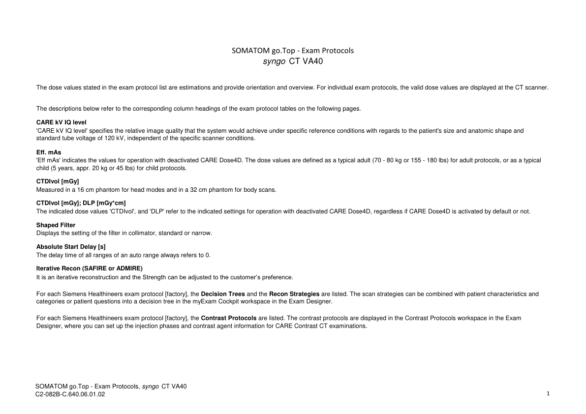
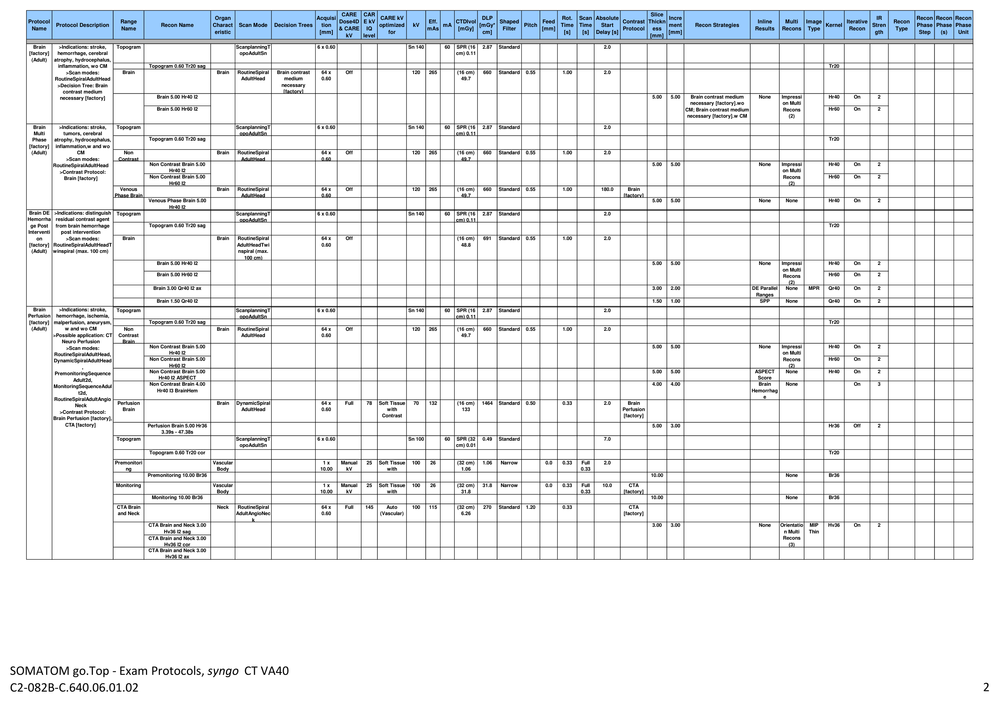
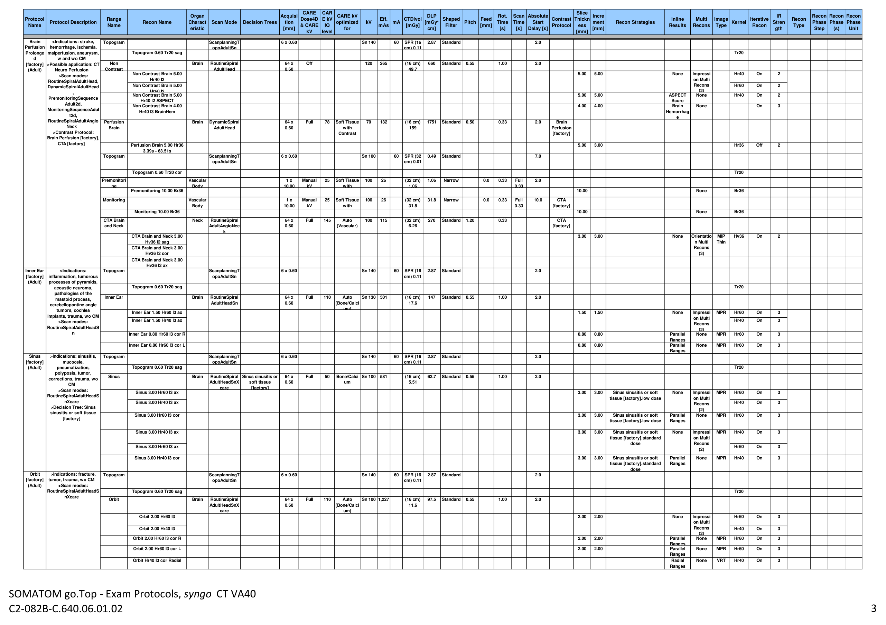

# CT — Parametri aparat: Go Top 128 Protocols (VA40) (MCB)

## Documentul original MCB — Parametri aparat: Go Top 128 Protocols (VA40)

**Manual de aparat · 50 pagini · consultat la 2026-09-27.**

[Descarcă PDF-ul integral](../../assets/mcb-modalities/ct-parametri-aparat-go-top-128-protocols-va40-mcb/document.pdf) · [Sursa MCB](https://ref.mcbradiology.com/Protocols,%20Policies,%20Worksheets%20&%20Forms/CT/Protocols/Default/Go%20Top%20128%20Protocols%20%28VA40%29.pdf) · [Catalogul MCB pentru această modalitate](../mcb/index.md)

Instrucțiunile, valorile și ilustrațiile din documentul original sunt păstrate în **engleză**. Titlul și navigarea sunt în română.

Previzualizarea de mai jos prezintă primele 3 pagini. **PDF-ul descărcabil conține toate cele 50 de pagini.**

### Pagina 1

{ loading=lazy }

### Pagina 2

{ loading=lazy }

### Pagina 3

{ loading=lazy }

## Textul documentului original

??? abstract "Pagina 1 — text în engleză"

    
SOMATOM go.Top - Exam Protocols 
    syngo  CT VA40
    The dose values stated in the exam protocol list are estimations and provide orientation and overview. For individual exam protocols, the valid dose values are displayed at the CT scanner. 
    The descriptions below refer to the corresponding column headings of the exam protocol tables on the following pages.
    CARE kV IQ level
    &#x27;CARE kV IQ level&#x27; specifies the relative image quality that the system would achieve under specific reference conditions with regards to the patient&#x27;s size and anatomic shape and 
    standard tube voltage of 120 kV, independent of the specific scanner conditions.
    Eff. mAs
    &#x27;Eff mAs&#x27; indicates the values for operation with deactivated CARE Dose4D. The dose values are defined as a typical adult (70 - 80 kg or 155 - 180 lbs) for adult protocols, or as a typical 
    child (5 years, appr. 20 kg or 45 lbs) for child protocols.
    CTDIvol [mGy]
    Measured in a 16 cm phantom for head modes and in a 32 cm phantom for body scans.
    CTDIvol [mGy]; DLP [mGy*cm]
    The indicated dose values &#x27;CTDIvol&#x27;, and &#x27;DLP&#x27; refer to the indicated settings for operation with deactivated CARE Dose4D, regardless if CARE Dose4D is activated by default or not. 
    Shaped Filter
    Displays the setting of the filter in collimator, standard or narrow. 
    Absolute Start Delay [s]
    The delay time of all ranges of an auto range always refers to 0.
    Iterative Recon (SAFIRE or ADMIRE)
    It is an iterative reconstruction and the Strength can be adjusted to the customer’s preference.
    For each Siemens Healthineers exam protocol [factory], the Decision Trees and the Recon Strategies are listed. The scan strategies can be combined with patient characteristics and 
    categories or patient questions into a decision tree in the myExam Cockpit workspace in the Exam Designer.
    For each Siemens Healthineers exam protocol [factory], the Contrast Protocols are listed. The contrast protocols are displayed in the Contrast Protocols workspace in the Exam 
    Designer, where you can set up the injection phases and contrast agent information for CARE Contrast CT examinations.  
    SOMATOM go.Top - Exam Protocols, syngo CT VA40 
    C2-082B-C.640.06.01.02
    1
    

??? abstract "Pagina 2 — text în engleză"

    
CARE 
    Slice 
    Organ 
    Acquisi
    CARE kV 
    DLP 
    Rot. 
    Absolute 
    IR 
    Recon 
    Recon 
    Recon 
    Protocol 
    Dose4D 
    CAR
    E kV 
    Shaped 
    Thickn
    Multi 
    Image 
    Recon 
    Charact
    Scan Mode
    Decision Trees
    tion 
    optimized 
    kV
    Eff. 
    [mGy*
    Time 
    Scan 
    Time 
    Start 
    Incre
    ment 
    Recon Strategies
    Inline 
    Stren
    Phase 
    Phase
    Phase 
    Name
    Protocol Description
    Range 
    Name
    Recon Name
    &amp; CARE 
    IQ 
    mAs mA CTDIvol 
    [mGy]
    Filter
    Pitch
    Feed 
    [mm]
    Contrast 
    Protocol
    ess 
    Results
    Recons
    Type
    Kernel
    Iterative 
    Recon
    Type
    eristic
    [mm]
    for
    cm]
    [s]
    [s]
    Delay [s]
    [mm]
    gth
    Step
    (s)
    Unit
    kV
    level
    [mm]
    Topogram
    ScanplanningT
    6 x 0.60
    Sn 140
    60
    SPR (16 
    2.87
    Standard
    2.0
    opoAdultSn
    cm) 0.11
    Brain 
    [factory] 
    (Adult)
    Topogram 0.60 Tr20 sag
    Tr20
    Brain
    Brain
    RoutineSpiral
    Brain contrast 
    Off
    120
    265
    (16 cm) 
    660
    Standard
    0.55
    1.00
    2.0
    AdultHead
    medium 
    64 x 
    0.60
    49.7
    necessary 
    [factory]
    Brain 5.00 Hr40 I2
    Hr40
    On
    2
    &gt;Indications: stroke, 
    hemorrhage, cerebral 
    atrophy, hydrocephalus, 
    inflammation, wo CM
    &gt;Scan modes: 
    RoutineSpiralAdultHead
    &gt;Decision Tree: Brain 
    contrast medium 
    necessary [factory]
    Brain 5.00 Hr60 I2
    Hr60
    On
    2
    5.00
    5.00
    Brain contrast medium 
    necessary [factory].wo 
    CM; Brain contrast medium 
    necessary [factory].w CM
    None
    Impressi
    on Multi 
    Recons 
    (2)
    Topogram
    ScanplanningT
    6 x 0.60
    Sn 140
    60
    SPR (16 
    2.87
    Standard
    2.0
    opoAdultSn
    cm) 0.11
    Topogram 0.60 Tr20 sag
    Tr20
    Brain 
    Multi 
    Phase 
    [factory] 
    (Adult)
    Non 
    Brain
    RoutineSpiral
    Off
    120
    265
    (16 cm) 
    660
    Standard
    0.55
    1.00
    2.0
    Contrast 
    AdultHead
    64 x 
    0.60
    49.7
    Non Contrast Brain 5.00 
    5.00
    Hr40
    On
    2
    Hr40 I2
    Non Contrast Brain 5.00 
    Hr60
    On
    2
    &gt;Indications: stroke, 
    tumors, cerebral 
    atrophy, hydrocephalus, 
    inflammation,w and wo 
    CM 
    &gt;Scan modes: 
    RoutineSpiralAdultHead 
    &gt;Contrast Protocol: 
    Brain [factory] 
    Hr60 I2
    5.00
    None
    Impressi
    on Multi 
    Recons 
    (2)
    Venous 
    Brain
    RoutineSpiral
    Off
    120
    265
    (16 cm) 
    660
    Standard
    0.55
    1.00
    180.0
    Brain 
    Phase Brain
    AdultHead
    64 x 
    0.60
    49.7
    [factory]
    Venous Phase Brain 5.00 
    5.00
    5.00
    None
    None
    Hr40
    On
    2
    Hr40 I2
    Topogram
    ScanplanningT
    6 x 0.60
    Sn 140
    60
    SPR (16 
    2.87
    Standard
    2.0
    opoAdultSn
    cm) 0.11
    Topogram 0.60 Tr20 sag
    Tr20
    Brain
    Brain
    RoutineSpiral
    Off
    (16 cm) 
    691
    Standard
    0.55
    1.00
    2.0
    AdultHeadTwi
    64 x 
    0.60
    48.8
    nspiral (max. 
    Brain DE 
    Hemorrha
    ge Post 
    Interventi
    on 
    [factory] 
    (Adult)
    &gt;Indications: distinguish 
    residual contrast agent 
    from brain hemorrhage 
    post intervention 
    &gt;Scan modes: 
    RoutineSpiralAdultHeadT
    winspiral (max. 100 cm) 
    100 cm)
    Brain 5.00 Hr40 I2
    Hr40
    On
    2
    5.00
    5.00
    Brain 5.00 Hr60 I2
    Hr60
    On
    2
    None
    Impressi
    on Multi 
    Recons 
    (2)
    Brain 3.00 Qr40 I2 ax
    3.00
    2.00
    DE Parallel 
    None
    MPR
    Qr40
    On
    2
    Ranges
    Brain 1.50 Qr40 I2
    1.50
    1.00
    SPP
    None
    Qr40
    On
    2
    Topogram
    ScanplanningT
    6 x 0.60
    Sn 140
    60
    SPR (16 
    2.87
    Standard
    2.0
    opoAdultSn
    cm) 0.11
    Topogram 0.60 Tr20 sag
    Tr20
    Brain 
    Perfusion 
    [factory] 
    (Adult)
    Non 
    Brain
    RoutineSpiral
    Off
    120
    265
    (16 cm) 
    660
    Standard
    0.55
    1.00
    2.0
    Contrast 
    AdultHead
    64 x 
    0.60
    49.7
    Brain
    Non Contrast Brain 5.00 
    Hr40
    On
    2
    Hr40 I2
    Non Contrast Brain 5.00 
    Hr60
    On
    2
    Hr60 I2
    5.00
    5.00
    None
    Impressi
    on Multi 
    Recons 
    (2)
    Non Contrast Brain 5.00 
    5.00
    5.00
    ASPECT 
    None
    Hr40
    On
    2
    Hr40 I2 ASPECT
    Score
    Non Contrast Brain 4.00 
    4.00
    4.00
    Brain 
    None
    On
    3
    Hr40 I3 BrainHem
    Hemorrhag
    e
    Perfusion 
    Brain
    DynamicSpiral
    Full
    78
    Soft Tissue 
    70
    132
    (16 cm) 
    1464
    Standard
    0.50
    0.33
    2.0
    Brain 
    Brain
    AdultHead
    64 x 
    0.60
    with 
    133
    Perfusion 
    Contrast
    [factory]
    &gt;Indications: stroke, 
    hemorrhage, ischemia, 
    malperfusion, aneurysm, 
    w and wo CM 
    &gt;Possible application: CT 
    Neuro Perfusion 
    &gt;Scan modes: 
    RoutineSpiralAdultHead, 
    DynamicSpiralAdultHead
    , 
    PremonitoringSequence
    Adult2d, 
    MonitoringSequenceAdul
    t2d, 
    RoutineSpiralAdultAngio
    Neck 
    &gt;Contrast Protocol: 
    Brain Perfusion [factory], 
    CTA [factory] 
    Perfusion Brain 5.00 Hr36 
    5.00
    3.00
    Hr36
    Off
    2
    3.39s - 47.38s
    Topogram
    ScanplanningT
    6 x 0.60
    Sn 100
    60
    SPR (32 
    0.49
    Standard
    7.0
    opoAdultSn
    cm) 0.01
    Topogram 0.60 Tr20 cor
    Tr20
    Premonitori
    Vascular 
    1 x 
    Manual 
    25
    Soft Tissue 
    100
    26
    (32 cm) 
    1.06
    Narrow
    0.0
    0.33
    Full 
    2.0
    ng
    Body
    10.00
    kV
    with 
    1.06
    0.33
    Premonitoring 10.00 Br36
    10.00
    None
    Br36
    Monitoring
    Vascular 
    1 x 
    Manual 
    25
    Soft Tissue 
    100
    26
    (32 cm) 
    31.8
    Narrow
    0.0
    0.33
    Full 
    10.0
    CTA 
    Body
    10.00
    kV
    with 
    31.8
    0.33
    [factory]
    Monitoring 10.00 Br36
    10.00
    None
    Br36
    CTA Brain 
    Neck
    RoutineSpiral
    Full
    145
    Auto 
    100
    115
    (32 cm) 
    270
    Standard
    1.20
    0.33
    CTA 
    and Neck
    AdultAngioNec
    64 x 
    0.60
    (Vascular)
    6.26
    [factory]
    k
    CTA Brain and Neck 3.00 
    Hv36
    On
    2
    3.00
    3.00
    Hv36 I2 sag
    MIP 
    Thin
    CTA Brain and Neck 3.00 
    None
    Orientatio
    n Multi 
    Recons 
    (3)
    Hv36 I2 cor
    CTA Brain and Neck 3.00 
    Hv36 I2 ax
    SOMATOM go.Top - Exam Protocols, syngo CT VA40 
    C2-082B-C.640.06.01.02
    2
    

??? abstract "Pagina 3 — text în engleză"

    
CARE 
    Slice 
    Organ 
    Acquisi
    CARE kV 
    DLP 
    Rot. 
    Absolute 
    IR 
    Recon 
    Recon 
    Recon 
    Protocol 
    Dose4D 
    CAR
    E kV 
    Shaped 
    Thickn
    Multi 
    Image 
    Recon 
    Charact
    Scan Mode
    Decision Trees
    tion 
    optimized 
    kV
    Eff. 
    [mGy*
    Time 
    Scan 
    Time 
    Start 
    Incre
    ment 
    Recon Strategies
    Inline 
    Stren
    Phase 
    Phase
    Phase 
    Name
    Protocol Description
    Range 
    Name
    Recon Name
    &amp; CARE 
    IQ 
    mAs mA CTDIvol 
    [mGy]
    Filter
    Pitch
    Feed 
    [mm]
    Contrast 
    Protocol
    ess 
    Results
    Recons
    Type
    Kernel
    Iterative 
    Recon
    Type
    eristic
    [mm]
    for
    cm]
    [s]
    [s]
    Delay [s]
    [mm]
    gth
    Step
    (s)
    Unit
    kV
    level
    [mm]
    Topogram
    ScanplanningT
    6 x 0.60
    Sn 140
    60
    SPR (16 
    2.87
    Standard
    2.0
    opoAdultSn
    cm) 0.11
    Topogram 0.60 Tr20 sag
    Tr20
    Non 
    Brain
    RoutineSpiral
    Off
    120
    265
    (16 cm) 
    660
    Standard
    0.55
    1.00
    2.0
    Contrast 
    AdultHead
    64 x 
    0.60
    49.7
    Brain 
    Perfusion 
    Prolonge
    d 
    [factory] 
    (Adult)
    Non Contrast Brain 5.00 
    5.00
    5.00
    Hr40
    On
    2
    Hr40 I2
    Non Contrast Brain 5.00 
    Hr60
    On
    2
    None
    Impressi
    on Multi 
    Recons 
    (2)
    Hr60 I2
    Non Contrast Brain 5.00 
    5.00
    5.00
    ASPECT 
    None
    Hr40
    On
    2
    Hr40 I2 ASPECT
    Score
    Non Contrast Brain 4.00 
    4.00
    4.00
    Brain 
    None
    On
    3
    Hr40 I3 BrainHem
    Hemorrhag
    e
    Perfusion 
    Brain
    DynamicSpiral
    Full
    78
    Soft Tissue 
    70
    132
    (16 cm) 
    1751
    Standard
    0.50
    0.33
    2.0
    Brain 
    Brain
    AdultHead
    64 x 
    0.60
    with 
    159
    Perfusion 
    Contrast
    [factory]
    &gt;Indications: stroke, 
    hemorrhage, ischemia, 
    malperfusion, aneurysm, 
    w and wo CM 
    &gt;Possible application: CT 
    Neuro Perfusion 
    &gt;Scan modes: 
    RoutineSpiralAdultHead, 
    DynamicSpiralAdultHead
    , 
    PremonitoringSequence
    Adult2d, 
    MonitoringSequenceAdul
    t2d, 
    RoutineSpiralAdultAngio
    Neck 
    &gt;Contrast Protocol: 
    Brain Perfusion [factory], 
    CTA [factory] 
    Perfusion Brain 5.00 Hr36 
    5.00
    3.00
    Hr36
    Off
    2
    3.39s - 63.51s
    Topogram
    ScanplanningT
    6 x 0.60
    Sn 100
    60
    SPR (32 
    0.49
    Standard
    7.0
    opoAdultSn
    cm) 0.01
    Topogram 0.60 Tr20 cor
    Tr20
    Premonitori
    Vascular 
    1 x 
    Manual 
    25
    Soft Tissue 
    100
    26
    (32 cm) 
    1.06
    Narrow
    0.0
    0.33
    Full 
    2.0
    ng
    Body
    10.00
    kV
    with 
    1.06
    0.33
    Premonitoring 10.00 Br36
    10.00
    None
    Br36
    Monitoring
    Vascular 
    1 x 
    Manual 
    25
    Soft Tissue 
    100
    26
    (32 cm) 
    31.8
    Narrow
    0.0
    0.33
    Full 
    10.0
    CTA 
    Body
    10.00
    kV
    with 
    31.8
    0.33
    [factory]
    Contrast
    Monitoring 10.00 Br36
    10.00
    None
    Br36
    CTA Brain 
    Neck
    RoutineSpiral
    Full
    145
    Auto 
    100
    115
    (32 cm) 
    270
    Standard
    1.20
    0.33
    CTA 
    and Neck
    AdultAngioNec
    64 x 
    0.60
    (Vascular)
    6.26
    [factory]
    k
    CTA Brain and Neck 3.00 
    Hv36 I2 sag
    MIP 
    Thin
    CTA Brain and Neck 3.00 
    Hv36
    On
    2
    3.00
    3.00
    None
    Orientatio
    n Multi 
    Recons 
    (3)
    Hv36 I2 cor
    CTA Brain and Neck 3.00 
    Hv36 I2 ax
    Topogram
    ScanplanningT
    6 x 0.60
    Sn 140
    60
    SPR (16 
    2.87
    Standard
    2.0
    opoAdultSn
    cm) 0.11
    Inner Ear 
    [factory] 
    (Adult)
    Topogram 0.60 Tr20 sag
    Tr20
    Inner Ear
    Brain
    RoutineSpiral
    Full
    110
    Auto 
    Sn 130
    501
    (16 cm) 
    147
    Standard
    0.55
    1.00
    2.0
    AdultHeadSn
    64 x 
    0.60
    (Bone/Calci
    17.6
    um)
    Inner Ear 1.50 Hr60 I3 ax
    Hr60
    On
    3
    MPR
    Inner Ear 1.50 Hr40 I3 ax
    Hr40
    On
    3
    1.50
    1.50
    None
    Impressi
    on Multi 
    Recons 
    (2)
    &gt;Indications: 
    inflammation, tumorous 
    processes of pyramids, 
    acoustic neuroma, 
    pathologies of the 
    mastoid process, 
    cerebellopontine angle 
    tumors, cochlea 
    implants, trauma, wo CM
    &gt;Scan modes: 
    RoutineSpiralAdultHeadS
    n
    None
    MPR
    Hr60
    On
    3
    Inner Ear 0.80 Hr60 I3 cor R
    0.80
    0.80
    Parallel 
    Ranges
    None
    MPR
    Hr60
    On
    3
    Inner Ear 0.80 Hr60 I3 cor L
    0.80
    0.80
    Parallel 
    Ranges
    Topogram
    ScanplanningT
    6 x 0.60
    Sn 140
    60
    SPR (16 
    2.87
    Standard
    2.0
    opoAdultSn
    cm) 0.11
    Topogram 0.60 Tr20 sag
    Tr20
    Sinus 
    [factory] 
    (Adult)
    Sinus
    Brain
    RoutineSpiral
    Sinus sinusitis or 
    Full
    50
    Bone/Calci
    Sn 100
    581
    (16 cm) 
    62.7
    Standard
    0.55
    1.00
    2.0
    AdultHeadSnX
    soft tissue 
    64 x 
    0.60
    um
    5.51
    care
    [factory]
    Sinus 3.00 Hr60 I3 ax
    Hr60
    On
    3
    MPR
    3.00
    3.00
    Sinus sinusitis or soft 
    tissue [factory].low dose
    Sinus 3.00 Hr40 I3 ax
    Hr40
    On
    3
    None
    Impressi
    on Multi 
    Recons 
    (2)
    Sinus 3.00 Hr60 I3 cor
    3.00
    3.00
    Sinus sinusitis or soft 
    None
    MPR
    Hr60
    On
    3
    &gt;Indications: sinusitis, 
    mucocele, 
    pneumatization, 
    polyposis, tumor, 
    corrections, trauma, wo 
    CM 
    &gt;Scan modes: 
    RoutineSpiralAdultHeadS
    nXcare 
    &gt;Decision Tree: Sinus 
    sinusitis or soft tissue 
    [factory] 
    tissue [factory].low dose
    Parallel 
    Ranges
    Sinus 3.00 Hr40 I3 ax
    Hr40
    On
    3
    MPR
    3.00
    3.00
    Sinus sinusitis or soft 
    tissue [factory].standard 
    dose
    Sinus 3.00 Hr60 I3 ax
    Hr60
    On
    3
    None
    Impressi
    on Multi 
    Recons 
    (2)
    Sinus 3.00 Hr40 I3 cor
    3.00
    3.00
    Sinus sinusitis or soft 
    None
    MPR
    Hr40
    On
    3
    tissue [factory].standard 
    Parallel 
    Ranges
    dose
    Topogram
    ScanplanningT
    6 x 0.60
    Sn 140
    60
    SPR (16 
    2.87
    Standard
    2.0
    opoAdultSn
    cm) 0.11
    Orbit 
    [factory] 
    (Adult)
    Topogram 0.60 Tr20 sag
    Tr20
    &gt;Indications: fracture, 
    tumor, trauma, wo CM 
    &gt;Scan modes: 
    RoutineSpiralAdultHeadS
    nXcare 
    Orbit
    Brain
    RoutineSpiral
    Full
    110
    Auto 
    Sn 100 1,227
    (16 cm) 
    97.5
    Standard
    0.55
    1.00
    2.0
    AdultHeadSnX
    64 x 
    0.60
    (Bone/Calci
    11.6
    care
    um)
    Orbit 2.00 Hr60 I3
    Hr60
    On
    3
    2.00
    Orbit 2.00 Hr40 I3
    Hr40
    On
    3
    2.00
    None
    Impressi
    on Multi 
    Recons 
    (2)
    None
    MPR
    Hr60
    On
    3
    Orbit 2.00 Hr60 I3 cor R
    2.00
    2.00
    Parallel 
    Ranges
    None
    MPR
    Hr60
    On
    3
    Orbit 2.00 Hr60 I3 cor L
    2.00
    2.00
    Parallel 
    Ranges
    Orbit Hr40 I3 cor Radial
    Radial 
    None
    VRT
    Hr40
    On
    3
    Ranges
    SOMATOM go.Top - Exam Protocols, syngo CT VA40 
    C2-082B-C.640.06.01.02
    3
    

??? abstract "Pagina 4 — text în engleză"

    
CARE 
    Slice 
    Organ 
    Acquisi
    CARE kV 
    DLP 
    Rot. 
    Absolute 
    IR 
    Recon 
    Recon 
    Recon 
    Protocol 
    Dose4D 
    CAR
    E kV 
    Shaped 
    Thickn
    Multi 
    Image 
    Recon 
    Charact
    Scan Mode
    Decision Trees
    tion 
    optimized 
    kV
    Eff. 
    [mGy*
    Time 
    Scan 
    Time 
    Start 
    Incre
    ment 
    Recon Strategies
    Inline 
    Stren
    Phase 
    Phase
    Phase 
    Name
    Protocol Description
    Range 
    Name
    Recon Name
    &amp; CARE 
    IQ 
    mAs mA CTDIvol 
    [mGy]
    Filter
    Pitch
    Feed 
    [mm]
    Contrast 
    Protocol
    ess 
    Results
    Recons
    Type
    Kernel
    Iterative 
    Recon
    Type
    eristic
    [mm]
    for
    cm]
    [s]
    [s]
    Delay [s]
    [mm]
    gth
    Step
    (s)
    Unit
    kV
    level
    [mm]
    Topogram
    ScanplanningT
    6 x 0.60
    Sn 140
    60
    SPR (16 
    2.87
    Standard
    2.0
    opoAdultSn
    cm) 0.11
    Dental 
    [factory] 
    (Adult)
    Topogram 0.60 Tr20 sag
    Tr20
    Dental
    Brain
    RoutineSpiral
    Full
    65
    Bone/Calci
    120
    50
    (16 cm) 
    59.0
    Standard
    0.55
    1.00
    2.0
    AdultHead
    64 x 
    0.60
    um
    9.38
    Dental 1.00 Hr60 I3
    1.00
    0.70
    None
    None
    Hr60
    On
    3
    Dental 5.00 Hr60 I3 ax
    5.00
    5.00
    None
    None
    MPR
    Hr60
    On
    3
    Topogram
    ScanplanningT
    6 x 0.60
    Sn 140
    60
    SPR (32 
    1.62
    Standard
    7.0
    opoAdultSn
    cm) 0.06
    &gt;Indications: display and 
    measurement of the 
    bone structures of the 
    upper and lower jaw as 
    the basis for planning in 
    oral surgery, wo CM
    &gt;Possible application: CT 
    Dental
    Neck 
    [factory] 
    (Adult)
    Topogram 0.60 Tr20 sag
    Tr20
    Neck
    Neck
    RoutineSpiral
    Neck contrast 
    Full
    155
    Non-
    120
    119
    (32 cm) 
    213
    Standard
    0.80
    1.00
    7.0
    AdultNeck
    medium 
    64 x 
    0.60
    Contrast
    10.7
    necessary 
    [factory]
    Neck 5.00 Br40 I3 sag
    MPR
    Br40
    5.00
    On
    3
    Neck 5.00 Br40 I3 cor
    &gt;Indications: masses, 
    tumor, metastases, 
    lymphoma, lymph nodes 
    in the larynx or pharynx 
    region, w/wo CM
    &gt;Scan modes: 
    RoutineSpiralAdultNeck
    &gt;Decision Tree: Neck 
    contrast medium 
    necessary [factory]
    5.00
    Neck contrast medium 
    necessary [factory].wo 
    CM; Neck contrast medium 
    necessary [factory].w CM
    None
    Orientatio
    n Multi 
    Recons 
    (3)
    Neck 5.00 Br40 I3 ax
    Topogram
    ScanplanningT
    6 x 0.60
    Sn 140
    60
    SPR (32 
    1.62
    Standard
    7.0
    opoAdultSn
    cm) 0.06
    Topogram 0.60 Tr20 sag
    Tr20
    Venous 
    Neck
    RoutineSpiral
    Neck VNC 
    Full
    155
    Auto (Soft 
    AuSn 
    362
    (32 cm) 
    224
    Standard
    0.45
    0.33
    45.0
    Neck 
    Neck DE 
    Virtual 
    Non 
    Contrast 
    [factory] 
    (Adult)
    Phase Neck
    AdultNeckTwi
    TwinBeam DE 
    64 x 
    0.60
    Tissue with 
    120
    10.1
    [factory]
    nbeam
    possible [factory]
    Contrast)
    Venous Phase Neck 5.00 
    MPR
    Br40
    On
    5.00
    5.00
    Br40 I3 sag
    Venous Phase Neck 5.00 
    None
    Orientatio
    n Multi 
    Recons 
    (3)
    Br40 I3 cor
    &gt;Indications: masses, 
    tumor, metastases, 
    lymphoma, lymph nodes 
    in the larynx or pharynx 
    region, w CM 
    &gt;Scan modes: 
    RoutineSpiralAdultNeckT
    winbeam 
    &gt;Decision Tree: Neck 
    VNC TwinBeam DE 
    possible [factory] 
    &gt;Contrast Protocol: Neck 
    [factory] 
    3
    Neck VNC TwinBeam DE 
    possible 
    [factory].TwinBeam DE; 
    Neck VNC TwinBeam DE 
    possible [factory].Single 
    Energy
    Venous Phase Neck 5.00 
    Br40 I3 ax
    Venous Phase Neck 3.00 
    Qr40 I3 sag
    DE Parallel 
    Ranges
    Venous Phase Neck 3.00 
    MPR
    Qr40
    On
    3
    3.00
    2.00
    Neck VNC TwinBeam DE 
    possible 
    [factory].TwinBeam DE
    Qr40 I3 cor
    Orientatio
    n Multi 
    Recons 
    (3)
    Venous Phase Neck 3.00 
    Qr40 I3 ax
    Venous Phase Neck 1.50 
    1.50
    1.00
    Neck VNC TwinBeam DE 
    SPP
    None
    Qr40
    On
    3
    Qr40 I3
    possible 
    [factory].TwinBeam DE
    Topogram
    ScanplanningT
    6 x 0.60
    Sn 100
    60
    SPR (32 
    0.30
    Standard
    2.0
    opoAdultSn
    cm) 0.01
    Shoulder 
    [factory] 
    (Adult)
    Topogram 0.60 Tr20 cor
    Tr20
    Shoulder
    Shoulder
    RoutineSpiral
    Full
    130
    Auto 
    120
    100
    (32 cm) 
    152
    Standard
    0.80
    1.00
    2.0
    AdultShoulder
    Side [factory]
    64 x 
    0.60
    (Bone/Calci
    8.96
    um)
    None
    None
    MPR
    Br60
    On
    3
    Shoulder 5.00 Br60 I3 ax
    5.00
    5.00
    Side [factory].recon both; 
    Side [factory].recon right; 
    Side [factory].recon left
    &gt;Indications: evaluation 
    of joint cavities, trauma, 
    dislocations, orthopedic 
    indications, shoulder 
    joint, wo CM 
    &gt;Scan modes: 
    RoutineSpiralAdultShoul
    der 
    &gt;Decision Tree: Side 
    [factory] 
    Shoulder 3.00 Br60 I3 sag R
    MPR
    Br60
    On
    3.00
    3.00
    3
    Side [factory].recon both; 
    Side [factory].recon right
    Parallel 
    Ranges
    Shoulder 3.00 Br60 I3 cor R
    Orientatio
    n Multi 
    Recons 
    (3)
    Shoulder 3.00 Br60 I3 ax R
    Shoulder 3.00 Br40 I3 sag R
    MPR
    Br40
    On
    3
    3.00
    3.00
    Side [factory].recon both; 
    Side [factory].recon right
    Parallel 
    Ranges
    Shoulder 3.00 Br40 I3 cor R
    Orientatio
    n Multi 
    Recons 
    (3)
    Shoulder 3.00 Br40 I3 ax R
    Shoulder 3.00 Br60 I3 sag L
    MPR
    Br60
    On
    3
    3.00
    3.00
    Side [factory].recon both; 
    Side [factory].recon left
    Parallel 
    Ranges
    Shoulder 3.00 Br60 I3 cor L
    Orientatio
    n Multi 
    Recons 
    (3)
    Shoulder 3.00 Br60 I3 ax L
    Shoulder 3.00 Br40 I3 sag L
    MPR
    Br40
    On
    3
    3.00
    3.00
    Side [factory].recon both; 
    Side [factory].recon left
    Parallel 
    Ranges
    Shoulder 3.00 Br40 I3 cor L
    Orientatio
    n Multi 
    Recons 
    (3)
    Shoulder 3.00 Br40 I3 ax L
    Thorax
    [factory]
    (Adult)
    &gt;Indications: masses,
    tumor, metastases,
    lymphoma, lymph nodes,
    tuberculosis, empyema,
    infection, early
    visualization of
    pulmonary nodules,
    screening of the lung,
    w/wo CM
    &gt;Scan modes:
    RoutineSpiralAdultThora
    x 
    &gt;Decision Tree: Thorax
    multi [factory]
    SOMATOM go.Top - Exam Protocols, syngo CT VA40 
    C2-082B-C.640.06.01.02
    4
    

??? abstract "Pagina 5 — text în engleză"

    
CARE 
    Slice 
    Organ 
    Acquisi
    CARE kV 
    DLP 
    Rot. 
    Absolute 
    IR 
    Recon 
    Recon 
    Recon 
    Protocol 
    Dose4D 
    CAR
    E kV 
    Shaped 
    Thickn
    Multi 
    Image 
    Recon 
    Charact
    Scan Mode
    Decision Trees
    tion 
    optimized 
    kV
    Eff. 
    [mGy*
    Time 
    Scan 
    Time 
    Start 
    Incre
    ment 
    Recon Strategies
    Inline 
    Stren
    Phase 
    Phase
    Phase 
    Name
    Protocol Description
    Range 
    Name
    Recon Name
    &amp; CARE 
    IQ 
    mAs mA CTDIvol 
    [mGy]
    Filter
    Pitch
    Feed 
    [mm]
    Contrast 
    Protocol
    ess 
    Results
    Recons
    Type
    Kernel
    Iterative 
    Recon
    Type
    eristic
    [mm]
    for
    cm]
    [s]
    [s]
    Delay [s]
    [mm]
    gth
    Step
    (s)
    Unit
    kV
    level
    [mm]
    Topogram
    ScanplanningT
    6 x 0.60
    Sn 100
    60
    SPR (32 
    0.49
    Standard
    6.0
    opoAdultSn
    cm) 0.01
    Thorax 
    [factory] 
    (Adult)
    Topogram 0.60 Tr20 cor
    Tr20
    Thorax
    Thorax
    RoutineSpiral
    Thorax multi 
    Full
    80
    Non-
    120
    62
    (32 cm) 
    184
    Standard
    1.20
    0.33
    6.0
    AdultThorax
    [factory]
    64 x 
    0.60
    Contrast
    5.55
    Thorax 5.00 Br40 I3 cor
    None
    Orientatio
    n Multi 
    Recons 
    (2)
    Thorax 5.00 Br40 I3 ax
    Thorax 5.00 Bl60 I3 sag
    5.00
    5.00
    None
    Bl60
    On
    3
    MIP 
    Thin
    &gt;Indications: masses, 
    tumor, metastases, 
    lymphoma, lymph nodes, 
    tuberculosis, empyema, 
    infection, early 
    visualization of 
    pulmonary nodules, 
    screening of the lung, 
    w/wo CM 
    &gt;Scan modes: 
    RoutineSpiralAdultThora
    x 
    &gt;Decision Tree: Thorax 
    multi [factory] 
    MPR
    Br40
    On
    3
    5.00
    5.00
    Thorax multi [factory].wo CM 
    wo X-CARE; Thorax multi 
    [factory].wo CM w X-CARE; 
    Thorax multi [factory].wo CM 
    fast acquisition wo X-CARE; 
    Thorax multi [factory].w CM 
    wo X-CARE; Thorax multi 
    [factory].w CM w X-CARE; 
    Thorax multi [factory].w CM 
    fast acquisition wo X-CARE
    Thorax 5.00 Bl60 I3 cor
    Orientatio
    n Multi 
    Recons 
    (3)
    Thorax 5.00 Bl60 I3 ax
    Thorax 10.00 Bl60 I3 cor
    10.00
    10.00
    None
    None
    MIP 
    Bl60
    On
    3
    Thin
    Thorax 1.00 Bl60 I3
    1.00
    0.70
    Lung CAD
    None
    Bl60
    On
    3
    Thorax multi [factory].wo CM 
    wo X-CARE; Thorax multi 
    [factory].wo CM w X-CARE; 
    Thorax multi [factory].wo CM 
    fast acquisition wo X-CARE; 
    Thorax multi [factory].w CM 
    wo X-CARE; Thorax multi 
    [factory].w CM w X-CARE; 
    Thorax multi [factory].w CM 
    fast acquisition wo X-CARE
    Topogram
    ScanplanningT
    6 x 0.60
    Sn 100
    60
    SPR (32 
    0.49
    Standard
    6.0
    opoAdultSn
    cm) 0.01
    Topogram 0.60 Tr20 cor
    Tr20
    Thorax 
    Dynamic 
    [factory] 
    (Adult)
    Premonitori
    Vascular 
    1 x 
    Manual 
    25
    Soft Tissue 
    120
    19
    (32 cm) 
    1.30
    Narrow
    0.0
    0.33
    Full 
    2.0
    with 
    ng
    Body
    10.00
    kV
    1.30
    0.33
    Contrast
    Premonitoring 10.00 Br36
    10.00
    None
    Br36
    Monitoring
    Vascular 
    1 x 
    Manual 
    25
    Soft Tissue 
    120
    19
    (32 cm) 
    38.9
    Narrow
    0.0
    0.33
    Full 
    10.0
    Thorax 
    with 
    Body
    10.00
    kV
    38.9
    0.33
    [factory]
    Contrast
    Monitoring 10.00 Br36
    10.00
    None
    Br36
    Thorax
    Thorax
    RoutineSpiral
    Thorax 
    Full
    80
    Auto (Soft 
    120
    62
    (32 cm) 
    184
    Standard
    1.20
    0.33
    Thorax 
    Tissue with 
    AdultThorax
    breathhold and X-
    64 x 
    0.60
    5.55
    [factory]
    Contrast)
    CARE [factory]
    Thorax 5.00 Br40 I3 cor
    5.00
    5.00
    MPR
    Br40
    On
    Thorax 5.00 Br40 I3 ax
    None
    Orientatio
    n Multi 
    Recons 
    (2)
    Thorax 5.00 Bl60 I3 sag
    5.00
    5.00
    None
    Bl60
    On
    3
    Thorax 5.00 Bl60 I3 cor
    MIP 
    Thin
    Orientatio
    n Multi 
    Recons 
    (3)
    3
    Thorax breathhold and X-
    CARE [factory].standard 
    acquisition wo X-CARE; 
    Thorax breathhold and X-
    CARE [factory].standard 
    aquisition w X-CARE; Thorax 
    breathhold and X-CARE 
    [factory].fast acquisition wo X-
    CARE
    &gt;Indications: 
    abnormalities, upper 
    airway obstruction, 
    trachea bronchomalacia, 
    pulmonary air trapping, 
    abnormal diaphragmatic 
    motion, tumor invasion, 
    routine scan in 
    inspiration w CM, 
    dynamic scan during full 
    breathing wo CM 
    &gt;Scan modes: 
    PremonitoringSequence
    Adult2d, 
    MonitoringSequenceAdul
    t2d, 
    RoutineSpiralAdultThora
    x, 
    DynamicSequenceAdultB
    ody 
    &gt;Decision Tree: Thorax 
    breathhold and X&gt;CARE 
    [factory] 
    &gt;Contrast Protocol: 
    Thorax [factory] 
    Thorax 5.00 Bl60 I3 ax
    Thorax 10.00 Bl60 I3 cor
    10.00
    10.00
    None
    None
    MIP 
    Bl60
    On
    3
    Thin
    Thorax 1.00 Bl60 I3
    1.00
    0.70
    Lung CAD
    None
    Bl60
    On
    3
    Thorax breathhold and X-
    CARE [factory].standard 
    acquisition wo X-CARE; 
    Thorax breathhold and X-
    CARE [factory].standard 
    aquisition w X-CARE; 
    Thorax breathhold and X-
    CARE [factory].fast 
    acquisition wo X-CARE
    Dynamic in 
    Abdomen DynamicSequ
    Full
    20
    Non-
    120
    15
    (32 cm) 
    82.6
    Standard
    0.0
    0.33
    Full 
    2.0
    free 
    enceAdultBod
    64 x 
    0.60
    Contrast
    21.5
    0.33
    breathing
    y
    Dynamic in free breathing 
    5.00
    5.00
    Bl60
    On
    3
    5.00 Bl60 I3 2.25s - 9.67s
    Dynamic in 
    Abdomen DynamicSequ
    Full
    20
    Non-
    120
    15
    (32 cm) 
    82.6
    Standard
    0.0
    0.33
    Full 
    2.0
    free 
    enceAdultBod
    64 x 
    0.60
    Contrast
    21.5
    0.33
    breathing
    y
    Dynamic in free breathing 
    5.00
    5.00
    Bl60
    On
    3
    5.00 Bl60 I3 2.25s - 9.67s
    Dynamic in 
    Abdomen DynamicSequ
    Full
    20
    Non-
    120
    15
    (32 cm) 
    82.6
    Standard
    0.0
    0.33
    Full 
    2.0
    free 
    enceAdultBod
    64 x 
    0.60
    Contrast
    21.5
    0.33
    breathing
    y
    Dynamic in free breathing 
    5.00
    5.00
    Bl60
    On
    3
    5.00 Bl60 I3 2.25s - 9.67s
    Dynamic in 
    Abdomen DynamicSequ
    Full
    20
    Non-
    120
    15
    (32 cm) 
    82.6
    Standard
    0.0
    0.33
    Full 
    2.0
    free 
    enceAdultBod
    64 x 
    0.60
    Contrast
    21.5
    0.33
    breathing
    y
    Dynamic in free breathing 
    5.00
    5.00
    Bl60
    On
    3
    5.00 Bl60 I3 2.25s - 9.67s
    SOMATOM go.Top - Exam Protocols, syngo CT VA40 
    C2-082B-C.640.06.01.02
    5
    

??? abstract "Pagina 6 — text în engleză"

    
CARE 
    Slice 
    Organ 
    Acquisi
    CARE kV 
    DLP 
    Rot. 
    Absolute 
    IR 
    Recon 
    Recon 
    Recon 
    Protocol 
    Dose4D 
    CAR
    E kV 
    Shaped 
    Thickn
    Multi 
    Image 
    Recon 
    Charact
    Scan Mode
    Decision Trees
    tion 
    optimized 
    kV
    Eff. 
    [mGy*
    Time 
    Scan 
    Time 
    Start 
    Incre
    ment 
    Recon Strategies
    Inline 
    Stren
    Phase 
    Phase
    Phase 
    Name
    Protocol Description
    Range 
    Name
    Recon Name
    &amp; CARE 
    IQ 
    mAs mA CTDIvol 
    [mGy]
    Filter
    Pitch
    Feed 
    [mm]
    Contrast 
    Protocol
    ess 
    Results
    Recons
    Type
    Kernel
    Iterative 
    Recon
    Type
    eristic
    [mm]
    for
    cm]
    [s]
    [s]
    Delay [s]
    [mm]
    gth
    Step
    (s)
    Unit
    kV
    level
    [mm]
    Topogram
    ScanplanningT
    6 x 0.60
    Sn 100
    60
    SPR (32 
    0.87
    Standard
    6.0
    opoAdultSn
    cm) 0.01
    Topogram 0.60 Tr20 cor
    Tr20
    Thorax and 
    Abdomen RoutineSpiral
    Thorax and 
    Full
    145
    Non-
    120
    91
    (32 cm) 
    510
    Standard
    0.80
    0.33
    6.0
    Abdomen
    AdultAbdomen
    Abdomen 
    64 x 
    0.60
    Contrast
    8.14
    Thorax 
    and 
    Abdomen 
    [factory] 
    (Adult)
    Flexdose
    contrast medium 
    necessary 
    [factory]
    Thorax and Abdomen 5.00 
    5.00
    5.00
    MPR
    Br40
    On
    Br40 I3 cor
    Thorax and Abdomen 5.00 
    Br40 I3 ax
    None
    Orientatio
    n Multi 
    Recons 
    (2)
    &gt;Indications: masses, 
    tumor, lymphoma, lymph 
    nodes of the lung, liver, 
    pancreas, gall bladder, 
    spleen, kidneys, w CM 
    &gt;Scan modes: 
    RoutineSpiralAdultAbdo
    menFlexdose 
    &gt;Decision Tree: Thorax 
    and Abdomen contrast 
    medium necessary 
    [factory] 
    Thorax and Abdomen 5.00 
    5.00
    5.00
    None
    3
    Bl60
    On
    Bl60 I3 sag Lung
    MIP 
    Thin
    3
    Thorax and Abdomen 
    contrast medium 
    necessary [factory].wo 
    CM; Thorax and Abdomen 
    contrast medium 
    necessary [factory].w CM
    Thorax and Abdomen 5.00 
    Bl60 I3 cor Lung
    Orientatio
    n Multi 
    Recons 
    (3)
    Thorax and Abdomen 5.00 
    Bl60 I3 ax Lung
    Thorax and Abdomen 1.00 
    1.00
    0.70
    Thorax and Abdomen contrast 
    Lung CAD
    None
    Bl60
    On
    3
    medium necessary 
    Bl60 I3
    [factory].wo CM; Thorax and 
    Abdomen contrast medium 
    necessary [factory].w CM
    Topogram
    ScanplanningT
    6 x 0.60
    Sn 100
    60
    SPR (32 
    0.87
    Standard
    6.0
    opoAdultSn
    cm) 0.01
    Topogram 0.60 Tr20 cor
    Tr20
    Venous 
    Abdomen RoutineSpiral
    Thorax and 
    Full
    145
    Auto (Soft 
    AuSn 
    257
    (32 cm) 
    458
    Standard
    0.30
    0.33
    60.0
    Thorax 
    Phase 
    AdultAbdomen
    Abdomen VNC 
    64 x 
    0.60
    Tissue with 
    120
    7.14
    [factory]
    Thorax and 
    TwinbeamFlex
    TwinBeam DE 
    Contrast)
    Abdomen
    dose
    possible [factory]
    Thorax 
    and 
    Abdomen 
    DE Virtual 
    non 
    Contrast 
    [factory] 
    (Adult)
    Venous Phase Thorax and 
    5.00
    MPR
    Br40
    Abdomen 5.00 Br40 I3 cor
    Venous Phase Thorax and 
    None
    Orientatio
    n Multi 
    Recons 
    (2)
    Abdomen 5.00 Br40 I3 ax
    Venous Phase Thorax and 
    On
    3
    5.00
    Thorax and Abdomen VNC 
    TwinBeam DE possible 
    [factory].TwinBeam DE; 
    Thorax and Abdomen VNC 
    TwinBeam DE possible 
    [factory].Single Energy
    Abdomen 5.00 Bl60 I3 sag 
    MIP 
    Thin
    Lung
    &gt;Indications: visualize 
    contrast agent uptake in 
    thorax, liver, kidneys or 
    other soft tissues, 
    generate Virtual Non 
    Contrast images, w 
    CM 
    &gt;Scan modes: 
    RoutineSpiralAdultAbdo
    menTwinbeamFlexdose 
    &gt;Decision Tree: Thorax 
    and Abdomen VNC 
    TwinBeam DE possible 
    [factory] 
    &gt;Contrast Protocol: 
    Thorax [factory] 
    Venous Phase Thorax and 
    Bl60
    On
    3
    5.00
    5.00
    None
    Orientatio
    n Multi 
    Recons 
    (3)
    Abdomen 5.00 Bl60 I3 cor 
    Lung
    Venous Phase Thorax and 
    Abdomen 5.00 Bl60 I3 ax 
    Lung
    Parallel 
    Ranges
    Venous Phase Thorax and 
    Abdomen 3.00 Qr40 I3 cor
    Venous Phase Thorax and 
    MPR
    Qr40
    On
    3
    3.00
    3.00
    Thorax and Abdomen VNC 
    TwinBeam DE possible 
    [factory].TwinBeam DE
    Abdomen 3.00 Qr40 I3 ax
    Orientatio
    n Multi 
    Recons 
    (2)
    MPR
    Qr40
    On
    3
    3.00
    2.00
    DE Parallel 
    Ranges
    Venous Phase Thorax and 
    Abdomen 3.00 Qr40 I3 cor
    Venous Phase Thorax and 
    Abdomen 3.00 Qr40 I3 ax
    Orientatio
    n Multi 
    Recons 
    (2)
    Venous Phase Thorax and 
    1.50
    1.00
    SPP
    None
    Qr40
    On
    3
    Abdomen 1.50 Qr40 I3
    Venous Phase Thorax and 
    1.00
    0.70
    Thorax and Abdomen VNC 
    Lung CAD
    None
    Bl60
    On
    3
    Abdomen 1.00 Bl60 I3
    TwinBeam DE possible 
    [factory].TwinBeam DE; 
    Thorax and Abdomen VNC 
    TwinBeam DE possible 
    [factory].Single Energy
    Topogram
    ScanplanningT
    6 x 0.60
    Sn 100
    60
    SPR (32 
    0.87
    Standard
    6.0
    opoAdultSn
    cm) 0.01
    Topogram 0.60 Tr20 cor
    Tr20
    Premonitori
    Vascular 
    1 x 
    Manual 
    25
    Soft Tissue 
    100
    26
    (32 cm) 
    1.06
    Narrow
    0.0
    0.33
    Full 
    2.0
    ng
    Body
    10.00
    kV
    with 
    1.06
    0.33
    Contrast
    Thorax 
    and 
    Abdomen 
    Multi 
    Phase 
    [factory] 
    (Adult)
    Premonitoring 10.00 Br36
    10.00
    None
    Br36
    Monitoring
    Vascular 
    1 x 
    Manual 
    25
    Soft Tissue 
    100
    26
    (32 cm) 
    31.8
    Narrow
    0.0
    0.33
    Full 
    10.0
    Thorax 
    Body
    10.00
    kV
    with 
    31.8
    0.33
    [factory]
    Contrast
    Monitoring 10.00 Br36
    10.00
    None
    Br36
    Arterial 
    Thorax
    RoutineSpiral
    Full
    80
    Auto (Soft 
    120
    62
    (32 cm) 
    184
    Standard
    1.20
    0.33
    Thorax 
    Phase 
    AdultThorax
    64 x 
    0.60
    Tissue with 
    5.55
    [factory]
    Thorax
    Contrast)
    &gt;Indications: masses, 
    tumor, lymphoma, lymph 
    nodes of the lung, liver, 
    pancreas, gall bladder, 
    spleen, kidneys, w CM, 2 
    phases preconfigured 
    &gt;Scan modes: 
    PremonitoringSequence
    Adult2d, 
    MonitoringSequenceAdul
    t2d, 
    RoutineSpiralAdultThora
    x, 
    RoutineSpiralAdultAbdo
    men 
    &gt;Contrast Protocol: 
    Thorax [factory] 
    Arterial Phase Thorax 5.00 
    MPR
    Br40
    On
    3
    5.00
    5.00
    Br40 I3 cor
    Arterial Phase Thorax 5.00 
    Br40 I3 ax
    None
    Orientatio
    n Multi 
    Recons 
    (2)
    Arterial Phase Thorax 5.00 
    Bl60
    On
    3
    5.00
    5.00
    None
    Bl60 I3 sag
    MIP 
    Thin
    Arterial Phase Thorax 5.00 
    Bl60 I3 cor
    Orientatio
    n Multi 
    Recons 
    (3)
    Arterial Phase Thorax 5.00 
    Bl60 I3 ax
    Arterial Phase Thorax 1.00 
    1.00
    0.70
    Lung CAD
    None
    Bl60
    On
    3
    Bl60 I3
    Venous 
    Abdomen RoutineSpiral
    Full
    145
    Auto (Soft 
    120
    112
    (32 cm) 
    221
    Standard
    0.80
    0.33
    75.4
    Thorax 
    Phase 
    AdultAbdomen
    64 x 
    0.60
    Tissue with 
    10.0
    [factory]
    Abdomen
    Contrast)
    Venous Phase Abdomen 
    5.00 Br40 I3 cor
    MPR
    Br40
    On
    3
    5.00
    5.00
    None
    Orientation 
    Multi 
    Recons (2)
    Venous Phase Abdomen 
    5.00 Br40 I3 ax
    SOMATOM go.Top - Exam Protocols, syngo CT VA40 
    C2-082B-C.640.06.01.02
    6
    

??? abstract "Pagina 7 — text în engleză"

    
CARE 
    Slice 
    Organ 
    Acquisi
    CARE kV 
    DLP 
    Rot. 
    Absolute 
    IR 
    Recon 
    Recon 
    Recon 
    Protocol 
    Dose4D 
    CAR
    E kV 
    Shaped 
    Thickn
    Multi 
    Image 
    Recon 
    Charact
    Scan Mode
    Decision Trees
    tion 
    optimized 
    kV
    Eff. 
    [mGy*
    Time 
    Scan 
    Time 
    Start 
    Incre
    ment 
    Recon Strategies
    Inline 
    Stren
    Phase 
    Phase
    Phase 
    Name
    Protocol Description
    Range 
    Name
    Recon Name
    &amp; CARE 
    IQ 
    mAs mA CTDIvol 
    [mGy]
    Filter
    Pitch
    Feed 
    [mm]
    Contrast 
    Protocol
    ess 
    Results
    Recons
    Type
    Kernel
    Iterative 
    Recon
    Type
    eristic
    [mm]
    for
    cm]
    [s]
    [s]
    Delay [s]
    [mm]
    gth
    Step
    (s)
    Unit
    kV
    level
    [mm]
    Topogram
    ScanplanningT
    6 x 0.60
    Sn 100
    60
    SPR (32 
    0.49
    Standard
    6.0
    opoAdultSn
    cm) 0.01
    Topogram 0.60 Tr20 cor
    Tr20
    Lung 
    Screening 
    [factory] 
    (Adult)
    Lung
    Thorax
    RoutineSpiral
    Lung screening 
    Full
    15
    Non-
    Sn 100
    179
    (32 cm) 
    31.4
    Standard
    0.80
    0.33
    6.0
    AdultThoraxSn
    [factory]
    64 x 
    0.60
    Contrast
    0.90
    Lung 5.00 Br40 I3 cor
    None
    Orientatio
    n Multi 
    Recons 
    (2)
    Lung 5.00 Br40 I3 ax
    &gt;Indications: masses, 
    tumor, metastases, 
    lymphoma, lymph nodes, 
    tuberculosis, empyema, 
    infection, early 
    visualization of 
    pulmonary nodules, 
    screening of the lung, 
    w/wo CM 
    &gt;Scan modes: 
    RoutineSpiralAdultThora
    xSn 
    &gt;Decision Tree: Lung 
    screening [factory] 
    MPR
    Br40
    On
    3
    5.00
    5.00
    Lung screening 
    [factory].low dose wo X-
    CARE; Lung screening 
    [factory].low dose w X-
    CARE; Lung screening 
    [factory].high resolution 
    wo X-CARE; Lung 
    screening [factory].high 
    resolution w X-CARE
    Lung 5.00 Bl60 I3 sag
    Bl60
    On
    3
    5.00
    MIP 
    Thin
    Lung 5.00 Bl60 I3 cor
    None
    Orientatio
    n Multi 
    Recons 
    (3)
    5.00
    Lung screening 
    [factory].low dose wo X-
    CARE; Lung screening 
    [factory].low dose w X-
    CARE
    Lung 5.00 Bl60 I3 ax
    Lung 2.00 Bl64 I3 sag
    None
    MIP 
    Thin
    Lung 2.00 Bl64 I3 cor
    Orientatio
    n Multi 
    Recons 
    (3)
    Bl64
    On
    3
    2.00
    2.00
    Lung screening 
    [factory].high resolution 
    wo X-CARE; Lung 
    screening [factory].high 
    resolution w X-CARE
    Lung 2.00 Bl64 I3 ax
    Lung 10.00 Bl60 I3 cor
    10.00
    10.00
    None
    None
    MIP 
    Bl60
    On
    3
    Thin
    Lung 1.00 Bl60 I3
    1.00
    0.70
    Lung CAD
    None
    Bl60
    On
    3
    Lung screening 
    [factory].low dose wo X-
    CARE; Lung screening 
    [factory].low dose w X-
    CARE; Lung screening 
    [factory].high resolution 
    wo X-CARE; Lung 
    screening [factory].high 
    resolution w X-CARE
    Topogram
    ScanplanningT
    6 x 0.60
    Sn 100
    60
    SPR (32 
    0.49
    Standard
    6.0
    opoAdultSn
    cm) 0.01
    Topogram 0.60 Tr20 cor
    Tr20
    Lung Low 
    Dose 
    [factory] 
    (Adult)
    Lung Low Dose 
    Lung
    Thorax
    RoutineSpiral
    Full
    15
    Auto (Non-
    Sn 100
    179
    (32 cm) 
    33.0
    Standard
    1.20
    0.33
    6.0
    breathhold and X-
    AdultThoraxSn
    64 x 
    0.60
    Contrast)
    0.90
    CARE [factory]
    Lung 5.00 Br40 I3 sag
    None
    Orientatio
    n Multi 
    Recons 
    (3)
    &gt;Indications: early 
    visualization of 
    pulmonary nodules, 
    screening of the lung, wo 
    CM 
    &gt;Scan modes: 
    RoutineSpiralAdultThora
    xSn 
    &gt;Decision Tree: Lung 
    Low Dose breathhold 
    and X&gt;CARE [factory] 
    Lung 5.00 Br40 I3 cor
    MPR
    Br40
    On
    3
    5.00
    5.00
    Lung Low Dose breathhold 
    and X-CARE [factory].standard 
    acquisition wo X-CARE; Lung 
    Low Dose breathhold and X-
    CARE [factory].standard 
    aquisition w X-CARE; Lung 
    Low Dose breathhold and X-
    CARE [factory].fast acquisition 
    wo X-CARE
    Lung 5.00 Br40 I3 ax
    Lung 5.00 Bl60 I3 sag
    MIP 
    Thin
    None
    Orientatio
    n Multi 
    Recons 
    (3)
    Lung 5.00 Bl60 I3 cor
    Bl60
    On
    3
    5.00
    5.00
    Lung Low Dose breathhold 
    and X-CARE 
    [factory].standard 
    acquisition wo X-CARE; 
    Lung Low Dose breathhold 
    and X-CARE 
    [factory].standard 
    aquisition w X-CARE; Lung 
    Low Dose breathhold and 
    X-CARE [factory].fast 
    acquisition wo X-CARE
    Lung 5.00 Bl60 I3 ax
    Lung 10.00 Bl60 I3 cor
    10.00
    10.00
    None
    None
    MIP 
    Bl60
    On
    3
    Thin
    Lung 1.00 Bl60 I3
    1.00
    0.70
    Lung CAD
    None
    Bl60
    On
    3
    Lung Low Dose breathhold 
    and X-CARE 
    [factory].standard 
    acquisition wo X-CARE; 
    Lung Low Dose breathhold 
    and X-CARE 
    [factory].standard 
    aquisition w X-CARE; Lung 
    Low Dose breathhold and 
    X-CARE [factory].fast 
    acquisition wo X-CARE
    Topogram
    ScanplanningT
    6 x 0.60
    Sn 100
    60
    SPR (32 
    0.49
    Standard
    6.0
    opoAdultSn
    cm) 0.01
    Abdomen 
    [factory] 
    (Adult)
    Topogram 0.60 Tr20 cor
    Tr20
    Abdomen
    Abdomen RoutineSpiral
    Abdomen 
    Full
    145
    Non-
    120
    112
    (32 cm) 
    321
    Standard
    0.80
    0.50
    6.0
    AdultAbdomen
    contrast medium 
    64 x 
    0.60
    Contrast
    10.0
    necessary 
    [factory]
    Abdomen 5.00 Br40 I3 cor
    Abdomen 5.00 Br40 I3 ax
    None
    Orientatio
    n Multi 
    Recons 
    (2)
    &gt;Indications: masses, 
    tumor, lymphoma, lymph 
    nodes of the liver, 
    pancreas, gall bladder, 
    spleen, kidneys, 
    intestine, w/wo CM 
    &gt;Scan modes: 
    RoutineSpiralAdultAbdo
    men 
    &gt;Decision Tree: 
    Abdomen contrast 
    medium necessary 
    [factory] 
    MPR
    Br40
    On
    3
    5.00
    5.00
    Abdomen contrast medium 
    necessary [factory].wo 
    CM; Abdomen contrast 
    medium necessary 
    [factory].w CM
    SOMATOM go.Top - Exam Protocols, syngo CT VA40 
    C2-082B-C.640.06.01.02
    7
    

??? abstract "Pagina 8 — text în engleză"

    
CARE 
    Slice 
    Organ 
    Acquisi
    CARE kV 
    DLP 
    Rot. 
    Absolute 
    IR 
    Recon 
    Recon 
    Recon 
    Protocol 
    Dose4D 
    CAR
    E kV 
    Shaped 
    Thickn
    Multi 
    Image 
    Recon 
    Charact
    Scan Mode
    Decision Trees
    tion 
    optimized 
    kV
    Eff. 
    [mGy*
    Time 
    Scan 
    Time 
    Start 
    Incre
    ment 
    Recon Strategies
    Inline 
    Stren
    Phase 
    Phase
    Phase 
    Name
    Protocol Description
    Range 
    Name
    Recon Name
    &amp; CARE 
    IQ 
    mAs mA CTDIvol 
    [mGy]
    Filter
    Pitch
    Feed 
    [mm]
    Contrast 
    Protocol
    ess 
    Results
    Recons
    Type
    Kernel
    Iterative 
    Recon
    Type
    eristic
    [mm]
    for
    cm]
    [s]
    [s]
    Delay [s]
    [mm]
    gth
    Step
    (s)
    Unit
    kV
    level
    [mm]
    Topogram
    ScanplanningT
    6 x 0.60
    Sn 100
    60
    SPR (32 
    0.49
    Standard
    6.0
    opoAdultSn
    cm) 0.01
    Topogram 0.60 Tr20 cor
    Tr20
    Non 
    Abdomen RoutineSpiral
    Full
    145
    Auto (Non-
    120
    112
    (32 cm) 
    221
    Standard
    0.80
    0.50
    6.0
    Abdomen 
    Multi 
    Phase 
    [factory] 
    (Adult)
    Contrast 
    AdultAbdomen
    64 x 
    0.60
    Contrast)
    10.0
    Liver
    Non Contrast Liver 5.00 
    MPR
    Br40
    On
    5.00
    5.00
    Br40 I3 cor
    Non Contrast Liver 5.00 
    Br40 I3 ax
    3
    None
    Orientatio
    n Multi 
    Recons 
    (2)
    Premonitori
    Vascular 
    1 x 
    Manual 
    25
    Soft Tissue 
    100
    26
    (32 cm) 
    1.06
    Narrow
    0.0
    0.50
    Full 
    2.0
    with 
    ng
    Body
    10.00
    kV
    1.06
    0.50
    Contrast
    Premonitoring 10.00 Br36
    10.00
    None
    Br36
    Monitoring
    Vascular 
    1 x 
    Manual 
    25
    Soft Tissue 
    100
    26
    (32 cm) 
    31.8
    Narrow
    0.0
    0.50
    Full 
    10.0
    Abdomen 
    with 
    Body
    10.00
    kV
    31.8
    0.50
    [factory]
    Contrast
    &gt;Indications: masses, 
    tumor, lymphoma, lymph 
    nodes of the liver, 
    pancreas, gall bladder, 
    spleen, kidneys, 
    intestine, w and wo CM, 
    3 phases preconfigured 
    &gt;Scan modes: 
    RoutineSpiralAdultAbdo
    men, 
    PremonitoringSequence
    Adult2d, 
    MonitoringSequenceAdul
    t2d, 
    RoutineSpiralAdultAbdo
    men 
    &gt;Contrast Protocol: 
    Abdomen [factory] 
    Monitoring 10.00 Br36
    10.00
    None
    Br36
    Arterial 
    Abdomen RoutineSpiral
    Full
    145
    Auto (Soft 
    120
    112
    (32 cm) 
    321
    Standard
    0.80
    0.50
    Abdomen 
    Tissue with 
    Phase 
    AdultAbdomen
    64 x 
    0.60
    10.0
    [factory]
    Contrast)
    Abdomen
    Arterial Phase Abdomen 
    MPR
    Br40
    On
    3
    5.00
    5.00
    5.00 Br40 I3 cor
    Arterial Phase Abdomen 
    5.00 Br40 I3 ax
    None
    Orientatio
    n Multi 
    Recons 
    (2)
    Venous 
    Abdomen RoutineSpiral
    Full
    145
    Auto (Soft 
    120
    112
    (32 cm) 
    221
    Standard
    0.80
    0.50
    75.1
    Abdomen 
    Phase 
    AdultAbdomen
    64 x 
    0.60
    Tissue with 
    10.0
    [factory]
    Abdomen
    Contrast)
    Venous Phase Abdomen 
    MPR
    Br40
    On
    3
    5.00
    5.00
    None
    5.00 Br40 I3 cor
    Venous Phase Abdomen 
    5.00 Br40 I3 ax
    Orientatio
    n Multi 
    Recons 
    (2)
    Topogram
    ScanplanningT
    6 x 0.60
    Sn 100
    60
    SPR (32 
    0.49
    Standard
    6.0
    opoAdultSn
    cm) 0.01
    Topogram 0.60 Tr20 cor
    Tr20
    Venous 
    Abdomen RoutineSpiral
    Abdomen VNC 
    Full
    145
    Auto (Soft 
    AuSn 
    316
    (32 cm) 
    300
    Standard
    0.30
    0.33
    75.0
    Abdomen 
    Phase 
    AdultAbdomen
    TwinBeam DE 
    64 x 
    0.60
    Tissue with 
    120
    8.78
    [factory]
    Abdomen 
    DE Virtual 
    Non 
    Contrast 
    [factory] 
    (Adult)
    Abdomen
    Twinbeam
    possible [factory]
    Contrast)
    Venous Phase Abdomen 
    5.00 Br40 I3 cor
    Venous Phase Abdomen 
    5.00 Br40 I3 ax
    None
    Orientatio
    n Multi 
    Recons 
    (2)
    Venous Phase Abdomen 
    3.00 Qr40 I3 cor
    MPR
    Qr40
    On
    3
    3.00
    2.00
    DE Parallel 
    Ranges
    Venous Phase Abdomen 
    MPR
    Br40
    On
    3
    5.00
    5.00
    Abdomen VNC TwinBeam DE 
    possible [factory].TwinBeam 
    DE; Abdomen VNC TwinBeam 
    DE possible [factory].Single 
    Energy
    Abdomen VNC TwinBeam
    DE possible 
    [factory].TwinBeam DE
    &gt;Indications: visualize 
    contrast agent uptake in 
    liver, kidneys or other 
    soft tissues, generate 
    Virtual Non Contrast 
    images, w  CM 
    &gt;Scan modes: 
    RoutineSpiralAdultAbdo
    menTwinbeam 
    &gt;Decision Tree: 
    Abdomen VNC 
    TwinBeam DE possible 
    [factory] 
    &gt;Contrast Protocol: 
    Abdomen [factory] 
    3.00 Qr40 I3 ax
    Orientatio
    n Multi 
    Recons 
    (2)
    Venous Phase Abdomen 
    1.50
    1.00
    SPP
    None
    Qr40
    On
    3
    1.50 Qr40 I3
    Topogram
    ScanplanningT
    6 x 0.60
    Sn 100
    60
    SPR (32 
    0.49
    Standard
    15.0
    opoAdultSn
    cm) 0.01
    Topogram 0.60 Tr20 cor
    Tr20
    Non 
    Abdomen RoutineSpiral
    Full
    145
    Auto (Non-
    120
    112
    (32 cm) 
    321
    Standard
    0.80
    0.50
    15.0
    Liver 
    Perfusion 
    [factory] 
    (Adult)
    Contrast 
    AdultAbdomen
    64 x 
    0.60
    Contrast)
    10.0
    Liver
    Non Contrast Liver 5.00 
    MPR
    Br40
    On
    3
    5.00
    5.00
    Br40 I3 cor
    &gt;Indications: 
    hemorrhage, ischemia, 
    malperfusion, aneurysm, 
    w and wo CM 
    &gt;Scan modes: 
    RoutineSpiralAdultAbdo
    men, 
    DynamicSpiralAdultBody
    Non Contrast Liver 5.00 
    Br40 I3 ax
    None
    Orientatio
    n Multi 
    Recons 
    (2)
    Perfusion 
    Abdomen DynamicSpiral
    Full
    85
    Soft Tissue 
    80
    154
    (32 cm) 
    2169
    Standard
    1.00
    0.33
    15.0
    Liver 
    &gt;Contrast Protocol: Liver 
    Perfusion [factory] 
    Liver
    AdultBody
    64 x 
    0.60
    with 
    114
    Perfusion 
    Contrast
    [factory]
    Perfusion Liver 5.00 Br40 
    5.00
    3.00
    Br40
    Off
    3
    16.61s - 59.20s
    Topogram
    ScanplanningT
    6 x 0.60
    Sn 100
    60
    SPR (32 
    0.49
    Standard
    6.0
    opoAdultSn
    cm) 0.01
    Topogram 0.60 Tr20 cor
    Tr20
    Abdomen RoutineSpiral
    Kidney 
    Full
    145
    Auto (Non-
    (32 cm) 
    317
    Standard
    0.80
    0.33
    11.0
    Kidney 
    DE 
    Stones 
    [factory] 
    (Adult)
    Kidney 
    Stones
    AdultAbdomen
    TwinSpiral DE 
    64 x 
    0.60
    Contrast)
    9.62
    Twinspiral 
    possible [factory]
    (max. 100 cm)
    Kidney Stones 5.00 Br40 I3 
    MPR
    Br40
    On
    5.00
    5.00
    &gt;Indications: query and 
    analyze kidney stones, 
    wo CM 
    &gt;Scan modes: 
    RoutineSpiralAdultAbdo
    menTwinspiral (max. 100 
    cm) 
    &gt;Decision Tree: Kidney 
    TwinSpiral DE possible 
    [factory] 
    cor
    Kidney Stones 5.00 Br40 I3 
    ax
    3
    Kidney TwinSpiral DE 
    possible 
    [factory].TwinSpiral DE; 
    Kidney TwinSpiral DE 
    None
    Orientatio
    n Multi 
    Recons 
    (2)
    Kidney Stones 1.50 Qr40 I3 
    sag
    DE Parallel 
    Ranges
    Kidney Stones 1.50 Qr40 I3 
    MPR
    Qr40
    On
    3
    1.50
    1.00
    Kidney TwinSpiral DE 
    possible 
    [factory].TwinSpiral DE
    cor
    Orientatio
    n Multi 
    Recons 
    (3)
    Kidney Stones 1.50 Qr40 I3 
    ax
    Kidney Stones 5.00 Qr40 I3 
    5.00
    5.00
    Kidney TwinSpiral DE 
    None
    None
    MPR
    Qr40
    On
    3
    cor
    possible 
    [factory].TwinSpiral DE
    SOMATOM go.Top - Exam Protocols, syngo CT VA40 
    C2-082B-C.640.06.01.02
    8
    

??? abstract "Pagina 9 — text în engleză"

    
CARE 
    Slice 
    Organ 
    Acquisi
    CARE kV 
    DLP 
    Rot. 
    Absolute 
    IR 
    Recon 
    Recon 
    Recon 
    Protocol 
    Dose4D 
    CAR
    E kV 
    Shaped 
    Thickn
    Multi 
    Image 
    Recon 
    Charact
    Scan Mode
    Decision Trees
    tion 
    optimized 
    kV
    Eff. 
    [mGy*
    Time 
    Scan 
    Time 
    Start 
    Incre
    ment 
    Recon Strategies
    Inline 
    Stren
    Phase 
    Phase
    Phase 
    Name
    Protocol Description
    Range 
    Name
    Recon Name
    &amp; CARE 
    IQ 
    mAs mA CTDIvol 
    [mGy]
    Filter
    Pitch
    Feed 
    [mm]
    Contrast 
    Protocol
    ess 
    Results
    Recons
    Type
    Kernel
    Iterative 
    Recon
    Type
    eristic
    [mm]
    for
    cm]
    [s]
    [s]
    Delay [s]
    [mm]
    gth
    Step
    (s)
    Unit
    kV
    level
    [mm]
    Topogram
    ScanplanningT
    6 x 0.60
    Sn 100
    60
    SPR (32 
    0.49
    Standard
    6.0
    opoAdultSn
    cm) 0.01
    Topogram 0.60 Tr20 cor
    Tr20
    Colon 
    Low Dose 
    [factory] 
    (Adult)
    Supine 
    Abdomen RoutineSpiral
    Full
    40
    Non-
    Sn 100
    422
    (32 cm) 
    95.3
    Standard
    0.80
    0.50
    6.0
    Colon
    AdultAbdomen
    64 x 
    0.60
    Contrast
    2.13
    Sn
    Supine Colon 5.00 Br40 I3 
    MPR
    Br40
    On
    5.00
    5.00
    cor
    Supine Colon 5.00 Br40 I3 
    ax
    &gt;Indications: early 
    visualization of 
    diverticles, polyps, 
    nodules, screening of the 
    colon, wo CM 
    &gt;Scan modes: 
    RoutineSpiralAdultAbdo
    menSn 
    3
    None
    Orientatio
    n Multi 
    Recons 
    (2)
    Supine Colon 1.50 Br40 I3
    1.50
    1.00
    None
    None
    Br40
    On
    3
    Topogram
    ScanplanningT
    6 x 0.60
    Sn 100
    60
    SPR (32 
    0.49
    Standard
    6.0
    opoAdultSn
    cm) 0.01
    Topogram 0.60 Tr20 cor
    Tr20
    Prone Colon
    Abdomen RoutineSpiral
    Full
    20
    Non-
    Sn 100
    235
    (32 cm) 
    53.1
    Standard
    0.80
    0.50
    6.0
    AdultAbdomen
    64 x 
    0.60
    Contrast
    1.19
    Sn
    Prone Colon 5.00 Br40 I3 
    MPR
    Br40
    On
    3
    5.00
    5.00
    cor
    Prone Colon 5.00 Br40 I3 ax
    None
    Orientatio
    n Multi 
    Recons 
    (2)
    Prone Colon 1.50 Br40 I3
    1.50
    1.00
    None
    None
    Br40
    On
    3
    Topogram
    ScanplanningT
    6 x 0.60
    Sn 100
    60
    SPR (32 
    0.87
    Standard
    6.0
    opoAdultSn
    cm) 0.01
    Topogram 0.60 Tr20 cor
    Tr20
    Whole Body
    Abdomen RoutineSpiral
    Whole Body soft 
    Full
    145
    Non-
    120
    112
    (32 cm) 
    622
    Standard
    0.80
    0.50
    6.0
    Whole 
    Body 
    [factory] 
    (Adult)
    AdultAbdomen
    tissue or bone 
    64 x 
    0.60
    Contrast
    10.0
    [factory]
    Whole Body 5.00 Br40 I3 
    MPR
    Br40
    On
    5.00
    5.00
    cor
    Whole Body 5.00 Br40 I3 ax
    3
    Whole Body soft tissue or 
    bone [factory].standard 
    dose
    None
    Orientatio
    n Multi 
    Recons 
    (2)
    Whole Body 5.00 Bl60 I3 
    sag Lung
    MIP 
    Thin
    Whole Body 5.00 Bl60 I3 
    Bl60
    On
    3
    5.00
    5.00
    Whole Body soft tissue or 
    bone [factory].standard 
    dose
    &gt;Indications: 
    degenerative changes, 
    trauma, osteolysis, 
    masses, tumor, 
    lymphoma, lymph nodes 
    of the torso region, w/wo 
    CM 
    &gt;Scan modes: 
    RoutineSpiralAdultAbdo
    men 
    &gt;Decision Tree: Whole 
    Body soft tissue or bone 
    [factory] 
    cor Lung
    None
    Orientatio
    n Multi 
    Recons 
    (3)
    Whole Body 5.00 Bl60 I3 ax 
    Lung
    Whole Body 1.00 Bl60 I3
    1.00
    0.70
    Whole Body soft tissue or 
    Lung CAD
    None
    Bl60
    On
    3
    bone [factory].standard 
    dose
    Whole Body 5.00 Br60 I3 
    MPR
    Br60
    On
    3
    5.00
    5.00
    None
    Whole Body soft tissue or 
    bone [factory].low dose
    sag
    Whole Body 5.00 Br60 I3 
    cor
    Orientatio
    n Multi 
    Recons 
    (3)
    Whole Body 5.00 Br60 I3 ax
    Whole Body 5.00 Br40 I3 ax
    5.00
    5.00
    Whole Body soft tissue or 
    None
    None
    MPR
    Br40
    On
    3
    bone [factory].low dose
    Topogram
    ScanplanningT
    6 x 0.60
    Sn 100
    60
    SPR (32 
    0.30
    Standard
    2.0
    opoAdultSn
    cm) 0.01
    Pelvis 
    [factory] 
    (Adult)
    Topogram 0.60 Tr20 cor
    Tr20
    Metal implant 
    Pelvis
    Pelvis
    RoutineSpiral
    Full
    170
    Non-
    120
    131
    (32 cm) 
    258
    Standard
    0.80
    1.00
    2.0
    [factory]; Pelvis soft 
    AdultPelvis
    64 x 
    0.60
    Contrast
    11.7
    tissue or bone 
    [factory]
    Pelvis 5.00 Br40 I3 sag
    &gt;Indications: masses, 
    tumor, lymphom of the 
    urinary bladder, rectum, 
    uterus, prostate, 
    degenerative changes, 
    trauma, osteolysis of the 
    pelvis, w/wo CM 
    &gt;Scan modes: 
    RoutineSpiralAdultPelvis
    None
    Orientatio
    n Multi 
    Recons 
    (3)
    Pelvis 5.00 Br40 I3 cor
    MPR
    Br40
    On
    3
    5.00
    5.00
    Metal implant [factory].wo 
    iMAR; Metal implant 
    [factory].w iMAR; Pelvis 
    soft tissue or bone 
    [factory].standard dose
    Pelvis 5.00 Br40 I3 ax
    Pelvis 5.00 Br60 I3 ax
    5.00
    5.00
    Metal implant [factory].wo 
    None
    None
    MPR
    Br60
    On
    3
    &gt;Decision Tree: Metal 
    implant [factory]; Pelvis 
    soft tissue or bone 
    [factory] 
    iMAR; Metal implant 
    [factory].w iMAR; Pelvis 
    soft tissue or bone 
    [factory].standard dose
    Pelvis 5.00 Br60 I3 sag
    None
    Pelvis 5.00 Br60 I3 cor
    Orientatio
    n Multi 
    Recons 
    (3)
    MPR
    Br60
    On
    3
    5.00
    5.00
    Metal implant [factory].wo 
    iMAR; Metal implant 
    [factory].w iMAR; Pelvis 
    soft tissue or bone 
    [factory].low dose
    Pelvis 5.00 Br60 I3 ax
    Pelvis 5.00 Br40 I3 ax
    5.00
    5.00
    None
    None
    MPR
    Br40
    On
    3
    Pelvis Br60 I3 cor Radial
    Radial 
    None
    VRT
    Br60
    On
    3
    Ranges
    Metal implant [factory].wo 
    iMAR; Metal implant 
    [factory].w iMAR; Pelvis 
    soft tissue or bone 
    [factory].low dose
    Pelvis 5.00 Br40 I3 sag
    None
    Pelvis 5.00 Br40 I3 cor
    Orientatio
    n Multi 
    Recons 
    (3)
    MPR
    Br40
    On
    3
    5.00
    5.00
    Metal implant [factory].w 
    iMAR; Pelvis soft tissue or 
    bone [factory].standard 
    dose; Pelvis soft tissue or 
    bone [factory].low dose
    Pelvis 5.00 Br40 I3 ax
    SOMATOM go.Top - Exam Protocols, syngo CT VA40 
    C2-082B-C.640.06.01.02
    9
    

??? abstract "Pagina 10 — text în engleză"

    
CARE 
    Slice 
    Organ 
    Acquisi
    CARE kV 
    DLP 
    Rot. 
    Absolute 
    IR 
    Recon 
    Recon 
    Recon 
    Protocol 
    Dose4D 
    CAR
    E kV 
    Shaped 
    Thickn
    Multi 
    Image 
    Recon 
    Charact
    Scan Mode
    Decision Trees
    tion 
    optimized 
    kV
    Eff. 
    [mGy*
    Time 
    Scan 
    Time 
    Start 
    Incre
    ment 
    Recon Strategies
    Inline 
    Stren
    Phase 
    Phase
    Phase 
    Name
    Protocol Description
    Range 
    Name
    Recon Name
    &amp; CARE 
    IQ 
    mAs mA CTDIvol 
    [mGy]
    Filter
    Pitch
    Feed 
    [mm]
    Contrast 
    Protocol
    ess 
    Results
    Recons
    Type
    Kernel
    Iterative 
    Recon
    Type
    eristic
    [mm]
    for
    cm]
    [s]
    [s]
    Delay [s]
    [mm]
    gth
    Step
    (s)
    Unit
    kV
    level
    [mm]
    Topogram
    ScanplanningT
    6 x 0.60
    Sn 100
    60
    SPR (32 
    0.30
    Standard
    6.0
    cm) 0.01
    opoAdultSn
    Topogram 0.60 Tr20 cor
    Tr20
    Pelvis TwinSpiral 
    Full
    170
    Auto (Non-
    (32 cm) 
    258
    Standard
    0.80
    0.50
    11.0
    Pelvis
    Pelvis
    RoutineSpiralAd
    ultPelvisTwinspi
    DE possible 
    64 x 
    0.60
    Contrast)
    11.3
    Pelvis DE 
    Bone 
    Marrow 
    [factory] 
    (Adult)
    ral (max. 100 
    [factory]
    cm)
    Pelvis 5.00 Br60 I3 sag
    Pelvis 5.00 Br60 I3 cor
    MPR
    Br60
    On
    3
    5.00
    5.00
    Pelvis TwinSpiral DE possible 
    [factory].TwinSpiral DE; Pelvis 
    TwinSpiral DE possible 
    [factory].Single Energy
    None
    Orientatio
    n Multi 
    Recons 
    (3)
    Pelvis 5.00 Br60 I3 ax
    Pelvis 5.00 Br40 I3 ax
    5.00
    5.00
    Pelvis TwinSpiral DE possible 
    None
    None
    MPR
    Br40
    On
    3
    [factory].TwinSpiral DE; Pelvis 
    &gt;Indications: fracture, 
    visualisation, and 
    characterization of the 
    bone marrow 
    composition in the 
    pelvis, wo  CM 
    &gt;Scan modes: 
    RoutineSpiralAdultPelvis
    Twinspiral (max. 100 
    cm) 
    &gt;Decision Tree: Pelvis 
    TwinSpiral DE possible 
    [factory] 
    TwinSpiral DE possible 
    [factory].Single Energy
    Pelvis 1.50 Qr40 I3 ax
    1.50
    1.00
    Pelvis TwinSpiral DE possible 
    DE Parallel 
    None
    MPR
    Qr40
    On
    3
    [factory].TwinSpiral DE
    Ranges
    Topogram
    ScanplanningT
    6 x 0.60
    Sn 100
    60
    SPR (32 
    0.30
    Standard
    2.0
    opoAdultSn
    cm) 0.01
    Hip 
    [factory] 
    (Adult)
    Topogram 0.60 Tr20 cor
    Tr20
    Hip
    Pelvis
    RoutineSpiral
    Side [factory]; 
    Full
    170
    Bone/Calci
    120
    131
    (32 cm) 
    141
    Standard
    0.80
    1.00
    2.0
    AdultPelvis
    Metal implant 
    64 x 
    0.60
    um
    11.7
    [factory]
    Hip 3.00 Br60 I3 ax
    Br60
    On
    3
    MPR
    3.00
    3.00
    &gt;Indications: evaluation 
    of joint cavity, trauma, 
    dysplasia, necrosis of 
    the head of the hip joints, 
    congruence evaluations, 
    orthopedic indications, 
    wo CM 
    &gt;Scan modes: 
    RoutineSpiralAdultPelvis
    None
    Impressi
    on Multi 
    Recons 
    (2)
    Hip 3.00 Br40 I3 ax
    Br40
    On
    3
    Side [factory].recon both; 
    Side [factory].recon right; 
    Side [factory].recon left; 
    Metal implant [factory].wo 
    iMAR; Metal implant 
    [factory].w iMAR
    None
    MPR
    Br60
    On
    3
    &gt;Decision Tree: Side 
    [factory]; Metal implant 
    [factory] 
    Hip 3.00 Br60 I3 cor R
    3.00
    3.00
    Parallel 
    Ranges
    Hip Br40 I3 cor Radial R
    Radial 
    None
    VRT
    Br40
    On
    3
    Ranges
    Side [factory].recon both; 
    Side [factory].recon right; 
    Metal implant [factory].wo 
    iMAR; Metal implant 
    [factory].w iMAR
    None
    MPR
    Br60
    On
    3
    Hip 3.00 Br60 I3 cor L
    3.00
    3.00
    Parallel 
    Ranges
    Hip Br40 I3 cor Radial L
    Radial 
    None
    VRT
    Br40
    On
    3
    Ranges
    Side [factory].recon both; 
    Side [factory].recon left; 
    Metal implant [factory].wo 
    iMAR; Metal implant 
    [factory].w iMAR
    None
    None
    MPR
    Br40
    On
    3
    Hip 3.00 Br40 I3 ax
    3.00
    2.00
    Side [factory].recon both; 
    Side [factory].recon right; 
    Side [factory].recon left; 
    Metal implant [factory].w 
    iMAR
    Topogram
    ScanplanningT
    6 x 0.60
    Sn 140
    60
    SPR (32 
    1.62
    Standard
    2.0
    opoAdultSn
    cm) 0.06
    C-Spine 
    [factory] 
    (Adult)
    Topogram 0.60 Tr20 sag
    Tr20
    C-Spine
    Neck
    RoutineSpiral
    C-Spine disc or 
    Full
    195
    Non-
    120
    150
    (32 cm) 
    242
    Standard
    0.80
    1.00
    2.0
    AdultNeck
    bone [factory]
    64 x 
    0.60
    Contrast
    13.4
    C-Spine 2.00 Br40 I3 ax
    Br40
    On
    3
    MPR
    2.00
    2.00
    C-Spine 2.00 Br60 I3 ax
    Br60
    On
    3
    C-Spine disc or bone 
    [factory].standard dose
    None
    Impressi
    on Multi 
    C-Spine 2.00 Br40 I3 ax 
    2.00
    2.00
    Spine 
    None
    MPR
    Br40
    On
    3
    Spine
    Ranges
    &gt;Indications: 
    prolapse/hernia, tumors, 
    degenerative changes, 
    bone tumor, trauma, 
    osteolysis of the cervical 
    spine, wo CM 
    &gt;Scan modes: 
    RoutineSpiralAdultNeck 
    &gt;Decision Tree: C&gt;Spine 
    disc or bone [factory] 
    C-Spine 2.00 Br40 I3 sag 
    2.00
    2.00
    Spine 
    None
    MPR
    Br40
    On
    3
    Spine
    Ranges
    C-Spine 2.00 Br60 I3 ax
    Br60
    On
    3
    MPR
    C-Spine 2.00 Br40 I3 ax
    Br40
    On
    3
    2.00
    2.00
    C-Spine disc or bone 
    [factory].low dose
    None
    Impressi
    on Multi 
    C-Spine 2.00 Br60 I3 ax 
    2.00
    2.00
    Spine 
    None
    MPR
    Br60
    On
    3
    Spine
    Ranges
    C-Spine 2.00 Br60 I3 sag 
    2.00
    2.00
    Spine 
    None
    MPR
    Br60
    On
    3
    Spine
    Ranges
    C-Spine Br40 I3 sag Radial
    Radial 
    None
    VRT
    Br40
    On
    3
    Ranges
    Topogram
    ScanplanningT
    6 x 0.60
    Sn 140
    60
    SPR (32 
    2.64
    Standard
    2.0
    opoAdultSn
    cm) 0.05
    Topogram 0.60 Tr20 sag
    Tr20
    T-Spine 
    [factory] 
    (Adult)
    T-Spine
    Spine
    RoutineSpiral
    T- and L-Spine 
    Full
    285
    Non-
    120
    219
    (32 cm) 
    353
    Standard
    0.80
    1.00
    2.0
    AdultSpine
    disc or bone 
    64 x 
    0.60
    Contrast
    19.6
    [factory]
    T-Spine 3.00 Br40 I3 ax
    Br40
    On
    3
    MPR
    3.00
    3.00
    T-Spine 3.00 Br60 I3 ax
    Br60
    On
    3
    T- and L-Spine disc or bone 
    [factory].standard dose
    None
    Impressi
    on Multi 
    &gt;Indications: 
    prolapse/hernia, 
    degenerative changes, 
    osteolysis, trauma, 
    tumors of the thoracal 
    spine, wo CM 
    &gt;Scan modes: 
    RoutineSpiralAdultSpine
    T-Spine 3.00 Br40 I3 ax 
    3.00
    3.00
    Spine 
    None
    MPR
    Br40
    On
    3
    Spine
    Ranges
    T-Spine 3.00 Br40 I3 sag 
    3.00
    3.00
    Spine 
    None
    MPR
    Br40
    On
    3
    Spine
    Ranges
    &gt;Decision Tree: T&gt; and 
    L&gt;Spine disc or bone 
    [factory] 
    T-Spine 3.00 Br60 I3 ax
    Br60
    On
    3
    MPR
    T-Spine 3.00 Br40 I3 ax
    Br40
    On
    3
    3.00
    3.00
    T- and L-Spine disc or bone 
    [factory].low dose
    None
    Impressi
    on Multi 
    T-Spine 3.00 Br60 I3 ax 
    3.00
    3.00
    Spine 
    None
    MPR
    Br60
    On
    3
    Spine
    Ranges
    T-Spine 3.00 Br60 I3 sag 
    3.00
    3.00
    Spine 
    None
    MPR
    Br60
    On
    3
    Spine
    Ranges
    T-Spine Br40 I3 sag Radial
    Radial 
    None
    VRT
    Br40
    On
    3
    Ranges
    L-Spine
    [factory]
    (Adult)
    &gt;Indications:
    prolapse/hernia, tumor,
    degenerative changes,
    trauma, osteolysis of the
    lumbar spine, wo CM
    &gt;Scan modes:
    RoutineSpiralAdultSpine
    &gt;Decision Tree: T&gt; and
    L&gt;Spine disc or bone
    [factory]
    SOMATOM go.Top - Exam Protocols, syngo CT VA40 
    C2-082B-C.640.06.01.02
    10
    

??? abstract "Pagina 11 — text în engleză"

    
CARE 
    Slice 
    Organ 
    Acquisi
    CARE kV 
    DLP 
    Rot. 
    Absolute 
    IR 
    Recon 
    Recon 
    Recon 
    Protocol 
    Dose4D 
    CAR
    E kV 
    Shaped 
    Thickn
    Multi 
    Image 
    Recon 
    Charact
    Scan Mode
    Decision Trees
    tion 
    optimized 
    kV
    Eff. 
    [mGy*
    Time 
    Scan 
    Time 
    Start 
    Incre
    ment 
    Recon Strategies
    Inline 
    Stren
    Phase 
    Phase
    Phase 
    Name
    Protocol Description
    Range 
    Name
    Recon Name
    &amp; CARE 
    IQ 
    mAs mA CTDIvol 
    [mGy]
    Filter
    Pitch
    Feed 
    [mm]
    Contrast 
    Protocol
    ess 
    Results
    Recons
    Type
    Kernel
    Iterative 
    Recon
    Type
    eristic
    [mm]
    for
    cm]
    [s]
    [s]
    Delay [s]
    [mm]
    gth
    Step
    (s)
    Unit
    kV
    level
    [mm]
    Topogram
    ScanplanningT
    6 x 0.60
    Sn 140
    60
    SPR (32 
    2.64
    Standard
    2.0
    opoAdultSn
    cm) 0.05
    Topogram 0.60 Tr20 sag
    Tr20
    L-Spine 
    [factory] 
    (Adult)
    L-Spine
    Spine
    RoutineSpiral
    T- and L-Spine 
    Full
    285
    Non-
    120
    219
    (32 cm) 
    353
    Standard
    0.80
    1.00
    2.0
    AdultSpine
    disc or bone 
    64 x 
    0.60
    Contrast
    19.6
    [factory]
    L-Spine 3.00 Br40 I3 ax
    Br40
    On
    3
    MPR
    3.00
    3.00
    &gt;Indications: 
    prolapse/hernia, tumor, 
    degenerative changes, 
    trauma, osteolysis of the 
    lumbar spine, wo CM 
    &gt;Scan modes: 
    RoutineSpiralAdultSpine
    T- and L-Spine disc or bone 
    [factory].standard dose
    L-Spine 3.00 Br60 I3 ax
    Br60
    On
    3
    None
    Impressi
    on Multi 
    Recons 
    (2)
    L-Spine 3.00 Br40 I3 ax 
    3.00
    3.00
    Spine 
    None
    MPR
    Br40
    On
    3
    &gt;Decision Tree: T&gt; and 
    L&gt;Spine disc or bone 
    [factory] 
    Spine
    Ranges
    L-Spine 3.00 Br40 I3 sag 
    3.00
    3.00
    Spine 
    None
    MPR
    Br40
    On
    3
    Spine
    Ranges
    L-Spine 3.00 Br60 I3 ax
    Br60
    On
    3
    MPR
    3.00
    3.00
    T- and L-Spine disc or bone 
    [factory].low dose
    L-Spine 3.00 Br40 I3 ax
    Br40
    On
    3
    None
    Impressi
    on Multi 
    Recons 
    (2)
    L-Spine 3.00 Br60 I3 ax 
    3.00
    3.00
    Spine 
    None
    MPR
    Br60
    On
    3
    Spine
    Ranges
    L-Spine 3.00 Br60 I3 sag 
    3.00
    3.00
    Spine 
    None
    MPR
    Br60
    On
    3
    Spine
    Ranges
    L-Spine Br40 I3 sag Radial
    Radial 
    None
    VRT
    Br40
    On
    3
    Ranges
    Topogram
    ScanplanningT
    6 x 0.60
    Sn 140
    60
    SPR (32 
    2.64
    Standard
    2.0
    opoAdultSn
    cm) 0.05
    Topogram 0.60 Tr20 sag
    Tr20
    Spine
    Spine
    RoutineSpiral
    Spine TwinSpiral 
    Full
    285
    Non-
    (32 cm) 
    355
    Standard
    0.80
    1.00
    6.0
    AdultSpineTwi
    DE possible 
    64 x 
    0.60
    Contrast
    18.7
    Spine DE 
    Bone 
    Marrow 
    [factory] 
    (Adult)
    nspiral (max. 
    [factory]
    100 cm)
    Spine 3.00 Br60 I3 ax
    Br60
    On
    3
    MPR
    3.00
    3.00
    Spine 3.00 Br40 I3 ax
    Br40
    On
    3
    None
    Impressi
    on Multi 
    Spine 3.00 Br60 I3 ax Spine
    3.00
    3.00
    Spine 
    None
    MPR
    Br60
    On
    3
    Spine TwinSpiral DE possible 
    [factory].TwinSpiral DE; Spine 
    TwinSpiral DE possible 
    [factory].Single Energy
    Ranges
    Spine 3.00 Br60 I3 sag 
    3.00
    3.00
    Spine 
    None
    MPR
    Br60
    On
    3
    Spine
    Ranges
    &gt;Indications: fracture, 
    visualisation, and 
    characterization of the 
    bone marrow 
    composition in the spine, 
    wo  CM 
    &gt;Scan modes: 
    RoutineSpiralAdultSpine
    Twinspiral (max. 100 
    cm) 
    &gt;Decision Tree: Spine 
    TwinSpiral DE possible 
    [factory] 
    Spine 1.50 Qr40 I3 ax
    1.50
    1.00
    Spine TwinSpiral DE possible 
    DE Parallel 
    None
    MPR
    Qr40
    On
    3
    [factory].TwinSpiral DE
    Ranges
    Topogram
    ScanplanningT
    6 x 0.60
    Sn 140
    60
    SPR (32 
    2.64
    Standard
    2.0
    opoAdultSn
    cm) 0.05
    Topogram 0.60 Tr20 sag
    Tr20
    Spine TwinSpiral 
    Full
    285
    Auto (Non-
    (32 cm) 
    312
    Standard
    0.60
    0.50
    2.0
    Spine DE 
    Metal 
    [factory] 
    (Adult)
    Spine
    Spine
    RoutineSpiralAd
    ultSpineTwinspi
    metal DE possible 
    64 x 
    0.60
    Contrast)
    16.6
    ralMetal (max. 
    [factory]
    100 cm)
    Spine 3.00 Br60 I3 ax
    Br60
    On
    3
    None
    MPR
    Spine 3.00 Br40 I3 ax
    Br40
    On
    3
    3.00
    3.00
    Spine TwinSpiral metal DE 
    possible [factory].Single 
    Energy
    &gt;Indications: loosening 
    of metal  in the spine, wo 
    CM 
    &gt;Scan modes: 
    RoutineSpiralAdultSpine
    TwinspiralMetal (max. 
    100 cm) 
    &gt;Decision Tree: Spine 
    TwinSpiral metal DE 
    possible [factory] 
    Impressi
    on Multi 
    Recons 
    (2)
    Spine 3.00 Qr60 I3 ax
    Qr60
    On
    3
    3.00
    3.00
    MPR
    Spine 3.00 Qr40 I3 ax
    Qr40
    On
    3
    None
    Impressi
    on Multi 
    Recons 
    (2)
    Spine 3.00 Qr60 I3 ax Spine
    3.00
    3.00
    Spine 
    None
    MPR
    Qr60
    On
    3
    Ranges
    Spine 3.00 Qr60 I3 sag 
    3.00
    3.00
    Spine 
    None
    MPR
    Qr60
    On
    3
    Spine
    Ranges
    Spine TwinSpiral metal DE 
    possible 
    [factory].TwinSpiral DE; 
    Spine TwinSpiral metal DE 
    possible [factory].Single 
    Energy
    Spine Qr40 I3 sag Radial
    DE Radial 
    None
    VRT
    Qr40
    On
    3
    Ranges
    None
    MPR
    Qr40
    On
    3
    Spine TwinSpiral metal DE 
    possible 
    [factory].TwinSpiral DE
    Spine 3.00 Qr40 I3 ax
    3.00
    3.00
    Parallel 
    Ranges
    Spine 1.50 Qr40 I3
    1.50
    1.00
    SPP
    None
    Qr40
    On
    3
    Topogram
    ScanplanningT
    6 x 0.60
    Sn 140
    60
    SPR (32 
    2.64
    Standard
    2.0
    opoAdultSn
    cm) 0.05
    Osteo 
    [factory] 
    (Adult)
    Topogram 0.60 Tr20 sag
    Tr20
    Osteo
    Osteo
    RoutineSeque
    1 x 
    Manual 
    80
    Auto (Non-
    80
    219
    (32 cm) 
    5.68
    Standard
    0.0
    1.00
    Full 
    2.0
    nceAdultOsteo
    10.00
    kV
    Contrast)
    5.68
    1.00
    2d
    Osteo 10.00 Or40 Evauation
    10.00
    None
    Or40
    Osteo
    Osteo
    RoutineSeque
    1 x 
    Manual 
    80
    Auto (Non-
    80
    222
    (32 cm) 
    5.75
    Standard
    0.0
    1.00
    Full 
    14.0
    nceAdultOsteo
    10.00
    kV
    Contrast)
    5.75
    1.00
    &gt;Indications: quantitative 
    assessment of vertebral 
    bone mineral density 
    (BMD) in the diagnosis 
    and follow&gt;up of 
    osteopenia and 
    osteoporosis, wo CM 
    &gt;Scan modes: 
    RoutineSequenceAdultOs
    teo2d 
    2d
    Osteo 10.00 Or40 
    10.00
    None
    Or40
    Evaluation
    Osteo
    Osteo
    RoutineSeque
    1 x 
    Manual 
    80
    Auto (Non-
    80
    247
    (32 cm) 
    6.40
    Standard
    0.0
    1.00
    Full 
    32.0
    nceAdultOsteo
    10.00
    kV
    Contrast)
    6.40
    1.00
    2d
    Osteo 10.00 Or40 
    10.00
    None
    Or40
    Evaluation
    Topogram
    ScanplanningT
    6 x 0.60
    Sn 100
    60
    SPR (32 
    0.30
    Standard
    2.0
    opoAdultSn
    cm) 0.01
    Topogram 0.60 Tr20 cor
    Tr20
    Hand 
    [factory] 
    (Adult)
    Hand
    Extremiti
    RoutineSpiral
    Full
    75
    Auto 
    Sn 100
    898
    (32 cm) 
    102
    Standard
    0.40
    1.00
    2.0
    es
    AdultExtremiti
    Side [factory]
    64 x 
    0.60
    (Bone/Calci
    4.53
    esSn
    um)
    Hand 3.00 Br60 I3 sag R
    MPR
    Br60
    3.00
    On
    3
    3.00
    Side [factory].recon both; 
    Side [factory].recon right
    None
    Orientatio
    n Multi 
    Hand 3.00 Br60 I3 cor R
    &gt;Indications: trauma, 
    disorders of the hand 
    bones, wo CM 
    &gt;Scan modes: 
    RoutineSpiralAdultExtre
    mitiesSn 
    &gt;Decision Tree: Side 
    [factory] 
    Hand 3.00 Br60 I3 ax R
    Hand 3.00 Br40 I3 ax R
    3.00
    3.00
    Side [factory].recon both; Side 
    None
    None
    MPR
    Br40
    On
    3
    [factory].recon right
    Hand 3.00 Br60 I3 sag L
    MPR
    Br60
    On
    3
    3.00
    3.00
    Side [factory].recon both; 
    Side [factory].recon left
    Hand 3.00 Br60 I3 cor L
    None
    Orientatio
    n Multi 
    Recons
    Hand 3.00 Br60 I3 ax L
    Hand 3.00 Br40 I3 ax L
    3.00
    3.00
    Side [factory].recon both; 
    None
    None
    MPR
    Br40
    On
    3
    Side [factory].recon left
    SOMATOM go.Top - Exam Protocols, syngo CT VA40 
    C2-082B-C.640.06.01.02
    11
    

??? abstract "Pagina 12 — text în engleză"

    
CARE 
    Slice 
    Organ 
    Acquisi
    CARE kV 
    DLP 
    Rot. 
    Absolute 
    IR 
    Recon 
    Recon 
    Recon 
    Protocol 
    Dose4D 
    CAR
    E kV 
    Shaped 
    Thickn
    Multi 
    Image 
    Recon 
    Charact
    Scan Mode
    Decision Trees
    tion 
    optimized 
    kV
    Eff. 
    [mGy*
    Time 
    Scan 
    Time 
    Start 
    Incre
    ment 
    Recon Strategies
    Inline 
    Stren
    Phase 
    Phase
    Phase 
    Name
    Protocol Description
    Range 
    Name
    Recon Name
    &amp; CARE 
    IQ 
    mAs mA CTDIvol 
    [mGy]
    Filter
    Pitch
    Feed 
    [mm]
    Contrast 
    Protocol
    ess 
    Results
    Recons
    Type
    Kernel
    Iterative 
    Recon
    Type
    eristic
    [mm]
    for
    cm]
    [s]
    [s]
    Delay [s]
    [mm]
    gth
    Step
    (s)
    Unit
    kV
    level
    [mm]
    Topogram
    ScanplanningT
    6 x 0.60
    Sn 100
    60
    SPR (32 
    0.30
    Standard
    2.0
    opoAdultSn
    cm) 0.01
    Topogram 0.60 Tr20 cor
    Tr20
    Hand DE 
    Gout 
    [factory] 
    (Adult)
    Hand
    Extremiti
    RoutineSpiral
    Full
    75
    Non-
    (32 cm) 
    117
    Standard
    0.80
    0.50
    2.0
    es
    AdultExtremiti
    Side [factory]
    64 x 
    0.60
    Contrast
    5.14
    esTwinspiral 
    (max. 100 cm)
    Hand 3.00 Br60 I3 sag R
    MPR
    Br60
    On
    3
    3.00
    3.00
    Side [factory].recon both; 
    Side [factory].recon right
    Hand 3.00 Br60 I3 cor R
    None
    Orientatio
    n Multi 
    Recons 
    (3)
    Hand 3.00 Br60 I3 ax R
    Hand 3.00 Br40 I3 ax R
    3.00
    3.00
    None
    None
    MPR
    Br40
    On
    3
    Hand 0.80 Qr40 I3 cor R
    0.80
    0.50
    DE Parallel 
    None
    MPR
    Qr40
    On
    3
    &gt;Indications: 
    visualization, 
    characterization, 
    quantification of 
    monosodium urate 
    crystal deposits, gout, 
    gouty arthritis of the 
    hand bones, wo CM 
    &gt;Scan modes: 
    RoutineSpiralAdultExtre
    mitiesTwinspiral (max. 
    100 cm) 
    &gt;Decision Tree: Side 
    [factory] 
    Side [factory].recon both; 
    Side [factory].recon right
    Ranges
    Hand 3.00 Br60 I3 sag L
    MPR
    Br60
    On
    3
    3.00
    3.00
    Side [factory].recon both; 
    Side [factory].recon left
    None
    Orientation 
    Multi 
    Recons (3)
    Hand 3.00 Br60 I3 cor L
    Hand 3.00 Br60 I3 ax L
    Hand 3.00 Br40 I3 ax L
    3.00
    3.00
    Side [factory].recon both; 
    None
    None
    MPR
    Br40
    On
    3
    Side [factory].recon left
    Hand 0.80 Qr40 I3 cor L
    0.80
    0.50
    DE Parallel 
    None
    MPR
    Qr40
    On
    3
    Ranges
    Topogram
    ScanplanningT
    6 x 0.60
    Sn 100
    60
    SPR (32 
    0.30
    Standard
    2.0
    opoAdultSn
    cm) 0.01
    Topogram 0.60 Tr20 cor
    Tr20
    Hand
    Extremiti
    RoutineSpiral
    Full
    75
    Non-
    (32 cm) 
    117
    Standard
    0.80
    0.50
    2.0
    es
    AdultExtremiti
    Side [factory]
    64 x 
    0.60
    Contrast
    5.14
    Hand DE 
    Bone 
    Marrow 
    [factory] 
    (Adult)
    esTwinspiral 
    (max. 100 cm)
    Hand 3.00 Br60 I3 sag R
    MPR
    Br60
    On
    3.00
    3.00
    3
    Side [factory].recon both; 
    Side [factory].recon right
    Hand 3.00 Br60 I3 cor R
    None
    Orientatio
    n Multi 
    Recons 
    (3)
    &gt;Indications: fracture, 
    visualisation, and 
    characterization of the 
    bone marrow 
    composition in the hand, 
    wo CM 
    &gt;Scan modes: 
    RoutineSpiralAdultExtre
    mitiesTwinspiral (max. 
    100 cm) 
    &gt;Decision Tree: Side 
    [factory] 
    Hand 3.00 Br60 I3 ax R
    Hand 1.50 Qr40 I3 ax R
    1.50
    1.00
    Side [factory].recon both; Side 
    DE Parallel 
    None
    MPR
    Qr40
    On
    3
    [factory].recon right
    Ranges
    Hand 3.00 Br60 I3 sag L
    MPR
    Br60
    On
    3
    3.00
    3.00
    Side [factory].recon both; Side 
    [factory].recon left
    Hand 3.00 Br60 I3 cor L
    None
    Orientatio
    n Multi 
    Recons 
    (3)
    Hand 3.00 Br60 I3 ax L
    Hand 1.50 Qr40 I3 ax L
    1.50
    1.00
    Side [factory].recon both; Side 
    DE Parallel 
    None
    MPR
    Qr40
    On
    3
    [factory].recon left
    Ranges
    Topogram
    ScanplanningT
    6 x 0.60
    Sn 100
    60
    SPR (32 
    0.30
    Standard
    2.0
    opoAdultSn
    cm) 0.01
    Topogram 0.60 Tr20 cor
    Tr20
    Arm or 
    Wrist 
    [factory] 
    (Adult)
    Arm or 
    Extremiti
    RoutineSpiral
    Full
    75
    Auto 
    Sn 100
    898
    (32 cm) 
    38.5
    Standard
    0.40
    1.00
    2.0
    Wrist
    es
    AdultExtremiti
    Side [factory]
    64 x 
    0.60
    (Bone/Calci
    4.53
    esSn
    um)
    Arm or Wrist 2.00 Br60 I3 sag 
    MPR
    Br60
    On
    2.00
    2.00
    R
    3
    Side [factory].recon both; Side 
    [factory].recon right
    Arm or Wrist 2.00 Br60 I3 cor R
    &gt;Indications: trauma, 
    disorders of the 
    humerus, radius, ulna 
    bones, wrist joint, wo 
    CM 
    &gt;Scan modes: 
    RoutineSpiralAdultExtre
    mitiesSn 
    &gt;Decision Tree: Side 
    [factory] 
    None
    Orientatio
    n Multi 
    Recons 
    (3)
    Arm or Wrist 2.00 Br60 I3 ax R
    Arm or Wrist 2.00 Br40 I3 ax R
    2.00
    2.00
    Side [factory].recon both; Side 
    None
    None
    MPR
    Br40
    On
    3
    [factory].recon right
    Arm or Wrist 2.00 Br60 I3 sag L
    MPR
    Br60
    On
    3
    2.00
    2.00
    Side [factory].recon both; Side 
    [factory].recon left
    Arm or Wrist 2.00 Br60 I3 cor L
    None
    Orientatio
    n Multi 
    Recons 
    (3)
    Arm or Wrist 2.00 Br60 I3 ax L
    Arm or Wrist 2.00 Br40 I3 ax L
    2.00
    2.00
    Side [factory].recon both; Side 
    None
    None
    MPR
    Br40
    On
    3
    [factory].recon left
    Topogram
    ScanplanningT
    6 x 0.60
    Sn 100
    60
    SPR (32 
    0.30
    Standard
    2.0
    opoAdultSn
    cm) 0.01
    Topogram 0.60 Tr20 cor
    Tr20
    RoutineSpiralAd
    Arm or 
    Extremiti
    Full
    75
    Non-
    (32 cm) 
    124
    Standard
    0.60
    0.50
    2.0
    ultExtremitiesT
    Wrist
    es
    Side [factory]
    64 x 
    0.60
    Contrast
    5.36
    Arm or 
    Wrist DE 
    Metal 
    [factory] 
    (Adult)
    winspiralMetal 
    (max. 100 cm)
    Arm or Wrist 3.00 Qr60 I3 
    MPR
    Qr60
    On
    3.00
    3.00
    3
    sag R
    Side [factory].recon both; 
    Side [factory].recon right
    &gt;Indications: loosening 
    of metal in radius, ulna 
    bones, wrist joint, wo 
    CM 
    &gt;Scan modes: 
    RoutineSpiralAdultExtre
    mitiesTwinspiralMetal 
    (max. 100 cm) 
    &gt;Decision Tree: Side 
    [factory] 
    Arm or Wrist 3.00 Qr60 I3 
    cor R
    None
    Orientatio
    n Multi 
    Recons 
    (3)
    Arm or Wrist 3.00 Qr60 I3 
    ax R
    Arm or Wrist 3.00 Qr40 I3 
    3.00
    3.00
    None
    None
    MPR
    Qr40
    On
    3
    ax R
    Side [factory].recon both; 
    Side [factory].recon right
    Arm or Wrist 0.80 Qr40 I3 R
    0.80
    0.50
    SPP
    None
    Qr40
    On
    3
    Arm or Wrist 3.00 Qr60 I3 
    None
    sag L
    MPR
    Qr60
    On
    3
    3.00
    3.00
    Side [factory].recon both; 
    Side [factory].recon left
    Arm or Wrist 3.00 Qr60 I3 
    cor L
    Orientatio
    n Multi 
    Recons 
    (3)
    Arm or Wrist 3.00 Qr60 I3 
    ax L
    Arm or Wrist 3.00 Qr40 I3 
    3.00
    3.00
    Side [factory].recon both; Side 
    None
    None
    MPR
    Qr40
    On
    3
    [factory].recon left
    ax L
    Arm or Wrist 0.80 Qr40 I3 L
    0.80
    0.50
    Side [factory].recon both; Side 
    SPP
    None
    Qr40
    On
    3
    [factory].recon left
    SOMATOM go.Top - Exam Protocols, syngo CT VA40 
    C2-082B-C.640.06.01.02
    12
    

??? abstract "Pagina 13 — text în engleză"

    
CARE 
    Slice 
    Organ 
    Acquisi
    CARE kV 
    DLP 
    Rot. 
    Absolute 
    IR 
    Recon 
    Recon 
    Recon 
    Protocol 
    Dose4D 
    CAR
    E kV 
    Shaped 
    Thickn
    Multi 
    Image 
    Recon 
    Charact
    Scan Mode
    Decision Trees
    tion 
    optimized 
    kV
    Eff. 
    [mGy*
    Time 
    Scan 
    Time 
    Start 
    Incre
    ment 
    Recon Strategies
    Inline 
    Stren
    Phase 
    Phase
    Phase 
    Name
    Protocol Description
    Range 
    Name
    Recon Name
    &amp; CARE 
    IQ 
    mAs mA CTDIvol 
    [mGy]
    Filter
    Pitch
    Feed 
    [mm]
    Contrast 
    Protocol
    ess 
    Results
    Recons
    Type
    Kernel
    Iterative 
    Recon
    Type
    eristic
    [mm]
    for
    cm]
    [s]
    [s]
    Delay [s]
    [mm]
    gth
    Step
    (s)
    Unit
    kV
    level
    [mm]
    Topogram
    ScanplanningT
    6 x 0.60
    Sn 100
    60
    SPR (32 
    0.30
    Standard
    2.0
    cm) 0.01
    opoAdultSn
    Topogram 0.60 Tr20 cor
    Tr20
    Elbow 
    [factory] 
    (Adult)
    Elbow
    Extremiti
    RoutineSpiral
    Full
    75
    Auto 
    Sn 100
    898
    (32 cm) 
    56.6
    Standard
    0.40
    1.00
    2.0
    es
    AdultExtremiti
    Side [factory]
    64 x 
    0.60
    (Bone/Calci
    4.53
    esSn
    um)
    Elbow 2.00 Br60 I3 sag R
    Elbow 2.00 Br60 I3 cor R
    &gt;Indications: trauma, 
    disorders of the elbow 
    joint, wo CM 
    &gt;Scan modes: 
    RoutineSpiralAdultExtre
    mitiesSn 
    &gt;Decision Tree: Side 
    [factory] 
    None
    Orientatio
    n Multi 
    MPR
    Br60
    On
    3
    2.00
    2.00
    Side [factory].recon both; 
    Side [factory].recon right
    Elbow 2.00 Br60 I3 ax R
    Elbow 2.00 Br40 I3 ax R
    2.00
    2.00
    Side [factory].recon both; 
    None
    None
    MPR
    Br40
    On
    3
    Side [factory].recon right
    Elbow 2.00 Br60 I3 sag L
    None
    Elbow 2.00 Br60 I3 cor L
    MPR
    Br60
    On
    3
    2.00
    2.00
    Side [factory].recon both; 
    Side [factory].recon left
    Orientatio
    n Multi 
    Elbow 2.00 Br60 I3 ax L
    Elbow 2.00 Br40 I3 ax L
    2.00
    2.00
    Side [factory].recon both; 
    None
    None
    MPR
    Br40
    On
    3
    Side [factory].recon left
    Topogram
    ScanplanningT
    6 x 0.60
    Sn 100
    60
    SPR (32 
    0.30
    Standard
    2.0
    opoAdultSn
    cm) 0.01
    Topogram 0.60 Tr20 cor
    Tr20
    Elbow DE 
    Gout 
    [factory] 
    (Adult)
    RoutineSpiralAd
    Elbow
    Extremiti
    Full
    75
    Non-
    (32 cm) 
    66.0
    Standard
    0.80
    0.50
    2.0
    es
    Side [factory]
    64 x 
    0.60
    Contrast
    5.14
    ultExtremitiesT
    winspiral (max. 
    100 cm)
    Elbow 2.00 Br60 I3 sag R
    MPR
    Br60
    On
    3
    2.00
    2.00
    Side [factory].recon both; Side 
    [factory].recon right
    Elbow 2.00 Br60 I3 cor R
    None
    Orientatio
    n Multi 
    Recons 
    (3)
    Elbow 2.00 Br60 I3 ax R
    &gt;Indications: 
    visualization, 
    characterization, 
    quantification of 
    monosodium urate 
    crystal deposits, gout, 
    gouty arthritis of the 
    elbow joint, wo CM 
    &gt;Scan modes: 
    RoutineSpiralAdultExtre
    mitiesTwinspiral (max. 
    100 cm) 
    &gt;Decision Tree: Side 
    [factory] 
    Elbow 2.00 Br40 I3 ax R
    2.00
    2.00
    None
    None
    MPR
    Br40
    On
    3
    Side [factory].recon both; Side 
    [factory].recon right
    Elbow 0.80 Qr40 I3 cor R
    0.80
    0.50
    DE Parallel 
    None
    MPR
    Qr40
    On
    3
    Ranges
    Elbow 2.00 Br60 I3 sag L
    MPR
    Br60
    On
    3
    2.00
    2.00
    Side [factory].recon both; Side 
    [factory].recon left
    Elbow 2.00 Br60 I3 cor L
    None
    Orientatio
    n Multi 
    Recons 
    (3)
    Elbow 2.00 Br60 I3 ax L
    Elbow 2.00 Br40 I3 ax L
    2.00
    2.00
    None
    None
    MPR
    Br40
    On
    3
    Side [factory].recon both; Side 
    [factory].recon left
    Elbow 0.80 Qr40 I3 cor L
    0.80
    0.50
    DE Parallel 
    None
    MPR
    Qr40
    On
    3
    Ranges
    Topogram
    ScanplanningT
    6 x 0.60
    Sn 100
    60
    SPR (32 
    0.30
    Standard
    2.0
    opoAdultSn
    cm) 0.01
    Topogram 0.60 Tr20 cor
    Tr20
    Elbow
    Extremiti
    RoutineSpiral
    Full
    75
    Non-
    (32 cm) 
    66.0
    Standard
    0.80
    0.50
    2.0
    es
    AdultExtremiti
    Side [factory]
    64 x 
    0.60
    Contrast
    5.14
    Elbow DE 
    Bone 
    Marrow 
    [factory] 
    (Adult)
    esTwinspiral 
    (max. 100 cm)
    Elbow 2.00 Br60 I3 sag R
    MPR
    Br60
    2.00
    On
    3
    2.00
    Side [factory].recon both; 
    Side [factory].recon right
    Elbow 2.00 Br60 I3 cor R
    None
    Orientatio
    n Multi 
    Recons 
    (3)
    &gt;Indications: fracture, 
    visualisation, and 
    characterization of the 
    bone marrow 
    composition in the elbow 
    joint, wo CM 
    &gt;Scan modes: 
    RoutineSpiralAdultExtre
    mitiesTwinspiral (max. 
    100 cm) 
    &gt;Decision Tree: Side 
    [factory] 
    Elbow 2.00 Br60 I3 ax R
    Elbow 1.50 Qr40 I3 ax R
    1.50
    1.00
    Side [factory].recon both; Side 
    DE Parallel 
    None
    MPR
    Qr40
    On
    3
    [factory].recon right
    Ranges
    Elbow 2.00 Br60 I3 sag L
    None
    MPR
    Br60
    On
    3
    2.00
    2.00
    Side [factory].recon both; Side 
    [factory].recon left
    Elbow 2.00 Br60 I3 cor L
    Orientatio
    n Multi 
    Recons 
    (3)
    Elbow 2.00 Br60 I3 ax L
    Elbow 1.50 Qr40 I3 ax L
    1.50
    1.00
    Side [factory].recon both; Side 
    DE Parallel 
    None
    MPR
    Qr40
    On
    3
    [factory].recon left
    Ranges
    Topogram
    ScanplanningT
    6 x 0.60
    Sn 100
    60
    SPR (32 
    0.30
    Standard
    2.0
    opoAdultSn
    cm) 0.01
    Topogram 0.60 Tr20 cor
    Tr20
    Elbow DE 
    Metal 
    [factory] 
    (Adult)
    RoutineSpiralAd
    Elbow
    Extremiti
    Full
    75
    Non-
    (32 cm) 
    102
    Standard
    0.60
    0.50
    2.0
    ultExtremitiesT
    es
    Side [factory]
    64 x 
    0.60
    Contrast
    5.36
    winspiralMetal
    Elbow 2.00 Qr60 I3 sag R
    MPR
    Qr60
    On
    3
    2.00
    2.00
    Side [factory].recon both; 
    Side [factory].recon right
    Elbow 2.00 Qr60 I3 cor R
    &gt;Indications: loosening 
    of metal in the elbow 
    joint, wo CM 
    &gt;Scan modes: 
    RoutineSpiralAdultExtre
    mitiesTwinspiralMetal 
    (max. 100 cm) 
    &gt;Decision Tree: Side 
    [factory] 
    None
    Orientatio
    n Multi 
    Recons 
    (3)
    Elbow 2.00 Qr60 I3 ax R
    Elbow 2.00 Qr40 I3 ax R
    2.00
    2.00
    None
    None
    MPR
    Qr40
    On
    3
    Elbow 0.80 Qr40 I3 R
    0.80
    0.50
    SPP
    None
    Qr40
    On
    3
    Side [factory].recon both; 
    Side [factory].recon right
    Elbow 2.00 Qr60 I3 sag L
    MPR
    Qr60
    On
    3
    2.00
    2.00
    Side [factory].recon both; 
    Side [factory].recon left
    Elbow 2.00 Qr60 I3 cor L
    None
    Orientatio
    n Multi 
    Recons 
    (3)
    Elbow 2.00 Qr60 I3 ax L
    Elbow 2.00 Qr40 I3 ax L
    2.00
    2.00
    None
    None
    MPR
    Qr40
    On
    3
    Elbow 0.80 Qr40 I3 L
    0.80
    0.50
    SPP
    None
    Qr40
    On
    3
    Side [factory].recon both; 
    Side [factory].recon left
    SOMATOM go.Top - Exam Protocols, syngo CT VA40 
    C2-082B-C.640.06.01.02
    13
    

??? abstract "Pagina 14 — text în engleză"

    
CARE 
    Slice 
    Organ 
    Acquisi
    CARE kV 
    DLP 
    Rot. 
    Absolute 
    IR 
    Recon 
    Recon 
    Recon 
    Protocol 
    Dose4D 
    CAR
    E kV 
    Shaped 
    Thickn
    Multi 
    Image 
    Recon 
    Charact
    Scan Mode
    Decision Trees
    tion 
    optimized 
    kV
    Eff. 
    [mGy*
    Time 
    Scan 
    Time 
    Start 
    Incre
    ment 
    Recon Strategies
    Inline 
    Stren
    Phase 
    Phase
    Phase 
    Name
    Protocol Description
    Range 
    Name
    Recon Name
    &amp; CARE 
    IQ 
    mAs mA CTDIvol 
    [mGy]
    Filter
    Pitch
    Feed 
    [mm]
    Contrast 
    Protocol
    ess 
    Results
    Recons
    Type
    Kernel
    Iterative 
    Recon
    Type
    eristic
    [mm]
    for
    cm]
    [s]
    [s]
    Delay [s]
    [mm]
    gth
    Step
    (s)
    Unit
    kV
    level
    [mm]
    Topogram
    ScanplanningTo
    6 x 0.60
    Sn 100
    60
    SPR (32 
    0.30
    Standard
    2.0
    poAdultSn
    cm) 0.01
    Foot 
    [factory] 
    (Adult)
    Topogram 0.60 Tr20 cor
    Tr20
    Foot
    Extremiti
    RoutineSpiral
    Full
    75
    Auto 
    Sn 100
    898
    (32 cm) 
    56.6
    Standard
    0.40
    1.00
    2.0
    es
    AdultExtremiti
    Side [factory]
    64 x 
    0.60
    (Bone/Calci
    4.53
    esSn
    um)
    Foot 3.00 Br60 I3 sag R
    MPR
    Br60
    3.00
    On
    3
    &gt;Indications: trauma, 
    disorders of the foot 
    bones, wo CM 
    &gt;Scan modes: 
    RoutineSpiralAdultExtre
    mitiesSn 
    &gt;Decision Tree: Side 
    [factory] 
    3.00
    Side [factory].recon both; 
    Side [factory].recon right
    Foot 3.00 Br60 I3 cor R
    None
    Orientatio
    n Multi 
    Recons 
    (3)
    Foot 3.00 Br60 I3 ax R
    Foot 3.00 Br40 I3 ax R
    3.00
    3.00
    Side [factory].recon both; 
    None
    None
    MPR
    Br40
    On
    3
    Side [factory].recon right
    Foot 3.00 Br60 I3 sag L
    None
    MPR
    Br60
    On
    3
    3.00
    3.00
    Side [factory].recon both; 
    Side [factory].recon left
    Foot 3.00 Br60 I3 cor L
    Orientatio
    n Multi 
    Recons 
    (3)
    Foot 3.00 Br60 I3 ax L
    Foot 3.00 Br40 I3 ax L
    3.00
    3.00
    Side [factory].recon both; 
    None
    None
    MPR
    Br40
    On
    3
    Side [factory].recon left
    Topogram
    ScanplanningT
    6 x 0.60
    Sn 100
    60
    SPR (32 
    0.30
    Standard
    2.0
    cm) 0.01
    opoAdultSn
    Topogram 0.60 Tr20 cor
    Tr20
    Foot DE 
    Gout 
    [factory] 
    (Adult)
    Foot
    Extremiti
    RoutineSpiral
    Full
    75
    Non-
    (32 cm) 
    66.0
    Standard
    0.80
    0.50
    2.0
    es
    AdultExtremiti
    Side [factory]
    64 x 
    0.60
    Contrast
    5.14
    esTwinspiral 
    (max. 100 cm)
    Foot 3.00 Br60 I3 sag R
    MPR
    Br60
    On
    3
    3.00
    3.00
    Side [factory].recon both; 
    Side [factory].recon right
    Foot 3.00 Br60 I3 cor R
    None
    Orientatio
    n Multi 
    Recons 
    (3)
    &gt;Indications: 
    visualization, 
    characterization, 
    quantification of 
    monosodium urate 
    crystal deposits, gout, 
    gouty arthritis of the foot 
    bones, wo CM 
    &gt;Scan modes: 
    RoutineSpiralAdultExtre
    mitiesTwinspiral (max. 
    100 cm) 
    &gt;Decision Tree: Side 
    [factory] 
    Foot 3.00 Br60 I3 ax R
    Foot 3.00 Br40 I3 ax R
    3.00
    3.00
    None
    None
    MPR
    Br40
    On
    3
    Foot 0.80 Qr40 I3 sag R
    0.80
    0.50
    DE Parallel 
    None
    MPR
    Qr40
    On
    3
    Side [factory].recon both; 
    Side [factory].recon right
    Ranges
    Foot 3.00 Br60 I3 sag L
    MPR
    Br60
    On
    3
    3.00
    3.00
    Side [factory].recon both; 
    Side [factory].recon left
    Foot 3.00 Br60 I3 cor L
    None
    Orientatio
    n Multi 
    Recons 
    (3)
    Foot 3.00 Br60 I3 ax L
    Foot 3.00 Br40 I3 ax L
    3.00
    3.00
    None
    None
    MPR
    Br40
    On
    3
    Foot 0.80 Qr40 I3 sag L
    0.80
    0.50
    DE Parallel 
    None
    MPR
    Qr40
    On
    3
    Side [factory].recon both; 
    Side [factory].recon left
    Ranges
    Topogram
    ScanplanningT
    6 x 0.60
    Sn 100
    60
    SPR (32 
    0.30
    Standard
    2.0
    opoAdultSn
    cm) 0.01
    Topogram 0.60 Tr20 cor
    Tr20
    Foot
    Extremiti
    RoutineSpiral
    Full
    75
    Non-
    (32 cm) 
    66.0
    Standard
    0.80
    0.50
    2.0
    Foot DE 
    Bone 
    Marrow 
    [factory] 
    (Adult)
    es
    AdultExtremiti
    Side [factory]
    64 x 
    0.60
    Contrast
    5.14
    esTwinspiral 
    (max. 100 cm)
    Foot 3.00 Br60 I3 sag R
    MPR
    Br60
    3.00
    On
    3
    3.00
    Side [factory].recon both; 
    Side [factory].recon right
    Foot 3.00 Br60 I3 cor R
    None
    Orientatio
    n Multi 
    Recons 
    (3)
    &gt;Indications: fracture, 
    visualisation, and 
    characterization of the 
    bone marrow 
    composition in the foot, 
    wo CM 
    &gt;Scan modes: 
    RoutineSpiralAdultExtre
    mitiesTwinspiral (max. 
    100 cm) 
    &gt;Decision Tree: Side 
    [factory] 
    Foot 3.00 Br60 I3 ax R
    Foot 1.50 Qr40 I3 ax R
    1.50
    1.00
    Side [factory].recon both; 
    DE Parallel 
    None
    MPR
    Qr40
    On
    3
    Side [factory].recon right
    Ranges
    Foot 3.00 Br60 I3 sag L
    None
    MPR
    Br60
    On
    3
    3.00
    3.00
    Side [factory].recon both; 
    Side [factory].recon left
    Foot 3.00 Br60 I3 cor L
    Orientatio
    n Multi 
    Recons 
    (3)
    Foot 3.00 Br60 I3 ax L
    Foot 1.50 Qr40 I3 ax L
    1.50
    1.00
    Side [factory].recon both; 
    DE Parallel 
    None
    MPR
    Qr40
    On
    3
    Side [factory].recon left
    Ranges
    Topogram
    ScanplanningTo
    6 x 0.60
    Sn 140
    60
    SPR (32 
    1.62
    Standard
    2.0
    poAdultSn
    cm) 0.06
    Topogram 0.60 Tr20 sag
    Tr20
    Leg or 
    Extremiti
    RoutineSpiral
    Full
    75
    Auto 
    Sn 100
    898
    (32 cm) 
    56.6
    Standard
    0.40
    1.00
    2.0
    Leg or 
    Ankle 
    [factory] 
    (Adult)
    Ankle
    es
    AdultExtremiti
    Side [factory]
    64 x 
    0.60
    (Bone/Calci
    4.53
    esSn
    um)
    Leg or Ankle 2.00 Br60 I3 sag 
    R
    MPR
    Br60
    On
    3
    2.00
    2.00
    Side [factory].recon both; 
    Side [factory].recon right
    Leg or Ankle 2.00 Br60 I3 cor R
    &gt;Indications: trauma, 
    disorders of the femur, 
    fibula, tibia bones, ankle 
    joint, wo CM 
    &gt;Scan modes: 
    RoutineSpiralAdultExtre
    mitiesSn 
    &gt;Decision Tree: Side 
    [factory] 
    None
    Orientatio
    n Multi 
    Recons 
    (3)
    Leg or Ankle 2.00 Br60 I3 ax R
    Leg or Ankle 2.00 Br40 I3 ax R
    2.00
    2.00
    Side [factory].recon both; 
    None
    None
    MPR
    Br40
    On
    3
    Side [factory].recon right
    Leg or Ankle 2.00 Br60 I3 sag L
    None
    MPR
    Br60
    On
    3
    2.00
    2.00
    Side [factory].recon both; 
    Side [factory].recon left
    Leg or Ankle 2.00 Br60 I3 cor L
    Orientatio
    n Multi 
    Recons 
    (3)
    Leg or Ankle 2.00 Br60 I3 ax L
    Leg or Ankle 2.00 Br40 I3 ax L
    2.00
    2.00
    Side [factory].recon both; 
    None
    None
    MPR
    Br40
    On
    3
    Side [factory].recon left
    Leg or
    Ankle DE
    Metal
    [factory]
    (Adult)
    &gt;Indications: loosening
    of metal in fibula, tibia
    bones, ankle joint, wo
    CM
    &gt;Scan modes:
    RoutineSpiralAdultExtre
    mitiesTwinspiralMetal
    (max. 100 cm)
    &gt;Decision Tree: Side
    [factory]
    SOMATOM go.Top - Exam Protocols, syngo CT VA40 
    C2-082B-C.640.06.01.02
    14
    

??? abstract "Pagina 15 — text în engleză"

    
CARE 
    Slice 
    Organ 
    Acquisi
    CARE kV 
    DLP 
    Rot. 
    Absolute 
    IR 
    Recon 
    Recon 
    Recon 
    Protocol 
    Dose4D 
    CAR
    E kV 
    Shaped 
    Thickn
    Multi 
    Image 
    Recon 
    Charact
    Scan Mode
    Decision Trees
    tion 
    optimized 
    kV
    Eff. 
    [mGy*
    Time 
    Scan 
    Time 
    Start 
    Incre
    ment 
    Recon Strategies
    Inline 
    Stren
    Phase 
    Phase
    Phase 
    Name
    Protocol Description
    Range 
    Name
    Recon Name
    &amp; CARE 
    IQ 
    mAs mA CTDIvol 
    [mGy]
    Filter
    Pitch
    Feed 
    [mm]
    Contrast 
    Protocol
    ess 
    Results
    Recons
    Type
    Kernel
    Iterative 
    Recon
    Type
    eristic
    [mm]
    for
    cm]
    [s]
    [s]
    Delay [s]
    [mm]
    gth
    Step
    (s)
    Unit
    kV
    level
    [mm]
    Topogram
    ScanplanningT
    6 x 0.60
    Sn 140
    60
    SPR (32 
    1.62
    Standard
    2.0
    opoAdultSn
    cm) 0.06
    Topogram 0.60 Tr20 sag
    Tr20
    Leg or 
    Extremiti
    RoutineSpiral
    Full
    75
    Non-
    (32 cm) 
    102
    Standard
    0.60
    0.50
    2.0
    Ankle
    es
    AdultExtremiti
    Side [factory]
    64 x 
    0.60
    Contrast
    5.36
    Leg or 
    Ankle DE 
    Metal 
    [factory] 
    (Adult)
    esTwinspiralM
    etal (max. 100 
    cm)
    Leg or Ankle 3.00 Qr60 I3 
    MPR
    Qr60
    On
    3
    3.00
    3.00
    Side [factory].recon both; 
    Side [factory].recon right
    sag R
    &gt;Indications: loosening 
    of metal in fibula, tibia 
    bones, ankle joint, wo 
    CM 
    &gt;Scan modes: 
    RoutineSpiralAdultExtre
    mitiesTwinspiralMetal 
    (max. 100 cm) 
    &gt;Decision Tree: Side 
    [factory] 
    Leg or Ankle 3.00 Qr60 I3 
    cor R
    None
    Orientatio
    n Multi 
    Recons 
    (3)
    Leg or Ankle 3.00 Qr60 I3 
    ax R
    Leg or Ankle 3.00 Qr40 I3 
    3.00
    3.00
    None
    None
    MPR
    Qr40
    On
    3
    ax R
    Side [factory].recon both; 
    Side [factory].recon right
    Leg or Ankle 0.80 Qr40 I3 R
    0.80
    0.50
    SPP
    None
    Qr40
    On
    3
    Leg or Ankle 3.00 Qr60 I3 
    sag L
    MPR
    Qr60
    On
    3
    3.00
    3.00
    Side [factory].recon both; 
    Side [factory].recon left
    Leg or Ankle 3.00 Qr60 I3 
    cor L
    None
    Orientatio
    n Multi 
    Recons 
    (3)
    Leg or Ankle 3.00 Qr60 I3 
    ax L
    Leg or Ankle 3.00 Qr40 I3 
    3.00
    3.00
    Side [factory].recon both; 
    None
    None
    MPR
    Qr40
    On
    3
    ax L
    Side [factory].recon left
    Leg or Ankle 0.80 Qr40 I3 L
    0.80
    0.50
    Side [factory].recon both; 
    SPP
    None
    Qr40
    On
    3
    Side [factory].recon left
    Topogram
    ScanplanningT
    6 x 0.60
    Sn 100
    60
    SPR (32 
    0.30
    Standard
    2.0
    opoAdultSn
    cm) 0.01
    Topogram 0.60 Tr20 cor
    Tr20
    Knee 
    [factory] 
    (Adult)
    Knee
    Extremiti
    RoutineSpiral
    Full
    75
    Auto 
    Sn 100
    898
    (32 cm) 
    70.2
    Standard
    0.40
    1.00
    2.0
    es
    AdultExtremiti
    Side [factory]
    64 x 
    0.60
    (Bone/Calci
    4.53
    esSn
    um)
    Knee 3.00 Br60 I3 sag R
    MPR
    Br60
    On
    3.00
    3.00
    3
    Knee 3.00 Br60 I3 cor R
    Side [factory].recon both; 
    Side [factory].recon right
    None
    Orientatio
    n Multi 
    &gt;Indications: trauma, 
    disorders of the knee 
    joint, wo CM 
    &gt;Scan modes: 
    RoutineSpiralAdultExtre
    mitiesSn 
    &gt;Decision Tree: Side 
    [factory] 
    Knee 3.00 Br60 I3 ax R
    Knee 3.00 Br40 I3 ax R
    3.00
    3.00
    None
    None
    MPR
    Br40
    On
    3
    None
    MPR
    Br60
    On
    3
    Side [factory].recon both; 
    Side [factory].recon right
    Knee 3.00 Br60 I3 cor R
    3.00
    3.00
    Parallel 
    Ranges
    Knee 3.00 Br60 I3 sag L
    None
    Knee 3.00 Br60 I3 cor L
    MPR
    Br60
    On
    3
    3.00
    3.00
    Side [factory].recon both; 
    Side [factory].recon left
    Orientatio
    n Multi 
    Knee 3.00 Br60 I3 ax L
    Knee 3.00 Br40 I3 ax L
    3.00
    3.00
    None
    None
    MPR
    Br40
    On
    3
    None
    MPR
    Br60
    On
    3
    Side [factory].recon both; 
    Side [factory].recon left
    Knee 3.00 Br60 I3 cor L
    3.00
    3.00
    Parallel 
    Ranges
    Topogram
    ScanplanningT
    6 x 0.60
    Sn 100
    60
    SPR (32 
    0.30
    Standard
    2.0
    opoAdultSn
    cm) 0.01
    Topogram 0.60 Tr20 cor
    Tr20
    Knee
    Extremiti
    RoutineSpiral
    Full
    75
    Non-
    (32 cm) 
    91.7
    Standard
    0.80
    0.50
    2.0
    Knee DE 
    Gout 
    [factory] 
    (Adult)
    es
    AdultExtremiti
    Side [factory]
    64 x 
    0.60
    Contrast
    5.14
    esTwinspiral 
    (max. 100 cm)
    Knee 3.00 Br60 I3 sag R
    MPR
    Br60
    On
    3.00
    3.00
    3
    Knee 3.00 Br60 I3 cor R
    Side [factory].recon both; 
    Side [factory].recon right
    None
    Orientatio
    n Multi 
    Knee 3.00 Br60 I3 ax R
    Knee 3.00 Br40 I3 ax R
    3.00
    3.00
    None
    None
    MPR
    Br40
    On
    3
    Knee 1.50 Qr40 I3 cor R
    Side [factory].recon both; 
    Side [factory].recon right
    MPR
    Qr40
    On
    3
    Knee 1.50 Qr40 I3 sag R
    1.50
    1.00
    DE Parallel 
    Ranges
    Orientatio
    n Multi 
    &gt;Indications: 
    visualization, 
    characterization, 
    quantification of 
    monosodium urate 
    crystal deposits, gout, 
    gouty arthritis of the 
    knee joint, wo CM 
    &gt;Scan modes: 
    RoutineSpiralAdultExtre
    mitiesTwinspiral (max. 
    100 cm) 
    &gt;Decision Tree: Side 
    [factory] 
    Knee 3.00 Br60 I3 sag L
    None
    Knee 3.00 Br60 I3 cor L
    MPR
    Br60
    On
    3
    3.00
    3.00
    Side [factory].recon both; 
    Side [factory].recon left
    Orientatio
    n Multi 
    Knee 3.00 Br60 I3 ax L
    Knee 3.00 Br40 I3 ax L
    3.00
    3.00
    None
    None
    MPR
    Br40
    On
    3
    Knee 1.50 Qr40 I3 cor L
    MPR
    Qr40
    On
    3
    1.50
    1.00
    Side [factory].recon both; 
    Side [factory].recon left
    Knee 1.50 Qr40 I3 sag L
    DE Parallel 
    Ranges
    Orientatio
    n Multi 
    Topogram
    ScanplanningT
    6 x 0.60
    Sn 100
    60
    SPR (32 
    0.30
    Standard
    2.0
    opoAdultSn
    cm) 0.01
    Topogram 0.60 Tr20 cor
    Tr20
    Knee
    Extremiti
    RoutineSpiral
    Full
    75
    Non-
    (32 cm) 
    91.7
    Standard
    0.80
    0.50
    2.0
    Knee DE 
    Bone 
    Marrow 
    [factory] 
    (Adult)
    es
    AdultExtremiti
    Side [factory]
    64 x 
    0.60
    Contrast
    5.14
    esTwinspiral 
    (max. 100 cm)
    Knee 3.00 Br60 I3 sag R
    None
    MPR
    Br60
    On
    3
    3.00
    3.00
    Side [factory].recon both; 
    Side [factory].recon right
    Knee 3.00 Br60 I3 cor R
    &gt;Indications: fracture, 
    visualisation, and 
    characterization of the 
    bone marrow 
    composition in the knee 
    joint, wo CM 
    &gt;Scan modes: 
    RoutineSpiralAdultExtre
    mitiesTwinspiral (max. 
    100 cm) 
    &gt;Decision Tree: Side 
    [factory] 
    Orientatio
    n Multi 
    Recons 
    (3)
    Knee 3.00 Br60 I3 ax R
    Knee 1.50 Qr40 I3 cor R
    MPR
    Qr40
    On
    3
    1.50
    1.00
    Side [factory].recon both; 
    Side [factory].recon right
    DE Parallel 
    Ranges
    Knee 1.50 Qr40 I3 sag R
    Orientatio
    n Multi 
    Recons 
    (2)
    Knee 3.00 Br60 I3 sag L
    MPR
    Knee 3.00 Br60 I3 cor L
    Br60
    On
    3
    3.00
    3.00
    Side [factory].recon both; 
    Side [factory].recon left
    None
    Orientatio
    n Multi 
    Recons 
    (3)
    Knee 3.00 Br60 I3 ax L
    Knee 1.50 Qr40 I3 cor L
    MPR
    Qr40
    1.50
    On
    3
    1.00
    Side [factory].recon both; 
    Side [factory].recon left
    DE Parallel 
    Ranges
    Knee 1.50 Qr40 I3 sag L
    Orientatio
    n Multi 
    Recons 
    (2)
    Knee DE
    Metal
    [factory]
    (Adult)
    &gt;Indications: loosening
    of metal in the knee joint,
    wo CM
    &gt;Scan modes:
    RoutineSpiralAdultExtre
    mitiesTwinspiralMetal
    (max. 100 cm)
    &gt;Decision Tree: Side
    [factory]
    SOMATOM go.Top - Exam Protocols, syngo  CT VA40 
    C2-082B-C.640.06.01.02
    15
    

??? abstract "Pagina 16 — text în engleză"

    
CARE 
    Slice 
    Organ 
    Acquisi
    CARE kV 
    DLP 
    Rot. 
    Absolute 
    IR 
    Recon 
    Recon 
    Recon 
    Protocol 
    Dose4D 
    CAR
    E kV 
    Shaped 
    Thickn
    Multi 
    Image 
    Recon 
    Charact
    Scan Mode
    Decision Trees
    tion 
    optimized 
    kV
    Eff. 
    [mGy*
    Time 
    Scan 
    Time 
    Start 
    Incre
    ment 
    Recon Strategies
    Inline 
    Stren
    Phase 
    Phase
    Phase 
    Name
    Protocol Description
    Range 
    Name
    Recon Name
    &amp; CARE 
    IQ 
    mAs mA CTDIvol 
    [mGy]
    Filter
    Pitch
    Feed 
    [mm]
    Contrast 
    Protocol
    ess 
    Results
    Recons
    Type
    Kernel
    Iterative 
    Recon
    Type
    eristic
    [mm]
    for
    cm]
    [s]
    [s]
    Delay [s]
    [mm]
    gth
    Step
    (s)
    Unit
    kV
    level
    [mm]
    Topogram
    ScanplanningT
    6 x 0.60
    Sn 100
    60
    SPR (32 
    0.30
    Standard
    2.0
    opoAdultSn
    cm) 0.01
    Topogram 0.60 Tr20 cor
    Tr20
    Knee
    Extremiti
    RoutineSpiral
    Full
    75
    Non-
    (32 cm) 
    102
    Standard
    0.60
    0.50
    2.0
    Knee DE 
    Metal 
    [factory] 
    (Adult)
    es
    AdultExtremiti
    Side [factory]
    64 x 
    0.60
    Contrast
    5.36
    esTwinspiralM
    etal (max. 100 
    cm)
    Knee 3.00 Qr60 I3 sag R
    MPR
    Qr60
    On
    3.00
    3.00
    &gt;Indications: loosening 
    of metal in the knee joint, 
    wo CM 
    &gt;Scan modes: 
    RoutineSpiralAdultExtre
    mitiesTwinspiralMetal 
    (max. 100 cm) 
    &gt;Decision Tree: Side 
    [factory] 
    3
    Side [factory].recon both; 
    Side [factory].recon right
    Knee 3.00 Qr60 I3 cor R
    None
    Orientatio
    n Multi 
    Recons 
    (3)
    Knee 3.00 Qr60 I3 ax R
    Knee 3.00 Qr40 I3 ax R
    3.00
    3.00
    None
    None
    MPR
    Qr40
    On
    3
    Side [factory].recon both; 
    Side [factory].recon right
    Knee 0.80 Qr40 I3 cor R
    0.80
    0.50
    On
    3
    MPR
    Qr40
    DE Parallel 
    Ranges
    Knee 0.80 Qr40 I3 sag R
    Orientatio
    n Multi 
    Recons 
    (2)
    Knee 0.80 Qr40 I3 R
    0.80
    0.50
    SPP
    None
    Qr40
    On
    3
    Knee 3.00 Qr60 I3 sag L
    None
    Knee 3.00 Qr60 I3 cor L
    MPR
    Qr60
    On
    3
    3.00
    3.00
    Side [factory].recon both; 
    Side [factory].recon left
    Orientatio
    n Multi 
    Knee 3.00 Qr60 I3 ax L
    Knee 3.00 Qr40 I3 ax L
    3.00
    3.00
    None
    None
    MPR
    Qr40
    On
    3
    Side [factory].recon both; 
    Side [factory].recon left
    Knee 0.80 Qr40 I3 cor L
    MPR
    Qr40
    On
    3
    0.80
    0.50
    DE Parallel 
    Ranges
    Knee 0.80 Qr40 I3 sag L
    Orientatio
    n Multi 
    Recons 
    (2)
    Knee 0.80 Qr40 I3 L
    0.80
    0.50
    SPP
    None
    Qr40
    On
    3
    Topogram
    ScanplanningT
    6 x 0.60
    Sn 140
    60
    SPR (32 
    1.62
    Standard
    2.0
    opoAdultSn
    cm) 0.06
    Topogram 0.60 Tr20 sag
    Tr20
    Brain CTA 
    [factory] 
    (Adult)
    Premonitori
    Vascular 
    1 x 
    Manual 
    25
    Soft Tissue 
    100
    26
    (32 cm) 
    1.06
    Narrow
    0.0
    0.33
    Full 
    2.0
    ng
    Body
    10.00
    kV
    with 
    1.06
    0.33
    Contrast
    Premonitoring 10.00 Br36
    10.00
    None
    Br36
    Monitoring
    Vascular 
    1 x 
    Manual 
    25
    Soft Tissue 
    100
    26
    (32 cm) 
    31.8
    Narrow
    0.0
    0.33
    Full 
    10.0
    CTA 
    Body
    10.00
    kV
    with 
    31.8
    0.33
    [factory]
    Contrast
    Monitoring 10.00 Br36
    10.00
    None
    Br36
    CTA Brain
    Head/Vas
    RoutineSpiral
    Full
    105
    Auto 
    90
    83
    (16 cm) 
    111
    Standard
    1.50
    0.33
    CTA 
    &gt;Indications: stenosis, 
    aneurysm, occlusion, 
    plaques, abnormalities of 
    the vertebral arteries, 
    COW, w CM 
    &gt;Scan modes: 
    PremonitoringSequence
    Adult2d, 
    MonitoringSequenceAdul
    t2d, 
    RoutineSpiralAdultAngio
    Head 
    &gt;Contrast Protocol: CTA 
    [factory] 
    AdultAngioHea
    64 x 
    0.60
    (Vascular)
    7.31
    [factory]
    cular 
    Head
    d
    CTA Brain 3.00 Hv36 I3 cor
    Hv36
    On
    3
    3.00
    3.00
    None
    MIP 
    Thin
    CTA Brain 3.00 Hv36 I3 sag
    Orientatio
    n Multi 
    Recons 
    (3)
    CTA Brain 3.00 Hv36 I3 ax
    Topogram
    ScanplanningT
    6 x 0.60
    Sn 140
    60
    SPR (32 
    1.62
    Standard
    2.0
    opoAdultSn
    cm) 0.06
    Topogram 0.60 Tr20 sag
    Tr20
    Premonitori
    Vascular 
    1 x 
    Manual 
    25
    Soft Tissue 
    100
    26
    (32 cm) 
    1.06
    Narrow
    0.0
    0.33
    Full 
    2.0
    Brain DE 
    CTA 
    [factory] 
    (Adult)
    with 
    ng
    Body
    10.00
    kV
    1.06
    0.33
    Contrast
    Premonitoring 10.00 Br36
    10.00
    None
    Br36
    Monitoring
    Vascular 
    1 x 
    Manual 
    25
    Soft Tissue 
    100
    26
    (32 cm) 
    31.8
    Narrow
    0.0
    0.33
    Full 
    10.0
    CTA 
    with 
    Body
    10.00
    kV
    31.8
    0.33
    [factory]
    Contrast
    Monitoring 10.00 Br36
    10.00
    None
    Br36
    CTA Brain
    Head/Vas
    RoutineSpiral
    Brain CTA 
    Full
    105
    Auto 
    AuSn 
    262
    (16 cm) 
    233
    Standard
    0.35
    0.33
    CTA 
    AdultAngioHea
    TwinBeam DE 
    64 x 
    0.60
    (Vascular)
    120
    14.4
    [factory]
    cular 
    Head
    dTwinbeam
    possible [factory]
    CTA Brain 3.00 Hv36 I3 cor
    MIP 
    Thin
    &gt;Indications: stenosis, 
    aneurysm, occlusion, 
    plaques, abnormalities of 
    the vertebral arteries, 
    COW, w CM 
    &gt;Scan modes: 
    PremonitoringSequence
    Adult2d, 
    MonitoringSequenceAdul
    t2d, 
    RoutineSpiralAdultAngio
    HeadTwinbeam 
    &gt;Decision Tree: Brain 
    CTA TwinBeam DE 
    possible [factory] 
    &gt;Contrast Protocol: CTA 
    [factory] 
    None
    Orientatio
    n Multi 
    Recons 
    (3)
    CTA Brain 3.00 Hv36 I3 sag
    Hv36
    On
    3
    3.00
    3.00
    Brain CTA TwinBeam DE 
    possible 
    [factory].TwinBeam DE; 
    Brain CTA TwinBeam DE 
    possible [factory].Single 
    Energy
    CTA Brain 3.00 Hv36 I3 ax
    None
    MIP 
    Qr36
    Off
    3
    CTA Brain 3.00 Qr36 cor
    3.00
    3.00
    Parallel 
    Ranges
    Thin
    CTA Brain 1.50 Qr40 I3
    1.50
    1.00
    SPP
    None
    Qr40
    On
    3
    Brain CTA TwinBeam DE 
    possible 
    [factory].TwinBeam DE
    Topogram
    ScanplanningT
    6 x 0.60
    Sn 140
    60
    SPR (16 
    2.87
    Standard
    2.0
    opoAdultSn
    cm) 0.11
    Topogram 0.60 Tr20 sag
    Tr20
    Brain DSA 
    [factory] 
    (Adult)
    Non 
    Brain
    RoutineSpiral
    Full
    36
    Auto (Non-
    90
    51
    (16 cm) 
    59.6
    Standard
    0.55
    1.00
    2.0
    Contrast 
    AdultHead
    64 x 
    0.60
    Contrast)
    4.49
    Brain
    Non Contrast Brain 1.50 
    1.50
    1.00
    None
    None
    Hv36
    On
    3
    Hv36 I3
    Premonitori
    Vascular 
    1 x 
    Manual 
    25
    Soft Tissue 
    100
    26
    (32 cm) 
    1.06
    Narrow
    0.0
    0.33
    Full 
    2.0
    with 
    ng
    Body
    10.00
    kV
    1.06
    0.33
    Contrast
    Premonitoring 10.00 Br36
    10.00
    None
    Br36
    Monitoring
    Vascular 
    1 x 
    Manual 
    25
    Soft Tissue 
    100
    26
    (32 cm) 
    31.8
    Narrow
    0.0
    0.33
    Full 
    10.0
    CTA 
    Body
    10.00
    kV
    with 
    31.8
    0.33
    [factory]
    Contrast
    &gt;Indications: stenosis, 
    aneurysm, occlusion, 
    plaques, abnormalities of 
    the vertebral arteries, 
    COW, w and wo CM
    &gt;Scan modes: 
    RoutineSpiralAdultHead, 
    PremonitoringSequence
    Adult2d, 
    MonitoringSequenceAdul
    t2d, 
    RoutineSpiralAdultAngio
    Head
    &gt;Contrast Protocol: CTA 
    [factory]
    Monitoring 10.00 Br36
    10.00
    None
    Br36
    CTA Brain
    Head/Vas
    RoutineSpiral
    Full
    105
    Auto 
    90
    83
    (16 cm) 
    111
    Standard
    1.50
    0.33
    CTA 
    AdultAngioHea
    64 x 
    0.60
    (Vascular)
    7.31
    [factory]
    cular 
    Head
    d
    CTA Brain 1.50 Hv36 I3
    1.50
    1.00
    None
    None
    Hv36
    On
    3
    SOMATOM go.Top - Exam Protocols, syngo CT VA40 
    C2-082B-C.640.06.01.02
    16
    

??? abstract "Pagina 17 — text în engleză"

    
CARE 
    Slice 
    Organ 
    Acquisi
    CARE kV 
    DLP 
    Rot. 
    Absolute 
    IR 
    Recon 
    Recon 
    Recon 
    Protocol 
    Dose4D 
    CAR
    E kV 
    Shaped 
    Thickn
    Multi 
    Image 
    Recon 
    Charact
    Scan Mode
    Decision Trees
    tion 
    optimized 
    kV
    Eff. 
    [mGy*
    Time 
    Scan 
    Time 
    Start 
    Incre
    ment 
    Recon Strategies
    Inline 
    Stren
    Phase 
    Phase
    Phase 
    Name
    Protocol Description
    Range 
    Name
    Recon Name
    &amp; CARE 
    IQ 
    mAs mA CTDIvol 
    [mGy]
    Filter
    Pitch
    Feed 
    [mm]
    Contrast 
    Protocol
    ess 
    Results
    Recons
    Type
    Kernel
    Iterative 
    Recon
    Type
    eristic
    [mm]
    for
    cm]
    [s]
    [s]
    Delay [s]
    [mm]
    gth
    Step
    (s)
    Unit
    kV
    level
    [mm]
    Topogram
    ScanplanningT
    6 x 0.60
    Sn 140
    60
    SPR (32 
    1.62
    Standard
    2.0
    opoAdultSn
    cm) 0.06
    Topogram 0.60 Tr20 sag
    Tr20
    Premonitori
    Vascular 
    1 x 
    Manual 
    25
    Soft Tissue 
    100
    26
    (32 cm) 
    1.06
    Narrow
    0.0
    0.33
    Full 
    2.0
    Brain 
    Dynamic 
    CTA 
    [factory] 
    (Adult)
    ng
    Body
    10.00
    kV
    with 
    1.06
    0.33
    Contrast
    Premonitoring 10.00 Br36
    10.00
    None
    Br36
    Monitoring
    Vascular 
    1 x 
    Manual 
    25
    Soft Tissue 
    100
    26
    (32 cm) 
    31.8
    Narrow
    0.0
    0.33
    Full 
    10.0
    CTA 
    Body
    10.00
    kV
    with 
    31.8
    0.33
    [factory]
    Contrast
    Monitoring 10.00 Br36
    10.00
    None
    Br36
    &gt;Indications: stenosis, 
    aneurysm, occlusion, 
    plaques, abnormalities of 
    the vertebral arteries, 
    COW, w CM 
    &gt;Scan modes: 
    PremonitoringSequence
    Adult2d, 
    MonitoringSequenceAdul
    t2d, 
    DynamicSpiralAdultHead
    Angio 
    &gt;Contrast Protocol: CTA 
    [factory] 
    Dynamic 
    Head/Vas
    DynamicSpiral
    Full
    105
    Auto 
    90
    83
    (16 cm) 
    2475
    Standard
    1.00
    0.33
    CTA 
    CTA Brain
    AdultHeadAngi
    64 x 
    0.60
    (Vascular)
    120
    [factory]
    cular 
    Head
    o
    Dynamic CTA Brain 3.00 
    3.00
    3.00
    Hv36
    On
    3
    Hv36 I3 15.67s - 42.44s
    Topogram
    ScanplanningT
    6 x 0.60
    Sn 100
    60
    SPR (32 
    0.49
    Standard
    7.0
    opoAdultSn
    cm) 0.01
    Topogram 0.60 Tr20 cor
    Tr20
    Brain and 
    Neck CTA 
    [factory] 
    (Adult)
    Premonitori
    Vascular 
    1 x 
    Manual 
    25
    Soft Tissue 
    100
    26
    (32 cm) 
    1.06
    Narrow
    0.0
    0.33
    Full 
    2.0
    ng
    Body
    10.00
    kV
    with 
    1.06
    0.33
    Contrast
    Premonitoring 10.00 Br36
    10.00
    None
    Br36
    Monitoring
    Vascular 
    1 x 
    Manual 
    25
    Soft Tissue 
    100
    26
    (32 cm) 
    31.8
    Narrow
    0.0
    0.33
    Full 
    10.0
    Brain and 
    Body
    10.00
    kV
    with 
    31.8
    0.33
    Neck CTA 
    Contrast
    [factory]
    Monitoring 10.00 Br36
    10.00
    None
    Br36
    CTA Brain 
    Neck
    RoutineSpiral
    Full
    145
    Auto 
    100
    115
    (32 cm) 
    270
    Standard
    1.20
    0.33
    Brain and 
    &gt;Indications: stenosis, 
    aneurysm, occlusion, 
    plaques, abnormalities of 
    the carotid and vertebral 
    arteries, COW, w CM 
    &gt;Scan modes: 
    PremonitoringSequence
    Adult2d, 
    MonitoringSequenceAdul
    t2d, 
    RoutineSpiralAdultAngio
    Neck 
    &gt;Contrast Protocol: 
    Brain and Neck CTA 
    [factory] 
    and Neck
    AdultAngioNec
    64 x 
    0.60
    (Vascular)
    6.26
    Neck CTA 
    k
    [factory]
    CTA Brain and Neck 3.00 
    Bv36 I3 sag
    MIP 
    Thin
    CTA Brain and Neck 3.00 
    Bv36 I3 cor
    Bv36
    On
    3
    3.00
    3.00
    None
    Orientatio
    n Multi 
    Recons 
    (3)
    CTA Brain and Neck 3.00 
    Bv36 I3 ax
    CTA Brain and Neck 3.00 
    None
    MIP 
    Bv36
    On
    3
    Bv36 I3 cor
    3.00
    3.00
    Parallel 
    Ranges
    Thin
    CTA Brain and Neck 3.00 
    3.00
    3.00
    None
    MPR
    Br40
    On
    3
    Br40 I3 Parallel Vascular
    CTA Brain and Neck 3.00 
    3.00
    3.00
    None
    MPR
    Br40
    On
    3
    Parallel 
    Vascular 
    Ranges
    Br40 I3 Parallel Vascular
    Topogram
    ScanplanningT
    6 x 0.60
    Sn 100
    60
    SPR (32 
    0.49
    Standard
    7.0
    opoAdultSn
    cm) 0.01
    Topogram 0.60 Tr20 cor
    Tr20
    Premonitori
    Vascular 
    1 x 
    Manual 
    25
    Soft Tissue 
    100
    26
    (32 cm) 
    1.06
    Narrow
    0.0
    0.33
    Full 
    2.0
    ng
    Body
    10.00
    kV
    with 
    1.06
    0.33
    Brain and 
    Neck DE 
    CTA 
    [factory] 
    (Adult)
    Contrast
    Premonitoring 10.00 Br36
    10.00
    None
    Br36
    Monitoring
    Vascular 
    1 x 
    Manual 
    25
    Soft Tissue 
    100
    26
    (32 cm) 
    31.8
    Narrow
    0.0
    0.33
    Full 
    10.0
    Brain and 
    Body
    10.00
    kV
    with 
    31.8
    0.33
    Neck CTA 
    Contrast
    [factory]
    Monitoring 10.00 Br36
    10.00
    None
    Br36
    CTA Brain 
    Neck
    RoutineSpiral
    Neck CTA 
    Full
    145
    Auto 
    AuSn 
    353
    (32 cm) 
    434
    Standard
    0.45
    0.33
    Brain and 
    and Neck
    AdultAngioNec
    TwinBeam DE 
    64 x 
    0.60
    (Vascular)
    120
    9.81
    Neck CTA 
    kTwinbeam
    possible [factory]
    [factory]
    CTA Brain and Neck 3.00 
    None
    &gt;Indications: stenosis, 
    aneurysm, occlusion, 
    plaques, abnormalities of 
    the carotid and vertebral 
    arteries, COW, w CM 
    &gt;Scan modes: 
    PremonitoringSequence
    Adult2d, 
    MonitoringSequenceAdul
    t2d, 
    RoutineSpiralAdultAngio
    NeckTwinbeam 
    &gt;Decision Tree: Neck 
    CTA TwinBeam DE 
    possible [factory] 
    &gt;Contrast Protocol: 
    Brain and Neck CTA 
    [factory] 
    MIP 
    Thin
    Bv36 I3 sag
    CTA Brain and Neck 3.00 
    Bv36 I3 cor
    Bv36
    On
    3
    3.00
    3.00
    Neck CTA TwinBeam DE 
    possible 
    [factory].TwinBeam DE; 
    Neck CTA TwinBeam DE 
    Orientatio
    n Multi 
    Recons 
    (3)
    CTA Brain and Neck 3.00 
    Bv36 I3 ax
    CTA Brain and Neck 3.00 
    3.00
    3.00
    Neck CTA TwinBeam DE 
    None
    MIP 
    Bv36
    On
    3
    Bv36 I3 cor
    possible 
    Parallel 
    Ranges
    Thin
    [factory].TwinBeam DE; 
    Neck CTA TwinBeam DE 
    possible [factory].Single 
    Energy
    CTA Brain and Neck 3.00 
    3.00
    3.00
    Neck CTA TwinBeam DE 
    None
    MIP 
    Qr36
    Off
    3
    Qr36 cor
    possible 
    Parallel 
    Ranges
    Thin
    [factory].TwinBeam DE
    CTA Brain and Neck 3.00 
    3.00
    3.00
    Neck CTA TwinBeam DE 
    Parallel 
    None
    MPR
    Br40
    On
    3
    Br40 I3 Parallel Vascular
    possible 
    Vascular 
    [factory].TwinBeam DE; 
    Ranges
    Neck CTA TwinBeam DE 
    possible [factory].Single 
    Energy
    CTA Brain and Neck 3.00 
    3.00
    3.00
    Neck CTA TwinBeam DE 
    Parallel 
    None
    MPR
    Br40
    On
    3
    Br40 I3 Parallel Vascular
    possible 
    Vascular 
    [factory].TwinBeam DE; 
    Ranges
    Neck CTA TwinBeam DE 
    possible [factory].Single 
    Energy
    CTA Brain and Neck 1.50 
    1.50
    1.00
    Neck CTA TwinBeam DE 
    SPP
    None
    Qr40
    On
    3
    Qr40 I3
    possible 
    [factory].TwinBeam DE
    SOMATOM go.Top - Exam Protocols, syngo CT VA40 
    C2-082B-C.640.06.01.02
    17
    

??? abstract "Pagina 18 — text în engleză"

    
CARE 
    Slice 
    Organ 
    Acquisi
    CARE kV 
    DLP 
    Rot. 
    Absolute 
    IR 
    Recon 
    Recon 
    Recon 
    Protocol 
    Dose4D 
    CAR
    E kV 
    Shaped 
    Thickn
    Multi 
    Image 
    Recon 
    Charact
    Scan Mode
    Decision Trees
    tion 
    optimized 
    kV
    Eff. 
    [mGy*
    Time 
    Scan 
    Time 
    Start 
    Incre
    ment 
    Recon Strategies
    Inline 
    Stren
    Phase 
    Phase
    Phase 
    Name
    Protocol Description
    Range 
    Name
    Recon Name
    &amp; CARE 
    IQ 
    mAs mA CTDIvol 
    [mGy]
    Filter
    Pitch
    Feed 
    [mm]
    Contrast 
    Protocol
    ess 
    Results
    Recons
    Type
    Kernel
    Iterative 
    Recon
    Type
    eristic
    [mm]
    for
    cm]
    [s]
    [s]
    Delay [s]
    [mm]
    gth
    Step
    (s)
    Unit
    kV
    level
    [mm]
    Topogram
    ScanplanningT
    6 x 0.60
    Sn 100
    60
    SPR (32 
    0.49
    Standard
    7.0
    opoAdultSn
    cm) 0.01
    Topogram 0.60 Tr20 cor
    Tr20
    Brain and 
    Neck DSA 
    [factory] 
    (Adult)
    Non 
    Neck
    RoutineSpiral
    Full
    46
    Auto (Non-
    100
    54
    (32 cm) 
    127
    Standard
    1.20
    0.33
    7.0
    Contrast 
    AdultAngioNec
    64 x 
    0.60
    Contrast)
    2.94
    Brain and 
    k
    Neck
    Non Contrast Brain and 
    1.50
    1.00
    None
    None
    Bv36
    On
    3
    Neck 1.50 Bv36 I3
    Premonitori
    Vascular 
    1 x 
    Manual 
    25
    Soft Tissue 
    100
    26
    (32 cm) 
    1.06
    Narrow
    0.0
    0.33
    Full 
    2.0
    ng
    Body
    10.00
    kV
    with 
    1.06
    0.33
    Contrast
    Premonitoring 10.00 Br36
    10.00
    None
    Br36
    Monitoring
    Vascular 
    1 x 
    Manual 
    25
    Soft Tissue 
    100
    26
    (32 cm) 
    31.8
    Narrow
    0.0
    0.33
    Full 
    10.0
    Brain and 
    Body
    10.00
    kV
    with 
    31.8
    0.33
    Neck CTA 
    Contrast
    [factory]
    &gt;Indications: stenosis, 
    aneurysm, occlusion, 
    plaques, abnormalities of 
    the carotid and vertebral 
    arteries, COW, w and wo 
    CM 
    &gt;Scan modes: 
    RoutineSpiralAdultAngio
    Neck, 
    PremonitoringSequence
    Adult2d, 
    MonitoringSequenceAdul
    t2d, 
    RoutineSpiralAdultAngio
    Neck 
    &gt;Contrast Protocol: 
    Brain and Neck CTA 
    [factory] 
    Monitoring 10.00 Br36
    10.00
    None
    Br36
    CTA Brain 
    Neck
    RoutineSpiral
    Full
    145
    Auto 
    100
    115
    (32 cm) 
    270
    Standard
    1.20
    0.33
    Brain and 
    and Neck
    AdultAngioNec
    64 x 
    0.60
    (Vascular)
    6.26
    Neck CTA 
    k
    [factory]
    CTA Brain and Neck 1.50 
    1.50
    1.00
    None
    None
    Bv36
    On
    3
    Bv36 I3
    Topogram
    ScanplanningT
    6 x 0.60
    Sn 140
    60
    SPR (32 
    2.64
    Standard
    7.0
    opoAdultSn
    cm) 0.05
    Topogram 0.60 Tr20 sag
    Tr20
    Premonitori
    Vascular 
    1 x 
    Manual 
    25
    Soft Tissue 
    100
    26
    (32 cm) 
    1.06
    Narrow
    0.0
    0.33
    Full 
    2.0
    ng
    Body
    10.00
    kV
    with 
    1.06
    0.33
    Contrast
    Brain and 
    Neck 
    Dynamic 
    CTA 
    [factory] 
    (Adult)
    Premonitoring 10.00 Br36
    10.00
    None
    Br36
    Monitoring
    Vascular 
    1 x 
    Manual 
    25
    Soft Tissue 
    100
    26
    (32 cm) 
    31.8
    Narrow
    0.0
    0.33
    Full 
    10.0
    Brain and 
    Body
    10.00
    kV
    with 
    31.8
    0.33
    Neck CTA 
    Contrast
    [factory]
    Monitoring 10.00 Br36
    10.00
    None
    Br36
    Dynamic 
    Full
    145
    Auto 
    90
    120
    (32 cm) 
    1670
    Standard
    1.00
    0.33
    Brain and 
    CTA Brain 
    Neck
    DynamicSpiral
    AdultNeckAngi
    64 x 
    0.60
    (Vascular)
    61.3
    Neck CTA 
    &gt;Indications: stenosis, 
    aneurysm, occlusion, 
    plaques, abnormalities of 
    the carotid and vertebral 
    arteries, COW, w CM 
    &gt;Scan modes: 
    PremonitoringSequence
    Adult2d, 
    MonitoringSequenceAdul
    t2d, 
    DynamicSpiralAdultNeck
    Angio 
    &gt;Contrast Protocol: 
    Brain and Neck CTA 
    [factory] 
    and Neck
    o
    [factory]
    Dynamic CTA Brain and 
    3.00
    3.00
    Bv36
    On
    3
    Neck 3.00 Bv36 I3 20.95s - 
    48.22s
    Topogram
    ScanplanningT
    6 x 0.60
    Sn 100
    60
    SPR (32 
    0.49
    Standard
    7.0
    opoAdultSn
    cm) 0.01
    Topogram 0.60 Tr20 cor
    Tr20
    Neck CTA 
    [factory] 
    (Adult)
    Premonitori
    Vascular 
    1 x 
    Manual 
    25
    Soft Tissue 
    100
    26
    (32 cm) 
    1.06
    Narrow
    0.0
    0.33
    Full 
    2.0
    ng
    Body
    10.00
    kV
    with 
    1.06
    0.33
    Contrast
    Premonitoring 10.00 Br36
    10.00
    None
    Br36
    Monitoring
    Vascular 
    1 x 
    Manual 
    25
    Soft Tissue 
    100
    26
    (32 cm) 
    31.8
    Narrow
    0.0
    0.33
    Full 
    10.0
    CTA 
    Body
    10.00
    kV
    with 
    31.8
    0.33
    [factory]
    Contrast
    Monitoring 10.00 Br36
    10.00
    None
    Br36
    &gt;Indications: stenosis, 
    occlusion, plaques, 
    abnormalities of the 
    carotid arteries, w CM 
    &gt;Scan modes: 
    PremonitoringSequence
    Adult2d, 
    MonitoringSequenceAdul
    t2d, 
    RoutineSpiralAdultAngio
    Neck 
    &gt;Contrast Protocol: CTA 
    [factory] 
    CTA Neck
    Neck
    RoutineSpiral
    Full
    145
    Auto 
    100
    115
    (32 cm) 
    207
    Standard
    1.20
    0.33
    CTA 
    AdultAngioNec
    64 x 
    0.60
    (Vascular)
    6.26
    [factory]
    k
    CTA Neck 3.00 Bv36 I3 sag
    Bv36
    On
    3.00
    3.00
    MIP 
    Thin
    CTA Neck 3.00 Bv36 I3 cor
    3
    None
    Orientatio
    n Multi 
    Recons 
    (3)
    CTA Neck 3.00 Bv36 I3 ax
    None
    MIP 
    Bv36
    On
    3
    CTA Neck 3.00 Bv36 I3 cor
    3.00
    3.00
    Parallel 
    Ranges
    Thin
    CTA Neck 3.00 Br40 I3 
    3.00
    3.00
    Parallel 
    None
    MPR
    Br40
    On
    3
    Parallel Vascular
    Vascular 
    Ranges
    CTA Neck 3.00 Br40 I3 
    3.00
    3.00
    Parallel 
    None
    MPR
    Br40
    On
    3
    Parallel Vascular
    Vascular 
    Ranges
    Topogram
    ScanplanningT
    6 x 0.60
    Sn 100
    60
    SPR (32 
    0.49
    Standard
    7.0
    opoAdultSn
    cm) 0.01
    Topogram 0.60 Tr20 cor
    Tr20
    Premonitori
    Vascular 
    1 x 
    Manual 
    25
    Soft Tissue 
    100
    26
    (32 cm) 
    1.06
    Narrow
    0.0
    0.33
    Full 
    2.0
    Neck DE 
    CTA 
    [factory] 
    (Adult)
    ng
    Body
    10.00
    kV
    with
    1.06
    0.33
    Premonitoring 10.00 Br36
    10.00
    None
    Br36
    Monitoring
    Vascular 
    1 x 
    Manual 
    25
    Soft Tissue 
    100
    26
    (32 cm) 
    31.8
    Narrow
    0.0
    0.33
    Full 
    10.0
    CTA 
    Body
    10.00
    kV
    with
    31.8
    0.33
    [factory]
    Monitoring 10.00 Br36
    10.00
    None
    Br36
    CTA Neck
    Neck
    RoutineSpiral
    Neck CTA 
    Full
    145
    Auto 
    AuSn 
    353
    (32 cm) 
    336
    Standard
    0.45
    0.33
    CTA 
    AdultAngioNec
    TwinBeam DE
    64 x 
    0.60
    (Vascular)
    120
    9.81
    [factory]
    CTA Neck 3.00 Bv36 I3 sag
    Bv36
    3.00
    MIP 
    Thin
    CTA Neck 3.00 Bv36 I3 cor
    None
    Orientatio
    n Multi 
    Recons 
    (3)
    On
    3
    3.00
    Neck CTA TwinBeam DE 
    possible [factory].TwinBeam 
    DE; Neck CTA TwinBeam DE 
    possible [factory].Single 
    Energy
    CTA Neck 3.00 Bv36 I3 ax
    CTA Neck 3.00 Bv36 I3 cor
    3.00
    3.00
    Neck CTA TwinBeam DE 
    None
    MIP 
    Bv36
    On
    3
    possible [factory].TwinBeam
    &gt;Indications: stenosis, 
    occlusion, plaques, 
    abnormalities of the 
    carotid arteries, w CM 
    &gt;Scan modes: 
    PremonitoringSequence
    Adult2d, 
    MonitoringSequenceAdul
    t2d, 
    RoutineSpiralAdultAngio
    NeckTwinbeam 
    &gt;Decision Tree: Neck 
    CTA TwinBeam DE 
    possible [factory] 
    &gt;Contrast Protocol: CTA 
    [factory] 
    Parallel 
    Ranges
    Thin
    None
    MIP 
    Qr36
    Off
    3
    CTA Neck 3.00 Qr36 cor
    3.00
    3.00
    Parallel 
    Ranges
    Thin
    CTA Neck 3.00 Br40 I3 
    3.00
    3.00
    None
    MPR
    Br40
    On
    3
    Neck CTA TwinBeam DE 
    possible [factory].TwinBeam 
    DE
    Parallel Vascular
    Parallel 
    Vascular 
    Ranges
    CTA Neck 3.00 Br40 I3 
    3.00
    3.00
    None
    MPR
    Br40
    On
    3
    Parallel Vascular
    CTA Neck 1.50 Qr40 I3
    1.50
    1.00
    SPP
    None
    Qr40
    On
    3
    SOMATOM go.Top - Exam Protocols, syngo CT VA40 
    C2-082B-C.640.06.01.02
    18
    

??? abstract "Pagina 19 — text în engleză"

    
CARE 
    Slice 
    Organ 
    Acquisi
    CARE kV 
    DLP 
    Rot. 
    Absolute 
    IR 
    Recon 
    Recon 
    Recon 
    Protocol 
    Dose4D 
    CAR
    E kV 
    Shaped 
    Thickn
    Multi 
    Image 
    Recon 
    Charact
    Scan Mode
    Decision Trees
    tion 
    optimized 
    kV
    Eff. 
    [mGy*
    Time 
    Scan 
    Time 
    Start 
    Incre
    ment 
    Recon Strategies
    Inline 
    Stren
    Phase 
    Phase
    Phase 
    Name
    Protocol Description
    Range 
    Name
    Recon Name
    &amp; CARE 
    IQ 
    mAs mA CTDIvol 
    [mGy]
    Filter
    Pitch
    Feed 
    [mm]
    Contrast 
    Protocol
    ess 
    Results
    Recons
    Type
    Kernel
    Iterative 
    Recon
    Type
    eristic
    [mm]
    for
    cm]
    [s]
    [s]
    Delay [s]
    [mm]
    gth
    Step
    (s)
    Unit
    kV
    level
    [mm]
    Topogram
    ScanplanningT
    6 x 0.60
    Sn 100
    60
    SPR (32 
    0.30
    Standard
    7.0
    opoAdultSn
    cm) 0.01
    Topogram 0.60 Tr20 cor
    Tr20
    Neck DSA 
    [factory] 
    (Adult)
    Non 
    Neck
    RoutineSpiral
    Full
    46
    Auto (Non-
    100
    54
    (32 cm) 
    97.2
    Standard
    1.20
    0.33
    7.0
    Contrast 
    AdultAngioNec
    64 x 
    0.60
    Contrast)
    2.94
    Neck
    k
    Non Contrast Neck 1.50 
    1.50
    1.00
    None
    None
    Bv36
    On
    3
    Bv36 I3
    Premonitori
    Vascular 
    1 x 
    Manual 
    25
    Soft Tissue 
    100
    26
    (32 cm) 
    1.06
    Narrow
    0.0
    0.33
    Full 
    2.0
    ng
    Body
    10.00
    kV
    with 
    1.06
    0.33
    Contrast
    Premonitoring 10.00 Br36
    10.00
    None
    Br36
    Monitoring
    Vascular 
    1 x 
    Manual 
    25
    Soft Tissue 
    100
    26
    (32 cm) 
    31.8
    Narrow
    0.0
    0.33
    Full 
    10.0
    CTA 
    Body
    10.00
    kV
    with 
    31.8
    0.33
    [factory]
    Contrast
    &gt;Indications: stenosis, 
    occlusion, plaques, 
    abnormalities of the 
    carotid arteries, w and 
    wo CM 
    &gt;Scan modes: 
    RoutineSpiralAdultAngio
    Neck, 
    PremonitoringSequence
    Adult2d, 
    MonitoringSequenceAdul
    t2d, 
    RoutineSpiralAdultAngio
    Neck 
    &gt;Contrast Protocol: CTA 
    [factory] 
    Monitoring 10.00 Br36
    10.00
    None
    Br36
    CTA Neck
    Neck
    RoutineSpiral
    Full
    145
    Auto 
    100
    115
    (32 cm) 
    207
    Standard
    1.20
    0.33
    CTA 
    AdultAngioNec
    64 x 
    0.60
    (Vascular)
    6.26
    [factory]
    k
    CTA Neck 1.50 Bv36 I3
    1.50
    1.00
    None
    None
    Bv36
    On
    3
    Topogram
    ScanplanningT
    6 x 0.60
    Sn 100
    60
    SPR (32 
    0.49
    Standard
    6.0
    opoAdultSn
    cm) 0.01
    Topogram 0.60 Tr20 cor
    Tr20
    Thorax 
    CTA 
    [factory] 
    (Adult)
    Premonitori
    Vascular 
    1 x 
    Manual 
    25
    Soft Tissue 
    100
    26
    (32 cm) 
    1.06
    Narrow
    0.0
    0.33
    Full 
    2.0
    ng
    Body
    10.00
    kV
    with 
    1.06
    0.33
    Contrast
    Premonitoring 10.00 Br36
    10.00
    None
    Br36
    Monitoring
    Vascular 
    1 x 
    Manual 
    25
    Soft Tissue 
    100
    26
    (32 cm) 
    31.8
    Narrow
    0.0
    0.33
    Full 
    10.0
    CTA 
    Body
    10.00
    kV
    with 
    31.8
    0.33
    [factory]
    Contrast
    Monitoring 10.00 Br36
    10.00
    None
    Br36
    &gt;Indications: vascular 
    anomalies, aneurysms, 
    dissection, ruptures of 
    the thoracic aorta, w 
    CM 
    &gt;Scan modes: 
    PremonitoringSequence
    Adult2d, 
    MonitoringSequenceAdul
    t2d, 
    RoutineSpiralAdultAngio
    Body 
    &gt;Contrast Protocol: CTA 
    [factory] 
    CTA Thorax
    Vascular 
    RoutineSpiral
    Full
    70
    Auto 
    100
    62
    (32 cm) 
    112
    Standard
    1.50
    0.33
    CTA 
    Body
    AdultAngioBo
    64 x 
    0.60
    (Vascular)
    3.38
    [factory]
    dy
    CTA Thorax 5.00 Bv36 I3 
    Bv36
    On
    5.00
    5.00
    sag
    MIP 
    Thin
    CTA Thorax 5.00 Bv36 I3 
    cor
    3
    None
    Orientatio
    n Multi 
    Recons 
    (3)
    CTA Thorax 5.00 Bv36 I3 ax
    CTA Thorax 5.00 Bl60 I3 ax
    Bl60
    On
    3
    5.00
    5.00
    MIP 
    Thin
    CTA Thorax 5.00 Br40 I3 ax
    Br40
    On
    3
    None
    Impressi
    on Multi 
    Recons 
    (2)
    CTA Thorax 3.00 Bv36 I3 
    3.00
    Radial 
    None
    MIP 
    Bv36
    On
    3
    Radial Vascular
    Vascular 
    Thin
    Ranges
    Topogram
    ScanplanningT
    6 x 0.60
    Sn 100
    60
    SPR (32 
    0.49
    Standard
    15.0
    opoAdultSn
    cm) 0.01
    Topogram 0.60 Tr20 cor
    Tr20
    Premonitori
    Vascular 
    1 x 
    Manual 
    25
    Soft Tissue 
    100
    26
    (32 cm) 
    1.06
    Narrow
    0.0
    0.33
    Full 
    2.0
    with 
    ng
    Body
    10.00
    kV
    1.06
    0.33
    Thorax 
    Dynamic 
    CTA 
    [factory] 
    (Adult)
    Contrast
    Premonitoring 10.00 Br36
    10.00
    None
    Br36
    Monitoring
    Vascular 
    1 x 
    Manual 
    25
    Soft Tissue 
    100
    26
    (32 cm) 
    31.8
    Narrow
    0.0
    0.33
    Full 
    10.0
    CTA 
    with 
    Body
    10.00
    kV
    31.8
    0.33
    [factory]
    Contrast
    Monitoring 10.00 Br36
    10.00
    None
    Br36
    Dynamic 
    Vascular 
    DynamicSpiral
    Full
    70
    Auto 
    90
    70
    (32 cm) 
    873
    Standard
    1.00
    0.33
    CTA 
    CTA Thorax
    Body
    AdultBodyAng
    64 x 
    0.60
    (Vascular)
    26.6
    [factory]
    io
    &gt;Indications: vascular 
    anomalies, aneurysms, 
    dissection, ruptures of 
    the thoracic aorta, w 
    CM 
    &gt;Scan modes: 
    PremonitoringSequence
    Adult2d, 
    MonitoringSequenceAdul
    t2d, 
    DynamicSpiralAdultBody
    Angio 
    &gt;Contrast Protocol: CTA 
    [factory] 
    Dynamic CTA Thorax 5.00 
    5.00
    3.00
    Bv36
    On
    3
    Bv36 I3 28.09s - 55.09s
    SOMATOM go.Top - Exam Protocols, syngo CT VA40 
    C2-082B-C.640.06.01.02
    19
    

??? abstract "Pagina 20 — text în engleză"

    
CARE 
    Slice 
    Organ 
    Acquisi
    CARE kV 
    DLP 
    Rot. 
    Absolute 
    IR 
    Recon 
    Recon 
    Recon 
    Protocol 
    Dose4D 
    CAR
    E kV 
    Shaped 
    Thickn
    Multi 
    Image 
    Recon 
    Charact
    Scan Mode
    Decision Trees
    tion 
    optimized 
    kV
    Eff. 
    [mGy*
    Time 
    Scan 
    Time 
    Start 
    Incre
    ment 
    Recon Strategies
    Inline 
    Stren
    Phase 
    Phase
    Phase 
    Name
    Protocol Description
    Range 
    Name
    Recon Name
    &amp; CARE 
    IQ 
    mAs mA CTDIvol 
    [mGy]
    Filter
    Pitch
    Feed 
    [mm]
    Contrast 
    Protocol
    ess 
    Results
    Recons
    Type
    Kernel
    Iterative 
    Recon
    Type
    eristic
    [mm]
    for
    cm]
    [s]
    [s]
    Delay [s]
    [mm]
    gth
    Step
    (s)
    Unit
    kV
    level
    [mm]
    Topogram
    ScanplanningTo
    6 x 0.60
    Sn 100
    60
    SPR (32 
    0.49
    Standard
    10.0
    poAdultSn
    cm) 0.01
    Topogram 0.60 Tr20 cor
    Tr20
    Premonitorin
    Vascular 
    1 x 10.00 Manual kV
    25
    Soft Tissue 
    100
    26
    (32 cm) 
    1.06
    Narrow
    0.0
    0.33
    Full 
    2.0
    g
    Body
    with 
    1.06
    0.33
    Thorax 
    Coronary 
    CTA 
    [factory] 
    (Adult)
    Contrast
    Premonitoring 10.00 Br36
    10.00
    None
    Br36
    Monitoring
    Vascular 
    1 x 10.00 Manual kV
    25
    Soft Tissue 
    100
    26
    (32 cm) 
    31.8
    Narrow
    0.0
    0.33
    Full 
    10.0
    Coronary 
    Body
    with 
    31.8
    0.33
    CTA 
    Contrast
    [factory]
    Monitoring 10.00 Br36
    10.00
    None
    Br36
    CTA Thorax 
    Thorax Coronary 
    64 x 0.60
    Full
    64
    Auto 
    100
    42
    (32 cm) 
    397
    Narrow
    0.31
    0.33
    Coronary 
    Coronary
    Cardio
    CardiacSpiralAd
    ultAngioFlexdos
    CTA HR variability 
    (Vascular)
    11.3
    CTA 
    e
    and HR [factory]
    [factory]
    CTA Thorax Coronary 5.00 
    Bv36 I3 BestDiast long axis
    75
    %
    Parallel 
    Ranges
    MIP 
    Thin
    CTA Thorax Coronary 5.00 
    BestPhas
    e 
    (diastolic)
    Bv36 I3 BestDiast short axis
    Orientatio
    n Multi 
    Recons 
    (3)
    CTA Thorax Coronary 5.00 
    Bv36 I3 BestDiast four 
    Bv36
    On
    3
    5.00
    5.00
    Thorax Coronary CTA HR 
    variability and HR 
    [factory].standard; Thorax 
    Coronary CTA HR 
    variability and HR 
    [factory].low dose
    chamber
    CTA Thorax Coronary 3.00 
    3.00
    Radial 
    None
    MIP 
    Bv40
    On
    3
    BestPhas
    75
    %
    Bv40 I3 BestDiast Radial 
    &gt;Indications: chest pain, 
    triple rule out, vascular 
    anomalies, aneurysms, 
    dissection, ruptures of 
    the thoracic aorta, 
    pulmonary embolism, 
    stenosis of the coronary 
    arteries, w CM
    &gt;Scan modes: 
    PremonitoringSequence
    Adult2d, 
    MonitoringSequenceAdul
    t2d, 
    CardiacSpiralAdultAngio
    Flexdose
    &gt;Decision Tree: Thorax 
    Coronary CTA HR 
    variability and HR 
    [factory]
    &gt;Contrast Protocol: 
    Coronary CTA [factory]
    Vascular 
    Thin
    e 
    Vascular RCA
    Ranges
    (diastolic)
    CTA Thorax Coronary 3.00 
    3.00
    Radial 
    None
    MIP 
    Bv40
    On
    3
    BestPhas
    75
    %
    Bv40 I3 BestDiast Radial 
    Vascular 
    Thin
    e 
    Vascular LAD
    Ranges
    (diastolic)
    CTA Thorax Coronary 3.00 
    3.00
    Radial 
    None
    MIP 
    Bv40
    On
    3
    BestPhas
    75
    %
    Bv40 I3 BestDiast Radial 
    Vascular 
    Thin
    e 
    Vascular CX
    Ranges
    (diastolic)
    CTA Thorax Coronary 0.80 
    0.80
    0.50
    None
    None
    Bv40
    On
    3
    BestPhas
    75
    %
    Bv40 I3 BestDiast
    e 
    CTA Thorax Coronary 3.00 
    Bv36
    On
    3
    Bv36 I3 BestDiast sag PE
    MIP 
    Thin
    CTA Thorax Coronary 3.00 
    3.00
    3.00
    BestPhas
    e 
    (diastolic)
    Bv36 I3 BestDiast cor PE
    75
    %
    None
    Orientatio
    n Multi 
    Recons 
    (3)
    CTA Thorax Coronary 3.00 
    Bv36 I3 BestDiast ax PE
    CTA Thorax Coronary 3.00 
    None
    Bl60
    On
    3
    Bl60 I3 BestDiast ax Lung
    MIP 
    Thin
    BestPhase 
    (diastolic)
    Impressio
    n Multi 
    Recons (2)
    CTA Thorax Coronary 3.00 
    Br40
    On
    3
    Br40 I3 BestDiast ax 
    75
    %
    3.00
    3.00
    Thorax Coronary CTA HR 
    variability and HR 
    [factory].standard; Thorax 
    Coronary CTA HR variability 
    and HR [factory].low dose
    Mediastinum
    350
    ms
    Parallel 
    Ranges
    MIP 
    Thin
    Bv36
    On
    3
    BestPhase 
    (systolic)
    Orientation 
    Multi 
    Recons (3)
    CTA Thorax Coronary 5.00 
    Bv36 I3 BestSyst long axis
    CTA Thorax Coronary 5.00 
    Bv36 I3 BestSyst short axis
    5.00
    5.00
    Thorax Coronary CTA HR 
    variability and HR 
    [factory].high heart rate; 
    Thorax Coronary CTA HR 
    variability and HR [factory].end 
    CTA Thorax Coronary 5.00 
    Bv36 I3 BestSyst four chamber
    CTA Thorax Coronary 3.00 
    None
    MIP 
    3.00
    Radial 
    Bv40
    On
    3
    BestPhase 
    350
    ms
    Bv40 I3 BestSyst Radial 
    Vascular 
    Thin
    (systolic)
    Vascular RCA
    Ranges
    CTA Thorax Coronary 3.00 
    None
    MIP 
    3.00
    Radial 
    Bv40
    On
    3
    BestPhase 
    350
    ms
    Bv40 I3 BestSyst Radial 
    Vascular 
    Thin
    (systolic)
    Thorax Coronary CTA HR 
    variability and HR 
    [factory].high heart rate; 
    Thorax Coronary CTA HR 
    variability and HR [factory].end 
    systolic arrhythmia
    Vascular LAD
    Ranges
    CTA Thorax Coronary 3.00 
    None
    MIP 
    3.00
    Radial 
    Bv40
    On
    3
    BestPhase 
    350
    ms
    Bv40 I3 BestSyst Radial 
    Vascular 
    Thin
    (systolic)
    Vascular CX
    Ranges
    CTA Thorax Coronary 0.80 
    0.80
    0.50
    None
    None
    Bv40
    On
    3
    BestPhase 
    350
    ms
    Bv40 I3 BestSyst
    (systolic)
    Topogram
    ScanplanningT
    6 x 0.60
    Sn 100
    60
    SPR (32 
    0.49
    Standard
    4.0
    opoAdultSn
    cm) 0.01
    Topogram 0.60 Tr20 cor
    Tr20
    Pulmonar
    y CTA 
    [factory] 
    (Adult)
    Premonitori
    Vascular 
    1 x 
    Manual 
    25
    Soft Tissue 
    100
    26
    (32 cm) 
    1.06
    Narrow
    0.0
    0.33
    Full 
    2.0
    with 
    ng
    Body
    10.00
    kV
    1.06
    0.33
    Contrast
    Premonitoring 10.00 Br36
    10.00
    None
    Br36
    Monitoring
    Vascular 
    1 x 
    Manual 
    25
    Soft Tissue 
    100
    26
    (32 cm) 
    31.8
    Narrow
    0.0
    0.33
    Full 
    10.0
    Pulmonar
    with 
    Body
    10.00
    kV
    31.8
    0.33
    y CTA 
    Contrast
    [factory]
    Monitoring 10.00 Br36
    10.00
    None
    Br36
    RoutineSpiralAd
    CTA 
    Vascular 
    Full
    70
    Auto 
    100
    62
    (32 cm) 
    112
    Standard
    1.50
    0.33
    Pulmonar
    &gt;Indications: pulmonary 
    embolism, w CM 
    &gt;Scan modes: 
    PremonitoringSequence
    Adult2d, 
    MonitoringSequenceAdul
    t2d, 
    RoutineSpiralAdultAngio
    Body 
    &gt;Contrast Protocol: 
    Pulmonary CTA 
    [factory] 
    ultAngioBody
    Pulmonary
    Body
    64 x 
    0.60
    (Vascular)
    3.38
    y CTA 
    [factory]
    CTA Pulmonary 3.00 Bv36 I3 
    Bv36
    On
    3.00
    3.00
    3
    sag
    MIP 
    Thin
    CTA Pulmonary 3.00 Bv36 I3 
    cor
    None
    Orientatio
    n Multi 
    Recons 
    (3)
    CTA Pulmonary 3.00 Bv36 I3 
    ax
    CTA Pulmonary 3.00 Bl60 I3 ax
    Bl60
    On
    3
    3.00
    3.00
    MIP 
    Thin
    CTA Pulmonary 3.00 Br40 I3 ax
    Br40
    On
    3
    None
    Impressi
    on Multi 
    Recons 
    (2)
    Pulmonar
    y DE CTA
    [factory]
    (Adult)
    &gt;Indications: pulmonary
    embolism, visualize the
    iodine enhancement in
    pulmonary vessels,
    visualize and quantify the
    iodine uptake of the lung
    parenchyma, w CM
    &gt;Scan modes:
    PremonitoringSequence
    Adult2d,
    MonitoringSequenceAdul
    t2d,
    RoutineSpiralAdultAngio
    BodyTwinbeam
    &gt;Decision Tree:
    Pulmonary and Body
    CTA TwinBeam DE
    possible [factory]
    &gt;Contrast Protocol:
    Pulmonary CTA
    [factory]
    SOMATOM go.Top - Exam Protocols, syngo  CT VA40 
    C2-082B-C.640.06.01.02
    20
    

??? abstract "Pagina 21 — text în engleză"

    
CARE 
    Slice 
    Organ 
    Acquisi
    CARE kV 
    DLP 
    Rot. 
    Absolute 
    IR 
    Recon 
    Recon 
    Recon 
    Protocol 
    Dose4D 
    CAR
    E kV 
    Shaped 
    Thickn
    Multi 
    Image 
    Recon 
    Charact
    Scan Mode
    Decision Trees
    tion 
    optimized 
    kV
    Eff. 
    [mGy*
    Time 
    Scan 
    Time 
    Start 
    Incre
    ment 
    Recon Strategies
    Inline 
    Stren
    Phase 
    Phase
    Phase 
    Name
    Protocol Description
    Range 
    Name
    Recon Name
    &amp; CARE 
    IQ 
    mAs mA CTDIvol 
    [mGy]
    Filter
    Pitch
    Feed 
    [mm]
    Contrast 
    Protocol
    ess 
    Results
    Recons
    Type
    Kernel
    Iterative 
    Recon
    Type
    eristic
    [mm]
    for
    cm]
    [s]
    [s]
    Delay [s]
    [mm]
    gth
    Step
    (s)
    Unit
    kV
    level
    [mm]
    Topogram
    ScanplanningT
    6 x 0.60
    Sn 100
    60
    SPR (32 
    0.49
    Standard
    4.0
    opoAdultSn
    cm) 0.01
    Topogram 0.60 Tr20 cor
    Tr20
    Pulmonar
    y DE CTA 
    [factory] 
    (Adult)
    Premonitori
    Vascular 
    1 x 
    Manual 
    25
    Soft Tissue 
    100
    26
    (32 cm) 
    1.06
    Narrow
    0.0
    0.33
    Full 
    2.0
    ng
    Body
    10.00
    kV
    with 
    1.06
    0.33
    Contrast
    Premonitoring 10.00 Br36
    10.00
    None
    Br36
    Monitoring
    Vascular 
    1 x 
    Manual 
    25
    Soft Tissue 
    100
    26
    (32 cm) 
    31.8
    Narrow
    0.0
    0.33
    Full 
    10.0
    Pulmonar
    Body
    10.00
    kV
    with 
    31.8
    0.33
    y CTA 
    Contrast
    [factory]
    Monitoring 10.00 Br36
    10.00
    None
    Br36
    CTA 
    Vascular 
    RoutineSpiral
    Pulmonary and 
    Full
    70
    Auto 
    AuSn 
    161
    (32 cm) 
    153
    Standard
    0.30
    0.33
    Pulmonar
    Pulmonary
    Body
    AdultAngioBo
    Body CTA 
    64 x 
    0.60
    (Vascular)
    120
    4.47
    y CTA 
    dyTwinbeam
    TwinBeam DE 
    [factory]
    possible [factory]
    CTA Pulmonary 3.00 Bv36 
    I3 sag
    &gt;Indications: pulmonary 
    embolism, visualize the 
    iodine enhancement in 
    pulmonary vessels, 
    visualize and quantify the 
    iodine uptake of the lung 
    parenchyma, w CM 
    &gt;Scan modes: 
    PremonitoringSequence
    Adult2d, 
    MonitoringSequenceAdul
    t2d, 
    RoutineSpiralAdultAngio
    BodyTwinbeam 
    &gt;Decision Tree: 
    Pulmonary and Body 
    CTA TwinBeam DE 
    possible [factory] 
    &gt;Contrast Protocol: 
    Pulmonary CTA 
    [factory] 
    None
    Orientatio
    n Multi 
    Recons 
    (3)
    CTA Pulmonary 3.00 Bv36 
    I3 cor
    MPR
    Bv36
    On
    3
    3.00
    3.00
    Pulmonary and Body CTA 
    TwinBeam DE possible 
    [factory].TwinBeam DE; 
    Pulmonary and Body CTA 
    TwinBeam DE possible 
    [factory].Single Energy
    CTA Pulmonary 3.00 Bv36 
    I3 ax
    CTA Pulmonary 3.00 Bl60 I3 
    Bl60
    On
    3
    ax
    MIP 
    Thin
    CTA Pulmonary 3.00 Br40 
    Br40
    On
    3
    None
    Impressi
    on Multi 
    Recons 
    (2)
    I3 ax
    3.00
    3.00
    Pulmonary and Body CTA 
    TwinBeam DE possible 
    [factory].TwinBeam DE; 
    Pulmonary and Body CTA 
    TwinBeam DE possible 
    [factory].Single Energy
    CTA Pulmonary 3.00 Qr40 
    I3 sag
    DE Parallel 
    Ranges
    MIP 
    Thin
    CTA Pulmonary 3.00 Qr40 
    Qr40
    On
    3
    3.00
    3.00
    Pulmonary and Body CTA 
    TwinBeam DE possible 
    [factory].TwinBeam DE
    I3 cor
    Orientatio
    n Multi 
    Recons 
    (3)
    CTA Pulmonary 3.00 Qr40 
    I3 ax
    CTA Pulmonary 2.00 Qr40 
    2.00
    1.50
    SPP
    None
    Qr40
    On
    3
    I3
    CTA Pulmonary 3.00 Bv36 
    MPR
    Bv36
    On
    3
    3.00
    3.00
    I3 sag
    CTA Pulmonary 3.00 Bv36 
    I3 cor
    Pulmonary and Body CTA 
    TwinBeam DE possible 
    [factory].TwinBeam DE
    None
    Orientatio
    n Multi 
    Recons 
    (3)
    CTA Pulmonary 3.00 Bv36 
    I3 ax
    Topogram
    ScanplanningT
    6 x 0.60
    Sn 100
    60
    SPR (32 
    0.49
    Standard
    10.0
    opoAdultSn
    cm) 0.01
    Topogram 0.60 Tr20 cor
    Tr20
    Calcium 
    Cardio
    CardiacSeque
    Coronary Calcium 
    Full
    19
    Auto 
    120
    15
    (32 cm) 
    30.4
    Narrow
    34.5
    0.33
    0.23
    10.0
    Coronary 
    Calcium 
    Scoring 
    [factory] 
    (Adult)
    Scoring
    nceAdult
    Scoring HR 
    64 x 
    0.60
    (Bone/Calci
    1.76
    variability 
    um)
    [factory]
    Calcium Scoring 3.00 Sa36 
    3.00
    1.50
    Coronary Calcium Scoring 
    CT 
    None
    Sa36
    3
    BestPhas
    75
    %
    BestDiast
    HR variability 
    CaScoring
    e 
    [factory].standard
    (diastolic)
    &gt;Indications: 
    identification, 
    quantification of calcified 
    lesions in the coronary 
    arteries, wo CM 
    &gt;Scan modes: 
    CardiacSequenceAdult 
    &gt;Decision Tree: 
    Coronary Calcium 
    Scoring HR variability 
    [factory] 
    Calcium Scoring 3.00 Sa36 
    3.00
    1.50
    Coronary Calcium Scoring 
    CT 
    None
    Sa36
    3
    BestPhas
    350
    ms
    BestSyst
    HR variability [factory].end 
    CaScoring
    e 
    systolic arrhythmia
    (systolic)
    SOMATOM go.Top - Exam Protocols, syngo CT VA40 
    C2-082B-C.640.06.01.02
    21
    

??? abstract "Pagina 22 — text în engleză"

    
CARE 
    Slice 
    Organ 
    Acquisi
    CARE kV 
    DLP 
    Rot. 
    Absolute 
    IR 
    Recon 
    Recon 
    Recon 
    Protocol 
    Dose4D 
    CAR
    E kV 
    Shaped 
    Thickn
    Multi 
    Image 
    Recon 
    Charact
    Scan Mode
    Decision Trees
    tion 
    optimized 
    kV
    Eff. 
    [mGy*
    Time 
    Scan 
    Time 
    Start 
    Incre
    ment 
    Recon Strategies
    Inline 
    Stren
    Phase 
    Phase
    Phase 
    Name
    Protocol Description
    Range 
    Name
    Recon Name
    &amp; CARE 
    IQ 
    mAs mA CTDIvol 
    [mGy]
    Filter
    Pitch
    Feed 
    [mm]
    Contrast 
    Protocol
    ess 
    Results
    Recons
    Type
    Kernel
    Iterative 
    Recon
    Type
    eristic
    [mm]
    for
    cm]
    [s]
    [s]
    Delay [s]
    [mm]
    gth
    Step
    (s)
    Unit
    kV
    level
    [mm]
    Topogram
    ScanplanningT
    6 x 0.60
    Sn 100
    60
    SPR (32 
    0.49
    Standard
    10.0
    opoAdultSn
    cm) 0.01
    Topogram 0.60 Tr20 cor
    Tr20
    Coronary 
    CTA 
    [factory] 
    (Adult)
    Calcium 
    Cardio
    CardiacSeque
    Coronary Calcium 
    Full
    19
    Auto 
    120
    15
    (32 cm) 
    30.4
    Narrow
    34.5
    0.33
    0.23
    10.0
    Scoring
    nceAdult
    Scoring HR 
    64 x 
    0.60
    (Bone/Calci
    1.76
    variability 
    um)
    [factory]
    Calcium Scoring 3.00 Sa36 
    3.00
    1.50
    Coronary Calcium Scoring 
    CT 
    None
    Sa36
    3
    BestPhas
    75
    %
    BestDiast
    HR variability 
    CaScoring
    e 
    [factory].standard
    (diastolic)
    Calcium Scoring 3.00 Sa36 
    3.00
    1.50
    Coronary Calcium Scoring 
    CT 
    None
    Sa36
    3
    BestPhas
    350
    ms
    BestSyst
    HR variability [factory].end 
    CaScoring
    e 
    systolic arrhythmia
    (systolic)
    &gt;Indications: 
    identification, 
    quantification of calcified 
    lesions in the coronary 
    arteries, wo CM; 
    stenosis of the coronary 
    arteries, w CM 
    &gt;Scan modes: 
    CardiacSequenceAdult, 
    PremonitoringSequence
    Adult2d, 
    MonitoringSequenceAdul
    t2d, 
    CardiacSpiralAdultAngio
    Calcium Scoring 3.00 Sa36 
    3.00
    3.00
    Coronary Calcium Scoring 
    None
    None
    Sa36
    On
    3
    BestPhas
    75
    %
    I3 BestDiast for CTA 
    HR variability 
    e 
    planning
    [factory].standard; 
    (diastolic)
    Coronary Calcium Scoring 
    HR variability [factory].end 
    systolic arrhythmia
    Premonitori
    Vascular 
    1 x 
    Manual 
    25
    Soft Tissue 
    100
    26
    (32 cm) 
    1.06
    Narrow
    0.0
    0.33
    Full 
    2.0
    &gt;Decision Tree: 
    Coronary Calcium 
    Scoring HR variability 
    [factory], Coronary CTA 
    HR variability and HR 
    [factory] 
    &gt;Contrast Protocol: 
    Coronary CTA [factory] 
    ng
    Body
    10.00
    kV
    with 
    1.06
    0.33
    Contrast
    Premonitoring 10.00 Br36
    10.00
    None
    Br36
    Monitoring
    Vascular 
    1 x 
    Manual 
    25
    Soft Tissue 
    100
    26
    (32 cm) 
    31.8
    Narrow
    0.0
    0.33
    Full 
    10.0
    Coronary 
    Body
    10.00
    kV
    with 
    31.8
    0.33
    CTA 
    Contrast
    [factory]
    Monitoring 10.00 Br36
    10.00
    None
    Br36
    CTA 
    Cardio
    CardiacSpiral
    Coronary CTA HR 
    Full
    64
    Auto 
    100
    54
    (32 cm) 
    205
    Narrow
    0.31
    0.33
    Coronary 
    Coronary
    AdultAngio
    variability and HR 
    64 x 
    0.60
    (Vascular)
    14.6
    CTA 
    [factory]
    [factory]
    CTA Coronary 5.00 Bv36 I3 
    75
    %
    5.00
    5.00
    Bv36
    On
    BestDiast long axis
    Parallel 
    Ranges
    MIP 
    Thin
    CTA Coronary 5.00 Bv36 I3 
    3
    BestPhas
    e 
    (diastolic)
    BestDiast short axis
    Coronary CTA HR 
    variability and HR 
    [factory].standard; 
    Coronary CTA HR 
    Orientatio
    n Multi 
    Recons 
    (3)
    CTA Coronary 5.00 Bv36 I3 
    BestDiast four chamber
    CTA Coronary 3.00 Bv40 I3 
    3.00
    Radial 
    None
    MIP 
    Bv40
    On
    3
    BestPhas
    75
    %
    BestDiast Radial Vascular 
    Vascular 
    Thin
    e 
    RCA
    Ranges
    (diastolic)
    CTA Coronary 3.00 Bv40 I3 
    3.00
    Radial 
    None
    MIP 
    Bv40
    On
    3
    BestPhas
    75
    %
    BestDiast Radial Vascular 
    Vascular 
    Thin
    e 
    LAD
    Ranges
    (diastolic)
    Coronary CTA HR 
    variability and HR 
    [factory].standard; 
    Coronary CTA HR 
    variability and HR 
    [factory].low dose
    CTA Coronary 3.00 Bv40 I3 
    3.00
    Radial 
    None
    MIP 
    Bv40
    On
    3
    BestPhas
    75
    %
    BestDiast Radial Vascular 
    Vascular 
    Thin
    e 
    CX
    Ranges
    (diastolic)
    CTA Coronary 0.80 Bv40 I3 
    0.80
    0.50
    None
    None
    Bv40
    On
    3
    BestPhas
    75
    %
    BestDiast
    e 
    (diastolic)
    CTA Coronary 5.00 Bv36 I3 
    350
    ms
    Parallel 
    Ranges
    MIP 
    Thin
    BestSyst long axis
    CTA Coronary 5.00 Bv36 I3 
    Bv36
    On
    3
    BestPhas
    e 
    (systolic)
    BestSyst short axis
    5.00
    5.00
    Coronary CTA HR 
    variability and HR 
    [factory].high heart rate; 
    Coronary CTA HR 
    Orientatio
    n Multi 
    Recons 
    (3)
    CTA Coronary 5.00 Bv36 I3 
    BestSyst four chamber
    CTA Coronary 3.00 Bv40 I3 
    3.00
    Radial 
    None
    MIP 
    Bv40
    On
    3
    BestPhas
    350
    ms
    BestSyst Radial Vascular 
    Vascular 
    Thin
    e 
    RCA
    Ranges
    (systolic)
    CTA Coronary 3.00 Bv40 I3 
    3.00
    Radial 
    None
    MIP 
    Bv40
    On
    3
    BestPhas
    350
    ms
    BestSyst Radial Vascular 
    Vascular 
    Thin
    e 
    LAD
    Ranges
    (systolic)
    CTA Coronary 3.00 Bv40 I3 
    3.00
    Radial 
    None
    MIP 
    Bv40
    On
    3
    BestPhas
    350
    ms
    Coronary CTA HR 
    variability and HR 
    [factory].high heart rate; 
    Coronary CTA HR 
    variability and HR 
    [factory].end systolic 
    arrhythmia
    BestSyst Radial Vascular 
    Vascular 
    Thin
    e 
    CX
    Ranges
    (systolic)
    CTA Coronary 0.80 Bv40 I3 
    0.80
    0.50
    None
    None
    Bv40
    On
    3
    BestPhas
    350
    ms
    BestSyst
    e 
    SOMATOM go.Top - Exam Protocols, syngo CT VA40 
    C2-082B-C.640.06.01.02
    22
    

??? abstract "Pagina 23 — text în engleză"

    
CARE 
    Slice 
    Organ 
    Acquisi
    CARE kV 
    DLP 
    Rot. 
    Absolute 
    IR 
    Recon 
    Recon 
    Recon 
    Protocol 
    Dose4D 
    CAR
    E kV 
    Shaped 
    Thickn
    Multi 
    Image 
    Recon 
    Charact
    Scan Mode
    Decision Trees
    tion 
    optimized 
    kV
    Eff. 
    [mGy*
    Time 
    Scan 
    Time 
    Start 
    Incre
    ment 
    Recon Strategies
    Inline 
    Stren
    Phase 
    Phase
    Phase 
    Name
    Protocol Description
    Range 
    Name
    Recon Name
    &amp; CARE 
    IQ 
    mAs mA CTDIvol 
    [mGy]
    Filter
    Pitch
    Feed 
    [mm]
    Contrast 
    Protocol
    ess 
    Results
    Recons
    Type
    Kernel
    Iterative 
    Recon
    Type
    eristic
    [mm]
    for
    cm]
    [s]
    [s]
    Delay [s]
    [mm]
    gth
    Step
    (s)
    Unit
    kV
    level
    [mm]
    Topogram
    ScanplanningT
    6 x 0.60
    Sn 100
    60
    SPR (32 
    0.49
    Standard
    10.0
    opoAdultSn
    cm) 0.01
    Topogram 0.60 Tr20 cor
    Tr20
    Coronary 
    CTA 
    Function 
    [factory] 
    (Adult)
    Calcium 
    Cardio
    CardiacSeque
    Coronary Calcium 
    Full
    19
    Auto 
    120
    15
    (32 cm) 
    30.4
    Narrow
    34.5
    0.33
    0.23
    10.0
    Scoring
    nceAdult
    Scoring HR 
    64 x 
    0.60
    (Bone/Calci
    1.76
    variability 
    um)
    Calcium Scoring 3.00 Sa36 
    3.00
    1.50
    Coronary Calcium Scoring 
    CT 
    None
    Sa36
    3
    BestPhas
    75
    %
    BestDiast
    HR variability 
    CaScoring
    e 
    [factory].standard
    (diastolic)
    Calcium Scoring 3.00 Sa36 
    3.00
    1.50
    Coronary Calcium Scoring 
    CT 
    None
    Sa36
    3
    BestPhas
    350
    ms
    BestSyst
    HR variability [factory].end 
    CaScoring
    e 
    systolic arrhythmia
    (systolic)
    &gt;Indications: 
    identification, 
    quantification of calcified 
    lesions in the coronary 
    arteries, wo CM; 
    stenosis of the coronary 
    arteries, w CM 
    &gt;Scan modes: 
    CardiacSequenceAdult, 
    PremonitoringSequence
    Adult2d, 
    MonitoringSequenceAdul
    t2d, 
    CardiacSpiralAdultAngio
    Calcium Scoring 3.00 Sa36 
    3.00
    3.00
    Coronary Calcium Scoring 
    None
    None
    Sa36
    On
    3
    BestPhas
    75
    %
    I3 BestDiast for CTA 
    HR variability 
    e 
    planning
    [factory].standard; 
    (diastolic)
    Premonitori
    Vascular 
    1 x 
    Manual 
    25
    Soft Tissue 
    100
    26
    (32 cm) 
    1.06
    Narrow
    0.0
    0.33
    Full 
    2.0
    ng
    Body
    10.00
    kV
    with 
    1.06
    0.33
    Contrast
    Premonitoring 10.00 Br36
    10.00
    None
    Br36
    Monitoring
    Vascular 
    1 x 
    Manual 
    25
    Soft Tissue 
    100
    26
    (32 cm) 
    31.8
    Narrow
    0.0
    0.33
    Full 
    10.0
    Coronary 
    &gt;Decision Tree: 
    Coronary Calcium 
    Scoring HR variability 
    [factory], Coronary CTA 
    HR variability and HR 
    [factory] 
    &gt;Contrast Protocol: 
    Coronary CTA [factory] 
    Body
    10.00
    kV
    with 
    31.8
    0.33
    CTA 
    Contrast
    [factory]
    Monitoring 10.00 Br36
    10.00
    None
    Br36
    CTA 
    Cardio
    CardiacSpiral
    Coronary CTA HR 
    Full
    64
    Auto 
    100
    54
    (32 cm) 
    205
    Narrow
    0.31
    0.33
    Coronary 
    Coronary
    AdultAngio
    variability and HR 
    64 x 
    0.60
    (Vascular)
    14.6
    CTA 
    [factory]
    [factory]
    CTA Coronary 3.00 Bv40 I3 
    3.00
    Radial 
    None
    MIP 
    Bv40
    On
    3
    BestPhas
    75
    %
    BestDiast Radial Vascular 
    Vascular 
    Thin
    e 
    RCA
    Ranges
    (diastolic)
    CTA Coronary 3.00 Bv40 I3 
    3.00
    Radial 
    None
    MIP 
    Bv40
    On
    3
    BestPhas
    75
    %
    BestDiast Radial Vascular 
    Vascular 
    Thin
    e 
    Coronary CTA HR 
    variability and HR 
    [factory].standard; 
    Coronary CTA HR 
    variability and HR 
    [factory].low dose
    LAD
    Ranges
    (diastolic)
    CTA Coronary 3.00 Bv40 I3 
    3.00
    Radial 
    None
    MIP 
    Bv40
    On
    3
    BestPhas
    75
    %
    BestDiast Radial Vascular 
    Vascular 
    Thin
    e 
    CX
    Ranges
    (diastolic)
    CTA Coronary 0.80 Bv40 I3 
    0.80
    0.50
    None
    None
    Bv40
    On
    3
    BestPhas
    75
    %
    BestDiast
    e 
    (diastolic)
    CTA Coronary 3.00 Bv40 I3 
    3.00
    Radial 
    None
    MIP 
    Bv40
    On
    3
    BestPhas
    350
    ms
    BestSyst Radial Vascular 
    Vascular 
    Thin
    e 
    RCA
    Ranges
    (systolic)
    CTA Coronary 3.00 Bv40 I3 
    3.00
    Radial 
    None
    MIP 
    Bv40
    On
    3
    BestPhas
    350
    ms
    BestSyst Radial Vascular 
    Vascular 
    Thin
    e 
    LAD
    Ranges
    (systolic)
    Coronary CTA HR 
    variability and HR 
    [factory].high heart rate; 
    Coronary CTA HR 
    variability and HR 
    [factory].end systolic 
    arrhythmia
    CTA Coronary 3.00 Bv40 I3 
    3.00
    Radial 
    None
    MIP 
    Bv40
    On
    3
    BestPhas
    350
    ms
    BestSyst Radial Vascular 
    Vascular 
    Thin
    e 
    CX
    Ranges
    (systolic)
    CTA Coronary 0.80 Bv40 I3 
    0.80
    0.50
    None
    None
    Bv40
    On
    3
    BestPhas
    350
    ms
    BestSyst
    e 
    (systolic)
    CTA Coronary 3.00 Bv36 I3 
    3.00
    2.00
    Coronary CTA HR 
    None
    None
    Bv36
    On
    3
    Multi 
    10
    0%; 
    %
    0% - 90%
    variability and HR 
    Phase
    [factory].standard; 
    10%; 
    20%; 
    SOMATOM go.Top - Exam Protocols, syngo CT VA40 
    C2-082B-C.640.06.01.02
    23
    

??? abstract "Pagina 24 — text în engleză"

    
CARE 
    Slice 
    Organ 
    Acquisi
    CARE kV 
    DLP 
    Rot. 
    Absolute 
    IR 
    Recon 
    Recon 
    Recon 
    Protocol 
    Dose4D 
    CAR
    E kV 
    Shaped 
    Thickn
    Multi 
    Image 
    Recon 
    Charact
    Scan Mode
    Decision Trees
    tion 
    optimized 
    kV
    Eff. 
    [mGy*
    Time 
    Scan 
    Time 
    Start 
    Incre
    ment 
    Recon Strategies
    Inline 
    Stren
    Phase 
    Phase
    Phase 
    Name
    Protocol Description
    Range 
    Name
    Recon Name
    &amp; CARE 
    IQ 
    mAs mA CTDIvol 
    [mGy]
    Filter
    Pitch
    Feed 
    [mm]
    Contrast 
    Protocol
    ess 
    Results
    Recons
    Type
    Kernel
    Iterative 
    Recon
    Type
    eristic
    [mm]
    for
    cm]
    [s]
    [s]
    Delay [s]
    [mm]
    gth
    Step
    (s)
    Unit
    kV
    level
    [mm]
    Topogram
    ScanplanningT
    6 x 0.60
    Sn 100
    60
    SPR (32 
    0.49
    Standard
    10.0
    opoAdultSn
    cm) 0.01
    Topogram 0.60 Tr20 cor
    Tr20
    Calcium 
    Cardio
    CardiacSeque
    Coronary Calcium 
    Full
    19
    Auto 
    120
    15
    (32 cm) 
    30.4
    Narrow
    34.5
    0.33
    0.23
    10.0
    Scoring
    nceAdult
    Scoring HR 
    64 x 
    0.60
    (Bone/Calci
    1.76
    Coronary 
    CTA 
    HeartFlo
    w 
    [factory] 
    (Adult)
    variability 
    um)
    [factory]
    Calcium Scoring 3.00 Sa36 
    3.00
    1.50
    Coronary Calcium Scoring 
    CT 
    None
    Sa36
    3
    BestPhas
    75
    %
    BestDiast
    HR variability 
    CaScoring
    e 
    [factory].standard
    (diastolic)
    Calcium Scoring 3.00 Sa36 
    3.00
    1.50
    Coronary Calcium Scoring 
    CT 
    None
    Sa36
    3
    BestPhas
    350
    ms
    BestSyst
    HR variability [factory].end 
    CaScoring
    e 
    systolic arrhythmia
    (systolic)
    Calcium Scoring 3.00 Sa36 
    3.00
    3.00
    Coronary Calcium Scoring 
    None
    None
    Sa36
    On
    3
    BestPhas
    75
    %
    &gt;Indications: 
    identification, 
    quantification of calcified 
    lesions in the coronary 
    arteries, wo CM; 
    stenosis of the coronary 
    arteries, w CM 
    &gt;Scan modes: 
    CardiacSequenceAdult, 
    PremonitoringSequence
    Adult2d, 
    MonitoringSequenceAdul
    t2d, 
    CardiacSpiralAdultAngio
    I3 BestDiast for CTA 
    HR variability 
    e 
    planning
    [factory].standard; 
    (diastolic)
    Coronary Calcium Scoring 
    HR variability [factory].end 
    systolic arrhythmia
    Premonitori
    Vascular 
    1 x 
    Manual 
    25
    Soft Tissue 
    100
    26
    (32 cm) 
    1.06
    Narrow
    0.0
    0.33
    Full 
    2.0
    with 
    ng
    Body
    10.00
    kV
    1.06
    0.33
    Contrast
    Premonitoring 10.00 Br36
    10.00
    None
    Br36
    Monitoring
    Vascular 
    1 x 
    Manual 
    25
    Soft Tissue 
    100
    26
    (32 cm) 
    31.8
    Narrow
    0.0
    0.33
    Full 
    10.0
    Coronary 
    with 
    Body
    10.00
    kV
    31.8
    0.33
    CTA 
    &gt;Decision Tree: 
    Coronary Calcium 
    Scoring HR variability 
    [factory], Coronary CTA 
    HR variability and HR 
    [factory]; Coronary CTA 
    image quality and 
    calcium [factory] 
    &gt;Contrast Protocol: 
    Coronary CTA [factory] 
    Contrast
    [factory]
    Monitoring 10.00 Br36
    10.00
    None
    Br36
    CTA 
    Cardio
    CardiacSpiral
    Full
    64
    Auto 
    100
    54
    (32 cm) 
    205
    Narrow
    0.31
    0.33
    Coronary 
    Coronary CTA HR 
    variability and HR 
    Coronary
    AdultAngio
    64 x 
    0.60
    (Vascular)
    14.6
    CTA 
    [factory]; Coronary 
    [factory]
    CTA image quality 
    and calcium 
    [factory]
    CTA Coronary 3.00 Bv40 I3 
    3.00
    Radial 
    None
    MIP 
    Bv40
    On
    3
    BestPhas
    75
    %
    BestDiast Radial Vascular 
    Vascular 
    Thin
    e 
    RCA
    Ranges
    (diastolic)
    CTA Coronary 3.00 Bv40 I3 
    3.00
    Radial 
    None
    MIP 
    Bv40
    On
    3
    BestPhas
    75
    %
    BestDiast Radial Vascular 
    Vascular 
    Thin
    e 
    LAD
    Ranges
    (diastolic)
    CTA Coronary 3.00 Bv40 I3 
    3.00
    Radial 
    None
    MIP 
    Bv40
    On
    3
    BestPhas
    75
    %
    BestDiast Radial Vascular 
    Vascular 
    Thin
    e 
    CX
    Ranges
    (diastolic)
    Coronary CTA HR variability 
    and HR [factory].standard; 
    Coronary CTA HR variability 
    and HR [factory].low dose; 
    Coronary CTA image quality 
    and calcium [factory].standard 
    image quality; Coronary CTA 
    image quality and calcium 
    [factory].increased image 
    quality; Coronary CTA image 
    quality and calcium 
    [factory].increased image 
    quality (e.g. FFR)
    CTA Coronary 0.80 Bv40 I3 
    0.80
    0.50
    Coronary CTA HR variability 
    None
    None
    Bv40
    On
    3
    BestPhas
    75
    %
    and HR [factory].standard; 
    BestDiast
    e 
    Coronary CTA HR variability 
    (diastolic)
    and HR [factory].low dose; 
    Coronary CTA image quality 
    and calcium [factory].standard 
    image quality; Coronary CTA 
    image quality and calcium 
    [factory].increased image 
    quality; Coronary CTA image 
    quality and calcium 
    [factory].increased image 
    quality (e.g. FFR)
    CTA Coronary 3.00 Bv40 I3 
    3.00
    Radial 
    None
    MIP 
    Bv40
    On
    3
    BestPhas
    350
    ms
    BestSyst Radial Vascular 
    Vascular 
    Thin
    e 
    RCA
    Ranges
    (systolic)
    CTA Coronary 3.00 Bv40 I3 
    3.00
    Radial 
    None
    MIP 
    Bv40
    On
    3
    BestPhas
    350
    ms
    BestSyst Radial Vascular 
    Vascular 
    Thin
    e 
    LAD
    Ranges
    (systolic)
    CTA Coronary 3.00 Bv40 I3 
    3.00
    Radial 
    None
    MIP 
    Bv40
    On
    3
    BestPhas
    350
    ms
    BestSyst Radial Vascular 
    Vascular 
    Thin
    e 
    CX
    Ranges
    (systolic)
    CTA Coronary 0.80 Bv40 I3 
    0.80
    0.50
    None
    None
    Bv40
    On
    3
    BestPhas
    350
    ms
    BestSyst
    e 
    Coronary CTA HR variability 
    and HR [factory].high heart 
    rate; Coronary CTA HR 
    variability and HR [factory].end 
    systolic arrhythmia; Coronary 
    CTA image quality and 
    calcium [factory].standard 
    image quality; Coronary CTA 
    image quality and calcium 
    [factory].increased image 
    quality; Coronary CTA image 
    quality and calcium 
    [factory].increased image 
    quality (e.g. FFR)
    (systolic)
    CTA Coronary 0.60 Bv36 I3 
    0.60
    0.40
    Coronary CTA HR 
    None
    None
    Bv36
    On
    3
    Multi 
    %
    65% - 85%
    variability and HR 
    Phase
    [factory].standard; 
    Coronary CTA HR 
    5
    65%; 
    70%; 
    75%; 
    80%; 
    variability and HR 
    85%
    [factory].low dose; 
    Coronary CTA image 
    quality and calcium 
    [factory].increased image 
    quality (e.g. FFR)
    CTA Coronary 0.60 Bv36 I3 
    0.60
    0.40
    Coronary CTA HR 
    None
    None
    Bv36
    On
    3
    Multi 
    %
    30% - 45%
    variability and HR 
    Phase
    [factory].high heart rate; 
    5
    30%; 
    35%; 
    40%; 
    Coronary CTA image 
    45%
    quality and calcium 
    [factory].increased image 
    quality (e.g. FFR)
    CTA Coronary 0.60 Bv36 I3 
    None
    None
    Bv36
    On
    3
    Multi 
    ms
    300ms - 400ms
    0.60
    0.40
    Coronary CTA HR 
    variability and HR 
    Phase
    50
    300ms; 
    350ms; 
    [factory].end systolic 
    400ms
    arrhythmia; Coronary CTA 
    image quality and calcium 
    [factory].increased image 
    quality (e.g. FFR)
    SOMATOM go.Top - Exam Protocols, syngo CT VA40 
    C2-082B-C.640.06.01.02
    24
    

??? abstract "Pagina 25 — text în engleză"

    
CARE 
    Slice 
    Organ 
    Acquisi
    CARE kV 
    DLP 
    Rot. 
    Absolute 
    IR 
    Recon 
    Recon 
    Recon 
    Protocol 
    Dose4D 
    CAR
    E kV 
    Shaped 
    Thickn
    Multi 
    Image 
    Recon 
    Charact
    Scan Mode
    Decision Trees
    tion 
    optimized 
    kV
    Eff. 
    [mGy*
    Time 
    Scan 
    Time 
    Start 
    Incre
    ment 
    Recon Strategies
    Inline 
    Stren
    Phase 
    Phase
    Phase 
    Name
    Protocol Description
    Range 
    Name
    Recon Name
    &amp; CARE 
    IQ 
    mAs mA CTDIvol 
    [mGy]
    Filter
    Pitch
    Feed 
    [mm]
    Contrast 
    Protocol
    ess 
    Results
    Recons
    Type
    Kernel
    Iterative 
    Recon
    Type
    eristic
    [mm]
    for
    cm]
    [s]
    [s]
    Delay [s]
    [mm]
    gth
    Step
    (s)
    Unit
    kV
    level
    [mm]
    Topogram
    ScanplanningT
    6 x 0.60
    Sn 100
    60
    SPR (32 
    0.49
    Standard
    10.0
    opoAdultSn
    cm) 0.01
    Topogram 0.60 Tr20 cor
    Tr20
    TAVI 
    [factory] 
    (Adult)
    Test Bolus
    Vascular 
    1 x 
    Manual 
    25
    Soft Tissue 
    100
    26
    (32 cm) 
    15.9
    Narrow
    0.0
    0.33
    Full 
    8.0
    with 
    Body
    10.00
    kV
    15.9
    0.33
    Contrast
    Test Bolus 10.00 Br36
    10.00
    None
    Br36
    Valve
    Cardio
    CardiacSpiral
    Patient 
    Full
    64
    Auto 
    100
    54
    (32 cm) 
    103
    Narrow
    0.31
    0.33
    2.0
    CTA 
    AdultAngio
    Instruction TAVI 
    64 x 
    0.60
    (Vascular)
    14.6
    [factory]
    [factory]
    Valve 0.80 Bv36 I3 BestSyst 
    0.80
    0.60
    Patient Instruction TAVI 
    None
    None
    Bv36
    On
    3
    BestPhas
    30
    %
    Aortic Valve
    e 
    [factory].Text_CT_ClinicalD
    ecisionTreeStrategyName_I
    (systolic)
    ndex_Information_for_Pati
    ent_Instruction
    TAVI 
    Vascular 
    RoutineSpiral
    Full
    70
    Auto 
    100
    62
    (32 cm) 
    141
    Narrow
    1.50
    0.33
    10.0
    CTA 
    Planning
    Body
    AdultAngioBo
    64 x 
    0.60
    (Vascular)
    2.64
    [factory]
    dyFast
    TAVI Planning 0.80 Bv36 I3
    0.80
    0.60
    None
    None
    Bv36
    On
    3
    TAVI Planning 3.00 Bl60 I3
    3.00
    3.00
    None
    None
    Bl60
    On
    3
    TAVI Planning 3.00 Bv36 I3 
    3.00
    3.00
    None
    MPR
    Bv36
    On
    3
    Parallel Vascular R
    &gt;Indications: TAVI/TAVR, 
    the evaluation of the 
    access route (peripheral, 
    transapical, subclavian, 
    transaortic), aortic root 
    and aortic annulus 
    dimensions, as well as 
    aortic valve structure 
    and calcification, w CM 
    &gt;Scan modes: 
    TestbolusSequenceAdult
    2d, 
    CardiacSpiralAdultAngio, 
    RoutineSpiralAdultAngio
    BodyFast 
    &gt;Decision Tree: Patient 
    Instruction TAVI 
    [factory] 
    &gt;Contrast Protocol: CTA 
    [factory] 
    Parallel 
    Vascular 
    Ranges
    TAVI Planning 3.00 Bv36 I3 
    3.00
    3.00
    None
    MPR
    Bv36
    On
    3
    Parallel Vascular L
    Topogram
    ScanplanningT
    6 x 0.60
    Sn 100
    60
    SPR (32 
    0.49
    Standard
    6.0
    opoAdultSn
    cm) 0.01
    Topogram 0.60 Tr20 cor
    Tr20
    Abdomen 
    CTA 
    [factory] 
    (Adult)
    Premonitori
    Vascular 
    1 x 
    Manual 
    25
    Soft Tissue 
    100
    26
    (32 cm) 
    1.06
    Narrow
    0.0
    0.33
    Full 
    2.0
    ng
    Body
    10.00
    kV
    with 
    1.06
    0.33
    Contrast
    Premonitoring 10.00 Br36
    10.00
    None
    Br36
    Monitoring
    Vascular 
    1 x 
    Manual 
    25
    Soft Tissue 
    100
    26
    (32 cm) 
    31.8
    Narrow
    0.0
    0.33
    Full 
    10.0
    CTA 
    Body
    10.00
    kV
    with 
    31.8
    0.33
    [factory]
    Contrast
    Monitoring 10.00 Br36
    10.00
    None
    Br36
    &gt;Indications: vascular 
    anomalies, aneurysms, 
    dissection, ruptures of 
    the abdominal aorta, 
    renal arteries, w CM 
    &gt;Scan modes: 
    PremonitoringSequence
    Adult2d, 
    MonitoringSequenceAdul
    t2d, 
    RoutineSpiralAdultAngio
    Body 
    &gt;Contrast Protocol: CTA 
    [factory] 
    CTA 
    Vascular 
    RoutineSpiral
    Full
    115
    Auto 
    100
    101
    (32 cm) 
    238
    Standard
    1.50
    0.33
    CTA 
    (Vascular)
    Abdomen
    Body
    AdultAngioBo
    64 x 
    0.60
    5.50
    [factory]
    dy
    CTA Abdomen 5.00 Bv36 I3 
    Bv36
    On
    5.00
    5.00
    sag
    MIP 
    Thin
    CTA Abdomen 5.00 Bv36 I3 
    cor
    3
    None
    Orientatio
    n Multi 
    Recons 
    (3)
    CTA Abdomen 5.00 Bv36 I3 
    ax
    Topogram
    ScanplanningT
    6 x 0.60
    Sn 100
    60
    SPR (32 
    0.49
    Standard
    6.0
    opoAdultSn
    cm) 0.01
    Topogram 0.60 Tr20 cor
    Tr20
    Premonitori
    Vascular 
    1 x 
    Manual 
    25
    Soft Tissue 
    100
    26
    (32 cm) 
    1.06
    Narrow
    0.0
    0.33
    Full 
    2.0
    Abdomen 
    DE CTA 
    [factory] 
    (Adult)
    with 
    ng
    Body
    10.00
    kV
    1.06
    0.33
    Contrast
    Premonitoring 10.00 Br36
    10.00
    None
    Br36
    Monitoring
    Vascular 
    1 x 
    Manual 
    25
    Soft Tissue 
    100
    26
    (32 cm) 
    31.8
    Narrow
    0.0
    0.33
    Full 
    10.0
    CTA 
    with 
    Body
    10.00
    kV
    31.8
    0.33
    [factory]
    Contrast
    Monitoring 10.00 Br36
    10.00
    None
    Br36
    Pulmonary and 
    CTA 
    Vascular 
    RoutineSpiral
    Full
    115
    Auto 
    AuSn 
    262
    (32 cm) 
    249
    Standard
    0.45
    0.33
    CTA 
    Body CTA 
    Abdomen
    Body
    AdultAngioBo
    64 x 
    0.60
    (Vascular)
    120
    7.28
    [factory]
    TwinBeam DE 
    dyTwinbeam
    possible [factory]
    CTA Abdomen 5.00 Bv36 I3 
    Bv36
    5.00
    sag
    MIP 
    Thin
    CTA Abdomen 5.00 Bv36 I3 
    &gt;Indications: vascular 
    anomalies, aneurysms, 
    dissection, ruptures of 
    the abdominal aorta, 
    renal arteries, w CM 
    &gt;Scan modes: 
    PremonitoringSequence
    Adult2d, 
    MonitoringSequenceAdul
    t2d, 
    RoutineSpiralAdultAngio
    BodyTwinbeam 
    &gt;Decision Tree: 
    Pulmonary and Body 
    CTA TwinBeam DE 
    possible [factory] 
    &gt;Contrast Protocol: CTA 
    [factory] 
    None
    Orientatio
    n Multi 
    Recons 
    (3)
    cor
    On
    3
    5.00
    Pulmonary and Body CTA 
    TwinBeam DE possible 
    [factory].TwinBeam DE; 
    Pulmonary and Body CTA 
    TwinBeam DE possible 
    [factory].Single Energy
    CTA Abdomen 5.00 Bv36 I3 
    ax
    CTA Abdomen 3.00 Bv36 I3 
    None
    MIP 
    Bv36
    On
    3
    ax
    3.00
    3.00
    Parallel 
    Ranges
    Thin
    CTA Abdomen Qr40 I3 cor 
    DE Radial 
    None
    MIP
    Qr40
    On
    3
    Pulmonary and Body CTA 
    TwinBeam DE possible 
    [factory].TwinBeam DE
    Radial
    Ranges
    CTA Abdomen 1.50 Qr40 I3
    1.50
    1.00
    SPP
    None
    Qr40
    On
    3
    Topogram
    ScanplanningT
    6 x 0.60
    Sn 100
    60
    SPR (32 
    0.87
    Standard
    6.0
    opoAdultSn
    cm) 0.01
    Topogram 0.60 Tr20 cor
    Tr20
    Premonitori
    Vascular 
    1 x 
    Manual 
    25
    Soft Tissue 
    100
    26
    (32 cm) 
    1.06
    Narrow
    0.0
    0.33
    Full 
    2.0
    Whole 
    Body CTA 
    [factory] 
    (Adult)
    with 
    ng
    Body
    10.00
    kV
    1.06
    0.33
    Contrast
    Premonitoring 10.00 Br36
    10.00
    None
    Br36
    Monitoring
    Vascular 
    1 x 
    Manual 
    25
    Soft Tissue 
    100
    26
    (32 cm) 
    31.8
    Narrow
    0.0
    0.33
    Full 
    10.0
    CTA 
    with 
    Body
    10.00
    kV
    31.8
    0.33
    [factory]
    Contrast
    Monitoring 10.00 Br36
    10.00
    None
    Br36
    CTA Whole 
    Vascular 
    RoutineSpiral
    Full
    115
    Auto 
    100
    101
    (32 cm) 
    348
    Standard
    1.50
    0.33
    CTA 
    Body
    Body
    AdultAngioBo
    64 x 
    0.60
    (Vascular)
    5.50
    [factory]
    &gt;Indications: vascular 
    anomalies, aneurysms, 
    dissection, ruptures of 
    the whole aorta, w CM 
    &gt;Scan modes: 
    PremonitoringSequence
    Adult2d, 
    MonitoringSequenceAdul
    t2d, 
    RoutineSpiralAdultAngio
    Body 
    &gt;Contrast Protocol: CTA 
    [factory] 
    dy
    CTA Whole Body 5.00 Bv36 
    I3 sag
    MIP 
    Thin
    CTA Whole Body 5.00 Bv36 
    I3 cor
    Bv36
    On
    3
    5.00
    5.00
    None
    Orientatio
    n Multi 
    Recons 
    (3)
    CTA Whole Body 5.00 Bv36 
    I3 ax
    CTA Whole Body 3.00 Bv36 
    3.00
    Radial 
    None
    MIP 
    Bv36
    On
    3
    Vascular 
    I3 Radial Vascular
    Thin
    Ranges
    SOMATOM go.Top - Exam Protocols, syngo CT VA40 
    C2-082B-C.640.06.01.02
    25
    

??? abstract "Pagina 26 — text în engleză"

    
CARE 
    Slice 
    Organ 
    Acquisi
    CARE kV 
    DLP 
    Rot. 
    Absolute 
    IR 
    Recon 
    Recon 
    Recon 
    Protocol 
    Dose4D 
    CAR
    E kV 
    Shaped 
    Thickn
    Multi 
    Image 
    Recon 
    Charact
    Scan Mode
    Decision Trees
    tion 
    optimized 
    kV
    Eff. 
    [mGy*
    Time 
    Scan 
    Time 
    Start 
    Incre
    ment 
    Recon Strategies
    Inline 
    Stren
    Phase 
    Phase
    Phase 
    Name
    Protocol Description
    Range 
    Name
    Recon Name
    &amp; CARE 
    IQ 
    mAs mA CTDIvol 
    [mGy]
    Filter
    Pitch
    Feed 
    [mm]
    Contrast 
    Protocol
    ess 
    Results
    Recons
    Type
    Kernel
    Iterative 
    Recon
    Type
    eristic
    [mm]
    for
    cm]
    [s]
    [s]
    Delay [s]
    [mm]
    gth
    Step
    (s)
    Unit
    kV
    level
    [mm]
    Topogram
    ScanplanningT
    6 x 0.60
    Sn 100
    60
    SPR (32 
    0.87
    Standard
    2.0
    opoAdultSn
    cm) 0.01
    Topogram 0.60 Tr20 cor
    Tr20
    Premonitori
    Vascular 
    1 x 
    Manual 
    25
    Soft Tissue 
    100
    26
    (32 cm) 
    1.06
    Narrow
    0.0
    0.50
    Full 
    2.0
    Extremity 
    CTA 
    [factory] 
    (Adult)
    with 
    ng
    Body
    10.00
    kV
    1.06
    0.50
    Contrast
    Premonitoring 10.00 Br36
    10.00
    None
    Br36
    Monitoring
    Vascular 
    1 x 
    Manual 
    25
    Soft Tissue 
    100
    26
    (32 cm) 
    31.8
    Narrow
    0.0
    0.50
    Full 
    10.0
    CTA 
    with 
    Body
    10.00
    kV
    31.8
    0.50
    [factory]
    Contrast
    Monitoring 10.00 Br36
    10.00
    None
    Br36
    CTA 
    Runoff
    RoutineSpiral
    Full
    155
    Auto 
    100
    136
    (32 cm) 
    597
    Standard
    0.35
    0.50
    CTA 
    Extremity
    AdultAngioExt
    64 x 
    0.60
    (Vascular)
    7.41
    [factory]
    &gt;Indications: vascular 
    anomalies, aneurysms of 
    the femoral arteries, w 
    CM 
    &gt;Scan modes: 
    PremonitoringSequence
    Adult2d, 
    MonitoringSequenceAdul
    t2d, 
    RoutineSpiralAdultAngio
    Extremities 
    &gt;Contrast Protocol: CTA 
    [factory] 
    remities
    CTA Extremity 5.00 Bv36 I3 
    Bv36
    On
    3
    5.00
    5.00
    None
    sag
    MIP 
    Thin
    CTA Extremity 5.00 Bv36 I3 
    cor
    Orientatio
    n Multi 
    Recons 
    (3)
    CTA Extremity 5.00 Bv36 I3 
    ax
    CTA Extremity 3.00 Bv36 I3 
    3.00
    Radial 
    None
    MIP 
    Bv36
    On
    3
    Vascular 
    Radial Vascular R
    Thin
    Ranges
    CTA Extremity 3.00 Bv36 I3 
    3.00
    Radial 
    None
    MIP 
    Bv36
    On
    3
    Vascular 
    Radial Vascular L
    Thin
    Ranges
    Topogram
    ScanplanningT
    6 x 0.60
    Sn 100
    60
    SPR (32 
    0.87
    Standard
    2.0
    opoAdultSn
    cm) 0.01
    Topogram 0.60 Tr20 cor
    Tr20
    Premonitori
    Vascular 
    1 x 
    Manual 
    25
    Soft Tissue 
    100
    26
    (32 cm) 
    1.06
    Narrow
    0.0
    0.50
    Full 
    2.0
    Extremity 
    DE CTA 
    [factory] 
    (Adult)
    with 
    ng
    Body
    10.00
    kV
    1.06
    0.50
    Contrast
    Premonitoring 10.00 Br36
    10.00
    None
    Br36
    Monitoring
    Vascular 
    1 x 
    Manual 
    25
    Soft Tissue 
    100
    26
    (32 cm) 
    31.8
    Narrow
    0.0
    0.50
    Full 
    10.0
    CTA 
    with 
    Body
    10.00
    kV
    31.8
    0.50
    [factory]
    Contrast
    Monitoring 10.00 Br36
    10.00
    None
    Br36
    CTA 
    Runoff
    RoutineSpiral
    Extremity CTA 
    Full
    155
    Auto 
    AuSn 
    352
    (32 cm) 
    824
    Standard
    0.35
    0.50
    CTA 
    Extremity
    TwinBeam DE 
    64 x 
    0.60
    (Vascular)
    120
    9.78
    [factory]
    AdultAngioExt
    remitiesTwinb
    possible [factory]
    eam
    CTA Extremity 5.00 Bv36 I3 
    sag
    MIP 
    Thin
    CTA Extremity 5.00 Bv36 I3 
    &gt;Indications: vascular 
    anomalies, aneurysms of 
    the femoral arteries, w 
    CM 
    &gt;Scan modes: 
    PremonitoringSequence
    Adult2d, 
    MonitoringSequenceAdul
    t2d, 
    RoutineSpiralAdultAngio
    ExtremitiesTwinbeam 
    &gt;Decision Tree: 
    Extremity CTA 
    TwinBeam DE possible 
    [factory] 
    &gt;Contrast Protocol: CTA 
    [factory] 
    cor
    Bv36
    On
    3
    5.00
    5.00
    Extremity CTA TwinBeam 
    DE possible 
    [factory].TwinBeam DE; 
    Extremity CTA TwinBeam 
    None
    Orientatio
    n Multi 
    Recons 
    (3)
    CTA Extremity 5.00 Bv36 I3 
    ax
    CTA Extremity 3.00 Bv36 I3 
    3.00
    Radial 
    None
    MIP 
    Bv36
    On
    3
    Radial Vascular R
    Vascular 
    Thin
    Ranges
    CTA Extremity 3.00 Bv36 I3 
    3.00
    Radial 
    None
    MIP 
    Bv36
    On
    3
    Radial Vascular L
    Vascular 
    Thin
    Ranges
    Extremity CTA TwinBeam 
    DE possible 
    [factory].TwinBeam DE; 
    Extremity CTA TwinBeam 
    DE possible 
    [factory].Single Energy
    CTA Extremity 3.00 Bv36 I3 
    3.00
    3.00
    Extremity CTA TwinBeam 
    None
    MIP 
    Bv36
    On
    3
    ax
    DE possible 
    Parallel 
    Ranges
    Thin
    [factory].TwinBeam DE
    CTA Extremity Qr40 I3 cor 
    Extremity CTA TwinBeam 
    DE Radial 
    None
    MIP
    Qr40
    On
    3
    Radial
    DE possible 
    Ranges
    [factory].TwinBeam DE
    CTA Extremity 1.50 Qr40 I3
    1.50
    1.00
    Extremity CTA TwinBeam 
    SPP
    None
    Qr40
    On
    3
    DE possible 
    [factory].TwinBeam DE
    Topogram
    ScanplanningT
    6 x 0.60
    Sn 100
    60
    SPR (32 
    0.87
    Standard
    2.0
    opoAdultSn
    cm) 0.01
    Topogram 0.60 Tr20 cor
    Tr20
    Premonitori
    Vascular 
    1 x 
    Manual 
    25
    Soft Tissue 
    100
    26
    (32 cm) 
    1.06
    Narrow
    0.0
    0.33
    Full 
    2.0
    ng
    Body
    10.00
    kV
    with 
    1.06
    0.33
    Extremity 
    Dynamic 
    CTA 
    [factory] 
    (Adult)
    Contrast
    Premonitoring 10.00 Br36
    10.00
    None
    Br36
    Monitoring
    Vascular 
    1 x 
    Manual 
    25
    Soft Tissue 
    100
    26
    (32 cm) 
    31.8
    Narrow
    0.0
    0.33
    Full 
    10.0
    CTA 
    Body
    10.00
    kV
    with 
    31.8
    0.33
    [factory]
    Contrast
    Monitoring 10.00 Br36
    10.00
    None
    Br36
    Dynamic 
    Vascular 
    DynamicSpiral
    Full
    110
    Auto 
    90
    109
    (32 cm) 
    2133
    Standard
    1.50
    0.33
    CTA 
    &gt;Indications: stenosis, 
    occlusion, plaques, 
    abnormalities, ruptures 
    of the femoral  arteries, 
    w CM
    &gt;Scan modes: 
    PremonitoringSequence
    Adult2d, 
    MonitoringSequenceAdul
    t2d, 
    DynamicSpiralAdultBody
    Angio
    &gt;Contrast Protocol: CTA 
    [factory]
    CTA 
    Body
    AdultBodyAng
    64 x 
    0.60
    (Vascular)
    48.8
    [factory]
    Extremity
    io
    Dynamic CTA Extremity 
    5.00
    3.00
    Bv36
    On
    3
    5.00 Bv36 I3 18.08s - 45.01s
    Topogram
    ScanplanningT
    6 x 0.60
    Sn 100
    60
    SPR (16 
    0.56
    Standard
    2.0
    opoAdultSn
    cm) 0.02
    Topogram 0.60 Tr20 cor
    Tr20
    Head
    Brain
    RoutineSpiral
    Off
    120
    379
    (16 cm) 
    944
    Standard
    0.55
    0.50
    2.0
    Head 
    Trauma 
    [factory] 
    (Adult)
    AdultHead
    64 x 
    0.60
    71.1
    &gt;Indications: emergency 
    head trauma, 
    hemorrhage, wo CM 
    &gt;Scan modes: 
    RoutineSpiralAdultHead 
    Head 5.00 Hr40 ax
    MPR
    Hr40
    Off
    5.00
    5.00
    Head 5.00 Hr40 sag
    2
    None
    Orientatio
    n Multi 
    Head 5.00 Hr40 cor
    Head 4.00 Hr40 BrainHem
    4.00
    4.00
    Brain 
    None
    Off
    2
    Hemorrhag
    e
    Head 1.50 Hr40 SkullUnf
    1.50
    0.60
    Skull 
    None
    Hr40
    Off
    3
    Unfolding
    Head 0.80 Hr60 ax
    MPR
    Hr60
    Off
    2
    0.80
    0.60
    Head 0.80 Hr60 sag
    None
    Orientatio
    n Multi 
    Head 0.80 Hr60 cor
    Head 0.80 Hr60 SkullUnf
    0.80
    0.60
    Skull 
    None
    Hr60
    Off
    2
    Unfolding
    Body
    Trauma
    [factory]
    (Adult)
    &gt;Indications: fast
    screening for emergency
    whole body trauma,
    hemorrhage, w/wo CM
    &gt;Scan modes:
    RoutineSpiralAdultAbdo
    men
    SOMATOM go.Top - Exam Protocols, syngo  CT VA40 
    C2-082B-C.640.06.01.02
    26
    

??? abstract "Pagina 27 — text în engleză"

    
CARE 
    Slice 
    Organ 
    Acquisi
    CARE kV 
    DLP 
    Rot. 
    Absolute 
    IR 
    Recon 
    Recon 
    Recon 
    Protocol 
    Dose4D 
    CAR
    E kV 
    Shaped 
    Thickn
    Multi 
    Image 
    Recon 
    Charact
    Scan Mode
    Decision Trees
    tion 
    optimized 
    kV
    Eff. 
    [mGy*
    Time 
    Scan 
    Time 
    Start 
    Incre
    ment 
    Recon Strategies
    Inline 
    Stren
    Phase 
    Phase
    Phase 
    Name
    Protocol Description
    Range 
    Name
    Recon Name
    &amp; CARE 
    IQ 
    mAs mA CTDIvol 
    [mGy]
    Filter
    Pitch
    Feed 
    [mm]
    Contrast 
    Protocol
    ess 
    Results
    Recons
    Type
    Kernel
    Iterative 
    Recon
    Type
    eristic
    [mm]
    for
    cm]
    [s]
    [s]
    Delay [s]
    [mm]
    gth
    Step
    (s)
    Unit
    kV
    level
    [mm]
    Topogram
    ScanplanningT
    6 x 0.60
    Sn 100
    60
    SPR (32 
    0.87
    Standard
    6.0
    opoAdultSn
    cm) 0.01
    Topogram 0.60 Tr20 cor
    Tr20
    Body 
    Trauma 
    [factory] 
    (Adult)
    Body
    Abdomen RoutineSpiral
    Full
    207
    Auto (Non-
    120
    159
    (32 cm) 
    875
    Standard
    0.60
    0.33
    6.0
    AdultAbdomen
    64 x 
    0.60
    Contrast)
    14.2
    &gt;Indications: fast 
    screening for emergency 
    whole body trauma, 
    hemorrhage, w/wo CM 
    &gt;Scan modes: 
    RoutineSpiralAdultAbdo
    men 
    1.50
    1.00
    Body 1.50 Br40 ax
    Br40
    Off
    3
    MPR
    Body 1.50 Br60 ax
    Br60
    Off
    3
    None
    Impressi
    on Multi 
    Recons 
    (3)
    Body 1.50 Bl60 ax
    Bl60
    Off
    3
    Body Br60 Rib
    Radial Rib 
    None
    MPR
    Br60
    Off
    3
    Ranges
    Topogram
    ScanplanningT
    6 x 0.60
    Sn 140
    60
    SPR (16 
    4.67
    Standard
    2.0
    opoAdultSn
    cm) 0.09
    Topogram 0.60 Tr20 sag
    Tr20
    Head
    Brain
    RoutineSpiral
    Full
    429
    Auto (Non-
    120
    330
    (16 cm) 
    699
    Standard
    0.55
    1.00
    2.0
    Poly 
    Trauma 
    [factory] 
    (Adult)
    AdultHead
    64 x 
    0.60
    Contrast)
    61.9
    Head 5.00 Hr40 ax
    MPR
    Hr40
    Off
    3
    5.00
    5.00
    None
    Head 5.00 Hr40 sag
    &gt;Indications: emergency 
    whole body trauma, 
    hemorrhage, w/wo CM 
    &gt;Scan modes: 
    RoutineSpiralAdultHead, 
    RoutineSpiralAdultNeck, 
    RoutineSpiralAdultAbdo
    men 
    Orientatio
    n Multi 
    Recons 
    (3)
    Head 5.00 Hr40 cor
    Head 4.00 Hr40 BrainHem
    4.00
    4.00
    Brain 
    None
    Off
    3
    Hemorrhag
    e
    Head 1.50 Hr40 SkullUnf
    1.50
    0.60
    Skull 
    None
    Hr40
    Off
    3
    Unfolding
    Head 5.00 Hr60
    5.00
    5.00
    None
    None
    Hr60
    Off
    3
    Head 0.80 Hr60 SkullUnf
    0.80
    0.60
    Skull 
    None
    Hr60
    Off
    3
    Unfolding
    Neck
    Neck
    RoutineSpiral
    Full
    222
    Auto (Non-
    120
    171
    (32 cm) 
    276
    Standard
    0.80
    1.00
    12.5
    AdultNeck
    64 x 
    0.60
    Contrast)
    15.3
    Neck 5.00 Br40 ax
    Neck 5.00 Br40 sag
    MPR
    Br40
    Off
    3
    5.00
    5.00
    None
    Orientatio
    n Multi 
    Recons 
    (3)
    Neck 5.00 Br40 cor
    Neck 5.00 Br60 sag
    5.00
    5.00
    None
    None
    MPR
    Br60
    Off
    3
    Topogram
    ScanplanningT
    6 x 0.60
    Sn 100
    60
    SPR (32 
    0.87
    Standard
    6.0
    opoAdultSn
    cm) 0.01
    Topogram 0.60 Tr20 cor
    Tr20
    Thorax and 
    Abdomen RoutineSpiral
    Full
    207
    Auto (Non-
    120
    159
    (32 cm) 
    875
    Standard
    0.60
    0.50
    6.0
    Abdomen
    AdultAbdomen
    64 x 
    0.60
    Contrast)
    14.2
    Thorax and Abdomen 5.00 
    MPR
    Br40 ax
    Thorax and Abdomen 5.00 
    Br40 cor
    Br40
    Off
    3
    5.00
    5.00
    None
    Orientatio
    n Multi 
    Recons 
    (2)
    Thorax and Abdomen 5.00 
    Bl60
    5.00
    Bl60 sag
    MIP 
    Thin
    Thorax and Abdomen 5.00 
    Bl60 cor
    Off
    3
    5.00
    None
    Orientatio
    n Multi 
    Recons 
    (3)
    Thorax and Abdomen 5.00 
    Bl60 ax
    Thorax and Abdomen 5.00 
    MPR
    Br60
    Off
    3
    5.00
    5.00
    None
    Br60 sag
    Thorax and Abdomen 5.00 
    Br60 cor
    Orientatio
    n Multi 
    Recons 
    (2)
    Thorax and Abdomen Br60 
    Radial Rib 
    None
    MPR
    Br60
    Off
    3
    Rib
    Ranges
    Topogram
    ScanplanningT
    6 x 0.60
    Sn 140
    60
    SPR (16 
    4.67
    Standard
    2.0
    opoAdultSn
    cm) 0.09
    Topogram 0.60 Tr20 sag
    Tr20
    RTP Head 
    [factory] 
    (Adult)
    Head
    Brain
    RoutineSpiral
    RTP Brain 
    Off
    120
    265
    (16 cm) 
    809
    Standard
    0.55
    1.00
    2.0
    AdultHead
    [factory]
    64 x 
    0.60
    49.7
    Head 2.00 Qr40 I2
    2.00
    2.00
    RTP Brain 
    None
    None
    Qr40
    On
    2
    [factory].standard
    Head 1.00 Qr40 I2
    1.00
    1.00
    RTP Brain 
    None
    None
    Qr40
    On
    2
    &gt;Indications: 
    radiotherapy planning of 
    the head region, w/wo 
    CM 
    &gt;Scan modes: 
    RoutineSpiralAdultHead 
    &gt;Decision Tree: RTP 
    Brain [factory] 
    [factory].Text_CT_ClinicalD
    ecisionTreeStrategyName_I
    ndex_stereotactic
    Topogram
    ScanplanningT
    6 x 0.60
    Sn 140
    60
    SPR (16 
    4.67
    Standard
    2.0
    opoAdultSn
    cm) 0.09
    Topogram 0.60 Tr20 sag
    Tr20
    Head for 
    Brain
    RoutineSpiral
    Off
    120
    265
    (16 cm) 
    809
    Standard
    0.55
    1.00
    2.0
    RTP Head 
    DE 
    [factory] 
    (Adult)
    dose 
    AdultHead
    64 x 
    0.60
    49.7
    calculation
    Head for dose calculation 
    1.50
    1.50
    None
    None
    Qr40
    On
    2
    1.50 Qr40 I2
    Head for 
    Brain
    RoutineSpiral
    TwinSpiral 
    Off
    (16 cm) 
    847
    Standard
    0.60
    1.00
    2.0
    contouring
    AdultHeadTwi
    contrast medium 
    64 x 
    0.60
    48.8
    nspiral (max. 
    [factory]
    100 cm)
    Head for contouring 1.50 
    1.50
    1.50
    TwinSpiral contrast 
    None
    None
    Qr40
    On
    2
    Qr40 I2
    medium 
    &gt;Indications: 
    radiotherapy planning of 
    the head region for dose 
    calculation and in 
    addition monoenergetic 
    plus images for 
    contouring wo CM
    &gt;Scan modes: 
    RoutineSpiralAdultHead, 
    RoutineSpiralAdultHeadT
    winspiral (max. 100 cm)
    &gt;Decision Tree: 
    TwinSpiral contrast 
    medium [factory]
    [factory].Information for 
    TwinSpiral
    Topogram
    ScanplanningT
    6 x 0.60
    Sn 100
    60
    SPR (32 
    0.49
    Standard
    2.0
    opoAdultSn
    cm) 0.01
    Topogram 0.60 Tr20 cor
    Tr20
    RTP Head 
    and Neck 
    [factory] 
    (Adult)
    Head and 
    Neck
    RoutineSpiral
    Manual 
    155
    Auto (Non-
    120
    119
    (32 cm) 
    341
    Standard
    0.80
    1.00
    2.0
    &gt;Indications: 
    radiotherapy planning of 
    the head, neck ,shoulder 
    region, w/wo CM
    &gt;Scan modes: 
    RoutineSpiralAdultNeck
    Neck
    AdultNeck
    64 x 
    0.60
    kV
    Contrast)
    10.7
    Head and Neck 1.50 Qr40 I3
    1.50
    1.50
    None
    None
    Qr40
    On
    3
    SOMATOM go.Top - Exam Protocols, syngo CT VA40 
    C2-082B-C.640.06.01.02
    27
    

??? abstract "Pagina 28 — text în engleză"

    
CARE 
    Slice 
    Organ 
    Acquisi
    CARE kV 
    DLP 
    Rot. 
    Absolute 
    IR 
    Recon 
    Recon 
    Recon 
    Protocol 
    Dose4D 
    CAR
    E kV 
    Shaped 
    Thickn
    Multi 
    Image 
    Recon 
    Charact
    Scan Mode
    Decision Trees
    tion 
    optimized 
    kV
    Eff. 
    [mGy*
    Time 
    Scan 
    Time 
    Start 
    Incre
    ment 
    Recon Strategies
    Inline 
    Stren
    Phase 
    Phase
    Phase 
    Name
    Protocol Description
    Range 
    Name
    Recon Name
    &amp; CARE 
    IQ 
    mAs mA CTDIvol 
    [mGy]
    Filter
    Pitch
    Feed 
    [mm]
    Contrast 
    Protocol
    ess 
    Results
    Recons
    Type
    Kernel
    Iterative 
    Recon
    Type
    eristic
    [mm]
    for
    cm]
    [s]
    [s]
    Delay [s]
    [mm]
    gth
    Step
    (s)
    Unit
    kV
    level
    [mm]
    Topogram
    ScanplanningT
    6 x 0.60
    Sn 100
    60
    SPR (32 
    0.49
    Standard
    2.0
    opoAdultSn
    cm) 0.01
    Topogram 0.60 Tr20 cor
    Tr20
    Head and 
    Neck
    RoutineSpiral
    Manual 
    155
    Auto (Non-
    120
    119
    (32 cm) 
    341
    Standard
    0.80
    1.00
    2.0
    RTP Head 
    and Neck 
    DE 
    [factory] 
    (Adult)
    Neck for 
    AdultNeck
    64 x 
    0.60
    kV
    Contrast)
    10.7
    dose 
    calculation
    Head and Neck for dose 
    1.50
    1.50
    None
    None
    Qr40
    On
    3
    calculation 1.50 Qr40 I3
    Head and 
    Neck
    RoutineSpiral
    TwinSpiral 
    Manual 
    155
    Auto (Non-
    (32 cm) 
    348
    Standard
    0.80
    0.50
    2.0
    Neck for 
    AdultNeckTwi
    contrast medium 
    64 x 
    0.60
    kV
    Contrast)
    10.5
    contouring
    nspiral (max. 
    [factory]
    100 cm)
    Head and Neck for 
    1.50
    1.50
    TwinSpiral contrast 
    None
    None
    Qr40
    On
    3
    contouring 1.50 Qr40 I3
    medium 
    &gt;Indications: 
    radiotherapy planning of 
    the head, neck and 
    shoulder region dose 
    calculation and in 
    addition monoenergetic 
    plus images for 
    contouring wo CM 
    &gt;Scan modes: 
    RoutineSpiralAdultNeck, 
    RoutineSpiralAdultNeckT
    winspiral (max. 100 cm) 
    &gt;Decision Tree: 
    TwinSpiral contrast 
    medium [factory] 
    [factory].Information for 
    TwinSpiral
    Topogram
    ScanplanningT
    6 x 0.60
    Sn 100
    60
    SPR (32 
    0.49
    Standard
    2.0
    opoAdultSn
    cm) 0.01
    Topogram 0.60 Tr20 cor
    Tr20
    RTP 
    Thorax 
    [factory] 
    (Adult)
    Thorax
    Thorax
    RoutineSpiral
    Manual 
    80
    Auto (Non-
    120
    62
    (32 cm) 
    178
    Standard
    0.80
    0.33
    2.0
    AdultThorax
    64 x 
    0.60
    kV
    Contrast)
    5.55
    Thorax 1.50 Qr40 I3
    1.50
    1.50
    None
    None
    Qr40
    On
    3
    &gt;Indications: 
    radiotherapy planning of 
    the thorax region, w/wo 
    CM 
    &gt;Scan modes: 
    RoutineSpiralAdultThora
    x 
    Topogram
    ScanplanningT
    6 x 0.60
    Sn 100
    60
    SPR (32 
    0.49
    Standard
    2.0
    opoAdultSn
    cm) 0.01
    Topogram 0.60 Tr20 cor
    Tr20
    Respiratory 
    Respirat
    RespiratorySp
    Manual 
    26
    Auto (Non-
    120
    20
    (32 cm) 
    1238
    Standard
    0.06
    0.33
    2.0
    Motion
    ory
    iralAdult
    64 x 
    0.60
    kV
    Contrast)
    39.0
    Respiratory Motion 1.50 
    1.50
    1.50
    None
    None
    Qr40
    On
    3
    Average 
    RTP 
    Respirato
    ry Motion 
    Managem
    ent 
    [factory] 
    (Adult)
    &gt;Indications: motion 
    management for 
    radiotherapy planning for 
    moving tumors, w/wo 
    CM 
    &gt;Scan modes: 
    RespiratorySpiralAdult 
    Qr40 I3 Average CT
    CT
    Respiratory Motion 1.50 
    1.50
    1.50
    None
    None
    Qr40
    On
    3
    Multi 
    10
    100% 
    Amplit
    Qr40 I3 100% Ex - 80% In
    Phase
    ude (% 
    Ex, % 
    In)
    Ex; 80% 
    Ex; 60% 
    Ex; 40% 
    Ex; 20% 
    Ex; 0% 
    Ex; 20% 
    In; 40% 
    In; 60% 
    In; 80% 
    In
    Topogram
    ScanplanningT
    6 x 0.60
    Sn 100
    60
    SPR (32 
    0.49
    Standard
    2.0
    opoAdultSn
    cm) 0.01
    Topogram 0.60 Tr20 cor
    Tr20
    RTP 
    Abdomen 
    [factory] 
    (Adult)
    Abdomen
    Abdomen RoutineSpiral
    Manual 
    145
    Auto (Non-
    120
    112
    (32 cm) 
    321
    Standard
    0.80
    0.50
    2.0
    AdultAbdomen
    64 x 
    0.60
    kV
    Contrast)
    10.0
    &gt;Indications: 
    radiotherapy planning of 
    the abdomen region, 
    w/wo CM 
    &gt;Scan modes: 
    RoutineSpiralAdultAbdo
    men 
    Abdomen 1.50 Qr40 I3
    1.50
    1.50
    None
    None
    Qr40
    On
    3
    Topogram
    ScanplanningT
    6 x 0.60
    Sn 100
    60
    SPR (32 
    0.49
    Standard
    2.0
    opoAdultSn
    cm) 0.01
    Topogram 0.60 Tr20 cor
    Tr20
    RTP 
    Abdomen 
    DE 
    [factory] 
    (Adult)
    Abdomen
    Abdomen RoutineSpiral
    Manual 
    145
    Auto (Non-
    (32 cm) 
    317
    Standard
    0.80
    0.33
    2.0
    AdultAbdomen
    64 x 
    0.60
    kV
    Contrast)
    9.62
    Twinspiral 
    &gt;Indications: 
    radiotherapy planning of 
    the abdomen region, wo 
    CM 
    &gt;Scan modes: 
    RoutineSpiralAdultAbdo
    menTwinspiral (max. 100 
    cm) 
    (max. 100 cm)
    Abdomen 1.50 Qr40 I3
    1.50
    1.50
    None
    None
    Qr40
    On
    3
    Topogram
    ScanplanningT
    6 x 0.60
    Sn 100
    60
    SPR (32 
    0.30
    Standard
    2.0
    opoAdultSn
    cm) 0.01
    RTP 
    Pelvis 
    [factory] 
    (Adult)
    Topogram 0.60 Tr20 cor
    Tr20
    Pelvis
    Pelvis
    RoutineSpiral
    Manual 
    170
    Auto (Non-
    120
    131
    (32 cm) 
    258
    Standard
    0.80
    1.00
    2.0
    &gt;Indications: 
    radiotherapy planning of 
    the pelvis region, w/wo 
    CM 
    &gt;Scan modes: 
    RoutineSpiralAdultPelvis
    AdultPelvis
    64 x 
    0.60
    kV
    Contrast)
    11.7
    Pelvis 1.50 Qr40 I3
    1.50
    1.50
    None
    None
    Qr40
    On
    3
    Topogram
    ScanplanningT
    6 x 0.60
    Sn 100
    60
    SPR (32 
    0.30
    Standard
    2.0
    opoAdultSn
    cm) 0.01
    Topogram 0.60 Tr20 cor
    Tr20
    RTP 
    Extremity 
    [factory] 
    (Adult)
    Extremity
    Extremiti
    RoutineSpiral
    Manual 
    75
    Auto 
    120
    58
    (32 cm) 
    62.4
    Standard
    0.80
    1.00
    2.0
    es
    AdultExtremiti
    64 x 
    0.60
    kV
    (Bone/Calci
    5.20
    es
    um)
    &gt;Indications: 
    radiotherapy planning of 
    the extremities region, 
    w/wo CM 
    &gt;Scan modes: 
    RoutineSpiralAdultExtre
    mities 
    Extremity 1.50 Qr40 I3
    1.50
    1.50
    None
    None
    Qr40
    On
    3
    RTP
    Direct
    Density
    commissi
    oning
    [factory]
    (Adult)
    &gt;Indications:
    commissioning of Direct
    Density for radiotherapy
    planning scan
    protocols
    &gt;Scan modes:
    RoutineSpiralAdultAbdo
    men
    SOMATOM go.Top - Exam Protocols, syngo CT VA40 
    C2-082B-C.640.06.01.02
    28
    

??? abstract "Pagina 29 — text în engleză"

    
CARE 
    Slice 
    Organ 
    Acquisi
    CARE kV 
    DLP 
    Rot. 
    Absolute 
    IR 
    Recon 
    Recon 
    Recon 
    Protocol 
    Dose4D 
    CAR
    E kV 
    Shaped 
    Thickn
    Multi 
    Image 
    Recon 
    Charact
    Scan Mode
    Decision Trees
    tion 
    optimized 
    kV
    Eff. 
    [mGy*
    Time 
    Scan 
    Time 
    Start 
    Incre
    ment 
    Recon Strategies
    Inline 
    Stren
    Phase 
    Phase
    Phase 
    Name
    Protocol Description
    Range 
    Name
    Recon Name
    &amp; CARE 
    IQ 
    mAs mA CTDIvol 
    [mGy]
    Filter
    Pitch
    Feed 
    [mm]
    Contrast 
    Protocol
    ess 
    Results
    Recons
    Type
    Kernel
    Iterative 
    Recon
    Type
    eristic
    [mm]
    for
    cm]
    [s]
    [s]
    Delay [s]
    [mm]
    gth
    Step
    (s)
    Unit
    kV
    level
    [mm]
    Topogram
    ScanplanningT
    6 x 0.60
    Sn 100
    60
    SPR (32 
    0.49
    Standard
    2.0
    opoAdultSn
    cm) 0.01
    Topogram 0.60 Tr20 cor
    Tr20
    120 kV
    Abdomen RoutineSpiral
    Off
    120
    168
    (32 cm) 
    461
    Standard
    0.35
    0.50
    2.0
    AdultAbdomen
    64 x 
    0.60
    15.1
    RTP 
    Direct 
    Density 
    commissi
    oning 
    [factory] 
    (Adult)
    120 kV 1.50 Qr40 I3
    1.50
    1.00
    None
    None
    Qr40
    On
    3
    120 kV 1.50 Sd40 I3
    1.50
    1.00
    None
    None
    Sd40
    On
    3
    &gt;Indications: 
    commissioning of Direct 
    Density for radiotherapy 
    planning scan 
    protocols 
    &gt;Scan modes: 
    RoutineSpiralAdultAbdo
    men 
    120 kV 1.50 Sm40 I3
    1.50
    1.00
    None
    None
    Sm40
    On
    3
    70 kV
    Abdomen RoutineSpiral
    Off
    70
    868
    (32 cm) 
    460
    Standard
    0.35
    1.00
    2.0
    AdultAbdomen
    64 x 
    0.60
    15.0
    70 kV 1.50 Qr40 I3
    1.50
    1.00
    None
    None
    Qr40
    On
    3
    70 kV 1.50 Sd40 I3
    1.50
    1.00
    None
    None
    Sd40
    On
    3
    70 kV 1.50 Sm40 I3
    1.50
    1.00
    None
    None
    Sm40
    On
    3
    80 kV
    Abdomen RoutineSpiral
    Off
    80
    556
    (32 cm) 
    460
    Standard
    0.35
    0.50
    2.0
    AdultAbdomen
    64 x 
    0.60
    15.0
    80 kV 1.50 Qr40 I3
    1.50
    1.00
    None
    None
    Qr40
    On
    3
    80 kV 1.50 Sd40 I3
    1.50
    1.00
    None
    None
    Sd40
    On
    3
    80 kV 1.50 Sm40 I3
    1.50
    1.00
    None
    None
    Sm40
    On
    3
    100 kV
    Abdomen RoutineSpiral
    Off
    100
    276
    (32 cm) 
    460
    Standard
    0.35
    0.50
    2.0
    AdultAbdomen
    64 x 
    0.60
    15.0
    100 kV 1.50 Qr40 I3
    1.50
    1.00
    None
    None
    Qr40
    On
    3
    100 kV 1.50 Sd40 I3
    1.50
    1.00
    None
    None
    Sd40
    On
    3
    100 kV 1.50 Sm40 I3
    1.50
    1.00
    None
    None
    Sm40
    On
    3
    140 kV
    Abdomen RoutineSpiral
    Off
    140
    116
    (32 cm) 
    460
    Standard
    0.35
    0.50
    2.0
    AdultAbdomen
    64 x 
    0.60
    15.0
    140 kV 1.50 Qr40 I3
    1.50
    1.00
    None
    None
    Qr40
    On
    3
    140 kV 1.50 Sd40 I3
    1.50
    1.00
    None
    None
    Sd40
    On
    3
    140 kV 1.50 Sm40 I3
    1.50
    1.00
    None
    None
    Sm40
    On
    3
    Topogram
    ScanplanningT
    6 x 0.60
    Sn 100
    60
    SPR (32 
    0.49
    Standard
    2.0
    opoAdultSn
    cm) 0.01
    Topogram 0.60 Tr20 cor
    Tr20
    AuSn120
    Abdomen RoutineSpiral
    Off
    AuSn 
    541
    (32 cm) 
    514
    Standard
    0.35
    0.50
    2.0
    AdultAbdomen
    64 x 
    0.60
    120
    15.0
    Twinbeam
    On
    3
    1.00
    L&amp;H
    None
    Qr40
    1.50
    RTP 
    Twinbea
    m DE 
    commissi
    oning 
    [factory] 
    (Adult)
    &gt;Indications: 
    commissioning of Dual 
    Energy for radiotherapy 
    planning 
    &gt;Scan modes: 
    RoutineSpiralAdultAbdo
    menTwinbeam 
    AuSn120 1.50 Qr40 I3
    AuSn120 1.50 Qr40 I3 MP 
    1.50
    1.00
    None
    Qr40
    On
    3
    050
    AuSn120 1.50 Qr40 I3 MP 
    1.50
    1.00
    None
    Qr40
    On
    3
    070
    AuSn120 1.50 Qr40 I3 MP 
    1.50
    1.00
    None
    Qr40
    On
    3
    100
    AuSn120 1.50 Qr40 I3 ax
    1.50
    1.00
    DE Parallel 
    MPR
    Qr40
    On
    3
    Ranges
    AuSn140
    Abdomen RoutineSpiral
    Off
    AuSn 
    329
    (32 cm) 
    514
    Standard
    0.35
    0.50
    2.0
    AdultAbdomen
    64 x 
    0.60
    140
    15.0
    Twinbeam
    AuSn140 1.50 Qr40 I3
    On
    3
    1.00
    L&amp;H
    None
    Qr40
    1.50
    AuSn140 1.50 Qr40 I3  MP 
    1.50
    1.00
    None
    Qr40
    On
    3
    050
    AuSn140 1.50 Qr40 I3  MP 
    1.50
    1.00
    None
    Qr40
    On
    3
    070
    AuSn140 1.50 Qr40 I3  MP 
    1.50
    1.00
    None
    Qr40
    On
    3
    100
    AuSn140 1.50 Qr40 I3 ax
    1.50
    1.00
    DE Parallel 
    MPR
    Qr40
    On
    3
    Ranges
    Topogram
    ScanplanningT
    6 x 0.60
    Sn 100
    60
    SPR (32 
    0.49
    Standard
    2.0
    opoAdultSn
    cm) 0.01
    Topogram 0.60 Tr20 cor
    Tr20
    80/Sn140
    Abdomen RoutineSpiral
    Off
    (32 cm) 
    546
    Standard
    0.35
    0.50
    2.0
    AdultAbdomen
    64 x 
    0.60
    17.4
    RTP 
    Twinspira
    l DE 
    commissi
    oning 
    [factory] 
    (Adult)
    Twinspiral 
    &gt;Indications: 
    commissioning of Dual 
    Energy for radiotherapy 
    planning 
    &gt;Scan modes: 
    RoutineSpiralAdultAbdo
    menTwinspiral (max. 100 
    cm) 
    (max. 100 cm)
    80/Sn140 1.50 Qr40 I3
    On
    3
    1.00
    L&amp;H
    None
    Qr40
    1.50
    80/Sn140 1.50 Qr40 I3 MP 
    1.50
    1.00
    None
    None
    Qr40
    On
    3
    050
    80/Sn140 1.50 Qr40 I3 MP 
    1.50
    1.00
    None
    None
    Qr40
    On
    3
    070
    80/Sn140 1.50 Qr40 I3 MP 
    1.50
    1.00
    None
    None
    Qr40
    On
    3
    100
    80/Sn140 1.50 Qr40 I3 ax
    1.50
    1.00
    DE Parallel 
    None
    MPR
    Qr40
    On
    3
    Ranges
    100/Sn140
    Abdomen RoutineSpiral
    Off
    (32 cm) 
    556
    Standard
    0.35
    0.50
    2.0
    AdultAbdomen
    64 x 
    0.60
    17.8
    Twinspiral 
    (max. 100 cm)
    100/Sn140 1.50 Qr40 I3
    1.50
    1.00
    None
    None
    Qr40
    On
    3
    100/Sn140 1.50 Qr40 I3  MP 
    1.50
    1.00
    None
    None
    Qr40
    On
    3
    050
    100/Sn140 1.50 Qr40 I3  MP 
    1.50
    1.00
    None
    None
    Qr40
    On
    3
    070
    100/Sn140 1.50 Qr40 I3  MP 
    1.50
    1.00
    None
    None
    Qr40
    On
    3
    100
    100/Sn140 1.50 Qr40 I3 ax
    1.50
    1.00
    DE Parallel 
    None
    MPR
    Qr40
    On
    3
    Ranges
    SOMATOM go.Top - Exam Protocols, syngo CT VA40 
    C2-082B-C.640.06.01.02
    29
    

??? abstract "Pagina 30 — text în engleză"

    
CARE 
    Slice 
    Organ 
    Acquisi
    CARE kV 
    DLP 
    Rot. 
    Absolute 
    IR 
    Recon 
    Recon 
    Recon 
    Protocol 
    Dose4D 
    CAR
    E kV 
    Shaped 
    Thickn
    Multi 
    Image 
    Recon 
    Charact
    Scan Mode
    Decision Trees
    tion 
    optimized 
    kV
    Eff. 
    [mGy*
    Time 
    Scan 
    Time 
    Start 
    Incre
    ment 
    Recon Strategies
    Inline 
    Stren
    Phase 
    Phase
    Phase 
    Name
    Protocol Description
    Range 
    Name
    Recon Name
    &amp; CARE 
    IQ 
    mAs mA CTDIvol 
    [mGy]
    Filter
    Pitch
    Feed 
    [mm]
    Contrast 
    Protocol
    ess 
    Results
    Recons
    Type
    Kernel
    Iterative 
    Recon
    Type
    eristic
    [mm]
    for
    cm]
    [s]
    [s]
    Delay [s]
    [mm]
    gth
    Step
    (s)
    Unit
    kV
    level
    [mm]
    Topogram
    ScanplanningT
    6 x 0.60
    Sn 100
    60
    SPR (16 
    0.56
    Standard
    2.0
    opoAdultSn
    cm) 0.02
    Topogram 0.60 Tr20 cor
    Tr20
    CTDI 
    measure
    ment 
    Head 
    [factory] 
    (Adult)
    Off
    120
    100
    (16 cm) 
    216
    Standard
    34.5
    1.00
    Full 
    2.0
    &gt;Indications: special 
    head protocol for ACR 
    accreditation only; don&#x27;t 
    use for clinical cases! 
    &gt;Scan modes: 
    RoutineSequenceAdultHe
    ad 
    Head
    Brain
    RoutineSeque
    nceAdultHead
    64 x 
    0.60
    20.9
    1.00
    Head 5.00 Hr40
    5.00
    5.00
    None
    None
    Hr40
    Off
    3
    Topogram
    ScanplanningT
    6 x 0.60
    Sn 100
    60
    SPR (32 
    0.30
    Standard
    2.0
    opoAdultSn
    cm) 0.01
    Topogram 0.60 Tr20 cor
    Tr20
    Body
    Abdomen RoutineSeque
    Off
    120
    100
    (32 cm) 
    103
    Standard
    34.5
    1.00
    Full 
    2.0
    CTDI 
    measure
    ment 
    Body 
    [factory] 
    (Adult)
    nceAdultAbdo
    64 x 
    0.60
    9.97
    1.00
    &gt;Indications: special 
    body protocol for ACR 
    accreditation only; don&#x27;t 
    use for clinical cases! 
    &gt;Scan modes: 
    RoutineSequenceAdultAb
    domen 
    men
    Body 5.00 Br40
    5.00
    5.00
    None
    None
    Br40
    Off
    3
    Topogram
    ScanplanningT
    6 x 0.60
    Sn 100
    60
    SPR (32 
    0.49
    Standard
    6.0
    opoAdultSn
    cm) 0.01
    Topogram 0.60 Tr20 cor
    Tr20
    Thorax
    InterventionSp
    Full
    80
    Auto (Non-
    120
    62
    (32 cm) 
    28.0
    Narrow
    0.80
    0.50
    6.0
    Thorax 
    Interventi
    on 3D 
    [factory] 
    (Adult)
    i-Spiral 
    Thorax
    iralAdultThora
    64 x 
    0.60
    Contrast)
    4.40
    x
    i-Spiral Thorax 5.00 Bl60
    5.00
    4.80
    None
    None
    Bl60
    Off
    3
    i-Sequence 
    Thorax
    InterventionSe
    Off
    120
    21
    (32 cm) 
    5.73
    Narrow
    0.0
    0.50
    Full 
    Thorax
    quenceAdultT
    64 x 
    0.60
    1.49
    0.50
    &gt;Indications: biopsy, 
    abscess in the thorax 
    w/wo CM 
    &gt;Scan modes: 
    InterventionSpiralAdultTh
    orax, 
    InterventionSequenceAd
    ultThorax, 
    InterventionFluoroAdultT
    horax2d 
    horax
    i-Sequence Thorax 5.00 
    5.00
    4.80
    None
    None
    Br40
    Off
    3
    Br40
    i-Fluoro 
    Thorax
    InterventionFl
    3 x 5.00
    Off
    120
    21
    Narrow
    0.50
    Thorax
    uoroAdultThor
    ax2d
    i-Fluoro Thorax 5.00 Br40
    5.00
    5.00
    None
    Br40
    Topogram
    ScanplanningT
    6 x 0.60
    Sn 100
    60
    SPR (32 
    0.49
    Standard
    6.0
    opoAdultSn
    cm) 0.01
    Topogram 0.60 Tr20 cor
    Tr20
    Planning 
    Thorax
    RoutineSpiral
    Thorax FoV 
    Full
    80
    Auto (Non-
    120
    62
    (32 cm) 
    178
    Standard
    0.80
    0.50
    6.0
    Thorax 
    Interventi
    on 
    [factory] 
    (Adult)
    Thorax
    AdultThorax
    [factory]
    64 x 
    0.60
    Contrast)
    5.55
    Planning Thorax 5.00 Bl60 
    5.00
    5.00
    Thorax FoV [factory].fast 
    None
    None
    Bl60
    On
    3
    I3
    acquisition
    Planning Thorax 5.00 Br40 
    5.00
    5.00
    Thorax FoV [factory].fast 
    None
    None
    Br40
    On
    3
    I3
    acquisition
    Planning Thorax 5.00 Bl60 
    5.00
    5.00
    Thorax FoV 
    None
    None
    Bl60
    On
    3
    I3
    [factory].standard 
    acquisition
    Planning Thorax 5.00 Br40 
    5.00
    5.00
    Thorax FoV 
    None
    None
    Br40
    On
    3
    &gt;Indications: biopsy, 
    abscess in the thorax 
    w/wo CM 
    &gt;Scan modes: 
    RoutineSpiralAdultThora
    x, 
    InterventionSequenceAd
    ultThorax2d, 
    InterventionFluoroAdultT
    horax2d, 
    RoutineSpiralAdultThora
    x 
    &gt;Decision Tree: Thorax 
    FoV [factory] 
    I3
    [factory].standard 
    acquisition
    i-Sequence 
    Thorax
    InterventionSe
    3 x 5.00
    Off
    120
    21
    (32 cm) 
    2.16
    Narrow
    0.0
    0.50
    Full 
    Thorax
    quenceAdultT
    1.44
    0.50
    horax2d
    i-Sequence Thorax 5.00 
    5.00
    None
    Br40
    Br40
    i-Fluoro 
    Thorax
    InterventionFl
    3 x 5.00
    Off
    120
    21
    Narrow
    0.50
    Thorax
    uoroAdultThor
    ax2d
    i-Fluoro Thorax 5.00 Br40
    5.00
    5.00
    None
    Br40
    Control 
    Thorax
    RoutineSpiral
    Thorax FoV 
    Full
    80
    Auto (Non-
    120
    62
    (32 cm) 
    178
    Standard
    0.80
    0.50
    6.0
    Thorax
    AdultThorax
    [factory]
    64 x 
    0.60
    Contrast)
    5.55
    Control Thorax 5.00 Bl60 I3
    5.00
    5.00
    Thorax FoV [factory].fast 
    None
    None
    Bl60
    On
    3
    acquisition
    Control Thorax 5.00 Br40 I3
    5.00
    5.00
    Thorax FoV [factory].fast 
    None
    None
    Br40
    On
    3
    acquisition
    Control Thorax 5.00 Bl60 I3
    5.00
    5.00
    Thorax FoV 
    None
    None
    Bl60
    On
    3
    [factory].standard 
    acquisition
    Control Thorax 5.00 Br40 I3
    5.00
    5.00
    Thorax FoV 
    None
    None
    Br40
    On
    3
    [factory].standard 
    acquisition
    Topogram
    ScanplanningT
    6 x 0.60
    Sn 100
    60
    SPR (32 
    0.49
    Standard
    6.0
    opoAdultSn
    cm) 0.01
    Topogram 0.60 Tr20 cor
    Tr20
    i-Spiral 
    Abdomen InterventionSp
    Full
    145
    Auto (Non-
    120
    112
    (32 cm) 
    50.5
    Narrow
    0.80
    0.50
    6.0
    Abdomen 
    Interventi
    on 3D 
    [factory] 
    (Adult)
    Abdomen
    iralAdultAbdo
    64 x 
    0.60
    Contrast)
    7.95
    men
    i-Spiral Abdomen 5.00 Br40
    5.00
    4.80
    None
    None
    Br40
    Off
    3
    i-Sequence 
    Abdomen InterventionSe
    Off
    120
    37
    (32 cm) 
    10.1
    Narrow
    0.0
    0.50
    Full 
    &gt;Indications: biopsy, 
    abscess in the abdomen, 
    w/wo CM 
    &gt;Scan modes: 
    InterventionSpiralAdultA
    bdomen, 
    InterventionSequenceAd
    ultAbdomen, 
    InterventionFluoroAdultA
    bdomen2d 
    Abdomen
    quenceAdultA
    64 x 
    0.60
    2.63
    0.50
    bdomen
    i-Sequence Abdomen 5.00 
    5.00
    4.80
    None
    None
    Br40
    Off
    3
    Br40
    i-Fluoro 
    Abdomen InterventionFl
    3 x 5.00
    Off
    120
    37
    Narrow
    0.50
    Abdomen
    uoroAdultAbd
    omen2d
    i-Fluoro Abdomen 5.00 
    5.00
    5.00
    None
    Br40
    Br40
    Abdomen
    Interventi
    on
    [factory]
    (Adult)
    &gt;Indications: biopsy,
    abscess in the abdomen,
    w/wo CM
    &gt;Scan modes:
    RoutineSpiralAdultAbdo
    men,
    InterventionSequenceAd
    ultAbdomen2d,
    InterventionFluoroAdultA
    bdomen2d
    SOMATOM go.Top - Exam Protocols, syngo CT VA40 
    C2-082B-C.640.06.01.02
    30
    

??? abstract "Pagina 31 — text în engleză"

    
CARE 
    Slice 
    Organ 
    Acquisi
    CARE kV 
    DLP 
    Rot. 
    Absolute 
    IR 
    Recon 
    Recon 
    Recon 
    Protocol 
    Dose4D 
    CAR
    E kV 
    Shaped 
    Thickn
    Multi 
    Image 
    Recon 
    Charact
    Scan Mode
    Decision Trees
    tion 
    optimized 
    kV
    Eff. 
    [mGy*
    Time 
    Scan 
    Time 
    Start 
    Incre
    ment 
    Recon Strategies
    Inline 
    Stren
    Phase 
    Phase
    Phase 
    Name
    Protocol Description
    Range 
    Name
    Recon Name
    &amp; CARE 
    IQ 
    mAs mA CTDIvol 
    [mGy]
    Filter
    Pitch
    Feed 
    [mm]
    Contrast 
    Protocol
    ess 
    Results
    Recons
    Type
    Kernel
    Iterative 
    Recon
    Type
    eristic
    [mm]
    for
    cm]
    [s]
    [s]
    Delay [s]
    [mm]
    gth
    Step
    (s)
    Unit
    kV
    level
    [mm]
    Topogram
    ScanplanningT
    6 x 0.60
    Sn 100
    60
    SPR (32 
    0.49
    Standard
    6.0
    opoAdultSn
    cm) 0.01
    Topogram 0.60 Tr20 cor
    Tr20
    Planning 
    Abdomen RoutineSpiral
    Full
    145
    Auto (Non-
    120
    112
    (32 cm) 
    321
    Standard
    0.80
    0.50
    6.0
    Abdomen 
    Interventi
    on 
    [factory] 
    (Adult)
    Abdomen
    AdultAbdomen
    64 x 
    0.60
    Contrast)
    10.0
    Planning Abdomen 5.00 
    5.00
    5.00
    None
    None
    Br40
    On
    3
    Br40 I3
    i-Sequence 
    Abdomen InterventionSe
    3 x 5.00
    Off
    120
    37
    (32 cm) 
    3.80
    Narrow
    0.0
    0.50
    Full 
    Abdomen
    quenceAdultA
    2.53
    0.50
    &gt;Indications: biopsy, 
    abscess in the abdomen, 
    w/wo CM 
    &gt;Scan modes: 
    RoutineSpiralAdultAbdo
    men, 
    InterventionSequenceAd
    ultAbdomen2d, 
    InterventionFluoroAdultA
    bdomen2d 
    bdomen2d
    i-Sequence Abdomen 5.00 
    5.00
    None
    Br40
    Br40
    i-Fluoro 
    Abdomen InterventionFl
    3 x 5.00
    Off
    120
    37
    Narrow
    0.50
    Abdomen
    uoroAdultAbd
    omen2d
    i-Fluoro Abdomen 5.00 
    5.00
    5.00
    None
    Br40
    Br40
    Topogram
    ScanplanningT
    6 x 0.60
    Sn 140
    60
    SPR (32 
    2.64
    Standard
    2.0
    opoAdultSn
    cm) 0.05
    Topogram 0.60 Tr20 sag
    Tr20
    i-Spiral 
    Spine
    InterventionSp
    Full
    70
    Auto 
    Sn 130
    247
    (32 cm) 
    31.2
    Narrow
    0.60
    0.50
    6.0
    Spine
    iralAdultSpine
    64 x 
    0.60
    (Bone/Calci
    3.96
    Spine 
    Pain 
    Therapy 
    3D 
    [factory] 
    (Adult)
    Sn
    um)
    i-Spiral Spine 3.00 Br60
    3.00
    2.80
    None
    None
    Br60
    Off
    3
    i-Sequence 
    Spine
    InterventionSe
    Off
    Sn 130
    85
    (32 cm) 
    5.23
    Narrow
    0.0
    0.50
    Full 
    Spine
    quenceAdultS
    64 x 
    0.60
    1.36
    0.50
    pineSn
    i-Sequence Spine 3.20 Br60
    3.20
    3.00
    None
    None
    Br60
    Off
    3
    &gt;Indications: 
    periradicular therapy, 
    nerve root block, facet 
    joint injection, 
    arthrogram in the spine 
    region, w/wo CM 
    &gt;Scan modes: 
    InterventionSpiralAdultS
    pineSn, 
    InterventionSequenceAd
    ultSpineSn, 
    InterventionFluoroAdultS
    pineSn2d 
    i-Fluoro 
    Spine
    InterventionFl
    3 x 3.00
    Off
    Sn 130
    85
    Narrow
    0.50
    Spine
    uoroAdultSpin
    eSn2d
    i-Fluoro Spine 3.00 Br60
    3.00
    3.00
    None
    Br60
    Topogram
    ScanplanningT
    6 x 0.60
    Sn 140
    60
    SPR (32 
    2.64
    Standard
    2.0
    opoAdultSn
    cm) 0.05
    Topogram 0.60 Tr20 sag
    Tr20
    Planning 
    Full
    70
    Auto 
    Sn 130
    247
    (32 cm) 
    93.7
    Standard
    0.60
    0.50
    6.0
    Spine 
    Pain 
    Therapy 
    [factory] 
    (Adult)
    Spine
    Spine
    RoutineSpiral
    AdultSpineSn
    64 x 
    0.60
    (Bone/Calci
    4.77
    um)
    Planning Spine 3.00 Br60 I3
    3.00
    3.00
    None
    None
    Br60
    On
    3
    Planning Spine 3.00 Br40 I3
    3.00
    3.00
    None
    None
    Br40
    On
    3
    i-Sequence 
    Spine
    InterventionSe
    3 x 3.00
    Off
    Sn 130
    85
    (32 cm) 
    1.31
    Narrow
    0.0
    0.50
    Full 
    Spine
    quenceAdultS
    1.45
    0.50
    &gt;Indications: 
    periradicular therapy, 
    nerve root block, facet 
    joint injection, 
    arthrogram in the spine 
    region, w/wo CM 
    &gt;Scan modes: 
    RoutineSpiralAdultSpine
    Sn, 
    InterventionSequenceAd
    ultSpineSn2d, 
    InterventionFluoroAdultS
    pineSn2d 
    pineSn2d
    i-Sequence Spine 3.00 Br60
    3.00
    None
    Br60
    i-Fluoro 
    Spine
    InterventionFl
    3 x 3.00
    Off
    Sn 130
    85
    Narrow
    0.50
    Spine
    uoroAdultSpin
    eSn2d
    i-Fluoro Spine 3.00 Br60
    3.00
    3.00
    None
    Br60
    SOMATOM go.Top - Exam Protocols, syngo CT VA40 
    C2-082B-C.640.06.01.02
    31
    

??? abstract "Pagina 32 — text în engleză"

    
CARE 
    Slice 
    Organ 
    Acquisi
    CARE kV 
    DLP 
    Rot. 
    Absolute 
    Recon 
    IR 
    Recon 
    Recon 
    Recon 
    Protocol 
    Dose4D 
    CAR
    E kV 
    Shaped 
    Thickn
    Inline 
    Recon 
    Charact
    Scan Mode
    Decision 
    tion 
    optimized 
    kV
    Eff. 
    [mGy*
    Time 
    Scan 
    Time 
    Start 
    Incre
    ment 
    Strateg
    Stren
    Phase 
    Phase
    Phase 
    Name
    Protocol Description
    Range Name
    Recon Name
    Trees
    &amp; CARE 
    IQ 
    mAs
    mA CTDIvol 
    [mGy]
    Filter
    Pitch Feed 
    [mm]
    Contrast 
    Protocol
    ess 
    Results
    Multi Recons
    Image 
    Type
    Kernel Iterative 
    Recon
    Type
    eristic
    [mm]
    for
    cm]
    [s]
    [s]
    Delay [s]
    [mm]
    ies
    gth
    Step
    (s)
    Unit
    kV
    level
    [mm]
    Topogram
    ScanplanningTopoChildSn
    6 x 0.60
    Sn 140
    25
    SPR (16 
    1.10
    Narrow
    2.0
    cm) 0.04
    Brain 
    [factory] 
    (Child)
    Topogram 0.60 Tr20 sag
    Tr20
    Full
    345
    Auto (Non-
    100
    394
    (16 cm) 
    524
    Standard
    0.55
    1.00
    2.0
    Brain
    Brain
    RoutineSpiralChildHeadXcare
    64 x 
    0.60
    Contrast)
    46.5
    Brain 5.00 Hr40 I2
    Hr40
    On
    2
    Brain 5.00 Hr60 I2
    Hr60
    On
    2
    5.00
    5.00
    None
    Impression Multi 
    Recons (2)
    &gt;Indications: head trauma, 
    hemorrhage, hydrocephalus, 
    abnormalities, inflammation, 
    wo CM
    &gt;Scan modes: 
    RoutineSpiralChildHeadXcar
    e
    Topogram
    ScanplanningTopoChildSn
    6 x 0.60
    Sn 140
    25
    SPR (16 
    1.10
    Narrow
    2.0
    cm) 0.04
    Brain Multi 
    Phase 
    [factory] 
    (Child)
    Topogram 0.60 Tr20 sag
    Tr20
    Non Contrast 
    Full
    345
    Auto (Non-
    100
    394
    (16 cm) 
    524
    Standard
    0.55
    1.00
    2.0
    Brain
    Brain
    RoutineSpiralChildHeadXcare
    64 x 
    0.60
    Contrast)
    46.5
    Non Contrast Brain 5.00 
    5.00
    Hr40
    On
    2
    &gt;Indications: tumors, 
    hydrocephalus, 
    abnormalities, inflammation, 
    w and wo CM 
    &gt;Scan modes: 
    RoutineSpiralChildHeadXcar
    e 
    Hr40 I2
    5.00
    None
    Impression Multi 
    Recons (2)
    Non Contrast Brain 5.00 
    Hr60
    On
    2
    Hr60 I2
    Venous Phase 
    Full
    345
    Soft Tissue 
    100
    312
    (16 cm) 
    415
    Standard
    0.55
    1.00
    100.0
    with 
    Brain
    Brain
    RoutineSpiralChildHeadXcare
    64 x 
    0.60
    36.8
    Contrast
    Venous Phase Brain 5.00 
    Hr40
    On
    2
    Hr40 I2
    5.00
    5.00
    None
    Impression Multi 
    Recons (2)
    Venous Phase Brain 5.00 
    Hr60
    On
    2
    Hr60 I2
    Topogram
    ScanplanningTopoChildSn
    6 x 0.60
    Sn 140
    25
    SPR (16 
    1.10
    Narrow
    2.0
    cm) 0.04
    Inner Ear 
    [factory] 
    (Child)
    Topogram 0.60 Tr20 sag
    Tr20
    Full
    110
    Auto 
    Sn 100
    1,227
    (16 cm) 
    97.5
    Standard
    0.55
    1.00
    2.0
    Inner Ear
    Brain
    RoutineSpiralChildHeadSn
    64 x 
    0.60
    (Bone/Calci
    11.6
    um)
    Inner Ear 1.50 Hr60 I3 ax
    Hr60
    On
    3
    MPR
    1.50
    Inner Ear 1.50 Hr40 I3 ax
    Hr40
    On
    3
    1.50
    None
    Impression Multi 
    Recons (2)
    Inner Ear 0.80 Hr60 I3 ax
    0.80
    0.80
    None
    None
    MPR
    Hr60
    On
    3
    &gt;Indications: inflammation, 
    tumorous processes of 
    pyramids, acoustic neuroma, 
    pathologies of the mastoid 
    process, cerebellopontine 
    angle tumors, cochlea 
    implants, trauma, wo CM
    &gt;Scan modes: 
    RoutineSpiralChildHeadSn
    Topogram
    ScanplanningTopoChildSn
    6 x 0.60
    Sn 140
    25
    SPR (16 
    1.10
    Narrow
    2.0
    cm) 0.04
    Sinus 
    [factory] 
    (Child)
    Topogram 0.60 Tr20 sag
    Tr20
    Sinus
    Brain
    RoutineSpiralChildHeadSnXcar
    Full
    50
    Auto 
    Sn 100
    581
    (16 cm) 
    62.7
    Standard
    0.55
    1.00
    2.0
    e
    64 x 
    0.60
    (Bone/Calci
    5.51
    um)
    &gt;Indications: sinusitis, 
    mucocele, pneumatization, 
    polyposis, tumor, 
    corrections, wo CM
    &gt;Scan modes: 
    RoutineSpiralChildHeadSnXc
    are
    Sinus 3.00 Hr60 I3 ax
    Hr60
    On
    3
    MPR
    3.00
    3.00
    Sinus 3.00 Hr40 I3 ax
    Hr40
    On
    3
    None
    Impression Multi 
    Recons (2)
    Sinus 3.00 Hr60 I3 ax
    3.00
    3.00
    None
    None
    MPR
    Hr60
    On
    3
    Topogram
    ScanplanningTopoChildSn
    6 x 0.60
    Sn 140
    25
    SPR (16 
    1.10
    Narrow
    2.0
    cm) 0.04
    Topogram 0.60 Tr20 sag 
    Tr20
    Orbit 
    [factory] 
    (Child)
    Topogram Recon 1
    Orbit
    Brain
    RoutineSpiralChildHeadSnXcar
    Full
    110
    Auto 
    Sn 100
    1,227
    (16 cm) 
    97.5
    Standard
    0.55
    1.00
    2.0
    &gt;Indications: fracture, tumor, 
    trauma, wo CM 
    &gt;Scan modes: 
    RoutineSpiralChildHeadSnXc
    are 
    e
    64 x 
    0.60
    (Bone/Calci
    11.6
    um)
    Orbit 2.00 Hr60 I3 ax
    Hr60
    On
    3
    MPR
    Orbit 2.00 Hr40 I3 ax
    Hr40
    On
    3
    2.00
    2.00
    None
    Impression Multi 
    Recons (2)
    Orbit 2.00 Hr60 I3 ax
    2.00
    2.00
    None
    None
    MPR
    Hr60
    On
    3
    None
    VRT
    Hr40
    On
    3
    Orbit Hr40 I3 cor Radial
    Radial 
    Ranges
    Topogram
    ScanplanningTopoChildSn
    6 x 0.60
    Sn 140
    25
    SPR (32 
    0.56
    Narrow
    7.0
    cm) 0.02
    Neck 
    [factory] 
    (Child)
    Topogram 0.60 Tr20 sag
    Tr20
    Full
    155
    Auto (Non-
    100
    182
    (32 cm) 
    140
    Narrow
    1.20
    1.00
    7.0
    Neck
    Neck
    RoutineSpiralChildNeck
    64 x 
    0.60
    Contrast)
    7.75
    &gt;Indications: masses, tumor, 
    metastases, lymphoma, 
    lymph nodes in the larynx or 
    pharynx region, w/wo CM
    &gt;Scan modes: 
    RoutineSpiralChildNeck
    Neck 5.00 Br40 I3 sag
    MPR
    Br40
    5.00
    On
    3
    5.00
    None
    Orientation Multi 
    Recons (3)
    Neck 5.00 Br40 I3 cor
    Neck 5.00 Br40 I3 ax
    Topogram
    ScanplanningTopoChildSn
    6 x 0.60
    Sn 100
    25
    SPR (32 
    0.10
    Narrow
    2.0
    cm) 0.01
    Topogram 0.60 Tr20 cor
    Tr20
    Shoulder 
    [factory] 
    (Child)
    Full
    130
    Auto 
    100
    155
    (32 cm) 
    107
    Narrow
    1.50
    1.00
    2.0
    Shoulder
    Shoulder
    RoutineSpiralChildShoulder
    64 x 
    0.60
    (Bone/Calci
    6.60
    um)
    Shoulder 5.00 Br60 I3 ax
    5.00
    5.00
    None
    None
    MPR
    Br60
    On
    3
    &gt;Indications: evaluation of 
    joint cavities, trauma, 
    dislocations, orthopedic 
    indications, shoulder joint, 
    wo CM 
    &gt;Scan modes: 
    RoutineSpiralChildShoulder 
    Shoulder 3.00 Br60 I3 sag 
    MPR
    Br60
    On
    3.00
    3.00
    3
    R
    Parallel 
    Ranges
    Orientation Multi 
    Recons (3)
    Shoulder 3.00 Br60 I3 cor 
    R
    Shoulder 3.00 Br60 I3 ax R
    Shoulder 3.00 Br40 I3 sag 
    MPR
    Br40
    On
    3
    3.00
    3.00
    R
    Parallel 
    Ranges
    Orientation Multi 
    Recons (3)
    Shoulder 3.00 Br40 I3 cor 
    R
    Shoulder 3.00 Br40 I3 ax R
    Shoulder 3.00 Br60 I3 sag 
    L
    MPR
    Br60
    On
    3
    3.00
    3.00
    Parallel 
    Ranges
    Orientation Multi 
    Recons (3)
    Shoulder 3.00 Br60 I3 cor 
    L
    Shoulder 3.00 Br60 I3 ax L
    Shoulder 3.00 Br40 I3 sag 
    L
    MPR
    Br40
    On
    3
    3.00
    3.00
    Parallel 
    Ranges
    Orientation Multi 
    Recons (3)
    Shoulder 3.00 Br40 I3 cor 
    L
    Shoulder 3.00 Br40 I3 ax L
    SOMATOM go.Top - Exam Protocols, syngo CT VA40 
    C2-082B-C.640.06.01.02
    32
    

??? abstract "Pagina 33 — text în engleză"

    
CARE 
    Slice 
    Organ 
    Acquisi
    CARE kV 
    DLP 
    Rot. 
    Absolute 
    Recon 
    IR 
    Recon 
    Recon 
    Recon 
    Protocol 
    Dose4D 
    CAR
    E kV 
    Shaped 
    Thickn
    Inline 
    Recon 
    Charact
    Scan Mode
    Decision 
    tion 
    optimized 
    kV
    Eff. 
    [mGy*
    Time 
    Scan 
    Time 
    Start 
    Incre
    ment 
    Strateg
    Stren
    Phase 
    Phase
    Phase 
    Name
    Protocol Description
    Range Name
    Recon Name
    Trees
    &amp; CARE 
    IQ 
    mAs
    mA CTDIvol 
    [mGy]
    Filter
    Pitch Feed 
    [mm]
    Contrast 
    Protocol
    ess 
    Results
    Multi Recons
    Image 
    Type
    Kernel Iterative 
    Recon
    Type
    eristic
    [mm]
    for
    cm]
    [s]
    [s]
    Delay [s]
    [mm]
    ies
    gth
    Step
    (s)
    Unit
    kV
    level
    [mm]
    Topogram
    ScanplanningTopoChildSn
    6 x 0.60
    Sn 100
    25
    SPR (32 
    0.17
    Narrow
    6.0
    cm) 0.01
    Topogram 0.60 Tr20 cor
    Tr20
    Thorax 
    [factory] 
    (Child)
    Full
    80
    Auto (Non-
    100
    102
    (32 cm) 
    144
    Narrow
    1.50
    0.33
    6.0
    Thorax
    Thorax
    RoutineSpiralChildThorax
    64 x 
    0.60
    Contrast)
    4.34
    Thorax 5.00 Br40 I3 cor
    MPR
    Br40
    On
    3
    5.00
    5.00
    None
    Thorax 5.00 Br40 I3 ax
    Orientation Multi 
    Recons (2)
    Thorax 5.00 Bl60 I3 sag
    Thorax 5.00 Bl60 I3 cor
    Bl60
    On
    3
    5.00
    5.00
    None
    Orientation Multi 
    Recons (3)
    MIP 
    Thin
    &gt;Indications: masses, tumor, 
    metastases, lymphoma, 
    lymph nodes, tuberculosis, 
    empyema, infection, early 
    visualization of pulmonary 
    nodules, screening of the 
    lung, w/wo CM
    &gt;Scan modes: 
    RoutineSpiralChildThorax
    Thorax 5.00 Bl60 I3 ax
    Bl60
    On
    3
    Thorax 10.00 Bl60 I3 cor
    10.00
    10.00
    None
    None
    MIP 
    Thin
    None
    Bl60
    On
    3
    Thorax 1.00 Bl60 I3
    1.00
    0.70
    Lung 
    CAD
    Topogram
    ScanplanningTopoChildSn
    6 x 0.60
    Sn 100
    25
    SPR (32 
    0.17
    Narrow
    6.0
    cm) 0.01
    Topogram 0.60 Tr20 cor
    Tr20
    Thorax and 
    Abdomen RoutineSpiralChildAbdomenFl
    Full
    145
    Auto (Non-
    100
    151
    (32 cm) 
    346
    Narrow
    1.20
    0.33
    6.0
    Abdomen
    exdose
    64 x 
    0.60
    Contrast)
    6.41
    Thorax 
    and 
    Abdomen 
    [factory] 
    (Child)
    Thorax and Abdomen 5.00 
    MPR
    Br40
    On
    3
    5.00
    5.00
    None
    Br40 I3 cor
    Orientation Multi 
    Recons (2)
    Thorax and Abdomen 5.00 
    Br40 I3 ax
    &gt;Indications: masses, tumor, 
    lymphoma, lymph nodes of 
    the lung, liver, pancreas, gall 
    bladder, spleen, kidneys, w 
    CM, 2 phases 
    preconfigured 
    &gt;Scan modes: 
    RoutineSpiralChildAbdomenF
    lexdose 
    Thorax and Abdomen 5.00 
    Bl60 I3 sag Lung
    Bl60
    On
    3
    5.00
    5.00
    None
    Orientation Multi 
    Recons (3)
    MIP 
    Thin
    Thorax and Abdomen 5.00 
    Bl60 I3 cor Lung
    Thorax and Abdomen 5.00 
    Bl60 I3 ax Lung
    Thorax and Abdomen 1.00 
    None
    Bl60
    On
    3
    Bl60 I3
    1.00
    0.70
    Lung 
    CAD
    Topogram
    ScanplanningTopoChildSn
    6 x 0.60
    Sn 100
    25
    SPR (32 
    0.17
    Narrow
    6.0
    cm) 0.01
    Abdomen 
    [factory] 
    (Child)
    Topogram 0.60 Tr20 cor
    Tr20
    Full
    145
    Auto (Non-
    100
    188
    (32 cm) 
    265
    Narrow
    1.20
    0.50
    6.0
    Abdomen
    Abdomen
    RoutineSpiralChildAbdomen
    64 x 
    0.60
    Contrast)
    8.01
    Abdomen 5.00 Br40 I3 cor
    MPR
    Br40
    On
    3
    5.00
    5.00
    None
    Orientation Multi 
    Recons (2)
    &gt;Indications: masses, tumor, 
    lymphoma, lymph nodes of 
    the liver, pancreas, gall 
    bladder, spleen, kidneys, 
    intestine, w/wo CM
    &gt;Scan modes: 
    RoutineSpiralChildAbdomen
    Abdomen 5.00 Br40 I3 ax
    Topogram
    ScanplanningTopoChildSn
    6 x 0.60
    Sn 100
    25
    SPR (32 
    0.17
    Narrow
    6.0
    cm) 0.01
    Topogram 0.60 Tr20 cor
    Tr20
    Non Contrast 
    Full
    145
    Auto (Non-
    100
    188
    (32 cm) 
    185
    Narrow
    1.20
    0.50
    6.0
    Liver
    Abdomen
    RoutineSpiralChildAbdomen
    64 x 
    0.60
    Contrast)
    8.01
    Abdomen 
    Multi 
    Phase 
    [factory] 
    (Child)
    Non Contrast Liver 5.00 
    MPR
    Br40
    On
    3
    5.00
    Br40 I3 cor
    5.00
    None
    Orientation Multi 
    Recons (2)
    Non Contrast Liver 5.00 
    Br40 I3 ax
    Premonitoring
    Vascular 
    1 x 5.00
    Manual 
    25
    Soft Tissue 
    80
    50
    (32 cm) 
    0.50
    Narrow
    0.0
    0.50
    Full 
    2.0
    Body
    kV
    with 
    1.01
    0.50
    Contrast
    &gt;Indications: masses, tumor, 
    lymphoma, lymph nodes of 
    the liver, pancreas, gall 
    bladder, spleen, kidneys, 
    intestine, w and wo CM, 3 
    phases preconfigured
    &gt;Scan modes: 
    RoutineSpiralChildAbdomen, 
    PremonitoringSequenceChild
    2d, 
    MonitoringSequenceChild2d, 
    RoutineSpiralChildAbdomen
    Premonitoring 5.00 Br36
    5.00
    None
    Br36
    Monitoring
    Vascular 
    1 x 5.00
    Manual 
    25
    Soft Tissue 
    80
    50
    (32 cm) 
    15.1
    Narrow
    0.0
    0.50
    Full 
    10.0
    Body
    kV
    with 
    30.2
    0.50
    Contrast
    Monitoring 5.00 Br36
    5.00
    None
    Br36
    Arterial Phase 
    Full
    145
    Auto (Soft 
    100
    149
    (32 cm) 
    210
    Narrow
    1.20
    0.50
    Abdomen
    Abdomen
    RoutineSpiralChildAbdomen
    64 x 
    0.60
    Tissue with 
    6.35
    Contrast)
    Arterial Phase Abdomen 
    MPR
    Br40
    On
    3
    5.00
    5.00
    None
    5.00 Br40 I3 cor
    Orientation Multi 
    Recons (2)
    Arterial Phase Abdomen 
    5.00 Br40 I3 ax
    Venous Phase 
    Full
    145
    Auto (Soft 
    100
    149
    (32 cm) 
    146
    Narrow
    1.20
    0.50
    64.5
    Abdomen
    Abdomen
    RoutineSpiralChildAbdomen
    64 x 
    0.60
    Tissue with 
    6.35
    Contrast)
    Venous Phase Abdomen 
    MPR
    Br40
    On
    3
    5.00
    5.00
    None
    Orientation Multi 
    Recons (2)
    5.00 Br40 I3 cor
    Venous Phase Abdomen 
    5.00 Br40 I3 ax
    Topogram
    ScanplanningTopoChildSn
    6 x 0.60
    Sn 100
    25
    SPR (32 
    0.17
    Narrow
    6.0
    cm) 0.01
    Topogram 0.60 Tr20 cor
    Tr20
    Whole 
    Body 
    [factory] 
    (Child)
    Full
    145
    Auto (Non-
    100
    188
    (32 cm) 
    425
    Narrow
    1.20
    0.50
    6.0
    Whole Body
    Abdomen
    RoutineSpiralChildAbdomen
    64 x 
    0.60
    Contrast)
    8.01
    Whole Body 5.00 Br40 I3 
    MPR
    Br40
    On
    3
    5.00
    5.00
    None
    cor
    Orientation Multi 
    Recons (2)
    &gt;Indications: masses, tumor, 
    lymphoma, lymph nodes of 
    the lung, liver, pancreas, gall 
    bladder, spleen, kidneys, 
    w/wo CM 
    &gt;Scan modes: 
    RoutineSpiralChildAbdomen
    Whole Body 5.00 Br40 I3 
    ax
    Whole Body 5.00 Bl60 I3 
    sag Lung
    Bl60
    On
    3
    5.00
    5.00
    None
    Orientation Multi 
    Recons (3)
    MIP 
    Thin
    Whole Body 5.00 Bl60 I3 
    cor Lung
    Whole Body 5.00 Bl60 I3 
    ax Lung
    None
    Bl60
    On
    3
    Whole Body 1.00 Bl60 I3
    1.00
    0.70
    Lung 
    CAD
    Whole Body 5.00 Br60 I3 
    MPR
    sag
    Br60
    On
    3
    5.00
    5.00
    None
    Orientation Multi 
    Recons (3)
    Whole Body 5.00 Br60 I3 
    cor
    Whole Body 5.00 Br60 I3 
    ax
    Whole Body 5.00 Br40 I3 
    5.00
    5.00
    None
    None
    MPR
    Br40
    On
    3
    ax
    Pelvis
    [factory]
    (Child)
    SOMATOM go.Top - Exam Protocols, syngo  CT VA40 
    C2-082B-C.640.06.01.02
    33
    &gt;Indications: masses, tumor,
    lymphom of the urinary
    bladder, rectum, bone tumor,
    trauma, osteolysis of the
    pelvis, w/wo CM
    &gt;Scan modes:
    RoutineSpiralChildPelvis
    

??? abstract "Pagina 34 — text în engleză"

    
CARE 
    Slice 
    Organ 
    Acquisi
    CARE kV 
    DLP 
    Rot. 
    Absolute 
    Recon 
    IR 
    Recon 
    Recon 
    Recon 
    Protocol 
    Dose4D 
    CAR
    E kV 
    Shaped 
    Thickn
    Inline 
    Recon 
    Charact
    Scan Mode
    Decision 
    tion 
    optimized 
    kV
    Eff. 
    [mGy*
    Time 
    Scan 
    Time 
    Start 
    Incre
    ment 
    Strateg
    Stren
    Phase 
    Phase
    Phase 
    Name
    Protocol Description
    Range Name
    Recon Name
    Trees
    &amp; CARE 
    IQ 
    mAs
    mA CTDIvol 
    [mGy]
    Filter
    Pitch Feed 
    [mm]
    Contrast 
    Protocol
    ess 
    Results
    Multi Recons
    Image 
    Type
    Kernel Iterative 
    Recon
    Type
    eristic
    [mm]
    for
    cm]
    [s]
    [s]
    Delay [s]
    [mm]
    ies
    gth
    Step
    (s)
    Unit
    kV
    level
    [mm]
    Topogram
    ScanplanningTopoChildSn
    6 x 0.60
    Sn 100
    25
    SPR (32 
    0.10
    Narrow
    2.0
    cm) 0.01
    Topogram 0.60 Tr20 cor
    Tr20
    Pelvis 
    [factory] 
    (Child)
    Full
    170
    Auto (Non-
    100
    224
    (32 cm) 
    221
    Narrow
    1.50
    1.00
    2.0
    Pelvis
    Pelvis
    RoutineSpiralChildPelvis
    64 x 
    0.60
    Contrast)
    9.54
    Pelvis 5.00 Br40 I3 sag
    Pelvis 5.00 Br40 I3 cor
    MPR
    Br40
    On
    3
    5.00
    5.00
    None
    Orientation Multi 
    Recons (3)
    &gt;Indications: masses, tumor, 
    lymphom of the urinary 
    bladder, rectum, bone tumor, 
    trauma, osteolysis of the 
    pelvis, w/wo CM 
    &gt;Scan modes: 
    RoutineSpiralChildPelvis 
    Pelvis 5.00 Br40 I3 ax
    Pelvis 5.00 Br60 I3 ax
    5.00
    5.00
    None
    None
    MPR
    Br60
    On
    3
    None
    VRT
    Br40
    On
    3
    Pelvis Br40 I3 cor Radial
    Radial 
    Ranges
    Topogram
    ScanplanningTopoChildSn
    6 x 0.60
    Sn 100
    25
    SPR (32 
    0.10
    Narrow
    2.0
    cm) 0.01
    Topogram 0.60 Tr20 cor
    Tr20
    Hip 
    [factory] 
    (Child)
    Full
    170
    Auto (Non-
    100
    224
    (32 cm) 
    126
    Narrow
    1.50
    1.00
    2.0
    Hip
    Pelvis
    RoutineSpiralChildPelvis
    64 x 
    0.60
    Contrast)
    9.54
    Hip 3.00 Br60 I3 ax
    Br60
    On
    3
    3.00
    3.00
    None
    MPR
    Hip 3.00 Br40 I3 ax
    Br40
    On
    3
    Impression Multi 
    Recons (2)
    &gt;Indications: evaluation of 
    joint cavity, trauma, 
    congruence evaluations, 
    orthopedic indications, wo 
    CM 
    &gt;Scan modes: 
    RoutineSpiralChildPelvis 
    None
    MPR
    Br60
    On
    3
    Hip 3.00 Br60 I3 cor R
    3.00
    3.00
    Parallel 
    Ranges
    None
    MPR
    Br60
    On
    3
    Hip 3.00 Br60 I3 cor L
    3.00
    3.00
    Parallel 
    Ranges
    Topogram
    ScanplanningTopoChildSn
    6 x 0.60
    Sn 140
    25
    SPR (32 
    0.56
    Narrow
    7.0
    cm) 0.02
    C-Spine 
    [factory] 
    (Child)
    Topogram 0.60 Tr20 sag
    Tr20
    Full
    195
    Auto (Non-
    100
    229
    (32 cm) 
    158
    Narrow
    1.50
    1.00
    7.0
    C-Spine
    Neck
    RoutineSpiralChildNeck
    64 x 
    0.60
    Contrast)
    9.75
    C-Spine 2.00 Br40 I3 ax
    Br40
    On
    3
    MPR
    2.00
    2.00
    &gt;Indications: tumors, 
    malformations, bone tumor, 
    trauma, osteolysis of the 
    cervical spine, wo CM 
    &gt;Scan modes: 
    RoutineSpiralChildNeck 
    C-Spine 2.00 Br60 I3 ax
    Br60
    On
    3
    None
    Impression Multi 
    Recons (2)
    C-Spine 2.00 Br40 I3 ax
    2.00
    2.00
    None
    None
    MPR
    Br40
    On
    3
    C-Spine 2.00 Br60 I3 ax
    Br60
    On
    3
    MPR
    C-Spine 2.00 Br40 I3 ax
    Br40
    On
    3
    2.00
    2.00
    None
    Impression Multi 
    Recons (2)
    C-Spine 0.80 Br60 I3 ax
    0.80
    0.60
    None
    None
    MPR
    Br60
    On
    3
    C-Spine Br40 I3 sag 
    None
    VRT
    Br40
    On
    3
    Radial
    Radial 
    Ranges
    Topogram
    ScanplanningTopoChildSn
    6 x 0.60
    Sn 140
    25
    SPR (32 
    0.56
    Narrow
    2.0
    cm) 0.02
    Topogram 0.60 Tr20 sag
    Tr20
    T- or L-
    Spine 
    [factory] 
    (Child)
    Full
    285
    Auto (Non-
    100
    366
    (32 cm) 
    253
    Narrow
    1.50
    1.00
    2.0
    T- or L-Spine
    Spine
    RoutineSpiralChildSpine
    64 x 
    0.60
    Contrast)
    15.6
    T- or L-Spine 3.00 Br40 I3 
    MPR
    3.00
    3.00
    Br40
    On
    3
    &gt;Indications: tumors, 
    malformations, bone tumor, 
    trauma, osteolysis of the 
    lumbar spine, wo CM 
    &gt;Scan modes: 
    RoutineSpiralChildSpine 
    None
    Impression Multi 
    Recons (2)
    ax
    T- or L-Spine 3.00 Br60 I3 
    Br60
    On
    3
    ax
    T- or L-Spine 3.00 Br40 I3 
    3.00
    3.00
    None
    None
    MPR
    Br40
    On
    3
    ax
    T- or L-Spine 3.00 Br60 I3 
    MPR
    Br60
    On
    3
    ax
    3.00
    3.00
    None
    Impression Multi 
    Recons (2)
    T- or L-Spine 3.00 Br40 I3 
    Br40
    On
    3
    ax
    T- or L-Spine 3.00 Br60 I3 
    3.00
    3.00
    None
    None
    MPR
    Br60
    On
    3
    ax
    T- or L-Spine Br40 I3 sag 
    None
    VRT
    Br40
    On
    3
    Radial
    Radial 
    Ranges
    Topogram
    ScanplanningTopoChildSn
    6 x 0.60
    Sn 100
    25
    SPR (32 
    0.10
    Narrow
    2.0
    cm) 0.01
    Hand 
    [factory] 
    (Child)
    Topogram 0.60 Tr20 cor
    Tr20
    Hand
    Extremiti
    RoutineSpiralChildExtremities
    Full
    75
    Auto 
    Sn 100
    844
    (32 cm) 
    86.2
    Narrow
    0.80
    1.00
    2.0
    es
    Sn
    64 x 
    0.60
    (Bone/Calci
    3.47
    Hand 3.00 Br60 I3 sag R
    MPR
    Br60
    On
    3.00
    3.00
    &gt;Indications: trauma, 
    disorders of the hand bones, 
    wo CM 
    &gt;Scan modes: 
    RoutineSpiralChildExtremitie
    sSn 
    3
    None
    Orientation Multi 
    Recons (3)
    Hand 3.00 Br60 I3 cor R
    Hand 3.00 Br60 I3 ax R
    Hand 3.00 Br40 I3 ax R
    3.00
    3.00
    None
    None
    MPR
    Br40
    On
    3
    Hand 3.00 Br60 I3 sag L
    MPR
    Br60
    On
    3
    3.00
    3.00
    None
    Orientation Multi 
    Recons (3)
    Hand 3.00 Br60 I3 cor L
    Hand 3.00 Br60 I3 ax L
    Hand 3.00 Br40 I3 ax L
    3.00
    3.00
    None
    None
    MPR
    Br40
    On
    3
    Topogram
    ScanplanningTopoChildSn
    6 x 0.60
    Sn 100
    25
    SPR (32 
    0.10
    Narrow
    2.0
    cm) 0.01
    Topogram 0.60 Tr20 cor
    Tr20
    Arm or Wrist
    Extremiti
    RoutineSpiralChildExtremities
    Full
    75
    Auto 
    Sn 100
    844
    (32 cm) 
    37.5
    Narrow
    0.80
    1.00
    2.0
    Arm or 
    Wrist 
    [factory] 
    (Child)
    es
    Sn
    64 x 
    0.60
    (Bone/Calci
    3.47
    um)
    Arm or Wrist 2.00 Br60 I3 
    MPR
    Br60
    On
    2.00
    2.00
    &gt;Indications: trauma, 
    disorders of the humerus, 
    radius, ulna bones, wrist 
    joint, wo CM 
    &gt;Scan modes: 
    RoutineSpiralChildExtremitie
    sSn 
    sag R
    3
    None
    Orientation Multi 
    Recons (3)
    Arm or Wrist 2.00 Br60 I3 
    cor R
    Arm or Wrist 2.00 Br60 I3 
    ax R
    Arm or Wrist 2.00 Br40 I3 
    2.00
    2.00
    None
    None
    MPR
    Br40
    On
    3
    ax R
    Arm or Wrist 2.00 Br60 I3 
    MPR
    Br60
    On
    3
    2.00
    2.00
    sag L
    None
    Orientation Multi 
    Recons (3)
    Arm or Wrist 2.00 Br60 I3 
    cor L
    Arm or Wrist 2.00 Br60 I3 
    ax L
    Arm or Wrist 2.00 Br40 I3 
    2.00
    2.00
    None
    None
    MPR
    Br40
    On
    3
    ax L
    Elbow
    [factory]
    (Child)
    &gt;Indications: trauma,
    disorders of the elbow joint,
    wo CM
    &gt;Scan modes:
    RoutineSpiralChildExtremitie
    sSn
    SOMATOM go.Top - Exam Protocols, syngo CT VA40 
    C2-082B-C.640.06.01.02
    34
    

??? abstract "Pagina 35 — text în engleză"

    
CARE 
    Slice 
    Organ 
    Acquisi
    CARE kV 
    DLP 
    Rot. 
    Absolute 
    Recon 
    IR 
    Recon 
    Recon 
    Recon 
    Protocol 
    Dose4D 
    CAR
    E kV 
    Shaped 
    Thickn
    Inline 
    Recon 
    Charact
    Scan Mode
    Decision 
    tion 
    optimized 
    kV
    Eff. 
    [mGy*
    Time 
    Scan 
    Time 
    Start 
    Incre
    ment 
    Strateg
    Stren
    Phase 
    Phase
    Phase 
    Name
    Protocol Description
    Range Name
    Recon Name
    Trees
    &amp; CARE 
    IQ 
    mAs
    mA CTDIvol 
    [mGy]
    Filter
    Pitch Feed 
    [mm]
    Contrast 
    Protocol
    ess 
    Results
    Multi Recons
    Image 
    Type
    Kernel Iterative 
    Recon
    Type
    eristic
    [mm]
    for
    cm]
    [s]
    [s]
    Delay [s]
    [mm]
    ies
    gth
    Step
    (s)
    Unit
    kV
    level
    [mm]
    Topogram
    ScanplanningTopoChildSn
    6 x 0.60
    Sn 100
    25
    SPR (32 
    0.10
    Narrow
    2.0
    cm) 0.01
    Elbow 
    [factory] 
    (Child)
    Topogram 0.60 Tr20 cor
    Tr20
    Elbow
    Extremiti
    RoutineSpiralChildExtremities
    Full
    75
    Auto 
    Sn 100
    844
    (32 cm) 
    51.4
    Narrow
    0.80
    1.00
    2.0
    es
    Sn
    64 x 
    0.60
    (Bone/Calci
    3.47
    um)
    &gt;Indications: trauma, 
    disorders of the elbow joint, 
    wo CM 
    &gt;Scan modes: 
    RoutineSpiralChildExtremitie
    sSn 
    Elbow 2.00 Br60 I3 sag R
    MPR
    Br60
    On
    2.00
    2.00
    Elbow 2.00 Br60 I3 cor R
    3
    None
    Orientation Multi 
    Recons (3)
    Elbow 2.00 Br60 I3 ax R
    Elbow 2.00 Br40 I3 ax R
    2.00
    2.00
    None
    None
    MPR
    Br40
    On
    3
    Elbow 2.00 Br60 I3 sag L
    MPR
    Br60
    On
    3
    2.00
    2.00
    Elbow 2.00 Br60 I3 cor L
    None
    Orientation Multi 
    Recons (3)
    Elbow 2.00 Br60 I3 ax L
    Elbow 2.00 Br40 I3 ax L
    2.00
    2.00
    None
    None
    MPR
    Br40
    On
    3
    Topogram
    ScanplanningTopoChildSn
    6 x 0.60
    Sn 100
    25
    SPR (32 
    0.10
    Narrow
    2.0
    cm) 0.01
    Foot 
    [factory] 
    (Child)
    Topogram 0.60 Tr20 cor
    Tr20
    Foot
    Extremiti
    RoutineSpiralChildExtremities
    Full
    75
    Auto 
    Sn 100
    844
    (32 cm) 
    51.4
    Narrow
    0.80
    1.00
    2.0
    es
    Sn
    64 x 
    0.60
    (Bone/Calci
    3.47
    &gt;Indications: trauma, 
    disorders of the foot bones, 
    wo CM 
    &gt;Scan modes: 
    RoutineSpiralChildExtremitie
    sSn 
    um)
    Foot 3.00 Br60 I3 sag R
    MPR
    Br60
    On
    3.00
    3.00
    Foot 3.00 Br60 I3 cor R
    3
    None
    Orientation Multi 
    Recons (3)
    Foot 3.00 Br60 I3 ax R
    Foot 3.00 Br40 I3 ax R
    3.00
    3.00
    None
    None
    MPR
    Br40
    On
    3
    Foot 3.00 Br60 I3 sag L
    MPR
    Br60
    On
    3
    3.00
    3.00
    Foot 3.00 Br60 I3 cor L
    None
    Orientation Multi 
    Recons (3)
    Foot 3.00 Br60 I3 ax L
    Foot 3.00 Br40 I3 ax L
    3.00
    3.00
    None
    None
    MPR
    Br40
    On
    3
    Topogram
    ScanplanningTopoChildSn
    6 x 0.60
    Sn 140
    25
    SPR (32 
    0.56
    Narrow
    2.0
    cm) 0.02
    Topogram 0.60 Tr20 sag
    Tr20
    Leg or 
    Ankle 
    [factory] 
    (Child)
    Leg or Ankle
    Extremiti
    RoutineSpiralChildExtremities
    Full
    75
    Auto 
    Sn 100
    844
    (32 cm) 
    51.4
    Narrow
    0.80
    1.00
    2.0
    es
    Sn
    64 x 
    0.60
    (Bone/Calci
    3.47
    um)
    &gt;Indications: trauma, 
    disorders of the femur, 
    fibula, tibia bones, ankle 
    joint, wo CM 
    &gt;Scan modes: 
    RoutineSpiralChildExtremitie
    sSn 
    Leg or Ankle 2.00 Br60 I3 
    MPR
    Br60
    On
    2.00
    2.00
    sag R
    3
    None
    Orientation Multi 
    Recons (3)
    Leg or Ankle 2.00 Br60 I3 
    cor R
    Leg or Ankle 2.00 Br60 I3 
    ax R
    Leg or Ankle 2.00 Br40 I3 
    2.00
    2.00
    None
    None
    MPR
    Br40
    On
    3
    ax R
    Leg or Ankle 2.00 Br60 I3 
    MPR
    Br60
    On
    3
    2.00
    2.00
    sag L
    None
    Orientation Multi 
    Recons (3)
    Leg or Ankle 2.00 Br60 I3 
    cor L
    Leg or Ankle 2.00 Br60 I3 
    ax L
    Leg or Ankle 2.00 Br40 I3 
    2.00
    2.00
    None
    None
    MPR
    Br40
    On
    3
    Topogram
    ScanplanningTopoChildSn
    6 x 0.60
    Sn 100
    25
    SPR (32 
    0.10
    Narrow
    2.0
    cm) 0.01
    Knee 
    [factory] 
    (Child)
    Topogram 0.60 Tr20 cor
    Tr20
    Knee
    Extremiti
    RoutineSpiralChildExtremities
    Full
    75
    Auto 
    Sn 100
    844
    (32 cm) 
    61.9
    Narrow
    0.80
    1.00
    2.0
    es
    Sn
    64 x 
    0.60
    (Bone/Calci
    3.47
    &gt;Indications: trauma, 
    disorders of the knee joint, 
    wo CM 
    &gt;Scan modes: 
    RoutineSpiralChildExtremitie
    sSn 
    um)
    Knee 3.00 Br60 I3 sag R
    MPR
    Br60
    On
    3.00
    3.00
    Knee 3.00 Br60 I3 cor R
    3
    None
    Orientation Multi 
    Recons (3)
    Knee 3.00 Br60 I3 ax R
    Knee 3.00 Br40 I3 ax R
    3.00
    3.00
    None
    None
    MPR
    Br40
    On
    3
    None
    MPR
    Br60
    On
    3
    Knee 3.00 Br60 I3 cor R
    3.00
    3.00
    Parallel 
    Ranges
    Knee 3.00 Br60 I3 sag L
    MPR
    Br60
    On
    3
    3.00
    3.00
    Knee 3.00 Br60 I3 cor L
    None
    Orientation Multi 
    Recons (3)
    Knee 3.00 Br60 I3 ax L
    Knee 3.00 Br40 I3 ax L
    3.00
    3.00
    None
    None
    MPR
    Br40
    On
    3
    None
    MPR
    Br60
    On
    3
    Knee 3.00 Br60 I3 cor L
    3.00
    3.00
    Parallel 
    Ranges
    Topogram
    ScanplanningTopoChildSn
    6 x 0.60
    Sn 140
    25
    SPR (32 
    0.56
    Narrow
    2.0
    cm) 0.02
    Brain CTA 
    [factory] 
    (Child)
    Topogram 0.60 Tr20 sag
    Tr20
    Premonitoring
    Vascular 
    1 x 5.00
    Manual 
    25
    Soft Tissue 
    80
    51
    (32 cm) 
    0.51
    Narrow
    0.0
    0.33
    Full 
    2.0
    Body
    kV
    with 
    1.03
    0.33
    Contrast
    Premonitoring 5.00 Br36
    5.00
    None
    Br36
    Monitoring
    Vascular 
    1 x 5.00
    Manual 
    25
    Soft Tissue 
    80
    51
    (32 cm) 
    15.4
    Narrow
    0.0
    0.33
    Full 
    10.0
    Body
    kV
    with 
    30.8
    0.33
    &gt;Indications: stenosis, 
    aneurysm, occlusion, 
    plaques, abnormalities of the 
    vertebral arteries, COW, w 
    CM 
    &gt;Scan modes: 
    PremonitoringSequenceChild
    2d, 
    MonitoringSequenceChild2d, 
    RoutineSpiralChildAngioHea
    d 
    Contrast
    Monitoring 5.00 Br36
    5.00
    None
    Br36
    CTA Brain
    Head/Vas
    Full
    105
    Auto 
    80
    94
    (16 cm) 
    77.2
    Standard
    1.50
    0.33
    RoutineSpiralChildAngioHead
    64 x 
    0.60
    (Vascular)
    5.84
    cular 
    Head
    CTA Brain 3.00 Hv36 I3 
    Hv36
    On
    3.00
    3.00
    cor
    3
    None
    Orientation Multi 
    Recons (3)
    MIP 
    Thin
    CTA Brain 3.00 Hv36 I3 
    sag
    CTA Brain 3.00 Hv36 I3 ax
    SOMATOM go.Top - Exam Protocols, syngo CT VA40 
    C2-082B-C.640.06.01.02
    35
    

??? abstract "Pagina 36 — text în engleză"

    
CARE 
    Slice 
    Organ 
    Acquisi
    CARE kV 
    DLP 
    Rot. 
    Absolute 
    Recon 
    IR 
    Recon 
    Recon 
    Recon 
    Protocol 
    Dose4D 
    CAR
    E kV 
    Shaped 
    Thickn
    Inline 
    Recon 
    Charact
    Scan Mode
    Decision 
    tion 
    optimized 
    kV
    Eff. 
    [mGy*
    Time 
    Scan 
    Time 
    Start 
    Incre
    ment 
    Strateg
    Stren
    Phase 
    Phase
    Phase 
    Name
    Protocol Description
    Range Name
    Recon Name
    Trees
    &amp; CARE 
    IQ 
    mAs
    mA CTDIvol 
    [mGy]
    Filter
    Pitch Feed 
    [mm]
    Contrast 
    Protocol
    ess 
    Results
    Multi Recons
    Image 
    Type
    Kernel Iterative 
    Recon
    Type
    eristic
    [mm]
    for
    cm]
    [s]
    [s]
    Delay [s]
    [mm]
    ies
    gth
    Step
    (s)
    Unit
    kV
    level
    [mm]
    Topogram
    ScanplanningTopoChildSn
    6 x 0.60
    Sn 100
    25
    SPR (32 
    0.10
    Narrow
    7.0
    cm) 0.01
    Neck CTA 
    [factory] 
    (Child)
    Topogram 0.60 Tr20 cor
    Tr20
    Premonitoring
    Vascular 
    1 x 5.00
    Manual 
    25
    Soft Tissue 
    80
    51
    (32 cm) 
    0.51
    Narrow
    0.0
    0.33
    Full 
    2.0
    Body
    kV
    with 
    1.03
    0.33
    Contrast
    Premonitoring 5.00 Br36
    5.00
    None
    Br36
    Monitoring
    Vascular 
    1 x 5.00
    Manual 
    25
    Soft Tissue 
    80
    51
    (32 cm) 
    15.4
    Narrow
    0.0
    0.33
    Full 
    10.0
    Body
    kV
    with 
    30.8
    0.33
    &gt;Indications: stenosis, 
    occlusion, plaques, 
    abnormalities of the carotid 
    arteries, w CM 
    &gt;Scan modes: 
    PremonitoringSequenceChild
    2d, 
    MonitoringSequenceChild2d, 
    RoutineSpiralChildAngioNeck
    Contrast
    Monitoring 5.00 Br36
    5.00
    None
    Br36
    Full
    145
    Auto 
    80
    140
    (32 cm) 
    67.2
    Narrow
    1.50
    0.33
    CTA Neck
    Neck
    RoutineSpiralChildAngioNeck
    64 x 
    0.60
    (Vascular)
    2.90
    CTA Neck 3.00 Bv36 I3 
    Bv36
    3.00
    On
    sag
    3
    3.00
    None
    Orientation Multi 
    Recons (3)
    MIP 
    Thin
    CTA Neck 3.00 Bv36 I3 cor
    CTA Neck 3.00 Bv36 I3 ax
    Bv36
    On
    3
    CTA Neck 2.00 Bv36 I3 cor
    2.00
    2.00
    Parallel 
    Ranges
    None
    MIP 
    Thin
    CTA Neck 3.00 Br40 I3 
    3.00
    3.00
    None
    MPR
    Br40
    On
    3
    Parallel Vascular
    CTA Neck 3.00 Br40 I3 
    3.00
    3.00
    None
    MPR
    Br40
    On
    3
    Parallel 
    Vascular 
    Ranges
    Parallel Vascular
    Topogram
    ScanplanningTopoChildSn
    6 x 0.60
    Sn 100
    25
    SPR (32 
    0.17
    Narrow
    6.0
    cm) 0.01
    Topogram 0.60 Tr20 cor
    Tr20
    Thorax 
    CTA 
    [factory] 
    (Child)
    Premonitoring
    Vascular 
    1 x 5.00
    Manual 
    25
    Soft Tissue 
    80
    51
    (32 cm) 
    0.51
    Narrow
    0.0
    0.33
    Full 
    2.0
    with 
    Body
    kV
    1.03
    0.33
    Contrast
    Premonitoring 5.00 Br36
    5.00
    None
    Br36
    Monitoring
    Vascular 
    1 x 5.00
    Manual 
    25
    Soft Tissue 
    80
    51
    (32 cm) 
    15.4
    Narrow
    0.0
    0.33
    Full 
    10.0
    &gt;Indications: vascular 
    anomalies, aneurysms, 
    dissection, ruptures of the 
    thoracic aorta, w CM 
    &gt;Scan modes: 
    PremonitoringSequenceChild
    2d, 
    MonitoringSequenceChild2d, 
    RoutineSpiralChildAngioBod
    y 
    with 
    Body
    kV
    30.8
    0.33
    Contrast
    Monitoring 5.00 Br36
    5.00
    None
    Br36
    CTA Thorax
    Vascular 
    Full
    70
    Auto 
    80
    96
    (32 cm) 
    46.1
    Narrow
    1.50
    0.33
    Body
    RoutineSpiralChildAngioBody
    64 x 
    0.60
    (Vascular)
    1.99
    CTA Thorax 5.00 Bv36 I3 
    Bv36
    On
    5.00
    5.00
    sag
    3
    None
    Orientation Multi 
    Recons (3)
    MIP 
    Thin
    CTA Thorax 5.00 Bv36 I3 
    cor
    CTA Thorax 5.00 Bv36 I3 
    ax
    CTA Thorax 5.00 Bl60 I3 
    5.00
    5.00
    Bl60
    On
    3
    ax
    None
    Impression Multi 
    Recons (2)
    MIP 
    Thin
    CTA Thorax 5.00 Br40 I3 
    Br40
    On
    3
    ax
    Topogram
    ScanplanningTopoChildSn
    6 x 0.60
    Sn 100
    25
    SPR (32 
    0.17
    Narrow
    4.0
    cm) 0.01
    Topogram 0.60 Tr20 cor
    Tr20
    Pulmonary 
    CTA 
    [factory] 
    (Child)
    Premonitoring
    Vascular 
    1 x 5.00
    Manual 
    25
    Soft Tissue 
    80
    51
    (32 cm) 
    0.51
    Narrow
    0.0
    0.33
    Full 
    2.0
    Body
    kV
    with 
    1.03
    0.33
    Contrast
    &gt;Indications: pulmonary 
    embolism, w CM 
    &gt;Scan modes: 
    PremonitoringSequenceChild
    2d, 
    MonitoringSequenceChild2d, 
    RoutineSpiralChildAngioBod
    y 
    Premonitoring 5.00 Br36
    5.00
    None
    Br36
    Monitoring
    Vascular 
    1 x 5.00
    Manual 
    25
    Soft Tissue 
    80
    51
    (32 cm) 
    15.4
    Narrow
    0.0
    0.33
    Full 
    10.0
    Body
    kV
    with 
    30.8
    0.33
    Contrast
    Monitoring 5.00 Br36
    5.00
    None
    Br36
    CTA 
    Vascular 
    Full
    70
    Auto 
    80
    96
    (32 cm) 
    46.1
    Narrow
    1.50
    0.33
    Pulmonary
    Body
    RoutineSpiralChildAngioBody
    64 x 
    0.60
    (Vascular)
    1.99
    CTA Pulmonary 3.00 Bv36 
    I3 sag
    Bv36
    On
    3
    3.00
    3.00
    None
    Orientation Multi 
    Recons (3)
    MIP 
    Thin
    CTA Pulmonary 3.00 Bv36 
    I3 cor
    CTA Pulmonary 3.00 Bv36 
    I3 ax
    CTA Pulmonary 3.00 Bl60 
    Bl60
    On
    3
    I3 ax
    3.00
    3.00
    None
    Impression Multi 
    Recons (2)
    MIP 
    Thin
    CTA Pulmonary 3.00 Br40 
    Br40
    On
    3
    I3 ax
    Topogram
    ScanplanningTopoChildSn
    6 x 0.60
    Sn 100
    25
    SPR (32 
    0.17
    Narrow
    10.0
    cm) 0.01
    Topogram 0.60 Tr20 cor
    Tr20
    Cardiac 
    CTA 
    [factory] 
    (Child)
    Premonitoring
    Vascular 
    1 x 5.00
    Manual 
    25
    Soft Tissue 
    80
    51
    (32 cm) 
    0.51
    Narrow
    0.0
    0.33
    Full 
    2.0
    Body
    kV
    with 
    1.03
    0.33
    Contrast
    Premonitoring 5.00 Br36
    5.00
    None
    Br36
    Monitoring
    Vascular 
    1 x 5.00
    Manual 
    25
    Soft Tissue 
    80
    51
    (32 cm) 
    15.4
    Narrow
    0.0
    0.33
    Full 
    10.0
    Body
    kV
    with 
    30.8
    0.33
    &gt;Indications: vascular 
    anomalies, complex 
    congenital heart disease, 
    kawasaki, septal defect, w 
    CM 
    &gt;Scan modes: 
    PremonitoringSequenceChild
    2d, 
    MonitoringSequenceChild2d, 
    CardiacSpiralChildAngio 
    Contrast
    Monitoring 5.00 Br36
    5.00
    None
    Br36
    Full
    64
    Auto 
    80
    75
    (32 cm) 
    138
    Narrow
    0.31
    0.33
    CTA Cardiac
    Cardio
    CardiacSpiralChildAngio
    64 x 
    0.60
    (Vascular)
    9.87
    CTA Cardiac 3.00 Bv36 I3 
    Bv36
    On
    3.00
    3.00
    BestSyst long axis
    75
    %
    Parallel 
    Ranges
    Orientation Multi 
    Recons (3)
    MIP 
    Thin
    CTA Cardiac 3.00 Bv36 I3 
    BestSyst short axis
    3
    BestPh
    ase 
    (systoli
    c)
    CTA Cardiac 3.00 Bv36 I3 
    BestSyst four chamber
    CTA Cardiac 0.80 Bv40 I3 
    30
    %
    BestSyst
    0.80
    0.50
    None
    None
    Bv40
    On
    3
    BestPh
    ase 
    (systoli
    SOMATOM go.Top - Exam Protocols, syngo CT VA40 
    C2-082B-C.640.06.01.02
    36
    

??? abstract "Pagina 37 — text în engleză"

    
CARE 
    Slice 
    Organ 
    Acquisi
    CARE kV 
    DLP 
    Rot. 
    Absolute 
    Recon 
    IR 
    Recon 
    Recon 
    Recon 
    Protocol 
    Dose4D 
    CAR
    E kV 
    Shaped 
    Thickn
    Inline 
    Recon 
    Charact
    Scan Mode
    Decision 
    tion 
    optimized 
    kV
    Eff. 
    [mGy*
    Time 
    Scan 
    Time 
    Start 
    Incre
    ment 
    Strateg
    Stren
    Phase 
    Phase
    Phase 
    Name
    Protocol Description
    Range Name
    Recon Name
    Trees
    &amp; CARE 
    IQ 
    mAs
    mA CTDIvol 
    [mGy]
    Filter
    Pitch Feed 
    [mm]
    Contrast 
    Protocol
    ess 
    Results
    Multi Recons
    Image 
    Type
    Kernel Iterative 
    Recon
    Type
    eristic
    [mm]
    for
    cm]
    [s]
    [s]
    Delay [s]
    [mm]
    ies
    gth
    Step
    (s)
    Unit
    kV
    level
    [mm]
    Topogram
    ScanplanningTopoChildSn
    6 x 0.60
    Sn 100
    25
    SPR (32 
    0.17
    Narrow
    6.0
    cm) 0.01
    Topogram 0.60 Tr20 cor
    Tr20
    Premonitoring
    Vascular 
    1 x 5.00
    Manual 
    25
    Soft Tissue 
    80
    51
    (32 cm) 
    0.51
    Narrow
    0.0
    0.33
    Full 
    2.0
    Abdomen 
    CTA 
    [factory] 
    (Child)
    Body
    kV
    with 
    1.03
    0.33
    Contrast
    Premonitoring 5.00 Br36
    5.00
    None
    Br36
    Monitoring
    Vascular 
    1 x 5.00
    Manual 
    25
    Soft Tissue 
    80
    51
    (32 cm) 
    15.4
    Narrow
    0.0
    0.33
    Full 
    10.0
    Body
    kV
    with 
    30.8
    0.33
    Contrast
    &gt;Indications: vascular 
    anomalies, aneurysms, 
    dissection, ruptures of the 
    abdominal aorta, renal 
    arteries, w CM 
    &gt;Scan modes: 
    PremonitoringSequenceChild
    2d, 
    MonitoringSequenceChild2d, 
    RoutineSpiralChildAngioBod
    y 
    Monitoring 5.00 Br36
    5.00
    None
    Br36
    CTA Abdomen
    Vascular 
    Full
    115
    Auto 
    80
    152
    (32 cm) 
    104
    Narrow
    1.50
    0.33
    Body
    RoutineSpiralChildAngioBody
    64 x 
    0.60
    (Vascular)
    3.14
    CTA Abdomen 5.00 Bv36 
    Bv36
    5.00
    I3 sag
    On
    3
    5.00
    None
    Orientation Multi 
    Recons (3)
    MIP 
    Thin
    CTA Abdomen 5.00 Bv36 
    I3 cor
    CTA Abdomen 5.00 Bv36 
    Topogram
    ScanplanningTopoChildSn
    6 x 0.60
    Sn 100
    25
    SPR (32 
    0.17
    Narrow
    6.0
    cm) 0.01
    Topogram 0.60 Tr20 cor
    Tr20
    Whole 
    Body CTA 
    [factory] 
    (Child)
    Premonitoring
    Vascular 
    1 x 5.00
    Manual 
    25
    Soft Tissue 
    80
    51
    (32 cm) 
    0.51
    Narrow
    0.0
    0.33
    Full 
    2.0
    Body
    kV
    with 
    1.03
    0.33
    Contrast
    Premonitoring 5.00 Br36
    5.00
    None
    Br36
    Monitoring
    Vascular 
    1 x 5.00
    Manual 
    25
    Soft Tissue 
    80
    51
    (32 cm) 
    15.4
    Narrow
    0.0
    0.33
    Full 
    10.0
    Body
    kV
    with 
    30.8
    0.33
    &gt;Indications: vascular 
    anomalies, aneurysms, 
    dissection, ruptures of the 
    whole aorta, w CM 
    &gt;Scan modes: 
    PremonitoringSequenceChild
    2d, 
    MonitoringSequenceChild2d, 
    RoutineSpiralChildAngioBod
    y 
    Contrast
    Monitoring 5.00 Br36
    5.00
    None
    Br36
    CTA Whole 
    Vascular 
    Full
    115
    Auto 
    80
    152
    (32 cm) 
    167
    Narrow
    1.50
    0.33
    Body
    Body
    RoutineSpiralChildAngioBody
    64 x 
    0.60
    (Vascular)
    3.14
    CTA Whole Body 5.00 
    Bv36
    On
    5.00
    5.00
    3
    Bv36 I3 sag
    None
    Orientation Multi 
    Recons (3)
    MIP 
    Thin
    CTA Whole Body 5.00 
    Bv36 I3 cor
    CTA Whole Body 5.00 
    Bv36 I3 ax
    Topogram
    ScanplanningTopoChildSn
    6 x 0.60
    Sn 100
    25
    SPR (32 
    0.17
    Narrow
    2.0
    cm) 0.01
    Topogram 0.60 Tr20 cor
    Tr20
    Extremity 
    CTA 
    [factory] 
    (Child)
    Premonitoring
    Vascular 
    1 x 5.00
    Manual 
    25
    Soft Tissue 
    80
    50
    (32 cm) 
    0.50
    Narrow
    0.0
    0.50
    Full 
    2.0
    with 
    Body
    kV
    1.01
    0.50
    Contrast
    Premonitoring 5.00 Br36
    5.00
    None
    Br36
    Monitoring
    Vascular 
    1 x 5.00
    Manual 
    25
    Soft Tissue 
    80
    50
    (32 cm) 
    15.1
    Narrow
    0.0
    0.50
    Full 
    10.0
    &gt;Indications: vascular 
    anomalies, aneurysms of the 
    femoral arteries, w CM 
    &gt;Scan modes: 
    PremonitoringSequenceChild
    2d, 
    MonitoringSequenceChild2d, 
    RoutineSpiralChildAngioExtr
    emities 
    with 
    Body
    kV
    30.2
    0.50
    Contrast
    Monitoring 5.00 Br36
    5.00
    None
    Br36
    CTA Extremity
    Runoff
    RoutineSpiralChildAngioExtre
    Full
    155
    Auto 
    80
    200
    (32 cm) 
    211
    Narrow
    0.45
    0.50
    mities
    64 x 
    0.60
    (Vascular)
    4.14
    CTA Extremity 5.00 Bv36 
    Bv36
    5.00
    On
    3
    I3 sag
    5.00
    None
    Orientation Multi 
    Recons (3)
    MIP 
    Thin
    CTA Extremity 5.00 Bv36 
    I3 cor
    CTA Extremity 5.00 Bv36 
    I3 ax
    Topogram
    ScanplanningTopoChildSn
    6 x 0.60
    Sn 100
    25
    SPR (16 
    0.21
    Narrow
    2.0
    cm) 0.01
    Topogram 0.60 Tr20 cor
    Tr20
    Head 
    Trauma 
    [factory] 
    (Child)
    Full
    493
    Auto (Non-
    110
    449
    (16 cm) 
    901
    Standard
    0.55
    0.50
    2.0
    &gt;Indications: emergency 
    head trauma, hemorrhage, 
    wo CM 
    &gt;Scan modes: 
    RoutineSpiralChildHead 
    Head
    Brain
    RoutineSpiralChildHead
    64 x 
    0.60
    Contrast)
    67.8
    Head 5.00 Hr40 ax
    MPR
    Hr40
    Off
    5.00
    5.00
    Head 5.00 Hr40 sag
    2
    None
    Orientation Multi 
    Recons (3)
    Head 5.00 Hr40 cor
    Head 0.80 Hr60 ax
    MPR
    Hr60
    Off
    2
    0.80
    0.60
    Head 0.80 Hr60 sag
    None
    Orientation Multi 
    Recons (3)
    Head 0.80 Hr60 cor
    Topogram
    ScanplanningTopoChildSn
    6 x 0.60
    Sn 100
    25
    SPR (32 
    0.17
    Narrow
    6.0
    cm) 0.01
    Topogram 0.60 Tr20 cor
    Tr20
    Body 
    Trauma 
    [factory] 
    (Child)
    Full
    207
    Auto (Non-
    100
    269
    (32 cm) 
    591
    Narrow
    0.65
    0.33
    6.0
    Body
    Abdomen
    RoutineSpiralChildAbdomen
    64 x 
    0.60
    Contrast)
    11.5
    &gt;Indications: fast screening 
    for emergency whole body 
    trauma, hemorrhage, wo 
    CM 
    &gt;Scan modes: 
    RoutineSpiralChildAbdomen
    Body 1.50 Br40 ax
    Br40
    Off
    3
    MPR
    1.50
    1.00
    Body 1.50 Br60 ax
    Br60
    Off
    3
    None
    Impression Multi 
    Recons (3)
    Body 1.50 Bl60 ax
    Bl60
    Off
    3
    Topogram
    ScanplanningTopoChildSn
    6 x 0.60
    Sn 140
    25
    SPR (16 
    1.79
    Narrow
    2.0
    cm) 0.04
    Topogram 0.60 Tr20 sag
    Tr20
    RTP Head 
    [factory] 
    (Child)
    Manual 
    345
    Auto (Non-
    120
    265
    (16 cm) 
    561
    Standard
    0.55
    1.00
    2.0
    Head
    Brain
    RoutineSpiralChildHead
    64 x 
    0.60
    kV
    Contrast)
    49.7
    &gt;Indications: radiotherapy 
    planning of the head region, 
    w/wo CM 
    &gt;Scan modes: 
    RoutineSpiralChildHead 
    Head 1.50 Qr40 I2
    1.50
    1.50
    None
    None
    Qr40
    On
    2
    Topogram
    ScanplanningTopoChildSn
    6 x 0.60
    Sn 100
    25
    SPR (32 
    0.17
    Narrow
    2.0
    cm) 0.01
    Topogram 0.60 Tr20 cor
    Tr20
    RTP Head 
    and Neck 
    [factory] 
    (Child)
    Head and 
    Manual 
    155
    Auto (Non-
    120
    119
    (32 cm) 
    228
    Narrow
    0.80
    1.00
    2.0
    Neck
    Neck
    RoutineSpiralChildNeck
    64 x 
    0.60
    kV
    Contrast)
    8.45
    &gt;Indications: radiotherapy 
    planning of the head, neck 
    and shoulder region, w/wo 
    CM
    &gt;Scan modes: 
    RoutineSpiralChildNeck
    Head and Neck 1.50 Qr40 
    1.50
    1.50
    None
    None
    Qr40
    On
    3
    SOMATOM go.Top - Exam Protocols, syngo CT VA40 
    C2-082B-C.640.06.01.02
    37
    

??? abstract "Pagina 38 — text în engleză"

    
CARE 
    Slice 
    Organ 
    Acquisi
    CARE kV 
    DLP 
    Rot. 
    Absolute 
    Recon 
    IR 
    Recon 
    Recon 
    Recon 
    Protocol 
    Dose4D 
    CAR
    E kV 
    Shaped 
    Thickn
    Inline 
    Recon 
    Charact
    Scan Mode
    Decision 
    tion 
    optimized 
    kV
    Eff. 
    [mGy*
    Time 
    Scan 
    Time 
    Start 
    Incre
    ment 
    Strateg
    Stren
    Phase 
    Phase
    Phase 
    Name
    Protocol Description
    Range Name
    Recon Name
    Trees
    &amp; CARE 
    IQ 
    mAs
    mA CTDIvol 
    [mGy]
    Filter
    Pitch Feed 
    [mm]
    Contrast 
    Protocol
    ess 
    Results
    Multi Recons
    Image 
    Type
    Kernel Iterative 
    Recon
    Type
    eristic
    [mm]
    for
    cm]
    [s]
    [s]
    Delay [s]
    [mm]
    ies
    gth
    Step
    (s)
    Unit
    kV
    level
    [mm]
    Topogram
    ScanplanningTopoChildSn
    6 x 0.60
    Sn 100
    25
    SPR (32 
    0.17
    Narrow
    2.0
    cm) 0.01
    Topogram 0.60 Tr20 cor
    Tr20
    Manual 
    80
    Auto (Non-
    120
    62
    (32 cm) 
    96.8
    Narrow
    0.80
    0.33
    2.0
    RTP 
    Thorax 
    [factory] 
    (Child)
    Thorax
    Thorax
    RoutineSpiralChildThorax
    64 x 
    0.60
    kV
    Contrast)
    4.40
    &gt;Indications: radiotherapy 
    planning of the thorax region, 
    w/wo CM 
    &gt;Scan modes: 
    RoutineSpiralChildThorax 
    Thorax 1.50 Qr40 I3
    1.50
    1.50
    None
    None
    Qr40
    On
    3
    Topogram
    ScanplanningTopoChildSn
    6 x 0.60
    Sn 100
    25
    SPR (32 
    0.17
    Narrow
    2.0
    cm) 0.01
    Topogram 0.60 Tr20 cor
    Tr20
    Respiratory 
    Respirat
    Manual 
    26
    Auto (Non-
    120
    20
    (32 cm) 
    672
    Narrow
    0.06
    0.33
    2.0
    Motion
    ory
    RespiratorySpiralChild
    64 x 
    0.60
    kV
    Contrast)
    30.9
    &gt;Indications: motion 
    management for 
    radiotherapy planning for 
    moving tumors, w/wo CM 
    &gt;Scan modes: 
    RespiratorySpiralChild 
    Respiratory Motion 1.50 
    RTP 
    Respirator
    y Motion 
    Manageme
    nt 
    [factory] 
    (Child)
    Qr40 I3 Average CT
    1.50
    1.50
    None
    None
    Qr40
    On
    3
    Averag
    e CT
    Respiratory Motion 1.50 
    Qr40 I3 0% - 90%
    1.50
    1.50
    None
    None
    Qr40
    On
    3
    Multi 
    Phase
    Phase 
    (%)
    10
    0%; 
    10%; 
    20%; 
    30%; 
    40%; 
    50%; 
    60%; 
    70%; 
    80%; 
    90%
    Topogram
    ScanplanningTopoChildSn
    6 x 0.60
    Sn 100
    25
    SPR (32 
    0.17
    Narrow
    2.0
    cm) 0.01
    Topogram 0.60 Tr20 cor
    Tr20
    Manual 
    145
    Auto (Non-
    120
    112
    (32 cm) 
    254
    Narrow
    0.80
    0.50
    2.0
    RTP 
    Abdomen 
    [factory] 
    (Child)
    Abdomen
    Abdomen
    RoutineSpiralChildAbdomen
    64 x 
    0.60
    kV
    Contrast)
    7.95
    &gt;Indications: radiotherapy 
    planning of the abdomen 
    region, w/wo CM 
    &gt;Scan modes: 
    RoutineSpiralChildAbdomen
    Abdomen 1.50 Qr40 I3
    1.50
    1.50
    None
    None
    Qr40
    On
    3
    Topogram
    ScanplanningTopoChildSn
    6 x 0.60
    Sn 100
    25
    SPR (32 
    0.10
    Narrow
    2.0
    cm) 0.01
    RTP 
    Extremity 
    [factory] 
    (Child)
    Topogram 0.60 Tr20 cor
    Tr20
    Extremity
    Extremiti
    Manual 
    77
    Non-
    120
    59
    (32 cm) 
    50.3
    Narrow
    0.80
    1.00
    2.0
    &gt;Indications: radiotherapy 
    planning of the extremities 
    region, w/wo CM 
    &gt;Scan modes: 
    RoutineSpiralChildExtremitie
    s 
    es
    RoutineSpiralChildExtremities
    64 x 
    0.60
    kV
    Contrast
    4.19
    Extremity 1.50 Qr40 I3 R
    1.50
    1.50
    None
    None
    Qr40
    On
    3
    Extremity 1.50 Qr40 I3 L
    1.50
    1.50
    None
    None
    Qr40
    On
    3
    Topogram
    ScanplanningTopoChildSn
    6 x 0.60
    Sn 100
    25
    SPR (16 
    0.21
    Narrow
    2.0
    cm) 0.01
    Topogram 0.60 Tr20 cor
    Tr20
    Off
    120
    50
    (16 cm) 
    108
    Standard
    34.5
    1.00
    Full 
    2.0
    CTDI 
    measurem
    ent Head 
    [factory] 
    (Child)
    Head
    Brain
    RoutineSequenceChildHead
    64 x 
    0.60
    10.4
    1.00
    &gt;Indications: special head 
    protocol for ACR 
    accreditation only; don&#x27;t use 
    for clinical cases!
    &gt;Scan modes: 
    RoutineSequenceChildHead
    Head 5.00 Hr40
    5.00
    5.00
    None
    None
    Hr40
    Off
    3
    Topogram
    ScanplanningTopoChildSn
    6 x 0.60
    Sn 100
    25
    SPR (32 
    0.10
    Narrow
    2.0
    cm) 0.01
    Topogram 0.60 Tr20 cor
    Tr20
    Body
    Abdomen RoutineSequenceChildAbdome
    Off
    120
    50
    (32 cm) 
    40.9
    Narrow
    34.5
    1.00
    Full 
    2.0
    CTDI 
    measurem
    ent Body 
    [factory] 
    (Child)
    n
    64 x 
    0.60
    3.95
    1.00
    Body 5.00 Br40
    5.00
    5.00
    None
    None
    Br40
    Off
    3
    &gt;Indications: special body 
    protocol for ACR 
    accreditation only; don&#x27;t use 
    for clinical cases!
    &gt;Scan modes: 
    RoutineSequenceChildAbdo
    men
    Topogram
    ScanplanningTopoChildSn
    6 x 0.60
    Sn 100
    25
    SPR (16 
    0.21
    Narrow
    2.0
    cm) 0.01
    Topogram 0.60 Tr20 sag
    Tr20
    Brain 
    Baby 
    [factory] 
    (Child)
    Full
    345
    Auto (Non-
    100
    225
    (16 cm) 
    298
    Standard
    1.50
    0.50
    2.0
    Brain
    Brain
    RoutineSpiralChildHead
    64 x 
    0.60
    Contrast)
    26.6
    &gt;Indications: head trauma, 
    hemorrhage, hydrocephalus, 
    abnormalities, inflammation, 
    w/wo CM
    &gt;Scan modes: 
    RoutineSpiralChildHead
    Brain 3.00 Hr40 I2
    Hr40
    On
    2
    3.00
    3.00
    None
    Impression Multi 
    Recons (2)
    Brain 3.00 Hr60 I2
    Hr60
    On
    2
    Topogram
    ScanplanningTopoChildSn
    6 x 0.60
    Sn 100
    25
    SPR (32 
    0.17
    Narrow
    2.0
    cm) 0.01
    Body 
    Baby 
    [factory] 
    (Child)
    Topogram 0.60 Tr20 cor
    Tr20
    Full
    145
    Auto (Non-
    100
    149
    (32 cm) 
    147
    Narrow
    1.50
    0.33
    2.0
    Body
    Abdomen
    RoutineSpiralChildAbdomen
    64 x 
    0.60
    Contrast)
    6.32
    &gt;Indications: masses, tumor, 
    lymphoma of the thorax,liver, 
    pancreas, kidneys, 
    gastrointestinal studies, 
    w/wo CM 
    &gt;Scan modes: 
    RoutineSpiralChildAbdomen
    Body 3.00 Br40 I3 cor
    MPR
    Br40
    On
    3
    3.00
    3.00
    None
    Body 3.00 Br40 I3 ax
    Orientation Multi 
    Recons (2)
    Body 3.00 Br60 I3 sag
    Body 3.00 Br60 I3 cor
    MPR
    Br60
    On
    3
    3.00
    3.00
    None
    Orientation Multi 
    Recons (3)
    Body 3.00 Br60 I3 ax
    Topogram
    ScanplanningTopoChildSn
    6 x 0.60
    Sn 100
    25
    SPR (32 
    0.17
    Narrow
    2.0
    cm) 0.01
    Topogram 0.60 Tr20 cor
    Tr20
    Full
    80
    Auto (Non-
    100
    102
    (32 cm) 
    31.1
    Narrow
    1.50
    0.50
    6.0
    Thorax 
    Interventio
    n 3D 
    [factory] 
    (Child)
    i-Spiral Thorax
    Thorax
    InterventionSpiralChildThorax
    64 x 
    0.60
    Contrast)
    4.34
    i-Spiral Thorax 3.20 Bl60
    3.20
    3.00
    None
    None
    Bl60
    Off
    3
    i-Sequence 
    Thorax
    InterventionSequenceChildTho
    Off
    100
    17
    (32 cm) 
    2.78
    Narrow
    0.0
    0.50
    Full 
    Thorax
    rax
    64 x 
    0.60
    0.72
    0.50
    i-Sequence Thorax 3.20 
    3.20
    3.00
    None
    None
    Br40
    Off
    3
    Br40
    &gt;Indications: biopsy, 
    abscess in the thorax w/wo 
    CM 
    &gt;Scan modes: 
    InterventionSpiralChildThora
    x, 
    InterventionSequenceChildTh
    orax, 
    InterventionFluoroChildThora
    x2d 
    i-Fluoro 
    Thorax
    InterventionFluoroChildThorax
    3 x 3.00
    Off
    100
    17
    Narrow
    0.50
    Thorax
    2d
    i-Fluoro Thorax 3.00 Br40
    3.00
    3.00
    None
    Br40
    SOMATOM go.Top - Exam Protocols, syngo CT VA40 
    C2-082B-C.640.06.01.02
    38
    

??? abstract "Pagina 39 — text în engleză"

    
CARE 
    Slice 
    Organ 
    Acquisi
    CARE kV 
    DLP 
    Rot. 
    Absolute 
    Recon 
    IR 
    Recon 
    Recon 
    Recon 
    Protocol 
    Dose4D 
    CAR
    E kV 
    Shaped 
    Thickn
    Inline 
    Recon 
    Charact
    Scan Mode
    Decision 
    tion 
    optimized 
    kV
    Eff. 
    [mGy*
    Time 
    Scan 
    Time 
    Start 
    Incre
    ment 
    Strateg
    Stren
    Phase 
    Phase
    Phase 
    Name
    Protocol Description
    Range Name
    Recon Name
    Trees
    &amp; CARE 
    IQ 
    mAs
    mA CTDIvol 
    [mGy]
    Filter
    Pitch Feed 
    [mm]
    Contrast 
    Protocol
    ess 
    Results
    Multi Recons
    Image 
    Type
    Kernel Iterative 
    Recon
    Type
    eristic
    [mm]
    for
    cm]
    [s]
    [s]
    Delay [s]
    [mm]
    ies
    gth
    Step
    (s)
    Unit
    kV
    level
    [mm]
    Topogram
    ScanplanningTopoChildSn
    6 x 0.60
    Sn 100
    25
    SPR (32 
    0.17
    Narrow
    2.0
    cm) 0.01
    Topogram 0.60 Tr20 cor
    Tr20
    Thorax 
    Interventio
    n [factory] 
    (Child)
    Planning 
    Full
    80
    Auto (Non-
    100
    102
    (32 cm) 
    101
    Narrow
    1.50
    0.50
    6.0
    Thorax
    Thorax
    RoutineSpiralChildThorax
    64 x 
    0.60
    Contrast)
    4.34
    Planning Thorax 3.00 Bl60 
    3.00
    3.00
    None
    None
    Bl60
    On
    3
    I3
    Planning Thorax 3.00 Br40 
    3.00
    3.00
    None
    None
    Br40
    On
    3
    I3
    i-Sequence 
    Thorax
    InterventionSequenceChildTho
    3 x 3.00
    Off
    100
    17
    (32 cm) 
    0.69
    Narrow
    0.0
    0.50
    Full 
    &gt;Indications: biopsy, 
    abscess in the thorax w/wo 
    CM 
    &gt;Scan modes: 
    RoutineSpiralChildThorax, 
    InterventionSequenceChildTh
    orax2d, 
    InterventionFluoroChildThora
    x2d, 
    RoutineSpiralChildThorax 
    Thorax
    rax2d
    0.77
    0.50
    i-Sequence Thorax 3.00 
    3.00
    None
    Br40
    Br40
    i-Fluoro 
    Thorax
    InterventionFluoroChildThorax
    3 x 3.00
    Off
    100
    17
    Narrow
    0.50
    Thorax
    2d
    i-Fluoro Thorax 3.00 Bl60
    3.00
    3.00
    None
    Bl60
    Control 
    Full
    80
    Auto (Non-
    100
    102
    (32 cm) 
    101
    Narrow
    1.50
    0.50
    6.0
    Thorax
    Thorax
    RoutineSpiralChildThorax
    64 x 
    0.60
    Contrast)
    4.34
    Control Thorax 3.00 Bl60 
    3.00
    3.00
    None
    None
    Bl60
    On
    3
    I3
    Control Thorax 3.00 Br40 
    3.00
    3.00
    None
    None
    Br40
    On
    3
    I3
    Topogram
    ScanplanningTopoChildSn
    6 x 0.60
    Sn 100
    25
    SPR (32 
    0.17
    Narrow
    2.0
    cm) 0.01
    Topogram 0.60 Tr20 cor
    Tr20
    i-Spiral 
    Abdomen InterventionSpiralChildAbdome
    Full
    145
    Auto (Non-
    100
    188
    (32 cm) 
    56.1
    Narrow
    1.20
    0.50
    6.0
    Abdomen 
    Interventio
    n 3D 
    [factory] 
    (Child)
    Abdomen
    n
    64 x 
    0.60
    Contrast)
    8.01
    i-Spiral Abdomen 3.20 
    3.20
    3.00
    None
    None
    Br40
    Off
    3
    Br40
    i-Sequence 
    Abdomen InterventionSequenceChildAbd
    Off
    100
    31
    (32 cm) 
    5.07
    Narrow
    0.0
    0.50
    Full 
    Abdomen
    omen
    64 x 
    0.60
    1.32
    0.50
    i-Sequence Abdomen 3.20 
    3.20
    3.00
    None
    None
    Br40
    Off
    3
    &gt;Indications: biopsy, 
    abscess in the abdomen, 
    w/wo CM 
    &gt;Scan modes: 
    InterventionSpiralChildAbdo
    men, 
    InterventionSequenceChildAb
    domen, 
    InterventionFluoroChildAbdo
    men2d 
    Br40
    i-Fluoro 
    Abdomen InterventionFluoroChildAbdom
    3 x 3.00
    Off
    100
    31
    Narrow
    0.50
    Abdomen
    en2d
    i-Fluoro Abdomen 3.00 
    3.00
    3.00
    None
    Br40
    Br40
    Topogram
    ScanplanningTopoChildSn
    6 x 0.60
    Sn 100
    25
    SPR (32 
    0.17
    Narrow
    2.0
    cm) 0.01
    Topogram 0.60 Tr20 cor
    Tr20
    Abdomen 
    Interventio
    n [factory] 
    (Child)
    Planning 
    Full
    145
    Auto (Non-
    100
    188
    (32 cm) 
    265
    Narrow
    1.20
    0.50
    6.0
    Abdomen
    Abdomen
    RoutineSpiralChildAbdomen
    64 x 
    0.60
    Contrast)
    8.01
    Planning Abdomen 3.00 
    3.00
    3.00
    None
    None
    Br40
    On
    3
    Br40 I3
    i-Sequence 
    Abdomen InterventionSequenceChildAbd
    3 x 3.00
    Off
    100
    31
    (32 cm) 
    1.27
    Narrow
    0.0
    0.50
    Full 
    &gt;Indications: biopsy, 
    abscess in the abdomen, 
    w/wo CM 
    &gt;Scan modes: 
    RoutineSpiralChildAbdomen, 
    InterventionSequenceChildAb
    domen2d, 
    InterventionFluoroChildAbdo
    men2d 
    Abdomen
    omen2d
    1.41
    0.50
    i-Sequence Abdomen 3.00 
    3.00
    None
    Br40
    Br40
    i-Fluoro 
    Abdomen InterventionFluoroChildAbdom
    3 x 3.00
    Off
    100
    31
    Narrow
    0.50
    Abdomen
    en2d
    i-Fluoro Abdomen 3.00 
    3.00
    3.00
    None
    Br40
    Br40
    SOMATOM go.Top - Exam Protocols, syngo CT VA40 
    C2-082B-C.640.06.01.02
    39
    

??? abstract "Pagina 40 — text în engleză"

    
Brain contrast medium necessary [factory]
    Scan Strategy
    wo CM
    w CM
    InfoLevel
    None
    None
    InfoText
    Scan Mode
    RoutineSpiralAdultHead
    RoutineSpiralAdultHead
    Injector Coupling
    Off
    On
    Contrast Protocol
    Brain [factory]
    Absolute Start Delay
    2
    180
    Decision Tree
    wo CM
    Contrast medium?
    yes
    no
    w CM
    wo CM
    Side [factory]
    Scan Strategy
    recon both
    recon right
    recon left
    InfoLevel
    None
    None
    None
    InfoText
    Decision Tree
    recon both
    Side?
    both
    right
    left
    recon both
    recon right
    recon left
    Metal implant [factory]
    Scan Strategy
    wo iMAR
    w iMAR
    InfoLevel
    None
    None
    InfoText
    Decision Tree
    wo iMAR
    Metal implant?
    yes
    no
    w iMAR
    wo iMAR
    Sinus sinusitis or soft tissue [factory]
    Scan Strategy
    low dose
    standard dose
    InfoLevel
    None
    None
    InfoText
    Scan Mode
    RoutineSpiralAdultHeadSnXcare
    RoutineSpiralAdultHeadXcare
    CARE Dose4D &amp; CARE kV
    Full
    Full
    CARE kV optimized for
    Bone/Calcium
    Non-Contrast
    CARE kV IQ level
    50
    100
    Decision Tree
    low dose
    Sinus Sinusitis/soft tissue?
    sinusitis
    soft tissue
    low dose
    standard dose
    RTP Brain [factory]
    Scan Strategy
    standard
    stereotactic
    InfoLevel
    None
    None
    InfoText
    Decision Tree
    standard
    Stereotaxic?
    yes
    no
    stereotactic
    standard
    Neck FoV [factory]
    Scan Strategy
    standard acquisition
    fast acquisition
    InfoLevel
    Information
    None
    InfoText
    Please check scan time!
    Scan Mode
    RoutineSpiralAdultNeck
    RoutineSpiralAdultNeck
    Pitch
    0.8
    1.2
    Decision Tree
    standard acquisition
    FoV?
    yes
    no
    fast acquisition
    standard acquisition
    SOMATOM go.Top - Exam Protocols, syngo CT VA40 
    C2-082B-C.640.06.01.02
    40
    

??? abstract "Pagina 41 — text în engleză"

    
Neck contrast medium necessary [factory]
    Scan Strategy
    wo CM
    w CM
    InfoLevel
    None
    None
    InfoText
    Scan Mode
    RoutineSpiralAdultNeck
    RoutineSpiralAdultNeck
    CARE Dose4D &amp; CARE kV
    Full
    Full
    CARE kV optimized for
    Non-Contrast
    Soft Tissue with Contrast
    Injector Coupling
    Off
    On
    Contrast Protocol
    Neck [factory]
    Absolute Start Delay
    2
    15
    Decision Tree
    wo CM
    Contrast medium?
    yes
    no
    w CM
    wo CM
    Scan Strategy
    Neck VNC TwinBeam DE possible [factory]
    TwinBeam DE
    Single Energy
    InfoLevel
    None
    Important Information
    InfoText
    no Dual Energy information!
    Scan Mode
    RoutineSpiralAdultNeckTwinbeam
    RoutineSpiralAdultNeck
    CARE Dose4D &amp; CARE kV
    Full
    Full
    CARE kV min. kV
    AuSn 120
    70
    CARE kV max. kV
    AuSn 140
    140
    Decision Tree
    TwinBeam DE
    Dual Energy Recommendation
    Dual Energy
    Single Energy
    TwinBeam DE
    Single Energy
    Thorax multi [factory]
    Scan Strategy
    wo CM wo X-CARE
    wo CM w X-CARE
    wo CM fast acquisition wo X-CARE
    w CM wo X-CARE
    w CM w X-CARE
    w CM fast acquisition wo X-CARE
    InfoLevel
    None
    None
    None
    None
    None
    None
    InfoText
    Scan Mode
    RoutineSpiralAdultThorax
    RoutineSpiralAdultThoraxXcare
    RoutineSpiralAdultThorax
    RoutineSpiralAdultThorax
    RoutineSpiralAdultThoraxXcare
    RoutineSpiralAdultThorax
    CARE Dose4D &amp; CARE kV
    Full
    Full
    Full
    Full
    Full
    Full
    CARE kV optimized for
    Non-Contrast
    Non-Contrast
    Non-Contrast
    Soft Tissue with Contrast
    Soft Tissue with Contrast
    Soft Tissue with Contrast
    Injector Coupling
    Off
    Off
    Off
    On
    On
    On
    Contrast Protocol
    Thorax [factory]
    Thorax [factory]
    Thorax [factory]
    Absolute Start Delay
    2
    2
    2
    25
    25
    25
    Pitch
    1.2
    0.6
    1.5
    1.2
    0.6
    1.5
    Decision Tree
    wo CM wo X-CARE
    Breathhold &gt;5 s?
    above 5 s
    below 5 s
    wo CM wo X-CARE
    wo CM fast acquisition wo X-CARE
    Contrast medium?
    Contrast medium?
    yes
    no
    yes
    no
    w CM wo X-CARE
    wo CM wo X-CARE
    w CM fast acquisition wo X-CARE
    wo CM fast acquisition wo X-CARE
    Gender
    Gender
    Male
    Female
    Other
    Male
    Female
    Other
    w CM wo X-CARE
    w CM w X-CARE
    w CM w X-CARE
    wo CM wo X-CARE
    wo CM w X-CARE
    wo CM w X-CARE
    Lung screening [factory]
    Scan Strategy
    low dose wo X-CARE
    low dose w X-CARE
    high resolution wo X-CARE
    high resolution w X-CARE
    InfoLevel
    None
    None
    None
    None
    InfoText
    Scan Mode
    RoutineSpiralAdultThoraxSn
    RoutineSpiralAdultThoraxSnXcare
    RoutineSpiralAdultThorax
    RoutineSpiralAdultThoraxSnXcare
    CARE Dose4D &amp; CARE kV
    Full
    Full
    Full
    Full
    CARE kV IQ level
    15
    15
    100
    100
    Pitch
    0.8
    0.6
    0.8
    0.6
    Decision Tree
    low dose wo X-CARE
    Lung low dose/high resolution?
    lung cancer screening
    high resolution
    low dose wo X-CARE
    high resolution wo X-CARE
    Gender
    Gender
    Male
    Female
    Other
    Male
    Female
    Other
    low dose wo X-CARE
    low dose w X-CARE
    low dose w X-CARE
    high resolution wo X-CARE
    high resolution w X-CARE
    high resolution w X-CARE
    SOMATOM go.Top - Exam Protocols, syngo CT VA40 
    C2-082B-C.640.06.01.02
    41
    

??? abstract "Pagina 42 — text în engleză"

    
Lung Low Dose breathhold and X-CARE [factory]
    Scan Strategy
    standard acquisition wo X-CARE
    standard aquisition w X-CARE
    fast acquisition wo X-CARE
    InfoLevel
    None
    None
    None
    InfoText
    Scan Mode
    RoutineSpiralAdultThoraxSn
    RoutineSpiralAdultThoraxSnXcare
    RoutineSpiralAdultThoraxSn
    Pitch
    1.2
    0.6
    1.5
    Decision Tree
    standard acquisition wo X-CARE
    Breathhold &gt;5 s?
    below 5 s
    above 5 s
    fast acquisition wo X-CARE
    standard acquisition wo X-CARE
    Gender
    Male
    Female
    Other
    standard acquisition wo X-CARE
    standard aquisition w X-CARE
    standard aquisition w X-CARE
    Thorax breathhold and X-CARE [factory]
    Scan Strategy
    standard acquisition wo X-CARE
    standard aquisition w X-CARE
    fast acquisition wo X-CARE
    InfoLevel
    None
    None
    None
    InfoText
    Scan Mode
    RoutineSpiralAdultThorax
    RoutineSpiralAdultThoraxXcare
    RoutineSpiralAdultThorax
    Pitch
    1.2
    0.6
    1.5
    Decision Tree
    standard acquisition wo X-CARE
    Breathhold &gt;5 s?
    below 5 s
    above 5 s
    fast acquisition wo X-CARE
    standard acquisition wo X-CARE
    Gender
    Male
    Female
    Other
    standard acquisition wo X-CARE
    standard aquisition w X-CARE
    standard aquisition w X-CARE
    Thorax contrast medium necessary [factory]
    Scan Strategy
    wo CM
    w CM
    InfoLevel
    None
    None
    InfoText
    Scan Mode
    RoutineSpiralAdultThorax
    RoutineSpiralAdultThorax
    CARE Dose4D &amp; CARE kV
    Full
    Full
    CARE kV optimized for
    Non-Contrast
    Soft Tissue with Contrast
    Injector Coupling
    Off
    On
    Contrast Protocol
    Thorax [factory]
    Absolute Start Delay
    2
    25
    Decision Tree
    wo CM
    Contrast medium?
    yes
    no
    w CM
    wo CM
    Thorax FoV [factory]
    Scan Strategy
    standard acquisition
    fast acquisition
    InfoLevel
    Information
    None
    InfoText
    Please check scan time!
    Scan Mode
    RoutineSpiralAdultThorax
    RoutineSpiralAdultThorax
    Pitch
    0.8
    1.2
    Decision Tree
    standard acquisition
    FoV?
    yes
    no
    fast acquisition
    standard acquisition
    Thorax and Abdomen FoV [factory]
    Scan Strategy
    standard acquisition
    fast acquisition
    InfoLevel
    Information
    None
    InfoText
    Please check scan time!
    Scan Mode
    RoutineSpiralAdultAbdomenFlexdose
    RoutineSpiralAdultAbdomenFlexdose
    Pitch
    0.8
    1.2
    Decision Tree
    standard acquisition
    FoV?
    yes
    no
    fast acquisition
    standard acquisition
    SOMATOM go.Top - Exam Protocols, syngo CT VA40 
    C2-082B-C.640.06.01.02
    42
    

??? abstract "Pagina 43 — text în engleză"

    
Thorax and Abdomen contrast medium necessary [factory]
    Scan Strategy
    wo CM
    w CM
    InfoLevel
    None
    None
    InfoText
    Scan Mode
    RoutineSpiralAdultAbdomenFlexdose
    RoutineSpiralAdultAbdomenFlexdose
    CARE Dose4D &amp; CARE kV
    Full
    Full
    CARE kV optimized for
    Non-Contrast
    Soft Tissue with Contrast
    Injector Coupling
    Off
    On
    Contrast Protocol
    Abdomen [factory]
    Absolute Start Delay
    2
    20
    Decision Tree
    wo CM
    Contrast medium?
    yes
    no
    w CM
    wo CM
    Thorax and Abdomen VNC TwinBeam DE possible [factory]
    Scan Strategy
    TwinBeam DE
    Single Energy
    InfoLevel
    None
    Important Information
    InfoText
    No Dual Energy information!
    RoutineSpiralAdultAbdomenFlexdose
    Scan Mode
    RoutineSpiralAdultAbdomenTwinbeamFl
    exdose
    CARE Dose4D &amp; CARE kV
    Full
    Full
    CARE kV min. kV
    AuSn 120
    70
    CARE kV max. kV
    AuSn 140
    140
    Decision Tree
    TwinBeam DE
    Dual Energy Recommendation
    Dual Energy
    Single Energy
    TwinBeam DE
    Single Energy
    Abdomen contrast medium necessary [factory]
    Scan Strategy
    wo CM
    w CM
    InfoLevel
    None
    None
    InfoText
    Scan Mode
    RoutineSpiralAdultAbdomen
    RoutineSpiralAdultAbdomen
    CARE Dose4D &amp; CARE kV
    Full
    Full
    CARE kV optimized for
    Non-Contrast
    Soft Tissue with Contrast
    Injector Coupling
    Off
    On
    Contrast Protocol
    Abdomen [factory]
    Absolute Start Delay
    2
    75
    Decision Tree
    wo CM
    Contrast medium?
    yes
    no
    w CM
    wo CM
    Abdomen FoV [factory]
    Scan Strategy
    standard acquisition
    fast acquisition
    InfoLevel
    Information
    None
    InfoText
    Please check scan time!
    Scan Mode
    RoutineSpiralAdultAbdomen
    RoutineSpiralAdultAbdomen
    Pitch
    0.8
    1.2
    Decision Tree
    standard acquisition
    FoV?
    yes
    no
    fast acquisition
    standard acquisition
    Abdomen VNC TwinBeam DE possible [factory]
    Scan Strategy
    TwinBeam DE
    Single Energy
    InfoLevel
    None
    Important Information
    InfoText
    No Dual Energy information!
    Scan Mode
    RoutineSpiralAdultAbdomenTwinbeam
    RoutineSpiralAdultAbdomen
    CARE Dose4D &amp; CARE kV
    Full
    Full
    CARE kV min. kV
    AuSn 120
    70
    CARE kV max. kV
    AuSn 140
    140
    Decision Tree
    TwinBeam DE
    Dual Energy Recommendation
    Dual Energy
    Single Energy
    TwinBeam DE
    Single Energy
    SOMATOM go.Top - Exam Protocols, syngo CT VA40 
    C2-082B-C.640.06.01.02
    43
    

??? abstract "Pagina 44 — text în engleză"

    
Kidney TwinSpiral DE possible [factory]
    Scan Strategy
    TwinSpiral DE
    Single Energy
    InfoLevel
    None
    Important Information
    InfoText
    No Dual Energy information. Please 
    check patient instruction!
    Scan Mode
    RoutineSpiralAdultAbdomenTwinspiral
    RoutineSpiralAdultAbdomenSn
    CARE Dose4D &amp; CARE kV
    Full
    Full
    CARE kV min. kV
    80 Sn 100
    CARE kV max. kV
    100 Sn 140
    Decision Tree
    TwinSpiral DE
    Dual Energy Recommendation
    Dual Energy
    Single Energy
    TwinSpiral DE
    Single Energy
    Whole Body soft tissue or bone [factory]
    Scan Strategy
    standard dose
    low dose
    InfoLevel
    None
    None
    InfoText
    Scan Mode
    RoutineSpiralAdultAbdomen
    RoutineSpiralAdultAbdomenSn
    CARE Dose4D &amp; CARE kV
    Full
    Full
    CARE kV optimized for
    Non-Contrast
    Bone/Calcium
    CARE kV IQ level
    145
    72
    Decision Tree
    standard dose
    Soft tissue/bone?
    bone
    soft tissue
    low dose
    standard dose
    Pelvis soft tissue or bone [factory]
    Scan Strategy
    standard dose
    low dose
    InfoLevel
    None
    None
    InfoText
    Scan Mode
    RoutineSpiralAdultPelvis
    RoutineSpiralAdultPelvisSn
    CARE Dose4D &amp; CARE kV
    Full
    Full
    CARE kV optimized for
    Non-Contrast
    Bone/Calcium
    CARE kV IQ level
    170
    85
    Decision Tree
    standard dose
    Soft tissue/bone?
    bone
    soft tissue
    low dose
    standard dose
    Pelvis contrast medium necessary [factory]
    Scan Strategy
    wo CM
    w CM
    InfoLevel
    None
    None
    InfoText
    Scan Mode
    RoutineSpiralAdultPelvis
    RoutineSpiralAdultPelvis
    CARE Dose4D &amp; CARE kV
    Full
    Full
    CARE kV optimized for
    Non-Contrast
    Soft Tissue with Contrast
    Injector Coupling
    Off
    On
    Contrast Protocol
    Abdomen [factory]
    Absolute Start Delay
    2
    85
    Decision Tree
    wo CM
    Contrast medium?
    yes
    no
    w CM
    wo CM
    Pelvis TwinSpiral DE possible [factory]
    Scan Strategy
    TwinSpiral DE
    Single Energy
    InfoLevel
    None
    Important Information
    InfoText
    No Dual Energy information. Please 
    check patient instruction!
    Scan Mode
    RoutineSpiralAdultPelvisTwinspiral
    RoutineSpiralAdultPelvis
    CARE Dose4D &amp; CARE kV
    Full
    Full
    CARE kV min. kV
    80
    70
    CARE kV max. kV
    100
    140
    Decision Tree
    TwinSpiral DE
    Dual Energy Recommendation
    Dual Energy
    Single Energy
    TwinSpiral DE
    Single Energy
    SOMATOM go.Top - Exam Protocols, syngo CT VA40 
    C2-082B-C.640.06.01.02
    44
    

??? abstract "Pagina 45 — text în engleză"

    
C-Spine disc or bone [factory]
    Scan Strategy
    standard dose
    low dose
    InfoLevel
    None
    None
    InfoText
    Scan Mode
    RoutineSpiralAdultNeck
    RoutineSpiralAdultNeckSn
    CARE Dose4D &amp; CARE kV
    Full
    Full
    CARE kV optimized for
    Non-Contrast
    Bone/Calcium
    CARE kV IQ level
    195
    97
    Decision Tree
    standard dose
    Spine disc/fracture?
    spine disc
    fracture
    standard dose
    low dose
    T- and L-Spine disc or bone [factory]
    Scan Strategy
    standard dose
    low dose
    InfoLevel
    None
    None
    InfoText
    Scan Mode
    RoutineSpiralAdultSpine
    RoutineSpiralAdultSpineSn
    CARE Dose4D &amp; CARE kV
    Full
    Full
    CARE kV optimized for
    Non-Contrast
    Bone/Calcium
    CARE kV IQ level
    285
    142
    Decision Tree
    standard dose
    Spine disc/fracture?
    spine disc
    fracture
    standard dose
    low dose
    Spine TwinSpiral DE possible [factory]
    Scan Strategy
    TwinSpiral DE
    Single Energy
    InfoLevel
    None
    Important Information
    InfoText
    No Dual Energy information. Please 
    check patient instruction!
    Scan Mode
    RoutineSpiralAdultSpineTwinspiral
    RoutineSpiralAdultSpine
    CARE Dose4D &amp; CARE kV
    Full
    Full
    CARE kV min. kV
    80
    70
    CARE kV max. kV
    100
    140
    Decision Tree
    TwinSpiral DE
    Dual Energy Recommendation
    Dual Energy
    Single Energy
    TwinSpiral DE
    Single Energy
    Spine TwinSpiral metal DE possible [factory]
    Scan Strategy
    TwinSpiral DE
    Single Energy
    InfoLevel
    None
    Important Information
    InfoText
    No Dual Energy information. Please 
    check patient instruction!
    Scan Mode
    RoutineSpiralAdultSpineTwinspiralMetal RoutineSpiralAdultSpine
    CARE Dose4D &amp; CARE kV
    Full
    Full
    CARE kV min. kV
    80
    70
    CARE kV max. kV
    100
    140
    Decision Tree
    TwinSpiral DE
    Dual Energy Recommendation
    Dual Energy
    Single Energy
    TwinSpiral DE
    Single Energy
    Brain CTA TwinBeam DE possible [factory]
    Scan Strategy
    TwinBeam DE
    Single Energy
    InfoLevel
    None
    Important Information
    InfoText
    No Dual Energy information!
    Scan Mode
    RoutineSpiralAdultAngioHeadTwinbeam RoutineSpiralAdultAngioHead
    CARE Dose4D &amp; CARE kV
    Full
    Full
    CARE kV min. kV
    AuSn 120
    70
    CARE kV max. kV
    AuSn 140
    140
    Decision Tree
    TwinBeam DE
    Dual Energy Recommendation
    Dual Energy
    Single Energy
    TwinBeam DE
    Single Energy
    SOMATOM go.Top - Exam Protocols, syngo CT VA40 
    C2-082B-C.640.06.01.02
    45
    

??? abstract "Pagina 46 — text în engleză"

    
Neck CTA TwinBeam DE possible [factory]
    Scan Strategy
    TwinBeam DE
    Single Energy
    InfoLevel
    None
    Important Information
    InfoText
    No Dual Energy information!
    Scan Mode
    RoutineSpiralAdultAngioNeckTwinbeam RoutineSpiralAdultAngioNeck
    CARE Dose4D &amp; CARE kV
    Full
    Full
    CARE kV min. kV
    AuSn 120
    70
    CARE kV max. kV
    AuSn 140
    140
    Decision Tree
    TwinBeam DE
    Dual Energy Recommendation
    Dual Energy
    Single Energy
    TwinBeam DE
    Single Energy
    Pulmonary and Body CTA TwinBeam DE possible [factory]
    Scan Strategy
    TwinBeam DE
    Single Energy
    InfoLevel
    None
    Important Information
    InfoText
    no Dual Energy information!
    Scan Mode
    RoutineSpiralAdultAngioBodyTwinbeam RoutineSpiralAdultAngioBody
    CARE Dose4D &amp; CARE kV
    Full
    Full
    CARE kV min. kV
    AuSn 120
    70
    CARE kV max. kV
    AuSn 140
    140
    Injector Coupling
    On
    On
    Post Bolus Delay (BT)
    6
    2
    Decision Tree
    TwinBeam DE
    Dual Energy Recommendation
    Dual Energy
    Single Energy
    TwinBeam DE
    Single Energy
    Thorax Coronary CTA HR variability and HR [factory]
    Scan Strategy
    standard
    low dose
    high heart rate
    end systolic arrhythmia
    InfoLevel
    None
    None
    None
    None
    InfoText
    Scan Mode
    CardiacSpiralAdultAngioFlexdose
    CardiacSpiralAdultAngioFlexdose
    CardiacSpiralAdultAngioFlexdose
    CardiacSpiralAdultAngioFlexdose
    Phase Start
    70
    75
    35
    300
    Phase End
    80
    75
    45
    400
    Phase Unit
    %
    %
    %
    ms
    Decision Tree
    standard
    Heart Rate Variability
    Regular
    Unstable
    standard
    standard
    Arrhythmic
    end systolic arrhythmia
    Heart Rate
    Heart Rate
    Low
    Moderate
    High
    Low
    Moderate
    High
    low dose
    standard
    high heart rate
    low dose
    standard
    high heart rate
    Coronary Calcium Scoring HR variability [factory]
    Scan Strategy
    standard
    end systolic arrhythmia
    InfoLevel
    None
    None
    InfoText
    Scan Mode
    CardiacSequenceAdult
    CardiacSequenceAdult
    Phase Start
    75
    350
    Phase End
    75
    350
    Phase Unit
    %
    ms
    Decision Tree
    standard
    Heart Rate Variability
    Regular
    Unstable
    Arrhythmic
    standard
    standard
    end systolic arrhythmia
    SOMATOM go.Top - Exam Protocols, syngo CT VA40 
    C2-082B-C.640.06.01.02
    46
    

??? abstract "Pagina 47 — text în engleză"

    
Coronary CTA HR variability and HR [factory]
    Scan Strategy
    standard
    low dose
    high heart rate
    end systolic arrhythmia
    InfoLevel
    None
    None
    None
    None
    InfoText
    Scan Mode
    CardiacSpiralAdultAngio
    CardiacSpiralAdultAngio
    CardiacSpiralAdultAngioBisegment
    CardiacSpiralAdultAngio
    Phase Start
    70
    75
    35
    300
    Phase End
    80
    75
    45
    400
    Phase Unit
    %
    %
    %
    ms
    Decision Tree
    standard
    Heart Rate Variability
    Arrhythmic
    Regular
    Unstable
    end systolic arrhythmia
    standard
    standard
    Heart Rate
    Heart Rate
    Low
    Moderate
    High
    Low
    Moderate
    High
    low dose
    standard
    high heart rate
    low dose
    standard
    high heart rate
    Coronary CTA image quality and calcium [factory]
    Scan Strategy
    standard image quality
    increased image quality
    increased image quality (e.g. FFR)
    InfoLevel
    None
    None
    None
    InfoText
    CARE Dose4D &amp; CARE kV
    Full
    Full
    Full
    CARE kV IQ level
    64
    76
    83
    Decision Tree
    standard image quality
    Coronary CTA image quality focus?
    increased image quality
    routine image quality
    standard image quality
    increased image quality (e.g. FFR)
    Coronary calcium burden?
    low
    high
    standard image quality
    increased image quality
    Abdomen CTA contrast medium sensitive [factory]
    Scan Strategy
    standard iodine
    less iodine
    no iodine
    InfoLevel
    None
    Important Information
    Important Information
    InfoText
    Decreased eGFR!
    Severely decreased eGFR!
    Scan Mode
    RoutineSpiralAdultAngioBody
    RoutineSpiralAdultAngioBody
    RoutineSpiralAdultAngioBody
    CARE Dose4D &amp; CARE kV
    Full
    Full
    Full
    CARE kV optimized for
    Vascular
    Soft Tissue with Contrast
    Non-Contrast
    Decision Tree
    standard iodine
    (e)GFR
    Normal
    Decreased
    Severely decreased
    standard iodine
    less iodine
    no iodine
    Extremity CTA TwinBeam DE possible [factory]
    Scan Strategy
    TwinBeam DE
    Single Energy
    InfoLevel
    None
    Important Information
    InfoText
    No Dual Energy information!
    RoutineSpiralAdultAngioExtremities
    Scan Mode
    RoutineSpiralAdultAngioExtremitiesTwin
    beam
    CARE Dose4D &amp; CARE kV
    Full
    Full
    CARE kV min. kV
    AuSn 120
    70
    CARE kV max. kV
    AuSn 140
    140
    Decision Tree
    TwinBeam DE
    Dual Energy Recommendation
    Dual Energy
    Single Energy
    TwinBeam DE
    Single Energy
    Test Run [factory]
    Scan Strategy
    Information for Test Run
    InfoLevel
    Important Information
    InfoText
    Due to a high table speed a test run is 
    recommended.
    Decision Tree
    Information for Test Run
    SOMATOM go.Top - Exam Protocols, syngo CT VA40 
    C2-082B-C.640.06.01.02
    47
    

??? abstract "Pagina 48 — text în engleză"

    
Patient Instruction TAVI [factory]
    Scan Strategy
    Text_CT_ClinicalDecisionTreeStrateg
    yName_Index_Information_for_Patien
    t_Instruction
    InfoLevel
    Important Information
    InfoText
    Please provide a manual audio 
    instruction for combined Valve and TAVI 
    planning ranges!
    Decision Tree
    Text_CT_ClinicalDecisionTreeStrateg
    yName_Index_Information_for_Patien
    t_Instruction
    Twin Spiral contrast medium [factory]
    Scan Strategy
    Information for TwinSpiral
    InfoLevel
    Important Information
    InfoText
    To ensure constant contrast distribution, 
    the delay needs to be larger than 75 
    seconds.
    Decision Tree
    Information for TwinSpiral
    Info template [factory]
    Scan Strategy
    template 1
    InfoLevel
    None
    InfoText
    Decision Tree
    template 1
    Extremity DE template [factory]
    Scan Strategy
    template 1
    InfoLevel
    None
    InfoText
    Scan Mode
    RoutineSpiralAdultExtremities
    Decision Tree
    template 1
    Brain CTA template [factory]
    Scan Strategy
    template 1
    InfoLevel
    None
    InfoText
    Scan Mode
    RoutineSpiralAdultAngioHead
    Decision Tree
    template 1
    Neck CTA template [factory]
    Scan Strategy
    template 1
    InfoLevel
    None
    InfoText
    Scan Mode
    RoutineSpiralAdultAngioNeck
    Decision Tree
    template 1
    Body CTA template [factory]
    Scan Strategy
    template 1
    InfoLevel
    None
    InfoText
    Scan Mode
    RoutineSpiralAdultAngioBody
    Decision Tree
    template 1
    Extremity CTA template [factory]
    Scan Strategy
    template 1
    InfoLevel
    None
    InfoText
    Scan Mode
    RoutineSpiralAdultAngioExtremities
    Decision Tree
    template 1
    SOMATOM go.Top - Exam Protocols, syngo CT VA40 
    C2-082B-C.640.06.01.02
    48
    

??? abstract "Pagina 49 — text în engleză"

    
Contrast Protocol Name
    CM Name
    Iodine Concentration [mg/ml]
    Phase Type
    Flow [ml/s]
    Volume [ml]
    Duration [s]
    CM Ratio [%]
    License
    Factory Contrast Protocols
    Brain [factory]
    300
    Contrast
    Contrast
    2.5
    60
    24
    100
    Saline
    Saline
    2.5
    40
    16
    0
    Brain Perfusion [factory]
    370
    Contrast
    Contrast
    6.0
    41
    7
    100
    Saline
    Saline
    6.0
    40
    7
    0
    Neck [factory]
    300
    Contrast
    Contrast
    2.5
    70
    28
    100
    Saline
    Saline
    2.5
    40
    16
    0
    Thorax [factory]
    300
    Contrast
    Contrast
    3.0
    70
    24
    100
    Saline
    Saline
    3.0
    40
    14
    0
    Abdomen [factory]
    300
    Contrast
    Contrast
    4.0
    100
    25
    100
    Saline
    Saline
    4.0
    40
    10
    0
    Liver Perfusion [factory]
    370
    Contrast
    Contrast
    5.5
    50
    10
    100
    Saline
    Saline
    5.5
    40
    8
    0
    CTA [factory]
    300
    Contrast
    Contrast
    4.0
    80
    20
    100
    Saline
    Saline
    4
    40
    10
    0
    Brain and Neck CTA [factory]
    370
    Contrast
    Contrast
    5.0
    80
    16
    100
    Saline
    Saline
    5.0
    40
    8
    0
    Pulmonary CTA [factory]
    370
    Contrast
    Contrast
    5.0
    65
    13
    100
    Saline
    Saline
    5.0
    40
    8
    0
    Coronary CTA [factory]
    320
    Cardiac
    Contrast
    Contrast
    6.0
    60
    10
    100
    Saline
    Saline
    6.0
    40
    7
    0
    SOMATOM go.Top - Exam Protocols, syngo CT VA40
    C2-082B-C.640.06.01.02
    49
    

??? abstract "Pagina 50 — text în engleză"

    
EU Authorized Representative 
    Siemens Healthcare GmbH 
    Henkestr. 127
    91052 Erlangen
    Germany
    Manufacturer 
    Siemens Shanghai Medical Equipment Ltd.
    278 Zhou Zhu Road 
    201318 Shanghai
    P.R. China
    Unauthorized changes to this product are not covered by the CE mark 
    and the related Declaration of Conformity.
    Caution: Federal law restricts this device to sale by or on the order of a 
    physician, dentist, or veterinarian (21 CFR 801.109(b)(1)).
    The original language of this document is English.
    © Siemens Shanghai Medical Equipment Ltd., 2021, Date of first issue: 2021-06 
    SOMATOM go.Top - Exam Protocols, syngo CT VA40 
    C2-082B-C.640.06.01.02
    Siemens Healthineers Headquarters
    Siemens Healthcare GmbH
    Henkestr. 127
    91052 Erlangen
    Germany
    Phone: +49 9131 84-0
    siemens-healthineers.com
    Manufacturer’s note:
    The CE marking applies only to Medical Devices which have 
    been put on the market according to the EC Regulation.
    

