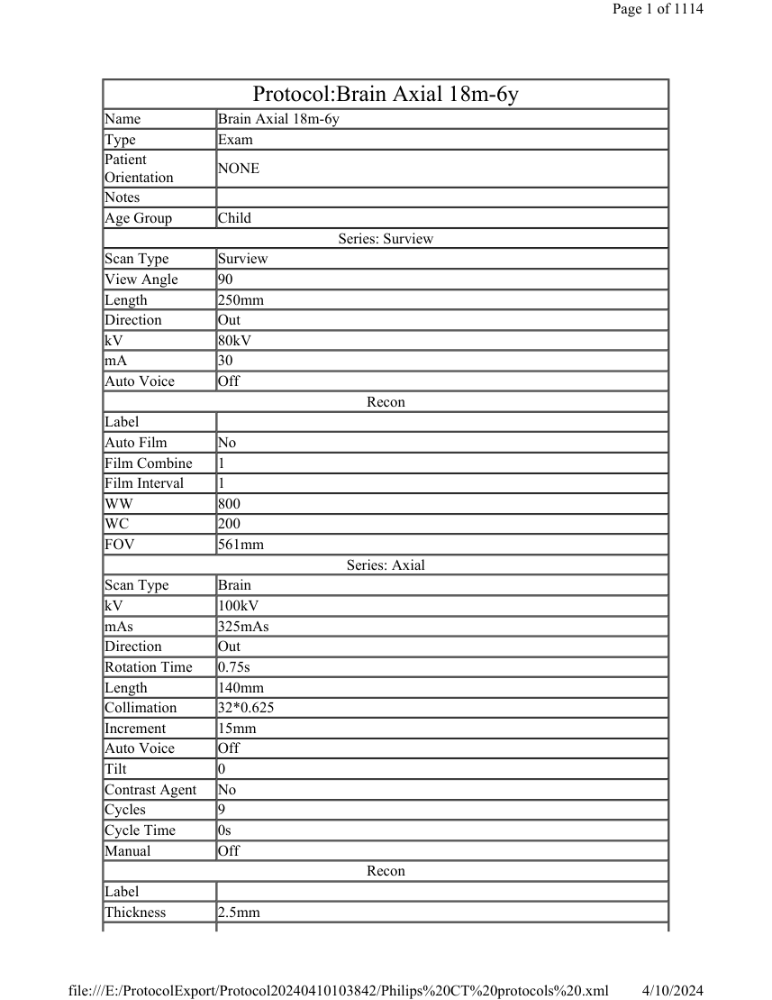
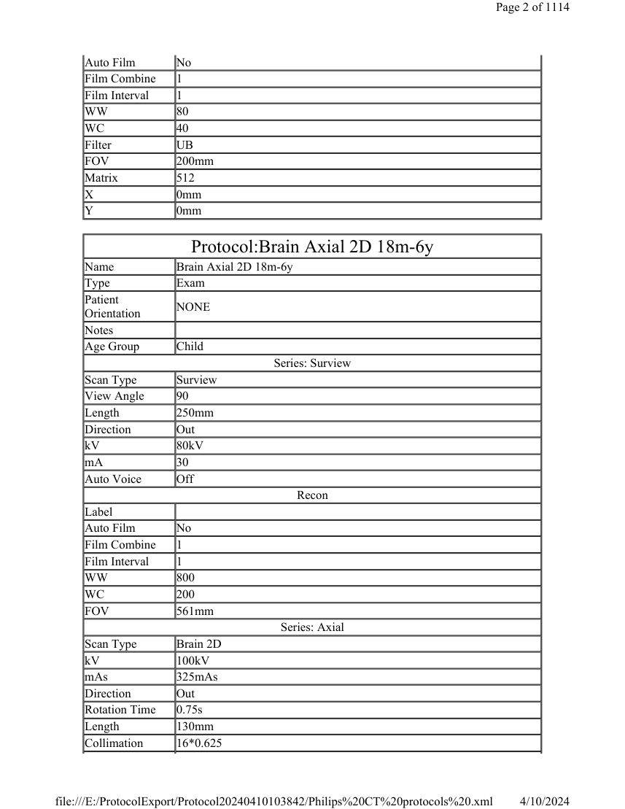
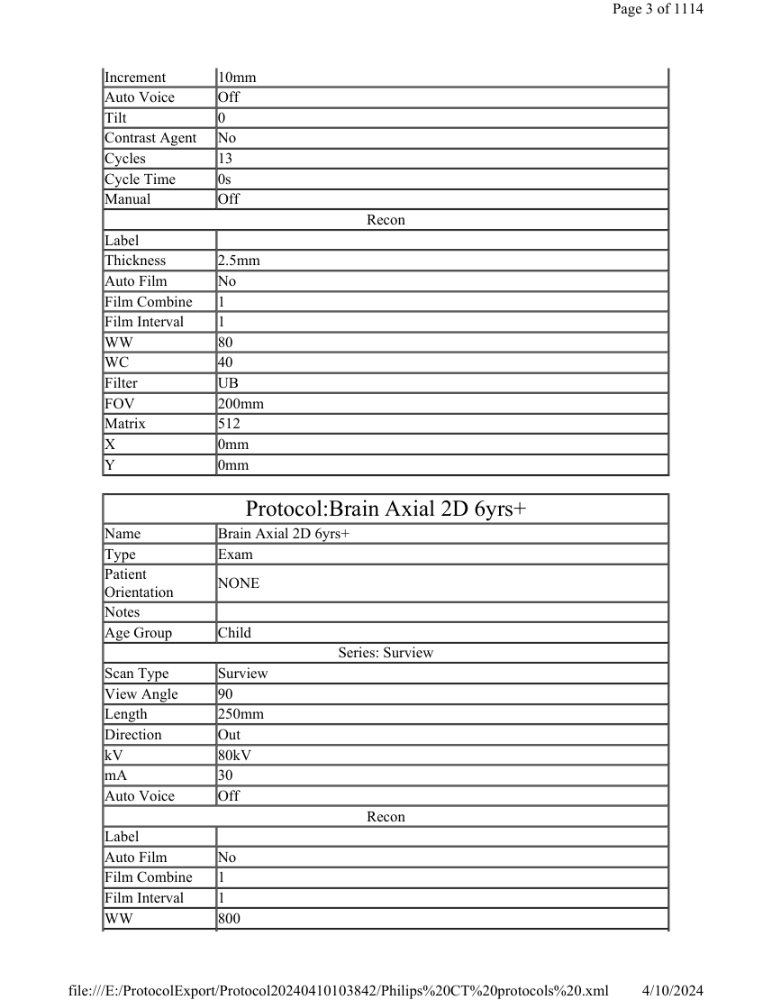

# CT — Parametri aparat: Philips Incisive 128 Protocols (MCB)

## Documentul original MCB — Parametri aparat: Philips Incisive 128 Protocols

**Manual de aparat · 1114 pagini · consultat la 2026-09-27.**

[Descarcă PDF-ul integral](../../assets/mcb-modalities/ct-parametri-aparat-philips-incisive-128-protocols-mcb/document.pdf) · [Sursa MCB](https://ref.mcbradiology.com/Protocols,%20Policies,%20Worksheets%20&%20Forms/CT/Protocols/Default/Philips%20Incisive%20128%20Protocols.pdf) · [Catalogul MCB pentru această modalitate](../mcb/index.md)

Instrucțiunile, valorile și ilustrațiile din documentul original sunt păstrate în **engleză**. Titlul și navigarea sunt în română.

Previzualizarea de mai jos prezintă primele 3 pagini. **PDF-ul descărcabil conține toate cele 1114 de pagini.**

### Pagina 1

{ loading=lazy }

### Pagina 2

{ loading=lazy }

### Pagina 3

{ loading=lazy }

## Textul documentului original

??? abstract "Pagina 1 — text în engleză"

    
Page 1 of 1114
    Protocol:Brain Axial 18m-6y
    Name
    Brain Axial 18m-6y
    Type
    Exam
    Patient 
    Orientation
    NONE
    Notes
    Age Group
    Child
    Series: Surview
    Scan Type
    Surview
    View Angle
    90
    Length
    250mm
    Direction
    Out
    kV
    80kV
    mA
    30
    Auto Voice
    Off
    Recon
    Label
    Auto Film
    No
    Film Combine
    1
    Film Interval
    1
    WW
    800
    WC
    200
    FOV
    561mm
    Series: Axial
    Scan Type
    Brain
    kV
    100kV
    mAs
    325mAs
    Direction
    Out
    Rotation Time
    0.75s
    Length
    140mm
    Collimation
    32*0.625
    Increment
    15mm
    Auto Voice
    Off
    Tilt
    0
    Contrast Agent
    No
    Cycles
    9
    Cycle Time
    0s
    Manual
    Off
    Recon
    Label
    Thickness
    2.5mm
    4/10/2024
    file:///E:/ProtocolExport/Protocol20240410103842/Philips%20CT%20protocols%20.xml
    

??? abstract "Pagina 2 — text în engleză"

    
Page 2 of 1114
    Auto Film
    No
    Film Combine
    1
    Film Interval
    1
    WW
    80
    WC
    40
    Filter
    UB
    FOV
    200mm
    Matrix
    512
    X
    0mm
    Y
    0mm
    Protocol:Brain Axial 2D 18m-6y
    Name
    Brain Axial 2D 18m-6y
    Type
    Exam
    Patient 
    Orientation
    NONE
    Notes
    Age Group
    Child
    Series: Surview
    Scan Type
    Surview
    View Angle
    90
    Length
    250mm
    Direction
    Out
    kV
    80kV
    mA
    30
    Auto Voice
    Off
    Recon
    Label
    Auto Film
    No
    Film Combine
    1
    Film Interval
    1
    WW
    800
    WC
    200
    FOV
    561mm
    Series: Axial
    Scan Type
    Brain 2D
    kV
    100kV
    mAs
    325mAs
    Direction
    Out
    Rotation Time
    0.75s
    Length
    130mm
    Collimation
    16*0.625
    4/10/2024
    file:///E:/ProtocolExport/Protocol20240410103842/Philips%20CT%20protocols%20.xml
    

??? abstract "Pagina 3 — text în engleză"

    
Page 3 of 1114
    Increment
    10mm
    Auto Voice
    Off
    Tilt
    0
    Contrast Agent
    No
    Cycles
    13
    Cycle Time
    0s
    Manual
    Off
    Recon
    Label
    Thickness
    2.5mm
    Auto Film
    No
    Film Combine
    1
    Film Interval
    1
    WW
    80
    WC
    40
    Filter
    UB
    FOV
    200mm
    Matrix
    512
    X
    0mm
    Y
    0mm
    Protocol:Brain Axial 2D 6yrs+
    Name
    Brain Axial 2D 6yrs+
    Type
    Exam
    Patient 
    Orientation
    NONE
    Notes
    Age Group
    Child
    Series: Surview
    Scan Type
    Surview
    View Angle
    90
    Length
    250mm
    Direction
    Out
    kV
    80kV
    mA
    30
    Auto Voice
    Off
    Recon
    Label
    Auto Film
    No
    Film Combine
    1
    Film Interval
    1
    WW
    800
    4/10/2024
    file:///E:/ProtocolExport/Protocol20240410103842/Philips%20CT%20protocols%20.xml
    

??? abstract "Pagina 4 — text în engleză"

    
Page 4 of 1114
    WC
    200
    FOV
    561mm
    Series: Axial
    Scan Type
    Brain 2D
    kV
    100kV
    mAs
    350mAs
    Direction
    Out
    Rotation Time
    0.75s
    Length
    130mm
    Collimation
    16*0.625
    Increment
    10mm
    Auto Voice
    Off
    Tilt
    0
    Contrast Agent
    No
    Cycles
    13
    Cycle Time
    0s
    Manual
    Off
    Recon
    Label
    Thickness
    2.5mm
    Auto Film
    No
    Film Combine
    1
    Film Interval
    1
    WW
    80
    WC
    40
    Filter
    UB
    FOV
    200mm
    Matrix
    512
    X
    0mm
    Y
    0mm
    Protocol:Brain Axial 2D
    Name
    Brain Axial 2D
    Type
    Exam
    Patient 
    Orientation
    NONE
    Notes
    Age Group
    Adult
    Series: Surview
    Scan Type
    Surview
    View Angle
    90
    Length
    250mm
    4/10/2024
    file:///E:/ProtocolExport/Protocol20240410103842/Philips%20CT%20protocols%20.xml
    

??? abstract "Pagina 5 — text în engleză"

    
Page 5 of 1114
    Direction
    Out
    kV
    120kV
    mA
    30
    Auto Voice
    Off
    Recon
    Label
    Auto Film
    No
    Film Combine
    1
    Film Interval
    1
    WW
    800
    WC
    200
    FOV
    561mm
    Series: Axial
    Scan Type
    Brain 2D
    kV
    120kV
    mAs
    400mAs
    Direction
    Out
    Rotation Time
    1s
    Length
    180mm
    Collimation
    16*0.625
    Increment
    10mm
    Auto Voice
    Off
    Tilt
    0
    Contrast Agent
    No
    Cycles
    18
    Cycle Time
    0s
    Manual
    Off
    Recon
    Label
    Thickness
    5mm
    Auto Film
    No
    Film Combine
    1
    Film Interval
    1
    WW
    80
    WC
    40
    Filter
    UB
    FOV
    250mm
    Matrix
    512
    X
    0mm
    Y
    0mm
    Protocol:Brain Axial 6yrs+
    4/10/2024
    file:///E:/ProtocolExport/Protocol20240410103842/Philips%20CT%20protocols%20.xml
    

??? abstract "Pagina 6 — text în engleză"

    
Page 6 of 1114
    Name
    Brain Axial 6yrs+
    Type
    Exam
    Patient 
    Orientation
    NONE
    Notes
    Age Group
    Child
    Series: Surview
    Scan Type
    Surview
    View Angle
    90
    Length
    250mm
    Direction
    Out
    kV
    80kV
    mA
    30
    Auto Voice
    Off
    Recon
    Label
    Auto Film
    No
    Film Combine
    1
    Film Interval
    1
    WW
    800
    WC
    200
    FOV
    561mm
    Series: Axial
    Scan Type
    Brain
    kV
    100kV
    mAs
    350mAs
    Direction
    Out
    Rotation Time
    0.75s
    Length
    140mm
    Collimation
    32*0.625
    Increment
    15mm
    Auto Voice
    Off
    Tilt
    0
    Contrast Agent
    No
    Cycles
    9
    Cycle Time
    0s
    Manual
    Off
    Recon
    Label
    Thickness
    2.5mm
    Auto Film
    No
    Film Combine
    1
    4/10/2024
    file:///E:/ProtocolExport/Protocol20240410103842/Philips%20CT%20protocols%20.xml
    

??? abstract "Pagina 7 — text în engleză"

    
Page 7 of 1114
    Film Interval
    1
    WW
    80
    WC
    40
    Filter
    UB
    FOV
    200mm
    Matrix
    512
    X
    0mm
    Y
    0mm
    Protocol:Brain Axial
    Name
    Brain Axial
    Type
    Exam
    Patient 
    Orientation
    NONE
    Notes
    Age Group
    Adult
    Series: Surview
    Scan Type
    Surview
    View Angle
    90
    Length
    250mm
    Direction
    Out
    kV
    120kV
    mA
    30
    Auto Voice
    Off
    Recon
    Label
    Auto Film
    No
    Film Combine
    1
    Film Interval
    1
    WW
    800
    WC
    200
    FOV
    561mm
    Series: Axial
    Scan Type
    Brain
    kV
    120kV
    mAs
    350mAs
    Direction
    Out
    Rotation Time
    1s
    Length
    185mm
    Collimation
    32*0.625
    Increment
    15mm
    Auto Voice
    Off
    4/10/2024
    file:///E:/ProtocolExport/Protocol20240410103842/Philips%20CT%20protocols%20.xml
    

??? abstract "Pagina 8 — text în engleză"

    
Page 8 of 1114
    Tilt
    0
    Contrast Agent
    No
    Cycles
    12
    Cycle Time
    0s
    Manual
    Off
    Recon
    Label
    Thickness
    5mm
    Auto Film
    No
    Film Combine
    1
    Film Interval
    1
    WW
    80
    WC
    40
    Filter
    UB
    FOV
    250mm
    Matrix
    512
    X
    0mm
    Y
    0mm
    Protocol:Brain CTA 0-6yrs
    Name
    Brain CTA 0-6yrs
    Type
    Exam
    Patient 
    Orientation
    NONE
    Notes
    Age Group
    Child
    Series: Surview
    Scan Type
    Surview
    View Angle
    90
    Length
    250mm
    Direction
    Out
    kV
    80kV
    mA
    30
    Auto Voice
    Off
    Recon
    Label
    Auto Film
    No
    Film Combine
    1
    Film Interval
    1
    WW
    800
    WC
    200
    FOV
    561mm
    4/10/2024
    file:///E:/ProtocolExport/Protocol20240410103842/Philips%20CT%20protocols%20.xml
    

??? abstract "Pagina 9 — text în engleză"

    
Page 9 of 1114
    Series: Locator
    Scan Type
    kV
    80kV
    mAs
    30mAs
    Direction
    In
    Rotation Time
    0.5s
    Length
    10mm
    Collimation
    16*0.625
    Increment
    0mm
    Tilt
    0
    Suggested 
    Locator Position
    Off
    Contrast Agent
    Yes
    Auto Voice
    Off
    Cycles
    1
    Cycle Time
    0s
    Recon
    Label
    Start
    *
    Thickness
    10mm
    WW
    400
    WC
    40
    Filter
    UB
    FOV
    250mm
    Matrix
    512
    X
    0mm
    Y
    0mm
    Series: Tracker
    Scan Type
    kV
    80kV
    mAs
    30mAs
    Direction
    In
    Rotation Time
    0.5s
    Length
    10mm
    Collimation
    16*0.625
    Post Injection 
    Delay
    2s
    Increment
    0mm
    Auto Voice
    Off
    Tilt
    0
    Contrast Agent
    Yes
    False
    4/10/2024
    file:///E:/ProtocolExport/Protocol20240410103842/Philips%20CT%20protocols%20.xml
    

??? abstract "Pagina 10 — text în engleză"

    
Page 10 of 1114
    Automatic 
    Minimum Delay
    Cycles
    30
    Cycle Time
    0s
    SAS
    Off
    Recon
    Label
    Thickness
    10mm
    WW
    400
    WC
    40
    Filter
    UB
    FOV
    250mm
    Matrix
    512
    X
    0mm
    Y
    0mm
    Series: Helical
    Scan Type
    CTA Head
    Cardiac 
    DoseRight
    False
    mAs
    138mAs
    Manual
    Off
    Heart Rate
    0
    View Angle
    90
    View Angle
    LAT
    Start
    *
    Length
    119.7mm
    kV
    100kV
    mA
    249
    DOM
    Off
    Tilt
    0
    Rotation Time
    0.5s
    Collimation
    64*0.625
    Direction
    Out
    Auto Voice
    Off
    Contrast
    Bolus Tracking
    SAS
    Off
    Automatic 
    Minimum Delay
    False
    Suggested 
    Locator Position
    Off
    Increment
    0mm
    Pitch
    0.9
    2s
    4/10/2024
    file:///E:/ProtocolExport/Protocol20240410103842/Philips%20CT%20protocols%20.xml
    

??? abstract "Pagina 11 — text în engleză"

    
Page 11 of 1114
    Post Injection 
    Delay
    Post Threshold 
    Delay
    2s
    Threshold
    150s
    Cycles
    1
    Cycle Time
    0s
    End
    *
    Contrast Agent
    Yes
    Planning Type
    None
    iEvolving
    False
    Resolution
    High
    Recon
    Enhancement
    0
    Auto Film
    No
    Film Interval
    1
    Film Combine
    1
    Label
    O-MAR
    0
    Adaptive Filter 
    0
    Thickness
    0.9mm
    Filter
    UB
    Increment
    0.45
    Start
    *
    Start
    *
    WW
    700
    WC
    100
    FOV
    200mm
    X
    0mm
    Y
    0mm
    Phase
    0.75
    Matrix
    512
    Thickness
    2.5mm
    Render Mode
    AIP
    Orientation
    Axial
    Thickness
    3
    Increment
    3
    iDose
    False
    Protocol:Brain CTA 6yrs+
    Name
    Brain CTA 6yrs+
    Type
    Exam
    4/10/2024
    file:///E:/ProtocolExport/Protocol20240410103842/Philips%20CT%20protocols%20.xml
    

??? abstract "Pagina 12 — text în engleză"

    
Page 12 of 1114
    NONE
    Patient 
    Orientation
    Notes
    Age Group
    Child
    Series: Surview
    Scan Type
    Surview
    View Angle
    90
    Length
    250mm
    Direction
    Out
    kV
    80kV
    mA
    30
    Auto Voice
    Off
    Recon
    Label
    Auto Film
    No
    Film Combine
    1
    Film Interval
    1
    WW
    800
    WC
    200
    FOV
    561mm
    Series: Locator
    Scan Type
    kV
    80kV
    mAs
    30mAs
    Direction
    In
    Rotation Time
    0.75s
    Length
    10mm
    Collimation
    16*0.625
    Increment
    0mm
    Tilt
    0
    Suggested 
    Locator Position
    Off
    Contrast Agent
    Yes
    Auto Voice
    Off
    Cycles
    1
    Cycle Time
    0s
    Recon
    Label
    Start
    *
    Thickness
    10mm
    WW
    400
    WC
    40
    4/10/2024
    file:///E:/ProtocolExport/Protocol20240410103842/Philips%20CT%20protocols%20.xml
    

??? abstract "Pagina 13 — text în engleză"

    
Page 13 of 1114
    Filter
    UB
    FOV
    250mm
    Matrix
    512
    X
    0mm
    Y
    0mm
    Series: Tracker
    Scan Type
    kV
    80kV
    mAs
    30mAs
    Direction
    In
    Rotation Time
    0.75s
    Length
    10mm
    Collimation
    16*0.625
    Post Injection 
    Delay
    2s
    Increment
    0mm
    Auto Voice
    Off
    Tilt
    0
    Contrast Agent
    Yes
    Automatic 
    Minimum Delay
    False
    Cycles
    30
    Cycle Time
    0s
    SAS
    Off
    Recon
    Label
    Thickness
    10mm
    WW
    400
    WC
    40
    Filter
    UB
    FOV
    250mm
    Matrix
    512
    X
    0mm
    Y
    0mm
    Series: Helical
    Scan Type
    CTA Head
    View Angle
    90
    Length
    119.7mm
    Direction
    Out
    kV
    100kV
    mA
    389
    Auto Voice
    Off
    4/10/2024
    file:///E:/ProtocolExport/Protocol20240410103842/Philips%20CT%20protocols%20.xml
    

??? abstract "Pagina 14 — text în engleză"

    
Page 14 of 1114
    mAs
    324mAs
    Rotation Time
    0.75s
    Collimation
    64*0.625
    Increment
    0mm
    Tilt
    0
    Contrast Agent
    Yes
    Cycles
    1
    Cycle Time
    0s
    Manual
    Off
    Suggested 
    Locator Position
    Off
    Post Injection 
    Delay
    2s
    Automatic 
    Minimum Delay
    False
    SAS
    Off
    DOM
    Off
    Cardiac 
    DoseRight
    False
    Heart Rate
    0
    View Angle
    LAT
    Start
    *
    Contrast
    Bolus Tracking
    Pitch
    0.9
    Post Threshold 
    Delay
    2s
    Threshold
    150s
    End
    *
    Planning Type
    None
    iEvolving
    False
    Resolution
    High
    Recon
    Label
    Auto Film
    No
    Film Combine
    1
    Film Interval
    1
    WW
    700
    WC
    100
    FOV
    200mm
    Thickness
    2.5mm
    Filter
    UB
    Matrix
    512
    X
    0mm
    4/10/2024
    file:///E:/ProtocolExport/Protocol20240410103842/Philips%20CT%20protocols%20.xml
    

??? abstract "Pagina 15 — text în engleză"

    
Page 15 of 1114
    Y
    0mm
    Start
    *
    Enhancement
    0
    O-MAR
    0
    Adaptive Filter 
    0
    Thickness
    0.9mm
    Increment
    0.45
    Start
    *
    Phase
    0.75
    Render Mode
    AIP
    Orientation
    Axial
    Thickness
    3
    Increment
    3
    iDose
    False
    Protocol:Brain CTA
    Name
    Brain CTA
    Type
    Exam
    Patient 
    Orientation
    NONE
    Notes
    Age Group
    Adult
    Series: Surview
    Scan Type
    Surview
    View Angle
    90
    Length
    250mm
    Direction
    Out
    kV
    120kV
    mA
    30
    Auto Voice
    Off
    Recon
    Label
    Auto Film
    No
    Film Combine
    1
    Film Interval
    1
    WW
    800
    WC
    200
    FOV
    561mm
    Series: Locator
    Scan Type
    kV
    120kV
    mAs
    30mAs
    4/10/2024
    file:///E:/ProtocolExport/Protocol20240410103842/Philips%20CT%20protocols%20.xml
    

??? abstract "Pagina 16 — text în engleză"

    
Page 16 of 1114
    Direction
    In
    Rotation Time
    0.5s
    Length
    10mm
    Collimation
    16*0.625
    Increment
    0mm
    Tilt
    0
    Suggested 
    Locator Position
    Off
    Contrast Agent
    Yes
    Auto Voice
    Off
    Cycles
    1
    Cycle Time
    0s
    Recon
    Label
    Start
    *
    Thickness
    10mm
    WW
    400
    WC
    40
    Filter
    UB
    FOV
    250mm
    Matrix
    512
    X
    0mm
    Y
    0mm
    Series: Tracker
    Scan Type
    kV
    120kV
    mAs
    30mAs
    Direction
    In
    Rotation Time
    0.5s
    Length
    10mm
    Collimation
    16*0.625
    Post Injection 
    Delay
    2s
    Increment
    0mm
    Auto Voice
    Off
    Tilt
    0
    Contrast Agent
    Yes
    Automatic 
    Minimum Delay
    False
    Cycles
    30
    Cycle Time
    0s
    SAS
    Off
    4/10/2024
    file:///E:/ProtocolExport/Protocol20240410103842/Philips%20CT%20protocols%20.xml
    

??? abstract "Pagina 17 — text în engleză"

    
Page 17 of 1114
    Recon
    Label
    Thickness
    10mm
    WW
    400
    WC
    40
    Filter
    UB
    FOV
    250mm
    Matrix
    512
    X
    0mm
    Y
    0mm
    Series: Helical
    Scan Type
    CTA Head
    View Angle
    90
    Length
    150.3mm
    Direction
    Out
    kV
    120kV
    mA
    397
    Auto Voice
    Off
    mAs
    220mAs
    Rotation Time
    0.5s
    Collimation
    64*0.625
    Increment
    0mm
    Tilt
    0
    Contrast Agent
    Yes
    Cycles
    1
    Cycle Time
    0s
    Manual
    Off
    Suggested 
    Locator Position
    Off
    Post Injection 
    Delay
    2s
    Automatic 
    Minimum Delay
    False
    SAS
    Off
    DOM
    Off
    Cardiac 
    DoseRight
    False
    Heart Rate
    0
    View Angle
    LAT
    Start
    *
    Contrast
    Bolus Tracking
    Pitch
    0.9
    2s
    4/10/2024
    file:///E:/ProtocolExport/Protocol20240410103842/Philips%20CT%20protocols%20.xml
    

??? abstract "Pagina 18 — text în engleză"

    
Page 18 of 1114
    Post Threshold 
    Delay
    Threshold
    150s
    End
    *
    Planning Type
    None
    iEvolving
    False
    Resolution
    Normal
    Recon
    Label
    Auto Film
    No
    Film Combine
    1
    Film Interval
    1
    WW
    700
    WC
    100
    FOV
    200mm
    Thickness
    2.5mm
    Filter
    UB
    Matrix
    512
    X
    0mm
    Y
    0mm
    Start
    *
    Enhancement
    0
    O-MAR
    0
    Adaptive Filter 
    0
    Thickness
    0.9mm
    Increment
    0.45
    Start
    *
    Phase
    0.75
    Render Mode
    AIP
    Orientation
    Axial
    Thickness
    0.9
    Increment
    0.9
    iDose
    False
    Protocol:Brain Helical 18m-6y
    Name
    Brain Helical 18m-6y
    Type
    Exam
    Patient 
    Orientation
    NONE
    Notes
    Age Group
    Child
    Series: Surview
    4/10/2024
    file:///E:/ProtocolExport/Protocol20240410103842/Philips%20CT%20protocols%20.xml
    

??? abstract "Pagina 19 — text în engleză"

    
Page 19 of 1114
    Scan Type
    Surview
    View Angle
    90
    Length
    250mm
    Direction
    Out
    kV
    80kV
    mA
    30
    Auto Voice
    Off
    Recon
    Label
    Auto Film
    No
    Film Combine
    1
    Film Interval
    1
    WW
    800
    WC
    200
    FOV
    561mm
    Series: Helical
    Scan Type
    Brain
    View Angle
    90
    Length
    130mm
    Direction
    Out
    kV
    100kV
    mA
    245
    Auto Voice
    Off
    mAs
    306mAs
    Rotation Time
    0.5s
    Collimation
    64*0.625
    Increment
    0mm
    Tilt
    0
    Contrast Agent
    No
    Cycles
    1
    Cycle Time
    0s
    Manual
    Off
    Suggested 
    Locator Position
    Off
    Post Injection 
    Delay
    2s
    Automatic 
    Minimum Delay
    False
    SAS
    Off
    DOM
    Off
    Cardiac 
    DoseRight
    False
    Heart Rate
    0
    4/10/2024
    file:///E:/ProtocolExport/Protocol20240410103842/Philips%20CT%20protocols%20.xml
    

??? abstract "Pagina 20 — text în engleză"

    
Page 20 of 1114
    View Angle
    LAT
    Start
    *
    Contrast
    Non-Timed
    Pitch
    0.4
    Post Threshold 
    Delay
    2s
    Threshold
    150s
    End
    *
    Planning Type
    None
    iEvolving
    False
    Resolution
    Normal
    Recon
    Label
    Auto Film
    No
    Film Combine
    1
    Film Interval
    1
    WW
    80
    WC
    40
    FOV
    200mm
    Thickness
    2.5mm
    Filter
    UB
    Matrix
    512
    X
    0mm
    Y
    0mm
    Start
    *
    Enhancement
    0
    O-MAR
    0
    Adaptive Filter 
    0
    Thickness
    5mm
    Increment
    5
    Start
    *
    Phase
    0.75
    Render Mode
    AIP
    Orientation
    Axial
    Thickness
    5
    Increment
    5
    iDose
    False
    Protocol:Brain Helical 6yrs+
    Name
    Brain Helical 6yrs+
    Type
    Exam
    NONE
    4/10/2024
    file:///E:/ProtocolExport/Protocol20240410103842/Philips%20CT%20protocols%20.xml
    

??? abstract "Pagina 21 — text în engleză"

    
Page 21 of 1114
    Patient 
    Orientation
    Notes
    Age Group
    Child
    Series: Surview
    Scan Type
    Surview
    View Angle
    90
    Length
    250mm
    Direction
    Out
    kV
    80kV
    mA
    30
    Auto Voice
    Off
    Recon
    Label
    Auto Film
    No
    Film Combine
    1
    Film Interval
    1
    WW
    800
    WC
    200
    FOV
    561mm
    Series: Helical
    Scan Type
    Brain
    View Angle
    90
    Length
    130mm
    Direction
    Out
    kV
    100kV
    mA
    260
    Auto Voice
    Off
    mAs
    325mAs
    Rotation Time
    0.5s
    Collimation
    64*0.625
    Increment
    0mm
    Tilt
    0
    Contrast Agent
    No
    Cycles
    1
    Cycle Time
    0s
    Manual
    Off
    Suggested 
    Locator Position
    Off
    Post Injection 
    Delay
    2s
    False
    Automatic 
    Minimum Delay
    4/10/2024
    file:///E:/ProtocolExport/Protocol20240410103842/Philips%20CT%20protocols%20.xml
    

??? abstract "Pagina 22 — text în engleză"

    
Page 22 of 1114
    SAS
    Off
    DOM
    Off
    Cardiac 
    DoseRight
    False
    Heart Rate
    0
    View Angle
    LAT
    Start
    *
    Contrast
    Non-Timed
    Pitch
    0.4
    Post Threshold 
    Delay
    2s
    Threshold
    150s
    End
    *
    Planning Type
    None
    iEvolving
    False
    Resolution
    Normal
    Recon
    Label
    Auto Film
    No
    Film Combine
    1
    Film Interval
    1
    WW
    80
    WC
    40
    FOV
    200mm
    Thickness
    2.5mm
    Filter
    UB
    Matrix
    512
    X
    0mm
    Y
    0mm
    Start
    *
    Enhancement
    0
    O-MAR
    0
    Adaptive Filter 
    0
    Thickness
    5mm
    Increment
    5
    Start
    *
    Phase
    0.75
    Render Mode
    AIP
    Orientation
    Axial
    Thickness
    5
    Increment
    5
    iDose
    False
    4/10/2024
    file:///E:/ProtocolExport/Protocol20240410103842/Philips%20CT%20protocols%20.xml
    

??? abstract "Pagina 23 — text în engleză"

    
Page 23 of 1114
    Protocol:Brain Helical
    Name
    Brain Helical
    Type
    Exam
    Patient 
    Orientation
    NONE
    Notes
    Age Group
    Adult
    Series: Surview
    Scan Type
    Surview
    View Angle
    90
    Length
    250mm
    Direction
    Out
    kV
    120kV
    mA
    30
    Auto Voice
    Off
    Recon
    Label
    Auto Film
    No
    Film Combine
    1
    Film Interval
    1
    WW
    800
    WC
    200
    FOV
    561mm
    Series: Helical
    Scan Type
    Brain
    View Angle
    90
    Length
    165mm
    Direction
    Out
    kV
    120kV
    mA
    248
    Auto Voice
    Off
    mAs
    310mAs
    Rotation Time
    0.5s
    Collimation
    64*0.625
    Increment
    0mm
    Tilt
    0
    Contrast Agent
    No
    Cycles
    1
    Cycle Time
    0s
    Manual
    Off
    Off
    4/10/2024
    file:///E:/ProtocolExport/Protocol20240410103842/Philips%20CT%20protocols%20.xml
    

??? abstract "Pagina 24 — text în engleză"

    
Page 24 of 1114
    Suggested 
    Locator Position
    Post Injection 
    Delay
    2s
    Automatic 
    Minimum Delay
    False
    SAS
    Off
    DOM
    Off
    Cardiac 
    DoseRight
    False
    Heart Rate
    0
    View Angle
    LAT
    Start
    *
    Contrast
    Non-Timed
    Pitch
    0.4
    Post Threshold 
    Delay
    2s
    Threshold
    150s
    End
    *
    Planning Type
    Head
    iEvolving
    False
    Resolution
    Normal
    Recon
    Label
    Auto Film
    No
    Film Combine
    1
    Film Interval
    1
    WW
    80
    WC
    40
    FOV
    250mm
    Thickness
    2.5mm
    Filter
    UB
    Matrix
    512
    X
    0mm
    Y
    0mm
    Start
    *
    Enhancement
    0
    O-MAR
    0
    Adaptive Filter 
    0
    Thickness
    5mm
    Increment
    5
    Start
    *
    Phase
    0.75
    4/10/2024
    file:///E:/ProtocolExport/Protocol20240410103842/Philips%20CT%20protocols%20.xml
    

??? abstract "Pagina 25 — text în engleză"

    
Page 25 of 1114
    Render Mode
    AIP
    Orientation
    Axial
    Thickness
    5
    Increment
    5
    iDose
    False
    Protocol:Brain Perfusion Non-Jog
    Name
    Brain Perfusion Non-Jog
    Type
    Exam
    Patient 
    Orientation
    NONE
    Notes
    Age Group
    Adult
    Series: Surview
    Scan Type
    Surview
    View Angle
    90
    Length
    250mm
    Direction
    Out
    kV
    120kV
    mA
    30
    Auto Voice
    Off
    Recon
    Label
    Auto Film
    No
    Film Combine
    1
    Film Interval
    1
    WW
    800
    WC
    200
    FOV
    561mm
    Series: Axial
    Scan Type
    Brain Perfusion
    kV
    80kV
    mAs
    100mAs
    Direction
    In
    Rotation Time
    0.5s
    Length
    20mm
    Collimation
    32*0.625
    Increment
    0mm
    Auto Voice
    Off
    Tilt
    0
    Contrast Agent
    Yes
    Cycles
    30
    4/10/2024
    file:///E:/ProtocolExport/Protocol20240410103842/Philips%20CT%20protocols%20.xml
    

??? abstract "Pagina 26 — text în engleză"

    
Page 26 of 1114
    Cycle Time
    2s
    Manual
    Off
    Recon
    Label
    Thickness
    5mm
    Auto Film
    No
    Film Combine
    1
    Film Interval
    1
    WW
    80
    WC
    40
    Filter
    UA
    FOV
    220mm
    Matrix
    512
    X
    0mm
    Y
    0mm
    Protocol:Dental
    Name
    Dental
    Type
    Exam
    Patient 
    Orientation
    NONE
    Notes
    Age Group
    Adult
    Series: Surview
    Scan Type
    Surview
    View Angle
    90
    Length
    250mm
    Direction
    Out
    kV
    120kV
    mA
    30
    Auto Voice
    Off
    Recon
    Label
    Auto Film
    No
    Film Combine
    1
    Film Interval
    1
    WW
    800
    WC
    200
    FOV
    561mm
    Series: Helical
    Scan Type
    Dental
    View Angle
    90
    4/10/2024
    file:///E:/ProtocolExport/Protocol20240410103842/Philips%20CT%20protocols%20.xml
    

??? abstract "Pagina 27 — text în engleză"

    
Page 27 of 1114
    Length
    100.4mm
    Direction
    In
    kV
    120kV
    mA
    89
    Auto Voice
    Off
    mAs
    112mAs
    Rotation Time
    0.5s
    Collimation
    32*0.625
    Increment
    0mm
    Tilt
    0
    Contrast Agent
    No
    Cycles
    1
    Cycle Time
    0s
    Manual
    Off
    Suggested 
    Locator Position
    Off
    Post Injection 
    Delay
    2s
    Automatic 
    Minimum Delay
    False
    SAS
    Off
    DOM
    Off
    Cardiac 
    DoseRight
    False
    Heart Rate
    0
    View Angle
    LAT
    Start
    *
    Contrast
    Non-Timed
    Pitch
    0.4
    Post Threshold 
    Delay
    2s
    Threshold
    150s
    End
    *
    Planning Type
    None
    iEvolving
    False
    Resolution
    High
    Recon
    Label
    Auto Film
    No
    Film Combine
    1
    Film Interval
    1
    WW
    3000
    WC
    400
    4/10/2024
    file:///E:/ProtocolExport/Protocol20240410103842/Philips%20CT%20protocols%20.xml
    

??? abstract "Pagina 28 — text în engleză"

    
Page 28 of 1114
    FOV
    200mm
    Thickness
    2.5mm
    Filter
    YC
    Matrix
    512
    X
    0mm
    Y
    0mm
    Start
    *
    Enhancement
    0
    O-MAR
    0
    Adaptive Filter 
    0
    Thickness
    0.8mm
    Increment
    0.4
    Start
    *
    Phase
    0.75
    Render Mode
    AIP
    Orientation
    Axial
    Thickness
    0.8
    Increment
    0.8
    iDose
    False
    Protocol:Head STD-QA 2D
    Name
    Head STD-QA 2D
    Type
    Axial
    Patient 
    Orientation
    NONE
    Notes
    Age Group
    Adult
    Series: Axial
    Scan Type
    Head 2D
    kV
    120kV
    mAs
    250mAs
    Direction
    In
    Rotation Time
    0.75s
    Length
    10mm
    Collimation
    16*0.625
    Increment
    10mm
    Auto Voice
    Off
    Tilt
    0
    Contrast Agent
    No
    Cycles
    1
    Cycle Time
    0s
    Manual
    Off
    4/10/2024
    file:///E:/ProtocolExport/Protocol20240410103842/Philips%20CT%20protocols%20.xml
    

??? abstract "Pagina 29 — text în engleză"

    
Page 29 of 1114
    Recon
    Label
    Thickness
    2.5mm
    Auto Film
    No
    Film Combine
    1
    Film Interval
    1
    WW
    100
    WC
    0
    Filter
    UB
    FOV
    250mm
    Matrix
    512
    X
    0mm
    Y
    0mm
    Protocol:Head STD-QA Helical
    Name
    Head STD-QA Helical
    Type
    Helical
    Patient 
    Orientation
    NONE
    Notes
    Age Group
    Adult
    Series: Helical
    Scan Type
    Head
    View Angle
    90
    Length
    150mm
    Direction
    In
    kV
    120kV
    mA
    139
    Auto Voice
    Off
    mAs
    261mAs
    Rotation Time
    0.75s
    Collimation
    64*0.625
    Increment
    0mm
    Tilt
    0
    Contrast Agent
    No
    Cycles
    1
    Cycle Time
    0s
    Manual
    Off
    Suggested 
    Locator Position
    Off
    Post Injection 
    Delay
    2s
    4/10/2024
    file:///E:/ProtocolExport/Protocol20240410103842/Philips%20CT%20protocols%20.xml
    

??? abstract "Pagina 30 — text în engleză"

    
Page 30 of 1114
    False
    Automatic 
    Minimum Delay
    SAS
    Off
    DOM
    Off
    Cardiac 
    DoseRight
    False
    Heart Rate
    0
    View Angle
    LAT
    Start
    *
    Contrast
    Non-Timed
    Pitch
    0.4
    Post Threshold 
    Delay
    2s
    Threshold
    150s
    End
    *
    Planning Type
    None
    iEvolving
    False
    Resolution
    High
    Recon
    Label
    Auto Film
    No
    Film Combine
    1
    Film Interval
    1
    WW
    100
    WC
    0
    FOV
    250mm
    Thickness
    2.5mm
    Filter
    UB
    Matrix
    512
    X
    0mm
    Y
    0mm
    Start
    *
    Enhancement
    0
    O-MAR
    0
    Adaptive Filter 
    0
    Thickness
    3mm
    Increment
    3
    Start
    *
    Phase
    0.75
    Render Mode
    AIP
    Orientation
    Axial
    Thickness
    5
    4/10/2024
    file:///E:/ProtocolExport/Protocol20240410103842/Philips%20CT%20protocols%20.xml
    

??? abstract "Pagina 31 — text în engleză"

    
Page 31 of 1114
    Increment
    5
    iDose
    False
    Protocol:Head STD-QA
    Name
    Head STD-QA
    Type
    Axial
    Patient 
    Orientation
    NONE
    Notes
    Age Group
    Adult
    Series: Axial
    Scan Type
    Head
    kV
    120kV
    mAs
    250mAs
    Direction
    In
    Rotation Time
    0.75s
    Length
    10mm
    Collimation
    16*0.625
    Increment
    10mm
    Auto Voice
    Off
    Tilt
    0
    Contrast Agent
    No
    Cycles
    1
    Cycle Time
    0s
    Manual
    Off
    Recon
    Label
    Thickness
    2.5mm
    Auto Film
    No
    Film Combine
    1
    Film Interval
    1
    WW
    100
    WC
    0
    Filter
    UB
    FOV
    250mm
    Matrix
    512
    X
    0mm
    Y
    0mm
    Protocol:Inf Brain Axial 0-18m
    Name
    Inf Brain Axial 0-18m
    4/10/2024
    file:///E:/ProtocolExport/Protocol20240410103842/Philips%20CT%20protocols%20.xml
    

??? abstract "Pagina 32 — text în engleză"

    
Page 32 of 1114
    Type
    Exam
    Patient 
    Orientation
    NONE
    Notes
    Age Group
    Infant
    Series: Surview
    Scan Type
    Surview
    View Angle
    90
    Length
    200mm
    Direction
    Out
    kV
    80kV
    mA
    30
    Auto Voice
    Off
    Recon
    Label
    Auto Film
    No
    Film Combine
    1
    Film Interval
    1
    WW
    800
    WC
    200
    FOV
    561mm
    Series: Axial
    Scan Type
    Brain
    kV
    100kV
    mAs
    250mAs
    Direction
    Out
    Rotation Time
    0.75s
    Length
    140mm
    Collimation
    32*0.625
    Increment
    15mm
    Auto Voice
    Off
    Tilt
    0
    Contrast Agent
    No
    Cycles
    9
    Cycle Time
    0s
    Manual
    Off
    Recon
    Label
    Thickness
    2.5mm
    Auto Film
    No
    Film Combine
    1
    Film Interval
    1
    4/10/2024
    file:///E:/ProtocolExport/Protocol20240410103842/Philips%20CT%20protocols%20.xml
    

??? abstract "Pagina 33 — text în engleză"

    
Page 33 of 1114
    WW
    80
    WC
    40
    Filter
    UB
    FOV
    200mm
    Matrix
    512
    X
    0mm
    Y
    0mm
    Protocol:Inf Brain Axial 2D 0-18m
    Name
    Inf Brain Axial 2D 0-18m
    Type
    Exam
    Patient 
    Orientation
    NONE
    Notes
    Age Group
    Infant
    Series: Surview
    Scan Type
    Surview
    View Angle
    90
    Length
    200mm
    Direction
    Out
    kV
    80kV
    mA
    30
    Auto Voice
    Off
    Recon
    Label
    Auto Film
    No
    Film Combine
    1
    Film Interval
    1
    WW
    800
    WC
    200
    FOV
    561mm
    Series: Axial
    Scan Type
    Brain 2D
    kV
    100kV
    mAs
    275mAs
    Direction
    Out
    Rotation Time
    0.75s
    Length
    130mm
    Collimation
    16*0.625
    Increment
    10mm
    Auto Voice
    Off
    Tilt
    0
    4/10/2024
    file:///E:/ProtocolExport/Protocol20240410103842/Philips%20CT%20protocols%20.xml
    

??? abstract "Pagina 34 — text în engleză"

    
Page 34 of 1114
    Contrast Agent
    No
    Cycles
    13
    Cycle Time
    0s
    Manual
    Off
    Recon
    Label
    Thickness
    2.5mm
    Auto Film
    No
    Film Combine
    1
    Film Interval
    1
    WW
    80
    WC
    40
    Filter
    UB
    FOV
    200mm
    Matrix
    512
    X
    0mm
    Y
    0mm
    Protocol:Inf Brain Helical 0-18m
    Name
    Inf Brain Helical 0-18m
    Type
    Exam
    Patient 
    Orientation
    NONE
    Notes
    Age Group
    Infant
    Series: Surview
    Scan Type
    Surview
    View Angle
    90
    Length
    200mm
    Direction
    Out
    kV
    80kV
    mA
    30
    Auto Voice
    Off
    Recon
    Label
    Auto Film
    No
    Film Combine
    1
    Film Interval
    1
    WW
    800
    WC
    200
    FOV
    561mm
    Series: Helical
    4/10/2024
    file:///E:/ProtocolExport/Protocol20240410103842/Philips%20CT%20protocols%20.xml
    

??? abstract "Pagina 35 — text în engleză"

    
Page 35 of 1114
    Scan Type
    Brain
    View Angle
    90
    Length
    130mm
    Direction
    Out
    kV
    100kV
    mA
    204
    Auto Voice
    Off
    mAs
    255mAs
    Rotation Time
    0.5s
    Collimation
    64*0.625
    Increment
    0mm
    Tilt
    0
    Contrast Agent
    No
    Cycles
    1
    Cycle Time
    0s
    Manual
    Off
    Suggested 
    Locator Position
    Off
    Post Injection 
    Delay
    2s
    Automatic 
    Minimum Delay
    False
    SAS
    Off
    DOM
    Off
    Cardiac 
    DoseRight
    False
    Heart Rate
    0
    View Angle
    LAT
    Start
    *
    Contrast
    Non-Timed
    Pitch
    0.4
    Post Threshold 
    Delay
    2s
    Threshold
    150s
    End
    *
    Planning Type
    None
    iEvolving
    False
    Resolution
    Normal
    Recon
    Label
    Auto Film
    No
    Film Combine
    1
    Film Interval
    1
    4/10/2024
    file:///E:/ProtocolExport/Protocol20240410103842/Philips%20CT%20protocols%20.xml
    

??? abstract "Pagina 36 — text în engleză"

    
Page 36 of 1114
    WW
    80
    WC
    40
    FOV
    200mm
    Thickness
    2.5mm
    Filter
    UB
    Matrix
    512
    X
    0mm
    Y
    0mm
    Start
    *
    Enhancement
    0
    O-MAR
    0
    Adaptive Filter 
    0
    Thickness
    5mm
    Increment
    5
    Start
    *
    Phase
    0.75
    Render Mode
    AIP
    Orientation
    Axial
    Thickness
    5
    Increment
    5
    iDose
    False
    Protocol:PF Axial
    Name
    PF Axial
    Type
    Exam
    Patient 
    Orientation
    NONE
    Notes
    Age Group
    Adult
    Series: Surview
    Scan Type
    Surview
    View Angle
    90
    Length
    250mm
    Direction
    Out
    kV
    120kV
    mA
    30
    Auto Voice
    Off
    Recon
    Label
    Auto Film
    No
    Film Combine
    1
    Film Interval
    1
    4/10/2024
    file:///E:/ProtocolExport/Protocol20240410103842/Philips%20CT%20protocols%20.xml
    

??? abstract "Pagina 37 — text în engleză"

    
Page 37 of 1114
    WW
    800
    WC
    200
    FOV
    561mm
    Series: Axial
    Scan Type
    Brain 2D
    kV
    120kV
    mAs
    350mAs
    Direction
    Out
    Rotation Time
    1s
    Length
    80mm
    Collimation
    16*0.625
    Increment
    10mm
    Auto Voice
    Off
    Tilt
    0
    Contrast Agent
    No
    Cycles
    8
    Cycle Time
    0s
    Manual
    Off
    Recon
    Label
    Thickness
    2.5mm
    Auto Film
    No
    Film Combine
    1
    Film Interval
    1
    WW
    80
    WC
    40
    Filter
    UB
    FOV
    250mm
    Matrix
    512
    X
    0mm
    Y
    0mm
    Protocol:Sinus Limited HR
    Name
    Sinus Limited HR
    Type
    Exam
    Patient 
    Orientation
    NONE
    Notes
    Age Group
    Adult
    Series: Surview
    Scan Type
    Surview
    View Angle
    90
    4/10/2024
    file:///E:/ProtocolExport/Protocol20240410103842/Philips%20CT%20protocols%20.xml
    

??? abstract "Pagina 38 — text în engleză"

    
Page 38 of 1114
    Length
    250mm
    Direction
    Out
    kV
    120kV
    mA
    30
    Auto Voice
    Off
    Recon
    Label
    Auto Film
    No
    Film Combine
    1
    Film Interval
    1
    WW
    800
    WC
    200
    FOV
    561mm
    Series: Axial
    Scan Type
    HR-Head
    kV
    120kV
    mAs
    165mAs
    Direction
    Out
    Rotation Time
    0.5s
    Length
    91.25mm
    Collimation
    2*0.625
    Increment
    10mm
    Auto Voice
    Off
    Tilt
    0
    Contrast Agent
    No
    Cycles
    10
    Cycle Time
    0s
    Manual
    Off
    Recon
    Label
    Thickness
    1.25mm
    Auto Film
    No
    Film Combine
    1
    Film Interval
    1
    WW
    1600
    WC
    500
    Filter
    YC
    FOV
    250mm
    Matrix
    512
    X
    0mm
    Y
    0mm
    4/10/2024
    file:///E:/ProtocolExport/Protocol20240410103842/Philips%20CT%20protocols%20.xml
    

??? abstract "Pagina 39 — text în engleză"

    
Page 39 of 1114
    Protocol:Sinus/Facial/Orbit 0-6yrs
    Name
    Sinus/Facial/Orbit 0-6yrs
    Type
    Exam
    Patient Orientation NONE
    Notes
    Age Group
    Child
    Series: Surview
    Scan Type
    Surview
    View Angle
    90
    Length
    250mm
    Direction
    Out
    kV
    80kV
    mA
    30
    Auto Voice
    Off
    Recon
    Label
    Auto Film
    No
    Film Combine
    1
    Film Interval
    1
    WW
    800
    WC
    200
    FOV
    561mm
    Series: Helical
    Scan Type
    Sinus/Facial/Orbit
    View Angle
    90
    Length
    100mm
    Direction
    In
    kV
    100kV
    mA
    124
    Auto Voice
    Off
    mAs
    155mAs
    Rotation Time
    0.5s
    Collimation
    32*0.625
    Increment
    0mm
    Tilt
    0
    Contrast Agent
    No
    Cycles
    1
    Cycle Time
    0s
    Manual
    Off
    Suggested Locator 
    Position
    Off
    2s
    4/10/2024
    file:///E:/ProtocolExport/Protocol20240410103842/Philips%20CT%20protocols%20.xml
    

??? abstract "Pagina 40 — text în engleză"

    
Page 40 of 1114
    Post Injection 
    Delay
    Automatic 
    Minimum Delay
    False
    SAS
    Off
    DOM
    Off
    Cardiac DoseRight False
    Heart Rate
    0
    View Angle
    LAT
    Start
    *
    Contrast
    Non-Timed
    Pitch
    0.4
    Post Threshold 
    Delay
    2s
    Threshold
    150s
    End
    *
    Planning Type
    None
    iEvolving
    False
    Resolution
    High
    Recon
    Label
    Auto Film
    No
    Film Combine
    1
    Film Interval
    1
    WW
    1600
    WC
    500
    FOV
    140mm
    Thickness
    2.5mm
    Filter
    YC
    Matrix
    512
    X
    0mm
    Y
    0mm
    Start
    *
    Enhancement
    0
    O-MAR
    0
    Adaptive Filter 
    0
    Thickness
    2mm
    Increment
    2
    Start
    *
    Phase
    0.75
    Render Mode
    AIP
    Orientation
    Axial
    4/10/2024
    file:///E:/ProtocolExport/Protocol20240410103842/Philips%20CT%20protocols%20.xml
    

??? abstract "Pagina 41 — text în engleză"

    
Page 41 of 1114
    Thickness
    3
    Increment
    3
    iDose
    False
    Protocol:Sinus/Facial/Orbit 6yrs+
    Name
    Sinus/Facial/Orbit 6yrs+
    Type
    Exam
    Patient Orientation NONE
    Notes
    Age Group
    Child
    Series: Surview
    Scan Type
    Surview
    View Angle
    90
    Length
    250mm
    Direction
    Out
    kV
    80kV
    mA
    30
    Auto Voice
    Off
    Recon
    Label
    Auto Film
    No
    Film Combine
    1
    Film Interval
    1
    WW
    800
    WC
    200
    FOV
    561mm
    Series: Helical
    Scan Type
    Sinus/Facial/Orbit
    View Angle
    90
    Length
    100mm
    Direction
    In
    kV
    100kV
    mA
    147
    Auto Voice
    Off
    mAs
    184mAs
    Rotation Time
    0.5s
    Collimation
    32*0.625
    Increment
    0mm
    Tilt
    0
    Contrast Agent
    No
    Cycles
    1
    Cycle Time
    0s
    4/10/2024
    file:///E:/ProtocolExport/Protocol20240410103842/Philips%20CT%20protocols%20.xml
    

??? abstract "Pagina 42 — text în engleză"

    
Page 42 of 1114
    Manual
    Off
    Suggested Locator 
    Position
    Off
    Post Injection 
    Delay
    2s
    Automatic 
    Minimum Delay
    False
    SAS
    Off
    DOM
    Off
    Cardiac DoseRight False
    Heart Rate
    0
    View Angle
    LAT
    Start
    *
    Contrast
    Non-Timed
    Pitch
    0.4
    Post Threshold 
    Delay
    2s
    Threshold
    150s
    End
    *
    Planning Type
    None
    iEvolving
    False
    Resolution
    High
    Recon
    Label
    Auto Film
    No
    Film Combine
    1
    Film Interval
    1
    WW
    1600
    WC
    500
    FOV
    140mm
    Thickness
    2.5mm
    Filter
    YC
    Matrix
    512
    X
    0mm
    Y
    0mm
    Start
    *
    Enhancement
    0
    O-MAR
    0
    Adaptive Filter 
    0
    Thickness
    2mm
    Increment
    2
    Start
    *
    Phase
    0.75
    4/10/2024
    file:///E:/ProtocolExport/Protocol20240410103842/Philips%20CT%20protocols%20.xml
    

??? abstract "Pagina 43 — text în engleză"

    
Page 43 of 1114
    Render Mode
    AIP
    Orientation
    Axial
    Thickness
    3
    Increment
    3
    iDose
    False
    Protocol:Sinus/Facial/Orbit Bone
    Name
    Sinus/Facial/Orbit Bone
    Type
    Exam
    Patient Orientation NONE
    Notes
    Age Group
    Adult
    Series: Surview
    Scan Type
    Surview
    View Angle
    90
    Length
    250mm
    Direction
    Out
    kV
    120kV
    mA
    30
    Auto Voice
    Off
    Recon
    Label
    Auto Film
    No
    Film Combine
    1
    Film Interval
    1
    WW
    800
    WC
    200
    FOV
    561mm
    Series: Helical
    Scan Type
    Sinus/Facial/Orbit
    Cardiac DoseRight False
    mAs
    176mAs
    Manual
    Off
    Heart Rate
    0
    View Angle
    90
    View Angle
    LAT
    Start
    *
    Length
    98mm
    kV
    120kV
    mA
    141
    DOM
    Off
    4/10/2024
    file:///E:/ProtocolExport/Protocol20240410103842/Philips%20CT%20protocols%20.xml
    

??? abstract "Pagina 44 — text în engleză"

    
Page 44 of 1114
    Tilt
    0
    Rotation Time
    0.5s
    Collimation
    64*0.625
    Direction
    In
    Auto Voice
    Off
    Contrast
    Non-Timed
    SAS
    Off
    Automatic 
    Minimum Delay
    False
    Suggested Locator 
    Position
    Off
    Increment
    0mm
    Pitch
    0.4
    Post Injection 
    Delay
    2s
    Post Threshold 
    Delay
    2s
    Threshold
    150s
    Cycles
    1
    Cycle Time
    0s
    End
    *
    Contrast Agent
    No
    Planning Type
    None
    iEvolving
    False
    Resolution
    High
    Recon
    Enhancement
    0
    Auto Film
    No
    Film Interval
    1
    Film Combine
    1
    Label
    O-MAR
    0
    Adaptive Filter 
    0
    Thickness
    2mm
    Filter
    YC
    Increment
    2
    Start
    *
    Start
    *
    WW
    1600
    WC
    500
    FOV
    220mm
    X
    0mm
    Y
    0mm
    4/10/2024
    file:///E:/ProtocolExport/Protocol20240410103842/Philips%20CT%20protocols%20.xml
    

??? abstract "Pagina 45 — text în engleză"

    
Page 45 of 1114
    Phase
    0.75
    Matrix
    512
    Thickness
    2.5mm
    Render Mode
    AIP
    Orientation
    Axial
    Thickness
    3
    Increment
    3
    iDose
    False
    Protocol:Surview Frontal
    Name
    Surview Frontal
    Type
    Surview
    Patient 
    Orientation
    NONE
    Notes
    Age Group
    Adult
    Series: Surview
    Scan Type
    Surview
    View Angle
    180
    Length
    250mm
    Direction
    Out
    kV
    120kV
    mA
    30
    Auto Voice
    Off
    Recon
    Label
    Auto Film
    No
    Film Combine
    1
    Film Interval
    1
    WW
    800
    WC
    200
    FOV
    561mm
    Protocol:Surview Lateral
    Name
    Surview Lateral
    Type
    Surview
    Patient 
    Orientation
    NONE
    Notes
    Age Group
    Adult
    Series: Surview
    4/10/2024
    file:///E:/ProtocolExport/Protocol20240410103842/Philips%20CT%20protocols%20.xml
    

??? abstract "Pagina 46 — text în engleză"

    
Page 46 of 1114
    Scan Type
    Surview
    View Angle
    90
    Length
    250mm
    Direction
    Out
    kV
    120kV
    mA
    30
    Auto Voice
    Off
    Recon
    Label
    Auto Film
    No
    Film Combine
    1
    Film Interval
    1
    WW
    800
    WC
    200
    FOV
    561mm
    Protocol:BRAIN STROKE AXIAL
    Name
    BRAIN STROKE AXIAL
    Type
    Exam
    Patient 
    Orientation
    HFS
    Notes
    Age Group
    Adult
    Series: Surview
    Scan Type
    Surview
    View Angle
    90
    Length
    350mm
    Direction
    In
    kV
    120kV
    mA
    30
    Auto Voice
    Off
    Recon
    Label
    Topogram
    Auto Film
    No
    Film Combine
    1
    Film Interval
    1
    WW
    800
    WC
    200
    FOV
    561mm
    Series: Axial
    Scan Type
    Brain
    kV
    120kV
    4/10/2024
    file:///E:/ProtocolExport/Protocol20240410103842/Philips%20CT%20protocols%20.xml
    

??? abstract "Pagina 47 — text în engleză"

    
Page 47 of 1114
    mAs
    250mAs
    Direction
    Out
    Rotation Time
    1s
    Length
    185mm
    Collimation
    32*0.625
    Increment
    15mm
    Auto Voice
    Off
    Tilt
    0
    Contrast Agent
    No
    Cycles
    12
    Cycle Time
    3s
    Manual
    Off
    Recon
    Label
    NCCT
    Thickness
    5mm
    Auto Film
    No
    Film Combine
    1
    Film Interval
    1
    WW
    80
    WC
    40
    Filter
    UB
    FOV
    250mm
    Matrix
    512
    X
    0mm
    Y
    0mm
    Recon
    Label
    AX Bone
    Thickness
    5mm
    Auto Film
    No
    Film Combine
    1
    Film Interval
    1
    WW
    1600
    WC
    500
    Filter
    YB
    FOV
    250mm
    Matrix
    512
    X
    0mm
    Y
    0mm
    Recon
    Label
    COR
    Thickness
    1.25mm
    Auto Film
    No
    4/10/2024
    file:///E:/ProtocolExport/Protocol20240410103842/Philips%20CT%20protocols%20.xml
    

??? abstract "Pagina 48 — text în engleză"

    
Page 48 of 1114
    Film Combine
    1
    Film Interval
    1
    WW
    80
    WC
    40
    Filter
    UB
    FOV
    247mm
    Matrix
    512
    X
    0mm
    Y
    0mm
    Protocol:BRAIN STROKE SPIRAL
    Name
    BRAIN STROKE SPIRAL
    Type
    Exam
    Patient 
    Orientation
    HFS
    Notes
    Age Group
    Adult
    Series: Surview
    Scan Type
    Surview
    View Angle
    90
    Length
    250mm
    Direction
    In
    kV
    120kV
    mA
    30
    Auto Voice
    Off
    Recon
    Label
    Topogram
    Auto Film
    No
    Film Combine
    1
    Film Interval
    1
    WW
    800
    WC
    200
    FOV
    561mm
    Series: Helical
    Scan Type
    Brain
    DOM
    Off
    Cardiac 
    DoseRight
    False
    mAs
    330mAs
    Manual
    Off
    Heart Rate
    0
    View Angle
    90
    4/10/2024
    file:///E:/ProtocolExport/Protocol20240410103842/Philips%20CT%20protocols%20.xml
    

??? abstract "Pagina 49 — text în engleză"

    
Page 49 of 1114
    View Angle
    LAT
    Start
    *
    Length
    161.1mm
    kV
    120kV
    mA
    231
    Tilt
    0
    Rotation Time
    1s
    Collimation
    64*0.625
    Direction
    Out
    Auto Voice
    Off
    Contrast
    Non-Timed
    SAS
    Off
    Automatic 
    Minimum Delay
    False
    Suggested 
    Locator Position
    Off
    Increment
    0mm
    Pitch
    0.7
    Post Injection 
    Delay
    2s
    Post Threshold 
    Delay
    2s
    Threshold
    150s
    Cycles
    1
    Cycle Time
    0s
    End
    *
    Contrast Agent
    No
    Planning Type
    Head
    iEvolving
    True
    Resolution
    Normal
    Recon
    Enhancement
    0
    Auto Film
    No
    Film Interval
    1
    Film Combine
    1
    Label
    NCCT
    O-MAR
    0
    Adaptive Filter 
    0
    Thickness
    4mm
    Filter
    UB
    Increment
    4
    Start
    *
    Start
    *
    4/10/2024
    file:///E:/ProtocolExport/Protocol20240410103842/Philips%20CT%20protocols%20.xml
    

??? abstract "Pagina 50 — text în engleză"

    
Page 50 of 1114
    WW
    80
    WC
    40
    FOV
    250mm
    X
    0mm
    Y
    0mm
    Phase
    0.75
    Matrix
    512
    Thickness
    2.5mm
    Render Mode
    AIP
    Orientation
    Axial
    Thickness
    5
    Increment
    5
    iDose
    True
    Recon
    Enhancement
    0
    Auto Film
    No
    Film Interval
    1
    Film Combine
    1
    Label
    AX Bone
    O-MAR
    0
    Adaptive Filter 
    0
    Thickness
    4mm
    Filter
    YB
    Increment
    4
    Start
    *
    Start
    *
    WW
    1600
    WC
    500
    FOV
    250mm
    X
    0mm
    Y
    0mm
    Phase
    0.75
    Matrix
    512
    Thickness
    2.5mm
    Render Mode
    AIP
    Orientation
    Axial
    Thickness
    0
    Increment
    0
    iDose
    True
    Recon
    Enhancement
    0
    Auto Film
    No
    4/10/2024
    file:///E:/ProtocolExport/Protocol20240410103842/Philips%20CT%20protocols%20.xml
    

??? abstract "Pagina 51 — text în engleză"

    
Page 51 of 1114
    Film Interval
    1
    Film Combine
    1
    Label
    Cor
    O-MAR
    0
    Adaptive Filter 
    0
    Thickness
    0.9mm
    Filter
    UB
    Increment
    0.45
    Start
    *
    Start
    *
    WW
    80
    WC
    40
    FOV
    250mm
    X
    0mm
    Y
    0mm
    Phase
    0.75
    Matrix
    512
    Thickness
    0.9mm
    Render Mode
    AIP
    Orientation
    Coronal
    Thickness
    3
    Increment
    3
    iDose
    True
    Protocol:CTA H/N STROKE NEW
    Name
    CTA H/N STROKE NEW
    Type
    Exam
    Patient 
    Orientation
    HFS
    Notes
    Age Group
    Adult
    Series: Surview
    Scan Type
    Surview
    View Angle
    180
    Length
    450mm
    Direction
    In
    kV
    120kV
    mA
    30
    Auto Voice
    Off
    Recon
    Label
    TOPOGRAM
    Auto Film
    No
    4/10/2024
    file:///E:/ProtocolExport/Protocol20240410103842/Philips%20CT%20protocols%20.xml
    

??? abstract "Pagina 52 — text în engleză"

    
Page 52 of 1114
    Film Combine
    1
    Film Interval
    1
    WW
    800
    WC
    200
    FOV
    561mm
    Series: Locator
    Scan Type
    Body 2D
    kV
    120kV
    mAs
    70mAs
    Direction
    In
    Rotation Time
    1s
    Length
    10mm
    Collimation
    16*0.625
    Increment
    0mm
    Tilt
    0
    Suggested 
    Locator Position
    Off
    Contrast Agent
    Yes
    Auto Voice
    Off
    Cycles
    1
    Cycle Time
    0.9s
    Recon
    Label
    LOCATOR
    Start
    *
    Thickness
    10mm
    WW
    400
    WC
    40
    Filter
    B
    FOV
    250mm
    Matrix
    512
    X
    0mm
    Y
    0mm
    Series: Tracker
    Scan Type
    Body 2D
    kV
    120kV
    mAs
    70mAs
    Direction
    In
    Rotation Time
    1s
    Length
    10mm
    Collimation
    16*0.625
    Post Injection 
    Delay
    5s
    4/10/2024
    file:///E:/ProtocolExport/Protocol20240410103842/Philips%20CT%20protocols%20.xml
    

??? abstract "Pagina 53 — text în engleză"

    
Page 53 of 1114
    Increment
    0mm
    Auto Voice
    Off
    Tilt
    0
    Contrast Agent
    Yes
    Automatic 
    Minimum Delay
    False
    Cycles
    16
    Cycle Time
    2.1s
    SAS
    On
    Recon
    Label
    TRACKER
    Thickness
    10mm
    WW
    400
    WC
    40
    Filter
    B
    FOV
    250mm
    Matrix
    512
    X
    0mm
    Y
    0mm
    Series: Helical
    Scan Type
    CTA Carotid
    DOM
    On
    Cardiac 
    DoseRight
    False
    mAs
    203mAs
    Manual
    Off
    Heart Rate
    0
    View Angle
    90
    View Angle
    LAT
    Start
    *
    Length
    298.8mm
    kV
    120kV
    mA
    203
    Tilt
    0
    Rotation Time
    1s
    Collimation
    64*0.625
    Direction
    Out
    Auto Voice
    Off
    Contrast
    Bolus Tracking
    SAS
    Off
    Automatic 
    Minimum Delay
    True
    4/10/2024
    file:///E:/ProtocolExport/Protocol20240410103842/Philips%20CT%20protocols%20.xml
    

??? abstract "Pagina 54 — text în engleză"

    
Page 54 of 1114
    Off
    Suggested 
    Locator Position
    Increment
    0mm
    Pitch
    1
    Post Injection 
    Delay
    3.385s
    Post Threshold 
    Delay
    3.385s
    Threshold
    120s
    Cycles
    1
    Cycle Time
    0s
    End
    *
    Contrast Agent
    Yes
    Planning Type
    CervicalSpine
    iEvolving
    False
    Resolution
    Normal
    Recon
    Enhancement
    0
    Auto Film
    No
    Film Interval
    1
    Film Combine
    1
    Label
    CTA Head &amp; Neck
    O-MAR
    0
    Adaptive Filter 
    1
    Thickness
    0.9mm
    Filter
    B
    Increment
    0.9
    Start
    *
    Start
    *
    WW
    360
    WC
    60
    FOV
    250mm
    X
    0mm
    Y
    0mm
    Phase
    0.75
    Matrix
    512
    Thickness
    2.5mm
    Render Mode
    AIP
    Orientation
    Axial
    Thickness
    0.9
    Increment
    0.9
    iDose
    True
    4/10/2024
    file:///E:/ProtocolExport/Protocol20240410103842/Philips%20CT%20protocols%20.xml
    

??? abstract "Pagina 55 — text în engleză"

    
Page 55 of 1114
    Recon
    Enhancement
    0
    Auto Film
    No
    Film Interval
    1
    Film Combine
    1
    Label
    AX COW
    O-MAR
    0
    Adaptive Filter 
    1
    Thickness
    2mm
    Filter
    B
    Increment
    2
    Start
    *
    Start
    *
    WW
    700
    WC
    100
    FOV
    250mm
    X
    0mm
    Y
    0mm
    Phase
    0.75
    Matrix
    512
    Thickness
    2.5mm
    Render Mode
    AIP
    Orientation
    Axial
    Thickness
    3
    Increment
    3
    iDose
    True
    Recon
    Enhancement
    0
    Auto Film
    No
    Film Interval
    1
    Film Combine
    1
    Label
    AX COW THINS
    O-MAR
    0
    Adaptive Filter 
    1
    Thickness
    1mm
    Filter
    B
    Increment
    1
    Start
    *
    Start
    *
    WW
    700
    WC
    100
    FOV
    250mm
    4/10/2024
    file:///E:/ProtocolExport/Protocol20240410103842/Philips%20CT%20protocols%20.xml
    

??? abstract "Pagina 56 — text în engleză"

    
Page 56 of 1114
    X
    0mm
    Y
    0mm
    Phase
    0.75
    Matrix
    512
    Thickness
    2.5mm
    Render Mode
    AIP
    Orientation
    Axial
    Thickness
    3
    Increment
    3
    iDose
    True
    Recon
    Enhancement
    0
    Auto Film
    No
    Film Interval
    1
    Film Combine
    1
    Label
    SAG COW MIP
    O-MAR
    0
    Adaptive Filter 
    1
    Thickness
    0.9mm
    Filter
    B
    Increment
    0.9
    Start
    *
    Start
    *
    WW
    700
    WC
    100
    FOV
    250mm
    X
    0mm
    Y
    0mm
    Phase
    0.75
    Matrix
    512
    Thickness
    0.9mm
    Render Mode
    MIP
    Orientation
    Sagittal
    Thickness
    2
    Increment
    2
    iDose
    True
    Recon
    Enhancement
    0
    Auto Film
    No
    Film Interval
    1
    Film Combine
    1
    Label
    COR COW MIP
    4/10/2024
    file:///E:/ProtocolExport/Protocol20240410103842/Philips%20CT%20protocols%20.xml
    

??? abstract "Pagina 57 — text în engleză"

    
Page 57 of 1114
    O-MAR
    0
    Adaptive Filter 
    1
    Thickness
    0.9mm
    Filter
    B
    Increment
    0.9
    Start
    *
    Start
    *
    WW
    700
    WC
    100
    FOV
    250mm
    X
    0mm
    Y
    0mm
    Phase
    0.75
    Matrix
    512
    Thickness
    0.9mm
    Render Mode
    MIP
    Orientation
    Coronal
    Thickness
    2
    Increment
    2
    iDose
    True
    Recon
    Enhancement
    0
    Auto Film
    No
    Film Interval
    1
    Film Combine
    1
    Label
    AX CAROTIDS
    O-MAR
    0
    Adaptive Filter 
    1
    Thickness
    0.9mm
    Filter
    B
    Increment
    0.9
    Start
    *
    Start
    *
    WW
    700
    WC
    100
    FOV
    250mm
    X
    0mm
    Y
    0mm
    Phase
    0.75
    Matrix
    512
    Thickness
    0.9mm
    Render Mode
    MIP
    4/10/2024
    file:///E:/ProtocolExport/Protocol20240410103842/Philips%20CT%20protocols%20.xml
    

??? abstract "Pagina 58 — text în engleză"

    
Page 58 of 1114
    Orientation
    Axial
    Thickness
    2
    Increment
    2
    iDose
    True
    Recon
    Enhancement
    0
    Auto Film
    No
    Film Interval
    1
    Film Combine
    1
    Label
    AX CAROTIDS THINS
    O-MAR
    0
    Adaptive Filter 
    1
    Thickness
    1mm
    Filter
    B
    Increment
    1
    Start
    *
    Start
    *
    WW
    700
    WC
    100
    FOV
    250mm
    X
    0mm
    Y
    0mm
    Phase
    0.75
    Matrix
    512
    Thickness
    0.9mm
    Render Mode
    MIP
    Orientation
    Axial
    Thickness
    1
    Increment
    1
    iDose
    True
    Recon
    Enhancement
    0
    Auto Film
    No
    Film Interval
    1
    Film Combine
    1
    Label
    SAG CAROTIDS MIP
    O-MAR
    0
    Adaptive Filter 
    1
    Thickness
    0.9mm
    Filter
    B
    Increment
    0.9
    Start
    *
    4/10/2024
    file:///E:/ProtocolExport/Protocol20240410103842/Philips%20CT%20protocols%20.xml
    

??? abstract "Pagina 59 — text în engleză"

    
Page 59 of 1114
    Start
    *
    WW
    700
    WC
    100
    FOV
    250mm
    X
    0mm
    Y
    0mm
    Phase
    0.75
    Matrix
    512
    Thickness
    0.9mm
    Render Mode
    MIP
    Orientation
    Sagittal
    Thickness
    2
    Increment
    2
    iDose
    True
    Recon
    Enhancement
    0
    Auto Film
    No
    Film Interval
    1
    Film Combine
    1
    Label
    COR CAROTIDS MIP
    O-MAR
    0
    Adaptive Filter 
    1
    Thickness
    0.9mm
    Filter
    B
    Increment
    0.9
    Start
    *
    Start
    *
    WW
    700
    WC
    100
    FOV
    250mm
    X
    0mm
    Y
    0mm
    Phase
    0.75
    Matrix
    512
    Thickness
    0.9mm
    Render Mode
    MIP
    Orientation
    Coronal
    Thickness
    2
    Increment
    2
    iDose
    True
    Protocol:CTA H/N STROKE LARGE
    4/10/2024
    file:///E:/ProtocolExport/Protocol20240410103842/Philips%20CT%20protocols%20.xml
    

??? abstract "Pagina 60 — text în engleză"

    
Page 60 of 1114
    Name
    CTA H/N STROKE LARGE
    Type
    Exam
    Patient 
    Orientation
    HFS
    Notes
    Age Group
    Adult
    Series: Surview
    Scan Type
    Surview
    View Angle
    180
    Length
    450mm
    Direction
    In
    kV
    120kV
    mA
    30
    Auto Voice
    Off
    Recon
    Label
    TOPOGRAM
    Auto Film
    No
    Film Combine
    1
    Film Interval
    1
    WW
    800
    WC
    200
    FOV
    561mm
    Series: Locator
    Scan Type
    Body 2D
    kV
    120kV
    mAs
    100mAs
    Direction
    In
    Rotation Time
    1s
    Length
    10mm
    Collimation
    16*0.625
    Increment
    0mm
    Tilt
    0
    Suggested 
    Locator Position
    Off
    Contrast Agent
    Yes
    Auto Voice
    Off
    Cycles
    1
    Cycle Time
    0.9s
    Recon
    Label
    LOCATOR
    Start
    *
    Thickness
    10mm
    4/10/2024
    file:///E:/ProtocolExport/Protocol20240410103842/Philips%20CT%20protocols%20.xml
    

??? abstract "Pagina 61 — text în engleză"

    
Page 61 of 1114
    WW
    400
    WC
    40
    Filter
    B
    FOV
    250mm
    Matrix
    512
    X
    0mm
    Y
    0mm
    Series: Tracker
    Scan Type
    Body 2D
    kV
    120kV
    mAs
    100mAs
    Direction
    In
    Rotation Time
    1s
    Length
    10mm
    Collimation
    16*0.625
    Post Injection 
    Delay
    5s
    Increment
    0mm
    Auto Voice
    Off
    Tilt
    0
    Contrast Agent
    Yes
    Automatic 
    Minimum Delay
    False
    Cycles
    16
    Cycle Time
    2.1s
    SAS
    On
    Recon
    Label
    TRACKER
    Thickness
    10mm
    WW
    400
    WC
    40
    Filter
    B
    FOV
    250mm
    Matrix
    512
    X
    0mm
    Y
    0mm
    Series: Helical
    Scan Type
    CTA Carotid
    DOM
    On
    Cardiac 
    DoseRight
    False
    mAs
    137.1mAs
    4/10/2024
    file:///E:/ProtocolExport/Protocol20240410103842/Philips%20CT%20protocols%20.xml
    

??? abstract "Pagina 62 — text în engleză"

    
Page 62 of 1114
    Manual
    Off
    Heart Rate
    0
    View Angle
    90
    View Angle
    LAT
    Start
    *
    Length
    298.8mm
    kV
    140kV
    mA
    137
    Tilt
    0
    Rotation Time
    1s
    Collimation
    64*0.625
    Direction
    Out
    Auto Voice
    Off
    Contrast
    Bolus Tracking
    SAS
    Off
    Automatic 
    Minimum Delay
    True
    Suggested 
    Locator Position
    Off
    Increment
    0mm
    Pitch
    1
    Post Injection 
    Delay
    3.385s
    Post Threshold 
    Delay
    3.385s
    Threshold
    120s
    Cycles
    1
    Cycle Time
    0s
    End
    *
    Contrast Agent
    Yes
    Planning Type
    CervicalSpine
    iEvolving
    False
    Resolution
    Normal
    Recon
    Enhancement
    0
    Auto Film
    No
    Film Interval
    1
    Film Combine
    1
    Label
    CTA Head &amp; Neck
    O-MAR
    0
    Adaptive Filter 
    1
    Thickness
    0.9mm
    Filter
    B
    4/10/2024
    file:///E:/ProtocolExport/Protocol20240410103842/Philips%20CT%20protocols%20.xml
    

??? abstract "Pagina 63 — text în engleză"

    
Page 63 of 1114
    Increment
    0.9
    Start
    *
    Start
    *
    WW
    360
    WC
    60
    FOV
    250mm
    X
    0mm
    Y
    0mm
    Phase
    0.75
    Matrix
    512
    Thickness
    2.5mm
    Render Mode
    AIP
    Orientation
    Axial
    Thickness
    0.9
    Increment
    0.9
    iDose
    True
    Recon
    Enhancement
    0
    Auto Film
    No
    Film Interval
    1
    Film Combine
    1
    Label
    AX COW
    O-MAR
    0
    Adaptive Filter 
    1
    Thickness
    2mm
    Filter
    B
    Increment
    2
    Start
    *
    Start
    *
    WW
    700
    WC
    100
    FOV
    250mm
    X
    0mm
    Y
    0mm
    Phase
    0.75
    Matrix
    512
    Thickness
    2.5mm
    Render Mode
    AIP
    Orientation
    Axial
    Thickness
    3
    Increment
    3
    iDose
    True
    4/10/2024
    file:///E:/ProtocolExport/Protocol20240410103842/Philips%20CT%20protocols%20.xml
    

??? abstract "Pagina 64 — text în engleză"

    
Page 64 of 1114
    Recon
    Enhancement
    0
    Auto Film
    No
    Film Interval
    1
    Film Combine
    1
    Label
    AX COW THINS
    O-MAR
    0
    Adaptive Filter 
    1
    Thickness
    1mm
    Filter
    B
    Increment
    1
    Start
    *
    Start
    *
    WW
    700
    WC
    100
    FOV
    250mm
    X
    0mm
    Y
    0mm
    Phase
    0.75
    Matrix
    512
    Thickness
    2.5mm
    Render Mode
    AIP
    Orientation
    Axial
    Thickness
    3
    Increment
    3
    iDose
    True
    Recon
    Enhancement
    0
    Auto Film
    No
    Film Interval
    1
    Film Combine
    1
    Label
    SAG COW MIP
    O-MAR
    0
    Adaptive Filter 
    1
    Thickness
    0.9mm
    Filter
    B
    Increment
    0.9
    Start
    *
    Start
    *
    WW
    700
    WC
    100
    FOV
    250mm
    4/10/2024
    file:///E:/ProtocolExport/Protocol20240410103842/Philips%20CT%20protocols%20.xml
    

??? abstract "Pagina 65 — text în engleză"

    
Page 65 of 1114
    X
    0mm
    Y
    0mm
    Phase
    0.75
    Matrix
    512
    Thickness
    0.9mm
    Render Mode
    MIP
    Orientation
    Sagittal
    Thickness
    2
    Increment
    2
    iDose
    True
    Recon
    Enhancement
    0
    Auto Film
    No
    Film Interval
    1
    Film Combine
    1
    Label
    COR COW MIP
    O-MAR
    0
    Adaptive Filter 
    1
    Thickness
    0.9mm
    Filter
    B
    Increment
    0.9
    Start
    *
    Start
    *
    WW
    700
    WC
    100
    FOV
    250mm
    X
    0mm
    Y
    0mm
    Phase
    0.75
    Matrix
    512
    Thickness
    0.9mm
    Render Mode
    MIP
    Orientation
    Coronal
    Thickness
    2
    Increment
    2
    iDose
    True
    Recon
    Enhancement
    0
    Auto Film
    No
    Film Interval
    1
    Film Combine
    1
    Label
    AX CAROTIDS
    4/10/2024
    file:///E:/ProtocolExport/Protocol20240410103842/Philips%20CT%20protocols%20.xml
    

??? abstract "Pagina 66 — text în engleză"

    
Page 66 of 1114
    O-MAR
    0
    Adaptive Filter 
    1
    Thickness
    0.9mm
    Filter
    B
    Increment
    0.9
    Start
    *
    Start
    *
    WW
    700
    WC
    100
    FOV
    250mm
    X
    0mm
    Y
    0mm
    Phase
    0.75
    Matrix
    512
    Thickness
    0.9mm
    Render Mode
    MIP
    Orientation
    Axial
    Thickness
    2
    Increment
    2
    iDose
    True
    Recon
    Enhancement
    0
    Auto Film
    No
    Film Interval
    1
    Film Combine
    1
    Label
    AX CAROTIDS THINS
    O-MAR
    0
    Adaptive Filter 
    1
    Thickness
    1mm
    Filter
    B
    Increment
    1
    Start
    *
    Start
    *
    WW
    700
    WC
    100
    FOV
    250mm
    X
    0mm
    Y
    0mm
    Phase
    0.75
    Matrix
    512
    Thickness
    0.9mm
    Render Mode
    MIP
    4/10/2024
    file:///E:/ProtocolExport/Protocol20240410103842/Philips%20CT%20protocols%20.xml
    

??? abstract "Pagina 67 — text în engleză"

    
Page 67 of 1114
    Orientation
    Axial
    Thickness
    1
    Increment
    1
    iDose
    True
    Recon
    Enhancement
    0
    Auto Film
    No
    Film Interval
    1
    Film Combine
    1
    Label
    SAG CAROTIDS MIP
    O-MAR
    0
    Adaptive Filter 
    1
    Thickness
    0.9mm
    Filter
    B
    Increment
    0.9
    Start
    *
    Start
    *
    WW
    700
    WC
    100
    FOV
    250mm
    X
    0mm
    Y
    0mm
    Phase
    0.75
    Matrix
    512
    Thickness
    0.9mm
    Render Mode
    MIP
    Orientation
    Sagittal
    Thickness
    2
    Increment
    2
    iDose
    True
    Recon
    Enhancement
    0
    Auto Film
    No
    Film Interval
    1
    Film Combine
    1
    Label
    COR CAROTIDS MIP
    O-MAR
    0
    Adaptive Filter 
    1
    Thickness
    0.9mm
    Filter
    B
    Increment
    0.9
    Start
    *
    4/10/2024
    file:///E:/ProtocolExport/Protocol20240410103842/Philips%20CT%20protocols%20.xml
    

??? abstract "Pagina 68 — text în engleză"

    
Page 68 of 1114
    Start
    *
    WW
    700
    WC
    100
    FOV
    250mm
    X
    0mm
    Y
    0mm
    Phase
    0.75
    Matrix
    512
    Thickness
    0.9mm
    Render Mode
    MIP
    Orientation
    Coronal
    Thickness
    2
    Increment
    2
    iDose
    True
    Protocol:NEW STROKE PERFUSION
    Name
    NEW STROKE PERFUSION
    Type
    Exam
    Patient 
    Orientation
    HFS
    Notes
    Second landmark should end below the sella. First landmark will plot 
    above the second but not overlap. Scans from top, down. 2 injections. 
    Age Group
    Adult
    Series: Surview
    Scan Type
    Surview
    View Angle
    90
    Length
    250mm
    Direction
    In
    kV
    120kV
    mA
    30
    Auto Voice
    Off
    Recon
    Label
    Topogram
    Auto Film
    No
    Film Combine
    1
    Film Interval
    1
    WW
    800
    WC
    200
    FOV
    561mm
    Series: Axial
    Scan Type
    Brain Perfusion
    kV
    80kV
    4/10/2024
    file:///E:/ProtocolExport/Protocol20240410103842/Philips%20CT%20protocols%20.xml
    

??? abstract "Pagina 69 — text în engleză"

    
Page 69 of 1114
    mAs
    100mAs
    Direction
    In
    Rotation Time
    0.5s
    Length
    40mm
    Collimation
    64*0.625
    Increment
    0mm
    Auto Voice
    Off
    Tilt
    0
    Contrast Agent
    Yes
    Cycles
    33
    Cycle Time
    2s
    Manual
    Off
    Recon
    Label
    PERFUSION SLAB 1 UPPER
    Thickness
    10mm
    Auto Film
    No
    Film Combine
    1
    Film Interval
    1
    WW
    80
    WC
    40
    Filter
    UA
    FOV
    220mm
    Matrix
    512
    X
    0mm
    Y
    0mm
    Series: Axial
    Scan Type
    Brain Perfusion
    kV
    80kV
    mAs
    100mAs
    Direction
    In
    Rotation Time
    0.5s
    Length
    40mm
    Collimation
    64*0.625
    Increment
    0mm
    Auto Voice
    Off
    Tilt
    0
    Contrast Agent
    Yes
    Cycles
    33
    Cycle Time
    2s
    Manual
    Off
    Recon
    Label
    PERFUSION SLAB 2 SELLA
    4/10/2024
    file:///E:/ProtocolExport/Protocol20240410103842/Philips%20CT%20protocols%20.xml
    

??? abstract "Pagina 70 — text în engleză"

    
Page 70 of 1114
    Thickness
    10mm
    Auto Film
    No
    Film Combine
    1
    Film Interval
    1
    WW
    80
    WC
    40
    Filter
    UA
    FOV
    220mm
    Matrix
    512
    X
    0mm
    Y
    0mm
    Protocol:SPIRAL BRAIN PRECISE
    Name
    SPIRAL BRAIN PRECISE
    Type
    Exam
    Patient 
    Orientation
    HFS
    Notes
    Age Group
    Adult
    Series: Surview
    Scan Type
    Surview
    View Angle
    90
    Length
    250mm
    Direction
    In
    kV
    120kV
    mA
    30
    Auto Voice
    Off
    Recon
    Label
    Topogram
    Auto Film
    No
    Film Combine
    1
    Film Interval
    1
    WW
    800
    WC
    200
    FOV
    561mm
    Series: Helical
    Scan Type
    Brain
    DOM
    Off
    Cardiac 
    DoseRight
    False
    mAs
    380mAs
    Manual
    Off
    4/10/2024
    file:///E:/ProtocolExport/Protocol20240410103842/Philips%20CT%20protocols%20.xml
    

??? abstract "Pagina 71 — text în engleză"

    
Page 71 of 1114
    Heart Rate
    0
    View Angle
    90
    View Angle
    LAT
    Start
    *
    Length
    161.1mm
    kV
    120kV
    mA
    266
    Tilt
    0
    Rotation Time
    1s
    Collimation
    64*0.625
    Direction
    Out
    Auto Voice
    Off
    Contrast
    Non-Timed
    SAS
    Off
    Automatic 
    Minimum Delay
    False
    Suggested 
    Locator Position
    Off
    Increment
    0mm
    Pitch
    0.7
    Post Injection 
    Delay
    2s
    Post Threshold 
    Delay
    2s
    Threshold
    150s
    Cycles
    1
    Cycle Time
    0s
    End
    *
    Contrast Agent
    No
    Planning Type
    Head
    iEvolving
    False
    Resolution
    Normal
    Recon
    Enhancement
    0
    Auto Film
    No
    Film Interval
    1
    Film Combine
    1
    Label
    AX Soft
    O-MAR
    0
    Adaptive Filter 
    0
    Thickness
    0.9mm
    Filter
    UB
    Increment
    0.9
    4/10/2024
    file:///E:/ProtocolExport/Protocol20240410103842/Philips%20CT%20protocols%20.xml
    

??? abstract "Pagina 72 — text în engleză"

    
Page 72 of 1114
    Start
    *
    Start
    *
    WW
    80
    WC
    40
    FOV
    250mm
    X
    0mm
    Y
    0mm
    Phase
    0.75
    Matrix
    512
    Thickness
    0.9mm
    Render Mode
    AIP
    Orientation
    Axial
    Thickness
    5
    Increment
    5
    iDose
    True
    Recon
    Enhancement
    0
    Auto Film
    No
    Film Interval
    1
    Film Combine
    1
    Label
    AX Bone
    O-MAR
    0
    Adaptive Filter 
    0
    Thickness
    0.9mm
    Filter
    YB
    Increment
    0.9
    Start
    *
    Start
    *
    WW
    1600
    WC
    500
    FOV
    250mm
    X
    0mm
    Y
    0mm
    Phase
    0.75
    Matrix
    512
    Thickness
    0.9mm
    Render Mode
    AIP
    Orientation
    Axial
    Thickness
    5
    Increment
    5
    iDose
    True
    Recon
    4/10/2024
    file:///E:/ProtocolExport/Protocol20240410103842/Philips%20CT%20protocols%20.xml
    

??? abstract "Pagina 73 — text în engleză"

    
Page 73 of 1114
    Enhancement
    0
    Auto Film
    No
    Film Interval
    1
    Film Combine
    1
    Label
    COR
    O-MAR
    0
    Adaptive Filter 
    0
    Thickness
    0.9mm
    Filter
    UB
    Increment
    0.9
    Start
    *
    Start
    *
    WW
    80
    WC
    40
    FOV
    250mm
    X
    0mm
    Y
    0mm
    Phase
    0.75
    Matrix
    512
    Thickness
    0.9mm
    Render Mode
    AIP
    Orientation
    Axial
    Thickness
    3
    Increment
    3
    iDose
    True
    Recon
    Enhancement
    0
    Auto Film
    No
    Film Interval
    1
    Film Combine
    1
    Label
    SAG
    O-MAR
    0
    Adaptive Filter 
    0
    Thickness
    0.9mm
    Filter
    UB
    Increment
    0.9
    Start
    *
    Start
    *
    WW
    80
    WC
    40
    FOV
    250mm
    X
    0mm
    4/10/2024
    file:///E:/ProtocolExport/Protocol20240410103842/Philips%20CT%20protocols%20.xml
    

??? abstract "Pagina 74 — text în engleză"

    
Page 74 of 1114
    Y
    0mm
    Phase
    0.75
    Matrix
    512
    Thickness
    0.9mm
    Render Mode
    AIP
    Orientation
    Axial
    Thickness
    3
    Increment
    3
    iDose
    True
    Protocol:ROUTINE BRAIN
    Name
    ROUTINE BRAIN
    Type
    Exam
    Patient 
    Orientation
    HFS
    Notes
    Age Group
    Adult
    Series: Surview
    Scan Type
    Surview
    View Angle
    90
    Length
    250mm
    Direction
    In
    kV
    120kV
    mA
    30
    Auto Voice
    Off
    Recon
    Label
    TOPOGRAM
    Auto Film
    No
    Film Combine
    1
    Film Interval
    1
    WW
    800
    WC
    200
    FOV
    561mm
    Series: Axial
    Scan Type
    Brain 2D
    kV
    120kV
    mAs
    280mAs
    Direction
    Out
    Rotation Time
    1s
    Length
    180mm
    Collimation
    16*0.625
    Increment
    10mm
    4/10/2024
    file:///E:/ProtocolExport/Protocol20240410103842/Philips%20CT%20protocols%20.xml
    

??? abstract "Pagina 75 — text în engleză"

    
Page 75 of 1114
    Auto Voice
    Off
    Tilt
    0
    Contrast Agent
    No
    Cycles
    18
    Cycle Time
    1.7s
    Manual
    Off
    Recon
    Label
    AX SOFT
    Thickness
    5mm
    Auto Film
    No
    Film Combine
    1
    Film Interval
    1
    WW
    80
    WC
    40
    Filter
    UB
    FOV
    250mm
    Matrix
    512
    X
    0mm
    Y
    0mm
    Recon
    Label
    AX BONE
    Thickness
    5mm
    Auto Film
    No
    Film Combine
    1
    Film Interval
    1
    WW
    1600
    WC
    500
    Filter
    YB
    FOV
    250mm
    Matrix
    512
    X
    0mm
    Y
    0mm
    Recon
    Label
    THINS
    Thickness
    0.625mm
    Auto Film
    No
    Film Combine
    1
    Film Interval
    1
    WW
    80
    WC
    40
    Filter
    UB
    FOV
    250mm
    4/10/2024
    file:///E:/ProtocolExport/Protocol20240410103842/Philips%20CT%20protocols%20.xml
    

??? abstract "Pagina 76 — text în engleză"

    
Page 76 of 1114
    Matrix
    512
    X
    0mm
    Y
    0mm
    Protocol:HD/CS
    Name
    HD/CS
    Type
    Exam
    Patient 
    Orientation
    HFS
    Notes
    Age Group
    Adult
    Series: Surview
    Scan Type
    Surview
    View Angle
    90
    Length
    450mm
    Direction
    In
    kV
    120kV
    mA
    40
    Auto Voice
    Off
    Recon
    Label
    Topogram
    Auto Film
    No
    Film Combine
    1
    Film Interval
    1
    WW
    800
    WC
    200
    FOV
    561mm
    Series: Helical
    Scan Type
    Brain
    DOM
    Off
    Cardiac 
    DoseRight
    False
    mAs
    330mAs
    Manual
    Off
    Heart Rate
    0
    View Angle
    90
    View Angle
    LAT
    Start
    *
    Length
    160.2mm
    kV
    120kV
    mA
    231
    Tilt
    0
    4/10/2024
    file:///E:/ProtocolExport/Protocol20240410103842/Philips%20CT%20protocols%20.xml
    

??? abstract "Pagina 77 — text în engleză"

    
Page 77 of 1114
    Rotation Time
    1s
    Collimation
    64*0.625
    Direction
    Out
    Auto Voice
    Off
    Contrast
    Non-Timed
    SAS
    Off
    Automatic 
    Minimum Delay
    False
    Suggested 
    Locator Position
    Off
    Increment
    0mm
    Pitch
    0.7
    Post Injection 
    Delay
    2s
    Post Threshold 
    Delay
    2s
    Threshold
    150s
    Cycles
    1
    Cycle Time
    0s
    End
    *
    Contrast Agent
    No
    Planning Type
    Head
    iEvolving
    True
    Resolution
    Normal
    Recon
    Enhancement
    0
    Auto Film
    No
    Film Interval
    1
    Film Combine
    1
    Label
    AX Soft
    O-MAR
    0
    Adaptive Filter 
    0
    Thickness
    4mm
    Filter
    UB
    Increment
    4
    Start
    *
    Start
    *
    WW
    80
    WC
    40
    FOV
    250mm
    X
    0mm
    Y
    0mm
    Phase
    0.75
    4/10/2024
    file:///E:/ProtocolExport/Protocol20240410103842/Philips%20CT%20protocols%20.xml
    

??? abstract "Pagina 78 — text în engleză"

    
Page 78 of 1114
    Matrix
    512
    Thickness
    2.5mm
    Render Mode
    AIP
    Orientation
    Axial
    Thickness
    5
    Increment
    5
    iDose
    True
    Recon
    Enhancement
    0
    Auto Film
    No
    Film Interval
    1
    Film Combine
    1
    Label
    AX Bone
    O-MAR
    0
    Adaptive Filter 
    0
    Thickness
    4mm
    Filter
    YB
    Increment
    4
    Start
    *
    Start
    *
    WW
    1600
    WC
    500
    FOV
    250mm
    X
    0mm
    Y
    0mm
    Phase
    0.75
    Matrix
    512
    Thickness
    2.5mm
    Render Mode
    AIP
    Orientation
    Axial
    Thickness
    0
    Increment
    0
    iDose
    True
    Recon
    Enhancement
    0
    Auto Film
    No
    Film Interval
    1
    Film Combine
    1
    Label
    COR
    O-MAR
    0
    Adaptive Filter 
    0
    Thickness
    0.9mm
    4/10/2024
    file:///E:/ProtocolExport/Protocol20240410103842/Philips%20CT%20protocols%20.xml
    

??? abstract "Pagina 79 — text în engleză"

    
Page 79 of 1114
    Filter
    UB
    Increment
    0.45
    Start
    *
    Start
    *
    WW
    80
    WC
    40
    FOV
    250mm
    X
    0mm
    Y
    0mm
    Phase
    0.75
    Matrix
    512
    Thickness
    0.9mm
    Render Mode
    AIP
    Orientation
    Coronal
    Thickness
    3
    Increment
    3
    iDose
    True
    Recon
    Enhancement
    0
    Auto Film
    No
    Film Interval
    1
    Film Combine
    1
    Label
    SAG
    O-MAR
    0
    Adaptive Filter 
    0
    Thickness
    0.9mm
    Filter
    UB
    Increment
    0.45
    Start
    *
    Start
    *
    WW
    80
    WC
    40
    FOV
    250mm
    X
    0mm
    Y
    0mm
    Phase
    0.75
    Matrix
    512
    Thickness
    0.9mm
    Render Mode
    AIP
    Orientation
    Sagittal
    Thickness
    3
    Increment
    3
    4/10/2024
    file:///E:/ProtocolExport/Protocol20240410103842/Philips%20CT%20protocols%20.xml
    

??? abstract "Pagina 80 — text în engleză"

    
Page 80 of 1114
    iDose
    True
    Series: Helical
    Scan Type
    Cervical spine
    DOM
    On
    Cardiac 
    DoseRight
    False
    mAs
    161.8mAs
    Manual
    Off
    Heart Rate
    0
    View Angle
    90
    View Angle
    LAT
    Start
    *
    Length
    249.3mm
    kV
    120kV
    mA
    129
    Tilt
    0
    Rotation Time
    1s
    Collimation
    64*0.625
    Direction
    In
    Auto Voice
    Off
    Contrast
    Non-Timed
    SAS
    Off
    Automatic 
    Minimum Delay
    False
    Suggested 
    Locator Position
    Off
    Increment
    0mm
    Pitch
    0.8
    Post Injection 
    Delay
    2s
    Post Threshold 
    Delay
    2s
    Threshold
    150s
    Cycles
    1
    Cycle Time
    0s
    End
    *
    Contrast Agent
    No
    Planning Type
    CervicalSpine
    iEvolving
    True
    Resolution
    High
    Recon
    Enhancement
    0
    Auto Film
    No
    4/10/2024
    file:///E:/ProtocolExport/Protocol20240410103842/Philips%20CT%20protocols%20.xml
    

??? abstract "Pagina 81 — text în engleză"

    
Page 81 of 1114
    Film Interval
    1
    Film Combine
    1
    Label
    AX BONE
    O-MAR
    0
    Adaptive Filter 
    1
    Thickness
    3mm
    Filter
    YC
    Increment
    3
    Start
    *
    Start
    *
    WW
    1600
    WC
    500
    FOV
    200mm
    X
    0mm
    Y
    0mm
    Phase
    0.75
    Matrix
    512
    Thickness
    2.5mm
    Render Mode
    AIP
    Orientation
    Axial
    Thickness
    0.9
    Increment
    0.9
    iDose
    True
    Recon
    Enhancement
    0
    Auto Film
    No
    Film Interval
    1
    Film Combine
    1
    Label
    SAG BONE
    O-MAR
    0
    Adaptive Filter 
    1
    Thickness
    0.9mm
    Filter
    YC
    Increment
    0.45
    Start
    *
    Start
    *
    WW
    1600
    WC
    500
    FOV
    249mm
    X
    0mm
    Y
    0mm
    Phase
    0.75
    4/10/2024
    file:///E:/ProtocolExport/Protocol20240410103842/Philips%20CT%20protocols%20.xml
    

??? abstract "Pagina 82 — text în engleză"

    
Page 82 of 1114
    Matrix
    512
    Thickness
    0.9mm
    Render Mode
    AIP
    Orientation
    Sagittal
    Thickness
    3
    Increment
    3
    iDose
    True
    Recon
    Enhancement
    0
    Auto Film
    No
    Film Interval
    1
    Film Combine
    1
    Label
    COR BONE
    O-MAR
    0
    Adaptive Filter 
    1
    Thickness
    0.9mm
    Filter
    YC
    Increment
    0.45
    Start
    *
    Start
    *
    WW
    1600
    WC
    500
    FOV
    200mm
    X
    0mm
    Y
    0mm
    Phase
    0.75
    Matrix
    512
    Thickness
    0.9mm
    Render Mode
    AIP
    Orientation
    Coronal
    Thickness
    3
    Increment
    3
    iDose
    True
    Recon
    Enhancement
    0
    Auto Film
    No
    Film Interval
    1
    Film Combine
    1
    Label
    AX THINS
    O-MAR
    0
    Adaptive Filter 
    1
    Thickness
    0.9mm
    4/10/2024
    file:///E:/ProtocolExport/Protocol20240410103842/Philips%20CT%20protocols%20.xml
    

??? abstract "Pagina 83 — text în engleză"

    
Page 83 of 1114
    Filter
    YC
    Increment
    0.45
    Start
    *
    Start
    *
    WW
    1600
    WC
    500
    FOV
    200mm
    X
    0mm
    Y
    0mm
    Phase
    0.75
    Matrix
    512
    Thickness
    0.9mm
    Render Mode
    AIP
    Orientation
    Axial
    Thickness
    0.9
    Increment
    0.9
    iDose
    True
    Recon
    Enhancement
    0
    Auto Film
    No
    Film Interval
    1
    Film Combine
    1
    Label
    AX SOFT
    O-MAR
    0
    Adaptive Filter 
    1
    Thickness
    3mm
    Filter
    B
    Increment
    3
    Start
    *
    Start
    *
    WW
    360
    WC
    60
    FOV
    200mm
    X
    0mm
    Y
    0mm
    Phase
    0.75
    Matrix
    512
    Thickness
    2.5mm
    Render Mode
    AIP
    Orientation
    Axial
    Thickness
    0
    Increment
    3
    4/10/2024
    file:///E:/ProtocolExport/Protocol20240410103842/Philips%20CT%20protocols%20.xml
    

??? abstract "Pagina 84 — text în engleză"

    
Page 84 of 1114
    iDose
    True
    Protocol:HD / CS / FACE
    Name
    HD / CS / FACE
    Type
    Exam
    Patient 
    Orientation
    HFS
    Notes
    Age Group
    Adult
    Series: Surview
    Scan Type
    Surview
    View Angle
    90
    Length
    375mm
    Direction
    In
    kV
    120kV
    mA
    50
    Auto Voice
    Off
    Recon
    Label
    TOPOGRAM
    Auto Film
    No
    Film Combine
    1
    Film Interval
    1
    WW
    800
    WC
    200
    FOV
    561mm
    Series: Axial
    Scan Type
    Brain 2D
    kV
    120kV
    mAs
    280mAs
    Direction
    Out
    Rotation Time
    1s
    Length
    180mm
    Collimation
    16*0.625
    Increment
    10mm
    Auto Voice
    Off
    Tilt
    0
    Contrast Agent
    No
    Cycles
    18
    Cycle Time
    1.7s
    Manual
    Off
    Recon
    Label
    AX SOFT
    4/10/2024
    file:///E:/ProtocolExport/Protocol20240410103842/Philips%20CT%20protocols%20.xml
    

??? abstract "Pagina 85 — text în engleză"

    
Page 85 of 1114
    Thickness
    5mm
    Auto Film
    No
    Film Combine
    1
    Film Interval
    1
    WW
    80
    WC
    40
    Filter
    UB
    FOV
    250mm
    Matrix
    512
    X
    0mm
    Y
    0mm
    Recon
    Label
    AX BONE
    Thickness
    5mm
    Auto Film
    No
    Film Combine
    1
    Film Interval
    1
    WW
    1600
    WC
    500
    Filter
    YB
    FOV
    250mm
    Matrix
    512
    X
    0mm
    Y
    0mm
    Recon
    Label
    THINS
    Thickness
    0.625mm
    Auto Film
    No
    Film Combine
    1
    Film Interval
    1
    WW
    80
    WC
    40
    Filter
    UB
    FOV
    250mm
    Matrix
    512
    X
    0mm
    Y
    0mm
    Series: Helical
    Scan Type
    Cervical spine
    DOM
    On
    Cardiac 
    DoseRight
    False
    4/10/2024
    file:///E:/ProtocolExport/Protocol20240410103842/Philips%20CT%20protocols%20.xml
    

??? abstract "Pagina 86 — text în engleză"

    
Page 86 of 1114
    mAs
    161.8mAs
    Manual
    Off
    Heart Rate
    0
    View Angle
    90
    View Angle
    LAT
    Start
    *
    Length
    250.2mm
    kV
    120kV
    mA
    129
    Tilt
    0
    Rotation Time
    1s
    Collimation
    64*0.625
    Direction
    In
    Auto Voice
    Off
    Contrast
    Non-Timed
    SAS
    Off
    Automatic 
    Minimum Delay
    False
    Suggested 
    Locator Position
    Off
    Increment
    0mm
    Pitch
    0.8
    Post Injection 
    Delay
    2s
    Post Threshold 
    Delay
    2s
    Threshold
    150s
    Cycles
    1
    Cycle Time
    0s
    End
    *
    Contrast Agent
    No
    Planning Type
    CervicalSpine
    iEvolving
    True
    Resolution
    High
    Recon
    Enhancement
    0
    Auto Film
    No
    Film Interval
    1
    Film Combine
    1
    Label
    AX BONE
    O-MAR
    0
    Adaptive Filter 
    1
    Thickness
    3mm
    4/10/2024
    file:///E:/ProtocolExport/Protocol20240410103842/Philips%20CT%20protocols%20.xml
    

??? abstract "Pagina 87 — text în engleză"

    
Page 87 of 1114
    Filter
    YC
    Increment
    3
    Start
    *
    Start
    *
    WW
    1600
    WC
    500
    FOV
    200mm
    X
    0mm
    Y
    0mm
    Phase
    0.75
    Matrix
    512
    Thickness
    2.5mm
    Render Mode
    AIP
    Orientation
    Axial
    Thickness
    0.9
    Increment
    0.9
    iDose
    True
    Recon
    Enhancement
    0
    Auto Film
    No
    Film Interval
    1
    Film Combine
    1
    Label
    AX BONE THIN
    O-MAR
    0
    Adaptive Filter 
    1
    Thickness
    0.9mm
    Filter
    YC
    Increment
    0.9
    Start
    *
    Start
    *
    WW
    1600
    WC
    500
    FOV
    200mm
    X
    0mm
    Y
    0mm
    Phase
    0.75
    Matrix
    512
    Thickness
    2.5mm
    Render Mode
    AIP
    Orientation
    Axial
    Thickness
    0.9
    Increment
    0.9
    4/10/2024
    file:///E:/ProtocolExport/Protocol20240410103842/Philips%20CT%20protocols%20.xml
    

??? abstract "Pagina 88 — text în engleză"

    
Page 88 of 1114
    iDose
    True
    Recon
    Enhancement
    0
    Auto Film
    No
    Film Interval
    1
    Film Combine
    1
    Label
    AX SOFT
    O-MAR
    0
    Adaptive Filter 
    1
    Thickness
    3mm
    Filter
    B
    Increment
    3
    Start
    *
    Start
    *
    WW
    360
    WC
    60
    FOV
    200mm
    X
    0mm
    Y
    0mm
    Phase
    0.75
    Matrix
    512
    Thickness
    2.5mm
    Render Mode
    AIP
    Orientation
    Axial
    Thickness
    0
    Increment
    0
    iDose
    True
    Recon
    Enhancement
    0
    Auto Film
    No
    Film Interval
    1
    Film Combine
    1
    Label
    SAG BONE
    O-MAR
    0
    Adaptive Filter 
    1
    Thickness
    0.9mm
    Filter
    YC
    Increment
    0.45
    Start
    *
    Start
    *
    WW
    1600
    WC
    500
    4/10/2024
    file:///E:/ProtocolExport/Protocol20240410103842/Philips%20CT%20protocols%20.xml
    

??? abstract "Pagina 89 — text în engleză"

    
Page 89 of 1114
    FOV
    200mm
    X
    0mm
    Y
    0mm
    Phase
    0.75
    Matrix
    512
    Thickness
    0.9mm
    Render Mode
    AIP
    Orientation
    Sagittal
    Thickness
    3
    Increment
    3
    iDose
    True
    Recon
    Enhancement
    0
    Auto Film
    No
    Film Interval
    1
    Film Combine
    1
    Label
    COR BONE
    O-MAR
    0
    Adaptive Filter 
    1
    Thickness
    0.9mm
    Filter
    YC
    Increment
    0.45
    Start
    *
    Start
    *
    WW
    1600
    WC
    500
    FOV
    200mm
    X
    0mm
    Y
    0mm
    Phase
    0.75
    Matrix
    512
    Thickness
    0.9mm
    Render Mode
    AIP
    Orientation
    Coronal
    Thickness
    3
    Increment
    3
    iDose
    True
    Series: Helical
    Scan Type
    Sinus/Facial/Orbit
    DOM
    Off
    Cardiac 
    DoseRight
    False
    4/10/2024
    file:///E:/ProtocolExport/Protocol20240410103842/Philips%20CT%20protocols%20.xml
    

??? abstract "Pagina 90 — text în engleză"

    
Page 90 of 1114
    mAs
    70.97725mAs
    Manual
    Off
    Heart Rate
    0
    View Angle
    90
    View Angle
    LAT
    Start
    *
    Length
    150mm
    kV
    120kV
    mA
    99
    Tilt
    0
    Rotation Time
    0.5s
    Collimation
    64*0.625
    Direction
    Out
    Auto Voice
    Off
    Contrast
    Non-Timed
    SAS
    Off
    Automatic 
    Minimum Delay
    False
    Suggested 
    Locator Position
    Off
    Increment
    0mm
    Pitch
    0.7
    Post Injection 
    Delay
    2s
    Post Threshold 
    Delay
    2s
    Threshold
    150s
    Cycles
    1
    Cycle Time
    0s
    End
    *
    Contrast Agent
    No
    Planning Type
    None
    iEvolving
    True
    Resolution
    High
    Recon
    Enhancement
    0
    Auto Film
    No
    Film Interval
    1
    Film Combine
    1
    Label
    FACIAL
    O-MAR
    0
    Adaptive Filter 
    0
    Thickness
    3mm
    4/10/2024
    file:///E:/ProtocolExport/Protocol20240410103842/Philips%20CT%20protocols%20.xml
    

??? abstract "Pagina 91 — text în engleză"

    
Page 91 of 1114
    Filter
    YC
    Increment
    3
    Start
    *
    Start
    *
    WW
    1600
    WC
    500
    FOV
    220mm
    X
    0mm
    Y
    0mm
    Phase
    0.75
    Matrix
    512
    Thickness
    2.5mm
    Render Mode
    AIP
    Orientation
    Axial
    Thickness
    0.9
    Increment
    0.9
    iDose
    True
    Recon
    Enhancement
    0
    Auto Film
    No
    Film Interval
    1
    Film Combine
    1
    Label
    FACIAL SOFT
    O-MAR
    0
    Adaptive Filter 
    0
    Thickness
    3mm
    Filter
    UB
    Increment
    3
    Start
    *
    Start
    *
    WW
    360
    WC
    60
    FOV
    220mm
    X
    0mm
    Y
    0mm
    Phase
    0.75
    Matrix
    512
    Thickness
    2.5mm
    Render Mode
    AIP
    Orientation
    Axial
    Thickness
    0
    Increment
    0
    4/10/2024
    file:///E:/ProtocolExport/Protocol20240410103842/Philips%20CT%20protocols%20.xml
    

??? abstract "Pagina 92 — text în engleză"

    
Page 92 of 1114
    iDose
    True
    Recon
    Enhancement
    0
    Auto Film
    No
    Film Interval
    1
    Film Combine
    1
    Label
    SAG
    O-MAR
    0
    Adaptive Filter 
    0
    Thickness
    0.9mm
    Filter
    YC
    Increment
    0.9
    Start
    *
    Start
    *
    WW
    1600
    WC
    500
    FOV
    218mm
    X
    0mm
    Y
    0mm
    Phase
    0.75
    Matrix
    512
    Thickness
    0.9mm
    Render Mode
    AIP
    Orientation
    Sagittal
    Thickness
    0.9
    Increment
    0.9
    iDose
    True
    Recon
    Enhancement
    0
    Auto Film
    No
    Film Interval
    1
    Film Combine
    1
    Label
    COR
    O-MAR
    0
    Adaptive Filter 
    0
    Thickness
    0.9mm
    Filter
    YC
    Increment
    0.9
    Start
    *
    Start
    *
    WW
    1600
    WC
    500
    4/10/2024
    file:///E:/ProtocolExport/Protocol20240410103842/Philips%20CT%20protocols%20.xml
    

??? abstract "Pagina 93 — text în engleză"

    
Page 93 of 1114
    FOV
    218mm
    X
    0mm
    Y
    0mm
    Phase
    0.75
    Matrix
    512
    Thickness
    0.9mm
    Render Mode
    AIP
    Orientation
    Coronal
    Thickness
    3
    Increment
    3
    iDose
    True
    Protocol:HD WO, CTA Head
    Name
    HD WO, CTA Head
    Type
    Exam
    Patient 
    Orientation
    HFS
    Notes
    Age Group
    Adult
    Series: Surview
    Scan Type
    Surview
    View Angle
    180
    Length
    250mm
    Direction
    In
    kV
    120kV
    mA
    30
    Auto Voice
    Off
    Recon
    Label
    TOPOGRAM
    Auto Film
    No
    Film Combine
    1
    Film Interval
    1
    WW
    800
    WC
    200
    FOV
    561mm
    Series: Axial
    Scan Type
    Brain
    kV
    120kV
    mAs
    280mAs
    Direction
    Out
    Rotation Time
    1s
    Length
    185mm
    4/10/2024
    file:///E:/ProtocolExport/Protocol20240410103842/Philips%20CT%20protocols%20.xml
    

??? abstract "Pagina 94 — text în engleză"

    
Page 94 of 1114
    Collimation
    32*0.625
    Increment
    15mm
    Auto Voice
    Off
    Tilt
    0
    Contrast Agent
    No
    Cycles
    12
    Cycle Time
    3s
    Manual
    Off
    Recon
    Label
    AX Soft
    Thickness
    5mm
    Auto Film
    No
    Film Combine
    1
    Film Interval
    1
    WW
    80
    WC
    40
    Filter
    UB
    FOV
    250mm
    Matrix
    512
    X
    0mm
    Y
    0mm
    Recon
    Label
    AX Bone
    Thickness
    5mm
    Auto Film
    No
    Film Combine
    1
    Film Interval
    1
    WW
    1600
    WC
    500
    Filter
    YB
    FOV
    250mm
    Matrix
    512
    X
    0mm
    Y
    0mm
    Recon
    Label
    COR
    Thickness
    1.25mm
    Auto Film
    No
    Film Combine
    1
    Film Interval
    1
    WW
    80
    WC
    40
    4/10/2024
    file:///E:/ProtocolExport/Protocol20240410103842/Philips%20CT%20protocols%20.xml
    

??? abstract "Pagina 95 — text în engleză"

    
Page 95 of 1114
    Filter
    UB
    FOV
    247mm
    Matrix
    512
    X
    0mm
    Y
    0mm
    Series: Locator
    Scan Type
    Body 2D
    kV
    120kV
    mAs
    30mAs
    Direction
    In
    Rotation Time
    1s
    Length
    10mm
    Collimation
    16*0.625
    Increment
    0mm
    Tilt
    0
    Suggested 
    Locator Position
    Off
    Contrast Agent
    Yes
    Auto Voice
    Off
    Cycles
    1
    Cycle Time
    0.8666667s
    Recon
    Label
    LOCATOR
    Start
    *
    Thickness
    10mm
    WW
    400
    WC
    40
    Filter
    B
    FOV
    250mm
    Matrix
    512
    X
    0mm
    Y
    0mm
    Series: Tracker
    Scan Type
    Body 2D
    kV
    120kV
    mAs
    30mAs
    Direction
    In
    Rotation Time
    1s
    Length
    10mm
    Collimation
    16*0.625
    Post Injection 
    Delay
    5s
    4/10/2024
    file:///E:/ProtocolExport/Protocol20240410103842/Philips%20CT%20protocols%20.xml
    

??? abstract "Pagina 96 — text în engleză"

    
Page 96 of 1114
    Increment
    0mm
    Auto Voice
    Off
    Tilt
    0
    Contrast Agent
    Yes
    Automatic 
    Minimum Delay
    False
    Cycles
    25
    Cycle Time
    2.051667s
    SAS
    On
    Recon
    Label
    TRACKER
    Thickness
    10mm
    WW
    400
    WC
    40
    Filter
    B
    FOV
    250mm
    Matrix
    512
    X
    0mm
    Y
    0mm
    Series: Helical
    Scan Type
    CTA Carotid
    DOM
    On
    Cardiac 
    DoseRight
    False
    mAs
    254.6mAs
    Manual
    Off
    Heart Rate
    0
    View Angle
    90
    View Angle
    LAT
    Start
    *
    Length
    300.15mm
    kV
    120kV
    mA
    255
    Tilt
    0
    Rotation Time
    1s
    Collimation
    64*0.625
    Direction
    Out
    Auto Voice
    Off
    Contrast
    Bolus Tracking
    SAS
    Off
    Automatic 
    Minimum Delay
    True
    4/10/2024
    file:///E:/ProtocolExport/Protocol20240410103842/Philips%20CT%20protocols%20.xml
    

??? abstract "Pagina 97 — text în engleză"

    
Page 97 of 1114
    Off
    Suggested 
    Locator Position
    Increment
    0mm
    Pitch
    1
    Post Injection 
    Delay
    3.385s
    Post Threshold 
    Delay
    3.385s
    Threshold
    150s
    Cycles
    1
    Cycle Time
    0s
    End
    *
    Contrast Agent
    Yes
    Planning Type
    CervicalSpine
    iEvolving
    False
    Resolution
    Normal
    Recon
    Enhancement
    0
    Auto Film
    No
    Film Interval
    1
    Film Combine
    1
    Label
    CTA HD/NK
    O-MAR
    0
    Adaptive Filter 
    1
    Thickness
    1mm
    Filter
    B
    Increment
    1
    Start
    *
    Start
    *
    WW
    360
    WC
    60
    FOV
    250mm
    X
    0mm
    Y
    0mm
    Phase
    0.75
    Matrix
    512
    Thickness
    2.5mm
    Render Mode
    AIP
    Orientation
    Axial
    Thickness
    3
    Increment
    3
    iDose
    True
    4/10/2024
    file:///E:/ProtocolExport/Protocol20240410103842/Philips%20CT%20protocols%20.xml
    

??? abstract "Pagina 98 — text în engleză"

    
Page 98 of 1114
    Recon
    Enhancement
    0
    Auto Film
    No
    Film Interval
    1
    Film Combine
    1
    Label
    AX COW
    O-MAR
    0
    Adaptive Filter 
    1
    Thickness
    2mm
    Filter
    B
    Increment
    2
    Start
    *
    Start
    *
    WW
    700
    WC
    100
    FOV
    250mm
    X
    0mm
    Y
    0mm
    Phase
    0.75
    Matrix
    512
    Thickness
    2.5mm
    Render Mode
    AIP
    Orientation
    Axial
    Thickness
    3
    Increment
    3
    iDose
    True
    Recon
    Enhancement
    0
    Auto Film
    No
    Film Interval
    1
    Film Combine
    1
    Label
    AX COW THINS
    O-MAR
    0
    Adaptive Filter 
    1
    Thickness
    1mm
    Filter
    B
    Increment
    1
    Start
    *
    Start
    *
    WW
    700
    WC
    100
    FOV
    250mm
    4/10/2024
    file:///E:/ProtocolExport/Protocol20240410103842/Philips%20CT%20protocols%20.xml
    

??? abstract "Pagina 99 — text în engleză"

    
Page 99 of 1114
    X
    0mm
    Y
    0mm
    Phase
    0.75
    Matrix
    512
    Thickness
    2.5mm
    Render Mode
    AIP
    Orientation
    Axial
    Thickness
    3
    Increment
    3
    iDose
    True
    Recon
    Enhancement
    0
    Auto Film
    No
    Film Interval
    1
    Film Combine
    1
    Label
    SAG COW MIPS
    O-MAR
    0
    Adaptive Filter 
    1
    Thickness
    0.9mm
    Filter
    B
    Increment
    0.45
    Start
    *
    Start
    *
    WW
    700
    WC
    100
    FOV
    250mm
    X
    0mm
    Y
    0mm
    Phase
    0.75
    Matrix
    512
    Thickness
    0.9mm
    Render Mode
    AIP
    Orientation
    Sagittal
    Thickness
    2
    Increment
    2
    iDose
    True
    Recon
    Enhancement
    0
    Auto Film
    No
    Film Interval
    1
    Film Combine
    1
    Label
    COR COW MIPS
    4/10/2024
    file:///E:/ProtocolExport/Protocol20240410103842/Philips%20CT%20protocols%20.xml
    

??? abstract "Pagina 100 — text în engleză"

    
Page 100 of 1114
    O-MAR
    0
    Adaptive Filter 
    1
    Thickness
    0.9mm
    Filter
    B
    Increment
    0.45
    Start
    *
    Start
    *
    WW
    700
    WC
    100
    FOV
    250mm
    X
    0mm
    Y
    0mm
    Phase
    0.75
    Matrix
    512
    Thickness
    0.9mm
    Render Mode
    MIP
    Orientation
    Coronal
    Thickness
    2
    Increment
    2
    iDose
    True
    Protocol:HD WO, CTA HD/NK
    Name
    HD WO, CTA HD/NK
    Type
    Exam
    Patient 
    Orientation
    HFS
    Notes
    Age Group
    Adult
    Series: Surview
    Scan Type
    Surview
    View Angle
    180
    Length
    450mm
    Direction
    In
    kV
    120kV
    mA
    30
    Auto Voice
    Off
    Recon
    Label
    TOPOGRAM
    Auto Film
    No
    Film Combine
    1
    Film Interval
    1
    WW
    800
    4/10/2024
    file:///E:/ProtocolExport/Protocol20240410103842/Philips%20CT%20protocols%20.xml
    

??? abstract "Pagina 101 — text în engleză"

    
Page 101 of 1114
    WC
    200
    FOV
    561mm
    Series: Axial
    Scan Type
    Brain 2D
    kV
    120kV
    mAs
    280mAs
    Direction
    Out
    Rotation Time
    1s
    Length
    180mm
    Collimation
    16*0.625
    Increment
    10mm
    Auto Voice
    Off
    Tilt
    0
    Contrast Agent
    No
    Cycles
    18
    Cycle Time
    1.7s
    Manual
    Off
    Recon
    Label
    AX SOFT
    Thickness
    5mm
    Auto Film
    No
    Film Combine
    1
    Film Interval
    1
    WW
    80
    WC
    40
    Filter
    UB
    FOV
    250mm
    Matrix
    512
    X
    0mm
    Y
    0mm
    Recon
    Label
    AX BONE
    Thickness
    5mm
    Auto Film
    No
    Film Combine
    1
    Film Interval
    1
    WW
    1600
    WC
    500
    Filter
    YB
    FOV
    250mm
    Matrix
    512
    X
    0mm
    4/10/2024
    file:///E:/ProtocolExport/Protocol20240410103842/Philips%20CT%20protocols%20.xml
    

??? abstract "Pagina 102 — text în engleză"

    
Page 102 of 1114
    Y
    0mm
    Recon
    Label
    THINS
    Thickness
    0.625mm
    Auto Film
    No
    Film Combine
    1
    Film Interval
    1
    WW
    80
    WC
    40
    Filter
    UB
    FOV
    250mm
    Matrix
    512
    X
    0mm
    Y
    0mm
    Series: Locator
    Scan Type
    Body 2D
    kV
    120kV
    mAs
    70mAs
    Direction
    In
    Rotation Time
    1s
    Length
    10mm
    Collimation
    16*0.625
    Increment
    0mm
    Tilt
    0
    Suggested 
    Locator Position
    Off
    Contrast Agent
    Yes
    Auto Voice
    Off
    Cycles
    1
    Cycle Time
    0.9s
    Recon
    Label
    LOCATOR
    Start
    *
    Thickness
    10mm
    WW
    400
    WC
    40
    Filter
    B
    FOV
    250mm
    Matrix
    512
    X
    0mm
    Y
    0mm
    Series: Tracker
    4/10/2024
    file:///E:/ProtocolExport/Protocol20240410103842/Philips%20CT%20protocols%20.xml
    

??? abstract "Pagina 103 — text în engleză"

    
Page 103 of 1114
    Scan Type
    Body 2D
    kV
    120kV
    mAs
    70mAs
    Direction
    In
    Rotation Time
    1s
    Length
    10mm
    Collimation
    16*0.625
    Post Injection 
    Delay
    5s
    Increment
    0mm
    Auto Voice
    Off
    Tilt
    0
    Contrast Agent
    Yes
    Automatic 
    Minimum Delay
    False
    Cycles
    16
    Cycle Time
    2.1s
    SAS
    On
    Recon
    Label
    TRACKER
    Thickness
    10mm
    WW
    400
    WC
    40
    Filter
    B
    FOV
    250mm
    Matrix
    512
    X
    0mm
    Y
    0mm
    Series: Helical
    Scan Type
    CTA Carotid
    DOM
    On
    Cardiac 
    DoseRight
    False
    mAs
    203mAs
    Manual
    Off
    Heart Rate
    0
    View Angle
    90
    View Angle
    LAT
    Start
    *
    Length
    298.8mm
    kV
    120kV
    mA
    203
    4/10/2024
    file:///E:/ProtocolExport/Protocol20240410103842/Philips%20CT%20protocols%20.xml
    

??? abstract "Pagina 104 — text în engleză"

    
Page 104 of 1114
    Tilt
    0
    Rotation Time
    1s
    Collimation
    64*0.625
    Direction
    Out
    Auto Voice
    Off
    Contrast
    Bolus Tracking
    SAS
    Off
    Automatic 
    Minimum Delay
    True
    Suggested 
    Locator Position
    Off
    Increment
    0mm
    Pitch
    1
    Post Injection 
    Delay
    3.385s
    Post Threshold 
    Delay
    3.385s
    Threshold
    120s
    Cycles
    1
    Cycle Time
    0s
    End
    *
    Contrast Agent
    Yes
    Planning Type
    CervicalSpine
    iEvolving
    False
    Resolution
    Normal
    Recon
    Enhancement
    0
    Auto Film
    No
    Film Interval
    1
    Film Combine
    1
    Label
    CTA Head &amp; Neck
    O-MAR
    0
    Adaptive Filter 
    1
    Thickness
    0.9mm
    Filter
    B
    Increment
    0.9
    Start
    *
    Start
    *
    WW
    360
    WC
    60
    FOV
    250mm
    X
    0mm
    Y
    0mm
    4/10/2024
    file:///E:/ProtocolExport/Protocol20240410103842/Philips%20CT%20protocols%20.xml
    

??? abstract "Pagina 105 — text în engleză"

    
Page 105 of 1114
    Phase
    0.75
    Matrix
    512
    Thickness
    2.5mm
    Render Mode
    AIP
    Orientation
    Axial
    Thickness
    0.9
    Increment
    0.9
    iDose
    True
    Recon
    Enhancement
    0
    Auto Film
    No
    Film Interval
    1
    Film Combine
    1
    Label
    AX COW
    O-MAR
    0
    Adaptive Filter 
    1
    Thickness
    2mm
    Filter
    B
    Increment
    2
    Start
    *
    Start
    *
    WW
    700
    WC
    100
    FOV
    250mm
    X
    0mm
    Y
    0mm
    Phase
    0.75
    Matrix
    512
    Thickness
    2.5mm
    Render Mode
    AIP
    Orientation
    Axial
    Thickness
    3
    Increment
    3
    iDose
    True
    Recon
    Enhancement
    0
    Auto Film
    No
    Film Interval
    1
    Film Combine
    1
    Label
    AX COW THINS
    O-MAR
    0
    Adaptive Filter 
    1
    4/10/2024
    file:///E:/ProtocolExport/Protocol20240410103842/Philips%20CT%20protocols%20.xml
    

??? abstract "Pagina 106 — text în engleză"

    
Page 106 of 1114
    Thickness
    1mm
    Filter
    B
    Increment
    1
    Start
    *
    Start
    *
    WW
    700
    WC
    100
    FOV
    250mm
    X
    0mm
    Y
    0mm
    Phase
    0.75
    Matrix
    512
    Thickness
    2.5mm
    Render Mode
    AIP
    Orientation
    Axial
    Thickness
    3
    Increment
    3
    iDose
    True
    Recon
    Enhancement
    0
    Auto Film
    No
    Film Interval
    1
    Film Combine
    1
    Label
    SAG COW MIP
    O-MAR
    0
    Adaptive Filter 
    1
    Thickness
    0.9mm
    Filter
    B
    Increment
    0.9
    Start
    *
    Start
    *
    WW
    700
    WC
    100
    FOV
    250mm
    X
    0mm
    Y
    0mm
    Phase
    0.75
    Matrix
    512
    Thickness
    0.9mm
    Render Mode
    MIP
    Orientation
    Sagittal
    Thickness
    2
    4/10/2024
    file:///E:/ProtocolExport/Protocol20240410103842/Philips%20CT%20protocols%20.xml
    

??? abstract "Pagina 107 — text în engleză"

    
Page 107 of 1114
    Increment
    2
    iDose
    True
    Recon
    Enhancement
    0
    Auto Film
    No
    Film Interval
    1
    Film Combine
    1
    Label
    COR COW MIP
    O-MAR
    0
    Adaptive Filter 
    1
    Thickness
    0.9mm
    Filter
    B
    Increment
    0.9
    Start
    *
    Start
    *
    WW
    700
    WC
    100
    FOV
    250mm
    X
    0mm
    Y
    0mm
    Phase
    0.75
    Matrix
    512
    Thickness
    0.9mm
    Render Mode
    MIP
    Orientation
    Coronal
    Thickness
    2
    Increment
    2
    iDose
    True
    Recon
    Enhancement
    0
    Auto Film
    No
    Film Interval
    1
    Film Combine
    1
    Label
    AX CAROTIDS
    O-MAR
    0
    Adaptive Filter 
    1
    Thickness
    0.9mm
    Filter
    B
    Increment
    0.9
    Start
    *
    Start
    *
    WW
    700
    4/10/2024
    file:///E:/ProtocolExport/Protocol20240410103842/Philips%20CT%20protocols%20.xml
    

??? abstract "Pagina 108 — text în engleză"

    
Page 108 of 1114
    WC
    100
    FOV
    250mm
    X
    0mm
    Y
    0mm
    Phase
    0.75
    Matrix
    512
    Thickness
    0.9mm
    Render Mode
    MIP
    Orientation
    Axial
    Thickness
    2
    Increment
    2
    iDose
    True
    Recon
    Enhancement
    0
    Auto Film
    No
    Film Interval
    1
    Film Combine
    1
    Label
    AX CAROTIDS THINS
    O-MAR
    0
    Adaptive Filter 
    1
    Thickness
    1mm
    Filter
    B
    Increment
    1
    Start
    *
    Start
    *
    WW
    700
    WC
    100
    FOV
    250mm
    X
    0mm
    Y
    0mm
    Phase
    0.75
    Matrix
    512
    Thickness
    0.9mm
    Render Mode
    MIP
    Orientation
    Axial
    Thickness
    2
    Increment
    2
    iDose
    True
    Recon
    Enhancement
    0
    Auto Film
    No
    Film Interval
    1
    4/10/2024
    file:///E:/ProtocolExport/Protocol20240410103842/Philips%20CT%20protocols%20.xml
    

??? abstract "Pagina 109 — text în engleză"

    
Page 109 of 1114
    Film Combine
    1
    Label
    SAG CAROTIDS MIP
    O-MAR
    0
    Adaptive Filter 
    1
    Thickness
    0.9mm
    Filter
    B
    Increment
    0.9
    Start
    *
    Start
    *
    WW
    700
    WC
    100
    FOV
    250mm
    X
    0mm
    Y
    0mm
    Phase
    0.75
    Matrix
    512
    Thickness
    0.9mm
    Render Mode
    MIP
    Orientation
    Sagittal
    Thickness
    2
    Increment
    2
    iDose
    True
    Recon
    Enhancement
    0
    Auto Film
    No
    Film Interval
    1
    Film Combine
    1
    Label
    COR CAROTIDS MIP
    O-MAR
    0
    Adaptive Filter 
    1
    Thickness
    0.9mm
    Filter
    B
    Increment
    0.9
    Start
    *
    Start
    *
    WW
    700
    WC
    100
    FOV
    250mm
    X
    0mm
    Y
    0mm
    Phase
    0.75
    Matrix
    512
    4/10/2024
    file:///E:/ProtocolExport/Protocol20240410103842/Philips%20CT%20protocols%20.xml
    

??? abstract "Pagina 110 — text în engleză"

    
Page 110 of 1114
    Thickness
    0.9mm
    Render Mode
    MIP
    Orientation
    Coronal
    Thickness
    2
    Increment
    2
    iDose
    True
    Protocol:Perfusion
    Name
    Perfusion
    Type
    Exam
    Patient 
    Orientation
    HFS
    Notes
    Second landmark should end below the sella. First landmark will plot 
    above the second but not overlap. Scans from top, down. 2 injections. 
    Age Group
    Adult
    Series: Surview
    Scan Type
    Surview
    View Angle
    90
    Length
    250mm
    Direction
    In
    kV
    120kV
    mA
    30
    Auto Voice
    Off
    Recon
    Label
    Topogram
    Auto Film
    No
    Film Combine
    1
    Film Interval
    1
    WW
    800
    WC
    200
    FOV
    561mm
    Series: Axial
    Scan Type
    Brain Perfusion
    kV
    80kV
    mAs
    100mAs
    Direction
    In
    Rotation Time
    1s
    Length
    40mm
    Collimation
    64*0.625
    Increment
    0mm
    Auto Voice
    Off
    Tilt
    0
    4/10/2024
    file:///E:/ProtocolExport/Protocol20240410103842/Philips%20CT%20protocols%20.xml
    

??? abstract "Pagina 111 — text în engleză"

    
Page 111 of 1114
    Contrast Agent
    Yes
    Cycles
    43
    Cycle Time
    1.5s
    Manual
    Off
    Recon
    Label
    Perfusion Upper
    Thickness
    10mm
    Auto Film
    No
    Film Combine
    1
    Film Interval
    1
    WW
    80
    WC
    40
    Filter
    UA
    FOV
    220mm
    Matrix
    512
    X
    0mm
    Y
    0mm
    Series: Axial
    Scan Type
    Brain Perfusion
    kV
    80kV
    mAs
    100mAs
    Direction
    In
    Rotation Time
    1s
    Length
    40mm
    Collimation
    64*0.625
    Increment
    0mm
    Auto Voice
    Off
    Tilt
    0
    Contrast Agent
    Yes
    Cycles
    43
    Cycle Time
    1.5s
    Manual
    Off
    Recon
    Label
    Perfusion Sella
    Thickness
    10mm
    Auto Film
    No
    Film Combine
    1
    Film Interval
    1
    WW
    80
    WC
    40
    Filter
    UA
    FOV
    220mm
    4/10/2024
    file:///E:/ProtocolExport/Protocol20240410103842/Philips%20CT%20protocols%20.xml
    

??? abstract "Pagina 112 — text în engleză"

    
Page 112 of 1114
    Matrix
    512
    X
    0mm
    Y
    0mm
    Protocol:SINUS W/O
    Name
    SINUS W/O
    Type
    Exam
    Patient 
    Orientation
    HFS
    Notes
    Age Group
    Adult
    Series: Surview
    Scan Type
    Surview
    View Angle
    90
    Length
    350mm
    Direction
    In
    kV
    120kV
    mA
    30
    Auto Voice
    Off
    Recon
    Label
    TOPOGRAM
    Auto Film
    No
    Film Combine
    1
    Film Interval
    1
    WW
    800
    WC
    200
    FOV
    561mm
    Series: Helical
    Scan Type
    Sinus/Facial/Orbit
    DOM
    Off
    Cardiac 
    DoseRight
    False
    mAs
    45.10733mAs
    Manual
    Off
    Heart Rate
    0
    View Angle
    90
    View Angle
    LAT
    Start
    *
    Length
    96.3mm
    kV
    120kV
    mA
    63
    Tilt
    0
    4/10/2024
    file:///E:/ProtocolExport/Protocol20240410103842/Philips%20CT%20protocols%20.xml
    

??? abstract "Pagina 113 — text în engleză"

    
Page 113 of 1114
    Rotation Time
    0.5s
    Collimation
    64*0.625
    Direction
    Out
    Auto Voice
    Off
    Contrast
    Non-Timed
    SAS
    Off
    Automatic 
    Minimum Delay
    False
    Suggested 
    Locator Position
    Off
    Increment
    0mm
    Pitch
    0.7
    Post Injection 
    Delay
    50s
    Post Threshold 
    Delay
    50s
    Threshold
    150s
    Cycles
    1
    Cycle Time
    0s
    End
    *
    Contrast Agent
    No
    Planning Type
    None
    iEvolving
    True
    Resolution
    High
    Recon
    Enhancement
    0
    Auto Film
    No
    Film Interval
    1
    Film Combine
    1
    Label
    SINUS 
    O-MAR
    0
    Adaptive Filter 
    0
    Thickness
    3mm
    Filter
    YC
    Increment
    3
    Start
    *
    Start
    *
    WW
    1600
    WC
    500
    FOV
    220mm
    X
    0mm
    Y
    0mm
    Phase
    0.75
    4/10/2024
    file:///E:/ProtocolExport/Protocol20240410103842/Philips%20CT%20protocols%20.xml
    

??? abstract "Pagina 114 — text în engleză"

    
Page 114 of 1114
    Matrix
    512
    Thickness
    2.5mm
    Render Mode
    AIP
    Orientation
    Axial
    Thickness
    0.9
    Increment
    0.9
    iDose
    True
    Recon
    Enhancement
    0
    Auto Film
    No
    Film Interval
    1
    Film Combine
    1
    Label
    SAG
    O-MAR
    0
    Adaptive Filter 
    0
    Thickness
    1mm
    Filter
    YC
    Increment
    1
    Start
    *
    Start
    *
    WW
    1600
    WC
    500
    FOV
    220mm
    X
    0mm
    Y
    0mm
    Phase
    0.75
    Matrix
    512
    Thickness
    0.9mm
    Render Mode
    AIP
    Orientation
    Sagittal
    Thickness
    3
    Increment
    3
    iDose
    True
    Recon
    Enhancement
    0
    Auto Film
    No
    Film Interval
    1
    Film Combine
    1
    Label
    COR
    O-MAR
    0
    Adaptive Filter 
    0
    Thickness
    1mm
    4/10/2024
    file:///E:/ProtocolExport/Protocol20240410103842/Philips%20CT%20protocols%20.xml
    

??? abstract "Pagina 115 — text în engleză"

    
Page 115 of 1114
    Filter
    YC
    Increment
    1
    Start
    *
    Start
    *
    WW
    1600
    WC
    500
    FOV
    220mm
    X
    0mm
    Y
    0mm
    Phase
    0.75
    Matrix
    512
    Thickness
    0.9mm
    Render Mode
    AIP
    Orientation
    Coronal
    Thickness
    3
    Increment
    3
    iDose
    True
    Recon
    Enhancement
    0
    Auto Film
    No
    Film Interval
    1
    Film Combine
    1
    Label
    AXIAL SOFT 
    O-MAR
    0
    Adaptive Filter 
    0
    Thickness
    3mm
    Filter
    UB
    Increment
    3
    Start
    *
    Start
    *
    WW
    360
    WC
    60
    FOV
    220mm
    X
    0mm
    Y
    0mm
    Phase
    0.75
    Matrix
    512
    Thickness
    2.5mm
    Render Mode
    AIP
    Orientation
    Axial
    Thickness
    0
    Increment
    0
    4/10/2024
    file:///E:/ProtocolExport/Protocol20240410103842/Philips%20CT%20protocols%20.xml
    

??? abstract "Pagina 116 — text în engleză"

    
Page 116 of 1114
    iDose
    True
    Recon
    Enhancement
    0
    Auto Film
    No
    Film Interval
    1
    Film Combine
    1
    Label
    COR 
    O-MAR
    0
    Adaptive Filter 
    0
    Thickness
    0.9mm
    Filter
    UB
    Increment
    0.9
    Start
    *
    Start
    *
    WW
    360
    WC
    60
    FOV
    220mm
    X
    0mm
    Y
    0mm
    Phase
    0.75
    Matrix
    512
    Thickness
    0.9mm
    Render Mode
    AIP
    Orientation
    Coronal
    Thickness
    3
    Increment
    3
    iDose
    True
    Recon
    Enhancement
    0
    Auto Film
    No
    Film Interval
    1
    Film Combine
    1
    Label
    SAG
    O-MAR
    0
    Adaptive Filter 
    0
    Thickness
    0.9mm
    Filter
    UB
    Increment
    0.9
    Start
    *
    Start
    *
    WW
    360
    WC
    60
    4/10/2024
    file:///E:/ProtocolExport/Protocol20240410103842/Philips%20CT%20protocols%20.xml
    

??? abstract "Pagina 117 — text în engleză"

    
Page 117 of 1114
    FOV
    220mm
    X
    0mm
    Y
    0mm
    Phase
    0.75
    Matrix
    512
    Thickness
    0.9mm
    Render Mode
    AIP
    Orientation
    Sagittal
    Thickness
    3
    Increment
    3
    iDose
    True
    Recon
    Enhancement
    0
    Auto Film
    No
    Film Interval
    1
    Film Combine
    1
    Label
    AXIAL SOFT THINS
    O-MAR
    0
    Adaptive Filter 
    0
    Thickness
    1mm
    Filter
    UB
    Increment
    1
    Start
    *
    Start
    *
    WW
    360
    WC
    60
    FOV
    220mm
    X
    0mm
    Y
    0mm
    Phase
    0.75
    Matrix
    512
    Thickness
    2.5mm
    Render Mode
    AIP
    Orientation
    Axial
    Thickness
    1
    Increment
    1
    iDose
    True
    Recon
    Enhancement
    0
    Auto Film
    No
    Film Interval
    1
    Film Combine
    1
    4/10/2024
    file:///E:/ProtocolExport/Protocol20240410103842/Philips%20CT%20protocols%20.xml
    

??? abstract "Pagina 118 — text în engleză"

    
Page 118 of 1114
    Label
    BONE THINS
    O-MAR
    0
    Adaptive Filter 
    0
    Thickness
    1mm
    Filter
    YC
    Increment
    1
    Start
    *
    Start
    *
    WW
    1600
    WC
    500
    FOV
    220mm
    X
    0mm
    Y
    0mm
    Phase
    0.75
    Matrix
    512
    Thickness
    2.5mm
    Render Mode
    AIP
    Orientation
    Axial
    Thickness
    1
    Increment
    1
    iDose
    True
    Protocol:SINUS WITH
    Name
    SINUS WITH
    Type
    Exam
    Patient 
    Orientation
    HFS
    Notes
    Age Group
    Adult
    Series: Surview
    Scan Type
    Surview
    View Angle
    90
    Length
    350mm
    Direction
    In
    kV
    120kV
    mA
    30
    Auto Voice
    Off
    Recon
    Label
    TOPOGRAM
    Auto Film
    No
    Film Combine
    1
    Film Interval
    1
    4/10/2024
    file:///E:/ProtocolExport/Protocol20240410103842/Philips%20CT%20protocols%20.xml
    

??? abstract "Pagina 119 — text în engleză"

    
Page 119 of 1114
    WW
    800
    WC
    200
    FOV
    561mm
    Series: Helical
    Scan Type
    Sinus/Facial/Orbit
    DOM
    Off
    Cardiac 
    DoseRight
    False
    mAs
    45.10733mAs
    Manual
    Off
    Heart Rate
    0
    View Angle
    90
    View Angle
    LAT
    Start
    *
    Length
    96.3mm
    kV
    120kV
    mA
    63
    Tilt
    0
    Rotation Time
    0.5s
    Collimation
    64*0.625
    Direction
    Out
    Auto Voice
    Off
    Contrast
    Timed
    SAS
    Off
    Automatic 
    Minimum Delay
    False
    Suggested 
    Locator Position
    Off
    Increment
    0mm
    Pitch
    0.7
    Post Injection 
    Delay
    50s
    Post Threshold 
    Delay
    50s
    Threshold
    150s
    Cycles
    1
    Cycle Time
    0s
    End
    *
    Contrast Agent
    Yes
    Planning Type
    None
    iEvolving
    True
    Resolution
    High
    Recon
    4/10/2024
    file:///E:/ProtocolExport/Protocol20240410103842/Philips%20CT%20protocols%20.xml
    

??? abstract "Pagina 120 — text în engleză"

    
Page 120 of 1114
    Enhancement
    0
    Auto Film
    No
    Film Interval
    1
    Film Combine
    1
    Label
    SINUS WITH
    O-MAR
    0
    Adaptive Filter 
    0
    Thickness
    3mm
    Filter
    YC
    Increment
    3
    Start
    *
    Start
    *
    WW
    1600
    WC
    500
    FOV
    220mm
    X
    0mm
    Y
    0mm
    Phase
    0.75
    Matrix
    512
    Thickness
    2.5mm
    Render Mode
    AIP
    Orientation
    Axial
    Thickness
    0.9
    Increment
    0.9
    iDose
    True
    Recon
    Enhancement
    0
    Auto Film
    No
    Film Interval
    1
    Film Combine
    1
    Label
    SAG
    O-MAR
    0
    Adaptive Filter 
    0
    Thickness
    1mm
    Filter
    YC
    Increment
    1
    Start
    *
    Start
    *
    WW
    1600
    WC
    500
    FOV
    220mm
    X
    0mm
    4/10/2024
    file:///E:/ProtocolExport/Protocol20240410103842/Philips%20CT%20protocols%20.xml
    

??? abstract "Pagina 121 — text în engleză"

    
Page 121 of 1114
    Y
    0mm
    Phase
    0.75
    Matrix
    512
    Thickness
    0.9mm
    Render Mode
    AIP
    Orientation
    Sagittal
    Thickness
    3
    Increment
    3
    iDose
    True
    Recon
    Enhancement
    0
    Auto Film
    No
    Film Interval
    1
    Film Combine
    1
    Label
    COR
    O-MAR
    0
    Adaptive Filter 
    0
    Thickness
    1mm
    Filter
    YC
    Increment
    1
    Start
    *
    Start
    *
    WW
    1600
    WC
    500
    FOV
    220mm
    X
    0mm
    Y
    0mm
    Phase
    0.75
    Matrix
    512
    Thickness
    0.9mm
    Render Mode
    AIP
    Orientation
    Coronal
    Thickness
    3
    Increment
    3
    iDose
    True
    Recon
    Enhancement
    0
    Auto Film
    No
    Film Interval
    1
    Film Combine
    1
    Label
    AXIAL SOFT WITH
    O-MAR
    0
    4/10/2024
    file:///E:/ProtocolExport/Protocol20240410103842/Philips%20CT%20protocols%20.xml
    

??? abstract "Pagina 122 — text în engleză"

    
Page 122 of 1114
    Adaptive Filter 
    0
    Thickness
    3mm
    Filter
    UB
    Increment
    3
    Start
    *
    Start
    *
    WW
    360
    WC
    60
    FOV
    220mm
    X
    0mm
    Y
    0mm
    Phase
    0.75
    Matrix
    512
    Thickness
    2.5mm
    Render Mode
    AIP
    Orientation
    Axial
    Thickness
    0
    Increment
    0
    iDose
    True
    Recon
    Enhancement
    0
    Auto Film
    No
    Film Interval
    1
    Film Combine
    1
    Label
    COR WITH
    O-MAR
    0
    Adaptive Filter 
    0
    Thickness
    0.9mm
    Filter
    UB
    Increment
    0.9
    Start
    *
    Start
    *
    WW
    360
    WC
    60
    FOV
    220mm
    X
    0mm
    Y
    0mm
    Phase
    0.75
    Matrix
    512
    Thickness
    0.9mm
    Render Mode
    AIP
    Orientation
    Coronal
    4/10/2024
    file:///E:/ProtocolExport/Protocol20240410103842/Philips%20CT%20protocols%20.xml
    

??? abstract "Pagina 123 — text în engleză"

    
Page 123 of 1114
    Thickness
    3
    Increment
    3
    iDose
    True
    Recon
    Enhancement
    0
    Auto Film
    No
    Film Interval
    1
    Film Combine
    1
    Label
    SAG WITH
    O-MAR
    0
    Adaptive Filter 
    0
    Thickness
    0.9mm
    Filter
    UB
    Increment
    0.9
    Start
    *
    Start
    *
    WW
    360
    WC
    60
    FOV
    220mm
    X
    0mm
    Y
    0mm
    Phase
    0.75
    Matrix
    512
    Thickness
    0.9mm
    Render Mode
    AIP
    Orientation
    Sagittal
    Thickness
    3
    Increment
    3
    iDose
    True
    Recon
    Enhancement
    0
    Auto Film
    No
    Film Interval
    1
    Film Combine
    1
    Label
    AXIAL SOFT THINS
    O-MAR
    0
    Adaptive Filter 
    0
    Thickness
    1mm
    Filter
    UB
    Increment
    1
    Start
    *
    Start
    *
    4/10/2024
    file:///E:/ProtocolExport/Protocol20240410103842/Philips%20CT%20protocols%20.xml
    

??? abstract "Pagina 124 — text în engleză"

    
Page 124 of 1114
    WW
    360
    WC
    60
    FOV
    220mm
    X
    0mm
    Y
    0mm
    Phase
    0.75
    Matrix
    512
    Thickness
    2.5mm
    Render Mode
    AIP
    Orientation
    Axial
    Thickness
    1
    Increment
    1
    iDose
    True
    Recon
    Enhancement
    0
    Auto Film
    No
    Film Interval
    1
    Film Combine
    1
    Label
    BONE THINS
    O-MAR
    0
    Adaptive Filter 
    0
    Thickness
    1mm
    Filter
    YC
    Increment
    1
    Start
    *
    Start
    *
    WW
    1600
    WC
    500
    FOV
    220mm
    X
    0mm
    Y
    0mm
    Phase
    0.75
    Matrix
    512
    Thickness
    2.5mm
    Render Mode
    AIP
    Orientation
    Axial
    Thickness
    1
    Increment
    1
    iDose
    True
    Protocol:IGS SINUS
    Name
    IGS SINUS
    4/10/2024
    file:///E:/ProtocolExport/Protocol20240410103842/Philips%20CT%20protocols%20.xml
    

??? abstract "Pagina 125 — text în engleză"

    
Page 125 of 1114
    Type
    Exam
    Patient 
    Orientation
    HFS
    Notes
    INCLUDE POSTERIOR HD, NOSE, EARS SEND THIS SERIES TO 
    LANDMARK
    Age Group
    Adult
    Series: Surview
    Scan Type
    Surview
    View Angle
    90
    Length
    350mm
    Direction
    In
    kV
    120kV
    mA
    30
    Auto Voice
    Off
    Recon
    Label
    TOPOGRAM
    Auto Film
    No
    Film Combine
    1
    Film Interval
    1
    WW
    800
    WC
    200
    FOV
    561mm
    Series: Helical
    Scan Type
    Sinus/Facial/Orbit
    DOM
    Off
    Cardiac 
    DoseRight
    False
    mAs
    45.10733mAs
    Manual
    Off
    Heart Rate
    0
    View Angle
    90
    View Angle
    LAT
    Start
    *
    Length
    97mm
    kV
    120kV
    mA
    63
    Tilt
    0
    Rotation Time
    0.5s
    Collimation
    64*0.625
    Direction
    Out
    Auto Voice
    Off
    Contrast
    Non-Timed
    4/10/2024
    file:///E:/ProtocolExport/Protocol20240410103842/Philips%20CT%20protocols%20.xml
    

??? abstract "Pagina 126 — text în engleză"

    
Page 126 of 1114
    SAS
    Off
    Automatic 
    Minimum Delay
    False
    Suggested 
    Locator Position
    Off
    Increment
    0mm
    Pitch
    0.7
    Post Injection 
    Delay
    2s
    Post Threshold 
    Delay
    2s
    Threshold
    150s
    Cycles
    1
    Cycle Time
    0s
    End
    *
    Contrast Agent
    No
    Planning Type
    None
    iEvolving
    True
    Resolution
    High
    Recon
    Enhancement
    0
    Auto Film
    No
    Film Interval
    1
    Film Combine
    1
    Label
    AX BONE
    O-MAR
    0
    Adaptive Filter 
    0
    Thickness
    3mm
    Filter
    YC
    Increment
    3
    Start
    *
    Start
    *
    WW
    1600
    WC
    500
    FOV
    220mm
    X
    0mm
    Y
    0mm
    Phase
    0.75
    Matrix
    512
    Thickness
    2.5mm
    Render Mode
    AIP
    Orientation
    Axial
    Thickness
    0.9
    4/10/2024
    file:///E:/ProtocolExport/Protocol20240410103842/Philips%20CT%20protocols%20.xml
    

??? abstract "Pagina 127 — text în engleză"

    
Page 127 of 1114
    Increment
    0.9
    iDose
    True
    Recon
    Enhancement
    0
    Auto Film
    No
    Film Interval
    1
    Film Combine
    1
    Label
    SAG
    O-MAR
    0
    Adaptive Filter 
    0
    Thickness
    1mm
    Filter
    YC
    Increment
    1
    Start
    *
    Start
    *
    WW
    1600
    WC
    500
    FOV
    220mm
    X
    0mm
    Y
    0mm
    Phase
    0.75
    Matrix
    512
    Thickness
    0.9mm
    Render Mode
    AIP
    Orientation
    Sagittal
    Thickness
    3
    Increment
    3
    iDose
    True
    Recon
    Enhancement
    0
    Auto Film
    No
    Film Interval
    1
    Film Combine
    1
    Label
    COR
    O-MAR
    0
    Adaptive Filter 
    0
    Thickness
    1mm
    Filter
    YC
    Increment
    1
    Start
    *
    Start
    *
    WW
    1600
    4/10/2024
    file:///E:/ProtocolExport/Protocol20240410103842/Philips%20CT%20protocols%20.xml
    

??? abstract "Pagina 128 — text în engleză"

    
Page 128 of 1114
    WC
    500
    FOV
    220mm
    X
    0mm
    Y
    0mm
    Phase
    0.75
    Matrix
    512
    Thickness
    0.9mm
    Render Mode
    AIP
    Orientation
    Coronal
    Thickness
    3
    Increment
    3
    iDose
    True
    Recon
    Enhancement
    0
    Auto Film
    No
    Film Interval
    1
    Film Combine
    1
    Label
    AX SOFT
    O-MAR
    0
    Adaptive Filter 
    0
    Thickness
    3mm
    Filter
    UB
    Increment
    3
    Start
    *
    Start
    *
    WW
    360
    WC
    60
    FOV
    220mm
    X
    0mm
    Y
    0mm
    Phase
    0.75
    Matrix
    512
    Thickness
    2.5mm
    Render Mode
    AIP
    Orientation
    Axial
    Thickness
    0
    Increment
    0
    iDose
    True
    Recon
    Enhancement
    0
    Auto Film
    No
    Film Interval
    1
    4/10/2024
    file:///E:/ProtocolExport/Protocol20240410103842/Philips%20CT%20protocols%20.xml
    

??? abstract "Pagina 129 — text în engleză"

    
Page 129 of 1114
    Film Combine
    1
    Label
    IGS
    O-MAR
    0
    Adaptive Filter 
    0
    Thickness
    1mm
    Filter
    UB
    Increment
    1
    Start
    *
    Start
    *
    WW
    360
    WC
    60
    FOV
    200mm
    X
    0mm
    Y
    0mm
    Phase
    0.75
    Matrix
    512
    Thickness
    2.5mm
    Render Mode
    AIP
    Orientation
    Axial
    Thickness
    1
    Increment
    1
    iDose
    True
    Recon
    Enhancement
    0
    Auto Film
    No
    Film Interval
    1
    Film Combine
    1
    Label
    BONE THINS
    O-MAR
    0
    Adaptive Filter 
    0
    Thickness
    1mm
    Filter
    YC
    Increment
    1
    Start
    *
    Start
    *
    WW
    1600
    WC
    500
    FOV
    220mm
    X
    0mm
    Y
    0mm
    Phase
    0.75
    Matrix
    512
    4/10/2024
    file:///E:/ProtocolExport/Protocol20240410103842/Philips%20CT%20protocols%20.xml
    

??? abstract "Pagina 130 — text în engleză"

    
Page 130 of 1114
    Thickness
    2.5mm
    Render Mode
    AIP
    Orientation
    Axial
    Thickness
    1
    Increment
    1
    iDose
    True
    Protocol:Facial WO
    Name
    Facial WO
    Type
    Exam
    Patient 
    Orientation
    HFS
    Notes
    Age Group
    Adult
    Series: Surview
    Scan Type
    Surview
    View Angle
    90
    Length
    350mm
    Direction
    In
    kV
    120kV
    mA
    30
    Auto Voice
    Off
    Recon
    Label
    TOPOGRAM
    Auto Film
    No
    Film Combine
    1
    Film Interval
    1
    WW
    800
    WC
    200
    FOV
    561mm
    Series: Helical
    Scan Type
    Sinus/Facial/Orbit
    DOM
    Off
    Cardiac 
    DoseRight
    False
    mAs
    70.97725mAs
    Manual
    Off
    Heart Rate
    0
    View Angle
    90
    View Angle
    LAT
    Start
    *
    Length
    150mm
    4/10/2024
    file:///E:/ProtocolExport/Protocol20240410103842/Philips%20CT%20protocols%20.xml
    

??? abstract "Pagina 131 — text în engleză"

    
Page 131 of 1114
    kV
    120kV
    mA
    99
    Tilt
    0
    Rotation Time
    0.5s
    Collimation
    64*0.625
    Direction
    Out
    Auto Voice
    Off
    Contrast
    Non-Timed
    SAS
    Off
    Automatic 
    Minimum Delay
    False
    Suggested 
    Locator Position
    Off
    Increment
    0mm
    Pitch
    0.7
    Post Injection 
    Delay
    2s
    Post Threshold 
    Delay
    2s
    Threshold
    150s
    Cycles
    1
    Cycle Time
    0s
    End
    *
    Contrast Agent
    No
    Planning Type
    None
    iEvolving
    True
    Resolution
    High
    Recon
    Enhancement
    0
    Auto Film
    No
    Film Interval
    1
    Film Combine
    1
    Label
    FACIAL
    O-MAR
    0
    Adaptive Filter 
    0
    Thickness
    3mm
    Filter
    YC
    Increment
    3
    Start
    *
    Start
    *
    WW
    1600
    WC
    500
    FOV
    220mm
    4/10/2024
    file:///E:/ProtocolExport/Protocol20240410103842/Philips%20CT%20protocols%20.xml
    

??? abstract "Pagina 132 — text în engleză"

    
Page 132 of 1114
    X
    0mm
    Y
    0mm
    Phase
    0.75
    Matrix
    512
    Thickness
    2.5mm
    Render Mode
    AIP
    Orientation
    Axial
    Thickness
    0.9
    Increment
    0.9
    iDose
    True
    Recon
    Enhancement
    0
    Auto Film
    No
    Film Interval
    1
    Film Combine
    1
    Label
    SAG
    O-MAR
    0
    Adaptive Filter 
    0
    Thickness
    1mm
    Filter
    YC
    Increment
    1
    Start
    *
    Start
    *
    WW
    1600
    WC
    500
    FOV
    218mm
    X
    0mm
    Y
    0mm
    Phase
    0.75
    Matrix
    512
    Thickness
    0.9mm
    Render Mode
    AIP
    Orientation
    Sagittal
    Thickness
    3
    Increment
    3
    iDose
    True
    Recon
    Enhancement
    0
    Auto Film
    No
    Film Interval
    1
    Film Combine
    1
    Label
    COR
    4/10/2024
    file:///E:/ProtocolExport/Protocol20240410103842/Philips%20CT%20protocols%20.xml
    

??? abstract "Pagina 133 — text în engleză"

    
Page 133 of 1114
    O-MAR
    0
    Adaptive Filter 
    0
    Thickness
    1mm
    Filter
    YC
    Increment
    1
    Start
    *
    Start
    *
    WW
    1600
    WC
    500
    FOV
    218mm
    X
    0mm
    Y
    0mm
    Phase
    0.75
    Matrix
    512
    Thickness
    0.9mm
    Render Mode
    AIP
    Orientation
    Coronal
    Thickness
    3
    Increment
    3
    iDose
    True
    Recon
    Enhancement
    0
    Auto Film
    No
    Film Interval
    1
    Film Combine
    1
    Label
    AXIAL SOFT
    O-MAR
    0
    Adaptive Filter 
    0
    Thickness
    3mm
    Filter
    UB
    Increment
    3
    Start
    *
    Start
    *
    WW
    360
    WC
    60
    FOV
    220mm
    X
    0mm
    Y
    0mm
    Phase
    0.75
    Matrix
    512
    Thickness
    2.5mm
    Render Mode
    AIP
    4/10/2024
    file:///E:/ProtocolExport/Protocol20240410103842/Philips%20CT%20protocols%20.xml
    

??? abstract "Pagina 134 — text în engleză"

    
Page 134 of 1114
    Orientation
    Axial
    Thickness
    0
    Increment
    3
    iDose
    True
    Protocol:Facial WITH
    Name
    Facial WITH
    Type
    Exam
    Patient 
    Orientation
    HFS
    Notes
    Age Group
    Adult
    Series: Surview
    Scan Type
    Surview
    View Angle
    90
    Length
    350mm
    Direction
    In
    kV
    120kV
    mA
    30
    Auto Voice
    Off
    Recon
    Label
    TOPOGRAM
    Auto Film
    No
    Film Combine
    1
    Film Interval
    1
    WW
    800
    WC
    200
    FOV
    561mm
    Series: Helical
    Scan Type
    Sinus/Facial/Orbit
    DOM
    Off
    Cardiac 
    DoseRight
    False
    mAs
    70.97725mAs
    Manual
    Off
    Heart Rate
    0
    View Angle
    90
    View Angle
    LAT
    Start
    *
    Length
    151.2mm
    kV
    120kV
    mA
    99
    4/10/2024
    file:///E:/ProtocolExport/Protocol20240410103842/Philips%20CT%20protocols%20.xml
    

??? abstract "Pagina 135 — text în engleză"

    
Page 135 of 1114
    Tilt
    0
    Rotation Time
    0.5s
    Collimation
    64*0.625
    Direction
    Out
    Auto Voice
    Off
    Contrast
    Timed
    SAS
    On
    Automatic 
    Minimum Delay
    False
    Suggested 
    Locator Position
    Off
    Increment
    0mm
    Pitch
    0.7
    Post Injection 
    Delay
    50s
    Post Threshold 
    Delay
    50s
    Threshold
    150s
    Cycles
    1
    Cycle Time
    0s
    End
    *
    Contrast Agent
    Yes
    Planning Type
    None
    iEvolving
    True
    Resolution
    High
    Recon
    Enhancement
    0
    Auto Film
    No
    Film Interval
    1
    Film Combine
    1
    Label
    FACIAL
    O-MAR
    0
    Adaptive Filter 
    0
    Thickness
    3mm
    Filter
    YC
    Increment
    3
    Start
    *
    Start
    *
    WW
    1600
    WC
    500
    FOV
    220mm
    X
    0mm
    Y
    0mm
    4/10/2024
    file:///E:/ProtocolExport/Protocol20240410103842/Philips%20CT%20protocols%20.xml
    

??? abstract "Pagina 136 — text în engleză"

    
Page 136 of 1114
    Phase
    0.75
    Matrix
    512
    Thickness
    2.5mm
    Render Mode
    AIP
    Orientation
    Axial
    Thickness
    0.9
    Increment
    0.9
    iDose
    True
    Recon
    Enhancement
    0
    Auto Film
    No
    Film Interval
    1
    Film Combine
    1
    Label
    SAG
    O-MAR
    0
    Adaptive Filter 
    0
    Thickness
    1mm
    Filter
    YC
    Increment
    1
    Start
    *
    Start
    *
    WW
    1600
    WC
    500
    FOV
    218mm
    X
    0mm
    Y
    0mm
    Phase
    0.75
    Matrix
    512
    Thickness
    0.9mm
    Render Mode
    AIP
    Orientation
    Sagittal
    Thickness
    3
    Increment
    3
    iDose
    True
    Recon
    Enhancement
    0
    Auto Film
    No
    Film Interval
    1
    Film Combine
    1
    Label
    COR
    O-MAR
    0
    Adaptive Filter 
    0
    4/10/2024
    file:///E:/ProtocolExport/Protocol20240410103842/Philips%20CT%20protocols%20.xml
    

??? abstract "Pagina 137 — text în engleză"

    
Page 137 of 1114
    Thickness
    1mm
    Filter
    YC
    Increment
    1
    Start
    *
    Start
    *
    WW
    1600
    WC
    500
    FOV
    218mm
    X
    0mm
    Y
    0mm
    Phase
    0.75
    Matrix
    512
    Thickness
    0.9mm
    Render Mode
    AIP
    Orientation
    Coronal
    Thickness
    3
    Increment
    3
    iDose
    True
    Recon
    Enhancement
    0
    Auto Film
    No
    Film Interval
    1
    Film Combine
    1
    Label
    AXIAL SOFT
    O-MAR
    0
    Adaptive Filter 
    0
    Thickness
    3mm
    Filter
    UB
    Increment
    3
    Start
    *
    Start
    *
    WW
    360
    WC
    60
    FOV
    220mm
    X
    0mm
    Y
    0mm
    Phase
    0.75
    Matrix
    512
    Thickness
    2.5mm
    Render Mode
    AIP
    Orientation
    Axial
    Thickness
    0
    4/10/2024
    file:///E:/ProtocolExport/Protocol20240410103842/Philips%20CT%20protocols%20.xml
    

??? abstract "Pagina 138 — text în engleză"

    
Page 138 of 1114
    Increment
    0
    iDose
    True
    Recon
    Enhancement
    0
    Auto Film
    No
    Film Interval
    1
    Film Combine
    1
    Label
    COR SOFT
    O-MAR
    0
    Adaptive Filter 
    0
    Thickness
    0.9mm
    Filter
    UB
    Increment
    0.9
    Start
    *
    Start
    *
    WW
    360
    WC
    60
    FOV
    220mm
    X
    0mm
    Y
    0mm
    Phase
    0.75
    Matrix
    512
    Thickness
    0.9mm
    Render Mode
    AIP
    Orientation
    Coronal
    Thickness
    3
    Increment
    3
    iDose
    True
    Recon
    Enhancement
    0
    Auto Film
    No
    Film Interval
    1
    Film Combine
    1
    Label
    SAG SOFT
    O-MAR
    0
    Adaptive Filter 
    0
    Thickness
    0.9mm
    Filter
    UB
    Increment
    0.9
    Start
    *
    Start
    *
    WW
    360
    4/10/2024
    file:///E:/ProtocolExport/Protocol20240410103842/Philips%20CT%20protocols%20.xml
    

??? abstract "Pagina 139 — text în engleză"

    
Page 139 of 1114
    WC
    60
    FOV
    220mm
    X
    0mm
    Y
    0mm
    Phase
    0.75
    Matrix
    512
    Thickness
    0.9mm
    Render Mode
    AIP
    Orientation
    Sagittal
    Thickness
    3
    Increment
    3
    iDose
    True
    Protocol:Orbit WO
    Name
    Orbit WO
    Type
    Exam
    Patient 
    Orientation
    HFS
    Notes
    Age Group
    Adult
    Series: Surview
    Scan Type
    Surview
    View Angle
    90
    Length
    350mm
    Direction
    In
    kV
    120kV
    mA
    30
    Auto Voice
    Off
    Recon
    Label
    TOPOGRAM
    Auto Film
    No
    Film Combine
    1
    Film Interval
    1
    WW
    800
    WC
    200
    FOV
    561mm
    Series: Helical
    Scan Type
    Sinus/Facial/Orbit
    DOM
    Off
    Cardiac 
    DoseRight
    False
    mAs
    70.97725mAs
    4/10/2024
    file:///E:/ProtocolExport/Protocol20240410103842/Philips%20CT%20protocols%20.xml
    

??? abstract "Pagina 140 — text în engleză"

    
Page 140 of 1114
    Manual
    Off
    Heart Rate
    0
    View Angle
    90
    View Angle
    LAT
    Start
    *
    Length
    97mm
    kV
    120kV
    mA
    99
    Tilt
    0
    Rotation Time
    0.5s
    Collimation
    64*0.625
    Direction
    Out
    Auto Voice
    Off
    Contrast
    Non-Timed
    SAS
    Off
    Automatic 
    Minimum Delay
    False
    Suggested 
    Locator Position
    Off
    Increment
    0mm
    Pitch
    0.7
    Post Injection 
    Delay
    2s
    Post Threshold 
    Delay
    2s
    Threshold
    150s
    Cycles
    1
    Cycle Time
    0s
    End
    *
    Contrast Agent
    No
    Planning Type
    None
    iEvolving
    True
    Resolution
    High
    Recon
    Enhancement
    0
    Auto Film
    No
    Film Interval
    1
    Film Combine
    1
    Label
    ORBIT
    O-MAR
    0
    Adaptive Filter 
    0
    Thickness
    3mm
    Filter
    YC
    4/10/2024
    file:///E:/ProtocolExport/Protocol20240410103842/Philips%20CT%20protocols%20.xml
    

??? abstract "Pagina 141 — text în engleză"

    
Page 141 of 1114
    Increment
    3
    Start
    *
    Start
    *
    WW
    1600
    WC
    500
    FOV
    220mm
    X
    0mm
    Y
    0mm
    Phase
    0.75
    Matrix
    512
    Thickness
    2.5mm
    Render Mode
    AIP
    Orientation
    Axial
    Thickness
    0.9
    Increment
    0.9
    iDose
    True
    Recon
    Enhancement
    0
    Auto Film
    No
    Film Interval
    1
    Film Combine
    1
    Label
    SAG
    O-MAR
    0
    Adaptive Filter 
    0
    Thickness
    1mm
    Filter
    YC
    Increment
    1
    Start
    *
    Start
    *
    WW
    1600
    WC
    500
    FOV
    220mm
    X
    0mm
    Y
    0mm
    Phase
    0.75
    Matrix
    512
    Thickness
    0.9mm
    Render Mode
    AIP
    Orientation
    Sagittal
    Thickness
    3
    Increment
    3
    iDose
    True
    4/10/2024
    file:///E:/ProtocolExport/Protocol20240410103842/Philips%20CT%20protocols%20.xml
    

??? abstract "Pagina 142 — text în engleză"

    
Page 142 of 1114
    Recon
    Enhancement
    0
    Auto Film
    No
    Film Interval
    1
    Film Combine
    1
    Label
    COR
    O-MAR
    0
    Adaptive Filter 
    0
    Thickness
    1mm
    Filter
    YC
    Increment
    1
    Start
    *
    Start
    *
    WW
    1600
    WC
    500
    FOV
    220mm
    X
    0mm
    Y
    0mm
    Phase
    0.75
    Matrix
    512
    Thickness
    0.9mm
    Render Mode
    AIP
    Orientation
    Coronal
    Thickness
    3
    Increment
    3
    iDose
    True
    Recon
    Enhancement
    0
    Auto Film
    No
    Film Interval
    1
    Film Combine
    1
    Label
    AXIAL SOFT
    O-MAR
    0
    Adaptive Filter 
    0
    Thickness
    3mm
    Filter
    UB
    Increment
    3
    Start
    *
    Start
    *
    WW
    360
    WC
    60
    FOV
    220mm
    4/10/2024
    file:///E:/ProtocolExport/Protocol20240410103842/Philips%20CT%20protocols%20.xml
    

??? abstract "Pagina 143 — text în engleză"

    
Page 143 of 1114
    X
    0mm
    Y
    0mm
    Phase
    0.75
    Matrix
    512
    Thickness
    2.5mm
    Render Mode
    AIP
    Orientation
    Axial
    Thickness
    0
    Increment
    3
    iDose
    True
    Protocol:Orbits WITH
    Name
    Orbits WITH
    Type
    Exam
    Patient 
    Orientation
    HFS
    Notes
    Age Group
    Adult
    Series: Surview
    Scan Type
    Surview
    View Angle
    90
    Length
    350mm
    Direction
    In
    kV
    120kV
    mA
    30
    Auto Voice
    Off
    Recon
    Label
    TOPOGRAM
    Auto Film
    No
    Film Combine
    1
    Film Interval
    1
    WW
    800
    WC
    200
    FOV
    561mm
    Series: Helical
    Scan Type
    Sinus/Facial/Orbit
    DOM
    Off
    Cardiac 
    DoseRight
    False
    mAs
    70.97725mAs
    Manual
    Off
    Heart Rate
    0
    4/10/2024
    file:///E:/ProtocolExport/Protocol20240410103842/Philips%20CT%20protocols%20.xml
    

??? abstract "Pagina 144 — text în engleză"

    
Page 144 of 1114
    View Angle
    90
    View Angle
    LAT
    Start
    *
    Length
    97.2mm
    kV
    120kV
    mA
    99
    Tilt
    0
    Rotation Time
    0.5s
    Collimation
    64*0.625
    Direction
    Out
    Auto Voice
    Off
    Contrast
    Timed
    SAS
    On
    Automatic 
    Minimum Delay
    False
    Suggested 
    Locator Position
    Off
    Increment
    0mm
    Pitch
    0.7
    Post Injection 
    Delay
    45s
    Post Threshold 
    Delay
    45s
    Threshold
    150s
    Cycles
    1
    Cycle Time
    0s
    End
    *
    Contrast Agent
    Yes
    Planning Type
    None
    iEvolving
    True
    Resolution
    High
    Recon
    Enhancement
    0
    Auto Film
    No
    Film Interval
    1
    Film Combine
    1
    Label
    FACIAL
    O-MAR
    0
    Adaptive Filter 
    0
    Thickness
    3mm
    Filter
    YC
    Increment
    3
    Start
    *
    4/10/2024
    file:///E:/ProtocolExport/Protocol20240410103842/Philips%20CT%20protocols%20.xml
    

??? abstract "Pagina 145 — text în engleză"

    
Page 145 of 1114
    Start
    *
    WW
    1600
    WC
    500
    FOV
    220mm
    X
    0mm
    Y
    0mm
    Phase
    0.75
    Matrix
    512
    Thickness
    2.5mm
    Render Mode
    AIP
    Orientation
    Axial
    Thickness
    0.9
    Increment
    0.9
    iDose
    True
    Recon
    Enhancement
    0
    Auto Film
    No
    Film Interval
    1
    Film Combine
    1
    Label
    SAG
    O-MAR
    0
    Adaptive Filter 
    0
    Thickness
    1mm
    Filter
    YC
    Increment
    1
    Start
    *
    Start
    *
    WW
    1600
    WC
    500
    FOV
    220mm
    X
    0mm
    Y
    0mm
    Phase
    0.75
    Matrix
    512
    Thickness
    0.9mm
    Render Mode
    AIP
    Orientation
    Sagittal
    Thickness
    3
    Increment
    3
    iDose
    True
    Recon
    Enhancement
    0
    4/10/2024
    file:///E:/ProtocolExport/Protocol20240410103842/Philips%20CT%20protocols%20.xml
    

??? abstract "Pagina 146 — text în engleză"

    
Page 146 of 1114
    Auto Film
    No
    Film Interval
    1
    Film Combine
    1
    Label
    COR
    O-MAR
    0
    Adaptive Filter 
    0
    Thickness
    1mm
    Filter
    YC
    Increment
    1
    Start
    *
    Start
    *
    WW
    1600
    WC
    500
    FOV
    220mm
    X
    0mm
    Y
    0mm
    Phase
    0.75
    Matrix
    512
    Thickness
    0.9mm
    Render Mode
    AIP
    Orientation
    Coronal
    Thickness
    3
    Increment
    3
    iDose
    True
    Recon
    Enhancement
    0
    Auto Film
    No
    Film Interval
    1
    Film Combine
    1
    Label
    AXIAL SOFT
    O-MAR
    0
    Adaptive Filter 
    0
    Thickness
    3mm
    Filter
    UB
    Increment
    3
    Start
    *
    Start
    *
    WW
    360
    WC
    60
    FOV
    220mm
    X
    0mm
    Y
    0mm
    4/10/2024
    file:///E:/ProtocolExport/Protocol20240410103842/Philips%20CT%20protocols%20.xml
    

??? abstract "Pagina 147 — text în engleză"

    
Page 147 of 1114
    Phase
    0.75
    Matrix
    512
    Thickness
    2.5mm
    Render Mode
    AIP
    Orientation
    Axial
    Thickness
    0
    Increment
    0
    iDose
    True
    Recon
    Enhancement
    0
    Auto Film
    No
    Film Interval
    1
    Film Combine
    1
    Label
    COR SOFT
    O-MAR
    0
    Adaptive Filter 
    0
    Thickness
    0.9mm
    Filter
    UB
    Increment
    0.9
    Start
    *
    Start
    *
    WW
    360
    WC
    60
    FOV
    220mm
    X
    0mm
    Y
    0mm
    Phase
    0.75
    Matrix
    512
    Thickness
    0.9mm
    Render Mode
    AIP
    Orientation
    Coronal
    Thickness
    3
    Increment
    3
    iDose
    True
    Recon
    Enhancement
    0
    Auto Film
    No
    Film Interval
    1
    Film Combine
    1
    Label
    SAG SOFT
    O-MAR
    0
    Adaptive Filter 
    0
    4/10/2024
    file:///E:/ProtocolExport/Protocol20240410103842/Philips%20CT%20protocols%20.xml
    

??? abstract "Pagina 148 — text în engleză"

    
Page 148 of 1114
    Thickness
    0.9mm
    Filter
    UB
    Increment
    0.9
    Start
    *
    Start
    *
    WW
    360
    WC
    60
    FOV
    220mm
    X
    0mm
    Y
    0mm
    Phase
    0.75
    Matrix
    512
    Thickness
    0.9mm
    Render Mode
    AIP
    Orientation
    Sagittal
    Thickness
    3
    Increment
    3
    iDose
    True
    Protocol:Child Brain, Kids 6 &amp; Under
    Name
    Child Brain, Kids 6 &amp; Under
    Type
    Exam
    Patient 
    Orientation
    HFS
    Notes
    Age Group
    Child
    Series: Surview
    Scan Type
    Surview
    View Angle
    90
    Length
    250mm
    Direction
    In
    kV
    80kV
    mA
    40
    Auto Voice
    Off
    Recon
    Label
    Topogram
    Auto Film
    No
    Film Combine
    1
    Film Interval
    1
    WW
    800
    WC
    200
    FOV
    561mm
    4/10/2024
    file:///E:/ProtocolExport/Protocol20240410103842/Philips%20CT%20protocols%20.xml
    

??? abstract "Pagina 149 — text în engleză"

    
Page 149 of 1114
    Series: Helical
    Scan Type
    Brain
    DOM
    On
    Cardiac 
    DoseRight
    False
    mAs
    207.7mAs
    Manual
    Off
    Heart Rate
    0
    View Angle
    90
    View Angle
    LAT
    Start
    *
    Length
    130mm
    kV
    120kV
    mA
    166
    Tilt
    0
    Rotation Time
    0.5s
    Collimation
    64*0.625
    Direction
    Out
    Auto Voice
    Off
    Contrast
    Non-Timed
    SAS
    Off
    Automatic 
    Minimum Delay
    False
    Suggested 
    Locator Position
    Off
    Increment
    0mm
    Pitch
    0.4
    Post Injection 
    Delay
    2s
    Post Threshold 
    Delay
    2s
    Threshold
    150s
    Cycles
    1
    Cycle Time
    0s
    End
    *
    Contrast Agent
    No
    Planning Type
    None
    iEvolving
    True
    Resolution
    Normal
    Recon
    Enhancement
    0
    Auto Film
    No
    Film Interval
    1
    4/10/2024
    file:///E:/ProtocolExport/Protocol20240410103842/Philips%20CT%20protocols%20.xml
    

??? abstract "Pagina 150 — text în engleză"

    
Page 150 of 1114
    Film Combine
    1
    Label
    Axial
    O-MAR
    0
    Adaptive Filter 
    0
    Thickness
    3mm
    Filter
    UB
    Increment
    3
    Start
    *
    Start
    *
    WW
    80
    WC
    40
    FOV
    200mm
    X
    0mm
    Y
    0mm
    Phase
    0.75
    Matrix
    512
    Thickness
    2.5mm
    Render Mode
    AIP
    Orientation
    Axial
    Thickness
    5
    Increment
    5
    iDose
    True
    Recon
    Enhancement
    0
    Auto Film
    No
    Film Interval
    1
    Film Combine
    1
    Label
    Axial Bone
    O-MAR
    0
    Adaptive Filter 
    0
    Thickness
    3mm
    Filter
    YB
    Increment
    3
    Start
    *
    Start
    *
    WW
    1600
    WC
    500
    FOV
    200mm
    X
    0mm
    Y
    0mm
    Phase
    0.75
    Matrix
    512
    4/10/2024
    file:///E:/ProtocolExport/Protocol20240410103842/Philips%20CT%20protocols%20.xml
    

??? abstract "Pagina 151 — text în engleză"

    
Page 151 of 1114
    Thickness
    2.5mm
    Render Mode
    AIP
    Orientation
    Axial
    Thickness
    5
    Increment
    5
    iDose
    True
    Recon
    Enhancement
    0
    Auto Film
    No
    Film Interval
    1
    Film Combine
    1
    Label
    Sagittal
    O-MAR
    0
    Adaptive Filter 
    0
    Thickness
    1mm
    Filter
    YB
    Increment
    0.45
    Start
    *
    Start
    *
    WW
    1600
    WC
    500
    FOV
    200mm
    X
    0mm
    Y
    0mm
    Phase
    0.75
    Matrix
    512
    Thickness
    0.9mm
    Render Mode
    AIP
    Orientation
    Sagittal
    Thickness
    3
    Increment
    3
    iDose
    True
    Recon
    Enhancement
    0
    Auto Film
    No
    Film Interval
    1
    Film Combine
    1
    Label
    Coronal
    O-MAR
    0
    Adaptive Filter 
    0
    Thickness
    1mm
    Filter
    YB
    4/10/2024
    file:///E:/ProtocolExport/Protocol20240410103842/Philips%20CT%20protocols%20.xml
    

??? abstract "Pagina 152 — text în engleză"

    
Page 152 of 1114
    Increment
    0.45
    Start
    *
    Start
    *
    WW
    1600
    WC
    500
    FOV
    200mm
    X
    0mm
    Y
    0mm
    Phase
    0.75
    Matrix
    512
    Thickness
    0.9mm
    Render Mode
    AIP
    Orientation
    Coronal
    Thickness
    3
    Increment
    3
    iDose
    True
    Recon
    Enhancement
    0
    Auto Film
    No
    Film Interval
    1
    Film Combine
    1
    Label
    3D SPIN
    O-MAR
    0
    Adaptive Filter 
    0
    Thickness
    1mm
    Filter
    YB
    Increment
    0.45
    Start
    *
    Start
    *
    WW
    1600
    WC
    500
    FOV
    200mm
    X
    0mm
    Y
    0mm
    Phase
    0.75
    Matrix
    512
    Thickness
    0.9mm
    Render Mode
    AIP
    Orientation
    Axial
    Thickness
    3
    Increment
    3
    iDose
    True
    4/10/2024
    file:///E:/ProtocolExport/Protocol20240410103842/Philips%20CT%20protocols%20.xml
    

??? abstract "Pagina 153 — text în engleză"

    
Page 153 of 1114
    Recon
    Enhancement
    0
    Auto Film
    No
    Film Interval
    1
    Film Combine
    1
    Label
    3D TUMBLE
    O-MAR
    0
    Adaptive Filter 
    0
    Thickness
    1mm
    Filter
    YB
    Increment
    0.45
    Start
    *
    Start
    *
    WW
    1600
    WC
    500
    FOV
    200mm
    X
    0mm
    Y
    0mm
    Phase
    0.75
    Matrix
    512
    Thickness
    0.9mm
    Render Mode
    AIP
    Orientation
    Axial
    Thickness
    3
    Increment
    3
    iDose
    True
    Protocol:ROUTINE BRAIN SLOW SCAN
    Name
    ROUTINE BRAIN SLOW SCAN
    Type
    Exam
    Patient 
    Orientation
    HFS
    Notes
    Age Group
    Adult
    Series: Surview
    Scan Type
    Surview
    View Angle
    90
    Length
    250mm
    Direction
    In
    kV
    120kV
    mA
    30
    Auto Voice
    Off
    4/10/2024
    file:///E:/ProtocolExport/Protocol20240410103842/Philips%20CT%20protocols%20.xml
    

??? abstract "Pagina 154 — text în engleză"

    
Page 154 of 1114
    Recon
    Label
    TOPOGRAM
    Auto Film
    No
    Film Combine
    1
    Film Interval
    1
    WW
    800
    WC
    200
    FOV
    561mm
    Series: Axial
    Scan Type
    Brain 2D
    kV
    120kV
    mAs
    280mAs
    Direction
    Out
    Rotation Time
    1s
    Length
    180mm
    Collimation
    16*0.625
    Increment
    10mm
    Auto Voice
    Off
    Tilt
    0
    Contrast Agent
    No
    Cycles
    18
    Cycle Time
    3s
    Manual
    On
    Recon
    Label
    AX SOFT
    Thickness
    5mm
    Auto Film
    No
    Film Combine
    1
    Film Interval
    1
    WW
    80
    WC
    40
    Filter
    UB
    FOV
    250mm
    Matrix
    512
    X
    0mm
    Y
    0mm
    Recon
    Label
    AX BONE
    Thickness
    5mm
    Auto Film
    No
    Film Combine
    1
    Film Interval
    1
    4/10/2024
    file:///E:/ProtocolExport/Protocol20240410103842/Philips%20CT%20protocols%20.xml
    

??? abstract "Pagina 155 — text în engleză"

    
Page 155 of 1114
    WW
    1600
    WC
    500
    Filter
    YB
    FOV
    250mm
    Matrix
    512
    X
    0mm
    Y
    0mm
    Recon
    Label
    THINS
    Thickness
    0.625mm
    Auto Film
    No
    Film Combine
    1
    Film Interval
    1
    WW
    80
    WC
    40
    Filter
    UB
    FOV
    250mm
    Matrix
    512
    X
    0mm
    Y
    0mm
    Protocol:SPIRAL BRAIN
    Name
    SPIRAL BRAIN
    Type
    Exam
    Patient 
    Orientation
    HFS
    Notes
    Age Group
    Adult
    Series: Surview
    Scan Type
    Surview
    View Angle
    90
    Length
    250mm
    Direction
    In
    kV
    120kV
    mA
    30
    Auto Voice
    Off
    Recon
    Label
    Topogram
    Auto Film
    No
    Film Combine
    1
    Film Interval
    1
    WW
    800
    4/10/2024
    file:///E:/ProtocolExport/Protocol20240410103842/Philips%20CT%20protocols%20.xml
    

??? abstract "Pagina 156 — text în engleză"

    
Page 156 of 1114
    WC
    200
    FOV
    561mm
    Series: Helical
    Scan Type
    Brain
    DOM
    On
    Cardiac 
    DoseRight
    False
    mAs
    309.7mAs
    Manual
    Off
    Heart Rate
    0
    View Angle
    90
    View Angle
    LAT
    Start
    *
    Length
    160.2mm
    kV
    120kV
    mA
    217
    Tilt
    0
    Rotation Time
    1s
    Collimation
    64*0.625
    Direction
    Out
    Auto Voice
    Off
    Contrast
    Non-Timed
    SAS
    Off
    Automatic 
    Minimum Delay
    False
    Suggested 
    Locator Position
    Off
    Increment
    0mm
    Pitch
    0.7
    Post Injection 
    Delay
    2s
    Post Threshold 
    Delay
    2s
    Threshold
    150s
    Cycles
    1
    Cycle Time
    0s
    End
    *
    Contrast Agent
    No
    Planning Type
    Head
    iEvolving
    False
    Resolution
    Normal
    Recon
    Enhancement
    0
    4/10/2024
    file:///E:/ProtocolExport/Protocol20240410103842/Philips%20CT%20protocols%20.xml
    

??? abstract "Pagina 157 — text în engleză"

    
Page 157 of 1114
    Auto Film
    No
    Film Interval
    1
    Film Combine
    1
    Label
    AX Soft
    O-MAR
    0
    Adaptive Filter 
    0
    Thickness
    4mm
    Filter
    UB
    Increment
    4
    Start
    *
    Start
    *
    WW
    80
    WC
    40
    FOV
    250mm
    X
    0mm
    Y
    0mm
    Phase
    0.75
    Matrix
    512
    Thickness
    5mm
    Render Mode
    AIP
    Orientation
    Axial
    Thickness
    5
    Increment
    5
    iDose
    True
    Recon
    Enhancement
    0
    Auto Film
    No
    Film Interval
    1
    Film Combine
    1
    Label
    AX Bone
    O-MAR
    0
    Adaptive Filter 
    0
    Thickness
    4mm
    Filter
    YB
    Increment
    4
    Start
    *
    Start
    *
    WW
    1600
    WC
    500
    FOV
    250mm
    X
    0mm
    Y
    0mm
    4/10/2024
    file:///E:/ProtocolExport/Protocol20240410103842/Philips%20CT%20protocols%20.xml
    

??? abstract "Pagina 158 — text în engleză"

    
Page 158 of 1114
    Phase
    0.75
    Matrix
    512
    Thickness
    5mm
    Render Mode
    AIP
    Orientation
    Axial
    Thickness
    0
    Increment
    0
    iDose
    True
    Recon
    Enhancement
    0
    Auto Film
    No
    Film Interval
    1
    Film Combine
    1
    Label
    COR
    O-MAR
    0
    Adaptive Filter 
    0
    Thickness
    0.9mm
    Filter
    UB
    Increment
    0.9
    Start
    *
    Start
    *
    WW
    80
    WC
    40
    FOV
    250mm
    X
    0mm
    Y
    0mm
    Phase
    0.75
    Matrix
    512
    Thickness
    0.9mm
    Render Mode
    AIP
    Orientation
    Coronal
    Thickness
    3
    Increment
    3
    iDose
    True
    Recon
    Enhancement
    0
    Auto Film
    No
    Film Interval
    1
    Film Combine
    1
    Label
    SAG
    O-MAR
    0
    Adaptive Filter 
    0
    4/10/2024
    file:///E:/ProtocolExport/Protocol20240410103842/Philips%20CT%20protocols%20.xml
    

??? abstract "Pagina 159 — text în engleză"

    
Page 159 of 1114
    Thickness
    0.9mm
    Filter
    UB
    Increment
    0.9
    Start
    *
    Start
    *
    WW
    80
    WC
    40
    FOV
    250mm
    X
    0mm
    Y
    0mm
    Phase
    0.75
    Matrix
    512
    Thickness
    0.9mm
    Render Mode
    AIP
    Orientation
    Sagittal
    Thickness
    3
    Increment
    3
    iDose
    True
    Protocol:SPIRAL BRAIN 32 x .625 TEST
    Name
    SPIRAL BRAIN 32 x .625 TEST
    Type
    Exam
    Patient 
    Orientation
    HFS
    Notes
    Age Group
    Adult
    Series: Surview
    Scan Type
    Surview
    View Angle
    90
    Length
    250mm
    Direction
    In
    kV
    120kV
    mA
    30
    Auto Voice
    Off
    Recon
    Label
    Topogram
    Auto Film
    No
    Film Combine
    1
    Film Interval
    1
    WW
    800
    WC
    200
    FOV
    561mm
    4/10/2024
    file:///E:/ProtocolExport/Protocol20240410103842/Philips%20CT%20protocols%20.xml
    

??? abstract "Pagina 160 — text în engleză"

    
Page 160 of 1114
    Series: Helical
    Scan Type
    Brain
    DOM
    On
    Cardiac 
    DoseRight
    False
    mAs
    309.7mAs
    Manual
    Off
    Heart Rate
    0
    View Angle
    90
    View Angle
    LAT
    Start
    *
    Length
    160.2mm
    kV
    120kV
    mA
    248
    Tilt
    0
    Rotation Time
    0.5s
    Collimation
    32*0.625
    Direction
    Out
    Auto Voice
    Off
    Contrast
    Non-Timed
    SAS
    Off
    Automatic 
    Minimum Delay
    False
    Suggested 
    Locator Position
    Off
    Increment
    0mm
    Pitch
    0.4
    Post Injection 
    Delay
    2s
    Post Threshold 
    Delay
    2s
    Threshold
    150s
    Cycles
    1
    Cycle Time
    0s
    End
    *
    Contrast Agent
    No
    Planning Type
    Head
    iEvolving
    False
    Resolution
    Normal
    Recon
    Enhancement
    0
    Auto Film
    No
    Film Interval
    1
    4/10/2024
    file:///E:/ProtocolExport/Protocol20240410103842/Philips%20CT%20protocols%20.xml
    

??? abstract "Pagina 161 — text în engleză"

    
Page 161 of 1114
    Film Combine
    1
    Label
    AX Soft
    O-MAR
    0
    Adaptive Filter 
    0
    Thickness
    4mm
    Filter
    UB
    Increment
    4
    Start
    *
    Start
    *
    WW
    80
    WC
    40
    FOV
    250mm
    X
    0mm
    Y
    0mm
    Phase
    0.75
    Matrix
    512
    Thickness
    5mm
    Render Mode
    AIP
    Orientation
    Axial
    Thickness
    5
    Increment
    5
    iDose
    True
    Recon
    Enhancement
    0
    Auto Film
    No
    Film Interval
    1
    Film Combine
    1
    Label
    AX Bone
    O-MAR
    0
    Adaptive Filter 
    0
    Thickness
    4mm
    Filter
    YB
    Increment
    4
    Start
    *
    Start
    *
    WW
    1600
    WC
    500
    FOV
    250mm
    X
    0mm
    Y
    0mm
    Phase
    0.75
    Matrix
    512
    4/10/2024
    file:///E:/ProtocolExport/Protocol20240410103842/Philips%20CT%20protocols%20.xml
    

??? abstract "Pagina 162 — text în engleză"

    
Page 162 of 1114
    Thickness
    5mm
    Render Mode
    AIP
    Orientation
    Axial
    Thickness
    0
    Increment
    0
    iDose
    True
    Recon
    Enhancement
    0
    Auto Film
    No
    Film Interval
    1
    Film Combine
    1
    Label
    COR
    O-MAR
    0
    Adaptive Filter 
    0
    Thickness
    0.9mm
    Filter
    UB
    Increment
    0.9
    Start
    *
    Start
    *
    WW
    80
    WC
    40
    FOV
    250mm
    X
    0mm
    Y
    0mm
    Phase
    0.75
    Matrix
    512
    Thickness
    0.9mm
    Render Mode
    AIP
    Orientation
    Coronal
    Thickness
    3
    Increment
    3
    iDose
    True
    Recon
    Enhancement
    0
    Auto Film
    No
    Film Interval
    1
    Film Combine
    1
    Label
    SAG
    O-MAR
    0
    Adaptive Filter 
    0
    Thickness
    0.9mm
    Filter
    UB
    4/10/2024
    file:///E:/ProtocolExport/Protocol20240410103842/Philips%20CT%20protocols%20.xml
    

??? abstract "Pagina 163 — text în engleză"

    
Page 163 of 1114
    Increment
    0.9
    Start
    *
    Start
    *
    WW
    80
    WC
    40
    FOV
    250mm
    X
    0mm
    Y
    0mm
    Phase
    0.75
    Matrix
    512
    Thickness
    0.9mm
    Render Mode
    AIP
    Orientation
    Sagittal
    Thickness
    3
    Increment
    3
    iDose
    True
    Protocol:IAC 6yrs +
    Name
    IAC 6yrs +
    Type
    Exam
    Patient 
    Orientation
    NONE
    Notes
    Age Group
    Child
    Series: Surview
    Scan Type
    Surview
    View Angle
    90
    Length
    200mm
    Direction
    Out
    kV
    80kV
    mA
    30
    Auto Voice
    Off
    Recon
    Label
    Auto Film
    No
    Film Combine
    1
    Film Interval
    1
    WW
    800
    WC
    200
    FOV
    561mm
    Series: Helical
    Scan Type
    IAC
    4/10/2024
    file:///E:/ProtocolExport/Protocol20240410103842/Philips%20CT%20protocols%20.xml
    

??? abstract "Pagina 164 — text în engleză"

    
Page 164 of 1114
    DOM
    Off
    Cardiac 
    DoseRight
    False
    mAs
    307mAs
    Manual
    Off
    Heart Rate
    0
    View Angle
    90
    View Angle
    LAT
    Start
    *
    Length
    48.24mm
    kV
    120kV
    mA
    184
    Tilt
    0
    Rotation Time
    0.5s
    Collimation
    16*0.625
    Direction
    In
    Auto Voice
    Off
    Contrast
    Non-Timed
    SAS
    Off
    Automatic 
    Minimum Delay
    False
    Suggested 
    Locator Position
    Off
    Increment
    0mm
    Pitch
    0.3
    Post Injection 
    Delay
    2s
    Post Threshold 
    Delay
    2s
    Threshold
    150s
    Cycles
    1
    Cycle Time
    0s
    End
    *
    Contrast Agent
    No
    Planning Type
    None
    iEvolving
    False
    Resolution
    High
    Recon
    Enhancement
    0
    Auto Film
    No
    Film Interval
    1
    Film Combine
    1
    Label
    4/10/2024
    file:///E:/ProtocolExport/Protocol20240410103842/Philips%20CT%20protocols%20.xml
    

??? abstract "Pagina 165 — text în engleză"

    
Page 165 of 1114
    O-MAR
    0
    Adaptive Filter 
    0
    Thickness
    0.67mm
    Filter
    YC
    Increment
    0.67
    Start
    *
    Start
    *
    WW
    4000
    WC
    400
    FOV
    200mm
    X
    0mm
    Y
    0mm
    Phase
    0.75
    Matrix
    768
    Thickness
    2.5mm
    Render Mode
    AIP
    Orientation
    Axial
    Thickness
    3
    Increment
    3
    iDose
    False
    Protocol:IAC Axial 2D
    Name
    IAC Axial 2D
    Type
    Exam
    Patient 
    Orientation
    NONE
    Notes
    Age Group
    Adult
    Series: Surview
    Scan Type
    Surview
    View Angle
    90
    Length
    200mm
    Direction
    Out
    kV
    120kV
    mA
    30
    Auto Voice
    Off
    Recon
    Label
    Auto Film
    No
    Film Combine
    1
    Film Interval
    1
    WW
    800
    4/10/2024
    file:///E:/ProtocolExport/Protocol20240410103842/Philips%20CT%20protocols%20.xml
    

??? abstract "Pagina 166 — text în engleză"

    
Page 166 of 1114
    WC
    200
    FOV
    561mm
    Series: Axial
    Scan Type
    IAC 2D
    kV
    120kV
    mAs
    350mAs
    Direction
    In
    Rotation Time
    1s
    Length
    50mm
    Collimation
    16*0.625
    Increment
    10mm
    Auto Voice
    Off
    Tilt
    0
    Contrast Agent
    No
    Cycles
    5
    Cycle Time
    0s
    Manual
    Off
    Recon
    Label
    Thickness
    0.625mm
    Auto Film
    No
    Film Combine
    1
    Film Interval
    1
    WW
    4000
    WC
    700
    Filter
    YC
    FOV
    200mm
    Matrix
    768
    X
    0mm
    Y
    0mm
    Protocol:IAC Surview
    Name
    IAC Surview
    Type
    Surview
    Patient 
    Orientation
    NONE
    Notes
    Age Group
    Adult
    Series: Surview
    Scan Type
    Surview
    View Angle
    90
    Length
    200mm
    4/10/2024
    file:///E:/ProtocolExport/Protocol20240410103842/Philips%20CT%20protocols%20.xml
    

??? abstract "Pagina 167 — text în engleză"

    
Page 167 of 1114
    Direction
    Out
    kV
    120kV
    mA
    30
    Auto Voice
    Off
    Recon
    Label
    Auto Film
    No
    Film Combine
    1
    Film Interval
    1
    WW
    800
    WC
    200
    FOV
    561mm
    Protocol:IAC
    Name
    IAC
    Type
    Exam
    Patient 
    Orientation
    NONE
    Notes
    Age Group
    Adult
    Series: Surview
    Scan Type
    Surview
    View Angle
    90
    Length
    200mm
    Direction
    Out
    kV
    120kV
    mA
    30
    Auto Voice
    Off
    Recon
    Label
    Auto Film
    No
    Film Combine
    1
    Film Interval
    1
    WW
    800
    WC
    200
    FOV
    561mm
    Series: Helical
    Scan Type
    IAC
    DOM
    Off
    Cardiac 
    DoseRight
    False
    mAs
    277mAs
    4/10/2024
    file:///E:/ProtocolExport/Protocol20240410103842/Philips%20CT%20protocols%20.xml
    

??? abstract "Pagina 168 — text în engleză"

    
Page 168 of 1114
    Manual
    Off
    Heart Rate
    0
    View Angle
    90
    View Angle
    LAT
    Start
    *
    Length
    48.24mm
    kV
    120kV
    mA
    166
    Tilt
    0
    Rotation Time
    0.5s
    Collimation
    16*0.625
    Direction
    In
    Auto Voice
    Off
    Contrast
    Non-Timed
    SAS
    Off
    Automatic 
    Minimum Delay
    False
    Suggested 
    Locator Position
    Off
    Increment
    0mm
    Pitch
    0.3
    Post Injection 
    Delay
    2s
    Post Threshold 
    Delay
    2s
    Threshold
    150s
    Cycles
    1
    Cycle Time
    0s
    End
    *
    Contrast Agent
    No
    Planning Type
    None
    iEvolving
    False
    Resolution
    High
    Recon
    Enhancement
    0
    Auto Film
    No
    Film Interval
    1
    Film Combine
    1
    Label
    O-MAR
    0
    Adaptive Filter 
    0
    Thickness
    0.67mm
    Filter
    YC
    4/10/2024
    file:///E:/ProtocolExport/Protocol20240410103842/Philips%20CT%20protocols%20.xml
    

??? abstract "Pagina 169 — text în engleză"

    
Page 169 of 1114
    Increment
    0.67
    Start
    *
    Start
    *
    WW
    4000
    WC
    700
    FOV
    200mm
    X
    0mm
    Y
    0mm
    Phase
    0.75
    Matrix
    768
    Thickness
    2.5mm
    Render Mode
    AIP
    Orientation
    Axial
    Thickness
    0.8
    Increment
    0.8
    iDose
    False
    Protocol:IAC ( SET UP RT / LT )
    Name
    IAC ( SET UP RT / LT )
    Type
    Exam
    Patient 
    Orientation
    HFS
    Notes
    Age Group
    Adult
    Series: Surview
    Scan Type
    Surview
    View Angle
    90
    Length
    200mm
    Direction
    Out
    kV
    120kV
    mA
    30
    Auto Voice
    Off
    Recon
    Label
    TOPOGRAM
    Auto Film
    No
    Film Combine
    1
    Film Interval
    1
    WW
    800
    WC
    200
    FOV
    561mm
    Series: Helical
    Scan Type
    IAC
    4/10/2024
    file:///E:/ProtocolExport/Protocol20240410103842/Philips%20CT%20protocols%20.xml
    

??? abstract "Pagina 170 — text în engleză"

    
Page 170 of 1114
    DOM
    Off
    Cardiac 
    DoseRight
    False
    mAs
    350mAs
    Manual
    Off
    Heart Rate
    0
    View Angle
    90
    View Angle
    LAT
    Start
    *
    Length
    48.4mm
    kV
    120kV
    mA
    280
    Tilt
    0
    Rotation Time
    0.5s
    Collimation
    32*0.625
    Direction
    In
    Auto Voice
    Off
    Contrast
    Non-Timed
    SAS
    Off
    Automatic 
    Minimum Delay
    False
    Suggested 
    Locator Position
    Off
    Increment
    0mm
    Pitch
    0.4
    Post Injection 
    Delay
    2s
    Post Threshold 
    Delay
    2s
    Threshold
    150s
    Cycles
    1
    Cycle Time
    0s
    End
    *
    Contrast Agent
    No
    Planning Type
    None
    iEvolving
    True
    Resolution
    High
    Recon
    Enhancement
    0
    Auto Film
    No
    Film Interval
    1
    Film Combine
    1
    Label
    AX FULL
    4/10/2024
    file:///E:/ProtocolExport/Protocol20240410103842/Philips%20CT%20protocols%20.xml
    

??? abstract "Pagina 171 — text în engleză"

    
Page 171 of 1114
    O-MAR
    0
    Adaptive Filter 
    0
    Thickness
    0.8mm
    Filter
    YC
    Increment
    0.8
    Start
    *
    Start
    *
    WW
    4000
    WC
    700
    FOV
    200mm
    X
    0mm
    Y
    0mm
    Phase
    0.75
    Matrix
    768
    Thickness
    2.5mm
    Render Mode
    AIP
    Orientation
    Axial
    Thickness
    5
    Increment
    5
    iDose
    True
    Recon
    Enhancement
    0
    Auto Film
    No
    Film Interval
    1
    Film Combine
    1
    Label
    AX FULL SOFT
    O-MAR
    0
    Adaptive Filter 
    0
    Thickness
    0.8mm
    Filter
    UA
    Increment
    0.8
    Start
    *
    Start
    *
    WW
    360
    WC
    60
    FOV
    250mm
    X
    0mm
    Y
    0mm
    Phase
    0.75
    Matrix
    768
    Thickness
    2.5mm
    Render Mode
    AIP
    4/10/2024
    file:///E:/ProtocolExport/Protocol20240410103842/Philips%20CT%20protocols%20.xml
    

??? abstract "Pagina 172 — text în engleză"

    
Page 172 of 1114
    Orientation
    Axial
    Thickness
    5
    Increment
    5
    iDose
    True
    Recon
    Enhancement
    0
    Auto Film
    No
    Film Interval
    1
    Film Combine
    1
    Label
    AX RT
    O-MAR
    0
    Adaptive Filter 
    0
    Thickness
    0.8mm
    Filter
    YC
    Increment
    0.8
    Start
    *
    Start
    *
    WW
    4000
    WC
    700
    FOV
    250mm
    X
    0mm
    Y
    0mm
    Phase
    0.75
    Matrix
    512
    Thickness
    2.5mm
    Render Mode
    AIP
    Orientation
    Axial
    Thickness
    5
    Increment
    5
    iDose
    True
    Recon
    Enhancement
    0
    Auto Film
    No
    Film Interval
    1
    Film Combine
    1
    Label
    COR RT
    O-MAR
    0
    Adaptive Filter 
    0
    Thickness
    0.8mm
    Filter
    YC
    Increment
    0.4
    Start
    *
    4/10/2024
    file:///E:/ProtocolExport/Protocol20240410103842/Philips%20CT%20protocols%20.xml
    

??? abstract "Pagina 173 — text în engleză"

    
Page 173 of 1114
    Start
    *
    WW
    4000
    WC
    700
    FOV
    250mm
    X
    0mm
    Y
    0mm
    Phase
    0.75
    Matrix
    512
    Thickness
    0.9mm
    Render Mode
    AIP
    Orientation
    Coronal
    Thickness
    1
    Increment
    1
    iDose
    True
    Recon
    Enhancement
    0
    Auto Film
    No
    Film Interval
    1
    Film Combine
    1
    Label
    AX LT
    O-MAR
    0
    Adaptive Filter 
    0
    Thickness
    0.8mm
    Filter
    YC
    Increment
    0.8
    Start
    *
    Start
    *
    WW
    4000
    WC
    700
    FOV
    250mm
    X
    0mm
    Y
    0mm
    Phase
    0.75
    Matrix
    512
    Thickness
    2.5mm
    Render Mode
    AIP
    Orientation
    Axial
    Thickness
    5
    Increment
    5
    iDose
    True
    Recon
    Enhancement
    0
    4/10/2024
    file:///E:/ProtocolExport/Protocol20240410103842/Philips%20CT%20protocols%20.xml
    

??? abstract "Pagina 174 — text în engleză"

    
Page 174 of 1114
    Auto Film
    No
    Film Interval
    1
    Film Combine
    1
    Label
    COR LT
    O-MAR
    0
    Adaptive Filter 
    0
    Thickness
    0.8mm
    Filter
    YC
    Increment
    0.4
    Start
    *
    Start
    *
    WW
    4000
    WC
    700
    FOV
    250mm
    X
    0mm
    Y
    0mm
    Phase
    0.75
    Matrix
    512
    Thickness
    0.9mm
    Render Mode
    AIP
    Orientation
    Coronal
    Thickness
    1
    Increment
    1
    iDose
    True
    Protocol:IAC 18m-6yrs
    Name
    IAC 18m-6yrs
    Type
    Exam
    Patient 
    Orientation
    NONE
    Notes
    Age Group
    Child
    Series: Surview
    Scan Type
    Surview
    View Angle
    90
    Length
    200mm
    Direction
    Out
    kV
    80kV
    mA
    30
    Auto Voice
    Off
    Recon
    Label
    4/10/2024
    file:///E:/ProtocolExport/Protocol20240410103842/Philips%20CT%20protocols%20.xml
    

??? abstract "Pagina 175 — text în engleză"

    
Page 175 of 1114
    Auto Film
    No
    Film Combine
    1
    Film Interval
    1
    WW
    800
    WC
    200
    FOV
    561mm
    Series: Helical
    Scan Type
    IAC
    DOM
    Off
    Cardiac 
    DoseRight
    False
    mAs
    222mAs
    Manual
    Off
    Heart Rate
    0
    View Angle
    90
    View Angle
    LAT
    Start
    *
    Length
    48.24mm
    kV
    120kV
    mA
    133
    Tilt
    0
    Rotation Time
    0.5s
    Collimation
    16*0.625
    Direction
    In
    Auto Voice
    Off
    Contrast
    Non-Timed
    SAS
    Off
    Automatic 
    Minimum Delay
    False
    Suggested 
    Locator Position
    Off
    Increment
    0mm
    Pitch
    0.3
    Post Injection 
    Delay
    2s
    Post Threshold 
    Delay
    2s
    Threshold
    150s
    Cycles
    1
    Cycle Time
    0s
    End
    *
    Contrast Agent
    No
    Planning Type
    None
    4/10/2024
    file:///E:/ProtocolExport/Protocol20240410103842/Philips%20CT%20protocols%20.xml
    

??? abstract "Pagina 176 — text în engleză"

    
Page 176 of 1114
    iEvolving
    False
    Resolution
    High
    Recon
    Enhancement
    0
    Auto Film
    No
    Film Interval
    1
    Film Combine
    1
    Label
    O-MAR
    0
    Adaptive Filter 
    0
    Thickness
    0.67mm
    Filter
    YC
    Increment
    0.67
    Start
    *
    Start
    *
    WW
    4000
    WC
    400
    FOV
    200mm
    X
    0mm
    Y
    0mm
    Phase
    0.75
    Matrix
    768
    Thickness
    2.5mm
    Render Mode
    AIP
    Orientation
    Axial
    Thickness
    3
    Increment
    3
    iDose
    False
    Protocol:Inf IAC 0-10Kg
    Name
    Inf IAC 0-10Kg
    Type
    Exam
    Patient 
    Orientation
    NONE
    Notes
    Age Group
    Infant
    Series: Surview
    Scan Type
    Surview
    View Angle
    90
    Length
    150mm
    Direction
    Out
    kV
    80kV
    4/10/2024
    file:///E:/ProtocolExport/Protocol20240410103842/Philips%20CT%20protocols%20.xml
    

??? abstract "Pagina 177 — text în engleză"

    
Page 177 of 1114
    mA
    30
    Auto Voice
    Off
    Recon
    Label
    Auto Film
    No
    Film Combine
    1
    Film Interval
    1
    WW
    800
    WC
    200
    FOV
    561mm
    Series: Helical
    Scan Type
    IAC
    DOM
    Off
    Cardiac 
    DoseRight
    False
    mAs
    208mAs
    Manual
    Off
    Heart Rate
    0
    View Angle
    90
    View Angle
    LAT
    Start
    *
    Length
    48.24mm
    kV
    120kV
    mA
    125
    Tilt
    0
    Rotation Time
    0.5s
    Collimation
    16*0.625
    Direction
    In
    Auto Voice
    Off
    Contrast
    Non-Timed
    SAS
    Off
    Automatic 
    Minimum Delay
    False
    Suggested 
    Locator Position
    Off
    Increment
    0mm
    Pitch
    0.3
    Post Injection 
    Delay
    2s
    Post Threshold 
    Delay
    2s
    Threshold
    150s
    Cycles
    1
    4/10/2024
    file:///E:/ProtocolExport/Protocol20240410103842/Philips%20CT%20protocols%20.xml
    

??? abstract "Pagina 178 — text în engleză"

    
Page 178 of 1114
    Cycle Time
    0s
    End
    *
    Contrast Agent
    No
    Planning Type
    None
    iEvolving
    False
    Resolution
    High
    Recon
    Enhancement
    0
    Auto Film
    No
    Film Interval
    1
    Film Combine
    1
    Label
    O-MAR
    0
    Adaptive Filter 
    0
    Thickness
    0.67mm
    Filter
    YC
    Increment
    0.67
    Start
    *
    Start
    *
    WW
    4000
    WC
    400
    FOV
    200mm
    X
    0mm
    Y
    0mm
    Phase
    0.75
    Matrix
    768
    Thickness
    2.5mm
    Render Mode
    AIP
    Orientation
    Axial
    Thickness
    3
    Increment
    3
    iDose
    False
    Protocol:Carotid CTA
    Name
    Carotid CTA
    Type
    Exam
    Patient 
    Orientation
    NONE
    Notes
    Age Group
    Adult
    Series: Surview
    Scan Type
    Surview
    4/10/2024
    file:///E:/ProtocolExport/Protocol20240410103842/Philips%20CT%20protocols%20.xml
    

??? abstract "Pagina 179 — text în engleză"

    
Page 179 of 1114
    View Angle
    90
    Length
    450mm
    Direction
    In
    kV
    120kV
    mA
    30
    Auto Voice
    Off
    Recon
    Label
    Auto Film
    No
    Film Combine
    1
    Film Interval
    1
    WW
    800
    WC
    200
    FOV
    561mm
    Series: Locator
    Scan Type
    kV
    120kV
    mAs
    30mAs
    Direction
    In
    Rotation Time
    0.75s
    Length
    10mm
    Collimation
    16*0.625
    Increment
    0mm
    Tilt
    0
    Suggested 
    Locator Position
    Off
    Contrast Agent
    Yes
    Auto Voice
    Off
    Cycles
    1
    Cycle Time
    0s
    Recon
    Label
    Start
    *
    Thickness
    10mm
    WW
    400
    WC
    40
    Filter
    B
    FOV
    250mm
    Matrix
    512
    X
    0mm
    Y
    0mm
    Series: Tracker
    4/10/2024
    file:///E:/ProtocolExport/Protocol20240410103842/Philips%20CT%20protocols%20.xml
    

??? abstract "Pagina 180 — text în engleză"

    
Page 180 of 1114
    Scan Type
    kV
    120kV
    mAs
    30mAs
    Direction
    In
    Rotation Time
    0.75s
    Length
    10mm
    Collimation
    16*0.625
    Post Injection 
    Delay
    2s
    Increment
    0mm
    Auto Voice
    Off
    Tilt
    0
    Contrast Agent
    Yes
    Automatic 
    Minimum Delay
    False
    Cycles
    30
    Cycle Time
    0s
    SAS
    Off
    Recon
    Label
    Thickness
    10mm
    WW
    400
    WC
    40
    Filter
    B
    FOV
    250mm
    Matrix
    512
    X
    0mm
    Y
    0mm
    Series: Helical
    Scan Type
    CTA Carotid
    DOM
    Off
    Cardiac 
    DoseRight
    False
    mAs
    227mAs
    Manual
    Off
    Heart Rate
    0
    View Angle
    90
    View Angle
    LAT
    Start
    *
    Length
    299.7mm
    kV
    120kV
    mA
    364
    4/10/2024
    file:///E:/ProtocolExport/Protocol20240410103842/Philips%20CT%20protocols%20.xml
    

??? abstract "Pagina 181 — text în engleză"

    
Page 181 of 1114
    Tilt
    0
    Rotation Time
    0.75s
    Collimation
    64*0.625
    Direction
    Out
    Auto Voice
    Off
    Contrast
    Bolus Tracking
    SAS
    Off
    Automatic 
    Minimum Delay
    False
    Suggested 
    Locator Position
    Off
    Increment
    0mm
    Pitch
    1.2
    Post Injection 
    Delay
    2s
    Post Threshold 
    Delay
    2s
    Threshold
    150s
    Cycles
    1
    Cycle Time
    0s
    End
    *
    Contrast Agent
    Yes
    Planning Type
    CervicalSpine
    iEvolving
    False
    Resolution
    Normal
    Recon
    Enhancement
    0
    Auto Film
    No
    Film Interval
    1
    Film Combine
    1
    Label
    O-MAR
    0
    Adaptive Filter 
    1
    Thickness
    0.9mm
    Filter
    B
    Increment
    0.45
    Start
    *
    Start
    *
    WW
    360
    WC
    60
    FOV
    250mm
    X
    0mm
    Y
    0mm
    4/10/2024
    file:///E:/ProtocolExport/Protocol20240410103842/Philips%20CT%20protocols%20.xml
    

??? abstract "Pagina 182 — text în engleză"

    
Page 182 of 1114
    Phase
    0.75
    Matrix
    512
    Thickness
    2.5mm
    Render Mode
    AIP
    Orientation
    Axial
    Thickness
    0.9
    Increment
    0.9
    iDose
    False
    Protocol:Neck 6yrs+
    Name
    Neck 6yrs+
    Type
    Exam
    Patient 
    Orientation
    NONE
    Notes
    Age Group
    Child
    Series: Surview
    Scan Type
    Surview
    View Angle
    90
    Length
    450mm
    Direction
    In
    kV
    80kV
    mA
    30
    Auto Voice
    Off
    Recon
    Label
    Auto Film
    No
    Film Combine
    1
    Film Interval
    1
    WW
    800
    WC
    200
    FOV
    561mm
    Series: Helical
    Scan Type
    Neck
    DOM
    Off
    Cardiac 
    DoseRight
    False
    mAs
    302mAs
    Manual
    Off
    Heart Rate
    0
    View Angle
    90
    View Angle
    LAT
    4/10/2024
    file:///E:/ProtocolExport/Protocol20240410103842/Philips%20CT%20protocols%20.xml
    

??? abstract "Pagina 183 — text în engleză"

    
Page 183 of 1114
    Start
    *
    Length
    200mm
    kV
    100kV
    mA
    403
    Tilt
    0
    Rotation Time
    0.75s
    Collimation
    32*0.625
    Direction
    Out
    Auto Voice
    Off
    Contrast
    Non-Timed
    SAS
    Off
    Automatic 
    Minimum Delay
    False
    Suggested 
    Locator Position
    Off
    Increment
    0mm
    Pitch
    1
    Post Injection 
    Delay
    2s
    Post Threshold 
    Delay
    2s
    Threshold
    150s
    Cycles
    1
    Cycle Time
    0s
    End
    *
    Contrast Agent
    No
    Planning Type
    None
    iEvolving
    False
    Resolution
    High
    Recon
    Enhancement
    0
    Auto Film
    No
    Film Interval
    1
    Film Combine
    1
    Label
    O-MAR
    0
    Adaptive Filter 
    1
    Thickness
    2.5mm
    Filter
    B
    Increment
    2.5
    Start
    *
    Start
    *
    WW
    300
    4/10/2024
    file:///E:/ProtocolExport/Protocol20240410103842/Philips%20CT%20protocols%20.xml
    

??? abstract "Pagina 184 — text în engleză"

    
Page 184 of 1114
    WC
    45
    FOV
    200mm
    X
    0mm
    Y
    0mm
    Phase
    0.75
    Matrix
    512
    Thickness
    2.5mm
    Render Mode
    AIP
    Orientation
    Axial
    Thickness
    3
    Increment
    3
    iDose
    False
    Protocol:Neck Soft Tissue
    Name
    Neck Soft Tissue
    Type
    Exam
    Patient 
    Orientation
    NONE
    Notes
    Age Group
    Adult
    Series: Surview
    Scan Type
    Surview
    View Angle
    90
    Length
    450mm
    Direction
    In
    kV
    120kV
    mA
    30
    Auto Voice
    Off
    Recon
    Label
    Auto Film
    No
    Film Combine
    1
    Film Interval
    1
    WW
    800
    WC
    200
    FOV
    561mm
    Series: Helical
    Scan Type
    Neck
    DOM
    Off
    Cardiac 
    DoseRight
    False
    mAs
    181mAs
    4/10/2024
    file:///E:/ProtocolExport/Protocol20240410103842/Philips%20CT%20protocols%20.xml
    

??? abstract "Pagina 185 — text în engleză"

    
Page 185 of 1114
    Manual
    Off
    Heart Rate
    0
    View Angle
    90
    View Angle
    LAT
    Start
    *
    Length
    303mm
    kV
    120kV
    mA
    362
    Tilt
    0
    Rotation Time
    0.5s
    Collimation
    64*0.625
    Direction
    In
    Auto Voice
    Off
    Contrast
    Non-Timed
    SAS
    Off
    Automatic 
    Minimum Delay
    False
    Suggested 
    Locator Position
    Off
    Increment
    0mm
    Pitch
    1
    Post Injection 
    Delay
    2s
    Post Threshold 
    Delay
    2s
    Threshold
    150s
    Cycles
    1
    Cycle Time
    0s
    End
    *
    Contrast Agent
    No
    Planning Type
    CervicalSpine
    iEvolving
    False
    Resolution
    Normal
    Recon
    Enhancement
    0
    Auto Film
    No
    Film Interval
    1
    Film Combine
    1
    Label
    O-MAR
    0
    Adaptive Filter 
    1
    Thickness
    3mm
    Filter
    B
    4/10/2024
    file:///E:/ProtocolExport/Protocol20240410103842/Philips%20CT%20protocols%20.xml
    

??? abstract "Pagina 186 — text în engleză"

    
Page 186 of 1114
    Increment
    3
    Start
    *
    Start
    *
    WW
    300
    WC
    45
    FOV
    250mm
    X
    0mm
    Y
    0mm
    Phase
    0.75
    Matrix
    512
    Thickness
    2.5mm
    Render Mode
    AIP
    Orientation
    Axial
    Thickness
    0
    Increment
    3
    iDose
    False
    Protocol:Surview Frontal
    Name
    Surview Frontal
    Type
    Surview
    Patient 
    Orientation
    NONE
    Notes
    Age Group
    Adult
    Series: Surview
    Scan Type
    Surview
    View Angle
    180
    Length
    450mm
    Direction
    In
    kV
    120kV
    mA
    30
    Auto Voice
    Off
    Recon
    Label
    Auto Film
    No
    Film Combine
    1
    Film Interval
    1
    WW
    800
    WC
    200
    FOV
    561mm
    4/10/2024
    file:///E:/ProtocolExport/Protocol20240410103842/Philips%20CT%20protocols%20.xml
    

??? abstract "Pagina 187 — text în engleză"

    
Page 187 of 1114
    Protocol:Surview Lateral
    Name
    Surview Lateral
    Type
    Surview
    Patient 
    Orientation
    NONE
    Notes
    Age Group
    Adult
    Series: Surview
    Scan Type
    Surview
    View Angle
    90
    Length
    450mm
    Direction
    In
    kV
    120kV
    mA
    30
    Auto Voice
    Off
    Recon
    Label
    Auto Film
    No
    Film Combine
    1
    Film Interval
    1
    WW
    800
    WC
    200
    FOV
    561mm
    Protocol:Neck Soft Tissue WO
    Name
    Neck Soft Tissue WO
    Type
    Exam
    Patient 
    Orientation
    HFS
    Notes
    Age Group
    Adult
    Series: Surview
    Scan Type
    Surview
    View Angle
    90
    Length
    450mm
    Direction
    In
    kV
    120kV
    mA
    30
    Auto Voice
    On
    Recon
    Label
    TOPOGRAM
    4/10/2024
    file:///E:/ProtocolExport/Protocol20240410103842/Philips%20CT%20protocols%20.xml
    

??? abstract "Pagina 188 — text în engleză"

    
Page 188 of 1114
    Auto Film
    No
    Film Combine
    1
    Film Interval
    1
    WW
    800
    WC
    200
    FOV
    561mm
    Series: Helical
    Scan Type
    Neck
    DOM
    On
    Cardiac 
    DoseRight
    False
    mAs
    203mAs
    Manual
    Off
    Heart Rate
    0
    View Angle
    90
    View Angle
    LAT
    Start
    *
    Length
    304mm
    kV
    120kV
    mA
    217
    Tilt
    0
    Rotation Time
    0.75s
    Collimation
    64*0.625
    Direction
    In
    Auto Voice
    On
    Contrast
    Non-Timed
    SAS
    Off
    Automatic 
    Minimum Delay
    False
    Suggested 
    Locator Position
    Off
    Increment
    0mm
    Pitch
    0.8
    Post Injection 
    Delay
    2s
    Post Threshold 
    Delay
    2s
    Threshold
    150s
    Cycles
    1
    Cycle Time
    0s
    End
    *
    Contrast Agent
    No
    Planning Type
    CervicalSpine
    4/10/2024
    file:///E:/ProtocolExport/Protocol20240410103842/Philips%20CT%20protocols%20.xml
    

??? abstract "Pagina 189 — text în engleză"

    
Page 189 of 1114
    iEvolving
    True
    Resolution
    Normal
    Recon
    Enhancement
    0
    Auto Film
    No
    Film Interval
    1
    Film Combine
    1
    Label
    AX SOFT
    O-MAR
    0
    Adaptive Filter 
    1
    Thickness
    3mm
    Filter
    B
    Increment
    3
    Start
    *
    Start
    *
    WW
    300
    WC
    45
    FOV
    250mm
    X
    0mm
    Y
    0mm
    Phase
    0.75
    Matrix
    512
    Thickness
    2.5mm
    Render Mode
    AIP
    Orientation
    Axial
    Thickness
    0
    Increment
    0
    iDose
    True
    Recon
    Enhancement
    0
    Auto Film
    No
    Film Interval
    1
    Film Combine
    1
    Label
    SAG SOFT
    O-MAR
    0
    Adaptive Filter 
    1
    Thickness
    1mm
    Filter
    B
    Increment
    0.45
    Start
    *
    Start
    *
    WW
    300
    4/10/2024
    file:///E:/ProtocolExport/Protocol20240410103842/Philips%20CT%20protocols%20.xml
    

??? abstract "Pagina 190 — text în engleză"

    
Page 190 of 1114
    WC
    45
    FOV
    250mm
    X
    0mm
    Y
    0mm
    Phase
    0.75
    Matrix
    512
    Thickness
    0.9mm
    Render Mode
    AIP
    Orientation
    Sagittal
    Thickness
    3
    Increment
    3
    iDose
    True
    Recon
    Enhancement
    0
    Auto Film
    No
    Film Interval
    1
    Film Combine
    1
    Label
    COR SOFT
    O-MAR
    0
    Adaptive Filter 
    1
    Thickness
    1mm
    Filter
    B
    Increment
    0.45
    Start
    *
    Start
    *
    WW
    300
    WC
    45
    FOV
    250mm
    X
    0mm
    Y
    0mm
    Phase
    0.75
    Matrix
    512
    Thickness
    0.9mm
    Render Mode
    AIP
    Orientation
    Coronal
    Thickness
    3
    Increment
    3
    iDose
    True
    Protocol:Neck Soft Tissue W/
    Name
    Neck Soft Tissue W/
    Type
    Exam
    4/10/2024
    file:///E:/ProtocolExport/Protocol20240410103842/Philips%20CT%20protocols%20.xml
    

??? abstract "Pagina 191 — text în engleză"

    
Page 191 of 1114
    HFS
    Patient 
    Orientation
    Notes
    Age Group
    Adult
    Series: Surview
    Scan Type
    Surview
    View Angle
    90
    Length
    450mm
    Direction
    In
    kV
    120kV
    mA
    30
    Auto Voice
    On
    Recon
    Label
    TOPOGRAM
    Auto Film
    No
    Film Combine
    1
    Film Interval
    1
    WW
    800
    WC
    200
    FOV
    561mm
    Series: Helical
    Scan Type
    Neck
    DOM
    On
    Cardiac 
    DoseRight
    False
    mAs
    203mAs
    Manual
    Off
    Heart Rate
    0
    View Angle
    90
    View Angle
    LAT
    Start
    *
    Length
    304mm
    kV
    120kV
    mA
    217
    Tilt
    0
    Rotation Time
    0.75s
    Collimation
    64*0.625
    Direction
    In
    Auto Voice
    On
    Contrast
    Timed
    SAS
    On
    False
    4/10/2024
    file:///E:/ProtocolExport/Protocol20240410103842/Philips%20CT%20protocols%20.xml
    

??? abstract "Pagina 192 — text în engleză"

    
Page 192 of 1114
    Automatic 
    Minimum Delay
    Suggested 
    Locator Position
    Off
    Increment
    0mm
    Pitch
    0.8
    Post Injection 
    Delay
    90s
    Post Threshold 
    Delay
    90s
    Threshold
    150s
    Cycles
    1
    Cycle Time
    0s
    End
    *
    Contrast Agent
    Yes
    Planning Type
    CervicalSpine
    iEvolving
    True
    Resolution
    Normal
    Recon
    Enhancement
    0
    Auto Film
    No
    Film Interval
    1
    Film Combine
    1
    Label
    AX SOFT
    O-MAR
    0
    Adaptive Filter 
    1
    Thickness
    3mm
    Filter
    B
    Increment
    3
    Start
    *
    Start
    *
    WW
    300
    WC
    45
    FOV
    250mm
    X
    0mm
    Y
    0mm
    Phase
    0.75
    Matrix
    512
    Thickness
    2.5mm
    Render Mode
    AIP
    Orientation
    Axial
    Thickness
    0
    Increment
    0
    4/10/2024
    file:///E:/ProtocolExport/Protocol20240410103842/Philips%20CT%20protocols%20.xml
    

??? abstract "Pagina 193 — text în engleză"

    
Page 193 of 1114
    iDose
    True
    Recon
    Enhancement
    0
    Auto Film
    No
    Film Interval
    1
    Film Combine
    1
    Label
    SAG SOFT
    O-MAR
    0
    Adaptive Filter 
    1
    Thickness
    1mm
    Filter
    B
    Increment
    0.45
    Start
    *
    Start
    *
    WW
    300
    WC
    45
    FOV
    250mm
    X
    0mm
    Y
    0mm
    Phase
    0.75
    Matrix
    512
    Thickness
    0.9mm
    Render Mode
    AIP
    Orientation
    Sagittal
    Thickness
    3
    Increment
    3
    iDose
    True
    Recon
    Enhancement
    0
    Auto Film
    No
    Film Interval
    1
    Film Combine
    1
    Label
    COR SOFT
    O-MAR
    0
    Adaptive Filter 
    1
    Thickness
    1mm
    Filter
    B
    Increment
    0.45
    Start
    *
    Start
    *
    WW
    300
    WC
    45
    4/10/2024
    file:///E:/ProtocolExport/Protocol20240410103842/Philips%20CT%20protocols%20.xml
    

??? abstract "Pagina 194 — text în engleză"

    
Page 194 of 1114
    FOV
    250mm
    X
    0mm
    Y
    0mm
    Phase
    0.75
    Matrix
    512
    Thickness
    0.9mm
    Render Mode
    AIP
    Orientation
    Coronal
    Thickness
    3
    Increment
    3
    iDose
    True
    Protocol:NECK PARATHYROID
    Name
    NECK PARATHYROID
    Type
    Exam
    Patient 
    Orientation
    HFS
    Notes
    Age Group
    Adult
    Series: Surview
    Scan Type
    Surview
    View Angle
    90
    Length
    450mm
    Direction
    In
    kV
    120kV
    mA
    30
    Auto Voice
    On
    Recon
    Label
    TOPOGRAM
    Auto Film
    No
    Film Combine
    1
    Film Interval
    1
    WW
    800
    WC
    200
    FOV
    561mm
    Series: Helical
    Scan Type
    Neck
    DOM
    On
    Cardiac 
    DoseRight
    False
    mAs
    129mAs
    Manual
    Off
    4/10/2024
    file:///E:/ProtocolExport/Protocol20240410103842/Philips%20CT%20protocols%20.xml
    

??? abstract "Pagina 195 — text în engleză"

    
Page 195 of 1114
    Heart Rate
    0
    View Angle
    90
    View Angle
    LAT
    Start
    *
    Length
    349mm
    kV
    120kV
    mA
    138
    Tilt
    0
    Rotation Time
    0.75s
    Collimation
    64*0.625
    Direction
    In
    Auto Voice
    Off
    Contrast
    Non-Timed
    SAS
    Off
    Automatic 
    Minimum Delay
    False
    Suggested 
    Locator Position
    Off
    Increment
    0mm
    Pitch
    0.8
    Post Injection 
    Delay
    2s
    Post Threshold 
    Delay
    2s
    Threshold
    150s
    Cycles
    1
    Cycle Time
    0s
    End
    *
    Contrast Agent
    No
    Planning Type
    CervicalSpine
    iEvolving
    True
    Resolution
    Normal
    Recon
    Enhancement
    0
    Auto Film
    No
    Film Interval
    1
    Film Combine
    1
    Label
    AX PRE
    O-MAR
    0
    Adaptive Filter 
    1
    Thickness
    3mm
    Filter
    B
    Increment
    3
    4/10/2024
    file:///E:/ProtocolExport/Protocol20240410103842/Philips%20CT%20protocols%20.xml
    

??? abstract "Pagina 196 — text în engleză"

    
Page 196 of 1114
    Start
    *
    Start
    *
    WW
    360
    WC
    60
    FOV
    250mm
    X
    0mm
    Y
    0mm
    Phase
    0.75
    Matrix
    512
    Thickness
    2.5mm
    Render Mode
    AIP
    Orientation
    Axial
    Thickness
    0
    Increment
    0
    iDose
    True
    Recon
    Enhancement
    0
    Auto Film
    No
    Film Interval
    1
    Film Combine
    1
    Label
    COR SOFT
    O-MAR
    0
    Adaptive Filter 
    1
    Thickness
    1mm
    Filter
    B
    Increment
    0.45
    Start
    *
    Start
    *
    WW
    360
    WC
    60
    FOV
    250mm
    X
    0mm
    Y
    0mm
    Phase
    0.75
    Matrix
    512
    Thickness
    0.9mm
    Render Mode
    AIP
    Orientation
    Coronal
    Thickness
    3
    Increment
    3
    iDose
    True
    Series: Helical
    4/10/2024
    file:///E:/ProtocolExport/Protocol20240410103842/Philips%20CT%20protocols%20.xml
    

??? abstract "Pagina 197 — text în engleză"

    
Page 197 of 1114
    Scan Type
    Neck
    DOM
    On
    Cardiac 
    DoseRight
    False
    mAs
    129mAs
    Manual
    Off
    Heart Rate
    0
    View Angle
    90
    View Angle
    LAT
    Start
    *
    Length
    349mm
    kV
    120kV
    mA
    138
    Tilt
    0
    Rotation Time
    0.75s
    Collimation
    64*0.625
    Direction
    In
    Auto Voice
    Off
    Contrast
    Timed
    SAS
    On
    Automatic 
    Minimum Delay
    False
    Suggested 
    Locator Position
    Off
    Increment
    0mm
    Pitch
    0.8
    Post Injection 
    Delay
    25s
    Post Threshold 
    Delay
    25s
    Threshold
    150s
    Cycles
    1
    Cycle Time
    0s
    End
    *
    Contrast Agent
    Yes
    Planning Type
    CervicalSpine
    iEvolving
    True
    Resolution
    Normal
    Recon
    Enhancement
    0
    Auto Film
    No
    Film Interval
    1
    Film Combine
    1
    4/10/2024
    file:///E:/ProtocolExport/Protocol20240410103842/Philips%20CT%20protocols%20.xml
    

??? abstract "Pagina 198 — text în engleză"

    
Page 198 of 1114
    Label
    AX 25 SEC
    O-MAR
    0
    Adaptive Filter 
    1
    Thickness
    3mm
    Filter
    B
    Increment
    3
    Start
    *
    Start
    *
    WW
    360
    WC
    60
    FOV
    250mm
    X
    0mm
    Y
    0mm
    Phase
    0.75
    Matrix
    512
    Thickness
    2.5mm
    Render Mode
    AIP
    Orientation
    Axial
    Thickness
    0
    Increment
    0
    iDose
    True
    Recon
    Enhancement
    0
    Auto Film
    No
    Film Interval
    1
    Film Combine
    1
    Label
    COR 25 SEC
    O-MAR
    0
    Adaptive Filter 
    1
    Thickness
    1mm
    Filter
    B
    Increment
    0.45
    Start
    *
    Start
    *
    WW
    360
    WC
    60
    FOV
    250mm
    X
    0mm
    Y
    0mm
    Phase
    0.75
    Matrix
    512
    Thickness
    0.9mm
    4/10/2024
    file:///E:/ProtocolExport/Protocol20240410103842/Philips%20CT%20protocols%20.xml
    

??? abstract "Pagina 199 — text în engleză"

    
Page 199 of 1114
    Render Mode
    AIP
    Orientation
    Coronal
    Thickness
    3
    Increment
    3
    iDose
    True
    Series: Helical
    Scan Type
    Neck
    DOM
    On
    Cardiac 
    DoseRight
    False
    mAs
    129mAs
    Manual
    Off
    Heart Rate
    0
    View Angle
    90
    View Angle
    LAT
    Start
    *
    Length
    349mm
    kV
    120kV
    mA
    138
    Tilt
    0
    Rotation Time
    0.75s
    Collimation
    64*0.625
    Direction
    In
    Auto Voice
    Off
    Contrast
    Timed
    SAS
    Off
    Automatic 
    Minimum Delay
    False
    Suggested 
    Locator Position
    Off
    Increment
    0mm
    Pitch
    0.8
    Post Injection 
    Delay
    85s
    Post Threshold 
    Delay
    85s
    Threshold
    150s
    Cycles
    1
    Cycle Time
    0s
    End
    *
    Contrast Agent
    Yes
    Planning Type
    CervicalSpine
    iEvolving
    True
    4/10/2024
    file:///E:/ProtocolExport/Protocol20240410103842/Philips%20CT%20protocols%20.xml
    

??? abstract "Pagina 200 — text în engleză"

    
Page 200 of 1114
    Resolution
    Normal
    Recon
    Enhancement
    0
    Auto Film
    No
    Film Interval
    1
    Film Combine
    1
    Label
    AX 85 SEC
    O-MAR
    0
    Adaptive Filter 
    1
    Thickness
    3mm
    Filter
    B
    Increment
    3
    Start
    *
    Start
    *
    WW
    360
    WC
    60
    FOV
    250mm
    X
    0mm
    Y
    0mm
    Phase
    0.75
    Matrix
    512
    Thickness
    2.5mm
    Render Mode
    AIP
    Orientation
    Axial
    Thickness
    0
    Increment
    0
    iDose
    True
    Recon
    Enhancement
    0
    Auto Film
    No
    Film Interval
    1
    Film Combine
    1
    Label
    COR 85 SEC
    O-MAR
    0
    Adaptive Filter 
    1
    Thickness
    1mm
    Filter
    B
    Increment
    0.45
    Start
    *
    Start
    *
    WW
    360
    WC
    60
    4/10/2024
    file:///E:/ProtocolExport/Protocol20240410103842/Philips%20CT%20protocols%20.xml
    

??? abstract "Pagina 201 — text în engleză"

    
Page 201 of 1114
    FOV
    250mm
    X
    0mm
    Y
    0mm
    Phase
    0.75
    Matrix
    512
    Thickness
    0.9mm
    Render Mode
    AIP
    Orientation
    Coronal
    Thickness
    3
    Increment
    3
    iDose
    True
    Recon
    Enhancement
    0
    Auto Film
    No
    Film Interval
    1
    Film Combine
    1
    Label
    SAG 85 SEC
    O-MAR
    0
    Adaptive Filter 
    1
    Thickness
    1mm
    Filter
    B
    Increment
    0.45
    Start
    *
    Start
    *
    WW
    360
    WC
    60
    FOV
    250mm
    X
    0mm
    Y
    0mm
    Phase
    0.75
    Matrix
    512
    Thickness
    0.9mm
    Render Mode
    AIP
    Orientation
    Sagittal
    Thickness
    3
    Increment
    3
    iDose
    True
    Recon
    Enhancement
    0
    Auto Film
    No
    Film Interval
    1
    Film Combine
    1
    4/10/2024
    file:///E:/ProtocolExport/Protocol20240410103842/Philips%20CT%20protocols%20.xml
    

??? abstract "Pagina 202 — text în engleză"

    
Page 202 of 1114
    Label
    AX 85 SECS NM FUSION
    O-MAR
    0
    Adaptive Filter 
    1
    Thickness
    1mm
    Filter
    B
    Increment
    0.45
    Start
    *
    Start
    *
    WW
    360
    WC
    60
    FOV
    250mm
    X
    0mm
    Y
    0mm
    Phase
    0.75
    Matrix
    512
    Thickness
    0.9mm
    Render Mode
    AIP
    Orientation
    Axial
    Thickness
    1
    Increment
    1
    iDose
    True
    Protocol:Inf Neck 0-10Kg
    Name
    Inf Neck 0-10Kg
    Type
    Exam
    Patient 
    Orientation
    NONE
    Notes
    Age Group
    Infant
    Series: Surview
    Scan Type
    Surview
    View Angle
    90
    Length
    150mm
    Direction
    In
    kV
    80kV
    mA
    30
    Auto Voice
    Off
    Recon
    Label
    Auto Film
    No
    Film Combine
    1
    Film Interval
    1
    4/10/2024
    file:///E:/ProtocolExport/Protocol20240410103842/Philips%20CT%20protocols%20.xml
    

??? abstract "Pagina 203 — text în engleză"

    
Page 203 of 1114
    WW
    800
    WC
    200
    FOV
    561mm
    Series: Helical
    Scan Type
    Neck
    DOM
    Off
    Cardiac 
    DoseRight
    False
    mAs
    71mAs
    Manual
    Off
    Heart Rate
    0
    View Angle
    90
    View Angle
    LAT
    Start
    *
    Length
    100mm
    kV
    100kV
    mA
    142
    Tilt
    0
    Rotation Time
    0.5s
    Collimation
    32*0.625
    Direction
    Out
    Auto Voice
    Off
    Contrast
    Non-Timed
    SAS
    Off
    Automatic 
    Minimum Delay
    False
    Suggested 
    Locator Position
    Off
    Increment
    0mm
    Pitch
    1
    Post Injection 
    Delay
    2s
    Post Threshold 
    Delay
    2s
    Threshold
    150s
    Cycles
    13
    Cycle Time
    0s
    End
    *
    Contrast Agent
    No
    Planning Type
    None
    iEvolving
    False
    Resolution
    High
    Recon
    4/10/2024
    file:///E:/ProtocolExport/Protocol20240410103842/Philips%20CT%20protocols%20.xml
    

??? abstract "Pagina 204 — text în engleză"

    
Page 204 of 1114
    Enhancement
    0
    Auto Film
    No
    Film Interval
    1
    Film Combine
    1
    Label
    O-MAR
    0
    Adaptive Filter 
    1
    Thickness
    2.5mm
    Filter
    B
    Increment
    2.5
    Start
    *
    Start
    *
    WW
    300
    WC
    45
    FOV
    200mm
    X
    0mm
    Y
    0mm
    Phase
    0.75
    Matrix
    512
    Thickness
    2.5mm
    Render Mode
    AIP
    Orientation
    Axial
    Thickness
    3
    Increment
    3
    iDose
    False
    Protocol:Neck 18m-6yrs
    Name
    Neck 18m-6yrs
    Type
    Exam
    Patient 
    Orientation
    NONE
    Notes
    Age Group
    Child
    Series: Surview
    Scan Type
    Surview
    View Angle
    90
    Length
    350mm
    Direction
    In
    kV
    80kV
    mA
    30
    Auto Voice
    Off
    Recon
    4/10/2024
    file:///E:/ProtocolExport/Protocol20240410103842/Philips%20CT%20protocols%20.xml
    

??? abstract "Pagina 205 — text în engleză"

    
Page 205 of 1114
    Label
    Auto Film
    No
    Film Combine
    1
    Film Interval
    1
    WW
    800
    WC
    200
    FOV
    561mm
    Series: Helical
    Scan Type
    Neck
    DOM
    Off
    Cardiac 
    DoseRight
    False
    mAs
    156mAs
    Manual
    Off
    Heart Rate
    0
    View Angle
    90
    View Angle
    LAT
    Start
    *
    Length
    200mm
    kV
    100kV
    mA
    312
    Tilt
    0
    Rotation Time
    0.5s
    Collimation
    32*0.625
    Direction
    Out
    Auto Voice
    Off
    Contrast
    Non-Timed
    SAS
    Off
    Automatic 
    Minimum Delay
    False
    Suggested 
    Locator Position
    Off
    Increment
    0mm
    Pitch
    1
    Post Injection 
    Delay
    2s
    Post Threshold 
    Delay
    2s
    Threshold
    150s
    Cycles
    1
    Cycle Time
    0s
    End
    *
    Contrast Agent
    No
    4/10/2024
    file:///E:/ProtocolExport/Protocol20240410103842/Philips%20CT%20protocols%20.xml
    

??? abstract "Pagina 206 — text în engleză"

    
Page 206 of 1114
    Planning Type
    None
    iEvolving
    False
    Resolution
    High
    Recon
    Enhancement
    0
    Auto Film
    No
    Film Interval
    1
    Film Combine
    1
    Label
    O-MAR
    0
    Adaptive Filter 
    1
    Thickness
    2.5mm
    Filter
    B
    Increment
    2.5
    Start
    *
    Start
    *
    WW
    300
    WC
    45
    FOV
    200mm
    X
    0mm
    Y
    0mm
    Phase
    0.75
    Matrix
    512
    Thickness
    2.5mm
    Render Mode
    AIP
    Orientation
    Axial
    Thickness
    3
    Increment
    3
    iDose
    False
    Protocol:CHILD Neck Soft Tissue
    Name
    CHILD Neck Soft Tissue
    Type
    Exam
    Patient 
    Orientation
    HFS
    Notes
    Age Group
    Child
    Series: Surview
    Scan Type
    Surview
    View Angle
    90
    Length
    300mm
    Direction
    In
    4/10/2024
    file:///E:/ProtocolExport/Protocol20240410103842/Philips%20CT%20protocols%20.xml
    

??? abstract "Pagina 207 — text în engleză"

    
Page 207 of 1114
    kV
    100kV
    mA
    30
    Auto Voice
    On
    Recon
    Label
    TOPOGRAM
    Auto Film
    No
    Film Combine
    1
    Film Interval
    1
    WW
    800
    WC
    200
    FOV
    561mm
    Series: Helical
    Scan Type
    Neck
    DOM
    On
    Cardiac 
    DoseRight
    False
    mAs
    136.8mAs
    Manual
    Off
    Heart Rate
    0
    View Angle
    90
    View Angle
    LAT
    Start
    *
    Length
    304mm
    kV
    100kV
    mA
    219
    Tilt
    0
    Rotation Time
    0.5s
    Collimation
    64*0.625
    Direction
    In
    Auto Voice
    On
    Contrast
    Non-Timed
    SAS
    Off
    Automatic 
    Minimum Delay
    False
    Suggested 
    Locator Position
    Off
    Increment
    0mm
    Pitch
    0.8
    Post Injection 
    Delay
    2s
    Post Threshold 
    Delay
    2s
    Threshold
    150s
    4/10/2024
    file:///E:/ProtocolExport/Protocol20240410103842/Philips%20CT%20protocols%20.xml
    

??? abstract "Pagina 208 — text în engleză"

    
Page 208 of 1114
    Cycles
    1
    Cycle Time
    0s
    End
    *
    Contrast Agent
    No
    Planning Type
    CervicalSpine
    iEvolving
    True
    Resolution
    Normal
    Recon
    Enhancement
    0
    Auto Film
    No
    Film Interval
    1
    Film Combine
    1
    Label
    AX SOFT
    O-MAR
    0
    Adaptive Filter 
    1
    Thickness
    3mm
    Filter
    B
    Increment
    3
    Start
    *
    Start
    *
    WW
    300
    WC
    45
    FOV
    250mm
    X
    0mm
    Y
    0mm
    Phase
    0.75
    Matrix
    512
    Thickness
    2.5mm
    Render Mode
    AIP
    Orientation
    Axial
    Thickness
    3
    Increment
    3
    iDose
    True
    Recon
    Enhancement
    0
    Auto Film
    No
    Film Interval
    1
    Film Combine
    1
    Label
    SAG SOFT
    O-MAR
    0
    Adaptive Filter 
    1
    Thickness
    1mm
    4/10/2024
    file:///E:/ProtocolExport/Protocol20240410103842/Philips%20CT%20protocols%20.xml
    

??? abstract "Pagina 209 — text în engleză"

    
Page 209 of 1114
    Filter
    B
    Increment
    0.45
    Start
    *
    Start
    *
    WW
    300
    WC
    45
    FOV
    250mm
    X
    0mm
    Y
    0mm
    Phase
    0.75
    Matrix
    512
    Thickness
    0.9mm
    Render Mode
    AIP
    Orientation
    Sagittal
    Thickness
    3
    Increment
    3
    iDose
    True
    Recon
    Enhancement
    0
    Auto Film
    No
    Film Interval
    1
    Film Combine
    1
    Label
    COR SOFT
    O-MAR
    0
    Adaptive Filter 
    1
    Thickness
    1mm
    Filter
    B
    Increment
    0.45
    Start
    *
    Start
    *
    WW
    300
    WC
    45
    FOV
    250mm
    X
    0mm
    Y
    0mm
    Phase
    0.75
    Matrix
    512
    Thickness
    0.9mm
    Render Mode
    AIP
    Orientation
    Coronal
    Thickness
    3
    Increment
    3
    4/10/2024
    file:///E:/ProtocolExport/Protocol20240410103842/Philips%20CT%20protocols%20.xml
    

??? abstract "Pagina 210 — text în engleză"

    
Page 210 of 1114
    iDose
    True
    Protocol:NECK / CHEST WITH
    Name
    NECK / CHEST WITH
    Type
    Exam
    Patient 
    Orientation
    NONE
    Notes
    Age Group
    Adult
    Series: Surview
    Scan Type
    Surview
    View Angle
    180
    Length
    700mm
    Direction
    Out
    kV
    120kV
    mA
    30
    Auto Voice
    On
    Recon
    Label
    Topogram
    Auto Film
    No
    Film Combine
    1
    Film Interval
    1
    WW
    900
    WC
    400
    FOV
    700mm
    Series: Helical
    Scan Type
    Chest
    DOM
    On
    Cardiac 
    DoseRight
    False
    mAs
    91.8mAs
    Manual
    Off
    Heart Rate
    0
    View Angle
    90
    View Angle
    LAT
    Start
    *
    Length
    346mm
    kV
    120kV
    mA
    122
    Tilt
    0
    Rotation Time
    0.75s
    Collimation
    64*0.625
    4/10/2024
    file:///E:/ProtocolExport/Protocol20240410103842/Philips%20CT%20protocols%20.xml
    

??? abstract "Pagina 211 — text în engleză"

    
Page 211 of 1114
    Direction
    Out
    Auto Voice
    On
    Contrast
    Timed
    SAS
    On
    Automatic 
    Minimum Delay
    False
    Suggested 
    Locator Position
    Off
    Increment
    0mm
    Pitch
    1
    Post Injection 
    Delay
    30s
    Post Threshold 
    Delay
    30s
    Threshold
    150s
    Cycles
    1
    Cycle Time
    0s
    End
    *
    Contrast Agent
    Yes
    Planning Type
    Lung
    iEvolving
    True
    Resolution
    Normal
    Recon
    Enhancement
    0
    Auto Film
    No
    Film Interval
    1
    Film Combine
    1
    Label
    AX Soft Chest
    O-MAR
    0
    Adaptive Filter 
    1
    Thickness
    5mm
    Filter
    B
    Increment
    5
    Start
    *
    Start
    *
    WW
    400
    WC
    40
    FOV
    350mm
    X
    0mm
    Y
    0mm
    Phase
    0.75
    Matrix
    512
    Thickness
    2.5mm
    4/10/2024
    file:///E:/ProtocolExport/Protocol20240410103842/Philips%20CT%20protocols%20.xml
    

??? abstract "Pagina 212 — text în engleză"

    
Page 212 of 1114
    Render Mode
    AIP
    Orientation
    Axial
    Thickness
    5
    Increment
    5
    iDose
    True
    Recon
    Enhancement
    0.25
    Auto Film
    No
    Film Interval
    1
    Film Combine
    1
    Label
    AX Lung
    O-MAR
    0
    Adaptive Filter 
    1
    Thickness
    3mm
    Filter
    YA
    Increment
    3
    Start
    *
    Start
    *
    WW
    1600
    WC
    -600
    FOV
    350mm
    X
    0mm
    Y
    0mm
    Phase
    0.75
    Matrix
    512
    Thickness
    2.5mm
    Render Mode
    AIP
    Orientation
    Axial
    Thickness
    0
    Increment
    0
    iDose
    True
    Recon
    Enhancement
    0
    Auto Film
    No
    Film Interval
    1
    Film Combine
    1
    Label
    AX Thins
    O-MAR
    0
    Adaptive Filter 
    1
    Thickness
    1mm
    Filter
    B
    Increment
    0.75
    4/10/2024
    file:///E:/ProtocolExport/Protocol20240410103842/Philips%20CT%20protocols%20.xml
    

??? abstract "Pagina 213 — text în engleză"

    
Page 213 of 1114
    Start
    *
    Start
    *
    WW
    400
    WC
    40
    FOV
    350mm
    X
    0mm
    Y
    0mm
    Phase
    0.75
    Matrix
    512
    Thickness
    2.5mm
    Render Mode
    AIP
    Orientation
    Axial
    Thickness
    3
    Increment
    3
    iDose
    True
    Recon
    Enhancement
    0
    Auto Film
    No
    Film Interval
    1
    Film Combine
    1
    Label
    AX Mip
    O-MAR
    0
    Adaptive Filter 
    1
    Thickness
    0.9mm
    Filter
    B
    Increment
    0.45
    Start
    *
    Start
    *
    WW
    1600
    WC
    -600
    FOV
    350mm
    X
    0mm
    Y
    0mm
    Phase
    0.75
    Matrix
    512
    Thickness
    0.9mm
    Render Mode
    MIP
    Orientation
    Axial
    Thickness
    8
    Increment
    2
    iDose
    True
    Recon
    4/10/2024
    file:///E:/ProtocolExport/Protocol20240410103842/Philips%20CT%20protocols%20.xml
    

??? abstract "Pagina 214 — text în engleză"

    
Page 214 of 1114
    Enhancement
    0
    Auto Film
    No
    Film Interval
    1
    Film Combine
    1
    Label
    SAG
    O-MAR
    0
    Adaptive Filter 
    1
    Thickness
    1mm
    Filter
    B
    Increment
    0.45
    Start
    *
    Start
    *
    WW
    400
    WC
    40
    FOV
    350mm
    X
    0mm
    Y
    0mm
    Phase
    0.75
    Matrix
    512
    Thickness
    0.9mm
    Render Mode
    AIP
    Orientation
    Sagittal
    Thickness
    5
    Increment
    5
    iDose
    True
    Recon
    Enhancement
    0
    Auto Film
    No
    Film Interval
    1
    Film Combine
    1
    Label
    COR
    O-MAR
    0
    Adaptive Filter 
    1
    Thickness
    1mm
    Filter
    B
    Increment
    0.45
    Start
    *
    Start
    *
    WW
    400
    WC
    40
    FOV
    350mm
    X
    0mm
    4/10/2024
    file:///E:/ProtocolExport/Protocol20240410103842/Philips%20CT%20protocols%20.xml
    

??? abstract "Pagina 215 — text în engleză"

    
Page 215 of 1114
    Y
    0mm
    Phase
    0.75
    Matrix
    512
    Thickness
    0.9mm
    Render Mode
    AIP
    Orientation
    Coronal
    Thickness
    5
    Increment
    5
    iDose
    True
    Series: Helical
    Scan Type
    Neck
    DOM
    On
    Cardiac 
    DoseRight
    False
    mAs
    203mAs
    Manual
    Off
    Heart Rate
    0
    View Angle
    90
    View Angle
    LAT
    Start
    *
    Length
    304mm
    kV
    120kV
    mA
    217
    Tilt
    0
    Rotation Time
    0.75s
    Collimation
    64*0.625
    Direction
    Out
    Auto Voice
    On
    Contrast
    Non-Timed
    SAS
    Off
    Automatic 
    Minimum Delay
    False
    Suggested 
    Locator Position
    Off
    Increment
    0mm
    Pitch
    0.8
    Post Injection 
    Delay
    90s
    Post Threshold 
    Delay
    90s
    Threshold
    150s
    Cycles
    1
    Cycle Time
    0s
    4/10/2024
    file:///E:/ProtocolExport/Protocol20240410103842/Philips%20CT%20protocols%20.xml
    

??? abstract "Pagina 216 — text în engleză"

    
Page 216 of 1114
    End
    *
    Contrast Agent
    Yes
    Planning Type
    CervicalSpine
    iEvolving
    True
    Resolution
    Normal
    Recon
    Enhancement
    0
    Auto Film
    No
    Film Interval
    1
    Film Combine
    1
    Label
    AX SOFT
    O-MAR
    0
    Adaptive Filter 
    1
    Thickness
    3mm
    Filter
    B
    Increment
    3
    Start
    *
    Start
    *
    WW
    300
    WC
    45
    FOV
    250mm
    X
    0mm
    Y
    0mm
    Phase
    0.75
    Matrix
    512
    Thickness
    2.5mm
    Render Mode
    AIP
    Orientation
    Axial
    Thickness
    0
    Increment
    0
    iDose
    True
    Recon
    Enhancement
    0
    Auto Film
    No
    Film Interval
    1
    Film Combine
    1
    Label
    SAG SOFT
    O-MAR
    0
    Adaptive Filter 
    1
    Thickness
    1mm
    Filter
    B
    Increment
    0.45
    4/10/2024
    file:///E:/ProtocolExport/Protocol20240410103842/Philips%20CT%20protocols%20.xml
    

??? abstract "Pagina 217 — text în engleză"

    
Page 217 of 1114
    Start
    *
    Start
    *
    WW
    300
    WC
    45
    FOV
    250mm
    X
    0mm
    Y
    0mm
    Phase
    0.75
    Matrix
    512
    Thickness
    0.9mm
    Render Mode
    AIP
    Orientation
    Sagittal
    Thickness
    3
    Increment
    3
    iDose
    True
    Recon
    Enhancement
    0
    Auto Film
    No
    Film Interval
    1
    Film Combine
    1
    Label
    COR SOFT
    O-MAR
    0
    Adaptive Filter 
    1
    Thickness
    1mm
    Filter
    B
    Increment
    0.45
    Start
    *
    Start
    *
    WW
    300
    WC
    45
    FOV
    250mm
    X
    0mm
    Y
    0mm
    Phase
    0.75
    Matrix
    512
    Thickness
    0.9mm
    Render Mode
    AIP
    Orientation
    Coronal
    Thickness
    3
    Increment
    3
    iDose
    True
    4/10/2024
    file:///E:/ProtocolExport/Protocol20240410103842/Philips%20CT%20protocols%20.xml
    

??? abstract "Pagina 218 — text în engleză"

    
Page 218 of 1114
    Protocol:Cervical Large
    Name
    Cervical Large
    Type
    Exam
    Patient 
    Orientation
    NONE
    Notes
    Age Group
    Adult
    Series: Surview
    Scan Type
    Surview
    View Angle
    90
    Length
    300mm
    Direction
    In
    kV
    120kV
    mA
    30
    Auto Voice
    Off
    Recon
    Label
    Auto Film
    No
    Film Combine
    1
    Film Interval
    1
    WW
    1200
    WC
    400
    FOV
    561mm
    Series: Helical
    Scan Type
    Cervical spine
    DOM
    Off
    Cardiac 
    DoseRight
    False
    mAs
    373mAs
    Manual
    Off
    Heart Rate
    0
    View Angle
    90
    View Angle
    LAT
    Start
    *
    Length
    250mm
    kV
    140kV
    mA
    398
    Tilt
    0
    Rotation Time
    0.75s
    Collimation
    64*0.625
    Direction
    In
    Auto Voice
    Off
    4/10/2024
    file:///E:/ProtocolExport/Protocol20240410103842/Philips%20CT%20protocols%20.xml
    

??? abstract "Pagina 219 — text în engleză"

    
Page 219 of 1114
    Contrast
    Non-Timed
    SAS
    Off
    Automatic 
    Minimum Delay
    False
    Suggested 
    Locator Position
    Off
    Increment
    0mm
    Pitch
    0.8
    Post Injection 
    Delay
    2s
    Post Threshold 
    Delay
    2s
    Threshold
    150s
    Cycles
    1
    Cycle Time
    0s
    End
    *
    Contrast Agent
    No
    Planning Type
    CervicalSpine
    iEvolving
    True
    Resolution
    High
    Recon
    Enhancement
    0
    Auto Film
    No
    Film Interval
    1
    Film Combine
    1
    Label
    O-MAR
    0
    Adaptive Filter 
    1
    Thickness
    2mm
    Filter
    YC
    Increment
    2
    Start
    *
    Start
    *
    WW
    1600
    WC
    500
    FOV
    200mm
    X
    0mm
    Y
    0mm
    Phase
    0.75
    Matrix
    512
    Thickness
    2.5mm
    Render Mode
    AIP
    Orientation
    Axial
    4/10/2024
    file:///E:/ProtocolExport/Protocol20240410103842/Philips%20CT%20protocols%20.xml
    

??? abstract "Pagina 220 — text în engleză"

    
Page 220 of 1114
    Thickness
    3
    Increment
    3
    iDose
    False
    Protocol:Cervical Volume
    Name
    Cervical Volume
    Type
    Exam
    Patient 
    Orientation
    NONE
    Notes
    Age Group
    Adult
    Series: Surview
    Scan Type
    Surview
    View Angle
    90
    Length
    300mm
    Direction
    In
    kV
    120kV
    mA
    30
    Auto Voice
    Off
    Recon
    Label
    Auto Film
    No
    Film Combine
    1
    Film Interval
    1
    WW
    1200
    WC
    400
    FOV
    561mm
    Series: Helical
    Scan Type
    Cervical spine
    DOM
    Off
    Cardiac 
    DoseRight
    False
    mAs
    227mAs
    Manual
    Off
    Heart Rate
    0
    View Angle
    90
    View Angle
    LAT
    Start
    *
    Length
    250mm
    kV
    120kV
    mA
    242
    Tilt
    0
    4/10/2024
    file:///E:/ProtocolExport/Protocol20240410103842/Philips%20CT%20protocols%20.xml
    

??? abstract "Pagina 221 — text în engleză"

    
Page 221 of 1114
    Rotation Time
    0.75s
    Collimation
    64*0.625
    Direction
    In
    Auto Voice
    Off
    Contrast
    Non-Timed
    SAS
    Off
    Automatic 
    Minimum Delay
    False
    Suggested 
    Locator Position
    Off
    Increment
    0mm
    Pitch
    0.8
    Post Injection 
    Delay
    2s
    Post Threshold 
    Delay
    2s
    Threshold
    150s
    Cycles
    1
    Cycle Time
    0s
    End
    *
    Contrast Agent
    No
    Planning Type
    CervicalSpine
    iEvolving
    True
    Resolution
    High
    Recon
    Enhancement
    0
    Auto Film
    No
    Film Interval
    1
    Film Combine
    1
    Label
    O-MAR
    0
    Adaptive Filter 
    1
    Thickness
    1mm
    Filter
    YC
    Increment
    1
    Start
    *
    Start
    *
    WW
    1600
    WC
    500
    FOV
    200mm
    X
    0mm
    Y
    0mm
    Phase
    0.75
    4/10/2024
    file:///E:/ProtocolExport/Protocol20240410103842/Philips%20CT%20protocols%20.xml
    

??? abstract "Pagina 222 — text în engleză"

    
Page 222 of 1114
    Matrix
    512
    Thickness
    2.5mm
    Render Mode
    AIP
    Orientation
    Axial
    Thickness
    3
    Increment
    3
    iDose
    False
    Protocol:Lumbar Large
    Name
    Lumbar Large
    Type
    Exam
    Patient 
    Orientation
    NONE
    Notes
    Age Group
    Adult
    Series: Surview
    Scan Type
    Surview
    View Angle
    90
    Length
    600mm
    Direction
    In
    kV
    120kV
    mA
    30
    Auto Voice
    Off
    Recon
    Label
    Auto Film
    No
    Film Combine
    1
    Film Interval
    1
    WW
    1200
    WC
    400
    FOV
    600mm
    Series: Helical
    Scan Type
    Lumbar spine
    DOM
    Off
    Cardiac 
    DoseRight
    False
    mAs
    373mAs
    Manual
    Off
    Heart Rate
    0
    View Angle
    90
    View Angle
    LAT
    Start
    *
    4/10/2024
    file:///E:/ProtocolExport/Protocol20240410103842/Philips%20CT%20protocols%20.xml
    

??? abstract "Pagina 223 — text în engleză"

    
Page 223 of 1114
    Length
    300mm
    kV
    140kV
    mA
    498
    Tilt
    0
    Rotation Time
    0.75s
    Collimation
    64*0.625
    Direction
    Out
    Auto Voice
    Off
    Contrast
    Non-Timed
    SAS
    Off
    Automatic 
    Minimum Delay
    False
    Suggested 
    Locator Position
    Off
    Increment
    0mm
    Pitch
    1
    Post Injection 
    Delay
    2s
    Post Threshold 
    Delay
    2s
    Threshold
    150s
    Cycles
    1
    Cycle Time
    0s
    End
    *
    Contrast Agent
    No
    Planning Type
    None
    iEvolving
    True
    Resolution
    Normal
    Recon
    Enhancement
    0
    Auto Film
    No
    Film Interval
    1
    Film Combine
    1
    Label
    O-MAR
    0
    Adaptive Filter 
    1
    Thickness
    3mm
    Filter
    YB
    Increment
    3
    Start
    *
    Start
    *
    WW
    1600
    WC
    500
    4/10/2024
    file:///E:/ProtocolExport/Protocol20240410103842/Philips%20CT%20protocols%20.xml
    

??? abstract "Pagina 224 — text în engleză"

    
Page 224 of 1114
    FOV
    200mm
    X
    0mm
    Y
    0mm
    Phase
    0.75
    Matrix
    512
    Thickness
    2.5mm
    Render Mode
    AIP
    Orientation
    Axial
    Thickness
    0.9
    Increment
    0.9
    iDose
    False
    Protocol:Lumbar Volume
    Name
    Lumbar Volume
    Type
    Exam
    Patient 
    Orientation
    NONE
    Notes
    Age Group
    Adult
    Series: Surview
    Scan Type
    Surview
    View Angle
    90
    Length
    600mm
    Direction
    In
    kV
    120kV
    mA
    30
    Auto Voice
    Off
    Recon
    Label
    Auto Film
    No
    Film Combine
    1
    Film Interval
    1
    WW
    1200
    WC
    400
    FOV
    600mm
    Series: Helical
    Scan Type
    Lumbar spine
    DOM
    Off
    Cardiac 
    DoseRight
    False
    mAs
    193mAs
    Manual
    Off
    4/10/2024
    file:///E:/ProtocolExport/Protocol20240410103842/Philips%20CT%20protocols%20.xml
    

??? abstract "Pagina 225 — text în engleză"

    
Page 225 of 1114
    Heart Rate
    0
    View Angle
    90
    View Angle
    LAT
    Start
    *
    Length
    300mm
    kV
    140kV
    mA
    257
    Tilt
    0
    Rotation Time
    0.75s
    Collimation
    64*0.625
    Direction
    Out
    Auto Voice
    Off
    Contrast
    Non-Timed
    SAS
    Off
    Automatic 
    Minimum Delay
    False
    Suggested 
    Locator Position
    Off
    Increment
    0mm
    Pitch
    1
    Post Injection 
    Delay
    2s
    Post Threshold 
    Delay
    2s
    Threshold
    150s
    Cycles
    1
    Cycle Time
    0s
    End
    *
    Contrast Agent
    No
    Planning Type
    None
    iEvolving
    True
    Resolution
    Normal
    Recon
    Enhancement
    0
    Auto Film
    No
    Film Interval
    1
    Film Combine
    1
    Label
    O-MAR
    0
    Adaptive Filter 
    1
    Thickness
    2mm
    Filter
    YB
    Increment
    2
    4/10/2024
    file:///E:/ProtocolExport/Protocol20240410103842/Philips%20CT%20protocols%20.xml
    

??? abstract "Pagina 226 — text în engleză"

    
Page 226 of 1114
    Start
    *
    Start
    *
    WW
    1600
    WC
    500
    FOV
    200mm
    X
    0mm
    Y
    0mm
    Phase
    0.75
    Matrix
    512
    Thickness
    2.5mm
    Render Mode
    AIP
    Orientation
    Axial
    Thickness
    3
    Increment
    3
    iDose
    False
    Protocol:Spine Axial
    Name
    Spine Axial
    Type
    Exam
    Patient 
    Orientation
    NONE
    Notes
    Age Group
    Adult
    Series: Surview
    Scan Type
    Surview
    View Angle
    90
    Length
    350mm
    Direction
    In
    kV
    120kV
    mA
    30
    Auto Voice
    Off
    Recon
    Label
    Auto Film
    No
    Film Combine
    1
    Film Interval
    1
    WW
    1200
    WC
    400
    FOV
    561mm
    Series: Axial
    Scan Type
    Lumbar spine
    kV
    120kV
    4/10/2024
    file:///E:/ProtocolExport/Protocol20240410103842/Philips%20CT%20protocols%20.xml
    

??? abstract "Pagina 227 — text în engleză"

    
Page 227 of 1114
    mAs
    350mAs
    Direction
    Out
    Rotation Time
    1s
    Length
    20mm
    Collimation
    32*0.625
    Increment
    20mm
    Auto Voice
    Off
    Tilt
    0
    Contrast Agent
    No
    Cycles
    1
    Cycle Time
    0s
    Manual
    Off
    Recon
    Label
    Thickness
    2.5mm
    Auto Film
    No
    Film Combine
    1
    Film Interval
    1
    WW
    360
    WC
    60
    Filter
    C
    FOV
    200mm
    Matrix
    512
    X
    0mm
    Y
    0mm
    Series: Axial
    Scan Type
    Lumbar spine
    kV
    120kV
    mAs
    350mAs
    Direction
    Out
    Rotation Time
    1s
    Length
    20mm
    Collimation
    32*0.625
    Increment
    20mm
    Auto Voice
    Off
    Tilt
    0
    Contrast Agent
    No
    Cycles
    1
    Cycle Time
    0s
    Manual
    Off
    Recon
    Label
    4/10/2024
    file:///E:/ProtocolExport/Protocol20240410103842/Philips%20CT%20protocols%20.xml
    

??? abstract "Pagina 228 — text în engleză"

    
Page 228 of 1114
    Thickness
    2.5mm
    Auto Film
    No
    Film Combine
    1
    Film Interval
    1
    WW
    360
    WC
    60
    Filter
    C
    FOV
    200mm
    Matrix
    512
    X
    0mm
    Y
    0mm
    Series: Axial
    Scan Type
    Lumbar spine
    kV
    120kV
    mAs
    350mAs
    Direction
    Out
    Rotation Time
    1s
    Length
    20mm
    Collimation
    32*0.625
    Increment
    20mm
    Auto Voice
    Off
    Tilt
    0
    Contrast Agent
    No
    Cycles
    1
    Cycle Time
    0s
    Manual
    Off
    Recon
    Label
    Thickness
    2.5mm
    Auto Film
    No
    Film Combine
    1
    Film Interval
    1
    WW
    360
    WC
    60
    Filter
    C
    FOV
    200mm
    Matrix
    512
    X
    0mm
    Y
    0mm
    Protocol:Surview Frontal
    Name
    Surview Frontal
    4/10/2024
    file:///E:/ProtocolExport/Protocol20240410103842/Philips%20CT%20protocols%20.xml
    

??? abstract "Pagina 229 — text în engleză"

    
Page 229 of 1114
    Type
    Surview
    Patient 
    Orientation
    NONE
    Notes
    Age Group
    Adult
    Series: Surview
    Scan Type
    Surview
    View Angle
    180
    Length
    300mm
    Direction
    In
    kV
    120kV
    mA
    30
    Auto Voice
    Off
    Recon
    Label
    Auto Film
    No
    Film Combine
    1
    Film Interval
    1
    WW
    900
    WC
    400
    FOV
    561mm
    Protocol:Surview Lateral
    Name
    Surview Lateral
    Type
    Surview
    Patient 
    Orientation
    NONE
    Notes
    Age Group
    Adult
    Series: Surview
    Scan Type
    Surview
    View Angle
    90
    Length
    300mm
    Direction
    In
    kV
    120kV
    mA
    30
    Auto Voice
    Off
    Recon
    Label
    Auto Film
    No
    Film Combine
    1
    Film Interval
    1
    4/10/2024
    file:///E:/ProtocolExport/Protocol20240410103842/Philips%20CT%20protocols%20.xml
    

??? abstract "Pagina 230 — text în engleză"

    
Page 230 of 1114
    WW
    1200
    WC
    400
    FOV
    561mm
    Protocol:Thoracic Volume
    Name
    Thoracic Volume
    Type
    Exam
    Patient 
    Orientation
    NONE
    Notes
    Age Group
    Adult
    Series: Surview
    Scan Type
    Surview
    View Angle
    90
    Length
    600mm
    Direction
    In
    kV
    120kV
    mA
    30
    Auto Voice
    Off
    Recon
    Label
    Auto Film
    No
    Film Combine
    1
    Film Interval
    1
    WW
    1200
    WC
    400
    FOV
    600mm
    Series: Helical
    Scan Type
    Thoracic spine
    DOM
    Off
    Cardiac 
    DoseRight
    False
    mAs
    227mAs
    Manual
    Off
    Heart Rate
    0
    View Angle
    90
    View Angle
    LAT
    Start
    *
    Length
    300mm
    kV
    120kV
    mA
    303
    Tilt
    0
    4/10/2024
    file:///E:/ProtocolExport/Protocol20240410103842/Philips%20CT%20protocols%20.xml
    

??? abstract "Pagina 231 — text în engleză"

    
Page 231 of 1114
    Rotation Time
    0.75s
    Collimation
    64*0.625
    Direction
    Out
    Auto Voice
    Off
    Contrast
    Non-Timed
    SAS
    Off
    Automatic 
    Minimum Delay
    False
    Suggested 
    Locator Position
    Off
    Increment
    0mm
    Pitch
    1
    Post Injection 
    Delay
    2s
    Post Threshold 
    Delay
    2s
    Threshold
    150s
    Cycles
    1
    Cycle Time
    0s
    End
    *
    Contrast Agent
    No
    Planning Type
    None
    iEvolving
    True
    Resolution
    Normal
    Recon
    Enhancement
    0
    Auto Film
    No
    Film Interval
    1
    Film Combine
    1
    Label
    O-MAR
    0
    Adaptive Filter 
    1
    Thickness
    2mm
    Filter
    YB
    Increment
    2
    Start
    *
    Start
    *
    WW
    1600
    WC
    500
    FOV
    200mm
    X
    0mm
    Y
    0mm
    Phase
    0.75
    4/10/2024
    file:///E:/ProtocolExport/Protocol20240410103842/Philips%20CT%20protocols%20.xml
    

??? abstract "Pagina 232 — text în engleză"

    
Page 232 of 1114
    Matrix
    512
    Thickness
    2.5mm
    Render Mode
    AIP
    Orientation
    Axial
    Thickness
    3
    Increment
    3
    iDose
    False
    Protocol:CSPINE WO
    Name
    CSPINE WO
    Type
    Exam
    Patient 
    Orientation
    HFS
    Notes
    Age Group
    Adult
    Series: Surview
    Scan Type
    Surview
    View Angle
    90
    Length
    350mm
    Direction
    In
    kV
    120kV
    mA
    50
    Auto Voice
    Off
    Recon
    Label
    TOPOGRAM
    Auto Film
    No
    Film Combine
    1
    Film Interval
    1
    WW
    1200
    WC
    400
    FOV
    561mm
    Series: Helical
    Scan Type
    Cervical spine
    DOM
    On
    Cardiac 
    DoseRight
    False
    mAs
    161.8mAs
    Manual
    Off
    Heart Rate
    0
    View Angle
    90
    View Angle
    LAT
    Start
    *
    4/10/2024
    file:///E:/ProtocolExport/Protocol20240410103842/Philips%20CT%20protocols%20.xml
    

??? abstract "Pagina 233 — text în engleză"

    
Page 233 of 1114
    Length
    250.2mm
    kV
    120kV
    mA
    129
    Tilt
    0
    Rotation Time
    1s
    Collimation
    64*0.625
    Direction
    In
    Auto Voice
    Off
    Contrast
    Non-Timed
    SAS
    Off
    Automatic 
    Minimum Delay
    False
    Suggested 
    Locator Position
    Off
    Increment
    0mm
    Pitch
    0.8
    Post Injection 
    Delay
    2s
    Post Threshold 
    Delay
    2s
    Threshold
    150s
    Cycles
    1
    Cycle Time
    0s
    End
    *
    Contrast Agent
    No
    Planning Type
    CervicalSpine
    iEvolving
    True
    Resolution
    High
    Recon
    Enhancement
    0
    Auto Film
    No
    Film Interval
    1
    Film Combine
    1
    Label
    AX BONE
    O-MAR
    0
    Adaptive Filter 
    1
    Thickness
    3mm
    Filter
    YC
    Increment
    3
    Start
    *
    Start
    *
    WW
    1600
    WC
    500
    4/10/2024
    file:///E:/ProtocolExport/Protocol20240410103842/Philips%20CT%20protocols%20.xml
    

??? abstract "Pagina 234 — text în engleză"

    
Page 234 of 1114
    FOV
    200mm
    X
    0mm
    Y
    0mm
    Phase
    0.75
    Matrix
    512
    Thickness
    2.5mm
    Render Mode
    AIP
    Orientation
    Axial
    Thickness
    0.9
    Increment
    0.9
    iDose
    True
    Recon
    Enhancement
    0
    Auto Film
    No
    Film Interval
    1
    Film Combine
    1
    Label
    AX THINS
    O-MAR
    0
    Adaptive Filter 
    1
    Thickness
    0.9mm
    Filter
    YC
    Increment
    0.9
    Start
    *
    Start
    *
    WW
    1600
    WC
    500
    FOV
    200mm
    X
    0mm
    Y
    0mm
    Phase
    0.75
    Matrix
    512
    Thickness
    2.5mm
    Render Mode
    AIP
    Orientation
    Axial
    Thickness
    0.9
    Increment
    0.9
    iDose
    True
    Recon
    Enhancement
    0
    Auto Film
    No
    Film Interval
    1
    Film Combine
    1
    4/10/2024
    file:///E:/ProtocolExport/Protocol20240410103842/Philips%20CT%20protocols%20.xml
    

??? abstract "Pagina 235 — text în engleză"

    
Page 235 of 1114
    Label
    AX SOFT
    O-MAR
    0
    Adaptive Filter 
    1
    Thickness
    3mm
    Filter
    B
    Increment
    3
    Start
    *
    Start
    *
    WW
    360
    WC
    60
    FOV
    200mm
    X
    0mm
    Y
    0mm
    Phase
    0.75
    Matrix
    512
    Thickness
    2.5mm
    Render Mode
    AIP
    Orientation
    Axial
    Thickness
    0
    Increment
    0
    iDose
    True
    Recon
    Enhancement
    0
    Auto Film
    No
    Film Interval
    1
    Film Combine
    1
    Label
    SAG BONE
    O-MAR
    0
    Adaptive Filter 
    1
    Thickness
    0.9mm
    Filter
    YC
    Increment
    0.45
    Start
    *
    Start
    *
    WW
    1600
    WC
    500
    FOV
    249mm
    X
    0mm
    Y
    0mm
    Phase
    0.75
    Matrix
    512
    Thickness
    0.9mm
    4/10/2024
    file:///E:/ProtocolExport/Protocol20240410103842/Philips%20CT%20protocols%20.xml
    

??? abstract "Pagina 236 — text în engleză"

    
Page 236 of 1114
    Render Mode
    AIP
    Orientation
    Sagittal
    Thickness
    3
    Increment
    3
    iDose
    True
    Recon
    Enhancement
    0
    Auto Film
    No
    Film Interval
    1
    Film Combine
    1
    Label
    COR BONE
    O-MAR
    0
    Adaptive Filter 
    1
    Thickness
    0.9mm
    Filter
    YC
    Increment
    0.45
    Start
    *
    Start
    *
    WW
    1600
    WC
    500
    FOV
    200mm
    X
    0mm
    Y
    0mm
    Phase
    0.75
    Matrix
    512
    Thickness
    0.9mm
    Render Mode
    AIP
    Orientation
    Coronal
    Thickness
    3
    Increment
    3
    iDose
    True
    Protocol:TSPINE WO
    Name
    TSPINE WO
    Type
    Exam
    Patient 
    Orientation
    FFS
    Notes
    Age Group
    Adult
    Series: Surview
    Scan Type
    Surview
    View Angle
    90
    4/10/2024
    file:///E:/ProtocolExport/Protocol20240410103842/Philips%20CT%20protocols%20.xml
    

??? abstract "Pagina 237 — text în engleză"

    
Page 237 of 1114
    Length
    600mm
    Direction
    Out
    kV
    120kV
    mA
    40
    Auto Voice
    Off
    Recon
    Label
    TOPOGRAM
    Auto Film
    No
    Film Combine
    1
    Film Interval
    1
    WW
    1200
    WC
    400
    FOV
    600mm
    Series: Helical
    Scan Type
    Thoracic spine
    DOM
    On
    Cardiac 
    DoseRight
    False
    mAs
    161.8mAs
    Manual
    Off
    Heart Rate
    0
    View Angle
    90
    View Angle
    LAT
    Start
    *
    Length
    300.15mm
    kV
    120kV
    mA
    216
    Tilt
    0
    Rotation Time
    0.75s
    Collimation
    64*0.625
    Direction
    Out
    Auto Voice
    Off
    Contrast
    Non-Timed
    SAS
    Off
    Automatic 
    Minimum Delay
    False
    Suggested 
    Locator Position
    Off
    Increment
    0mm
    Pitch
    1
    Post Injection 
    Delay
    2s
    2s
    4/10/2024
    file:///E:/ProtocolExport/Protocol20240410103842/Philips%20CT%20protocols%20.xml
    

??? abstract "Pagina 238 — text în engleză"

    
Page 238 of 1114
    Post Threshold 
    Delay
    Threshold
    150s
    Cycles
    1
    Cycle Time
    0s
    End
    *
    Contrast Agent
    No
    Planning Type
    None
    iEvolving
    True
    Resolution
    Normal
    Recon
    Enhancement
    0
    Auto Film
    No
    Film Interval
    1
    Film Combine
    1
    Label
    AX BONE
    O-MAR
    0
    Adaptive Filter 
    1
    Thickness
    3mm
    Filter
    YB
    Increment
    3
    Start
    *
    Start
    *
    WW
    1600
    WC
    500
    FOV
    200mm
    X
    0mm
    Y
    0mm
    Phase
    0.75
    Matrix
    512
    Thickness
    2.5mm
    Render Mode
    AIP
    Orientation
    Axial
    Thickness
    0.9
    Increment
    0.9
    iDose
    True
    Recon
    Enhancement
    0
    Auto Film
    No
    Film Interval
    1
    Film Combine
    1
    Label
    AX SOFT
    4/10/2024
    file:///E:/ProtocolExport/Protocol20240410103842/Philips%20CT%20protocols%20.xml
    

??? abstract "Pagina 239 — text în engleză"

    
Page 239 of 1114
    O-MAR
    0
    Adaptive Filter 
    1
    Thickness
    3mm
    Filter
    B
    Increment
    3
    Start
    *
    Start
    *
    WW
    360
    WC
    60
    FOV
    200mm
    X
    0mm
    Y
    0mm
    Phase
    0.75
    Matrix
    512
    Thickness
    2.5mm
    Render Mode
    AIP
    Orientation
    Axial
    Thickness
    0
    Increment
    0
    iDose
    True
    Recon
    Enhancement
    0
    Auto Film
    No
    Film Interval
    1
    Film Combine
    1
    Label
    SAG BONE
    O-MAR
    0
    Adaptive Filter 
    1
    Thickness
    0.9mm
    Filter
    YB
    Increment
    0.45
    Start
    *
    Start
    *
    WW
    1600
    WC
    500
    FOV
    300mm
    X
    0mm
    Y
    0mm
    Phase
    0.75
    Matrix
    512
    Thickness
    0.9mm
    Render Mode
    AIP
    4/10/2024
    file:///E:/ProtocolExport/Protocol20240410103842/Philips%20CT%20protocols%20.xml
    

??? abstract "Pagina 240 — text în engleză"

    
Page 240 of 1114
    Orientation
    Sagittal
    Thickness
    3
    Increment
    3
    iDose
    True
    Recon
    Enhancement
    0
    Auto Film
    No
    Film Interval
    1
    Film Combine
    1
    Label
    COR BONE
    O-MAR
    0
    Adaptive Filter 
    1
    Thickness
    0.9mm
    Filter
    YB
    Increment
    0.45
    Start
    *
    Start
    *
    WW
    1600
    WC
    500
    FOV
    200mm
    X
    0mm
    Y
    0mm
    Phase
    0.75
    Matrix
    512
    Thickness
    0.9mm
    Render Mode
    AIP
    Orientation
    Coronal
    Thickness
    3
    Increment
    3
    iDose
    True
    Protocol:LSPINE WO
    Name
    LSPINE WO
    Type
    Exam
    Patient 
    Orientation
    FFS
    Notes
    Age Group
    Adult
    Series: Surview
    Scan Type
    Surview
    View Angle
    90
    Length
    450mm
    4/10/2024
    file:///E:/ProtocolExport/Protocol20240410103842/Philips%20CT%20protocols%20.xml
    

??? abstract "Pagina 241 — text în engleză"

    
Page 241 of 1114
    Direction
    Out
    kV
    120kV
    mA
    30
    Auto Voice
    Off
    Recon
    Label
    Auto Film
    No
    Film Combine
    1
    Film Interval
    1
    WW
    1200
    WC
    400
    FOV
    561mm
    Series: Helical
    Scan Type
    Lumbar spine
    DOM
    On
    Cardiac 
    DoseRight
    False
    mAs
    161.8mAs
    Manual
    Off
    Heart Rate
    0
    View Angle
    90
    View Angle
    LAT
    Start
    *
    Length
    301.05mm
    kV
    120kV
    mA
    216
    Tilt
    0
    Rotation Time
    0.75s
    Collimation
    64*0.625
    Direction
    Out
    Auto Voice
    Off
    Contrast
    Non-Timed
    SAS
    Off
    Automatic 
    Minimum Delay
    False
    Suggested 
    Locator Position
    Off
    Increment
    0mm
    Pitch
    1
    Post Injection 
    Delay
    2s
    Post Threshold 
    Delay
    2s
    4/10/2024
    file:///E:/ProtocolExport/Protocol20240410103842/Philips%20CT%20protocols%20.xml
    

??? abstract "Pagina 242 — text în engleză"

    
Page 242 of 1114
    Threshold
    150s
    Cycles
    1
    Cycle Time
    0s
    End
    *
    Contrast Agent
    No
    Planning Type
    None
    iEvolving
    True
    Resolution
    Normal
    Recon
    Enhancement
    0
    Auto Film
    No
    Film Interval
    1
    Film Combine
    1
    Label
    AX BONE
    O-MAR
    0
    Adaptive Filter 
    1
    Thickness
    3mm
    Filter
    YB
    Increment
    3
    Start
    *
    Start
    *
    WW
    1600
    WC
    500
    FOV
    200mm
    X
    0mm
    Y
    0mm
    Phase
    0.75
    Matrix
    512
    Thickness
    2.5mm
    Render Mode
    AIP
    Orientation
    Axial
    Thickness
    3
    Increment
    3
    iDose
    True
    Recon
    Enhancement
    0
    Auto Film
    No
    Film Interval
    1
    Film Combine
    1
    Label
    AX SOFT
    O-MAR
    0
    Adaptive Filter 
    1
    4/10/2024
    file:///E:/ProtocolExport/Protocol20240410103842/Philips%20CT%20protocols%20.xml
    

??? abstract "Pagina 243 — text în engleză"

    
Page 243 of 1114
    Thickness
    3mm
    Filter
    B
    Increment
    3
    Start
    *
    Start
    *
    WW
    360
    WC
    60
    FOV
    200mm
    X
    0mm
    Y
    0mm
    Phase
    0.75
    Matrix
    512
    Thickness
    2.5mm
    Render Mode
    AIP
    Orientation
    Axial
    Thickness
    0
    Increment
    0
    iDose
    True
    Recon
    Enhancement
    0
    Auto Film
    No
    Film Interval
    1
    Film Combine
    1
    Label
    COR BONE
    O-MAR
    0
    Adaptive Filter 
    1
    Thickness
    0.9mm
    Filter
    YB
    Increment
    0.9
    Start
    *
    Start
    *
    WW
    1600
    WC
    500
    FOV
    200mm
    X
    0mm
    Y
    0mm
    Phase
    0.75
    Matrix
    512
    Thickness
    0.9mm
    Render Mode
    AIP
    Orientation
    Coronal
    Thickness
    3
    4/10/2024
    file:///E:/ProtocolExport/Protocol20240410103842/Philips%20CT%20protocols%20.xml
    

??? abstract "Pagina 244 — text în engleză"

    
Page 244 of 1114
    Increment
    3
    iDose
    True
    Recon
    Enhancement
    0
    Auto Film
    No
    Film Interval
    1
    Film Combine
    1
    Label
    SAG BONE
    O-MAR
    0
    Adaptive Filter 
    1
    Thickness
    0.9mm
    Filter
    YB
    Increment
    0.9
    Start
    *
    Start
    *
    WW
    1600
    WC
    500
    FOV
    200mm
    X
    0mm
    Y
    0mm
    Phase
    0.75
    Matrix
    512
    Thickness
    0.9mm
    Render Mode
    AIP
    Orientation
    Sagittal
    Thickness
    3
    Increment
    3
    iDose
    True
    Protocol:TSPINE WO HEAD FIRST
    Name
    TSPINE WO HEAD FIRST
    Type
    Exam
    Patient 
    Orientation
    FFS
    Notes
    Age Group
    Adult
    Series: Surview
    Scan Type
    Surview
    View Angle
    90
    Length
    600mm
    Direction
    In
    kV
    120kV
    4/10/2024
    file:///E:/ProtocolExport/Protocol20240410103842/Philips%20CT%20protocols%20.xml
    

??? abstract "Pagina 245 — text în engleză"

    
Page 245 of 1114
    mA
    30
    Auto Voice
    Off
    Recon
    Label
    TOPOGRAM
    Auto Film
    No
    Film Combine
    1
    Film Interval
    1
    WW
    1200
    WC
    400
    FOV
    600mm
    Series: Helical
    Scan Type
    Thoracic spine
    DOM
    On
    Cardiac 
    DoseRight
    False
    mAs
    161.8mAs
    Manual
    Off
    Heart Rate
    0
    View Angle
    90
    View Angle
    LAT
    Start
    *
    Length
    399mm
    kV
    120kV
    mA
    216
    Tilt
    0
    Rotation Time
    0.75s
    Collimation
    64*0.625
    Direction
    In
    Auto Voice
    Off
    Contrast
    Non-Timed
    SAS
    Off
    Automatic 
    Minimum Delay
    False
    Suggested 
    Locator Position
    Off
    Increment
    0mm
    Pitch
    1
    Post Injection 
    Delay
    2s
    Post Threshold 
    Delay
    2s
    Threshold
    150s
    Cycles
    1
    4/10/2024
    file:///E:/ProtocolExport/Protocol20240410103842/Philips%20CT%20protocols%20.xml
    

??? abstract "Pagina 246 — text în engleză"

    
Page 246 of 1114
    Cycle Time
    0s
    End
    *
    Contrast Agent
    No
    Planning Type
    None
    iEvolving
    True
    Resolution
    Normal
    Recon
    Enhancement
    0
    Auto Film
    No
    Film Interval
    1
    Film Combine
    1
    Label
    AX BONE
    O-MAR
    0
    Adaptive Filter 
    1
    Thickness
    3mm
    Filter
    YB
    Increment
    3
    Start
    *
    Start
    *
    WW
    1600
    WC
    500
    FOV
    200mm
    X
    0mm
    Y
    0mm
    Phase
    0.75
    Matrix
    512
    Thickness
    2.5mm
    Render Mode
    AIP
    Orientation
    Axial
    Thickness
    0.9
    Increment
    0.9
    iDose
    True
    Recon
    Enhancement
    0
    Auto Film
    No
    Film Interval
    1
    Film Combine
    1
    Label
    AX SOFT
    O-MAR
    0
    Adaptive Filter 
    1
    Thickness
    3mm
    Filter
    B
    4/10/2024
    file:///E:/ProtocolExport/Protocol20240410103842/Philips%20CT%20protocols%20.xml
    

??? abstract "Pagina 247 — text în engleză"

    
Page 247 of 1114
    Increment
    3
    Start
    *
    Start
    *
    WW
    360
    WC
    60
    FOV
    200mm
    X
    0mm
    Y
    0mm
    Phase
    0.75
    Matrix
    512
    Thickness
    2.5mm
    Render Mode
    AIP
    Orientation
    Axial
    Thickness
    0
    Increment
    0
    iDose
    True
    Recon
    Enhancement
    0
    Auto Film
    No
    Film Interval
    1
    Film Combine
    1
    Label
    SAG BONE
    O-MAR
    0
    Adaptive Filter 
    1
    Thickness
    0.9mm
    Filter
    YB
    Increment
    0.45
    Start
    *
    Start
    *
    WW
    1600
    WC
    500
    FOV
    98mm
    X
    0mm
    Y
    0mm
    Phase
    0.75
    Matrix
    512
    Thickness
    0.9mm
    Render Mode
    AIP
    Orientation
    Sagittal
    Thickness
    3
    Increment
    3
    iDose
    True
    4/10/2024
    file:///E:/ProtocolExport/Protocol20240410103842/Philips%20CT%20protocols%20.xml
    

??? abstract "Pagina 248 — text în engleză"

    
Page 248 of 1114
    Recon
    Enhancement
    0
    Auto Film
    No
    Film Interval
    1
    Film Combine
    1
    Label
    COR BONE
    O-MAR
    0
    Adaptive Filter 
    1
    Thickness
    0.9mm
    Filter
    YB
    Increment
    0.45
    Start
    *
    Start
    *
    WW
    1600
    WC
    500
    FOV
    98mm
    X
    0mm
    Y
    0mm
    Phase
    0.75
    Matrix
    512
    Thickness
    0.9mm
    Render Mode
    AIP
    Orientation
    Coronal
    Thickness
    3
    Increment
    3
    iDose
    True
    Protocol:LSPINE WO HEAD FIRST
    Name
    LSPINE WO HEAD FIRST
    Type
    Exam
    Patient 
    Orientation
    HFS
    Notes
    Age Group
    Adult
    Series: Surview
    Scan Type
    Surview
    View Angle
    90
    Length
    450mm
    Direction
    In
    kV
    120kV
    mA
    30
    Auto Voice
    Off
    4/10/2024
    file:///E:/ProtocolExport/Protocol20240410103842/Philips%20CT%20protocols%20.xml
    

??? abstract "Pagina 249 — text în engleză"

    
Page 249 of 1114
    Recon
    Label
    Auto Film
    No
    Film Combine
    1
    Film Interval
    1
    WW
    1200
    WC
    400
    FOV
    561mm
    Series: Helical
    Scan Type
    Lumbar spine
    DOM
    On
    Cardiac 
    DoseRight
    False
    mAs
    109.3mAs
    Manual
    Off
    Heart Rate
    0
    View Angle
    90
    View Angle
    LAT
    Start
    *
    Length
    301.05mm
    kV
    140kV
    mA
    146
    Tilt
    0
    Rotation Time
    0.75s
    Collimation
    64*0.625
    Direction
    In
    Auto Voice
    Off
    Contrast
    Non-Timed
    SAS
    Off
    Automatic 
    Minimum Delay
    False
    Suggested 
    Locator Position
    Off
    Increment
    0mm
    Pitch
    1
    Post Injection 
    Delay
    2s
    Post Threshold 
    Delay
    2s
    Threshold
    150s
    Cycles
    1
    Cycle Time
    0s
    End
    *
    4/10/2024
    file:///E:/ProtocolExport/Protocol20240410103842/Philips%20CT%20protocols%20.xml
    

??? abstract "Pagina 250 — text în engleză"

    
Page 250 of 1114
    Contrast Agent
    No
    Planning Type
    None
    iEvolving
    True
    Resolution
    Normal
    Recon
    Enhancement
    0
    Auto Film
    No
    Film Interval
    1
    Film Combine
    1
    Label
    AX BONE
    O-MAR
    0
    Adaptive Filter 
    1
    Thickness
    3mm
    Filter
    YB
    Increment
    3
    Start
    *
    Start
    *
    WW
    1600
    WC
    500
    FOV
    200mm
    X
    0mm
    Y
    0mm
    Phase
    0.75
    Matrix
    512
    Thickness
    2.5mm
    Render Mode
    AIP
    Orientation
    Axial
    Thickness
    3
    Increment
    3
    iDose
    True
    Recon
    Enhancement
    0
    Auto Film
    No
    Film Interval
    1
    Film Combine
    1
    Label
    AX SOFT
    O-MAR
    0
    Adaptive Filter 
    1
    Thickness
    3mm
    Filter
    B
    Increment
    3
    Start
    *
    4/10/2024
    file:///E:/ProtocolExport/Protocol20240410103842/Philips%20CT%20protocols%20.xml
    

??? abstract "Pagina 251 — text în engleză"

    
Page 251 of 1114
    Start
    *
    WW
    360
    WC
    60
    FOV
    200mm
    X
    0mm
    Y
    0mm
    Phase
    0.75
    Matrix
    512
    Thickness
    2.5mm
    Render Mode
    AIP
    Orientation
    Axial
    Thickness
    0
    Increment
    0
    iDose
    True
    Recon
    Enhancement
    0
    Auto Film
    No
    Film Interval
    1
    Film Combine
    1
    Label
    COR BONE
    O-MAR
    0
    Adaptive Filter 
    1
    Thickness
    0.9mm
    Filter
    YB
    Increment
    0.9
    Start
    *
    Start
    *
    WW
    1600
    WC
    500
    FOV
    200mm
    X
    0mm
    Y
    0mm
    Phase
    0.75
    Matrix
    512
    Thickness
    0.9mm
    Render Mode
    AIP
    Orientation
    Coronal
    Thickness
    3
    Increment
    3
    iDose
    True
    Recon
    Enhancement
    0
    4/10/2024
    file:///E:/ProtocolExport/Protocol20240410103842/Philips%20CT%20protocols%20.xml
    

??? abstract "Pagina 252 — text în engleză"

    
Page 252 of 1114
    Auto Film
    No
    Film Interval
    1
    Film Combine
    1
    Label
    SAG BONE
    O-MAR
    0
    Adaptive Filter 
    1
    Thickness
    0.9mm
    Filter
    YB
    Increment
    0.9
    Start
    *
    Start
    *
    WW
    1600
    WC
    500
    FOV
    200mm
    X
    0mm
    Y
    0mm
    Phase
    0.75
    Matrix
    512
    Thickness
    0.9mm
    Render Mode
    AIP
    Orientation
    Sagittal
    Thickness
    3
    Increment
    3
    iDose
    True
    Protocol:CSPINE MYLO
    Name
    CSPINE MYLO
    Type
    Exam
    Patient 
    Orientation
    HFS
    Notes
    Age Group
    Adult
    Series: Surview
    Scan Type
    Surview
    View Angle
    90
    Length
    300mm
    Direction
    In
    kV
    120kV
    mA
    30
    Auto Voice
    Off
    Recon
    Label
    TOPOGRAM
    4/10/2024
    file:///E:/ProtocolExport/Protocol20240410103842/Philips%20CT%20protocols%20.xml
    

??? abstract "Pagina 253 — text în engleză"

    
Page 253 of 1114
    Auto Film
    No
    Film Combine
    1
    Film Interval
    1
    WW
    1200
    WC
    400
    FOV
    561mm
    Series: Helical
    Scan Type
    Cervical spine
    DOM
    On
    Cardiac 
    DoseRight
    False
    mAs
    161.8mAs
    Manual
    Off
    Heart Rate
    0
    View Angle
    90
    View Angle
    LAT
    Start
    *
    Length
    250mm
    kV
    120kV
    mA
    129
    Tilt
    0
    Rotation Time
    1s
    Collimation
    64*0.625
    Direction
    In
    Auto Voice
    Off
    Contrast
    Non-Timed
    SAS
    Off
    Automatic 
    Minimum Delay
    False
    Suggested 
    Locator Position
    Off
    Increment
    0mm
    Pitch
    0.8
    Post Injection 
    Delay
    2s
    Post Threshold 
    Delay
    2s
    Threshold
    150s
    Cycles
    1
    Cycle Time
    0s
    End
    *
    Contrast Agent
    No
    Planning Type
    CervicalSpine
    4/10/2024
    file:///E:/ProtocolExport/Protocol20240410103842/Philips%20CT%20protocols%20.xml
    

??? abstract "Pagina 254 — text în engleză"

    
Page 254 of 1114
    iEvolving
    True
    Resolution
    High
    Recon
    Enhancement
    0
    Auto Film
    No
    Film Interval
    1
    Film Combine
    1
    Label
    AX soft
    O-MAR
    0
    Adaptive Filter 
    1
    Thickness
    3mm
    Filter
    B
    Increment
    3
    Start
    *
    Start
    *
    WW
    360
    WC
    60
    FOV
    200mm
    X
    0mm
    Y
    0mm
    Phase
    0.75
    Matrix
    512
    Thickness
    2.5mm
    Render Mode
    AIP
    Orientation
    Axial
    Thickness
    0.9
    Increment
    0.9
    iDose
    True
    Recon
    Enhancement
    0
    Auto Film
    No
    Film Interval
    1
    Film Combine
    1
    Label
    AX bone
    O-MAR
    0
    Adaptive Filter 
    1
    Thickness
    3mm
    Filter
    YC
    Increment
    3
    Start
    *
    Start
    *
    WW
    1600
    4/10/2024
    file:///E:/ProtocolExport/Protocol20240410103842/Philips%20CT%20protocols%20.xml
    

??? abstract "Pagina 255 — text în engleză"

    
Page 255 of 1114
    WC
    500
    FOV
    200mm
    X
    0mm
    Y
    0mm
    Phase
    0.75
    Matrix
    512
    Thickness
    2.5mm
    Render Mode
    AIP
    Orientation
    Axial
    Thickness
    0
    Increment
    0
    iDose
    True
    Recon
    Enhancement
    0
    Auto Film
    No
    Film Interval
    1
    Film Combine
    1
    Label
    AX bone thin
    O-MAR
    0
    Adaptive Filter 
    1
    Thickness
    0.8mm
    Filter
    YC
    Increment
    0.8
    Start
    *
    Start
    *
    WW
    360
    WC
    60
    FOV
    200mm
    X
    0mm
    Y
    0mm
    Phase
    0.75
    Matrix
    512
    Thickness
    2.5mm
    Render Mode
    AIP
    Orientation
    Axial
    Thickness
    0.9
    Increment
    0.9
    iDose
    True
    Recon
    Enhancement
    0
    Auto Film
    No
    Film Interval
    1
    4/10/2024
    file:///E:/ProtocolExport/Protocol20240410103842/Philips%20CT%20protocols%20.xml
    

??? abstract "Pagina 256 — text în engleză"

    
Page 256 of 1114
    Film Combine
    1
    Label
    SAG BONE
    O-MAR
    0
    Adaptive Filter 
    1
    Thickness
    1mm
    Filter
    YC
    Increment
    0.45
    Start
    *
    Start
    *
    WW
    1600
    WC
    500
    FOV
    200mm
    X
    0mm
    Y
    0mm
    Phase
    0.75
    Matrix
    512
    Thickness
    0.9mm
    Render Mode
    AIP
    Orientation
    Sagittal
    Thickness
    3
    Increment
    3
    iDose
    True
    Recon
    Enhancement
    0
    Auto Film
    No
    Film Interval
    1
    Film Combine
    1
    Label
    COR BONE
    O-MAR
    0
    Adaptive Filter 
    1
    Thickness
    1mm
    Filter
    YC
    Increment
    0.45
    Start
    *
    Start
    *
    WW
    1600
    WC
    500
    FOV
    200mm
    X
    0mm
    Y
    0mm
    Phase
    0.75
    Matrix
    512
    4/10/2024
    file:///E:/ProtocolExport/Protocol20240410103842/Philips%20CT%20protocols%20.xml
    

??? abstract "Pagina 257 — text în engleză"

    
Page 257 of 1114
    Thickness
    0.9mm
    Render Mode
    AIP
    Orientation
    Coronal
    Thickness
    3
    Increment
    3
    iDose
    True
    Protocol:TSPINE MYELO
    Name
    TSPINE MYELO
    Type
    Exam
    Patient 
    Orientation
    FFS
    Notes
    Age Group
    Adult
    Series: Surview
    Scan Type
    Surview
    View Angle
    90
    Length
    600mm
    Direction
    Out
    kV
    120kV
    mA
    30
    Auto Voice
    Off
    Recon
    Label
    TOPOGRAM
    Auto Film
    No
    Film Combine
    1
    Film Interval
    1
    WW
    1200
    WC
    400
    FOV
    600mm
    Series: Helical
    Scan Type
    Thoracic spine
    DOM
    On
    Cardiac 
    DoseRight
    False
    mAs
    161.8mAs
    Manual
    Off
    Heart Rate
    0
    View Angle
    90
    View Angle
    LAT
    Start
    *
    Length
    301.05mm
    4/10/2024
    file:///E:/ProtocolExport/Protocol20240410103842/Philips%20CT%20protocols%20.xml
    

??? abstract "Pagina 258 — text în engleză"

    
Page 258 of 1114
    kV
    120kV
    mA
    216
    Tilt
    0
    Rotation Time
    0.75s
    Collimation
    64*0.625
    Direction
    Out
    Auto Voice
    Off
    Contrast
    Non-Timed
    SAS
    Off
    Automatic 
    Minimum Delay
    False
    Suggested 
    Locator Position
    Off
    Increment
    0mm
    Pitch
    1
    Post Injection 
    Delay
    2s
    Post Threshold 
    Delay
    2s
    Threshold
    150s
    Cycles
    1
    Cycle Time
    0s
    End
    *
    Contrast Agent
    No
    Planning Type
    None
    iEvolving
    True
    Resolution
    Normal
    Recon
    Enhancement
    0
    Auto Film
    No
    Film Interval
    1
    Film Combine
    1
    Label
    AX SOFT
    O-MAR
    0
    Adaptive Filter 
    1
    Thickness
    3mm
    Filter
    B
    Increment
    3
    Start
    *
    Start
    *
    WW
    360
    WC
    60
    FOV
    200mm
    4/10/2024
    file:///E:/ProtocolExport/Protocol20240410103842/Philips%20CT%20protocols%20.xml
    

??? abstract "Pagina 259 — text în engleză"

    
Page 259 of 1114
    X
    0mm
    Y
    0mm
    Phase
    0.75
    Matrix
    512
    Thickness
    2.5mm
    Render Mode
    AIP
    Orientation
    Axial
    Thickness
    0.9
    Increment
    0.9
    iDose
    True
    Recon
    Enhancement
    0
    Auto Film
    No
    Film Interval
    1
    Film Combine
    1
    Label
    THIN DISC
    O-MAR
    0
    Adaptive Filter 
    1
    Thickness
    0.8mm
    Filter
    B
    Increment
    0.4
    Start
    *
    Start
    *
    WW
    360
    WC
    60
    FOV
    200mm
    X
    0mm
    Y
    0mm
    Phase
    0.75
    Matrix
    512
    Thickness
    2.5mm
    Render Mode
    AIP
    Orientation
    Axial
    Thickness
    0.9
    Increment
    0.9
    iDose
    True
    Recon
    Enhancement
    0
    Auto Film
    No
    Film Interval
    1
    Film Combine
    1
    Label
    AX BONE
    4/10/2024
    file:///E:/ProtocolExport/Protocol20240410103842/Philips%20CT%20protocols%20.xml
    

??? abstract "Pagina 260 — text în engleză"

    
Page 260 of 1114
    O-MAR
    0
    Adaptive Filter 
    1
    Thickness
    3mm
    Filter
    YB
    Increment
    3
    Start
    *
    Start
    *
    WW
    1600
    WC
    500
    FOV
    200mm
    X
    0mm
    Y
    0mm
    Phase
    0.75
    Matrix
    512
    Thickness
    0.9mm
    Render Mode
    AIP
    Orientation
    Axial
    Thickness
    0
    Increment
    0
    iDose
    True
    Recon
    Enhancement
    0
    Auto Film
    No
    Film Interval
    1
    Film Combine
    1
    Label
    SAG BONE
    O-MAR
    0
    Adaptive Filter 
    1
    Thickness
    0.9mm
    Filter
    YB
    Increment
    0.45
    Start
    *
    Start
    *
    WW
    1600
    WC
    500
    FOV
    300mm
    X
    0mm
    Y
    0mm
    Phase
    0.75
    Matrix
    512
    Thickness
    0.9mm
    Render Mode
    AIP
    4/10/2024
    file:///E:/ProtocolExport/Protocol20240410103842/Philips%20CT%20protocols%20.xml
    

??? abstract "Pagina 261 — text în engleză"

    
Page 261 of 1114
    Orientation
    Sagittal
    Thickness
    3
    Increment
    3
    iDose
    True
    Recon
    Enhancement
    0
    Auto Film
    No
    Film Interval
    1
    Film Combine
    1
    Label
    COR BONE
    O-MAR
    0
    Adaptive Filter 
    1
    Thickness
    0.9mm
    Filter
    YB
    Increment
    0.45
    Start
    *
    Start
    *
    WW
    1600
    WC
    500
    FOV
    200mm
    X
    0mm
    Y
    0mm
    Phase
    0.75
    Matrix
    512
    Thickness
    0.9mm
    Render Mode
    AIP
    Orientation
    Coronal
    Thickness
    3
    Increment
    3
    iDose
    True
    Protocol:LSPINE MYELO
    Name
    LSPINE MYELO
    Type
    Exam
    Patient 
    Orientation
    FFS
    Notes
    Age Group
    Adult
    Series: Surview
    Scan Type
    Surview
    View Angle
    90
    Length
    450mm
    4/10/2024
    file:///E:/ProtocolExport/Protocol20240410103842/Philips%20CT%20protocols%20.xml
    

??? abstract "Pagina 262 — text în engleză"

    
Page 262 of 1114
    Direction
    Out
    kV
    120kV
    mA
    30
    Auto Voice
    Off
    Recon
    Label
    Auto Film
    No
    Film Combine
    1
    Film Interval
    1
    WW
    1200
    WC
    400
    FOV
    561mm
    Series: Helical
    Scan Type
    Lumbar spine
    DOM
    On
    Cardiac 
    DoseRight
    False
    mAs
    161.8mAs
    Manual
    Off
    Heart Rate
    0
    View Angle
    90
    View Angle
    LAT
    Start
    *
    Length
    301.05mm
    kV
    120kV
    mA
    216
    Tilt
    0
    Rotation Time
    0.75s
    Collimation
    64*0.625
    Direction
    Out
    Auto Voice
    Off
    Contrast
    Non-Timed
    SAS
    Off
    Automatic 
    Minimum Delay
    False
    Suggested 
    Locator Position
    Off
    Increment
    0mm
    Pitch
    1
    Post Injection 
    Delay
    2s
    Post Threshold 
    Delay
    2s
    4/10/2024
    file:///E:/ProtocolExport/Protocol20240410103842/Philips%20CT%20protocols%20.xml
    

??? abstract "Pagina 263 — text în engleză"

    
Page 263 of 1114
    Threshold
    150s
    Cycles
    1
    Cycle Time
    0s
    End
    *
    Contrast Agent
    No
    Planning Type
    None
    iEvolving
    True
    Resolution
    Normal
    Recon
    Enhancement
    0
    Auto Film
    No
    Film Interval
    1
    Film Combine
    1
    Label
    AX SOFT
    O-MAR
    0
    Adaptive Filter 
    1
    Thickness
    3mm
    Filter
    B
    Increment
    3
    Start
    *
    Start
    *
    WW
    360
    WC
    60
    FOV
    200mm
    X
    0mm
    Y
    0mm
    Phase
    0.75
    Matrix
    512
    Thickness
    2.5mm
    Render Mode
    AIP
    Orientation
    Axial
    Thickness
    3
    Increment
    3
    iDose
    True
    Recon
    Enhancement
    0
    Auto Film
    No
    Film Interval
    1
    Film Combine
    1
    Label
    SAG SOFT
    O-MAR
    0
    Adaptive Filter 
    1
    4/10/2024
    file:///E:/ProtocolExport/Protocol20240410103842/Philips%20CT%20protocols%20.xml
    

??? abstract "Pagina 264 — text în engleză"

    
Page 264 of 1114
    Thickness
    0.9mm
    Filter
    B
    Increment
    0.9
    Start
    *
    Start
    *
    WW
    360
    WC
    60
    FOV
    200mm
    X
    0mm
    Y
    0mm
    Phase
    0.75
    Matrix
    512
    Thickness
    0.9mm
    Render Mode
    AIP
    Orientation
    Sagittal
    Thickness
    3
    Increment
    3
    iDose
    True
    Recon
    Enhancement
    0
    Auto Film
    No
    Film Interval
    1
    Film Combine
    1
    Label
    COR SOFT
    O-MAR
    0
    Adaptive Filter 
    1
    Thickness
    0.9mm
    Filter
    B
    Increment
    0.9
    Start
    *
    Start
    *
    WW
    360
    WC
    60
    FOV
    200mm
    X
    0mm
    Y
    0mm
    Phase
    0.75
    Matrix
    512
    Thickness
    0.9mm
    Render Mode
    AIP
    Orientation
    Coronal
    Thickness
    3
    4/10/2024
    file:///E:/ProtocolExport/Protocol20240410103842/Philips%20CT%20protocols%20.xml
    

??? abstract "Pagina 265 — text în engleză"

    
Page 265 of 1114
    Increment
    3
    iDose
    True
    Recon
    Enhancement
    0
    Auto Film
    No
    Film Interval
    1
    Film Combine
    1
    Label
    DISC SPACE
    O-MAR
    0
    Adaptive Filter 
    1
    Thickness
    0.9mm
    Filter
    B
    Increment
    0.9
    Start
    *
    Start
    *
    WW
    360
    WC
    60
    FOV
    200mm
    X
    0mm
    Y
    0mm
    Phase
    0.75
    Matrix
    512
    Thickness
    0.9mm
    Render Mode
    AIP
    Orientation
    Axial
    Thickness
    3
    Increment
    3
    iDose
    True
    Recon
    Enhancement
    0
    Auto Film
    No
    Film Interval
    1
    Film Combine
    1
    Label
    AX BONE
    O-MAR
    0
    Adaptive Filter 
    1
    Thickness
    3mm
    Filter
    YB
    Increment
    3
    Start
    *
    Start
    *
    WW
    1600
    4/10/2024
    file:///E:/ProtocolExport/Protocol20240410103842/Philips%20CT%20protocols%20.xml
    

??? abstract "Pagina 266 — text în engleză"

    
Page 266 of 1114
    WC
    500
    FOV
    200mm
    X
    0mm
    Y
    0mm
    Phase
    0.75
    Matrix
    512
    Thickness
    2.5mm
    Render Mode
    AIP
    Orientation
    Axial
    Thickness
    0
    Increment
    0
    iDose
    True
    Recon
    Enhancement
    0
    Auto Film
    No
    Film Interval
    1
    Film Combine
    1
    Label
    COR BONE
    O-MAR
    0
    Adaptive Filter 
    1
    Thickness
    0.9mm
    Filter
    YB
    Increment
    0.9
    Start
    *
    Start
    *
    WW
    1600
    WC
    500
    FOV
    200mm
    X
    0mm
    Y
    0mm
    Phase
    0.75
    Matrix
    512
    Thickness
    0.9mm
    Render Mode
    AIP
    Orientation
    Coronal
    Thickness
    3
    Increment
    3
    iDose
    True
    Recon
    Enhancement
    0
    Auto Film
    No
    Film Interval
    1
    4/10/2024
    file:///E:/ProtocolExport/Protocol20240410103842/Philips%20CT%20protocols%20.xml
    

??? abstract "Pagina 267 — text în engleză"

    
Page 267 of 1114
    Film Combine
    1
    Label
    SAG BONE
    O-MAR
    0
    Adaptive Filter 
    1
    Thickness
    0.9mm
    Filter
    YB
    Increment
    0.9
    Start
    *
    Start
    *
    WW
    1600
    WC
    500
    FOV
    200mm
    X
    0mm
    Y
    0mm
    Phase
    0.75
    Matrix
    512
    Thickness
    0.9mm
    Render Mode
    AIP
    Orientation
    Sagittal
    Thickness
    3
    Increment
    3
    iDose
    True
    Protocol:CHILD CSPINE WO
    Name
    CHILD CSPINE WO
    Type
    Exam
    Patient 
    Orientation
    HFS
    Notes
    Age Group
    Child
    Series: Surview
    Scan Type
    Surview
    View Angle
    90
    Length
    250mm
    Direction
    In
    kV
    100kV
    mA
    30
    Auto Voice
    Off
    Recon
    Label
    TOPOGRAM
    Auto Film
    No
    Film Combine
    1
    4/10/2024
    file:///E:/ProtocolExport/Protocol20240410103842/Philips%20CT%20protocols%20.xml
    

??? abstract "Pagina 268 — text în engleză"

    
Page 268 of 1114
    Film Interval
    1
    WW
    1200
    WC
    400
    FOV
    561mm
    Series: Helical
    Scan Type
    Cervical spine
    DOM
    On
    Cardiac 
    DoseRight
    False
    mAs
    111.5mAs
    Manual
    Off
    Heart Rate
    0
    View Angle
    90
    View Angle
    LAT
    Start
    *
    Length
    199.8mm
    kV
    120kV
    mA
    119
    Tilt
    0
    Rotation Time
    0.75s
    Collimation
    64*0.625
    Direction
    In
    Auto Voice
    Off
    Contrast
    Non-Timed
    SAS
    Off
    Automatic 
    Minimum Delay
    False
    Suggested 
    Locator Position
    Off
    Increment
    0mm
    Pitch
    0.8
    Post Injection 
    Delay
    2s
    Post Threshold 
    Delay
    2s
    Threshold
    150s
    Cycles
    1
    Cycle Time
    0s
    End
    *
    Contrast Agent
    No
    Planning Type
    CervicalSpine
    iEvolving
    True
    Resolution
    High
    4/10/2024
    file:///E:/ProtocolExport/Protocol20240410103842/Philips%20CT%20protocols%20.xml
    

??? abstract "Pagina 269 — text în engleză"

    
Page 269 of 1114
    Recon
    Enhancement
    0
    Auto Film
    No
    Film Interval
    1
    Film Combine
    1
    Label
    AX BONE
    O-MAR
    0
    Adaptive Filter 
    1
    Thickness
    3mm
    Filter
    YC
    Increment
    3
    Start
    *
    Start
    *
    WW
    1600
    WC
    500
    FOV
    200mm
    X
    0mm
    Y
    0mm
    Phase
    0.75
    Matrix
    512
    Thickness
    2.5mm
    Render Mode
    AIP
    Orientation
    Axial
    Thickness
    0.9
    Increment
    0.9
    iDose
    True
    Recon
    Enhancement
    0
    Auto Film
    No
    Film Interval
    1
    Film Combine
    1
    Label
    AX BONE THIN
    O-MAR
    0
    Adaptive Filter 
    1
    Thickness
    0.9mm
    Filter
    YC
    Increment
    0.9
    Start
    *
    Start
    *
    WW
    1600
    WC
    500
    FOV
    200mm
    4/10/2024
    file:///E:/ProtocolExport/Protocol20240410103842/Philips%20CT%20protocols%20.xml
    

??? abstract "Pagina 270 — text în engleză"

    
Page 270 of 1114
    X
    0mm
    Y
    0mm
    Phase
    0.75
    Matrix
    512
    Thickness
    2.5mm
    Render Mode
    AIP
    Orientation
    Axial
    Thickness
    0.9
    Increment
    0.9
    iDose
    True
    Recon
    Enhancement
    0
    Auto Film
    No
    Film Interval
    1
    Film Combine
    1
    Label
    AX SOFT
    O-MAR
    0
    Adaptive Filter 
    1
    Thickness
    3mm
    Filter
    B
    Increment
    3
    Start
    *
    Start
    *
    WW
    360
    WC
    60
    FOV
    200mm
    X
    0mm
    Y
    0mm
    Phase
    0.75
    Matrix
    512
    Thickness
    2.5mm
    Render Mode
    AIP
    Orientation
    Axial
    Thickness
    3
    Increment
    3
    iDose
    True
    Recon
    Enhancement
    0
    Auto Film
    No
    Film Interval
    1
    Film Combine
    1
    Label
    SAG BONE
    4/10/2024
    file:///E:/ProtocolExport/Protocol20240410103842/Philips%20CT%20protocols%20.xml
    

??? abstract "Pagina 271 — text în engleză"

    
Page 271 of 1114
    O-MAR
    0
    Adaptive Filter 
    1
    Thickness
    0.9mm
    Filter
    YC
    Increment
    0.45
    Start
    *
    Start
    *
    WW
    1600
    WC
    500
    FOV
    199mm
    X
    0mm
    Y
    0mm
    Phase
    0.75
    Matrix
    512
    Thickness
    0.9mm
    Render Mode
    AIP
    Orientation
    Sagittal
    Thickness
    3
    Increment
    3
    iDose
    True
    Recon
    Enhancement
    0
    Auto Film
    No
    Film Interval
    1
    Film Combine
    1
    Label
    COR BONE
    O-MAR
    0
    Adaptive Filter 
    1
    Thickness
    0.9mm
    Filter
    YC
    Increment
    0.45
    Start
    *
    Start
    *
    WW
    1600
    WC
    500
    FOV
    198mm
    X
    0mm
    Y
    0mm
    Phase
    0.75
    Matrix
    512
    Thickness
    0.9mm
    Render Mode
    AIP
    4/10/2024
    file:///E:/ProtocolExport/Protocol20240410103842/Philips%20CT%20protocols%20.xml
    

??? abstract "Pagina 272 — text în engleză"

    
Page 272 of 1114
    Orientation
    Coronal
    Thickness
    3
    Increment
    3
    iDose
    True
    Protocol:CHILD TSPINE WO
    Name
    CHILD TSPINE WO
    Type
    Exam
    Patient 
    Orientation
    FFS
    Notes
    Age Group
    Child
    Series: Surview
    Scan Type
    Surview
    View Angle
    90
    Length
    450mm
    Direction
    Out
    kV
    100kV
    mA
    30
    Auto Voice
    Off
    Recon
    Label
    TOPOGRAM
    Auto Film
    No
    Film Combine
    1
    Film Interval
    1
    WW
    1200
    WC
    400
    FOV
    561mm
    Series: Helical
    Scan Type
    Thoracic spine
    DOM
    On
    Cardiac 
    DoseRight
    False
    mAs
    111.5mAs
    Manual
    Off
    Heart Rate
    0
    View Angle
    90
    View Angle
    LAT
    Start
    *
    Length
    324.9mm
    kV
    120kV
    mA
    149
    4/10/2024
    file:///E:/ProtocolExport/Protocol20240410103842/Philips%20CT%20protocols%20.xml
    

??? abstract "Pagina 273 — text în engleză"

    
Page 273 of 1114
    Tilt
    0
    Rotation Time
    0.75s
    Collimation
    64*0.625
    Direction
    Out
    Auto Voice
    Off
    Contrast
    Non-Timed
    SAS
    Off
    Automatic 
    Minimum Delay
    False
    Suggested 
    Locator Position
    Off
    Increment
    0mm
    Pitch
    1
    Post Injection 
    Delay
    2s
    Post Threshold 
    Delay
    2s
    Threshold
    150s
    Cycles
    1
    Cycle Time
    0s
    End
    *
    Contrast Agent
    No
    Planning Type
    None
    iEvolving
    True
    Resolution
    Normal
    Recon
    Enhancement
    0
    Auto Film
    No
    Film Interval
    1
    Film Combine
    1
    Label
    AX BONE
    O-MAR
    0
    Adaptive Filter 
    1
    Thickness
    3mm
    Filter
    YB
    Increment
    3
    Start
    *
    Start
    *
    WW
    1600
    WC
    500
    FOV
    200mm
    X
    0mm
    Y
    0mm
    4/10/2024
    file:///E:/ProtocolExport/Protocol20240410103842/Philips%20CT%20protocols%20.xml
    

??? abstract "Pagina 274 — text în engleză"

    
Page 274 of 1114
    Phase
    0.75
    Matrix
    512
    Thickness
    2.5mm
    Render Mode
    AIP
    Orientation
    Axial
    Thickness
    0.9
    Increment
    0.9
    iDose
    True
    Recon
    Enhancement
    0
    Auto Film
    No
    Film Interval
    1
    Film Combine
    1
    Label
    AX SOFT
    O-MAR
    0
    Adaptive Filter 
    1
    Thickness
    3mm
    Filter
    B
    Increment
    3
    Start
    *
    Start
    *
    WW
    360
    WC
    60
    FOV
    200mm
    X
    0mm
    Y
    0mm
    Phase
    0.75
    Matrix
    512
    Thickness
    2.5mm
    Render Mode
    AIP
    Orientation
    Axial
    Thickness
    3
    Increment
    3
    iDose
    True
    Recon
    Enhancement
    0
    Auto Film
    No
    Film Interval
    1
    Film Combine
    1
    Label
    SAG BONE
    O-MAR
    0
    Adaptive Filter 
    1
    4/10/2024
    file:///E:/ProtocolExport/Protocol20240410103842/Philips%20CT%20protocols%20.xml
    

??? abstract "Pagina 275 — text în engleză"

    
Page 275 of 1114
    Thickness
    0.9mm
    Filter
    YB
    Increment
    0.45
    Start
    *
    Start
    *
    WW
    1600
    WC
    500
    FOV
    323mm
    X
    0mm
    Y
    0mm
    Phase
    0.75
    Matrix
    512
    Thickness
    0.9mm
    Render Mode
    AIP
    Orientation
    Sagittal
    Thickness
    3
    Increment
    3
    iDose
    True
    Recon
    Enhancement
    0
    Auto Film
    No
    Film Interval
    1
    Film Combine
    1
    Label
    COR BONE
    O-MAR
    0
    Adaptive Filter 
    1
    Thickness
    0.9mm
    Filter
    YB
    Increment
    0.45
    Start
    *
    Start
    *
    WW
    1600
    WC
    500
    FOV
    323mm
    X
    0mm
    Y
    0mm
    Phase
    0.75
    Matrix
    512
    Thickness
    0.9mm
    Render Mode
    AIP
    Orientation
    Coronal
    Thickness
    3
    4/10/2024
    file:///E:/ProtocolExport/Protocol20240410103842/Philips%20CT%20protocols%20.xml
    

??? abstract "Pagina 276 — text în engleză"

    
Page 276 of 1114
    Increment
    3
    iDose
    True
    Protocol:CHILD LSPINE WO
    Name
    CHILD LSPINE WO
    Type
    Exam
    Patient 
    Orientation
    FFS
    Notes
    Age Group
    Child
    Series: Surview
    Scan Type
    Surview
    View Angle
    90
    Length
    350mm
    Direction
    Out
    kV
    100kV
    mA
    30
    Auto Voice
    Off
    Recon
    Label
    Auto Film
    No
    Film Combine
    1
    Film Interval
    1
    WW
    1200
    WC
    400
    FOV
    561mm
    Series: Helical
    Scan Type
    Lumbar spine
    DOM
    On
    Cardiac 
    DoseRight
    False
    mAs
    93.8mAs
    Manual
    Off
    Heart Rate
    0
    View Angle
    90
    View Angle
    LAT
    Start
    *
    Length
    200.7mm
    kV
    120kV
    mA
    125
    Tilt
    0
    Rotation Time
    0.75s
    4/10/2024
    file:///E:/ProtocolExport/Protocol20240410103842/Philips%20CT%20protocols%20.xml
    

??? abstract "Pagina 277 — text în engleză"

    
Page 277 of 1114
    Collimation
    64*0.625
    Direction
    Out
    Auto Voice
    Off
    Contrast
    Non-Timed
    SAS
    Off
    Automatic 
    Minimum Delay
    False
    Suggested 
    Locator Position
    Off
    Increment
    0mm
    Pitch
    1
    Post Injection 
    Delay
    2s
    Post Threshold 
    Delay
    2s
    Threshold
    150s
    Cycles
    1
    Cycle Time
    0s
    End
    *
    Contrast Agent
    No
    Planning Type
    None
    iEvolving
    True
    Resolution
    Normal
    Recon
    Enhancement
    0
    Auto Film
    No
    Film Interval
    1
    Film Combine
    1
    Label
    AX BONE
    O-MAR
    0
    Adaptive Filter 
    1
    Thickness
    3mm
    Filter
    YB
    Increment
    3
    Start
    *
    Start
    *
    WW
    1600
    WC
    500
    FOV
    200mm
    X
    0mm
    Y
    0mm
    Phase
    0.75
    Matrix
    512
    4/10/2024
    file:///E:/ProtocolExport/Protocol20240410103842/Philips%20CT%20protocols%20.xml
    

??? abstract "Pagina 278 — text în engleză"

    
Page 278 of 1114
    Thickness
    2.5mm
    Render Mode
    AIP
    Orientation
    Axial
    Thickness
    3
    Increment
    3
    iDose
    True
    Recon
    Enhancement
    0
    Auto Film
    No
    Film Interval
    1
    Film Combine
    1
    Label
    AX SOFT
    O-MAR
    0
    Adaptive Filter 
    1
    Thickness
    3mm
    Filter
    B
    Increment
    3
    Start
    *
    Start
    *
    WW
    360
    WC
    60
    FOV
    200mm
    X
    0mm
    Y
    0mm
    Phase
    0.75
    Matrix
    512
    Thickness
    2.5mm
    Render Mode
    AIP
    Orientation
    Axial
    Thickness
    3
    Increment
    3
    iDose
    True
    Recon
    Enhancement
    0
    Auto Film
    No
    Film Interval
    1
    Film Combine
    1
    Label
    COR BONE
    O-MAR
    0
    Adaptive Filter 
    1
    Thickness
    0.9mm
    Filter
    YB
    4/10/2024
    file:///E:/ProtocolExport/Protocol20240410103842/Philips%20CT%20protocols%20.xml
    

??? abstract "Pagina 279 — text în engleză"

    
Page 279 of 1114
    Increment
    0.9
    Start
    *
    Start
    *
    WW
    1600
    WC
    500
    FOV
    200mm
    X
    0mm
    Y
    0mm
    Phase
    0.75
    Matrix
    512
    Thickness
    0.9mm
    Render Mode
    AIP
    Orientation
    Coronal
    Thickness
    3
    Increment
    3
    iDose
    True
    Recon
    Enhancement
    0
    Auto Film
    No
    Film Interval
    1
    Film Combine
    1
    Label
    SAG BONE
    O-MAR
    0
    Adaptive Filter 
    1
    Thickness
    0.9mm
    Filter
    YB
    Increment
    0.9
    Start
    *
    Start
    *
    WW
    1600
    WC
    500
    FOV
    199mm
    X
    0mm
    Y
    0mm
    Phase
    0.75
    Matrix
    512
    Thickness
    0.9mm
    Render Mode
    AIP
    Orientation
    Sagittal
    Thickness
    3
    Increment
    3
    iDose
    True
    4/10/2024
    file:///E:/ProtocolExport/Protocol20240410103842/Philips%20CT%20protocols%20.xml
    

??? abstract "Pagina 280 — text în engleză"

    
Page 280 of 1114
    Protocol:CSPINE WITH
    Name
    CSPINE WITH
    Type
    Exam
    Patient 
    Orientation
    HFS
    Notes
    Age Group
    Adult
    Series: Surview
    Scan Type
    Surview
    View Angle
    90
    Length
    300mm
    Direction
    In
    kV
    120kV
    mA
    30
    Auto Voice
    Off
    Recon
    Label
    TOPOGRAM
    Auto Film
    No
    Film Combine
    1
    Film Interval
    1
    WW
    1200
    WC
    400
    FOV
    561mm
    Series: Helical
    Scan Type
    Cervical spine
    DOM
    On
    Cardiac 
    DoseRight
    False
    mAs
    161.8mAs
    Manual
    Off
    Heart Rate
    0
    View Angle
    90
    View Angle
    LAT
    Start
    *
    Length
    250mm
    kV
    120kV
    mA
    129
    Tilt
    0
    Rotation Time
    1s
    Collimation
    64*0.625
    Direction
    In
    4/10/2024
    file:///E:/ProtocolExport/Protocol20240410103842/Philips%20CT%20protocols%20.xml
    

??? abstract "Pagina 281 — text în engleză"

    
Page 281 of 1114
    Auto Voice
    Off
    Contrast
    Timed
    SAS
    On
    Automatic 
    Minimum Delay
    False
    Suggested 
    Locator Position
    Off
    Increment
    0mm
    Pitch
    0.8
    Post Injection 
    Delay
    80s
    Post Threshold 
    Delay
    80s
    Threshold
    150s
    Cycles
    1
    Cycle Time
    0s
    End
    *
    Contrast Agent
    Yes
    Planning Type
    CervicalSpine
    iEvolving
    True
    Resolution
    High
    Recon
    Enhancement
    0
    Auto Film
    No
    Film Interval
    1
    Film Combine
    1
    Label
    AX soft
    O-MAR
    0
    Adaptive Filter 
    1
    Thickness
    3mm
    Filter
    B
    Increment
    3
    Start
    *
    Start
    *
    WW
    360
    WC
    60
    FOV
    200mm
    X
    0mm
    Y
    0mm
    Phase
    0.75
    Matrix
    512
    Thickness
    2.5mm
    Render Mode
    AIP
    4/10/2024
    file:///E:/ProtocolExport/Protocol20240410103842/Philips%20CT%20protocols%20.xml
    

??? abstract "Pagina 282 — text în engleză"

    
Page 282 of 1114
    Orientation
    Axial
    Thickness
    0.9
    Increment
    0.9
    iDose
    True
    Recon
    Enhancement
    0
    Auto Film
    No
    Film Interval
    1
    Film Combine
    1
    Label
    AX bone
    O-MAR
    0
    Adaptive Filter 
    1
    Thickness
    3mm
    Filter
    YC
    Increment
    3
    Start
    *
    Start
    *
    WW
    1600
    WC
    500
    FOV
    200mm
    X
    0mm
    Y
    0mm
    Phase
    0.75
    Matrix
    512
    Thickness
    2.5mm
    Render Mode
    AIP
    Orientation
    Axial
    Thickness
    0
    Increment
    0
    iDose
    True
    Recon
    Enhancement
    0
    Auto Film
    No
    Film Interval
    1
    Film Combine
    1
    Label
    AX bone thin
    O-MAR
    0
    Adaptive Filter 
    1
    Thickness
    0.8mm
    Filter
    YC
    Increment
    0.8
    Start
    *
    4/10/2024
    file:///E:/ProtocolExport/Protocol20240410103842/Philips%20CT%20protocols%20.xml
    

??? abstract "Pagina 283 — text în engleză"

    
Page 283 of 1114
    Start
    *
    WW
    360
    WC
    60
    FOV
    200mm
    X
    0mm
    Y
    0mm
    Phase
    0.75
    Matrix
    512
    Thickness
    2.5mm
    Render Mode
    AIP
    Orientation
    Axial
    Thickness
    0.9
    Increment
    0.9
    iDose
    True
    Recon
    Enhancement
    0
    Auto Film
    No
    Film Interval
    1
    Film Combine
    1
    Label
    SAG BONE
    O-MAR
    0
    Adaptive Filter 
    1
    Thickness
    1mm
    Filter
    YC
    Increment
    0.45
    Start
    *
    Start
    *
    WW
    1600
    WC
    500
    FOV
    200mm
    X
    0mm
    Y
    0mm
    Phase
    0.75
    Matrix
    512
    Thickness
    0.9mm
    Render Mode
    AIP
    Orientation
    Sagittal
    Thickness
    3
    Increment
    3
    iDose
    True
    Recon
    Enhancement
    0
    4/10/2024
    file:///E:/ProtocolExport/Protocol20240410103842/Philips%20CT%20protocols%20.xml
    

??? abstract "Pagina 284 — text în engleză"

    
Page 284 of 1114
    Auto Film
    No
    Film Interval
    1
    Film Combine
    1
    Label
    COR BONE
    O-MAR
    0
    Adaptive Filter 
    1
    Thickness
    1mm
    Filter
    YC
    Increment
    0.45
    Start
    *
    Start
    *
    WW
    1600
    WC
    500
    FOV
    200mm
    X
    0mm
    Y
    0mm
    Phase
    0.75
    Matrix
    512
    Thickness
    0.9mm
    Render Mode
    AIP
    Orientation
    Coronal
    Thickness
    3
    Increment
    3
    iDose
    True
    Protocol:TSPINE WITH
    Name
    TSPINE WITH
    Type
    Exam
    Patient 
    Orientation
    FFS
    Notes
    Age Group
    Adult
    Series: Surview
    Scan Type
    Surview
    View Angle
    90
    Length
    600mm
    Direction
    Out
    kV
    120kV
    mA
    30
    Auto Voice
    Off
    Recon
    Label
    TOPOGRAM
    4/10/2024
    file:///E:/ProtocolExport/Protocol20240410103842/Philips%20CT%20protocols%20.xml
    

??? abstract "Pagina 285 — text în engleză"

    
Page 285 of 1114
    Auto Film
    No
    Film Combine
    1
    Film Interval
    1
    WW
    1200
    WC
    400
    FOV
    600mm
    Series: Helical
    Scan Type
    Thoracic spine
    DOM
    On
    Cardiac 
    DoseRight
    False
    mAs
    161.8mAs
    Manual
    Off
    Heart Rate
    0
    View Angle
    90
    View Angle
    LAT
    Start
    *
    Length
    301.05mm
    kV
    120kV
    mA
    216
    Tilt
    0
    Rotation Time
    0.75s
    Collimation
    64*0.625
    Direction
    Out
    Auto Voice
    Off
    Contrast
    Timed
    SAS
    On
    Automatic 
    Minimum Delay
    False
    Suggested 
    Locator Position
    Off
    Increment
    0mm
    Pitch
    1
    Post Injection 
    Delay
    80s
    Post Threshold 
    Delay
    80s
    Threshold
    150s
    Cycles
    1
    Cycle Time
    0s
    End
    *
    Contrast Agent
    Yes
    Planning Type
    None
    4/10/2024
    file:///E:/ProtocolExport/Protocol20240410103842/Philips%20CT%20protocols%20.xml
    

??? abstract "Pagina 286 — text în engleză"

    
Page 286 of 1114
    iEvolving
    True
    Resolution
    Normal
    Recon
    Enhancement
    0
    Auto Film
    No
    Film Interval
    1
    Film Combine
    1
    Label
    AX SOFT
    O-MAR
    0
    Adaptive Filter 
    1
    Thickness
    3mm
    Filter
    B
    Increment
    3
    Start
    *
    Start
    *
    WW
    360
    WC
    60
    FOV
    200mm
    X
    0mm
    Y
    0mm
    Phase
    0.75
    Matrix
    512
    Thickness
    2.5mm
    Render Mode
    AIP
    Orientation
    Axial
    Thickness
    0.9
    Increment
    0.9
    iDose
    True
    Recon
    Enhancement
    0
    Auto Film
    No
    Film Interval
    1
    Film Combine
    1
    Label
    THIN DISC
    O-MAR
    0
    Adaptive Filter 
    1
    Thickness
    0.8mm
    Filter
    B
    Increment
    0.4
    Start
    *
    Start
    *
    WW
    360
    4/10/2024
    file:///E:/ProtocolExport/Protocol20240410103842/Philips%20CT%20protocols%20.xml
    

??? abstract "Pagina 287 — text în engleză"

    
Page 287 of 1114
    WC
    60
    FOV
    200mm
    X
    0mm
    Y
    0mm
    Phase
    0.75
    Matrix
    512
    Thickness
    2.5mm
    Render Mode
    AIP
    Orientation
    Axial
    Thickness
    0.9
    Increment
    0.9
    iDose
    True
    Recon
    Enhancement
    0
    Auto Film
    No
    Film Interval
    1
    Film Combine
    1
    Label
    AX BONE
    O-MAR
    0
    Adaptive Filter 
    1
    Thickness
    3mm
    Filter
    YB
    Increment
    3
    Start
    *
    Start
    *
    WW
    1600
    WC
    500
    FOV
    200mm
    X
    0mm
    Y
    0mm
    Phase
    0.75
    Matrix
    512
    Thickness
    0.9mm
    Render Mode
    AIP
    Orientation
    Axial
    Thickness
    0
    Increment
    0
    iDose
    True
    Recon
    Enhancement
    0
    Auto Film
    No
    Film Interval
    1
    4/10/2024
    file:///E:/ProtocolExport/Protocol20240410103842/Philips%20CT%20protocols%20.xml
    

??? abstract "Pagina 288 — text în engleză"

    
Page 288 of 1114
    Film Combine
    1
    Label
    SAG BONE
    O-MAR
    0
    Adaptive Filter 
    1
    Thickness
    0.9mm
    Filter
    YB
    Increment
    0.45
    Start
    *
    Start
    *
    WW
    1600
    WC
    500
    FOV
    300mm
    X
    0mm
    Y
    0mm
    Phase
    0.75
    Matrix
    512
    Thickness
    0.9mm
    Render Mode
    AIP
    Orientation
    Sagittal
    Thickness
    3
    Increment
    3
    iDose
    True
    Recon
    Enhancement
    0
    Auto Film
    No
    Film Interval
    1
    Film Combine
    1
    Label
    COR BONE
    O-MAR
    0
    Adaptive Filter 
    1
    Thickness
    0.9mm
    Filter
    YB
    Increment
    0.45
    Start
    *
    Start
    *
    WW
    1600
    WC
    500
    FOV
    200mm
    X
    0mm
    Y
    0mm
    Phase
    0.75
    Matrix
    512
    4/10/2024
    file:///E:/ProtocolExport/Protocol20240410103842/Philips%20CT%20protocols%20.xml
    

??? abstract "Pagina 289 — text în engleză"

    
Page 289 of 1114
    Thickness
    0.9mm
    Render Mode
    AIP
    Orientation
    Coronal
    Thickness
    3
    Increment
    3
    iDose
    True
    Protocol:LSPINE WITH
    Name
    LSPINE WITH
    Type
    Exam
    Patient 
    Orientation
    FFS
    Notes
    Age Group
    Adult
    Series: Surview
    Scan Type
    Surview
    View Angle
    90
    Length
    450mm
    Direction
    Out
    kV
    120kV
    mA
    30
    Auto Voice
    Off
    Recon
    Label
    Auto Film
    No
    Film Combine
    1
    Film Interval
    1
    WW
    1200
    WC
    400
    FOV
    561mm
    Series: Helical
    Scan Type
    Lumbar spine
    DOM
    On
    Cardiac 
    DoseRight
    False
    mAs
    161.8mAs
    Manual
    Off
    Heart Rate
    0
    View Angle
    90
    View Angle
    LAT
    Start
    *
    Length
    301.05mm
    4/10/2024
    file:///E:/ProtocolExport/Protocol20240410103842/Philips%20CT%20protocols%20.xml
    

??? abstract "Pagina 290 — text în engleză"

    
Page 290 of 1114
    kV
    120kV
    mA
    216
    Tilt
    0
    Rotation Time
    0.75s
    Collimation
    64*0.625
    Direction
    Out
    Auto Voice
    Off
    Contrast
    Timed
    SAS
    On
    Automatic 
    Minimum Delay
    False
    Suggested 
    Locator Position
    Off
    Increment
    0mm
    Pitch
    1
    Post Injection 
    Delay
    80s
    Post Threshold 
    Delay
    80s
    Threshold
    150s
    Cycles
    1
    Cycle Time
    0s
    End
    *
    Contrast Agent
    Yes
    Planning Type
    None
    iEvolving
    True
    Resolution
    Normal
    Recon
    Enhancement
    0
    Auto Film
    No
    Film Interval
    1
    Film Combine
    1
    Label
    AX SOFT
    O-MAR
    0
    Adaptive Filter 
    1
    Thickness
    3mm
    Filter
    B
    Increment
    3
    Start
    *
    Start
    *
    WW
    360
    WC
    60
    FOV
    200mm
    4/10/2024
    file:///E:/ProtocolExport/Protocol20240410103842/Philips%20CT%20protocols%20.xml
    

??? abstract "Pagina 291 — text în engleză"

    
Page 291 of 1114
    X
    0mm
    Y
    0mm
    Phase
    0.75
    Matrix
    512
    Thickness
    2.5mm
    Render Mode
    AIP
    Orientation
    Axial
    Thickness
    3
    Increment
    3
    iDose
    True
    Recon
    Enhancement
    0
    Auto Film
    No
    Film Interval
    1
    Film Combine
    1
    Label
    DISC SPACE
    O-MAR
    0
    Adaptive Filter 
    1
    Thickness
    0.9mm
    Filter
    B
    Increment
    0.9
    Start
    *
    Start
    *
    WW
    360
    WC
    60
    FOV
    200mm
    X
    0mm
    Y
    0mm
    Phase
    0.75
    Matrix
    512
    Thickness
    0.9mm
    Render Mode
    AIP
    Orientation
    Axial
    Thickness
    3
    Increment
    3
    iDose
    True
    Recon
    Enhancement
    0
    Auto Film
    No
    Film Interval
    1
    Film Combine
    1
    Label
    AX BONE
    4/10/2024
    file:///E:/ProtocolExport/Protocol20240410103842/Philips%20CT%20protocols%20.xml
    

??? abstract "Pagina 292 — text în engleză"

    
Page 292 of 1114
    O-MAR
    0
    Adaptive Filter 
    1
    Thickness
    3mm
    Filter
    YB
    Increment
    3
    Start
    *
    Start
    *
    WW
    1600
    WC
    500
    FOV
    200mm
    X
    0mm
    Y
    0mm
    Phase
    0.75
    Matrix
    512
    Thickness
    2.5mm
    Render Mode
    AIP
    Orientation
    Axial
    Thickness
    0
    Increment
    0
    iDose
    True
    Recon
    Enhancement
    0
    Auto Film
    No
    Film Interval
    1
    Film Combine
    1
    Label
    COR BONE
    O-MAR
    0
    Adaptive Filter 
    1
    Thickness
    0.9mm
    Filter
    YB
    Increment
    0.9
    Start
    *
    Start
    *
    WW
    1600
    WC
    500
    FOV
    200mm
    X
    0mm
    Y
    0mm
    Phase
    0.75
    Matrix
    512
    Thickness
    0.9mm
    Render Mode
    AIP
    4/10/2024
    file:///E:/ProtocolExport/Protocol20240410103842/Philips%20CT%20protocols%20.xml
    

??? abstract "Pagina 293 — text în engleză"

    
Page 293 of 1114
    Orientation
    Coronal
    Thickness
    3
    Increment
    3
    iDose
    True
    Recon
    Enhancement
    0
    Auto Film
    No
    Film Interval
    1
    Film Combine
    1
    Label
    SAG BONE
    O-MAR
    0
    Adaptive Filter 
    1
    Thickness
    0.9mm
    Filter
    YB
    Increment
    0.9
    Start
    *
    Start
    *
    WW
    1600
    WC
    500
    FOV
    200mm
    X
    0mm
    Y
    0mm
    Phase
    0.75
    Matrix
    512
    Thickness
    0.9mm
    Render Mode
    AIP
    Orientation
    Sagittal
    Thickness
    3
    Increment
    3
    iDose
    True
    Protocol:Aorta CTA
    Name
    Aorta CTA
    Type
    Exam
    Patient 
    Orientation
    NONE
    Notes
    Age Group
    Adult
    Series: Surview
    Scan Type
    Surview
    View Angle
    180
    Length
    800mm
    4/10/2024
    file:///E:/ProtocolExport/Protocol20240410103842/Philips%20CT%20protocols%20.xml
    

??? abstract "Pagina 294 — text în engleză"

    
Page 294 of 1114
    Direction
    In
    kV
    120kV
    mA
    30
    Auto Voice
    On
    Recon
    Label
    Auto Film
    No
    Film Combine
    1
    Film Interval
    1
    WW
    900
    WC
    400
    FOV
    800mm
    Series: Locator
    Scan Type
    kV
    120kV
    mAs
    30mAs
    Direction
    In
    Rotation Time
    0.5s
    Length
    10mm
    Collimation
    16*0.625
    Increment
    0mm
    Tilt
    0
    Suggested 
    Locator Position
    Off
    Contrast Agent
    Yes
    Auto Voice
    Off
    Cycles
    1
    Cycle Time
    0s
    Recon
    Label
    Start
    *
    Thickness
    10mm
    WW
    400
    WC
    40
    Filter
    B
    FOV
    350mm
    Matrix
    512
    X
    0mm
    Y
    0mm
    Series: Tracker
    Scan Type
    kV
    120kV
    4/10/2024
    file:///E:/ProtocolExport/Protocol20240410103842/Philips%20CT%20protocols%20.xml
    

??? abstract "Pagina 295 — text în engleză"

    
Page 295 of 1114
    mAs
    30mAs
    Direction
    In
    Rotation Time
    0.5s
    Length
    10mm
    Collimation
    16*0.625
    Post Injection 
    Delay
    2s
    Increment
    0mm
    Auto Voice
    Off
    Tilt
    0
    Contrast Agent
    Yes
    Automatic 
    Minimum Delay
    False
    Cycles
    30
    Cycle Time
    0s
    SAS
    Off
    Recon
    Label
    Thickness
    10mm
    WW
    400
    WC
    40
    Filter
    B
    FOV
    350mm
    Matrix
    512
    X
    0mm
    Y
    0mm
    Series: Helical
    Scan Type
    CTA Aorta
    DOM
    On
    Cardiac 
    DoseRight
    False
    mAs
    227mAs
    Manual
    Off
    Heart Rate
    0
    View Angle
    90
    View Angle
    LAT
    Start
    *
    Length
    698.85mm
    kV
    120kV
    mA
    364
    Tilt
    0
    Rotation Time
    0.5s
    4/10/2024
    file:///E:/ProtocolExport/Protocol20240410103842/Philips%20CT%20protocols%20.xml
    

??? abstract "Pagina 296 — text în engleză"

    
Page 296 of 1114
    Collimation
    64*0.625
    Direction
    In
    Auto Voice
    On
    Contrast
    Bolus Tracking
    SAS
    Off
    Automatic 
    Minimum Delay
    False
    Suggested 
    Locator Position
    Off
    Increment
    0mm
    Pitch
    0.8
    Post Injection 
    Delay
    2s
    Post Threshold 
    Delay
    2s
    Threshold
    150s
    Cycles
    1
    Cycle Time
    0s
    End
    *
    Contrast Agent
    Yes
    Planning Type
    None
    iEvolving
    True
    Resolution
    Normal
    Recon
    Enhancement
    0
    Auto Film
    No
    Film Interval
    1
    Film Combine
    1
    Label
    O-MAR
    0
    Adaptive Filter 
    1
    Thickness
    0.9mm
    Filter
    B
    Increment
    0.45
    Start
    *
    Start
    *
    WW
    360
    WC
    60
    FOV
    350mm
    X
    0mm
    Y
    0mm
    Phase
    0.75
    Matrix
    512
    4/10/2024
    file:///E:/ProtocolExport/Protocol20240410103842/Philips%20CT%20protocols%20.xml
    

??? abstract "Pagina 297 — text în engleză"

    
Page 297 of 1114
    Thickness
    2.5mm
    Render Mode
    AIP
    Orientation
    Axial
    Thickness
    0.9
    Increment
    0.9
    iDose
    False
    Protocol:Chest LD
    Name
    Chest LD
    Type
    Exam
    Patient 
    Orientation
    NONE
    Notes
    Age Group
    Adult
    Series: Surview
    Scan Type
    Surview
    View Angle
    180
    Length
    400mm
    Direction
    In
    kV
    120kV
    mA
    30
    Auto Voice
    On
    Recon
    Label
    Auto Film
    No
    Film Combine
    1
    Film Interval
    1
    WW
    900
    WC
    400
    FOV
    561mm
    Series: Helical
    Scan Type
    Chest
    DOM
    Off
    Cardiac 
    DoseRight
    False
    mAs
    47mAs
    Manual
    Off
    Heart Rate
    0
    View Angle
    90
    View Angle
    LAT
    Start
    *
    Length
    348mm
    4/10/2024
    file:///E:/ProtocolExport/Protocol20240410103842/Philips%20CT%20protocols%20.xml
    

??? abstract "Pagina 298 — text în engleză"

    
Page 298 of 1114
    kV
    120kV
    mA
    93
    Tilt
    0
    Rotation Time
    0.5s
    Collimation
    64*0.625
    Direction
    In
    Auto Voice
    On
    Contrast
    Non-Timed
    SAS
    Off
    Automatic 
    Minimum Delay
    False
    Suggested 
    Locator Position
    Off
    Increment
    0mm
    Pitch
    1
    Post Injection 
    Delay
    2s
    Post Threshold 
    Delay
    2s
    Threshold
    150s
    Cycles
    1
    Cycle Time
    0s
    End
    *
    Contrast Agent
    No
    Planning Type
    Lung
    iEvolving
    True
    Resolution
    Normal
    Recon
    Enhancement
    0
    Auto Film
    No
    Film Interval
    1
    Film Combine
    1
    Label
    O-MAR
    0
    Adaptive Filter 
    1
    Thickness
    3mm
    Filter
    B
    Increment
    3
    Start
    *
    Start
    *
    WW
    400
    WC
    40
    FOV
    350mm
    4/10/2024
    file:///E:/ProtocolExport/Protocol20240410103842/Philips%20CT%20protocols%20.xml
    

??? abstract "Pagina 299 — text în engleză"

    
Page 299 of 1114
    X
    0mm
    Y
    0mm
    Phase
    0.75
    Matrix
    512
    Thickness
    2.5mm
    Render Mode
    AIP
    Orientation
    Axial
    Thickness
    0.9
    Increment
    0.9
    iDose
    True
    Protocol:Chest PE
    Name
    Chest PE
    Type
    Exam
    Patient 
    Orientation
    NONE
    Notes
    Age Group
    Adult
    Series: Surview
    Scan Type
    Surview
    View Angle
    180
    Length
    400mm
    Direction
    In
    kV
    120kV
    mA
    30
    Auto Voice
    On
    Recon
    Label
    Auto Film
    No
    Film Combine
    1
    Film Interval
    1
    WW
    900
    WC
    400
    FOV
    561mm
    Series: Locator
    Scan Type
    kV
    120kV
    mAs
    30mAs
    Direction
    In
    Rotation Time
    0.5s
    Length
    10mm
    Collimation
    16*0.625
    4/10/2024
    file:///E:/ProtocolExport/Protocol20240410103842/Philips%20CT%20protocols%20.xml
    

??? abstract "Pagina 300 — text în engleză"

    
Page 300 of 1114
    Increment
    0mm
    Tilt
    0
    Suggested 
    Locator Position
    Off
    Contrast Agent
    Yes
    Auto Voice
    Off
    Cycles
    1
    Cycle Time
    0s
    Recon
    Label
    Start
    *
    Thickness
    10mm
    WW
    400
    WC
    40
    Filter
    B
    FOV
    350mm
    Matrix
    512
    X
    0mm
    Y
    0mm
    Series: Tracker
    Scan Type
    kV
    120kV
    mAs
    30mAs
    Direction
    In
    Rotation Time
    0.5s
    Length
    10mm
    Collimation
    16*0.625
    Post Injection 
    Delay
    2s
    Increment
    0mm
    Auto Voice
    Off
    Tilt
    0
    Contrast Agent
    Yes
    Automatic 
    Minimum Delay
    False
    Cycles
    30
    Cycle Time
    0s
    SAS
    Off
    Recon
    Label
    Thickness
    10mm
    WW
    400
    4/10/2024
    file:///E:/ProtocolExport/Protocol20240410103842/Philips%20CT%20protocols%20.xml
    

??? abstract "Pagina 301 — text în engleză"

    
Page 301 of 1114
    WC
    40
    Filter
    B
    FOV
    350mm
    Matrix
    512
    X
    0mm
    Y
    0mm
    Series: Helical
    Scan Type
    CTA PE
    DOM
    On
    Cardiac 
    DoseRight
    False
    mAs
    227mAs
    Manual
    Off
    Heart Rate
    0
    View Angle
    90
    View Angle
    LAT
    Start
    *
    Length
    350mm
    kV
    120kV
    mA
    364
    Tilt
    0
    Rotation Time
    0.5s
    Collimation
    64*0.625
    Direction
    In
    Auto Voice
    On
    Contrast
    Bolus Tracking
    SAS
    Off
    Automatic 
    Minimum Delay
    False
    Suggested 
    Locator Position
    Off
    Increment
    0mm
    Pitch
    0.8
    Post Injection 
    Delay
    2s
    Post Threshold 
    Delay
    2s
    Threshold
    150s
    Cycles
    1
    Cycle Time
    0s
    End
    *
    Contrast Agent
    Yes
    Planning Type
    None
    4/10/2024
    file:///E:/ProtocolExport/Protocol20240410103842/Philips%20CT%20protocols%20.xml
    

??? abstract "Pagina 302 — text în engleză"

    
Page 302 of 1114
    iEvolving
    True
    Resolution
    Normal
    Recon
    Enhancement
    0
    Auto Film
    No
    Film Interval
    1
    Film Combine
    1
    Label
    O-MAR
    0
    Adaptive Filter 
    1
    Thickness
    1mm
    Filter
    B
    Increment
    1
    Start
    *
    Start
    *
    WW
    400
    WC
    40
    FOV
    350mm
    X
    0mm
    Y
    0mm
    Phase
    0.75
    Matrix
    512
    Thickness
    2.5mm
    Render Mode
    AIP
    Orientation
    Axial
    Thickness
    1.5
    Increment
    1.5
    iDose
    False
    Protocol:Chest
    Name
    Chest
    Type
    Exam
    Patient 
    Orientation
    NONE
    Notes
    Age Group
    Adult
    Series: Surview
    Scan Type
    Surview
    View Angle
    180
    Length
    400mm
    Direction
    In
    kV
    120kV
    4/10/2024
    file:///E:/ProtocolExport/Protocol20240410103842/Philips%20CT%20protocols%20.xml
    

??? abstract "Pagina 303 — text în engleză"

    
Page 303 of 1114
    mA
    30
    Auto Voice
    On
    Recon
    Label
    Auto Film
    No
    Film Combine
    1
    Film Interval
    1
    WW
    900
    WC
    400
    FOV
    561mm
    Series: Helical
    Scan Type
    Chest
    DOM
    On
    Cardiac 
    DoseRight
    False
    mAs
    181mAs
    Manual
    Off
    Heart Rate
    0
    View Angle
    90
    View Angle
    LAT
    Start
    *
    Length
    348mm
    kV
    120kV
    mA
    362
    Tilt
    0
    Rotation Time
    0.5s
    Collimation
    64*0.625
    Direction
    In
    Auto Voice
    On
    Contrast
    Non-Timed
    SAS
    Off
    Automatic 
    Minimum Delay
    False
    Suggested 
    Locator Position
    Off
    Increment
    0mm
    Pitch
    1
    Post Injection 
    Delay
    2s
    Post Threshold 
    Delay
    2s
    Threshold
    150s
    Cycles
    1
    4/10/2024
    file:///E:/ProtocolExport/Protocol20240410103842/Philips%20CT%20protocols%20.xml
    

??? abstract "Pagina 304 — text în engleză"

    
Page 304 of 1114
    Cycle Time
    0s
    End
    *
    Contrast Agent
    No
    Planning Type
    Lung
    iEvolving
    True
    Resolution
    Normal
    Recon
    Enhancement
    0
    Auto Film
    No
    Film Interval
    1
    Film Combine
    1
    Label
    O-MAR
    0
    Adaptive Filter 
    1
    Thickness
    3mm
    Filter
    B
    Increment
    3
    Start
    *
    Start
    *
    WW
    400
    WC
    40
    FOV
    350mm
    X
    0mm
    Y
    0mm
    Phase
    0.75
    Matrix
    512
    Thickness
    2.5mm
    Render Mode
    AIP
    Orientation
    Axial
    Thickness
    0.9
    Increment
    0.9
    iDose
    False
    Protocol:Chest/Abd/Pelvis Large
    Name
    Chest/Abd/Pelvis Large
    Type
    Exam
    Patient Orientation NONE
    Notes
    Age Group
    Adult
    Series: Surview
    Scan Type
    Surview
    View Angle
    180
    4/10/2024
    file:///E:/ProtocolExport/Protocol20240410103842/Philips%20CT%20protocols%20.xml
    

??? abstract "Pagina 305 — text în engleză"

    
Page 305 of 1114
    Length
    750mm
    Direction
    In
    kV
    120kV
    mA
    30
    Auto Voice
    On
    Recon
    Label
    Auto Film
    No
    Film Combine
    1
    Film Interval
    1
    WW
    900
    WC
    400
    FOV
    750mm
    Series: Helical
    Scan Type
    Chest
    DOM
    On
    Cardiac DoseRight False
    mAs
    373mAs
    Manual
    Off
    Heart Rate
    0
    View Angle
    90
    View Angle
    LAT
    Start
    *
    Length
    648mm
    kV
    140kV
    mA
    498
    Tilt
    0
    Rotation Time
    0.75s
    Collimation
    64*0.625
    Direction
    In
    Auto Voice
    On
    Contrast
    Non-Timed
    SAS
    Off
    Automatic 
    Minimum Delay
    False
    Suggested Locator 
    Position
    Off
    Increment
    0mm
    Pitch
    1
    Post Injection 
    Delay
    2s
    2s
    Post Threshold 
    Delay
    4/10/2024
    file:///E:/ProtocolExport/Protocol20240410103842/Philips%20CT%20protocols%20.xml
    

??? abstract "Pagina 306 — text în engleză"

    
Page 306 of 1114
    Threshold
    150s
    Cycles
    1
    Cycle Time
    0s
    End
    *
    Contrast Agent
    No
    Planning Type
    None
    iEvolving
    True
    Resolution
    Normal
    Recon
    Enhancement
    0
    Auto Film
    No
    Film Interval
    1
    Film Combine
    1
    Label
    O-MAR
    0
    Adaptive Filter 
    1
    Thickness
    3mm
    Filter
    B
    Increment
    3
    Start
    *
    Start
    *
    WW
    360
    WC
    60
    FOV
    350mm
    X
    0mm
    Y
    0mm
    Phase
    0.75
    Matrix
    512
    Thickness
    2.5mm
    Render Mode
    AIP
    Orientation
    Axial
    Thickness
    0.9
    Increment
    0.9
    iDose
    False
    Protocol:Chest/Abd/Pelvis LD
    Name
    Chest/Abd/Pelvis LD
    Type
    Exam
    Patient Orientation NONE
    Notes
    Age Group
    Adult
    4/10/2024
    file:///E:/ProtocolExport/Protocol20240410103842/Philips%20CT%20protocols%20.xml
    

??? abstract "Pagina 307 — text în engleză"

    
Page 307 of 1114
    Series: Surview
    Scan Type
    Surview
    View Angle
    180
    Length
    750mm
    Direction
    In
    kV
    120kV
    mA
    30
    Auto Voice
    On
    Recon
    Label
    Auto Film
    No
    Film Combine
    1
    Film Interval
    1
    WW
    900
    WC
    400
    FOV
    750mm
    Series: Helical
    Scan Type
    Chest
    DOM
    Off
    Cardiac DoseRight False
    mAs
    65mAs
    Manual
    Off
    Heart Rate
    0
    View Angle
    90
    View Angle
    LAT
    Start
    *
    Length
    648mm
    kV
    120kV
    mA
    105
    Tilt
    0
    Rotation Time
    0.5s
    Collimation
    64*0.625
    Direction
    In
    Auto Voice
    On
    Contrast
    Non-Timed
    SAS
    Off
    Automatic 
    Minimum Delay
    False
    Suggested Locator 
    Position
    Off
    Increment
    0mm
    Pitch
    0.8
    4/10/2024
    file:///E:/ProtocolExport/Protocol20240410103842/Philips%20CT%20protocols%20.xml
    

??? abstract "Pagina 308 — text în engleză"

    
Page 308 of 1114
    2s
    Post Injection 
    Delay
    Post Threshold 
    Delay
    2s
    Threshold
    150s
    Cycles
    1
    Cycle Time
    0s
    End
    *
    Contrast Agent
    No
    Planning Type
    None
    iEvolving
    True
    Resolution
    Normal
    Recon
    Enhancement
    0
    Auto Film
    No
    Film Interval
    1
    Film Combine
    1
    Label
    O-MAR
    0
    Adaptive Filter 
    1
    Thickness
    3mm
    Filter
    B
    Increment
    3
    Start
    *
    Start
    *
    WW
    360
    WC
    60
    FOV
    350mm
    X
    0mm
    Y
    0mm
    Phase
    0.75
    Matrix
    512
    Thickness
    2.5mm
    Render Mode
    AIP
    Orientation
    Axial
    Thickness
    0.9
    Increment
    0.9
    iDose
    True
    Protocol:Chest/Abd/Pelvis
    Name
    Chest/Abd/Pelvis
    Type
    Exam
    4/10/2024
    file:///E:/ProtocolExport/Protocol20240410103842/Philips%20CT%20protocols%20.xml
    

??? abstract "Pagina 309 — text în engleză"

    
Page 309 of 1114
    Patient Orientation
    NONE
    Notes
    Age Group
    Adult
    Series: Surview
    Scan Type
    Surview
    View Angle
    180
    Length
    750mm
    Direction
    In
    kV
    120kV
    mA
    30
    Auto Voice
    On
    Recon
    Label
    Auto Film
    No
    Film Combine
    1
    Film Interval
    1
    WW
    900
    WC
    400
    FOV
    750mm
    Series: Helical
    Scan Type
    Chest
    DOM
    On
    Cardiac DoseRight
    False
    mAs
    227mAs
    Manual
    Off
    Heart Rate
    0
    View Angle
    90
    View Angle
    LAT
    Start
    *
    Length
    648mm
    kV
    120kV
    mA
    364
    Tilt
    0
    Rotation Time
    0.5s
    Collimation
    64*0.625
    Direction
    In
    Auto Voice
    On
    Contrast
    Non-Timed
    SAS
    Off
    Automatic Minimum 
    Delay
    False
    Off
    4/10/2024
    file:///E:/ProtocolExport/Protocol20240410103842/Philips%20CT%20protocols%20.xml
    

??? abstract "Pagina 310 — text în engleză"

    
Page 310 of 1114
    Suggested Locator 
    Position
    Increment
    0mm
    Pitch
    0.8
    Post Injection Delay
    2s
    Post Threshold Delay 2s
    Threshold
    150s
    Cycles
    1
    Cycle Time
    0s
    End
    *
    Contrast Agent
    No
    Planning Type
    None
    iEvolving
    True
    Resolution
    Normal
    Recon
    Enhancement
    0
    Auto Film
    No
    Film Interval
    1
    Film Combine
    1
    Label
    O-MAR
    0
    Adaptive Filter 
    1
    Thickness
    3mm
    Filter
    B
    Increment
    3
    Start
    *
    Start
    *
    WW
    360
    WC
    60
    FOV
    350mm
    X
    0mm
    Y
    0mm
    Phase
    0.75
    Matrix
    512
    Thickness
    2.5mm
    Render Mode
    AIP
    Orientation
    Axial
    Thickness
    0.9
    Increment
    0.9
    iDose
    False
    Protocol:HRCT Axial
    4/10/2024
    file:///E:/ProtocolExport/Protocol20240410103842/Philips%20CT%20protocols%20.xml
    

??? abstract "Pagina 311 — text în engleză"

    
Page 311 of 1114
    Name
    HRCT Axial
    Type
    Exam
    Patient 
    Orientation
    NONE
    Notes
    Age Group
    Adult
    Series: Surview
    Scan Type
    Surview
    View Angle
    180
    Length
    350mm
    Direction
    In
    kV
    120kV
    mA
    30
    Auto Voice
    On
    Recon
    Label
    Auto Film
    No
    Film Combine
    1
    Film Interval
    1
    WW
    900
    WC
    400
    FOV
    561mm
    Series: Axial
    Scan Type
    Chest
    kV
    120kV
    mAs
    200mAs
    Direction
    In
    Rotation Time
    0.5s
    Length
    331.25mm
    Collimation
    2*0.625
    Increment
    15mm
    Auto Voice
    On
    Tilt
    0
    Contrast Agent
    No
    Cycles
    23
    Cycle Time
    0s
    Manual
    Off
    Recon
    Label
    Thickness
    1.25mm
    Auto Film
    No
    Film Combine
    1
    4/10/2024
    file:///E:/ProtocolExport/Protocol20240410103842/Philips%20CT%20protocols%20.xml
    

??? abstract "Pagina 312 — text în engleză"

    
Page 312 of 1114
    Film Interval
    1
    WW
    1600
    WC
    -600
    Filter
    YC
    FOV
    350mm
    Matrix
    768
    X
    0mm
    Y
    0mm
    Protocol:HRCT
    Name
    HRCT
    Type
    Exam
    Patient 
    Orientation
    NONE
    Notes
    Age Group
    Adult
    Series: Surview
    Scan Type
    Surview
    View Angle
    180
    Length
    350mm
    Direction
    In
    kV
    120kV
    mA
    30
    Auto Voice
    On
    Recon
    Label
    Auto Film
    No
    Film Combine
    1
    Film Interval
    1
    WW
    900
    WC
    400
    FOV
    561mm
    Series: Helical
    Scan Type
    Chest
    DOM
    On
    Cardiac 
    DoseRight
    False
    mAs
    227mAs
    Manual
    Off
    Heart Rate
    0
    View Angle
    90
    View Angle
    LAT
    4/10/2024
    file:///E:/ProtocolExport/Protocol20240410103842/Philips%20CT%20protocols%20.xml
    

??? abstract "Pagina 313 — text în engleză"

    
Page 313 of 1114
    Start
    *
    Length
    349mm
    kV
    120kV
    mA
    455
    Tilt
    0
    Rotation Time
    0.5s
    Collimation
    64*0.625
    Direction
    In
    Auto Voice
    On
    Contrast
    Non-Timed
    SAS
    Off
    Automatic 
    Minimum Delay
    False
    Suggested 
    Locator Position
    Off
    Increment
    0mm
    Pitch
    1
    Post Injection 
    Delay
    2s
    Post Threshold 
    Delay
    2s
    Threshold
    150s
    Cycles
    1
    Cycle Time
    0s
    End
    *
    Contrast Agent
    No
    Planning Type
    Lung
    iEvolving
    True
    Resolution
    High
    Recon
    Enhancement
    0
    Auto Film
    No
    Film Interval
    1
    Film Combine
    1
    Label
    O-MAR
    0
    Adaptive Filter 
    1
    Thickness
    1mm
    Filter
    YC
    Increment
    1
    Start
    *
    Start
    *
    WW
    1600
    4/10/2024
    file:///E:/ProtocolExport/Protocol20240410103842/Philips%20CT%20protocols%20.xml
    

??? abstract "Pagina 314 — text în engleză"

    
Page 314 of 1114
    WC
    -600
    FOV
    350mm
    X
    0mm
    Y
    0mm
    Phase
    0.75
    Matrix
    768
    Thickness
    2.5mm
    Render Mode
    AIP
    Orientation
    Axial
    Thickness
    3
    Increment
    3
    iDose
    False
    Protocol:Inf Thorax 0-10Kg
    Name
    Inf Thorax 0-10Kg
    Type
    Exam
    Patient 
    Orientation
    NONE
    Notes
    Age Group
    Infant
    Series: Surview
    Scan Type
    Surview
    View Angle
    180
    Length
    200mm
    Direction
    In
    kV
    80kV
    mA
    30
    Auto Voice
    Off
    Recon
    Label
    Auto Film
    No
    Film Combine
    1
    Film Interval
    1
    WW
    900
    WC
    400
    FOV
    561mm
    Series: Helical
    Scan Type
    Infant Body
    DOM
    Off
    Cardiac 
    DoseRight
    False
    mAs
    65mAs
    4/10/2024
    file:///E:/ProtocolExport/Protocol20240410103842/Philips%20CT%20protocols%20.xml
    

??? abstract "Pagina 315 — text în engleză"

    
Page 315 of 1114
    Manual
    Off
    Heart Rate
    0
    View Angle
    90
    View Angle
    LAT
    Start
    *
    Length
    147mm
    kV
    100kV
    mA
    156
    Tilt
    0
    Rotation Time
    0.5s
    Collimation
    64*0.625
    Direction
    In
    Auto Voice
    Off
    Contrast
    Non-Timed
    SAS
    Off
    Automatic 
    Minimum Delay
    False
    Suggested 
    Locator Position
    Off
    Increment
    0mm
    Pitch
    1.2
    Post Injection 
    Delay
    2s
    Post Threshold 
    Delay
    2s
    Threshold
    150s
    Cycles
    1
    Cycle Time
    0s
    End
    *
    Contrast Agent
    No
    Planning Type
    None
    iEvolving
    True
    Resolution
    Normal
    Recon
    Enhancement
    0
    Auto Film
    No
    Film Interval
    1
    Film Combine
    1
    Label
    O-MAR
    0
    Adaptive Filter 
    1
    Thickness
    3mm
    Filter
    C
    4/10/2024
    file:///E:/ProtocolExport/Protocol20240410103842/Philips%20CT%20protocols%20.xml
    

??? abstract "Pagina 316 — text în engleză"

    
Page 316 of 1114
    Increment
    1.5
    Start
    *
    Start
    *
    WW
    400
    WC
    40
    FOV
    180mm
    X
    0mm
    Y
    0mm
    Phase
    0.75
    Matrix
    512
    Thickness
    2.5mm
    Render Mode
    AIP
    Orientation
    Axial
    Thickness
    3
    Increment
    3
    iDose
    False
    Protocol:Lung Nodule
    Name
    Lung Nodule
    Type
    Exam
    Patient 
    Orientation
    NONE
    Notes
    Age Group
    Adult
    Series: Surview
    Scan Type
    Surview
    View Angle
    180
    Length
    350mm
    Direction
    In
    kV
    120kV
    mA
    30
    Auto Voice
    On
    Recon
    Label
    Auto Film
    No
    Film Combine
    1
    Film Interval
    1
    WW
    900
    WC
    400
    FOV
    561mm
    Series: Helical
    Scan Type
    Chest
    4/10/2024
    file:///E:/ProtocolExport/Protocol20240410103842/Philips%20CT%20protocols%20.xml
    

??? abstract "Pagina 317 — text în engleză"

    
Page 317 of 1114
    DOM
    On
    Cardiac 
    DoseRight
    False
    mAs
    115mAs
    Manual
    Off
    Heart Rate
    0
    View Angle
    90
    View Angle
    LAT
    Start
    *
    Length
    300mm
    kV
    120kV
    mA
    184
    Tilt
    0
    Rotation Time
    0.5s
    Collimation
    64*0.625
    Direction
    In
    Auto Voice
    On
    Contrast
    Non-Timed
    SAS
    Off
    Automatic 
    Minimum Delay
    False
    Suggested 
    Locator Position
    Off
    Increment
    0mm
    Pitch
    0.8
    Post Injection 
    Delay
    2s
    Post Threshold 
    Delay
    2s
    Threshold
    150s
    Cycles
    1
    Cycle Time
    0s
    End
    *
    Contrast Agent
    No
    Planning Type
    Lung
    iEvolving
    True
    Resolution
    Normal
    Recon
    Enhancement
    0
    Auto Film
    No
    Film Interval
    1
    Film Combine
    1
    Label
    4/10/2024
    file:///E:/ProtocolExport/Protocol20240410103842/Philips%20CT%20protocols%20.xml
    

??? abstract "Pagina 318 — text în engleză"

    
Page 318 of 1114
    O-MAR
    0
    Adaptive Filter 
    1
    Thickness
    1.5mm
    Filter
    C
    Increment
    1.5
    Start
    *
    Start
    *
    WW
    360
    WC
    60
    FOV
    350mm
    X
    0mm
    Y
    0mm
    Phase
    0.75
    Matrix
    512
    Thickness
    2.5mm
    Render Mode
    AIP
    Orientation
    Axial
    Thickness
    3
    Increment
    3
    iDose
    False
    Protocol:Surview Frontal
    Name
    Surview Frontal
    Type
    Surview
    Patient 
    Orientation
    NONE
    Notes
    Age Group
    Adult
    Series: Surview
    Scan Type
    Surview
    View Angle
    180
    Length
    400mm
    Direction
    In
    kV
    120kV
    mA
    30
    Auto Voice
    On
    Recon
    Label
    Auto Film
    No
    Film Combine
    1
    Film Interval
    1
    WW
    2000
    4/10/2024
    file:///E:/ProtocolExport/Protocol20240410103842/Philips%20CT%20protocols%20.xml
    

??? abstract "Pagina 319 — text în engleză"

    
Page 319 of 1114
    WC
    200
    FOV
    561mm
    Protocol:Surview Lateral
    Name
    Surview Lateral
    Type
    Surview
    Patient 
    Orientation
    NONE
    Notes
    Age Group
    Adult
    Series: Surview
    Scan Type
    Surview
    View Angle
    90
    Length
    400mm
    Direction
    In
    kV
    120kV
    mA
    30
    Auto Voice
    On
    Recon
    Label
    Auto Film
    No
    Film Combine
    1
    Film Interval
    1
    WW
    2000
    WC
    200
    FOV
    561mm
    Protocol:Thorax 10-30Kg
    Name
    Thorax 10-30Kg
    Type
    Exam
    Patient 
    Orientation
    NONE
    Notes
    Age Group
    Child
    Series: Surview
    Scan Type
    Surview
    View Angle
    180
    Length
    350mm
    Direction
    In
    kV
    80kV
    mA
    30
    Auto Voice
    Off
    4/10/2024
    file:///E:/ProtocolExport/Protocol20240410103842/Philips%20CT%20protocols%20.xml
    

??? abstract "Pagina 320 — text în engleză"

    
Page 320 of 1114
    Recon
    Label
    Auto Film
    No
    Film Combine
    1
    Film Interval
    1
    WW
    900
    WC
    400
    FOV
    561mm
    Series: Helical
    Scan Type
    Chest
    DOM
    Off
    Cardiac 
    DoseRight
    False
    mAs
    93mAs
    Manual
    Off
    Heart Rate
    0
    View Angle
    90
    View Angle
    LAT
    Start
    *
    Length
    148.5mm
    kV
    100kV
    mA
    186
    Tilt
    0
    Rotation Time
    0.5s
    Collimation
    64*0.625
    Direction
    In
    Auto Voice
    Off
    Contrast
    Non-Timed
    SAS
    Off
    Automatic 
    Minimum Delay
    False
    Suggested 
    Locator Position
    Off
    Increment
    0mm
    Pitch
    1
    Post Injection 
    Delay
    2s
    Post Threshold 
    Delay
    2s
    Threshold
    150s
    Cycles
    1
    Cycle Time
    0s
    End
    *
    4/10/2024
    file:///E:/ProtocolExport/Protocol20240410103842/Philips%20CT%20protocols%20.xml
    

??? abstract "Pagina 321 — text în engleză"

    
Page 321 of 1114
    Contrast Agent
    No
    Planning Type
    None
    iEvolving
    True
    Resolution
    Normal
    Recon
    Enhancement
    0
    Auto Film
    No
    Film Interval
    1
    Film Combine
    1
    Label
    O-MAR
    0
    Adaptive Filter 
    1
    Thickness
    3mm
    Filter
    C
    Increment
    1.5
    Start
    *
    Start
    *
    WW
    400
    WC
    40
    FOV
    200mm
    X
    0mm
    Y
    0mm
    Phase
    0.75
    Matrix
    512
    Thickness
    2.5mm
    Render Mode
    AIP
    Orientation
    Axial
    Thickness
    3
    Increment
    3
    iDose
    False
    Protocol:Thorax 30-50Kg
    Name
    Thorax 30-50Kg
    Type
    Exam
    Patient 
    Orientation
    NONE
    Notes
    Age Group
    Child
    Series: Surview
    Scan Type
    Surview
    View Angle
    180
    Length
    350mm
    4/10/2024
    file:///E:/ProtocolExport/Protocol20240410103842/Philips%20CT%20protocols%20.xml
    

??? abstract "Pagina 322 — text în engleză"

    
Page 322 of 1114
    Direction
    In
    kV
    80kV
    mA
    30
    Auto Voice
    On
    Recon
    Label
    Auto Film
    No
    Film Combine
    1
    Film Interval
    1
    WW
    900
    WC
    400
    FOV
    561mm
    Series: Helical
    Scan Type
    Chest
    DOM
    Off
    Cardiac 
    DoseRight
    False
    mAs
    192mAs
    Manual
    Off
    Heart Rate
    0
    View Angle
    90
    View Angle
    LAT
    Start
    *
    Length
    148.5mm
    kV
    100kV
    mA
    307
    Tilt
    0
    Rotation Time
    0.5s
    Collimation
    64*0.625
    Direction
    In
    Auto Voice
    On
    Contrast
    Non-Timed
    SAS
    Off
    Automatic 
    Minimum Delay
    False
    Suggested 
    Locator Position
    Off
    Increment
    0mm
    Pitch
    0.8
    Post Injection 
    Delay
    2s
    Post Threshold 
    Delay
    2s
    4/10/2024
    file:///E:/ProtocolExport/Protocol20240410103842/Philips%20CT%20protocols%20.xml
    

??? abstract "Pagina 323 — text în engleză"

    
Page 323 of 1114
    Threshold
    150s
    Cycles
    1
    Cycle Time
    0s
    End
    *
    Contrast Agent
    No
    Planning Type
    None
    iEvolving
    True
    Resolution
    Normal
    Recon
    Enhancement
    0
    Auto Film
    No
    Film Interval
    1
    Film Combine
    1
    Label
    O-MAR
    0
    Adaptive Filter 
    1
    Thickness
    3mm
    Filter
    C
    Increment
    1.5
    Start
    *
    Start
    *
    WW
    400
    WC
    40
    FOV
    300mm
    X
    0mm
    Y
    0mm
    Phase
    0.75
    Matrix
    512
    Thickness
    2.5mm
    Render Mode
    AIP
    Orientation
    Axial
    Thickness
    3
    Increment
    3
    iDose
    False
    Protocol:Thorax 50-70Kg
    Name
    Thorax 50-70Kg
    Type
    Exam
    Patient 
    Orientation
    NONE
    Notes
    Age Group
    Child
    4/10/2024
    file:///E:/ProtocolExport/Protocol20240410103842/Philips%20CT%20protocols%20.xml
    

??? abstract "Pagina 324 — text în engleză"

    
Page 324 of 1114
    Series: Surview
    Scan Type
    Surview
    View Angle
    180
    Length
    400mm
    Direction
    In
    kV
    80kV
    mA
    30
    Auto Voice
    On
    Recon
    Label
    Auto Film
    No
    Film Combine
    1
    Film Interval
    1
    WW
    900
    WC
    400
    FOV
    561mm
    Series: Helical
    Scan Type
    Chest
    DOM
    Off
    Cardiac 
    DoseRight
    False
    mAs
    302mAs
    Manual
    Off
    Heart Rate
    0
    View Angle
    90
    View Angle
    LAT
    Start
    *
    Length
    199.5mm
    kV
    100kV
    mA
    403
    Tilt
    0
    Rotation Time
    0.75s
    Collimation
    64*0.625
    Direction
    In
    Auto Voice
    On
    Contrast
    Non-Timed
    SAS
    Off
    Automatic 
    Minimum Delay
    False
    Suggested 
    Locator Position
    Off
    Increment
    0mm
    4/10/2024
    file:///E:/ProtocolExport/Protocol20240410103842/Philips%20CT%20protocols%20.xml
    

??? abstract "Pagina 325 — text în engleză"

    
Page 325 of 1114
    Pitch
    1
    Post Injection 
    Delay
    2s
    Post Threshold 
    Delay
    2s
    Threshold
    150s
    Cycles
    1
    Cycle Time
    0s
    End
    *
    Contrast Agent
    No
    Planning Type
    None
    iEvolving
    True
    Resolution
    Normal
    Recon
    Enhancement
    0
    Auto Film
    No
    Film Interval
    1
    Film Combine
    1
    Label
    O-MAR
    0
    Adaptive Filter 
    1
    Thickness
    3mm
    Filter
    C
    Increment
    1.5
    Start
    *
    Start
    *
    WW
    400
    WC
    40
    FOV
    360mm
    X
    0mm
    Y
    0mm
    Phase
    0.75
    Matrix
    512
    Thickness
    2.5mm
    Render Mode
    AIP
    Orientation
    Axial
    Thickness
    3
    Increment
    3
    iDose
    False
    Protocol:TIBT
    Name
    TIBT
    4/10/2024
    file:///E:/ProtocolExport/Protocol20240410103842/Philips%20CT%20protocols%20.xml
    

??? abstract "Pagina 326 — text în engleză"

    
Page 326 of 1114
    Type
    Exam
    Patient 
    Orientation
    NONE
    Notes
    Age Group
    Adult
    Series: Surview
    Scan Type
    Surview
    View Angle
    180
    Length
    400mm
    Direction
    In
    kV
    120kV
    mA
    30
    Auto Voice
    On
    Recon
    Label
    Auto Film
    No
    Film Combine
    1
    Film Interval
    1
    WW
    900
    WC
    400
    FOV
    561mm
    Series: Axial
    Scan Type
    Test Bolus
    kV
    120kV
    mAs
    30mAs
    Direction
    In
    Rotation Time
    0.5s
    Length
    10mm
    Collimation
    16*0.625
    Increment
    0mm
    Auto Voice
    Off
    Tilt
    0
    Contrast Agent
    Yes
    Cycles
    20
    Cycle Time
    1.5s
    Manual
    Off
    Recon
    Label
    Thickness
    10mm
    Auto Film
    No
    Film Combine
    1
    Film Interval
    1
    4/10/2024
    file:///E:/ProtocolExport/Protocol20240410103842/Philips%20CT%20protocols%20.xml
    

??? abstract "Pagina 327 — text în engleză"

    
Page 327 of 1114
    WW
    400
    WC
    40
    Filter
    B
    FOV
    350mm
    Matrix
    512
    X
    0mm
    Y
    0mm
    Protocol:CHEST W/O
    Name
    CHEST W/O
    Type
    Exam
    Patient 
    Orientation
    FFS
    Notes
    Age Group
    Adult
    Series: Surview
    Scan Type
    Surview
    View Angle
    180
    Length
    400mm
    Direction
    Out
    kV
    120kV
    mA
    30
    Auto Voice
    On
    Recon
    Label
    Topogram
    Auto Film
    No
    Film Combine
    1
    Film Interval
    1
    WW
    900
    WC
    400
    FOV
    561mm
    Series: Helical
    Scan Type
    Chest
    DOM
    On
    Cardiac 
    DoseRight
    False
    mAs
    91.8mAs
    Manual
    Off
    Heart Rate
    0
    View Angle
    90
    View Angle
    LAT
    Start
    *
    4/10/2024
    file:///E:/ProtocolExport/Protocol20240410103842/Philips%20CT%20protocols%20.xml
    

??? abstract "Pagina 328 — text în engleză"

    
Page 328 of 1114
    Length
    400.05mm
    kV
    120kV
    mA
    122
    Tilt
    0
    Rotation Time
    0.75s
    Collimation
    64*0.625
    Direction
    Out
    Auto Voice
    On
    Contrast
    Non-Timed
    SAS
    Off
    Automatic 
    Minimum Delay
    False
    Suggested 
    Locator Position
    Off
    Increment
    0mm
    Pitch
    1
    Post Injection 
    Delay
    30s
    Post Threshold 
    Delay
    30s
    Threshold
    150s
    Cycles
    1
    Cycle Time
    0s
    End
    *
    Contrast Agent
    No
    Planning Type
    Lung
    iEvolving
    True
    Resolution
    Normal
    Recon
    Enhancement
    0
    Auto Film
    No
    Film Interval
    1
    Film Combine
    1
    Label
    AX Soft Chest
    O-MAR
    0
    Adaptive Filter 
    1
    Thickness
    5mm
    Filter
    B
    Increment
    5
    Start
    *
    Start
    *
    WW
    400
    WC
    40
    4/10/2024
    file:///E:/ProtocolExport/Protocol20240410103842/Philips%20CT%20protocols%20.xml
    

??? abstract "Pagina 329 — text în engleză"

    
Page 329 of 1114
    FOV
    360mm
    X
    0mm
    Y
    0mm
    Phase
    0.75
    Matrix
    512
    Thickness
    2.5mm
    Render Mode
    AIP
    Orientation
    Axial
    Thickness
    5
    Increment
    5
    iDose
    True
    Recon
    Enhancement
    0.25
    Auto Film
    No
    Film Interval
    1
    Film Combine
    1
    Label
    AX Lung
    O-MAR
    0
    Adaptive Filter 
    1
    Thickness
    3mm
    Filter
    YA
    Increment
    3
    Start
    *
    Start
    *
    WW
    1600
    WC
    -600
    FOV
    360mm
    X
    0mm
    Y
    0mm
    Phase
    0.75
    Matrix
    512
    Thickness
    2.5mm
    Render Mode
    AIP
    Orientation
    Axial
    Thickness
    0
    Increment
    0
    iDose
    True
    Recon
    Enhancement
    0
    Auto Film
    No
    Film Interval
    1
    Film Combine
    1
    4/10/2024
    file:///E:/ProtocolExport/Protocol20240410103842/Philips%20CT%20protocols%20.xml
    

??? abstract "Pagina 330 — text în engleză"

    
Page 330 of 1114
    Label
    AX Thins
    O-MAR
    0
    Adaptive Filter 
    1
    Thickness
    1mm
    Filter
    B
    Increment
    0.75
    Start
    *
    Start
    *
    WW
    400
    WC
    40
    FOV
    360mm
    X
    0mm
    Y
    0mm
    Phase
    0.75
    Matrix
    512
    Thickness
    2.5mm
    Render Mode
    AIP
    Orientation
    Axial
    Thickness
    3
    Increment
    3
    iDose
    True
    Recon
    Enhancement
    0
    Auto Film
    No
    Film Interval
    1
    Film Combine
    1
    Label
    AX Mip
    O-MAR
    0
    Adaptive Filter 
    1
    Thickness
    0.9mm
    Filter
    B
    Increment
    0.45
    Start
    *
    Start
    *
    WW
    1600
    WC
    -600
    FOV
    347mm
    X
    0mm
    Y
    0mm
    Phase
    0.75
    Matrix
    512
    Thickness
    0.9mm
    4/10/2024
    file:///E:/ProtocolExport/Protocol20240410103842/Philips%20CT%20protocols%20.xml
    

??? abstract "Pagina 331 — text în engleză"

    
Page 331 of 1114
    Render Mode
    MIP
    Orientation
    Axial
    Thickness
    8
    Increment
    2
    iDose
    True
    Recon
    Enhancement
    0
    Auto Film
    No
    Film Interval
    1
    Film Combine
    1
    Label
    SAG
    O-MAR
    0
    Adaptive Filter 
    1
    Thickness
    1mm
    Filter
    B
    Increment
    0.45
    Start
    *
    Start
    *
    WW
    400
    WC
    40
    FOV
    398mm
    X
    0mm
    Y
    0mm
    Phase
    0.75
    Matrix
    512
    Thickness
    0.9mm
    Render Mode
    AIP
    Orientation
    Sagittal
    Thickness
    5
    Increment
    5
    iDose
    True
    Recon
    Enhancement
    0
    Auto Film
    No
    Film Interval
    1
    Film Combine
    1
    Label
    COR
    O-MAR
    0
    Adaptive Filter 
    1
    Thickness
    1mm
    Filter
    B
    Increment
    0.45
    4/10/2024
    file:///E:/ProtocolExport/Protocol20240410103842/Philips%20CT%20protocols%20.xml
    

??? abstract "Pagina 332 — text în engleză"

    
Page 332 of 1114
    Start
    *
    Start
    *
    WW
    400
    WC
    40
    FOV
    398mm
    X
    0mm
    Y
    0mm
    Phase
    0.75
    Matrix
    512
    Thickness
    0.9mm
    Render Mode
    AIP
    Orientation
    Coronal
    Thickness
    5
    Increment
    5
    iDose
    True
    Protocol:CHEST WITH
    Name
    CHEST WITH
    Type
    Exam
    Patient 
    Orientation
    FFS
    Notes
    Age Group
    Adult
    Series: Surview
    Scan Type
    Surview
    View Angle
    180
    Length
    400mm
    Direction
    Out
    kV
    120kV
    mA
    30
    Auto Voice
    On
    Recon
    Label
    Topogram
    Auto Film
    No
    Film Combine
    1
    Film Interval
    1
    WW
    900
    WC
    400
    FOV
    561mm
    Series: Helical
    Scan Type
    Chest
    DOM
    On
    4/10/2024
    file:///E:/ProtocolExport/Protocol20240410103842/Philips%20CT%20protocols%20.xml
    

??? abstract "Pagina 333 — text în engleză"

    
Page 333 of 1114
    False
    Cardiac 
    DoseRight
    mAs
    91.8mAs
    Manual
    Off
    Heart Rate
    0
    View Angle
    90
    View Angle
    LAT
    Start
    *
    Length
    346mm
    kV
    120kV
    mA
    122
    Tilt
    0
    Rotation Time
    0.75s
    Collimation
    64*0.625
    Direction
    Out
    Auto Voice
    On
    Contrast
    Timed
    SAS
    On
    Automatic 
    Minimum Delay
    False
    Suggested 
    Locator Position
    Off
    Increment
    0mm
    Pitch
    1
    Post Injection 
    Delay
    30s
    Post Threshold 
    Delay
    30s
    Threshold
    150s
    Cycles
    1
    Cycle Time
    0s
    End
    *
    Contrast Agent
    Yes
    Planning Type
    Lung
    iEvolving
    True
    Resolution
    Normal
    Recon
    Enhancement
    0
    Auto Film
    No
    Film Interval
    1
    Film Combine
    1
    Label
    AX Soft Chest
    O-MAR
    0
    4/10/2024
    file:///E:/ProtocolExport/Protocol20240410103842/Philips%20CT%20protocols%20.xml
    

??? abstract "Pagina 334 — text în engleză"

    
Page 334 of 1114
    Adaptive Filter 
    1
    Thickness
    5mm
    Filter
    B
    Increment
    5
    Start
    *
    Start
    *
    WW
    400
    WC
    40
    FOV
    350mm
    X
    0mm
    Y
    0mm
    Phase
    0.75
    Matrix
    512
    Thickness
    2.5mm
    Render Mode
    AIP
    Orientation
    Axial
    Thickness
    5
    Increment
    5
    iDose
    True
    Recon
    Enhancement
    0.25
    Auto Film
    No
    Film Interval
    1
    Film Combine
    1
    Label
    AX Lung
    O-MAR
    0
    Adaptive Filter 
    1
    Thickness
    3mm
    Filter
    YA
    Increment
    3
    Start
    *
    Start
    *
    WW
    1600
    WC
    -600
    FOV
    350mm
    X
    0mm
    Y
    0mm
    Phase
    0.75
    Matrix
    512
    Thickness
    2.5mm
    Render Mode
    AIP
    Orientation
    Axial
    4/10/2024
    file:///E:/ProtocolExport/Protocol20240410103842/Philips%20CT%20protocols%20.xml
    

??? abstract "Pagina 335 — text în engleză"

    
Page 335 of 1114
    Thickness
    0
    Increment
    0
    iDose
    True
    Recon
    Enhancement
    0
    Auto Film
    No
    Film Interval
    1
    Film Combine
    1
    Label
    AX Thins
    O-MAR
    0
    Adaptive Filter 
    1
    Thickness
    1mm
    Filter
    B
    Increment
    0.75
    Start
    *
    Start
    *
    WW
    400
    WC
    40
    FOV
    350mm
    X
    0mm
    Y
    0mm
    Phase
    0.75
    Matrix
    512
    Thickness
    2.5mm
    Render Mode
    AIP
    Orientation
    Axial
    Thickness
    3
    Increment
    3
    iDose
    True
    Recon
    Enhancement
    0
    Auto Film
    No
    Film Interval
    1
    Film Combine
    1
    Label
    AX Mip
    O-MAR
    0
    Adaptive Filter 
    1
    Thickness
    0.9mm
    Filter
    B
    Increment
    0.45
    Start
    *
    Start
    *
    4/10/2024
    file:///E:/ProtocolExport/Protocol20240410103842/Philips%20CT%20protocols%20.xml
    

??? abstract "Pagina 336 — text în engleză"

    
Page 336 of 1114
    WW
    1600
    WC
    -600
    FOV
    350mm
    X
    0mm
    Y
    0mm
    Phase
    0.75
    Matrix
    512
    Thickness
    0.9mm
    Render Mode
    MIP
    Orientation
    Axial
    Thickness
    8
    Increment
    2
    iDose
    True
    Recon
    Enhancement
    0
    Auto Film
    No
    Film Interval
    1
    Film Combine
    1
    Label
    SAG
    O-MAR
    0
    Adaptive Filter 
    1
    Thickness
    1mm
    Filter
    B
    Increment
    0.45
    Start
    *
    Start
    *
    WW
    400
    WC
    40
    FOV
    350mm
    X
    0mm
    Y
    0mm
    Phase
    0.75
    Matrix
    512
    Thickness
    0.9mm
    Render Mode
    AIP
    Orientation
    Sagittal
    Thickness
    5
    Increment
    5
    iDose
    True
    Recon
    Enhancement
    0
    Auto Film
    No
    4/10/2024
    file:///E:/ProtocolExport/Protocol20240410103842/Philips%20CT%20protocols%20.xml
    

??? abstract "Pagina 337 — text în engleză"

    
Page 337 of 1114
    Film Interval
    1
    Film Combine
    1
    Label
    COR
    O-MAR
    0
    Adaptive Filter 
    1
    Thickness
    1mm
    Filter
    B
    Increment
    0.45
    Start
    *
    Start
    *
    WW
    400
    WC
    40
    FOV
    350mm
    X
    0mm
    Y
    0mm
    Phase
    0.75
    Matrix
    512
    Thickness
    0.9mm
    Render Mode
    AIP
    Orientation
    Coronal
    Thickness
    5
    Increment
    5
    iDose
    True
    Protocol:CTA CH NEW
    Name
    CTA CH NEW
    Type
    Exam
    Patient 
    Orientation
    FFS
    Notes
    Age Group
    Adult
    Series: Surview
    Scan Type
    Surview
    View Angle
    180
    Length
    400mm
    Direction
    Out
    kV
    120kV
    mA
    30
    Auto Voice
    On
    Recon
    Label
    Topogram
    Auto Film
    No
    4/10/2024
    file:///E:/ProtocolExport/Protocol20240410103842/Philips%20CT%20protocols%20.xml
    

??? abstract "Pagina 338 — text în engleză"

    
Page 338 of 1114
    Film Combine
    1
    Film Interval
    1
    WW
    900
    WC
    400
    FOV
    561mm
    Series: Locator
    Scan Type
    kV
    120kV
    mAs
    30mAs
    Direction
    In
    Rotation Time
    0.75s
    Length
    10mm
    Collimation
    16*0.625
    Increment
    0mm
    Tilt
    0
    Suggested 
    Locator Position
    Off
    Contrast Agent
    Yes
    Auto Voice
    Off
    Cycles
    1
    Cycle Time
    0.7s
    Recon
    Label
    LOCATOR
    Start
    *
    Thickness
    10mm
    WW
    400
    WC
    40
    Filter
    B
    FOV
    350mm
    Matrix
    512
    X
    0mm
    Y
    0mm
    Series: Tracker
    Scan Type
    kV
    120kV
    mAs
    30mAs
    Direction
    In
    Rotation Time
    0.75s
    Length
    10mm
    Collimation
    16*0.625
    Post Injection 
    Delay
    5s
    4/10/2024
    file:///E:/ProtocolExport/Protocol20240410103842/Philips%20CT%20protocols%20.xml
    

??? abstract "Pagina 339 — text în engleză"

    
Page 339 of 1114
    Increment
    0mm
    Auto Voice
    Off
    Tilt
    0
    Contrast Agent
    Yes
    Automatic 
    Minimum Delay
    False
    Cycles
    20
    Cycle Time
    1.885s
    SAS
    On
    Recon
    Label
    TRACKER
    Thickness
    10mm
    WW
    400
    WC
    40
    Filter
    B
    FOV
    350mm
    Matrix
    512
    X
    0mm
    Y
    0mm
    Series: Helical
    Scan Type
    CTA PE
    DOM
    On
    Cardiac 
    DoseRight
    False
    mAs
    102.8mAs
    Manual
    Off
    Heart Rate
    0
    View Angle
    90
    View Angle
    LAT
    Start
    *
    Length
    459.45mm
    kV
    120kV
    mA
    137
    Tilt
    0
    Rotation Time
    0.75s
    Collimation
    64*0.625
    Direction
    Out
    Auto Voice
    On
    Contrast
    Bolus Tracking
    SAS
    Off
    Automatic 
    Minimum Delay
    True
    4/10/2024
    file:///E:/ProtocolExport/Protocol20240410103842/Philips%20CT%20protocols%20.xml
    

??? abstract "Pagina 340 — text în engleză"

    
Page 340 of 1114
    Off
    Suggested 
    Locator Position
    Increment
    0mm
    Pitch
    1
    Post Injection 
    Delay
    3.5s
    Post Threshold 
    Delay
    3.5s
    Threshold
    115s
    Cycles
    1
    Cycle Time
    0s
    End
    *
    Contrast Agent
    Yes
    Planning Type
    None
    iEvolving
    True
    Resolution
    Normal
    Recon
    Enhancement
    0
    Auto Film
    No
    Film Interval
    1
    Film Combine
    1
    Label
    AX Angio
    O-MAR
    0
    Adaptive Filter 
    1
    Thickness
    3mm
    Filter
    B
    Increment
    3
    Start
    *
    Start
    *
    WW
    400
    WC
    40
    FOV
    350mm
    X
    0mm
    Y
    0mm
    Phase
    0.75
    Matrix
    512
    Thickness
    2.5mm
    Render Mode
    AIP
    Orientation
    Axial
    Thickness
    1.5
    Increment
    1.5
    iDose
    True
    4/10/2024
    file:///E:/ProtocolExport/Protocol20240410103842/Philips%20CT%20protocols%20.xml
    

??? abstract "Pagina 341 — text în engleză"

    
Page 341 of 1114
    Recon
    Enhancement
    0.25
    Auto Film
    No
    Film Interval
    1
    Film Combine
    1
    Label
    AX Lung
    O-MAR
    0
    Adaptive Filter 
    1
    Thickness
    3mm
    Filter
    YA
    Increment
    3
    Start
    *
    Start
    *
    WW
    1600
    WC
    -600
    FOV
    350mm
    X
    0mm
    Y
    0mm
    Phase
    0.75
    Matrix
    512
    Thickness
    2.5mm
    Render Mode
    AIP
    Orientation
    Axial
    Thickness
    0
    Increment
    0
    iDose
    True
    Recon
    Enhancement
    0
    Auto Film
    No
    Film Interval
    1
    Film Combine
    1
    Label
    AX Thins
    O-MAR
    0
    Adaptive Filter 
    1
    Thickness
    1.5mm
    Filter
    B
    Increment
    1.5
    Start
    *
    Start
    *
    WW
    400
    WC
    40
    FOV
    350mm
    4/10/2024
    file:///E:/ProtocolExport/Protocol20240410103842/Philips%20CT%20protocols%20.xml
    

??? abstract "Pagina 342 — text în engleză"

    
Page 342 of 1114
    X
    0mm
    Y
    0mm
    Phase
    0.75
    Matrix
    512
    Thickness
    2.5mm
    Render Mode
    AIP
    Orientation
    Axial
    Thickness
    1.5
    Increment
    1.5
    iDose
    True
    Recon
    Enhancement
    0
    Auto Film
    No
    Film Interval
    1
    Film Combine
    1
    Label
    AX Mip
    O-MAR
    0
    Adaptive Filter 
    1
    Thickness
    0.9mm
    Filter
    B
    Increment
    0.9
    Start
    *
    Start
    *
    WW
    400
    WC
    40
    FOV
    349mm
    X
    0mm
    Y
    0mm
    Phase
    0.75
    Matrix
    512
    Thickness
    0.9mm
    Render Mode
    MIP
    Orientation
    Axial
    Thickness
    8
    Increment
    3
    iDose
    True
    Recon
    Enhancement
    0
    Auto Film
    No
    Film Interval
    1
    Film Combine
    1
    Label
    SAG SOFT
    4/10/2024
    file:///E:/ProtocolExport/Protocol20240410103842/Philips%20CT%20protocols%20.xml
    

??? abstract "Pagina 343 — text în engleză"

    
Page 343 of 1114
    O-MAR
    0
    Adaptive Filter 
    1
    Thickness
    0.9mm
    Filter
    B
    Increment
    0.9
    Start
    *
    Start
    *
    WW
    400
    WC
    40
    FOV
    459mm
    X
    0mm
    Y
    0mm
    Phase
    0.75
    Matrix
    512
    Thickness
    0.9mm
    Render Mode
    AIP
    Orientation
    Sagittal
    Thickness
    5
    Increment
    5
    iDose
    True
    Recon
    Enhancement
    0
    Auto Film
    No
    Film Interval
    1
    Film Combine
    1
    Label
    COR MIP
    O-MAR
    0
    Adaptive Filter 
    1
    Thickness
    0.9mm
    Filter
    B
    Increment
    0.9
    Start
    *
    Start
    *
    WW
    400
    WC
    40
    FOV
    458mm
    X
    0mm
    Y
    0mm
    Phase
    0.75
    Matrix
    512
    Thickness
    0.9mm
    Render Mode
    MIP
    4/10/2024
    file:///E:/ProtocolExport/Protocol20240410103842/Philips%20CT%20protocols%20.xml
    

??? abstract "Pagina 344 — text în engleză"

    
Page 344 of 1114
    Orientation
    Coronal
    Thickness
    5
    Increment
    3
    iDose
    True
    Recon
    Enhancement
    0
    Auto Film
    No
    Film Interval
    1
    Film Combine
    1
    Label
    SAG
    O-MAR
    0
    Adaptive Filter 
    1
    Thickness
    0.9mm
    Filter
    B
    Increment
    0.9
    Start
    *
    Start
    *
    WW
    400
    WC
    40
    FOV
    458mm
    X
    0mm
    Y
    0mm
    Phase
    0.75
    Matrix
    512
    Thickness
    0.9mm
    Render Mode
    AIP
    Orientation
    Sagittal
    Thickness
    3
    Increment
    3
    iDose
    True
    Protocol:CAP WO
    Name
    CAP WO
    Type
    Exam
    Patient 
    Orientation
    FFS
    Notes
    Age Group
    Adult
    Series: Surview
    Scan Type
    Surview
    View Angle
    180
    Length
    700mm
    4/10/2024
    file:///E:/ProtocolExport/Protocol20240410103842/Philips%20CT%20protocols%20.xml
    

??? abstract "Pagina 345 — text în engleză"

    
Page 345 of 1114
    Direction
    Out
    kV
    120kV
    mA
    30
    Auto Voice
    On
    Recon
    Label
    Topogram
    Auto Film
    No
    Film Combine
    1
    Film Interval
    1
    WW
    900
    WC
    400
    FOV
    700mm
    Series: Helical
    Scan Type
    Chest
    DOM
    On
    Cardiac 
    DoseRight
    False
    mAs
    91.8mAs
    Manual
    Off
    Heart Rate
    0
    View Angle
    90
    View Angle
    LAT
    Start
    *
    Length
    550mm
    kV
    120kV
    mA
    122
    Tilt
    0
    Rotation Time
    0.75s
    Collimation
    64*0.625
    Direction
    Out
    Auto Voice
    On
    Contrast
    Non-Timed
    SAS
    Off
    Automatic 
    Minimum Delay
    False
    Suggested 
    Locator Position
    Off
    Increment
    0mm
    Pitch
    1
    Post Injection 
    Delay
    30s
    Post Threshold 
    Delay
    30s
    4/10/2024
    file:///E:/ProtocolExport/Protocol20240410103842/Philips%20CT%20protocols%20.xml
    

??? abstract "Pagina 346 — text în engleză"

    
Page 346 of 1114
    Threshold
    150s
    Cycles
    1
    Cycle Time
    0s
    End
    *
    Contrast Agent
    No
    Planning Type
    Lung
    iEvolving
    True
    Resolution
    Normal
    Recon
    Enhancement
    0
    Auto Film
    No
    Film Interval
    1
    Film Combine
    1
    Label
    AX Soft CAP
    O-MAR
    0
    Adaptive Filter 
    1
    Thickness
    5mm
    Filter
    B
    Increment
    5
    Start
    *
    Start
    *
    WW
    400
    WC
    40
    FOV
    350mm
    X
    0mm
    Y
    0mm
    Phase
    0.75
    Matrix
    512
    Thickness
    2.5mm
    Render Mode
    AIP
    Orientation
    Axial
    Thickness
    5
    Increment
    5
    iDose
    True
    Recon
    Enhancement
    0.25
    Auto Film
    No
    Film Interval
    1
    Film Combine
    1
    Label
    AX Lung
    O-MAR
    0
    Adaptive Filter 
    1
    4/10/2024
    file:///E:/ProtocolExport/Protocol20240410103842/Philips%20CT%20protocols%20.xml
    

??? abstract "Pagina 347 — text în engleză"

    
Page 347 of 1114
    Thickness
    3mm
    Filter
    YA
    Increment
    3
    Start
    *
    Start
    *
    WW
    1600
    WC
    -600
    FOV
    350mm
    X
    0mm
    Y
    0mm
    Phase
    0.75
    Matrix
    512
    Thickness
    2.5mm
    Render Mode
    AIP
    Orientation
    Axial
    Thickness
    0
    Increment
    0
    iDose
    True
    Recon
    Enhancement
    0
    Auto Film
    No
    Film Interval
    1
    Film Combine
    1
    Label
    AX Thins CH
    O-MAR
    0
    Adaptive Filter 
    1
    Thickness
    1mm
    Filter
    B
    Increment
    0.75
    Start
    *
    Start
    *
    WW
    400
    WC
    40
    FOV
    350mm
    X
    0mm
    Y
    0mm
    Phase
    0.75
    Matrix
    512
    Thickness
    2.5mm
    Render Mode
    AIP
    Orientation
    Axial
    Thickness
    3
    4/10/2024
    file:///E:/ProtocolExport/Protocol20240410103842/Philips%20CT%20protocols%20.xml
    

??? abstract "Pagina 348 — text în engleză"

    
Page 348 of 1114
    Increment
    3
    iDose
    True
    Recon
    Enhancement
    0
    Auto Film
    No
    Film Interval
    1
    Film Combine
    1
    Label
    AX Mip
    O-MAR
    0
    Adaptive Filter 
    1
    Thickness
    1mm
    Filter
    B
    Increment
    0.45
    Start
    *
    Start
    *
    WW
    1600
    WC
    -600
    FOV
    348mm
    X
    0mm
    Y
    0mm
    Phase
    0.75
    Matrix
    512
    Thickness
    0.9mm
    Render Mode
    MIP
    Orientation
    Axial
    Thickness
    8
    Increment
    2
    iDose
    True
    Recon
    Enhancement
    0
    Auto Film
    No
    Film Interval
    1
    Film Combine
    1
    Label
    CH SAG
    O-MAR
    0
    Adaptive Filter 
    1
    Thickness
    1mm
    Filter
    B
    Increment
    0.45
    Start
    *
    Start
    *
    WW
    1600
    4/10/2024
    file:///E:/ProtocolExport/Protocol20240410103842/Philips%20CT%20protocols%20.xml
    

??? abstract "Pagina 349 — text în engleză"

    
Page 349 of 1114
    WC
    -600
    FOV
    500mm
    X
    0mm
    Y
    0mm
    Phase
    0.75
    Matrix
    512
    Thickness
    0.9mm
    Render Mode
    AIP
    Orientation
    Sagittal
    Thickness
    5
    Increment
    5
    iDose
    True
    Recon
    Enhancement
    0
    Auto Film
    No
    Film Interval
    1
    Film Combine
    1
    Label
    CH COR
    O-MAR
    0
    Adaptive Filter 
    1
    Thickness
    1mm
    Filter
    B
    Increment
    0.45
    Start
    *
    Start
    *
    WW
    1600
    WC
    -600
    FOV
    500mm
    X
    0mm
    Y
    0mm
    Phase
    0.75
    Matrix
    512
    Thickness
    0.9mm
    Render Mode
    AIP
    Orientation
    Coronal
    Thickness
    5
    Increment
    5
    iDose
    True
    Recon
    Enhancement
    0
    Auto Film
    No
    Film Interval
    1
    4/10/2024
    file:///E:/ProtocolExport/Protocol20240410103842/Philips%20CT%20protocols%20.xml
    

??? abstract "Pagina 350 — text în engleză"

    
Page 350 of 1114
    Film Combine
    1
    Label
    AP SAG
    O-MAR
    0
    Adaptive Filter 
    1
    Thickness
    1mm
    Filter
    B
    Increment
    0.45
    Start
    *
    Start
    *
    WW
    360
    WC
    60
    FOV
    500mm
    X
    0mm
    Y
    0mm
    Phase
    0.75
    Matrix
    512
    Thickness
    0.9mm
    Render Mode
    AIP
    Orientation
    Sagittal
    Thickness
    5
    Increment
    5
    iDose
    True
    Recon
    Enhancement
    0
    Auto Film
    No
    Film Interval
    1
    Film Combine
    1
    Label
    AP COR
    O-MAR
    0
    Adaptive Filter 
    1
    Thickness
    1mm
    Filter
    B
    Increment
    0.45
    Start
    *
    Start
    *
    WW
    360
    WC
    60
    FOV
    500mm
    X
    0mm
    Y
    0mm
    Phase
    0.75
    Matrix
    512
    4/10/2024
    file:///E:/ProtocolExport/Protocol20240410103842/Philips%20CT%20protocols%20.xml
    

??? abstract "Pagina 351 — text în engleză"

    
Page 351 of 1114
    Thickness
    0.9mm
    Render Mode
    AIP
    Orientation
    Coronal
    Thickness
    5
    Increment
    5
    iDose
    True
    Protocol:CAP WITH
    Name
    CAP WITH
    Type
    Exam
    Patient 
    Orientation
    FFS
    Notes
    Age Group
    Adult
    Series: Surview
    Scan Type
    Surview
    View Angle
    180
    Length
    700mm
    Direction
    Out
    kV
    120kV
    mA
    30
    Auto Voice
    On
    Recon
    Label
    Topogram
    Auto Film
    No
    Film Combine
    1
    Film Interval
    1
    WW
    900
    WC
    400
    FOV
    700mm
    Series: Helical
    Scan Type
    Chest
    DOM
    On
    Cardiac 
    DoseRight
    False
    mAs
    91.8mAs
    Manual
    Off
    Heart Rate
    0
    View Angle
    90
    View Angle
    LAT
    Start
    *
    Length
    550mm
    4/10/2024
    file:///E:/ProtocolExport/Protocol20240410103842/Philips%20CT%20protocols%20.xml
    

??? abstract "Pagina 352 — text în engleză"

    
Page 352 of 1114
    kV
    120kV
    mA
    122
    Tilt
    0
    Rotation Time
    0.75s
    Collimation
    64*0.625
    Direction
    Out
    Auto Voice
    On
    Contrast
    Timed
    SAS
    On
    Automatic 
    Minimum Delay
    False
    Suggested 
    Locator Position
    Off
    Increment
    0mm
    Pitch
    1
    Post Injection 
    Delay
    65s
    Post Threshold 
    Delay
    65s
    Threshold
    150s
    Cycles
    1
    Cycle Time
    0s
    End
    *
    Contrast Agent
    Yes
    Planning Type
    Lung
    iEvolving
    True
    Resolution
    Normal
    Recon
    Enhancement
    0
    Auto Film
    No
    Film Interval
    1
    Film Combine
    1
    Label
    AX Soft CAP
    O-MAR
    0
    Adaptive Filter 
    1
    Thickness
    5mm
    Filter
    B
    Increment
    5
    Start
    *
    Start
    *
    WW
    400
    WC
    40
    FOV
    350mm
    4/10/2024
    file:///E:/ProtocolExport/Protocol20240410103842/Philips%20CT%20protocols%20.xml
    

??? abstract "Pagina 353 — text în engleză"

    
Page 353 of 1114
    X
    0mm
    Y
    0mm
    Phase
    0.75
    Matrix
    512
    Thickness
    2.5mm
    Render Mode
    AIP
    Orientation
    Axial
    Thickness
    5
    Increment
    5
    iDose
    True
    Recon
    Enhancement
    0.25
    Auto Film
    No
    Film Interval
    1
    Film Combine
    1
    Label
    AX Lung
    O-MAR
    0
    Adaptive Filter 
    1
    Thickness
    3mm
    Filter
    YA
    Increment
    3
    Start
    *
    Start
    *
    WW
    1600
    WC
    -600
    FOV
    350mm
    X
    0mm
    Y
    0mm
    Phase
    0.75
    Matrix
    512
    Thickness
    2.5mm
    Render Mode
    AIP
    Orientation
    Axial
    Thickness
    0
    Increment
    0
    iDose
    True
    Recon
    Enhancement
    0
    Auto Film
    No
    Film Interval
    1
    Film Combine
    1
    Label
    AX Thins CH
    4/10/2024
    file:///E:/ProtocolExport/Protocol20240410103842/Philips%20CT%20protocols%20.xml
    

??? abstract "Pagina 354 — text în engleză"

    
Page 354 of 1114
    O-MAR
    0
    Adaptive Filter 
    1
    Thickness
    1mm
    Filter
    B
    Increment
    0.75
    Start
    *
    Start
    *
    WW
    400
    WC
    40
    FOV
    350mm
    X
    0mm
    Y
    0mm
    Phase
    0.75
    Matrix
    512
    Thickness
    2.5mm
    Render Mode
    AIP
    Orientation
    Axial
    Thickness
    3
    Increment
    3
    iDose
    True
    Recon
    Enhancement
    0
    Auto Film
    No
    Film Interval
    1
    Film Combine
    1
    Label
    AX Mip
    O-MAR
    0
    Adaptive Filter 
    1
    Thickness
    1mm
    Filter
    B
    Increment
    0.45
    Start
    *
    Start
    *
    WW
    1600
    WC
    -600
    FOV
    348mm
    X
    0mm
    Y
    0mm
    Phase
    0.75
    Matrix
    512
    Thickness
    0.9mm
    Render Mode
    MIP
    4/10/2024
    file:///E:/ProtocolExport/Protocol20240410103842/Philips%20CT%20protocols%20.xml
    

??? abstract "Pagina 355 — text în engleză"

    
Page 355 of 1114
    Orientation
    Axial
    Thickness
    8
    Increment
    2
    iDose
    True
    Recon
    Enhancement
    0
    Auto Film
    No
    Film Interval
    1
    Film Combine
    1
    Label
    CH SAG
    O-MAR
    0
    Adaptive Filter 
    1
    Thickness
    1mm
    Filter
    B
    Increment
    0.45
    Start
    *
    Start
    *
    WW
    1600
    WC
    -600
    FOV
    500mm
    X
    0mm
    Y
    0mm
    Phase
    0.75
    Matrix
    512
    Thickness
    0.9mm
    Render Mode
    AIP
    Orientation
    Sagittal
    Thickness
    5
    Increment
    5
    iDose
    True
    Recon
    Enhancement
    0
    Auto Film
    No
    Film Interval
    1
    Film Combine
    1
    Label
    CH COR
    O-MAR
    0
    Adaptive Filter 
    1
    Thickness
    1mm
    Filter
    B
    Increment
    0.45
    Start
    *
    4/10/2024
    file:///E:/ProtocolExport/Protocol20240410103842/Philips%20CT%20protocols%20.xml
    

??? abstract "Pagina 356 — text în engleză"

    
Page 356 of 1114
    Start
    *
    WW
    1600
    WC
    -600
    FOV
    500mm
    X
    0mm
    Y
    0mm
    Phase
    0.75
    Matrix
    512
    Thickness
    0.9mm
    Render Mode
    AIP
    Orientation
    Coronal
    Thickness
    5
    Increment
    5
    iDose
    True
    Recon
    Enhancement
    0
    Auto Film
    No
    Film Interval
    1
    Film Combine
    1
    Label
    AP SAG
    O-MAR
    0
    Adaptive Filter 
    1
    Thickness
    1mm
    Filter
    B
    Increment
    0.45
    Start
    *
    Start
    *
    WW
    360
    WC
    60
    FOV
    500mm
    X
    0mm
    Y
    0mm
    Phase
    0.75
    Matrix
    512
    Thickness
    0.9mm
    Render Mode
    AIP
    Orientation
    Sagittal
    Thickness
    5
    Increment
    5
    iDose
    True
    Recon
    Enhancement
    0
    4/10/2024
    file:///E:/ProtocolExport/Protocol20240410103842/Philips%20CT%20protocols%20.xml
    

??? abstract "Pagina 357 — text în engleză"

    
Page 357 of 1114
    Auto Film
    No
    Film Interval
    1
    Film Combine
    1
    Label
    AP COR
    O-MAR
    0
    Adaptive Filter 
    1
    Thickness
    1mm
    Filter
    B
    Increment
    0.45
    Start
    *
    Start
    *
    WW
    360
    WC
    60
    FOV
    500mm
    X
    0mm
    Y
    0mm
    Phase
    0.75
    Matrix
    512
    Thickness
    0.9mm
    Render Mode
    AIP
    Orientation
    Coronal
    Thickness
    5
    Increment
    5
    iDose
    True
    Protocol:CTA CH / ABD PEL NEW
    Name
    CTA CH / ABD PEL NEW
    Type
    Exam
    Patient 
    Orientation
    FFS
    Notes
    Age Group
    Adult
    Series: Surview
    Scan Type
    Surview
    View Angle
    180
    Length
    800mm
    Direction
    Out
    kV
    120kV
    mA
    30
    Auto Voice
    On
    Recon
    Label
    Topogram
    4/10/2024
    file:///E:/ProtocolExport/Protocol20240410103842/Philips%20CT%20protocols%20.xml
    

??? abstract "Pagina 358 — text în engleză"

    
Page 358 of 1114
    Auto Film
    No
    Film Combine
    1
    Film Interval
    1
    WW
    900
    WC
    400
    FOV
    800mm
    Series: Locator
    Scan Type
    kV
    120kV
    mAs
    30mAs
    Direction
    In
    Rotation Time
    0.75s
    Length
    10mm
    Collimation
    16*0.625
    Increment
    0mm
    Tilt
    0
    Suggested 
    Locator Position
    Off
    Contrast Agent
    Yes
    Auto Voice
    Off
    Cycles
    1
    Cycle Time
    0.7s
    Recon
    Label
    LOCATOR
    Start
    *
    Thickness
    10mm
    WW
    400
    WC
    40
    Filter
    B
    FOV
    350mm
    Matrix
    512
    X
    0mm
    Y
    0mm
    Series: Tracker
    Scan Type
    kV
    120kV
    mAs
    30mAs
    Direction
    In
    Rotation Time
    0.75s
    Length
    10mm
    Collimation
    16*0.625
    5s
    4/10/2024
    file:///E:/ProtocolExport/Protocol20240410103842/Philips%20CT%20protocols%20.xml
    

??? abstract "Pagina 359 — text în engleză"

    
Page 359 of 1114
    Post Injection 
    Delay
    Increment
    0mm
    Auto Voice
    Off
    Tilt
    0
    Contrast Agent
    Yes
    Automatic 
    Minimum Delay
    False
    Cycles
    15
    Cycle Time
    1.885s
    SAS
    On
    Recon
    Label
    TRACKER
    Thickness
    10mm
    WW
    400
    WC
    40
    Filter
    B
    FOV
    350mm
    Matrix
    512
    X
    0mm
    Y
    0mm
    Series: Helical
    Scan Type
    CTA PE
    DOM
    On
    Cardiac 
    DoseRight
    False
    mAs
    102.8mAs
    Manual
    Off
    Heart Rate
    0
    View Angle
    90
    View Angle
    LAT
    Start
    *
    Length
    459.45mm
    kV
    120kV
    mA
    137
    Tilt
    0
    Rotation Time
    0.75s
    Collimation
    64*0.625
    Direction
    Out
    Auto Voice
    On
    Contrast
    Bolus Tracking
    SAS
    Off
    4/10/2024
    file:///E:/ProtocolExport/Protocol20240410103842/Philips%20CT%20protocols%20.xml
    

??? abstract "Pagina 360 — text în engleză"

    
Page 360 of 1114
    True
    Automatic 
    Minimum Delay
    Suggested 
    Locator Position
    Off
    Increment
    0mm
    Pitch
    1
    Post Injection 
    Delay
    3.5s
    Post Threshold 
    Delay
    3.5s
    Threshold
    115s
    Cycles
    1
    Cycle Time
    0s
    End
    *
    Contrast Agent
    Yes
    Planning Type
    None
    iEvolving
    True
    Resolution
    Normal
    Recon
    Enhancement
    0
    Auto Film
    No
    Film Interval
    1
    Film Combine
    1
    Label
    AX Angio
    O-MAR
    0
    Adaptive Filter 
    1
    Thickness
    3mm
    Filter
    B
    Increment
    3
    Start
    *
    Start
    *
    WW
    400
    WC
    40
    FOV
    350mm
    X
    0mm
    Y
    0mm
    Phase
    0.75
    Matrix
    512
    Thickness
    2.5mm
    Render Mode
    AIP
    Orientation
    Axial
    Thickness
    1.5
    Increment
    1.5
    4/10/2024
    file:///E:/ProtocolExport/Protocol20240410103842/Philips%20CT%20protocols%20.xml
    

??? abstract "Pagina 361 — text în engleză"

    
Page 361 of 1114
    iDose
    True
    Recon
    Enhancement
    0.25
    Auto Film
    No
    Film Interval
    1
    Film Combine
    1
    Label
    AX Lung
    O-MAR
    0
    Adaptive Filter 
    1
    Thickness
    3mm
    Filter
    YA
    Increment
    3
    Start
    *
    Start
    *
    WW
    1600
    WC
    -600
    FOV
    350mm
    X
    0mm
    Y
    0mm
    Phase
    0.75
    Matrix
    512
    Thickness
    2.5mm
    Render Mode
    AIP
    Orientation
    Axial
    Thickness
    0
    Increment
    0
    iDose
    True
    Recon
    Enhancement
    0
    Auto Film
    No
    Film Interval
    1
    Film Combine
    1
    Label
    AX Thins
    O-MAR
    0
    Adaptive Filter 
    1
    Thickness
    1.5mm
    Filter
    B
    Increment
    1.5
    Start
    *
    Start
    *
    WW
    400
    WC
    40
    4/10/2024
    file:///E:/ProtocolExport/Protocol20240410103842/Philips%20CT%20protocols%20.xml
    

??? abstract "Pagina 362 — text în engleză"

    
Page 362 of 1114
    FOV
    350mm
    X
    0mm
    Y
    0mm
    Phase
    0.75
    Matrix
    512
    Thickness
    2.5mm
    Render Mode
    AIP
    Orientation
    Axial
    Thickness
    1.5
    Increment
    1.5
    iDose
    True
    Recon
    Enhancement
    0
    Auto Film
    No
    Film Interval
    1
    Film Combine
    1
    Label
    AX Mip
    O-MAR
    0
    Adaptive Filter 
    1
    Thickness
    0.9mm
    Filter
    B
    Increment
    0.9
    Start
    *
    Start
    *
    WW
    400
    WC
    40
    FOV
    349mm
    X
    0mm
    Y
    0mm
    Phase
    0.75
    Matrix
    512
    Thickness
    0.9mm
    Render Mode
    MIP
    Orientation
    Axial
    Thickness
    8
    Increment
    3
    iDose
    True
    Recon
    Enhancement
    0
    Auto Film
    No
    Film Interval
    1
    Film Combine
    1
    4/10/2024
    file:///E:/ProtocolExport/Protocol20240410103842/Philips%20CT%20protocols%20.xml
    

??? abstract "Pagina 363 — text în engleză"

    
Page 363 of 1114
    Label
    SAG SOFT
    O-MAR
    0
    Adaptive Filter 
    1
    Thickness
    0.9mm
    Filter
    B
    Increment
    0.9
    Start
    *
    Start
    *
    WW
    400
    WC
    40
    FOV
    459mm
    X
    0mm
    Y
    0mm
    Phase
    0.75
    Matrix
    512
    Thickness
    0.9mm
    Render Mode
    AIP
    Orientation
    Sagittal
    Thickness
    5
    Increment
    5
    iDose
    True
    Recon
    Enhancement
    0
    Auto Film
    No
    Film Interval
    1
    Film Combine
    1
    Label
    COR MIP
    O-MAR
    0
    Adaptive Filter 
    1
    Thickness
    0.9mm
    Filter
    B
    Increment
    0.9
    Start
    *
    Start
    *
    WW
    400
    WC
    40
    FOV
    458mm
    X
    0mm
    Y
    0mm
    Phase
    0.75
    Matrix
    512
    Thickness
    0.9mm
    4/10/2024
    file:///E:/ProtocolExport/Protocol20240410103842/Philips%20CT%20protocols%20.xml
    

??? abstract "Pagina 364 — text în engleză"

    
Page 364 of 1114
    Render Mode
    MIP
    Orientation
    Coronal
    Thickness
    5
    Increment
    3
    iDose
    True
    Recon
    Enhancement
    0
    Auto Film
    No
    Film Interval
    1
    Film Combine
    1
    Label
    SAG
    O-MAR
    0
    Adaptive Filter 
    1
    Thickness
    0.9mm
    Filter
    B
    Increment
    0.9
    Start
    *
    Start
    *
    WW
    400
    WC
    40
    FOV
    458mm
    X
    0mm
    Y
    0mm
    Phase
    0.75
    Matrix
    512
    Thickness
    0.9mm
    Render Mode
    AIP
    Orientation
    Sagittal
    Thickness
    3
    Increment
    3
    iDose
    True
    Series: Helical
    Scan Type
    Abdomen Routine
    DOM
    On
    Cardiac 
    DoseRight
    False
    mAs
    115.2mAs
    Manual
    Off
    Heart Rate
    0
    View Angle
    90
    View Angle
    LAT
    Start
    *
    4/10/2024
    file:///E:/ProtocolExport/Protocol20240410103842/Philips%20CT%20protocols%20.xml
    

??? abstract "Pagina 365 — text în engleză"

    
Page 365 of 1114
    Length
    395mm
    kV
    120kV
    mA
    154
    Tilt
    0
    Rotation Time
    0.75s
    Collimation
    64*0.625
    Direction
    Out
    Auto Voice
    On
    Contrast
    Non-Timed
    SAS
    Off
    Automatic 
    Minimum Delay
    False
    Suggested 
    Locator Position
    Off
    Increment
    0mm
    Pitch
    1
    Post Injection 
    Delay
    60s
    Post Threshold 
    Delay
    60s
    Threshold
    150s
    Cycles
    1
    Cycle Time
    0s
    End
    *
    Contrast Agent
    Yes
    Planning Type
    Liver
    iEvolving
    True
    Resolution
    Normal
    Recon
    Enhancement
    0
    Auto Film
    No
    Film Interval
    1
    Film Combine
    1
    Label
    AX Soft
    O-MAR
    0
    Adaptive Filter 
    1
    Thickness
    5mm
    Filter
    B
    Increment
    5
    Start
    *
    Start
    *
    WW
    400
    WC
    40
    4/10/2024
    file:///E:/ProtocolExport/Protocol20240410103842/Philips%20CT%20protocols%20.xml
    

??? abstract "Pagina 366 — text în engleză"

    
Page 366 of 1114
    FOV
    350mm
    X
    0mm
    Y
    0mm
    Phase
    0.75
    Matrix
    512
    Thickness
    2.5mm
    Render Mode
    AIP
    Orientation
    Axial
    Thickness
    5
    Increment
    5
    iDose
    True
    Recon
    Enhancement
    0
    Auto Film
    No
    Film Interval
    1
    Film Combine
    1
    Label
    Sag Soft
    O-MAR
    0
    Adaptive Filter 
    1
    Thickness
    1mm
    Filter
    B
    Increment
    1
    Start
    *
    Start
    *
    WW
    400
    WC
    40
    FOV
    394mm
    X
    0mm
    Y
    0mm
    Phase
    0.75
    Matrix
    512
    Thickness
    0.9mm
    Render Mode
    AIP
    Orientation
    Sagittal
    Thickness
    5
    Increment
    5
    iDose
    True
    Recon
    Enhancement
    0
    Auto Film
    No
    Film Interval
    1
    Film Combine
    1
    4/10/2024
    file:///E:/ProtocolExport/Protocol20240410103842/Philips%20CT%20protocols%20.xml
    

??? abstract "Pagina 367 — text în engleză"

    
Page 367 of 1114
    Label
    Cor Soft
    O-MAR
    0
    Adaptive Filter 
    1
    Thickness
    1mm
    Filter
    B
    Increment
    1
    Start
    *
    Start
    *
    WW
    400
    WC
    40
    FOV
    395mm
    X
    0mm
    Y
    0mm
    Phase
    0.75
    Matrix
    512
    Thickness
    0.9mm
    Render Mode
    AIP
    Orientation
    Coronal
    Thickness
    5
    Increment
    5
    iDose
    True
    Protocol:LOW DOSE CH LESS THAN 180
    Name
    LOW DOSE CH LESS THAN 180
    Type
    Exam
    Patient 
    Orientation
    FFS
    Notes
    Age Group
    Adult
    Series: Surview
    Scan Type
    Surview
    View Angle
    180
    Length
    400mm
    Direction
    Out
    kV
    120kV
    mA
    30
    Auto Voice
    On
    Recon
    Label
    Topogram
    Auto Film
    No
    Film Combine
    1
    Film Interval
    1
    4/10/2024
    file:///E:/ProtocolExport/Protocol20240410103842/Philips%20CT%20protocols%20.xml
    

??? abstract "Pagina 368 — text în engleză"

    
Page 368 of 1114
    WW
    900
    WC
    400
    FOV
    561mm
    Series: Helical
    Scan Type
    Chest
    DOM
    On
    Cardiac 
    DoseRight
    False
    mAs
    97.2mAs
    Manual
    Off
    Heart Rate
    0
    View Angle
    90
    View Angle
    LAT
    Start
    *
    Length
    346.05mm
    kV
    100kV
    mA
    156
    Tilt
    0
    Rotation Time
    0.5s
    Collimation
    64*0.625
    Direction
    Out
    Auto Voice
    On
    Contrast
    Non-Timed
    SAS
    Off
    Automatic 
    Minimum Delay
    False
    Suggested 
    Locator Position
    Off
    Increment
    0mm
    Pitch
    0.8
    Post Injection 
    Delay
    30s
    Post Threshold 
    Delay
    30s
    Threshold
    150s
    Cycles
    1
    Cycle Time
    0s
    End
    *
    Contrast Agent
    No
    Planning Type
    Lung
    iEvolving
    True
    Resolution
    Normal
    Recon
    4/10/2024
    file:///E:/ProtocolExport/Protocol20240410103842/Philips%20CT%20protocols%20.xml
    

??? abstract "Pagina 369 — text în engleză"

    
Page 369 of 1114
    Enhancement
    -0.25
    Auto Film
    No
    Film Interval
    1
    Film Combine
    1
    Label
    AX LUNG LOW DOSE
    O-MAR
    0
    Adaptive Filter 
    1
    Thickness
    3mm
    Filter
    YA
    Increment
    3
    Start
    *
    Start
    *
    WW
    1600
    WC
    -600
    FOV
    350mm
    X
    0mm
    Y
    0mm
    Phase
    0.75
    Matrix
    512
    Thickness
    2.5mm
    Render Mode
    AIP
    Orientation
    Axial
    Thickness
    0.9
    Increment
    0.9
    iDose
    True
    Recon
    Enhancement
    0
    Auto Film
    No
    Film Interval
    1
    Film Combine
    1
    Label
    AX SOFT LOW DOSE
    O-MAR
    0
    Adaptive Filter 
    1
    Thickness
    5mm
    Filter
    B
    Increment
    5
    Start
    *
    Start
    *
    WW
    400
    WC
    40
    FOV
    350mm
    X
    0mm
    4/10/2024
    file:///E:/ProtocolExport/Protocol20240410103842/Philips%20CT%20protocols%20.xml
    

??? abstract "Pagina 370 — text în engleză"

    
Page 370 of 1114
    Y
    0mm
    Phase
    0.75
    Matrix
    512
    Thickness
    2.5mm
    Render Mode
    AIP
    Orientation
    Axial
    Thickness
    5
    Increment
    5
    iDose
    True
    Recon
    Enhancement
    0
    Auto Film
    No
    Film Interval
    1
    Film Combine
    1
    Label
    AX THINS LOW DOSE
    O-MAR
    0
    Adaptive Filter 
    1
    Thickness
    1mm
    Filter
    B
    Increment
    0.75
    Start
    *
    Start
    *
    WW
    400
    WC
    40
    FOV
    350mm
    X
    0mm
    Y
    0mm
    Phase
    0.75
    Matrix
    512
    Thickness
    2.5mm
    Render Mode
    AIP
    Orientation
    Axial
    Thickness
    3
    Increment
    3
    iDose
    True
    Recon
    Enhancement
    0
    Auto Film
    No
    Film Interval
    1
    Film Combine
    1
    Label
    AX MIPS LOW DOSE
    O-MAR
    0
    4/10/2024
    file:///E:/ProtocolExport/Protocol20240410103842/Philips%20CT%20protocols%20.xml
    

??? abstract "Pagina 371 — text în engleză"

    
Page 371 of 1114
    Adaptive Filter 
    1
    Thickness
    0.9mm
    Filter
    YA
    Increment
    0.45
    Start
    *
    Start
    *
    WW
    1600
    WC
    -600
    FOV
    350mm
    X
    0mm
    Y
    0mm
    Phase
    0.75
    Matrix
    512
    Thickness
    0.9mm
    Render Mode
    MIP
    Orientation
    Axial
    Thickness
    8
    Increment
    3
    iDose
    True
    Recon
    Enhancement
    0
    Auto Film
    No
    Film Interval
    1
    Film Combine
    1
    Label
    Sag
    O-MAR
    0
    Adaptive Filter 
    1
    Thickness
    0.9mm
    Filter
    B
    Increment
    0.45
    Start
    *
    Start
    *
    WW
    400
    WC
    40
    FOV
    350mm
    X
    0mm
    Y
    0mm
    Phase
    0.75
    Matrix
    512
    Thickness
    0.9mm
    Render Mode
    AIP
    Orientation
    Sagittal
    4/10/2024
    file:///E:/ProtocolExport/Protocol20240410103842/Philips%20CT%20protocols%20.xml
    

??? abstract "Pagina 372 — text în engleză"

    
Page 372 of 1114
    Thickness
    5
    Increment
    5
    iDose
    True
    Recon
    Enhancement
    0
    Auto Film
    No
    Film Interval
    1
    Film Combine
    1
    Label
    Coronal
    O-MAR
    0
    Adaptive Filter 
    1
    Thickness
    0.9mm
    Filter
    B
    Increment
    0.45
    Start
    *
    Start
    *
    WW
    400
    WC
    40
    FOV
    350mm
    X
    0mm
    Y
    0mm
    Phase
    0.75
    Matrix
    512
    Thickness
    0.9mm
    Render Mode
    AIP
    Orientation
    Coronal
    Thickness
    5
    Increment
    5
    iDose
    True
    Protocol:LOW DOSE CH 180-250
    Name
    LOW DOSE CH 180-250
    Type
    Exam
    Patient 
    Orientation
    FFS
    Notes
    Age Group
    Adult
    Series: Surview
    Scan Type
    Surview
    View Angle
    180
    Length
    400mm
    Direction
    Out
    4/10/2024
    file:///E:/ProtocolExport/Protocol20240410103842/Philips%20CT%20protocols%20.xml
    

??? abstract "Pagina 373 — text în engleză"

    
Page 373 of 1114
    kV
    120kV
    mA
    30
    Auto Voice
    On
    Recon
    Label
    Topogram
    Auto Film
    No
    Film Combine
    1
    Film Interval
    1
    WW
    900
    WC
    400
    FOV
    561mm
    Series: Helical
    Scan Type
    Chest
    DOM
    On
    Cardiac 
    DoseRight
    False
    mAs
    58.3mAs
    Manual
    Off
    Heart Rate
    0
    View Angle
    90
    View Angle
    LAT
    Start
    *
    Length
    346.05mm
    kV
    120kV
    mA
    93
    Tilt
    0
    Rotation Time
    0.5s
    Collimation
    32*0.625
    Direction
    Out
    Auto Voice
    On
    Contrast
    Non-Timed
    SAS
    Off
    Automatic 
    Minimum Delay
    False
    Suggested 
    Locator Position
    Off
    Increment
    0mm
    Pitch
    0.8
    Post Injection 
    Delay
    30s
    Post Threshold 
    Delay
    30s
    Threshold
    150s
    4/10/2024
    file:///E:/ProtocolExport/Protocol20240410103842/Philips%20CT%20protocols%20.xml
    

??? abstract "Pagina 374 — text în engleză"

    
Page 374 of 1114
    Cycles
    1
    Cycle Time
    0s
    End
    *
    Contrast Agent
    No
    Planning Type
    Lung
    iEvolving
    True
    Resolution
    Normal
    Recon
    Enhancement
    -0.25
    Auto Film
    No
    Film Interval
    1
    Film Combine
    1
    Label
    AX LUNG LOW DOSE
    O-MAR
    0
    Adaptive Filter 
    1
    Thickness
    3mm
    Filter
    YA
    Increment
    3
    Start
    *
    Start
    *
    WW
    1600
    WC
    -600
    FOV
    350mm
    X
    0mm
    Y
    0mm
    Phase
    0.75
    Matrix
    512
    Thickness
    2.5mm
    Render Mode
    AIP
    Orientation
    Axial
    Thickness
    0.9
    Increment
    0.9
    iDose
    True
    Recon
    Enhancement
    0
    Auto Film
    No
    Film Interval
    1
    Film Combine
    1
    Label
    AX SOFT LOW DOSE
    O-MAR
    0
    Adaptive Filter 
    1
    Thickness
    5mm
    4/10/2024
    file:///E:/ProtocolExport/Protocol20240410103842/Philips%20CT%20protocols%20.xml
    

??? abstract "Pagina 375 — text în engleză"

    
Page 375 of 1114
    Filter
    B
    Increment
    5
    Start
    *
    Start
    *
    WW
    400
    WC
    40
    FOV
    350mm
    X
    0mm
    Y
    0mm
    Phase
    0.75
    Matrix
    512
    Thickness
    2.5mm
    Render Mode
    AIP
    Orientation
    Axial
    Thickness
    5
    Increment
    5
    iDose
    True
    Recon
    Enhancement
    0
    Auto Film
    No
    Film Interval
    1
    Film Combine
    1
    Label
    AX THINS LOW DOSE
    O-MAR
    0
    Adaptive Filter 
    1
    Thickness
    1mm
    Filter
    B
    Increment
    0.75
    Start
    *
    Start
    *
    WW
    400
    WC
    40
    FOV
    350mm
    X
    0mm
    Y
    0mm
    Phase
    0.75
    Matrix
    512
    Thickness
    2.5mm
    Render Mode
    AIP
    Orientation
    Axial
    Thickness
    3
    Increment
    3
    4/10/2024
    file:///E:/ProtocolExport/Protocol20240410103842/Philips%20CT%20protocols%20.xml
    

??? abstract "Pagina 376 — text în engleză"

    
Page 376 of 1114
    iDose
    True
    Recon
    Enhancement
    0
    Auto Film
    No
    Film Interval
    1
    Film Combine
    1
    Label
    AX MIP LOW DOSE
    O-MAR
    0
    Adaptive Filter 
    1
    Thickness
    0.9mm
    Filter
    YA
    Increment
    0.45
    Start
    *
    Start
    *
    WW
    1600
    WC
    -600
    FOV
    350mm
    X
    0mm
    Y
    0mm
    Phase
    0.75
    Matrix
    512
    Thickness
    0.9mm
    Render Mode
    MIP
    Orientation
    Axial
    Thickness
    8
    Increment
    3
    iDose
    True
    Recon
    Enhancement
    0
    Auto Film
    No
    Film Interval
    1
    Film Combine
    1
    Label
    Sag
    O-MAR
    0
    Adaptive Filter 
    1
    Thickness
    0.9mm
    Filter
    B
    Increment
    0.45
    Start
    *
    Start
    *
    WW
    400
    WC
    40
    4/10/2024
    file:///E:/ProtocolExport/Protocol20240410103842/Philips%20CT%20protocols%20.xml
    

??? abstract "Pagina 377 — text în engleză"

    
Page 377 of 1114
    FOV
    350mm
    X
    0mm
    Y
    0mm
    Phase
    0.75
    Matrix
    512
    Thickness
    0.9mm
    Render Mode
    AIP
    Orientation
    Sagittal
    Thickness
    5
    Increment
    5
    iDose
    True
    Recon
    Enhancement
    0
    Auto Film
    No
    Film Interval
    1
    Film Combine
    1
    Label
    Coronal
    O-MAR
    0
    Adaptive Filter 
    1
    Thickness
    0.9mm
    Filter
    B
    Increment
    0.45
    Start
    *
    Start
    *
    WW
    400
    WC
    40
    FOV
    350mm
    X
    0mm
    Y
    0mm
    Phase
    0.75
    Matrix
    512
    Thickness
    0.9mm
    Render Mode
    AIP
    Orientation
    Coronal
    Thickness
    5
    Increment
    5
    iDose
    True
    Protocol:LOW DOSE CH +250
    Name
    LOW DOSE CH +250
    Type
    Exam
    FFS
    4/10/2024
    file:///E:/ProtocolExport/Protocol20240410103842/Philips%20CT%20protocols%20.xml
    

??? abstract "Pagina 378 — text în engleză"

    
Page 378 of 1114
    Patient 
    Orientation
    Notes
    Age Group
    Adult
    Series: Surview
    Scan Type
    Surview
    View Angle
    180
    Length
    400mm
    Direction
    Out
    kV
    120kV
    mA
    30
    Auto Voice
    On
    Recon
    Label
    Topogram
    Auto Film
    No
    Film Combine
    1
    Film Interval
    1
    WW
    900
    WC
    400
    FOV
    561mm
    Series: Helical
    Scan Type
    Chest
    DOM
    On
    Cardiac 
    DoseRight
    False
    mAs
    39.4mAs
    Manual
    Off
    Heart Rate
    0
    View Angle
    90
    View Angle
    LAT
    Start
    *
    Length
    346.05mm
    kV
    140kV
    mA
    63
    Tilt
    0
    Rotation Time
    0.5s
    Collimation
    64*0.625
    Direction
    Out
    Auto Voice
    On
    Contrast
    Non-Timed
    SAS
    Off
    False
    4/10/2024
    file:///E:/ProtocolExport/Protocol20240410103842/Philips%20CT%20protocols%20.xml
    

??? abstract "Pagina 379 — text în engleză"

    
Page 379 of 1114
    Automatic 
    Minimum Delay
    Suggested 
    Locator Position
    Off
    Increment
    0mm
    Pitch
    0.8
    Post Injection 
    Delay
    30s
    Post Threshold 
    Delay
    30s
    Threshold
    150s
    Cycles
    1
    Cycle Time
    0s
    End
    *
    Contrast Agent
    No
    Planning Type
    Lung
    iEvolving
    True
    Resolution
    Normal
    Recon
    Enhancement
    -0.25
    Auto Film
    No
    Film Interval
    1
    Film Combine
    1
    Label
    AX LUNG LOW DOSE
    O-MAR
    0
    Adaptive Filter 
    1
    Thickness
    3mm
    Filter
    YA
    Increment
    3
    Start
    *
    Start
    *
    WW
    1600
    WC
    -600
    FOV
    350mm
    X
    0mm
    Y
    0mm
    Phase
    0.75
    Matrix
    512
    Thickness
    2.5mm
    Render Mode
    AIP
    Orientation
    Axial
    Thickness
    0.9
    Increment
    0.9
    4/10/2024
    file:///E:/ProtocolExport/Protocol20240410103842/Philips%20CT%20protocols%20.xml
    

??? abstract "Pagina 380 — text în engleză"

    
Page 380 of 1114
    iDose
    True
    Recon
    Enhancement
    0
    Auto Film
    No
    Film Interval
    1
    Film Combine
    1
    Label
    AX SOFT LOW DOSE
    O-MAR
    0
    Adaptive Filter 
    1
    Thickness
    5mm
    Filter
    B
    Increment
    5
    Start
    *
    Start
    *
    WW
    400
    WC
    40
    FOV
    350mm
    X
    0mm
    Y
    0mm
    Phase
    0.75
    Matrix
    512
    Thickness
    2.5mm
    Render Mode
    AIP
    Orientation
    Axial
    Thickness
    5
    Increment
    5
    iDose
    True
    Recon
    Enhancement
    0
    Auto Film
    No
    Film Interval
    1
    Film Combine
    1
    Label
    AX THINS LOW DOSE
    O-MAR
    0
    Adaptive Filter 
    1
    Thickness
    1mm
    Filter
    B
    Increment
    0.75
    Start
    *
    Start
    *
    WW
    400
    WC
    40
    4/10/2024
    file:///E:/ProtocolExport/Protocol20240410103842/Philips%20CT%20protocols%20.xml
    

??? abstract "Pagina 381 — text în engleză"

    
Page 381 of 1114
    FOV
    350mm
    X
    0mm
    Y
    0mm
    Phase
    0.75
    Matrix
    512
    Thickness
    2.5mm
    Render Mode
    AIP
    Orientation
    Axial
    Thickness
    3
    Increment
    3
    iDose
    True
    Recon
    Enhancement
    0
    Auto Film
    No
    Film Interval
    1
    Film Combine
    1
    Label
    AX MIP LOW DOSE
    O-MAR
    0
    Adaptive Filter 
    1
    Thickness
    0.9mm
    Filter
    YA
    Increment
    0.45
    Start
    *
    Start
    *
    WW
    1600
    WC
    -600
    FOV
    350mm
    X
    0mm
    Y
    0mm
    Phase
    0.75
    Matrix
    512
    Thickness
    0.9mm
    Render Mode
    MIP
    Orientation
    Axial
    Thickness
    8
    Increment
    3
    iDose
    True
    Recon
    Enhancement
    0
    Auto Film
    No
    Film Interval
    1
    Film Combine
    1
    4/10/2024
    file:///E:/ProtocolExport/Protocol20240410103842/Philips%20CT%20protocols%20.xml
    

??? abstract "Pagina 382 — text în engleză"

    
Page 382 of 1114
    Label
    Sag
    O-MAR
    0
    Adaptive Filter 
    1
    Thickness
    0.9mm
    Filter
    B
    Increment
    0.45
    Start
    *
    Start
    *
    WW
    400
    WC
    40
    FOV
    350mm
    X
    0mm
    Y
    0mm
    Phase
    0.75
    Matrix
    512
    Thickness
    0.9mm
    Render Mode
    AIP
    Orientation
    Sagittal
    Thickness
    5
    Increment
    5
    iDose
    True
    Recon
    Enhancement
    0
    Auto Film
    No
    Film Interval
    1
    Film Combine
    1
    Label
    Coronal
    O-MAR
    0
    Adaptive Filter 
    1
    Thickness
    0.9mm
    Filter
    B
    Increment
    0.45
    Start
    *
    Start
    *
    WW
    400
    WC
    40
    FOV
    350mm
    X
    0mm
    Y
    0mm
    Phase
    0.75
    Matrix
    512
    Thickness
    0.9mm
    4/10/2024
    file:///E:/ProtocolExport/Protocol20240410103842/Philips%20CT%20protocols%20.xml
    

??? abstract "Pagina 383 — text în engleză"

    
Page 383 of 1114
    Render Mode
    AIP
    Orientation
    Coronal
    Thickness
    5
    Increment
    5
    iDose
    True
    Protocol:RAD LUNG LESS THAN 180
    Name
    RAD LUNG LESS THAN 180
    Type
    Exam
    Patient 
    Orientation
    FFS
    Notes
    Age Group
    Adult
    Series: Surview
    Scan Type
    Surview
    View Angle
    180
    Length
    400mm
    Direction
    Out
    kV
    120kV
    mA
    30
    Auto Voice
    On
    Recon
    Label
    Topogram
    Auto Film
    No
    Film Combine
    1
    Film Interval
    1
    WW
    900
    WC
    400
    FOV
    561mm
    Series: Helical
    Scan Type
    Chest
    DOM
    On
    Cardiac 
    DoseRight
    False
    mAs
    49.3mAs
    Manual
    Off
    Heart Rate
    0
    View Angle
    90
    View Angle
    LAT
    Start
    *
    Length
    346.05mm
    kV
    100kV
    4/10/2024
    file:///E:/ProtocolExport/Protocol20240410103842/Philips%20CT%20protocols%20.xml
    

??? abstract "Pagina 384 — text în engleză"

    
Page 384 of 1114
    mA
    118
    Tilt
    0
    Rotation Time
    0.5s
    Collimation
    64*0.625
    Direction
    Out
    Auto Voice
    On
    Contrast
    Non-Timed
    SAS
    Off
    Automatic 
    Minimum Delay
    False
    Suggested 
    Locator Position
    Off
    Increment
    0mm
    Pitch
    1.2
    Post Injection 
    Delay
    30s
    Post Threshold 
    Delay
    30s
    Threshold
    150s
    Cycles
    1
    Cycle Time
    0s
    End
    *
    Contrast Agent
    No
    Planning Type
    Lung
    iEvolving
    True
    Resolution
    Normal
    Recon
    Enhancement
    -0.25
    Auto Film
    No
    Film Interval
    1
    Film Combine
    1
    Label
    AX LUNG LOW DOSE
    O-MAR
    0
    Adaptive Filter 
    1
    Thickness
    3mm
    Filter
    YA
    Increment
    3
    Start
    *
    Start
    *
    WW
    1600
    WC
    -600
    FOV
    350mm
    X
    0mm
    4/10/2024
    file:///E:/ProtocolExport/Protocol20240410103842/Philips%20CT%20protocols%20.xml
    

??? abstract "Pagina 385 — text în engleză"

    
Page 385 of 1114
    Y
    0mm
    Phase
    0.75
    Matrix
    512
    Thickness
    2.5mm
    Render Mode
    AIP
    Orientation
    Axial
    Thickness
    0.9
    Increment
    0.9
    iDose
    True
    Recon
    Enhancement
    0
    Auto Film
    No
    Film Interval
    1
    Film Combine
    1
    Label
    AX SOFT LOW DOSE
    O-MAR
    0
    Adaptive Filter 
    1
    Thickness
    5mm
    Filter
    B
    Increment
    5
    Start
    *
    Start
    *
    WW
    400
    WC
    40
    FOV
    350mm
    X
    0mm
    Y
    0mm
    Phase
    0.75
    Matrix
    512
    Thickness
    2.5mm
    Render Mode
    AIP
    Orientation
    Axial
    Thickness
    5
    Increment
    5
    iDose
    True
    Recon
    Enhancement
    0
    Auto Film
    No
    Film Interval
    1
    Film Combine
    1
    Label
    AX THINS LOW DOSE
    O-MAR
    0
    4/10/2024
    file:///E:/ProtocolExport/Protocol20240410103842/Philips%20CT%20protocols%20.xml
    

??? abstract "Pagina 386 — text în engleză"

    
Page 386 of 1114
    Adaptive Filter 
    1
    Thickness
    1mm
    Filter
    B
    Increment
    0.75
    Start
    *
    Start
    *
    WW
    400
    WC
    40
    FOV
    350mm
    X
    0mm
    Y
    0mm
    Phase
    0.75
    Matrix
    512
    Thickness
    2.5mm
    Render Mode
    AIP
    Orientation
    Axial
    Thickness
    3
    Increment
    3
    iDose
    True
    Recon
    Enhancement
    0
    Auto Film
    No
    Film Interval
    1
    Film Combine
    1
    Label
    AX MIP LOW DOSE
    O-MAR
    0
    Adaptive Filter 
    1
    Thickness
    0.9mm
    Filter
    YA
    Increment
    0.45
    Start
    *
    Start
    *
    WW
    1600
    WC
    -600
    FOV
    350mm
    X
    0mm
    Y
    0mm
    Phase
    0.75
    Matrix
    512
    Thickness
    0.9mm
    Render Mode
    MIP
    Orientation
    Axial
    4/10/2024
    file:///E:/ProtocolExport/Protocol20240410103842/Philips%20CT%20protocols%20.xml
    

??? abstract "Pagina 387 — text în engleză"

    
Page 387 of 1114
    Thickness
    8
    Increment
    3
    iDose
    True
    Recon
    Enhancement
    0
    Auto Film
    No
    Film Interval
    1
    Film Combine
    1
    Label
    Sag
    O-MAR
    0
    Adaptive Filter 
    1
    Thickness
    0.9mm
    Filter
    B
    Increment
    0.45
    Start
    *
    Start
    *
    WW
    400
    WC
    40
    FOV
    350mm
    X
    0mm
    Y
    0mm
    Phase
    0.75
    Matrix
    512
    Thickness
    0.9mm
    Render Mode
    AIP
    Orientation
    Sagittal
    Thickness
    5
    Increment
    5
    iDose
    True
    Recon
    Enhancement
    0
    Auto Film
    No
    Film Interval
    1
    Film Combine
    1
    Label
    Coronal
    O-MAR
    0
    Adaptive Filter 
    1
    Thickness
    0.9mm
    Filter
    B
    Increment
    0.45
    Start
    *
    Start
    *
    4/10/2024
    file:///E:/ProtocolExport/Protocol20240410103842/Philips%20CT%20protocols%20.xml
    

??? abstract "Pagina 388 — text în engleză"

    
Page 388 of 1114
    WW
    400
    WC
    40
    FOV
    350mm
    X
    0mm
    Y
    0mm
    Phase
    0.75
    Matrix
    512
    Thickness
    0.9mm
    Render Mode
    AIP
    Orientation
    Coronal
    Thickness
    5
    Increment
    5
    iDose
    True
    Protocol:RAD LUNG 180-250
    Name
    RAD LUNG 180-250
    Type
    Exam
    Patient 
    Orientation
    FFS
    Notes
    Age Group
    Adult
    Series: Surview
    Scan Type
    Surview
    View Angle
    180
    Length
    400mm
    Direction
    Out
    kV
    120kV
    mA
    30
    Auto Voice
    On
    Recon
    Label
    Topogram
    Auto Film
    No
    Film Combine
    1
    Film Interval
    1
    WW
    900
    WC
    400
    FOV
    561mm
    Series: Helical
    Scan Type
    Chest
    DOM
    On
    Cardiac 
    DoseRight
    False
    4/10/2024
    file:///E:/ProtocolExport/Protocol20240410103842/Philips%20CT%20protocols%20.xml
    

??? abstract "Pagina 389 — text în engleză"

    
Page 389 of 1114
    mAs
    29.6mAs
    Manual
    Off
    Heart Rate
    0
    View Angle
    90
    View Angle
    LAT
    Start
    *
    Length
    346.05mm
    kV
    120kV
    mA
    71
    Tilt
    0
    Rotation Time
    0.5s
    Collimation
    64*0.625
    Direction
    Out
    Auto Voice
    On
    Contrast
    Non-Timed
    SAS
    Off
    Automatic 
    Minimum Delay
    False
    Suggested 
    Locator Position
    Off
    Increment
    0mm
    Pitch
    1.2
    Post Injection 
    Delay
    30s
    Post Threshold 
    Delay
    30s
    Threshold
    150s
    Cycles
    1
    Cycle Time
    0s
    End
    *
    Contrast Agent
    No
    Planning Type
    Lung
    iEvolving
    True
    Resolution
    Normal
    Recon
    Enhancement
    -0.25
    Auto Film
    No
    Film Interval
    1
    Film Combine
    1
    Label
    AX LUNG LOW DOSE
    O-MAR
    0
    Adaptive Filter 
    1
    Thickness
    3mm
    4/10/2024
    file:///E:/ProtocolExport/Protocol20240410103842/Philips%20CT%20protocols%20.xml
    

??? abstract "Pagina 390 — text în engleză"

    
Page 390 of 1114
    Filter
    YA
    Increment
    3
    Start
    *
    Start
    *
    WW
    1600
    WC
    -600
    FOV
    350mm
    X
    0mm
    Y
    0mm
    Phase
    0.75
    Matrix
    512
    Thickness
    2.5mm
    Render Mode
    AIP
    Orientation
    Axial
    Thickness
    0.9
    Increment
    0.9
    iDose
    True
    Recon
    Enhancement
    0
    Auto Film
    No
    Film Interval
    1
    Film Combine
    1
    Label
    AX SOFT LOW DOSE
    O-MAR
    0
    Adaptive Filter 
    1
    Thickness
    5mm
    Filter
    B
    Increment
    5
    Start
    *
    Start
    *
    WW
    400
    WC
    40
    FOV
    350mm
    X
    0mm
    Y
    0mm
    Phase
    0.75
    Matrix
    512
    Thickness
    2.5mm
    Render Mode
    AIP
    Orientation
    Axial
    Thickness
    5
    Increment
    5
    4/10/2024
    file:///E:/ProtocolExport/Protocol20240410103842/Philips%20CT%20protocols%20.xml
    

??? abstract "Pagina 391 — text în engleză"

    
Page 391 of 1114
    iDose
    True
    Recon
    Enhancement
    0
    Auto Film
    No
    Film Interval
    1
    Film Combine
    1
    Label
    AX THINS LOW DOSE
    O-MAR
    0
    Adaptive Filter 
    1
    Thickness
    1mm
    Filter
    B
    Increment
    0.75
    Start
    *
    Start
    *
    WW
    400
    WC
    40
    FOV
    350mm
    X
    0mm
    Y
    0mm
    Phase
    0.75
    Matrix
    512
    Thickness
    2.5mm
    Render Mode
    AIP
    Orientation
    Axial
    Thickness
    3
    Increment
    3
    iDose
    True
    Recon
    Enhancement
    0
    Auto Film
    No
    Film Interval
    1
    Film Combine
    1
    Label
    AX MIP LOW DOSE
    O-MAR
    0
    Adaptive Filter 
    1
    Thickness
    0.9mm
    Filter
    YA
    Increment
    0.45
    Start
    *
    Start
    *
    WW
    1600
    WC
    -600
    4/10/2024
    file:///E:/ProtocolExport/Protocol20240410103842/Philips%20CT%20protocols%20.xml
    

??? abstract "Pagina 392 — text în engleză"

    
Page 392 of 1114
    FOV
    350mm
    X
    0mm
    Y
    0mm
    Phase
    0.75
    Matrix
    512
    Thickness
    0.9mm
    Render Mode
    MIP
    Orientation
    Axial
    Thickness
    8
    Increment
    3
    iDose
    True
    Recon
    Enhancement
    0
    Auto Film
    No
    Film Interval
    1
    Film Combine
    1
    Label
    Sag
    O-MAR
    0
    Adaptive Filter 
    1
    Thickness
    0.9mm
    Filter
    B
    Increment
    0.45
    Start
    *
    Start
    *
    WW
    400
    WC
    40
    FOV
    350mm
    X
    0mm
    Y
    0mm
    Phase
    0.75
    Matrix
    512
    Thickness
    0.9mm
    Render Mode
    AIP
    Orientation
    Sagittal
    Thickness
    5
    Increment
    5
    iDose
    True
    Recon
    Enhancement
    0
    Auto Film
    No
    Film Interval
    1
    Film Combine
    1
    4/10/2024
    file:///E:/ProtocolExport/Protocol20240410103842/Philips%20CT%20protocols%20.xml
    

??? abstract "Pagina 393 — text în engleză"

    
Page 393 of 1114
    Label
    Coronal
    O-MAR
    0
    Adaptive Filter 
    1
    Thickness
    0.9mm
    Filter
    B
    Increment
    0.45
    Start
    *
    Start
    *
    WW
    400
    WC
    40
    FOV
    350mm
    X
    0mm
    Y
    0mm
    Phase
    0.75
    Matrix
    512
    Thickness
    0.9mm
    Render Mode
    AIP
    Orientation
    Coronal
    Thickness
    5
    Increment
    5
    iDose
    True
    Protocol:RAD LUNG +250
    Name
    RAD LUNG +250
    Type
    Exam
    Patient 
    Orientation
    FFS
    Notes
    Age Group
    Adult
    Series: Surview
    Scan Type
    Surview
    View Angle
    180
    Length
    400mm
    Direction
    Out
    kV
    120kV
    mA
    30
    Auto Voice
    On
    Recon
    Label
    Topogram
    Auto Film
    No
    Film Combine
    1
    Film Interval
    1
    4/10/2024
    file:///E:/ProtocolExport/Protocol20240410103842/Philips%20CT%20protocols%20.xml
    

??? abstract "Pagina 394 — text în engleză"

    
Page 394 of 1114
    WW
    900
    WC
    400
    FOV
    561mm
    Series: Helical
    Scan Type
    Chest
    DOM
    On
    Cardiac 
    DoseRight
    False
    mAs
    25.1mAs
    Manual
    Off
    Heart Rate
    0
    View Angle
    90
    View Angle
    LAT
    Start
    *
    Length
    346mm
    kV
    140kV
    mA
    60
    Tilt
    0
    Rotation Time
    0.5s
    Collimation
    64*0.625
    Direction
    Out
    Auto Voice
    On
    Contrast
    Non-Timed
    SAS
    Off
    Automatic 
    Minimum Delay
    False
    Suggested 
    Locator Position
    Off
    Increment
    0mm
    Pitch
    1.2
    Post Injection 
    Delay
    30s
    Post Threshold 
    Delay
    30s
    Threshold
    150s
    Cycles
    1
    Cycle Time
    0s
    End
    *
    Contrast Agent
    No
    Planning Type
    Lung
    iEvolving
    True
    Resolution
    Normal
    Recon
    4/10/2024
    file:///E:/ProtocolExport/Protocol20240410103842/Philips%20CT%20protocols%20.xml
    

??? abstract "Pagina 395 — text în engleză"

    
Page 395 of 1114
    Enhancement
    -0.25
    Auto Film
    No
    Film Interval
    1
    Film Combine
    1
    Label
    AX LUNG LOW DOSE
    O-MAR
    0
    Adaptive Filter 
    1
    Thickness
    3mm
    Filter
    YA
    Increment
    3
    Start
    *
    Start
    *
    WW
    1600
    WC
    -600
    FOV
    350mm
    X
    0mm
    Y
    0mm
    Phase
    0.75
    Matrix
    512
    Thickness
    2.5mm
    Render Mode
    AIP
    Orientation
    Axial
    Thickness
    0.9
    Increment
    0.9
    iDose
    True
    Recon
    Enhancement
    0
    Auto Film
    No
    Film Interval
    1
    Film Combine
    1
    Label
    AX SOFT LOW DOSE
    O-MAR
    0
    Adaptive Filter 
    1
    Thickness
    5mm
    Filter
    B
    Increment
    5
    Start
    *
    Start
    *
    WW
    400
    WC
    40
    FOV
    350mm
    X
    0mm
    4/10/2024
    file:///E:/ProtocolExport/Protocol20240410103842/Philips%20CT%20protocols%20.xml
    

??? abstract "Pagina 396 — text în engleză"

    
Page 396 of 1114
    Y
    0mm
    Phase
    0.75
    Matrix
    512
    Thickness
    2.5mm
    Render Mode
    AIP
    Orientation
    Axial
    Thickness
    5
    Increment
    5
    iDose
    True
    Recon
    Enhancement
    0
    Auto Film
    No
    Film Interval
    1
    Film Combine
    1
    Label
    AX THINS LOW DOSE
    O-MAR
    0
    Adaptive Filter 
    1
    Thickness
    1mm
    Filter
    B
    Increment
    0.75
    Start
    *
    Start
    *
    WW
    400
    WC
    40
    FOV
    350mm
    X
    0mm
    Y
    0mm
    Phase
    0.75
    Matrix
    512
    Thickness
    2.5mm
    Render Mode
    AIP
    Orientation
    Axial
    Thickness
    3
    Increment
    3
    iDose
    True
    Recon
    Enhancement
    0
    Auto Film
    No
    Film Interval
    1
    Film Combine
    1
    Label
    AX MIP LOW DOSE
    O-MAR
    0
    4/10/2024
    file:///E:/ProtocolExport/Protocol20240410103842/Philips%20CT%20protocols%20.xml
    

??? abstract "Pagina 397 — text în engleză"

    
Page 397 of 1114
    Adaptive Filter 
    1
    Thickness
    1mm
    Filter
    YA
    Increment
    0.45
    Start
    *
    Start
    *
    WW
    1600
    WC
    -600
    FOV
    350mm
    X
    0mm
    Y
    0mm
    Phase
    0.75
    Matrix
    512
    Thickness
    0.9mm
    Render Mode
    MIP
    Orientation
    Axial
    Thickness
    8
    Increment
    3
    iDose
    True
    Recon
    Enhancement
    0
    Auto Film
    No
    Film Interval
    1
    Film Combine
    1
    Label
    Sag
    O-MAR
    0
    Adaptive Filter 
    1
    Thickness
    1mm
    Filter
    B
    Increment
    0.45
    Start
    *
    Start
    *
    WW
    400
    WC
    40
    FOV
    350mm
    X
    0mm
    Y
    0mm
    Phase
    0.75
    Matrix
    512
    Thickness
    0.9mm
    Render Mode
    AIP
    Orientation
    Sagittal
    4/10/2024
    file:///E:/ProtocolExport/Protocol20240410103842/Philips%20CT%20protocols%20.xml
    

??? abstract "Pagina 398 — text în engleză"

    
Page 398 of 1114
    Thickness
    5
    Increment
    5
    iDose
    True
    Recon
    Enhancement
    0
    Auto Film
    No
    Film Interval
    1
    Film Combine
    1
    Label
    Coronal
    O-MAR
    0
    Adaptive Filter 
    1
    Thickness
    1mm
    Filter
    B
    Increment
    0.45
    Start
    *
    Start
    *
    WW
    400
    WC
    40
    FOV
    350mm
    X
    0mm
    Y
    0mm
    Phase
    0.75
    Matrix
    512
    Thickness
    0.9mm
    Render Mode
    AIP
    Orientation
    Coronal
    Thickness
    5
    Increment
    5
    iDose
    True
    Protocol:ROUTINE HRCT
    Name
    ROUTINE HRCT
    Type
    Exam
    Patient 
    Orientation
    FFS
    Notes
    100kVp &lt;180lbs, 120kVp 180-250lbs, 140kVp 
    Age Group
    Adult
    Series: Surview
    Scan Type
    Surview
    View Angle
    180
    Length
    400mm
    Direction
    Out
    4/10/2024
    file:///E:/ProtocolExport/Protocol20240410103842/Philips%20CT%20protocols%20.xml
    

??? abstract "Pagina 399 — text în engleză"

    
Page 399 of 1114
    kV
    120kV
    mA
    30
    Auto Voice
    On
    Recon
    Label
    Topogram
    Auto Film
    No
    Film Combine
    1
    Film Interval
    1
    WW
    900
    WC
    400
    FOV
    561mm
    Series: Helical
    Scan Type
    Chest
    DOM
    On
    Cardiac 
    DoseRight
    False
    mAs
    102.8mAs
    Manual
    Off
    Heart Rate
    0
    View Angle
    90
    View Angle
    LAT
    Start
    *
    Length
    346.05mm
    kV
    120kV
    mA
    164
    Tilt
    0
    Rotation Time
    0.5s
    Collimation
    64*0.625
    Direction
    Out
    Auto Voice
    On
    Contrast
    Non-Timed
    SAS
    Off
    Automatic 
    Minimum Delay
    False
    Suggested 
    Locator Position
    Off
    Increment
    0mm
    Pitch
    0.8
    Post Injection 
    Delay
    30s
    Post Threshold 
    Delay
    30s
    Threshold
    150s
    4/10/2024
    file:///E:/ProtocolExport/Protocol20240410103842/Philips%20CT%20protocols%20.xml
    

??? abstract "Pagina 400 — text în engleză"

    
Page 400 of 1114
    Cycles
    1
    Cycle Time
    0s
    End
    *
    Contrast Agent
    No
    Planning Type
    Lung
    iEvolving
    True
    Resolution
    Normal
    Recon
    Enhancement
    0
    Auto Film
    No
    Film Interval
    1
    Film Combine
    1
    Label
    AX Soft Chest
    O-MAR
    0
    Adaptive Filter 
    1
    Thickness
    5mm
    Filter
    B
    Increment
    5
    Start
    *
    Start
    *
    WW
    400
    WC
    40
    FOV
    350mm
    X
    0mm
    Y
    0mm
    Phase
    0.75
    Matrix
    512
    Thickness
    2.5mm
    Render Mode
    AIP
    Orientation
    Axial
    Thickness
    5
    Increment
    5
    iDose
    True
    Recon
    Enhancement
    0.25
    Auto Film
    No
    Film Interval
    1
    Film Combine
    1
    Label
    AX Lung
    O-MAR
    0
    Adaptive Filter 
    1
    Thickness
    3mm
    4/10/2024
    file:///E:/ProtocolExport/Protocol20240410103842/Philips%20CT%20protocols%20.xml
    

??? abstract "Pagina 401 — text în engleză"

    
Page 401 of 1114
    Filter
    YA
    Increment
    3
    Start
    *
    Start
    *
    WW
    1600
    WC
    -600
    FOV
    350mm
    X
    0mm
    Y
    0mm
    Phase
    0.75
    Matrix
    512
    Thickness
    2.5mm
    Render Mode
    AIP
    Orientation
    Axial
    Thickness
    0
    Increment
    0
    iDose
    True
    Recon
    Enhancement
    0
    Auto Film
    No
    Film Interval
    1
    Film Combine
    1
    Label
    AX Thins
    O-MAR
    0
    Adaptive Filter 
    1
    Thickness
    1mm
    Filter
    B
    Increment
    0.75
    Start
    *
    Start
    *
    WW
    400
    WC
    40
    FOV
    350mm
    X
    0mm
    Y
    0mm
    Phase
    0.75
    Matrix
    512
    Thickness
    2.5mm
    Render Mode
    AIP
    Orientation
    Axial
    Thickness
    5
    Increment
    5
    4/10/2024
    file:///E:/ProtocolExport/Protocol20240410103842/Philips%20CT%20protocols%20.xml
    

??? abstract "Pagina 402 — text în engleză"

    
Page 402 of 1114
    iDose
    True
    Recon
    Enhancement
    0
    Auto Film
    No
    Film Interval
    1
    Film Combine
    1
    Label
    AX Mip
    O-MAR
    0
    Adaptive Filter 
    1
    Thickness
    0.9mm
    Filter
    B
    Increment
    0.45
    Start
    *
    Start
    *
    WW
    1600
    WC
    -600
    FOV
    350mm
    X
    0mm
    Y
    0mm
    Phase
    0.75
    Matrix
    512
    Thickness
    0.9mm
    Render Mode
    MIP
    Orientation
    Axial
    Thickness
    8
    Increment
    3
    iDose
    True
    Recon
    Enhancement
    0
    Auto Film
    No
    Film Interval
    1
    Film Combine
    1
    Label
    Sag
    O-MAR
    0
    Adaptive Filter 
    1
    Thickness
    0.9mm
    Filter
    B
    Increment
    0.45
    Start
    *
    Start
    *
    WW
    400
    WC
    40
    4/10/2024
    file:///E:/ProtocolExport/Protocol20240410103842/Philips%20CT%20protocols%20.xml
    

??? abstract "Pagina 403 — text în engleză"

    
Page 403 of 1114
    FOV
    350mm
    X
    0mm
    Y
    0mm
    Phase
    0.75
    Matrix
    512
    Thickness
    0.9mm
    Render Mode
    AIP
    Orientation
    Sagittal
    Thickness
    5
    Increment
    5
    iDose
    True
    Recon
    Enhancement
    0
    Auto Film
    No
    Film Interval
    1
    Film Combine
    1
    Label
    Coronal
    O-MAR
    0
    Adaptive Filter 
    1
    Thickness
    0.9mm
    Filter
    B
    Increment
    0.45
    Start
    *
    Start
    *
    WW
    400
    WC
    40
    FOV
    350mm
    X
    0mm
    Y
    0mm
    Phase
    0.75
    Matrix
    512
    Thickness
    0.9mm
    Render Mode
    AIP
    Orientation
    Coronal
    Thickness
    5
    Increment
    5
    iDose
    True
    Recon
    Enhancement
    0.25
    Auto Film
    No
    Film Interval
    1
    Film Combine
    1
    4/10/2024
    file:///E:/ProtocolExport/Protocol20240410103842/Philips%20CT%20protocols%20.xml
    

??? abstract "Pagina 404 — text în engleză"

    
Page 404 of 1114
    Label
    AX HRCT
    O-MAR
    0
    Adaptive Filter 
    1
    Thickness
    1mm
    Filter
    YA
    Increment
    4.95
    Start
    *
    Start
    *
    WW
    1600
    WC
    -600
    FOV
    350mm
    X
    0mm
    Y
    0mm
    Phase
    0.75
    Matrix
    512
    Thickness
    2.5mm
    Render Mode
    MIP
    Orientation
    Axial
    Thickness
    8
    Increment
    8
    iDose
    True
    Recon
    Enhancement
    0.25
    Auto Film
    No
    Film Interval
    1
    Film Combine
    1
    Label
    COR HRCT
    O-MAR
    0
    Adaptive Filter 
    1
    Thickness
    0.9mm
    Filter
    YA
    Increment
    0.45
    Start
    *
    Start
    *
    WW
    1600
    WC
    -600
    FOV
    350mm
    X
    0mm
    Y
    0mm
    Phase
    0.75
    Matrix
    512
    Thickness
    0.9mm
    4/10/2024
    file:///E:/ProtocolExport/Protocol20240410103842/Philips%20CT%20protocols%20.xml
    

??? abstract "Pagina 405 — text în engleză"

    
Page 405 of 1114
    Render Mode
    AIP
    Orientation
    Coronal
    Thickness
    1
    Increment
    5
    iDose
    True
    Protocol:FULL HR CHEST
    Name
    FULL HR CHEST
    Type
    Exam
    Patient 
    Orientation
    FFS
    Notes
    100kVp &lt;180lbs, 120kVp 180-250lbs, 140kVp ADD PRONE CARD 
    ONCE EXAM IS STARTED TO COMPLETE THE EXAM 
    Age Group
    Adult
    Series: Surview
    Scan Type
    Surview
    View Angle
    180
    Length
    400mm
    Direction
    Out
    kV
    120kV
    mA
    30
    Auto Voice
    On
    Recon
    Label
    Topogram
    Auto Film
    No
    Film Combine
    1
    Film Interval
    1
    WW
    900
    WC
    400
    FOV
    561mm
    Series: Helical
    Scan Type
    Chest
    DOM
    On
    Cardiac 
    DoseRight
    False
    mAs
    102.8mAs
    Manual
    Off
    Heart Rate
    0
    View Angle
    90
    View Angle
    LAT
    Start
    *
    Length
    346.05mm
    4/10/2024
    file:///E:/ProtocolExport/Protocol20240410103842/Philips%20CT%20protocols%20.xml
    

??? abstract "Pagina 406 — text în engleză"

    
Page 406 of 1114
    kV
    120kV
    mA
    164
    Tilt
    0
    Rotation Time
    0.5s
    Collimation
    64*0.625
    Direction
    Out
    Auto Voice
    On
    Contrast
    Non-Timed
    SAS
    Off
    Automatic 
    Minimum Delay
    False
    Suggested 
    Locator Position
    Off
    Increment
    0mm
    Pitch
    0.8
    Post Injection 
    Delay
    30s
    Post Threshold 
    Delay
    30s
    Threshold
    150s
    Cycles
    1
    Cycle Time
    0s
    End
    *
    Contrast Agent
    No
    Planning Type
    Lung
    iEvolving
    True
    Resolution
    Normal
    Recon
    Enhancement
    0
    Auto Film
    No
    Film Interval
    1
    Film Combine
    1
    Label
    AX INSP SOFT
    O-MAR
    0
    Adaptive Filter 
    1
    Thickness
    5mm
    Filter
    B
    Increment
    5
    Start
    *
    Start
    *
    WW
    400
    WC
    40
    FOV
    350mm
    4/10/2024
    file:///E:/ProtocolExport/Protocol20240410103842/Philips%20CT%20protocols%20.xml
    

??? abstract "Pagina 407 — text în engleză"

    
Page 407 of 1114
    X
    0mm
    Y
    0mm
    Phase
    0.75
    Matrix
    512
    Thickness
    2.5mm
    Render Mode
    AIP
    Orientation
    Axial
    Thickness
    5
    Increment
    5
    iDose
    True
    Recon
    Enhancement
    0.25
    Auto Film
    No
    Film Interval
    1
    Film Combine
    1
    Label
    AX INSP LUNG
    O-MAR
    0
    Adaptive Filter 
    1
    Thickness
    3mm
    Filter
    YA
    Increment
    3
    Start
    *
    Start
    *
    WW
    1600
    WC
    -600
    FOV
    350mm
    X
    0mm
    Y
    0mm
    Phase
    0.75
    Matrix
    512
    Thickness
    2.5mm
    Render Mode
    AIP
    Orientation
    Axial
    Thickness
    0
    Increment
    0
    iDose
    True
    Recon
    Enhancement
    0
    Auto Film
    No
    Film Interval
    1
    Film Combine
    1
    Label
    AX INSP THINS
    4/10/2024
    file:///E:/ProtocolExport/Protocol20240410103842/Philips%20CT%20protocols%20.xml
    

??? abstract "Pagina 408 — text în engleză"

    
Page 408 of 1114
    O-MAR
    0
    Adaptive Filter 
    1
    Thickness
    1mm
    Filter
    B
    Increment
    0.75
    Start
    *
    Start
    *
    WW
    400
    WC
    40
    FOV
    350mm
    X
    0mm
    Y
    0mm
    Phase
    0.75
    Matrix
    512
    Thickness
    2.5mm
    Render Mode
    AIP
    Orientation
    Axial
    Thickness
    3
    Increment
    3
    iDose
    True
    Recon
    Enhancement
    0
    Auto Film
    No
    Film Interval
    1
    Film Combine
    1
    Label
    SAG INSP SOFT
    O-MAR
    0
    Adaptive Filter 
    1
    Thickness
    0.9mm
    Filter
    B
    Increment
    0.45
    Start
    *
    Start
    *
    WW
    400
    WC
    40
    FOV
    350mm
    X
    0mm
    Y
    0mm
    Phase
    0.75
    Matrix
    512
    Thickness
    0.9mm
    Render Mode
    AIP
    4/10/2024
    file:///E:/ProtocolExport/Protocol20240410103842/Philips%20CT%20protocols%20.xml
    

??? abstract "Pagina 409 — text în engleză"

    
Page 409 of 1114
    Orientation
    Sagittal
    Thickness
    5
    Increment
    5
    iDose
    True
    Recon
    Enhancement
    0
    Auto Film
    No
    Film Interval
    1
    Film Combine
    1
    Label
    Cor INSP SOFT
    O-MAR
    0
    Adaptive Filter 
    1
    Thickness
    0.9mm
    Filter
    B
    Increment
    0.45
    Start
    *
    Start
    *
    WW
    400
    WC
    40
    FOV
    350mm
    X
    0mm
    Y
    0mm
    Phase
    0.75
    Matrix
    512
    Thickness
    0.9mm
    Render Mode
    AIP
    Orientation
    Coronal
    Thickness
    5
    Increment
    5
    iDose
    True
    Recon
    Enhancement
    0.25
    Auto Film
    No
    Film Interval
    1
    Film Combine
    1
    Label
    AX INSP HRCT
    O-MAR
    0
    Adaptive Filter 
    1
    Thickness
    1mm
    Filter
    YA
    Increment
    4.95
    Start
    *
    4/10/2024
    file:///E:/ProtocolExport/Protocol20240410103842/Philips%20CT%20protocols%20.xml
    

??? abstract "Pagina 410 — text în engleză"

    
Page 410 of 1114
    Start
    *
    WW
    1600
    WC
    -600
    FOV
    350mm
    X
    0mm
    Y
    0mm
    Phase
    0.75
    Matrix
    512
    Thickness
    2.5mm
    Render Mode
    MIP
    Orientation
    Axial
    Thickness
    8
    Increment
    8
    iDose
    True
    Recon
    Enhancement
    0.25
    Auto Film
    No
    Film Interval
    1
    Film Combine
    1
    Label
    COR INSP HRCT
    O-MAR
    0
    Adaptive Filter 
    1
    Thickness
    0.9mm
    Filter
    YA
    Increment
    0.45
    Start
    *
    Start
    *
    WW
    1600
    WC
    -600
    FOV
    350mm
    X
    0mm
    Y
    0mm
    Phase
    0.75
    Matrix
    512
    Thickness
    0.9mm
    Render Mode
    AIP
    Orientation
    Coronal
    Thickness
    1
    Increment
    5
    iDose
    True
    Recon
    Enhancement
    0.25
    4/10/2024
    file:///E:/ProtocolExport/Protocol20240410103842/Philips%20CT%20protocols%20.xml
    

??? abstract "Pagina 411 — text în engleză"

    
Page 411 of 1114
    Auto Film
    No
    Film Interval
    1
    Film Combine
    1
    Label
    AX INSP MIPS
    O-MAR
    0
    Adaptive Filter 
    1
    Thickness
    0.9mm
    Filter
    YA
    Increment
    0.45
    Start
    *
    Start
    *
    WW
    1600
    WC
    -600
    FOV
    350mm
    X
    0mm
    Y
    0mm
    Phase
    0.75
    Matrix
    512
    Thickness
    0.9mm
    Render Mode
    MIP
    Orientation
    Axial
    Thickness
    8
    Increment
    3
    iDose
    True
    Series: Axial
    Scan Type
    Chest
    kV
    120kV
    mAs
    80mAs
    Direction
    In
    Rotation Time
    0.5s
    Length
    191.25mm
    Collimation
    2*0.625
    Increment
    10mm
    Auto Voice
    On
    Tilt
    0
    Contrast Agent
    No
    Cycles
    20
    Cycle Time
    1.2s
    Manual
    On
    Recon
    Label
    PRONE HIGH RES
    Thickness
    1.25mm
    4/10/2024
    file:///E:/ProtocolExport/Protocol20240410103842/Philips%20CT%20protocols%20.xml
    

??? abstract "Pagina 412 — text în engleză"

    
Page 412 of 1114
    Auto Film
    No
    Film Combine
    1
    Film Interval
    1
    WW
    1600
    WC
    -600
    Filter
    YC
    FOV
    350mm
    Matrix
    768
    X
    0mm
    Y
    0mm
    Protocol:PRONE HR EXP
    Name
    PRONE HR EXP
    Type
    Exam
    Patient 
    Orientation
    FFP
    Notes
    100kVp &lt;180lbs, 120kVp 180-250lbs, 140kVp 
    Age Group
    Adult
    Series: Surview
    Scan Type
    Surview
    View Angle
    180
    Length
    400mm
    Direction
    Out
    kV
    120kV
    mA
    30
    Auto Voice
    On
    Recon
    Label
    Topogram
    Auto Film
    No
    Film Combine
    1
    Film Interval
    1
    WW
    900
    WC
    400
    FOV
    561mm
    Series: Axial
    Scan Type
    Chest
    kV
    120kV
    mAs
    80mAs
    Direction
    In
    Rotation Time
    0.5s
    Length
    191.25mm
    Collimation
    2*0.625
    4/10/2024
    file:///E:/ProtocolExport/Protocol20240410103842/Philips%20CT%20protocols%20.xml
    

??? abstract "Pagina 413 — text în engleză"

    
Page 413 of 1114
    Increment
    10mm
    Auto Voice
    On
    Tilt
    0
    Contrast Agent
    No
    Cycles
    20
    Cycle Time
    1.2s
    Manual
    On
    Recon
    Label
    PRONE HIGH RES
    Thickness
    1.25mm
    Auto Film
    No
    Film Combine
    1
    Film Interval
    1
    WW
    1600
    WC
    -600
    Filter
    YC
    FOV
    350mm
    Matrix
    768
    X
    0mm
    Y
    0mm
    Protocol:VERAN CHEST
    Name
    VERAN CHEST
    Type
    Exam
    Patient 
    Orientation
    FFS
    Notes
    PRE NAVIGATION. REP INFO IS IN THE PROTOCOL BOOK 
    Age Group
    Adult
    Series: Surview
    Scan Type
    Surview
    View Angle
    180
    Length
    400mm
    Direction
    Out
    kV
    120kV
    mA
    30
    Auto Voice
    On
    Recon
    Label
    Topogram
    Auto Film
    No
    Film Combine
    1
    Film Interval
    1
    WW
    900
    4/10/2024
    file:///E:/ProtocolExport/Protocol20240410103842/Philips%20CT%20protocols%20.xml
    

??? abstract "Pagina 414 — text în engleză"

    
Page 414 of 1114
    WC
    400
    FOV
    561mm
    Series: Helical
    Scan Type
    Chest
    Cardiac 
    DoseRight
    False
    mAs
    91.8mAs
    Manual
    Off
    Heart Rate
    0
    View Angle
    90
    View Angle
    LAT
    Start
    *
    Length
    346mm
    kV
    120kV
    mA
    122
    DOM
    On
    Tilt
    0
    Rotation Time
    0.75s
    Collimation
    64*0.625
    Direction
    Out
    Auto Voice
    On
    Contrast
    Non-Timed
    SAS
    Off
    Automatic 
    Minimum Delay
    False
    Suggested 
    Locator Position
    Off
    Increment
    0mm
    Pitch
    1
    Post Injection 
    Delay
    30s
    Post Threshold 
    Delay
    30s
    Threshold
    150s
    Cycles
    1
    Cycle Time
    0s
    End
    *
    Contrast Agent
    No
    Planning Type
    Lung
    iEvolving
    True
    Resolution
    Normal
    Recon
    Enhancement
    0
    4/10/2024
    file:///E:/ProtocolExport/Protocol20240410103842/Philips%20CT%20protocols%20.xml
    

??? abstract "Pagina 415 — text în engleză"

    
Page 415 of 1114
    Auto Film
    No
    Film Interval
    1
    Film Combine
    1
    Label
    AX Soft Chest
    O-MAR
    0
    Adaptive Filter 
    1
    Thickness
    5mm
    Filter
    B
    Increment
    5
    Start
    *
    Start
    *
    WW
    400
    WC
    40
    FOV
    350mm
    X
    0mm
    Y
    0mm
    Phase
    0.75
    Matrix
    512
    Thickness
    2.5mm
    Render Mode
    AIP
    Orientation
    Axial
    Thickness
    5
    Increment
    5
    iDose
    True
    Recon
    Label
    AX Lung
    Auto Film
    No
    Film Combine
    1
    Film Interval
    1
    WW
    1600
    WC
    -600
    FOV
    350mm
    Enhancement
    0.25
    O-MAR
    0
    Adaptive Filter 
    1
    Thickness
    5mm
    Filter
    YA
    Increment
    5
    Start
    *
    Start
    *
    X
    0mm
    Y
    0mm
    4/10/2024
    file:///E:/ProtocolExport/Protocol20240410103842/Philips%20CT%20protocols%20.xml
    

??? abstract "Pagina 416 — text în engleză"

    
Page 416 of 1114
    Phase
    0.75
    Matrix
    512
    Thickness
    2.5mm
    Render Mode
    AIP
    Orientation
    Axial
    Thickness
    5
    Increment
    5
    iDose
    True
    Recon
    Label
    TLC INSP VERAN
    Auto Film
    No
    Film Combine
    1
    Film Interval
    1
    WW
    400
    WC
    40
    FOV
    350mm
    Enhancement
    0
    O-MAR
    0
    Adaptive Filter 
    1
    Thickness
    0.67mm
    Filter
    B
    Increment
    0.45
    Start
    *
    Start
    *
    X
    0mm
    Y
    0mm
    Phase
    0.75
    Matrix
    512
    Thickness
    2.5mm
    Render Mode
    AIP
    Orientation
    Axial
    Thickness
    0.9
    Increment
    0.9
    iDose
    True
    Recon
    Label
    Sag
    Auto Film
    No
    Film Combine
    1
    Film Interval
    1
    WW
    400
    WC
    40
    FOV
    350mm
    4/10/2024
    file:///E:/ProtocolExport/Protocol20240410103842/Philips%20CT%20protocols%20.xml
    

??? abstract "Pagina 417 — text în engleză"

    
Page 417 of 1114
    Enhancement
    0
    O-MAR
    0
    Adaptive Filter 
    1
    Thickness
    1mm
    Filter
    B
    Increment
    0.45
    Start
    *
    Start
    *
    X
    0mm
    Y
    0mm
    Phase
    0.75
    Matrix
    512
    Thickness
    0.9mm
    Render Mode
    AIP
    Orientation
    Sagittal
    Thickness
    5
    Increment
    5
    iDose
    True
    Recon
    Label
    Coronal
    Auto Film
    No
    Film Combine
    1
    Film Interval
    1
    WW
    400
    WC
    40
    FOV
    350mm
    Enhancement
    0
    O-MAR
    0
    Adaptive Filter 
    1
    Thickness
    1mm
    Filter
    B
    Increment
    0.45
    Start
    *
    Start
    *
    X
    0mm
    Y
    0mm
    Phase
    0.75
    Matrix
    512
    Thickness
    0.9mm
    Render Mode
    AIP
    Orientation
    Coronal
    Thickness
    5
    4/10/2024
    file:///E:/ProtocolExport/Protocol20240410103842/Philips%20CT%20protocols%20.xml
    

??? abstract "Pagina 418 — text în engleză"

    
Page 418 of 1114
    Increment
    5
    iDose
    True
    Recon
    Label
    AX MIPS
    Auto Film
    No
    Film Combine
    1
    Film Interval
    1
    WW
    1600
    WC
    -600
    FOV
    350mm
    Enhancement
    0
    O-MAR
    0
    Adaptive Filter 
    1
    Thickness
    1mm
    Filter
    YA
    Increment
    0.45
    Start
    *
    Start
    *
    X
    0mm
    Y
    0mm
    Phase
    0.75
    Matrix
    512
    Thickness
    0.9mm
    Render Mode
    MIP
    Orientation
    Axial
    Thickness
    8
    Increment
    3
    iDose
    True
    Series: Helical
    Scan Type
    Chest
    View Angle
    90
    Length
    346.05mm
    Direction
    Out
    kV
    120kV
    mA
    122
    Auto Voice
    On
    DOM
    On
    Cardiac 
    DoseRight
    False
    mAs
    91.8mAs
    Manual
    Off
    Heart Rate
    0
    4/10/2024
    file:///E:/ProtocolExport/Protocol20240410103842/Philips%20CT%20protocols%20.xml
    

??? abstract "Pagina 419 — text în engleză"

    
Page 419 of 1114
    View Angle
    LAT
    Start
    *
    Tilt
    0
    Rotation Time
    0.75s
    Collimation
    64*0.625
    Contrast
    Non-Timed
    SAS
    Off
    Automatic 
    Minimum Delay
    False
    Suggested 
    Locator Position
    Off
    Increment
    0mm
    Pitch
    1
    Post Injection 
    Delay
    30s
    Post Threshold 
    Delay
    30s
    Threshold
    150s
    Cycles
    1
    Cycle Time
    0s
    End
    *
    Contrast Agent
    No
    Planning Type
    Lung
    iEvolving
    True
    Resolution
    Normal
    Recon
    Label
    TLC EXP VERAN
    Auto Film
    No
    Film Combine
    1
    Film Interval
    1
    WW
    400
    WC
    40
    FOV
    350mm
    Enhancement
    0
    O-MAR
    0
    Adaptive Filter 
    1
    Thickness
    5mm
    Filter
    B
    Increment
    5
    Start
    *
    Start
    *
    X
    0mm
    Y
    0mm
    4/10/2024
    file:///E:/ProtocolExport/Protocol20240410103842/Philips%20CT%20protocols%20.xml
    

??? abstract "Pagina 420 — text în engleză"

    
Page 420 of 1114
    Phase
    0.75
    Matrix
    512
    Thickness
    2.5mm
    Render Mode
    AIP
    Orientation
    Axial
    Thickness
    5
    Increment
    5
    iDose
    True
    Recon
    Label
    TLC EXP VERAN
    Auto Film
    No
    Film Combine
    1
    Film Interval
    1
    WW
    1600
    WC
    -600
    FOV
    350mm
    Enhancement
    0.25
    O-MAR
    0
    Adaptive Filter 
    1
    Thickness
    0.67mm
    Filter
    YA
    Increment
    4.95
    Start
    *
    Start
    *
    X
    0mm
    Y
    0mm
    Phase
    0.75
    Matrix
    512
    Thickness
    2.5mm
    Render Mode
    AIP
    Orientation
    Axial
    Thickness
    0.9
    Increment
    0.9
    iDose
    True
    Recon
    Label
    TLC INSP VERAN
    Auto Film
    No
    Film Combine
    1
    Film Interval
    1
    WW
    400
    WC
    40
    FOV
    350mm
    4/10/2024
    file:///E:/ProtocolExport/Protocol20240410103842/Philips%20CT%20protocols%20.xml
    

??? abstract "Pagina 421 — text în engleză"

    
Page 421 of 1114
    Enhancement
    0
    O-MAR
    0
    Adaptive Filter 
    1
    Thickness
    0.67mm
    Filter
    B
    Increment
    0.45
    Start
    *
    Start
    *
    X
    0mm
    Y
    0mm
    Phase
    0.75
    Matrix
    512
    Thickness
    2.5mm
    Render Mode
    AIP
    Orientation
    Axial
    Thickness
    0.9
    Increment
    0.9
    iDose
    True
    Recon
    Label
    Sag
    Auto Film
    No
    Film Combine
    1
    Film Interval
    1
    WW
    400
    WC
    40
    FOV
    350mm
    Enhancement
    0
    O-MAR
    0
    Adaptive Filter 
    1
    Thickness
    0.9mm
    Filter
    B
    Increment
    0.45
    Start
    *
    Start
    *
    X
    0mm
    Y
    0mm
    Phase
    0.75
    Matrix
    512
    Thickness
    0.9mm
    Render Mode
    AIP
    Orientation
    Axial
    Thickness
    0.9
    4/10/2024
    file:///E:/ProtocolExport/Protocol20240410103842/Philips%20CT%20protocols%20.xml
    

??? abstract "Pagina 422 — text în engleză"

    
Page 422 of 1114
    Increment
    0.9
    iDose
    True
    Recon
    Label
    Coronal
    Auto Film
    No
    Film Combine
    1
    Film Interval
    1
    WW
    400
    WC
    40
    FOV
    350mm
    Enhancement
    0
    O-MAR
    0
    Adaptive Filter 
    1
    Thickness
    0.9mm
    Filter
    B
    Increment
    0.45
    Start
    *
    Start
    *
    X
    0mm
    Y
    0mm
    Phase
    0.75
    Matrix
    512
    Thickness
    0.9mm
    Render Mode
    AIP
    Orientation
    Coronal
    Thickness
    0.9
    Increment
    0.9
    iDose
    True
    Protocol:CHEST INFANT (LOOK UP MAS)
    Name
    CHEST INFANT (LOOK UP MAS)
    Type
    Exam
    Patient 
    Orientation
    FFS
    Notes
    CHECK PROTOCOL BOOK FOR MAS 
    Age Group
    Infant
    Series: Surview
    Scan Type
    Surview
    View Angle
    180
    Length
    150mm
    Direction
    In
    kV
    80kV
    4/10/2024
    file:///E:/ProtocolExport/Protocol20240410103842/Philips%20CT%20protocols%20.xml
    

??? abstract "Pagina 423 — text în engleză"

    
Page 423 of 1114
    mA
    30
    Auto Voice
    Off
    Recon
    Label
    TOPOGRAM
    Auto Film
    No
    Film Combine
    1
    Film Interval
    1
    WW
    900
    WC
    400
    FOV
    561mm
    Series: Helical
    Scan Type
    Infant Body
    View Angle
    90
    Length
    80.1mm
    Direction
    In
    kV
    100kV
    mA
    113
    Auto Voice
    Off
    DOM
    On
    Cardiac 
    DoseRight
    False
    mAs
    47.1mAs
    Manual
    Off
    Heart Rate
    0
    View Angle
    LAT
    Start
    *
    Tilt
    0
    Rotation Time
    0.5s
    Collimation
    64*0.625
    Contrast
    Non-Timed
    SAS
    Off
    Automatic 
    Minimum Delay
    False
    Suggested 
    Locator Position
    Off
    Increment
    0mm
    Pitch
    1.2
    Post Injection 
    Delay
    2s
    Post Threshold 
    Delay
    2s
    Threshold
    150s
    Cycles
    1
    4/10/2024
    file:///E:/ProtocolExport/Protocol20240410103842/Philips%20CT%20protocols%20.xml
    

??? abstract "Pagina 424 — text în engleză"

    
Page 424 of 1114
    Cycle Time
    0s
    End
    *
    Contrast Agent
    No
    Planning Type
    None
    iEvolving
    True
    Resolution
    Normal
    Recon
    Label
    AX SOFT
    Auto Film
    No
    Film Combine
    1
    Film Interval
    1
    WW
    400
    WC
    40
    FOV
    180mm
    Enhancement
    0
    O-MAR
    0
    Adaptive Filter 
    1
    Thickness
    5mm
    Filter
    B
    Increment
    5
    Start
    *
    Start
    *
    X
    0mm
    Y
    0mm
    Phase
    0.75
    Matrix
    512
    Thickness
    2.5mm
    Render Mode
    AIP
    Orientation
    Axial
    Thickness
    5
    Increment
    5
    iDose
    True
    Recon
    Label
    AX LUNG
    Auto Film
    No
    Film Combine
    1
    Film Interval
    1
    WW
    1600
    WC
    -600
    FOV
    180mm
    Enhancement
    0.25
    O-MAR
    0
    4/10/2024
    file:///E:/ProtocolExport/Protocol20240410103842/Philips%20CT%20protocols%20.xml
    

??? abstract "Pagina 425 — text în engleză"

    
Page 425 of 1114
    Adaptive Filter 
    1
    Thickness
    3mm
    Filter
    YA
    Increment
    3
    Start
    *
    Start
    *
    X
    0mm
    Y
    0mm
    Phase
    0.75
    Matrix
    512
    Thickness
    2.5mm
    Render Mode
    AIP
    Orientation
    Axial
    Thickness
    3
    Increment
    3
    iDose
    True
    Recon
    Label
    SAG SOFT
    Auto Film
    No
    Film Combine
    1
    Film Interval
    1
    WW
    400
    WC
    40
    FOV
    175mm
    Enhancement
    0
    O-MAR
    0
    Adaptive Filter 
    1
    Thickness
    0.9mm
    Filter
    B
    Increment
    0.45
    Start
    *
    Start
    *
    X
    0mm
    Y
    0mm
    Phase
    0.75
    Matrix
    512
    Thickness
    0.9mm
    Render Mode
    AIP
    Orientation
    Axial
    Thickness
    3
    Increment
    3
    iDose
    True
    4/10/2024
    file:///E:/ProtocolExport/Protocol20240410103842/Philips%20CT%20protocols%20.xml
    

??? abstract "Pagina 426 — text în engleză"

    
Page 426 of 1114
    Recon
    Label
    COR SOFT 
    Auto Film
    No
    Film Combine
    1
    Film Interval
    1
    WW
    400
    WC
    40
    FOV
    175mm
    Enhancement
    0
    O-MAR
    0
    Adaptive Filter 
    1
    Thickness
    0.9mm
    Filter
    B
    Increment
    0.45
    Start
    *
    Start
    *
    X
    0mm
    Y
    0mm
    Phase
    0.75
    Matrix
    512
    Thickness
    0.9mm
    Render Mode
    AIP
    Orientation
    Axial
    Thickness
    3
    Increment
    3
    iDose
    True
    Recon
    Label
    AX THINS
    Auto Film
    No
    Film Combine
    1
    Film Interval
    1
    WW
    400
    WC
    40
    FOV
    173mm
    Enhancement
    0
    O-MAR
    0
    Adaptive Filter 
    1
    Thickness
    0.9mm
    Filter
    B
    Increment
    0.45
    Start
    *
    Start
    *
    4/10/2024
    file:///E:/ProtocolExport/Protocol20240410103842/Philips%20CT%20protocols%20.xml
    

??? abstract "Pagina 427 — text în engleză"

    
Page 427 of 1114
    X
    0mm
    Y
    0mm
    Phase
    0.75
    Matrix
    512
    Thickness
    0.9mm
    Render Mode
    AIP
    Orientation
    Axial
    Thickness
    1
    Increment
    1
    iDose
    True
    Recon
    Label
    AX MIP
    Auto Film
    No
    Film Combine
    1
    Film Interval
    1
    WW
    1600
    WC
    -600
    FOV
    173mm
    Enhancement
    0
    O-MAR
    0
    Adaptive Filter 
    1
    Thickness
    0.9mm
    Filter
    YA
    Increment
    0.45
    Start
    *
    Start
    *
    X
    0mm
    Y
    0mm
    Phase
    0.75
    Matrix
    512
    Thickness
    0.9mm
    Render Mode
    MIP
    Orientation
    Axial
    Thickness
    8
    Increment
    8
    iDose
    True
    Protocol:CHEST CHILD (READ NOTES)
    Name
    CHEST CHILD (READ NOTES)
    Type
    Exam
    Patient 
    Orientation
    FFS
    4/10/2024
    file:///E:/ProtocolExport/Protocol20240410103842/Philips%20CT%20protocols%20.xml
    

??? abstract "Pagina 428 — text în engleză"

    
Page 428 of 1114
    Notes
    CHECK PROTOCOL BOOK FOR MAS AND ADJUST FOV PER 
    PATIENT SIZE. 
    Age Group
    Child
    Series: Surview
    Scan Type
    Surview
    View Angle
    180
    Length
    250mm
    Direction
    Out
    kV
    80kV
    mA
    30
    Auto Voice
    On
    Recon
    Label
    Topogram
    Auto Film
    No
    Film Combine
    1
    Film Interval
    1
    WW
    900
    WC
    400
    FOV
    561mm
    Series: Helical
    Scan Type
    Chest
    View Angle
    90
    Length
    151mm
    Direction
    Out
    kV
    100kV
    mA
    145
    Auto Voice
    On
    DOM
    On
    Cardiac 
    DoseRight
    False
    mAs
    72.5mAs
    Manual
    Off
    Heart Rate
    0
    View Angle
    LAT
    Start
    *
    Tilt
    0
    Rotation Time
    0.5s
    Collimation
    64*0.625
    Contrast
    Non-Timed
    SAS
    Off
    Automatic 
    Minimum Delay
    False
    4/10/2024
    file:///E:/ProtocolExport/Protocol20240410103842/Philips%20CT%20protocols%20.xml
    

??? abstract "Pagina 429 — text în engleză"

    
Page 429 of 1114
    Off
    Suggested 
    Locator Position
    Increment
    0mm
    Pitch
    1
    Post Injection 
    Delay
    30s
    Post Threshold 
    Delay
    30s
    Threshold
    150s
    Cycles
    1
    Cycle Time
    0s
    End
    *
    Contrast Agent
    No
    Planning Type
    Lung
    iEvolving
    True
    Resolution
    Normal
    Recon
    Label
    AX Soft Chest
    Auto Film
    No
    Film Combine
    1
    Film Interval
    1
    WW
    400
    WC
    40
    FOV
    350mm
    Enhancement
    0
    O-MAR
    0
    Adaptive Filter 
    1
    Thickness
    5mm
    Filter
    B
    Increment
    5
    Start
    *
    Start
    *
    X
    0mm
    Y
    0mm
    Phase
    0.75
    Matrix
    512
    Thickness
    2.5mm
    Render Mode
    AIP
    Orientation
    Axial
    Thickness
    5
    Increment
    5
    iDose
    True
    4/10/2024
    file:///E:/ProtocolExport/Protocol20240410103842/Philips%20CT%20protocols%20.xml
    

??? abstract "Pagina 430 — text în engleză"

    
Page 430 of 1114
    Recon
    Label
    AX Lung
    Auto Film
    No
    Film Combine
    1
    Film Interval
    1
    WW
    1600
    WC
    -600
    FOV
    350mm
    Enhancement
    0.25
    O-MAR
    0
    Adaptive Filter 
    1
    Thickness
    3mm
    Filter
    YA
    Increment
    3
    Start
    *
    Start
    *
    X
    0mm
    Y
    0mm
    Phase
    0.75
    Matrix
    512
    Thickness
    2.5mm
    Render Mode
    AIP
    Orientation
    Axial
    Thickness
    3
    Increment
    3
    iDose
    True
    Recon
    Label
    AX Thins
    Auto Film
    No
    Film Combine
    1
    Film Interval
    1
    WW
    400
    WC
    40
    FOV
    350mm
    Enhancement
    0
    O-MAR
    0
    Adaptive Filter 
    1
    Thickness
    1mm
    Filter
    B
    Increment
    0.75
    Start
    *
    Start
    *
    4/10/2024
    file:///E:/ProtocolExport/Protocol20240410103842/Philips%20CT%20protocols%20.xml
    

??? abstract "Pagina 431 — text în engleză"

    
Page 431 of 1114
    X
    0mm
    Y
    0mm
    Phase
    0.75
    Matrix
    512
    Thickness
    2.5mm
    Render Mode
    AIP
    Orientation
    Axial
    Thickness
    3
    Increment
    3
    iDose
    True
    Recon
    Label
    AX Mip
    Auto Film
    No
    Film Combine
    1
    Film Interval
    1
    WW
    1600
    WC
    -600
    FOV
    343mm
    Enhancement
    0
    O-MAR
    0
    Adaptive Filter 
    1
    Thickness
    0.9mm
    Filter
    B
    Increment
    0.45
    Start
    *
    Start
    *
    X
    0mm
    Y
    0mm
    Phase
    0.75
    Matrix
    512
    Thickness
    0.9mm
    Render Mode
    MIP
    Orientation
    Axial
    Thickness
    8
    Increment
    2
    iDose
    True
    Recon
    Label
    SAG
    Auto Film
    No
    Film Combine
    1
    Film Interval
    1
    WW
    400
    4/10/2024
    file:///E:/ProtocolExport/Protocol20240410103842/Philips%20CT%20protocols%20.xml
    

??? abstract "Pagina 432 — text în engleză"

    
Page 432 of 1114
    WC
    40
    FOV
    349mm
    Enhancement
    0
    O-MAR
    0
    Adaptive Filter 
    1
    Thickness
    1mm
    Filter
    B
    Increment
    0.45
    Start
    *
    Start
    *
    X
    0mm
    Y
    0mm
    Phase
    0.75
    Matrix
    512
    Thickness
    0.9mm
    Render Mode
    AIP
    Orientation
    Sagittal
    Thickness
    5
    Increment
    5
    iDose
    True
    Recon
    Label
    COR
    Auto Film
    No
    Film Combine
    1
    Film Interval
    1
    WW
    400
    WC
    40
    FOV
    343mm
    Enhancement
    0
    O-MAR
    0
    Adaptive Filter 
    1
    Thickness
    1mm
    Filter
    B
    Increment
    0.45
    Start
    *
    Start
    *
    X
    0mm
    Y
    0mm
    Phase
    0.75
    Matrix
    512
    Thickness
    0.9mm
    Render Mode
    AIP
    4/10/2024
    file:///E:/ProtocolExport/Protocol20240410103842/Philips%20CT%20protocols%20.xml
    

??? abstract "Pagina 433 — text în engleză"

    
Page 433 of 1114
    Orientation
    Coronal
    Thickness
    5
    Increment
    5
    iDose
    True
    Protocol:SVC
    Name
    SVC
    Type
    Exam
    Patient 
    Orientation
    FFS
    Notes
    REVIEW PROTOCOL FOR CONTRAST AND KVP
    Age Group
    Adult
    Series: Surview
    Scan Type
    Surview
    View Angle
    180
    Length
    400mm
    Direction
    Out
    kV
    120kV
    mA
    30
    Auto Voice
    On
    Recon
    Label
    Topogram
    Auto Film
    No
    Film Combine
    1
    Film Interval
    1
    WW
    900
    WC
    400
    FOV
    561mm
    Series: Helical
    Scan Type
    Chest
    View Angle
    90
    Length
    346mm
    Direction
    Out
    kV
    120kV
    mA
    122
    Auto Voice
    On
    DOM
    On
    Cardiac 
    DoseRight
    False
    mAs
    91.8mAs
    Manual
    Off
    Heart Rate
    0
    4/10/2024
    file:///E:/ProtocolExport/Protocol20240410103842/Philips%20CT%20protocols%20.xml
    

??? abstract "Pagina 434 — text în engleză"

    
Page 434 of 1114
    View Angle
    LAT
    Start
    *
    Tilt
    0
    Rotation Time
    0.75s
    Collimation
    64*0.625
    Contrast
    Timed
    SAS
    On
    Automatic 
    Minimum Delay
    False
    Suggested 
    Locator Position
    Off
    Increment
    0mm
    Pitch
    1
    Post Injection 
    Delay
    30s
    Post Threshold 
    Delay
    30s
    Threshold
    150s
    Cycles
    1
    Cycle Time
    0s
    End
    *
    Contrast Agent
    Yes
    Planning Type
    Lung
    iEvolving
    True
    Resolution
    Normal
    Recon
    Label
    AX Soft Chest
    Auto Film
    No
    Film Combine
    1
    Film Interval
    1
    WW
    400
    WC
    40
    FOV
    350mm
    Enhancement
    0
    O-MAR
    0
    Adaptive Filter 
    1
    Thickness
    3mm
    Filter
    B
    Increment
    3
    Start
    *
    Start
    *
    X
    0mm
    Y
    0mm
    4/10/2024
    file:///E:/ProtocolExport/Protocol20240410103842/Philips%20CT%20protocols%20.xml
    

??? abstract "Pagina 435 — text în engleză"

    
Page 435 of 1114
    Phase
    0.75
    Matrix
    512
    Thickness
    2.5mm
    Render Mode
    AIP
    Orientation
    Axial
    Thickness
    0.9
    Increment
    0.9
    iDose
    True
    Recon
    Label
    AX Lung
    Auto Film
    No
    Film Combine
    1
    Film Interval
    1
    WW
    1600
    WC
    -600
    FOV
    350mm
    Enhancement
    0.25
    O-MAR
    0
    Adaptive Filter 
    1
    Thickness
    3mm
    Filter
    YA
    Increment
    3
    Start
    *
    Start
    *
    X
    0mm
    Y
    0mm
    Phase
    0.75
    Matrix
    512
    Thickness
    2.5mm
    Render Mode
    AIP
    Orientation
    Axial
    Thickness
    0
    Increment
    0
    iDose
    True
    Recon
    Label
    AX Thins
    Auto Film
    No
    Film Combine
    1
    Film Interval
    1
    WW
    400
    WC
    40
    FOV
    350mm
    4/10/2024
    file:///E:/ProtocolExport/Protocol20240410103842/Philips%20CT%20protocols%20.xml
    

??? abstract "Pagina 436 — text în engleză"

    
Page 436 of 1114
    Enhancement
    0
    O-MAR
    0
    Adaptive Filter 
    1
    Thickness
    1mm
    Filter
    B
    Increment
    0.75
    Start
    *
    Start
    *
    X
    0mm
    Y
    0mm
    Phase
    0.75
    Matrix
    512
    Thickness
    2.5mm
    Render Mode
    AIP
    Orientation
    Axial
    Thickness
    3
    Increment
    3
    iDose
    True
    Recon
    Label
    AX Mip
    Auto Film
    No
    Film Combine
    1
    Film Interval
    1
    WW
    1600
    WC
    -600
    FOV
    350mm
    Enhancement
    0
    O-MAR
    0
    Adaptive Filter 
    1
    Thickness
    1mm
    Filter
    B
    Increment
    0.45
    Start
    *
    Start
    *
    X
    0mm
    Y
    0mm
    Phase
    0.75
    Matrix
    512
    Thickness
    0.9mm
    Render Mode
    MIP
    Orientation
    Axial
    Thickness
    8
    4/10/2024
    file:///E:/ProtocolExport/Protocol20240410103842/Philips%20CT%20protocols%20.xml
    

??? abstract "Pagina 437 — text în engleză"

    
Page 437 of 1114
    Increment
    3
    iDose
    True
    Recon
    Label
    Sag
    Auto Film
    No
    Film Combine
    1
    Film Interval
    1
    WW
    400
    WC
    40
    FOV
    350mm
    Enhancement
    0
    O-MAR
    0
    Adaptive Filter 
    1
    Thickness
    1mm
    Filter
    B
    Increment
    0.45
    Start
    *
    Start
    *
    X
    0mm
    Y
    0mm
    Phase
    0.75
    Matrix
    512
    Thickness
    0.9mm
    Render Mode
    AIP
    Orientation
    Sagittal
    Thickness
    3
    Increment
    3
    iDose
    True
    Recon
    Label
    Coronal
    Auto Film
    No
    Film Combine
    1
    Film Interval
    1
    WW
    400
    WC
    40
    FOV
    350mm
    Enhancement
    0
    O-MAR
    0
    Adaptive Filter 
    1
    Thickness
    1mm
    Filter
    B
    Increment
    0.45
    4/10/2024
    file:///E:/ProtocolExport/Protocol20240410103842/Philips%20CT%20protocols%20.xml
    

??? abstract "Pagina 438 — text în engleză"

    
Page 438 of 1114
    Start
    *
    Start
    *
    X
    0mm
    Y
    0mm
    Phase
    0.75
    Matrix
    512
    Thickness
    0.9mm
    Render Mode
    AIP
    Orientation
    Coronal
    Thickness
    3
    Increment
    3
    iDose
    True
    Protocol:Lung Volume Chest
    Name
    Lung Volume Chest
    Type
    Exam
    Patient 
    Orientation
    FFS
    Notes
    cough first, full inspiration
    Age Group
    Adult
    Series: Surview
    Scan Type
    Surview
    View Angle
    180
    Length
    400mm
    Direction
    Out
    kV
    120kV
    mA
    30
    Auto Voice
    On
    Recon
    Label
    Topogram
    Auto Film
    No
    Film Combine
    1
    Film Interval
    1
    WW
    900
    WC
    400
    FOV
    561mm
    Series: Helical
    Scan Type
    Chest
    View Angle
    90
    Length
    345mm
    Direction
    Out
    kV
    120kV
    4/10/2024
    file:///E:/ProtocolExport/Protocol20240410103842/Philips%20CT%20protocols%20.xml
    

??? abstract "Pagina 439 — text în engleză"

    
Page 439 of 1114
    mA
    122
    Auto Voice
    On
    DOM
    On
    Cardiac 
    DoseRight
    False
    mAs
    91.8mAs
    Manual
    Off
    Heart Rate
    0
    View Angle
    LAT
    Start
    *
    Tilt
    0
    Rotation Time
    0.75s
    Collimation
    64*0.625
    Contrast
    Non-Timed
    SAS
    Off
    Automatic 
    Minimum Delay
    False
    Suggested 
    Locator Position
    Off
    Increment
    0mm
    Pitch
    1
    Post Injection 
    Delay
    30s
    Post Threshold 
    Delay
    30s
    Threshold
    150s
    Cycles
    1
    Cycle Time
    0s
    End
    *
    Contrast Agent
    No
    Planning Type
    Lung
    iEvolving
    True
    Resolution
    Normal
    Recon
    Label
    AX Soft Chest
    Auto Film
    No
    Film Combine
    1
    Film Interval
    1
    WW
    400
    WC
    40
    FOV
    350mm
    Enhancement
    0
    O-MAR
    0
    4/10/2024
    file:///E:/ProtocolExport/Protocol20240410103842/Philips%20CT%20protocols%20.xml
    

??? abstract "Pagina 440 — text în engleză"

    
Page 440 of 1114
    Adaptive Filter 
    1
    Thickness
    5mm
    Filter
    B
    Increment
    5
    Start
    *
    Start
    *
    X
    0mm
    Y
    0mm
    Phase
    0.75
    Matrix
    512
    Thickness
    2.5mm
    Render Mode
    AIP
    Orientation
    Axial
    Thickness
    5
    Increment
    5
    iDose
    True
    Recon
    Label
    AX Lung
    Auto Film
    No
    Film Combine
    1
    Film Interval
    1
    WW
    1600
    WC
    -600
    FOV
    350mm
    Enhancement
    0.25
    O-MAR
    0
    Adaptive Filter 
    1
    Thickness
    3mm
    Filter
    YA
    Increment
    3
    Start
    *
    Start
    *
    X
    0mm
    Y
    0mm
    Phase
    0.75
    Matrix
    512
    Thickness
    2.5mm
    Render Mode
    AIP
    Orientation
    Axial
    Thickness
    0
    Increment
    0
    iDose
    True
    4/10/2024
    file:///E:/ProtocolExport/Protocol20240410103842/Philips%20CT%20protocols%20.xml
    

??? abstract "Pagina 441 — text în engleză"

    
Page 441 of 1114
    Recon
    Label
    AX TLC Thins
    Auto Film
    No
    Film Combine
    1
    Film Interval
    1
    WW
    400
    WC
    40
    FOV
    350mm
    Enhancement
    0
    O-MAR
    0
    Adaptive Filter 
    1
    Thickness
    0.67mm
    Filter
    B
    Increment
    0.67
    Start
    *
    Start
    *
    X
    0mm
    Y
    0mm
    Phase
    0.75
    Matrix
    512
    Thickness
    2.5mm
    Render Mode
    AIP
    Orientation
    Axial
    Thickness
    3
    Increment
    3
    iDose
    True
    Recon
    Label
    AX Mip
    Auto Film
    No
    Film Combine
    1
    Film Interval
    1
    WW
    1600
    WC
    -600
    FOV
    350mm
    Enhancement
    0
    O-MAR
    0
    Adaptive Filter 
    1
    Thickness
    0.9mm
    Filter
    B
    Increment
    0.45
    Start
    *
    Start
    *
    4/10/2024
    file:///E:/ProtocolExport/Protocol20240410103842/Philips%20CT%20protocols%20.xml
    

??? abstract "Pagina 442 — text în engleză"

    
Page 442 of 1114
    X
    0mm
    Y
    0mm
    Phase
    0.75
    Matrix
    512
    Thickness
    0.9mm
    Render Mode
    MIP
    Orientation
    Axial
    Thickness
    8
    Increment
    3
    iDose
    True
    Recon
    Label
    SAG
    Auto Film
    No
    Film Combine
    1
    Film Interval
    1
    WW
    400
    WC
    40
    FOV
    350mm
    Enhancement
    0
    O-MAR
    0
    Adaptive Filter 
    1
    Thickness
    1mm
    Filter
    B
    Increment
    0.45
    Start
    *
    Start
    *
    X
    0mm
    Y
    0mm
    Phase
    0.75
    Matrix
    512
    Thickness
    0.9mm
    Render Mode
    AIP
    Orientation
    Sagittal
    Thickness
    5
    Increment
    5
    iDose
    True
    Recon
    Label
    COR
    Auto Film
    No
    Film Combine
    1
    Film Interval
    1
    WW
    400
    4/10/2024
    file:///E:/ProtocolExport/Protocol20240410103842/Philips%20CT%20protocols%20.xml
    

??? abstract "Pagina 443 — text în engleză"

    
Page 443 of 1114
    WC
    40
    FOV
    350mm
    Enhancement
    0
    O-MAR
    0
    Adaptive Filter 
    1
    Thickness
    1mm
    Filter
    B
    Increment
    0.45
    Start
    *
    Start
    *
    X
    0mm
    Y
    0mm
    Phase
    0.75
    Matrix
    512
    Thickness
    0.9mm
    Render Mode
    AIP
    Orientation
    Coronal
    Thickness
    5
    Increment
    5
    iDose
    True
    Protocol:FAST CTA CH
    Name
    FAST CTA CH
    Type
    Exam
    Patient 
    Orientation
    FFS
    Notes
    Age Group
    Adult
    Series: Surview
    Scan Type
    Surview
    View Angle
    180
    Length
    400mm
    Direction
    Out
    kV
    120kV
    mA
    30
    Auto Voice
    On
    Recon
    Label
    Topogram
    Auto Film
    No
    Film Combine
    1
    Film Interval
    1
    WW
    900
    4/10/2024
    file:///E:/ProtocolExport/Protocol20240410103842/Philips%20CT%20protocols%20.xml
    

??? abstract "Pagina 444 — text în engleză"

    
Page 444 of 1114
    WC
    400
    FOV
    561mm
    Series: Locator
    Scan Type
    kV
    120kV
    mAs
    30mAs
    Direction
    In
    Rotation Time
    0.5s
    Length
    10mm
    Collimation
    16*0.625
    Increment
    0mm
    Tilt
    0
    Suggested 
    Locator Position
    Off
    Contrast Agent
    Yes
    Auto Voice
    Off
    Cycles
    1
    Cycle Time
    0.7s
    Recon
    Label
    LOCATOR
    Start
    *
    Thickness
    10mm
    WW
    400
    WC
    40
    Filter
    B
    FOV
    350mm
    Matrix
    512
    X
    0mm
    Y
    0mm
    Series: Tracker
    Scan Type
    kV
    120kV
    mAs
    30mAs
    Direction
    In
    Rotation Time
    0.5s
    Length
    10mm
    Collimation
    16*0.625
    Post Injection 
    Delay
    5s
    Increment
    0mm
    Auto Voice
    Off
    Tilt
    0
    4/10/2024
    file:///E:/ProtocolExport/Protocol20240410103842/Philips%20CT%20protocols%20.xml
    

??? abstract "Pagina 445 — text în engleză"

    
Page 445 of 1114
    Contrast Agent
    Yes
    Automatic 
    Minimum Delay
    False
    Cycles
    20
    Cycle Time
    1.885s
    SAS
    On
    Recon
    Label
    TRACKER
    Thickness
    10mm
    WW
    400
    WC
    40
    Filter
    B
    FOV
    350mm
    Matrix
    512
    X
    0mm
    Y
    0mm
    Series: Helical
    Scan Type
    CTA PE
    View Angle
    90
    Length
    459.45mm
    Direction
    Out
    kV
    120kV
    mA
    247
    Auto Voice
    Off
    DOM
    On
    Cardiac 
    DoseRight
    False
    mAs
    102.8mAs
    Manual
    Off
    Heart Rate
    0
    View Angle
    LAT
    Start
    *
    Tilt
    0
    Rotation Time
    0.5s
    Collimation
    64*0.625
    Contrast
    Bolus Tracking
    SAS
    Off
    Automatic 
    Minimum Delay
    True
    Suggested 
    Locator Position
    Off
    Increment
    0mm
    Pitch
    1.2
    4/10/2024
    file:///E:/ProtocolExport/Protocol20240410103842/Philips%20CT%20protocols%20.xml
    

??? abstract "Pagina 446 — text în engleză"

    
Page 446 of 1114
    Post Injection 
    Delay
    3.385s
    Post Threshold 
    Delay
    3.385s
    Threshold
    115s
    Cycles
    1
    Cycle Time
    0s
    End
    *
    Contrast Agent
    Yes
    Planning Type
    None
    iEvolving
    True
    Resolution
    Normal
    Recon
    Label
    AX Angio
    Auto Film
    No
    Film Combine
    1
    Film Interval
    1
    WW
    400
    WC
    40
    FOV
    350mm
    Enhancement
    0
    O-MAR
    0
    Adaptive Filter 
    1
    Thickness
    3mm
    Filter
    B
    Increment
    3
    Start
    *
    Start
    *
    X
    0mm
    Y
    0mm
    Phase
    0.75
    Matrix
    512
    Thickness
    2.5mm
    Render Mode
    AIP
    Orientation
    Axial
    Thickness
    1.5
    Increment
    1.5
    iDose
    True
    Recon
    Label
    AX Lung
    Auto Film
    No
    Film Combine
    1
    4/10/2024
    file:///E:/ProtocolExport/Protocol20240410103842/Philips%20CT%20protocols%20.xml
    

??? abstract "Pagina 447 — text în engleză"

    
Page 447 of 1114
    Film Interval
    1
    WW
    1600
    WC
    -600
    FOV
    350mm
    Enhancement
    0.25
    O-MAR
    0
    Adaptive Filter 
    1
    Thickness
    3mm
    Filter
    YA
    Increment
    3
    Start
    *
    Start
    *
    X
    0mm
    Y
    0mm
    Phase
    0.75
    Matrix
    512
    Thickness
    2.5mm
    Render Mode
    AIP
    Orientation
    Axial
    Thickness
    0
    Increment
    0
    iDose
    True
    Recon
    Label
    AX Thins
    Auto Film
    No
    Film Combine
    1
    Film Interval
    1
    WW
    400
    WC
    40
    FOV
    350mm
    Enhancement
    0
    O-MAR
    0
    Adaptive Filter 
    1
    Thickness
    1.5mm
    Filter
    B
    Increment
    1.5
    Start
    *
    Start
    *
    X
    0mm
    Y
    0mm
    Phase
    0.75
    Matrix
    512
    4/10/2024
    file:///E:/ProtocolExport/Protocol20240410103842/Philips%20CT%20protocols%20.xml
    

??? abstract "Pagina 448 — text în engleză"

    
Page 448 of 1114
    Thickness
    2.5mm
    Render Mode
    AIP
    Orientation
    Axial
    Thickness
    1.5
    Increment
    1.5
    iDose
    True
    Recon
    Label
    AX Mip
    Auto Film
    No
    Film Combine
    1
    Film Interval
    1
    WW
    400
    WC
    40
    FOV
    349mm
    Enhancement
    0
    O-MAR
    0
    Adaptive Filter 
    1
    Thickness
    0.9mm
    Filter
    B
    Increment
    0.9
    Start
    *
    Start
    *
    X
    0mm
    Y
    0mm
    Phase
    0.75
    Matrix
    512
    Thickness
    0.9mm
    Render Mode
    MIP
    Orientation
    Axial
    Thickness
    8
    Increment
    3
    iDose
    True
    Recon
    Label
    SAG SOFT
    Auto Film
    No
    Film Combine
    1
    Film Interval
    1
    WW
    400
    WC
    40
    FOV
    459mm
    Enhancement
    0
    O-MAR
    0
    4/10/2024
    file:///E:/ProtocolExport/Protocol20240410103842/Philips%20CT%20protocols%20.xml
    

??? abstract "Pagina 449 — text în engleză"

    
Page 449 of 1114
    Adaptive Filter 
    1
    Thickness
    0.9mm
    Filter
    B
    Increment
    0.9
    Start
    *
    Start
    *
    X
    0mm
    Y
    0mm
    Phase
    0.75
    Matrix
    512
    Thickness
    0.9mm
    Render Mode
    AIP
    Orientation
    Sagittal
    Thickness
    5
    Increment
    5
    iDose
    True
    Recon
    Label
    COR MIP
    Auto Film
    No
    Film Combine
    1
    Film Interval
    1
    WW
    400
    WC
    40
    FOV
    458mm
    Enhancement
    0
    O-MAR
    0
    Adaptive Filter 
    1
    Thickness
    0.9mm
    Filter
    B
    Increment
    0.9
    Start
    *
    Start
    *
    X
    0mm
    Y
    0mm
    Phase
    0.75
    Matrix
    512
    Thickness
    0.9mm
    Render Mode
    MIP
    Orientation
    Coronal
    Thickness
    5
    Increment
    3
    iDose
    True
    4/10/2024
    file:///E:/ProtocolExport/Protocol20240410103842/Philips%20CT%20protocols%20.xml
    

??? abstract "Pagina 450 — text în engleză"

    
Page 450 of 1114
    Recon
    Label
    SAG
    Auto Film
    No
    Film Combine
    1
    Film Interval
    1
    WW
    400
    WC
    40
    FOV
    458mm
    Enhancement
    0
    O-MAR
    0
    Adaptive Filter 
    1
    Thickness
    0.9mm
    Filter
    B
    Increment
    0.9
    Start
    *
    Start
    *
    X
    0mm
    Y
    0mm
    Phase
    0.75
    Matrix
    512
    Thickness
    0.9mm
    Render Mode
    AIP
    Orientation
    Sagittal
    Thickness
    3
    Increment
    3
    iDose
    True
    Protocol:Abdomen Large
    Name
    Abdomen Large
    Type
    Exam
    Patient 
    Orientation
    NONE
    Notes
    Age Group
    Adult
    Series: Surview
    Scan Type
    Surview
    View Angle
    180
    Length
    550mm
    Direction
    In
    kV
    120kV
    mA
    30
    Auto Voice
    On
    4/10/2024
    file:///E:/ProtocolExport/Protocol20240410103842/Philips%20CT%20protocols%20.xml
    

??? abstract "Pagina 451 — text în engleză"

    
Page 451 of 1114
    Recon
    Label
    Auto Film
    No
    Film Combine
    1
    Film Interval
    1
    WW
    900
    WC
    400
    FOV
    561mm
    Series: Helical
    Scan Type
    Abdomen Routine
    View Angle
    90
    Length
    400mm
    Direction
    In
    kV
    140kV
    mA
    498
    Auto Voice
    On
    DOM
    On
    Cardiac 
    DoseRight
    False
    mAs
    373mAs
    Manual
    Off
    Heart Rate
    0
    View Angle
    LAT
    Start
    *
    Tilt
    0
    Rotation Time
    0.75s
    Collimation
    64*0.625
    Contrast
    Non-Timed
    SAS
    Off
    Automatic 
    Minimum Delay
    False
    Suggested 
    Locator Position
    Off
    Increment
    0mm
    Pitch
    1
    Post Injection 
    Delay
    2s
    Post Threshold 
    Delay
    2s
    Threshold
    150s
    Cycles
    1
    Cycle Time
    0s
    End
    *
    4/10/2024
    file:///E:/ProtocolExport/Protocol20240410103842/Philips%20CT%20protocols%20.xml
    

??? abstract "Pagina 452 — text în engleză"

    
Page 452 of 1114
    Contrast Agent
    No
    Planning Type
    None
    iEvolving
    True
    Resolution
    Normal
    Recon
    Label
    Auto Film
    No
    Film Combine
    1
    Film Interval
    1
    WW
    360
    WC
    60
    FOV
    350mm
    Enhancement
    0
    O-MAR
    0
    Adaptive Filter 
    1
    Thickness
    5mm
    Filter
    B
    Increment
    5
    Start
    *
    Start
    *
    X
    0mm
    Y
    0mm
    Phase
    0.75
    Matrix
    512
    Thickness
    2.5mm
    Render Mode
    AIP
    Orientation
    Axial
    Thickness
    5
    Increment
    5
    iDose
    False
    Protocol:Abdomen LD
    Name
    Abdomen LD
    Type
    Exam
    Patient 
    Orientation
    NONE
    Notes
    Age Group
    Adult
    Series: Surview
    Scan Type
    Surview
    View Angle
    180
    Length
    550mm
    4/10/2024
    file:///E:/ProtocolExport/Protocol20240410103842/Philips%20CT%20protocols%20.xml
    

??? abstract "Pagina 453 — text în engleză"

    
Page 453 of 1114
    Direction
    In
    kV
    120kV
    mA
    30
    Auto Voice
    On
    Recon
    Label
    Auto Film
    No
    Film Combine
    1
    Film Interval
    1
    WW
    900
    WC
    400
    FOV
    561mm
    Series: Helical
    Scan Type
    Abdomen Routine
    View Angle
    90
    Length
    399mm
    Direction
    In
    kV
    120kV
    mA
    137
    Auto Voice
    On
    DOM
    Off
    Cardiac 
    DoseRight
    False
    mAs
    103mAs
    Manual
    Off
    Heart Rate
    0
    View Angle
    LAT
    Start
    *
    Tilt
    0
    Rotation Time
    0.75s
    Collimation
    64*0.625
    Contrast
    Non-Timed
    SAS
    Off
    Automatic 
    Minimum Delay
    False
    Suggested 
    Locator Position
    Off
    Increment
    0mm
    Pitch
    1
    Post Injection 
    Delay
    2s
    Post Threshold 
    Delay
    2s
    4/10/2024
    file:///E:/ProtocolExport/Protocol20240410103842/Philips%20CT%20protocols%20.xml
    

??? abstract "Pagina 454 — text în engleză"

    
Page 454 of 1114
    Threshold
    150s
    Cycles
    1
    Cycle Time
    0s
    End
    *
    Contrast Agent
    No
    Planning Type
    None
    iEvolving
    True
    Resolution
    Normal
    Recon
    Label
    Auto Film
    No
    Film Combine
    1
    Film Interval
    1
    WW
    360
    WC
    60
    FOV
    350mm
    Enhancement
    0
    O-MAR
    0
    Adaptive Filter 
    1
    Thickness
    3mm
    Filter
    B
    Increment
    3
    Start
    *
    Start
    *
    X
    0mm
    Y
    0mm
    Phase
    0.75
    Matrix
    512
    Thickness
    2.5mm
    Render Mode
    AIP
    Orientation
    Axial
    Thickness
    0.9
    Increment
    0.9
    iDose
    True
    Protocol:Abdomen Multiphase
    Name
    Abdomen Multiphase
    Type
    Exam
    Patient 
    Orientation
    NONE
    Notes
    Age Group
    Adult
    4/10/2024
    file:///E:/ProtocolExport/Protocol20240410103842/Philips%20CT%20protocols%20.xml
    

??? abstract "Pagina 455 — text în engleză"

    
Page 455 of 1114
    Series: Surview
    Scan Type
    Surview
    View Angle
    180
    Length
    400mm
    Direction
    In
    kV
    120kV
    mA
    30
    Auto Voice
    On
    Recon
    Label
    Auto Film
    No
    Film Combine
    1
    Film Interval
    1
    WW
    900
    WC
    400
    FOV
    561mm
    Series: Helical
    Scan Type
    Liver
    View Angle
    90
    Length
    351mm
    Direction
    In
    kV
    120kV
    mA
    364
    Auto Voice
    On
    DOM
    On
    Cardiac 
    DoseRight
    False
    mAs
    227mAs
    Manual
    Off
    Heart Rate
    0
    View Angle
    LAT
    Start
    *
    Tilt
    0
    Rotation Time
    0.5s
    Collimation
    64*0.625
    Contrast
    Timed
    SAS
    Off
    Automatic 
    Minimum Delay
    False
    Suggested 
    Locator Position
    Off
    Increment
    0mm
    4/10/2024
    file:///E:/ProtocolExport/Protocol20240410103842/Philips%20CT%20protocols%20.xml
    

??? abstract "Pagina 456 — text în engleză"

    
Page 456 of 1114
    Pitch
    0.8
    Post Injection 
    Delay
    26s
    Post Threshold 
    Delay
    2s
    Threshold
    150s
    Cycles
    1
    Cycle Time
    0s
    End
    *
    Contrast Agent
    Yes
    Planning Type
    Liver
    iEvolving
    True
    Resolution
    Normal
    Recon
    Label
    Auto Film
    No
    Film Combine
    1
    Film Interval
    1
    WW
    360
    WC
    60
    FOV
    350mm
    Enhancement
    0
    O-MAR
    0
    Adaptive Filter 
    1
    Thickness
    3mm
    Filter
    B
    Increment
    3
    Start
    *
    Start
    *
    X
    0mm
    Y
    0mm
    Phase
    0.75
    Matrix
    512
    Thickness
    2.5mm
    Render Mode
    AIP
    Orientation
    Axial
    Thickness
    0.9
    Increment
    0.9
    iDose
    False
    Series: Helical
    Scan Type
    Liver
    View Angle
    90
    4/10/2024
    file:///E:/ProtocolExport/Protocol20240410103842/Philips%20CT%20protocols%20.xml
    

??? abstract "Pagina 457 — text în engleză"

    
Page 457 of 1114
    Length
    351mm
    Direction
    In
    kV
    120kV
    mA
    364
    Auto Voice
    On
    DOM
    On
    Cardiac 
    DoseRight
    False
    mAs
    227mAs
    Manual
    Off
    Heart Rate
    0
    View Angle
    LAT
    Start
    *
    Tilt
    0
    Rotation Time
    0.5s
    Collimation
    64*0.625
    Contrast
    Timed
    SAS
    Off
    Automatic 
    Minimum Delay
    False
    Suggested 
    Locator Position
    Off
    Increment
    0mm
    Pitch
    0.8
    Post Injection 
    Delay
    42s
    Post Threshold 
    Delay
    2s
    Threshold
    150s
    Cycles
    1
    Cycle Time
    0s
    End
    *
    Contrast Agent
    Yes
    Planning Type
    Liver
    iEvolving
    True
    Resolution
    Normal
    Recon
    Label
    Auto Film
    No
    Film Combine
    1
    Film Interval
    1
    WW
    360
    WC
    60
    4/10/2024
    file:///E:/ProtocolExport/Protocol20240410103842/Philips%20CT%20protocols%20.xml
    

??? abstract "Pagina 458 — text în engleză"

    
Page 458 of 1114
    FOV
    350mm
    Enhancement
    0
    O-MAR
    0
    Adaptive Filter 
    1
    Thickness
    3mm
    Filter
    B
    Increment
    3
    Start
    *
    Start
    *
    X
    0mm
    Y
    0mm
    Phase
    0.75
    Matrix
    512
    Thickness
    2.5mm
    Render Mode
    AIP
    Orientation
    Axial
    Thickness
    0.9
    Increment
    0.9
    iDose
    False
    Series: Helical
    Scan Type
    Liver
    View Angle
    90
    Length
    351mm
    Direction
    In
    kV
    120kV
    mA
    364
    Auto Voice
    On
    DOM
    On
    Cardiac 
    DoseRight
    False
    mAs
    227mAs
    Manual
    Off
    Heart Rate
    0
    View Angle
    LAT
    Start
    *
    Tilt
    0
    Rotation Time
    0.5s
    Collimation
    64*0.625
    Contrast
    Timed
    SAS
    Off
    Automatic 
    Minimum Delay
    False
    4/10/2024
    file:///E:/ProtocolExport/Protocol20240410103842/Philips%20CT%20protocols%20.xml
    

??? abstract "Pagina 459 — text în engleză"

    
Page 459 of 1114
    Off
    Suggested 
    Locator Position
    Increment
    0mm
    Pitch
    0.8
    Post Injection 
    Delay
    60s
    Post Threshold 
    Delay
    2s
    Threshold
    150s
    Cycles
    1
    Cycle Time
    0s
    End
    *
    Contrast Agent
    Yes
    Planning Type
    Liver
    iEvolving
    True
    Resolution
    Normal
    Recon
    Label
    Auto Film
    No
    Film Combine
    1
    Film Interval
    1
    WW
    360
    WC
    60
    FOV
    350mm
    Enhancement
    0
    O-MAR
    0
    Adaptive Filter 
    1
    Thickness
    3mm
    Filter
    B
    Increment
    3
    Start
    *
    Start
    *
    X
    0mm
    Y
    0mm
    Phase
    0.75
    Matrix
    512
    Thickness
    2.5mm
    Render Mode
    AIP
    Orientation
    Axial
    Thickness
    0.9
    Increment
    0.9
    iDose
    False
    4/10/2024
    file:///E:/ProtocolExport/Protocol20240410103842/Philips%20CT%20protocols%20.xml
    

??? abstract "Pagina 460 — text în engleză"

    
Page 460 of 1114
    Protocol:Abdomen
    Name
    Abdomen
    Type
    Exam
    Patient 
    Orientation
    NONE
    Notes
    Age Group
    Adult
    Series: Surview
    Scan Type
    Surview
    View Angle
    180
    Length
    550mm
    Direction
    In
    kV
    120kV
    mA
    30
    Auto Voice
    On
    Recon
    Label
    Auto Film
    No
    Film Combine
    1
    Film Interval
    1
    WW
    900
    WC
    400
    FOV
    561mm
    Series: Helical
    Scan Type
    Abdomen Routine
    View Angle
    90
    Length
    399mm
    Direction
    In
    kV
    120kV
    mA
    303
    Auto Voice
    On
    DOM
    On
    Cardiac 
    DoseRight
    False
    mAs
    227mAs
    Manual
    Off
    Heart Rate
    0
    View Angle
    LAT
    Start
    *
    Tilt
    0
    Rotation Time
    0.75s
    4/10/2024
    file:///E:/ProtocolExport/Protocol20240410103842/Philips%20CT%20protocols%20.xml
    

??? abstract "Pagina 461 — text în engleză"

    
Page 461 of 1114
    Collimation
    64*0.625
    Contrast
    Non-Timed
    SAS
    Off
    Automatic 
    Minimum Delay
    False
    Suggested 
    Locator Position
    Off
    Increment
    0mm
    Pitch
    1
    Post Injection 
    Delay
    2s
    Post Threshold 
    Delay
    2s
    Threshold
    150s
    Cycles
    1
    Cycle Time
    0s
    End
    *
    Contrast Agent
    No
    Planning Type
    Liver
    iEvolving
    True
    Resolution
    Normal
    Recon
    Label
    Auto Film
    No
    Film Combine
    1
    Film Interval
    1
    WW
    360
    WC
    60
    FOV
    350mm
    Enhancement
    0
    O-MAR
    0
    Adaptive Filter 
    1
    Thickness
    3mm
    Filter
    B
    Increment
    3
    Start
    *
    Start
    *
    X
    0mm
    Y
    0mm
    Phase
    0.75
    Matrix
    512
    Thickness
    2.5mm
    Render Mode
    AIP
    4/10/2024
    file:///E:/ProtocolExport/Protocol20240410103842/Philips%20CT%20protocols%20.xml
    

??? abstract "Pagina 462 — text în engleză"

    
Page 462 of 1114
    Orientation
    Axial
    Thickness
    0.9
    Increment
    0.9
    iDose
    False
    Protocol:Abd/Pel 10-30Kg
    Name
    Abd/Pel 10-30Kg
    Type
    Exam
    Patient 
    Orientation
    NONE
    Notes
    Age Group
    Child
    Series: Surview
    Scan Type
    Surview
    View Angle
    180
    Length
    300mm
    Direction
    In
    kV
    80kV
    mA
    30
    Auto Voice
    Off
    Recon
    Label
    Auto Film
    No
    Film Combine
    1
    Film Interval
    1
    WW
    900
    WC
    400
    FOV
    561mm
    Series: Helical
    Scan Type
    Abdomen Routine
    View Angle
    90
    Length
    148.5mm
    Direction
    In
    kV
    100kV
    mA
    234
    Auto Voice
    Off
    DOM
    Off
    Cardiac 
    DoseRight
    False
    mAs
    117mAs
    Manual
    Off
    Heart Rate
    0
    4/10/2024
    file:///E:/ProtocolExport/Protocol20240410103842/Philips%20CT%20protocols%20.xml
    

??? abstract "Pagina 463 — text în engleză"

    
Page 463 of 1114
    View Angle
    LAT
    Start
    *
    Tilt
    0
    Rotation Time
    0.5s
    Collimation
    64*0.625
    Contrast
    Non-Timed
    SAS
    Off
    Automatic 
    Minimum Delay
    False
    Suggested 
    Locator Position
    Off
    Increment
    0mm
    Pitch
    1
    Post Injection 
    Delay
    2s
    Post Threshold 
    Delay
    2s
    Threshold
    150s
    Cycles
    1
    Cycle Time
    0s
    End
    *
    Contrast Agent
    No
    Planning Type
    None
    iEvolving
    True
    Resolution
    Normal
    Recon
    Label
    Auto Film
    No
    Film Combine
    1
    Film Interval
    1
    WW
    360
    WC
    60
    FOV
    250mm
    Enhancement
    0
    O-MAR
    0
    Adaptive Filter 
    1
    Thickness
    3mm
    Filter
    C
    Increment
    1.5
    Start
    *
    Start
    *
    X
    0mm
    Y
    0mm
    4/10/2024
    file:///E:/ProtocolExport/Protocol20240410103842/Philips%20CT%20protocols%20.xml
    

??? abstract "Pagina 464 — text în engleză"

    
Page 464 of 1114
    Phase
    0.75
    Matrix
    512
    Thickness
    2.5mm
    Render Mode
    AIP
    Orientation
    Axial
    Thickness
    3
    Increment
    3
    iDose
    False
    Protocol:Abd/Pel 30-50Kg
    Name
    Abd/Pel 30-50Kg
    Type
    Exam
    Patient 
    Orientation
    NONE
    Notes
    Age Group
    Child
    Series: Surview
    Scan Type
    Surview
    View Angle
    180
    Length
    300mm
    Direction
    In
    kV
    120kV
    mA
    30
    Auto Voice
    On
    Recon
    Label
    Auto Film
    No
    Film Combine
    1
    Film Interval
    1
    WW
    900
    WC
    400
    FOV
    561mm
    Series: Helical
    Scan Type
    Abdomen Routine
    View Angle
    90
    Length
    199.5mm
    Direction
    In
    kV
    100kV
    mA
    482
    Auto Voice
    On
    DOM
    Off
    False
    4/10/2024
    file:///E:/ProtocolExport/Protocol20240410103842/Philips%20CT%20protocols%20.xml
    

??? abstract "Pagina 465 — text în engleză"

    
Page 465 of 1114
    Cardiac 
    DoseRight
    mAs
    241mAs
    Manual
    Off
    Heart Rate
    0
    View Angle
    LAT
    Start
    *
    Tilt
    0
    Rotation Time
    0.5s
    Collimation
    64*0.625
    Contrast
    Non-Timed
    SAS
    Off
    Automatic 
    Minimum Delay
    False
    Suggested 
    Locator Position
    Off
    Increment
    0mm
    Pitch
    1
    Post Injection 
    Delay
    2s
    Post Threshold 
    Delay
    2s
    Threshold
    150s
    Cycles
    1
    Cycle Time
    0s
    End
    *
    Contrast Agent
    No
    Planning Type
    None
    iEvolving
    True
    Resolution
    Normal
    Recon
    Label
    Auto Film
    No
    Film Combine
    1
    Film Interval
    1
    WW
    360
    WC
    60
    FOV
    300mm
    Enhancement
    0
    O-MAR
    0
    Adaptive Filter 
    1
    Thickness
    3mm
    Filter
    C
    4/10/2024
    file:///E:/ProtocolExport/Protocol20240410103842/Philips%20CT%20protocols%20.xml
    

??? abstract "Pagina 466 — text în engleză"

    
Page 466 of 1114
    Increment
    1.5
    Start
    *
    Start
    *
    X
    0mm
    Y
    0mm
    Phase
    0.75
    Matrix
    512
    Thickness
    2.5mm
    Render Mode
    AIP
    Orientation
    Axial
    Thickness
    3
    Increment
    3
    iDose
    False
    Protocol:Abd/Pel 50-70Kg
    Name
    Abd/Pel 50-70Kg
    Type
    Exam
    Patient 
    Orientation
    NONE
    Notes
    Age Group
    Child
    Series: Surview
    Scan Type
    Surview
    View Angle
    180
    Length
    450mm
    Direction
    In
    kV
    120kV
    mA
    30
    Auto Voice
    On
    Recon
    Label
    Auto Film
    No
    Film Combine
    1
    Film Interval
    1
    WW
    900
    WC
    400
    FOV
    561mm
    Series: Helical
    Scan Type
    Abdomen Routine
    View Angle
    90
    Length
    249mm
    Direction
    In
    4/10/2024
    file:///E:/ProtocolExport/Protocol20240410103842/Philips%20CT%20protocols%20.xml
    

??? abstract "Pagina 467 — text în engleză"

    
Page 467 of 1114
    kV
    100kV
    mA
    403
    Auto Voice
    On
    DOM
    Off
    Cardiac 
    DoseRight
    False
    mAs
    302mAs
    Manual
    Off
    Heart Rate
    0
    View Angle
    LAT
    Start
    *
    Tilt
    0
    Rotation Time
    0.75s
    Collimation
    64*0.625
    Contrast
    Non-Timed
    SAS
    Off
    Automatic 
    Minimum Delay
    False
    Suggested 
    Locator Position
    Off
    Increment
    0mm
    Pitch
    1
    Post Injection 
    Delay
    2s
    Post Threshold 
    Delay
    2s
    Threshold
    150s
    Cycles
    1
    Cycle Time
    0s
    End
    *
    Contrast Agent
    No
    Planning Type
    None
    iEvolving
    True
    Resolution
    Normal
    Recon
    Label
    Auto Film
    No
    Film Combine
    1
    Film Interval
    1
    WW
    360
    WC
    60
    FOV
    300mm
    Enhancement
    0
    4/10/2024
    file:///E:/ProtocolExport/Protocol20240410103842/Philips%20CT%20protocols%20.xml
    

??? abstract "Pagina 468 — text în engleză"

    
Page 468 of 1114
    O-MAR
    0
    Adaptive Filter 
    1
    Thickness
    3mm
    Filter
    C
    Increment
    1.5
    Start
    *
    Start
    *
    X
    0mm
    Y
    0mm
    Phase
    0.75
    Matrix
    512
    Thickness
    2.5mm
    Render Mode
    AIP
    Orientation
    Axial
    Thickness
    3
    Increment
    3
    iDose
    False
    Protocol:Aorta CTA
    Name
    Aorta CTA
    Type
    Exam
    Patient 
    Orientation
    NONE
    Notes
    Age Group
    Adult
    Series: Surview
    Scan Type
    Surview
    View Angle
    180
    Length
    800mm
    Direction
    In
    kV
    120kV
    mA
    30
    Auto Voice
    On
    Recon
    Label
    Auto Film
    No
    Film Combine
    1
    Film Interval
    1
    WW
    900
    WC
    400
    FOV
    800mm
    Series: Locator
    4/10/2024
    file:///E:/ProtocolExport/Protocol20240410103842/Philips%20CT%20protocols%20.xml
    

??? abstract "Pagina 469 — text în engleză"

    
Page 469 of 1114
    Scan Type
    kV
    120kV
    mAs
    30mAs
    Direction
    In
    Rotation Time
    0.5s
    Length
    10mm
    Collimation
    16*0.625
    Increment
    0mm
    Tilt
    0
    Suggested 
    Locator Position
    Off
    Contrast Agent
    Yes
    Auto Voice
    Off
    Cycles
    1
    Cycle Time
    0s
    Recon
    Label
    Start
    *
    Thickness
    10mm
    WW
    400
    WC
    40
    Filter
    B
    FOV
    350mm
    Matrix
    512
    X
    0mm
    Y
    0mm
    Series: Tracker
    Scan Type
    kV
    120kV
    mAs
    30mAs
    Direction
    In
    Rotation Time
    0.5s
    Length
    10mm
    Collimation
    16*0.625
    Post Injection 
    Delay
    2s
    Increment
    0mm
    Auto Voice
    Off
    Tilt
    0
    Contrast Agent
    Yes
    Automatic 
    Minimum Delay
    False
    4/10/2024
    file:///E:/ProtocolExport/Protocol20240410103842/Philips%20CT%20protocols%20.xml
    

??? abstract "Pagina 470 — text în engleză"

    
Page 470 of 1114
    Cycles
    30
    Cycle Time
    0s
    SAS
    Off
    Recon
    Label
    Thickness
    10mm
    WW
    400
    WC
    40
    Filter
    B
    FOV
    350mm
    Matrix
    512
    X
    0mm
    Y
    0mm
    Series: Helical
    Scan Type
    CTA Aorta
    View Angle
    90
    Length
    698.85mm
    Direction
    In
    kV
    120kV
    mA
    364
    Auto Voice
    On
    DOM
    On
    Cardiac 
    DoseRight
    False
    mAs
    227mAs
    Manual
    Off
    Heart Rate
    0
    View Angle
    LAT
    Start
    *
    Tilt
    0
    Rotation Time
    0.5s
    Collimation
    64*0.625
    Contrast
    Bolus Tracking
    SAS
    Off
    Automatic 
    Minimum Delay
    False
    Suggested 
    Locator Position
    Off
    Increment
    0mm
    Pitch
    0.8
    Post Injection 
    Delay
    2s
    2s
    4/10/2024
    file:///E:/ProtocolExport/Protocol20240410103842/Philips%20CT%20protocols%20.xml
    

??? abstract "Pagina 471 — text în engleză"

    
Page 471 of 1114
    Post Threshold 
    Delay
    Threshold
    150s
    Cycles
    1
    Cycle Time
    0s
    End
    *
    Contrast Agent
    Yes
    Planning Type
    None
    iEvolving
    True
    Resolution
    Normal
    Recon
    Label
    Auto Film
    No
    Film Combine
    1
    Film Interval
    1
    WW
    360
    WC
    60
    FOV
    350mm
    Enhancement
    0
    O-MAR
    0
    Adaptive Filter 
    1
    Thickness
    0.9mm
    Filter
    B
    Increment
    0.45
    Start
    *
    Start
    *
    X
    0mm
    Y
    0mm
    Phase
    0.75
    Matrix
    512
    Thickness
    2.5mm
    Render Mode
    AIP
    Orientation
    Axial
    Thickness
    0.9
    Increment
    0.9
    iDose
    False
    Protocol:Body STD-QA 2D
    Name
    Body STD-QA 2D
    Type
    Axial
    Patient 
    Orientation
    NONE
    4/10/2024
    file:///E:/ProtocolExport/Protocol20240410103842/Philips%20CT%20protocols%20.xml
    

??? abstract "Pagina 472 — text în engleză"

    
Page 472 of 1114
    Notes
    Age Group
    Adult
    Series: Axial
    Scan Type
    Body 2D
    kV
    120kV
    mAs
    300mAs
    Direction
    In
    Rotation Time
    0.75s
    Length
    10mm
    Collimation
    16*0.625
    Increment
    10mm
    Auto Voice
    On
    Tilt
    0
    Contrast Agent
    No
    Cycles
    1
    Cycle Time
    0s
    Manual
    Off
    Recon
    Label
    Thickness
    2.5mm
    Auto Film
    No
    Film Combine
    1
    Film Interval
    1
    WW
    200
    WC
    0
    Filter
    B
    FOV
    350mm
    Matrix
    512
    X
    0mm
    Y
    0mm
    Protocol:Body STD-QA Helical
    Name
    Body STD-QA Helical
    Type
    Helical
    Patient 
    Orientation
    NONE
    Notes
    Age Group
    Adult
    Series: Helical
    Scan Type
    Body
    View Angle
    90
    Length
    300mm
    4/10/2024
    file:///E:/ProtocolExport/Protocol20240410103842/Philips%20CT%20protocols%20.xml
    

??? abstract "Pagina 473 — text în engleză"

    
Page 473 of 1114
    Direction
    In
    kV
    120kV
    mA
    108
    Auto Voice
    On
    DOM
    Off
    Cardiac 
    DoseRight
    False
    mAs
    203mAs
    Manual
    Off
    Heart Rate
    0
    View Angle
    LAT
    Start
    *
    Tilt
    0
    Rotation Time
    0.75s
    Collimation
    64*0.625
    Contrast
    Non-Timed
    SAS
    Off
    Automatic 
    Minimum Delay
    False
    Suggested 
    Locator Position
    Off
    Increment
    0mm
    Pitch
    0.4
    Post Injection 
    Delay
    2s
    Post Threshold 
    Delay
    2s
    Threshold
    150s
    Cycles
    1
    Cycle Time
    0s
    End
    *
    Contrast Agent
    No
    Planning Type
    None
    iEvolving
    True
    Resolution
    Normal
    Recon
    Label
    Auto Film
    No
    Film Combine
    1
    Film Interval
    1
    WW
    200
    WC
    0
    FOV
    350mm
    4/10/2024
    file:///E:/ProtocolExport/Protocol20240410103842/Philips%20CT%20protocols%20.xml
    

??? abstract "Pagina 474 — text în engleză"

    
Page 474 of 1114
    Enhancement
    0
    O-MAR
    0
    Adaptive Filter 
    0
    Thickness
    3mm
    Filter
    B
    Increment
    3
    Start
    *
    Start
    *
    X
    0mm
    Y
    0mm
    Phase
    0.75
    Matrix
    512
    Thickness
    2.5mm
    Render Mode
    AIP
    Orientation
    Axial
    Thickness
    5
    Increment
    5
    iDose
    False
    Protocol:Body STD-QA
    Name
    Body STD-QA
    Type
    Axial
    Patient 
    Orientation
    NONE
    Notes
    Age Group
    Adult
    Series: Axial
    Scan Type
    Body
    kV
    120kV
    mAs
    300mAs
    Direction
    In
    Rotation Time
    0.75s
    Length
    10mm
    Collimation
    16*0.625
    Increment
    10mm
    Auto Voice
    On
    Tilt
    0
    Contrast Agent
    No
    Cycles
    1
    Cycle Time
    0s
    Manual
    Off
    Recon
    4/10/2024
    file:///E:/ProtocolExport/Protocol20240410103842/Philips%20CT%20protocols%20.xml
    

??? abstract "Pagina 475 — text în engleză"

    
Page 475 of 1114
    Label
    Thickness
    2.5mm
    Auto Film
    No
    Film Combine
    1
    Film Interval
    1
    WW
    200
    WC
    0
    Filter
    B
    FOV
    350mm
    Matrix
    512
    X
    0mm
    Y
    0mm
    Protocol:Colon
    Name
    Colon
    Type
    Exam
    Patient 
    Orientation
    NONE
    Notes
    Age Group
    Adult
    Series: Surview
    Scan Type
    Surview
    View Angle
    180
    Length
    500mm
    Direction
    In
    kV
    120kV
    mA
    30
    Auto Voice
    On
    Recon
    Label
    Auto Film
    No
    Film Combine
    1
    Film Interval
    1
    WW
    900
    WC
    400
    FOV
    561mm
    Series: Helical
    Scan Type
    Colon
    View Angle
    90
    Length
    400mm
    Direction
    In
    kV
    120kV
    4/10/2024
    file:///E:/ProtocolExport/Protocol20240410103842/Philips%20CT%20protocols%20.xml
    

??? abstract "Pagina 476 — text în engleză"

    
Page 476 of 1114
    mA
    206
    Auto Voice
    On
    DOM
    On
    Cardiac 
    DoseRight
    False
    mAs
    103mAs
    Manual
    Off
    Heart Rate
    0
    View Angle
    LAT
    Start
    *
    Tilt
    0
    Rotation Time
    0.5s
    Collimation
    64*0.625
    Contrast
    Non-Timed
    SAS
    Off
    Automatic 
    Minimum Delay
    False
    Suggested 
    Locator Position
    Off
    Increment
    0mm
    Pitch
    1
    Post Injection 
    Delay
    2s
    Post Threshold 
    Delay
    2s
    Threshold
    150s
    Cycles
    1
    Cycle Time
    0s
    End
    *
    Contrast Agent
    No
    Planning Type
    None
    iEvolving
    True
    Resolution
    Normal
    Recon
    Label
    Auto Film
    No
    Film Combine
    1
    Film Interval
    1
    WW
    350
    WC
    10
    FOV
    350mm
    Enhancement
    0
    O-MAR
    0
    4/10/2024
    file:///E:/ProtocolExport/Protocol20240410103842/Philips%20CT%20protocols%20.xml
    

??? abstract "Pagina 477 — text în engleză"

    
Page 477 of 1114
    Adaptive Filter 
    1
    Thickness
    1mm
    Filter
    B
    Increment
    0.5
    Start
    *
    Start
    *
    X
    0mm
    Y
    0mm
    Phase
    0.75
    Matrix
    512
    Thickness
    2.5mm
    Render Mode
    AIP
    Orientation
    Axial
    Thickness
    3
    Increment
    3
    iDose
    False
    Protocol:Inf Abd/Pel&lt; 10Kg
    Name
    Inf Abd/Pel &lt; 10Kg
    Type
    Exam
    Patient 
    Orientation
    NONE
    Notes
    Age Group
    Infant
    Series: Surview
    Scan Type
    Surview
    View Angle
    180
    Length
    300mm
    Direction
    In
    kV
    80kV
    mA
    30
    Auto Voice
    Off
    Recon
    Label
    Auto Film
    No
    Film Combine
    1
    Film Interval
    1
    WW
    900
    WC
    400
    FOV
    561mm
    Series: Helical
    Scan Type
    Infant Body
    4/10/2024
    file:///E:/ProtocolExport/Protocol20240410103842/Philips%20CT%20protocols%20.xml
    

??? abstract "Pagina 478 — text în engleză"

    
Page 478 of 1114
    View Angle
    90
    Length
    148.5mm
    Direction
    In
    kV
    100kV
    mA
    163
    Auto Voice
    Off
    DOM
    Off
    Cardiac 
    DoseRight
    False
    mAs
    82mAs
    Manual
    Off
    Heart Rate
    0
    View Angle
    LAT
    Start
    *
    Tilt
    0
    Rotation Time
    0.5s
    Collimation
    64*0.625
    Contrast
    Non-Timed
    SAS
    Off
    Automatic 
    Minimum Delay
    False
    Suggested 
    Locator Position
    Off
    Increment
    0mm
    Pitch
    1
    Post Injection 
    Delay
    2s
    Post Threshold 
    Delay
    2s
    Threshold
    150s
    Cycles
    1
    Cycle Time
    0s
    End
    *
    Contrast Agent
    No
    Planning Type
    None
    iEvolving
    True
    Resolution
    Normal
    Recon
    Label
    Auto Film
    No
    Film Combine
    1
    Film Interval
    1
    WW
    360
    4/10/2024
    file:///E:/ProtocolExport/Protocol20240410103842/Philips%20CT%20protocols%20.xml
    

??? abstract "Pagina 479 — text în engleză"

    
Page 479 of 1114
    WC
    60
    FOV
    180mm
    Enhancement
    0
    O-MAR
    0
    Adaptive Filter 
    1
    Thickness
    3mm
    Filter
    C
    Increment
    1.5
    Start
    *
    Start
    *
    X
    0mm
    Y
    0mm
    Phase
    0.75
    Matrix
    512
    Thickness
    2.5mm
    Render Mode
    AIP
    Orientation
    Axial
    Thickness
    3
    Increment
    3
    iDose
    False
    Protocol:Renal CTA
    Name
    Renal CTA
    Type
    Exam
    Patient 
    Orientation
    NONE
    Notes
    Age Group
    Adult
    Series: Surview
    Scan Type
    Surview
    View Angle
    180
    Length
    400mm
    Direction
    In
    kV
    120kV
    mA
    30
    Auto Voice
    On
    Recon
    Label
    Auto Film
    No
    Film Combine
    1
    Film Interval
    1
    WW
    900
    4/10/2024
    file:///E:/ProtocolExport/Protocol20240410103842/Philips%20CT%20protocols%20.xml
    

??? abstract "Pagina 480 — text în engleză"

    
Page 480 of 1114
    WC
    400
    FOV
    561mm
    Series: Locator
    Scan Type
    kV
    120kV
    mAs
    30mAs
    Direction
    In
    Rotation Time
    0.5s
    Length
    10mm
    Collimation
    16*0.625
    Increment
    0mm
    Tilt
    0
    Suggested 
    Locator Position
    Off
    Contrast Agent
    Yes
    Auto Voice
    Off
    Cycles
    1
    Cycle Time
    0s
    Recon
    Label
    Start
    *
    Thickness
    10mm
    WW
    400
    WC
    40
    Filter
    B
    FOV
    300mm
    Matrix
    512
    X
    0mm
    Y
    0mm
    Series: Tracker
    Scan Type
    kV
    120kV
    mAs
    30mAs
    Direction
    In
    Rotation Time
    0.5s
    Length
    10mm
    Collimation
    16*0.625
    Post Injection 
    Delay
    2s
    Increment
    0mm
    Auto Voice
    Off
    Tilt
    0
    4/10/2024
    file:///E:/ProtocolExport/Protocol20240410103842/Philips%20CT%20protocols%20.xml
    

??? abstract "Pagina 481 — text în engleză"

    
Page 481 of 1114
    Contrast Agent
    Yes
    Automatic 
    Minimum Delay
    False
    Cycles
    30
    Cycle Time
    0s
    SAS
    Off
    Recon
    Label
    Thickness
    10mm
    WW
    400
    WC
    40
    Filter
    B
    FOV
    300mm
    Matrix
    512
    X
    0mm
    Y
    0mm
    Series: Helical
    Scan Type
    CTA Renal
    View Angle
    90
    Length
    300mm
    Direction
    In
    kV
    120kV
    mA
    364
    Auto Voice
    On
    DOM
    On
    Cardiac 
    DoseRight
    False
    mAs
    227mAs
    Manual
    Off
    Heart Rate
    0
    View Angle
    LAT
    Start
    *
    Tilt
    0
    Rotation Time
    0.5s
    Collimation
    64*0.625
    Contrast
    Bolus Tracking
    SAS
    Off
    Automatic 
    Minimum Delay
    False
    Suggested 
    Locator Position
    Off
    Increment
    0mm
    Pitch
    0.8
    4/10/2024
    file:///E:/ProtocolExport/Protocol20240410103842/Philips%20CT%20protocols%20.xml
    

??? abstract "Pagina 482 — text în engleză"

    
Page 482 of 1114
    Post Injection 
    Delay
    2s
    Post Threshold 
    Delay
    2s
    Threshold
    150s
    Cycles
    1
    Cycle Time
    0s
    End
    *
    Contrast Agent
    Yes
    Planning Type
    None
    iEvolving
    True
    Resolution
    Normal
    Recon
    Label
    Auto Film
    No
    Film Combine
    1
    Film Interval
    1
    WW
    360
    WC
    60
    FOV
    350mm
    Enhancement
    0
    O-MAR
    0
    Adaptive Filter 
    1
    Thickness
    1mm
    Filter
    B
    Increment
    1
    Start
    *
    Start
    *
    X
    0mm
    Y
    0mm
    Phase
    0.75
    Matrix
    512
    Thickness
    2.5mm
    Render Mode
    AIP
    Orientation
    Axial
    Thickness
    3
    Increment
    3
    iDose
    False
    Protocol:Runoff CTA
    Name
    Runoff CTA
    Type
    Exam
    4/10/2024
    file:///E:/ProtocolExport/Protocol20240410103842/Philips%20CT%20protocols%20.xml
    

??? abstract "Pagina 483 — text în engleză"

    
Page 483 of 1114
    NONE
    Patient 
    Orientation
    Notes
    Age Group
    Adult
    Series: Surview
    Scan Type
    Surview
    View Angle
    180
    Length
    1500mm
    Direction
    In
    kV
    120kV
    mA
    30
    Auto Voice
    Off
    Recon
    Label
    Auto Film
    No
    Film Combine
    1
    Film Interval
    1
    WW
    900
    WC
    400
    FOV
    1500mm
    Series: Locator
    Scan Type
    kV
    120kV
    mAs
    30mAs
    Direction
    In
    Rotation Time
    0.5s
    Length
    10mm
    Collimation
    16*0.625
    Increment
    0mm
    Tilt
    0
    Suggested 
    Locator Position
    Off
    Contrast Agent
    Yes
    Auto Voice
    Off
    Cycles
    1
    Cycle Time
    0s
    Recon
    Label
    Start
    *
    Thickness
    10mm
    WW
    400
    WC
    40
    4/10/2024
    file:///E:/ProtocolExport/Protocol20240410103842/Philips%20CT%20protocols%20.xml
    

??? abstract "Pagina 484 — text în engleză"

    
Page 484 of 1114
    Filter
    B
    FOV
    350mm
    Matrix
    512
    X
    0mm
    Y
    0mm
    Series: Tracker
    Scan Type
    kV
    120kV
    mAs
    30mAs
    Direction
    In
    Rotation Time
    0.5s
    Length
    10mm
    Collimation
    16*0.625
    Post Injection 
    Delay
    2s
    Increment
    0mm
    Auto Voice
    Off
    Tilt
    0
    Contrast Agent
    Yes
    Automatic 
    Minimum Delay
    False
    Cycles
    30
    Cycle Time
    0s
    SAS
    Off
    Recon
    Label
    Thickness
    10mm
    WW
    400
    WC
    40
    Filter
    B
    FOV
    350mm
    Matrix
    512
    X
    0mm
    Y
    0mm
    Series: Helical
    Scan Type
    CTA Runoff
    View Angle
    90
    Length
    1500mm
    Direction
    Out
    kV
    120kV
    mA
    290
    Auto Voice
    Off
    4/10/2024
    file:///E:/ProtocolExport/Protocol20240410103842/Philips%20CT%20protocols%20.xml
    

??? abstract "Pagina 485 — text în engleză"

    
Page 485 of 1114
    DOM
    On
    Cardiac 
    DoseRight
    False
    mAs
    181mAs
    Manual
    Off
    Heart Rate
    0
    View Angle
    LAT
    Start
    *
    Tilt
    0
    Rotation Time
    0.5s
    Collimation
    64*0.625
    Contrast
    Bolus Tracking
    SAS
    Off
    Automatic 
    Minimum Delay
    False
    Suggested 
    Locator Position
    Off
    Increment
    0mm
    Pitch
    0.8
    Post Injection 
    Delay
    2s
    Post Threshold 
    Delay
    2s
    Threshold
    150s
    Cycles
    1
    Cycle Time
    0s
    End
    *
    Contrast Agent
    Yes
    Planning Type
    None
    iEvolving
    True
    Resolution
    Normal
    Recon
    Label
    Auto Film
    No
    Film Combine
    1
    Film Interval
    1
    WW
    360
    WC
    60
    FOV
    350mm
    Enhancement
    0
    O-MAR
    0
    Adaptive Filter 
    1
    Thickness
    3mm
    4/10/2024
    file:///E:/ProtocolExport/Protocol20240410103842/Philips%20CT%20protocols%20.xml
    

??? abstract "Pagina 486 — text în engleză"

    
Page 486 of 1114
    Filter
    B
    Increment
    3
    Start
    *
    Start
    *
    X
    0mm
    Y
    0mm
    Phase
    0.75
    Matrix
    512
    Thickness
    2.5mm
    Render Mode
    AIP
    Orientation
    Axial
    Thickness
    1.5
    Increment
    1.5
    iDose
    False
    Protocol:Surview Frontal
    Name
    Surview Frontal
    Type
    Surview
    Patient 
    Orientation
    NONE
    Notes
    Age Group
    Adult
    Series: Surview
    Scan Type
    Surview
    View Angle
    180
    Length
    550mm
    Direction
    In
    kV
    120kV
    mA
    30
    Auto Voice
    On
    Recon
    Label
    Auto Film
    No
    Film Combine
    1
    Film Interval
    1
    WW
    900
    WC
    400
    FOV
    561mm
    Protocol:Surview Lateral
    Name
    Surview Lateral
    4/10/2024
    file:///E:/ProtocolExport/Protocol20240410103842/Philips%20CT%20protocols%20.xml
    

??? abstract "Pagina 487 — text în engleză"

    
Page 487 of 1114
    Type
    Surview
    Patient 
    Orientation
    NONE
    Notes
    Age Group
    Adult
    Series: Surview
    Scan Type
    Surview
    View Angle
    90
    Length
    550mm
    Direction
    In
    kV
    120kV
    mA
    30
    Auto Voice
    On
    Recon
    Label
    Auto Film
    No
    Film Combine
    1
    Film Interval
    1
    WW
    1200
    WC
    400
    FOV
    561mm
    Protocol:TIBT
    Name
    TIBT
    Type
    Exam
    Patient 
    Orientation
    NONE
    Notes
    Age Group
    Adult
    Series: Surview
    Scan Type
    Surview
    View Angle
    180
    Length
    400mm
    Direction
    In
    kV
    120kV
    mA
    30
    Auto Voice
    On
    Recon
    Label
    Auto Film
    No
    Film Combine
    1
    Film Interval
    1
    4/10/2024
    file:///E:/ProtocolExport/Protocol20240410103842/Philips%20CT%20protocols%20.xml
    

??? abstract "Pagina 488 — text în engleză"

    
Page 488 of 1114
    WW
    900
    WC
    400
    FOV
    561mm
    Series: Axial
    Scan Type
    Test Bolus
    kV
    120kV
    mAs
    30mAs
    Direction
    In
    Rotation Time
    0.5s
    Length
    10mm
    Collimation
    16*0.625
    Increment
    0mm
    Auto Voice
    Off
    Tilt
    0
    Contrast Agent
    Yes
    Cycles
    20
    Cycle Time
    1.5s
    Manual
    Off
    Recon
    Label
    Thickness
    10mm
    Auto Film
    No
    Film Combine
    1
    Film Interval
    1
    WW
    400
    WC
    40
    Filter
    B
    FOV
    350mm
    Matrix
    512
    X
    0mm
    Y
    0mm
    Protocol:Body STD-QA AI
    Name
    Body STD-QA AI
    Type
    Axial
    Patient 
    Orientation
    NONE
    Notes
    Age Group
    Adult
    Series: Axial
    Scan Type
    Body AI QA
    kV
    120kV
    4/10/2024
    file:///E:/ProtocolExport/Protocol20240410103842/Philips%20CT%20protocols%20.xml
    

??? abstract "Pagina 489 — text în engleză"

    
Page 489 of 1114
    mAs
    300mAs
    Direction
    In
    Rotation Time
    0.75s
    Length
    10mm
    Collimation
    16*0.625
    Increment
    10mm
    Auto Voice
    On
    Tilt
    0
    Contrast Agent
    No
    Cycles
    1
    Cycle Time
    0s
    Manual
    Off
    Recon
    Label
    Thickness
    2.5mm
    Auto Film
    No
    Film Combine
    1
    Film Interval
    1
    WW
    200
    WC
    0
    Filter
    B
    FOV
    350mm
    Matrix
    512
    X
    0mm
    Y
    0mm
    Protocol:Abdomen/Pelvis W/O
    Name
    Abdomen/Pelvis W/O
    Type
    Exam
    Patient Orientation FFS
    Notes
    Age Group
    Adult
    Series: Surview
    Scan Type
    Surview
    View Angle
    180
    Length
    600mm
    Direction
    Out
    kV
    120kV
    mA
    30
    Auto Voice
    On
    Recon
    Label
    Topogram
    4/10/2024
    file:///E:/ProtocolExport/Protocol20240410103842/Philips%20CT%20protocols%20.xml
    

??? abstract "Pagina 490 — text în engleză"

    
Page 490 of 1114
    Auto Film
    No
    Film Combine
    1
    Film Interval
    1
    WW
    900
    WC
    400
    FOV
    600mm
    Series: Helical
    Scan Type
    Abdomen Routine
    View Angle
    90
    Length
    450mm
    Direction
    Out
    kV
    120kV
    mA
    154
    Auto Voice
    On
    DOM
    On
    Cardiac DoseRight False
    mAs
    115.2mAs
    Manual
    Off
    Heart Rate
    0
    View Angle
    LAT
    Start
    *
    Tilt
    0
    Rotation Time
    0.75s
    Collimation
    64*0.625
    Contrast
    Non-Timed
    SAS
    Off
    Automatic 
    Minimum Delay
    False
    Suggested Locator 
    Position
    Off
    Increment
    0mm
    Pitch
    1
    Post Injection 
    Delay
    2s
    Post Threshold 
    Delay
    2s
    Threshold
    150s
    Cycles
    1
    Cycle Time
    0s
    End
    *
    Contrast Agent
    No
    Planning Type
    Liver
    iEvolving
    True
    4/10/2024
    file:///E:/ProtocolExport/Protocol20240410103842/Philips%20CT%20protocols%20.xml
    

??? abstract "Pagina 491 — text în engleză"

    
Page 491 of 1114
    Resolution
    Normal
    Recon
    Label
    AX Soft
    Auto Film
    No
    Film Combine
    1
    Film Interval
    1
    WW
    400
    WC
    40
    FOV
    450mm
    Enhancement
    0
    O-MAR
    0
    Adaptive Filter 
    1
    Thickness
    5mm
    Filter
    B
    Increment
    5
    Start
    *
    Start
    *
    X
    0mm
    Y
    0mm
    Phase
    0.75
    Matrix
    512
    Thickness
    2.5mm
    Render Mode
    AIP
    Orientation
    Axial
    Thickness
    5
    Increment
    5
    iDose
    True
    Recon
    Label
    SAG Soft
    Auto Film
    No
    Film Combine
    1
    Film Interval
    1
    WW
    400
    WC
    40
    FOV
    450mm
    Enhancement
    0
    O-MAR
    0
    Adaptive Filter 
    1
    Thickness
    1mm
    Filter
    B
    Increment
    1
    Start
    *
    4/10/2024
    file:///E:/ProtocolExport/Protocol20240410103842/Philips%20CT%20protocols%20.xml
    

??? abstract "Pagina 492 — text în engleză"

    
Page 492 of 1114
    Start
    *
    X
    0mm
    Y
    0mm
    Phase
    0.75
    Matrix
    512
    Thickness
    0.9mm
    Render Mode
    AIP
    Orientation
    Sagittal
    Thickness
    5
    Increment
    5
    iDose
    True
    Recon
    Label
    COR Soft
    Auto Film
    No
    Film Combine
    1
    Film Interval
    1
    WW
    400
    WC
    40
    FOV
    450mm
    Enhancement
    0
    O-MAR
    0
    Adaptive Filter 
    1
    Thickness
    1mm
    Filter
    B
    Increment
    1
    Start
    *
    Start
    *
    X
    0mm
    Y
    0mm
    Phase
    0.75
    Matrix
    512
    Thickness
    0.9mm
    Render Mode
    AIP
    Orientation
    Coronal
    Thickness
    5
    Increment
    5
    iDose
    True
    Protocol:Abdomen/Pelvis With
    Name
    Abdomen/Pelvis With
    Type
    Exam
    Patient Orientation FFS
    4/10/2024
    file:///E:/ProtocolExport/Protocol20240410103842/Philips%20CT%20protocols%20.xml
    

??? abstract "Pagina 493 — text în engleză"

    
Page 493 of 1114
    Notes
    Age Group
    Adult
    Series: Surview
    Scan Type
    Surview
    View Angle
    180
    Length
    600mm
    Direction
    Out
    kV
    120kV
    mA
    30
    Auto Voice
    On
    Recon
    Label
    Topogram
    Auto Film
    No
    Film Combine
    1
    Film Interval
    1
    WW
    900
    WC
    400
    FOV
    600mm
    Series: Helical
    Scan Type
    Abdomen Routine
    View Angle
    90
    Length
    450mm
    Direction
    Out
    kV
    120kV
    mA
    154
    Auto Voice
    On
    DOM
    On
    Cardiac DoseRight False
    mAs
    115.2mAs
    Manual
    Off
    Heart Rate
    0
    View Angle
    LAT
    Start
    *
    Tilt
    0
    Rotation Time
    0.75s
    Collimation
    64*0.625
    Contrast
    Timed
    SAS
    On
    Automatic 
    Minimum Delay
    False
    Suggested Locator 
    Position
    Off
    4/10/2024
    file:///E:/ProtocolExport/Protocol20240410103842/Philips%20CT%20protocols%20.xml
    

??? abstract "Pagina 494 — text în engleză"

    
Page 494 of 1114
    Increment
    0mm
    Pitch
    1
    Post Injection 
    Delay
    70s
    Post Threshold 
    Delay
    70s
    Threshold
    150s
    Cycles
    1
    Cycle Time
    0s
    End
    *
    Contrast Agent
    Yes
    Planning Type
    Liver
    iEvolving
    True
    Resolution
    Normal
    Recon
    Label
    AX Soft
    Auto Film
    No
    Film Combine
    1
    Film Interval
    1
    WW
    400
    WC
    40
    FOV
    450mm
    Enhancement
    0
    O-MAR
    0
    Adaptive Filter 
    1
    Thickness
    5mm
    Filter
    B
    Increment
    5
    Start
    *
    Start
    *
    X
    0mm
    Y
    0mm
    Phase
    0.75
    Matrix
    512
    Thickness
    2.5mm
    Render Mode
    AIP
    Orientation
    Axial
    Thickness
    5
    Increment
    5
    iDose
    True
    Recon
    Label
    Sag Soft
    4/10/2024
    file:///E:/ProtocolExport/Protocol20240410103842/Philips%20CT%20protocols%20.xml
    

??? abstract "Pagina 495 — text în engleză"

    
Page 495 of 1114
    Auto Film
    No
    Film Combine
    1
    Film Interval
    1
    WW
    400
    WC
    40
    FOV
    449mm
    Enhancement
    0
    O-MAR
    0
    Adaptive Filter 
    1
    Thickness
    1mm
    Filter
    B
    Increment
    1
    Start
    *
    Start
    *
    X
    0mm
    Y
    0mm
    Phase
    0.75
    Matrix
    512
    Thickness
    0.9mm
    Render Mode
    AIP
    Orientation
    Sagittal
    Thickness
    5
    Increment
    5
    iDose
    True
    Recon
    Label
    Cor Soft
    Auto Film
    No
    Film Combine
    1
    Film Interval
    1
    WW
    400
    WC
    40
    FOV
    449mm
    Enhancement
    0
    O-MAR
    0
    Adaptive Filter 
    1
    Thickness
    1mm
    Filter
    B
    Increment
    1
    Start
    *
    Start
    *
    X
    0mm
    Y
    0mm
    4/10/2024
    file:///E:/ProtocolExport/Protocol20240410103842/Philips%20CT%20protocols%20.xml
    

??? abstract "Pagina 496 — text în engleză"

    
Page 496 of 1114
    Phase
    0.75
    Matrix
    512
    Thickness
    0.9mm
    Render Mode
    AIP
    Orientation
    Coronal
    Thickness
    5
    Increment
    5
    iDose
    True
    Protocol:Abdomen/Pelvis W&amp;WO
    Name
    Abdomen/Pelvis W&amp;WO
    Type
    Exam
    Patient 
    Orientation
    FFS
    Notes
    Age Group
    Adult
    Series: Surview
    Scan Type
    Surview
    View Angle
    180
    Length
    550mm
    Direction
    Out
    kV
    120kV
    mA
    30
    Auto Voice
    On
    Recon
    Label
    Topogram
    Auto Film
    No
    Film Combine
    1
    Film Interval
    1
    WW
    900
    WC
    400
    FOV
    561mm
    Series: Helical
    Scan Type
    Abdomen Routine
    View Angle
    90
    Length
    395mm
    Direction
    Out
    kV
    120kV
    mA
    154
    Auto Voice
    On
    DOM
    On
    False
    4/10/2024
    file:///E:/ProtocolExport/Protocol20240410103842/Philips%20CT%20protocols%20.xml
    

??? abstract "Pagina 497 — text în engleză"

    
Page 497 of 1114
    Cardiac 
    DoseRight
    mAs
    115.2mAs
    Manual
    Off
    Heart Rate
    0
    View Angle
    LAT
    Start
    *
    Tilt
    0
    Rotation Time
    0.75s
    Collimation
    64*0.625
    Contrast
    Non-Timed
    SAS
    Off
    Automatic 
    Minimum Delay
    False
    Suggested 
    Locator Position
    Off
    Increment
    0mm
    Pitch
    1
    Post Injection 
    Delay
    2s
    Post Threshold 
    Delay
    2s
    Threshold
    150s
    Cycles
    1
    Cycle Time
    0s
    End
    *
    Contrast Agent
    No
    Planning Type
    Liver
    iEvolving
    True
    Resolution
    Normal
    Recon
    Label
    AX PRE
    Auto Film
    No
    Film Combine
    1
    Film Interval
    1
    WW
    400
    WC
    40
    FOV
    350mm
    Enhancement
    0
    O-MAR
    0
    Adaptive Filter 
    1
    Thickness
    5mm
    Filter
    B
    4/10/2024
    file:///E:/ProtocolExport/Protocol20240410103842/Philips%20CT%20protocols%20.xml
    

??? abstract "Pagina 498 — text în engleză"

    
Page 498 of 1114
    Increment
    5
    Start
    *
    Start
    *
    X
    0mm
    Y
    0mm
    Phase
    0.75
    Matrix
    512
    Thickness
    2.5mm
    Render Mode
    AIP
    Orientation
    Axial
    Thickness
    5
    Increment
    5
    iDose
    True
    Series: Helical
    Scan Type
    Abdomen Routine
    View Angle
    90
    Length
    396mm
    Direction
    Out
    kV
    120kV
    mA
    154
    Auto Voice
    On
    DOM
    On
    Cardiac 
    DoseRight
    False
    mAs
    115.2mAs
    Manual
    Off
    Heart Rate
    0
    View Angle
    LAT
    Start
    *
    Tilt
    0
    Rotation Time
    0.75s
    Collimation
    64*0.625
    Contrast
    Timed
    SAS
    On
    Automatic 
    Minimum Delay
    False
    Suggested 
    Locator Position
    Off
    Increment
    0mm
    Pitch
    1
    Post Injection 
    Delay
    70s
    70s
    4/10/2024
    file:///E:/ProtocolExport/Protocol20240410103842/Philips%20CT%20protocols%20.xml
    

??? abstract "Pagina 499 — text în engleză"

    
Page 499 of 1114
    Post Threshold 
    Delay
    Threshold
    150s
    Cycles
    1
    Cycle Time
    0s
    End
    *
    Contrast Agent
    Yes
    Planning Type
    Liver
    iEvolving
    True
    Resolution
    Normal
    Recon
    Label
    AX 70 SECS
    Auto Film
    No
    Film Combine
    1
    Film Interval
    1
    WW
    400
    WC
    40
    FOV
    350mm
    Enhancement
    0
    O-MAR
    0
    Adaptive Filter 
    1
    Thickness
    5mm
    Filter
    B
    Increment
    5
    Start
    *
    Start
    *
    X
    0mm
    Y
    0mm
    Phase
    0.75
    Matrix
    512
    Thickness
    2.5mm
    Render Mode
    AIP
    Orientation
    Axial
    Thickness
    5
    Increment
    5
    iDose
    True
    Recon
    Label
    SAG 70 SECS
    Auto Film
    No
    Film Combine
    1
    Film Interval
    1
    WW
    400
    4/10/2024
    file:///E:/ProtocolExport/Protocol20240410103842/Philips%20CT%20protocols%20.xml
    

??? abstract "Pagina 500 — text în engleză"

    
Page 500 of 1114
    WC
    40
    FOV
    395mm
    Enhancement
    0
    O-MAR
    0
    Adaptive Filter 
    1
    Thickness
    1mm
    Filter
    B
    Increment
    1
    Start
    *
    Start
    *
    X
    0mm
    Y
    0mm
    Phase
    0.75
    Matrix
    512
    Thickness
    0.9mm
    Render Mode
    AIP
    Orientation
    Sagittal
    Thickness
    5
    Increment
    5
    iDose
    True
    Recon
    Label
    COR 70 SECS
    Auto Film
    No
    Film Combine
    1
    Film Interval
    1
    WW
    400
    WC
    40
    FOV
    395mm
    Enhancement
    0
    O-MAR
    0
    Adaptive Filter 
    1
    Thickness
    1mm
    Filter
    B
    Increment
    1
    Start
    *
    Start
    *
    X
    0mm
    Y
    0mm
    Phase
    0.75
    Matrix
    512
    Thickness
    0.9mm
    Render Mode
    AIP
    4/10/2024
    file:///E:/ProtocolExport/Protocol20240410103842/Philips%20CT%20protocols%20.xml
    

??? abstract "Pagina 501 — text în engleză"

    
Page 501 of 1114
    Orientation
    Coronal
    Thickness
    5
    Increment
    5
    iDose
    True
    Protocol:Abdomen/Pelvis With Bolus Tr
    Name
    Abdomen/Pelvis With Bolus Tr
    Type
    Exam
    Patient 
    Orientation
    FFS
    Notes
    Age Group
    Adult
    Series: Surview
    Scan Type
    Surview
    View Angle
    180
    Length
    550mm
    Direction
    Out
    kV
    120kV
    mA
    30
    Auto Voice
    On
    Recon
    Label
    Topogram
    Auto Film
    No
    Film Combine
    1
    Film Interval
    1
    WW
    900
    WC
    400
    FOV
    561mm
    Series: Locator
    Scan Type
    Head 2D
    kV
    120kV
    mAs
    30mAs
    Direction
    In
    Rotation Time
    0.75s
    Length
    10mm
    Collimation
    16*0.625
    Increment
    0mm
    Tilt
    0
    Suggested 
    Locator Position
    Off
    Contrast Agent
    Yes
    Auto Voice
    Off
    4/10/2024
    file:///E:/ProtocolExport/Protocol20240410103842/Philips%20CT%20protocols%20.xml
    

??? abstract "Pagina 502 — text în engleză"

    
Page 502 of 1114
    Cycles
    1
    Cycle Time
    0.7s
    Recon
    Label
    Start
    *
    Thickness
    10mm
    WW
    400
    WC
    40
    Filter
    UB
    FOV
    350mm
    Matrix
    512
    X
    0mm
    Y
    0mm
    Series: Tracker
    Scan Type
    Head 2D
    kV
    120kV
    mAs
    30mAs
    Direction
    In
    Rotation Time
    0.75s
    Length
    10mm
    Collimation
    16*0.625
    Post Injection 
    Delay
    2s
    Increment
    0mm
    Auto Voice
    Off
    Tilt
    0
    Contrast Agent
    Yes
    Automatic 
    Minimum Delay
    False
    Cycles
    30
    Cycle Time
    1.9s
    SAS
    On
    Recon
    Label
    Thickness
    10mm
    WW
    400
    WC
    40
    Filter
    UB
    FOV
    350mm
    Matrix
    512
    X
    0mm
    Y
    0mm
    4/10/2024
    file:///E:/ProtocolExport/Protocol20240410103842/Philips%20CT%20protocols%20.xml
    

??? abstract "Pagina 503 — text în engleză"

    
Page 503 of 1114
    Series: Helical
    Scan Type
    Abdomen Routine
    View Angle
    90
    Length
    396mm
    Direction
    Out
    kV
    120kV
    mA
    154
    Auto Voice
    On
    DOM
    On
    Cardiac 
    DoseRight
    False
    mAs
    115.2mAs
    Manual
    Off
    Heart Rate
    0
    View Angle
    LAT
    Start
    *
    Tilt
    0
    Rotation Time
    0.75s
    Collimation
    64*0.625
    Contrast
    Bolus Tracking
    SAS
    Off
    Automatic 
    Minimum Delay
    False
    Suggested 
    Locator Position
    Off
    Increment
    0mm
    Pitch
    1
    Post Injection 
    Delay
    70s
    Post Threshold 
    Delay
    70s
    Threshold
    150s
    Cycles
    1
    Cycle Time
    0s
    End
    *
    Contrast Agent
    Yes
    Planning Type
    Liver
    iEvolving
    True
    Resolution
    Normal
    Recon
    Label
    AX Soft
    Auto Film
    No
    Film Combine
    1
    4/10/2024
    file:///E:/ProtocolExport/Protocol20240410103842/Philips%20CT%20protocols%20.xml
    

??? abstract "Pagina 504 — text în engleză"

    
Page 504 of 1114
    Film Interval
    1
    WW
    400
    WC
    40
    FOV
    350mm
    Enhancement
    0
    O-MAR
    0
    Adaptive Filter 
    1
    Thickness
    5mm
    Filter
    B
    Increment
    5
    Start
    *
    Start
    *
    X
    0mm
    Y
    0mm
    Phase
    0.75
    Matrix
    512
    Thickness
    2.5mm
    Render Mode
    AIP
    Orientation
    Axial
    Thickness
    5
    Increment
    5
    iDose
    True
    Recon
    Label
    Sag Soft
    Auto Film
    No
    Film Combine
    1
    Film Interval
    1
    WW
    400
    WC
    40
    FOV
    350mm
    Enhancement
    0
    O-MAR
    0
    Adaptive Filter 
    1
    Thickness
    1mm
    Filter
    B
    Increment
    1
    Start
    *
    Start
    *
    X
    0mm
    Y
    0mm
    Phase
    0.75
    Matrix
    512
    4/10/2024
    file:///E:/ProtocolExport/Protocol20240410103842/Philips%20CT%20protocols%20.xml
    

??? abstract "Pagina 505 — text în engleză"

    
Page 505 of 1114
    Thickness
    0.9mm
    Render Mode
    AIP
    Orientation
    Sagittal
    Thickness
    5
    Increment
    5
    iDose
    True
    Recon
    Label
    Cor Soft
    Auto Film
    No
    Film Combine
    1
    Film Interval
    1
    WW
    400
    WC
    40
    FOV
    350mm
    Enhancement
    0
    O-MAR
    0
    Adaptive Filter 
    1
    Thickness
    1mm
    Filter
    B
    Increment
    1
    Start
    *
    Start
    *
    X
    0mm
    Y
    0mm
    Phase
    0.75
    Matrix
    512
    Thickness
    0.9mm
    Render Mode
    AIP
    Orientation
    Coronal
    Thickness
    5
    Increment
    5
    iDose
    True
    Protocol:CT SINGLE ENTEROGRAPHY
    Name
    CT SINGLE ENTEROGRAPHY
    Type
    Exam
    Patient 
    Orientation
    FFS
    Notes
    Age Group
    Adult
    Series: Surview
    Scan Type
    Surview
    4/10/2024
    file:///E:/ProtocolExport/Protocol20240410103842/Philips%20CT%20protocols%20.xml
    

??? abstract "Pagina 506 — text în engleză"

    
Page 506 of 1114
    View Angle
    180
    Length
    550mm
    Direction
    Out
    kV
    120kV
    mA
    30
    Auto Voice
    On
    Recon
    Label
    Topogram
    Auto Film
    No
    Film Combine
    1
    Film Interval
    1
    WW
    900
    WC
    400
    FOV
    561mm
    Series: Helical
    Scan Type
    Abdomen Routine
    View Angle
    90
    Length
    394mm
    Direction
    Out
    kV
    120kV
    mA
    154
    Auto Voice
    On
    DOM
    On
    Cardiac 
    DoseRight
    False
    mAs
    115.2mAs
    Manual
    Off
    Heart Rate
    0
    View Angle
    LAT
    Start
    *
    Tilt
    0
    Rotation Time
    0.75s
    Collimation
    64*0.625
    Contrast
    Timed
    SAS
    On
    Automatic 
    Minimum Delay
    False
    Suggested 
    Locator Position
    Off
    Increment
    0mm
    Pitch
    1
    70s
    Post Injection 
    Delay
    4/10/2024
    file:///E:/ProtocolExport/Protocol20240410103842/Philips%20CT%20protocols%20.xml
    

??? abstract "Pagina 507 — text în engleză"

    
Page 507 of 1114
    Post Threshold 
    Delay
    70s
    Threshold
    150s
    Cycles
    1
    Cycle Time
    0s
    End
    *
    Contrast Agent
    Yes
    Planning Type
    Liver
    iEvolving
    True
    Resolution
    Normal
    Recon
    Label
    AX 70sec
    Auto Film
    No
    Film Combine
    1
    Film Interval
    1
    WW
    400
    WC
    40
    FOV
    350mm
    Enhancement
    0
    O-MAR
    0
    Adaptive Filter 
    1
    Thickness
    3mm
    Filter
    B
    Increment
    3
    Start
    *
    Start
    *
    X
    0mm
    Y
    0mm
    Phase
    0.75
    Matrix
    512
    Thickness
    2.5mm
    Render Mode
    AIP
    Orientation
    Axial
    Thickness
    0.9
    Increment
    0.9
    iDose
    True
    Recon
    Label
    Sag 70sec
    Auto Film
    No
    Film Combine
    1
    Film Interval
    1
    WW
    400
    4/10/2024
    file:///E:/ProtocolExport/Protocol20240410103842/Philips%20CT%20protocols%20.xml
    

??? abstract "Pagina 508 — text în engleză"

    
Page 508 of 1114
    WC
    40
    FOV
    350mm
    Enhancement
    0
    O-MAR
    0
    Adaptive Filter 
    1
    Thickness
    1mm
    Filter
    B
    Increment
    1
    Start
    *
    Start
    *
    X
    0mm
    Y
    0mm
    Phase
    0.75
    Matrix
    512
    Thickness
    0.9mm
    Render Mode
    AIP
    Orientation
    Sagittal
    Thickness
    3
    Increment
    3
    iDose
    True
    Recon
    Label
    Cor 70sec
    Auto Film
    No
    Film Combine
    1
    Film Interval
    1
    WW
    400
    WC
    40
    FOV
    350mm
    Enhancement
    0
    O-MAR
    0
    Adaptive Filter 
    1
    Thickness
    1mm
    Filter
    B
    Increment
    1
    Start
    *
    Start
    *
    X
    0mm
    Y
    0mm
    Phase
    0.75
    Matrix
    512
    Thickness
    0.9mm
    Render Mode
    AIP
    4/10/2024
    file:///E:/ProtocolExport/Protocol20240410103842/Philips%20CT%20protocols%20.xml
    

??? abstract "Pagina 509 — text în engleză"

    
Page 509 of 1114
    Orientation
    Coronal
    Thickness
    3
    Increment
    3
    iDose
    True
    Protocol:MULTI-PHASE ENTEROGRAPHY
    Name
    MULTI-PHASE ENTEROGRAPHY
    Type
    Exam
    Patient 
    Orientation
    FFS
    Notes
    Age Group
    Adult
    Series: Surview
    Scan Type
    Surview
    View Angle
    180
    Length
    550mm
    Direction
    Out
    kV
    120kV
    mA
    30
    Auto Voice
    On
    Recon
    Label
    Topogram
    Auto Film
    No
    Film Combine
    1
    Film Interval
    1
    WW
    900
    WC
    400
    FOV
    561mm
    Series: Helical
    Scan Type
    Abdomen Routine
    View Angle
    90
    Length
    396mm
    Direction
    Out
    kV
    120kV
    mA
    137
    Auto Voice
    On
    DOM
    On
    Cardiac 
    DoseRight
    False
    mAs
    102.8mAs
    Manual
    Off
    Heart Rate
    0
    4/10/2024
    file:///E:/ProtocolExport/Protocol20240410103842/Philips%20CT%20protocols%20.xml
    

??? abstract "Pagina 510 — text în engleză"

    
Page 510 of 1114
    View Angle
    LAT
    Start
    *
    Tilt
    0
    Rotation Time
    0.75s
    Collimation
    64*0.625
    Contrast
    Non-Timed
    SAS
    Off
    Automatic 
    Minimum Delay
    False
    Suggested 
    Locator Position
    Off
    Increment
    0mm
    Pitch
    1
    Post Injection 
    Delay
    3.5s
    Post Threshold 
    Delay
    3.5s
    Threshold
    150s
    Cycles
    1
    Cycle Time
    0s
    End
    *
    Contrast Agent
    No
    Planning Type
    Liver
    iEvolving
    True
    Resolution
    Normal
    Recon
    Label
    AX PRE
    Auto Film
    No
    Film Combine
    1
    Film Interval
    1
    WW
    400
    WC
    40
    FOV
    350mm
    Enhancement
    0
    O-MAR
    0
    Adaptive Filter 
    1
    Thickness
    5mm
    Filter
    B
    Increment
    5
    Start
    *
    Start
    *
    X
    0mm
    Y
    0mm
    4/10/2024
    file:///E:/ProtocolExport/Protocol20240410103842/Philips%20CT%20protocols%20.xml
    

??? abstract "Pagina 511 — text în engleză"

    
Page 511 of 1114
    Phase
    0.75
    Matrix
    512
    Thickness
    2.5mm
    Render Mode
    AIP
    Orientation
    Axial
    Thickness
    5
    Increment
    5
    iDose
    True
    Recon
    Label
    Cor PRE
    Auto Film
    No
    Film Combine
    1
    Film Interval
    1
    WW
    400
    WC
    40
    FOV
    350mm
    Enhancement
    0
    O-MAR
    0
    Adaptive Filter 
    1
    Thickness
    1mm
    Filter
    B
    Increment
    1
    Start
    *
    Start
    *
    X
    0mm
    Y
    0mm
    Phase
    0.75
    Matrix
    512
    Thickness
    0.9mm
    Render Mode
    AIP
    Orientation
    Coronal
    Thickness
    5
    Increment
    5
    iDose
    True
    Series: Helical
    Scan Type
    Abdomen Routine
    View Angle
    90
    Length
    394mm
    Direction
    Out
    kV
    120kV
    mA
    154
    Auto Voice
    On
    4/10/2024
    file:///E:/ProtocolExport/Protocol20240410103842/Philips%20CT%20protocols%20.xml
    

??? abstract "Pagina 512 — text în engleză"

    
Page 512 of 1114
    DOM
    On
    Cardiac 
    DoseRight
    False
    mAs
    115.2mAs
    Manual
    Off
    Heart Rate
    0
    View Angle
    LAT
    Start
    *
    Tilt
    0
    Rotation Time
    0.75s
    Collimation
    64*0.625
    Contrast
    Timed
    SAS
    On
    Automatic 
    Minimum Delay
    False
    Suggested 
    Locator Position
    Off
    Increment
    0mm
    Pitch
    1
    Post Injection 
    Delay
    45s
    Post Threshold 
    Delay
    45s
    Threshold
    150s
    Cycles
    1
    Cycle Time
    0s
    End
    *
    Contrast Agent
    Yes
    Planning Type
    Liver
    iEvolving
    True
    Resolution
    Normal
    Recon
    Label
    ENTERIC PHASE 45 sec
    Auto Film
    No
    Film Combine
    1
    Film Interval
    1
    WW
    400
    WC
    40
    FOV
    350mm
    Enhancement
    0
    O-MAR
    0
    Adaptive Filter 
    1
    Thickness
    3mm
    4/10/2024
    file:///E:/ProtocolExport/Protocol20240410103842/Philips%20CT%20protocols%20.xml
    

??? abstract "Pagina 513 — text în engleză"

    
Page 513 of 1114
    Filter
    B
    Increment
    3
    Start
    *
    Start
    *
    X
    0mm
    Y
    0mm
    Phase
    0.75
    Matrix
    512
    Thickness
    2.5mm
    Render Mode
    AIP
    Orientation
    Axial
    Thickness
    0.9
    Increment
    0.9
    iDose
    True
    Recon
    Label
    Cor 45 SEC
    Auto Film
    No
    Film Combine
    1
    Film Interval
    1
    WW
    400
    WC
    40
    FOV
    350mm
    Enhancement
    0
    O-MAR
    0
    Adaptive Filter 
    1
    Thickness
    1mm
    Filter
    B
    Increment
    1
    Start
    *
    Start
    *
    X
    0mm
    Y
    0mm
    Phase
    0.75
    Matrix
    512
    Thickness
    0.9mm
    Render Mode
    AIP
    Orientation
    Coronal
    Thickness
    3
    Increment
    3
    iDose
    True
    Series: Helical
    Scan Type
    Abdomen Routine
    4/10/2024
    file:///E:/ProtocolExport/Protocol20240410103842/Philips%20CT%20protocols%20.xml
    

??? abstract "Pagina 514 — text în engleză"

    
Page 514 of 1114
    View Angle
    90
    Length
    394mm
    Direction
    Out
    kV
    120kV
    mA
    154
    Auto Voice
    On
    DOM
    On
    Cardiac 
    DoseRight
    False
    mAs
    115.2mAs
    Manual
    Off
    Heart Rate
    0
    View Angle
    LAT
    Start
    *
    Tilt
    0
    Rotation Time
    0.75s
    Collimation
    64*0.625
    Contrast
    Timed
    SAS
    Off
    Automatic 
    Minimum Delay
    False
    Suggested 
    Locator Position
    Off
    Increment
    0mm
    Pitch
    1
    Post Injection 
    Delay
    70s
    Post Threshold 
    Delay
    70s
    Threshold
    150s
    Cycles
    1
    Cycle Time
    0s
    End
    *
    Contrast Agent
    Yes
    Planning Type
    Liver
    iEvolving
    True
    Resolution
    Normal
    Recon
    Label
    AX 70 sec
    Auto Film
    No
    Film Combine
    1
    Film Interval
    1
    WW
    400
    4/10/2024
    file:///E:/ProtocolExport/Protocol20240410103842/Philips%20CT%20protocols%20.xml
    

??? abstract "Pagina 515 — text în engleză"

    
Page 515 of 1114
    WC
    40
    FOV
    350mm
    Enhancement
    0
    O-MAR
    0
    Adaptive Filter 
    1
    Thickness
    3mm
    Filter
    B
    Increment
    3
    Start
    *
    Start
    *
    X
    0mm
    Y
    0mm
    Phase
    0.75
    Matrix
    512
    Thickness
    2.5mm
    Render Mode
    AIP
    Orientation
    Axial
    Thickness
    0.9
    Increment
    0.9
    iDose
    True
    Recon
    Label
    Sag 70 sec
    Auto Film
    No
    Film Combine
    1
    Film Interval
    1
    WW
    400
    WC
    40
    FOV
    350mm
    Enhancement
    0
    O-MAR
    0
    Adaptive Filter 
    1
    Thickness
    1mm
    Filter
    B
    Increment
    1
    Start
    *
    Start
    *
    X
    0mm
    Y
    0mm
    Phase
    0.75
    Matrix
    512
    Thickness
    0.9mm
    Render Mode
    AIP
    4/10/2024
    file:///E:/ProtocolExport/Protocol20240410103842/Philips%20CT%20protocols%20.xml
    

??? abstract "Pagina 516 — text în engleză"

    
Page 516 of 1114
    Orientation
    Sagittal
    Thickness
    3
    Increment
    3
    iDose
    True
    Recon
    Label
    Cor 70 sec
    Auto Film
    No
    Film Combine
    1
    Film Interval
    1
    WW
    400
    WC
    40
    FOV
    350mm
    Enhancement
    0
    O-MAR
    0
    Adaptive Filter 
    1
    Thickness
    1mm
    Filter
    B
    Increment
    1
    Start
    *
    Start
    *
    X
    0mm
    Y
    0mm
    Phase
    0.75
    Matrix
    512
    Thickness
    0.9mm
    Render Mode
    AIP
    Orientation
    Coronal
    Thickness
    3
    Increment
    3
    iDose
    True
    Protocol:MESENTERIC ISCHEMIA
    Name
    MESENTERIC ISCHEMIA
    Type
    Exam
    Patient 
    Orientation
    FFS
    Notes
    Age Group
    Adult
    Series: Surview
    Scan Type
    Surview
    View Angle
    180
    Length
    550mm
    4/10/2024
    file:///E:/ProtocolExport/Protocol20240410103842/Philips%20CT%20protocols%20.xml
    

??? abstract "Pagina 517 — text în engleză"

    
Page 517 of 1114
    Direction
    Out
    kV
    120kV
    mA
    30
    Auto Voice
    On
    Recon
    Label
    Topogram
    Auto Film
    No
    Film Combine
    1
    Film Interval
    1
    WW
    900
    WC
    400
    FOV
    561mm
    Series: Helical
    Scan Type
    Abdomen Routine
    View Angle
    90
    Length
    396mm
    Direction
    Out
    kV
    120kV
    mA
    206
    Auto Voice
    On
    DOM
    On
    Cardiac 
    DoseRight
    False
    mAs
    102.8mAs
    Manual
    Off
    Heart Rate
    0
    View Angle
    LAT
    Start
    *
    Tilt
    0
    Rotation Time
    0.5s
    Collimation
    64*0.625
    Contrast
    Non-Timed
    SAS
    Off
    Automatic 
    Minimum Delay
    False
    Suggested 
    Locator Position
    Off
    Increment
    0mm
    Pitch
    1
    Post Injection 
    Delay
    2s
    Post Threshold 
    Delay
    2s
    4/10/2024
    file:///E:/ProtocolExport/Protocol20240410103842/Philips%20CT%20protocols%20.xml
    

??? abstract "Pagina 518 — text în engleză"

    
Page 518 of 1114
    Threshold
    150s
    Cycles
    1
    Cycle Time
    0s
    End
    *
    Contrast Agent
    No
    Planning Type
    Liver
    iEvolving
    True
    Resolution
    Normal
    Recon
    Label
    AX PRE
    Auto Film
    No
    Film Combine
    1
    Film Interval
    1
    WW
    400
    WC
    40
    FOV
    350mm
    Enhancement
    0
    O-MAR
    0
    Adaptive Filter 
    1
    Thickness
    5mm
    Filter
    B
    Increment
    5
    Start
    *
    Start
    *
    X
    0mm
    Y
    0mm
    Phase
    0.75
    Matrix
    512
    Thickness
    2.5mm
    Render Mode
    AIP
    Orientation
    Axial
    Thickness
    5
    Increment
    5
    iDose
    True
    Recon
    Label
    COR PRE
    Auto Film
    No
    Film Combine
    1
    Film Interval
    1
    WW
    400
    WC
    40
    FOV
    350mm
    4/10/2024
    file:///E:/ProtocolExport/Protocol20240410103842/Philips%20CT%20protocols%20.xml
    

??? abstract "Pagina 519 — text în engleză"

    
Page 519 of 1114
    Enhancement
    0
    O-MAR
    0
    Adaptive Filter 
    1
    Thickness
    1mm
    Filter
    B
    Increment
    1
    Start
    *
    Start
    *
    X
    0mm
    Y
    0mm
    Phase
    0.75
    Matrix
    512
    Thickness
    0.9mm
    Render Mode
    AIP
    Orientation
    Coronal
    Thickness
    5
    Increment
    5
    iDose
    True
    Series: Helical
    Scan Type
    Abdomen Routine
    View Angle
    90
    Length
    394mm
    Direction
    Out
    kV
    120kV
    mA
    137
    Auto Voice
    On
    DOM
    On
    Cardiac 
    DoseRight
    False
    mAs
    102.8mAs
    Manual
    Off
    Heart Rate
    0
    View Angle
    LAT
    Start
    *
    Tilt
    0
    Rotation Time
    0.75s
    Collimation
    64*0.625
    Contrast
    Timed
    SAS
    On
    Automatic 
    Minimum Delay
    False
    Off
    4/10/2024
    file:///E:/ProtocolExport/Protocol20240410103842/Philips%20CT%20protocols%20.xml
    

??? abstract "Pagina 520 — text în engleză"

    
Page 520 of 1114
    Suggested 
    Locator Position
    Increment
    0mm
    Pitch
    1
    Post Injection 
    Delay
    35s
    Post Threshold 
    Delay
    35s
    Threshold
    150s
    Cycles
    1
    Cycle Time
    0s
    End
    *
    Contrast Agent
    Yes
    Planning Type
    Liver
    iEvolving
    True
    Resolution
    Normal
    Recon
    Label
    AX ARTERIAL
    Auto Film
    No
    Film Combine
    1
    Film Interval
    1
    WW
    400
    WC
    40
    FOV
    350mm
    Enhancement
    0
    O-MAR
    0
    Adaptive Filter 
    1
    Thickness
    3mm
    Filter
    B
    Increment
    3
    Start
    *
    Start
    *
    X
    0mm
    Y
    0mm
    Phase
    0.75
    Matrix
    512
    Thickness
    2.5mm
    Render Mode
    AIP
    Orientation
    Axial
    Thickness
    0.9
    Increment
    0.9
    iDose
    True
    4/10/2024
    file:///E:/ProtocolExport/Protocol20240410103842/Philips%20CT%20protocols%20.xml
    

??? abstract "Pagina 521 — text în engleză"

    
Page 521 of 1114
    Recon
    Label
    Sag 35 SEC
    Auto Film
    No
    Film Combine
    1
    Film Interval
    1
    WW
    400
    WC
    40
    FOV
    350mm
    Enhancement
    0
    O-MAR
    0
    Adaptive Filter 
    1
    Thickness
    1mm
    Filter
    B
    Increment
    1
    Start
    *
    Start
    *
    X
    0mm
    Y
    0mm
    Phase
    0.75
    Matrix
    512
    Thickness
    0.9mm
    Render Mode
    AIP
    Orientation
    Sagittal
    Thickness
    3
    Increment
    3
    iDose
    True
    Series: Helical
    Scan Type
    Abdomen Routine
    View Angle
    90
    Length
    396mm
    Direction
    Out
    kV
    120kV
    mA
    154
    Auto Voice
    On
    DOM
    On
    Cardiac 
    DoseRight
    False
    mAs
    115.2mAs
    Manual
    Off
    Heart Rate
    0
    View Angle
    LAT
    Start
    *
    4/10/2024
    file:///E:/ProtocolExport/Protocol20240410103842/Philips%20CT%20protocols%20.xml
    

??? abstract "Pagina 522 — text în engleză"

    
Page 522 of 1114
    Tilt
    0
    Rotation Time
    0.75s
    Collimation
    64*0.625
    Contrast
    Timed
    SAS
    Off
    Automatic 
    Minimum Delay
    False
    Suggested 
    Locator Position
    Off
    Increment
    0mm
    Pitch
    1
    Post Injection 
    Delay
    70s
    Post Threshold 
    Delay
    70s
    Threshold
    150s
    Cycles
    1
    Cycle Time
    0s
    End
    *
    Contrast Agent
    Yes
    Planning Type
    Liver
    iEvolving
    True
    Resolution
    Normal
    Recon
    Label
    AX VENOUS
    Auto Film
    No
    Film Combine
    1
    Film Interval
    1
    WW
    400
    WC
    40
    FOV
    350mm
    Enhancement
    0
    O-MAR
    0
    Adaptive Filter 
    1
    Thickness
    5mm
    Filter
    B
    Increment
    5
    Start
    *
    Start
    *
    X
    0mm
    Y
    0mm
    Phase
    0.75
    Matrix
    512
    4/10/2024
    file:///E:/ProtocolExport/Protocol20240410103842/Philips%20CT%20protocols%20.xml
    

??? abstract "Pagina 523 — text în engleză"

    
Page 523 of 1114
    Thickness
    2.5mm
    Render Mode
    AIP
    Orientation
    Axial
    Thickness
    5
    Increment
    5
    iDose
    True
    Recon
    Label
    Sag VENOUS
    Auto Film
    No
    Film Combine
    1
    Film Interval
    1
    WW
    400
    WC
    40
    FOV
    350mm
    Enhancement
    0
    O-MAR
    0
    Adaptive Filter 
    1
    Thickness
    1mm
    Filter
    B
    Increment
    1
    Start
    *
    Start
    *
    X
    0mm
    Y
    0mm
    Phase
    0.75
    Matrix
    512
    Thickness
    0.9mm
    Render Mode
    AIP
    Orientation
    Sagittal
    Thickness
    5
    Increment
    5
    iDose
    True
    Recon
    Label
    Cor VENOUS
    Auto Film
    No
    Film Combine
    1
    Film Interval
    1
    WW
    400
    WC
    40
    FOV
    350mm
    Enhancement
    0
    O-MAR
    0
    4/10/2024
    file:///E:/ProtocolExport/Protocol20240410103842/Philips%20CT%20protocols%20.xml
    

??? abstract "Pagina 524 — text în engleză"

    
Page 524 of 1114
    Adaptive Filter 
    1
    Thickness
    1mm
    Filter
    B
    Increment
    1
    Start
    *
    Start
    *
    X
    0mm
    Y
    0mm
    Phase
    0.75
    Matrix
    512
    Thickness
    0.9mm
    Render Mode
    AIP
    Orientation
    Coronal
    Thickness
    5
    Increment
    5
    iDose
    True
    Protocol:IVC
    Name
    IVC
    Type
    Exam
    Patient 
    Orientation
    FFS
    Notes
    Age Group
    Adult
    Series: Surview
    Scan Type
    Surview
    View Angle
    180
    Length
    550mm
    Direction
    Out
    kV
    120kV
    mA
    30
    Auto Voice
    On
    Recon
    Label
    Topogram
    Auto Film
    No
    Film Combine
    1
    Film Interval
    1
    WW
    900
    WC
    400
    FOV
    561mm
    Series: Helical
    Scan Type
    Abdomen Routine
    4/10/2024
    file:///E:/ProtocolExport/Protocol20240410103842/Philips%20CT%20protocols%20.xml
    

??? abstract "Pagina 525 — text în engleză"

    
Page 525 of 1114
    View Angle
    90
    Length
    395mm
    Direction
    Out
    kV
    120kV
    mA
    137
    Auto Voice
    On
    DOM
    On
    Cardiac 
    DoseRight
    False
    mAs
    102.8mAs
    Manual
    Off
    Heart Rate
    0
    View Angle
    LAT
    Start
    *
    Tilt
    0
    Rotation Time
    0.75s
    Collimation
    64*0.625
    Contrast
    Non-Timed
    SAS
    Off
    Automatic 
    Minimum Delay
    False
    Suggested 
    Locator Position
    Off
    Increment
    0mm
    Pitch
    1
    Post Injection 
    Delay
    2s
    Post Threshold 
    Delay
    2s
    Threshold
    150s
    Cycles
    1
    Cycle Time
    0s
    End
    *
    Contrast Agent
    No
    Planning Type
    Liver
    iEvolving
    True
    Resolution
    Normal
    Recon
    Label
    AX PRE
    Auto Film
    No
    Film Combine
    1
    Film Interval
    1
    WW
    400
    4/10/2024
    file:///E:/ProtocolExport/Protocol20240410103842/Philips%20CT%20protocols%20.xml
    

??? abstract "Pagina 526 — text în engleză"

    
Page 526 of 1114
    WC
    40
    FOV
    350mm
    Enhancement
    0
    O-MAR
    0
    Adaptive Filter 
    1
    Thickness
    5mm
    Filter
    B
    Increment
    5
    Start
    *
    Start
    *
    X
    0mm
    Y
    0mm
    Phase
    0.75
    Matrix
    512
    Thickness
    2.5mm
    Render Mode
    AIP
    Orientation
    Axial
    Thickness
    5
    Increment
    5
    iDose
    True
    Series: Helical
    Scan Type
    Abdomen Routine
    View Angle
    90
    Length
    394mm
    Direction
    Out
    kV
    120kV
    mA
    154
    Auto Voice
    On
    DOM
    On
    Cardiac 
    DoseRight
    False
    mAs
    115.2mAs
    Manual
    Off
    Heart Rate
    0
    View Angle
    LAT
    Start
    *
    Tilt
    0
    Rotation Time
    0.75s
    Collimation
    64*0.625
    Contrast
    Timed
    SAS
    On
    False
    4/10/2024
    file:///E:/ProtocolExport/Protocol20240410103842/Philips%20CT%20protocols%20.xml
    

??? abstract "Pagina 527 — text în engleză"

    
Page 527 of 1114
    Automatic 
    Minimum Delay
    Suggested 
    Locator Position
    Off
    Increment
    0mm
    Pitch
    1
    Post Injection 
    Delay
    120s
    Post Threshold 
    Delay
    120s
    Threshold
    150s
    Cycles
    1
    Cycle Time
    0s
    End
    *
    Contrast Agent
    Yes
    Planning Type
    Liver
    iEvolving
    True
    Resolution
    Normal
    Recon
    Label
    AX 120 SECS
    Auto Film
    No
    Film Combine
    1
    Film Interval
    1
    WW
    400
    WC
    40
    FOV
    350mm
    Enhancement
    0
    O-MAR
    0
    Adaptive Filter 
    1
    Thickness
    3mm
    Filter
    B
    Increment
    3
    Start
    *
    Start
    *
    X
    0mm
    Y
    0mm
    Phase
    0.75
    Matrix
    512
    Thickness
    2.5mm
    Render Mode
    AIP
    Orientation
    Axial
    Thickness
    0.9
    Increment
    0.9
    4/10/2024
    file:///E:/ProtocolExport/Protocol20240410103842/Philips%20CT%20protocols%20.xml
    

??? abstract "Pagina 528 — text în engleză"

    
Page 528 of 1114
    iDose
    True
    Recon
    Label
    SAG 120 SECS
    Auto Film
    No
    Film Combine
    1
    Film Interval
    1
    WW
    400
    WC
    40
    FOV
    350mm
    Enhancement
    0
    O-MAR
    0
    Adaptive Filter 
    1
    Thickness
    1mm
    Filter
    B
    Increment
    1
    Start
    *
    Start
    *
    X
    0mm
    Y
    0mm
    Phase
    0.75
    Matrix
    512
    Thickness
    0.9mm
    Render Mode
    AIP
    Orientation
    Sagittal
    Thickness
    3
    Increment
    3
    iDose
    True
    Recon
    Label
    COR 120 SECS
    Auto Film
    No
    Film Combine
    1
    Film Interval
    1
    WW
    400
    WC
    40
    FOV
    350mm
    Enhancement
    0
    O-MAR
    0
    Adaptive Filter 
    1
    Thickness
    1mm
    Filter
    B
    Increment
    1
    Start
    *
    4/10/2024
    file:///E:/ProtocolExport/Protocol20240410103842/Philips%20CT%20protocols%20.xml
    

??? abstract "Pagina 529 — text în engleză"

    
Page 529 of 1114
    Start
    *
    X
    0mm
    Y
    0mm
    Phase
    0.75
    Matrix
    512
    Thickness
    0.9mm
    Render Mode
    AIP
    Orientation
    Coronal
    Thickness
    3
    Increment
    3
    iDose
    True
    Protocol:PANCREATITIS
    Name
    PANCREATITIS
    Type
    Exam
    Patient Orientation
    FFS
    Notes
    Age Group
    Adult
    Series: Surview
    Scan Type
    Surview
    View Angle
    180
    Length
    550mm
    Direction
    Out
    kV
    120kV
    mA
    30
    Auto Voice
    On
    Recon
    Label
    Topogram
    Auto Film
    No
    Film Combine
    1
    Film Interval
    1
    WW
    900
    WC
    400
    FOV
    561mm
    Series: Helical
    Scan Type
    Abdomen Routine
    View Angle
    90
    Length
    395mm
    Direction
    Out
    kV
    120kV
    mA
    154
    Auto Voice
    On
    4/10/2024
    file:///E:/ProtocolExport/Protocol20240410103842/Philips%20CT%20protocols%20.xml
    

??? abstract "Pagina 530 — text în engleză"

    
Page 530 of 1114
    DOM
    On
    Cardiac DoseRight
    False
    mAs
    115.2mAs
    Manual
    Off
    Heart Rate
    0
    View Angle
    LAT
    Start
    *
    Tilt
    0
    Rotation Time
    0.75s
    Collimation
    64*0.625
    Contrast
    Non-Timed
    SAS
    Off
    Automatic Minimum 
    Delay
    False
    Suggested Locator 
    Position
    Off
    Increment
    0mm
    Pitch
    1
    Post Injection Delay 2s
    Post Threshold Delay 2s
    Threshold
    150s
    Cycles
    1
    Cycle Time
    0s
    End
    *
    Contrast Agent
    No
    Planning Type
    Liver
    iEvolving
    True
    Resolution
    Normal
    Recon
    Label
    AX PRE
    Auto Film
    No
    Film Combine
    1
    Film Interval
    1
    WW
    400
    WC
    40
    FOV
    350mm
    Enhancement
    0
    O-MAR
    0
    Adaptive Filter 
    1
    Thickness
    5mm
    Filter
    B
    Increment
    5
    4/10/2024
    file:///E:/ProtocolExport/Protocol20240410103842/Philips%20CT%20protocols%20.xml
    

??? abstract "Pagina 531 — text în engleză"

    
Page 531 of 1114
    Start
    *
    Start
    *
    X
    0mm
    Y
    0mm
    Phase
    0.75
    Matrix
    512
    Thickness
    2.5mm
    Render Mode
    AIP
    Orientation
    Axial
    Thickness
    5
    Increment
    5
    iDose
    True
    Series: Helical
    Scan Type
    Abdomen Routine
    View Angle
    90
    Length
    394mm
    Direction
    Out
    kV
    120kV
    mA
    154
    Auto Voice
    On
    DOM
    On
    Cardiac DoseRight
    False
    mAs
    115.2mAs
    Manual
    Off
    Heart Rate
    0
    View Angle
    LAT
    Start
    *
    Tilt
    0
    Rotation Time
    0.75s
    Collimation
    64*0.625
    Contrast
    Timed
    SAS
    On
    Automatic Minimum 
    Delay
    False
    Suggested Locator 
    Position
    Off
    Increment
    0mm
    Pitch
    1
    Post Injection Delay 70s
    Post Threshold Delay 70s
    Threshold
    150s
    Cycles
    1
    4/10/2024
    file:///E:/ProtocolExport/Protocol20240410103842/Philips%20CT%20protocols%20.xml
    

??? abstract "Pagina 532 — text în engleză"

    
Page 532 of 1114
    Cycle Time
    0s
    End
    *
    Contrast Agent
    Yes
    Planning Type
    Liver
    iEvolving
    True
    Resolution
    Normal
    Recon
    Label
    AX 70 SECS
    Auto Film
    No
    Film Combine
    1
    Film Interval
    1
    WW
    400
    WC
    40
    FOV
    350mm
    Enhancement
    0
    O-MAR
    0
    Adaptive Filter 
    1
    Thickness
    3mm
    Filter
    B
    Increment
    3
    Start
    *
    Start
    *
    X
    0mm
    Y
    0mm
    Phase
    0.75
    Matrix
    512
    Thickness
    2.5mm
    Render Mode
    AIP
    Orientation
    Axial
    Thickness
    0.9
    Increment
    0.9
    iDose
    True
    Recon
    Label
    SAG 70 SECS
    Auto Film
    No
    Film Combine
    1
    Film Interval
    1
    WW
    400
    WC
    40
    FOV
    350mm
    Enhancement
    0
    O-MAR
    0
    4/10/2024
    file:///E:/ProtocolExport/Protocol20240410103842/Philips%20CT%20protocols%20.xml
    

??? abstract "Pagina 533 — text în engleză"

    
Page 533 of 1114
    Adaptive Filter 
    1
    Thickness
    1mm
    Filter
    B
    Increment
    1
    Start
    *
    Start
    *
    X
    0mm
    Y
    0mm
    Phase
    0.75
    Matrix
    512
    Thickness
    0.9mm
    Render Mode
    AIP
    Orientation
    Sagittal
    Thickness
    3
    Increment
    3
    iDose
    True
    Recon
    Label
    COR 70 SECS
    Auto Film
    No
    Film Combine
    1
    Film Interval
    1
    WW
    400
    WC
    40
    FOV
    350mm
    Enhancement
    0
    O-MAR
    0
    Adaptive Filter 
    1
    Thickness
    1mm
    Filter
    B
    Increment
    1
    Start
    *
    Start
    *
    X
    0mm
    Y
    0mm
    Phase
    0.75
    Matrix
    512
    Thickness
    0.9mm
    Render Mode
    AIP
    Orientation
    Coronal
    Thickness
    3
    Increment
    3
    iDose
    True
    4/10/2024
    file:///E:/ProtocolExport/Protocol20240410103842/Philips%20CT%20protocols%20.xml
    

??? abstract "Pagina 534 — text în engleză"

    
Page 534 of 1114
    Protocol:CTA ENDOGRAFT
    Name
    CTA ENDOGRAFT
    Type
    Exam
    Patient 
    Orientation
    FFS
    Notes
    Age Group
    Adult
    Series: Surview
    Scan Type
    Surview
    View Angle
    180
    Length
    550mm
    Direction
    Out
    kV
    120kV
    mA
    30
    Auto Voice
    On
    Recon
    Label
    Topogram
    Auto Film
    No
    Film Combine
    1
    Film Interval
    1
    WW
    900
    WC
    400
    FOV
    561mm
    Series: Helical
    Scan Type
    Abdomen Routine
    View Angle
    90
    Length
    395mm
    Direction
    Out
    kV
    120kV
    mA
    137
    Auto Voice
    On
    DOM
    On
    Cardiac 
    DoseRight
    False
    mAs
    102.8mAs
    Manual
    Off
    Heart Rate
    0
    View Angle
    LAT
    Start
    *
    Tilt
    0
    Rotation Time
    0.75s
    4/10/2024
    file:///E:/ProtocolExport/Protocol20240410103842/Philips%20CT%20protocols%20.xml
    

??? abstract "Pagina 535 — text în engleză"

    
Page 535 of 1114
    Collimation
    64*0.625
    Contrast
    Non-Timed
    SAS
    Off
    Automatic 
    Minimum Delay
    False
    Suggested 
    Locator Position
    Off
    Increment
    0mm
    Pitch
    1
    Post Injection 
    Delay
    2s
    Post Threshold 
    Delay
    2s
    Threshold
    150s
    Cycles
    1
    Cycle Time
    0s
    End
    *
    Contrast Agent
    No
    Planning Type
    Liver
    iEvolving
    True
    Resolution
    Normal
    Recon
    Label
    AX PRE
    Auto Film
    No
    Film Combine
    1
    Film Interval
    1
    WW
    400
    WC
    40
    FOV
    350mm
    Enhancement
    0
    O-MAR
    0
    Adaptive Filter 
    1
    Thickness
    5mm
    Filter
    B
    Increment
    5
    Start
    *
    Start
    *
    X
    0mm
    Y
    0mm
    Phase
    0.75
    Matrix
    512
    Thickness
    2.5mm
    Render Mode
    AIP
    4/10/2024
    file:///E:/ProtocolExport/Protocol20240410103842/Philips%20CT%20protocols%20.xml
    

??? abstract "Pagina 536 — text în engleză"

    
Page 536 of 1114
    Orientation
    Axial
    Thickness
    5
    Increment
    5
    iDose
    True
    Series: Locator
    Scan Type
    Head 2D
    kV
    120kV
    mAs
    30mAs
    Direction
    In
    Rotation Time
    0.75s
    Length
    10mm
    Collimation
    16*0.625
    Increment
    0mm
    Tilt
    0
    Suggested 
    Locator Position
    Off
    Contrast Agent
    Yes
    Auto Voice
    Off
    Cycles
    1
    Cycle Time
    0.7s
    Recon
    Label
    Start
    *
    Thickness
    10mm
    WW
    400
    WC
    40
    Filter
    UB
    FOV
    350mm
    Matrix
    512
    X
    0mm
    Y
    0mm
    Series: Tracker
    Scan Type
    Head 2D
    kV
    120kV
    mAs
    30mAs
    Direction
    In
    Rotation Time
    0.75s
    Length
    10mm
    Collimation
    16*0.625
    Post Injection 
    Delay
    10s
    Increment
    0mm
    4/10/2024
    file:///E:/ProtocolExport/Protocol20240410103842/Philips%20CT%20protocols%20.xml
    

??? abstract "Pagina 537 — text în engleză"

    
Page 537 of 1114
    Auto Voice
    Off
    Tilt
    0
    Contrast Agent
    Yes
    Automatic 
    Minimum Delay
    False
    Cycles
    25
    Cycle Time
    1.9s
    SAS
    On
    Recon
    Label
    Thickness
    10mm
    WW
    400
    WC
    40
    Filter
    UB
    FOV
    350mm
    Matrix
    512
    X
    0mm
    Y
    0mm
    Series: Helical
    Scan Type
    Abdomen Routine
    View Angle
    90
    Length
    394.2mm
    Direction
    Out
    kV
    120kV
    mA
    137
    Auto Voice
    On
    DOM
    On
    Cardiac 
    DoseRight
    False
    mAs
    102.8mAs
    Manual
    Off
    Heart Rate
    0
    View Angle
    LAT
    Start
    *
    Tilt
    0
    Rotation Time
    0.75s
    Collimation
    64*0.625
    Contrast
    Bolus Tracking
    SAS
    Off
    Automatic 
    Minimum Delay
    False
    Off
    Suggested 
    Locator Position
    4/10/2024
    file:///E:/ProtocolExport/Protocol20240410103842/Philips%20CT%20protocols%20.xml
    

??? abstract "Pagina 538 — text în engleză"

    
Page 538 of 1114
    Increment
    0mm
    Pitch
    1
    Post Injection 
    Delay
    5s
    Post Threshold 
    Delay
    5s
    Threshold
    150s
    Cycles
    1
    Cycle Time
    0s
    End
    *
    Contrast Agent
    Yes
    Planning Type
    Liver
    iEvolving
    True
    Resolution
    Normal
    Recon
    Label
    AX ANGIO
    Auto Film
    No
    Film Combine
    1
    Film Interval
    1
    WW
    400
    WC
    40
    FOV
    350mm
    Enhancement
    0
    O-MAR
    0
    Adaptive Filter 
    1
    Thickness
    3mm
    Filter
    B
    Increment
    3
    Start
    *
    Start
    *
    X
    0mm
    Y
    0mm
    Phase
    0.75
    Matrix
    512
    Thickness
    2.5mm
    Render Mode
    AIP
    Orientation
    Axial
    Thickness
    0.9
    Increment
    0.9
    iDose
    True
    Recon
    Label
    COR ANGIO
    4/10/2024
    file:///E:/ProtocolExport/Protocol20240410103842/Philips%20CT%20protocols%20.xml
    

??? abstract "Pagina 539 — text în engleză"

    
Page 539 of 1114
    Auto Film
    No
    Film Combine
    1
    Film Interval
    1
    WW
    400
    WC
    40
    FOV
    350mm
    Enhancement
    0
    O-MAR
    0
    Adaptive Filter 
    1
    Thickness
    0.9mm
    Filter
    B
    Increment
    0.9
    Start
    *
    Start
    *
    X
    0mm
    Y
    0mm
    Phase
    0.75
    Matrix
    512
    Thickness
    0.9mm
    Render Mode
    AIP
    Orientation
    Coronal
    Thickness
    3
    Increment
    3
    iDose
    True
    Recon
    Label
    SAG ANGIO
    Auto Film
    No
    Film Combine
    1
    Film Interval
    1
    WW
    400
    WC
    40
    FOV
    350mm
    Enhancement
    0
    O-MAR
    0
    Adaptive Filter 
    1
    Thickness
    0.9mm
    Filter
    B
    Increment
    0.9
    Start
    *
    Start
    *
    X
    0mm
    Y
    0mm
    4/10/2024
    file:///E:/ProtocolExport/Protocol20240410103842/Philips%20CT%20protocols%20.xml
    

??? abstract "Pagina 540 — text în engleză"

    
Page 540 of 1114
    Phase
    0.75
    Matrix
    512
    Thickness
    0.9mm
    Render Mode
    AIP
    Orientation
    Sagittal
    Thickness
    3
    Increment
    3
    iDose
    True
    Series: Helical
    Scan Type
    Abdomen Routine
    View Angle
    90
    Length
    390mm
    Direction
    Out
    kV
    120kV
    mA
    137
    Auto Voice
    On
    DOM
    On
    Cardiac 
    DoseRight
    False
    mAs
    102.8mAs
    Manual
    Off
    Heart Rate
    0
    View Angle
    LAT
    Start
    *
    Tilt
    0
    Rotation Time
    0.75s
    Collimation
    64*0.625
    Contrast
    Bolus Tracking
    SAS
    Off
    Automatic 
    Minimum Delay
    False
    Suggested 
    Locator Position
    Off
    Increment
    0mm
    Pitch
    1
    Post Injection 
    Delay
    300s
    Post Threshold 
    Delay
    300s
    Threshold
    150s
    Cycles
    1
    Cycle Time
    0s
    End
    *
    4/10/2024
    file:///E:/ProtocolExport/Protocol20240410103842/Philips%20CT%20protocols%20.xml
    

??? abstract "Pagina 541 — text în engleză"

    
Page 541 of 1114
    Contrast Agent
    Yes
    Planning Type
    Liver
    iEvolving
    True
    Resolution
    Normal
    Recon
    Label
    AX 5 MINS
    Auto Film
    No
    Film Combine
    1
    Film Interval
    1
    WW
    400
    WC
    40
    FOV
    350mm
    Enhancement
    0
    O-MAR
    0
    Adaptive Filter 
    1
    Thickness
    5mm
    Filter
    B
    Increment
    5
    Start
    *
    Start
    *
    X
    0mm
    Y
    0mm
    Phase
    0.75
    Matrix
    512
    Thickness
    2.5mm
    Render Mode
    AIP
    Orientation
    Axial
    Thickness
    5
    Increment
    5
    iDose
    True
    Protocol:LIVER MASS
    Name
    LIVER MASS
    Type
    Exam
    Patient 
    Orientation
    FFS
    Notes
    Age Group
    Adult
    Series: Surview
    Scan Type
    Surview
    View Angle
    180
    Length
    550mm
    4/10/2024
    file:///E:/ProtocolExport/Protocol20240410103842/Philips%20CT%20protocols%20.xml
    

??? abstract "Pagina 542 — text în engleză"

    
Page 542 of 1114
    Direction
    Out
    kV
    120kV
    mA
    30
    Auto Voice
    On
    Recon
    Label
    Topogram
    Auto Film
    No
    Film Combine
    1
    Film Interval
    1
    WW
    900
    WC
    400
    FOV
    561mm
    Series: Helical
    Scan Type
    Abdomen Routine
    View Angle
    90
    Length
    396mm
    Direction
    Out
    kV
    120kV
    mA
    137
    Auto Voice
    On
    DOM
    On
    Cardiac 
    DoseRight
    False
    mAs
    102.8mAs
    Manual
    Off
    Heart Rate
    0
    View Angle
    LAT
    Start
    *
    Tilt
    0
    Rotation Time
    0.75s
    Collimation
    64*0.625
    Contrast
    Non-Timed
    SAS
    Off
    Automatic 
    Minimum Delay
    False
    Suggested 
    Locator Position
    Off
    Increment
    0mm
    Pitch
    1
    Post Injection 
    Delay
    2s
    Post Threshold 
    Delay
    2s
    4/10/2024
    file:///E:/ProtocolExport/Protocol20240410103842/Philips%20CT%20protocols%20.xml
    

??? abstract "Pagina 543 — text în engleză"

    
Page 543 of 1114
    Threshold
    150s
    Cycles
    1
    Cycle Time
    0s
    End
    *
    Contrast Agent
    No
    Planning Type
    Liver
    iEvolving
    True
    Resolution
    Normal
    Recon
    Label
    AX PRE
    Auto Film
    No
    Film Combine
    1
    Film Interval
    1
    WW
    400
    WC
    40
    FOV
    350mm
    Enhancement
    0
    O-MAR
    0
    Adaptive Filter 
    1
    Thickness
    5mm
    Filter
    B
    Increment
    5
    Start
    *
    Start
    *
    X
    0mm
    Y
    0mm
    Phase
    0.75
    Matrix
    512
    Thickness
    2.5mm
    Render Mode
    AIP
    Orientation
    Axial
    Thickness
    5
    Increment
    5
    iDose
    True
    Recon
    Label
    COR PRE
    Auto Film
    No
    Film Combine
    1
    Film Interval
    1
    WW
    400
    WC
    40
    FOV
    395mm
    4/10/2024
    file:///E:/ProtocolExport/Protocol20240410103842/Philips%20CT%20protocols%20.xml
    

??? abstract "Pagina 544 — text în engleză"

    
Page 544 of 1114
    Enhancement
    0
    O-MAR
    0
    Adaptive Filter 
    1
    Thickness
    1mm
    Filter
    B
    Increment
    1
    Start
    *
    Start
    *
    X
    0mm
    Y
    0mm
    Phase
    0.75
    Matrix
    512
    Thickness
    0.9mm
    Render Mode
    AIP
    Orientation
    Coronal
    Thickness
    5
    Increment
    5
    iDose
    True
    Series: Locator
    Scan Type
    Head 2D
    kV
    120kV
    mAs
    30mAs
    Direction
    In
    Rotation Time
    0.75s
    Length
    10mm
    Collimation
    16*0.625
    Increment
    0mm
    Tilt
    0
    Suggested 
    Locator Position
    Off
    Contrast Agent
    Yes
    Auto Voice
    Off
    Cycles
    1
    Cycle Time
    0.7s
    Recon
    Label
    Start
    *
    Thickness
    10mm
    WW
    400
    WC
    40
    Filter
    UB
    FOV
    350mm
    4/10/2024
    file:///E:/ProtocolExport/Protocol20240410103842/Philips%20CT%20protocols%20.xml
    

??? abstract "Pagina 545 — text în engleză"

    
Page 545 of 1114
    Matrix
    512
    X
    0mm
    Y
    0mm
    Series: Tracker
    Scan Type
    Head 2D
    kV
    120kV
    mAs
    30mAs
    Direction
    In
    Rotation Time
    0.75s
    Length
    10mm
    Collimation
    16*0.625
    Post Injection 
    Delay
    10s
    Increment
    0mm
    Auto Voice
    Off
    Tilt
    0
    Contrast Agent
    Yes
    Automatic 
    Minimum Delay
    False
    Cycles
    25
    Cycle Time
    1.9s
    SAS
    On
    Recon
    Label
    Thickness
    10mm
    WW
    400
    WC
    40
    Filter
    UB
    FOV
    350mm
    Matrix
    512
    X
    0mm
    Y
    0mm
    Series: Helical
    Scan Type
    Abdomen Routine
    View Angle
    90
    Length
    394mm
    Direction
    Out
    kV
    120kV
    mA
    137
    Auto Voice
    On
    DOM
    On
    False
    4/10/2024
    file:///E:/ProtocolExport/Protocol20240410103842/Philips%20CT%20protocols%20.xml
    

??? abstract "Pagina 546 — text în engleză"

    
Page 546 of 1114
    Cardiac 
    DoseRight
    mAs
    102.8mAs
    Manual
    Off
    Heart Rate
    0
    View Angle
    LAT
    Start
    *
    Tilt
    0
    Rotation Time
    0.75s
    Collimation
    64*0.625
    Contrast
    Bolus Tracking
    SAS
    Off
    Automatic 
    Minimum Delay
    False
    Suggested 
    Locator Position
    Off
    Increment
    0mm
    Pitch
    1
    Post Injection 
    Delay
    15s
    Post Threshold 
    Delay
    15s
    Threshold
    150s
    Cycles
    1
    Cycle Time
    0s
    End
    *
    Contrast Agent
    Yes
    Planning Type
    Liver
    iEvolving
    True
    Resolution
    Normal
    Recon
    Label
    AX LATE ART
    Auto Film
    No
    Film Combine
    1
    Film Interval
    1
    WW
    400
    WC
    40
    FOV
    350mm
    Enhancement
    0
    O-MAR
    0
    Adaptive Filter 
    1
    Thickness
    3mm
    Filter
    B
    4/10/2024
    file:///E:/ProtocolExport/Protocol20240410103842/Philips%20CT%20protocols%20.xml
    

??? abstract "Pagina 547 — text în engleză"

    
Page 547 of 1114
    Increment
    3
    Start
    *
    Start
    *
    X
    0mm
    Y
    0mm
    Phase
    0.75
    Matrix
    512
    Thickness
    2.5mm
    Render Mode
    AIP
    Orientation
    Axial
    Thickness
    0.9
    Increment
    0.9
    iDose
    True
    Recon
    Label
    COR LATE ART
    Auto Film
    No
    Film Combine
    1
    Film Interval
    1
    WW
    400
    WC
    40
    FOV
    350mm
    Enhancement
    0
    O-MAR
    0
    Adaptive Filter 
    1
    Thickness
    1mm
    Filter
    B
    Increment
    1
    Start
    *
    Start
    *
    X
    0mm
    Y
    0mm
    Phase
    0.75
    Matrix
    512
    Thickness
    0.9mm
    Render Mode
    AIP
    Orientation
    Coronal
    Thickness
    3
    Increment
    3
    iDose
    True
    Series: Helical
    Scan Type
    Abdomen Routine
    View Angle
    90
    4/10/2024
    file:///E:/ProtocolExport/Protocol20240410103842/Philips%20CT%20protocols%20.xml
    

??? abstract "Pagina 548 — text în engleză"

    
Page 548 of 1114
    Length
    391mm
    Direction
    Out
    kV
    120kV
    mA
    154
    Auto Voice
    On
    DOM
    On
    Cardiac 
    DoseRight
    False
    mAs
    115.2mAs
    Manual
    Off
    Heart Rate
    0
    View Angle
    LAT
    Start
    *
    Tilt
    0
    Rotation Time
    0.75s
    Collimation
    64*0.625
    Contrast
    Bolus Tracking
    SAS
    Off
    Automatic 
    Minimum Delay
    False
    Suggested 
    Locator Position
    Off
    Increment
    0mm
    Pitch
    1
    Post Injection 
    Delay
    60s
    Post Threshold 
    Delay
    60s
    Threshold
    150s
    Cycles
    1
    Cycle Time
    0s
    End
    *
    Contrast Agent
    Yes
    Planning Type
    Liver
    iEvolving
    True
    Resolution
    Normal
    Recon
    Label
    AX 70 SEC
    Auto Film
    No
    Film Combine
    1
    Film Interval
    1
    WW
    400
    WC
    40
    4/10/2024
    file:///E:/ProtocolExport/Protocol20240410103842/Philips%20CT%20protocols%20.xml
    

??? abstract "Pagina 549 — text în engleză"

    
Page 549 of 1114
    FOV
    350mm
    Enhancement
    0
    O-MAR
    0
    Adaptive Filter 
    1
    Thickness
    5mm
    Filter
    B
    Increment
    5
    Start
    *
    Start
    *
    X
    0mm
    Y
    0mm
    Phase
    0.75
    Matrix
    512
    Thickness
    2.5mm
    Render Mode
    AIP
    Orientation
    Axial
    Thickness
    5
    Increment
    5
    iDose
    True
    Recon
    Label
    SAG 70 SEC
    Auto Film
    No
    Film Combine
    1
    Film Interval
    1
    WW
    400
    WC
    40
    FOV
    350mm
    Enhancement
    0
    O-MAR
    0
    Adaptive Filter 
    1
    Thickness
    1mm
    Filter
    B
    Increment
    1
    Start
    *
    Start
    *
    X
    0mm
    Y
    0mm
    Phase
    0.75
    Matrix
    512
    Thickness
    0.9mm
    Render Mode
    AIP
    Orientation
    Sagittal
    4/10/2024
    file:///E:/ProtocolExport/Protocol20240410103842/Philips%20CT%20protocols%20.xml
    

??? abstract "Pagina 550 — text în engleză"

    
Page 550 of 1114
    Thickness
    5
    Increment
    5
    iDose
    True
    Recon
    Label
    COR 70 SEC
    Auto Film
    No
    Film Combine
    1
    Film Interval
    1
    WW
    400
    WC
    40
    FOV
    390mm
    Enhancement
    0
    O-MAR
    0
    Adaptive Filter 
    1
    Thickness
    1mm
    Filter
    B
    Increment
    1
    Start
    *
    Start
    *
    X
    0mm
    Y
    0mm
    Phase
    0.75
    Matrix
    512
    Thickness
    0.9mm
    Render Mode
    AIP
    Orientation
    Coronal
    Thickness
    5
    Increment
    5
    iDose
    True
    Series: Helical
    Scan Type
    Abdomen Routine
    View Angle
    90
    Length
    391mm
    Direction
    Out
    kV
    120kV
    mA
    137
    Auto Voice
    On
    DOM
    On
    Cardiac 
    DoseRight
    False
    mAs
    102.8mAs
    Manual
    Off
    4/10/2024
    file:///E:/ProtocolExport/Protocol20240410103842/Philips%20CT%20protocols%20.xml
    

??? abstract "Pagina 551 — text în engleză"

    
Page 551 of 1114
    Heart Rate
    0
    View Angle
    LAT
    Start
    *
    Tilt
    0
    Rotation Time
    0.75s
    Collimation
    64*0.625
    Contrast
    Bolus Tracking
    SAS
    Off
    Automatic 
    Minimum Delay
    False
    Suggested 
    Locator Position
    Off
    Increment
    0mm
    Pitch
    1
    Post Injection 
    Delay
    300s
    Post Threshold 
    Delay
    300s
    Threshold
    150s
    Cycles
    1
    Cycle Time
    0s
    End
    *
    Contrast Agent
    Yes
    Planning Type
    Liver
    iEvolving
    True
    Resolution
    Normal
    Recon
    Label
    AX 5 MINS
    Auto Film
    No
    Film Combine
    1
    Film Interval
    1
    WW
    400
    WC
    40
    FOV
    350mm
    Enhancement
    0
    O-MAR
    0
    Adaptive Filter 
    1
    Thickness
    5mm
    Filter
    B
    Increment
    5
    Start
    *
    Start
    *
    X
    0mm
    4/10/2024
    file:///E:/ProtocolExport/Protocol20240410103842/Philips%20CT%20protocols%20.xml
    

??? abstract "Pagina 552 — text în engleză"

    
Page 552 of 1114
    Y
    0mm
    Phase
    0.75
    Matrix
    512
    Thickness
    2.5mm
    Render Mode
    AIP
    Orientation
    Axial
    Thickness
    5
    Increment
    5
    iDose
    True
    Recon
    Label
    COR 5 MINS
    Auto Film
    No
    Film Combine
    1
    Film Interval
    1
    WW
    400
    WC
    40
    FOV
    390mm
    Enhancement
    0
    O-MAR
    0
    Adaptive Filter 
    1
    Thickness
    1mm
    Filter
    B
    Increment
    1
    Start
    *
    Start
    *
    X
    0mm
    Y
    0mm
    Phase
    0.75
    Matrix
    512
    Thickness
    0.9mm
    Render Mode
    AIP
    Orientation
    Coronal
    Thickness
    5
    Increment
    5
    iDose
    True
    Protocol:PANCREAS
    Name
    PANCREAS
    Type
    Exam
    Patient 
    Orientation
    FFS
    Notes
    4/10/2024
    file:///E:/ProtocolExport/Protocol20240410103842/Philips%20CT%20protocols%20.xml
    

??? abstract "Pagina 553 — text în engleză"

    
Page 553 of 1114
    Age Group
    Adult
    Series: Surview
    Scan Type
    Surview
    View Angle
    180
    Length
    550mm
    Direction
    Out
    kV
    120kV
    mA
    30
    Auto Voice
    On
    Recon
    Label
    Topogram
    Auto Film
    No
    Film Combine
    1
    Film Interval
    1
    WW
    900
    WC
    400
    FOV
    561mm
    Series: Helical
    Scan Type
    Abdomen Routine
    View Angle
    90
    Length
    395mm
    Direction
    Out
    kV
    120kV
    mA
    137
    Auto Voice
    On
    DOM
    On
    Cardiac 
    DoseRight
    False
    mAs
    102.8mAs
    Manual
    Off
    Heart Rate
    0
    View Angle
    LAT
    Start
    *
    Tilt
    0
    Rotation Time
    0.75s
    Collimation
    64*0.625
    Contrast
    Non-Timed
    SAS
    Off
    Automatic 
    Minimum Delay
    False
    Suggested 
    Locator Position
    Off
    4/10/2024
    file:///E:/ProtocolExport/Protocol20240410103842/Philips%20CT%20protocols%20.xml
    

??? abstract "Pagina 554 — text în engleză"

    
Page 554 of 1114
    Increment
    0mm
    Pitch
    1
    Post Injection 
    Delay
    2s
    Post Threshold 
    Delay
    2s
    Threshold
    150s
    Cycles
    1
    Cycle Time
    0s
    End
    *
    Contrast Agent
    No
    Planning Type
    Liver
    iEvolving
    True
    Resolution
    Normal
    Recon
    Label
    AX PRE
    Auto Film
    No
    Film Combine
    1
    Film Interval
    1
    WW
    400
    WC
    40
    FOV
    350mm
    Enhancement
    0
    O-MAR
    0
    Adaptive Filter 
    1
    Thickness
    5mm
    Filter
    B
    Increment
    5
    Start
    *
    Start
    *
    X
    0mm
    Y
    0mm
    Phase
    0.75
    Matrix
    512
    Thickness
    2.5mm
    Render Mode
    AIP
    Orientation
    Axial
    Thickness
    5
    Increment
    5
    iDose
    True
    Series: Locator
    Scan Type
    Head 2D
    4/10/2024
    file:///E:/ProtocolExport/Protocol20240410103842/Philips%20CT%20protocols%20.xml
    

??? abstract "Pagina 555 — text în engleză"

    
Page 555 of 1114
    kV
    120kV
    mAs
    30mAs
    Direction
    In
    Rotation Time
    0.75s
    Length
    10mm
    Collimation
    16*0.625
    Increment
    0mm
    Tilt
    0
    Suggested 
    Locator Position
    Off
    Contrast Agent
    Yes
    Auto Voice
    Off
    Cycles
    1
    Cycle Time
    0.7s
    Recon
    Label
    Start
    *
    Thickness
    10mm
    WW
    400
    WC
    40
    Filter
    UB
    FOV
    350mm
    Matrix
    512
    X
    0mm
    Y
    0mm
    Series: Tracker
    Scan Type
    Head 2D
    kV
    120kV
    mAs
    30mAs
    Direction
    In
    Rotation Time
    0.75s
    Length
    10mm
    Collimation
    16*0.625
    Post Injection 
    Delay
    10s
    Increment
    0mm
    Auto Voice
    Off
    Tilt
    0
    Contrast Agent
    Yes
    Automatic 
    Minimum Delay
    False
    Cycles
    25
    4/10/2024
    file:///E:/ProtocolExport/Protocol20240410103842/Philips%20CT%20protocols%20.xml
    

??? abstract "Pagina 556 — text în engleză"

    
Page 556 of 1114
    Cycle Time
    1.9s
    SAS
    On
    Recon
    Label
    Thickness
    10mm
    WW
    400
    WC
    40
    Filter
    UB
    FOV
    350mm
    Matrix
    512
    X
    0mm
    Y
    0mm
    Series: Helical
    Scan Type
    Abdomen Routine
    View Angle
    90
    Length
    394.2mm
    Direction
    Out
    kV
    120kV
    mA
    137
    Auto Voice
    On
    DOM
    On
    Cardiac 
    DoseRight
    False
    mAs
    102.8mAs
    Manual
    Off
    Heart Rate
    0
    View Angle
    LAT
    Start
    *
    Tilt
    0
    Rotation Time
    0.75s
    Collimation
    64*0.625
    Contrast
    Bolus Tracking
    SAS
    Off
    Automatic 
    Minimum Delay
    False
    Suggested 
    Locator Position
    Off
    Increment
    0mm
    Pitch
    1
    Post Injection 
    Delay
    15s
    Post Threshold 
    Delay
    15s
    4/10/2024
    file:///E:/ProtocolExport/Protocol20240410103842/Philips%20CT%20protocols%20.xml
    

??? abstract "Pagina 557 — text în engleză"

    
Page 557 of 1114
    Threshold
    150s
    Cycles
    1
    Cycle Time
    0s
    End
    *
    Contrast Agent
    Yes
    Planning Type
    Liver
    iEvolving
    True
    Resolution
    Normal
    Recon
    Label
    AX ANGIO
    Auto Film
    No
    Film Combine
    1
    Film Interval
    1
    WW
    400
    WC
    40
    FOV
    350mm
    Enhancement
    0
    O-MAR
    0
    Adaptive Filter 
    1
    Thickness
    3mm
    Filter
    B
    Increment
    3
    Start
    *
    Start
    *
    X
    0mm
    Y
    0mm
    Phase
    0.75
    Matrix
    512
    Thickness
    2.5mm
    Render Mode
    AIP
    Orientation
    Axial
    Thickness
    0.9
    Increment
    0.9
    iDose
    True
    Recon
    Label
    SAG ANGIO
    Auto Film
    No
    Film Combine
    1
    Film Interval
    1
    WW
    400
    WC
    40
    FOV
    350mm
    4/10/2024
    file:///E:/ProtocolExport/Protocol20240410103842/Philips%20CT%20protocols%20.xml
    

??? abstract "Pagina 558 — text în engleză"

    
Page 558 of 1114
    Enhancement
    0
    O-MAR
    0
    Adaptive Filter 
    1
    Thickness
    0.9mm
    Filter
    B
    Increment
    0.9
    Start
    *
    Start
    *
    X
    0mm
    Y
    0mm
    Phase
    0.75
    Matrix
    512
    Thickness
    0.9mm
    Render Mode
    AIP
    Orientation
    Sagittal
    Thickness
    3
    Increment
    3
    iDose
    True
    Recon
    Label
    Cor Soft
    Auto Film
    No
    Film Combine
    1
    Film Interval
    1
    WW
    400
    WC
    40
    FOV
    350mm
    Enhancement
    0
    O-MAR
    0
    Adaptive Filter 
    1
    Thickness
    0.9mm
    Filter
    B
    Increment
    0.9
    Start
    *
    Start
    *
    X
    0mm
    Y
    0mm
    Phase
    0.75
    Matrix
    512
    Thickness
    0.9mm
    Render Mode
    AIP
    Orientation
    Coronal
    Thickness
    3
    4/10/2024
    file:///E:/ProtocolExport/Protocol20240410103842/Philips%20CT%20protocols%20.xml
    

??? abstract "Pagina 559 — text în engleză"

    
Page 559 of 1114
    Increment
    3
    iDose
    True
    Series: Helical
    Scan Type
    Abdomen Routine
    View Angle
    90
    Length
    394.2mm
    Direction
    Out
    kV
    120kV
    mA
    154
    Auto Voice
    On
    DOM
    On
    Cardiac 
    DoseRight
    False
    mAs
    115.2mAs
    Manual
    Off
    Heart Rate
    0
    View Angle
    LAT
    Start
    *
    Tilt
    0
    Rotation Time
    0.75s
    Collimation
    64*0.625
    Contrast
    Bolus Tracking
    SAS
    Off
    Automatic 
    Minimum Delay
    False
    Suggested 
    Locator Position
    Off
    Increment
    0mm
    Pitch
    1
    Post Injection 
    Delay
    60s
    Post Threshold 
    Delay
    60s
    Threshold
    150s
    Cycles
    1
    Cycle Time
    0s
    End
    *
    Contrast Agent
    Yes
    Planning Type
    Liver
    iEvolving
    True
    Resolution
    Normal
    Recon
    Label
    VENOUS 
    4/10/2024
    file:///E:/ProtocolExport/Protocol20240410103842/Philips%20CT%20protocols%20.xml
    

??? abstract "Pagina 560 — text în engleză"

    
Page 560 of 1114
    Auto Film
    No
    Film Combine
    1
    Film Interval
    1
    WW
    400
    WC
    40
    FOV
    350mm
    Enhancement
    0
    O-MAR
    0
    Adaptive Filter 
    1
    Thickness
    3mm
    Filter
    B
    Increment
    3
    Start
    *
    Start
    *
    X
    0mm
    Y
    0mm
    Phase
    0.75
    Matrix
    512
    Thickness
    2.5mm
    Render Mode
    AIP
    Orientation
    Axial
    Thickness
    0.9
    Increment
    0.9
    iDose
    True
    Recon
    Label
    SAG VENOUS
    Auto Film
    No
    Film Combine
    1
    Film Interval
    1
    WW
    400
    WC
    40
    FOV
    350mm
    Enhancement
    0
    O-MAR
    0
    Adaptive Filter 
    1
    Thickness
    0.9mm
    Filter
    B
    Increment
    0.9
    Start
    *
    Start
    *
    X
    0mm
    Y
    0mm
    4/10/2024
    file:///E:/ProtocolExport/Protocol20240410103842/Philips%20CT%20protocols%20.xml
    

??? abstract "Pagina 561 — text în engleză"

    
Page 561 of 1114
    Phase
    0.75
    Matrix
    512
    Thickness
    0.9mm
    Render Mode
    AIP
    Orientation
    Sagittal
    Thickness
    3
    Increment
    3
    iDose
    True
    Recon
    Label
    COR VENOUS
    Auto Film
    No
    Film Combine
    1
    Film Interval
    1
    WW
    400
    WC
    40
    FOV
    350mm
    Enhancement
    0
    O-MAR
    0
    Adaptive Filter 
    1
    Thickness
    0.9mm
    Filter
    B
    Increment
    0.9
    Start
    *
    Start
    *
    X
    0mm
    Y
    0mm
    Phase
    0.75
    Matrix
    512
    Thickness
    0.9mm
    Render Mode
    AIP
    Orientation
    Coronal
    Thickness
    3
    Increment
    3
    iDose
    True
    Series: Helical
    Scan Type
    Abdomen Routine
    View Angle
    90
    Length
    390mm
    Direction
    Out
    kV
    120kV
    mA
    137
    Auto Voice
    On
    4/10/2024
    file:///E:/ProtocolExport/Protocol20240410103842/Philips%20CT%20protocols%20.xml
    

??? abstract "Pagina 562 — text în engleză"

    
Page 562 of 1114
    DOM
    On
    Cardiac 
    DoseRight
    False
    mAs
    102.8mAs
    Manual
    Off
    Heart Rate
    0
    View Angle
    LAT
    Start
    *
    Tilt
    0
    Rotation Time
    0.75s
    Collimation
    64*0.625
    Contrast
    Bolus Tracking
    SAS
    Off
    Automatic 
    Minimum Delay
    False
    Suggested 
    Locator Position
    Off
    Increment
    0mm
    Pitch
    1
    Post Injection 
    Delay
    300s
    Post Threshold 
    Delay
    300s
    Threshold
    150s
    Cycles
    1
    Cycle Time
    0s
    End
    *
    Contrast Agent
    Yes
    Planning Type
    Liver
    iEvolving
    True
    Resolution
    Normal
    Recon
    Label
    DELAY
    Auto Film
    No
    Film Combine
    1
    Film Interval
    1
    WW
    400
    WC
    40
    FOV
    350mm
    Enhancement
    0
    O-MAR
    0
    Adaptive Filter 
    1
    Thickness
    5mm
    4/10/2024
    file:///E:/ProtocolExport/Protocol20240410103842/Philips%20CT%20protocols%20.xml
    

??? abstract "Pagina 563 — text în engleză"

    
Page 563 of 1114
    Filter
    B
    Increment
    5
    Start
    *
    Start
    *
    X
    0mm
    Y
    0mm
    Phase
    0.75
    Matrix
    512
    Thickness
    2.5mm
    Render Mode
    AIP
    Orientation
    Axial
    Thickness
    5
    Increment
    5
    iDose
    True
    Protocol:RENAL MASS
    Name
    RENAL MASS
    Type
    Exam
    Patient 
    Orientation
    FFS
    Notes
    Age Group
    Adult
    Series: Surview
    Scan Type
    Surview
    View Angle
    180
    Length
    550mm
    Direction
    Out
    kV
    120kV
    mA
    30
    Auto Voice
    On
    Recon
    Label
    Topogram
    Auto Film
    No
    Film Combine
    1
    Film Interval
    1
    WW
    900
    WC
    400
    FOV
    561mm
    Series: Helical
    Scan Type
    Abdomen Routine
    View Angle
    90
    Length
    395mm
    4/10/2024
    file:///E:/ProtocolExport/Protocol20240410103842/Philips%20CT%20protocols%20.xml
    

??? abstract "Pagina 564 — text în engleză"

    
Page 564 of 1114
    Direction
    Out
    kV
    120kV
    mA
    137
    Auto Voice
    On
    DOM
    On
    Cardiac 
    DoseRight
    False
    mAs
    102.8mAs
    Manual
    Off
    Heart Rate
    0
    View Angle
    LAT
    Start
    *
    Tilt
    0
    Rotation Time
    0.75s
    Collimation
    64*0.625
    Contrast
    Non-Timed
    SAS
    Off
    Automatic 
    Minimum Delay
    False
    Suggested 
    Locator Position
    Off
    Increment
    0mm
    Pitch
    1
    Post Injection 
    Delay
    2s
    Post Threshold 
    Delay
    2s
    Threshold
    150s
    Cycles
    1
    Cycle Time
    0s
    End
    *
    Contrast Agent
    No
    Planning Type
    Liver
    iEvolving
    True
    Resolution
    Normal
    Recon
    Label
    AX PRE
    Auto Film
    No
    Film Combine
    1
    Film Interval
    1
    WW
    400
    WC
    40
    FOV
    350mm
    4/10/2024
    file:///E:/ProtocolExport/Protocol20240410103842/Philips%20CT%20protocols%20.xml
    

??? abstract "Pagina 565 — text în engleză"

    
Page 565 of 1114
    Enhancement
    0
    O-MAR
    0
    Adaptive Filter 
    1
    Thickness
    5mm
    Filter
    B
    Increment
    5
    Start
    *
    Start
    *
    X
    0mm
    Y
    0mm
    Phase
    0.75
    Matrix
    512
    Thickness
    2.5mm
    Render Mode
    AIP
    Orientation
    Axial
    Thickness
    5
    Increment
    5
    iDose
    True
    Series: Locator
    Scan Type
    Head 2D
    kV
    120kV
    mAs
    30mAs
    Direction
    In
    Rotation Time
    0.75s
    Length
    10mm
    Collimation
    16*0.625
    Increment
    0mm
    Tilt
    0
    Suggested 
    Locator Position
    Off
    Contrast Agent
    Yes
    Auto Voice
    Off
    Cycles
    1
    Cycle Time
    0.7s
    Recon
    Label
    Start
    *
    Thickness
    10mm
    WW
    400
    WC
    40
    Filter
    UB
    FOV
    350mm
    4/10/2024
    file:///E:/ProtocolExport/Protocol20240410103842/Philips%20CT%20protocols%20.xml
    

??? abstract "Pagina 566 — text în engleză"

    
Page 566 of 1114
    Matrix
    512
    X
    0mm
    Y
    0mm
    Series: Tracker
    Scan Type
    Head 2D
    kV
    120kV
    mAs
    30mAs
    Direction
    In
    Rotation Time
    0.75s
    Length
    10mm
    Collimation
    16*0.625
    Post Injection 
    Delay
    2s
    Increment
    0mm
    Auto Voice
    Off
    Tilt
    0
    Contrast Agent
    Yes
    Automatic 
    Minimum Delay
    False
    Cycles
    25
    Cycle Time
    1.9s
    SAS
    On
    Recon
    Label
    Thickness
    10mm
    WW
    400
    WC
    40
    Filter
    UB
    FOV
    350mm
    Matrix
    512
    X
    0mm
    Y
    0mm
    Series: Helical
    Scan Type
    Abdomen Routine
    View Angle
    90
    Length
    391.05mm
    Direction
    Out
    kV
    120kV
    mA
    137
    Auto Voice
    On
    DOM
    On
    False
    4/10/2024
    file:///E:/ProtocolExport/Protocol20240410103842/Philips%20CT%20protocols%20.xml
    

??? abstract "Pagina 567 — text în engleză"

    
Page 567 of 1114
    Cardiac 
    DoseRight
    mAs
    102.8mAs
    Manual
    Off
    Heart Rate
    0
    View Angle
    LAT
    Start
    *
    Tilt
    0
    Rotation Time
    0.75s
    Collimation
    64*0.625
    Contrast
    Bolus Tracking
    SAS
    Off
    Automatic 
    Minimum Delay
    False
    Suggested 
    Locator Position
    Off
    Increment
    0mm
    Pitch
    1
    Post Injection 
    Delay
    15s
    Post Threshold 
    Delay
    15s
    Threshold
    150s
    Cycles
    1
    Cycle Time
    0s
    End
    *
    Contrast Agent
    Yes
    Planning Type
    Liver
    iEvolving
    True
    Resolution
    Normal
    Recon
    Label
    AX LATE ART
    Auto Film
    No
    Film Combine
    1
    Film Interval
    1
    WW
    400
    WC
    40
    FOV
    350mm
    Enhancement
    0
    O-MAR
    0
    Adaptive Filter 
    1
    Thickness
    5mm
    Filter
    B
    4/10/2024
    file:///E:/ProtocolExport/Protocol20240410103842/Philips%20CT%20protocols%20.xml
    

??? abstract "Pagina 568 — text în engleză"

    
Page 568 of 1114
    Increment
    5
    Start
    *
    Start
    *
    X
    0mm
    Y
    0mm
    Phase
    0.75
    Matrix
    512
    Thickness
    2.5mm
    Render Mode
    AIP
    Orientation
    Axial
    Thickness
    5
    Increment
    5
    iDose
    True
    Recon
    Label
    COR LATE ART
    Auto Film
    No
    Film Combine
    1
    Film Interval
    1
    WW
    400
    WC
    40
    FOV
    350mm
    Enhancement
    0
    O-MAR
    0
    Adaptive Filter 
    1
    Thickness
    0.9mm
    Filter
    B
    Increment
    0.9
    Start
    *
    Start
    *
    X
    0mm
    Y
    0mm
    Phase
    0.75
    Matrix
    512
    Thickness
    0.9mm
    Render Mode
    AIP
    Orientation
    Coronal
    Thickness
    5
    Increment
    5
    iDose
    True
    Series: Helical
    Scan Type
    Abdomen Routine
    View Angle
    90
    4/10/2024
    file:///E:/ProtocolExport/Protocol20240410103842/Philips%20CT%20protocols%20.xml
    

??? abstract "Pagina 569 — text în engleză"

    
Page 569 of 1114
    Length
    391.05mm
    Direction
    Out
    kV
    120kV
    mA
    154
    Auto Voice
    On
    DOM
    On
    Cardiac 
    DoseRight
    False
    mAs
    115.2mAs
    Manual
    Off
    Heart Rate
    0
    View Angle
    LAT
    Start
    *
    Tilt
    0
    Rotation Time
    0.75s
    Collimation
    64*0.625
    Contrast
    Bolus Tracking
    SAS
    Off
    Automatic 
    Minimum Delay
    False
    Suggested 
    Locator Position
    Off
    Increment
    0mm
    Pitch
    1
    Post Injection 
    Delay
    80s
    Post Threshold 
    Delay
    80s
    Threshold
    150s
    Cycles
    1
    Cycle Time
    0s
    End
    *
    Contrast Agent
    Yes
    Planning Type
    Liver
    iEvolving
    True
    Resolution
    Normal
    Recon
    Label
    AX NEPHRO 90 SEC
    Auto Film
    No
    Film Combine
    1
    Film Interval
    1
    WW
    400
    WC
    40
    4/10/2024
    file:///E:/ProtocolExport/Protocol20240410103842/Philips%20CT%20protocols%20.xml
    

??? abstract "Pagina 570 — text în engleză"

    
Page 570 of 1114
    FOV
    350mm
    Enhancement
    0
    O-MAR
    0
    Adaptive Filter 
    1
    Thickness
    5mm
    Filter
    B
    Increment
    5
    Start
    *
    Start
    *
    X
    0mm
    Y
    0mm
    Phase
    0.75
    Matrix
    512
    Thickness
    2.5mm
    Render Mode
    AIP
    Orientation
    Axial
    Thickness
    5
    Increment
    5
    iDose
    True
    Recon
    Label
    SAG NEPHRO 90 SEC
    Auto Film
    No
    Film Combine
    1
    Film Interval
    1
    WW
    400
    WC
    40
    FOV
    350mm
    Enhancement
    0
    O-MAR
    0
    Adaptive Filter 
    1
    Thickness
    0.9mm
    Filter
    B
    Increment
    0.9
    Start
    *
    Start
    *
    X
    0mm
    Y
    0mm
    Phase
    0.75
    Matrix
    512
    Thickness
    0.9mm
    Render Mode
    AIP
    Orientation
    Sagittal
    4/10/2024
    file:///E:/ProtocolExport/Protocol20240410103842/Philips%20CT%20protocols%20.xml
    

??? abstract "Pagina 571 — text în engleză"

    
Page 571 of 1114
    Thickness
    5
    Increment
    5
    iDose
    True
    Recon
    Label
    COR NEPHRO 90 SEC
    Auto Film
    No
    Film Combine
    1
    Film Interval
    1
    WW
    400
    WC
    40
    FOV
    350mm
    Enhancement
    0
    O-MAR
    0
    Adaptive Filter 
    1
    Thickness
    0.9mm
    Filter
    B
    Increment
    0.9
    Start
    *
    Start
    *
    X
    0mm
    Y
    0mm
    Phase
    0.75
    Matrix
    512
    Thickness
    0.9mm
    Render Mode
    AIP
    Orientation
    Coronal
    Thickness
    5
    Increment
    5
    iDose
    True
    Series: Helical
    Scan Type
    Abdomen Routine
    View Angle
    90
    Length
    391.05mm
    Direction
    Out
    kV
    120kV
    mA
    137
    Auto Voice
    On
    DOM
    On
    Cardiac 
    DoseRight
    False
    mAs
    102.8mAs
    Manual
    Off
    4/10/2024
    file:///E:/ProtocolExport/Protocol20240410103842/Philips%20CT%20protocols%20.xml
    

??? abstract "Pagina 572 — text în engleză"

    
Page 572 of 1114
    Heart Rate
    0
    View Angle
    LAT
    Start
    *
    Tilt
    0
    Rotation Time
    0.75s
    Collimation
    64*0.625
    Contrast
    Bolus Tracking
    SAS
    Off
    Automatic 
    Minimum Delay
    False
    Suggested 
    Locator Position
    Off
    Increment
    0mm
    Pitch
    1
    Post Injection 
    Delay
    300s
    Post Threshold 
    Delay
    300s
    Threshold
    150s
    Cycles
    1
    Cycle Time
    0s
    End
    *
    Contrast Agent
    Yes
    Planning Type
    Liver
    iEvolving
    True
    Resolution
    Normal
    Recon
    Label
    AX EXCRETORY 5 MIN
    Auto Film
    No
    Film Combine
    1
    Film Interval
    1
    WW
    400
    WC
    40
    FOV
    350mm
    Enhancement
    0
    O-MAR
    0
    Adaptive Filter 
    1
    Thickness
    5mm
    Filter
    B
    Increment
    5
    Start
    *
    Start
    *
    X
    0mm
    4/10/2024
    file:///E:/ProtocolExport/Protocol20240410103842/Philips%20CT%20protocols%20.xml
    

??? abstract "Pagina 573 — text în engleză"

    
Page 573 of 1114
    Y
    0mm
    Phase
    0.75
    Matrix
    512
    Thickness
    2.5mm
    Render Mode
    AIP
    Orientation
    Axial
    Thickness
    5
    Increment
    5
    iDose
    True
    Recon
    Label
    COR EXCRETORY 5 MINS
    Auto Film
    No
    Film Combine
    1
    Film Interval
    1
    WW
    400
    WC
    40
    FOV
    350mm
    Enhancement
    0
    O-MAR
    0
    Adaptive Filter 
    1
    Thickness
    0.9mm
    Filter
    B
    Increment
    0.9
    Start
    *
    Start
    *
    X
    0mm
    Y
    0mm
    Phase
    0.75
    Matrix
    512
    Thickness
    0.9mm
    Render Mode
    AIP
    Orientation
    Coronal
    Thickness
    5
    Increment
    5
    iDose
    True
    Protocol:ADRENAL MASS
    Name
    ADRENAL MASS
    Type
    Exam
    Patient 
    Orientation
    FFS
    Notes
    4/10/2024
    file:///E:/ProtocolExport/Protocol20240410103842/Philips%20CT%20protocols%20.xml
    

??? abstract "Pagina 574 — text în engleză"

    
Page 574 of 1114
    Age Group
    Adult
    Series: Surview
    Scan Type
    Surview
    View Angle
    180
    Length
    550mm
    Direction
    Out
    kV
    120kV
    mA
    30
    Auto Voice
    On
    Recon
    Label
    Topogram
    Auto Film
    No
    Film Combine
    1
    Film Interval
    1
    WW
    900
    WC
    400
    FOV
    561mm
    Series: Helical
    Scan Type
    Abdomen Routine
    View Angle
    90
    Length
    394.2mm
    Direction
    Out
    kV
    120kV
    mA
    137
    Auto Voice
    On
    DOM
    On
    Cardiac 
    DoseRight
    False
    mAs
    102.8mAs
    Manual
    Off
    Heart Rate
    0
    View Angle
    LAT
    Start
    *
    Tilt
    0
    Rotation Time
    0.75s
    Collimation
    64*0.625
    Contrast
    Non-Timed
    SAS
    Off
    Automatic 
    Minimum Delay
    False
    Suggested 
    Locator Position
    Off
    4/10/2024
    file:///E:/ProtocolExport/Protocol20240410103842/Philips%20CT%20protocols%20.xml
    

??? abstract "Pagina 575 — text în engleză"

    
Page 575 of 1114
    Increment
    0mm
    Pitch
    1
    Post Injection 
    Delay
    2s
    Post Threshold 
    Delay
    2s
    Threshold
    150s
    Cycles
    1
    Cycle Time
    0s
    End
    *
    Contrast Agent
    No
    Planning Type
    Liver
    iEvolving
    True
    Resolution
    Normal
    Recon
    Label
    AX PRE
    Auto Film
    No
    Film Combine
    1
    Film Interval
    1
    WW
    400
    WC
    40
    FOV
    350mm
    Enhancement
    0
    O-MAR
    0
    Adaptive Filter 
    1
    Thickness
    3mm
    Filter
    B
    Increment
    3
    Start
    *
    Start
    *
    X
    0mm
    Y
    0mm
    Phase
    0.75
    Matrix
    512
    Thickness
    2.5mm
    Render Mode
    AIP
    Orientation
    Axial
    Thickness
    0.9
    Increment
    0.9
    iDose
    True
    Recon
    Label
    COR PRE
    4/10/2024
    file:///E:/ProtocolExport/Protocol20240410103842/Philips%20CT%20protocols%20.xml
    

??? abstract "Pagina 576 — text în engleză"

    
Page 576 of 1114
    Auto Film
    No
    Film Combine
    1
    Film Interval
    1
    WW
    400
    WC
    40
    FOV
    350mm
    Enhancement
    0
    O-MAR
    0
    Adaptive Filter 
    1
    Thickness
    0.9mm
    Filter
    B
    Increment
    0.9
    Start
    *
    Start
    *
    X
    0mm
    Y
    0mm
    Phase
    0.75
    Matrix
    512
    Thickness
    0.9mm
    Render Mode
    AIP
    Orientation
    Coronal
    Thickness
    3
    Increment
    3
    iDose
    True
    Recon
    Label
    SAG PRE
    Auto Film
    No
    Film Combine
    1
    Film Interval
    1
    WW
    400
    WC
    40
    FOV
    350mm
    Enhancement
    0
    O-MAR
    0
    Adaptive Filter 
    1
    Thickness
    0.9mm
    Filter
    B
    Increment
    0.9
    Start
    *
    Start
    *
    X
    0mm
    Y
    0mm
    4/10/2024
    file:///E:/ProtocolExport/Protocol20240410103842/Philips%20CT%20protocols%20.xml
    

??? abstract "Pagina 577 — text în engleză"

    
Page 577 of 1114
    Phase
    0.75
    Matrix
    512
    Thickness
    0.9mm
    Render Mode
    AIP
    Orientation
    Sagittal
    Thickness
    3
    Increment
    3
    iDose
    True
    Series: Helical
    Scan Type
    Abdomen Routine
    View Angle
    90
    Length
    391.05mm
    Direction
    Out
    kV
    120kV
    mA
    154
    Auto Voice
    On
    DOM
    On
    Cardiac 
    DoseRight
    False
    mAs
    115.2mAs
    Manual
    Off
    Heart Rate
    0
    View Angle
    LAT
    Start
    *
    Tilt
    0
    Rotation Time
    0.75s
    Collimation
    64*0.625
    Contrast
    Timed
    SAS
    On
    Automatic 
    Minimum Delay
    False
    Suggested 
    Locator Position
    Off
    Increment
    0mm
    Pitch
    1
    Post Injection 
    Delay
    60s
    Post Threshold 
    Delay
    60s
    Threshold
    150s
    Cycles
    1
    Cycle Time
    0s
    End
    *
    4/10/2024
    file:///E:/ProtocolExport/Protocol20240410103842/Philips%20CT%20protocols%20.xml
    

??? abstract "Pagina 578 — text în engleză"

    
Page 578 of 1114
    Contrast Agent
    Yes
    Planning Type
    Liver
    iEvolving
    True
    Resolution
    Normal
    Recon
    Label
    AX 60 SECS
    Auto Film
    No
    Film Combine
    1
    Film Interval
    1
    WW
    400
    WC
    40
    FOV
    350mm
    Enhancement
    0
    O-MAR
    0
    Adaptive Filter 
    1
    Thickness
    5mm
    Filter
    B
    Increment
    5
    Start
    *
    Start
    *
    X
    0mm
    Y
    0mm
    Phase
    0.75
    Matrix
    512
    Thickness
    2.5mm
    Render Mode
    AIP
    Orientation
    Axial
    Thickness
    5
    Increment
    5
    iDose
    True
    Recon
    Label
    SAG 60 SECS
    Auto Film
    No
    Film Combine
    1
    Film Interval
    1
    WW
    400
    WC
    40
    FOV
    350mm
    Enhancement
    0
    O-MAR
    0
    Adaptive Filter 
    1
    Thickness
    0.9mm
    4/10/2024
    file:///E:/ProtocolExport/Protocol20240410103842/Philips%20CT%20protocols%20.xml
    

??? abstract "Pagina 579 — text în engleză"

    
Page 579 of 1114
    Filter
    B
    Increment
    0.9
    Start
    *
    Start
    *
    X
    0mm
    Y
    0mm
    Phase
    0.75
    Matrix
    512
    Thickness
    0.9mm
    Render Mode
    AIP
    Orientation
    Sagittal
    Thickness
    5
    Increment
    5
    iDose
    True
    Recon
    Label
    COR 60 SECS
    Auto Film
    No
    Film Combine
    1
    Film Interval
    1
    WW
    400
    WC
    40
    FOV
    350mm
    Enhancement
    0
    O-MAR
    0
    Adaptive Filter 
    1
    Thickness
    0.9mm
    Filter
    B
    Increment
    0.9
    Start
    *
    Start
    *
    X
    0mm
    Y
    0mm
    Phase
    0.75
    Matrix
    512
    Thickness
    0.9mm
    Render Mode
    AIP
    Orientation
    Coronal
    Thickness
    5
    Increment
    5
    iDose
    True
    Series: Helical
    Scan Type
    Abdomen Routine
    4/10/2024
    file:///E:/ProtocolExport/Protocol20240410103842/Philips%20CT%20protocols%20.xml
    

??? abstract "Pagina 580 — text în engleză"

    
Page 580 of 1114
    View Angle
    90
    Length
    391.05mm
    Direction
    Out
    kV
    120kV
    mA
    137
    Auto Voice
    On
    DOM
    On
    Cardiac 
    DoseRight
    False
    mAs
    102.8mAs
    Manual
    Off
    Heart Rate
    0
    View Angle
    LAT
    Start
    *
    Tilt
    0
    Rotation Time
    0.75s
    Collimation
    64*0.625
    Contrast
    Non-Timed
    SAS
    Off
    Automatic 
    Minimum Delay
    False
    Suggested 
    Locator Position
    Off
    Increment
    0mm
    Pitch
    1
    Post Injection 
    Delay
    300s
    Post Threshold 
    Delay
    300s
    Threshold
    150s
    Cycles
    1
    Cycle Time
    0s
    End
    *
    Contrast Agent
    Yes
    Planning Type
    Liver
    iEvolving
    True
    Resolution
    Normal
    Recon
    Label
    AX 15 MINS
    Auto Film
    No
    Film Combine
    1
    Film Interval
    1
    WW
    400
    4/10/2024
    file:///E:/ProtocolExport/Protocol20240410103842/Philips%20CT%20protocols%20.xml
    

??? abstract "Pagina 581 — text în engleză"

    
Page 581 of 1114
    WC
    40
    FOV
    350mm
    Enhancement
    0
    O-MAR
    0
    Adaptive Filter 
    1
    Thickness
    5mm
    Filter
    B
    Increment
    5
    Start
    *
    Start
    *
    X
    0mm
    Y
    0mm
    Phase
    0.75
    Matrix
    512
    Thickness
    2.5mm
    Render Mode
    AIP
    Orientation
    Axial
    Thickness
    5
    Increment
    5
    iDose
    True
    Recon
    Label
    COR 15 MINS
    Auto Film
    No
    Film Combine
    1
    Film Interval
    1
    WW
    400
    WC
    40
    FOV
    350mm
    Enhancement
    0
    O-MAR
    0
    Adaptive Filter 
    1
    Thickness
    0.9mm
    Filter
    B
    Increment
    0.9
    Start
    *
    Start
    *
    X
    0mm
    Y
    0mm
    Phase
    0.75
    Matrix
    512
    Thickness
    0.9mm
    Render Mode
    AIP
    4/10/2024
    file:///E:/ProtocolExport/Protocol20240410103842/Philips%20CT%20protocols%20.xml
    

??? abstract "Pagina 582 — text în engleză"

    
Page 582 of 1114
    Orientation
    Coronal
    Thickness
    5
    Increment
    5
    iDose
    True
    Protocol:LOW DOSE RENAL STONE
    Name
    LOW DOSE RENAL STONE
    Type
    Exam
    Patient 
    Orientation
    FFS
    Notes
    Age Group
    Adult
    Series: Surview
    Scan Type
    Surview
    View Angle
    180
    Length
    550mm
    Direction
    Out
    kV
    120kV
    mA
    30
    Auto Voice
    On
    Recon
    Label
    Topogram
    Auto Film
    No
    Film Combine
    1
    Film Interval
    1
    WW
    900
    WC
    400
    FOV
    561mm
    Series: Helical
    Scan Type
    Abdomen Routine
    View Angle
    90
    Length
    396mm
    Direction
    Out
    kV
    120kV
    mA
    98
    Auto Voice
    On
    DOM
    On
    Cardiac 
    DoseRight
    False
    mAs
    73.2mAs
    Manual
    Off
    Heart Rate
    0
    4/10/2024
    file:///E:/ProtocolExport/Protocol20240410103842/Philips%20CT%20protocols%20.xml
    

??? abstract "Pagina 583 — text în engleză"

    
Page 583 of 1114
    View Angle
    LAT
    Start
    *
    Tilt
    0
    Rotation Time
    0.75s
    Collimation
    64*0.625
    Contrast
    Non-Timed
    SAS
    Off
    Automatic 
    Minimum Delay
    False
    Suggested 
    Locator Position
    Off
    Increment
    0mm
    Pitch
    1
    Post Injection 
    Delay
    2s
    Post Threshold 
    Delay
    2s
    Threshold
    150s
    Cycles
    1
    Cycle Time
    0s
    End
    *
    Contrast Agent
    No
    Planning Type
    Liver
    iEvolving
    True
    Resolution
    Normal
    Recon
    Label
    AX LOW DOSE
    Auto Film
    No
    Film Combine
    1
    Film Interval
    1
    WW
    400
    WC
    40
    FOV
    350mm
    Enhancement
    0
    O-MAR
    0
    Adaptive Filter 
    1
    Thickness
    5mm
    Filter
    B
    Increment
    5
    Start
    *
    Start
    *
    X
    0mm
    Y
    0mm
    4/10/2024
    file:///E:/ProtocolExport/Protocol20240410103842/Philips%20CT%20protocols%20.xml
    

??? abstract "Pagina 584 — text în engleză"

    
Page 584 of 1114
    Phase
    0.75
    Matrix
    512
    Thickness
    2.5mm
    Render Mode
    AIP
    Orientation
    Axial
    Thickness
    5
    Increment
    5
    iDose
    True
    Recon
    Label
    SAG LOW DOSE
    Auto Film
    No
    Film Combine
    1
    Film Interval
    1
    WW
    400
    WC
    40
    FOV
    350mm
    Enhancement
    0
    O-MAR
    0
    Adaptive Filter 
    1
    Thickness
    0.9mm
    Filter
    B
    Increment
    0.9
    Start
    *
    Start
    *
    X
    0mm
    Y
    0mm
    Phase
    0.75
    Matrix
    512
    Thickness
    0.9mm
    Render Mode
    AIP
    Orientation
    Sagittal
    Thickness
    5
    Increment
    5
    iDose
    True
    Recon
    Label
    COR LOW DOSE
    Auto Film
    No
    Film Combine
    1
    Film Interval
    1
    WW
    400
    WC
    40
    FOV
    350mm
    4/10/2024
    file:///E:/ProtocolExport/Protocol20240410103842/Philips%20CT%20protocols%20.xml
    

??? abstract "Pagina 585 — text în engleză"

    
Page 585 of 1114
    Enhancement
    0
    O-MAR
    0
    Adaptive Filter 
    1
    Thickness
    0.9mm
    Filter
    B
    Increment
    0.9
    Start
    *
    Start
    *
    X
    0mm
    Y
    0mm
    Phase
    0.75
    Matrix
    512
    Thickness
    0.9mm
    Render Mode
    AIP
    Orientation
    Coronal
    Thickness
    5
    Increment
    5
    iDose
    True
    Protocol:UROGRAM ROUTINE
    Name
    UROGRAM ROUTINE
    Type
    Exam
    Patient 
    Orientation
    FFS
    Notes
    On 5 min excretory delay, change pt orientation to prone, feet first if pt 
    can roll prone. 
    Age Group
    Adult
    Series: Surview
    Scan Type
    Surview
    View Angle
    180
    Length
    600mm
    Direction
    Out
    kV
    120kV
    mA
    30
    Auto Voice
    On
    Recon
    Label
    Topogram
    Auto Film
    No
    Film Combine
    1
    Film Interval
    1
    WW
    900
    WC
    400
    4/10/2024
    file:///E:/ProtocolExport/Protocol20240410103842/Philips%20CT%20protocols%20.xml
    

??? abstract "Pagina 586 — text în engleză"

    
Page 586 of 1114
    FOV
    600mm
    Series: Helical
    Scan Type
    Abdomen Routine
    Cardiac 
    DoseRight
    False
    mAs
    102.8mAs
    Manual
    Off
    Heart Rate
    0
    View Angle
    90
    View Angle
    LAT
    Start
    *
    Length
    395mm
    kV
    120kV
    mA
    137
    DOM
    On
    Tilt
    0
    Rotation Time
    0.75s
    Collimation
    64*0.625
    Direction
    Out
    Auto Voice
    On
    Contrast
    Non-Timed
    SAS
    Off
    Automatic 
    Minimum Delay
    False
    Suggested 
    Locator Position
    Off
    Increment
    0mm
    Pitch
    1
    Post Injection 
    Delay
    2s
    Post Threshold 
    Delay
    2s
    Threshold
    150s
    Cycles
    1
    Cycle Time
    0s
    End
    *
    Contrast Agent
    No
    Planning Type
    Liver
    iEvolving
    True
    Resolution
    Normal
    Recon
    Label
    AX PRE
    Auto Film
    No
    4/10/2024
    file:///E:/ProtocolExport/Protocol20240410103842/Philips%20CT%20protocols%20.xml
    

??? abstract "Pagina 587 — text în engleză"

    
Page 587 of 1114
    Film Combine
    1
    Film Interval
    1
    WW
    400
    WC
    40
    FOV
    350mm
    Enhancement
    0
    O-MAR
    0
    Adaptive Filter 
    1
    Thickness
    5mm
    Filter
    B
    Increment
    5
    Start
    *
    Start
    *
    X
    0mm
    Y
    0mm
    Phase
    0.75
    Matrix
    512
    Thickness
    2.5mm
    Render Mode
    AIP
    Orientation
    Axial
    Thickness
    5
    Increment
    5
    iDose
    True
    Recon
    Label
    COR PRE
    Auto Film
    No
    Film Combine
    1
    Film Interval
    1
    WW
    400
    WC
    40
    FOV
    350mm
    Enhancement
    0
    O-MAR
    0
    Adaptive Filter 
    1
    Thickness
    1mm
    Filter
    B
    Increment
    1
    Start
    *
    Start
    *
    X
    0mm
    Y
    0mm
    Phase
    0.75
    4/10/2024
    file:///E:/ProtocolExport/Protocol20240410103842/Philips%20CT%20protocols%20.xml
    

??? abstract "Pagina 588 — text în engleză"

    
Page 588 of 1114
    Matrix
    512
    Thickness
    0.9mm
    Render Mode
    AIP
    Orientation
    Coronal
    Thickness
    3
    Increment
    3
    iDose
    True
    Series: Helical
    Scan Type
    Abdomen Routine
    View Angle
    90
    Length
    390mm
    Direction
    Out
    kV
    120kV
    mA
    154
    Auto Voice
    On
    DOM
    On
    Cardiac 
    DoseRight
    False
    mAs
    115.2mAs
    Manual
    Off
    Heart Rate
    0
    View Angle
    LAT
    Start
    *
    Tilt
    0
    Rotation Time
    0.75s
    Collimation
    64*0.625
    Contrast
    Timed
    SAS
    On
    Automatic 
    Minimum Delay
    False
    Suggested 
    Locator Position
    Off
    Increment
    0mm
    Pitch
    1
    Post Injection 
    Delay
    90s
    Post Threshold 
    Delay
    90s
    Threshold
    150s
    Cycles
    1
    Cycle Time
    0s
    End
    *
    Contrast Agent
    Yes
    4/10/2024
    file:///E:/ProtocolExport/Protocol20240410103842/Philips%20CT%20protocols%20.xml
    

??? abstract "Pagina 589 — text în engleză"

    
Page 589 of 1114
    Planning Type
    Liver
    iEvolving
    True
    Resolution
    Normal
    Recon
    Label
    AX NEPHRO 90 SEC
    Auto Film
    No
    Film Combine
    1
    Film Interval
    1
    WW
    400
    WC
    40
    FOV
    350mm
    Enhancement
    0
    O-MAR
    0
    Adaptive Filter 
    1
    Thickness
    3mm
    Filter
    B
    Increment
    3
    Start
    *
    Start
    *
    X
    0mm
    Y
    0mm
    Phase
    0.75
    Matrix
    512
    Thickness
    2.5mm
    Render Mode
    AIP
    Orientation
    Axial
    Thickness
    0.9
    Increment
    0.9
    iDose
    True
    Recon
    Label
    SAG NEPHRO 90 SEC
    Auto Film
    No
    Film Combine
    1
    Film Interval
    1
    WW
    400
    WC
    40
    FOV
    350mm
    Enhancement
    0
    O-MAR
    0
    Adaptive Filter 
    1
    Thickness
    1mm
    Filter
    B
    4/10/2024
    file:///E:/ProtocolExport/Protocol20240410103842/Philips%20CT%20protocols%20.xml
    

??? abstract "Pagina 590 — text în engleză"

    
Page 590 of 1114
    Increment
    1
    Start
    *
    Start
    *
    X
    0mm
    Y
    0mm
    Phase
    0.75
    Matrix
    512
    Thickness
    0.9mm
    Render Mode
    AIP
    Orientation
    Sagittal
    Thickness
    3
    Increment
    3
    iDose
    True
    Recon
    Label
    COR NEPHRO 90 SEC
    Auto Film
    No
    Film Combine
    1
    Film Interval
    1
    WW
    400
    WC
    40
    FOV
    350mm
    Enhancement
    0
    O-MAR
    0
    Adaptive Filter 
    1
    Thickness
    1mm
    Filter
    B
    Increment
    1
    Start
    *
    Start
    *
    X
    0mm
    Y
    0mm
    Phase
    0.75
    Matrix
    512
    Thickness
    0.9mm
    Render Mode
    AIP
    Orientation
    Coronal
    Thickness
    5
    Increment
    5
    iDose
    True
    Series: Surview
    Scan Type
    Surview
    View Angle
    180
    4/10/2024
    file:///E:/ProtocolExport/Protocol20240410103842/Philips%20CT%20protocols%20.xml
    

??? abstract "Pagina 591 — text în engleză"

    
Page 591 of 1114
    Length
    700mm
    Direction
    Out
    kV
    120kV
    mA
    30
    Auto Voice
    Off
    Recon
    Label
    PRONE SCOUT
    Auto Film
    No
    Film Combine
    1
    Film Interval
    1
    WW
    800
    WC
    200
    FOV
    700mm
    Series: Helical
    Scan Type
    Abdomen Routine
    View Angle
    90
    Length
    391mm
    Direction
    Out
    kV
    120kV
    mA
    137
    Auto Voice
    On
    DOM
    On
    Cardiac 
    DoseRight
    False
    mAs
    102.8mAs
    Manual
    Off
    Heart Rate
    0
    View Angle
    LAT
    Start
    *
    Tilt
    0
    Rotation Time
    0.75s
    Collimation
    64*0.625
    Contrast
    Non-Timed
    SAS
    Off
    Automatic 
    Minimum Delay
    False
    Suggested 
    Locator Position
    Off
    Increment
    0mm
    Pitch
    1
    Post Injection 
    Delay
    300s
    300s
    4/10/2024
    file:///E:/ProtocolExport/Protocol20240410103842/Philips%20CT%20protocols%20.xml
    

??? abstract "Pagina 592 — text în engleză"

    
Page 592 of 1114
    Post Threshold 
    Delay
    Threshold
    150s
    Cycles
    1
    Cycle Time
    0s
    End
    *
    Contrast Agent
    Yes
    Planning Type
    Liver
    iEvolving
    True
    Resolution
    Normal
    Recon
    Label
    AX EXCRETORY 5 MIN
    Auto Film
    No
    Film Combine
    1
    Film Interval
    1
    WW
    400
    WC
    40
    FOV
    350mm
    Enhancement
    0
    O-MAR
    0
    Adaptive Filter 
    1
    Thickness
    3mm
    Filter
    B
    Increment
    3
    Start
    *
    Start
    *
    X
    0mm
    Y
    0mm
    Phase
    0.75
    Matrix
    512
    Thickness
    2.5mm
    Render Mode
    AIP
    Orientation
    Axial
    Thickness
    0.9
    Increment
    0.9
    iDose
    True
    Recon
    Label
    COR EXC 5 MIN MIPS
    Auto Film
    No
    Film Combine
    1
    Film Interval
    1
    WW
    1600
    4/10/2024
    file:///E:/ProtocolExport/Protocol20240410103842/Philips%20CT%20protocols%20.xml
    

??? abstract "Pagina 593 — text în engleză"

    
Page 593 of 1114
    WC
    500
    FOV
    350mm
    Enhancement
    0
    O-MAR
    0
    Adaptive Filter 
    1
    Thickness
    1mm
    Filter
    B
    Increment
    1
    Start
    *
    Start
    *
    X
    0mm
    Y
    0mm
    Phase
    0.75
    Matrix
    512
    Thickness
    0.9mm
    Render Mode
    MIP
    Orientation
    Coronal
    Thickness
    5
    Increment
    3
    iDose
    True
    Recon
    Label
    SAG EXC 5 MIN MIPS
    Auto Film
    No
    Film Combine
    1
    Film Interval
    1
    WW
    1600
    WC
    500
    FOV
    350mm
    Enhancement
    0
    O-MAR
    0
    Adaptive Filter 
    1
    Thickness
    1mm
    Filter
    B
    Increment
    1
    Start
    *
    Start
    *
    X
    0mm
    Y
    0mm
    Phase
    0.75
    Matrix
    512
    Thickness
    0.9mm
    Render Mode
    MIP
    4/10/2024
    file:///E:/ProtocolExport/Protocol20240410103842/Philips%20CT%20protocols%20.xml
    

??? abstract "Pagina 594 — text în engleză"

    
Page 594 of 1114
    Orientation
    Sagittal
    Thickness
    5
    Increment
    3
    iDose
    True
    Protocol:UROGRAM SPLIT BOLUS
    Name
    UROGRAM SPLIT BOLUS
    Type
    Exam
    Patient 
    Orientation
    FFS
    Notes
    START SCANNER 90 SEC AFTER 2ND INJECTION 
    Age Group
    Adult
    Series: Surview
    Scan Type
    Surview
    View Angle
    180
    Length
    550mm
    Direction
    Out
    kV
    120kV
    mA
    30
    Auto Voice
    On
    Recon
    Label
    Topogram
    Auto Film
    No
    Film Combine
    1
    Film Interval
    1
    WW
    900
    WC
    400
    FOV
    561mm
    Series: Helical
    Scan Type
    Abdomen Routine
    View Angle
    90
    Length
    396mm
    Direction
    Out
    kV
    120kV
    mA
    137
    Auto Voice
    On
    DOM
    On
    Cardiac 
    DoseRight
    False
    mAs
    102.8mAs
    Manual
    Off
    Heart Rate
    0
    4/10/2024
    file:///E:/ProtocolExport/Protocol20240410103842/Philips%20CT%20protocols%20.xml
    

??? abstract "Pagina 595 — text în engleză"

    
Page 595 of 1114
    View Angle
    LAT
    Start
    *
    Tilt
    0
    Rotation Time
    0.75s
    Collimation
    64*0.625
    Contrast
    Non-Timed
    SAS
    Off
    Automatic 
    Minimum Delay
    False
    Suggested 
    Locator Position
    Off
    Increment
    0mm
    Pitch
    1
    Post Injection 
    Delay
    2s
    Post Threshold 
    Delay
    2s
    Threshold
    150s
    Cycles
    1
    Cycle Time
    0s
    End
    *
    Contrast Agent
    No
    Planning Type
    Liver
    iEvolving
    True
    Resolution
    Normal
    Recon
    Label
    AX PRE
    Auto Film
    No
    Film Combine
    1
    Film Interval
    1
    WW
    400
    WC
    40
    FOV
    350mm
    Enhancement
    0
    O-MAR
    0
    Adaptive Filter 
    1
    Thickness
    5mm
    Filter
    B
    Increment
    5
    Start
    *
    Start
    *
    X
    0mm
    Y
    0mm
    4/10/2024
    file:///E:/ProtocolExport/Protocol20240410103842/Philips%20CT%20protocols%20.xml
    

??? abstract "Pagina 596 — text în engleză"

    
Page 596 of 1114
    Phase
    0.75
    Matrix
    512
    Thickness
    2.5mm
    Render Mode
    AIP
    Orientation
    Axial
    Thickness
    5
    Increment
    5
    iDose
    True
    Recon
    Label
    COR PRE
    Auto Film
    No
    Film Combine
    1
    Film Interval
    1
    WW
    400
    WC
    40
    FOV
    350mm
    Enhancement
    0
    O-MAR
    0
    Adaptive Filter 
    1
    Thickness
    1mm
    Filter
    B
    Increment
    1
    Start
    *
    Start
    *
    X
    0mm
    Y
    0mm
    Phase
    0.75
    Matrix
    512
    Thickness
    0.9mm
    Render Mode
    AIP
    Orientation
    Coronal
    Thickness
    3
    Increment
    3
    iDose
    True
    Series: Surview
    Scan Type
    Surview
    View Angle
    180
    Length
    550mm
    Direction
    Out
    kV
    120kV
    mA
    30
    Auto Voice
    On
    4/10/2024
    file:///E:/ProtocolExport/Protocol20240410103842/Philips%20CT%20protocols%20.xml
    

??? abstract "Pagina 597 — text în engleză"

    
Page 597 of 1114
    Recon
    Label
    Topogram
    Auto Film
    No
    Film Combine
    1
    Film Interval
    1
    WW
    900
    WC
    400
    FOV
    561mm
    Series: Helical
    Scan Type
    Abdomen Routine
    View Angle
    90
    Length
    391mm
    Direction
    Out
    kV
    120kV
    mA
    154
    Auto Voice
    On
    DOM
    On
    Cardiac 
    DoseRight
    False
    mAs
    115.2mAs
    Manual
    Off
    Heart Rate
    0
    View Angle
    LAT
    Start
    *
    Tilt
    0
    Rotation Time
    0.75s
    Collimation
    64*0.625
    Contrast
    Non-Timed
    SAS
    Off
    Automatic 
    Minimum Delay
    False
    Suggested 
    Locator Position
    Off
    Increment
    0mm
    Pitch
    1
    Post Injection 
    Delay
    90s
    Post Threshold 
    Delay
    90s
    Threshold
    150s
    Cycles
    1
    Cycle Time
    0s
    End
    *
    4/10/2024
    file:///E:/ProtocolExport/Protocol20240410103842/Philips%20CT%20protocols%20.xml
    

??? abstract "Pagina 598 — text în engleză"

    
Page 598 of 1114
    Contrast Agent
    Yes
    Planning Type
    Liver
    iEvolving
    True
    Resolution
    Normal
    Recon
    Label
    AX SPLIT BOLUS
    Auto Film
    No
    Film Combine
    1
    Film Interval
    1
    WW
    400
    WC
    40
    FOV
    350mm
    Enhancement
    0
    O-MAR
    0
    Adaptive Filter 
    1
    Thickness
    3mm
    Filter
    B
    Increment
    3
    Start
    *
    Start
    *
    X
    0mm
    Y
    0mm
    Phase
    0.75
    Matrix
    512
    Thickness
    2.5mm
    Render Mode
    AIP
    Orientation
    Axial
    Thickness
    0.9
    Increment
    0.9
    iDose
    True
    Recon
    Label
    SAG SPLIT BOLUS
    Auto Film
    No
    Film Combine
    1
    Film Interval
    1
    WW
    400
    WC
    40
    FOV
    350mm
    Enhancement
    0
    O-MAR
    0
    Adaptive Filter 
    1
    Thickness
    1mm
    4/10/2024
    file:///E:/ProtocolExport/Protocol20240410103842/Philips%20CT%20protocols%20.xml
    

??? abstract "Pagina 599 — text în engleză"

    
Page 599 of 1114
    Filter
    B
    Increment
    1
    Start
    *
    Start
    *
    X
    0mm
    Y
    0mm
    Phase
    0.75
    Matrix
    512
    Thickness
    0.9mm
    Render Mode
    AIP
    Orientation
    Sagittal
    Thickness
    3
    Increment
    3
    iDose
    True
    Recon
    Label
    COR SPLIT BOLUS
    Auto Film
    No
    Film Combine
    1
    Film Interval
    1
    WW
    400
    WC
    40
    FOV
    350mm
    Enhancement
    0
    O-MAR
    0
    Adaptive Filter 
    1
    Thickness
    1mm
    Filter
    B
    Increment
    1
    Start
    *
    Start
    *
    X
    0mm
    Y
    0mm
    Phase
    0.75
    Matrix
    512
    Thickness
    0.9mm
    Render Mode
    AIP
    Orientation
    Coronal
    Thickness
    5
    Increment
    5
    iDose
    True
    Recon
    Label
    SAG MIP
    4/10/2024
    file:///E:/ProtocolExport/Protocol20240410103842/Philips%20CT%20protocols%20.xml
    

??? abstract "Pagina 600 — text în engleză"

    
Page 600 of 1114
    Auto Film
    No
    Film Combine
    1
    Film Interval
    1
    WW
    1600
    WC
    500
    FOV
    350mm
    Enhancement
    0
    O-MAR
    0
    Adaptive Filter 
    1
    Thickness
    1mm
    Filter
    B
    Increment
    1
    Start
    *
    Start
    *
    X
    0mm
    Y
    0mm
    Phase
    0.75
    Matrix
    512
    Thickness
    0.9mm
    Render Mode
    MIP
    Orientation
    Sagittal
    Thickness
    5
    Increment
    3
    iDose
    True
    Recon
    Label
    COR MIP
    Auto Film
    No
    Film Combine
    1
    Film Interval
    1
    WW
    1600
    WC
    500
    FOV
    350mm
    Enhancement
    0
    O-MAR
    0
    Adaptive Filter 
    1
    Thickness
    1mm
    Filter
    B
    Increment
    1
    Start
    *
    Start
    *
    X
    0mm
    Y
    0mm
    4/10/2024
    file:///E:/ProtocolExport/Protocol20240410103842/Philips%20CT%20protocols%20.xml
    

??? abstract "Pagina 601 — text în engleză"

    
Page 601 of 1114
    Phase
    0.75
    Matrix
    512
    Thickness
    0.9mm
    Render Mode
    MIP
    Orientation
    Coronal
    Thickness
    5
    Increment
    3
    iDose
    True
    Protocol:CYSTOGRAM WO
    Name
    CYSTOGRAM WO
    Type
    Exam
    Patient Orientation FFS
    Notes
    Age Group
    Adult
    Series: Surview
    Scan Type
    Surview
    View Angle
    180
    Length
    550mm
    Direction
    Out
    kV
    120kV
    mA
    30
    Auto Voice
    On
    Recon
    Label
    Topogram
    Auto Film
    No
    Film Combine
    1
    Film Interval
    1
    WW
    900
    WC
    400
    FOV
    561mm
    Series: Helical
    Scan Type
    Abdomen Routine
    View Angle
    90
    Length
    390mm
    Direction
    Out
    kV
    120kV
    mA
    137
    Auto Voice
    On
    DOM
    On
    Cardiac 
    DoseRight
    False
    4/10/2024
    file:///E:/ProtocolExport/Protocol20240410103842/Philips%20CT%20protocols%20.xml
    

??? abstract "Pagina 602 — text în engleză"

    
Page 602 of 1114
    mAs
    102.8mAs
    Manual
    Off
    Heart Rate
    0
    View Angle
    LAT
    Start
    *
    Tilt
    0
    Rotation Time
    0.75s
    Collimation
    64*0.625
    Contrast
    Non-Timed
    SAS
    Off
    Automatic 
    Minimum Delay
    False
    Suggested Locator 
    Position
    Off
    Increment
    0mm
    Pitch
    1
    Post Injection 
    Delay
    2s
    Post Threshold 
    Delay
    2s
    Threshold
    150s
    Cycles
    1
    Cycle Time
    0s
    End
    *
    Contrast Agent
    No
    Planning Type
    Liver
    iEvolving
    True
    Resolution
    Normal
    Recon
    Label
    AX PRE
    Auto Film
    No
    Film Combine
    1
    Film Interval
    1
    WW
    400
    WC
    40
    FOV
    350mm
    Enhancement
    0
    O-MAR
    0
    Adaptive Filter 
    1
    Thickness
    5mm
    Filter
    B
    Increment
    5
    Start
    *
    4/10/2024
    file:///E:/ProtocolExport/Protocol20240410103842/Philips%20CT%20protocols%20.xml
    

??? abstract "Pagina 603 — text în engleză"

    
Page 603 of 1114
    Start
    *
    X
    0mm
    Y
    0mm
    Phase
    0.75
    Matrix
    512
    Thickness
    2.5mm
    Render Mode
    AIP
    Orientation
    Axial
    Thickness
    5
    Increment
    5
    iDose
    True
    Recon
    Label
    SAG PRE
    Auto Film
    No
    Film Combine
    1
    Film Interval
    1
    WW
    400
    WC
    40
    FOV
    350mm
    Enhancement
    0
    O-MAR
    0
    Adaptive Filter 
    1
    Thickness
    1mm
    Filter
    B
    Increment
    1
    Start
    *
    Start
    *
    X
    0mm
    Y
    0mm
    Phase
    0.75
    Matrix
    512
    Thickness
    0.9mm
    Render Mode
    AIP
    Orientation
    Axial
    Thickness
    5
    Increment
    5
    iDose
    True
    Series: Helical
    Scan Type
    Abdomen Routine
    View Angle
    90
    Length
    391.05mm
    Direction
    Out
    4/10/2024
    file:///E:/ProtocolExport/Protocol20240410103842/Philips%20CT%20protocols%20.xml
    

??? abstract "Pagina 604 — text în engleză"

    
Page 604 of 1114
    kV
    120kV
    mA
    137
    Auto Voice
    On
    DOM
    On
    Cardiac 
    DoseRight
    False
    mAs
    102.8mAs
    Manual
    Off
    Heart Rate
    0
    View Angle
    LAT
    Start
    *
    Tilt
    0
    Rotation Time
    0.75s
    Collimation
    64*0.625
    Contrast
    Non-Timed
    SAS
    Off
    Automatic 
    Minimum Delay
    False
    Suggested Locator 
    Position
    Off
    Increment
    0mm
    Pitch
    1
    Post Injection 
    Delay
    300s
    Post Threshold 
    Delay
    300s
    Threshold
    150s
    Cycles
    1
    Cycle Time
    0s
    End
    *
    Contrast Agent
    Yes
    Planning Type
    Liver
    iEvolving
    True
    Resolution
    Normal
    Recon
    Label
    AX CYSTO PHASE
    Auto Film
    No
    Film Combine
    1
    Film Interval
    1
    WW
    400
    WC
    40
    FOV
    350mm
    Enhancement
    0
    4/10/2024
    file:///E:/ProtocolExport/Protocol20240410103842/Philips%20CT%20protocols%20.xml
    

??? abstract "Pagina 605 — text în engleză"

    
Page 605 of 1114
    O-MAR
    0
    Adaptive Filter 
    1
    Thickness
    3mm
    Filter
    B
    Increment
    3
    Start
    *
    Start
    *
    X
    0mm
    Y
    0mm
    Phase
    0.75
    Matrix
    512
    Thickness
    2.5mm
    Render Mode
    AIP
    Orientation
    Axial
    Thickness
    0.9
    Increment
    0.9
    iDose
    True
    Recon
    Label
    COR CYSTO
    Auto Film
    No
    Film Combine
    1
    Film Interval
    1
    WW
    400
    WC
    40
    FOV
    350mm
    Enhancement
    0
    O-MAR
    0
    Adaptive Filter 
    1
    Thickness
    0.9mm
    Filter
    B
    Increment
    0.9
    Start
    *
    Start
    *
    X
    0mm
    Y
    0mm
    Phase
    0.75
    Matrix
    512
    Thickness
    0.9mm
    Render Mode
    AIP
    Orientation
    Coronal
    Thickness
    3
    Increment
    3
    4/10/2024
    file:///E:/ProtocolExport/Protocol20240410103842/Philips%20CT%20protocols%20.xml
    

??? abstract "Pagina 606 — text în engleză"

    
Page 606 of 1114
    iDose
    True
    Recon
    Label
    SAG CYSTO
    Auto Film
    No
    Film Combine
    1
    Film Interval
    1
    WW
    400
    WC
    40
    FOV
    350mm
    Enhancement
    0
    O-MAR
    0
    Adaptive Filter 
    1
    Thickness
    0.9mm
    Filter
    B
    Increment
    0.9
    Start
    *
    Start
    *
    X
    0mm
    Y
    0mm
    Phase
    0.75
    Matrix
    512
    Thickness
    0.9mm
    Render Mode
    AIP
    Orientation
    Sagittal
    Thickness
    3
    Increment
    3
    iDose
    True
    Series: Helical
    Scan Type
    Abdomen Routine
    View Angle
    90
    Length
    390mm
    Direction
    Out
    kV
    120kV
    mA
    137
    Auto Voice
    On
    DOM
    On
    Cardiac 
    DoseRight
    False
    mAs
    102.8mAs
    Manual
    Off
    Heart Rate
    0
    View Angle
    LAT
    4/10/2024
    file:///E:/ProtocolExport/Protocol20240410103842/Philips%20CT%20protocols%20.xml
    

??? abstract "Pagina 607 — text în engleză"

    
Page 607 of 1114
    Start
    *
    Tilt
    0
    Rotation Time
    0.75s
    Collimation
    64*0.625
    Contrast
    Non-Timed
    SAS
    Off
    Automatic 
    Minimum Delay
    False
    Suggested Locator 
    Position
    Off
    Increment
    0mm
    Pitch
    1
    Post Injection 
    Delay
    300s
    Post Threshold 
    Delay
    300s
    Threshold
    150s
    Cycles
    1
    Cycle Time
    0s
    End
    *
    Contrast Agent
    Yes
    Planning Type
    Liver
    iEvolving
    True
    Resolution
    Normal
    Recon
    Label
    AX POST VOID
    Auto Film
    No
    Film Combine
    1
    Film Interval
    1
    WW
    400
    WC
    40
    FOV
    350mm
    Enhancement
    0
    O-MAR
    0
    Adaptive Filter 
    1
    Thickness
    3mm
    Filter
    B
    Increment
    3
    Start
    *
    Start
    *
    X
    0mm
    Y
    0mm
    Phase
    0.75
    4/10/2024
    file:///E:/ProtocolExport/Protocol20240410103842/Philips%20CT%20protocols%20.xml
    

??? abstract "Pagina 608 — text în engleză"

    
Page 608 of 1114
    Matrix
    512
    Thickness
    2.5mm
    Render Mode
    AIP
    Orientation
    Axial
    Thickness
    0.9
    Increment
    0.9
    iDose
    True
    Protocol:CYSTOGRAM W &amp; WO
    Name
    CYSTOGRAM W &amp; WO
    Type
    Exam
    Patient 
    Orientation
    FFS
    Notes
    SCAN SERIES 4 AFTER FILLING THE BLADDER THROUGH 
    FOLEY. CLAMP FOLEY AFTER FILLING. 
    Age Group
    Adult
    Series: Surview
    Scan Type
    Surview
    View Angle
    180
    Length
    550mm
    Direction
    Out
    kV
    120kV
    mA
    30
    Auto Voice
    On
    Recon
    Label
    Topogram
    Auto Film
    No
    Film Combine
    1
    Film Interval
    1
    WW
    900
    WC
    400
    FOV
    561mm
    Series: Helical
    Scan Type
    Abdomen Routine
    View Angle
    90
    Length
    391mm
    Direction
    Out
    kV
    120kV
    mA
    137
    Auto Voice
    On
    DOM
    On
    False
    4/10/2024
    file:///E:/ProtocolExport/Protocol20240410103842/Philips%20CT%20protocols%20.xml
    

??? abstract "Pagina 609 — text în engleză"

    
Page 609 of 1114
    Cardiac 
    DoseRight
    mAs
    102.8mAs
    Manual
    Off
    Heart Rate
    0
    View Angle
    LAT
    Start
    *
    Tilt
    0
    Rotation Time
    0.75s
    Collimation
    64*0.625
    Contrast
    Non-Timed
    SAS
    Off
    Automatic 
    Minimum Delay
    False
    Suggested 
    Locator Position
    Off
    Increment
    0mm
    Pitch
    1
    Post Injection 
    Delay
    2s
    Post Threshold 
    Delay
    2s
    Threshold
    150s
    Cycles
    1
    Cycle Time
    0s
    End
    *
    Contrast Agent
    No
    Planning Type
    Liver
    iEvolving
    True
    Resolution
    Normal
    Recon
    Label
    AX PRE
    Auto Film
    No
    Film Combine
    1
    Film Interval
    1
    WW
    400
    WC
    40
    FOV
    350mm
    Enhancement
    0
    O-MAR
    0
    Adaptive Filter 
    1
    Thickness
    5mm
    Filter
    B
    4/10/2024
    file:///E:/ProtocolExport/Protocol20240410103842/Philips%20CT%20protocols%20.xml
    

??? abstract "Pagina 610 — text în engleză"

    
Page 610 of 1114
    Increment
    5
    Start
    *
    Start
    *
    X
    0mm
    Y
    0mm
    Phase
    0.75
    Matrix
    512
    Thickness
    2.5mm
    Render Mode
    AIP
    Orientation
    Axial
    Thickness
    5
    Increment
    5
    iDose
    True
    Recon
    Label
    SAG PRE
    Auto Film
    No
    Film Combine
    1
    Film Interval
    1
    WW
    400
    WC
    40
    FOV
    350mm
    Enhancement
    0
    O-MAR
    0
    Adaptive Filter 
    1
    Thickness
    1mm
    Filter
    B
    Increment
    1
    Start
    *
    Start
    *
    X
    0mm
    Y
    0mm
    Phase
    0.75
    Matrix
    512
    Thickness
    0.9mm
    Render Mode
    AIP
    Orientation
    Sagittal
    Thickness
    5
    Increment
    5
    iDose
    True
    Series: Helical
    Scan Type
    Abdomen Routine
    View Angle
    90
    4/10/2024
    file:///E:/ProtocolExport/Protocol20240410103842/Philips%20CT%20protocols%20.xml
    

??? abstract "Pagina 611 — text în engleză"

    
Page 611 of 1114
    Length
    391mm
    Direction
    Out
    kV
    120kV
    mA
    193
    Auto Voice
    On
    DOM
    On
    Cardiac 
    DoseRight
    False
    mAs
    144.5mAs
    Manual
    Off
    Heart Rate
    0
    View Angle
    LAT
    Start
    *
    Tilt
    0
    Rotation Time
    0.75s
    Collimation
    64*0.625
    Contrast
    Timed
    SAS
    On
    Automatic 
    Minimum Delay
    False
    Suggested 
    Locator Position
    Off
    Increment
    0mm
    Pitch
    1
    Post Injection 
    Delay
    70s
    Post Threshold 
    Delay
    70s
    Threshold
    150s
    Cycles
    1
    Cycle Time
    0s
    End
    *
    Contrast Agent
    Yes
    Planning Type
    Liver
    iEvolving
    True
    Resolution
    Normal
    Recon
    Label
    AX 70 SEC
    Auto Film
    No
    Film Combine
    1
    Film Interval
    1
    WW
    400
    WC
    40
    4/10/2024
    file:///E:/ProtocolExport/Protocol20240410103842/Philips%20CT%20protocols%20.xml
    

??? abstract "Pagina 612 — text în engleză"

    
Page 612 of 1114
    FOV
    350mm
    Enhancement
    0
    O-MAR
    0
    Adaptive Filter 
    1
    Thickness
    3mm
    Filter
    B
    Increment
    3
    Start
    *
    Start
    *
    X
    0mm
    Y
    0mm
    Phase
    0.75
    Matrix
    512
    Thickness
    2.5mm
    Render Mode
    AIP
    Orientation
    Axial
    Thickness
    0.9
    Increment
    0.9
    iDose
    True
    Recon
    Label
    SAG 70 SEC
    Auto Film
    No
    Film Combine
    1
    Film Interval
    1
    WW
    400
    WC
    40
    FOV
    350mm
    Enhancement
    0
    O-MAR
    0
    Adaptive Filter 
    1
    Thickness
    1mm
    Filter
    B
    Increment
    1
    Start
    *
    Start
    *
    X
    0mm
    Y
    0mm
    Phase
    0.75
    Matrix
    512
    Thickness
    0.9mm
    Render Mode
    AIP
    Orientation
    Sagittal
    4/10/2024
    file:///E:/ProtocolExport/Protocol20240410103842/Philips%20CT%20protocols%20.xml
    

??? abstract "Pagina 613 — text în engleză"

    
Page 613 of 1114
    Thickness
    3
    Increment
    3
    iDose
    True
    Recon
    Label
    COR 70 SEC
    Auto Film
    No
    Film Combine
    1
    Film Interval
    1
    WW
    400
    WC
    40
    FOV
    350mm
    Enhancement
    0
    O-MAR
    0
    Adaptive Filter 
    1
    Thickness
    1mm
    Filter
    B
    Increment
    1
    Start
    *
    Start
    *
    X
    0mm
    Y
    0mm
    Phase
    0.75
    Matrix
    512
    Thickness
    0.9mm
    Render Mode
    AIP
    Orientation
    Coronal
    Thickness
    3
    Increment
    3
    iDose
    True
    Series: Helical
    Scan Type
    Abdomen Routine
    View Angle
    90
    Length
    391mm
    Direction
    Out
    kV
    120kV
    mA
    137
    Auto Voice
    On
    DOM
    On
    Cardiac 
    DoseRight
    False
    mAs
    102.8mAs
    Manual
    Off
    4/10/2024
    file:///E:/ProtocolExport/Protocol20240410103842/Philips%20CT%20protocols%20.xml
    

??? abstract "Pagina 614 — text în engleză"

    
Page 614 of 1114
    Heart Rate
    0
    View Angle
    LAT
    Start
    *
    Tilt
    0
    Rotation Time
    0.75s
    Collimation
    64*0.625
    Contrast
    Non-Timed
    SAS
    Off
    Automatic 
    Minimum Delay
    False
    Suggested 
    Locator Position
    Off
    Increment
    0mm
    Pitch
    1
    Post Injection 
    Delay
    300s
    Post Threshold 
    Delay
    300s
    Threshold
    150s
    Cycles
    1
    Cycle Time
    0s
    End
    *
    Contrast Agent
    Yes
    Planning Type
    Liver
    iEvolving
    True
    Resolution
    Normal
    Recon
    Label
    AX CYSTO PHASE
    Auto Film
    No
    Film Combine
    1
    Film Interval
    1
    WW
    400
    WC
    40
    FOV
    350mm
    Enhancement
    0
    O-MAR
    0
    Adaptive Filter 
    1
    Thickness
    3mm
    Filter
    B
    Increment
    3
    Start
    *
    Start
    *
    X
    0mm
    4/10/2024
    file:///E:/ProtocolExport/Protocol20240410103842/Philips%20CT%20protocols%20.xml
    

??? abstract "Pagina 615 — text în engleză"

    
Page 615 of 1114
    Y
    0mm
    Phase
    0.75
    Matrix
    512
    Thickness
    2.5mm
    Render Mode
    AIP
    Orientation
    Axial
    Thickness
    0.9
    Increment
    0.9
    iDose
    True
    Recon
    Label
    COR CYSTO
    Auto Film
    No
    Film Combine
    1
    Film Interval
    1
    WW
    400
    WC
    40
    FOV
    350mm
    Enhancement
    0
    O-MAR
    0
    Adaptive Filter 
    1
    Thickness
    1mm
    Filter
    B
    Increment
    1
    Start
    *
    Start
    *
    X
    0mm
    Y
    0mm
    Phase
    0.75
    Matrix
    512
    Thickness
    0.9mm
    Render Mode
    AIP
    Orientation
    Coronal
    Thickness
    3
    Increment
    3
    iDose
    True
    Recon
    Label
    SAG CYSTO
    Auto Film
    No
    Film Combine
    1
    Film Interval
    1
    WW
    400
    WC
    40
    4/10/2024
    file:///E:/ProtocolExport/Protocol20240410103842/Philips%20CT%20protocols%20.xml
    

??? abstract "Pagina 616 — text în engleză"

    
Page 616 of 1114
    FOV
    350mm
    Enhancement
    0
    O-MAR
    0
    Adaptive Filter 
    1
    Thickness
    1mm
    Filter
    B
    Increment
    1
    Start
    *
    Start
    *
    X
    0mm
    Y
    0mm
    Phase
    0.75
    Matrix
    512
    Thickness
    0.9mm
    Render Mode
    AIP
    Orientation
    Sagittal
    Thickness
    3
    Increment
    3
    iDose
    True
    Series: Helical
    Scan Type
    Abdomen Routine
    View Angle
    90
    Length
    390mm
    Direction
    Out
    kV
    120kV
    mA
    206
    Auto Voice
    On
    DOM
    On
    Cardiac 
    DoseRight
    False
    mAs
    102.8mAs
    Manual
    Off
    Heart Rate
    0
    View Angle
    LAT
    Start
    *
    Tilt
    0
    Rotation Time
    0.5s
    Collimation
    64*0.625
    Contrast
    Non-Timed
    SAS
    Off
    Automatic 
    Minimum Delay
    False
    4/10/2024
    file:///E:/ProtocolExport/Protocol20240410103842/Philips%20CT%20protocols%20.xml
    

??? abstract "Pagina 617 — text în engleză"

    
Page 617 of 1114
    Off
    Suggested 
    Locator Position
    Increment
    0mm
    Pitch
    1
    Post Injection 
    Delay
    300s
    Post Threshold 
    Delay
    300s
    Threshold
    150s
    Cycles
    1
    Cycle Time
    0s
    End
    *
    Contrast Agent
    Yes
    Planning Type
    Liver
    iEvolving
    True
    Resolution
    Normal
    Recon
    Label
    AX POST VOID
    Auto Film
    No
    Film Combine
    1
    Film Interval
    1
    WW
    400
    WC
    40
    FOV
    350mm
    Enhancement
    0
    O-MAR
    0
    Adaptive Filter 
    1
    Thickness
    3mm
    Filter
    B
    Increment
    3
    Start
    *
    Start
    *
    X
    0mm
    Y
    0mm
    Phase
    0.75
    Matrix
    512
    Thickness
    2.5mm
    Render Mode
    AIP
    Orientation
    Axial
    Thickness
    0.9
    Increment
    0.9
    iDose
    True
    4/10/2024
    file:///E:/ProtocolExport/Protocol20240410103842/Philips%20CT%20protocols%20.xml
    

??? abstract "Pagina 618 — text în engleză"

    
Page 618 of 1114
    Protocol:INFANT A/P W/O
    Name
    INFANT A/P W/O
    Type
    Exam
    Patient 
    Orientation
    FFS
    Notes
    CHECK PROTOCOL FOR MAS 
    Age Group
    Infant
    Series: Surview
    Scan Type
    Surview
    View Angle
    180
    Length
    200mm
    Direction
    In
    kV
    80kV
    mA
    30
    Auto Voice
    Off
    Recon
    Label
    TOPOGRAM
    Auto Film
    No
    Film Combine
    1
    Film Interval
    1
    WW
    900
    WC
    400
    FOV
    561mm
    Series: Helical
    Scan Type
    Infant Body
    View Angle
    90
    Length
    146.25mm
    Direction
    Out
    kV
    100kV
    mA
    158
    Auto Voice
    Off
    DOM
    On
    Cardiac 
    DoseRight
    False
    mAs
    52.7mAs
    Manual
    Off
    Heart Rate
    0
    View Angle
    LAT
    Start
    *
    Tilt
    0
    Rotation Time
    0.5s
    4/10/2024
    file:///E:/ProtocolExport/Protocol20240410103842/Philips%20CT%20protocols%20.xml
    

??? abstract "Pagina 619 — text în engleză"

    
Page 619 of 1114
    Collimation
    64*0.625
    Contrast
    Non-Timed
    SAS
    Off
    Automatic 
    Minimum Delay
    False
    Suggested 
    Locator Position
    Off
    Increment
    0mm
    Pitch
    1.5
    Post Injection 
    Delay
    2s
    Post Threshold 
    Delay
    2s
    Threshold
    150s
    Cycles
    1
    Cycle Time
    0s
    End
    *
    Contrast Agent
    No
    Planning Type
    None
    iEvolving
    True
    Resolution
    Normal
    Recon
    Label
    AX SOFT 
    Auto Film
    No
    Film Combine
    1
    Film Interval
    1
    WW
    360
    WC
    60
    FOV
    180mm
    Enhancement
    0
    O-MAR
    0
    Adaptive Filter 
    1
    Thickness
    5mm
    Filter
    B
    Increment
    5
    Start
    *
    Start
    *
    X
    0mm
    Y
    0mm
    Phase
    0.75
    Matrix
    512
    Thickness
    2.5mm
    Render Mode
    AIP
    4/10/2024
    file:///E:/ProtocolExport/Protocol20240410103842/Philips%20CT%20protocols%20.xml
    

??? abstract "Pagina 620 — text în engleză"

    
Page 620 of 1114
    Orientation
    Axial
    Thickness
    5
    Increment
    5
    iDose
    True
    Recon
    Label
    COR SOFT
    Auto Film
    No
    Film Combine
    1
    Film Interval
    1
    WW
    360
    WC
    60
    FOV
    180mm
    Enhancement
    0
    O-MAR
    0
    Adaptive Filter 
    1
    Thickness
    0.9mm
    Filter
    B
    Increment
    0.45
    Start
    *
    Start
    *
    X
    0mm
    Y
    0mm
    Phase
    0.75
    Matrix
    512
    Thickness
    0.9mm
    Render Mode
    AIP
    Orientation
    Coronal
    Thickness
    3
    Increment
    3
    iDose
    True
    Recon
    Label
    SAG SOFT
    Auto Film
    No
    Film Combine
    1
    Film Interval
    1
    WW
    360
    WC
    60
    FOV
    180mm
    Enhancement
    0
    O-MAR
    0
    Adaptive Filter 
    1
    Thickness
    0.9mm
    4/10/2024
    file:///E:/ProtocolExport/Protocol20240410103842/Philips%20CT%20protocols%20.xml
    

??? abstract "Pagina 621 — text în engleză"

    
Page 621 of 1114
    Filter
    B
    Increment
    0.45
    Start
    *
    Start
    *
    X
    0mm
    Y
    0mm
    Phase
    0.75
    Matrix
    512
    Thickness
    0.9mm
    Render Mode
    AIP
    Orientation
    Sagittal
    Thickness
    3
    Increment
    3
    iDose
    True
    Protocol:CHILD A/P
    Name
    CHILD A/P
    Type
    Exam
    Patient 
    Orientation
    FFS
    Notes
    CHECK PROTOCOL FOR MAS 
    Age Group
    Child
    Series: Surview
    Scan Type
    Surview
    View Angle
    180
    Length
    450mm
    Direction
    Out
    kV
    100kV
    mA
    30
    Auto Voice
    On
    Recon
    Label
    TOPOGRAM
    Auto Film
    No
    Film Combine
    1
    Film Interval
    1
    WW
    900
    WC
    400
    FOV
    561mm
    Series: Helical
    Scan Type
    Abdomen Routine
    View Angle
    90
    Length
    196.2mm
    4/10/2024
    file:///E:/ProtocolExport/Protocol20240410103842/Philips%20CT%20protocols%20.xml
    

??? abstract "Pagina 622 — text în engleză"

    
Page 622 of 1114
    Direction
    Out
    kV
    100kV
    mA
    162
    Auto Voice
    On
    DOM
    On
    Cardiac 
    DoseRight
    False
    mAs
    81.2mAs
    Manual
    Off
    Heart Rate
    0
    View Angle
    LAT
    Start
    *
    Tilt
    0
    Rotation Time
    0.5s
    Collimation
    64*0.625
    Contrast
    Non-Timed
    SAS
    Off
    Automatic 
    Minimum Delay
    False
    Suggested 
    Locator Position
    Off
    Increment
    0mm
    Pitch
    1
    Post Injection 
    Delay
    2s
    Post Threshold 
    Delay
    2s
    Threshold
    150s
    Cycles
    1
    Cycle Time
    0s
    End
    *
    Contrast Agent
    No
    Planning Type
    Liver
    iEvolving
    True
    Resolution
    Normal
    Recon
    Label
    AX SOFT
    Auto Film
    No
    Film Combine
    1
    Film Interval
    1
    WW
    360
    WC
    60
    FOV
    300mm
    4/10/2024
    file:///E:/ProtocolExport/Protocol20240410103842/Philips%20CT%20protocols%20.xml
    

??? abstract "Pagina 623 — text în engleză"

    
Page 623 of 1114
    Enhancement
    0
    O-MAR
    0
    Adaptive Filter 
    1
    Thickness
    5mm
    Filter
    B
    Increment
    5
    Start
    *
    Start
    *
    X
    0mm
    Y
    0mm
    Phase
    0.75
    Matrix
    512
    Thickness
    2.5mm
    Render Mode
    AIP
    Orientation
    Axial
    Thickness
    5
    Increment
    5
    iDose
    True
    Recon
    Label
    SAG SOFT
    Auto Film
    No
    Film Combine
    1
    Film Interval
    1
    WW
    360
    WC
    60
    FOV
    300mm
    Enhancement
    0
    O-MAR
    0
    Adaptive Filter 
    1
    Thickness
    0.9mm
    Filter
    B
    Increment
    0.9
    Start
    *
    Start
    *
    X
    0mm
    Y
    0mm
    Phase
    0.75
    Matrix
    512
    Thickness
    0.9mm
    Render Mode
    AIP
    Orientation
    Sagittal
    Thickness
    3
    4/10/2024
    file:///E:/ProtocolExport/Protocol20240410103842/Philips%20CT%20protocols%20.xml
    

??? abstract "Pagina 624 — text în engleză"

    
Page 624 of 1114
    Increment
    3
    iDose
    True
    Recon
    Label
    COR SOFT
    Auto Film
    No
    Film Combine
    1
    Film Interval
    1
    WW
    360
    WC
    60
    FOV
    300mm
    Enhancement
    0
    O-MAR
    0
    Adaptive Filter 
    1
    Thickness
    0.9mm
    Filter
    B
    Increment
    0.9
    Start
    *
    Start
    *
    X
    0mm
    Y
    0mm
    Phase
    0.75
    Matrix
    512
    Thickness
    0.9mm
    Render Mode
    AIP
    Orientation
    Coronal
    Thickness
    3
    Increment
    3
    iDose
    True
    Protocol:A/P W/O + LSP REFORMAT
    Name
    A/P W/O + LSP REFORMAT
    Type
    Exam
    Patient 
    Orientation
    FFS
    Notes
    Age Group
    Adult
    Series: Surview
    Scan Type
    Surview
    View Angle
    180
    Length
    600mm
    Direction
    Out
    kV
    120kV
    4/10/2024
    file:///E:/ProtocolExport/Protocol20240410103842/Philips%20CT%20protocols%20.xml
    

??? abstract "Pagina 625 — text în engleză"

    
Page 625 of 1114
    mA
    30
    Auto Voice
    On
    Recon
    Label
    Topogram
    Auto Film
    No
    Film Combine
    1
    Film Interval
    1
    WW
    900
    WC
    400
    FOV
    600mm
    Series: Helical
    Scan Type
    Abdomen Routine
    View Angle
    90
    Length
    451mm
    Direction
    Out
    kV
    120kV
    mA
    154
    Auto Voice
    On
    DOM
    On
    Cardiac 
    DoseRight
    False
    mAs
    115.2mAs
    Manual
    Off
    Heart Rate
    0
    View Angle
    LAT
    Start
    *
    Tilt
    0
    Rotation Time
    0.75s
    Collimation
    64*0.625
    Contrast
    Non-Timed
    SAS
    Off
    Automatic 
    Minimum Delay
    False
    Suggested 
    Locator Position
    Off
    Increment
    0mm
    Pitch
    1
    Post Injection 
    Delay
    2s
    Post Threshold 
    Delay
    2s
    Threshold
    150s
    Cycles
    1
    4/10/2024
    file:///E:/ProtocolExport/Protocol20240410103842/Philips%20CT%20protocols%20.xml
    

??? abstract "Pagina 626 — text în engleză"

    
Page 626 of 1114
    Cycle Time
    0s
    End
    *
    Contrast Agent
    No
    Planning Type
    Liver
    iEvolving
    True
    Resolution
    Normal
    Recon
    Label
    AX Soft
    Auto Film
    No
    Film Combine
    1
    Film Interval
    1
    WW
    400
    WC
    40
    FOV
    350mm
    Enhancement
    0
    O-MAR
    0
    Adaptive Filter 
    1
    Thickness
    5mm
    Filter
    B
    Increment
    5
    Start
    *
    Start
    *
    X
    0mm
    Y
    0mm
    Phase
    0.75
    Matrix
    512
    Thickness
    2.5mm
    Render Mode
    AIP
    Orientation
    Axial
    Thickness
    5
    Increment
    5
    iDose
    True
    Recon
    Label
    SAG Soft
    Auto Film
    No
    Film Combine
    1
    Film Interval
    1
    WW
    400
    WC
    40
    FOV
    450mm
    Enhancement
    0
    O-MAR
    0
    4/10/2024
    file:///E:/ProtocolExport/Protocol20240410103842/Philips%20CT%20protocols%20.xml
    

??? abstract "Pagina 627 — text în engleză"

    
Page 627 of 1114
    Adaptive Filter 
    1
    Thickness
    1mm
    Filter
    B
    Increment
    1
    Start
    *
    Start
    *
    X
    0mm
    Y
    0mm
    Phase
    0.75
    Matrix
    512
    Thickness
    0.9mm
    Render Mode
    AIP
    Orientation
    Sagittal
    Thickness
    5
    Increment
    5
    iDose
    True
    Recon
    Label
    COR Soft
    Auto Film
    No
    Film Combine
    1
    Film Interval
    1
    WW
    400
    WC
    40
    FOV
    450mm
    Enhancement
    0
    O-MAR
    0
    Adaptive Filter 
    1
    Thickness
    1mm
    Filter
    B
    Increment
    1
    Start
    *
    Start
    *
    X
    0mm
    Y
    0mm
    Phase
    0.75
    Matrix
    512
    Thickness
    0.9mm
    Render Mode
    AIP
    Orientation
    Coronal
    Thickness
    5
    Increment
    5
    iDose
    True
    4/10/2024
    file:///E:/ProtocolExport/Protocol20240410103842/Philips%20CT%20protocols%20.xml
    

??? abstract "Pagina 628 — text în engleză"

    
Page 628 of 1114
    Recon
    Label
    LSP AX
    Auto Film
    No
    Film Combine
    1
    Film Interval
    1
    WW
    400
    WC
    40
    FOV
    350mm
    Enhancement
    0
    O-MAR
    0
    Adaptive Filter 
    1
    Thickness
    3mm
    Filter
    B
    Increment
    3
    Start
    *
    Start
    *
    X
    0mm
    Y
    0mm
    Phase
    0.75
    Matrix
    512
    Thickness
    0.9mm
    Render Mode
    AIP
    Orientation
    Axial
    Thickness
    0
    Increment
    0
    iDose
    True
    Recon
    Label
    LSP AX BONE
    Auto Film
    No
    Film Combine
    1
    Film Interval
    1
    WW
    1600
    WC
    500
    FOV
    350mm
    Enhancement
    0
    O-MAR
    0
    Adaptive Filter 
    1
    Thickness
    3mm
    Filter
    YA
    Increment
    3
    Start
    *
    Start
    *
    4/10/2024
    file:///E:/ProtocolExport/Protocol20240410103842/Philips%20CT%20protocols%20.xml
    

??? abstract "Pagina 629 — text în engleză"

    
Page 629 of 1114
    X
    0mm
    Y
    0mm
    Phase
    0.75
    Matrix
    512
    Thickness
    0.9mm
    Render Mode
    AIP
    Orientation
    Axial
    Thickness
    0
    Increment
    0
    iDose
    True
    Recon
    Label
    LSP COR
    Auto Film
    No
    Film Combine
    1
    Film Interval
    1
    WW
    1600
    WC
    500
    FOV
    450mm
    Enhancement
    0
    O-MAR
    0
    Adaptive Filter 
    1
    Thickness
    1mm
    Filter
    YA
    Increment
    1
    Start
    *
    Start
    *
    X
    0mm
    Y
    0mm
    Phase
    0.75
    Matrix
    512
    Thickness
    0.9mm
    Render Mode
    AIP
    Orientation
    Coronal
    Thickness
    3
    Increment
    3
    iDose
    True
    Recon
    Label
    LSP SAG
    Auto Film
    No
    Film Combine
    1
    Film Interval
    1
    WW
    1600
    4/10/2024
    file:///E:/ProtocolExport/Protocol20240410103842/Philips%20CT%20protocols%20.xml
    

??? abstract "Pagina 630 — text în engleză"

    
Page 630 of 1114
    WC
    500
    FOV
    450mm
    Enhancement
    0
    O-MAR
    0
    Adaptive Filter 
    1
    Thickness
    1mm
    Filter
    YA
    Increment
    1
    Start
    *
    Start
    *
    X
    0mm
    Y
    0mm
    Phase
    0.75
    Matrix
    512
    Thickness
    0.9mm
    Render Mode
    AIP
    Orientation
    Sagittal
    Thickness
    3
    Increment
    3
    iDose
    True
    Protocol:A/P WITH + LSP REFORMAT
    Name
    A/P WITH + LSP REFORMAT
    Type
    Exam
    Patient 
    Orientation
    FFS
    Notes
    Age Group
    Adult
    Series: Surview
    Scan Type
    Surview
    View Angle
    180
    Length
    600mm
    Direction
    Out
    kV
    120kV
    mA
    30
    Auto Voice
    On
    Recon
    Label
    Topogram
    Auto Film
    No
    Film Combine
    1
    Film Interval
    1
    WW
    900
    4/10/2024
    file:///E:/ProtocolExport/Protocol20240410103842/Philips%20CT%20protocols%20.xml
    

??? abstract "Pagina 631 — text în engleză"

    
Page 631 of 1114
    WC
    400
    FOV
    600mm
    Series: Helical
    Scan Type
    Abdomen Routine
    View Angle
    90
    Length
    451mm
    Direction
    Out
    kV
    120kV
    mA
    154
    Auto Voice
    On
    DOM
    On
    Cardiac 
    DoseRight
    False
    mAs
    115.2mAs
    Manual
    Off
    Heart Rate
    0
    View Angle
    LAT
    Start
    *
    Tilt
    0
    Rotation Time
    0.75s
    Collimation
    64*0.625
    Contrast
    Timed
    SAS
    On
    Automatic 
    Minimum Delay
    False
    Suggested 
    Locator Position
    Off
    Increment
    0mm
    Pitch
    1
    Post Injection 
    Delay
    70s
    Post Threshold 
    Delay
    70s
    Threshold
    150s
    Cycles
    1
    Cycle Time
    0s
    End
    *
    Contrast Agent
    Yes
    Planning Type
    Liver
    iEvolving
    True
    Resolution
    Normal
    Recon
    Label
    AX Soft
    4/10/2024
    file:///E:/ProtocolExport/Protocol20240410103842/Philips%20CT%20protocols%20.xml
    

??? abstract "Pagina 632 — text în engleză"

    
Page 632 of 1114
    Auto Film
    No
    Film Combine
    1
    Film Interval
    1
    WW
    400
    WC
    40
    FOV
    350mm
    Enhancement
    0
    O-MAR
    0
    Adaptive Filter 
    1
    Thickness
    5mm
    Filter
    B
    Increment
    5
    Start
    *
    Start
    *
    X
    0mm
    Y
    0mm
    Phase
    0.75
    Matrix
    512
    Thickness
    2.5mm
    Render Mode
    AIP
    Orientation
    Axial
    Thickness
    5
    Increment
    5
    iDose
    True
    Recon
    Label
    SAG Soft
    Auto Film
    No
    Film Combine
    1
    Film Interval
    1
    WW
    400
    WC
    40
    FOV
    450mm
    Enhancement
    0
    O-MAR
    0
    Adaptive Filter 
    1
    Thickness
    1mm
    Filter
    B
    Increment
    1
    Start
    *
    Start
    *
    X
    0mm
    Y
    0mm
    4/10/2024
    file:///E:/ProtocolExport/Protocol20240410103842/Philips%20CT%20protocols%20.xml
    

??? abstract "Pagina 633 — text în engleză"

    
Page 633 of 1114
    Phase
    0.75
    Matrix
    512
    Thickness
    0.9mm
    Render Mode
    AIP
    Orientation
    Sagittal
    Thickness
    5
    Increment
    5
    iDose
    True
    Recon
    Label
    COR Soft
    Auto Film
    No
    Film Combine
    1
    Film Interval
    1
    WW
    400
    WC
    40
    FOV
    450mm
    Enhancement
    0
    O-MAR
    0
    Adaptive Filter 
    1
    Thickness
    1mm
    Filter
    B
    Increment
    1
    Start
    *
    Start
    *
    X
    0mm
    Y
    0mm
    Phase
    0.75
    Matrix
    512
    Thickness
    0.9mm
    Render Mode
    AIP
    Orientation
    Coronal
    Thickness
    5
    Increment
    5
    iDose
    True
    Recon
    Label
    LSP AX
    Auto Film
    No
    Film Combine
    1
    Film Interval
    1
    WW
    400
    WC
    40
    FOV
    350mm
    4/10/2024
    file:///E:/ProtocolExport/Protocol20240410103842/Philips%20CT%20protocols%20.xml
    

??? abstract "Pagina 634 — text în engleză"

    
Page 634 of 1114
    Enhancement
    0
    O-MAR
    0
    Adaptive Filter 
    1
    Thickness
    3mm
    Filter
    B
    Increment
    3
    Start
    *
    Start
    *
    X
    0mm
    Y
    0mm
    Phase
    0.75
    Matrix
    512
    Thickness
    0.9mm
    Render Mode
    AIP
    Orientation
    Axial
    Thickness
    0
    Increment
    0
    iDose
    True
    Recon
    Label
    LSP AX BONE
    Auto Film
    No
    Film Combine
    1
    Film Interval
    1
    WW
    1600
    WC
    500
    FOV
    350mm
    Enhancement
    0
    O-MAR
    0
    Adaptive Filter 
    1
    Thickness
    3mm
    Filter
    YA
    Increment
    3
    Start
    *
    Start
    *
    X
    0mm
    Y
    0mm
    Phase
    0.75
    Matrix
    512
    Thickness
    0.9mm
    Render Mode
    AIP
    Orientation
    Axial
    Thickness
    0
    4/10/2024
    file:///E:/ProtocolExport/Protocol20240410103842/Philips%20CT%20protocols%20.xml
    

??? abstract "Pagina 635 — text în engleză"

    
Page 635 of 1114
    Increment
    0
    iDose
    True
    Recon
    Label
    LSP COR
    Auto Film
    No
    Film Combine
    1
    Film Interval
    1
    WW
    1600
    WC
    500
    FOV
    450mm
    Enhancement
    0
    O-MAR
    0
    Adaptive Filter 
    1
    Thickness
    1mm
    Filter
    YA
    Increment
    1
    Start
    *
    Start
    *
    X
    0mm
    Y
    0mm
    Phase
    0.75
    Matrix
    512
    Thickness
    0.9mm
    Render Mode
    AIP
    Orientation
    Coronal
    Thickness
    3
    Increment
    3
    iDose
    True
    Recon
    Label
    LSP SAG
    Auto Film
    No
    Film Combine
    1
    Film Interval
    1
    WW
    1600
    WC
    500
    FOV
    450mm
    Enhancement
    0
    O-MAR
    0
    Adaptive Filter 
    1
    Thickness
    1mm
    Filter
    YA
    Increment
    1
    4/10/2024
    file:///E:/ProtocolExport/Protocol20240410103842/Philips%20CT%20protocols%20.xml
    

??? abstract "Pagina 636 — text în engleză"

    
Page 636 of 1114
    Start
    *
    Start
    *
    X
    0mm
    Y
    0mm
    Phase
    0.75
    Matrix
    512
    Thickness
    0.9mm
    Render Mode
    AIP
    Orientation
    Sagittal
    Thickness
    3
    Increment
    3
    iDose
    True
    Protocol:Pelvis Bone
    Name
    Pelvis Bone
    Type
    Exam
    Patient 
    Orientation
    NONE
    Notes
    Age Group
    Adult
    Series: Surview
    Scan Type
    Surview
    View Angle
    180
    Length
    500mm
    Direction
    In
    kV
    120kV
    mA
    30
    Auto Voice
    On
    Recon
    Label
    Auto Film
    No
    Film Combine
    1
    Film Interval
    1
    WW
    900
    WC
    400
    FOV
    561mm
    Series: Helical
    Scan Type
    Pelvis Bone
    View Angle
    90
    Length
    300mm
    Direction
    In
    kV
    120kV
    4/10/2024
    file:///E:/ProtocolExport/Protocol20240410103842/Philips%20CT%20protocols%20.xml
    

??? abstract "Pagina 637 — text în engleză"

    
Page 637 of 1114
    mA
    342
    Auto Voice
    On
    DOM
    Off
    Cardiac 
    DoseRight
    False
    mAs
    285mAs
    Manual
    Off
    Heart Rate
    0
    View Angle
    LAT
    Start
    *
    Tilt
    0
    Rotation Time
    0.5s
    Collimation
    64*0.625
    Contrast
    Non-Timed
    SAS
    Off
    Automatic 
    Minimum Delay
    False
    Suggested 
    Locator Position
    Off
    Increment
    0mm
    Pitch
    0.6
    Post Injection 
    Delay
    2s
    Post Threshold 
    Delay
    2s
    Threshold
    150s
    Cycles
    1
    Cycle Time
    0s
    End
    *
    Contrast Agent
    No
    Planning Type
    CaputFemoris
    iEvolving
    True
    Resolution
    High
    Recon
    Label
    Auto Film
    No
    Film Combine
    1
    Film Interval
    1
    WW
    1600
    WC
    500
    FOV
    300mm
    Enhancement
    0
    O-MAR
    0
    4/10/2024
    file:///E:/ProtocolExport/Protocol20240410103842/Philips%20CT%20protocols%20.xml
    

??? abstract "Pagina 638 — text în engleză"

    
Page 638 of 1114
    Adaptive Filter 
    1
    Thickness
    2mm
    Filter
    YC
    Increment
    1
    Start
    *
    Start
    *
    X
    0mm
    Y
    0mm
    Phase
    0.75
    Matrix
    512
    Thickness
    2.5mm
    Render Mode
    AIP
    Orientation
    Axial
    Thickness
    3
    Increment
    3
    iDose
    False
    Protocol:Pelvis Routine
    Name
    Pelvis Routine
    Type
    Exam
    Patient 
    Orientation
    NONE
    Notes
    Age Group
    Adult
    Series: Surview
    Scan Type
    Surview
    View Angle
    180
    Length
    500mm
    Direction
    In
    kV
    120kV
    mA
    30
    Auto Voice
    On
    Recon
    Label
    Auto Film
    No
    Film Combine
    1
    Film Interval
    1
    WW
    900
    WC
    400
    FOV
    561mm
    Series: Helical
    Scan Type
    Pelvis Routine
    4/10/2024
    file:///E:/ProtocolExport/Protocol20240410103842/Philips%20CT%20protocols%20.xml
    

??? abstract "Pagina 639 — text în engleză"

    
Page 639 of 1114
    View Angle
    90
    Length
    400mm
    Direction
    In
    kV
    120kV
    mA
    342
    Auto Voice
    On
    DOM
    Off
    Cardiac 
    DoseRight
    False
    mAs
    285mAs
    Manual
    Off
    Heart Rate
    0
    View Angle
    LAT
    Start
    *
    Tilt
    0
    Rotation Time
    0.5s
    Collimation
    64*0.625
    Contrast
    Non-Timed
    SAS
    Off
    Automatic 
    Minimum Delay
    False
    Suggested 
    Locator Position
    Off
    Increment
    0mm
    Pitch
    0.6
    Post Injection 
    Delay
    2s
    Post Threshold 
    Delay
    2s
    Threshold
    150s
    Cycles
    1
    Cycle Time
    0s
    End
    *
    Contrast Agent
    No
    Planning Type
    Pelvis
    iEvolving
    True
    Resolution
    Normal
    Recon
    Label
    Auto Film
    No
    Film Combine
    1
    Film Interval
    1
    WW
    360
    4/10/2024
    file:///E:/ProtocolExport/Protocol20240410103842/Philips%20CT%20protocols%20.xml
    

??? abstract "Pagina 640 — text în engleză"

    
Page 640 of 1114
    WC
    60
    FOV
    300mm
    Enhancement
    0
    O-MAR
    0
    Adaptive Filter 
    1
    Thickness
    5mm
    Filter
    B
    Increment
    5
    Start
    *
    Start
    *
    X
    0mm
    Y
    0mm
    Phase
    0.75
    Matrix
    512
    Thickness
    2.5mm
    Render Mode
    AIP
    Orientation
    Axial
    Thickness
    5
    Increment
    5
    iDose
    False
    Protocol:Pelvis Bone WO
    Name
    Pelvis Bone WO
    Type
    Exam
    Patient 
    Orientation
    FFS
    Notes
    Age Group
    Adult
    Series: Surview
    Scan Type
    Surview
    View Angle
    180
    Length
    500mm
    Direction
    Out
    kV
    120kV
    mA
    30
    Auto Voice
    On
    Recon
    Label
    TOPOGRAM
    Auto Film
    No
    Film Combine
    1
    Film Interval
    1
    WW
    900
    4/10/2024
    file:///E:/ProtocolExport/Protocol20240410103842/Philips%20CT%20protocols%20.xml
    

??? abstract "Pagina 641 — text în engleză"

    
Page 641 of 1114
    WC
    400
    FOV
    561mm
    Series: Helical
    Scan Type
    Pelvis Bone
    View Angle
    90
    Length
    301mm
    Direction
    Out
    kV
    120kV
    mA
    110
    Auto Voice
    On
    DOM
    On
    Cardiac 
    DoseRight
    False
    mAs
    102.8mAs
    Manual
    Off
    Heart Rate
    0
    View Angle
    LAT
    Start
    *
    Tilt
    0
    Rotation Time
    0.75s
    Collimation
    64*0.625
    Contrast
    Non-Timed
    SAS
    Off
    Automatic 
    Minimum Delay
    False
    Suggested 
    Locator Position
    Off
    Increment
    0mm
    Pitch
    0.8
    Post Injection 
    Delay
    2s
    Post Threshold 
    Delay
    2s
    Threshold
    150s
    Cycles
    1
    Cycle Time
    0s
    End
    *
    Contrast Agent
    No
    Planning Type
    CaputFemoris
    iEvolving
    True
    Resolution
    High
    Recon
    Label
    AX BONE
    4/10/2024
    file:///E:/ProtocolExport/Protocol20240410103842/Philips%20CT%20protocols%20.xml
    

??? abstract "Pagina 642 — text în engleză"

    
Page 642 of 1114
    Auto Film
    No
    Film Combine
    1
    Film Interval
    1
    WW
    1600
    WC
    500
    FOV
    300mm
    Enhancement
    0
    O-MAR
    0
    Adaptive Filter 
    1
    Thickness
    3mm
    Filter
    YC
    Increment
    3
    Start
    *
    Start
    *
    X
    0mm
    Y
    0mm
    Phase
    0.75
    Matrix
    512
    Thickness
    2.5mm
    Render Mode
    AIP
    Orientation
    Axial
    Thickness
    0.9
    Increment
    0.9
    iDose
    True
    Recon
    Label
    SAG BONE
    Auto Film
    No
    Film Combine
    1
    Film Interval
    1
    WW
    1600
    WC
    500
    FOV
    300mm
    Enhancement
    0
    O-MAR
    0
    Adaptive Filter 
    1
    Thickness
    1mm
    Filter
    YC
    Increment
    0.45
    Start
    *
    Start
    *
    X
    0mm
    Y
    0mm
    4/10/2024
    file:///E:/ProtocolExport/Protocol20240410103842/Philips%20CT%20protocols%20.xml
    

??? abstract "Pagina 643 — text în engleză"

    
Page 643 of 1114
    Phase
    0.75
    Matrix
    512
    Thickness
    0.9mm
    Render Mode
    AIP
    Orientation
    Sagittal
    Thickness
    3
    Increment
    3
    iDose
    True
    Recon
    Label
    COR BONE
    Auto Film
    No
    Film Combine
    1
    Film Interval
    1
    WW
    1600
    WC
    500
    FOV
    300mm
    Enhancement
    0
    O-MAR
    0
    Adaptive Filter 
    1
    Thickness
    1mm
    Filter
    YC
    Increment
    0.45
    Start
    *
    Start
    *
    X
    0mm
    Y
    0mm
    Phase
    0.75
    Matrix
    512
    Thickness
    0.9mm
    Render Mode
    AIP
    Orientation
    Coronal
    Thickness
    3
    Increment
    3
    iDose
    True
    Recon
    Label
    AX SOFT
    Auto Film
    No
    Film Combine
    1
    Film Interval
    1
    WW
    360
    WC
    60
    FOV
    300mm
    4/10/2024
    file:///E:/ProtocolExport/Protocol20240410103842/Philips%20CT%20protocols%20.xml
    

??? abstract "Pagina 644 — text în engleză"

    
Page 644 of 1114
    Enhancement
    0
    O-MAR
    0
    Adaptive Filter 
    1
    Thickness
    3mm
    Filter
    B
    Increment
    3
    Start
    *
    Start
    *
    X
    0mm
    Y
    0mm
    Phase
    0.75
    Matrix
    512
    Thickness
    2.5mm
    Render Mode
    AIP
    Orientation
    Axial
    Thickness
    0
    Increment
    3
    iDose
    True
    Protocol:Pelvis WITH
    Name
    Pelvis WITH
    Type
    Exam
    Patient 
    Orientation
    FFS
    Notes
    Age Group
    Adult
    Series: Surview
    Scan Type
    Surview
    View Angle
    180
    Length
    500mm
    Direction
    Out
    kV
    120kV
    mA
    30
    Auto Voice
    On
    Recon
    Label
    TOPOGRAM
    Auto Film
    No
    Film Combine
    1
    Film Interval
    1
    WW
    900
    WC
    400
    FOV
    561mm
    4/10/2024
    file:///E:/ProtocolExport/Protocol20240410103842/Philips%20CT%20protocols%20.xml
    

??? abstract "Pagina 645 — text în engleză"

    
Page 645 of 1114
    Series: Helical
    Scan Type
    Pelvis Bone
    View Angle
    90
    Length
    301mm
    Direction
    Out
    kV
    120kV
    mA
    110
    Auto Voice
    On
    DOM
    On
    Cardiac 
    DoseRight
    False
    mAs
    102.8mAs
    Manual
    Off
    Heart Rate
    0
    View Angle
    LAT
    Start
    *
    Tilt
    0
    Rotation Time
    0.75s
    Collimation
    64*0.625
    Contrast
    Timed
    SAS
    On
    Automatic 
    Minimum Delay
    False
    Suggested 
    Locator Position
    Off
    Increment
    0mm
    Pitch
    0.8
    Post Injection 
    Delay
    80s
    Post Threshold 
    Delay
    80s
    Threshold
    150s
    Cycles
    1
    Cycle Time
    0s
    End
    *
    Contrast Agent
    Yes
    Planning Type
    CaputFemoris
    iEvolving
    True
    Resolution
    High
    Recon
    Label
    AX SOFT
    Auto Film
    No
    Film Combine
    1
    4/10/2024
    file:///E:/ProtocolExport/Protocol20240410103842/Philips%20CT%20protocols%20.xml
    

??? abstract "Pagina 646 — text în engleză"

    
Page 646 of 1114
    Film Interval
    1
    WW
    360
    WC
    60
    FOV
    300mm
    Enhancement
    0
    O-MAR
    0
    Adaptive Filter 
    1
    Thickness
    3mm
    Filter
    YC
    Increment
    3
    Start
    *
    Start
    *
    X
    0mm
    Y
    0mm
    Phase
    0.75
    Matrix
    512
    Thickness
    2.5mm
    Render Mode
    AIP
    Orientation
    Axial
    Thickness
    0.9
    Increment
    0.9
    iDose
    True
    Recon
    Label
    SAG BONE
    Auto Film
    No
    Film Combine
    1
    Film Interval
    1
    WW
    1600
    WC
    500
    FOV
    300mm
    Enhancement
    0
    O-MAR
    0
    Adaptive Filter 
    1
    Thickness
    1mm
    Filter
    YC
    Increment
    0.45
    Start
    *
    Start
    *
    X
    0mm
    Y
    0mm
    Phase
    0.75
    Matrix
    512
    4/10/2024
    file:///E:/ProtocolExport/Protocol20240410103842/Philips%20CT%20protocols%20.xml
    

??? abstract "Pagina 647 — text în engleză"

    
Page 647 of 1114
    Thickness
    0.9mm
    Render Mode
    AIP
    Orientation
    Sagittal
    Thickness
    3
    Increment
    3
    iDose
    True
    Recon
    Label
    SAG SOFT
    Auto Film
    No
    Film Combine
    1
    Film Interval
    1
    WW
    360
    WC
    60
    FOV
    300mm
    Enhancement
    0
    O-MAR
    0
    Adaptive Filter 
    1
    Thickness
    1mm
    Filter
    YC
    Increment
    0.45
    Start
    *
    Start
    *
    X
    0mm
    Y
    0mm
    Phase
    0.75
    Matrix
    512
    Thickness
    0.9mm
    Render Mode
    AIP
    Orientation
    Sagittal
    Thickness
    3
    Increment
    3
    iDose
    True
    Recon
    Label
    COR BONE
    Auto Film
    No
    Film Combine
    1
    Film Interval
    1
    WW
    1600
    WC
    500
    FOV
    300mm
    Enhancement
    0
    O-MAR
    0
    4/10/2024
    file:///E:/ProtocolExport/Protocol20240410103842/Philips%20CT%20protocols%20.xml
    

??? abstract "Pagina 648 — text în engleză"

    
Page 648 of 1114
    Adaptive Filter 
    1
    Thickness
    1mm
    Filter
    YC
    Increment
    0.45
    Start
    *
    Start
    *
    X
    0mm
    Y
    0mm
    Phase
    0.75
    Matrix
    512
    Thickness
    0.9mm
    Render Mode
    AIP
    Orientation
    Coronal
    Thickness
    3
    Increment
    3
    iDose
    True
    Recon
    Label
    COR SOFT
    Auto Film
    No
    Film Combine
    1
    Film Interval
    1
    WW
    360
    WC
    60
    FOV
    300mm
    Enhancement
    0
    O-MAR
    0
    Adaptive Filter 
    1
    Thickness
    1mm
    Filter
    YC
    Increment
    0.45
    Start
    *
    Start
    *
    X
    0mm
    Y
    0mm
    Phase
    0.75
    Matrix
    512
    Thickness
    0.9mm
    Render Mode
    AIP
    Orientation
    Coronal
    Thickness
    3
    Increment
    3
    iDose
    True
    4/10/2024
    file:///E:/ProtocolExport/Protocol20240410103842/Philips%20CT%20protocols%20.xml
    

??? abstract "Pagina 649 — text în engleză"

    
Page 649 of 1114
    Recon
    Label
    AX BONE
    Auto Film
    No
    Film Combine
    1
    Film Interval
    1
    WW
    1600
    WC
    500
    FOV
    300mm
    Enhancement
    0
    O-MAR
    0
    Adaptive Filter 
    1
    Thickness
    3mm
    Filter
    B
    Increment
    3
    Start
    *
    Start
    *
    X
    0mm
    Y
    0mm
    Phase
    0.75
    Matrix
    512
    Thickness
    2.5mm
    Render Mode
    AIP
    Orientation
    Axial
    Thickness
    0
    Increment
    3
    iDose
    True
    Protocol:CT HIP
    Name
    CT HIP
    Type
    Exam
    Patient 
    Orientation
    FFS
    Notes
    Age Group
    Adult
    Series: Surview
    Scan Type
    Surview
    View Angle
    180
    Length
    500mm
    Direction
    Out
    kV
    120kV
    mA
    30
    Auto Voice
    On
    4/10/2024
    file:///E:/ProtocolExport/Protocol20240410103842/Philips%20CT%20protocols%20.xml
    

??? abstract "Pagina 650 — text în engleză"

    
Page 650 of 1114
    Recon
    Label
    Auto Film
    No
    Film Combine
    1
    Film Interval
    1
    WW
    900
    WC
    400
    FOV
    561mm
    Series: Helical
    Scan Type
    Pelvis Bone
    View Angle
    90
    Length
    300mm
    Direction
    Out
    kV
    120kV
    mA
    304
    Auto Voice
    On
    DOM
    Off
    Cardiac 
    DoseRight
    False
    mAs
    285.1469mAs
    Manual
    Off
    Heart Rate
    0
    View Angle
    LAT
    Start
    *
    Tilt
    0
    Rotation Time
    0.75s
    Collimation
    64*0.625
    Contrast
    Non-Timed
    SAS
    Off
    Automatic 
    Minimum Delay
    False
    Suggested 
    Locator Position
    Off
    Increment
    0mm
    Pitch
    0.8
    Post Injection 
    Delay
    2s
    Post Threshold 
    Delay
    2s
    Threshold
    150s
    Cycles
    1
    Cycle Time
    0s
    End
    *
    4/10/2024
    file:///E:/ProtocolExport/Protocol20240410103842/Philips%20CT%20protocols%20.xml
    

??? abstract "Pagina 651 — text în engleză"

    
Page 651 of 1114
    Contrast Agent
    No
    Planning Type
    CaputFemoris
    iEvolving
    True
    Resolution
    High
    Recon
    Label
    AX BONE
    Auto Film
    No
    Film Combine
    1
    Film Interval
    1
    WW
    1600
    WC
    500
    FOV
    300mm
    Enhancement
    0
    O-MAR
    0
    Adaptive Filter 
    1
    Thickness
    3mm
    Filter
    YC
    Increment
    3
    Start
    *
    Start
    *
    X
    0mm
    Y
    0mm
    Phase
    0.75
    Matrix
    512
    Thickness
    2.5mm
    Render Mode
    AIP
    Orientation
    Axial
    Thickness
    0.9
    Increment
    0.9
    iDose
    False
    Recon
    Label
    THINS
    Auto Film
    No
    Film Combine
    1
    Film Interval
    1
    WW
    1600
    WC
    500
    FOV
    300mm
    Enhancement
    0
    O-MAR
    0
    Adaptive Filter 
    1
    Thickness
    0.8mm
    4/10/2024
    file:///E:/ProtocolExport/Protocol20240410103842/Philips%20CT%20protocols%20.xml
    

??? abstract "Pagina 652 — text în engleză"

    
Page 652 of 1114
    Filter
    YC
    Increment
    0.4
    Start
    *
    Start
    *
    X
    0mm
    Y
    0mm
    Phase
    0.75
    Matrix
    512
    Thickness
    2.5mm
    Render Mode
    AIP
    Orientation
    Axial
    Thickness
    0.9
    Increment
    0.9
    iDose
    False
    Recon
    Label
    COR BONE
    Auto Film
    No
    Film Combine
    1
    Film Interval
    1
    WW
    1600
    WC
    500
    FOV
    300mm
    Enhancement
    0
    O-MAR
    0
    Adaptive Filter 
    1
    Thickness
    0.8mm
    Filter
    YC
    Increment
    0.4
    Start
    *
    Start
    *
    X
    0mm
    Y
    0mm
    Phase
    0.75
    Matrix
    512
    Thickness
    0.9mm
    Render Mode
    AIP
    Orientation
    Coronal
    Thickness
    2
    Increment
    2
    iDose
    False
    Recon
    Label
    SAG BONE
    4/10/2024
    file:///E:/ProtocolExport/Protocol20240410103842/Philips%20CT%20protocols%20.xml
    

??? abstract "Pagina 653 — text în engleză"

    
Page 653 of 1114
    Auto Film
    No
    Film Combine
    1
    Film Interval
    1
    WW
    1600
    WC
    500
    FOV
    300mm
    Enhancement
    0
    O-MAR
    0
    Adaptive Filter 
    1
    Thickness
    0.8mm
    Filter
    YC
    Increment
    0.4
    Start
    *
    Start
    *
    X
    0mm
    Y
    0mm
    Phase
    0.75
    Matrix
    512
    Thickness
    0.9mm
    Render Mode
    AIP
    Orientation
    Sagittal
    Thickness
    2
    Increment
    2
    iDose
    False
    Recon
    Label
    AX SOFT
    Auto Film
    No
    Film Combine
    1
    Film Interval
    1
    WW
    360
    WC
    60
    FOV
    300mm
    Enhancement
    0
    O-MAR
    0
    Adaptive Filter 
    1
    Thickness
    3mm
    Filter
    B
    Increment
    3
    Start
    *
    Start
    *
    X
    0mm
    Y
    0mm
    4/10/2024
    file:///E:/ProtocolExport/Protocol20240410103842/Philips%20CT%20protocols%20.xml
    

??? abstract "Pagina 654 — text în engleză"

    
Page 654 of 1114
    Phase
    0.75
    Matrix
    512
    Thickness
    2.5mm
    Render Mode
    AIP
    Orientation
    Axial
    Thickness
    0
    Increment
    0
    iDose
    True
    Recon
    Label
    SOFT THIN
    Auto Film
    No
    Film Combine
    1
    Film Interval
    1
    WW
    360
    WC
    60
    FOV
    300mm
    Enhancement
    0
    O-MAR
    0
    Adaptive Filter 
    1
    Thickness
    0.8mm
    Filter
    B
    Increment
    0.8
    Start
    *
    Start
    *
    X
    0mm
    Y
    0mm
    Phase
    0.75
    Matrix
    512
    Thickness
    2.5mm
    Render Mode
    AIP
    Orientation
    Axial
    Thickness
    3
    Increment
    3
    iDose
    True
    Recon
    Label
    COR SOFT
    Auto Film
    No
    Film Combine
    1
    Film Interval
    1
    WW
    360
    WC
    60
    FOV
    300mm
    4/10/2024
    file:///E:/ProtocolExport/Protocol20240410103842/Philips%20CT%20protocols%20.xml
    

??? abstract "Pagina 655 — text în engleză"

    
Page 655 of 1114
    Enhancement
    0
    O-MAR
    0
    Adaptive Filter 
    1
    Thickness
    0.8mm
    Filter
    B
    Increment
    0.8
    Start
    *
    Start
    *
    X
    0mm
    Y
    0mm
    Phase
    0.75
    Matrix
    512
    Thickness
    0.9mm
    Render Mode
    AIP
    Orientation
    Coronal
    Thickness
    2
    Increment
    2
    iDose
    True
    Recon
    Label
    SAG SOFT
    Auto Film
    No
    Film Combine
    1
    Film Interval
    1
    WW
    360
    WC
    60
    FOV
    300mm
    Enhancement
    0
    O-MAR
    0
    Adaptive Filter 
    1
    Thickness
    0.8mm
    Filter
    B
    Increment
    0.8
    Start
    *
    Start
    *
    X
    0mm
    Y
    0mm
    Phase
    0.75
    Matrix
    512
    Thickness
    0.9mm
    Render Mode
    AIP
    Orientation
    Sagittal
    Thickness
    2
    4/10/2024
    file:///E:/ProtocolExport/Protocol20240410103842/Philips%20CT%20protocols%20.xml
    

??? abstract "Pagina 656 — text în engleză"

    
Page 656 of 1114
    Increment
    2
    iDose
    True
    Protocol:CT HIP WITH
    Name
    CT HIP WITH
    Type
    Exam
    Patient 
    Orientation
    FFS
    Notes
    Age Group
    Adult
    Series: Surview
    Scan Type
    Surview
    View Angle
    180
    Length
    500mm
    Direction
    Out
    kV
    120kV
    mA
    30
    Auto Voice
    On
    Recon
    Label
    Auto Film
    No
    Film Combine
    1
    Film Interval
    1
    WW
    900
    WC
    400
    FOV
    561mm
    Series: Helical
    Scan Type
    Pelvis Bone
    View Angle
    90
    Length
    300mm
    Direction
    Out
    kV
    120kV
    mA
    304
    Auto Voice
    Off
    DOM
    Off
    Cardiac 
    DoseRight
    False
    mAs
    285.1469mAs
    Manual
    Off
    Heart Rate
    0
    View Angle
    LAT
    Start
    *
    4/10/2024
    file:///E:/ProtocolExport/Protocol20240410103842/Philips%20CT%20protocols%20.xml
    

??? abstract "Pagina 657 — text în engleză"

    
Page 657 of 1114
    Tilt
    0
    Rotation Time
    0.75s
    Collimation
    64*0.625
    Contrast
    Timed
    SAS
    On
    Automatic 
    Minimum Delay
    False
    Suggested 
    Locator Position
    Off
    Increment
    0mm
    Pitch
    0.8
    Post Injection 
    Delay
    65s
    Post Threshold 
    Delay
    65s
    Threshold
    150s
    Cycles
    1
    Cycle Time
    0s
    End
    *
    Contrast Agent
    Yes
    Planning Type
    CaputFemoris
    iEvolving
    True
    Resolution
    High
    Recon
    Label
    AX BONE WITH
    Auto Film
    No
    Film Combine
    1
    Film Interval
    1
    WW
    1600
    WC
    500
    FOV
    300mm
    Enhancement
    0
    O-MAR
    0
    Adaptive Filter 
    1
    Thickness
    3mm
    Filter
    YC
    Increment
    3
    Start
    *
    Start
    *
    X
    0mm
    Y
    0mm
    Phase
    0.75
    Matrix
    512
    4/10/2024
    file:///E:/ProtocolExport/Protocol20240410103842/Philips%20CT%20protocols%20.xml
    

??? abstract "Pagina 658 — text în engleză"

    
Page 658 of 1114
    Thickness
    2.5mm
    Render Mode
    AIP
    Orientation
    Axial
    Thickness
    0.9
    Increment
    0.9
    iDose
    False
    Recon
    Label
    THINS
    Auto Film
    No
    Film Combine
    1
    Film Interval
    1
    WW
    1600
    WC
    500
    FOV
    300mm
    Enhancement
    0
    O-MAR
    0
    Adaptive Filter 
    1
    Thickness
    0.8mm
    Filter
    YC
    Increment
    0.4
    Start
    *
    Start
    *
    X
    0mm
    Y
    0mm
    Phase
    0.75
    Matrix
    512
    Thickness
    2.5mm
    Render Mode
    AIP
    Orientation
    Axial
    Thickness
    0.9
    Increment
    0.9
    iDose
    False
    Recon
    Label
    COR BONE
    Auto Film
    No
    Film Combine
    1
    Film Interval
    1
    WW
    1600
    WC
    500
    FOV
    300mm
    Enhancement
    0
    O-MAR
    0
    4/10/2024
    file:///E:/ProtocolExport/Protocol20240410103842/Philips%20CT%20protocols%20.xml
    

??? abstract "Pagina 659 — text în engleză"

    
Page 659 of 1114
    Adaptive Filter 
    1
    Thickness
    0.8mm
    Filter
    YC
    Increment
    0.4
    Start
    *
    Start
    *
    X
    0mm
    Y
    0mm
    Phase
    0.75
    Matrix
    512
    Thickness
    0.9mm
    Render Mode
    AIP
    Orientation
    Coronal
    Thickness
    2
    Increment
    2
    iDose
    False
    Recon
    Label
    SAG BONE
    Auto Film
    No
    Film Combine
    1
    Film Interval
    1
    WW
    1600
    WC
    500
    FOV
    300mm
    Enhancement
    0
    O-MAR
    0
    Adaptive Filter 
    1
    Thickness
    0.8mm
    Filter
    YC
    Increment
    0.4
    Start
    *
    Start
    *
    X
    0mm
    Y
    0mm
    Phase
    0.75
    Matrix
    512
    Thickness
    0.9mm
    Render Mode
    AIP
    Orientation
    Sagittal
    Thickness
    2
    Increment
    2
    iDose
    False
    4/10/2024
    file:///E:/ProtocolExport/Protocol20240410103842/Philips%20CT%20protocols%20.xml
    

??? abstract "Pagina 660 — text în engleză"

    
Page 660 of 1114
    Recon
    Label
    AX SOFT WITH
    Auto Film
    No
    Film Combine
    1
    Film Interval
    1
    WW
    360
    WC
    60
    FOV
    300mm
    Enhancement
    0
    O-MAR
    0
    Adaptive Filter 
    1
    Thickness
    3mm
    Filter
    B
    Increment
    3
    Start
    *
    Start
    *
    X
    0mm
    Y
    0mm
    Phase
    0.75
    Matrix
    512
    Thickness
    2.5mm
    Render Mode
    AIP
    Orientation
    Axial
    Thickness
    0
    Increment
    0
    iDose
    True
    Recon
    Label
    SOFT THIN
    Auto Film
    No
    Film Combine
    1
    Film Interval
    1
    WW
    360
    WC
    60
    FOV
    300mm
    Enhancement
    0
    O-MAR
    0
    Adaptive Filter 
    1
    Thickness
    0.8mm
    Filter
    B
    Increment
    0.8
    Start
    *
    Start
    *
    4/10/2024
    file:///E:/ProtocolExport/Protocol20240410103842/Philips%20CT%20protocols%20.xml
    

??? abstract "Pagina 661 — text în engleză"

    
Page 661 of 1114
    X
    0mm
    Y
    0mm
    Phase
    0.75
    Matrix
    512
    Thickness
    2.5mm
    Render Mode
    AIP
    Orientation
    Axial
    Thickness
    3
    Increment
    3
    iDose
    True
    Recon
    Label
    COR SOFT
    Auto Film
    No
    Film Combine
    1
    Film Interval
    1
    WW
    360
    WC
    60
    FOV
    300mm
    Enhancement
    0
    O-MAR
    0
    Adaptive Filter 
    1
    Thickness
    0.8mm
    Filter
    B
    Increment
    0.8
    Start
    *
    Start
    *
    X
    0mm
    Y
    0mm
    Phase
    0.75
    Matrix
    512
    Thickness
    0.9mm
    Render Mode
    AIP
    Orientation
    Coronal
    Thickness
    2
    Increment
    2
    iDose
    True
    Recon
    Label
    SAG SOFT
    Auto Film
    No
    Film Combine
    1
    Film Interval
    1
    WW
    360
    4/10/2024
    file:///E:/ProtocolExport/Protocol20240410103842/Philips%20CT%20protocols%20.xml
    

??? abstract "Pagina 662 — text în engleză"

    
Page 662 of 1114
    WC
    60
    FOV
    300mm
    Enhancement
    0
    O-MAR
    0
    Adaptive Filter 
    1
    Thickness
    0.8mm
    Filter
    B
    Increment
    0.8
    Start
    *
    Start
    *
    X
    0mm
    Y
    0mm
    Phase
    0.75
    Matrix
    512
    Thickness
    0.9mm
    Render Mode
    AIP
    Orientation
    Sagittal
    Thickness
    2
    Increment
    2
    iDose
    True
    Protocol:CYSTOGRAM WO
    Name
    CYSTOGRAM WO
    Type
    Exam
    Patient Orientation FFS
    Notes
    Age Group
    Adult
    Series: Surview
    Scan Type
    Surview
    View Angle
    180
    Length
    550mm
    Direction
    Out
    kV
    120kV
    mA
    30
    Auto Voice
    On
    Recon
    Label
    Topogram
    Auto Film
    No
    Film Combine
    1
    Film Interval
    1
    WW
    900
    WC
    400
    4/10/2024
    file:///E:/ProtocolExport/Protocol20240410103842/Philips%20CT%20protocols%20.xml
    

??? abstract "Pagina 663 — text în engleză"

    
Page 663 of 1114
    FOV
    561mm
    Series: Helical
    Scan Type
    Abdomen Routine
    View Angle
    90
    Length
    390.6mm
    Direction
    Out
    kV
    120kV
    mA
    137
    Auto Voice
    On
    DOM
    On
    Cardiac 
    DoseRight
    False
    mAs
    102.8mAs
    Manual
    Off
    Heart Rate
    0
    View Angle
    LAT
    Start
    *
    Tilt
    0
    Rotation Time
    0.75s
    Collimation
    64*0.625
    Contrast
    Non-Timed
    SAS
    Off
    Automatic 
    Minimum Delay
    False
    Suggested Locator 
    Position
    Off
    Increment
    0mm
    Pitch
    1
    Post Injection 
    Delay
    2s
    Post Threshold 
    Delay
    2s
    Threshold
    150s
    Cycles
    1
    Cycle Time
    0s
    End
    *
    Contrast Agent
    No
    Planning Type
    Liver
    iEvolving
    True
    Resolution
    Normal
    Recon
    Label
    AX PRE
    Auto Film
    No
    4/10/2024
    file:///E:/ProtocolExport/Protocol20240410103842/Philips%20CT%20protocols%20.xml
    

??? abstract "Pagina 664 — text în engleză"

    
Page 664 of 1114
    Film Combine
    1
    Film Interval
    1
    WW
    400
    WC
    40
    FOV
    350mm
    Enhancement
    0
    O-MAR
    0
    Adaptive Filter 
    1
    Thickness
    5mm
    Filter
    B
    Increment
    5
    Start
    *
    Start
    *
    X
    0mm
    Y
    0mm
    Phase
    0.75
    Matrix
    512
    Thickness
    2.5mm
    Render Mode
    AIP
    Orientation
    Axial
    Thickness
    5
    Increment
    5
    iDose
    True
    Recon
    Label
    SAG PRE
    Auto Film
    No
    Film Combine
    1
    Film Interval
    1
    WW
    400
    WC
    40
    FOV
    350mm
    Enhancement
    0
    O-MAR
    0
    Adaptive Filter 
    1
    Thickness
    0.9mm
    Filter
    B
    Increment
    0.9
    Start
    *
    Start
    *
    X
    0mm
    Y
    0mm
    Phase
    0.75
    4/10/2024
    file:///E:/ProtocolExport/Protocol20240410103842/Philips%20CT%20protocols%20.xml
    

??? abstract "Pagina 665 — text în engleză"

    
Page 665 of 1114
    Matrix
    512
    Thickness
    0.9mm
    Render Mode
    AIP
    Orientation
    Sagittal
    Thickness
    0.9
    Increment
    0.9
    iDose
    True
    Series: Helical
    Scan Type
    Abdomen Routine
    View Angle
    90
    Length
    391mm
    Direction
    Out
    kV
    120kV
    mA
    137
    Auto Voice
    On
    DOM
    On
    Cardiac 
    DoseRight
    False
    mAs
    102.8mAs
    Manual
    Off
    Heart Rate
    0
    View Angle
    LAT
    Start
    *
    Tilt
    0
    Rotation Time
    0.75s
    Collimation
    64*0.625
    Contrast
    Non-Timed
    SAS
    Off
    Automatic 
    Minimum Delay
    False
    Suggested Locator 
    Position
    Off
    Increment
    0mm
    Pitch
    1
    Post Injection 
    Delay
    300s
    Post Threshold 
    Delay
    300s
    Threshold
    150s
    Cycles
    1
    Cycle Time
    0s
    End
    *
    Contrast Agent
    Yes
    4/10/2024
    file:///E:/ProtocolExport/Protocol20240410103842/Philips%20CT%20protocols%20.xml
    

??? abstract "Pagina 666 — text în engleză"

    
Page 666 of 1114
    Planning Type
    Liver
    iEvolving
    True
    Resolution
    Normal
    Recon
    Label
    AX CYSTO PHASE
    Auto Film
    No
    Film Combine
    1
    Film Interval
    1
    WW
    400
    WC
    40
    FOV
    350mm
    Enhancement
    0
    O-MAR
    0
    Adaptive Filter 
    1
    Thickness
    3mm
    Filter
    B
    Increment
    3
    Start
    *
    Start
    *
    X
    0mm
    Y
    0mm
    Phase
    0.75
    Matrix
    512
    Thickness
    2.5mm
    Render Mode
    AIP
    Orientation
    Axial
    Thickness
    0.9
    Increment
    0.9
    iDose
    True
    Recon
    Label
    COR CYSTO
    Auto Film
    No
    Film Combine
    1
    Film Interval
    1
    WW
    400
    WC
    40
    FOV
    350mm
    Enhancement
    0
    O-MAR
    0
    Adaptive Filter 
    1
    Thickness
    1mm
    Filter
    B
    4/10/2024
    file:///E:/ProtocolExport/Protocol20240410103842/Philips%20CT%20protocols%20.xml
    

??? abstract "Pagina 667 — text în engleză"

    
Page 667 of 1114
    Increment
    1
    Start
    *
    Start
    *
    X
    0mm
    Y
    0mm
    Phase
    0.75
    Matrix
    512
    Thickness
    0.9mm
    Render Mode
    AIP
    Orientation
    Coronal
    Thickness
    3
    Increment
    3
    iDose
    True
    Recon
    Label
    SAG CYSTO
    Auto Film
    No
    Film Combine
    1
    Film Interval
    1
    WW
    400
    WC
    40
    FOV
    350mm
    Enhancement
    0
    O-MAR
    0
    Adaptive Filter 
    1
    Thickness
    1mm
    Filter
    B
    Increment
    1
    Start
    *
    Start
    *
    X
    0mm
    Y
    0mm
    Phase
    0.75
    Matrix
    512
    Thickness
    0.9mm
    Render Mode
    AIP
    Orientation
    Sagittal
    Thickness
    3
    Increment
    3
    iDose
    True
    Series: Helical
    Scan Type
    Abdomen Routine
    View Angle
    90
    4/10/2024
    file:///E:/ProtocolExport/Protocol20240410103842/Philips%20CT%20protocols%20.xml
    

??? abstract "Pagina 668 — text în engleză"

    
Page 668 of 1114
    Length
    390mm
    Direction
    Out
    kV
    120kV
    mA
    137
    Auto Voice
    On
    DOM
    On
    Cardiac 
    DoseRight
    False
    mAs
    102.8mAs
    Manual
    Off
    Heart Rate
    0
    View Angle
    LAT
    Start
    *
    Tilt
    0
    Rotation Time
    0.75s
    Collimation
    64*0.625
    Contrast
    Non-Timed
    SAS
    Off
    Automatic 
    Minimum Delay
    False
    Suggested Locator 
    Position
    Off
    Increment
    0mm
    Pitch
    1
    Post Injection 
    Delay
    300s
    Post Threshold 
    Delay
    300s
    Threshold
    150s
    Cycles
    1
    Cycle Time
    0s
    End
    *
    Contrast Agent
    Yes
    Planning Type
    Liver
    iEvolving
    True
    Resolution
    Normal
    Recon
    Label
    AX POST VOID
    Auto Film
    No
    Film Combine
    1
    Film Interval
    1
    WW
    400
    WC
    40
    4/10/2024
    file:///E:/ProtocolExport/Protocol20240410103842/Philips%20CT%20protocols%20.xml
    

??? abstract "Pagina 669 — text în engleză"

    
Page 669 of 1114
    FOV
    350mm
    Enhancement
    0
    O-MAR
    0
    Adaptive Filter 
    1
    Thickness
    3mm
    Filter
    B
    Increment
    3
    Start
    *
    Start
    *
    X
    0mm
    Y
    0mm
    Phase
    0.75
    Matrix
    512
    Thickness
    2.5mm
    Render Mode
    AIP
    Orientation
    Axial
    Thickness
    0.9
    Increment
    0.9
    iDose
    True
    Protocol:CYSTOGRAM W &amp; WO
    Name
    CYSTOGRAM W &amp; WO
    Type
    Exam
    Patient 
    Orientation
    FFS
    Notes
    SCAN SERIES 4 AFTER FILLING THE BLADDER THROUGH 
    FOLEY. CLAMP FOLEY AFTER FILLING. 
    Age Group
    Adult
    Series: Surview
    Scan Type
    Surview
    View Angle
    180
    Length
    550mm
    Direction
    Out
    kV
    120kV
    mA
    30
    Auto Voice
    On
    Recon
    Label
    Topogram
    Auto Film
    No
    Film Combine
    1
    Film Interval
    1
    WW
    900
    4/10/2024
    file:///E:/ProtocolExport/Protocol20240410103842/Philips%20CT%20protocols%20.xml
    

??? abstract "Pagina 670 — text în engleză"

    
Page 670 of 1114
    WC
    400
    FOV
    561mm
    Series: Helical
    Scan Type
    Abdomen Routine
    View Angle
    90
    Length
    391mm
    Direction
    Out
    kV
    120kV
    mA
    137
    Auto Voice
    On
    DOM
    On
    Cardiac 
    DoseRight
    False
    mAs
    102.8mAs
    Manual
    Off
    Heart Rate
    0
    View Angle
    LAT
    Start
    *
    Tilt
    0
    Rotation Time
    0.75s
    Collimation
    64*0.625
    Contrast
    Non-Timed
    SAS
    Off
    Automatic 
    Minimum Delay
    False
    Suggested 
    Locator Position
    Off
    Increment
    0mm
    Pitch
    1
    Post Injection 
    Delay
    2s
    Post Threshold 
    Delay
    2s
    Threshold
    150s
    Cycles
    1
    Cycle Time
    0s
    End
    *
    Contrast Agent
    No
    Planning Type
    Liver
    iEvolving
    True
    Resolution
    Normal
    Recon
    Label
    AX PRE
    4/10/2024
    file:///E:/ProtocolExport/Protocol20240410103842/Philips%20CT%20protocols%20.xml
    

??? abstract "Pagina 671 — text în engleză"

    
Page 671 of 1114
    Auto Film
    No
    Film Combine
    1
    Film Interval
    1
    WW
    400
    WC
    40
    FOV
    350mm
    Enhancement
    0
    O-MAR
    0
    Adaptive Filter 
    1
    Thickness
    5mm
    Filter
    B
    Increment
    5
    Start
    *
    Start
    *
    X
    0mm
    Y
    0mm
    Phase
    0.75
    Matrix
    512
    Thickness
    2.5mm
    Render Mode
    AIP
    Orientation
    Axial
    Thickness
    5
    Increment
    5
    iDose
    True
    Recon
    Label
    SAG PRE
    Auto Film
    No
    Film Combine
    1
    Film Interval
    1
    WW
    400
    WC
    40
    FOV
    350mm
    Enhancement
    0
    O-MAR
    0
    Adaptive Filter 
    1
    Thickness
    1mm
    Filter
    B
    Increment
    1
    Start
    *
    Start
    *
    X
    0mm
    Y
    0mm
    4/10/2024
    file:///E:/ProtocolExport/Protocol20240410103842/Philips%20CT%20protocols%20.xml
    

??? abstract "Pagina 672 — text în engleză"

    
Page 672 of 1114
    Phase
    0.75
    Matrix
    512
    Thickness
    0.9mm
    Render Mode
    AIP
    Orientation
    Sagittal
    Thickness
    5
    Increment
    5
    iDose
    True
    Series: Helical
    Scan Type
    Abdomen Routine
    View Angle
    90
    Length
    391mm
    Direction
    Out
    kV
    120kV
    mA
    193
    Auto Voice
    On
    DOM
    On
    Cardiac 
    DoseRight
    False
    mAs
    144.5mAs
    Manual
    Off
    Heart Rate
    0
    View Angle
    LAT
    Start
    *
    Tilt
    0
    Rotation Time
    0.75s
    Collimation
    64*0.625
    Contrast
    Timed
    SAS
    On
    Automatic 
    Minimum Delay
    False
    Suggested 
    Locator Position
    Off
    Increment
    0mm
    Pitch
    1
    Post Injection 
    Delay
    70s
    Post Threshold 
    Delay
    70s
    Threshold
    150s
    Cycles
    1
    Cycle Time
    0s
    End
    *
    4/10/2024
    file:///E:/ProtocolExport/Protocol20240410103842/Philips%20CT%20protocols%20.xml
    

??? abstract "Pagina 673 — text în engleză"

    
Page 673 of 1114
    Contrast Agent
    Yes
    Planning Type
    Liver
    iEvolving
    True
    Resolution
    Normal
    Recon
    Label
    AX 70 SEC
    Auto Film
    No
    Film Combine
    1
    Film Interval
    1
    WW
    400
    WC
    40
    FOV
    350mm
    Enhancement
    0
    O-MAR
    0
    Adaptive Filter 
    1
    Thickness
    3mm
    Filter
    B
    Increment
    3
    Start
    *
    Start
    *
    X
    0mm
    Y
    0mm
    Phase
    0.75
    Matrix
    512
    Thickness
    2.5mm
    Render Mode
    AIP
    Orientation
    Axial
    Thickness
    0.9
    Increment
    0.9
    iDose
    True
    Recon
    Label
    SAG 70 SEC
    Auto Film
    No
    Film Combine
    1
    Film Interval
    1
    WW
    400
    WC
    40
    FOV
    350mm
    Enhancement
    0
    O-MAR
    0
    Adaptive Filter 
    1
    Thickness
    1mm
    4/10/2024
    file:///E:/ProtocolExport/Protocol20240410103842/Philips%20CT%20protocols%20.xml
    

??? abstract "Pagina 674 — text în engleză"

    
Page 674 of 1114
    Filter
    B
    Increment
    1
    Start
    *
    Start
    *
    X
    0mm
    Y
    0mm
    Phase
    0.75
    Matrix
    512
    Thickness
    0.9mm
    Render Mode
    AIP
    Orientation
    Sagittal
    Thickness
    3
    Increment
    3
    iDose
    True
    Recon
    Label
    COR 70 SEC
    Auto Film
    No
    Film Combine
    1
    Film Interval
    1
    WW
    400
    WC
    40
    FOV
    350mm
    Enhancement
    0
    O-MAR
    0
    Adaptive Filter 
    1
    Thickness
    1mm
    Filter
    B
    Increment
    1
    Start
    *
    Start
    *
    X
    0mm
    Y
    0mm
    Phase
    0.75
    Matrix
    512
    Thickness
    0.9mm
    Render Mode
    AIP
    Orientation
    Coronal
    Thickness
    3
    Increment
    3
    iDose
    True
    Series: Helical
    Scan Type
    Abdomen Routine
    4/10/2024
    file:///E:/ProtocolExport/Protocol20240410103842/Philips%20CT%20protocols%20.xml
    

??? abstract "Pagina 675 — text în engleză"

    
Page 675 of 1114
    View Angle
    90
    Length
    391mm
    Direction
    Out
    kV
    120kV
    mA
    137
    Auto Voice
    On
    DOM
    On
    Cardiac 
    DoseRight
    False
    mAs
    102.8mAs
    Manual
    Off
    Heart Rate
    0
    View Angle
    LAT
    Start
    *
    Tilt
    0
    Rotation Time
    0.75s
    Collimation
    64*0.625
    Contrast
    Non-Timed
    SAS
    Off
    Automatic 
    Minimum Delay
    False
    Suggested 
    Locator Position
    Off
    Increment
    0mm
    Pitch
    1
    Post Injection 
    Delay
    300s
    Post Threshold 
    Delay
    300s
    Threshold
    150s
    Cycles
    1
    Cycle Time
    0s
    End
    *
    Contrast Agent
    Yes
    Planning Type
    Liver
    iEvolving
    True
    Resolution
    Normal
    Recon
    Label
    AX CYSTO PHASE
    Auto Film
    No
    Film Combine
    1
    Film Interval
    1
    WW
    400
    4/10/2024
    file:///E:/ProtocolExport/Protocol20240410103842/Philips%20CT%20protocols%20.xml
    

??? abstract "Pagina 676 — text în engleză"

    
Page 676 of 1114
    WC
    40
    FOV
    350mm
    Enhancement
    0
    O-MAR
    0
    Adaptive Filter 
    1
    Thickness
    3mm
    Filter
    B
    Increment
    3
    Start
    *
    Start
    *
    X
    0mm
    Y
    0mm
    Phase
    0.75
    Matrix
    512
    Thickness
    2.5mm
    Render Mode
    AIP
    Orientation
    Axial
    Thickness
    0.9
    Increment
    0.9
    iDose
    True
    Recon
    Label
    COR CYSTO
    Auto Film
    No
    Film Combine
    1
    Film Interval
    1
    WW
    400
    WC
    40
    FOV
    350mm
    Enhancement
    0
    O-MAR
    0
    Adaptive Filter 
    1
    Thickness
    1mm
    Filter
    B
    Increment
    1
    Start
    *
    Start
    *
    X
    0mm
    Y
    0mm
    Phase
    0.75
    Matrix
    512
    Thickness
    0.9mm
    Render Mode
    AIP
    4/10/2024
    file:///E:/ProtocolExport/Protocol20240410103842/Philips%20CT%20protocols%20.xml
    

??? abstract "Pagina 677 — text în engleză"

    
Page 677 of 1114
    Orientation
    Coronal
    Thickness
    3
    Increment
    3
    iDose
    True
    Recon
    Label
    SAG CYSTO
    Auto Film
    No
    Film Combine
    1
    Film Interval
    1
    WW
    400
    WC
    40
    FOV
    350mm
    Enhancement
    0
    O-MAR
    0
    Adaptive Filter 
    1
    Thickness
    1mm
    Filter
    B
    Increment
    1
    Start
    *
    Start
    *
    X
    0mm
    Y
    0mm
    Phase
    0.75
    Matrix
    512
    Thickness
    0.9mm
    Render Mode
    AIP
    Orientation
    Sagittal
    Thickness
    3
    Increment
    3
    iDose
    True
    Series: Helical
    Scan Type
    Abdomen Routine
    View Angle
    90
    Length
    390mm
    Direction
    Out
    kV
    120kV
    mA
    206
    Auto Voice
    On
    DOM
    On
    Cardiac 
    DoseRight
    False
    mAs
    102.8mAs
    4/10/2024
    file:///E:/ProtocolExport/Protocol20240410103842/Philips%20CT%20protocols%20.xml
    

??? abstract "Pagina 678 — text în engleză"

    
Page 678 of 1114
    Manual
    Off
    Heart Rate
    0
    View Angle
    LAT
    Start
    *
    Tilt
    0
    Rotation Time
    0.5s
    Collimation
    64*0.625
    Contrast
    Non-Timed
    SAS
    Off
    Automatic 
    Minimum Delay
    False
    Suggested 
    Locator Position
    Off
    Increment
    0mm
    Pitch
    1
    Post Injection 
    Delay
    300s
    Post Threshold 
    Delay
    300s
    Threshold
    150s
    Cycles
    1
    Cycle Time
    0s
    End
    *
    Contrast Agent
    Yes
    Planning Type
    Liver
    iEvolving
    True
    Resolution
    Normal
    Recon
    Label
    AX POST VOID
    Auto Film
    No
    Film Combine
    1
    Film Interval
    1
    WW
    400
    WC
    40
    FOV
    350mm
    Enhancement
    0
    O-MAR
    0
    Adaptive Filter 
    1
    Thickness
    3mm
    Filter
    B
    Increment
    3
    Start
    *
    Start
    *
    4/10/2024
    file:///E:/ProtocolExport/Protocol20240410103842/Philips%20CT%20protocols%20.xml
    

??? abstract "Pagina 679 — text în engleză"

    
Page 679 of 1114
    X
    0mm
    Y
    0mm
    Phase
    0.75
    Matrix
    512
    Thickness
    2.5mm
    Render Mode
    AIP
    Orientation
    Axial
    Thickness
    0.9
    Increment
    0.9
    iDose
    True
    Protocol:CT HIP HARDWARE
    Name
    CT HIP HARDWARE
    Type
    Exam
    Patient 
    Orientation
    FFS
    Notes
    Age Group
    Adult
    Series: Surview
    Scan Type
    Surview
    View Angle
    180
    Length
    500mm
    Direction
    Out
    kV
    120kV
    mA
    30
    Auto Voice
    On
    Recon
    Label
    Auto Film
    No
    Film Combine
    1
    Film Interval
    1
    WW
    900
    WC
    400
    FOV
    561mm
    Series: Helical
    Scan Type
    Pelvis Bone
    View Angle
    90
    Length
    300mm
    Direction
    Out
    kV
    120kV
    mA
    304
    Auto Voice
    On
    4/10/2024
    file:///E:/ProtocolExport/Protocol20240410103842/Philips%20CT%20protocols%20.xml
    

??? abstract "Pagina 680 — text în engleză"

    
Page 680 of 1114
    DOM
    Off
    Cardiac 
    DoseRight
    False
    mAs
    285.1469mAs
    Manual
    Off
    Heart Rate
    0
    View Angle
    LAT
    Start
    *
    Tilt
    0
    Rotation Time
    0.75s
    Collimation
    64*0.625
    Contrast
    Non-Timed
    SAS
    Off
    Automatic 
    Minimum Delay
    False
    Suggested 
    Locator Position
    Off
    Increment
    0mm
    Pitch
    0.8
    Post Injection 
    Delay
    2s
    Post Threshold 
    Delay
    2s
    Threshold
    150s
    Cycles
    1
    Cycle Time
    0s
    End
    *
    Contrast Agent
    No
    Planning Type
    CaputFemoris
    iEvolving
    True
    Resolution
    High
    Recon
    Label
    AX BONE
    Auto Film
    No
    Film Combine
    1
    Film Interval
    1
    WW
    1600
    WC
    500
    FOV
    300mm
    Enhancement
    0
    O-MAR
    0
    Adaptive Filter 
    1
    Thickness
    3mm
    4/10/2024
    file:///E:/ProtocolExport/Protocol20240410103842/Philips%20CT%20protocols%20.xml
    

??? abstract "Pagina 681 — text în engleză"

    
Page 681 of 1114
    Filter
    YC
    Increment
    3
    Start
    *
    Start
    *
    X
    0mm
    Y
    0mm
    Phase
    0.75
    Matrix
    512
    Thickness
    2.5mm
    Render Mode
    AIP
    Orientation
    Axial
    Thickness
    0.9
    Increment
    0.9
    iDose
    False
    Recon
    Label
    THINS
    Auto Film
    No
    Film Combine
    1
    Film Interval
    1
    WW
    1600
    WC
    500
    FOV
    300mm
    Enhancement
    0
    O-MAR
    0
    Adaptive Filter 
    1
    Thickness
    0.8mm
    Filter
    YC
    Increment
    0.4
    Start
    *
    Start
    *
    X
    0mm
    Y
    0mm
    Phase
    0.75
    Matrix
    512
    Thickness
    2.5mm
    Render Mode
    AIP
    Orientation
    Axial
    Thickness
    0.9
    Increment
    0.9
    iDose
    True
    Recon
    Label
    MAR
    4/10/2024
    file:///E:/ProtocolExport/Protocol20240410103842/Philips%20CT%20protocols%20.xml
    

??? abstract "Pagina 682 — text în engleză"

    
Page 682 of 1114
    Auto Film
    No
    Film Combine
    1
    Film Interval
    1
    WW
    1600
    WC
    500
    FOV
    300mm
    Enhancement
    0
    O-MAR
    0
    Adaptive Filter 
    1
    Thickness
    3mm
    Filter
    YC
    Increment
    3
    Start
    *
    Start
    *
    X
    0mm
    Y
    0mm
    Phase
    0.75
    Matrix
    512
    Thickness
    2.5mm
    Render Mode
    AIP
    Orientation
    Axial
    Thickness
    0
    Increment
    0
    iDose
    True
    Recon
    Label
    AX SOFT
    Auto Film
    No
    Film Combine
    1
    Film Interval
    1
    WW
    360
    WC
    60
    FOV
    300mm
    Enhancement
    0
    O-MAR
    0
    Adaptive Filter 
    1
    Thickness
    3mm
    Filter
    B
    Increment
    3
    Start
    *
    Start
    *
    X
    0mm
    Y
    0mm
    4/10/2024
    file:///E:/ProtocolExport/Protocol20240410103842/Philips%20CT%20protocols%20.xml
    

??? abstract "Pagina 683 — text în engleză"

    
Page 683 of 1114
    Phase
    0.75
    Matrix
    512
    Thickness
    2.5mm
    Render Mode
    AIP
    Orientation
    Axial
    Thickness
    0
    Increment
    3
    iDose
    True
    Protocol:Extremity Volume
    Name
    Extremity Volume
    Type
    Exam
    Patient 
    Orientation
    NONE
    Notes
    Age Group
    Adult
    Series: Surview
    Scan Type
    Surview
    View Angle
    180
    Length
    300mm
    Direction
    In
    kV
    120kV
    mA
    30
    Auto Voice
    Off
    Recon
    Label
    Auto Film
    No
    Film Combine
    1
    Film Interval
    1
    WW
    550
    WC
    100
    FOV
    561mm
    Series: Helical
    Scan Type
    Extremity    
    View Angle
    90
    Length
    250mm
    Direction
    In
    kV
    120kV
    mA
    89
    Auto Voice
    Off
    DOM
    Off
    False
    4/10/2024
    file:///E:/ProtocolExport/Protocol20240410103842/Philips%20CT%20protocols%20.xml
    

??? abstract "Pagina 684 — text în engleză"

    
Page 684 of 1114
    Cardiac 
    DoseRight
    mAs
    149mAs
    Manual
    Off
    Heart Rate
    0
    View Angle
    LAT
    Start
    *
    Tilt
    0
    Rotation Time
    1s
    Collimation
    32*0.625
    Contrast
    Non-Timed
    SAS
    Off
    Automatic 
    Minimum Delay
    False
    Suggested 
    Locator Position
    Off
    Increment
    0mm
    Pitch
    0.6
    Post Injection 
    Delay
    2s
    Post Threshold 
    Delay
    2s
    Threshold
    150s
    Cycles
    1
    Cycle Time
    0s
    End
    *
    Contrast Agent
    No
    Planning Type
    None
    iEvolving
    True
    Resolution
    High
    Recon
    Label
    Auto Film
    No
    Film Combine
    1
    Film Interval
    1
    WW
    1600
    WC
    500
    FOV
    150mm
    Enhancement
    0
    O-MAR
    0
    Adaptive Filter 
    1
    Thickness
    2mm
    Filter
    YC
    4/10/2024
    file:///E:/ProtocolExport/Protocol20240410103842/Philips%20CT%20protocols%20.xml
    

??? abstract "Pagina 685 — text în engleză"

    
Page 685 of 1114
    Increment
    2
    Start
    *
    Start
    *
    X
    0mm
    Y
    0mm
    Phase
    0.75
    Matrix
    768
    Thickness
    2.5mm
    Render Mode
    AIP
    Orientation
    Axial
    Thickness
    3
    Increment
    3
    iDose
    False
    Protocol:Knee
    Name
    Knee
    Type
    Exam
    Patient 
    Orientation
    NONE
    Notes
    Age Group
    Adult
    Series: Surview
    Scan Type
    Surview
    View Angle
    180
    Length
    250mm
    Direction
    In
    kV
    120kV
    mA
    30
    Auto Voice
    Off
    Recon
    Label
    Auto Film
    No
    Film Combine
    1
    Film Interval
    1
    WW
    550
    WC
    100
    FOV
    561mm
    Series: Helical
    Scan Type
    Knee
    View Angle
    90
    Length
    200mm
    Direction
    In
    4/10/2024
    file:///E:/ProtocolExport/Protocol20240410103842/Philips%20CT%20protocols%20.xml
    

??? abstract "Pagina 686 — text în engleză"

    
Page 686 of 1114
    kV
    120kV
    mA
    179
    Auto Voice
    Off
    DOM
    Off
    Cardiac 
    DoseRight
    False
    mAs
    149mAs
    Manual
    Off
    Heart Rate
    0
    View Angle
    LAT
    Start
    *
    Tilt
    0
    Rotation Time
    0.5s
    Collimation
    32*0.625
    Contrast
    Non-Timed
    SAS
    Off
    Automatic 
    Minimum Delay
    False
    Suggested 
    Locator Position
    Off
    Increment
    0mm
    Pitch
    0.6
    Post Injection 
    Delay
    2s
    Post Threshold 
    Delay
    2s
    Threshold
    150s
    Cycles
    1
    Cycle Time
    0s
    End
    *
    Contrast Agent
    No
    Planning Type
    None
    iEvolving
    True
    Resolution
    High
    Recon
    Label
    Auto Film
    No
    Film Combine
    1
    Film Interval
    1
    WW
    1600
    WC
    500
    FOV
    300mm
    Enhancement
    0
    4/10/2024
    file:///E:/ProtocolExport/Protocol20240410103842/Philips%20CT%20protocols%20.xml
    

??? abstract "Pagina 687 — text în engleză"

    
Page 687 of 1114
    O-MAR
    0
    Adaptive Filter 
    1
    Thickness
    2mm
    Filter
    YC
    Increment
    2
    Start
    *
    Start
    *
    X
    0mm
    Y
    0mm
    Phase
    0.75
    Matrix
    768
    Thickness
    2.5mm
    Render Mode
    AIP
    Orientation
    Axial
    Thickness
    3
    Increment
    3
    iDose
    False
    Protocol:Shoulder/Hip Volume
    Name
    Shoulder/Hip Volume
    Type
    Exam
    Patient 
    Orientation
    NONE
    Notes
    Age Group
    Adult
    Series: Surview
    Scan Type
    Surview
    View Angle
    180
    Length
    350mm
    Direction
    In
    kV
    120kV
    mA
    30
    Auto Voice
    Off
    Recon
    Label
    Auto Film
    No
    Film Combine
    1
    Film Interval
    1
    WW
    550
    WC
    100
    FOV
    561mm
    Series: Helical
    4/10/2024
    file:///E:/ProtocolExport/Protocol20240410103842/Philips%20CT%20protocols%20.xml
    

??? abstract "Pagina 688 — text în engleză"

    
Page 688 of 1114
    Scan Type
    Shoulder
    View Angle
    90
    Length
    300mm
    Direction
    In
    kV
    120kV
    mA
    342
    Auto Voice
    Off
    DOM
    Off
    Cardiac 
    DoseRight
    False
    mAs
    285mAs
    Manual
    Off
    Heart Rate
    0
    View Angle
    LAT
    Start
    *
    Tilt
    0
    Rotation Time
    0.5s
    Collimation
    64*0.625
    Contrast
    Non-Timed
    SAS
    Off
    Automatic 
    Minimum Delay
    False
    Suggested 
    Locator Position
    Off
    Increment
    0mm
    Pitch
    0.6
    Post Injection 
    Delay
    2s
    Post Threshold 
    Delay
    2s
    Threshold
    150s
    Cycles
    1
    Cycle Time
    0s
    End
    *
    Contrast Agent
    No
    Planning Type
    None
    iEvolving
    True
    Resolution
    High
    Recon
    Label
    Auto Film
    No
    Film Combine
    1
    Film Interval
    1
    4/10/2024
    file:///E:/ProtocolExport/Protocol20240410103842/Philips%20CT%20protocols%20.xml
    

??? abstract "Pagina 689 — text în engleză"

    
Page 689 of 1114
    WW
    1600
    WC
    500
    FOV
    400mm
    Enhancement
    0
    O-MAR
    0
    Adaptive Filter 
    1
    Thickness
    3mm
    Filter
    YC
    Increment
    3
    Start
    *
    Start
    *
    X
    0mm
    Y
    0mm
    Phase
    0.75
    Matrix
    768
    Thickness
    2.5mm
    Render Mode
    AIP
    Orientation
    Axial
    Thickness
    0.9
    Increment
    0.9
    iDose
    False
    Protocol:Surview Frontal
    Name
    Surview Frontal
    Type
    Surview
    Patient 
    Orientation
    NONE
    Notes
    Age Group
    Adult
    Series: Surview
    Scan Type
    Surview
    View Angle
    180
    Length
    300mm
    Direction
    In
    kV
    120kV
    mA
    30
    Auto Voice
    Off
    Recon
    Label
    Auto Film
    No
    Film Combine
    1
    Film Interval
    1
    4/10/2024
    file:///E:/ProtocolExport/Protocol20240410103842/Philips%20CT%20protocols%20.xml
    

??? abstract "Pagina 690 — text în engleză"

    
Page 690 of 1114
    WW
    550
    WC
    100
    FOV
    561mm
    Protocol:Surview Lateral
    Name
    Surview Lateral
    Type
    Surview
    Patient 
    Orientation
    NONE
    Notes
    Age Group
    Adult
    Series: Surview
    Scan Type
    Surview
    View Angle
    90
    Length
    300mm
    Direction
    In
    kV
    120kV
    mA
    30
    Auto Voice
    Off
    Recon
    Label
    Auto Film
    No
    Film Combine
    1
    Film Interval
    1
    WW
    550
    WC
    100
    FOV
    561mm
    Protocol:Shoulder WO
    Name
    Shoulder WO
    Type
    Exam
    Patient 
    Orientation
    HFS
    Notes
    Age Group
    Adult
    Series: Surview
    Scan Type
    Surview
    View Angle
    180
    Length
    350mm
    Direction
    In
    kV
    120kV
    mA
    30
    4/10/2024
    file:///E:/ProtocolExport/Protocol20240410103842/Philips%20CT%20protocols%20.xml
    

??? abstract "Pagina 691 — text în engleză"

    
Page 691 of 1114
    Auto Voice
    Off
    Recon
    Label
    TOPOGRAM
    Auto Film
    No
    Film Combine
    1
    Film Interval
    1
    WW
    550
    WC
    100
    FOV
    561mm
    Series: Helical
    Scan Type
    Shoulder
    View Angle
    90
    Length
    300.15mm
    Direction
    In
    kV
    120kV
    mA
    103
    Auto Voice
    Off
    DOM
    On
    Cardiac 
    DoseRight
    False
    mAs
    129mAs
    Manual
    Off
    Heart Rate
    0
    View Angle
    LAT
    Start
    *
    Tilt
    0
    Rotation Time
    1s
    Collimation
    64*0.625
    Contrast
    Non-Timed
    SAS
    Off
    Automatic 
    Minimum Delay
    False
    Suggested 
    Locator Position
    Off
    Increment
    0mm
    Pitch
    0.8
    Post Injection 
    Delay
    2s
    Post Threshold 
    Delay
    2s
    Threshold
    150s
    Cycles
    1
    Cycle Time
    0s
    4/10/2024
    file:///E:/ProtocolExport/Protocol20240410103842/Philips%20CT%20protocols%20.xml
    

??? abstract "Pagina 692 — text în engleză"

    
Page 692 of 1114
    End
    *
    Contrast Agent
    No
    Planning Type
    None
    iEvolving
    True
    Resolution
    High
    Recon
    Label
    AX BONE
    Auto Film
    No
    Film Combine
    1
    Film Interval
    1
    WW
    1600
    WC
    500
    FOV
    400mm
    Enhancement
    0
    O-MAR
    0
    Adaptive Filter 
    1
    Thickness
    3mm
    Filter
    YC
    Increment
    3
    Start
    *
    Start
    *
    X
    0mm
    Y
    0mm
    Phase
    0.75
    Matrix
    768
    Thickness
    2.5mm
    Render Mode
    AIP
    Orientation
    Axial
    Thickness
    0.9
    Increment
    0.9
    iDose
    True
    Recon
    Label
    SAG BONE
    Auto Film
    No
    Film Combine
    1
    Film Interval
    1
    WW
    1600
    WC
    500
    FOV
    400mm
    Enhancement
    0
    O-MAR
    0
    Adaptive Filter 
    1
    4/10/2024
    file:///E:/ProtocolExport/Protocol20240410103842/Philips%20CT%20protocols%20.xml
    

??? abstract "Pagina 693 — text în engleză"

    
Page 693 of 1114
    Thickness
    0.9mm
    Filter
    YC
    Increment
    0.45
    Start
    *
    Start
    *
    X
    0mm
    Y
    0mm
    Phase
    0.75
    Matrix
    768
    Thickness
    0.9mm
    Render Mode
    AIP
    Orientation
    Sagittal
    Thickness
    3
    Increment
    3
    iDose
    True
    Recon
    Label
    COR BONE
    Auto Film
    No
    Film Combine
    1
    Film Interval
    1
    WW
    1600
    WC
    500
    FOV
    400mm
    Enhancement
    0
    O-MAR
    0
    Adaptive Filter 
    1
    Thickness
    0.9mm
    Filter
    YC
    Increment
    0.45
    Start
    *
    Start
    *
    X
    0mm
    Y
    0mm
    Phase
    0.75
    Matrix
    768
    Thickness
    0.9mm
    Render Mode
    AIP
    Orientation
    Coronal
    Thickness
    3
    Increment
    3
    iDose
    True
    Recon
    4/10/2024
    file:///E:/ProtocolExport/Protocol20240410103842/Philips%20CT%20protocols%20.xml
    

??? abstract "Pagina 694 — text în engleză"

    
Page 694 of 1114
    Label
    AX SOFT
    Auto Film
    No
    Film Combine
    1
    Film Interval
    1
    WW
    360
    WC
    60
    FOV
    400mm
    Enhancement
    0
    O-MAR
    0
    Adaptive Filter 
    1
    Thickness
    3mm
    Filter
    B
    Increment
    3
    Start
    *
    Start
    *
    X
    0mm
    Y
    0mm
    Phase
    0.75
    Matrix
    768
    Thickness
    2.5mm
    Render Mode
    AIP
    Orientation
    Axial
    Thickness
    0
    Increment
    0.4
    iDose
    True
    Protocol:Shoulder WITH
    Name
    Shoulder WITH
    Type
    Exam
    Patient 
    Orientation
    HFS
    Notes
    Age Group
    Adult
    Series: Surview
    Scan Type
    Surview
    View Angle
    180
    Length
    350mm
    Direction
    In
    kV
    120kV
    mA
    30
    Auto Voice
    Off
    Recon
    4/10/2024
    file:///E:/ProtocolExport/Protocol20240410103842/Philips%20CT%20protocols%20.xml
    

??? abstract "Pagina 695 — text în engleză"

    
Page 695 of 1114
    Label
    TOPOGRAM
    Auto Film
    No
    Film Combine
    1
    Film Interval
    1
    WW
    550
    WC
    100
    FOV
    561mm
    Series: Helical
    Scan Type
    Shoulder
    View Angle
    90
    Length
    300.15mm
    Direction
    In
    kV
    120kV
    mA
    103
    Auto Voice
    Off
    DOM
    On
    Cardiac 
    DoseRight
    False
    mAs
    129mAs
    Manual
    Off
    Heart Rate
    0
    View Angle
    LAT
    Start
    *
    Tilt
    0
    Rotation Time
    1s
    Collimation
    64*0.625
    Contrast
    Timed
    SAS
    On
    Automatic 
    Minimum Delay
    False
    Suggested 
    Locator Position
    Off
    Increment
    0mm
    Pitch
    0.8
    Post Injection 
    Delay
    60s
    Post Threshold 
    Delay
    60s
    Threshold
    150s
    Cycles
    1
    Cycle Time
    0s
    End
    *
    Contrast Agent
    Yes
    4/10/2024
    file:///E:/ProtocolExport/Protocol20240410103842/Philips%20CT%20protocols%20.xml
    

??? abstract "Pagina 696 — text în engleză"

    
Page 696 of 1114
    Planning Type
    None
    iEvolving
    True
    Resolution
    High
    Recon
    Label
    AX BONE
    Auto Film
    No
    Film Combine
    1
    Film Interval
    1
    WW
    1600
    WC
    500
    FOV
    400mm
    Enhancement
    0
    O-MAR
    0
    Adaptive Filter 
    1
    Thickness
    3mm
    Filter
    YC
    Increment
    3
    Start
    *
    Start
    *
    X
    0mm
    Y
    0mm
    Phase
    0.75
    Matrix
    768
    Thickness
    2.5mm
    Render Mode
    AIP
    Orientation
    Axial
    Thickness
    0.9
    Increment
    0.9
    iDose
    True
    Recon
    Label
    SAG BONE
    Auto Film
    No
    Film Combine
    1
    Film Interval
    1
    WW
    1600
    WC
    500
    FOV
    400mm
    Enhancement
    0
    O-MAR
    0
    Adaptive Filter 
    1
    Thickness
    0.9mm
    Filter
    YC
    4/10/2024
    file:///E:/ProtocolExport/Protocol20240410103842/Philips%20CT%20protocols%20.xml
    

??? abstract "Pagina 697 — text în engleză"

    
Page 697 of 1114
    Increment
    0.45
    Start
    *
    Start
    *
    X
    0mm
    Y
    0mm
    Phase
    0.75
    Matrix
    768
    Thickness
    0.9mm
    Render Mode
    AIP
    Orientation
    Sagittal
    Thickness
    3
    Increment
    3
    iDose
    True
    Recon
    Label
    COR BONE
    Auto Film
    No
    Film Combine
    1
    Film Interval
    1
    WW
    1600
    WC
    500
    FOV
    400mm
    Enhancement
    0
    O-MAR
    0
    Adaptive Filter 
    1
    Thickness
    0.9mm
    Filter
    YC
    Increment
    0.45
    Start
    *
    Start
    *
    X
    0mm
    Y
    0mm
    Phase
    0.75
    Matrix
    768
    Thickness
    0.9mm
    Render Mode
    AIP
    Orientation
    Coronal
    Thickness
    3
    Increment
    3
    iDose
    True
    Recon
    Label
    AX SOFT
    Auto Film
    No
    4/10/2024
    file:///E:/ProtocolExport/Protocol20240410103842/Philips%20CT%20protocols%20.xml
    

??? abstract "Pagina 698 — text în engleză"

    
Page 698 of 1114
    Film Combine
    1
    Film Interval
    1
    WW
    360
    WC
    60
    FOV
    400mm
    Enhancement
    0
    O-MAR
    0
    Adaptive Filter 
    1
    Thickness
    3mm
    Filter
    B
    Increment
    3
    Start
    *
    Start
    *
    X
    0mm
    Y
    0mm
    Phase
    0.75
    Matrix
    768
    Thickness
    2.5mm
    Render Mode
    AIP
    Orientation
    Axial
    Thickness
    0
    Increment
    0
    iDose
    True
    Recon
    Label
    SAG SOFT
    Auto Film
    No
    Film Combine
    1
    Film Interval
    1
    WW
    360
    WC
    60
    FOV
    400mm
    Enhancement
    0
    O-MAR
    0
    Adaptive Filter 
    1
    Thickness
    0.9mm
    Filter
    B
    Increment
    0.9
    Start
    *
    Start
    *
    X
    0mm
    Y
    0mm
    Phase
    0.75
    4/10/2024
    file:///E:/ProtocolExport/Protocol20240410103842/Philips%20CT%20protocols%20.xml
    

??? abstract "Pagina 699 — text în engleză"

    
Page 699 of 1114
    Matrix
    768
    Thickness
    0.9mm
    Render Mode
    AIP
    Orientation
    Sagittal
    Thickness
    0.9
    Increment
    0.9
    iDose
    True
    Recon
    Label
    COR SOFT
    Auto Film
    No
    Film Combine
    1
    Film Interval
    1
    WW
    360
    WC
    60
    FOV
    400mm
    Enhancement
    0
    O-MAR
    0
    Adaptive Filter 
    1
    Thickness
    0.9mm
    Filter
    B
    Increment
    0.9
    Start
    *
    Start
    *
    X
    0mm
    Y
    0mm
    Phase
    0.75
    Matrix
    768
    Thickness
    0.9mm
    Render Mode
    AIP
    Orientation
    Coronal
    Thickness
    0.9
    Increment
    0.9
    iDose
    True
    Protocol:HUMEROUS
    Name
    HUMEROUS
    Type
    Exam
    Patient Orientation HFS
    Notes
    Age Group
    Adult
    Series: Surview
    Scan Type
    Surview
    4/10/2024
    file:///E:/ProtocolExport/Protocol20240410103842/Philips%20CT%20protocols%20.xml
    

??? abstract "Pagina 700 — text în engleză"

    
Page 700 of 1114
    View Angle
    180
    Length
    250mm
    Direction
    In
    kV
    120kV
    mA
    30
    Auto Voice
    Off
    Recon
    Label
    TOPOGRAM
    Auto Film
    No
    Film Combine
    1
    Film Interval
    1
    WW
    550
    WC
    100
    FOV
    561mm
    Series: Helical
    Scan Type
    Shoulder
    View Angle
    90
    Length
    199.35mm
    Direction
    In
    kV
    120kV
    mA
    103
    Auto Voice
    Off
    DOM
    On
    Cardiac DoseRight False
    mAs
    129mAs
    Manual
    Off
    Heart Rate
    0
    View Angle
    LAT
    Start
    *
    Tilt
    0
    Rotation Time
    1s
    Collimation
    64*0.625
    Contrast
    Non-Timed
    SAS
    Off
    Automatic 
    Minimum Delay
    False
    Suggested Locator 
    Position
    Off
    Increment
    0mm
    Pitch
    0.8
    Post Injection 
    Delay
    2s
    4/10/2024
    file:///E:/ProtocolExport/Protocol20240410103842/Philips%20CT%20protocols%20.xml
    

??? abstract "Pagina 701 — text în engleză"

    
Page 701 of 1114
    2s
    Post Threshold 
    Delay
    Threshold
    150s
    Cycles
    1
    Cycle Time
    0s
    End
    *
    Contrast Agent
    No
    Planning Type
    None
    iEvolving
    True
    Resolution
    High
    Recon
    Label
    AX BONE
    Auto Film
    No
    Film Combine
    1
    Film Interval
    1
    WW
    1600
    WC
    500
    FOV
    400mm
    Enhancement
    0
    O-MAR
    0
    Adaptive Filter 
    1
    Thickness
    3mm
    Filter
    YC
    Increment
    3
    Start
    *
    Start
    *
    X
    0mm
    Y
    0mm
    Phase
    0.75
    Matrix
    768
    Thickness
    2.5mm
    Render Mode
    AIP
    Orientation
    Axial
    Thickness
    0.9
    Increment
    0.9
    iDose
    True
    Recon
    Label
    AX STD
    Auto Film
    No
    Film Combine
    1
    Film Interval
    1
    WW
    360
    4/10/2024
    file:///E:/ProtocolExport/Protocol20240410103842/Philips%20CT%20protocols%20.xml
    

??? abstract "Pagina 702 — text în engleză"

    
Page 702 of 1114
    WC
    60
    FOV
    400mm
    Enhancement
    0
    O-MAR
    0
    Adaptive Filter 
    1
    Thickness
    3mm
    Filter
    B
    Increment
    3
    Start
    *
    Start
    *
    X
    0mm
    Y
    0mm
    Phase
    0.75
    Matrix
    768
    Thickness
    2.5mm
    Render Mode
    AIP
    Orientation
    Axial
    Thickness
    0
    Increment
    0
    iDose
    True
    Recon
    Label
    SAG BONE
    Auto Film
    No
    Film Combine
    1
    Film Interval
    1
    WW
    1600
    WC
    500
    FOV
    399mm
    Enhancement
    0
    O-MAR
    0
    Adaptive Filter 
    1
    Thickness
    0.9mm
    Filter
    YC
    Increment
    0.45
    Start
    *
    Start
    *
    X
    0mm
    Y
    0mm
    Phase
    0.75
    Matrix
    768
    Thickness
    0.9mm
    Render Mode
    AIP
    4/10/2024
    file:///E:/ProtocolExport/Protocol20240410103842/Philips%20CT%20protocols%20.xml
    

??? abstract "Pagina 703 — text în engleză"

    
Page 703 of 1114
    Orientation
    Sagittal
    Thickness
    3
    Increment
    3
    iDose
    True
    Recon
    Label
    COR BONE
    Auto Film
    No
    Film Combine
    1
    Film Interval
    1
    WW
    1600
    WC
    500
    FOV
    397mm
    Enhancement
    0
    O-MAR
    0
    Adaptive Filter 
    1
    Thickness
    0.9mm
    Filter
    YC
    Increment
    0.45
    Start
    *
    Start
    *
    X
    0mm
    Y
    0mm
    Phase
    0.75
    Matrix
    768
    Thickness
    0.9mm
    Render Mode
    AIP
    Orientation
    Coronal
    Thickness
    3
    Increment
    3
    iDose
    True
    Protocol:HUMEROUS WITH
    Name
    HUMEROUS WITH
    Type
    Exam
    Patient 
    Orientation
    HFS
    Notes
    Age Group
    Adult
    Series: Surview
    Scan Type
    Surview
    View Angle
    180
    Length
    350mm
    4/10/2024
    file:///E:/ProtocolExport/Protocol20240410103842/Philips%20CT%20protocols%20.xml
    

??? abstract "Pagina 704 — text în engleză"

    
Page 704 of 1114
    Direction
    In
    kV
    120kV
    mA
    30
    Auto Voice
    Off
    Recon
    Label
    TOPOGRAM
    Auto Film
    No
    Film Combine
    1
    Film Interval
    1
    WW
    550
    WC
    100
    FOV
    561mm
    Series: Helical
    Scan Type
    Shoulder
    View Angle
    90
    Length
    300.15mm
    Direction
    In
    kV
    120kV
    mA
    103
    Auto Voice
    Off
    DOM
    On
    Cardiac 
    DoseRight
    False
    mAs
    129mAs
    Manual
    Off
    Heart Rate
    0
    View Angle
    LAT
    Start
    *
    Tilt
    0
    Rotation Time
    1s
    Collimation
    64*0.625
    Contrast
    Timed
    SAS
    On
    Automatic 
    Minimum Delay
    False
    Suggested 
    Locator Position
    Off
    Increment
    0mm
    Pitch
    0.8
    Post Injection 
    Delay
    60s
    Post Threshold 
    Delay
    60s
    4/10/2024
    file:///E:/ProtocolExport/Protocol20240410103842/Philips%20CT%20protocols%20.xml
    

??? abstract "Pagina 705 — text în engleză"

    
Page 705 of 1114
    Threshold
    150s
    Cycles
    1
    Cycle Time
    0s
    End
    *
    Contrast Agent
    Yes
    Planning Type
    None
    iEvolving
    True
    Resolution
    High
    Recon
    Label
    AX BONE
    Auto Film
    No
    Film Combine
    1
    Film Interval
    1
    WW
    1600
    WC
    500
    FOV
    400mm
    Enhancement
    0
    O-MAR
    0
    Adaptive Filter 
    1
    Thickness
    3mm
    Filter
    YC
    Increment
    3
    Start
    *
    Start
    *
    X
    0mm
    Y
    0mm
    Phase
    0.75
    Matrix
    768
    Thickness
    2.5mm
    Render Mode
    AIP
    Orientation
    Axial
    Thickness
    0.9
    Increment
    0.9
    iDose
    True
    Recon
    Label
    AX STD
    Auto Film
    No
    Film Combine
    1
    Film Interval
    1
    WW
    360
    WC
    60
    FOV
    400mm
    4/10/2024
    file:///E:/ProtocolExport/Protocol20240410103842/Philips%20CT%20protocols%20.xml
    

??? abstract "Pagina 706 — text în engleză"

    
Page 706 of 1114
    Enhancement
    0
    O-MAR
    0
    Adaptive Filter 
    1
    Thickness
    3mm
    Filter
    B
    Increment
    3
    Start
    *
    Start
    *
    X
    0mm
    Y
    0mm
    Phase
    0.75
    Matrix
    768
    Thickness
    2.5mm
    Render Mode
    AIP
    Orientation
    Axial
    Thickness
    0
    Increment
    0
    iDose
    True
    Recon
    Label
    SAG BONE
    Auto Film
    No
    Film Combine
    1
    Film Interval
    1
    WW
    1600
    WC
    500
    FOV
    400mm
    Enhancement
    0
    O-MAR
    0
    Adaptive Filter 
    1
    Thickness
    0.9mm
    Filter
    YC
    Increment
    0.45
    Start
    *
    Start
    *
    X
    0mm
    Y
    0mm
    Phase
    0.75
    Matrix
    768
    Thickness
    0.9mm
    Render Mode
    AIP
    Orientation
    Sagittal
    Thickness
    3
    4/10/2024
    file:///E:/ProtocolExport/Protocol20240410103842/Philips%20CT%20protocols%20.xml
    

??? abstract "Pagina 707 — text în engleză"

    
Page 707 of 1114
    Increment
    3
    iDose
    True
    Recon
    Label
    SAG STD
    Auto Film
    No
    Film Combine
    1
    Film Interval
    1
    WW
    360
    WC
    60
    FOV
    400mm
    Enhancement
    0
    O-MAR
    0
    Adaptive Filter 
    1
    Thickness
    0.9mm
    Filter
    B
    Increment
    0.45
    Start
    *
    Start
    *
    X
    0mm
    Y
    0mm
    Phase
    0.75
    Matrix
    768
    Thickness
    0.9mm
    Render Mode
    AIP
    Orientation
    Sagittal
    Thickness
    3
    Increment
    3
    iDose
    True
    Recon
    Label
    COR BONE
    Auto Film
    No
    Film Combine
    1
    Film Interval
    1
    WW
    1600
    WC
    500
    FOV
    400mm
    Enhancement
    0
    O-MAR
    0
    Adaptive Filter 
    1
    Thickness
    0.9mm
    Filter
    YC
    Increment
    0.45
    4/10/2024
    file:///E:/ProtocolExport/Protocol20240410103842/Philips%20CT%20protocols%20.xml
    

??? abstract "Pagina 708 — text în engleză"

    
Page 708 of 1114
    Start
    *
    Start
    *
    X
    0mm
    Y
    0mm
    Phase
    0.75
    Matrix
    768
    Thickness
    0.9mm
    Render Mode
    AIP
    Orientation
    Coronal
    Thickness
    3
    Increment
    3
    iDose
    True
    Recon
    Label
    COR STD
    Auto Film
    No
    Film Combine
    1
    Film Interval
    1
    WW
    360
    WC
    60
    FOV
    400mm
    Enhancement
    0
    O-MAR
    0
    Adaptive Filter 
    1
    Thickness
    0.9mm
    Filter
    B
    Increment
    0.45
    Start
    *
    Start
    *
    X
    0mm
    Y
    0mm
    Phase
    0.75
    Matrix
    768
    Thickness
    0.9mm
    Render Mode
    AIP
    Orientation
    Coronal
    Thickness
    3
    Increment
    3
    iDose
    True
    Protocol:ELBOW ABOVE HEAD
    Name
    ELBOW ABOVE HEAD
    Type
    Exam
    4/10/2024
    file:///E:/ProtocolExport/Protocol20240410103842/Philips%20CT%20protocols%20.xml
    

??? abstract "Pagina 709 — text în engleză"

    
Page 709 of 1114
    HFP
    Patient 
    Orientation
    Notes
    Age Group
    Adult
    Series: Surview
    Scan Type
    Surview
    View Angle
    180
    Length
    250mm
    Direction
    Out
    kV
    120kV
    mA
    30
    Auto Voice
    Off
    Recon
    Label
    TOPOGRAM
    Auto Film
    No
    Film Combine
    1
    Film Interval
    1
    WW
    550
    WC
    100
    FOV
    561mm
    Series: Helical
    Scan Type
    Knee
    View Angle
    90
    Length
    201.15mm
    Direction
    Out
    kV
    120kV
    mA
    26
    Auto Voice
    Off
    DOM
    Off
    Cardiac 
    DoseRight
    False
    mAs
    32mAs
    Manual
    Off
    Heart Rate
    0
    View Angle
    LAT
    Start
    *
    Tilt
    0
    Rotation Time
    1s
    Collimation
    64*0.625
    Contrast
    Non-Timed
    SAS
    Off
    False
    4/10/2024
    file:///E:/ProtocolExport/Protocol20240410103842/Philips%20CT%20protocols%20.xml
    

??? abstract "Pagina 710 — text în engleză"

    
Page 710 of 1114
    Automatic 
    Minimum Delay
    Suggested 
    Locator Position
    Off
    Increment
    0mm
    Pitch
    0.8
    Post Injection 
    Delay
    2s
    Post Threshold 
    Delay
    2s
    Threshold
    150s
    Cycles
    1
    Cycle Time
    0s
    End
    *
    Contrast Agent
    No
    Planning Type
    None
    iEvolving
    True
    Resolution
    High
    Recon
    Label
    AX SOFT
    Auto Film
    No
    Film Combine
    1
    Film Interval
    1
    WW
    360
    WC
    60
    FOV
    300mm
    Enhancement
    0
    O-MAR
    0
    Adaptive Filter 
    1
    Thickness
    2mm
    Filter
    B
    Increment
    2
    Start
    *
    Start
    *
    X
    0mm
    Y
    0mm
    Phase
    0.75
    Matrix
    768
    Thickness
    2.5mm
    Render Mode
    AIP
    Orientation
    Axial
    Thickness
    3
    Increment
    3
    4/10/2024
    file:///E:/ProtocolExport/Protocol20240410103842/Philips%20CT%20protocols%20.xml
    

??? abstract "Pagina 711 — text în engleză"

    
Page 711 of 1114
    iDose
    True
    Recon
    Label
    AX BONE
    Auto Film
    No
    Film Combine
    1
    Film Interval
    1
    WW
    1600
    WC
    500
    FOV
    300mm
    Enhancement
    0
    O-MAR
    0
    Adaptive Filter 
    1
    Thickness
    2mm
    Filter
    YC
    Increment
    2
    Start
    *
    Start
    *
    X
    0mm
    Y
    0mm
    Phase
    0.75
    Matrix
    768
    Thickness
    2.5mm
    Render Mode
    AIP
    Orientation
    Axial
    Thickness
    3
    Increment
    3
    iDose
    True
    Recon
    Label
    SAG BONE
    Auto Film
    No
    Film Combine
    1
    Film Interval
    1
    WW
    1600
    WC
    500
    FOV
    300mm
    Enhancement
    0
    O-MAR
    0
    Adaptive Filter 
    1
    Thickness
    0.9mm
    Filter
    YC
    Increment
    0.45
    Start
    *
    4/10/2024
    file:///E:/ProtocolExport/Protocol20240410103842/Philips%20CT%20protocols%20.xml
    

??? abstract "Pagina 712 — text în engleză"

    
Page 712 of 1114
    Start
    *
    X
    0mm
    Y
    0mm
    Phase
    0.75
    Matrix
    768
    Thickness
    0.9mm
    Render Mode
    AIP
    Orientation
    Sagittal
    Thickness
    2
    Increment
    2
    iDose
    True
    Recon
    Label
    COR BONE
    Auto Film
    No
    Film Combine
    1
    Film Interval
    1
    WW
    1600
    WC
    500
    FOV
    300mm
    Enhancement
    0
    O-MAR
    0
    Adaptive Filter 
    1
    Thickness
    0.9mm
    Filter
    YC
    Increment
    0.45
    Start
    *
    Start
    *
    X
    0mm
    Y
    0mm
    Phase
    0.75
    Matrix
    768
    Thickness
    0.9mm
    Render Mode
    AIP
    Orientation
    Coronal
    Thickness
    2
    Increment
    2
    iDose
    True
    Protocol:ELBOW BY SIDE
    Name
    ELBOW BY SIDE
    Type
    Exam
    FFS
    4/10/2024
    file:///E:/ProtocolExport/Protocol20240410103842/Philips%20CT%20protocols%20.xml
    

??? abstract "Pagina 713 — text în engleză"

    
Page 713 of 1114
    Patient 
    Orientation
    Notes
    Age Group
    Adult
    Series: Surview
    Scan Type
    Surview
    View Angle
    180
    Length
    350mm
    Direction
    Out
    kV
    120kV
    mA
    30
    Auto Voice
    Off
    Recon
    Label
    TOPOGRAM
    Auto Film
    No
    Film Combine
    1
    Film Interval
    1
    WW
    550
    WC
    100
    FOV
    561mm
    Series: Helical
    Scan Type
    Shoulder
    View Angle
    90
    Length
    248mm
    Direction
    Out
    kV
    120kV
    mA
    103
    Auto Voice
    Off
    DOM
    On
    Cardiac 
    DoseRight
    False
    mAs
    129mAs
    Manual
    Off
    Heart Rate
    0
    View Angle
    LAT
    Start
    *
    Tilt
    0
    Rotation Time
    1s
    Collimation
    64*0.625
    Contrast
    Non-Timed
    SAS
    Off
    False
    4/10/2024
    file:///E:/ProtocolExport/Protocol20240410103842/Philips%20CT%20protocols%20.xml
    

??? abstract "Pagina 714 — text în engleză"

    
Page 714 of 1114
    Automatic 
    Minimum Delay
    Suggested 
    Locator Position
    Off
    Increment
    0mm
    Pitch
    0.8
    Post Injection 
    Delay
    2s
    Post Threshold 
    Delay
    2s
    Threshold
    150s
    Cycles
    1
    Cycle Time
    0s
    End
    *
    Contrast Agent
    No
    Planning Type
    None
    iEvolving
    True
    Resolution
    High
    Recon
    Label
    AX BONE
    Auto Film
    No
    Film Combine
    1
    Film Interval
    1
    WW
    1600
    WC
    500
    FOV
    400mm
    Enhancement
    0
    O-MAR
    0
    Adaptive Filter 
    1
    Thickness
    2mm
    Filter
    YC
    Increment
    2
    Start
    *
    Start
    *
    X
    0mm
    Y
    0mm
    Phase
    0.75
    Matrix
    768
    Thickness
    2.5mm
    Render Mode
    AIP
    Orientation
    Axial
    Thickness
    2
    Increment
    2
    4/10/2024
    file:///E:/ProtocolExport/Protocol20240410103842/Philips%20CT%20protocols%20.xml
    

??? abstract "Pagina 715 — text în engleză"

    
Page 715 of 1114
    iDose
    True
    Recon
    Label
    SAG BONE
    Auto Film
    No
    Film Combine
    1
    Film Interval
    1
    WW
    1600
    WC
    500
    FOV
    82mm
    Enhancement
    0
    O-MAR
    0
    Adaptive Filter 
    1
    Thickness
    0.9mm
    Filter
    YC
    Increment
    0.45
    Start
    *
    Start
    *
    X
    0mm
    Y
    0mm
    Phase
    0.75
    Matrix
    768
    Thickness
    0.9mm
    Render Mode
    AIP
    Orientation
    Sagittal
    Thickness
    2
    Increment
    2
    iDose
    True
    Recon
    Label
    COR BONE
    Auto Film
    No
    Film Combine
    1
    Film Interval
    1
    WW
    1600
    WC
    500
    FOV
    79mm
    Enhancement
    0
    O-MAR
    0
    Adaptive Filter 
    1
    Thickness
    0.9mm
    Filter
    YC
    Increment
    0.45
    Start
    *
    4/10/2024
    file:///E:/ProtocolExport/Protocol20240410103842/Philips%20CT%20protocols%20.xml
    

??? abstract "Pagina 716 — text în engleză"

    
Page 716 of 1114
    Start
    *
    X
    0mm
    Y
    0mm
    Phase
    0.75
    Matrix
    768
    Thickness
    0.9mm
    Render Mode
    AIP
    Orientation
    Coronal
    Thickness
    2
    Increment
    2
    iDose
    True
    Recon
    Label
    AX SOFT
    Auto Film
    No
    Film Combine
    1
    Film Interval
    1
    WW
    360
    WC
    60
    FOV
    400mm
    Enhancement
    0
    O-MAR
    0
    Adaptive Filter 
    1
    Thickness
    2mm
    Filter
    B
    Increment
    2
    Start
    *
    Start
    *
    X
    0mm
    Y
    0mm
    Phase
    0.75
    Matrix
    768
    Thickness
    0.9mm
    Render Mode
    AIP
    Orientation
    Axial
    Thickness
    2
    Increment
    2
    iDose
    True
    Protocol:ELBOW WITH
    Name
    ELBOW WITH
    Type
    Exam
    FFS
    4/10/2024
    file:///E:/ProtocolExport/Protocol20240410103842/Philips%20CT%20protocols%20.xml
    

??? abstract "Pagina 717 — text în engleză"

    
Page 717 of 1114
    Patient 
    Orientation
    Notes
    Age Group
    Adult
    Series: Surview
    Scan Type
    Surview
    View Angle
    180
    Length
    350mm
    Direction
    Out
    kV
    120kV
    mA
    30
    Auto Voice
    Off
    Recon
    Label
    TOPOGRAM
    Auto Film
    No
    Film Combine
    1
    Film Interval
    1
    WW
    550
    WC
    100
    FOV
    561mm
    Series: Helical
    Scan Type
    Shoulder
    View Angle
    90
    Length
    248.4mm
    Direction
    Out
    kV
    120kV
    mA
    103
    Auto Voice
    Off
    DOM
    On
    Cardiac 
    DoseRight
    False
    mAs
    129mAs
    Manual
    Off
    Heart Rate
    0
    View Angle
    LAT
    Start
    *
    Tilt
    0
    Rotation Time
    1s
    Collimation
    64*0.625
    Contrast
    Timed
    SAS
    On
    False
    4/10/2024
    file:///E:/ProtocolExport/Protocol20240410103842/Philips%20CT%20protocols%20.xml
    

??? abstract "Pagina 718 — text în engleză"

    
Page 718 of 1114
    Automatic 
    Minimum Delay
    Suggested 
    Locator Position
    Off
    Increment
    0mm
    Pitch
    0.8
    Post Injection 
    Delay
    60s
    Post Threshold 
    Delay
    60s
    Threshold
    150s
    Cycles
    1
    Cycle Time
    0s
    End
    *
    Contrast Agent
    Yes
    Planning Type
    None
    iEvolving
    True
    Resolution
    High
    Recon
    Label
    AX BONE
    Auto Film
    No
    Film Combine
    1
    Film Interval
    1
    WW
    1600
    WC
    500
    FOV
    400mm
    Enhancement
    0
    O-MAR
    0
    Adaptive Filter 
    1
    Thickness
    2mm
    Filter
    YC
    Increment
    2
    Start
    *
    Start
    *
    X
    0mm
    Y
    0mm
    Phase
    0.75
    Matrix
    768
    Thickness
    2.5mm
    Render Mode
    AIP
    Orientation
    Axial
    Thickness
    2
    Increment
    2
    4/10/2024
    file:///E:/ProtocolExport/Protocol20240410103842/Philips%20CT%20protocols%20.xml
    

??? abstract "Pagina 719 — text în engleză"

    
Page 719 of 1114
    iDose
    True
    Recon
    Label
    SAG BONE
    Auto Film
    No
    Film Combine
    1
    Film Interval
    1
    WW
    1600
    WC
    500
    FOV
    82mm
    Enhancement
    0
    O-MAR
    0
    Adaptive Filter 
    1
    Thickness
    0.9mm
    Filter
    YC
    Increment
    0.45
    Start
    *
    Start
    *
    X
    0mm
    Y
    0mm
    Phase
    0.75
    Matrix
    768
    Thickness
    0.9mm
    Render Mode
    AIP
    Orientation
    Sagittal
    Thickness
    2
    Increment
    2
    iDose
    True
    Recon
    Label
    COR BONE
    Auto Film
    No
    Film Combine
    1
    Film Interval
    1
    WW
    1600
    WC
    500
    FOV
    79mm
    Enhancement
    0
    O-MAR
    0
    Adaptive Filter 
    1
    Thickness
    0.9mm
    Filter
    YC
    Increment
    0.45
    Start
    *
    4/10/2024
    file:///E:/ProtocolExport/Protocol20240410103842/Philips%20CT%20protocols%20.xml
    

??? abstract "Pagina 720 — text în engleză"

    
Page 720 of 1114
    Start
    *
    X
    0mm
    Y
    0mm
    Phase
    0.75
    Matrix
    768
    Thickness
    0.9mm
    Render Mode
    AIP
    Orientation
    Coronal
    Thickness
    2
    Increment
    2
    iDose
    True
    Recon
    Label
    AX SOFT
    Auto Film
    No
    Film Combine
    1
    Film Interval
    1
    WW
    360
    WC
    60
    FOV
    400mm
    Enhancement
    0
    O-MAR
    0
    Adaptive Filter 
    1
    Thickness
    2mm
    Filter
    B
    Increment
    2
    Start
    *
    Start
    *
    X
    0mm
    Y
    0mm
    Phase
    0.75
    Matrix
    768
    Thickness
    2.5mm
    Render Mode
    AIP
    Orientation
    Axial
    Thickness
    2
    Increment
    2
    iDose
    True
    Recon
    Label
    SAG SOFT
    Auto Film
    No
    Film Combine
    1
    Film Interval
    1
    4/10/2024
    file:///E:/ProtocolExport/Protocol20240410103842/Philips%20CT%20protocols%20.xml
    

??? abstract "Pagina 721 — text în engleză"

    
Page 721 of 1114
    WW
    360
    WC
    60
    FOV
    400mm
    Enhancement
    0
    O-MAR
    0
    Adaptive Filter 
    1
    Thickness
    0.9mm
    Filter
    B
    Increment
    0.9
    Start
    *
    Start
    *
    X
    0mm
    Y
    0mm
    Phase
    0.75
    Matrix
    768
    Thickness
    0.9mm
    Render Mode
    AIP
    Orientation
    Sagittal
    Thickness
    2
    Increment
    2
    iDose
    True
    Recon
    Label
    COR SOFT
    Auto Film
    No
    Film Combine
    1
    Film Interval
    1
    WW
    360
    WC
    60
    FOV
    400mm
    Enhancement
    0
    O-MAR
    0
    Adaptive Filter 
    1
    Thickness
    0.9mm
    Filter
    B
    Increment
    0.9
    Start
    *
    Start
    *
    X
    0mm
    Y
    0mm
    Phase
    0.75
    Matrix
    768
    Thickness
    0.9mm
    4/10/2024
    file:///E:/ProtocolExport/Protocol20240410103842/Philips%20CT%20protocols%20.xml
    

??? abstract "Pagina 722 — text în engleză"

    
Page 722 of 1114
    Render Mode
    AIP
    Orientation
    Coronal
    Thickness
    2
    Increment
    2
    iDose
    True
    Protocol:FOREARM ANY POSITION
    Name
    FOREARM ANY POSITION
    Type
    Exam
    Patient 
    Orientation
    HFS
    Notes
    Age Group
    Adult
    Series: Surview
    Scan Type
    Surview
    View Angle
    180
    Length
    450mm
    Direction
    Out
    kV
    120kV
    mA
    30
    Auto Voice
    Off
    Recon
    Label
    TOPOGRAM
    Auto Film
    No
    Film Combine
    1
    Film Interval
    1
    WW
    550
    WC
    100
    FOV
    561mm
    Series: Helical
    Scan Type
    Knee
    View Angle
    90
    Length
    450.9mm
    Direction
    Out
    kV
    120kV
    mA
    26
    Auto Voice
    Off
    DOM
    Off
    Cardiac 
    DoseRight
    False
    mAs
    32mAs
    Manual
    Off
    4/10/2024
    file:///E:/ProtocolExport/Protocol20240410103842/Philips%20CT%20protocols%20.xml
    

??? abstract "Pagina 723 — text în engleză"

    
Page 723 of 1114
    Heart Rate
    0
    View Angle
    LAT
    Start
    *
    Tilt
    0
    Rotation Time
    1s
    Collimation
    64*0.625
    Contrast
    Non-Timed
    SAS
    Off
    Automatic 
    Minimum Delay
    False
    Suggested 
    Locator Position
    Off
    Increment
    0mm
    Pitch
    0.8
    Post Injection 
    Delay
    2s
    Post Threshold 
    Delay
    2s
    Threshold
    150s
    Cycles
    1
    Cycle Time
    0s
    End
    *
    Contrast Agent
    No
    Planning Type
    None
    iEvolving
    True
    Resolution
    High
    Recon
    Label
    AX SOFT
    Auto Film
    No
    Film Combine
    1
    Film Interval
    1
    WW
    360
    WC
    60
    FOV
    500mm
    Enhancement
    0
    O-MAR
    0
    Adaptive Filter 
    1
    Thickness
    3mm
    Filter
    B
    Increment
    3
    Start
    *
    Start
    *
    X
    0mm
    4/10/2024
    file:///E:/ProtocolExport/Protocol20240410103842/Philips%20CT%20protocols%20.xml
    

??? abstract "Pagina 724 — text în engleză"

    
Page 724 of 1114
    Y
    0mm
    Phase
    0.75
    Matrix
    768
    Thickness
    2.5mm
    Render Mode
    AIP
    Orientation
    Axial
    Thickness
    0.9
    Increment
    0.9
    iDose
    True
    Recon
    Label
    AX BONE
    Auto Film
    No
    Film Combine
    1
    Film Interval
    1
    WW
    1600
    WC
    500
    FOV
    500mm
    Enhancement
    0
    O-MAR
    0
    Adaptive Filter 
    1
    Thickness
    3mm
    Filter
    YC
    Increment
    3
    Start
    *
    Start
    *
    X
    0mm
    Y
    0mm
    Phase
    0.75
    Matrix
    768
    Thickness
    2.5mm
    Render Mode
    AIP
    Orientation
    Axial
    Thickness
    0
    Increment
    0
    iDose
    True
    Recon
    Label
    SAG BONE
    Auto Film
    No
    Film Combine
    1
    Film Interval
    1
    WW
    1600
    WC
    500
    4/10/2024
    file:///E:/ProtocolExport/Protocol20240410103842/Philips%20CT%20protocols%20.xml
    

??? abstract "Pagina 725 — text în engleză"

    
Page 725 of 1114
    FOV
    500mm
    Enhancement
    0
    O-MAR
    0
    Adaptive Filter 
    1
    Thickness
    0.9mm
    Filter
    YC
    Increment
    0.45
    Start
    *
    Start
    *
    X
    0mm
    Y
    0mm
    Phase
    0.75
    Matrix
    768
    Thickness
    0.9mm
    Render Mode
    AIP
    Orientation
    Sagittal
    Thickness
    3
    Increment
    3
    iDose
    True
    Recon
    Label
    COR BONE
    Auto Film
    No
    Film Combine
    1
    Film Interval
    1
    WW
    1600
    WC
    500
    FOV
    500mm
    Enhancement
    0
    O-MAR
    0
    Adaptive Filter 
    1
    Thickness
    0.9mm
    Filter
    YC
    Increment
    0.45
    Start
    *
    Start
    *
    X
    0mm
    Y
    0mm
    Phase
    0.75
    Matrix
    768
    Thickness
    0.9mm
    Render Mode
    AIP
    Orientation
    Coronal
    4/10/2024
    file:///E:/ProtocolExport/Protocol20240410103842/Philips%20CT%20protocols%20.xml
    

??? abstract "Pagina 726 — text în engleză"

    
Page 726 of 1114
    Thickness
    3
    Increment
    3
    iDose
    True
    Protocol:FOREARM WITH CONTRAST
    Name
    FOREARM WITH CONTRAST
    Type
    Exam
    Patient 
    Orientation
    HFS
    Notes
    Age Group
    Adult
    Series: Surview
    Scan Type
    Surview
    View Angle
    180
    Length
    450mm
    Direction
    Out
    kV
    120kV
    mA
    30
    Auto Voice
    Off
    Recon
    Label
    TOPOGRAM
    Auto Film
    No
    Film Combine
    1
    Film Interval
    1
    WW
    550
    WC
    100
    FOV
    561mm
    Series: Helical
    Scan Type
    Knee
    View Angle
    90
    Length
    450mm
    Direction
    Out
    kV
    120kV
    mA
    26
    Auto Voice
    Off
    DOM
    Off
    Cardiac 
    DoseRight
    False
    mAs
    32mAs
    Manual
    Off
    Heart Rate
    0
    View Angle
    LAT
    4/10/2024
    file:///E:/ProtocolExport/Protocol20240410103842/Philips%20CT%20protocols%20.xml
    

??? abstract "Pagina 727 — text în engleză"

    
Page 727 of 1114
    Start
    *
    Tilt
    0
    Rotation Time
    1s
    Collimation
    64*0.625
    Contrast
    Timed
    SAS
    On
    Automatic 
    Minimum Delay
    False
    Suggested 
    Locator Position
    Off
    Increment
    0mm
    Pitch
    0.8
    Post Injection 
    Delay
    60s
    Post Threshold 
    Delay
    60s
    Threshold
    150s
    Cycles
    1
    Cycle Time
    0s
    End
    *
    Contrast Agent
    Yes
    Planning Type
    None
    iEvolving
    True
    Resolution
    High
    Recon
    Label
    AX SOFT
    Auto Film
    No
    Film Combine
    1
    Film Interval
    1
    WW
    360
    WC
    60
    FOV
    500mm
    Enhancement
    0
    O-MAR
    0
    Adaptive Filter 
    1
    Thickness
    3mm
    Filter
    B
    Increment
    3
    Start
    *
    Start
    *
    X
    0mm
    Y
    0mm
    Phase
    0.75
    4/10/2024
    file:///E:/ProtocolExport/Protocol20240410103842/Philips%20CT%20protocols%20.xml
    

??? abstract "Pagina 728 — text în engleză"

    
Page 728 of 1114
    Matrix
    768
    Thickness
    2.5mm
    Render Mode
    AIP
    Orientation
    Axial
    Thickness
    0.9
    Increment
    0.9
    iDose
    True
    Recon
    Label
    SAG SOFT
    Auto Film
    No
    Film Combine
    1
    Film Interval
    1
    WW
    360
    WC
    60
    FOV
    500mm
    Enhancement
    0
    O-MAR
    0
    Adaptive Filter 
    1
    Thickness
    0.9mm
    Filter
    B
    Increment
    0.9
    Start
    *
    Start
    *
    X
    0mm
    Y
    0mm
    Phase
    0.75
    Matrix
    768
    Thickness
    0.9mm
    Render Mode
    AIP
    Orientation
    Sagittal
    Thickness
    3
    Increment
    3
    iDose
    True
    Recon
    Label
    COR SOFT
    Auto Film
    No
    Film Combine
    1
    Film Interval
    1
    WW
    360
    WC
    60
    FOV
    500mm
    Enhancement
    0
    4/10/2024
    file:///E:/ProtocolExport/Protocol20240410103842/Philips%20CT%20protocols%20.xml
    

??? abstract "Pagina 729 — text în engleză"

    
Page 729 of 1114
    O-MAR
    0
    Adaptive Filter 
    1
    Thickness
    0.9mm
    Filter
    B
    Increment
    0.9
    Start
    *
    Start
    *
    X
    0mm
    Y
    0mm
    Phase
    0.75
    Matrix
    768
    Thickness
    0.9mm
    Render Mode
    AIP
    Orientation
    Coronal
    Thickness
    3
    Increment
    3
    iDose
    True
    Recon
    Label
    AX BONE
    Auto Film
    No
    Film Combine
    1
    Film Interval
    1
    WW
    1600
    WC
    500
    FOV
    500mm
    Enhancement
    0
    O-MAR
    0
    Adaptive Filter 
    1
    Thickness
    3mm
    Filter
    YC
    Increment
    3
    Start
    *
    Start
    *
    X
    0mm
    Y
    0mm
    Phase
    0.75
    Matrix
    768
    Thickness
    2.5mm
    Render Mode
    AIP
    Orientation
    Axial
    Thickness
    0
    Increment
    0
    4/10/2024
    file:///E:/ProtocolExport/Protocol20240410103842/Philips%20CT%20protocols%20.xml
    

??? abstract "Pagina 730 — text în engleză"

    
Page 730 of 1114
    iDose
    True
    Recon
    Label
    SAG BONE
    Auto Film
    No
    Film Combine
    1
    Film Interval
    1
    WW
    1600
    WC
    500
    FOV
    500mm
    Enhancement
    0
    O-MAR
    0
    Adaptive Filter 
    1
    Thickness
    0.9mm
    Filter
    YC
    Increment
    0.45
    Start
    *
    Start
    *
    X
    0mm
    Y
    0mm
    Phase
    0.75
    Matrix
    768
    Thickness
    0.9mm
    Render Mode
    AIP
    Orientation
    Sagittal
    Thickness
    3
    Increment
    3
    iDose
    True
    Recon
    Label
    COR BONE
    Auto Film
    No
    Film Combine
    1
    Film Interval
    1
    WW
    1600
    WC
    500
    FOV
    500mm
    Enhancement
    0
    O-MAR
    0
    Adaptive Filter 
    1
    Thickness
    0.9mm
    Filter
    YC
    Increment
    0.45
    Start
    *
    4/10/2024
    file:///E:/ProtocolExport/Protocol20240410103842/Philips%20CT%20protocols%20.xml
    

??? abstract "Pagina 731 — text în engleză"

    
Page 731 of 1114
    Start
    *
    X
    0mm
    Y
    0mm
    Phase
    0.75
    Matrix
    768
    Thickness
    0.9mm
    Render Mode
    AIP
    Orientation
    Coronal
    Thickness
    3
    Increment
    3
    iDose
    True
    Protocol:WRIST ABOVE HEAD
    Name
    WRIST ABOVE HEAD
    Type
    Exam
    Patient 
    Orientation
    HFP
    Notes
    Age Group
    Adult
    Series: Surview
    Scan Type
    Surview
    View Angle
    180
    Length
    250mm
    Direction
    Out
    kV
    120kV
    mA
    30
    Auto Voice
    Off
    Recon
    Label
    TOPOGRAM
    Auto Film
    No
    Film Combine
    1
    Film Interval
    1
    WW
    550
    WC
    100
    FOV
    561mm
    Series: Helical
    Scan Type
    Knee
    View Angle
    90
    Length
    201.15mm
    Direction
    Out
    kV
    120kV
    mA
    26
    4/10/2024
    file:///E:/ProtocolExport/Protocol20240410103842/Philips%20CT%20protocols%20.xml
    

??? abstract "Pagina 732 — text în engleză"

    
Page 732 of 1114
    Auto Voice
    Off
    DOM
    Off
    Cardiac 
    DoseRight
    False
    mAs
    32mAs
    Manual
    Off
    Heart Rate
    0
    View Angle
    LAT
    Start
    *
    Tilt
    0
    Rotation Time
    1s
    Collimation
    64*0.625
    Contrast
    Non-Timed
    SAS
    Off
    Automatic 
    Minimum Delay
    False
    Suggested 
    Locator Position
    Off
    Increment
    0mm
    Pitch
    0.8
    Post Injection 
    Delay
    2s
    Post Threshold 
    Delay
    2s
    Threshold
    150s
    Cycles
    1
    Cycle Time
    0s
    End
    *
    Contrast Agent
    No
    Planning Type
    None
    iEvolving
    True
    Resolution
    High
    Recon
    Label
    AX SOFT
    Auto Film
    No
    Film Combine
    1
    Film Interval
    1
    WW
    360
    WC
    60
    FOV
    300mm
    Enhancement
    0
    O-MAR
    0
    Adaptive Filter 
    1
    4/10/2024
    file:///E:/ProtocolExport/Protocol20240410103842/Philips%20CT%20protocols%20.xml
    

??? abstract "Pagina 733 — text în engleză"

    
Page 733 of 1114
    Thickness
    2mm
    Filter
    B
    Increment
    2
    Start
    *
    Start
    *
    X
    0mm
    Y
    0mm
    Phase
    0.75
    Matrix
    768
    Thickness
    2.5mm
    Render Mode
    AIP
    Orientation
    Axial
    Thickness
    3
    Increment
    3
    iDose
    True
    Recon
    Label
    AX BONE
    Auto Film
    No
    Film Combine
    1
    Film Interval
    1
    WW
    1600
    WC
    500
    FOV
    300mm
    Enhancement
    0
    O-MAR
    0
    Adaptive Filter 
    1
    Thickness
    2mm
    Filter
    YC
    Increment
    2
    Start
    *
    Start
    *
    X
    0mm
    Y
    0mm
    Phase
    0.75
    Matrix
    768
    Thickness
    2.5mm
    Render Mode
    AIP
    Orientation
    Axial
    Thickness
    3
    Increment
    3
    iDose
    True
    Recon
    4/10/2024
    file:///E:/ProtocolExport/Protocol20240410103842/Philips%20CT%20protocols%20.xml
    

??? abstract "Pagina 734 — text în engleză"

    
Page 734 of 1114
    Label
    SAG BONE
    Auto Film
    No
    Film Combine
    1
    Film Interval
    1
    WW
    1600
    WC
    500
    FOV
    300mm
    Enhancement
    0
    O-MAR
    0
    Adaptive Filter 
    1
    Thickness
    0.9mm
    Filter
    YC
    Increment
    0.45
    Start
    *
    Start
    *
    X
    0mm
    Y
    0mm
    Phase
    0.75
    Matrix
    768
    Thickness
    0.9mm
    Render Mode
    AIP
    Orientation
    Sagittal
    Thickness
    2
    Increment
    2
    iDose
    True
    Recon
    Label
    COR BONE
    Auto Film
    No
    Film Combine
    1
    Film Interval
    1
    WW
    1600
    WC
    500
    FOV
    300mm
    Enhancement
    0
    O-MAR
    0
    Adaptive Filter 
    1
    Thickness
    0.9mm
    Filter
    YC
    Increment
    0.45
    Start
    *
    Start
    *
    X
    0mm
    4/10/2024
    file:///E:/ProtocolExport/Protocol20240410103842/Philips%20CT%20protocols%20.xml
    

??? abstract "Pagina 735 — text în engleză"

    
Page 735 of 1114
    Y
    0mm
    Phase
    0.75
    Matrix
    768
    Thickness
    0.9mm
    Render Mode
    AIP
    Orientation
    Coronal
    Thickness
    2
    Increment
    2
    iDose
    True
    Protocol:WRIST BY SIDE
    Name
    WRIST BY SIDE
    Type
    Exam
    Patient 
    Orientation
    HFS
    Notes
    Age Group
    Adult
    Series: Surview
    Scan Type
    Surview
    View Angle
    180
    Length
    250mm
    Direction
    Out
    kV
    120kV
    mA
    30
    Auto Voice
    Off
    Recon
    Label
    TOPOGRAM
    Auto Film
    No
    Film Combine
    1
    Film Interval
    1
    WW
    550
    WC
    100
    FOV
    561mm
    Series: Helical
    Scan Type
    Knee
    View Angle
    90
    Length
    201.15mm
    Direction
    Out
    kV
    120kV
    mA
    26
    Auto Voice
    Off
    DOM
    Off
    4/10/2024
    file:///E:/ProtocolExport/Protocol20240410103842/Philips%20CT%20protocols%20.xml
    

??? abstract "Pagina 736 — text în engleză"

    
Page 736 of 1114
    False
    Cardiac 
    DoseRight
    mAs
    32mAs
    Manual
    Off
    Heart Rate
    0
    View Angle
    LAT
    Start
    *
    Tilt
    0
    Rotation Time
    1s
    Collimation
    64*0.625
    Contrast
    Non-Timed
    SAS
    Off
    Automatic 
    Minimum Delay
    False
    Suggested 
    Locator Position
    Off
    Increment
    0mm
    Pitch
    0.8
    Post Injection 
    Delay
    2s
    Post Threshold 
    Delay
    2s
    Threshold
    150s
    Cycles
    1
    Cycle Time
    0s
    End
    *
    Contrast Agent
    No
    Planning Type
    None
    iEvolving
    True
    Resolution
    High
    Recon
    Label
    AX SOFT
    Auto Film
    No
    Film Combine
    1
    Film Interval
    1
    WW
    360
    WC
    60
    FOV
    500mm
    Enhancement
    0
    O-MAR
    0
    Adaptive Filter 
    1
    Thickness
    2mm
    Filter
    B
    4/10/2024
    file:///E:/ProtocolExport/Protocol20240410103842/Philips%20CT%20protocols%20.xml
    

??? abstract "Pagina 737 — text în engleză"

    
Page 737 of 1114
    Increment
    2
    Start
    *
    Start
    *
    X
    0mm
    Y
    0mm
    Phase
    0.75
    Matrix
    768
    Thickness
    2.5mm
    Render Mode
    AIP
    Orientation
    Axial
    Thickness
    3
    Increment
    3
    iDose
    True
    Recon
    Label
    AX BONE
    Auto Film
    No
    Film Combine
    1
    Film Interval
    1
    WW
    1600
    WC
    500
    FOV
    500mm
    Enhancement
    0
    O-MAR
    0
    Adaptive Filter 
    1
    Thickness
    2mm
    Filter
    YC
    Increment
    2
    Start
    *
    Start
    *
    X
    0mm
    Y
    0mm
    Phase
    0.75
    Matrix
    768
    Thickness
    2.5mm
    Render Mode
    AIP
    Orientation
    Axial
    Thickness
    3
    Increment
    3
    iDose
    True
    Recon
    Label
    SAG BONE
    Auto Film
    No
    4/10/2024
    file:///E:/ProtocolExport/Protocol20240410103842/Philips%20CT%20protocols%20.xml
    

??? abstract "Pagina 738 — text în engleză"

    
Page 738 of 1114
    Film Combine
    1
    Film Interval
    1
    WW
    1600
    WC
    500
    FOV
    500mm
    Enhancement
    0
    O-MAR
    0
    Adaptive Filter 
    1
    Thickness
    0.9mm
    Filter
    YC
    Increment
    0.45
    Start
    *
    Start
    *
    X
    0mm
    Y
    0mm
    Phase
    0.75
    Matrix
    768
    Thickness
    0.9mm
    Render Mode
    AIP
    Orientation
    Sagittal
    Thickness
    2
    Increment
    2
    iDose
    True
    Recon
    Label
    COR BONE
    Auto Film
    No
    Film Combine
    1
    Film Interval
    1
    WW
    1600
    WC
    500
    FOV
    500mm
    Enhancement
    0
    O-MAR
    0
    Adaptive Filter 
    1
    Thickness
    0.9mm
    Filter
    YC
    Increment
    0.45
    Start
    *
    Start
    *
    X
    0mm
    Y
    0mm
    Phase
    0.75
    4/10/2024
    file:///E:/ProtocolExport/Protocol20240410103842/Philips%20CT%20protocols%20.xml
    

??? abstract "Pagina 739 — text în engleză"

    
Page 739 of 1114
    Matrix
    768
    Thickness
    0.9mm
    Render Mode
    AIP
    Orientation
    Coronal
    Thickness
    2
    Increment
    2
    iDose
    True
    Protocol:WRIST WITH CONTRAST
    Name
    WRIST WITH CONTRAST
    Type
    Exam
    Patient 
    Orientation
    HFS
    Notes
    Age Group
    Adult
    Series: Surview
    Scan Type
    Surview
    View Angle
    180
    Length
    250mm
    Direction
    Out
    kV
    120kV
    mA
    30
    Auto Voice
    Off
    Recon
    Label
    TOPOGRAM
    Auto Film
    No
    Film Combine
    1
    Film Interval
    1
    WW
    550
    WC
    100
    FOV
    561mm
    Series: Helical
    Scan Type
    Knee
    View Angle
    90
    Length
    200.25mm
    Direction
    Out
    kV
    120kV
    mA
    26
    Auto Voice
    Off
    DOM
    Off
    Cardiac 
    DoseRight
    False
    4/10/2024
    file:///E:/ProtocolExport/Protocol20240410103842/Philips%20CT%20protocols%20.xml
    

??? abstract "Pagina 740 — text în engleză"

    
Page 740 of 1114
    mAs
    32mAs
    Manual
    Off
    Heart Rate
    0
    View Angle
    LAT
    Start
    *
    Tilt
    0
    Rotation Time
    1s
    Collimation
    64*0.625
    Contrast
    Timed
    SAS
    On
    Automatic 
    Minimum Delay
    False
    Suggested 
    Locator Position
    Off
    Increment
    0mm
    Pitch
    0.8
    Post Injection 
    Delay
    60s
    Post Threshold 
    Delay
    60s
    Threshold
    150s
    Cycles
    1
    Cycle Time
    0s
    End
    *
    Contrast Agent
    Yes
    Planning Type
    None
    iEvolving
    True
    Resolution
    High
    Recon
    Label
    AX SOFT
    Auto Film
    No
    Film Combine
    1
    Film Interval
    1
    WW
    360
    WC
    60
    FOV
    500mm
    Enhancement
    0
    O-MAR
    0
    Adaptive Filter 
    1
    Thickness
    2mm
    Filter
    B
    Increment
    2
    Start
    *
    4/10/2024
    file:///E:/ProtocolExport/Protocol20240410103842/Philips%20CT%20protocols%20.xml
    

??? abstract "Pagina 741 — text în engleză"

    
Page 741 of 1114
    Start
    *
    X
    0mm
    Y
    0mm
    Phase
    0.75
    Matrix
    768
    Thickness
    2.5mm
    Render Mode
    AIP
    Orientation
    Axial
    Thickness
    3
    Increment
    3
    iDose
    True
    Recon
    Label
    SAG SOFT
    Auto Film
    No
    Film Combine
    1
    Film Interval
    1
    WW
    360
    WC
    60
    FOV
    500mm
    Enhancement
    0
    O-MAR
    0
    Adaptive Filter 
    1
    Thickness
    0.9mm
    Filter
    B
    Increment
    0.9
    Start
    *
    Start
    *
    X
    0mm
    Y
    0mm
    Phase
    0.75
    Matrix
    768
    Thickness
    0.9mm
    Render Mode
    AIP
    Orientation
    Sagittal
    Thickness
    2
    Increment
    2
    iDose
    True
    Recon
    Label
    COR SOFT
    Auto Film
    No
    Film Combine
    1
    Film Interval
    1
    4/10/2024
    file:///E:/ProtocolExport/Protocol20240410103842/Philips%20CT%20protocols%20.xml
    

??? abstract "Pagina 742 — text în engleză"

    
Page 742 of 1114
    WW
    360
    WC
    60
    FOV
    500mm
    Enhancement
    0
    O-MAR
    0
    Adaptive Filter 
    1
    Thickness
    0.9mm
    Filter
    B
    Increment
    0.9
    Start
    *
    Start
    *
    X
    0mm
    Y
    0mm
    Phase
    0.75
    Matrix
    768
    Thickness
    0.9mm
    Render Mode
    AIP
    Orientation
    Coronal
    Thickness
    2
    Increment
    2
    iDose
    True
    Recon
    Label
    AX BONE
    Auto Film
    No
    Film Combine
    1
    Film Interval
    1
    WW
    1600
    WC
    500
    FOV
    500mm
    Enhancement
    0
    O-MAR
    0
    Adaptive Filter 
    1
    Thickness
    2mm
    Filter
    YC
    Increment
    2
    Start
    *
    Start
    *
    X
    0mm
    Y
    0mm
    Phase
    0.75
    Matrix
    768
    Thickness
    2.5mm
    4/10/2024
    file:///E:/ProtocolExport/Protocol20240410103842/Philips%20CT%20protocols%20.xml
    

??? abstract "Pagina 743 — text în engleză"

    
Page 743 of 1114
    Render Mode
    AIP
    Orientation
    Axial
    Thickness
    3
    Increment
    3
    iDose
    True
    Recon
    Label
    SAG BONE
    Auto Film
    No
    Film Combine
    1
    Film Interval
    1
    WW
    1600
    WC
    500
    FOV
    500mm
    Enhancement
    0
    O-MAR
    0
    Adaptive Filter 
    1
    Thickness
    0.9mm
    Filter
    YC
    Increment
    0.45
    Start
    *
    Start
    *
    X
    0mm
    Y
    0mm
    Phase
    0.75
    Matrix
    768
    Thickness
    0.9mm
    Render Mode
    AIP
    Orientation
    Sagittal
    Thickness
    2
    Increment
    2
    iDose
    True
    Recon
    Label
    COR BONE
    Auto Film
    No
    Film Combine
    1
    Film Interval
    1
    WW
    1600
    WC
    500
    FOV
    500mm
    Enhancement
    0
    O-MAR
    0
    Adaptive Filter 
    1
    4/10/2024
    file:///E:/ProtocolExport/Protocol20240410103842/Philips%20CT%20protocols%20.xml
    

??? abstract "Pagina 744 — text în engleză"

    
Page 744 of 1114
    Thickness
    0.9mm
    Filter
    YC
    Increment
    0.45
    Start
    *
    Start
    *
    X
    0mm
    Y
    0mm
    Phase
    0.75
    Matrix
    768
    Thickness
    0.9mm
    Render Mode
    AIP
    Orientation
    Coronal
    Thickness
    2
    Increment
    2
    iDose
    True
    Protocol:HAND ABOVE HEAD
    Name
    HAND ABOVE HEAD
    Type
    Exam
    Patient 
    Orientation
    HFP
    Notes
    Age Group
    Adult
    Series: Surview
    Scan Type
    Surview
    View Angle
    180
    Length
    250mm
    Direction
    Out
    kV
    120kV
    mA
    30
    Auto Voice
    Off
    Recon
    Label
    TOPOGRAM
    Auto Film
    No
    Film Combine
    1
    Film Interval
    1
    WW
    550
    WC
    100
    FOV
    561mm
    Series: Helical
    Scan Type
    Knee
    View Angle
    90
    4/10/2024
    file:///E:/ProtocolExport/Protocol20240410103842/Philips%20CT%20protocols%20.xml
    

??? abstract "Pagina 745 — text în engleză"

    
Page 745 of 1114
    Length
    201.15mm
    Direction
    Out
    kV
    120kV
    mA
    26
    Auto Voice
    Off
    DOM
    Off
    Cardiac 
    DoseRight
    False
    mAs
    32mAs
    Manual
    Off
    Heart Rate
    0
    View Angle
    LAT
    Start
    *
    Tilt
    0
    Rotation Time
    1s
    Collimation
    64*0.625
    Contrast
    Non-Timed
    SAS
    Off
    Automatic 
    Minimum Delay
    False
    Suggested 
    Locator Position
    Off
    Increment
    0mm
    Pitch
    0.8
    Post Injection 
    Delay
    2s
    Post Threshold 
    Delay
    2s
    Threshold
    150s
    Cycles
    1
    Cycle Time
    0s
    End
    *
    Contrast Agent
    No
    Planning Type
    None
    iEvolving
    True
    Resolution
    High
    Recon
    Label
    AX SOFT
    Auto Film
    No
    Film Combine
    1
    Film Interval
    1
    WW
    360
    WC
    60
    4/10/2024
    file:///E:/ProtocolExport/Protocol20240410103842/Philips%20CT%20protocols%20.xml
    

??? abstract "Pagina 746 — text în engleză"

    
Page 746 of 1114
    FOV
    300mm
    Enhancement
    0
    O-MAR
    0
    Adaptive Filter 
    1
    Thickness
    2mm
    Filter
    B
    Increment
    2
    Start
    *
    Start
    *
    X
    0mm
    Y
    0mm
    Phase
    0.75
    Matrix
    768
    Thickness
    2.5mm
    Render Mode
    AIP
    Orientation
    Axial
    Thickness
    3
    Increment
    3
    iDose
    True
    Recon
    Label
    AX BONE
    Auto Film
    No
    Film Combine
    1
    Film Interval
    1
    WW
    1600
    WC
    500
    FOV
    300mm
    Enhancement
    0
    O-MAR
    0
    Adaptive Filter 
    1
    Thickness
    2mm
    Filter
    YC
    Increment
    2
    Start
    *
    Start
    *
    X
    0mm
    Y
    0mm
    Phase
    0.75
    Matrix
    768
    Thickness
    2.5mm
    Render Mode
    AIP
    Orientation
    Axial
    4/10/2024
    file:///E:/ProtocolExport/Protocol20240410103842/Philips%20CT%20protocols%20.xml
    

??? abstract "Pagina 747 — text în engleză"

    
Page 747 of 1114
    Thickness
    3
    Increment
    3
    iDose
    True
    Recon
    Label
    SAG BONE
    Auto Film
    No
    Film Combine
    1
    Film Interval
    1
    WW
    1600
    WC
    500
    FOV
    300mm
    Enhancement
    0
    O-MAR
    0
    Adaptive Filter 
    1
    Thickness
    0.9mm
    Filter
    YC
    Increment
    0.45
    Start
    *
    Start
    *
    X
    0mm
    Y
    0mm
    Phase
    0.75
    Matrix
    768
    Thickness
    0.9mm
    Render Mode
    AIP
    Orientation
    Sagittal
    Thickness
    2
    Increment
    2
    iDose
    True
    Recon
    Label
    COR BONE
    Auto Film
    No
    Film Combine
    1
    Film Interval
    1
    WW
    1600
    WC
    500
    FOV
    300mm
    Enhancement
    0
    O-MAR
    0
    Adaptive Filter 
    1
    Thickness
    0.9mm
    Filter
    YC
    4/10/2024
    file:///E:/ProtocolExport/Protocol20240410103842/Philips%20CT%20protocols%20.xml
    

??? abstract "Pagina 748 — text în engleză"

    
Page 748 of 1114
    Increment
    0.45
    Start
    *
    Start
    *
    X
    0mm
    Y
    0mm
    Phase
    0.75
    Matrix
    768
    Thickness
    0.9mm
    Render Mode
    AIP
    Orientation
    Coronal
    Thickness
    2
    Increment
    2
    iDose
    True
    Protocol:HAND BY SIDE
    Name
    HAND BY SIDE
    Type
    Exam
    Patient 
    Orientation
    HFS
    Notes
    Age Group
    Adult
    Series: Surview
    Scan Type
    Surview
    View Angle
    180
    Length
    250mm
    Direction
    Out
    kV
    120kV
    mA
    30
    Auto Voice
    Off
    Recon
    Label
    TOPOGRAM
    Auto Film
    No
    Film Combine
    1
    Film Interval
    1
    WW
    550
    WC
    100
    FOV
    561mm
    Series: Helical
    Scan Type
    Knee
    View Angle
    90
    Length
    201.15mm
    Direction
    Out
    4/10/2024
    file:///E:/ProtocolExport/Protocol20240410103842/Philips%20CT%20protocols%20.xml
    

??? abstract "Pagina 749 — text în engleză"

    
Page 749 of 1114
    kV
    120kV
    mA
    26
    Auto Voice
    Off
    DOM
    Off
    Cardiac 
    DoseRight
    False
    mAs
    32mAs
    Manual
    Off
    Heart Rate
    0
    View Angle
    LAT
    Start
    *
    Tilt
    0
    Rotation Time
    1s
    Collimation
    64*0.625
    Contrast
    Non-Timed
    SAS
    Off
    Automatic 
    Minimum Delay
    False
    Suggested 
    Locator Position
    Off
    Increment
    0mm
    Pitch
    0.8
    Post Injection 
    Delay
    2s
    Post Threshold 
    Delay
    2s
    Threshold
    150s
    Cycles
    1
    Cycle Time
    0s
    End
    *
    Contrast Agent
    No
    Planning Type
    None
    iEvolving
    True
    Resolution
    High
    Recon
    Label
    AX SOFT
    Auto Film
    No
    Film Combine
    1
    Film Interval
    1
    WW
    360
    WC
    60
    FOV
    500mm
    Enhancement
    0
    4/10/2024
    file:///E:/ProtocolExport/Protocol20240410103842/Philips%20CT%20protocols%20.xml
    

??? abstract "Pagina 750 — text în engleză"

    
Page 750 of 1114
    O-MAR
    0
    Adaptive Filter 
    1
    Thickness
    2mm
    Filter
    B
    Increment
    2
    Start
    *
    Start
    *
    X
    0mm
    Y
    0mm
    Phase
    0.75
    Matrix
    768
    Thickness
    2.5mm
    Render Mode
    AIP
    Orientation
    Axial
    Thickness
    3
    Increment
    3
    iDose
    True
    Recon
    Label
    AX BONE
    Auto Film
    No
    Film Combine
    1
    Film Interval
    1
    WW
    1600
    WC
    500
    FOV
    500mm
    Enhancement
    0
    O-MAR
    0
    Adaptive Filter 
    1
    Thickness
    2mm
    Filter
    YC
    Increment
    2
    Start
    *
    Start
    *
    X
    0mm
    Y
    0mm
    Phase
    0.75
    Matrix
    768
    Thickness
    2.5mm
    Render Mode
    AIP
    Orientation
    Axial
    Thickness
    3
    Increment
    3
    4/10/2024
    file:///E:/ProtocolExport/Protocol20240410103842/Philips%20CT%20protocols%20.xml
    

??? abstract "Pagina 751 — text în engleză"

    
Page 751 of 1114
    iDose
    True
    Recon
    Label
    SAG BONE
    Auto Film
    No
    Film Combine
    1
    Film Interval
    1
    WW
    1600
    WC
    500
    FOV
    500mm
    Enhancement
    0
    O-MAR
    0
    Adaptive Filter 
    1
    Thickness
    0.9mm
    Filter
    YC
    Increment
    0.45
    Start
    *
    Start
    *
    X
    0mm
    Y
    0mm
    Phase
    0.75
    Matrix
    768
    Thickness
    0.9mm
    Render Mode
    AIP
    Orientation
    Sagittal
    Thickness
    2
    Increment
    2
    iDose
    True
    Recon
    Label
    COR BONE
    Auto Film
    No
    Film Combine
    1
    Film Interval
    1
    WW
    1600
    WC
    500
    FOV
    500mm
    Enhancement
    0
    O-MAR
    0
    Adaptive Filter 
    1
    Thickness
    0.9mm
    Filter
    YC
    Increment
    0.45
    Start
    *
    4/10/2024
    file:///E:/ProtocolExport/Protocol20240410103842/Philips%20CT%20protocols%20.xml
    

??? abstract "Pagina 752 — text în engleză"

    
Page 752 of 1114
    Start
    *
    X
    0mm
    Y
    0mm
    Phase
    0.75
    Matrix
    768
    Thickness
    0.9mm
    Render Mode
    AIP
    Orientation
    Coronal
    Thickness
    2
    Increment
    2
    iDose
    True
    Protocol:HAND WITH CONTRAST
    Name
    HAND WITH CONTRAST
    Type
    Exam
    Patient 
    Orientation
    HFS
    Notes
    Age Group
    Adult
    Series: Surview
    Scan Type
    Surview
    View Angle
    180
    Length
    250mm
    Direction
    Out
    kV
    120kV
    mA
    30
    Auto Voice
    Off
    Recon
    Label
    TOPOGRAM
    Auto Film
    No
    Film Combine
    1
    Film Interval
    1
    WW
    550
    WC
    100
    FOV
    561mm
    Series: Helical
    Scan Type
    Knee
    View Angle
    90
    Length
    200.25mm
    Direction
    Out
    kV
    120kV
    mA
    26
    4/10/2024
    file:///E:/ProtocolExport/Protocol20240410103842/Philips%20CT%20protocols%20.xml
    

??? abstract "Pagina 753 — text în engleză"

    
Page 753 of 1114
    Auto Voice
    Off
    DOM
    Off
    Cardiac 
    DoseRight
    False
    mAs
    32mAs
    Manual
    Off
    Heart Rate
    0
    View Angle
    LAT
    Start
    *
    Tilt
    0
    Rotation Time
    1s
    Collimation
    64*0.625
    Contrast
    Timed
    SAS
    On
    Automatic 
    Minimum Delay
    False
    Suggested 
    Locator Position
    Off
    Increment
    0mm
    Pitch
    0.8
    Post Injection 
    Delay
    60s
    Post Threshold 
    Delay
    60s
    Threshold
    150s
    Cycles
    1
    Cycle Time
    0s
    End
    *
    Contrast Agent
    Yes
    Planning Type
    None
    iEvolving
    True
    Resolution
    High
    Recon
    Label
    AX SOFT
    Auto Film
    No
    Film Combine
    1
    Film Interval
    1
    WW
    360
    WC
    60
    FOV
    500mm
    Enhancement
    0
    O-MAR
    0
    Adaptive Filter 
    1
    4/10/2024
    file:///E:/ProtocolExport/Protocol20240410103842/Philips%20CT%20protocols%20.xml
    

??? abstract "Pagina 754 — text în engleză"

    
Page 754 of 1114
    Thickness
    2mm
    Filter
    B
    Increment
    2
    Start
    *
    Start
    *
    X
    0mm
    Y
    0mm
    Phase
    0.75
    Matrix
    768
    Thickness
    2.5mm
    Render Mode
    AIP
    Orientation
    Axial
    Thickness
    3
    Increment
    3
    iDose
    True
    Recon
    Label
    SAG SOFT
    Auto Film
    No
    Film Combine
    1
    Film Interval
    1
    WW
    360
    WC
    60
    FOV
    500mm
    Enhancement
    0
    O-MAR
    0
    Adaptive Filter 
    1
    Thickness
    0.9mm
    Filter
    B
    Increment
    0.9
    Start
    *
    Start
    *
    X
    0mm
    Y
    0mm
    Phase
    0.75
    Matrix
    768
    Thickness
    0.9mm
    Render Mode
    AIP
    Orientation
    Sagittal
    Thickness
    2
    Increment
    2
    iDose
    True
    Recon
    4/10/2024
    file:///E:/ProtocolExport/Protocol20240410103842/Philips%20CT%20protocols%20.xml
    

??? abstract "Pagina 755 — text în engleză"

    
Page 755 of 1114
    Label
    COR SOFT
    Auto Film
    No
    Film Combine
    1
    Film Interval
    1
    WW
    360
    WC
    60
    FOV
    500mm
    Enhancement
    0
    O-MAR
    0
    Adaptive Filter 
    1
    Thickness
    0.9mm
    Filter
    B
    Increment
    0.9
    Start
    *
    Start
    *
    X
    0mm
    Y
    0mm
    Phase
    0.75
    Matrix
    768
    Thickness
    0.9mm
    Render Mode
    AIP
    Orientation
    Coronal
    Thickness
    2
    Increment
    2
    iDose
    True
    Recon
    Label
    AX BONE
    Auto Film
    No
    Film Combine
    1
    Film Interval
    1
    WW
    1600
    WC
    500
    FOV
    500mm
    Enhancement
    0
    O-MAR
    0
    Adaptive Filter 
    1
    Thickness
    2mm
    Filter
    YC
    Increment
    2
    Start
    *
    Start
    *
    X
    0mm
    4/10/2024
    file:///E:/ProtocolExport/Protocol20240410103842/Philips%20CT%20protocols%20.xml
    

??? abstract "Pagina 756 — text în engleză"

    
Page 756 of 1114
    Y
    0mm
    Phase
    0.75
    Matrix
    768
    Thickness
    2.5mm
    Render Mode
    AIP
    Orientation
    Axial
    Thickness
    3
    Increment
    3
    iDose
    True
    Recon
    Label
    SAG BONE
    Auto Film
    No
    Film Combine
    1
    Film Interval
    1
    WW
    1600
    WC
    500
    FOV
    500mm
    Enhancement
    0
    O-MAR
    0
    Adaptive Filter 
    1
    Thickness
    0.9mm
    Filter
    YC
    Increment
    0.45
    Start
    *
    Start
    *
    X
    0mm
    Y
    0mm
    Phase
    0.75
    Matrix
    768
    Thickness
    0.9mm
    Render Mode
    AIP
    Orientation
    Sagittal
    Thickness
    2
    Increment
    2
    iDose
    True
    Recon
    Label
    COR BONE
    Auto Film
    No
    Film Combine
    1
    Film Interval
    1
    WW
    1600
    WC
    500
    4/10/2024
    file:///E:/ProtocolExport/Protocol20240410103842/Philips%20CT%20protocols%20.xml
    

??? abstract "Pagina 757 — text în engleză"

    
Page 757 of 1114
    FOV
    500mm
    Enhancement
    0
    O-MAR
    0
    Adaptive Filter 
    1
    Thickness
    0.9mm
    Filter
    YC
    Increment
    0.45
    Start
    *
    Start
    *
    X
    0mm
    Y
    0mm
    Phase
    0.75
    Matrix
    768
    Thickness
    0.9mm
    Render Mode
    AIP
    Orientation
    Coronal
    Thickness
    2
    Increment
    2
    iDose
    True
    Protocol:CT KNEE
    Name
    CT KNEE
    Type
    Exam
    Patient 
    Orientation
    FFS
    Notes
    Age Group
    Adult
    Series: Surview
    Scan Type
    Surview
    View Angle
    180
    Length
    250mm
    Direction
    Out
    kV
    120kV
    mA
    30
    Auto Voice
    Off
    Recon
    Label
    TOPOGRAM
    Auto Film
    No
    Film Combine
    1
    Film Interval
    1
    WW
    550
    WC
    100
    4/10/2024
    file:///E:/ProtocolExport/Protocol20240410103842/Philips%20CT%20protocols%20.xml
    

??? abstract "Pagina 758 — text în engleză"

    
Page 758 of 1114
    FOV
    561mm
    Series: Helical
    Scan Type
    Knee
    View Angle
    90
    Length
    201.15mm
    Direction
    Out
    kV
    120kV
    mA
    26
    Auto Voice
    Off
    DOM
    Off
    Cardiac 
    DoseRight
    False
    mAs
    32mAs
    Manual
    Off
    Heart Rate
    0
    View Angle
    LAT
    Start
    *
    Tilt
    0
    Rotation Time
    1s
    Collimation
    64*0.625
    Contrast
    Non-Timed
    SAS
    Off
    Automatic 
    Minimum Delay
    False
    Suggested 
    Locator Position
    Off
    Increment
    0mm
    Pitch
    0.8
    Post Injection 
    Delay
    2s
    Post Threshold 
    Delay
    2s
    Threshold
    150s
    Cycles
    1
    Cycle Time
    0s
    End
    *
    Contrast Agent
    No
    Planning Type
    None
    iEvolving
    True
    Resolution
    High
    Recon
    Label
    AX SOFT
    Auto Film
    No
    4/10/2024
    file:///E:/ProtocolExport/Protocol20240410103842/Philips%20CT%20protocols%20.xml
    

??? abstract "Pagina 759 — text în engleză"

    
Page 759 of 1114
    Film Combine
    1
    Film Interval
    1
    WW
    360
    WC
    60
    FOV
    300mm
    Enhancement
    0
    O-MAR
    0
    Adaptive Filter 
    1
    Thickness
    2mm
    Filter
    B
    Increment
    2
    Start
    *
    Start
    *
    X
    0mm
    Y
    0mm
    Phase
    0.75
    Matrix
    768
    Thickness
    2.5mm
    Render Mode
    AIP
    Orientation
    Axial
    Thickness
    3
    Increment
    3
    iDose
    True
    Recon
    Label
    AX BONE
    Auto Film
    No
    Film Combine
    1
    Film Interval
    1
    WW
    1600
    WC
    500
    FOV
    300mm
    Enhancement
    0
    O-MAR
    0
    Adaptive Filter 
    1
    Thickness
    2mm
    Filter
    YC
    Increment
    2
    Start
    *
    Start
    *
    X
    0mm
    Y
    0mm
    Phase
    0.75
    4/10/2024
    file:///E:/ProtocolExport/Protocol20240410103842/Philips%20CT%20protocols%20.xml
    

??? abstract "Pagina 760 — text în engleză"

    
Page 760 of 1114
    Matrix
    768
    Thickness
    2.5mm
    Render Mode
    AIP
    Orientation
    Axial
    Thickness
    3
    Increment
    3
    iDose
    True
    Recon
    Label
    SAG BONE
    Auto Film
    No
    Film Combine
    1
    Film Interval
    1
    WW
    1600
    WC
    500
    FOV
    300mm
    Enhancement
    0
    O-MAR
    0
    Adaptive Filter 
    1
    Thickness
    0.9mm
    Filter
    YC
    Increment
    0.45
    Start
    *
    Start
    *
    X
    0mm
    Y
    0mm
    Phase
    0.75
    Matrix
    768
    Thickness
    0.9mm
    Render Mode
    AIP
    Orientation
    Sagittal
    Thickness
    2
    Increment
    2
    iDose
    True
    Recon
    Label
    COR BONE
    Auto Film
    No
    Film Combine
    1
    Film Interval
    1
    WW
    1600
    WC
    500
    FOV
    300mm
    Enhancement
    0
    4/10/2024
    file:///E:/ProtocolExport/Protocol20240410103842/Philips%20CT%20protocols%20.xml
    

??? abstract "Pagina 761 — text în engleză"

    
Page 761 of 1114
    O-MAR
    0
    Adaptive Filter 
    1
    Thickness
    0.9mm
    Filter
    YC
    Increment
    0.45
    Start
    *
    Start
    *
    X
    0mm
    Y
    0mm
    Phase
    0.75
    Matrix
    768
    Thickness
    0.9mm
    Render Mode
    AIP
    Orientation
    Coronal
    Thickness
    2
    Increment
    2
    iDose
    True
    Protocol:KNEE WITH CONTRAST
    Name
    KNEE WITH CONTRAST
    Type
    Exam
    Patient 
    Orientation
    FFS
    Notes
    Age Group
    Adult
    Series: Surview
    Scan Type
    Surview
    View Angle
    180
    Length
    250mm
    Direction
    Out
    kV
    120kV
    mA
    30
    Auto Voice
    Off
    Recon
    Label
    TOPOGRAM
    Auto Film
    No
    Film Combine
    1
    Film Interval
    1
    WW
    550
    WC
    100
    FOV
    561mm
    Series: Helical
    4/10/2024
    file:///E:/ProtocolExport/Protocol20240410103842/Philips%20CT%20protocols%20.xml
    

??? abstract "Pagina 762 — text în engleză"

    
Page 762 of 1114
    Scan Type
    Knee
    View Angle
    90
    Length
    200.25mm
    Direction
    Out
    kV
    120kV
    mA
    26
    Auto Voice
    Off
    DOM
    Off
    Cardiac 
    DoseRight
    False
    mAs
    32mAs
    Manual
    Off
    Heart Rate
    0
    View Angle
    LAT
    Start
    *
    Tilt
    0
    Rotation Time
    1s
    Collimation
    64*0.625
    Contrast
    Timed
    SAS
    On
    Automatic 
    Minimum Delay
    False
    Suggested 
    Locator Position
    Off
    Increment
    0mm
    Pitch
    0.8
    Post Injection 
    Delay
    60s
    Post Threshold 
    Delay
    60s
    Threshold
    150s
    Cycles
    1
    Cycle Time
    0s
    End
    *
    Contrast Agent
    Yes
    Planning Type
    None
    iEvolving
    True
    Resolution
    High
    Recon
    Label
    AX SOFT
    Auto Film
    No
    Film Combine
    1
    Film Interval
    1
    4/10/2024
    file:///E:/ProtocolExport/Protocol20240410103842/Philips%20CT%20protocols%20.xml
    

??? abstract "Pagina 763 — text în engleză"

    
Page 763 of 1114
    WW
    360
    WC
    60
    FOV
    300mm
    Enhancement
    0
    O-MAR
    0
    Adaptive Filter 
    1
    Thickness
    2mm
    Filter
    B
    Increment
    2
    Start
    *
    Start
    *
    X
    0mm
    Y
    0mm
    Phase
    0.75
    Matrix
    768
    Thickness
    2.5mm
    Render Mode
    AIP
    Orientation
    Axial
    Thickness
    3
    Increment
    3
    iDose
    True
    Recon
    Label
    SAG SOFT
    Auto Film
    No
    Film Combine
    1
    Film Interval
    1
    WW
    360
    WC
    60
    FOV
    300mm
    Enhancement
    0
    O-MAR
    0
    Adaptive Filter 
    1
    Thickness
    0.9mm
    Filter
    B
    Increment
    0.9
    Start
    *
    Start
    *
    X
    0mm
    Y
    0mm
    Phase
    0.75
    Matrix
    768
    Thickness
    0.9mm
    4/10/2024
    file:///E:/ProtocolExport/Protocol20240410103842/Philips%20CT%20protocols%20.xml
    

??? abstract "Pagina 764 — text în engleză"

    
Page 764 of 1114
    Render Mode
    AIP
    Orientation
    Sagittal
    Thickness
    2
    Increment
    2
    iDose
    True
    Recon
    Label
    COR SOFT
    Auto Film
    No
    Film Combine
    1
    Film Interval
    1
    WW
    360
    WC
    60
    FOV
    300mm
    Enhancement
    0
    O-MAR
    0
    Adaptive Filter 
    1
    Thickness
    0.9mm
    Filter
    B
    Increment
    0.9
    Start
    *
    Start
    *
    X
    0mm
    Y
    0mm
    Phase
    0.75
    Matrix
    768
    Thickness
    0.9mm
    Render Mode
    AIP
    Orientation
    Coronal
    Thickness
    2
    Increment
    2
    iDose
    True
    Recon
    Label
    AX BONE
    Auto Film
    No
    Film Combine
    1
    Film Interval
    1
    WW
    1600
    WC
    500
    FOV
    300mm
    Enhancement
    0
    O-MAR
    0
    Adaptive Filter 
    1
    4/10/2024
    file:///E:/ProtocolExport/Protocol20240410103842/Philips%20CT%20protocols%20.xml
    

??? abstract "Pagina 765 — text în engleză"

    
Page 765 of 1114
    Thickness
    2mm
    Filter
    YC
    Increment
    2
    Start
    *
    Start
    *
    X
    0mm
    Y
    0mm
    Phase
    0.75
    Matrix
    768
    Thickness
    2.5mm
    Render Mode
    AIP
    Orientation
    Axial
    Thickness
    3
    Increment
    3
    iDose
    True
    Recon
    Label
    SAG BONE
    Auto Film
    No
    Film Combine
    1
    Film Interval
    1
    WW
    1600
    WC
    500
    FOV
    300mm
    Enhancement
    0
    O-MAR
    0
    Adaptive Filter 
    1
    Thickness
    0.9mm
    Filter
    YC
    Increment
    0.45
    Start
    *
    Start
    *
    X
    0mm
    Y
    0mm
    Phase
    0.75
    Matrix
    768
    Thickness
    0.9mm
    Render Mode
    AIP
    Orientation
    Sagittal
    Thickness
    2
    Increment
    2
    iDose
    True
    Recon
    4/10/2024
    file:///E:/ProtocolExport/Protocol20240410103842/Philips%20CT%20protocols%20.xml
    

??? abstract "Pagina 766 — text în engleză"

    
Page 766 of 1114
    Label
    COR BONE
    Auto Film
    No
    Film Combine
    1
    Film Interval
    1
    WW
    1600
    WC
    500
    FOV
    300mm
    Enhancement
    0
    O-MAR
    0
    Adaptive Filter 
    1
    Thickness
    0.9mm
    Filter
    YC
    Increment
    0.45
    Start
    *
    Start
    *
    X
    0mm
    Y
    0mm
    Phase
    0.75
    Matrix
    768
    Thickness
    0.9mm
    Render Mode
    AIP
    Orientation
    Coronal
    Thickness
    2
    Increment
    2
    iDose
    True
    Protocol:MAKO KNEE ( ROD NEEDED )
    Name
    MAKO KNEE ( ROD NEEDED )
    Type
    Exam
    Patient 
    Orientation
    FFS
    Notes
    METAL ROD STRAPPED TO PATIENTS LEG. INCLUDE ROD. IF 
    ROD IS NOT AVAILABLE THEN PATIENT WILL GO TO 
    SOUTHSIDE. 
    Age Group
    Adult
    Series: Surview
    Scan Type
    Surview
    View Angle
    180
    Length
    1680mm
    Direction
    Out
    kV
    120kV
    mA
    30
    4/10/2024
    file:///E:/ProtocolExport/Protocol20240410103842/Philips%20CT%20protocols%20.xml
    

??? abstract "Pagina 767 — text în engleză"

    
Page 767 of 1114
    Auto Voice
    Off
    Recon
    Label
    TOPOGRAM
    Auto Film
    No
    Film Combine
    1
    Film Interval
    1
    WW
    550
    WC
    100
    FOV
    1680mm
    Series: Helical
    Scan Type
    Pelvis Bone
    View Angle
    90
    Length
    300.15mm
    Direction
    Out
    kV
    120kV
    mA
    380
    Auto Voice
    Off
    DOM
    Off
    Cardiac 
    DoseRight
    False
    mAs
    285.1469mAs
    Manual
    Off
    Heart Rate
    0
    View Angle
    LAT
    Start
    *
    Tilt
    0
    Rotation Time
    0.75s
    Collimation
    64*0.625
    Contrast
    Non-Timed
    SAS
    Off
    Automatic 
    Minimum Delay
    False
    Suggested 
    Locator Position
    Off
    Increment
    0mm
    Pitch
    1
    Post Injection 
    Delay
    2s
    Post Threshold 
    Delay
    2s
    Threshold
    150s
    Cycles
    1
    Cycle Time
    0s
    4/10/2024
    file:///E:/ProtocolExport/Protocol20240410103842/Philips%20CT%20protocols%20.xml
    

??? abstract "Pagina 768 — text în engleză"

    
Page 768 of 1114
    End
    *
    Contrast Agent
    No
    Planning Type
    CaputFemoris
    iEvolving
    True
    Resolution
    High
    Recon
    Label
    AX HIP BONE
    Auto Film
    No
    Film Combine
    1
    Film Interval
    1
    WW
    1600
    WC
    500
    FOV
    350mm
    Enhancement
    0
    O-MAR
    0
    Adaptive Filter 
    1
    Thickness
    5mm
    Filter
    YC
    Increment
    5
    Start
    *
    Start
    *
    X
    0mm
    Y
    0mm
    Phase
    0.75
    Matrix
    512
    Thickness
    2.5mm
    Render Mode
    AIP
    Orientation
    Axial
    Thickness
    5
    Increment
    5
    iDose
    False
    Recon
    Label
    COR HIP BONE
    Auto Film
    No
    Film Combine
    1
    Film Interval
    1
    WW
    1600
    WC
    500
    FOV
    400mm
    Enhancement
    0
    O-MAR
    0
    Adaptive Filter 
    1
    4/10/2024
    file:///E:/ProtocolExport/Protocol20240410103842/Philips%20CT%20protocols%20.xml
    

??? abstract "Pagina 769 — text în engleză"

    
Page 769 of 1114
    Thickness
    0.9mm
    Filter
    YC
    Increment
    0.45
    Start
    *
    Start
    *
    X
    0mm
    Y
    0mm
    Phase
    0.75
    Matrix
    512
    Thickness
    0.9mm
    Render Mode
    AIP
    Orientation
    Coronal
    Thickness
    3
    Increment
    3
    iDose
    False
    Recon
    Label
    SAG HIP BONE
    Auto Film
    No
    Film Combine
    1
    Film Interval
    1
    WW
    1600
    WC
    500
    FOV
    400mm
    Enhancement
    0
    O-MAR
    0
    Adaptive Filter 
    1
    Thickness
    0.9mm
    Filter
    YC
    Increment
    0.45
    Start
    *
    Start
    *
    X
    0mm
    Y
    0mm
    Phase
    0.75
    Matrix
    512
    Thickness
    0.9mm
    Render Mode
    AIP
    Orientation
    Sagittal
    Thickness
    3
    Increment
    3
    iDose
    False
    Series: Helical
    4/10/2024
    file:///E:/ProtocolExport/Protocol20240410103842/Philips%20CT%20protocols%20.xml
    

??? abstract "Pagina 770 — text în engleză"

    
Page 770 of 1114
    Scan Type
    Knee
    Cardiac 
    DoseRight
    False
    mAs
    21.71159mAs
    Manual
    Off
    Heart Rate
    0
    View Angle
    90
    View Angle
    LAT
    Start
    *
    Length
    198mm
    kV
    120kV
    mA
    29
    DOM
    Off
    Tilt
    0
    Rotation Time
    0.75s
    Collimation
    64*0.625
    Direction
    Out
    Auto Voice
    Off
    Contrast
    Non-Timed
    SAS
    Off
    Automatic 
    Minimum Delay
    False
    Suggested 
    Locator Position
    Off
    Increment
    0mm
    Pitch
    1
    Post Injection 
    Delay
    2s
    Post Threshold 
    Delay
    2s
    Threshold
    150s
    Cycles
    1
    Cycle Time
    0s
    End
    *
    Contrast Agent
    No
    Planning Type
    None
    iEvolving
    True
    Resolution
    High
    Recon
    Label
    AX KNEE BONE
    Auto Film
    No
    Film Combine
    1
    Film Interval
    1
    4/10/2024
    file:///E:/ProtocolExport/Protocol20240410103842/Philips%20CT%20protocols%20.xml
    

??? abstract "Pagina 771 — text în engleză"

    
Page 771 of 1114
    WW
    1600
    WC
    500
    FOV
    225mm
    Enhancement
    0
    O-MAR
    0
    Adaptive Filter 
    1
    Thickness
    2mm
    Filter
    YC
    Increment
    2
    Start
    *
    Start
    *
    X
    0mm
    Y
    0mm
    Phase
    0.75
    Matrix
    512
    Thickness
    2.5mm
    Render Mode
    AIP
    Orientation
    Axial
    Thickness
    3
    Increment
    3
    iDose
    True
    Recon
    Label
    MAKO
    Auto Film
    No
    Film Combine
    1
    Film Interval
    1
    WW
    1600
    WC
    500
    FOV
    225mm
    Enhancement
    0
    O-MAR
    0
    Adaptive Filter 
    1
    Thickness
    0.8mm
    Filter
    YC
    Increment
    0.8
    Start
    *
    Start
    *
    X
    0mm
    Y
    0mm
    Phase
    0.75
    Matrix
    512
    Thickness
    2.5mm
    4/10/2024
    file:///E:/ProtocolExport/Protocol20240410103842/Philips%20CT%20protocols%20.xml
    

??? abstract "Pagina 772 — text în engleză"

    
Page 772 of 1114
    Render Mode
    AIP
    Orientation
    Axial
    Thickness
    3
    Increment
    3
    iDose
    True
    Recon
    Label
    SAG KNEE BONE
    Auto Film
    No
    Film Combine
    1
    Film Interval
    1
    WW
    1600
    WC
    500
    FOV
    350mm
    Enhancement
    0
    O-MAR
    0
    Adaptive Filter 
    1
    Thickness
    0.9mm
    Filter
    YC
    Increment
    0.45
    Start
    *
    Start
    *
    X
    0mm
    Y
    0mm
    Phase
    0.75
    Matrix
    768
    Thickness
    0.9mm
    Render Mode
    AIP
    Orientation
    Sagittal
    Thickness
    3
    Increment
    3
    iDose
    True
    Recon
    Label
    COR KNEE BONE
    Auto Film
    No
    Film Combine
    1
    Film Interval
    1
    WW
    1600
    WC
    500
    FOV
    350mm
    Enhancement
    0
    O-MAR
    0
    Adaptive Filter 
    1
    4/10/2024
    file:///E:/ProtocolExport/Protocol20240410103842/Philips%20CT%20protocols%20.xml
    

??? abstract "Pagina 773 — text în engleză"

    
Page 773 of 1114
    Thickness
    0.9mm
    Filter
    YC
    Increment
    0.45
    Start
    *
    Start
    *
    X
    0mm
    Y
    0mm
    Phase
    0.75
    Matrix
    768
    Thickness
    0.9mm
    Render Mode
    AIP
    Orientation
    Coronal
    Thickness
    3
    Increment
    3
    iDose
    True
    Series: Helical
    Scan Type
    Extremity    
    DOM
    On
    Cardiac 
    DoseRight
    False
    mAs
    84.6mAs
    Manual
    Off
    Heart Rate
    0
    View Angle
    90
    View Angle
    LAT
    Start
    *
    Length
    249.3mm
    kV
    120kV
    mA
    68
    Tilt
    0
    Rotation Time
    1s
    Collimation
    64*0.625
    Direction
    Out
    Auto Voice
    Off
    Contrast
    Non-Timed
    SAS
    Off
    Automatic 
    Minimum Delay
    False
    Suggested 
    Locator Position
    Off
    Increment
    0mm
    Pitch
    0.8
    4/10/2024
    file:///E:/ProtocolExport/Protocol20240410103842/Philips%20CT%20protocols%20.xml
    

??? abstract "Pagina 774 — text în engleză"

    
Page 774 of 1114
    2s
    Post Injection 
    Delay
    Post Threshold 
    Delay
    2s
    Threshold
    150s
    Cycles
    1
    Cycle Time
    0s
    End
    *
    Contrast Agent
    No
    Planning Type
    None
    iEvolving
    True
    Resolution
    High
    Recon
    Label
    AX ANKLE BONE
    Auto Film
    No
    Film Combine
    1
    Film Interval
    1
    WW
    1600
    WC
    500
    FOV
    200mm
    Enhancement
    0
    O-MAR
    0
    Adaptive Filter 
    1
    Thickness
    3mm
    Filter
    YC
    Increment
    3
    Start
    *
    Start
    *
    X
    0mm
    Y
    0mm
    Phase
    0.75
    Matrix
    512
    Thickness
    2.5mm
    Render Mode
    AIP
    Orientation
    Axial
    Thickness
    0.9
    Increment
    0.9
    iDose
    False
    Recon
    Label
    SAG ANKLE BONE
    Auto Film
    No
    Film Combine
    1
    4/10/2024
    file:///E:/ProtocolExport/Protocol20240410103842/Philips%20CT%20protocols%20.xml
    

??? abstract "Pagina 775 — text în engleză"

    
Page 775 of 1114
    Film Interval
    1
    WW
    1600
    WC
    500
    FOV
    350mm
    Enhancement
    0
    O-MAR
    0
    Adaptive Filter 
    1
    Thickness
    0.9mm
    Filter
    YC
    Increment
    0.45
    Start
    *
    Start
    *
    X
    0mm
    Y
    0mm
    Phase
    0.75
    Matrix
    768
    Thickness
    0.9mm
    Render Mode
    AIP
    Orientation
    Sagittal
    Thickness
    3
    Increment
    3
    iDose
    True
    Recon
    Label
    COR ANKLE BONE
    Auto Film
    No
    Film Combine
    1
    Film Interval
    1
    WW
    1600
    WC
    500
    FOV
    350mm
    Enhancement
    0
    O-MAR
    0
    Adaptive Filter 
    1
    Thickness
    0.9mm
    Filter
    YC
    Increment
    0.45
    Start
    *
    Start
    *
    X
    0mm
    Y
    0mm
    Phase
    0.75
    Matrix
    768
    4/10/2024
    file:///E:/ProtocolExport/Protocol20240410103842/Philips%20CT%20protocols%20.xml
    

??? abstract "Pagina 776 — text în engleză"

    
Page 776 of 1114
    Thickness
    0.9mm
    Render Mode
    AIP
    Orientation
    Coronal
    Thickness
    3
    Increment
    3
    iDose
    True
    Protocol:Femur or Tib/Fib
    Name
    Femur or Tib/Fib
    Type
    Exam
    Patient 
    Orientation
    FFS
    Notes
    Age Group
    Adult
    Series: Surview
    Scan Type
    Surview
    View Angle
    180
    Length
    450mm
    Direction
    Out
    kV
    120kV
    mA
    30
    Auto Voice
    Off
    Recon
    Label
    TOPOGRAM
    Auto Film
    No
    Film Combine
    1
    Film Interval
    1
    WW
    550
    WC
    100
    FOV
    561mm
    Series: Helical
    Scan Type
    Knee
    DOM
    Off
    Cardiac 
    DoseRight
    False
    mAs
    32mAs
    Manual
    Off
    Heart Rate
    0
    View Angle
    90
    View Angle
    LAT
    Start
    *
    Length
    450.9mm
    4/10/2024
    file:///E:/ProtocolExport/Protocol20240410103842/Philips%20CT%20protocols%20.xml
    

??? abstract "Pagina 777 — text în engleză"

    
Page 777 of 1114
    kV
    120kV
    mA
    26
    Tilt
    0
    Rotation Time
    1s
    Collimation
    64*0.625
    Direction
    Out
    Auto Voice
    Off
    Contrast
    Non-Timed
    SAS
    Off
    Automatic 
    Minimum Delay
    False
    Suggested 
    Locator Position
    Off
    Increment
    0mm
    Pitch
    0.8
    Post Injection 
    Delay
    2s
    Post Threshold 
    Delay
    2s
    Threshold
    150s
    Cycles
    1
    Cycle Time
    0s
    End
    *
    Contrast Agent
    No
    Planning Type
    None
    iEvolving
    True
    Resolution
    High
    Recon
    Label
    AX SOFT
    Auto Film
    No
    Film Combine
    1
    Film Interval
    1
    WW
    360
    WC
    60
    FOV
    300mm
    Enhancement
    0
    O-MAR
    0
    Adaptive Filter 
    1
    Thickness
    3mm
    Filter
    B
    Increment
    3
    Start
    *
    Start
    *
    4/10/2024
    file:///E:/ProtocolExport/Protocol20240410103842/Philips%20CT%20protocols%20.xml
    

??? abstract "Pagina 778 — text în engleză"

    
Page 778 of 1114
    X
    0mm
    Y
    0mm
    Phase
    0.75
    Matrix
    768
    Thickness
    2.5mm
    Render Mode
    AIP
    Orientation
    Axial
    Thickness
    0.9
    Increment
    0.9
    iDose
    True
    Recon
    Label
    AX BONE
    Auto Film
    No
    Film Combine
    1
    Film Interval
    1
    WW
    1600
    WC
    500
    FOV
    300mm
    Enhancement
    0
    O-MAR
    0
    Adaptive Filter 
    1
    Thickness
    3mm
    Filter
    YC
    Increment
    3
    Start
    *
    Start
    *
    X
    0mm
    Y
    0mm
    Phase
    0.75
    Matrix
    768
    Thickness
    2.5mm
    Render Mode
    AIP
    Orientation
    Axial
    Thickness
    0
    Increment
    0
    iDose
    True
    Recon
    Label
    SAG BONE
    Auto Film
    No
    Film Combine
    1
    Film Interval
    1
    WW
    1600
    4/10/2024
    file:///E:/ProtocolExport/Protocol20240410103842/Philips%20CT%20protocols%20.xml
    

??? abstract "Pagina 779 — text în engleză"

    
Page 779 of 1114
    WC
    500
    FOV
    300mm
    Enhancement
    0
    O-MAR
    0
    Adaptive Filter 
    1
    Thickness
    0.9mm
    Filter
    YC
    Increment
    0.45
    Start
    *
    Start
    *
    X
    0mm
    Y
    0mm
    Phase
    0.75
    Matrix
    768
    Thickness
    0.9mm
    Render Mode
    AIP
    Orientation
    Sagittal
    Thickness
    3
    Increment
    3
    iDose
    True
    Recon
    Label
    COR BONE
    Auto Film
    No
    Film Combine
    1
    Film Interval
    1
    WW
    1600
    WC
    500
    FOV
    300mm
    Enhancement
    0
    O-MAR
    0
    Adaptive Filter 
    1
    Thickness
    0.9mm
    Filter
    YC
    Increment
    0.45
    Start
    *
    Start
    *
    X
    0mm
    Y
    0mm
    Phase
    0.75
    Matrix
    768
    Thickness
    0.9mm
    Render Mode
    AIP
    4/10/2024
    file:///E:/ProtocolExport/Protocol20240410103842/Philips%20CT%20protocols%20.xml
    

??? abstract "Pagina 780 — text în engleză"

    
Page 780 of 1114
    Orientation
    Coronal
    Thickness
    3
    Increment
    3
    iDose
    True
    Protocol:Femur or Tib/Fib WITH CON
    Name
    Femur or Tib/Fib WITH CON
    Type
    Exam
    Patient 
    Orientation
    FFS
    Notes
    Age Group
    Adult
    Series: Surview
    Scan Type
    Surview
    View Angle
    180
    Length
    450mm
    Direction
    Out
    kV
    120kV
    mA
    30
    Auto Voice
    Off
    Recon
    Label
    TOPOGRAM
    Auto Film
    No
    Film Combine
    1
    Film Interval
    1
    WW
    550
    WC
    100
    FOV
    561mm
    Series: Helical
    Scan Type
    Knee
    DOM
    Off
    Cardiac 
    DoseRight
    False
    mAs
    32mAs
    Manual
    Off
    Heart Rate
    0
    View Angle
    90
    View Angle
    LAT
    Start
    *
    Length
    450mm
    kV
    120kV
    mA
    26
    4/10/2024
    file:///E:/ProtocolExport/Protocol20240410103842/Philips%20CT%20protocols%20.xml
    

??? abstract "Pagina 781 — text în engleză"

    
Page 781 of 1114
    Tilt
    0
    Rotation Time
    1s
    Collimation
    64*0.625
    Direction
    Out
    Auto Voice
    Off
    Contrast
    Timed
    SAS
    On
    Automatic 
    Minimum Delay
    False
    Suggested 
    Locator Position
    Off
    Increment
    0mm
    Pitch
    0.8
    Post Injection 
    Delay
    60s
    Post Threshold 
    Delay
    60s
    Threshold
    150s
    Cycles
    1
    Cycle Time
    0s
    End
    *
    Contrast Agent
    Yes
    Planning Type
    None
    iEvolving
    True
    Resolution
    High
    Recon
    Label
    AX SOFT
    Auto Film
    No
    Film Combine
    1
    Film Interval
    1
    WW
    360
    WC
    60
    FOV
    300mm
    Enhancement
    0
    O-MAR
    0
    Adaptive Filter 
    1
    Thickness
    3mm
    Filter
    B
    Increment
    3
    Start
    *
    Start
    *
    X
    0mm
    Y
    0mm
    4/10/2024
    file:///E:/ProtocolExport/Protocol20240410103842/Philips%20CT%20protocols%20.xml
    

??? abstract "Pagina 782 — text în engleză"

    
Page 782 of 1114
    Phase
    0.75
    Matrix
    768
    Thickness
    2.5mm
    Render Mode
    AIP
    Orientation
    Axial
    Thickness
    0.9
    Increment
    0.9
    iDose
    True
    Recon
    Label
    SAG SOFT
    Auto Film
    No
    Film Combine
    1
    Film Interval
    1
    WW
    360
    WC
    60
    FOV
    300mm
    Enhancement
    0
    O-MAR
    0
    Adaptive Filter 
    1
    Thickness
    0.9mm
    Filter
    B
    Increment
    0.9
    Start
    *
    Start
    *
    X
    0mm
    Y
    0mm
    Phase
    0.75
    Matrix
    768
    Thickness
    0.9mm
    Render Mode
    AIP
    Orientation
    Sagittal
    Thickness
    3
    Increment
    3
    iDose
    True
    Recon
    Label
    COR SOFT
    Auto Film
    No
    Film Combine
    1
    Film Interval
    1
    WW
    360
    WC
    60
    FOV
    300mm
    4/10/2024
    file:///E:/ProtocolExport/Protocol20240410103842/Philips%20CT%20protocols%20.xml
    

??? abstract "Pagina 783 — text în engleză"

    
Page 783 of 1114
    Enhancement
    0
    O-MAR
    0
    Adaptive Filter 
    1
    Thickness
    0.9mm
    Filter
    B
    Increment
    0.9
    Start
    *
    Start
    *
    X
    0mm
    Y
    0mm
    Phase
    0.75
    Matrix
    768
    Thickness
    0.9mm
    Render Mode
    AIP
    Orientation
    Coronal
    Thickness
    3
    Increment
    3
    iDose
    True
    Recon
    Label
    AX BONE
    Auto Film
    No
    Film Combine
    1
    Film Interval
    1
    WW
    1600
    WC
    500
    FOV
    300mm
    Enhancement
    0
    O-MAR
    0
    Adaptive Filter 
    1
    Thickness
    3mm
    Filter
    YC
    Increment
    3
    Start
    *
    Start
    *
    X
    0mm
    Y
    0mm
    Phase
    0.75
    Matrix
    768
    Thickness
    2.5mm
    Render Mode
    AIP
    Orientation
    Axial
    Thickness
    0
    4/10/2024
    file:///E:/ProtocolExport/Protocol20240410103842/Philips%20CT%20protocols%20.xml
    

??? abstract "Pagina 784 — text în engleză"

    
Page 784 of 1114
    Increment
    0
    iDose
    True
    Recon
    Label
    SAG BONE
    Auto Film
    No
    Film Combine
    1
    Film Interval
    1
    WW
    1600
    WC
    500
    FOV
    300mm
    Enhancement
    0
    O-MAR
    0
    Adaptive Filter 
    1
    Thickness
    0.9mm
    Filter
    YC
    Increment
    0.45
    Start
    *
    Start
    *
    X
    0mm
    Y
    0mm
    Phase
    0.75
    Matrix
    768
    Thickness
    0.9mm
    Render Mode
    AIP
    Orientation
    Sagittal
    Thickness
    3
    Increment
    3
    iDose
    True
    Recon
    Label
    COR BONE
    Auto Film
    No
    Film Combine
    1
    Film Interval
    1
    WW
    1600
    WC
    500
    FOV
    300mm
    Enhancement
    0
    O-MAR
    0
    Adaptive Filter 
    1
    Thickness
    0.9mm
    Filter
    YC
    Increment
    0.45
    4/10/2024
    file:///E:/ProtocolExport/Protocol20240410103842/Philips%20CT%20protocols%20.xml
    

??? abstract "Pagina 785 — text în engleză"

    
Page 785 of 1114
    Start
    *
    Start
    *
    X
    0mm
    Y
    0mm
    Phase
    0.75
    Matrix
    768
    Thickness
    0.9mm
    Render Mode
    AIP
    Orientation
    Coronal
    Thickness
    3
    Increment
    3
    iDose
    True
    Protocol:PROPHECY ANKLE (TAR)
    Name
    PROPHECY ANKLE (TAR)
    Type
    Exam
    Patient 
    Orientation
    FFS
    Notes
    DORSIFLEX FOOT. BEND OPPOSITE LEG TO CLEAR OTHER 
    ANKLE FROM SCAN IF POSSIBLE. REFER TO PROTOCOL FOR 
    DISC INFO.
    Age Group
    Adult
    Series: Surview
    Scan Type
    Surview
    View Angle
    180
    Length
    1200mm
    Direction
    Out
    kV
    120kV
    mA
    30
    Auto Voice
    Off
    Recon
    Label
    TOPOGRAM
    Auto Film
    No
    Film Combine
    1
    Film Interval
    1
    WW
    550
    WC
    100
    FOV
    1200mm
    Series: Helical
    Scan Type
    Knee
    DOM
    Off
    False
    4/10/2024
    file:///E:/ProtocolExport/Protocol20240410103842/Philips%20CT%20protocols%20.xml
    

??? abstract "Pagina 786 — text în engleză"

    
Page 786 of 1114
    Cardiac 
    DoseRight
    mAs
    25mAs
    Manual
    Off
    Heart Rate
    0
    View Angle
    90
    View Angle
    LAT
    Start
    *
    Length
    198.9mm
    kV
    120kV
    mA
    25
    Tilt
    0
    Rotation Time
    1s
    Collimation
    64*0.625
    Direction
    Out
    Auto Voice
    Off
    Contrast
    Non-Timed
    SAS
    Off
    Automatic 
    Minimum Delay
    False
    Suggested 
    Locator Position
    Off
    Increment
    0mm
    Pitch
    1
    Post Injection 
    Delay
    2s
    Post Threshold 
    Delay
    2s
    Threshold
    150s
    Cycles
    1
    Cycle Time
    0s
    End
    *
    Contrast Agent
    No
    Planning Type
    None
    iEvolving
    True
    Resolution
    High
    Recon
    Label
    AX KNEE BONE
    Auto Film
    No
    Film Combine
    1
    Film Interval
    1
    WW
    1600
    WC
    500
    4/10/2024
    file:///E:/ProtocolExport/Protocol20240410103842/Philips%20CT%20protocols%20.xml
    

??? abstract "Pagina 787 — text în engleză"

    
Page 787 of 1114
    FOV
    350mm
    Enhancement
    0
    O-MAR
    0
    Adaptive Filter 
    1
    Thickness
    3mm
    Filter
    YC
    Increment
    3
    Start
    *
    Start
    *
    X
    0mm
    Y
    0mm
    Phase
    0.75
    Matrix
    768
    Thickness
    2.5mm
    Render Mode
    AIP
    Orientation
    Axial
    Thickness
    0.9
    Increment
    0.9
    iDose
    True
    Recon
    Label
    SAG KNEE BONE
    Auto Film
    No
    Film Combine
    1
    Film Interval
    1
    WW
    1600
    WC
    500
    FOV
    350mm
    Enhancement
    0
    O-MAR
    0
    Adaptive Filter 
    1
    Thickness
    0.9mm
    Filter
    YC
    Increment
    0.45
    Start
    *
    Start
    *
    X
    0mm
    Y
    0mm
    Phase
    0.75
    Matrix
    768
    Thickness
    0.9mm
    Render Mode
    AIP
    Orientation
    Sagittal
    4/10/2024
    file:///E:/ProtocolExport/Protocol20240410103842/Philips%20CT%20protocols%20.xml
    

??? abstract "Pagina 788 — text în engleză"

    
Page 788 of 1114
    Thickness
    3
    Increment
    3
    iDose
    True
    Recon
    Label
    COR KNEE BONE
    Auto Film
    No
    Film Combine
    1
    Film Interval
    1
    WW
    1600
    WC
    500
    FOV
    350mm
    Enhancement
    0
    O-MAR
    0
    Adaptive Filter 
    1
    Thickness
    0.9mm
    Filter
    YC
    Increment
    0.45
    Start
    *
    Start
    *
    X
    0mm
    Y
    0mm
    Phase
    0.75
    Matrix
    768
    Thickness
    0.9mm
    Render Mode
    AIP
    Orientation
    Coronal
    Thickness
    3
    Increment
    3
    iDose
    True
    Series: Helical
    Scan Type
    Extremity    
    DOM
    On
    Cardiac 
    DoseRight
    False
    mAs
    84.6mAs
    Manual
    Off
    Heart Rate
    0
    View Angle
    90
    View Angle
    LAT
    Start
    *
    Length
    251.1mm
    kV
    120kV
    4/10/2024
    file:///E:/ProtocolExport/Protocol20240410103842/Philips%20CT%20protocols%20.xml
    

??? abstract "Pagina 789 — text în engleză"

    
Page 789 of 1114
    mA
    68
    Tilt
    0
    Rotation Time
    1s
    Collimation
    64*0.625
    Direction
    Out
    Auto Voice
    Off
    Contrast
    Non-Timed
    SAS
    Off
    Automatic 
    Minimum Delay
    False
    Suggested 
    Locator Position
    Off
    Increment
    0mm
    Pitch
    0.8
    Post Injection 
    Delay
    2s
    Post Threshold 
    Delay
    2s
    Threshold
    150s
    Cycles
    1
    Cycle Time
    0s
    End
    *
    Contrast Agent
    No
    Planning Type
    None
    iEvolving
    True
    Resolution
    High
    Recon
    Label
    AX ANKLE BONE
    Auto Film
    No
    Film Combine
    1
    Film Interval
    1
    WW
    1600
    WC
    500
    FOV
    350mm
    Enhancement
    0
    O-MAR
    0
    Adaptive Filter 
    1
    Thickness
    2mm
    Filter
    YC
    Increment
    2
    Start
    *
    Start
    *
    X
    0mm
    4/10/2024
    file:///E:/ProtocolExport/Protocol20240410103842/Philips%20CT%20protocols%20.xml
    

??? abstract "Pagina 790 — text în engleză"

    
Page 790 of 1114
    Y
    0mm
    Phase
    0.75
    Matrix
    768
    Thickness
    2.5mm
    Render Mode
    AIP
    Orientation
    Axial
    Thickness
    3
    Increment
    3
    iDose
    False
    Recon
    Label
    SAG ANKLE BONE
    Auto Film
    No
    Film Combine
    1
    Film Interval
    1
    WW
    1600
    WC
    500
    FOV
    350mm
    Enhancement
    0
    O-MAR
    0
    Adaptive Filter 
    1
    Thickness
    0.9mm
    Filter
    YC
    Increment
    0.45
    Start
    *
    Start
    *
    X
    0mm
    Y
    0mm
    Phase
    0.75
    Matrix
    768
    Thickness
    0.9mm
    Render Mode
    AIP
    Orientation
    Sagittal
    Thickness
    2
    Increment
    2
    iDose
    True
    Recon
    Label
    COR ANKLE BONE
    Auto Film
    No
    Film Combine
    1
    Film Interval
    1
    WW
    1600
    WC
    500
    4/10/2024
    file:///E:/ProtocolExport/Protocol20240410103842/Philips%20CT%20protocols%20.xml
    

??? abstract "Pagina 791 — text în engleză"

    
Page 791 of 1114
    FOV
    350mm
    Enhancement
    0
    O-MAR
    0
    Adaptive Filter 
    1
    Thickness
    0.9mm
    Filter
    YC
    Increment
    0.45
    Start
    *
    Start
    *
    X
    0mm
    Y
    0mm
    Phase
    0.75
    Matrix
    768
    Thickness
    0.9mm
    Render Mode
    AIP
    Orientation
    Coronal
    Thickness
    2
    Increment
    2
    iDose
    True
    Recon
    Label
    AX ANKLE THIN
    Auto Film
    No
    Film Combine
    1
    Film Interval
    1
    WW
    1600
    WC
    500
    FOV
    350mm
    Enhancement
    0
    O-MAR
    0
    Adaptive Filter 
    1
    Thickness
    0.9mm
    Filter
    YC
    Increment
    0.45
    Start
    *
    Start
    *
    X
    0mm
    Y
    0mm
    Phase
    0.75
    Matrix
    768
    Thickness
    0.9mm
    Render Mode
    AIP
    Orientation
    Axial
    4/10/2024
    file:///E:/ProtocolExport/Protocol20240410103842/Philips%20CT%20protocols%20.xml
    

??? abstract "Pagina 792 — text în engleză"

    
Page 792 of 1114
    Thickness
    1
    Increment
    1
    iDose
    True
    Protocol:ANKLE/HINDFOOT
    Name
    ANKLE/HINDFOOT
    Type
    Exam
    Patient Orientation
    FFS
    Notes
    Age Group
    Adult
    Series: Surview
    Scan Type
    Surview
    View Angle
    180
    Length
    300mm
    Direction
    Out
    kV
    120kV
    mA
    30
    Auto Voice
    Off
    Recon
    Label
    TOPOGRAM
    Auto Film
    No
    Film Combine
    1
    Film Interval
    1
    WW
    550
    WC
    100
    FOV
    561mm
    Series: Helical
    Scan Type
    Extremity    
    DOM
    On
    Cardiac DoseRight
    False
    mAs
    84.6mAs
    Manual
    Off
    Heart Rate
    0
    View Angle
    90
    View Angle
    LAT
    Start
    *
    Length
    250.2mm
    kV
    120kV
    mA
    68
    Tilt
    0
    Rotation Time
    1s
    Collimation
    64*0.625
    4/10/2024
    file:///E:/ProtocolExport/Protocol20240410103842/Philips%20CT%20protocols%20.xml
    

??? abstract "Pagina 793 — text în engleză"

    
Page 793 of 1114
    Direction
    Out
    Auto Voice
    Off
    Contrast
    Non-Timed
    SAS
    Off
    Automatic Minimum 
    Delay
    False
    Suggested Locator 
    Position
    Off
    Increment
    0mm
    Pitch
    0.8
    Post Injection Delay
    2s
    Post Threshold Delay
    2s
    Threshold
    150s
    Cycles
    1
    Cycle Time
    0s
    End
    *
    Contrast Agent
    No
    Planning Type
    None
    iEvolving
    True
    Resolution
    High
    Recon
    Label
    AX BONE
    Auto Film
    No
    Film Combine
    1
    Film Interval
    1
    WW
    1600
    WC
    500
    FOV
    150mm
    Enhancement
    0
    O-MAR
    0
    Adaptive Filter 
    1
    Thickness
    2mm
    Filter
    YC
    Increment
    2
    Start
    *
    Start
    *
    X
    0mm
    Y
    0mm
    Phase
    0.75
    Matrix
    768
    Thickness
    2.5mm
    Render Mode
    AIP
    4/10/2024
    file:///E:/ProtocolExport/Protocol20240410103842/Philips%20CT%20protocols%20.xml
    

??? abstract "Pagina 794 — text în engleză"

    
Page 794 of 1114
    Orientation
    Axial
    Thickness
    3
    Increment
    3
    iDose
    False
    Recon
    Label
    SAG BONE
    Auto Film
    No
    Film Combine
    1
    Film Interval
    1
    WW
    1600
    WC
    500
    FOV
    150mm
    Enhancement
    0
    O-MAR
    0
    Adaptive Filter 
    1
    Thickness
    0.9mm
    Filter
    YC
    Increment
    0.45
    Start
    *
    Start
    *
    X
    0mm
    Y
    0mm
    Phase
    0.75
    Matrix
    768
    Thickness
    0.9mm
    Render Mode
    AIP
    Orientation
    Sagittal
    Thickness
    3
    Increment
    3
    iDose
    True
    Recon
    Label
    COR BONE
    Auto Film
    No
    Film Combine
    1
    Film Interval
    1
    WW
    1600
    WC
    500
    FOV
    150mm
    Enhancement
    0
    O-MAR
    0
    Adaptive Filter 
    1
    Thickness
    0.9mm
    4/10/2024
    file:///E:/ProtocolExport/Protocol20240410103842/Philips%20CT%20protocols%20.xml
    

??? abstract "Pagina 795 — text în engleză"

    
Page 795 of 1114
    Filter
    YC
    Increment
    0.45
    Start
    *
    Start
    *
    X
    0mm
    Y
    0mm
    Phase
    0.75
    Matrix
    768
    Thickness
    0.9mm
    Render Mode
    AIP
    Orientation
    Coronal
    Thickness
    3
    Increment
    3
    iDose
    True
    Recon
    Label
    AX SOFT
    Auto Film
    No
    Film Combine
    1
    Film Interval
    1
    WW
    360
    WC
    60
    FOV
    150mm
    Enhancement
    0
    O-MAR
    0
    Adaptive Filter 
    1
    Thickness
    3mm
    Filter
    B
    Increment
    3
    Start
    *
    Start
    *
    X
    0mm
    Y
    0mm
    Phase
    0.75
    Matrix
    768
    Thickness
    2.5mm
    Render Mode
    AIP
    Orientation
    Axial
    Thickness
    0
    Increment
    0.4
    iDose
    True
    Protocol:ANKLE/HINDFOOT WITH
    4/10/2024
    file:///E:/ProtocolExport/Protocol20240410103842/Philips%20CT%20protocols%20.xml
    

??? abstract "Pagina 796 — text în engleză"

    
Page 796 of 1114
    Name
    ANKLE/HINDFOOT WITH
    Type
    Exam
    Patient 
    Orientation
    FFS
    Notes
    Age Group
    Adult
    Series: Surview
    Scan Type
    Surview
    View Angle
    180
    Length
    300mm
    Direction
    Out
    kV
    120kV
    mA
    30
    Auto Voice
    Off
    Recon
    Label
    TOPOGRAM
    Auto Film
    No
    Film Combine
    1
    Film Interval
    1
    WW
    550
    WC
    100
    FOV
    561mm
    Series: Helical
    Scan Type
    Extremity    
    DOM
    On
    Cardiac 
    DoseRight
    False
    mAs
    84.6mAs
    Manual
    Off
    Heart Rate
    0
    View Angle
    90
    View Angle
    LAT
    Start
    *
    Length
    250.2mm
    kV
    120kV
    mA
    68
    Tilt
    0
    Rotation Time
    1s
    Collimation
    64*0.625
    Direction
    Out
    Auto Voice
    Off
    Contrast
    Timed
    4/10/2024
    file:///E:/ProtocolExport/Protocol20240410103842/Philips%20CT%20protocols%20.xml
    

??? abstract "Pagina 797 — text în engleză"

    
Page 797 of 1114
    SAS
    On
    Automatic 
    Minimum Delay
    False
    Suggested Locator 
    Position
    Off
    Increment
    0mm
    Pitch
    0.8
    Post Injection 
    Delay
    60s
    Post Threshold 
    Delay
    60s
    Threshold
    150s
    Cycles
    1
    Cycle Time
    0s
    End
    *
    Contrast Agent
    Yes
    Planning Type
    None
    iEvolving
    True
    Resolution
    High
    Recon
    Label
    AX BONE
    Auto Film
    No
    Film Combine
    1
    Film Interval
    1
    WW
    1600
    WC
    500
    FOV
    150mm
    Enhancement
    0
    O-MAR
    0
    Adaptive Filter 
    1
    Thickness
    2mm
    Filter
    YC
    Increment
    2
    Start
    *
    Start
    *
    X
    0mm
    Y
    0mm
    Phase
    0.75
    Matrix
    768
    Thickness
    2.5mm
    Render Mode
    AIP
    Orientation
    Axial
    Thickness
    3
    4/10/2024
    file:///E:/ProtocolExport/Protocol20240410103842/Philips%20CT%20protocols%20.xml
    

??? abstract "Pagina 798 — text în engleză"

    
Page 798 of 1114
    Increment
    3
    iDose
    False
    Recon
    Label
    SAG BONE
    Auto Film
    No
    Film Combine
    1
    Film Interval
    1
    WW
    1600
    WC
    500
    FOV
    150mm
    Enhancement
    0
    O-MAR
    0
    Adaptive Filter 
    1
    Thickness
    0.9mm
    Filter
    YC
    Increment
    0.45
    Start
    *
    Start
    *
    X
    0mm
    Y
    0mm
    Phase
    0.75
    Matrix
    768
    Thickness
    0.9mm
    Render Mode
    AIP
    Orientation
    Sagittal
    Thickness
    3
    Increment
    3
    iDose
    True
    Recon
    Label
    COR BONE
    Auto Film
    No
    Film Combine
    1
    Film Interval
    1
    WW
    1600
    WC
    500
    FOV
    150mm
    Enhancement
    0
    O-MAR
    0
    Adaptive Filter 
    1
    Thickness
    0.9mm
    Filter
    YC
    Increment
    0.45
    4/10/2024
    file:///E:/ProtocolExport/Protocol20240410103842/Philips%20CT%20protocols%20.xml
    

??? abstract "Pagina 799 — text în engleză"

    
Page 799 of 1114
    Start
    *
    Start
    *
    X
    0mm
    Y
    0mm
    Phase
    0.75
    Matrix
    768
    Thickness
    0.9mm
    Render Mode
    AIP
    Orientation
    Coronal
    Thickness
    3
    Increment
    3
    iDose
    True
    Recon
    Label
    AX SOFT
    Auto Film
    No
    Film Combine
    1
    Film Interval
    1
    WW
    360
    WC
    60
    FOV
    150mm
    Enhancement
    0
    O-MAR
    0
    Adaptive Filter 
    1
    Thickness
    3mm
    Filter
    B
    Increment
    3
    Start
    *
    Start
    *
    X
    0mm
    Y
    0mm
    Phase
    0.75
    Matrix
    768
    Thickness
    2.5mm
    Render Mode
    AIP
    Orientation
    Axial
    Thickness
    0
    Increment
    0
    iDose
    True
    Recon
    Label
    SAG SOFT
    Auto Film
    No
    Film Combine
    1
    4/10/2024
    file:///E:/ProtocolExport/Protocol20240410103842/Philips%20CT%20protocols%20.xml
    

??? abstract "Pagina 800 — text în engleză"

    
Page 800 of 1114
    Film Interval
    1
    WW
    360
    WC
    60
    FOV
    150mm
    Enhancement
    0
    O-MAR
    0
    Adaptive Filter 
    1
    Thickness
    0.9mm
    Filter
    B
    Increment
    0.9
    Start
    *
    Start
    *
    X
    0mm
    Y
    0mm
    Phase
    0.75
    Matrix
    768
    Thickness
    0.9mm
    Render Mode
    AIP
    Orientation
    Sagittal
    Thickness
    3
    Increment
    3
    iDose
    True
    Recon
    Label
    COR SOFT
    Auto Film
    No
    Film Combine
    1
    Film Interval
    1
    WW
    360
    WC
    60
    FOV
    150mm
    Enhancement
    0
    O-MAR
    0
    Adaptive Filter 
    1
    Thickness
    0.9mm
    Filter
    B
    Increment
    0.9
    Start
    *
    Start
    *
    X
    0mm
    Y
    0mm
    Phase
    0.75
    Matrix
    768
    4/10/2024
    file:///E:/ProtocolExport/Protocol20240410103842/Philips%20CT%20protocols%20.xml
    

??? abstract "Pagina 801 — text în engleză"

    
Page 801 of 1114
    Thickness
    0.9mm
    Render Mode
    AIP
    Orientation
    Coronal
    Thickness
    3
    Increment
    3
    iDose
    True
    Protocol:FOREFOOT
    Name
    FOREFOOT
    Type
    Exam
    Patient 
    Orientation
    FFS
    Notes
    Age Group
    Adult
    Series: Surview
    Scan Type
    Surview
    View Angle
    180
    Length
    300mm
    Direction
    Out
    kV
    120kV
    mA
    30
    Auto Voice
    Off
    Recon
    Label
    TOPOGRAM
    Auto Film
    No
    Film Combine
    1
    Film Interval
    1
    WW
    550
    WC
    100
    FOV
    561mm
    Series: Helical
    Scan Type
    Extremity    
    DOM
    On
    Cardiac 
    DoseRight
    False
    mAs
    84.6mAs
    Manual
    Off
    Heart Rate
    0
    View Angle
    90
    View Angle
    LAT
    Start
    *
    Length
    250.2mm
    4/10/2024
    file:///E:/ProtocolExport/Protocol20240410103842/Philips%20CT%20protocols%20.xml
    

??? abstract "Pagina 802 — text în engleză"

    
Page 802 of 1114
    kV
    120kV
    mA
    68
    Tilt
    0
    Rotation Time
    1s
    Collimation
    64*0.625
    Direction
    Out
    Auto Voice
    Off
    Contrast
    Non-Timed
    SAS
    Off
    Automatic 
    Minimum Delay
    False
    Suggested 
    Locator Position
    Off
    Increment
    0mm
    Pitch
    0.8
    Post Injection 
    Delay
    2s
    Post Threshold 
    Delay
    2s
    Threshold
    150s
    Cycles
    1
    Cycle Time
    0s
    End
    *
    Contrast Agent
    No
    Planning Type
    None
    iEvolving
    True
    Resolution
    High
    Recon
    Label
    AX BONE
    Auto Film
    No
    Film Combine
    1
    Film Interval
    1
    WW
    1600
    WC
    500
    FOV
    150mm
    Enhancement
    0
    O-MAR
    0
    Adaptive Filter 
    1
    Thickness
    2mm
    Filter
    YC
    Increment
    2
    Start
    *
    Start
    *
    4/10/2024
    file:///E:/ProtocolExport/Protocol20240410103842/Philips%20CT%20protocols%20.xml
    

??? abstract "Pagina 803 — text în engleză"

    
Page 803 of 1114
    X
    0mm
    Y
    0mm
    Phase
    0.75
    Matrix
    768
    Thickness
    2.5mm
    Render Mode
    AIP
    Orientation
    Axial
    Thickness
    3
    Increment
    3
    iDose
    False
    Recon
    Label
    SAG BONE
    Auto Film
    No
    Film Combine
    1
    Film Interval
    1
    WW
    1600
    WC
    500
    FOV
    150mm
    Enhancement
    0
    O-MAR
    0
    Adaptive Filter 
    1
    Thickness
    0.9mm
    Filter
    YC
    Increment
    0.45
    Start
    *
    Start
    *
    X
    0mm
    Y
    0mm
    Phase
    0.75
    Matrix
    768
    Thickness
    0.9mm
    Render Mode
    AIP
    Orientation
    Sagittal
    Thickness
    2
    Increment
    2
    iDose
    True
    Recon
    Label
    COR BONE
    Auto Film
    No
    Film Combine
    1
    Film Interval
    1
    WW
    1600
    4/10/2024
    file:///E:/ProtocolExport/Protocol20240410103842/Philips%20CT%20protocols%20.xml
    

??? abstract "Pagina 804 — text în engleză"

    
Page 804 of 1114
    WC
    500
    FOV
    150mm
    Enhancement
    0
    O-MAR
    0
    Adaptive Filter 
    1
    Thickness
    0.9mm
    Filter
    YC
    Increment
    0.45
    Start
    *
    Start
    *
    X
    0mm
    Y
    0mm
    Phase
    0.75
    Matrix
    768
    Thickness
    0.9mm
    Render Mode
    AIP
    Orientation
    Coronal
    Thickness
    2
    Increment
    2
    iDose
    True
    Recon
    Label
    AX SOFT
    Auto Film
    No
    Film Combine
    1
    Film Interval
    1
    WW
    360
    WC
    60
    FOV
    150mm
    Enhancement
    0
    O-MAR
    0
    Adaptive Filter 
    1
    Thickness
    3mm
    Filter
    B
    Increment
    3
    Start
    *
    Start
    *
    X
    0mm
    Y
    0mm
    Phase
    0.75
    Matrix
    768
    Thickness
    2.5mm
    Render Mode
    AIP
    4/10/2024
    file:///E:/ProtocolExport/Protocol20240410103842/Philips%20CT%20protocols%20.xml
    

??? abstract "Pagina 805 — text în engleză"

    
Page 805 of 1114
    Orientation
    Axial
    Thickness
    0
    Increment
    0.4
    iDose
    True
    Protocol:FOREFOOT WITH
    Name
    FOREFOOT WITH
    Type
    Exam
    Patient 
    Orientation
    FFS
    Notes
    Age Group
    Adult
    Series: Surview
    Scan Type
    Surview
    View Angle
    180
    Length
    300mm
    Direction
    Out
    kV
    120kV
    mA
    30
    Auto Voice
    Off
    Recon
    Label
    TOPOGRAM
    Auto Film
    No
    Film Combine
    1
    Film Interval
    1
    WW
    550
    WC
    100
    FOV
    561mm
    Series: Helical
    Scan Type
    Extremity    
    DOM
    On
    Cardiac 
    DoseRight
    False
    mAs
    84.6mAs
    Manual
    Off
    Heart Rate
    0
    View Angle
    90
    View Angle
    LAT
    Start
    *
    Length
    250.2mm
    kV
    120kV
    mA
    68
    4/10/2024
    file:///E:/ProtocolExport/Protocol20240410103842/Philips%20CT%20protocols%20.xml
    

??? abstract "Pagina 806 — text în engleză"

    
Page 806 of 1114
    Tilt
    0
    Rotation Time
    1s
    Collimation
    64*0.625
    Direction
    Out
    Auto Voice
    Off
    Contrast
    Timed
    SAS
    On
    Automatic 
    Minimum Delay
    False
    Suggested 
    Locator Position
    Off
    Increment
    0mm
    Pitch
    0.8
    Post Injection 
    Delay
    60s
    Post Threshold 
    Delay
    60s
    Threshold
    150s
    Cycles
    1
    Cycle Time
    0s
    End
    *
    Contrast Agent
    Yes
    Planning Type
    None
    iEvolving
    True
    Resolution
    High
    Recon
    Label
    AX BONE
    Auto Film
    No
    Film Combine
    1
    Film Interval
    1
    WW
    1600
    WC
    500
    FOV
    150mm
    Enhancement
    0
    O-MAR
    0
    Adaptive Filter 
    1
    Thickness
    2mm
    Filter
    YC
    Increment
    2
    Start
    *
    Start
    *
    X
    0mm
    Y
    0mm
    4/10/2024
    file:///E:/ProtocolExport/Protocol20240410103842/Philips%20CT%20protocols%20.xml
    

??? abstract "Pagina 807 — text în engleză"

    
Page 807 of 1114
    Phase
    0.75
    Matrix
    768
    Thickness
    2.5mm
    Render Mode
    AIP
    Orientation
    Axial
    Thickness
    3
    Increment
    3
    iDose
    False
    Recon
    Label
    SAG BONE
    Auto Film
    No
    Film Combine
    1
    Film Interval
    1
    WW
    1600
    WC
    500
    FOV
    150mm
    Enhancement
    0
    O-MAR
    0
    Adaptive Filter 
    1
    Thickness
    0.9mm
    Filter
    YC
    Increment
    0.45
    Start
    *
    Start
    *
    X
    0mm
    Y
    0mm
    Phase
    0.75
    Matrix
    768
    Thickness
    0.9mm
    Render Mode
    AIP
    Orientation
    Sagittal
    Thickness
    2
    Increment
    2
    iDose
    True
    Recon
    Label
    COR BONE
    Auto Film
    No
    Film Combine
    1
    Film Interval
    1
    WW
    1600
    WC
    500
    FOV
    150mm
    4/10/2024
    file:///E:/ProtocolExport/Protocol20240410103842/Philips%20CT%20protocols%20.xml
    

??? abstract "Pagina 808 — text în engleză"

    
Page 808 of 1114
    Enhancement
    0
    O-MAR
    0
    Adaptive Filter 
    1
    Thickness
    0.9mm
    Filter
    YC
    Increment
    0.45
    Start
    *
    Start
    *
    X
    0mm
    Y
    0mm
    Phase
    0.75
    Matrix
    768
    Thickness
    0.9mm
    Render Mode
    AIP
    Orientation
    Coronal
    Thickness
    2
    Increment
    2
    iDose
    True
    Recon
    Label
    AX SOFT
    Auto Film
    No
    Film Combine
    1
    Film Interval
    1
    WW
    360
    WC
    60
    FOV
    150mm
    Enhancement
    0
    O-MAR
    0
    Adaptive Filter 
    1
    Thickness
    3mm
    Filter
    B
    Increment
    3
    Start
    *
    Start
    *
    X
    0mm
    Y
    0mm
    Phase
    0.75
    Matrix
    768
    Thickness
    2.5mm
    Render Mode
    AIP
    Orientation
    Axial
    Thickness
    0
    4/10/2024
    file:///E:/ProtocolExport/Protocol20240410103842/Philips%20CT%20protocols%20.xml
    

??? abstract "Pagina 809 — text în engleză"

    
Page 809 of 1114
    Increment
    0
    iDose
    True
    Recon
    Label
    SAG SOFT
    Auto Film
    No
    Film Combine
    1
    Film Interval
    1
    WW
    360
    WC
    60
    FOV
    150mm
    Enhancement
    0
    O-MAR
    0
    Adaptive Filter 
    1
    Thickness
    0.9mm
    Filter
    B
    Increment
    0.9
    Start
    *
    Start
    *
    X
    0mm
    Y
    0mm
    Phase
    0.75
    Matrix
    768
    Thickness
    0.9mm
    Render Mode
    AIP
    Orientation
    Sagittal
    Thickness
    3
    Increment
    3
    iDose
    True
    Recon
    Label
    COR SOFT
    Auto Film
    No
    Film Combine
    1
    Film Interval
    1
    WW
    360
    WC
    60
    FOV
    150mm
    Enhancement
    0
    O-MAR
    0
    Adaptive Filter 
    1
    Thickness
    0.9mm
    Filter
    B
    Increment
    0.9
    4/10/2024
    file:///E:/ProtocolExport/Protocol20240410103842/Philips%20CT%20protocols%20.xml
    

??? abstract "Pagina 810 — text în engleză"

    
Page 810 of 1114
    Start
    *
    Start
    *
    X
    0mm
    Y
    0mm
    Phase
    0.75
    Matrix
    768
    Thickness
    0.9mm
    Render Mode
    AIP
    Orientation
    Coronal
    Thickness
    3
    Increment
    3
    iDose
    True
    Protocol:LIMB LENGTH
    Name
    LIMB LENGTH
    Type
    Exam
    Patient 
    Orientation
    FFS
    Notes
    REMOVE ALL METAL, USE RULER FROM XRAY. TOPOGRAM 
    ONLY.
    Age Group
    Adult
    Series: Surview
    Scan Type
    Surview
    View Angle
    180
    Length
    1540mm
    Direction
    Out
    kV
    120kV
    mA
    30
    Auto Voice
    Off
    Recon
    Label
    TOPOGRAM
    Auto Film
    No
    Film Combine
    1
    Film Interval
    1
    WW
    900
    WC
    400
    FOV
    1540mm
    Protocol:CT EXTREMITY ARTHROGRAM
    Name
    CT EXTREMITY ARTHROGRAM
    Type
    Exam
    FFS
    4/10/2024
    file:///E:/ProtocolExport/Protocol20240410103842/Philips%20CT%20protocols%20.xml
    

??? abstract "Pagina 811 — text în engleză"

    
Page 811 of 1114
    Patient 
    Orientation
    Notes
    Age Group
    Adult
    Series: Surview
    Scan Type
    Surview
    View Angle
    180
    Length
    250mm
    Direction
    Out
    kV
    120kV
    mA
    30
    Auto Voice
    Off
    Recon
    Label
    TOPOGRAM
    Auto Film
    No
    Film Combine
    1
    Film Interval
    1
    WW
    550
    WC
    100
    FOV
    561mm
    Series: Helical
    Scan Type
    Knee
    DOM
    Off
    Cardiac 
    DoseRight
    False
    mAs
    32mAs
    Manual
    Off
    Heart Rate
    0
    View Angle
    90
    View Angle
    LAT
    Start
    *
    Length
    201.15mm
    kV
    120kV
    mA
    26
    Tilt
    0
    Rotation Time
    1s
    Collimation
    64*0.625
    Direction
    Out
    Auto Voice
    Off
    Contrast
    Non-Timed
    SAS
    Off
    False
    4/10/2024
    file:///E:/ProtocolExport/Protocol20240410103842/Philips%20CT%20protocols%20.xml
    

??? abstract "Pagina 812 — text în engleză"

    
Page 812 of 1114
    Automatic 
    Minimum Delay
    Suggested 
    Locator Position
    Off
    Increment
    0mm
    Pitch
    0.8
    Post Injection 
    Delay
    2s
    Post Threshold 
    Delay
    2s
    Threshold
    150s
    Cycles
    1
    Cycle Time
    0s
    End
    *
    Contrast Agent
    Yes
    Planning Type
    None
    iEvolving
    True
    Resolution
    High
    Recon
    Label
    ARTHROGRAM SOFT
    Auto Film
    No
    Film Combine
    1
    Film Interval
    1
    WW
    360
    WC
    60
    FOV
    300mm
    Enhancement
    0
    O-MAR
    0
    Adaptive Filter 
    1
    Thickness
    2mm
    Filter
    B
    Increment
    2
    Start
    *
    Start
    *
    X
    0mm
    Y
    0mm
    Phase
    0.75
    Matrix
    768
    Thickness
    2.5mm
    Render Mode
    AIP
    Orientation
    Axial
    Thickness
    3
    Increment
    3
    4/10/2024
    file:///E:/ProtocolExport/Protocol20240410103842/Philips%20CT%20protocols%20.xml
    

??? abstract "Pagina 813 — text în engleză"

    
Page 813 of 1114
    iDose
    True
    Recon
    Label
    SAG SOFT
    Auto Film
    No
    Film Combine
    1
    Film Interval
    1
    WW
    360
    WC
    60
    FOV
    300mm
    Enhancement
    0
    O-MAR
    0
    Adaptive Filter 
    1
    Thickness
    0.9mm
    Filter
    B
    Increment
    0.9
    Start
    *
    Start
    *
    X
    0mm
    Y
    0mm
    Phase
    0.75
    Matrix
    768
    Thickness
    0.9mm
    Render Mode
    AIP
    Orientation
    Sagittal
    Thickness
    2
    Increment
    2
    iDose
    True
    Recon
    Label
    COR SOFT
    Auto Film
    No
    Film Combine
    1
    Film Interval
    1
    WW
    360
    WC
    60
    FOV
    300mm
    Enhancement
    0
    O-MAR
    0
    Adaptive Filter 
    1
    Thickness
    0.9mm
    Filter
    B
    Increment
    0.9
    Start
    *
    4/10/2024
    file:///E:/ProtocolExport/Protocol20240410103842/Philips%20CT%20protocols%20.xml
    

??? abstract "Pagina 814 — text în engleză"

    
Page 814 of 1114
    Start
    *
    X
    0mm
    Y
    0mm
    Phase
    0.75
    Matrix
    768
    Thickness
    0.9mm
    Render Mode
    AIP
    Orientation
    Coronal
    Thickness
    2
    Increment
    2
    iDose
    True
    Recon
    Label
    ARTHROGRAM BONE
    Auto Film
    No
    Film Combine
    1
    Film Interval
    1
    WW
    1600
    WC
    500
    FOV
    300mm
    Enhancement
    0
    O-MAR
    0
    Adaptive Filter 
    1
    Thickness
    2mm
    Filter
    YC
    Increment
    2
    Start
    *
    Start
    *
    X
    0mm
    Y
    0mm
    Phase
    0.75
    Matrix
    768
    Thickness
    2.5mm
    Render Mode
    AIP
    Orientation
    Axial
    Thickness
    3
    Increment
    3
    iDose
    True
    Recon
    Label
    SAG BONE
    Auto Film
    No
    Film Combine
    1
    Film Interval
    1
    4/10/2024
    file:///E:/ProtocolExport/Protocol20240410103842/Philips%20CT%20protocols%20.xml
    

??? abstract "Pagina 815 — text în engleză"

    
Page 815 of 1114
    WW
    1600
    WC
    500
    FOV
    300mm
    Enhancement
    0
    O-MAR
    0
    Adaptive Filter 
    1
    Thickness
    0.9mm
    Filter
    YC
    Increment
    0.45
    Start
    *
    Start
    *
    X
    0mm
    Y
    0mm
    Phase
    0.75
    Matrix
    768
    Thickness
    0.9mm
    Render Mode
    AIP
    Orientation
    Sagittal
    Thickness
    2
    Increment
    2
    iDose
    True
    Recon
    Label
    COR BONE
    Auto Film
    No
    Film Combine
    1
    Film Interval
    1
    WW
    1600
    WC
    500
    FOV
    300mm
    Enhancement
    0
    O-MAR
    0
    Adaptive Filter 
    1
    Thickness
    0.9mm
    Filter
    YC
    Increment
    0.45
    Start
    *
    Start
    *
    X
    0mm
    Y
    0mm
    Phase
    0.75
    Matrix
    768
    Thickness
    0.9mm
    4/10/2024
    file:///E:/ProtocolExport/Protocol20240410103842/Philips%20CT%20protocols%20.xml
    

??? abstract "Pagina 816 — text în engleză"

    
Page 816 of 1114
    Render Mode
    AIP
    Orientation
    Coronal
    Thickness
    2
    Increment
    2
    iDose
    True
    Protocol:MAKO HIP
    Name
    MAKO HIP
    Type
    Exam
    Patient 
    Orientation
    FFS
    Notes
    METAL ROD IS NOT NEEDED FOR MAKO HIPS 
    Age Group
    Adult
    Series: Surview
    Scan Type
    Surview
    View Angle
    180
    Length
    1680mm
    Direction
    Out
    kV
    120kV
    mA
    30
    Auto Voice
    Off
    Recon
    Label
    TOPOGRAM
    Auto Film
    No
    Film Combine
    1
    Film Interval
    1
    WW
    550
    WC
    100
    FOV
    1680mm
    Series: Helical
    Scan Type
    Pelvis Bone
    DOM
    Off
    Cardiac 
    DoseRight
    False
    mAs
    285.1469mAs
    Manual
    Off
    Heart Rate
    0
    View Angle
    90
    View Angle
    LAT
    Start
    *
    Length
    300.15mm
    kV
    120kV
    4/10/2024
    file:///E:/ProtocolExport/Protocol20240410103842/Philips%20CT%20protocols%20.xml
    

??? abstract "Pagina 817 — text în engleză"

    
Page 817 of 1114
    mA
    380
    Tilt
    0
    Rotation Time
    0.75s
    Collimation
    64*0.625
    Direction
    Out
    Auto Voice
    Off
    Contrast
    Non-Timed
    SAS
    Off
    Automatic 
    Minimum Delay
    False
    Suggested 
    Locator Position
    Off
    Increment
    0mm
    Pitch
    1
    Post Injection 
    Delay
    2s
    Post Threshold 
    Delay
    2s
    Threshold
    150s
    Cycles
    1
    Cycle Time
    0s
    End
    *
    Contrast Agent
    No
    Planning Type
    CaputFemoris
    iEvolving
    True
    Resolution
    High
    Recon
    Label
    AX HIP BONE
    Auto Film
    No
    Film Combine
    1
    Film Interval
    1
    WW
    1600
    WC
    500
    FOV
    400mm
    Enhancement
    0
    O-MAR
    0
    Adaptive Filter 
    1
    Thickness
    5mm
    Filter
    YC
    Increment
    5
    Start
    *
    Start
    *
    X
    0mm
    4/10/2024
    file:///E:/ProtocolExport/Protocol20240410103842/Philips%20CT%20protocols%20.xml
    

??? abstract "Pagina 818 — text în engleză"

    
Page 818 of 1114
    Y
    0mm
    Phase
    0.75
    Matrix
    512
    Thickness
    2.5mm
    Render Mode
    AIP
    Orientation
    Axial
    Thickness
    5
    Increment
    5
    iDose
    False
    Recon
    Label
    Mako Hip
    Auto Film
    No
    Film Combine
    1
    Film Interval
    1
    WW
    1600
    WC
    500
    FOV
    400mm
    Enhancement
    0
    O-MAR
    0
    Adaptive Filter 
    1
    Thickness
    1mm
    Filter
    YC
    Increment
    1
    Start
    *
    Start
    *
    X
    0mm
    Y
    0mm
    Phase
    0.75
    Matrix
    512
    Thickness
    2.5mm
    Render Mode
    AIP
    Orientation
    Axial
    Thickness
    5
    Increment
    5
    iDose
    False
    Recon
    Label
    COR HIP BONE
    Auto Film
    No
    Film Combine
    1
    Film Interval
    1
    WW
    1600
    WC
    500
    4/10/2024
    file:///E:/ProtocolExport/Protocol20240410103842/Philips%20CT%20protocols%20.xml
    

??? abstract "Pagina 819 — text în engleză"

    
Page 819 of 1114
    FOV
    400mm
    Enhancement
    0
    O-MAR
    0
    Adaptive Filter 
    1
    Thickness
    0.9mm
    Filter
    YC
    Increment
    0.45
    Start
    *
    Start
    *
    X
    0mm
    Y
    0mm
    Phase
    0.75
    Matrix
    512
    Thickness
    0.9mm
    Render Mode
    AIP
    Orientation
    Coronal
    Thickness
    3
    Increment
    3
    iDose
    False
    Recon
    Label
    SAG HIP BONE
    Auto Film
    No
    Film Combine
    1
    Film Interval
    1
    WW
    1600
    WC
    500
    FOV
    400mm
    Enhancement
    0
    O-MAR
    0
    Adaptive Filter 
    1
    Thickness
    0.9mm
    Filter
    YC
    Increment
    0.45
    Start
    *
    Start
    *
    X
    0mm
    Y
    0mm
    Phase
    0.75
    Matrix
    512
    Thickness
    0.9mm
    Render Mode
    AIP
    Orientation
    Sagittal
    4/10/2024
    file:///E:/ProtocolExport/Protocol20240410103842/Philips%20CT%20protocols%20.xml
    

??? abstract "Pagina 820 — text în engleză"

    
Page 820 of 1114
    Thickness
    3
    Increment
    3
    iDose
    False
    Series: Helical
    Scan Type
    Knee
    DOM
    Off
    Cardiac 
    DoseRight
    False
    mAs
    21.71159mAs
    Manual
    Off
    Heart Rate
    0
    View Angle
    90
    View Angle
    LAT
    Start
    *
    Length
    198mm
    kV
    120kV
    mA
    29
    Tilt
    0
    Rotation Time
    0.75s
    Collimation
    64*0.625
    Direction
    Out
    Auto Voice
    Off
    Contrast
    Non-Timed
    SAS
    Off
    Automatic 
    Minimum Delay
    False
    Suggested 
    Locator Position
    Off
    Increment
    0mm
    Pitch
    1
    Post Injection 
    Delay
    2s
    Post Threshold 
    Delay
    2s
    Threshold
    150s
    Cycles
    1
    Cycle Time
    0s
    End
    *
    Contrast Agent
    No
    Planning Type
    None
    iEvolving
    True
    Resolution
    High
    Recon
    4/10/2024
    file:///E:/ProtocolExport/Protocol20240410103842/Philips%20CT%20protocols%20.xml
    

??? abstract "Pagina 821 — text în engleză"

    
Page 821 of 1114
    Label
    AX KNEE BONE
    Auto Film
    No
    Film Combine
    1
    Film Interval
    1
    WW
    1600
    WC
    500
    FOV
    300mm
    Enhancement
    0
    O-MAR
    0
    Adaptive Filter 
    1
    Thickness
    2mm
    Filter
    YC
    Increment
    2
    Start
    *
    Start
    *
    X
    0mm
    Y
    0mm
    Phase
    0.75
    Matrix
    512
    Thickness
    2.5mm
    Render Mode
    AIP
    Orientation
    Axial
    Thickness
    3
    Increment
    3
    iDose
    True
    Recon
    Label
    MAKO
    Auto Film
    No
    Film Combine
    1
    Film Interval
    1
    WW
    1600
    WC
    500
    FOV
    300mm
    Enhancement
    0
    O-MAR
    0
    Adaptive Filter 
    1
    Thickness
    0.8mm
    Filter
    YC
    Increment
    0.8
    Start
    *
    Start
    *
    X
    0mm
    4/10/2024
    file:///E:/ProtocolExport/Protocol20240410103842/Philips%20CT%20protocols%20.xml
    

??? abstract "Pagina 822 — text în engleză"

    
Page 822 of 1114
    Y
    0mm
    Phase
    0.75
    Matrix
    512
    Thickness
    2.5mm
    Render Mode
    AIP
    Orientation
    Axial
    Thickness
    3
    Increment
    3
    iDose
    True
    Recon
    Label
    SAG KNEE BONE
    Auto Film
    No
    Film Combine
    1
    Film Interval
    1
    WW
    1600
    WC
    500
    FOV
    350mm
    Enhancement
    0
    O-MAR
    0
    Adaptive Filter 
    1
    Thickness
    0.9mm
    Filter
    YC
    Increment
    0.45
    Start
    *
    Start
    *
    X
    0mm
    Y
    0mm
    Phase
    0.75
    Matrix
    768
    Thickness
    0.9mm
    Render Mode
    AIP
    Orientation
    Sagittal
    Thickness
    3
    Increment
    3
    iDose
    True
    Recon
    Label
    COR KNEE BONE
    Auto Film
    No
    Film Combine
    1
    Film Interval
    1
    WW
    1600
    WC
    500
    4/10/2024
    file:///E:/ProtocolExport/Protocol20240410103842/Philips%20CT%20protocols%20.xml
    

??? abstract "Pagina 823 — text în engleză"

    
Page 823 of 1114
    FOV
    350mm
    Enhancement
    0
    O-MAR
    0
    Adaptive Filter 
    1
    Thickness
    0.9mm
    Filter
    YC
    Increment
    0.45
    Start
    *
    Start
    *
    X
    0mm
    Y
    0mm
    Phase
    0.75
    Matrix
    768
    Thickness
    0.9mm
    Render Mode
    AIP
    Orientation
    Coronal
    Thickness
    3
    Increment
    3
    iDose
    True
    Protocol:Exactech
    Name
    Exactech
    Type
    Exam
    Patient 
    Orientation
    HFS
    Notes
    Age Group
    Adult
    Series: Surview
    Scan Type
    Surview
    View Angle
    180
    Length
    350mm
    Direction
    In
    kV
    120kV
    mA
    30
    Auto Voice
    Off
    Recon
    Label
    TOPOGRAM
    Auto Film
    No
    Film Combine
    1
    Film Interval
    1
    WW
    550
    WC
    100
    4/10/2024
    file:///E:/ProtocolExport/Protocol20240410103842/Philips%20CT%20protocols%20.xml
    

??? abstract "Pagina 824 — text în engleză"

    
Page 824 of 1114
    FOV
    561mm
    Series: Helical
    Scan Type
    Shoulder
    DOM
    On
    Cardiac 
    DoseRight
    False
    mAs
    300mAs
    Manual
    Off
    Heart Rate
    0
    View Angle
    90
    View Angle
    LAT
    Start
    *
    Length
    300.15mm
    kV
    120kV
    mA
    240
    Tilt
    0
    Rotation Time
    1s
    Collimation
    64*0.625
    Direction
    In
    Auto Voice
    Off
    Contrast
    Non-Timed
    SAS
    Off
    Automatic 
    Minimum Delay
    False
    Suggested 
    Locator Position
    Off
    Increment
    0mm
    Pitch
    0.8
    Post Injection 
    Delay
    2s
    Post Threshold 
    Delay
    2s
    Threshold
    150s
    Cycles
    1
    Cycle Time
    0s
    End
    *
    Contrast Agent
    No
    Planning Type
    None
    iEvolving
    True
    Resolution
    High
    Recon
    Label
    AX BONE
    Auto Film
    No
    4/10/2024
    file:///E:/ProtocolExport/Protocol20240410103842/Philips%20CT%20protocols%20.xml
    

??? abstract "Pagina 825 — text în engleză"

    
Page 825 of 1114
    Film Combine
    1
    Film Interval
    1
    WW
    1600
    WC
    500
    FOV
    400mm
    Enhancement
    0
    O-MAR
    0
    Adaptive Filter 
    1
    Thickness
    3mm
    Filter
    YC
    Increment
    3
    Start
    *
    Start
    *
    X
    0mm
    Y
    0mm
    Phase
    0.75
    Matrix
    768
    Thickness
    2.5mm
    Render Mode
    AIP
    Orientation
    Axial
    Thickness
    0.9
    Increment
    0.9
    iDose
    True
    Recon
    Label
    Exactech
    Auto Film
    No
    Film Combine
    1
    Film Interval
    1
    WW
    1600
    WC
    500
    FOV
    400mm
    Enhancement
    0
    O-MAR
    0
    Adaptive Filter 
    1
    Thickness
    0.8mm
    Filter
    YC
    Increment
    0.8
    Start
    *
    Start
    *
    X
    0mm
    Y
    0mm
    Phase
    0.75
    4/10/2024
    file:///E:/ProtocolExport/Protocol20240410103842/Philips%20CT%20protocols%20.xml
    

??? abstract "Pagina 826 — text în engleză"

    
Page 826 of 1114
    Matrix
    512
    Thickness
    2.5mm
    Render Mode
    AIP
    Orientation
    Axial
    Thickness
    0.9
    Increment
    0.9
    iDose
    True
    Recon
    Label
    SAG BONE
    Auto Film
    No
    Film Combine
    1
    Film Interval
    1
    WW
    1600
    WC
    500
    FOV
    400mm
    Enhancement
    0
    O-MAR
    0
    Adaptive Filter 
    1
    Thickness
    0.9mm
    Filter
    YC
    Increment
    0.45
    Start
    *
    Start
    *
    X
    0mm
    Y
    0mm
    Phase
    0.75
    Matrix
    768
    Thickness
    0.9mm
    Render Mode
    AIP
    Orientation
    Sagittal
    Thickness
    3
    Increment
    3
    iDose
    True
    Recon
    Label
    COR BONE
    Auto Film
    No
    Film Combine
    1
    Film Interval
    1
    WW
    1600
    WC
    500
    FOV
    400mm
    Enhancement
    0
    4/10/2024
    file:///E:/ProtocolExport/Protocol20240410103842/Philips%20CT%20protocols%20.xml
    

??? abstract "Pagina 827 — text în engleză"

    
Page 827 of 1114
    O-MAR
    0
    Adaptive Filter 
    1
    Thickness
    0.9mm
    Filter
    YC
    Increment
    0.45
    Start
    *
    Start
    *
    X
    0mm
    Y
    0mm
    Phase
    0.75
    Matrix
    768
    Thickness
    0.9mm
    Render Mode
    AIP
    Orientation
    Coronal
    Thickness
    3
    Increment
    3
    iDose
    True
    Recon
    Label
    AX SOFT
    Auto Film
    No
    Film Combine
    1
    Film Interval
    1
    WW
    360
    WC
    60
    FOV
    400mm
    Enhancement
    0
    O-MAR
    0
    Adaptive Filter 
    1
    Thickness
    3mm
    Filter
    B
    Increment
    3
    Start
    *
    Start
    *
    X
    0mm
    Y
    0mm
    Phase
    0.75
    Matrix
    768
    Thickness
    2.5mm
    Render Mode
    AIP
    Orientation
    Axial
    Thickness
    0
    Increment
    0.4
    4/10/2024
    file:///E:/ProtocolExport/Protocol20240410103842/Philips%20CT%20protocols%20.xml
    

??? abstract "Pagina 828 — text în engleză"

    
Page 828 of 1114
    iDose
    True
    Protocol:Aorta CTA
    Name
    Aorta CTA
    Type
    Exam
    Patient 
    Orientation
    NONE
    Notes
    Age Group
    Adult
    Series: Surview
    Scan Type
    Surview
    View Angle
    180
    Length
    800mm
    Direction
    In
    kV
    120kV
    mA
    30
    Auto Voice
    On
    Recon
    Label
    Auto Film
    No
    Film Combine
    1
    Film Interval
    1
    WW
    900
    WC
    400
    FOV
    800mm
    Series: Locator
    Scan Type
    kV
    120kV
    mAs
    30mAs
    Direction
    In
    Rotation Time
    0.5s
    Length
    10mm
    Collimation
    16*0.625
    Increment
    0mm
    Tilt
    0
    Suggested 
    Locator Position
    Off
    Contrast Agent
    Yes
    Auto Voice
    Off
    Cycles
    1
    Cycle Time
    0s
    Recon
    4/10/2024
    file:///E:/ProtocolExport/Protocol20240410103842/Philips%20CT%20protocols%20.xml
    

??? abstract "Pagina 829 — text în engleză"

    
Page 829 of 1114
    Label
    Start
    *
    Thickness
    10mm
    WW
    400
    WC
    40
    Filter
    B
    FOV
    350mm
    Matrix
    512
    X
    0mm
    Y
    0mm
    Series: Tracker
    Scan Type
    kV
    120kV
    mAs
    30mAs
    Direction
    In
    Rotation Time
    0.5s
    Length
    10mm
    Collimation
    16*0.625
    Post Injection 
    Delay
    2s
    Increment
    0mm
    Auto Voice
    Off
    Tilt
    0
    Contrast Agent
    Yes
    Automatic 
    Minimum Delay
    False
    Cycles
    30
    Cycle Time
    0s
    SAS
    Off
    Recon
    Label
    Thickness
    10mm
    WW
    400
    WC
    40
    Filter
    B
    FOV
    350mm
    Matrix
    512
    X
    0mm
    Y
    0mm
    Series: Helical
    Scan Type
    CTA Aorta
    DOM
    On
    4/10/2024
    file:///E:/ProtocolExport/Protocol20240410103842/Philips%20CT%20protocols%20.xml
    

??? abstract "Pagina 830 — text în engleză"

    
Page 830 of 1114
    False
    Cardiac 
    DoseRight
    mAs
    227mAs
    Manual
    Off
    Heart Rate
    0
    View Angle
    90
    View Angle
    LAT
    Start
    *
    Length
    698.85mm
    kV
    120kV
    mA
    364
    Tilt
    0
    Rotation Time
    0.5s
    Collimation
    64*0.625
    Direction
    In
    Auto Voice
    On
    Contrast
    Bolus Tracking
    SAS
    Off
    Automatic 
    Minimum Delay
    False
    Suggested 
    Locator Position
    Off
    Increment
    0mm
    Pitch
    0.8
    Post Injection 
    Delay
    2s
    Post Threshold 
    Delay
    2s
    Threshold
    150s
    Cycles
    1
    Cycle Time
    0s
    End
    *
    Contrast Agent
    Yes
    Planning Type
    None
    iEvolving
    True
    Resolution
    Normal
    Recon
    Label
    Auto Film
    No
    Film Combine
    1
    Film Interval
    1
    WW
    360
    WC
    60
    4/10/2024
    file:///E:/ProtocolExport/Protocol20240410103842/Philips%20CT%20protocols%20.xml
    

??? abstract "Pagina 831 — text în engleză"

    
Page 831 of 1114
    FOV
    350mm
    Enhancement
    0
    O-MAR
    0
    Adaptive Filter 
    1
    Thickness
    0.9mm
    Filter
    B
    Increment
    0.45
    Start
    *
    Start
    *
    X
    0mm
    Y
    0mm
    Phase
    0.75
    Matrix
    512
    Thickness
    2.5mm
    Render Mode
    AIP
    Orientation
    Axial
    Thickness
    0.9
    Increment
    0.9
    iDose
    False
    Protocol:Brain CTA
    Name
    Brain CTA
    Type
    Exam
    Patient 
    Orientation
    NONE
    Notes
    Age Group
    Adult
    Series: Surview
    Scan Type
    Surview
    View Angle
    90
    Length
    250mm
    Direction
    Out
    kV
    120kV
    mA
    30
    Auto Voice
    Off
    Recon
    Label
    Auto Film
    No
    Film Combine
    1
    Film Interval
    1
    WW
    800
    WC
    200
    4/10/2024
    file:///E:/ProtocolExport/Protocol20240410103842/Philips%20CT%20protocols%20.xml
    

??? abstract "Pagina 832 — text în engleză"

    
Page 832 of 1114
    FOV
    561mm
    Series: Locator
    Scan Type
    kV
    120kV
    mAs
    30mAs
    Direction
    In
    Rotation Time
    0.5s
    Length
    10mm
    Collimation
    16*0.625
    Increment
    0mm
    Tilt
    0
    Suggested 
    Locator Position
    Off
    Contrast Agent
    Yes
    Auto Voice
    Off
    Cycles
    1
    Cycle Time
    0s
    Recon
    Label
    Start
    *
    Thickness
    10mm
    WW
    400
    WC
    40
    Filter
    UB
    FOV
    250mm
    Matrix
    512
    X
    0mm
    Y
    0mm
    Series: Tracker
    Scan Type
    kV
    120kV
    mAs
    30mAs
    Direction
    In
    Rotation Time
    0.5s
    Length
    10mm
    Collimation
    16*0.625
    Post Injection 
    Delay
    2s
    Increment
    0mm
    Auto Voice
    Off
    Tilt
    0
    Contrast Agent
    Yes
    4/10/2024
    file:///E:/ProtocolExport/Protocol20240410103842/Philips%20CT%20protocols%20.xml
    

??? abstract "Pagina 833 — text în engleză"

    
Page 833 of 1114
    False
    Automatic 
    Minimum Delay
    Cycles
    30
    Cycle Time
    0s
    SAS
    Off
    Recon
    Label
    Thickness
    10mm
    WW
    400
    WC
    40
    Filter
    UB
    FOV
    250mm
    Matrix
    512
    X
    0mm
    Y
    0mm
    Series: Helical
    Scan Type
    CTA Head
    DOM
    Off
    Cardiac 
    DoseRight
    False
    mAs
    220mAs
    Manual
    Off
    Heart Rate
    0
    View Angle
    90
    View Angle
    LAT
    Start
    *
    Length
    150.3mm
    kV
    120kV
    mA
    397
    Tilt
    0
    Rotation Time
    0.5s
    Collimation
    64*0.625
    Direction
    Out
    Auto Voice
    Off
    Contrast
    Bolus Tracking
    SAS
    Off
    Automatic 
    Minimum Delay
    False
    Suggested 
    Locator Position
    Off
    Increment
    0mm
    Pitch
    0.9
    2s
    4/10/2024
    file:///E:/ProtocolExport/Protocol20240410103842/Philips%20CT%20protocols%20.xml
    

??? abstract "Pagina 834 — text în engleză"

    
Page 834 of 1114
    Post Injection 
    Delay
    Post Threshold 
    Delay
    2s
    Threshold
    150s
    Cycles
    1
    Cycle Time
    0s
    End
    *
    Contrast Agent
    Yes
    Planning Type
    None
    iEvolving
    False
    Resolution
    Normal
    Recon
    Label
    Auto Film
    No
    Film Combine
    1
    Film Interval
    1
    WW
    700
    WC
    100
    FOV
    200mm
    Enhancement
    0
    O-MAR
    0
    Adaptive Filter 
    0
    Thickness
    0.9mm
    Filter
    UB
    Increment
    0.45
    Start
    *
    Start
    *
    X
    0mm
    Y
    0mm
    Phase
    0.75
    Matrix
    512
    Thickness
    2.5mm
    Render Mode
    AIP
    Orientation
    Axial
    Thickness
    0.9
    Increment
    0.9
    iDose
    False
    Protocol:Carotid CTA
    Name
    Carotid CTA
    Type
    Exam
    4/10/2024
    file:///E:/ProtocolExport/Protocol20240410103842/Philips%20CT%20protocols%20.xml
    

??? abstract "Pagina 835 — text în engleză"

    
Page 835 of 1114
    NONE
    Patient 
    Orientation
    Notes
    Age Group
    Adult
    Series: Surview
    Scan Type
    Surview
    View Angle
    90
    Length
    450mm
    Direction
    In
    kV
    120kV
    mA
    30
    Auto Voice
    Off
    Recon
    Label
    Auto Film
    No
    Film Combine
    1
    Film Interval
    1
    WW
    800
    WC
    200
    FOV
    561mm
    Series: Locator
    Scan Type
    kV
    120kV
    mAs
    30mAs
    Direction
    In
    Rotation Time
    0.75s
    Length
    10mm
    Collimation
    16*0.625
    Increment
    0mm
    Tilt
    0
    Suggested 
    Locator Position
    Off
    Contrast Agent
    Yes
    Auto Voice
    Off
    Cycles
    1
    Cycle Time
    0s
    Recon
    Label
    Start
    *
    Thickness
    10mm
    WW
    400
    WC
    40
    4/10/2024
    file:///E:/ProtocolExport/Protocol20240410103842/Philips%20CT%20protocols%20.xml
    

??? abstract "Pagina 836 — text în engleză"

    
Page 836 of 1114
    Filter
    B
    FOV
    250mm
    Matrix
    512
    X
    0mm
    Y
    0mm
    Series: Tracker
    Scan Type
    kV
    120kV
    mAs
    30mAs
    Direction
    In
    Rotation Time
    0.75s
    Length
    10mm
    Collimation
    16*0.625
    Post Injection 
    Delay
    2s
    Increment
    0mm
    Auto Voice
    Off
    Tilt
    0
    Contrast Agent
    Yes
    Automatic 
    Minimum Delay
    False
    Cycles
    30
    Cycle Time
    0s
    SAS
    Off
    Recon
    Label
    Thickness
    10mm
    WW
    400
    WC
    40
    Filter
    B
    FOV
    250mm
    Matrix
    512
    X
    0mm
    Y
    0mm
    Series: Helical
    Scan Type
    CTA Carotid
    DOM
    Off
    Cardiac 
    DoseRight
    False
    mAs
    227mAs
    Manual
    Off
    Heart Rate
    0
    4/10/2024
    file:///E:/ProtocolExport/Protocol20240410103842/Philips%20CT%20protocols%20.xml
    

??? abstract "Pagina 837 — text în engleză"

    
Page 837 of 1114
    View Angle
    90
    View Angle
    LAT
    Start
    *
    Length
    299.7mm
    kV
    120kV
    mA
    364
    Tilt
    0
    Rotation Time
    0.75s
    Collimation
    64*0.625
    Direction
    Out
    Auto Voice
    Off
    Contrast
    Bolus Tracking
    SAS
    Off
    Automatic 
    Minimum Delay
    False
    Suggested 
    Locator Position
    Off
    Increment
    0mm
    Pitch
    1.2
    Post Injection 
    Delay
    2s
    Post Threshold 
    Delay
    2s
    Threshold
    150s
    Cycles
    1
    Cycle Time
    0s
    End
    *
    Contrast Agent
    Yes
    Planning Type
    CervicalSpine
    iEvolving
    False
    Resolution
    Normal
    Recon
    Label
    Auto Film
    No
    Film Combine
    1
    Film Interval
    1
    WW
    360
    WC
    60
    FOV
    250mm
    Enhancement
    0
    O-MAR
    0
    Adaptive Filter 
    1
    Thickness
    0.9mm
    4/10/2024
    file:///E:/ProtocolExport/Protocol20240410103842/Philips%20CT%20protocols%20.xml
    

??? abstract "Pagina 838 — text în engleză"

    
Page 838 of 1114
    Filter
    B
    Increment
    0.45
    Start
    *
    Start
    *
    X
    0mm
    Y
    0mm
    Phase
    0.75
    Matrix
    512
    Thickness
    2.5mm
    Render Mode
    AIP
    Orientation
    Axial
    Thickness
    0.9
    Increment
    0.9
    iDose
    False
    Protocol:PE
    Name
    PE
    Type
    Exam
    Patient 
    Orientation
    NONE
    Notes
    Age Group
    Adult
    Series: Surview
    Scan Type
    Surview
    View Angle
    180
    Length
    400mm
    Direction
    In
    kV
    120kV
    mA
    30
    Auto Voice
    On
    Recon
    Label
    Auto Film
    No
    Film Combine
    1
    Film Interval
    1
    WW
    900
    WC
    400
    FOV
    561mm
    Series: Locator
    Scan Type
    kV
    120kV
    mAs
    30mAs
    4/10/2024
    file:///E:/ProtocolExport/Protocol20240410103842/Philips%20CT%20protocols%20.xml
    

??? abstract "Pagina 839 — text în engleză"

    
Page 839 of 1114
    Direction
    In
    Rotation Time
    0.5s
    Length
    10mm
    Collimation
    16*0.625
    Increment
    0mm
    Tilt
    0
    Suggested 
    Locator Position
    Off
    Contrast Agent
    Yes
    Auto Voice
    Off
    Cycles
    1
    Cycle Time
    0s
    Recon
    Label
    Start
    *
    Thickness
    10mm
    WW
    400
    WC
    40
    Filter
    B
    FOV
    350mm
    Matrix
    512
    X
    0mm
    Y
    0mm
    Series: Tracker
    Scan Type
    kV
    120kV
    mAs
    30mAs
    Direction
    In
    Rotation Time
    0.5s
    Length
    10mm
    Collimation
    16*0.625
    Post Injection 
    Delay
    2s
    Increment
    0mm
    Auto Voice
    Off
    Tilt
    0
    Contrast Agent
    Yes
    Automatic 
    Minimum Delay
    False
    Cycles
    30
    Cycle Time
    0s
    SAS
    Off
    4/10/2024
    file:///E:/ProtocolExport/Protocol20240410103842/Philips%20CT%20protocols%20.xml
    

??? abstract "Pagina 840 — text în engleză"

    
Page 840 of 1114
    Recon
    Label
    Thickness
    10mm
    WW
    400
    WC
    40
    Filter
    B
    FOV
    350mm
    Matrix
    512
    X
    0mm
    Y
    0mm
    Series: Helical
    Scan Type
    CTA PE
    DOM
    On
    Cardiac 
    DoseRight
    False
    mAs
    227mAs
    Manual
    Off
    Heart Rate
    0
    View Angle
    90
    View Angle
    LAT
    Start
    *
    Length
    350mm
    kV
    120kV
    mA
    364
    Tilt
    0
    Rotation Time
    0.5s
    Collimation
    64*0.625
    Direction
    In
    Auto Voice
    On
    Contrast
    Bolus Tracking
    SAS
    Off
    Automatic 
    Minimum Delay
    False
    Suggested 
    Locator Position
    Off
    Increment
    0mm
    Pitch
    0.8
    Post Injection 
    Delay
    2s
    Post Threshold 
    Delay
    2s
    Threshold
    150s
    Cycles
    1
    4/10/2024
    file:///E:/ProtocolExport/Protocol20240410103842/Philips%20CT%20protocols%20.xml
    

??? abstract "Pagina 841 — text în engleză"

    
Page 841 of 1114
    Cycle Time
    0s
    End
    *
    Contrast Agent
    Yes
    Planning Type
    None
    iEvolving
    True
    Resolution
    Normal
    Recon
    Label
    Auto Film
    No
    Film Combine
    1
    Film Interval
    1
    WW
    400
    WC
    40
    FOV
    350mm
    Enhancement
    0
    O-MAR
    0
    Adaptive Filter 
    1
    Thickness
    1mm
    Filter
    B
    Increment
    1
    Start
    *
    Start
    *
    X
    0mm
    Y
    0mm
    Phase
    0.75
    Matrix
    512
    Thickness
    2.5mm
    Render Mode
    AIP
    Orientation
    Axial
    Thickness
    1.5
    Increment
    1.5
    iDose
    False
    Protocol:Renal CTA
    Name
    Renal CTA
    Type
    Exam
    Patient 
    Orientation
    NONE
    Notes
    Age Group
    Adult
    Series: Surview
    Scan Type
    Surview
    4/10/2024
    file:///E:/ProtocolExport/Protocol20240410103842/Philips%20CT%20protocols%20.xml
    

??? abstract "Pagina 842 — text în engleză"

    
Page 842 of 1114
    View Angle
    180
    Length
    400mm
    Direction
    In
    kV
    120kV
    mA
    30
    Auto Voice
    On
    Recon
    Label
    Auto Film
    No
    Film Combine
    1
    Film Interval
    1
    WW
    900
    WC
    400
    FOV
    561mm
    Series: Locator
    Scan Type
    kV
    120kV
    mAs
    30mAs
    Direction
    In
    Rotation Time
    0.5s
    Length
    10mm
    Collimation
    16*0.625
    Increment
    0mm
    Tilt
    0
    Suggested 
    Locator Position
    Off
    Contrast Agent
    Yes
    Auto Voice
    Off
    Cycles
    1
    Cycle Time
    0s
    Recon
    Label
    Start
    *
    Thickness
    10mm
    WW
    400
    WC
    40
    Filter
    B
    FOV
    300mm
    Matrix
    512
    X
    0mm
    Y
    0mm
    Series: Tracker
    4/10/2024
    file:///E:/ProtocolExport/Protocol20240410103842/Philips%20CT%20protocols%20.xml
    

??? abstract "Pagina 843 — text în engleză"

    
Page 843 of 1114
    Scan Type
    kV
    120kV
    mAs
    30mAs
    Direction
    In
    Rotation Time
    0.5s
    Length
    10mm
    Collimation
    16*0.625
    Post Injection 
    Delay
    2s
    Increment
    0mm
    Auto Voice
    Off
    Tilt
    0
    Contrast Agent
    Yes
    Automatic 
    Minimum Delay
    False
    Cycles
    30
    Cycle Time
    0s
    SAS
    Off
    Recon
    Label
    Thickness
    10mm
    WW
    400
    WC
    40
    Filter
    B
    FOV
    300mm
    Matrix
    512
    X
    0mm
    Y
    0mm
    Series: Helical
    Scan Type
    CTA Renal
    DOM
    On
    Cardiac 
    DoseRight
    False
    mAs
    227mAs
    Manual
    Off
    Heart Rate
    0
    View Angle
    90
    View Angle
    LAT
    Start
    *
    Length
    300mm
    kV
    120kV
    mA
    364
    4/10/2024
    file:///E:/ProtocolExport/Protocol20240410103842/Philips%20CT%20protocols%20.xml
    

??? abstract "Pagina 844 — text în engleză"

    
Page 844 of 1114
    Tilt
    0
    Rotation Time
    0.5s
    Collimation
    64*0.625
    Direction
    In
    Auto Voice
    On
    Contrast
    Bolus Tracking
    SAS
    Off
    Automatic 
    Minimum Delay
    False
    Suggested 
    Locator Position
    Off
    Increment
    0mm
    Pitch
    0.8
    Post Injection 
    Delay
    2s
    Post Threshold 
    Delay
    2s
    Threshold
    150s
    Cycles
    1
    Cycle Time
    0s
    End
    *
    Contrast Agent
    Yes
    Planning Type
    None
    iEvolving
    True
    Resolution
    Normal
    Recon
    Label
    Auto Film
    No
    Film Combine
    1
    Film Interval
    1
    WW
    360
    WC
    60
    FOV
    350mm
    Enhancement
    0
    O-MAR
    0
    Adaptive Filter 
    1
    Thickness
    1mm
    Filter
    B
    Increment
    1
    Start
    *
    Start
    *
    X
    0mm
    Y
    0mm
    4/10/2024
    file:///E:/ProtocolExport/Protocol20240410103842/Philips%20CT%20protocols%20.xml
    

??? abstract "Pagina 845 — text în engleză"

    
Page 845 of 1114
    Phase
    0.75
    Matrix
    512
    Thickness
    2.5mm
    Render Mode
    AIP
    Orientation
    Axial
    Thickness
    3
    Increment
    3
    iDose
    False
    Protocol:Runoff CTA
    Name
    Runoff CTA
    Type
    Exam
    Patient 
    Orientation
    NONE
    Notes
    Age Group
    Adult
    Series: Surview
    Scan Type
    Surview
    View Angle
    180
    Length
    1500mm
    Direction
    In
    kV
    120kV
    mA
    30
    Auto Voice
    On
    Recon
    Label
    Auto Film
    No
    Film Combine
    1
    Film Interval
    1
    WW
    900
    WC
    400
    FOV
    1500mm
    Series: Locator
    Scan Type
    kV
    120kV
    mAs
    30mAs
    Direction
    In
    Rotation Time
    0.5s
    Length
    10mm
    Collimation
    16*0.625
    Increment
    0mm
    Tilt
    0
    4/10/2024
    file:///E:/ProtocolExport/Protocol20240410103842/Philips%20CT%20protocols%20.xml
    

??? abstract "Pagina 846 — text în engleză"

    
Page 846 of 1114
    Off
    Suggested 
    Locator Position
    Contrast Agent
    Yes
    Auto Voice
    Off
    Cycles
    1
    Cycle Time
    0s
    Recon
    Label
    Start
    *
    Thickness
    10mm
    WW
    400
    WC
    40
    Filter
    B
    FOV
    350mm
    Matrix
    512
    X
    0mm
    Y
    0mm
    Series: Tracker
    Scan Type
    kV
    120kV
    mAs
    30mAs
    Direction
    In
    Rotation Time
    0.5s
    Length
    10mm
    Collimation
    16*0.625
    Post Injection 
    Delay
    2s
    Increment
    0mm
    Auto Voice
    Off
    Tilt
    0
    Contrast Agent
    Yes
    Automatic 
    Minimum Delay
    False
    Cycles
    30
    Cycle Time
    0s
    SAS
    Off
    Recon
    Label
    Thickness
    10mm
    WW
    400
    WC
    40
    Filter
    B
    4/10/2024
    file:///E:/ProtocolExport/Protocol20240410103842/Philips%20CT%20protocols%20.xml
    

??? abstract "Pagina 847 — text în engleză"

    
Page 847 of 1114
    FOV
    350mm
    Matrix
    512
    X
    0mm
    Y
    0mm
    Series: Helical
    Scan Type
    CTA Runoff
    DOM
    On
    Cardiac 
    DoseRight
    False
    mAs
    181mAs
    Manual
    Off
    Heart Rate
    0
    View Angle
    90
    View Angle
    LAT
    Start
    *
    Length
    1500mm
    kV
    120kV
    mA
    290
    Tilt
    0
    Rotation Time
    0.5s
    Collimation
    64*0.625
    Direction
    Out
    Auto Voice
    On
    Contrast
    Bolus Tracking
    SAS
    Off
    Automatic 
    Minimum Delay
    False
    Suggested 
    Locator Position
    Off
    Increment
    0mm
    Pitch
    0.8
    Post Injection 
    Delay
    2s
    Post Threshold 
    Delay
    2s
    Threshold
    150s
    Cycles
    1
    Cycle Time
    0s
    End
    *
    Contrast Agent
    Yes
    Planning Type
    None
    iEvolving
    True
    Resolution
    Normal
    4/10/2024
    file:///E:/ProtocolExport/Protocol20240410103842/Philips%20CT%20protocols%20.xml
    

??? abstract "Pagina 848 — text în engleză"

    
Page 848 of 1114
    Recon
    Label
    Auto Film
    No
    Film Combine
    1
    Film Interval
    1
    WW
    360
    WC
    60
    FOV
    350mm
    Enhancement
    0
    O-MAR
    0
    Adaptive Filter 
    1
    Thickness
    3mm
    Filter
    B
    Increment
    3
    Start
    *
    Start
    *
    X
    0mm
    Y
    0mm
    Phase
    0.75
    Matrix
    512
    Thickness
    2.5mm
    Render Mode
    AIP
    Orientation
    Axial
    Thickness
    1.5
    Increment
    1.5
    iDose
    False
    Protocol:CTA Head, Head w/o also
    Name
    CTA Head, Head w/o also
    Type
    Exam
    Patient 
    Orientation
    HFS
    Notes
    Age Group
    Adult
    Series: Surview
    Scan Type
    Surview
    View Angle
    180
    Length
    450mm
    Direction
    In
    kV
    120kV
    mA
    30
    Auto Voice
    Off
    4/10/2024
    file:///E:/ProtocolExport/Protocol20240410103842/Philips%20CT%20protocols%20.xml
    

??? abstract "Pagina 849 — text în engleză"

    
Page 849 of 1114
    Recon
    Label
    TOPOGRAM
    Auto Film
    No
    Film Combine
    1
    Film Interval
    1
    WW
    800
    WC
    200
    FOV
    561mm
    Series: Helical
    Scan Type
    Brain
    DOM
    Off
    Cardiac 
    DoseRight
    False
    mAs
    330mAs
    Manual
    Off
    Heart Rate
    0
    View Angle
    90
    View Angle
    LAT
    Start
    *
    Length
    160mm
    kV
    120kV
    mA
    231
    Tilt
    0
    Rotation Time
    1s
    Collimation
    64*0.625
    Direction
    Out
    Auto Voice
    Off
    Contrast
    Non-Timed
    SAS
    Off
    Automatic 
    Minimum Delay
    False
    Suggested 
    Locator Position
    Off
    Increment
    0mm
    Pitch
    0.7
    Post Injection 
    Delay
    2s
    Post Threshold 
    Delay
    2s
    Threshold
    150s
    Cycles
    1
    Cycle Time
    0s
    End
    *
    4/10/2024
    file:///E:/ProtocolExport/Protocol20240410103842/Philips%20CT%20protocols%20.xml
    

??? abstract "Pagina 850 — text în engleză"

    
Page 850 of 1114
    Contrast Agent
    No
    Planning Type
    Head
    iEvolving
    True
    Resolution
    Normal
    Recon
    Label
    AX Soft
    Auto Film
    No
    Film Combine
    1
    Film Interval
    1
    WW
    80
    WC
    40
    FOV
    250mm
    Enhancement
    0
    O-MAR
    0
    Adaptive Filter 
    0
    Thickness
    4mm
    Filter
    UB
    Increment
    4
    Start
    *
    Start
    *
    X
    0mm
    Y
    0mm
    Phase
    0.75
    Matrix
    512
    Thickness
    2.5mm
    Render Mode
    AIP
    Orientation
    Axial
    Thickness
    5
    Increment
    5
    iDose
    True
    Recon
    Label
    AX Bone
    Auto Film
    No
    Film Combine
    1
    Film Interval
    1
    WW
    1600
    WC
    500
    FOV
    250mm
    Enhancement
    0
    O-MAR
    0
    Adaptive Filter 
    0
    Thickness
    4mm
    4/10/2024
    file:///E:/ProtocolExport/Protocol20240410103842/Philips%20CT%20protocols%20.xml
    

??? abstract "Pagina 851 — text în engleză"

    
Page 851 of 1114
    Filter
    YB
    Increment
    4
    Start
    *
    Start
    *
    X
    0mm
    Y
    0mm
    Phase
    0.75
    Matrix
    512
    Thickness
    2.5mm
    Render Mode
    AIP
    Orientation
    Axial
    Thickness
    0
    Increment
    0
    iDose
    False
    Recon
    Label
    Thins
    Auto Film
    No
    Film Combine
    1
    Film Interval
    1
    WW
    80
    WC
    40
    FOV
    250mm
    Enhancement
    0
    O-MAR
    0
    Adaptive Filter 
    0
    Thickness
    1mm
    Filter
    UB
    Increment
    0.5
    Start
    *
    Start
    *
    X
    0mm
    Y
    0mm
    Phase
    0.75
    Matrix
    512
    Thickness
    2.5mm
    Render Mode
    AIP
    Orientation
    Axial
    Thickness
    1
    Increment
    1
    iDose
    False
    Series: Locator
    Scan Type
    Body 2D
    4/10/2024
    file:///E:/ProtocolExport/Protocol20240410103842/Philips%20CT%20protocols%20.xml
    

??? abstract "Pagina 852 — text în engleză"

    
Page 852 of 1114
    kV
    120kV
    mAs
    30mAs
    Direction
    In
    Rotation Time
    0.75s
    Length
    10mm
    Collimation
    16*0.625
    Increment
    0mm
    Tilt
    0
    Suggested 
    Locator Position
    Off
    Contrast Agent
    Yes
    Auto Voice
    Off
    Cycles
    1
    Cycle Time
    0.7s
    Recon
    Label
    LOCATOR
    Start
    *
    Thickness
    10mm
    WW
    400
    WC
    40
    Filter
    B
    FOV
    250mm
    Matrix
    512
    X
    0mm
    Y
    0mm
    Series: Tracker
    Scan Type
    Body 2D
    kV
    120kV
    mAs
    30mAs
    Direction
    In
    Rotation Time
    0.75s
    Length
    10mm
    Collimation
    16*0.625
    Post Injection 
    Delay
    5s
    Increment
    0mm
    Auto Voice
    Off
    Tilt
    0
    Contrast Agent
    Yes
    Automatic 
    Minimum Delay
    False
    Cycles
    25
    4/10/2024
    file:///E:/ProtocolExport/Protocol20240410103842/Philips%20CT%20protocols%20.xml
    

??? abstract "Pagina 853 — text în engleză"

    
Page 853 of 1114
    Cycle Time
    1.9s
    SAS
    On
    Recon
    Label
    TRACKER
    Thickness
    10mm
    WW
    400
    WC
    40
    Filter
    B
    FOV
    250mm
    Matrix
    512
    X
    0mm
    Y
    0mm
    Series: Helical
    Scan Type
    CTA Carotid
    DOM
    On
    Cardiac 
    DoseRight
    False
    mAs
    203mAs
    Manual
    Off
    Heart Rate
    0
    View Angle
    90
    View Angle
    LAT
    Start
    *
    Length
    300.15mm
    kV
    120kV
    mA
    271
    Tilt
    0
    Rotation Time
    0.75s
    Collimation
    64*0.625
    Direction
    Out
    Auto Voice
    Off
    Contrast
    Bolus Tracking
    SAS
    Off
    Automatic 
    Minimum Delay
    True
    Suggested 
    Locator Position
    Off
    Increment
    0mm
    Pitch
    1
    Post Injection 
    Delay
    3.385s
    Post Threshold 
    Delay
    3.385s
    4/10/2024
    file:///E:/ProtocolExport/Protocol20240410103842/Philips%20CT%20protocols%20.xml
    

??? abstract "Pagina 854 — text în engleză"

    
Page 854 of 1114
    Threshold
    150s
    Cycles
    1
    Cycle Time
    0s
    End
    *
    Contrast Agent
    Yes
    Planning Type
    CervicalSpine
    iEvolving
    True
    Resolution
    Normal
    Recon
    Label
    CTA HD/NK
    Auto Film
    No
    Film Combine
    1
    Film Interval
    1
    WW
    360
    WC
    60
    FOV
    250mm
    Enhancement
    0
    O-MAR
    0
    Adaptive Filter 
    1
    Thickness
    1mm
    Filter
    B
    Increment
    1
    Start
    *
    Start
    *
    X
    0mm
    Y
    0mm
    Phase
    0.75
    Matrix
    512
    Thickness
    2.5mm
    Render Mode
    AIP
    Orientation
    Axial
    Thickness
    3
    Increment
    3
    iDose
    True
    Recon
    Label
    CTA HD/NK
    Auto Film
    No
    Film Combine
    1
    Film Interval
    1
    WW
    360
    WC
    60
    FOV
    250mm
    4/10/2024
    file:///E:/ProtocolExport/Protocol20240410103842/Philips%20CT%20protocols%20.xml
    

??? abstract "Pagina 855 — text în engleză"

    
Page 855 of 1114
    Enhancement
    0
    O-MAR
    0
    Adaptive Filter 
    1
    Thickness
    2mm
    Filter
    B
    Increment
    2
    Start
    *
    Start
    *
    X
    0mm
    Y
    0mm
    Phase
    0.75
    Matrix
    512
    Thickness
    2.5mm
    Render Mode
    AIP
    Orientation
    Axial
    Thickness
    3
    Increment
    3
    iDose
    True
    Recon
    Label
    COW SAG MIP
    Auto Film
    No
    Film Combine
    1
    Film Interval
    1
    WW
    360
    WC
    60
    FOV
    250mm
    Enhancement
    0
    O-MAR
    0
    Adaptive Filter 
    1
    Thickness
    0.9mm
    Filter
    B
    Increment
    0.45
    Start
    *
    Start
    *
    X
    0mm
    Y
    0mm
    Phase
    0.75
    Matrix
    512
    Thickness
    0.9mm
    Render Mode
    MIP
    Orientation
    Sagittal
    Thickness
    2
    4/10/2024
    file:///E:/ProtocolExport/Protocol20240410103842/Philips%20CT%20protocols%20.xml
    

??? abstract "Pagina 856 — text în engleză"

    
Page 856 of 1114
    Increment
    2
    iDose
    True
    Recon
    Label
    COW COR MIP
    Auto Film
    No
    Film Combine
    1
    Film Interval
    1
    WW
    360
    WC
    60
    FOV
    250mm
    Enhancement
    0
    O-MAR
    0
    Adaptive Filter 
    1
    Thickness
    0.9mm
    Filter
    B
    Increment
    0.45
    Start
    *
    Start
    *
    X
    0mm
    Y
    0mm
    Phase
    0.75
    Matrix
    512
    Thickness
    0.9mm
    Render Mode
    MIP
    Orientation
    Coronal
    Thickness
    2
    Increment
    2
    iDose
    True
    Protocol:CTA Carotids
    Name
    CTA Carotids
    Type
    Exam
    Patient 
    Orientation
    HFS
    Notes
    Age Group
    Adult
    Series: Surview
    Scan Type
    Surview
    View Angle
    180
    Length
    450mm
    Direction
    In
    kV
    120kV
    4/10/2024
    file:///E:/ProtocolExport/Protocol20240410103842/Philips%20CT%20protocols%20.xml
    

??? abstract "Pagina 857 — text în engleză"

    
Page 857 of 1114
    mA
    30
    Auto Voice
    Off
    Recon
    Label
    TOPOGRAM
    Auto Film
    No
    Film Combine
    1
    Film Interval
    1
    WW
    800
    WC
    200
    FOV
    561mm
    Series: Locator
    Scan Type
    Body 2D
    kV
    120kV
    mAs
    30mAs
    Direction
    In
    Rotation Time
    1s
    Length
    10mm
    Collimation
    16*0.625
    Increment
    0mm
    Tilt
    0
    Suggested 
    Locator Position
    Off
    Contrast Agent
    Yes
    Auto Voice
    Off
    Cycles
    1
    Cycle Time
    0.9s
    Recon
    Label
    LOCATOR
    Start
    *
    Thickness
    10mm
    WW
    400
    WC
    40
    Filter
    B
    FOV
    250mm
    Matrix
    512
    X
    0mm
    Y
    0mm
    Series: Tracker
    Scan Type
    Body 2D
    kV
    120kV
    mAs
    30mAs
    Direction
    In
    4/10/2024
    file:///E:/ProtocolExport/Protocol20240410103842/Philips%20CT%20protocols%20.xml
    

??? abstract "Pagina 858 — text în engleză"

    
Page 858 of 1114
    Rotation Time
    1s
    Length
    10mm
    Collimation
    16*0.625
    Post Injection 
    Delay
    5s
    Increment
    0mm
    Auto Voice
    Off
    Tilt
    0
    Contrast Agent
    Yes
    Automatic 
    Minimum Delay
    False
    Cycles
    25
    Cycle Time
    2.1s
    SAS
    On
    Recon
    Label
    TRACKER
    Thickness
    10mm
    WW
    400
    WC
    40
    Filter
    B
    FOV
    250mm
    Matrix
    512
    X
    0mm
    Y
    0mm
    Series: Helical
    Scan Type
    CTA Carotid
    DOM
    On
    Cardiac 
    DoseRight
    False
    mAs
    203mAs
    Manual
    Off
    Heart Rate
    0
    View Angle
    90
    View Angle
    LAT
    Start
    *
    Length
    300mm
    kV
    120kV
    mA
    203
    Tilt
    0
    Rotation Time
    1s
    Collimation
    64*0.625
    Direction
    Out
    4/10/2024
    file:///E:/ProtocolExport/Protocol20240410103842/Philips%20CT%20protocols%20.xml
    

??? abstract "Pagina 859 — text în engleză"

    
Page 859 of 1114
    Auto Voice
    Off
    Contrast
    Bolus Tracking
    SAS
    Off
    Automatic 
    Minimum Delay
    True
    Suggested 
    Locator Position
    Off
    Increment
    0mm
    Pitch
    1
    Post Injection 
    Delay
    3.385s
    Post Threshold 
    Delay
    3.385s
    Threshold
    150s
    Cycles
    1
    Cycle Time
    0s
    End
    *
    Contrast Agent
    Yes
    Planning Type
    CervicalSpine
    iEvolving
    True
    Resolution
    Normal
    Recon
    Label
    CTA Neck
    Auto Film
    No
    Film Combine
    1
    Film Interval
    1
    WW
    360
    WC
    60
    FOV
    250mm
    Enhancement
    0
    O-MAR
    0
    Adaptive Filter 
    1
    Thickness
    1mm
    Filter
    B
    Increment
    1
    Start
    *
    Start
    *
    X
    0mm
    Y
    0mm
    Phase
    0.75
    Matrix
    512
    Thickness
    2.5mm
    Render Mode
    AIP
    4/10/2024
    file:///E:/ProtocolExport/Protocol20240410103842/Philips%20CT%20protocols%20.xml
    

??? abstract "Pagina 860 — text în engleză"

    
Page 860 of 1114
    Orientation
    Axial
    Thickness
    3
    Increment
    3
    iDose
    True
    Recon
    Label
    AX CAROTIDS
    Auto Film
    No
    Film Combine
    1
    Film Interval
    1
    WW
    700
    WC
    100
    FOV
    250mm
    Enhancement
    0
    O-MAR
    0
    Adaptive Filter 
    1
    Thickness
    2mm
    Filter
    B
    Increment
    2
    Start
    *
    Start
    *
    X
    0mm
    Y
    0mm
    Phase
    0.75
    Matrix
    512
    Thickness
    2.5mm
    Render Mode
    MIP
    Orientation
    Coronal
    Thickness
    2
    Increment
    2
    iDose
    True
    Recon
    Label
    AX CAROTIDS THINS
    Auto Film
    No
    Film Combine
    1
    Film Interval
    1
    WW
    700
    WC
    100
    FOV
    250mm
    Enhancement
    0
    O-MAR
    0
    Adaptive Filter 
    1
    Thickness
    1mm
    4/10/2024
    file:///E:/ProtocolExport/Protocol20240410103842/Philips%20CT%20protocols%20.xml
    

??? abstract "Pagina 861 — text în engleză"

    
Page 861 of 1114
    Filter
    B
    Increment
    1
    Start
    *
    Start
    *
    X
    0mm
    Y
    0mm
    Phase
    0.75
    Matrix
    512
    Thickness
    2.5mm
    Render Mode
    MIP
    Orientation
    Coronal
    Thickness
    1
    Increment
    1
    iDose
    True
    Recon
    Label
    COR CAROTIDS MIPS
    Auto Film
    No
    Film Combine
    1
    Film Interval
    1
    WW
    700
    WC
    100
    FOV
    298mm
    Enhancement
    0
    O-MAR
    0
    Adaptive Filter 
    1
    Thickness
    0.9mm
    Filter
    B
    Increment
    0.45
    Start
    *
    Start
    *
    X
    0mm
    Y
    0mm
    Phase
    0.75
    Matrix
    512
    Thickness
    0.9mm
    Render Mode
    MIP
    Orientation
    Coronal
    Thickness
    2
    Increment
    2
    iDose
    True
    Recon
    Label
    SAG CAROTIDS MIPS
    4/10/2024
    file:///E:/ProtocolExport/Protocol20240410103842/Philips%20CT%20protocols%20.xml
    

??? abstract "Pagina 862 — text în engleză"

    
Page 862 of 1114
    Auto Film
    No
    Film Combine
    1
    Film Interval
    1
    WW
    700
    WC
    100
    FOV
    299mm
    Enhancement
    0
    O-MAR
    0
    Adaptive Filter 
    1
    Thickness
    0.9mm
    Filter
    B
    Increment
    0.45
    Start
    *
    Start
    *
    X
    0mm
    Y
    0mm
    Phase
    0.75
    Matrix
    512
    Thickness
    0.9mm
    Render Mode
    MIP
    Orientation
    Sagittal
    Thickness
    2
    Increment
    2
    iDose
    True
    Protocol:CTA Head/Neck
    Name
    CTA Head/Neck
    Type
    Exam
    Patient 
    Orientation
    HFS
    Notes
    Age Group
    Adult
    Series: Surview
    Scan Type
    Surview
    View Angle
    180
    Length
    450mm
    Direction
    In
    kV
    120kV
    mA
    30
    Auto Voice
    Off
    Recon
    Label
    TOPOGRAM
    4/10/2024
    file:///E:/ProtocolExport/Protocol20240410103842/Philips%20CT%20protocols%20.xml
    

??? abstract "Pagina 863 — text în engleză"

    
Page 863 of 1114
    Auto Film
    No
    Film Combine
    1
    Film Interval
    1
    WW
    800
    WC
    200
    FOV
    561mm
    Series: Locator
    Scan Type
    Body 2D
    kV
    120kV
    mAs
    30mAs
    Direction
    In
    Rotation Time
    1s
    Length
    10mm
    Collimation
    16*0.625
    Increment
    0mm
    Tilt
    0
    Suggested 
    Locator Position
    Off
    Contrast Agent
    Yes
    Auto Voice
    Off
    Cycles
    1
    Cycle Time
    0.9s
    Recon
    Label
    LOCATOR
    Start
    *
    Thickness
    10mm
    WW
    400
    WC
    40
    Filter
    B
    FOV
    250mm
    Matrix
    512
    X
    0mm
    Y
    0mm
    Series: Tracker
    Scan Type
    Body 2D
    kV
    120kV
    mAs
    30mAs
    Direction
    In
    Rotation Time
    1s
    Length
    10mm
    Collimation
    16*0.625
    5s
    4/10/2024
    file:///E:/ProtocolExport/Protocol20240410103842/Philips%20CT%20protocols%20.xml
    

??? abstract "Pagina 864 — text în engleză"

    
Page 864 of 1114
    Post Injection 
    Delay
    Increment
    0mm
    Auto Voice
    Off
    Tilt
    0
    Contrast Agent
    Yes
    Automatic 
    Minimum Delay
    False
    Cycles
    25
    Cycle Time
    2.1s
    SAS
    On
    Recon
    Label
    TRACKER
    Thickness
    10mm
    WW
    400
    WC
    40
    Filter
    B
    FOV
    250mm
    Matrix
    512
    X
    0mm
    Y
    0mm
    Series: Helical
    Scan Type
    CTA Carotid
    DOM
    On
    Cardiac 
    DoseRight
    False
    mAs
    203mAs
    Manual
    Off
    Heart Rate
    0
    View Angle
    90
    View Angle
    LAT
    Start
    *
    Length
    299.25mm
    kV
    120kV
    mA
    203
    Tilt
    0
    Rotation Time
    1s
    Collimation
    64*0.625
    Direction
    Out
    Auto Voice
    Off
    Contrast
    Bolus Tracking
    SAS
    Off
    4/10/2024
    file:///E:/ProtocolExport/Protocol20240410103842/Philips%20CT%20protocols%20.xml
    

??? abstract "Pagina 865 — text în engleză"

    
Page 865 of 1114
    True
    Automatic 
    Minimum Delay
    Suggested 
    Locator Position
    Off
    Increment
    0mm
    Pitch
    1
    Post Injection 
    Delay
    3.385s
    Post Threshold 
    Delay
    3.385s
    Threshold
    150s
    Cycles
    1
    Cycle Time
    0s
    End
    *
    Contrast Agent
    Yes
    Planning Type
    CervicalSpine
    iEvolving
    False
    Resolution
    Normal
    Recon
    Label
    CTA HD/NK
    Auto Film
    No
    Film Combine
    1
    Film Interval
    1
    WW
    360
    WC
    60
    FOV
    250mm
    Enhancement
    0
    O-MAR
    0
    Adaptive Filter 
    1
    Thickness
    1mm
    Filter
    B
    Increment
    1
    Start
    *
    Start
    *
    X
    0mm
    Y
    0mm
    Phase
    0.75
    Matrix
    512
    Thickness
    2.5mm
    Render Mode
    AIP
    Orientation
    Axial
    Thickness
    3
    Increment
    3
    4/10/2024
    file:///E:/ProtocolExport/Protocol20240410103842/Philips%20CT%20protocols%20.xml
    

??? abstract "Pagina 866 — text în engleză"

    
Page 866 of 1114
    iDose
    True
    Recon
    Label
    AX COW
    Auto Film
    No
    Film Combine
    1
    Film Interval
    1
    WW
    700
    WC
    100
    FOV
    250mm
    Enhancement
    0
    O-MAR
    0
    Adaptive Filter 
    1
    Thickness
    2mm
    Filter
    B
    Increment
    2
    Start
    *
    Start
    *
    X
    0mm
    Y
    0mm
    Phase
    0.75
    Matrix
    512
    Thickness
    2.5mm
    Render Mode
    AIP
    Orientation
    Axial
    Thickness
    3
    Increment
    3
    iDose
    True
    Recon
    Label
    AX COW THINS
    Auto Film
    No
    Film Combine
    1
    Film Interval
    1
    WW
    700
    WC
    100
    FOV
    250mm
    Enhancement
    0
    O-MAR
    0
    Adaptive Filter 
    1
    Thickness
    1mm
    Filter
    B
    Increment
    1
    Start
    *
    4/10/2024
    file:///E:/ProtocolExport/Protocol20240410103842/Philips%20CT%20protocols%20.xml
    

??? abstract "Pagina 867 — text în engleză"

    
Page 867 of 1114
    Start
    *
    X
    0mm
    Y
    0mm
    Phase
    0.75
    Matrix
    512
    Thickness
    2.5mm
    Render Mode
    AIP
    Orientation
    Axial
    Thickness
    3
    Increment
    3
    iDose
    True
    Recon
    Label
    SAG COW MIPS
    Auto Film
    No
    Film Combine
    1
    Film Interval
    1
    WW
    700
    WC
    100
    FOV
    250mm
    Enhancement
    0
    O-MAR
    0
    Adaptive Filter 
    1
    Thickness
    0.9mm
    Filter
    B
    Increment
    0.45
    Start
    *
    Start
    *
    X
    0mm
    Y
    0mm
    Phase
    0.75
    Matrix
    512
    Thickness
    0.9mm
    Render Mode
    MIP
    Orientation
    Sagittal
    Thickness
    2
    Increment
    2
    iDose
    True
    Recon
    Label
    COR COW MIPS
    Auto Film
    No
    Film Combine
    1
    Film Interval
    1
    4/10/2024
    file:///E:/ProtocolExport/Protocol20240410103842/Philips%20CT%20protocols%20.xml
    

??? abstract "Pagina 868 — text în engleză"

    
Page 868 of 1114
    WW
    700
    WC
    100
    FOV
    250mm
    Enhancement
    0
    O-MAR
    0
    Adaptive Filter 
    1
    Thickness
    0.9mm
    Filter
    B
    Increment
    0.45
    Start
    *
    Start
    *
    X
    0mm
    Y
    0mm
    Phase
    0.75
    Matrix
    512
    Thickness
    0.9mm
    Render Mode
    MIP
    Orientation
    Coronal
    Thickness
    2
    Increment
    2
    iDose
    True
    Recon
    Label
    AX CAROTIDS
    Auto Film
    No
    Film Combine
    1
    Film Interval
    1
    WW
    700
    WC
    100
    FOV
    250mm
    Enhancement
    0
    O-MAR
    0
    Adaptive Filter 
    1
    Thickness
    2mm
    Filter
    B
    Increment
    2
    Start
    *
    Start
    *
    X
    0mm
    Y
    0mm
    Phase
    0.75
    Matrix
    512
    Thickness
    2.5mm
    4/10/2024
    file:///E:/ProtocolExport/Protocol20240410103842/Philips%20CT%20protocols%20.xml
    

??? abstract "Pagina 869 — text în engleză"

    
Page 869 of 1114
    Render Mode
    MIP
    Orientation
    Axial
    Thickness
    2
    Increment
    2
    iDose
    True
    Recon
    Label
    AX CAROTIDS THINS
    Auto Film
    No
    Film Combine
    1
    Film Interval
    1
    WW
    700
    WC
    100
    FOV
    250mm
    Enhancement
    0
    O-MAR
    0
    Adaptive Filter 
    1
    Thickness
    1mm
    Filter
    B
    Increment
    1
    Start
    *
    Start
    *
    X
    0mm
    Y
    0mm
    Phase
    0.75
    Matrix
    512
    Thickness
    2.5mm
    Render Mode
    MIP
    Orientation
    Axial
    Thickness
    1
    Increment
    1
    iDose
    True
    Recon
    Label
    COR CAROTIDS MIPS
    Auto Film
    No
    Film Combine
    1
    Film Interval
    1
    WW
    700
    WC
    100
    FOV
    250mm
    Enhancement
    0
    O-MAR
    0
    Adaptive Filter 
    1
    4/10/2024
    file:///E:/ProtocolExport/Protocol20240410103842/Philips%20CT%20protocols%20.xml
    

??? abstract "Pagina 870 — text în engleză"

    
Page 870 of 1114
    Thickness
    0.9mm
    Filter
    B
    Increment
    0.45
    Start
    *
    Start
    *
    X
    0mm
    Y
    0mm
    Phase
    0.75
    Matrix
    512
    Thickness
    0.9mm
    Render Mode
    MIP
    Orientation
    Coronal
    Thickness
    2
    Increment
    2
    iDose
    True
    Recon
    Label
    SAG CAROTIDS MIPS
    Auto Film
    No
    Film Combine
    1
    Film Interval
    1
    WW
    700
    WC
    100
    FOV
    250mm
    Enhancement
    0
    O-MAR
    0
    Adaptive Filter 
    1
    Thickness
    0.9mm
    Filter
    B
    Increment
    0.45
    Start
    *
    Start
    *
    X
    0mm
    Y
    0mm
    Phase
    0.75
    Matrix
    512
    Thickness
    0.9mm
    Render Mode
    MIP
    Orientation
    Sagittal
    Thickness
    2
    Increment
    2
    iDose
    True
    4/10/2024
    file:///E:/ProtocolExport/Protocol20240410103842/Philips%20CT%20protocols%20.xml
    

??? abstract "Pagina 871 — text în engleză"

    
Page 871 of 1114
    Protocol:CTA CH NEW
    Name
    CTA CH NEW
    Type
    Exam
    Patient 
    Orientation
    FFS
    Notes
    Age Group
    Adult
    Series: Surview
    Scan Type
    Surview
    View Angle
    180
    Length
    400mm
    Direction
    Out
    kV
    120kV
    mA
    30
    Auto Voice
    On
    Recon
    Label
    Topogram
    Auto Film
    No
    Film Combine
    1
    Film Interval
    1
    WW
    900
    WC
    400
    FOV
    561mm
    Series: Locator
    Scan Type
    kV
    120kV
    mAs
    30mAs
    Direction
    In
    Rotation Time
    0.75s
    Length
    10mm
    Collimation
    16*0.625
    Increment
    0mm
    Tilt
    0
    Suggested 
    Locator Position
    Off
    Contrast Agent
    Yes
    Auto Voice
    Off
    Cycles
    1
    Cycle Time
    0.7s
    Recon
    Label
    LOCATOR
    Start
    *
    4/10/2024
    file:///E:/ProtocolExport/Protocol20240410103842/Philips%20CT%20protocols%20.xml
    

??? abstract "Pagina 872 — text în engleză"

    
Page 872 of 1114
    Thickness
    10mm
    WW
    400
    WC
    40
    Filter
    B
    FOV
    350mm
    Matrix
    512
    X
    0mm
    Y
    0mm
    Series: Tracker
    Scan Type
    kV
    120kV
    mAs
    30mAs
    Direction
    In
    Rotation Time
    0.75s
    Length
    10mm
    Collimation
    16*0.625
    Post Injection 
    Delay
    5s
    Increment
    0mm
    Auto Voice
    Off
    Tilt
    0
    Contrast Agent
    Yes
    Automatic 
    Minimum Delay
    False
    Cycles
    15
    Cycle Time
    1.885s
    SAS
    On
    Recon
    Label
    TRACKER
    Thickness
    10mm
    WW
    400
    WC
    40
    Filter
    B
    FOV
    350mm
    Matrix
    512
    X
    0mm
    Y
    0mm
    Series: Helical
    Scan Type
    CTA PE
    DOM
    On
    Cardiac 
    DoseRight
    False
    4/10/2024
    file:///E:/ProtocolExport/Protocol20240410103842/Philips%20CT%20protocols%20.xml
    

??? abstract "Pagina 873 — text în engleză"

    
Page 873 of 1114
    mAs
    102.8mAs
    Manual
    Off
    Heart Rate
    0
    View Angle
    90
    View Angle
    LAT
    Start
    *
    Length
    459.45mm
    kV
    120kV
    mA
    137
    Tilt
    0
    Rotation Time
    0.75s
    Collimation
    64*0.625
    Direction
    Out
    Auto Voice
    On
    Contrast
    Bolus Tracking
    SAS
    Off
    Automatic 
    Minimum Delay
    True
    Suggested 
    Locator Position
    Off
    Increment
    0mm
    Pitch
    1
    Post Injection 
    Delay
    3.5s
    Post Threshold 
    Delay
    3.5s
    Threshold
    115s
    Cycles
    1
    Cycle Time
    0s
    End
    *
    Contrast Agent
    Yes
    Planning Type
    None
    iEvolving
    True
    Resolution
    Normal
    Recon
    Label
    AX Angio
    Auto Film
    No
    Film Combine
    1
    Film Interval
    1
    WW
    400
    WC
    40
    FOV
    350mm
    Enhancement
    0
    4/10/2024
    file:///E:/ProtocolExport/Protocol20240410103842/Philips%20CT%20protocols%20.xml
    

??? abstract "Pagina 874 — text în engleză"

    
Page 874 of 1114
    O-MAR
    0
    Adaptive Filter 
    1
    Thickness
    3mm
    Filter
    B
    Increment
    3
    Start
    *
    Start
    *
    X
    0mm
    Y
    0mm
    Phase
    0.75
    Matrix
    512
    Thickness
    2.5mm
    Render Mode
    AIP
    Orientation
    Axial
    Thickness
    1.5
    Increment
    1.5
    iDose
    True
    Recon
    Label
    AX Lung
    Auto Film
    No
    Film Combine
    1
    Film Interval
    1
    WW
    1600
    WC
    -600
    FOV
    350mm
    Enhancement
    0.25
    O-MAR
    0
    Adaptive Filter 
    1
    Thickness
    3mm
    Filter
    YA
    Increment
    3
    Start
    *
    Start
    *
    X
    0mm
    Y
    0mm
    Phase
    0.75
    Matrix
    512
    Thickness
    2.5mm
    Render Mode
    AIP
    Orientation
    Axial
    Thickness
    0
    Increment
    0
    4/10/2024
    file:///E:/ProtocolExport/Protocol20240410103842/Philips%20CT%20protocols%20.xml
    

??? abstract "Pagina 875 — text în engleză"

    
Page 875 of 1114
    iDose
    True
    Recon
    Label
    AX Thins
    Auto Film
    No
    Film Combine
    1
    Film Interval
    1
    WW
    400
    WC
    40
    FOV
    350mm
    Enhancement
    0
    O-MAR
    0
    Adaptive Filter 
    1
    Thickness
    1.5mm
    Filter
    B
    Increment
    1.5
    Start
    *
    Start
    *
    X
    0mm
    Y
    0mm
    Phase
    0.75
    Matrix
    512
    Thickness
    2.5mm
    Render Mode
    AIP
    Orientation
    Axial
    Thickness
    1.5
    Increment
    1.5
    iDose
    True
    Recon
    Label
    AX Mip
    Auto Film
    No
    Film Combine
    1
    Film Interval
    1
    WW
    400
    WC
    40
    FOV
    349mm
    Enhancement
    0
    O-MAR
    0
    Adaptive Filter 
    1
    Thickness
    0.9mm
    Filter
    B
    Increment
    0.9
    Start
    *
    4/10/2024
    file:///E:/ProtocolExport/Protocol20240410103842/Philips%20CT%20protocols%20.xml
    

??? abstract "Pagina 876 — text în engleză"

    
Page 876 of 1114
    Start
    *
    X
    0mm
    Y
    0mm
    Phase
    0.75
    Matrix
    512
    Thickness
    0.9mm
    Render Mode
    MIP
    Orientation
    Axial
    Thickness
    8
    Increment
    3
    iDose
    True
    Recon
    Label
    SAG SOFT
    Auto Film
    No
    Film Combine
    1
    Film Interval
    1
    WW
    400
    WC
    40
    FOV
    459mm
    Enhancement
    0
    O-MAR
    0
    Adaptive Filter 
    1
    Thickness
    0.9mm
    Filter
    B
    Increment
    0.9
    Start
    *
    Start
    *
    X
    0mm
    Y
    0mm
    Phase
    0.75
    Matrix
    512
    Thickness
    0.9mm
    Render Mode
    AIP
    Orientation
    Sagittal
    Thickness
    5
    Increment
    5
    iDose
    True
    Recon
    Label
    COR MIP
    Auto Film
    No
    Film Combine
    1
    Film Interval
    1
    4/10/2024
    file:///E:/ProtocolExport/Protocol20240410103842/Philips%20CT%20protocols%20.xml
    

??? abstract "Pagina 877 — text în engleză"

    
Page 877 of 1114
    WW
    400
    WC
    40
    FOV
    458mm
    Enhancement
    0
    O-MAR
    0
    Adaptive Filter 
    1
    Thickness
    0.9mm
    Filter
    B
    Increment
    0.9
    Start
    *
    Start
    *
    X
    0mm
    Y
    0mm
    Phase
    0.75
    Matrix
    512
    Thickness
    0.9mm
    Render Mode
    MIP
    Orientation
    Coronal
    Thickness
    5
    Increment
    3
    iDose
    True
    Protocol:CTA CHEST DISSECTION
    Name
    CTA CHEST DISSECTION
    Type
    Exam
    Patient 
    Orientation
    FFS
    Notes
    Age Group
    Adult
    Series: Surview
    Scan Type
    Surview
    View Angle
    180
    Length
    400mm
    Direction
    Out
    kV
    120kV
    mA
    30
    Auto Voice
    On
    Recon
    Label
    Topogram
    Auto Film
    No
    Film Combine
    1
    Film Interval
    1
    4/10/2024
    file:///E:/ProtocolExport/Protocol20240410103842/Philips%20CT%20protocols%20.xml
    

??? abstract "Pagina 878 — text în engleză"

    
Page 878 of 1114
    WW
    900
    WC
    400
    FOV
    561mm
    Series: Helical
    Scan Type
    CTA PE
    DOM
    On
    Cardiac 
    DoseRight
    False
    mAs
    102.8mAs
    Manual
    Off
    Heart Rate
    0
    View Angle
    90
    View Angle
    LAT
    Start
    *
    Length
    460mm
    kV
    120kV
    mA
    137
    Tilt
    0
    Rotation Time
    0.75s
    Collimation
    64*0.625
    Direction
    Out
    Auto Voice
    On
    Contrast
    Non-Timed
    SAS
    Off
    Automatic 
    Minimum Delay
    False
    Suggested 
    Locator Position
    Off
    Increment
    0mm
    Pitch
    1
    Post Injection 
    Delay
    3.5s
    Post Threshold 
    Delay
    3.5s
    Threshold
    100s
    Cycles
    1
    Cycle Time
    0s
    End
    *
    Contrast Agent
    No
    Planning Type
    None
    iEvolving
    True
    Resolution
    Normal
    Recon
    4/10/2024
    file:///E:/ProtocolExport/Protocol20240410103842/Philips%20CT%20protocols%20.xml
    

??? abstract "Pagina 879 — text în engleză"

    
Page 879 of 1114
    Label
    AX PRE
    Auto Film
    No
    Film Combine
    1
    Film Interval
    1
    WW
    400
    WC
    40
    FOV
    350mm
    Enhancement
    0
    O-MAR
    0
    Adaptive Filter 
    1
    Thickness
    5mm
    Filter
    B
    Increment
    5
    Start
    *
    Start
    *
    X
    0mm
    Y
    0mm
    Phase
    0.75
    Matrix
    512
    Thickness
    2.5mm
    Render Mode
    AIP
    Orientation
    Axial
    Thickness
    5
    Increment
    5
    iDose
    True
    Series: Locator
    Scan Type
    kV
    120kV
    mAs
    30mAs
    Direction
    In
    Rotation Time
    0.75s
    Length
    10mm
    Collimation
    16*0.625
    Increment
    0mm
    Tilt
    0
    Suggested 
    Locator Position
    Off
    Contrast Agent
    Yes
    Auto Voice
    Off
    Cycles
    1
    Cycle Time
    0.7s
    Recon
    4/10/2024
    file:///E:/ProtocolExport/Protocol20240410103842/Philips%20CT%20protocols%20.xml
    

??? abstract "Pagina 880 — text în engleză"

    
Page 880 of 1114
    Label
    LOCATOR
    Start
    *
    Thickness
    10mm
    WW
    400
    WC
    40
    Filter
    B
    FOV
    350mm
    Matrix
    512
    X
    0mm
    Y
    0mm
    Series: Tracker
    Scan Type
    kV
    120kV
    mAs
    30mAs
    Direction
    In
    Rotation Time
    0.75s
    Length
    10mm
    Collimation
    16*0.625
    Post Injection 
    Delay
    5s
    Increment
    0mm
    Auto Voice
    Off
    Tilt
    0
    Contrast Agent
    Yes
    Automatic 
    Minimum Delay
    False
    Cycles
    20
    Cycle Time
    1.885s
    SAS
    On
    Recon
    Label
    TRACKER
    Thickness
    10mm
    WW
    400
    WC
    40
    Filter
    B
    FOV
    350mm
    Matrix
    512
    X
    0mm
    Y
    0mm
    Series: Helical
    Scan Type
    CTA PE
    DOM
    On
    4/10/2024
    file:///E:/ProtocolExport/Protocol20240410103842/Philips%20CT%20protocols%20.xml
    

??? abstract "Pagina 881 — text în engleză"

    
Page 881 of 1114
    False
    Cardiac 
    DoseRight
    mAs
    102.8mAs
    Manual
    Off
    Heart Rate
    0
    View Angle
    90
    View Angle
    LAT
    Start
    *
    Length
    460mm
    kV
    120kV
    mA
    137
    Tilt
    0
    Rotation Time
    0.75s
    Collimation
    64*0.625
    Direction
    Out
    Auto Voice
    On
    Contrast
    Bolus Tracking
    SAS
    Off
    Automatic 
    Minimum Delay
    True
    Suggested 
    Locator Position
    Off
    Increment
    0mm
    Pitch
    1
    Post Injection 
    Delay
    3.5s
    Post Threshold 
    Delay
    3.5s
    Threshold
    120s
    Cycles
    1
    Cycle Time
    0s
    End
    *
    Contrast Agent
    Yes
    Planning Type
    None
    iEvolving
    True
    Resolution
    Normal
    Recon
    Label
    AX Angio
    Auto Film
    No
    Film Combine
    1
    Film Interval
    1
    WW
    400
    WC
    40
    4/10/2024
    file:///E:/ProtocolExport/Protocol20240410103842/Philips%20CT%20protocols%20.xml
    

??? abstract "Pagina 882 — text în engleză"

    
Page 882 of 1114
    FOV
    350mm
    Enhancement
    0
    O-MAR
    0
    Adaptive Filter 
    1
    Thickness
    3mm
    Filter
    B
    Increment
    3
    Start
    *
    Start
    *
    X
    0mm
    Y
    0mm
    Phase
    0.75
    Matrix
    512
    Thickness
    2.5mm
    Render Mode
    AIP
    Orientation
    Axial
    Thickness
    1.5
    Increment
    1.5
    iDose
    True
    Recon
    Label
    VR Thins
    Auto Film
    No
    Film Combine
    1
    Film Interval
    1
    WW
    400
    WC
    40
    FOV
    350mm
    Enhancement
    0
    O-MAR
    0
    Adaptive Filter 
    1
    Thickness
    0.8mm
    Filter
    B
    Increment
    0.4
    Start
    *
    Start
    *
    X
    0mm
    Y
    0mm
    Phase
    0.75
    Matrix
    512
    Thickness
    2.5mm
    Render Mode
    AIP
    Orientation
    Axial
    4/10/2024
    file:///E:/ProtocolExport/Protocol20240410103842/Philips%20CT%20protocols%20.xml
    

??? abstract "Pagina 883 — text în engleză"

    
Page 883 of 1114
    Thickness
    1.5
    Increment
    1.5
    iDose
    True
    Recon
    Label
    AX Lung
    Auto Film
    No
    Film Combine
    1
    Film Interval
    1
    WW
    1600
    WC
    -600
    FOV
    350mm
    Enhancement
    0.25
    O-MAR
    0
    Adaptive Filter 
    1
    Thickness
    3mm
    Filter
    YA
    Increment
    3
    Start
    *
    Start
    *
    X
    0mm
    Y
    0mm
    Phase
    0.75
    Matrix
    512
    Thickness
    2.5mm
    Render Mode
    AIP
    Orientation
    Axial
    Thickness
    0
    Increment
    0
    iDose
    True
    Recon
    Label
    AX Thins
    Auto Film
    No
    Film Combine
    1
    Film Interval
    1
    WW
    400
    WC
    40
    FOV
    350mm
    Enhancement
    0
    O-MAR
    0
    Adaptive Filter 
    1
    Thickness
    1mm
    Filter
    B
    4/10/2024
    file:///E:/ProtocolExport/Protocol20240410103842/Philips%20CT%20protocols%20.xml
    

??? abstract "Pagina 884 — text în engleză"

    
Page 884 of 1114
    Increment
    1
    Start
    *
    Start
    *
    X
    0mm
    Y
    0mm
    Phase
    0.75
    Matrix
    512
    Thickness
    2.5mm
    Render Mode
    AIP
    Orientation
    Axial
    Thickness
    1.5
    Increment
    1.5
    iDose
    True
    Recon
    Label
    AX Mip
    Auto Film
    No
    Film Combine
    1
    Film Interval
    1
    WW
    400
    WC
    40
    FOV
    349mm
    Enhancement
    0
    O-MAR
    0
    Adaptive Filter 
    1
    Thickness
    0.9mm
    Filter
    B
    Increment
    0.9
    Start
    *
    Start
    *
    X
    0mm
    Y
    0mm
    Phase
    0.75
    Matrix
    512
    Thickness
    0.9mm
    Render Mode
    MIP
    Orientation
    Axial
    Thickness
    8
    Increment
    3
    iDose
    True
    Recon
    Label
    CANDY CANE ANGIO
    Auto Film
    No
    4/10/2024
    file:///E:/ProtocolExport/Protocol20240410103842/Philips%20CT%20protocols%20.xml
    

??? abstract "Pagina 885 — text în engleză"

    
Page 885 of 1114
    Film Combine
    1
    Film Interval
    1
    WW
    400
    WC
    40
    FOV
    459mm
    Enhancement
    0
    O-MAR
    0
    Adaptive Filter 
    1
    Thickness
    0.9mm
    Filter
    B
    Increment
    0.9
    Start
    *
    Start
    *
    X
    0mm
    Y
    0mm
    Phase
    0.75
    Matrix
    512
    Thickness
    0.9mm
    Render Mode
    AIP
    Orientation
    Sagittal
    Thickness
    3
    Increment
    3
    iDose
    True
    Recon
    Label
    COR ANGIO
    Auto Film
    No
    Film Combine
    1
    Film Interval
    1
    WW
    400
    WC
    40
    FOV
    458mm
    Enhancement
    0
    O-MAR
    0
    Adaptive Filter 
    1
    Thickness
    0.9mm
    Filter
    B
    Increment
    0.9
    Start
    *
    Start
    *
    X
    0mm
    Y
    0mm
    Phase
    0.75
    4/10/2024
    file:///E:/ProtocolExport/Protocol20240410103842/Philips%20CT%20protocols%20.xml
    

??? abstract "Pagina 886 — text în engleză"

    
Page 886 of 1114
    Matrix
    512
    Thickness
    0.9mm
    Render Mode
    AIP
    Orientation
    Coronal
    Thickness
    3
    Increment
    3
    iDose
    True
    Recon
    Label
    SAG ANGIO
    Auto Film
    No
    Film Combine
    1
    Film Interval
    1
    WW
    400
    WC
    40
    FOV
    458mm
    Enhancement
    0
    O-MAR
    0
    Adaptive Filter 
    1
    Thickness
    0.9mm
    Filter
    B
    Increment
    0.9
    Start
    *
    Start
    *
    X
    0mm
    Y
    0mm
    Phase
    0.75
    Matrix
    512
    Thickness
    0.9mm
    Render Mode
    AIP
    Orientation
    Sagittal
    Thickness
    3
    Increment
    3
    iDose
    True
    Protocol:CTA CH/ABD/PEL DISSECTION
    Name
    CTA CH/ABD/PEL DISSECTION
    Type
    Exam
    Patient 
    Orientation
    FFS
    Notes
    Age Group
    Adult
    Series: Surview
    4/10/2024
    file:///E:/ProtocolExport/Protocol20240410103842/Philips%20CT%20protocols%20.xml
    

??? abstract "Pagina 887 — text în engleză"

    
Page 887 of 1114
    Scan Type
    Surview
    View Angle
    180
    Length
    700mm
    Direction
    Out
    kV
    120kV
    mA
    30
    Auto Voice
    On
    Recon
    Label
    Topogram
    Auto Film
    No
    Film Combine
    1
    Film Interval
    1
    WW
    900
    WC
    400
    FOV
    700mm
    Series: Helical
    Scan Type
    CTA PE
    DOM
    On
    Cardiac 
    DoseRight
    False
    mAs
    102.8mAs
    Manual
    Off
    Heart Rate
    0
    View Angle
    90
    View Angle
    LAT
    Start
    *
    Length
    700mm
    kV
    120kV
    mA
    137
    Tilt
    0
    Rotation Time
    0.75s
    Collimation
    64*0.625
    Direction
    Out
    Auto Voice
    On
    Contrast
    Non-Timed
    SAS
    Off
    Automatic 
    Minimum Delay
    False
    Suggested 
    Locator Position
    Off
    Increment
    0mm
    Pitch
    1
    4/10/2024
    file:///E:/ProtocolExport/Protocol20240410103842/Philips%20CT%20protocols%20.xml
    

??? abstract "Pagina 888 — text în engleză"

    
Page 888 of 1114
    3.5s
    Post Injection 
    Delay
    Post Threshold 
    Delay
    3.5s
    Threshold
    100s
    Cycles
    1
    Cycle Time
    0s
    End
    *
    Contrast Agent
    No
    Planning Type
    None
    iEvolving
    True
    Resolution
    Normal
    Recon
    Label
    AX PRE
    Auto Film
    No
    Film Combine
    1
    Film Interval
    1
    WW
    400
    WC
    40
    FOV
    350mm
    Enhancement
    0
    O-MAR
    0
    Adaptive Filter 
    1
    Thickness
    5mm
    Filter
    B
    Increment
    5
    Start
    *
    Start
    *
    X
    0mm
    Y
    0mm
    Phase
    0.75
    Matrix
    512
    Thickness
    2.5mm
    Render Mode
    AIP
    Orientation
    Axial
    Thickness
    5
    Increment
    5
    iDose
    True
    Series: Locator
    Scan Type
    kV
    120kV
    mAs
    30mAs
    4/10/2024
    file:///E:/ProtocolExport/Protocol20240410103842/Philips%20CT%20protocols%20.xml
    

??? abstract "Pagina 889 — text în engleză"

    
Page 889 of 1114
    Direction
    In
    Rotation Time
    0.75s
    Length
    10mm
    Collimation
    16*0.625
    Increment
    0mm
    Tilt
    0
    Suggested 
    Locator Position
    Off
    Contrast Agent
    Yes
    Auto Voice
    Off
    Cycles
    1
    Cycle Time
    0.7s
    Recon
    Label
    LOCATOR
    Start
    *
    Thickness
    10mm
    WW
    400
    WC
    40
    Filter
    B
    FOV
    350mm
    Matrix
    512
    X
    0mm
    Y
    0mm
    Series: Tracker
    Scan Type
    kV
    120kV
    mAs
    30mAs
    Direction
    In
    Rotation Time
    0.75s
    Length
    10mm
    Collimation
    16*0.625
    Post Injection 
    Delay
    5s
    Increment
    0mm
    Auto Voice
    Off
    Tilt
    0
    Contrast Agent
    Yes
    Automatic 
    Minimum Delay
    False
    Cycles
    20
    Cycle Time
    1.885s
    SAS
    On
    4/10/2024
    file:///E:/ProtocolExport/Protocol20240410103842/Philips%20CT%20protocols%20.xml
    

??? abstract "Pagina 890 — text în engleză"

    
Page 890 of 1114
    Recon
    Label
    TRACKER
    Thickness
    10mm
    WW
    400
    WC
    40
    Filter
    B
    FOV
    350mm
    Matrix
    512
    X
    0mm
    Y
    0mm
    Series: Helical
    Scan Type
    CTA PE
    DOM
    On
    Cardiac 
    DoseRight
    False
    mAs
    102.8mAs
    Manual
    Off
    Heart Rate
    0
    View Angle
    90
    View Angle
    LAT
    Start
    *
    Length
    700mm
    kV
    120kV
    mA
    137
    Tilt
    0
    Rotation Time
    0.75s
    Collimation
    64*0.625
    Direction
    Out
    Auto Voice
    On
    Contrast
    Bolus Tracking
    SAS
    Off
    Automatic 
    Minimum Delay
    True
    Suggested 
    Locator Position
    Off
    Increment
    0mm
    Pitch
    1
    Post Injection 
    Delay
    3.5s
    Post Threshold 
    Delay
    3.5s
    Threshold
    120s
    Cycles
    1
    4/10/2024
    file:///E:/ProtocolExport/Protocol20240410103842/Philips%20CT%20protocols%20.xml
    

??? abstract "Pagina 891 — text în engleză"

    
Page 891 of 1114
    Cycle Time
    0s
    End
    *
    Contrast Agent
    Yes
    Planning Type
    None
    iEvolving
    True
    Resolution
    Normal
    Recon
    Label
    AX Angio
    Auto Film
    No
    Film Combine
    1
    Film Interval
    1
    WW
    400
    WC
    40
    FOV
    350mm
    Enhancement
    0
    O-MAR
    0
    Adaptive Filter 
    1
    Thickness
    3mm
    Filter
    B
    Increment
    3
    Start
    *
    Start
    *
    X
    0mm
    Y
    0mm
    Phase
    0.75
    Matrix
    512
    Thickness
    2.5mm
    Render Mode
    AIP
    Orientation
    Axial
    Thickness
    1.5
    Increment
    1.5
    iDose
    True
    Recon
    Label
    VR Thins
    Auto Film
    No
    Film Combine
    1
    Film Interval
    1
    WW
    400
    WC
    40
    FOV
    350mm
    Enhancement
    0
    O-MAR
    0
    4/10/2024
    file:///E:/ProtocolExport/Protocol20240410103842/Philips%20CT%20protocols%20.xml
    

??? abstract "Pagina 892 — text în engleză"

    
Page 892 of 1114
    Adaptive Filter 
    1
    Thickness
    0.8mm
    Filter
    B
    Increment
    0.4
    Start
    *
    Start
    *
    X
    0mm
    Y
    0mm
    Phase
    0.75
    Matrix
    512
    Thickness
    2.5mm
    Render Mode
    AIP
    Orientation
    Axial
    Thickness
    1.5
    Increment
    1.5
    iDose
    True
    Recon
    Label
    AX Lung
    Auto Film
    No
    Film Combine
    1
    Film Interval
    1
    WW
    1600
    WC
    -600
    FOV
    350mm
    Enhancement
    0.25
    O-MAR
    0
    Adaptive Filter 
    1
    Thickness
    3mm
    Filter
    YA
    Increment
    3
    Start
    *
    Start
    *
    X
    0mm
    Y
    0mm
    Phase
    0.75
    Matrix
    512
    Thickness
    2.5mm
    Render Mode
    AIP
    Orientation
    Axial
    Thickness
    0
    Increment
    0
    iDose
    True
    4/10/2024
    file:///E:/ProtocolExport/Protocol20240410103842/Philips%20CT%20protocols%20.xml
    

??? abstract "Pagina 893 — text în engleză"

    
Page 893 of 1114
    Recon
    Label
    AX Thins
    Auto Film
    No
    Film Combine
    1
    Film Interval
    1
    WW
    400
    WC
    40
    FOV
    350mm
    Enhancement
    0
    O-MAR
    0
    Adaptive Filter 
    1
    Thickness
    1mm
    Filter
    B
    Increment
    1
    Start
    *
    Start
    *
    X
    0mm
    Y
    0mm
    Phase
    0.75
    Matrix
    512
    Thickness
    2.5mm
    Render Mode
    AIP
    Orientation
    Axial
    Thickness
    1.5
    Increment
    1.5
    iDose
    True
    Recon
    Label
    AX Mip
    Auto Film
    No
    Film Combine
    1
    Film Interval
    1
    WW
    400
    WC
    40
    FOV
    349mm
    Enhancement
    0
    O-MAR
    0
    Adaptive Filter 
    1
    Thickness
    0.9mm
    Filter
    B
    Increment
    0.9
    Start
    *
    Start
    *
    4/10/2024
    file:///E:/ProtocolExport/Protocol20240410103842/Philips%20CT%20protocols%20.xml
    

??? abstract "Pagina 894 — text în engleză"

    
Page 894 of 1114
    X
    0mm
    Y
    0mm
    Phase
    0.75
    Matrix
    512
    Thickness
    0.9mm
    Render Mode
    MIP
    Orientation
    Axial
    Thickness
    8
    Increment
    3
    iDose
    True
    Recon
    Label
    CANDY CANE ANGIO
    Auto Film
    No
    Film Combine
    1
    Film Interval
    1
    WW
    400
    WC
    40
    FOV
    500mm
    Enhancement
    0
    O-MAR
    0
    Adaptive Filter 
    1
    Thickness
    0.9mm
    Filter
    B
    Increment
    0.9
    Start
    *
    Start
    *
    X
    0mm
    Y
    0mm
    Phase
    0.75
    Matrix
    512
    Thickness
    0.9mm
    Render Mode
    AIP
    Orientation
    Sagittal
    Thickness
    3
    Increment
    3
    iDose
    True
    Recon
    Label
    COR ANGIO
    Auto Film
    No
    Film Combine
    1
    Film Interval
    1
    WW
    400
    4/10/2024
    file:///E:/ProtocolExport/Protocol20240410103842/Philips%20CT%20protocols%20.xml
    

??? abstract "Pagina 895 — text în engleză"

    
Page 895 of 1114
    WC
    40
    FOV
    500mm
    Enhancement
    0
    O-MAR
    0
    Adaptive Filter 
    1
    Thickness
    0.9mm
    Filter
    B
    Increment
    0.9
    Start
    *
    Start
    *
    X
    0mm
    Y
    0mm
    Phase
    0.75
    Matrix
    512
    Thickness
    0.9mm
    Render Mode
    AIP
    Orientation
    Coronal
    Thickness
    3
    Increment
    3
    iDose
    True
    Recon
    Label
    SAG 
    Auto Film
    No
    Film Combine
    1
    Film Interval
    1
    WW
    400
    WC
    40
    FOV
    500mm
    Enhancement
    0
    O-MAR
    0
    Adaptive Filter 
    1
    Thickness
    0.9mm
    Filter
    B
    Increment
    0.9
    Start
    *
    Start
    *
    X
    0mm
    Y
    0mm
    Phase
    0.75
    Matrix
    512
    Thickness
    0.9mm
    Render Mode
    AIP
    4/10/2024
    file:///E:/ProtocolExport/Protocol20240410103842/Philips%20CT%20protocols%20.xml
    

??? abstract "Pagina 896 — text în engleză"

    
Page 896 of 1114
    Orientation
    Sagittal
    Thickness
    3
    Increment
    3
    iDose
    True
    Protocol:CTA ENDOGRAFT
    Name
    CTA ENDOGRAFT
    Type
    Exam
    Patient 
    Orientation
    FFS
    Notes
    Age Group
    Adult
    Series: Surview
    Scan Type
    Surview
    View Angle
    180
    Length
    550mm
    Direction
    Out
    kV
    120kV
    mA
    30
    Auto Voice
    On
    Recon
    Label
    Topogram
    Auto Film
    No
    Film Combine
    1
    Film Interval
    1
    WW
    900
    WC
    400
    FOV
    561mm
    Series: Helical
    Scan Type
    Abdomen Routine
    DOM
    On
    Cardiac 
    DoseRight
    False
    mAs
    102.8mAs
    Manual
    Off
    Heart Rate
    0
    View Angle
    90
    View Angle
    LAT
    Start
    *
    Length
    395mm
    kV
    120kV
    mA
    137
    4/10/2024
    file:///E:/ProtocolExport/Protocol20240410103842/Philips%20CT%20protocols%20.xml
    

??? abstract "Pagina 897 — text în engleză"

    
Page 897 of 1114
    Tilt
    0
    Rotation Time
    0.75s
    Collimation
    64*0.625
    Direction
    Out
    Auto Voice
    On
    Contrast
    Non-Timed
    SAS
    Off
    Automatic 
    Minimum Delay
    False
    Suggested 
    Locator Position
    Off
    Increment
    0mm
    Pitch
    1
    Post Injection 
    Delay
    2s
    Post Threshold 
    Delay
    2s
    Threshold
    150s
    Cycles
    1
    Cycle Time
    0s
    End
    *
    Contrast Agent
    No
    Planning Type
    Liver
    iEvolving
    True
    Resolution
    Normal
    Recon
    Label
    AX PRE
    Auto Film
    No
    Film Combine
    1
    Film Interval
    1
    WW
    400
    WC
    40
    FOV
    350mm
    Enhancement
    0
    O-MAR
    0
    Adaptive Filter 
    1
    Thickness
    5mm
    Filter
    B
    Increment
    5
    Start
    *
    Start
    *
    X
    0mm
    Y
    0mm
    4/10/2024
    file:///E:/ProtocolExport/Protocol20240410103842/Philips%20CT%20protocols%20.xml
    

??? abstract "Pagina 898 — text în engleză"

    
Page 898 of 1114
    Phase
    0.75
    Matrix
    512
    Thickness
    2.5mm
    Render Mode
    AIP
    Orientation
    Axial
    Thickness
    5
    Increment
    5
    iDose
    True
    Series: Locator
    Scan Type
    Head 2D
    kV
    120kV
    mAs
    30mAs
    Direction
    In
    Rotation Time
    0.75s
    Length
    10mm
    Collimation
    16*0.625
    Increment
    0mm
    Tilt
    0
    Suggested 
    Locator Position
    Off
    Contrast Agent
    Yes
    Auto Voice
    Off
    Cycles
    1
    Cycle Time
    0.7s
    Recon
    Label
    Start
    *
    Thickness
    10mm
    WW
    400
    WC
    40
    Filter
    UB
    FOV
    350mm
    Matrix
    512
    X
    0mm
    Y
    0mm
    Series: Tracker
    Scan Type
    Head 2D
    kV
    120kV
    mAs
    30mAs
    Direction
    In
    Rotation Time
    0.75s
    Length
    10mm
    4/10/2024
    file:///E:/ProtocolExport/Protocol20240410103842/Philips%20CT%20protocols%20.xml
    

??? abstract "Pagina 899 — text în engleză"

    
Page 899 of 1114
    Collimation
    16*0.625
    Post Injection 
    Delay
    10s
    Increment
    0mm
    Auto Voice
    Off
    Tilt
    0
    Contrast Agent
    Yes
    Automatic 
    Minimum Delay
    False
    Cycles
    25
    Cycle Time
    1.9s
    SAS
    On
    Recon
    Label
    Thickness
    10mm
    WW
    400
    WC
    40
    Filter
    UB
    FOV
    350mm
    Matrix
    512
    X
    0mm
    Y
    0mm
    Series: Helical
    Scan Type
    Abdomen Routine
    DOM
    On
    Cardiac 
    DoseRight
    False
    mAs
    102.8mAs
    Manual
    Off
    Heart Rate
    0
    View Angle
    90
    View Angle
    LAT
    Start
    *
    Length
    394.2mm
    kV
    120kV
    mA
    137
    Tilt
    0
    Rotation Time
    0.75s
    Collimation
    64*0.625
    Direction
    Out
    Auto Voice
    On
    Contrast
    Bolus Tracking
    4/10/2024
    file:///E:/ProtocolExport/Protocol20240410103842/Philips%20CT%20protocols%20.xml
    

??? abstract "Pagina 900 — text în engleză"

    
Page 900 of 1114
    SAS
    Off
    Automatic 
    Minimum Delay
    False
    Suggested 
    Locator Position
    Off
    Increment
    0mm
    Pitch
    1
    Post Injection 
    Delay
    15s
    Post Threshold 
    Delay
    15s
    Threshold
    150s
    Cycles
    1
    Cycle Time
    0s
    End
    *
    Contrast Agent
    Yes
    Planning Type
    Liver
    iEvolving
    True
    Resolution
    Normal
    Recon
    Label
    AX ANGIO
    Auto Film
    No
    Film Combine
    1
    Film Interval
    1
    WW
    400
    WC
    40
    FOV
    350mm
    Enhancement
    0
    O-MAR
    0
    Adaptive Filter 
    1
    Thickness
    3mm
    Filter
    B
    Increment
    3
    Start
    *
    Start
    *
    X
    0mm
    Y
    0mm
    Phase
    0.75
    Matrix
    512
    Thickness
    2.5mm
    Render Mode
    AIP
    Orientation
    Axial
    Thickness
    0.9
    4/10/2024
    file:///E:/ProtocolExport/Protocol20240410103842/Philips%20CT%20protocols%20.xml
    

??? abstract "Pagina 901 — text în engleză"

    
Page 901 of 1114
    Increment
    0.9
    iDose
    True
    Recon
    Label
    COR ANGIO
    Auto Film
    No
    Film Combine
    1
    Film Interval
    1
    WW
    400
    WC
    40
    FOV
    350mm
    Enhancement
    0
    O-MAR
    0
    Adaptive Filter 
    1
    Thickness
    0.9mm
    Filter
    B
    Increment
    0.9
    Start
    *
    Start
    *
    X
    0mm
    Y
    0mm
    Phase
    0.75
    Matrix
    512
    Thickness
    0.9mm
    Render Mode
    AIP
    Orientation
    Coronal
    Thickness
    3
    Increment
    3
    iDose
    True
    Recon
    Label
    SAG ANGIO
    Auto Film
    No
    Film Combine
    1
    Film Interval
    1
    WW
    400
    WC
    40
    FOV
    350mm
    Enhancement
    0
    O-MAR
    0
    Adaptive Filter 
    1
    Thickness
    0.9mm
    Filter
    B
    Increment
    0.9
    4/10/2024
    file:///E:/ProtocolExport/Protocol20240410103842/Philips%20CT%20protocols%20.xml
    

??? abstract "Pagina 902 — text în engleză"

    
Page 902 of 1114
    Start
    *
    Start
    *
    X
    0mm
    Y
    0mm
    Phase
    0.75
    Matrix
    512
    Thickness
    0.9mm
    Render Mode
    AIP
    Orientation
    Sagittal
    Thickness
    3
    Increment
    3
    iDose
    True
    Recon
    Label
    3D
    Auto Film
    No
    Film Combine
    1
    Film Interval
    1
    WW
    400
    WC
    40
    FOV
    350mm
    Enhancement
    0
    O-MAR
    0
    Adaptive Filter 
    1
    Thickness
    0.9mm
    Filter
    B
    Increment
    0.9
    Start
    *
    Start
    *
    X
    0mm
    Y
    0mm
    Phase
    0.75
    Matrix
    512
    Thickness
    0.9mm
    Render Mode
    AIP
    Orientation
    Axial
    Thickness
    0.9
    Increment
    0.9
    iDose
    True
    Series: Helical
    Scan Type
    Abdomen Routine
    DOM
    On
    False
    4/10/2024
    file:///E:/ProtocolExport/Protocol20240410103842/Philips%20CT%20protocols%20.xml
    

??? abstract "Pagina 903 — text în engleză"

    
Page 903 of 1114
    Cardiac 
    DoseRight
    mAs
    102.8mAs
    Manual
    Off
    Heart Rate
    0
    View Angle
    90
    View Angle
    LAT
    Start
    *
    Length
    390mm
    kV
    120kV
    mA
    137
    Tilt
    0
    Rotation Time
    0.75s
    Collimation
    64*0.625
    Direction
    Out
    Auto Voice
    On
    Contrast
    Bolus Tracking
    SAS
    Off
    Automatic 
    Minimum Delay
    False
    Suggested 
    Locator Position
    Off
    Increment
    0mm
    Pitch
    1
    Post Injection 
    Delay
    300s
    Post Threshold 
    Delay
    300s
    Threshold
    150s
    Cycles
    1
    Cycle Time
    0s
    End
    *
    Contrast Agent
    Yes
    Planning Type
    Liver
    iEvolving
    True
    Resolution
    Normal
    Recon
    Label
    AX 5 MINS
    Auto Film
    No
    Film Combine
    1
    Film Interval
    1
    WW
    400
    WC
    40
    4/10/2024
    file:///E:/ProtocolExport/Protocol20240410103842/Philips%20CT%20protocols%20.xml
    

??? abstract "Pagina 904 — text în engleză"

    
Page 904 of 1114
    FOV
    350mm
    Enhancement
    0
    O-MAR
    0
    Adaptive Filter 
    1
    Thickness
    5mm
    Filter
    B
    Increment
    5
    Start
    *
    Start
    *
    X
    0mm
    Y
    0mm
    Phase
    0.75
    Matrix
    512
    Thickness
    2.5mm
    Render Mode
    AIP
    Orientation
    Axial
    Thickness
    5
    Increment
    5
    iDose
    True
    Protocol:CTA RENAL ARTERY
    Name
    CTA RENAL ARTERY
    Type
    Exam
    Patient 
    Orientation
    FFS
    Notes
    REFORMAT EACH SIDE AND VR SPIN &amp; TUMBLE
    Age Group
    Adult
    Series: Surview
    Scan Type
    Surview
    View Angle
    180
    Length
    550mm
    Direction
    Out
    kV
    120kV
    mA
    30
    Auto Voice
    On
    Recon
    Label
    Topogram
    Auto Film
    No
    Film Combine
    1
    Film Interval
    1
    WW
    900
    WC
    400
    4/10/2024
    file:///E:/ProtocolExport/Protocol20240410103842/Philips%20CT%20protocols%20.xml
    

??? abstract "Pagina 905 — text în engleză"

    
Page 905 of 1114
    FOV
    561mm
    Series: Helical
    Scan Type
    Abdomen Routine
    DOM
    On
    Cardiac 
    DoseRight
    False
    mAs
    102.8mAs
    Manual
    Off
    Heart Rate
    0
    View Angle
    90
    View Angle
    LAT
    Start
    *
    Length
    396mm
    kV
    120kV
    mA
    137
    Tilt
    0
    Rotation Time
    0.75s
    Collimation
    64*0.625
    Direction
    Out
    Auto Voice
    On
    Contrast
    Non-Timed
    SAS
    Off
    Automatic 
    Minimum Delay
    False
    Suggested 
    Locator Position
    Off
    Increment
    0mm
    Pitch
    1
    Post Injection 
    Delay
    2s
    Post Threshold 
    Delay
    2s
    Threshold
    150s
    Cycles
    1
    Cycle Time
    0s
    End
    *
    Contrast Agent
    No
    Planning Type
    Liver
    iEvolving
    True
    Resolution
    Normal
    Recon
    Label
    AX PRE
    Auto Film
    No
    4/10/2024
    file:///E:/ProtocolExport/Protocol20240410103842/Philips%20CT%20protocols%20.xml
    

??? abstract "Pagina 906 — text în engleză"

    
Page 906 of 1114
    Film Combine
    1
    Film Interval
    1
    WW
    400
    WC
    40
    FOV
    350mm
    Enhancement
    0
    O-MAR
    0
    Adaptive Filter 
    1
    Thickness
    5mm
    Filter
    B
    Increment
    5
    Start
    *
    Start
    *
    X
    0mm
    Y
    0mm
    Phase
    0.75
    Matrix
    512
    Thickness
    2.5mm
    Render Mode
    AIP
    Orientation
    Axial
    Thickness
    5
    Increment
    5
    iDose
    True
    Recon
    Label
    COR PRE
    Auto Film
    No
    Film Combine
    1
    Film Interval
    1
    WW
    400
    WC
    40
    FOV
    350mm
    Enhancement
    0
    O-MAR
    0
    Adaptive Filter 
    1
    Thickness
    1mm
    Filter
    B
    Increment
    1
    Start
    *
    Start
    *
    X
    0mm
    Y
    0mm
    Phase
    0.75
    4/10/2024
    file:///E:/ProtocolExport/Protocol20240410103842/Philips%20CT%20protocols%20.xml
    

??? abstract "Pagina 907 — text în engleză"

    
Page 907 of 1114
    Matrix
    512
    Thickness
    0.9mm
    Render Mode
    AIP
    Orientation
    Coronal
    Thickness
    5
    Increment
    5
    iDose
    True
    Series: Locator
    Scan Type
    Head 2D
    kV
    120kV
    mAs
    30mAs
    Direction
    In
    Rotation Time
    0.75s
    Length
    10mm
    Collimation
    16*0.625
    Increment
    0mm
    Tilt
    0
    Suggested 
    Locator Position
    Off
    Contrast Agent
    Yes
    Auto Voice
    Off
    Cycles
    1
    Cycle Time
    0.7s
    Recon
    Label
    Start
    *
    Thickness
    10mm
    WW
    400
    WC
    40
    Filter
    UB
    FOV
    350mm
    Matrix
    512
    X
    0mm
    Y
    0mm
    Series: Tracker
    Scan Type
    Head 2D
    kV
    120kV
    mAs
    30mAs
    Direction
    In
    Rotation Time
    0.75s
    Length
    10mm
    Collimation
    16*0.625
    4/10/2024
    file:///E:/ProtocolExport/Protocol20240410103842/Philips%20CT%20protocols%20.xml
    

??? abstract "Pagina 908 — text în engleză"

    
Page 908 of 1114
    10s
    Post Injection 
    Delay
    Increment
    0mm
    Auto Voice
    Off
    Tilt
    0
    Contrast Agent
    Yes
    Automatic 
    Minimum Delay
    False
    Cycles
    25
    Cycle Time
    1.9s
    SAS
    On
    Recon
    Label
    Thickness
    10mm
    WW
    400
    WC
    40
    Filter
    UB
    FOV
    350mm
    Matrix
    512
    X
    0mm
    Y
    0mm
    Series: Helical
    Scan Type
    Abdomen Routine
    DOM
    On
    Cardiac 
    DoseRight
    False
    mAs
    102.8mAs
    Manual
    Off
    Heart Rate
    0
    View Angle
    90
    View Angle
    LAT
    Start
    *
    Length
    395.1mm
    kV
    120kV
    mA
    137
    Tilt
    0
    Rotation Time
    0.75s
    Collimation
    64*0.625
    Direction
    Out
    Auto Voice
    On
    Contrast
    Bolus Tracking
    SAS
    Off
    4/10/2024
    file:///E:/ProtocolExport/Protocol20240410103842/Philips%20CT%20protocols%20.xml
    

??? abstract "Pagina 909 — text în engleză"

    
Page 909 of 1114
    False
    Automatic 
    Minimum Delay
    Suggested 
    Locator Position
    Off
    Increment
    0mm
    Pitch
    1
    Post Injection 
    Delay
    5s
    Post Threshold 
    Delay
    5s
    Threshold
    150s
    Cycles
    1
    Cycle Time
    0s
    End
    *
    Contrast Agent
    Yes
    Planning Type
    Liver
    iEvolving
    True
    Resolution
    Normal
    Recon
    Label
    AX ANGIO
    Auto Film
    No
    Film Combine
    1
    Film Interval
    1
    WW
    400
    WC
    40
    FOV
    350mm
    Enhancement
    0
    O-MAR
    0
    Adaptive Filter 
    1
    Thickness
    2mm
    Filter
    B
    Increment
    2
    Start
    *
    Start
    *
    X
    0mm
    Y
    0mm
    Phase
    0.75
    Matrix
    512
    Thickness
    2.5mm
    Render Mode
    AIP
    Orientation
    Axial
    Thickness
    3
    Increment
    3
    4/10/2024
    file:///E:/ProtocolExport/Protocol20240410103842/Philips%20CT%20protocols%20.xml
    

??? abstract "Pagina 910 — text în engleză"

    
Page 910 of 1114
    iDose
    True
    Recon
    Label
    SAG ANGIO
    Auto Film
    No
    Film Combine
    1
    Film Interval
    1
    WW
    400
    WC
    40
    FOV
    350mm
    Enhancement
    0
    O-MAR
    0
    Adaptive Filter 
    1
    Thickness
    0.9mm
    Filter
    B
    Increment
    0.9
    Start
    *
    Start
    *
    X
    0mm
    Y
    0mm
    Phase
    0.75
    Matrix
    512
    Thickness
    0.9mm
    Render Mode
    AIP
    Orientation
    Sagittal
    Thickness
    2
    Increment
    2
    iDose
    False
    Recon
    Label
    COR ANGIO
    Auto Film
    No
    Film Combine
    1
    Film Interval
    1
    WW
    400
    WC
    40
    FOV
    350mm
    Enhancement
    0
    O-MAR
    0
    Adaptive Filter 
    1
    Thickness
    0.9mm
    Filter
    B
    Increment
    0.9
    Start
    *
    4/10/2024
    file:///E:/ProtocolExport/Protocol20240410103842/Philips%20CT%20protocols%20.xml
    

??? abstract "Pagina 911 — text în engleză"

    
Page 911 of 1114
    Start
    *
    X
    0mm
    Y
    0mm
    Phase
    0.75
    Matrix
    512
    Thickness
    0.9mm
    Render Mode
    AIP
    Orientation
    Coronal
    Thickness
    2
    Increment
    2
    iDose
    False
    Recon
    Label
    AX THINS
    Auto Film
    No
    Film Combine
    1
    Film Interval
    1
    WW
    400
    WC
    40
    FOV
    350mm
    Enhancement
    0
    O-MAR
    0
    Adaptive Filter 
    1
    Thickness
    1mm
    Filter
    B
    Increment
    1
    Start
    *
    Start
    *
    X
    0mm
    Y
    0mm
    Phase
    0.75
    Matrix
    512
    Thickness
    2.5mm
    Render Mode
    AIP
    Orientation
    Axial
    Thickness
    2
    Increment
    2
    iDose
    False
    Recon
    Label
    REFORMATS
    Auto Film
    No
    Film Combine
    1
    Film Interval
    1
    4/10/2024
    file:///E:/ProtocolExport/Protocol20240410103842/Philips%20CT%20protocols%20.xml
    

??? abstract "Pagina 912 — text în engleză"

    
Page 912 of 1114
    WW
    400
    WC
    40
    FOV
    350mm
    Enhancement
    0
    O-MAR
    0
    Adaptive Filter 
    1
    Thickness
    1mm
    Filter
    B
    Increment
    0.5
    Start
    *
    Start
    *
    X
    0mm
    Y
    0mm
    Phase
    0.75
    Matrix
    512
    Thickness
    2.5mm
    Render Mode
    AIP
    Orientation
    Axial
    Thickness
    2
    Increment
    2
    iDose
    False
    Protocol:CTA ACUTE GI BLEED
    Name
    CTA ACUTE GI BLEED
    Type
    Exam
    Patient 
    Orientation
    FFS
    Notes
    Please send thin arterial to PACS once built.
    Age Group
    Adult
    Series: Surview
    Scan Type
    Surview
    View Angle
    180
    Length
    600mm
    Direction
    Out
    kV
    120kV
    mA
    30
    Auto Voice
    On
    Recon
    Label
    Topogram
    Auto Film
    No
    Film Combine
    1
    Film Interval
    1
    4/10/2024
    file:///E:/ProtocolExport/Protocol20240410103842/Philips%20CT%20protocols%20.xml
    

??? abstract "Pagina 913 — text în engleză"

    
Page 913 of 1114
    WW
    900
    WC
    400
    FOV
    600mm
    Series: Helical
    Scan Type
    Abdomen Routine
    DOM
    On
    Cardiac 
    DoseRight
    False
    mAs
    102.8mAs
    Manual
    Off
    Heart Rate
    0
    View Angle
    90
    View Angle
    LAT
    Start
    *
    Length
    395mm
    kV
    120kV
    mA
    137
    Tilt
    0
    Rotation Time
    0.75s
    Collimation
    64*0.625
    Direction
    Out
    Auto Voice
    On
    Contrast
    Non-Timed
    SAS
    Off
    Automatic 
    Minimum Delay
    False
    Suggested 
    Locator Position
    Off
    Increment
    0mm
    Pitch
    1
    Post Injection 
    Delay
    2s
    Post Threshold 
    Delay
    2s
    Threshold
    150s
    Cycles
    1
    Cycle Time
    0s
    End
    *
    Contrast Agent
    No
    Planning Type
    Liver
    iEvolving
    True
    Resolution
    Normal
    Recon
    4/10/2024
    file:///E:/ProtocolExport/Protocol20240410103842/Philips%20CT%20protocols%20.xml
    

??? abstract "Pagina 914 — text în engleză"

    
Page 914 of 1114
    Label
    AX PRE
    Auto Film
    No
    Film Combine
    1
    Film Interval
    1
    WW
    400
    WC
    40
    FOV
    350mm
    Enhancement
    0
    O-MAR
    0
    Adaptive Filter 
    1
    Thickness
    5mm
    Filter
    B
    Increment
    5
    Start
    *
    Start
    *
    X
    0mm
    Y
    0mm
    Phase
    0.75
    Matrix
    512
    Thickness
    2.5mm
    Render Mode
    AIP
    Orientation
    Axial
    Thickness
    5
    Increment
    5
    iDose
    True
    Series: Locator
    Scan Type
    Head 2D
    kV
    120kV
    mAs
    30mAs
    Direction
    In
    Rotation Time
    0.75s
    Length
    10mm
    Collimation
    16*0.625
    Increment
    0mm
    Tilt
    0
    Suggested 
    Locator Position
    Off
    Contrast Agent
    Yes
    Auto Voice
    Off
    Cycles
    1
    Cycle Time
    0.7s
    Recon
    4/10/2024
    file:///E:/ProtocolExport/Protocol20240410103842/Philips%20CT%20protocols%20.xml
    

??? abstract "Pagina 915 — text în engleză"

    
Page 915 of 1114
    Label
    Start
    *
    Thickness
    10mm
    WW
    400
    WC
    40
    Filter
    UB
    FOV
    350mm
    Matrix
    512
    X
    0mm
    Y
    0mm
    Series: Tracker
    Scan Type
    Head 2D
    kV
    120kV
    mAs
    30mAs
    Direction
    In
    Rotation Time
    0.75s
    Length
    10mm
    Collimation
    16*0.625
    Post Injection 
    Delay
    10s
    Increment
    0mm
    Auto Voice
    Off
    Tilt
    0
    Contrast Agent
    Yes
    Automatic 
    Minimum Delay
    False
    Cycles
    25
    Cycle Time
    1.9s
    SAS
    On
    Recon
    Label
    Thickness
    10mm
    WW
    400
    WC
    40
    Filter
    UB
    FOV
    350mm
    Matrix
    512
    X
    0mm
    Y
    0mm
    Series: Helical
    Scan Type
    Abdomen Routine
    DOM
    On
    4/10/2024
    file:///E:/ProtocolExport/Protocol20240410103842/Philips%20CT%20protocols%20.xml
    

??? abstract "Pagina 916 — text în engleză"

    
Page 916 of 1114
    False
    Cardiac 
    DoseRight
    mAs
    102.8mAs
    Manual
    Off
    Heart Rate
    0
    View Angle
    90
    View Angle
    LAT
    Start
    *
    Length
    394mm
    kV
    120kV
    mA
    137
    Tilt
    0
    Rotation Time
    0.75s
    Collimation
    64*0.625
    Direction
    Out
    Auto Voice
    On
    Contrast
    Bolus Tracking
    SAS
    Off
    Automatic 
    Minimum Delay
    False
    Suggested 
    Locator Position
    Off
    Increment
    0mm
    Pitch
    1
    Post Injection 
    Delay
    10s
    Post Threshold 
    Delay
    10s
    Threshold
    150s
    Cycles
    1
    Cycle Time
    0s
    End
    *
    Contrast Agent
    Yes
    Planning Type
    Liver
    iEvolving
    True
    Resolution
    Normal
    Recon
    Label
    AX ARTERIAL
    Auto Film
    No
    Film Combine
    1
    Film Interval
    1
    WW
    400
    WC
    40
    4/10/2024
    file:///E:/ProtocolExport/Protocol20240410103842/Philips%20CT%20protocols%20.xml
    

??? abstract "Pagina 917 — text în engleză"

    
Page 917 of 1114
    FOV
    350mm
    Enhancement
    0
    O-MAR
    0
    Adaptive Filter 
    1
    Thickness
    3mm
    Filter
    B
    Increment
    3
    Start
    *
    Start
    *
    X
    0mm
    Y
    0mm
    Phase
    0.75
    Matrix
    512
    Thickness
    2.5mm
    Render Mode
    AIP
    Orientation
    Axial
    Thickness
    0.9
    Increment
    0.9
    iDose
    True
    Recon
    Label
    Sag ANGIO
    Auto Film
    No
    Film Combine
    1
    Film Interval
    1
    WW
    400
    WC
    40
    FOV
    350mm
    Enhancement
    0
    O-MAR
    0
    Adaptive Filter 
    1
    Thickness
    1mm
    Filter
    B
    Increment
    1
    Start
    *
    Start
    *
    X
    0mm
    Y
    0mm
    Phase
    0.75
    Matrix
    512
    Thickness
    0.9mm
    Render Mode
    AIP
    Orientation
    Sagittal
    4/10/2024
    file:///E:/ProtocolExport/Protocol20240410103842/Philips%20CT%20protocols%20.xml
    

??? abstract "Pagina 918 — text în engleză"

    
Page 918 of 1114
    Thickness
    3
    Increment
    3
    iDose
    False
    Recon
    Label
    Cor ANGIO
    Auto Film
    No
    Film Combine
    1
    Film Interval
    1
    WW
    400
    WC
    40
    FOV
    350mm
    Enhancement
    0
    O-MAR
    0
    Adaptive Filter 
    1
    Thickness
    1mm
    Filter
    B
    Increment
    1
    Start
    *
    Start
    *
    X
    0mm
    Y
    0mm
    Phase
    0.75
    Matrix
    512
    Thickness
    0.9mm
    Render Mode
    AIP
    Orientation
    Coronal
    Thickness
    3
    Increment
    3
    iDose
    False
    Series: Helical
    Scan Type
    Abdomen Routine
    DOM
    On
    Cardiac 
    DoseRight
    False
    mAs
    102.8mAs
    Manual
    Off
    Heart Rate
    0
    View Angle
    90
    View Angle
    LAT
    Start
    *
    Length
    396mm
    kV
    120kV
    4/10/2024
    file:///E:/ProtocolExport/Protocol20240410103842/Philips%20CT%20protocols%20.xml
    

??? abstract "Pagina 919 — text în engleză"

    
Page 919 of 1114
    mA
    137
    Tilt
    0
    Rotation Time
    0.75s
    Collimation
    64*0.625
    Direction
    Out
    Auto Voice
    On
    Contrast
    Bolus Tracking
    SAS
    Off
    Automatic 
    Minimum Delay
    False
    Suggested 
    Locator Position
    Off
    Increment
    0mm
    Pitch
    1
    Post Injection 
    Delay
    60s
    Post Threshold 
    Delay
    60s
    Threshold
    150s
    Cycles
    1
    Cycle Time
    0s
    End
    *
    Contrast Agent
    Yes
    Planning Type
    Liver
    iEvolving
    True
    Resolution
    Normal
    Recon
    Label
    AX VENOUS
    Auto Film
    No
    Film Combine
    1
    Film Interval
    1
    WW
    400
    WC
    40
    FOV
    350mm
    Enhancement
    0
    O-MAR
    0
    Adaptive Filter 
    1
    Thickness
    5mm
    Filter
    B
    Increment
    5
    Start
    *
    Start
    *
    X
    0mm
    4/10/2024
    file:///E:/ProtocolExport/Protocol20240410103842/Philips%20CT%20protocols%20.xml
    

??? abstract "Pagina 920 — text în engleză"

    
Page 920 of 1114
    Y
    0mm
    Phase
    0.75
    Matrix
    512
    Thickness
    2.5mm
    Render Mode
    AIP
    Orientation
    Axial
    Thickness
    5
    Increment
    5
    iDose
    True
    Recon
    Label
    Sag VENOUS
    Auto Film
    No
    Film Combine
    1
    Film Interval
    1
    WW
    400
    WC
    40
    FOV
    350mm
    Enhancement
    0
    O-MAR
    0
    Adaptive Filter 
    1
    Thickness
    0.9mm
    Filter
    B
    Increment
    0.9
    Start
    *
    Start
    *
    X
    0mm
    Y
    0mm
    Phase
    0.75
    Matrix
    512
    Thickness
    0.9mm
    Render Mode
    AIP
    Orientation
    Sagittal
    Thickness
    5
    Increment
    5
    iDose
    False
    Recon
    Label
    Cor VENOUS
    Auto Film
    No
    Film Combine
    1
    Film Interval
    1
    WW
    400
    WC
    40
    4/10/2024
    file:///E:/ProtocolExport/Protocol20240410103842/Philips%20CT%20protocols%20.xml
    

??? abstract "Pagina 921 — text în engleză"

    
Page 921 of 1114
    FOV
    350mm
    Enhancement
    0
    O-MAR
    0
    Adaptive Filter 
    1
    Thickness
    0.9mm
    Filter
    B
    Increment
    0.9
    Start
    *
    Start
    *
    X
    0mm
    Y
    0mm
    Phase
    0.75
    Matrix
    512
    Thickness
    0.9mm
    Render Mode
    AIP
    Orientation
    Coronal
    Thickness
    5
    Increment
    5
    iDose
    False
    Series: Helical
    Scan Type
    Abdomen Routine
    DOM
    On
    Cardiac 
    DoseRight
    False
    mAs
    102.8mAs
    Manual
    Off
    Heart Rate
    0
    View Angle
    90
    View Angle
    LAT
    Start
    *
    Length
    396mm
    kV
    120kV
    mA
    137
    Tilt
    0
    Rotation Time
    0.75s
    Collimation
    64*0.625
    Direction
    Out
    Auto Voice
    On
    Contrast
    Bolus Tracking
    SAS
    Off
    Automatic 
    Minimum Delay
    False
    4/10/2024
    file:///E:/ProtocolExport/Protocol20240410103842/Philips%20CT%20protocols%20.xml
    

??? abstract "Pagina 922 — text în engleză"

    
Page 922 of 1114
    Off
    Suggested 
    Locator Position
    Increment
    0mm
    Pitch
    1
    Post Injection 
    Delay
    300s
    Post Threshold 
    Delay
    300s
    Threshold
    150s
    Cycles
    1
    Cycle Time
    0s
    End
    *
    Contrast Agent
    Yes
    Planning Type
    Liver
    iEvolving
    True
    Resolution
    Normal
    Recon
    Label
    AX DELAY
    Auto Film
    No
    Film Combine
    1
    Film Interval
    1
    WW
    400
    WC
    40
    FOV
    350mm
    Enhancement
    0
    O-MAR
    0
    Adaptive Filter 
    1
    Thickness
    5mm
    Filter
    B
    Increment
    5
    Start
    *
    Start
    *
    X
    0mm
    Y
    0mm
    Phase
    0.75
    Matrix
    512
    Thickness
    2.5mm
    Render Mode
    AIP
    Orientation
    Axial
    Thickness
    5
    Increment
    5
    iDose
    True
    4/10/2024
    file:///E:/ProtocolExport/Protocol20240410103842/Philips%20CT%20protocols%20.xml
    

??? abstract "Pagina 923 — text în engleză"

    
Page 923 of 1114
    Recon
    Label
    Cor DELAY
    Auto Film
    No
    Film Combine
    1
    Film Interval
    1
    WW
    400
    WC
    40
    FOV
    350mm
    Enhancement
    0
    O-MAR
    0
    Adaptive Filter 
    1
    Thickness
    0.9mm
    Filter
    B
    Increment
    0.9
    Start
    *
    Start
    *
    X
    0mm
    Y
    0mm
    Phase
    0.75
    Matrix
    512
    Thickness
    0.9mm
    Render Mode
    AIP
    Orientation
    Coronal
    Thickness
    5
    Increment
    5
    iDose
    False
    Protocol:Runoff
    Name
    Runoff
    Type
    Exam
    Patient 
    Orientation
    FFS
    Notes
    Age Group
    Adult
    Series: Surview
    Scan Type
    Surview
    View Angle
    180
    Length
    1500mm
    Direction
    Out
    kV
    120kV
    mA
    30
    Auto Voice
    Off
    4/10/2024
    file:///E:/ProtocolExport/Protocol20240410103842/Philips%20CT%20protocols%20.xml
    

??? abstract "Pagina 924 — text în engleză"

    
Page 924 of 1114
    Recon
    Label
    TOPOGRAM
    Auto Film
    No
    Film Combine
    1
    Film Interval
    1
    WW
    900
    WC
    400
    FOV
    1500mm
    Series: Locator
    Scan Type
    Body 2D
    kV
    120kV
    mAs
    30mAs
    Direction
    In
    Rotation Time
    0.75s
    Length
    10mm
    Collimation
    16*0.625
    Increment
    0mm
    Tilt
    0
    Suggested 
    Locator Position
    Off
    Contrast Agent
    Yes
    Auto Voice
    Off
    Cycles
    1
    Cycle Time
    0.7s
    Recon
    Label
    LOCATOR
    Start
    *
    Thickness
    10mm
    WW
    400
    WC
    40
    Filter
    B
    FOV
    350mm
    Matrix
    512
    X
    0mm
    Y
    0mm
    Series: Tracker
    Scan Type
    Body 2D
    kV
    120kV
    mAs
    30mAs
    Direction
    In
    Rotation Time
    0.75s
    Length
    10mm
    4/10/2024
    file:///E:/ProtocolExport/Protocol20240410103842/Philips%20CT%20protocols%20.xml
    

??? abstract "Pagina 925 — text în engleză"

    
Page 925 of 1114
    Collimation
    16*0.625
    Post Injection 
    Delay
    15s
    Increment
    0mm
    Auto Voice
    Off
    Tilt
    0
    Contrast Agent
    Yes
    Automatic 
    Minimum Delay
    False
    Cycles
    25
    Cycle Time
    2s
    SAS
    On
    Recon
    Label
    TRACKER
    Thickness
    10mm
    WW
    400
    WC
    40
    Filter
    B
    FOV
    350mm
    Matrix
    512
    X
    0mm
    Y
    0mm
    Series: Helical
    Scan Type
    CTA Runoff
    DOM
    On
    Cardiac 
    DoseRight
    False
    mAs
    102.8mAs
    Manual
    Off
    Heart Rate
    0
    View Angle
    90
    View Angle
    LAT
    Start
    *
    Length
    1200mm
    kV
    120kV
    mA
    123
    Tilt
    0
    Rotation Time
    0.75s
    Collimation
    64*0.625
    Direction
    Out
    Auto Voice
    Off
    Contrast
    Bolus Tracking
    4/10/2024
    file:///E:/ProtocolExport/Protocol20240410103842/Philips%20CT%20protocols%20.xml
    

??? abstract "Pagina 926 — text în engleză"

    
Page 926 of 1114
    SAS
    Off
    Automatic 
    Minimum Delay
    True
    Suggested 
    Locator Position
    Off
    Increment
    0mm
    Pitch
    0.9
    Post Injection 
    Delay
    3.385s
    Post Threshold 
    Delay
    3.385s
    Threshold
    200s
    Cycles
    1
    Cycle Time
    0s
    End
    *
    Contrast Agent
    Yes
    Planning Type
    None
    iEvolving
    True
    Resolution
    Normal
    Recon
    Label
    AX ANGIO 
    Auto Film
    No
    Film Combine
    1
    Film Interval
    1
    WW
    360
    WC
    60
    FOV
    350mm
    Enhancement
    0
    O-MAR
    0
    Adaptive Filter 
    1
    Thickness
    5mm
    Filter
    B
    Increment
    5
    Start
    *
    Start
    *
    X
    0mm
    Y
    0mm
    Phase
    0.75
    Matrix
    512
    Thickness
    2.5mm
    Render Mode
    AIP
    Orientation
    Axial
    Thickness
    5
    4/10/2024
    file:///E:/ProtocolExport/Protocol20240410103842/Philips%20CT%20protocols%20.xml
    

??? abstract "Pagina 927 — text în engleză"

    
Page 927 of 1114
    Increment
    5
    iDose
    True
    Recon
    Label
    AX ANGIO THINS
    Auto Film
    No
    Film Combine
    1
    Film Interval
    1
    WW
    360
    WC
    60
    FOV
    350mm
    Enhancement
    0
    O-MAR
    0
    Adaptive Filter 
    1
    Thickness
    3mm
    Filter
    B
    Increment
    3
    Start
    *
    Start
    *
    X
    0mm
    Y
    0mm
    Phase
    0.75
    Matrix
    512
    Thickness
    2.5mm
    Render Mode
    AIP
    Orientation
    Axial
    Thickness
    0
    Increment
    0
    iDose
    True
    Recon
    Label
    3D VRT
    Auto Film
    No
    Film Combine
    1
    Film Interval
    1
    WW
    360
    WC
    60
    FOV
    350mm
    Enhancement
    0
    O-MAR
    0
    Adaptive Filter 
    1
    Thickness
    0.8mm
    Filter
    B
    Increment
    0.4
    4/10/2024
    file:///E:/ProtocolExport/Protocol20240410103842/Philips%20CT%20protocols%20.xml
    

??? abstract "Pagina 928 — text în engleză"

    
Page 928 of 1114
    Start
    *
    Start
    *
    X
    0mm
    Y
    0mm
    Phase
    0.75
    Matrix
    512
    Thickness
    2.5mm
    Render Mode
    AIP
    Orientation
    Axial
    Thickness
    0.8
    Increment
    0.8
    iDose
    True
    Recon
    Label
    COR ABD
    Auto Film
    No
    Film Combine
    1
    Film Interval
    1
    WW
    400
    WC
    40
    FOV
    450mm
    Enhancement
    0
    O-MAR
    0
    Adaptive Filter 
    1
    Thickness
    0.9mm
    Filter
    B
    Increment
    0.9
    Start
    *
    Start
    *
    X
    0mm
    Y
    0mm
    Phase
    0.75
    Matrix
    512
    Thickness
    0.9mm
    Render Mode
    AIP
    Orientation
    Coronal
    Thickness
    2
    Increment
    2
    iDose
    True
    Recon
    Label
    SAG ABD
    Auto Film
    No
    Film Combine
    1
    4/10/2024
    file:///E:/ProtocolExport/Protocol20240410103842/Philips%20CT%20protocols%20.xml
    

??? abstract "Pagina 929 — text în engleză"

    
Page 929 of 1114
    Film Interval
    1
    WW
    400
    WC
    40
    FOV
    450mm
    Enhancement
    0
    O-MAR
    0
    Adaptive Filter 
    1
    Thickness
    0.9mm
    Filter
    B
    Increment
    0.9
    Start
    *
    Start
    *
    X
    0mm
    Y
    0mm
    Phase
    0.75
    Matrix
    512
    Thickness
    0.9mm
    Render Mode
    AIP
    Orientation
    Sagittal
    Thickness
    2
    Increment
    2
    iDose
    True
    Recon
    Label
    COR THIGHS
    Auto Film
    No
    Film Combine
    1
    Film Interval
    1
    WW
    400
    WC
    40
    FOV
    450mm
    Enhancement
    0
    O-MAR
    0
    Adaptive Filter 
    1
    Thickness
    0.9mm
    Filter
    B
    Increment
    0.9
    Start
    *
    Start
    *
    X
    0mm
    Y
    0mm
    Phase
    0.75
    Matrix
    512
    4/10/2024
    file:///E:/ProtocolExport/Protocol20240410103842/Philips%20CT%20protocols%20.xml
    

??? abstract "Pagina 930 — text în engleză"

    
Page 930 of 1114
    Thickness
    0.9mm
    Render Mode
    AIP
    Orientation
    Coronal
    Thickness
    2
    Increment
    2
    iDose
    True
    Recon
    Label
    SAG THIGHS
    Auto Film
    No
    Film Combine
    1
    Film Interval
    1
    WW
    400
    WC
    40
    FOV
    450mm
    Enhancement
    0
    O-MAR
    0
    Adaptive Filter 
    1
    Thickness
    0.9mm
    Filter
    B
    Increment
    0.9
    Start
    *
    Start
    *
    X
    0mm
    Y
    0mm
    Phase
    0.75
    Matrix
    512
    Thickness
    0.9mm
    Render Mode
    AIP
    Orientation
    Sagittal
    Thickness
    2
    Increment
    2
    iDose
    True
    Recon
    Label
    COR LEGS
    Auto Film
    No
    Film Combine
    1
    Film Interval
    1
    WW
    400
    WC
    40
    FOV
    450mm
    Enhancement
    0
    O-MAR
    0
    4/10/2024
    file:///E:/ProtocolExport/Protocol20240410103842/Philips%20CT%20protocols%20.xml
    

??? abstract "Pagina 931 — text în engleză"

    
Page 931 of 1114
    Adaptive Filter 
    1
    Thickness
    0.9mm
    Filter
    B
    Increment
    0.9
    Start
    *
    Start
    *
    X
    0mm
    Y
    0mm
    Phase
    0.75
    Matrix
    512
    Thickness
    0.9mm
    Render Mode
    AIP
    Orientation
    Coronal
    Thickness
    2
    Increment
    2
    iDose
    True
    Recon
    Label
    SAG LEGS
    Auto Film
    No
    Film Combine
    1
    Film Interval
    1
    WW
    400
    WC
    40
    FOV
    450mm
    Enhancement
    0
    O-MAR
    0
    Adaptive Filter 
    1
    Thickness
    0.9mm
    Filter
    B
    Increment
    0.9
    Start
    *
    Start
    *
    X
    0mm
    Y
    0mm
    Phase
    0.75
    Matrix
    512
    Thickness
    0.9mm
    Render Mode
    AIP
    Orientation
    Sagittal
    Thickness
    2
    Increment
    2
    iDose
    True
    4/10/2024
    file:///E:/ProtocolExport/Protocol20240410103842/Philips%20CT%20protocols%20.xml
    

??? abstract "Pagina 932 — text în engleză"

    
Page 932 of 1114
    Protocol:CTA Upper Ext
    Name
    CTA Upper Ext
    Type
    Exam
    Patient 
    Orientation
    NONE
    Notes
    Landmark mid sternum Will need to reformat COR &amp; SAG 2x2 and VR 
    Spin.
    Age Group
    Adult
    Series: Surview
    Scan Type
    Surview
    View Angle
    180
    Length
    1200mm
    Direction
    Out
    kV
    120kV
    mA
    30
    Auto Voice
    Off
    Recon
    Label
    TOPOGRAM
    Auto Film
    No
    Film Combine
    1
    Film Interval
    1
    WW
    900
    WC
    400
    FOV
    1200mm
    Series: Locator
    Scan Type
    Body 2D
    kV
    120kV
    mAs
    60mAs
    Direction
    In
    Rotation Time
    0.75s
    Length
    10mm
    Collimation
    16*0.625
    Increment
    0mm
    Tilt
    0
    Suggested 
    Locator Position
    Off
    Contrast Agent
    Yes
    Auto Voice
    Off
    Cycles
    1
    Cycle Time
    0.7s
    Recon
    4/10/2024
    file:///E:/ProtocolExport/Protocol20240410103842/Philips%20CT%20protocols%20.xml
    

??? abstract "Pagina 933 — text în engleză"

    
Page 933 of 1114
    Label
    LOCATOR
    Start
    *
    Thickness
    10mm
    WW
    400
    WC
    40
    Filter
    B
    FOV
    350mm
    Matrix
    512
    X
    0mm
    Y
    0mm
    Series: Tracker
    Scan Type
    Body 2D
    kV
    120kV
    mAs
    60mAs
    Direction
    In
    Rotation Time
    0.75s
    Length
    10mm
    Collimation
    16*0.625
    Post Injection 
    Delay
    10s
    Increment
    0mm
    Auto Voice
    Off
    Tilt
    0
    Contrast Agent
    Yes
    Automatic 
    Minimum Delay
    False
    Cycles
    25
    Cycle Time
    2s
    SAS
    On
    Recon
    Label
    TRACKER
    Thickness
    10mm
    WW
    400
    WC
    40
    Filter
    B
    FOV
    350mm
    Matrix
    512
    X
    0mm
    Y
    0mm
    Series: Helical
    Scan Type
    CTA Runoff
    DOM
    On
    4/10/2024
    file:///E:/ProtocolExport/Protocol20240410103842/Philips%20CT%20protocols%20.xml
    

??? abstract "Pagina 934 — text în engleză"

    
Page 934 of 1114
    False
    Cardiac 
    DoseRight
    mAs
    102.8mAs
    Manual
    Off
    Heart Rate
    0
    View Angle
    90
    View Angle
    LAT
    Start
    *
    Length
    1100mm
    kV
    120kV
    mA
    137
    Tilt
    0
    Rotation Time
    0.75s
    Collimation
    64*0.625
    Direction
    Out
    Auto Voice
    Off
    Contrast
    Bolus Tracking
    SAS
    Off
    Automatic 
    Minimum Delay
    True
    Suggested 
    Locator Position
    Off
    Increment
    0mm
    Pitch
    1
    Post Injection 
    Delay
    3.385s
    Post Threshold 
    Delay
    3.385s
    Threshold
    100s
    Cycles
    1
    Cycle Time
    0s
    End
    *
    Contrast Agent
    Yes
    Planning Type
    None
    iEvolving
    True
    Resolution
    Normal
    Recon
    Label
    AX ANGIO 
    Auto Film
    No
    Film Combine
    1
    Film Interval
    1
    WW
    400
    WC
    40
    4/10/2024
    file:///E:/ProtocolExport/Protocol20240410103842/Philips%20CT%20protocols%20.xml
    

??? abstract "Pagina 935 — text în engleză"

    
Page 935 of 1114
    FOV
    350mm
    Enhancement
    0
    O-MAR
    0
    Adaptive Filter 
    1
    Thickness
    2mm
    Filter
    B
    Increment
    2
    Start
    *
    Start
    *
    X
    0mm
    Y
    0mm
    Phase
    0.75
    Matrix
    512
    Thickness
    2.5mm
    Render Mode
    AIP
    Orientation
    Axial
    Thickness
    3
    Increment
    3
    iDose
    True
    Recon
    Label
    AX ANGIO THINS
    Auto Film
    No
    Film Combine
    1
    Film Interval
    1
    WW
    400
    WC
    40
    FOV
    350mm
    Enhancement
    0
    O-MAR
    0
    Adaptive Filter 
    1
    Thickness
    1mm
    Filter
    B
    Increment
    1
    Start
    *
    Start
    *
    X
    0mm
    Y
    0mm
    Phase
    0.75
    Matrix
    512
    Thickness
    2.5mm
    Render Mode
    AIP
    Orientation
    Axial
    4/10/2024
    file:///E:/ProtocolExport/Protocol20240410103842/Philips%20CT%20protocols%20.xml
    

??? abstract "Pagina 936 — text în engleză"

    
Page 936 of 1114
    Thickness
    1.5
    Increment
    1.5
    iDose
    True
    Recon
    Label
    COR
    Auto Film
    No
    Film Combine
    1
    Film Interval
    1
    WW
    400
    WC
    40
    FOV
    500mm
    Enhancement
    0
    O-MAR
    0
    Adaptive Filter 
    1
    Thickness
    0.9mm
    Filter
    B
    Increment
    0.45
    Start
    *
    Start
    *
    X
    0mm
    Y
    0mm
    Phase
    0.75
    Matrix
    512
    Thickness
    0.9mm
    Render Mode
    AIP
    Orientation
    Coronal
    Thickness
    2
    Increment
    2
    iDose
    True
    Recon
    Label
    SAG
    Auto Film
    No
    Film Combine
    1
    Film Interval
    1
    WW
    400
    WC
    40
    FOV
    500mm
    Enhancement
    0
    O-MAR
    0
    Adaptive Filter 
    1
    Thickness
    0.9mm
    Filter
    B
    4/10/2024
    file:///E:/ProtocolExport/Protocol20240410103842/Philips%20CT%20protocols%20.xml
    

??? abstract "Pagina 937 — text în engleză"

    
Page 937 of 1114
    Increment
    0.45
    Start
    *
    Start
    *
    X
    0mm
    Y
    0mm
    Phase
    0.75
    Matrix
    512
    Thickness
    0.9mm
    Render Mode
    AIP
    Orientation
    Sagittal
    Thickness
    2
    Increment
    2
    iDose
    True
    Recon
    Label
    3D VRT
    Auto Film
    No
    Film Combine
    1
    Film Interval
    1
    WW
    400
    WC
    40
    FOV
    348mm
    Enhancement
    0
    O-MAR
    0
    Adaptive Filter 
    1
    Thickness
    0.8mm
    Filter
    B
    Increment
    0.4
    Start
    *
    Start
    *
    X
    1.824995mm
    Y
    1mm
    Phase
    0.75
    Matrix
    512
    Thickness
    0.9mm
    Render Mode
    AIP
    Orientation
    Axial
    Thickness
    2
    Increment
    2
    iDose
    True
    Protocol:CTA HD/NK, Head w/o also
    Name
    CTA HD/NK, Head w/o also
    4/10/2024
    file:///E:/ProtocolExport/Protocol20240410103842/Philips%20CT%20protocols%20.xml
    

??? abstract "Pagina 938 — text în engleză"

    
Page 938 of 1114
    Type
    Exam
    Patient 
    Orientation
    HFS
    Notes
    This exam is for when we can&#x27;t get a head w/o order. The head will go to 
    the cta hd exam. 
    Age Group
    Adult
    Series: Surview
    Scan Type
    Surview
    View Angle
    180
    Length
    450mm
    Direction
    In
    kV
    120kV
    mA
    30
    Auto Voice
    Off
    Recon
    Label
    TOPOGRAM
    Auto Film
    No
    Film Combine
    1
    Film Interval
    1
    WW
    800
    WC
    200
    FOV
    561mm
    Series: Axial
    Scan Type
    Brain 2D
    kV
    120kV
    mAs
    280mAs
    Direction
    Out
    Rotation Time
    1s
    Length
    180mm
    Collimation
    16*0.625
    Increment
    10mm
    Auto Voice
    Off
    Tilt
    0
    Contrast Agent
    No
    Cycles
    18
    Cycle Time
    1.7s
    Manual
    Off
    Recon
    Label
    AX SOFT
    Thickness
    5mm
    Auto Film
    No
    Film Combine
    1
    4/10/2024
    file:///E:/ProtocolExport/Protocol20240410103842/Philips%20CT%20protocols%20.xml
    

??? abstract "Pagina 939 — text în engleză"

    
Page 939 of 1114
    Film Interval
    1
    WW
    80
    WC
    40
    Filter
    UB
    FOV
    250mm
    Matrix
    512
    X
    0mm
    Y
    0mm
    Recon
    Label
    AX BONE
    Thickness
    5mm
    Auto Film
    No
    Film Combine
    1
    Film Interval
    1
    WW
    1600
    WC
    500
    Filter
    YB
    FOV
    250mm
    Matrix
    512
    X
    0mm
    Y
    0mm
    Recon
    Label
    THINS
    Thickness
    0.625mm
    Auto Film
    No
    Film Combine
    1
    Film Interval
    1
    WW
    80
    WC
    40
    Filter
    UB
    FOV
    250mm
    Matrix
    512
    X
    0mm
    Y
    0mm
    Series: Locator
    Scan Type
    Body 2D
    kV
    120kV
    mAs
    70mAs
    Direction
    In
    Rotation Time
    1s
    Length
    10mm
    Collimation
    16*0.625
    4/10/2024
    file:///E:/ProtocolExport/Protocol20240410103842/Philips%20CT%20protocols%20.xml
    

??? abstract "Pagina 940 — text în engleză"

    
Page 940 of 1114
    Increment
    0mm
    Tilt
    0
    Suggested 
    Locator Position
    Off
    Contrast Agent
    Yes
    Auto Voice
    Off
    Cycles
    1
    Cycle Time
    0.9s
    Recon
    Label
    LOCATOR
    Start
    *
    Thickness
    10mm
    WW
    400
    WC
    40
    Filter
    B
    FOV
    250mm
    Matrix
    512
    X
    0mm
    Y
    0mm
    Series: Tracker
    Scan Type
    Body 2D
    kV
    120kV
    mAs
    70mAs
    Direction
    In
    Rotation Time
    1s
    Length
    10mm
    Collimation
    16*0.625
    Post Injection 
    Delay
    5s
    Increment
    0mm
    Auto Voice
    Off
    Tilt
    0
    Contrast Agent
    Yes
    Automatic 
    Minimum Delay
    False
    Cycles
    16
    Cycle Time
    2.1s
    SAS
    On
    Recon
    Label
    TRACKER
    Thickness
    10mm
    WW
    400
    4/10/2024
    file:///E:/ProtocolExport/Protocol20240410103842/Philips%20CT%20protocols%20.xml
    

??? abstract "Pagina 941 — text în engleză"

    
Page 941 of 1114
    WC
    40
    Filter
    B
    FOV
    250mm
    Matrix
    512
    X
    0mm
    Y
    0mm
    Series: Helical
    Scan Type
    CTA Carotid
    DOM
    On
    Cardiac 
    DoseRight
    False
    mAs
    203mAs
    Manual
    Off
    Heart Rate
    0
    View Angle
    90
    View Angle
    LAT
    Start
    *
    Length
    298.8mm
    kV
    120kV
    mA
    203
    Tilt
    0
    Rotation Time
    1s
    Collimation
    64*0.625
    Direction
    Out
    Auto Voice
    Off
    Contrast
    Bolus Tracking
    SAS
    Off
    Automatic 
    Minimum Delay
    True
    Suggested 
    Locator Position
    Off
    Increment
    0mm
    Pitch
    1
    Post Injection 
    Delay
    3.385s
    Post Threshold 
    Delay
    3.385s
    Threshold
    120s
    Cycles
    1
    Cycle Time
    0s
    End
    *
    Contrast Agent
    Yes
    Planning Type
    CervicalSpine
    4/10/2024
    file:///E:/ProtocolExport/Protocol20240410103842/Philips%20CT%20protocols%20.xml
    

??? abstract "Pagina 942 — text în engleză"

    
Page 942 of 1114
    iEvolving
    False
    Resolution
    Normal
    Recon
    Label
    CTA Head &amp; Neck
    Auto Film
    No
    Film Combine
    1
    Film Interval
    1
    WW
    360
    WC
    60
    FOV
    250mm
    Enhancement
    0
    O-MAR
    0
    Adaptive Filter 
    1
    Thickness
    0.9mm
    Filter
    B
    Increment
    0.9
    Start
    *
    Start
    *
    X
    0mm
    Y
    0mm
    Phase
    0.75
    Matrix
    512
    Thickness
    2.5mm
    Render Mode
    AIP
    Orientation
    Axial
    Thickness
    0.9
    Increment
    0.9
    iDose
    True
    Recon
    Label
    AX COW
    Auto Film
    No
    Film Combine
    1
    Film Interval
    1
    WW
    700
    WC
    100
    FOV
    250mm
    Enhancement
    0
    O-MAR
    0
    Adaptive Filter 
    1
    Thickness
    2mm
    Filter
    B
    Increment
    2
    4/10/2024
    file:///E:/ProtocolExport/Protocol20240410103842/Philips%20CT%20protocols%20.xml
    

??? abstract "Pagina 943 — text în engleză"

    
Page 943 of 1114
    Start
    *
    Start
    *
    X
    0mm
    Y
    0mm
    Phase
    0.75
    Matrix
    512
    Thickness
    2.5mm
    Render Mode
    AIP
    Orientation
    Axial
    Thickness
    3
    Increment
    3
    iDose
    True
    Recon
    Label
    AX COW THINS
    Auto Film
    No
    Film Combine
    1
    Film Interval
    1
    WW
    700
    WC
    100
    FOV
    250mm
    Enhancement
    0
    O-MAR
    0
    Adaptive Filter 
    1
    Thickness
    1mm
    Filter
    B
    Increment
    1
    Start
    *
    Start
    *
    X
    0mm
    Y
    0mm
    Phase
    0.75
    Matrix
    512
    Thickness
    2.5mm
    Render Mode
    AIP
    Orientation
    Axial
    Thickness
    3
    Increment
    3
    iDose
    True
    Recon
    Label
    SAG COW MIP
    Auto Film
    No
    Film Combine
    1
    4/10/2024
    file:///E:/ProtocolExport/Protocol20240410103842/Philips%20CT%20protocols%20.xml
    

??? abstract "Pagina 944 — text în engleză"

    
Page 944 of 1114
    Film Interval
    1
    WW
    700
    WC
    100
    FOV
    250mm
    Enhancement
    0
    O-MAR
    0
    Adaptive Filter 
    1
    Thickness
    0.9mm
    Filter
    B
    Increment
    0.9
    Start
    *
    Start
    *
    X
    0mm
    Y
    0mm
    Phase
    0.75
    Matrix
    512
    Thickness
    0.9mm
    Render Mode
    MIP
    Orientation
    Sagittal
    Thickness
    2
    Increment
    2
    iDose
    True
    Recon
    Label
    COR COW MIP
    Auto Film
    No
    Film Combine
    1
    Film Interval
    1
    WW
    700
    WC
    100
    FOV
    250mm
    Enhancement
    0
    O-MAR
    0
    Adaptive Filter 
    1
    Thickness
    0.9mm
    Filter
    B
    Increment
    0.9
    Start
    *
    Start
    *
    X
    0mm
    Y
    0mm
    Phase
    0.75
    Matrix
    512
    4/10/2024
    file:///E:/ProtocolExport/Protocol20240410103842/Philips%20CT%20protocols%20.xml
    

??? abstract "Pagina 945 — text în engleză"

    
Page 945 of 1114
    Thickness
    0.9mm
    Render Mode
    MIP
    Orientation
    Coronal
    Thickness
    2
    Increment
    2
    iDose
    True
    Recon
    Label
    AX CAROTIDS
    Auto Film
    No
    Film Combine
    1
    Film Interval
    1
    WW
    700
    WC
    100
    FOV
    250mm
    Enhancement
    0
    O-MAR
    0
    Adaptive Filter 
    1
    Thickness
    0.9mm
    Filter
    B
    Increment
    0.9
    Start
    *
    Start
    *
    X
    0mm
    Y
    0mm
    Phase
    0.75
    Matrix
    512
    Thickness
    0.9mm
    Render Mode
    MIP
    Orientation
    Axial
    Thickness
    2
    Increment
    2
    iDose
    True
    Recon
    Label
    AX CAROTIDS THINS
    Auto Film
    No
    Film Combine
    1
    Film Interval
    1
    WW
    700
    WC
    100
    FOV
    250mm
    Enhancement
    0
    O-MAR
    0
    4/10/2024
    file:///E:/ProtocolExport/Protocol20240410103842/Philips%20CT%20protocols%20.xml
    

??? abstract "Pagina 946 — text în engleză"

    
Page 946 of 1114
    Adaptive Filter 
    1
    Thickness
    1mm
    Filter
    B
    Increment
    1
    Start
    *
    Start
    *
    X
    0mm
    Y
    0mm
    Phase
    0.75
    Matrix
    512
    Thickness
    0.9mm
    Render Mode
    MIP
    Orientation
    Axial
    Thickness
    1
    Increment
    1
    iDose
    True
    Recon
    Label
    SAG CAROTIDS MIP
    Auto Film
    No
    Film Combine
    1
    Film Interval
    1
    WW
    700
    WC
    100
    FOV
    250mm
    Enhancement
    0
    O-MAR
    0
    Adaptive Filter 
    1
    Thickness
    0.9mm
    Filter
    B
    Increment
    0.9
    Start
    *
    Start
    *
    X
    0mm
    Y
    0mm
    Phase
    0.75
    Matrix
    512
    Thickness
    0.9mm
    Render Mode
    MIP
    Orientation
    Sagittal
    Thickness
    2
    Increment
    2
    iDose
    True
    4/10/2024
    file:///E:/ProtocolExport/Protocol20240410103842/Philips%20CT%20protocols%20.xml
    

??? abstract "Pagina 947 — text în engleză"

    
Page 947 of 1114
    Recon
    Label
    COR CAROTIDS MIP
    Auto Film
    No
    Film Combine
    1
    Film Interval
    1
    WW
    700
    WC
    100
    FOV
    250mm
    Enhancement
    0
    O-MAR
    0
    Adaptive Filter 
    1
    Thickness
    0.9mm
    Filter
    B
    Increment
    0.9
    Start
    *
    Start
    *
    X
    0mm
    Y
    0mm
    Phase
    0.75
    Matrix
    512
    Thickness
    0.9mm
    Render Mode
    MIP
    Orientation
    Coronal
    Thickness
    2
    Increment
    2
    iDose
    True
    Protocol:Biopsy
    Name
    Biopsy
    Type
    Axial
    Patient 
    Orientation
    NONE
    Notes
    Age Group
    Adult
    Series: Axial
    Scan Type
    Biopsy
    kV
    120kV
    mAs
    30mAs
    Direction
    In
    Rotation Time
    0.5s
    Length
    2.5mm
    Collimation
    4*0.625
    4/10/2024
    file:///E:/ProtocolExport/Protocol20240410103842/Philips%20CT%20protocols%20.xml
    

??? abstract "Pagina 948 — text în engleză"

    
Page 948 of 1114
    Increment
    0mm
    Auto Voice
    Off
    Tilt
    *
    Contrast Agent
    No
    Cycles
    30
    Cycle Time
    1.5s
    Manual
    On
    Recon
    Label
    Thickness
    2.5mm
    Auto Film
    No
    Film Combine
    1
    Film Interval
    1
    WW
    360
    WC
    60
    Filter
    B
    FOV
    350mm
    Matrix
    512
    X
    0mm
    Y
    0mm
    Protocol:CCT Continuous
    Name
    CCT Continuous
    Type
    Axial
    Patient 
    Orientation
    NONE
    Notes
    Age Group
    Adult
    Series: Axial
    Scan Type
    CCT
    kV
    120kV
    mAs
    30mAs
    Rotation Time
    0.5s
    Direction
    In
    Length
    10mm
    Increment
    0mm
    Auto Voice
    Off
    Tilt
    *
    Collimation
    16*0.625
    Cycles
    50
    Cycle Time
    0s
    Recon
    4/10/2024
    file:///E:/ProtocolExport/Protocol20240410103842/Philips%20CT%20protocols%20.xml
    

??? abstract "Pagina 949 — text în engleză"

    
Page 949 of 1114
    Label
    Thickness
    10mm
    Auto Film
    No
    Film Combine
    1
    Film Interval
    1
    WW
    360
    WC
    60
    Filter
    B
    FOV
    350mm
    Matrix
    512
    X
    0mm
    Y
    0mm
    Protocol:CCT Single
    Name
    CCT Single
    Type
    Axial
    Patient 
    Orientation
    NONE
    Notes
    Age Group
    Adult
    Series: Axial
    Scan Type
    CCT
    kV
    120kV
    mAs
    30mAs
    Rotation Time
    0.5s
    Direction
    In
    Length
    10mm
    Increment
    0mm
    Auto Voice
    Off
    Tilt
    *
    Collimation
    16*0.625
    Cycles
    30
    Cycle Time
    0s
    Recon
    Label
    Thickness
    3.33mm
    Auto Film
    No
    Film Combine
    1
    Film Interval
    1
    WW
    360
    WC
    60
    Filter
    B
    4/10/2024
    file:///E:/ProtocolExport/Protocol20240410103842/Philips%20CT%20protocols%20.xml
    

??? abstract "Pagina 950 — text în engleză"

    
Page 950 of 1114
    FOV
    350mm
    Matrix
    512
    X
    0mm
    Y
    0mm
    Protocol:Surview Frontal
    Name
    Surview Frontal
    Type
    Surview
    Patient 
    Orientation
    NONE
    Notes
    Age Group
    Adult
    Series: Surview
    Scan Type
    Surview
    View Angle
    180
    Length
    400mm
    Direction
    In
    kV
    120kV
    mA
    30
    Auto Voice
    Off
    Recon
    Label
    Auto Film
    No
    Film Combine
    1
    Film Interval
    1
    WW
    2000
    WC
    200
    FOV
    561mm
    Protocol:Surview Lateral
    Name
    Surview Lateral
    Type
    Surview
    Patient 
    Orientation
    NONE
    Notes
    Age Group
    Adult
    Series: Surview
    Scan Type
    Surview
    View Angle
    90
    Length
    400mm
    Direction
    In
    kV
    120kV
    4/10/2024
    file:///E:/ProtocolExport/Protocol20240410103842/Philips%20CT%20protocols%20.xml
    

??? abstract "Pagina 951 — text în engleză"

    
Page 951 of 1114
    mA
    30
    Auto Voice
    Off
    Recon
    Label
    Auto Film
    No
    Film Combine
    1
    Film Interval
    1
    WW
    2000
    WC
    200
    FOV
    561mm
    Protocol:BX W/ FLUORO &amp; REFORMATS
    Name
    BX W/ FLUORO &amp; REFORMATS
    Type
    Exam
    Patient 
    Orientation
    FFS
    Notes
    Age Group
    Adult
    Series: Surview
    Scan Type
    Surview
    View Angle
    180
    Length
    400mm
    Direction
    Out
    kV
    120kV
    mA
    30
    Auto Voice
    On
    Recon
    Label
    Topogram
    Auto Film
    No
    Film Combine
    1
    Film Interval
    1
    WW
    900
    WC
    400
    FOV
    561mm
    Series: Helical
    Scan Type
    Abdomen Routine
    DOM
    On
    Cardiac 
    DoseRight
    False
    mAs
    82mAs
    Manual
    Off
    Heart Rate
    0
    4/10/2024
    file:///E:/ProtocolExport/Protocol20240410103842/Philips%20CT%20protocols%20.xml
    

??? abstract "Pagina 952 — text în engleză"

    
Page 952 of 1114
    View Angle
    90
    View Angle
    LAT
    Start
    *
    Length
    301.05mm
    kV
    120kV
    mA
    164
    Tilt
    0
    Rotation Time
    0.5s
    Collimation
    64*0.625
    Direction
    Out
    Auto Voice
    Off
    Contrast
    Non-Timed
    SAS
    Off
    Automatic 
    Minimum Delay
    False
    Suggested 
    Locator Position
    Off
    Increment
    0mm
    Pitch
    1
    Post Injection 
    Delay
    2s
    Post Threshold 
    Delay
    2s
    Threshold
    150s
    Cycles
    1
    Cycle Time
    0s
    End
    *
    Contrast Agent
    No
    Planning Type
    Liver
    iEvolving
    False
    Resolution
    Normal
    Recon
    Label
    AX SOFT PRE
    Auto Film
    No
    Film Combine
    1
    Film Interval
    1
    WW
    400
    WC
    40
    FOV
    350mm
    Enhancement
    0
    O-MAR
    0
    Adaptive Filter 
    1
    Thickness
    3mm
    4/10/2024
    file:///E:/ProtocolExport/Protocol20240410103842/Philips%20CT%20protocols%20.xml
    

??? abstract "Pagina 953 — text în engleză"

    
Page 953 of 1114
    Filter
    B
    Increment
    3
    Start
    *
    Start
    *
    X
    0mm
    Y
    0mm
    Phase
    0.75
    Matrix
    512
    Thickness
    2.5mm
    Render Mode
    AIP
    Orientation
    Axial
    Thickness
    0.9
    Increment
    0.9
    iDose
    True
    Recon
    Label
    COR
    Auto Film
    No
    Film Combine
    1
    Film Interval
    1
    WW
    400
    WC
    40
    FOV
    350mm
    Enhancement
    0
    O-MAR
    0
    Adaptive Filter 
    1
    Thickness
    0.9mm
    Filter
    B
    Increment
    0.9
    Start
    *
    Start
    *
    X
    0mm
    Y
    0mm
    Phase
    0.75
    Matrix
    512
    Thickness
    0.9mm
    Render Mode
    AIP
    Orientation
    Coronal
    Thickness
    3
    Increment
    3
    iDose
    True
    Recon
    Label
    SAG
    4/10/2024
    file:///E:/ProtocolExport/Protocol20240410103842/Philips%20CT%20protocols%20.xml
    

??? abstract "Pagina 954 — text în engleză"

    
Page 954 of 1114
    Auto Film
    No
    Film Combine
    1
    Film Interval
    1
    WW
    400
    WC
    40
    FOV
    350mm
    Enhancement
    0
    O-MAR
    0
    Adaptive Filter 
    1
    Thickness
    0.9mm
    Filter
    B
    Increment
    0.9
    Start
    *
    Start
    *
    X
    0mm
    Y
    0mm
    Phase
    0.75
    Matrix
    512
    Thickness
    0.9mm
    Render Mode
    AIP
    Orientation
    Sagittal
    Thickness
    3
    Increment
    3
    iDose
    True
    Series: Axial
    Scan Type
    CCT
    kV
    120kV
    mAs
    80mAs
    Rotation Time
    0.5s
    Direction
    In
    Length
    10mm
    Increment
    0mm
    Auto Voice
    Off
    Tilt
    0
    Collimation
    16*0.625
    Cycles
    30
    Cycle Time
    0.7s
    Recon
    Label
    FLUORO
    Thickness
    3.33mm
    Auto Film
    No
    Film Combine
    1
    4/10/2024
    file:///E:/ProtocolExport/Protocol20240410103842/Philips%20CT%20protocols%20.xml
    

??? abstract "Pagina 955 — text în engleză"

    
Page 955 of 1114
    Film Interval
    1
    WW
    360
    WC
    60
    Filter
    B
    FOV
    350mm
    Matrix
    512
    X
    0mm
    Y
    0mm
    Series: Helical
    Scan Type
    Abdomen Routine
    DOM
    On
    Cardiac 
    DoseRight
    False
    mAs
    82mAs
    Manual
    Off
    Heart Rate
    0
    View Angle
    90
    View Angle
    LAT
    Start
    *
    Length
    300mm
    kV
    120kV
    mA
    164
    Tilt
    0
    Rotation Time
    0.5s
    Collimation
    64*0.625
    Direction
    Out
    Auto Voice
    Off
    Contrast
    Non-Timed
    SAS
    Off
    Automatic 
    Minimum Delay
    False
    Suggested 
    Locator Position
    Off
    Increment
    0mm
    Pitch
    1
    Post Injection 
    Delay
    2s
    Post Threshold 
    Delay
    2s
    Threshold
    150s
    Cycles
    1
    Cycle Time
    0s
    End
    *
    4/10/2024
    file:///E:/ProtocolExport/Protocol20240410103842/Philips%20CT%20protocols%20.xml
    

??? abstract "Pagina 956 — text în engleză"

    
Page 956 of 1114
    Contrast Agent
    No
    Planning Type
    Liver
    iEvolving
    False
    Resolution
    Normal
    Recon
    Label
    AX Soft POST
    Auto Film
    No
    Film Combine
    1
    Film Interval
    1
    WW
    400
    WC
    40
    FOV
    350mm
    Enhancement
    0
    O-MAR
    0
    Adaptive Filter 
    1
    Thickness
    3mm
    Filter
    B
    Increment
    3
    Start
    *
    Start
    *
    X
    0mm
    Y
    0mm
    Phase
    0.75
    Matrix
    512
    Thickness
    2.5mm
    Render Mode
    AIP
    Orientation
    Axial
    Thickness
    0.9
    Increment
    0.9
    iDose
    True
    Protocol:BIOPSY PROCEDURE
    Name
    BIOPSY PROCEDURE
    Type
    Exam
    Patient 
    Orientation
    FFS
    Notes
    Age Group
    Adult
    Series: Surview
    Scan Type
    Surview
    View Angle
    180
    Length
    400mm
    4/10/2024
    file:///E:/ProtocolExport/Protocol20240410103842/Philips%20CT%20protocols%20.xml
    

??? abstract "Pagina 957 — text în engleză"

    
Page 957 of 1114
    Direction
    Out
    kV
    120kV
    mA
    30
    Auto Voice
    On
    Recon
    Label
    Topogram
    Auto Film
    No
    Film Combine
    1
    Film Interval
    1
    WW
    900
    WC
    400
    FOV
    561mm
    Series: Helical
    Scan Type
    Abdomen Routine
    DOM
    On
    Cardiac 
    DoseRight
    False
    mAs
    82mAs
    Manual
    Off
    Heart Rate
    0
    View Angle
    90
    View Angle
    LAT
    Start
    *
    Length
    300mm
    kV
    120kV
    mA
    164
    Tilt
    0
    Rotation Time
    0.5s
    Collimation
    64*0.625
    Direction
    Out
    Auto Voice
    Off
    Contrast
    Non-Timed
    SAS
    Off
    Automatic 
    Minimum Delay
    False
    Suggested 
    Locator Position
    Off
    Increment
    0mm
    Pitch
    1
    Post Injection 
    Delay
    2s
    Post Threshold 
    Delay
    2s
    4/10/2024
    file:///E:/ProtocolExport/Protocol20240410103842/Philips%20CT%20protocols%20.xml
    

??? abstract "Pagina 958 — text în engleză"

    
Page 958 of 1114
    Threshold
    150s
    Cycles
    1
    Cycle Time
    0s
    End
    *
    Contrast Agent
    No
    Planning Type
    Liver
    iEvolving
    False
    Resolution
    Normal
    Recon
    Label
    AX SOFT PRE
    Auto Film
    No
    Film Combine
    1
    Film Interval
    1
    WW
    400
    WC
    40
    FOV
    350mm
    Enhancement
    0
    O-MAR
    0
    Adaptive Filter 
    1
    Thickness
    3mm
    Filter
    B
    Increment
    3
    Start
    *
    Start
    *
    X
    0mm
    Y
    0mm
    Phase
    0.75
    Matrix
    512
    Thickness
    2.5mm
    Render Mode
    AIP
    Orientation
    Axial
    Thickness
    0.9
    Increment
    0.9
    iDose
    True
    Series: Axial
    Scan Type
    CCT
    kV
    120kV
    mAs
    80mAs
    Rotation Time
    0.5s
    Direction
    In
    Length
    10mm
    Increment
    0mm
    4/10/2024
    file:///E:/ProtocolExport/Protocol20240410103842/Philips%20CT%20protocols%20.xml
    

??? abstract "Pagina 959 — text în engleză"

    
Page 959 of 1114
    Auto Voice
    Off
    Tilt
    0
    Collimation
    16*0.625
    Cycles
    30
    Cycle Time
    0.7s
    Recon
    Label
    FLUORO
    Thickness
    3.33mm
    Auto Film
    No
    Film Combine
    1
    Film Interval
    1
    WW
    360
    WC
    60
    Filter
    B
    FOV
    350mm
    Matrix
    512
    X
    0mm
    Y
    0mm
    Series: Helical
    Scan Type
    Abdomen Routine
    DOM
    On
    Cardiac 
    DoseRight
    False
    mAs
    82mAs
    Manual
    Off
    Heart Rate
    0
    View Angle
    90
    View Angle
    LAT
    Start
    *
    Length
    300mm
    kV
    120kV
    mA
    164
    Tilt
    0
    Rotation Time
    0.5s
    Collimation
    64*0.625
    Direction
    Out
    Auto Voice
    Off
    Contrast
    Non-Timed
    SAS
    Off
    Automatic 
    Minimum Delay
    False
    Off
    4/10/2024
    file:///E:/ProtocolExport/Protocol20240410103842/Philips%20CT%20protocols%20.xml
    

??? abstract "Pagina 960 — text în engleză"

    
Page 960 of 1114
    Suggested 
    Locator Position
    Increment
    0mm
    Pitch
    1
    Post Injection 
    Delay
    2s
    Post Threshold 
    Delay
    2s
    Threshold
    150s
    Cycles
    1
    Cycle Time
    0s
    End
    *
    Contrast Agent
    No
    Planning Type
    Liver
    iEvolving
    False
    Resolution
    Normal
    Recon
    Label
    AX Soft POST
    Auto Film
    No
    Film Combine
    1
    Film Interval
    1
    WW
    400
    WC
    40
    FOV
    350mm
    Enhancement
    0
    O-MAR
    0
    Adaptive Filter 
    1
    Thickness
    3mm
    Filter
    B
    Increment
    3
    Start
    *
    Start
    *
    X
    0mm
    Y
    0mm
    Phase
    0.75
    Matrix
    512
    Thickness
    2.5mm
    Render Mode
    AIP
    Orientation
    Axial
    Thickness
    0.9
    Increment
    0.9
    iDose
    True
    4/10/2024
    file:///E:/ProtocolExport/Protocol20240410103842/Philips%20CT%20protocols%20.xml
    

??? abstract "Pagina 961 — text în engleză"

    
Page 961 of 1114
    Protocol:BIOPSY CONTINUOUS
    Name
    BIOPSY CONTINUOUS
    Type
    Exam
    Patient 
    Orientation
    FFS
    Notes
    Age Group
    Adult
    Series: Surview
    Scan Type
    Surview
    View Angle
    180
    Length
    400mm
    Direction
    Out
    kV
    120kV
    mA
    30
    Auto Voice
    On
    Recon
    Label
    Topogram
    Auto Film
    No
    Film Combine
    1
    Film Interval
    1
    WW
    900
    WC
    400
    FOV
    561mm
    Series: Helical
    Scan Type
    Abdomen Routine
    Cardiac 
    DoseRight
    False
    mAs
    82mAs
    Manual
    Off
    Heart Rate
    0
    View Angle
    90
    View Angle
    LAT
    Start
    *
    Length
    300mm
    kV
    120kV
    mA
    109
    DOM
    On
    Tilt
    0
    Rotation Time
    0.75s
    Collimation
    64*0.625
    Direction
    Out
    4/10/2024
    file:///E:/ProtocolExport/Protocol20240410103842/Philips%20CT%20protocols%20.xml
    

??? abstract "Pagina 962 — text în engleză"

    
Page 962 of 1114
    Auto Voice
    Off
    Contrast
    Non-Timed
    SAS
    Off
    Automatic 
    Minimum Delay
    False
    Suggested 
    Locator Position
    Off
    Increment
    0mm
    Pitch
    1
    Post Injection 
    Delay
    2s
    Post Threshold 
    Delay
    2s
    Threshold
    150s
    Cycles
    1
    Cycle Time
    0s
    End
    *
    Contrast Agent
    No
    Planning Type
    Liver
    iEvolving
    False
    Resolution
    Normal
    Recon
    Label
    AX SOFT PRE
    Auto Film
    No
    Film Combine
    1
    Film Interval
    1
    WW
    400
    WC
    40
    FOV
    350mm
    Enhancement
    0
    O-MAR
    0
    Adaptive Filter 
    1
    Thickness
    3mm
    Filter
    B
    Increment
    3
    Start
    *
    Start
    *
    X
    0mm
    Y
    0mm
    Phase
    0.75
    Matrix
    512
    Thickness
    2.5mm
    Render Mode
    AIP
    4/10/2024
    file:///E:/ProtocolExport/Protocol20240410103842/Philips%20CT%20protocols%20.xml
    

??? abstract "Pagina 963 — text în engleză"

    
Page 963 of 1114
    Orientation
    Axial
    Thickness
    0.9
    Increment
    0.9
    iDose
    True
    Series: Axial
    Scan Type
    CCT
    kV
    120kV
    mAs
    60mAs
    Rotation Time
    0.5s
    Direction
    In
    Length
    10mm
    Increment
    0mm
    Auto Voice
    Off
    Tilt
    0
    Collimation
    16*0.625
    Cycles
    30
    Cycle Time
    1.9s
    Recon
    Label
    FLUORO
    Thickness
    3.33mm
    Auto Film
    No
    Film Combine
    1
    Film Interval
    1
    WW
    360
    WC
    60
    Filter
    B
    FOV
    350mm
    Matrix
    512
    X
    0mm
    Y
    0mm
    Series: Helical
    Scan Type
    Abdomen Routine
    View Angle
    90
    Length
    300mm
    Direction
    Out
    kV
    120kV
    mA
    109
    Auto Voice
    Off
    DOM
    On
    Cardiac 
    DoseRight
    False
    mAs
    82mAs
    4/10/2024
    file:///E:/ProtocolExport/Protocol20240410103842/Philips%20CT%20protocols%20.xml
    

??? abstract "Pagina 964 — text în engleză"

    
Page 964 of 1114
    Manual
    Off
    Heart Rate
    0
    View Angle
    LAT
    Start
    *
    Tilt
    0
    Rotation Time
    0.75s
    Collimation
    64*0.625
    Contrast
    Non-Timed
    SAS
    Off
    Automatic 
    Minimum Delay
    False
    Suggested 
    Locator Position
    Off
    Increment
    0mm
    Pitch
    1
    Post Injection 
    Delay
    2s
    Post Threshold 
    Delay
    2s
    Threshold
    150s
    Cycles
    1
    Cycle Time
    0s
    End
    *
    Contrast Agent
    No
    Planning Type
    Liver
    iEvolving
    False
    Resolution
    Normal
    Recon
    Label
    AX Soft POST
    Auto Film
    No
    Film Combine
    1
    Film Interval
    1
    WW
    400
    WC
    40
    FOV
    350mm
    Enhancement
    0
    O-MAR
    0
    Adaptive Filter 
    1
    Thickness
    3mm
    Filter
    B
    Increment
    3
    Start
    *
    Start
    *
    4/10/2024
    file:///E:/ProtocolExport/Protocol20240410103842/Philips%20CT%20protocols%20.xml
    

??? abstract "Pagina 965 — text în engleză"

    
Page 965 of 1114
    X
    0mm
    Y
    0mm
    Phase
    0.75
    Matrix
    512
    Thickness
    2.5mm
    Render Mode
    AIP
    Orientation
    Axial
    Thickness
    0.9
    Increment
    0.9
    iDose
    True
    Protocol:BIOPSY REPEAT
    Name
    BIOPSY REPEAT
    Type
    Exam
    Patient 
    Orientation
    FFS
    Notes
    Age Group
    Adult
    Series: Surview
    Scan Type
    Surview
    View Angle
    180
    Length
    400mm
    Direction
    Out
    kV
    120kV
    mA
    30
    Auto Voice
    On
    Recon
    Label
    Topogram
    Auto Film
    No
    Film Combine
    1
    Film Interval
    1
    WW
    900
    WC
    400
    FOV
    561mm
    Series: Helical
    Scan Type
    Abdomen Routine
    View Angle
    90
    Length
    300mm
    Direction
    Out
    kV
    120kV
    mA
    109
    Auto Voice
    Off
    4/10/2024
    file:///E:/ProtocolExport/Protocol20240410103842/Philips%20CT%20protocols%20.xml
    

??? abstract "Pagina 966 — text în engleză"

    
Page 966 of 1114
    DOM
    On
    Cardiac 
    DoseRight
    False
    mAs
    82mAs
    Manual
    Off
    Heart Rate
    0
    View Angle
    LAT
    Start
    *
    Tilt
    0
    Rotation Time
    0.75s
    Collimation
    64*0.625
    Contrast
    Non-Timed
    SAS
    Off
    Automatic 
    Minimum Delay
    False
    Suggested 
    Locator Position
    Off
    Increment
    0mm
    Pitch
    1
    Post Injection 
    Delay
    2s
    Post Threshold 
    Delay
    2s
    Threshold
    150s
    Cycles
    1
    Cycle Time
    0s
    End
    *
    Contrast Agent
    No
    Planning Type
    Liver
    iEvolving
    False
    Resolution
    Normal
    Recon
    Label
    AX SOFT PRE
    Auto Film
    No
    Film Combine
    1
    Film Interval
    1
    WW
    400
    WC
    40
    FOV
    350mm
    Enhancement
    0
    O-MAR
    0
    Adaptive Filter 
    1
    Thickness
    3mm
    4/10/2024
    file:///E:/ProtocolExport/Protocol20240410103842/Philips%20CT%20protocols%20.xml
    

??? abstract "Pagina 967 — text în engleză"

    
Page 967 of 1114
    Filter
    B
    Increment
    3
    Start
    *
    Start
    *
    X
    0mm
    Y
    0mm
    Phase
    0.75
    Matrix
    512
    Thickness
    2.5mm
    Render Mode
    AIP
    Orientation
    Axial
    Thickness
    0.9
    Increment
    0.9
    iDose
    True
    Series: Helical
    Scan Type
    Abdomen Routine
    View Angle
    90
    Length
    300mm
    Direction
    Out
    kV
    120kV
    mA
    137
    Auto Voice
    Off
    DOM
    On
    Cardiac 
    DoseRight
    False
    mAs
    102.8mAs
    Manual
    Off
    Heart Rate
    0
    View Angle
    LAT
    Start
    *
    Tilt
    0
    Rotation Time
    0.75s
    Collimation
    64*0.625
    Contrast
    Non-Timed
    SAS
    Off
    Automatic 
    Minimum Delay
    False
    Suggested 
    Locator Position
    Off
    Increment
    0mm
    Pitch
    1
    2s
    Post Injection 
    Delay
    4/10/2024
    file:///E:/ProtocolExport/Protocol20240410103842/Philips%20CT%20protocols%20.xml
    

??? abstract "Pagina 968 — text în engleză"

    
Page 968 of 1114
    Post Threshold 
    Delay
    2s
    Threshold
    150s
    Cycles
    1
    Cycle Time
    0s
    End
    *
    Contrast Agent
    No
    Planning Type
    Liver
    iEvolving
    False
    Resolution
    Normal
    Recon
    Label
    REPEAT SCAN
    Auto Film
    No
    Film Combine
    1
    Film Interval
    1
    WW
    400
    WC
    40
    FOV
    350mm
    Enhancement
    0
    O-MAR
    0
    Adaptive Filter 
    1
    Thickness
    3mm
    Filter
    B
    Increment
    3
    Start
    *
    Start
    *
    X
    0mm
    Y
    0mm
    Phase
    0.75
    Matrix
    512
    Thickness
    2.5mm
    Render Mode
    AIP
    Orientation
    Axial
    Thickness
    0.9
    Increment
    0.9
    iDose
    True
    Series: Helical
    Scan Type
    Abdomen Routine
    View Angle
    90
    Length
    300mm
    Direction
    Out
    kV
    120kV
    4/10/2024
    file:///E:/ProtocolExport/Protocol20240410103842/Philips%20CT%20protocols%20.xml
    

??? abstract "Pagina 969 — text în engleză"

    
Page 969 of 1114
    mA
    109
    Auto Voice
    Off
    DOM
    On
    Cardiac 
    DoseRight
    False
    mAs
    82mAs
    Manual
    Off
    Heart Rate
    0
    View Angle
    LAT
    Start
    *
    Tilt
    0
    Rotation Time
    0.75s
    Collimation
    64*0.625
    Contrast
    Non-Timed
    SAS
    Off
    Automatic 
    Minimum Delay
    False
    Suggested 
    Locator Position
    Off
    Increment
    0mm
    Pitch
    1
    Post Injection 
    Delay
    2s
    Post Threshold 
    Delay
    2s
    Threshold
    150s
    Cycles
    1
    Cycle Time
    0s
    End
    *
    Contrast Agent
    No
    Planning Type
    Liver
    iEvolving
    False
    Resolution
    Normal
    Recon
    Label
    AX Soft POST
    Auto Film
    No
    Film Combine
    1
    Film Interval
    1
    WW
    400
    WC
    40
    FOV
    350mm
    Enhancement
    0
    O-MAR
    0
    4/10/2024
    file:///E:/ProtocolExport/Protocol20240410103842/Philips%20CT%20protocols%20.xml
    

??? abstract "Pagina 970 — text în engleză"

    
Page 970 of 1114
    Adaptive Filter 
    1
    Thickness
    3mm
    Filter
    B
    Increment
    3
    Start
    *
    Start
    *
    X
    0mm
    Y
    0mm
    Phase
    0.75
    Matrix
    512
    Thickness
    2.5mm
    Render Mode
    AIP
    Orientation
    Axial
    Thickness
    0.9
    Increment
    0.9
    iDose
    True
    Protocol:test live f
    Name
    test live f
    Type
    Exam
    Patient 
    Orientation
    NONE
    Notes
    Age Group
    Adult
    Series: Surview
    Scan Type
    Surview
    View Angle
    180
    Length
    400mm
    Direction
    In
    kV
    120kV
    mA
    30
    Auto Voice
    Off
    Recon
    Label
    Auto Film
    No
    Film Combine
    1
    Film Interval
    1
    WW
    2000
    WC
    200
    FOV
    561mm
    Series: Axial
    Scan Type
    Biopsy
    4/10/2024
    file:///E:/ProtocolExport/Protocol20240410103842/Philips%20CT%20protocols%20.xml
    

??? abstract "Pagina 971 — text în engleză"

    
Page 971 of 1114
    kV
    120kV
    mAs
    30mAs
    Direction
    In
    Rotation Time
    0.5s
    Length
    2.5mm
    Collimation
    4*0.625
    Increment
    0mm
    Auto Voice
    Off
    Tilt
    0
    Contrast Agent
    No
    Cycles
    30
    Cycle Time
    0.7s
    Manual
    Off
    Recon
    Label
    Thickness
    2.5mm
    Auto Film
    No
    Film Combine
    1
    Film Interval
    1
    WW
    350
    WC
    40
    Filter
    B
    FOV
    300mm
    Matrix
    512
    X
    0mm
    Y
    0mm
    Protocol:Chest Pain
    Name
    Chest Pain
    Type
    Exam
    Patient 
    Orientation
    NONE
    Notes
    Age Group
    Adult
    Series: Surview
    Scan Type
    Surview
    View Angle
    180
    Length
    400mm
    Direction
    In
    kV
    120kV
    mA
    30
    Auto Voice
    On
    4/10/2024
    file:///E:/ProtocolExport/Protocol20240410103842/Philips%20CT%20protocols%20.xml
    

??? abstract "Pagina 972 — text în engleză"

    
Page 972 of 1114
    Recon
    Label
    Auto Film
    No
    Film Combine
    1
    Film Interval
    1
    WW
    900
    WC
    400
    FOV
    561mm
    Series: Helical
    Scan Type
    Chest
    View Angle
    90
    Length
    348mm
    Direction
    In
    kV
    120kV
    mA
    362
    Auto Voice
    On
    DOM
    On
    Cardiac 
    DoseRight
    False
    mAs
    181mAs
    Manual
    Off
    Heart Rate
    0
    View Angle
    LAT
    Start
    *
    Tilt
    0
    Rotation Time
    0.5s
    Collimation
    64*0.625
    Contrast
    Non-Timed
    SAS
    Off
    Automatic 
    Minimum Delay
    False
    Suggested 
    Locator Position
    Off
    Increment
    0mm
    Pitch
    1
    Post Injection 
    Delay
    2s
    Post Threshold 
    Delay
    2s
    Threshold
    150s
    Cycles
    1
    Cycle Time
    0s
    End
    *
    4/10/2024
    file:///E:/ProtocolExport/Protocol20240410103842/Philips%20CT%20protocols%20.xml
    

??? abstract "Pagina 973 — text în engleză"

    
Page 973 of 1114
    Contrast Agent
    No
    Planning Type
    Lung
    iEvolving
    True
    Resolution
    Normal
    Recon
    Label
    Auto Film
    No
    Film Combine
    1
    Film Interval
    1
    WW
    400
    WC
    40
    FOV
    350mm
    Enhancement
    0
    O-MAR
    0
    Adaptive Filter 
    1
    Thickness
    3mm
    Filter
    B
    Increment
    3
    Start
    *
    Start
    *
    X
    0mm
    Y
    0mm
    Phase
    0.75
    Matrix
    512
    Thickness
    2.5mm
    Render Mode
    AIP
    Orientation
    Axial
    Thickness
    0.9
    Increment
    0.9
    iDose
    False
    Protocol:Chest PE
    Name
    Chest PE
    Type
    Exam
    Patient 
    Orientation
    NONE
    Notes
    Age Group
    Adult
    Series: Surview
    Scan Type
    Surview
    View Angle
    180
    Length
    400mm
    4/10/2024
    file:///E:/ProtocolExport/Protocol20240410103842/Philips%20CT%20protocols%20.xml
    

??? abstract "Pagina 974 — text în engleză"

    
Page 974 of 1114
    Direction
    In
    kV
    120kV
    mA
    30
    Auto Voice
    On
    Recon
    Label
    Auto Film
    No
    Film Combine
    1
    Film Interval
    1
    WW
    900
    WC
    400
    FOV
    561mm
    Series: Locator
    Scan Type
    kV
    120kV
    mAs
    30mAs
    Direction
    In
    Rotation Time
    0.5s
    Length
    10mm
    Collimation
    16*0.625
    Increment
    0mm
    Tilt
    0
    Suggested 
    Locator Position
    Off
    Contrast Agent
    Yes
    Auto Voice
    Off
    Cycles
    1
    Cycle Time
    0s
    Recon
    Label
    Start
    *
    Thickness
    10mm
    WW
    400
    WC
    40
    Filter
    B
    FOV
    350mm
    Matrix
    512
    X
    0mm
    Y
    0mm
    Series: Tracker
    Scan Type
    kV
    120kV
    4/10/2024
    file:///E:/ProtocolExport/Protocol20240410103842/Philips%20CT%20protocols%20.xml
    

??? abstract "Pagina 975 — text în engleză"

    
Page 975 of 1114
    mAs
    30mAs
    Direction
    In
    Rotation Time
    0.5s
    Length
    10mm
    Collimation
    16*0.625
    Post Injection 
    Delay
    2s
    Increment
    0mm
    Auto Voice
    Off
    Tilt
    0
    Contrast Agent
    Yes
    Automatic 
    Minimum Delay
    False
    Cycles
    30
    Cycle Time
    0s
    SAS
    Off
    Recon
    Label
    Thickness
    10mm
    WW
    400
    WC
    40
    Filter
    B
    FOV
    350mm
    Matrix
    512
    X
    0mm
    Y
    0mm
    Series: Helical
    Scan Type
    CTA PE
    View Angle
    90
    Length
    350mm
    Direction
    In
    kV
    120kV
    mA
    364
    Auto Voice
    On
    DOM
    On
    Cardiac 
    DoseRight
    False
    mAs
    227mAs
    Manual
    Off
    Heart Rate
    0
    View Angle
    LAT
    Start
    *
    4/10/2024
    file:///E:/ProtocolExport/Protocol20240410103842/Philips%20CT%20protocols%20.xml
    

??? abstract "Pagina 976 — text în engleză"

    
Page 976 of 1114
    Tilt
    0
    Rotation Time
    0.5s
    Collimation
    64*0.625
    Contrast
    Bolus Tracking
    SAS
    Off
    Automatic 
    Minimum Delay
    False
    Suggested 
    Locator Position
    Off
    Increment
    0mm
    Pitch
    0.8
    Post Injection 
    Delay
    2s
    Post Threshold 
    Delay
    2s
    Threshold
    150s
    Cycles
    1
    Cycle Time
    0s
    End
    *
    Contrast Agent
    Yes
    Planning Type
    None
    iEvolving
    True
    Resolution
    Normal
    Recon
    Label
    Auto Film
    No
    Film Combine
    1
    Film Interval
    1
    WW
    400
    WC
    40
    FOV
    350mm
    Enhancement
    0
    O-MAR
    0
    Adaptive Filter 
    1
    Thickness
    1mm
    Filter
    B
    Increment
    1
    Start
    *
    Start
    *
    X
    0mm
    Y
    0mm
    Phase
    0.75
    Matrix
    512
    4/10/2024
    file:///E:/ProtocolExport/Protocol20240410103842/Philips%20CT%20protocols%20.xml
    

??? abstract "Pagina 977 — text în engleză"

    
Page 977 of 1114
    Thickness
    2.5mm
    Render Mode
    AIP
    Orientation
    Axial
    Thickness
    1.5
    Increment
    1.5
    iDose
    False
    Protocol:Ch/Abd/Pel W/ +Spine/Adult
    Name
    Ch/Abd/Pel W/ +Spine/Adult
    Type
    Exam
    Patient 
    Orientation
    NONE
    Notes
    Age Group
    Adult
    Series: Surview
    Scan Type
    Surview
    View Angle
    90
    Length
    800mm
    Direction
    In
    kV
    120kV
    mA
    30
    Auto Voice
    On
    Recon
    Label
    Auto Film
    No
    Film Combine
    1
    Film Interval
    1
    WW
    1200
    WC
    900
    FOV
    800mm
    Series: Helical
    Scan Type
    Trauma
    View Angle
    90
    Length
    650mm
    Direction
    In
    kV
    120kV
    mA
    362
    Auto Voice
    On
    DOM
    Off
    Cardiac 
    DoseRight
    False
    mAs
    181mAs
    4/10/2024
    file:///E:/ProtocolExport/Protocol20240410103842/Philips%20CT%20protocols%20.xml
    

??? abstract "Pagina 978 — text în engleză"

    
Page 978 of 1114
    Manual
    Off
    Heart Rate
    0
    View Angle
    LAT
    Start
    *
    Tilt
    0
    Rotation Time
    0.5s
    Collimation
    64*0.625
    Contrast
    Non-Timed
    SAS
    Off
    Automatic 
    Minimum Delay
    False
    Suggested 
    Locator Position
    Off
    Increment
    0mm
    Pitch
    1
    Post Injection 
    Delay
    2s
    Post Threshold 
    Delay
    2s
    Threshold
    150s
    Cycles
    1
    Cycle Time
    0s
    End
    *
    Contrast Agent
    Yes
    Planning Type
    None
    iEvolving
    False
    Resolution
    Normal
    Recon
    Label
    Auto Film
    No
    Film Combine
    1
    Film Interval
    1
    WW
    360
    WC
    60
    FOV
    400mm
    Enhancement
    0
    O-MAR
    0
    Adaptive Filter 
    1
    Thickness
    5mm
    Filter
    B
    Increment
    5
    Start
    *
    Start
    *
    4/10/2024
    file:///E:/ProtocolExport/Protocol20240410103842/Philips%20CT%20protocols%20.xml
    

??? abstract "Pagina 979 — text în engleză"

    
Page 979 of 1114
    X
    0mm
    Y
    0mm
    Phase
    0.75
    Matrix
    512
    Thickness
    2.5mm
    Render Mode
    AIP
    Orientation
    Axial
    Thickness
    5
    Increment
    5
    iDose
    False
    Protocol:Ch/Abd/Pel W/ +Spine/Child
    Name
    Ch/Abd/Pel W/ +Spine/Child
    Type
    Exam
    Patient 
    Orientation
    NONE
    Notes
    Age Group
    Child
    Series: Surview
    Scan Type
    Surview
    View Angle
    180
    Length
    400mm
    Direction
    In
    kV
    80kV
    mA
    30
    Auto Voice
    On
    Recon
    Label
    Auto Film
    No
    Film Combine
    1
    Film Interval
    1
    WW
    900
    WC
    400
    FOV
    561mm
    Series: Helical
    Scan Type
    Chest
    View Angle
    90
    Length
    300mm
    Direction
    In
    kV
    100kV
    mA
    260
    Auto Voice
    On
    4/10/2024
    file:///E:/ProtocolExport/Protocol20240410103842/Philips%20CT%20protocols%20.xml
    

??? abstract "Pagina 980 — text în engleză"

    
Page 980 of 1114
    DOM
    Off
    Cardiac 
    DoseRight
    False
    mAs
    130mAs
    Manual
    Off
    Heart Rate
    0
    View Angle
    LAT
    Start
    *
    Tilt
    0
    Rotation Time
    0.5s
    Collimation
    64*0.625
    Contrast
    Non-Timed
    SAS
    Off
    Automatic 
    Minimum Delay
    False
    Suggested 
    Locator Position
    Off
    Increment
    0mm
    Pitch
    1
    Post Injection 
    Delay
    2s
    Post Threshold 
    Delay
    2s
    Threshold
    150s
    Cycles
    1
    Cycle Time
    0s
    End
    *
    Contrast Agent
    No
    Planning Type
    None
    iEvolving
    True
    Resolution
    Normal
    Recon
    Label
    Auto Film
    No
    Film Combine
    1
    Film Interval
    1
    WW
    400
    WC
    40
    FOV
    360mm
    Enhancement
    0
    O-MAR
    0
    Adaptive Filter 
    1
    Thickness
    3mm
    4/10/2024
    file:///E:/ProtocolExport/Protocol20240410103842/Philips%20CT%20protocols%20.xml
    

??? abstract "Pagina 981 — text în engleză"

    
Page 981 of 1114
    Filter
    B
    Increment
    1.5
    Start
    *
    Start
    *
    X
    0mm
    Y
    0mm
    Phase
    0.75
    Matrix
    512
    Thickness
    2.5mm
    Render Mode
    AIP
    Orientation
    Axial
    Thickness
    3
    Increment
    3
    iDose
    False
    Protocol:Ch/Abd/Pel W/O +Spine/Adult
    Name
    Ch/Abd/Pel W/O +Spine/Adult
    Type
    Exam
    Patient 
    Orientation
    NONE
    Notes
    Age Group
    Adult
    Series: Surview
    Scan Type
    Surview
    View Angle
    90
    Length
    800mm
    Direction
    In
    kV
    120kV
    mA
    30
    Auto Voice
    On
    Recon
    Label
    Auto Film
    No
    Film Combine
    1
    Film Interval
    1
    WW
    1200
    WC
    900
    FOV
    800mm
    Series: Helical
    Scan Type
    Trauma
    View Angle
    90
    Length
    650mm
    4/10/2024
    file:///E:/ProtocolExport/Protocol20240410103842/Philips%20CT%20protocols%20.xml
    

??? abstract "Pagina 982 — text în engleză"

    
Page 982 of 1114
    Direction
    In
    kV
    120kV
    mA
    362
    Auto Voice
    On
    DOM
    Off
    Cardiac 
    DoseRight
    False
    mAs
    181mAs
    Manual
    Off
    Heart Rate
    0
    View Angle
    LAT
    Start
    *
    Tilt
    0
    Rotation Time
    0.5s
    Collimation
    64*0.625
    Contrast
    Non-Timed
    SAS
    Off
    Automatic 
    Minimum Delay
    False
    Suggested 
    Locator Position
    Off
    Increment
    0mm
    Pitch
    1
    Post Injection 
    Delay
    2s
    Post Threshold 
    Delay
    2s
    Threshold
    150s
    Cycles
    1
    Cycle Time
    0s
    End
    *
    Contrast Agent
    No
    Planning Type
    None
    iEvolving
    False
    Resolution
    Normal
    Recon
    Label
    Auto Film
    No
    Film Combine
    1
    Film Interval
    1
    WW
    360
    WC
    60
    FOV
    400mm
    4/10/2024
    file:///E:/ProtocolExport/Protocol20240410103842/Philips%20CT%20protocols%20.xml
    

??? abstract "Pagina 983 — text în engleză"

    
Page 983 of 1114
    Enhancement
    0
    O-MAR
    0
    Adaptive Filter 
    1
    Thickness
    5mm
    Filter
    B
    Increment
    5
    Start
    *
    Start
    *
    X
    0mm
    Y
    0mm
    Phase
    0.75
    Matrix
    512
    Thickness
    2.5mm
    Render Mode
    AIP
    Orientation
    Axial
    Thickness
    5
    Increment
    5
    iDose
    False
    Protocol:HEAD/ Ch/Abd/Pel W/O +Spine
    Name
    HEAD/ Ch/Abd/Pel W/O +Spine
    Type
    Exam
    Patient 
    Orientation
    NONE
    Notes
    Age Group
    Adult
    Series: Surview
    Scan Type
    Surview
    View Angle
    90
    Length
    1200mm
    Direction
    In
    kV
    120kV
    mA
    30
    Auto Voice
    Off
    Recon
    Label
    Auto Film
    No
    Film Combine
    1
    Film Interval
    1
    WW
    1200
    WC
    900
    FOV
    561mm
    4/10/2024
    file:///E:/ProtocolExport/Protocol20240410103842/Philips%20CT%20protocols%20.xml
    

??? abstract "Pagina 984 — text în engleză"

    
Page 984 of 1114
    Series: Helical
    Scan Type
    Trauma
    View Angle
    90
    Length
    950mm
    Direction
    In
    kV
    120kV
    mA
    362
    Auto Voice
    On
    DOM
    Off
    Cardiac 
    DoseRight
    False
    mAs
    181mAs
    Manual
    Off
    Heart Rate
    0
    View Angle
    LAT
    Start
    *
    Tilt
    0
    Rotation Time
    0.5s
    Collimation
    64*0.625
    Contrast
    Non-Timed
    SAS
    Off
    Automatic 
    Minimum Delay
    False
    Suggested 
    Locator Position
    Off
    Increment
    0mm
    Pitch
    1
    Post Injection 
    Delay
    2s
    Post Threshold 
    Delay
    2s
    Threshold
    150s
    Cycles
    1
    Cycle Time
    0s
    End
    *
    Contrast Agent
    No
    Planning Type
    None
    iEvolving
    False
    Resolution
    Normal
    Recon
    Label
    Auto Film
    No
    Film Combine
    1
    4/10/2024
    file:///E:/ProtocolExport/Protocol20240410103842/Philips%20CT%20protocols%20.xml
    

??? abstract "Pagina 985 — text în engleză"

    
Page 985 of 1114
    Film Interval
    1
    WW
    360
    WC
    60
    FOV
    400mm
    Enhancement
    0
    O-MAR
    0
    Adaptive Filter 
    1
    Thickness
    5mm
    Filter
    B
    Increment
    5
    Start
    *
    Start
    *
    X
    0mm
    Y
    0mm
    Phase
    0.75
    Matrix
    512
    Thickness
    2.5mm
    Render Mode
    AIP
    Orientation
    Axial
    Thickness
    5
    Increment
    5
    iDose
    False
    Protocol:HEAD/ Ch/Abd/Pel W/O +Spine/Child
    Name
    HEAD/ Ch/Abd/Pel W/O +Spine/Child
    Type
    Exam
    Patient 
    Orientation
    NONE
    Notes
    Age Group
    Child
    Series: Surview
    Scan Type
    Surview
    View Angle
    180
    Length
    450mm
    Direction
    In
    kV
    120kV
    mA
    30
    Auto Voice
    On
    Recon
    Label
    Auto Film
    No
    Film Combine
    1
    4/10/2024
    file:///E:/ProtocolExport/Protocol20240410103842/Philips%20CT%20protocols%20.xml
    

??? abstract "Pagina 986 — text în engleză"

    
Page 986 of 1114
    Film Interval
    1
    WW
    900
    WC
    400
    FOV
    561mm
    Series: Helical
    Scan Type
    Abdomen Routine
    View Angle
    90
    Length
    249mm
    Direction
    In
    kV
    100kV
    mA
    260
    Auto Voice
    On
    DOM
    Off
    Cardiac 
    DoseRight
    False
    mAs
    130mAs
    Manual
    Off
    Heart Rate
    0
    View Angle
    LAT
    Start
    *
    Tilt
    0
    Rotation Time
    0.5s
    Collimation
    64*0.625
    Contrast
    Non-Timed
    SAS
    Off
    Automatic 
    Minimum Delay
    False
    Suggested 
    Locator Position
    Off
    Increment
    0mm
    Pitch
    1
    Post Injection 
    Delay
    2s
    Post Threshold 
    Delay
    2s
    Threshold
    150s
    Cycles
    1
    Cycle Time
    0s
    End
    *
    Contrast Agent
    No
    Planning Type
    None
    iEvolving
    True
    Resolution
    Normal
    4/10/2024
    file:///E:/ProtocolExport/Protocol20240410103842/Philips%20CT%20protocols%20.xml
    

??? abstract "Pagina 987 — text în engleză"

    
Page 987 of 1114
    Recon
    Label
    Auto Film
    No
    Film Combine
    1
    Film Interval
    1
    WW
    360
    WC
    60
    FOV
    300mm
    Enhancement
    0
    O-MAR
    0
    Adaptive Filter 
    1
    Thickness
    2mm
    Filter
    B
    Increment
    1
    Start
    *
    Start
    *
    X
    0mm
    Y
    0mm
    Phase
    0.75
    Matrix
    512
    Thickness
    2.5mm
    Render Mode
    AIP
    Orientation
    Axial
    Thickness
    3
    Increment
    3
    iDose
    False
    Protocol:HEAD/CSPINE/FACE/Adult
    Name
    HEAD/CSPINE/FACE/Adult
    Type
    Exam
    Patient Orientation
    NONE
    Notes
    Age Group
    Adult
    Series: Surview
    Scan Type
    Surview
    View Angle
    90
    Length
    450mm
    Direction
    In
    kV
    120kV
    mA
    30
    Auto Voice
    Off
    Recon
    4/10/2024
    file:///E:/ProtocolExport/Protocol20240410103842/Philips%20CT%20protocols%20.xml
    

??? abstract "Pagina 988 — text în engleză"

    
Page 988 of 1114
    Label
    Auto Film
    No
    Film Combine
    1
    Film Interval
    1
    WW
    1200
    WC
    900
    FOV
    561mm
    Series: Axial
    Scan Type
    Brain
    kV
    120kV
    mAs
    350mAs
    Direction
    Out
    Rotation Time
    1s
    Length
    155mm
    Collimation
    32*0.625
    Increment
    15mm
    Auto Voice
    Off
    Tilt
    0
    Contrast Agent
    No
    Cycles
    10
    Cycle Time
    0s
    Manual
    Off
    Recon
    Label
    Thickness
    2.5mm
    Auto Film
    No
    Film Combine
    1
    Film Interval
    1
    WW
    80
    WC
    40
    Filter
    UB
    FOV
    215mm
    Matrix
    512
    X
    0mm
    Y
    0mm
    Series: Helical
    Scan Type
    Neck
    View Angle
    90
    Length
    250mm
    Direction
    In
    kV
    120kV
    mA
    362
    4/10/2024
    file:///E:/ProtocolExport/Protocol20240410103842/Philips%20CT%20protocols%20.xml
    

??? abstract "Pagina 989 — text în engleză"

    
Page 989 of 1114
    Auto Voice
    Off
    DOM
    Off
    Cardiac DoseRight
    False
    mAs
    181mAs
    Manual
    Off
    Heart Rate
    0
    View Angle
    LAT
    Start
    *
    Tilt
    0
    Rotation Time
    0.5s
    Collimation
    64*0.625
    Contrast
    Non-Timed
    SAS
    Off
    Automatic 
    Minimum Delay
    False
    Suggested Locator 
    Position
    Off
    Increment
    0mm
    Pitch
    1
    Post Injection Delay 2s
    Post Threshold 
    Delay
    2s
    Threshold
    150s
    Cycles
    1
    Cycle Time
    0s
    End
    *
    Contrast Agent
    No
    Planning Type
    CervicalSpine
    iEvolving
    False
    Resolution
    High
    Recon
    Label
    Auto Film
    No
    Film Combine
    1
    Film Interval
    1
    WW
    300
    WC
    45
    FOV
    250mm
    Enhancement
    0
    O-MAR
    0
    Adaptive Filter 
    1
    Thickness
    2mm
    4/10/2024
    file:///E:/ProtocolExport/Protocol20240410103842/Philips%20CT%20protocols%20.xml
    

??? abstract "Pagina 990 — text în engleză"

    
Page 990 of 1114
    Filter
    B
    Increment
    1
    Start
    *
    Start
    *
    X
    0mm
    Y
    0mm
    Phase
    0.75
    Matrix
    512
    Thickness
    2.5mm
    Render Mode
    AIP
    Orientation
    Axial
    Thickness
    3
    Increment
    3
    iDose
    False
    Protocol:HEAD/CSPINE/FACE/Child
    Name
    HEAD/CSPINE/FACE/Child
    Type
    Exam
    Patient Orientation
    NONE
    Notes
    Age Group
    Child
    Series: Surview
    Scan Type
    Surview
    View Angle
    90
    Length
    300mm
    Direction
    Out
    kV
    80kV
    mA
    30
    Auto Voice
    Off
    Recon
    Label
    Auto Film
    No
    Film Combine
    1
    Film Interval
    1
    WW
    800
    WC
    200
    FOV
    561mm
    Series: Helical
    Scan Type
    Brain
    View Angle
    90
    Length
    130mm
    Direction
    Out
    4/10/2024
    file:///E:/ProtocolExport/Protocol20240410103842/Philips%20CT%20protocols%20.xml
    

??? abstract "Pagina 991 — text în engleză"

    
Page 991 of 1114
    kV
    100kV
    mA
    260
    Auto Voice
    Off
    DOM
    Off
    Cardiac DoseRight
    False
    mAs
    325mAs
    Manual
    Off
    Heart Rate
    0
    View Angle
    LAT
    Start
    *
    Tilt
    0
    Rotation Time
    0.5s
    Collimation
    64*0.625
    Contrast
    Non-Timed
    SAS
    Off
    Automatic 
    Minimum Delay
    False
    Suggested Locator 
    Position
    Off
    Increment
    0mm
    Pitch
    0.4
    Post Injection Delay 2s
    Post Threshold 
    Delay
    2s
    Threshold
    150s
    Cycles
    1
    Cycle Time
    0s
    End
    *
    Contrast Agent
    No
    Planning Type
    None
    iEvolving
    False
    Resolution
    Normal
    Recon
    Label
    Auto Film
    No
    Film Combine
    1
    Film Interval
    1
    WW
    80
    WC
    40
    FOV
    200mm
    Enhancement
    0
    O-MAR
    0
    4/10/2024
    file:///E:/ProtocolExport/Protocol20240410103842/Philips%20CT%20protocols%20.xml
    

??? abstract "Pagina 992 — text în engleză"

    
Page 992 of 1114
    Adaptive Filter 
    0
    Thickness
    2mm
    Filter
    UB
    Increment
    1
    Start
    *
    Start
    *
    X
    0mm
    Y
    0mm
    Phase
    0.75
    Matrix
    512
    Thickness
    2.5mm
    Render Mode
    AIP
    Orientation
    Axial
    Thickness
    5
    Increment
    5
    iDose
    False
    Protocol:Renal stone
    Name
    Renal stone
    Type
    Exam
    Patient 
    Orientation
    NONE
    Notes
    Age Group
    Adult
    Series: Surview
    Scan Type
    Surview
    View Angle
    180
    Length
    550mm
    Direction
    In
    kV
    120kV
    mA
    30
    Auto Voice
    On
    Recon
    Label
    Auto Film
    No
    Film Combine
    1
    Film Interval
    1
    WW
    900
    WC
    400
    FOV
    561mm
    Series: Helical
    Scan Type
    Trauma
    4/10/2024
    file:///E:/ProtocolExport/Protocol20240410103842/Philips%20CT%20protocols%20.xml
    

??? abstract "Pagina 993 — text în engleză"

    
Page 993 of 1114
    View Angle
    90
    Length
    399mm
    Direction
    In
    kV
    120kV
    mA
    303
    Auto Voice
    On
    DOM
    On
    Cardiac 
    DoseRight
    False
    mAs
    227mAs
    Manual
    Off
    Heart Rate
    0
    View Angle
    LAT
    Start
    *
    Tilt
    0
    Rotation Time
    0.75s
    Collimation
    64*0.625
    Contrast
    Non-Timed
    SAS
    Off
    Automatic 
    Minimum Delay
    False
    Suggested 
    Locator Position
    Off
    Increment
    0mm
    Pitch
    1
    Post Injection 
    Delay
    2s
    Post Threshold 
    Delay
    2s
    Threshold
    150s
    Cycles
    1
    Cycle Time
    0s
    End
    *
    Contrast Agent
    No
    Planning Type
    None
    iEvolving
    True
    Resolution
    Normal
    Recon
    Label
    Auto Film
    No
    Film Combine
    1
    Film Interval
    1
    WW
    360
    4/10/2024
    file:///E:/ProtocolExport/Protocol20240410103842/Philips%20CT%20protocols%20.xml
    

??? abstract "Pagina 994 — text în engleză"

    
Page 994 of 1114
    WC
    60
    FOV
    350mm
    Enhancement
    0
    O-MAR
    0
    Adaptive Filter 
    1
    Thickness
    3mm
    Filter
    B
    Increment
    3
    Start
    *
    Start
    *
    X
    0mm
    Y
    0mm
    Phase
    0.75
    Matrix
    512
    Thickness
    2.5mm
    Render Mode
    AIP
    Orientation
    Axial
    Thickness
    0.9
    Increment
    0.9
    iDose
    False
    Protocol:HD/CS
    Name
    HD/CS
    Type
    Exam
    Patient 
    Orientation
    HFS
    Notes
    Age Group
    Adult
    Series: Surview
    Scan Type
    Surview
    View Angle
    90
    Length
    450mm
    Direction
    In
    kV
    120kV
    mA
    40
    Auto Voice
    Off
    Recon
    Label
    Topogram
    Auto Film
    No
    Film Combine
    1
    Film Interval
    1
    WW
    800
    4/10/2024
    file:///E:/ProtocolExport/Protocol20240410103842/Philips%20CT%20protocols%20.xml
    

??? abstract "Pagina 995 — text în engleză"

    
Page 995 of 1114
    WC
    200
    FOV
    561mm
    Series: Helical
    Scan Type
    Brain
    View Angle
    90
    Length
    160.2mm
    Direction
    Out
    kV
    120kV
    mA
    231
    Auto Voice
    Off
    DOM
    Off
    Cardiac 
    DoseRight
    False
    mAs
    330mAs
    Manual
    Off
    Heart Rate
    0
    View Angle
    LAT
    Start
    *
    Tilt
    0
    Rotation Time
    1s
    Collimation
    64*0.625
    Contrast
    Non-Timed
    SAS
    Off
    Automatic 
    Minimum Delay
    False
    Suggested 
    Locator Position
    Off
    Increment
    0mm
    Pitch
    0.7
    Post Injection 
    Delay
    2s
    Post Threshold 
    Delay
    2s
    Threshold
    150s
    Cycles
    1
    Cycle Time
    0s
    End
    *
    Contrast Agent
    No
    Planning Type
    Head
    iEvolving
    True
    Resolution
    Normal
    Recon
    Label
    AX Soft
    4/10/2024
    file:///E:/ProtocolExport/Protocol20240410103842/Philips%20CT%20protocols%20.xml
    

??? abstract "Pagina 996 — text în engleză"

    
Page 996 of 1114
    Auto Film
    No
    Film Combine
    1
    Film Interval
    1
    WW
    80
    WC
    40
    FOV
    250mm
    Enhancement
    0
    O-MAR
    0
    Adaptive Filter 
    0
    Thickness
    4mm
    Filter
    UB
    Increment
    4
    Start
    *
    Start
    *
    X
    0mm
    Y
    0mm
    Phase
    0.75
    Matrix
    512
    Thickness
    2.5mm
    Render Mode
    AIP
    Orientation
    Axial
    Thickness
    5
    Increment
    5
    iDose
    True
    Recon
    Label
    AX Bone
    Auto Film
    No
    Film Combine
    1
    Film Interval
    1
    WW
    1600
    WC
    500
    FOV
    250mm
    Enhancement
    0
    O-MAR
    0
    Adaptive Filter 
    0
    Thickness
    4mm
    Filter
    YB
    Increment
    4
    Start
    *
    Start
    *
    X
    0mm
    Y
    0mm
    4/10/2024
    file:///E:/ProtocolExport/Protocol20240410103842/Philips%20CT%20protocols%20.xml
    

??? abstract "Pagina 997 — text în engleză"

    
Page 997 of 1114
    Phase
    0.75
    Matrix
    512
    Thickness
    2.5mm
    Render Mode
    AIP
    Orientation
    Axial
    Thickness
    0
    Increment
    0
    iDose
    True
    Recon
    Label
    COR
    Auto Film
    No
    Film Combine
    1
    Film Interval
    1
    WW
    80
    WC
    40
    FOV
    250mm
    Enhancement
    0
    O-MAR
    0
    Adaptive Filter 
    0
    Thickness
    0.9mm
    Filter
    UB
    Increment
    0.45
    Start
    *
    Start
    *
    X
    0mm
    Y
    0mm
    Phase
    0.75
    Matrix
    512
    Thickness
    0.9mm
    Render Mode
    AIP
    Orientation
    Coronal
    Thickness
    3
    Increment
    3
    iDose
    True
    Recon
    Label
    SAG
    Auto Film
    No
    Film Combine
    1
    Film Interval
    1
    WW
    80
    WC
    40
    FOV
    250mm
    4/10/2024
    file:///E:/ProtocolExport/Protocol20240410103842/Philips%20CT%20protocols%20.xml
    

??? abstract "Pagina 998 — text în engleză"

    
Page 998 of 1114
    Enhancement
    0
    O-MAR
    0
    Adaptive Filter 
    0
    Thickness
    0.9mm
    Filter
    UB
    Increment
    0.45
    Start
    *
    Start
    *
    X
    0mm
    Y
    0mm
    Phase
    0.75
    Matrix
    512
    Thickness
    0.9mm
    Render Mode
    AIP
    Orientation
    Sagittal
    Thickness
    3
    Increment
    3
    iDose
    True
    Series: Helical
    Scan Type
    Cervical spine
    View Angle
    90
    Length
    249.3mm
    Direction
    In
    kV
    120kV
    mA
    129
    Auto Voice
    Off
    DOM
    On
    Cardiac 
    DoseRight
    False
    mAs
    161.8mAs
    Manual
    Off
    Heart Rate
    0
    View Angle
    LAT
    Start
    *
    Tilt
    0
    Rotation Time
    1s
    Collimation
    64*0.625
    Contrast
    Non-Timed
    SAS
    Off
    Automatic 
    Minimum Delay
    False
    Off
    4/10/2024
    file:///E:/ProtocolExport/Protocol20240410103842/Philips%20CT%20protocols%20.xml
    

??? abstract "Pagina 999 — text în engleză"

    
Page 999 of 1114
    Suggested 
    Locator Position
    Increment
    0mm
    Pitch
    0.8
    Post Injection 
    Delay
    2s
    Post Threshold 
    Delay
    2s
    Threshold
    150s
    Cycles
    1
    Cycle Time
    0s
    End
    *
    Contrast Agent
    No
    Planning Type
    CervicalSpine
    iEvolving
    True
    Resolution
    High
    Recon
    Label
    AX BONE
    Auto Film
    No
    Film Combine
    1
    Film Interval
    1
    WW
    1600
    WC
    500
    FOV
    200mm
    Enhancement
    0
    O-MAR
    0
    Adaptive Filter 
    1
    Thickness
    3mm
    Filter
    YC
    Increment
    3
    Start
    *
    Start
    *
    X
    0mm
    Y
    0mm
    Phase
    0.75
    Matrix
    512
    Thickness
    2.5mm
    Render Mode
    AIP
    Orientation
    Axial
    Thickness
    0.9
    Increment
    0.9
    iDose
    True
    4/10/2024
    file:///E:/ProtocolExport/Protocol20240410103842/Philips%20CT%20protocols%20.xml
    

??? abstract "Pagina 1000 — text în engleză"

    
Page 1000 of 1114
    Recon
    Label
    SAG BONE
    Auto Film
    No
    Film Combine
    1
    Film Interval
    1
    WW
    1600
    WC
    500
    FOV
    249mm
    Enhancement
    0
    O-MAR
    0
    Adaptive Filter 
    1
    Thickness
    0.9mm
    Filter
    YC
    Increment
    0.45
    Start
    *
    Start
    *
    X
    0mm
    Y
    0mm
    Phase
    0.75
    Matrix
    512
    Thickness
    0.9mm
    Render Mode
    AIP
    Orientation
    Sagittal
    Thickness
    3
    Increment
    3
    iDose
    True
    Recon
    Label
    COR BONE
    Auto Film
    No
    Film Combine
    1
    Film Interval
    1
    WW
    1600
    WC
    500
    FOV
    200mm
    Enhancement
    0
    O-MAR
    0
    Adaptive Filter 
    1
    Thickness
    0.9mm
    Filter
    YC
    Increment
    0.45
    Start
    *
    Start
    *
    4/10/2024
    file:///E:/ProtocolExport/Protocol20240410103842/Philips%20CT%20protocols%20.xml
    

??? abstract "Pagina 1001 — text în engleză"

    
Page 1001 of 1114
    X
    0mm
    Y
    0mm
    Phase
    0.75
    Matrix
    512
    Thickness
    0.9mm
    Render Mode
    AIP
    Orientation
    Coronal
    Thickness
    3
    Increment
    3
    iDose
    True
    Recon
    Label
    AX THINS
    Auto Film
    No
    Film Combine
    1
    Film Interval
    1
    WW
    1600
    WC
    500
    FOV
    200mm
    Enhancement
    0
    O-MAR
    0
    Adaptive Filter 
    1
    Thickness
    0.9mm
    Filter
    YC
    Increment
    0.45
    Start
    *
    Start
    *
    X
    0mm
    Y
    0mm
    Phase
    0.75
    Matrix
    512
    Thickness
    0.9mm
    Render Mode
    AIP
    Orientation
    Axial
    Thickness
    0.9
    Increment
    0.9
    iDose
    True
    Recon
    Label
    AX SOFT
    Auto Film
    No
    Film Combine
    1
    Film Interval
    1
    WW
    360
    4/10/2024
    file:///E:/ProtocolExport/Protocol20240410103842/Philips%20CT%20protocols%20.xml
    

??? abstract "Pagina 1002 — text în engleză"

    
Page 1002 of 1114
    WC
    60
    FOV
    200mm
    Enhancement
    0
    O-MAR
    0
    Adaptive Filter 
    1
    Thickness
    3mm
    Filter
    B
    Increment
    3
    Start
    *
    Start
    *
    X
    0mm
    Y
    0mm
    Phase
    0.75
    Matrix
    512
    Thickness
    2.5mm
    Render Mode
    AIP
    Orientation
    Axial
    Thickness
    0
    Increment
    3
    iDose
    True
    Protocol:HD /CS PRECISE
    Name
    HD /CS PRECISE
    Type
    Exam
    Patient 
    Orientation
    HFS
    Notes
    Age Group
    Adult
    Series: Surview
    Scan Type
    Surview
    View Angle
    90
    Length
    450mm
    Direction
    In
    kV
    120kV
    mA
    30
    Auto Voice
    Off
    Recon
    Label
    Topogram
    Auto Film
    No
    Film Combine
    1
    Film Interval
    1
    WW
    800
    4/10/2024
    file:///E:/ProtocolExport/Protocol20240410103842/Philips%20CT%20protocols%20.xml
    

??? abstract "Pagina 1003 — text în engleză"

    
Page 1003 of 1114
    WC
    200
    FOV
    561mm
    Series: Helical
    Scan Type
    Brain
    View Angle
    90
    Length
    160.2mm
    Direction
    Out
    kV
    120kV
    mA
    266
    Auto Voice
    Off
    DOM
    Off
    Cardiac 
    DoseRight
    False
    mAs
    380mAs
    Manual
    Off
    Heart Rate
    0
    View Angle
    LAT
    Start
    *
    Tilt
    0
    Rotation Time
    1s
    Collimation
    64*0.625
    Contrast
    Non-Timed
    SAS
    Off
    Automatic 
    Minimum Delay
    False
    Suggested 
    Locator Position
    Off
    Increment
    0mm
    Pitch
    0.7
    Post Injection 
    Delay
    2s
    Post Threshold 
    Delay
    2s
    Threshold
    150s
    Cycles
    1
    Cycle Time
    0s
    End
    *
    Contrast Agent
    No
    Planning Type
    Head
    iEvolving
    False
    Resolution
    Normal
    Recon
    Label
    AX Soft
    4/10/2024
    file:///E:/ProtocolExport/Protocol20240410103842/Philips%20CT%20protocols%20.xml
    

??? abstract "Pagina 1004 — text în engleză"

    
Page 1004 of 1114
    Auto Film
    No
    Film Combine
    1
    Film Interval
    1
    WW
    80
    WC
    40
    FOV
    250mm
    Enhancement
    0
    O-MAR
    0
    Adaptive Filter 
    0
    Thickness
    0.9mm
    Filter
    UB
    Increment
    0.9
    Start
    *
    Start
    *
    X
    0mm
    Y
    0mm
    Phase
    0.75
    Matrix
    512
    Thickness
    0.9mm
    Render Mode
    AIP
    Orientation
    Axial
    Thickness
    4
    Increment
    4
    iDose
    True
    Recon
    Label
    AX Bone
    Auto Film
    No
    Film Combine
    1
    Film Interval
    1
    WW
    1600
    WC
    500
    FOV
    250mm
    Enhancement
    0
    O-MAR
    0
    Adaptive Filter 
    0
    Thickness
    0.9mm
    Filter
    YB
    Increment
    0.9
    Start
    *
    Start
    *
    X
    0mm
    Y
    0mm
    4/10/2024
    file:///E:/ProtocolExport/Protocol20240410103842/Philips%20CT%20protocols%20.xml
    

??? abstract "Pagina 1005 — text în engleză"

    
Page 1005 of 1114
    Phase
    0.75
    Matrix
    512
    Thickness
    0.9mm
    Render Mode
    AIP
    Orientation
    Axial
    Thickness
    4
    Increment
    4
    iDose
    True
    Recon
    Label
    COR
    Auto Film
    No
    Film Combine
    1
    Film Interval
    1
    WW
    80
    WC
    40
    FOV
    250mm
    Enhancement
    0
    O-MAR
    0
    Adaptive Filter 
    0
    Thickness
    0.9mm
    Filter
    UB
    Increment
    0.9
    Start
    *
    Start
    *
    X
    0mm
    Y
    0mm
    Phase
    0.75
    Matrix
    512
    Thickness
    0.9mm
    Render Mode
    AIP
    Orientation
    Axial
    Thickness
    3
    Increment
    3
    iDose
    True
    Recon
    Label
    SAG
    Auto Film
    No
    Film Combine
    1
    Film Interval
    1
    WW
    80
    WC
    40
    FOV
    250mm
    4/10/2024
    file:///E:/ProtocolExport/Protocol20240410103842/Philips%20CT%20protocols%20.xml
    

??? abstract "Pagina 1006 — text în engleză"

    
Page 1006 of 1114
    Enhancement
    0
    O-MAR
    0
    Adaptive Filter 
    0
    Thickness
    0.9mm
    Filter
    UB
    Increment
    0.9
    Start
    *
    Start
    *
    X
    0mm
    Y
    0mm
    Phase
    0.75
    Matrix
    512
    Thickness
    0.9mm
    Render Mode
    AIP
    Orientation
    Axial
    Thickness
    3
    Increment
    3
    iDose
    True
    Series: Helical
    Scan Type
    Cervical spine
    View Angle
    90
    Length
    249.3mm
    Direction
    In
    kV
    120kV
    mA
    129
    Auto Voice
    Off
    DOM
    On
    Cardiac 
    DoseRight
    False
    mAs
    161.8mAs
    Manual
    Off
    Heart Rate
    0
    View Angle
    LAT
    Start
    *
    Tilt
    0
    Rotation Time
    1s
    Collimation
    64*0.625
    Contrast
    Non-Timed
    SAS
    Off
    Automatic 
    Minimum Delay
    False
    Off
    4/10/2024
    file:///E:/ProtocolExport/Protocol20240410103842/Philips%20CT%20protocols%20.xml
    

??? abstract "Pagina 1007 — text în engleză"

    
Page 1007 of 1114
    Suggested 
    Locator Position
    Increment
    0mm
    Pitch
    0.8
    Post Injection 
    Delay
    2s
    Post Threshold 
    Delay
    2s
    Threshold
    150s
    Cycles
    1
    Cycle Time
    0s
    End
    *
    Contrast Agent
    No
    Planning Type
    CervicalSpine
    iEvolving
    True
    Resolution
    High
    Recon
    Label
    AX BONE
    Auto Film
    No
    Film Combine
    1
    Film Interval
    1
    WW
    1600
    WC
    500
    FOV
    200mm
    Enhancement
    0
    O-MAR
    0
    Adaptive Filter 
    1
    Thickness
    3mm
    Filter
    YC
    Increment
    3
    Start
    *
    Start
    *
    X
    0mm
    Y
    0mm
    Phase
    0.75
    Matrix
    512
    Thickness
    2.5mm
    Render Mode
    AIP
    Orientation
    Axial
    Thickness
    0.9
    Increment
    0.9
    iDose
    True
    4/10/2024
    file:///E:/ProtocolExport/Protocol20240410103842/Philips%20CT%20protocols%20.xml
    

??? abstract "Pagina 1008 — text în engleză"

    
Page 1008 of 1114
    Recon
    Label
    AX THINS
    Auto Film
    No
    Film Combine
    1
    Film Interval
    1
    WW
    1600
    WC
    500
    FOV
    200mm
    Enhancement
    0
    O-MAR
    0
    Adaptive Filter 
    1
    Thickness
    0.9mm
    Filter
    YC
    Increment
    0.9
    Start
    *
    Start
    *
    X
    0mm
    Y
    0mm
    Phase
    0.75
    Matrix
    512
    Thickness
    2.5mm
    Render Mode
    AIP
    Orientation
    Axial
    Thickness
    0.9
    Increment
    0.9
    iDose
    True
    Recon
    Label
    AX SOFT
    Auto Film
    No
    Film Combine
    1
    Film Interval
    1
    WW
    360
    WC
    60
    FOV
    200mm
    Enhancement
    0
    O-MAR
    0
    Adaptive Filter 
    1
    Thickness
    3mm
    Filter
    B
    Increment
    3
    Start
    *
    Start
    *
    4/10/2024
    file:///E:/ProtocolExport/Protocol20240410103842/Philips%20CT%20protocols%20.xml
    

??? abstract "Pagina 1009 — text în engleză"

    
Page 1009 of 1114
    X
    0mm
    Y
    0mm
    Phase
    0.75
    Matrix
    512
    Thickness
    2.5mm
    Render Mode
    AIP
    Orientation
    Axial
    Thickness
    0
    Increment
    0
    iDose
    True
    Recon
    Label
    SAG BONE
    Auto Film
    No
    Film Combine
    1
    Film Interval
    1
    WW
    1600
    WC
    500
    FOV
    249mm
    Enhancement
    0
    O-MAR
    0
    Adaptive Filter 
    1
    Thickness
    0.9mm
    Filter
    YC
    Increment
    0.45
    Start
    *
    Start
    *
    X
    0mm
    Y
    0mm
    Phase
    0.75
    Matrix
    512
    Thickness
    0.9mm
    Render Mode
    AIP
    Orientation
    Sagittal
    Thickness
    3
    Increment
    3
    iDose
    True
    Recon
    Label
    COR BONE
    Auto Film
    No
    Film Combine
    1
    Film Interval
    1
    WW
    1600
    4/10/2024
    file:///E:/ProtocolExport/Protocol20240410103842/Philips%20CT%20protocols%20.xml
    

??? abstract "Pagina 1010 — text în engleză"

    
Page 1010 of 1114
    WC
    500
    FOV
    200mm
    Enhancement
    0
    O-MAR
    0
    Adaptive Filter 
    1
    Thickness
    0.9mm
    Filter
    YC
    Increment
    0.45
    Start
    *
    Start
    *
    X
    0mm
    Y
    0mm
    Phase
    0.75
    Matrix
    512
    Thickness
    0.9mm
    Render Mode
    AIP
    Orientation
    Coronal
    Thickness
    3
    Increment
    3
    iDose
    True
    Protocol:HD/CS/FACE
    Name
    HD/CS/FACE
    Type
    Exam
    Patient 
    Orientation
    HFS
    Notes
    Age Group
    Adult
    Series: Surview
    Scan Type
    Surview
    View Angle
    90
    Length
    450mm
    Direction
    In
    kV
    120kV
    mA
    40
    Auto Voice
    Off
    Recon
    Label
    Topogram
    Auto Film
    No
    Film Combine
    1
    Film Interval
    1
    WW
    800
    4/10/2024
    file:///E:/ProtocolExport/Protocol20240410103842/Philips%20CT%20protocols%20.xml
    

??? abstract "Pagina 1011 — text în engleză"

    
Page 1011 of 1114
    WC
    200
    FOV
    561mm
    Series: Helical
    Scan Type
    Brain
    View Angle
    90
    Length
    160.2mm
    Direction
    Out
    kV
    120kV
    mA
    231
    Auto Voice
    Off
    DOM
    Off
    Cardiac 
    DoseRight
    False
    mAs
    330mAs
    Manual
    Off
    Heart Rate
    0
    View Angle
    LAT
    Start
    *
    Tilt
    0
    Rotation Time
    1s
    Collimation
    64*0.625
    Contrast
    Non-Timed
    SAS
    Off
    Automatic 
    Minimum Delay
    False
    Suggested 
    Locator Position
    Off
    Increment
    0mm
    Pitch
    0.7
    Post Injection 
    Delay
    2s
    Post Threshold 
    Delay
    2s
    Threshold
    150s
    Cycles
    1
    Cycle Time
    0s
    End
    *
    Contrast Agent
    No
    Planning Type
    Head
    iEvolving
    True
    Resolution
    Normal
    Recon
    Label
    AX Soft
    4/10/2024
    file:///E:/ProtocolExport/Protocol20240410103842/Philips%20CT%20protocols%20.xml
    

??? abstract "Pagina 1012 — text în engleză"

    
Page 1012 of 1114
    Auto Film
    No
    Film Combine
    1
    Film Interval
    1
    WW
    80
    WC
    40
    FOV
    250mm
    Enhancement
    0
    O-MAR
    0
    Adaptive Filter 
    0
    Thickness
    4mm
    Filter
    UB
    Increment
    4
    Start
    *
    Start
    *
    X
    0mm
    Y
    0mm
    Phase
    0.75
    Matrix
    512
    Thickness
    2.5mm
    Render Mode
    AIP
    Orientation
    Axial
    Thickness
    5
    Increment
    5
    iDose
    True
    Recon
    Label
    AX Bone
    Auto Film
    No
    Film Combine
    1
    Film Interval
    1
    WW
    1600
    WC
    500
    FOV
    250mm
    Enhancement
    0
    O-MAR
    0
    Adaptive Filter 
    0
    Thickness
    4mm
    Filter
    YB
    Increment
    4
    Start
    *
    Start
    *
    X
    0mm
    Y
    0mm
    4/10/2024
    file:///E:/ProtocolExport/Protocol20240410103842/Philips%20CT%20protocols%20.xml
    

??? abstract "Pagina 1013 — text în engleză"

    
Page 1013 of 1114
    Phase
    0.75
    Matrix
    512
    Thickness
    2.5mm
    Render Mode
    AIP
    Orientation
    Axial
    Thickness
    0
    Increment
    0
    iDose
    True
    Recon
    Label
    COR
    Auto Film
    No
    Film Combine
    1
    Film Interval
    1
    WW
    80
    WC
    40
    FOV
    250mm
    Enhancement
    0
    O-MAR
    0
    Adaptive Filter 
    0
    Thickness
    0.9mm
    Filter
    UB
    Increment
    0.45
    Start
    *
    Start
    *
    X
    0mm
    Y
    0mm
    Phase
    0.75
    Matrix
    512
    Thickness
    0.9mm
    Render Mode
    AIP
    Orientation
    Coronal
    Thickness
    3
    Increment
    3
    iDose
    True
    Recon
    Label
    SAG
    Auto Film
    No
    Film Combine
    1
    Film Interval
    1
    WW
    80
    WC
    40
    FOV
    250mm
    4/10/2024
    file:///E:/ProtocolExport/Protocol20240410103842/Philips%20CT%20protocols%20.xml
    

??? abstract "Pagina 1014 — text în engleză"

    
Page 1014 of 1114
    Enhancement
    0
    O-MAR
    0
    Adaptive Filter 
    0
    Thickness
    0.9mm
    Filter
    UB
    Increment
    0.45
    Start
    *
    Start
    *
    X
    0mm
    Y
    0mm
    Phase
    0.75
    Matrix
    512
    Thickness
    0.9mm
    Render Mode
    AIP
    Orientation
    Sagittal
    Thickness
    3
    Increment
    3
    iDose
    True
    Series: Helical
    Scan Type
    Cervical spine
    View Angle
    90
    Length
    249.3mm
    Direction
    In
    kV
    120kV
    mA
    129
    Auto Voice
    Off
    DOM
    On
    Cardiac 
    DoseRight
    False
    mAs
    161.8mAs
    Manual
    Off
    Heart Rate
    0
    View Angle
    LAT
    Start
    *
    Tilt
    0
    Rotation Time
    1s
    Collimation
    64*0.625
    Contrast
    Non-Timed
    SAS
    Off
    Automatic 
    Minimum Delay
    False
    Off
    4/10/2024
    file:///E:/ProtocolExport/Protocol20240410103842/Philips%20CT%20protocols%20.xml
    

??? abstract "Pagina 1015 — text în engleză"

    
Page 1015 of 1114
    Suggested 
    Locator Position
    Increment
    0mm
    Pitch
    0.8
    Post Injection 
    Delay
    2s
    Post Threshold 
    Delay
    2s
    Threshold
    150s
    Cycles
    1
    Cycle Time
    0s
    End
    *
    Contrast Agent
    No
    Planning Type
    CervicalSpine
    iEvolving
    True
    Resolution
    High
    Recon
    Label
    AX BONE
    Auto Film
    No
    Film Combine
    1
    Film Interval
    1
    WW
    1600
    WC
    500
    FOV
    200mm
    Enhancement
    0
    O-MAR
    0
    Adaptive Filter 
    1
    Thickness
    3mm
    Filter
    YC
    Increment
    3
    Start
    *
    Start
    *
    X
    0mm
    Y
    0mm
    Phase
    0.75
    Matrix
    512
    Thickness
    2.5mm
    Render Mode
    AIP
    Orientation
    Axial
    Thickness
    0.9
    Increment
    0.9
    iDose
    True
    4/10/2024
    file:///E:/ProtocolExport/Protocol20240410103842/Philips%20CT%20protocols%20.xml
    

??? abstract "Pagina 1016 — text în engleză"

    
Page 1016 of 1114
    Recon
    Label
    SAG BONE
    Auto Film
    No
    Film Combine
    1
    Film Interval
    1
    WW
    1600
    WC
    500
    FOV
    249mm
    Enhancement
    0
    O-MAR
    0
    Adaptive Filter 
    1
    Thickness
    0.9mm
    Filter
    YC
    Increment
    0.45
    Start
    *
    Start
    *
    X
    0mm
    Y
    0mm
    Phase
    0.75
    Matrix
    512
    Thickness
    0.9mm
    Render Mode
    AIP
    Orientation
    Sagittal
    Thickness
    3
    Increment
    3
    iDose
    True
    Recon
    Label
    COR BONE
    Auto Film
    No
    Film Combine
    1
    Film Interval
    1
    WW
    1600
    WC
    500
    FOV
    200mm
    Enhancement
    0
    O-MAR
    0
    Adaptive Filter 
    1
    Thickness
    0.9mm
    Filter
    YC
    Increment
    0.45
    Start
    *
    Start
    *
    4/10/2024
    file:///E:/ProtocolExport/Protocol20240410103842/Philips%20CT%20protocols%20.xml
    

??? abstract "Pagina 1017 — text în engleză"

    
Page 1017 of 1114
    X
    0mm
    Y
    0mm
    Phase
    0.75
    Matrix
    512
    Thickness
    0.9mm
    Render Mode
    AIP
    Orientation
    Coronal
    Thickness
    3
    Increment
    3
    iDose
    True
    Recon
    Label
    AX THINS
    Auto Film
    No
    Film Combine
    1
    Film Interval
    1
    WW
    1600
    WC
    500
    FOV
    200mm
    Enhancement
    0
    O-MAR
    0
    Adaptive Filter 
    1
    Thickness
    0.9mm
    Filter
    YC
    Increment
    0.45
    Start
    *
    Start
    *
    X
    0mm
    Y
    0mm
    Phase
    0.75
    Matrix
    512
    Thickness
    0.9mm
    Render Mode
    AIP
    Orientation
    Axial
    Thickness
    0.9
    Increment
    0.9
    iDose
    True
    Recon
    Label
    AX SOFT
    Auto Film
    No
    Film Combine
    1
    Film Interval
    1
    WW
    360
    4/10/2024
    file:///E:/ProtocolExport/Protocol20240410103842/Philips%20CT%20protocols%20.xml
    

??? abstract "Pagina 1018 — text în engleză"

    
Page 1018 of 1114
    WC
    60
    FOV
    200mm
    Enhancement
    0
    O-MAR
    0
    Adaptive Filter 
    1
    Thickness
    3mm
    Filter
    B
    Increment
    3
    Start
    *
    Start
    *
    X
    0mm
    Y
    0mm
    Phase
    0.75
    Matrix
    512
    Thickness
    2.5mm
    Render Mode
    AIP
    Orientation
    Axial
    Thickness
    0
    Increment
    3
    iDose
    True
    Series: Helical
    Scan Type
    Sinus/Facial/Orbit
    View Angle
    90
    Length
    150mm
    Direction
    Out
    kV
    120kV
    mA
    99
    Auto Voice
    Off
    DOM
    Off
    Cardiac 
    DoseRight
    False
    mAs
    70.97725mAs
    Manual
    Off
    Heart Rate
    0
    View Angle
    LAT
    Start
    *
    Tilt
    0
    Rotation Time
    0.5s
    Collimation
    64*0.625
    Contrast
    Non-Timed
    SAS
    Off
    False
    4/10/2024
    file:///E:/ProtocolExport/Protocol20240410103842/Philips%20CT%20protocols%20.xml
    

??? abstract "Pagina 1019 — text în engleză"

    
Page 1019 of 1114
    Automatic 
    Minimum Delay
    Suggested 
    Locator Position
    Off
    Increment
    0mm
    Pitch
    0.7
    Post Injection 
    Delay
    2s
    Post Threshold 
    Delay
    2s
    Threshold
    150s
    Cycles
    1
    Cycle Time
    0s
    End
    *
    Contrast Agent
    No
    Planning Type
    None
    iEvolving
    True
    Resolution
    High
    Recon
    Label
    FACIAL
    Auto Film
    No
    Film Combine
    1
    Film Interval
    1
    WW
    1600
    WC
    500
    FOV
    220mm
    Enhancement
    0
    O-MAR
    0
    Adaptive Filter 
    0
    Thickness
    3mm
    Filter
    YC
    Increment
    3
    Start
    *
    Start
    *
    X
    0mm
    Y
    0mm
    Phase
    0.75
    Matrix
    512
    Thickness
    2.5mm
    Render Mode
    AIP
    Orientation
    Axial
    Thickness
    0.9
    Increment
    0.9
    4/10/2024
    file:///E:/ProtocolExport/Protocol20240410103842/Philips%20CT%20protocols%20.xml
    

??? abstract "Pagina 1020 — text în engleză"

    
Page 1020 of 1114
    iDose
    True
    Recon
    Label
    SAG
    Auto Film
    No
    Film Combine
    1
    Film Interval
    1
    WW
    1600
    WC
    500
    FOV
    218mm
    Enhancement
    0
    O-MAR
    0
    Adaptive Filter 
    0
    Thickness
    1mm
    Filter
    YC
    Increment
    1
    Start
    *
    Start
    *
    X
    0mm
    Y
    0mm
    Phase
    0.75
    Matrix
    512
    Thickness
    0.9mm
    Render Mode
    AIP
    Orientation
    Sagittal
    Thickness
    3
    Increment
    3
    iDose
    True
    Recon
    Label
    COR
    Auto Film
    No
    Film Combine
    1
    Film Interval
    1
    WW
    1600
    WC
    500
    FOV
    218mm
    Enhancement
    0
    O-MAR
    0
    Adaptive Filter 
    0
    Thickness
    1mm
    Filter
    YC
    Increment
    1
    Start
    *
    4/10/2024
    file:///E:/ProtocolExport/Protocol20240410103842/Philips%20CT%20protocols%20.xml
    

??? abstract "Pagina 1021 — text în engleză"

    
Page 1021 of 1114
    Start
    *
    X
    0mm
    Y
    0mm
    Phase
    0.75
    Matrix
    512
    Thickness
    0.9mm
    Render Mode
    AIP
    Orientation
    Coronal
    Thickness
    3
    Increment
    3
    iDose
    True
    Recon
    Label
    AXIAL SOFT
    Auto Film
    No
    Film Combine
    1
    Film Interval
    1
    WW
    360
    WC
    60
    FOV
    220mm
    Enhancement
    0
    O-MAR
    0
    Adaptive Filter 
    0
    Thickness
    3mm
    Filter
    UB
    Increment
    3
    Start
    *
    Start
    *
    X
    0mm
    Y
    0mm
    Phase
    0.75
    Matrix
    512
    Thickness
    2.5mm
    Render Mode
    AIP
    Orientation
    Axial
    Thickness
    0
    Increment
    3
    iDose
    True
    Protocol:HD &amp; FULL SPINE
    Name
    HD &amp; FULL SPINE
    Type
    Exam
    HFS
    4/10/2024
    file:///E:/ProtocolExport/Protocol20240410103842/Philips%20CT%20protocols%20.xml
    

??? abstract "Pagina 1022 — text în engleză"

    
Page 1022 of 1114
    Patient 
    Orientation
    Notes
    Age Group
    Adult
    Series: Surview
    Scan Type
    Surview
    View Angle
    90
    Length
    850mm
    Direction
    In
    kV
    120kV
    mA
    40
    Auto Voice
    Off
    Recon
    Label
    Topogram
    Auto Film
    No
    Film Combine
    1
    Film Interval
    1
    WW
    800
    WC
    200
    FOV
    850mm
    Series: Helical
    Scan Type
    Brain
    View Angle
    90
    Length
    160.2mm
    Direction
    Out
    kV
    120kV
    mA
    231
    Auto Voice
    Off
    DOM
    Off
    Cardiac 
    DoseRight
    False
    mAs
    330mAs
    Manual
    Off
    Heart Rate
    0
    View Angle
    LAT
    Start
    *
    Tilt
    0
    Rotation Time
    1s
    Collimation
    64*0.625
    Contrast
    Non-Timed
    SAS
    Off
    False
    4/10/2024
    file:///E:/ProtocolExport/Protocol20240410103842/Philips%20CT%20protocols%20.xml
    

??? abstract "Pagina 1023 — text în engleză"

    
Page 1023 of 1114
    Automatic 
    Minimum Delay
    Suggested 
    Locator Position
    Off
    Increment
    0mm
    Pitch
    0.7
    Post Injection 
    Delay
    2s
    Post Threshold 
    Delay
    2s
    Threshold
    150s
    Cycles
    1
    Cycle Time
    0s
    End
    *
    Contrast Agent
    No
    Planning Type
    Head
    iEvolving
    True
    Resolution
    Normal
    Recon
    Label
    AX Soft
    Auto Film
    No
    Film Combine
    1
    Film Interval
    1
    WW
    80
    WC
    40
    FOV
    250mm
    Enhancement
    0
    O-MAR
    0
    Adaptive Filter 
    0
    Thickness
    4mm
    Filter
    UB
    Increment
    4
    Start
    *
    Start
    *
    X
    0mm
    Y
    0mm
    Phase
    0.75
    Matrix
    512
    Thickness
    2.5mm
    Render Mode
    AIP
    Orientation
    Axial
    Thickness
    5
    Increment
    5
    4/10/2024
    file:///E:/ProtocolExport/Protocol20240410103842/Philips%20CT%20protocols%20.xml
    

??? abstract "Pagina 1024 — text în engleză"

    
Page 1024 of 1114
    iDose
    True
    Recon
    Label
    AX Bone
    Auto Film
    No
    Film Combine
    1
    Film Interval
    1
    WW
    1600
    WC
    500
    FOV
    250mm
    Enhancement
    0
    O-MAR
    0
    Adaptive Filter 
    0
    Thickness
    4mm
    Filter
    YB
    Increment
    4
    Start
    *
    Start
    *
    X
    0mm
    Y
    0mm
    Phase
    0.75
    Matrix
    512
    Thickness
    2.5mm
    Render Mode
    AIP
    Orientation
    Axial
    Thickness
    0
    Increment
    0
    iDose
    True
    Recon
    Label
    COR
    Auto Film
    No
    Film Combine
    1
    Film Interval
    1
    WW
    80
    WC
    40
    FOV
    250mm
    Enhancement
    0
    O-MAR
    0
    Adaptive Filter 
    0
    Thickness
    0.9mm
    Filter
    UB
    Increment
    0.45
    Start
    *
    4/10/2024
    file:///E:/ProtocolExport/Protocol20240410103842/Philips%20CT%20protocols%20.xml
    

??? abstract "Pagina 1025 — text în engleză"

    
Page 1025 of 1114
    Start
    *
    X
    0mm
    Y
    0mm
    Phase
    0.75
    Matrix
    512
    Thickness
    0.9mm
    Render Mode
    AIP
    Orientation
    Coronal
    Thickness
    3
    Increment
    3
    iDose
    True
    Recon
    Label
    SAG
    Auto Film
    No
    Film Combine
    1
    Film Interval
    1
    WW
    80
    WC
    40
    FOV
    250mm
    Enhancement
    0
    O-MAR
    0
    Adaptive Filter 
    0
    Thickness
    0.9mm
    Filter
    UB
    Increment
    0.45
    Start
    *
    Start
    *
    X
    0mm
    Y
    0mm
    Phase
    0.75
    Matrix
    512
    Thickness
    0.9mm
    Render Mode
    AIP
    Orientation
    Sagittal
    Thickness
    3
    Increment
    3
    iDose
    True
    Series: Helical
    Scan Type
    Cervical spine
    View Angle
    90
    Length
    249.3mm
    Direction
    In
    4/10/2024
    file:///E:/ProtocolExport/Protocol20240410103842/Philips%20CT%20protocols%20.xml
    

??? abstract "Pagina 1026 — text în engleză"

    
Page 1026 of 1114
    kV
    120kV
    mA
    129
    Auto Voice
    Off
    DOM
    On
    Cardiac 
    DoseRight
    False
    mAs
    161.8mAs
    Manual
    Off
    Heart Rate
    0
    View Angle
    LAT
    Start
    *
    Tilt
    0
    Rotation Time
    1s
    Collimation
    64*0.625
    Contrast
    Non-Timed
    SAS
    Off
    Automatic 
    Minimum Delay
    False
    Suggested 
    Locator Position
    Off
    Increment
    0mm
    Pitch
    0.8
    Post Injection 
    Delay
    2s
    Post Threshold 
    Delay
    2s
    Threshold
    150s
    Cycles
    1
    Cycle Time
    0s
    End
    *
    Contrast Agent
    No
    Planning Type
    CervicalSpine
    iEvolving
    True
    Resolution
    High
    Recon
    Label
    AX BONE
    Auto Film
    No
    Film Combine
    1
    Film Interval
    1
    WW
    1600
    WC
    500
    FOV
    200mm
    Enhancement
    0
    4/10/2024
    file:///E:/ProtocolExport/Protocol20240410103842/Philips%20CT%20protocols%20.xml
    

??? abstract "Pagina 1027 — text în engleză"

    
Page 1027 of 1114
    O-MAR
    0
    Adaptive Filter 
    1
    Thickness
    3mm
    Filter
    YC
    Increment
    3
    Start
    *
    Start
    *
    X
    0mm
    Y
    0mm
    Phase
    0.75
    Matrix
    512
    Thickness
    2.5mm
    Render Mode
    AIP
    Orientation
    Axial
    Thickness
    0.9
    Increment
    0.9
    iDose
    True
    Recon
    Label
    SAG BONE
    Auto Film
    No
    Film Combine
    1
    Film Interval
    1
    WW
    1600
    WC
    500
    FOV
    249mm
    Enhancement
    0
    O-MAR
    0
    Adaptive Filter 
    1
    Thickness
    0.9mm
    Filter
    YC
    Increment
    0.45
    Start
    *
    Start
    *
    X
    0mm
    Y
    0mm
    Phase
    0.75
    Matrix
    512
    Thickness
    0.9mm
    Render Mode
    AIP
    Orientation
    Sagittal
    Thickness
    3
    Increment
    3
    4/10/2024
    file:///E:/ProtocolExport/Protocol20240410103842/Philips%20CT%20protocols%20.xml
    

??? abstract "Pagina 1028 — text în engleză"

    
Page 1028 of 1114
    iDose
    True
    Recon
    Label
    COR BONE
    Auto Film
    No
    Film Combine
    1
    Film Interval
    1
    WW
    1600
    WC
    500
    FOV
    200mm
    Enhancement
    0
    O-MAR
    0
    Adaptive Filter 
    1
    Thickness
    0.9mm
    Filter
    YC
    Increment
    0.45
    Start
    *
    Start
    *
    X
    0mm
    Y
    0mm
    Phase
    0.75
    Matrix
    512
    Thickness
    0.9mm
    Render Mode
    AIP
    Orientation
    Coronal
    Thickness
    3
    Increment
    3
    iDose
    True
    Recon
    Label
    AX THINS
    Auto Film
    No
    Film Combine
    1
    Film Interval
    1
    WW
    1600
    WC
    500
    FOV
    200mm
    Enhancement
    0
    O-MAR
    0
    Adaptive Filter 
    1
    Thickness
    0.9mm
    Filter
    YC
    Increment
    0.45
    Start
    *
    4/10/2024
    file:///E:/ProtocolExport/Protocol20240410103842/Philips%20CT%20protocols%20.xml
    

??? abstract "Pagina 1029 — text în engleză"

    
Page 1029 of 1114
    Start
    *
    X
    0mm
    Y
    0mm
    Phase
    0.75
    Matrix
    512
    Thickness
    0.9mm
    Render Mode
    AIP
    Orientation
    Axial
    Thickness
    0.9
    Increment
    0.9
    iDose
    True
    Recon
    Label
    AX SOFT
    Auto Film
    No
    Film Combine
    1
    Film Interval
    1
    WW
    360
    WC
    60
    FOV
    200mm
    Enhancement
    0
    O-MAR
    0
    Adaptive Filter 
    1
    Thickness
    3mm
    Filter
    B
    Increment
    3
    Start
    *
    Start
    *
    X
    0mm
    Y
    0mm
    Phase
    0.75
    Matrix
    512
    Thickness
    2.5mm
    Render Mode
    AIP
    Orientation
    Axial
    Thickness
    0
    Increment
    3
    iDose
    True
    Series: Helical
    Scan Type
    Thoracic spine
    View Angle
    90
    Length
    300.15mm
    Direction
    In
    4/10/2024
    file:///E:/ProtocolExport/Protocol20240410103842/Philips%20CT%20protocols%20.xml
    

??? abstract "Pagina 1030 — text în engleză"

    
Page 1030 of 1114
    kV
    120kV
    mA
    216
    Auto Voice
    Off
    DOM
    On
    Cardiac 
    DoseRight
    False
    mAs
    161.8mAs
    Manual
    Off
    Heart Rate
    0
    View Angle
    LAT
    Start
    *
    Tilt
    0
    Rotation Time
    0.75s
    Collimation
    64*0.625
    Contrast
    Non-Timed
    SAS
    Off
    Automatic 
    Minimum Delay
    False
    Suggested 
    Locator Position
    Off
    Increment
    0mm
    Pitch
    1
    Post Injection 
    Delay
    2s
    Post Threshold 
    Delay
    2s
    Threshold
    150s
    Cycles
    1
    Cycle Time
    0s
    End
    *
    Contrast Agent
    No
    Planning Type
    None
    iEvolving
    True
    Resolution
    Normal
    Recon
    Label
    AX BONE
    Auto Film
    No
    Film Combine
    1
    Film Interval
    1
    WW
    1600
    WC
    500
    FOV
    200mm
    Enhancement
    0
    4/10/2024
    file:///E:/ProtocolExport/Protocol20240410103842/Philips%20CT%20protocols%20.xml
    

??? abstract "Pagina 1031 — text în engleză"

    
Page 1031 of 1114
    O-MAR
    0
    Adaptive Filter 
    1
    Thickness
    3mm
    Filter
    YB
    Increment
    3
    Start
    *
    Start
    *
    X
    0mm
    Y
    0mm
    Phase
    0.75
    Matrix
    512
    Thickness
    2.5mm
    Render Mode
    AIP
    Orientation
    Axial
    Thickness
    0.9
    Increment
    0.9
    iDose
    True
    Recon
    Label
    SAG BONE
    Auto Film
    No
    Film Combine
    1
    Film Interval
    1
    WW
    1600
    WC
    500
    FOV
    200mm
    Enhancement
    0
    O-MAR
    0
    Adaptive Filter 
    1
    Thickness
    0.9mm
    Filter
    YB
    Increment
    0.45
    Start
    *
    Start
    *
    X
    0mm
    Y
    0mm
    Phase
    0.75
    Matrix
    512
    Thickness
    0.9mm
    Render Mode
    AIP
    Orientation
    Sagittal
    Thickness
    3
    Increment
    3
    4/10/2024
    file:///E:/ProtocolExport/Protocol20240410103842/Philips%20CT%20protocols%20.xml
    

??? abstract "Pagina 1032 — text în engleză"

    
Page 1032 of 1114
    iDose
    True
    Recon
    Label
    COR BONE
    Auto Film
    No
    Film Combine
    1
    Film Interval
    1
    WW
    1600
    WC
    500
    FOV
    200mm
    Enhancement
    0
    O-MAR
    0
    Adaptive Filter 
    1
    Thickness
    0.9mm
    Filter
    YB
    Increment
    0.45
    Start
    *
    Start
    *
    X
    0mm
    Y
    0mm
    Phase
    0.75
    Matrix
    512
    Thickness
    0.9mm
    Render Mode
    AIP
    Orientation
    Coronal
    Thickness
    3
    Increment
    3
    iDose
    True
    Recon
    Label
    AX BONE
    Auto Film
    No
    Film Combine
    1
    Film Interval
    1
    WW
    1600
    WC
    500
    FOV
    200mm
    Enhancement
    0
    O-MAR
    0
    Adaptive Filter 
    1
    Thickness
    0.9mm
    Filter
    YB
    Increment
    0.9
    Start
    *
    4/10/2024
    file:///E:/ProtocolExport/Protocol20240410103842/Philips%20CT%20protocols%20.xml
    

??? abstract "Pagina 1033 — text în engleză"

    
Page 1033 of 1114
    Start
    *
    X
    0mm
    Y
    0mm
    Phase
    0.75
    Matrix
    512
    Thickness
    0.9mm
    Render Mode
    AIP
    Orientation
    Axial
    Thickness
    0.9
    Increment
    0.45
    iDose
    True
    Recon
    Label
    AX SOFT
    Auto Film
    No
    Film Combine
    1
    Film Interval
    1
    WW
    360
    WC
    60
    FOV
    200mm
    Enhancement
    0
    O-MAR
    0
    Adaptive Filter 
    1
    Thickness
    3mm
    Filter
    B
    Increment
    3
    Start
    *
    Start
    *
    X
    0mm
    Y
    0mm
    Phase
    0.75
    Matrix
    512
    Thickness
    2.5mm
    Render Mode
    AIP
    Orientation
    Axial
    Thickness
    0
    Increment
    3
    iDose
    True
    Series: Helical
    Scan Type
    Thoracic spine
    View Angle
    90
    Length
    300.15mm
    Direction
    In
    4/10/2024
    file:///E:/ProtocolExport/Protocol20240410103842/Philips%20CT%20protocols%20.xml
    

??? abstract "Pagina 1034 — text în engleză"

    
Page 1034 of 1114
    kV
    120kV
    mA
    216
    Auto Voice
    Off
    DOM
    On
    Cardiac 
    DoseRight
    False
    mAs
    161.8mAs
    Manual
    Off
    Heart Rate
    0
    View Angle
    LAT
    Start
    *
    Tilt
    0
    Rotation Time
    0.75s
    Collimation
    64*0.625
    Contrast
    Non-Timed
    SAS
    Off
    Automatic 
    Minimum Delay
    False
    Suggested 
    Locator Position
    Off
    Increment
    0mm
    Pitch
    1
    Post Injection 
    Delay
    2s
    Post Threshold 
    Delay
    2s
    Threshold
    150s
    Cycles
    1
    Cycle Time
    0s
    End
    *
    Contrast Agent
    No
    Planning Type
    None
    iEvolving
    True
    Resolution
    Normal
    Recon
    Label
    AX BONE
    Auto Film
    No
    Film Combine
    1
    Film Interval
    1
    WW
    1600
    WC
    500
    FOV
    200mm
    Enhancement
    0
    4/10/2024
    file:///E:/ProtocolExport/Protocol20240410103842/Philips%20CT%20protocols%20.xml
    

??? abstract "Pagina 1035 — text în engleză"

    
Page 1035 of 1114
    O-MAR
    0
    Adaptive Filter 
    1
    Thickness
    3mm
    Filter
    YB
    Increment
    3
    Start
    *
    Start
    *
    X
    0mm
    Y
    0mm
    Phase
    0.75
    Matrix
    512
    Thickness
    2.5mm
    Render Mode
    AIP
    Orientation
    Axial
    Thickness
    0.9
    Increment
    0.9
    iDose
    True
    Recon
    Label
    SAG BONE
    Auto Film
    No
    Film Combine
    1
    Film Interval
    1
    WW
    1600
    WC
    500
    FOV
    200mm
    Enhancement
    0
    O-MAR
    0
    Adaptive Filter 
    1
    Thickness
    0.9mm
    Filter
    YB
    Increment
    0.45
    Start
    *
    Start
    *
    X
    0mm
    Y
    0mm
    Phase
    0.75
    Matrix
    512
    Thickness
    0.9mm
    Render Mode
    AIP
    Orientation
    Sagittal
    Thickness
    3
    Increment
    3
    4/10/2024
    file:///E:/ProtocolExport/Protocol20240410103842/Philips%20CT%20protocols%20.xml
    

??? abstract "Pagina 1036 — text în engleză"

    
Page 1036 of 1114
    iDose
    True
    Recon
    Label
    COR BONE
    Auto Film
    No
    Film Combine
    1
    Film Interval
    1
    WW
    1600
    WC
    500
    FOV
    200mm
    Enhancement
    0
    O-MAR
    0
    Adaptive Filter 
    1
    Thickness
    0.9mm
    Filter
    YB
    Increment
    0.45
    Start
    *
    Start
    *
    X
    0mm
    Y
    0mm
    Phase
    0.75
    Matrix
    512
    Thickness
    0.9mm
    Render Mode
    AIP
    Orientation
    Coronal
    Thickness
    3
    Increment
    3
    iDose
    True
    Recon
    Label
    AX BONE
    Auto Film
    No
    Film Combine
    1
    Film Interval
    1
    WW
    1600
    WC
    500
    FOV
    200mm
    Enhancement
    0
    O-MAR
    0
    Adaptive Filter 
    1
    Thickness
    0.9mm
    Filter
    YB
    Increment
    0.9
    Start
    *
    4/10/2024
    file:///E:/ProtocolExport/Protocol20240410103842/Philips%20CT%20protocols%20.xml
    

??? abstract "Pagina 1037 — text în engleză"

    
Page 1037 of 1114
    Start
    *
    X
    0mm
    Y
    0mm
    Phase
    0.75
    Matrix
    512
    Thickness
    0.9mm
    Render Mode
    AIP
    Orientation
    Axial
    Thickness
    0.9
    Increment
    0.45
    iDose
    True
    Recon
    Label
    AX SOFT
    Auto Film
    No
    Film Combine
    1
    Film Interval
    1
    WW
    360
    WC
    60
    FOV
    200mm
    Enhancement
    0
    O-MAR
    0
    Adaptive Filter 
    1
    Thickness
    3mm
    Filter
    B
    Increment
    3
    Start
    *
    Start
    *
    X
    0mm
    Y
    0mm
    Phase
    0.75
    Matrix
    512
    Thickness
    2.5mm
    Render Mode
    AIP
    Orientation
    Axial
    Thickness
    0
    Increment
    3
    iDose
    True
    Protocol:CAP WO HEAD FIRST
    Name
    CAP WO HEAD FIRST
    Type
    Exam
    HFS
    4/10/2024
    file:///E:/ProtocolExport/Protocol20240410103842/Philips%20CT%20protocols%20.xml
    

??? abstract "Pagina 1038 — text în engleză"

    
Page 1038 of 1114
    Patient 
    Orientation
    Notes
    Age Group
    Adult
    Series: Surview
    Scan Type
    Surview
    View Angle
    180
    Length
    700mm
    Direction
    In
    kV
    120kV
    mA
    30
    Auto Voice
    On
    Recon
    Label
    Topogram
    Auto Film
    No
    Film Combine
    1
    Film Interval
    1
    WW
    900
    WC
    400
    FOV
    700mm
    Series: Helical
    Scan Type
    Chest
    View Angle
    90
    Length
    550mm
    Direction
    In
    kV
    120kV
    mA
    122
    Auto Voice
    On
    DOM
    On
    Cardiac 
    DoseRight
    False
    mAs
    91.8mAs
    Manual
    Off
    Heart Rate
    0
    View Angle
    LAT
    Start
    *
    Tilt
    0
    Rotation Time
    0.75s
    Collimation
    64*0.625
    Contrast
    Non-Timed
    SAS
    Off
    False
    4/10/2024
    file:///E:/ProtocolExport/Protocol20240410103842/Philips%20CT%20protocols%20.xml
    

??? abstract "Pagina 1039 — text în engleză"

    
Page 1039 of 1114
    Automatic 
    Minimum Delay
    Suggested 
    Locator Position
    Off
    Increment
    0mm
    Pitch
    1
    Post Injection 
    Delay
    30s
    Post Threshold 
    Delay
    30s
    Threshold
    150s
    Cycles
    1
    Cycle Time
    0s
    End
    *
    Contrast Agent
    No
    Planning Type
    Lung
    iEvolving
    True
    Resolution
    Normal
    Recon
    Label
    AX Soft CAP
    Auto Film
    No
    Film Combine
    1
    Film Interval
    1
    WW
    400
    WC
    40
    FOV
    350mm
    Enhancement
    0
    O-MAR
    0
    Adaptive Filter 
    1
    Thickness
    5mm
    Filter
    B
    Increment
    5
    Start
    *
    Start
    *
    X
    0mm
    Y
    0mm
    Phase
    0.75
    Matrix
    512
    Thickness
    2.5mm
    Render Mode
    AIP
    Orientation
    Axial
    Thickness
    5
    Increment
    5
    4/10/2024
    file:///E:/ProtocolExport/Protocol20240410103842/Philips%20CT%20protocols%20.xml
    

??? abstract "Pagina 1040 — text în engleză"

    
Page 1040 of 1114
    iDose
    True
    Recon
    Label
    AX Lung
    Auto Film
    No
    Film Combine
    1
    Film Interval
    1
    WW
    1600
    WC
    -600
    FOV
    350mm
    Enhancement
    0.25
    O-MAR
    0
    Adaptive Filter 
    1
    Thickness
    3mm
    Filter
    YA
    Increment
    3
    Start
    *
    Start
    *
    X
    0mm
    Y
    0mm
    Phase
    0.75
    Matrix
    512
    Thickness
    2.5mm
    Render Mode
    AIP
    Orientation
    Axial
    Thickness
    0
    Increment
    0
    iDose
    True
    Recon
    Label
    AX Thins CH
    Auto Film
    No
    Film Combine
    1
    Film Interval
    1
    WW
    400
    WC
    40
    FOV
    350mm
    Enhancement
    0
    O-MAR
    0
    Adaptive Filter 
    1
    Thickness
    1mm
    Filter
    B
    Increment
    0.75
    Start
    *
    4/10/2024
    file:///E:/ProtocolExport/Protocol20240410103842/Philips%20CT%20protocols%20.xml
    

??? abstract "Pagina 1041 — text în engleză"

    
Page 1041 of 1114
    Start
    *
    X
    0mm
    Y
    0mm
    Phase
    0.75
    Matrix
    512
    Thickness
    2.5mm
    Render Mode
    AIP
    Orientation
    Axial
    Thickness
    3
    Increment
    3
    iDose
    True
    Recon
    Label
    AX Mip
    Auto Film
    No
    Film Combine
    1
    Film Interval
    1
    WW
    1600
    WC
    -600
    FOV
    348mm
    Enhancement
    0
    O-MAR
    0
    Adaptive Filter 
    1
    Thickness
    1mm
    Filter
    B
    Increment
    0.45
    Start
    *
    Start
    *
    X
    0mm
    Y
    0mm
    Phase
    0.75
    Matrix
    512
    Thickness
    0.9mm
    Render Mode
    MIP
    Orientation
    Axial
    Thickness
    8
    Increment
    2
    iDose
    True
    Recon
    Label
    CH SAG
    Auto Film
    No
    Film Combine
    1
    Film Interval
    1
    4/10/2024
    file:///E:/ProtocolExport/Protocol20240410103842/Philips%20CT%20protocols%20.xml
    

??? abstract "Pagina 1042 — text în engleză"

    
Page 1042 of 1114
    WW
    1600
    WC
    -600
    FOV
    500mm
    Enhancement
    0
    O-MAR
    0
    Adaptive Filter 
    1
    Thickness
    1mm
    Filter
    B
    Increment
    0.45
    Start
    *
    Start
    *
    X
    0mm
    Y
    0mm
    Phase
    0.75
    Matrix
    512
    Thickness
    0.9mm
    Render Mode
    AIP
    Orientation
    Sagittal
    Thickness
    5
    Increment
    5
    iDose
    True
    Recon
    Label
    CH COR
    Auto Film
    No
    Film Combine
    1
    Film Interval
    1
    WW
    1600
    WC
    -600
    FOV
    500mm
    Enhancement
    0
    O-MAR
    0
    Adaptive Filter 
    1
    Thickness
    1mm
    Filter
    B
    Increment
    0.45
    Start
    *
    Start
    *
    X
    0mm
    Y
    0mm
    Phase
    0.75
    Matrix
    512
    Thickness
    0.9mm
    4/10/2024
    file:///E:/ProtocolExport/Protocol20240410103842/Philips%20CT%20protocols%20.xml
    

??? abstract "Pagina 1043 — text în engleză"

    
Page 1043 of 1114
    Render Mode
    AIP
    Orientation
    Coronal
    Thickness
    5
    Increment
    5
    iDose
    True
    Recon
    Label
    AP SAG
    Auto Film
    No
    Film Combine
    1
    Film Interval
    1
    WW
    360
    WC
    60
    FOV
    500mm
    Enhancement
    0
    O-MAR
    0
    Adaptive Filter 
    1
    Thickness
    1mm
    Filter
    B
    Increment
    0.45
    Start
    *
    Start
    *
    X
    0mm
    Y
    0mm
    Phase
    0.75
    Matrix
    512
    Thickness
    0.9mm
    Render Mode
    AIP
    Orientation
    Sagittal
    Thickness
    5
    Increment
    5
    iDose
    True
    Recon
    Label
    AP COR
    Auto Film
    No
    Film Combine
    1
    Film Interval
    1
    WW
    360
    WC
    60
    FOV
    500mm
    Enhancement
    0
    O-MAR
    0
    Adaptive Filter 
    1
    4/10/2024
    file:///E:/ProtocolExport/Protocol20240410103842/Philips%20CT%20protocols%20.xml
    

??? abstract "Pagina 1044 — text în engleză"

    
Page 1044 of 1114
    Thickness
    1mm
    Filter
    B
    Increment
    0.45
    Start
    *
    Start
    *
    X
    0mm
    Y
    0mm
    Phase
    0.75
    Matrix
    512
    Thickness
    0.9mm
    Render Mode
    AIP
    Orientation
    Coronal
    Thickness
    5
    Increment
    5
    iDose
    True
    Protocol:CAP WITH HEAD FIRST
    Name
    CAP WITH HEAD FIRST
    Type
    Exam
    Patient 
    Orientation
    HFS
    Notes
    Age Group
    Adult
    Series: Surview
    Scan Type
    Surview
    View Angle
    180
    Length
    700mm
    Direction
    In
    kV
    120kV
    mA
    30
    Auto Voice
    On
    Recon
    Label
    Topogram
    Auto Film
    No
    Film Combine
    1
    Film Interval
    1
    WW
    900
    WC
    400
    FOV
    700mm
    Series: Helical
    Scan Type
    Chest
    View Angle
    90
    4/10/2024
    file:///E:/ProtocolExport/Protocol20240410103842/Philips%20CT%20protocols%20.xml
    

??? abstract "Pagina 1045 — text în engleză"

    
Page 1045 of 1114
    Length
    550mm
    Direction
    In
    kV
    120kV
    mA
    122
    Auto Voice
    On
    DOM
    On
    Cardiac 
    DoseRight
    False
    mAs
    91.8mAs
    Manual
    Off
    Heart Rate
    0
    View Angle
    LAT
    Start
    *
    Tilt
    0
    Rotation Time
    0.75s
    Collimation
    64*0.625
    Contrast
    Timed
    SAS
    On
    Automatic 
    Minimum Delay
    False
    Suggested 
    Locator Position
    Off
    Increment
    0mm
    Pitch
    1
    Post Injection 
    Delay
    65s
    Post Threshold 
    Delay
    65s
    Threshold
    150s
    Cycles
    1
    Cycle Time
    0s
    End
    *
    Contrast Agent
    Yes
    Planning Type
    Lung
    iEvolving
    True
    Resolution
    Normal
    Recon
    Label
    AX Soft CAP
    Auto Film
    No
    Film Combine
    1
    Film Interval
    1
    WW
    400
    WC
    40
    4/10/2024
    file:///E:/ProtocolExport/Protocol20240410103842/Philips%20CT%20protocols%20.xml
    

??? abstract "Pagina 1046 — text în engleză"

    
Page 1046 of 1114
    FOV
    350mm
    Enhancement
    0
    O-MAR
    0
    Adaptive Filter 
    1
    Thickness
    5mm
    Filter
    B
    Increment
    5
    Start
    *
    Start
    *
    X
    0mm
    Y
    0mm
    Phase
    0.75
    Matrix
    512
    Thickness
    2.5mm
    Render Mode
    AIP
    Orientation
    Axial
    Thickness
    5
    Increment
    5
    iDose
    True
    Recon
    Label
    AX Lung
    Auto Film
    No
    Film Combine
    1
    Film Interval
    1
    WW
    1600
    WC
    -600
    FOV
    350mm
    Enhancement
    0.25
    O-MAR
    0
    Adaptive Filter 
    1
    Thickness
    3mm
    Filter
    YA
    Increment
    3
    Start
    *
    Start
    *
    X
    0mm
    Y
    0mm
    Phase
    0.75
    Matrix
    512
    Thickness
    2.5mm
    Render Mode
    AIP
    Orientation
    Axial
    4/10/2024
    file:///E:/ProtocolExport/Protocol20240410103842/Philips%20CT%20protocols%20.xml
    

??? abstract "Pagina 1047 — text în engleză"

    
Page 1047 of 1114
    Thickness
    0
    Increment
    0
    iDose
    True
    Recon
    Label
    AX Thins CH
    Auto Film
    No
    Film Combine
    1
    Film Interval
    1
    WW
    400
    WC
    40
    FOV
    350mm
    Enhancement
    0
    O-MAR
    0
    Adaptive Filter 
    1
    Thickness
    1mm
    Filter
    B
    Increment
    0.75
    Start
    *
    Start
    *
    X
    0mm
    Y
    0mm
    Phase
    0.75
    Matrix
    512
    Thickness
    2.5mm
    Render Mode
    AIP
    Orientation
    Axial
    Thickness
    3
    Increment
    3
    iDose
    True
    Recon
    Label
    AX Mip
    Auto Film
    No
    Film Combine
    1
    Film Interval
    1
    WW
    1600
    WC
    -600
    FOV
    348mm
    Enhancement
    0
    O-MAR
    0
    Adaptive Filter 
    1
    Thickness
    1mm
    Filter
    B
    4/10/2024
    file:///E:/ProtocolExport/Protocol20240410103842/Philips%20CT%20protocols%20.xml
    

??? abstract "Pagina 1048 — text în engleză"

    
Page 1048 of 1114
    Increment
    0.45
    Start
    *
    Start
    *
    X
    0mm
    Y
    0mm
    Phase
    0.75
    Matrix
    512
    Thickness
    0.9mm
    Render Mode
    MIP
    Orientation
    Axial
    Thickness
    8
    Increment
    2
    iDose
    True
    Recon
    Label
    CH SAG
    Auto Film
    No
    Film Combine
    1
    Film Interval
    1
    WW
    1600
    WC
    -600
    FOV
    500mm
    Enhancement
    0
    O-MAR
    0
    Adaptive Filter 
    1
    Thickness
    1mm
    Filter
    B
    Increment
    0.45
    Start
    *
    Start
    *
    X
    0mm
    Y
    0mm
    Phase
    0.75
    Matrix
    512
    Thickness
    0.9mm
    Render Mode
    AIP
    Orientation
    Sagittal
    Thickness
    5
    Increment
    5
    iDose
    True
    Recon
    Label
    CH COR
    Auto Film
    No
    4/10/2024
    file:///E:/ProtocolExport/Protocol20240410103842/Philips%20CT%20protocols%20.xml
    

??? abstract "Pagina 1049 — text în engleză"

    
Page 1049 of 1114
    Film Combine
    1
    Film Interval
    1
    WW
    1600
    WC
    -600
    FOV
    500mm
    Enhancement
    0
    O-MAR
    0
    Adaptive Filter 
    1
    Thickness
    1mm
    Filter
    B
    Increment
    0.45
    Start
    *
    Start
    *
    X
    0mm
    Y
    0mm
    Phase
    0.75
    Matrix
    512
    Thickness
    0.9mm
    Render Mode
    AIP
    Orientation
    Coronal
    Thickness
    5
    Increment
    5
    iDose
    True
    Recon
    Label
    AP SAG
    Auto Film
    No
    Film Combine
    1
    Film Interval
    1
    WW
    360
    WC
    60
    FOV
    500mm
    Enhancement
    0
    O-MAR
    0
    Adaptive Filter 
    1
    Thickness
    1mm
    Filter
    B
    Increment
    0.45
    Start
    *
    Start
    *
    X
    0mm
    Y
    0mm
    Phase
    0.75
    4/10/2024
    file:///E:/ProtocolExport/Protocol20240410103842/Philips%20CT%20protocols%20.xml
    

??? abstract "Pagina 1050 — text în engleză"

    
Page 1050 of 1114
    Matrix
    512
    Thickness
    0.9mm
    Render Mode
    AIP
    Orientation
    Sagittal
    Thickness
    5
    Increment
    5
    iDose
    True
    Recon
    Label
    AP COR
    Auto Film
    No
    Film Combine
    1
    Film Interval
    1
    WW
    360
    WC
    60
    FOV
    500mm
    Enhancement
    0
    O-MAR
    0
    Adaptive Filter 
    1
    Thickness
    1mm
    Filter
    B
    Increment
    0.45
    Start
    *
    Start
    *
    X
    0mm
    Y
    0mm
    Phase
    0.75
    Matrix
    512
    Thickness
    0.9mm
    Render Mode
    AIP
    Orientation
    Coronal
    Thickness
    5
    Increment
    5
    iDose
    True
    Protocol:A/P W/O + LSP REFORMAT HF
    Name
    A/P W/O + LSP REFORMAT HF
    Type
    Exam
    Patient 
    Orientation
    HFS
    Notes
    Age Group
    Adult
    Series: Surview
    4/10/2024
    file:///E:/ProtocolExport/Protocol20240410103842/Philips%20CT%20protocols%20.xml
    

??? abstract "Pagina 1051 — text în engleză"

    
Page 1051 of 1114
    Scan Type
    Surview
    View Angle
    180
    Length
    600mm
    Direction
    In
    kV
    120kV
    mA
    30
    Auto Voice
    On
    Recon
    Label
    Topogram
    Auto Film
    No
    Film Combine
    1
    Film Interval
    1
    WW
    900
    WC
    400
    FOV
    600mm
    Series: Helical
    Scan Type
    Abdomen Routine
    View Angle
    90
    Length
    451mm
    Direction
    In
    kV
    120kV
    mA
    154
    Auto Voice
    On
    DOM
    On
    Cardiac 
    DoseRight
    False
    mAs
    115.2mAs
    Manual
    Off
    Heart Rate
    0
    View Angle
    LAT
    Start
    *
    Tilt
    0
    Rotation Time
    0.75s
    Collimation
    64*0.625
    Contrast
    Non-Timed
    SAS
    Off
    Automatic 
    Minimum Delay
    False
    Suggested 
    Locator Position
    Off
    Increment
    0mm
    Pitch
    1
    4/10/2024
    file:///E:/ProtocolExport/Protocol20240410103842/Philips%20CT%20protocols%20.xml
    

??? abstract "Pagina 1052 — text în engleză"

    
Page 1052 of 1114
    2s
    Post Injection 
    Delay
    Post Threshold 
    Delay
    2s
    Threshold
    150s
    Cycles
    1
    Cycle Time
    0s
    End
    *
    Contrast Agent
    No
    Planning Type
    Liver
    iEvolving
    True
    Resolution
    Normal
    Recon
    Label
    AX Soft
    Auto Film
    No
    Film Combine
    1
    Film Interval
    1
    WW
    400
    WC
    40
    FOV
    350mm
    Enhancement
    0
    O-MAR
    0
    Adaptive Filter 
    1
    Thickness
    5mm
    Filter
    B
    Increment
    5
    Start
    *
    Start
    *
    X
    0mm
    Y
    0mm
    Phase
    0.75
    Matrix
    512
    Thickness
    2.5mm
    Render Mode
    AIP
    Orientation
    Axial
    Thickness
    5
    Increment
    5
    iDose
    True
    Recon
    Label
    SAG Soft
    Auto Film
    No
    Film Combine
    1
    4/10/2024
    file:///E:/ProtocolExport/Protocol20240410103842/Philips%20CT%20protocols%20.xml
    

??? abstract "Pagina 1053 — text în engleză"

    
Page 1053 of 1114
    Film Interval
    1
    WW
    400
    WC
    40
    FOV
    450mm
    Enhancement
    0
    O-MAR
    0
    Adaptive Filter 
    1
    Thickness
    1mm
    Filter
    B
    Increment
    1
    Start
    *
    Start
    *
    X
    0mm
    Y
    0mm
    Phase
    0.75
    Matrix
    512
    Thickness
    0.9mm
    Render Mode
    AIP
    Orientation
    Sagittal
    Thickness
    5
    Increment
    5
    iDose
    True
    Recon
    Label
    COR Soft
    Auto Film
    No
    Film Combine
    1
    Film Interval
    1
    WW
    400
    WC
    40
    FOV
    450mm
    Enhancement
    0
    O-MAR
    0
    Adaptive Filter 
    1
    Thickness
    1mm
    Filter
    B
    Increment
    1
    Start
    *
    Start
    *
    X
    0mm
    Y
    0mm
    Phase
    0.75
    Matrix
    512
    4/10/2024
    file:///E:/ProtocolExport/Protocol20240410103842/Philips%20CT%20protocols%20.xml
    

??? abstract "Pagina 1054 — text în engleză"

    
Page 1054 of 1114
    Thickness
    0.9mm
    Render Mode
    AIP
    Orientation
    Coronal
    Thickness
    5
    Increment
    5
    iDose
    True
    Recon
    Label
    LSP AX
    Auto Film
    No
    Film Combine
    1
    Film Interval
    1
    WW
    400
    WC
    40
    FOV
    350mm
    Enhancement
    0
    O-MAR
    0
    Adaptive Filter 
    1
    Thickness
    3mm
    Filter
    B
    Increment
    3
    Start
    *
    Start
    *
    X
    0mm
    Y
    0mm
    Phase
    0.75
    Matrix
    512
    Thickness
    0.9mm
    Render Mode
    AIP
    Orientation
    Axial
    Thickness
    0
    Increment
    0
    iDose
    True
    Recon
    Label
    LSP AX BONE
    Auto Film
    No
    Film Combine
    1
    Film Interval
    1
    WW
    1600
    WC
    500
    FOV
    350mm
    Enhancement
    0
    O-MAR
    0
    4/10/2024
    file:///E:/ProtocolExport/Protocol20240410103842/Philips%20CT%20protocols%20.xml
    

??? abstract "Pagina 1055 — text în engleză"

    
Page 1055 of 1114
    Adaptive Filter 
    1
    Thickness
    3mm
    Filter
    YA
    Increment
    3
    Start
    *
    Start
    *
    X
    0mm
    Y
    0mm
    Phase
    0.75
    Matrix
    512
    Thickness
    0.9mm
    Render Mode
    AIP
    Orientation
    Axial
    Thickness
    0
    Increment
    0
    iDose
    True
    Recon
    Label
    LSP COR
    Auto Film
    No
    Film Combine
    1
    Film Interval
    1
    WW
    1600
    WC
    500
    FOV
    450mm
    Enhancement
    0
    O-MAR
    0
    Adaptive Filter 
    1
    Thickness
    1mm
    Filter
    YA
    Increment
    1
    Start
    *
    Start
    *
    X
    0mm
    Y
    0mm
    Phase
    0.75
    Matrix
    512
    Thickness
    0.9mm
    Render Mode
    AIP
    Orientation
    Coronal
    Thickness
    3
    Increment
    3
    iDose
    True
    4/10/2024
    file:///E:/ProtocolExport/Protocol20240410103842/Philips%20CT%20protocols%20.xml
    

??? abstract "Pagina 1056 — text în engleză"

    
Page 1056 of 1114
    Recon
    Label
    LSP SAG
    Auto Film
    No
    Film Combine
    1
    Film Interval
    1
    WW
    1600
    WC
    500
    FOV
    450mm
    Enhancement
    0
    O-MAR
    0
    Adaptive Filter 
    1
    Thickness
    1mm
    Filter
    YA
    Increment
    1
    Start
    *
    Start
    *
    X
    0mm
    Y
    0mm
    Phase
    0.75
    Matrix
    512
    Thickness
    0.9mm
    Render Mode
    AIP
    Orientation
    Sagittal
    Thickness
    3
    Increment
    3
    iDose
    True
    Protocol:A/P WITH + LSP REFORMAT HF
    Name
    A/P WITH + LSP REFORMAT HF
    Type
    Exam
    Patient 
    Orientation
    HFS
    Notes
    Age Group
    Adult
    Series: Surview
    Scan Type
    Surview
    View Angle
    180
    Length
    600mm
    Direction
    In
    kV
    120kV
    mA
    30
    Auto Voice
    On
    4/10/2024
    file:///E:/ProtocolExport/Protocol20240410103842/Philips%20CT%20protocols%20.xml
    

??? abstract "Pagina 1057 — text în engleză"

    
Page 1057 of 1114
    Recon
    Label
    Topogram
    Auto Film
    No
    Film Combine
    1
    Film Interval
    1
    WW
    900
    WC
    400
    FOV
    600mm
    Series: Helical
    Scan Type
    Abdomen Routine
    View Angle
    90
    Length
    451mm
    Direction
    In
    kV
    120kV
    mA
    154
    Auto Voice
    On
    DOM
    On
    Cardiac 
    DoseRight
    False
    mAs
    115.2mAs
    Manual
    Off
    Heart Rate
    0
    View Angle
    LAT
    Start
    *
    Tilt
    0
    Rotation Time
    0.75s
    Collimation
    64*0.625
    Contrast
    Timed
    SAS
    On
    Automatic 
    Minimum Delay
    False
    Suggested 
    Locator Position
    Off
    Increment
    0mm
    Pitch
    1
    Post Injection 
    Delay
    70s
    Post Threshold 
    Delay
    70s
    Threshold
    150s
    Cycles
    1
    Cycle Time
    0s
    End
    *
    4/10/2024
    file:///E:/ProtocolExport/Protocol20240410103842/Philips%20CT%20protocols%20.xml
    

??? abstract "Pagina 1058 — text în engleză"

    
Page 1058 of 1114
    Contrast Agent
    Yes
    Planning Type
    Liver
    iEvolving
    True
    Resolution
    Normal
    Recon
    Label
    AX Soft
    Auto Film
    No
    Film Combine
    1
    Film Interval
    1
    WW
    400
    WC
    40
    FOV
    350mm
    Enhancement
    0
    O-MAR
    0
    Adaptive Filter 
    1
    Thickness
    5mm
    Filter
    B
    Increment
    5
    Start
    *
    Start
    *
    X
    0mm
    Y
    0mm
    Phase
    0.75
    Matrix
    512
    Thickness
    2.5mm
    Render Mode
    AIP
    Orientation
    Axial
    Thickness
    5
    Increment
    5
    iDose
    True
    Recon
    Label
    SAG Soft
    Auto Film
    No
    Film Combine
    1
    Film Interval
    1
    WW
    400
    WC
    40
    FOV
    450mm
    Enhancement
    0
    O-MAR
    0
    Adaptive Filter 
    1
    Thickness
    1mm
    4/10/2024
    file:///E:/ProtocolExport/Protocol20240410103842/Philips%20CT%20protocols%20.xml
    

??? abstract "Pagina 1059 — text în engleză"

    
Page 1059 of 1114
    Filter
    B
    Increment
    1
    Start
    *
    Start
    *
    X
    0mm
    Y
    0mm
    Phase
    0.75
    Matrix
    512
    Thickness
    0.9mm
    Render Mode
    AIP
    Orientation
    Sagittal
    Thickness
    5
    Increment
    5
    iDose
    True
    Recon
    Label
    COR Soft
    Auto Film
    No
    Film Combine
    1
    Film Interval
    1
    WW
    400
    WC
    40
    FOV
    450mm
    Enhancement
    0
    O-MAR
    0
    Adaptive Filter 
    1
    Thickness
    1mm
    Filter
    B
    Increment
    1
    Start
    *
    Start
    *
    X
    0mm
    Y
    0mm
    Phase
    0.75
    Matrix
    512
    Thickness
    0.9mm
    Render Mode
    AIP
    Orientation
    Coronal
    Thickness
    5
    Increment
    5
    iDose
    True
    Recon
    Label
    LSP AX
    4/10/2024
    file:///E:/ProtocolExport/Protocol20240410103842/Philips%20CT%20protocols%20.xml
    

??? abstract "Pagina 1060 — text în engleză"

    
Page 1060 of 1114
    Auto Film
    No
    Film Combine
    1
    Film Interval
    1
    WW
    400
    WC
    40
    FOV
    350mm
    Enhancement
    0
    O-MAR
    0
    Adaptive Filter 
    1
    Thickness
    3mm
    Filter
    B
    Increment
    3
    Start
    *
    Start
    *
    X
    0mm
    Y
    0mm
    Phase
    0.75
    Matrix
    512
    Thickness
    0.9mm
    Render Mode
    AIP
    Orientation
    Axial
    Thickness
    0
    Increment
    0
    iDose
    True
    Recon
    Label
    LSP AX BONE
    Auto Film
    No
    Film Combine
    1
    Film Interval
    1
    WW
    1600
    WC
    500
    FOV
    350mm
    Enhancement
    0
    O-MAR
    0
    Adaptive Filter 
    1
    Thickness
    3mm
    Filter
    YA
    Increment
    3
    Start
    *
    Start
    *
    X
    0mm
    Y
    0mm
    4/10/2024
    file:///E:/ProtocolExport/Protocol20240410103842/Philips%20CT%20protocols%20.xml
    

??? abstract "Pagina 1061 — text în engleză"

    
Page 1061 of 1114
    Phase
    0.75
    Matrix
    512
    Thickness
    0.9mm
    Render Mode
    AIP
    Orientation
    Axial
    Thickness
    0
    Increment
    0
    iDose
    True
    Recon
    Label
    LSP COR
    Auto Film
    No
    Film Combine
    1
    Film Interval
    1
    WW
    1600
    WC
    500
    FOV
    450mm
    Enhancement
    0
    O-MAR
    0
    Adaptive Filter 
    1
    Thickness
    1mm
    Filter
    YA
    Increment
    1
    Start
    *
    Start
    *
    X
    0mm
    Y
    0mm
    Phase
    0.75
    Matrix
    512
    Thickness
    0.9mm
    Render Mode
    AIP
    Orientation
    Coronal
    Thickness
    3
    Increment
    3
    iDose
    True
    Recon
    Label
    LSP SAG
    Auto Film
    No
    Film Combine
    1
    Film Interval
    1
    WW
    1600
    WC
    500
    FOV
    450mm
    4/10/2024
    file:///E:/ProtocolExport/Protocol20240410103842/Philips%20CT%20protocols%20.xml
    

??? abstract "Pagina 1062 — text în engleză"

    
Page 1062 of 1114
    Enhancement
    0
    O-MAR
    0
    Adaptive Filter 
    1
    Thickness
    1mm
    Filter
    YA
    Increment
    1
    Start
    *
    Start
    *
    X
    0mm
    Y
    0mm
    Phase
    0.75
    Matrix
    512
    Thickness
    0.9mm
    Render Mode
    AIP
    Orientation
    Sagittal
    Thickness
    3
    Increment
    3
    iDose
    True
    Protocol:HD/TSPINE
    Name
    HD/TSPINE
    Type
    Exam
    Patient 
    Orientation
    NONE
    Notes
    Age Group
    Adult
    Series: Surview
    Scan Type
    Surview
    View Angle
    90
    Length
    700mm
    Direction
    In
    kV
    120kV
    mA
    30
    Auto Voice
    Off
    Recon
    Label
    TOPOGRAM
    Auto Film
    No
    Film Combine
    1
    Film Interval
    1
    WW
    800
    WC
    200
    FOV
    700mm
    4/10/2024
    file:///E:/ProtocolExport/Protocol20240410103842/Philips%20CT%20protocols%20.xml
    

??? abstract "Pagina 1063 — text în engleză"

    
Page 1063 of 1114
    Series: Axial
    Scan Type
    Brain 2D
    kV
    120kV
    mAs
    280mAs
    Direction
    Out
    Rotation Time
    1s
    Length
    180mm
    Collimation
    16*0.625
    Increment
    10mm
    Auto Voice
    Off
    Tilt
    0
    Contrast Agent
    No
    Cycles
    18
    Cycle Time
    1.7s
    Manual
    Off
    Recon
    Label
    AX SOFT
    Thickness
    5mm
    Auto Film
    No
    Film Combine
    1
    Film Interval
    1
    WW
    80
    WC
    40
    Filter
    UB
    FOV
    250mm
    Matrix
    512
    X
    0mm
    Y
    0mm
    Recon
    Label
    AX BONE
    Thickness
    5mm
    Auto Film
    No
    Film Combine
    1
    Film Interval
    1
    WW
    1600
    WC
    500
    Filter
    YB
    FOV
    250mm
    Matrix
    512
    X
    0mm
    Y
    0mm
    Recon
    4/10/2024
    file:///E:/ProtocolExport/Protocol20240410103842/Philips%20CT%20protocols%20.xml
    

??? abstract "Pagina 1064 — text în engleză"

    
Page 1064 of 1114
    Label
    THINS
    Thickness
    0.625mm
    Auto Film
    No
    Film Combine
    1
    Film Interval
    1
    WW
    80
    WC
    40
    Filter
    UB
    FOV
    250mm
    Matrix
    512
    X
    0mm
    Y
    0mm
    Series: Helical
    Scan Type
    Thoracic spine
    View Angle
    90
    Length
    301.05mm
    Direction
    In
    kV
    120kV
    mA
    216
    Auto Voice
    Off
    DOM
    On
    Cardiac 
    DoseRight
    False
    mAs
    161.8mAs
    Manual
    Off
    Heart Rate
    0
    View Angle
    LAT
    Start
    *
    Tilt
    0
    Rotation Time
    0.75s
    Collimation
    64*0.625
    Contrast
    Non-Timed
    SAS
    Off
    Automatic 
    Minimum Delay
    False
    Suggested 
    Locator Position
    Off
    Increment
    0mm
    Pitch
    1
    Post Injection 
    Delay
    2s
    Post Threshold 
    Delay
    2s
    4/10/2024
    file:///E:/ProtocolExport/Protocol20240410103842/Philips%20CT%20protocols%20.xml
    

??? abstract "Pagina 1065 — text în engleză"

    
Page 1065 of 1114
    Threshold
    150s
    Cycles
    1
    Cycle Time
    0s
    End
    *
    Contrast Agent
    No
    Planning Type
    None
    iEvolving
    True
    Resolution
    Normal
    Recon
    Label
    AX BONE
    Auto Film
    No
    Film Combine
    1
    Film Interval
    1
    WW
    1600
    WC
    500
    FOV
    200mm
    Enhancement
    0
    O-MAR
    0
    Adaptive Filter 
    1
    Thickness
    3mm
    Filter
    YB
    Increment
    3
    Start
    *
    Start
    *
    X
    0mm
    Y
    0mm
    Phase
    0.75
    Matrix
    512
    Thickness
    2.5mm
    Render Mode
    AIP
    Orientation
    Axial
    Thickness
    0.9
    Increment
    0.9
    iDose
    True
    Recon
    Label
    SAG BONE
    Auto Film
    No
    Film Combine
    1
    Film Interval
    1
    WW
    1600
    WC
    500
    FOV
    200mm
    4/10/2024
    file:///E:/ProtocolExport/Protocol20240410103842/Philips%20CT%20protocols%20.xml
    

??? abstract "Pagina 1066 — text în engleză"

    
Page 1066 of 1114
    Enhancement
    0
    O-MAR
    0
    Adaptive Filter 
    1
    Thickness
    0.9mm
    Filter
    YB
    Increment
    0.45
    Start
    *
    Start
    *
    X
    0mm
    Y
    0mm
    Phase
    0.75
    Matrix
    512
    Thickness
    0.9mm
    Render Mode
    AIP
    Orientation
    Sagittal
    Thickness
    3
    Increment
    3
    iDose
    True
    Recon
    Label
    COR BONE
    Auto Film
    No
    Film Combine
    1
    Film Interval
    1
    WW
    1600
    WC
    500
    FOV
    200mm
    Enhancement
    0
    O-MAR
    0
    Adaptive Filter 
    1
    Thickness
    0.9mm
    Filter
    YB
    Increment
    0.45
    Start
    *
    Start
    *
    X
    0mm
    Y
    0mm
    Phase
    0.75
    Matrix
    512
    Thickness
    0.9mm
    Render Mode
    AIP
    Orientation
    Coronal
    Thickness
    3
    4/10/2024
    file:///E:/ProtocolExport/Protocol20240410103842/Philips%20CT%20protocols%20.xml
    

??? abstract "Pagina 1067 — text în engleză"

    
Page 1067 of 1114
    Increment
    3
    iDose
    True
    Recon
    Label
    AX BONE
    Auto Film
    No
    Film Combine
    1
    Film Interval
    1
    WW
    1600
    WC
    500
    FOV
    200mm
    Enhancement
    0
    O-MAR
    0
    Adaptive Filter 
    1
    Thickness
    0.9mm
    Filter
    YB
    Increment
    0.9
    Start
    *
    Start
    *
    X
    0mm
    Y
    0mm
    Phase
    0.75
    Matrix
    512
    Thickness
    0.9mm
    Render Mode
    AIP
    Orientation
    Axial
    Thickness
    0.9
    Increment
    0.45
    iDose
    True
    Recon
    Label
    AX SOFT
    Auto Film
    No
    Film Combine
    1
    Film Interval
    1
    WW
    360
    WC
    60
    FOV
    200mm
    Enhancement
    0
    O-MAR
    0
    Adaptive Filter 
    1
    Thickness
    3mm
    Filter
    B
    Increment
    3
    4/10/2024
    file:///E:/ProtocolExport/Protocol20240410103842/Philips%20CT%20protocols%20.xml
    

??? abstract "Pagina 1068 — text în engleză"

    
Page 1068 of 1114
    Start
    *
    Start
    *
    X
    0mm
    Y
    0mm
    Phase
    0.75
    Matrix
    512
    Thickness
    2.5mm
    Render Mode
    AIP
    Orientation
    Axial
    Thickness
    0
    Increment
    3
    iDose
    True
    Protocol:CAP W/O WITH SPINE RECONS
    Name
    CAP W/O WITH SPINE RECONS
    Type
    Exam
    Patient 
    Orientation
    FFS
    Notes
    Age Group
    Adult
    Series: Surview
    Scan Type
    Surview
    View Angle
    180
    Length
    700mm
    Direction
    Out
    kV
    120kV
    mA
    80
    Auto Voice
    On
    Recon
    Label
    Topogram
    Auto Film
    No
    Film Combine
    1
    Film Interval
    1
    WW
    900
    WC
    400
    FOV
    700mm
    Series: Helical
    Scan Type
    Chest
    View Angle
    90
    Length
    550mm
    Direction
    Out
    kV
    120kV
    4/10/2024
    file:///E:/ProtocolExport/Protocol20240410103842/Philips%20CT%20protocols%20.xml
    

??? abstract "Pagina 1069 — text în engleză"

    
Page 1069 of 1114
    mA
    122
    Auto Voice
    On
    DOM
    On
    Cardiac 
    DoseRight
    False
    mAs
    91.8mAs
    Manual
    Off
    Heart Rate
    0
    View Angle
    LAT
    Start
    *
    Tilt
    0
    Rotation Time
    0.75s
    Collimation
    64*0.625
    Contrast
    Non-Timed
    SAS
    Off
    Automatic 
    Minimum Delay
    False
    Suggested 
    Locator Position
    Off
    Increment
    0mm
    Pitch
    1
    Post Injection 
    Delay
    65s
    Post Threshold 
    Delay
    65s
    Threshold
    150s
    Cycles
    1
    Cycle Time
    0s
    End
    *
    Contrast Agent
    No
    Planning Type
    Lung
    iEvolving
    True
    Resolution
    Normal
    Recon
    Label
    AX Lung
    Auto Film
    No
    Film Combine
    1
    Film Interval
    1
    WW
    1600
    WC
    -600
    FOV
    350mm
    Enhancement
    0.25
    O-MAR
    0
    4/10/2024
    file:///E:/ProtocolExport/Protocol20240410103842/Philips%20CT%20protocols%20.xml
    

??? abstract "Pagina 1070 — text în engleză"

    
Page 1070 of 1114
    Adaptive Filter 
    1
    Thickness
    3mm
    Filter
    YA
    Increment
    3
    Start
    *
    Start
    *
    X
    0mm
    Y
    0mm
    Phase
    0.75
    Matrix
    512
    Thickness
    2.5mm
    Render Mode
    AIP
    Orientation
    Axial
    Thickness
    3
    Increment
    3
    iDose
    True
    Recon
    Label
    AX Thins CH
    Auto Film
    No
    Film Combine
    1
    Film Interval
    1
    WW
    400
    WC
    40
    FOV
    350mm
    Enhancement
    0
    O-MAR
    0
    Adaptive Filter 
    1
    Thickness
    1mm
    Filter
    B
    Increment
    0.75
    Start
    *
    Start
    *
    X
    0mm
    Y
    0mm
    Phase
    0.75
    Matrix
    512
    Thickness
    2.5mm
    Render Mode
    AIP
    Orientation
    Axial
    Thickness
    3
    Increment
    3
    iDose
    True
    4/10/2024
    file:///E:/ProtocolExport/Protocol20240410103842/Philips%20CT%20protocols%20.xml
    

??? abstract "Pagina 1071 — text în engleză"

    
Page 1071 of 1114
    Recon
    Label
    AX Mip
    Auto Film
    No
    Film Combine
    1
    Film Interval
    1
    WW
    1600
    WC
    -600
    FOV
    348mm
    Enhancement
    0
    O-MAR
    0
    Adaptive Filter 
    1
    Thickness
    1mm
    Filter
    B
    Increment
    0.45
    Start
    *
    Start
    *
    X
    0mm
    Y
    0mm
    Phase
    0.75
    Matrix
    512
    Thickness
    0.9mm
    Render Mode
    MIP
    Orientation
    Axial
    Thickness
    8
    Increment
    2
    iDose
    True
    Recon
    Label
    CH SAG
    Auto Film
    No
    Film Combine
    1
    Film Interval
    1
    WW
    400
    WC
    40
    FOV
    500mm
    Enhancement
    0
    O-MAR
    0
    Adaptive Filter 
    1
    Thickness
    1mm
    Filter
    B
    Increment
    0.45
    Start
    *
    Start
    *
    4/10/2024
    file:///E:/ProtocolExport/Protocol20240410103842/Philips%20CT%20protocols%20.xml
    

??? abstract "Pagina 1072 — text în engleză"

    
Page 1072 of 1114
    X
    0mm
    Y
    0mm
    Phase
    0.75
    Matrix
    512
    Thickness
    0.9mm
    Render Mode
    AIP
    Orientation
    Sagittal
    Thickness
    5
    Increment
    5
    iDose
    True
    Recon
    Label
    CH COR
    Auto Film
    No
    Film Combine
    1
    Film Interval
    1
    WW
    400
    WC
    40
    FOV
    500mm
    Enhancement
    0
    O-MAR
    0
    Adaptive Filter 
    1
    Thickness
    1mm
    Filter
    B
    Increment
    0.45
    Start
    *
    Start
    *
    X
    0mm
    Y
    0mm
    Phase
    0.75
    Matrix
    512
    Thickness
    0.9mm
    Render Mode
    AIP
    Orientation
    Coronal
    Thickness
    5
    Increment
    5
    iDose
    True
    Recon
    Label
    SAG T/S
    Auto Film
    No
    Film Combine
    1
    Film Interval
    1
    WW
    1600
    4/10/2024
    file:///E:/ProtocolExport/Protocol20240410103842/Philips%20CT%20protocols%20.xml
    

??? abstract "Pagina 1073 — text în engleză"

    
Page 1073 of 1114
    WC
    500
    FOV
    500mm
    Enhancement
    0
    O-MAR
    0
    Adaptive Filter 
    1
    Thickness
    1mm
    Filter
    YA
    Increment
    0.45
    Start
    *
    Start
    *
    X
    0mm
    Y
    0mm
    Phase
    0.75
    Matrix
    512
    Thickness
    0.9mm
    Render Mode
    AIP
    Orientation
    Sagittal
    Thickness
    2
    Increment
    2
    iDose
    True
    Recon
    Label
    COR T/S
    Auto Film
    No
    Film Combine
    1
    Film Interval
    1
    WW
    1600
    WC
    500
    FOV
    500mm
    Enhancement
    0
    O-MAR
    0
    Adaptive Filter 
    1
    Thickness
    1mm
    Filter
    YA
    Increment
    0.45
    Start
    *
    Start
    *
    X
    0mm
    Y
    0mm
    Phase
    0.75
    Matrix
    512
    Thickness
    0.9mm
    Render Mode
    AIP
    4/10/2024
    file:///E:/ProtocolExport/Protocol20240410103842/Philips%20CT%20protocols%20.xml
    

??? abstract "Pagina 1074 — text în engleză"

    
Page 1074 of 1114
    Orientation
    Coronal
    Thickness
    2
    Increment
    2
    iDose
    True
    Recon
    Label
    AP SAG
    Auto Film
    No
    Film Combine
    1
    Film Interval
    1
    WW
    360
    WC
    60
    FOV
    500mm
    Enhancement
    0
    O-MAR
    0
    Adaptive Filter 
    1
    Thickness
    1mm
    Filter
    B
    Increment
    0.45
    Start
    *
    Start
    *
    X
    0mm
    Y
    0mm
    Phase
    0.75
    Matrix
    512
    Thickness
    0.9mm
    Render Mode
    AIP
    Orientation
    Sagittal
    Thickness
    5
    Increment
    5
    iDose
    True
    Recon
    Label
    AP COR
    Auto Film
    No
    Film Combine
    1
    Film Interval
    1
    WW
    360
    WC
    60
    FOV
    500mm
    Enhancement
    0
    O-MAR
    0
    Adaptive Filter 
    1
    Thickness
    1mm
    4/10/2024
    file:///E:/ProtocolExport/Protocol20240410103842/Philips%20CT%20protocols%20.xml
    

??? abstract "Pagina 1075 — text în engleză"

    
Page 1075 of 1114
    Filter
    B
    Increment
    0.45
    Start
    *
    Start
    *
    X
    0mm
    Y
    0mm
    Phase
    0.75
    Matrix
    512
    Thickness
    0.9mm
    Render Mode
    AIP
    Orientation
    Coronal
    Thickness
    5
    Increment
    5
    iDose
    True
    Recon
    Label
    SAG L/S
    Auto Film
    No
    Film Combine
    1
    Film Interval
    1
    WW
    1600
    WC
    500
    FOV
    500mm
    Enhancement
    0
    O-MAR
    0
    Adaptive Filter 
    1
    Thickness
    1mm
    Filter
    YA
    Increment
    0.45
    Start
    *
    Start
    *
    X
    0mm
    Y
    0mm
    Phase
    0.75
    Matrix
    512
    Thickness
    0.9mm
    Render Mode
    AIP
    Orientation
    Sagittal
    Thickness
    2
    Increment
    2
    iDose
    True
    Recon
    Label
    COR L/S
    4/10/2024
    file:///E:/ProtocolExport/Protocol20240410103842/Philips%20CT%20protocols%20.xml
    

??? abstract "Pagina 1076 — text în engleză"

    
Page 1076 of 1114
    Auto Film
    No
    Film Combine
    1
    Film Interval
    1
    WW
    1600
    WC
    500
    FOV
    500mm
    Enhancement
    0
    O-MAR
    0
    Adaptive Filter 
    1
    Thickness
    1mm
    Filter
    B
    Increment
    0.45
    Start
    *
    Start
    *
    X
    0mm
    Y
    0mm
    Phase
    0.75
    Matrix
    512
    Thickness
    0.9mm
    Render Mode
    AIP
    Orientation
    Coronal
    Thickness
    2
    Increment
    2
    iDose
    True
    Protocol:CAP W/ WITH SPINE RECONS
    Name
    CAP W/ WITH SPINE RECONS
    Type
    Exam
    Patient 
    Orientation
    FFS
    Notes
    Age Group
    Adult
    Series: Surview
    Scan Type
    Surview
    View Angle
    180
    Length
    700mm
    Direction
    Out
    kV
    120kV
    mA
    80
    Auto Voice
    On
    Recon
    Label
    Topogram
    4/10/2024
    file:///E:/ProtocolExport/Protocol20240410103842/Philips%20CT%20protocols%20.xml
    

??? abstract "Pagina 1077 — text în engleză"

    
Page 1077 of 1114
    Auto Film
    No
    Film Combine
    1
    Film Interval
    1
    WW
    900
    WC
    400
    FOV
    700mm
    Series: Helical
    Scan Type
    Chest
    View Angle
    90
    Length
    550mm
    Direction
    Out
    kV
    120kV
    mA
    122
    Auto Voice
    On
    DOM
    On
    Cardiac 
    DoseRight
    False
    mAs
    91.8mAs
    Manual
    Off
    Heart Rate
    0
    View Angle
    LAT
    Start
    *
    Tilt
    0
    Rotation Time
    0.75s
    Collimation
    64*0.625
    Contrast
    Timed
    SAS
    On
    Automatic 
    Minimum Delay
    False
    Suggested 
    Locator Position
    Off
    Increment
    0mm
    Pitch
    1
    Post Injection 
    Delay
    65s
    Post Threshold 
    Delay
    65s
    Threshold
    150s
    Cycles
    1
    Cycle Time
    0s
    End
    *
    Contrast Agent
    Yes
    Planning Type
    ChestAbdoPelvis
    4/10/2024
    file:///E:/ProtocolExport/Protocol20240410103842/Philips%20CT%20protocols%20.xml
    

??? abstract "Pagina 1078 — text în engleză"

    
Page 1078 of 1114
    iEvolving
    True
    Resolution
    Normal
    Recon
    Label
    AX STD
    Auto Film
    No
    Film Combine
    1
    Film Interval
    1
    WW
    360
    WC
    60
    FOV
    350mm
    Enhancement
    0.25
    O-MAR
    0
    Adaptive Filter 
    1
    Thickness
    5mm
    Filter
    YA
    Increment
    5
    Start
    *
    Start
    *
    X
    0mm
    Y
    0mm
    Phase
    0.75
    Matrix
    512
    Thickness
    2.5mm
    Render Mode
    AIP
    Orientation
    Axial
    Thickness
    5
    Increment
    5
    iDose
    True
    Recon
    Label
    AX Lung
    Auto Film
    No
    Film Combine
    1
    Film Interval
    1
    WW
    1600
    WC
    -600
    FOV
    350mm
    Enhancement
    0.25
    O-MAR
    0
    Adaptive Filter 
    1
    Thickness
    3mm
    Filter
    YA
    Increment
    3
    4/10/2024
    file:///E:/ProtocolExport/Protocol20240410103842/Philips%20CT%20protocols%20.xml
    

??? abstract "Pagina 1079 — text în engleză"

    
Page 1079 of 1114
    Start
    *
    Start
    *
    X
    0mm
    Y
    0mm
    Phase
    0.75
    Matrix
    512
    Thickness
    2.5mm
    Render Mode
    AIP
    Orientation
    Axial
    Thickness
    0
    Increment
    0
    iDose
    True
    Recon
    Label
    AX Thins CH
    Auto Film
    No
    Film Combine
    1
    Film Interval
    1
    WW
    400
    WC
    40
    FOV
    350mm
    Enhancement
    0
    O-MAR
    0
    Adaptive Filter 
    1
    Thickness
    1mm
    Filter
    B
    Increment
    0.75
    Start
    *
    Start
    *
    X
    0mm
    Y
    0mm
    Phase
    0.75
    Matrix
    512
    Thickness
    2.5mm
    Render Mode
    AIP
    Orientation
    Axial
    Thickness
    3
    Increment
    3
    iDose
    True
    Recon
    Label
    AX Mip
    Auto Film
    No
    Film Combine
    1
    4/10/2024
    file:///E:/ProtocolExport/Protocol20240410103842/Philips%20CT%20protocols%20.xml
    

??? abstract "Pagina 1080 — text în engleză"

    
Page 1080 of 1114
    Film Interval
    1
    WW
    1600
    WC
    -600
    FOV
    348mm
    Enhancement
    0
    O-MAR
    0
    Adaptive Filter 
    1
    Thickness
    1mm
    Filter
    B
    Increment
    0.45
    Start
    *
    Start
    *
    X
    0mm
    Y
    0mm
    Phase
    0.75
    Matrix
    512
    Thickness
    0.9mm
    Render Mode
    MIP
    Orientation
    Axial
    Thickness
    8
    Increment
    2
    iDose
    True
    Recon
    Label
    CH SAG
    Auto Film
    No
    Film Combine
    1
    Film Interval
    1
    WW
    400
    WC
    40
    FOV
    500mm
    Enhancement
    0
    O-MAR
    0
    Adaptive Filter 
    1
    Thickness
    1mm
    Filter
    B
    Increment
    0.45
    Start
    *
    Start
    *
    X
    0mm
    Y
    0mm
    Phase
    0.75
    Matrix
    512
    4/10/2024
    file:///E:/ProtocolExport/Protocol20240410103842/Philips%20CT%20protocols%20.xml
    

??? abstract "Pagina 1081 — text în engleză"

    
Page 1081 of 1114
    Thickness
    0.9mm
    Render Mode
    AIP
    Orientation
    Sagittal
    Thickness
    5
    Increment
    5
    iDose
    True
    Recon
    Label
    CH COR
    Auto Film
    No
    Film Combine
    1
    Film Interval
    1
    WW
    400
    WC
    40
    FOV
    500mm
    Enhancement
    0
    O-MAR
    0
    Adaptive Filter 
    1
    Thickness
    1mm
    Filter
    B
    Increment
    0.45
    Start
    *
    Start
    *
    X
    0mm
    Y
    0mm
    Phase
    0.75
    Matrix
    512
    Thickness
    0.9mm
    Render Mode
    AIP
    Orientation
    Coronal
    Thickness
    5
    Increment
    5
    iDose
    True
    Recon
    Label
    SAG T/S
    Auto Film
    No
    Film Combine
    1
    Film Interval
    1
    WW
    1600
    WC
    500
    FOV
    500mm
    Enhancement
    0
    O-MAR
    0
    4/10/2024
    file:///E:/ProtocolExport/Protocol20240410103842/Philips%20CT%20protocols%20.xml
    

??? abstract "Pagina 1082 — text în engleză"

    
Page 1082 of 1114
    Adaptive Filter 
    1
    Thickness
    1mm
    Filter
    YA
    Increment
    0.45
    Start
    *
    Start
    *
    X
    0mm
    Y
    0mm
    Phase
    0.75
    Matrix
    512
    Thickness
    0.9mm
    Render Mode
    AIP
    Orientation
    Sagittal
    Thickness
    2
    Increment
    2
    iDose
    True
    Recon
    Label
    COR T/S
    Auto Film
    No
    Film Combine
    1
    Film Interval
    1
    WW
    1600
    WC
    500
    FOV
    500mm
    Enhancement
    0
    O-MAR
    0
    Adaptive Filter 
    1
    Thickness
    1mm
    Filter
    YA
    Increment
    0.45
    Start
    *
    Start
    *
    X
    0mm
    Y
    0mm
    Phase
    0.75
    Matrix
    512
    Thickness
    0.9mm
    Render Mode
    AIP
    Orientation
    Coronal
    Thickness
    2
    Increment
    2
    iDose
    True
    4/10/2024
    file:///E:/ProtocolExport/Protocol20240410103842/Philips%20CT%20protocols%20.xml
    

??? abstract "Pagina 1083 — text în engleză"

    
Page 1083 of 1114
    Recon
    Label
    AP SAG
    Auto Film
    No
    Film Combine
    1
    Film Interval
    1
    WW
    360
    WC
    60
    FOV
    500mm
    Enhancement
    0
    O-MAR
    0
    Adaptive Filter 
    1
    Thickness
    1mm
    Filter
    B
    Increment
    0.45
    Start
    *
    Start
    *
    X
    0mm
    Y
    0mm
    Phase
    0.75
    Matrix
    512
    Thickness
    0.9mm
    Render Mode
    AIP
    Orientation
    Sagittal
    Thickness
    5
    Increment
    5
    iDose
    True
    Recon
    Label
    AP COR
    Auto Film
    No
    Film Combine
    1
    Film Interval
    1
    WW
    360
    WC
    60
    FOV
    500mm
    Enhancement
    0
    O-MAR
    0
    Adaptive Filter 
    1
    Thickness
    1mm
    Filter
    B
    Increment
    0.45
    Start
    *
    Start
    *
    4/10/2024
    file:///E:/ProtocolExport/Protocol20240410103842/Philips%20CT%20protocols%20.xml
    

??? abstract "Pagina 1084 — text în engleză"

    
Page 1084 of 1114
    X
    0mm
    Y
    0mm
    Phase
    0.75
    Matrix
    512
    Thickness
    0.9mm
    Render Mode
    AIP
    Orientation
    Coronal
    Thickness
    5
    Increment
    5
    iDose
    True
    Recon
    Label
    SAG L/S
    Auto Film
    No
    Film Combine
    1
    Film Interval
    1
    WW
    1600
    WC
    500
    FOV
    500mm
    Enhancement
    0
    O-MAR
    0
    Adaptive Filter 
    1
    Thickness
    1mm
    Filter
    YA
    Increment
    0.45
    Start
    *
    Start
    *
    X
    0mm
    Y
    0mm
    Phase
    0.75
    Matrix
    512
    Thickness
    0.9mm
    Render Mode
    AIP
    Orientation
    Sagittal
    Thickness
    2
    Increment
    2
    iDose
    True
    Recon
    Label
    COR L/S
    Auto Film
    No
    Film Combine
    1
    Film Interval
    1
    WW
    1600
    4/10/2024
    file:///E:/ProtocolExport/Protocol20240410103842/Philips%20CT%20protocols%20.xml
    

??? abstract "Pagina 1085 — text în engleză"

    
Page 1085 of 1114
    WC
    500
    FOV
    500mm
    Enhancement
    0
    O-MAR
    0
    Adaptive Filter 
    1
    Thickness
    1mm
    Filter
    B
    Increment
    0.45
    Start
    *
    Start
    *
    X
    0mm
    Y
    0mm
    Phase
    0.75
    Matrix
    512
    Thickness
    0.9mm
    Render Mode
    AIP
    Orientation
    Coronal
    Thickness
    2
    Increment
    2
    iDose
    True
    Protocol:CAP W/O WITH SPINE/ HD FIRST
    Name
    CAP W/O WITH SPINE/ HD FIRST
    Type
    Exam
    Patient 
    Orientation
    FFS
    Notes
    Age Group
    Adult
    Series: Surview
    Scan Type
    Surview
    View Angle
    180
    Length
    700mm
    Direction
    In
    kV
    120kV
    mA
    80
    Auto Voice
    On
    Recon
    Label
    Topogram
    Auto Film
    No
    Film Combine
    1
    Film Interval
    1
    WW
    900
    4/10/2024
    file:///E:/ProtocolExport/Protocol20240410103842/Philips%20CT%20protocols%20.xml
    

??? abstract "Pagina 1086 — text în engleză"

    
Page 1086 of 1114
    WC
    400
    FOV
    700mm
    Series: Helical
    Scan Type
    Chest
    View Angle
    90
    Length
    550mm
    Direction
    In
    kV
    120kV
    mA
    122
    Auto Voice
    On
    DOM
    On
    Cardiac 
    DoseRight
    False
    mAs
    91.8mAs
    Manual
    Off
    Heart Rate
    0
    View Angle
    LAT
    Start
    *
    Tilt
    0
    Rotation Time
    0.75s
    Collimation
    64*0.625
    Contrast
    Non-Timed
    SAS
    Off
    Automatic 
    Minimum Delay
    False
    Suggested 
    Locator Position
    Off
    Increment
    0mm
    Pitch
    1
    Post Injection 
    Delay
    65s
    Post Threshold 
    Delay
    65s
    Threshold
    150s
    Cycles
    1
    Cycle Time
    0s
    End
    *
    Contrast Agent
    No
    Planning Type
    Lung
    iEvolving
    True
    Resolution
    Normal
    Recon
    Label
    AX STD
    4/10/2024
    file:///E:/ProtocolExport/Protocol20240410103842/Philips%20CT%20protocols%20.xml
    

??? abstract "Pagina 1087 — text în engleză"

    
Page 1087 of 1114
    Auto Film
    No
    Film Combine
    1
    Film Interval
    1
    WW
    400
    WC
    40
    FOV
    350mm
    Enhancement
    0.25
    O-MAR
    0
    Adaptive Filter 
    1
    Thickness
    5mm
    Filter
    B
    Increment
    5
    Start
    *
    Start
    *
    X
    0mm
    Y
    0mm
    Phase
    0.75
    Matrix
    512
    Thickness
    2.5mm
    Render Mode
    AIP
    Orientation
    Axial
    Thickness
    5
    Increment
    5
    iDose
    True
    Recon
    Label
    AX Lung
    Auto Film
    No
    Film Combine
    1
    Film Interval
    1
    WW
    1600
    WC
    -600
    FOV
    350mm
    Enhancement
    0.25
    O-MAR
    0
    Adaptive Filter 
    1
    Thickness
    3mm
    Filter
    YA
    Increment
    3
    Start
    *
    Start
    *
    X
    0mm
    Y
    0mm
    4/10/2024
    file:///E:/ProtocolExport/Protocol20240410103842/Philips%20CT%20protocols%20.xml
    

??? abstract "Pagina 1088 — text în engleză"

    
Page 1088 of 1114
    Phase
    0.75
    Matrix
    512
    Thickness
    2.5mm
    Render Mode
    AIP
    Orientation
    Axial
    Thickness
    0
    Increment
    0
    iDose
    True
    Recon
    Label
    AX Thins CH
    Auto Film
    No
    Film Combine
    1
    Film Interval
    1
    WW
    400
    WC
    40
    FOV
    350mm
    Enhancement
    0
    O-MAR
    0
    Adaptive Filter 
    1
    Thickness
    1mm
    Filter
    B
    Increment
    0.75
    Start
    *
    Start
    *
    X
    0mm
    Y
    0mm
    Phase
    0.75
    Matrix
    512
    Thickness
    2.5mm
    Render Mode
    AIP
    Orientation
    Axial
    Thickness
    3
    Increment
    3
    iDose
    True
    Recon
    Label
    AX Mip
    Auto Film
    No
    Film Combine
    1
    Film Interval
    1
    WW
    1600
    WC
    -600
    FOV
    348mm
    4/10/2024
    file:///E:/ProtocolExport/Protocol20240410103842/Philips%20CT%20protocols%20.xml
    

??? abstract "Pagina 1089 — text în engleză"

    
Page 1089 of 1114
    Enhancement
    0
    O-MAR
    0
    Adaptive Filter 
    1
    Thickness
    1mm
    Filter
    B
    Increment
    0.45
    Start
    *
    Start
    *
    X
    0mm
    Y
    0mm
    Phase
    0.75
    Matrix
    512
    Thickness
    0.9mm
    Render Mode
    MIP
    Orientation
    Axial
    Thickness
    8
    Increment
    2
    iDose
    True
    Recon
    Label
    CH SAG
    Auto Film
    No
    Film Combine
    1
    Film Interval
    1
    WW
    400
    WC
    40
    FOV
    500mm
    Enhancement
    0
    O-MAR
    0
    Adaptive Filter 
    1
    Thickness
    1mm
    Filter
    B
    Increment
    0.45
    Start
    *
    Start
    *
    X
    0mm
    Y
    0mm
    Phase
    0.75
    Matrix
    512
    Thickness
    0.9mm
    Render Mode
    AIP
    Orientation
    Sagittal
    Thickness
    5
    4/10/2024
    file:///E:/ProtocolExport/Protocol20240410103842/Philips%20CT%20protocols%20.xml
    

??? abstract "Pagina 1090 — text în engleză"

    
Page 1090 of 1114
    Increment
    5
    iDose
    True
    Recon
    Label
    CH COR
    Auto Film
    No
    Film Combine
    1
    Film Interval
    1
    WW
    400
    WC
    40
    FOV
    500mm
    Enhancement
    0
    O-MAR
    0
    Adaptive Filter 
    1
    Thickness
    1mm
    Filter
    B
    Increment
    0.45
    Start
    *
    Start
    *
    X
    0mm
    Y
    0mm
    Phase
    0.75
    Matrix
    512
    Thickness
    0.9mm
    Render Mode
    AIP
    Orientation
    Coronal
    Thickness
    5
    Increment
    5
    iDose
    True
    Recon
    Label
    SAG T/S
    Auto Film
    No
    Film Combine
    1
    Film Interval
    1
    WW
    1600
    WC
    500
    FOV
    500mm
    Enhancement
    0
    O-MAR
    0
    Adaptive Filter 
    1
    Thickness
    1mm
    Filter
    YA
    Increment
    0.45
    4/10/2024
    file:///E:/ProtocolExport/Protocol20240410103842/Philips%20CT%20protocols%20.xml
    

??? abstract "Pagina 1091 — text în engleză"

    
Page 1091 of 1114
    Start
    *
    Start
    *
    X
    0mm
    Y
    0mm
    Phase
    0.75
    Matrix
    512
    Thickness
    0.9mm
    Render Mode
    AIP
    Orientation
    Sagittal
    Thickness
    2
    Increment
    2
    iDose
    True
    Recon
    Label
    COR T/S
    Auto Film
    No
    Film Combine
    1
    Film Interval
    1
    WW
    1600
    WC
    500
    FOV
    500mm
    Enhancement
    0
    O-MAR
    0
    Adaptive Filter 
    1
    Thickness
    1mm
    Filter
    YA
    Increment
    0.45
    Start
    *
    Start
    *
    X
    0mm
    Y
    0mm
    Phase
    0.75
    Matrix
    512
    Thickness
    0.9mm
    Render Mode
    AIP
    Orientation
    Coronal
    Thickness
    2
    Increment
    2
    iDose
    True
    Recon
    Label
    AP SAG
    Auto Film
    No
    Film Combine
    1
    4/10/2024
    file:///E:/ProtocolExport/Protocol20240410103842/Philips%20CT%20protocols%20.xml
    

??? abstract "Pagina 1092 — text în engleză"

    
Page 1092 of 1114
    Film Interval
    1
    WW
    360
    WC
    60
    FOV
    500mm
    Enhancement
    0
    O-MAR
    0
    Adaptive Filter 
    1
    Thickness
    1mm
    Filter
    B
    Increment
    0.45
    Start
    *
    Start
    *
    X
    0mm
    Y
    0mm
    Phase
    0.75
    Matrix
    512
    Thickness
    0.9mm
    Render Mode
    AIP
    Orientation
    Sagittal
    Thickness
    5
    Increment
    5
    iDose
    True
    Recon
    Label
    AP COR
    Auto Film
    No
    Film Combine
    1
    Film Interval
    1
    WW
    360
    WC
    60
    FOV
    500mm
    Enhancement
    0
    O-MAR
    0
    Adaptive Filter 
    1
    Thickness
    1mm
    Filter
    B
    Increment
    0.45
    Start
    *
    Start
    *
    X
    0mm
    Y
    0mm
    Phase
    0.75
    Matrix
    512
    4/10/2024
    file:///E:/ProtocolExport/Protocol20240410103842/Philips%20CT%20protocols%20.xml
    

??? abstract "Pagina 1093 — text în engleză"

    
Page 1093 of 1114
    Thickness
    0.9mm
    Render Mode
    AIP
    Orientation
    Coronal
    Thickness
    5
    Increment
    5
    iDose
    True
    Recon
    Label
    SAG L/S
    Auto Film
    No
    Film Combine
    1
    Film Interval
    1
    WW
    1600
    WC
    500
    FOV
    500mm
    Enhancement
    0
    O-MAR
    0
    Adaptive Filter 
    1
    Thickness
    1mm
    Filter
    YA
    Increment
    0.45
    Start
    *
    Start
    *
    X
    0mm
    Y
    0mm
    Phase
    0.75
    Matrix
    512
    Thickness
    0.9mm
    Render Mode
    AIP
    Orientation
    Sagittal
    Thickness
    2
    Increment
    2
    iDose
    True
    Recon
    Label
    COR L/S
    Auto Film
    No
    Film Combine
    1
    Film Interval
    1
    WW
    1600
    WC
    500
    FOV
    500mm
    Enhancement
    0
    O-MAR
    0
    4/10/2024
    file:///E:/ProtocolExport/Protocol20240410103842/Philips%20CT%20protocols%20.xml
    

??? abstract "Pagina 1094 — text în engleză"

    
Page 1094 of 1114
    Adaptive Filter 
    1
    Thickness
    1mm
    Filter
    B
    Increment
    0.45
    Start
    *
    Start
    *
    X
    0mm
    Y
    0mm
    Phase
    0.75
    Matrix
    512
    Thickness
    0.9mm
    Render Mode
    AIP
    Orientation
    Coronal
    Thickness
    2
    Increment
    2
    iDose
    True
    Protocol:CAP W, WITH SPINE/ HD FIRST
    Name
    CAP W, WITH SPINE/ HD FIRST
    Type
    Exam
    Patient 
    Orientation
    FFS
    Notes
    Age Group
    Adult
    Series: Surview
    Scan Type
    Surview
    View Angle
    180
    Length
    700mm
    Direction
    In
    kV
    120kV
    mA
    80
    Auto Voice
    On
    Recon
    Label
    Topogram
    Auto Film
    No
    Film Combine
    1
    Film Interval
    1
    WW
    900
    WC
    400
    FOV
    700mm
    Series: Helical
    Scan Type
    Chest
    4/10/2024
    file:///E:/ProtocolExport/Protocol20240410103842/Philips%20CT%20protocols%20.xml
    

??? abstract "Pagina 1095 — text în engleză"

    
Page 1095 of 1114
    View Angle
    90
    Length
    550mm
    Direction
    In
    kV
    120kV
    mA
    122
    Auto Voice
    On
    DOM
    On
    Cardiac 
    DoseRight
    False
    mAs
    91.8mAs
    Manual
    Off
    Heart Rate
    0
    View Angle
    LAT
    Start
    *
    Tilt
    0
    Rotation Time
    0.75s
    Collimation
    64*0.625
    Contrast
    Timed
    SAS
    On
    Automatic 
    Minimum Delay
    False
    Suggested 
    Locator Position
    Off
    Increment
    0mm
    Pitch
    1
    Post Injection 
    Delay
    65s
    Post Threshold 
    Delay
    65s
    Threshold
    150s
    Cycles
    1
    Cycle Time
    0s
    End
    *
    Contrast Agent
    Yes
    Planning Type
    Lung
    iEvolving
    True
    Resolution
    Normal
    Recon
    Label
    AX STD
    Auto Film
    No
    Film Combine
    1
    Film Interval
    1
    WW
    400
    4/10/2024
    file:///E:/ProtocolExport/Protocol20240410103842/Philips%20CT%20protocols%20.xml
    

??? abstract "Pagina 1096 — text în engleză"

    
Page 1096 of 1114
    WC
    40
    FOV
    350mm
    Enhancement
    0.25
    O-MAR
    0
    Adaptive Filter 
    1
    Thickness
    5mm
    Filter
    B
    Increment
    5
    Start
    *
    Start
    *
    X
    0mm
    Y
    0mm
    Phase
    0.75
    Matrix
    512
    Thickness
    2.5mm
    Render Mode
    AIP
    Orientation
    Axial
    Thickness
    5
    Increment
    5
    iDose
    True
    Recon
    Label
    AX Lung
    Auto Film
    No
    Film Combine
    1
    Film Interval
    1
    WW
    1600
    WC
    -600
    FOV
    350mm
    Enhancement
    0.25
    O-MAR
    0
    Adaptive Filter 
    1
    Thickness
    3mm
    Filter
    YA
    Increment
    3
    Start
    *
    Start
    *
    X
    0mm
    Y
    0mm
    Phase
    0.75
    Matrix
    512
    Thickness
    2.5mm
    Render Mode
    AIP
    4/10/2024
    file:///E:/ProtocolExport/Protocol20240410103842/Philips%20CT%20protocols%20.xml
    

??? abstract "Pagina 1097 — text în engleză"

    
Page 1097 of 1114
    Orientation
    Axial
    Thickness
    0
    Increment
    0
    iDose
    True
    Recon
    Label
    AX Thins CH
    Auto Film
    No
    Film Combine
    1
    Film Interval
    1
    WW
    400
    WC
    40
    FOV
    350mm
    Enhancement
    0
    O-MAR
    0
    Adaptive Filter 
    1
    Thickness
    1mm
    Filter
    B
    Increment
    0.75
    Start
    *
    Start
    *
    X
    0mm
    Y
    0mm
    Phase
    0.75
    Matrix
    512
    Thickness
    2.5mm
    Render Mode
    AIP
    Orientation
    Axial
    Thickness
    3
    Increment
    3
    iDose
    True
    Recon
    Label
    AX Mip
    Auto Film
    No
    Film Combine
    1
    Film Interval
    1
    WW
    1600
    WC
    -600
    FOV
    348mm
    Enhancement
    0
    O-MAR
    0
    Adaptive Filter 
    1
    Thickness
    1mm
    4/10/2024
    file:///E:/ProtocolExport/Protocol20240410103842/Philips%20CT%20protocols%20.xml
    

??? abstract "Pagina 1098 — text în engleză"

    
Page 1098 of 1114
    Filter
    B
    Increment
    0.45
    Start
    *
    Start
    *
    X
    0mm
    Y
    0mm
    Phase
    0.75
    Matrix
    512
    Thickness
    0.9mm
    Render Mode
    MIP
    Orientation
    Axial
    Thickness
    8
    Increment
    2
    iDose
    True
    Recon
    Label
    CH SAG
    Auto Film
    No
    Film Combine
    1
    Film Interval
    1
    WW
    400
    WC
    40
    FOV
    500mm
    Enhancement
    0
    O-MAR
    0
    Adaptive Filter 
    1
    Thickness
    1mm
    Filter
    B
    Increment
    0.45
    Start
    *
    Start
    *
    X
    0mm
    Y
    0mm
    Phase
    0.75
    Matrix
    512
    Thickness
    0.9mm
    Render Mode
    AIP
    Orientation
    Sagittal
    Thickness
    5
    Increment
    5
    iDose
    True
    Recon
    Label
    CH COR
    4/10/2024
    file:///E:/ProtocolExport/Protocol20240410103842/Philips%20CT%20protocols%20.xml
    

??? abstract "Pagina 1099 — text în engleză"

    
Page 1099 of 1114
    Auto Film
    No
    Film Combine
    1
    Film Interval
    1
    WW
    400
    WC
    40
    FOV
    500mm
    Enhancement
    0
    O-MAR
    0
    Adaptive Filter 
    1
    Thickness
    1mm
    Filter
    B
    Increment
    0.45
    Start
    *
    Start
    *
    X
    0mm
    Y
    0mm
    Phase
    0.75
    Matrix
    512
    Thickness
    0.9mm
    Render Mode
    AIP
    Orientation
    Coronal
    Thickness
    5
    Increment
    5
    iDose
    True
    Recon
    Label
    SAG T/S
    Auto Film
    No
    Film Combine
    1
    Film Interval
    1
    WW
    1600
    WC
    500
    FOV
    500mm
    Enhancement
    0
    O-MAR
    0
    Adaptive Filter 
    1
    Thickness
    1mm
    Filter
    YA
    Increment
    0.45
    Start
    *
    Start
    *
    X
    0mm
    Y
    0mm
    4/10/2024
    file:///E:/ProtocolExport/Protocol20240410103842/Philips%20CT%20protocols%20.xml
    

??? abstract "Pagina 1100 — text în engleză"

    
Page 1100 of 1114
    Phase
    0.75
    Matrix
    512
    Thickness
    0.9mm
    Render Mode
    AIP
    Orientation
    Sagittal
    Thickness
    2
    Increment
    2
    iDose
    True
    Recon
    Label
    COR T/S
    Auto Film
    No
    Film Combine
    1
    Film Interval
    1
    WW
    1600
    WC
    500
    FOV
    500mm
    Enhancement
    0
    O-MAR
    0
    Adaptive Filter 
    1
    Thickness
    1mm
    Filter
    YA
    Increment
    0.45
    Start
    *
    Start
    *
    X
    0mm
    Y
    0mm
    Phase
    0.75
    Matrix
    512
    Thickness
    0.9mm
    Render Mode
    AIP
    Orientation
    Coronal
    Thickness
    2
    Increment
    2
    iDose
    True
    Recon
    Label
    AP SAG
    Auto Film
    No
    Film Combine
    1
    Film Interval
    1
    WW
    360
    WC
    60
    FOV
    500mm
    4/10/2024
    file:///E:/ProtocolExport/Protocol20240410103842/Philips%20CT%20protocols%20.xml
    

??? abstract "Pagina 1101 — text în engleză"

    
Page 1101 of 1114
    Enhancement
    0
    O-MAR
    0
    Adaptive Filter 
    1
    Thickness
    1mm
    Filter
    B
    Increment
    0.45
    Start
    *
    Start
    *
    X
    0mm
    Y
    0mm
    Phase
    0.75
    Matrix
    512
    Thickness
    0.9mm
    Render Mode
    AIP
    Orientation
    Sagittal
    Thickness
    5
    Increment
    5
    iDose
    True
    Recon
    Label
    AP COR
    Auto Film
    No
    Film Combine
    1
    Film Interval
    1
    WW
    360
    WC
    60
    FOV
    500mm
    Enhancement
    0
    O-MAR
    0
    Adaptive Filter 
    1
    Thickness
    1mm
    Filter
    B
    Increment
    0.45
    Start
    *
    Start
    *
    X
    0mm
    Y
    0mm
    Phase
    0.75
    Matrix
    512
    Thickness
    0.9mm
    Render Mode
    AIP
    Orientation
    Coronal
    Thickness
    5
    4/10/2024
    file:///E:/ProtocolExport/Protocol20240410103842/Philips%20CT%20protocols%20.xml
    

??? abstract "Pagina 1102 — text în engleză"

    
Page 1102 of 1114
    Increment
    5
    iDose
    True
    Recon
    Label
    SAG L/S
    Auto Film
    No
    Film Combine
    1
    Film Interval
    1
    WW
    1600
    WC
    500
    FOV
    500mm
    Enhancement
    0
    O-MAR
    0
    Adaptive Filter 
    1
    Thickness
    1mm
    Filter
    YA
    Increment
    0.45
    Start
    *
    Start
    *
    X
    0mm
    Y
    0mm
    Phase
    0.75
    Matrix
    512
    Thickness
    0.9mm
    Render Mode
    AIP
    Orientation
    Sagittal
    Thickness
    2
    Increment
    2
    iDose
    True
    Recon
    Label
    COR L/S
    Auto Film
    No
    Film Combine
    1
    Film Interval
    1
    WW
    1600
    WC
    500
    FOV
    500mm
    Enhancement
    0
    O-MAR
    0
    Adaptive Filter 
    1
    Thickness
    1mm
    Filter
    B
    Increment
    0.45
    4/10/2024
    file:///E:/ProtocolExport/Protocol20240410103842/Philips%20CT%20protocols%20.xml
    

??? abstract "Pagina 1103 — text în engleză"

    
Page 1103 of 1114
    Start
    *
    Start
    *
    X
    0mm
    Y
    0mm
    Phase
    0.75
    Matrix
    512
    Thickness
    0.9mm
    Render Mode
    AIP
    Orientation
    Coronal
    Thickness
    2
    Increment
    2
    iDose
    True
    Protocol:PRECISE H/F/CS
    Name
    PRECISE H/F/CS
    Type
    Exam
    Patient 
    Orientation
    NONE
    Notes
    Age Group
    Adult
    Series: Surview
    Scan Type
    Surview
    View Angle
    90
    Length
    450mm
    Direction
    In
    kV
    120kV
    mA
    40
    Auto Voice
    Off
    Recon
    Label
    Topogram
    Auto Film
    No
    Film Combine
    1
    Film Interval
    1
    WW
    800
    WC
    200
    FOV
    561mm
    Series: Helical
    Scan Type
    Brain
    View Angle
    90
    Length
    160.2mm
    Direction
    Out
    kV
    120kV
    4/10/2024
    file:///E:/ProtocolExport/Protocol20240410103842/Philips%20CT%20protocols%20.xml
    

??? abstract "Pagina 1104 — text în engleză"

    
Page 1104 of 1114
    mA
    266
    Auto Voice
    Off
    DOM
    Off
    Cardiac 
    DoseRight
    False
    mAs
    380mAs
    Manual
    Off
    Heart Rate
    0
    View Angle
    LAT
    Start
    *
    Tilt
    0
    Rotation Time
    1s
    Collimation
    64*0.625
    Contrast
    Non-Timed
    SAS
    Off
    Automatic 
    Minimum Delay
    False
    Suggested 
    Locator Position
    Off
    Increment
    0mm
    Pitch
    0.7
    Post Injection 
    Delay
    2s
    Post Threshold 
    Delay
    2s
    Threshold
    150s
    Cycles
    1
    Cycle Time
    0s
    End
    *
    Contrast Agent
    No
    Planning Type
    Head
    iEvolving
    False
    Resolution
    Normal
    Recon
    Label
    AX Soft
    Auto Film
    No
    Film Combine
    1
    Film Interval
    1
    WW
    80
    WC
    40
    FOV
    250mm
    Enhancement
    0
    O-MAR
    0
    4/10/2024
    file:///E:/ProtocolExport/Protocol20240410103842/Philips%20CT%20protocols%20.xml
    

??? abstract "Pagina 1105 — text în engleză"

    
Page 1105 of 1114
    Adaptive Filter 
    0
    Thickness
    0.9mm
    Filter
    UB
    Increment
    0.9
    Start
    *
    Start
    *
    X
    0mm
    Y
    0mm
    Phase
    0.75
    Matrix
    512
    Thickness
    0.9mm
    Render Mode
    AIP
    Orientation
    Axial
    Thickness
    5
    Increment
    5
    iDose
    True
    Recon
    Label
    AX Bone
    Auto Film
    No
    Film Combine
    1
    Film Interval
    1
    WW
    1600
    WC
    500
    FOV
    250mm
    Enhancement
    0
    O-MAR
    0
    Adaptive Filter 
    0
    Thickness
    0.9mm
    Filter
    YB
    Increment
    0.9
    Start
    *
    Start
    *
    X
    0mm
    Y
    0mm
    Phase
    0.75
    Matrix
    512
    Thickness
    0.9mm
    Render Mode
    AIP
    Orientation
    Axial
    Thickness
    5
    Increment
    5
    iDose
    True
    4/10/2024
    file:///E:/ProtocolExport/Protocol20240410103842/Philips%20CT%20protocols%20.xml
    

??? abstract "Pagina 1106 — text în engleză"

    
Page 1106 of 1114
    Recon
    Label
    COR
    Auto Film
    No
    Film Combine
    1
    Film Interval
    1
    WW
    80
    WC
    40
    FOV
    250mm
    Enhancement
    0
    O-MAR
    0
    Adaptive Filter 
    0
    Thickness
    0.9mm
    Filter
    UB
    Increment
    0.9
    Start
    *
    Start
    *
    X
    0mm
    Y
    0mm
    Phase
    0.75
    Matrix
    512
    Thickness
    0.9mm
    Render Mode
    AIP
    Orientation
    Axial
    Thickness
    3
    Increment
    3
    iDose
    True
    Recon
    Label
    SAG
    Auto Film
    No
    Film Combine
    1
    Film Interval
    1
    WW
    80
    WC
    40
    FOV
    250mm
    Enhancement
    0
    O-MAR
    0
    Adaptive Filter 
    0
    Thickness
    0.9mm
    Filter
    UB
    Increment
    0.9
    Start
    *
    Start
    *
    4/10/2024
    file:///E:/ProtocolExport/Protocol20240410103842/Philips%20CT%20protocols%20.xml
    

??? abstract "Pagina 1107 — text în engleză"

    
Page 1107 of 1114
    X
    0mm
    Y
    0mm
    Phase
    0.75
    Matrix
    512
    Thickness
    0.9mm
    Render Mode
    AIP
    Orientation
    Axial
    Thickness
    3
    Increment
    3
    iDose
    True
    Series: Helical
    Scan Type
    Cervical spine
    View Angle
    90
    Length
    249.3mm
    Direction
    In
    kV
    120kV
    mA
    129
    Auto Voice
    Off
    DOM
    On
    Cardiac 
    DoseRight
    False
    mAs
    161.8mAs
    Manual
    Off
    Heart Rate
    0
    View Angle
    LAT
    Start
    *
    Tilt
    0
    Rotation Time
    1s
    Collimation
    64*0.625
    Contrast
    Non-Timed
    SAS
    Off
    Automatic 
    Minimum Delay
    False
    Suggested 
    Locator Position
    Off
    Increment
    0mm
    Pitch
    0.8
    Post Injection 
    Delay
    2s
    Post Threshold 
    Delay
    2s
    Threshold
    150s
    Cycles
    1
    4/10/2024
    file:///E:/ProtocolExport/Protocol20240410103842/Philips%20CT%20protocols%20.xml
    

??? abstract "Pagina 1108 — text în engleză"

    
Page 1108 of 1114
    Cycle Time
    0s
    End
    *
    Contrast Agent
    No
    Planning Type
    CervicalSpine
    iEvolving
    True
    Resolution
    High
    Recon
    Label
    AX BONE
    Auto Film
    No
    Film Combine
    1
    Film Interval
    1
    WW
    1600
    WC
    500
    FOV
    200mm
    Enhancement
    0
    O-MAR
    0
    Adaptive Filter 
    1
    Thickness
    3mm
    Filter
    YC
    Increment
    3
    Start
    *
    Start
    *
    X
    0mm
    Y
    0mm
    Phase
    0.75
    Matrix
    512
    Thickness
    2.5mm
    Render Mode
    AIP
    Orientation
    Axial
    Thickness
    0.9
    Increment
    0.9
    iDose
    True
    Recon
    Label
    SAG BONE
    Auto Film
    No
    Film Combine
    1
    Film Interval
    1
    WW
    1600
    WC
    500
    FOV
    249mm
    Enhancement
    0
    O-MAR
    0
    4/10/2024
    file:///E:/ProtocolExport/Protocol20240410103842/Philips%20CT%20protocols%20.xml
    

??? abstract "Pagina 1109 — text în engleză"

    
Page 1109 of 1114
    Adaptive Filter 
    1
    Thickness
    0.9mm
    Filter
    YC
    Increment
    0.45
    Start
    *
    Start
    *
    X
    0mm
    Y
    0mm
    Phase
    0.75
    Matrix
    512
    Thickness
    0.9mm
    Render Mode
    AIP
    Orientation
    Sagittal
    Thickness
    3
    Increment
    3
    iDose
    True
    Recon
    Label
    COR BONE
    Auto Film
    No
    Film Combine
    1
    Film Interval
    1
    WW
    1600
    WC
    500
    FOV
    200mm
    Enhancement
    0
    O-MAR
    0
    Adaptive Filter 
    1
    Thickness
    0.9mm
    Filter
    YC
    Increment
    0.45
    Start
    *
    Start
    *
    X
    0mm
    Y
    0mm
    Phase
    0.75
    Matrix
    512
    Thickness
    0.9mm
    Render Mode
    AIP
    Orientation
    Coronal
    Thickness
    3
    Increment
    3
    iDose
    True
    4/10/2024
    file:///E:/ProtocolExport/Protocol20240410103842/Philips%20CT%20protocols%20.xml
    

??? abstract "Pagina 1110 — text în engleză"

    
Page 1110 of 1114
    Recon
    Label
    AX THINS
    Auto Film
    No
    Film Combine
    1
    Film Interval
    1
    WW
    1600
    WC
    500
    FOV
    200mm
    Enhancement
    0
    O-MAR
    0
    Adaptive Filter 
    1
    Thickness
    0.9mm
    Filter
    YC
    Increment
    0.45
    Start
    *
    Start
    *
    X
    0mm
    Y
    0mm
    Phase
    0.75
    Matrix
    512
    Thickness
    0.9mm
    Render Mode
    AIP
    Orientation
    Axial
    Thickness
    0.9
    Increment
    0.9
    iDose
    True
    Recon
    Label
    AX SOFT
    Auto Film
    No
    Film Combine
    1
    Film Interval
    1
    WW
    360
    WC
    60
    FOV
    200mm
    Enhancement
    0
    O-MAR
    0
    Adaptive Filter 
    1
    Thickness
    3mm
    Filter
    B
    Increment
    3
    Start
    *
    Start
    *
    4/10/2024
    file:///E:/ProtocolExport/Protocol20240410103842/Philips%20CT%20protocols%20.xml
    

??? abstract "Pagina 1111 — text în engleză"

    
Page 1111 of 1114
    X
    0mm
    Y
    0mm
    Phase
    0.75
    Matrix
    512
    Thickness
    2.5mm
    Render Mode
    AIP
    Orientation
    Axial
    Thickness
    0
    Increment
    3
    iDose
    True
    Series: Helical
    Scan Type
    Sinus/Facial/Orbit
    View Angle
    90
    Length
    150mm
    Direction
    Out
    kV
    120kV
    mA
    99
    Auto Voice
    Off
    DOM
    Off
    Cardiac 
    DoseRight
    False
    mAs
    70.97725mAs
    Manual
    Off
    Heart Rate
    0
    View Angle
    LAT
    Start
    *
    Tilt
    0
    Rotation Time
    0.5s
    Collimation
    64*0.625
    Contrast
    Non-Timed
    SAS
    Off
    Automatic 
    Minimum Delay
    False
    Suggested 
    Locator Position
    Off
    Increment
    0mm
    Pitch
    0.7
    Post Injection 
    Delay
    2s
    Post Threshold 
    Delay
    2s
    Threshold
    150s
    Cycles
    1
    4/10/2024
    file:///E:/ProtocolExport/Protocol20240410103842/Philips%20CT%20protocols%20.xml
    

??? abstract "Pagina 1112 — text în engleză"

    
Page 1112 of 1114
    Cycle Time
    0s
    End
    *
    Contrast Agent
    No
    Planning Type
    None
    iEvolving
    True
    Resolution
    High
    Recon
    Label
    FACIAL
    Auto Film
    No
    Film Combine
    1
    Film Interval
    1
    WW
    1600
    WC
    500
    FOV
    220mm
    Enhancement
    0
    O-MAR
    0
    Adaptive Filter 
    0
    Thickness
    3mm
    Filter
    YC
    Increment
    3
    Start
    *
    Start
    *
    X
    0mm
    Y
    0mm
    Phase
    0.75
    Matrix
    512
    Thickness
    2.5mm
    Render Mode
    AIP
    Orientation
    Axial
    Thickness
    0.9
    Increment
    0.9
    iDose
    True
    Recon
    Label
    SAG
    Auto Film
    No
    Film Combine
    1
    Film Interval
    1
    WW
    1600
    WC
    500
    FOV
    218mm
    Enhancement
    0
    O-MAR
    0
    4/10/2024
    file:///E:/ProtocolExport/Protocol20240410103842/Philips%20CT%20protocols%20.xml
    

??? abstract "Pagina 1113 — text în engleză"

    
Page 1113 of 1114
    Adaptive Filter 
    0
    Thickness
    1mm
    Filter
    YC
    Increment
    1
    Start
    *
    Start
    *
    X
    0mm
    Y
    0mm
    Phase
    0.75
    Matrix
    512
    Thickness
    0.9mm
    Render Mode
    AIP
    Orientation
    Sagittal
    Thickness
    3
    Increment
    3
    iDose
    True
    Recon
    Label
    COR
    Auto Film
    No
    Film Combine
    1
    Film Interval
    1
    WW
    1600
    WC
    500
    FOV
    218mm
    Enhancement
    0
    O-MAR
    0
    Adaptive Filter 
    0
    Thickness
    1mm
    Filter
    YC
    Increment
    1
    Start
    *
    Start
    *
    X
    0mm
    Y
    0mm
    Phase
    0.75
    Matrix
    512
    Thickness
    0.9mm
    Render Mode
    AIP
    Orientation
    Coronal
    Thickness
    3
    Increment
    3
    iDose
    True
    4/10/2024
    file:///E:/ProtocolExport/Protocol20240410103842/Philips%20CT%20protocols%20.xml
    

??? abstract "Pagina 1114 — text în engleză"

    
Page 1114 of 1114
    Recon
    Label
    AXIAL SOFT
    Auto Film
    No
    Film Combine
    1
    Film Interval
    1
    WW
    360
    WC
    60
    FOV
    220mm
    Enhancement
    0
    O-MAR
    0
    Adaptive Filter 
    0
    Thickness
    3mm
    Filter
    UB
    Increment
    3
    Start
    *
    Start
    *
    X
    0mm
    Y
    0mm
    Phase
    0.75
    Matrix
    512
    Thickness
    2.5mm
    Render Mode
    AIP
    Orientation
    Axial
    Thickness
    0
    Increment
    3
    iDose
    True
    4/10/2024
    file:///E:/ProtocolExport/Protocol20240410103842/Philips%20CT%20protocols%20.xml
    

