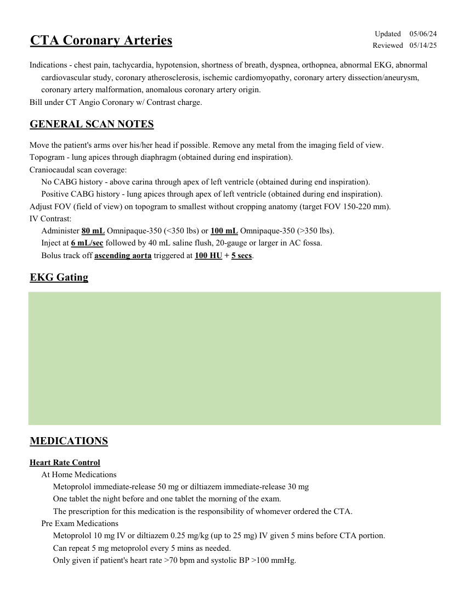
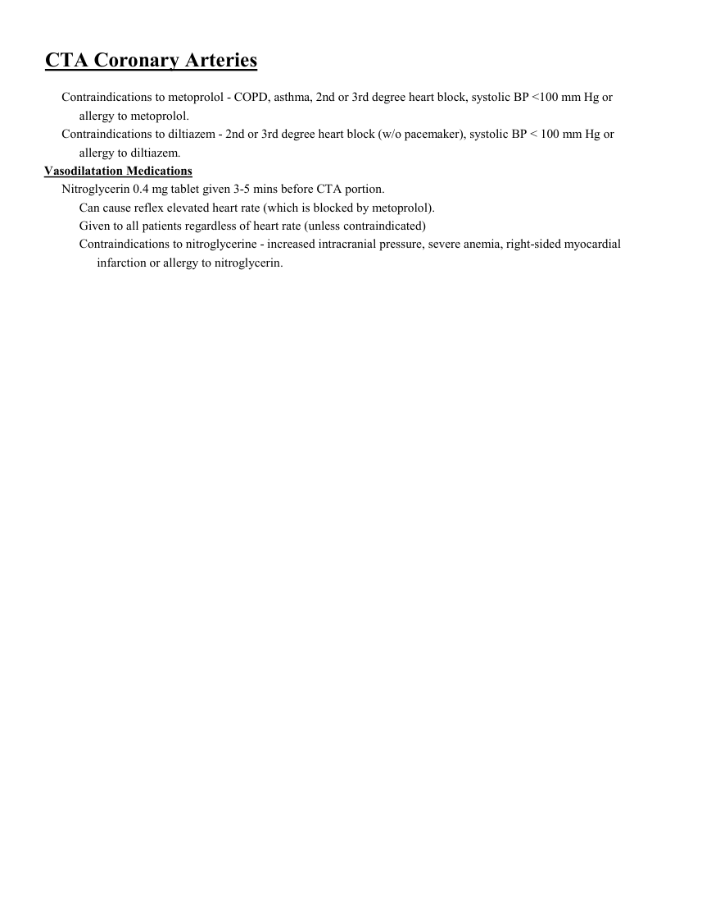
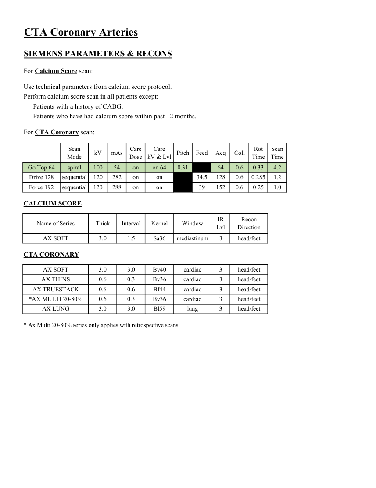

# CT — Artere coronare (MCB)

## Documentul original MCB — Artere coronare

**Protocol · 3 pagini · consultat la 2026-09-27.**

[Descarcă PDF-ul integral](../../assets/mcb-modalities/ct-artere-coronare-mcb/document.pdf) · [Sursa MCB](https://ref.mcbradiology.com/Protocols,%20Policies,%20Worksheets%20&%20Forms/CT/Protocols/Cardiac/2%20Coronary%20Artery.pdf) · [Catalogul MCB pentru această modalitate](../mcb/index.md)

Instrucțiunile, valorile și ilustrațiile din documentul original sunt păstrate în **engleză**. Titlul și navigarea sunt în română.

### Pagina 1

{ loading=lazy }

### Pagina 2

{ loading=lazy }

### Pagina 3

{ loading=lazy }

## Textul documentului original

??? abstract "Pagina 1 — text în engleză"

    
Updated
    05/06/24
    CTA Coronary Arteries
    Reviewed
    05/14/25
    Indications - chest pain, tachycardia, hypotension, shortness of breath, dyspnea, orthopnea, abnormal EKG, abnormal
    cardiovascular study, coronary atherosclerosis, ischemic cardiomyopathy, coronary artery dissection/aneurysm,
    coronary artery malformation, anomalous coronary artery origin.
    Bill under CT Angio Coronary w/ Contrast charge.
    GENERAL SCAN NOTES
    Move the patient&#x27;s arms over his/her head if possible. Remove any metal from the imaging field of view.
    Topogram - lung apices through diaphragm (obtained during end inspiration). 
    Craniocaudal scan coverage:
    No CABG history - above carina through apex of left ventricle (obtained during end inspiration). 
    Positive CABG history - lung apices through apex of left ventricle (obtained during end inspiration). 
    Adjust FOV (field of view) on topogram to smallest without cropping anatomy (target FOV 150-220 mm).
    IV Contrast:
    Administer 80 mL Omnipaque-350 (&lt;350 lbs) or 100 mL Omnipaque-350 (&gt;350 lbs).
    Inject at 6 mL/sec followed by 40 mL saline flush, 20-gauge or larger in AC fossa.
    Bolus track off ascending aorta triggered at 100 HU + 5 secs.
    EKG Gating
    MEDICATIONS
    Heart Rate Control
    At Home Medications
    Metoprolol immediate-release 50 mg or diltiazem immediate-release 30 mg
    One tablet the night before and one tablet the morning of the exam. 
    The prescription for this medication is the responsibility of whomever ordered the CTA.
    Pre Exam Medications
    Metoprolol 10 mg IV or diltiazem 0.25 mg/kg (up to 25 mg) IV given 5 mins before CTA portion.
    Can repeat 5 mg metoprolol every 5 mins as needed.
    Only given if patient&#x27;s heart rate &gt;70 bpm and systolic BP &gt;100 mmHg.
    

??? abstract "Pagina 2 — text în engleză"

    
CTA Coronary Arteries
    Contraindications to metoprolol - COPD, asthma, 2nd or 3rd degree heart block, systolic BP &lt;100 mm Hg or 
    allergy to metoprolol.
    Contraindications to diltiazem - 2nd or 3rd degree heart block (w/o pacemaker), systolic BP &lt; 100 mm Hg or 
    allergy to diltiazem.
    Vasodilatation Medications
    Nitroglycerin 0.4 mg tablet given 3-5 mins before CTA portion. 
    Can cause reflex elevated heart rate (which is blocked by metoprolol).
    Given to all patients regardless of heart rate (unless contraindicated)
    Contraindications to nitroglycerine - increased intracranial pressure, severe anemia, right-sided myocardial 
    infarction or allergy to nitroglycerin.
    

??? abstract "Pagina 3 — text în engleză"

    
CTA Coronary Arteries
    SIEMENS PARAMETERS &amp; RECONS
    For Calcium Score scan:
    Use technical parameters from calcium score protocol.
    Perform calcium score scan in all patients except:
    Patients with a history of CABG.
    Patients who have had calcium score within past 12 months.
    For CTA Coronary scan:
    Scan                           
    Care                                          
    Scan                 
    Pitch
    Coll
    Rot 
    Mode
    kV
    mAs
    Care                            
    Dose
    kV &amp; Lvl
    Feed
    Acq
    Time
    Time
    Go Top 64
    spiral
    100
    54
    on
    on 64
    0.31
    4.2
    64
    0.6
    0.33
    Drive 128
    sequential
    120
    282
    on
    on
    34.5
    128
    0.6
    0.285
    1.2
    Force 192
    sequential
    120
    288
    on
    on
    39
    152
    0.6
    0.25
    1.0
    CALCIUM SCORE
    IR                       
    Recon                     
    Name of Series
    Thick
    Interval
    Kernel
    Window
    Lvl
    Direction
    AX SOFT
    3.0
    1.5
    Sa36
    mediastinum
    3
    head/feet
    CTA CORONARY
    AX SOFT
    3.0
    3.0
    cardiac
    3
    head/feet
    Bv40
    AX THINS
    0.6
    0.3
    cardiac
    3
    Bv36
    head/feet
    AX TRUESTACK
    0.6
    0.6
    Bf44
    cardiac
    3
    head/feet
    head/feet
    *AX MULTI 20-80%
    0.6
    0.3
    cardiac
    3
    Bv36
    AX LUNG
    3.0
    3.0
    Bl59
    lung
    3
    head/feet
    * Ax Multi 20-80% series only applies with retrospective scans.
    

