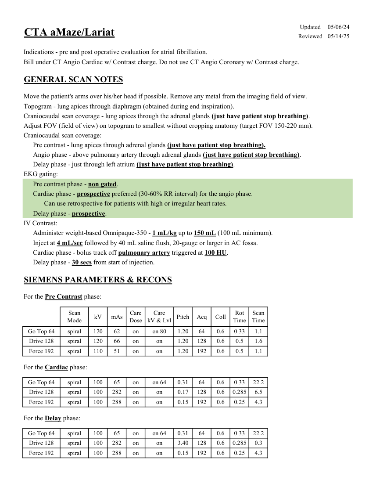
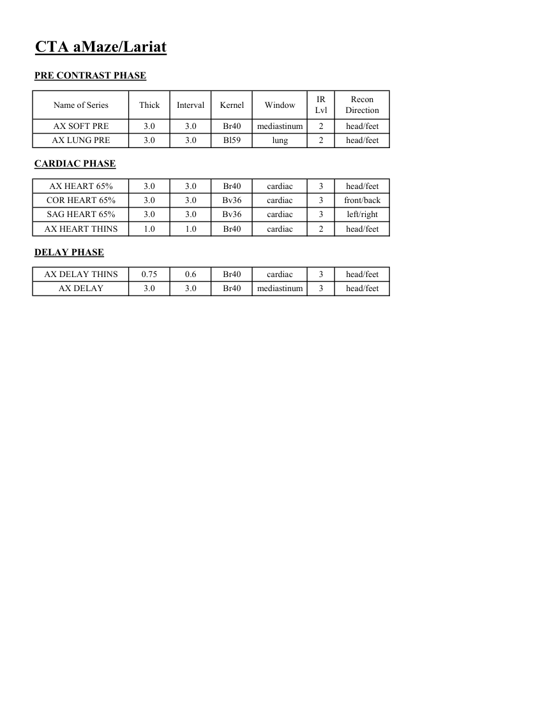

# CT — Planificare aMaze / Lariat (MCB)

## Documentul original MCB — Planificare aMaze / Lariat

**Protocol · 2 pagini · consultat la 2026-09-27.**

[Descarcă PDF-ul integral](../../assets/mcb-modalities/ct-planificare-amaze-lariat-mcb/document.pdf) · [Sursa MCB](https://ref.mcbradiology.com/Protocols,%20Policies,%20Worksheets%20&%20Forms/CT/Protocols/Cardiac/7%20aMaze%20Lariat.pdf) · [Catalogul MCB pentru această modalitate](../mcb/index.md)

Instrucțiunile, valorile și ilustrațiile din documentul original sunt păstrate în **engleză**. Titlul și navigarea sunt în română.

### Pagina 1

{ loading=lazy }

### Pagina 2

{ loading=lazy }

## Textul documentului original

??? abstract "Pagina 1 — text în engleză"

    
Updated
    05/06/24
    CTA aMaze/Lariat
    Reviewed
    05/14/25
    Indications - pre and post operative evaluation for atrial fibrillation.
    Bill under CT Angio Cardiac w/ Contrast charge. Do not use CT Angio Coronary w/ Contrast charge.
    GENERAL SCAN NOTES
    Move the patient&#x27;s arms over his/her head if possible. Remove any metal from the imaging field of view.
    Topogram - lung apices through diaphragm (obtained during end inspiration).
    Craniocaudal scan coverage - lung apices through the adrenal glands (just have patient stop breathing).
    Adjust FOV (field of view) on topogram to smallest without cropping anatomy (target FOV 150-220 mm).
    Craniocaudal scan coverage:
    Pre contrast - lung apices through adrenal glands (just have patient stop breathing).
    Angio phase - above pulmonary artery through adrenal glands (just have patient stop breathing).
    Delay phase - just through left atrium (just have patient stop breathing).
    EKG gating:
    Pre contrast phase - non gated.
    Cardiac phase - prospective preferred (30-60% RR interval) for the angio phase. 
     Can use retrospective for patients with high or irregular heart rates.
    Delay phase - prospective.
    IV Contrast:
    Administer weight-based Omnipaque-350 - 1 mL/kg up to 150 mL (100 mL minimum).
    Inject at 4 mL/sec followed by 40 mL saline flush, 20-gauge or larger in AC fossa.
    Cardiac phase - bolus track off pulmonary artery triggered at 100 HU.
    Delay phase - 30 secs from start of injection.
    SIEMENS PARAMETERS &amp; RECONS
    For the Pre Contrast phase:
    Scan                           
    Care                                          
    Scan                 
    Mode
    kV
    mAs
    Care                            
    Dose
    kV &amp; Lvl
    Pitch
    Acq
    Coll
    Rot 
    Time
    Time
    Go Top 64
    spiral
    120
    62
    on
    on 80
    1.20
    64
    0.6
    0.33
    1.1
    Drive 128
    spiral
    120
    66
    on
    1.6
    on
    1.20
    128
    0.6
    0.5
    Force 192
    spiral
    110
    51
    on
    on
    1.20
    192
    0.6
    0.5
    1.1
    For the Cardiac phase:
    Go Top 64
    spiral
    100
    65
    on
    on 64
    0.31
    64
    0.6
    0.33
    22.2
    Drive 128
    spiral
    100
    282
    on
    6.5
    on
    0.17
    128
    0.6
    0.285
    Force 192
    spiral
    100
    288
    on
    on
    0.15
    192
    0.6
    0.25
    4.3
    For the Delay phase:
    Go Top 64
    spiral
    100
    65
    on
    on 64
    0.31
    64
    0.6
    0.33
    22.2
    Drive 128
    spiral
    100
    282
    on
    0.3
    on
    3.40
    128
    0.6
    0.285
    Force 192
    spiral
    100
    288
    on
    on
    0.15
    192
    0.6
    0.25
    4.3
    

??? abstract "Pagina 2 — text în engleză"

    
CTA aMaze/Lariat
    PRE CONTRAST PHASE
    Recon                     
    Name of Series
    Thick
    Interval
    Kernel
    Window
    IR                       
    Lvl
    Direction
    AX SOFT PRE
    3.0
    3.0
    Br40
    mediastinum
    2
    head/feet
    AX LUNG PRE
    3.0
    3.0
    Bl59
    lung
    2
    head/feet
    CARDIAC PHASE
    AX HEART 65%
    3.0
    3.0
    Br40
    cardiac
    3
    head/feet
    COR HEART 65%
    3.0
    3.0
    Bv36
    cardiac
    3
    front/back
    SAG HEART 65%
    3.0
    3.0
    Bv36
    cardiac
    3
    left/right
    AX HEART THINS
    1.0
    1.0
    Br40
    cardiac
    2
    head/feet
    DELAY PHASE
    AX DELAY THINS
    0.75
    0.6
    Br40
    cardiac
    3
    head/feet
    AX DELAY
    3.0
    3.0
    Br40
    mediastinum
    3
    head/feet
    

