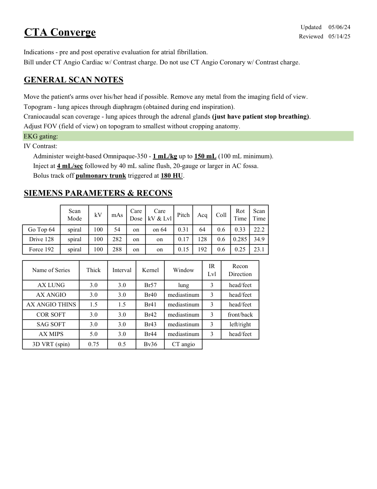

# CT — Planificare Converge (MCB)

## Documentul original MCB — Planificare Converge

**Protocol · 1 pagini · consultat la 2026-09-27.**

[Descarcă PDF-ul integral](../../assets/mcb-modalities/ct-planificare-converge-mcb/document.pdf) · [Sursa MCB](https://ref.mcbradiology.com/Protocols,%20Policies,%20Worksheets%20&%20Forms/CT/Protocols/Cardiac/6%20Converge.pdf) · [Catalogul MCB pentru această modalitate](../mcb/index.md)

Instrucțiunile, valorile și ilustrațiile din documentul original sunt păstrate în **engleză**. Titlul și navigarea sunt în română.

### Pagina 1

{ loading=lazy }

## Textul documentului original

??? abstract "Pagina 1 — text în engleză"

    
Updated
    05/06/24
    CTA Converge
    Reviewed
    05/14/25
    Indications - pre and post operative evaluation for atrial fibrillation.
    Bill under CT Angio Cardiac w/ Contrast charge. Do not use CT Angio Coronary w/ Contrast charge.
    GENERAL SCAN NOTES
    Move the patient&#x27;s arms over his/her head if possible. Remove any metal from the imaging field of view.
    Topogram - lung apices through diaphragm (obtained during end inspiration).
    Craniocaudal scan coverage - lung apices through the adrenal glands (just have patient stop breathing).
    Adjust FOV (field of view) on topogram to smallest without cropping anatomy.
    EKG gating:
    IV Contrast:
    Administer weight-based Omnipaque-350 - 1 mL/kg up to 150 mL (100 mL minimum).
    Inject at 4 mL/sec followed by 40 mL saline flush, 20-gauge or larger in AC fossa.
    Bolus track off pulmonary trunk triggered at 180 HU.
    SIEMENS PARAMETERS &amp; RECONS
    Scan                           
    Care                                          
    Scan                 
    Coll
    Rot 
    Mode
    kV
    mAs
    Care                            
    Dose
    kV &amp; Lvl
    Pitch
    Acq
    Time
    Time
    on 64
    0.31
    64
    0.6
    0.33
    22.2
    Go Top 64
    spiral
    100
    54
    on
    Drive 128
    spiral
    100
    282
    on
    on
    0.17
    128
    0.6
    0.285
    34.9
    Force 192
    spiral
    100
    288
    on
    on
    0.15
    192
    0.6
    0.25
    23.1
    Recon                     
    Name of Series
    Thick
    Interval
    Window
    IR                       
    Kernel
    Lvl
    Direction
    AX LUNG
    3.0
    3.0
    lung
    3
    head/feet
    Br57
    AX ANGIO
    3.0
    3.0
    mediastinum
    3
    Br40
    head/feet
    AX ANGIO THINS
    1.5
    1.5
    mediastinum
    3
    head/feet
    Br41
    COR SOFT
    3.0
    3.0
    mediastinum
    3
    Br42
    front/back
    SAG SOFT
    3.0
    3.0
    mediastinum
    3
    left/right
    Br43
    AX MIPS
    5.0
    3.0
    mediastinum
    3
    Br44
    head/feet
    3D VRT (spin)
    0.75
    0.5
    CT angio
    Bv36
    

