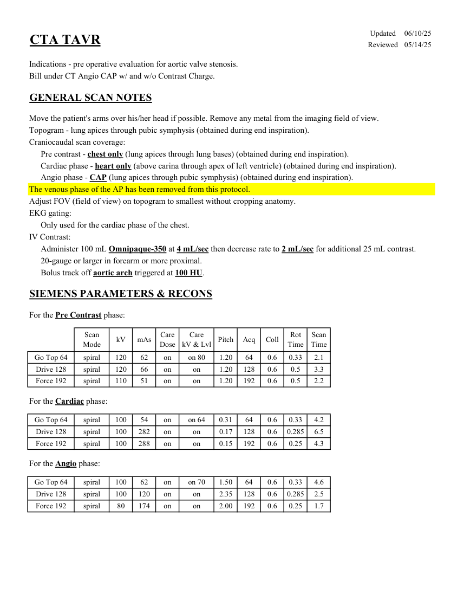
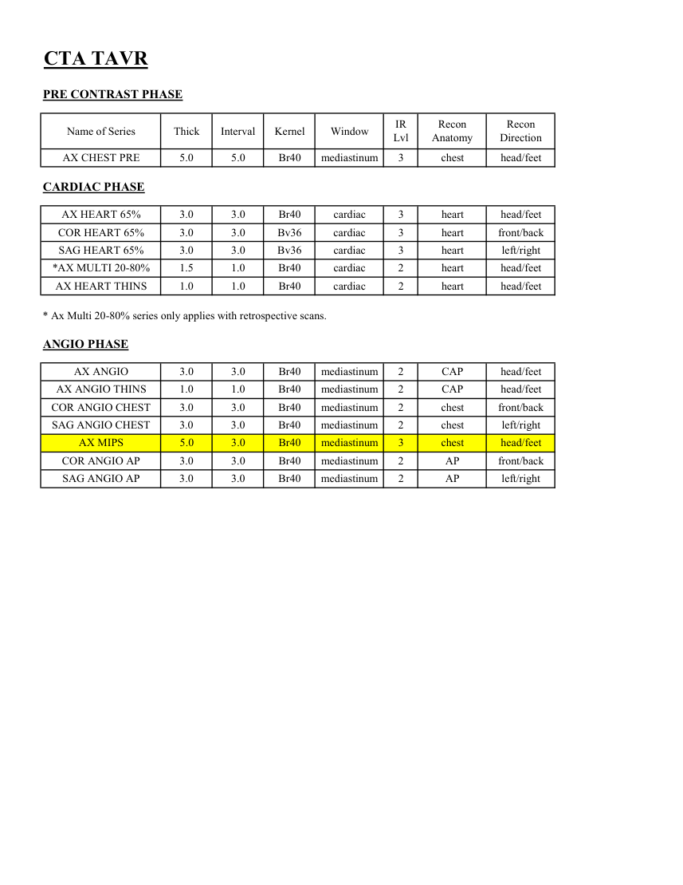

# CT — Planificare TAVR (MCB)

## Documentul original MCB — Planificare TAVR

**Protocol · 2 pagini · consultat la 2026-09-27.**

[Descarcă PDF-ul integral](../../assets/mcb-modalities/ct-planificare-tavr-mcb/document.pdf) · [Sursa MCB](https://ref.mcbradiology.com/Protocols,%20Policies,%20Worksheets%20&%20Forms/CT/Protocols/Cardiac/3%20TAVR.pdf) · [Catalogul MCB pentru această modalitate](../mcb/index.md)

Instrucțiunile, valorile și ilustrațiile din documentul original sunt păstrate în **engleză**. Titlul și navigarea sunt în română.

### Pagina 1

{ loading=lazy }

### Pagina 2

{ loading=lazy }

## Textul documentului original

??? abstract "Pagina 1 — text în engleză"

    
Updated
    06/10/25
    CTA TAVR
    Reviewed
    05/14/25
    Indications - pre operative evaluation for aortic valve stenosis.
    Bill under CT Angio CAP w/ and w/o Contrast Charge.
    GENERAL SCAN NOTES
    Move the patient&#x27;s arms over his/her head if possible. Remove any metal from the imaging field of view.
    Topogram - lung apices through pubic symphysis (obtained during end inspiration).
    Craniocaudal scan coverage:
    Pre contrast - chest only (lung apices through lung bases) (obtained during end inspiration).
    Cardiac phase - heart only (above carina through apex of left ventricle) (obtained during end inspiration).
    Angio phase - CAP (lung apices through pubic symphysis) (obtained during end inspiration).
    The venous phase of the AP has been removed from this protocol.
    Adjust FOV (field of view) on topogram to smallest without cropping anatomy.
    EKG gating:
    Only used for the cardiac phase of the chest.
    IV Contrast:
    Administer 100 mL Omnipaque-350 at 4 mL/sec then decrease rate to 2 mL/sec for additional 25 mL contrast.
    20-gauge or larger in forearm or more proximal.
    Bolus track off aortic arch triggered at 100 HU.
    SIEMENS PARAMETERS &amp; RECONS
    For the Pre Contrast phase:
    Scan                           
    Care                                          
    Scan                 
    Coll
    Rot 
    Mode
    kV
    mAs
    Care                            
    Dose
    kV &amp; Lvl
    Pitch
    Acq
    Time
    Time
    on 80
    1.20
    64
    0.6
    0.33
    2.1
    Go Top 64
    spiral
    120
    62
    on
    Drive 128
    spiral
    120
    66
    on
    1.20
    128
    0.6
    0.5
    3.3
    on
    Force 192
    spiral
    110
    51
    on
    on
    1.20
    192
    0.6
    0.5
    2.2
    For the Cardiac phase:
    Go Top 64
    spiral
    100
    54
    on
    on 64
    0.31
    64
    0.6
    0.33
    4.2
    Drive 128
    spiral
    100
    282
    on
    on
    0.17
    128
    0.6
    0.285
    6.5
    Force 192
    spiral
    100
    288
    on
    on
    0.15
    192
    0.6
    0.25
    4.3
    For the Angio phase:
    Go Top 64
    spiral
    100
    62
    on
    on 70
    1.50
    64
    0.6
    0.33
    4.6
    Drive 128
    spiral
    100
    120
    on
    on
    2.35
    128
    0.6
    0.285
    2.5
    Force 192
    spiral
    80
    174
    on
    on
    2.00
    192
    0.6
    0.25
    1.7
    

??? abstract "Pagina 2 — text în engleză"

    
CTA TAVR
    PRE CONTRAST PHASE
    Recon                       
    Recon                     
    Name of Series
    Thick
    Interval
    Window
    IR                       
    Lvl
    Kernel
    Anatomy
    Direction
    AX CHEST PRE
    5.0
    5.0
    mediastinum
    3
    head/feet
    Br40
    chest
    CARDIAC PHASE
    AX HEART 65%
    3.0
    3.0
    Br40
    cardiac
    3
    heart
    head/feet
    COR HEART 65%
    3.0
    3.0
    Bv36
    cardiac
    3
    front/back
    heart
    SAG HEART 65%
    3.0
    3.0
    Bv36
    cardiac
    3
    heart
    left/right
    *AX MULTI 20-80%
    1.5
    1.0
    Br40
    cardiac
    2
    head/feet
    heart
    AX HEART THINS
    1.0
    1.0
    Br40
    cardiac
    2
    heart
    head/feet
    * Ax Multi 20-80% series only applies with retrospective scans.
    ANGIO PHASE
    AX ANGIO
    3.0
    3.0
    Br40
    mediastinum
    2
    head/feet
    CAP
    AX ANGIO THINS
    1.0
    1.0
    Br40
    mediastinum
    2
    CAP
    head/feet
    COR ANGIO CHEST
    3.0
    3.0
    Br40
    mediastinum
    2
    front/back
    chest
    SAG ANGIO CHEST
    3.0
    3.0
    Br40
    mediastinum
    2
    chest
    left/right
    5.0
    3.0
    3
    head/feet
    AX MIPS
    Br40
    mediastinum
    chest
    COR ANGIO AP
    3.0
    3.0
    Br40
    mediastinum
    2
    AP
    front/back
    SAG ANGIO AP
    3.0
    3.0
    Br40
    mediastinum
    2
    AP
    left/right
    

