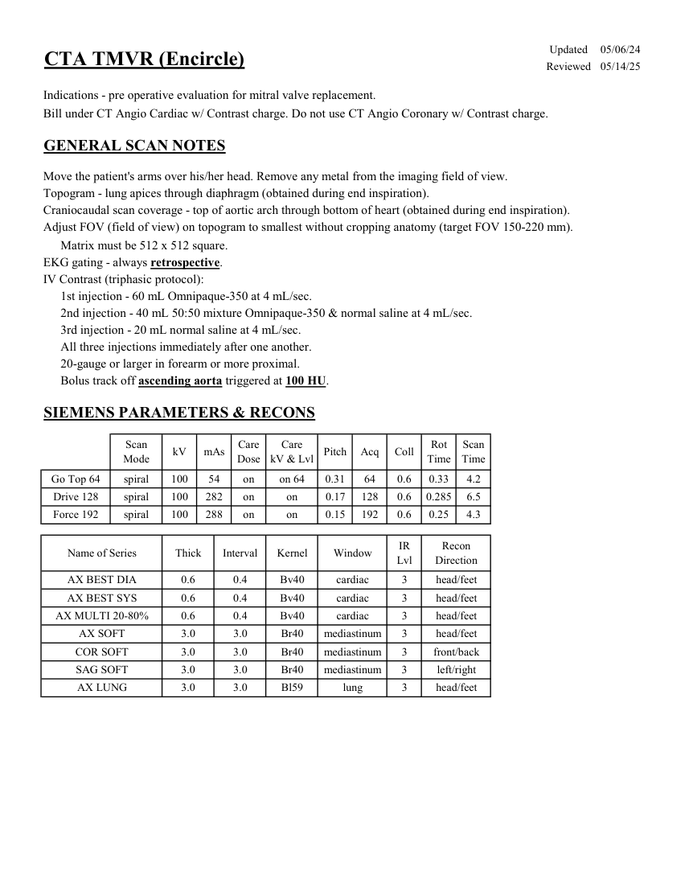

# CT — Planificare TMVR (Encircle) (MCB)

## Documentul original MCB — Planificare TMVR (Encircle)

**Protocol · 1 pagini · consultat la 2026-09-27.**

[Descarcă PDF-ul integral](../../assets/mcb-modalities/ct-planificare-tmvr-encircle-mcb/document.pdf) · [Sursa MCB](https://ref.mcbradiology.com/Protocols,%20Policies,%20Worksheets%20&%20Forms/CT/Protocols/Cardiac/4%20TMVR.pdf) · [Catalogul MCB pentru această modalitate](../mcb/index.md)

Instrucțiunile, valorile și ilustrațiile din documentul original sunt păstrate în **engleză**. Titlul și navigarea sunt în română.

### Pagina 1

{ loading=lazy }

## Textul documentului original

??? abstract "Pagina 1 — text în engleză"

    
Updated
    05/06/24
    CTA TMVR (Encircle)
    Reviewed
    05/14/25
    Indications - pre operative evaluation for mitral valve replacement.
    Bill under CT Angio Cardiac w/ Contrast charge. Do not use CT Angio Coronary w/ Contrast charge.
    GENERAL SCAN NOTES
    Move the patient&#x27;s arms over his/her head. Remove any metal from the imaging field of view.
    Topogram - lung apices through diaphragm (obtained during end inspiration).
    Craniocaudal scan coverage - top of aortic arch through bottom of heart (obtained during end inspiration).
    Adjust FOV (field of view) on topogram to smallest without cropping anatomy (target FOV 150-220 mm).
    Matrix must be 512 x 512 square.
    EKG gating - always retrospective.
    IV Contrast (triphasic protocol):
    1st injection - 60 mL Omnipaque-350 at 4 mL/sec.
    2nd injection - 40 mL 50:50 mixture Omnipaque-350 &amp; normal saline at 4 mL/sec.
    3rd injection - 20 mL normal saline at 4 mL/sec.
    All three injections immediately after one another.
    20-gauge or larger in forearm or more proximal.
    Bolus track off ascending aorta triggered at 100 HU.
    SIEMENS PARAMETERS &amp; RECONS
    Scan                           
    Care                                          
    Scan                 
    Coll
    Rot 
    Mode
    kV
    mAs
    Care                            
    Dose
    kV &amp; Lvl
    Pitch
    Acq
    Time
    Time
    on 64
    0.31
    64
    0.6
    0.33
    4.2
    Go Top 64
    spiral
    100
    54
    on
    Drive 128
    spiral
    100
    282
    on
    0.17
    128
    0.6
    0.285
    6.5
    on
    Force 192
    spiral
    100
    288
    on
    on
    0.15
    192
    0.6
    0.25
    4.3
    Recon                     
    Kernel
    Name of Series
    Thick
    Interval
    Window
    IR                       
    Lvl
    Direction
    AX BEST DIA
    0.6
    0.4
    cardiac
    3
    head/feet
    Bv40
    Bv40
    AX BEST SYS
    0.6
    0.4
    cardiac
    3
    head/feet
    AX MULTI 20-80%
    0.6
    0.4
    cardiac
    3
    head/feet
    Bv40
    AX SOFT
    3.0
    3.0
    Br40
    mediastinum
    3
    head/feet
    COR SOFT
    3.0
    3.0
    Br40
    mediastinum
    3
    front/back
    left/right
    SAG SOFT
    3.0
    3.0
    Br40
    mediastinum
    3
    head/feet
    AX LUNG
    3.0
    3.0
    lung
    3
    Bl59
    

