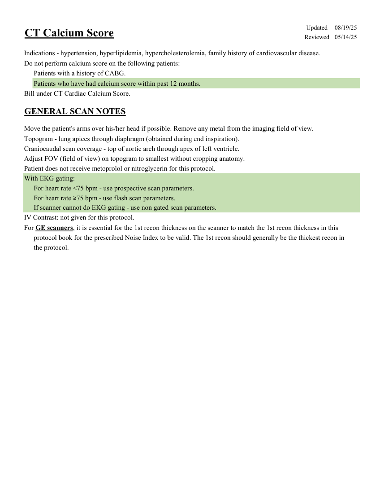
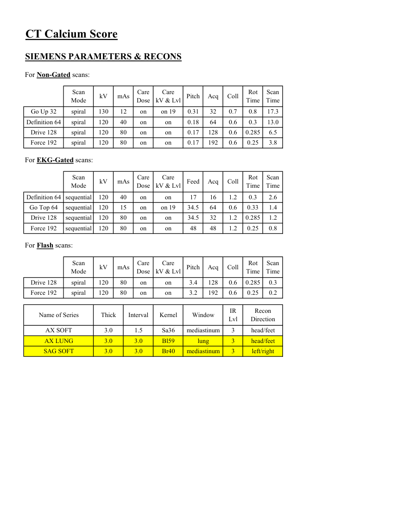
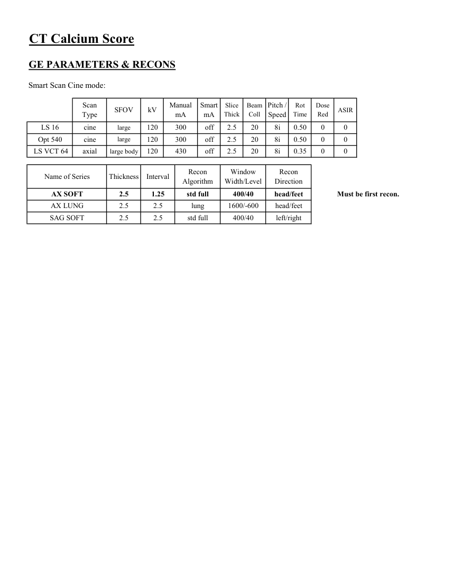

# CT — Scor de calciu coronarian (MCB)

## Documentul original MCB — Scor de calciu coronarian

**Protocol · 3 pagini · consultat la 2026-09-27.**

[Descarcă PDF-ul integral](../../assets/mcb-modalities/ct-scor-de-calciu-coronarian-mcb/document.pdf) · [Sursa MCB](https://ref.mcbradiology.com/Protocols,%20Policies,%20Worksheets%20&%20Forms/CT/Protocols/Cardiac/1%20Calcium%20Score.pdf) · [Catalogul MCB pentru această modalitate](../mcb/index.md)

Instrucțiunile, valorile și ilustrațiile din documentul original sunt păstrate în **engleză**. Titlul și navigarea sunt în română.

### Pagina 1

{ loading=lazy }

### Pagina 2

{ loading=lazy }

### Pagina 3

{ loading=lazy }

## Textul documentului original

??? abstract "Pagina 1 — text în engleză"

    
Updated
    08/19/25
    CT Calcium Score
    Reviewed
    05/14/25
    Indications - hypertension, hyperlipidemia, hypercholesterolemia, family history of cardiovascular disease.
    Do not perform calcium score on the following patients:
    Patients with a history of CABG.
    Patients who have had calcium score within past 12 months.
    Bill under CT Cardiac Calcium Score.
    GENERAL SCAN NOTES
    Move the patient&#x27;s arms over his/her head if possible. Remove any metal from the imaging field of view.
    Topogram - lung apices through diaphragm (obtained during end inspiration). 
    Craniocaudal scan coverage - top of aortic arch through apex of left ventricle.
    Adjust FOV (field of view) on topogram to smallest without cropping anatomy.
    Patient does not receive metoprolol or nitroglycerin for this protocol.
    With EKG gating:
    For heart rate &lt;75 bpm - use prospective scan parameters.
    For heart rate ≥75 bpm - use flash scan parameters.
    If scanner cannot do EKG gating - use non gated scan parameters.
    IV Contrast: not given for this protocol.
    For GE scanners, it is essential for the 1st recon thickness on the scanner to match the 1st recon thickness in this
    protocol book for the prescribed Noise Index to be valid. The 1st recon should generally be the thickest recon in 
    the protocol.
    

??? abstract "Pagina 2 — text în engleză"

    
CT Calcium Score
    SIEMENS PARAMETERS &amp; RECONS
    For Non-Gated scans:
    Scan                           
    Care                                          
    Scan                 
    Mode
    kV
    mAs
    Care                            
    Dose
    kV &amp; Lvl
    Pitch
    Acq
    Coll
    Rot 
    Time
    Time
    Go Up 32
    spiral
    130
    12
    on
    on 19
    0.31
    32
    0.7
    0.8
    17.3
    13.0
    Definition 64
    spiral
    120
    40
    on
    on
    0.18
    64
    0.6
    0.3
    Drive 128
    spiral
    120
    80
    on
    6.5
    on
    0.17
    128
    0.6
    0.285
    Force 192
    spiral
    120
    80
    on
    on
    0.17
    192
    0.6
    0.25
    3.8
    For EKG-Gated scans:
    Scan                           
    Care                                          
    Rot 
    Scan                 
    Feed
    Mode
    kV
    mAs
    Care                            
    Dose
    kV &amp; Lvl
    Acq
    Time
    Coll
    Time
    Definition 64 sequential
    120
    40
    on
    on
    17
    1.2
    2.6
    0.3
    16
    Go Top 64
    sequential
    120
    15
    on
    on 19
    64
    0.6
    0.33
    34.5
    1.4
    Drive 128
    sequential
    120
    80
    on
    32
    1.2
    0.285
    1.2
    on
    34.5
    Force 192
    sequential
    120
    80
    on
    on
    48
    1.2
    0.25
    0.8
    48
    For Flash scans:
    Scan                           
    Care                                          
    Scan                 
    mAs
    Care                            
    Mode
    kV
    Dose
    kV &amp; Lvl
    Pitch
    Acq
    Coll
    Rot 
    Time
    Time
    Drive 128
    spiral
    120
    80
    on
    3.4
    128
    on
    0.6
    0.285
    0.3
    Force 192
    spiral
    120
    80
    on
    on
    3.2
    192
    0.6
    0.25
    0.2
    Recon                     
    Name of Series
    Thick
    Interval
    Window
    IR                       
    Kernel
    Lvl
    Direction
    AX SOFT
    3.0
    1.5
    mediastinum
    3
    head/feet
    Sa36
    AX LUNG
    3.0
    3.0
    lung
    3
    Bl59
    head/feet
    SAG SOFT
    3.0
    3.0
    Br40
    mediastinum
    3
    left/right
    

??? abstract "Pagina 3 — text în engleză"

    
CT Calcium Score
    GE PARAMETERS &amp; RECONS
    Smart Scan Cine mode:
    Scan               
    Smart 
    Pitch /               
    Slice                       
    Beam                                 
    Rot                                
    Dose                                                    
    Thick
    Coll
    Time
    Red
    ASIR
    Type
    SFOV
    kV
    Manual                                
    mA
    mA
    Speed
    LS 16
    cine
    large
    120
    300
    off
    2.5
    20
    8i
    0.50
    0
    0
    Opt 540
    cine
    large
    120
    300
    off
    2.5
    20
    8i
    0.50
    0
    0
     LS VCT 64
    axial
    large body
    120
    430
    off
    2.5
    20
    8i
    0.35
    0
    0
    Window                                   
    Recon 
    Name of Series
    Thickness
    Interval
    Recon                                     
    Algorithm
    Width/Level
    Direction
    AX SOFT
    2.5
    1.25
    std full
    400/40
    head/feet
    Must be first recon.
    AX LUNG
    2.5
    2.5
    lung
    1600/-600
    head/feet
    SAG SOFT
    2.5
    2.5
    std full
    400/40
    left/right
    

