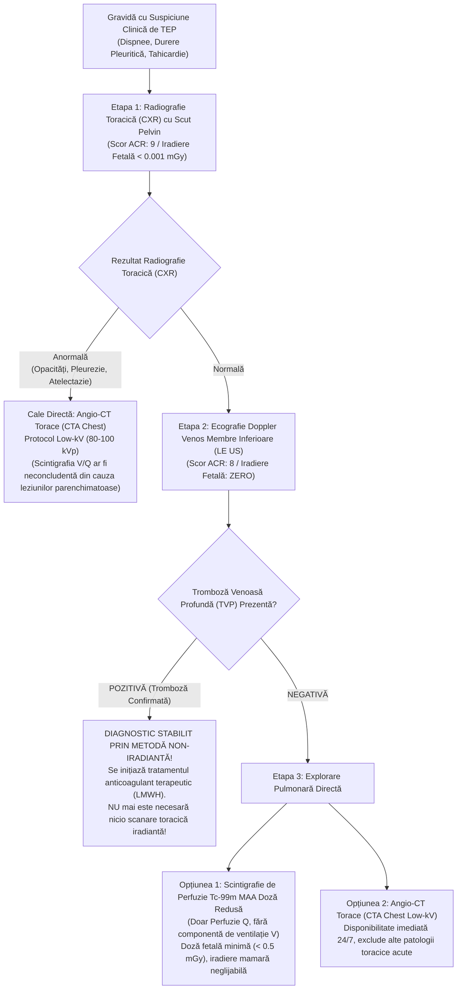

# Protocol Angio-CT Torace & Algoritm Suspiciune Embolie Pulmonară în Sarcină (MRG / ACR)

**Ultima actualizare:** 2026-09-27  
**Autori:** Medford Radiology Group (MRG) / ACR Appropriateness Criteria Guidelines Committee  

---

-   __1. Rezumat Clinic & Algoritm Strategic__

    ---

    === "Rezumat Achiziție CT"

        | Serie | Fază / Declanșare | Acoperire Anatomică | Volum & Debit Contrast |
        |:---|:---|:---|:---|
        | **Angio-CT Pulmonar Low-kV** | Bolus Tracking (ROI trunchi AP, trigger 100 HU + 3s) | Baza plămânilor (diafragm) → Vârfuri pulmonare (direcție caudo-cranială) | 60 - 70 mL la 4.0 - 4.5 mL/s + 40 mL ser fiziologic |

    === "Indicații Clinice"

        - Suspiciune înaltă de trombembolism pulmonar acut (TEP) la pacienta gravidă în oricare trimestru de sarcină
        - Debut brusc de dispnee, tahicardie inexplicabilă, durere toracică pleuritică sau hemoptizie
        - Scor clinic YEARS sau Geneva revizuit sugestiv, sau valori crescute ale D-dimerilor
        - Suspiciune de cord pulmonar acut sau colaps hemodinamic nespecific

    === "Ghid Național IRIS"

        !!! info "Referință Ghid Național IRIS (Ordinul MS 1342/2012)"
            - **Capitol:** *Torace & Pulmon*
            - **Grad de Recomandare:** **Grad A**
            - **Nivel de Iradiere Estimată:** `Clasa 2 (Mică 1 - 5 mSv)` prin optimizare Low-kV (80-100 kVp)

            [:octicons-search-16: Deschide Ghidul IRIS](../../iris.md){ .md-button .md-button--primary }

-   __2. Pregătire Pacient & Protecție Fetală__

    ---

    - **Poziționare:** Decubit dorsal cu brațele ridicate deasupra capului. În trimestrul III de sarcină, se recomandă o ușoară înclinare pe flancul stâng (10-15°) cu o perină sub fesa dreaptă pentru a preveni compresiunea venei cave inferioare de către uterul gravid.
    - **Protecție Plumbată:** Șorț de plumb așezat peste abdomen și pelvis (pentru a reduce radiația împrăștiată secundară din gantry).
    - **Acces Venos:** Canulă intravenoasă 18G sau 20G în plica cotului (evitarea venelor fragile ale mâinii pentru debite de 4.0-4.5 mL/s).

---

## Algoritmul Diagnostic MRG / ACR pentru Suspiciunea de TEP în Sarcină

---

## Comparație Dozimetrică Maternă & Fetală (CTA Torace vs. Scintigrafie V/Q)

| Parametru de Iradiere | Angio-CT Torace (CTA Chest Low-kV) | Scintigrafie Perfuzie Tc-99m MAA (Doză Redusă) | Concluzie Clinică & Decizie |
|:---|:---|:---|:---|
| **Doza la Glanda Mamară Maternă** | 10 – 30 mGy (țesut glandular radiosensibil proliferat în sarcină) | 0.2 – 0.5 mGy (semnificativ mai mică) | Scintigrafia de perfuzie protejează parenchimul mamar matern; CTA impune colimare strânsă și reconstrucții iterative |
| **Doza Fetală Absorbită** | 0.05 – 0.2 mGy (infimă, mult sub pragul teratogen de 50-100 mGy) | 0.1 – 0.5 mGy (excreție urinară a trasorului lângă uter) | Ambele metode sunt sigure pentru făt, doza fiind de mii de ori sub pragul de risc teratogen |
| **Disponibilitate & Viteză** | Imediată 24/7 (achiziție în 2-3 secunde) | Variabilă (necesită radiofarmaceutic disponibil și cameră gamma) | CTA este investigația de elecție în gardă și la paciente instabile |
| **Acuratețe în caz de CXR anormală** | Diagnostic cert de TEP + patologie alternativă (pneumonie, disecție, revărsat) | Risc ridicat de examinare neconcludentă / nedeterminată | Dacă radiografia toracică este anormală, **CTA este obligatorie** |

---

## Protocol Tehnic de Scanare CT Low-kV la Gravide

1. **Optimizarea Tensiunii de Tub (80 - 100 kVp):**
    - Scăderea tensiunii de la 120 kVp la 80 sau 100 kVp apropie energia fotonilor X de vârful de absorbție fotoelectrică a iodului (K-edge = 33.2 keV).
    - Permite o intensitate de semnal endoluminal mult mai mare (> 350-400 HU) cu un volum redus de contrast (60 mL) și o reducere a dozei totale de radiație cu până la 40-50%.
2. **Direcție de Scanare Caudo-Cranială:**
    - Scanarea începe de la diafragm spre apexurile pulmonare.
    - La pacientele gravide, presiunea intraabdominală crescută și efortul respirator duc la degradarea calității imagistice la bazele plămânilor la finalul apneei; direcția caudo-cranială surprinde bazele în prima secundă de achiziție, la concentrația maximă a bolusului de contrast.
3. **Prevenirea Diluției Tranzitorii a Contrastului (Transient Interruption of Contrast):**
    - Fenomenul apare frecvent la pacientele tinere și gravide când inspiră adânc imediat înainte de scanare (manevra Valsalva urmată de inspir profund).
    - Presiunea negativă intratoracică atrage un volum masiv de sânge neopacifiat din vena cavă inferioară direct în atriul drept și ventriculul drept, diluând bolusul de contrast din arterele pulmonare.
    - **Soluție practică:** Pacienta este instruită să respire liniștit și să țină o apnee blândă, fără inspir forțat.

---

## Recomandări Post-Procedură & Alăptare

- **Hidratare:** Se recomandă hidratare suplimentară (500-1000 mL apă plată sau fluide IV) pentru accelerarea excreției renale a substanței de contrast.
- **Funcția Tiroidiană Fetală / Neonatală:** Iodul administrat transplacentar se metabolizează rapid; se notează în dosarul obstetrical administrarea substanței de contrast pentru screeningul neonatal de rutină al TSH la naștere.
- **Alăptare:** Conform ACR și ghidului MRG, substanțele de contrast iodate non-ionice sunt sigure; cantitatea excretată în lapte este sub 0.04%, iar absorbția intestinală a nou-născutului este neglijabilă. Alăptarea poate continua normal.
