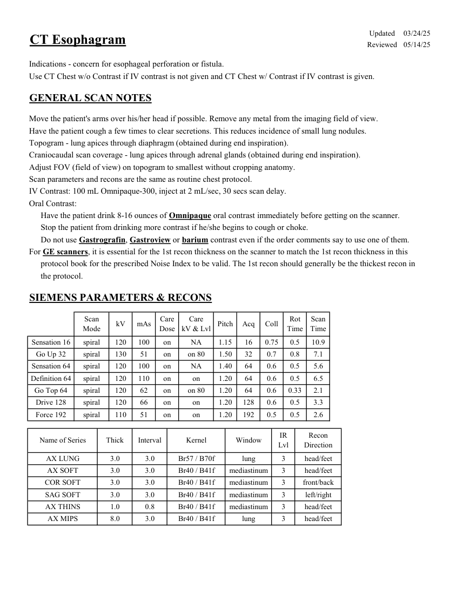
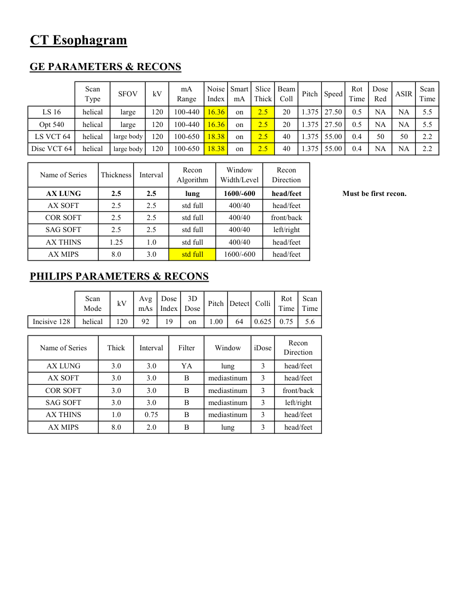

# CT — Esofagografie (MCB)

## Documentul original MCB — Esofagografie

**Protocol · 2 pagini · consultat la 2026-09-27.**

[Descarcă PDF-ul integral](../../assets/mcb-modalities/ct-esofagografie-mcb/document.pdf) · [Sursa MCB](https://ref.mcbradiology.com/Protocols,%20Policies,%20Worksheets%20&%20Forms/CT/Protocols/Chest/12%20Esophagram.pdf) · [Catalogul MCB pentru această modalitate](../mcb/index.md)

Instrucțiunile, valorile și ilustrațiile din documentul original sunt păstrate în **engleză**. Titlul și navigarea sunt în română.

### Pagina 1

{ loading=lazy }

### Pagina 2

{ loading=lazy }

## Textul documentului original

??? abstract "Pagina 1 — text în engleză"

    
Updated
    03/24/25
    CT Esophagram
    Reviewed
    05/14/25
    Indications - concern for esophageal perforation or fistula.
    Use CT Chest w/o Contrast if IV contrast is not given and CT Chest w/ Contrast if IV contrast is given.
    GENERAL SCAN NOTES
    Move the patient&#x27;s arms over his/her head if possible. Remove any metal from the imaging field of view.
    Have the patient cough a few times to clear secretions. This reduces incidence of small lung nodules.
    Topogram - lung apices through diaphragm (obtained during end inspiration). 
    Craniocaudal scan coverage - lung apices through adrenal glands (obtained during end inspiration).
    Adjust FOV (field of view) on topogram to smallest without cropping anatomy.
    Scan parameters and recons are the same as routine chest protocol.
    IV Contrast: 100 mL Omnipaque-300, inject at 2 mL/sec, 30 secs scan delay.
    Oral Contrast:
    Have the patient drink 8-16 ounces of Omnipaque oral contrast immediately before getting on the scanner.
    Stop the patient from drinking more contrast if he/she begins to cough or choke. 
    Do not use Gastrografin, Gastroview or barium contrast even if the order comments say to use one of them.
    For GE scanners, it is essential for the 1st recon thickness on the scanner to match the 1st recon thickness in this
    protocol book for the prescribed Noise Index to be valid. The 1st recon should generally be the thickest recon in 
    the protocol.
    SIEMENS PARAMETERS &amp; RECONS
    Scan                           
    Care                                          
    Scan                 
    Mode
    kV
    mAs
    Care                            
    Dose
    kV &amp; Lvl
    Pitch
    Acq
    Coll
    Rot 
    Time
    Time
    Sensation 16
    spiral
    120
    100
    on
    NA
    1.15
    16
    0.75
    0.5
    10.9
    Go Up 32
    spiral
    130
    51
    on
    on 80
    1.50
    32
    0.7
    0.8
    7.1
    Sensation 64
    spiral
    120
    100
    on
    NA
    1.40
    64
    0.6
    0.5
    5.6
    Definition 64
    spiral
    120
    110
    on
    on
    1.20
    0.5
    64
    0.6
    6.5
    Go Top 64
    spiral
    120
    62
    on
    on 80
    1.20
    64
    0.6
    0.33
    2.1
    Drive 128
    spiral
    120
    66
    on
    on
    1.20
    128
    0.6
    0.5
    3.3
    on
    1.20
    192
    Force 192
    spiral
    110
    51
    on
    0.5
    0.5
    2.6
    Recon                     
    Name of Series
    Thick
    Interval
    Kernel
    Window
    IR                       
    Lvl
    Direction
    AX LUNG
    3.0
    3.0
    Br57 / B70f
    lung
    3
    head/feet
    AX SOFT
    3.0
    3.0
    Br40 / B41f
    mediastinum
    3
    head/feet
    COR SOFT
    3.0
    3.0
    Br40 / B41f
    mediastinum
    3
    front/back
    SAG SOFT
    3.0
    3.0
    Br40 / B41f
    mediastinum
    3
    left/right
    AX THINS
    1.0
    0.8
    Br40 / B41f
    mediastinum
    3
    head/feet
    head/feet
    AX MIPS
    8.0
    3.0
    Br40 / B41f
    lung
    3
    

??? abstract "Pagina 2 — text în engleză"

    
CT Esophagram
    GE PARAMETERS &amp; RECONS
    Scan               
    Smart             
    Slice                       
    Beam                                 
    Rot                                
    Dose                                          
    Scan                 
    Pitch
    Speed
    Type
    SFOV
    kV
    mA                           
    Range
    Noise                    
    Index
    mA
    Thick
    Coll
    Time
    Red
    ASIR
    Time
    LS 16
    helical
    large
    120
    100-440
    16.36
    on
    2.5
    20
    1.375 27.50
    0.5
    NA
    NA
    5.5
    Opt 540
    helical
    large
    120
    100-440
    16.36
    on
    2.5
    20
    1.375 27.50
    0.5
    NA
    NA
    5.5
     LS VCT 64
    helical
    large body
    120
    100-650
    18.38
    on
    2.5
    40
    1.375
    55.00
    0.4
    50
    50
    2.2
    Disc VCT 64
    helical
    large body
    120
    100-650
    18.38
    on
    2.5
    40
    1.375
    55.00
    0.4
    NA
    NA
    2.2
    Window                                   
    Recon                    
    Name of Series
    Thickness
    Interval
    Recon                                     
    Algorithm
    Width/Level
    Direction
    AX LUNG
    2.5
    2.5
    lung
    1600/-600
    head/feet
    Must be first recon.
    AX SOFT
    2.5
    2.5
    std full
    400/40
    head/feet
    COR SOFT
    2.5
    2.5
    std full
    400/40
    front/back
    SAG SOFT
    2.5
    2.5
    std full
    400/40
    left/right
    AX THINS
    1.25
    1.0
    std full
    400/40
    head/feet
    AX MIPS
    8.0
    3.0
    std full
    1600/-600
    head/feet
    PHILIPS PARAMETERS &amp; RECONS
    Scan                           
    Dose                                          
    3D            
    Rot 
    Scan                 
    Detect Colli
    Mode
    kV
    Avg                      
    mAs
    Index
    Dose
    Pitch
    Time
    Time
    0.75
    Incisive 128
    helical
    120
    92
    19
    on
    1.00
    64
    0.625
    5.6
    Recon                     
    Name of Series
    Thick
    Interval
    Filter
    Window
    iDose
    Direction
    AX LUNG
    3.0
    3.0
    YA
    lung
    3
    head/feet
    AX SOFT
    3.0
    3.0
    B
    mediastinum
    3
    head/feet
    COR SOFT
    3.0
    3.0
    B
    mediastinum
    3
    front/back
    SAG SOFT
    3.0
    3.0
    B
    mediastinum
    3
    left/right
    AX THINS
    1.0
    0.75
    B
    mediastinum
    3
    head/feet
    head/feet
    AX MIPS
    8.0
    2.0
    B
    lung
    3
    

