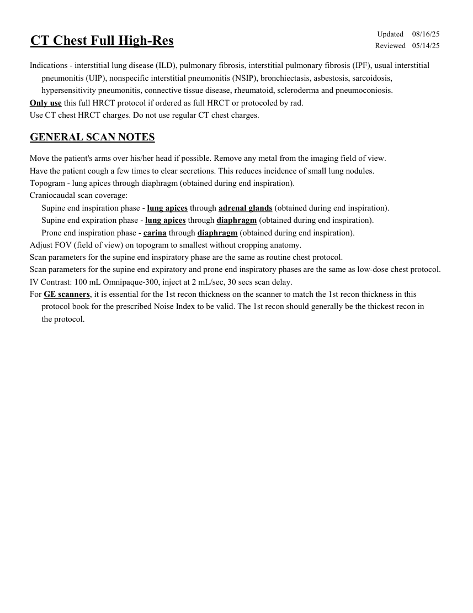
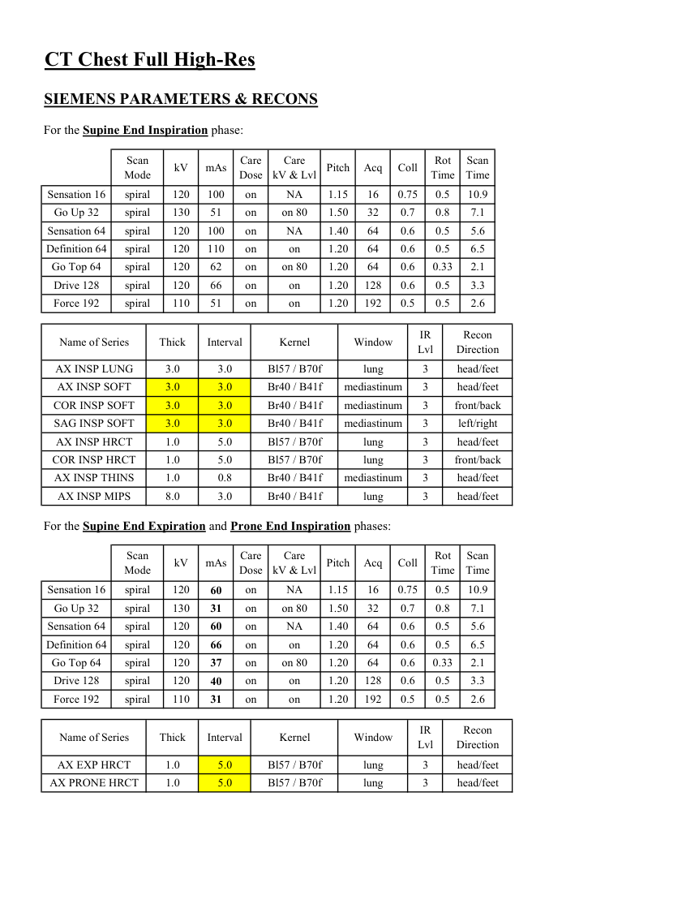
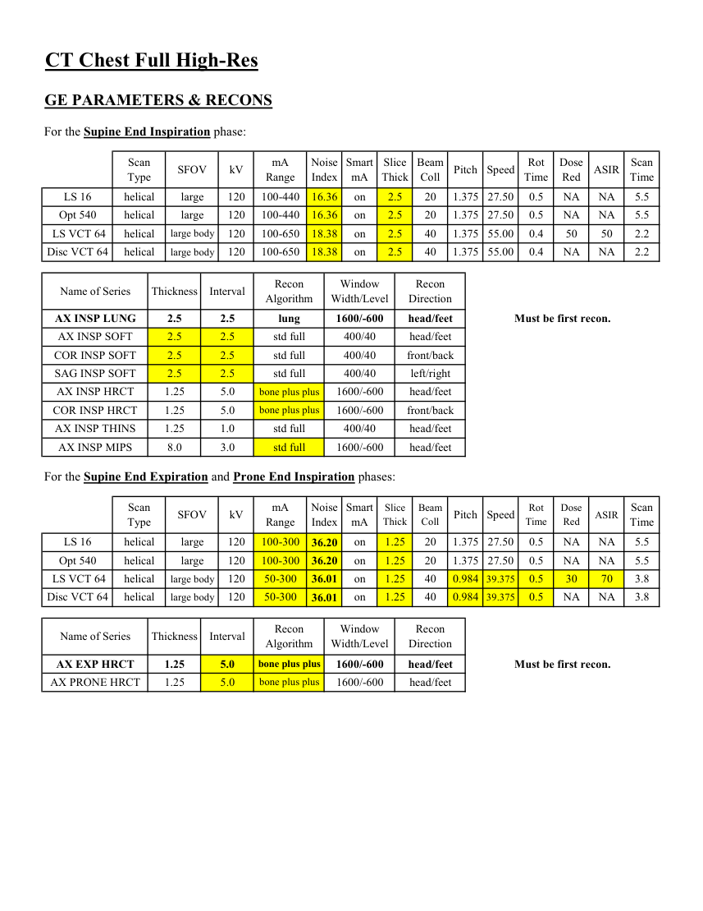
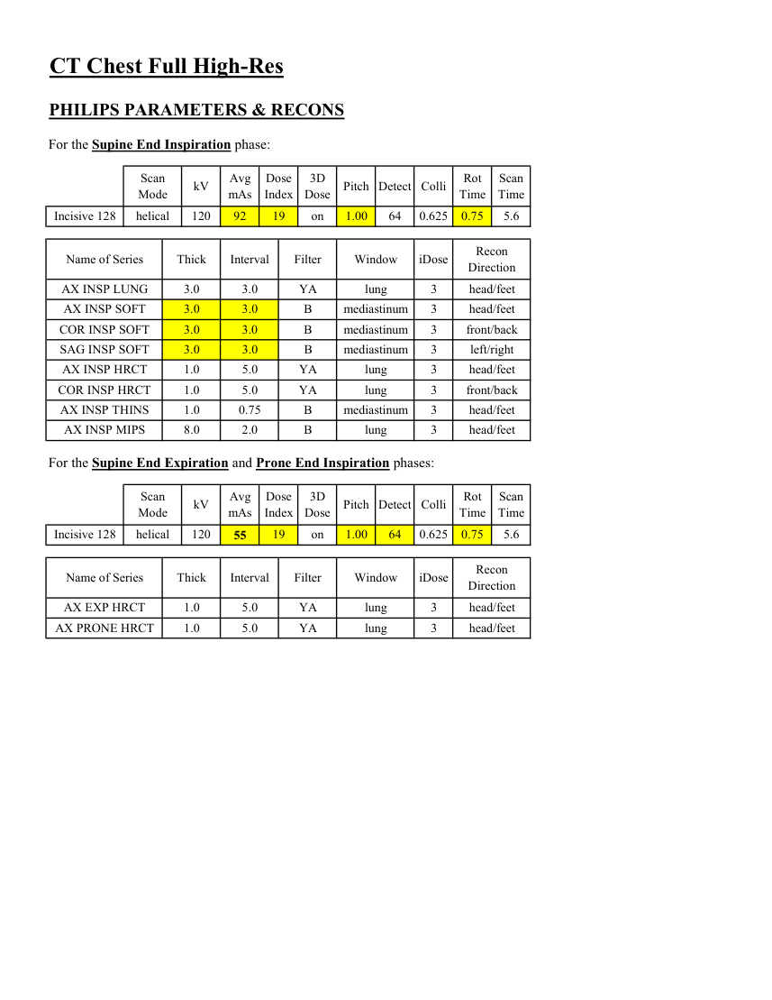

# CT — HRCT complet (MCB)

## Documentul original MCB — HRCT complet

**Protocol · 4 pagini · consultat la 2026-09-27.**

[Descarcă PDF-ul integral](../../assets/mcb-modalities/ct-hrct-complet-mcb/document.pdf) · [Sursa MCB](https://ref.mcbradiology.com/Protocols,%20Policies,%20Worksheets%20&%20Forms/CT/Protocols/Chest/5%20HRCT%20Full.pdf) · [Catalogul MCB pentru această modalitate](../mcb/index.md)

Instrucțiunile, valorile și ilustrațiile din documentul original sunt păstrate în **engleză**. Titlul și navigarea sunt în română.

### Pagina 1

{ loading=lazy }

### Pagina 2

{ loading=lazy }

### Pagina 3

{ loading=lazy }

### Pagina 4

{ loading=lazy }

## Textul documentului original

??? abstract "Pagina 1 — text în engleză"

    
Updated
    08/16/25
    CT Chest Full High-Res
    Reviewed
    05/14/25
    Indications - interstitial lung disease (ILD), pulmonary fibrosis, interstitial pulmonary fibrosis (IPF), usual interstitial
         pneumonitis (UIP), nonspecific interstitial pneumonitis (NSIP), bronchiectasis, asbestosis, sarcoidosis,
         hypersensitivity pneumonitis, connective tissue disease, rheumatoid, scleroderma and pneumoconiosis.
    Only use this full HRCT protocol if ordered as full HRCT or protocoled by rad.
    Use CT chest HRCT charges. Do not use regular CT chest charges.
    GENERAL SCAN NOTES
    Move the patient&#x27;s arms over his/her head if possible. Remove any metal from the imaging field of view.
    Have the patient cough a few times to clear secretions. This reduces incidence of small lung nodules.
    Topogram - lung apices through diaphragm (obtained during end inspiration). 
    Craniocaudal scan coverage:
    Supine end inspiration phase - lung apices through adrenal glands (obtained during end inspiration).
    Supine end expiration phase - lung apices through diaphragm (obtained during end inspiration).
    Prone end inspiration phase - carina through diaphragm (obtained during end inspiration).
    Adjust FOV (field of view) on topogram to smallest without cropping anatomy.
    Scan parameters for the supine end inspiratory phase are the same as routine chest protocol.
    Scan parameters for the supine end expiratory and prone end inspiratory phases are the same as low-dose chest protocol.
    IV Contrast: 100 mL Omnipaque-300, inject at 2 mL/sec, 30 secs scan delay.
    For GE scanners, it is essential for the 1st recon thickness on the scanner to match the 1st recon thickness in this
    protocol book for the prescribed Noise Index to be valid. The 1st recon should generally be the thickest recon in 
    the protocol.
    

??? abstract "Pagina 2 — text în engleză"

    
CT Chest Full High-Res
    SIEMENS PARAMETERS &amp; RECONS
    For the Supine End Inspiration phase:
    Scan                           
    Care                                          
    Scan                 
    Mode
    kV
    mAs
    Care                            
    Dose
    kV &amp; Lvl
    Pitch
    Acq
    Coll
    Rot 
    Time
    Time
    Sensation 16
    spiral
    120
    100
    on
    NA
    1.15
    16
    0.75
    0.5
    10.9
    Go Up 32
    spiral
    130
    51
    on
    on 80
    1.50
    32
    0.7
    0.8
    7.1
    Sensation 64
    spiral
    120
    100
    on
    NA
    1.40
    64
    0.6
    0.5
    5.6
    Definition 64
    spiral
    120
    110
    on
    on
    1.20
    64
    0.6
    0.5
    6.5
    120
    Go Top 64
    spiral
    62
    on
    on 80
    1.20
    64
    0.6
    0.33
    2.1
    Drive 128
    spiral
    120
    66
    on
    on
    1.20
    128
    0.6
    0.5
    3.3
    Force 192
    spiral
    110
    51
    on
    on
    1.20
    192
    0.5
    0.5
    2.6
    Recon                     
    Name of Series
    Thick
    Interval
    Kernel
    Window
    IR                       
    Lvl
    Direction
    3.0
    3.0
    Bl57 / B70f
    lung
    3
    head/feet
    AX INSP LUNG
    AX INSP SOFT
    3.0
    3.0
    Br40 / B41f
    mediastinum
    3
    head/feet
    COR INSP SOFT
    3.0
    3.0
    Br40 / B41f
    mediastinum
    3
    front/back
    SAG INSP SOFT
    3.0
    3.0
    Br40 / B41f
    mediastinum
    3
    left/right
    AX INSP HRCT
    1.0
    5.0
    Bl57 / B70f
    lung
    3
    head/feet
    COR INSP HRCT
    1.0
    5.0
    Bl57 / B70f
    lung
    3
    front/back
    AX INSP THINS
    1.0
    0.8
    Br40 / B41f
    mediastinum
    3
    head/feet
    AX INSP MIPS
    3
    head/feet
    8.0
    3.0
    Br40 / B41f
    lung
    For the Supine End Expiration and Prone End Inspiration phases:
    Scan                           
    Care                                          
    Scan                 
    Mode
    kV
    mAs
    Care                            
    Dose
    kV &amp; Lvl
    Pitch
    Acq
    Coll
    Rot 
    Time
    Time
    NA
    1.15
    16
    0.75
    0.5
    10.9
    Sensation 16
    spiral
    120
    60
    on
    Go Up 32
    spiral
    130
    on 80
    1.50
    32
    0.7
    0.8
    7.1
    31
    on
    NA
    1.40
    64
    0.6
    0.5
    5.6
    Sensation 64
    spiral
    120
    60
    on
    Definition 64
    spiral
    120
    on
    1.20
    64
    0.6
    0.5
    6.5
    66
    on
    Go Top 64
    on 80
    1.20
    64
    0.6
    0.33
    2.1
    spiral
    120
    37
    on
    on
    1.20
    128
    0.6
    0.5
    3.3
    Drive 128
    spiral
    120
    40
    on
    0.5
    2.6
    Force 192
    spiral
    110
    31
    on
    on
    1.20
    192
    0.5
    IR                       
    Recon                     
    Name of Series
    Thick
    Interval
    Kernel
    Window
    Lvl
    Direction
    AX EXP HRCT
    lung
    1.0
    5.0
    Bl57 / B70f
    3
    head/feet
    AX PRONE HRCT
    1.0
    5.0
    lung
    Bl57 / B70f
    3
    head/feet
    

??? abstract "Pagina 3 — text în engleză"

    
CT Chest Full High-Res
    GE PARAMETERS &amp; RECONS
    For the Supine End Inspiration phase:
    Scan               
    Smart             
    Slice                       
    Beam                                 
    Dose                                          
    Scan                 
    Speed
    Rot                                
    Type
    SFOV
    kV
    mA                           
    Range
    Noise                    
    Index
    mA
    Thick
    Coll
    Red
    ASIR
    Pitch
    Time
    Time
    LS 16
    helical
    large
    120
    100-440
    16.36
    on
    2.5
    20
    1.375
    27.50
    0.5
    NA
    NA
    5.5
    Opt 540
    helical
    large
    120
    100-440
    16.36
    on
    2.5
    20
    0.5
    1.375 27.50
    NA
    NA
    5.5
     LS VCT 64
    helical
    large body
    120
    100-650
    18.38
    on
    2.5
    40
    1.375
    55.00
    0.4
    50
    50
    2.2
    Disc VCT 64
    large body
    120
    100-650
    helical
    18.38
    on
    2.5
    40
    1.375
    55.00
    0.4
    NA
    NA
    2.2
    Window                                   
    Recon                    
    Name of Series
    Thickness
    Interval
    Recon                                     
    Algorithm
    Width/Level
    Direction
    AX INSP LUNG
    2.5
    2.5
    lung
    1600/-600
    head/feet
    Must be first recon.
    AX INSP SOFT
    400/40
    head/feet
    2.5
    2.5
    std full
    COR INSP SOFT
    2.5
    2.5
    std full
    400/40
    front/back
    SAG INSP SOFT
    2.5
    2.5
    std full
    400/40
    left/right
    AX INSP HRCT
    1.25
    5.0
    bone plus plus
    1600/-600
    head/feet
    COR INSP HRCT
    1.25
    5.0
    bone plus plus
    1600/-600
    front/back
    AX INSP THINS
    1.25
    1.0
    std full
    400/40
    head/feet
    AX INSP MIPS
    8.0
    1600/-600
    3.0
    std full
    head/feet
    For the Supine End Expiration and Prone End Inspiration phases:
    Scan               
    Scan                 
    Slice                       
    Beam                                 
    Dose                                               
    ASIR
    Smart             
    Speed
    Rot                                
    Thick
    Coll
    Pitch
    Time
    Red
    Type
    SFOV
    kV
    mA                           
    Range
    Noise                    
    Index
    mA
    Time
    LS 16
    helical
    large
    120
    100-300
    on
    1.25
    20
    1.375
    27.50
    0.5
    NA
    NA
    5.5
    36.20
    27.50
    0.5
    NA
    NA
    5.5
    Opt 540
    helical
    large
    120
    100-300
    36.20
    on
    1.25
    20
    1.375
    70
    39.375
    0.5
    30
    3.8
    36.01
    on
    1.25
    40
     LS VCT 64
    helical
    large body
    120
    50-300
    0.984
    Disc VCT 64
    40
    0.984
    3.8
    39.375
    0.5
    NA
    NA
    helical
    large body
    120
    50-300
    36.01
    on
    1.25
    Window                                   
    Recon                    
    Name of Series
    Thickness
    Interval
    Recon                                     
    Algorithm
    Width/Level
    Direction
    AX EXP HRCT
    1.25
    5.0
    bone plus plus
    1600/-600
    head/feet
    Must be first recon.
    AX PRONE HRCT
    1.25
    5.0
    bone plus plus
    1600/-600
    head/feet
    

??? abstract "Pagina 4 — text în engleză"

    
CT Chest Full High-Res
    PHILIPS PARAMETERS &amp; RECONS
    For the Supine End Inspiration phase:
    Scan                           
    Dose                                          
    3D            
    Rot 
    Scan                 
    Pitch Detect Colli
    kV
    Avg                      
    Mode
    mAs
    Index
    Dose
    Time
    Time
    Incisive 128
    helical
    120
    92
    19
    on
    1.00
    64
    0.625
    0.75
    5.6
    Name of Series
    Thick
    Interval
    Filter
    Window
    iDose
    Recon                     
    Direction
    AX INSP LUNG
    3.0
    3.0
    YA
    lung
    3
    head/feet
    AX INSP SOFT
    3.0
    3.0
    B
    mediastinum
    3
    head/feet
    COR INSP SOFT
    3.0
    3.0
    B
    mediastinum
    3
    front/back
    SAG INSP SOFT
    3.0
    3.0
    B
    mediastinum
    3
    left/right
    AX INSP HRCT
    1.0
    5.0
    YA
    lung
    3
    head/feet
    COR INSP HRCT
    1.0
    5.0
    YA
    lung
    3
    front/back
    AX INSP THINS
    1.0
    0.75
    B
    mediastinum
    3
    head/feet
    AX INSP MIPS
    8.0
    2.0
    B
    lung
    3
    head/feet
    For the Supine End Expiration and Prone End Inspiration phases:
    Scan                           
    Avg                      
    Dose                                          
    3D            
    Scan                 
    Colli
    Rot 
    Mode
    kV
    mAs
    Index
    Dose
    Pitch Detect
    Time
    Time
    0.625
    19
    on
    1.00
    0.75
    5.6
    64
    Incisive 128
    helical
    120
    55
    Name of Series
    Thick
    Interval
    Filter
    Window
    iDose
    Recon                     
    Direction
    AX EXP HRCT
    1.0
    5.0
    YA
    lung
    3
    head/feet
    AX PRONE HRCT
    1.0
    5.0
    YA
    lung
    3
    head/feet
    

