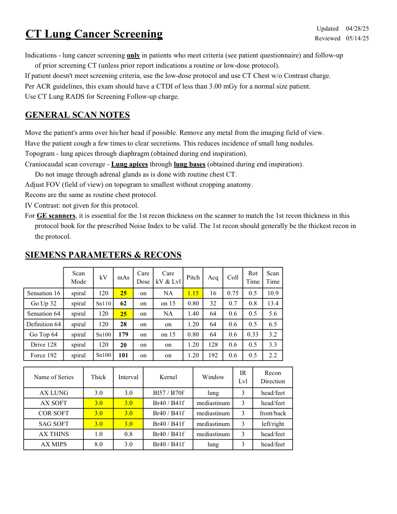
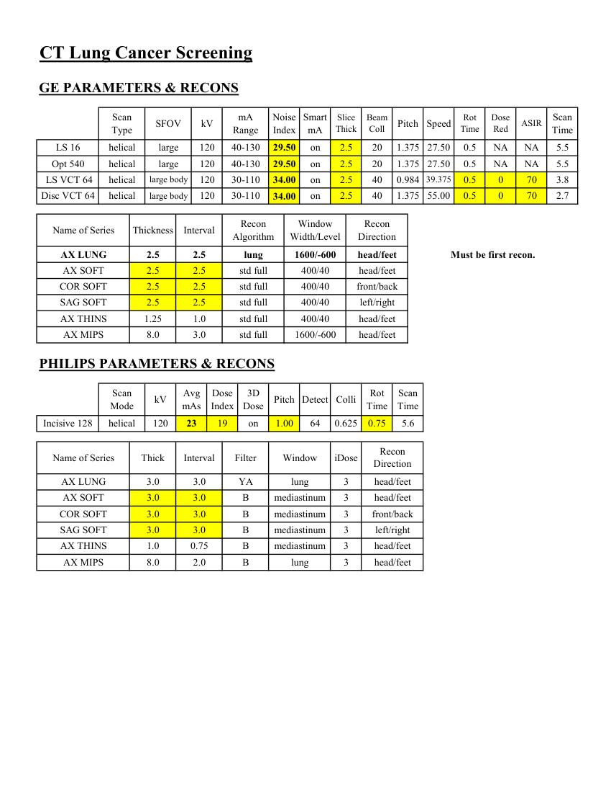

# CT — Screening cancer pulmonar (MCB)

## Documentul original MCB — Screening cancer pulmonar

**Protocol · 2 pagini · consultat la 2026-09-27.**

[Descarcă PDF-ul integral](../../assets/mcb-modalities/ct-screening-cancer-pulmonar-mcb/document.pdf) · [Sursa MCB](https://ref.mcbradiology.com/Protocols,%20Policies,%20Worksheets%20&%20Forms/CT/Protocols/Chest/3%20Screening.pdf) · [Catalogul MCB pentru această modalitate](../mcb/index.md)

Instrucțiunile, valorile și ilustrațiile din documentul original sunt păstrate în **engleză**. Titlul și navigarea sunt în română.

### Pagina 1

{ loading=lazy }

### Pagina 2

{ loading=lazy }

## Textul documentului original

??? abstract "Pagina 1 — text în engleză"

    
Updated
    04/28/25
    CT Lung Cancer Screening
    Reviewed
    05/14/25
    Indications - lung cancer screening only in patients who meet criteria (see patient questionnaire) and follow-up 
    of prior screening CT (unless prior report indications a routine or low-dose protocol).
    If patient doesn&#x27;t meet screening criteria, use the low-dose protocol and use CT Chest w/o Contrast charge.
    Per ACR guidelines, this exam should have a CTDI of less than 3.00 mGy for a normal size patient.
    Use CT Lung RADS for Screening Follow-up charge.
    GENERAL SCAN NOTES
    Move the patient&#x27;s arms over his/her head if possible. Remove any metal from the imaging field of view.
    Have the patient cough a few times to clear secretions. This reduces incidence of small lung nodules.
    Topogram - lung apices through diaphragm (obtained during end inspiration). 
    Craniocaudal scan coverage - Lung apices through lung bases (obtained during end inspiration).
    Do not image through adrenal glands as is done with routine chest CT.
    Adjust FOV (field of view) on topogram to smallest without cropping anatomy.
    Recons are the same as routine chest protocol.
    IV Contrast: not given for this protocol.
    For GE scanners, it is essential for the 1st recon thickness on the scanner to match the 1st recon thickness in this
    protocol book for the prescribed Noise Index to be valid. The 1st recon should generally be the thickest recon in 
    the protocol.
    SIEMENS PARAMETERS &amp; RECONS
    Scan                           
    Care                                          
    Scan                 
    Mode
    kV
    mAs
    Care                            
    Dose
    Pitch
    Acq
    Coll
    Rot 
    kV &amp; Lvl
    Time
    Time
    Sensation 16
    NA
    0.75
    0.5
    10.9
    spiral
    120
    25
    on
    1.15
    16
    on 15
    0.80
    32
    0.7
    0.8
    13.4
    Go Up 32
    spiral
    Sn110
    62
    on
    NA
    1.40
    64
    0.6
    0.5
    5.6
    Sensation 64
    spiral
    120
    25
    on
    on
    64
    0.6
    0.5
    6.5
    1.20
    Definition 64
    spiral
    120
    28
    on
    on 15
    64
    0.6
    0.33
    3.2
    Go Top 64
    spiral
    Sn100
    179
    on
    0.80
    128
    Drive 128
    spiral
    on
    1.20
    0.6
    0.5
    3.3
    120
    20
    on
    2.2
    1.20
    192
    0.6
    0.5
    Force 192
    spiral
    Sn100
    101
    on
    on
    IR                       
    Recon                     
    Name of Series
    Thick
    Interval
    Kernel
    Window
    Lvl
    Direction
    head/feet
    AX LUNG
    3.0
    3.0
    Bl57 / B70f
    lung
    3
    AX SOFT
    3.0
    3.0
    Br40 / B41f
    3
    mediastinum
    head/feet
    COR SOFT
    3.0
    3.0
    Br40 / B41f
    mediastinum
    3
    front/back
    SAG SOFT
    3.0
    3.0
    Br40 / B41f
    3
    left/right
    mediastinum
    AX THINS
    1.0
    0.8
    Br40 / B41f
    3
    head/feet
    mediastinum
    AX MIPS
    8.0
    3.0
    lung
    Br40 / B41f
    3
    head/feet
    

??? abstract "Pagina 2 — text în engleză"

    
CT Lung Cancer Screening
    GE PARAMETERS &amp; RECONS
    Scan               
    Smart             
    Scan                 
    Slice                       
    Beam                                 
    Rot                                
    Dose                                               
    Thick
    Pitch
    Speed
    Coll
    Time
    ASIR
    Red
    Type
    SFOV
    kV
    mA                           
    Range
    Noise                    
    Index
    mA
    Time
    on
    NA
    20
    2.5
    1.375 27.50
    0.5
    NA
    5.5
    LS 16
    helical
    large
    120
    40-130
    29.50
    on
    2.5
    20
    1.375 27.50
    0.5
    NA
    NA
    5.5
    Opt 540
    helical
    large
    120
    40-130
    29.50
    40
    2.5
    0.984
     LS VCT 64
    helical
    large body
    120
    30-110
    39.375
    on
    0
    0.5
    70
    3.8
    34.00
    on
    0
    40
    1.375 55.00
    0.5
    70
    2.7
    Disc VCT 64
    helical
    large body
    120
    30-110
    34.00
    2.5
    Recon                                     
    Window                                   
    Recon                    
    Name of Series
    Thickness
    Interval
    Algorithm
    Width/Level
    Direction
    AX LUNG
    2.5
    2.5
    lung
    1600/-600
    head/feet
    Must be first recon.
    AX SOFT
    2.5
    2.5
    std full
    400/40
    head/feet
    COR SOFT
    2.5
    2.5
    std full
    400/40
    front/back
    SAG SOFT
    2.5
    2.5
    std full
    400/40
    left/right
    AX THINS
    1.25
    1.0
    std full
    400/40
    head/feet
    AX MIPS
    8.0
    3.0
    std full
    1600/-600
    head/feet
    PHILIPS PARAMETERS &amp; RECONS
    Scan                           
    Dose                                          
    3D            
    Rot 
    Mode
    kV
    Avg                      
    mAs
    Index
    Dose
    Pitch Detect Colli
    Scan                 
    Time
    Time
    0.75
    5.6
    Incisive 128
    helical
    120
    23
    19
    on
    1.00
    64
    0.625
    Name of Series
    Thick
    Interval
    Filter
    Window
    iDose
    Recon                     
    Direction
    AX LUNG
    3.0
    3.0
    YA
    lung
    3
    head/feet
    AX SOFT
    3.0
    3.0
    B
    mediastinum
    3
    head/feet
    COR SOFT
    3.0
    3.0
    B
    mediastinum
    3
    front/back
    SAG SOFT
    3.0
    3.0
    B
    mediastinum
    3
    left/right
    AX THINS
    1.0
    0.75
    B
    mediastinum
    3
    head/feet
    3
    head/feet
    AX MIPS
    8.0
    2.0
    B
    lung
    

