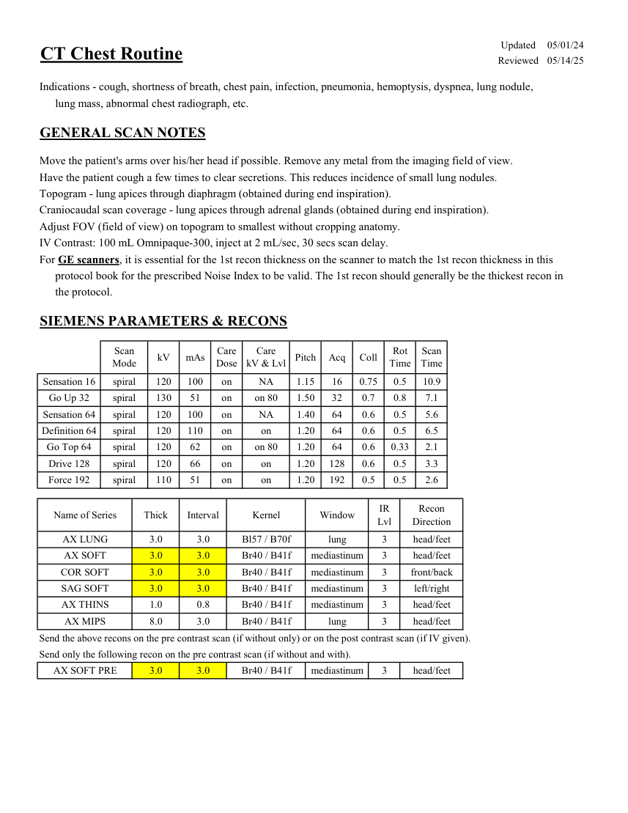
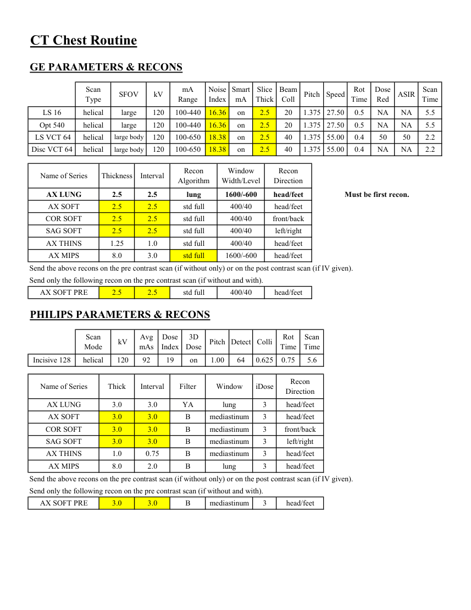

# CT — Torace de rutină (MCB)

## Documentul original MCB — Torace de rutină

**Protocol · 2 pagini · consultat la 2026-09-27.**

[Descarcă PDF-ul integral](../../assets/mcb-modalities/ct-torace-de-rutina-mcb/document.pdf) · [Sursa MCB](https://ref.mcbradiology.com/Protocols,%20Policies,%20Worksheets%20&%20Forms/CT/Protocols/Chest/1%20Routine.pdf) · [Catalogul MCB pentru această modalitate](../mcb/index.md)

Instrucțiunile, valorile și ilustrațiile din documentul original sunt păstrate în **engleză**. Titlul și navigarea sunt în română.

### Pagina 1

{ loading=lazy }

### Pagina 2

{ loading=lazy }

## Textul documentului original

??? abstract "Pagina 1 — text în engleză"

    
Updated
    05/01/24
    CT Chest Routine
    Reviewed
    05/14/25
    Indications - cough, shortness of breath, chest pain, infection, pneumonia, hemoptysis, dyspnea, lung nodule, 
    lung mass, abnormal chest radiograph, etc.
    GENERAL SCAN NOTES
    Move the patient&#x27;s arms over his/her head if possible. Remove any metal from the imaging field of view.
    Have the patient cough a few times to clear secretions. This reduces incidence of small lung nodules.
    Topogram - lung apices through diaphragm (obtained during end inspiration). 
    Craniocaudal scan coverage - lung apices through adrenal glands (obtained during end inspiration).
    Adjust FOV (field of view) on topogram to smallest without cropping anatomy.
    IV Contrast: 100 mL Omnipaque-300, inject at 2 mL/sec, 30 secs scan delay.
    For GE scanners, it is essential for the 1st recon thickness on the scanner to match the 1st recon thickness in this
    protocol book for the prescribed Noise Index to be valid. The 1st recon should generally be the thickest recon in 
    the protocol.
    SIEMENS PARAMETERS &amp; RECONS
    Scan                           
    Care                                          
    Scan                 
    Pitch
    Acq
    Coll
    Rot 
    Mode
    kV
    mAs
    Care                            
    Dose
    kV &amp; Lvl
    Time
    Time
    Sensation 16
    spiral
    120
    0.5
    100
    on
    1.15
    16
    0.75
    NA
    10.9
    Go Up 32
    spiral
    130
    51
    on
    1.50
    32
    0.7
    0.8
    on 80
    7.1
    Sensation 64
    spiral
    120
    100
    on
    NA
    1.40
    64
    0.6
    0.5
    5.6
    Definition 64
    spiral
    120
    110
    on
    on
    1.20
    64
    0.6
    0.5
    6.5
    Go Top 64
    spiral
    120
    62
    on
    on 80
    1.20
    64
    0.6
    0.33
    2.1
    Drive 128
    spiral
    120
    66
    on
    1.20
    128
    0.6
    on
    0.5
    3.3
    Force 192
    spiral
    110
    51
    on
    on
    1.20
    192
    0.5
    0.5
    2.6
    IR                       
    Recon                     
    Name of Series
    Thick
    Interval
    Kernel
    Window
    Lvl
    Direction
    AX LUNG
    3.0
    3.0
    Bl57 / B70f
    3
    lung
    head/feet
    AX SOFT
    3.0
    3.0
    Br40 / B41f
    3
    mediastinum
    head/feet
    COR SOFT
    3.0
    3.0
    Br40 / B41f
    3
    mediastinum
    front/back
    SAG SOFT
    3.0
    3.0
    Br40 / B41f
    3
    mediastinum
    left/right
    AX THINS
    1.0
    0.8
    Br40 / B41f
    3
    mediastinum
    head/feet
    AX MIPS
    8.0
    3.0
    Br40 / B41f
    3
    lung
    head/feet
    Send the above recons on the pre contrast scan (if without only) or on the post contrast scan (if IV given).
    Send only the following recon on the pre contrast scan (if without and with).
    AX SOFT PRE
    3.0
    3.0
    Br40 / B41f
    3
    mediastinum
    head/feet
    

??? abstract "Pagina 2 — text în engleză"

    
CT Chest Routine
    GE PARAMETERS &amp; RECONS
    Scan               
    Smart             
    Slice                       
    Beam                                 
    Rot                                
    Dose                                          
    Scan                 
    Type
    SFOV
    kV
    mA                           
    Range
    Noise                    
    Index
    mA
    Thick
    Pitch
    Speed
    Coll
    Time
    ASIR
    Red
    Time
    LS 16
    helical
    large
    120
    100-440
    16.36
    on
    NA
    NA
    20
    2.5
    1.375 27.50
    0.5
    5.5
    Opt 540
    helical
    large
    120
    100-440
    16.36
    20
    2.5
    1.375
    on
    27.50
    0.5
    NA
    NA
    5.5
     LS VCT 64
    helical
    large body
    120
    100-650
    18.38
    on
    1.375
    55.00
    0.4
    50
    50
    40
    2.5
    2.2
    Disc VCT 64
    helical
    large body
    120
    100-650
    18.38
    on
    NA
    55.00
    0.4
    NA
    40
    2.5
    1.375
    2.2
    Recon                                     
    Window                                   
    Recon                    
    Name of Series
    Thickness
    Interval
    Algorithm
    Width/Level
    Direction
    AX LUNG
    2.5
    2.5
    lung
    1600/-600
    head/feet
    Must be first recon.
    AX SOFT
    2.5
    2.5
    std full
    400/40
    head/feet
    COR SOFT
    2.5
    2.5
    std full
    400/40
    front/back
    SAG SOFT
    2.5
    2.5
    std full
    400/40
    left/right
    AX THINS
    1.25
    1.0
    std full
    400/40
    head/feet
    AX MIPS
    8.0
    3.0
    std full
    1600/-600
    head/feet
    Send the above recons on the pre contrast scan (if without only) or on the post contrast scan (if IV given).
    Send only the following recon on the pre contrast scan (if without and with).
    AX SOFT PRE
    2.5
    2.5
    std full
    400/40
    head/feet
    PHILIPS PARAMETERS &amp; RECONS
    Scan                           
    Dose                                          
    3D            
    Rot 
    Detect Colli
    Mode
    kV
    Avg                      
    mAs
    Index
    Dose
    Pitch
    Scan                 
    Time
    Time
    Incisive 128
    helical
    120
    92
    19
    on
    1.00
    64
    0.625
    5.6
    0.75
    Name of Series
    Thick
    Interval
    Filter
    Window
    Recon                     
    Direction
    iDose
    AX LUNG
    3.0
    3.0
    YA
    lung
    head/feet
    3
    AX SOFT
    3.0
    3.0
    B
    mediastinum
    head/feet
    3
    COR SOFT
    3.0
    3.0
    B
    mediastinum
    front/back
    3
    SAG SOFT
    3.0
    3.0
    B
    mediastinum
    left/right
    3
    AX THINS
    1.0
    0.75
    B
    mediastinum
    3
    head/feet
    AX MIPS
    8.0
    2.0
    B
    lung
    head/feet
    3
    Send the above recons on the pre contrast scan (if without only) or on the post contrast scan (if IV given).
    Send only the following recon on the pre contrast scan (if without and with).
    AX SOFT PRE
    3.0
    3.0
    B
    mediastinum
    3
    head/feet
    

