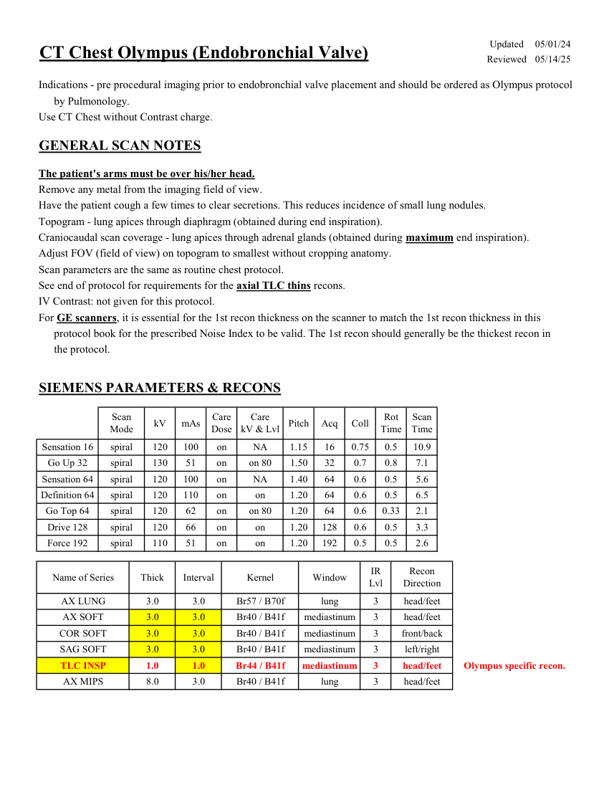
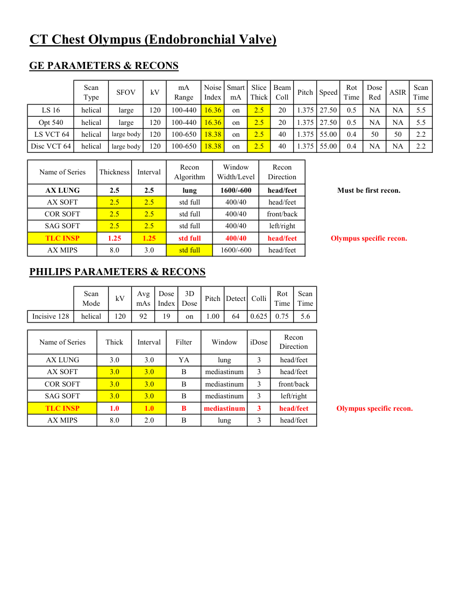
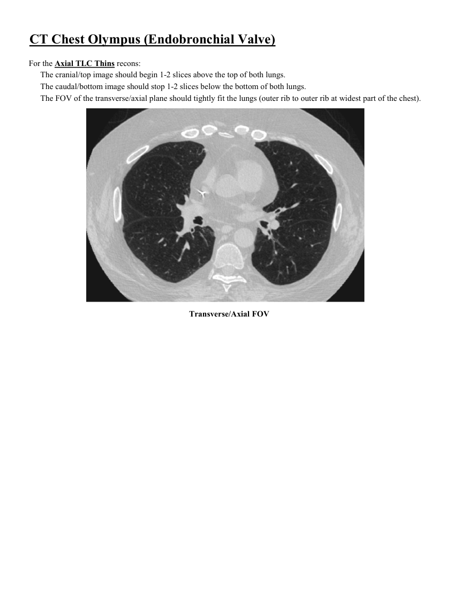
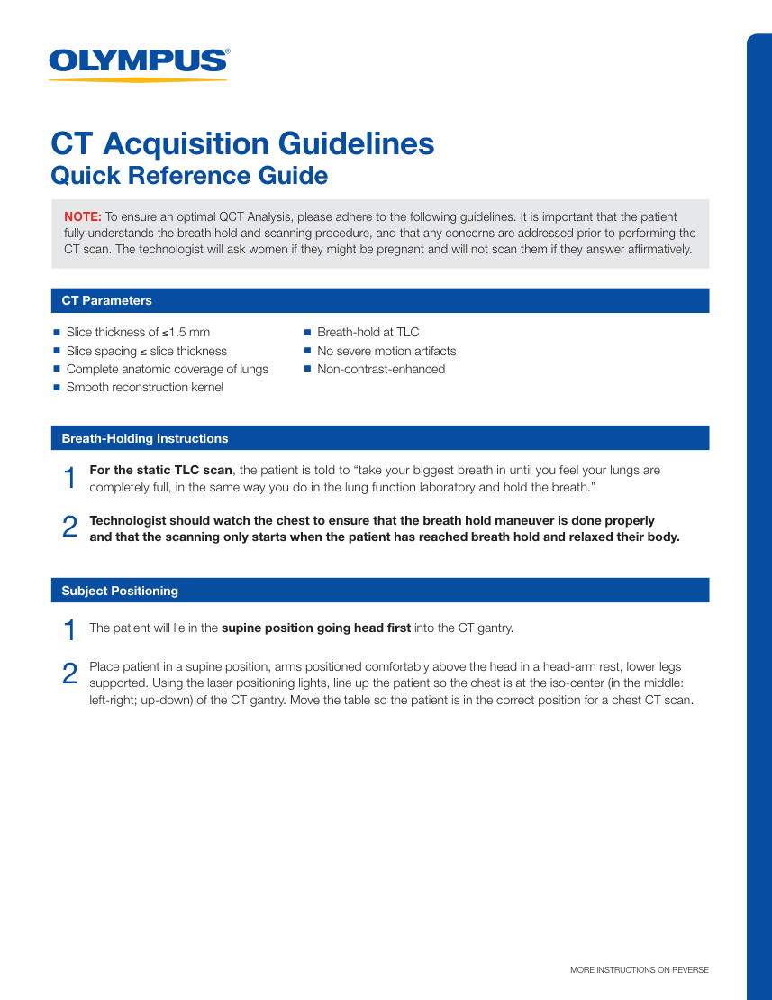
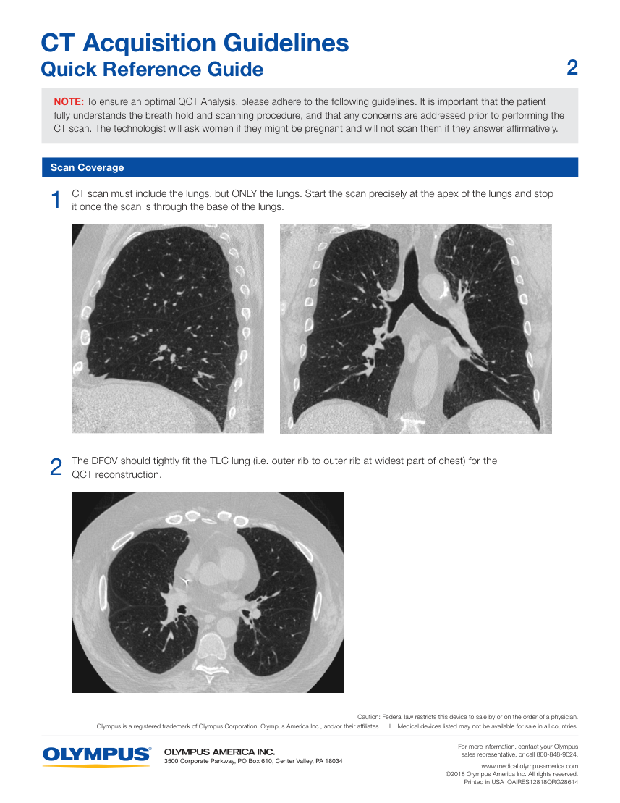
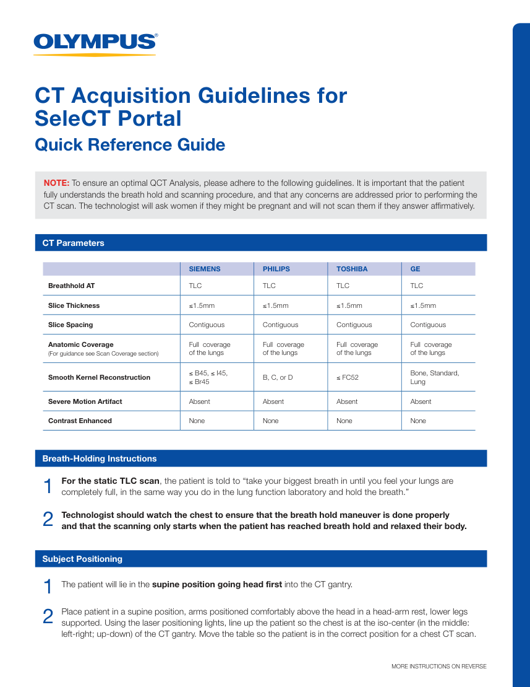
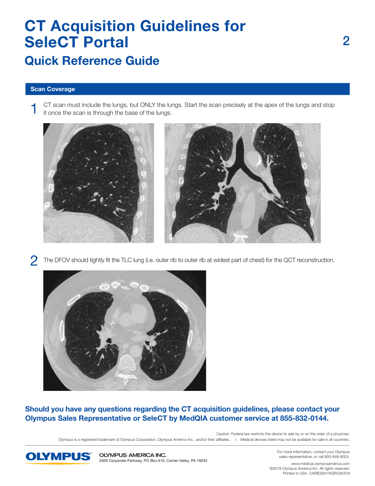

# CT — Torace: Olympus (MCB)

## Documentul original MCB — Torace: Olympus

**Protocol · 7 pagini · consultat la 2026-09-27.**

[Descarcă PDF-ul integral](../../assets/mcb-modalities/ct-torace-olympus-mcb/document.pdf) · [Sursa MCB](https://ref.mcbradiology.com/Protocols,%20Policies,%20Worksheets%20&%20Forms/CT/Protocols/Chest/9%20Olympus.pdf) · [Catalogul MCB pentru această modalitate](../mcb/index.md)

Instrucțiunile, valorile și ilustrațiile din documentul original sunt păstrate în **engleză**. Titlul și navigarea sunt în română.

### Pagina 1

{ loading=lazy }

### Pagina 2

{ loading=lazy }

### Pagina 3

{ loading=lazy }

### Pagina 4

{ loading=lazy }

### Pagina 5

{ loading=lazy }

### Pagina 6

{ loading=lazy }

### Pagina 7

{ loading=lazy }

## Textul documentului original

??? abstract "Pagina 1 — text în engleză"

    
Updated
    05/01/24
    CT Chest Olympus (Endobronchial Valve)
    Reviewed
    05/14/25
    Indications - pre procedural imaging prior to endobronchial valve placement and should be ordered as Olympus protocol
    by Pulmonology.
    Use CT Chest without Contrast charge.
    GENERAL SCAN NOTES
    The patient&#x27;s arms must be over his/her head.
    Remove any metal from the imaging field of view.
    Have the patient cough a few times to clear secretions. This reduces incidence of small lung nodules.
    Topogram - lung apices through diaphragm (obtained during end inspiration). 
    Craniocaudal scan coverage - lung apices through adrenal glands (obtained during maximum end inspiration).
    Adjust FOV (field of view) on topogram to smallest without cropping anatomy.
    Scan parameters are the same as routine chest protocol.
    See end of protocol for requirements for the axial TLC thins recons.
    IV Contrast: not given for this protocol.
    For GE scanners, it is essential for the 1st recon thickness on the scanner to match the 1st recon thickness in this
    protocol book for the prescribed Noise Index to be valid. The 1st recon should generally be the thickest recon in 
    the protocol.
    SIEMENS PARAMETERS &amp; RECONS
    Scan                           
    Care                                          
    Scan                 
    Mode
    kV
    mAs
    Care                            
    Dose
    kV &amp; Lvl
    Pitch
    Acq
    Coll
    Rot 
    Time
    Time
    Sensation 16
    spiral
    120
    100
    on
    NA
    1.15
    16
    0.75
    0.5
    10.9
    Go Up 32
    spiral
    130
    51
    on
    on 80
    1.50
    32
    0.7
    0.8
    7.1
    Sensation 64
    spiral
    120
    100
    on
    NA
    1.40
    64
    0.6
    0.5
    5.6
    Definition 64
    spiral
    120
    110
    on
    on
    1.20
    64
    0.6
    0.5
    6.5
    Go Top 64
    spiral
    120
    62
    on
    on 80
    1.20
    64
    0.6
    0.33
    2.1
    Drive 128
    spiral
    120
    66
    on
    on
    1.20
    128
    0.6
    0.5
    3.3
    Force 192
    spiral
    110
    51
    on
    on
    1.20
    192
    0.5
    0.5
    2.6
    Recon                     
    Name of Series
    Thick
    Interval
    Kernel
    Window
    IR                       
    Lvl
    Direction
    AX LUNG
    3.0
    3.0
    Br57 / B70f
    lung
    3
    head/feet
    AX SOFT
    3.0
    3.0
    Br40 / B41f
    mediastinum
    3
    head/feet
    COR SOFT
    3.0
    3.0
    Br40 / B41f
    mediastinum
    3
    front/back
    SAG SOFT
    3.0
    3.0
    Br40 / B41f
    mediastinum
    3
    left/right
    TLC INSP
    1.0
    1.0
    Br44 / B41f
    3
    mediastinum
    head/feet
    Olympus specific recon.
    AX MIPS
    8.0
    3.0
    Br40 / B41f
    lung
    3
    head/feet
    

??? abstract "Pagina 2 — text în engleză"

    
CT Chest Olympus (Endobronchial Valve)
    GE PARAMETERS &amp; RECONS
    Scan               
    Smart             
    Slice                       
    Beam                                 
    Rot                                
    Dose                                          
    Scan                 
    Pitch
    Speed
    Type
    SFOV
    kV
    mA                           
    Range
    Noise                    
    Index
    mA
    Thick
    Coll
    Time
    Red
    ASIR
    Time
    LS 16
    helical
    large
    120
    100-440
    16.36
    on
    2.5
    20
    1.375 27.50
    0.5
    NA
    NA
    5.5
    Opt 540
    helical
    large
    120
    100-440
    16.36
    on
    2.5
    20
    1.375
    27.50
    0.5
    NA
    NA
    5.5
     LS VCT 64
    helical
    large body
    120
    100-650
    18.38
    on
    2.5
    40
    1.375
    55.00
    0.4
    50
    50
    2.2
    Disc VCT 64
    helical
    large body
    120
    100-650
    18.38
    on
    2.5
    40
    1.375 55.00
    0.4
    NA
    NA
    2.2
    Window                                   
    Recon                    
    Name of Series
    Thickness
    Interval
    Recon                                     
    Algorithm
    Width/Level
    Direction
    AX LUNG
    2.5
    2.5
    lung
    1600/-600
    head/feet
    Must be first recon.
    AX SOFT
    2.5
    2.5
    std full
    400/40
    head/feet
    COR SOFT
    2.5
    2.5
    std full
    400/40
    front/back
    SAG SOFT
    2.5
    2.5
    std full
    400/40
    left/right
    TLC INSP
    1.25
    1.25
    std full
    400/40
    head/feet
    Olympus specific recon.
    AX MIPS
    8.0
    3.0
    std full
    1600/-600
    head/feet
    PHILIPS PARAMETERS &amp; RECONS
    Scan                           
    Dose                                          
    3D            
    Scan                 
    Mode
    kV
    Avg                      
    mAs
    Index
    Dose
    Pitch Detect Colli
    Rot 
    Time
    Time
    0.75
    Incisive 128
    helical
    120
    92
    19
    on
    1.00
    64
    0.625
    5.6
    Name of Series
    Thick
    Interval
    Filter
    Window
    iDose
    Recon                     
    Direction
    AX LUNG
    3.0
    3.0
    YA
    lung
    3
    head/feet
    AX SOFT
    3.0
    3.0
    B
    mediastinum
    3
    head/feet
    COR SOFT
    3.0
    3.0
    B
    mediastinum
    3
    front/back
    SAG SOFT
    3.0
    3.0
    B
    mediastinum
    3
    left/right
    TLC INSP
    1.0
    1.0
    B
    mediastinum
    3
    head/feet
    Olympus specific recon.
    AX MIPS
    8.0
    2.0
    B
    lung
    3
    head/feet
    

??? abstract "Pagina 3 — text în engleză"

    
CT Chest Olympus (Endobronchial Valve)
    For the Axial TLC Thins recons:
    The cranial/top image should begin 1-2 slices above the top of both lungs. 
    The caudal/bottom image should stop 1-2 slices below the bottom of both lungs.
    The FOV of the transverse/axial plane should tightly fit the lungs (outer rib to outer rib at widest part of the chest).
    Transverse/Axial FOV
    

??? abstract "Pagina 4 — text în engleză"

    
CT Acquisition Guidelines 
    Quick Reference Guide
    NOTE: To ensure an optimal QCT Analysis, please adhere to the following guidelines. It is important that the patient 
    fully understands the breath hold and scanning procedure, and that any concerns are addressed prior to performing the 
    CT scan. The technologist will ask women if they might be pregnant and will not scan them if they answer affirmatively.
       CT Parameters
    n  Breath-hold at TLC
    n  Slice thickness of ≤1.5 mm
    n  No severe motion artifacts
    n  Slice spacing ≤ slice thickness
    n  Complete anatomic coverage of lungs
    n  Non-contrast-enhanced
    n  Smooth reconstruction kernel
       Breath-Holding Instructions
    For the static TLC scan, the patient is told to “take your biggest breath in until you feel your lungs are 
    completely full, in the same way you do in the lung function laboratory and hold the breath.”
    1
    2
    Technologist should watch the chest to ensure that the breath hold maneuver is done properly 
    and that the scanning only starts when the patient has reached breath hold and relaxed their body.
       Subject Positioning
    The patient will lie in the supine position going head first into the CT gantry.
    1
    2
    Place patient in a supine position, arms positioned comfortably above the head in a head-arm rest, lower legs 
    supported. Using the laser positioning lights, line up the patient so the chest is at the iso-center (in the middle: 
    left-right; up-down) of the CT gantry. Move the table so the patient is in the correct position for a chest CT scan.
    MORE INSTRUCTIONS ON REVERSE
    

??? abstract "Pagina 5 — text în engleză"

    
2
    CT Acquisition Guidelines 
    Quick Reference Guide
    NOTE: To ensure an optimal QCT Analysis, please adhere to the following guidelines. It is important that the patient 
    fully understands the breath hold and scanning procedure, and that any concerns are addressed prior to performing the 
    CT scan. The technologist will ask women if they might be pregnant and will not scan them if they answer affirmatively.
       Scan Coverage
    CT scan must include the lungs, but ONLY the lungs. Start the scan precisely at the apex of the lungs and stop 
    it once the scan is through the base of the lungs.
    1
    The DFOV should tightly fit the TLC lung (i.e. outer rib to outer rib at widest part of chest) for the 
    QCT reconstruction.
    2
    Caution: Federal law restricts this device to sale by or on the order of a physician.
    Olympus is a registered trademark of Olympus Corporation, Olympus America Inc., and/or their affiliates.     I    Medical devices listed may not be available for sale in all countries. 
    For more information, contact your Olympus 
     
    sales representative, or call 800-848-9024. 
    3500 Corporate Parkway, PO Box 610, Center Valley, PA 18034
    www.medical.olympusamerica.com
    ©2018 Olympus America Inc. All rights reserved. 
    Printed in USA  OAIRES12818QRG28614
    

??? abstract "Pagina 6 — text în engleză"

    
CT Acquisition Guidelines for  
    SeleCT Portal 
    Quick Reference Guide
    NOTE: To ensure an optimal QCT Analysis, please adhere to the following guidelines. It is important that the patient  
    fully understands the breath hold and scanning procedure, and that any concerns are addressed prior to performing the  
    CT scan. The technologist will ask women if they might be pregnant and will not scan them if they answer affirmatively.
       CT Parameters
    SIEMENS
    PHILIPS
    TOSHIBA
    GE
    Breathhold AT
    TLC
    TLC
    TLC
    TLC
    Slice Thickness
    ≤1.5mm
    ≤1.5mm
    ≤1.5mm
    ≤1.5mm
    Slice Spacing
    Contiguous
    Contiguous
    Contiguous
    Contiguous
    Anatomic Coverage  
    (For guidance see Scan Coverage section)
    Full  coverage  
    of the lungs
    Full  coverage  
    of the lungs
    Full  coverage  
    of the lungs
    Full  coverage  
    of the lungs
    Smooth Kernel Reconstruction
    ≤ B45, ≤ I45, 
    ≤ Br45
    B, C, or D
    ≤ FC52
    Bone, Standard,  
    Lung
    Severe Motion Artifact
    Absent
    Absent
    Absent
    Absent
    Contrast Enhanced
    None
    None
    None
    None
       Breath-Holding Instructions
    For the static TLC scan, the patient is told to “take your biggest breath in until you feel your lungs are  
    completely full, in the same way you do in the lung function laboratory and hold the breath.”
    1
    2
    Technologist should watch the chest to ensure that the breath hold maneuver is done properly  
    and that the scanning only starts when the patient has reached breath hold and relaxed their body.
       Subject Positioning
    The patient will lie in the supine position going head first into the CT gantry.
    1
    2
    Place patient in a supine position, arms positioned comfortably above the head in a head-arm rest, lower legs 
    supported. Using the laser positioning lights, line up the patient so the chest is at the iso-center (in the middle: 
    left-right; up-down) of the CT gantry. Move the table so the patient is in the correct position for a chest CT scan.
    MORE INSTRUCTIONS ON REVERSE
    

??? abstract "Pagina 7 — text în engleză"

    
2
    CT Acquisition Guidelines for  
    SeleCT Portal 
    Quick Reference Guide
       Scan Coverage
    CT scan must include the lungs, but ONLY the lungs. Start the scan precisely at the apex of the lungs and stop 
    it once the scan is through the base of the lungs.
    1
    The DFOV should tightly fit the TLC lung (i.e. outer rib to outer rib at widest part of chest) for the QCT reconstruction.
    2
    Should you have any questions regarding the CT acquisition guidelines, please contact your
    Olympus Sales Representative or SeleCT by MedQIA customer service at 855-832-0144.
    Caution: Federal law restricts this device to sale by or on the order of a physician.
    Olympus is a registered trademark of Olympus Corporation, Olympus America Inc., and/or their affiliates.     I    Medical devices listed may not be available for sale in all countries. 
    For more information, contact your Olympus 
     
    sales representative, or call 800-848-9024. 
    3500 Corporate Parkway, PO Box 610, Center Valley, PA 18034
    www.medical.olympusamerica.com
    ©2019 Olympus America Inc. All rights reserved. 
    Printed in USA  OAIRES0419QRG30379
    

