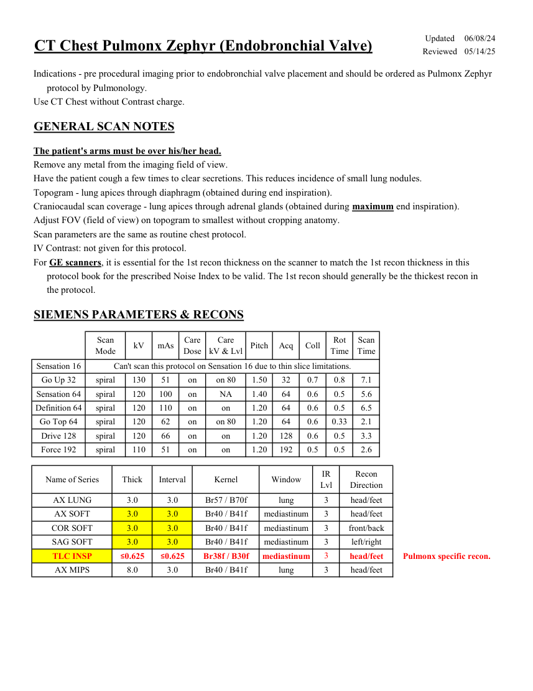
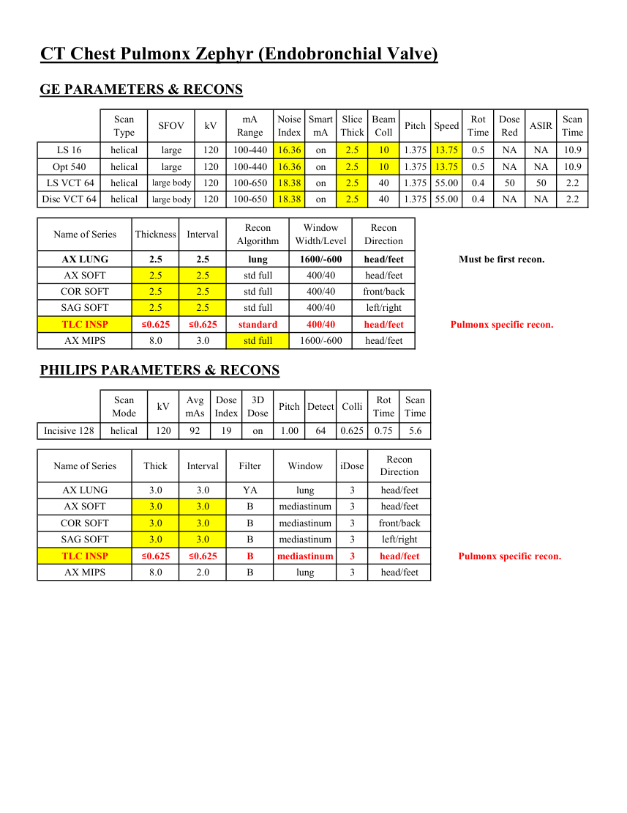
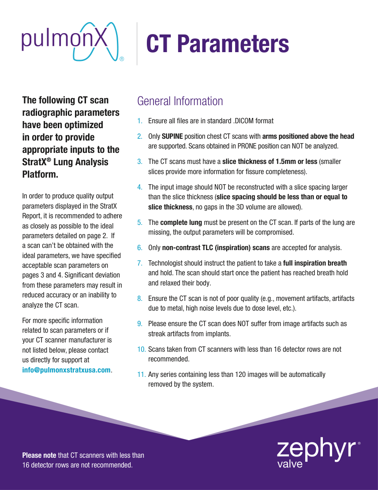
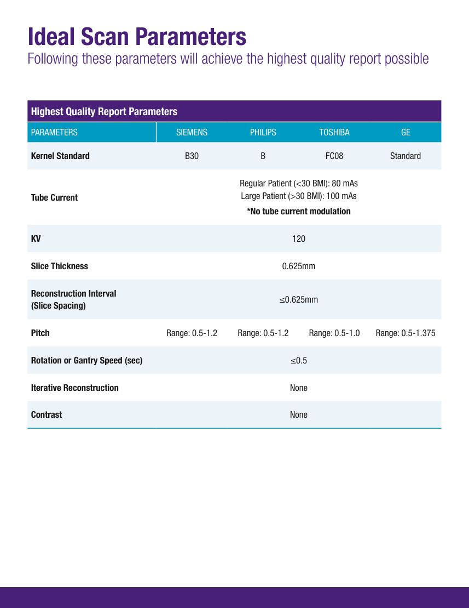
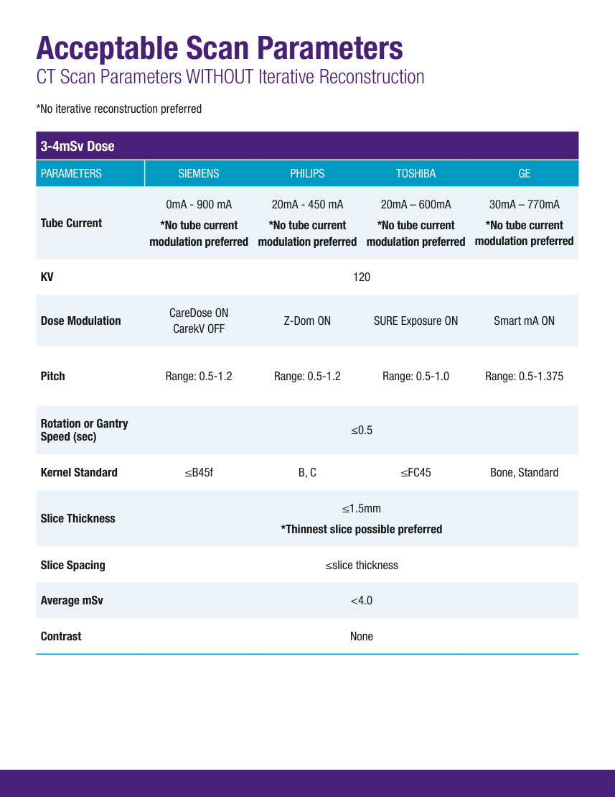
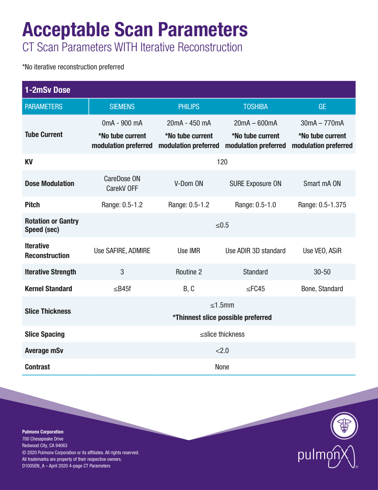

# CT — Torace: Pulmonx Zephyr (MCB)

## Documentul original MCB — Torace: Pulmonx Zephyr

**Protocol · 6 pagini · consultat la 2026-09-27.**

[Descarcă PDF-ul integral](../../assets/mcb-modalities/ct-torace-pulmonx-zephyr-mcb/document.pdf) · [Sursa MCB](https://ref.mcbradiology.com/Protocols,%20Policies,%20Worksheets%20&%20Forms/CT/Protocols/Chest/8%20Pulmonx%20Zephyr.pdf) · [Catalogul MCB pentru această modalitate](../mcb/index.md)

Instrucțiunile, valorile și ilustrațiile din documentul original sunt păstrate în **engleză**. Titlul și navigarea sunt în română.

### Pagina 1

{ loading=lazy }

### Pagina 2

{ loading=lazy }

### Pagina 3

{ loading=lazy }

### Pagina 4

{ loading=lazy }

### Pagina 5

{ loading=lazy }

### Pagina 6

{ loading=lazy }

## Textul documentului original

??? abstract "Pagina 1 — text în engleză"

    
Updated
    06/08/24
    CT Chest Pulmonx Zephyr (Endobronchial Valve)
    Reviewed
    05/14/25
    Indications - pre procedural imaging prior to endobronchial valve placement and should be ordered as Pulmonx Zephyr 
    protocol by Pulmonology.
    Use CT Chest without Contrast charge.
    GENERAL SCAN NOTES
    The patient&#x27;s arms must be over his/her head.
    Remove any metal from the imaging field of view.
    Have the patient cough a few times to clear secretions. This reduces incidence of small lung nodules.
    Topogram - lung apices through diaphragm (obtained during end inspiration). 
    Craniocaudal scan coverage - lung apices through adrenal glands (obtained during maximum end inspiration).
    Adjust FOV (field of view) on topogram to smallest without cropping anatomy.
    Scan parameters are the same as routine chest protocol.
    IV Contrast: not given for this protocol.
    For GE scanners, it is essential for the 1st recon thickness on the scanner to match the 1st recon thickness in this
    protocol book for the prescribed Noise Index to be valid. The 1st recon should generally be the thickest recon in 
    the protocol.
    SIEMENS PARAMETERS &amp; RECONS
    Scan                           
    Care                                          
    Scan                 
    Coll
    Rot 
    Mode
    kV
    mAs
    Care                            
    Dose
    kV &amp; Lvl
    Pitch
    Acq
    Time
    Time
    Can&#x27;t scan this protocol on Sensation 16 due to thin slice limitations.
    Sensation 16
    Go Up 32
    spiral
    130
    51
    on
    on 80
    1.50
    32
    0.7
    0.8
    7.1
    Sensation 64
    spiral
    120
    100
    on
    NA
    1.40
    64
    0.6
    0.5
    5.6
    Definition 64
    spiral
    120
    110
    on
    on
    1.20
    64
    0.6
    0.5
    6.5
    Go Top 64
    spiral
    120
    62
    on
    on 80
    1.20
    64
    0.6
    0.33
    2.1
    Drive 128
    spiral
    120
    66
    on
    on
    1.20
    128
    0.6
    0.5
    3.3
    Force 192
    spiral
    110
    51
    on
    on
    1.20
    192
    0.5
    0.5
    2.6
    IR                       
    Recon                     
    Name of Series
    Thick
    Interval
    Kernel
    Window
    Lvl
    Direction
    AX LUNG
    3.0
    3.0
    Br57 / B70f
    lung
    3
    head/feet
    AX SOFT
    3.0
    3.0
    Br40 / B41f
    mediastinum
    3
    head/feet
    COR SOFT
    3.0
    3.0
    Br40 / B41f
    mediastinum
    3
    front/back
    SAG SOFT
    3.0
    3.0
    Br40 / B41f
    mediastinum
    3
    left/right
    Pulmonx specific recon.
    TLC INSP
    ≤0.625
    ≤0.625
    Br38f / B30f
    mediastinum
    3
    head/feet
    3
    head/feet
    AX MIPS
    8.0
    3.0
    Br40 / B41f
    lung
    

??? abstract "Pagina 2 — text în engleză"

    
CT Chest Pulmonx Zephyr (Endobronchial Valve)
    GE PARAMETERS &amp; RECONS
    Scan               
    Smart             
    Slice                       
    Beam                                 
    Dose                                          
    Scan                 
    Type
    SFOV
    kV
    mA                           
    Range
    Noise                    
    Index
    mA
    Thick
    Coll
    Pitch
    Speed
    Rot                                
    Time
    Red
    ASIR
    Time
    LS 16
    helical
    large
    120
    100-440
    16.36
    on
    2.5
    10
    1.375 13.75
    0.5
    NA
    NA
    10.9
    Opt 540
    helical
    large
    120
    100-440
    16.36
    on
    2.5
    10
    1.375 13.75
    0.5
    NA
    NA
    10.9
     LS VCT 64
    helical
    large body
    120
    100-650
    18.38
    on
    2.5
    40
    1.375 55.00
    0.4
    50
    50
    2.2
    Disc VCT 64
    helical
    large body
    120
    100-650
    1.375 55.00
    0.4
    NA
    NA
    18.38
    on
    2.5
    40
    2.2
    Window                                   
    Recon                    
    Name of Series
    Thickness
    Interval
    Recon                                     
    Algorithm
    Width/Level
    Direction
    AX LUNG
    2.5
    2.5
    lung
    1600/-600
    head/feet
    Must be first recon.
    AX SOFT
    2.5
    2.5
    std full
    400/40
    head/feet
    COR SOFT
    2.5
    2.5
    std full
    400/40
    front/back
    SAG SOFT
    2.5
    2.5
    std full
    400/40
    left/right
    head/feet
    Pulmonx specific recon.
    TLC INSP
    ≤0.625
    ≤0.625
    standard
    400/40
    std full
    1600/-600
    head/feet
    AX MIPS
    8.0
    3.0
    PHILIPS PARAMETERS &amp; RECONS
    Scan                           
    Dose                                          
    3D            
    Rot 
    Scan                 
    Mode
    kV
    Avg                      
    mAs
    Index
    Dose
    Pitch Detect Colli
    Time
    Time
    Incisive 128
    helical
    120
    92
    19
    5.6
    on
    1.00
    64
    0.625
    0.75
    Name of Series
    Thick
    Interval
    Filter
    Window
    iDose
    Recon                     
    Direction
    AX LUNG
    3.0
    3.0
    YA
    lung
    3
    head/feet
    AX SOFT
    3.0
    3.0
    B
    mediastinum
    3
    head/feet
    COR SOFT
    3.0
    3.0
    B
    mediastinum
    3
    front/back
    SAG SOFT
    3.0
    3.0
    B
    mediastinum
    3
    left/right
    Pulmonx specific recon.
    TLC INSP
    ≤0.625
    ≤0.625
    B
    mediastinum
    3
    head/feet
    3
    head/feet
    AX MIPS
    8.0
    2.0
    B
    lung
    

??? abstract "Pagina 3 — text în engleză"

    
CT Parameters
    General Information
    1.	 Ensure all files are in standard .DICOM format
    2.	 Only SUPINE position chest CT scans with arms positioned above the head 
    are supported. Scans obtained in PRONE position can NOT be analyzed.
    3.	 The CT scans must have a slice thickness of 1.5mm or less (smaller 
    slices provide more information for fissure completeness).
    The following CT scan 
    radiographic parameters 
    have been optimized 
    in order to provide 
    appropriate inputs to the 
    StratX® Lung Analysis 
    Platform.
    4.	 The input image should NOT be reconstructed with a slice spacing larger 
    than the slice thickness (slice spacing should be less than or equal to 
    slice thickness, no gaps in the 3D volume are allowed).
    5.	 The complete lung must be present on the CT scan. If parts of the lung are 
    missing, the output parameters will be compromised.
    6.	 Only non-contrast TLC (inspiration) scans are accepted for analysis.
    7.	 Technologist should instruct the patient to take a full inspiration breath 
    and hold. The scan should start once the patient has reached breath hold 
    and relaxed their body. 
    8.	 Ensure the CT scan is not of poor quality (e.g., movement artifacts, artifacts 
    In order to produce quality output 
    parameters displayed in the StratX 
    Report, it is recommended to adhere 
    as closely as possible to the ideal 
    parameters detailed on page 2.  If 
    a scan can’t be obtained with the 
    ideal parameters, we have specified 
    acceptable scan parameters on 
    pages 3 and 4. Significant deviation 
    from these parameters may result in 
    reduced accuracy or an inability to 
    analyze the CT scan.
    due to metal, high noise levels due to dose level, etc.).
    9.	 Please ensure the CT scan does NOT suffer from image artifacts such as 
    streak artifacts from implants.
    10.	Scans taken from CT scanners with less than 16 detector rows are not 
    recommended.
    For more specific information  
    related to scan parameters or if  
    your CT scanner manufacturer is  
    not listed below, please contact 
    us directly for support at  
    info@pulmonxstratxusa.com.
    11.	Any series containing less than 120 images will be automatically  
    removed by the system.
    Please note that CT scanners with less than  
    16 detector rows are not recommended.
    

??? abstract "Pagina 4 — text în engleză"

    
Ideal Scan Parameters
    Following these parameters will achieve the highest quality report possible 
    Highest Quality Report Parameters
    PARAMETERS
    SIEMENS
    PHILIPS
    TOSHIBA
    GE
    Kernel Standard
    B30
    B
    FC08
    Standard
    Regular Patient (&lt;30 BMI): 80 mAs 
    Large Patient (&gt;30 BMI): 100 mAs
    Tube Current
    *No tube current modulation
    KV
    120
    Slice Thickness
    0.625mm
    Reconstruction Interval   
    (Slice Spacing)
    ≤0.625mm
    Pitch
    Range: 0.5-1.2
    Range: 0.5-1.2
    Range: 0.5-1.0
    Range: 0.5-1.375
    Rotation or Gantry Speed (sec)
    ≤0.5
    Iterative Reconstruction
    None
    Contrast
    None
    

??? abstract "Pagina 5 — text în engleză"

    
Acceptable Scan Parameters 
    CT Scan Parameters WITHOUT Iterative Reconstruction 
    *No iterative reconstruction preferred 
    3-4mSv Dose
    PARAMETERS
    SIEMENS
    PHILIPS
    TOSHIBA
    GE
    30mA – 770mA
    20mA – 600mA
    20mA - 450 mA
    0mA - 900 mA 
    Tube Current
    *No tube current 
    modulation preferred
    *No tube current 
    modulation preferred
    *No tube current 
    modulation preferred
    *No tube current 
    modulation preferred
    KV
    120
    Dose Modulation
    CareDose ON 
    CarekV OFF
    Z-Dom ON
    SURE Exposure ON
    Smart mA ON
    Pitch
    Range: 0.5-1.2
    Range: 0.5-1.2
    Range: 0.5-1.0
    Range: 0.5-1.375
    Rotation or Gantry 
    Speed (sec)
    ≤0.5
    Kernel Standard
    ≤B45f
    B, C
    ≤FC45
    Bone, Standard
    ≤1.5mm
    Slice Thickness
    *Thinnest slice possible preferred 
    Slice Spacing
    ≤slice thickness
    Average mSv
    &lt;4.0
    Contrast
    None
    

??? abstract "Pagina 6 — text în engleză"

    
Acceptable Scan Parameters 
    CT Scan Parameters WITH Iterative Reconstruction 
    *No iterative reconstruction preferred 
    1-2mSv Dose
    PARAMETERS
    SIEMENS
    PHILIPS
    TOSHIBA
    GE
    30mA – 770mA
    20mA – 600mA
    20mA - 450 mA
    0mA - 900 mA  
    Tube Current
    *No tube current 
    modulation preferred
    *No tube current 
    modulation preferred
    *No tube current 
    modulation preferred
    *No tube current 
    modulation preferred
    KV
    120
    Dose Modulation
    CareDose ON 
    CarekV OFF
    V-Dom ON
    SURE Exposure ON
    Smart mA ON
    Pitch
    Range: 0.5-1.2
    Range: 0.5-1.2
    Range: 0.5-1.0
    Range: 0.5-1.375
    Rotation or Gantry 
    Speed (sec)
    ≤0.5
    Iterative 
    Reconstruction
    Use SAFIRE, ADMIRE
    Use IMR
    Use ADIR 3D standard
    Use VEO, ASiR
    Iterative Strength
    3
    Routine 2
    Standard
    30-50
    Kernel Standard
    ≤B45f
    B, C
    ≤FC45
    Bone, Standard
    ≤1.5mm
    Slice Thickness
    *Thinnest slice possible preferred 
    Slice Spacing
    ≤slice thickness
    Average mSv
    &lt;2.0
    Contrast
    None
    Pulmonx Corporation
    700 Chesapeake Drive
    Redwood City, CA 94063
    © 2020 Pulmonx Corporation or its affiliates. All rights reserved. 
    All trademarks are property of their respective owners.	
    	
    D1005EN_A – April 2020 4-page CT Parameters
    

