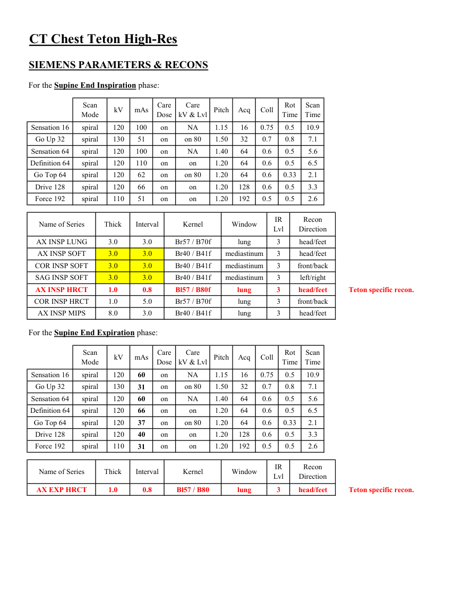
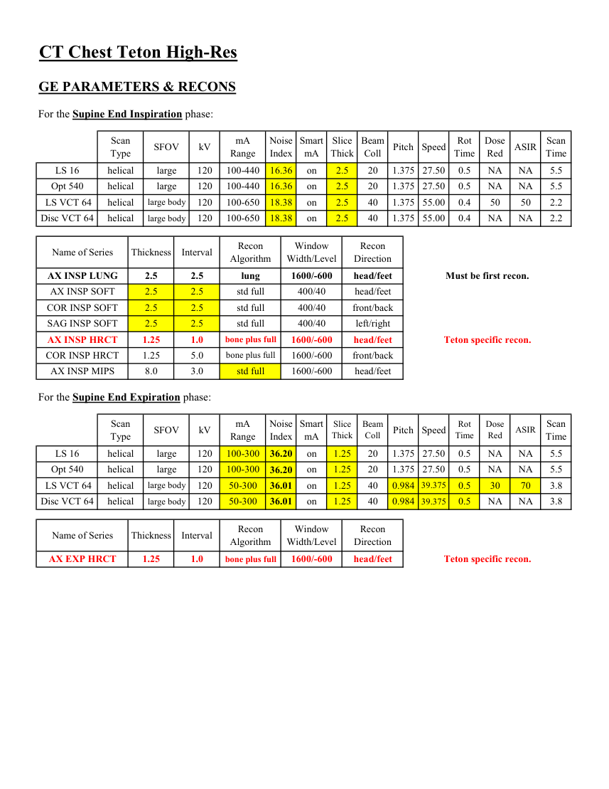
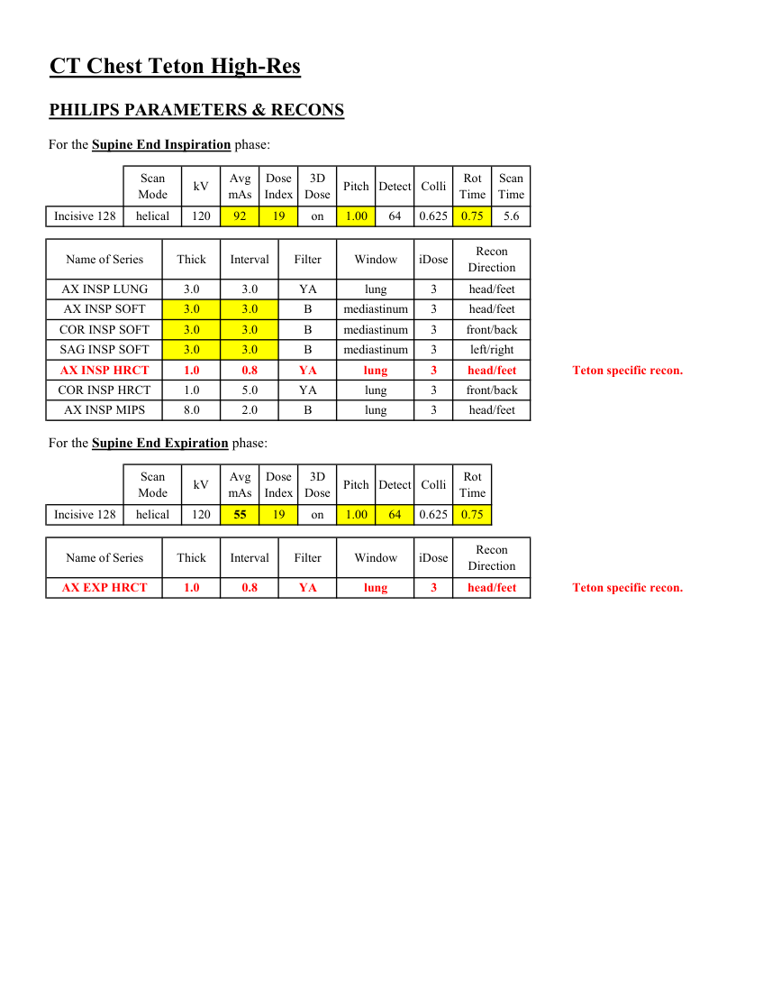
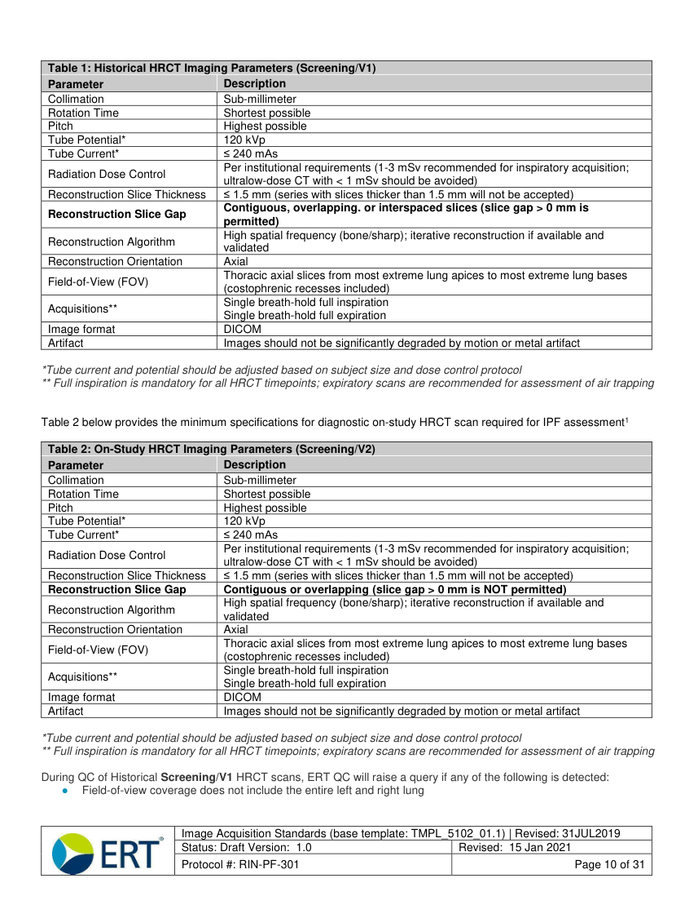
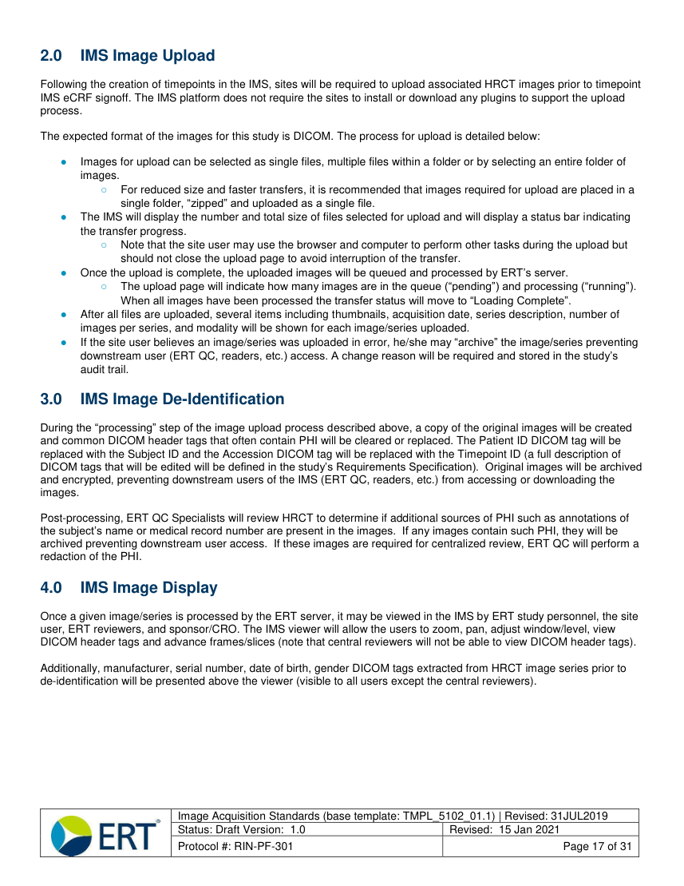

# CT — Torace: Teton (MCB)

## Documentul original MCB — Torace: Teton

**Protocol · 7 pagini · consultat la 2026-09-27.**

[Descarcă PDF-ul integral](../../assets/mcb-modalities/ct-torace-teton-mcb/document.pdf) · [Sursa MCB](https://ref.mcbradiology.com/Protocols,%20Policies,%20Worksheets%20&%20Forms/CT/Protocols/Chest/5%20Teton.pdf) · [Catalogul MCB pentru această modalitate](../mcb/index.md)

Instrucțiunile, valorile și ilustrațiile din documentul original sunt păstrate în **engleză**. Titlul și navigarea sunt în română.

### Pagina 1

{ loading=lazy }

### Pagina 2

{ loading=lazy }

### Pagina 3

{ loading=lazy }

### Pagina 4

{ loading=lazy }

### Pagina 5

{ loading=lazy }

### Pagina 6

{ loading=lazy }

### Pagina 7

{ loading=lazy }

## Textul documentului original

??? abstract "Pagina 1 — text în engleză"

    
Updated
    05/01/24
    CT Chest Teton High-Res
    Reviewed
    05/14/25
    Indication - interstitial pulmonary fibrosis (IPF).
    Use CT chest HRCT without Contrast charge. Do not use regular CT chest charge.
    GENERAL SCAN NOTES
    Move the patient&#x27;s arms over his/her head if possible. Remove any metal from the imaging field of view.
    Have the patient cough a few times to clear secretions. This reduces incidence of small lung nodules.
    Topogram - lung apices through diaphragm (obtained during end inspiration). 
    Craniocaudal scan coverage - lung apices through adrenal glands on both phases (obtained during end inspiration).
    Adjust FOV (field of view) on topogram to smallest without cropping anatomy.
    Scan parameters for the supine end inspiratory phase are the same as routine chest protocol.
    Scan parameters for the supine end expiratory phase are the same as low-dose chest protocol.
    IV Contrast: not given for this protocol.
    For GE scanners, it is essential for the 1st recon thickness on the scanner to match the 1st recon thickness in this
    protocol book for the prescribed Noise Index to be valid. The 1st recon should generally be the thickest recon in 
    the protocol.
    

??? abstract "Pagina 2 — text în engleză"

    
CT Chest Teton High-Res
    SIEMENS PARAMETERS &amp; RECONS
    For the Supine End Inspiration phase:
    Scan                           
    Care                                          
    Scan                 
    Acq
    Coll
    Rot 
    Mode
    kV
    mAs
    Care                            
    Dose
    kV &amp; Lvl
    Pitch
    Time
    Time
    Sensation 16
    spiral
    120
    100
    on
    NA
    1.15
    16
    0.75
    0.5
    10.9
    Go Up 32
    spiral
    130
    51
    on
    on 80
    1.50
    32
    0.7
    0.8
    7.1
    100
    on
    Sensation 64
    spiral
    120
    NA
    1.40
    64
    0.6
    0.5
    5.6
    Definition 64
    spiral
    120
    110
    on
    on
    1.20
    64
    0.6
    0.5
    6.5
    Go Top 64
    spiral
    120
    62
    on
    on 80
    1.20
    64
    0.6
    0.33
    2.1
    Drive 128
    spiral
    120
    66
    on
    on
    1.20
    128
    0.6
    0.5
    3.3
    Force 192
    spiral
    110
    51
    on
    on
    1.20
    192
    0.5
    0.5
    2.6
    Recon                     
    Name of Series
    Thick
    Interval
    Kernel
    Window
    IR                       
    Lvl
    Direction
    AX INSP LUNG
    3.0
    3.0
    Br57 / B70f
    lung
    3
    head/feet
    AX INSP SOFT
    3.0
    3.0
    Br40 / B41f
    mediastinum
    3
    head/feet
    COR INSP SOFT
    3.0
    3.0
    Br40 / B41f
    mediastinum
    3
    front/back
    SAG INSP SOFT
    3.0
    3.0
    Br40 / B41f
    mediastinum
    3
    left/right
    AX INSP HRCT
    1.0
    0.8
    Bl57 / B80f
    lung
    3
    head/feet
    Teton specific recon.
    COR INSP HRCT
    1.0
    5.0
    Br57 / B70f
    lung
    3
    front/back
    AX INSP MIPS
    8.0
    3.0
    Br40 / B41f
    lung
    3
    head/feet
    For the Supine End Expiration phase:
    Scan                           
    Care                                          
    Rot 
    Scan                 
    Acq
    Coll
    Mode
    kV
    mAs
    Care                            
    Dose
    kV &amp; Lvl
    Pitch
    Time
    Time
    NA
    1.15
    16
    0.75
    0.5
    10.9
    Sensation 16
    spiral
    120
    60
    on
    on
    Go Up 32
    spiral
    130
    on 80
    1.50
    32
    0.7
    0.8
    7.1
    31
    NA
    1.40
    64
    0.6
    0.5
    5.6
    Sensation 64
    spiral
    120
    60
    on
    on
    1.20
    64
    0.6
    0.5
    6.5
    Definition 64
    spiral
    120
    66
    on
    on 80
    1.20
    64
    0.6
    0.33
    2.1
    Go Top 64
    spiral
    120
    37
    on
    0.5
    on
    1.20
    128
    0.6
    3.3
    Drive 128
    spiral
    120
    40
    on
    on
    1.20
    192
    0.5
    0.5
    2.6
    Force 192
    spiral
    110
    31
    on
    Recon                     
    Name of Series
    Thick
    Interval
    Kernel
    Window
    IR                       
    Lvl
    Direction
    lung
    AX EXP HRCT
    1.0
    0.8
    Bl57 / B80
    3
    head/feet
    Teton specific recon.
    

??? abstract "Pagina 3 — text în engleză"

    
CT Chest Teton High-Res
    GE PARAMETERS &amp; RECONS
    For the Supine End Inspiration phase:
    Scan               
    mA                           
    Smart             
    Slice                       
    Beam                                 
    Rot                                
    Dose                                          
    Scan                 
    Pitch
    Speed
    Type
    SFOV
    kV
    Range
    Noise                    
    Index
    mA
    Thick
    Coll
    Time
    Red
    ASIR
    Time
    LS 16
    helical
    large
    120
    100-440
    16.36
    on
    2.5
    20
    1.375 27.50
    0.5
    NA
    NA
    5.5
    Opt 540
    helical
    large
    120
    100-440
    16.36
    on
    2.5
    20
    1.375
    27.50
    0.5
    NA
    NA
    5.5
     LS VCT 64
    helical
    large body
    120
    100-650
    18.38
    on
    2.5
    40
    1.375
    55.00
    0.4
    50
    50
    2.2
    Disc VCT 64
    helical
    large body
    120
    100-650
    18.38
    on
    2.5
    40
    1.375 55.00
    0.4
    NA
    NA
    2.2
    Recon                    
    Name of Series
    Interval
    Recon                                     
    Thickness
    Window                                   
    Algorithm
    Width/Level
    Direction
    head/feet
    AX INSP LUNG
    2.5
    2.5
    lung
    1600/-600
    Must be first recon.
    AX INSP SOFT
    2.5
    2.5
    std full
    400/40
    head/feet
    COR INSP SOFT
    2.5
    2.5
    std full
    400/40
    front/back
    SAG INSP SOFT
    2.5
    2.5
    std full
    400/40
    left/right
    AX INSP HRCT
    1.25
    1.0
    bone plus full
    1600/-600
    head/feet
    Teton specific recon.
    COR INSP HRCT
    1.25
    5.0
    bone plus full
    1600/-600
    front/back
    AX INSP MIPS
    8.0
    3.0
    std full
    1600/-600
    head/feet
    For the Supine End Expiration phase:
    Scan               
    Smart             
    Scan                 
    Beam                                 
    Dose                                               
    Speed
    Rot                                
    Thick
    Coll
    Pitch
    Slice                       
    Time
    Red
    ASIR
    Type
    SFOV
    kV
    mA                           
    Range
    Noise                    
    Index
    mA
    Time
    LS 16
    helical
    large
    120
    100-300
    1.375
    27.50
    0.5
    NA
    NA
    5.5
    36.20
    on
    1.25
    20
    on
    1.25
    20
    1.375
    27.50
    0.5
    NA
    NA
    5.5
    Opt 540
    helical
    large
    120
    100-300
    36.20
    40
    0.984 39.375
    0.5
    30
    70
    3.8
     LS VCT 64
    helical
    large body
    120
    50-300
    36.01
    on
    1.25
    on
    1.25
    40
    0.984 39.375
    0.5
    NA
    NA
    3.8
    Disc VCT 64
    helical
    large body
    120
    50-300
    36.01
    Window                                   
    Recon                    
    Name of Series
    Thickness
    Interval
    Recon                                     
    Algorithm
    Width/Level
    Direction
    AX EXP HRCT
    1.25
    1.0
    bone plus full
    1600/-600
    Teton specific recon.
    head/feet
    

??? abstract "Pagina 4 — text în engleză"

    
CT Chest Teton High-Res
    PHILIPS PARAMETERS &amp; RECONS
    For the Supine End Inspiration phase:
    Scan                           
    Avg                      
    Dose                                          
    3D            
    Rot 
    Scan                 
    Mode
    kV
    mAs
    Index
    Dose
    Pitch
    Time
    Detect Colli
    Time
    0.75
    Incisive 128
    helical
    120
    92
    19
    on
    1.00
    64
    0.625
    5.6
    Name of Series
    Thick
    Interval
    Filter
    Window
    iDose
    Recon                     
    Direction
    AX INSP LUNG
    3.0
    3.0
    lung
    3
    head/feet
    YA
    AX INSP SOFT
    3.0
    3.0
    B
    mediastinum
    3
    head/feet
    COR INSP SOFT
    3.0
    3.0
    B
    mediastinum
    3
    front/back
    mediastinum
    3
    left/right
    SAG INSP SOFT
    3.0
    3.0
    B
    AX INSP HRCT
    1.0
    0.8
    YA
    lung
    3
    head/feet
    Teton specific recon.
    COR INSP HRCT
    1.0
    5.0
    YA
    lung
    3
    front/back
    AX INSP MIPS
    8.0
    2.0
    B
    lung
    3
    head/feet
    For the Supine End Expiration phase:
    Scan                           
    Dose                                          
    3D            
    Pitch
    Detect Colli
    Rot 
    Mode
    kV
    Avg                      
    mAs
    Index
    Dose
    Time
    64
    0.625
    0.75
    Incisive 128
    helical
    120
    55
    19
    on
    1.00
    Name of Series
    Thick
    Interval
    Filter
    Window
    iDose
    Recon                     
    Direction
    AX EXP HRCT
    1.0
    0.8
    YA
    lung
    3
    head/feet
    Teton specific recon.
    

??? abstract "Pagina 5 — text în engleză"

    
 
     
     
     
    Table 1: Historical HRCT Imaging Parameters (Screening/V1) 
    Parameter 
    Description 
    Collimation 
    Sub-millimeter 
    Rotation Time 
    Shortest possible 
    Pitch 
    Highest possible 
    Tube Potential* 
    120 kVp 
    Tube Current* 
    ≤ 240 mAs 
    Radiation Dose Control 
    Per institutional requirements (1-3 mSv recommended for inspiratory acquisition; 
    ultralow-dose CT with &lt; 1 mSv should be avoided) 
    Reconstruction Slice Thickness 
    ≤ 1.5 mm (series with slices thicker than 1.5 mm will not be accepted) 
    Reconstruction Slice Gap 
    Contiguous, overlapping. or interspaced slices (slice gap &gt; 0 mm is 
    permitted) 
    Reconstruction Algorithm 
    High spatial frequency (bone/sharp); iterative reconstruction if available and 
    validated 
    Reconstruction Orientation 
    Axial 
    Field-of-View (FOV) 
    Thoracic axial slices from most extreme lung apices to most extreme lung bases 
    (costophrenic recesses included) 
    Acquisitions** 
    Single breath-hold full inspiration 
    Single breath-hold full expiration 
    Image format 
    DICOM  
    Artifact 
    Images should not be significantly degraded by motion or metal artifact 
     
    *Tube current and potential should be adjusted based on subject size and dose control protocol 
    ** Full inspiration is mandatory for all HRCT timepoints; expiratory scans are recommended for assessment of air trapping 
     
     
    Table 2 below provides the minimum specifications for diagnostic on-study HRCT scan required for IPF assessment1 
     
    Table 2: On-Study HRCT Imaging Parameters (Screening/V2) 
    Parameter 
    Description 
    Collimation 
    Sub-millimeter 
    Rotation Time 
    Shortest possible 
    Pitch 
    Highest possible 
    Tube Potential* 
    120 kVp 
    Tube Current* 
    ≤ 240 mAs 
    Radiation Dose Control 
    Per institutional requirements (1-3 mSv recommended for inspiratory acquisition; 
    ultralow-dose CT with &lt; 1 mSv should be avoided) 
    Reconstruction Slice Thickness 
    ≤ 1.5 mm (series with slices thicker than 1.5 mm will not be accepted) 
    Reconstruction Slice Gap 
    Contiguous or overlapping (slice gap &gt; 0 mm is NOT permitted) 
    Reconstruction Algorithm 
    High spatial frequency (bone/sharp); iterative reconstruction if available and 
    validated 
    Reconstruction Orientation 
    Axial 
    Field-of-View (FOV) 
    Thoracic axial slices from most extreme lung apices to most extreme lung bases 
    (costophrenic recesses included) 
    Acquisitions** 
    Single breath-hold full inspiration 
    Single breath-hold full expiration 
    Image format 
    DICOM  
    Artifact 
    Images should not be significantly degraded by motion or metal artifact 
     
    *Tube current and potential should be adjusted based on subject size and dose control protocol 
    ** Full inspiration is mandatory for all HRCT timepoints; expiratory scans are recommended for assessment of air trapping 
     
    During QC of Historical Screening/V1 HRCT scans, ERT QC will raise a query if any of the following is detected: 
    ● 
    Field-of-view coverage does not include the entire left and right lung 
     
    Image Acquisition Standards (base template: TMPL_5102_01.1) | Revised: 31JUL2019 
    Status: Draft Version:  1.0 
    Revised:  15 Jan 2021  
    Protocol #: RIN-PF-301 
    Page 10 of 31 
     
     
    

??? abstract "Pagina 6 — text în engleză"

    
 
     
     
    Appendix 1: The Image Management Solution (IMS) 
     
    1.0 
    IMS Access and Training  
    1.1 
    Site User Access and Training  
    ERT will provide web-based training sessions for sites detailing the processes required to create subjects, add timepoints 
    for subjects, and upload timepoint images in the IMS.  Detailed instructions, workflows, and descriptions of IMS eCRF 
    content are also provided in the Appendix of this document. 
     
    Following the training and completion of training documentation, ERT will email trained site users with a link to ERT’s 
    Global Single Sign-on (GSSO) page and associated registration instructions.  If the site user has not previously registered 
    for an ERT study, he/she will be required to self-register.  Note sites must use the Google Chrome internet browser to 
    access and use the ERT IMS platform (Internet Explorer/Microsoft Edge do not support the IMS functionality).  
     
    Site users should only use their designated accounts to access the study. If the person responsible for transferring 
    imaging via the IMS is absent for an extended period, a new user at the site should be identified with a training request 
    submitted to ERT for the user. Additionally, if a site user is no longer employed at the site or participating in the study, the 
    site should notify ERT to inactivate the user’s access to the study. Sites should contact the ERT Customer Care for any 
    technical issues pertaining to the use of the IMS. Detailed instructions for image upload will be provided to the site in the 
    IMS Image Transfer Instructions document.  
     
    1.2 
    Sponsor User Access and Training 
    ERT will provide a representative(s) from United Therapeutics access to the “data review” user role in the IMS. This is a 
    read-only user role for United Therapeutics to review the information completed by the site user(s), QC user(s), and/or 
    central reviewer(s).  The data review user(s) will be able to: 
    ● 
    View all subject timepoints and their current workflow status 
    ● 
    View submitted images for timepoints within the IMS (post-QC) 
    ● 
    View reader annotations (read-only) 
    ● 
    View completed eCRFs/Reports: 
    ○ 
    Timepoint Submission 
    ○ 
    Reader Assessments 
    ○ 
    Timepoint QC 
    ● 
    Download Reports: 
    ○ 
    Site Compliance Report - provides an overview of site submission information, current workflow states, 
    and number of submission cycles for each timepoint 
    ○ 
    QC Compliance Report - provides an evaluation of QC performance for each timepoint (outstanding 
    query information and turnaround time) 
    ○ 
    Image Analysis Compliance Report - provides an evaluation of a central reviewer’s performance for 
    timepoint (read status and turnaround time) 
    ○ 
    User Access and Activity Report - provides a summary of the users that have access to the study, their 
    training dates, activation status, and date/time of last access to the study 
    ○ 
    Imaging Study Tracker Report - provides an overall status for each timepoint created in the study and any 
    associated queries 
    ○ 
    Eligibility Reports 
     
    The data review user(s) must complete an ERT IMS training session before ERT will grant the user access to the study. 
     
     
    Image Acquisition Standards (base template: TMPL_5102_01.1) | Revised: 31JUL2019 
    Status: Draft Version:  1.0 
    Revised:  15 Jan 2021  
    Protocol #: RIN-PF-301 
    Page 16 of 31 
     
     
    

??? abstract "Pagina 7 — text în engleză"

    
 
     
     
    2.0 
    IMS Image Upload 
    Following the creation of timepoints in the IMS, sites will be required to upload associated HRCT images prior to timepoint 
    IMS eCRF signoff. The IMS platform does not require the sites to install or download any plugins to support the upload 
    process. 
     
    The expected format of the images for this study is DICOM. The process for upload is detailed below: 
     
    ● 
    Images for upload can be selected as single files, multiple files within a folder or by selecting an entire folder of 
    images.   
    ○ 
    For reduced size and faster transfers, it is recommended that images required for upload are placed in a 
    single folder, “zipped” and uploaded as a single file.  
    ● 
    The IMS will display the number and total size of files selected for upload and will display a status bar indicating 
    the transfer progress.   
    ○ 
    Note that the site user may use the browser and computer to perform other tasks during the upload but 
    should not close the upload page to avoid interruption of the transfer.   
    ● 
    Once the upload is complete, the uploaded images will be queued and processed by ERT’s server.   
    ○ 
    The upload page will indicate how many images are in the queue (“pending”) and processing (“running”).  
    When all images have been processed the transfer status will move to “Loading Complete”.    
    ● 
    After all files are uploaded, several items including thumbnails, acquisition date, series description, number of 
    images per series, and modality will be shown for each image/series uploaded.  
    ● 
    If the site user believes an image/series was uploaded in error, he/she may “archive” the image/series preventing 
    downstream user (ERT QC, readers, etc.) access. A change reason will be required and stored in the study’s 
    audit trail.   
     
    3.0 
    IMS Image De-Identification  
    During the “processing” step of the image upload process described above, a copy of the original images will be created 
    and common DICOM header tags that often contain PHI will be cleared or replaced. The Patient ID DICOM tag will be 
    replaced with the Subject ID and the Accession DICOM tag will be replaced with the Timepoint ID (a full description of 
    DICOM tags that will be edited will be defined in the study’s Requirements Specification).  Original images will be archived 
    and encrypted, preventing downstream users of the IMS (ERT QC, readers, etc.) from accessing or downloading the 
    images.   
     
    Post-processing, ERT QC Specialists will review HRCT to determine if additional sources of PHI such as annotations of 
    the subject’s name or medical record number are present in the images.  If any images contain such PHI, they will be 
    archived preventing downstream user access.  If these images are required for centralized review, ERT QC will perform a 
    redaction of the PHI. 
     
    4.0 
    IMS Image Display 
    Once a given image/series is processed by the ERT server, it may be viewed in the IMS by ERT study personnel, the site 
    user, ERT reviewers, and sponsor/CRO. The IMS viewer will allow the users to zoom, pan, adjust window/level, view 
    DICOM header tags and advance frames/slices (note that central reviewers will not be able to view DICOM header tags).   
     
    Additionally, manufacturer, serial number, date of birth, gender DICOM tags extracted from HRCT image series prior to 
    de-identification will be presented above the viewer (visible to all users except the central reviewers).  
     
     
     
     
    Image Acquisition Standards (base template: TMPL_5102_01.1) | Revised: 31JUL2019 
    Status: Draft Version:  1.0 
    Revised:  15 Jan 2021  
    Protocol #: RIN-PF-301 
    Page 17 of 31 
     
     
    

