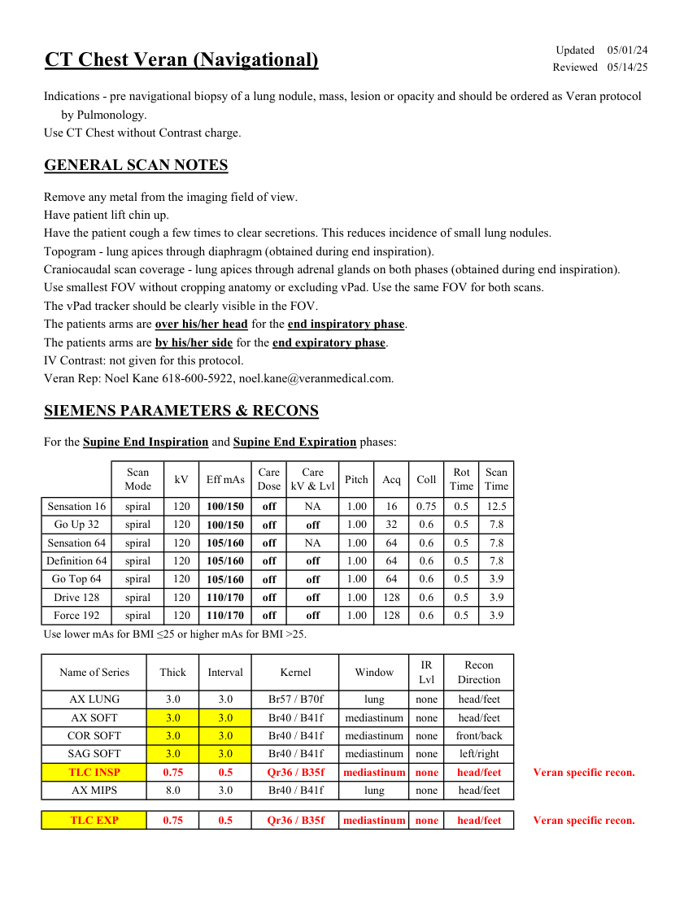
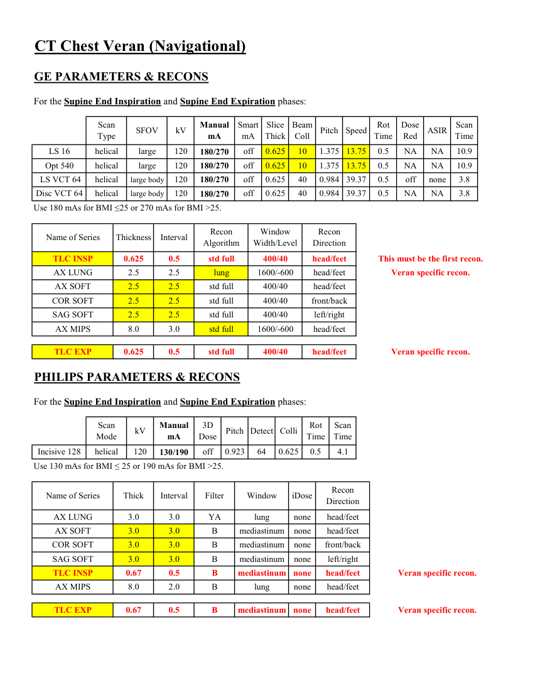
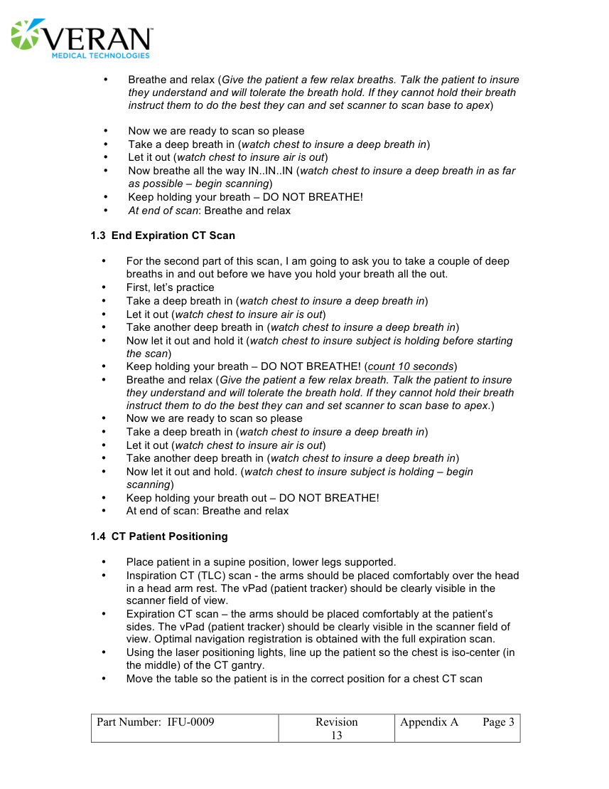
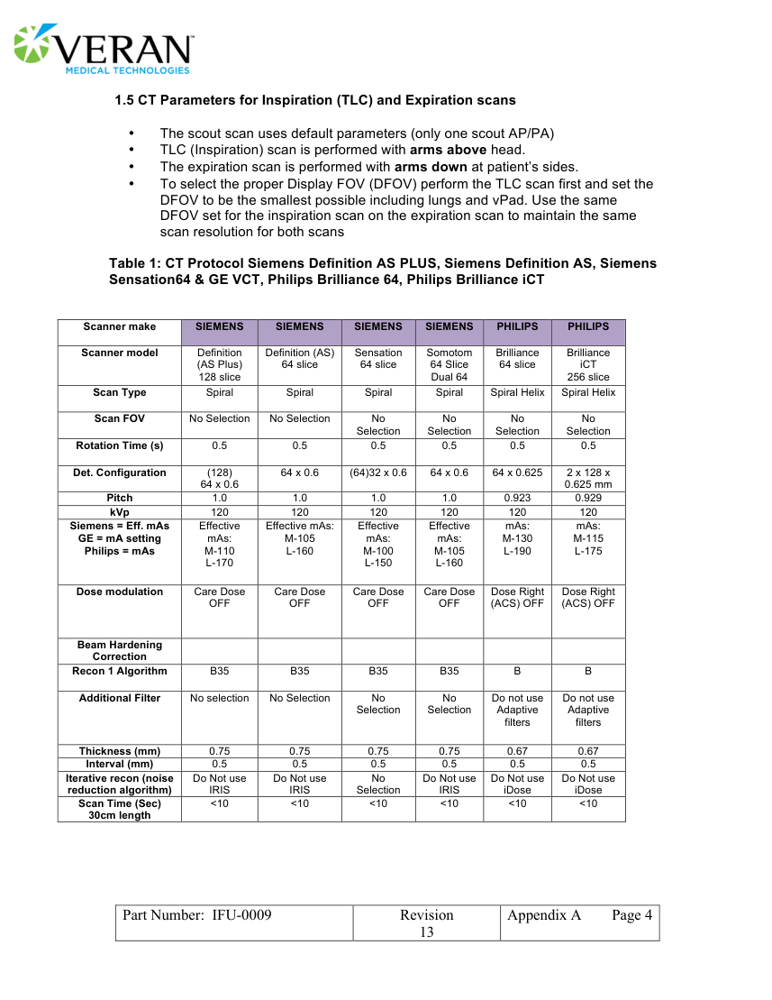
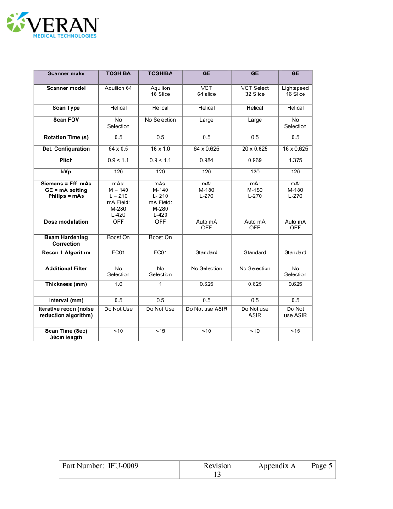
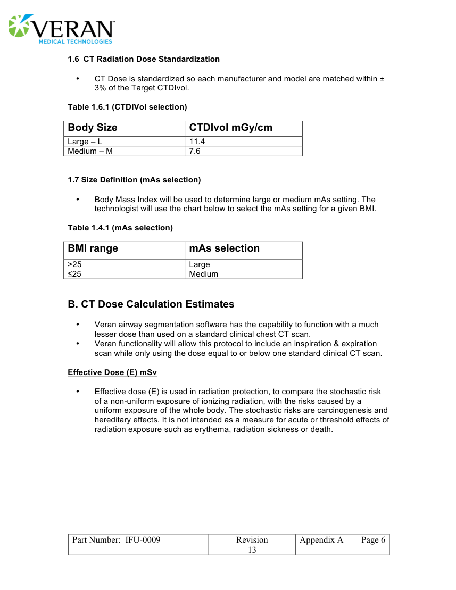
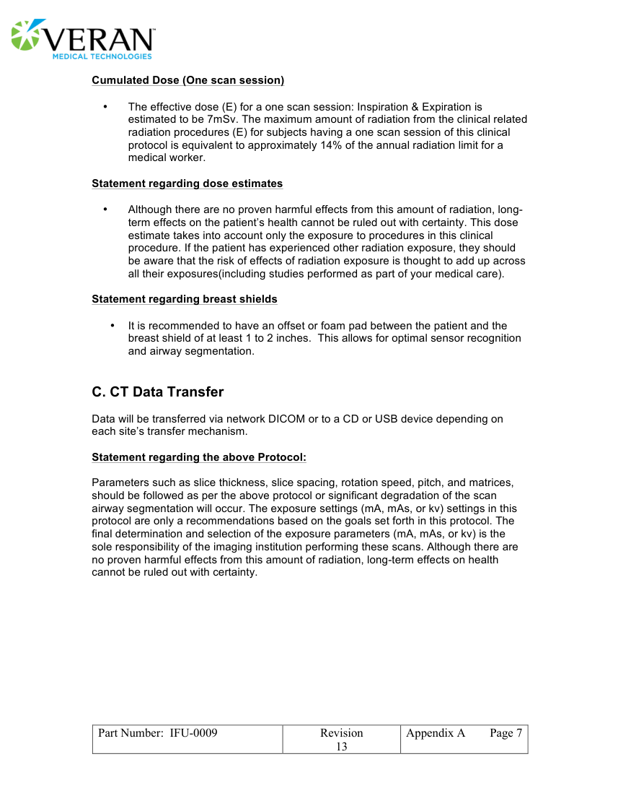

# CT — Torace: Veran (MCB)

## Documentul original MCB — Torace: Veran

**Protocol · 7 pagini · consultat la 2026-09-27.**

[Descarcă PDF-ul integral](../../assets/mcb-modalities/ct-torace-veran-mcb/document.pdf) · [Sursa MCB](https://ref.mcbradiology.com/Protocols,%20Policies,%20Worksheets%20&%20Forms/CT/Protocols/Chest/7%20Veran.pdf) · [Catalogul MCB pentru această modalitate](../mcb/index.md)

Instrucțiunile, valorile și ilustrațiile din documentul original sunt păstrate în **engleză**. Titlul și navigarea sunt în română.

### Pagina 1

{ loading=lazy }

### Pagina 2

{ loading=lazy }

### Pagina 3

{ loading=lazy }

### Pagina 4

{ loading=lazy }

### Pagina 5

{ loading=lazy }

### Pagina 6

{ loading=lazy }

### Pagina 7

{ loading=lazy }

## Textul documentului original

??? abstract "Pagina 1 — text în engleză"

    
Updated
    05/01/24
    CT Chest Veran (Navigational)
    Reviewed
    05/14/25
    Indications - pre navigational biopsy of a lung nodule, mass, lesion or opacity and should be ordered as Veran protocol
    by Pulmonology.
    Use CT Chest without Contrast charge.
    GENERAL SCAN NOTES
    Remove any metal from the imaging field of view.
    Have patient lift chin up.
    Have the patient cough a few times to clear secretions. This reduces incidence of small lung nodules.
    Topogram - lung apices through diaphragm (obtained during end inspiration). 
    Craniocaudal scan coverage - lung apices through adrenal glands on both phases (obtained during end inspiration).
    Use smallest FOV without cropping anatomy or excluding vPad. Use the same FOV for both scans.
    The vPad tracker should be clearly visible in the FOV.
    The patients arms are over his/her head for the end inspiratory phase.
    The patients arms are by his/her side for the end expiratory phase.
    IV Contrast: not given for this protocol.
    Veran Rep: Noel Kane 618-600-5922, noel.kane@veranmedical.com.
    SIEMENS PARAMETERS &amp; RECONS
    For the Supine End Inspiration and Supine End Expiration phases:
    Scan                           
    Care                                          
    Scan                 
    Pitch
    Acq
    Coll
    Rot 
    Mode
    kV
    Eff mAs
    Care                            
    Dose
    kV &amp; Lvl
    Time
    Time
    1.00
    0.5
    0.75
    16
    Sensation 16
    spiral
    120
    NA
    12.5
    100/150
    off
    0.5
    7.8
    Go Up 32
    spiral
    120
    off
    1.00
    32
    0.6
    100/150
    off
    Sensation 64
    spiral
    120
    NA
    0.5
    7.8
    105/160
    off
    1.00
    64
    0.6
    0.5
    7.8
    Definition 64
    spiral
    120
    off
    1.00
    105/160
    64
    0.6
    off
    Go Top 64
    spiral
    120
    3.9
    105/160
    off
    1.00
    64
    0.6
    0.5
    off
    3.9
    Drive 128
    spiral
    120
    off
    1.00
    128
    0.6
    0.5
    110/170
    off
    Force 192
    spiral
    3.9
    120
    off
    1.00
    128
    0.6
    0.5
    110/170
    off
    Use lower mAs for BMI ≤25 or higher mAs for BMI &gt;25.
    IR                       
    Name of Series
    Thick
    Interval
    Window
    Recon                     
    Kernel
    Lvl
    Direction
    AX LUNG
    3.0
    3.0
    Br57 / B70f
    lung
    none
    head/feet
    AX SOFT
    3.0
    3.0
    mediastinum
    head/feet
    Br40 / B41f
    none
    COR SOFT
    3.0
    3.0
    none
    Br40 / B41f
    mediastinum
    front/back
    SAG SOFT
    3.0
    3.0
    mediastinum
    Br40 / B41f
    none
    left/right
    0.75
    0.5
    mediastinum
    head/feet
    none
    TLC INSP
    Qr36 / B35f
    Veran specific recon.
    AX MIPS
    8.0
    3.0
    lung
    head/feet
    none
    Br40 / B41f
    TLC EXP
    0.75
    0.5
    mediastinum
    Veran specific recon.
    Qr36 / B35f
    none
    head/feet
    

??? abstract "Pagina 2 — text în engleză"

    
CT Chest Veran (Navigational)
    GE PARAMETERS &amp; RECONS
    For the Supine End Inspiration and Supine End Expiration phases:
    Scan               
    Smart             
    Beam                                 
    Dose                                                    
    Scan                 
    Manual                                        
    SFOV
    kV
    Slice                       
    Pitch
    Speed
    Rot                                
    ASIR
    Type
    mA
    Thick
    Coll
    Time
    Red
    Time
    mA
    0.625
    13.75
    0.5
    LS 16
    helical
    large
    120
    NA
    10
    1.375
    off
    NA
    10.9
    180/270
    Opt 540
    helical
    large
    120
    NA
    10
    0.625
    1.375
    off
    13.75
    0.5
    NA
    10.9
    180/270
     LS VCT 64
    helical
    large body
    120
    off
    off
    0.625
    40
    0.984
    39.37
    0.5
    none
    3.8
    180/270
    off
    NA
    3.8
    Disc VCT 64
    helical
    large body
    120
    NA
    40
    0.984 39.37
    0.625
    180/270
    0.5
    Use 180 mAs for BMI ≤25 or 270 mAs for BMI &gt;25.
    Window                                   
    Recon                    
    Name of Series
    Thickness
    Interval
    Recon                                     
    Algorithm
    Width/Level
    Direction
    This must be the first recon.
    TLC INSP
    0.625
    0.5
    std full
    400/40
    head/feet
    AX LUNG
    2.5
    2.5
    lung
    1600/-600
    head/feet
    Veran specific recon.
    AX SOFT
    2.5
    2.5
    std full
    400/40
    head/feet
    COR SOFT
    2.5
    2.5
    std full
    400/40
    front/back
    SAG SOFT
    2.5
    2.5
    std full
    400/40
    left/right
    AX MIPS
    8.0
    3.0
    std full
    1600/-600
    head/feet
    TLC EXP
    0.625
    0.5
    std full
    400/40
    head/feet
    Veran specific recon.
    PHILIPS PARAMETERS &amp; RECONS
    For the Supine End Inspiration and Supine End Expiration phases:
    Scan                           
    Rot 
    Scan                 
    Manual                                        
    Mode
    kV
    3D                                              
    Dose
    Pitch Detect Colli
    Time
    Time
    mA
    Incisive 128
    helical
    120
    off
    0.923
    64
    0.625
    0.5
    4.1
    130/190
    Use 130 mAs for BMI ≤ 25 or 190 mAs for BMI &gt;25.
    Name of Series
    Thick
    Interval
    Filter
    Window
    iDose
    Recon                     
    Direction
    AX LUNG
    3.0
    3.0
    YA
    lung
    none
    head/feet
    AX SOFT
    3.0
    3.0
    B
    mediastinum
    none
    head/feet
    COR SOFT
    3.0
    3.0
    B
    mediastinum
    none
    front/back
    SAG SOFT
    3.0
    3.0
    B
    mediastinum
    none
    left/right
    TLC INSP
    0.67
    0.5
    B
    mediastinum
    none
    head/feet
    Veran specific recon.
    AX MIPS
    8.0
    2.0
    B
    lung
    none
    head/feet
    head/feet
    TLC EXP
    0.67
    0.5
    B
    mediastinum
    none
    Veran specific recon.
    

??? abstract "Pagina 3 — text în engleză"

    
 
    • 
    Breathe and relax (Give the patient a few relax breaths. Talk the patient to insure 
    they understand and will tolerate the breath hold. If they cannot hold their breath 
    instruct them to do the best they can and set scanner to scan base to apex) 
     
    • 
    Now we are ready to scan so please 
    • 
    Take a deep breath in (watch chest to insure a deep breath in) 
    • 
    Let it out (watch chest to insure air is out) 
    • 
    Now breathe all the way IN..IN..IN (watch chest to insure a deep breath in as far 
    as possible – begin scanning) 
    • 
    Keep holding your breath – DO NOT BREATHE! 
    • 
    At end of scan: Breathe and relax 
     
    1.3 End Expiration CT Scan  
     
    • 
    For the second part of this scan, I am going to ask you to take a couple of deep 
    breaths in and out before we have you hold your breath all the out. 
    • 
    First, let’s practice 
    • 
    Take a deep breath in (watch chest to insure a deep breath in) 
    • 
    Let it out (watch chest to insure air is out)  
    • 
    Take another deep breath in (watch chest to insure a deep breath in) 
    • 
    Now let it out and hold it (watch chest to insure subject is holding before starting 
    the scan) 
    • 
    Keep holding your breath – DO NOT BREATHE! (count 10 seconds) 
    • 
    Breathe and relax (Give the patient a few relax breath. Talk the patient to insure 
    they understand and will tolerate the breath hold. If they cannot hold their breath 
    instruct them to do the best they can and set scanner to scan base to apex.) 
    • 
    Now we are ready to scan so please 
    • 
    Take a deep breath in (watch chest to insure a deep breath in) 
    • 
    Let it out (watch chest to insure air is out) 
    • 
    Take another deep breath in (watch chest to insure a deep breath in) 
    • 
    Now let it out and hold. (watch chest to insure subject is holding – begin 
    scanning) 
    • 
    Keep holding your breath out – DO NOT BREATHE! 
    • 
    At end of scan: Breathe and relax 
     
    1.4 CT Patient Positioning 
     
    • 
    Place patient in a supine position, lower legs supported. 
    • 
    Inspiration CT (TLC) scan - the arms should be placed comfortably over the head 
    in a head arm rest. The vPad (patient tracker) should be clearly visible in the 
    scanner field of view. 
    • 
    Expiration CT scan – the arms should be placed comfortably at the patient’s 
    sides. The vPad (patient tracker) should be clearly visible in the scanner field of 
    view. Optimal navigation registration is obtained with the full expiration scan. 
    • 
    Using the laser positioning lights, line up the patient so the chest is iso-center (in 
    the middle) of the CT gantry. 
    • 
    Move the table so the patient is in the correct position for a chest CT scan 
     
     
     
    Part Number:  IFU-0009 
    Revision  
    Appendix A 
    Page 3 
    13 
     
    

??? abstract "Pagina 4 — text în engleză"

    
 
    1.5 CT Parameters for Inspiration (TLC) and Expiration scans 
     
    • 
    The scout scan uses default parameters (only one scout AP/PA) 
    • 
    TLC (Inspiration) scan is performed with arms above head. 
    • 
    The expiration scan is performed with arms down at patient’s sides. 
    • 
    To select the proper Display FOV (DFOV) perform the TLC scan first and set the 
    DFOV to be the smallest possible including lungs and vPad. Use the same 
    DFOV set for the inspiration scan on the expiration scan to maintain the same 
    scan resolution for both scans 
     
    Table 1: CT Protocol Siemens Definition AS PLUS, Siemens Definition AS, Siemens 
    Sensation64 &amp; GE VCT, Philips Brilliance 64, Philips Brilliance iCT 
     
    Scanner make 
    SIEMENS 
    SIEMENS 
    SIEMENS 
    SIEMENS 
    PHILIPS 
    PHILIPS 
     
    Definition (AS) 
    Sensation 
    Somotom 
    Brilliance 
    Brilliance 
    Scanner model 
    Definition 
    (AS Plus) 
    64 slice 
    64 slice 
    64 slice 
    iCT 
    128 slice 
    64 Slice 
    Dual 64 
    256 slice 
    Scan Type 
    Spiral 
    Spiral 
    Spiral 
    Spiral 
    Spiral Helix 
    Spiral Helix 
    Scan FOV 
    No Selection 
    No Selection 
    No 
    No 
    No 
    No 
    Selection 
    Selection 
    Selection 
    Selection 
    Rotation Time (s) 
    0.5 
    0.5 
    0.5 
    0.5 
    0.5 
    0.5 
    Det. Configuration 
    (128) 
    64 x 0.6 
    (64)32 x 0.6 
    64 x 0.6 
    64 x 0.625 
    2 x 128 x 
    64 x 0.6 
    0.625 mm 
    Pitch 
    1.0 
    1.0 
    1.0 
    1.0 
    0.923 
    0.929 
    kVp 
    120 
    120 
    120 
    120 
    120 
    120 
    Siemens = Eff. mAs 
    Effective 
    Effective mAs: 
    Effective 
    Effective 
    mAs: 
    mAs: 
    GE = mA setting 
    mAs: 
    M-105 
    mAs: 
    mAs: 
    M-130 
    M-115 
    Philips = mAs 
    M-110 
    L-160 
    M-100 
    M-105 
    L-190 
    L-175 
     
    L-170 
    L-150 
    L-160 
    Dose modulation 
    Care Dose 
    Care Dose 
    Care Dose 
    Care Dose 
    OFF 
    OFF 
    OFF 
    OFF 
    Dose Right 
    (ACS) OFF 
    Dose Right 
    (ACS) OFF 
    Beam Hardening 
     
     
     
     
     
     
    Correction 
    Recon 1 Algorithm 
    B35 
    B35 
    B35 
    B35 
    B 
    B 
    Additional Filter 
    No selection 
    No Selection 
    No 
    No 
    Do not use 
    Do not use 
    Selection 
    Selection 
    Adaptive 
    Adaptive 
    filters 
    filters 
    Thickness (mm) 
    0.75 
    0.75 
    0.75 
    0.75 
    0.67 
    0.67 
    Interval (mm) 
    0.5 
    0.5 
    0.5 
    0.5 
    0.5 
    0.5 
    Iterative recon (noise 
    Do Not use 
    Do Not use 
    No 
    Do Not use 
    Do Not use 
    Do Not use 
    reduction algorithm) 
    IRIS 
    IRIS 
    Selection 
    IRIS 
    iDose 
    iDose 
    Scan Time (Sec) 
    &lt;10 
    &lt;10 
    &lt;10 
    &lt;10 
    &lt;10 
    &lt;10 
    30cm length 
     
     
     
     
     
    Part Number:  IFU-0009 
    Revision  
    Appendix A 
    Page 4 
    13 
     
    

??? abstract "Pagina 5 — text în engleză"

    
 
     
     
    Scanner make 
    TOSHIBA 
    TOSHIBA 
    GE 
    GE 
    GE 
    VCT 
    VCT Select 
    Lightspeed 
    Scanner model 
    Aquilion 64 
     
    Aquilion 
    16 Slice 
    16 Slice 
    64 slice 
    32 Slice 
    Scan Type 
    Helical 
    Helical 
    Helical 
    Helical 
    Helical 
    Scan FOV 
    No 
    No Selection 
    Large 
    Large 
    No 
    Selection 
    Selection 
    Rotation Time (s) 
    0.5 
    0.5 
    0.5 
    0.5 
    0.5 
    Det. Configuration 
    64 x 0.5 
    16 x 1.0 
    64 x 0.625 
    20 x 0.625 
    16 x 0.625 
    Pitch 
    0.9 &lt; 1.1 
    0.9 &lt; 1.1 
    0.984 
    0.969 
    1.375 
    kVp 
    120 
    120 
    120 
    120 
    120 
    Siemens = Eff. mAs 
    mAs: 
    mAs: 
    mA: 
    mA: 
    mA: 
    GE = mA setting 
    M – 140 
    M-180 
    M-180 
    M-180 
    Philips = mAs 
    L – 210 
    M-140 
    L- 210 
    L-270 
    L-270 
    L-270 
    mA Field: 
    mA Field: 
     
    M-280 
    M-280 
    L-420 
    L-420 
    Auto mA 
    Auto mA 
    Dose modulation 
    OFF 
    OFF 
    Auto mA 
    OFF 
    OFF 
    OFF 
    Beam Hardening 
    Boost On 
    Boost On 
     
     
     
    Correction 
    Recon 1 Algorithm 
    FC01 
    FC01 
    Standard 
    Standard 
    Standard 
    No 
    Additional Filter 
    No 
    No Selection 
    No Selection 
    No 
    Selection 
    Selection 
    Selection 
    Thickness (mm) 
    1.0 
    1 
    0.625 
    0.625 
    0.625 
    Interval (mm) 
    0.5 
    0.5 
    0.5 
    0.5 
    0.5 
    Iterative recon (noise 
    Do Not 
    Do Not Use 
    Do Not Use 
    Do Not use ASIR 
    Do Not use 
    use ASIR 
    reduction algorithm) 
    ASIR 
    Scan Time (Sec) 
    &lt;10 
    &lt;15 
    &lt;10 
    &lt;10 
    &lt;15 
    30cm length 
     
     
     
     
     
     
     
     
     
     
     
     
     
     
     
     
     
     
     
     
     
     
     
     
     
     
     
     
     
     
     
     
     
     
     
     
     
     
     
     
     
     
     
     
     
     
     
     
     
    Part Number:  IFU-0009 
    Revision  
    Appendix A 
    Page 5 
    13 
     
    

??? abstract "Pagina 6 — text în engleză"

    
 
    1.6  CT Radiation Dose Standardization 
     
    • 
    CT Dose is standardized so each manufacturer and model are matched within ± 
    3% of the Target CTDIvol. 
     
    Table 1.6.1 (CTDIVol selection) 
     
    Body Size 
    CTDIvol mGy/cm 
    Large – L 
    11.4 
    Medium – M 
    7.6 
     
     
    1.7 Size Definition (mAs selection) 
     
    • 
    Body Mass Index will be used to determine large or medium mAs setting. The 
    technologist will use the chart below to select the mAs setting for a given BMI. 
     
    Table 1.4.1 (mAs selection) 
     
    BMI range 
    mAs selection 
    &gt;25 
    Large 
    ≤25 
    Medium 
     
     
    B. CT Dose Calculation Estimates 
     
    • 
    Veran airway segmentation software has the capability to function with a much 
    lesser dose than used on a standard clinical chest CT scan. 
    • 
    Veran functionality will allow this protocol to include an inspiration &amp; expiration 
    scan while only using the dose equal to or below one standard clinical CT scan. 
     
    Effective Dose (E) mSv 
     
    • 
    Effective dose (E) is used in radiation protection, to compare the stochastic risk 
    of a non-uniform exposure of ionizing radiation, with the risks caused by a 
    uniform exposure of the whole body. The stochastic risks are carcinogenesis and 
    hereditary effects. It is not intended as a measure for acute or threshold effects of 
    radiation exposure such as erythema, radiation sickness or death. 
     
     
     
     
     
     
     
     
     
     
     
    Part Number:  IFU-0009 
    Revision  
    Appendix A 
    Page 6 
    13 
     
    

??? abstract "Pagina 7 — text în engleză"

    
 
    Cumulated Dose (One scan session) 
     
    • 
    The effective dose (E) for a one scan session: Inspiration &amp; Expiration is 
    estimated to be 7mSv. The maximum amount of radiation from the clinical related 
    radiation procedures (E) for subjects having a one scan session of this clinical 
    protocol is equivalent to approximately 14% of the annual radiation limit for a 
    medical worker. 
     
    Statement regarding dose estimates 
     
    • 
    Although there are no proven harmful effects from this amount of radiation, long-
    term effects on the patient’s health cannot be ruled out with certainty. This dose 
    estimate takes into account only the exposure to procedures in this clinical 
    procedure. If the patient has experienced other radiation exposure, they should 
    be aware that the risk of effects of radiation exposure is thought to add up across 
    all their exposures(including studies performed as part of your medical care). 
     
    Statement regarding breast shields 
     
    • 
    It is recommended to have an offset or foam pad between the patient and the 
    breast shield of at least 1 to 2 inches.  This allows for optimal sensor recognition 
    and airway segmentation. 
     
     
    C. CT Data Transfer 
     
    Data will be transferred via network DICOM or to a CD or USB device depending on 
    each site’s transfer mechanism. 
     
    Statement regarding the above Protocol: 
     
    Parameters such as slice thickness, slice spacing, rotation speed, pitch, and matrices, 
    should be followed as per the above protocol or significant degradation of the scan 
    airway segmentation will occur. The exposure settings (mA, mAs, or kv) settings in this 
    protocol are only a recommendations based on the goals set forth in this protocol. The 
    final determination and selection of the exposure parameters (mA, mAs, or kv) is the 
    sole responsibility of the imaging institution performing these scans. Although there are 
    no proven harmful effects from this amount of radiation, long-term effects on health 
    cannot be ruled out with certainty. 
     
     
    Part Number:  IFU-0009 
    Revision  
    Appendix A 
    Page 7 
    13 
     
    

