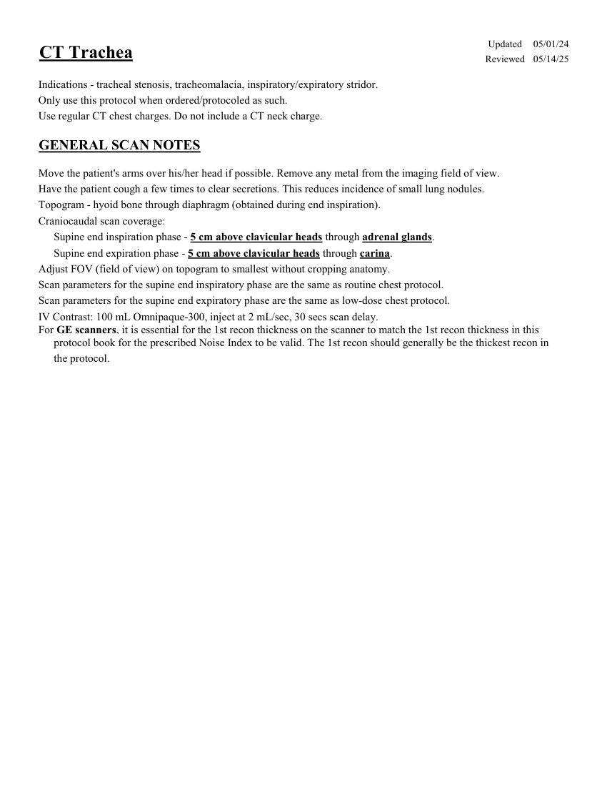
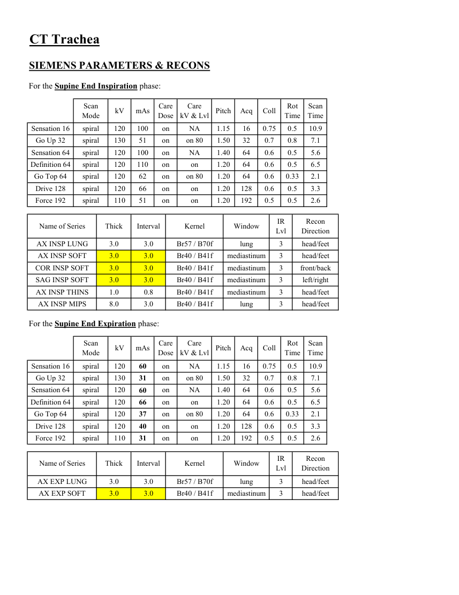
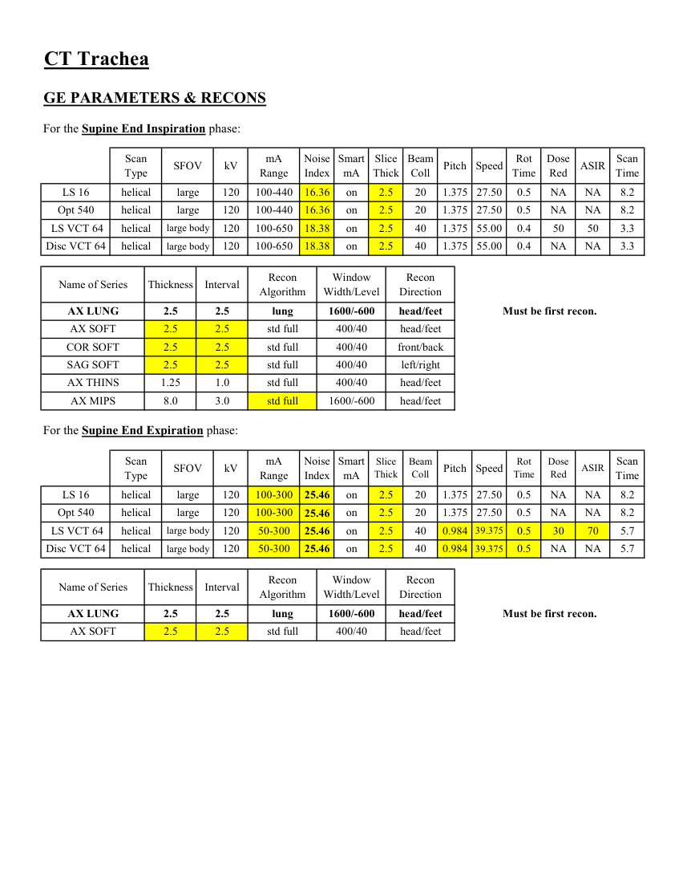
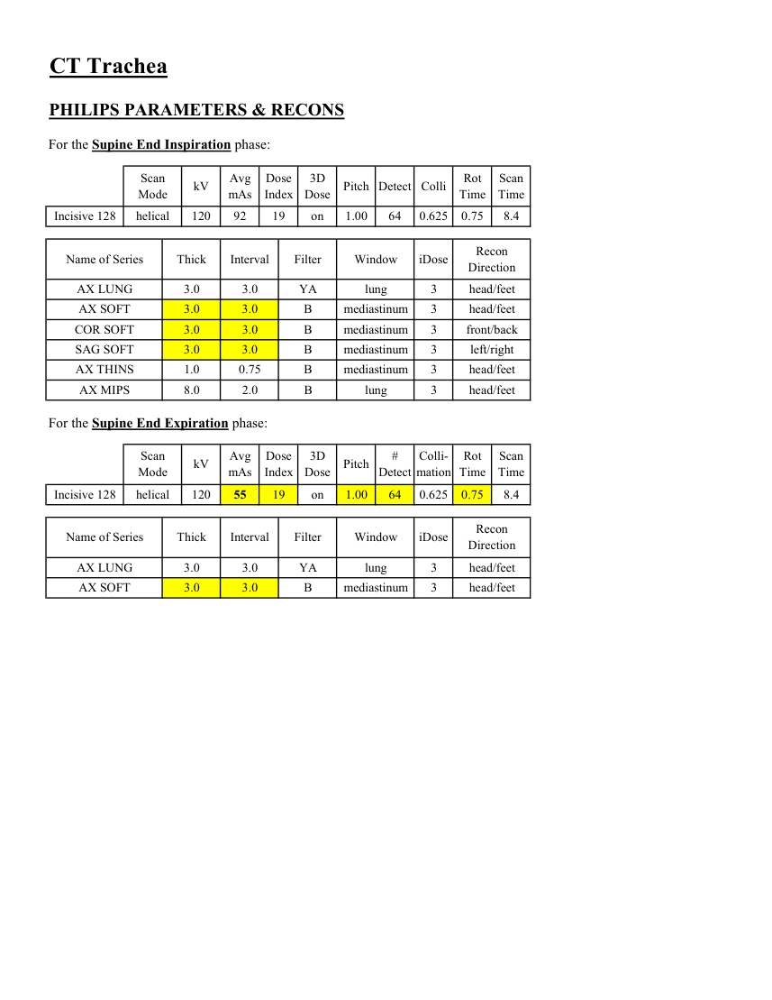

# CT — Trahee (MCB)

## Documentul original MCB — Trahee

**Protocol · 4 pagini · consultat la 2026-09-27.**

[Descarcă PDF-ul integral](../../assets/mcb-modalities/ct-trahee-mcb/document.pdf) · [Sursa MCB](https://ref.mcbradiology.com/Protocols,%20Policies,%20Worksheets%20&%20Forms/CT/Protocols/Chest/11%20Trachea.pdf) · [Catalogul MCB pentru această modalitate](../mcb/index.md)

Instrucțiunile, valorile și ilustrațiile din documentul original sunt păstrate în **engleză**. Titlul și navigarea sunt în română.

### Pagina 1

{ loading=lazy }

### Pagina 2

{ loading=lazy }

### Pagina 3

{ loading=lazy }

### Pagina 4

{ loading=lazy }

## Textul documentului original

??? abstract "Pagina 1 — text în engleză"

    
Updated
    05/01/24
    CT Trachea
    Reviewed
    05/14/25
    Indications - tracheal stenosis, tracheomalacia, inspiratory/expiratory stridor.
    Only use this protocol when ordered/protocoled as such.
    Use regular CT chest charges. Do not include a CT neck charge.
    GENERAL SCAN NOTES
    Move the patient&#x27;s arms over his/her head if possible. Remove any metal from the imaging field of view.
    Have the patient cough a few times to clear secretions. This reduces incidence of small lung nodules.
    Topogram - hyoid bone through diaphragm (obtained during end inspiration).  
    Craniocaudal scan coverage:
    Supine end inspiration phase - 5 cm above clavicular heads through adrenal glands.
    Supine end expiration phase - 5 cm above clavicular heads through carina.
    Adjust FOV (field of view) on topogram to smallest without cropping anatomy.
    Scan parameters for the supine end inspiratory phase are the same as routine chest protocol.
    Scan parameters for the supine end expiratory phase are the same as low-dose chest protocol.
    IV Contrast: 100 mL Omnipaque-300, inject at 2 mL/sec, 30 secs scan delay.
    For GE scanners, it is essential for the 1st recon thickness on the scanner to match the 1st recon thickness in this
    protocol book for the prescribed Noise Index to be valid. The 1st recon should generally be the thickest recon in 
    the protocol.
    

??? abstract "Pagina 2 — text în engleză"

    
CT Trachea
    SIEMENS PARAMETERS &amp; RECONS
    For the Supine End Inspiration phase:
    Scan                           
    Care                                          
    Scan                 
    Mode
    kV
    mAs
    Care                            
    Dose
    kV &amp; Lvl
    Pitch
    Acq
    Coll
    Rot 
    Time
    Time
    Sensation 16
    spiral
    120
    100
    on
    NA
    1.15
    16
    0.75
    0.5
    10.9
    Go Up 32
    spiral
    130
    51
    on
    on 80
    1.50
    32
    0.7
    0.8
    7.1
    Sensation 64
    spiral
    120
    100
    on
    NA
    1.40
    64
    0.6
    0.5
    5.6
    Definition 64
    spiral
    120
    110
    on
    on
    1.20
    64
    0.6
    0.5
    6.5
    Go Top 64
    spiral
    120
    62
    on
    on 80
    1.20
    64
    0.6
    0.33
    2.1
    Drive 128
    spiral
    120
    66
    on
    on
    1.20
    128
    0.6
    0.5
    3.3
    Force 192
    spiral
    110
    51
    on
    on
    1.20
    192
    0.5
    0.5
    2.6
    Recon                     
    Name of Series
    Thick
    Interval
    Kernel
    Window
    IR                       
    Lvl
    Direction
    AX INSP LUNG
    3.0
    3.0
    Br57 / B70f
    lung
    3
    head/feet
    AX INSP SOFT
    3.0
    3.0
    Br40 / B41f
    mediastinum
    3
    head/feet
    COR INSP SOFT
    3.0
    3.0
    Br40 / B41f
    mediastinum
    3
    front/back
    SAG INSP SOFT
    3.0
    3.0
    Br40 / B41f
    mediastinum
    3
    left/right
    AX INSP THINS
    1.0
    0.8
    Br40 / B41f
    mediastinum
    3
    head/feet
    AX INSP MIPS
    8.0
    3.0
    Br40 / B41f
    lung
    3
    head/feet
    For the Supine End Expiration phase:
    Scan                           
    Care                                          
    Scan                 
    Mode
    kV
    mAs
    Care                            
    Dose
    kV &amp; Lvl
    Pitch
    Acq
    Coll
    Rot 
    Time
    Time
    NA
    1.15
    16
    0.75
    0.5
    10.9
    Sensation 16
    spiral
    120
    60
    on
    on 80
    1.50
    32
    0.7
    0.8
    7.1
    Go Up 32
    spiral
    130
    31
    on
    NA
    1.40
    64
    0.6
    0.5
    5.6
    Sensation 64
    spiral
    120
    60
    on
    on
    1.20
    64
    0.6
    0.5
    6.5
    Definition 64
    spiral
    120
    66
    on
    on 80
    1.20
    64
    0.6
    0.33
    2.1
    Go Top 64
    spiral
    120
    37
    on
    on
    1.20
    128
    0.6
    0.5
    3.3
    Drive 128
    spiral
    120
    40
    on
    Force 192
    spiral
    on
    0.5
    1.20
    192
    0.5
    2.6
    110
    31
    on
    IR                       
    Recon                     
    Name of Series
    Thick
    Interval
    Kernel
    Window
    Lvl
    Direction
    AX EXP LUNG
    3.0
    3.0
    Br57 / B70f
    lung
    3
    head/feet
    AX EXP SOFT
    3.0
    3.0
    Br40 / B41f
    mediastinum
    3
    head/feet
    

??? abstract "Pagina 3 — text în engleză"

    
CT Trachea
    GE PARAMETERS &amp; RECONS
    For the Supine End Inspiration phase:
    Scan               
    Smart             
    Slice                       
    Beam                                 
    Dose                                          
    Scan                 
    Pitch
    Speed
    Rot                                
    Type
    SFOV
    kV
    mA                           
    Range
    Noise                    
    Index
    mA
    Thick
    Coll
    Time
    Red
    ASIR
    Time
    LS 16
    helical
    large
    120
    100-440
    16.36
    on
    2.5
    20
    1.375 27.50
    0.5
    NA
    NA
    8.2
    Opt 540
    helical
    large
    120
    100-440
    16.36
    on
    2.5
    20
    1.375 27.50
    0.5
    NA
    NA
    8.2
     LS VCT 64
    helical
    large body
    120
    100-650
    18.38
    on
    2.5
    40
    1.375 55.00
    0.4
    50
    50
    3.3
    Disc VCT 64
    helical
    large body
    120
    100-650
    18.38
    on
    2.5
    40
    1.375 55.00
    0.4
    NA
    NA
    3.3
    Window                                   
    Recon                    
    Name of Series
    Thickness
    Interval
    Recon                                     
    Algorithm
    Width/Level
    Direction
    AX LUNG
    2.5
    2.5
    lung
    1600/-600
    head/feet
    Must be first recon.
    AX SOFT
    2.5
    2.5
    std full
    400/40
    head/feet
    COR SOFT
    2.5
    2.5
    std full
    400/40
    front/back
    SAG SOFT
    2.5
    2.5
    std full
    400/40
    left/right
    AX THINS
    1.25
    1.0
    std full
    400/40
    head/feet
    AX MIPS
    8.0
    3.0
    std full
    1600/-600
    head/feet
    For the Supine End Expiration phase:
    Scan               
    Smart             
    Scan                 
    Slice                       
    Beam                                 
    Dose                                               
    Speed
    Rot                                
    Thick
    Coll
    Pitch
    Time
    Red
    ASIR
    Type
    SFOV
    kV
    mA                           
    Range
    Noise                    
    Index
    mA
    Time
    LS 16
    helical
    large
    120
    100-300
    1.375 27.50
    0.5
    NA
    NA
    8.2
    25.46
    on
    2.5
    20
    Opt 540
    helical
    large
    120
    100-300
    0.5
    NA
    NA
    1.375 27.50
    8.2
    25.46
    on
    2.5
    20
     LS VCT 64
    helical
    large body
    120
    50-300
    0.984
    39.375
    0.5
    30
    70
    5.7
    25.46
    on
    2.5
    40
    5.7
    0.984 39.375
    0.5
    NA
    NA
    Disc VCT 64
    helical
    large body
    120
    50-300
    25.46
    on
    2.5
    40
    Window                                   
    Recon                    
    Name of Series
    Thickness
    Interval
    Recon                                     
    Algorithm
    Width/Level
    Direction
    AX LUNG
    2.5
    2.5
    lung
    1600/-600
    head/feet
    Must be first recon.
    AX SOFT
    2.5
    2.5
    std full
    400/40
    head/feet
    

??? abstract "Pagina 4 — text în engleză"

    
CT Trachea
    PHILIPS PARAMETERS &amp; RECONS
    For the Supine End Inspiration phase:
    Scan                           
    Dose                                          
    3D            
    Scan                 
    Mode
    kV
    Avg                      
    mAs
    Index
    Dose
    Pitch Detect Colli
    Rot 
    Time
    Time
    0.75
    Incisive 128
    helical
    120
    92
    19
    on
    1.00
    64
    0.625
    8.4
    Name of Series
    Thick
    Interval
    Filter
    Window
    iDose
    Recon                     
    Direction
    AX LUNG
    3.0
    3.0
    YA
    lung
    3
    head/feet
    AX SOFT
    3.0
    3.0
    B
    mediastinum
    3
    head/feet
    COR SOFT
    3.0
    3.0
    B
    mediastinum
    3
    front/back
    SAG SOFT
    3.0
    3.0
    left/right
    B
    mediastinum
    3
    AX THINS
    1.0
    0.75
    B
    mediastinum
    3
    head/feet
    AX MIPS
    8.0
    2.0
    B
    lung
    3
    head/feet
    For the Supine End Expiration phase:
    Scan                           
    Dose                                          
    3D                                              
    Colli-                
    Rot 
    Scan                 
    Mode
    kV
    Avg                      
    mAs
    Index
    Dose
    Pitch
    #                         
    Detect
    mation
    Time
    Time
    8.4
    0.75
    Incisive 128
    helical
    120
    55
    19
    on
    1.00
    64
    0.625
    Name of Series
    Thick
    Interval
    Filter
    Window
    iDose
    Recon                     
    Direction
    AX LUNG
    3.0
    3.0
    YA
    lung
    3
    head/feet
    AX SOFT
    3.0
    3.0
    B
    mediastinum
    3
    head/feet
    

