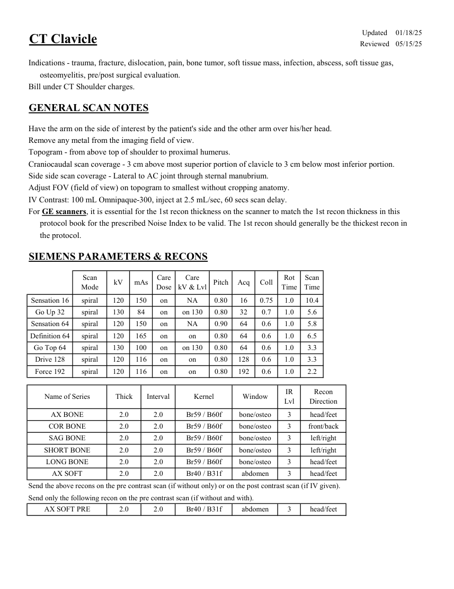
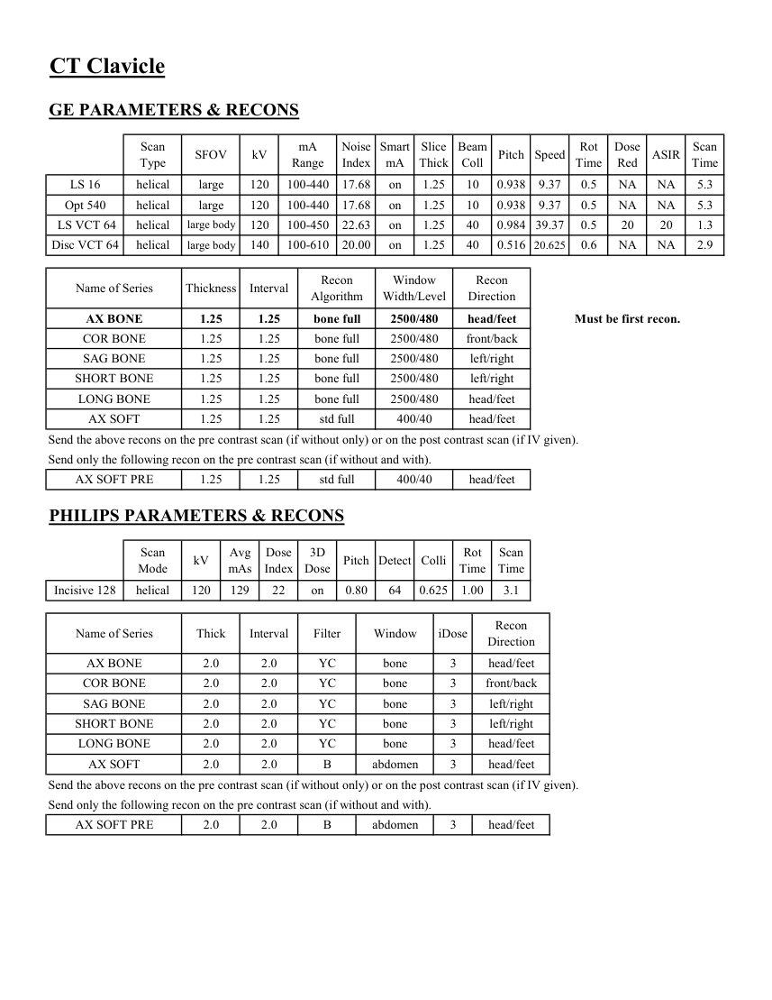
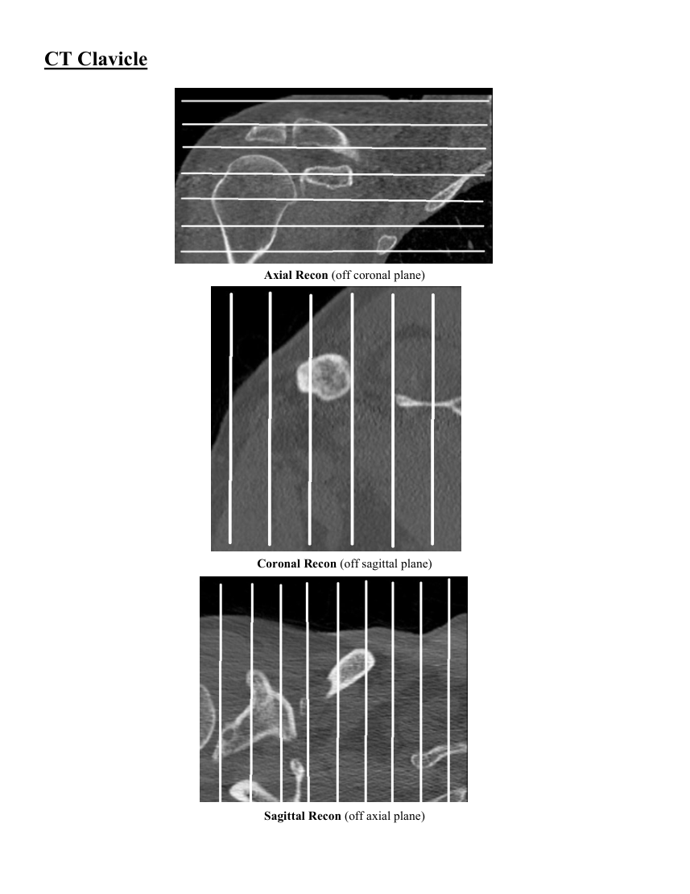
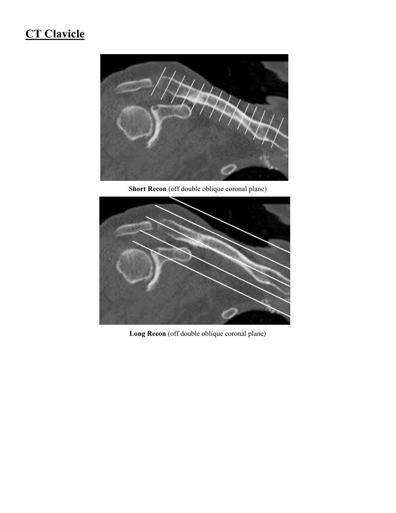

# CT — Claviculă (MCB)

## Documentul original MCB — Claviculă

**Protocol · 4 pagini · consultat la 2026-09-27.**

[Descarcă PDF-ul integral](../../assets/mcb-modalities/ct-clavicula-mcb/document.pdf) · [Sursa MCB](https://ref.mcbradiology.com/Protocols,%20Policies,%20Worksheets%20&%20Forms/CT/Protocols/MSK/2%20Clavicle.pdf) · [Catalogul MCB pentru această modalitate](../mcb/index.md)

Instrucțiunile, valorile și ilustrațiile din documentul original sunt păstrate în **engleză**. Titlul și navigarea sunt în română.

### Pagina 1

{ loading=lazy }

### Pagina 2

{ loading=lazy }

### Pagina 3

{ loading=lazy }

### Pagina 4

{ loading=lazy }

## Textul documentului original

??? abstract "Pagina 1 — text în engleză"

    
Updated
    01/18/25
    CT Clavicle
    Reviewed
    05/15/25
    Indications - trauma, fracture, dislocation, pain, bone tumor, soft tissue mass, infection, abscess, soft tissue gas, 
    osteomyelitis, pre/post surgical evaluation.
    Bill under CT Shoulder charges.
    GENERAL SCAN NOTES
    Have the arm on the side of interest by the patient&#x27;s side and the other arm over his/her head.
    Remove any metal from the imaging field of view.
    Topogram - from above top of shoulder to proximal humerus.
    Craniocaudal scan coverage - 3 cm above most superior portion of clavicle to 3 cm below most inferior portion.
    Side side scan coverage - Lateral to AC joint through sternal manubrium.
    Adjust FOV (field of view) on topogram to smallest without cropping anatomy.
    IV Contrast: 100 mL Omnipaque-300, inject at 2.5 mL/sec, 60 secs scan delay.
    For GE scanners, it is essential for the 1st recon thickness on the scanner to match the 1st recon thickness in this
    protocol book for the prescribed Noise Index to be valid. The 1st recon should generally be the thickest recon in 
    the protocol.
    SIEMENS PARAMETERS &amp; RECONS
    Scan                           
    Care                                          
    Scan                 
    Acq
    Coll
    Rot 
    Mode
    kV
    mAs
    Care                            
    Dose
    kV &amp; Lvl
    Pitch
    Time
    Time
    Sensation 16
    spiral
    120
    150
    on
    NA
    0.80
    16
    0.75
    1.0
    10.4
    Go Up 32
    spiral
    130
    84
    on
    on 130
    0.80
    32
    0.7
    1.0
    5.6
    Sensation 64
    spiral
    120
    150
    on
    0.90
    64
    0.6
    1.0
    5.8
    NA
    Definition 64
    spiral
    120
    165
    on
    on
    0.80
    64
    0.6
    1.0
    6.5
    Go Top 64
    spiral
    130
    100
    on
    0.80
    64
    0.6
    1.0
    3.3
    on 130
    Drive 128
    spiral
    120
    116
    on
    on
    0.80
    128
    0.6
    1.0
    3.3
    Force 192
    spiral
    120
    116
    on
    on
    0.80
    192
    0.6
    1.0
    2.2
    IR                       
    Recon                     
    Name of Series
    Thick
    Interval
    Kernel
    Window
    Lvl
    Direction
    AX BONE
    2.0
    2.0
    Br59 / B60f
    bone/osteo
    3
    head/feet
    COR BONE
    2.0
    2.0
    Br59 / B60f
    bone/osteo
    3
    front/back
    SAG BONE
    2.0
    2.0
    Br59 / B60f
    bone/osteo
    3
    left/right
    SHORT BONE
    2.0
    2.0
    Br59 / B60f
    bone/osteo
    3
    left/right
    2.0
    LONG BONE
    2.0
    Br59 / B60f
    bone/osteo
    3
    head/feet
    AX SOFT
    2.0
    2.0
    Br40 / B31f
    abdomen
    3
    head/feet
    Send the above recons on the pre contrast scan (if without only) or on the post contrast scan (if IV given).
    Send only the following recon on the pre contrast scan (if without and with).
    AX SOFT PRE
    2.0
    2.0
    Br40 / B31f
    abdomen
    3
    head/feet
    

??? abstract "Pagina 2 — text în engleză"

    
CT Clavicle
    GE PARAMETERS &amp; RECONS
    Scan               
    Smart             
    Slice                       
    Beam                                 
    Dose                                          
    Pitch
    Speed
    Rot                                
    Type
    SFOV
    kV
    mA                           
    Range
    Noise                    
    Index
    mA
    Thick
    Coll
    Time
    Red
    ASIR
    Scan                 
    Time
    on
    1.25
    10
    0.938
    9.37
    0.5
    LS 16
    helical
    large
    120
    100-440
    17.68
    NA
    NA
    5.3
    Opt 540
    helical
    large
    120
    100-440
    17.68
    on
    1.25
    10
    0.938
    9.37
    0.5
    NA
    NA
    5.3
    1.3
    40
    0.984 39.37
    0.5
    20
    20
     LS VCT 64
    helical
    large body
    120
    100-450
    22.63
    on
    1.25
    0.516 20.625
    0.6
    Disc VCT 64
    helical
    large body
    140
    100-610
    20.00
    on
    1.25
    40
    NA
    NA
    2.9
    Window                                   
    Recon 
    Name of Series
    Thickness
    Interval
    Recon                                     
    Algorithm
    Width/Level
    Direction
    AX BONE
    1.25
    1.25
    bone full
    2500/480
    head/feet
    Must be first recon.
    COR BONE
    1.25
    1.25
    bone full
    2500/480
    front/back
    SAG BONE
    1.25
    1.25
    bone full
    2500/480
    left/right
    SHORT BONE
    1.25
    1.25
    bone full
    2500/480
    left/right
    LONG BONE
    1.25
    1.25
    bone full
    2500/480
    head/feet
    AX SOFT
    1.25
    1.25
    std full
    400/40
    head/feet
    Send the above recons on the pre contrast scan (if without only) or on the post contrast scan (if IV given).
    Send only the following recon on the pre contrast scan (if without and with).
    AX SOFT PRE
    1.25
    1.25
    std full
    400/40
    head/feet
    PHILIPS PARAMETERS &amp; RECONS
    Scan                           
    Dose                                          
    3D            
    Scan                 
    Pitch Detect Colli
    Rot 
    Mode
    kV
    Avg                      
    mAs
    Index
    Dose
    Time
    Time
    Incisive 128
    helical
    120
    129
    22
    on
    0.80
    64
    0.625
    1.00
    3.1
    Recon                     
    Name of Series
    Thick
    Interval
    Filter
    Window
    iDose
    Direction
    AX BONE
    2.0
    2.0
    YC
    bone
    3
    head/feet
    COR BONE
    2.0
    2.0
    YC
    bone
    3
    front/back
    SAG BONE
    2.0
    2.0
    YC
    bone
    3
    left/right
    SHORT BONE
    2.0
    2.0
    YC
    bone
    3
    left/right
    LONG BONE
    2.0
    2.0
    YC
    bone
    3
    head/feet
    AX SOFT
    2.0
    2.0
    B
    abdomen
    3
    head/feet
    Send the above recons on the pre contrast scan (if without only) or on the post contrast scan (if IV given).
    Send only the following recon on the pre contrast scan (if without and with).
    AX SOFT PRE
    2.0
    2.0
    B
    abdomen
    3
    head/feet
    

??? abstract "Pagina 3 — text în engleză"

    
CT Clavicle
    Axial Recon (off coronal plane)
    Coronal Recon (off sagittal plane)
    Sagittal Recon (off axial plane)
    

??? abstract "Pagina 4 — text în engleză"

    
CT Clavicle
    Short Recon (off double oblique coronal plane)
    Long Recon (off double oblique coronal plane)
    

