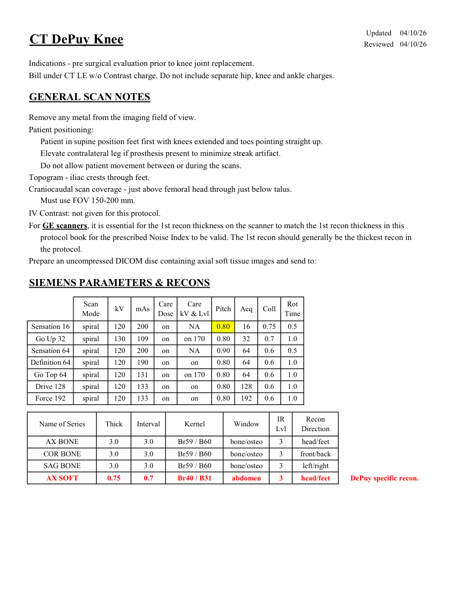
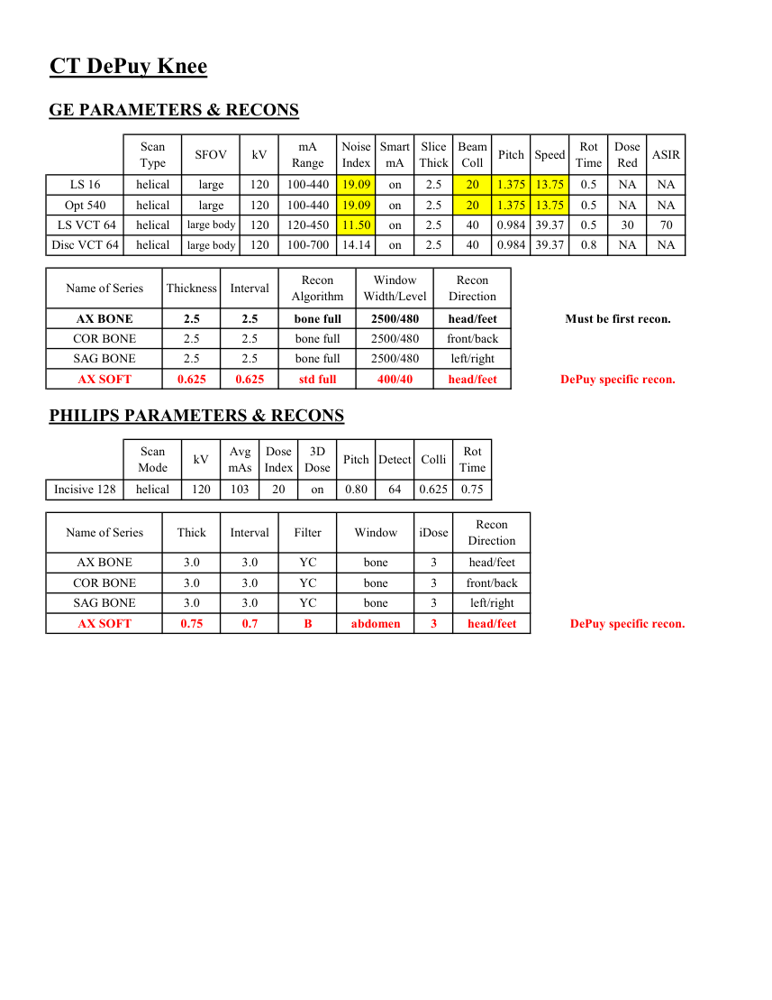

# CT — Genunchi DePuy (MCB)

## Documentul original MCB — Genunchi DePuy

**Protocol · 2 pagini · consultat la 2026-09-27.**

[Descarcă PDF-ul integral](../../assets/mcb-modalities/ct-genunchi-depuy-mcb/document.pdf) · [Sursa MCB](https://ref.mcbradiology.com/Protocols,%20Policies,%20Worksheets%20&%20Forms/CT/Protocols/MSK/20%20DePuy%20Knee.pdf) · [Catalogul MCB pentru această modalitate](../mcb/index.md)

Instrucțiunile, valorile și ilustrațiile din documentul original sunt păstrate în **engleză**. Titlul și navigarea sunt în română.

### Pagina 1

{ loading=lazy }

### Pagina 2

{ loading=lazy }

## Textul documentului original

??? abstract "Pagina 1 — text în engleză"

    
Updated
    04/10/26
    CT DePuy Knee
    Reviewed
    04/10/26
    Indications - pre surgical evaluation prior to knee joint replacement.
    Bill under CT LE w/o Contrast charge. Do not include separate hip, knee and ankle charges.
    GENERAL SCAN NOTES
    Remove any metal from the imaging field of view.
    Patient positioning:
    Patient in supine position feet first with knees extended and toes pointing straight up.
    Elevate contralateral leg if prosthesis present to minimize streak artifact.
    Do not allow patient movement between or during the scans.
    Topogram - iliac crests through feet.
    Craniocaudal scan coverage - just above femoral head through just below talus.
    Must use FOV 150-200 mm.
    IV Contrast: not given for this protocol.
    For GE scanners, it is essential for the 1st recon thickness on the scanner to match the 1st recon thickness in this
    protocol book for the prescribed Noise Index to be valid. The 1st recon should generally be the thickest recon in 
    the protocol.
    Prepare an uncompressed DICOM disc containing axial soft tissue images and send to:
    SIEMENS PARAMETERS &amp; RECONS
    Scan                           
    Care                                          
    Acq
    Coll
    Rot 
    Mode
    kV
    mAs
    Care                            
    Dose
    kV &amp; Lvl
    Pitch
    Time
    Sensation 16
    spiral
    120
    200
    on
    NA
    0.80
    16
    0.75
    0.5
    Go Up 32
    spiral
    130
    109
    on
    on 170
    0.80
    32
    0.7
    1.0
    Sensation 64
    spiral
    120
    200
    on
    NA
    0.90
    64
    0.6
    0.5
    Definition 64
    spiral
    120
    190
    on
    64
    0.6
    1.0
    on
    0.80
    Go Top 64
    spiral
    120
    131
    on
    on 170
    0.80
    64
    0.6
    1.0
    Drive 128
    spiral
    120
    133
    on
    0.80
    128
    0.6
    1.0
    on
    Force 192
    spiral
    120
    133
    on
    on
    0.80
    192
    0.6
    1.0
    Recon                     
    Name of Series
    Thick
    Interval
    Kernel
    Window
    IR                       
    Lvl
    Direction
    AX BONE
    3.0
    3.0
    Br59 / B60
    bone/osteo
    3
    head/feet
    COR BONE
    3
    bone/osteo
    front/back
    3.0
    3.0
    Br59 / B60
    SAG BONE
    3.0
    3.0
    Br59 / B60
    bone/osteo
    3
    left/right
    AX SOFT
    DePuy specific recon.
    0.75
    0.7
    Br40 / B31
    abdomen
    3
    head/feet
    

??? abstract "Pagina 2 — text în engleză"

    
CT DePuy Knee
    GE PARAMETERS &amp; RECONS
    Smart             
    Slice                       
    Beam                                 
    Dose                                          
    kV
    mA                           
    Pitch
    Speed
    Rot                                
    Type
    SFOV
    Red
    ASIR
    Scan               
    Range
    Noise                    
    Index
    mA
    Thick
    Coll
    Time
    on
    2.5
    LS 16
    helical
    large
    120
    100-440
    19.09
    NA
    NA
    20
    1.375 13.75
    0.5
    2.5
    20
    1.375 13.75
    0.5
    NA
    Opt 540
    helical
    large
    120
    100-440
    19.09
    on
    NA
     LS VCT 64
    helical
    large body
    120
    120-450
    11.50
    on
    2.5
    40
    0.984 39.37
    0.5
    30
    70
    0.984 39.37
    0.8
    NA
    NA
    Disc VCT 64
    helical
    large body
    120
    100-700
    14.14
    on
    2.5
    40
    Window                                   
    Recon 
    Name of Series
    Thickness
    Interval
    Recon                                     
    Algorithm
    Width/Level
    Direction
    AX BONE
    2.5
    2.5
    bone full
    2500/480
    head/feet
    Must be first recon.
    COR BONE
    2.5
    2.5
    bone full
    2500/480
    front/back
    SAG BONE
    2.5
    2.5
    bone full
    2500/480
    left/right
    AX SOFT
    0.625
    0.625
    std full
    400/40
    head/feet
    DePuy specific recon.
    PHILIPS PARAMETERS &amp; RECONS
    Scan                           
    Dose                                          
    3D            
    Rot 
    Mode
    kV
    Avg                      
    mAs
    Index
    Dose
    Pitch Detect Colli
    Time
    Incisive 128
    helical
    120
    103
    20
    0.80
    64
    on
    0.625
    0.75
    Name of Series
    Thick
    Interval
    Filter
    Window
    iDose
    Recon                     
    Direction
    AX BONE
    3.0
    3.0
    YC
    bone
    3
    head/feet
    COR BONE
    3.0
    3.0
    YC
    bone
    3
    front/back
    SAG BONE
    3.0
    3.0
    YC
    bone
    3
    left/right
    AX SOFT
    DePuy specific recon.
    0.75
    0.7
    B
    abdomen
    3
    head/feet
    

