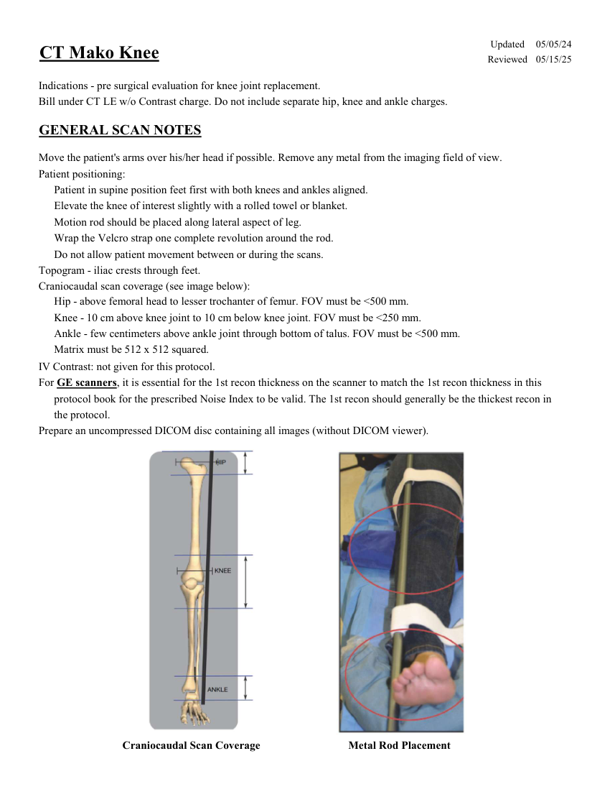
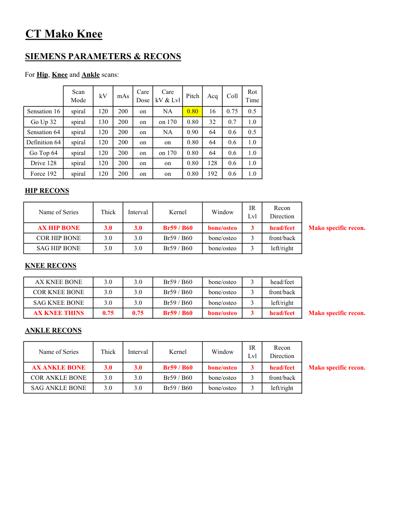
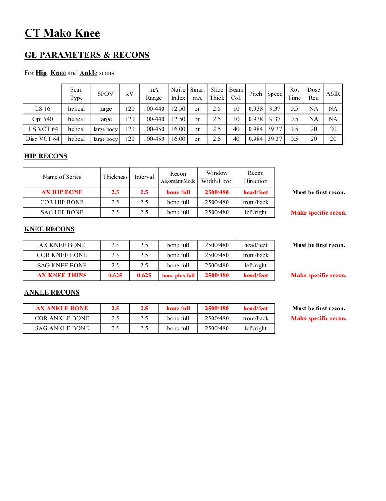
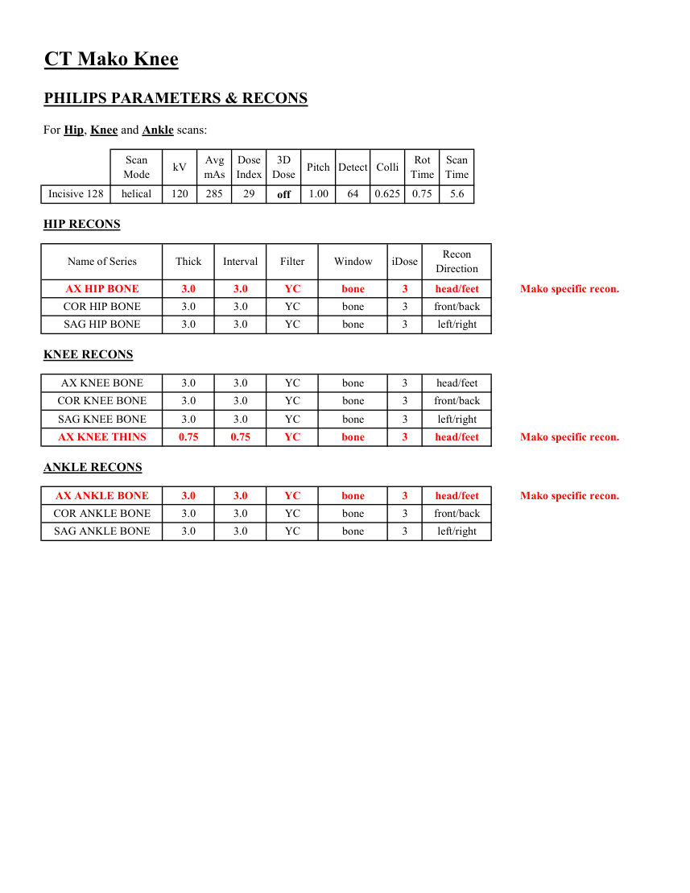
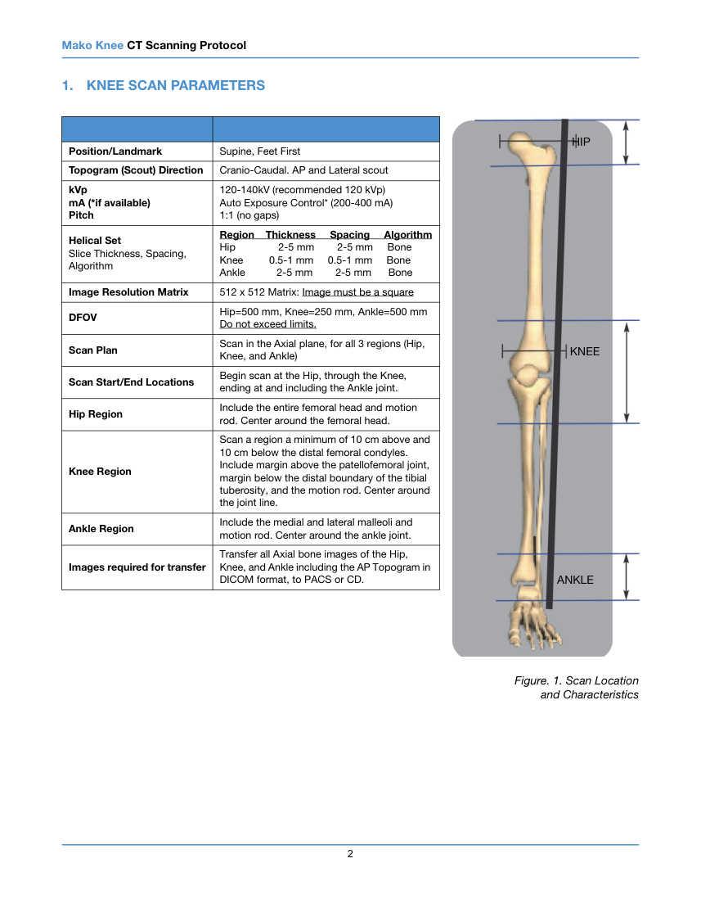
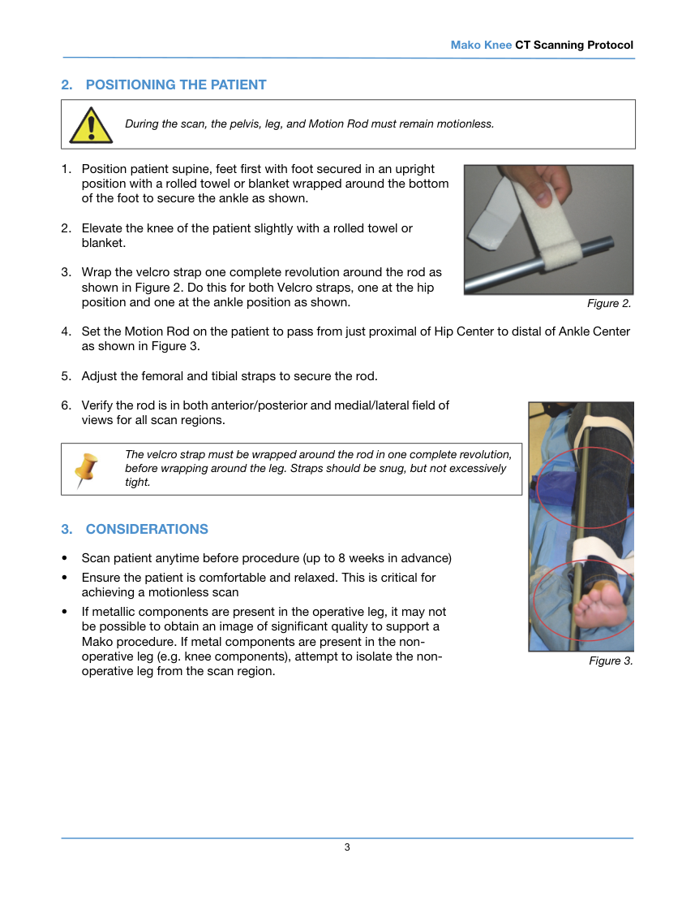

# CT — Genunchi Mako (MCB)

## Documentul original MCB — Genunchi Mako

**Protocol · 7 pagini · consultat la 2026-09-27.**

[Descarcă PDF-ul integral](../../assets/mcb-modalities/ct-genunchi-mako-mcb/document.pdf) · [Sursa MCB](https://ref.mcbradiology.com/Protocols,%20Policies,%20Worksheets%20&%20Forms/CT/Protocols/MSK/17%20Mako%20Knee.pdf) · [Catalogul MCB pentru această modalitate](../mcb/index.md)

Instrucțiunile, valorile și ilustrațiile din documentul original sunt păstrate în **engleză**. Titlul și navigarea sunt în română.

### Pagina 1

{ loading=lazy }

### Pagina 2

{ loading=lazy }

### Pagina 3

{ loading=lazy }

### Pagina 4

{ loading=lazy }

### Pagina 5

{ loading=lazy }

### Pagina 6

{ loading=lazy }

### Pagina 7

{ loading=lazy }

## Textul documentului original

??? abstract "Pagina 1 — text în engleză"

    
Updated
    05/05/24
    CT Mako Knee
    Reviewed
    05/15/25
    Indications - pre surgical evaluation for knee joint replacement.
    Bill under CT LE w/o Contrast charge. Do not include separate hip, knee and ankle charges.
    GENERAL SCAN NOTES
    Move the patient&#x27;s arms over his/her head if possible. Remove any metal from the imaging field of view.
    Patient positioning:
    Patient in supine position feet first with both knees and ankles aligned.
    Elevate the knee of interest slightly with a rolled towel or blanket.
    Motion rod should be placed along lateral aspect of leg. 
    Wrap the Velcro strap one complete revolution around the rod.
    Do not allow patient movement between or during the scans.
    Topogram - iliac crests through feet.
    Craniocaudal scan coverage (see image below):
    Hip - above femoral head to lesser trochanter of femur. FOV must be &lt;500 mm.
    Knee - 10 cm above knee joint to 10 cm below knee joint. FOV must be &lt;250 mm.
    Ankle - few centimeters above ankle joint through bottom of talus. FOV must be &lt;500 mm.
    Matrix must be 512 x 512 squared.
    IV Contrast: not given for this protocol.
    For GE scanners, it is essential for the 1st recon thickness on the scanner to match the 1st recon thickness in this
    protocol book for the prescribed Noise Index to be valid. The 1st recon should generally be the thickest recon in 
    the protocol.
    Prepare an uncompressed DICOM disc containing all images (without DICOM viewer). 
    Craniocaudal Scan Coverage
    Metal Rod Placement
    

??? abstract "Pagina 2 — text în engleză"

    
CT Mako Knee
    SIEMENS PARAMETERS &amp; RECONS
    For Hip, Knee and Ankle scans:
    Scan                           
    Care                                          
    Mode
    kV
    mAs
    Care                            
    Dose
    kV &amp; Lvl
    Pitch
    Acq
    Coll
    Rot 
    Time
    Sensation 16
    spiral
    120
    200
    on
    NA
    0.80
    16
    0.75
    0.5
    Go Up 32
    spiral
    130
    200
    on
    on 170
    0.80
    32
    0.7
    1.0
    Sensation 64
    spiral
    120
    200
    on
    NA
    0.90
    64
    0.6
    0.5
    Definition 64
    spiral
    120
    200
    on
    on
    0.80
    64
    0.6
    1.0
    Go Top 64
    spiral
    120
    200
    on
    on 170
    0.80
    64
    0.6
    1.0
    Drive 128
    spiral
    120
    200
    on
    on
    0.80
    128
    0.6
    1.0
    1.0
    Force 192
    spiral
    120
    200
    on
    on
    0.80
    192
    0.6
    HIP RECONS
    Recon                     
    Name of Series
    Thick
    Interval
    Kernel
    Window
    IR                       
    Lvl
    Direction
    AX HIP BONE
    3.0
    3.0
    Br59 / B60
    bone/osteo
    3
    head/feet
    Mako specific recon.
    COR HIP BONE
    3.0
    3.0
    Br59 / B60
    bone/osteo
    3
    front/back
    SAG HIP BONE
    3.0
    3.0
    Br59 / B60
    bone/osteo
    3
    left/right
    KNEE RECONS
    AX KNEE BONE
    3.0
    3.0
    Br59 / B60
    bone/osteo
    3
    head/feet
    COR KNEE BONE
    3.0
    3.0
    Br59 / B60
    bone/osteo
    3
    front/back
    SAG KNEE BONE
    3.0
    3.0
    Br59 / B60
    bone/osteo
    3
    left/right
    AX KNEE THINS
    0.75
    0.75
    Br59 / B60
    bone/osteo
    3
    head/feet
    Mako specific recon.
    ANKLE RECONS
    Recon                     
    Name of Series
    Thick
    Interval
    Kernel
    Window
    IR                       
    Lvl
    Direction
    AX ANKLE BONE
    3.0
    3.0
    Br59 / B60
    bone/osteo
    3
    head/feet
    Mako specific recon.
    COR ANKLE BONE
    3.0
    3.0
    Br59 / B60
    bone/osteo
    3
    front/back
    SAG ANKLE BONE
    3.0
    3.0
    Br59 / B60
    bone/osteo
    3
    left/right
    

??? abstract "Pagina 3 — text în engleză"

    
CT Mako Knee
    GE PARAMETERS &amp; RECONS
    For Hip, Knee and Ankle scans:
    Scan               
    Smart             
    Slice                       
    Beam                                 
    Rot                                
    Dose                                          
    Pitch
    Speed
    Type
    SFOV
    kV
    mA                           
    Range
    Noise                    
    Index
    mA
    Thick
    Coll
    Time
    Red
    ASIR
    10
    0.938
    9.37
    0.5
    LS 16
    helical
    large
    120
    100-440
    12.50
    on
    2.5
    NA
    NA
    2.5
    Opt 540
    helical
    large
    120
    100-440
    12.50
    on
    10
    0.938
    9.37
    0.5
    NA
    NA
     LS VCT 64
    helical
    large body
    120
    100-450
    16.00
    on
    2.5
    40
    0.984 39.37
    0.5
    20
    20
    Disc VCT 64
    helical
    large body
    120
    100-450
    16.00
    on
    2.5
    40
    0.984 39.37
    0.5
    20
    20
    HIP RECONS
    Window                                   
    Recon 
    Name of Series
    Thickness
    Interval
    Recon                                     
    Algorithm/Mode
    Width/Level
    Direction
    AX HIP BONE
    2.5
    2.5
    bone full
    2500/480
    head/feet
    Must be first recon.
    COR HIP BONE
    2.5
    2.5
    bone full
    2500/480
    front/back
    SAG HIP BONE
    2.5
    2.5
    bone full
    2500/480
    left/right
    Mako specific recon.
    KNEE RECONS
    AX KNEE BONE
    2.5
    2.5
    bone full
    2500/480
    head/feet
    Must be first recon.
    COR KNEE BONE
    2.5
    2.5
    bone full
    2500/480
    front/back
    SAG KNEE BONE
    2.5
    2.5
    bone full
    2500/480
    left/right
    AX KNEE THINS
    0.625
    0.625
    bone plus full
    2500/480
    head/feet
    Mako specific recon.
    ANKLE RECONS
    AX ANKLE BONE
    2.5
    2.5
    bone full
    2500/480
    head/feet
    Must be first recon.
    COR ANKLE BONE
    2.5
    2.5
    bone full
    2500/480
    front/back
    Mako specific recon.
    SAG ANKLE BONE
    2.5
    2.5
    bone full
    2500/480
    left/right
    

??? abstract "Pagina 4 — text în engleză"

    
CT Mako Knee
    PHILIPS PARAMETERS &amp; RECONS
    For Hip, Knee and Ankle scans:
    Scan                           
    Dose                                          
    3D            
    Rot 
    Scan                 
    Mode
    kV
    Avg                      
    mAs
    Index
    Dose
    Pitch Detect Colli
    Time
    Time
    0.625
    0.75
    5.6
    Incisive 128
    helical
    120
    285
    29
    off
    1.00
    64
    HIP RECONS
    Name of Series
    Thick
    Interval
    Filter
    Window
    iDose
    Recon                     
    Direction
    AX HIP BONE
    3.0
    3.0
    YC
    bone
    3
    head/feet
    Mako specific recon.
    COR HIP BONE
    3.0
    3.0
    YC
    bone
    3
    front/back
    SAG HIP BONE
    3.0
    3.0
    YC
    bone
    3
    left/right
    KNEE RECONS
    AX KNEE BONE
    3.0
    3.0
    YC
    bone
    3
    head/feet
    COR KNEE BONE
    3.0
    3.0
    YC
    bone
    3
    front/back
    SAG KNEE BONE
    3.0
    3.0
    YC
    bone
    3
    left/right
    AX KNEE THINS
    0.75
    0.75
    YC
    bone
    3
    head/feet
    Mako specific recon.
    ANKLE RECONS
    AX ANKLE BONE
    3.0
    3.0
    YC
    bone
    3
    head/feet
    Mako specific recon.
    COR ANKLE BONE
    3.0
    3.0
    YC
    bone
    3
    front/back
    SAG ANKLE BONE
    3.0
    3.0
    YC
    bone
    3
    left/right
    

??? abstract "Pagina 5 — text în engleză"

    
Mako Knee CT Scanning Protocol
    1.
    KNEE SCAN PARAMETERS
    HIP
    Position/Landmark
    Supine, Feet First
    Topogram (Scout) Direction
    Cranio-Caudal. AP and Lateral scout
    120-140kV (recommended 120 kVp)
    Auto Exposure Control* (200-400 mA)
    1:1 (no gaps)
    kVp
    mA (*if available)
    Pitch
    Region    Thickness 
     Spacing     Algorithm
    Helical Set
    Slice Thickness, Spacing, 
    Algorithm
    Hip  
    2-5 mm
    2-5 mm     Bone
    Knee 
      0.5-1 mm 
     0.5-1 mm     Bone
    Ankle   
    2-5 mm
    2-5 mm      Bone
    Image Resolution Matrix
    512 x 512 Matrix: Image must be a square
    DFOV
    Hip=500 mm, Knee=250 mm, Ankle=500 mm
    Do not exceed limits.
    KNEE
    Scan Plan
    Scan in the Axial plane, for all 3 regions (Hip, 
    Knee, and Ankle)
    Scan Start/End Locations
    Begin scan at the Hip, through the Knee, 
    ending at and including the Ankle joint.
    Hip Region
    Include the entire femoral head and motion 
    rod. Center around the femoral head.
    Knee Region
    Scan a region a minimum of 10 cm above and 
    10 cm below the distal femoral condyles. 
    Include margin above the patellofemoral joint, 
    margin below the distal boundary of the tibial 
    tuberosity, and the motion rod. Center around 
    the joint line.
    Ankle Region
    Include the medial and lateral malleoli and 
    motion rod. Center around the ankle joint.
    Images required for transfer
    Transfer all Axial bone images of the Hip, 
    Knee, and Ankle including the AP Topogram in 
    DICOM format, to PACS or CD.
    ANKLE
    Figure. 1. Scan Location
    and Characteristics
    2
    

??? abstract "Pagina 6 — text în engleză"

    
Mako Knee CT Scanning Protocol
    2.
    POSITIONING THE PATIENT
    During the scan, the pelvis, leg, and Motion Rod must remain motionless.
    1.
    Position patient supine, feet first with foot secured in an upright
    position with a rolled towel or blanket wrapped around the bottom
    of the foot to secure the ankle as shown.
    2.
    Elevate the knee of the patient slightly with a rolled towel or
    blanket.
    3.
    Wrap the velcro strap one complete revolution around the rod as
    shown in Figure 2. Do this for both Velcro straps, one at the hip
    position and one at the ankle position as shown.
    Figure 2.
    4.
    Set the Motion Rod on the patient to pass from just proximal of Hip Center to distal of Ankle Center
    as shown in Figure 3.
    5.
    Adjust the femoral and tibial straps to secure the rod.
    6.
    Verify the rod is in both anterior/posterior and medial/lateral field of
    views for all scan regions.
    The velcro strap must be wrapped around the rod in one complete revolution, 
    before wrapping around the leg. Straps should be snug, but not excessively 
    tight.
    3.
    CONSIDERATIONS
    •
    Scan patient anytime before procedure (up to 8 weeks in advance)
    •
    Ensure the patient is comfortable and relaxed. This is critical for
    achieving a motionless scan
    Figure 3.
    •
    If metallic components are present in the operative leg, it may not
    be possible to obtain an image of significant quality to support a
    Mako procedure. If metal components are present in the non-
    operative leg (e.g. knee components), attempt to isolate the non-
    operative leg from the scan region.
    3
    

??? abstract "Pagina 7 — text în engleză"

    
Mako Knee CT Scanning Protocol
    4.
    POST SCAN EXAMINATION
    The Physician and CT Technologist should verify the following:
    •
    Patient’s orientation is correct
    •
    Regions of interest in Figure 1 are visible in dataset
    •
    Scan includes complete femoral head, knee joint and ankle joint
    •
    Image Slice thickness  and FOV is correct
    •
    Motion Rod is visible and complete (full circle is present) in all slices
    •
    Bone images in scan image are not degraded by metal-induced artifacts
    5.
    DATA SET TRANSFER
    Archive all acquired images onto single CD in DICOM 3 compatible format
    Do not include DICOM viewer
    A surgeon must always rely on his or her own professional clinical judgment when deciding whether to use a 
    particular product when treating a particular patient. Stryker does not dispense medical advice and recommends 
    that surgeons be trained in the use of any particular product before using it in surgery.
    The information presented is intended to demonstrate the breadth of Stryker product offerings. A surgeon must 
    always refer to the package insert, product label and/or instructions for use before using any Stryker product. The 
    products depicted are CE marked according to the Medical Device Directive 93/42/EEC. Products may not be 
    available in all markets because product availability is subject to the regulatory and/or medical practices in 
    individual markets. Please contact your Stryker representative if you have questions about the availability of Stryker 
    products in your area.
    Stryker Corporation or its divisions or other corporate affiliated entities own, use or have applied for the following 
    trademarks or service marks: Mako, Stryker. All other trademarks are trademarks of their respective owners or 
    holders.
    PN 200004 Rev 11
    01/16
    Copyright © 2016 Stryker
    Printed in USA
    4
    

