# CT — Genunchi Restor3D Conformis (MCB)

## Documentul original MCB — Genunchi Restor3D Conformis

**Protocol · 13 pagini · consultat la 2026-09-27.**

[Descarcă PDF-ul integral](../../assets/mcb-modalities/ct-genunchi-restor3d-conformis-mcb/document.pdf) · [Sursa MCB](https://ref.mcbradiology.com/Protocols,%20Policies,%20Worksheets%20&%20Forms/CT/Protocols/MSK/19%20Restor3D%20Conformis%20Knee.pdf) · [Catalogul MCB pentru această modalitate](../mcb/index.md)

Instrucțiunile, valorile și ilustrațiile din documentul original sunt păstrate în **engleză**. Titlul și navigarea sunt în română.

### Pagina 1

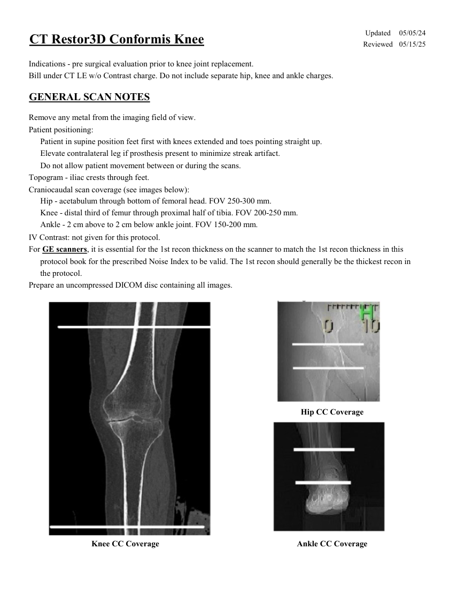{ loading=lazy }

### Pagina 2

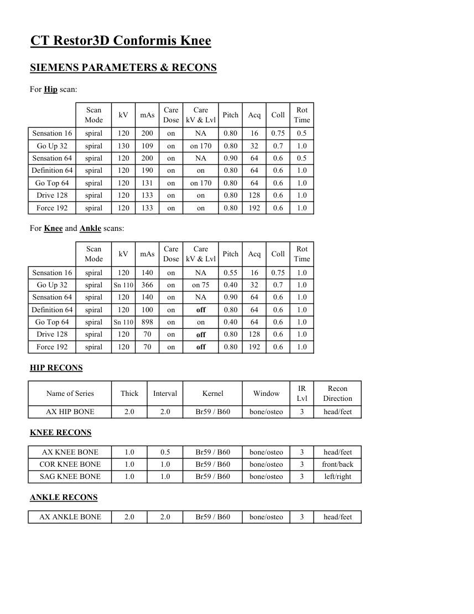{ loading=lazy }

### Pagina 3

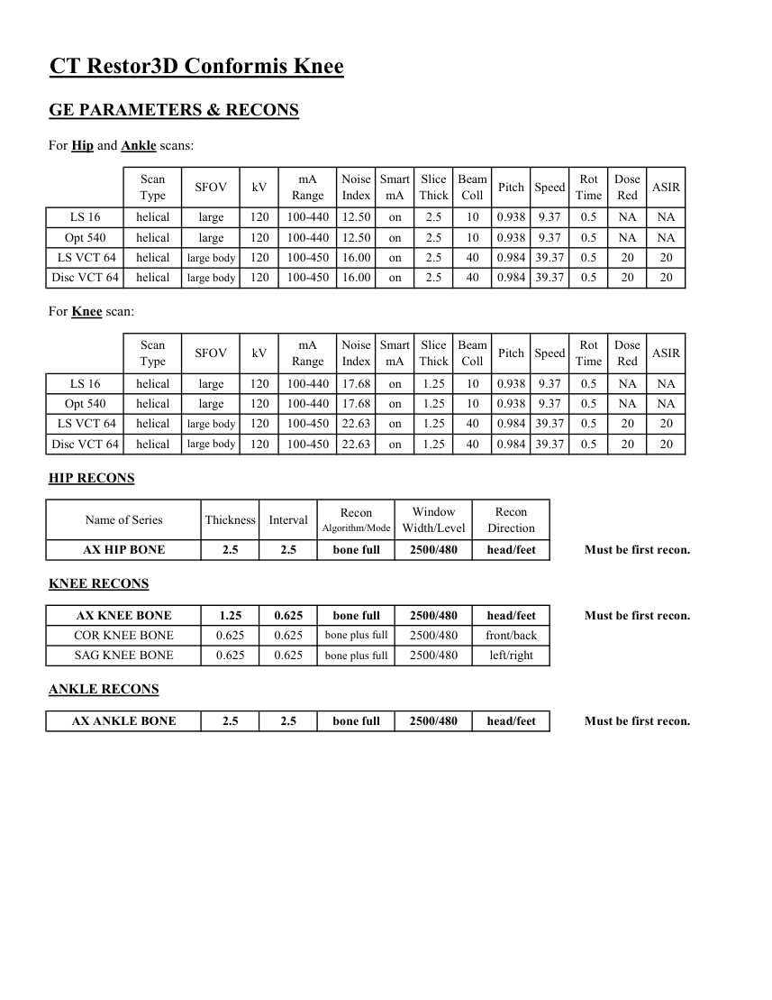{ loading=lazy }

### Pagina 4

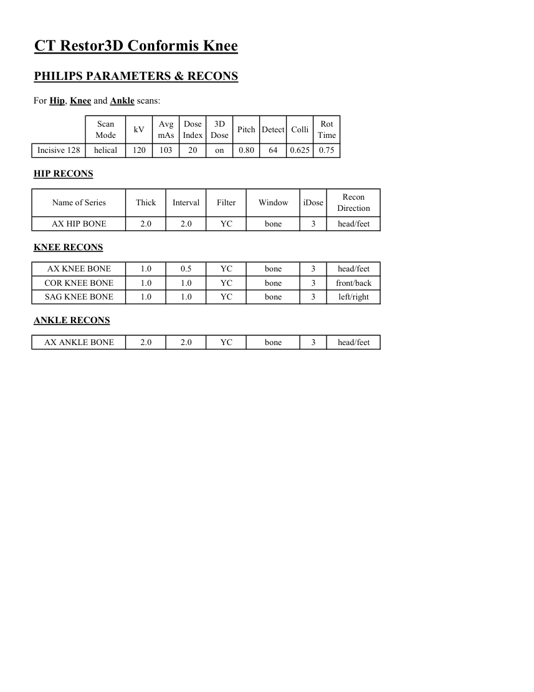{ loading=lazy }

### Pagina 5

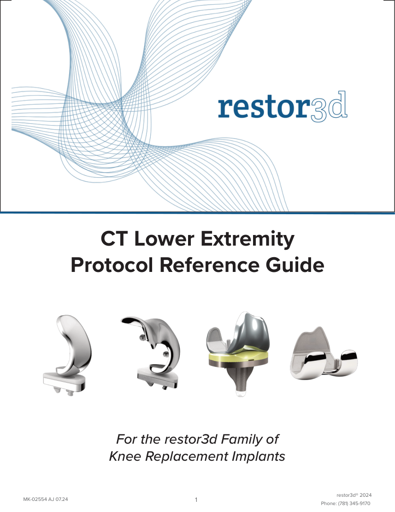{ loading=lazy }

### Pagina 6

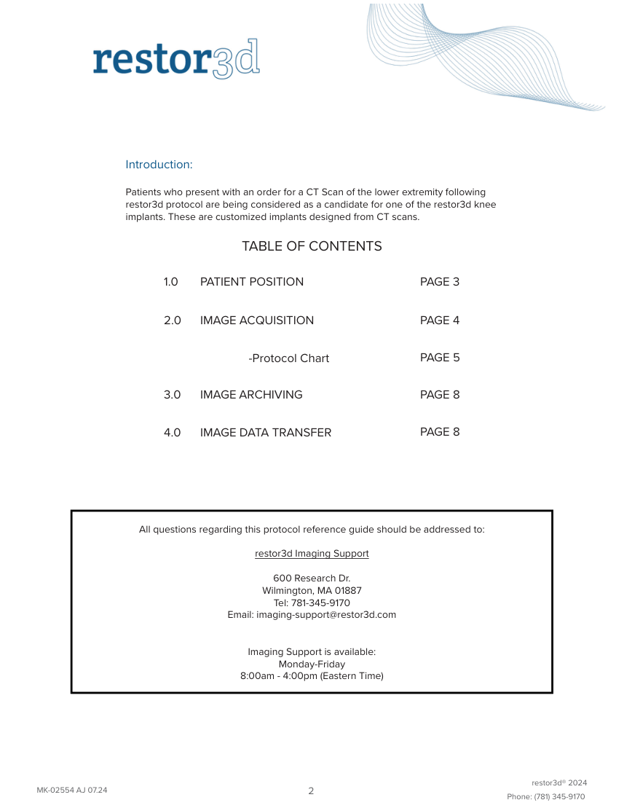{ loading=lazy }

### Pagina 7

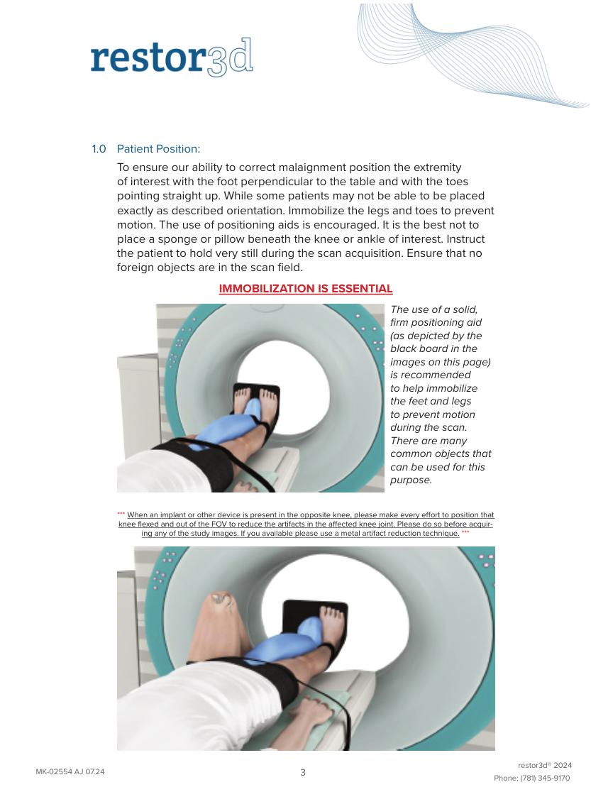{ loading=lazy }

### Pagina 8

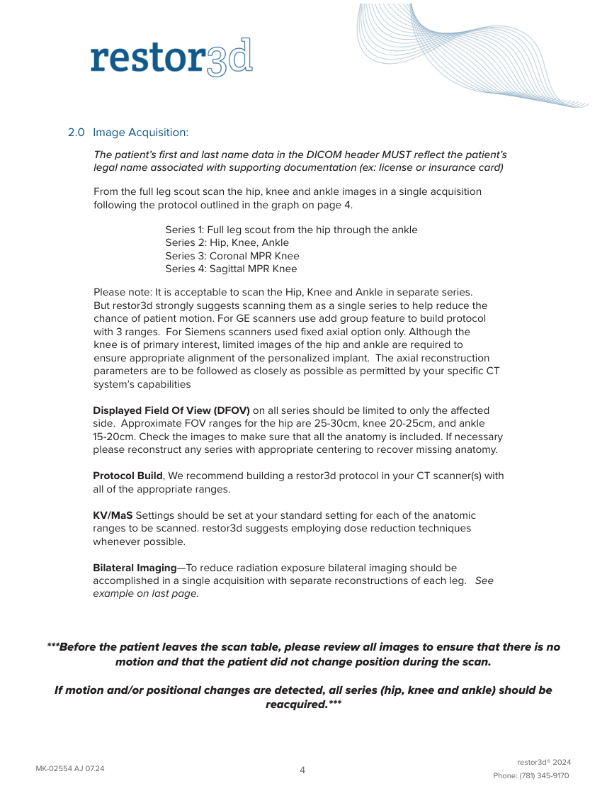{ loading=lazy }

### Pagina 9

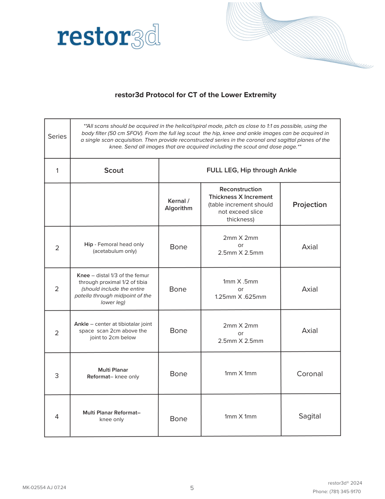{ loading=lazy }

### Pagina 10

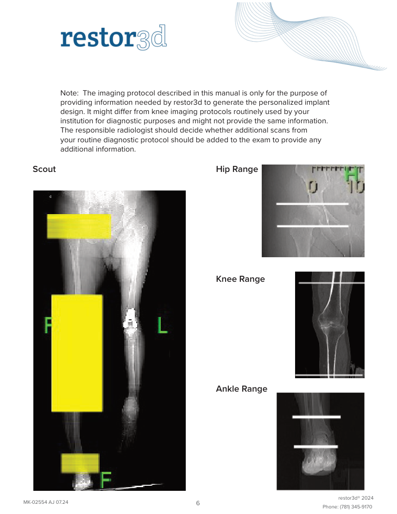{ loading=lazy }

### Pagina 11

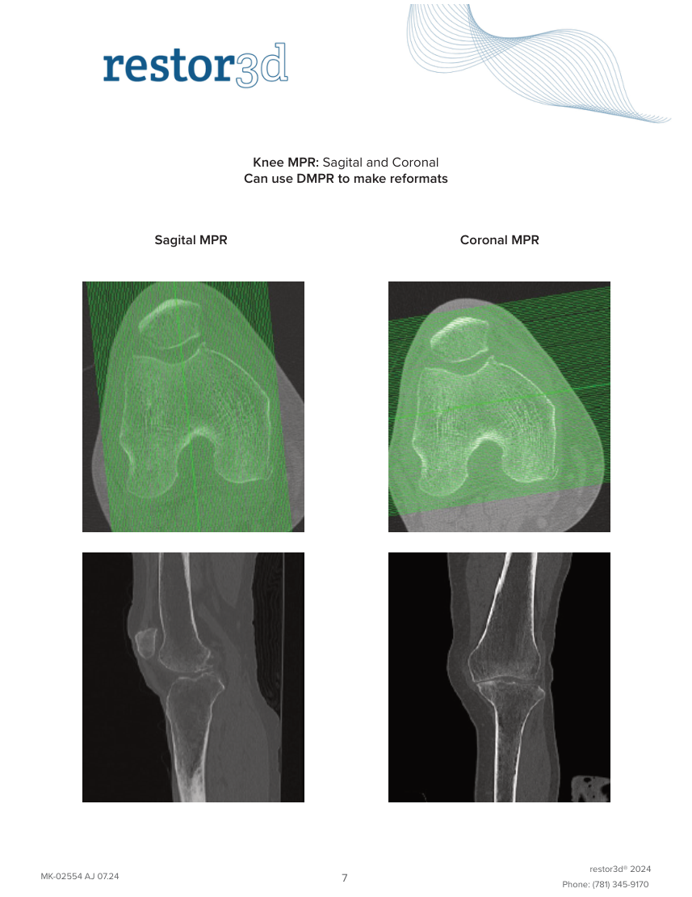{ loading=lazy }

### Pagina 12

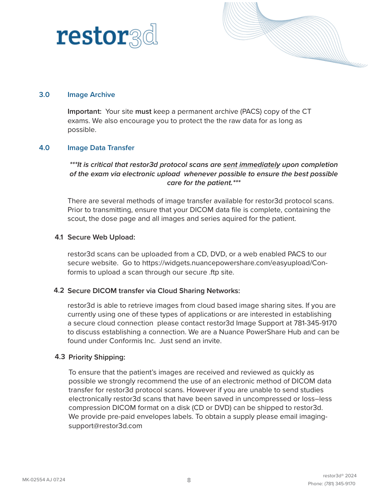{ loading=lazy }

### Pagina 13

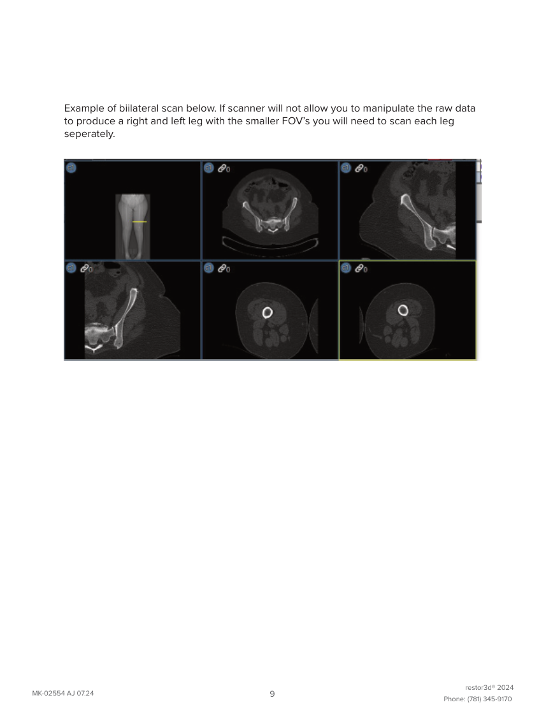{ loading=lazy }

## Textul documentului original

??? abstract "Pagina 1 — text în engleză"

    
Updated
    05/05/24
    CT Restor3D Conformis Knee
    Reviewed
    05/15/25
    Indications - pre surgical evaluation prior to knee joint replacement.
    Bill under CT LE w/o Contrast charge. Do not include separate hip, knee and ankle charges.
    GENERAL SCAN NOTES
    Remove any metal from the imaging field of view.
    Patient positioning:
    Patient in supine position feet first with knees extended and toes pointing straight up.
    Elevate contralateral leg if prosthesis present to minimize streak artifact.
    Do not allow patient movement between or during the scans.
    Topogram - iliac crests through feet.
    Craniocaudal scan coverage (see images below):
    Hip - acetabulum through bottom of femoral head. FOV 250-300 mm.
    Knee - distal third of femur through proximal half of tibia. FOV 200-250 mm.
    Ankle - 2 cm above to 2 cm below ankle joint. FOV 150-200 mm.
    IV Contrast: not given for this protocol.
    For GE scanners, it is essential for the 1st recon thickness on the scanner to match the 1st recon thickness in this
    protocol book for the prescribed Noise Index to be valid. The 1st recon should generally be the thickest recon in 
    the protocol.
    Prepare an uncompressed DICOM disc containing all images.
    Hip CC Coverage
    Knee CC Coverage
    Ankle CC Coverage
    

??? abstract "Pagina 2 — text în engleză"

    
CT Restor3D Conformis Knee
    SIEMENS PARAMETERS &amp; RECONS
    For Hip scan:
    Scan                           
    Care                                          
    Mode
    kV
    mAs
    Care                            
    Dose
    kV &amp; Lvl
    Pitch
    Acq
    Coll
    Rot 
    Time
    Sensation 16
    spiral
    120
    200
    on
    NA
    0.80
    16
    0.75
    0.5
    Go Up 32
    spiral
    130
    109
    on
    on 170
    0.80
    32
    0.7
    1.0
    Sensation 64
    spiral
    120
    200
    on
    NA
    0.90
    64
    0.6
    0.5
    Definition 64
    spiral
    120
    190
    on
    on
    0.80
    64
    0.6
    1.0
    Go Top 64
    spiral
    120
    131
    on
    on 170
    0.80
    64
    0.6
    1.0
    Drive 128
    spiral
    120
    133
    on
    on
    0.80
    128
    0.6
    1.0
    Force 192
    spiral
    120
    133
    on
    on
    0.80
    192
    0.6
    1.0
    For Knee and Ankle scans:
    Scan                           
    Care                                          
    Mode
    kV
    mAs
    Care                            
    Dose
    kV &amp; Lvl
    Pitch
    Acq
    Coll
    Rot 
    Time
    Sensation 16
    spiral
    120
    140
    on
    NA
    0.55
    16
    0.75
    1.0
    Go Up 32
    spiral
    on 75
    0.40
    32
    0.7
    1.0
    Sn 110
    366
    on
    Sensation 64
    spiral
    120
    140
    on
    NA
    0.90
    64
    0.6
    1.0
    0.80
    64
    0.6
    1.0
    Definition 64
    spiral
    120
    100
    on
    off
    Go Top 64
    spiral
    Sn 110
    898
    on
    on
    64
    0.6
    1.0
    0.40
    Drive 128
    spiral
    0.80
    128
    0.6
    1.0
    120
    70
    on
    off
    Force 192
    0.80
    192
    0.6
    1.0
    spiral
    120
    70
    on
    off
    HIP RECONS
    IR                       
    Recon                     
    Name of Series
    Thick
    Interval
    Kernel
    Window
    Lvl
    Direction
    AX HIP BONE
    2.0
    2.0
    Br59 / B60
    bone/osteo
    head/feet
    3
    KNEE RECONS
    AX KNEE BONE
    bone/osteo
    1.0
    0.5
    Br59 / B60
    3
    head/feet
    COR KNEE BONE
    1.0
    1.0
    Br59 / B60
    bone/osteo
    front/back
    3
    SAG KNEE BONE
    1.0
    1.0
    Br59 / B60
    bone/osteo
    3
    left/right
    ANKLE RECONS
    AX ANKLE BONE
    2.0
    2.0
    Br59 / B60
    bone/osteo
    3
    head/feet
    

??? abstract "Pagina 3 — text în engleză"

    
CT Restor3D Conformis Knee
    GE PARAMETERS &amp; RECONS
    For Hip and Ankle scans:
    Smart             
    Slice                       
    Beam                                 
    Dose                                          
    Pitch
    Speed
    Rot                                
    Type
    SFOV
    kV
    mA                           
    Red
    ASIR
    Scan               
    Range
    Noise                    
    Index
    mA
    Thick
    Coll
    Time
    on
    2.5
    10
    0.938
    9.37
    0.5
    LS 16
    helical
    large
    120
    100-440
    12.50
    NA
    NA
    Opt 540
    helical
    large
    120
    100-440
    12.50
    on
    2.5
    10
    0.938
    9.37
    0.5
    NA
    NA
     LS VCT 64
    helical
    large body
    120
    100-450
    16.00
    on
    2.5
    40
    0.984 39.37
    0.5
    20
    20
    0.984 39.37
    0.5
    20
    20
    Disc VCT 64
    helical
    large body
    120
    100-450
    16.00
    on
    2.5
    40
    For Knee scan:
    Scan               
    Smart             
    Slice                       
    Beam                                 
    Dose                                          
    Type
    SFOV
    kV
    mA                           
    Range
    Noise                    
    Index
    mA
    Thick
    Coll
    Pitch
    Speed
    Rot                                
    Time
    Red
    ASIR
    LS 16
    helical
    large
    120
    100-440
    17.68
    on
    1.25
    10
    0.938
    9.37
    0.5
    NA
    NA
    NA
    NA
    10
    0.938
    9.37
    0.5
    1.25
    Opt 540
    helical
    large
    120
    100-440
    17.68
    on
     LS VCT 64
    helical
    large body
    120
    100-450
    22.63
    on
    1.25
    40
    0.984 39.37
    0.5
    20
    20
    Disc VCT 64
    helical
    large body
    120
    100-450
    22.63
    on
    1.25
    40
    0.984 39.37
    0.5
    20
    20
    HIP RECONS
    Window                                   
    Recon 
    Recon                                     
    Name of Series
    Thickness
    Interval
    Algorithm/Mode
    Width/Level
    Direction
    AX HIP BONE
    2.5
    2.5
    bone full
    2500/480
    head/feet
    Must be first recon.
    KNEE RECONS
    AX KNEE BONE
    1.25
    0.625
    bone full
    2500/480
    head/feet
    Must be first recon.
    COR KNEE BONE
    0.625
    0.625
    bone plus full
    2500/480
    front/back
    SAG KNEE BONE
    0.625
    0.625
    bone plus full
    2500/480
    left/right
    ANKLE RECONS
    AX ANKLE BONE
    2.5
    2.5
    bone full
    2500/480
    head/feet
    Must be first recon.
    

??? abstract "Pagina 4 — text în engleză"

    
CT Restor3D Conformis Knee
    PHILIPS PARAMETERS &amp; RECONS
    For Hip, Knee and Ankle scans:
    Scan                           
    Dose                                          
    3D            
    Rot 
    Mode
    kV
    Avg                      
    mAs
    Index
    Dose
    Pitch Detect Colli
    Time
    Incisive 128
    helical
    120
    103
    20
    on
    0.80
    64
    0.625
    0.75
    HIP RECONS
    Recon                     
    Name of Series
    Thick
    Interval
    Filter
    Window
    iDose
    Direction
    AX HIP BONE
    2.0
    2.0
    YC
    bone
    3
    head/feet
    KNEE RECONS
    AX KNEE BONE
    1.0
    0.5
    YC
    bone
    3
    head/feet
    COR KNEE BONE
    1.0
    1.0
    YC
    bone
    3
    front/back
    SAG KNEE BONE
    1.0
    1.0
    YC
    bone
    3
    left/right
    ANKLE RECONS
    AX ANKLE BONE
    2.0
    2.0
    YC
    bone
    3
    head/feet
    

??? abstract "Pagina 5 — text în engleză"

    
CT Lower Extremity
    Protocol Reference Guide
    For the restor3d Family of 
    Knee Replacement Implants
    restor3d® 2024
    MK-02554 AJ 07.24
    1
    Phone: (781) 345-9170
    

??? abstract "Pagina 6 — text în engleză"

    
Introduction: 
    Patients who present with an order for a CT Scan of the lower extremity following 
    restor3d protocol are being considered as a candidate for one of the restor3d knee 
    implants. These are customized implants designed from CT scans. 
    TABLE OF CONTENTS
    1.0
    PATIENT POSITION
    PAGE 3
    2.0
    IMAGE ACQUISITION
    PAGE 4
    -Protocol Chart
    PAGE 5
    3.0
    IMAGE ARCHIVING
    PAGE 8
    4.0
    IMAGE DATA TRANSFER
    PAGE 8
    All questions regarding this protocol reference guide should be addressed to:
    restor3d Imaging Support
    600 Research Dr.
    Wilmington, MA 01887
    Tel: 781-345-9170
    Email: imaging-support@restor3d.com
    Imaging Support is available:
    Monday-Friday
    8:00am - 4:00pm (Eastern Time)
    restor3d® 2024
    MK-02554 AJ 07.24
    2
    Phone: (781) 345-9170
    

??? abstract "Pagina 7 — text în engleză"

    
1.0
    Patient Position:
    To ensure our ability to correct malaignment position the extremity 
    of interest with the foot perpendicular to the table and with the toes 
    pointing straight up. While some patients may not be able to be placed 
    exactly as described orientation. Immobilize the legs and toes to prevent 
    motion. The use of positioning aids is encouraged. It is the best not to 
    place a sponge or pillow beneath the knee or ankle of interest. Instruct 
    the patient to hold very still during the scan acquisition. Ensure that no 
    foreign objects are in the scan field. 
    IMMOBILIZATION IS ESSENTIAL
    The use of a solid, 
    firm positioning aid 
    (as depicted by the 
    black board in the 
    images on this page) 
    is recommended 
    to help immobilize 
    the feet and legs 
    to prevent motion 
    during the scan. 
    There are many 
    common objects that 
    can be used for this 
    purpose.
    *** When an implant or other device is present in the opposite knee, please make every effort to position that 
    knee flexed and out of the FOV to reduce the artifacts in the affected knee joint. Please do so before acquir­
    ing any of the study images. If you available please use a metal artifact reduction technique. ***
    restor3d® 2024
    MK-02554 AJ 07.24
    3
    Phone: (781) 345-9170
    

??? abstract "Pagina 8 — text în engleză"

    
2.0 Image Acquisition:
    The patient’s first and last name data in the DICOM header MUST reflect the patient’s 
    legal name associated with supporting documentation (ex: license or insurance card)
    From the full leg scout scan the hip, knee and ankle images in a single acquisition 
    following the protocol outlined in the graph on page 4.
    Series 1: Full leg scout from the hip through the ankle 
    Series 2: Hip, Knee, Ankle 
    Series 3: Coronal MPR Knee  
    Series 4: Sagittal MPR Knee
    Please note: It is acceptable to scan the Hip, Knee and Ankle in separate series. 
    But restor3d strongly suggests scanning them as a single series to help reduce the 
    chance of patient motion. For GE scanners use add group feature to build protocol 
    with 3 ranges.  For Siemens scanners used fixed axial option only. Although the 
    knee is of primary interest, limited images of the hip and ankle are required to 
    ensure appropriate alignment of the personalized implant.  The axial reconstruction 
    parameters are to be followed as closely as possible as permitted by your specific CT 
    system’s capabilities
    Displayed Field Of View (DFOV) on all series should be limited to only the affected 
    side.  Approximate FOV ranges for the hip are 25-30cm, knee 20-25cm, and ankle 
    15-20cm. Check the images to make sure that all the anatomy is included. If necessary 
    please reconstruct any series with appropriate centering to recover missing anatomy. 
     
    Protocol Build, We recommend building a restor3d protocol in your CT scanner(s) with 
    all of the appropriate ranges. 
    KV/MaS Settings should be set at your standard setting for each of the anatomic 
    ranges to be scanned. restor3d suggests employing dose reduction techniques 
    whenever possible. 
    Bilateral Imaging—To reduce radiation exposure bilateral imaging should be 
    accomplished in a single acquisition with separate reconstructions of each leg.   See 
    example on last page. 
    ***Before the patient leaves the scan table, please review all images to ensure that there is no 
    motion and that the patient did not change position during the scan.  
    If motion and/or positional changes are detected, all series (hip, knee and ankle) should be 
    reacquired.***
    restor3d® 2024
    MK-02554 AJ 07.24
    4
    Phone: (781) 345-9170
    

??? abstract "Pagina 9 — text în engleză"

    
restor3d Protocol for CT of the Lower Extremity
    **All scans should be acquired in the helical/spiral mode, pitch as close to 1:1 as possible, using the 
    body filter (50 cm SFOV). From the full leg scout  the hip, knee and ankle images can be acquired in 
    Series
    a single scan acquisition. Then provide reconstructed series in the coronal and sagittal planes of the 
    knee. Send all images that are acquired including the scout and dose page.** 
    FULL LEG, Hip through Ankle
    1
    Scout
    Reconstruction
    Thickness X Increment
    Kernal / 
    (table increment should 
    Projection
    Algorithm
    not exceed slice 
    thickness)
    2mm X 2mm 
    Hip - Femoral head only
    or 
    Bone
    Axial
    2
     (acetabulum only)
    2.5mm X 2.5mm
    Knee – distal 1/3 of the femur 
    1mm X .5mm  
    through proximal 1/2 of tibia  
    (should include the entire 
    or 
    2
    Bone
    Axial
    patella through midpoint of the 
    1.25mm X .625mm
    lower leg)
    Ankle – center at tibiotalar joint 
    2mm X 2mm 
    space  scan 2cm above the 
    Bone
    Axial
    or 
    2
    joint to 2cm below 
    2.5mm X 2.5mm
    Multi Planar 
    1mm X 1mm
    Bone
    Coronal
    3
    Reformat– knee only
    Multi Planar Reformat– 
    1mm X 1mm
    Sagital
    4
    knee only
    Bone
    restor3d® 2024
    MK-02554 AJ 07.24
    5
    Phone: (781) 345-9170
    

??? abstract "Pagina 10 — text în engleză"

    
Note:  The imaging protocol described in this manual is only for the purpose of 
    providing information needed by restor3d to generate the personalized implant 
    design. It might differ from knee imaging protocols routinely used by your 
    institution for diagnostic purposes and might not provide the same information. 
    The responsible radiologist should decide whether additional scans from 
    your routine diagnostic protocol should be added to the exam to provide any 
    additional information.
    Scout
    Hip Range
    Knee Range
    Ankle Range
    restor3d® 2024
    MK-02554 AJ 07.24
    6
    Phone: (781) 345-9170
    

??? abstract "Pagina 11 — text în engleză"

    
Knee MPR: Sagital and Coronal
    Can use DMPR to make reformats
    Sagital MPR
    Coronal MPR
    restor3d® 2024
    MK-02554 AJ 07.24
    7
    Phone: (781) 345-9170
    

??? abstract "Pagina 12 — text în engleză"

    
3.0
    Image Archive
    Important:  Your site must keep a permanent archive (PACS) copy of the CT 
    exams. We also encourage you to protect the the raw data for as long as 
    possible.
    4.0
    Image Data Transfer
    ***It is critical that restor3d protocol scans are sent immediately upon completion 
    of the exam via electronic upload  whenever possible to ensure the best possible 
    care for the patient.***
    There are several methods of image transfer available for restor3d protocol scans. 
    Prior to transmitting, ensure that your DICOM data file is complete, containing the 
    scout, the dose page and all images and series aquired for the patient. 
    4.1 Secure Web Upload:
    restor3d scans can be uploaded from a CD, DVD, or a web enabled PACS to our  
    secure website.  Go to https://widgets.nuancepowershare.com/easyupload/Con­
    formis to upload a scan through our secure .ftp site. 
    4.2 Secure DICOM transfer via Cloud Sharing Networks:
    restor3d is able to retrieve images from cloud based image sharing sites. If you are 
    currently using one of these types of applications or are interested in establishing 
    a secure cloud connection  please contact restor3d Image Support at 781-345-9170 
    to discuss establishing a connection. We are a Nuance PowerShare Hub and can be 
    found under Conformis Inc.  Just send an invite.
    4.3 Priority Shipping:
    To ensure that the patient’s images are received and reviewed as quickly as 
    possible we strongly recommend the use of an electronic method of DICOM data 
    transfer for restor3d protocol scans. However if you are unable to send studies 
    electronically restor3d scans that have been saved in uncompressed or loss–less 
    compression DICOM format on a disk (CD or DVD) can be shipped to restor3d.  
    We provide pre-paid envelopes labels. To obtain a supply please email imaging-
    support@restor3d.com
    restor3d® 2024
    MK-02554 AJ 07.24
    8
    Phone: (781) 345-9170
    

??? abstract "Pagina 13 — text în engleză"

    
Example of biilateral scan below. If scanner will not allow you to manipulate the raw data 
    to produce a right and left leg with the smaller FOV’s you will need to scan each leg 
    seperately. 
    restor3d® 2024
    MK-02554 AJ 07.24
    9
    Phone: (781) 345-9170
    

