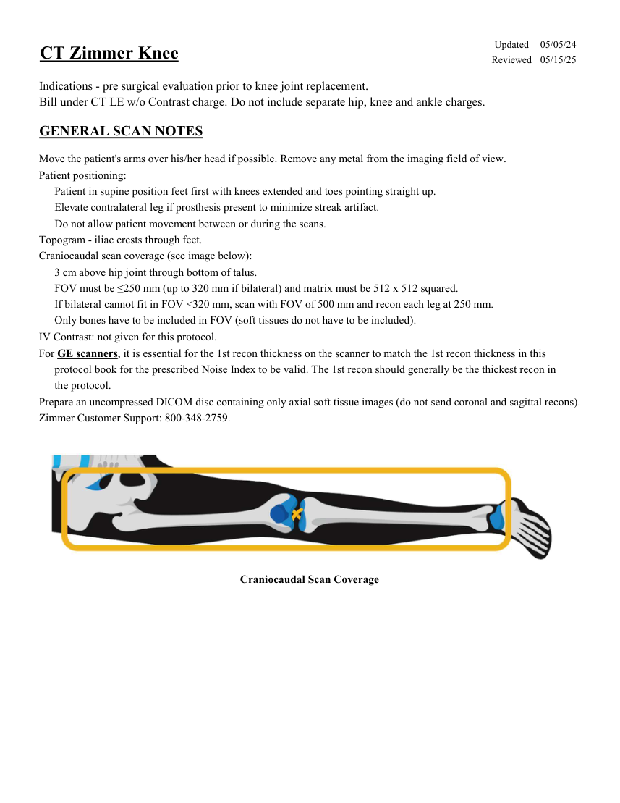
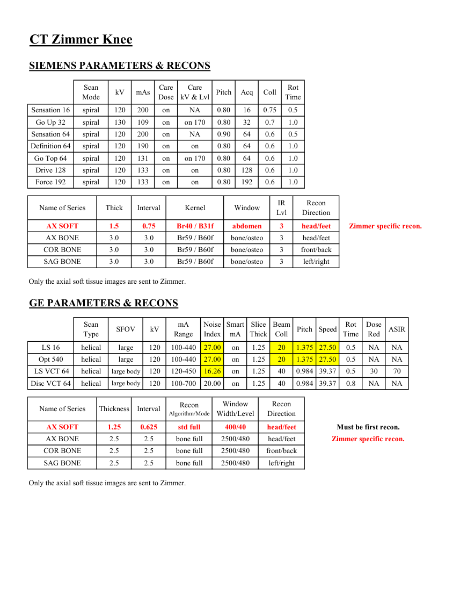
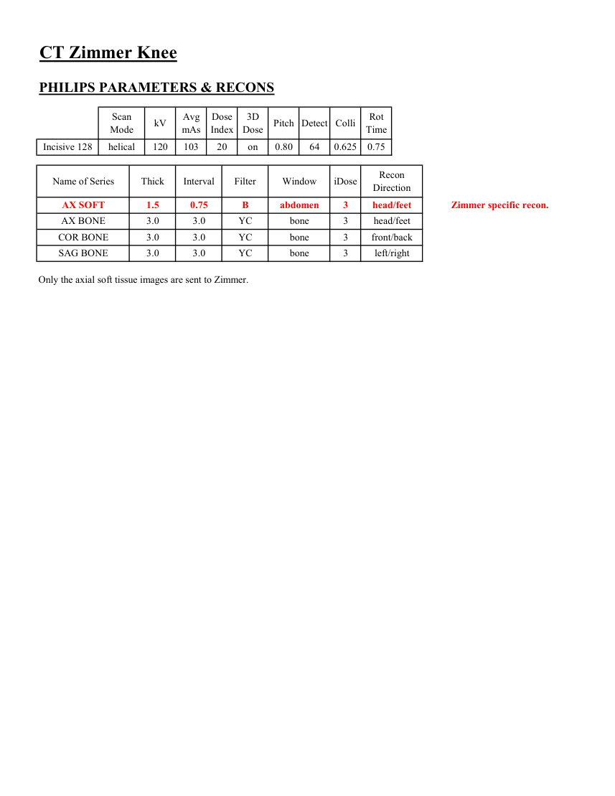
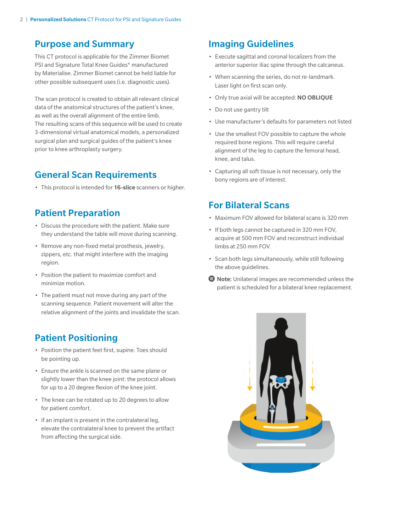
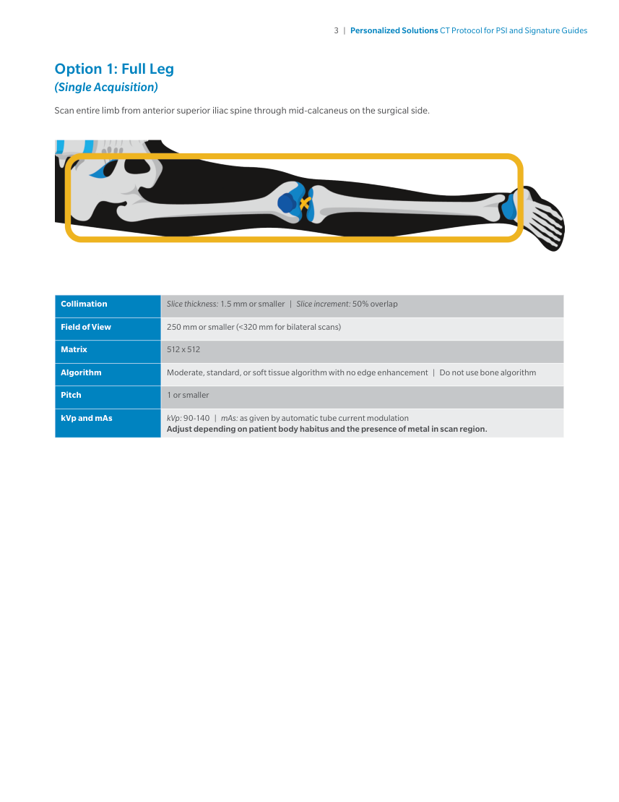
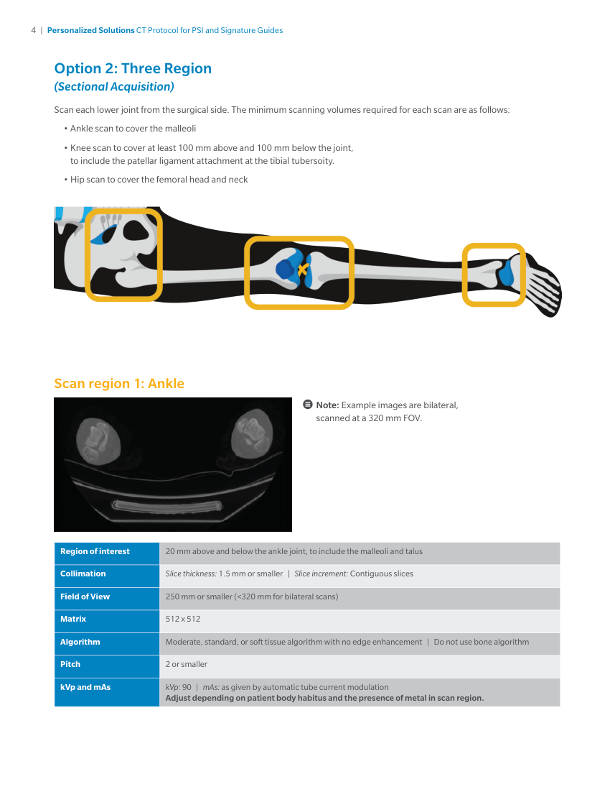
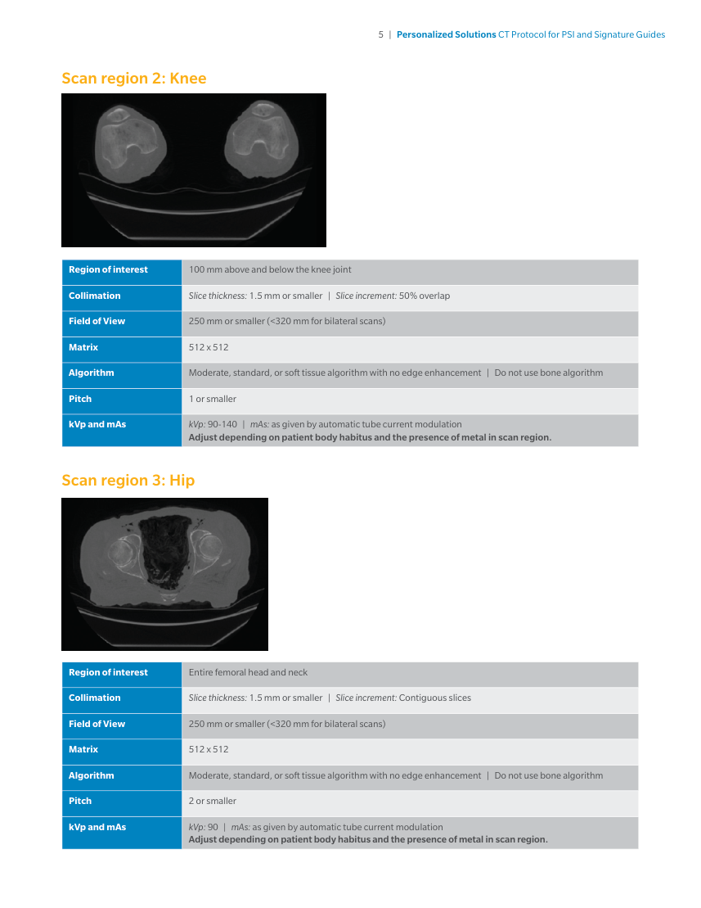
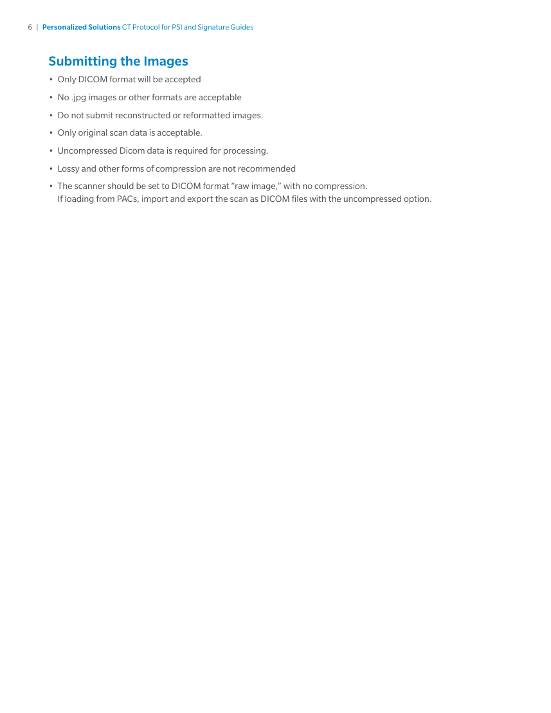

# CT — Genunchi Zimmer (MCB)

## Documentul original MCB — Genunchi Zimmer

**Protocol · 8 pagini · consultat la 2026-09-27.**

[Descarcă PDF-ul integral](../../assets/mcb-modalities/ct-genunchi-zimmer-mcb/document.pdf) · [Sursa MCB](https://ref.mcbradiology.com/Protocols,%20Policies,%20Worksheets%20&%20Forms/CT/Protocols/MSK/18%20Zimmer%20Knee.pdf) · [Catalogul MCB pentru această modalitate](../mcb/index.md)

Instrucțiunile, valorile și ilustrațiile din documentul original sunt păstrate în **engleză**. Titlul și navigarea sunt în română.

### Pagina 1

{ loading=lazy }

### Pagina 2

{ loading=lazy }

### Pagina 3

{ loading=lazy }

### Pagina 4

{ loading=lazy }

### Pagina 5

{ loading=lazy }

### Pagina 6

{ loading=lazy }

### Pagina 7

{ loading=lazy }

### Pagina 8

{ loading=lazy }

## Textul documentului original

??? abstract "Pagina 1 — text în engleză"

    
Updated
    05/05/24
    CT Zimmer Knee
    Reviewed
    05/15/25
    Indications - pre surgical evaluation prior to knee joint replacement.
    Bill under CT LE w/o Contrast charge. Do not include separate hip, knee and ankle charges.
    GENERAL SCAN NOTES
    Move the patient&#x27;s arms over his/her head if possible. Remove any metal from the imaging field of view.
    Patient positioning:
    Patient in supine position feet first with knees extended and toes pointing straight up.
    Elevate contralateral leg if prosthesis present to minimize streak artifact.
    Do not allow patient movement between or during the scans.
    Topogram - iliac crests through feet.
    Craniocaudal scan coverage (see image below):
    3 cm above hip joint through bottom of talus.
    FOV must be ≤250 mm (up to 320 mm if bilateral) and matrix must be 512 x 512 squared.
    If bilateral cannot fit in FOV &lt;320 mm, scan with FOV of 500 mm and recon each leg at 250 mm.
    Only bones have to be included in FOV (soft tissues do not have to be included).
    IV Contrast: not given for this protocol.
    For GE scanners, it is essential for the 1st recon thickness on the scanner to match the 1st recon thickness in this
    protocol book for the prescribed Noise Index to be valid. The 1st recon should generally be the thickest recon in 
    the protocol.
    Prepare an uncompressed DICOM disc containing only axial soft tissue images (do not send coronal and sagittal recons).
    Zimmer Customer Support: 800-348-2759.
    Craniocaudal Scan Coverage
    

??? abstract "Pagina 2 — text în engleză"

    
CT Zimmer Knee
    SIEMENS PARAMETERS &amp; RECONS
    Scan                           
    Care                                          
    Mode
    kV
    mAs
    Care                            
    Dose
    kV &amp; Lvl
    Pitch
    Acq
    Coll
    Rot 
    Time
    Sensation 16
    spiral
    120
    200
    on
    NA
    0.80
    16
    0.75
    0.5
    Go Up 32
    spiral
    130
    109
    on
    on 170
    0.80
    32
    0.7
    1.0
    Sensation 64
    spiral
    120
    200
    on
    NA
    0.90
    64
    0.6
    0.5
    Definition 64
    spiral
    120
    190
    on
    0.6
    1.0
    on
    0.80
    64
    Go Top 64
    spiral
    120
    131
    on
    on 170
    0.80
    64
    0.6
    1.0
    Drive 128
    spiral
    120
    133
    on
    0.80
    128
    0.6
    1.0
    on
    Force 192
    spiral
    120
    133
    on
    on
    0.80
    192
    0.6
    1.0
    IR                       
    Recon                     
    Name of Series
    Thick
    Interval
    Kernel
    Window
    Lvl
    Direction
    AX SOFT
    1.5
    0.75
    Br40 / B31f
    abdomen
    3
    head/feet
    Zimmer specific recon.
    AX BONE
    head/feet
    3.0
    3.0
    Br59 / B60f
    bone/osteo
    3
    COR BONE
    front/back
    3.0
    3.0
    Br59 / B60f
    bone/osteo
    3
    SAG BONE
    left/right
    3.0
    3.0
    Br59 / B60f
    bone/osteo
    3
    Only the axial soft tissue images are sent to Zimmer.
    GE PARAMETERS &amp; RECONS
    Smart             
    Slice                       
    Beam                                 
    Dose                                          
    Pitch
    Speed
    Rot                                
    Type
    SFOV
    kV
    mA                           
    Red
    ASIR
    Scan               
    Range
    Noise                    
    Index
    mA
    Thick
    Coll
    Time
    on
    1.25
    20
    1.375 27.50
    0.5
    LS 16
    helical
    large
    120
    100-440
    27.00
    NA
    NA
    Opt 540
    helical
    large
    120
    100-440
    27.00
    on
    1.25
    20
    1.375 27.50
    0.5
    NA
    NA
     LS VCT 64
    helical
    large body
    120
    120-450
    16.26
    on
    1.25
    40
    0.984 39.37
    0.5
    30
    70
    0.984 39.37
    0.8
    NA
    NA
    Disc VCT 64
    helical
    large body
    120
    100-700
    20.00
    on
    1.25
    40
    Window                                   
    Recon 
    Name of Series
    Thickness
    Interval
    Recon                                     
    Algorithm/Mode
    Width/Level
    Direction
    AX SOFT
    1.25
    0.625
    std full
    400/40
    head/feet
    Must be first recon.
    AX BONE
    2.5
    2.5
    bone full
    2500/480
    head/feet
    Zimmer specific recon.
    COR BONE
    2.5
    2.5
    bone full
    2500/480
    front/back
    SAG BONE
    2.5
    2.5
    bone full
    2500/480
    left/right
    Only the axial soft tissue images are sent to Zimmer.
    

??? abstract "Pagina 3 — text în engleză"

    
CT Zimmer Knee
    PHILIPS PARAMETERS &amp; RECONS
    Scan                           
    Dose                                          
    3D            
    Rot 
    Mode
    kV
    Avg                      
    mAs
    Index
    Dose
    Pitch Detect Colli
    Time
    Incisive 128
    helical
    120
    103
    20
    on
    0.80
    64
    0.625
    0.75
    Name of Series
    Thick
    Interval
    Filter
    Window
    iDose
    Recon                     
    Direction
    AX SOFT
    1.5
    0.75
    B
    abdomen
    3
    head/feet
    Zimmer specific recon.
    AX BONE
    3.0
    3.0
    YC
    bone
    3
    head/feet
    COR BONE
    3.0
    3.0
    YC
    bone
    3
    front/back
    SAG BONE
    3.0
    3.0
    YC
    bone
    3
    left/right
    Only the axial soft tissue images are sent to Zimmer.
    

??? abstract "Pagina 4 — text în engleză"

    
2  |  Personalized Solutions CT Protocol for PSI and Signature Guides
    Purpose and Summary
    Imaging Guidelines 
    •	 Execute sagittal and coronal localizers from the 
    anterior superior iliac spine through the calcaneus.
    •	 When scanning the series, do not re-landmark. 
    This CT protocol is applicable for the Zimmer Biomet 
    PSI and Signature Total Knee Guides* manufactured 
    by Materialise. Zimmer Biomet cannot be held liable for 
    other possible subsequent uses (i.e. diagnostic uses).
    Laser light on first scan only. 
    •	 Only true axial will be accepted: NO OBLIQUE 
    •	 Do not use gantry tilt
    •	 Use manufacturer’s defaults for parameters not listed 
    •	 Use the smallest FOV possible to capture the whole 
    The scan protocol is created to obtain all relevant clinical 
    data of the anatomical structures of the patient’s knee, 
    as well as the overall alignment of the entire limb. 
    The resulting scans of this sequence will be used to create 
    3-dimensional virtual anatomical models, a personalized 
    surgical plan and surgical guides of the patient’s knee 
    prior to knee arthroplasty surgery.
    required bone regions. This will require careful 
    alignment of the leg to capture the femoral head, 
    knee, and talus. 
    •	 Capturing all soft tissue is not necessary, only the 
    General Scan Requirements
    bony regions are of interest. 
    •	 This protocol is intended for 16-slice scanners or higher.
    For Bilateral Scans
    Patient Preparation
    •	 Maximum FOV allowed for bilateral scans is 320 mm
    •	 Discuss the procedure with the patient. Make sure 
    •	 If both legs cannot be captured in 320 mm FOV, 
    they understand the table will move during scanning. 
    •	 Remove any non-fixed metal prosthesis, jewelry, 
    acquire at 500 mm FOV and reconstruct individual 
    limbs at 250 mm FOV.
    •	 Scan both legs simultaneously, while still following 
    zippers, etc. that might interfere with the imaging 
    region. 
    the above guidelines.
    •	 Position the patient to maximize comfort and 
    	 Note: Unilateral images are recommended unless the 
    minimize motion. 
    patient is scheduled for a bilateral knee replacement.
    •	 The patient must not move during any part of the 
    scanning sequence. Patient movement will alter the 
    relative alignment of the joints and invalidate the scan. 
    Patient Positioning 
    •	 Position the patient feet first, supine. Toes should 
    be pointing up. 
    •	 Ensure the ankle is scanned on the same plane or 
    slightly lower than the knee joint: the protocol allows 
    for up to a 20 degree flexion of the knee joint. 
    •	 The knee can be rotated up to 20 degrees to allow 
    for patient comfort. 
    •	 If an implant is present in the contralateral leg, 
    elevate the contralateral knee to prevent the artifact 
    from affecting the surgical side. 
    

??? abstract "Pagina 5 — text în engleză"

    
3  |  Personalized Solutions CT Protocol for PSI and Signature Guides
    Option 1: Full Leg 
    (Single Acquisition) 
    Scan entire limb from anterior superior iliac spine through mid-calcaneus on the surgical side. 
    Collimation
    Slice thickness: 1.5 mm or smaller  |  Slice increment: 50% overlap
    Field of View 
    250 mm or smaller (&lt;320 mm for bilateral scans)
    Matrix 
    512 x 512
    Algorithm
    Moderate, standard, or soft tissue algorithm with no edge enhancement  |  Do not use bone algorithm
    Pitch
    1 or smaller
    kVp and mAs
    kVp: 90-140  |  mAs: as given by automatic tube current modulation 
    Adjust depending on patient body habitus and the presence of metal in scan region.
    

??? abstract "Pagina 6 — text în engleză"

    
4  |  Personalized Solutions CT Protocol for PSI and Signature Guides
    Option 2: Three Region 
    (Sectional Acquisition) 
    Scan each lower joint from the surgical side. The minimum scanning volumes required for each scan are as follows: 
    •	Ankle scan to cover the malleoli
    •	Knee scan to cover at least 100 mm above and 100 mm below the joint, 
    to include the patellar ligament attachment at the tibial tubersoity.
    •	Hip scan to cover the femoral head and neck
    Scan region 1: Ankle
    	 Note: Example images are bilateral, 
    scanned at a 320 mm FOV.
    Region of interest
    20 mm above and below the ankle joint, to include the malleoli and talus
    Collimation 
    Slice thickness: 1.5 mm or smaller  |  Slice increment: Contiguous slices
    Field of View 
    250 mm or smaller (&lt;320 mm for bilateral scans) 
    Matrix 
    512 x 512 
    Algorithm
    Moderate, standard, or soft tissue algorithm with no edge enhancement  |  Do not use bone algorithm
    Pitch
    2 or smaller
    kVp and mAs
    kVp: 90  |  mAs: as given by automatic tube current modulation 
    Adjust depending on patient body habitus and the presence of metal in scan region.
    

??? abstract "Pagina 7 — text în engleză"

    
5  |  Personalized Solutions CT Protocol for PSI and Signature Guides
    Scan region 2: Knee 
    Region of interest
    100 mm above and below the knee joint
    Collimation 
    Slice thickness: 1.5 mm or smaller  |  Slice increment: 50% overlap
    Field of View 
    250 mm or smaller (&lt;320 mm for bilateral scans) 
    Matrix 
    512 x 512 
    Algorithm
    Moderate, standard, or soft tissue algorithm with no edge enhancement  |  Do not use bone algorithm
    Pitch
    1 or smaller
    kVp and mAs
    kVp: 90-140  |  mAs: as given by automatic tube current modulation 
    Adjust depending on patient body habitus and the presence of metal in scan region.
    Scan region 3: Hip
    Region of interest
    Entire femoral head and neck
    Collimation 
    Slice thickness: 1.5 mm or smaller  |  Slice increment: Contiguous slices
    Field of View 
    250 mm or smaller (&lt;320 mm for bilateral scans) 
    Matrix 
    512 x 512 
    Algorithm
    Moderate, standard, or soft tissue algorithm with no edge enhancement  |  Do not use bone algorithm
    Pitch
    2 or smaller
    kVp and mAs
    kVp: 90  |  mAs: as given by automatic tube current modulation 
    Adjust depending on patient body habitus and the presence of metal in scan region.
    

??? abstract "Pagina 8 — text în engleză"

    
6  |  Personalized Solutions CT Protocol for PSI and Signature Guides
    Submitting the Images 
    •	 Only DICOM format will be accepted 
    •	 No .jpg images or other formats are acceptable
    •	 Do not submit reconstructed or reformatted images. 
    •	 Only original scan data is acceptable. 
    •	 Uncompressed Dicom data is required for processing. 
    •	 Lossy and other forms of compression are not recommended
    •	 The scanner should be set to DICOM format “raw image,” with no compression. 
    If loading from PACs, import and export the scan as DICOM files with the uncompressed option.
    

