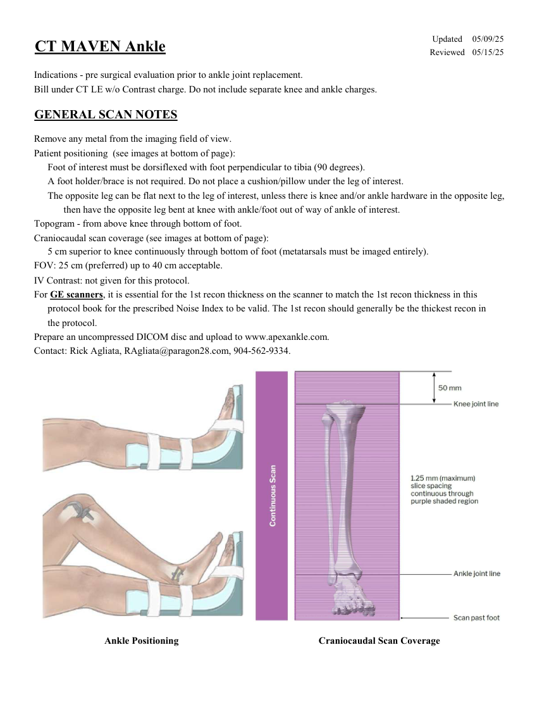
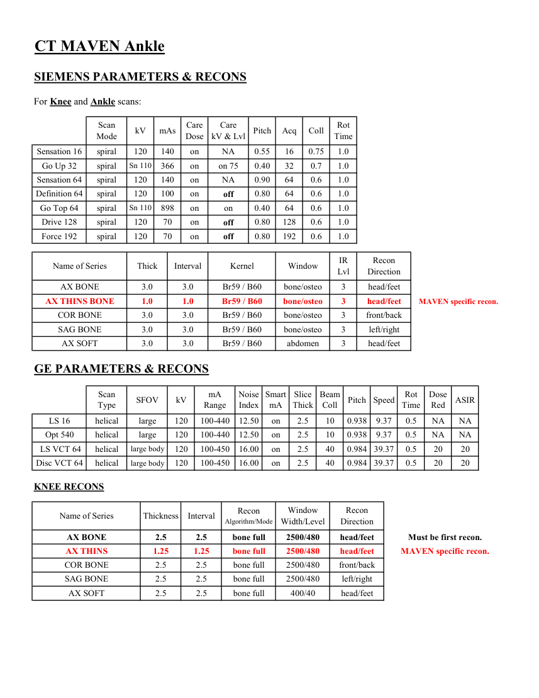
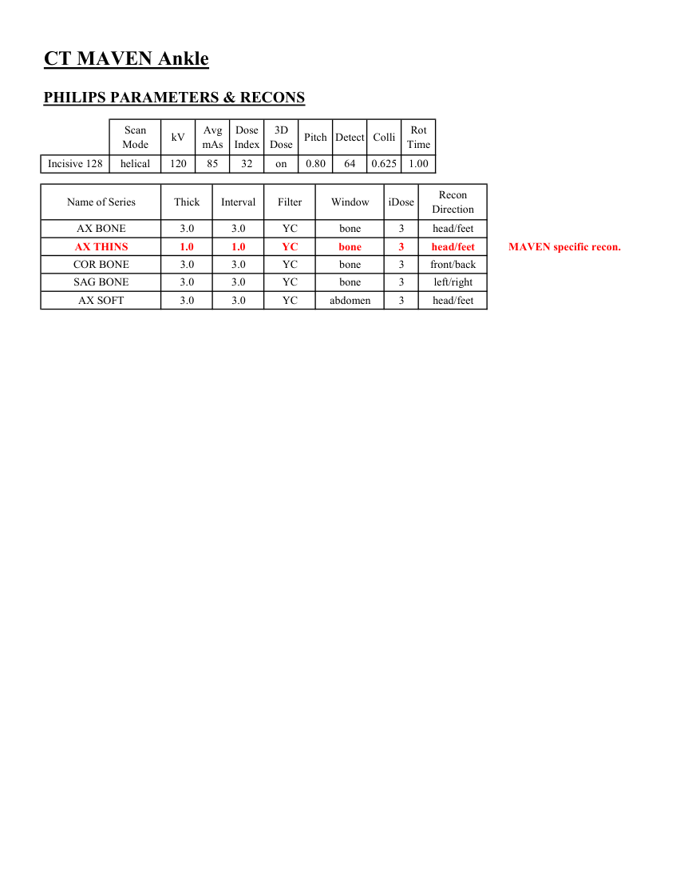
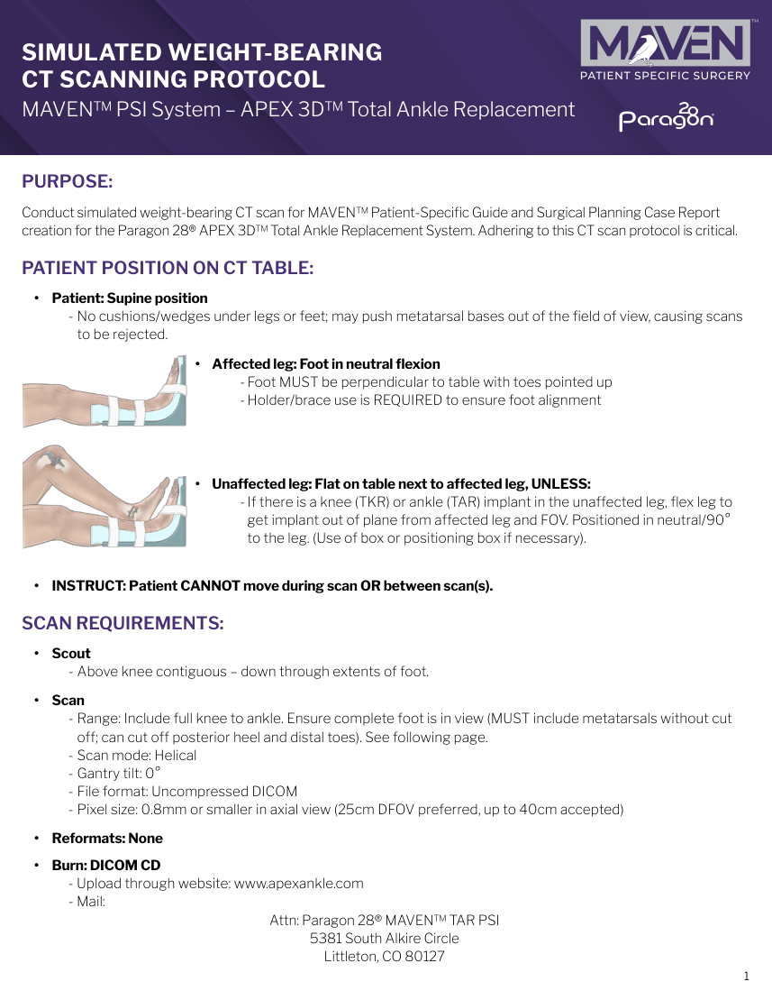
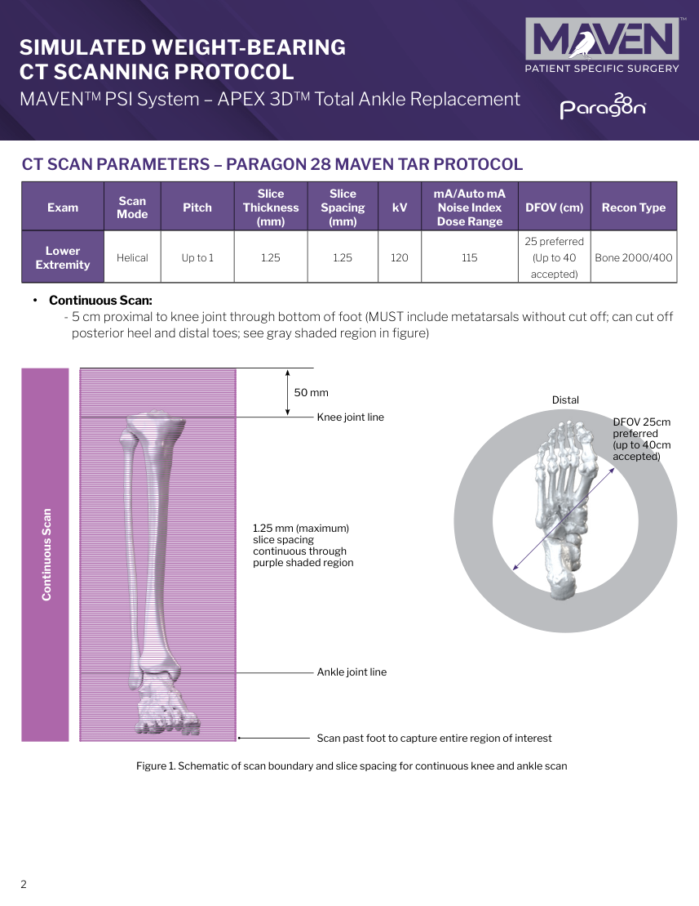

# CT — Gleznă MAVEN (MCB)

## Documentul original MCB — Gleznă MAVEN

**Protocol · 5 pagini · consultat la 2026-09-27.**

[Descarcă PDF-ul integral](../../assets/mcb-modalities/ct-glezna-maven-mcb/document.pdf) · [Sursa MCB](https://ref.mcbradiology.com/Protocols,%20Policies,%20Worksheets%20&%20Forms/CT/Protocols/MSK/22%20MAVEN%20Ankle.pdf) · [Catalogul MCB pentru această modalitate](../mcb/index.md)

Instrucțiunile, valorile și ilustrațiile din documentul original sunt păstrate în **engleză**. Titlul și navigarea sunt în română.

### Pagina 1

{ loading=lazy }

### Pagina 2

{ loading=lazy }

### Pagina 3

{ loading=lazy }

### Pagina 4

{ loading=lazy }

### Pagina 5

{ loading=lazy }

## Textul documentului original

??? abstract "Pagina 1 — text în engleză"

    
Updated
    05/09/25
    CT MAVEN Ankle
    Reviewed
    05/15/25
    Indications - pre surgical evaluation prior to ankle joint replacement.
    Bill under CT LE w/o Contrast charge. Do not include separate knee and ankle charges.
    GENERAL SCAN NOTES
    Remove any metal from the imaging field of view.
    Patient positioning  (see images at bottom of page):
    Foot of interest must be dorsiflexed with foot perpendicular to tibia (90 degrees).
    A foot holder/brace is not required. Do not place a cushion/pillow under the leg of interest.
    The opposite leg can be flat next to the leg of interest, unless there is knee and/or ankle hardware in the opposite leg,
     then have the opposite leg bent at knee with ankle/foot out of way of ankle of interest.
    Topogram - from above knee through bottom of foot.
    Craniocaudal scan coverage (see images at bottom of page):
    5 cm superior to knee continuously through bottom of foot (metatarsals must be imaged entirely).
    FOV: 25 cm (preferred) up to 40 cm acceptable.
    IV Contrast: not given for this protocol.
    For GE scanners, it is essential for the 1st recon thickness on the scanner to match the 1st recon thickness in this
    protocol book for the prescribed Noise Index to be valid. The 1st recon should generally be the thickest recon in 
    the protocol.
    Prepare an uncompressed DICOM disc and upload to www.apexankle.com.
    Contact: Rick Agliata, RAgliata@paragon28.com, 904-562-9334.
    Ankle Positioning
    Craniocaudal Scan Coverage
    

??? abstract "Pagina 2 — text în engleză"

    
CT MAVEN Ankle
    SIEMENS PARAMETERS &amp; RECONS
    For Knee and Ankle scans:
    Scan                           
    Care                                          
    mAs
    Care                            
    Pitch
    Acq
    Coll
    Rot 
    Mode
    kV
    Dose
    kV &amp; Lvl
    Time
    Sensation 16
    spiral
    120
    140
    on
    NA
    0.55
    16
    0.75
    1.0
    Go Up 32
    spiral
    Sn 110
    366
    on
    on 75
    0.40
    32
    0.7
    1.0
    Sensation 64
    spiral
    120
    140
    on
    NA
    0.90
    64
    0.6
    1.0
    Definition 64
    spiral
    120
    100
    on
    off
    0.80
    64
    0.6
    1.0
    Go Top 64
    spiral
    Sn 110
    898
    on
    on
    0.40
    64
    0.6
    1.0
    Drive 128
    spiral
    120
    70
    on
    off
    0.80
    128
    0.6
    1.0
    Force 192
    spiral
    0.6
    1.0
    120
    70
    on
    off
    0.80
    192
    Recon                     
    Name of Series
    Thick
    Interval
    Kernel
    Window
    IR                       
    Lvl
    Direction
    AX BONE
    3.0
    3.0
    Br59 / B60
    bone/osteo
    3
    head/feet
    MAVEN specific recon.
    AX THINS BONE
    1.0
    1.0
    Br59 / B60
    bone/osteo
    3
    head/feet
    COR BONE
    3.0
    3.0
    Br59 / B60
    bone/osteo
    3
    front/back
    SAG BONE
    3.0
    3.0
    Br59 / B60
    bone/osteo
    3
    left/right
    AX SOFT
    3.0
    3.0
    Br59 / B60
    abdomen
    3
    head/feet
    GE PARAMETERS &amp; RECONS
    Scan               
    Smart             
    Beam                                 
    Dose                                          
    ASIR
    Slice                       
    Type
    SFOV
    kV
    mA                           
    Range
    Noise                    
    Index
    mA
    Thick
    Coll
    Pitch
    Speed
    Rot                                
    Time
    Red
    LS 16
    helical
    large
    120
    100-440
    12.50
    on
    2.5
    10
    0.938
    9.37
    0.5
    NA
    NA
    Opt 540
    helical
    large
    120
    100-440
    0.5
    NA
    NA
    2.5
    10
    0.938
    9.37
    12.50
    on
    2.5
    40
    0.984 39.37
    0.5
    20
     LS VCT 64
    helical
    large body
    120
    100-450
    16.00
    on
    20
    Disc VCT 64
    helical
    large body
    120
    100-450
    16.00
    on
    2.5
    40
    0.984 39.37
    0.5
    20
    20
    KNEE RECONS
    Window                                   
    Recon 
    Name of Series
    Thickness
    Interval
    Recon                                     
    Algorithm/Mode
    Width/Level
    Direction
    AX BONE
    2.5
    2.5
    bone full
    2500/480
    head/feet
    Must be first recon.
    MAVEN specific recon.
    AX THINS
    1.25
    1.25
    bone full
    2500/480
    head/feet
    COR BONE
    2.5
    2.5
    bone full
    2500/480
    front/back
    SAG BONE
    2.5
    2.5
    bone full
    2500/480
    left/right
    AX SOFT
    2.5
    2.5
    bone full
    400/40
    head/feet
    

??? abstract "Pagina 3 — text în engleză"

    
CT MAVEN Ankle
    PHILIPS PARAMETERS &amp; RECONS
    Scan                           
    Dose                                          
    3D            
    Colli
    Rot 
    Mode
    kV
    Avg                      
    mAs
    Index
    Dose
    Pitch Detect
    Time
    Incisive 128
    helical
    120
    85
    32
    on
    0.80
    64
    0.625
    1.00
    Name of Series
    Thick
    Interval
    Filter
    Window
    iDose
    Recon                     
    Direction
    head/feet
    AX BONE
    3.0
    3.0
    YC
    bone
    3
    AX THINS
    1.0
    1.0
    YC
    bone
    3
    head/feet
    MAVEN specific recon.
    COR BONE
    3.0
    3.0
    YC
    bone
    3
    front/back
    left/right
    SAG BONE
    3.0
    3.0
    YC
    bone
    3
    AX SOFT
    3.0
    3.0
    YC
    abdomen
    3
    head/feet
    

??? abstract "Pagina 4 — text în engleză"

    
SIMULATED WEIGHT-BEARING  
    CT SCANNING PROTOCOL
    MAVEN™ PSI System – APEX 3D™ Total Ankle Replacement
    PURPOSE: 
    Conduct simulated weight-bearing CT scan for MAVEN™ Patient-Specific Guide and Surgical Planning Case Report 
    creation for the Paragon 28® APEX 3D™ Total Ankle Replacement System. Adhering to this CT scan protocol is critical.
    PATIENT POSITION ON CT TABLE:
    •	 Patient: Supine position
    -	No cushions/wedges under legs or feet; may push metatarsal bases out of the field of view, causing scans 
    to be rejected.
    •	 Affected leg: Foot in neutral flexion
    	-	Foot MUST be perpendicular to table with toes pointed up
    	-	Holder/brace use is REQUIRED to ensure foot alignment
    •	 Unaffected leg: Flat on table next to affected leg, UNLESS:
    	-	If there is a knee (TKR) or ankle (TAR) implant in the unaffected leg, flex leg to 
    get implant out of plane from affected leg and FOV. Positioned in neutral/90°  
    to the leg. (Use of box or positioning box if necessary).
    •	 INSTRUCT: Patient CANNOT move during scan OR between scan(s). 
    SCAN REQUIREMENTS:
    •	 Scout
    -	Above knee contiguous – down through extents of foot.
    •	 Scan
    -	Range: Include full knee to ankle. Ensure complete foot is in view (MUST include metatarsals without cut 
    off; can cut off posterior heel and distal toes). See following page.
    -	Scan mode: Helical
    -	Gantry tilt: 0°
    -	File format: Uncompressed DICOM
    -	Pixel size: 0.8mm or smaller in axial view (25cm DFOV preferred, up to 40cm accepted)
    •	 Reformats: None
    •	 Burn: DICOM CD
    - Upload through website: www.apexankle.com
    - Mail:
    Attn: Paragon 28® MAVEN™ TAR PSI
    5381 South Alkire Circle
    Littleton, CO 80127
    1
    

??? abstract "Pagina 5 — text în engleză"

    
SIMULATED WEIGHT-BEARING  
    CT SCANNING PROTOCOL
    MAVEN™ PSI System – APEX 3D™ Total Ankle Replacement
    CT SCAN PARAMETERS – PARAGON 28 MAVEN TAR PROTOCOL
    Exam
    Scan 
    Mode
    Pitch
    Slice 
    Thickness 
    (mm)
    Slice 
    Spacing 
    (mm)
    kV
    mA/Auto mA 
    Noise Index 
    Dose Range
    DFOV (cm)
    Recon Type
    25 preferred 
    (Up to 40 
    Bone 2000/400
    Lower 
    Extremity
    Helical
    Up to 1
    1.25
    1.25
    120
    115
    accepted)
    •	 Continuous Scan:
    -	5 cm proximal to knee joint through bottom of foot (MUST include metatarsals without cut off; can cut off 
    posterior heel and distal toes; see gray shaded region in figure)
    50 mm
    Distal
    Knee joint line
    DFOV 25cm 
    preferred 
    (up to 40cm 
    accepted)
    1.25 mm (maximum) 
    slice spacing 
    continuous through 
    purple shaded region
    Continuous Scan
    Ankle joint line
    Scan past foot to capture entire region of interest
    Figure 1. Schematic of scan boundary and slice spacing for continuous knee and ankle scan
    2
    

