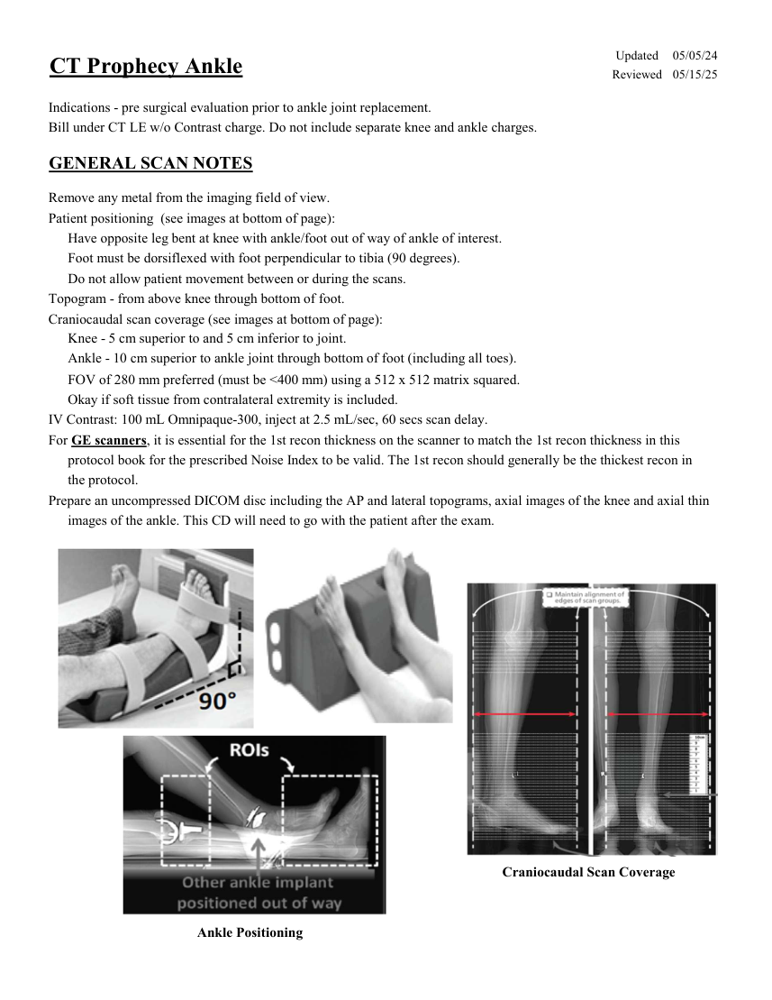
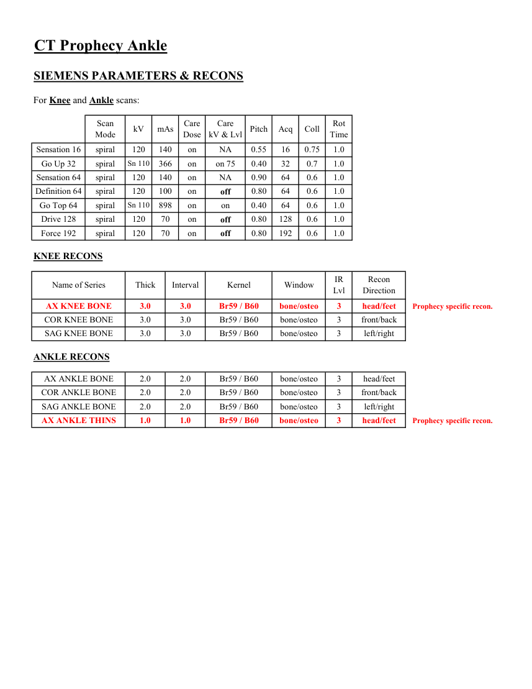
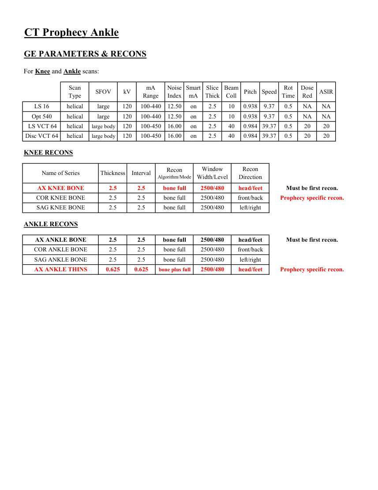
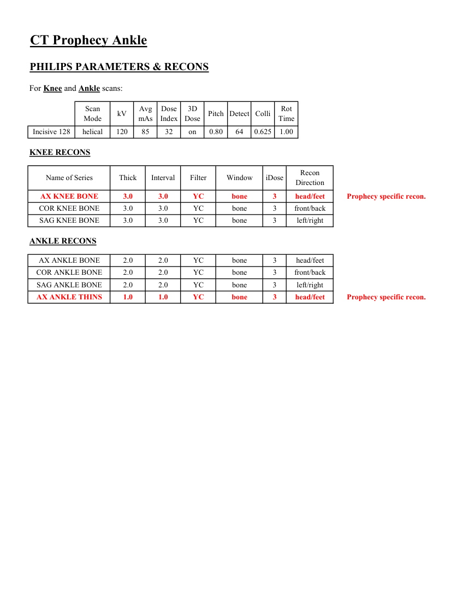
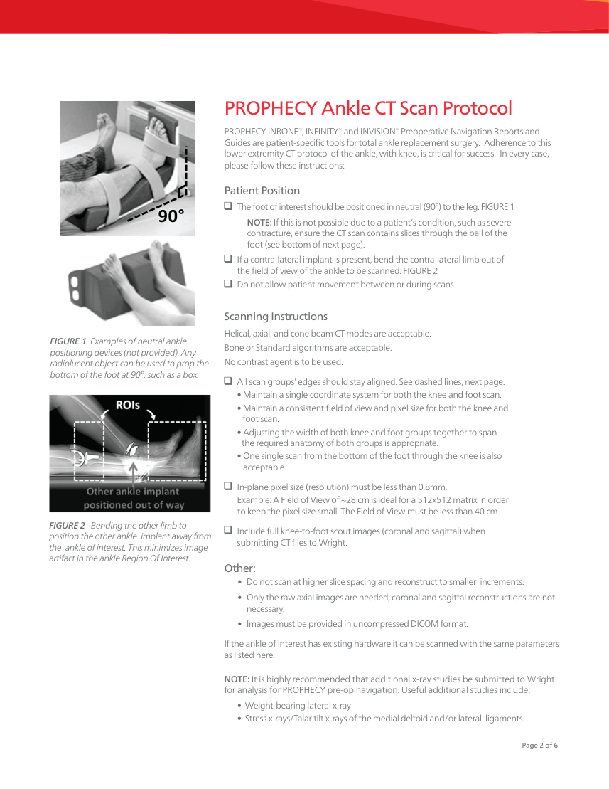
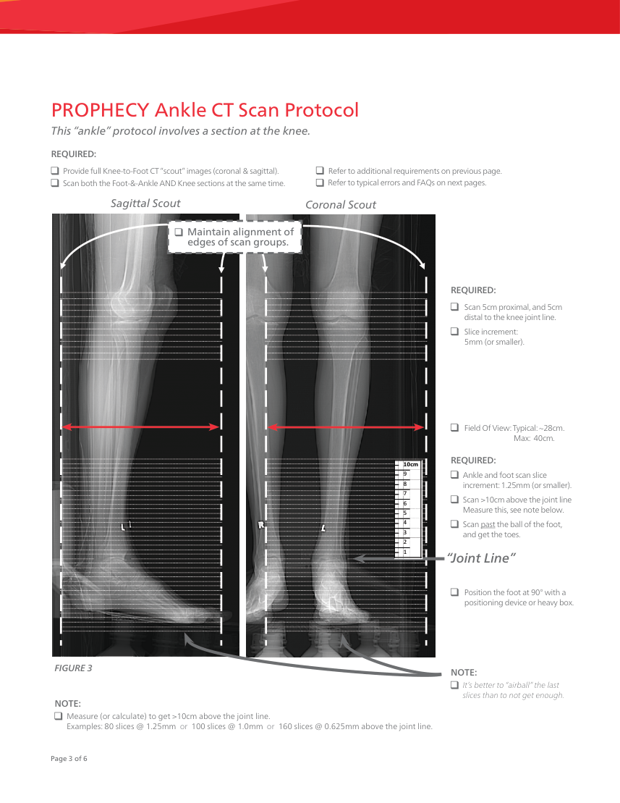
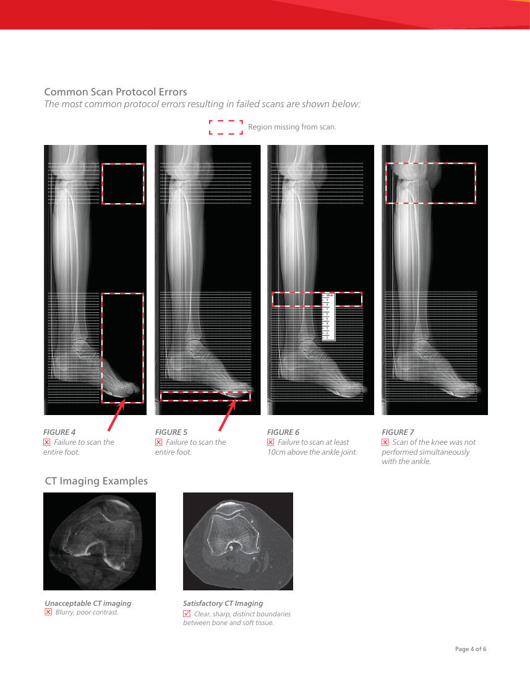

# CT — Gleznă Prophecy (MCB)

## Documentul original MCB — Gleznă Prophecy

**Protocol · 8 pagini · consultat la 2026-09-27.**

[Descarcă PDF-ul integral](../../assets/mcb-modalities/ct-glezna-prophecy-mcb/document.pdf) · [Sursa MCB](https://ref.mcbradiology.com/Protocols,%20Policies,%20Worksheets%20&%20Forms/CT/Protocols/MSK/21%20Prophecy%20Ankle.pdf) · [Catalogul MCB pentru această modalitate](../mcb/index.md)

Instrucțiunile, valorile și ilustrațiile din documentul original sunt păstrate în **engleză**. Titlul și navigarea sunt în română.

### Pagina 1

{ loading=lazy }

### Pagina 2

{ loading=lazy }

### Pagina 3

{ loading=lazy }

### Pagina 4

{ loading=lazy }

### Pagina 5

{ loading=lazy }

### Pagina 6

{ loading=lazy }

### Pagina 7

{ loading=lazy }

### Pagina 8

{ loading=lazy }

## Textul documentului original

??? abstract "Pagina 1 — text în engleză"

    
Updated
    05/05/24
    CT Prophecy Ankle
    Reviewed
    05/15/25
    Indications - pre surgical evaluation prior to ankle joint replacement.
    Bill under CT LE w/o Contrast charge. Do not include separate knee and ankle charges.
    GENERAL SCAN NOTES
    Remove any metal from the imaging field of view.
    Patient positioning  (see images at bottom of page):
    Have opposite leg bent at knee with ankle/foot out of way of ankle of interest.
    Foot must be dorsiflexed with foot perpendicular to tibia (90 degrees).
    Do not allow patient movement between or during the scans.
    Topogram - from above knee through bottom of foot.
    Craniocaudal scan coverage (see images at bottom of page):
    Knee - 5 cm superior to and 5 cm inferior to joint.
    Ankle - 10 cm superior to ankle joint through bottom of foot (including all toes).
    FOV of 280 mm preferred (must be &lt;400 mm) using a 512 x 512 matrix squared.
    Okay if soft tissue from contralateral extremity is included.
    IV Contrast: 100 mL Omnipaque-300, inject at 2.5 mL/sec, 60 secs scan delay.
    For GE scanners, it is essential for the 1st recon thickness on the scanner to match the 1st recon thickness in this
    protocol book for the prescribed Noise Index to be valid. The 1st recon should generally be the thickest recon in 
    the protocol.
    Prepare an uncompressed DICOM disc including the AP and lateral topograms, axial images of the knee and axial thin
    images of the ankle. This CD will need to go with the patient after the exam.
    Craniocaudal Scan Coverage
    Ankle Positioning
    

??? abstract "Pagina 2 — text în engleză"

    
CT Prophecy Ankle
    SIEMENS PARAMETERS &amp; RECONS
    For Knee and Ankle scans:
    Scan                           
    Care                                          
    Mode
    kV
    mAs
    Care                            
    Dose
    kV &amp; Lvl
    Pitch
    Acq
    Coll
    Rot 
    Time
    Sensation 16
    spiral
    120
    140
    NA
    0.55
    on
    0.75
    16
    1.0
    Go Up 32
    spiral
    Sn 110
    366
    on
    on 75
    0.40
    32
    0.7
    1.0
    Sensation 64
    spiral
    120
    140
    on
    NA
    0.90
    64
    0.6
    1.0
    Definition 64
    spiral
    120
    100
    on
    0.6
    1.0
    0.80
    64
    off
    Go Top 64
    spiral
    Sn 110
    898
    on
    on
    0.40
    64
    0.6
    1.0
    Drive 128
    spiral
    120
    70
    on
    0.80
    128
    0.6
    1.0
    off
    Force 192
    spiral
    120
    70
    on
    off
    0.80
    192
    0.6
    1.0
    KNEE RECONS
    Recon                     
    Name of Series
    Thick
    Interval
    Kernel
    Window
    IR                       
    Lvl
    Direction
    Prophecy specific recon.
    AX KNEE BONE
    3.0
    3.0
    Br59 / B60
    bone/osteo
    3
    head/feet
    COR KNEE BONE
    3.0
    3.0
    Br59 / B60
    bone/osteo
    3
    front/back
    SAG KNEE BONE
    3.0
    3.0
    Br59 / B60
    bone/osteo
    3
    left/right
    ANKLE RECONS
    AX ANKLE BONE
    2.0
    2.0
    Br59 / B60
    bone/osteo
    3
    head/feet
    COR ANKLE BONE
    2.0
    2.0
    Br59 / B60
    bone/osteo
    3
    front/back
    SAG ANKLE BONE
    2.0
    2.0
    Br59 / B60
    bone/osteo
    3
    left/right
    Prophecy specific recon.
    AX ANKLE THINS
    1.0
    1.0
    Br59 / B60
    bone/osteo
    3
    head/feet
    

??? abstract "Pagina 3 — text în engleză"

    
CT Prophecy Ankle
    GE PARAMETERS &amp; RECONS
    For Knee and Ankle scans:
    Smart             
    Slice                       
    Beam                                 
    Dose                                          
    Type
    SFOV
    kV
    mA                           
    Red
    ASIR
    Scan               
    Range
    Noise                    
    Index
    mA
    Thick
    Coll
    Pitch
    Speed
    Rot                                
    Time
    on
    2.5
    10
    0.938
    9.37
    0.5
    LS 16
    helical
    large
    120
    100-440
    12.50
    NA
    NA
    Opt 540
    helical
    large
    120
    100-440
    12.50
    on
    2.5
    10
    0.938
    9.37
    0.5
    NA
    NA
     LS VCT 64
    helical
    large body
    120
    100-450
    16.00
    on
    2.5
    40
    0.984 39.37
    0.5
    20
    20
    0.984 39.37
    20
    20
    Disc VCT 64
    helical
    large body
    120
    100-450
    16.00
    on
    2.5
    40
    0.5
    KNEE RECONS
    Window                                   
    Recon 
    Name of Series
    Thickness
    Interval
    Recon                                     
    Algorithm/Mode
    Width/Level
    Direction
    AX KNEE BONE
    2.5
    2.5
    bone full
    2500/480
    head/feet
    Must be first recon.
    COR KNEE BONE
    2.5
    2.5
    bone full
    2500/480
    front/back
    Prophecy specific recon.
    SAG KNEE BONE
    2.5
    2.5
    bone full
    2500/480
    left/right
    ANKLE RECONS
    AX ANKLE BONE
    2.5
    2.5
    bone full
    2500/480
    head/feet
    Must be first recon.
    COR ANKLE BONE
    2.5
    2.5
    bone full
    2500/480
    front/back
    SAG ANKLE BONE
    2.5
    2.5
    bone full
    2500/480
    left/right
    AX ANKLE THINS
    0.625
    0.625
    bone plus full
    2500/480
    head/feet
    Prophecy specific recon.
    

??? abstract "Pagina 4 — text în engleză"

    
CT Prophecy Ankle
    PHILIPS PARAMETERS &amp; RECONS
    For Knee and Ankle scans:
    Scan                           
    Dose                                          
    3D            
    Rot 
    Mode
    kV
    Avg                      
    mAs
    Index
    Dose
    Pitch Detect Colli
    Time
    Incisive 128
    helical
    120
    85
    32
    on
    0.80
    64
    0.625
    1.00
    KNEE RECONS
    Name of Series
    Thick
    Interval
    Filter
    Window
    iDose
    Recon                     
    Direction
    AX KNEE BONE
    3.0
    3.0
    YC
    bone
    3
    head/feet
    Prophecy specific recon.
    COR KNEE BONE
    3.0
    3.0
    YC
    bone
    3
    front/back
    left/right
    SAG KNEE BONE
    3.0
    3.0
    YC
    bone
    3
    ANKLE RECONS
    head/feet
    AX ANKLE BONE
    2.0
    2.0
    YC
    bone
    3
    COR ANKLE BONE
    2.0
    2.0
    YC
    bone
    3
    front/back
    SAG ANKLE BONE
    2.0
    2.0
    YC
    bone
    3
    left/right
    AX ANKLE THINS
    1.0
    1.0
    YC
    bone
    3
    head/feet
    Prophecy specific recon.
    

??? abstract "Pagina 5 — text în engleză"

    
PROPHECY Ankle CT Scan Protocol
    PROPHECY INBONE
    ™, INFINITY
    ™ and INVISION
    ™ Preoperative Navigation Reports and 
    Guides are patient-specific tools for total ankle replacement surgery.  Adherence to this 
    lower extremity CT protocol of the ankle, with knee, is critical for success.  In every case, 
    please follow these instructions: 
    Patient Position
    		 The foot of interest should be positioned in neutral (90°) to the leg. FIGURE 1
    90°
           NOTE: If this is not possible due to a patient’s condition, such as severe  
       contracture, ensure the CT scan contains slices through the ball of the 
       foot (see bottom of next page).  
    		 If a contra-lateral implant is present, bend the contra-lateral limb out of  
    	 the field of view of the ankle to be scanned. FIGURE 2
    		 Do not allow patient movement between or during scans.
    Scanning Instructions
    Helical, axial, and cone beam CT modes are acceptable.
    Bone or Standard algorithms are acceptable.
    No contrast agent is to be used.
    FIGURE 1  Examples of neutral ankle 
    positioning devices (not provided). Any 
    radiolucent object can be used to prop the 
    bottom of the foot at 90°, such as a box.
    FIGURE 1| Examples 
    of neutral ankle 
    positioning.
    	 All scan groups’ edges should stay aligned. See dashed lines, next page.
    	 	 • Maintain a single coordinate system for both the knee and foot scan. 
    	 	 • Maintain a consistent field of view and pixel size for both the knee and  
           foot scan.
    	 	 • Adjusting the width of both knee and foot groups together to span  
          the required anatomy of both groups is appropriate.
    	 	 • One single scan from the bottom of the foot through the knee is also 
           acceptable.    
    	 In-plane pixel size (resolution) must be less than 0.8mm. 
    	 	 Example: A Field of View of ~28 cm is ideal for a 512x512 matrix in order   
       to keep the pixel size small. The Field of View must be less than 40 cm.
     	Include full knee-to-foot scout images (coronal and sagittal) when  
    	 submitting CT files to Wright.
    FIGURE 2   Bending the other limb to 
    position the other ankle   
    implant away from 
    the  ankle of interest. This minimizes image 
    artifact in the ankle Region Of Interest.  
    Other:
    • 	Do not scan at higher slice spacing and reconstruct to smaller  increments.
    • 	Only the raw axial images are needed; coronal and sagittal reconstructions are not 
    necessary.
    • 	Images must be provided in uncompressed DICOM format.
    If the ankle of interest has existing hardware it can be scanned with the same parameters 
    as listed here.
    NOTE: It is highly recommended that additional x-ray studies be submitted to Wright 
    for analysis for PROPHECY pre-op navigation. Useful additional studies include:   
           •  Weight-bearing lateral x-ray
           •  Stress x-rays/Talar tilt x-rays of the medial deltoid and/or lateral  ligaments.
    Page 2 of 6
    

??? abstract "Pagina 6 — text în engleză"

    
This “ankle” protocol involves a section at the knee.
    PROPHECY Ankle CT Scan Protocol 
    REQUIRED:
    	 Refer to additional requirements on previous page. 
      Refer to typical errors and FAQs on next pages. 
    	 Provide full Knee-to-Foot CT “scout” images (coronal &amp; sagittal).
      Scan both the Foot-&amp;-Ankle AND Knee sections at the same time.
    Sagittal Scout
    Coronal Scout
      Maintain alignment of  
       edges of scan groups.
    REQUIRED:
     		Scan 5cm proximal, and 5cm 
    distal to the knee joint line.
     		Slice increment: 
    	
    	5mm (or smaller).
     		Field Of View: Typical: ~28cm.  
                                  Max:  40cm.
    REQUIRED:
    10cm
    9
    8
    	 Ankle and foot scan slice
         	 increment: 1.25mm (or smaller).
    7
    6
    	 Scan &gt;10cm above the joint line
         	 Measure this, see note below.
    5
    4
    3
    	 Scan past the ball of the foot, 
         	 and get the toes.
    2
    1
    “Joint Line”
     		Position the foot at 90° with a 
    positioning device or heavy box. 
    FIGURE 3
    NOTE:
    	 It’s better to “airball” the last 
        	 slices than to not get enough.
    NOTE:
    	 Measure (or calculate) to get &gt;10cm above the joint line.
         	Examples: 80 slices @ 1.25mm  or  100 slices @ 1.0mm  or  160 slices @ 0.625mm above the joint line.
    Page 3 of 6
    

??? abstract "Pagina 7 — text în engleză"

    
Common Scan Protocol Errors
    The most common protocol errors resulting in failed scans are shown below: 
    Region missing from scan.
    FIGURE 4 
    FIGURE 5 
    FIGURE 6 
    FIGURE 7 
      Failure to scan the  
    entire foot.
      Failure to scan the 
    entire foot.
      Failure to scan at least 
    10cm above the ankle joint.
      Scan of the knee was not
    performed simultaneously
    with the ankle.
    CT Imaging Examples
    Unacceptable CT imaging 
      Blurry, poor contrast.
    Satisfactory CT Imaging 
      Clear, sharp, distinct boundaries  
    between bone and soft tissue. 
    Page 4 of 6
    

??? abstract "Pagina 8 — text în engleză"

    
Frequently Asked Questions
    Q.  “I can’t put in a 1.25mm slice. I can only do a 1mm increment. Is that ok?” 
    A.   Slices thinner than our specified slice thickness are acceptable; however, using larger 
    slices will result in the scan being rejected for PROPHECY processing.
    Q.  “What type of CT acquisition can be used?” 
    A.   Axial, helical, and cone beam CT modes are acceptable.
    Q.  “Is it really necessary to scan 10cm above the ankle joint?” 
    A.   Yes.  At least 10cm of the tibia shaft, measured from the ankle joint line, is required. 
    Q.  “Do I need to scan the knee for an ankle surgery?” 
    A.   Yes. The knee scan is required to obtain the complete axis of the lower extremity.  
    Information based on the entire tibia is used to plan the ankle procedure.
    Q.  “How should the patient be positioned?” 
    A.   Patients are typically supine for the scan, but it does not matter as long as the 
    patient’s ankle is in neutral dorsiflexion.
    Submitting the Scan 
    Rapid Electronic Scan Transfer
    Preoperative CT may be sent to the PROPHECY engineering team through our 
    secure, rapid electronic transfer system:  https://prophecyscans.wmt.com
    Please follow these steps to request an account and transfer scans: 
    1.	 E-mail prophecy@wright.com with the e-mail address of the person who needs 
    access to the system (No other information is needed) 
    2.	 Within a few hours, an invitation message will be sent to that address with 
    instructions to complete registration on the scan transfer site. 
    ** upload times may vary based on connection speed.
    Scan submission is typically done by first putting the DICOM files from the CT 
    Scanner computer onto a CD, then putting the CD into a typical office computer 
    for uploading. Therefore, ensure the CD contains the Axial CT slices and full-length 
    scout images.  
    FAQ:  Can I mail the CD of the CT scan? 
    A.  This method is not preferred.  
    If uploading the scans directly from the scanning facility is not possible, please 
    contact the local Wright Medical sales rep to do so.  If the sales rep contact 
    information is not known, call the number below. 
    Contact for Assistance
    The Centers for Medicare &amp; Medicaid Services 
    (CMS) established a National Coverage 
    Determination (NCD) for CT Scans. It states, in 
    part, the following, “Diagnostic examinations 
    of the head (head scans) and of other parts 
    of the body (body scans) performed by 
    computerized tomography (CT) scanners are 
    covered if medical and scientific literature and 
    opinion support the effective use of a scan for 
    the condition, and the scan is:  (1) reasonable 
    and necessary for the individual patient.” CTs 
    performed prior to total joint replacement 
    procedures for diagnostic purposes may be 
    considered medically necessary. In which case, 
    the procedure should be billed using the CPT 
    codes that accurately describe the imaging 
    procedure furnished to the patient. These 
    same images from the diagnostic CT scan may, 
    in turn, be further utilized for developing the 
    personalized cutting or navigation guides that 
    are used in orthopaedic procedures. However, 
    if providers perform CT scans solely for the 
    purpose of developing personalized cutting 
    instruments or guides, providers should 
    contact the payer for billing and coverage 
    guidance and/or the American College of 
    Radiology with billing questions.
    PROPHECY Operations at Wright Medical Technology  
    Phone: 901.290.5884	
    Fax: 901.867.4791 
    email: prophecy@wright.com 
    Page 5 of 6
    

