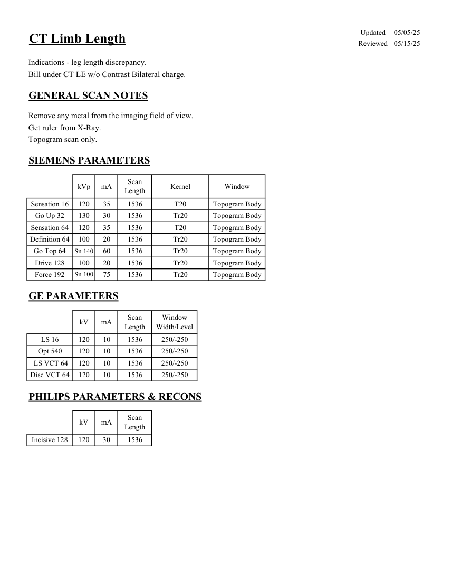

# CT — Măsurarea lungimii membrelor (MCB)

## Documentul original MCB — Măsurarea lungimii membrelor

**Protocol · 1 pagini · consultat la 2026-09-27.**

[Descarcă PDF-ul integral](../../assets/mcb-modalities/ct-masurarea-lungimii-membrelor-mcb/document.pdf) · [Sursa MCB](https://ref.mcbradiology.com/Protocols,%20Policies,%20Worksheets%20&%20Forms/CT/Protocols/MSK/12%20Limb%20Length.pdf) · [Catalogul MCB pentru această modalitate](../mcb/index.md)

Instrucțiunile, valorile și ilustrațiile din documentul original sunt păstrate în **engleză**. Titlul și navigarea sunt în română.

### Pagina 1

{ loading=lazy }

## Textul documentului original

??? abstract "Pagina 1 — text în engleză"

    
Updated
    05/05/25
    CT Limb Length
    Reviewed
    05/15/25
    Indications - leg length discrepancy.
    Bill under CT LE w/o Contrast Bilateral charge.
    GENERAL SCAN NOTES
    Remove any metal from the imaging field of view.
    Get ruler from X-Ray.
    Topogram scan only.
    SIEMENS PARAMETERS
    kVp
    mA
    Scan 
    Kernel
    Length
    Window
    Sensation 16
    Topogram Body
    120
    35
    1536
    T20
    Go Up 32
    130
    30
    1536
    Tr20
    Topogram Body
    Sensation 64
    120
    35
    1536
    Topogram Body
    T20
    Definition 64
    100
    20
    1536
    Tr20
    Topogram Body
    Go Top 64
    Sn 140
    60
    1536
    Tr20
    Topogram Body
    Drive 128
    100
    20
    1536
    Tr20
    Topogram Body
    Force 192
    Sn 100
    75
    Tr20
    1536
    Topogram Body
    GE PARAMETERS
    Window                                   
    kV
    mA
    Scan 
    Length
    Width/Level
    250/-250
    LS 16
    120
    10
    1536
    Opt 540
    120
    10
    1536
    250/-250
     LS VCT 64
    120
    250/-250
    10
    1536
    Disc VCT 64
    120
    250/-250
    10
    1536
    PHILIPS PARAMETERS &amp; RECONS
    Scan 
    kV
    mA
    Length
    Incisive 128
    120
    30
    1536
    

