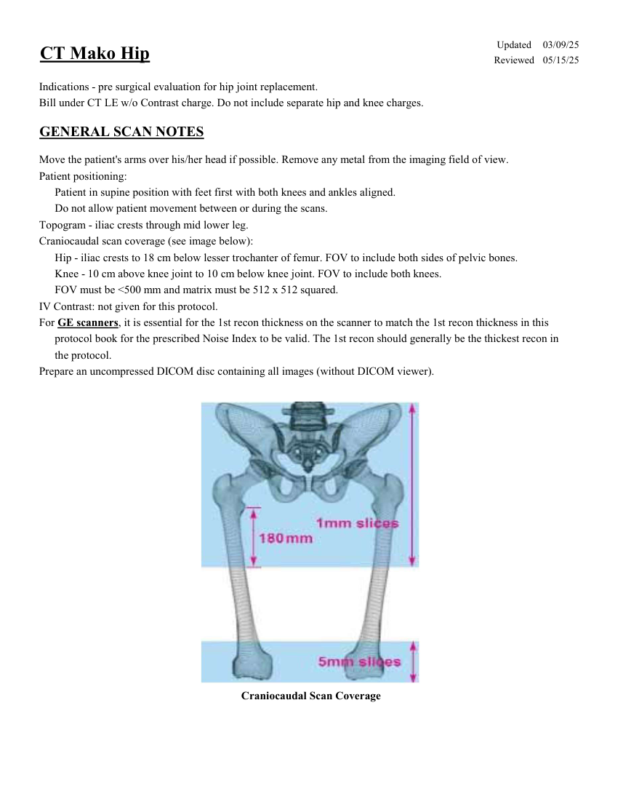
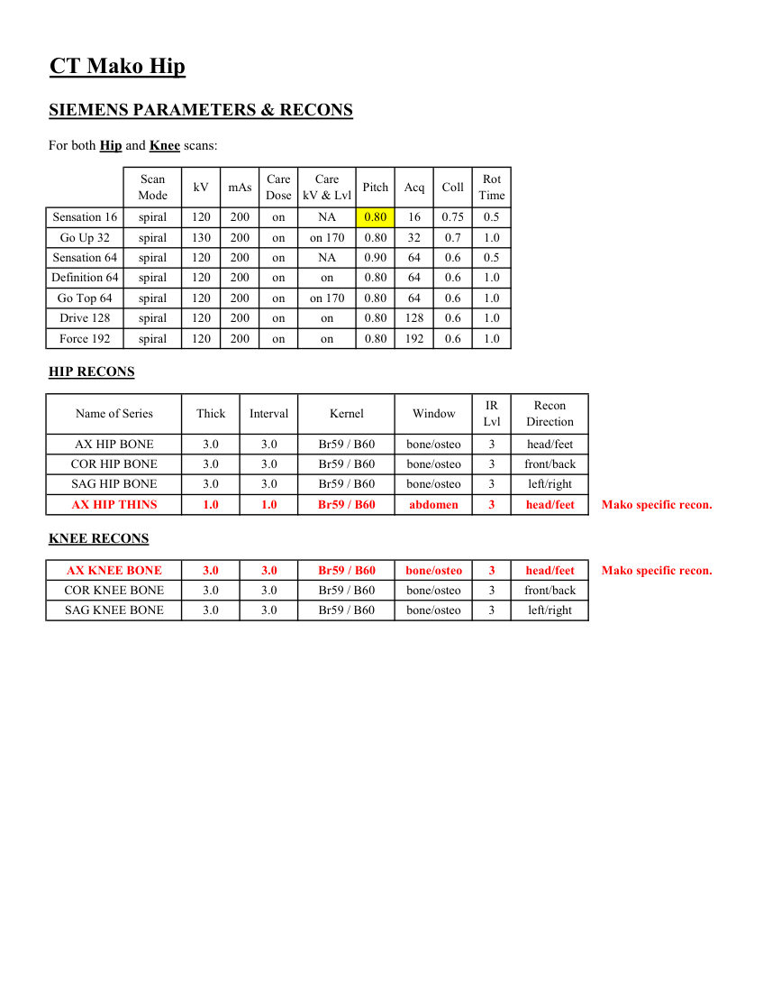
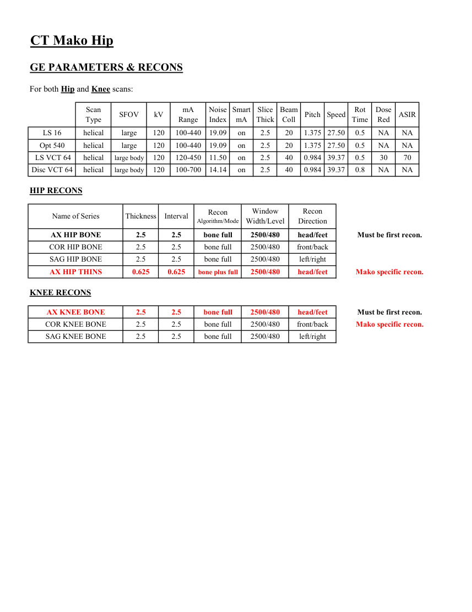
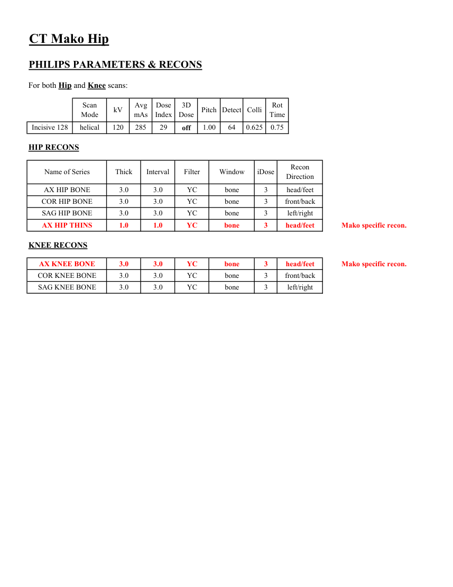
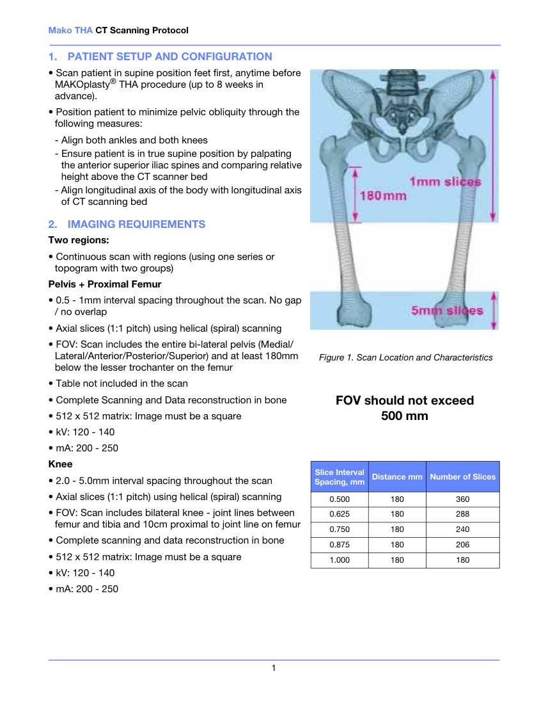
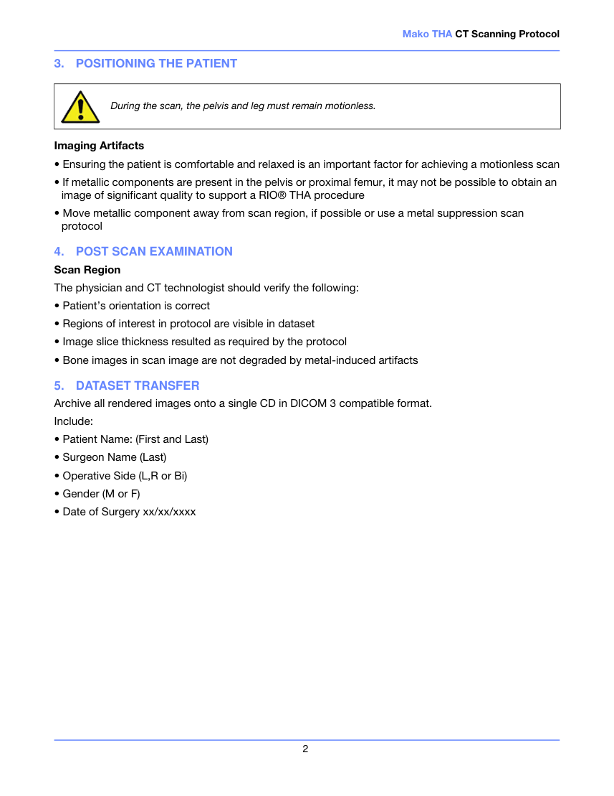

# CT — Șold Mako (MCB)

## Documentul original MCB — Șold Mako

**Protocol · 6 pagini · consultat la 2026-09-27.**

[Descarcă PDF-ul integral](../../assets/mcb-modalities/ct-sold-mako-mcb/document.pdf) · [Sursa MCB](https://ref.mcbradiology.com/Protocols,%20Policies,%20Worksheets%20&%20Forms/CT/Protocols/MSK/16%20Mako%20Hip.pdf) · [Catalogul MCB pentru această modalitate](../mcb/index.md)

Instrucțiunile, valorile și ilustrațiile din documentul original sunt păstrate în **engleză**. Titlul și navigarea sunt în română.

### Pagina 1

{ loading=lazy }

### Pagina 2

{ loading=lazy }

### Pagina 3

{ loading=lazy }

### Pagina 4

{ loading=lazy }

### Pagina 5

{ loading=lazy }

### Pagina 6

{ loading=lazy }

## Textul documentului original

??? abstract "Pagina 1 — text în engleză"

    
Updated
    03/09/25
    CT Mako Hip
    Reviewed
    05/15/25
    Indications - pre surgical evaluation for hip joint replacement.
    Bill under CT LE w/o Contrast charge. Do not include separate hip and knee charges.
    GENERAL SCAN NOTES
    Move the patient&#x27;s arms over his/her head if possible. Remove any metal from the imaging field of view.
    Patient positioning:
    Patient in supine position with feet first with both knees and ankles aligned.
    Do not allow patient movement between or during the scans.
    Topogram - iliac crests through mid lower leg.
    Craniocaudal scan coverage (see image below):
    Hip - iliac crests to 18 cm below lesser trochanter of femur. FOV to include both sides of pelvic bones. 
    Knee - 10 cm above knee joint to 10 cm below knee joint. FOV to include both knees.
    FOV must be &lt;500 mm and matrix must be 512 x 512 squared. 
    IV Contrast: not given for this protocol.
    For GE scanners, it is essential for the 1st recon thickness on the scanner to match the 1st recon thickness in this
    protocol book for the prescribed Noise Index to be valid. The 1st recon should generally be the thickest recon in 
    the protocol.
    Prepare an uncompressed DICOM disc containing all images (without DICOM viewer). 
    Craniocaudal Scan Coverage
    

??? abstract "Pagina 2 — text în engleză"

    
CT Mako Hip
    SIEMENS PARAMETERS &amp; RECONS
    For both Hip and Knee scans:
    Scan                           
    Care                                          
    Acq
    Coll
    Rot 
    Mode
    kV
    mAs
    Care                            
    Dose
    kV &amp; Lvl
    Pitch
    Time
    Sensation 16
    spiral
    120
    200
    on
    NA
    0.80
    16
    0.75
    0.5
    Go Up 32
    spiral
    130
    200
    on
    on 170
    0.80
    32
    0.7
    1.0
    Sensation 64
    spiral
    120
    200
    on
    0.90
    64
    0.6
    0.5
    NA
    Definition 64
    spiral
    120
    200
    on
    on
    0.80
    64
    0.6
    1.0
    Go Top 64
    spiral
    120
    200
    on
    0.80
    64
    0.6
    1.0
    on 170
    Drive 128
    spiral
    120
    200
    on
    on
    0.80
    128
    0.6
    1.0
    Force 192
    spiral
    120
    200
    on
    on
    0.80
    192
    0.6
    1.0
    HIP RECONS
    IR                       
    Recon                     
    Name of Series
    Thick
    Interval
    Kernel
    Window
    Lvl
    Direction
    AX HIP BONE
    3.0
    3.0
    Br59 / B60
    bone/osteo
    3
    head/feet
    COR HIP BONE
    3.0
    3.0
    Br59 / B60
    bone/osteo
    3
    front/back
    SAG HIP BONE
    3.0
    3.0
    Br59 / B60
    bone/osteo
    3
    left/right
    head/feet
    AX HIP THINS
    1.0
    1.0
    Br59 / B60
    abdomen
    3
    Mako specific recon.
    KNEE RECONS
    AX KNEE BONE
    3.0
    3.0
    Br59 / B60
    bone/osteo
    3
    head/feet
    Mako specific recon.
    COR KNEE BONE
    3.0
    3.0
    Br59 / B60
    bone/osteo
    3
    front/back
    SAG KNEE BONE
    3.0
    3.0
    Br59 / B60
    bone/osteo
    3
    left/right
    

??? abstract "Pagina 3 — text în engleză"

    
CT Mako Hip
    GE PARAMETERS &amp; RECONS
    For both Hip and Knee scans:
    Scan               
    Smart             
    Slice                       
    Beam                                 
    Dose                                          
    Type
    SFOV
    kV
    mA                           
    Range
    Noise                    
    Index
    mA
    Thick
    Coll
    Pitch
    Speed
    Rot                                
    Time
    Red
    ASIR
    on
    2.5
    20
    1.375 27.50
    0.5
    LS 16
    helical
    large
    120
    100-440
    19.09
    NA
    NA
    Opt 540
    helical
    large
    120
    100-440
    19.09
    on
    2.5
    20
    1.375 27.50
    0.5
    NA
    NA
     LS VCT 64
    helical
    large body
    120
    120-450
    11.50
    on
    2.5
    40
    0.984 39.37
    0.5
    30
    70
    0.984 39.37
    0.8
    NA
    NA
    Disc VCT 64
    helical
    large body
    120
    100-700
    14.14
    on
    2.5
    40
    HIP RECONS
    Window                                   
    Recon 
    Recon                                     
    Name of Series
    Thickness
    Interval
    Algorithm/Mode
    Width/Level
    Direction
    AX HIP BONE
    2.5
    2.5
    bone full
    2500/480
    head/feet
    Must be first recon.
    COR HIP BONE
    2.5
    2.5
    bone full
    2500/480
    front/back
    SAG HIP BONE
    2.5
    2.5
    bone full
    2500/480
    left/right
    AX HIP THINS
    0.625
    0.625
    bone plus full
    2500/480
    head/feet
    Mako specific recon.
    KNEE RECONS
    AX KNEE BONE
    2.5
    2.5
    bone full
    2500/480
    head/feet
    Must be first recon.
    COR KNEE BONE
    2.5
    2.5
    bone full
    2500/480
    front/back
    Mako specific recon.
    SAG KNEE BONE
    2.5
    2.5
    bone full
    2500/480
    left/right
    

??? abstract "Pagina 4 — text în engleză"

    
CT Mako Hip
    PHILIPS PARAMETERS &amp; RECONS
    For both Hip and Knee scans:
    Scan                           
    Dose                                          
    3D            
    Rot 
    Mode
    kV
    Avg                      
    mAs
    Index
    Dose
    Pitch Detect Colli
    Time
    0.625
    0.75
    Incisive 128
    helical
    120
    285
    29
    off
    1.00
    64
    HIP RECONS
    Name of Series
    Thick
    Interval
    Filter
    Window
    iDose
    Recon                     
    Direction
    AX HIP BONE
    3.0
    3.0
    YC
    bone
    3
    head/feet
    COR HIP BONE
    3.0
    3.0
    YC
    bone
    3
    front/back
    SAG HIP BONE
    3.0
    3.0
    YC
    bone
    3
    left/right
    AX HIP THINS
    1.0
    1.0
    YC
    bone
    3
    head/feet
    Mako specific recon.
    KNEE RECONS
    AX KNEE BONE
    3.0
    3.0
    YC
    bone
    3
    head/feet
    Mako specific recon.
    COR KNEE BONE
    3.0
    3.0
    YC
    bone
    3
    front/back
    SAG KNEE BONE
    3.0
    3.0
    YC
    bone
    3
    left/right
    

??? abstract "Pagina 5 — text în engleză"

    
Mako THA CT Scanning Protocol
    1.
    PATIENT SETUP AND CONFIGURATION
    • Scan patient in supine position feet first, anytime before
    MAKOplasty® THA procedure (up to 8 weeks in
    advance).
    • Position patient to minimize pelvic obliquity through the
    following measures:
    - Align both ankles and both knees
    - Ensure patient is in true supine position by palpating
    the anterior superior iliac spines and comparing relative
    height above the CT scanner bed
    - Align longitudinal axis of the body with longitudinal axis
    of CT scanning bed
    2.
    IMAGING REQUIREMENTS
    Two regions:
    • Continuous scan with regions (using one series or
    topogram with two groups)
    Pelvis + Proximal Femur
    • 0.5 - 1mm interval spacing throughout the scan. No gap
    / no overlap
    • Axial slices (1:1 pitch) using helical (spiral) scanning
    Figure 1. Scan Location and Characteristics
    • FOV: Scan includes the entire bi-lateral pelvis (Medial/
    Lateral/Anterior/Posterior/Superior) and at least 180mm
    below the lesser trochanter on the femur
    • Table not included in the scan
    • Complete Scanning and Data reconstruction in bone
    • 512 x 512 matrix: Image must be a square
    FOV should not exceed 
    500 mm
    • kV: 120 - 140
    • mA: 200 - 250
    Knee
    • 2.0 - 5.0mm interval spacing throughout the scan
    Slice Interval 
    Spacing, mm
    Distance mm
    Number of Slices
    • Axial slices (1:1 pitch) using helical (spiral) scanning
    0.500
    180
    360
    0.625
    180
    288
    • FOV: Scan includes bilateral knee - joint lines between
    femur and tibia and 10cm proximal to joint line on femur
    0.750
    180
    240
    • Complete scanning and data reconstruction in bone
    0.875
    180
    206
    • 512 x 512 matrix: Image must be a square
    1.000
    180
    180
    • kV: 120 - 140
    • mA: 200 - 250
    1
    

??? abstract "Pagina 6 — text în engleză"

    
Mako THA CT Scanning Protocol
    3.
    POSITIONING THE PATIENT
    During the scan, the pelvis and leg must remain motionless.
    Imaging Artifacts
    • Ensuring the patient is comfortable and relaxed is an important factor for achieving a motionless scan
    • If metallic components are present in the pelvis or proximal femur, it may not be possible to obtain an
    image of significant quality to support a RIO® THA procedure
    • Move metallic component away from scan region, if possible or use a metal suppression scan
    protocol
    4.
    POST SCAN EXAMINATION
    Scan Region
    The physician and CT technologist should verify the following:
    • Patient’s orientation is correct
    • Regions of interest in protocol are visible in dataset
    • Image slice thickness resulted as required by the protocol
    • Bone images in scan image are not degraded by metal-induced artifacts
    5.
    DATASET TRANSFER
    Archive all rendered images onto a single CD in DICOM 3 compatible format.  
    Include:
    • Patient Name: (First and Last)
    • Surgeon Name (Last)
    • Operative Side (L,R or Bi)
    • Gender (M or F)
    • Date of Surgery xx/xx/xxxx
    2
    

