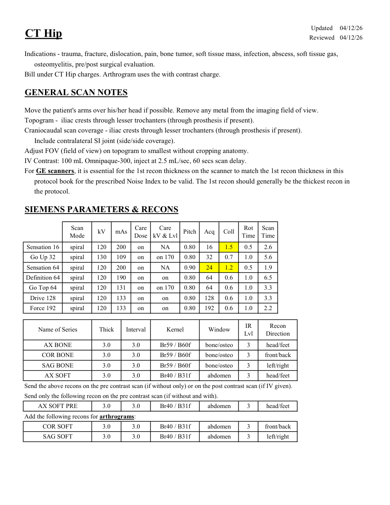
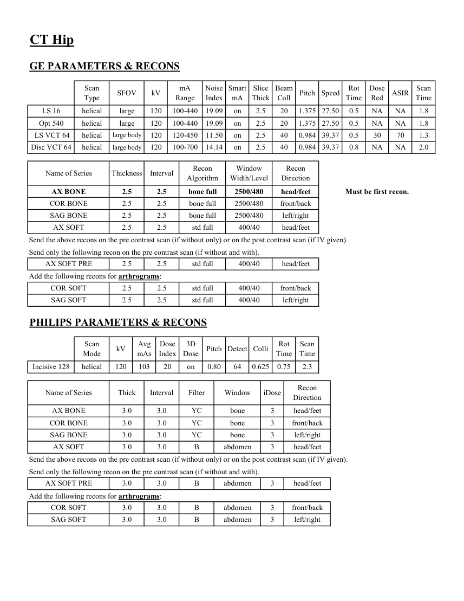

# CT — Șold (MCB)

## Documentul original MCB — Șold

**Protocol · 2 pagini · consultat la 2026-09-27.**

[Descarcă PDF-ul integral](../../assets/mcb-modalities/ct-sold-mcb/document.pdf) · [Sursa MCB](https://ref.mcbradiology.com/Protocols,%20Policies,%20Worksheets%20&%20Forms/CT/Protocols/MSK/7%20Hip.pdf) · [Catalogul MCB pentru această modalitate](../mcb/index.md)

Instrucțiunile, valorile și ilustrațiile din documentul original sunt păstrate în **engleză**. Titlul și navigarea sunt în română.

### Pagina 1

{ loading=lazy }

### Pagina 2

{ loading=lazy }

## Textul documentului original

??? abstract "Pagina 1 — text în engleză"

    
Updated
    04/12/26
    CT Hip
    Reviewed
    04/12/26
    Indications - trauma, fracture, dislocation, pain, bone tumor, soft tissue mass, infection, abscess, soft tissue gas, 
    osteomyelitis, pre/post surgical evaluation.
    Bill under CT Hip charges. Arthrogram uses the with contrast charge.
    GENERAL SCAN NOTES
    Move the patient&#x27;s arms over his/her head if possible. Remove any metal from the imaging field of view.
    Topogram -  iliac crests through lesser trochanters (through prosthesis if present).
    Craniocaudal scan coverage - iliac crests through lesser trochanters (through prosthesis if present).
    Include contralateral SI joint (side/side coverage).
    Adjust FOV (field of view) on topogram to smallest without cropping anatomy.
    IV Contrast: 100 mL Omnipaque-300, inject at 2.5 mL/sec, 60 secs scan delay.
    For GE scanners, it is essential for the 1st recon thickness on the scanner to match the 1st recon thickness in this
    protocol book for the prescribed Noise Index to be valid. The 1st recon should generally be the thickest recon in 
    the protocol.
    SIEMENS PARAMETERS &amp; RECONS
    Scan                           
    Care                                          
    Scan                 
    Pitch
    Acq
    Coll
    Rot 
    Mode
    kV
    mAs
    Care                            
    Dose
    kV &amp; Lvl
    Time
    Time
    Sensation 16
    spiral
    120
    200
    on
    NA
    0.80
    16
    1.5
    0.5
    2.6
    Go Up 32
    spiral
    130
    109
    on
    on 170
    0.80
    32
    0.7
    1.0
    5.6
    Sensation 64
    spiral
    120
    200
    on
    NA
    0.90
    24
    1.2
    0.5
    1.9
    Definition 64
    spiral
    120
    190
    on
    0.80
    64
    0.6
    1.0
    6.5
    on
    Go Top 64
    spiral
    120
    131
    on
    on 170
    0.80
    64
    0.6
    1.0
    3.3
    Drive 128
    spiral
    120
    133
    on
    0.80
    128
    0.6
    1.0
    3.3
    on
    Force 192
    spiral
    120
    133
    on
    on
    0.80
    192
    0.6
    1.0
    2.2
    Recon                     
    Name of Series
    Thick
    Interval
    Kernel
    Window
    IR                       
    Lvl
    Direction
    AX BONE
    3.0
    3.0
    Br59 / B60f
    bone/osteo
    3
    head/feet
    COR BONE
    3.0
    3.0
    Br59 / B60f
    bone/osteo
    3
    front/back
    SAG BONE
    3.0
    3.0
    Br59 / B60f
    bone/osteo
    3
    left/right
    AX SOFT
    3.0
    3.0
    Br40 / B31f
    abdomen
    3
    head/feet
    Send the above recons on the pre contrast scan (if without only) or on the post contrast scan (if IV given).
    Send only the following recon on the pre contrast scan (if without and with).
    AX SOFT PRE
    3.0
    3.0
    Br40 / B31f
    abdomen
    3
    head/feet
    Add the following recons for arthrograms:
    COR SOFT
    3.0
    3.0
    Br40 / B31f
    abdomen
    3
    front/back
    SAG SOFT
    3.0
    3.0
    Br40 / B31f
    abdomen
    3
    left/right
    

??? abstract "Pagina 2 — text în engleză"

    
CT Hip
    GE PARAMETERS &amp; RECONS
    Scan               
    Smart             
    Slice                       
    Beam                                 
    Dose                                          
    Pitch
    Speed
    Rot                                
    Type
    SFOV
    kV
    mA                           
    Range
    Noise                    
    Index
    mA
    Thick
    Coll
    Time
    Red
    ASIR
    Scan                 
    Time
    on
    2.5
    20
    1.375 27.50
    0.5
    LS 16
    helical
    large
    120
    100-440
    19.09
    NA
    NA
    1.8
    Opt 540
    helical
    large
    120
    100-440
    19.09
    on
    2.5
    20
    1.375 27.50
    0.5
    NA
    NA
    1.8
    40
    0.984 39.37
    0.5
    30
    70
     LS VCT 64
    helical
    large body
    120
    120-450
    11.50
    on
    2.5
    1.3
    Disc VCT 64
    helical
    large body
    120
    100-700
    14.14
    on
    2.5
    40
    0.984 39.37
    0.8
    NA
    NA
    2.0
    Window                                   
    Recon 
    Name of Series
    Thickness
    Interval
    Recon                                     
    Algorithm
    Width/Level
    Direction
    AX BONE
    2.5
    2.5
    bone full
    2500/480
    head/feet
    Must be first recon.
    COR BONE
    2.5
    2.5
    bone full
    2500/480
    front/back
    SAG BONE
    2.5
    2.5
    bone full
    2500/480
    left/right
    AX SOFT
    2.5
    2.5
    std full
    400/40
    head/feet
    Send the above recons on the pre contrast scan (if without only) or on the post contrast scan (if IV given).
    Send only the following recon on the pre contrast scan (if without and with).
    AX SOFT PRE
    2.5
    2.5
    std full
    400/40
    head/feet
    Add the following recons for arthrograms:
    COR SOFT
    2.5
    2.5
    std full
    400/40
    front/back
    SAG SOFT
    2.5
    2.5
    std full
    400/40
    left/right
    PHILIPS PARAMETERS &amp; RECONS
    Scan                           
    Dose                                          
    3D            
    Rot 
    Scan                 
    Mode
    kV
    Avg                      
    mAs
    Index
    Dose
    Pitch Detect Colli
    Time
    Time
    Incisive 128
    helical
    120
    103
    20
    on
    0.80
    64
    0.625
    0.75
    2.3
    Name of Series
    Thick
    Interval
    Filter
    Window
    iDose
    Recon                     
    Direction
    AX BONE
    3.0
    3.0
    YC
    bone
    3
    head/feet
    COR BONE
    3.0
    3.0
    YC
    bone
    3
    front/back
    SAG BONE
    3.0
    3.0
    YC
    bone
    3
    left/right
    AX SOFT
    3.0
    3.0
    B
    abdomen
    3
    head/feet
    Send the above recons on the pre contrast scan (if without only) or on the post contrast scan (if IV given).
    Send only the following recon on the pre contrast scan (if without and with).
    head/feet
    AX SOFT PRE
    3.0
    3.0
    B
    abdomen
    3
    Add the following recons for arthrograms:
    COR SOFT
    3.0
    3.0
    B
    abdomen
    3
    front/back
    SAG SOFT
    3.0
    3.0
    B
    abdomen
    3
    left/right
    

