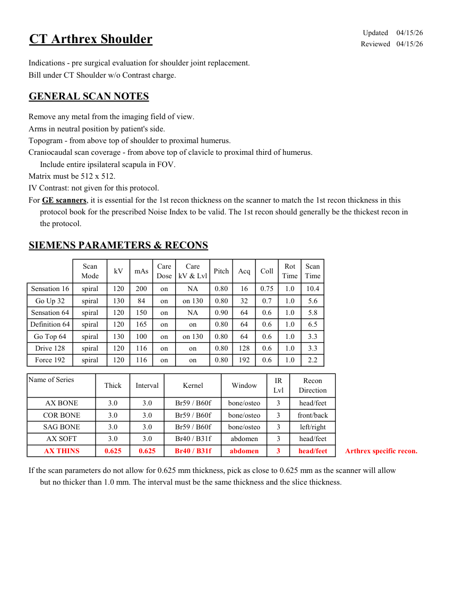
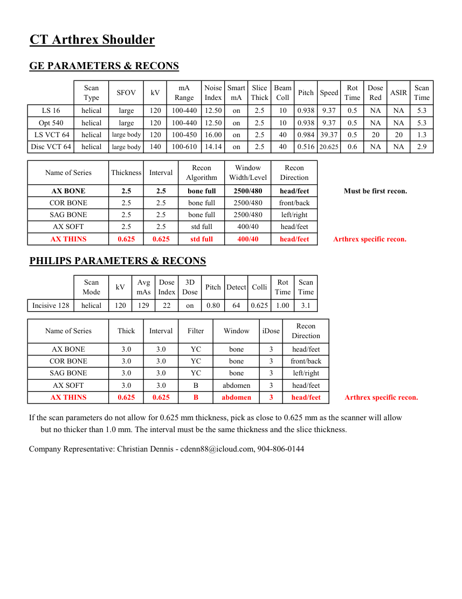
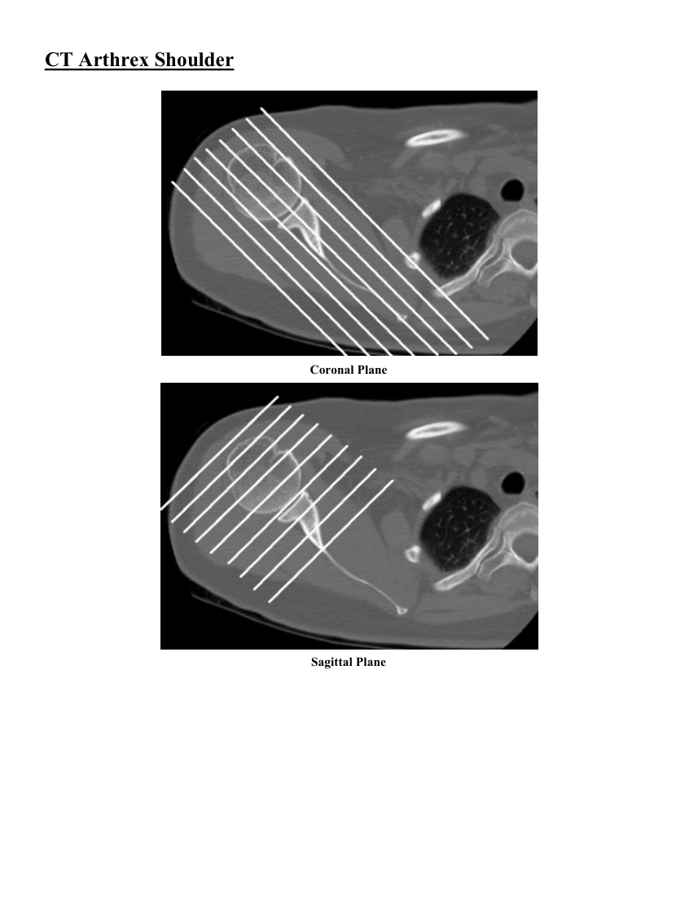

# CT — Umăr Arthrex (MCB)

## Documentul original MCB — Umăr Arthrex

**Protocol · 3 pagini · consultat la 2026-09-27.**

[Descarcă PDF-ul integral](../../assets/mcb-modalities/ct-umar-arthrex-mcb/document.pdf) · [Sursa MCB](https://ref.mcbradiology.com/Protocols,%20Policies,%20Worksheets%20&%20Forms/CT/Protocols/MSK/14%20Arthrex%20Shoulder.pdf) · [Catalogul MCB pentru această modalitate](../mcb/index.md)

Instrucțiunile, valorile și ilustrațiile din documentul original sunt păstrate în **engleză**. Titlul și navigarea sunt în română.

### Pagina 1

{ loading=lazy }

### Pagina 2

{ loading=lazy }

### Pagina 3

{ loading=lazy }

## Textul documentului original

??? abstract "Pagina 1 — text în engleză"

    
Updated
    04/15/26
    CT Arthrex Shoulder
    Reviewed
    04/15/26
    Indications - pre surgical evaluation for shoulder joint replacement.
    Bill under CT Shoulder w/o Contrast charge.
    GENERAL SCAN NOTES
    Remove any metal from the imaging field of view.
    Arms in neutral position by patient&#x27;s side.
    Topogram - from above top of shoulder to proximal humerus.
    Craniocaudal scan coverage - from above top of clavicle to proximal third of humerus.
    Include entire ipsilateral scapula in FOV.
    Matrix must be 512 x 512.
    IV Contrast: not given for this protocol.
    For GE scanners, it is essential for the 1st recon thickness on the scanner to match the 1st recon thickness in this
    protocol book for the prescribed Noise Index to be valid. The 1st recon should generally be the thickest recon in 
    the protocol.
    SIEMENS PARAMETERS &amp; RECONS
    Scan                           
    Care                                          
    Scan                 
    Pitch
    Acq
    Coll
    Rot 
    Mode
    kV
    mAs
    Care                            
    Dose
    kV &amp; Lvl
    Time
    Time
    Sensation 16
    spiral
    120
    200
    on
    NA
    0.80
    16
    0.75
    1.0
    10.4
    Go Up 32
    spiral
    130
    84
    on
    0.80
    32
    0.7
    1.0
    5.6
    on 130
    Sensation 64
    spiral
    120
    150
    on
    NA
    0.90
    64
    0.6
    1.0
    5.8
    Definition 64
    spiral
    120
    165
    on
    0.80
    64
    0.6
    1.0
    6.5
    on
    Go Top 64
    spiral
    130
    100
    on
    on 130
    0.80
    64
    0.6
    1.0
    3.3
    Drive 128
    spiral
    120
    116
    on
    on
    0.80
    128
    0.6
    1.0
    3.3
    Force 192
    spiral
    120
    116
    on
    on
    0.80
    192
    0.6
    1.0
    2.2
    Name of Series
    Recon                     
    Thick
    Interval
    Kernel
    Window
    IR                       
    Lvl
    Direction
    AX BONE
    3.0
    3.0
    Br59 / B60f
    bone/osteo
    3
    head/feet
    COR BONE
    3.0
    3.0
    Br59 / B60f
    bone/osteo
    3
    front/back
    SAG BONE
    3.0
    3.0
    Br59 / B60f
    bone/osteo
    3
    left/right
    AX SOFT
    3.0
    3.0
    Br40 / B31f
    abdomen
    3
    head/feet
    head/feet
    Arthrex specific recon.
    AX THINS
    0.625
    0.625
    Br40 / B31f
    abdomen
    3
    If the scan parameters do not allow for 0.625 mm thickness, pick as close to 0.625 mm as the scanner will allow
    but no thicker than 1.0 mm. The interval must be the same thickness and the slice thickness.
    

??? abstract "Pagina 2 — text în engleză"

    
CT Arthrex Shoulder
    GE PARAMETERS &amp; RECONS
    Scan               
    Smart             
    Slice                       
    Beam                                 
    Dose                                          
    Type
    SFOV
    kV
    mA                           
    Range
    Noise                    
    Index
    mA
    ASIR
    Scan                 
    Thick
    Coll
    Pitch
    Speed
    Rot                                
    Time
    Red
    Time
    LS 16
    helical
    large
    120
    100-440
    12.50
    on
    2.5
    10
    0.938
    9.37
    0.5
    NA
    NA
    5.3
    Opt 540
    helical
    large
    120
    100-440
    12.50
    on
    2.5
    10
    0.938
    9.37
    0.5
    NA
    NA
    5.3
    on
    2.5
    40
    0.984 39.37
    0.5
     LS VCT 64
    helical
    large body
    120
    100-450
    16.00
    20
    20
    1.3
    Disc VCT 64
    helical
    large body
    140
    100-610
    14.14
    on
    2.5
    40
    0.516 20.625
    0.6
    NA
    NA
    2.9
    Window                                   
    Recon 
    Name of Series
    Thickness
    Interval
    Recon                                     
    Algorithm
    Width/Level
    Direction
    AX BONE
    2.5
    2.5
    bone full
    2500/480
    head/feet
    Must be first recon.
    COR BONE
    2.5
    2.5
    bone full
    2500/480
    front/back
    SAG BONE
    2.5
    2.5
    bone full
    2500/480
    left/right
    AX SOFT
    2.5
    2.5
    std full
    400/40
    head/feet
    AX THINS
    0.625
    0.625
    std full
    400/40
    head/feet
    Arthrex specific recon.
    PHILIPS PARAMETERS &amp; RECONS
    Scan                           
    Dose                                          
    3D            
    Rot 
    Scan                 
    Mode
    kV
    Avg                      
    mAs
    Index
    Dose
    Pitch Detect Colli
    Time
    Time
    Incisive 128
    helical
    120
    129
    22
    on
    0.80
    64
    0.625
    1.00
    3.1
    Name of Series
    Thick
    Interval
    Filter
    Window
    iDose
    Recon                     
    Direction
    AX BONE
    3.0
    3.0
    YC
    bone
    3
    head/feet
    COR BONE
    3.0
    3.0
    YC
    bone
    3
    front/back
    SAG BONE
    3.0
    3.0
    YC
    bone
    3
    left/right
    AX SOFT
    3.0
    3.0
    B
    abdomen
    3
    head/feet
    head/feet
    Arthrex specific recon.
    AX THINS
    0.625
    0.625
    B
    abdomen
    3
    If the scan parameters do not allow for 0.625 mm thickness, pick as close to 0.625 mm as the scanner will allow
    but no thicker than 1.0 mm. The interval must be the same thickness and the slice thickness.
    Company Representative: Christian Dennis - cdenn88@icloud.com, 904-806-0144
    

??? abstract "Pagina 3 — text în engleză"

    
CT Arthrex Shoulder
    Coronal Plane
    Sagittal Plane
    

