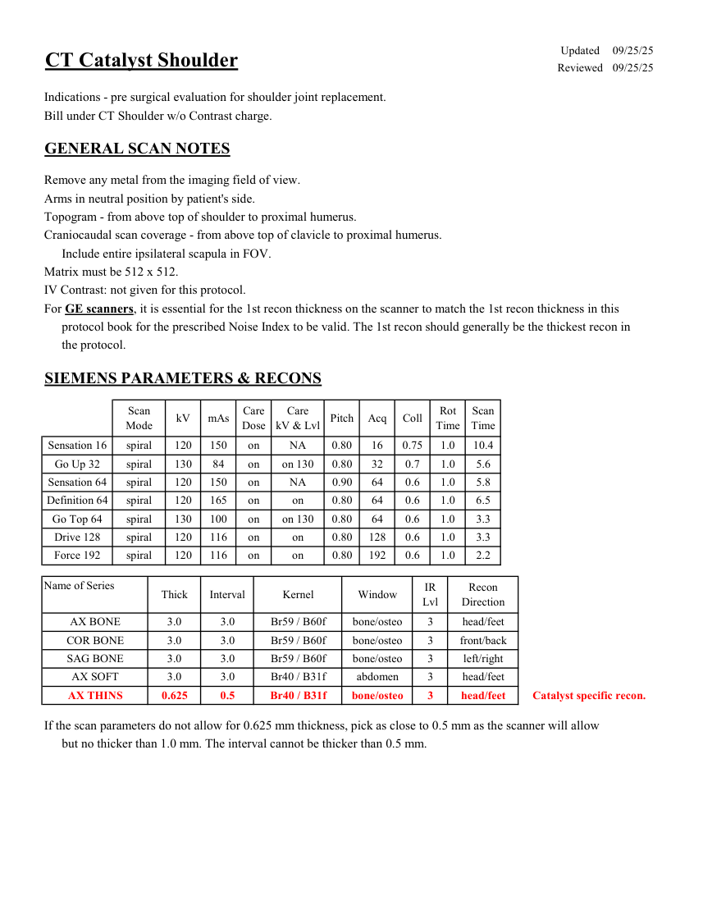
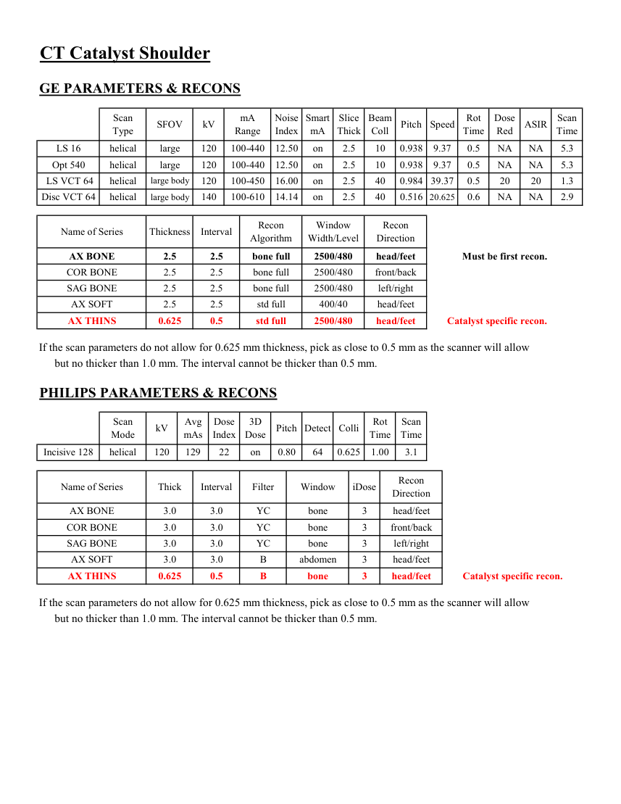
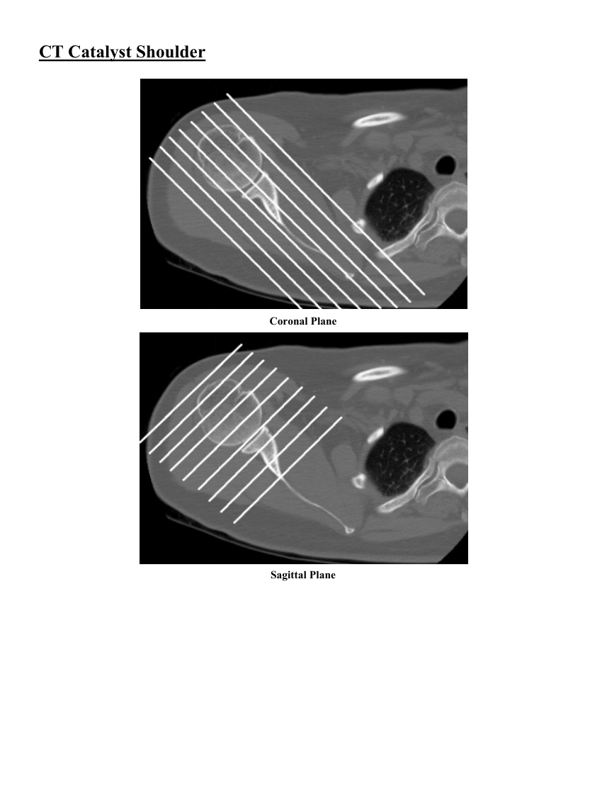
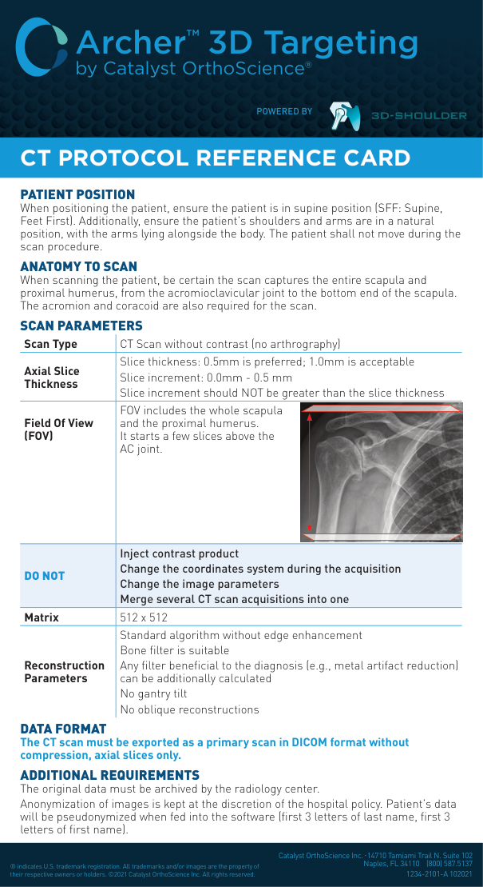

# CT — Umăr Catalyst (MCB)

## Documentul original MCB — Umăr Catalyst

**Protocol · 4 pagini · consultat la 2026-09-27.**

[Descarcă PDF-ul integral](../../assets/mcb-modalities/ct-umar-catalyst-mcb/document.pdf) · [Sursa MCB](https://ref.mcbradiology.com/Protocols,%20Policies,%20Worksheets%20&%20Forms/CT/Protocols/MSK/13%20Catalyst%20Shoulder.pdf) · [Catalogul MCB pentru această modalitate](../mcb/index.md)

Instrucțiunile, valorile și ilustrațiile din documentul original sunt păstrate în **engleză**. Titlul și navigarea sunt în română.

### Pagina 1

{ loading=lazy }

### Pagina 2

{ loading=lazy }

### Pagina 3

{ loading=lazy }

### Pagina 4

{ loading=lazy }

## Textul documentului original

??? abstract "Pagina 1 — text în engleză"

    
Updated
    09/25/25
    CT Catalyst Shoulder
    Reviewed
    09/25/25
    Indications - pre surgical evaluation for shoulder joint replacement.
    Bill under CT Shoulder w/o Contrast charge.
    GENERAL SCAN NOTES
    Remove any metal from the imaging field of view.
    Arms in neutral position by patient&#x27;s side.
    Topogram - from above top of shoulder to proximal humerus.
    Craniocaudal scan coverage - from above top of clavicle to proximal humerus.
    Include entire ipsilateral scapula in FOV.
    Matrix must be 512 x 512.
    IV Contrast: not given for this protocol.
    For GE scanners, it is essential for the 1st recon thickness on the scanner to match the 1st recon thickness in this
    protocol book for the prescribed Noise Index to be valid. The 1st recon should generally be the thickest recon in 
    the protocol.
    SIEMENS PARAMETERS &amp; RECONS
    Scan                           
    Care                                          
    Rot 
    Scan                 
    Coll
    Mode
    kV
    mAs
    Care                            
    Dose
    kV &amp; Lvl
    Pitch
    Acq
    Time
    Time
    Sensation 16
    spiral
    120
    150
    on
    NA
    0.80
    16
    0.75
    1.0
    10.4
    Go Up 32
    spiral
    130
    84
    on
    on 130
    0.80
    32
    0.7
    1.0
    5.6
    Sensation 64
    spiral
    120
    150
    on
    NA
    0.90
    64
    0.6
    1.0
    5.8
    Definition 64
    spiral
    120
    165
    on
    on
    0.80
    64
    0.6
    1.0
    6.5
    Go Top 64
    spiral
    130
    100
    on
    on 130
    0.80
    64
    0.6
    1.0
    3.3
    on
    0.80
    Drive 128
    spiral
    120
    116
    on
    128
    0.6
    1.0
    3.3
    Force 192
    spiral
    120
    116
    on
    on
    0.80
    192
    0.6
    1.0
    2.2
    Name of Series
    IR                       
    Recon                     
    Thick
    Interval
    Kernel
    Window
    Lvl
    Direction
    AX BONE
    3.0
    3.0
    Br59 / B60f
    bone/osteo
    3
    head/feet
    COR BONE
    3.0
    3.0
    Br59 / B60f
    bone/osteo
    3
    front/back
    SAG BONE
    3.0
    3.0
    Br59 / B60f
    bone/osteo
    3
    left/right
    AX SOFT
    head/feet
    3.0
    3.0
    Br40 / B31f
    abdomen
    3
    Catalyst specific recon.
    AX THINS
    0.625
    0.5
    Br40 / B31f
    bone/osteo
    3
    head/feet
    If the scan parameters do not allow for 0.625 mm thickness, pick as close to 0.5 mm as the scanner will allow
    but no thicker than 1.0 mm. The interval cannot be thicker than 0.5 mm.
    

??? abstract "Pagina 2 — text în engleză"

    
CT Catalyst Shoulder
    GE PARAMETERS &amp; RECONS
    Scan               
    Smart             
    Slice                       
    Beam                                 
    Dose                                          
    Pitch
    Speed
    Rot                                
    Type
    SFOV
    kV
    mA                           
    Range
    Noise                    
    Index
    mA
    Thick
    Coll
    Time
    Red
    ASIR
    Scan                 
    Time
    on
    2.5
    10
    0.938
    9.37
    0.5
    LS 16
    helical
    large
    120
    100-440
    12.50
    NA
    NA
    5.3
    Opt 540
    helical
    large
    120
    100-440
    12.50
    on
    2.5
    10
    0.938
    9.37
    0.5
    NA
    NA
    5.3
    40
    0.984 39.37
    0.5
    20
    20
     LS VCT 64
    helical
    large body
    120
    100-450
    16.00
    on
    2.5
    1.3
    Disc VCT 64
    helical
    large body
    140
    100-610
    14.14
    on
    2.5
    40
    0.516 20.625
    0.6
    NA
    NA
    2.9
    Window                                   
    Recon 
    Name of Series
    Thickness
    Interval
    Recon                                     
    Algorithm
    Width/Level
    Direction
    AX BONE
    2.5
    2.5
    bone full
    2500/480
    head/feet
    Must be first recon.
    COR BONE
    2.5
    2.5
    bone full
    2500/480
    front/back
    SAG BONE
    2.5
    2.5
    bone full
    2500/480
    left/right
    AX SOFT
    2.5
    2.5
    std full
    400/40
    head/feet
    AX THINS
    0.625
    0.5
    std full
    2500/480
    head/feet
    Catalyst specific recon.
    If the scan parameters do not allow for 0.625 mm thickness, pick as close to 0.5 mm as the scanner will allow
    but no thicker than 1.0 mm. The interval cannot be thicker than 0.5 mm.
    PHILIPS PARAMETERS &amp; RECONS
    Scan                           
    Dose                                          
    3D            
    Scan                 
    Pitch Detect Colli
    Rot 
    Mode
    kV
    Avg                      
    mAs
    Index
    Dose
    Time
    Time
    Incisive 128
    helical
    120
    129
    22
    on
    0.80
    64
    0.625
    1.00
    3.1
    Recon                     
    Name of Series
    Thick
    Interval
    Filter
    Window
    iDose
    Direction
    AX BONE
    3.0
    3.0
    YC
    bone
    3
    head/feet
    COR BONE
    3.0
    3.0
    YC
    bone
    3
    front/back
    SAG BONE
    3.0
    3.0
    YC
    bone
    3
    left/right
    head/feet
    AX SOFT
    3.0
    3.0
    B
    abdomen
    3
    head/feet
    Catalyst specific recon.
    AX THINS
    0.625
    0.5
    B
    bone
    3
    If the scan parameters do not allow for 0.625 mm thickness, pick as close to 0.5 mm as the scanner will allow
    but no thicker than 1.0 mm. The interval cannot be thicker than 0.5 mm.
    

??? abstract "Pagina 3 — text în engleză"

    
CT Catalyst Shoulder
    Coronal Plane
    Sagittal Plane
    

??? abstract "Pagina 4 — text în engleză"

    
Archer™ 3D Targeting
    by Catalyst OrthoScience®
    POWERED BY
    CT PROTOCOL REFERENCE CARD
    PATIENT POSITION
    When positioning the patient, ensure the patient is in supine position (SFF: Supine, 
    Feet First). Additionally, ensure the patient’s shoulders and arms are in a natural 
    position, with the arms lying alongside the body. The patient shall not move during the 
    scan procedure.
    ANATOMY TO SCAN
    When scanning the patient, be certain the scan captures the entire scapula and 
    proximal humerus, from the acromioclavicular joint to the bottom end of the scapula. 
    The acromion and coracoid are also required for the scan.
    SCAN PARAMETERS
    Scan Type
    CT Scan without contrast (no arthrography)
    Axial Slice 
    Thickness
    Slice thickness: 0.5mm is preferred; 1.0mm is acceptable
    Slice increment: 0.0mm - 0.5 mm
    Slice increment should NOT be greater than the slice thickness
    Field Of View 
    (FOV)
    FOV includes the whole scapula  
    and the proximal humerus.  
    It starts a few slices above the  
    AC joint.
    DO NOT
    Inject contrast product
    Change the coordinates system during the acquisition
    Change the image parameters
    Merge several CT scan acquisitions into one
    Matrix
    512 x 512
    Reconstruction 
    Parameters
    Standard algorithm without edge enhancement
    Bone filter is suitable
    Any filter beneficial to the diagnosis (e.g., metal artifact reduction) 
    can be additionally calculated
    No gantry tilt
    No oblique reconstructions
    DATA FORMAT
    The CT scan must be exported as a primary scan in DICOM format without 
    compression, axial slices only.
    ADDITIONAL REQUIREMENTS
    The original data must be archived by the radiology center.
    Anonymization of images is kept at the discretion of the hospital policy. Patient’s data 
    will be pseudonymized when fed into the software (first 3 letters of last name, first 3 
    letters of first name).
    ® indicates U.S. trademark registration. All trademarks and/or images are the property of 
    their respective owners or holders. ©2021 Catalyst OrthoScience Inc. All rights reserved.
    Catalyst OrthoScience Inc. • 14710 Tamiami Trail N. Suite 102
    Naples, FL 34110    (800) 587.5137
     
    1234-2101-A 102021 
    

