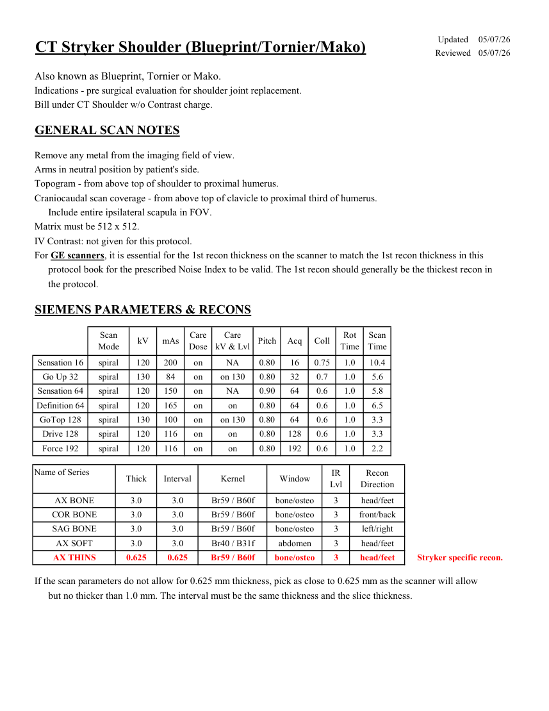
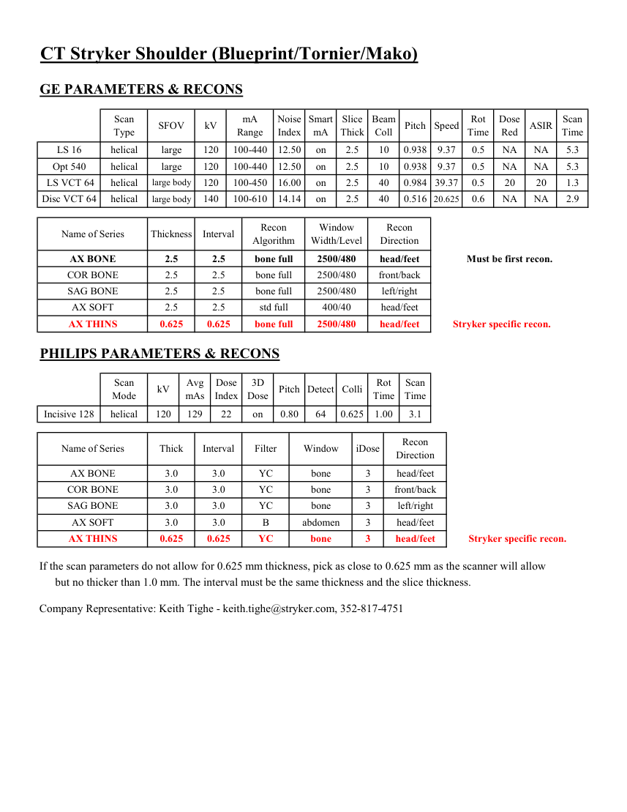
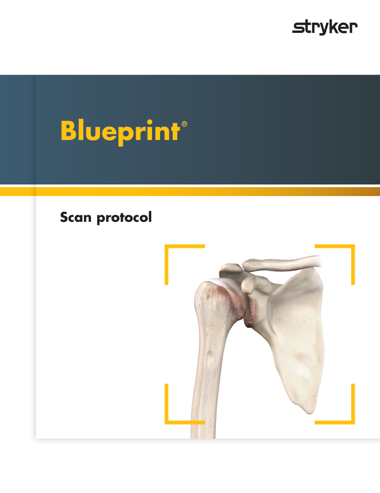
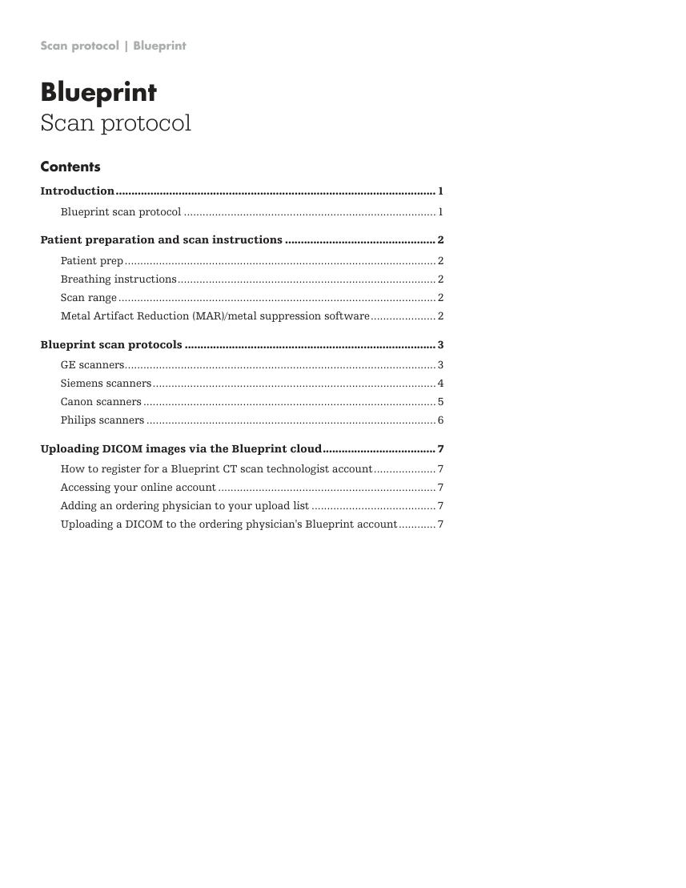
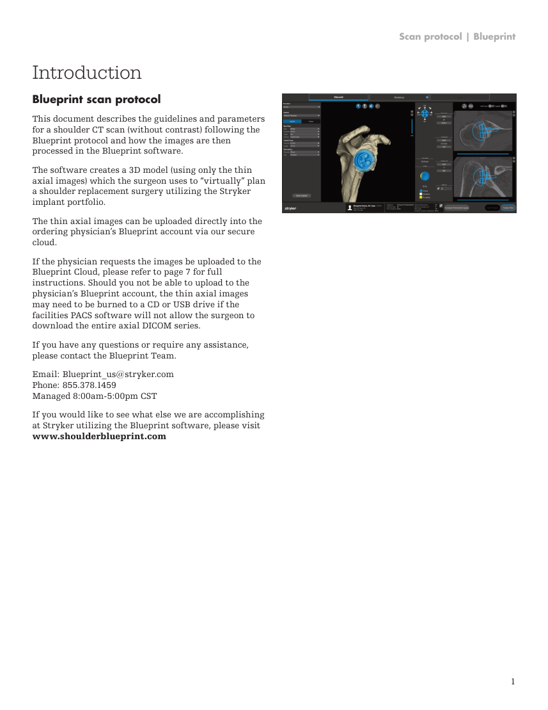
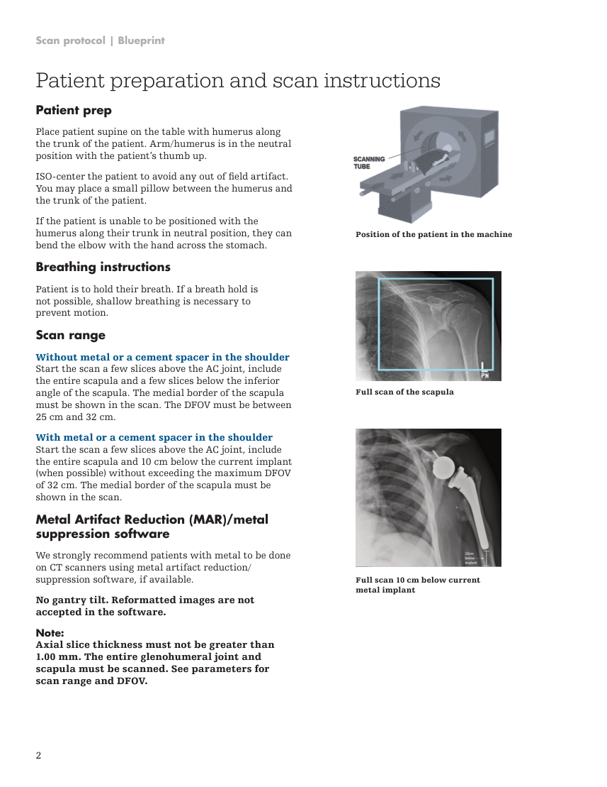
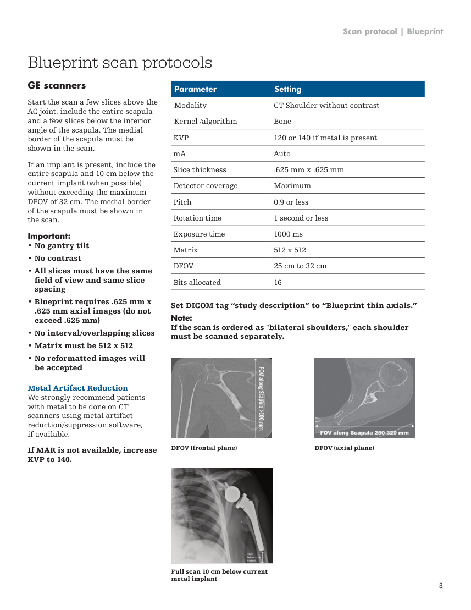
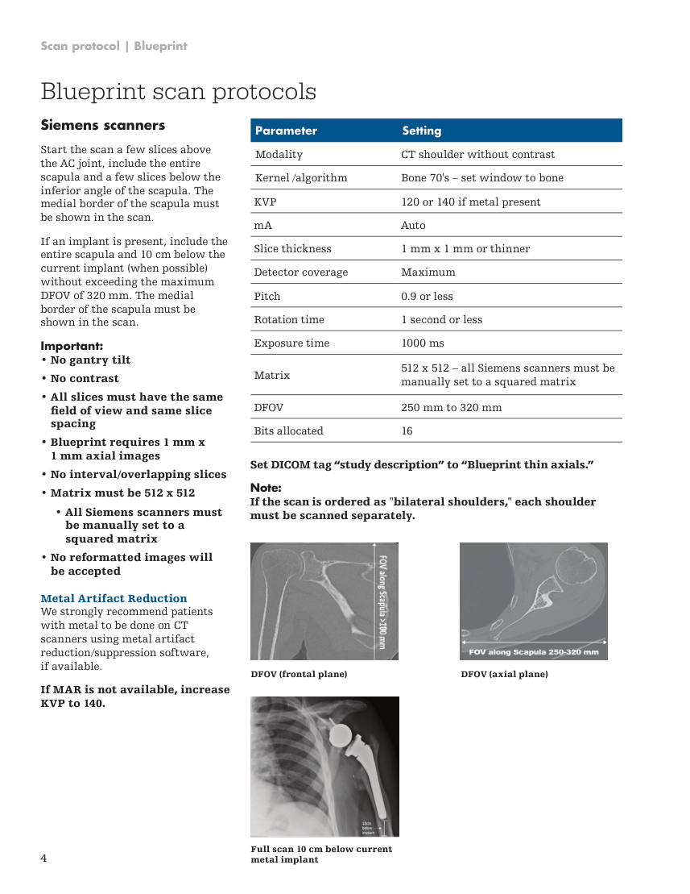
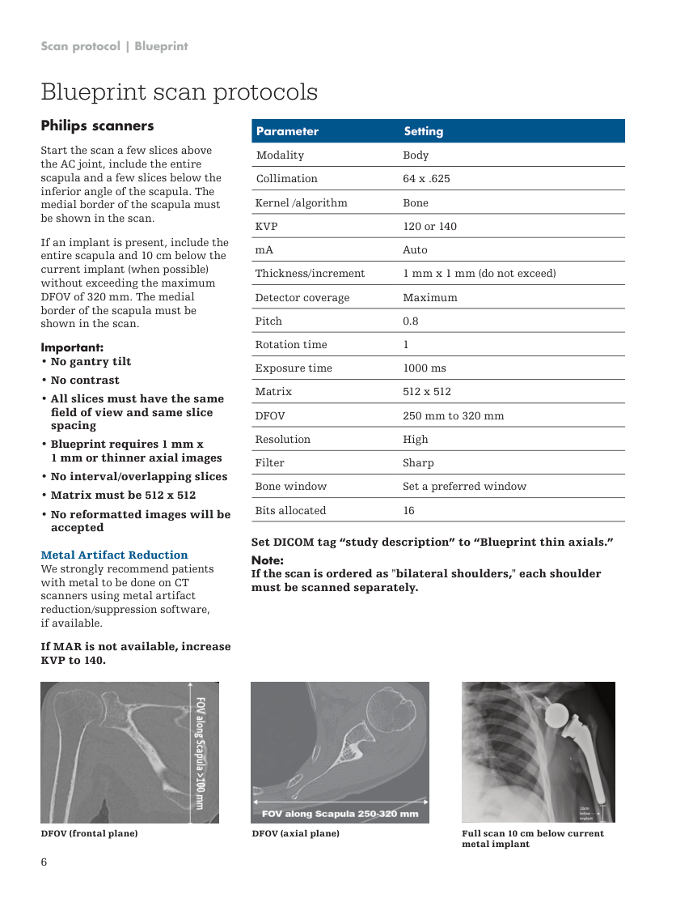
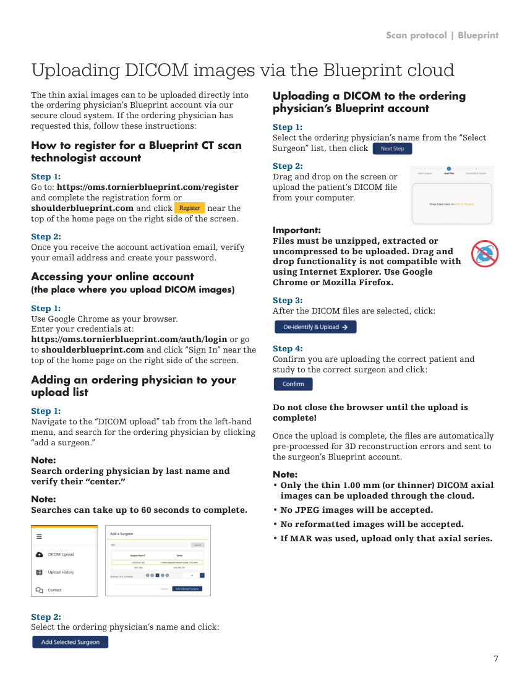

# CT — Umăr Stryker (MCB)

## Documentul original MCB — Umăr Stryker

**Protocol · 11 pagini · consultat la 2026-09-27.**

[Descarcă PDF-ul integral](../../assets/mcb-modalities/ct-umar-stryker-mcb/document.pdf) · [Sursa MCB](https://ref.mcbradiology.com/Protocols,%20Policies,%20Worksheets%20&%20Forms/CT/Protocols/MSK/15%20Stryker%20Shoulder.pdf) · [Catalogul MCB pentru această modalitate](../mcb/index.md)

Instrucțiunile, valorile și ilustrațiile din documentul original sunt păstrate în **engleză**. Titlul și navigarea sunt în română.

### Pagina 1

{ loading=lazy }

### Pagina 2

{ loading=lazy }

### Pagina 3

{ loading=lazy }

### Pagina 4

{ loading=lazy }

### Pagina 5

{ loading=lazy }

### Pagina 6

{ loading=lazy }

### Pagina 7

{ loading=lazy }

### Pagina 8

{ loading=lazy }

### Pagina 9

{ loading=lazy }

### Pagina 10

{ loading=lazy }

### Pagina 11

{ loading=lazy }

## Textul documentului original

??? abstract "Pagina 1 — text în engleză"

    
Updated
    05/07/26
    CT Stryker Shoulder (Blueprint/Tornier/Mako)
    Reviewed
    05/07/26
    Also known as Blueprint, Tornier or Mako.
    Indications - pre surgical evaluation for shoulder joint replacement.
    Bill under CT Shoulder w/o Contrast charge.
    GENERAL SCAN NOTES
    Remove any metal from the imaging field of view.
    Arms in neutral position by patient&#x27;s side.
    Topogram - from above top of shoulder to proximal humerus.
    Craniocaudal scan coverage - from above top of clavicle to proximal third of humerus.
    Include entire ipsilateral scapula in FOV.
    Matrix must be 512 x 512.
    IV Contrast: not given for this protocol.
    For GE scanners, it is essential for the 1st recon thickness on the scanner to match the 1st recon thickness in this
    protocol book for the prescribed Noise Index to be valid. The 1st recon should generally be the thickest recon in 
    the protocol.
    SIEMENS PARAMETERS &amp; RECONS
    Scan                           
    Care                                          
    Scan                 
    Pitch
    Acq
    Coll
    Rot 
    Mode
    kV
    mAs
    Care                            
    Dose
    kV &amp; Lvl
    Time
    Time
    Sensation 16
    spiral
    120
    200
    on
    NA
    0.80
    16
    0.75
    1.0
    10.4
    Go Up 32
    spiral
    130
    84
    on
    0.80
    32
    0.7
    1.0
    5.6
    on 130
    Sensation 64
    spiral
    120
    150
    on
    NA
    0.90
    64
    0.6
    1.0
    5.8
    Definition 64
    spiral
    120
    165
    on
    0.80
    64
    0.6
    1.0
    6.5
    on
    GoTop 128
    spiral
    130
    100
    on
    on 130
    0.80
    64
    0.6
    1.0
    3.3
    Drive 128
    spiral
    120
    116
    on
    on
    0.80
    128
    0.6
    1.0
    3.3
    Force 192
    spiral
    120
    116
    on
    on
    0.80
    192
    0.6
    1.0
    2.2
    Name of Series
    Recon                     
    Thick
    Interval
    Kernel
    Window
    IR                       
    Lvl
    Direction
    AX BONE
    3.0
    3.0
    Br59 / B60f
    bone/osteo
    3
    head/feet
    COR BONE
    3.0
    3.0
    Br59 / B60f
    bone/osteo
    3
    front/back
    SAG BONE
    3.0
    3.0
    Br59 / B60f
    bone/osteo
    3
    left/right
    AX SOFT
    3.0
    3.0
    Br40 / B31f
    abdomen
    3
    head/feet
    Stryker specific recon.
    AX THINS
    0.625
    0.625
    Br59 / B60f
    bone/osteo
    3
    head/feet
    If the scan parameters do not allow for 0.625 mm thickness, pick as close to 0.625 mm as the scanner will allow
    but no thicker than 1.0 mm. The interval must be the same thickness and the slice thickness.
    

??? abstract "Pagina 2 — text în engleză"

    
CT Stryker Shoulder (Blueprint/Tornier/Mako)
    GE PARAMETERS &amp; RECONS
    Scan               
    Smart             
    Slice                       
    Beam                                 
    Dose                                          
    Type
    SFOV
    kV
    mA                           
    Range
    Noise                    
    Index
    mA
    ASIR
    Scan                 
    Thick
    Coll
    Pitch
    Speed
    Rot                                
    Time
    Red
    Time
    10
    0.938
    9.37
    0.5
    NA
    NA
    LS 16
    helical
    large
    120
    100-440
    12.50
    on
    2.5
    5.3
    Opt 540
    helical
    large
    120
    100-440
    12.50
    on
    2.5
    10
    0.938
    9.37
    0.5
    NA
    NA
    5.3
    on
    2.5
    40
    0.984 39.37
    0.5
     LS VCT 64
    helical
    large body
    120
    100-450
    16.00
    20
    20
    1.3
    Disc VCT 64
    helical
    large body
    140
    100-610
    14.14
    on
    2.5
    40
    0.516
    NA
    20.625
    0.6
    NA
    2.9
    Window                                   
    Recon 
    Name of Series
    Thickness
    Interval
    Recon                                     
    Algorithm
    Width/Level
    Direction
    AX BONE
    2.5
    2.5
    bone full
    2500/480
    head/feet
    Must be first recon.
    COR BONE
    2.5
    2.5
    bone full
    2500/480
    front/back
    SAG BONE
    2.5
    2.5
    bone full
    2500/480
    left/right
    AX SOFT
    2.5
    2.5
    std full
    400/40
    head/feet
    AX THINS
    0.625
    0.625
    bone full
    2500/480
    head/feet
    Stryker specific recon.
    PHILIPS PARAMETERS &amp; RECONS
    Scan                           
    Dose                                          
    3D            
    Rot 
    Scan                 
    Mode
    kV
    Avg                      
    mAs
    Index
    Dose
    Pitch Detect Colli
    Time
    Time
    Incisive 128
    helical
    120
    129
    22
    on
    0.80
    64
    0.625
    1.00
    3.1
    Name of Series
    Thick
    Interval
    Filter
    Window
    iDose
    Recon                     
    Direction
    AX BONE
    3.0
    3.0
    YC
    bone
    3
    head/feet
    COR BONE
    3.0
    3.0
    YC
    bone
    3
    front/back
    SAG BONE
    3.0
    3.0
    YC
    bone
    3
    left/right
    AX SOFT
    3.0
    3.0
    B
    abdomen
    3
    head/feet
    head/feet
    Stryker specific recon.
    AX THINS
    0.625
    0.625
    YC
    bone
    3
    If the scan parameters do not allow for 0.625 mm thickness, pick as close to 0.625 mm as the scanner will allow
    but no thicker than 1.0 mm. The interval must be the same thickness and the slice thickness.
    Company Representative: Keith Tighe - keith.tighe@stryker.com, 352-817-4751
    

??? abstract "Pagina 3 — text în engleză"

    
®
    Blueprint
    Scan protocol
    

??? abstract "Pagina 4 — text în engleză"

    
Scan protocol | Blueprint
    Blueprint 
    Scan protocol
    Contents
    Introduction.
    ...................................................................................................... 1
    Blueprint scan protocol..................................................................................1
    Patient preparation and scan instructions................................................. 2
    Patient prep.
    ....................................................................................................2
    Breathing instructions.
    ...................................................................................2
    Scan range.......................................................................................................2
    Metal Artifact Reduction (MAR)/metal suppression software.
    ..................... 2
    Blueprint scan protocols................................................................................. 3
    GE scanners.
    ....................................................................................................3
    Siemens scanners.
    ...........................................................................................4
    Canon scanners...............................................................................................5
    Philips scanners..............................................................................................6
    Uploading DICOM images via the Blueprint cloud.
    .................................... 7
    How to register for a Blueprint CT scan technologist account.
    .................... 7
    Accessing your online account.......................................................................7
    Adding an ordering physician to your upload list......................................... 7
    Uploading a DICOM to the ordering physician&#x27;s Blueprint account.
    ............ 7
    

??? abstract "Pagina 5 — text în engleză"

    
Scan protocol | Blueprint
    Introduction
    Blueprint scan protocol 
    This document describes the guidelines and parameters 
    for a shoulder CT scan (without contrast) following the 
    Blueprint protocol and how the images are then 
    processed in the Blueprint software. 
    The software creates a 3D model (using only the thin 
    axial images) which the surgeon uses to “virtually” plan 
    a shoulder replacement surgery utilizing the Stryker 
    implant portfolio. 
    The thin axial images can be uploaded directly into the 
    ordering physician’s Blueprint account via our secure 
    cloud. 
    If the physician requests the images be uploaded to the 
    Blueprint Cloud, please refer to page 7 for full 
    instructions. Should you not be able to upload to the 
    physician’s Blueprint account, the thin axial images 
    may need to be burned to a CD or USB drive if the 
    facilities PACS software will not allow the surgeon to 
    download the entire axial DICOM series. 
    If you have any questions or require any assistance, 
    please contact the Blueprint Team. 
    Email: Blueprint_us@stryker.com 
    Phone: 855.378.1459 
    Managed 8:00am-5:00pm CST 
    If you would like to see what else we are accomplishing 
    at Stryker utilizing the Blueprint software, please visit 
    www.shoulderblueprint.com 
    1
    

??? abstract "Pagina 6 — text în engleză"

    
Scan protocol | Blueprint
    Patient preparation and scan instructions
    Patient prep 
    Place patient supine on the table with humerus along 
    the trunk of the patient. Arm/humerus is in the neutral 
    position with the patient’s thumb up. 
    ISO-center the patient to avoid any out of field artifact. 
    You may place a small pillow between the humerus and 
    the trunk of the patient. 
    Position of the patient in the machine
    If the patient is unable to be positioned with the 
    humerus along their trunk in neutral position, they can 
    bend the elbow with the hand across the stomach. 
    Breathing instructions 
    Patient is to hold their breath. If a breath hold is 
    not possible, shallow breathing is necessary to 
    prevent motion. 
    Scan range 
    Full scan of the scapula
    Without metal or a cement spacer in the shoulder 
    Start the scan a few slices above the AC joint, include 
    the entire scapula and a few slices below the inferior 
    angle of the scapula. The medial border of the scapula 
    must be shown in the scan. The DFOV must be between 
    25 cm and 32 cm. 
    With metal or a cement spacer in the shoulder 
    Start the scan a few slices above the AC joint, include 
    the entire scapula and 10 cm below the current implant 
    (when possible) without exceeding the maximum DFOV 
    of 32 cm. The medial border of the scapula must be 
    shown in the scan. 
    Metal Artifact Reduction (MAR)/metal 
    suppression software 
    We strongly recommend patients with metal to be done 
    on CT scanners using metal artifact reduction/ 
    suppression software, if available. 
    Full scan 10 cm below current 
    metal implant
    No gantry tilt. Reformatted images are not 
    accepted in the software. 
    Note: 
    Axial slice thickness must not be greater than 
    1.00 mm. The entire glenohumeral joint and 
    scapula must be scanned. See parameters for 
    scan range and DFOV. 
    2
    

??? abstract "Pagina 7 — text în engleză"

    
Scan protocol | Blueprint
    Blueprint scan protocols
    GE scanners 
    Parameter
    Setting
    Modality
    CT Shoulder without contrast
    Kernel /algorithm
    Bone
    KVP
    120 or 140 if metal is present
    Start the scan a few slices above the 
    AC joint, include the entire scapula 
    and a few slices below the inferior 
    angle of the scapula. The medial 
    border of the scapula must be 
    shown in the scan. 
    mA
    Auto
    Slice thickness
    .625 mm x .625 mm
    Detector coverage
    Maximum
    Pitch
    0.9 or less
    Rotation time
    1 second or less
    If an implant is present, include the 
    entire scapula and 10 cm below the 
    current implant (when possible) 
    without exceeding the maximum 
    DFOV of 32 cm. The medial border 
    of the scapula must be shown in 
    the scan. 
    Exposure time
    1000 ms
    Important: 
    • No gantry tilt 
    Matrix
    512 x 512
    • No contrast 
    DFOV
    25 cm to 32 cm
    • All slices must have the same 
    Bits allocated
    16
    field of view and same slice 
    spacing 
    • Blueprint requires .625 mm x 
    Set DICOM tag “study description” to “Blueprint thin axials.”
    .625 mm axial images (do not 
    exceed .625 mm) 
    • No interval/overlapping slices 
    Note:
    If the scan is ordered as &quot;bilateral shoulders,&quot; each shoulder 
    must be scanned separately.
    • Matrix must be 512 x 512 
    • No reformatted images will 
    be accepted 
    Metal Artifact Reduction 
    We strongly recommend patients 
    with metal to be done on CT 
    scanners using metal artifact 
    reduction/suppression software, 
    if available. 
    DFOV (frontal plane)
    DFOV (axial plane)
    If MAR is not available, increase 
    KVP to 140. 
    Full scan 10 cm below current 
    metal implant
    3
    

??? abstract "Pagina 8 — text în engleză"

    
Scan protocol | Blueprint
    Blueprint scan protocols
    Siemens scanners 
    Parameter
    Setting
    Modality
    CT shoulder without contrast
    Kernel /algorithm
    Bone 70&#x27;s – set window to bone
    KVP
    120 or 140 if metal present
    Start the scan a few slices above 
    the AC joint, include the entire 
    scapula and a few slices below the 
    inferior angle of the scapula. The 
    medial border of the scapula must 
    be shown in the scan. 
    mA
    Auto
    Slice thickness
    1 mm x 1 mm or thinner
    Detector coverage
    Maximum
    Pitch
    0.9 or less
    Rotation time
    1 second or less
    If an implant is present, include the 
    entire scapula and 10 cm below the 
    current implant (when possible) 
    without exceeding the maximum 
    DFOV of 320 mm. The medial 
    border of the scapula must be 
    shown in the scan. 
    Exposure time
    1000 ms
    Important: 
    • No gantry tilt 
    • No contrast 
    Matrix
    512 x 512 – all Siemens scanners must be 
    manually set to a squared matrix 
    • All slices must have the same 
    DFOV
    250 mm to 320 mm
    field of view and same slice 
    spacing 
    Bits allocated
    16
    • Blueprint requires 1 mm x 
    1 mm axial images 
    Set DICOM tag “study description” to “Blueprint thin axials.”
    • No interval/overlapping slices 
    • Matrix must be 512 x 512 
    • All Siemens scanners must 
    Note: 
    If the scan is ordered as &quot;bilateral shoulders,&quot; each shoulder 
    must be scanned separately.
    be manually set to a 
    squared matrix 
    • No reformatted images will 
    be accepted 
    Metal Artifact Reduction 
    We strongly recommend patients 
    with metal to be done on CT 
    scanners using metal artifact 
    reduction/suppression software, 
    if available. 
    DFOV (frontal plane)
    DFOV (axial plane)
    If MAR is not available, increase 
    KVP to 140. 
    4
    Full scan 10 cm below current 
    metal implant
    

??? abstract "Pagina 9 — text în engleză"

    
Scan protocol | Blueprint
    Blueprint scan protocols
    Canon scanners 
    Parameter
    Setting
    Modality
    CT Shoulder without contrast
    Kernel /algorithm
    Bone Standard
    KVP
    120/130 – 135/140 
    (depending on your scanner)
    Start the scan a few slices above 
    the AC joint, include the entire 
    scapula and a few slices below the 
    inferior angle of the scapula. The 
    medial border of the scapula must 
    be shown in the scan. 
    mA
    Auto
    Slice thickness
    1 mm x 1 mm (do not exceed)
    Detector coverage
    Maximum
    If an implant is present, include the 
    entire scapula and 10 cm below the 
    current implant (when possible) 
    without exceeding the maximum 
    DFOV of 320 mm. The medial 
    border of the scapula must be 
    shown in the scan. 
    Pitch
    0.9 or less
    Rotation time
    1 second or less
    Important: 
    • No gantry tilt 
    Exposure time
    1000 ms
    • No contrast 
    • All slices must have the same 
    Matrix
    512 x 512
    field of view and same slice 
    spacing 
    DFOV
    250 mm to 320 mm
    • Blueprint requires 1 mm x 
    Bits allocated
    16
    1 mm axial images (do not 
    exceed 1 mm x 1 mm) 
    Set DICOM tag “study description” to “Blueprint thin axials.”
    • No interval/overlapping slices 
    • Matrix must be 512 x 512 
    Note:
    If the scan is ordered as &quot;bilateral shoulders,&quot; each shoulder 
    must be scanned separately.
    • Standard bone volumes are 
    required 
    • No reformatted images will be 
    accepted 
    • Only standard bone volumes 
    are utilized for Blueprint 
    scans 
    DFOV (frontal plane)
    DFOV (axial plane)
    Metal Artifact Reduction 
    We strongly recommend patients 
    with metal to be done on CT 
    scanners using metal artifact 
    reduction/suppression software, if 
    available. 
    If MAR is not available, increase 
    KVP to 140. 
    5
    Full scan 10 cm below current 
    metal implant
    

??? abstract "Pagina 10 — text în engleză"

    
Scan protocol | Blueprint
    Blueprint scan protocols
    Philips scanners 
    Parameter
    Setting
    Modality
    Body
    Collimation
    64 x .625
    Kernel /algorithm
    Bone
    Start the scan a few slices above 
    the AC joint, include the entire 
    scapula and a few slices below the 
    inferior angle of the scapula. The 
    medial border of the scapula must 
    be shown in the scan. 
    KVP
    120 or 140
    mA
    Auto
    Thickness/increment
    1 mm x 1 mm (do not exceed)
    Detector coverage
    Maximum
    Pitch
    0.8
    If an implant is present, include the 
    entire scapula and 10 cm below the 
    current implant (when possible) 
    without exceeding the maximum 
    DFOV of 320 mm. The medial 
    border of the scapula must be 
    shown in the scan. 
    Rotation time
    1
    Important: 
    • No gantry tilt 
    Exposure time
    1000 ms
    • No contrast 
    Matrix
    512 x 512
    • All slices must have the same 
    DFOV
    250 mm to 320 mm
    field of view and same slice 
    spacing 
    Resolution
    High
    • Blueprint requires 1 mm x 
    1 mm or thinner axial images
    Filter
    Sharp
    • No interval/overlapping slices 
    Bone window
    Set a preferred window
    • Matrix must be 512 x 512 
    Bits allocated
    16
    • No reformatted images will be 
    accepted 
    Set DICOM tag “study description” to “Blueprint thin axials.”
    Note: 
    If the scan is ordered as &quot;bilateral shoulders,&quot; each shoulder 
    must be scanned separately.
    Metal Artifact Reduction 
    We strongly recommend patients 
    with metal to be done on CT 
    scanners using metal artifact 
    reduction/suppression software, 
    if available. 
    If MAR is not available, increase 
    KVP to 140. 
    DFOV (frontal plane)
    DFOV (axial plane)
    Full scan 10 cm below current 
    metal implant
    6
    

??? abstract "Pagina 11 — text în engleză"

    
Scan protocol | Blueprint
    Uploading DICOM images via the Blueprint cloud
    Uploading a DICOM to the ordering 
    physician’
    s Blueprint account 
    The thin axial images can to be uploaded directly into 
    the ordering physician’s Blueprint account via our 
    secure cloud system. If the ordering physician has 
    requested this, follow these instructions: 
    Step 1: 
    Select the ordering physician’s name from the “Select 
    Surgeon” list, then click 
    How to register for a Blueprint CT scan 
    technologist account 
    Step 2: 
    Drag and drop on the screen or 
    upload the patient’s DICOM file 
    from your computer. 
    Step 1: 
    Go to: https://oms.tornierblueprint.com/register 
    and complete the registration form or 
    shoulderblueprint.com and click 
     near the 
    top of the home page on the right side of the screen. 
    Step 2: 
    Once you receive the account activation email, verify 
    your email address and create your password. 
    Important: 
    Files must be unzipped, extracted or 
    uncompressed to be uploaded. Drag and 
    drop functionality is not compatible with 
    using Internet Explorer. Use Google 
    Chrome or Mozilla Firefox. 
    Accessing your online account 
    (the place where you upload DICOM images) 
    Step 3: 
    After the DICOM files are selected, click: 
    Step 1: 
    Use Google Chrome as your browser. 
    Enter your credentials at: 
    https://oms.tornierblueprint.com/auth/login or go 
    to shoulderblueprint.com and click “Sign In” near the 
    top of the home page on the right side of the screen. 
    Step 4: 
    Confirm you are uploading the correct patient and 
    study to the correct surgeon and click: 
    Adding an ordering physician to your 
    upload list 
    Do not close the browser until the upload is 
    complete! 
    Step 1: 
    Navigate to the “DICOM upload” tab from the left-hand 
    menu, and search for the ordering physician by clicking 
    “add a surgeon.” 
    Once the upload is complete, the files are automatically 
    pre-processed for 3D reconstruction errors and sent to 
    the surgeon’s Blueprint account. 
    Note: 
    Search ordering physician by last name and 
    verify their “center.” 
    Note: 
    • Only the thin 1.00 mm (or thinner) DICOM axial 
    images can be uploaded through the cloud. 
    Note: 
    Searches can take up to 60 seconds to complete. 
    • No JPEG images will be accepted. 
    • No reformatted images will be accepted. 
    • If MAR was used, upload only that axial series.
    Step 2: 
    Select the ordering physician’s name and click: 
    7
    

