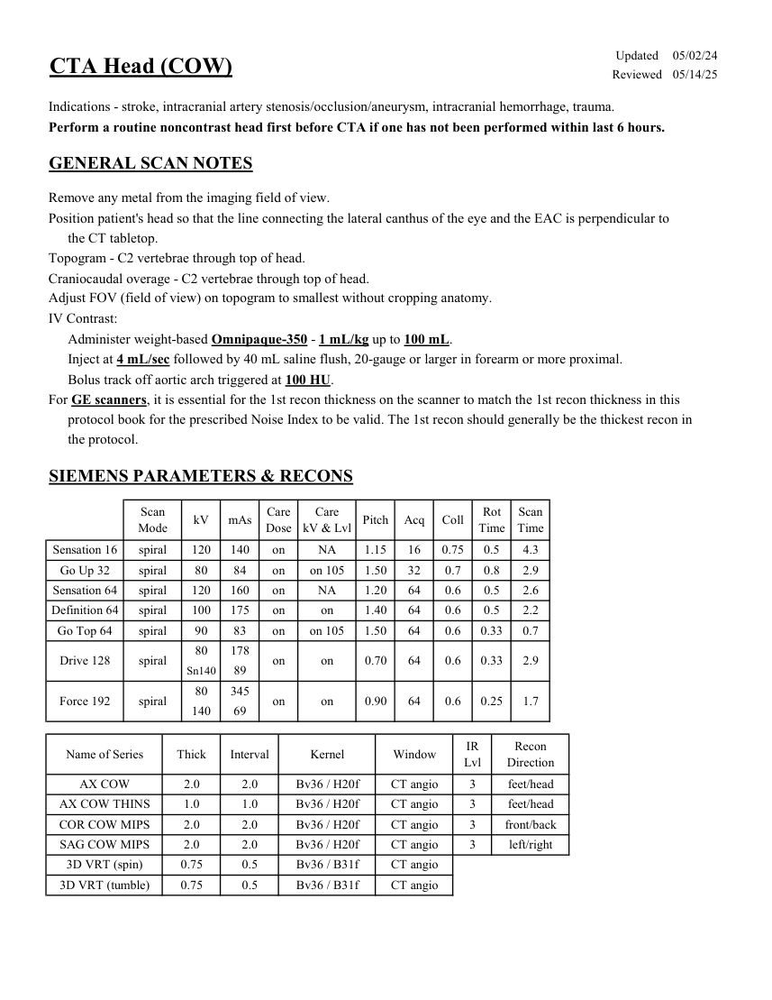
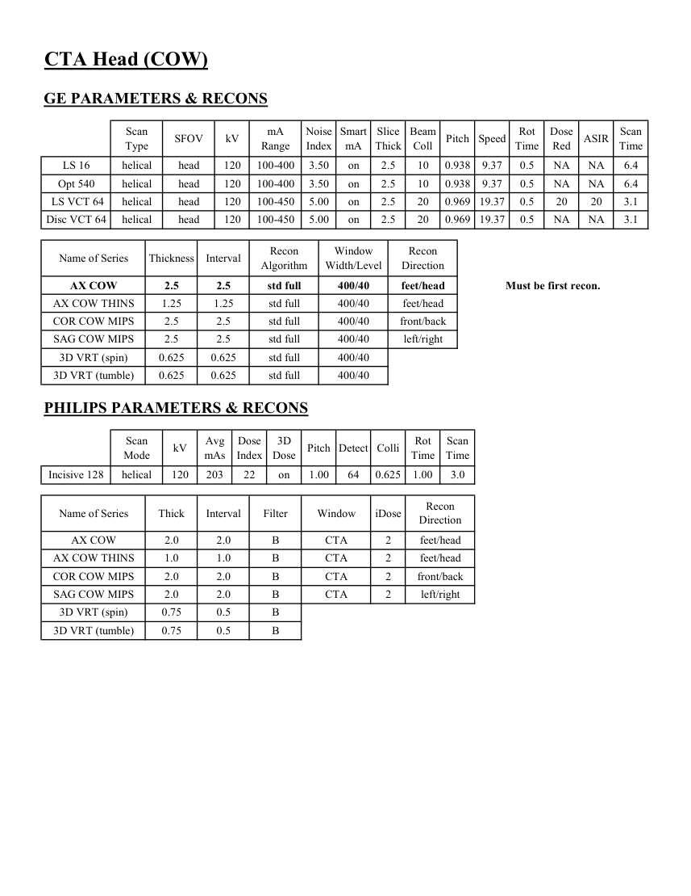

# CT — Angio-CT cerebral (MCB)

## Documentul original MCB — Angio-CT cerebral

**Protocol · 2 pagini · consultat la 2026-09-27.**

[Descarcă PDF-ul integral](../../assets/mcb-modalities/ct-angio-ct-cerebral-mcb/document.pdf) · [Sursa MCB](https://ref.mcbradiology.com/Protocols,%20Policies,%20Worksheets%20&%20Forms/CT/Protocols/Neuro/3%20CTA%20Head.pdf) · [Catalogul MCB pentru această modalitate](../mcb/index.md)

Instrucțiunile, valorile și ilustrațiile din documentul original sunt păstrate în **engleză**. Titlul și navigarea sunt în română.

### Pagina 1

{ loading=lazy }

### Pagina 2

{ loading=lazy }

## Textul documentului original

??? abstract "Pagina 1 — text în engleză"

    
Updated
    05/02/24
    CTA Head (COW)
    Reviewed
    05/14/25
    Indications - stroke, intracranial artery stenosis/occlusion/aneurysm, intracranial hemorrhage, trauma.
    Perform a routine noncontrast head first before CTA if one has not been performed within last 6 hours.
    GENERAL SCAN NOTES
    Remove any metal from the imaging field of view.
    Position patient&#x27;s head so that the line connecting the lateral canthus of the eye and the EAC is perpendicular to 
    the CT tabletop.
    Topogram - C2 vertebrae through top of head.
    Craniocaudal overage - C2 vertebrae through top of head.
    Adjust FOV (field of view) on topogram to smallest without cropping anatomy.
    IV Contrast:
    Administer weight-based Omnipaque-350 - 1 mL/kg up to 100 mL.
    Inject at 4 mL/sec followed by 40 mL saline flush, 20-gauge or larger in forearm or more proximal.
    Bolus track off aortic arch triggered at 100 HU.
    For GE scanners, it is essential for the 1st recon thickness on the scanner to match the 1st recon thickness in this
    protocol book for the prescribed Noise Index to be valid. The 1st recon should generally be the thickest recon in 
    the protocol.
    SIEMENS PARAMETERS &amp; RECONS
    Scan                           
    Care                                          
    Scan                 
    kV
    mAs
    Care                            
    Mode
    Dose
    kV &amp; Lvl
    Pitch
    Acq
    Coll
    Rot 
    Time
    Time
    Sensation 16
    120
    140
    on
    NA
    1.15
    16
    0.75
    0.5
    spiral
    4.3
    Go Up 32
    spiral
    80
    84
    on
    on 105
    1.50
    32
    0.7
    0.8
    2.9
    Sensation 64
    spiral
    120
    160
    on
    NA
    1.20
    64
    0.6
    0.5
    2.6
    on
    1.40
    64
    0.6
    0.5
    Definition 64
    spiral
    100
    175
    on
    2.2
    Go Top 64
    spiral
    90
    83
    on
    on 105
    1.50
    64
    0.6
    0.33
    0.7
    80
    178
    Drive 128
    2.9
    0.33
    0.6
    0.70
    on
    on
    spiral
    64
    Sn140
    89
    80
    345
    Force 192
    on
    on
    spiral
    1.7
    0.25
    0.6
    64
    0.90
    140
    69
    IR                       
    Recon                     
    Name of Series
    Thick
    Interval
    Kernel
    Window
    Lvl
    Direction
    AX COW
    2.0
    2.0
    Bv36 / H20f
    feet/head
    CT angio
    3
    AX COW THINS
    1.0
    1.0
    Bv36 / H20f
    CT angio
    3
    feet/head
    COR COW MIPS
    2.0
    2.0
    Bv36 / H20f
    front/back
    CT angio
    3
    SAG COW MIPS
    2.0
    2.0
    Bv36 / H20f
    CT angio
    3
    left/right
    3D VRT (spin)
    0.75
    0.5
    Bv36 / B31f
    CT angio
    3D VRT (tumble)
    0.75
    0.5
    Bv36 / B31f
    CT angio
    

??? abstract "Pagina 2 — text în engleză"

    
CTA Head (COW)
    GE PARAMETERS &amp; RECONS
    Smart             
    Slice                       
    Beam                                 
    Dose                                          
    Scan                 
    Speed
    Rot                                
    Type
    SFOV
    kV
    mA                           
    Coll
    Pitch
    Scan               
    Range
    Noise                    
    Index
    mA
    Thick
    Time
    Red
    ASIR
    Time
    LS 16
    helical
    head
    120
    100-400
    3.50
    on
    2.5
    10
    0.938
    9.37
    0.5
    NA
    NA
    6.4
    Opt 540
    helical
    head
    120
    100-400
    3.50
    on
    2.5
    10
    0.938
    9.37
    0.5
    NA
    NA
    6.4
     LS VCT 64
    helical
    head
    120
    5.00
    on
    2.5
    20
    0.969 19.37
    0.5
    20
    20
    3.1
    100-450
    Disc VCT 64
    helical
    head
    120
    5.00
    on
    2.5
    20
    0.969
    100-450
    19.37
    0.5
    NA
    NA
    3.1
    Window                                   
    Recon 
    Name of Series
    Thickness
    Interval
    Recon                                     
    Algorithm
    Width/Level
    Direction
    AX COW
    2.5
    2.5
    std full
    400/40
    feet/head
    Must be first recon.
    AX COW THINS
    1.25
    1.25
    std full
    400/40
    feet/head
    COR COW MIPS
    2.5
    2.5
    std full
    400/40
    front/back
    SAG COW MIPS
    2.5
    2.5
    std full
    400/40
    left/right
    3D VRT (spin)
    0.625
    0.625
    std full
    400/40
    3D VRT (tumble)
    0.625
    0.625
    std full
    400/40
    PHILIPS PARAMETERS &amp; RECONS
    Scan                           
    Dose                                          
    3D            
    Scan                 
    Pitch Detect Colli
    Rot 
    Mode
    kV
    Avg                      
    mAs
    Index
    Dose
    Time
    Time
    Incisive 128
    3.0
    helical
    120
    203
    22
    on
    1.00
    64
    0.625
    1.00
    Name of Series
    Thick
    Interval
    Filter
    Window
    iDose
    Recon                     
    Direction
    AX COW
    2.0
    2.0
    B
    CTA
    2
    feet/head
    AX COW THINS
    1.0
    1.0
    B
    CTA
    2
    feet/head
    COR COW MIPS
    2.0
    2.0
    B
    CTA
    2
    front/back
    SAG COW MIPS
    2.0
    2.0
    B
    CTA
    2
    left/right
    3D VRT (spin)
    0.75
    0.5
    B
    3D VRT (tumble)
    0.75
    0.5
    B
    

