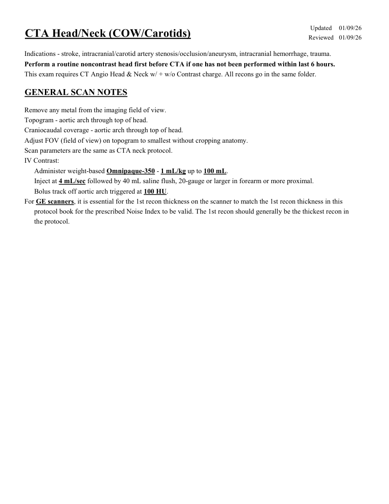
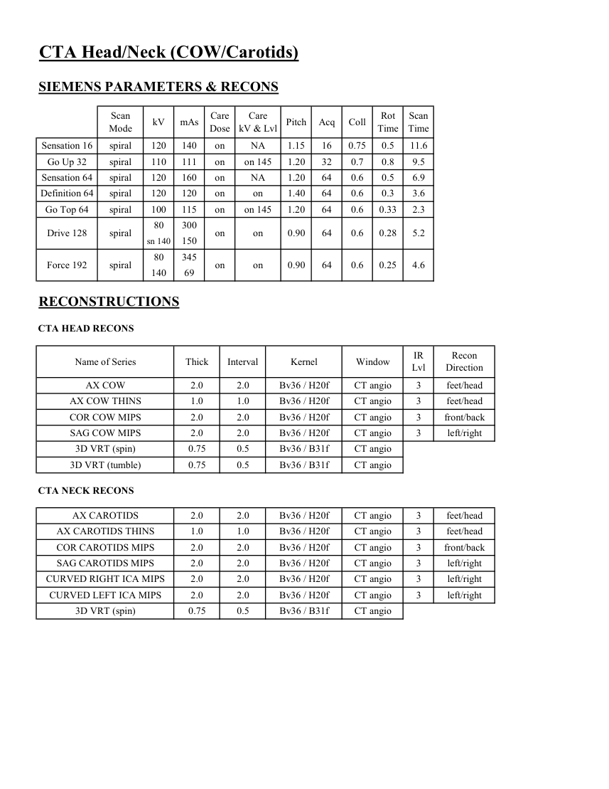
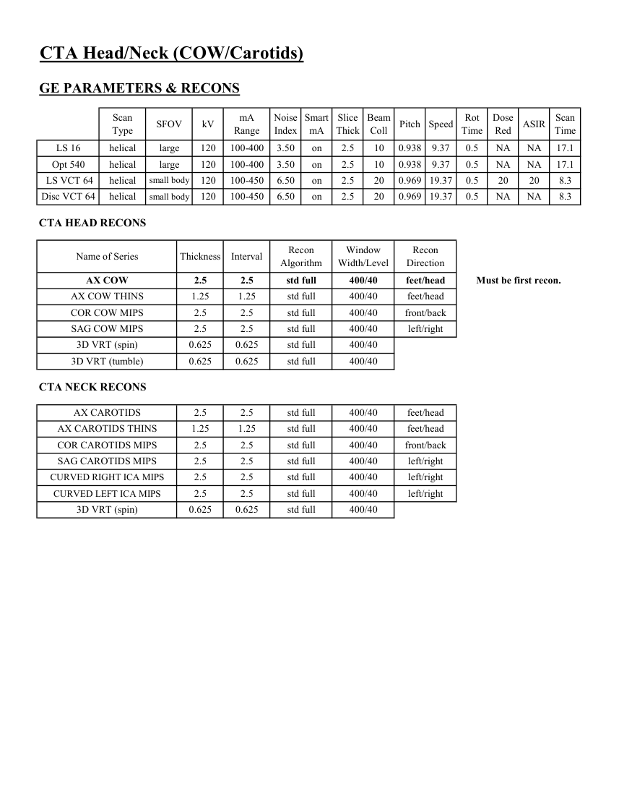
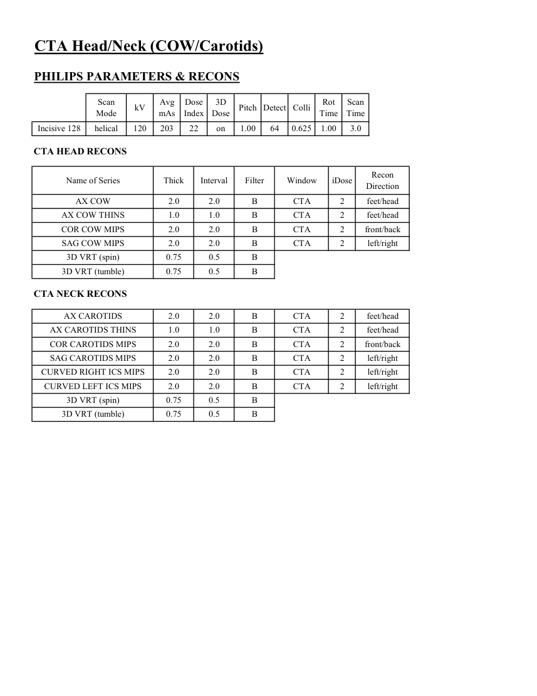

# CT — Angio-CT cerebral și cervical (MCB)

## Documentul original MCB — Angio-CT cerebral și cervical

**Protocol · 4 pagini · consultat la 2026-09-27.**

[Descarcă PDF-ul integral](../../assets/mcb-modalities/ct-angio-ct-cerebral-si-cervical-mcb/document.pdf) · [Sursa MCB](https://ref.mcbradiology.com/Protocols,%20Policies,%20Worksheets%20&%20Forms/CT/Protocols/Neuro/5%20CTA%20Head%20&%20Neck.pdf) · [Catalogul MCB pentru această modalitate](../mcb/index.md)

Instrucțiunile, valorile și ilustrațiile din documentul original sunt păstrate în **engleză**. Titlul și navigarea sunt în română.

### Pagina 1

{ loading=lazy }

### Pagina 2

{ loading=lazy }

### Pagina 3

{ loading=lazy }

### Pagina 4

{ loading=lazy }

## Textul documentului original

??? abstract "Pagina 1 — text în engleză"

    
Updated
    01/09/26
    CTA Head/Neck (COW/Carotids)
    Reviewed
    01/09/26
    Indications - stroke, intracranial/carotid artery stenosis/occlusion/aneurysm, intracranial hemorrhage, trauma.
    Perform a routine noncontrast head first before CTA if one has not been performed within last 6 hours.
    This exam requires CT Angio Head &amp; Neck w/ + w/o Contrast charge. All recons go in the same folder.
    GENERAL SCAN NOTES
    Remove any metal from the imaging field of view.
    Topogram - aortic arch through top of head.
    Craniocaudal coverage - aortic arch through top of head.
    Adjust FOV (field of view) on topogram to smallest without cropping anatomy.
    Scan parameters are the same as CTA neck protocol.
    IV Contrast:
    Administer weight-based Omnipaque-350 - 1 mL/kg up to 100 mL.
    Inject at 4 mL/sec followed by 40 mL saline flush, 20-gauge or larger in forearm or more proximal.
    Bolus track off aortic arch triggered at 100 HU.
    For GE scanners, it is essential for the 1st recon thickness on the scanner to match the 1st recon thickness in this
    protocol book for the prescribed Noise Index to be valid. The 1st recon should generally be the thickest recon in 
    the protocol.
    

??? abstract "Pagina 2 — text în engleză"

    
CTA Head/Neck (COW/Carotids)
    SIEMENS PARAMETERS &amp; RECONS
    Scan                           
    Care                                          
    Rot 
    Scan                 
    Mode
    kV
    mAs
    Care                            
    Dose
    kV &amp; Lvl
    Pitch
    Acq
    Coll
    Time
    Time
    Sensation 16
    spiral
    120
    140
    on
    NA
    1.15
    16
    0.75
    0.5
    11.6
    Go Up 32
    spiral
    110
    111
    on
    on 145
    1.20
    32
    0.7
    0.8
    9.5
    Sensation 64
    spiral
    120
    160
    on
    NA
    1.20
    64
    0.6
    0.5
    6.9
    Definition 64
    spiral
    120
    120
    on
    on
    1.40
    64
    0.6
    0.3
    3.6
    Go Top 64
    spiral
    100
    115
    on
    on 145
    1.20
    64
    0.6
    0.33
    2.3
    80
    300
    Drive 128
    spiral
    on
    on
    0.90
    64
    0.6
    0.28
    5.2
    sn 140
    150
    80
    345
    Force 192
    spiral
    on
    on
    0.90
    64
    0.6
    0.25
    4.6
    140
    69
    RECONSTRUCTIONS
    CTA HEAD RECONS
    IR                       
    Recon                     
    Name of Series
    Kernel
    Thick
    Interval
    Window
    Lvl
    Direction
    AX COW
    2.0
    2.0
    Bv36 / H20f
    CT angio
    feet/head
    3
    AX COW THINS
    1.0
    1.0
    Bv36 / H20f
    CT angio
    3
    feet/head
    COR COW MIPS
    2.0
    front/back
    2.0
    Bv36 / H20f
    CT angio
    3
    SAG COW MIPS
    2.0
    2.0
    Bv36 / H20f
    CT angio
    3
    left/right
    3D VRT (spin)
    0.75
    0.5
    CT angio
    Bv36 / B31f
    3D VRT (tumble)
    0.75
    0.5
    Bv36 / B31f
    CT angio
    CTA NECK RECONS
    AX CAROTIDS
    2.0
    2.0
    feet/head
    Bv36 / H20f
    CT angio
    3
    AX CAROTIDS THINS
    1.0
    1.0
    CT angio
    feet/head
    Bv36 / H20f
    3
    COR CAROTIDS MIPS
    2.0
    2.0
    CT angio
    front/back
    Bv36 / H20f
    3
    SAG CAROTIDS MIPS
    2.0
    2.0
    CT angio
    left/right
    Bv36 / H20f
    3
    CURVED RIGHT ICA MIPS
    2.0
    2.0
    Bv36 / H20f
    CT angio
    left/right
    3
    CURVED LEFT ICA MIPS
    2.0
    2.0
    CT angio
    left/right
    Bv36 / H20f
    3
    3D VRT (spin)
    0.75
    0.5
    CT angio
    Bv36 / B31f
    

??? abstract "Pagina 3 — text în engleză"

    
CTA Head/Neck (COW/Carotids)
    GE PARAMETERS &amp; RECONS
    Scan               
    Smart             
    Slice                       
    Beam                                 
    Dose                                          
    Pitch
    Speed
    Rot                                
    Type
    SFOV
    kV
    mA                           
    Range
    Noise                    
    Index
    mA
    Thick
    Coll
    Time
    Red
    ASIR
    Scan                 
    Time
    LS 16
    helical
    large
    120
    100-400
    3.50
    on
    2.5
    10
    0.938
    9.37
    0.5
    NA
    NA
    17.1
    Opt 540
    helical
    large
    120
    100-400
    3.50
    on
    2.5
    10
    0.938
    9.37
    0.5
    NA
    NA
    17.1
     LS VCT 64
    helical
    small body
    120
    100-450
    6.50
    on
    2.5
    20
    0.969 19.37
    0.5
    20
    20
    8.3
    0.969 19.37
    0.5
    NA
    NA
    8.3
    Disc VCT 64
    helical
    small body
    120
    100-450
    6.50
    on
    2.5
    20
    CTA HEAD RECONS
    Window                                   
    Recon 
    Name of Series
    Thickness
    Interval
    Recon                                     
    Algorithm
    Width/Level
    Direction
    2.5
    2.5
    std full
    400/40
    feet/head
    AX COW
    Must be first recon.
    AX COW THINS
    1.25
    1.25
    std full
    400/40
    feet/head
    2.5
    2.5
    std full
    400/40
    front/back
    COR COW MIPS
    SAG COW MIPS
    2.5
    2.5
    std full
    400/40
    left/right
    3D VRT (spin)
    0.625
    0.625
    std full
    400/40
    3D VRT (tumble)
    0.625
    0.625
    std full
    400/40
    CTA NECK RECONS
    AX CAROTIDS
    2.5
    2.5
    std full
    400/40
    feet/head
    AX CAROTIDS THINS
    1.25
    1.25
    std full
    400/40
    feet/head
    COR CAROTIDS MIPS
    2.5
    2.5
    std full
    400/40
    front/back
    SAG CAROTIDS MIPS
    2.5
    2.5
    std full
    400/40
    left/right
    2.5
    2.5
    std full
    400/40
    left/right
    CURVED RIGHT ICA MIPS
    CURVED LEFT ICA MIPS
    2.5
    2.5
    std full
    400/40
    left/right
    3D VRT (spin)
    0.625
    0.625
    std full
    400/40
    

??? abstract "Pagina 4 — text în engleză"

    
CTA Head/Neck (COW/Carotids)
    PHILIPS PARAMETERS &amp; RECONS
    Scan                           
    Dose                                          
    3D            
    Scan                 
    Mode
    kV
    Avg                      
    mAs
    Index
    Dose
    Pitch Detect Colli
    Rot 
    Time
    Time
    1.00
    3.0
    Incisive 128
    helical
    120
    203
    22
    on
    1.00
    64
    0.625
    CTA HEAD RECONS
    Name of Series
    Thick
    Interval
    Filter
    Window
    iDose
    Recon                     
    Direction
    AX COW
    2.0
    2.0
    B
    CTA
    2
    feet/head
    AX COW THINS
    1.0
    1.0
    B
    CTA
    2
    feet/head
    COR COW MIPS
    2.0
    2.0
    B
    CTA
    2
    front/back
    SAG COW MIPS
    2.0
    2.0
    B
    CTA
    2
    left/right
    3D VRT (spin)
    0.75
    0.5
    B
    3D VRT (tumble)
    0.75
    0.5
    B
    CTA NECK RECONS
    AX CAROTIDS
    2.0
    2.0
    B
    CTA
    2
    feet/head
    AX CAROTIDS THINS
    1.0
    1.0
    B
    CTA
    2
    feet/head
    COR CAROTIDS MIPS
    2.0
    2.0
    B
    CTA
    2
    front/back
    SAG CAROTIDS MIPS
    2.0
    2.0
    B
    CTA
    2
    left/right
    CURVED RIGHT ICS MIPS
    2.0
    2.0
    B
    CTA
    2
    left/right
    CURVED LEFT ICS MIPS
    2.0
    2.0
    B
    CTA
    2
    left/right
    3D VRT (spin)
    0.75
    0.5
    B
    3D VRT (tumble)
    0.75
    0.5
    B
    

