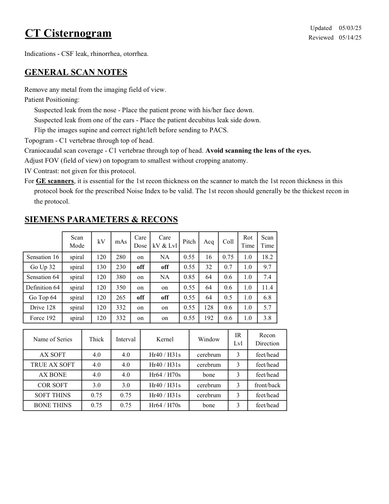
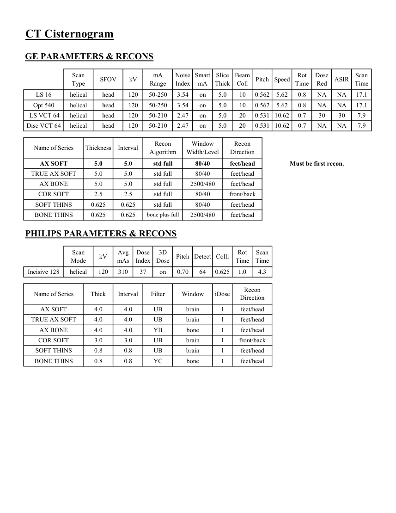

# CT — Cisternografie (MCB)

## Documentul original MCB — Cisternografie

**Protocol · 2 pagini · consultat la 2026-09-27.**

[Descarcă PDF-ul integral](../../assets/mcb-modalities/ct-cisternografie-mcb/document.pdf) · [Sursa MCB](https://ref.mcbradiology.com/Protocols,%20Policies,%20Worksheets%20&%20Forms/CT/Protocols/Neuro/18%20Cisternogram.pdf) · [Catalogul MCB pentru această modalitate](../mcb/index.md)

Instrucțiunile, valorile și ilustrațiile din documentul original sunt păstrate în **engleză**. Titlul și navigarea sunt în română.

### Pagina 1

{ loading=lazy }

### Pagina 2

{ loading=lazy }

## Textul documentului original

??? abstract "Pagina 1 — text în engleză"

    
Updated
    05/03/25
    CT Cisternogram
    Reviewed
    05/14/25
    Indications - CSF leak, rhinorrhea, otorrhea.
    GENERAL SCAN NOTES
    Remove any metal from the imaging field of view.
    Patient Positioning:
    Suspected leak from the nose - Place the patient prone with his/her face down.
    Suspected leak from one of the ears - Place the patient decubitus leak side down.
    Flip the images supine and correct right/left before sending to PACS.
    Topogram - C1 vertebrae through top of head.
    Craniocaudal scan coverage - C1 vertebrae through top of head. Avoid scanning the lens of the eyes. 
    Adjust FOV (field of view) on topogram to smallest without cropping anatomy.
    IV Contrast: not given for this protocol.
    For GE scanners, it is essential for the 1st recon thickness on the scanner to match the 1st recon thickness in this
    protocol book for the prescribed Noise Index to be valid. The 1st recon should generally be the thickest recon in 
    the protocol.
    SIEMENS PARAMETERS &amp; RECONS
    Scan                           
    Care                                          
    Scan                 
    Mode
    kV
    mAs
    Care                            
    Dose
    kV &amp; Lvl
    Pitch
    Acq
    Coll
    Rot 
    Time
    Time
    Sensation 16
    spiral
    120
    280
    on
    NA
    0.55
    16
    0.75
    1.0
    18.2
    Go Up 32
    spiral
    130
    230
    off
    off
    0.55
    32
    0.7
    1.0
    9.7
    Sensation 64
    spiral
    120
    380
    on
    NA
    0.85
    64
    0.6
    1.0
    7.4
    Definition 64
    spiral
    120
    350
    on
    on
    0.55
    64
    0.6
    1.0
    11.4
    Go Top 64
    spiral
    120
    265
    off
    off
    0.55
    64
    0.5
    1.0
    6.8
    Drive 128
    spiral
    120
    332
    on
    on
    0.55
    128
    0.6
    1.0
    5.7
    Force 192
    spiral
    120
    332
    on
    on
    0.55
    192
    0.6
    1.0
    3.8
    Recon                     
    Name of Series
    Thick
    Interval
    Kernel
    Window
    IR                       
    Lvl
    Direction
    cerebrum
    AX SOFT
    4.0
    4.0
    Hr40 / H31s
    3
    feet/head
    TRUE AX SOFT
    4.0
    4.0
    Hr40 / H31s
    cerebrum
    3
    feet/head
    AX BONE
    4.0
    4.0
    Hr64 / H70s
    bone
    3
    feet/head
    COR SOFT
    3.0
    3.0
    Hr40 / H31s
    3
    front/back
    cerebrum
    SOFT THINS
    0.75
    0.75
    Hr40 / H31s
    cerebrum
    3
    feet/head
    BONE THINS
    0.75
    0.75
    Hr64 / H70s
    bone
    3
    feet/head
    

??? abstract "Pagina 2 — text în engleză"

    
CT Cisternogram
    GE PARAMETERS &amp; RECONS
    Scan               
    Smart             
    Slice                       
    Beam                                 
    Rot                                
    Dose                                          
    Type
    SFOV
    kV
    mA                           
    Range
    Noise                    
    Index
    mA
    Thick
    Coll
    Pitch
    Speed
    Scan                 
    Time
    Red
    ASIR
    Time
    LS 16
    helical
    head
    120
    50-250
    3.54
    on
    5.0
    10
    0.562
    5.62
    0.8
    NA
    NA
    17.1
    Opt 540
    helical
    head
    120
    50-250
    3.54
    on
    5.0
    10
    0.562
    5.62
    0.8
    NA
    NA
    17.1
     LS VCT 64
    helical
    head
    120
    50-210
    2.47
    on
    5.0
    20
    0.531 10.62
    0.7
    30
    30
    7.9
    0.531 10.62
    0.7
    NA
    NA
    7.9
    Disc VCT 64
    helical
    head
    120
    50-210
    2.47
    on
    5.0
    20
    Window                                   
    Recon                    
    Name of Series
    Thickness
    Interval
    Recon                                     
    Algorithm
    Width/Level
    Direction
    AX SOFT
    5.0
    5.0
    std full
    80/40
    feet/head
    Must be first recon.
    TRUE AX SOFT
    5.0
    5.0
    std full
    80/40
    feet/head
    AX BONE
    5.0
    5.0
    std full
    2500/480
    feet/head
    COR SOFT
    2.5
    2.5
    std full
    80/40
    front/back
    SOFT THINS
    0.625
    0.625
    std full
    80/40
    feet/head
    BONE THINS
    0.625
    0.625
    bone plus full
    2500/480
    feet/head
    PHILIPS PARAMETERS &amp; RECONS
    Scan                           
    Dose                                          
    3D            
    Rot 
    Scan                 
    Mode
    kV
    Avg                      
    mAs
    Index
    Dose
    Pitch Detect Colli
    Time
    Time
    Incisive 128
    helical
    120
    310
    37
    on
    0.70
    64
    0.625
    1.0
    4.3
    Name of Series
    Thick
    Interval
    Filter
    Window
    iDose
    Recon                     
    Direction
    AX SOFT
    4.0
    4.0
    UB
    brain
    1
    feet/head
    TRUE AX SOFT
    4.0
    4.0
    UB
    brain
    1
    feet/head
    AX BONE
    4.0
    4.0
    YB
    bone
    1
    feet/head
    COR SOFT
    3.0
    3.0
    UB
    brain
    1
    front/back
    SOFT THINS
    0.8
    0.8
    UB
    brain
    1
    feet/head
    BONE THINS
    0.8
    0.8
    YC
    bone
    1
    feet/head
    

