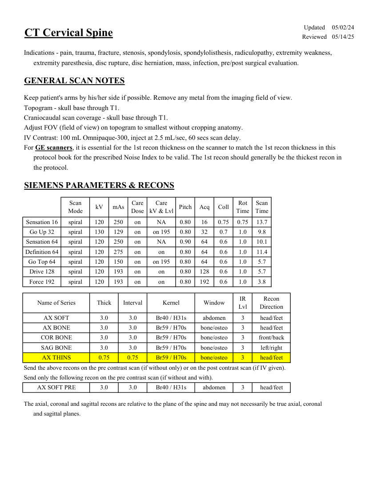
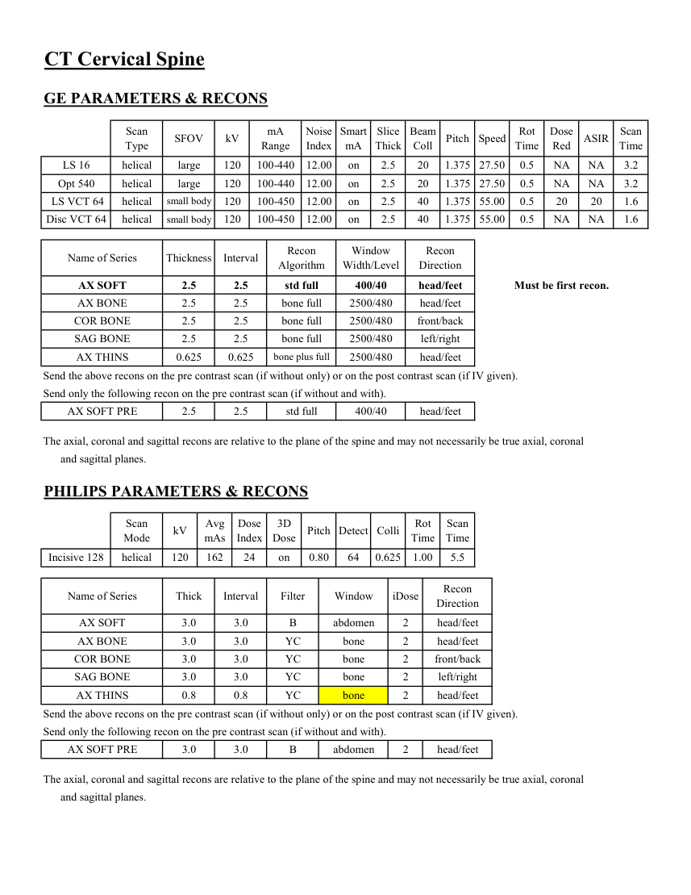

# CT — Coloană cervicală (MCB)

## Documentul original MCB — Coloană cervicală

**Protocol · 2 pagini · consultat la 2026-09-27.**

[Descarcă PDF-ul integral](../../assets/mcb-modalities/ct-coloana-cervicala-mcb/document.pdf) · [Sursa MCB](https://ref.mcbradiology.com/Protocols,%20Policies,%20Worksheets%20&%20Forms/CT/Protocols/Neuro/13%20C%20Spine.pdf) · [Catalogul MCB pentru această modalitate](../mcb/index.md)

Instrucțiunile, valorile și ilustrațiile din documentul original sunt păstrate în **engleză**. Titlul și navigarea sunt în română.

### Pagina 1

{ loading=lazy }

### Pagina 2

{ loading=lazy }

## Textul documentului original

??? abstract "Pagina 1 — text în engleză"

    
Updated
    05/02/24
    CT Cervical Spine
    Reviewed
    05/14/25
    Indications - pain, trauma, fracture, stenosis, spondylosis, spondylolisthesis, radiculopathy, extremity weakness, 
    extremity paresthesia, disc rupture, disc herniation, mass, infection, pre/post surgical evaluation.
    GENERAL SCAN NOTES
    Keep patient&#x27;s arms by his/her side if possible. Remove any metal from the imaging field of view.
    Topogram - skull base through T1.
    Craniocaudal scan coverage - skull base through T1.
    Adjust FOV (field of view) on topogram to smallest without cropping anatomy.
    IV Contrast: 100 mL Omnipaque-300, inject at 2.5 mL/sec, 60 secs scan delay.
    For GE scanners, it is essential for the 1st recon thickness on the scanner to match the 1st recon thickness in this
    protocol book for the prescribed Noise Index to be valid. The 1st recon should generally be the thickest recon in 
    the protocol.
    SIEMENS PARAMETERS &amp; RECONS
    Scan                           
    Care                                          
    Scan                 
    Mode
    kV
    mAs
    Care                            
    Dose
    kV &amp; Lvl
    Pitch
    Acq
    Coll
    Rot 
    Time
    Time
    0.75
    13.7
    Sensation 16
    spiral
    120
    250
    on
    NA
    0.80
    16
    0.75
    on 195
    0.80
    32
    0.7
    1.0
    Go Up 32
    spiral
    130
    129
    on
    9.8
    Sensation 64
    spiral
    120
    250
    on
    NA
    0.90
    64
    0.6
    1.0
    10.1
    on
    0.80
    64
    0.6
    1.0
    Definition 64
    spiral
    120
    275
    on
    11.4
    Go Top 64
    spiral
    120
    150
    on
    on 195
    0.80
    64
    0.6
    1.0
    5.7
    Drive 128
    spiral
    120
    193
    on
    on
    0.80
    128
    0.6
    1.0
    5.7
    Force 192
    spiral
    120
    193
    on
    on
    0.80
    192
    0.6
    1.0
    3.8
    Recon                     
    Name of Series
    Thick
    Interval
    Kernel
    Window
    IR                       
    Lvl
    Direction
    AX SOFT
    3.0
    3.0
    Br40 / H31s
    abdomen
    3
    head/feet
    AX BONE
    3.0
    3.0
    Br59 / H70s
    bone/osteo
    3
    head/feet
    COR BONE
    3.0
    3.0
    Br59 / H70s
    bone/osteo
    3
    front/back
    SAG BONE
    3.0
    3.0
    Br59 / H70s
    bone/osteo
    3
    left/right
    AX THINS
    0.75
    0.75
    Br59 / H70s
    bone/osteo
    3
    head/feet
    Send the above recons on the pre contrast scan (if without only) or on the post contrast scan (if IV given).
    Send only the following recon on the pre contrast scan (if without and with).
    AX SOFT PRE
    3.0
    3.0
    Br40 / H31s
    abdomen
    3
    head/feet
    The axial, coronal and sagittal recons are relative to the plane of the spine and may not necessarily be true axial, coronal
    and sagittal planes.
    

??? abstract "Pagina 2 — text în engleză"

    
CT Cervical Spine
    GE PARAMETERS &amp; RECONS
    Scan               
    Smart             
    Slice                       
    Beam                                 
    Dose                                          
    ASIR
    Scan                 
    Type
    SFOV
    kV
    mA                           
    Range
    Noise                    
    Index
    mA
    Thick
    Coll
    Pitch
    Speed
    Rot                                
    Time
    Red
    Time
    LS 16
    helical
    large
    120
    100-440
    12.00
    on
    2.5
    20
    1.375 27.50
    0.5
    NA
    NA
    3.2
    Opt 540
    helical
    large
    120
    100-440
    12.00
    on
    2.5
    20
    1.375 27.50
    0.5
    NA
    NA
    3.2
     LS VCT 64
    helical
    small body
    120
    100-450
    1.6
    12.00
    on
    2.5
    40
    1.375 55.00
    0.5
    20
    20
    Disc VCT 64
    helical
    small body
    120
    100-450
    55.00
    0.5
    NA
    NA
    1.6
    12.00
    on
    2.5
    40
    1.375
    Window                                   
    Recon 
    Name of Series
    Thickness
    Interval
    Recon                                     
    Algorithm
    Width/Level
    Direction
    AX SOFT
    2.5
    2.5
    std full
    400/40
    head/feet
    Must be first recon.
    AX BONE
    2.5
    2.5
    bone full
    2500/480
    head/feet
    COR BONE
    2.5
    2.5
    bone full
    2500/480
    front/back
    SAG BONE
    2.5
    2.5
    bone full
    2500/480
    left/right
    AX THINS
    0.625
    0.625
    bone plus full
    2500/480
    head/feet
    Send the above recons on the pre contrast scan (if without only) or on the post contrast scan (if IV given).
    Send only the following recon on the pre contrast scan (if without and with).
    AX SOFT PRE
    2.5
    2.5
    std full
    400/40
    head/feet
    The axial, coronal and sagittal recons are relative to the plane of the spine and may not necessarily be true axial, coronal
    and sagittal planes.
    PHILIPS PARAMETERS &amp; RECONS
    Scan                           
    Dose                                          
    3D            
    Scan                 
    Mode
    kV
    Avg                      
    mAs
    Index
    Dose
    Pitch Detect Colli
    Rot 
    Time
    Time
    Incisive 128
    helical
    120
    162
    24
    on
    0.80
    64
    0.625
    1.00
    5.5
    Name of Series
    Thick
    Interval
    Filter
    Window
    iDose
    Recon                     
    Direction
    AX SOFT
    3.0
    3.0
    B
    abdomen
    2
    head/feet
    AX BONE
    3.0
    3.0
    YC
    bone
    2
    head/feet
    COR BONE
    3.0
    3.0
    YC
    bone
    2
    front/back
    SAG BONE
    3.0
    3.0
    YC
    bone
    2
    left/right
    AX THINS
    0.8
    0.8
    YC
    bone
    2
    head/feet
    Send the above recons on the pre contrast scan (if without only) or on the post contrast scan (if IV given).
    Send only the following recon on the pre contrast scan (if without and with).
    2
    head/feet
    AX SOFT PRE
    3.0
    3.0
    B
    abdomen
    The axial, coronal and sagittal recons are relative to the plane of the spine and may not necessarily be true axial, coronal
    and sagittal planes.
    

