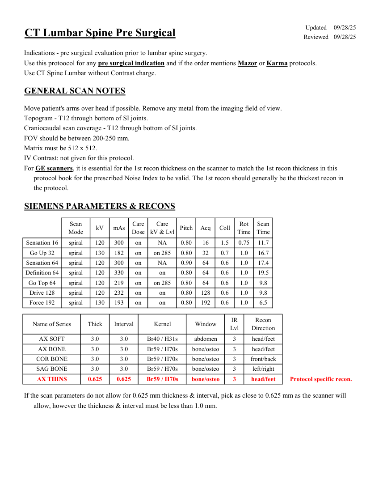
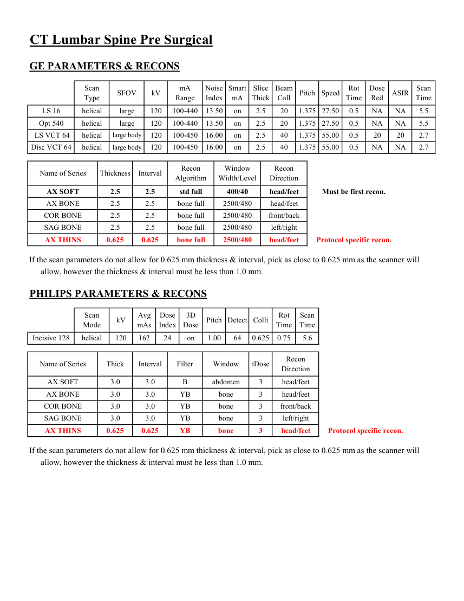

# CT — Coloană lombară preoperator (MCB)

## Documentul original MCB — Coloană lombară preoperator

**Protocol · 2 pagini · consultat la 2026-09-27.**

[Descarcă PDF-ul integral](../../assets/mcb-modalities/ct-coloana-lombara-preoperator-mcb/document.pdf) · [Sursa MCB](https://ref.mcbradiology.com/Protocols,%20Policies,%20Worksheets%20&%20Forms/CT/Protocols/Neuro/16%20L%20Spine%20Pre%20Surgical.pdf) · [Catalogul MCB pentru această modalitate](../mcb/index.md)

Instrucțiunile, valorile și ilustrațiile din documentul original sunt păstrate în **engleză**. Titlul și navigarea sunt în română.

### Pagina 1

{ loading=lazy }

### Pagina 2

{ loading=lazy }

## Textul documentului original

??? abstract "Pagina 1 — text în engleză"

    
Updated
    09/28/25
    CT Lumbar Spine Pre Surgical
    Reviewed
    09/28/25
    Indications - pre surgical evaluation prior to lumbar spine surgery.
    Use this protoocol for any pre surgical indication and if the order mentions Mazor or Karma protocols.
    Use CT Spine Lumbar without Contrast charge.
    GENERAL SCAN NOTES
    Move patient&#x27;s arms over head if possible. Remove any metal from the imaging field of view.
    Topogram - T12 through bottom of SI joints.
    Craniocaudal scan coverage - T12 through bottom of SI joints.
    FOV should be between 200-250 mm.
    Matrix must be 512 x 512.
    IV Contrast: not given for this protocol.
    For GE scanners, it is essential for the 1st recon thickness on the scanner to match the 1st recon thickness in this
    protocol book for the prescribed Noise Index to be valid. The 1st recon should generally be the thickest recon in 
    the protocol.
    SIEMENS PARAMETERS &amp; RECONS
    Scan                           
    Care                                          
    Rot 
    Scan                 
    Coll
    Mode
    kV
    mAs
    Care                            
    Dose
    kV &amp; Lvl
    Pitch
    Acq
    Time
    Time
    Sensation 16
    spiral
    120
    300
    on
    NA
    0.80
    16
    1.5
    0.75
    11.7
    Go Up 32
    spiral
    130
    182
    on
    on 285
    0.80
    32
    0.7
    1.0
    16.7
    Sensation 64
    spiral
    120
    300
    on
    NA
    0.90
    64
    0.6
    1.0
    17.4
    Definition 64
    spiral
    120
    330
    on
    on
    0.80
    64
    0.6
    1.0
    19.5
    Go Top 64
    spiral
    120
    219
    on
    0.80
    64
    0.6
    1.0
    9.8
    on 285
    Drive 128
    spiral
    120
    232
    on
    on
    0.80
    128
    0.6
    1.0
    9.8
    Force 192
    spiral
    130
    193
    on
    on
    0.80
    192
    0.6
    1.0
    6.5
    IR                       
    Recon                     
    Name of Series
    Thick
    Interval
    Kernel
    Window
    Lvl
    Direction
    AX SOFT
    3.0
    3.0
    Br40 / H31s
    abdomen
    3
    head/feet
    AX BONE
    3.0
    3.0
    Br59 / H70s
    bone/osteo
    3
    head/feet
    COR BONE
    3.0
    3.0
    Br59 / H70s
    bone/osteo
    3
    front/back
    SAG BONE
    left/right
    3.0
    3.0
    Br59 / H70s
    bone/osteo
    3
    0.625
    0.625
    Br59 / H70s
    bone/osteo
    3
    head/feet
    AX THINS
    Protocol specific recon.
    If the scan parameters do not allow for 0.625 mm thickness &amp; interval, pick as close to 0.625 mm as the scanner will
    allow, however the thickness &amp; interval must be less than 1.0 mm.
    

??? abstract "Pagina 2 — text în engleză"

    
CT Lumbar Spine Pre Surgical
    GE PARAMETERS &amp; RECONS
    Scan               
    Smart             
    Slice                       
    Beam                                 
    Dose                                          
    Type
    SFOV
    kV
    mA                           
    Range
    Noise                    
    Index
    mA
    Thick
    Coll
    Pitch
    Speed
    Rot                                
    Time
    Red
    ASIR
    Scan                 
    Time
    on
    2.5
    20
    1.375 27.50
    0.5
    LS 16
    helical
    large
    120
    100-440
    13.50
    NA
    NA
    5.5
    Opt 540
    helical
    large
    120
    100-440
    13.50
    on
    2.5
    20
    1.375 27.50
    0.5
    NA
    NA
    5.5
     LS VCT 64
    helical
    large body
    120
    100-450
    16.00
    on
    2.5
    2.7
    40
    1.375 55.00
    0.5
    20
    20
    Disc VCT 64
    helical
    large body
    120
    100-450
    16.00
    on
    2.5
    40
    1.375 55.00
    0.5
    NA
    NA
    2.7
    Window                                   
    Recon 
    Name of Series
    Thickness
    Interval
    Recon                                     
    Algorithm
    Width/Level
    Direction
    AX SOFT
    2.5
    2.5
    std full
    400/40
    head/feet
    Must be first recon.
    AX BONE
    2.5
    2.5
    bone full
    2500/480
    head/feet
    COR BONE
    2.5
    2.5
    bone full
    2500/480
    front/back
    SAG BONE
    2.5
    2.5
    bone full
    2500/480
    left/right
    AX THINS
    0.625
    0.625
    bone full
    2500/480
    head/feet
    Protocol specific recon.
    If the scan parameters do not allow for 0.625 mm thickness &amp; interval, pick as close to 0.625 mm as the scanner will
    allow, however the thickness &amp; interval must be less than 1.0 mm.
    PHILIPS PARAMETERS &amp; RECONS
    Scan                           
    Dose                                          
    3D            
    Scan                 
    Pitch Detect Colli
    Rot 
    Mode
    kV
    Avg                      
    mAs
    Index
    Dose
    Time
    Time
    Incisive 128
    helical
    120
    162
    24
    on
    1.00
    64
    0.625
    0.75
    5.6
    Recon                     
    Name of Series
    Thick
    Interval
    Filter
    Window
    iDose
    Direction
    AX SOFT
    3.0
    3.0
    B
    abdomen
    3
    head/feet
    AX BONE
    3.0
    3.0
    YB
    bone
    3
    head/feet
    COR BONE
    3.0
    3.0
    YB
    bone
    3
    front/back
    SAG BONE
    left/right
    3.0
    3.0
    YB
    bone
    3
    AX THINS
    0.625
    0.625
    YB
    bone
    3
    head/feet
    Protocol specific recon.
    If the scan parameters do not allow for 0.625 mm thickness &amp; interval, pick as close to 0.625 mm as the scanner will
    allow, however the thickness &amp; interval must be less than 1.0 mm.
    

