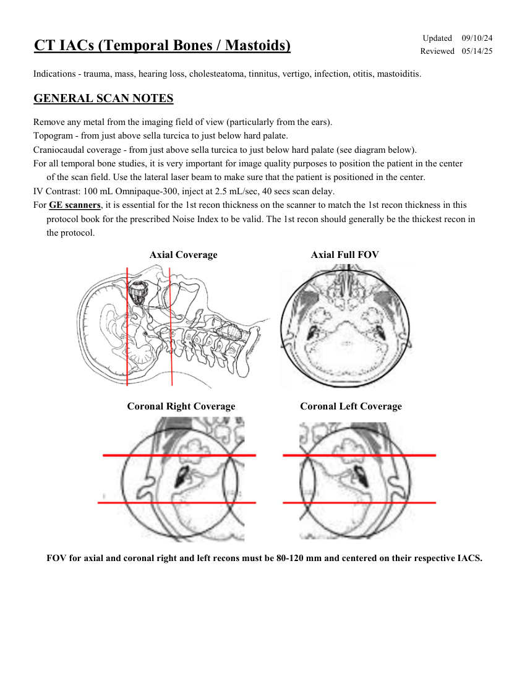
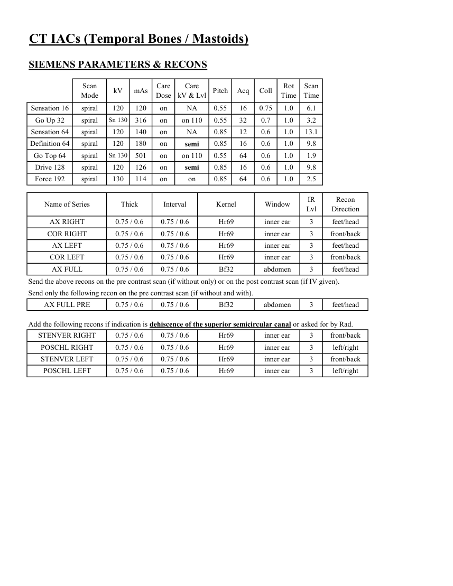
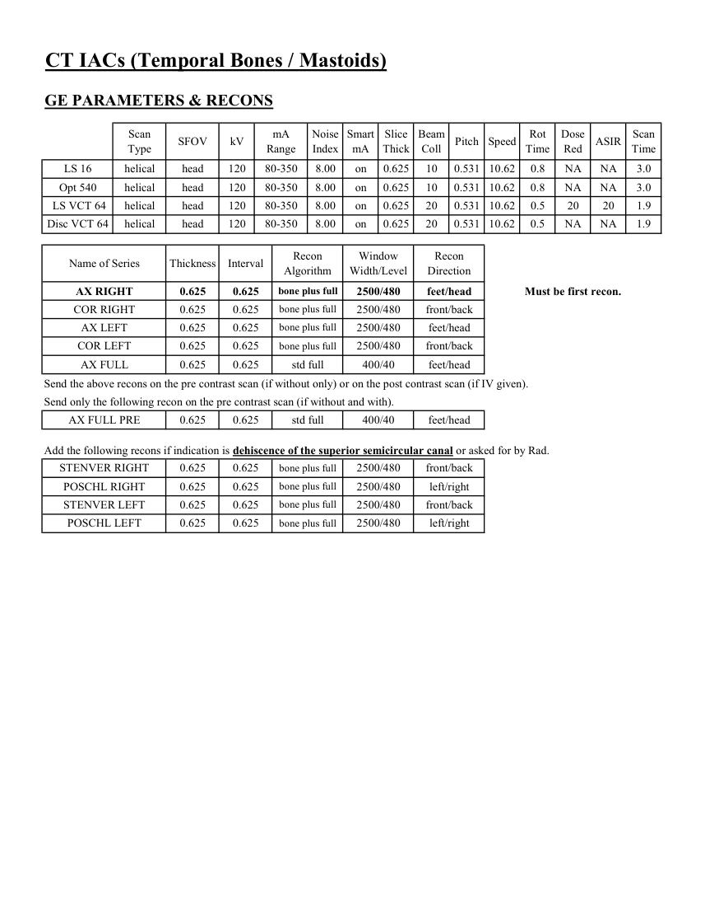
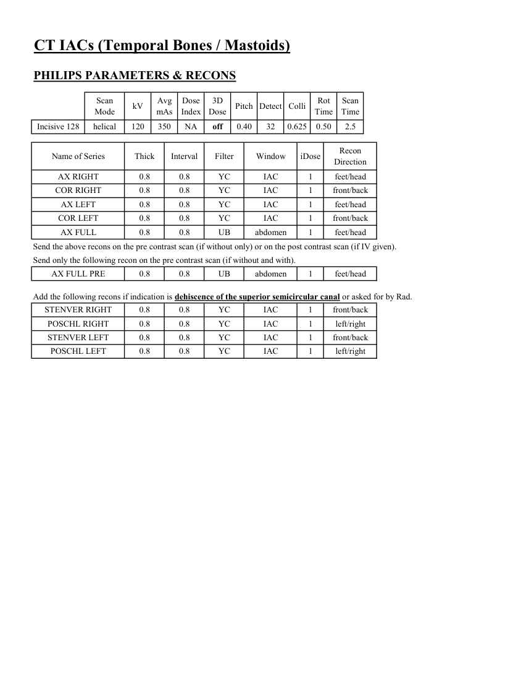

# CT — Conducte auditive interne și oase temporale (MCB)

## Documentul original MCB — Conducte auditive interne și oase temporale

**Protocol · 4 pagini · consultat la 2026-09-27.**

[Descarcă PDF-ul integral](../../assets/mcb-modalities/ct-conducte-auditive-interne-si-oase-temporale-mcb/document.pdf) · [Sursa MCB](https://ref.mcbradiology.com/Protocols,%20Policies,%20Worksheets%20&%20Forms/CT/Protocols/Neuro/10%20IACs.pdf) · [Catalogul MCB pentru această modalitate](../mcb/index.md)

Instrucțiunile, valorile și ilustrațiile din documentul original sunt păstrate în **engleză**. Titlul și navigarea sunt în română.

### Pagina 1

{ loading=lazy }

### Pagina 2

{ loading=lazy }

### Pagina 3

{ loading=lazy }

### Pagina 4

{ loading=lazy }

## Textul documentului original

??? abstract "Pagina 1 — text în engleză"

    
Updated
    09/10/24
    CT IACs (Temporal Bones / Mastoids)
    Reviewed
    05/14/25
    Indications - trauma, mass, hearing loss, cholesteatoma, tinnitus, vertigo, infection, otitis, mastoiditis.
    GENERAL SCAN NOTES
    Remove any metal from the imaging field of view (particularly from the ears).
    Topogram - from just above sella turcica to just below hard palate.
    Craniocaudal coverage - from just above sella turcica to just below hard palate (see diagram below).
    For all temporal bone studies, it is very important for image quality purposes to position the patient in the center 
    of the scan field. Use the lateral laser beam to make sure that the patient is positioned in the center.
    IV Contrast: 100 mL Omnipaque-300, inject at 2.5 mL/sec, 40 secs scan delay.
    For GE scanners, it is essential for the 1st recon thickness on the scanner to match the 1st recon thickness in this
    protocol book for the prescribed Noise Index to be valid. The 1st recon should generally be the thickest recon in 
    the protocol.
    Axial Coverage                                    Axial Full FOV
    Coronal Right Coverage                         Coronal Left Coverage
    FOV for axial and coronal right and left recons must be 80-120 mm and centered on their respective IACS.
    

??? abstract "Pagina 2 — text în engleză"

    
CT IACs (Temporal Bones / Mastoids)
    SIEMENS PARAMETERS &amp; RECONS
    Scan                           
    Care                                          
    Scan                 
    Mode
    kV
    mAs
    Care                            
    Dose
    kV &amp; Lvl
    Pitch
    Acq
    Coll
    Rot 
    Time
    Time
    Sensation 16
    spiral
    120
    120
    on
    NA
    0.55
    16
    0.75
    1.0
    6.1
    Go Up 32
    spiral
    on 110
    0.55
    32
    0.7
    Sn 130
    316
    on
    1.0
    3.2
    Sensation 64
    spiral
    120
    140
    on
    NA
    0.85
    12
    0.6
    1.0
    13.1
    Definition 64
    spiral
    120
    180
    on
    0.6
    1.0
    9.8
    semi
    0.85
    16
    Go Top 64
    spiral
    Sn 130
    501
    on
    on 110
    0.55
    64
    0.6
    1.0
    1.9
    Drive 128
    spiral
    120
    126
    on
    1.0
    9.8
    semi
    0.85
    16
    0.6
    Force 192
    spiral
    130
    114
    on
    on
    0.85
    64
    0.6
    1.0
    2.5
    Recon                     
    Name of Series
    Kernel
    Window
    IR                       
    Thick
    Interval
    Lvl
    Direction
    AX RIGHT
    Hr69
    inner ear
    3
    feet/head
    0.75 / 0.6
    0.75 / 0.6
    COR RIGHT
    Hr69
    inner ear
    3
    front/back
    0.75 / 0.6
    0.75 / 0.6
    AX LEFT
    0.75 / 0.6
    0.75 / 0.6
    Hr69
    inner ear
    3
    feet/head
    COR LEFT
    0.75 / 0.6
    0.75 / 0.6
    Hr69
    inner ear
    3
    front/back
    AX FULL
    Bf32
    abdomen
    3
    feet/head
    0.75 / 0.6
    0.75 / 0.6
    Send the above recons on the pre contrast scan (if without only) or on the post contrast scan (if IV given).
    Send only the following recon on the pre contrast scan (if without and with).
    AX FULL PRE
    Bf32
    abdomen
    3
    feet/head
    0.75 / 0.6
    0.75 / 0.6
    Add the following recons if indication is dehiscence of the superior semicircular canal or asked for by Rad.
    STENVER RIGHT
    Hr69
    inner ear
    3
    front/back
    0.75 / 0.6
    0.75 / 0.6
    POSCHL RIGHT
    Hr69
    inner ear
    3
    left/right
    0.75 / 0.6
    0.75 / 0.6
    STENVER LEFT
    Hr69
    inner ear
    3
    front/back
    0.75 / 0.6
    0.75 / 0.6
    POSCHL LEFT
    Hr69
    inner ear
    3
    left/right
    0.75 / 0.6
    0.75 / 0.6
    

??? abstract "Pagina 3 — text în engleză"

    
CT IACs (Temporal Bones / Mastoids)
    GE PARAMETERS &amp; RECONS
    Scan               
    Smart             
    Slice                       
    Beam                                 
    Rot                                
    Dose                                          
    Type
    SFOV
    kV
    mA                           
    Range
    Noise                    
    Index
    mA
    Thick
    Coll
    Pitch
    Speed
    Time
    Red
    ASIR
    Scan                 
    Time
    LS 16
    helical
    head
    120
    80-350
    0.531 10.62
    8.00
    on
    0.625
    10
    0.8
    NA
    NA
    3.0
    Opt 540
    helical
    head
    120
    80-350
    8.00
    on
    0.625
    10
    0.531 10.62
    0.8
    NA
    NA
    3.0
     LS VCT 64
    helical
    head
    120
    80-350
    8.00
    on
    0.625
    20
    0.531 10.62
    0.5
    20
    20
    1.9
    Disc VCT 64
    helical
    head
    120
    80-350
    8.00
    on
    0.625
    20
    0.531 10.62
    0.5
    NA
    NA
    1.9
    Window                                   
    Recon 
    Name of Series
    Thickness
    Interval
    Recon                                     
    Algorithm
    Width/Level
    Direction
    AX RIGHT
    0.625
    0.625
    bone plus full
    2500/480
    feet/head
    Must be first recon.
    COR RIGHT
    0.625
    0.625
    bone plus full
    2500/480
    front/back
    AX LEFT
    0.625
    0.625
    bone plus full
    2500/480
    feet/head
    COR LEFT
    0.625
    0.625
    bone plus full
    2500/480
    front/back
    AX FULL
    0.625
    0.625
    std full
    400/40
    feet/head
    Send the above recons on the pre contrast scan (if without only) or on the post contrast scan (if IV given).
    Send only the following recon on the pre contrast scan (if without and with).
    AX FULL PRE
    0.625
    0.625
    std full
    400/40
    feet/head
    Add the following recons if indication is dehiscence of the superior semicircular canal or asked for by Rad.
    STENVER RIGHT
    0.625
    0.625
    bone plus full
    2500/480
    front/back
    POSCHL RIGHT
    0.625
    0.625
    bone plus full
    2500/480
    left/right
    STENVER LEFT
    0.625
    0.625
    bone plus full
    2500/480
    front/back
    POSCHL LEFT
    0.625
    0.625
    bone plus full
    left/right
    2500/480
    

??? abstract "Pagina 4 — text în engleză"

    
CT IACs (Temporal Bones / Mastoids)
    PHILIPS PARAMETERS &amp; RECONS
    Scan                           
    Dose                                          
    3D            
    Rot 
    Scan                 
    Mode
    kV
    Avg                      
    mAs
    Index
    Dose
    Pitch Detect Colli
    Time
    Time
    0.50
    2.5
    Incisive 128
    helical
    120
    350
    NA
    off
    0.40
    32
    0.625
    Name of Series
    Thick
    Interval
    Filter
    Window
    iDose
    Recon                     
    Direction
    AX RIGHT
    0.8
    0.8
    YC
    IAC
    1
    feet/head
    COR RIGHT
    0.8
    0.8
    YC
    IAC
    1
    front/back
    AX LEFT
    0.8
    0.8
    YC
    IAC
    1
    feet/head
    YC
    IAC
    1
    COR LEFT
    0.8
    0.8
    front/back
    AX FULL
    0.8
    0.8
    UB
    abdomen
    1
    feet/head
    Send the above recons on the pre contrast scan (if without only) or on the post contrast scan (if IV given).
    Send only the following recon on the pre contrast scan (if without and with).
    AX FULL PRE
    0.8
    0.8
    UB
    abdomen
    1
    feet/head
    Add the following recons if indication is dehiscence of the superior semicircular canal or asked for by Rad.
    STENVER RIGHT
    0.8
    0.8
    YC
    IAC
    1
    front/back
    POSCHL RIGHT
    0.8
    0.8
    YC
    IAC
    1
    left/right
    STENVER LEFT
    0.8
    0.8
    YC
    IAC
    1
    front/back
    POSCHL LEFT
    0.8
    0.8
    YC
    IAC
    1
    left/right
    

